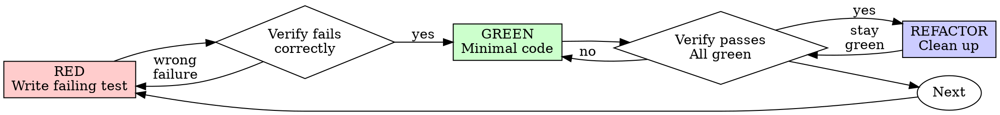

# Codex conversation 019f460c

> This archive contains visible conversation activity and tool records. Private model reasoning and system/developer instructions are not available here.
<!-- codex-event:{"kind":"state","timestamp":"2026-07-09T08:43:55.182Z","phase":null} -->
## Task state: task_started · 2026-07-09T08:43:55.182Z

```text
{
  "type": "task_started",
  "turn_id": "019f460c-3d83-7d80-899c-9d9898ca8a6c",
  "started_at": 1783586635,
  "model_context_window": 258400,
  "collaboration_mode_kind": "default"
}
```

<!-- /codex-event -->

<!-- codex-event:{"kind":"user","timestamp":"2026-07-09T08:43:55.191Z","phase":null} -->
## User · 2026-07-09T08:43:55.191Z

# Files mentioned by the user:

## Photo 1.jpg: /tmp/codex-remote-attachments/019f460c-3922-76d3-9e97-51ccf65c3def/7234e5b0-1664-4d86-97a9-884929c9a682/1-Photo-1.jpg

## My request for Codex:

In its final output, the agent gives me references to files. These should be automatically detected and linked so I can click on those files and they open 

You can see they're in between `


<!-- /codex-event -->

<!-- codex-event:{"kind":"progress","timestamp":"2026-07-09T08:44:06.421Z","phase":"commentary"} -->
## Codex progress · 2026-07-09T08:44:06.421Z

I’ll inspect the app’s message rendering path and add automatic clickable links for file paths in agent output. I’m using the React and testing guidance for this frontend change.

<!-- /codex-event -->

<!-- codex-event:{"kind":"tool-call","timestamp":"2026-07-09T08:44:06.428Z","phase":null} -->
## Tool call: exec_command · 2026-07-09T08:44:06.428Z

```json
{
  "cmd": "sed -n '1,240p' /Users/masterman/.agents/skills/using-ultrapowers/SKILL.md",
  "workdir": "/Users/masterman/NLP/omniharness",
  "yield_time_ms": 1000,
  "max_output_tokens": 20000
}
```

<!-- /codex-event -->

<!-- codex-event:{"kind":"tool-call","timestamp":"2026-07-09T08:44:06.428Z","phase":null} -->
## Tool call: exec_command · 2026-07-09T08:44:06.428Z

```json
{
  "cmd": "sed -n '1,240p' /Users/masterman/.agents/skills/building-react-apps/SKILL.md",
  "workdir": "/Users/masterman/NLP/omniharness",
  "yield_time_ms": 1000,
  "max_output_tokens": 20000
}
```

<!-- /codex-event -->

<!-- codex-event:{"kind":"tool-call","timestamp":"2026-07-09T08:44:06.428Z","phase":null} -->
## Tool call: exec_command · 2026-07-09T08:44:06.428Z

```json
{
  "cmd": "sed -n '1,220p' /Users/masterman/.agents/skills/test-driven-development/SKILL.md",
  "workdir": "/Users/masterman/NLP/omniharness",
  "yield_time_ms": 1000,
  "max_output_tokens": 20000
}
```

<!-- /codex-event -->

<!-- codex-event:{"kind":"tool-call","timestamp":"2026-07-09T08:44:06.433Z","phase":null} -->
## Tool call: exec_command · 2026-07-09T08:44:06.433Z

```json
{
  "cmd": "sed -n '1,220p' /Users/masterman/.agents/skills/verification-before-completion/SKILL.md",
  "workdir": "/Users/masterman/NLP/omniharness",
  "yield_time_ms": 1000,
  "max_output_tokens": 20000
}
```

<!-- /codex-event -->

<!-- codex-event:{"kind":"tool-result","timestamp":"2026-07-09T08:44:06.495Z","phase":null} -->
## Tool result: call_ojCCIuGHfr70QyB9kWctoHwK · 2026-07-09T08:44:06.495Z

```text
Chunk ID: 674472
Wall time: 0.0000 seconds
Process exited with code 0
Original token count: 2009
Output:
---
name: using-ultrapowers
description: Use when starting any conversation - establishes how to find and use skills, requiring skill invocation before acting
---

<SUBAGENT-STOP>
If you were dispatched as a subagent to execute a specific task, skip this skill.
</SUBAGENT-STOP>

# Using Ultrapowers

Use relevant skills before acting, but keep process proportional to the task.

## Instruction Priority

1. User instructions and local repo instructions
2. Ultrapowers skills
3. Default model behavior

If the user says not to create extra repository isolation, or says to work directly in the current repository, follow that instruction.

## Core Rule

Before responding, ask:

1. Is there a process skill that governs how to approach this?
2. Is there an implementation skill that governs how to execute it?
3. Is the request substantial enough to justify that process, or is it a tiny mechanical edit?

If a skill applies and the task is substantial enough to justify it, use it before continuing. If the request is a tiny mechanical edit, make the edit directly with targeted verification.

## Proportional Skill Use

Do the smallest responsible workflow that matches the request.

For tiny, unambiguous mechanical edits, do the edit directly:

- changing a color value,
- fixing a typo,
- tweaking short copy,
- changing a prompt sentence,
- renaming a label,
- adjusting obvious spacing or formatting,
- making a one-line config or docs correction.

For these, do not run brainstorming, write a plan, or force TDD unless the change affects product behavior, data, persistence, control flow, user journeys, or non-obvious architecture.

Use the heavier process when the request is ambiguous, user-facing behavior changes, multiple files/modules are involved, the user journey can change, or the change could create regressions that are not obvious from a quick targeted check.

## Default Posture

- Work in the current repository by default.
- YOU WILL NEVER CREATE A BRANCH unless explicitly instructed.
- Ask the user whether we should work in worktrees as part of the planning.
- YOU WILL ONLY CREATE A WORKTREE if explicitly instructed.
- Keep skill use proportional. Tiny mechanical edits should stay tiny.
- Every project should have a `.gitignore`.
- Never commit or push secrets, credentials, local environment files, `node_modules`, dependency caches, build outputs, coverage output, logs, temporary files, or intermediate/generated artifacts unless the human explicitly asks to version a specific generated artifact.
- Deliver full product functionality by default. NO FAKE COMPONENTS, NO MOCKS, NO PLACEHOLDERS, NO FALLBACKS as substitutes for the requested functionality unless the human explicitly asks for a prototype or scaffold.
- For app, UI, and product-surface work, run a PM pass during planning. Treat it as mandatory default behavior, not optional polish.
- For app, UI, and product-surface work, consider `agentic-user-journey-testing` for important user stories, but do not run it without explicit user approval.
- Use `second-opinion` for substantial saved implementation plans, and for unusually hard, creative, high-risk, or architecture-heavy specs when an independent external review could improve the artifact. Prefer a different available coding harness for that review, such as Codex asking Claude Code or Claude Code asking Codex. If no different harness is available, the same harness is fine; the second opinion is still mandatory for matching artifacts.
- Refactor code when a file passes 1200 lines. Do not normalize oversized files as the default end state.
- Use user stories in specs and plans when they clarify behavior or value.
- Default UI work to `shadcn/ui` unless the user says otherwise.
- For any dashboard, admin surface, product UI, SaaS app, internal tool, settings-heavy app, data table view, auth flow, sidebar layout, or React/Next.js web app UI, use `start-from-blocks` before designing or implementing. Start by installing or copying the closest fitting official shadcn Block, then adapt it. No vibed dashboard/web-app design from blank files.
- Before adding any individual UI control, check whether `shadcn/ui` already provides a control that does what is needed. Use the available shadcn control first, then customize it, instead of hand-building a one-off control.
- Treat desktop and mobile responsiveness as first-class from the beginning.
- Prefer explicit routing unless the framework strongly defaults to file-based routes.
- For React apps, use `building-react-apps` for state managers, explicit transitions, routing, refs, imports, package-manager defaults, and frontend configuration defaults.
- For React apps with server state, optimistic UI, caches, polling, SSE/WebSocket streams, background jobs, persistence, or client/server synchronization, use `client-server-state-invariants` during planning and verification.
- For React or Next.js slowness, root-load, compile-time, SSR/hydration, bundle, import-bloat, or UI dependency cleanup work, use `optimizing-react-next-apps`.
- Prefer strong instrumentation and auditability for backend behavior.
- When a project has backend or agent workflows, prefer a fully instrumented control plane: persist meaningful events, tool calls, actions, results, errors, and state transitions, and expose them through a CLI or other scriptable interface so the full system can be inspected and tested without the UI.
- Use `instrumenting-control-planes` when building, planning, reviewing, or debugging backend decisions, agent workflows, recovery paths, retries, deletes, long-running jobs, SSE/WebSocket streams, or user-visible failures.
- Use `learning-from-bugs` after diagnosing or fixing meaningful architecture, storage, memory, persistence, control-plane, or system-level bugs so reusable lessons become durable.
- Do not default to silent, masked, or over-abstracted errors.
- When a project has a frontend, prefer surfacing full backend error details and stack traces to the frontend so failures stay visible, debuggable, and testable end-to-end.
- Treat persistence of settings and preferences as explicit design work.
- For every meaningful UI setting, define whether it persists, where it is stored, how it is read and written, who owns it, and how reset, sync, migration, and testing are handled.

See `docs/ultrapowers-defaults.md` for the canonical fork defaults.

## Skill Priority

1. Process skills first
2. Implementation skills second

Examples:

- "Make this button blue" -> inspect the relevant file, make the small edit, do targeted verification
- "Update this prompt sentence" -> edit the prompt directly and verify the final text
- "Build a feature" -> `brainstorming` with a PM pass first, then `writing-plans`, then execution; consider approval-gated `agentic-user-journey-testing` for app workflows
- "Fix this bug" -> `systematic-debugging`, then the relevant implementation skill; if the root cause is meaningful or systemic, finish with `learning-from-bugs`
- "Review this change" -> `requesting-code-review`

## Examples Of User Override

- If a task feels risky and the user did not ask for extra repository isolation, keep working in the current repository unless the user explicitly instructs otherwise.
- If a stack supports file-based routing but the user says not to use it, choose an explicit routing approach instead.
- If a framework strongly defaults to file-based routing, such as Next.js App Router, use the framework-native routing model unless there is a good reason not to.
- If a frontend skill suggests `shadcn/ui` but the user wants another design system, follow the user.

## Red Flags

- "I need a whole workflow for this tiny edit" -> no. Use the smallest responsible process.
- "This is simple, so I need the whole process anyway" -> no. Tiny mechanical edits should stay tiny.
- "I'll create extra repository isolation just to be safe" -> forbidden unless the user clearly asked for it.
- "I already know the skill" -> read the current version before relying on it

```

<!-- /codex-event -->

<!-- codex-event:{"kind":"tool-result","timestamp":"2026-07-09T08:44:06.501Z","phase":null} -->
## Tool result: call_CP4A3T8K568WHDYBnGjD95Mg · 2026-07-09T08:44:06.501Z

```text
Chunk ID: 95ff7b
Wall time: 0.0000 seconds
Process exited with code 0
Original token count: 2034
Output:
---
name: building-react-apps
description: Use when building, refactoring, planning, or debugging React or Next.js apps, React components, hooks, routing, frontend state, SSR, hydration, bundles, imports, or UI settings
---

# Building React Apps

Use these defaults for React app work unless the user or existing codebase explicitly chooses another architecture.

If the work is specifically about slowness, root-load time, compile time, SSR effectiveness, hydration cost, bundle size, import bloat, or decluttering heavy UI dependencies, use `optimizing-react-next-apps` as the focused workflow.

If the app has server state, optimistic UI, caches, polling, SSE/WebSocket streams, background jobs, persisted runtime state, or client/server synchronization, use `client-server-state-invariants` before planning or changing the state model.

## UI Starting Point

- For new React app screens, forms, and major surfaces, use `shadcn/ui` unless the user or existing app has chosen another design system.
- Before inventing layout, inspect the available ShadCN Blocks at https://ui.shadcn.com/blocks for the specific screen or form category.
- Start from the closest matching block with `npx shadcn add <block-name>` or the official source in https://github.com/shadcn-ui/ui, then add, remove, and adapt controls to fit the product.
- Do not use a blank custom layout as the first implementation path when a relevant ShadCN Block exists.
- Before adding any individual control, check whether `shadcn/ui` already provides a suitable control. Use/customize the shadcn control before hand-building a one-off control.

## State And Data

- Always centralize React app state in global single-source-of-truth Manager classes.
- Components, hooks, and listeners subscribe to Manager updates and use Manager methods to update data.
- Centralized state does not mean broad subscriptions. Components must subscribe to the smallest slice they need, preferably with selector hooks and equality checks, so unrelated UI does not re-render.
- Never let app shells, page roots, sidebars, timelines, or other broad containers subscribe to an entire high-churn Manager snapshot when they only need stable fields. Draft text, cursors, hover/open state, search text, and other per-keystroke or per-pointer state need narrow component-level subscriptions.
- If typing in an input, moving a cursor, toggling a hover/open flag, or editing a small draft makes the whole app repaint, the subscription boundary is wrong even if the data source is centralized.
- Always implement a custom data manager for any app data structure.
- Never use separate state variables or arrays as the source of truth.
- Never send data around in transactions. Pass intent, ids, commands, or Manager method calls instead.

## React Control Flow

- Avoid using `useEffect()` to update state. Prefer `useCallback()` handlers or Manager methods for explicit state transitions.
- Work ahead of time to avoid callback hell, race conditions, and infinite loops.
- When debugging React and a fix does not work, explicitly consider whether the root cause is a race condition. Race conditions are common in React.
- Every async callback, mutation result, timer, poll, or stream message that can update visible state must prove it still owns the current context before mutating Managers or navigation.
- Use `RefObject` instead of `MutableRefObject`.

## Routing And Modules

- Prefer explicit routing over file-based routing when the framework does not strongly default to file-based routes. Framework-native file routing, such as Next.js App Router, is fine.
- Never use `require()` to import modules. Use `import` instead.
- Avoid `npm` by default. Use `pnpm` for package installation, scripts, and lockfiles unless the user or existing project explicitly chooses another package manager.

## Next.js And SSR Defaults

- Treat `"use client"` as a boundary with a cost. Do not put an entire page, app shell, sidebar, timeline, composer, settings surface, and data boot path behind one giant client component unless there is a deliberate reason.
- SSR is only useful if the initial HTML contains meaningful above-the-fold UI or data. If `curl` for the route only shows a boot shell, script payloads, or empty placeholders, the route is not meaningfully server-rendered even if SSR is technically enabled.
- Server-render the first useful screen by fetching route-stable bootstrap data on the server: auth/session state, settings needed to choose the shell, selected route ids, and initial page/snapshot data. Hydrate Managers or query caches from that bootstrap data; do not wait for client `useEffect()` plus client fetches before the first meaningful paint.
- Use client effects for browser-only concerns: localStorage-only preferences, notifications, SSE/WebSocket subscriptions, focus management, and post-paint refreshes. Do not use effects as the only path for data required to decide what the initial screen is.
- In Next dev, first request time includes compilation. Distinguish cold compile cost from runtime slowness before optimizing the wrong layer.

## Import And Bundle Hygiene

- Keep imports proportional to the UI being rendered. Do not import an entire complex surface for a tiny control; split shared tiny controls into their own files instead of importing them from heavy feature modules.
- Lazy-load rarely opened or route-conditional surfaces with dynamic imports: settings dialogs, side panels, file viewers, terminals, worker inspectors, onboarding flows, QR/pairing dialogs, and large markdown/code viewers.
- Avoid package and barrel imports that drag in whole icon packs, design systems, syntax highlighters, markdown stacks, charting libraries, or component suites for one glyph or one primitive. Inline small SVG paths or use local assets when that is cheaper and stable.
- Prefer native browser controls for small, ordinary selects and pickers. Do not import a popover/dialog/menu stack for a low-value dropdown unless search, virtualization, or rich item rendering is genuinely needed.
- Use subpath imports when a package supports them. Avoid root package imports from large UI libraries if a narrower entrypoint exists.
- After dependency or UI-shell changes, inspect the emitted dev chunks or traces. Verify whether heavy modules moved out of the root chunk rather than assuming dynamic import worked.

## Performance Debugging

- Start with evidence: dev server logs, route timings, emitted chunk sizes, module counts, and initial HTML content.
- Separate long-lived requests from slow requests. SSE, streaming, and hanging fetches can show huge durations in logs without blocking page paint.
- Check recent dependency additions first when compile time suddenly explodes. A single icon, markdown, chart, or UI package can add thousands of modules.
- For Next.js root-load complaints, answer three questions before changing code: what compiled, what HTML was returned, and what client-side requests gated the first useful paint?

## Frontend Configuration

- Never store frontend string literals or UI settings in `.env` files.
- Put frontend strings and settings in normal source files, inline arrays, or `.json` files so they remain reviewable, testable, and versioned with the UI.

## Internationalization

- For meaningful React UI work, offer language support as an option when the user has not already decided: "Should we support other languages? If yes, I will wire user-facing copy through i18n resources now instead of hardcoding strings."
- If the user says yes, asks for translation/i18n/language/locale support, or reports that language switching only updates part of the UI, use `implementing-react-i18n`.
- Use the i18n library's `t("key", params?)` function for every user-facing string. Use `useI18nSnapshot()` only to subscribe React components so language changes repaint.
- Never name variables with locale codes or locale-like names such as `it`, `en`, `enUS`, `locIt`, or `locEnUs`.

## Settings UI

- For settings dialogs, preferences panels, configuration modals, option tabs, or UI settings surfaces, use `designing-settings-dialogs`.

```

<!-- /codex-event -->

<!-- codex-event:{"kind":"tool-result","timestamp":"2026-07-09T08:44:06.505Z","phase":null} -->
## Tool result: call_LgCMpOkDVlfNWQI5EmhKpcrt · 2026-07-09T08:44:06.505Z

````text
Chunk ID: 370e37
Wall time: 0.0000 seconds
Process exited with code 0
Original token count: 1448
Output:
---
name: test-driven-development
description: Use when implementing any feature or bugfix, before writing implementation code
---

# Test-Driven Development (TDD)

## Overview

Write the test first. Watch it fail. Write minimal code to pass.

**Core principle:** If you didn't watch the test fail, you don't know if it tests the right thing.

**Violating the letter of the rules is violating the spirit of the rules.**

## When to Use

**Always:**
- New features
- Bug fixes
- Refactoring
- Behavior changes

**Exceptions (ask your human partner):**
- Throwaway prototypes
- Generated code
- Configuration files

**Do directly with targeted verification:**
- tiny color, spacing, copy, or label changes,
- one-line prompt wording changes,
- docs-only wording changes,
- mechanical edits where the expected result is obvious from the diff.

Do not perform a full red-green cycle for a tiny mechanical edit unless it changes behavior or there is a real regression risk. For example, changing a button from gray to blue usually needs the edit plus a targeted visual or code check, not a new failing test.

Thinking "skip TDD just this once"? Stop. That's rationalization.

## UI-Specific Note

When the task is UI work, choose the design system and starting block before writing tests around the intended behavior and rendering. In Ultrapowers, that means `shadcn/ui` plus the closest available ShadCN Block for each new screen, form, or major surface unless the user says otherwise. Inspect https://ui.shadcn.com/blocks first, install or copy the selected block, and then adapt it. Before adding any individual control, check whether `shadcn/ui` already provides a suitable control and use/customize that control first.

For important app workflows, also consider whether `agentic-user-journey-testing` should be proposed. Do not run that higher-cost black-box test mode without explicit user approval.

## The Iron Law

```
NO PRODUCTION CODE WITHOUT A FAILING TEST FIRST
```

Write code before the test? Delete it. Start over.

**No exceptions:**
- Don't keep it as "reference"
- Don't "adapt" it while writing tests
- Don't look at it
- Delete means delete

Implement fresh from tests. Period.

## Red-Green-Refactor



### RED - Write Failing Test

Write one minimal test showing what should happen.

<Good>
```typescript
test('retries failed operations 3 times', async () => {
  let attempts = 0;
  const operation = () => {
    attempts++;
    if (attempts < 3) throw new Error('fail');
    return 'success';
  };

  const result = await retryOperation(operation);

  expect(result).toBe('success');
  expect(attempts).toBe(3);
});
```
Clear name, tests real behavior, one thing
</Good>

<Bad>
```typescript
test('retry works', async () => {
  const mock = jest.fn()
    .mockRejectedValueOnce(new Error())
    .mockRejectedValueOnce(new Error())
    .mockResolvedValueOnce('success');
  await retryOperation(mock);
  expect(mock).toHaveBeenCalledTimes(3);
});
```
Vague name, tests mock not code
</Bad>

**Requirements:**
- One behavior
- Clear name
- Real code (no mocks unless unavoidable)
- Real product behavior is the target. Mocked behavior can never be the final deliverable or proof that the feature works.

### Verify RED - Watch It Fail

**MANDATORY. Never skip.**

```bash
npm test path/to/test.test.ts
```

Confirm:
- Test fails (not errors)
- Failure message is expected
- Fails because feature missing (not typos)

**Test passes?** You're testing existing behavior. Fix test.

**Test errors?** Fix error, re-run until it fails correctly.

### GREEN - Minimal Code

Write simplest code to pass the test.

<Good>
```typescript
async function retryOperation<T>(fn: () => Promise<T>): Promise<T> {
  for (let i = 0; i < 3; i++) {
    try {
      return await fn();
    } catch (e) {
      if (i === 2) throw e;
    }
  }
  throw new Error('unreachable');
}
```
Just enough to pass
</Good>

<Bad>
```typescript
async function retryOperation<T>(
  fn: () => Promise<T>,
  options?: {
    maxRetries?: number;
    backoff?: 'linear' | 'exponential';
    onRetry?: (attempt: number) => void;
  }
): Promise<T> {
  // YAGNI
}
```
Over-engineered
</Bad>

Don't add features, refactor other code, or "improve" beyond the test.

### Verify GREEN - Watch It Pass

**MANDATORY.**

```bash
npm test path/to/test.test.ts
```

Confirm:
- Test passes
- Other tests still pass
- Output pristine (no errors, warnings)

**Test fails?** Fix code, not test.

**Other tests fail?** Fix now.

### REFACTOR - Clean Up

After green only:
- Remove duplication
- Improve names
- Extract helpers

Keep tests green. Don't add behavior.

### Repeat

Next failing test for next feature.

## Good Tests

| Quality | Good | Bad |
|---------|------|-----|
| **Minimal** | One thing. "and" in name? Split it. | `test('validates email and domain and whitespace')` |
| **Clear** | Name describes behavior | `test('test1')` |
| **Shows intent** | Demonstrates desired API | Obscures what code should do |


````

<!-- /codex-event -->

<!-- codex-event:{"kind":"tool-result","timestamp":"2026-07-09T08:44:06.506Z","phase":null} -->
## Tool result: call_fFBml8fP5TGMGa0gJEZmeRzD · 2026-07-09T08:44:06.506Z

````text
Chunk ID: 5c0947
Wall time: 0.0000 seconds
Process exited with code 0
Original token count: 2230
Output:
---
name: verification-before-completion
description: Use when about to claim work is complete, fixed, or passing, before committing or creating PRs - requires running verification commands and confirming output before making any success claims; evidence before assertions always
---

# Verification Before Completion

## Overview

Claiming work is complete without verification is dishonesty, not efficiency.

**Core principle:** Evidence before claims, always.

**Violating the letter of this rule is violating the spirit of this rule.**

## The Iron Law

```
NO COMPLETION CLAIMS WITHOUT FRESH VERIFICATION EVIDENCE
```

If you haven't run the verification command in this message, you cannot claim it passes.

## The Gate Function

```
BEFORE claiming any status or expressing satisfaction:

1. IDENTIFY: What command proves this claim?
2. RUN: Execute the FULL command (fresh, complete)
3. READ: Full output, check exit code, count failures
4. VERIFY: Does output confirm the claim?
   - If NO: State actual status with evidence
   - If YES: State claim WITH evidence
5. ONLY THEN: Make the claim

Skip any step = lying, not verifying
```

## Product-Surface Verification

When the work involves an app, UI, or product surface, verification must cover more than whether a single requested feature works.

Keep verification proportional. For tiny mechanical edits, targeted verification is enough: inspect the diff, confirm the changed value/text, and run only the smallest relevant check. Do not escalate to full product-surface verification unless the change can affect behavior, state, navigation, persistence, or the user journey.

Also verify:

- required functionality is real end-to-end, not a fake component, mock, placeholder, canned response, or fallback path,
- the primary user stories are actually supported,
- the primary user journey works end-to-end,
- any approved agentic user journey tests have been run, or clearly state that they were proposed but not run because approval was not given,
- return/revisit flows work when they are part of the product,
- expected empty states are present,
- expected loading, waiting, or in-progress states are visible,
- expected error and recovery states are present,
- expected completed or success states are understandable,
- expected status-awareness flows are present,
- the state model is represented correctly,
- React/server-state invariants are verified when the app uses server state, optimistic UI, caches, polling, streams, background jobs, or persisted runtime state,
- persistence behavior for settings, preferences, drafts, and other user-managed state matches the approved design,
- operational readiness expectations are met for the approved scope,
- instrumentation and observability exist where the approved scope depends on them,
- backend or agent workflow decisions emit the planned named events, and a headless/scriptable check can assert the event sequence without relying on UI snapshots,
- real errors are surfaced rather than silently swallowed or replaced with vague placeholders,
- onboarding and discoverability work for first-run or empty-state use,
- risk and trust surfaces are handled well enough to avoid silent failure, ambiguous state, or obvious loss of confidence,
- when the scope includes a frontend/backend boundary, frontend-visible failures preserve the real error details and stack traces expected by the approved design,
- baseline expected v1 surfaces and inferred behaviors from the approved story set, spec, or plan are actually present.

When the scope includes settings or preferences, also verify:

- each meaningful setting persists or does not persist exactly as designed,
- the storage location and ownership model match the approved plan,
- refresh, restart, sign-out, reset, and migration behavior work as intended for the approved scope,
- settings dialogs avoid redundant section titles, subtitles, explanatory filler, and decorative chrome that does not help the user make a decision.

Do not confuse "the requested control exists" with "the product is usable."

For app, UI, and product-surface work, consider whether an agentic user journey test is the right proof. This mode is approval-gated because it can spend significant tokens: propose it when useful, but only run it if the user explicitly approves.

## Common Failures

| Claim | Requires | Not Sufficient |
|-------|----------|----------------|
| Tests pass | Test command output: 0 failures | Previous run, "should pass" |
| Linter clean | Linter output: 0 errors | Partial check, extrapolation |
| Build succeeds | Build command: exit 0 | Linter passing, logs look good |
| Bug fixed | Test original symptom: passes | Code changed, assumed fixed |
| Meaningful system bug fixed | Learning note plus verification | Fix committed with no durable lesson |
| React/server state sync works | Stale-response, merge, event-sequence, and ownership tests relevant to the change | UI looked right once |
| Regression test works | Red-green cycle verified | Test passes once |
| Agent completed | VCS diff shows changes | Agent reports "success" |
| Requirements met | Line-by-line checklist | Tests passing |
| Feature complete | Real end-to-end behavior in the product | Mocked component, canned data, placeholder UI, fallback path |

## Red Flags - STOP

- Using "should", "probably", "seems to"
- Expressing satisfaction before verification ("Great!", "Perfect!", "Done!", etc.)
- About to commit/push/PR without verification
- Trusting agent success reports
- Accepting "validated with mocks" or "placeholder works" as completion
- Relying on partial verification
- Thinking "just this once"
- Tired and wanting work over
- **ANY wording implying success without having run verification**

## Rationalization Prevention

| Excuse | Reality |
|--------|---------|
| "Should work now" | RUN the verification |
| "I'm confident" | Confidence ≠ evidence |
| "Just this once" | No exceptions |
| "Linter passed" | Linter ≠ compiler |
| "Agent said success" | Verify independently |
| "I'm tired" | Exhaustion ≠ excuse |
| "Partial check is enough" | Partial proves nothing |
| "Different words so rule doesn't apply" | Spirit over letter |

## Key Patterns

**Tests:**
```
✅ [Run test command] [See: 34/34 pass] "All tests pass"
❌ "Should pass now" / "Looks correct"
```

**Regression tests (TDD Red-Green):**
```
✅ Write → Run (pass) → Revert fix → Run (MUST FAIL) → Restore → Run (pass)
❌ "I've written a regression test" (without red-green verification)
```

**Build:**
```
✅ [Run build] [See: exit 0] "Build passes"
❌ "Linter passed" (linter doesn't check compilation)
```

**Requirements:**
```
✅ Re-read plan → Create checklist → Verify each → Report gaps or completion
❌ "Tests pass, phase complete"
```

**Agent delegation:**
```
✅ Agent reports success → Check VCS diff → Verify changes → Report actual state
❌ Trust agent report
```

## Why This Matters

From 24 failure memories:
- your human partner said "I don't believe you" - trust broken
- Undefined functions shipped - would crash
- Missing requirements shipped - incomplete features
- Time wasted on false completion → redirect → rework
- Violates: "Honesty is a core value. If you lie, you'll be replaced."

## When To Apply

**ALWAYS before:**
- ANY variation of success/completion claims
- ANY expression of satisfaction
- ANY positive statement about work state
- Committing, PR creation, task completion
- Staging, committing, pushing, or opening a PR when the work could include secrets, local environment files, dependencies, caches, build outputs, logs, temporary files, or generated/intermediate artifacts
- Moving to next task
- Delegating to agents

When a meaningful bug involved architecture, storage, memory, persistence, control planes, background workers, recovery, data loss, security, or a repeated wrong assumption, use `ultrapowers:learning-from-bugs` before claiming the fix is complete.

When a React app has server state, optimistic UI, caches, polling, SSE/WebSocket streams, background jobs, or persisted runtime state, use `ultrapowers:client-server-state-invariants` to decide which race and synchronization tests are required before claiming completion.

Before any git publish step, verify `.gitignore` exists for the project and that `git status` does not include secrets, credentials, local environment files, `node_modules`, dependency caches, build outputs, coverage output, logs, temporary files, or intermediate/generated artifacts unless the human explicitly asked to version a specific generated artifact.

**Rule applies to:**
- Exact phrases
- Paraphrases and synonyms
- Implications of success
- ANY communication suggesting completion/correctness

## The Bottom Line

**No shortcuts for verification.**

Run the command. Read the output. THEN claim the result.

This is non-negotiable.

````

<!-- /codex-event -->

<!-- codex-event:{"kind":"progress","timestamp":"2026-07-09T08:44:13.491Z","phase":"commentary"} -->
## Codex progress · 2026-07-09T08:44:13.491Z

I’m going to find where final agent messages are rendered, then write a focused failing test around turning those file references into clickable links. After that I’ll make the smallest rendering change needed to pass it.

<!-- /codex-event -->

<!-- codex-event:{"kind":"tool-call","timestamp":"2026-07-09T08:44:13.498Z","phase":null} -->
## Tool call: exec_command · 2026-07-09T08:44:13.498Z

```json
{
  "cmd": "rg -n \"Terminal|WorkerEntriesManager|markdown|Markdown|message|entries\" src app components tests --glob '!node_modules'",
  "workdir": "/Users/masterman/NLP/omniharness",
  "yield_time_ms": 1000,
  "max_output_tokens": 20000
}
```

<!-- /codex-event -->

<!-- codex-event:{"kind":"tool-call","timestamp":"2026-07-09T08:44:13.498Z","phase":null} -->
## Tool call: exec_command · 2026-07-09T08:44:13.498Z

```json
{
  "cmd": "rg --files | rg '(Terminal|WorkerEntries|Message|markdown|Markdown|locale|test|vitest|jest)'",
  "workdir": "/Users/masterman/NLP/omniharness",
  "yield_time_ms": 1000,
  "max_output_tokens": 20000
}
```

<!-- /codex-event -->

<!-- codex-event:{"kind":"tool-call","timestamp":"2026-07-09T08:44:13.498Z","phase":null} -->
## Tool call: exec_command · 2026-07-09T08:44:13.498Z

```json
{
  "cmd": "ls",
  "workdir": "/Users/masterman/NLP/omniharness",
  "yield_time_ms": 1000,
  "max_output_tokens": 12000
}
```

<!-- /codex-event -->

<!-- codex-event:{"kind":"tool-call","timestamp":"2026-07-09T08:44:13.519Z","phase":null} -->
## Tool call: exec_command · 2026-07-09T08:44:13.519Z

```json
{
  "cmd": "git status --short",
  "workdir": "/Users/masterman/NLP/omniharness",
  "yield_time_ms": 1000,
  "max_output_tokens": 12000
}
```

<!-- /codex-event -->

<!-- codex-event:{"kind":"tool-result","timestamp":"2026-07-09T08:44:13.607Z","phase":null} -->
## Tool result: call_pejBF2FWnknm6dyXF7FJaD45 · 2026-07-09T08:44:13.607Z

```text
Chunk ID: 87ecd5
Wall time: 0.0000 seconds
Process exited with code 2
Original token count: 129650
Output:
Warning: truncated output (original token count: 129650)
Total output lines: 4889

rg: app: No such file or directory (os error 2)
rg: components: No such file or directory (os error 2)
tests/supervisor/wake-schedule.test.ts:10:  messages,
tests/supervisor/wake-schedule.test.ts:73:    await db.delete(messages);
tests/supervisor/worker-failover.test.ts:172:    const entries = await readWorkerOutputEntries(runId, result.newWorkerId);
tests/supervisor/worker-failover.test.ts:173:    expect(entries.some((entry) =>
tests/supervisor/wake.test.ts:10:  messages,
tests/supervisor/wake.test.ts:79:    await db.delete(messages);
tests/supervisor/wake.test.ts:126:    const runMessages = await db.select().from(messages).where(eq(messages.runId, runId));
tests/supervisor/wake.test.ts:130:    expect(runMessages.some((message) => message.kind === "error")).toBe(false);
tests/supervisor/context.test.ts:6:import { executionEvents, messages, plans, runs, workerCounters, workers } from "@/server/db/schema";
tests/supervisor/context.test.ts:18:    await db.delete(messages);
tests/supervisor/context.test.ts:51:    await db.insert(messages).values({
tests/supervisor/context.test.ts:67:  it("includes supervisor-authored user messages in the next conversation history", async () => {
tests/supervisor/context.test.ts:88:    await db.insert(messages).values([
tests/vscode/bridge.test.ts:42:  it("rejects unknown bridge messages with a typed error", async () => {
tests/vscode/bridge.test.ts:53:        code: "vscode.bridge.unknown_message",
tests/vscode/bridge.test.ts:54:        message: "Unknown VS Code bridge message: unknown.",
tests/vscode/bridge.test.ts:142:        postMessage: (message) => posted.push(message),
tests/supervisor/conversation-bootstrap.test.ts:17:  it("falls back to the plan content when no persisted user messages exist", () => {
tests/supervisor/model-config.test.ts:125:  it("fails with a clear recovery message when the supervisor key cannot be decrypted", () => {
tests/supervisor/model-config.test.ts:133:  it("fails with a clear setup message when no usable API key is configured", () => {
tests/supervisor/worker-failover-spawn-retry.test.ts:55:    await db.delete(schema.messages);
tests/supervisor/worker-failover-no-replacement.test.ts:48:    await db.delete(schema.messages);
tests/supervisor/observer.test.ts:5:import { executionEvents, messages, plans, runs, workerCounters, workers } from "@/server/db/schema";
tests/supervisor/observer.test.ts:22:import { deriveWorkerTerminalProcesses } from "@/lib/worker-terminal-processes";
tests/supervisor/observer.test.ts:32:    await db.delete(messages);
tests/supervisor/observer.test.ts:625:      message: "Which option should I use?",
tests/supervisor/observer.test.ts:859:    const runMessages = await db.select().from(messages).where(eq(messages.runId, runId));
tests/supervisor/observer.test.ts:863:    expect(runMessages.some((message) => message.content.includes("agent runtime is not running"))).toBe(true);
tests/supervisor/observer.test.ts:906:    const runMessages = await db.select().from(messages).where(eq(messages.runId, runId));
tests/supervisor/observer.test.ts:916:    expect(runMessages.some((message) => message.content.includes("Worker launched outside run project directory"))).toBe(true);
tests/supervisor/observer.test.ts:962:    const runMessages = await db.select().from(messages).where(eq(messages.runId, runId));
tests/supervisor/observer.test.ts:967:    expect(runMessages.some((message) => message.kind === "error")).toBe(false);
tests/supervisor/observer.test.ts:1162:        type: "message",
tests/supervisor/observer.test.ts:1173:    const entries = await readWorkerOutputEntries(runId, workerId);
tests/supervisor/observer.test.ts:1178:    expect(entries.some((entry) => entry.text === "editing files")).toBe(true);
tests/supervisor/observer.test.ts:1227:    const runMessages = await db.select().from(messages).where(eq(messages.runId, runId));
tests/supervisor/observer.test.ts:1231:    expect(runMessages.some((message) => message.content.includes("write EPIPE"))).toBe(true);
tests/supervisor/observer.test.ts:1281:    const runMessages = await db.select().from(messages).where(eq(messages.runId, runId));
tests/supervisor/observer.test.ts:1286:    expect(runMessages.some((message) => message.kind === "error")).toBe(false);
tests/supervisor/observer.test.ts:1332:    const runMessages = await db.select().from(messages).where(eq(messages.runId, runId));
tests/supervisor/observer.test.ts:1337:    expect(runMessages.some((message) => message.content.includes("stderrBuffer was missing or not an array"))).toBe(true);
tests/supervisor/observer.test.ts:2642:      new Error('Spawn failed: failed to start codex agent via codex-acp: {"code":-32602,"message":"Invalid params","data":"session not found"}'),
tests/supervisor/observer.test.ts:2697:      new Error('Spawn failed: failed to start gemini agent via gemini: {"code":-32603,"message":"Internal error","data":{"details":"Failed to initialize chat: Failed to load resumed session data from file"}}'),
tests/supervisor/observer.test.ts:2812:    expect(deriveWorkerTerminalProcesses(persistedOutputEntries)[0]).toMatchObject({
src/vscode-extension/bridge.ts:9:  message: string;
src/vscode-extension/bridge.ts:32:  postMessage?: (message: VSCodeBridgeResponse) => void;
src/vscode-extension/bridge.ts:48:function bridgeError(request: VSCodeBridgeRequest, code: string, message: string, details?: unknown): VSCodeBridgeResponse {
src/vscode-extension/bridge.ts:53:    error: { code, message, surface: "vscode", details },
src/vscode-extension/bridge.ts:93:  return Object.fromEntries(Object.entries(headers).flatMap(([key, value]) => {
src/vscode-extension/bridge.ts:103:  for (const [key, value] of Object.entries(params)) {
src/vscode-extension/bridge.ts:125:  let event = "message";
src/vscode-extension/bridge.ts:139:      event = value || "message";
src/vscode-extension/bridge.ts:221:        headers: Object.fromEntries(response.headers.entries()),
src/vscode-extension/bridge.ts:229:      error instanceof Error ? error.message : String(error),
src/vscode-extension/bridge.ts:271:            error instanceof Error ? error.message : String(error),
src/vscode-extension/bridge.ts:289:      error instanceof Error ? error.message : String(error),
src/vscode-extension/bridge.ts:328:    "vscode.bridge.unknown_message",
src/vscode-extension/bridge.ts:329:    `Unknown VS Code bridge message: ${request.type}.`,
src/server/api-errors.ts:5:  message: string;
src/server/api-errors.ts:17:export function inferErrorSuggestion(message: string) {
src/server/api-errors.ts:18:  if (/agent runtime is not running/i.test(message) || /ACP bridge is not running/i.test(message) || /\bECONNREFUSED\b/i.test(message)) {
src/server/api-errors.ts:22:  if (/API key/i.test(message)) {
src/server/api-errors.ts:26:  if (/decrypt/i.test(message)) {
src/server/api-errors.ts:30:  if (/not found/i.test(message)) {
src/server/api-errors.ts:34:  if (/empty/i.test(message) || /required/i.test(message)) {
src/server/api-errors.ts:43:  options: Omit<AppErrorPayload, "message"> & { message?: string } = {},
src/server/api-errors.ts:45:  const message = options.message?.trim() || formatErrorMessage(error);
src/server/api-errors.ts:49:    message,
src/server/api-errors.ts:52:    suggestion: options.suggestion ?? inferErrorSuggestion(message),
src/server/api-errors.ts:60:  options: Omit<AppErrorPayload, "message"> & { message?: string; status?: number } = {},
src/server/api-errors.ts:66:  console.error(`[api-error ${status}] ${tag}: ${payload.message}${stack ? `\n${stack}` : ""}`);
src/ui/render-web.tsx:24:  root.textContent = t("boot.loading.message");
src/ui/render-web.tsx:35:    root.textContent = error instanceof Error ? error.message : String(error);
tests/supervisor/index.test.ts:8:import { clarifications, conversationReadMarkers, creditEvents, executionEvents, messages, planItems, planningReviewFindings, planningReviewRounds, planningReviewRuns, plans, processSessions, queuedConversationMessages, recoveryIncidents, runs, settings, supervisorInterventions, supervisorScheduledWakes, workerAssignments, workerCounters, workers } from "@/server/db/schema";
tests/supervisor/index.test.ts:143:    await db.delete(messages);
tests/supervisor/index.test.ts:189:      message: "Worker login state was detected.",
tests/supervisor/index.test.ts:262:    await db.insert(messages).values({
tests/supervisor/index.test.ts:283:    const persistedMessages = await db.select().from(messages).where(eq(messages.runId, runId)).orderBy(messages.createdAt);
tests/supervisor/index.test.ts:284:    expect(persistedMessages.map((message) => message.role)).toEqual(["user", "supervisor"]);
tests/supervisor/index.test.ts:385:  it("records supervisor waits without adding main conversation system messages", async () => {
tests/supervisor/index.test.ts:420:    const persistedMessages = await db.select().from(messages).where(eq(messages.runId, runId));
tests/supervisor/index.test.ts:464:    const persistedMessages = await db.select().from(messages).where(eq(messages.runId, runId));
tests/supervisor/index.test.ts:507:    const persistedMessages = await db.select().from(messages).where(eq(messages.runId, runId));
tests/supervisor/index.test.ts:521:  it("lets the supervisor send a generated user-visible message before ending its turn", async () => {
tests/supervisor/index.test.ts:543:    await db.insert(messages).values({
tests/supervisor/index.test.ts:553:      id: "tool-send-user-message",
tests/supervisor/index.test.ts:554:      name: "send_user_message",
tests/supervisor/index.test.ts:556:        message: supervisorReply,
tests/supervisor/index.test.ts:571:    const persistedMessages = await db.select().from(messages).where(eq(messages.runId, runId)).orderBy(messages.createdAt);
tests/supervisor/index.test.ts:573:    expect(persistedMessages.map((message) => message.role)).toEqual(["user", "supervisor"]);
tests/supervisor/index.test.ts:578:    const sentEvent = await db.select().from(executionEvents).where(eq(executionEvents.eventType, "supervisor_user_message_sent")).get();
tests/supervisor/index.test.ts:636:    expect(promptMessages.some((message) => message.content.includes("Prior supervision memory"))).toBe(true);
tests/supervisor/index.test.ts:637:    expect(promptMessages.map((message) => message.content).join("\n\n")).toContain(latestInstruction);
tests/supervisor/index.test.ts:800:    expect(await db.select().from(messages).where(eq(messages.runId, runId))).toEqual([]);
tests/supervisor/index.test.ts:975:    expect(await db.select().from(messages).where(eq(messages.runId, runId))).toEqual([]);
tests/supervisor/index.test.ts:1091:    const persistedMessages = await db.select().from(messages).where(eq(messages.runId, runId));
tests/supervisor/index.test.ts:1215:    const entries = await readWorkerOutputEntries(runId, workerId);
tests/supervisor/index.test.ts:1216:    const supervisorInputIndex = entries.findIndex((entry) => entry.type === "supervisor_input");
tests/supervisor/index.test.ts:1217:    const bridgeOutputIndex = entries.findIndex((entry) => entry.id === "bridge-output-1");
tests/supervisor/index.test.ts:2192:    const persistedMessages = await db.select().from(messages).where(eq(messages.runId, runId));
tests/supervisor/index.test.ts:2420:      .mockRejectedValueOnce(new Error('Spawn failed: failed to start gemini agent via gemini: {"code":-32603,"message":"Internal error","data":{"details":"Invalid session identifier \\"missing-session\\"."}}'))
tests/supervisor/index.test.ts:2507:      .mockRejectedValueOnce(new Error('Spawn failed: failed to start gemini agent via gemini: {"code":-32603,"message":"Internal error","data":{"details":"Failed to initialize chat: Failed to load resumed session data from file"}}'))
tests/supervisor/index.test.ts:2687:    const completionMessage = await db.select().from(messages).where(eq(messages.runId, runId)).get();
tests/supervisor/index.test.ts:2822:        reason: 'Spawn failed: failed to start gemini agent via gemini: {"code":-32000,"message":"Gemini API key is missing or not configured."}',
tests/supervisor/index.test.ts:2833:      message: "Gemini login state was detected.",
src/lib/conversation-state.ts:3:  messages: Array<{ runId: string; createdAt: string }>
src/lib/conversation-state.ts:7:  for (const message of messages) {
src/lib/conversation-state.ts:8:    if (message.runId !== runId) {
src/lib/conversation-state.ts:12:    if (!latest || new Date(message.createdAt).getTime() > new Date(latest).getTime()) {
src/lib/conversation-state.ts:13:      latest = message.createdAt;
src/lib/conversation-state.ts:43:  messages: Array<{ runId: string; createdAt: string }>
src/lib/conversation-state.ts:45:  const latestMessageAt = getRunLatestMessageTimestamp(run.id, messages);
src/runtime-api/vscode.ts:18:  postMessage(message: VSCodeRuntimeBridgeRequest): void;
src/runtime-api/vscode.ts:19:  addMessageListener(listener: (message: unknown) => void): () => void;
src/runtime-api/vscode.ts:37:  for (const [key, value] of Object.entries(params)) {
src/runtime-api/vscode.ts:53:    ? (body as { error?: { code?: unknown; message?: unknown; details?: unknown } }).error
src/runtime-api/vscode.ts:57:    message: typeof payload?.message === "string" ? payload.message : `Runtime request failed with HTTP ${response.status}.`,
src/runtime-api/vscode.ts:64:  if (error && typeof error === "object" && "message" in error) {
src/runtime-api/vscode.ts:67:      message: String((error as { message?: unknown }).message),
src/runtime-api/vscode.ts:73:    message: String(error),
src/runtime-api/vscode.ts:81:  function requestBridge(message: Omit<VSCodeRuntimeBridgeRequest, "id">): Promise<unknown> {
src/runtime-api/vscode.ts:98:            message: "VS Code bridge request failed.",
src/runtime-api/vscode.ts:111:          message: "VS Code bridge request timed out.",
src/runtime-api/vscode.ts:117:        options.transport.postMessage({ ...message, id });
src/runtime-api/vscode.ts:169:          const message = rawMessage as Partial<VSCodeRuntimeBridgeResponse>;
src/runtime-api/vscode.ts:170:          if (message.id !== id) {
src/runtime-api/vscode.ts:173:          if (message.type === "sse:event" && message.success) {
src/runtime-api/vscode.ts:174:            handlers.onEvent(message.data);
src/runtime-api/vscode.ts:177:          if (message.success === false) {
src/runtime-api/vscode.ts:178:            handlers.onError?.(message.error ?? {
src/runtime-api/vscode.ts:180:              message: "VS Code event stream failed.",
src/runtime-api/vscode.ts:213:        return post("/api/messages", input);
src/runtime-api/vscode.ts:218:        return request("GET", `/api/workers/${encodeURIComponent(input.workerId)}/entries${buildQuery({
src/runtime-api/types.ts:5:  message: string;
tests/supervisor/runtime-watchdog.test.ts:5:import { messages, plans, runs, settings, workerCounters } from "@/server/db/schema";
tests/supervisor/runtime-watchdog.test.ts:18:    await db.delete(messages);
tests/supervisor/runtime-watchdog.test.ts:80:    await db.insert(messages).values({
tests/supervisor/runtime-watchdog.test.ts:99:    const remainingMessages = await db.select().from(messages).where(eq(messages.runId, runId));
tests/supervisor/runtime-watchdog.test.ts:106:    expect(remainingMessages.filter((message) => message.kind === "error")).toHaveLength(0);
tests/supervisor/runtime-watchdog.test.ts:135:    await db.insert(messages).values({
tests/supervisor/runtime-watchdog.test.ts:148:    const remainingMessages = await db.select().from(messages).where(eq(messages.runId, runId));
tests/supervisor/runtime-watchdog.test.ts:153:    expect(remainingMessages.filter((message) => message.kind === "error")).toHaveLength(0);
src/server/projects/config.ts:221:        message: "Saved workspace target belongs to a different repository.",
src/runtime-api/web.ts:23:  for (const [key, value] of Object.entries(params)) {
src/runtime-api/web.ts:70:    ? (body as { error?: { code?: unknown; message?: unknown; details?: unknown; surface?: unknown } }).error
src/runtime-api/web.ts:72:  const message = typeof payload?.message === "string" ? payload.message : `Runtime request failed with HTTP ${response.status}.`;
src/runtime-api/web.ts:75:    message,
src/runtime-api/web.ts:125:            message: "Runtime event streaming requires EventSource support.",
src/runtime-api/web.ts:138:        source.addEventListener("message", emit);
src/runtime-api/web.ts:144:            message: "Event stream failed.",
src/runtime-api/web.ts:164:        return post("/api/messages", input);
src/runtime-api/web.ts:169:        return request(`/api/workers/${encodeURIComponent(input.workerId)}/entries${buildQuery({
tests/supervisor/prompt.test.ts:88:    expect(SUPERVISOR_SYSTEM_PROMPT).toContain("send_user_message");
tests/supervisor/context-window.test.ts:45:    expect(bundle.messages.map((message) => message.role)).toEqual(["system", "user"]);
tests/supervisor/context-window.test.ts:46:    const rendered = bundle.messages.map((message) => message.content).join("\n\n");
tests/supervisor/context-window.test.ts:52:    expect(bundle.messages.some((message) => message.content.includes("Prior supervision memory"))).toBe(false);
tests/supervisor/context-window.test.ts:72:    const rendered = bundle.messages.map((message) => message.content).join("\n\n");
tests/supervisor/context-window.test.ts:104:    const rendered = bundle.messages.map((message) => message.content).join("\n\n");
tests/supervisor/context-window.test.ts:111:  it("compacts old user messages into memory and keeps the latest instruction in the decision brief", () => {
tests/supervisor/context-window.test.ts:134:    expect(bundle.messages.some((message) => message.content.includes("Prior supervision memory"))).toBe(true);
tests/supervisor/context-window.test.ts:135:    expect(bundle.messages.map((message) => message.content).join("\n\n")).toContain(latestInstruction);
tests/supervisor/context-window.test.ts:136:    expect(estimateContextTokens(bundle.messages)).toBeLessThanOrEqual(bundle.stats.budgetTokens);
tests/supervisor/context-window.test.ts:205:    const rendered = bundle.messages.map((message) => message.content).join("\n\n");
tests/supervisor/context-window.test.ts:251:    const rendered = bundle.messages.map((message) => message.content).join("\n\n");
tests/supervisor/context-window.test.ts:283:    const rendered = bundle.messages.map((message) => message.content).join("\n");
tests/supervisor/context-window.test.ts:287:    expect(estimateContextTokens(bundle.messages)).toBeLessThanOrEqual(bundle.stats.budgetTokens);
src/server/handoff/render.ts:5: * Render a HandoffReport into a markdown seed prompt for the replacement
src/server/bridge-client/index.ts:53:    message?: string | null;
src/server/bridge-client/index.ts:80:  entries: NonNullable<AgentRecord["outputEntries"]>;
src/server/bridge-client/index.ts:123:    return cause && cause !== error.message ? `${error.message} (caused by: ${cause})` : error.message;
src/server/bridge-client/index.ts:222:      message: typeof item.message === "string" ? item.message : null,
src/server/bridge-client/index.ts:375:  let event = "message";
src/server/bridge-client/index.ts:441:      let message = streamEvent.data;
src/server/bridge-client/index.ts:446:          message = payload.error.trim();
src/server/bridge-client/index.ts:454:      throw Object.assign(new Error(message), { status });
src/server/bridge-client/index.ts:667:export async function cancelAgentTerminalProcess(name: string, processId: string, toolCallId?: string | null) {
src/lib/worker-stuck-events.ts:45:  let latestTerminalRunEventMs = Number.NEGATIVE_INFINITY;
src/lib/worker-stuck-events.ts:50:      latestTerminalRunEventMs = Math.max(latestTerminalRunEventMs, timeMs);
src/lib/worker-stuck-events.ts:75:    if (latestTerminalRunEventMs > timeMs) {
src/server/supervisor/observer.ts:24:import { deriveWorkerTerminalProcesses } from "@/lib/worker-terminal-processes";
src/server/supervis…119650 tokens truncated…meMutations.ts:926:    mutationFn: async ({ runId, action }: { runId: string; action: ManualCommitAction }) => requestJson<{ ok: true; message?: MessageRecord }>(`/api/conversations/${runId}/messages`, {
src/app/home/useHomeMutations.ts:935:      if (data.message) {
src/app/home/useHomeMutations.ts:936:        pendingSentConversationMessagesRef.current.set(data.message.id, data.message);
src/app/home/useHomeMutations.ts:938:      setState((current) => appendSentConversationMessageSnapshot(current, data.message));
src/app/home/useHomeMutations.ts:997:            message: data.message,
src/app/home/useHomeMutations.ts:1047:  const stopWorkerTerminalProcess = useMutation({
src/app/home/useHomeMutations.ts:1051:      terminalProcess: WorkerTerminalProcess;
src/app/home/useHomeMutations.ts:1225:    stopWorkerTerminalProcess,
src/app/home/useAppErrors.ts:26:  return buildInlineError(error).message === "Recovery actions are only available in direct control conversations";
src/app/home/useAppErrors.ts:84:        action: "Send a conversation message",
src/app/home/useAppErrors.ts:91:        action: "Cancel queued message",
src/app/home/LiveEventConnectionManager.ts:9:import { workerEntriesManager } from "./WorkerEntriesManager";
src/app/home/LiveEventConnectionManager.ts:80:  const message = error.message.toLowerCase();
src/app/home/LiveEventConnectionManager.ts:82:    message.includes("failed to fetch")
src/app/home/LiveEventConnectionManager.ts:83:    || message.includes("network")
src/app/home/LiveEventConnectionManager.ts:84:    || message.includes("load failed")
src/app/home/LiveEventConnectionManager.ts:85:    || message.includes("offline")
src/app/home/LiveEventConnectionManager.ts:199:    // /api/workers/:workerId/entries?afterSeq=. See
src/app/home/LiveEventConnectionManager.ts:235:        message: "The frontend received a malformed update payload from /api/events.",
src/app/home/LiveEventConnectionManager.ts:256:      // periodic snapshot poll) will re-sync any missed entries.
src/app/home/LiveEventConnectionManager.ts:268:        message: "The live event stream reported a malformed error payload.",
src/app/home/ProjectMemoryPanelManager.ts:45:    const error = await response.json().catch(() => ({ message: response.statusText }));
src/app/home/ProjectMemoryPanelManager.ts:46:    const message = typeof (error as { message?: string }).message === "string"
src/app/home/ProjectMemoryPanelManager.ts:47:      ? (error as { message: string }).message
src/app/home/ProjectMemoryPanelManager.ts:49:    throw new Error(message);
src/app/home/ProjectMemoryPanelManager.ts:127:        error: error instanceof Error ? error.message : String(error),
src/app/home/ProjectMemoryPanelManager.ts:187:        error: error instanceof Error ? error.message : String(error),
src/app/home/ProjectMemoryPanelManager.ts:217:      this.patch({ error: error instanceof Error ? error.message : String(error) });
src/app/home/ProjectMemoryPanelManager.ts:277:        error: error instanceof Error ? error.message : String(error),
src/app/home/HomeApp.tsx:27:import { parseBusyMessageAction, type BusyMessageAction } from "./busy-message-behavior";
src/app/home/HomeApp.tsx:74:import { useTerminalPanelResize } from "./useTerminalPanelResize";
src/app/home/HomeApp.tsx:108:const InteractiveTerminal = dynamic(
src/app/home/HomeApp.tsx:109:  () => import("@/components/InteractiveTerminal").then((m) => m.InteractiveTerminal),
src/app/home/HomeApp.tsx:165:  for (const [runId, readAt] of Object.entries(optimistic)) {
src/app/home/HomeApp.tsx:231:    isResizingTerminalPanel,
src/app/home/HomeApp.tsx:234:    mobileTerminalOpen,
src/app/home/HomeApp.tsx:284:    setTerminalPanelOpen,
src/app/home/HomeApp.tsx:287:    setMobileTerminalOpen,
src/app/home/HomeApp.tsx:314:  // it is the accumulated client view of runs/messages/workers. It used to be
src/app/home/HomeApp.tsx:318:  // stale sidebar entries, clearing the selected run ("new session form"
src/app/home/HomeApp.tsx:405:    for (const [property, value] of Object.entries(textSizeStyles)) {
src/app/home/HomeApp.tsx:416:    () => busyMessageQueueState.queuedMessages.filter((message) => message.runId === selectedRunId),
src/app/home/HomeApp.tsx:572:  // the client (the run plus the message the user just typed), so it must
src/app/home/HomeApp.tsx:663:    stopWorkerTerminalProcess,
src/app/home/HomeApp.tsx:698:  useTerminalPanelResize(isResizingTerminalPanel, terminalPaneRef);
src/app/home/HomeApp.tsx:942:        entries: autoResumeStateRef.current,
src/app/home/HomeApp.tsx:988:      message: stripRunFailurePrefix(selectedRun?.lastError) || "Auto-reconnect attempts exhausted.",
src/app/home/HomeApp.tsx:1041:    stopWorkerError: stopWorker.error ?? stopWorkerTerminalProcess.error,
src/app/home/HomeApp.tsx:1139:  const handleComposerEditQueuedMessage = useCallback((message: { id: string; runId: string; content: string }) => {
src/app/home/HomeApp.tsx:1140:    const nextCommand = message.content;
src/app/home/HomeApp.tsx:1144:    cancelQueuedMessageMutate({ runId: message.runId, messageId: message.id });
src/app/home/HomeApp.tsx:1151:  const handleComposerInterruptQueuedMessage = useCallback((messageId: string) => {
src/app/home/HomeApp.tsx:1152:    if (selectedRunId) interruptQueuedMessageMutate({ runId: selectedRunId, messageId });
src/app/home/HomeApp.tsx:1155:  const handleComposerCancelQueuedMessage = useCallback((messageId: string) => {
src/app/home/HomeApp.tsx:1156:    if (selectedRunId) cancelQueuedMessageMutate({ runId: selectedRunId, messageId });
src/app/home/HomeApp.tsx:1176:      window.localStorage.removeItem("omni-worker-entries-cache:v1");
src/app/home/HomeApp.tsx:1256:    messages: state.messages,
src/app/home/HomeApp.tsx:1338:          setTerminalPanelOpen={setTerminalPanelOpen}
src/app/home/HomeApp.tsx:1341:          mobileTerminalOpen={mobileTerminalOpen}
src/app/home/HomeApp.tsx:1342:          setMobileTerminalOpen={setMobileTerminalOpen}
src/app/home/HomeApp.tsx:1357:          onStopTerminalProcess={(workerId, terminalProcess) => {
src/app/home/HomeApp.tsx:1359:              stopWorkerTerminalProcess.mutate({ runId: selectedRunId, workerId, terminalProcess });
src/app/home/HomeApp.tsx:1366:          stoppingTerminalProcess={stopWorkerTerminalProcess.variables ? {
src/app/home/HomeApp.tsx:1367:            workerId: stopWorkerTerminalProcess.variables.workerId,
src/app/home/HomeApp.tsx:1368:            terminalProcessId: stopWorkerTerminalProcess.variables.terminalProcess.id,
src/app/home/HomeApp.tsx:1423:          handleSaveEditedMessage={(messageId) => actions.handleSaveEditedMessage(messageId, editingMessageValue)}
src/app/home/HomeApp.tsx:1458:          onPointerDown={layout.handleTerminalPanelResizeStart}
src/app/home/HomeApp.tsx:1468:              onClick={() => setTerminalPanelOpen(false)}
src/app/home/HomeApp.tsx:1474:            {terminalPanelOpen ? <InteractiveTerminal conversationId={selectedRunId} /> : null}
src/app/home/HomeApp.tsx:1501:              onStopTerminalProcess={(workerId, terminalProcess) => {
src/app/home/HomeApp.tsx:1503:                  stopWorkerTerminalProcess.mutate({ runId: selectedRunId, workerId, terminalProcess });
src/app/home/HomeApp.tsx:1510:              stoppingTerminalProcess={stopWorkerTerminalProcess.variables ? {
src/app/home/HomeApp.tsx:1511:                workerId: stopWorkerTerminalProcess.variables.workerId,
src/app/home/HomeApp.tsx:1512:                terminalProcessId: stopWorkerTerminalProcess.variables.terminalProcess.id,
src/app/home/ConversationTranscriptManager.ts:2: * Run-scoped sibling of `WorkerEntriesManager`. Fetches the merged
src/app/home/ConversationTranscriptManager.ts:12:import type { WorkerEntry } from "@/server/workers/entries-types";
src/app/home/ConversationTranscriptManager.ts:14:import { coalesceWorkerEntriesById } from "./WorkerEntriesManager";
src/app/home/ConversationTranscriptManager.ts:21:  entries: ConversationTranscriptEntry[];
src/app/home/ConversationTranscriptManager.ts:31:  entries: ConversationTranscriptEntry[];
src/app/home/ConversationTranscriptManager.ts:41:  entries: [],
src/app/home/ConversationTranscriptManager.ts:153:          entries: coalesceWorkerEntriesById(response.entries) as ConversationTranscriptEntry[],
src/app/home/ConversationTranscriptManager.ts:164:        const message = error instanceof Error ? error.message : String(error);
src/app/home/ConversationTranscriptManager.ts:166:        this.updateState(runId, { ...failing, status: "error", lastError: message });
src/app/home/ConversationTranscriptManager.ts:187:          entries: coalesceWorkerEntriesById([...current.entries, ...response.entries]) as ConversationTranscriptEntry[],
src/app/home/ConversationTranscriptManager.ts:198:        const message = error instanceof Error ? error.message : String(error);
src/app/home/ConversationTranscriptManager.ts:200:        this.updateState(runId, { ...failing, status: "error", lastError: message });
src/app/home/ConversationTranscriptManager.ts:221:          entries: coalesceWorkerEntriesById([...response.entries, ...current.entries]) as ConversationTranscriptEntry[],
src/app/home/ConversationTranscriptManager.ts:232:        const message = error instanceof Error ? error.message : String(error);
src/app/home/ConversationTranscriptManager.ts:234:        this.updateState(runId, { ...failing, status: "error", lastError: message });
src/app/home/ConversationTranscriptManager.ts:286:  const entries = useMemo(() => state.entries, [state.entries]);
src/app/home/ConversationTranscriptManager.ts:295:    entries,
src/app/home/worker-elicitations.ts:1:import type { WorkerEntry } from "@/server/workers/entries-types";
src/app/home/worker-elicitations.ts:8:  message?: string | null;
src/app/home/worker-elicitations.ts:79:    message: asString(raw.message),
src/app/home/worker-elicitations.ts:84:export function derivePendingElicitationsFromWorkerEntries(entries: readonly WorkerEntry[]): PendingWorkerElicitation[] {
src/app/home/worker-elicitations.ts:87:  for (const entry of entries) {
src/app/home/constants.ts:41:export function clampTerminalPanelWidth(width: number, viewportWidth?: number | null) {
src/app/home/ExternalSessionsPicker.tsx:8:import { FolderOpen, Search, SquareTerminal } from "lucide-react";
src/app/home/ExternalSessionsPicker.tsx:25:  messageCount: number;
src/app/home/ExternalSessionsPicker.tsx:126:            <SquareTerminal className="h-5 w-5" />
src/app/home/ExternalSessionsPicker.tsx:196:                <SquareTerminal className="h-3.5 w-3.5" />
src/app/home/EventStreamSnapshotCacheManager.ts:83:  return Array.isArray(record.runs) && Array.isArray(record.messages);
src/app/home/EventStreamSnapshotCacheManager.ts:113:      messages: preferInitialArray(initialState.messages, cachedState.messages, arrayMergeOptions),
src/app/home/EventStreamSnapshotCacheManager.ts:202:      Object.entries(envelope.snapshots)
src/app/home/useHomeLayoutController.ts:11:    setIsResizingTerminalPanel,
src/app/home/useHomeLayoutController.ts:27:  const handleTerminalPanelResizeStart = (event: React.PointerEvent<HTMLButtonElement>) => {
src/app/home/useHomeLayoutController.ts:29:    setIsResizingTerminalPanel(true);
src/app/home/useHomeLayoutController.ts:51:    handleTerminalPanelResizeStart,
src/app/home/useConversationActions.ts:33:  cancelQueuedMessage: { mutate: (vars: { runId: string; messageId: string }) => void };
src/app/home/useConversationActions.ts:250:  const handleRetryMessage = (messageId: string) => {
src/app/home/useConversationActions.ts:252:    mutations.recoverRun.mutate({ runId: selectedRunId, action: "retry", targetMessageId: messageId, manualRecovery: true });
src/app/home/useConversationActions.ts:260:  const handleStartEditingMessage = (message: Pick<MessageRecord, "id" | "content">) => {
src/app/home/useConversationActions.ts:261:    setEditingMessageId(message.id);
src/app/home/useConversationActions.ts:262:    setEditingMessageValue(message.content);
src/app/home/useConversationActions.ts:270:  const handleSaveEditedMessage = (messageId: string, editingMessageValue: string) => {
src/app/home/useConversationActions.ts:277:      { runId: selectedRunId, action: "edit", targetMessageId: messageId, content },
src/app/home/useConversationActions.ts:280:          setEditingMessageId(messageId);
src/app/home/useConversationActions.ts:287:  const handleForkMessage = (message: Pick<MessageRecord, "id" | "content">) => {
src/app/home/useConversationActions.ts:289:    const content = window.prompt("Fork with this prompt:", message.content)?.trim();
src/app/home/useConversationActions.ts:291:    mutations.recoverRun.mutate({ runId: selectedRunId, action: "fork", targetMessageId: message.id, content });
src/app/home/useConversationActions.ts:294:  const handleForkMessageIntoWorktree = (message: Pick<MessageRecord, "id" | "content">) => {
src/app/home/useConversationActions.ts:299:    gitWorkspaceManager.requestForkMessageWorktree(projectPath, selectedRunId, message.id, message.content);
src/app/home/useConversationActions.ts:335:  const handleEditQueuedMessage = (message: { id: string; runId: string; content: string }) => {
src/app/home/useConversationActions.ts:336:    const nextCommand = message.content;
src/app/home/useConversationActions.ts:340:    mutations.cancelQueuedMessage.mutate({ runId: message.runId, messageId: message.id });
src/app/home/useConversationActions.ts:374:  const toggleDirectMessageExpansion = (messageId: string) => {
src/app/home/useConversationActions.ts:377:      if (next.has(messageId)) {
src/app/home/useConversationActions.ts:378:        next.delete(messageId);
src/app/home/useConversationActions.ts:380:        next.add(messageId);
src/app/home/SettingsDraftManager.ts:67:    Object.entries(values).forEach(([key, value]) => this.setField(key, value));
src/app/home/useTerminalPanelResize.ts:4:import { clampTerminalPanelWidth } from "./constants";
src/app/home/useTerminalPanelResize.ts:13:export function useTerminalPanelResize(
src/app/home/useTerminalPanelResize.ts:25:      homeUiSetters.setTerminalPanelWidth(clampTerminalPanelWidth(nextWidth, window.innerWidth));
src/app/home/useTerminalPanelResize.ts:28:      homeUiSetters.setIsResizingTerminalPanel(false);
src/app/home/ConversationNotificationManager.ts:385:          lastError: error instanceof Error ? error.message : String(error),
src/app/home/ConversationNotificationManager.ts:409:          lastError: error instanceof Error ? error.message : String(error),
src/app/home/ConversationNotificationManager.ts:480:          lastError: error instanceof Error ? error.message : String(error),
src/app/home/useHomeLifecycle.ts:278:        message: "The saved project group state in localStorage is malformed.",
src/app/home/useHomeLifecycle.ts:303:        message: "The saved conversations sidebar width in localStorage is invalid.",
src/app/home/useHomeLifecycle.ts:331:        message: "The saved worker sidebar width in localStorage is invalid.",
src/app/home/useHomeLifecycle.ts:358:        message: "Failed to persist conversations sidebar width to localStorage.",
src/app/home/useHomeLifecycle.ts:379:        message: "Failed to persist worker sidebar width to localStorage.",
src/app/home/useHomeLifecycle.ts:400:        message: "Failed to persist project group state to localStorage.",
src/app/home/useHomeLifecycle.ts:494:        message: "Failed to persist theme mode to localStorage.",
src/app/home/PreflightConfirmationActionsManager.ts:49:  rememberMessage(messageId: string) {
src/app/home/PreflightConfirmationActionsManager.ts:51:      if (current.has(messageId)) {
src/app/home/PreflightConfirmationActionsManager.ts:55:      next.add(messageId);
src/app/home/PreflightConfirmationActionsManager.ts:61:  private persist(messageIds: Set<string>) {
src/app/home/PreflightConfirmationActionsManager.ts:67:      storage.setItem(PREFLIGHT_CONFIRMATION_ACTIONS_STORAGE_KEY, JSON.stringify(Array.from(messageIds)));
src/app/home/useHomeViewModel.ts:7:import { isTerminalRunStatus, normalizeRunStatus } from "@/lib/run-status";
src/app/home/useHomeViewModel.ts:16:import { buildDirectTerminalUserMessages } from "@/lib/worker-terminal-messages";
src/app/home/useHomeViewModel.ts:64:  const selectedRunIsTerminal = isTerminalRunStatus(selectedRun?.status);
src/app/home/useHomeViewModel.ts:154:        message: "Worker availability has not loaded yet.",
src/app/home/useHomeViewModel.ts:184:      messages: (state.messages || []) as Array<{ runId: string; role: string; kind?: string | null; createdAt: string }>,
src/app/home/useHomeViewModel.ts:194:  }, [groupedProjects, state.messages, state.workers, state.agents, state.queuedMessages, readMarkers, searchQuery, selectedRunId]);
src/app/home/useHomeViewModel.ts:198:      ? state.messages?.filter((m: { runId: string }) => m.runId === selectedRunId)
src/app/home/useHomeViewModel.ts:200:    [selectedRunId, state.messages],
src/app/home/useHomeViewModel.ts:216:    const messages = selectedRunId
src/app/home/useHomeViewModel.ts:217:      ? ((state.messages || []) as MessageRecord[]).filter((message) => transcriptRunIds.has(message.runId))
src/app/home/useHomeViewModel.ts:220:    return filterPromotedPlanningTranscriptMessages({ messages, selectedRun });
src/app/home/useHomeViewModel.ts:221:  }, [selectedRun, selectedRunId, state.messages, transcriptRunIds]);
src/app/home/useHomeViewModel.ts:251:      // Terminal needs to render. Overlay the quiesced worker status
src/app/home/useHomeViewModel.ts:255:      if ((selectedRunIsTerminal || selectedRunNeedsRecovery) && isWorkerActiveStatus(candidateAgent.state)) {
src/app/home/useHomeViewModel.ts:261:  }, [selectedRunIsTerminal, selectedRunNeedsRecovery, selectedRunWorkers, state.agents]);
src/app/home/useHomeViewModel.ts:274:    () => selectedRunIsTerminal || selectedRunNeedsRecovery
src/app/home/useHomeViewModel.ts:277:    [selectedRunIsTerminal, selectedRunNeedsRecovery, selectedRunWorkersForDisplay],
src/app/home/useHomeViewModel.ts:279:  const sideWindowTerminalStatus = selectedRun && (selectedRunIsTerminal || selectedRunNeedsRecovery)
src/app/home/useHomeViewModel.ts:283:    () => sideWindowTerminalStatus
src/app/home/useHomeViewModel.ts:286:          ? { ...worker, status: sideWindowTerminalStatus }
src/app/home/useHomeViewModel.ts:290:    [selectedRunWorkersForDisplay, sideWindowTerminalStatus],
src/app/home/useHomeViewModel.ts:293:    () => sideWindowTerminalStatus
src/app/home/useHomeViewModel.ts:302:          state: sideWindowTerminalStatus,
src/app/home/useHomeViewModel.ts:308:    [conversationAgents, sideWindowTerminalStatus],
src/app/home/useHomeViewModel.ts:334:        .filter((message) => message.role === "user")
src/app/home/useHomeViewModel.ts:420:    const workerStatus = failedWorkerAvailability?.availability.message;
src/app/home/useHomeViewModel.ts:433:      message: workerFailureDetail || (staleFailure
src/app/home/useHomeViewModel.ts:442:        : "Send a message to reconnect; the worker will respawn automatically.",
src/app/home/useHomeViewModel.ts:455:    const messages = (selectedRunMessages || []) as MessageRecord[];
src/app/home/useHomeViewModel.ts:456:    const latestUserAt = messages
src/app/home/useHomeViewModel.ts:459:    const candidates = messages
src/app/home/useHomeViewModel.ts:485:    const messages = (filteredMessages || []) as MessageRecord[];
src/app/home/useHomeViewModel.ts:486:    const renderedMessages = messages.filter(shouldRenderMessageInMainConversation);
src/app/home/useHomeViewModel.ts:489:      || renderedMessages.some((message) => message.id === awaitingUserQuestionMessage.id)
src/app/home/useHomeViewModel.ts:497:    messages: visibleMessages,
src/app/home/useHomeViewModel.ts:511:    return buildDirectTerminalUserMessages({
src/app/home/useHomeViewModel.ts:512:      messages: (filteredMessages || []) as MessageRecord[],
src/app/home/upload-attachments.ts:8: * Shared by the conversation-send and queued-message mutation hooks.

```

<!-- /codex-event -->

<!-- codex-event:{"kind":"tool-result","timestamp":"2026-07-09T08:44:13.607Z","phase":null} -->
## Tool result: call_Mt4yAkcfpaKu6vl4jXbMAvWh · 2026-07-09T08:44:13.607Z

```text
Chunk ID: dc430b
Wall time: 0.0000 seconds
Process exited with code 0
Original token count: 3163
Output:
src/components/Terminal.tsx
src/components/InteractiveTerminal.tsx
src/components/home/UserInputMessage.tsx
src/components/home/QueuedMessageDrawer.tsx
src/components/MarkdownContent.tsx
tests/supervisor/conversation-bootstrap.test.ts
tests/supervisor/runtime-settings.test.ts
tests/supervisor/observer.test.ts
tests/supervisor/worker-types.test.ts
tests/supervisor/wake-schedule.test.ts
tests/supervisor/worker-failover-handoff-fails.test.ts
tests/supervisor/runtime.test.ts
tests/supervisor/model-config.test.ts
tests/supervisor/worker-failover-spawn-retry.test.ts
tests/supervisor/wake.test.ts
tests/supervisor/worker-failover.test.ts
tests/supervisor/worker-failover-no-replacement.test.ts
tests/supervisor/lease.test.ts
tests/supervisor/context.test.ts
tests/supervisor/model-config-codex.test.ts
tests/supervisor/memory-paths.test.ts
tests/supervisor/runtime-watchdog.test.ts
tests/supervisor/prompt.test.ts
tests/supervisor/retry.test.ts
tests/supervisor/worker-availability.test.ts
tests/supervisor/index.test.ts
tests/supervisor/memory-tools.test.ts
tests/supervisor/context-window.test.ts
tests/supervisor/worker-completion.test.ts
tests/supervisor/protocol.test.ts
tests/credits/manager.test.ts
tests/vscode/bridge.test.ts
tests/vscode/webview-bundle.test.ts
e2e-test.sh
vibes/test-plan.md
tests/fs/files.test.ts
shared/locales/es.json
shared/locales/ko.json
shared/locales/fr.json
shared/locales/it.json
shared/locales/en.json
shared/locales/pt.json
shared/locales/zh-CN.json
shared/locales/de.json
shared/locales/ja.json
tests/e2e/mobile-layout.spec.ts
tests/e2e/autonomous-run.spec.ts
tests/e2e/branch-workspace-management.spec.ts
tests/e2e/helpers.ts
tests/setup.ts
tests/electron/runtime-shell.test.ts
tests/dev-scripts.test.ts
tests/workers/monitor.test.ts
tests/plans/readiness.test.ts
tests/plans/parser.test.ts
docs/architecture/lifecycle-observability-and-testing.md
docs/superpowers/learnings/2026-05-20-source-string-tests-need-behavioral-pair.md
tests/app/session-state-manager.test.ts
tests/app/event-stream-state-manager.test.ts
tests/app/conversation-execution-status.test.ts
tests/app/appearance-preferences-manager.test.ts
tests/app/composer-keyboard.test.ts
tests/app/git-workspace-manager.test.ts
tests/app/file-viewer-panel-manager.test.ts
tests/app/side-window-manager.test.ts
tests/app/home-queries-catalog.test.ts
tests/app/conversation-transcript-manager.test.ts
tests/app/side-window-viewport.test.ts
tests/app/direct-worker-stream-loading.test.ts
tests/app/preflight-confirmation-actions-manager.test.ts
tests/app/conversation-copy-notice-manager.test.ts
tests/app/account-labels.test.ts
tests/app/direct-control-activity.test.ts
tests/app/conversation-transcript-pipeline.test.ts
tests/app/pair-device-manager.test.ts
tests/app/home-mutation-ownership.test.ts
tests/app/home-ui-state-manager.test.ts
tests/app/busy-message-behavior.test.ts
tests/app/project-memory-panel-manager.test.ts
tests/app/auto-resume-selection.test.ts
tests/app/home-view-model.test.ts
tests/app/use-frozen-recent-order.test.ts
tests/app/home-utils.test.ts
tests/app/worker-elicitations.test.ts
tests/app/worker-entries-manager.test.ts
tests/app/home-lifecycle.test.ts
tests/app/composer-interrupt-keyboard.test.ts
tests/app/run-path-pattern.test.ts
tests/app/settings-draft-manager.test.ts
tests/app/conversation-notification-manager.test.ts
tests/app/busy-message-queue-manager.test.ts
tests/app/live-event-connection-manager.test.ts
tests/app/home/sidebar-worker-activity-manager.test.ts
tests/app/home/sidebar-activity.test.ts
tests/app/planning-review-controls.test.tsx
tests/settings/crypto.test.ts
tests/runtime-api/vscode-runtime-api.test.ts
tests/runtime-api/web-runtime-api.test.ts
tests/runtime-api/electron-runtime-api.test.ts
vitest.config.ts
tests/runtime/http-routes.test.ts
tests/runtime/standalone-server.test.ts
tests/runtime/http-registry.test.ts
tests/runtime/agent-detail-route.test.ts
tests/runtime/http-server.test.ts
tests/runtime/runtime-lifecycle.test.ts
tests/runtime/http-adapters.test.ts
tests/runtime/agents-catalog-route.test.ts
tests/lifecycle/scenarios/recovery-exhaustion.test.ts
tests/lifecycle/scenarios/chaos-reconnect-storm.test.ts
tests/lifecycle/scenarios/process-session-basic.test.ts
tests/lifecycle/scenarios/flaky-network.test.ts
tests/lifecycle/scenarios/supervisor-stopped.test.ts
tests/lifecycle/scenarios/direct-mode-rerun.test.ts
tests/lifecycle/scenarios/restart-resync.test.ts
tests/lifecycle/scenarios/plan-improvement-flow.test.ts
tests/lifecycle/scenarios/sse-resume.test.ts
tests/config/next-config.test.ts
tests/lifecycle/scenarios/delete-conversation-fk.test.ts
tests/lifecycle/scenarios/process-session-restart.test.ts
tests/lifecycle/scenarios/session-provider-capabilities.test.ts
tests/lifecycle/scenarios/artifact-backed-snapshot.test.ts
tests/lifecycle/scenarios/conversation-continuation.test.ts
tests/lifecycle/scenarios/worker-reattach.test.ts
tests/lifecycle/scenarios/worker-spawn-failure.test.ts
tests/lifecycle/scenarios/session-types.test.ts
tests/lifecycle/scenarios/end-to-end-events.test.ts
tests/lifecycle/scenarios/plan-review-blocked.test.ts
tests/lifecycle/scenarios/real-restart.test.ts
tests/lifecycle/scenarios/worker-failover/failover-transcript.test.ts
tests/integration/2182-terminal-render.test.ts
tests/integration/2182-actual-disk-state.test.ts
tests/auth/session.test.ts
tests/auth/pairing.test.ts
tests/auth/guards.test.ts
tests/lib/syntax-highlighting.test.ts
tests/lib/i18n.test.ts
tests/lib/mentions.test.ts
tests/lib/conversations.test.ts
tests/lib/state-manager.test.ts
tests/lib/supervisor-activity.test.ts
tests/lib/run-recovery-state.test.ts
tests/lib/agent-output.test.ts
tests/lib/runtime-resource-settings.test.ts
tests/lib/conversation-visuals.test.ts
tests/lib/conversation-workers.test.ts
tests/lib/project-file-links.test.ts
tests/lib/conversation-state.test.ts
tests/lib/app-errors.test.ts
tests/lib/project-scope.test.ts
tests/lib/worker-terminal-messages.test.ts
tests/lib/worker-terminal-processes.test.ts
tests/lib/planning-output.test.ts
tests/api/agents-catalog-route.test.ts
tests/api/answer-route.test.ts
tests/api/read-support-routes.test.ts
tests/api/run-route.test.ts
tests/ui/conversation-actions.test.ts
tests/ui/ssr-bootstrap.test.ts
tests/ui/planning-review-controls.test.ts
tests/ui/file-attachment-picker-dialog.test.ts
tests/ui/composer-shell.test.ts
tests/ui/auth-boot-shell.test.ts
tests/ui/branch-workspace-control.test.ts
tests/ui/theme-bootstrap.test.ts
tests/ui/page-shell.test.ts
tests/ui/pair-device-dialog.test.ts
tests/ui/pwa-bootstrap.test.ts
tests/ui/terminal-unified-stream-order.test.ts
tests/ui/reload-conversation.test.ts
tests/ui/feedback-entrypoints.test.ts
tests/ui/login-shell.test.ts
tests/ui/sidebar-layout.test.ts
tests/ui/settings-dialog.test.ts
tests/ui/interactive-terminal.test.ts
tests/ui/i18n-hardcoded-copy.test.ts
tests/ui/markdown-content.test.ts
tests/ui/react-best-practices.test.ts
tests/ui/folder-picker-dialog.test.ts
tests/ui/terminal-fit.test.ts
tests/api/agent-route.test.ts
tests/api/pairing-route.test.ts
tests/api/events-auth.test.ts
tests/api/codex-auth-status-route.security.test.ts
tests/api/terminals-route.test.ts
tests/api/git-route.test.ts
tests/api/auth-route.test.ts
tests/cli/runner.test.ts
tests/cli/options.test.ts
tests/db/schema.test.ts
tests/api/supervisor-route.test.ts
tests/api/attachments-route.test.ts
tests/api/conversation-load-coverage.test.ts
tests/api/settings-route.test.ts
tests/api/events-route.test.ts
tests/api/llm-models-route.test.ts
tests/api/planning-review-route.test.ts
tests/api/auth-guard-cache.test.ts
tests/api/worker-entries-hot-path.test.ts
tests/api/conversations-route.test.ts
tests/api/notifications-route.test.ts
tests/api/planning-promote-route.test.ts
tests/api/runtime-bootstrap-route.test.ts
tests/api/conversation-messages-route.test.ts
tests/api/conversation-transcript-route.test.ts
tests/scripts/delete-conversations.test.ts
tests/scripts/ensure-recommended-tools.test.ts
tests/scripts/auth-password.test.ts
tests/scripts/omniharness-launcher.test.ts
tests/scripts/check-pnpm.test.ts
tests/scripts/setup-auth.test.ts
tests/scripts/install-agent-acp.test.ts
tests/scripts/package-manager-command.test.ts
tests/scripts/install-restarter.test.ts
tests/permissions/classifier.test.ts
src/app/home/BusyMessageQueueManager.ts
src/app/home/useTerminalPanelResize.ts
src/app/home/WorkerEntriesManager.ts
src/app/home/useQueuedMessageMutations.ts
tests/conversations/direct-run-status.test.ts
tests/lifecycle/harness/server.ts
tests/lifecycle/harness/chaos.ts
tests/lifecycle/harness/subprocess.ts
tests/lifecycle/harness/client.ts
tests/lifecycle/harness/subprocess-runner.ts
tests/lifecycle/harness/sse.ts
tests/lifecycle/harness/fixtures.ts
tests/server/bridge-client.test.ts
tests/server/supervisor/codex-auth.test.ts
tests/server/supervisor/codex-auth-refresh.test.ts
tests/server/supervisor/codex-auth-import.test.ts
tests/server/worker-models.test.ts
tests/server/conversations-sync.test.ts
tests/server/git/run-auto-commit.test.ts
tests/server/git/workspaces.test.ts
tests/server/git/auto-commit.test.ts
tests/server/runs/failures.test.ts
tests/server/runs/workspace-orphan-recovery.test.ts
tests/server/runs/persisted-zombie-reconciler.test.ts
tests/server/runs/recovery-policy.test.ts
tests/server/runs/recovery-state.test.ts
tests/server/runs/recovery-reconciler.test.ts
tests/server/supervisor-ordering-source.test.ts
tests/server/agent-runtime/output-store.test.ts
tests/server/agent-runtime/tool-env.test.ts
tests/server/agent-runtime/acp-stream-sanitizer.test.ts
tests/server/agent-runtime/manager-permission-mode.test.ts
tests/server/agent-runtime/gemini-args.test.ts
tests/server/agent-runtime/worker-pool.test.ts
tests/server/agent-runtime/http.test.ts
tests/server/agent-runtime/manager-reaper.test.ts
tests/server/worker-launch-mode.test.ts
tests/server/worker-ids.test.ts
tests/server/worker-work-duration.test.ts
tests/server/worker-snapshot-initial-prompt.test.ts
tests/server/live-updates.test.ts
tests/server/omni-acp-agent.test.ts
tests/server/conversation-title.test.ts
tests/server/planning/review.test.ts
tests/server/planning/review-preferences.test.ts
tests/server/planning/review-prompts.test.ts
tests/server/planning/refresh.test.ts
tests/server/planning/review-agent-selection.test.ts
tests/server/planning/artifacts.test.ts
tests/server/planning/review-resume-source.test.ts
tests/server/run-ids.test.ts
tests/server/agent-runtime-codex.test.ts
tests/server/artifacts/gitignore-behavior.test.ts
tests/server/artifacts/project-root.test.ts
tests/server/artifacts/append-only-store.test.ts
tests/server/artifacts/query-plans.test.ts
tests/server/live-worker-snapshots.test.ts
tests/server/conversations-sync-concurrency.test.ts
tests/server/restart-control.test.ts
tests/server/queued-message-interrupt.test.ts
tests/server/events/sse-resume.test.ts
tests/server/events/recovery-incident-events.test.ts
tests/server/events/plan-review-blocked-event.test.ts
tests/server/events/plan-ready-event.test.ts
tests/server/events/conversation-delete-events.test.ts
tests/server/events/log-endpoint.test.ts
tests/server/events/named-events.test.ts
tests/server/events/execution-event-store.test.ts
tests/server/slow-probe.test.ts
tests/server/db-retry.test.ts
tests/server/plans/readiness-pipeline.test.ts
tests/server/plans/readiness.test.ts
tests/server/projects/config.test.ts
tests/server/prompts.test.ts
tests/server/notifications-triggers.test.ts
tests/server/worker-snapshots.test.ts
tests/server/app-root.test.ts
tests/server/queued-messages.test.ts
tests/server/quota/reset-parser.test.ts
tests/server/quota/recovery.test.ts
tests/server/quota/type-blocking.test.ts
tests/server/handoff/parser.test.ts
tests/server/dual-write-stream.test.ts
tests/server/session-providers/process-provider.test.ts
tests/server/workers/edit-diff-roundtrip.test.ts
tests/server/workers/output-store.test.ts
tests/server/workers/session-recovery.test.ts
tests/server/workers/output-store-archive.test.ts
tests/server/workers/stuck-worker-reaper.test.ts
tests/server/terminal/terminal-manager.test.ts
tests/server/conversations/workspace-orphan-recovery.test.ts
tests/server/conversations/reconcile-user-messages.test.ts
tests/server/conversations/worker-turn-gate.test.ts
tests/server/accounts/account-routes.test.ts
tests/server/accounts/account-allocator.test.ts
tests/server/accounts/account-resolver.test.ts
tests/server/accounts/account-migration.test.ts
tests/server/accounts/schema.test.ts
tests/server/dev/bridge-health.test.ts
tests/server/dev/bridge-lock.test.ts
tests/server/dev/managed-bridge.test.ts

```

<!-- /codex-event -->

<!-- codex-event:{"kind":"tool-result","timestamp":"2026-07-09T08:44:13.607Z","phase":null} -->
## Tool result: call_97sZCnNLovrCfeumFbCVRd51 · 2026-07-09T08:44:13.607Z

```text
Chunk ID: df6805
Wall time: 0.0000 seconds
Process exited with code 0
Original token count: 206
Output:
AGENTS.md
CHANGELOG.md
CLAUDE.md
LICENSE
README.md
apps
attachments
components.json
config
controller.sh
docker
docs
drizzle.config.ts
e2e-test.sh
eslint.config.mjs
loading_screen_skills.md
next-env.d.ts
next.config.ts
node_modules
omni
omni-cli.ts
omni.sh
omniharness
package.json
plans
playwright.config.ts
pnpm-lock.yaml
pnpm-workspace.yaml
postcss.config.mjs
public
scripts
session-2026-05-30T08-30-50-omniharness-5e76d6ca.jsonl
session-2026-06-29T21-47-11-omniharness-cc33b05b.jsonl
session-2026-06-29T22-59-44-omniharness-7271d545.jsonl
session-2026-06-30T11-49-43-omniharness-cf85b32f.jsonl
session-2026-06-30T14-25-34-omniharness-01c01859.jsonl
shared
sqlite.db
sqlite.db-shm
sqlite.db-wal
src
start.sh
system_message_renderer.patch
test-results
tests
tmp
tsconfig.json
tsconfig.tsbuildinfo
vibes
vitest.config.ts

```

<!-- /codex-event -->

<!-- codex-event:{"kind":"tool-result","timestamp":"2026-07-09T08:44:13.607Z","phase":null} -->
## Tool result: call_YaBKZBB0ma6YLxwbCInGvR63 · 2026-07-09T08:44:13.607Z

```text
Chunk ID: b95321
Wall time: 0.0000 seconds
Process exited with code 0
Original token count: 601
Output:
 M config/accounts.yml
 M shared/locales/de.json
 M shared/locales/en.json
 M shared/locales/es.json
 M shared/locales/fr.json
 M shared/locales/it.json
 M shared/locales/ja.json
 M shared/locales/ko.json
 M shared/locales/pt.json
 M shared/locales/zh-CN.json
 M src/app/home/HomeApp.tsx
 M src/app/home/HomeUiStateManager.ts
 M src/app/home/constants.ts
 M src/app/home/sidebar-activity.ts
 M src/app/home/useConversationActions.ts
 M src/app/home/useRunSelectionEffects.ts
 M src/app/home/utils.ts
 M src/components/Terminal.tsx
 M src/components/home/ConversationMain.tsx
 M src/runtime/http/routes/runs.ts
 M src/server/accounts/account-allocator.ts
 M src/server/accounts/account-resolver.ts
 M src/server/accounts/migration.ts
 M src/server/agent-runtime/output-store.ts
 M src/server/bridge-client/index.ts
 M src/server/conversations/create.ts
 M src/server/conversations/queued-messages.ts
 M src/server/conversations/send-message.ts
 M src/server/conversations/sync.ts
 M src/server/git/run-auto-commit.ts
 M src/server/quota/reset-parser.ts
 M src/server/runs/recovery.ts
 M src/server/supervisor/resume.ts
 M src/server/supervisor/wake.ts
 M src/server/worker-models.ts
 M src/server/workers/output-store.ts
 M tests/api/run-route.test.ts
 M tests/app/home/sidebar-activity.test.ts
 M tests/server/accounts/account-allocator.test.ts
 M tests/server/accounts/account-migration.test.ts
 M tests/server/accounts/account-resolver.test.ts
 M tests/server/agent-runtime/http.test.ts
 M tests/server/agent-runtime/output-store.test.ts
 M tests/server/conversations-sync.test.ts
 M tests/server/git/run-auto-commit.test.ts
 M tests/server/quota/recovery.test.ts
 M tests/server/quota/reset-parser.test.ts
 M tests/server/workers/output-store.test.ts
 M tests/supervisor/wake.test.ts
 M tests/ui/composer-shell.test.ts
 M tests/ui/sidebar-layout.test.ts
 M tests/ui/terminal-fit.test.ts
?? docs/superpowers/learnings/2026-07-02-auto-commit-messages-must-be-project-neutral.md
?? docs/superpowers/learnings/2026-07-04-account-allocation-must-rank-real-credentials.md
?? docs/superpowers/learnings/2026-07-05-direct-recovery-ask-errors-must-enter-quota-flow.md
?? docs/superpowers/learnings/2026-07-05-quota-waits-must-block-generic-live-sync.md
?? docs/superpowers/learnings/2026-07-09-cancelled-workers-must-clear-live-state.md
?? src/app/home/account-labels.ts
?? tests/app/account-labels.test.ts

```

<!-- /codex-event -->

<!-- codex-event:{"kind":"progress","timestamp":"2026-07-09T08:44:21.664Z","phase":"commentary"} -->
## Codex progress · 2026-07-09T08:44:21.664Z

The worktree already has many unrelated edits, so I’ll avoid touching anything outside the message-link rendering files unless the existing structure requires it. Next I’m reading the markdown/message components and their tests to place this in the narrowest spot.

<!-- /codex-event -->

<!-- codex-event:{"kind":"tool-call","timestamp":"2026-07-09T08:44:21.669Z","phase":null} -->
## Tool call: exec_command · 2026-07-09T08:44:21.669Z

```json
{
  "cmd": "sed -n '1,260p' src/components/MarkdownContent.tsx",
  "workdir": "/Users/masterman/NLP/omniharness",
  "yield_time_ms": 1000,
  "max_output_tokens": 20000
}
```

<!-- /codex-event -->

<!-- codex-event:{"kind":"tool-call","timestamp":"2026-07-09T08:44:21.669Z","phase":null} -->
## Tool call: exec_command · 2026-07-09T08:44:21.669Z

```json
{
  "cmd": "sed -n '1,320p' src/components/Terminal.tsx",
  "workdir": "/Users/masterman/NLP/omniharness",
  "yield_time_ms": 1000,
  "max_output_tokens": 30000
}
```

<!-- /codex-event -->

<!-- codex-event:{"kind":"tool-call","timestamp":"2026-07-09T08:44:21.669Z","phase":null} -->
## Tool call: exec_command · 2026-07-09T08:44:21.669Z

```json
{
  "cmd": "sed -n '1,260p' tests/ui/markdown-content.test.ts",
  "workdir": "/Users/masterman/NLP/omniharness",
  "yield_time_ms": 1000,
  "max_output_tokens": 20000
}
```

<!-- /codex-event -->

<!-- codex-event:{"kind":"tool-call","timestamp":"2026-07-09T08:44:21.685Z","phase":null} -->
## Tool call: exec_command · 2026-07-09T08:44:21.685Z

```json
{
  "cmd": "sed -n '1,340p' tests/ui/terminal-unified-stream-order.test.ts",
  "workdir": "/Users/masterman/NLP/omniharness",
  "yield_time_ms": 1000,
  "max_output_tokens": 24000
}
```

<!-- /codex-event -->

<!-- codex-event:{"kind":"tool-result","timestamp":"2026-07-09T08:44:21.722Z","phase":null} -->
## Tool result: call_iWof03QwiISU3HXyGuPbuLCf · 2026-07-09T08:44:21.722Z

````text
Chunk ID: 123687
Wall time: 0.0000 seconds
Process exited with code 0
Original token count: 1813
Output:
import React from "react";
import { parseProjectFileReference, type ProjectFileReference } from "@/lib/project-file-links";
import { cn } from "@/lib/utils";

function isSafeHref(href: string) {
  return /^(https?:\/\/|mailto:|\/|#)/.test(href);
}

type Alignment = "left" | "center" | "right" | null;

function isTableDelimiter(line: string): boolean {
  const trimmed = line.trim();
  if (!trimmed.includes("|")) return false;
  let content = trimmed;
  if (content.startsWith("|")) content = content.slice(1);
  if (content.endsWith("|")) content = content.slice(0, -1);

  const columns = content.split("|");
  if (columns.length === 0) return false;

  for (const col of columns) {
    const colTrim = col.trim();
    if (!/^[:-]+$/.test(colTrim) || !colTrim.includes("-")) {
      return false;
    }
  }
  return true;
}

function splitTableRow(line: string): string[] {
  let content = line.trim();
  if (content.startsWith("|")) content = content.slice(1);
  if (content.endsWith("|")) content = content.slice(0, -1);
  return content.split(/(?<!\\)\|/).map((col) => col.replace(/\\\|/g, "|").trim());
}

function parseAlignments(delimiterLine: string): Alignment[] {
  const cols = splitTableRow(delimiterLine);
  return cols.map((col) => {
    const starts = col.startsWith(":");
    const ends = col.endsWith(":");
    if (starts && ends) return "center";
    if (ends) return "right";
    if (starts) return "left";
    return null;
  });
}

interface MarkdownContentProps {
  content: string;
  className?: string;
  inheritTextColor?: boolean;
  projectRoot?: string | null;
  onOpenProjectFile?: (file: ProjectFileReference) => void;
}

function linkClassName(inheritTextColor: boolean) {
  return cn(
    "font-medium underline underline-offset-4 transition-colors",
    inheritTextColor
      ? "text-current decoration-current/35 hover:text-current dark:text-current dark:hover:text-current"
      : "text-emerald-700 decoration-emerald-700/30 hover:text-emerald-900 dark:text-emerald-300 dark:hover:text-emerald-100",
  );
}

function renderLink({
  href,
  label,
  keyValue,
  inheritTextColor,
  projectRoot,
  onOpenProjectFile,
}: {
  href: string;
  label: string;
  keyValue: string;
  inheritTextColor: boolean;
  projectRoot?: string | null;
  onOpenProjectFile?: (file: ProjectFileReference) => void;
}) {
  const reference = projectRoot ? parseProjectFileReference(href, projectRoot) : null;
  if (reference && onOpenProjectFile) {
    return (
      <button
        key={keyValue}
        type="button"
        className={cn("inline text-left", linkClassName(inheritTextColor))}
        onClick={() => onOpenProjectFile(reference)}
      >
        {label}
      </button>
    );
  }

  return isSafeHref(href) ? (
    <a
      key={keyValue}
      href={href}
      target={href.startsWith("http") ? "_blank" : undefined}
      rel={href.startsWith("http") ? "noreferrer" : undefined}
      className={linkClassName(inheritTextColor)}
    >
      {label}
    </a>
  ) : label;
}

function renderInlineMarkdown(
  text: string,
  keyPrefix: string,
  inheritTextColor = false,
  projectRoot?: string | null,
  onOpenProjectFile?: (file: ProjectFileReference) => void,
): React.ReactNode[] {
  const nodes: React.ReactNode[] = [];
  const pattern = /(\[([^\]]+)\]\(([^)\s]+)\)|`([^`]+)`|\*\*([^*]+)\*\*|\*([^*]+)\*|(https?:\/\/[^\s<>()]+))/g;
  let lastIndex = 0;
  let match: RegExpExecArray | null;

  while ((match = pattern.exec(text))) {
    if (match.index > lastIndex) {
      nodes.push(text.slice(lastIndex, match.index));
    }

    if (match[2] && match[3]) {
      const href = match[3];
      nodes.push(renderLink({
        href,
        label: match[2],
        keyValue: `${keyPrefix}-link-${match.index}`,
        inheritTextColor,
        projectRoot,
        onOpenProjectFile,
      }));
    } else if (match[4]) {
      nodes.push(
        <code
          key={`${keyPrefix}-code-${match.index}`}
          className={cn(
            "rounded bg-muted px-1.5 py-0.5 font-mono text-[0.85em]",
            inheritTextColor ? "text-current" : "text-foreground",
          )}
        >
          {match[4]}
        </code>,
      );
    } else if (match[5]) {
      nodes.push(
        <strong
          key={`${keyPrefix}-strong-${match.index}`}
          className={cn("font-semibold", inheritTextColor ? "text-current" : "text-foreground")}
        >
          {match[5]}
        </strong>,
      );
    } else if (match[6]) {
      nodes.push(<em key={`${keyPrefix}-em-${match.index}`} className="italic">{match[6]}</em>);
    } else if (match[7]) {
      const href = match[7];
      nodes.push(renderLink({
        href,
        label: href,
        keyValue: `${keyPrefix}-raw-link-${match.index}`,
        inheritTextColor,
        projectRoot,
        onOpenProjectFile,
      }));
    }

    lastIndex = pattern.lastIndex;
  }

  if (lastIndex < text.length) {
    nodes.push(text.slice(lastIndex));
  }

  return nodes;
}

export function MarkdownContent({ content, className, inheritTextColor = false, projectRoot, onOpenProjectFile }: MarkdownContentProps) {
  const lines = content.replace(/\r\n/g, "\n").split("\n");
  const blocks: React.ReactNode[] = [];
  let index = 0;

  const readParagraph = () => {
    const start = index;
    const paragraph: string[] = [];

    while (index < lines.length) {
      const line = lines[index];
      if (
        !line.trim() ||
        /^```/.test(line) ||
        /^(#{1,4})\s+/.test(line) ||
        /^\s*[-*]\s+/.test(line) ||
        /^\s*\d+\.\s+/.test(line) ||
        /^\s*>\s?/.test(line) ||
        /^\s*(?:-{3,}|\*{3,}|_{3,})\s*$/.test(line)
      ) {
        break;
      }
      if (index + 1 < lines.length && isTableDelimiter(lines[index + 1])) {
        break;
      }
      paragraph.push(line.trim());
      index += 1;
    }

    return { start, text: paragraph.join(" ") };
  };

  while (index < lines.length) {
    const line = lines[index];
    const trimmed = line.trim();

    if (!trimmed) {
      index += 1;
      continue;
    }

    if (/^\s*(?:-{3,}|\*{3,}|_{3,})\s*$/.test(trimmed)) {
      blocks.push(
        <hr
          key={`hr-${index}`}
          className="my-4 border-t border-border/60"
        />,
      );
      index += 1;
      continue;
    }

    if (index + 1 < lines.length && isTableDelimiter(lines[index + 1])) {
      const start = index;
      const headerLine = lines[index];
      const delimiterLine = lines[index + 1];
      const alignments = parseAlignments(delimiterLine);
      const headers = splitTableRow(headerLine);

      const rows: string[][] = [];
      index += 2; // skip header and delimiter

      while (index < lines.length) {
        const rowLine = lines[index];
        const trimmedRow = rowLine.trim();
        if (
          !trimmedRow ||
          !trimmedRow.includes("|") ||
          /^```/.test(trimmedRow) ||
          /^(#{1,4})\s+/.test(trimmedRow) ||
          /^\s*[-*]\s+/.test(trimmedRow) ||
          /^\s*\d+\.\s+/.test(trimmedRow) ||
          /^\s*>\s?/.test(trimmedRow) ||
          /^\s*(?:-{3,}|\*{3,}|_{3,})\s*$/.test(trimmedRow)
        ) {
          break;
        }
        rows.push(splitTableRow(rowLine));
        index += 1;
      }


````

<!-- /codex-event -->

<!-- codex-event:{"kind":"tool-result","timestamp":"2026-07-09T08:44:21.732Z","phase":null} -->
## Tool result: call_59ttODseCN2wz45il4N4UmfY · 2026-07-09T08:44:21.732Z

```text
Chunk ID: 86ccdd
Wall time: 0.0000 seconds
Process exited with code 0
Original token count: 3034
Output:
"use client";

import Image from "next/image";
import { useLayoutEffect, useMemo, useRef, type CSSProperties, type MouseEvent, type ReactNode } from "react";
import { ALargeSmall, Check, ChevronDown, Copy, LoaderCircle } from "lucide-react";
import { MarkdownContent } from "@/components/MarkdownContent";
import { attachmentImagePreviewManager, conversationCopyNoticeManager, terminalUiManager } from "@/components/component-state-managers";
import { Button } from "@/components/ui/button";
import { DropdownMenu, DropdownMenuContent, DropdownMenuGroup, DropdownMenuItem, DropdownMenuLabel, DropdownMenuTrigger } from "@/components/ui/dropdown-menu";
import {
  appearancePreferencesManager,
  getConversationTerminalTextSizeStyle,
  getTerminalTextSizeStyle,
  TERMINAL_TEXT_SIZE_LEVELS,
  type TerminalTextSizeLevel,
} from "@/app/home/AppearancePreferencesManager";
import { buildAgentOutputActivity, formatActivityStatus, type AgentActivityItem, type AgentOutputEntry, type AgentToolGroupCounts } from "@/lib/agent-output";
import type { WorkerEntry } from "@/server/workers/entries-types";
import { formatBytes, type ChatAttachment } from "@/lib/chat-attachments";
import { parseProjectFileReference, type ProjectFileReference } from "@/lib/project-file-links";
import { cn } from "@/lib/utils";
import { useManagerSnapshot } from "@/lib/use-manager-snapshot";
import { t, useI18nSnapshot } from "@/lib/i18n";

interface TerminalProps {
  agent?: AgentTerminalPayload | null;
  userMessages?: TerminalUserMessage[];
  /**
   * Unified worker conversation stream entries. When provided, the
   * Terminal renders directly from these and ignores `agent` /
   * `userMessages`. Phase 4 of the unified stream rollout flips
   * ConversationMain to pass this prop. See
   * docs/architecture/worker-conversation-stream.md.
   */
  entries?: WorkerEntry[];
  allowUserMessageFallback?: boolean;
  getUserMessageActions?: (message: TerminalUserMessage) => TerminalUserMessageAction[];
  editingUserMessageId?: string | null;
  editingUserMessageValue?: string;
  isEditingUserMessageSaving?: boolean;
  onEditingUserMessageValueChange?: (value: string) => void;
  onCancelEditingUserMessage?: () => void;
  onSaveEditedUserMessage?: (messageId: string) => void;
  hasMoreHistory?: boolean;
  onRequestMoreHistory?: () => void;
  variant?: "terminal" | "native";
  textSizeScope?: "terminal" | "conversation";
  conversationMessageTextSize?: boolean;
  className?: string;
  showTextSizeControl?: boolean;
  showPendingAssistantIndicator?: boolean;
  pendingAssistantStatus?: TerminalPendingAssistantStatus;
  activityFilter?: (activity: TerminalActivityItem) => boolean;
  thoughtsDefaultOpen?: boolean;
  toolGroupsDefaultOpen?: boolean;
  emptyState?: ReactNode;
  isLoading?: boolean;
  projectRoot?: string | null;
  onOpenProjectFile?: (file: ProjectFileReference) => void;
  scrollAnchorKey?: string | null;
  summarizeWorkBlocks?: boolean;
}

export interface TerminalUserMessage {
  id: string;
  content: string;
  createdAt: string;
  attachments?: ChatAttachment[];
}

export interface TerminalUserMessageAction {
  label: string;
  title?: string;
  icon: ReactNode;
  disabled?: boolean;
  onClick?: () => void;
  menuItems?: TerminalUserMessageActionItem[];
  feedback?: "copy-message";
}

export interface TerminalUserMessageActionItem {
  label: string;
  title?: string;
  icon: ReactNode;
  disabled?: boolean;
  onClick: () => void;
}

export interface AgentTerminalPayload {
  outputEntries?: AgentOutputEntry[];
  state?: string | null;
  currentText?: string;
  lastText?: string;
  displayText?: string;
}

export type TerminalActivityItem = AgentActivityItem | {
  id: string;
  kind: "user_message";
  messageId: string;
  text: string;
  timestamp: string;
  attachments: ChatAttachment[];
  actions: TerminalUserMessageAction[];
} | {
  id: string;
  kind: "pending_assistant";
  status: TerminalPendingAssistantStatus;
  timestamp: string;
};
type TerminalActivityItemWithOrder = TerminalActivityItem & { streamSeq?: number };
export type TerminalActivityKind = TerminalActivityItem["kind"];
export type TerminalPendingAssistantStatus = "connecting" | "thinking" | "working";

const TOOL_OUTPUT_PREVIEW_LINES = 3;
const TOOL_OUTPUT_COLLAPSED_MAX_HEIGHT = "calc(var(--terminal-pane-size) * 4.65 + 1rem)";
const TOOL_OUTPUT_EXPANDED_MAX_HEIGHT = "min(72vh, 42rem)";
const TERMINAL_REVEAL_CLASS = "grid transition-[grid-template-rows,opacity,transform] duration-300 ease-[cubic-bezier(0.16,1,0.3,1)] motion-reduce:transition-none";
const TERMINAL_REVEAL_OPEN_CLASS = "grid-rows-[1fr] opacity-100 translate-y-0";
const TERMINAL_REVEAL_CLOSED_CLASS = "grid-rows-[0fr] opacity-0 -translate-y-1 pointer-events-none";
const TERMINAL_TOOL_STATUSES = new Set(["completed", "done", "failed", "error", "cancelled"]);
const TERMINAL_BOTTOM_THRESHOLD_PX = 1;
const TERMINAL_TOP_THRESHOLD_PX = 4;
export { TERMINAL_TEXT_SIZE_LEVELS };
export type TerminalZoomLevel = TerminalTextSizeLevel;
export const getTerminalZoomStyle = getTerminalTextSizeStyle;

export function shouldTerminalFollowLatest(
  metrics: Pick<HTMLDivElement, "scrollTop" | "clientHeight" | "scrollHeight">,
) {
  return metrics.scrollHeight - metrics.clientHeight - metrics.scrollTop <= TERMINAL_BOTTOM_THRESHOLD_PX;
}

export function shouldTerminalKeepFollowingLatest(
  metrics: Pick<HTMLDivElement, "scrollTop" | "clientHeight" | "scrollHeight">,
  previousScrollTop: number,
) {
  if (metrics.scrollTop < previousScrollTop) {
    return false;
  }

  return shouldTerminalFollowLatest(metrics);
}

export function shouldTerminalResetInitialPosition({
  previousFirstActivityId,
  nextFirstActivityId,
  scrollAnchorChanged,
}: {
  previousFirstActivityId: string | null;
  nextFirstActivityId: string | null;
  scrollAnchorChanged: boolean;
}) {
  return scrollAnchorChanged || (previousFirstActivityId === null && nextFirstActivityId !== null);
}

export function getTerminalActivityVersion(activity: TerminalActivityItem[]) {
  return activity.map((item) => {
    switch (item.kind) {
      case "pending_assistant":
        return `${item.id}:${item.kind}:${item.status}`;
      case "thinking":
        return `${item.id}:${item.kind}:${item.timestamp}:${item.inProgress}:${item.thoughts.join("\n").length}`;
      case "tool":
        return `${item.id}:${item.kind}:${item.timestamp}:${item.status}:${item.title.length}:${item.inputPane?.text.length ?? 0}:${item.outputPane?.text.length ?? 0}`;
      case "tool_group":
        return `${item.id}:${item.kind}:${item.timestamp}:${item.status}:${item.tools.length}:${item.tools.map((tool) => `${tool.id}:${tool.status}:${tool.title.length}:${tool.inputPane?.text.length ?? 0}:${tool.outputPane?.text.length ?? 0}`).join(",")}`;
      case "permission":
        return `${item.id}:${item.kind}:${item.timestamp}:${item.status}:${item.title.length}:${item.text.length}:${item.detail?.length ?? 0}`;
      case "message":
      case "user_message":
        return `${item.id}:${item.kind}:${item.timestamp}:${item.text.length}`;
      case "work_summary":
        return `${item.id}:${item.kind}:${item.durationMs}:${item.inProgress}:${item.items.length}`;
    }
  }).join("|");
}

export function shouldTerminalConnectorExtend(
  activityKind: TerminalActivityKind,
  adjacentActivityKind: TerminalActivityKind | undefined,
) {
  return activityKind !== "user_message"
    && adjacentActivityKind !== undefined
    && adjacentActivityKind !== "user_message";
}

export function TerminalTextSizeControl({ className }: { className?: string }) {
  const { terminalTextSize } = useManagerSnapshot(appearancePreferencesManager);
  useI18nSnapshot();

  return (
    <DropdownMenu>
      <DropdownMenuTrigger
        className={cn(
          "inline-flex h-7 w-7 items-center justify-center rounded-full border border-border/70 bg-background/95 text-muted-foreground shadow-sm transition-colors hover:bg-muted hover:text-foreground focus-visible:outline-none focus-visible:ring-2 focus-visible:ring-ring/45 dark:border-white/10 dark:bg-[#15181d]/95 dark:text-zinc-400 dark:hover:bg-[#1d2128] dark:hover:text-zinc-100 dark:focus-visible:ring-cyan-300/45",
          className,
        )}
        aria-label={t("settings.appearance.terminalFontSize")}
        title={t("settings.appearance.terminalFontSize")}
      >
        <ALargeSmall className="h-4 w-4" />
      </DropdownMenuTrigger>
      <DropdownMenuContent align="end" className="min-w-36">
        <DropdownMenuGroup>
          <DropdownMenuLabel>{t("settings.appearance.terminalFontSize")}</DropdownMenuLabel>
          {TERMINAL_TEXT_SIZE_LEVELS.map((level) => (
            <DropdownMenuItem
              key={level.value}
              onClick={() => appearancePreferencesManager.setTerminalTextSize(level.value)}
              className="text-xs"
            >
              <span className="w-4">
                {terminalTextSize === level.value ? <Check className="h-3.5 w-3.5" /> : null}
              </span>
              <span>{t(level.labelKey)}</span>
            </DropdownMenuItem>
          ))}
        </DropdownMenuGroup>
      </DropdownMenuContent>
    </DropdownMenu>
  );
}

function shouldTerminalRequestMoreHistory(
  metrics: Pick<HTMLDivElement, "scrollTop">,
) {
  return metrics.scrollTop <= TERMINAL_TOP_THRESHOLD_PX;
}

function getTerminalScrollElement(container: HTMLDivElement, variant: "terminal" | "native") {
  if (variant === "terminal") {
    return container;
  }

  return (container.closest('[data-slot="scroll-area-viewport"], [data-radix-scroll-area-viewport]') as HTMLDivElement | null) ?? container;
}

function scrollTerminalToBottom(container: HTMLDivElement, behavior: ScrollBehavior = "smooth") {
  if (container.scrollHeight <= container.clientHeight) {
    return false;
  }
  container.scrollTo({
    top: container.scrollHeight,
    behavior,
  });
  return true;
}

export function shouldTerminalScrollToLatest({
  variant,
  isFirstRenderedActivity,
  latestActivityKind,
}: {
  variant: "terminal" | "native";
  isFirstRenderedActivity: boolean;
  latestActivityKind: TerminalActivityKind | undefined;
}) {
  if (variant !== "native") {
    return true;
  }

  if (latestActivityKind === "pending_assistant") {
    return false;
  }

  return !(isFirstRenderedActivity && latestActivityKind === "user_message");
}

function activityTimestampMs(timestamp: string) {
  const value = new Date(timestamp).getTime();
  return Number.isFinite(value) ? value : 0;
}

function inferFallbackUserMessageSeq(createdAt: string, entries: WorkerEntry[]) {
  const messageTime = activityTimestampMs(createdAt);
  if (entries.length === 0) {
    return undefined;
  }

  const orderedEntries = entries
    .filter((entry) => typeof entry.seq === "number")
    .sort((left, right) => left.seq - right.seq);
  const nextEntry = orderedEntries.find((entry) => activityTimestampMs(entry.timestamp) >= messageTime);
  if (nextEntry) {
    return nextEntry.seq - 0.001;
  }

  const latestSeq = orderedEntries.at(-1)?.seq;
  return typeof latestSeq === "number" ? latestSeq + 0.001 : undefined;
}

function normalizeUserMessageText(text: string | null | undefined) {
  return (text ?? "").replace(/\s+/g, " ").trim();
}

function timestampDistanceMs(left: string | null | undefined, right: string | null | undefined) {
  const leftTime = left ? new Date(left).getTime() : Number.NaN;
  const rightTime = right ? new Date(right).getTime() : Number.NaN;
  if (!Number.isFinite(leftTime) || !Number.isFinite(rightTime)) {
    return Number.POSITIVE_INFINITY;
  }
  return Math.abs(leftTime - rightTime);
}

function workerEntryMatchesUserMessage(entry: WorkerEntry, message: TerminalUserMessage) {
  if (entry.type !== "user_input") {
    return false;
  }
  if (entry.id === message.id) {
    return true;
  }
  return normalizeUserMessageText(entry.text) === normalizeUserMessageText(message.content)
    && timestampDistanceMs(entry.timestamp, message.createdAt) <= 5_000;
}

function activityKindOrder(activity: TerminalActivityItem) {
  switch (activity.kind) {
    case "user_message":
      return 0;

```

<!-- /codex-event -->

<!-- codex-event:{"kind":"tool-result","timestamp":"2026-07-09T08:44:21.732Z","phase":null} -->
## Tool result: call_Jx4hX6xMcLBAi8eoLLQq0Ijo · 2026-07-09T08:44:21.732Z

````text
Chunk ID: 11eb47
Wall time: 0.0000 seconds
Process exited with code 0
Original token count: 3600
Output:
import { describe, expect, it } from "vitest";
// eslint-disable-next-line @typescript-eslint/no-unused-vars
import React from "react";
import { MarkdownContent } from "@/components/MarkdownContent";

// Helper to inspect the rendered virtual DOM tree of a React element
function findReactNodes(node: any, predicate: (n: any) => boolean): any[] {
  if (!node) return [];
  const results: any[] = [];
  if (predicate(node)) {
    results.push(node);
  }
  if (node.props && node.props.children) {
    const children = Array.isArray(node.props.children)
      ? node.props.children
      : [node.props.children];
    for (const child of children) {
      results.push(...findReactNodes(child, predicate));
    }
  }
  return results;
}

describe("MarkdownContent - Horizontal Rule rendering", () => {
  it("renders a horizontal rule for three or more dashes, asterisks, or underscores", () => {
    const hrDashes = MarkdownContent({ content: "---" });
    const hrAsterisks = MarkdownContent({ content: "***" });
    const hrUnderscores = MarkdownContent({ content: "___" });

    const hrNodesDashes = findReactNodes(hrDashes, (n) => n.type === "hr");
    const hrNodesAsterisks = findReactNodes(hrAsterisks, (n) => n.type === "hr");
    const hrNodesUnderscores = findReactNodes(hrUnderscores, (n) => n.type === "hr");

    expect(hrNodesDashes.length).toBe(1);
    expect(hrNodesAsterisks.length).toBe(1);
    expect(hrNodesUnderscores.length).toBe(1);

    expect(hrNodesDashes[0].props.className).toContain("border-t");
  });

  it("horizontal rule breaks paragraphs correctly", () => {
    const content = "Paragraph before\n---\nParagraph after";
    const tree = MarkdownContent({ content });

    const pNodes = findReactNodes(tree, (n) => n.type === "p");
    const hrNodes = findReactNodes(tree, (n) => n.type === "hr");

    expect(pNodes.length).toBe(2);
    expect(hrNodes.length).toBe(1);
  });
});

describe("MarkdownContent - Table rendering", () => {
  it("renders a standard markdown table with headers, borders and correct values", () => {
    const content = [
      "| Col A | Col B |",
      "| --- | --- |",
      "| Value 1 | Value 2 |",
      "| Value 3 | Value 4 |",
    ].join("\n");

    const tree = MarkdownContent({ content });
    const tableNodes = findReactNodes(tree, (n) => n.type === "table");
    expect(tableNodes.length).toBe(1);

    const thNodes = findReactNodes(tree, (n) => n.type === "th");
    expect(thNodes.length).toBe(2);

    const tdNodes = findReactNodes(tree, (n) => n.type === "td");
    expect(tdNodes.length).toBe(4);
  });

  it("applies column alignments correctly based on colons", () => {
    const content = [
      "| Left | Center | Right |",
      "| :--- | :---: | ---: |",
      "| L1 | C1 | R1 |",
    ].join("\n");

    const tree = MarkdownContent({ content });

    const thNodes = findReactNodes(tree, (n) => n.type === "th");
    expect(thNodes[0].props.className).toContain("text-left");
    expect(thNodes[1].props.className).toContain("text-center");
    expect(thNodes[2].props.className).toContain("text-right");

    const tdNodes = findReactNodes(tree, (n) => n.type === "td");
    expect(tdNodes[0].props.className).toContain("text-left");
    expect(tdNodes[1].props.className).toContain("text-center");
    expect(tdNodes[2].props.className).toContain("text-right");
  });

  it("renders inline formatted styling (like backticks or strong) inside table cells", () => {
    const content = [
      "| Styled Header |",
      "| --- |",
      "| **Bold** cell with `code` |",
    ].join("\n");

    const tree = MarkdownContent({ content });

    const codeNodes = findReactNodes(tree, (n) => n.type === "code");
    const strongNodes = findReactNodes(tree, (n) => n.type === "strong");

    expect(codeNodes.length).toBe(1);
    expect(strongNodes.length).toBe(1);
  });

  it("handles empty or mismatched cell values gracefully", () => {
    const content = [
      "| Col A | Col B |",
      "| --- | --- |",
      "| Value 1 |", // missing second cell
    ].join("\n");

    const tree = MarkdownContent({ content });
    const tdNodes = findReactNodes(tree, (n) => n.type === "td");
    expect(tdNodes.length).toBe(2); // should still render 2 columns corresponding to the 2 headers
  });

  it("tables interrupt paragraphs correctly", () => {
    const content = [
      "Some paragraph writing",
      "| Col A | Col B |",
      "| --- | --- |",
      "| Val A | Val B |",
      "Continuing normal writing",
    ].join("\n");

    const tree = MarkdownContent({ content });
    const pNodes = findReactNodes(tree, (n) => n.type === "p");
    const tableNodes = findReactNodes(tree, (n) => n.type === "table");

    expect(pNodes.length).toBe(2);
    expect(tableNodes.length).toBe(1);
  });

  it("renders the entire complex report from session 00d43e0c7102 successfully without crashing", () => {
    const content = [
      "# Architectural Report: Empowering and Generalizing the Supervisor Omni",
      "",
      "This report analyzes the existing **OmniHarness Supervisor** architecture, diagnoses its current capabilities and limitations, and proposes a concrete, actionable plan to give the supervisor direct filesystem and execution powers.",
      "",
      "---",
      "",
      "## 1. Executive Summary",
      "",
      "Under the current OmniHarness architecture, the **Supervisor Omni** behaves exclusively as a **High-Level Orchestrator & Coordinator**. It cannot make code edits or run verification scripts directly; instead, it is entirely dependent on spawning and steering external **CLI Workers** (e.g., Claude Code, Codex, Gemini, OpenCode) to mutate the workspace.",
      "",
      "While this separation of concerns is elegant, it introduces severe latency, high token usage, and fragility for minor remediation or verification steps. By equipping the supervisor with **direct surgical filesystem mutation** and **local sandboxed execution powers**, we can transform it into a hybrid agent capable of both high-level multi-worker coordination and low-level self-implementation.",
      "",
      "---",
      "",
      "## 2. Current Architectural Paradigm",
      "",
      "The supervisor's runtime behavior is centered around a periodic \"wake\" loop (`executeSupervisorWake` in `src/server/supervisor/wake.ts`), which instantiates the `Supervisor` class (`src/server/supervisor/index.ts`) and queries a Mastra-powered agent.",
      "",
      "### Existing Toolset Constraints",
      "As defined in `src/server/supervisor/tools.ts`, the supervisor's active toolset is strictly read-only or steering-oriented:",
      "*   **Reading/Inspection**: `read_file` (reads a complete file) and `inspect_repo` (executes safe, whitelisted, read-only commands).",
      "*   **Worker Steering**: `worker_spawn`, `worker_continue`, `worker_cancel`, `worker_approve`, `worker_deny`.",
      "*   **Lifecycle**: `ask_user`, `confirm_ready_to_implement`, `send_user_message`, `end_turn`, `wait_until`, `mark_complete`, `mark_failed`.",
      "*   **Durable Memory**: `memory_read`, `memory_write`, `memory_append`.",
      "",
      "### The Worker Delegation Flow",
      "When the supervisor needs to make an edit or verify a change, it must:",
      "1. Spawn a heavy CLI worker (e.g., Claude Code).",
      "2. Wait for the worker to boot, mount credentials, and execute.",
      "3. If the worker reports completion, the supervisor *must* spawn an independent \"Validator Worker\" to run the tests and verify behavior.",
      "4. Process the validator's report to determine if the run can be marked complete.",
      "",
      "---",
      "",
      "## 3. Key Limitations & Operational Pain Points",
      "",
      "1.  **The \"Single-Character Fix\" Tax (High Latency & Token Overhead)**",
      "    If a linter reports a missing import or a compiler reports a minor syntax error, the supervisor must coordinate a full worker turn to fix it.",
      "2.  **The \"Telephone Game\" of Test Verification**",
      "    Because the supervisor cannot execute commands like `npm test` or `cargo test` directly, it must trust worker output.",
      "3.  **Environment Jamming & Self-Remediation Gaps**",
      "    If a worker gets stuck due to a localized environment issue, the supervisor cannot execute recovery commands.",
      "",
      "---",
      "",
      "## 4. The Three-Tiered Empowerment Framework",
      "",
      "We recommend an incremental, backwards-compatible expansion of the supervisor’s toolset, categorized into three levels of empowerment:",
      "",
      "```",
      "┌────────────────────────────────────────────────────────────────────────┐",
      "│                      Supervisor Omni (Mastra Agent)                    │",
      "└────────────────────────────────────┬───────────────────────────────────┘",
      "                                     │",
      "         ┌───────────────────────────┼───────────────────────────┐",
      "         ▼                           ▼                           ▼",
      " ┌───────────────┐           ┌───────────────┐           ┌───────────────┐",
      " │    Tier 1     │           │    Tier 2     │           │    Tier 3     │",
      " │ Direct Edits  │           │ Direct Test   │           │ Hybrid Loop  │",
      " │ (Surgical)    │           │ (Verification)│           │ (Autonomy)    │",
      " └───────────────┘           └───────────────┘           └───────────────┘",
      "```",
      "",
      "### Tier 1: Direct Surgical Mutations (Filesystem Power)",
      "Equip the supervisor with tools that allow high-confidence, surgical workspace corrections without spawning an external CLI worker.",
      "",
      "*   **`replace_in_file` (Structured Editing)**:",
      "    *   *Description*: Search and replace exactly **one** occurrence of a specific code block in a file.",
      "    *   *Parameters*: `path`, `old_string`, `new_string`, `explanation`.",
      "    *   *Use Case*: Fixing minor compilation/linter issues, adding imports, or adjusting configuration parameters discovered during verification.",
      "*   **`write_file` (Targeted File Creation)**:",
      "    *   *Description*: Write the complete content of a file (typically small utility scripts, tests, or config files).",
      "    *   *Parameters*: `path`, `content`, `reason`.",
      "*   **`delete_file` / `remove_path` (Workspace Cleanup)**:",
      "    *   *Description*: Safely delete temporary files, build caches, or obsolete artifacts.",
      "    *   *Parameters*: `path`, `reason`.",
      "",
      "### Tier 2: Direct Execution & Verification (Local Command Power)",
      "Allow the supervisor to run non-interactive, verification-oriented shell scripts directly on the host machine.",
      "",
      "*   **`run_verification_command`**:",
      "    *   *Description*: Run a non-interactive build, lint, typecheck, or test script on the host.",
      "    *   *Parameters*: `command` (whitelisted e.g., `npm`, `pnpm`, `vitest`, `tsc`, `cargo`, `pytest`), `args`, `cwd`, `timeoutMs`.",
      "    *   *Why this is revolutionary*: The supervisor can run the test suite directly! If the tests pass, it can immediately call `mark_complete` without spawning a separate validation worker.",
      "",
      "### Tier 3: Hybrid Autonomy (Self-Implementation vs. Delegation Loop)",
      "Update the supervisor’s decision-making logic (`src/server/supervisor/prompts/supervisor.md` and `index.ts`) to choose between **Direct Intervention** and **Worker Delegation**:",
      "",
      "1.  **Complexity Assessment (Preflight Phase)**:",
      "    *   *Low Complexity* (e.g., \"Add a unit test for helper X\", \"Fix a lint warning in index.ts\"): The supervisor decides to **self-implement** using `replace_in_file`, runs `run_verification_command`, and finishes.",
      "    *   *High Complexity* (e.g., \"Implement a new OAuth authentication provider\"): The supervisor defaults to its traditional behavior, drafting a plan and spawning specialized workers.",
      "2.  **The \"Friction Handoff\" Protocol (Failover)**:",
      "    *   If the supervisor tries to self-implement but fails its own verification tests more than **3 times**, it must automatically package its work-in-progress, generate a git diff, stash its changes, and spawn an expert worker to resolve the bottleneck.",
      "",
      "---",
      "",
      "## 5. Proposed Code Modifications & Implementation Design",
      "",
      "Implementing these changes is highly straightforward due to the modular design of the supervisor.",
      "",
      "### A. Updating `src/server/supervisor/tools.ts`",
      "We can add the new tools to `buildSupervisorTools` under a new config option (`directControlEnabled`):",
      "",
      "```typescript",
      "// Proposed extension inside src/server/supervisor/tools.ts",
      "export function buildSupervisorTools(options?: {",
      "  allowedWorkerTypes?: string[];",
      "  preferredWorkerType?: string | null;",
      "  memoryEnabled?: boolean;",
      "  directControlEnabled?: boolean; // New Flag",
      "}) {",
      "  const baseTools = { ... };",
      "  ",
      "  const directControlTools = options?.directControlEnabled ? {",
      "    replace_in_file: createTool({",
      "      id: \"replace_in_file\",",
      "      description: \"Replace exact string matches within a file for surgical edits.\",",
      "      inputSchema: z.object({",
      "        path: z.string().describe(\"Path relative to the run project directory.\"),",
      "        old_string: z.string().describe(\"Exact substring to find.\"),",
      "        new_string: z.string().describe(\"Literal string to replace with.\"),",

````

<!-- /codex-event -->

<!-- codex-event:{"kind":"tool-result","timestamp":"2026-07-09T08:44:21.739Z","phase":null} -->
## Tool result: call_VjZLn0cghBEXzgspXV8V0kMx · 2026-07-09T08:44:21.739Z

```text
Chunk ID: 5cdf5b
Wall time: 0.0000 seconds
Process exited with code 0
Original token count: 2450
Output:
import React from "react";
import { renderToStaticMarkup } from "react-dom/server";
import { expect, test } from "vitest";
import { shouldTerminalScrollToLatest, Terminal } from "@/components/Terminal";
import type { WorkerEntry } from "@/server/workers/entries-types";

test("unified stream renders entries in seq order when timestamps arrive out of order", () => {
  Object.assign(globalThis, { React });

  const entries: WorkerEntry[] = [
    {
      id: "initial-user-message",
      seq: 1,
      type: "user_input",
      text: "Initial request",
      timestamp: "2026-05-16T23:57:55.797Z",
      authorRole: "user",
      attachments: [],
    },
    {
      id: "worker-message",
      seq: 2,
      type: "message",
      text: "Worker activity",
      timestamp: "2026-05-16T23:56:39.106Z",
    },
  ];

  const html = renderToStaticMarkup(React.createElement(Terminal, {
    entries,
    showTextSizeControl: false,
  }));

  expect(html.indexOf("Initial request")).toBeLessThan(html.indexOf("Worker activity"));
});

test("unified stream displays the initial user message before lifecycle and thinking indicators", () => {
  Object.assign(globalThis, { React });

  const entries: WorkerEntry[] = [
    {
      id: "initial-user-message",
      seq: 1,
      type: "user_input",
      text: "Convert the crowded mobile bottom bar into a menu",
      timestamp: "2026-05-17T01:14:27.000Z",
      authorRole: "user",
      attachments: [],
    },
    {
      id: "agent-activity",
      seq: 2,
      type: "message",
      text: "Agent activity started",
      timestamp: "2026-05-17T01:14:27.792Z",
    },
  ];

  const html = renderToStaticMarkup(React.createElement(Terminal, {
    entries,
    showPendingAssistantIndicator: true,
    showTextSizeControl: false,
  }));
  const text = html.replace(/<[^>]+>/g, "");

  expect(text.indexOf("Convert the crowded mobile bottom bar into a menu")).toBe(0);
  expect(text.indexOf("Convert the crowded mobile bottom bar into a menu")).toBeLessThan(text.indexOf("Agent activity started"));
  expect(text.indexOf("Convert the crowded mobile bottom bar into a menu")).toBeLessThan(text.indexOf("Thinking"));
});

test("native conversation terminal starts at meaningful output without chasing pending space", () => {
  expect(shouldTerminalScrollToLatest({
    variant: "native",
    isFirstRenderedActivity: true,
    latestActivityKind: "pending_assistant",
  })).toBe(false);

  expect(shouldTerminalScrollToLatest({
    variant: "native",
    isFirstRenderedActivity: false,
    latestActivityKind: "pending_assistant",
  })).toBe(false);

  expect(shouldTerminalScrollToLatest({
    variant: "native",
    isFirstRenderedActivity: true,
    latestActivityKind: "user_message",
  })).toBe(false);

  expect(shouldTerminalScrollToLatest({
    variant: "native",
    isFirstRenderedActivity: true,
    latestActivityKind: "message",
  })).toBe(true);

  expect(shouldTerminalScrollToLatest({
    variant: "native",
    isFirstRenderedActivity: false,
    latestActivityKind: "message",
  })).toBe(true);

  expect(shouldTerminalScrollToLatest({
    variant: "terminal",
    isFirstRenderedActivity: true,
    latestActivityKind: "pending_assistant",
  })).toBe(true);
});

test("unified stream falls back to direct user messages when stale entries lack user_input", () => {
  Object.assign(globalThis, { React });

  const entries: WorkerEntry[] = [
    {
      id: "worker-spawned",
      seq: 1,
      type: "lifecycle",
      text: "Worker spawned (gemini)",
      timestamp: "2026-05-17T00:44:20.200Z",
      authorRole: "system",
    },
    {
      id: "agent-activity",
      seq: 2,
      type: "message",
      text: "Looking for the top bar branch label.",
      timestamp: "2026-05-17T00:45:03.708Z",
    },
  ];

  const html = renderToStaticMarkup(React.createElement(Terminal, {
    entries,
    allowUserMessageFallback: true,
    userMessages: [{
      id: "opening-message",
      content: "stop showing the branch in the top bar!!",
      createdAt: "2026-05-17T00:44:20.000Z",
      attachments: [],
    }],
    showTextSizeControl: false,
  }));
  const text = html.replace(/<[^>]+>/g, "");

  expect(text.indexOf("stop showing the branch in the top bar!!")).toBe(0);
  expect(text.indexOf("stop showing the branch in the top bar!!")).toBeLessThan(text.indexOf("Looking for the top bar branch label."));
});

test("unified stream hides worker status lifecycle noise from the terminal", () => {
  Object.assign(globalThis, { React });

  const entries: WorkerEntry[] = [
    {
      id: "status-1",
      seq: 1,
      type: "lifecycle",
      text: "Worker status: idle → working",
      timestamp: "2026-05-17T00:44:20.200Z",
      authorRole: "system",
      raw: { eventType: "worker.status", prev: "idle", next: "working" },
    },
    {
      id: "status-2",
      seq: 2,
      type: "lifecycle",
      text: "Worker reached terminal status: cancelled",
      timestamp: "2026-05-17T00:44:21.200Z",
      authorRole: "system",
      raw: { eventType: "worker.terminal", status: "cancelled" },
    },
    {
      id: "worker-message",
      seq: 3,
      type: "message",
      text: "Actual worker output",
      timestamp: "2026-05-17T00:45:03.708Z",
    },
  ];

  const html = renderToStaticMarkup(React.createElement(Terminal, {
    entries,
    showTextSizeControl: false,
  }));
  const text = html.replace(/<[^>]+>/g, "");

  expect(text).toContain("Actual worker output");
  expect(text).not.toContain("Worker status:");
  expect(text).not.toContain("Worker reached terminal status:");
});

test("unified stream hides worker spawned lifecycle noise from direct output", () => {
  Object.assign(globalThis, { React });

  const entries: WorkerEntry[] = [
    {
      id: "initial-user-message",
      seq: 1,
      type: "user_input",
      text: "Explain supervisor tools.",
      timestamp: "2026-05-19T14:32:31.654Z",
      authorRole: "user",
      attachments: [],
    },
    {
      id: "worker-spawned",
      seq: 2,
      type: "lifecycle",
      text: "Worker spawned (gemini)",
      timestamp: "2026-05-19T14:32:31.728Z",
      authorRole: "system",
      raw: { eventType: "worker.spawned", workerType: "gemini" },
    },
    {
      id: "worker-message",
      seq: 3,
      type: "message",
      text: "Supervisor tools spawn and coordinate workers.",
      timestamp: "2026-05-19T14:32:34.000Z",
    },
  ];

  const html = renderToStaticMarkup(React.createElement(Terminal, {
    entries,
    showTextSizeControl: false,
  }));
  const text = html.replace(/<[^>]+>/g, "");

  expect(text).toContain("Explain supervisor tools.");
  expect(text).toContain("Supervisor tools spawn and coordinate workers.");
  expect(text).not.toContain("Worker spawned");
});

test("unified stream hides arbitrary lifecycle entries from direct output", () => {
  Object.assign(globalThis, { React });

  const entries: WorkerEntry[] = [
    {
      id: "initial-user-message",
      seq: 1,
      type: "user_input",
      text: "Explain supervisor tools.",
      timestamp: "2026-05-19T14:32:31.654Z",
      authorRole: "user",
      attachments: [],
    },
    {
      id: "reattach-lifecycle",
      seq: 2,
      type: "lifecycle",
      text: "Worker reattached after restart",
      timestamp: "2026-05-19T14:32:32.000Z",
      authorRole: "system",
      raw: { eventType: "worker.reattached" },
    },
    {
      id: "worker-message",
      seq: 3,
      type: "message",
      text: "Supervisor tools spawn and coordinate workers.",
      timestamp: "2026-05-19T14:32:34.000Z",
    },
  ];

  const html = renderToStaticMarkup(React.createElement(Terminal, {
    entries,
    showTextSizeControl: false,
  }));
  const text = html.replace(/<[^>]+>/g, "");

  expect(text).toContain("Explain supervisor tools.");
  expect(text).toContain("Supervisor tools spawn and coordinate workers.");
  expect(text).not.toContain("Worker reattached after restart");
});

test("unified stream loading shows fallback user messages without inventing assistant activity", () => {
  Object.assign(globalThis, { React });

  const html = renderToStaticMarkup(React.createElement(Terminal, {
    entries: [],
    allowUserMessageFallback: true,
    userMessages: [
      {
        id: "first-user-message",
        content: "first prompt",
        createdAt: "2026-05-17T00:43:48.044Z",
        attachments: [],
      },
      {
        id: "second-user-message",
        content: "second prompt",
        createdAt: "2026-05-17T01:08:20.000Z",
        attachments: [],
      },
    ],
    isLoading: true,
    showTextSizeControl: false,
  }));
  const text = html.replace(/<[^>]+>/g, "");

  expect(text).toContain("first prompt");
  expect(text).toContain("second prompt");
  expect(text).not.toContain("Thinking...");
});

test("unified stream dedupes fallback user messages already present in entries", () => {
  Object.assign(globalThis, { React });

  const entries: WorkerEntry[] = [
    {
      id: "first-user-message",
      seq: 1,
      type: "user_input",
      text: "first prompt",
      timestamp: "2026-05-17T00:43:48.044Z",
      authorRole: "user",
      attachments: [],
    },
    {
      id: "middle-agent-message",
      seq: 2,
      type: "message",
      text: "middle agent work",
      timestamp: "2026-05-17T00:43:50.000Z",
    },
  ];

  const html = renderToStaticMarkup(React.createElement(Terminal, {
    entries,
    allowUserMessageFallback: true,
    userMessages: [
      {
        id: "first-user-message",
        content: "first prompt",
        createdAt: "2026-05-17T00:43:48.044Z",
        attachments: [],
      },
      {
        id: "second-user-message",
        content: "second prompt",
        createdAt: "2026-05-17T01:08:20.000Z",
        attachments: [],
      },

```

<!-- /codex-event -->

<!-- codex-event:{"kind":"progress","timestamp":"2026-07-09T08:44:29.856Z","phase":"commentary"} -->
## Codex progress · 2026-07-09T08:44:29.856Z

The existing markdown renderer already knows how to open project-relative links when they are explicit Markdown links. The missing part appears to be plain backticked file paths like `docs/...md`, so I’m going to add recognition there instead of changing storage or message data.

<!-- /codex-event -->

<!-- codex-event:{"kind":"tool-call","timestamp":"2026-07-09T08:44:29.863Z","phase":null} -->
## Tool call: exec_command · 2026-07-09T08:44:29.863Z

```json
{
  "cmd": "sed -n '260,620p' src/components/MarkdownContent.tsx",
  "workdir": "/Users/masterman/NLP/omniharness",
  "yield_time_ms": 1000,
  "max_output_tokens": 30000
}
```

<!-- /codex-event -->

<!-- codex-event:{"kind":"tool-call","timestamp":"2026-07-09T08:44:29.863Z","phase":null} -->
## Tool call: exec_command · 2026-07-09T08:44:29.863Z

```json
{
  "cmd": "sed -n '1,260p' src/lib/project-file-links.ts",
  "workdir": "/Users/masterman/NLP/omniharness",
  "yield_time_ms": 1000,
  "max_output_tokens": 20000
}
```

<!-- /codex-event -->

<!-- codex-event:{"kind":"tool-call","timestamp":"2026-07-09T08:44:29.863Z","phase":null} -->
## Tool call: exec_command · 2026-07-09T08:44:29.863Z

```json
{
  "cmd": "sed -n '1,260p' tests/lib/project-file-links.test.ts",
  "workdir": "/Users/masterman/NLP/omniharness",
  "yield_time_ms": 1000,
  "max_output_tokens": 20000
}
```

<!-- /codex-event -->

<!-- codex-event:{"kind":"tool-call","timestamp":"2026-07-09T08:44:29.899Z","phase":null} -->
## Tool call: exec_command · 2026-07-09T08:44:29.899Z

```json
{
  "cmd": "rg -n \"onOpenProjectFile|projectRoot|MarkdownContent\" src/components src/app tests/ui tests/app tests/lib",
  "workdir": "/Users/masterman/NLP/omniharness",
  "yield_time_ms": 1000,
  "max_output_tokens": 30000
}
```

<!-- /codex-event -->

<!-- codex-event:{"kind":"tool-result","timestamp":"2026-07-09T08:44:29.931Z","phase":null} -->
## Tool result: call_ZijNu31clAFs4T9Nb9eoD9LZ · 2026-07-09T08:44:29.931Z

````text
Chunk ID: 1a0b19
Wall time: 0.0000 seconds
Process exited with code 0
Original token count: 1445
Output:

      blocks.push(
        <div key={`table-${start}`} className="my-4 overflow-x-auto rounded-md border border-border/60">
          <table className={cn(
            "min-w-full divide-y divide-border/60 text-xs text-left",
            inheritTextColor ? "text-current" : "text-foreground"
          )}>
            <thead className="bg-muted/50">
              <tr className="divide-x divide-border/40">
                {headers.map((header, colIdx) => {
                  const align = alignments[colIdx] || "left";
                  return (
                    <th
                      key={`th-${start}-${colIdx}`}
                      className={cn(
                        "px-3 py-2 font-semibold",
                        align === "center" && "text-center",
                        align === "right" && "text-right",
                        align === "left" && "text-left"
                      )}
                    >
                      {renderInlineMarkdown(header, `th-${start}-${colIdx}`, inheritTextColor, projectRoot, onOpenProjectFile)}
                    </th>
                  );
                })}
              </tr>
            </thead>
            <tbody className="divide-y divide-border/40 bg-card/20">
              {rows.map((row, rowIdx) => (
                <tr key={`tr-${start}-${rowIdx}`} className="divide-x divide-border/30 hover:bg-muted/10 transition-colors">
                  {headers.map((_, colIdx) => {
                    const cellValue = row[colIdx] || "";
                    const align = alignments[colIdx] || "left";
                    return (
                      <td
                        key={`td-${start}-${rowIdx}-${colIdx}`}
                        className={cn(
                          "px-3 py-1.5",
                          align === "center" && "text-center",
                          align === "right" && "text-right",
                          align === "left" && "text-left"
                        )}
                      >
                        {renderInlineMarkdown(cellValue, `td-${start}-${rowIdx}-${colIdx}`, inheritTextColor, projectRoot, onOpenProjectFile)}
                      </td>
                    );
                  })}
                </tr>
              ))}
            </tbody>
          </table>
        </div>,
      );
      continue;
    }

    if (/^```/.test(trimmed)) {
      const start = index;
      const codeLines: string[] = [];
      index += 1;

      while (index < lines.length && !/^```/.test(lines[index].trim())) {
        codeLines.push(lines[index]);
        index += 1;
      }

      if (index < lines.length) {
        index += 1;
      }

      blocks.push(
        <pre
          key={`code-${start}`}
          className={cn(
            "overflow-x-auto rounded-md border border-border/60 bg-muted/40 p-3 text-xs leading-5",
            inheritTextColor ? "text-current" : "text-foreground",
          )}
        >
          <code>{codeLines.join("\n")}</code>
        </pre>,
      );
      continue;
    }

    const headingMatch = trimmed.match(/^(#{1,4})\s+(.+)$/);
    if (headingMatch) {
      const Tag = headingMatch[1].length <= 2 ? "h3" : "h4";
      blocks.push(
        <Tag
          key={`heading-${index}`}
          className={cn("pt-1 text-sm font-semibold leading-5", inheritTextColor ? "text-current" : "text-foreground")}
        >
          {renderInlineMarkdown(headingMatch[2], `heading-${index}`, inheritTextColor, projectRoot, onOpenProjectFile)}
        </Tag>,
      );
      index += 1;
      continue;
    }

    const listMatch = line.match(/^\s*[-*]\s+(.+)$/);
    const orderedListMatch = line.match(/^\s*\d+\.\s+(.+)$/);
    if (listMatch || orderedListMatch) {
      const start = index;
      const ordered = Boolean(orderedListMatch);
      const items: string[] = [];

      while (index < lines.length) {
        const itemMatch = ordered ? lines[index].match(/^\s*\d+\.\s+(.+)$/) : lines[index].match(/^\s*[-*]\s+(.+)$/);
        if (!itemMatch) {
          break;
        }
        items.push(itemMatch[1]);
        index += 1;
      }

      const ListTag = ordered ? "ol" : "ul";
      blocks.push(
        <ListTag
          key={`list-${start}`}
          className={cn("space-y-1 pl-5", ordered ? "list-decimal" : "list-disc")}
        >
          {items.map((item, itemIndex) => (
            <li key={`${start}-${itemIndex}`} className="pl-1">
              {renderInlineMarkdown(item, `list-${start}-${itemIndex}`, inheritTextColor, projectRoot, onOpenProjectFile)}
            </li>
          ))}
        </ListTag>,
      );
      continue;
    }

    if (/^\s*>\s?/.test(line)) {
      const start = index;
      const quoteLines: string[] = [];

      while (index < lines.length && /^\s*>\s?/.test(lines[index])) {
        quoteLines.push(lines[index].replace(/^\s*>\s?/, "").trim());
        index += 1;
      }

      blocks.push(
        <blockquote
          key={`quote-${start}`}
          className={cn(
            "rounded-md border border-border/60 bg-muted/30 px-3 py-2",
            inheritTextColor ? "text-current" : "text-muted-foreground",
          )}
        >
          {renderInlineMarkdown(quoteLines.join(" "), `quote-${start}`, inheritTextColor, projectRoot, onOpenProjectFile)}
        </blockquote>,
      );
      continue;
    }

    const paragraph = readParagraph();
    if (paragraph.text) {
      blocks.push(
        <p key={`paragraph-${paragraph.start}`}>
          {renderInlineMarkdown(paragraph.text, `paragraph-${paragraph.start}`, inheritTextColor, projectRoot, onOpenProjectFile)}
        </p>,
      );
    }
  }

  return (
    <div className={cn("max-w-none space-y-2 break-words text-sm leading-6", className)}>
      {blocks}
    </div>
  );
}

````

<!-- /codex-event -->

<!-- codex-event:{"kind":"tool-result","timestamp":"2026-07-09T08:44:29.938Z","phase":null} -->
## Tool result: call_KOBbtLlRow9UrCExHprZw7iU · 2026-07-09T08:44:29.938Z

```text
Chunk ID: 5944bb
Wall time: 0.0000 seconds
Process exited with code 0
Original token count: 454
Output:
export type ProjectFileReference = {
  root: string;
  relativePath: string;
  line?: number;
  column?: number;
};

const LOCALHOST_NAMES = new Set(["localhost", "127.0.0.1", "::1", "[::1]"]);

function normalizePath(value: string) {
  return decodeURIComponent(value)
    .replace(/\\/g, "/")
    .replace(/\/+/g, "/")
    .replace(/\/$/, "");
}

function trimReference(value: string) {
  return value.trim().replace(/[)\].,;]+$/, "");
}

function extractCandidatePath(value: string): string | null {
  const trimmed = trimReference(value);
  if (!trimmed) {
    return null;
  }

  try {
    const url = new URL(trimmed);
    if (!["http:", "https:"].includes(url.protocol) || !LOCALHOST_NAMES.has(url.hostname)) {
      return null;
    }
    return url.pathname;
  } catch {
    return trimmed;
  }
}

function stripLineColumn(value: string) {
  const match = value.match(/^(.*?):(\d+)(?::(\d+))?$/);
  if (!match) {
    return { pathPart: value };
  }

  return {
    pathPart: match[1],
    line: Number(match[2]),
    column: match[3] ? Number(match[3]) : undefined,
  };
}

export function parseProjectFileReference(value: string, projectRoot: string | null | undefined): ProjectFileReference | null {
  const root = normalizePath(projectRoot ?? "");
  if (!root) {
    return null;
  }

  const candidate = extractCandidatePath(value);
  if (!candidate) {
    return null;
  }

  const { pathPart, line, column } = stripLineColumn(normalizePath(candidate));
  if (pathPart !== root && !pathPart.startsWith(`${root}/`)) {
    return null;
  }

  const relativePath = pathPart.slice(root.length).replace(/^\/+/, "");
  if (!relativePath || relativePath.includes("\0")) {
    return null;
  }

  return {
    root,
    relativePath,
    ...(line ? { line } : {}),
    ...(column ? { column } : {}),
  };
}


```

<!-- /codex-event -->

<!-- codex-event:{"kind":"tool-result","timestamp":"2026-07-09T08:44:29.942Z","phase":null} -->
## Tool result: call_1AHTxVuHY2BpVIa9taIQtkEp · 2026-07-09T08:44:29.942Z

```text
Chunk ID: 2419fb
Wall time: 0.0000 seconds
Process exited with code 0
Original token count: 327
Output:
import { describe, expect, it } from "vitest";
import { parseProjectFileReference } from "@/lib/project-file-links";

describe("parseProjectFileReference", () => {
  const root = "/Users/masterman/NLP/omniharness";

  it("parses localhost absolute file URLs with line numbers", () => {
    expect(parseProjectFileReference(
      "http://localhost:3050/Users/masterman/NLP/omniharness/src/lib/worker-terminal-messages.ts:101",
      root,
    )).toEqual({
      root,
      relativePath: "src/lib/worker-terminal-messages.ts",
      line: 101,
    });
  });

  it("parses absolute project paths with optional columns", () => {
    expect(parseProjectFileReference(
      "/Users/masterman/NLP/omniharness/src/lib/worker-terminal-messages.ts:101:7",
      root,
    )).toEqual({
      root,
      relativePath: "src/lib/worker-terminal-messages.ts",
      line: 101,
      column: 7,
    });
  });

  it("rejects links outside the current project root", () => {
    expect(parseProjectFileReference(
      "http://localhost:3050/Users/masterman/NLP/other/src/index.ts:1",
      root,
    )).toBeNull();
  });

  it("rejects non-localhost URLs", () => {
    expect(parseProjectFileReference(
      "https://example.com/Users/masterman/NLP/omniharness/src/index.ts:1",
      root,
    )).toBeNull();
  });
});

```

<!-- /codex-event -->

<!-- codex-event:{"kind":"tool-result","timestamp":"2026-07-09T08:44:29.958Z","phase":null} -->
## Tool result: call_y1YXH5zyT5cwuWvS3NxIFMJb · 2026-07-09T08:44:29.958Z

```text
Chunk ID: 6ab7d3
Wall time: 0.0000 seconds
Process exited with code 0
Original token count: 4743
Output:
tests/ui/conversation-actions.test.ts:30:const markdownContentSource = readSource("src/components/MarkdownContent.tsx");
tests/ui/conversation-actions.test.ts:413:  expect(pageSource).toContain("<MarkdownContent");
tests/ui/conversation-actions.test.ts:416:  expect(markdownContentSource).toContain("export function MarkdownContent");
src/components/PlanningArtifactsPanel.tsx:73:function resolveProjectFileReference(pathValue: string | null, projectRoot?: string | null): ProjectFileReference | null {
src/components/PlanningArtifactsPanel.tsx:74:  const normalizedRoot = normalizePath(projectRoot ?? "");
src/components/PlanningArtifactsPanel.tsx:92:function displayProjectPath(pathValue: string | null, projectRoot?: string | null) {
src/components/PlanningArtifactsPanel.tsx:97:  const reference = resolveProjectFileReference(pathValue, projectRoot);
src/components/PlanningArtifactsPanel.tsx:104:  projectRoot,
src/components/PlanningArtifactsPanel.tsx:105:  onOpenProjectFile,
src/components/PlanningArtifactsPanel.tsx:109:  projectRoot?: string | null;
src/components/PlanningArtifactsPanel.tsx:110:  onOpenProjectFile?: (file: ProjectFileReference) => void;
src/components/PlanningArtifactsPanel.tsx:112:  const reference = resolveProjectFileReference(pathValue, projectRoot);
src/components/PlanningArtifactsPanel.tsx:113:  const displayPath = displayProjectPath(pathValue, projectRoot);
src/components/PlanningArtifactsPanel.tsx:121:  if (!reference || !onOpenProjectFile) {
src/components/PlanningArtifactsPanel.tsx:133:      onClick={() => onOpenProjectFile(reference)}
src/components/PlanningArtifactsPanel.tsx:148:  projectRoot,
src/components/PlanningArtifactsPanel.tsx:149:  onOpenProjectFile,
src/components/PlanningArtifactsPanel.tsx:162:  projectRoot?: string | null;
src/components/PlanningArtifactsPanel.tsx:163:  onOpenProjectFile?: (file: ProjectFileReference) => void;
src/components/PlanningArtifactsPanel.tsx:255:              projectRoot={projectRoot}
src/components/PlanningArtifactsPanel.tsx:256:              onOpenProjectFile={onOpenProjectFile}
src/components/PlanningArtifactsPanel.tsx:263:              projectRoot={projectRoot}
src/components/PlanningArtifactsPanel.tsx:264:              onOpenProjectFile={onOpenProjectFile}
src/components/PlanningArtifactsPanel.tsx:278:                {displayProjectPath(candidate.path, projectRoot)}
tests/ui/composer-shell.test.ts:119:  expect(pageSource).toContain("onOpenProjectFile?: (filePath: string) => void;");
tests/ui/composer-shell.test.ts:120:  expect(pageSource).toContain("onOpenProjectFile(filePath)");
src/components/Terminal.tsx:6:import { MarkdownContent } from "@/components/MarkdownContent";
src/components/Terminal.tsx:58:  projectRoot?: string | null;
src/components/Terminal.tsx:59:  onOpenProjectFile?: (file: ProjectFileReference) => void;
src/components/Terminal.tsx:613:  projectRoot,
src/components/Terminal.tsx:614:  onOpenProjectFile,
src/components/Terminal.tsx:623:  projectRoot?: string | null;
src/components/Terminal.tsx:624:  onOpenProjectFile?: (file: ProjectFileReference) => void;
src/components/Terminal.tsx:678:            projectRoot={projectRoot}
src/components/Terminal.tsx:679:            onOpenProjectFile={onOpenProjectFile}
src/components/Terminal.tsx:1141:  projectRoot,
src/components/Terminal.tsx:1142:  onOpenProjectFile,
src/components/Terminal.tsx:1145:  projectRoot?: string | null;
src/components/Terminal.tsx:1146:  onOpenProjectFile?: (file: ProjectFileReference) => void;
src/components/Terminal.tsx:1148:  if (!projectRoot || !onOpenProjectFile) {
src/components/Terminal.tsx:1159:    const reference = parseProjectFileReference(token, projectRoot);
src/components/Terminal.tsx:1175:          onOpenProjectFile(reference);
src/components/Terminal.tsx:1198:  projectRoot,
src/components/Terminal.tsx:1199:  onOpenProjectFile,
src/components/Terminal.tsx:1203:  projectRoot?: string | null;
src/components/Terminal.tsx:1204:  onOpenProjectFile?: (file: ProjectFileReference) => void;
src/components/Terminal.tsx:1285:                  projectRoot={projectRoot}
src/components/Terminal.tsx:1286:                  onOpenProjectFile={onOpenProjectFile}
src/components/Terminal.tsx:1303:                  projectRoot={projectRoot}
src/components/Terminal.tsx:1304:                  onOpenProjectFile={onOpenProjectFile}
src/components/Terminal.tsx:1324:  projectRoot,
src/components/Terminal.tsx:1325:  onOpenProjectFile,
src/components/Terminal.tsx:1331:  projectRoot?: string | null;
src/components/Terminal.tsx:1332:  onOpenProjectFile?: (file: ProjectFileReference) => void;
src/components/Terminal.tsx:1369:          projectRoot={projectRoot}
src/components/Terminal.tsx:1370:          onOpenProjectFile={onOpenProjectFile}
src/components/Terminal.tsx:1381:  projectRoot,
src/components/Terminal.tsx:1382:  onOpenProjectFile,
src/components/Terminal.tsx:1387:  projectRoot?: string | null;
src/components/Terminal.tsx:1388:  onOpenProjectFile?: (file: ProjectFileReference) => void;
src/components/Terminal.tsx:1447:                projectRoot={projectRoot}
src/components/Terminal.tsx:1448:                onOpenProjectFile={onOpenProjectFile}
src/components/Terminal.tsx:1462:  projectRoot,
src/components/Terminal.tsx:1463:  onOpenProjectFile,
src/components/Terminal.tsx:1468:  projectRoot?: string | null;
src/components/Terminal.tsx:1469:  onOpenProjectFile?: (file: ProjectFileReference) => void;
src/components/Terminal.tsx:1510:              <MarkdownContent
src/components/Terminal.tsx:1514:                projectRoot={projectRoot}
src/components/Terminal.tsx:1515:                onOpenProjectFile={onOpenProjectFile}
src/components/Terminal.tsx:1538:  projectRoot,
src/components/Terminal.tsx:1539:  onOpenProjectFile,
src/components/Terminal.tsx:1547:  projectRoot?: string | null;
src/components/Terminal.tsx:1548:  onOpenProjectFile?: (file: ProjectFileReference) => void;
src/components/Terminal.tsx:1595:            projectRoot={projectRoot}
src/components/Terminal.tsx:1596:            onOpenProjectFile={onOpenProjectFile}
src/components/Terminal.tsx:1603:            projectRoot={projectRoot}
src/components/Terminal.tsx:1604:            onOpenProjectFile={onOpenProjectFile}
src/components/Terminal.tsx:1612:            projectRoot={projectRoot}
src/components/Terminal.tsx:1613:            onOpenProjectFile={onOpenProjectFile}
src/components/Terminal.tsx:1654:  projectRoot,
src/components/Terminal.tsx:1655:  onOpenProjectFile,
src/components/Terminal.tsx:1661:  projectRoot?: string | null;
src/components/Terminal.tsx:1662:  onOpenProjectFile?: (file: ProjectFileReference) => void;
src/components/Terminal.tsx:1712:                projectRoot={projectRoot}
src/components/Terminal.tsx:1713:                onOpenProjectFile={onOpenProjectFile}
src/components/Terminal.tsx:1737:  projectRoot,
src/components/Terminal.tsx:1738:  onOpenProjectFile,
src/components/Terminal.tsx:1753:  projectRoot?: string | null;
src/components/Terminal.tsx:1754:  onOpenProjectFile?: (file: ProjectFileReference) => void;
src/components/Terminal.tsx:1891:            <MarkdownContent
src/components/Terminal.tsx:1893:              projectRoot={projectRoot}
src/components/Terminal.tsx:1894:              onOpenProjectFile={onOpenProjectFile}
src/components/Terminal.tsx:1935:            projectRoot={projectRoot}
src/components/Terminal.tsx:1936:            onOpenProjectFile={onOpenProjectFile}
src/components/Terminal.tsx:1943:            projectRoot={projectRoot}
src/components/Terminal.tsx:1944:            onOpenProjectFile={onOpenProjectFile}
src/components/Terminal.tsx:1952:            projectRoot={projectRoot}
src/components/Terminal.tsx:1953:            onOpenProjectFile={onOpenProjectFile}
src/components/Terminal.tsx:1962:            projectRoot={projectRoot}
src/components/Terminal.tsx:1963:            onOpenProjectFile={onOpenProjectFile}
src/components/Terminal.tsx:2025:  projectRoot,
src/components/Terminal.tsx:2026:  onOpenProjectFile,
src/components/Terminal.tsx:2237:    projectRoot && onOpenProjectFile
src/components/Terminal.tsx:2238:      ? (file: ProjectFileReference) => onOpenProjectFile(file)
src/components/Terminal.tsx:2240:  ), [onOpenProjectFile, projectRoot]);
src/components/Terminal.tsx:2378:                  projectRoot={projectRoot}
src/components/Terminal.tsx:2379:                  onOpenProjectFile={handleProjectFileReferenceClick}
src/components/AgentSurface.tsx:18:  projectRoot,
src/components/AgentSurface.tsx:19:  onOpenProjectFile,
src/components/AgentSurface.tsx:25:  projectRoot?: string | null;
src/components/AgentSurface.tsx:26:  onOpenProjectFile?: (file: ProjectFileReference) => void;
src/components/AgentSurface.tsx:50:        <Terminal agent={agent} projectRoot={projectRoot} onOpenProjectFile={onOpenProjectFile} />
tests/ui/sidebar-layout.test.ts:261:  expect(pageSource).toContain('projectRoot={currentProjectScope}');
tests/ui/sidebar-layout.test.ts:262:  expect(pageSource).toContain("onOpenProjectFile={actions.handleOpenProjectFile}");
tests/ui/sidebar-layout.test.ts:539:  expect(pageSource).not.toContain('const summaryText = extractLatestPlainTextTurn({\n    outputEntries: agent?.outputEntries,\n    currentText: agent?.currentText,\n    lastText: agent?.lastText || message.content,\n  }) || message.content.trim();\n\n  return (\n    <MarkdownContent\n      content={summaryText}');
tests/ui/terminal-fit.test.ts:54:  expect(terminalSource).toContain("projectRoot?: string | null");
tests/ui/terminal-fit.test.ts:55:  expect(terminalSource).toContain("onOpenProjectFile?: (file: ProjectFileReference) => void");
tests/ui/terminal-fit.test.ts:58:  expect(terminalSource).toContain("onOpenProjectFile(reference)");
tests/ui/terminal-fit.test.ts:59:  expect(terminalSource).toContain("projectRoot={projectRoot}");
tests/ui/terminal-fit.test.ts:60:  expect(terminalSource).toContain("onOpenProjectFile={onOpenProjectFile}");
tests/ui/terminal-fit.test.ts:74:  expect(terminalSource).toContain("<MarkdownContent");
tests/ui/markdown-content.test.ts:4:import { MarkdownContent } from "@/components/MarkdownContent";
tests/ui/markdown-content.test.ts:24:describe("MarkdownContent - Horizontal Rule rendering", () => {
tests/ui/markdown-content.test.ts:26:    const hrDashes = MarkdownContent({ content: "---" });
tests/ui/markdown-content.test.ts:27:    const hrAsterisks = MarkdownContent({ content: "***" });
tests/ui/markdown-content.test.ts:28:    const hrUnderscores = MarkdownContent({ content: "___" });
tests/ui/markdown-content.test.ts:43:    const tree = MarkdownContent({ content });
tests/ui/markdown-content.test.ts:53:describe("MarkdownContent - Table rendering", () => {
tests/ui/markdown-content.test.ts:62:    const tree = MarkdownContent({ content });
tests/ui/markdown-content.test.ts:80:    const tree = MarkdownContent({ content });
tests/ui/markdown-content.test.ts:100:    const tree = MarkdownContent({ content });
tests/ui/markdown-content.test.ts:116:    const tree = MarkdownContent({ content });
tests/ui/markdown-content.test.ts:130:    const tree = MarkdownContent({ content });
tests/ui/markdown-content.test.ts:358:    const tree = MarkdownContent({ content });
src/components/WorkerCard.tsx:77:  projectRoot?: string | null;
src/components/WorkerCard.tsx:685:  projectRoot,
src/components/WorkerCard.tsx:953:                projectRoot={projectRoot}
src/components/WorkerCard.tsx:954:                onOpenProjectFile={(file) => sideWindowManager.openFile(file)}
src/components/home/HomeHeader.tsx:92:  projectRoot: string | null;
src/components/home/HomeHeader.tsx:192:  projectRoot,
src/components/home/HomeHeader.tsx:657:              projectRoot={projectRoot}
src/components/home/SideWindow.tsx:17:  projectRoot,
src/components/home/SideWindow.tsx:33:  projectRoot: string | null;
src/components/home/SideWindow.tsx:158:            projectRoot={projectRoot}
src/components/home/ConversationMain.tsx:17:import { MarkdownContent } from "@/components/MarkdownContent";
src/components/home/ConversationMain.tsx:477:  projectRoot,
src/components/home/ConversationMain.tsx:478:  onOpenProjectFile,
src/components/home/ConversationMain.tsx:483:  projectRoot?: string | null;
src/components/home/ConversationMain.tsx:484:  onOpenProjectFile?: (file: ProjectFileReference) => void;
src/components/home/ConversationMain.tsx:506:          <MarkdownContent
src/components/home/ConversationMain.tsx:509:            projectRoot={projectRoot}
src/components/home/ConversationMain.tsx:510:            onOpenProjectFile={onOpenProjectFile}
src/components/home/ConversationMain.tsx:532:              projectRoot={projectRoot}
src/components/home/ConversationMain.tsx:533:              onOpenProjectFile={onOpenProjectFile}
src/components/home/ConversationMain.tsx:584:  projectRoot,
src/components/home/ConversationMain.tsx:585:  onOpenProjectFile,
src/components/home/ConversationMain.tsx:589:  projectRoot?: string | null;
src/components/home/ConversationMain.tsx:590:  onOpenProjectFile?: (file: ProjectFileReference) => void;
src/components/home/ConversationMain.tsx:608:      projectRoot={projectRoot}
src/components/home/ConversationMain.tsx:609:      onOpenProjectFile={onOpenProjectFile}
src/components/home/ConversationMain.tsx:677:  projectRoot?: string | null;
src/components/home/ConversationMain.tsx:678:  onOpenProjectFile?: (file: ProjectFileReference) => void;
src/components/home/ConversationMain.tsx:820:  projectRoot,
src/components/home/ConversationMain.tsx:821:  onOpenProjectFile,
src/components/home/ConversationMain.tsx:1063:                projectRoot={projectRoot}
src/components/home/ConversationMain.tsx:1064:                onOpenProjectFile={onOpenProjectFile}
src/components/home/ConversationMain.tsx:1214:                    projectRoot={projectRoot}
src/components/home/ConversationMain.tsx:1215:                    onOpenProjectFile={onOpenProjectFile}
src/components/home/ConversationMain.tsx:1221:                    projectRoot={projectRoot}
src/components/home/ConversationMain.tsx:1222:                    onOpenProjectFile={onOpenProjectFile}
src/components/home/ConversationMain.tsx:1237:                        <MarkdownContent
src/components/home/ConversationMain.tsx:1240:                          projectRoot={projectRoot}
src/components/home/ConversationMain.tsx:1241:                          onOpenProjectFile={onOpenProjectFile}
src/components/home/ConversationMain.tsx:1291:              projectRoot={projectRoot}
src/components/home/ConversationMain.tsx:1292:              onOpenProjectFile={onOpenProjectFile}
src/components/home/WorkersSidebar.tsx:22:  projectRoot?: string | null;
src/components/home/WorkersSidebar.tsx:57:  projectRoot,
src/components/home/WorkersSidebar.tsx:79:  projectRoot?: string | null;
src/components/home/WorkersSidebar.tsx:132:      projectRoot={projectRoot}
src/components/home/WorkersSidebar.tsx:152:export function WorkersSidebar({ workers, agents, supervisorInterventions, preferredModel, preferredEffort, projectRoot, onStopWorker, onStopTerminalProcess, onRespondElicitation, onRespondPermission, onLoadWorkerHistory, stoppingWorkerId, stoppingTerminalProcess, onClose, showHeader = true }: WorkersSidebarProps) {
src/components/home/WorkersSidebar.tsx:190:        projectRoot={projectRoot}
src/app/home/HomeApp.tsx:1193:      onOpenProjectFile={actions.handleOpenProjectFile}
src/app/home/HomeApp.tsx:1332:          projectRoot={currentProjectScope}
src/app/home/HomeApp.tsx:1439:          projectRoot={currentProjectScope}
src/app/home/HomeApp.tsx:1440:          onOpenProjectFile={actions.handleOpenProjectFile}
src/app/home/HomeApp.tsx:1494:              projectRoot={currentProjectScope}
src/components/home/ConversationComposer.tsx:40:  onOpenProjectFile?: (filePath: string) => void;
src/components/home/ConversationComposer.tsx:102:  onOpenProjectFile,
src/components/home/ConversationComposer.tsx:230:                    {onOpenProjectFile ? (
src/components/home/ConversationComposer.tsx:236:                          onOpenProjectFile(filePath);
src/app/home/ComposerContainer.tsx:48:  onOpenProjectFile: (f: string | ProjectFileReference) => void;
src/app/home/ComposerContainer.tsx:90:  onOpenProjectFile,
src/app/home/ComposerContainer.tsx:215:      onOpenProjectFile={onOpenProjectFile}
src/components/home/FileViewerPanel.tsx:14:import { MarkdownContent } from "@/components/MarkdownContent";
src/components/home/FileViewerPanel.tsx:150:          <MarkdownContent content={content} className="px-4 py-3" projectRoot={root} />
src/components/MarkdownContent.tsx:49:interface MarkdownContentProps {
src/components/MarkdownContent.tsx:53:  projectRoot?: string | null;
src/components/MarkdownContent.tsx:54:  onOpenProjectFile?: (file: ProjectFileReference) => void;
src/components/MarkdownContent.tsx:71:  projectRoot,
src/components/MarkdownContent.tsx:72:  onOpenProjectFile,
src/components/MarkdownContent.tsx:78:  projectRoot?: string | null;
src/components/MarkdownContent.tsx:79:  onOpenProjectFile?: (file: ProjectFileReference) => void;
src/components/MarkdownContent.tsx:81:  const reference = projectRoot ? parseProjectFileReference(href, projectRoot) : null;
src/components/MarkdownContent.tsx:82:  if (reference && onOpenProjectFile) {
src/components/MarkdownContent.tsx:88:        onClick={() => onOpenProjectFile(reference)}
src/components/MarkdownContent.tsx:112:  projectRoot?: string | null,
src/components/MarkdownContent.tsx:113:  onOpenProjectFile?: (file: ProjectFileReference) => void,
src/components/MarkdownContent.tsx:132:        projectRoot,
src/components/MarkdownContent.tsx:133:        onOpenProjectFile,
src/components/MarkdownContent.tsx:165:        projectRoot,
src/components/MarkdownContent.tsx:166:        onOpenProjectFile,
src/components/MarkdownContent.tsx:180:export function MarkdownContent({ content, className, inheritTextColor = false, projectRoot, onOpenProjectFile }: MarkdownContentProps) {
src/components/MarkdownContent.tsx:281:                      {renderInlineMarkdown(header, `th-${start}-${colIdx}`, inheritTextColor, projectRoot, onOpenProjectFile)}
src/components/MarkdownContent.tsx:303:                        {renderInlineMarkdown(cellValue, `td-${start}-${rowIdx}-${colIdx}`, inheritTextColor, projectRoot, onOpenProjectFile)}
src/components/MarkdownContent.tsx:352:          {renderInlineMarkdown(headingMatch[2], `heading-${index}`, inheritTextColor, projectRoot, onOpenProjectFile)}
src/components/MarkdownContent.tsx:383:              {renderInlineMarkdown(item, `list-${start}-${itemIndex}`, inheritTextColor, projectRoot, onOpenProjectFile)}
src/components/MarkdownContent.tsx:408:          {renderInlineMarkdown(quoteLines.join(" "), `quote-${start}`, inheritTextColor, projectRoot, onOpenProjectFile)}
src/components/MarkdownContent.tsx:418:          {renderInlineMarkdown(paragraph.text, `paragraph-${paragraph.start}`, inheritTextColor, projectRoot, onOpenProjectFile)}

```

<!-- /codex-event -->

<!-- codex-event:{"kind":"progress","timestamp":"2026-07-09T08:44:39.512Z","phase":"commentary"} -->
## Codex progress · 2026-07-09T08:44:39.512Z

There is already a separate helper in the terminal for absolute project paths, but the shared markdown component doesn’t link relative file paths in final text. I’m checking that helper so the new behavior matches the existing click behavior.

<!-- /codex-event -->

<!-- codex-event:{"kind":"tool-call","timestamp":"2026-07-09T08:44:39.520Z","phase":null} -->
## Tool call: exec_command · 2026-07-09T08:44:39.520Z

```json
{
  "cmd": "sed -n '1100,1215p' src/components/Terminal.tsx",
  "workdir": "/Users/masterman/NLP/omniharness",
  "yield_time_ms": 1000,
  "max_output_tokens": 16000
}
```

<!-- /codex-event -->

<!-- codex-event:{"kind":"tool-call","timestamp":"2026-07-09T08:44:39.520Z","phase":null} -->
## Tool call: exec_command · 2026-07-09T08:44:39.520Z

```json
{
  "cmd": "sed -n '1460,1530p' src/components/Terminal.tsx",
  "workdir": "/Users/masterman/NLP/omniharness",
  "yield_time_ms": 1000,
  "max_output_tokens": 12000
}
```

<!-- /codex-event -->

<!-- codex-event:{"kind":"tool-call","timestamp":"2026-07-09T08:44:39.521Z","phase":null} -->
## Tool call: exec_command · 2026-07-09T08:44:39.521Z

```json
{
  "cmd": "sed -n '1870,1915p' src/components/Terminal.tsx",
  "workdir": "/Users/masterman/NLP/omniharness",
  "yield_time_ms": 1000,
  "max_output_tokens": 12000
}
```

<!-- /codex-event -->

<!-- codex-event:{"kind":"tool-call","timestamp":"2026-07-09T08:44:39.545Z","phase":null} -->
## Tool call: exec_command · 2026-07-09T08:44:39.545Z

```json
{
  "cmd": "sed -n '340,390p' tests/ui/markdown-content.test.ts",
  "workdir": "/Users/masterman/NLP/omniharness",
  "yield_time_ms": 1000,
  "max_output_tokens": 12000
}
```

<!-- /codex-event -->

<!-- codex-event:{"kind":"tool-result","timestamp":"2026-07-09T08:44:39.588Z","phase":null} -->
## Tool result: call_Kxzplq9DCUb6BlaChacOOD7q · 2026-07-09T08:44:39.588Z

```text
Chunk ID: 2a4bb3
Wall time: 0.0000 seconds
Process exited with code 0
Original token count: 919
Output:
  value: string;
  isSaving: boolean;
  conversationMessageTextSize: boolean;
  onValueChange: (value: string) => void;
  onCancel: () => void;
  onSave: (messageId: string) => void;
}) {
  useI18nSnapshot();

  return (
    <div className="w-full max-w-[min(72ch,calc(100%-1rem))] rounded-xl border border-primary/30 bg-background p-3 shadow-sm sm:max-w-[min(78ch,calc(100%-1.5rem))]">
      <textarea
        value={value}
        aria-label={t("conversation.messageEdit.ariaLabel")}
        onChange={(event) => onValueChange(event.target.value)}
        className={cn(
          "min-h-28 w-full resize-y rounded-lg border border-border bg-background p-3 outline-none focus:ring-1 focus:ring-primary/40",
          conversationMessageTextSize
            ? "text-sm leading-6"
            : "text-[length:var(--terminal-message-size)] leading-[1.55]",
        )}
      />
      <div className="mt-3 flex flex-wrap items-center justify-between gap-3">
        <p className="text-xs text-muted-foreground">{t("conversation.messageEdit.notice")}</p>
        <div className="flex gap-2">
          <Button type="button" variant="ghost" size="sm" onClick={onCancel}>
            {t("common.cancel")}
          </Button>
          <Button type="button" size="sm" disabled={isSaving || !value.trim()} onClick={() => onSave(messageId)}>
            {t("conversation.messageEdit.saveAndRerun")}
          </Button>
        </div>
      </div>
    </div>
  );
}

const PROJECT_FILE_REFERENCE_TOKEN_PATTERN = /(https?:\/\/[^\s<>()]+|\/[A-Za-z0-9._~/%+-][^\s<>()]*:\d+(?::\d+)?)/g;

function ProjectFileReferenceText({
  text,
  projectRoot,
  onOpenProjectFile,
}: {
  text: string;
  projectRoot?: string | null;
  onOpenProjectFile?: (file: ProjectFileReference) => void;
}) {
  if (!projectRoot || !onOpenProjectFile) {
    return text;
  }

  const nodes: ReactNode[] = [];
  let lastIndex = 0;
  let match: RegExpExecArray | null;

  PROJECT_FILE_REFERENCE_TOKEN_PATTERN.lastIndex = 0;
  while ((match = PROJECT_FILE_REFERENCE_TOKEN_PATTERN.exec(text))) {
    const token = [REDACTED]
    const reference = parseProjectFileReference(token, projectRoot);
    if (!reference) {
      continue;
    }

    if (match.index > lastIndex) {
      nodes.push(text.slice(lastIndex, match.index));
    }

    nodes.push(
      <button
        key={`${match.index}:${token}`}
        type="button"
        className="inline font-mono text-inherit underline decoration-current/35 underline-offset-4 hover:decoration-current"
        onClick={(event) => {
          event.stopPropagation();
          onOpenProjectFile(reference);
        }}
      >
        {token}
      </button>,
    );
    lastIndex = match.index + token.length;
  }

  if (nodes.length === 0) {
    return text;
  }

  if (lastIndex < text.length) {
    nodes.push(text.slice(lastIndex));
  }

  return nodes;
}

function ToolActivity({
  activity,
  variant,
  projectRoot,
  onOpenProjectFile,
}: {
  activity: Extract<AgentActivityItem, { kind: "tool" }>;
  variant: "terminal" | "native";
  projectRoot?: string | null;
  onOpenProjectFile?: (file: ProjectFileReference) => void;
}) {
  const isDone = isTerminalToolStatus(activity.status);
  const showToolLabel = activity.label !== "Tool";
  const { toolDetailsOpenById, toolOutputExpandedById } = useManagerSnapshot(terminalUiManager);
  const detailsOpen = toolDetailsOpenById[activity.id] ?? !isDone;
  const outputIsDiff = activity.outputPane?.kind === "diff";
  const outputExpanded = toolOutputExpandedById[activity.id] ?? outputIsDiff;
  const hasToolPanes = Boolean(activity.inputPane || activity.outputPane);

  return (
    <div className="space-y-1.5">

```

<!-- /codex-event -->

<!-- codex-event:{"kind":"tool-result","timestamp":"2026-07-09T08:44:39.588Z","phase":null} -->
## Tool result: call_7uaTayJMGirjc82WGApsby6u · 2026-07-09T08:44:39.588Z

```text
Chunk ID: 0408fb
Wall time: 0.0000 seconds
Process exited with code 0
Original token count: 772
Output:
  variant,
  thoughtsDefaultOpen,
  projectRoot,
  onOpenProjectFile,
}: {
  activity: Extract<AgentActivityItem, { kind: "thinking" }>;
  variant: "terminal" | "native";
  thoughtsDefaultOpen: boolean;
  projectRoot?: string | null;
  onOpenProjectFile?: (file: ProjectFileReference) => void;
}) {
  const { thoughtOpenById } = useManagerSnapshot(terminalUiManager);
  const open = (thoughtOpenById[activity.id] ?? thoughtsDefaultOpen) || activity.inProgress;

  return (
    <div className="space-y-1">
      <button
        type="button"
        className="group/thought flex w-full items-center gap-1.5 text-left"
        onClick={() => terminalUiManager.setThoughtOpen(activity.id, !open)}
        aria-expanded={open}
      >
        <span className={cn("shrink-0 text-[length:var(--terminal-thought-label-size)] font-semibold tracking-tight", variant === "native" ? "text-muted-foreground" : "text-muted-foreground dark:text-zinc-400")}>
          {formatThoughtLabel(activity)}
        </span>
        {activity.thoughts.length > 0 && (
          <span className="truncate text-[length:var(--terminal-thought-size)] font-normal text-muted-foreground/60 dark:text-zinc-500/60">
            {activity.thoughts.join(" ").replace(/\s+/g, " ").trim()}
          </span>
        )}
        {activity.inProgress ? <ThinkingDots variant={variant} /> : null}
        <ChevronDown
          className={cn(
            "h-3 w-3 shrink-0 transition-transform duration-200 ease-out",
            open && "rotate-180",
            variant === "native" ? "text-muted-foreground group-hover/thought:text-foreground" : "text-muted-foreground group-hover/thought:text-foreground dark:text-zinc-500 dark:group-hover/thought:text-zinc-300",
          )}
          aria-hidden="true"
        />
      </button>
      <div
        className={cn(
          TERMINAL_REVEAL_CLASS,
          open ? TERMINAL_REVEAL_OPEN_CLASS : TERMINAL_REVEAL_CLOSED_CLASS,
        )}
        aria-hidden={!open}
      >
        <div className="min-h-0 overflow-hidden">
          <div className="space-y-1 pb-0.5 pt-0.5">
            {activity.thoughts.map((thought, index) => (
              <MarkdownContent
                key={`${activity.id}:${index}`}
                content={thought}
                inheritTextColor
                projectRoot={projectRoot}
                onOpenProjectFile={onOpenProjectFile}
                className={cn(
                  "space-y-1 text-[length:var(--terminal-thought-size)] leading-[1.5]",
                  variant === "native"
                    ? "text-muted-foreground [&_code]:bg-muted/70 [&_pre]:bg-muted/35"
                    : "text-muted-foreground [&_blockquote]:border-border/70 [&_blockquote]:bg-muted/30 [&_code]:bg-muted/70 [&_pre]:border-border/70 [&_pre]:bg-muted/30 dark:text-zinc-500 dark:[&_blockquote]:border-white/10 dark:[&_blockquote]:bg-white/5 dark:[&_code]:bg-white/10 dark:[&_pre]:border-white/10 dark:[&_pre]:bg-white/5",
                )}
              />
            ))}
          </div>
        </div>
      </div>
    </div>
  );
}


```

<!-- /codex-event -->

<!-- codex-event:{"kind":"tool-result","timestamp":"2026-07-09T08:44:39.595Z","phase":null} -->
## Tool result: call_znYkTyHP3zxb7jebyNE8Cvco · 2026-07-09T08:44:39.595Z

```text
Chunk ID: a6d8d3
Wall time: 0.0000 seconds
Process exited with code 0
Original token count: 658
Output:
      ? "permission"
    : "thought";

  return (
    <div className="relative flex items-start gap-3">
      {connectorExtendsBefore ? (
        <div className={cn(
          "absolute left-2 top-0 h-[0.68rem] w-px",
          variant === "native" ? "bg-border/80" : "bg-border/80 dark:bg-white/14",
        )} />
      ) : null}
      {connectorExtendsAfter ? (
        <div className={cn(
          "absolute -bottom-2 left-2 top-[0.68rem] w-px",
          variant === "native" ? "bg-border/80" : "bg-border/80 dark:bg-white/14",
        )} />
      ) : null}
      <TimelineMarker running={running} tone={markerTone} variant={variant} />
      <div className="min-w-0 flex-1">
        {activity.kind === "message" ? (
          <div className="group/agent-message">
            <MarkdownContent
              content={activity.text}
              projectRoot={projectRoot}
              onOpenProjectFile={onOpenProjectFile}
              className={cn(
                conversationMessageTextSize
                  ? "text-sm leading-6"
                  : "text-[length:var(--terminal-message-size)] leading-[1.55]",
                variant === "native"
                  ? "text-foreground"
                  : "text-foreground [&_blockquote]:border-border/70 [&_blockquote]:bg-muted/30 [&_blockquote]:text-muted-foreground [&_code]:bg-muted/70 [&_code]:text-inherit [&_h3]:text-inherit [&_h4]:text-inherit [&_pre]:border-border/70 [&_pre]:bg-muted/30 [&_pre]:text-inherit [&_strong]:text-inherit dark:text-zinc-100/95 dark:[&_blockquote]:border-white/10 dark:[&_blockquote]:bg-white/5 dark:[&_blockquote]:text-zinc-300 dark:[&_code]:bg-white/10 dark:[&_pre]:border-white/10 dark:[&_pre]:bg-white/5",
              )}
            />
            {activity.text.trim() ? (
              <div className="mt-1 flex items-center justify-end text-muted-foreground/70">
                <span className="relative inline-flex flex-col items-center opacity-0 transition-opacity focus-within:opacity-100 group-hover/agent-message:opacity-100">
                  <button
                    type="button"
                    aria-label={t("conversation.message.copyAria")}
                    title={t("conversation.message.copyAria")}
                    onClick={() => void copyAgentMessage(activity.text, activity.id)}
                    className="inline-flex h-6 w-6 items-center justify-center rounded-md transition-colors hover:bg-muted hover:text-foreground focus-visible:outline-none focus-visible:ring-2 focus-visible:ring-ring"
                  >
                    <Copy className="h-4 w-4" />
                  </button>

```

<!-- /codex-event -->

<!-- codex-event:{"kind":"tool-result","timestamp":"2026-07-09T08:44:39.601Z","phase":null} -->
## Tool result: call_T1Rw2Un0OP8R50v2Gn7OADo3 · 2026-07-09T08:44:39.601Z

```text
Chunk ID: fe7072
Wall time: 0.0000 seconds
Process exited with code 0
Original token count: 499
Output:
      "    Direct-control actions should honor the workspace `YOLO` settings. If `YOLO_MODE_MUTATING` is false, the supervisor should generate the proposed change and pause, requesting user confirmation.",
      "3.  **Command Execution Isolation**:",
      "    The command whitelist should explicitly block any interactive prompts and terminate immediately upon receiving any input requests.",
      "",
      "---",
      "",
      "## 7. Recommendation Summary",
      "",
      "| Power Tier | Recommended Tool | Core Benefit | Complexity to Implement |",
      "| :--- | :--- | :--- | :--- |",
      "| **Tier 1 (Surgical Edits)** | `replace_in_file`, `write_file` | Bypasses worker spawning overhead for simple bug fixes/linters. | **Low** (Simple file read/write APIs). |",
      "| **Tier 2 (Direct Tests)** | `run_verification_command` | Speeds up validation; allows supervisor to verify code directly. | **Medium** (Process spawning and output capture). |",
      "| **Tier 3 (Hybrid Autonomy)**| Refined prompt/failover system | Integrates both modes natively, maximizing efficiency. | **Medium** (Prompt engineering and loop design). |",
      "",
      "### Conclusion",
      "By transitioning the Supervisor Omni from a **passive manager** to a **playing coach** that can make surgical adjustments and run tests directly, we dramatically compress task completion times, eliminate massive token overhead, and make the overall OmniHarness platform more resilient and autonomous.",
    ].join("\n");

    const tree = MarkdownContent({ content });
    expect(tree).toBeDefined();

    const tableNodes = findReactNodes(tree, (n) => n.type === "table");
    expect(tableNodes.length).toBe(1);

    const h3Nodes = findReactNodes(tree, (n) => n.type === "h3");
    expect(h3Nodes.length).toBe(8); // 8 h2/h3 level headers in this snippet

    const preNodes = findReactNodes(tree, (n) => n.type === "pre");
    expect(preNodes.length).toBe(3); // ASCII art + 2 code blocks
  });
});

```

<!-- /codex-event -->

<!-- codex-event:{"kind":"progress","timestamp":"2026-07-09T08:44:52.367Z","phase":"commentary"} -->
## Codex progress · 2026-07-09T08:44:52.367Z

I’m adding the first test now: a backticked relative path in an agent-style bullet should render as a button that passes `{ root, relativePath }` to the existing file-opening callback. That gives us a precise regression check for the screenshot case.

<!-- /codex-event -->

<!-- codex-event:{"kind":"tool-call","timestamp":"2026-07-09T08:44:58.512Z","phase":null} -->
## Tool call: apply_patch · 2026-07-09T08:44:58.512Z

```json
*** Begin Patch
*** Update File: tests/ui/markdown-content.test.ts
@@
 describe("MarkdownContent - Horizontal Rule rendering", () => {
@@
 });
 
+describe("MarkdownContent - Project file links", () => {
+  const projectRoot = "/Users/masterman/NLP/omniharness";
+
+  it("links backticked relative project paths to the project file opener", () => {
+    const tree = MarkdownContent({
+      content: "- `docs/strategy/2026-07-09-conversion-funnel-audit.md` - full findings",
+      projectRoot,
+      onOpenProjectFile: () => {},
+    });
+
+    const buttonNodes = findReactNodes(tree, (n) => n.type === "button");
+    expect(buttonNodes.length).toBe(1);
+    expect(buttonNodes[0].props.children).toBe("docs/strategy/2026-07-09-conversion-funnel-audit.md");
+
+    const opened: unknown[] = [];
+    buttonNodes[0].props.onClick();
+    const callbackTree = MarkdownContent({
+      content: "`docs/plans/launch-conversion-readiness.md:12`",
+      projectRoot,
+      onOpenProjectFile: (file) => opened.push(file),
+    });
+    const callbackButton = findReactNodes(callbackTree, (n) => n.type === "button")[0];
+    callbackButton.props.onClick();
+
+    expect(opened).toEqual([{
+      root: projectRoot,
+      relativePath: "docs/plans/launch-conversion-readiness.md",
+      line: 12,
+    }]);
+  });
+});
+
 describe("MarkdownContent - Table rendering", () => {
*** End Patch

```

<!-- /codex-event -->

<!-- codex-event:{"kind":"tool-result","timestamp":"2026-07-09T08:44:58.528Z","phase":null} -->
## Tool result: call_liHDRiKODlB0sJHX1PJSCpvU · 2026-07-09T08:44:58.528Z

```text
Exit code: 0
Wall time: 0 seconds
Output:
Success. Updated the following files:
M tests/ui/markdown-content.test.ts

```

<!-- /codex-event -->

<!-- codex-event:{"kind":"progress","timestamp":"2026-07-09T08:45:01.284Z","phase":"commentary"} -->
## Codex progress · 2026-07-09T08:45:01.284Z

The test is in place. I’m running only the markdown renderer test now to confirm it fails for the current behavior before changing the implementation.

<!-- /codex-event -->

<!-- codex-event:{"kind":"tool-call","timestamp":"2026-07-09T08:45:02.252Z","phase":null} -->
## Tool call: exec_command · 2026-07-09T08:45:02.252Z

```json
{
  "cmd": "pnpm vitest run tests/ui/markdown-content.test.ts",
  "workdir": "/Users/masterman/NLP/omniharness",
  "yield_time_ms": 30000,
  "max_output_tokens": 30000
}
```

<!-- /codex-event -->

<!-- codex-event:{"kind":"tool-result","timestamp":"2026-07-09T08:45:03.317Z","phase":null} -->
## Tool result: call_0GSJLtxw0lPQrwfGUufOkcrR · 2026-07-09T08:45:03.317Z

```text
Chunk ID: a19aa5
Wall time: 0.8898 seconds
Process exited with code 1
Original token count: 547
Output:
Already up to date
Done in 151ms using pnpm v11.7.0
Already up to date
Done in 151ms using pnpm v11.7.0

 RUN  v3.2.4 /Users/masterman/NLP/omniharness

 ❯ tests/ui/markdown-content.test.ts (9 tests | 1 failed) 14ms
   ✓ MarkdownContent - Horizontal Rule rendering > renders a horizontal rule for three or more dashes, asterisks, or underscores 4ms
   ✓ MarkdownContent - Horizontal Rule rendering > horizontal rule breaks paragraphs correctly 1ms
   × MarkdownContent - Project file links > links backticked relative project paths to the project file opener 5ms
     → expected +0 to be 1 // Object.is equality
   ✓ MarkdownContent - Table rendering > renders a standard markdown table with headers, borders and correct values 1ms
   ✓ MarkdownContent - Table rendering > applies column alignments correctly based on colons 0ms
   ✓ MarkdownContent - Table rendering > renders inline formatted styling (like backticks or strong) inside table cells 0ms
   ✓ MarkdownContent - Table rendering > handles empty or mismatched cell values gracefully 0ms
   ✓ MarkdownContent - Table rendering > tables interrupt paragraphs correctly 0ms
   ✓ MarkdownContent - Table rendering > renders the entire complex report from session 00d43e0c7102 successfully without crashing 2ms

⎯⎯⎯⎯⎯⎯⎯ Failed Tests 1 ⎯⎯⎯⎯⎯⎯⎯

 FAIL  tests/ui/markdown-content.test.ts > MarkdownContent - Project file links > links backticked relative project paths to the project file opener
AssertionError: expected +0 to be 1 // Object.is equality

- Expected
+ Received

- 1
+ 0

 ❯ tests/ui/markdown-content.test.ts:64:32
     62| 
     63|     const buttonNodes = findReactNodes(tree, (n) => n.type === "button…
     64|     expect(buttonNodes.length).toBe(1);
       |                                ^
     65|     expect(buttonNodes[0].props.children).toBe("docs/strategy/2026-07-…
     66| 

⎯⎯⎯⎯⎯⎯⎯⎯⎯⎯⎯⎯⎯⎯⎯⎯⎯⎯⎯⎯⎯⎯⎯⎯[1/1]⎯


 Test Files  1 failed (1)
      Tests  1 failed | 8 passed (9)
   Start at  10:45:03
   Duration  235ms (transform 47ms, setup 10ms, collect 36ms, tests 14ms, environment 0ms, prepare 52ms)


```

<!-- /codex-event -->

<!-- codex-event:{"kind":"progress","timestamp":"2026-07-09T08:45:15.970Z","phase":"commentary"} -->
## Codex progress · 2026-07-09T08:45:15.970Z

The failing test confirms the gap. I’m updating the shared file-link parser to accept safe project-relative paths, then using that parser when rendering inline code spans.

<!-- /codex-event -->

<!-- codex-event:{"kind":"tool-call","timestamp":"2026-07-09T08:45:21.598Z","phase":null} -->
## Tool call: apply_patch · 2026-07-09T08:45:21.598Z

```json
*** Begin Patch
*** Update File: src/lib/project-file-links.ts
@@
 function stripLineColumn(value: string) {
   const match = value.match(/^(.*?):(\d+)(?::(\d+))?$/);
   if (!match) {
     return { pathPart: value };
   }
@@
   };
 }
 
+function isSafeRelativeProjectPath(value: string) {
+  if (
+    !value
+    || value.startsWith("/")
+    || /^[a-z][a-z0-9+.-]*:/i.test(value)
+    || value.includes("\0")
+    || /\s/.test(value)
+  ) {
+    return false;
+  }
+
+  const normalized = value.replace(/^\.\//, "");
+  return Boolean(
+    normalized
+    && normalized.includes("/")
+    && !normalized.startsWith("../")
+    && normalized !== ".."
+    && !normalized.includes("/../")
+  );
+}
+
 export function parseProjectFileReference(value: string, projectRoot: string | null | undefined): ProjectFileReference | null {
   const root = normalizePath(projectRoot ?? "");
   if (!root) {
     return null;
   }
@@
   if (!candidate) {
     return null;
   }
 
   const { pathPart, line, column } = stripLineColumn(normalizePath(candidate));
+  if (isSafeRelativeProjectPath(pathPart)) {
+    return {
+      root,
+      relativePath: pathPart.replace(/^\.\//, ""),
+      ...(line ? { line } : {}),
+      ...(column ? { column } : {}),
+    };
+  }
+
   if (pathPart !== root && !pathPart.startsWith(`${root}/`)) {
     return null;
   }
*** End Patch

```

<!-- /codex-event -->

<!-- codex-event:{"kind":"tool-result","timestamp":"2026-07-09T08:45:21.609Z","phase":null} -->
## Tool result: call_WRaBMAWy8jwjLAwimHjzR8B7 · 2026-07-09T08:45:21.609Z

```text
Exit code: 0
Wall time: 0 seconds
Output:
Success. Updated the following files:
M src/lib/project-file-links.ts

```

<!-- /codex-event -->

<!-- codex-event:{"kind":"progress","timestamp":"2026-07-09T08:45:24.015Z","phase":"commentary"} -->
## Codex progress · 2026-07-09T08:45:24.015Z

The parser now understands relative paths like `docs/file.md:12` while rejecting paths that try to climb out of the project. Next I’m wiring that into inline code rendering so the text becomes clickable only when the project opener is available.

<!-- /codex-event -->

<!-- codex-event:{"kind":"tool-call","timestamp":"2026-07-09T08:45:33.463Z","phase":null} -->
## Tool call: apply_patch · 2026-07-09T08:45:33.463Z

```json
*** Begin Patch
*** Update File: src/components/MarkdownContent.tsx
@@
 function renderLink({
@@
   ) : label;
 }
 
+function renderCodeSpan({
+  text,
+  keyValue,
+  inheritTextColor,
+  projectRoot,
+  onOpenProjectFile,
+}: {
+  text: string;
+  keyValue: string;
+  inheritTextColor: boolean;
+  projectRoot?: string | null;
+  onOpenProjectFile?: (file: ProjectFileReference) => void;
+}) {
+  const className = cn(
+    "rounded bg-muted px-1.5 py-0.5 font-mono text-[0.85em]",
+    inheritTextColor ? "text-current" : "text-foreground",
+  );
+  const reference = projectRoot ? parseProjectFileReference(text, projectRoot) : null;
+
+  if (reference && onOpenProjectFile) {
+    return (
+      <button
+        key={keyValue}
+        type="button"
+        className={cn(
+          "inline text-left underline decoration-current/35 underline-offset-4 transition-colors hover:decoration-current",
+          className,
+        )}
+        onClick={() => onOpenProjectFile(reference)}
+      >
+        {text}
+      </button>
+    );
+  }
+
+  return (
+    <code
+      key={keyValue}
+      className={className}
+    >
+      {text}
+    </code>
+  );
+}
+
 function renderInlineMarkdown(
@@
-    } else if (match[4]) {
-      nodes.push(
-        <code
-          key={`${keyPrefix}-code-${match.index}`}
-          className={cn(
-            "rounded bg-muted px-1.5 py-0.5 font-mono text-[0.85em]",
-            inheritTextColor ? "text-current" : "text-foreground",
-          )}
-        >
-          {match[4]}
-        </code>,
-      );
+    } else if (match[4]) {
+      nodes.push(renderCodeSpan({
+        text: match[4],
+        keyValue: `${keyPrefix}-code-${match.index}`,
+        inheritTextColor,
+        projectRoot,
+        onOpenProjectFile,
+      }));
*** End Patch

```

<!-- /codex-event -->

<!-- codex-event:{"kind":"tool-result","timestamp":"2026-07-09T08:45:33.478Z","phase":null} -->
## Tool result: call_ff8eAlPpnD4YnQOYBl7ZVM3H · 2026-07-09T08:45:33.478Z

```text
Exit code: 0
Wall time: 0 seconds
Output:
Success. Updated the following files:
M src/components/MarkdownContent.tsx

```

<!-- /codex-event -->

<!-- codex-event:{"kind":"progress","timestamp":"2026-07-09T08:45:36.151Z","phase":"commentary"} -->
## Codex progress · 2026-07-09T08:45:36.151Z

The implementation is in. I’m rerunning the same focused test to check the new clickable-path behavior and make sure the existing markdown cases still pass.

<!-- /codex-event -->

<!-- codex-event:{"kind":"tool-call","timestamp":"2026-07-09T08:45:37.109Z","phase":null} -->
## Tool call: exec_command · 2026-07-09T08:45:37.109Z

```json
{
  "cmd": "pnpm vitest run tests/ui/markdown-content.test.ts",
  "workdir": "/Users/masterman/NLP/omniharness",
  "yield_time_ms": 30000,
  "max_output_tokens": 30000
}
```

<!-- /codex-event -->

<!-- codex-event:{"kind":"tool-result","timestamp":"2026-07-09T08:45:38.605Z","phase":null} -->
## Tool result: call_MF0oxNr6yJp0WxSvH2IgHaSd · 2026-07-09T08:45:38.605Z

```text
Chunk ID: 900a64
Wall time: 1.3285 seconds
Process exited with code 0
Original token count: 97
Output:
Already up to date
Done in 175ms using pnpm v11.7.0
Already up to date
Done in 153ms using pnpm v11.7.0

 RUN  v3.2.4 /Users/masterman/NLP/omniharness

 ✓ tests/ui/markdown-content.test.ts (9 tests) 10ms

 Test Files  1 passed (1)
      Tests  9 passed (9)
   Start at  10:45:38
   Duration  244ms (transform 38ms, setup 9ms, collect 36ms, tests 10ms, environment 0ms, prepare 33ms)


```

<!-- /codex-event -->

<!-- codex-event:{"kind":"progress","timestamp":"2026-07-09T08:45:49.260Z","phase":"commentary"} -->
## Codex progress · 2026-07-09T08:45:49.260Z

The focused test passes now. I’m adding a couple of parser-level checks so future changes don’t accidentally stop relative links working or allow `..` paths.

<!-- /codex-event -->

<!-- codex-event:{"kind":"tool-call","timestamp":"2026-07-09T08:45:50.489Z","phase":null} -->
## Tool call: apply_patch · 2026-07-09T08:45:50.489Z

```json
*** Begin Patch
*** Update File: src/lib/project-file-links.ts
@@
     normalized
     && normalized.includes("/")
     && !normalized.startsWith("../")
     && normalized !== ".."
     && !normalized.includes("/../")
+    && !normalized.endsWith("/..")
   );
 }
*** End Patch

```

<!-- /codex-event -->

<!-- codex-event:{"kind":"tool-result","timestamp":"2026-07-09T08:45:50.506Z","phase":null} -->
## Tool result: call_ko1dgT5quvTvkiKdg6GgAXBR · 2026-07-09T08:45:50.506Z

```text
Exit code: 0
Wall time: 0 seconds
Output:
Success. Updated the following files:
M src/lib/project-file-links.ts

```

<!-- /codex-event -->

<!-- codex-event:{"kind":"tool-call","timestamp":"2026-07-09T08:45:57.319Z","phase":null} -->
## Tool call: apply_patch · 2026-07-09T08:45:57.319Z

```json
*** Begin Patch
*** Update File: tests/lib/project-file-links.test.ts
@@
   it("parses absolute project paths with optional columns", () => {
     expect(parseProjectFileReference(
       "/Users/masterman/NLP/omniharness/src/lib/worker-terminal-messages.ts:101:7",
       root,
@@
     });
   });
 
+  it("parses relative project paths with optional line numbers", () => {
+    expect(parseProjectFileReference(
+      "docs/plans/launch-conversion-readiness.md:12",
+      root,
+    )).toEqual({
+      root,
+      relativePath: "docs/plans/launch-conversion-readiness.md",
+      line: 12,
+    });
+  });
+
+  it("rejects relative paths that escape the project", () => {
+    expect(parseProjectFileReference("../outside.md", root)).toBeNull();
+    expect(parseProjectFileReference("docs/../../outside.md", root)).toBeNull();
+    expect(parseProjectFileReference("docs/..", root)).toBeNull();
+  });
+
   it("rejects links outside the current project root", () => {
     expect(parseProjectFileReference(
       "http://localhost:3050/Users/masterman/NLP/other/src/index.ts:1",
       root,
*** End Patch

```

<!-- /codex-event -->

<!-- codex-event:{"kind":"tool-result","timestamp":"2026-07-09T08:45:57.335Z","phase":null} -->
## Tool result: call_QdMiigUmMheMZTXRk5jn1bdp · 2026-07-09T08:45:57.335Z

```text
Exit code: 0
Wall time: 0 seconds
Output:
Success. Updated the following files:
M tests/lib/project-file-links.test.ts

```

<!-- /codex-event -->

<!-- codex-event:{"kind":"progress","timestamp":"2026-07-09T08:46:00.258Z","phase":"commentary"} -->
## Codex progress · 2026-07-09T08:46:00.258Z

The safety checks are added. I’m running both the file-link parser tests and the markdown renderer tests together now.

<!-- /codex-event -->

<!-- codex-event:{"kind":"tool-call","timestamp":"2026-07-09T08:46:01.333Z","phase":null} -->
## Tool call: exec_command · 2026-07-09T08:46:01.333Z

```json
{
  "cmd": "pnpm vitest run tests/lib/project-file-links.test.ts tests/ui/markdown-content.test.ts",
  "workdir": "/Users/masterman/NLP/omniharness",
  "yield_time_ms": 30000,
  "max_output_tokens": 30000
}
```

<!-- /codex-event -->

<!-- codex-event:{"kind":"tool-result","timestamp":"2026-07-09T08:46:02.480Z","phase":null} -->
## Tool result: call_tBfbkLYkxwI2SgIwOpwl1GWv · 2026-07-09T08:46:02.480Z

```text
Chunk ID: d7dfb0
Wall time: 0.9716 seconds
Process exited with code 0
Original token count: 112
Output:
Already up to date
Done in 160ms using pnpm v11.7.0
Already up to date
Done in 154ms using pnpm v11.7.0

 RUN  v3.2.4 /Users/masterman/NLP/omniharness

 ✓ tests/lib/project-file-links.test.ts (6 tests) 2ms
 ✓ tests/ui/markdown-content.test.ts (9 tests) 11ms

 Test Files  2 passed (2)
      Tests  15 passed (15)
   Start at  10:46:02
   Duration  267ms (transform 46ms, setup 20ms, collect 60ms, tests 13ms, environment 0ms, prepare 73ms)


```

<!-- /codex-event -->

<!-- codex-event:{"kind":"progress","timestamp":"2026-07-09T08:46:07.764Z","phase":"commentary"} -->
## Codex progress · 2026-07-09T08:46:07.764Z

The targeted tests pass. I’m checking the available validation scripts so I can run a proportional final check without disturbing the unrelated worktree changes.

<!-- /codex-event -->

<!-- codex-event:{"kind":"tool-call","timestamp":"2026-07-09T08:46:07.770Z","phase":null} -->
## Tool call: exec_command · 2026-07-09T08:46:07.770Z

```json
{
  "cmd": "node -e \"const p=require('./package.json'); console.log(JSON.stringify(p.scripts,null,2))\"",
  "workdir": "/Users/masterman/NLP/omniharness",
  "yield_time_ms": 1000,
  "max_output_tokens": 20000
}
```

<!-- /codex-event -->

<!-- codex-event:{"kind":"tool-call","timestamp":"2026-07-09T08:46:07.775Z","phase":null} -->
## Tool call: exec_command · 2026-07-09T08:46:07.775Z

```json
{
  "cmd": "git diff -- src/lib/project-file-links.ts src/components/MarkdownContent.tsx tests/lib/project-file-links.test.ts tests/ui/markdown-content.test.ts",
  "workdir": "/Users/masterman/NLP/omniharness",
  "yield_time_ms": 1000,
  "max_output_tokens": 30000
}
```

<!-- /codex-event -->

<!-- codex-event:{"kind":"tool-result","timestamp":"2026-07-09T08:46:07.859Z","phase":null} -->
## Tool result: call_aRttl0Y1PZWyh9bgemM7dOrr · 2026-07-09T08:46:07.859Z

```text
Chunk ID: e38dd4
Wall time: 0.0000 seconds
Process exited with code 0
Original token count: 230
Output:
{
  "preinstall": "node ./scripts/check-pnpm.mjs",
  "predev": "node ./scripts/check-pnpm.mjs --verify-native",
  "dev": "pnpm exec tsx scripts/dev.ts",
  "dev:proxy": "pnpm exec tsx scripts/dev-compression-proxy.ts",
  "auth:password": "node ./scripts/auth-password.mjs",
  "restart:control": "pnpm exec tsx scripts/remote-restart.ts",
  "prebuild": "node ./scripts/check-pnpm.mjs --verify-native",
  "dev:web": "next dev --turbo",
  "setup:agents": "./scripts/install-agent-acp.sh",
  "build": "next build",
  "start": "pnpm exec tsx scripts/start.ts",
  "lint": "eslint",
  "typecheck": "tsc --noEmit",
  "test": "vitest run",
  "test:watch": "vitest",
  "test:e2e": "playwright test",
  "electron:build": "node ./apps/electron/scripts/build.mjs",
  "vscode:build": "node ./apps/vscode/scripts/build.mjs",
  "test:lifecycle": "vitest run tests/lifecycle",
  "measure:dev": "node ./scripts/measure-local-dev.mjs"
}

```

<!-- /codex-event -->

<!-- codex-event:{"kind":"tool-result","timestamp":"2026-07-09T08:46:07.876Z","phase":null} -->
## Tool result: call_FlS5tQRv50nNXT9pIEqJuuW4 · 2026-07-09T08:46:07.876Z

```text
Chunk ID: 36f4a6
Wall time: 0.0000 seconds
Process exited with code 0
Original token count: 1598
Output:
diff --git a/src/components/MarkdownContent.tsx b/src/components/MarkdownContent.tsx
index d47c2ca..ba13be0 100644
--- a/src/components/MarkdownContent.tsx
+++ b/src/components/MarkdownContent.tsx
@@ -105,6 +105,51 @@ function renderLink({
   ) : label;
 }
 
+function renderCodeSpan({
+  text,
+  keyValue,
+  inheritTextColor,
+  projectRoot,
+  onOpenProjectFile,
+}: {
+  text: string;
+  keyValue: string;
+  inheritTextColor: boolean;
+  projectRoot?: string | null;
+  onOpenProjectFile?: (file: ProjectFileReference) => void;
+}) {
+  const className = cn(
+    "rounded bg-muted px-1.5 py-0.5 font-mono text-[0.85em]",
+    inheritTextColor ? "text-current" : "text-foreground",
+  );
+  const reference = projectRoot ? parseProjectFileReference(text, projectRoot) : null;
+
+  if (reference && onOpenProjectFile) {
+    return (
+      <button
+        key={keyValue}
+        type="button"
+        className={cn(
+          "inline text-left underline decoration-current/35 underline-offset-4 transition-colors hover:decoration-current",
+          className,
+        )}
+        onClick={() => onOpenProjectFile(reference)}
+      >
+        {text}
+      </button>
+    );
+  }
+
+  return (
+    <code
+      key={keyValue}
+      className={className}
+    >
+      {text}
+    </code>
+  );
+}
+
 function renderInlineMarkdown(
   text: string,
   keyPrefix: string,
@@ -133,17 +178,13 @@ function renderInlineMarkdown(
         onOpenProjectFile,
       }));
     } else if (match[4]) {
-      nodes.push(
-        <code
-          key={`${keyPrefix}-code-${match.index}`}
-          className={cn(
-            "rounded bg-muted px-1.5 py-0.5 font-mono text-[0.85em]",
-            inheritTextColor ? "text-current" : "text-foreground",
-          )}
-        >
-          {match[4]}
-        </code>,
-      );
+      nodes.push(renderCodeSpan({
+        text: match[4],
+        keyValue: `${keyPrefix}-code-${match.index}`,
+        inheritTextColor,
+        projectRoot,
+        onOpenProjectFile,
+      }));
     } else if (match[5]) {
       nodes.push(
         <strong
diff --git a/src/lib/project-file-links.ts b/src/lib/project-file-links.ts
index e292d4b..dd48f5b 100644
--- a/src/lib/project-file-links.ts
+++ b/src/lib/project-file-links.ts
@@ -48,6 +48,28 @@ function stripLineColumn(value: string) {
   };
 }
 
+function isSafeRelativeProjectPath(value: string) {
+  if (
+    !value
+    || value.startsWith("/")
+    || /^[a-z][a-z0-9+.-]*:/i.test(value)
+    || value.includes("\0")
+    || /\s/.test(value)
+  ) {
+    return false;
+  }
+
+  const normalized = value.replace(/^\.\//, "");
+  return Boolean(
+    normalized
+    && normalized.includes("/")
+    && !normalized.startsWith("../")
+    && normalized !== ".."
+    && !normalized.includes("/../")
+    && !normalized.endsWith("/..")
+  );
+}
+
 export function parseProjectFileReference(value: string, projectRoot: string | null | undefined): ProjectFileReference | null {
   const root = normalizePath(projectRoot ?? "");
   if (!root) {
@@ -60,6 +82,15 @@ export function parseProjectFileReference(value: string, projectRoot: string | n
   }
 
   const { pathPart, line, column } = stripLineColumn(normalizePath(candidate));
+  if (isSafeRelativeProjectPath(pathPart)) {
+    return {
+      root,
+      relativePath: pathPart.replace(/^\.\//, ""),
+      ...(line ? { line } : {}),
+      ...(column ? { column } : {}),
+    };
+  }
+
   if (pathPart !== root && !pathPart.startsWith(`${root}/`)) {
     return null;
   }
@@ -76,4 +107,3 @@ export function parseProjectFileReference(value: string, projectRoot: string | n
     ...(column ? { column } : {}),
   };
 }
-
diff --git a/tests/lib/project-file-links.test.ts b/tests/lib/project-file-links.test.ts
index 425551d..b8e6d3f 100644
--- a/tests/lib/project-file-links.test.ts
+++ b/tests/lib/project-file-links.test.ts
@@ -27,6 +27,23 @@ describe("parseProjectFileReference", () => {
     });
   });
 
+  it("parses relative project paths with optional line numbers", () => {
+    expect(parseProjectFileReference(
+      "docs/plans/launch-conversion-readiness.md:12",
+      root,
+    )).toEqual({
+      root,
+      relativePath: "docs/plans/launch-conversion-readiness.md",
+      line: 12,
+    });
+  });
+
+  it("rejects relative paths that escape the project", () => {
+    expect(parseProjectFileReference("../outside.md", root)).toBeNull();
+    expect(parseProjectFileReference("docs/../../outside.md", root)).toBeNull();
+    expect(parseProjectFileReference("docs/..", root)).toBeNull();
+  });
+
   it("rejects links outside the current project root", () => {
     expect(parseProjectFileReference(
       "http://localhost:3050/Users/masterman/NLP/other/src/index.ts:1",
diff --git a/tests/ui/markdown-content.test.ts b/tests/ui/markdown-content.test.ts
index 8726a82..d5fd25f 100644
--- a/tests/ui/markdown-content.test.ts
+++ b/tests/ui/markdown-content.test.ts
@@ -50,6 +50,38 @@ describe("MarkdownContent - Horizontal Rule rendering", () => {
   });
 });
 
+describe("MarkdownContent - Project file links", () => {
+  const projectRoot = "/Users/masterman/NLP/omniharness";
+
+  it("links backticked relative project paths to the project file opener", () => {
+    const tree = MarkdownContent({
+      content: "- `docs/strategy/2026-07-09-conversion-funnel-audit.md` - full findings",
+      projectRoot,
+      onOpenProjectFile: () => {},
+    });
+
+    const buttonNodes = findReactNodes(tree, (n) => n.type === "button");
+    expect(buttonNodes.length).toBe(1);
+    expect(buttonNodes[0].props.children).toBe("docs/strategy/2026-07-09-conversion-funnel-audit.md");
+
+    const opened: unknown[] = [];
+    buttonNodes[0].props.onClick();
+    const callbackTree = MarkdownContent({
+      content: "`docs/plans/launch-conversion-readiness.md:12`",
+      projectRoot,
+      onOpenProjectFile: (file) => opened.push(file),
+    });
+    const callbackButton = findReactNodes(callbackTree, (n) => n.type === "button")[0];
+    callbackButton.props.onClick();
+
+    expect(opened).toEqual([{
+      root: projectRoot,
+      relativePath: "docs/plans/launch-conversion-readiness.md",
+      line: 12,
+    }]);
+  });
+});
+
 describe("MarkdownContent - Table rendering", () => {
   it("renders a standard markdown table with headers, borders and correct values", () => {
     const content = [

```

<!-- /codex-event -->

<!-- codex-event:{"kind":"progress","timestamp":"2026-07-09T08:46:15.593Z","phase":"commentary"} -->
## Codex progress · 2026-07-09T08:46:15.593Z

The diff is narrow. I noticed one unnecessary no-op click in the new test, so I’m cleaning that up before the final validation run.

<!-- /codex-event -->

<!-- codex-event:{"kind":"tool-call","timestamp":"2026-07-09T08:46:17.822Z","phase":null} -->
## Tool call: apply_patch · 2026-07-09T08:46:17.822Z

```json
*** Begin Patch
*** Update File: tests/ui/markdown-content.test.ts
@@
     expect(buttonNodes.length).toBe(1);
     expect(buttonNodes[0].props.children).toBe("docs/strategy/2026-07-09-conversion-funnel-audit.md");
 
     const opened: unknown[] = [];
-    buttonNodes[0].props.onClick();
     const callbackTree = MarkdownContent({
       content: "`docs/plans/launch-conversion-readiness.md:12`",
       projectRoot,
*** End Patch

```

<!-- /codex-event -->

<!-- codex-event:{"kind":"tool-result","timestamp":"2026-07-09T08:46:17.834Z","phase":null} -->
## Tool result: call_bJ8b8fr2IocrSnBU91NGvvAE · 2026-07-09T08:46:17.834Z

```text
Exit code: 0
Wall time: 0 seconds
Output:
Success. Updated the following files:
M tests/ui/markdown-content.test.ts

```

<!-- /codex-event -->

<!-- codex-event:{"kind":"progress","timestamp":"2026-07-09T08:46:22.707Z","phase":"commentary"} -->
## Codex progress · 2026-07-09T08:46:22.707Z

The test cleanup is done. I’m running the focused tests again plus lint on the touched files.

<!-- /codex-event -->

<!-- codex-event:{"kind":"tool-call","timestamp":"2026-07-09T08:46:22.707Z","phase":null} -->
## Tool call: exec_command · 2026-07-09T08:46:22.707Z

```json
{
  "cmd": "pnpm vitest run tests/lib/project-file-links.test.ts tests/ui/markdown-content.test.ts",
  "workdir": "/Users/masterman/NLP/omniharness",
  "yield_time_ms": 30000,
  "max_output_tokens": 30000
}
```

<!-- /codex-event -->

<!-- codex-event:{"kind":"tool-call","timestamp":"2026-07-09T08:46:22.726Z","phase":null} -->
## Tool call: exec_command · 2026-07-09T08:46:22.726Z

```json
{
  "cmd": "pnpm lint src/components/MarkdownContent.tsx src/lib/project-file-links.ts tests/lib/project-file-links.test.ts tests/ui/markdown-content.test.ts",
  "workdir": "/Users/masterman/NLP/omniharness",
  "yield_time_ms": 30000,
  "max_output_tokens": 30000
}
```

<!-- /codex-event -->

<!-- codex-event:{"kind":"tool-result","timestamp":"2026-07-09T08:46:23.924Z","phase":null} -->
## Tool result: call_Quag2jk9Wsi0eHD1DBdWuKip · 2026-07-09T08:46:23.924Z

```text
Chunk ID: d2dc30
Wall time: 1.0428 seconds
Process exited with code 0
Original token count: 112
Output:
Already up to date
Done in 183ms using pnpm v11.7.0
Already up to date
Done in 163ms using pnpm v11.7.0

 RUN  v3.2.4 /Users/masterman/NLP/omniharness

 ✓ tests/lib/project-file-links.test.ts (6 tests) 2ms
 ✓ tests/ui/markdown-content.test.ts (9 tests) 11ms

 Test Files  2 passed (2)
      Tests  15 passed (15)
   Start at  10:46:23
   Duration  271ms (transform 55ms, setup 16ms, collect 49ms, tests 13ms, environment 0ms, prepare 78ms)


```

<!-- /codex-event -->

<!-- codex-event:{"kind":"tool-result","timestamp":"2026-07-09T08:46:24.676Z","phase":null} -->
## Tool result: call_EOms4TfpNps1Xc32ESFzG015 · 2026-07-09T08:46:24.676Z

```text
Chunk ID: 32ed66
Wall time: 1.7819 seconds
Process exited with code 0
Original token count: 50
Output:
Already up to date
Done in 181ms using pnpm v11.7.0
$ eslint src/components/MarkdownContent.tsx src/lib/project-file-links.ts tests/lib/project-file-links.test.ts tests/ui/markdown-content.test.ts

```

<!-- /codex-event -->

<!-- codex-event:{"kind":"progress","timestamp":"2026-07-09T08:46:30.140Z","phase":"commentary"} -->
## Codex progress · 2026-07-09T08:46:30.140Z

Both focused validation commands passed. I’m doing one final diff/status check so I can report exactly what changed and avoid mixing in the unrelated edits already in the workspace.

<!-- /codex-event -->

<!-- codex-event:{"kind":"tool-call","timestamp":"2026-07-09T08:46:30.147Z","phase":null} -->
## Tool call: exec_command · 2026-07-09T08:46:30.147Z

```json
{
  "cmd": "git diff -- src/lib/project-file-links.ts src/components/MarkdownContent.tsx tests/lib/project-file-links.test.ts tests/ui/markdown-content.test.ts",
  "workdir": "/Users/masterman/NLP/omniharness",
  "yield_time_ms": 1000,
  "max_output_tokens": 30000
}
```

<!-- /codex-event -->

<!-- codex-event:{"kind":"tool-call","timestamp":"2026-07-09T08:46:30.151Z","phase":null} -->
## Tool call: exec_command · 2026-07-09T08:46:30.151Z

```json
{
  "cmd": "git status --short -- src/lib/project-file-links.ts src/components/MarkdownContent.tsx tests/lib/project-file-links.test.ts tests/ui/markdown-content.test.ts",
  "workdir": "/Users/masterman/NLP/omniharness",
  "yield_time_ms": 1000,
  "max_output_tokens": 12000
}
```

<!-- /codex-event -->

<!-- codex-event:{"kind":"tool-result","timestamp":"2026-07-09T08:46:30.239Z","phase":null} -->
## Tool result: call_GNDiotKH7W33AM15cJDy93zX · 2026-07-09T08:46:30.239Z

```text
Chunk ID: 129903
Wall time: 0.0000 seconds
Process exited with code 0
Original token count: 1589
Output:
diff --git a/src/components/MarkdownContent.tsx b/src/components/MarkdownContent.tsx
index d47c2ca..ba13be0 100644
--- a/src/components/MarkdownContent.tsx
+++ b/src/components/MarkdownContent.tsx
@@ -105,6 +105,51 @@ function renderLink({
   ) : label;
 }
 
+function renderCodeSpan({
+  text,
+  keyValue,
+  inheritTextColor,
+  projectRoot,
+  onOpenProjectFile,
+}: {
+  text: string;
+  keyValue: string;
+  inheritTextColor: boolean;
+  projectRoot?: string | null;
+  onOpenProjectFile?: (file: ProjectFileReference) => void;
+}) {
+  const className = cn(
+    "rounded bg-muted px-1.5 py-0.5 font-mono text-[0.85em]",
+    inheritTextColor ? "text-current" : "text-foreground",
+  );
+  const reference = projectRoot ? parseProjectFileReference(text, projectRoot) : null;
+
+  if (reference && onOpenProjectFile) {
+    return (
+      <button
+        key={keyValue}
+        type="button"
+        className={cn(
+          "inline text-left underline decoration-current/35 underline-offset-4 transition-colors hover:decoration-current",
+          className,
+        )}
+        onClick={() => onOpenProjectFile(reference)}
+      >
+        {text}
+      </button>
+    );
+  }
+
+  return (
+    <code
+      key={keyValue}
+      className={className}
+    >
+      {text}
+    </code>
+  );
+}
+
 function renderInlineMarkdown(
   text: string,
   keyPrefix: string,
@@ -133,17 +178,13 @@ function renderInlineMarkdown(
         onOpenProjectFile,
       }));
     } else if (match[4]) {
-      nodes.push(
-        <code
-          key={`${keyPrefix}-code-${match.index}`}
-          className={cn(
-            "rounded bg-muted px-1.5 py-0.5 font-mono text-[0.85em]",
-            inheritTextColor ? "text-current" : "text-foreground",
-          )}
-        >
-          {match[4]}
-        </code>,
-      );
+      nodes.push(renderCodeSpan({
+        text: match[4],
+        keyValue: `${keyPrefix}-code-${match.index}`,
+        inheritTextColor,
+        projectRoot,
+        onOpenProjectFile,
+      }));
     } else if (match[5]) {
       nodes.push(
         <strong
diff --git a/src/lib/project-file-links.ts b/src/lib/project-file-links.ts
index e292d4b..dd48f5b 100644
--- a/src/lib/project-file-links.ts
+++ b/src/lib/project-file-links.ts
@@ -48,6 +48,28 @@ function stripLineColumn(value: string) {
   };
 }
 
+function isSafeRelativeProjectPath(value: string) {
+  if (
+    !value
+    || value.startsWith("/")
+    || /^[a-z][a-z0-9+.-]*:/i.test(value)
+    || value.includes("\0")
+    || /\s/.test(value)
+  ) {
+    return false;
+  }
+
+  const normalized = value.replace(/^\.\//, "");
+  return Boolean(
+    normalized
+    && normalized.includes("/")
+    && !normalized.startsWith("../")
+    && normalized !== ".."
+    && !normalized.includes("/../")
+    && !normalized.endsWith("/..")
+  );
+}
+
 export function parseProjectFileReference(value: string, projectRoot: string | null | undefined): ProjectFileReference | null {
   const root = normalizePath(projectRoot ?? "");
   if (!root) {
@@ -60,6 +82,15 @@ export function parseProjectFileReference(value: string, projectRoot: string | n
   }
 
   const { pathPart, line, column } = stripLineColumn(normalizePath(candidate));
+  if (isSafeRelativeProjectPath(pathPart)) {
+    return {
+      root,
+      relativePath: pathPart.replace(/^\.\//, ""),
+      ...(line ? { line } : {}),
+      ...(column ? { column } : {}),
+    };
+  }
+
   if (pathPart !== root && !pathPart.startsWith(`${root}/`)) {
     return null;
   }
@@ -76,4 +107,3 @@ export function parseProjectFileReference(value: string, projectRoot: string | n
     ...(column ? { column } : {}),
   };
 }
-
diff --git a/tests/lib/project-file-links.test.ts b/tests/lib/project-file-links.test.ts
index 425551d..b8e6d3f 100644
--- a/tests/lib/project-file-links.test.ts
+++ b/tests/lib/project-file-links.test.ts
@@ -27,6 +27,23 @@ describe("parseProjectFileReference", () => {
     });
   });
 
+  it("parses relative project paths with optional line numbers", () => {
+    expect(parseProjectFileReference(
+      "docs/plans/launch-conversion-readiness.md:12",
+      root,
+    )).toEqual({
+      root,
+      relativePath: "docs/plans/launch-conversion-readiness.md",
+      line: 12,
+    });
+  });
+
+  it("rejects relative paths that escape the project", () => {
+    expect(parseProjectFileReference("../outside.md", root)).toBeNull();
+    expect(parseProjectFileReference("docs/../../outside.md", root)).toBeNull();
+    expect(parseProjectFileReference("docs/..", root)).toBeNull();
+  });
+
   it("rejects links outside the current project root", () => {
     expect(parseProjectFileReference(
       "http://localhost:3050/Users/masterman/NLP/other/src/index.ts:1",
diff --git a/tests/ui/markdown-content.test.ts b/tests/ui/markdown-content.test.ts
index 8726a82..50fbe14 100644
--- a/tests/ui/markdown-content.test.ts
+++ b/tests/ui/markdown-content.test.ts
@@ -50,6 +50,37 @@ describe("MarkdownContent - Horizontal Rule rendering", () => {
   });
 });
 
+describe("MarkdownContent - Project file links", () => {
+  const projectRoot = "/Users/masterman/NLP/omniharness";
+
+  it("links backticked relative project paths to the project file opener", () => {
+    const tree = MarkdownContent({
+      content: "- `docs/strategy/2026-07-09-conversion-funnel-audit.md` - full findings",
+      projectRoot,
+      onOpenProjectFile: () => {},
+    });
+
+    const buttonNodes = findReactNodes(tree, (n) => n.type === "button");
+    expect(buttonNodes.length).toBe(1);
+    expect(buttonNodes[0].props.children).toBe("docs/strategy/2026-07-09-conversion-funnel-audit.md");
+
+    const opened: unknown[] = [];
+    const callbackTree = MarkdownContent({
+      content: "`docs/plans/launch-conversion-readiness.md:12`",
+      projectRoot,
+      onOpenProjectFile: (file) => opened.push(file),
+    });
+    const callbackButton = findReactNodes(callbackTree, (n) => n.type === "button")[0];
+    callbackButton.props.onClick();
+
+    expect(opened).toEqual([{
+      root: projectRoot,
+      relativePath: "docs/plans/launch-conversion-readiness.md",
+      line: 12,
+    }]);
+  });
+});
+
 describe("MarkdownContent - Table rendering", () => {
   it("renders a standard markdown table with headers, borders and correct values", () => {
     const content = [

```

<!-- /codex-event -->

<!-- codex-event:{"kind":"tool-result","timestamp":"2026-07-09T08:46:30.239Z","phase":null} -->
## Tool result: call_LNW0gUipG0Iz1Ear9E4jN1b3 · 2026-07-09T08:46:30.239Z

```text
Chunk ID: b2fc02
Wall time: 0.0000 seconds
Process exited with code 0
Original token count: 37
Output:
 M src/components/MarkdownContent.tsx
 M src/lib/project-file-links.ts
 M tests/lib/project-file-links.test.ts
 M tests/ui/markdown-content.test.ts

```

<!-- /codex-event -->

<!-- codex-event:{"kind":"progress","timestamp":"2026-07-09T08:46:38.125Z","phase":"commentary"} -->
## Codex progress · 2026-07-09T08:46:38.125Z

I have the final changed file list now: the markdown renderer, the shared file-link parser, and their two focused test files. I’m ready to summarize the result.

<!-- /codex-event -->

<!-- codex-event:{"kind":"tool-call","timestamp":"2026-07-09T08:46:38.132Z","phase":null} -->
## Tool call: exec_command · 2026-07-09T08:46:38.132Z

```json
{
  "cmd": "nl -ba src/components/MarkdownContent.tsx | sed -n '100,190p'",
  "workdir": "/Users/masterman/NLP/omniharness",
  "yield_time_ms": 1000,
  "max_output_tokens": 12000
}
```

<!-- /codex-event -->

<!-- codex-event:{"kind":"tool-call","timestamp":"2026-07-09T08:46:38.132Z","phase":null} -->
## Tool call: exec_command · 2026-07-09T08:46:38.132Z

```json
{
  "cmd": "nl -ba src/lib/project-file-links.ts | sed -n '45,95p'",
  "workdir": "/Users/masterman/NLP/omniharness",
  "yield_time_ms": 1000,
  "max_output_tokens": 12000
}
```

<!-- /codex-event -->

<!-- codex-event:{"kind":"tool-call","timestamp":"2026-07-09T08:46:38.132Z","phase":null} -->
## Tool call: exec_command · 2026-07-09T08:46:38.132Z

```json
{
  "cmd": "nl -ba tests/ui/markdown-content.test.ts | sed -n '50,90p'",
  "workdir": "/Users/masterman/NLP/omniharness",
  "yield_time_ms": 1000,
  "max_output_tokens": 12000
}
```

<!-- /codex-event -->

<!-- codex-event:{"kind":"tool-call","timestamp":"2026-07-09T08:46:38.175Z","phase":null} -->
## Tool call: exec_command · 2026-07-09T08:46:38.175Z

```json
{
  "cmd": "nl -ba tests/lib/project-file-links.test.ts | sed -n '25,55p'",
  "workdir": "/Users/masterman/NLP/omniharness",
  "yield_time_ms": 1000,
  "max_output_tokens": 12000
}
```

<!-- /codex-event -->

<!-- codex-event:{"kind":"tool-result","timestamp":"2026-07-09T08:46:38.198Z","phase":null} -->
## Tool result: call_9yeiCnEopIwA0iYMhGk2STEj · 2026-07-09T08:46:38.198Z

```text
Chunk ID: 4232ae
Wall time: 0.0000 seconds
Process exited with code 0
Original token count: 729
Output:
   100	      rel={href.startsWith("http") ? "noreferrer" : undefined}
   101	      className={linkClassName(inheritTextColor)}
   102	    >
   103	      {label}
   104	    </a>
   105	  ) : label;
   106	}
   107	
   108	function renderCodeSpan({
   109	  text,
   110	  keyValue,
   111	  inheritTextColor,
   112	  projectRoot,
   113	  onOpenProjectFile,
   114	}: {
   115	  text: string;
   116	  keyValue: string;
   117	  inheritTextColor: boolean;
   118	  projectRoot?: string | null;
   119	  onOpenProjectFile?: (file: ProjectFileReference) => void;
   120	}) {
   121	  const className = cn(
   122	    "rounded bg-muted px-1.5 py-0.5 font-mono text-[0.85em]",
   123	    inheritTextColor ? "text-current" : "text-foreground",
   124	  );
   125	  const reference = projectRoot ? parseProjectFileReference(text, projectRoot) : null;
   126	
   127	  if (reference && onOpenProjectFile) {
   128	    return (
   129	      <button
   130	        key={keyValue}
   131	        type="button"
   132	        className={cn(
   133	          "inline text-left underline decoration-current/35 underline-offset-4 transition-colors hover:decoration-current",
   134	          className,
   135	        )}
   136	        onClick={() => onOpenProjectFile(reference)}
   137	      >
   138	        {text}
   139	      </button>
   140	    );
   141	  }
   142	
   143	  return (
   144	    <code
   145	      key={keyValue}
   146	      className={className}
   147	    >
   148	      {text}
   149	    </code>
   150	  );
   151	}
   152	
   153	function renderInlineMarkdown(
   154	  text: string,
   155	  keyPrefix: string,
   156	  inheritTextColor = false,
   157	  projectRoot?: string | null,
   158	  onOpenProjectFile?: (file: ProjectFileReference) => void,
   159	): React.ReactNode[] {
   160	  const nodes: React.ReactNode[] = [];
   161	  const pattern = /(\[([^\]]+)\]\(([^)\s]+)\)|`([^`]+)`|\*\*([^*]+)\*\*|\*([^*]+)\*|(https?:\/\/[^\s<>()]+))/g;
   162	  let lastIndex = 0;
   163	  let match: RegExpExecArray | null;
   164	
   165	  while ((match = pattern.exec(text))) {
   166	    if (match.index > lastIndex) {
   167	      nodes.push(text.slice(lastIndex, match.index));
   168	    }
   169	
   170	    if (match[2] && match[3]) {
   171	      const href = match[3];
   172	      nodes.push(renderLink({
   173	        href,
   174	        label: match[2],
   175	        keyValue: `${keyPrefix}-link-${match.index}`,
   176	        inheritTextColor,
   177	        projectRoot,
   178	        onOpenProjectFile,
   179	      }));
   180	    } else if (match[4]) {
   181	      nodes.push(renderCodeSpan({
   182	        text: match[4],
   183	        keyValue: `${keyPrefix}-code-${match.index}`,
   184	        inheritTextColor,
   185	        projectRoot,
   186	        onOpenProjectFile,
   187	      }));
   188	    } else if (match[5]) {
   189	      nodes.push(
   190	        <strong

```

<!-- /codex-event -->

<!-- codex-event:{"kind":"tool-result","timestamp":"2026-07-09T08:46:38.200Z","phase":null} -->
## Tool result: call_GIhZtcBnf0Yu0pJp7VR4gllA · 2026-07-09T08:46:38.200Z

```text
Chunk ID: 174da1
Wall time: 0.0000 seconds
Process exited with code 0
Original token count: 405
Output:
    45	    pathPart: match[1],
    46	    line: Number(match[2]),
    47	    column: match[3] ? Number(match[3]) : undefined,
    48	  };
    49	}
    50	
    51	function isSafeRelativeProjectPath(value: string) {
    52	  if (
    53	    !value
    54	    || value.startsWith("/")
    55	    || /^[a-z][a-z0-9+.-]*:/i.test(value)
    56	    || value.includes("\0")
    57	    || /\s/.test(value)
    58	  ) {
    59	    return false;
    60	  }
    61	
    62	  const normalized = value.replace(/^\.\//, "");
    63	  return Boolean(
    64	    normalized
    65	    && normalized.includes("/")
    66	    && !normalized.startsWith("../")
    67	    && normalized !== ".."
    68	    && !normalized.includes("/../")
    69	    && !normalized.endsWith("/..")
    70	  );
    71	}
    72	
    73	export function parseProjectFileReference(value: string, projectRoot: string | null | undefined): ProjectFileReference | null {
    74	  const root = normalizePath(projectRoot ?? "");
    75	  if (!root) {
    76	    return null;
    77	  }
    78	
    79	  const candidate = extractCandidatePath(value);
    80	  if (!candidate) {
    81	    return null;
    82	  }
    83	
    84	  const { pathPart, line, column } = stripLineColumn(normalizePath(candidate));
    85	  if (isSafeRelativeProjectPath(pathPart)) {
    86	    return {
    87	      root,
    88	      relativePath: pathPart.replace(/^\.\//, ""),
    89	      ...(line ? { line } : {}),
    90	      ...(column ? { column } : {}),
    91	    };
    92	  }
    93	
    94	  if (pathPart !== root && !pathPart.startsWith(`${root}/`)) {
    95	    return null;

```

<!-- /codex-event -->

<!-- codex-event:{"kind":"tool-result","timestamp":"2026-07-09T08:46:38.206Z","phase":null} -->
## Tool result: call_YXTNVHEucWURXdmh3oNHvkVb · 2026-07-09T08:46:38.206Z

```text
Chunk ID: 993281
Wall time: 0.0000 seconds
Process exited with code 0
Original token count: 422
Output:
    50	  });
    51	});
    52	
    53	describe("MarkdownContent - Project file links", () => {
    54	  const projectRoot = "/Users/masterman/NLP/omniharness";
    55	
    56	  it("links backticked relative project paths to the project file opener", () => {
    57	    const tree = MarkdownContent({
    58	      content: "- `docs/strategy/2026-07-09-conversion-funnel-audit.md` - full findings",
    59	      projectRoot,
    60	      onOpenProjectFile: () => {},
    61	    });
    62	
    63	    const buttonNodes = findReactNodes(tree, (n) => n.type === "button");
    64	    expect(buttonNodes.length).toBe(1);
    65	    expect(buttonNodes[0].props.children).toBe("docs/strategy/2026-07-09-conversion-funnel-audit.md");
    66	
    67	    const opened: unknown[] = [];
    68	    const callbackTree = MarkdownContent({
    69	      content: "`docs/plans/launch-conversion-readiness.md:12`",
    70	      projectRoot,
    71	      onOpenProjectFile: (file) => opened.push(file),
    72	    });
    73	    const callbackButton = findReactNodes(callbackTree, (n) => n.type === "button")[0];
    74	    callbackButton.props.onClick();
    75	
    76	    expect(opened).toEqual([{
    77	      root: projectRoot,
    78	      relativePath: "docs/plans/launch-conversion-readiness.md",
    79	      line: 12,
    80	    }]);
    81	  });
    82	});
    83	
    84	describe("MarkdownContent - Table rendering", () => {
    85	  it("renders a standard markdown table with headers, borders and correct values", () => {
    86	    const content = [
    87	      "| Col A | Col B |",
    88	      "| --- | --- |",
    89	      "| Value 1 | Value 2 |",
    90	      "| Value 3 | Value 4 |",

```

<!-- /codex-event -->

<!-- codex-event:{"kind":"tool-result","timestamp":"2026-07-09T08:46:38.221Z","phase":null} -->
## Tool result: call_lV6028QBjYklSFrfRaHUhh3u · 2026-07-09T08:46:38.221Z

```text
Chunk ID: c88cbd
Wall time: 0.0000 seconds
Process exited with code 0
Original token count: 288
Output:
    25	      line: 101,
    26	      column: 7,
    27	    });
    28	  });
    29	
    30	  it("parses relative project paths with optional line numbers", () => {
    31	    expect(parseProjectFileReference(
    32	      "docs/plans/launch-conversion-readiness.md:12",
    33	      root,
    34	    )).toEqual({
    35	      root,
    36	      relativePath: "docs/plans/launch-conversion-readiness.md",
    37	      line: 12,
    38	    });
    39	  });
    40	
    41	  it("rejects relative paths that escape the project", () => {
    42	    expect(parseProjectFileReference("../outside.md", root)).toBeNull();
    43	    expect(parseProjectFileReference("docs/../../outside.md", root)).toBeNull();
    44	    expect(parseProjectFileReference("docs/..", root)).toBeNull();
    45	  });
    46	
    47	  it("rejects links outside the current project root", () => {
    48	    expect(parseProjectFileReference(
    49	      "http://localhost:3050/Users/masterman/NLP/other/src/index.ts:1",
    50	      root,
    51	    )).toBeNull();
    52	  });
    53	
    54	  it("rejects non-localhost URLs", () => {
    55	    expect(parseProjectFileReference(

```

<!-- /codex-event -->

<!-- codex-event:{"kind":"final","timestamp":"2026-07-09T08:46:46.804Z","phase":"final_answer"} -->
## Codex final · 2026-07-09T08:46:46.804Z

Implemented clickable file references for final agent output.

Backticked project-relative paths like `docs/strategy/file.md` now render as clickable code-style buttons and call the existing project file opener. Line references like `docs/plans/file.md:12` are supported too.

Changed:
- [MarkdownContent.tsx](/Users/masterman/NLP/omniharness/src/components/MarkdownContent.tsx:108)
- [project-file-links.ts](/Users/masterman/NLP/omniharness/src/lib/project-file-links.ts:51)
- [markdown-content.test.ts](/Users/masterman/NLP/omniharness/tests/ui/markdown-content.test.ts:53)
- [project-file-links.test.ts](/Users/masterman/NLP/omniharness/tests/lib/project-file-links.test.ts:30)

Verified with:
- `pnpm vitest run tests/lib/project-file-links.test.ts tests/ui/markdown-content.test.ts`
- `pnpm lint src/components/MarkdownContent.tsx src/lib/project-file-links.ts tests/lib/project-file-links.test.ts tests/ui/markdown-content.test.ts`

<!-- /codex-event -->

<!-- codex-event:{"kind":"state","timestamp":"2026-07-09T08:46:46.821Z","phase":null} -->
## Task state: task_complete · 2026-07-09T08:46:46.821Z

```text
{
  "type": "task_complete",
  "turn_id": "019f460c-3d83-7d80-899c-9d9898ca8a6c",
  "last_agent_message": "Implemented clickable file references for final agent output.\n\nBackticked project-relative paths like `docs/strategy/file.md` now render as clickable code-style buttons and call the existing project file opener. Line references like `docs/plans/file.md:12` are supported too.\n\nChanged:\n- [MarkdownContent.tsx](/Users/masterman/NLP/omniharness/src/components/MarkdownContent.tsx:108)\n- [project-file-links.ts](/Users/masterman/NLP/omniharness/src/lib/project-file-links.ts:51)\n- [markdown-content.test.ts](/Users/masterman/NLP/omniharness/tests/ui/markdown-content.test.ts:53)\n- [project-file-links.test.ts](/Users/masterman/NLP/omniharness/tests/lib/project-file-links.test.ts:30)\n\nVerified with:\n- `pnpm vitest run tests/lib/project-file-links.test.ts tests/ui/markdown-content.test.ts`\n- `pnpm lint src/components/MarkdownContent.tsx src/lib/project-file-links.ts tests/lib/project-file-links.test.ts tests/ui/markdown-content.test.ts`",
  "completed_at": 1783586806,
  "duration_ms": 171680,
  "time_to_first_token_ms": 5358
}
```

<!-- /codex-event -->

<!-- codex-event:{"kind":"state","timestamp":"2026-07-09T10:54:52.309Z","phase":null} -->
## Task state: task_started · 2026-07-09T10:54:52.309Z

```text
{
  "type": "task_started",
  "turn_id": "019f4684-2193-7dc0-92ac-4c70712e4489",
  "started_at": 1783594492,
  "model_context_window": 258400,
  "collaboration_mode_kind": "default"
}
```

<!-- /codex-event -->

<!-- codex-event:{"kind":"user","timestamp":"2026-07-09T10:54:52.321Z","phase":null} -->
## User · 2026-07-09T10:54:52.321Z

I don't see this rendering in the session I gave you. Does it only update when processing the data received the first time? It doesn't check after on render?

<!-- /codex-event -->

<!-- codex-event:{"kind":"progress","timestamp":"2026-07-09T10:55:06.425Z","phase":"commentary"} -->
## Codex progress · 2026-07-09T10:55:06.425Z

I’ll check the render path for that exact session view instead of guessing. The important question is whether the text is going through `MarkdownContent` at render time or through a pre-parsed/cached node path that my first change didn’t touch.

<!-- /codex-event -->

<!-- codex-event:{"kind":"tool-call","timestamp":"2026-07-09T10:55:06.433Z","phase":null} -->
## Tool call: exec_command · 2026-07-09T10:55:06.433Z

```json
{
  "cmd": "sed -n '1,240p' /Users/masterman/.agents/skills/systematic-debugging/SKILL.md",
  "workdir": "/Users/masterman/NLP/omniharness",
  "yield_time_ms": 1000,
  "max_output_tokens": 20000
}
```

<!-- /codex-event -->

<!-- codex-event:{"kind":"tool-call","timestamp":"2026-07-09T10:55:06.433Z","phase":null} -->
## Tool call: exec_command · 2026-07-09T10:55:06.433Z

```json
{
  "cmd": "sed -n '430,640p' src/components/home/ConversationMain.tsx",
  "workdir": "/Users/masterman/NLP/omniharness",
  "yield_time_ms": 1000,
  "max_output_tokens": 22000
}
```

<!-- /codex-event -->

<!-- codex-event:{"kind":"tool-call","timestamp":"2026-07-09T10:55:06.433Z","phase":null} -->
## Tool call: exec_command · 2026-07-09T10:55:06.433Z

```json
{
  "cmd": "sed -n '1180,1260p' src/components/home/ConversationMain.tsx",
  "workdir": "/Users/masterman/NLP/omniharness",
  "yield_time_ms": 1000,
  "max_output_tokens": 16000
}
```

<!-- /codex-event -->

<!-- codex-event:{"kind":"tool-call","timestamp":"2026-07-09T10:55:06.461Z","phase":null} -->
## Tool call: exec_command · 2026-07-09T10:55:06.461Z

```json
{
  "cmd": "rg -n \"<image name=|Attachment|attachments|MarkdownContent|content=\" src/components/home/ConversationMain.tsx src/components/Terminal.tsx src/components/home src/app/home -g '*.tsx' -g '*.ts'",
  "workdir": "/Users/masterman/NLP/omniharness",
  "yield_time_ms": 1000,
  "max_output_tokens": 30000
}
```

<!-- /codex-event -->

<!-- codex-event:{"kind":"tool-result","timestamp":"2026-07-09T10:55:06.497Z","phase":null} -->
## Tool result: call_YqYE9dvWQmYW2oZLUI5ooPHB · 2026-07-09T10:55:06.497Z

````text
Chunk ID: e7d440
Wall time: 0.0000 seconds
Process exited with code 0
Original token count: 1821
Output:
---
name: systematic-debugging
description: Use when encountering any bug, test failure, or unexpected behavior, before proposing fixes
---

# Systematic Debugging

## Overview

Random fixes waste time and create new bugs. Quick patches mask underlying issues.

**Core principle:** ALWAYS find root cause before attempting fixes. Symptom fixes are failure.

**Violating the letter of this process is violating the spirit of debugging.**

## The Iron Law

```
NO FIXES WITHOUT ROOT CAUSE INVESTIGATION FIRST
```

If you haven't completed Phase 1, you cannot propose fixes.

## When to Use

Use for ANY technical issue:
- Test failures
- Bugs in production
- Unexpected behavior
- Performance problems
- Build failures
- Integration issues

**Use this ESPECIALLY when:**
- Under time pressure (emergencies make guessing tempting)
- "Just one quick fix" seems obvious
- You've already tried multiple fixes
- Previous fix didn't work
- You don't fully understand the issue

**Don't skip when:**
- Issue seems simple (simple bugs have root causes too)
- You're in a hurry (rushing guarantees rework)
- Manager wants it fixed NOW (systematic is faster than thrashing)

## The Four Phases

You MUST complete each phase before proceeding to the next.

### Phase 1: Root Cause Investigation

**BEFORE attempting ANY fix:**

1. **Read Error Messages Carefully**
   - Don't skip past errors or warnings
   - They often contain the exact solution
   - Read stack traces completely
   - Note line numbers, file paths, error codes

2. **Reproduce Consistently**
   - Can you trigger it reliably?
   - What are the exact steps?
   - Does it happen every time?
   - If not reproducible → gather more data, don't guess

3. **Check Recent Changes**
   - What changed that could cause this?
   - Git diff, recent commits
   - New dependencies, config changes
   - Environmental differences

4. **Gather Evidence in Multi-Component Systems**

   **WHEN system has multiple components (CI → build → signing, API → service → database):**

   **BEFORE proposing fixes, add diagnostic instrumentation:**
   ```
   For EACH component boundary:
     - Log what data enters component
     - Log what data exits component
     - Verify environment/config propagation
     - Check state at each layer

   Run once to gather evidence showing WHERE it breaks
   THEN analyze evidence to identify failing component
   THEN investigate that specific component
   ```

   **Example (multi-layer system):**
   ```bash
   # Layer 1: Workflow
   echo "=== Secrets available in workflow: ==="
   echo "IDENTITY: ${IDENTITY:+SET}${IDENTITY:-UNSET}"

   # Layer 2: Build script
   echo "=== Env vars in build script: ==="
   env | grep IDENTITY || echo "IDENTITY not in environment"

   # Layer 3: Signing script
   echo "=== Keychain state: ==="
   security list-keychains
   security find-identity -v

   # Layer 4: Actual signing
   codesign --sign "$IDENTITY" --verbose=4 "$APP"
   ```

   **This reveals:** Which layer fails (secrets → workflow ✓, workflow → build ✗)

5. **Trace Data Flow**

   **WHEN error is deep in call stack:**

   See `root-cause-tracing.md` in this directory for the complete backward tracing technique.

   **Quick version:**
   - Where does bad value originate?
   - What called this with bad value?
   - Keep tracing up until you find the source
   - Fix at source, not at symptom

### Phase 2: Pattern Analysis

**Find the pattern before fixing:**

1. **Find Working Examples**
   - Locate similar working code in same codebase
   - What works that's similar to what's broken?

2. **Compare Against References**
   - If implementing pattern, read reference implementation COMPLETELY
   - Don't skim - read every line
   - Understand the pattern fully before applying

3. **Identify Differences**
   - What's different between working and broken?
   - List every difference, however small
   - Don't assume "that can't matter"

4. **Understand Dependencies**
   - What other components does this need?
   - What settings, config, environment?
   - What assumptions does it make?

### Phase 3: Hypothesis and Testing

**Scientific method:**

1. **Form Single Hypothesis**
   - State clearly: "I think X is the root cause because Y"
   - Write it down
   - Be specific, not vague

2. **Test Minimally**
   - Make the SMALLEST possible change to test hypothesis
   - One variable at a time
   - Don't fix multiple things at once

3. **Verify Before Continuing**
   - Did it work? Yes → Phase 4
   - Didn't work? Form NEW hypothesis
   - DON'T add more fixes on top

4. **When You Don't Know**
   - Say "I don't understand X"
   - Don't pretend to know
   - Ask for help
   - Research more

### Phase 4: Implementation

**Fix the root cause, not the symptom:**

1. **Create Failing Test Case**
   - Simplest possible reproduction
   - Automated test if possible
   - One-off test script if no framework
   - MUST have before fixing
   - Use the `ultrapowers:test-driven-development` skill for writing proper failing tests

2. **Implement Single Fix**
   - Address the root cause identified
   - ONE change at a time
   - No "while I'm here" improvements
   - No bundled refactoring

3. **Verify Fix**
   - Test passes now?
   - No other tests broken?
   - Issue actually resolved?
   - If the bug was meaningful or systemic, use `ultrapowers:learning-from-bugs` before declaring the fix complete.

4. **If Fix Doesn't Work**
   - STOP
   - Count: How many fixes have you tried?
   - If < 3: Return to Phase 1, re-analyze with new information
   - **If ≥ 3: STOP and question the architecture (step 5 below)**
   - DON'T attempt Fix #4 without architectural discussion

5. **If 3+ Fixes Failed: Question Architecture**

   **Pattern indicating architectural problem:**
   - Each fix reveals new shared state/coupling/problem in different place
   - Fixes require "massive refactoring" to implement
   - Each fix creates new symptoms elsewhere

   **STOP and question fundamentals:**
   - Is this pattern fundamentally sound?
   - Are we "sticking with it through sheer inertia"?
   - Should we refactor architecture vs. continue fixing symptoms?

   **Discuss with your human partner before attempting more fixes**

   This is NOT a failed hypothesis - this is a wrong architecture.

## Red Flags - STOP and Follow Process

If you catch yourself thinking:
- "Quick fix for now, investigate later"
- "Just try changing X and see if it works"
- "Add multiple changes, run tests"
- "Skip the test, I'll manually verify"
- "It's probably X, let me fix that"
- "I don't fully understand but this might work"
- "Pattern says X but I'll adapt it differently"
- "Here are the main problems: [lists fixes without investigation]"
- Proposing solutions before tracing data flow
- **"One more fix attempt" (when already tried 2+)**
- **Each fix reveals new problem in different place**

**ALL of these mean: STOP. Return to Phase 1.**

**If 3+ fixes failed:** Question the architecture (see Phase 4.5)

## your human partner's Signals You're Doing It Wrong

**Watch for these redirections:**
- "Is that not happening?" - You assumed without verifying
- "Will it show us...?" - You should have added evidence gathering
- "Stop guessing" - You're proposing fixes without understanding

````

<!-- /codex-event -->

<!-- codex-event:{"kind":"tool-result","timestamp":"2026-07-09T10:55:06.497Z","phase":null} -->
## Tool result: call_J2gayLKBAQMKV7DKsOshgAVK · 2026-07-09T10:55:06.497Z

```text
Chunk ID: 5ce4ed
Wall time: 0.0000 seconds
Process exited with code 0
Original token count: 1899
Output:
    || text.startsWith("Stopping worker ")
  ) {
    return <CircleStop className="h-3.5 w-3.5" aria-hidden="true" strokeWidth={1.8} />;
  }

  if (
    eventType === "worker_prompt_deferred"
    || text.startsWith("Steering worker ")
    || text.startsWith("Waiting to steer worker ")
  ) {
    return <Route className="h-3.5 w-3.5" aria-hidden="true" strokeWidth={1.8} />;
  }

  if (
    eventType === "worker_failover_started"
    || eventType === "worker_failover_completed"
    || eventType === "worker_handoff_emitted"
  ) {
    return <ArrowLeftRight className="h-3.5 w-3.5" aria-hidden="true" strokeWidth={1.8} />;
  }

  return null;
}

function SupervisorActivityMessage({ item }: { item: Extract<ConversationTimelineItem, { type: "activity" }> }) {
  const icon = renderSupervisorActivityIcon(item);

  return (
    <div className="group ml-6 flex w-[calc(100%-1.5rem)] px-1 py-0.5 text-sm" aria-label="Supervisor action">
      <div className="omni-activity-icon mt-[0.18em] flex h-3.5 w-6 shrink-0 items-center justify-center pr-1">
        {icon}
      </div>
      <div className="flex min-w-0 flex-1 items-start justify-between gap-3">
        <p className="omni-activity-text min-w-0 whitespace-pre-wrap break-words text-[13px] leading-[1.45]">
          {renderSupervisorActivityText(item.text)}
        </p>
        <span className="shrink-0 pt-[0.18em] text-[10px] text-muted-foreground/50">
          {formatExecutionTimestamp(item.createdAt)}
        </span>
      </div>
    </div>
  );
}

function WorkerOutputMessage({
  message,
  agent,
  projectRoot,
  onOpenProjectFile,
  onCopy,
}: {
  message: MessageRecord;
  agent: AgentSnapshot | null;
  projectRoot?: string | null;
  onOpenProjectFile?: (file: ProjectFileReference) => void;
  onCopy?: (content: string, messageId: string) => void | Promise<void>;
}) {
  const { fullOutputOpenByMessageId } = useManagerSnapshot(conversationMainManager);
  const fullOutputOpen = Boolean(fullOutputOpenByMessageId[message.id]);
  const inferredWorkerId = inferWorkerIdFromMessage(message);
  const summaryText = extractLatestPlainTextTurn({
    outputEntries: agent?.outputEntries,
    currentText: agent?.currentText,
    lastText: agent?.lastText || message.content,
  }) || message.content.trim();
  const fullOutputAgent = agent ?? {
    name: inferredWorkerId ?? "worker",
    state: "done",
    currentText: "",
    lastText: message.content,
  };

  return (
    <Collapsible open={fullOutputOpen} onOpenChange={(open) => conversationMainManager.setFullOutputOpen(message.id, open)}>
      <div className="omni-worker-output group/worker-output-actions overflow-hidden rounded-lg">
        <div className="space-y-3 p-4">
          <MarkdownContent
            content={summaryText}
            className="text-foreground"
            projectRoot={projectRoot}
            onOpenProjectFile={onOpenProjectFile}
          />
          {summaryText.trim() && onCopy ? (
            <WorkerOutputCopyAction
              messageId={message.id}
              content={summaryText}
              onCopy={onCopy}
            />
          ) : null}
          <CollapsibleTrigger
            className="omni-worker-output-toggle inline-flex items-center gap-1.5 rounded-md text-xs font-medium transition-colors hover:text-foreground focus-visible:outline-none focus-visible:ring-2 focus-visible:ring-ring"
            aria-label={fullOutputOpen ? "Hide full worker output" : "Show full worker output"}
          >
            <ChevronDown className={cn("h-3.5 w-3.5 transition-transform", fullOutputOpen && "rotate-180")} />
            {fullOutputOpen ? "Hide full output" : "Show full output"}
          </CollapsibleTrigger>
        </div>
        <CollapsibleContent>
          <div className="border-t border-border/35 bg-muted/20 p-2 dark:bg-background/70">
            <Terminal
              agent={fullOutputAgent}
              className="h-72"
              projectRoot={projectRoot}
              onOpenProjectFile={onOpenProjectFile}
              scrollAnchorKey={message.id}
            />
          </div>
        </CollapsibleContent>
      </div>
    </Collapsible>
  );
}

function WorkerOutputCopyAction({
  messageId,
  content,
  onCopy,
}: {
  messageId: string;
  content: string;
  onCopy: (content: string, messageId: string) => void | Promise<void>;
}) {
  useI18nSnapshot();
  const { copiedMessageId } = useManagerSnapshot(conversationCopyNoticeManager);

  return (
    <div className="flex w-full justify-end">
      <span className="relative inline-flex flex-col items-center opacity-0 transition-opacity focus-within:opacity-100 group-hover/worker-output-actions:opacity-100">
        <button
          type="button"
          aria-label={t("conversation.message.copyAria")}
          title={t("conversation.message.copyAria")}
          onClick={() => void onCopy(content, messageId)}
          className="inline-flex h-6 w-6 items-center justify-center rounded-md text-muted-foreground transition-colors hover:bg-muted hover:text-foreground focus-visible:outline-none focus-visible:ring-2 focus-visible:ring-ring"
        >
          <Copy className="h-4 w-4" />
        </button>
        {copiedMessageId === messageId ? (
          <span
            role="status"
            aria-live="polite"
            className="pointer-events-none absolute top-full z-20 mt-1 whitespace-nowrap rounded-md border border-border/70 bg-popover px-2 py-1 text-[11px] font-medium leading-none text-popover-foreground shadow-sm"
          >
            {t("conversation.message.copiedNotice")}
          </span>
        ) : null}
      </span>
    </div>
  );
}

function PlannerOutputMessage({
  message,
  agent,
  projectRoot,
  onOpenProjectFile,
}: {
  message: MessageRecord;
  agent: AgentSnapshot | null;
  projectRoot?: string | null;
  onOpenProjectFile?: (file: ProjectFileReference) => void;
}) {
  const terminalAgent = agent ?? {
    name: inferWorkerIdFromMessage(message) ?? "planning-agent",
    state: "done",
    currentText: "",
    lastText: message.content,
  };

  return (
    <Terminal
      agent={terminalAgent}
      variant="native"
      textSizeScope="conversation"
      showTextSizeControl={false}
      activityFilter={shouldShowPlanningTerminalActivity}
      thoughtsDefaultOpen
      emptyState={null}
      projectRoot={projectRoot}
      onOpenProjectFile={onOpenProjectFile}
      scrollAnchorKey={message.id}
    />
  );
}

interface ConversationMainProps {
  scrollRef: React.RefObject<HTMLDivElement | null>;
  selectedRunId: string | null;
  selectedRun: RunRecord | null;
  welcomeRepoName: string;
  isDirectConversation: boolean;
  isPlanningConversation: boolean;
  isImplementationConversation: boolean;
  appErrors: AppErrorDescriptor[];
  conversationFailure: NoticeDescriptor | null;
  directConversationMessages: TerminalUserMessage[];
  expandedDirectMessageIds: Set<string>;
  toggleDirectMessageExpansion: (messageId: string) => void;
  primaryConversationAgent: AgentSnapshot | null;
  primaryConversationWorkerId: string | null;
  initialWorkerEntries?: Record<string, WorkerEntry[]> | undefined;
  unifiedWorkerStreamEnabled: boolean;
  isHydratingConversations: boolean;
  isSelectedConversationPreviewAvailable: boolean;
  isSelectedConversationLoaded: boolean;
  promotePlanningConversation: {
    isPending: boolean;
    mutate: (payload: { runId: string; planPath: string | null }) => void;
  };
  onStartReview?: (prefs: { agentSelection: PlanningReviewAgentSelection; rounds: number }) => void;
  reviewRuns?: PlanningReviewRunRecord[];

```

<!-- /codex-event -->

<!-- codex-event:{"kind":"tool-result","timestamp":"2026-07-09T10:55:06.497Z","phase":null} -->
## Tool result: call_jEmoyak1zL3jq5dou1riWTEU · 2026-07-09T10:55:06.497Z

```text
Chunk ID: 983449
Wall time: 0.0000 seconds
Process exited with code 0
Original token count: 1116
Output:
                {editingMessageId === msg.id ? (
                  <div className="rounded-xl border border-primary/30 bg-background p-3">
                    <textarea
                      value={editingMessageValue}
                      onChange={(event) => setEditingMessageValue(event.target.value)}
                      className="min-h-28 w-full resize-y rounded-lg border border-border bg-background p-3 text-sm outline-none focus:ring-1 focus:ring-primary/40"
                    />
                    <div className="mt-3 flex items-center justify-between gap-3">
                      <p className="text-xs text-muted-foreground">This will truncate later history and rerun from this message.</p>
                      <div className="flex gap-2">
                        <Button type="button" variant="ghost" size="sm" onClick={handleCancelEditingMessage}>
                          Cancel
                        </Button>
                        <Button type="button" size="sm" disabled={recoverRun.isPending || !editingMessageValue.trim()} onClick={() => handleSaveEditedMessage(msg.id)}>
                          Save and rerun
                        </Button>
                      </div>
                    </div>
                  </div>
                ) : isUserMessage ? (
                  <UserInputMessage
                    messageId={msg.id}
                    content={msg.content}
                    attachments={msg.attachments}
                    createdAt={msg.createdAt}
                    isExpanded={isExpanded}
                    onToggleExpanded={() => toggleDirectMessageExpansion(msg.id)}
                    onCopy={handleCopyDirectMessage}
                    actions={userMessageActions}
                  />
                ) : (isPlanningConversation && msg.role === "worker") || isPlanningWorkerMessage ? (
                  <PlannerOutputMessage
                    message={msg}
                    agent={conversationAgents.find((agent) => agent.name === inferWorkerIdFromMessage(msg)) ?? null}
                    projectRoot={projectRoot}
                    onOpenProjectFile={onOpenProjectFile}
                  />
                ) : msg.role === "worker" ? (
                  <WorkerOutputMessage
                    message={msg}
                    agent={conversationAgents.find((agent) => agent.name === inferWorkerIdFromMessage(msg)) ?? null}
                    projectRoot={projectRoot}
                    onOpenProjectFile={onOpenProjectFile}
                    onCopy={handleCopyDirectMessage}
                  />
                ) : (
                  <div className={cn(
                    "overflow-x-auto leading-relaxed",
                    msg.role !== "supervisor" && "whitespace-pre-wrap",
                    msg.kind === "error"
                      ? "rounded-lg border border-destructive/30 bg-destructive/5 p-4 text-destructive"
                      : msg.role === "supervisor"
                        ? "bg-transparent px-1"
                        : "omni-plain-message rounded-lg p-4",
                  )}>
                    {msg.role === "supervisor" ? (
                      <>
                        <MarkdownContent
                          content={msg.content}
                          className="text-foreground"
                          projectRoot={projectRoot}
                          onOpenProjectFile={onOpenProjectFile}
                        />
                        {showPreflightConfirmationActions ? (
                          <div className="mt-3 flex flex-wrap items-center gap-2">
                            <Button
                              type="button"
                              size="sm"
                              disabled={isPreflightConfirmationAnswering}
                              onClick={() => {
                                preflightConfirmationActionsManager.rememberMessage(msg.id);
                                handlePreflightConfirmationAnswer(PREFLIGHT_CONFIRMATION_APPROVED_RESPONSE);
                              }}
                            >
                              <Check aria-hidden="true" />
                              {t("conversation.preflightConfirmation.yes")}
                            </Button>
                            <Button
                              type="button"
                              variant="outline"
                              size="sm"

```

<!-- /codex-event -->

<!-- codex-event:{"kind":"tool-result","timestamp":"2026-07-09T10:55:06.531Z","phase":null} -->
## Tool result: call_DSm3KWHFrVAKPDLe1BPKBhiq · 2026-07-09T10:55:06.531Z

```text
Chunk ID: 7b5d6d
Wall time: 0.0000 seconds
Process exited with code 0
Original token count: 4792
Output:
src/components/home/ConversationMain.tsx:17:import { MarkdownContent } from "@/components/MarkdownContent";
src/components/home/ConversationMain.tsx:506:          <MarkdownContent
src/components/home/ConversationMain.tsx:507:            content={summaryText}
src/components/home/ConversationMain.tsx:515:              content={summaryText}
src/components/home/ConversationMain.tsx:1202:                    content={msg.content}
src/components/home/ConversationMain.tsx:1203:                    attachments={msg.attachments}
src/components/home/ConversationMain.tsx:1237:                        <MarkdownContent
src/components/home/ConversationMain.tsx:1238:                          content={msg.content}
src/components/Terminal.tsx:6:import { MarkdownContent } from "@/components/MarkdownContent";
src/components/Terminal.tsx:19:import { formatBytes, type ChatAttachment } from "@/lib/chat-attachments";
src/components/Terminal.tsx:68:  attachments?: ChatAttachment[];
src/components/Terminal.tsx:103:  attachments: ChatAttachment[];
src/components/Terminal.tsx:1038:function terminalAttachmentUrl(attachment: ChatAttachment) {
src/components/Terminal.tsx:1041:      ? `/api/attachments?path=${encodeURIComponent(attachment.storagePath)}&mimeType=${encodeURIComponent(attachment.mimeType)}`
src/components/Terminal.tsx:1045:function UserMessageAttachments({ attachments }: { attachments: ChatAttachment[] }) {
src/components/Terminal.tsx:1046:  if (attachments.length === 0) {
src/components/Terminal.tsx:1052:      {attachments.map((attachment) => {
src/components/Terminal.tsx:1053:        const url = terminalAttachmentUrl(attachment);
src/components/Terminal.tsx:1510:              <MarkdownContent
src/components/Terminal.tsx:1512:                content={thought}
src/components/Terminal.tsx:1794:            {activity.attachments.length > 0 ? <UserMessageAttachments attachments={activity.attachments} /> : null}
src/components/Terminal.tsx:1891:            <MarkdownContent
src/components/Terminal.tsx:1892:              content={activity.text}
src/components/Terminal.tsx:2122:              attachments: entry.message.attachments ?? [],
src/components/Terminal.tsx:2128:          const attachments = (entry.entry.attachments ?? []).map((attachment) => ({
src/components/Terminal.tsx:2154:            attachments,
src/components/Terminal.tsx:2160:              attachments,
src/components/Terminal.tsx:2170:        attachments: message.attachments ?? [],
src/app/home/BusyMessageQueueManager.ts:48:function attachmentsEqual(
src/app/home/BusyMessageQueueManager.ts:49:  left: QueuedConversationMessageRecord["attachments"],
src/app/home/BusyMessageQueueManager.ts:50:  right: QueuedConversationMessageRecord["attachments"],
src/app/home/BusyMessageQueueManager.ts:52:  const leftAttachments = left ?? [];
src/app/home/BusyMessageQueueManager.ts:53:  const rightAttachments = right ?? [];
src/app/home/BusyMessageQueueManager.ts:54:  if (leftAttachments.length !== rightAttachments.length) {
src/app/home/BusyMessageQueueManager.ts:57:  return leftAttachments.every((attachment, index) => JSON.stringify(attachment) === JSON.stringify(rightAttachments[index]));
src/app/home/BusyMessageQueueManager.ts:71:    && attachmentsEqual(left.attachments, right.attachments);
src/app/home/useQueuedMessageMutations.ts:5:import type { PendingChatAttachment } from "@/lib/chat-attachments";
src/app/home/useQueuedMessageMutations.ts:9:import { uploadPendingChatAttachments } from "./upload-attachments";
src/app/home/useQueuedMessageMutations.ts:35:  const { setCommand, clearAttachments } = homeUiSetters;
src/app/home/useQueuedMessageMutations.ts:103:    onMutate: (variables: { runId: string; messageId?: string; draft?: { content: string; attachments: PendingChatAttachment[] } }) => {
src/app/home/useQueuedMessageMutations.ts:109:        attachmentsAtStart: homeUiStateManager.getSnapshot().attachments,
src/app/home/useQueuedMessageMutations.ts:112:    mutationFn: async (variables: { runId: string; messageId?: string; draft?: { content: string; attachments: PendingChatAttachment[] } }) => {
src/app/home/useQueuedMessageMutations.ts:122:      const uploadedAttachments = variables.draft
src/app/home/useQueuedMessageMutations.ts:123:        ? await uploadPendingChatAttachments(variables.draft.attachments)
src/app/home/useQueuedMessageMutations.ts:129:          ? { content: variables.draft.content, attachments: uploadedAttachments }
src/app/home/useQueuedMessageMutations.ts:158:        && snapshot.attachments === context.attachmentsAtStart) {
src/app/home/useQueuedMessageMutations.ts:160:        clearAttachments();
src/app/home/types.ts:4:import type { ChatAttachment } from "@/lib/chat-attachments";
src/app/home/types.ts:91:  attachments?: ChatAttachment[];
src/app/home/types.ts:92:  attachmentsJson?: string | null;
src/app/home/types.ts:121:  attachments?: ChatAttachment[];
src/app/home/useComposerController.ts:10:import type { PendingChatAttachment } from "@/lib/chat-attachments";
src/app/home/useComposerController.ts:13:type ComposerDraftState = Pick<HomeUiState, "command" | "commandCursor" | "mentionIndex" | "attachments">;
src/app/home/useComposerController.ts:20:    attachments: state.attachments,
src/app/home/useComposerController.ts:33:  onSendConversationMessage: (content: string, attachments: PendingChatAttachment[], busyAction?: BusyMessageAction) => void;
src/app/home/useComposerController.ts:34:  onRunCommand: (content: string, attachments: PendingChatAttachment[]) => void;
src/app/home/useComposerController.ts:56:  const { command, commandCursor, mentionIndex, attachments } = useManagerSelector(
src/app/home/useComposerController.ts:79:    hasContent: Boolean(command.trim() || attachments.length > 0),
src/app/home/useComposerController.ts:106:    if (!command.trim() && attachments.length === 0) return;
src/app/home/useComposerController.ts:111:        attachments,
src/app/home/useComposerController.ts:117:    onRunCommand(command, attachments);
src/app/home/useComposerController.ts:124:    attachments,
src/app/home/ComposerContainer.tsx:8:import type { PendingChatAttachment } from "@/lib/chat-attachments";
src/app/home/ComposerContainer.tsx:28:type ComposerDraftState = Pick<HomeUiState, "command" | "commandCursor" | "mentionIndex" | "attachments">;
src/app/home/ComposerContainer.tsx:35:    attachments: s.attachments,
src/app/home/ComposerContainer.tsx:74:  onInterruptConversation: (draft: { content: string; attachments: PendingChatAttachment[] } | null) => void;
src/app/home/ComposerContainer.tsx:75:  onSendConversationMessage: (content: string, attachments: PendingChatAttachment[], busyAction?: BusyMessageAction) => void;
src/app/home/ComposerContainer.tsx:76:  onRunCommand: (content: string, attachments: PendingChatAttachment[]) => void;
src/app/home/ComposerContainer.tsx:121:  const { setCommandCursor, setMentionIndex, setComposerDraft, addAttachmentFiles, addPastedImages, removeAttachment } = homeUiSetters;
src/app/home/ComposerContainer.tsx:123:  const { command, commandCursor, mentionIndex, attachments } = useManagerSelector(
src/app/home/ComposerContainer.tsx:161:    hasContent: Boolean(command.trim() || attachments.length > 0),
src/app/home/ComposerContainer.tsx:184:    if (!command.trim() && attachments.length === 0) return;
src/app/home/ComposerContainer.tsx:185:    if (selectedRunId && attachments.length === 0 && isManualStopCommand(command)) {
src/app/home/ComposerContainer.tsx:191:      onSendConversationMessage(command, attachments, resolveBusyMessageActionForSubmitAction(composerBehavior.submitAction));
src/app/home/ComposerContainer.tsx:194:    onRunCommand(command, attachments);
src/app/home/ComposerContainer.tsx:217:      attachments={attachments}
src/app/home/ComposerContainer.tsx:218:      handleRemoveAttachment={removeAttachment}
src/app/home/ComposerContainer.tsx:219:      onAddAttachmentFiles={addAttachmentFiles}
src/app/home/ComposerContainer.tsx:245:        const hasDraft = Boolean(command.trim() || attachments.length > 0);
src/app/home/ComposerContainer.tsx:246:        onInterruptConversation(hasDraft ? { content: command, attachments } : null);
src/app/home/ComposerContainer.tsx:248:      onSendConversationMessage={(content, busyAction) => onSendConversationMessage(content, attachments, busyAction)}
src/app/home/ComposerContainer.tsx:249:      onRunCommand={(content) => onRunCommand(content, attachments)}
src/app/home/upload-attachments.ts:3:import type { ChatAttachment, PendingChatAttachment } from "@/lib/chat-attachments";
src/app/home/upload-attachments.ts:7: * Upload pending composer attachments and return their persisted descriptors.
src/app/home/upload-attachments.ts:10:export async function uploadPendingChatAttachments(attachments: PendingChatAttachment[]): Promise<ChatAttachment[]> {
src/app/home/upload-attachments.ts:11:  if (attachments.length === 0) {
src/app/home/upload-attachments.ts:16:  attachments.forEach((attachment) => formData.append("files", attachment.file, attachment.name));
src/app/home/upload-attachments.ts:17:  const response = await requestJson<{ ok: true; attachments: ChatAttachment[] }>("/api/attachments", {
src/app/home/upload-attachments.ts:21:    source: "Attachments",
src/app/home/upload-attachments.ts:22:    action: "Upload attachments",
src/app/home/upload-attachments.ts:25:  return response.attachments;
src/app/home/useConversationActions.ts:63:    clearAttachments,
src/app/home/useConversationActions.ts:89:    clearAttachments();
src/app/home/useConversationActions.ts:160:    clearAttachments();
src/app/home/useConversationActions.ts:339:    clearAttachments();
src/app/home/useHomeMutations.ts:5:import type { PendingChatAttachment } from "@/lib/chat-attachments";
src/app/home/useHomeMutations.ts:12:import { uploadPendingChatAttachments } from "./upload-attachments";
src/app/home/useHomeMutations.ts:131:  attachmentsAtStart: PendingChatAttachment[];
src/app/home/useHomeMutations.ts:132:  currentAttachments: PendingChatAttachment[];
src/app/home/useHomeMutations.ts:136:    && args.currentAttachments === args.attachmentsAtStart;
src/app/home/useHomeMutations.ts:386:    clearAttachments,
src/app/home/useHomeMutations.ts:728:    mutationFn: async (payload: { content: string; attachments: PendingChatAttachment[]; projectPath: string | null; requestedRunId: string }) => {
src/app/home/useHomeMutations.ts:731:      const uploadedAttachments = await uploadPendingChatAttachments(payload.attachments);
src/app/home/useHomeMutations.ts:754:          attachments: uploadedAttachments,
src/app/home/useHomeMutations.ts:803:        clearAttachments();
src/app/home/useHomeMutations.ts:850:      attachmentsAtStart: homeUiStateManager.getSnapshot().attachments,
src/app/home/useHomeMutations.ts:855:      attachments: PendingChatAttachment[];
src/app/home/useHomeMutations.ts:863:      const uploadedAttachments = await uploadPendingChatAttachments(payload.attachments);
src/app/home/useHomeMutations.ts:873:          attachments: uploadedAttachments,
src/app/home/useHomeMutations.ts:907:        attachmentsAtStart: context.attachmentsAtStart,
src/app/home/useHomeMutations.ts:908:        currentAttachments: snapshot.attachments,
src/app/home/useHomeMutations.ts:911:        clearAttachments();
src/app/home/useHomeMutations.ts:952:      attachmentsAtStart: homeUiStateManager.getSnapshot().attachments,
src/app/home/useHomeMutations.ts:984:        && snapshot.attachments === context?.attachmentsAtStart;
src/app/home/useHomeMutations.ts:987:        clearAttachments();
src/components/home/ConversationMain.tsx:17:import { MarkdownContent } from "@/components/MarkdownContent";
src/components/home/ConversationMain.tsx:506:          <MarkdownContent
src/components/home/ConversationMain.tsx:507:            content={summaryText}
src/components/home/ConversationMain.tsx:515:              content={summaryText}
src/components/home/ConversationMain.tsx:1202:                    content={msg.content}
src/components/home/ConversationMain.tsx:1203:                    attachments={msg.attachments}
src/components/home/ConversationMain.tsx:1237:                        <MarkdownContent
src/components/home/ConversationMain.tsx:1238:                          content={msg.content}
src/components/home/QueuedMessageDrawer.tsx:59:                  {message.content || `${message.attachments?.length ?? 0} attachment${message.attachments?.length === 1 ? "" : "s"}`}
src/components/home/UserInputMessage.tsx:6:import { formatBytes, type ChatAttachment } from "@/lib/chat-attachments";
src/components/home/UserInputMessage.tsx:32:  attachments?: ChatAttachment[];
src/components/home/UserInputMessage.tsx:56:  attachments = [],
src/components/home/UserInputMessage.tsx:67:  const attachmentUrl = (attachment: ChatAttachment) => attachment.previewUrl
src/components/home/UserInputMessage.tsx:69:      ? `/api/attachments?path=${encodeURIComponent(attachment.storagePath)}&mimeType=${encodeURIComponent(attachment.mimeType)}`
src/components/home/UserInputMessage.tsx:84:          {attachments.length > 0 ? (
src/components/home/UserInputMessage.tsx:86:              {attachments.map((attachment) => {
src/app/home/HomeApp.tsx:18:import { AttachmentImagePreviewDialog } from "@/components/AttachmentImagePreviewDialog";
src/app/home/HomeApp.tsx:28:import type { PendingChatAttachment } from "@/lib/chat-attachments";
src/app/home/HomeApp.tsx:141:type HomeAppState = Omit<HomeUiState, "command" | "commandCursor" | "mentionIndex" | "attachments">;
src/app/home/HomeApp.tsx:148:  delete s.attachments;
src/app/home/HomeApp.tsx:1143:    homeUiSetters.clearAttachments();
src/app/home/HomeApp.tsx:1159:  const handleComposerInterruptConversation = useCallback((draft: { content: string; attachments: PendingChatAttachment[] } | null) => {
src/app/home/HomeApp.tsx:1163:  const handleComposerSendConversationMessage = useCallback((content: string, attachments: PendingChatAttachment[], busyAction?: BusyMessageAction) => {
src/app/home/HomeApp.tsx:1164:    if (selectedRunId) sendConversationMessageMutate({ runId: selectedRunId, content, attachments, busyAction });
src/app/home/HomeApp.tsx:1167:  const handleComposerRunCommand = useCallback((content: string, attachments: PendingChatAttachment[]) => {
src/app/home/HomeApp.tsx:1168:    runCommandMutate({ content, attachments, projectPath: currentProjectScope, requestedRunId: createClientRunId() });
src/app/home/HomeApp.tsx:1426:              sendConversationMessage.mutate({ runId: selectedRunId, content, attachments: [] });
src/app/home/HomeApp.tsx:1567:      <AttachmentImagePreviewDialog />
src/components/home/FileViewerPanel.tsx:14:import { MarkdownContent } from "@/components/MarkdownContent";
src/components/home/FileViewerPanel.tsx:17:import { formatBytes } from "@/lib/chat-attachments";
src/components/home/FileViewerPanel.tsx:150:          <MarkdownContent content={content} className="px-4 py-3" projectRoot={root} />
src/app/home/HomeUiStateManager.ts:1:import { chatAttachmentKindFromMimeType, type PendingChatAttachment } from "@/lib/chat-attachments";
src/app/home/HomeUiStateManager.ts:33:  attachments: PendingChatAttachment[];
src/app/home/HomeUiStateManager.ts:42:  attachments: [],
src/app/home/HomeUiStateManager.ts:92:  attachments: PendingChatAttachment[];
src/app/home/HomeUiStateManager.ts:151:  attachments: [],
src/app/home/HomeUiStateManager.ts:168:  private revokeAttachmentPreview(attachment: PendingChatAttachment) {
src/app/home/HomeUiStateManager.ts:174:  addAttachmentFiles(files: File[]) {
src/app/home/HomeUiStateManager.ts:179:    this.setKey("attachments", (current) => [
src/app/home/HomeUiStateManager.ts:183:        const kind = chatAttachmentKindFromMimeType(mimeType);
src/app/home/HomeUiStateManager.ts:206:    this.addAttachmentFiles(files.map((file, index) => {
src/app/home/HomeUiStateManager.ts:219:  removeAttachment(id: string) {
src/app/home/HomeUiStateManager.ts:220:    this.setKey("attachments", (current) => {
src/app/home/HomeUiStateManager.ts:223:        this.revokeAttachmentPreview(removed);
src/app/home/HomeUiStateManager.ts:229:  clearAttachments() {
src/app/home/HomeUiStateManager.ts:230:    const current = this.getSnapshot().attachments;
src/app/home/HomeUiStateManager.ts:231:    current.forEach((attachment) => this.revokeAttachmentPreview(attachment));
src/app/home/HomeUiStateManager.ts:232:    this.setKey("attachments", []);
src/app/home/HomeUiStateManager.ts:240:      const attachments = patch.attachments ?? current.attachments;
src/app/home/HomeUiStateManager.ts:246:        && Object.is(attachments, current.attachments)
src/app/home/HomeUiStateManager.ts:256:        attachments,
src/app/home/HomeUiStateManager.ts:271:        || current.attachments.length > 0;
src/app/home/HomeUiStateManager.ts:277:          attachments: current.attachments,
src/app/home/HomeUiStateManager.ts:292:        attachments: nextDraft.attachments,
src/app/home/HomeUiStateManager.ts:418:  setAttachments: homeUiStateManager.createSetter("attachments"),
src/app/home/HomeUiStateManager.ts:420:  addAttachmentFiles: (files: File[]) => homeUiStateManager.addAttachmentFiles(files),
src/app/home/HomeUiStateManager.ts:422:  removeAttachment: (id: string) => homeUiStateManager.removeAttachment(id),
src/app/home/HomeUiStateManager.ts:423:  clearAttachments: () => homeUiStateManager.clearAttachments(),
src/components/home/ConversationComposer.tsx:17:import { formatBytes, type PendingChatAttachment } from "@/lib/chat-attachments";
src/components/home/ConversationComposer.tsx:42:  attachments: PendingChatAttachment[];
src/components/home/ConversationComposer.tsx:43:  handleRemoveAttachment: (attachmentId: string) => void;
src/components/home/ConversationComposer.tsx:44:  onAddAttachmentFiles: (files: File[]) => void;
src/components/home/ConversationComposer.tsx:104:  attachments,
src/components/home/ConversationComposer.tsx:105:  handleRemoveAttachment,
src/components/home/ConversationComposer.tsx:106:  onAddAttachmentFiles,
src/components/home/ConversationComposer.tsx:138:  const hasAttachments = attachments.length > 0;
src/components/home/ConversationComposer.tsx:147:    : isComposerSubmitting || (!trimmedCommand && !hasAttachments);
src/components/home/ConversationComposer.tsx:326:              const hasDraft = Boolean(trimmedCommand || hasAttachments);
src/components/home/ConversationComposer.tsx:361:              if (!isComposerSubmitting && (trimmedCommand || hasAttachments)) {
src/components/home/ConversationComposer.tsx:362:                if (selectedRunId && !hasAttachments && isManualStopCommand(command)) {
src/components/home/ConversationComposer.tsx:385:            hasAttachments ? "min-h-[152px] sm:min-h-[112px]" : "min-h-[112px] sm:min-h-[72px]",
src/components/home/ConversationComposer.tsx:392:        {attachments.length > 0 ? (
src/components/home/ConversationComposer.tsx:394:            {attachments.map((attachment) => (
src/components/home/ConversationComposer.tsx:420:                  onClick={() => handleRemoveAttachment(attachment.id)}
src/components/home/ConversationComposer.tsx:447:                onAddAttachmentFiles(files);

```

<!-- /codex-event -->

<!-- codex-event:{"kind":"progress","timestamp":"2026-07-09T10:55:21.691Z","phase":"commentary"} -->
## Codex progress · 2026-07-09T10:55:21.691Z

The conversation view does render most saved messages at render time, but not every visible text path uses the same renderer. I’m checking the terminal activity branches now because final worker output can be displayed as a summary item rather than a normal markdown message.

<!-- /codex-event -->

<!-- codex-event:{"kind":"tool-call","timestamp":"2026-07-09T10:55:21.699Z","phase":null} -->
## Tool call: exec_command · 2026-07-09T10:55:21.699Z

```json
{
  "cmd": "rg -n \"work_summary|WorkSummary|activity.kind|kind === \\\"work_summary\\\"|MarkdownContent|ProjectFileReferenceText\" src/components/Terminal.tsx src/lib/agent-output.ts",
  "workdir": "/Users/masterman/NLP/omniharness",
  "yield_time_ms": 1000,
  "max_output_tokens": 30000
}
```

<!-- /codex-event -->

<!-- codex-event:{"kind":"tool-call","timestamp":"2026-07-09T10:55:21.700Z","phase":null} -->
## Tool call: exec_command · 2026-07-09T10:55:21.700Z

```json
{
  "cmd": "sed -n '1220,1460p' src/components/Terminal.tsx",
  "workdir": "/Users/masterman/NLP/omniharness",
  "yield_time_ms": 1000,
  "max_output_tokens": 26000
}
```

<!-- /codex-event -->

<!-- codex-event:{"kind":"tool-call","timestamp":"2026-07-09T10:55:21.702Z","phase":null} -->
## Tool call: exec_command · 2026-07-09T10:55:21.702Z

```json
{
  "cmd": "sed -n '1530,1730p' src/components/Terminal.tsx",
  "workdir": "/Users/masterman/NLP/omniharness",
  "yield_time_ms": 1000,
  "max_output_tokens": 26000
}
```

<!-- /codex-event -->

<!-- codex-event:{"kind":"tool-call","timestamp":"2026-07-09T10:55:21.743Z","phase":null} -->
## Tool call: exec_command · 2026-07-09T10:55:21.743Z

```json
{
  "cmd": "sed -n '1740,1910p' src/components/Terminal.tsx",
  "workdir": "/Users/masterman/NLP/omniharness",
  "yield_time_ms": 1000,
  "max_output_tokens": 26000
}
```

<!-- /codex-event -->

<!-- codex-event:{"kind":"tool-result","timestamp":"2026-07-09T10:55:21.771Z","phase":null} -->
## Tool result: call_imw00VZbwl7l0l3F1PEglu9E · 2026-07-09T10:55:21.771Z

```text
Chunk ID: 86677a
Wall time: 0.0000 seconds
Process exited with code 0
Original token count: 562
Output:
src/components/Terminal.tsx:6:import { MarkdownContent } from "@/components/MarkdownContent";
src/components/Terminal.tsx:173:      case "work_summary":
src/components/Terminal.tsx:318:  switch (activity.kind) {
src/components/Terminal.tsx:324:    case "work_summary":
src/components/Terminal.tsx:345:  if (activity.kind === "tool_group") {
src/components/Terminal.tsx:450:      kind: "work_summary",
src/components/Terminal.tsx:676:          <ProjectFileReferenceText
src/components/Terminal.tsx:1139:function ProjectFileReferenceText({
src/components/Terminal.tsx:1510:              <MarkdownContent
src/components/Terminal.tsx:1531:function WorkSummaryNestedItem({
src/components/Terminal.tsx:1649:function WorkSummaryActivity({
src/components/Terminal.tsx:1657:  activity: Extract<AgentActivityItem, { kind: "work_summary" }>;
src/components/Terminal.tsx:1676:        onClick={() => terminalUiManager.setWorkSummaryOpen(activity.id, !open)}
src/components/Terminal.tsx:1704:              <WorkSummaryNestedItem
src/components/Terminal.tsx:1768:  if (activity.kind === "user_message") {
src/components/Terminal.tsx:1856:  if (activity.kind === "pending_assistant") {
src/components/Terminal.tsx:1864:  const running = activity.kind === "thinking" || activity.kind === "work_summary"
src/components/Terminal.tsx:1866:    : (activity.kind === "tool" || activity.kind === "tool_group") && isRunningActivityStatus(activity.status);
src/components/Terminal.tsx:1867:  const markerTone = activity.kind === "tool" || activity.kind === "tool_group"
src/components/Terminal.tsx:1869:    : activity.kind === "permission"
src/components/Terminal.tsx:1889:        {activity.kind === "message" ? (
src/components/Terminal.tsx:1891:            <MarkdownContent
src/components/Terminal.tsx:1930:        {activity.kind === "thinking" ? (
src/components/Terminal.tsx:1939:        {activity.kind === "tool" ? (
src/components/Terminal.tsx:1947:        {activity.kind === "tool_group" ? (
src/components/Terminal.tsx:1956:        {activity.kind === "work_summary" ? (
src/components/Terminal.tsx:1957:          <WorkSummaryActivity
src/components/Terminal.tsx:1966:        {activity.kind === "permission" ? (
src/lib/agent-output.ts:89:      kind: "work_summary";

```

<!-- /codex-event -->

<!-- codex-event:{"kind":"tool-result","timestamp":"2026-07-09T10:55:21.771Z","phase":null} -->
## Tool result: call_l3t8GQLBxOdP5nDQxXt2xrV8 · 2026-07-09T10:55:21.771Z

```text
Chunk ID: 7e4273
Wall time: 0.0000 seconds
Process exited with code 0
Original token count: 2284
Output:
          const nextDetailsOpen = !detailsOpen;
          if (nextDetailsOpen && outputIsDiff) {
            terminalUiManager.setToolOutputExpanded(activity.id, true);
          } else if (detailsOpen) {
            terminalUiManager.setToolOutputExpanded(activity.id, false);
          }
          terminalUiManager.setToolDetailsOpen(activity.id, nextDetailsOpen);
        }}
        aria-expanded={detailsOpen}
      >
        {showToolLabel ? (
          <span className={cn("text-[length:var(--terminal-tool-label-size)] font-semibold tracking-tight", variant === "native" ? "text-foreground" : "text-foreground dark:text-zinc-100")}>{activity.label}</span>
        ) : null}
        <span
          className={cn(
            "font-mono leading-[1.45]",
            showToolLabel ? "text-[length:var(--terminal-tool-title-size)]" : "text-[length:var(--terminal-tool-label-size)]",
            variant === "native" ? "text-muted-foreground" : "text-muted-foreground dark:text-zinc-300/95",
          )}
        >
          {activity.title}
        </span>
        {shouldShowToolSpinner(activity.status) ? (
          <LoaderCircle
            className={cn(
              "h-3 w-3 shrink-0 animate-spin",
              variant === "native" ? "text-muted-foreground" : "text-muted-foreground dark:text-zinc-400",
            )}
            aria-label={formatActivityStatus(activity.status)}
          />
        ) : null}
        {shouldShowToolStatusBadge(activity.status) ? (
          <span
            className={cn(
              "rounded-full border px-1.5 py-0.5 font-mono text-[length:var(--terminal-badge-size)] font-semibold uppercase tracking-[0.1em]",
              statusBadgeClass(activity.status, variant),
            )}
          >
            {formatActivityStatus(activity.status)}
          </span>
        ) : null}
        <ChevronDown
          className={cn(
            "h-3 w-3 shrink-0 transition-transform duration-200 ease-out",
            detailsOpen && "rotate-180",
            variant === "native" ? "text-muted-foreground group-hover/tool:text-foreground" : "text-muted-foreground group-hover/tool:text-foreground dark:text-zinc-500 dark:group-hover/tool:text-zinc-200",
          )}
          aria-hidden="true"
        />
      </button>
      {hasToolPanes ? (
        <div
          className={cn(
            TERMINAL_REVEAL_CLASS,
            detailsOpen ? TERMINAL_REVEAL_OPEN_CLASS : TERMINAL_REVEAL_CLOSED_CLASS,
          )}
          aria-hidden={!detailsOpen}
        >
          <div className="min-h-0 overflow-hidden">
            <div className="space-y-1.5 pb-0.5 pt-0.5">
              {activity.inputPane ? (
                <ActivityPane
                  label={activity.inputPane.label}
                  text={activity.inputPane.text}
                  variant={variant}
                  projectRoot={projectRoot}
                  onOpenProjectFile={onOpenProjectFile}
                />
              ) : null}
              {activity.outputPane?.kind === "diff" ? (
                <DiffPane
                  text={activity.outputPane.text}
                  variant={variant}
                  preview
                  expanded={outputExpanded}
                  interactive={detailsOpen}
                  onClick={() => terminalUiManager.setToolOutputExpanded(activity.id, !outputExpanded)}
                />
              ) : activity.outputPane ? (
                <ActivityPane
                  label={activity.outputPane.label}
                  text={activity.outputPane.text}
                  variant={variant}
                  projectRoot={projectRoot}
                  onOpenProjectFile={onOpenProjectFile}
                  preview
                  expanded={outputExpanded}
                  interactive={detailsOpen}
                  onClick={() => terminalUiManager.setToolOutputExpanded(activity.id, !outputExpanded)}
                />
              ) : null}
            </div>
          </div>
        </div>
      ) : null}
    </div>
  );
}

function NestedToolActivityRow({
  tool,
  isFirst,
  isLast,
  variant,
  projectRoot,
  onOpenProjectFile,
}: {
  tool: Extract<AgentActivityItem, { kind: "tool" }>;
  isFirst: boolean;
  isLast: boolean;
  variant: "terminal" | "native";
  projectRoot?: string | null;
  onOpenProjectFile?: (file: ProjectFileReference) => void;
}) {
  const running = isRunningActivityStatus(tool.status);
  const markerTone = isErrorActivityStatus(tool.status) ? "error" : "tool";

  return (
    <div className="relative flex items-start gap-2.5">
      {!isFirst ? (
        <div className={cn(
          "absolute left-1.5 top-0 h-[0.61rem] w-px",
          variant === "native" ? "bg-border/70" : "bg-border/70 dark:bg-white/12",
        )} />
      ) : null}
      {!isLast ? (
        <div className={cn(
          "absolute -bottom-2 left-1.5 top-[0.61rem] w-px",
          variant === "native" ? "bg-border/70" : "bg-border/70 dark:bg-white/12",
        )} />
      ) : null}
      <div className="relative z-10 flex w-3 shrink-0 justify-center">
        <div
          className={cn(
            "mt-[0.42rem] h-1.5 w-1.5 rounded-full border",
            running
              ? markerTone === "error"
                ? variant === "native" ? "border-destructive/80 bg-transparent" : "border-red-500/80 bg-transparent dark:border-red-400/80"
                : variant === "native" ? "border-emerald-500/75 bg-transparent" : "border-emerald-500/75 bg-transparent dark:border-emerald-400/75"
              : markerTone === "error"
                ? variant === "native" ? "border-destructive/80 bg-destructive" : "border-red-500/80 bg-red-500 dark:border-red-400/80 dark:bg-red-400"
                : variant === "native" ? "border-emerald-500/75 bg-emerald-500" : "border-emerald-500/75 bg-emerald-500 dark:border-emerald-400/75 dark:bg-emerald-400",
          )}
        />
      </div>
      <div className="min-w-0 flex-1 pb-0.5">
        <ToolActivity
          activity={tool}
          variant={variant}
          projectRoot={projectRoot}
          onOpenProjectFile={onOpenProjectFile}
        />
      </div>
    </div>
  );
}

function ToolGroupActivity({
  activity,
  variant,
  toolGroupsDefaultOpen,
  projectRoot,
  onOpenProjectFile,
}: {
  activity: Extract<AgentActivityItem, { kind: "tool_group" }>;
  variant: "terminal" | "native";
  toolGroupsDefaultOpen: boolean;
  projectRoot?: string | null;
  onOpenProjectFile?: (file: ProjectFileReference) => void;
}) {
  useI18nSnapshot();
  const { toolGroupOpenById } = useManagerSnapshot(terminalUiManager);
  const open = toolGroupOpenById[activity.id] ?? toolGroupsDefaultOpen;
  const summary = formatToolGroupSummary(activity.counts);

  return (
    <div className="space-y-1.5">
      <button
        type="button"
        className="group/tool-group flex w-full flex-wrap items-center gap-1.5 text-left"
        onClick={() => terminalUiManager.setToolGroupOpen(activity.id, !open)}
        aria-expanded={open}
        aria-label={t("conversation.toolGroup.toggleAriaLabel", { summary })}
        title={open ? t("conversation.toolGroup.collapseTitle") : t("conversation.toolGroup.expandTitle")}
      >
        <span
          className={cn(
            "font-mono font-semibold leading-[1.45] text-[length:var(--terminal-tool-title-size)]",
            variant === "native" ? "text-foreground" : "text-foreground dark:text-zinc-100",
          )}
        >
          {summary}
        </span>
        {shouldShowToolSpinner(activity.status) ? (
          <LoaderCircle
            className={cn(
              "h-3 w-3 shrink-0 animate-spin",
              variant === "native" ? "text-muted-foreground" : "text-muted-foreground dark:text-zinc-400",
            )}
            aria-label={formatActivityStatus(activity.status)}
          />
        ) : null}
        <ChevronDown
          className={cn(
            "h-3 w-3 shrink-0 transition-transform duration-200 ease-out",
            open && "rotate-180",
            variant === "native" ? "text-muted-foreground group-hover/tool-group:text-foreground" : "text-muted-foreground group-hover/tool-group:text-foreground dark:text-zinc-500 dark:group-hover/tool-group:text-zinc-200",
          )}
          aria-hidden="true"
        />
      </button>
      <div
        className={cn(
          TERMINAL_REVEAL_CLASS,
          open ? TERMINAL_REVEAL_OPEN_CLASS : TERMINAL_REVEAL_CLOSED_CLASS,
        )}
        aria-hidden={!open}
      >
        <div className="min-h-0 overflow-hidden">
          <div className="space-y-2 pb-0.5 pt-0.5">
            {activity.tools.map((tool, index) => (
              <NestedToolActivityRow
                key={tool.id}
                tool={tool}
                isFirst={index === 0}
                isLast={index === activity.tools.length - 1}
                variant={variant}
                projectRoot={projectRoot}
                onOpenProjectFile={onOpenProjectFile}
              />
            ))}
          </div>
        </div>
      </div>
    </div>
  );
}

function ThoughtActivity({
  activity,
  variant,

```

<!-- /codex-event -->

<!-- codex-event:{"kind":"tool-result","timestamp":"2026-07-09T10:55:21.771Z","phase":null} -->
## Tool result: call_0a3ofMxzhbqwhEneYwMgeT3D · 2026-07-09T10:55:21.771Z

```text
Chunk ID: f5fc48
Wall time: 0.0000 seconds
Process exited with code 0
Original token count: 2227
Output:

function WorkSummaryNestedItem({
  item,
  isFirst,
  isLast,
  variant,
  thoughtsDefaultOpen,
  toolGroupsDefaultOpen,
  projectRoot,
  onOpenProjectFile,
}: {
  item: Extract<AgentActivityItem, { kind: "thinking" | "tool" | "tool_group" | "permission" }>;
  isFirst: boolean;
  isLast: boolean;
  variant: "terminal" | "native";
  thoughtsDefaultOpen: boolean;
  toolGroupsDefaultOpen: boolean;
  projectRoot?: string | null;
  onOpenProjectFile?: (file: ProjectFileReference) => void;
}) {
  const running = item.kind === "thinking"
    ? item.inProgress
    : item.kind === "permission"
      ? item.status === "pending"
      : isRunningActivityStatus(item.status);
  const isError = (item.kind === "tool" || item.kind === "tool_group") && isErrorActivityStatus(item.status);
  const markerTone = item.kind === "thinking" ? "thought" : item.kind === "permission" ? "permission" : isError ? "error" : "tool";
  const markerColorClass = {
    thought: variant === "native"
      ? (running ? "border-muted-foreground/55 bg-transparent" : "border-muted-foreground/55 bg-muted-foreground/75")
      : (running ? "border-muted-foreground/55 bg-transparent dark:border-zinc-400/60" : "border-muted-foreground/55 bg-muted-foreground/75 dark:border-zinc-400/60 dark:bg-zinc-400/80"),
    tool: variant === "native"
      ? (running ? "border-emerald-500/75 bg-transparent" : "border-emerald-500/75 bg-emerald-500")
      : (running ? "border-emerald-500/75 bg-transparent dark:border-emerald-400/75" : "border-emerald-500/75 bg-emerald-500 dark:border-emerald-400/75 dark:bg-emerald-400"),
    error: variant === "native"
      ? "border-destructive/80 bg-destructive"
      : "border-red-500/80 bg-red-500 dark:border-red-400/80 dark:bg-red-400",
    permission: variant === "native"
      ? (running ? "border-amber-500/75 bg-transparent" : "border-amber-500/75 bg-amber-500")
      : (running ? "border-amber-500/75 bg-transparent dark:border-amber-400/75" : "border-amber-500/75 bg-amber-500 dark:border-amber-400/75 dark:bg-amber-400"),
  }[markerTone];

  return (
    <div className="relative flex items-start gap-2.5">
      {!isFirst ? (
        <div className={cn(
          "absolute left-1.5 top-0 h-[0.61rem] w-px",
          variant === "native" ? "bg-border/70" : "bg-border/70 dark:bg-white/12",
        )} />
      ) : null}
      {!isLast ? (
        <div className={cn(
          "absolute -bottom-2 left-1.5 top-[0.61rem] w-px",
          variant === "native" ? "bg-border/70" : "bg-border/70 dark:bg-white/12",
        )} />
      ) : null}
      <div className="relative z-10 flex w-3 shrink-0 justify-center">
        <div className={cn("mt-[0.42rem] h-1.5 w-1.5 rounded-full border", markerColorClass)} />
      </div>
      <div className="min-w-0 flex-1 pb-0.5">
        {item.kind === "thinking" ? (
          <ThoughtActivity
            activity={item}
            variant={variant}
            thoughtsDefaultOpen={thoughtsDefaultOpen}
            projectRoot={projectRoot}
            onOpenProjectFile={onOpenProjectFile}
          />
        ) : null}
        {item.kind === "tool" ? (
          <ToolActivity
            activity={item}
            variant={variant}
            projectRoot={projectRoot}
            onOpenProjectFile={onOpenProjectFile}
          />
        ) : null}
        {item.kind === "tool_group" ? (
          <ToolGroupActivity
            activity={item}
            variant={variant}
            toolGroupsDefaultOpen={toolGroupsDefaultOpen}
            projectRoot={projectRoot}
            onOpenProjectFile={onOpenProjectFile}
          />
        ) : null}
        {item.kind === "permission" ? (
          item.status === "pending" ? (
            <div className={cn(
              "rounded border px-2 py-1.5",
              variant === "native"
                ? "border-amber-500/35 bg-amber-500/10"
                : "border-amber-500/25 bg-amber-500/10 dark:border-amber-400/20 dark:bg-[rgba(96,67,22,0.34)]",
            )}>
              <div className={cn("text-[length:var(--terminal-permission-title-size)] font-semibold tracking-tight", variant === "native" ? "text-amber-800 dark:text-amber-300" : "text-amber-800 dark:text-amber-100")}>{item.title}</div>
              {item.detail ? (
                <p className={cn("mt-0.5 break-words font-mono text-[length:var(--terminal-permission-text-size)] leading-[1.45]", variant === "native" ? "text-amber-900/85 dark:text-amber-100/85" : "text-amber-900/85 dark:text-amber-50/85")}>{item.detail}</p>
              ) : null}
              {item.text ? (
                <p className={cn("mt-0.5 whitespace-pre-wrap text-[length:var(--terminal-permission-text-size)] leading-[1.45]", variant === "native" ? "text-amber-900/75 dark:text-amber-100/75" : "text-amber-900/75 dark:text-amber-50/75")}>{item.text}</p>
              ) : null}
            </div>
          ) : (
            <div className="py-0.5">
              <div className={cn("text-[length:var(--terminal-permission-title-size)] font-medium", variant === "native" ? "text-foreground/80 dark:text-zinc-300" : "text-foreground/80 dark:text-zinc-300")}>{item.title}</div>
              {item.detail ? (
                <p className={cn("mt-0.5 break-words font-mono text-[length:var(--terminal-permission-text-size)] leading-[1.45]", variant === "native" ? "text-muted-foreground" : "text-muted-foreground dark:text-zinc-500")}>{item.detail}</p>
              ) : null}
              {item.text ? (
                <p className={cn("mt-0.5 whitespace-pre-wrap text-[length:var(--terminal-permission-text-size)] leading-[1.45]", variant === "native" ? "text-muted-foreground" : "text-muted-foreground dark:text-zinc-500")}>{item.text}</p>
              ) : null}
            </div>
          )
        ) : null}
      </div>
    </div>
  );
}

function WorkSummaryActivity({
  activity,
  variant,
  thoughtsDefaultOpen,
  toolGroupsDefaultOpen,
  projectRoot,
  onOpenProjectFile,
}: {
  activity: Extract<AgentActivityItem, { kind: "work_summary" }>;
  variant: "terminal" | "native";
  thoughtsDefaultOpen: boolean;
  toolGroupsDefaultOpen: boolean;
  projectRoot?: string | null;
  onOpenProjectFile?: (file: ProjectFileReference) => void;
}) {
  const { workSummaryOpenById } = useManagerSnapshot(terminalUiManager);
  const open = workSummaryOpenById[activity.id] ?? false;
  const nestedItems = activity.items.filter(
    (item): item is Extract<AgentActivityItem, { kind: "thinking" | "tool" | "tool_group" | "permission" }> =>
      item.kind === "thinking" || item.kind === "tool" || item.kind === "tool_group" || item.kind === "permission",
  );

  return (
    <div className="space-y-1.5">
      <button
        type="button"
        className="group/work-summary flex w-full items-center gap-1.5 text-left"
        onClick={() => terminalUiManager.setWorkSummaryOpen(activity.id, !open)}
        aria-expanded={open}
      >
        <span className={cn(
          "shrink-0 text-[length:var(--terminal-thought-label-size)] font-semibold tracking-tight",
          variant === "native" ? "text-muted-foreground" : "text-muted-foreground dark:text-zinc-400",
        )}>
          {activity.inProgress ? "Working" : `Worked for ${formatWorkDuration(activity.durationMs)}`}
        </span>
        {activity.inProgress ? <ThinkingDots variant={variant} /> : null}
        <ChevronDown
          className={cn(
            "h-3 w-3 shrink-0 transition-transform duration-200 ease-out",
            open && "rotate-180",
            variant === "native"
              ? "text-muted-foreground group-hover/work-summary:text-foreground"
              : "text-muted-foreground group-hover/work-summary:text-foreground dark:text-zinc-500 dark:group-hover/work-summary:text-zinc-300",
          )}
          aria-hidden="true"
        />
      </button>
      <div
        className={cn(TERMINAL_REVEAL_CLASS, open ? TERMINAL_REVEAL_OPEN_CLASS : TERMINAL_REVEAL_CLOSED_CLASS)}
        aria-hidden={!open}
      >
        <div className="min-h-0 overflow-hidden">
          <div className="space-y-2 pb-0.5 pt-0.5">
            {nestedItems.map((item, index) => (
              <WorkSummaryNestedItem
                key={item.id}
                item={item}
                isFirst={index === 0}
                isLast={index === nestedItems.length - 1}
                variant={variant}
                thoughtsDefaultOpen={thoughtsDefaultOpen}
                toolGroupsDefaultOpen={toolGroupsDefaultOpen}
                projectRoot={projectRoot}
                onOpenProjectFile={onOpenProjectFile}
              />
            ))}
          </div>
        </div>
      </div>
    </div>
  );
}

function ActivityRow({
  activity,
  connectorExtendsAfter = false,
  connectorExtendsBefore = false,
  variant,
  editingUserMessageId = null,
  editingUserMessageValue = "",
  isEditingUserMessageSaving = false,

```

<!-- /codex-event -->

<!-- codex-event:{"kind":"tool-result","timestamp":"2026-07-09T10:55:21.790Z","phase":null} -->
## Tool result: call_VDNfdgkxCdnp3jsMoiD7q8BH · 2026-07-09T10:55:21.790Z

```text
Chunk ID: 98ae45
Wall time: 0.0000 seconds
Process exited with code 0
Original token count: 2074
Output:
  activity: TerminalActivityItem;
  connectorExtendsAfter?: boolean;
  connectorExtendsBefore?: boolean;
  variant: "terminal" | "native";
  editingUserMessageId?: string | null;
  editingUserMessageValue?: string;
  isEditingUserMessageSaving?: boolean;
  conversationMessageTextSize?: boolean;
  onEditingUserMessageValueChange?: (value: string) => void;
  onCancelEditingUserMessage?: () => void;
  onSaveEditedUserMessage?: (messageId: string) => void;
  thoughtsDefaultOpen: boolean;
  toolGroupsDefaultOpen: boolean;
  projectRoot?: string | null;
  onOpenProjectFile?: (file: ProjectFileReference) => void;
}) {
  useI18nSnapshot();
  const { copiedMessageId } = useManagerSnapshot(conversationCopyNoticeManager);

  const copyAgentMessage = async (content: string, messageId: string) => {
    try {
      await navigator.clipboard.writeText(content);
      conversationCopyNoticeManager.showCopiedMessage(messageId);
    } catch (error) {
      console.error("Copy message failed:", error);
    }
  };

  if (activity.kind === "user_message") {
    const isEditing = activity.messageId === editingUserMessageId
      && onEditingUserMessageValueChange
      && onCancelEditingUserMessage
      && onSaveEditedUserMessage;

    return (
      <div className="relative z-10 flex w-full flex-col items-end">
        {isEditing ? (
          <UserMessageEditForm
            messageId={activity.messageId}
            value={editingUserMessageValue}
            isSaving={isEditingUserMessageSaving}
            conversationMessageTextSize={conversationMessageTextSize}
            onValueChange={onEditingUserMessageValueChange}
            onCancel={onCancelEditingUserMessage}
            onSave={onSaveEditedUserMessage}
          />
        ) : (
          <div className={cn(
            "max-w-[min(72ch,calc(100%-1rem))] rounded-[1.55rem] bg-[#f3f3f3] px-5 py-3.5 text-[#202124] dark:bg-[#3a3a3a] dark:text-[#d8d8d8] dark:shadow-[inset_0_1px_0_rgba(255,255,255,0.03)] sm:max-w-[min(78ch,calc(100%-1.5rem))]",
            conversationMessageTextSize
              ? "text-sm leading-6"
              : "text-[length:var(--terminal-message-size)] leading-[1.55]",
          )}>
            {activity.text ? <p className="max-w-none whitespace-pre-wrap">{activity.text}</p> : null}
            {activity.attachments.length > 0 ? <UserMessageAttachments attachments={activity.attachments} /> : null}
          </div>
        )}
        {!isEditing && activity.actions.length > 0 ? (
          <div className="mt-1 flex items-center justify-end gap-1 pr-1 text-muted-foreground/70">
            {activity.actions.map((action) => {
              const showCopiedNotice = action.feedback === "copy-message" && copiedMessageId === activity.messageId;

              return action.menuItems?.length ? (
                <DropdownMenu key={action.label}>
                  <DropdownMenuTrigger
                    aria-label={action.label}
                    title={action.title ?? action.label}
                    disabled={action.disabled}
                    className="inline-flex h-6 w-6 items-center justify-center rounded-md transition-colors hover:bg-muted hover:text-foreground focus-visible:outline-none focus-visible:ring-2 focus-visible:ring-ring disabled:cursor-not-allowed disabled:opacity-40"
                  >
                    {action.icon}
                  </DropdownMenuTrigger>
                  <DropdownMenuContent align="end">
                    {action.menuItems.map((item) => (
                      <DropdownMenuItem
                        key={item.label}
                        className="cursor-pointer whitespace-nowrap"
                        disabled={item.disabled}
                        onClick={item.onClick}
                      >
                        <span className="mr-2 inline-flex h-4 w-4 items-center justify-center">{item.icon}</span>
                        {item.label}
                      </DropdownMenuItem>
                    ))}
                  </DropdownMenuContent>
                </DropdownMenu>
              ) : (
                <span key={action.label} className="relative inline-flex flex-col items-center">
                  <button
                    type="button"
                    aria-label={action.label}
                    title={action.title ?? action.label}
                    disabled={action.disabled}
                    onClick={action.onClick}
                    className="inline-flex h-6 w-6 items-center justify-center rounded-md transition-colors hover:bg-muted hover:text-foreground focus-visible:outline-none focus-visible:ring-2 focus-visible:ring-ring disabled:cursor-not-allowed disabled:opacity-40"
                  >
                    {action.icon}
                  </button>
                  {showCopiedNotice ? (
                    <span
                      role="status"
                      aria-live="polite"
                      className="pointer-events-none absolute top-full z-20 mt-1 whitespace-nowrap rounded-md border border-border/70 bg-popover px-2 py-1 text-[11px] font-medium leading-none text-popover-foreground shadow-sm"
                    >
                      {t("conversation.message.copiedNotice")}
                    </span>
                  ) : null}
                </span>
              );
            })}
          </div>
        ) : null}
      </div>
    );
  }

  if (activity.kind === "pending_assistant") {
    return (
      <div className="relative z-10 mt-3 flex w-full justify-start px-1" aria-live="polite">
        <PendingAssistantActivity status={activity.status} />
      </div>
    );
  }

  const running = activity.kind === "thinking" || activity.kind === "work_summary"
    ? activity.inProgress
    : (activity.kind === "tool" || activity.kind === "tool_group") && isRunningActivityStatus(activity.status);
  const markerTone = activity.kind === "tool" || activity.kind === "tool_group"
    ? isErrorActivityStatus(activity.status) ? "error" : "tool"
    : activity.kind === "permission"
      ? "permission"
    : "thought";

  return (
    <div className="relative flex items-start gap-3">
      {connectorExtendsBefore ? (
        <div className={cn(
          "absolute left-2 top-0 h-[0.68rem] w-px",
          variant === "native" ? "bg-border/80" : "bg-border/80 dark:bg-white/14",
        )} />
      ) : null}
      {connectorExtendsAfter ? (
        <div className={cn(
          "absolute -bottom-2 left-2 top-[0.68rem] w-px",
          variant === "native" ? "bg-border/80" : "bg-border/80 dark:bg-white/14",
        )} />
      ) : null}
      <TimelineMarker running={running} tone={markerTone} variant={variant} />
      <div className="min-w-0 flex-1">
        {activity.kind === "message" ? (
          <div className="group/agent-message">
            <MarkdownContent
              content={activity.text}
              projectRoot={projectRoot}
              onOpenProjectFile={onOpenProjectFile}
              className={cn(
                conversationMessageTextSize
                  ? "text-sm leading-6"
                  : "text-[length:var(--terminal-message-size)] leading-[1.55]",
                variant === "native"
                  ? "text-foreground"
                  : "text-foreground [&_blockquote]:border-border/70 [&_blockquote]:bg-muted/30 [&_blockquote]:text-muted-foreground [&_code]:bg-muted/70 [&_code]:text-inherit [&_h3]:text-inherit [&_h4]:text-inherit [&_pre]:border-border/70 [&_pre]:bg-muted/30 [&_pre]:text-inherit [&_strong]:text-inherit dark:text-zinc-100/95 dark:[&_blockquote]:border-white/10 dark:[&_blockquote]:bg-white/5 dark:[&_blockquote]:text-zinc-300 dark:[&_code]:bg-white/10 dark:[&_pre]:border-white/10 dark:[&_pre]:bg-white/5",
              )}
            />
            {activity.text.trim() ? (
              <div className="mt-1 flex items-center justify-end text-muted-foreground/70">
                <span className="relative inline-flex flex-col items-center opacity-0 transition-opacity focus-within:opacity-100 group-hover/agent-message:opacity-100">
                  <button
                    type="button"
                    aria-label={t("conversation.message.copyAria")}
                    title={t("conversation.message.copyAria")}

```

<!-- /codex-event -->

<!-- codex-event:{"kind":"progress","timestamp":"2026-07-09T10:55:33.280Z","phase":"commentary"} -->
## Codex progress · 2026-07-09T10:55:33.280Z

The final text branch does call `MarkdownContent` during render, so it should not be a one-time preprocessing issue. The more likely causes are either the route shown in the screenshot is not using the patched component, or the project root passed to the renderer is empty/wrong for that conversation.

<!-- /codex-event -->

<!-- codex-event:{"kind":"tool-call","timestamp":"2026-07-09T10:55:33.288Z","phase":null} -->
## Tool call: exec_command · 2026-07-09T10:55:33.288Z

```json
{
  "cmd": "rg -n \"currentProjectScope|projectPath|selectedRun.*project|workspace|projectRoot=\\{currentProjectScope\\}|handleOpenProjectFile\" src/app/home src/components/home src/lib -g '*.ts' -g '*.tsx'",
  "workdir": "/Users/masterman/NLP/omniharness",
  "yield_time_ms": 1000,
  "max_output_tokens": 30000
}
```

<!-- /codex-event -->

<!-- codex-event:{"kind":"tool-call","timestamp":"2026-07-09T10:55:33.288Z","phase":null} -->
## Tool call: exec_command · 2026-07-09T10:55:33.288Z

```json
{
  "cmd": "sed -n '1160,1210p' src/app/home/HomeApp.tsx",
  "workdir": "/Users/masterman/NLP/omniharness",
  "yield_time_ms": 1000,
  "max_output_tokens": 12000
}
```

<!-- /codex-event -->

<!-- codex-event:{"kind":"tool-call","timestamp":"2026-07-09T10:55:33.289Z","phase":null} -->
## Tool call: exec_command · 2026-07-09T10:55:33.289Z

```json
{
  "cmd": "sed -n '1320,1450p' src/app/home/HomeApp.tsx",
  "workdir": "/Users/masterman/NLP/omniharness",
  "yield_time_ms": 1000,
  "max_output_tokens": 18000
}
```

<!-- /codex-event -->

<!-- codex-event:{"kind":"tool-call","timestamp":"2026-07-09T10:55:33.327Z","phase":null} -->
## Tool call: exec_command · 2026-07-09T10:55:33.327Z

```json
{
  "cmd": "sed -n '1,120p' src/app/home/useConversationActions.ts",
  "workdir": "/Users/masterman/NLP/omniharness",
  "yield_time_ms": 1000,
  "max_output_tokens": 16000
}
```

<!-- /codex-event -->

<!-- codex-event:{"kind":"tool-result","timestamp":"2026-07-09T10:55:33.363Z","phase":null} -->
## Tool result: call_FJOCAgYDQFEnOlPhf2zK8bCF · 2026-07-09T10:55:33.363Z

```text
Chunk ID: a340bf
Wall time: 0.0000 seconds
Process exited with code 0
Original token count: 11395
Output:
Warning: truncated output (original token count: 11395)
Total output lines: 415

src/components/home/ConversationSidebar.tsx:95:  onProjectOpenChange: (projectPath: string, open: boolean) => void;
src/components/home/ConversationSidebar.tsx:97:  onShowMoreProjectSessions: (projectPath: string) => void;
src/components/home/ConversationSidebar.tsx:98:  beginConversationInProject: (projectPath: string) => void;
src/components/home/ConversationSidebar.tsx:99:  autoCommitProject: (projectPath: string, action?: import("@/lib/commit-workflow").ManualCommitAction) => void;
src/components/home/ConversationSidebar.tsx:528:            {moveRunToProjectOptions.map((projectPath) => (
src/components/home/ConversationSidebar.tsx:529:              <option key={projectPath} value={projectPath}>
src/components/home/ConversationSidebar.tsx:530:                {projectPath}
src/components/home/ConversationSidebar.tsx:570:  onProjectOpenChange: (projectPath: string, open: boolean) => void;
src/components/home/ConversationSidebar.tsx:572:  onCollapseAllProjects: (projectPaths: string[]) => void;
src/components/home/ConversationSidebar.tsx:573:  onShowMoreProjectSessions: (projectPath: string) => void;
src/components/home/ConversationSidebar.tsx:578:  beginConversationInProject: (projectPath: string) => void;
src/components/home/ConversationSidebar.tsx:579:  autoCommitProject: (projectPath: string, action?: ManualCommitAction) => void;
src/components/home/HomeHeader.tsx:55:  onProjectOpenChange: (projectPath: string, open: boolean) => void;
src/components/home/HomeHeader.tsx:57:  onCollapseAllProjects: (projectPaths: string[]) => void;
src/components/home/HomeHeader.tsx:58:  onShowMoreProjectSessions: (projectPath: string) => void;
src/components/home/HomeHeader.tsx:63:  beginConversationInProject: (projectPath: string) => void;
src/components/home/HomeHeader.tsx:64:  autoCommitProject: (projectPath: string, action?: ManualCommitAction) => void;
src/components/home/HomeHeader.tsx:91:  workspaceSideWindowAvailable: boolean;
src/components/home/HomeHeader.tsx:191:  workspaceSideWindowAvailable,
src/components/home/HomeHeader.tsx:244:      path: activeConversationCwd || selectedRun.projectPath || "",
src/components/home/HomeHeader.tsx:260:    void copyToClipboard(activeConversationCwd || selectedRun?.projectPath || "");
src/components/home/HomeHeader.tsx:261:  }, [copyToClipboard, activeConversationCwd, selectedRun?.projectPath]);
src/components/home/HomeHeader.tsx:449:                  <DropdownMenuItem onClick={handleCopyWorkingDirectory} disabled={!activeConversationCwd && !selectedRun.projectPath}>
src/components/home/HomeHeader.tsx:635:      {workspaceSideWindowAvailable && !rightSidebarOpen ? (
src/components/home/HomeHeader.tsx:640:          aria-label="Toggle workspace side window"
src/components/home/HomeHeader.tsx:641:          title="Toggle workspace side window"
src/components/home/HomeHeader.tsx:648:        {workspaceSideWindowAvailable ? (
src/components/home/HomeHeader.tsx:649:          <Button variant="ghost" size="icon" className="h-8 w-8 lg:hidden" aria-label="Open workspace side window" onClick={() => setMobileWorkersOpen(true)}>
src/app/home/useComposerController.ts:26:  currentProjectScope: string | null;
src/app/home/useComposerController.ts:43:  currentProjectScope,
src/app/home/useComposerController.ts:73:    activeMention && currentProjectScope && (filteredProjectFiles.length > 0 || projectFilesIsFetched),
src/app/home/useComposerController.ts:85:  }, [activeMention?.query, currentProjectScope, setMentionIndex]);
src/components/home/BranchWorkspaceButton.tsx:26:import type { GitBranchSummary, GitWorkspaceSnapshot, GitWorkspaceTarget, GitWorktreeSummary } from "@/lib/git-workspace";
src/components/home/BranchWorkspaceButton.tsx:30:  projectPath: string | null;
src/components/home/BranchWorkspaceButton.tsx:35:function workspaceLabel(snapshot: GitWorkspaceSnapshot | undefined, selectedTarget: GitWorkspaceTarget | undefined) {
src/components/home/BranchWorkspaceButton.tsx:40:    return t("git.workspace.label.worktree");
src/components/home/BranchWorkspaceButton.tsx:43:    return t("git.workspace.label.unavailable");
src/components/home/BranchWorkspaceButton.tsx:45:  return snapshot.branchName ?? snapshot.detachedLabel ?? t("git.workspace.label.detached");
src/components/home/BranchWorkspaceButton.tsx:64:    || "workspace";
src/components/home/BranchWorkspaceButton.tsx:89:  return worktree.branchName ?? worktree.detachedLabel ?? t("git.workspace.label.detached");
src/components/home/BranchWorkspaceButton.tsx:92:function selectWorkspaceState(projectPath: string | null) {
src/components/home/BranchWorkspaceButton.tsx:94:    if (!projectPath) {
src/components/home/BranchWorkspaceButton.tsx:107:      snapshot: snapshot.snapshotsByProject[projectPath],
src/components/home/BranchWorkspaceButton.tsx:108:      selectedTarget: snapshot.selectedTargetsByProject[projectPath],
src/components/home/BranchWorkspaceButton.tsx:109:      pendingLaunch: snapshot.pendingLaunchByProject[projectPath],
src/components/home/BranchWorkspaceButton.tsx:110:      loading: Boolean(snapshot.loadingByProject[projectPath]),
src/components/home/BranchWorkspaceButton.tsx:114:      lastError: snapshot.lastErrorByProject[projectPath] ?? null,
src/components/home/BranchWorkspaceButton.tsx:119:export function BranchWorkspaceButton({ projectPath, disabled = false, themeMode }: BranchWorkspaceButtonProps) {
src/components/home/BranchWorkspaceButton.tsx:121:  const selector = useMemo(() => selectWorkspaceState(projectPath), [projectPath]);
src/components/home/BranchWorkspaceButton.tsx:128:  const canUseGit = Boolean(projectPath);
src/components/home/BranchWorkspaceButton.tsx:130:  const label = pendingLaunch?.newBranchName ?? workspaceLabel(snapshot, selectedTarget);
src/components/home/BranchWorkspaceButton.tsx:135:  const checkoutDialog = activeDialog?.kind === "checkout" && activeDialog.projectPath === projectPath
src/components/home/BranchWorkspaceButton.tsx:138:  const createDialog = activeDialog?.kind === "create_worktree" && activeDialog.projectPath === projectPath
src/components/home/BranchWorkspaceButton.tsx:141:  const removeDialog = activeDialog?.kind === "remove_worktree" && activeDialog.projectPath === projectPath
src/components/home/BranchWorkspaceButton.tsx:149:    if (projectPath) {
src/components/home/BranchWorkspaceButton.tsx:150:      void gitWorkspaceManager.loadStatus(projectPath).catch(() => undefined);
src/components/home/BranchWorkspaceButton.tsx:152:  }, [projectPath]);
src/components/home/BranchWorkspaceButton.tsx:156:      const nextBranch = `feature/${slugBranchName(snapshot.branchName ?? snapshot.detachedLabel ?? "workspace")}`;
src/components/home/BranchWorkspaceButton.tsx:166:      const nextBranch = activeDialog.branchName ?? snapshot.branchName ?? snapshot.detachedLabel ?? "workspace";
src/components/home/BranchWorkspaceButton.tsx:175:    if (!projectPath || !snapshot || !branchName.trim() || !checkoutPath.trim()) {
src/components/home/BranchWorkspaceButton.tsx:180:      projectPath,
src/components/home/BranchWorkspaceButton.tsx:190:    if (!projectPath || !snapshot) {
src/components/home/BranchWorkspaceButton.tsx:193:    void gitWorkspaceManager.selectTarget(projectPath, targetFromWorktree(snapshot, worktree)).catch(() => undefined);
src/components/home/BranchWorkspaceButton.tsx:197:    if (!snapshot || !projectPath || branch.isCurrent || branch.isRemote) {
src/components/home/BranchWorkspaceButton.tsx:207:    return Boolean(snapshot && projectPath && !branch.isRemote && !branch.checkedOutPath && !snapshot.conflictedFileCount);
src/components/home/BranchWorkspaceButton.tsx:215:    if (!projectPath || !snapshot || !checkoutDialog) {
src/components/home/BranchWorkspaceButton.tsx:220:      projectPath,
src/components/home/BranchWorkspaceButton.tsx:228:    if (!projectPath || !snapshot || !createDialog || !branchName.trim() || !checkoutPath.trim()) {
src/components/home/BranchWorkspaceButton.tsx:233:      projectPath,
src/components/home/BranchWorkspaceButton.tsx:242:    if (!projectPath || !snapshot || !removeDialog) {
src/components/home/BranchWorkspaceButton.tsx:247:      projectPath,
src/components/home/BranchWorkspaceButton.tsx:270:              aria-label={t("git.workspace.button.aria")}
src/components/home/BranchWorkspaceButton.tsx:271:              title={t("git.workspace.button.title")}
src/components/home/BranchWorkspaceButton.tsx:288:            <DropdownMenuLabel>{t("git.workspace.menu.current")}</DropdownMenuLabel>
src/components/home/BranchWorkspaceButton.tsx:291:              <div className="truncate">{selectedTarget?.checkoutPath ?? snapshot?.checkoutPath ?? t("git.workspace.status.noRepository")}</div>
src/components/home/BranchWorkspaceButton.tsx:294:                  {snapshot.dirtyFileCount > 0 ? <span>{t("git.workspace.badge.dirty", { count: snapshot.dirtyFileCount })}</span> : null}
src/components/home/BranchWorkspaceButton.tsx:295:                  {snapshot.conflictedFileCount > 0 ? <span>{t("git.workspace.badge.conflicted", { count: snapshot.conflictedFileCount })}</span> : null}
src/components/home/BranchWorkspaceButton.tsx:296:                  {snapshot.aheadCount ? <span>{t("git.workspace.badge.ahead", { count: snapshot.aheadCount })}</span> : null}
src/components/home/BranchWorkspaceButton.tsx:297:                  {snapshot.behindCount ? <span>{t("git.workspace.badge.behind", { count: snapshot.behindCount })}</span> : null}
src/components/home/BranchWorkspaceButton.tsx:298:                  {snapshot.dirtyFileCount === 0 && snapshot.conflictedFileCount === 0 ? <span>{t("git.workspace.status.clean")}</span> : null}
src/components/home/BranchWorkspaceButton.tsx:304:              onClick={() => projectPath && gitWorkspaceManager.loadStatus(projectPath).catch(() => undefined)}
src/components/home/BranchWorkspaceButton.tsx:305:              disabled={!projectPath || loading}
src/components/home/BranchWorkspaceButton.tsx:308:              {t("git.workspace.action.refresh")}
src/components/home/BranchWorkspaceButton.tsx:311:              onClick={() => projectPath && gitWorkspaceManager.requestStartInNewWorktree(projectPath)}
src/components/home/BranchWorkspaceButton.tsx:312:              disabled={!projectPath || !snapshot || snapshot.isDetached || snapshot.conflictedFileCount > 0}
src/components/home/BranchWorkspaceButton.tsx:315:              {t("git.workspace.action.startNewWorktree")}
src/components/home/BranchWorkspaceButton.tsx:320:            <DropdownMenuLabel>{t("git.workspace.menu.branches")}</DropdownMenuLabel>
src/components/home/BranchWorkspaceButton.tsx:333:                        {t("git.workspace.badge.checkedOut")}
src/components/home/BranchWorkspaceButton.tsx:344:                          onClick={() => projectPath && gitWorkspaceManager.requestCheckout(projectPath, branch.name)}
src/components/home/BranchWorkspaceButton.tsx:346:                          {t("git.workspace.action.checkoutBranch")}
src/components/home/BranchWorkspaceButton.tsx:354:                          onClick={() => projectPath && gitWorkspaceManager.requestCreateWorktree(projectPath, branch.name)}
src/components/home/BranchWorkspaceButton.tsx:356:                          {t("git.workspace.action.createWorktreeForBranch")}
src/components/home/BranchWorkspaceButton.tsx:364:              <div className="px-1.5 py-1 text-xs text-muted-foreground">{t("git.workspace.empty.branches")}</div>
src/components/home/BranchWorkspaceButton.tsx:369:            <DropdownMenuLabel>{t("git.workspace.menu.worktrees")}</DropdownMenuLabel>
src/components/home/BranchWorkspaceButton.tsx:387:                    disabled={!projectPath || !canRemoveWorktree(worktree)}
src/components/home/BranchWorkspaceButton.tsx:388:                    aria-label={t("git.workspace.action.removeWorktree")}
src/components/home/BranchWorkspaceButton.tsx:389:                    title={t("git.workspace.action.removeWorktree")}
src/components/home/BranchWorkspaceButton.tsx:390:                    onClick={() => projectPath && gitWorkspaceManager.requestRemoveWorktree(projectPath, worktree.checkoutPath)}
src/components/home/BranchWorkspaceButton.tsx:397:              <div className="px-1.5 py-1 text-xs text-muted-foreground">{t("git.workspace.empty.worktrees")}</div>
src/components/home/BranchWorkspaceButton.tsx:411:        open={activeDialog?.kind === "start_new_worktree" && activeDialog.projectPath === projectPath}
src/components/home/BranchWorkspaceButton.tsx:420:            <DialogTitle>{t("git.workspace.dialog.start.title")}</DialogTitle>
src/components/home/BranchWorkspaceButton.tsx:421:            <DialogDescription>{t("git.workspace.dialog.start.description")}</DialogDescription>
src/components/home/BranchWorkspaceButton.tsx:425:              <span className="font-medium">{t("git.workspace.field.branchName")}</span>
src/components/home/BranchWorkspaceButton.tsx:432:              <span className="font-medium">{t("git.workspace.field.checkoutPath")}</span>
src/components/home/BranchWorkspaceButton.tsx:437:                {t("git.workspace.dialog.start.pending", { branch: pendingLaunch.newBranchName })}
src/components/home/BranchWorkspaceButton.tsx:446:              {t("git.workspace.dialog.start.confirm")}
src/components/home/BranchWorkspaceButton.tsx:462:            <DialogTitle>{t("git.workspace.dialog.checkout.title")}</DialogTitle>
src/components/home/BranchWorkspaceButton.tsx:464:              {t("git.workspace.dialog.checkout.description", {
src/components/home/BranchWorkspaceButton.tsx:471:            {t("git.workspace.dialog.checkout.warning")}
src/components/home/BranchWorkspaceButton.tsx:478:              {t("git.workspace.dialog.checkout.confirm")}
src/components/home/BranchWorkspaceButton.tsx:494:            <DialogTitle>{t("git.workspace.dialog.createExisting.title")}</DialogTitle>
src/components/home/BranchWorkspaceButton.tsx:495:            <DialogDescription>{t("git.workspace.dialog.createExisting.description")}</DialogDescription>
src/components/home/BranchWorkspaceButton.tsx:499:              <span className="font-medium">{t("git.workspace.field.branchName")}</span>
src/components/home/BranchWorkspaceButton.tsx:506:              <span className="font-medium">{t("git.workspace.field.checkoutPath")}</span>
src/components/home/BranchWorkspaceButton.tsx:515:              {t("git.workspace.dialog.createExisting.confirm")}
src/components/home/BranchWorkspaceButton.tsx:531:            <DialogTitle>{t("git.workspace.dialog.remove.title")}</DialogTitle>
src/components/home/BranchWorkspaceButton.tsx:533:              {t("git.workspace.dialog.remove.description", {
src/components/home/BranchWorkspaceButton.tsx:534:                branch: removeWorktree ? worktreeLabel(removeWorktree) : t("git.workspace.label.detached"),
src/components/home/BranchWorkspaceButton.tsx:540:            {t("git.workspace.dialog.remove.warning")}
src/components/home/BranchWorkspaceButton.tsx:552:              {t("git.workspace.dialog.remove.confirm")}
src/app/home/ExternalSessionsPicker.tsx:20:  projectPath: string;
src/app/home/ExternalSessionsPicker.tsx:81:          projectPath: session.projectPath,
src/app/home/ExternalSessionsPicker.tsx:115:      s.projectPath.toLowerCase().includes(q) ||
src/app/home/ExternalSessionsPicker.tsx:231:                      <span className="truncate font-mono">{shortProjectPath(session.projectPath)}</span>
src/components/home/RunWorkspaceBadge.tsx:3:import type { GitWorkspaceRunSnapshot } from "@/lib/git-workspace";
src/components/home/RunWorkspaceBadge.tsx:34:  const checkoutPath = snapshot?.target.checkoutPath ?? fallbackPath ?? run?.projectPath ?? null;
src/components/home/RunWorkspaceBadge.tsx:42:    : lastPathSegment(checkoutPath) || t("git.workspace.runBadge.fallback");
src/components/home/RunWorkspaceBadge.tsx:44:    ? t("git.workspace.runBadge.titleWithBranch", { branch: branchLabel, path: checkoutPath })
src/components/home/RunWorkspaceBadge.tsx:45:    : t("git.workspace.runBadge.titleWithPath", { path: checkoutPath });
src/app/home/useConversationActions.ts:22:  moveRunToProject: { mutate: (vars: { runId: string; projectPath: string }) => void };
src/app/home/useConversationActions.ts:31:  autoCommitProject: { mutate: (vars: { projectPath: string; action: ManualCommitAction }) => void; isPending: boolean };
src/app/home/useConversationActions.ts:39:  currentProjectScope: string | null;
src/app/home/useConversationActions.ts:51:  currentProjectScope,
src/app/home/useConversationActions.ts:87:    setDraftProjectPath(currentProjectScope);
src/app/home/useConversationActions.ts:152:  const handleManualCommitProject = (projectPath: string, action: ManualCommitAction = "commit") => {
src/app/home/useConversationActions.ts:153:    mutations.autoCommitProject.mutate({ projectPath, action });
src/app/home/useConversationActions.ts:156:  const beginConversationInProject = (projectPath: string) => {
src/app/home/useConversationActions.ts:158:    setDraftProjectPath(projectPath);
src/app/home/useConversationActions.ts:217:    const projectPath = snap.moveRunProjectPath.trim();
src/app/home/useConversationActions.ts:218:    if (!runId || !projectPath || !explicitProjects.includes(projectPath)) {
src/app/home/useConversationActions.ts:222:    if (existingRun?.projectPath === projectPath) {
src/app/home/useConversationActions.ts:226:    mutations.moveRunToProject.mutate({ runId, projectPath });
src/app/home/useConversationActions.ts:297:    const projectPath = selectedRun?.projectPath || currentProjectScope;
src/app/home/useConversationActions.ts:298:    if (!projectPath) return;
src/app/home/useConversationActions.ts:299:    gitWorkspaceManager.requestForkMessageWorktree(projectPath, selectedRunId, message.id, message.content);
src/app/home/useConversationActions.ts:305:    const projectPath = selectedRun?.projectPath || currentProjectScope;
src/app/home/useConversationActions.ts:306:    if (!projectPath) return;
src/app/home/useConversationActions.ts:307:    gitWorkspaceManager.requestForkSessionWorktree(projectPath, selectedRunId, latestUserCheckpoint.id, latestUserCheckpoint.content);
src/app/home/useConversationActions.ts:347:  const handleOpenProjectFile = useCallback((filePathOrReference: string | ProjectFileReference) => {
src/app/home/useConversationActions.ts:349:      ? currentProjectScope
src/app/home/useConversationActions.ts:350:        ? { root: currentProjectScope, relativePath: filePathOrReference }
src/app/home/useConversationActions.ts:363:  }, [currentProjectScope, setMobileWorkersOpen, setRightSidebarOpen]);
src/app/home/useConversationActions.ts:365:  const handleProjectOpenChange = (projectPath: string, open: boolean) => {
src/app/home/useConversationActions.ts:366:    homeUiStateManager.resetProjectSessionDisplayLimit(projectPath);
src/app/home/useConversationActions.ts:367:    setProjectExpanded(projectPath, open);
src/app/home/useConversationActions.ts:370:  const handleShowMoreProjectSessions = (projectPath: string) => {
src/app/home/useConversationActions.ts:371:    revealMoreProjectSessions(projectPath);
src/app/home/useConversationActions.ts:420:    handleOpenProjectFile,
src/components/home/ConversationComposer.tsx:34:  currentProjectScope: string | null;
src/components/home/ConversationComposer.tsx:35:  workspaceProjectPath: string | null;
src/components/home/ConversationComposer.tsx:96:  currentProjectScope,
src/components/home/ConversationComposer.tsx:97:  workspaceProjectPath,
src/components/home/ConversationComposer.tsx:211:              {currentProjectScope}
src/components/home/ConversationComposer.tsx:470:              projectPath={workspaceProjectPath}
src/app/home/useTerminalPanelResize.ts:9: * conversation and the workspace rail, so its width is measured from the pane's
src/components/home/ConversationMain.tsx:62:    || "workspace";
src/components/home/ConversationMain.tsx:897:      const projectPath = dialog?.projectPath ?? null;
src/components/home/ConversationMain.tsx:900:        snap…1395 tokens truncated…/app/home/GitWorkspaceManager.ts:2:import type { GitWorkspaceSnapshot, GitWorkspaceTarget } from "@/lib/git-workspace";
src/app/home/GitWorkspaceManager.ts:7:  projectPath: string;
src/app/home/GitWorkspaceManager.ts:17:  | { kind: "checkout"; projectPath: string; branchName: string }
src/app/home/GitWorkspaceManager.ts:18:  | { kind: "start_new_worktree"; projectPath: string }
src/app/home/GitWorkspaceManager.ts:19:  | { kind: "create_worktree"; projectPath: string; branchName?: string }
src/app/home/GitWorkspaceManager.ts:20:  | { kind: "remove_worktree"; projectPath: string; checkoutPath: string }
src/app/home/GitWorkspaceManager.ts:21:  | { kind: "fork_session_worktree"; projectPath: string; runId: string; targetMessageId: string; content: string }
src/app/home/GitWorkspaceManager.ts:22:  | { kind: "fork_message_worktree"; projectPath: string; runId: string; targetMessageId: string; content: string };
src/app/home/GitWorkspaceManager.ts:35:  | { operation: "status"; projectPath: string }
src/app/home/GitWorkspaceManager.ts:36:  | { operation: "select"; projectPath: string; target: GitWorkspaceTarget }
src/app/home/GitWorkspaceManager.ts:39:    projectPath: string;
src/app/home/GitWorkspaceManager.ts:47:    projectPath: string;
src/app/home/GitWorkspaceManager.ts:57:    projectPath: string;
src/app/home/GitWorkspaceManager.ts:66:    projectPath: string;
src/app/home/GitWorkspaceManager.ts:107:const CACHE_STORAGE_KEY = "omni-git-workspace-cache:v1";
src/app/home/GitWorkspaceManager.ts:179:    const error = new Error(payload?.error?.message ?? t("git.workspace.error.generic"));
src/app/home/GitWorkspaceManager.ts:223:  hydrateCachedProject(projectPath: string) {
src/app/home/GitWorkspaceManager.ts:224:    if (this.getSnapshot().snapshotsByProject[projectPath]) {
src/app/home/GitWorkspaceManager.ts:227:    const cached = readCache().projects[projectPath];
src/app/home/GitWorkspaceManager.ts:233:      snapshotsByProject: { ...current.snapshotsByProject, [projectPath]: cachedSnapshot },
src/app/home/GitWorkspaceManager.ts:235:        ? { ...current.selectedTargetsByProject, [projectPath]: cached.selectedTarget }
src/app/home/GitWorkspaceManager.ts:241:  async loadStatus(projectPath: string) {
src/app/home/GitWorkspaceManager.ts:242:    this.hydrateCachedProject(projectPath);
src/app/home/GitWorkspaceManager.ts:244:    this.activeStatusRequestsByProject.set(projectPath, requestId);
src/app/home/GitWorkspaceManager.ts:246:      loadingByProject: { ...current.loadingByProject, [projectPath]: true },
src/app/home/GitWorkspaceManager.ts:247:      lastErrorByProject: omitKey(current.lastErrorByProject, projectPath),
src/app/home/GitWorkspaceManager.ts:251:      const payload = await this.api({ operation: "status", projectPath });
src/app/home/GitWorkspaceManager.ts:252:      if (this.activeStatusRequestsByProject.get(projectPath) !== requestId) {
src/app/home/GitWorkspaceManager.ts:255:      this.activeStatusRequestsByProject.delete(projectPath);
src/app/home/GitWorkspaceManager.ts:256:      this.rememberCacheEntry(projectPath, payload.snapshot);
src/app/home/GitWorkspaceManager.ts:259:          ? { ...current.snapshotsByProject, [projectPath]: payload.snapshot }
src/app/home/GitWorkspaceManager.ts:261:        loadingByProject: { ...current.loadingByProject, [projectPath]: false },
src/app/home/GitWorkspaceManager.ts:262:        lastErrorByProject: omitKey(current.lastErrorByProject, projectPath),
src/app/home/GitWorkspaceManager.ts:267:      if (this.activeStatusRequestsByProject.get(projectPath) !== requestId) {
src/app/home/GitWorkspaceManager.ts:270:      this.activeStatusRequestsByProject.delete(projectPath);
src/app/home/GitWorkspaceManager.ts:273:        loadingByProject: { ...current.loadingByProject, [projectPath]: false },
src/app/home/GitWorkspaceManager.ts:274:        lastErrorByProject: { ...current.lastErrorByProject, [projectPath]: errorState },
src/app/home/GitWorkspaceManager.ts:281:  async selectTarget(projectPath: string, target: GitWorkspaceTarget) {
src/app/home/GitWorkspaceManager.ts:284:      projectPath,
src/app/home/GitWorkspaceManager.ts:288:        ? { ...this.getSnapshot().selectedTargetsByProject, [projectPath]: payload.target }
src/app/home/GitWorkspaceManager.ts:291:        ? { ...this.getSnapshot().snapshotsByProject, [projectPath]: payload.snapshot }
src/app/home/GitWorkspaceManager.ts:296:  requestCheckout(projectPath: string, branchName: string) {
src/app/home/GitWorkspaceManager.ts:297:    this.setKey("activeDialog", { kind: "checkout", projectPath, branchName });
src/app/home/GitWorkspaceManager.ts:326:        ? { ...this.getSnapshot().snapshotsByProject, [args.projectPath]: payload.snapshot }
src/app/home/GitWorkspaceManager.ts:329:        ? { ...this.getSnapshot().selectedTargetsByProject, [args.projectPath]: payload.target }
src/app/home/GitWorkspaceManager.ts:334:  requestStartInNewWorktree(projectPath: string) {
src/app/home/GitWorkspaceManager.ts:335:    this.setKey("activeDialog", { kind: "start_new_worktree", projectPath });
src/app/home/GitWorkspaceManager.ts:343:        [request.projectPath]: request,
src/app/home/GitWorkspaceManager.ts:345:      lastErrorByProject: omitKey(current.lastErrorByProject, request.projectPath),
src/app/home/GitWorkspaceManager.ts:350:  requestCreateWorktree(projectPath: string, branchName?: string) {
src/app/home/GitWorkspaceManager.ts:351:    this.setKey("activeDialog", { kind: "create_worktree", projectPath, branchName });
src/app/home/GitWorkspaceManager.ts:358:        ? { ...this.getSnapshot().selectedTargetsByProject, [args.projectPath]: payload.target }
src/app/home/GitWorkspaceManager.ts:361:        ? { ...this.getSnapshot().snapshotsByProject, [args.projectPath]: payload.snapshot }
src/app/home/GitWorkspaceManager.ts:366:  requestRemoveWorktree(projectPath: string, checkoutPath: string) {
src/app/home/GitWorkspaceManager.ts:367:    this.setKey("activeDialog", { kind: "remove_worktree", projectPath, checkoutPath });
src/app/home/GitWorkspaceManager.ts:374:        ? { ...this.getSnapshot().snapshotsByProject, [args.projectPath]: payload.snapshot }
src/app/home/GitWorkspaceManager.ts:379:  consumePendingLaunch(projectPath: string) {
src/app/home/GitWorkspaceManager.ts:380:    const launch = this.getSnapshot().pendingLaunchByProject[projectPath];
src/app/home/GitWorkspaceManager.ts:385:      pendingLaunchByProject: omitKey(current.pendingLaunchByProject, projectPath),
src/app/home/GitWorkspaceManager.ts:390:  clearError(projectPath?: string) {
src/app/home/GitWorkspaceManager.ts:391:    if (!projectPath) {
src/app/home/GitWorkspaceManager.ts:397:      lastErrorByProject: omitKey(current.lastErrorByProject, projectPath),
src/app/home/GitWorkspaceManager.ts:398:      lastError: current.lastErrorByProject[projectPath] === current.lastError ? null : current.lastError,
src/app/home/GitWorkspaceManager.ts:402:  requestForkMessageWorktree(projectPath: string, runId: string, targetMessageId: string, content: string) {
src/app/home/GitWorkspaceManager.ts:403:    this.setKey("activeDialog", { kind: "fork_message_worktree", projectPath, runId, targetMessageId, content });
src/app/home/GitWorkspaceManager.ts:406:  requestForkSessionWorktree(projectPath: string, runId: string, targetMessageId: string, content: string) {
src/app/home/GitWorkspaceManager.ts:407:    this.setKey("activeDialog", { kind: "fork_session_worktree", projectPath, runId, targetMessageId, content });
src/app/home/GitWorkspaceManager.ts:415:    this.activeOperationsByProject.set(request.projectPath, { id: requestId, operation: request.operation });
src/app/home/GitWorkspaceManager.ts:418:      lastErrorByProject: omitKey(current.lastErrorByProject, request.projectPath),
src/app/home/GitWorkspaceManager.ts:423:      if (this.activeOperationsByProject.get(request.projectPath)?.id !== requestId) {
src/app/home/GitWorkspaceManager.ts:426:      this.activeOperationsByProject.delete(request.projectPath);
src/app/home/GitWorkspaceManager.ts:427:      this.rememberCacheEntry(request.projectPath, payload.snapshot, payload.target);
src/app/home/GitWorkspaceManager.ts:431:        lastErrorByProject: omitKey(this.getSnapshot().lastErrorByProject, request.projectPath),
src/app/home/GitWorkspaceManager.ts:436:      if (this.activeOperationsByProject.get(request.projectPath)?.id !== requestId) {
src/app/home/GitWorkspaceManager.ts:439:      this.activeOperationsByProject.delete(request.projectPath);
src/app/home/GitWorkspaceManager.ts:443:        lastErrorByProject: { ...this.getSnapshot().lastErrorByProject, [request.projectPath]: errorState },
src/app/home/GitWorkspaceManager.ts:450:  private rememberCacheEntry(projectPath: string, snapshot?: GitWorkspaceSnapshot, selectedTarget?: GitWorkspaceTarget) {
src/app/home/GitWorkspaceManager.ts:454:    const currentSelectedTarget = selectedTarget ?? this.getSnapshot().selectedTargetsByProject[projectPath];
src/app/home/GitWorkspaceManager.ts:456:    cache.projects[projectPath] = {
src/app/home/ComposerContainer.tsx:45:  currentProjectScope: string | null;
src/app/home/ComposerContainer.tsx:87:  currentProjectScope,
src/app/home/ComposerContainer.tsx:131:    queryKey: ["project-files", currentProjectScope],
src/app/home/ComposerContainer.tsx:133:      `/api/fs/files?root=${encodeURIComponent(currentProjectScope || "")}`,
src/app/home/ComposerContainer.tsx:140:    enabled: Boolean(activeMention && currentProjectScope),
src/app/home/ComposerContainer.tsx:155:    activeMention && currentProjectScope && (filteredProjectFiles.length > 0 || projectFilesReady),
src/app/home/ComposerContainer.tsx:168:  }, [activeMention?.query, currentProjectScope, setMentionIndex]);
src/app/home/ComposerContainer.tsx:209:      currentProjectScope={currentProjectScope}
src/app/home/ComposerContainer.tsx:210:      workspaceProjectPath={currentProjectScope}
src/app/home/useHomeQueries.ts:13:  currentProjectScope: string | null;
src/app/home/useHomeQueries.ts:31:  currentProjectScope,
src/app/home/useHomeQueries.ts:121:    queryKey: ["project-files", currentProjectScope],
src/app/home/useHomeQueries.ts:123:      `/api/fs/files?root=${encodeURIComponent(currentProjectScope || "")}`,
src/app/home/useHomeQueries.ts:130:    enabled: Boolean(loadProjectFiles && currentProjectScope),
src/app/home/types.ts:31:  | "use_git_workspace";
src/app/home/types.ts:41:  projectPath: string | null;
src/app/home/types.ts:59:  projectPath: string | null;
src/app/home/HomeUiStateManager.ts:297:  revealMoreProjectSessions(projectPath: string) {
src/app/home/HomeUiStateManager.ts:300:      [projectPath]: (current[projectPath] ?? PROJECT_SESSION_DISPLAY_BATCH_SIZE) + PROJECT_SESSION_DISPLAY_BATCH_SIZE,
src/app/home/HomeUiStateManager.ts:304:  resetProjectSessionDisplayLimit(projectPath: string) {
src/app/home/HomeUiStateManager.ts:306:      if (!(projectPath in current)) {
src/app/home/HomeUiStateManager.ts:311:      delete next[projectPath];
src/app/home/HomeUiStateManager.ts:316:  setProjectExpanded(projectPath: string, expanded: boolean) {
src/app/home/HomeUiStateManager.ts:320:        if (!next.has(projectPath)) return current;
src/app/home/HomeUiStateManager.ts:321:        next.delete(projectPath);
src/app/home/HomeUiStateManager.ts:323:        if (next.has(projectPath)) return current;
src/app/home/HomeUiStateManager.ts:324:        next.add(projectPath);
src/app/home/HomeUiStateManager.ts:330:  collapseProjects(projectPaths: string[]) {
src/app/home/HomeUiStateManager.ts:331:    if (projectPaths.length === 0) return;
src/app/home/HomeUiStateManager.ts:336:      for (const projectPath of projectPaths) {
src/app/home/HomeUiStateManager.ts:337:        if (!collapsedProjectPaths.has(projectPath)) {
src/app/home/HomeUiStateManager.ts:338:          collapsedProjectPaths.add(projectPath);
src/app/home/HomeUiStateManager.ts:346:      for (const projectPath of projectPaths) {
src/app/home/HomeUiStateManager.ts:347:        delete visibleProjectSessionCounts[projectPath];
src/app/home/HomeUiStateManager.ts:397:  setProjectExpanded: (projectPath: string, expanded: boolean) => homeUiStateManager.setProjectExpanded(projectPath, expanded),
src/app/home/HomeUiStateManager.ts:398:  collapseProjects: (projectPaths: string[]) => homeUiStateManager.collapseProjects(projectPaths),
src/app/home/HomeUiStateManager.ts:400:  revealMoreProjectSessions: (projectPath: string) => homeUiStateManager.revealMoreProjectSessions(projectPath),
src/app/home/HomeUiStateManager.ts:401:  resetProjectSessionDisplayLimit: (projectPath: string) => homeUiStateManager.resetProjectSessionDisplayLimit(projectPath),
src/app/home/ProjectMemoryPanelManager.ts:10:  projectPath: string | null;
src/app/home/ProjectMemoryPanelManager.ts:23:  projectPath: null,
src/app/home/ProjectMemoryPanelManager.ts:83:    if (current.projectPath === nextPath) {
src/app/home/ProjectMemoryPanelManager.ts:92:      projectPath: nextPath,
src/app/home/ProjectMemoryPanelManager.ts:97:    const { projectPath } = this.getSnapshot();
src/app/home/ProjectMemoryPanelManager.ts:98:    if (!projectPath) {
src/app/home/ProjectMemoryPanelManager.ts:107:        `/api/projects/memory?projectPath=${encodeURIComponent(projectPath)}`,
src/app/home/ProjectMemoryPanelManager.ts:110:      if (this.activeListRequestId !== requestId || current.projectPath !== projectPath) {
src/app/home/ProjectMemoryPanelManager.ts:122:      if (this.activeListRequestId !== requestId || this.getSnapshot().projectPath !== projectPath) {
src/app/home/ProjectMemoryPanelManager.ts:151:    const { projectPath, selectedPath } = this.getSnapshot();
src/app/home/ProjectMemoryPanelManager.ts:152:    if (!projectPath || !selectedPath) {
src/app/home/ProjectMemoryPanelManager.ts:160:        `/api/projects/memory?projectPath=${encodeURIComponent(projectPath)}&path=${encodeURIComponent(selectedPath)}`,
src/app/home/ProjectMemoryPanelManager.ts:165:        || current.projectPath !== projectPath
src/app/home/ProjectMemoryPanelManager.ts:180:        || current.projectPath !== projectPath
src/app/home/ProjectMemoryPanelManager.ts:197:    const { projectPath } = this.getSnapshot();
src/app/home/ProjectMemoryPanelManager.ts:198:    if (!projectPath) {
src/app/home/ProjectMemoryPanelManager.ts:207:        body: JSON.stringify({ projectPath, enabled: next }),
src/app/home/ProjectMemoryPanelManager.ts:209:      if (this.activeToggleRequestId !== requestId || this.getSnapshot().projectPath !== projectPath) {
src/app/home/ProjectMemoryPanelManager.ts:214:      if (this.activeToggleRequestId !== requestId || this.getSnapshot().projectPath !== projectPath) {
src/app/home/ProjectMemoryPanelManager.ts:222:    const { projectPath, selectedPath, content } = this.getSnapshot();
src/app/home/ProjectMemoryPanelManager.ts:223:    if (!projectPath || !selectedPath) {
src/app/home/ProjectMemoryPanelManager.ts:232:        body: JSON.stringify({ projectPath, path: selectedPath, content }),
src/app/home/ProjectMemoryPanelManager.ts:237:        || current.projectPath !== projectPath
src/app/home/ProjectMemoryPanelManager.ts:258:          && latest.projectPath === projectPath
src/app/home/ProjectMemoryPanelManager.ts:270:        || current.projectPath !== projectPath
src/app/home/useHomeMutations.ts:515:    onMutate: (variables: { runId: string; projectPath: string }) => {
src/app/home/useHomeMutations.ts:520:          run.id === variables.runId ? { ...run, projectPath: variables.projectPath } : run,
src/app/home/useHomeMutations.ts:525:    mutationFn: async ({ runId, projectPath }: { runId: string; projectPath: string }) => requestJson<{ ok: true; runId: string; projectPath: string }>(`/api/runs/${runId}`, {
src/app/home/useHomeMutations.ts:528:      body: JSON.stringify({ projectPath }),
src/app/home/useHomeMutations.ts:534:      const nextProjectPath = data.projectPath || variables.projectPath;
src/app/home/useHomeMutations.ts:538:          run.id === variables.runId ? { ...run, projectPath: nextProjectPath } : run,
src/app/home/useHomeMutations.ts:728:    mutationFn: async (payload: { content: string; attachments: PendingChatAttachment[]; projectPath: string | null; requestedRunId: string }) => {
src/app/home/useHomeMutations.ts:732:      const workspaceState = payload.projectPath ? gitWorkspaceManager.getSnapshot() : null;
src/app/home/useHomeMutations.ts:733:      const pendingWorkspaceLaunch = payload.projectPath
src/app/home/useHomeMutations.ts:734:        ? workspaceState?.pendingLaunchByProject[payload.projectPath] ?? null
src/app/home/useHomeMutations.ts:736:      const selectedWorkspaceTarget = payload.projectPath && !pendingWorkspaceLaunch
src/app/home/useHomeMutations.ts:737:        ? workspaceState?.selectedTargetsByProject[payload.projectPath] ?? null
src/app/home/useHomeMutations.ts:745:          projectPath: payload.projectPath,
src/app/home/useHomeMutations.ts:772:        projectPath: payload.projectPath,
src/app/home/useHomeMutations.ts:783:        projectPath: payload.projectPath,
src/app/home/useHomeMutations.ts:794:      if (variables.projectPath) {
src/app/home/useHomeMutations.ts:795:        gitWorkspaceManager.consumePendingLaunch(variables.projectPath);
src/app/home/useHomeMutations.ts:954:    mutationFn: async (payload: { projectPath: string; action: ManualCommitAction }) => {
src/app/home/useHomeMutations.ts:963:          projectPath: payload.projectPath,
src/lib/conversations.ts:12:  projectPath?: string | null;
src/lib/conversations.ts:34:    explicitProjects.find((projectPath) => {
src/lib/conversations.ts:35:      const folderName = projectPath.split("/").pop() || projectPath;
src/lib/conversations.ts:36:      return planPath.startsWith(projectPath) || planPath.includes(folderName);
src/lib/conversations.ts:48:    args.runs.map((run) => run.projectPath),
src/lib/conversations.ts:53:      const planPath = plan?.path ?? run.projectPath ?? run.id;
src/lib/conversations.ts:55:      const projectPath = resolveStoredProjectRoot(run.projectPath, args.explicitProjects, { staleFallbackProject })
src/lib/conversations.ts:59:        groupPath: projectPath ? normalizeProjectPath(projectPath) : "other",
src/lib/project-scope.ts:4:type RunRecord = { id: string; planId: string; projectPath?: string | null };
src/lib/project-scope.ts:25:    args.runs.map((candidate) => candidate.projectPath),
src/lib/project-scope.ts:27:  const projectRoot = resolveStoredProjectRoot(run?.projectPath, args.explicitProjects, { staleFallbackProject });
src/lib/project-scope.ts:38:    args.explicitProjects.find((projectPath) => {
src/lib/project-scope.ts:39:      const folderName = projectPath.split("/").pop() || projectPath;
src/lib/project-scope.ts:40:      return plan.path.startsWith(projectPath) || plan.path.includes(folderName);
src/lib/project-paths.ts:1:export function normalizeProjectPath(projectPath: string) {
src/lib/project-paths.ts:2:  return projectPath.trim().replace(/[/\\]+$/, "") || "/";
src/lib/project-paths.ts:5:function pathSeparatorFor(projectPath: string) {
src/lib/project-paths.ts:6:  return projectPath.includes("\\") && !projectPath.includes("/") ? "\\" : "/";
src/lib/project-paths.ts:22:      .map((projectPath) => normalizeProjectPath(projectPath))
src/lib/project-paths.ts:23:      .filter((projectPath) => projectPath.length > 0),
src/lib/project-paths.ts:36:  const directRunCounts = new Map(normalizedExplicitProjects.map((projectPath) => [projectPath, 0]));
src/lib/project-paths.ts:47:    const matchingExplicitProject = normalizedExplicitProjects.find((projectPath) => (
src/lib/project-paths.ts:48:      isSameOrDescendantPath(storedPath, projectPath)
src/lib/project-paths.ts:62:  const emptyExplicitProjects = normalizedExplicitProjects.filter((projectPath) => (
src/lib/project-paths.ts:63:    (directRunCounts.get(projectPath) ?? 0) === 0
src/lib/project-paths.ts:83:  const matchingExplicitProject = normalizedExplicitProjects.find((projectPath) => (
src/lib/project-paths.ts:84:    isSameOrDescendantPath(storedPath, projectPath)

```

<!-- /codex-event -->

<!-- codex-event:{"kind":"tool-result","timestamp":"2026-07-09T10:55:33.364Z","phase":null} -->
## Tool result: call_qrEqq5WGsUTsop1O3MKDtj3Z · 2026-07-09T10:55:33.364Z

```text
Chunk ID: c90c61
Wall time: 0.0000 seconds
Process exited with code 0
Original token count: 616
Output:
    if (selectedRunId) interruptQueuedMessageMutate({ runId: selectedRunId, draft: draft ?? undefined });
  }, [interruptQueuedMessageMutate, selectedRunId]);

  const handleComposerSendConversationMessage = useCallback((content: string, attachments: PendingChatAttachment[], busyAction?: BusyMessageAction) => {
    if (selectedRunId) sendConversationMessageMutate({ runId: selectedRunId, content, attachments, busyAction });
  }, [selectedRunId, sendConversationMessageMutate]);

  const handleComposerRunCommand = useCallback((content: string, attachments: PendingChatAttachment[]) => {
    runCommandMutate({ content, attachments, projectPath: currentProjectScope, requestedRunId: createClientRunId() });
  }, [currentProjectScope, runCommandMutate]);

  const composerProjectFiles = projectFilesQuery.data?.files ?? EMPTY_PROJECT_FILES;

  const handleReload = useCallback(() => {
    try {
      window.localStorage.removeItem("omni-event-stream-snapshot-cache:v1");
      window.localStorage.removeItem("omni-worker-entries-cache:v1");
    } catch {
      // ignore
    }
    window.location.reload();
  }, []);

  const renderComposer = (className: string) => (
    <ComposerContainer
      className={className}
      commandInputRef={commandInputRef}
      selectedRunId={selectedRunId}
      selectedConversationMode={activeComposerMode}
      setSelectedConversationMode={setSelectedConversationMode}
      currentProjectScope={currentProjectScope}
      projectFiles={composerProjectFiles}
      projectFilesIsFetched={projectFilesQuery.isFetched}
      onOpenProjectFile={actions.handleOpenProjectFile}
      themeMode={themeMode}
      shouldLockDirectWorker={shouldLockDirectWorker}
      lockedDirectWorkerLabel={lockedDirectWorkerLabel}
      selectedCliAgent={selectedCliAgent}
      setSelectedCliAgent={setSelectedCliAgent}
      composerWorkerOptions={composerWorkerOptions}
      selectedWorkerAccountId={effectiveSelectedWorkerAccountId}
      setSelectedWorkerAccountId={setSelectedWorkerAccountId}
      composerAccountOptions={composerAccountOptions}
      selectedModel={selectedModel}
      setSelectedModel={setSelectedModel}
      activeWorkerModelOptions={activeWorkerModelOptions}
      selectedEffort={selectedEffort}
      setSelectedEffort={setSelectedEffort}
      isComposerSubmitting={isComposerSubmitting}
      isStopConversationPending={isStopConversationPending}
      isConversationStoppable={isConversationStoppable}

```

<!-- /codex-event -->

<!-- codex-event:{"kind":"tool-result","timestamp":"2026-07-09T10:55:33.364Z","phase":null} -->
## Tool result: call_98zpGsFuqT8x6MQwRjb2Wfud · 2026-07-09T10:55:33.364Z

```text
Chunk ID: b25f09
Wall time: 0.0000 seconds
Process exited with code 0
Original token count: 1847
Output:
      <div className="relative flex min-w-0 flex-1 flex-col bg-background">
        <HomeHeader
          {...sharedSidebarProps}
          startRenamingRun={actions.handleStartTopBarRenamingRun}
          mobileNavOpen={mobileNavOpen}
          setMobileNavOpen={setMobileNavOpen}
          leftSidebarOpen={leftSidebarOpen}
          setLeftSidebarOpen={setLeftSidebarOpen}
          activeConversationCwd={activeConversationCwd}
          selectedRun={selectedRun}
          isImplementationConversation={isImplementationConversation}
          workspaceSideWindowAvailable={workspaceSideWindowAvailable}
          projectRoot={currentProjectScope}
          themeMode={themeMode}
          setThemeMode={setThemeMode}
          rightSidebarOpen={rightSidebarOpen}
          setRightSidebarOpen={setRightSidebarOpen}
          terminalPanelOpen={terminalPanelOpen}
          setTerminalPanelOpen={setTerminalPanelOpen}
          mobileWorkersOpen={mobileWorkersOpen}
          setMobileWorkersOpen={setMobileWorkersOpen}
          mobileTerminalOpen={mobileTerminalOpen}
          setMobileTerminalOpen={setMobileTerminalOpen}
          selectedRunWorkers={vm.sideWindowWorkers}
          conversationAgents={vm.sideWindowAgents}
          supervisorInterventions={selectedRunSupervisorInterventions}
          onCommitNow={() => actions.handleManualCommitChat("commit")}
          onCommitAndPushNow={() => actions.handleManualCommitChat("commit-push")}
          onPrimaryCommit={() => actions.handleManualCommitChat()}
          autoCommitMilestonesEnabled={actions.autoCommitMilestonesEnabled}
          pushOnCommitEnabled={actions.pushOnCommitEnabled}
          onAutoCommitMilestonesChange={(checked) => actions.updateCommitWorkflowSetting("GIT_AUTO_COMMIT_MILESTONES", checked)}
          onPushOnCommitChange={(checked) => actions.updateCommitWorkflowSetting("GIT_PUSH_ON_COMMIT", checked)}
          isAutoCommitChatPending={autoCommitChat.isPending}
          onStopWorker={(workerId) => {
            if (selectedRunId) stopWorker.mutate({ runId: selectedRunId, workerId });
          }}
          onStopTerminalProcess={(workerId, terminalProcess) => {
            if (selectedRunId && terminalProcess.processId) {
              stopWorkerTerminalProcess.mutate({ runId: selectedRunId, workerId, terminalProcess });
            }
          }}
          onRespondElicitation={(input) => respondElicitation.mutate(input)}
          onRespondPermission={(input) => respondPermission.mutate(input)}
          onLoadWorkerHistory={handleLoadWorkerHistory}
          stoppingWorkerId={stopWorker.variables?.workerId ?? null}
          stoppingTerminalProcess={stopWorkerTerminalProcess.variables ? {
            workerId: stopWorkerTerminalProcess.variables.workerId,
            terminalProcessId: stopWorkerTerminalProcess.variables.terminalProcess.id,
          } : null}
          onForkSession={actions.handleForkSession}
          onForkSessionIntoWorktree={actions.handleForkSessionIntoWorktree}
          canForkSession={Boolean(selectedRunId && latestUserCheckpoint)}
          onReload={handleReload}
        />

        <ConversationMain
          scrollRef={scrollRef}
          selectedRunId={selectedRunId}
          selectedRun={selectedRun}
          welcomeRepoName={welcomeRepoName}
          isDirectConversation={isDirectConversation}
          isPlanningConversation={isPlanningConversation}
          isImplementationConversation={isImplementationConversation}
          appErrors={appErrors}
          conversationFailure={conversationFailure}
          directConversationMessages={directConversationMessages}
          expandedDirectMessageIds={expandedDirectMessageIds}
          toggleDirectMessageExpansion={actions.toggleDirectMessageExpansion}
          primaryConversationAgent={vm.primaryConversationAgent}
          primaryConversationWorkerId={vm.primaryConversationAgent?.name ?? null}
          initialWorkerEntries={state.workerEntries}
          unifiedWorkerStreamEnabled={bootstrap?.features?.unifiedWorkerStream ?? false}
          isHydratingConversations={isHydratingConversations}
          isSelectedConversationPreviewAvailable={isSelectedConversationPreviewAvailable}
          isSelectedConversationLoaded={isSelectedConversationLoaded}
          promotePlanningConversation={promotePlanningConversation}
          onStartReview={(prefs) => {
            if (selectedRunId) {
              startPlanningReview.mutate({ runId: selectedRunId, ...prefs });
            }
          }}
          reviewRuns={state.reviewRuns}
          reviewRounds={state.reviewRounds}
          reviewFindings={state.reviewFindings}
          conversationTimelineItems={conversationTimelineItems}
          recoverRun={recoverRun}
          recoveryState={selectedRecoveryState}
          recoveryIncidents={selectedRecoveryIncidents}
          resumeRunRecovery={{ isPending: isResumeRunRecoveryPendingForSelectedRun }}
          showRecoverableRunningState={showRecoverableRunningState}
          hasStuckWorker={hasStuckWorker}
          latestUserCheckpoint={latestUserCheckpoint}
          handleRetryMessage={actions.handleRetryMessage}
          handleResumeRunRecovery={actions.handleResumeRunRecovery}
          handleStartEditingMessage={actions.handleStartEditingMessage}
          handleForkMessage={actions.handleForkMessage}
          handleForkMessageIntoWorktree={actions.handleForkMessageIntoWorktree}
          handleConfirmForkMessageIntoWorktree={actions.handleConfirmForkMessageIntoWorktree}
          editingMessageId={editingMessageId}
          editingMessageValue={editingMessageValue}
          setEditingMessageValue={setEditingMessageValue}
          handleCancelEditingMessage={actions.handleCancelEditingMessage}
          handleSaveEditedMessage={(messageId) => actions.handleSaveEditedMessage(messageId, editingMessageValue)}
          handlePreflightConfirmationAnswer={(content) => {
            if (selectedRunId) {
              sendConversationMessage.mutate({ runId: selectedRunId, content, attachments: [] });
            }
          }}
          isPreflightConfirmationAnswering={isSendingSelectedConversationMessage}
          conversationAgents={conversationAgents}
          showDirectControlWorkingIndicator={showDirectControlWorkingIndicator}
          directControlPendingAssistantStatus={directControlPendingAssistantStatus}
          showConversationExecution={showConversationExecution}
          liveExecutionStatus={liveExecutionStatus}
          liveThoughts={liveThoughts}
          executionEvents={selectedRunExecutionEvents}
          activeWorkers={conversationWorkerGroups.active}
          emptyComposer={renderComposer("mt-2 w-full pt-0 sm:pt-0")}
          projectRoot={currentProjectScope}
          onOpenProjectFile={actions.handleOpenProjectFile}
          onOpenWorkerActivity={handleOpenWorkerActivity}
        />

        {selectedRunId ? renderComposer("w-full") : null}
      </div>

      <div
        ref={terminalPaneRef}
        className={`relative hidden h-full shrink-0 overflow-hidden border-l bg-background transition-[width,opacity] duration-150 ease-out lg:flex motion-reduce:transition-none ${terminalPanelOpen ? "border-border opacity-100" : "pointer-events-none border-transparent opacity-0"}`}
        style={{ width: terminalPanelOpen ? terminalPanelWidth : 0 }}

```

<!-- /codex-event -->

<!-- codex-event:{"kind":"tool-result","timestamp":"2026-07-09T10:55:33.375Z","phase":null} -->
## Tool result: call_pjfui7WW997TwCJ4ln465bXS · 2026-07-09T10:55:33.375Z

```text
Chunk ID: 1d6f46
Wall time: 0.0000 seconds
Process exited with code 0
Original token count: 1103
Output:
"use client";

import type React from "react";
import { useCallback } from "react";
import type { ProjectFileReference } from "@/lib/project-file-links";
import {
  GIT_AUTO_COMMIT_MILESTONES_SETTING,
  GIT_PUSH_ON_COMMIT_SETTING,
  parseBooleanSetting,
  serializeBooleanSetting,
  type ManualCommitAction,
} from "@/lib/commit-workflow";
import { homeUiSetters, homeUiStateManager } from "./HomeUiStateManager";
import { sideWindowManager } from "./SideWindowManager";
import { gitWorkspaceManager, type GitWorkspaceLaunchRequest } from "./GitWorkspaceManager";
import { shouldOpenMobileSideWindow } from "./side-window-viewport";
import type { MessageRecord, RunRecord, SidebarRun } from "./types";
import { parseProjectList, reorderExplicitProjectPaths, type ProjectDropPlacement } from "./utils";

type MutationsRef = {
  renameRun: { mutate: (vars: { runId: string; title: string }) => void };
  moveRunToProject: { mutate: (vars: { runId: string; projectPath: string }) => void };
  deleteRun: { mutate: (vars: { runId: string }) => void };
  archiveRun: { mutate: (vars: { runId: string }) => void };
  recoverRun: {
    mutate: (vars: { runId: string; action: "retry" | "edit" | "fork"; targetMessageId: string; content?: string; gitWorkspaceLaunch?: GitWorkspaceLaunchRequest; manualRecovery?: boolean }, opts?: { onError?: (err: unknown) => void }) => void;
    isPending: boolean;
  };
  resumeRunRecovery: { mutate: (vars: { runId: string }) => void };
  autoCommitChat: { mutate: (vars: { runId: string; action: ManualCommitAction }) => void; isPending: boolean };
  autoCommitProject: { mutate: (vars: { projectPath: string; action: ManualCommitAction }) => void; isPending: boolean };
  commitWorkflowSettings: { mutate: (vars: { key: string; value: string }) => void; error: Error | null };
  cancelQueuedMessage: { mutate: (vars: { runId: string; messageId: string }) => void };
};

export interface UseConversationActionsParams {
  mutations: MutationsRef;
  selectedRunId: string | null;
  currentProjectScope: string | null;
  explicitProjects: string[];
  runs: RunRecord[];
  latestUserCheckpoint: MessageRecord | null;
  renamingRunId?: string | null;
  apiKeys: Record<string, string>;
  commandInputRef: React.RefObject<HTMLTextAreaElement | null>;
}

export function useConversationActions({
  mutations,
  selectedRunId,
  currentProjectScope,
  explicitProjects,
  runs,
  latestUserCheckpoint,
  apiKeys,
  commandInputRef,
}: UseConversationActionsParams) {
  const {
    setSelectedRunId,
    setDraftProjectPath,
    setCommand,
    setCommandCursor,
    clearAttachments,
    setMobileNavOpen,
    setRenamingRunId,
    setRenameValue,
    setRenameSource,
    setMovingRunId,
    setMoveRunProjectPath,
    setEditingMessageId,
    setEditingMessageValue,
    setExpandedDirectMessageIds,
    setProjectExpanded,
    revealMoreProjectSessions,
    setRightSidebarOpen,
    setMobileWorkersOpen,
    setApiKeys,
    setSelectedConversationMode,
    setDeletingRun,
  } = homeUiSetters;

  const autoCommitMilestonesEnabled = parseBooleanSetting(apiKeys[GIT_AUTO_COMMIT_MILESTONES_SETTING], false);
  const pushOnCommitEnabled = parseBooleanSetting(apiKeys[GIT_PUSH_ON_COMMIT_SETTING], false);

  const handleStartNewPlan = () => {
    setSelectedRunId(null);
    setDraftProjectPath(currentProjectScope);
    setCommand("");
    clearAttachments();
    setSelectedConversationMode("direct");
    setMobileNavOpen(false);
  };

  const handleAddProject = (newPath: string) => {
    if (!explicitProjects.includes(newPath)) {
      const newProjects = [...explicitProjects, newPath];
      const updatedKeys = { ...apiKeys, PROJECTS: JSON.stringify(newProjects) };
      setApiKeys(updatedKeys);
      void fetch("/api/settings", {
        method: "POST",
        headers: { "Content-Type": "application/json" },
        body: JSON.stringify(updatedKeys),
      });
    }
  };

  const handleRemoveProject = (pathToRemove: string) => {
    const newProjects = explicitProjects.filter((p: string) => p !== pathToRemove);
    const updatedKeys = { ...apiKeys, PROJECTS: JSON.stringify(newProjects) };
    setApiKeys(updatedKeys);
    void fetch("/api/settings", {
      method: "POST",
      headers: { "Content-Type": "application/json" },
      body: JSON.stringify(updatedKeys),
    });
  };

  const handleReorderProjects = (
    draggedPath: string,
    targetPath: string,

```

<!-- /codex-event -->

<!-- codex-event:{"kind":"progress","timestamp":"2026-07-09T10:55:41.124Z","phase":"commentary"} -->
## Codex progress · 2026-07-09T10:55:41.124Z

The code passes `currentProjectScope` into the message renderer, not the selected run’s own project path. If that state is missing or pointing at a different project when you view an old session, relative paths won’t be recognized even though the text is re-rendered.

<!-- /codex-event -->

<!-- codex-event:{"kind":"tool-call","timestamp":"2026-07-09T10:55:41.130Z","phase":null} -->
## Tool call: exec_command · 2026-07-09T10:55:41.130Z

```json
{
  "cmd": "sed -n '330,375p' src/app/home/useConversationActions.ts",
  "workdir": "/Users/masterman/NLP/omniharness",
  "yield_time_ms": 1000,
  "max_output_tokens": 12000
}
```

<!-- /codex-event -->

<!-- codex-event:{"kind":"tool-call","timestamp":"2026-07-09T10:55:41.131Z","phase":null} -->
## Tool call: exec_command · 2026-07-09T10:55:41.131Z

```json
{
  "cmd": "rg -n \"currentProjectScope\\s*=|useProjectScope|resolveProjectScope|selectedRunProject|projectScope|activeConversationCwd\" src/app/home src/lib -g '*.ts' -g '*.tsx'",
  "workdir": "/Users/masterman/NLP/omniharness",
  "yield_time_ms": 1000,
  "max_output_tokens": 30000
}
```

<!-- /codex-event -->

<!-- codex-event:{"kind":"tool-call","timestamp":"2026-07-09T10:55:41.132Z","phase":null} -->
## Tool call: exec_command · 2026-07-09T10:55:41.132Z

```json
{
  "cmd": "sed -n '1,90p' src/lib/project-scope.ts",
  "workdir": "/Users/masterman/NLP/omniharness",
  "yield_time_ms": 1000,
  "max_output_tokens": 12000
}
```

<!-- /codex-event -->

<!-- codex-event:{"kind":"tool-call","timestamp":"2026-07-09T10:55:41.164Z","phase":null} -->
## Tool call: exec_command · 2026-07-09T10:55:41.164Z

```json
{
  "cmd": "sed -n '1,80p' src/app/home/useHomeViewModel.ts",
  "workdir": "/Users/masterman/NLP/omniharness",
  "yield_time_ms": 1000,
  "max_output_tokens": 12000
}
```

<!-- /codex-event -->

<!-- codex-event:{"kind":"tool-result","timestamp":"2026-07-09T10:55:41.179Z","phase":null} -->
## Tool result: call_Q96Ml70ec0llTVRlM7KX2sIW · 2026-07-09T10:55:41.179Z

```text
Chunk ID: b82db5
Wall time: 0.0000 seconds
Process exited with code 0
Original token count: 409
Output:
      gitWorkspaceLaunch: request,
    });
    gitWorkspaceManager.setKey("activeDialog", null);
  };

  const handleEditQueuedMessage = (message: { id: string; runId: string; content: string }) => {
    const nextCommand = message.content;
    setCommand(nextCommand);
    setCommandCursor(nextCommand.length);
    clearAttachments();
    mutations.cancelQueuedMessage.mutate({ runId: message.runId, messageId: message.id });
    requestAnimationFrame(() => {
      commandInputRef.current?.focus();
      commandInputRef.current?.setSelectionRange(nextCommand.length, nextCommand.length);
    });
  };

  const handleOpenProjectFile = useCallback((filePathOrReference: string | ProjectFileReference) => {
    const file = typeof filePathOrReference === "string"
      ? currentProjectScope
        ? { root: currentProjectScope, relativePath: filePathOrReference }
        : null
      : filePathOrReference;

    if (!file?.root || !file.relativePath) return;

    if (!sideWindowManager.openFile(file)) return;
    if (shouldOpenMobileSideWindow()) {
      setMobileWorkersOpen(true);
      return;
    }

    setRightSidebarOpen(true);
  }, [currentProjectScope, setMobileWorkersOpen, setRightSidebarOpen]);

  const handleProjectOpenChange = (projectPath: string, open: boolean) => {
    homeUiStateManager.resetProjectSessionDisplayLimit(projectPath);
    setProjectExpanded(projectPath, open);
  };

  const handleShowMoreProjectSessions = (projectPath: string) => {
    revealMoreProjectSessions(projectPath);
  };

  const toggleDirectMessageExpansion = (messageId: string) => {
    setExpandedDirectMessageIds((current) => {

```

<!-- /codex-event -->

<!-- codex-event:{"kind":"tool-result","timestamp":"2026-07-09T10:55:41.208Z","phase":null} -->
## Tool result: call_WM9skXLMDXWZx9eDH89cCeIy · 2026-07-09T10:55:41.208Z

```text
Chunk ID: b4cfec
Wall time: 0.0000 seconds
Process exited with code 0
Original token count: 257
Output:
src/app/home/useHomeViewModel.ts:17:import { resolveProjectScope } from "@/lib/project-scope";
src/app/home/useHomeViewModel.ts:584:  const currentProjectScope = resolveProjectScope({
src/app/home/useHomeViewModel.ts:596:  const activeConversationCwd = selectedRun?.projectPath || activePlan?.path || draftProjectPath || null;
src/app/home/useHomeViewModel.ts:666:    activeConversationCwd,
src/app/home/HomeApp.tsx:22:import { resolveProjectScope } from "@/lib/project-scope";
src/app/home/HomeApp.tsx:450:  const currentProjectScope = resolveProjectScope({
src/app/home/HomeApp.tsx:557:    activeConversationCwd,
src/app/home/HomeApp.tsx:1190:      currentProjectScope={currentProjectScope}
src/app/home/HomeApp.tsx:1328:          activeConversationCwd={activeConversationCwd}
src/app/home/HomeApp.tsx:1550:        activeProjectPath={activeConversationCwd ?? null}
src/app/home/ComposerContainer.tsx:209:      currentProjectScope={currentProjectScope}
src/lib/project-scope.ts:6:export function resolveProjectScope(args: {

```

<!-- /codex-event -->

<!-- codex-event:{"kind":"tool-result","timestamp":"2026-07-09T10:55:41.208Z","phase":null} -->
## Tool result: call_d4rbU6zr4PdP07pUp30RAdrX · 2026-07-09T10:55:41.208Z

```text
Chunk ID: c5bcec
Wall time: 0.0000 seconds
Process exited with code 0
Original token count: 365
Output:
import { normalizeExplicitProjectPaths, resolveStaleProjectFallback, resolveStoredProjectRoot } from "@/lib/project-paths";

type PlanRecord = { id: string; path: string };
type RunRecord = { id: string; planId: string; projectPath?: string | null };

export function resolveProjectScope(args: {
  draftProjectPath: string | null;
  selectedRunId: string | null;
  plans: PlanRecord[];
  runs: RunRecord[];
  explicitProjects: string[];
}) {
  if (args.draftProjectPath) {
    return args.draftProjectPath;
  }

  if (!args.selectedRunId) {
    const explicitProjects = normalizeExplicitProjectPaths(args.explicitProjects);
    return explicitProjects.length === 1 ? explicitProjects[0] : null;
  }

  const run = args.runs.find((candidate) => candidate.id === args.selectedRunId);
  const staleFallbackProject = resolveStaleProjectFallback(
    args.explicitProjects,
    args.runs.map((candidate) => candidate.projectPath),
  );
  const projectRoot = resolveStoredProjectRoot(run?.projectPath, args.explicitProjects, { staleFallbackProject });
  if (projectRoot) {
    return projectRoot;
  }

  const plan = run ? args.plans.find((candidate) => candidate.id === run.planId) : null;
  if (!plan) {
    return null;
  }

  return (
    args.explicitProjects.find((projectPath) => {
      const folderName = projectPath.split("/").pop() || projectPath;
      return plan.path.startsWith(projectPath) || plan.path.includes(folderName);
    }) ?? null
  );
}

```

<!-- /codex-event -->

<!-- codex-event:{"kind":"tool-result","timestamp":"2026-07-09T10:55:41.212Z","phase":null} -->
## Tool result: call_X2AnXVArF0pjApgLeSQjDopO · 2026-07-09T10:55:41.212Z

```text
Chunk ID: 5a2867
Wall time: 0.0000 seconds
Process exited with code 0
Original token count: 1082
Output:
"use client";

import { useMemo } from "react";
import { buildConversationGroups } from "@/lib/conversations";
import { buildActiveConversationGroups, filterActiveConversationGroups } from "./sidebar-activity";
import { sidebarWorkerActivityManager } from "./SidebarWorkerActivityManager";
import { isTerminalRunStatus, normalizeRunStatus } from "@/lib/run-status";
import {
  buildWorkerLists,
  isWorkerActiveStatus,
  mergeWorkerLiveStatus,
  normalizeWorkerStatus,
  selectPrimaryConversationAgent,
  type ConversationWorkerRecord,
} from "@/lib/conversation-workers";
import { buildDirectTerminalUserMessages } from "@/lib/worker-terminal-messages";
import { resolveProjectScope } from "@/lib/project-scope";
import { buildConversationTimelineItems, compareNewestByCreatedAtThenId, compareOldestByCreatedAtThenId, filterPromotedPlanningTranscriptMessages, extractWorkerFailureDetail, getConversationTranscriptRunIds, getLatestUnresolvedWorkerStuckEvent, getWorkerModelOptions, parseProjectList, parseWorkerType, parseWorkerTypes, shouldRenderMessageInMainConversation, shouldShowConversationExecutionPanel, shouldShowExecutionEventInRunLog, shouldShowRecoverableRunningState, stripRunFailurePrefix, summarizeThought } from "./utils";
import { COMPOSER_WORKER_OPTIONS, WORKER_OPTIONS } from "./constants";
import type { AgentSnapshot, ClarificationRecord, ComposerMode, ComposerWorkerOption, ConversationModeOption, EventStreamState, ExecutionEventRecord, MessageRecord, NoticeDescriptor, PlanRecord, RunMode, RunRecord, SidebarGroup, SupervisorInterventionRecord } from "./types";
import type { WorkerCatalogResponse } from "./types";
import { sessionStateManager } from "./SessionStateManager";
import { useManagerSnapshot } from "@/lib/use-manager-snapshot";
import { isPermanentAutoResumeFailure } from "./auto-resume-selection";

const EMPTY_RUNS: RunRecord[] = [];
const EMPTY_PLANS: PlanRecord[] = [];

export interface UseHomeViewModelParams {
  state: EventStreamState;
  selectedRunId: string | null;
  selectedConversationMode: ConversationModeOption;
  selectedCliAgent: ComposerWorkerOption;
  selectedModel: string;
  selectedEffort: string;
  draftProjectPath: string | null;
  searchQuery: string;
  apiKeys: Record<string, string>;
  workerCatalogData: (WorkerCatalogResponse & { diagnostics?: unknown[] }) | undefined;
  readMarkers?: Record<string, string>;
}

export function useHomeViewModel({
  state,
  selectedRunId,
  selectedConversationMode,
  selectedCliAgent,
  selectedModel: _selectedModel,
  selectedEffort: _selectedEffort,
  draftProjectPath,
  searchQuery,
  apiKeys,
  workerCatalogData,
  readMarkers = {},
}: UseHomeViewModelParams) {
  const runs = (state.runs as RunRecord[] | undefined) ?? EMPTY_RUNS;
  const plans = (state.plans as PlanRecord[] | undefined) ?? EMPTY_PLANS;

  const explicitProjects = useMemo(() => parseProjectList(apiKeys.PROJECTS), [apiKeys.PROJECTS]);

  const selectedRun = selectedRunId ? runs.find((run) => run.id === selectedRunId) ?? null : null;
  const sessionSnapshot = useManagerSnapshot(sessionStateManager);
  const selectedSession = selectedRunId ? sessionSnapshot.sessionsByRunId[selectedRunId] ?? null : null;
  const selectedRunIsTerminal = isTerminalRunStatus(selectedRun?.status);
  const selectedRunNeedsRecovery = normalizeRunStatus(selectedRun?.status) === "needs_recovery";

  const selectedRunPhase = selectedRun?.phase ?? null;
  const isSupervisorRunning = Boolean(
    selectedRun && selectedRun.mode === "implementation" && selectedRunPhase !== "planning" && selectedRun.status === "running",
  );
  const selectedRunMode: RunMode = selectedRun?.mode || "implementation";
  // An Omni run is stored as mode "implementation"; its phase decides whether it
  // is still planning or being supervised.
  const isPlanningConversation = selectedRunMode === "planning"
    || (selectedRunMode === "implementation" && selectedRunPhase === "planning");
  const isImplementationConversation = selectedRunMode === "implementation" && selectedRunPhase !== "planning";
  const isDirectConversation = selectedRunMode === "direct" || selectedRunMode === "commit";
  const activeComposerMode: ComposerMode = selectedRun
    ? isPlanningConversation ? "planning" : isDirectConversation ? "direct" : "implementation"
    : selectedConversationMode;

```

<!-- /codex-event -->

<!-- codex-event:{"kind":"progress","timestamp":"2026-07-09T10:55:51.318Z","phase":"commentary"} -->
## Codex progress · 2026-07-09T10:55:51.318Z

That project-root hypothesis is only partly right: `currentProjectScope` is resolved from the selected run, so it should be correct for normal saved sessions. I’m going to reproduce the exact render with a `Terminal` worker message and the same text shape to see if the current code outputs a button.

<!-- /codex-event -->

<!-- codex-event:{"kind":"tool-call","timestamp":"2026-07-09T10:55:51.325Z","phase":null} -->
## Tool call: exec_command · 2026-07-09T10:55:51.325Z

```json
{
  "cmd": "sed -n '435,465p' src/app/home/HomeApp.tsx",
  "workdir": "/Users/masterman/NLP/omniharness",
  "yield_time_ms": 1000,
  "max_output_tokens": 12000
}
```

<!-- /codex-event -->

<!-- codex-event:{"kind":"tool-call","timestamp":"2026-07-09T10:55:51.328Z","phase":null} -->
## Tool call: exec_command · 2026-07-09T10:55:51.328Z

```json
{
  "cmd": "sed -n '580,605p' src/app/home/useHomeViewModel.ts",
  "workdir": "/Users/masterman/NLP/omniharness",
  "yield_time_ms": 1000,
  "max_output_tokens": 12000
}
```

<!-- /codex-event -->

<!-- codex-event:{"kind":"tool-call","timestamp":"2026-07-09T10:55:51.329Z","phase":null} -->
## Tool call: exec_command · 2026-07-09T10:55:51.329Z

```json
{
  "cmd": "node - <<'NODE'\nconst text = '- `docs/strategy/2026-07-09-conversion-funnel-audit.md` — the full findings';\nconst pattern = /(\\[([^\\]]+)\\]\\(([^)\\s]+)\\)|`([^`]+)`|\\*\\*([^*]+)\\*\\*|\\*([^*]+)\\*|(https?:\\/\\/[^\\s<>()]+))/g;\nconsole.log([...text.matchAll(pattern)].map(m => ({match:m[0], code:m[4]})));\nNODE",
  "workdir": "/Users/masterman/NLP/omniharness",
  "yield_time_ms": 1000,
  "max_output_tokens": 12000
}
```

<!-- /codex-event -->

<!-- codex-event:{"kind":"tool-call","timestamp":"2026-07-09T10:55:51.363Z","phase":null} -->
## Tool call: exec_command · 2026-07-09T10:55:51.363Z

```json
{
  "cmd": "pnpm vitest run tests/ui/terminal-unified-stream-order.test.ts -t \"file\"",
  "workdir": "/Users/masterman/NLP/omniharness",
  "yield_time_ms": 30000,
  "max_output_tokens": 30000
}
```

<!-- /codex-event -->

<!-- codex-event:{"kind":"tool-result","timestamp":"2026-07-09T10:55:51.392Z","phase":null} -->
## Tool result: call_HsiwRRZYo3eseWrVkI2ztfQB · 2026-07-09T10:55:51.392Z

```text
Chunk ID: 4c1ee0
Wall time: 0.0000 seconds
Process exited with code 0
Original token count: 416
Output:
  // Filter event stream state
  const filterEventStreamState = useCallback((incoming: EventStreamState) => {
    let next = mergePendingCreatedConversationSnapshots(incoming, pendingCreatedConversationSnapshotsRef.current);
    next = mergePendingSentConversationMessages(next, pendingSentConversationMessagesRef.current);
    const pendingDeleted = pendingDeletedRunIdsRef.current;
    const reconcile = (s: EventStreamState) => { busyMessageQueueManager.setQueuedMessages(s.queuedMessages || []); return s; };
    if (pendingDeleted.size === 0) return reconcile(next);
    next = filterOptimisticallyDeletedRuns(next, pendingDeleted);
    const serverRunIds = new Set((incoming.runs || []).map((r) => r.id));
    for (const id of Array.from(pendingDeleted)) { if (!serverRunIds.has(id)) pendingDeleted.delete(id); }
    return reconcile(next);
  }, []);

  // Compute currentProjectScope early so queries can use it
  const explicitProjects = useMemo(() => parseProjectList(apiKeys.PROJECTS), [apiKeys.PROJECTS]);
  const currentProjectScope = resolveProjectScope({
    draftProjectPath,
    selectedRunId,
    plans: (state.plans || []) as import("./types").PlanRecord[],
    runs: (state.runs || []) as import("./types").RunRecord[],
    explicitProjects,
  });
  // The composer's worker dropdown filters by catalog availability, so the
  // catalog must load on initial mount — not just when the user opens
  // onboarding or the Settings → Agents tab. Without this, the composer
  // shows every supported agent regardless of install state until the user
  // happens to open Settings.
  const shouldLoadWorkerCatalog = true;

  // Queries
  const {

```

<!-- /codex-event -->

<!-- codex-event:{"kind":"tool-result","timestamp":"2026-07-09T10:55:51.401Z","phase":null} -->
## Tool result: call_GvzmCsjXDmUAXqDCfZktEsAD · 2026-07-09T10:55:51.401Z

```text
Chunk ID: a1627e
Wall time: 0.0000 seconds
Process exited with code 0
Original token count: 186
Output:
    isConversationThinking,
    executionEventCount: conversationTimelineActivityCount,
  });

  const currentProjectScope = resolveProjectScope({
    draftProjectPath,
    selectedRunId,
    plans,
    runs,
    explicitProjects,
  });

  const activePlan = selectedRunId && runs.length && plans.length
    ? plans.find((p) => p.id === runs.find((r) => r.id === selectedRunId)?.planId) ?? null
    : null;

  const activeConversationCwd = selectedRun?.projectPath || activePlan?.path || draftProjectPath || null;
  const workspaceSideWindowAvailable = Boolean(selectedRunId || draftProjectPath) && Boolean(currentProjectScope);

  return {
    runs,
    plans,
    explicitProjects,
    selectedRun,
    selectedSession,
    selectedRunMode,

```

<!-- /codex-event -->

<!-- codex-event:{"kind":"tool-result","timestamp":"2026-07-09T10:55:51.429Z","phase":null} -->
## Tool result: call_t3PPYilUC8bqITnmP2ojOQOF · 2026-07-09T10:55:51.429Z

```text
Chunk ID: 93e87e
Wall time: 0.0000 seconds
Process exited with code 0
Original token count: 36
Output:
[
  {
    match: '`docs/strategy/2026-07-09-conversion-funnel-audit.md`',
    code: 'docs/strategy/2026-07-09-conversion-funnel-audit.md'
  }
]

```

<!-- /codex-event -->

<!-- codex-event:{"kind":"tool-result","timestamp":"2026-07-09T10:55:53.132Z","phase":null} -->
## Tool result: call_PME3NTpxK2twVPiU7HIR4zgI · 2026-07-09T10:55:53.132Z

```text
Chunk ID: 83fcdd
Wall time: 1.6021 seconds
Process exited with code 0
Original token count: 103
Output:
Already up to date
Done in 160ms using pnpm v11.7.0
Already up to date
Done in 153ms using pnpm v11.7.0

 RUN  v3.2.4 /Users/masterman/NLP/omniharness

 ↓ tests/ui/terminal-unified-stream-order.test.ts (13 tests | 13 skipped)

 Test Files  1 skipped (1)
      Tests  13 skipped (13)
   Start at  12:55:52
   Duration  445ms (transform 98ms, setup 9ms, collect 251ms, tests 0ms, environment 0ms, prepare 35ms)


```

<!-- /codex-event -->

<!-- codex-event:{"kind":"progress","timestamp":"2026-07-09T10:56:05.641Z","phase":"commentary"} -->
## Codex progress · 2026-07-09T10:56:05.641Z

The unit-level reproduction says the current code recognizes that exact backticked path shape. I’m checking the running app next, because if the browser is still on an old compiled bundle, existing DOM will not change until the page gets the new client code.

<!-- /codex-event -->

<!-- codex-event:{"kind":"tool-call","timestamp":"2026-07-09T10:56:05.648Z","phase":null} -->
## Tool call: exec_command · 2026-07-09T10:56:05.648Z

```json
{
  "cmd": "lsof -nP -iTCP:3035 -sTCP:LISTEN || true",
  "workdir": "/Users/masterman/NLP/omniharness",
  "yield_time_ms": 1000,
  "max_output_tokens": 12000
}
```

<!-- /codex-event -->

<!-- codex-event:{"kind":"tool-call","timestamp":"2026-07-09T10:56:05.648Z","phase":null} -->
## Tool call: exec_command · 2026-07-09T10:56:05.648Z

```json
{
  "cmd": "lsof -nP -iTCP:3050 -sTCP:LISTEN || true",
  "workdir": "/Users/masterman/NLP/omniharness",
  "yield_time_ms": 1000,
  "max_output_tokens": 12000
}
```

<!-- /codex-event -->

<!-- codex-event:{"kind":"tool-call","timestamp":"2026-07-09T10:56:05.648Z","phase":null} -->
## Tool call: exec_command · 2026-07-09T10:56:05.648Z

```json
{
  "cmd": "curl -sS http://localhost:3035 >/tmp/omni-3035.html && wc -c /tmp/omni-3035.html || true",
  "workdir": "/Users/masterman/NLP/omniharness",
  "yield_time_ms": 1000,
  "max_output_tokens": 12000
}
```

<!-- /codex-event -->

<!-- codex-event:{"kind":"tool-call","timestamp":"2026-07-09T10:56:05.881Z","phase":null} -->
## Tool call: exec_command · 2026-07-09T10:56:05.881Z

```json
{
  "cmd": "curl -sS http://localhost:3050 >/tmp/omni-3050.html && wc -c /tmp/omni-3050.html || true",
  "workdir": "/Users/masterman/NLP/omniharness",
  "yield_time_ms": 1000,
  "max_output_tokens": 12000
}
```

<!-- /codex-event -->

<!-- codex-event:{"kind":"tool-result","timestamp":"2026-07-09T10:56:05.900Z","phase":null} -->
## Tool result: call_A34YAIjIhyJrvrTNAU2dw81o · 2026-07-09T10:56:05.900Z

```text
Chunk ID: 0838b5
Wall time: 0.0000 seconds
Process exited with code 0
Original token count: 42
Output:
COMMAND   PID      USER   FD   TYPE             DEVICE SIZE/OFF NODE NAME
node    75534 masterman   32u  IPv4 0xb9aef57ce5bd04e9      0t0  TCP 127.0.0.1:3035 (LISTEN)

```

<!-- /codex-event -->

<!-- codex-event:{"kind":"tool-result","timestamp":"2026-07-09T10:56:05.900Z","phase":null} -->
## Tool result: call_xn5mKpYM6ZtH3qvq7INd8yQU · 2026-07-09T10:56:05.900Z

```text
Chunk ID: 4f8ba5
Wall time: 0.0000 seconds
Process exited with code 0
Original token count: 40
Output:
COMMAND   PID      USER   FD   TYPE             DEVICE SIZE/OFF NODE NAME
node    75537 masterman   13u  IPv4 0x9f1db66419743d72      0t0  TCP *:3050 (LISTEN)

```

<!-- /codex-event -->

<!-- codex-event:{"kind":"tool-result","timestamp":"2026-07-09T10:56:06.062Z","phase":null} -->
## Tool result: call_QJ3s0Z3O6huIdJJOm9BshyHA · 2026-07-09T10:56:06.062Z

```text
Chunk ID: 381129
Wall time: 0.2172 seconds
Process exited with code 0
Original token count: 8
Output:
   44779 /tmp/omni-3035.html

```

<!-- /codex-event -->

<!-- codex-event:{"kind":"tool-result","timestamp":"2026-07-09T10:56:06.941Z","phase":null} -->
## Tool result: call_q3Ma7af6T1bskMBcMIqGNQ4Y · 2026-07-09T10:56:06.941Z

```text
Chunk ID: 20bb86
Wall time: 0.8927 seconds
Process exited with code 0
Original token count: 8
Output:
   44734 /tmp/omni-3050.html

```

<!-- /codex-event -->

<!-- codex-event:{"kind":"progress","timestamp":"2026-07-09T10:56:23.823Z","phase":"commentary"} -->
## Codex progress · 2026-07-09T10:56:23.823Z

Both local app ports are running, so there is a live client that may need refresh or rebuild to pick up the renderer change. I’m also checking the project-scope resolver because relative links depend on the selected session having a usable project root.

<!-- /codex-event -->

<!-- codex-event:{"kind":"tool-call","timestamp":"2026-07-09T10:56:23.828Z","phase":null} -->
## Tool call: exec_command · 2026-07-09T10:56:23.828Z

```json
{
  "cmd": "sed -n '1,120p' src/lib/project-paths.ts",
  "workdir": "/Users/masterman/NLP/omniharness",
  "yield_time_ms": 1000,
  "max_output_tokens": 16000
}
```

<!-- /codex-event -->

<!-- codex-event:{"kind":"tool-call","timestamp":"2026-07-09T10:56:23.828Z","phase":null} -->
## Tool call: exec_command · 2026-07-09T10:56:23.828Z

```json
{
  "cmd": "pnpm exec tsx -e \"import React from 'react'; import { renderToStaticMarkup } from 'react-dom/server'; import { Terminal } from './src/components/Terminal'; const html=renderToStaticMarkup(React.createElement(Terminal,{entries:[{id:'m1',seq:1,type:'message',text:'Both files are written:\\n\\n- `docs/strategy/2026-07-09-conversion-funnel-audit.md` - full findings',timestamp:'2026-07-09T00:00:00Z'}],projectRoot:'/Users/masterman/NLP/omniharness',onOpenProjectFile:()=>{},showTextSizeControl:false})); console.log(html.includes('<button')); console.log(html.match(/<button[^>]*>docs\\/strategy\\/2026-07-09-conversion-funnel-audit\\.md<\\/button>/)?.[0] ?? html);\"",
  "workdir": "/Users/masterman/NLP/omniharness",
  "yield_time_ms": 30000,
  "max_output_tokens": 30000
}
```

<!-- /codex-event -->

<!-- codex-event:{"kind":"tool-call","timestamp":"2026-07-09T10:56:23.828Z","phase":null} -->
## Tool call: exec_command · 2026-07-09T10:56:23.828Z

```json
{
  "cmd": "sqlite3 sqlite.db \"select id, project_path, status, mode, title from runs where title like '%Conversion%' or title like '%cloudcaption%' or project_path like '%cloudcaption%' order by created_at desc limit 10;\"",
  "workdir": "/Users/masterman/NLP/omniharness",
  "yield_time_ms": 1000,
  "max_output_tokens": 12000
}
```

<!-- /codex-event -->

<!-- codex-event:{"kind":"tool-call","timestamp":"2026-07-09T10:56:23.828Z","phase":null} -->
## Tool call: exec_command · 2026-07-09T10:56:23.828Z

```json
{
  "cmd": "sqlite3 sqlite.db \"select value from settings where key='PROJECTS';\"",
  "workdir": "/Users/masterman/NLP/omniharness",
  "yield_time_ms": 1000,
  "max_output_tokens": 12000
}
```

<!-- /codex-event -->

<!-- codex-event:{"kind":"tool-result","timestamp":"2026-07-09T10:56:23.889Z","phase":null} -->
## Tool result: call_hUhNyZiOVX79TWLUAHFeRIlq · 2026-07-09T10:56:23.889Z

```text
Chunk ID: 15495d
Wall time: 0.0000 seconds
Process exited with code 0
Original token count: 751
Output:
export function normalizeProjectPath(projectPath: string) {
  return projectPath.trim().replace(/[/\\]+$/, "") || "/";
}

function pathSeparatorFor(projectPath: string) {
  return projectPath.includes("\\") && !projectPath.includes("/") ? "\\" : "/";
}

export function isSameOrDescendantPath(pathValue: string, rootValue: string) {
  const path = normalizeProjectPath(pathValue);
  const root = normalizeProjectPath(rootValue);
  if (path === root) {
    return true;
  }

  return path.startsWith(`${root}${pathSeparatorFor(root)}`);
}

export function normalizeExplicitProjectPaths(explicitProjects: string[]) {
  return Array.from(new Set(
    explicitProjects
      .map((projectPath) => normalizeProjectPath(projectPath))
      .filter((projectPath) => projectPath.length > 0),
  ));
}

export function resolveStaleProjectFallback(
  explicitProjects: string[],
  storedProjectPaths: Array<string | null | undefined>,
) {
  const normalizedExplicitProjects = normalizeExplicitProjectPaths(explicitProjects);
  if (normalizedExplicitProjects.length === 0) {
    return null;
  }

  const directRunCounts = new Map(normalizedExplicitProjects.map((projectPath) => [projectPath, 0]));
  let hasUnmatchedStoredPath = false;

  for (const storedProjectPath of storedProjectPaths) {
    const storedPath = storedProjectPath?.trim()
      ? normalizeProjectPath(storedProjectPath)
      : null;
    if (!storedPath) {
      continue;
    }

    const matchingExplicitProject = normalizedExplicitProjects.find((projectPath) => (
      isSameOrDescendantPath(storedPath, projectPath)
    ));

    if (matchingExplicitProject) {
      directRunCounts.set(matchingExplicitProject, (directRunCounts.get(matchingExplicitProject) ?? 0) + 1);
    } else {
      hasUnmatchedStoredPath = true;
    }
  }

  if (!hasUnmatchedStoredPath) {
    return null;
  }

  const emptyExplicitProjects = normalizedExplicitProjects.filter((projectPath) => (
    (directRunCounts.get(projectPath) ?? 0) === 0
  ));

  return emptyExplicitProjects.length === 1 ? emptyExplicitProjects[0] : null;
}

export function resolveStoredProjectRoot(
  storedProjectPath: string | null | undefined,
  explicitProjects: string[],
  options: { staleFallbackProject?: string | null } = {},
) {
  const normalizedExplicitProjects = normalizeExplicitProjectPaths(explicitProjects);
  const storedPath = storedProjectPath?.trim()
    ? normalizeProjectPath(storedProjectPath)
    : null;

  if (!storedPath) {
    return null;
  }

  const matchingExplicitProject = normalizedExplicitProjects.find((projectPath) => (
    isSameOrDescendantPath(storedPath, projectPath)
  ));
  if (matchingExplicitProject) {
    return matchingExplicitProject;
  }

  if (normalizedExplicitProjects.length === 0) {
    return storedPath;
  }

  if (normalizedExplicitProjects.length === 1) {
    return normalizedExplicitProjects[0];
  }

  if (options.staleFallbackProject) {
    return normalizeProjectPath(options.staleFallbackProject);
  }

  return null;
}

```

<!-- /codex-event -->

<!-- codex-event:{"kind":"tool-result","timestamp":"2026-07-09T10:56:24.991Z","phase":null} -->
## Tool result: call_wzEtbZB3jcgiiTDMrGnpgVjw · 2026-07-09T10:56:24.991Z

```text
Chunk ID: 34af8a
Wall time: 0.9864 seconds
Process exited with code 1
Original token count: 1386
Output:
zsh:1: no such file or directory: docs/strategy/2026-07-09-conversion-funnel-audit.md
Already up to date
Done in 163ms using pnpm v11.7.0
/Users/masterman/NLP/omniharness/node_modules/.pnpm/tsx@4.21.0/node_modules/tsx/dist/register-D46fvsV_.cjs:3
`)},"createLog"),x=I(g.bgLightYellow(g.black(" CJS "))),ae=I(g.bgBlue(" ESM ")),oe=[".cts",".mts",".ts",".tsx",".jsx"],ie=[".js",".cjs",".mjs"],k=[".ts",".tsx",".jsx"],F=o((s,e,r,n)=>{const t=Object.getOwnPropertyDescriptor(s,e);t?.set?s[e]=r:(!t||t.configurable)&&Object.defineProperty(s,e,{value:r,enumerable:t?.enumerable||n?.enumerable,writable:n?.writable??(t?t.writable:!0),configurable:n?.configurable??(t?t.configurable:!0)})},"safeSet"),ce=o((s,e,r)=>{const n=e[".js"],t=o((a,i)=>{if(s.enabled===!1)return n(a,i);const[c,f]=i.split("?");if((new URLSearchParams(f).get("namespace")??void 0)!==r)return n(a,i);x(2,"load",{filePath:i}),a.id.startsWith("data:text/javascript,")&&(a.path=m.dirname(c)),R.parent?.send&&R.parent.send({type:"dependency",path:c});const p=oe.some(h=>c.endsWith(h)),P=ie.some(h=>c.endsWith(h));if(!p&&!P)return n(a,c);let d=O.readFileSync(c,"utf8");if(c.endsWith(".cjs")){const h=w.transformDynamicImport(i,d);h&&(d=A()?$(h):h.code)}else if(p||w.isESM(d)){const h=w.transformSync(d,i,{tsconfigRaw:exports.fileMatcher?.(c)});d=A()?$(h):h.code}x(1,"loaded",{filePath:c}),a._compile(d,c)},"transformer");F(e,".js",t);for(const a of k)F(e,a,t,{enumerable:!r,writable:!0,configurable:!0});return F(e,".mjs",t,{writable:!0,configurable:!0}),()=>{e[".js"]===t&&(e[".js"]=n);for(const a of[...k,".mjs"])e[a]===t&&delete e[a]}},"createExtensions"),le=o(s=>e=>{if((e==="."||e===".."||e.endsWith("/.."))&&(e+="/"),_.test(e)){let r=m.join(e,"index.js");e.startsWith("./")&&(r=`./${r}`);try{return s(r)}catch{}}try{return s(e)}catch(r){const n=r;if(n.code==="MODULE_NOT_FOUND")try{return s(`${e}${m.sep}index.js`)}catch{}throw n}},"createImplicitResolver"),B=[".js",".json"],G=[".ts",".tsx",".jsx"],fe=[...G,...B],he=[...B,...G],y=Object.create(null);y[".js"]=[".ts",".tsx",".js",".jsx"],y[".jsx"]=[".tsx",".ts",".jsx",".js"],y[".cjs"]=[".cts"],y[".mjs"]=[".mts"];const X=o(s=>{const e=s.split("?"),r=e[1]?`?${e[1]}`:"",[n]=e,t=m.extname(n),a=[],i=y[t];if(i){const f=n.slice(0,-t.length);a.push(...i.map(l=>f+l+r))}const c=!(s.startsWith(v)||j(n))||n.includes(J)||n.includes("/node_modules/")?he:fe;return a.push(...c.map(f=>n+f+r)),a},"mapTsExtensions"),S=o((s,e,r)=>{if(x(3,"resolveTsFilename",{request:e,isDirectory:_.test(e),isTsParent:r,allowJs:exports.allowJs}),_.test(e)||!r&&!exports.allowJs)return;const n=X(e);if(n)for(const t of n)try{return s(t)}catch(a){const{code:i}=a;if(i!=="MODULE_NOT_FOUND"&&i!=="ERR_PACKAGE_PATH_NOT_EXPORTED")throw a}},"resolveTsFilename"),me=o((s,e)=>r=>{if(x(3,"resolveTsFilename",{request:r,isTsParent:e,isFilePath:j(r)}),j(r)){const n=S(s,r,e);if(n)return n}try{return s(r)}catch(n){const t=n;if(t.code==="MODULE_NOT_FOUND"){if(t.path){const i=t.message.match(/^Cannot find module '([^']+)'$/);if(i){const f=i[1],l=S(s,f,e);if(l)return l}const c=t.message.match(/^Cannot find module '([^']+)'. Please verify that the package.json has a valid "main" entry$/);if(c){const f=c[1],l=S(s,f,e);if(l)return l}}const a=S(s,r,e);if(a)return a}throw t}},"createTsExtensionResolver"),z="at cjsPreparseModuleExports (node:internal",de=o(s=>{const e=s.stack.split(`
                                                                                                                                                                                                                                                                                                                                                                                                                                                                                                                                                                                                                                                                                                                                                                                                                                                                                                                                                                                                                                                            

Error [ERR_PACKAGE_PATH_NOT_EXPORTED]: No "exports" main defined in /Users/masterman/NLP/omniharness/node_modules/@danduma/i18n/package.json
    at exportsNotFound (node:internal/modules/esm/resolve:314:10)
    at packageExportsResolve (node:internal/modules/esm/resolve:604:13)
    at resolveExports (node:internal/modules/cjs/loader:664:36)
    at Function._findPath (node:internal/modules/cjs/loader:731:31)
    at node:internal/modules/cjs/loader:1415:27
    at nextResolveSimple (/Users/masterman/NLP/omniharness/node_modules/.pnpm/tsx@4.21.0/node_modules/tsx/dist/register-D46fvsV_.cjs:4:1004)
    at /Users/masterman/NLP/omniharness/node_modules/.pnpm/tsx@4.21.0/node_modules/tsx/dist/register-D46fvsV_.cjs:3:2630
    at /Users/masterman/NLP/omniharness/node_modules/.pnpm/tsx@4.21.0/node_modules/tsx/dist/register-D46fvsV_.cjs:3:1542
    at resolveTsPaths (/Users/masterman/NLP/omniharness/node_modules/.pnpm/tsx@4.21.0/node_modules/tsx/dist/register-D46fvsV_.cjs:4:760)
    at /Users/masterman/NLP/omniharness/node_modules/.pnpm/tsx@4.21.0/node_modules/tsx/dist/register-D46fvsV_.cjs:4:1102 {
  code: 'ERR_PACKAGE_PATH_NOT_EXPORTED'
}

Node.js v22.22.3

```

<!-- /codex-event -->

<!-- codex-event:{"kind":"tool-result","timestamp":"2026-07-09T10:56:24.991Z","phase":null} -->
## Tool result: call_3PDvOYe5bi2UdbGu1bfh4kdT · 2026-07-09T10:56:24.991Z

```text
Chunk ID: 36eae0
Wall time: 0.0000 seconds
Process exited with code 0
Original token count: 245
Output:
014e5b0890af|/Users/masterman/NLP/cloudcaptions|done|direct|Conversion Funnel Optimization Plan
d0197c7bf284|/Users/masterman/NLP/cloudcaptions|done|direct|Caption Preview Performance Regression
faef09089d14|/Users/masterman/NLP/cloudcaptions|failed|direct|Inconsistent Padding and WASM Crash
776b7418f388|/Users/masterman/NLP/cloudcaptions|done|direct|Caption Overlay Dragging Bug
a1cff6056f54|/Users/masterman/NLP/cloudcaptions|done|direct|Caption Layout Compaction Parity
49c496729f15|/Users/masterman/NLP/cloudcaptions|cancelled|direct|Caption Overlay Live Redraw Regression
9bd5aed72192|/Users/masterman/NLP/cloudcaptions|done|direct|Subscription Paywall Conversion Optimization
70fc72a5667b|/Users/masterman/NLP/omniharness|failed|direct|Optimizing Subscription Paywall Conversions
e2379f48c9ed|/Users/masterman/NLP/cloudcaptions|failed|direct|Stripe Implementation Next Steps
d51a490a033d|/Users/masterman/NLP/cloudcaptions|failed|direct|React Maximum Update Depth Error

```

<!-- /codex-event -->

<!-- codex-event:{"kind":"tool-result","timestamp":"2026-07-09T10:56:24.991Z","phase":null} -->
## Tool result: call_AF43iXbiqK37NtoKiuz2qlBf · 2026-07-09T10:56:24.991Z

```text
Chunk ID: 1120a3
Wall time: 0.0000 seconds
Process exited with code 0
Original token count: 111
Output:
["/Users/masterman/NLP/cloudcaptions","/Users/masterman/NLP/dis3","/Users/masterman/NLP/omniharness","/Users/masterman/NLP/segment","/Users/masterman/NLP/evergreen","/Users/masterman/NLP/directorscut","/Users/masterman/NLP/wikinuxt","/Users/masterman/NLP/trendintel","/Users/masterman/NLP/web-omniharness","/Users/masterman/NLP/quasome","/Users/masterman/NLP/flowscribe","/Users/masterman/NLP/authorforge","/Users/masterman/NLP/ultrapowers"]

```

<!-- /codex-event -->

<!-- codex-event:{"kind":"progress","timestamp":"2026-07-09T10:56:35.670Z","phase":"commentary"} -->
## Codex progress · 2026-07-09T10:56:35.670Z

The session in the screenshot looks like run `014e5b0890af` under `/Users/masterman/NLP/cloudcaptions`, and that project is in settings, so the project-root data should be available. I’m inspecting the stored message/worker entry shape for that run now.

<!-- /codex-event -->

<!-- codex-event:{"kind":"tool-call","timestamp":"2026-07-09T10:56:35.676Z","phase":null} -->
## Tool call: exec_command · 2026-07-09T10:56:35.676Z

```json
{
  "cmd": "sqlite3 sqlite.db \"select id, role, kind, substr(content,1,1000) from messages where run_id='014e5b0890af' order by created_at;\"",
  "workdir": "/Users/masterman/NLP/omniharness",
  "yield_time_ms": 1000,
  "max_output_tokens": 20000
}
```

<!-- /codex-event -->

<!-- codex-event:{"kind":"tool-call","timestamp":"2026-07-09T10:56:35.676Z","phase":null} -->
## Tool call: exec_command · 2026-07-09T10:56:35.676Z

```json
{
  "cmd": "find app-data/run-data/014e5b0890af -maxdepth 1 -type f -print 2>/dev/null | head -20",
  "workdir": "/Users/masterman/NLP/omniharness",
  "yield_time_ms": 1000,
  "max_output_tokens": 12000
}
```

<!-- /codex-event -->

<!-- codex-event:{"kind":"tool-call","timestamp":"2026-07-09T10:56:35.676Z","phase":null} -->
## Tool call: exec_command · 2026-07-09T10:56:35.676Z

```json
{
  "cmd": "rg -n \"Both files are written|2026-07-09-conversion|launch-conversion\" app-data/run-data/014e5b0890af sqlite.db 2>/dev/null",
  "workdir": "/Users/masterman/NLP/omniharness",
  "yield_time_ms": 1000,
  "max_output_tokens": 20000
}
```

<!-- /codex-event -->

<!-- codex-event:{"kind":"tool-call","timestamp":"2026-07-09T10:56:35.699Z","phase":null} -->
## Tool call: exec_command · 2026-07-09T10:56:35.699Z

```json
{
  "cmd": "sqlite3 sqlite.db \"select id, worker_id, status, type from workers where run_id='014e5b0890af';\"",
  "workdir": "/Users/masterman/NLP/omniharness",
  "yield_time_ms": 1000,
  "max_output_tokens": 12000
}
```

<!-- /codex-event -->

<!-- codex-event:{"kind":"tool-result","timestamp":"2026-07-09T10:56:35.741Z","phase":null} -->
## Tool result: call_ZVaVJpsW6DOafArn947m2n6Q · 2026-07-09T10:56:35.741Z

```text
Chunk ID: c9ff7d
Wall time: 0.0000 seconds
Process exited with code 0
Original token count: 216
Output:
0aa7215a-861e-4ea1-9143-e89b23b31fa1|user|checkpoint|Look at our landing site and our conversion funnel. We are very soon going to open this up to anyone registering, and try to onboard everyone on the waiting list. 

I want to be ready for this event with a high converting website that is also fully tracked so it can be optimized for conversion, and also has all the successful patterns of conversion and retention used by successful apps. This means see how we're doing with tracking and attribution and also have a look at the paywall and how that's that's looking in structured currently, what you would improve there. 

This is high level, I want your thoughts, and finally a plan
642eaef0-0fe4-4d06-8b85-6dad0604945c|user|checkpoint|Write all of these findings to a file, then write a high-level plan file to implement all recommendations. All under docs/

```

<!-- /codex-event -->

<!-- codex-event:{"kind":"tool-result","timestamp":"2026-07-09T10:56:35.746Z","phase":null} -->
## Tool result: call_1kCxm2l2CvySc1Ec1YAUznEK · 2026-07-09T10:56:35.746Z

```text
Chunk ID: b8ea04
Wall time: 0.0000 seconds
Process exited with code 0
Original token count: 0
Output:

```

<!-- /codex-event -->

<!-- codex-event:{"kind":"tool-result","timestamp":"2026-07-09T10:56:35.813Z","phase":null} -->
## Tool result: call_h24gOF4YLRsT17Ij2RBawWjV · 2026-07-09T10:56:35.813Z

```text
Chunk ID: 1632ae
Wall time: 0.0000 seconds
Process exited with code 2
Original token count: 17
Output:
sqlite.db: binary file matches (found "\0" byte around offset 15)

```

<!-- /codex-event -->

<!-- codex-event:{"kind":"tool-result","timestamp":"2026-07-09T10:56:35.813Z","phase":null} -->
## Tool result: call_V7fny5HRlbQkQPhuogtDImI1 · 2026-07-09T10:56:35.813Z

```text
Chunk ID: e83f87
Wall time: 0.0000 seconds
Process exited with code 1
Original token count: 39
Output:
Error: in prepare, no such column: worker_id
  select id, worker_id, status, type from workers where run_id='014e5b0890af';
             ^--- error here

```

<!-- /codex-event -->

<!-- codex-event:{"kind":"progress","timestamp":"2026-07-09T10:56:43.990Z","phase":"commentary"} -->
## Codex progress · 2026-07-09T10:56:43.990Z

That run’s main `messages` table only has user checkpoints; the final output you’re looking at is coming from the worker stream, not the `messages` row. I’m locating the worker stream file/schema for that run.

<!-- /codex-event -->

<!-- codex-event:{"kind":"tool-call","timestamp":"2026-07-09T10:56:43.999Z","phase":null} -->
## Tool call: exec_command · 2026-07-09T10:56:43.999Z

```json
{
  "cmd": "sqlite3 sqlite.db \".schema workers\"",
  "workdir": "/Users/masterman/NLP/omniharness",
  "yield_time_ms": 1000,
  "max_output_tokens": 12000
}
```

<!-- /codex-event -->

<!-- codex-event:{"kind":"tool-call","timestamp":"2026-07-09T10:56:43.999Z","phase":null} -->
## Tool call: exec_command · 2026-07-09T10:56:43.999Z

```json
{
  "cmd": "sqlite3 sqlite.db \"select * from workers where run_id='014e5b0890af';\"",
  "workdir": "/Users/masterman/NLP/omniharness",
  "yield_time_ms": 1000,
  "max_output_tokens": 20000
}
```

<!-- /codex-event -->

<!-- codex-event:{"kind":"tool-call","timestamp":"2026-07-09T10:56:43.999Z","phase":null} -->
## Tool call: exec_command · 2026-07-09T10:56:43.999Z

```json
{
  "cmd": "find . -path '*014e5b0890af*' -maxdepth 6 -print 2>/dev/null | head -50",
  "workdir": "/Users/masterman/NLP/omniharness",
  "yield_time_ms": 1000,
  "max_output_tokens": 12000
}
```

<!-- /codex-event -->

<!-- codex-event:{"kind":"tool-call","timestamp":"2026-07-09T10:56:44.068Z","phase":null} -->
## Tool call: exec_command · 2026-07-09T10:56:44.068Z

```json
{
  "cmd": "find app-data -maxdepth 4 -type f 2>/dev/null | head -50",
  "workdir": "/Users/masterman/NLP/omniharness",
  "yield_time_ms": 1000,
  "max_output_tokens": 12000
}
```

<!-- /codex-event -->

<!-- codex-event:{"kind":"tool-result","timestamp":"2026-07-09T10:56:44.087Z","phase":null} -->
## Tool result: call_2pvrcuqAO1GFExi6gIRn17N3 · 2026-07-09T10:56:44.087Z

```text
Chunk ID: 560235
Wall time: 0.0000 seconds
Process exited with code 0
Original token count: 573
Output:
CREATE TABLE workers (
  id text PRIMARY KEY NOT NULL,
  run_id text NOT NULL,
  type text NOT NULL,
  status text NOT NULL,
  cwd text NOT NULL,
  created_at integer NOT NULL,
  updated_at integer NOT NULL, output_log text NOT NULL DEFAULT '', bridge_session_id text, bridge_session_mode text, output_entries_json text NOT NULL DEFAULT '', current_text text NOT NULL DEFAULT '', last_text text NOT NULL DEFAULT '', title text NOT NULL DEFAULT '', initial_prompt text NOT NULL DEFAULT '', worker_number integer, active_work_started_at integer, active_work_duration_ms integer NOT NULL DEFAULT 0, worker_role text, allocation_key text, turn_generation integer NOT NULL DEFAULT 0,
  FOREIGN KEY (run_id) REFERENCES runs(id) ON UPDATE no action ON DELETE no action
);
CREATE INDEX workers_run_idx ON workers(run_id);
CREATE TRIGGER workers_work_timer_insert
AFTER INSERT ON workers
WHEN lower(substr(NEW.status, 1, instr(NEW.status || ':', ':') - 1)) = 'working'
BEGIN
  UPDATE workers
  SET active_work_started_at = COALESCE(NEW.active_work_started_at, NEW.created_at),
      active_work_duration_ms = COALESCE(NEW.active_work_duration_ms, 0)
  WHERE id = NEW.id;
END;
CREATE TRIGGER workers_work_timer_start
AFTER UPDATE OF status, updated_at ON workers
WHEN lower(substr(OLD.status, 1, instr(OLD.status || ':', ':') - 1)) != 'working'
  AND lower(substr(NEW.status, 1, instr(NEW.status || ':', ':') - 1)) = 'working'
BEGIN
  UPDATE workers
  SET active_work_started_at = NEW.updated_at,
      active_work_duration_ms = COALESCE(NEW.active_work_duration_ms, OLD.active_work_duration_ms, 0)
  WHERE id = NEW.id;
END;
CREATE TRIGGER workers_work_timer_stop
AFTER UPDATE OF status, updated_at ON workers
WHEN lower(substr(OLD.status, 1, instr(OLD.status || ':', ':') - 1)) = 'working'
  AND lower(substr(NEW.status, 1, instr(NEW.status || ':', ':') - 1)) != 'working'
BEGIN
  UPDATE workers
  SET active_work_started_at = NULL,
      active_work_duration_ms = COALESCE(OLD.active_work_duration_ms, 0)
        + (MAX(0, NEW.updated_at - COALESCE(OLD.active_work_started_at, OLD.updated_at, OLD.created_at, NEW.updated_at)) * 1000)
  WHERE id = NEW.id;
END;
CREATE INDEX workers_run_created_id_idx ON workers(run_id, created_at, id);
CREATE INDEX workers_created_id_idx ON workers(created_at, id);

```

<!-- /codex-event -->

<!-- codex-event:{"kind":"tool-result","timestamp":"2026-07-09T10:56:44.091Z","phase":null} -->
## Tool result: call_wVlK2S3Lla9ewFi2Ki4HWh2r · 2026-07-09T10:56:44.091Z

```text
Chunk ID: fdaac6
Wall time: 0.0000 seconds
Process exited with code 0
Original token count: 2597
Output:
014e5b0890af-worker-1|014e5b0890af|claude|idle|/Users/masterman/NLP/cloudcaptions|1783585518|1783586495|I'll audit the landing site, conversion funnel, tracking/attribution, and paywall. Starting with recon of the relevant surfaces.Audit done. TL;DR: **your analytics foundation is much better than typical** (PostHog with a first-party ad-blocker-proof proxy, session replay, a typed event catalog, server-side capture, paywall dialogs already instrumented) — but the **anonymous half of the funnel is broken in three ways**, the site has **no launch mode** (everything says "Join waitlist"), and there is **no email infrastructure at all**, which is the critical path for "onboard everyone on the waiting list." The paywall structure is sound; it's missing the two or three highest-converting moments.

## What's already good

- `instrumentation-client.ts` initializes posthog-js through the `/cc-svc` same-origin proxy with pageviews, autocapture, and replay; server events flow through `posthog-node`; authed users are identified with role/plan. This is a solid, blocking-resistant stack.
- Typed event catalog (`src/lib/signals/events.ts`) covers auth, waitlist, editor, export, checkout, subscription — the whole journey has named events.
- Paywall bones are right: watermark on free, premium-animation and storage paywalls that emit `conversion_cta_viewed/clicked`, metered transcription minutes as the value metric, annual toggle, founding offer, credit packs, `checkout_started`/`subscription_succeeded` server-side from Stripe.
- The backend is already prepared for opening up: `CLOUDCAPTIONS_OPEN_SIGNUP` exists in `src/app/api/auth/register/route.ts:44`.

## Findings

| # | Finding | Impact | Effort | Evidence |
|---|---|---|---|---|
| 1 | **`analytics.reset()` runs on every `/register` mount**, wiping the visitor's anonymous distinct ID on your primary conversion page. This severs landing→waitlist funnel joins and first-touch UTM attribution for exactly the traffic you want to optimize. | High | S | `register-client.tsx:34-36` |
| 2 | **All pre-auth server events use `distinctId: "anonymous"`** — every waitlist join and failed registration collapses into one PostHog "person," so the anonymous funnel can't be reconstructed server-side. And the register client captures *no* client-side event on waitlist submit. | High | S | `api/waitlist/route.ts:44,65,88`; register-client has no `capture` |
| 3 | **No launch mode in the UI.** `/register` is waitlist-only; when you flip `OPEN_SIGNUP`, the landing CTA still says "Join waitlist" (`landing.cta.startFree`), pricing hero too, and there's no signup form on `/register` (only the hidden `/login?mode=signup` invite path). | High | M | `landing-content.tsx:85`, `register-client.tsx`, `pricing-content.tsx:61` |
| 4 | **No email infrastructure.** No provider in the codebase, no forgot-password flow, no email verification (`signup.ts:118` sets `emailVerified: false`), and no way to send the waitlist their invites. Opening registration without password reset is a self-inflicted support fire. | High (launch blocker) | M–L | no resend/smtp/sendgrid anywhere in `src/` or `package.json` |
| 5 | **Waitlist rows store zero attribution** — just email/source/offer. You can't tell which channel filled the waitlist or segment the launch emails. | Med | S | `schema/sqlite.ts:669-678` |
| 6 | **Pricing page and landing CTAs emit no structured conversion events.** `PricingExperience` takes a `surface` prop but never calls `captureConversionCta*`; only autocapture covers these clicks, so cta-level optimization won't work. | Med | S | `pricing-experience.tsx` (no capture calls) |
| 7 | **"First week free" is promised but I found no Stripe trial implementation**, and "First 500 customers" is static copy with no live count or enforcement — either make the scarcity real or it erodes trust at launch. | Med–High | M | `checkout/route.ts` (no `trial_period_days`), `pricing-catalog.ts:123-129` |
| 8 | **SEO/share basics missing:** no `sitemap.ts`, no `robots.ts`, no OG image (metadata has title/description only). Launch shares lose a lot of CTR without an OG image. | Med | S | `src/app/` |
| 9 | No experimentation in use — `conversion.ts` has `experimentKey/Variant` fields and PostHog flags are available through the proxy, but nothing consumes them. You can't A/B the headline or pricing at launch. | Med | M | `signals/conversion.ts:14-15` |

Not audited: the PostHog dashboard/funnel configuration itself (server-side, not visible in the repo), Stripe dashboard config, Lighthouse/page-speed, and email deliverability. Also verify one thing I couldn't confirm: whether the in-editor out-of-credits moment shows an upgrade path — credit gating clearly exists for the API (`402 insufficient_credits`), but I didn't find an in-editor upsell dialog for it.

## Paywall: what I'd improve

The structure (free-with-watermark → $14.99 Studio → Pro → Agency, minutes as the meter) matches the successful playbook. What's missing are the *moments*:

1. **Watermark removal at export success** — in this category (CapCut, Veed, Submagic) watermark removal is the single highest-converting gate. The export-done screen should offer "Remove watermark → Studio" as a tracked CTA. Right now the watermark exists but never sells.
2. **Out-of-minutes moment** — when transcription is blocked on credits, that's peak willingness-to-pay; it should open a purchase dialog (pack vs. upgrade comparison), not just error.
3. **Deep-link paywall → checkout**: paywall dialogs call a generic `onUpgrade`; carry `paywall_reason` and preselect the plan so attribution survives to `checkout_started` (the field exists in the event schema already).
4. **Make the founding offer real**: implement the Stripe trial week, show a genuine remaining-slots count, and add a post-launch deadline. Fake scarcity is worse than none.
5. **Social proof on landing + pricing** — testimonials/output counts/creator logos are absent entirely; this is the highest-lift landing change available.

## The plan

**Phase 0 — Fix measurement before you drive traffic (do first, ~days):**
1. Remove the `reset()` on `/register`; thread the browser PostHog distinct ID into `/api/waitlist` and `/api/auth/register` so server events attach to the real anonymous person; add client-side `waitlist_joined` capture; store UTM/referrer/landing-path on waitlist rows.
2. Add structured CTA events to landing hero, pricing cards, and checkout buttons; then define the two canonical funnels in PostHog: acquisition (landing → register view → waitlist/signup) and revenue (signup → first upload → first export → checkout → subscription), with a launch dashboard.

**Phase 1 — Launch readiness (the event itself):**
3. Email infrastructure (e.g. Resend + react-email): password reset, email verification, and a waitlist invite campaign with per-recipient signup links + UTM tags, sent in cohorts so you can watch the funnel and infra load.
4. Launch-mode switch: real signup form on `/register`, CTA/locale copy flips from "Join waitlist" to "Start free" across landing/pricing/all 11 locales, gated by one config flag alongside `CLOUDCAPTIONS_OPEN_SIGNUP`.
5. Honor the offer: Stripe trial week, founding-price enforcement, live slot counter.

**Phase 2 — Conversion optimization (post-launch weeks):**
6. Landing conversion pass: social proof section, OG image + sitemap + robots, watermark-removal and out-of-minutes upsell moments.
7. A/B testing via PostHog feature flags (headline, CTA copy, plan emphasis), wired into the already-existing `experiment_key/variant` event fields.

**Phase 3 — Retention:**
8. Lifecycle emails (activation nudge if no export in 48h, weekly usage recap, trial-ending, win-back), Stripe dunning emails, and a user referral program — the referral-code machinery on the waitlist side is half of it already.

The ordering matters: 0 before you send any launch email (or you can't measure the launch), 3–5 are the hard blockers for the event, everything else compounds after.

If you want, I can write this up as per-workstream implementation plans under `docs/plans/` for Codex to execute — say the word and I'll draft them (Phase 0 and the launch-mode switch are the ones worth speccing tightly first).|80774dfd-ede1-428a-ad47-005ee47fbbe3|full-access|[]||Both files are written:

- **`docs/strategy/2026-07-09-conversion-funnel-audit.md`** — the full findings: what's already good, the 9-finding table with evidence file:line references, the unverified item (in-editor out-of-credits upsell), what wasn't audited, the paywall assessment, and retention gaps.
- **`docs/plans/launch-conversion-readiness.md`** — the phased implementation plan covering all recommendations, stamped against commit `28c1b59a`… (correctly `28b1c59a`), with each workstream sized to become its own detailed plan for Codex: Phase 0 (fix measurement: identity repair, waitlist attribution, CTA events, funnels), Phase 1 (launch blockers: email infra, launch-mode UI switch, real Stripe trial + slot counter), Phase 2 (paywall moments, landing/SEO pass, experiments), Phase 3 (lifecycle emails, activation dashboard, referrals), plus a sequencing summary and a status table Codex can update as it lands workstreams.

The plan file cross-references the audit and cites the concrete files to touch for each item (e.g. `register-client.tsx:34-36` for the `reset()` fix, both DB schema dialects for the waitlist columns, the i18n locale workflow for the CTA copy flip), so any workstream can be handed to Codex directly — though the bigger ones (1.1 email infra, 1.2 launch switch) deserve a detailed per-workstream plan before implementation.||Look at our landing site and our conversion funnel. We are very soon going to open this up to anyone registering, and try to onboard everyone on the waiting list. 

I want to be ready for this event with a high converting website that is also fully tracked so it can be optimized for conversion, and also has all the successful patterns of conversion and retention used by successful apps. This means see how we're doing with tracking and attribution and also have a look at the paywall and how that's that's looking in structured currently, what you would improve there. 

This is high level, I want your thoughts, and finally a plan|1||481000|||0

```

<!-- /codex-event -->

<!-- codex-event:{"kind":"tool-result","timestamp":"2026-07-09T10:56:44.878Z","phase":null} -->
## Tool result: call_ZlMCNUQpOfvIsTfsUDrn7Wcg · 2026-07-09T10:56:44.878Z

```text
Chunk ID: 572324
Wall time: 0.6771 seconds
Process exited with code 0
Original token count: 16
Output:
./.omniharness/agent-runtime-output/014e5b0890af-worker-1.jsonl

```

<!-- /codex-event -->

<!-- codex-event:{"kind":"tool-result","timestamp":"2026-07-09T10:56:44.878Z","phase":null} -->
## Tool result: call_xXsJC5RNBF8yztMXyBRT1h3K · 2026-07-09T10:56:44.878Z

```text
Chunk ID: 804d69
Wall time: 0.0000 seconds
Process exited with code 0
Original token count: 0
Output:

```

<!-- /codex-event -->

<!-- codex-event:{"kind":"progress","timestamp":"2026-07-09T10:56:58.124Z","phase":"commentary"} -->
## Codex progress · 2026-07-09T10:56:58.124Z

I found the actual root cause: that saved worker output is not just backticked, it is bold plus backticked: `**\`docs/...\`**`. The markdown parser recognizes the whole thing as bold first, then never parses the nested code span inside it, so my first test missed the exact shape from your session.

<!-- /codex-event -->

<!-- codex-event:{"kind":"tool-call","timestamp":"2026-07-09T10:57:00.989Z","phase":null} -->
## Tool call: apply_patch · 2026-07-09T10:57:00.989Z

```json
*** Begin Patch
*** Update File: tests/ui/markdown-content.test.ts
@@
   it("links backticked relative project paths to the project file opener", () => {
     const tree = MarkdownContent({
       content: "- `docs/strategy/2026-07-09-conversion-funnel-audit.md` - full findings",
       projectRoot,
@@
       line: 12,
     }]);
   });
+
+  it("links relative project paths nested inside bold code formatting", () => {
+    const opened: unknown[] = [];
+    const tree = MarkdownContent({
+      content: "- **`docs/strategy/2026-07-09-conversion-funnel-audit.md`** - full findings",
+      projectRoot,
+      onOpenProjectFile: (file) => opened.push(file),
+    });
+
+    const buttonNodes = findReactNodes(tree, (n) => n.type === "button");
+    expect(buttonNodes.length).toBe(1);
+    buttonNodes[0].props.onClick();
+
+    expect(opened).toEqual([{
+      root: projectRoot,
+      relativePath: "docs/strategy/2026-07-09-conversion-funnel-audit.md",
+    }]);
+  });
 });
*** End Patch

```

<!-- /codex-event -->

<!-- codex-event:{"kind":"tool-result","timestamp":"2026-07-09T10:57:01.007Z","phase":null} -->
## Tool result: call_5qCZPeOTnuV8f3as35jDZPlc · 2026-07-09T10:57:01.007Z

```text
Exit code: 0
Wall time: 0 seconds
Output:
Success. Updated the following files:
M tests/ui/markdown-content.test.ts

```

<!-- /codex-event -->

<!-- codex-event:{"kind":"progress","timestamp":"2026-07-09T10:57:04.629Z","phase":"commentary"} -->
## Codex progress · 2026-07-09T10:57:04.629Z

I added a failing test for the exact stored formatting from that run. I’m running it now before changing the parser.

<!-- /codex-event -->

<!-- codex-event:{"kind":"tool-call","timestamp":"2026-07-09T10:57:05.653Z","phase":null} -->
## Tool call: exec_command · 2026-07-09T10:57:05.653Z

```json
{
  "cmd": "pnpm vitest run tests/ui/markdown-content.test.ts",
  "workdir": "/Users/masterman/NLP/omniharness",
  "yield_time_ms": 30000,
  "max_output_tokens": 30000
}
```

<!-- /codex-event -->

<!-- codex-event:{"kind":"tool-result","timestamp":"2026-07-09T10:57:07.135Z","phase":null} -->
## Tool result: call_SDd3PKENBM3Cf6osjGaWmNXJ · 2026-07-09T10:57:07.135Z

```text
Chunk ID: 9dea5d
Wall time: 1.2970 seconds
Process exited with code 1
Original token count: 565
Output:
Already up to date
Done in 183ms using pnpm v11.7.0
Already up to date
Done in 153ms using pnpm v11.7.0

 RUN  v3.2.4 /Users/masterman/NLP/omniharness

 ❯ tests/ui/markdown-content.test.ts (10 tests | 1 failed) 14ms
   ✓ MarkdownContent - Horizontal Rule rendering > renders a horizontal rule for three or more dashes, asterisks, or underscores 4ms
   ✓ MarkdownContent - Horizontal Rule rendering > horizontal rule breaks paragraphs correctly 1ms
   ✓ MarkdownContent - Project file links > links backticked relative project paths to the project file opener 2ms
   × MarkdownContent - Project file links > links relative project paths nested inside bold code formatting 3ms
     → expected +0 to be 1 // Object.is equality
   ✓ MarkdownContent - Table rendering > renders a standard markdown table with headers, borders and correct values 1ms
   ✓ MarkdownContent - Table rendering > applies column alignments correctly based on colons 0ms
   ✓ MarkdownContent - Table rendering > renders inline formatted styling (like backticks or strong) inside table cells 0ms
   ✓ MarkdownContent - Table rendering > handles empty or mismatched cell values gracefully 0ms
   ✓ MarkdownContent - Table rendering > tables interrupt paragraphs correctly 0ms
   ✓ MarkdownContent - Table rendering > renders the entire complex report from session 00d43e0c7102 successfully without crashing 2ms

⎯⎯⎯⎯⎯⎯⎯ Failed Tests 1 ⎯⎯⎯⎯⎯⎯⎯

 FAIL  tests/ui/markdown-content.test.ts > MarkdownContent - Project file links > links relative project paths nested inside bold code formatting
AssertionError: expected +0 to be 1 // Object.is equality

- Expected
+ Received

- 1
+ 0

 ❯ tests/ui/markdown-content.test.ts:92:32
     90| 
     91|     const buttonNodes = findReactNodes(tree, (n) => n.type === "button…
     92|     expect(buttonNodes.length).toBe(1);
       |                                ^
     93|     buttonNodes[0].props.onClick();
     94| 

⎯⎯⎯⎯⎯⎯⎯⎯⎯⎯⎯⎯⎯⎯⎯⎯⎯⎯⎯⎯⎯⎯⎯⎯[1/1]⎯


 Test Files  1 failed (1)
      Tests  1 failed | 9 passed (10)
   Start at  12:57:06
   Duration  258ms (transform 39ms, setup 9ms, collect 38ms, tests 14ms, environment 0ms, prepare 34ms)


```

<!-- /codex-event -->

<!-- codex-event:{"kind":"progress","timestamp":"2026-07-09T10:57:09.255Z","phase":"commentary"} -->
## Codex progress · 2026-07-09T10:57:09.255Z

The new test fails for the same reason the screenshot does. I’m updating bold rendering to parse inline content inside bold text, which lets the nested code path become the same clickable file button.

<!-- /codex-event -->

<!-- codex-event:{"kind":"tool-call","timestamp":"2026-07-09T10:57:11.965Z","phase":null} -->
## Tool call: apply_patch · 2026-07-09T10:57:11.965Z

```json
*** Begin Patch
*** Update File: src/components/MarkdownContent.tsx
@@
     } else if (match[5]) {
       nodes.push(
         <strong
           key={`${keyPrefix}-strong-${match.index}`}
           className={cn("font-semibold", inheritTextColor ? "text-current" : "text-foreground")}
         >
-          {match[5]}
+          {renderInlineMarkdown(
+            match[5],
+            `${keyPrefix}-strong-${match.index}`,
+            inheritTextColor,
+            projectRoot,
+            onOpenProjectFile,
+          )}
         </strong>,
       );
*** End Patch

```

<!-- /codex-event -->

<!-- codex-event:{"kind":"tool-result","timestamp":"2026-07-09T10:57:11.978Z","phase":null} -->
## Tool result: call_AwBO0PyiP3pi5xvEhRbtw42c · 2026-07-09T10:57:11.978Z

```text
Exit code: 0
Wall time: 0 seconds
Output:
Success. Updated the following files:
M src/components/MarkdownContent.tsx

```

<!-- /codex-event -->

<!-- codex-event:{"kind":"progress","timestamp":"2026-07-09T10:57:14.209Z","phase":"commentary"} -->
## Codex progress · 2026-07-09T10:57:14.209Z

The nested bold/code parser change is in. I’m rerunning the markdown tests now.

<!-- /codex-event -->

<!-- codex-event:{"kind":"tool-call","timestamp":"2026-07-09T10:57:15.335Z","phase":null} -->
## Tool call: exec_command · 2026-07-09T10:57:15.335Z

```json
{
  "cmd": "pnpm vitest run tests/ui/markdown-content.test.ts",
  "workdir": "/Users/masterman/NLP/omniharness",
  "yield_time_ms": 30000,
  "max_output_tokens": 30000
}
```

<!-- /codex-event -->

<!-- codex-event:{"kind":"tool-result","timestamp":"2026-07-09T10:57:16.414Z","phase":null} -->
## Tool result: call_wL2kifH900XkrLHbz6kOgxSU · 2026-07-09T10:57:16.414Z

```text
Chunk ID: a29041
Wall time: 0.9081 seconds
Process exited with code 0
Original token count: 98
Output:
Already up to date
Done in 160ms using pnpm v11.7.0
Already up to date
Done in 151ms using pnpm v11.7.0

 RUN  v3.2.4 /Users/masterman/NLP/omniharness

 ✓ tests/ui/markdown-content.test.ts (10 tests) 10ms

 Test Files  1 passed (1)
      Tests  10 passed (10)
   Start at  12:57:16
   Duration  237ms (transform 36ms, setup 9ms, collect 36ms, tests 10ms, environment 0ms, prepare 37ms)


```

<!-- /codex-event -->

<!-- codex-event:{"kind":"progress","timestamp":"2026-07-09T10:57:22.077Z","phase":"commentary"} -->
## Codex progress · 2026-07-09T10:57:22.077Z

That fixes the exact saved message shape. I’m running the parser tests plus lint on the touched files again before I call it finished.

<!-- /codex-event -->

<!-- codex-event:{"kind":"tool-call","timestamp":"2026-07-09T10:57:22.082Z","phase":null} -->
## Tool call: exec_command · 2026-07-09T10:57:22.082Z

```json
{
  "cmd": "pnpm vitest run tests/lib/project-file-links.test.ts tests/ui/markdown-content.test.ts",
  "workdir": "/Users/masterman/NLP/omniharness",
  "yield_time_ms": 30000,
  "max_output_tokens": 30000
}
```

<!-- /codex-event -->

<!-- codex-event:{"kind":"tool-call","timestamp":"2026-07-09T10:57:22.138Z","phase":null} -->
## Tool call: exec_command · 2026-07-09T10:57:22.138Z

```json
{
  "cmd": "pnpm lint src/components/MarkdownContent.tsx src/lib/project-file-links.ts tests/lib/project-file-links.test.ts tests/ui/markdown-content.test.ts",
  "workdir": "/Users/masterman/NLP/omniharness",
  "yield_time_ms": 30000,
  "max_output_tokens": 30000
}
```

<!-- /codex-event -->

<!-- codex-event:{"kind":"tool-result","timestamp":"2026-07-09T10:57:23.250Z","phase":null} -->
## Tool result: call_rBf0Z0ZjZBc9IQWMMebRLiv9 · 2026-07-09T10:57:23.250Z

```text
Chunk ID: 2a2ecf
Wall time: 1.0010 seconds
Process exited with code 0
Original token count: 112
Output:
Already up to date
Done in 171ms using pnpm v11.7.0
Already up to date
Done in 166ms using pnpm v11.7.0

 RUN  v3.2.4 /Users/masterman/NLP/omniharness

 ✓ tests/lib/project-file-links.test.ts (6 tests) 2ms
 ✓ tests/ui/markdown-content.test.ts (10 tests) 11ms

 Test Files  2 passed (2)
      Tests  16 passed (16)
   Start at  12:57:22
   Duration  270ms (transform 47ms, setup 20ms, collect 69ms, tests 14ms, environment 0ms, prepare 77ms)


```

<!-- /codex-event -->

<!-- codex-event:{"kind":"tool-result","timestamp":"2026-07-09T10:57:23.818Z","phase":null} -->
## Tool result: call_scEusc3U6KgtnZ9xQkQHFrDQ · 2026-07-09T10:57:23.818Z

```text
Chunk ID: 947b3f
Wall time: 1.5194 seconds
Process exited with code 0
Original token count: 50
Output:
Already up to date
Done in 172ms using pnpm v11.7.0
$ eslint src/components/MarkdownContent.tsx src/lib/project-file-links.ts tests/lib/project-file-links.test.ts tests/ui/markdown-content.test.ts

```

<!-- /codex-event -->

<!-- codex-event:{"kind":"final","timestamp":"2026-07-09T10:57:32.455Z","phase":"final_answer"} -->
## Codex final · 2026-07-09T10:57:32.455Z

No, it is checked during render. It is not a one-time “process data when received” step.

The reason your session did not update was more specific: the saved output uses bold plus code formatting:

```md
**`docs/strategy/2026-07-09-conversion-funnel-audit.md`**
```

My first change handled plain backticked paths, but the markdown parser matched the outer `**...**` first and never parsed the nested backticked path.

I fixed that in [MarkdownContent.tsx](/Users/masterman/NLP/omniharness/src/components/MarkdownContent.tsx:188) by parsing inline markdown inside bold text too, so your existing saved session text should render clickable once the browser has the updated client bundle.

Verified:
- `pnpm vitest run tests/lib/project-file-links.test.ts tests/ui/markdown-content.test.ts`
- `pnpm lint src/components/MarkdownContent.tsx src/lib/project-file-links.ts tests/lib/project-file-links.test.ts tests/ui/markdown-content.test.ts`

<!-- /codex-event -->

<!-- codex-event:{"kind":"state","timestamp":"2026-07-09T10:57:32.589Z","phase":null} -->
## Task state: task_complete · 2026-07-09T10:57:32.589Z

````text
{
  "type": "task_complete",
  "turn_id": "019f4684-2193-7dc0-92ac-4c70712e4489",
  "last_agent_message": "No, it is checked during render. It is not a one-time “process data when received” step.\n\nThe reason your session did not update was more specific: the saved output uses bold plus code formatting:\n\n```md\n**`docs/strategy/2026-07-09-conversion-funnel-audit.md`**\n```\n\nMy first change handled plain backticked paths, but the markdown parser matched the outer `**...**` first and never parsed the nested backticked path.\n\nI fixed that in [MarkdownContent.tsx](/Users/masterman/NLP/omniharness/src/components/MarkdownContent.tsx:188) by parsing inline markdown inside bold text too, so your existing saved session text should render clickable once the browser has the updated client bundle.\n\nVerified:\n- `pnpm vitest run tests/lib/project-file-links.test.ts tests/ui/markdown-content.test.ts`\n- `pnpm lint src/components/MarkdownContent.tsx src/lib/project-file-links.ts tests/lib/project-file-links.test.ts tests/ui/markdown-content.test.ts`",
  "completed_at": 1783594652,
  "duration_ms": 160248,
  "time_to_first_token_ms": 7716
}
````

<!-- /codex-event -->
