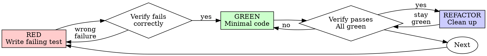

# quota reset

> This archive contains visible conversation activity and tool records. Private model reasoning and system/developer instructions are not available here.
<!-- codex-event:{"kind":"state","timestamp":"2026-07-09T10:54:06.243Z","phase":null} -->
## Task state: task_started · 2026-07-09T10:54:06.243Z

```text
{
  "type": "task_started",
  "turn_id": "019f4683-6d72-75e1-afb9-78ac57e849a2",
  "started_at": 1783594446,
  "model_context_window": 258400,
  "collaboration_mode_kind": "default"
}
```

<!-- /codex-event -->

<!-- codex-event:{"kind":"user","timestamp":"2026-07-09T10:54:06.262Z","phase":null} -->
## User · 2026-07-09T10:54:06.262Z

# Files mentioned by the user:

## Photo 1.jpg: /tmp/codex-remote-attachments/019f4683-670f-7b21-b15b-39fa2e22f4a8/d8ecfe84-6679-4d8c-9a9b-67f1d3ab86fc/1-Photo-1.jpg

## My request for Codex:

You need to fix this. It's impossible that it's working if it's hit the session limit. Session d3736d38f6c3

We need to capture this when it happens and show some Set of options to the user as a section where you now see the "working" thing. Something like: a switch and to the right the label "Auto resume at [time / date]" 

But also more options like "Stop"


<!-- /codex-event -->

<!-- codex-event:{"kind":"progress","timestamp":"2026-07-09T10:54:22.291Z","phase":"commentary"} -->
## Codex progress · 2026-07-09T10:54:22.291Z

I’ll trace the saved session first so we know what the app actually recorded, then I’ll fix the UI/state path that still says “Working” after the session limit is reached. I’m using the debugging, React, control-plane, and UI guidance because this touches both server status and the visible conversation state.

<!-- /codex-event -->

<!-- codex-event:{"kind":"tool-call","timestamp":"2026-07-09T10:54:22.297Z","phase":null} -->
## Tool call: exec_command · 2026-07-09T10:54:22.297Z

```json
{
  "cmd": "sed -n '1,220p' /Users/masterman/.agents/skills/using-ultrapowers/SKILL.md",
  "workdir": "/Users/masterman/NLP/omniharness",
  "max_output_tokens": 20000
}
```

<!-- /codex-event -->

<!-- codex-event:{"kind":"tool-call","timestamp":"2026-07-09T10:54:22.298Z","phase":null} -->
## Tool call: exec_command · 2026-07-09T10:54:22.298Z

```json
{
  "cmd": "sed -n '1,260p' /Users/masterman/.agents/skills/systematic-debugging/SKILL.md",
  "workdir": "/Users/masterman/NLP/omniharness",
  "max_output_tokens": 20000
}
```

<!-- /codex-event -->

<!-- codex-event:{"kind":"tool-call","timestamp":"2026-07-09T10:54:22.311Z","phase":null} -->
## Tool call: exec_command · 2026-07-09T10:54:22.311Z

```json
{
  "cmd": "sed -n '1,260p' /Users/masterman/.agents/skills/building-react-apps/SKILL.md",
  "workdir": "/Users/masterman/NLP/omniharness",
  "max_output_tokens": 20000
}
```

<!-- /codex-event -->

<!-- codex-event:{"kind":"tool-call","timestamp":"2026-07-09T10:54:22.313Z","phase":null} -->
## Tool call: exec_command · 2026-07-09T10:54:22.313Z

```json
{
  "cmd": "sed -n '1,260p' /Users/masterman/.agents/skills/instrumenting-control-planes/SKILL.md",
  "workdir": "/Users/masterman/NLP/omniharness",
  "max_output_tokens": 20000
}
```

<!-- /codex-event -->

<!-- codex-event:{"kind":"tool-call","timestamp":"2026-07-09T10:54:22.406Z","phase":null} -->
## Tool call: exec_command · 2026-07-09T10:54:22.406Z

```json
{
  "cmd": "sed -n '1,260p' /Users/masterman/NLP/omniharness/.agents/skills/impeccable/SKILL.md",
  "workdir": "/Users/masterman/NLP/omniharness",
  "max_output_tokens": 20000
}
```

<!-- /codex-event -->

<!-- codex-event:{"kind":"tool-result","timestamp":"2026-07-09T10:54:22.416Z","phase":null} -->
## Tool result: call_A3shtTyPQNlLq033oQyIWlPH · 2026-07-09T10:54:22.416Z

```text
Chunk ID: 6734b3
Wall time: 0.0000 seconds
Process exited with code 0
Original token count: 2009
Output:
---
name: using-ultrapowers
description: Use when starting any conversation - establishes how to find and use skills, requiring skill invocation before acting
---

<SUBAGENT-STOP>
If you were dispatched as a subagent to execute a specific task, skip this skill.
</SUBAGENT-STOP>

# Using Ultrapowers

Use relevant skills before acting, but keep process proportional to the task.

## Instruction Priority

1. User instructions and local repo instructions
2. Ultrapowers skills
3. Default model behavior

If the user says not to create extra repository isolation, or says to work directly in the current repository, follow that instruction.

## Core Rule

Before responding, ask:

1. Is there a process skill that governs how to approach this?
2. Is there an implementation skill that governs how to execute it?
3. Is the request substantial enough to justify that process, or is it a tiny mechanical edit?

If a skill applies and the task is substantial enough to justify it, use it before continuing. If the request is a tiny mechanical edit, make the edit directly with targeted verification.

## Proportional Skill Use

Do the smallest responsible workflow that matches the request.

For tiny, unambiguous mechanical edits, do the edit directly:

- changing a color value,
- fixing a typo,
- tweaking short copy,
- changing a prompt sentence,
- renaming a label,
- adjusting obvious spacing or formatting,
- making a one-line config or docs correction.

For these, do not run brainstorming, write a plan, or force TDD unless the change affects product behavior, data, persistence, control flow, user journeys, or non-obvious architecture.

Use the heavier process when the request is ambiguous, user-facing behavior changes, multiple files/modules are involved, the user journey can change, or the change could create regressions that are not obvious from a quick targeted check.

## Default Posture

- Work in the current repository by default.
- YOU WILL NEVER CREATE A BRANCH unless explicitly instructed.
- Ask the user whether we should work in worktrees as part of the planning.
- YOU WILL ONLY CREATE A WORKTREE if explicitly instructed.
- Keep skill use proportional. Tiny mechanical edits should stay tiny.
- Every project should have a `.gitignore`.
- Never commit or push secrets, credentials, local environment files, `node_modules`, dependency caches, build outputs, coverage output, logs, temporary files, or intermediate/generated artifacts unless the human explicitly asks to version a specific generated artifact.
- Deliver full product functionality by default. NO FAKE COMPONENTS, NO MOCKS, NO PLACEHOLDERS, NO FALLBACKS as substitutes for the requested functionality unless the human explicitly asks for a prototype or scaffold.
- For app, UI, and product-surface work, run a PM pass during planning. Treat it as mandatory default behavior, not optional polish.
- For app, UI, and product-surface work, consider `agentic-user-journey-testing` for important user stories, but do not run it without explicit user approval.
- Use `second-opinion` for substantial saved implementation plans, and for unusually hard, creative, high-risk, or architecture-heavy specs when an independent external review could improve the artifact. Prefer a different available coding harness for that review, such as Codex asking Claude Code or Claude Code asking Codex. If no different harness is available, the same harness is fine; the second opinion is still mandatory for matching artifacts.
- Refactor code when a file passes 1200 lines. Do not normalize oversized files as the default end state.
- Use user stories in specs and plans when they clarify behavior or value.
- Default UI work to `shadcn/ui` unless the user says otherwise.
- For any dashboard, admin surface, product UI, SaaS app, internal tool, settings-heavy app, data table view, auth flow, sidebar layout, or React/Next.js web app UI, use `start-from-blocks` before designing or implementing. Start by installing or copying the closest fitting official shadcn Block, then adapt it. No vibed dashboard/web-app design from blank files.
- Before adding any individual UI control, check whether `shadcn/ui` already provides a control that does what is needed. Use the available shadcn control first, then customize it, instead of hand-building a one-off control.
- Treat desktop and mobile responsiveness as first-class from the beginning.
- Prefer explicit routing unless the framework strongly defaults to file-based routes.
- For React apps, use `building-react-apps` for state managers, explicit transitions, routing, refs, imports, package-manager defaults, and frontend configuration defaults.
- For React apps with server state, optimistic UI, caches, polling, SSE/WebSocket streams, background jobs, persistence, or client/server synchronization, use `client-server-state-invariants` during planning and verification.
- For React or Next.js slowness, root-load, compile-time, SSR/hydration, bundle, import-bloat, or UI dependency cleanup work, use `optimizing-react-next-apps`.
- Prefer strong instrumentation and auditability for backend behavior.
- When a project has backend or agent workflows, prefer a fully instrumented control plane: persist meaningful events, tool calls, actions, results, errors, and state transitions, and expose them through a CLI or other scriptable interface so the full system can be inspected and tested without the UI.
- Use `instrumenting-control-planes` when building, planning, reviewing, or debugging backend decisions, agent workflows, recovery paths, retries, deletes, long-running jobs, SSE/WebSocket streams, or user-visible failures.
- Use `learning-from-bugs` after diagnosing or fixing meaningful architecture, storage, memory, persistence, control-plane, or system-level bugs so reusable lessons become durable.
- Do not default to silent, masked, or over-abstracted errors.
- When a project has a frontend, prefer surfacing full backend error details and stack traces to the frontend so failures stay visible, debuggable, and testable end-to-end.
- Treat persistence of settings and preferences as explicit design work.
- For every meaningful UI setting, define whether it persists, where it is stored, how it is read and written, who owns it, and how reset, sync, migration, and testing are handled.

See `docs/ultrapowers-defaults.md` for the canonical fork defaults.

## Skill Priority

1. Process skills first
2. Implementation skills second

Examples:

- "Make this button blue" -> inspect the relevant file, make the small edit, do targeted verification
- "Update this prompt sentence" -> edit the prompt directly and verify the final text
- "Build a feature" -> `brainstorming` with a PM pass first, then `writing-plans`, then execution; consider approval-gated `agentic-user-journey-testing` for app workflows
- "Fix this bug" -> `systematic-debugging`, then the relevant implementation skill; if the root cause is meaningful or systemic, finish with `learning-from-bugs`
- "Review this change" -> `requesting-code-review`

## Examples Of User Override

- If a task feels risky and the user did not ask for extra repository isolation, keep working in the current repository unless the user explicitly instructs otherwise.
- If a stack supports file-based routing but the user says not to use it, choose an explicit routing approach instead.
- If a framework strongly defaults to file-based routing, such as Next.js App Router, use the framework-native routing model unless there is a good reason not to.
- If a frontend skill suggests `shadcn/ui` but the user wants another design system, follow the user.

## Red Flags

- "I need a whole workflow for this tiny edit" -> no. Use the smallest responsible process.
- "This is simple, so I need the whole process anyway" -> no. Tiny mechanical edits should stay tiny.
- "I'll create extra repository isolation just to be safe" -> forbidden unless the user clearly asked for it.
- "I already know the skill" -> read the current version before relying on it

```

<!-- /codex-event -->

<!-- codex-event:{"kind":"tool-result","timestamp":"2026-07-09T10:54:22.416Z","phase":null} -->
## Tool result: call_Q1LDoWnlQCLsh2YJ0NinxdsB · 2026-07-09T10:54:22.416Z

````text
Chunk ID: fc9e79
Wall time: 0.0001 seconds
Process exited with code 0
Original token count: 2092
Output:
---
name: systematic-debugging
description: Use when encountering any bug, test failure, or unexpected behavior, before proposing fixes
---

# Systematic Debugging

## Overview

Random fixes waste time and create new bugs. Quick patches mask underlying issues.

**Core principle:** ALWAYS find root cause before attempting fixes. Symptom fixes are failure.

**Violating the letter of this process is violating the spirit of debugging.**

## The Iron Law

```
NO FIXES WITHOUT ROOT CAUSE INVESTIGATION FIRST
```

If you haven't completed Phase 1, you cannot propose fixes.

## When to Use

Use for ANY technical issue:
- Test failures
- Bugs in production
- Unexpected behavior
- Performance problems
- Build failures
- Integration issues

**Use this ESPECIALLY when:**
- Under time pressure (emergencies make guessing tempting)
- "Just one quick fix" seems obvious
- You've already tried multiple fixes
- Previous fix didn't work
- You don't fully understand the issue

**Don't skip when:**
- Issue seems simple (simple bugs have root causes too)
- You're in a hurry (rushing guarantees rework)
- Manager wants it fixed NOW (systematic is faster than thrashing)

## The Four Phases

You MUST complete each phase before proceeding to the next.

### Phase 1: Root Cause Investigation

**BEFORE attempting ANY fix:**

1. **Read Error Messages Carefully**
   - Don't skip past errors or warnings
   - They often contain the exact solution
   - Read stack traces completely
   - Note line numbers, file paths, error codes

2. **Reproduce Consistently**
   - Can you trigger it reliably?
   - What are the exact steps?
   - Does it happen every time?
   - If not reproducible → gather more data, don't guess

3. **Check Recent Changes**
   - What changed that could cause this?
   - Git diff, recent commits
   - New dependencies, config changes
   - Environmental differences

4. **Gather Evidence in Multi-Component Systems**

   **WHEN system has multiple components (CI → build → signing, API → service → database):**

   **BEFORE proposing fixes, add diagnostic instrumentation:**
   ```
   For EACH component boundary:
     - Log what data enters component
     - Log what data exits component
     - Verify environment/config propagation
     - Check state at each layer

   Run once to gather evidence showing WHERE it breaks
   THEN analyze evidence to identify failing component
   THEN investigate that specific component
   ```

   **Example (multi-layer system):**
   ```bash
   # Layer 1: Workflow
   echo "=== Secrets available in workflow: ==="
   echo "IDENTITY: ${IDENTITY:+SET}${IDENTITY:-UNSET}"

   # Layer 2: Build script
   echo "=== Env vars in build script: ==="
   env | grep IDENTITY || echo "IDENTITY not in environment"

   # Layer 3: Signing script
   echo "=== Keychain state: ==="
   security list-keychains
   security find-identity -v

   # Layer 4: Actual signing
   codesign --sign "$IDENTITY" --verbose=4 "$APP"
   ```

   **This reveals:** Which layer fails (secrets → workflow ✓, workflow → build ✗)

5. **Trace Data Flow**

   **WHEN error is deep in call stack:**

   See `root-cause-tracing.md` in this directory for the complete backward tracing technique.

   **Quick version:**
   - Where does bad value originate?
   - What called this with bad value?
   - Keep tracing up until you find the source
   - Fix at source, not at symptom

### Phase 2: Pattern Analysis

**Find the pattern before fixing:**

1. **Find Working Examples**
   - Locate similar working code in same codebase
   - What works that's similar to what's broken?

2. **Compare Against References**
   - If implementing pattern, read reference implementation COMPLETELY
   - Don't skim - read every line
   - Understand the pattern fully before applying

3. **Identify Differences**
   - What's different between working and broken?
   - List every difference, however small
   - Don't assume "that can't matter"

4. **Understand Dependencies**
   - What other components does this need?
   - What settings, config, environment?
   - What assumptions does it make?

### Phase 3: Hypothesis and Testing

**Scientific method:**

1. **Form Single Hypothesis**
   - State clearly: "I think X is the root cause because Y"
   - Write it down
   - Be specific, not vague

2. **Test Minimally**
   - Make the SMALLEST possible change to test hypothesis
   - One variable at a time
   - Don't fix multiple things at once

3. **Verify Before Continuing**
   - Did it work? Yes → Phase 4
   - Didn't work? Form NEW hypothesis
   - DON'T add more fixes on top

4. **When You Don't Know**
   - Say "I don't understand X"
   - Don't pretend to know
   - Ask for help
   - Research more

### Phase 4: Implementation

**Fix the root cause, not the symptom:**

1. **Create Failing Test Case**
   - Simplest possible reproduction
   - Automated test if possible
   - One-off test script if no framework
   - MUST have before fixing
   - Use the `ultrapowers:test-driven-development` skill for writing proper failing tests

2. **Implement Single Fix**
   - Address the root cause identified
   - ONE change at a time
   - No "while I'm here" improvements
   - No bundled refactoring

3. **Verify Fix**
   - Test passes now?
   - No other tests broken?
   - Issue actually resolved?
   - If the bug was meaningful or systemic, use `ultrapowers:learning-from-bugs` before declaring the fix complete.

4. **If Fix Doesn't Work**
   - STOP
   - Count: How many fixes have you tried?
   - If < 3: Return to Phase 1, re-analyze with new information
   - **If ≥ 3: STOP and question the architecture (step 5 below)**
   - DON'T attempt Fix #4 without architectural discussion

5. **If 3+ Fixes Failed: Question Architecture**

   **Pattern indicating architectural problem:**
   - Each fix reveals new shared state/coupling/problem in different place
   - Fixes require "massive refactoring" to implement
   - Each fix creates new symptoms elsewhere

   **STOP and question fundamentals:**
   - Is this pattern fundamentally sound?
   - Are we "sticking with it through sheer inertia"?
   - Should we refactor architecture vs. continue fixing symptoms?

   **Discuss with your human partner before attempting more fixes**

   This is NOT a failed hypothesis - this is a wrong architecture.

## Red Flags - STOP and Follow Process

If you catch yourself thinking:
- "Quick fix for now, investigate later"
- "Just try changing X and see if it works"
- "Add multiple changes, run tests"
- "Skip the test, I'll manually verify"
- "It's probably X, let me fix that"
- "I don't fully understand but this might work"
- "Pattern says X but I'll adapt it differently"
- "Here are the main problems: [lists fixes without investigation]"
- Proposing solutions before tracing data flow
- **"One more fix attempt" (when already tried 2+)**
- **Each fix reveals new problem in different place**

**ALL of these mean: STOP. Return to Phase 1.**

**If 3+ fixes failed:** Question the architecture (see Phase 4.5)

## your human partner's Signals You're Doing It Wrong

**Watch for these redirections:**
- "Is that not happening?" - You assumed without verifying
- "Will it show us...?" - You should have added evidence gathering
- "Stop guessing" - You're proposing fixes without understanding
- "Ultrathink this" - Question fundamentals, not just symptoms
- "We're stuck?" (frustrated) - Your approach isn't working

**When you see these:** STOP. Return to Phase 1.

## Common Rationalizations

| Excuse | Reality |
|--------|---------|
| "Issue is simple, don't need process" | Simple issues have root causes too. Process is fast for simple bugs. |
| "Emergency, no time for process" | Systematic debugging is FASTER than guess-and-check thrashing. |
| "Just try this first, then investigate" | First fix sets the pattern. Do it right from the start. |
| "I'll write test after confirming fix works" | Untested fixes don't stick. Test first proves it. |
| "Multiple fixes at once saves time" | Can't isolate what worked. Causes new bugs. |
| "Reference too long, I'll adapt the pattern" | Partial understanding guarantees bugs. Read it completely. |
| "I see the problem, let me fix it" | Seeing symptoms ≠ understanding root cause. |
| "One more fix attempt" (after 2+ failures) | 3+ failures = architectural problem. Question pattern, don't fix again. |

## Quick Reference


````

<!-- /codex-event -->

<!-- codex-event:{"kind":"tool-result","timestamp":"2026-07-09T10:54:22.417Z","phase":null} -->
## Tool result: call_HGQvgcl8MbTLI0wiCHGvHFhs · 2026-07-09T10:54:22.417Z

```text
Chunk ID: 6b4c8f
Wall time: 0.0000 seconds
Process exited with code 0
Original token count: 2034
Output:
---
name: building-react-apps
description: Use when building, refactoring, planning, or debugging React or Next.js apps, React components, hooks, routing, frontend state, SSR, hydration, bundles, imports, or UI settings
---

# Building React Apps

Use these defaults for React app work unless the user or existing codebase explicitly chooses another architecture.

If the work is specifically about slowness, root-load time, compile time, SSR effectiveness, hydration cost, bundle size, import bloat, or decluttering heavy UI dependencies, use `optimizing-react-next-apps` as the focused workflow.

If the app has server state, optimistic UI, caches, polling, SSE/WebSocket streams, background jobs, persisted runtime state, or client/server synchronization, use `client-server-state-invariants` before planning or changing the state model.

## UI Starting Point

- For new React app screens, forms, and major surfaces, use `shadcn/ui` unless the user or existing app has chosen another design system.
- Before inventing layout, inspect the available ShadCN Blocks at https://ui.shadcn.com/blocks for the specific screen or form category.
- Start from the closest matching block with `npx shadcn add <block-name>` or the official source in https://github.com/shadcn-ui/ui, then add, remove, and adapt controls to fit the product.
- Do not use a blank custom layout as the first implementation path when a relevant ShadCN Block exists.
- Before adding any individual control, check whether `shadcn/ui` already provides a suitable control. Use/customize the shadcn control before hand-building a one-off control.

## State And Data

- Always centralize React app state in global single-source-of-truth Manager classes.
- Components, hooks, and listeners subscribe to Manager updates and use Manager methods to update data.
- Centralized state does not mean broad subscriptions. Components must subscribe to the smallest slice they need, preferably with selector hooks and equality checks, so unrelated UI does not re-render.
- Never let app shells, page roots, sidebars, timelines, or other broad containers subscribe to an entire high-churn Manager snapshot when they only need stable fields. Draft text, cursors, hover/open state, search text, and other per-keystroke or per-pointer state need narrow component-level subscriptions.
- If typing in an input, moving a cursor, toggling a hover/open flag, or editing a small draft makes the whole app repaint, the subscription boundary is wrong even if the data source is centralized.
- Always implement a custom data manager for any app data structure.
- Never use separate state variables or arrays as the source of truth.
- Never send data around in transactions. Pass intent, ids, commands, or Manager method calls instead.

## React Control Flow

- Avoid using `useEffect()` to update state. Prefer `useCallback()` handlers or Manager methods for explicit state transitions.
- Work ahead of time to avoid callback hell, race conditions, and infinite loops.
- When debugging React and a fix does not work, explicitly consider whether the root cause is a race condition. Race conditions are common in React.
- Every async callback, mutation result, timer, poll, or stream message that can update visible state must prove it still owns the current context before mutating Managers or navigation.
- Use `RefObject` instead of `MutableRefObject`.

## Routing And Modules

- Prefer explicit routing over file-based routing when the framework does not strongly default to file-based routes. Framework-native file routing, such as Next.js App Router, is fine.
- Never use `require()` to import modules. Use `import` instead.
- Avoid `npm` by default. Use `pnpm` for package installation, scripts, and lockfiles unless the user or existing project explicitly chooses another package manager.

## Next.js And SSR Defaults

- Treat `"use client"` as a boundary with a cost. Do not put an entire page, app shell, sidebar, timeline, composer, settings surface, and data boot path behind one giant client component unless there is a deliberate reason.
- SSR is only useful if the initial HTML contains meaningful above-the-fold UI or data. If `curl` for the route only shows a boot shell, script payloads, or empty placeholders, the route is not meaningfully server-rendered even if SSR is technically enabled.
- Server-render the first useful screen by fetching route-stable bootstrap data on the server: auth/session state, settings needed to choose the shell, selected route ids, and initial page/snapshot data. Hydrate Managers or query caches from that bootstrap data; do not wait for client `useEffect()` plus client fetches before the first meaningful paint.
- Use client effects for browser-only concerns: localStorage-only preferences, notifications, SSE/WebSocket subscriptions, focus management, and post-paint refreshes. Do not use effects as the only path for data required to decide what the initial screen is.
- In Next dev, first request time includes compilation. Distinguish cold compile cost from runtime slowness before optimizing the wrong layer.

## Import And Bundle Hygiene

- Keep imports proportional to the UI being rendered. Do not import an entire complex surface for a tiny control; split shared tiny controls into their own files instead of importing them from heavy feature modules.
- Lazy-load rarely opened or route-conditional surfaces with dynamic imports: settings dialogs, side panels, file viewers, terminals, worker inspectors, onboarding flows, QR/pairing dialogs, and large markdown/code viewers.
- Avoid package and barrel imports that drag in whole icon packs, design systems, syntax highlighters, markdown stacks, charting libraries, or component suites for one glyph or one primitive. Inline small SVG paths or use local assets when that is cheaper and stable.
- Prefer native browser controls for small, ordinary selects and pickers. Do not import a popover/dialog/menu stack for a low-value dropdown unless search, virtualization, or rich item rendering is genuinely needed.
- Use subpath imports when a package supports them. Avoid root package imports from large UI libraries if a narrower entrypoint exists.
- After dependency or UI-shell changes, inspect the emitted dev chunks or traces. Verify whether heavy modules moved out of the root chunk rather than assuming dynamic import worked.

## Performance Debugging

- Start with evidence: dev server logs, route timings, emitted chunk sizes, module counts, and initial HTML content.
- Separate long-lived requests from slow requests. SSE, streaming, and hanging fetches can show huge durations in logs without blocking page paint.
- Check recent dependency additions first when compile time suddenly explodes. A single icon, markdown, chart, or UI package can add thousands of modules.
- For Next.js root-load complaints, answer three questions before changing code: what compiled, what HTML was returned, and what client-side requests gated the first useful paint?

## Frontend Configuration

- Never store frontend string literals or UI settings in `.env` files.
- Put frontend strings and settings in normal source files, inline arrays, or `.json` files so they remain reviewable, testable, and versioned with the UI.

## Internationalization

- For meaningful React UI work, offer language support as an option when the user has not already decided: "Should we support other languages? If yes, I will wire user-facing copy through i18n resources now instead of hardcoding strings."
- If the user says yes, asks for translation/i18n/language/locale support, or reports that language switching only updates part of the UI, use `implementing-react-i18n`.
- Use the i18n library's `t("key", params?)` function for every user-facing string. Use `useI18nSnapshot()` only to subscribe React components so language changes repaint.
- Never name variables with locale codes or locale-like names such as `it`, `en`, `enUS`, `locIt`, or `locEnUs`.

## Settings UI

- For settings dialogs, preferences panels, configuration modals, option tabs, or UI settings surfaces, use `designing-settings-dialogs`.

```

<!-- /codex-event -->

<!-- codex-event:{"kind":"tool-result","timestamp":"2026-07-09T10:54:22.417Z","phase":null} -->
## Tool result: call_bPw8E7oFk7Bpa9yXpbk8IVyA · 2026-07-09T10:54:22.417Z

````text
Chunk ID: 0e0cec
Wall time: 0.0000 seconds
Process exited with code 0
Original token count: 1303
Output:
---
name: instrumenting-control-planes
description: Use when building, planning, reviewing, or debugging apps with backend decisions, agent workflows, long-running jobs, SSE/WebSocket streams, recovery paths, deletes, retries, or user-visible failures
---

# Instrumenting Control Planes

Build the control plane as a product surface. If the server decides, refuses, retries, spawns, deletes, recovers, gives up, or fails, that decision must be observable by users, operators, and tests.

If a React UI consumes the control plane through server state, optimistic UI, caches, polling, SSE/WebSocket streams, or persisted runtime state, also use `client-server-state-invariants`.

## Core Rule

Every meaningful server-side state transition emits a named, durable event. The UI and tests consume the same production event surface.

Do not rely on snapshot diffs, rendered DOM state, logs only, or client-side re-derivation to prove what the server decided.

## Hot Path Rule

No user bootstrap, catalog, status, reconnect, or recovery request may depend on a lock-prone database write path or external health probe finishing. Serve these paths from a bounded read model, memory cache, append-only event log, or stale-but-marked snapshot; queue reconciliation writes outside the request. Every dependency on a database or bridge call in a hot path needs a short timeout, cancellation, and an explicit degraded response.

If SQLite, local files, or a single-writer store is used, assume writer contention can freeze readers at the worst moment. Use one writer, WAL/busy-timeout discipline, short transactions, bounded queues, and headless chaos tests that run bootstrap/reload while writes are active. A 25s UI request is a control-plane failure, even if the database eventually returns.

## Event Contract

For each backend or agent workflow, define:

- named events for decisions: `worker.spawned`, `worker.reattached`, `plan.ready`, `plan.review.blocked`, `recovery.gave_up`, `conversation.delete_failed`;
- payloads with stable ids, `prev`/`next` status when relevant, reason codes, and enough context to debug;
- `error.surfaced` or an equivalent user-facing failure event for every failure the user should know about;
- durable persistence or a bounded replay buffer so short disconnects do not erase history;
- a scriptable read path: CLI, HTTP endpoint, sqlite query, or event log command.

If a decision cannot be asserted from this surface, the design is incomplete.

If debugging a control-plane failure reveals a reusable lesson, use `ultrapowers:learning-from-bugs` after the fix is verified.

## Streaming Requirements

For SSE or WebSocket-like streams:

- emit named events alongside any snapshot/update frame;
- include monotonic event ids;
- support resume from the last seen id;
- replay missed events from a bounded buffer;
- emit an explicit resync-required event when replay is impossible;
- bootstrap from a snapshot, then tail events.

Snapshots show current truth. Named events show why it became true.

## Testing Standard

Control-plane tests should usually be headless HTTP/SSE scenario tests, not browser tests. Browser automation is for UI behavior; control-plane tests assert server decisions directly.

Write scenario assertions as event transcripts:

```ts
expect(events).toHaveEmitted("worker.spawned", { runId });
expect(events).toHaveEmitted("worker.status", { next: "running" });
chaos.killServer();
chaos.restartServer();
expect(events).toHaveEmitted("worker.reattached", { runId });
expect(events).not.toHaveEmitted("worker.recreated", { runId });
```

Chaos belongs outside production code paths: drop connections in the client, fail fetches in the harness, restart the server process, and use seeds for reproducibility.

## Refuse These Shapes

- silent early returns in server methods;
- swallowed `catch` blocks;
- client-side derivation of server decisions;
- response-code-only user failures;
- event streams without ids or resume;
- tests that infer control-plane behavior from rendered state;
- delete handlers that do not enumerate dependent rows or emit typed failure events;
- recovery loops without terminal events such as `gave_up` or `abandoned`;
- request handlers that wait on inline reconciliation writes, SQLite contention, or bridge `/doctor` checks before returning bootstrap data;
- test-only behavior branches in production code.

## Design Checklist

Before implementing a backend or agent workflow, answer:

1. What decisions can this workflow make?
2. What named event is emitted for each decision, including refusal and failure?
3. Where are events persisted or buffered?
4. How does a client resume after disconnect?
5. Which request paths must keep working while persistence or bridge dependencies are slow, locked, or stale?
6. How can a CLI or test harness inspect the exact event sequence without the UI?
7. Which headless scenario proves the happy path, failure path, recovery path, terminal state, and hot-path timeout/degraded path?
8. Which client state consumes these events, and how does it prove ownership, freshness, completeness, ordering, and replay/resync?

If the answer is "the UI can figure it out", name the missing event instead.

````

<!-- /codex-event -->

<!-- codex-event:{"kind":"tool-result","timestamp":"2026-07-09T10:54:22.452Z","phase":null} -->
## Tool result: call_UDxyu8EEYpkr6clYWfF07Tbv · 2026-07-09T10:54:22.452Z

````text
Chunk ID: d709d3
Wall time: 0.0000 seconds
Process exited with code 0
Original token count: 2756
Output:
---
name: impeccable
description: Use when the user wants to design, redesign, shape, critique, audit, polish, clarify, distill, harden, optimize, adapt, animate, colorize, extract, or otherwise improve a frontend interface. Covers websites, landing pages, dashboards, product UI, app shells, components, forms, settings, onboarding, and empty states. Handles UX review, visual hierarchy, information architecture, cognitive load, accessibility, performance, responsive behavior, theming, anti-patterns, typography, fonts, spacing, layout, alignment, color, motion, micro-interactions, UX copy, error states, edge cases, i18n, and reusable design systems or tokens. Also use for bland designs that need to become bolder or more delightful, loud designs that should become quieter, live browser iteration on UI elements, or ambitious visual effects that should feel technically extraordinary. Not for backend-only or non-UI tasks.
---

Designs and iterates production-grade frontend interfaces. Real working code, committed design choices, exceptional craft.

## Setup (non-optional)

Two steps before any design work. Both are required. Skipping either produces generic output that ignores the project.

### 1. Context gathering

Two files at the project root, case-insensitive:

- **PRODUCT.md** — required. Users, brand, tone, anti-references, strategic principles.
- **DESIGN.md** — optional, strongly recommended. Colors, typography, elevation, components.

Load both in one call:

```bash
node .agents/skills/impeccable/scripts/load-context.mjs
```

Consume the full JSON output. Never pipe through `head`, `tail`, `grep`, or `jq`.

If the output is already in this session's conversation history, don't re-run. Exceptions requiring a fresh load: you just ran `$impeccable teach` or `$impeccable document` (they rewrite the files), or the user manually edited one.

`$impeccable live` already warms context via `live.mjs` — if you've run `live.mjs`, don't also run `load-context.mjs` this session.

If PRODUCT.md is missing, empty, or placeholder (`[TODO]` markers, <200 chars): run `$impeccable teach`, then resume the user's original task with the fresh context.

If DESIGN.md is missing: nudge once per session (*"Run `$impeccable document` for more on-brand output"*), then proceed.

### 2. Register

Every design task is **brand** (marketing, landing, campaign, long-form content, portfolio — design IS the product) or **product** (app UI, admin, dashboard, tool — design SERVES the product).

Identify before designing. Priority: (1) cue in the task itself ("landing page" vs "dashboard"); (2) the surface in focus (the page, file, or route being worked on); (3) `register` field in PRODUCT.md. First match wins.

If PRODUCT.md lacks the `register` field (legacy), infer it once from its "Users" and "Product Purpose" sections, then cache the inferred value for the session. Suggest the user run `$impeccable teach` to add the field explicitly.

Load the matching reference: [reference/brand.md](reference/brand.md) or [reference/product.md](reference/product.md). The shared design laws below apply to both.

## Shared design laws

Apply to every design, both registers. Match implementation complexity to the aesthetic vision — maximalism needs elaborate code, minimalism needs precision. Interpret creatively. Vary across projects; never converge on the same choices. GPT is capable of extraordinary work — don't hold back.

### Color

- Use OKLCH. Reduce chroma as lightness approaches 0 or 100 — high chroma at extremes looks garish.
- Never use `#000` or `#fff`. Tint every neutral toward the brand hue (chroma 0.005–0.01 is enough).
- Pick a **color strategy** before picking colors. Four steps on the commitment axis:
  - **Restrained** — tinted neutrals + one accent ≤10%. Product default; brand minimalism.
  - **Committed** — one saturated color carries 30–60% of the surface. Brand default for identity-driven pages.
  - **Full palette** — 3–4 named roles, each used deliberately. Brand campaigns; product data viz.
  - **Drenched** — the surface IS the color. Brand heroes, campaign pages.
- The "one accent ≤10%" rule is Restrained only. Committed / Full palette / Drenched exceed it on purpose. Don't collapse every design to Restrained by reflex.

### Theme

Dark vs. light is never a default. Not dark "because tools look cool dark." Not light "to be safe."

Before choosing, write one sentence of physical scene: who uses this, where, under what ambient light, in what mood. If the sentence doesn't force the answer, it's not concrete enough — add detail until it does.

"Observability dashboard" does not force an answer. "SRE glancing at incident severity on a 27-inch monitor at 2am in a dim room" does. Run the sentence, not the category.

### Typography

- Cap body line length at 65–75ch.
- Hierarchy through scale + weight contrast (≥1.25 ratio between steps). Avoid flat scales.

### Layout

- Vary spacing for rhythm. Same padding everywhere is monotony.
- Cards are the lazy answer. Use them only when they're truly the best affordance. Nested cards are always wrong.
- Don't wrap everything in a container. Most things don't need one.

### Motion

- Don't animate CSS layout properties.
- Ease out with exponential curves (ease-out-quart / quint / expo). No bounce, no elastic.

### Absolute bans

Match-and-refuse. If you're about to write any of these, rewrite the element with different structure.

- **Side-stripe borders.** `border-left` or `border-right` greater than 1px as a colored accent on cards, list items, callouts, or alerts. Never intentional. Rewrite with full borders, background tints, leading numbers/icons, or nothing.
- **Gradient text.** `background-clip: text` combined with a gradient background. Decorative, never meaningful. Use a single solid color. Emphasis via weight or size.
- **Glassmorphism as default.** Blurs and glass cards used decoratively. Rare and purposeful, or nothing.
- **The hero-metric template.** Big number, small label, supporting stats, gradient accent. SaaS cliché.
- **Identical card grids.** Same-sized cards with icon + heading + text, repeated endlessly.
- **Modal as first thought.** Modals are usually laziness. Exhaust inline / progressive alternatives first.

### Copy

- Every word earns its place. No restated headings, no intros that repeat the title.
- **No em dashes.** Use commas, colons, semicolons, periods, or parentheses. Also not `--`.

### The AI slop test

If someone could look at this interface and say "AI made that" without doubt, it's failed. Cross-register failures are the absolute bans above. Register-specific failures live in each reference.

**Category-reflex check.** If someone could guess the theme and palette from the category name alone — "observability → dark blue", "healthcare → white + teal", "finance → navy + gold", "crypto → neon on black" — it's the training-data reflex. Rework the scene sentence and color strategy until the answer is no longer obvious from the domain.

## Commands

| Command | Category | Description | Reference |
|---|---|---|---|
| `craft [feature]` | Build | Shape, then build a feature end-to-end | [reference/craft.md](reference/craft.md) |
| `shape [feature]` | Build | Plan UX/UI before writing code | [reference/shape.md](reference/shape.md) |
| `teach` | Build | Set up PRODUCT.md and DESIGN.md context | [reference/teach.md](reference/teach.md) |
| `document` | Build | Generate DESIGN.md from existing project code | [reference/document.md](reference/document.md) |
| `extract [target]` | Build | Pull reusable tokens and components into design system | [reference/extract.md](reference/extract.md) |
| `critique [target]` | Evaluate | UX design review with heuristic scoring | [reference/critique.md](reference/critique.md) |
| `audit [target]` | Evaluate | Technical quality checks (a11y, perf, responsive) | [reference/audit.md](reference/audit.md) |
| `polish [target]` | Refine | Final quality pass before shipping | [reference/polish.md](reference/polish.md) |
| `bolder [target]` | Refine | Amplify safe or bland designs | [reference/bolder.md](reference/bolder.md) |
| `quieter [target]` | Refine | Tone down aggressive or overstimulating designs | [reference/quieter.md](reference/quieter.md) |
| `distill [target]` | Refine | Strip to essence, remove complexity | [reference/distill.md](reference/distill.md) |
| `harden [target]` | Refine | Production-ready: errors, i18n, edge cases | [reference/harden.md](reference/harden.md) |
| `onboard [target]` | Refine | Design first-run flows, empty states, activation | [reference/onboard.md](reference/onboard.md) |
| `animate [target]` | Enhance | Add purposeful animations and motion | [reference/animate.md](reference/animate.md) |
| `colorize [target]` | Enhance | Add strategic color to monochromatic UIs | [reference/colorize.md](reference/colorize.md) |
| `typeset [target]` | Enhance | Improve typography hierarchy and fonts | [reference/typeset.md](reference/typeset.md) |
| `layout [target]` | Enhance | Fix spacing, rhythm, and visual hierarchy | [reference/layout.md](reference/layout.md) |
| `delight [target]` | Enhance | Add personality and memorable touches | [reference/delight.md](reference/delight.md) |
| `overdrive [target]` | Enhance | Push past conventional limits | [reference/overdrive.md](reference/overdrive.md) |
| `clarify [target]` | Fix | Improve UX copy, labels, and error messages | [reference/clarify.md](reference/clarify.md) |
| `adapt [target]` | Fix | Adapt for different devices and screen sizes | [reference/adapt.md](reference/adapt.md) |
| `optimize [target]` | Fix | Diagnose and fix UI performance | [reference/optimize.md](reference/optimize.md) |
| `live` | Iterate | Visual variant mode: pick elements in the browser, generate alternatives | [reference/live.md](reference/live.md) |

Plus two management commands — `pin <command>` and `unpin <command>`, detailed below.

### Routing rules

1. **No argument** — render the table above as the user-facing command menu, grouped by category. Ask what they'd like to do.
2. **First word matches a command** — load its reference file and follow its instructions. Everything after the command name is the target.
3. **First word doesn't match** — general design invocation. Apply the setup steps, shared design laws, and the loaded register reference, using the full argument as context.

Setup (context gathering, register) is already loaded by then; sub-commands don't re-invoke `$impeccable`.

## Pin / Unpin

**Pin** creates a standalone shortcut so `$<command>` invokes `$impeccable <command>` directly. **Unpin** removes it. The script writes to every harness directory present in the project.

```bash
node .agents/skills/impeccable/scripts/pin.mjs <pin|unpin> <command>
```

Valid `<command>` is any command from the table above. Report the script's result concisely — confirm the new shortcut on success, relay stderr verbatim on error.
````

<!-- /codex-event -->

<!-- codex-event:{"kind":"progress","timestamp":"2026-07-09T10:54:34.662Z","phase":"commentary"} -->
## Codex progress · 2026-07-09T10:54:34.662Z

I’ve loaded the main project instructions and the relevant process guidance. Next I’m checking the product design context and the saved session data so the fix is based on the real recorded state, not just the screenshot.

<!-- /codex-event -->

<!-- codex-event:{"kind":"tool-call","timestamp":"2026-07-09T10:54:34.667Z","phase":null} -->
## Tool call: exec_command · 2026-07-09T10:54:34.667Z

```json
{
  "cmd": "sed -n '1,260p' /Users/masterman/.agents/skills/client-server-state-invariants/SKILL.md",
  "workdir": "/Users/masterman/NLP/omniharness",
  "max_output_tokens": 20000
}
```

<!-- /codex-event -->

<!-- codex-event:{"kind":"tool-call","timestamp":"2026-07-09T10:54:34.668Z","phase":null} -->
## Tool call: exec_command · 2026-07-09T10:54:34.668Z

```json
{
  "cmd": "sed -n '1,260p' /Users/masterman/.agents/skills/test-driven-development/SKILL.md",
  "workdir": "/Users/masterman/NLP/omniharness",
  "max_output_tokens": 20000
}
```

<!-- /codex-event -->

<!-- codex-event:{"kind":"tool-call","timestamp":"2026-07-09T10:54:34.668Z","phase":null} -->
## Tool call: exec_command · 2026-07-09T10:54:34.668Z

```json
{
  "cmd": "node .agents/skills/impeccable/scripts/load-context.mjs",
  "workdir": "/Users/masterman/NLP/omniharness",
  "max_output_tokens": 20000
}
```

<!-- /codex-event -->

<!-- codex-event:{"kind":"tool-call","timestamp":"2026-07-09T10:54:34.668Z","phase":null} -->
## Tool call: exec_command · 2026-07-09T10:54:34.668Z

```json
{
  "cmd": "ls -la && find . -maxdepth 3 -name 'sqlite.db' -o -name '*.db' | sed -n '1,80p'",
  "workdir": "/Users/masterman/NLP/omniharness",
  "max_output_tokens": 12000
}
```

<!-- /codex-event -->

<!-- codex-event:{"kind":"tool-call","timestamp":"2026-07-09T10:54:34.723Z","phase":null} -->
## Tool call: exec_command · 2026-07-09T10:54:34.723Z

```json
{
  "cmd": "git status --short",
  "workdir": "/Users/masterman/NLP/omniharness",
  "max_output_tokens": 12000
}
```

<!-- /codex-event -->

<!-- codex-event:{"kind":"tool-result","timestamp":"2026-07-09T10:54:34.772Z","phase":null} -->
## Tool result: call_754p4HHBpN0TbJzqt5rqxKzm · 2026-07-09T10:54:34.772Z

```text
Chunk ID: b1f405
Wall time: 0.0000 seconds
Process exited with code 0
Original token count: 1481
Output:
---
name: client-server-state-invariants
description: Use when planning, building, reviewing, or debugging React apps with server state, optimistic UI, caches, polling, SSE/WebSocket streams, background jobs, persistence, or client/server synchronization
---

# Client Server State Invariants

React bugs often expose deeper ownership mistakes. When client state, server state, cache state, stream state, and persisted state all exist, every plan needs explicit invariants.

## Core Rule

No UI surface may treat data as authoritative unless the payload proves ownership, freshness, completeness, ordering, and terminal state.

If those words are missing from the plan, the plan is probably baking in a race condition.

## Planning Checklist

For every React app that reads server/runtime state, the plan must answer:

1. **Owner:** What owns this state: server, client manager, URL, cache, stream, local storage, or worker/runtime?
2. **Token:** What owner token protects async results: `requestId`, `runId`, `projectPath`, `operationId`, `workerId + seq`, or equivalent?
3. **Provenance:** Is data server-authoritative, optimistic, cached preview, partial update, or historical fallback?
4. **Completeness:** Does the payload declare what scope it is complete for? What may it erase?
5. **Ordering:** What stable order is used: monotonic seq, `(createdAt, id)`, version, or cursor?
6. **State machine:** What are the legal states, terminal states, and transitions?
7. **Events:** Which server decisions are named events rather than client-side derivations?
8. **Loading shape:** Which states are bootstrap, first load, incremental refresh, reconnect, resync, recovery, and terminal error?
9. **Fallbacks:** Which legacy/fallback rows can render, and only after what authority is loaded?
10. **Tests:** Which race, stale-response, event-sequence, reconnect, and merge tests prove the invariants?

## Invariants To Require

- Cached and optimistic data may pre-render, but cannot satisfy full-load gates.
- Partial snapshots may add or refine state, but may not erase optimistic objects, delivered user input, read markers, or stream entries unless they declare complete scope.
- Every async response checks that its owner token still matches before mutating visible state.
- Mutation success handlers may navigate or clear UI only if they still own the current context, unless the action explicitly creates a new selected context.
- Timers and polling callbacks re-check ownership immediately before acting.
- Server decisions are emitted as named events; the client does not infer decisions by diffing snapshots.
- SSE/WebSocket streams have event ids, replay/resume, and an explicit resync path.
- Loading booleans are split by lifecycle stage. A leaf stream refresh must not unmount the whole page.
- Append-only content has one writer, one reader, stable ids, and monotonic cursors.
- Fallback DB rows or historical rows are gated behind stream loading and deduped by stable id plus safe equivalence.
- Status classifiers distinguish active, runnable, blocked, awaiting user, terminal, stale, and recoverable states.
- "Latest" queries have deterministic tie-breakers. Timestamp-only ordering is not enough.
- Hot paths use bounded reads and do not synchronously load large bodies, bridge probes, schema setup, or heavy app graphs.
- Process-local caches have explicit TTL/size bounds and invalidation rules.

## Test Matrix

Pick the rows that match the work. Do not rely on one happy-path UI test.

| Risk | Test shape |
| --- | --- |
| Stale async response | Start request A, switch owner, resolve A, assert it cannot mutate B |
| Optimistic object erased | Create local optimistic state, apply stale/partial snapshot, assert object remains |
| Cache masquerades as loaded | Hydrate cache preview, assert full-load gate waits for server authority |
| Mutation steals navigation | Start mutation, switch selection, resolve mutation, assert focus stays put |
| Timer/poll stale-fire | Use fake timers or deferred promises; callback must re-check owner before acting |
| Snapshot merge erases stream | Apply partial snapshot missing known entries, assert entries/read markers remain |
| Event stream gap | Bootstrap snapshot, emit events during disconnect, reconnect with last id, assert replay or resync |
| Server decision invisible | Exercise branch and assert named event such as `blocked`, `refused`, `gave_up`, or `error.surfaced` |
| State classifier wrong | Table-test every status into active/runnable/terminal/recoverable buckets |
| Fallback duplicates stream | Load fallback rows then stream entries, assert no duplicate or false chronology |
| Hot path bloats | Assert snapshots carry cursors not bodies; route returns before DB/heavy imports when possible |
| Timestamp tie | Insert equal timestamps, assert deterministic order by id/seq |

Use headless HTTP/SSE tests for control-plane decisions. Use React/unit tests for manager merging and ownership guards. Use Playwright only for real UI layout, focus, scroll, mobile computed styles, and visible affordances.

## Refuse These Shapes

- one `isLoading` boolean for bootstrap, refresh, reconnect, and recovery;
- cache or optimistic data treated as authoritative without provenance;
- async callbacks that mutate state without checking owner tokens;
- client-side derivation of server decisions;
- snapshot diffs used as the only way to know what happened;
- event streams without ids or resume;
- timestamp-only "latest" queries;
- parallel transcript or persistence surfaces that the frontend must reconcile;
- unbounded process caches introduced to hide slow storage;
- tests that prove only the DOM result when the bug is a server decision.

## Review Prompt

Ask this before implementation starts:

> What can arrive late, out of order, partially, twice, or after the user changes context, and what test proves it cannot corrupt visible state?

```

<!-- /codex-event -->

<!-- codex-event:{"kind":"tool-result","timestamp":"2026-07-09T10:54:34.772Z","phase":null} -->
## Tool result: call_ok0op6qse3vC5KKhGmhDHl5y · 2026-07-09T10:54:34.772Z

````text
Chunk ID: bfa0d3
Wall time: 0.0000 seconds
Process exited with code 0
Original token count: 1795
Output:
---
name: test-driven-development
description: Use when implementing any feature or bugfix, before writing implementation code
---

# Test-Driven Development (TDD)

## Overview

Write the test first. Watch it fail. Write minimal code to pass.

**Core principle:** If you didn't watch the test fail, you don't know if it tests the right thing.

**Violating the letter of the rules is violating the spirit of the rules.**

## When to Use

**Always:**
- New features
- Bug fixes
- Refactoring
- Behavior changes

**Exceptions (ask your human partner):**
- Throwaway prototypes
- Generated code
- Configuration files

**Do directly with targeted verification:**
- tiny color, spacing, copy, or label changes,
- one-line prompt wording changes,
- docs-only wording changes,
- mechanical edits where the expected result is obvious from the diff.

Do not perform a full red-green cycle for a tiny mechanical edit unless it changes behavior or there is a real regression risk. For example, changing a button from gray to blue usually needs the edit plus a targeted visual or code check, not a new failing test.

Thinking "skip TDD just this once"? Stop. That's rationalization.

## UI-Specific Note

When the task is UI work, choose the design system and starting block before writing tests around the intended behavior and rendering. In Ultrapowers, that means `shadcn/ui` plus the closest available ShadCN Block for each new screen, form, or major surface unless the user says otherwise. Inspect https://ui.shadcn.com/blocks first, install or copy the selected block, and then adapt it. Before adding any individual control, check whether `shadcn/ui` already provides a suitable control and use/customize that control first.

For important app workflows, also consider whether `agentic-user-journey-testing` should be proposed. Do not run that higher-cost black-box test mode without explicit user approval.

## The Iron Law

```
NO PRODUCTION CODE WITHOUT A FAILING TEST FIRST
```

Write code before the test? Delete it. Start over.

**No exceptions:**
- Don't keep it as "reference"
- Don't "adapt" it while writing tests
- Don't look at it
- Delete means delete

Implement fresh from tests. Period.

## Red-Green-Refactor



### RED - Write Failing Test

Write one minimal test showing what should happen.

<Good>
```typescript
test('retries failed operations 3 times', async () => {
  let attempts = 0;
  const operation = () => {
    attempts++;
    if (attempts < 3) throw new Error('fail');
    return 'success';
  };

  const result = await retryOperation(operation);

  expect(result).toBe('success');
  expect(attempts).toBe(3);
});
```
Clear name, tests real behavior, one thing
</Good>

<Bad>
```typescript
test('retry works', async () => {
  const mock = jest.fn()
    .mockRejectedValueOnce(new Error())
    .mockRejectedValueOnce(new Error())
    .mockResolvedValueOnce('success');
  await retryOperation(mock);
  expect(mock).toHaveBeenCalledTimes(3);
});
```
Vague name, tests mock not code
</Bad>

**Requirements:**
- One behavior
- Clear name
- Real code (no mocks unless unavoidable)
- Real product behavior is the target. Mocked behavior can never be the final deliverable or proof that the feature works.

### Verify RED - Watch It Fail

**MANDATORY. Never skip.**

```bash
npm test path/to/test.test.ts
```

Confirm:
- Test fails (not errors)
- Failure message is expected
- Fails because feature missing (not typos)

**Test passes?** You're testing existing behavior. Fix test.

**Test errors?** Fix error, re-run until it fails correctly.

### GREEN - Minimal Code

Write simplest code to pass the test.

<Good>
```typescript
async function retryOperation<T>(fn: () => Promise<T>): Promise<T> {
  for (let i = 0; i < 3; i++) {
    try {
      return await fn();
    } catch (e) {
      if (i === 2) throw e;
    }
  }
  throw new Error('unreachable');
}
```
Just enough to pass
</Good>

<Bad>
```typescript
async function retryOperation<T>(
  fn: () => Promise<T>,
  options?: {
    maxRetries?: number;
    backoff?: 'linear' | 'exponential';
    onRetry?: (attempt: number) => void;
  }
): Promise<T> {
  // YAGNI
}
```
Over-engineered
</Bad>

Don't add features, refactor other code, or "improve" beyond the test.

### Verify GREEN - Watch It Pass

**MANDATORY.**

```bash
npm test path/to/test.test.ts
```

Confirm:
- Test passes
- Other tests still pass
- Output pristine (no errors, warnings)

**Test fails?** Fix code, not test.

**Other tests fail?** Fix now.

### REFACTOR - Clean Up

After green only:
- Remove duplication
- Improve names
- Extract helpers

Keep tests green. Don't add behavior.

### Repeat

Next failing test for next feature.

## Good Tests

| Quality | Good | Bad |
|---------|------|-----|
| **Minimal** | One thing. "and" in name? Split it. | `test('validates email and domain and whitespace')` |
| **Clear** | Name describes behavior | `test('test1')` |
| **Shows intent** | Demonstrates desired API | Obscures what code should do |

## Why Order Matters

**"I'll write tests after to verify it works"**

Tests written after code pass immediately. Passing immediately proves nothing:
- Might test wrong thing
- Might test implementation, not behavior
- Might miss edge cases you forgot
- You never saw it catch the bug

Test-first forces you to see the test fail, proving it actually tests something.

**"I already manually tested all the edge cases"**

Manual testing is ad-hoc. You think you tested everything but:
- No record of what you tested
- Can't re-run when code changes
- Easy to forget cases under pressure
- "It worked when I tried it" ≠ comprehensive

Automated tests are systematic. They run the same way every time.

**"Deleting X hours of work is wasteful"**

Sunk cost fallacy. The time is already gone. Your choice now:
- Delete and rewrite with TDD (X more hours, high confidence)
- Keep it and add tests after (30 min, low confidence, likely bugs)

The "waste" is keeping code you can't trust. Working code without real tests is technical debt.

**"TDD is dogmatic, being pragmatic means adapting"**

TDD IS pragmatic:
- Finds bugs before commit (faster than debugging after)
- Prevents regressions (tests catch breaks immediately)
- Documents behavior (tests show how to use code)
- Enables refactoring (change freely, tests catch breaks)

"Pragmatic" shortcuts = debugging in production = slower.


````

<!-- /codex-event -->

<!-- codex-event:{"kind":"tool-result","timestamp":"2026-07-09T10:54:34.772Z","phase":null} -->
## Tool result: call_qmTHlB80BWd0z6jWy8dix4gP · 2026-07-09T10:54:34.772Z

```text
Chunk ID: e988fe
Wall time: 0.0000 seconds
Process exited with code 0
Original token count: 38
Output:
{
  "hasProduct": false,
  "product": null,
  "productPath": null,
  "hasDesign": false,
  "design": null,
  "designPath": null,
  "migrated": false
}

```

<!-- /codex-event -->

<!-- codex-event:{"kind":"tool-result","timestamp":"2026-07-09T10:54:34.811Z","phase":null} -->
## Tool result: call_bYGNCPBzwWDA7U1ITluD1ijc · 2026-07-09T10:54:34.811Z

```text
Chunk ID: d151e1
Wall time: 0.0000 seconds
Process exited with code 0
Original token count: 1185
Output:
total 211488
drwxr-xr-x  67 masterman  staff      2144 Jul  9 10:30 .
drwxr-xr-x  54 masterman  staff      1728 Jul  9 10:30 ..
-rw-r--r--@  1 masterman  staff     10244 Jul  6 20:55 .DS_Store
drwxr-xr-x   3 masterman  staff        96 Apr 27 07:59 .agents
drwxr-xr-x   4 masterman  staff       128 Jul  9 10:23 .claude
-rw-r--r--   1 masterman  staff     48702 May 25 05:07 .codex-current-supervisor-ui.png
-rw-------   1 masterman  staff       173 Jun  3 01:00 .env
-rw-r--r--   1 masterman  staff      2085 Jun  3 11:35 .env.example
drwxr-xr-x  22 masterman  staff       704 Jul  9 10:46 .git
drwxr-xr-x   4 masterman  staff       128 Jun 30 22:33 .github
-rw-r--r--   1 masterman  staff      1237 May 30 11:05 .gitignore
drwxr-xr-x@ 29 masterman  staff       928 Jul  9 12:51 .next
-rw-r--r--   1 masterman  staff         3 May  9 17:00 .nvmrc
drwxr-xr-x  23 masterman  staff       736 Jul  9 10:19 .omniharness
-rw-------   1 masterman  staff        44 May  2 07:48 .omniharness-auth.key
drwxr-xr-x@  4 masterman  staff       128 Jun 14 17:49 .pnpm-store
drwxr-xr-x@  9 masterman  staff       288 Jun 21 15:16 .tmp-rdp-share
-rw-r--r--@  1 masterman  staff      5743 Jun 15 17:32 AGENTS.md
-rw-r--r--   1 masterman  staff       892 Jun  3 11:35 CHANGELOG.md
-rw-r--r--   1 masterman  staff        30 May 15 07:00 CLAUDE.md
-rw-r--r--   1 masterman  staff     34523 May 23 17:11 LICENSE
-rw-r--r--@  1 masterman  staff     20140 Jul  1 20:51 README.md
drwxr-xr-x   5 masterman  staff       160 May 18 17:52 apps
drwxr-xr-x  24 masterman  staff       768 Jul  1 20:17 attachments
-rw-r--r--   1 masterman  staff       520 Apr 19 11:40 components.json
drwxr-xr-x   3 masterman  staff        96 Apr 27 08:13 config
-rwxr-xr-x@  1 masterman  staff      3341 Jul  1 20:51 controller.sh
drwxr-xr-x   3 masterman  staff        96 May 30 13:12 docker
drwxr-xr-x   6 masterman  staff       192 Jul  1 13:06 docs
-rw-r--r--   1 masterman  staff       207 Apr 19 11:40 drizzle.config.ts
-rwxr-xr-x   1 masterman  staff        66 Apr 20 15:58 e2e-test.sh
-rw-r--r--@  1 masterman  staff      1273 Jun 14 18:00 eslint.config.mjs
-rw-r--r--   1 masterman  staff      7360 Apr 27 19:09 loading_screen_skills.md
-rw-r--r--   1 masterman  staff       262 Apr 19 11:33 next-env.d.ts
-rw-r--r--   1 masterman  staff       760 May 13 18:04 next.config.ts
drwxr-xr-x@ 54 masterman  staff      1728 Jun 21 11:40 node_modules
-rwxr-xr-x@  1 masterman  staff      1513 Jun 14 16:12 omni
-rwxr-xr-x   1 masterman  staff       470 May  2 08:21 omni-cli.ts
-rwxr-xr-x@  1 masterman  staff      2303 Jun 14 17:25 omni.sh
-rwxr-xr-x@  1 masterman  staff     11510 Jun 15 18:20 omniharness
-rw-r--r--@  1 masterman  staff      3143 Jun 30 13:56 package.json
drwxr-xr-x@  7 masterman  staff       224 Jun 23 15:52 plans
-rw-r--r--   1 masterman  staff       733 May 14 05:18 playwright.config.ts
-rw-r--r--@  1 masterman  staff    333728 Jun 21 11:34 pnpm-lock.yaml
-rw-r--r--@  1 masterman  staff       367 Jun 21 10:53 pnpm-workspace.yaml
-rw-r--r--   1 masterman  staff        81 Apr 19 11:33 postcss.config.mjs
drwxr-xr-x  14 masterman  staff       448 May 15 09:31 public
drwxr-xr-x  36 masterman  staff      1152 Jul  1 20:51 scripts
-rw-------   1 masterman  staff      2880 May 30 10:46 session-2026-05-30T08-30-50-omniharness-5e76d6ca.jsonl
-rw-------@  1 masterman  staff    123536 Jun 30 14:17 session-2026-06-29T21-47-11-omniharness-cc33b05b.jsonl
-rw-------@  1 masterman  staff     20854 Jun 30 13:54 session-2026-06-29T22-59-44-omniharness-7271d545.jsonl
-rw-------@  1 masterman  staff     11363 Jun 30 15:01 session-2026-06-30T11-49-43-omniharness-cf85b32f.jsonl
-rw-------@  1 masterman  staff    183487 Jul  1 00:44 session-2026-06-30T14-25-34-omniharness-01c01859.jsonl
drwxr-xr-x   4 masterman  staff       128 Jun 14 17:09 shared
-rw-r--r--@  1 masterman  staff  94580736 Jul  9 12:39 sqlite.db
-rw-r--r--@  1 masterman  staff     32768 Jul  9 10:19 sqlite.db-shm
-rw-r--r--@  1 masterman  staff   4264232 Jul  9 12:54 sqlite.db-wal
drwxr-xr-x  13 masterman  staff       416 May 18 16:59 src
-rwxr-xr-x@  1 masterman  staff      1087 Jun 14 17:25 start.sh
-rw-r--r--   1 masterman  staff      4110 Apr 24 11:12 system_message_renderer.patch
drwxr-xr-x   3 masterman  staff        96 May 14 17:57 test-results
drwxr-xr-x  30 masterman  staff       960 May 30 11:00 tests
drwxr-xr-x   9 masterman  staff       288 May 20 04:59 tmp
-rw-r--r--   1 masterman  staff       630 May 21 18:07 tsconfig.json
-rw-r--r--@  1 masterman  staff    678281 Jul  9 10:44 tsconfig.tsbuildinfo
drwxr-xr-x   7 masterman  staff       224 Jun 14 16:34 vibes
-rw-r--r--   1 masterman  staff       692 May 15 09:11 vitest.config.ts
./.pnpm-store/v11/index.db
./sqlite.db

```

<!-- /codex-event -->

<!-- codex-event:{"kind":"tool-result","timestamp":"2026-07-09T10:54:34.811Z","phase":null} -->
## Tool result: call_jLu5W1JAYFULPX6exaPPJa3Q · 2026-07-09T10:54:34.811Z

```text
Chunk ID: 930208
Wall time: 0.0000 seconds
Process exited with code 0
Original token count: 660
Output:
 M config/accounts.yml
 M shared/locales/de.json
 M shared/locales/en.json
 M shared/locales/es.json
 M shared/locales/fr.json
 M shared/locales/it.json
 M shared/locales/ja.json
 M shared/locales/ko.json
 M shared/locales/pt.json
 M shared/locales/zh-CN.json
 M src/app/home/HomeApp.tsx
 M src/app/home/HomeUiStateManager.ts
 M src/app/home/constants.ts
 M src/app/home/sidebar-activity.ts
 M src/app/home/useConversationActions.ts
 M src/app/home/useRunSelectionEffects.ts
 M src/app/home/utils.ts
 M src/components/MarkdownContent.tsx
 M src/components/Terminal.tsx
 M src/components/home/ConversationMain.tsx
 M src/lib/project-file-links.ts
 M src/runtime/http/routes/runs.ts
 M src/server/accounts/account-allocator.ts
 M src/server/accounts/account-resolver.ts
 M src/server/accounts/migration.ts
 M src/server/agent-runtime/output-store.ts
 M src/server/bridge-client/index.ts
 M src/server/conversations/create.ts
 M src/server/conversations/queued-messages.ts
 M src/server/conversations/send-message.ts
 M src/server/conversations/sync.ts
 M src/server/git/run-auto-commit.ts
 M src/server/quota/reset-parser.ts
 M src/server/runs/recovery.ts
 M src/server/supervisor/resume.ts
 M src/server/supervisor/wake.ts
 M src/server/worker-models.ts
 M src/server/workers/output-store.ts
 M tests/api/run-route.test.ts
 M tests/app/home/sidebar-activity.test.ts
 M tests/lib/project-file-links.test.ts
 M tests/server/accounts/account-allocator.test.ts
 M tests/server/accounts/account-migration.test.ts
 M tests/server/accounts/account-resolver.test.ts
 M tests/server/agent-runtime/http.test.ts
 M tests/server/agent-runtime/output-store.test.ts
 M tests/server/conversations-sync.test.ts
 M tests/server/git/run-auto-commit.test.ts
 M tests/server/quota/recovery.test.ts
 M tests/server/quota/reset-parser.test.ts
 M tests/server/workers/output-store.test.ts
 M tests/supervisor/wake.test.ts
 M tests/ui/composer-shell.test.ts
 M tests/ui/markdown-content.test.ts
 M tests/ui/sidebar-layout.test.ts
 M tests/ui/terminal-fit.test.ts
?? docs/superpowers/learnings/2026-07-02-auto-commit-messages-must-be-project-neutral.md
?? docs/superpowers/learnings/2026-07-04-account-allocation-must-rank-real-credentials.md
?? docs/superpowers/learnings/2026-07-05-direct-recovery-ask-errors-must-enter-quota-flow.md
?? docs/superpowers/learnings/2026-07-05-quota-waits-must-block-generic-live-sync.md
?? docs/superpowers/learnings/2026-07-09-cancelled-workers-must-clear-live-state.md
?? docs/superpowers/learnings/2026-07-09-tail-windows-must-not-split-streamed-messages.md
?? src/app/home/account-labels.ts
?? tests/app/account-labels.test.ts

```

<!-- /codex-event -->

<!-- codex-event:{"kind":"progress","timestamp":"2026-07-09T10:54:43.987Z","phase":"commentary"} -->
## Codex progress · 2026-07-09T10:54:43.987Z

There is no `PRODUCT.md` or `DESIGN.md` in this repo, so I’m going to keep the new section aligned with the existing interface instead of introducing a new visual direction. I also see the worktree already has many local edits, so I’ll only touch the files needed for this bug and avoid changing unrelated work.

<!-- /codex-event -->

<!-- codex-event:{"kind":"tool-call","timestamp":"2026-07-09T10:54:43.999Z","phase":null} -->
## Tool call: exec_command · 2026-07-09T10:54:43.999Z

```json
{
  "cmd": "sed -n '1,260p' /Users/masterman/NLP/omniharness/.agents/skills/impeccable/reference/product.md",
  "workdir": "/Users/masterman/NLP/omniharness",
  "max_output_tokens": 20000
}
```

<!-- /codex-event -->

<!-- codex-event:{"kind":"tool-call","timestamp":"2026-07-09T10:54:44.000Z","phase":null} -->
## Tool call: exec_command · 2026-07-09T10:54:44.000Z

```json
{
  "cmd": "sqlite3 sqlite.db \".tables\"",
  "workdir": "/Users/masterman/NLP/omniharness",
  "max_output_tokens": 20000
}
```

<!-- /codex-event -->

<!-- codex-event:{"kind":"tool-call","timestamp":"2026-07-09T10:54:44.000Z","phase":null} -->
## Tool call: exec_command · 2026-07-09T10:54:44.000Z

```json
{
  "cmd": "sqlite3 sqlite.db \"select id, conversationId, status, mode, createdAt, updatedAt from runs where id like '%d3736d38f6c3%' or conversationId like '%d3736d38f6c3%';\"",
  "workdir": "/Users/masterman/NLP/omniharness",
  "max_output_tokens": 20000
}
```

<!-- /codex-event -->

<!-- codex-event:{"kind":"tool-call","timestamp":"2026-07-09T10:54:44.037Z","phase":null} -->
## Tool call: exec_command · 2026-07-09T10:54:44.037Z

```json
{
  "cmd": "rg -n \"Working|session limit|quota|resume|reset|Stop|worker|status\" src tests shared/locales -g '!node_modules'",
  "workdir": "/Users/masterman/NLP/omniharness",
  "max_output_tokens": 30000
}
```

<!-- /codex-event -->

<!-- codex-event:{"kind":"tool-result","timestamp":"2026-07-09T10:54:44.079Z","phase":null} -->
## Tool result: call_oILHN6gwvkluQtAQ4lDbnJv7 · 2026-07-09T10:54:44.079Z

```text
Chunk ID: cdef05
Wall time: 0.0000 seconds
Process exited with code 0
Original token count: 1040
Output:
# Product register

When design SERVES the product: app UIs, admin dashboards, settings panels, data tables, tools, authenticated surfaces, anything where the user is in a task.

## The product slop test

Not "would someone say AI made this" — familiarity is often a feature here. The test is: would a user fluent in the category's best tools (Linear, Figma, Notion, Raycast, Stripe come to mind) sit down and trust this interface, or pause at every subtly-off component?

Product UI's failure mode isn't flatness, it's strangeness without purpose: over-decorated buttons, mismatched form controls, gratuitous motion, display fonts where labels should be, invented affordances for standard tasks. The bar is earned familiarity. The tool should disappear into the task.

## Typography

- **System fonts are legitimate.** `-apple-system, BlinkMacSystemFont, "Segoe UI", system-ui, sans-serif` gives you native feel on every platform. Inter is the common cross-platform default for a reason.
- **One family is often right.** Product UIs don't need display/body pairing. A well-tuned sans carries headings, buttons, labels, body, data.
- **Fixed rem scale, not fluid.** Clamp-sized headings don't serve product UI. Users view at consistent DPI, and a fluid h1 that shrinks in a sidebar looks worse, not better.
- **Tighter scale ratio.** 1.125–1.2 between steps is typical. More type elements here than on brand surfaces; exaggerated contrast creates noise.
- **Line length still applies for prose** (65–75ch). Data and compact UI can run denser — tables at 120ch+ are fine.

## Color

Product defaults to Restrained. A single surface can earn Committed — a dashboard where one category color carries a report, an onboarding flow with a drenched welcome screen — but Restrained is the floor.

- State-rich semantic vocabulary: hover, focus, active, disabled, selected, loading, error, warning, success, info. Standardize these.
- Accent color used for primary actions, current selection, and state indicators only — not decoration.
- A second neutral layer for sidebars, toolbars, and panels (slightly cooler or warmer than the content surface).

## Layout

- Predictable grids. Consistency IS an affordance — users navigate faster when the structure is expected.
- Familiar patterns are features. Standard navigation (top bar, side nav), breadcrumbs, tabs, and form layouts have established user expectations. Don't reinvent for flavor.
- Responsive behavior is structural (collapse sidebar, responsive table, breakpoint-driven columns), not fluid typography.

## Components

Every interactive component has: default, hover, focus, active, disabled, loading, error. Don't ship with half of these.

- Skeleton states for loading, not spinners in the middle of content.
- Empty states that teach the interface, not "nothing here."
- Consistent affordances across the surface. Same button shape. Same form-control vocabulary. Same icon style.

## Motion

- 150–250 ms on most transitions. Users are in flow — don't make them wait for choreography.
- Motion conveys state, not decoration. State change, feedback, loading, reveal — nothing else.
- No orchestrated page-load sequences. Product loads into a task; users don't want to watch it load.

## Product bans (on top of the shared absolute bans)

- Decorative motion that doesn't convey state.
- Inconsistent component vocabulary across screens. If the "save" button looks different in two places, one is wrong.
- Display fonts in UI labels, buttons, data.
- Reinventing standard affordances for flavor (custom scrollbars, weird form controls, non-standard modals).
- Heavy color or full-saturation accents on inactive states.

## Product permissions

Product can afford things brand surfaces can't.

- System fonts and familiar sans defaults (Inter, SF Pro, system-ui stacks).
- Standard navigation patterns: top bar + side nav, breadcrumbs, tabs, command palettes.
- Density. Tables with many rows, panels with many labels, dense information when users need it.
- Consistency over surprise. The same visual vocabulary screen to screen is a virtue; delight is saved for moments, not pages.

```

<!-- /codex-event -->

<!-- codex-event:{"kind":"tool-result","timestamp":"2026-07-09T10:54:44.089Z","phase":null} -->
## Tool result: call_4EG4Btp74UwR2hKsu9BrYLnC · 2026-07-09T10:54:44.089Z

```text
Chunk ID: ecce85
Wall time: 0.0000 seconds
Process exited with code 0
Original token count: 229
Output:
account_secrets                planning_review_rounds       
account_usage_snapshots        planning_review_runs         
accounts                       plans                        
artifact_streams               process_sessions             
auth_events                    queued_conversation_messages 
auth_pair_tokens               recovery_incidents           
auth_sessions                  runs                         
clarifications                 settings                     
conversation_read_markers      supervisor_interventions     
credit_events                  supervisor_scheduled_wakes   
execution_events               worker_assignments           
messages                       worker_counters              
notification_subscriptions     worker_credential_allocations
plan_items                     worker_token_usage           
planning_review_findings       workers                      

```

<!-- /codex-event -->

<!-- codex-event:{"kind":"tool-result","timestamp":"2026-07-09T10:54:44.090Z","phase":null} -->
## Tool result: call_e4ZL81Q9ROZ2zYyXc8kSoWPf · 2026-07-09T10:54:44.090Z

```text
Chunk ID: 036920
Wall time: 0.0000 seconds
Process exited with code 1
Original token count: 40
Output:
Error: in prepare, no such column: conversationId
  select id, conversationId, status, mode, createdAt, updatedAt from runs where 
             ^--- error here

```

<!-- /codex-event -->

<!-- codex-event:{"kind":"tool-result","timestamp":"2026-07-09T10:54:44.163Z","phase":null} -->
## Tool result: call_R7BCN1xqNo5iAsK4X44MtnYj · 2026-07-09T10:54:44.163Z

```text
Chunk ID: 6048ad
Wall time: 0.0001 seconds
Process exited with code 0
Original token count: 262144
Output:
Warning: truncated output (original token count: 262144)
Total output lines: 10748

shared/locales/es.json:21:  "externalSessions.resumeAction": "Reanudar sesión externa",
shared/locales/es.json:68:  "settings.models.creditStrategy.explanation.waitForReset": "Pause execution until the provider's quota window resets, then resume on the same account. Use this when continuity matters more than throughput.",
shared/locales/es.json:92:  "settings.models.codex.statusAvailable": "Codex is available via your ChatGPT subscription.",
shared/locales/es.json:93:  "settings.models.codex.statusUnavailable": "Codex subscription is not available. Log in via your terminal first.",
shared/locales/es.json:95:  "settings.models.codex.stopUsing": "Stop using Codex",
shared/locales/es.json:114:  "settings.agents.defaultWorker": "Agente worker predeterminado",
shared/locales/es.json:117:  "settings.agents.workerAvailability": "Estado de disponibilidad de workers",
shared/locales/es.json:121:  "settings.agents.toggleWorker": "Alternar {worker}",
shared/locales/es.json:126:  "settings.agents.loadWorkerAvailability": "Cargar disponibilidad de workers",
shared/locales/es.json:140:  "settings.runtime.estimatedWorkerMemoryMb": "Memoria del worker MB",
shared/locales/es.json:141:  "settings.runtime.resourceGuardHelp": "Los workers nuevos se rechazan cuando la memoria o el disco están por debajo de estos límites.",
shared/locales/es.json:144:  "settings.runtime.workerMemoryContext": "Cada lanzamiento pendiente reserva {reservation}, aprox. {percent} de la memoria total.",
shared/locales/es.json:148:  "settings.runtime.idleCleanupHelp": "Cuando no hay agentes activos, Omni expulsa workers precalentados después de este periodo de calma.",
shared/locales/es.json:157:  "session.menu.copyWorkingDirectory": "Copy working directory",
shared/locales/es.json:163:  "commit.status.autoCommitCreated": "Auto-commit created: {commit}",
shared/locales/es.json:164:  "commit.status.autoCommitSkipped": "Auto-commit skipped: {reason}",
shared/locales/es.json:165:  "commit.status.autoCommitFailed": "Auto-commit failed: {reason}",
shared/locales/es.json:166:  "commit.status.pushCreated": "Auto-commit pushed: {commit}",
shared/locales/es.json:167:  "commit.status.pushFailed": "Auto-commit push failed: {reason}",
shared/locales/es.json:171:  "conversation.sidebar.status.completedAttention": "Finalizada con mensajes sin leer",
shared/locales/es.json:172:  "conversation.sidebar.status.awaitingUser": "Esperando tu respuesta",
shared/locales/es.json:240:  "recovery.notice.title.quotaWaiting": "Waiting for quota reset",
shared/locales/es.json:241:  "recovery.notice.title.recovering": "Recovering worker",
shared/locales/es.json:244:  "recovery.notice.title.workerDisconnected": "Worker disconnected",
shared/locales/es.json:247:  "recovery.notice.description.quotaWaiting": "Quota is exhausted. OmniHarness will resume automatically at {resumeAt}.",
shared/locales/es.json:248:  "recovery.notice.description.recovering": "OmniHarness is restoring the worker session or restarting from the latest checkpoint.",
shared/locales/es.json:249:  "recovery.notice.description.lostWorkerResumable": "The worker is missing from the runtime, but a saved session can be resumed.",
shared/locales/es.json:250:  "recovery.notice.description.lostWorkerRerunnable": "The worker is missing from the runtime. The run can restart from the latest user checkpoint.",
shared/locales/es.json:252:  "recovery.notice.pendingReset": "the reset time",
shared/locales/es.json:253:  "recovery.notice.resume": "Resume",
shared/locales/es.json:254:  "recovery.notice.quotaResumeAt": "Resumes at {resumeAt}",
shared/locales/es.json:262:  "recovery.inspector.worker": "Worker:",
shared/locales/es.json:267:  "recovery.inspector.resumeAt": "Resume:",
shared/locales/es.json:275:  "settings.agents.onboarding.description": "OmniHarness can see installed CLIs, but workers need a logged-in provider before the first run.",
shared/locales/es.json:282:  "settings.agents.onboarding.statusUnknown": "Authentication could not be verified.",
shared/locales/es.json:283:  "settings.agents.auth.notAuthenticated": "{worker} is not logged in. Run `{command}`.",
shared/locales/es.json:284:  "settings.agents.auth.unknown": "{worker} authentication could not be verified. Check `{command}`.",
shared/locales/es.json:285:  "settings.agents.auth.notInstalled": "{worker} is not installed. Install `{command}` first.",
shared/locales/es.json:324:  "conversation.composer.workerModelAria": "Modelo del worker",
shared/locales/es.json:337:  "notifications.error.serviceWorkerUnavailable": "OmniHarness could not start the notification service worker.",
shared/locales/es.json:367:  "workers.sidebar.collapseAria": "Collapse workers sidebar",
shared/locales/es.json:368:  "workers.sidebar.activeTab": "Active ({count})",
shared/locales/es.json:369:  "workers.sidebar.finishedTab": "Finished ({count})",
shared/locales/es.json:370:  "workers.sidebar.emptyActive": "No active workers for this conversation.",
shared/locales/es.json:371:  "workers.sidebar.emptyFinished": "No finished workers for this conversation.",
shared/locales/es.json:372:  "worker.elicitation.summary": "{count} question(s) waiting",
shared/locales/es.json:373:  "worker.elicitation.hover": "Question waiting",
shared/locales/es.json:374:  "worker.elicitation.title": "Worker question",
shared/locales/es.json:375:  "worker.elicitation.defaultQuestion": "The worker needs input before continuing.",
shared/locales/es.json:376:  "worker.elicitation.fieldFallback": "Question {number}",
shared/locales/es.json:377:  "worker.elicitation.responseLabel": "Response",
shared/locales/es.json:378:  "worker.elicitation.selectPlaceholder": "Choose an option",
shared/locales/es.json:379:  "worker.elicitation.inputPlaceholder": "Type your answer",
shared/locales/es.json:380:  "worker.elicitation.skip": "Skip",
shared/locales/es.json:381:  "worker.elicitation.submit": "Send",
shared/locales/es.json:385:  "conversation.message.action.resumeFromHere": "Reanudar desde aquí",
shared/locales/es.json:437:  "settings.agents.moveWorkerUp": "Move {worker} up",
shared/locales/es.json:438:  "settings.agents.moveWorkerDown": "Move {worker} down",
shared/locales/es.json:443:  "settings.agents.localAccountLabel": "{worker} local session",
shared/locales/es.json:444:  "settings.agents.refreshAccountStatus": "Refresh {account} status",
shared/locales/es.json:450:  "settings.agents.refreshAccountStatusAction": "Refresh account status",
shared/locales/es.json:478:  "side.window.workersTabAria": "Workers de sesión",
shared/locales/es.json:487:  "git.workspace.status.noRepository": "No git repository detected",
shared/locales/es.json:488:  "git.workspace.status.clean": "Clean",
shared/locales/es.json:493:  "git.workspace.action.refresh": "Refresh git status",
shared/locales/es.json:535:  "settings.credentials.providerContract": "Custom provider commands must print JSON with env, unset, and optional expiresAt. Secret values are only passed to the worker process.",
shared/locales/es.json:537:  "settings.credentials.providerScriptsHelp": "Optionally run a custom credential provider before each worker starts. Leave a worker blank to use its normal login state.",
shared/locales/es.json:538:  "settings.credentials.profilesDirHelp": "Optional folder for custom file-backed credentials. Profiles named after a worker type are used automatically.",
shared/locales/es.json:539:  "events.failover.started": "Switching workers: {outgoing} hit its quota, handing off to {incoming}.",
shared/locales/es.json:542:  "events.failover.completed": "Switched workers: {outgoing} → {incoming}.",
shared/locales/es.json:544:  "conversation.chip.switchedWorkers": "Switched workers: {outgoing} → {incoming}",
shared/locales/es.json:547:  "settings.agents.failover.help": "When the current worker exhausts its quota mid-run, Omni hands off to the next allowed worker.",
shared/locales/es.json:556:  "vscode.panel.status.loading": "Loading...",
shared/locales/es.json:557:  "vscode.panel.status.loadingConversations": "Loading conversations...",
shared/locales/es.json:558:  "vscode.panel.status.connected": "Connected",
shared/locales/es.json:559:  "vscode.panel.status.disconnected": "Disconnected",
shared/locales/es.json:560:  "vscode.panel.status.starting": "Starting conversation...",
shared/locales/es.json:565:  "supervisor.activity.phase.monitoring": "Checking worker progress",
shared/locales/es.json:573:  "supervisor.activity.activeWorkers": "Active workers",
shared/locales/es.json:574:  "supervisor.activity.openWorker": "Open {worker}",
shared/locales/es.json:575:  "supervisor.activity.worker.fallbackName": "Worker {number}",
shared/locales/es.json:576:  "supervisor.activity.worker.status.starting": "Starting",
shared/locales/es.json:577:  "supervisor.activity.worker.status.working": "Working",
shared/locales/es.json:578:  "supervisor.activity.worker.status.idle": "Waiting",
shared/locales/es.json:579:  "supervisor.activity.worker.status.stuck": "Stuck",
shared/locales/es.json:580:  "supervisor.activity.worker.status.recovering": "Recovering",
shared/locales/es.json:581:  "supervisor.activity.worker.status.generic": "{status}",
shared/locales/es.json:582:  "supervisor.activity.worker.permission": "Waiting on {count} permission decision(s).",
shared/locales/es.json:583:  "supervisor.activity.worker.stuck": "No recent progress detected. Open the worker to inspect or recover it.",
shared/locales/es.json:584:  "supervisor.activity.worker.error": "Worker error: {error}",
shared/locales/es.json:585:  "supervisor.activity.worker.starting": "Starting up.",
shared/locales/es.json:589:  "conversation.status.awaitingInput": "Awaiting input",
shared/locales/es.json:590:  "conversation.status.awaitingWorkerInput": "The worker asked for input before continuing.",
shared/locales/es.json:591:  "conversation.status.workerAwaitingAnswer": "{worker} is waiting on {count} answer(s).",
tests/vscode/bridge.test.ts:10:        status: 200,
tests/vscode/bridge.test.ts:35:        status: 200,
tests/vscode/bridge.test.ts:113:  it("proxies SSE frames to the webview and supports resume ids", async () => {
tests/vscode/bridge.test.ts:125:        status: 200,
shared/locales/pt.json:21:  "externalSessions.resumeAction": "Retomar sessão externa",
shared/locales/pt.json:64:  "settings.models.creditStrategy.waitForReset": "Aguardar reset",
shared/locales/pt.json:68:  "settings.models.creditStrategy.explanation.waitForReset": "Pause execution until the provider's quota window resets, then resume on the same account. Use this when continuity matters more than throughput.",
shared/locales/pt.json:92:  "settings.models.codex.statusAvailable": "Codex is available via your ChatGPT subscription.",
shared/locales/pt.json:93:  "settings.models.codex.statusUnavailable": "Codex subscription is not available. Log in via your terminal first.",
shared/locales/pt.json:95:  "settings.models.codex.stopUsing": "Stop using Codex",
shared/locales/pt.json:114:  "settings.agents.defaultWorker": "Agente worker padrão",
shared/locales/pt.json:117:  "settings.agents.workerAvailability": "Status de disponibilidade dos workers",
shared/locales/pt.json:121:  "settings.agents.toggleWorker": "Alternar {worker}",
shared/locales/pt.json:126:  "settings.agents.loadWorkerAvailability": "Carregar disponibilidade dos workers",
shared/locales/pt.json:140:  "settings.runtime.estimatedWorkerMemoryMb": "Memória do worker MB",
shared/locales/pt.json:141:  "settings.runtime.resourceGuardHelp": "Novos workers são recusados quando memória ou disco ficam abaixo desses limites.",
shared/locales/pt.json:144:  "settings.runtime.workerMemoryContext": "Cada lançamento pendente reserva {reservation}, cerca de {percent} da memória total.",
shared/locales/pt.json:148:  "settings.runtime.idleCleanupHelp": "Quando não há agentes ativos, o Omni remove workers preaquecidos após este período ocioso.",
shared/locales/pt.json:157:  "session.menu.copyWorkingDirectory": "Copy working directory",
shared/locales/pt.json:163:  "commit.status.autoCommitCreated": "Auto-commit created: {commit}",
shared/locales/pt.json:164:  "commit.status.autoCommitSkipped": "Auto-commit skipped: {reason}",
shared/locales/pt.json:165:  "commit.status.autoCommitFailed": "Auto-commit failed: {reason}",
shared/locales/pt.json:166:  "commit.status.pushCreated": "Auto-commit pushed: {commit}",
shared/locales/pt.json:167:  "commit.status.pushFailed": "Auto-commit push failed: {reason}",
shared/locales/pt.json:171:  "conversation.sidebar.status.completedAttention": "Concluída com mensagens não lidas",
shared/locales/pt.json:172:  "conversation.sidebar.status.awaitingUser": "Aguardando sua resposta",
shared/locales/pt.json:240:  "recovery.notice.title.quotaWaiting": "Waiting for quota reset",
shared/locales/pt.json:241:  "recovery.notice.title.recovering": "Recovering worker",
shared/locales/pt.json:244:  "recovery.notice.title.workerDisconnected": "Worker disconnected",
shared/locales/pt.json:247:  "recovery.notice.description.quotaWaiting": "Quota is exhausted. OmniHarness will resume automatically at {resumeAt}.",
shared/locales/pt.json:248:  "recovery.notice.description.recovering": "OmniHarness is restoring the worker session or restarting from the latest checkpoint.",
shared/locales/pt.json:249:  "recovery.notice.description.lostWorkerResumable": "The worker is missing from the runtime, but a saved session can be resumed.",
shared/locales/pt.json:250:  "recovery.notice.description.lostWorkerRerunnable": "The worker is missing from the runtime. The run can restart from the latest user checkpoint.",
shared/locales/pt.json:252:  "recovery.notice.pendingReset": "the reset time",
shared/locales/pt.json:253:  "recovery.notice.resume": "Resume",
shared/locales/pt.json:254:  "recovery.notice.quotaResumeAt": "Resumes at {resumeAt}",
shared/locales/pt.json:262:  "recovery.inspector.worker": "Worker:",
shared/locales/pt.json:267:  "recovery.inspector.resumeAt": "Resume:",
shared/locales/pt.json:275:  "settings.agents.onboarding.description": "OmniHarness can see installed CLIs, but workers need a logged-in provider before the first run.",
shared/locales/pt.json:282:  "settings.agents.onboarding.statusUnknown": "Authentication could not be verified.",
shared/locales/pt.json:283:  "settings.agents.auth.notAuthenticated": "{worker} is not logged in. Run `{command}`.",
shared/locales/pt.json:284:  "settings.agents.auth.unknown": "{worker} authentication could not be verified. Check `{command}`.",
shared/locales/pt.json:285:  "settings.agents.auth.notInstalled": "{worker} is not installed. Install `{command}` first.",
shared/locales/pt.json:324:  "conversation.composer.workerModelAria": "Modelo do worker",
shared/locales/pt.json:337:  "notifications.error.serviceWorkerUnavailable": "OmniHarness could not start the notification service worker.",
shared/locales/pt.json:367:  "workers.sidebar.collapseAria": "Collapse workers sidebar",
shared/locales/pt.json:368:  "workers.sidebar.activeTab": "Active ({count})",
shared/locales/pt.json:369:  "workers.sidebar.finishedTab": "Finished ({count})",
shared/locales/pt.json:370:  "workers.sidebar.emptyActive": "No active workers for this conversation.",
shared/locales/pt.json:371:  "workers.sidebar.emptyFinished": "No finished workers for this conversation.",
shared/locales/pt.json:372:  "worker.elicitation.summary": "{count} question(s) waiting",
shared/locales/pt.json:373:  "worker.elicitation.hover": "Question waiting",
shared/locales/pt.json:374:  "worker.elicitation.title": "Worker question",
shared/locales/pt.json:375:  "worker.elicitation.defaultQuestion": "The worker needs input before continuing.",
shared/locales/pt.json:376:  "worker.elicitation.fieldFallback": "Question {number}",
shared/locales/pt.json:377:  "worker.elicitation.responseLabel": "Response",
shared/locales/pt.json:378:  "worker.elicitation.selectPlaceholder": "Choose an option",
shared/locales/pt.json:379:  "worker.elicitation.inputPlaceholder": "Type your answer",
shared/locales/pt.json:380:  "worker.elicitation.skip": "Skip",
shared/locales/pt.json:381:  "worker.elicitation.submit": "Send",
shared/locales/pt.json:385:  "conversation.message.action.resumeFromHere": "Retomar daqui",
shared/locales/pt.json:437:  "settings.agents.moveWorkerUp": "Move {worker} up",
shared/locales/pt.json:438:  "settings.agents.moveWorkerDown": "Move {worker} down",
shared/locales/pt.json:443:  "settings.agents.localAccountLabel": "{worker} local session",
shared/locales/pt.json:444:  "settings.agents.refreshAccountStatus": "Refresh {account} status",
shared/locales/pt.json:450:  "settings.agents.refreshAccountStatusAction": "Refresh account status",
shared/locales/pt.json:478:  "side.window.workersTabAria": "Workers da sessão",
shared/locales/pt.json:487:  "git.workspace.status.noRepository": "No git repository detected",
shared/locales/pt.json:488:  "git.workspace.status.clean": "Clean",
shared/locales/pt.json:493:  "git.workspace.action.refresh": "Refresh git status",
shared/locales/pt.json:535:  "settings.credentials.providerContract": "Custom provider commands must print JSON with env, unset, and optional expiresAt. Secret values are only passed to the worker process.",
shared/locales/pt.json:537:  "settings.credentials.providerScriptsHelp": "Optionally run a custom credential provider before each worker starts. Leave a worker blank to use its normal login state.",
shared/locales/pt.json:538:  "settings.credentials.profilesDirHelp": "Optional folder for custom file-backed credentials. Profiles named after a worker type are used automatically.",
shared/locales/pt.json:539:  "events.failover.started": "Switching workers: {outgoing} hit its quota, handing off to {incoming}.",
shared/locales/pt.json:542:  "events.failover.completed": "Switched workers: {outgoing} → {incoming}.",
shared/locales/pt.json:544:  "conversation.chip.switchedWorkers": "Switched workers: {outgoing} → {incoming}",
shared/locales/pt.json:547:  "settings.agents.failover.help": "When the current worker exhausts its quota mid-run, Omni hands off to the next allowed worker.",
shared/locales/pt.json:556:  "vscode.panel.status.loading": "Loading...",
shared/locales/pt.json:557:  "vscode.panel.status.loadingConversations": "Loading conversations...",
shared/locales/pt.json:558:  "vscode.panel.status.connected": "Connected",
shared/locales/pt.json:559:  "vscode.panel.status.disconnected": "Disconnected",
shared/locales/pt.json:560:  "vscode.panel.status.starting": "Starting conversation...",
shared/locales/pt.json:565:  "supervisor.activity.phase.monitoring": "Checking worker progress",
shared/locales/pt.json:573:  "supervisor.activity.activeWorkers": "Active workers",
shared/locales/pt.json:574:  "supervisor.activity.openWorker": "Open {worker}",
shared/locales/pt.json:575:  "supervisor.activity.worker.fallbackName": "Worker {number}",
shared/locales/pt.json:576:  "supervisor.activity.worker.status.starting": "Starting",
shared/locales/pt.json:577:  "supervisor.activity.worker.status.working": "Working",
shared/locales/pt.json:578:  "supervisor.activity.worker.status.idle": "Waiting",
shared/locales/pt.json:579:  "supervisor.activity.worker.status.stuck": "Stuck",
shared/locales/pt.json:580:  "supervisor.activity.worker.status.recovering": "Recovering",
shared/locales/pt.json:581:  "supervisor.activity.worker.status.generic": "{status}",
shared/locales/pt.json:582:  "supervisor.activity.worker.permission": "Waiting on {count} permission decision(s).",
shared/locales/pt.json:583:  "supervisor.activity.worker.stuck": "No recent progress detected. Open the worker to inspect or recover it.",
shared/locales/pt.json:584:  "supervisor.activity.worker.error": "Worker error: {error}",
shared/locales/pt.json:585:  "supervisor.activity.worker.starting": "Starting up.",
shared/locales/pt.json:589:  "conversation.status.awaitingInput": "Awaiting input",
shared/locales/pt.json:590:  "conversation.status.awaitingWorkerInpu…252144 tokens truncated…erId: worker.id, latestSeq };
src/server/events/persisted-snapshot.ts:326:      .map((result) => [result.workerId, result.latestSeq] as const),
src/server/events/persisted-snapshot.ts:346:    workers: allWorkers.map(compactWorkerRecord),
src/server/events/persisted-snapshot.ts:352:      .filter((message) => message.status === "pending" || message.status === "delivering")
src/server/events/persisted-snapshot.ts:355:    recoveryState: runIds && !isTerminalRunStatus(selectedRun?.status)
src/server/events/persisted-snapshot.ts:383:    workerEntrySeqs: selectedWorkerEntrySeqs,
src/server/prompts/supervisor.md:6:Your default operating mode is to keep the right set of workers moving until the task is truly done.
src/server/prompts/supervisor.md:7:Most supervisor wakes should end in end_turn because the worker is still making progress and no intervention is needed.
src/server/prompts/supervisor.md:22:- Treat the original user intent as the highest-level objective for the run. The plan, checklist, and worker reports are evidence and implementation guidance, not the definition of done by themselves.
src/server/prompts/supervisor.md:27:- Use mark_complete only when the original user intent — as captured in the five preflight fields and any user corrections to them — appears satisfied. The checklist as interpreted by a worker is not the definition of done.
src/server/prompts/supervisor.md:30:- Run this before the first worker_spawn in a run. Inputs: the plan if one is available, the original user messages, and any answered clarifications.
src/server/prompts/supervisor.md:40:  3. Implicit standards — things the user expects without stating: persistence, accessibility, error recovery, idempotency, performance bar, conventions of the surrounding code, security defaults. Name them so the worker cannot quietly skip them.
src/server/prompts/supervisor.md:48:- Once the user confirms or corrects the five fields, treat that answer as the controlling intent for worker prompts, validation, and completion.
src/server/prompts/supervisor.md:52:- When an implementation worker emits stopReason "end_turn" or otherwise claims completion ("I have successfully completed…", "All tasks done", "Implementation complete", etc.), your ONLY allowed first response is `worker_spawn` for a fresh validator worker. You MUST NOT call `worker_continue` on the implementer, `mark_complete`, or `end_turn` until a validator has independently confirmed or refuted the claim. Sending a "Please continue" nudge in this state is a bug — the worker said it's done, and you have no evidence to the contrary; spawn the validator and let it produce the evidence.
src/server/prompts/supervisor.md:53:- Before calling mark_complete on anything beyond a tiny mechanical edit, spawn a separate validator CLI worker to independently verify that the plan and original user intent were really implemented. This is the default expectation, not an optional extra. The implementation worker's own claim of completion does not count as validation.
src/server/prompts/supervisor.md:54:- Treat this as a validator/checker CLI worker, not another main implementer.
src/server/prompts/supervisor.md:55:- The validator must be a fresh worker_spawn (not a worker_continue on the implementer) so it reasons from the code and plan rather than the implementer's narrative. Give it the original user intent, the plan, and an explicit charge to confirm or refute completion.
src/server/prompts/supervisor.md:56:- Use the same CLI worker type that was selected for this run when a specific type was chosen. When the run is in auto mode, pick the validator's type from the allowed worker types — prefer a different healthy type than the implementer for true independence, and fall back to the same type as a separate instance when no other healthy type is available.
src/server/prompts/supervisor.md:57:- Tell validator workers to look specifically for mocked path substitutions, fake control surfaces, placeholder implementations, hardcoded happy paths, disabled validation, skipped error states, and UI controls that appear wired but do not perform the promised action.
src/server/prompts/supervisor.md:58:- Do not accept tests that only prove a mock, fixture, or canned response works when the user's intent requires real functionality. If a validator finds a mocked path, fake control, or unmet acceptance criterion, continue the main worker until the real implementation exists and is reverified.
src/server/prompts/supervisor.md:59:- When a validator finds incomplete work, route the validator's concrete findings back to the original implementation worker with worker_continue and interventionType "completion_gap" when that worker is still available. Start a fresh implementation worker only if the original worker cannot be resumed or is clearly unusable.
src/server/prompts/supervisor.md:60:- Validation is a supervisory judgment using worker output and tools. Do not rely on automatic plan-title artifact inference or structured validation rows.
src/server/prompts/supervisor.md:63:Goal-mode worker prompts:
src/server/prompts/supervisor.md:64:- Claude Code and Codex support a `/goal` slash command that puts the worker into autonomous goal-pursuit mode: it will keep iterating until the goal is met instead of stopping at the first plausible stopping point. This dramatically reduces the amount of supervision needed.
src/server/prompts/supervisor.md:65:- When you spawn (or continue) a Claude or Codex worker with a plan or spec to fully implement, send the prompt as `/goal <goal text>` rather than a plain instruction. Phrase `<goal text>` as the end state the worker must reach ("Fully implement the plan in <path>: all checklist items done, tests passing, <success criteria>"), not as a list of steps.
src/server/prompts/supervisor.md:66:- Use `/goal` whenever the worker has a concrete, multi-step objective with clear completion criteria — full plan implementation, bug fixes that require investigation + fix + verification, validator passes that must confirm or refute completion.
src/server/prompts/supervisor.md:67:- Do not use `/goal` for trivial one-shot edits, for clarifying questions, for steering nudges on an already-running goal, or for recovery prompts on a stuck worker (those should be plain `worker_continue` prompts so the worker re-engages without resetting its goal).
src/server/prompts/supervisor.md:68:- For Gemini and OpenCode workers, fall back to a plain prompt — `/goal` is only available on Claude Code and Codex.
src/server/prompts/supervisor.md:69:- `/goal` is version-gated: older Claude Code and Codex builds do not have it. After sending `/goal …`, verify it was recognized before trusting goal-mode behavior. Use read_worker_history on the next wake to check the worker's first response. Signs the command was NOT recognized: the worker echoes "/goal" back as literal text, says "unknown command" / "command not found" / "no such slash command", asks what `/goal` means, or starts implementing the literal string instead of the goal body. Signs it WAS recognized: the worker acknowledges the goal, enters an explicit goal/plan mode, or begins working on the goal body without referencing the slash.
src/server/prompts/supervisor.md:70:- If `/goal` was not recognized, re-send the same goal body as a plain `worker_continue` prompt (no leading slash) and record the worker type as goal-mode-unsupported for the rest of this run — do not retry `/goal` on that worker.
src/server/prompts/supervisor.md:73:- Prefer multiple implementation workers when the work has independent, non-overlapping slices that can run in parallel without blocking each other, such as backend/API plus separate UI, tests/verification plus implementation, or separate packages with clear ownership boundaries.
src/server/prompts/supervisor.md:74:- Do not spawn two workers for the same files, the same checklist slice, or a task where one worker's next step depends on the other's unresolved result.
src/server/prompts/supervisor.md:75:- If work cannot be separated cleanly, start or continue a single main worker.
src/server/prompts/supervisor.md:76:- Treat validator/checker workers as a separate role from implementation workers. A validator should check completed-looking work and report gaps; it should not become the new default implementer.
src/server/prompts/supervisor.md:77:- When spawning multiple implementation workers, give each one explicit ownership, explain that other workers may be active, and tell it not to revert or overwrite others' work.
src/server/prompts/supervisor.md:78:- Every worker_spawn call must include a short title that names the task allocated to that worker, not just the CLI or worker number.
src/server/prompts/supervisor.md:81:- Read the user's goal and the latest worker observation carefully.
src/server/prompts/supervisor.md:82:- Prefer the configured worker order when choosing which CLI to use. Auto mode represents the user's execution priority.
src/server/prompts/supervisor.md:83:- If the worker has been quiet for around 30 seconds, assume it may be stuck, waiting, or done, and decide whether to continue, redirect, validate, or finish.
src/server/prompts/supervisor.md:84:- Treat a "worker_stuck" event or a worker status of "stuck" as a recovery situation, not a passive waiting situation.
src/server/prompts/supervisor.md:85:- When a worker appears stuck, prefer a concrete recovery action: send a focused "worker_continue" recovery prompt, switch modes, or cancel and respawn the worker if it looks wedged.
src/server/prompts/supervisor.md:86:- Treat "worker_environment_mismatch" as a fatal OmniHarness runtime bug. Report the cwd/project mismatch and stop; do not retry the same worker or reinterpret missing files as a task failure.
src/server/prompts/supervisor.md:87:- Never assume a worker is done just because it said so.
src/server/prompts/supervisor.md:88:- If the situation is unclear, direct a worker to verify completion or identify what remains.
src/server/prompts/supervisor.md:93:- The message must be written by you for the user. Say what you understood, what you did or will watch for, and when relevant that the active worker has the constraint.
src/server/prompts/supervisor.md:99:- Use worker_approve or worker_deny when an agent is waiting on permission rather than ignoring the request.
src/server/prompts/supervisor.md:107:- Before spawning or steering workers, consult relevant memory if the task touches project conventions, prior decisions, known gotchas, or verification.
src/server/prompts/supervisor.md:110:- Do not store transient worker chatter, raw logs, secrets, or routine progress in memory. Memory is for durable, reusable lessons.
src/server/prompts/supervisor.md:114:- You may receive Prior supervision memory when the raw transcript or worker output has been compacted.
src/server/prompts/supervisor.md:117:- The current supervision snapshot is the freshest source of truth for workers, permissions, run status, and recent events.
src/server/prompts/supervisor.md:119:- Use read_worker_history to inspect the last N lines of a worker's history before correcting, continuing, or judging that worker based on uncertain output.
src/server/prompts/supervisor.md:125:- Prefer end_turn when the worker is actively progressing and no intervention is needed.
src/server/prompts/supervisor.md:126:- Use send_user_message before end_turn when the latest user checkpoint needs an acknowledgment or status reply.
src/server/prompts/supervisor.md:128:- Do not use wait_until as the only response to a stuck worker unless you have a concrete reason the worker is expected to resume on its own very soon.
src/server/prompts/supervisor.md:129:- Prefer worker_continue when the worker needs a concrete push, correction, or validation prompt.
src/server/prompts/supervisor.md:155:When the worker driving a run exhausts its quota, the framework will automatically switch to the next allowed worker in the priority list and seed it with a handoff report summarising the previous worker's progress and next steps. You do not need to invoke any tool for this — failover is deterministic recovery, not a model decision. After a failover, you may find yourself supervising a different worker type than the one you spawned; trust the handoff report as advisory context, but re-check the repository state and the plan before issuing the next instruction.
src/app/home/useHomeQueries.ts:90:  const workerCatalogQuery = useQuery<WorkerCatalogResponse & { diagnostics?: AppErrorDescriptor[] }>({
src/app/home/useHomeQueries.ts:91:    queryKey: ["worker-catalog"],
src/app/home/useHomeQueries.ts:95:    refetchInterval: (query) => query.state.data?.workerModelsRefreshing ? 2_000 : false,
src/app/home/useHomeQueries.ts:101:        action: "Load worker availability",
src/app/home/useHomeQueries.ts:112:        action: "Refresh worker availability",
src/app/home/useHomeQueries.ts:116:      queryClient.setQueryData(["worker-catalog"], data);
src/app/home/useHomeQueries.ts:137:    workerCatalogQuery,
src/server/events/named-events.ts:11: *     `Last-Event-ID` resume unambiguous.
src/server/events/named-events.ts:16: * resets when the server restarts; clients then bootstrap via
src/server/events/named-events.ts:17: * `/api/events?snapshot=1` and resume from the new cursor.
src/server/events/named-events.ts:44:  | "account.quota_switch_failed"
src/server/events/named-events.ts:56:  | "worker.spawn.failed"
src/server/events/named-events.ts:57:  | "worker.spawn.resource_exhausted"
src/server/events/named-events.ts:58:  | "worker.failover.failed"
src/server/events/named-events.ts:59:  | "worker.bridge.fatal_stderr"
src/server/events/named-events.ts:60:  | "worker.environment_mismatch"
src/server/events/named-events.ts:61:  | "worker.idle.empty_output"
src/server/events/named-events.ts:62:  | "worker.idle.missing_output"
src/server/events/named-events.ts:63:  | "worker.initial.empty_output"
src/server/events/named-events.ts:64:  | "worker.initial.turn_failed"
src/server/events/named-events.ts:65:  | "worker.observer.failed"
src/server/events/named-events.ts:66:  | "worker.poll.failed"
src/server/events/named-events.ts:67:  | "worker.resume.failed"
src/server/events/named-events.ts:68:  | "worker.snapshot.invalid"
src/server/events/named-events.ts:75:export type HandoffSource = "worker" | "synthetic";
src/server/events/named-events.ts:81:export type RuntimeStopReason =
src/server/events/named-events.ts:104:      reason: RuntimeStopReason;
src/server/events/named-events.ts:148:  | { kind: "worker.spawned"; runId: string; workerId: string; workerType: string }
src/server/events/named-events.ts:149:  | { kind: "worker.status"; runId: string; workerId: string; prev: string; next: string }
src/server/events/named-events.ts:150:  | { kind: "worker.terminal"; runId: string; workerId: string; status: string }
src/server/events/named-events.ts:151:  | { kind: "worker.reattached"; runId: string; workerId: string }
src/server/events/named-events.ts:152:  | { kind: "worker.recreated"; runId: string; workerId: string }
src/server/events/named-events.ts:153:  | { kind: "worker.session_metadata_repaired"; runId: string; workerId: string }
src/server/events/named-events.ts:154:  // Wake-up frame for the unified worker conversation stream. Carries
src/server/events/named-events.ts:155:  // only (workerId, seq); clients fetch the entry via
src/server/events/named-events.ts:156:  // GET /api/workers/:workerId/entries?afterSeq=. See
src/server/events/named-events.ts:157:  // docs/architecture/worker-conversation-stream.md.
src/server/events/named-events.ts:158:  | { kind: "worker.entry_appended"; runId: string; workerId: string; seq: number }
src/server/events/named-events.ts:160:      kind: "worker.failover_started";
src/server/events/named-events.ts:167:      kind: "worker.handoff_emitted";
src/server/events/named-events.ts:173:      kind: "worker.failover_completed";
src/server/events/named-events.ts:180:      kind: "worker.failover_failed";
src/server/events/named-events.ts:187:export type SupervisorStopReason =
src/server/events/named-events.ts:192:  | "quota_exhausted"
src/server/events/named-events.ts:197:  | { kind: "supervisor.stopped"; runId: string; reason: SupervisorStopReason }
src/server/events/named-events.ts:214:  | { kind: "supervisor.wake_lease_recovered"; runId: string; reason: "orphaned_completion" | "orphaned_pre_worker" | "orphaned_worker_session_recreated" }
src/server/events/named-events.ts:218:      reason: "in_flight" | "lease_blocked" | "quota_wait_future_wake" | "run_not_runnable";
src/server/events/named-events.ts:233:  | { kind: "plan.review.finished"; runId: string; reviewRunId: string; status: string }
src/server/events/named-events.ts:243:  | { kind: "account.detected"; accountId: string; workerType: string; provider: string; authMode: string }
src/server/events/named-events.ts:244:  | { kind: "account.created"; accountId: string; workerType: string | null; provider: string; authMode: string }
src/server/events/named-events.ts:245:  | { kind: "account.updated"; accountId: string; workerType: string | null; changedKeys: string[] }
src/server/events/named-events.ts:246:  | { kind: "account.status_checked"; accountId: string; workerType: string | null; status: string | null }
src/server/events/named-events.ts:251:      workerId?: string;
src/server/events/named-events.ts:252:      workerType: string;
src/server/events/named-events.ts:257:  | { kind: "account.quota_exhausted"; accountId: string; runId?: string; workerId?: string; workerType: string; reason: string }
src/server/events/named-events.ts:261:      workerId?: string;
src/server/events/named-events.ts:262:      workerType: string;
src/server/events/named-events.ts:268:  | { kind: "account.usage_recorded"; accountId: string; runId: string; workerId?: string; workerType: string; inputTokens: number; outputTokens: number; costUsd: number }
src/server/events/named-events.ts:269:  | { kind: "account.login_required"; accountId: string; workerType: string; reason: string };
src/server/events/named-events.ts:272:  | { kind: "conversation.awaiting_user"; runId: string; workerId?: string; reason: "worker_requested_input" }
src/server/events/named-events.ts:280:      workerId: string;
src/server/events/named-events.ts:282:      workerStatus: string;
src/server/events/named-events.ts:290:      workerId: string;
src/server/events/named-events.ts:300:      workerId: string | null;
src/server/events/named-events.ts:307:      workerId: string | null;
src/server/events/named-events.ts:315:      workerId: string;
src/server/events/named-events.ts:323:      workerId: string;
src/server/events/named-events.ts:331:      workerId: string;
src/server/events/named-events.ts:339:      workerId: string | null;
src/server/events/named-events.ts:350:  | { kind: "session.status"; runId: string; sessionType: string; prev: string | null; next: string; reason?: string }
src/server/events/named-events.ts:356:  | { kind: "process.spawned"; runId: string; workerId: string; pid: number; commandPreview: string }
src/server/events/named-events.ts:357:  | { kind: "process.exited"; runId: string; workerId: string; exitCode: number | null; signal: string | null };
src/server/events/named-events.ts:365:  workerId?: string;
src/server/events/named-events.ts:372:  reason: "id_out_of_buffer" | "buffer_reset";
src/server/events/named-events.ts:379:  | "worker_entries";
src/server/events/named-events.ts:441:// Internal: snapshot marker stored in the ring so `Last-Event-ID` resume
src/server/events/named-events.ts:503: * resume after a snapshot frame can be resolved from the ring buffer.
src/server/events/named-events.ts:528:  /** Current cursor at the time of the call. Clients should resume
src/server/events/named-events.ts:561:  // means the server cursor was reset under their feet (process
src/server/events/named-events.ts:607:export function __resetNamedEventsForTests() {

```

<!-- /codex-event -->

<!-- codex-event:{"kind":"progress","timestamp":"2026-07-09T10:54:52.168Z","phase":"commentary"} -->
## Codex progress · 2026-07-09T10:54:52.168Z

The direct `runs` lookup failed because the column names differ from the expected shape, so I’m reading the schema before querying further. I also found the app already has quota recovery strings, which means this is likely a state classification/rendering gap rather than a completely missing feature.

<!-- /codex-event -->

<!-- codex-event:{"kind":"tool-call","timestamp":"2026-07-09T10:54:52.175Z","phase":null} -->
## Tool call: exec_command · 2026-07-09T10:54:52.175Z

```json
{
  "cmd": "sqlite3 sqlite.db \".schema runs\"",
  "workdir": "/Users/masterman/NLP/omniharness",
  "max_output_tokens": 20000
}
```

<!-- /codex-event -->

<!-- codex-event:{"kind":"tool-call","timestamp":"2026-07-09T10:54:52.175Z","phase":null} -->
## Tool call: exec_command · 2026-07-09T10:54:52.175Z

```json
{
  "cmd": "sqlite3 sqlite.db \".schema workers\"",
  "workdir": "/Users/masterman/NLP/omniharness",
  "max_output_tokens": 20000
}
```

<!-- /codex-event -->

<!-- codex-event:{"kind":"tool-call","timestamp":"2026-07-09T10:54:52.177Z","phase":null} -->
## Tool call: exec_command · 2026-07-09T10:54:52.177Z

```json
{
  "cmd": "sqlite3 sqlite.db \".schema messages\"",
  "workdir": "/Users/masterman/NLP/omniharness",
  "max_output_tokens": 20000
}
```

<!-- /codex-event -->

<!-- codex-event:{"kind":"tool-call","timestamp":"2026-07-09T10:54:52.195Z","phase":null} -->
## Tool call: exec_command · 2026-07-09T10:54:52.195Z

```json
{
  "cmd": "sqlite3 sqlite.db \".schema execution_events\"",
  "workdir": "/Users/masterman/NLP/omniharness",
  "max_output_tokens": 20000
}
```

<!-- /codex-event -->

<!-- codex-event:{"kind":"tool-call","timestamp":"2026-07-09T10:54:52.270Z","phase":null} -->
## Tool call: exec_command · 2026-07-09T10:54:52.270Z

```json
{
  "cmd": "sqlite3 sqlite.db \".schema recovery_incidents\"",
  "workdir": "/Users/masterman/NLP/omniharness",
  "max_output_tokens": 20000
}
```

<!-- /codex-event -->

<!-- codex-event:{"kind":"tool-result","timestamp":"2026-07-09T10:54:52.317Z","phase":null} -->
## Tool result: call_eOxo45Cex56lnnTWRE3fk8Yo · 2026-07-09T10:54:52.317Z

```text
Chunk ID: c037f9
Wall time: 0.0000 seconds
Process exited with code 0
Original token count: 288
Output:
CREATE TABLE runs (
  id text PRIMARY KEY NOT NULL,
  plan_id text NOT NULL,
  status text NOT NULL,
  created_at integer NOT NULL,
  updated_at integer NOT NULL, project_path text, title text, parent_run_id text, forked_from_message_id text, failed_at integer, last_error text, preferred_worker_type text, allowed_worker_types text, preferred_worker_model text, preferred_worker_effort text, mode text NOT NULL DEFAULT 'implementation', spec_path text, artifact_plan_path text, planner_artifacts_json text, archived_at integer, auto_commit_milestones integer NOT NULL DEFAULT 0, push_on_commit integer NOT NULL DEFAULT 0, git_baseline_json text, completion_commit_sha text, memory_metadata_revision integer NOT NULL DEFAULT 0, last_memory_consolidation_at integer, git_workspace_json text, planner_readiness_verdict_json text, session_type text NOT NULL DEFAULT 'omni', phase text, preferred_worker_account_id text,
  FOREIGN KEY (plan_id) REFERENCES plans(id) ON UPDATE no action ON DELETE no action
);
CREATE INDEX runs_created_idx ON runs(created_at);
CREATE INDEX runs_archived_created_id_desc_idx ON runs(archived_at, created_at DESC, id DESC);

```

<!-- /codex-event -->

<!-- codex-event:{"kind":"tool-result","timestamp":"2026-07-09T10:54:52.317Z","phase":null} -->
## Tool result: call_Tv5TtBdHaPdTmkEviWuBZl8w · 2026-07-09T10:54:52.317Z

```text
Chunk ID: 5beec4
Wall time: 0.0000 seconds
Process exited with code 0
Original token count: 573
Output:
CREATE TABLE workers (
  id text PRIMARY KEY NOT NULL,
  run_id text NOT NULL,
  type text NOT NULL,
  status text NOT NULL,
  cwd text NOT NULL,
  created_at integer NOT NULL,
  updated_at integer NOT NULL, output_log text NOT NULL DEFAULT '', bridge_session_id text, bridge_session_mode text, output_entries_json text NOT NULL DEFAULT '', current_text text NOT NULL DEFAULT '', last_text text NOT NULL DEFAULT '', title text NOT NULL DEFAULT '', initial_prompt text NOT NULL DEFAULT '', worker_number integer, active_work_started_at integer, active_work_duration_ms integer NOT NULL DEFAULT 0, worker_role text, allocation_key text, turn_generation integer NOT NULL DEFAULT 0,
  FOREIGN KEY (run_id) REFERENCES runs(id) ON UPDATE no action ON DELETE no action
);
CREATE INDEX workers_run_idx ON workers(run_id);
CREATE TRIGGER workers_work_timer_insert
AFTER INSERT ON workers
WHEN lower(substr(NEW.status, 1, instr(NEW.status || ':', ':') - 1)) = 'working'
BEGIN
  UPDATE workers
  SET active_work_started_at = COALESCE(NEW.active_work_started_at, NEW.created_at),
      active_work_duration_ms = COALESCE(NEW.active_work_duration_ms, 0)
  WHERE id = NEW.id;
END;
CREATE TRIGGER workers_work_timer_start
AFTER UPDATE OF status, updated_at ON workers
WHEN lower(substr(OLD.status, 1, instr(OLD.status || ':', ':') - 1)) != 'working'
  AND lower(substr(NEW.status, 1, instr(NEW.status || ':', ':') - 1)) = 'working'
BEGIN
  UPDATE workers
  SET active_work_started_at = NEW.updated_at,
      active_work_duration_ms = COALESCE(NEW.active_work_duration_ms, OLD.active_work_duration_ms, 0)
  WHERE id = NEW.id;
END;
CREATE TRIGGER workers_work_timer_stop
AFTER UPDATE OF status, updated_at ON workers
WHEN lower(substr(OLD.status, 1, instr(OLD.status || ':', ':') - 1)) = 'working'
  AND lower(substr(NEW.status, 1, instr(NEW.status || ':', ':') - 1)) != 'working'
BEGIN
  UPDATE workers
  SET active_work_started_at = NULL,
      active_work_duration_ms = COALESCE(OLD.active_work_duration_ms, 0)
        + (MAX(0, NEW.updated_at - COALESCE(OLD.active_work_started_at, OLD.updated_at, OLD.created_at, NEW.updated_at)) * 1000)
  WHERE id = NEW.id;
END;
CREATE INDEX workers_run_created_id_idx ON workers(run_id, created_at, id);
CREATE INDEX workers_created_id_idx ON workers(created_at, id);

```

<!-- /codex-event -->

<!-- codex-event:{"kind":"tool-result","timestamp":"2026-07-09T10:54:52.317Z","phase":null} -->
## Tool result: call_AgvUtOLH9JRHKWHDj43HHO2k · 2026-07-09T10:54:52.317Z

```text
Chunk ID: d786f9
Wall time: 0.0000 seconds
Process exited with code 0
Original token count: 147
Output:
CREATE TABLE messages (
  id text PRIMARY KEY NOT NULL,
  run_id text NOT NULL,
  role text NOT NULL,
  content text NOT NULL,
  worker_id text,
  created_at integer NOT NULL, kind text, superseded_at integer, edited_from_message_id text, attachments_json text,
  FOREIGN KEY (run_id) REFERENCES runs(id) ON UPDATE no action ON DELETE no action,
  FOREIGN KEY (worker_id) REFERENCES workers(id) ON UPDATE no action ON DELETE no action
);
CREATE INDEX messages_run_created_idx ON messages(run_id, created_at);
CREATE INDEX messages_run_created_id_idx ON messages(run_id, created_at, id);

```

<!-- /codex-event -->

<!-- codex-event:{"kind":"tool-result","timestamp":"2026-07-09T10:54:52.317Z","phase":null} -->
## Tool result: call_ueLItfSBpygracWyJZIUbLhg · 2026-07-09T10:54:52.317Z

```text
Chunk ID: e8dded
Wall time: 0.0000 seconds
Process exited with code 0
Original token count: 184
Output:
CREATE TABLE execution_events (
  id text PRIMARY KEY NOT NULL,
  run_id text NOT NULL,
  worker_id text,
  plan_item_id text,
  event_type text NOT NULL,
  details text,
  created_at integer NOT NULL, artifact_seq integer, details_hash text, details_preview text,
  FOREIGN KEY (run_id) REFERENCES runs(id) ON UPDATE no action ON DELETE no action,
  FOREIGN KEY (worker_id) REFERENCES workers(id) ON UPDATE no action ON DELETE no action,
  FOREIGN KEY (plan_item_id) REFERENCES plan_items(id) ON UPDATE no action ON DELETE no action
);
CREATE INDEX execution_events_run_created_idx ON execution_events(run_id, created_at);
CREATE INDEX execution_events_run_created_id_desc_idx ON execution_events(run_id, created_at DESC, id DESC);

```

<!-- /codex-event -->

<!-- codex-event:{"kind":"tool-result","timestamp":"2026-07-09T10:54:52.318Z","phase":null} -->
## Tool result: call_ihB2Peyw8DmbvZHDpgPRfBy8 · 2026-07-09T10:54:52.318Z

```text
Chunk ID: 70e8cd
Wall time: 0.0000 seconds
Process exited with code 0
Original token count: 216
Output:
CREATE TABLE recovery_incidents (
  id text PRIMARY KEY NOT NULL,
  run_id text NOT NULL,
  worker_id text,
  queued_message_id text,
  kind text NOT NULL,
  status text NOT NULL,
  auto_attempt_count integer NOT NULL DEFAULT 0,
  last_error text,
  details text,
  detected_at integer NOT NULL,
  updated_at integer NOT NULL,
  resolved_at integer,
  FOREIGN KEY (run_id) REFERENCES runs(id) ON UPDATE no action ON DELETE no action,
  FOREIGN KEY (worker_id) REFERENCES workers(id) ON UPDATE no action ON DELETE no action,
  FOREIGN KEY (queued_message_id) REFERENCES queued_conversation_messages(id) ON UPDATE no action ON DELETE no action
);
CREATE INDEX recovery_incidents_run_status_updated_idx ON recovery_incidents(run_id, status, updated_at);
CREATE INDEX recovery_incidents_run_updated_id_desc_idx ON recovery_incidents(run_id, updated_at DESC, id DESC);

```

<!-- /codex-event -->

<!-- codex-event:{"kind":"progress","timestamp":"2026-07-09T10:55:16.182Z","phase":"commentary"} -->
## Codex progress · 2026-07-09T10:55:16.182Z

I have the database shape now. I’m checking the run, worker, message, event, and recovery rows tied to `d3736d38f6c3` to see whether the server recorded a quota wait, and whether the frontend ignored it.

<!-- /codex-event -->

<!-- codex-event:{"kind":"tool-call","timestamp":"2026-07-09T10:55:16.190Z","phase":null} -->
## Tool call: exec_command · 2026-07-09T10:55:16.190Z

```json
{
  "cmd": "sqlite3 -header -column sqlite.db \"select id, plan_id, status, phase, session_type, mode, title, datetime(created_at,'unixepoch','localtime') created, datetime(updated_at,'unixepoch','localtime') updated, last_error from runs where id like '%d3736d38f6c3%' or plan_id like '%d3736d38f6c3%' or title like '%d3736d38f6c3%' or last_error like '%d3736d38f6c3%';\"",
  "workdir": "/Users/masterman/NLP/omniharness",
  "max_output_tokens": 20000
}
```

<!-- /codex-event -->

<!-- codex-event:{"kind":"tool-call","timestamp":"2026-07-09T10:55:16.191Z","phase":null} -->
## Tool call: exec_command · 2026-07-09T10:55:16.191Z

```json
{
  "cmd": "sqlite3 -header -column sqlite.db \"select id, run_id, type, status, bridge_session_id, bridge_session_mode, title, datetime(created_at,'unixepoch','localtime') created, datetime(updated_at,'unixepoch','localtime') updated from workers where id like '%d3736d38f6c3%' or run_id like '%d3736d38f6c3%' or bridge_session_id like '%d3736d38f6c3%' or output_log like '%d3736d38f6c3%' or current_text like '%d3736d38f6c3%' or last_text like '%d3736d38f6c3%';\"",
  "workdir": "/Users/masterman/NLP/omniharness",
  "max_output_tokens": 20000
}
```

<!-- /codex-event -->

<!-- codex-event:{"kind":"tool-call","timestamp":"2026-07-09T10:55:16.194Z","phase":null} -->
## Tool call: exec_command · 2026-07-09T10:55:16.194Z

```json
{
  "cmd": "sqlite3 -header -column sqlite.db \"select id, run_id, worker_id, role, kind, datetime(created_at,'unixepoch','localtime') created, substr(content,1,200) content from messages where id like '%d3736d38f6c3%' or run_id like '%d3736d38f6c3%' or worker_id like '%d3736d38f6c3%' or content like '%d3736d38f6c3%' order by created_at desc limit 20;\"",
  "workdir": "/Users/masterman/NLP/omniharness",
  "max_output_tokens": 20000
}
```

<!-- /codex-event -->

<!-- codex-event:{"kind":"tool-call","timestamp":"2026-07-09T10:55:16.205Z","phase":null} -->
## Tool call: exec_command · 2026-07-09T10:55:16.205Z

```json
{
  "cmd": "sqlite3 -header -column sqlite.db \"select id, run_id, worker_id, event_type, datetime(created_at,'unixepoch','localtime') created, substr(coalesce(details_preview, details),1,240) details from execution_events where id like '%d3736d38f6c3%' or run_id like '%d3736d38f6c3%' or worker_id like '%d3736d38f6c3%' or details like '%d3736d38f6c3%' order by created_at desc limit 40;\"",
  "workdir": "/Users/masterman/NLP/omniharness",
  "max_output_tokens": 30000
}
```

<!-- /codex-event -->

<!-- codex-event:{"kind":"tool-call","timestamp":"2026-07-09T10:55:16.312Z","phase":null} -->
## Tool call: exec_command · 2026-07-09T10:55:16.312Z

```json
{
  "cmd": "sqlite3 -header -column sqlite.db \"select id, run_id, worker_id, kind, status, auto_attempt_count, datetime(detected_at,'unixepoch','localtime') detected, datetime(updated_at,'unixepoch','localtime') updated, datetime(resolved_at,'unixepoch','localtime') resolved, substr(coalesce(last_error, details),1,240) details from recovery_incidents where id like '%d3736d38f6c3%' or run_id like '%d3736d38f6c3%' or worker_id like '%d3736d38f6c3%' or details like '%d3736d38f6c3%' or last_error like '%d3736d38f6c3%' order by updated_at desc limit 40;\"",
  "workdir": "/Users/masterman/NLP/omniharness",
  "max_output_tokens": 30000
}
```

<!-- /codex-event -->

<!-- codex-event:{"kind":"tool-result","timestamp":"2026-07-09T10:55:16.361Z","phase":null} -->
## Tool result: call_VnQIce6Th8WzneVvWLgh3NqQ · 2026-07-09T10:55:16.361Z

```text
Chunk ID: 0f644c
Wall time: 0.0000 seconds
Process exited with code 0
Original token count: 142
Output:
id            plan_id                               status         phase  session_type  mode    title                                   created              updated              last_error
------------  ------------------------------------  -------------  -----  ------------  ------  --------------------------------------  -------------------  -------------------  ----------
d3736d38f6c3  21913282-06d9-4cbe-aad3-afa807d3e5df  quota_waiting         omni          direct  Longevpedia UX and Architecture Review  2026-07-09 11:33:34  2026-07-09 12:03:38            

```

<!-- /codex-event -->

<!-- codex-event:{"kind":"tool-result","timestamp":"2026-07-09T10:55:16.361Z","phase":null} -->
## Tool result: call_pL51IWR18WKXfhKhH26l9R8B · 2026-07-09T10:55:16.361Z

```text
Chunk ID: a300c3
Wall time: 0.0000 seconds
Process exited with code 0
Original token count: 126
Output:
id                     run_id        type    status          bridge_session_id                     bridge_session_mode  title  created              updated            
---------------------  ------------  ------  --------------  ------------------------------------  -------------------  -----  -------------------  -------------------
d3736d38f6c3-worker-1  d3736d38f6c3  claude  cred-exhausted  7ad43cdf-81d9-4803-90a4-22611320f759  full-access                 2026-07-09 11:33:34  2026-07-09 12:03:38

```

<!-- /codex-event -->

<!-- codex-event:{"kind":"tool-result","timestamp":"2026-07-09T10:55:16.361Z","phase":null} -->
## Tool result: call_sid7kTScXLsXdqnzO0oflsIU · 2026-07-09T10:55:16.361Z

```text
Chunk ID: 710545
Wall time: 0.0000 seconds
Process exited with code 0
Original token count: 433
Output:
id                                    run_id        worker_id  role  kind        created              content                                                                                                                                                                                  
------------------------------------  ------------  ---------  ----  ----------  -------------------  -----------------------------------------------------------------------------------------------------------------------------------------------------------------------------------------
ff8b35a6-f586-43c9-97be-1abd7888b587  d3736d38f6c3             user  checkpoint  2026-07-09 12:02:57  Can you now write specific implementation plans based on this, starting with the parts that will increase the likelihoods that people will click and stay and read                       

51e6e662-9b14-4024-a0bd-9868c6da4885  d3736d38f6c3             user  checkpoint  2026-07-09 11:33:34  We've been working on this website, longevpedia.net for months now, and we're finally getting close to launching it. This is an evidence-based Wikipedia of all longevity interventions. 
                                                                                                                                                                                                                                                                                               
                                                                                                      The idea is t                                                                                                                                                                            

```

<!-- /codex-event -->

<!-- codex-event:{"kind":"tool-result","timestamp":"2026-07-09T10:55:16.569Z","phase":null} -->
## Tool result: call_X6flt1BCopwyYmeyamJ6RjLe · 2026-07-09T10:55:16.569Z

```text
Chunk ID: a2eb6c
Wall time: 0.1870 seconds
Process exited with code 0
Original token count: 729
Output:
id                                    run_id        worker_id              event_type                created              details                                                                                                                                                                                                                                         
------------------------------------  ------------  ---------------------  ------------------------  -------------------  ------------------------------------------------------------------------------------------------------------------------------------------------------------------------------------------------------------------------------------------------
bfb70108-f371-473a-96e4-4c51472ac2d2  d3736d38f6c3  d3736d38f6c3-worker-1  recovery_incident_opened  2026-07-09 12:03:38  {"summary":"Opened quota_exhausted recovery incident.","incidentId":"0f403dc4-bb72-40b5-93c8-3007ba4d14aa","kind":"quota_exhausted","queuedMessageId":nul … Error Ask failed: Internal error: You've hit your session limit · resets 3:20pm (Eur
ae66308c-abdb-44bd-84ef-ef3e911c2dd8  d3736d38f6c3  d3736d38f6c3-worker-1  quota_block_recorded      2026-07-09 12:03:38  {"summary":"Recorded worker quota block.","incidentId":"0f403dc4-bb72-40b5-93c8-3007ba4d14aa","recoveryState":"quota_waiting","recommendedAction":"wait_f … Error Ask failed: Internal error: You've hit your session limit · resets 3:20pm (Eur
1bda5902-832e-487f-94a2-0f66adc26c30  d3736d38f6c3  d3736d38f6c3-worker-1  quota_wait_scheduled      2026-07-09 12:03:38  {"summary":"Scheduled supervisor resume after quota reset.","incidentId":"0f403dc4-bb72-40b5-93c8-3007ba4d14aa","recoveryState":"quota_waiting","recommen … Error Ask failed: Internal error: You've hit your session limit · resets 3:20pm (Eur
4f707062-5a0d-475e-90ac-3e1824f5a5f0  d3736d38f6c3                         worker_selection_changed  2026-07-09 12:02:57  {"summary":"Changed preferred worker selection to claude.","preferredWorkerType":"claude","preferredWorkerModel":"claude-fable-5","preferredWorkerEffort" … redWorkerAccountId":"claude-sub-1","allowedWorkerTypes":["claude"],"source":"compose
635ec9a2-2e5a-4bf7-97bc-bcfe234e7043  d3736d38f6c3                         auto_commit_created       2026-07-09 11:46:54  {"summary":"Auto-commit created: be880da78f85 Longevpedia UX and Architecture Review","commitSha":"be880da78f850c1422d2d4e3f157dfdc4a6e91e5","shortSha":"be880da78f85","subject":"Longevpedia UX and Architecture Review","pushStatus":"pushed"}
5246feb7-c981-40b2-b22f-9bf35c4a30e6  d3736d38f6c3                         auto_commit_push_created  2026-07-09 11:46:54  {"summary":"Auto-commit pushed: be880da78f85","commitSha":"be880da78f850c1422d2d4e3f157dfdc4a6e91e5","shortSha":"be880da78f85"}                                                                                                                 

```

<!-- /codex-event -->

<!-- codex-event:{"kind":"tool-result","timestamp":"2026-07-09T10:55:16.570Z","phase":null} -->
## Tool result: call_yAbH8kgVaAfG0fuDsOZJD8vl · 2026-07-09T10:55:16.570Z

```text
Chunk ID: dabb41
Wall time: 0.0000 seconds
Process exited with code 0
Original token count: 202
Output:
id                                    run_id        worker_id              kind             status  auto_attempt_count  detected             updated              resolved  details                                                                                        
------------------------------------  ------------  ---------------------  ---------------  ------  ------------------  -------------------  -------------------  --------  -----------------------------------------------------------------------------------------------
0f403dc4-bb72-40b5-93c8-3007ba4d14aa  d3736d38f6c3  d3736d38f6c3-worker-1  quota_exhausted  open    0                   2026-07-09 12:03:38  2026-07-09 12:03:38            Error Ask failed: Internal error: You've hit your session limit · resets 3:20pm (Europe/Madrid)

```

<!-- /codex-event -->

<!-- codex-event:{"kind":"progress","timestamp":"2026-07-09T10:55:25.133Z","phase":"commentary"} -->
## Codex progress · 2026-07-09T10:55:25.133Z

The database confirms the bug: the run is `quota_waiting`, the worker is `cred-exhausted`, and an open `quota_exhausted` recovery incident was recorded with reset time `3:20pm (Europe/Madrid)`. So the server did capture it; the broken part is that the conversation view still renders the generic “Working” state instead of a quota-wait control section.

<!-- /codex-event -->

<!-- codex-event:{"kind":"tool-call","timestamp":"2026-07-09T10:55:25.140Z","phase":null} -->
## Tool call: exec_command · 2026-07-09T10:55:25.140Z

```json
{
  "cmd": "rg -n \"Recovery|recoveryState|quota_waiting|cred-exhausted|quota_exhausted|quotaWaiting|Working\\.\\.\\.|working\" src/app src/components src/server tests -g '!node_modules'",
  "workdir": "/Users/masterman/NLP/omniharness",
  "max_output_tokens": 50000
}
```

<!-- /codex-event -->

<!-- codex-event:{"kind":"tool-call","timestamp":"2026-07-09T10:55:25.140Z","phase":null} -->
## Tool call: exec_command · 2026-07-09T10:55:25.140Z

```json
{
  "cmd": "rg -n \"recovery\\.notice|conversation\\.status|Working|Stop\" shared/locales/en.json src/app src/components tests -g '!node_modules'",
  "workdir": "/Users/masterman/NLP/omniharness",
  "max_output_tokens": 30000
}
```

<!-- /codex-event -->

<!-- codex-event:{"kind":"tool-call","timestamp":"2026-07-09T10:55:25.140Z","phase":null} -->
## Tool call: exec_command · 2026-07-09T10:55:25.140Z

```json
{
  "cmd": "find src/app/home src/components/home src/components -maxdepth 2 -type f | sed -n '1,200p'",
  "workdir": "/Users/masterman/NLP/omniharness",
  "max_output_tokens": 12000
}
```

<!-- /codex-event -->

<!-- codex-event:{"kind":"tool-call","timestamp":"2026-07-09T10:55:25.235Z","phase":null} -->
## Tool call: exec_command · 2026-07-09T10:55:25.235Z

```json
{
  "cmd": "cat package.json",
  "workdir": "/Users/masterman/NLP/omniharness",
  "max_output_tokens": 20000
}
```

<!-- /codex-event -->

<!-- codex-event:{"kind":"tool-result","timestamp":"2026-07-09T10:55:25.249Z","phase":null} -->
## Tool result: call_vkPdqRytdP9U1JyFbbEKIj32 · 2026-07-09T10:55:25.249Z

```text
Chunk ID: 1ab39d
Wall time: 0.0000 seconds
Process exited with code 0
Original token count: 26127
Output:
Warning: truncated output (original token count: 26127)
Total output lines: 1076

tests/supervisor/context.test.ts:247:      status: "working",
tests/supervisor/wake-schedule.test.ts:37:async function insertRun(status = "quota_waiting") {
tests/supervisor/worker-failover-spawn-retry.test.ts:102:      status: "working",
tests/supervisor/worker-failover-spawn-retry.test.ts:142:    expect(run?.status).toBe("quota_waiting");
tests/supervisor/worker-failover-handoff-fails.test.ts:89:      status: "working",
tests/supervisor/index.test.ts:192:    mockAskAgent.mockResolvedValue({ response: "ok", state: "working" });
tests/supervisor/index.test.ts:1088:    pendingAsk.resolve({ response: "Started work", state: "working" });
tests/supervisor/index.test.ts:1250:      status: "working",
tests/supervisor/index.test.ts:1368:      status: "working",
tests/supervisor/index.test.ts:1420:  it("blocks validator spawn while the implementation worker is still actively working", async () => {
tests/supervisor/index.test.ts:1446:      status: "working",
tests/supervisor/index.test.ts:1523:        status: "working",
tests/supervisor/index.test.ts:1556:    expect(implementer?.status).toBe("working");
tests/supervisor/index.test.ts:1587:      status: "working",
tests/supervisor/index.test.ts:1772:      status: "working",
tests/supervisor/index.test.ts:1988:      status: "working",
tests/supervisor/index.test.ts:2056:    mockAskAgent.mockResolvedValue({ response: "Continuing now", state: "working" });
tests/supervisor/index.test.ts:2136:    pendingAsk.resolve({ response: "Continuing now", state: "working" });
tests/supervisor/index.test.ts:2165:      status: "working",
tests/supervisor/index.test.ts:2189:    expect(persistedWorker?.status).toBe("working");
tests/supervisor/index.test.ts:2328:      .mockResolvedValueOnce({ response: "Continuing after resume", state: "working" });
tests/supervisor/index.test.ts:2360:    expect(persistedWorker?.status).toBe("working");
tests/supervisor/index.test.ts:2418:      .mockResolvedValueOnce({ response: "Continuing in a fresh runtime worker", state: "working" });
tests/supervisor/index.test.ts:2445:    expect(persistedWorker?.status).toBe("working");
tests/supervisor/index.test.ts:2505:      .mockResolvedValueOnce({ response: "Continuing in a fresh runtime worker", state: "working" });
tests/supervisor/index.test.ts:2532:    expect(persistedWorker?.status).toBe("working");
tests/supervisor/index.test.ts:2614:      .mockResolvedValueOnce({ response: "Initial prompt delivered after reattach", state: "working" });
tests/supervisor/index.test.ts:2621:    expect(persistedWorker?.status).toBe("working: finish the task");
tests/supervisor/index.test.ts:2874:      status: "working",
tests/supervisor/index.test.ts:2928:      status: "working",
tests/supervisor/observer.test.ts:43:        state: "working",
tests/supervisor/observer.test.ts:148:        state: "working",
tests/supervisor/observer.test.ts:157:          state: "working",
tests/supervisor/observer.test.ts:167:          state: "working",
tests/supervisor/observer.test.ts:188:  it("keeps a quiet working worker idle instead of stuck at ninety seconds", () => {
tests/supervisor/observer.test.ts:192:        state: "working",
tests/supervisor/observer.test.ts:201:          state: "working",
tests/supervisor/observer.test.ts:211:          state: "working",
tests/supervisor/observer.test.ts:303:  it("does not age a final-looking working snapshot into stuck after completion fallback", () => {
tests/supervisor/observer.test.ts:322:        state: "working",
tests/supervisor/observer.test.ts:331:          state: "working",
tests/supervisor/observer.test.ts:341:          state: "working",
tests/supervisor/observer.test.ts:370:          state: "working",
tests/supervisor/observer.test.ts:380:          state: "working",
tests/supervisor/observer.test.ts:418:        state: "working",
tests/supervisor/observer.test.ts:427:          state: "working",
tests/supervisor/observer.test.ts:437:          state: "working",
tests/supervisor/observer.test.ts:482:        state: "working",
tests/supervisor/observer.test.ts:495:        state: "working",
tests/supervisor/observer.test.ts:510:  it("does not reuse stale last text as a fresh completion while the worker is already working", () => {
tests/supervisor/observer.test.ts:533:        state: "working",
tests/supervisor/observer.test.ts:580:        state: "working",
tests/supervisor/observer.test.ts:589:          state: "working",
tests/supervisor/observer.test.ts:599:          state: "working",
tests/supervisor/observer.test.ts:631:        state: "working",
tests/supervisor/observer.test.ts:641:          state: "working",
tests/supervisor/observer.test.ts:652:          state: "working",
tests/supervisor/observer.test.ts:679:        state: "working",
tests/supervisor/observer.test.ts:688:          state: "working",
tests/supervisor/observer.test.ts:698:          state: "working",
tests/supervisor/observer.test.ts:738:      state: "working",
tests/supervisor/observer.test.ts:752:          state: "working",
tests/supervisor/observer.test.ts:762:          state: "working",
tests/supervisor/observer.test.ts:782:        state: "working",
tests/supervisor/observer.test.ts:791:          state: "working",
tests/supervisor/observer.test.ts:801:          state: "working",
tests/supervisor/observer.test.ts:847:      status: "working",
tests/supervisor/observer.test.ts:894:      status: "working",
tests/supervisor/observer.test.ts:947:      status: "working",
tests/supervisor/observer.test.ts:997:      status: "working",
tests/supervisor/observer.test.ts:1005:      state: "working",
tests/supervisor/observer.test.ts:1018:    expect(worker?.status).toBe("working");
tests/supervisor/observer.test.ts:1154:      state: "working",
tests/supervisor/observer.test.ts:1176:    expect(persistedWorker?.status).toBe("working");
tests/supervisor/observer.test.ts:1206:      status: "working",
tests/supervisor/observer.test.ts:1214:      state: "working",
tests/supervisor/observer.test.ts:1259:      status: "working",
tests/supervisor/observer.test.ts:1267:      state: "working",
tests/supervisor/observer.test.ts:1285:    expect(persistedWorker?.status).toBe("working");
tests/supervisor/observer.test.ts:1314:      status: "working",
tests/supervisor/observer.test.ts:1322:      state: "working",
tests/supervisor/observer.test.ts:1379:      status: "working",
tests/supervisor/observer.test.ts:1396:      state: "working",
tests/supervisor/observer.test.ts:1412:  it("persists a long final-looking worker turn as idle even when the bridge still reports working", async () => {
tests/supervisor/observer.test.ts:1454:      status: "working",
tests/supervisor/observer.test.ts:1462:      state: "working",
tests/supervisor/observer.test.ts:1514:      status: "working",
tests/supervisor/observer.test.ts:1522:      state: "working",
tests/supervisor/observer.test.ts:1571:      status: "working",
tests/supervisor/observer.test.ts:1580:        state: "working",
tests/supervisor/observer.test.ts:1588:        state: "working",
tests/supervisor/observer.test.ts:1596:        state: "working",
tests/supervisor/observer.test.ts:1604:        state: "working",
tests/supervisor/observer.test.ts:1629:    expect(persistedWorker?.status).toBe("working");
tests/supervisor/observer.test.ts:1700:      state: "working",
tests/supervisor/observer.test.ts:1728:      status: "working",
tests/supervisor/observer.test.ts:1787:      status: "working",
tests/supervisor/observer.test.ts:1801:        state: "working",
tests/supervisor/observer.test.ts:1828:      state: "working",
tests/supervisor/observer.test.ts:1856:      status: "working",
tests/supervisor/observer.test.ts:1925:      status: "working",
tests/supervisor/observer.test.ts:2005:      status: "working",
tests/supervisor/observer.test.ts:2082:      status: "working",
tests/supervisor/observer.test.ts:2154:      status: "working",
tests/supervisor/observer.test.ts:2171:      lastText: "Still working on it.",
tests/supervisor/observer.test.ts:2184:      lastText: "Still working on it.",
tests/supervisor/observer.test.ts:2238:      status: "working",
tests/supervisor/observer.test.ts:2303:      status: "working",
tests/supervisor/observer.test.ts:2358:        status: "working",
tests/supervisor/observer.test.ts:2448:      status: "working",
tests/supervisor/observer.test.ts:2463:        state: "working",
tests/supervisor/observer.test.ts:2482:    expect(persistedWorker?.status).toBe("working");
tests/supervisor/observer.test.ts:2518:      status: "working",
tests/supervisor/observer.test.ts:2571:      status: "working",
tests/supervisor/observer.test.ts:2631:      status: "working",
tests/supervisor/observer.test.ts:2686:      status: "working",
tests/supervisor/observer.test.ts:2740:      status: "working",
tests/supervisor/observer.test.ts:2751:      state: "working",
tests/supervisor/wake.test.ts:304:      status: "quota_waiting",
tests/supervisor/wake.test.ts:314:      status: "cred-exhausted",
tests/supervisor/wake.test.ts:327:      kind: "quota_exhausted",
tests/supervisor/wake.test.ts:332:        recoveryState: "quota_waiting",
tests/supervisor/wake.test.ts:345:      kind: "quota_exhausted",
tests/supervisor/wake.test.ts:351:        recoveryState: "quota_waiting",
tests/supervisor/wake.test.ts:446:      status: "quota_waiting",
tests/supervisor/wake.test.ts:455:      status: "cred-exhausted",
tests/supervisor/wake.test.ts:468:      kind: "quota_exhausted",
tests/supervisor/wake.test.ts:473:        recoveryState: "quota_waiting",
tests/supervisor/wake.test.ts:645:        details: JSON.stringify({ summary: "Worker is actively working.", nextCheckSeconds: 5 }),
src/server/supervisor/observer.ts:42:const STUCK_ELIGIBLE_WORKER_STATUSES = new Set(["starting", "working"]);
src/server/supervisor/observer.ts:319:  return normalizeWorkerStatus(snapshot.state) !== "working"
src/server/supervisor/observer.ts:586:  const completedByAcpState = previousStatus === "working" && currentStatus === "idle";
src/server/supervisor/observer.ts:1101:        stopRunObserver(runId, { reason: "quota_exhausted" });
src/server/supervisor/observer.ts:1203:        stopRunObserver(runId, { reason: "quota_exhausted" });
tests/supervisor/context-window.test.ts:219:          status: "working",
tests/supervisor/context-window.test.ts:265:          status: "working",
tests/supervisor/worker-failover.test.ts:98:      status: "working",
tests/supervisor/worker-failover.test.ts:201:    expect(run?.status).toBe("quota_waiting");
src/components/Terminal.tsx:113:export type TerminalPendingAssistantStatus = "connecting" | "thinking" | "working";
src/components/Terminal.tsx:473:  return !["completed", "done", "in_progress", "working"].includes(status);
src/components/Terminal.tsx:477:  return ["in_progress", "working"].includes(status);
src/components/Terminal.tsx:481:  return ["pending", "in_progress", "working"].includes(status);
src/components/Terminal.tsx:530:      case "working":
src/components/Terminal.tsx:546:    case "working":
src/components/Terminal.tsx:1012:  working: "terminal.pending.working",
tests/supervisor/worker-failover-no-replacement.test.ts:63:  it("parks the run in quota_waiting and preserves replacement selection failure detail", async () => {
tests/supervisor/worker-failover-no-replacement.test.ts:95:      status: "working",
tests/supervisor/worker-failover-no-replacement.test.ts:131:    expect(run?.status).toBe("quota_waiting");
src/server/supervisor/resume.ts:7:import { reconcileRunRecovery } from "@/server/runs/recovery-reconciler";
src/server/supervisor/resume.ts:17:  if (run?.mode !== "implementation" && run?.status === "quota_waiting") {
src/server/supervisor/resume.ts:59:        status: "working",
src/server/supervisor/resume.ts:79:  const recoveryResult = await reconcileRunRecovery({
src/server/cli/runner.ts:132:  return snapshot.workers.some((worker) => ["starting", "working", "running"].includes(worker.status));
src/server/supervisor/wake.ts:40:const ACTIVE_WORKER_STATUS_PATTERN = /\b(working|stuck|starting|pending|busy|running)\b/i;
src/server/supervisor/wake.ts:43:  return Boolean(run && run.status === "quota_waiting" && run.mode !== "implementation");
src/server/supervisor/wake.ts:287:  if (run?.status === "quota_waiting" && !dueDurableWake) {
src/server/supervisor/wake.ts:342:  if (dueDurableWake?.reason === "quota_wait" && run.status !== "quota_waiting") {
src/server/supervisor/wake.ts:345:    // quota_waiting and which therefore wouldn't be touched by the
src/server/supervisor/wake.ts:349:  if (run.status === "quota_waiting" && dueDurableWake) {
src/server/events/named-events.ts:192:  | "quota_exhausted"
src/server/events/named-events.ts:236:export type RecoveryEvent =
src/server/events/named-events.ts:257:  | { kind: "account.quota_exhausted"; accountId: string; runId?: string; workerId?: string; workerType: string; reason: string }
src/server/events/named-events.ts:433:  | RecoveryEvent
src/server/terminal/cwd.ts:7: * Resolve the working directory for a UI terminal.
src/server/supervisor/index.ts:737:  return ["starting", "working", "stuck"].includes(normalizeWorkerStatus(status));
src/server/supervisor/index.ts:867:    status: "working",
src/server/supervisor/index.ts:1364:                next: "cred-exhausted",
src/server/supervisor/index.ts:1397:                if (parked?.status === "quota_waiting") {
src/server/events/persisted-snapshot.ts:69:      "recoveryState",
src/server/events/persisted-snapshot.ts:159:function compactRecoveryIncident(incident: typeof recoveryIncidents.$inferSelect) {
src/server/events/persisted-snapshot.ts:176:function deriveRecoveryState(incidents: Array<typeof recoveryIncidents.$inferSelect>) {
src/server/events/persisted-snapshot.ts:195:    kind: String(parsedDetails.recoveryState ?? active.kind),
src/server/events/persisted-snapshot.ts:259:    allRecoveryIncidents,
src/server/events/persisted-snapshot.ts:354:    recoveryIncidents: allRecoveryIncidents.map(compactRecoveryIncident),
src/server/events/persisted-snapshot.ts:355:    recoveryState: runIds && !isTerminalRunStatus(selectedRun?.status)
src/server/events/persisted-snapshot.ts:356:      ? deriveRecoveryState(allRecoveryIncidents)
src/server/git/orphan-recovery.ts:4:import type { GitWorkspaceTarget, PendingOrphanWorktreeRecovery } from "@/lib/git-workspace";
src/server/git/orphan-recovery.ts:9:  operation: PendingOrphanWorktreeRecovery["operation"];
src/server/git/orphan-recovery.ts:15:  const orphan: PendingOrphanWorktreeRecovery = {
src/server/git/orphan-recovery.ts:35:  operation: PendingOrphanWorktreeRecovery["operation"];
src/components/InteractiveTerminal.tsx:7:  /** Conversation (run) id whose working directory the shell opens in. */
src/components/home/RecoveryIncidentInspector.tsx:3:import type { RecoveryIncidentRecord } from "@/app/home/types";
src/components/home/RecoveryIncidentInspector.tsx:29:export function RecoveryIncidentInspector({
src/components/home/RecoveryIncidentInspector.tsx:34:  incidents: RecoveryIncidentRecord[];
src/server/supervisor/worker-failover.ts:11:import { markRecoveryIncidentResolved } from "@/server/runs/recovery-incidents";
src/server/supervisor/worker-failover.ts:18:import { getRecoveryPolicy } from "@/server/runs/recovery-policy";
src/server/supervisor/worker-failover.ts:109:      eq(recoveryIncidents.kind, "quota_exhausted"),
src/server/supervisor/worker-failover.ts:171: * is available, the run is parked in `quota_waiting` via
src/server/supervisor/worker-failover.ts:208:    // failure: the run will be parked in quota_waiting like today.
src/server/supervisor/worker-failover.ts:264:    reason: "quota_exhausted",
src/server/supervisor/worker-failover.ts:274:      reason: "quota_exhausted",
src/server/supervisor/worker-failover.ts:279:  const policy = await getRecoveryPolicy();
src/server/supervisor/worker-failover.ts:283:    reason: "quota_exhausted",
src/server/supervisor/worker-failover.ts:294:      reason: "quota_exhausted",
src/server/supervisor/worker-failover.ts:391:      await markRecoveryIncidentResolved({
src/server/supervisor/worker-failover.ts:398:          recoveryState: "failover_completed",
src/server/supervisor/worker-failover.ts:459:          next: "cred-exhausted",
src/server/supervisor/worker-failover.ts:551: * supervisor wake handler bypasses the quota_waiting early-return.
src/server/supervisor/worker-failover.ts:567: * quota_waiting early-return.
src/server/supervisor/worker-failover.ts:574:      eq(recoveryIncidents.kind, "quota_exhausted"),
src/server/supervisor/worker-failover.ts:602:      eq(recoveryIncidents.kind, "quota_exhausted"),
src/server/db/index.ts:660:    AND lower(substr(status, 1, instr(status || ':', ':') - 1)) = 'working';
src/server/db/index.ts:666:WHEN lower(substr(NEW.status, 1, instr(NEW.status || ':', ':') - 1)) = 'working'
src/server/db/index.ts:676:WHEN lower(substr(OLD.status, 1, instr(OLD.status || ':', ':') - 1)) != 'working'
src/server/db/index.ts:677:  AND lower(substr(NEW.status, 1, instr(NEW.status || ':', ':') - 1)) = 'working'
src/server/db/index.ts:687:WHEN lower(substr(OLD.status, 1, instr(OLD.status || ':', ':') - 1)) = 'working'
src/server/db/index.ts:688:  AND lower(substr(NEW.status, 1, instr(NEW.status || ':', ':') - 1)) != 'working'
src/components/home/RunRecoveryNotice.tsx:4:import type { RunRecoveryState } from "@/app/home/types";
src/components/home/RunRecoveryNotice.tsx:8:function formatRecoveryTime(value: string | null | undefined) {
src/components/home/RunRecoveryNotice.tsx:19:export function RunRecoveryNotice({
src/components/home/RunRecoveryNotice.tsx:20:  recoveryState,
src/components/home/RunRecoveryNotice.tsx:24:  recoveryState: RunRecoveryState | null;
src/components/home/RunRecoveryNotice.tsx:29:  if (!recoveryState) {
src/components/home/RunRecoveryNotice.tsx:33:  const tone = recoveryTone(recoveryState);
src/components/home/RunRecoveryNotice.tsx:34:  const canResume = recoveryState.status !== "recovering" && recoveryState.recommendedAction !== "none";
src/components/home/RunRecoveryNotice.tsx:35:  const title = t(recoveryTitleKey(recoveryState));
src/components/home/RunRecoveryNotice.tsx:36:  const descriptionKey = recoveryDescriptionKey(recoveryState);
src/components/home/RunRecoveryNotice.tsx:37:  const resetTime = formatRecoveryTime(recoveryState.resumeAt);
src/components/home/RunRecoveryNotice.tsx:79:          {recoveryState.kind === "quota_waiting" && resetTime ? (
src/components/home/RunRecoveryNotice.tsx:84:          {typeof recoveryState.attemptCount === "number" && recoveryState.attemptCount > 0 ? (
src/components/home/RunRecoveryNotice.tsx:86:              {t("recovery.notice.attempts", { count: recoveryState.attemptCount })}
src/components/home/RunRecoveryNotice.tsx:87:              {recoveryState.policyDecision ? ` ${t("recovery.notice.policy", { policy: recoveryState.policyDecision })}` : ""}
src/server/quota/recovery.ts:5:import { openRecoveryIncident, markRecoveryIncidentNeedsUser } from "@/server/runs/recovery-incidents";
src/server/quota/recovery.ts:6:import { getRecoveryPolicy } from "@/server/runs/recovery-policy";
src/server/quota/recovery.ts:10:export type QuotaRecoveryResult =
src/server/quota/recovery.ts:52:    recoveryState: args.resumeAt ? "quota_waiting" : "needs_recovery",
src/server/quota/recovery.ts:72:  const policy = await getRecoveryPolicy();
src/server/quota/recovery.ts:85: * Step (a) of quota handling: mark the worker `cred-exhausted` and open
src/server/quota/recovery.ts:122:    status: "cred-exhausted",
src/server/quota/recovery.ts:126:  const incident = await openRecoveryIncident({
src/server/quota/recovery.ts:129:    kind: "quota_exhausted",
src/server/quota/recovery.ts:144: * Step (b) of quota handling: transition the run into `quota_waiting`
src/server/quota/recovery.ts:158:}): Promise<QuotaRecoveryResult> {
src/server/quota/recovery.ts:160:  const policy = await getRecoveryPolicy();
src/server/quota/recovery.ts:180:    await markRecoveryIncidentNeedsUser({
src/serve…16127 tokens truncated…t("running run with active worker is working", () => {
tests/app/home/sidebar-activity.test.ts:178:      workers: [makeWorker({ status: "working" })],
tests/app/home/sidebar-activity.test.ts:183:  it("running run with no workers is still working", () => {
tests/app/home/sidebar-activity.test.ts:191:  it("running run with active agent is working", () => {
tests/app/home/sidebar-activity.test.ts:195:      agents: [makeAgent({ name: "worker-1", state: "working" })],
tests/app/home/sidebar-activity.test.ts:199:  it("stale active worker does not make terminal run working", () => {
tests/app/home/sidebar-activity.test.ts:202:      workers: [makeWorker({ status: "working" })],
tests/app/home/sidebar-activity.test.ts:203:      agents: [makeAgent({ state: "working" })],
tests/app/home/sidebar-activity.test.ts:219:  it("working run is active", () => {
tests/app/home/sidebar-activity.test.ts:224:      workers: [makeWorker({ status: "working" })],
tests/app/home/sidebar-activity.test.ts:260:  it("working-only run has deterministic activeSortAt", () => {
tests/app/home/sidebar-activity.test.ts:265:      workers: [makeWorker({ status: "working", updatedAt: RECENT })],
tests/app/home/sidebar-activity.test.ts:332:  it("includes projects with working sessions", () => {
tests/app/home/sidebar-activity.test.ts:334:    const workers = [makeWorker({ runId: "run-1", status: "working" })];
tests/app/home/sidebar-activity.test.ts:383:  it("terminal run with stale active worker is not working", () => {
tests/app/home/sidebar-activity.test.ts:385:    const workers = [makeWorker({ runId: "run-1", status: "working" })];
tests/app/home/sidebar-activity.test.ts:413:  it("keeps selected run visible even when read, not working, and not recent", () => {
tests/runtime/agent-detail-route.test.ts:125:      status: "working",
tests/runtime/agent-detail-route.test.ts:138:      state: "working",
tests/runtime/agent-detail-route.test.ts:155:      state: "working",
tests/lifecycle/scenarios/recovery-exhaustion.test.ts:30:  markRecoveryIncidentFailed,
tests/lifecycle/scenarios/recovery-exhaustion.test.ts:31:  markRecoveryIncidentRecovering,
tests/lifecycle/scenarios/recovery-exhaustion.test.ts:32:  openRecoveryIncident,
tests/lifecycle/scenarios/recovery-exhaustion.test.ts:80:    const incident = await openRecoveryIncident({
tests/lifecycle/scenarios/recovery-exhaustion.test.ts:96:      await markRecoveryIncidentRecovering({
tests/lifecycle/scenarios/recovery-exhaustion.test.ts:109:    await markRecoveryIncidentFailed({
tests/lifecycle/scenarios/process-session-restart.test.ts:65:      status: "working",
tests/lib/worker-terminal-messages.test.ts:11:    status: "working",
tests/lib/worker-terminal-messages.test.ts:23:    state: "working",
tests/lib/worker-terminal-processes.test.ts:105:    expect(deriveVisibleWorkerTerminalProcesses(outputEntries, "working")).toHaveLength(1);
tests/lib/worker-terminal-processes.test.ts:123:    expect(deriveVisibleWorkerTerminalProcesses(outputEntries, "working")).toEqual([]);
tests/lifecycle/scenarios/worker-reattach.test.ts:80:    await db.update(runs).set({ mode: "implementation", status: "working" }).where(
tests/lifecycle/scenarios/worker-reattach.test.ts:90:      status: "working",
tests/lifecycle/scenarios/supervisor-stopped.test.ts:59:    await db.update(runs).set({ mode: "implementation", status: "working" }).where(
tests/server/artifacts/gitignore-behavior.test.ts:53:    // working tree, so we create the synthetic path under the repo's
tests/server/conversations-sync-concurrency.test.ts:73:      status: "working",
tests/server/conversations-sync-concurrency.test.ts:87:      state: "working",
tests/server/conversations-sync-concurrency.test.ts:88:      outputEntries: [{ id: "msg-1", type: "message", text: "Still working", timestamp: now.toISOString() }],
tests/server/conversations-sync-concurrency.test.ts:89:      renderedOutput: "Still working",
tests/server/conversations-sync-concurrency.test.ts:90:      lastText: "Still working",
tests/server/conversations-sync-concurrency.test.ts:91:      currentText: "Still working",
tests/server/live-worker-snapshots.test.ts:83:        state: "working",
tests/server/live-worker-snapshots.test.ts:214:        state: "working",
tests/server/live-worker-snapshots.test.ts:240:        status: "working",
tests/server/live-worker-snapshots.test.ts:275:      state: "working",
tests/server/live-worker-snapshots.test.ts:361:        state: "working",
tests/server/live-worker-snapshots.test.ts:373:        status: "working",
tests/server/live-worker-snapshots.test.ts:408:      state: "working",
tests/server/live-worker-snapshots.test.ts:423:        state: "working",
tests/server/live-worker-snapshots.test.ts:450:        status: "working",
tests/server/live-worker-snapshots.test.ts:597:        status: "working",
tests/server/runs/failures.test.ts:142:      status: "working",
tests/server/queued-message-interrupt.test.ts:77:    status: "working",
tests/server/planning/refresh.test.ts:46:      status: "working",
tests/server/planning/refresh.test.ts:54:      status: "working",
tests/server/planning/refresh.test.ts:92:        state: "working",
tests/server/planning/refresh.test.ts:107:      status: "working",
src/server/agent-runtime/types.ts:4:export type AgentState = "starting" | "idle" | "working" | "stopped" | "error";
tests/server/plans/readiness-pipeline.test.ts:49:    status: "working",
tests/server/handoff/parser.test.ts:32:      reason: "quota_exhausted",
tests/server/handoff/parser.test.ts:46:      reason: "quota_exhausted",
tests/server/events/recovery-incident-events.test.ts:13:  markRecoveryIncidentFailed,
tests/server/events/recovery-incident-events.test.ts:14:  markRecoveryIncidentRecovering,
tests/server/events/recovery-incident-events.test.ts:15:  markRecoveryIncidentResolved,
tests/server/events/recovery-incident-events.test.ts:16:  openRecoveryIncident,
tests/server/events/recovery-incident-events.test.ts:44:    title: "Recovery test",
tests/server/events/recovery-incident-events.test.ts:78:    const incident = await openRecoveryIncident({
tests/server/events/recovery-incident-events.test.ts:96:    const incident = await openRecoveryIncident({
tests/server/events/recovery-incident-events.test.ts:102:    await markRecoveryIncidentRecovering({
tests/server/events/recovery-incident-events.test.ts:108:    await markRecoveryIncidentRecovering({
tests/server/events/recovery-incident-events.test.ts:123:    const incident = await openRecoveryIncident({
tests/server/events/recovery-incident-events.test.ts:128:    await markRecoveryIncidentResolved({
tests/server/events/recovery-incident-events.test.ts:139:    const incident = await openRecoveryIncident({
tests/server/events/recovery-incident-events.test.ts:144:    await markRecoveryIncidentRecovering({
tests/server/events/recovery-incident-events.test.ts:150:    await markRecoveryIncidentFailed({
src/server/agent-runtime/memory-trace.ts:5: * `.omniharness/memory-trace.jsonl` under the server working directory, so it
tests/server/events/named-events.test.ts:129:      reason: "quota_exhausted",
tests/server/queued-messages.test.ts:260:      status: "working",
tests/server/queued-messages.test.ts:264:      currentText: "Still working",
tests/server/queued-messages.test.ts:339:      status: "working",
tests/server/queued-messages.test.ts:343:      currentText: "Still working",
tests/server/queued-messages.test.ts:377:      status: "working",
tests/server/queued-messages.test.ts:381:      currentText: "Still working",
tests/server/runs/persisted-zombie-reconciler.test.ts:182:describe("reconcilePersistedReloadZombies — bridge-orphaned working workers", () => {
tests/server/runs/persisted-zombie-reconciler.test.ts:212:      status: opts.workerStatus ?? "working",
tests/server/runs/persisted-zombie-reconciler.test.ts:221:  it("recovers a 'working' worker whose session is missing from the bridge", async () => {
tests/server/runs/persisted-zombie-reconciler.test.ts:223:    mockResumeMissingDirectWorker.mockResolvedValue({ name: workerId, state: "working" });
tests/server/runs/persisted-zombie-reconciler.test.ts:236:    mockResumeMissingDirectWorker.mockResolvedValue({ name: workerId, state: "working" });
tests/server/runs/persisted-zombie-reconciler.test.ts:294:  it("surfaces needs_user for an old working worker missing from the bridge without session metadata", async () => {
tests/server/runs/persisted-zombie-reconciler.test.ts:324:    mockResumeMissingDirectWorker.mockResolvedValue({ name: workerId, state: "working" });
tests/server/events/plan-ready-event.test.ts:83:    await seedPlanAndRun("working");
tests/server/runs/recovery-reconciler.test.ts:21:import { reconcileRunRecovery } from "@/server/runs/recovery-reconciler";
tests/server/runs/recovery-reconciler.test.ts:40:    title: "Recovery test",
tests/server/runs/recovery-reconciler.test.ts:56:    status: "working",
tests/server/runs/recovery-reconciler.test.ts:101:    status: "working",
tests/server/runs/recovery-reconciler.test.ts:115:describe("reconcileRunRecovery", () => {
tests/server/runs/recovery-reconciler.test.ts:139:      state: "working",
tests/server/runs/recovery-reconciler.test.ts:148:    const result = await reconcileRunRecovery({ runId, liveAgents: [], source: "test" });
tests/server/runs/recovery-reconciler.test.ts:158:    expect(worker?.status).toBe("working");
tests/server/runs/recovery-reconciler.test.ts:177:    const result = await reconcileRunRecovery({ runId, liveAgents: [], source: "conversation-sync" });
tests/server/runs/recovery-reconciler.test.ts:186:    expect(worker?.status).toBe("working");
tests/server/runs/recovery-reconciler.test.ts:198:    const result = await reconcileRunRecovery({ runId, liveAgents: [], source: "test" });
tests/server/runs/recovery-reconciler.test.ts:228:        state: "working",
tests/server/runs/recovery-reconciler.test.ts:237:    const result = await reconcileRunRecovery({ runId, liveAgents: [], source: "test" });
tests/server/runs/recovery-reconciler.test.ts:249:    expect(worker?.status).toBe("working");
tests/server/runs/recovery-reconciler.test.ts:289:    const result = await reconcileRunRecovery({ runId, liveAgents: [], source: "test" });
tests/server/runs/recovery-reconciler.test.ts:325:    const result = await reconcileRunRecovery({ runId, liveAgents: [], source: "test" });
tests/server/runs/recovery-reconciler.test.ts:360:    await reconcileRunRecovery({ runId, liveAgents: [], source: "test" });
tests/server/runs/recovery-reconciler.test.ts:384:        recoveryState: "needs_recovery",
tests/server/runs/recovery-reconciler.test.ts:392:    await reconcileRunRecovery({ runId, liveAgents: [], source: "test" });
tests/server/runs/recovery-reconciler.test.ts:393:    await reconcileRunRecovery({ runId, liveAgents: [], source: "test" });
tests/server/runs/recovery-policy.test.ts:8:  computeRecoveryBackoff,
tests/server/runs/recovery-policy.test.ts:9:  decideRecoveryAction,
tests/server/runs/recovery-policy.test.ts:10:  getRecoveryPolicy,
tests/server/runs/recovery-policy.test.ts:11:  saveRecoveryPolicy,
tests/server/runs/recovery-policy.test.ts:20:    await expect(getRecoveryPolicy()).resolves.toEqual(DEFAULT_RECOVERY_POLICY);
tests/server/runs/recovery-policy.test.ts:24:    const saved = await saveRecoveryPolicy({
tests/server/runs/recovery-policy.test.ts:44:    const saved = await saveRecoveryPolicy({
tests/server/runs/recovery-policy.test.ts:51:    await expect(getRecoveryPolicy()).resolves.toMatchObject({
tests/server/runs/recovery-policy.test.ts:58:    const decision = decideRecoveryAction({
tests/server/runs/recovery-policy.test.ts:62:      recoveryState: {
tests/server/runs/recovery-policy.test.ts:74:    const decision = decideRecoveryAction({
tests/server/runs/recovery-policy.test.ts:78:      recoveryState: {
tests/server/runs/recovery-policy.test.ts:92:    const decision = decideRecoveryAction({
tests/server/runs/recovery-policy.test.ts:96:      recoveryState: {
tests/server/runs/recovery-policy.test.ts:110:    const next = computeRecoveryBackoff({
tests/server/runs/recovery-policy.test.ts:120:    const decision = decideRecoveryAction({
tests/server/runs/recovery-policy.test.ts:124:      recoveryState: {
tests/server/runs/recovery-policy.test.ts:125:        kind: "quota_waiting",
tests/server/supervisor-ordering-source.test.ts:57:const runRecoverySource = fs.readFileSync(
tests/server/supervisor-ordering-source.test.ts:108:    expect(runRecoverySource).toContain("orderBy(desc(messages.createdAt), desc(messages.id))");
tests/server/supervisor-ordering-source.test.ts:109:    expect(runRecoverySource).toContain("orderBy(asc(messages.createdAt), asc(messages.id))");
tests/server/runs/recovery-state.test.ts:2:import { classifyRunRecoveryState } from "@/server/runs/recovery-state";
tests/server/runs/recovery-state.test.ts:19:describe("classifyRunRecoveryState", () => {
tests/server/runs/recovery-state.test.ts:21:    const state = classifyRunRecoveryState({
tests/server/runs/recovery-state.test.ts:23:      workers: [{ id: "worker-1", runId: run.id, status: "working", updatedAt: new Date(0) }],
tests/server/runs/recovery-state.test.ts:24:      liveAgents: [{ name: "worker-1", state: "working" }],
tests/server/runs/recovery-state.test.ts:33:    const state = classifyRunRecoveryState({
tests/server/runs/recovery-state.test.ts:38:        status: "working",
tests/server/runs/recovery-state.test.ts:57:    const state = classifyRunRecoveryState({
tests/server/runs/recovery-state.test.ts:60:        status: "quota_waiting",
tests/server/runs/recovery-state.test.ts:72:      kind: "quota_waiting",
tests/server/runs/recovery-state.test.ts:82:    const state = classifyRunRecoveryState({
tests/server/runs/recovery-state.test.ts:84:      workers: [{ id: "worker-1", runId: run.id, status: "working", updatedAt: new Date(0) }],
tests/server/runs/recovery-state.test.ts:98:    const state = classifyRunRecoveryState({
tests/server/runs/recovery-state.test.ts:103:        status: "working",
tests/server/runs/recovery-state.test.ts:116:    const state = classifyRunRecoveryState({
tests/server/runs/recovery-state.test.ts:128:    const state = classifyRunRecoveryState({
tests/server/runs/recovery-state.test.ts:151:    const state = classifyRunRecoveryState({
tests/server/runs/recovery-state.test.ts:156:        status: "working",
tests/server/worker-work-duration.test.ts:32:  it("accumulates only working intervals across status changes", async () => {
tests/server/worker-work-duration.test.ts:46:    await db.update(workers).set({ status: "working", updatedAt: new Date(1_000) }).where(eq(workers.id, workerId));
tests/server/worker-work-duration.test.ts:47:    await db.update(workers).set({ currentText: "still working", updatedAt: new Date(5_000) }).where(eq(workers.id, workerId));
tests/server/worker-work-duration.test.ts:50:    await db.update(workers).set({ status: "working", updatedAt: new Date(10_000) }).where(eq(workers.id, workerId));
tests/server/quota/recovery.test.ts:49:    status: "working",
tests/server/quota/recovery.test.ts:94:    expect(run?.status).toBe("quota_waiting");
tests/server/quota/recovery.test.ts:96:    expect(incident).toMatchObject({ kind: "quota_exhausted", status: "open" });
tests/server/quota/recovery.test.ts:101:  it("marks worker quota as cred-exhausted and preserves queued messages and sessions", async () => {
tests/server/quota/recovery.test.ts:131:    expect(worker?.status).toBe("cred-exhausted");
tests/server/quota/recovery.test.ts:158:    expect(run?.status).toBe("quota_waiting");
tests/server/quota/recovery.test.ts:160:    expect(worker?.status).toBe("cred-exhausted");
tests/server/quota/recovery.test.ts:161:    expect(incident).toMatchObject({ kind: "quota_exhausted", status: "open" });
tests/server/quota/recovery.test.ts:162:    expect(details.recoveryState).toBe("quota_waiting");
tests/server/quota/recovery.test.ts:185:    expect(incident).toMatchObject({ kind: "quota_exhausted", status: "needs_user" });
tests/server/workers/stuck-worker-reaper.test.ts:82:    status: opts.workerStatus ?? "working",
tests/server/workers/stuck-worker-reaper.test.ts:127:      workerStatus: "working",
tests/server/workers/stuck-worker-reaper.test.ts:165:      workerStatus: "working",
tests/server/workers/stuck-worker-reaper.test.ts:199:      workerStatus: "working",
tests/server/workers/stuck-worker-reaper.test.ts:216:  it("skips workers whose status is not 'working' or 'starting'", async () => {
tests/server/workers/stuck-worker-reaper.test.ts:240:      workerStatus: "working",
tests/server/workers/stuck-worker-reaper.test.ts:270:      workerStatus: "working",
tests/server/workers/stuck-worker-reaper.test.ts:307:      workerStatus: "working",
tests/server/workers/stuck-worker-reaper.test.ts:363:      workerStatus: "working",
tests/server/workers/stuck-worker-reaper.test.ts:414:      workerStatus: "working",
tests/server/workers/stuck-worker-reaper.test.ts:443:    expect(after?.status).toBe("working");
tests/server/workers/stuck-worker-reaper.test.ts:453:      // resolved, so the worker must not stay "working" (that's what caused
tests/server/quota/type-blocking.test.ts:67:    kind: "quota_exhausted",
tests/server/quota/type-blocking.test.ts:125:  it("returns true when a worker of the type is cred-exhausted with future resumeAt", async () => {
tests/server/quota/type-blocking.test.ts:127:    const workerId = await insertWorker(runId, "codex", "cred-exhausted");
tests/server/quota/type-blocking.test.ts:132:  it("returns true when an open quota_exhausted incident exists with future resumeAt", async () => {
tests/server/quota/type-blocking.test.ts:134:    const workerId = await insertWorker(runId, "claude", "working");
tests/server/quota/type-blocking.test.ts:141:    const workerId = await insertWorker(runId, "codex", "cred-exhausted");
tests/server/quota/type-blocking.test.ts:148:    await insertWorker(runId, "claude", "working");
tests/server/quota/type-blocking.test.ts:160:    const workerId = await insertWorker(runId, "codex", "cred-exhausted");
tests/server/quota/type-blocking.test.ts:171:    const firstWorkerId = await insertWorker(runId, "codex", "cred-exhausted");
tests/server/quota/type-blocking.test.ts:172:    const secondWorkerId = await insertWorker(runId, "codex", "cred-exhausted");
tests/server/quota/type-blocking.test.ts:196:    const codexWorker = await insertWorker(runId, "codex", "cred-exhausted");
tests/server/quota/type-blocking.test.ts:208:    const workerId = await insertWorker(runId, "codex", "cred-exhausted");
tests/server/quota/type-blocking.test.ts:217:    await insertWorker(runId, "claude", "working");
tests/server/workers/output-store-archive.test.ts:112:        status: "working",
tests/server/accounts/account-allocator.test.ts:188:      kind: "quota_exhausted",
src/server/agent-runtime/manager.ts:876:    record.state = "working";
src/server/agent-runtime/manager.ts:928:    record.state = "working";
src/server/agent-runtime/manager.ts:989:      const isCwdThought = text.startsWith("[current working directory");
src/server/agent-runtime/manager.ts:997:      record.state = "working";
src/server/agent-runtime/manager.ts:1796:    if (record.state === "working") {
src/server/agent-runtime/manager.ts:1799:    record.state = "working";
src/server/agent-runtime/manager.ts:1871:    if (record.state === "working") {
tests/server/agent-runtime/manager-reaper.test.ts:186:  it("leaves busy (working) agents alone even if their updatedAt is stale", async () => {
tests/server/agent-runtime/manager-reaper.test.ts:200:      record.state = "working";
tests/server/agent-runtime/manager-reaper.test.ts:206:      expect(manager.agents.get("reap-busy")!.state).toBe("working");
tests/server/agent-runtime/manager-reaper.test.ts:454:      manager.agents.get("active-under-pressure")!.state = "working";
tests/server/agent-runtime/manager-reaper.test.ts:461:      expect(manager.agents.get("active-under-pressure")?.state).toBe("working");

```

<!-- /codex-event -->

<!-- codex-event:{"kind":"tool-result","timestamp":"2026-07-09T10:55:25.249Z","phase":null} -->
## Tool result: call_7YP56TcDIY7dJiJSIQKRPNxa · 2026-07-09T10:55:25.249Z

```text
Chunk ID: 1434cd
Wall time: 0.0000 seconds
Process exited with code 0
Original token count: 9162
Output:
shared/locales/en.json:134:  "settings.models.codex.stopUsing": "Stop using Codex",
shared/locales/en.json:198:  "session.menu.copyWorkingDirectory": "Copy working directory",
shared/locales/en.json:228:  "conversation.composer.sendButton.stop": "Stop conversation",
shared/locales/en.json:232:  "conversation.composer.sendButton.stopTitle": "Stop conversation",
shared/locales/en.json:278:  "terminal.pending.working": "Working...",
shared/locales/en.json:279:  "recovery.notice.ariaLabel": "Run recovery",
shared/locales/en.json:280:  "recovery.notice.title.default": "Recovery",
shared/locales/en.json:281:  "recovery.notice.title.quotaWaiting": "Waiting for quota reset",
shared/locales/en.json:282:  "recovery.notice.title.recovering": "Recovering worker",
shared/locales/en.json:283:  "recovery.notice.title.failed": "Recovery failed",
shared/locales/en.json:284:  "recovery.notice.title.queueBlocked": "Queued message blocked",
shared/locales/en.json:285:  "recovery.notice.title.workerDisconnected": "Worker disconnected",
shared/locales/en.json:286:  "recovery.notice.title.needsRecovery": "Needs recovery",
shared/locales/en.json:287:  "recovery.notice.description.empty": "",
shared/locales/en.json:288:  "recovery.notice.description.quotaWaiting": "Quota is exhausted. OmniHarness will resume automatically at {resumeAt}.",
shared/locales/en.json:289:  "recovery.notice.description.recovering": "OmniHarness is restoring the worker session or restarting from the latest checkpoint.",
shared/locales/en.json:290:  "recovery.notice.description.lostWorkerResumable": "The worker is missing from the runtime, but a saved session can be resumed.",
shared/locales/en.json:291:  "recovery.notice.description.lostWorkerRerunnable": "The worker is missing from the runtime. The run can restart from the latest user checkpoint.",
shared/locales/en.json:292:  "recovery.notice.description.needsRecovery": "This run needs a recovery action before it can continue.",
shared/locales/en.json:293:  "recovery.notice.pendingReset": "the reset time",
shared/locales/en.json:294:  "recovery.notice.resume": "Resume",
shared/locales/en.json:295:  "recovery.notice.quotaResumeAt": "Resumes at {resumeAt}",
shared/locales/en.json:296:  "recovery.notice.attempts": "Attempts: {count}",
shared/locales/en.json:297:  "recovery.notice.policy": "· Policy: {policy}",
shared/locales/en.json:404:  "queued.message.interruptSendTitle": "Stop the current turn and send this now",
shared/locales/en.json:577:  "supervisor.activity.worker.status.working": "Working",
shared/locales/en.json:589:  "conversation.status.awaitingInput": "Awaiting input",
shared/locales/en.json:590:  "conversation.status.awaitingWorkerInput": "The worker asked for input before continuing.",
shared/locales/en.json:591:  "conversation.status.workerAwaitingAnswer": "{worker} is waiting on {count} answer(s).",
src/components/Terminal.tsx:1683:          {activity.inProgress ? "Working" : `Worked for ${formatWorkDuration(activity.durationMs)}`}
tests/supervisor/wake.test.ts:31:const { mockAskAgent, mockGetAgent, mockSpawnAgent, mockSupervisorRun, mockStopRunObserver } = vi.hoisted(() => ({
tests/supervisor/wake.test.ts:36:  mockStopRunObserver: vi.fn(),
tests/supervisor/wake.test.ts:48:  stopRunObserver: mockStopRunObserver,
tests/supervisor/wake.test.ts:66:    mockStopRunObserver.mockReset();
tests/supervisor/wake.test.ts:131:    expect(mockStopRunObserver).not.toHaveBeenCalled();
tests/supervisor/wake.test.ts:160:    expect(mockStopRunObserver).toHaveBeenCalledWith(runId);
src/components/WorkerCard.tsx:98:  onStopWorker?: () => void;
src/components/WorkerCard.tsx:99:  onStopTerminalProcess?: (terminalProcess: WorkerTerminalProcess) => void;
src/components/WorkerCard.tsx:101:  isStopping?: boolean;
src/components/WorkerCard.tsx:228:  onStopTerminalProcess,
src/components/WorkerCard.tsx:240:  onStopTerminalProcess?: (terminalProcess: WorkerTerminalProcess) => void;
src/components/WorkerCard.tsx:284:                const canStopTerminalProcess = Boolean(onStopTerminalProcess && terminalProcess.processId);
src/components/WorkerCard.tsx:285:                const isStoppingTerminalProcess = stoppingTerminalProcessId === terminalProcess.id;
src/components/WorkerCard.tsx:296:                    {onStopTerminalProcess ? (
src/components/WorkerCard.tsx:299:                        aria-label={`Stop terminal ${terminalProcess.command} for ${displayId}`}
src/components/WorkerCard.tsx:300:                        title={canStopTerminalProcess ? `Stop terminal process ${terminalProcess.processId}` : "This terminal did not report a process id"}
src/components/WorkerCard.tsx:301:                        disabled={!canStopTerminalProcess || isStoppingTerminalProcess}
src/components/WorkerCard.tsx:306:                          onStopTerminalProcess(terminalProcess);
src/components/WorkerCard.tsx:696:  onStopWorker,
src/components/WorkerCard.tsx:697:  onStopTerminalProcess,
src/components/WorkerCard.tsx:699:  isStopping,
src/components/WorkerCard.tsx:709:  const showStopWorker = Boolean(onStopWorker) && isWorkerActiveStatus(agent.state);
src/components/WorkerCard.tsx:735:  const showHeaderStopWorker = showStopWorker && !hasActiveTerminalProcesses;
src/components/WorkerCard.tsx:855:      {showHeaderStopWorker ? (
src/components/WorkerCard.tsx:858:          aria-label={`Stop ${displayId}`}
src/components/WorkerCard.tsx:859:          title={`Stop ${displayId}`}
src/components/WorkerCard.tsx:860:          disabled={isStopping}
src/components/WorkerCard.tsx:865:            onStopWorker?.();
src/components/WorkerCard.tsx:974:            onStopTerminalProcess={showStopWorker ? onStopTerminalProcess : undefined}
src/components/home/RunRecoveryNotice.tsx:39:    ? t(descriptionKey, { resumeAt: resetTime ?? t("recovery.notice.pendingReset") })
src/components/home/RunRecoveryNotice.tsx:52:      aria-label={t("recovery.notice.ariaLabel")}
src/components/home/RunRecoveryNotice.tsx:69:                aria-label={t("recovery.notice.resume")}
src/components/home/RunRecoveryNotice.tsx:72:                {t("recovery.notice.resume")}
src/components/home/RunRecoveryNotice.tsx:81:              {t("recovery.notice.quotaResumeAt", { resumeAt: resetTime })}
src/components/home/RunRecoveryNotice.tsx:86:              {t("recovery.notice.attempts", { count: recoveryState.attemptCount })}
src/components/home/RunRecoveryNotice.tsx:87:              {recoveryState.policyDecision ? ` ${t("recovery.notice.policy", { policy: recoveryState.policyDecision })}` : ""}
src/components/home/HomeHeader.tsx:114:  onStopWorker?: (workerId: string) => void;
src/components/home/HomeHeader.tsx:115:  onStopTerminalProcess?: (workerId: string, terminalProcess: WorkerTerminalProcess) => void;
src/components/home/HomeHeader.tsx:214:  onStopWorker,
src/components/home/HomeHeader.tsx:215:  onStopTerminalProcess,
src/components/home/HomeHeader.tsx:259:  const handleCopyWorkingDirectory = useCallback(() => {
src/components/home/HomeHeader.tsx:449:                  <DropdownMenuItem onClick={handleCopyWorkingDirectory} disabled={!activeConversationCwd && !selectedRun.projectPath}>
src/components/home/HomeHeader.tsx:450:                    <span>{t("session.menu.copyWorkingDirectory")}</span>
src/components/home/HomeHeader.tsx:663:              onStopWorker={onStopWorker}
src/components/home/HomeHeader.tsx:664:              onStopTerminalProcess={onStopTerminalProcess}
src/components/home/SideWindow.tsx:23:  onStopWorker,
src/components/home/SideWindow.tsx:24:  onStopTerminalProcess,
src/components/home/SideWindow.tsx:39:  onStopWorker?: (workerId: string) => void;
src/components/home/SideWindow.tsx:40:  onStopTerminalProcess?: (workerId: string, terminalProcess: WorkerTerminalProcess) => void;
src/components/home/SideWindow.tsx:159:            onStopWorker={onStopWorker}
src/components/home/SideWindow.tsx:160:            onStopTerminalProcess={onStopTerminalProcess}
src/components/home/ErrorNotice.tsx:31:            {error.action || error.source || "Working"}
src/components/home/WorkersSidebar.tsx:23:  onStopWorker?: (workerId: string) => void;
src/components/home/WorkersSidebar.tsx:24:  onStopTerminalProcess?: (workerId: string, terminalProcess: WorkerTerminalProcess) => void;
src/components/home/WorkersSidebar.tsx:63:  onStopWorker,
src/components/home/WorkersSidebar.tsx:64:  onStopTerminalProcess,
src/components/home/WorkersSidebar.tsx:68:  isStopping,
src/components/home/WorkersSidebar.tsx:85:  onStopWorker?: (workerId: string) => void;
src/components/home/WorkersSidebar.tsx:86:  onStopTerminalProcess?: (workerId: string, terminalProcess: WorkerTerminalProcess) => void;
src/components/home/WorkersSidebar.tsx:90:  isStopping?: boolean;
src/components/home/WorkersSidebar.tsx:143:      onStopWorker={onStopWorker ? () => onStopWorker(worker.id) : undefined}
src/components/home/WorkersSidebar.tsx:144:      onStopTerminalProcess={onStopTerminalProcess ? (terminalProcess) => onStopTerminalProcess(worker.id, terminalProcess) : undefined}
src/components/home/WorkersSidebar.tsx:146:      isStopping={isStopping}
src/components/home/WorkersSidebar.tsx:152:export function WorkersSidebar({ workers, agents, supervisorInterventions, preferredModel, preferredEffort, projectRoot, onStopWorker, onStopTerminalProcess, onRespondElicitation, onRespondPermission, onLoadWorkerHistory, stoppingWorkerId, stoppingTerminalProcess, onClose, showHeader = true }: WorkersSidebarProps) {
src/components/home/WorkersSidebar.tsx:199:        onStopWorker={onStopWorker}
src/components/home/WorkersSidebar.tsx:200:        onStopTerminalProcess={onStopTerminalProcess}
src/components/home/WorkersSidebar.tsx:204:        isStopping={stoppingWorkerId === worker.id}
src/components/home/ConversationComposer.tsx:14:import { isManualStopCommand, resolveBusyMessageActionForSubmitAction, type BusyComposerBehavior, type BusyMessageAction } from "@/app/home/busy-message-behavior";
src/components/home/ConversationComposer.tsx:60:  isStopConversationPending: boolean;
src/components/home/ConversationComposer.tsx:61:  isConversationStoppable: boolean;
src/components/home/ConversationComposer.tsx:72:  onStopConversation: () => void;
src/components/home/ConversationComposer.tsx:122:  isStopConversationPending,
src/components/home/ConversationComposer.tsx:123:  isConversationStoppable,
src/components/home/ConversationComposer.tsx:134:  onStopConversation,
src/components/home/ConversationComposer.tsx:141:  const isStopButtonVisible = composerBehavior.buttonKind === "stop";
src/components/home/ConversationComposer.tsx:142:  const showSeparateStopButton = isConversationStoppable && !isStopButtonVisible;
src/components/home/ConversationComposer.tsx:143:  const isSendButtonBusy = isComposerSubmitting && !isStopButtonVisible;
src/components/home/ConversationComposer.tsx:144:  const isStopButtonBusy = isStopButtonVisible && isStopConversationPending;
src/components/home/ConversationComposer.tsx:145:  const isSubmitButtonDisabled = isStopButtonVisible
src/components/home/ConversationComposer.tsx:146:    ? isStopConversationPending
src/components/home/ConversationComposer.tsx:176:        if (isStopButtonVisible) {
src/components/home/ConversationComposer.tsx:178:          if (isStopConversationPending) {
src/components/home/ConversationComposer.tsx:181:          onStopConversation();
src/components/home/ConversationComposer.tsx:329:                && isConversationStoppable
src/components/home/ConversationComposer.tsx:332:                && !isStopConversationPending
src/components/home/ConversationComposer.tsx:354:              if (isStopButtonVisible) {
src/components/home/ConversationComposer.tsx:355:                if (!trimmedCommand && !isStopConversationPending) {
src/components/home/ConversationComposer.tsx:356:                  onStopConversation();
src/components/home/ConversationComposer.tsx:362:                if (selectedRunId && !hasAttachments && isManualStopCommand(command)) {
src/components/home/ConversationComposer.tsx:364:                  onStopConversation();
src/components/home/ConversationComposer.tsx:553:          {showSeparateStopButton && (
src/components/home/ConversationComposer.tsx:557:              disabled={isStopConversationPending}
src/components/home/ConversationComposer.tsx:560:              onClick={onStopConversation}
src/components/home/ConversationComposer.tsx:568:              {isStopConversationPending ? (
src/components/home/ConversationComposer.tsx:589:            {isSendButtonBusy || isStopButtonBusy ? (
src/components/home/ConversationComposer.tsx:591:            ) : isStopButtonVisible ? (
src/components/home/ConversationMain.tsx:4:import { ArrowDown, ArrowLeftRight, Blocks, Check, ChevronDown, CirclePlay, CircleStop, Copy, FolderGit2, GitBranch, Pencil, RotateCcw, Route } from "lucide-react";
src/components/home/ConversationMain.tsx:429:    || text.startsWith("Stopped worker ")
src/components/home/ConversationMain.tsx:430:    || text.startsWith("Stopping worker ")
src/components/home/ConversationMain.tsx:432:    return <CircleStop className="h-3.5 w-3.5" aria-hidden="true" strokeWidth={1.8} />;
src/components/home/ConversationMain.tsx:669:  showDirectControlWorkingIndicator: boolean;
src/components/home/ConversationMain.tsx:812:  showDirectControlWorkingIndicator,
src/components/home/ConversationMain.tsx:842:        showDirectControlWorkingIndicator,
src/components/home/ConversationMain.tsx:863:        showDirectControlWorkingIndicator,
src/components/home/ConversationMain.tsx:1060:                showPendingAssistantIndicator={showDirectControlWorkingIndicator}
tests/api/conversation-messages-route.test.ts:1145:        content: "Stop doing that and check the repo segment.",
tests/api/conversation-messages-route.test.ts:1156:      content: "Stop doing that and check the repo segment.",
tests/api/conversation-messages-route.test.ts:1169:      content: "Stop doing that and check the repo segment.",
tests/api/conversation-messages-route.test.ts:1175:        text: "Stop doing that and check the repo segment.",
tests/api/conversation-messages-route.test.ts:2151:      body: JSON.stringify({ content: "Stop and run the linter." }),
tests/api/conversation-messages-route.test.ts:2161:    expect(mockAskAgent).toHaveBeenCalledWith(workerId, "Stop and run the linter.");
tests/app/conversation-execution-status.test.ts:29:    details: JSON.stringify({ summary: "Stopped supervisor and cancelled active workers." }),
tests/app/conversation-execution-status.test.ts:56:      label: "Working",
tests/app/conversation-execution-status.test.ts:82:      label: "Stopped",
tests/app/conversation-execution-status.test.ts:85:    expect(liveExecutionStatus.detail).toContain("Stopped supervisor and cancelled active workers.");
tests/app/conversation-execution-status.test.ts:424:      label: "Working",
src/app/home/useConversationExecutionStatus.ts:109:        label: t("conversation.status.awaitingInput"),
src/app/home/useConversationExecutionStatus.ts:110:        detail: t("conversation.status.workerAwaitingAnswer", { worker: elicitationAgent.name, count: requestCount }),
src/app/home/useConversationExecutionStatus.ts:121:          label: t("conversation.status.awaitingInput"),
src/app/home/useConversationExecutionStatus.ts:122:          detail: t("conversation.status.awaitingWorkerInput"),
src/app/home/useConversationExecutionStatus.ts:134:        label: t("conversation.status.awaitingInput"),
src/app/home/useConversationExecutionStatus.ts:142:        label: t("recovery.notice.title.needsRecovery"),
src/app/home/useConversationExecutionStatus.ts:143:        detail: [durationLabel, selectedRun.lastError || (latestExecutionEvent ? summarizeExecutionEvent(latestExecutionEvent) : t("recovery.notice.description.needsRecovery"))]
src/app/home/useConversationExecutionStatus.ts:152:        label: "Stopped",
src/app/home/useConversationExecutionStatus.ts:219:        label: "Working",
src/app/home/useConversationExecutionStatus.ts:226:      label: "Working",
src/app/home/useComposerController.ts:30:  isConversationStoppable: boolean;
src/app/home/useComposerController.ts:35:  onStopConversation: () => void;
src/app/home/useComposerController.ts:47:  isConversationStoppable,
src/app/home/useComposerController.ts:52:  onStopConversation,
src/app/home/useComposerController.ts:78:    isConversationStoppable,
src/app/home/useComposerController.ts:102:      onStopConversation();
tests/app/home-view-model.test.ts:105:    expect(viewModel.isConversationStoppable).toBe(false);
tests/app/home-view-model.test.ts:172:    expect(viewModel.isConversationStoppable).toBe(false);
tests/app/direct-control-activity.test.ts:39:  it("does not show Working while the direct worker is waiting on human input", () => {
tests/app/direct-control-activity.test.ts:52:  it("does show Working after the pending input row is answered for the same request", () => {
src/app/home/direct-worker-stream-loading.ts:88:  showDirectControlWorkingIndicator: boolean;
src/app/home/direct-worker-stream-loading.ts:95:  return args.showDirectControlWorkingIndicator
tests/app/direct-worker-stream-loading.test.ts:208:      showDirectControlWorkingIndicator: true,
tests/app/direct-worker-stream-loading.test.ts:216:      showDirectControlWorkingIndicator: false,
tests/app/direct-worker-stream-loading.test.ts:224:      showDirectControlWorkingIndicator: false,
tests/app/direct-worker-stream-loading.test.ts:232:      showDirectControlWorkingIndicator: false,
tests/app/home-utils.test.ts:369:          prompt: "Stop compiling to x86_64. The user explicitly instructed: make sure it all compiles to arm64 not x86.",
tests/app/home-utils.test.ts:379:      "Steering worker 9 to recover: Stop compiling to x86_64. The user explicitly instructed: make sure it all compiles to arm64 not x86.",
tests/app/home-utils.test.ts:552:        prompt: "Stop compiling to x86_64.",
tests/app/live-event-connection-manager.test.ts:439:    // Stop the manager BEFORE the in-flight snapshot resolves. Mirrors
tests/ui/conversation-actions.test.ts:196:  const stopWorkerOptimisticIndex = pageSource.indexOf("applyStopWorkerOptimisticUpdate(current, runId, workerId)", stopWorkerOnMutateIndex);
tests/ui/conversation-actions.test.ts:198:  const stopSupervisorOptimisticIndex = pageSource.indexOf("applyStopSupervisorOptimisticUpdate(current, runId)", stopSupervisorMutationIndex);
tests/ui/conversation-actions.test.ts:472:  expect(pageSource).toContain("showDirectControlWorkingIndicator={showDirectControlWorkingIndicator}");
tests/ui/conversation-actions.test.ts:474:  expect(pageSource).toContain("showPendingAssistantIndicator={showDirectControlWorkingIndicator}");
tests/ui/conversation-actions.test.ts:478:  expect(pageSource).toContain("const showDirectControlWorkingIndicator = directControlPendingAssistantStatus !== null;");
tests/app/busy-message-behavior.test.ts:3:  isManualStopCommand,
tests/app/busy-message-behavior.test.ts:12:      isConversationStoppable: true,
tests/app/busy-message-behavior.test.ts:25:      isConversationStoppable: true,
tests/app/busy-message-behavior.test.ts:38:      isConversationStoppable: true,
tests/app/busy-message-behavior.test.ts:51:      isConversationStoppable: true,
tests/app/busy-message-behavior.test.ts:66:      isConversationStoppable: false,
tests/app/busy-message-behavior.test.ts:89:    expect(isManualStopCommand("stop")).toBe(true);
tests/app/busy-message-behavior.test.ts:90:    expect(isManualStopCommand(" stop ")).toBe(true);
tests/app/busy-message-behavior.test.ts:91:    expect(isManualStopCommand("/stop")).toBe(true);
tests/app/busy-message-behavior.test.ts:92:    expect(isManualStopCommand("please stop")).toBe(false);
tests/app/busy-message-behavior.test.ts:93:    expect(isManualStopCommand("stop after this")).toBe(false);
tests/app/home/sidebar-activity.test.ts:9:  isSidebarRunCurrentlyWorking,
tests/app/home/sidebar-activity.test.ts:148:// ── isSidebarRunCurrentlyWorking ─────────────────────────────────────────────
tests/app/home/sidebar-activity.test.ts:150:describe("isSidebarRunCurrentlyWorking", () => {
tests/app/home/sidebar-activity.test.ts:152:    expect(isSidebarRunCurrentlyWorking({
tests/app/home/sidebar-activity.test.ts:160:    expect(isSidebarRunCurrentlyWorking({
tests/app/home/sidebar-activity.test.ts:168:    expect(isSidebarRunCurrentlyWorking({
tests/app/home/sidebar-activity.test.ts:176:    expect(isSidebarRunCurrentlyWorking({
tests/app/home/sidebar-activity.test.ts:184:    expect(isSidebarRunCurrentlyWorking({
tests/app/home/sidebar-activity.test.ts:192:    expect(isSidebarRunCurrentlyWorking({
tests/app/home/sidebar-activity.test.ts:200:    expect(isSidebarRunCurrentlyWorking({
tests/app/home/sidebar-activity.test.ts:226:    expect(result.isWorking).toBe(true);
tests/api/run-route.test.ts:36:  mockStopRunObserver,
tests/api/run-route.test.ts:81:  mockStopRunObserver: vi.fn(),
tests/api/run-route.test.ts:100:  stopRunObserver: mockStopRunObserver,
tests/api/run-route.test.ts:393:    mockStopRunObserver.mockClear();
tests/api/run-route.test.ts:413:      title: "Stop supervisor",
tests/api/run-route.test.ts:461:    expect(mockStopRunObserver).toHaveBeenCalledWith(runId);
tests/api/run-route.test.ts:476:    mockStopRunObserver.mockClear();
tests/api/run-route.test.ts:519:    mockStopRunObserver.mockClear();
tests/api/run-route.test.ts:530:    expect(secondPayload).toMatchObject({ ok: true, alreadyStopped: true, status: "cancelled" });
tests/api/run-route.test.ts:533:    expect(mockStopRunObserver).not.toHaveBeenCalled();
tests/api/run-route.test.ts:539:    mockStopRunObserver.mockClear();
tests/api/run-route.test.ts:559:      title: "Stop worker",
tests/api/run-route.test.ts:603:    expect(mockStopRunObserver).not.toHaveBeenCalled();
tests/api/run-route.test.ts:631:      title: "Stop worker emits named events",
tests/api/run-route.test.ts:678:    mockStopRunObserver.mockClear();
tests/api/run-route.test.ts:701:      title: "Stop supervisor emits named events",
tests/api/run-route.test.ts:760:    mockStopRunObserver.mockClear();
tests/api/run-route.test.ts:809:      throw new Error("Stop worker request waited for bridge cancellation");
tests/api/run-route.test.ts:828:    mockStopRunObserver.mockClear();
tests/api/run-route.test.ts:906:    expect(mockStopRunObserver).toHaveBeenCalledWith(runId);
tests/api/run-route.test.ts:924:    const workerStopEvent = stopEvents.find((event) => event.eventType === "worker_stop_requested");
tests/api/run-route.test.ts:925:    expect(workerStopEvent).toBeTruthy();
tests/api/run-route.test.ts:926:    expect(JSON.parse(workerStopEvent?.details || "{}")).toMatchObject({
tests/api/run-route.test.ts:936:    mockStopRunObserver.mockClear();
tests/api/run-route.test.ts:955:      title: "Stop terminal",
tests/api/run-route.test.ts:991:    expect(mockStopRunObserver).not.toHaveBeenCalled();
tests/api/run-route.test.ts:1000:    mockStopRunObserver.mockClear();
tests/api/run-route.test.ts:1048:    await expect(response.json()).resolves.toMatchObject({ ok: true, alreadyStopped: true });
tests/api/run-route.test.ts:1057:    expect(mockStopRunObserver).not.toHaveBeenCalled();
tests/api/run-route.test.ts:1060:    expect(eventDetails.alreadyStopped).toBe(true);
tests/api/run-route.test.ts:1115:      action: "Stop worker terminal",
tests/ui/composer-shell.test.ts:199:  expect(pageSource).toContain("const isConversationStoppable = isSupervisorRunning || Boolean(stoppableConversationWorkerId)");
tests/ui/composer-shell.test.ts:200:  expect(pageSource).toContain("const isStopConversationPending = isStoppingSelectedSupervisor || isStoppingSelectedWorker");
tests/ui/composer-shell.test.ts:201:  expect(pageSource).toContain('const isStopButtonVisible = composerBehavior.buttonKind === "stop"');
tests/ui/composer-shell.test.ts:202:  expect(pageSource).toContain("const showSeparateStopButton = isConversationStoppable && !isStopButtonVisible");
tests/ui/composer-shell.test.ts:203:  expect(pageSource).toContain('const isSubmitButtonDisabled = isStopButtonVisible\n    ? isStopConversationPending');
tests/ui/composer-shell.test.ts:218:  expect(pageSource).toContain("isSendButtonBusy || isStopButtonBusy ? (");
tests/ui/composer-shell.test.ts:219:  expect(pageSource).toContain("showSeparateStopButton && (");
tests/ui/composer-shell.test.ts:220:  expect(pageSource).toContain("onClick={onStopConversation}");
tests/ui/composer-shell.test.ts:257:  expect(pageSource).toContain("onStopWorker={onStopWorker}");
tests/ui/composer-shell.test.ts:258:  expect(pageSource).toContain('aria-label={`Stop ${displayId}`}');
tests/ui/composer-shell.test.ts:264:  expect(pageSource).toContain("isPromotePlanningPendingForSelectedRun || isStopConversationPending");
tests/ui/composer-shell.test.ts:266:  expect(pageSource).not.toContain("promotePlanningConversation.isPending || isStopConversationPending");
tests/ui/sidebar-layout.test.ts:154:  expect(workerCardSource).toContain("onStopWorker?: () => void;");
tests/ui/sidebar-layout.test.ts:226:  expect(workerCardSource).toContain('const showStopWorker = Boolean(onStopWorker) && isWorkerActiveStatus(agent.state);');
tests/ui/sidebar-layout.test.ts:234:  expect(workerCardSource).toContain('const showHeaderStopWorker = showStopWorker && !hasActiveTerminalProcesses;');
tests/ui/sidebar-layout.test.ts:235:  expect(workerCardSource).toContain('onStopTerminalProcess?: (terminalProcess: WorkerTerminalProcess) => void;');
tests/ui/sidebar-layout.test.ts:236:  expect(workerCardSource).toContain("onStopTerminalProcess(terminalProcess);");
tests/ui/sidebar-layout.test.ts:237:  expect(workerCardSource).toContain("Stop terminal process");
tests/ui/sidebar-layout.test.ts:238:  expect(workerCardSource).not.toContain("Stop ${summary.toLowerCase()}");
tests/ui/sidebar-layout.test.ts:575:  expect(workerCardSource).toContain('aria-label={`Stop ${displayId}`}');
tests/ui/sidebar-layout.test.ts:732:  expect(pageSource).toContain("const isComposerSubmitting = isStartingCurrentProjectConversation || isSendingSelectedConversationMessage || isSendingSelectedQueuedMessage || isPromotePlanningPendingForSelectedRun || isStopConversationPending;");
tests/ui/sidebar-layout.test.ts:733:  expect(pageSource).toContain("const isSendButtonBusy = isComposerSubmitting && !isStopButtonVisible;");
tests/ui/sidebar-layout.test.ts:734:  expect(pageSource).toContain("const isStopButtonBusy = isStopButtonVisible && isStopConversationPending;");
tests/ui/sidebar-layout.test.ts:736:  expect(pageSource).toContain('{isSendButtonBusy || isStopButtonBusy ? (');
tests/ui/sidebar-layout.test.ts:738:  expect(pageSource).toContain(') : isStopButtonVisible ? (');
tests/ui/sidebar-layout.test.ts:838:  expect(pageSource).toContain("Working");
src/app/home/useHomeViewModel.ts:328:  const isConversationStoppable = selectedSession
src/app/home/useHomeViewModel.ts:636:    isConversationStoppable,
src/app/home/useAppErrors.ts:140:        action: "Stop supervisor",
src/app/home/useAppErrors.ts:147:        action: "Stop worker",
tests/api/events-route.test.ts:1633:        lastText: "Stopped",
src/app/home/utils.ts:1025:    stopReason: "Stop reason",
src/app/home/busy-message-behavior.ts:16:export function isManualStopCommand(value: string) {
src/app/home/busy-message-behavior.ts:23:  isConversationStoppable,
src/app/home/busy-message-behavior.ts:29:  isConversationStoppable: boolean;
src/app/home/busy-message-behavior.ts:34:  if (isConversationStoppable && !hasContent) {
src/app/home/ComposerContainer.tsx:13:  isManualStopCommand,
src/app/home/ComposerContainer.tsx:64:  isStopConversationPending: boolean;
src/app/home/ComposerContainer.tsx:65:  isConversationStoppable: boolean;
src/app/home/ComposerContainer.tsx:77:  onStopConversation: () => void;
src/app/home/ComposerContainer.tsx:106:  isStopConversationPending,
src/app/home/ComposerContainer.tsx:107:  isConversationStoppable,
src/app/home/ComposerContainer.tsx:119:  onStopConversation,
src/app/home/ComposerContainer.tsx:160:    isConversationStoppable,
src/app/home/ComposerContainer.tsx:183:    if (composerBehavior.submitAction === "stop") { onStopConversation(); return; }
src/app/home/ComposerContainer.tsx:185:    if (selectedRunId && attachments.length === 0 && isManualStopCommand(command)) {
src/app/home/ComposerContainer.tsx:187:      onStopConversation();
src/app/home/ComposerContainer.tsx:235:      isStopConversationPending={isStopConversationPending}
src/app/home/ComposerContainer.tsx:236:      isConversationStoppable={isConversationStoppable}
src/app/home/ComposerContainer.tsx:250:      onStopConversation={onStopConversation}
src/app/home/HomeApp.tsx:1059:  const isStoppingSelectedSupervisor = isMutationPendingForSelectedRun({
src/app/home/HomeApp.tsx:1064:  const isStoppingSelectedWorker = isMutationPendingForSelectedRun({
src/app/home/HomeApp.tsx:1082:  const isConversationStoppable = isSupervisorRunning || Boolean(stoppableConversationWorkerId);
src/app/home/HomeApp.tsx:1083:  const isStopConversationPending = isStoppingSelectedSupervisor || isStoppingSelectedWorker;
src/app/home/HomeApp.tsx:1097:  const isComposerSubmitting = isStartingCurrentProjectConversation || isSendingSelectedConversationMessage || isSendingSelectedQueuedMessage || isPromotePlanningPendingForSelectedRun || isStopConversationPending;
src/app/home/HomeApp.tsx:1114:  const showDirectControlWorkingIndicator = directControlPendingAssistantStatus !== null;
src/app/home/HomeApp.tsx:1126:  const handleStopConversation = useCallback(() => {
src/app/home/HomeApp.tsx:1127:    if (!selectedRunId || isStopConversationPending) return;
src/app/home/HomeApp.tsx:1131:    isStopConversationPending,
src/app/home/HomeApp.tsx:1209:      isStopConversationPending={isStopConversationPending}
src/app/home/HomeApp.tsx:1210:      isConversationStoppable={isConversationStoppable}
src/app/home/HomeApp.tsx:1222:      onStopConversation={handleStopConversation}
src/app/home/HomeApp.tsx:1354:          onStopWorker={(workerId) => {
src/app/home/HomeApp.tsx:1357:          onStopTerminalProcess={(workerId, terminalProcess) => {
src/app/home/HomeApp.tsx:1431:          showDirectControlWorkingIndicator={showDirectControlWorkingIndicator}
src/app/home/HomeApp.tsx:1500:              onStopWorker={(workerId) => { if (selectedRunId) stopWorker.mutate({ runId: selectedRunId, workerId }); }}
src/app/home/HomeApp.tsx:1501:              onStopTerminalProcess={(workerId, terminalProcess) => {
tests/lib/supervisor-activity.test.ts:17:  label: "Working",
tests/lib/supervisor-activity.test.ts:125:        label: "Working",
tests/lib/supervisor-activity.test.ts:221:        currentText: "Working.",
src/app/home/sidebar-activity.ts:116:function getWorkingActivityAt(
src/app/home/sidebar-activity.ts:133:export function isSidebarRunCurrentlyWorking(
src/app/home/sidebar-activity.ts:160:  isWorking: boolean;
src/app/home/sidebar-activity.ts:174:  const isWorking = isSidebarRunCurrentlyWorking(args);
src/app/home/sidebar-activity.ts:184:  const isActive = isUnread || isWorking || isRecent || isSelected;
src/app/home/sidebar-activity.ts:190:  if (isWorking) {
src/app/home/sidebar-activity.ts:191:    activeSortAt = maxTimestamp(activeSortAt, getWorkingActivityAt(args));
src/app/home/sidebar-activity.ts:195:  return { isActive, isUnread, isWorking, isRecent, recentActivityAt, activeSortAt };
src/app/home/useHomeMutations.ts:41:function isOptimisticallyStoppableWorkerStatus(status: string | null | undefined) {
src/app/home/useHomeMutations.ts:202:function applyStopWorkerOptimisticUpdate(current: EventStreamState, runId: string, workerId: string) {
src/app/home/useHomeMutations.ts:214:    if (worker.id === workerId || (isImplementationRun && isOptimisticallyStoppableWorkerStatus(worker.status))) {
src/app/home/useHomeMutations.ts:222:    worker.runId === runId && isOptimisticallyStoppableWorkerStatus(worker.status),
src/app/home/useHomeMutations.ts:251:            : `Stopped ${workerId}`,
src/app/home/useHomeMutations.ts:263:function applyStopSupervisorOptimisticUpdate(current: EventStreamState, runId: string) {
src/app/home/useHomeMutations.ts:267:    if (worker.runId !== runId || !isOptimisticallyStoppableWorkerStatus(worker.status)) {
src/app/home/useHomeMutations.ts:292:          summary: "Stopped supervisor and cancelled active workers.",
src/app/home/useHomeMutations.ts:1012:      setState((current) => applyStopSupervisorOptimisticUpdate(current, runId));
src/app/home/useHomeMutations.ts:1021:      action: "Stop supervisor",
src/app/home/useHomeMutations.ts:1031:      setState((current) => applyStopWorkerOptimisticUpdate(current, runId, workerId));
src/app/home/useHomeMutations.ts:1040:      action: "Stop worker",
src/app/home/useHomeMutations.ts:1063:      action: "Stop worker terminal",
src/app/home/recovery-utils.ts:12:  if (!state) return "recovery.notice.title.default";
src/app/home/recovery-utils.ts:13:  if (state.kind === "quota_waiting") return "recovery.notice.title.quotaWaiting";
src/app/home/recovery-utils.ts:14:  if (state.status === "recovering") return "recovery.notice.title.recovering";
src/app/home/recovery-utils.ts:15:  if (state.status === "failed") return "recovery.notice.title.failed";
src/app/home/recovery-utils.ts:16:  if (state.kind === "queue_blocked") return "recovery.notice.title.queueBlocked";
src/app/home/recovery-utils.ts:17:  if (state.kind === "lost_worker_resumable") return "recovery.notice.title.workerDisconnected";
src/app/home/recovery-utils.ts:18:  if (state.kind === "lost_worker_rerunnable") return "recovery.notice.title.workerDisconnected";
src/app/home/recovery-utils.ts:19:  return "recovery.notice.title.needsRecovery";
src/app/home/recovery-utils.ts:23:  if (!state) return "recovery.notice.description.empty";
src/app/home/recovery-utils.ts:24:  if (state.kind === "quota_waiting") return "recovery.notice.description.quotaWaiting";
src/app/home/recovery-utils.ts:27:  if (state.status === "recovering") return "recovery.notice.description.recovering";
src/app/home/recovery-utils.ts:28:  if (state.kind === "lost_worker_resumable") return "recovery.notice.description.lostWorkerResumable";
src/app/home/recovery-utils.ts:29:  if (state.kind === "lost_worker_rerunnable") return "recovery.notice.description.lostWorkerRerunnable";
src/app/home/recovery-utils.ts:30:  return "recovery.notice.description.needsRecovery";
src/app/home/direct-control-activity.ts:21:function hasWorkingStatus(statuses: readonly (string | null | undefined)[]) {
src/app/home/direct-control-activity.ts:108:  if (args.busyConversationWorkerId || hasWorkingStatus(args.workerStatuses) || hasWorkingStatus(args.agentStates)) {
tests/lifecycle/scenarios/supervisor-stopped.test.ts:70:    // Stop it with an explicit reason.
tests/lifecycle/scenarios/supervisor-stopped.test.ts:89:    // Stop a runId that was never started — should be a no-op.
tests/server/queued-message-interrupt.test.ts:165:    const result = await interruptWithDraftMessage({ runId, content: "Stop and run the linter.", attachments: [] });
tests/server/queued-message-interrupt.test.ts:172:    expect(mockAskAgent).toHaveBeenCalledWith(workerId, "Stop and run the linter.");
tests/server/live-worker-snapshots.test.ts:751:      lastText: "Agent stopped without producing output. Stop reason: end_turn.",
tests/server/live-worker-snapshots.test.ts:752:      displayText: "Agent stopped without producing output. Stop reason: end_turn.",
tests/server/runs/persisted-zombie-reconciler.test.ts:183:  async function setupWorkingWorkerOrphanedByBridge(opts: {
tests/server/runs/persisted-zombie-reconciler.test.ts:222:    const { runId, workerId } = await setupWorkingWorkerOrphanedByBridge();
tests/server/runs/persisted-zombie-reconciler.test.ts:235:    const { runId, workerId } = await setupWorkingWorkerOrphanedByBridge({ workerStatus: "stuck" });
tests/server/runs/persisted-zombie-reconciler.test.ts:248:    const { runId, workerId } = await setupWorkingWorkerOrphanedByBridge();
tests/server/runs/persisted-zombie-reconciler.test.ts:260:    const { runId } = await setupWorkingWorkerOrphanedByBridge({ workerStatus: "cancelled" });
tests/server/runs/persisted-zombie-reconciler.test.ts:272:    const { runId } = await setupWorkingWorkerOrphanedByBridge();
tests/server/runs/persisted-zombie-reconciler.test.ts:281:    const { runId } = await setupWorkingWorkerOrphanedByBridge({
tests/server/runs/persisted-zombie-reconciler.test.ts:295:    const { runId, workerId } = await setupWorkingWorkerOrphanedByBridge({

```

<!-- /codex-event -->

<!-- codex-event:{"kind":"tool-result","timestamp":"2026-07-09T10:55:25.249Z","phase":null} -->
## Tool result: call_sVnfEi9xZa91Qj3HSJqykOG4 · 2026-07-09T10:55:25.249Z

```text
Chunk ID: 15a248
Wall time: 0.0000 seconds
Process exited with code 0
Original token count: 1301
Output:
src/app/home/SessionStateManager.ts
src/app/home/ProjectMemoryPanelManager.ts
src/app/home/recovery-utils.ts
src/app/home/HomeUiStateManager.ts
src/app/home/EventStreamStateManager.ts
src/app/home/sidebar-activity.ts
src/app/home/useRunSelectionEffects.ts
src/app/home/AppearancePreferencesManager.ts
src/app/home/supervisor-activity.ts
src/app/home/ComposerContainer.tsx
src/app/home/useQueuedMessageMutations.ts
src/app/home/GitWorkspaceManager.ts
src/app/home/LiveEventConnectionManager.ts
src/app/home/busy-message-behavior.ts
src/app/home/utils.ts
src/app/home/WorkerEntriesManager.ts
src/app/home/PlanningReviewPreferencesManager.ts
src/app/home/direct-control-activity.ts
src/app/home/ConversationTranscriptManager.ts
src/app/home/useHomeMutations.ts
src/app/home/types.ts
src/app/home/account-labels.ts
src/app/home/useHomeQueries.ts
src/app/home/bootstrap.server.ts
src/app/home/useFrozenRecentOrder.ts
src/app/home/worker-elicitations.ts
src/app/home/useHomeLifecycle.ts
src/app/home/constants.ts
src/app/home/HomeApp.tsx
src/app/home/SettingsDraftManager.ts
src/app/home/useRunRecoveryState.ts
src/app/home/ConversationNotificationManager.ts
src/app/home/composer-keyboard.ts
src/app/home/useAppErrors.ts
src/app/home/useHomeViewModel.ts
src/app/home/useHomeLayoutController.ts
src/app/home/side-window-viewport.ts
src/app/home/useTerminalPanelResize.ts
src/app/home/EventStreamSnapshotCacheManager.ts
src/app/home/SideWindowManager.ts
src/app/home/PreflightConfirmationActionsManager.ts
src/app/home/upload-attachments.ts
src/app/home/useConversationActions.ts
src/app/home/ExternalSessionsPicker.tsx
src/app/home/direct-worker-stream-loading.ts
src/app/home/useComposerController.ts
src/app/home/SidebarWorkerActivityManager.ts
src/app/home/BusyMessageQueueManager.ts
src/app/home/useConversationExecutionStatus.ts
src/app/home/auto-resume-selection.ts
src/components/home/ErrorNotice.tsx
src/components/home/OnboardingSetupDialog.tsx
src/components/home/ConversationMain.tsx
src/components/home/QueuedMessageDrawer.tsx
src/components/home/FileViewerPanel.tsx
src/components/home/ThemeModeToggle.tsx
src/components/home/ConversationComposer.tsx
src/components/home/WorkersSidebar.tsx
src/components/home/UserInputMessage.tsx
src/components/home/SettingsDialog.tsx
src/components/home/RunWorkspaceBadge.tsx
src/components/home/SideWindow.tsx
src/components/home/BranchWorkspaceButton.tsx
src/components/home/HomeHeader.tsx
src/components/home/RunRecoveryNotice.tsx
src/components/home/ConversationSidebar.tsx
src/components/home/RecoveryIncidentInspector.tsx
src/components/MarkdownContent.tsx
src/components/PlanProgress.tsx
src/components/ui/button-group.tsx
src/components/ui/card.tsx
src/components/ui/input-group.tsx
src/components/ui/sheet.tsx
src/components/ui/scroll-area.tsx
src/components/ui/tooltip.tsx
src/components/ui/combobox.tsx
src/components/ui/switch.tsx
src/components/ui/dialog.tsx
src/components/ui/badge.tsx
src/components/ui/separator.tsx
src/components/ui/button.tsx
src/components/ui/collapsible.tsx
src/components/ui/dropdown-menu.tsx
src/components/ui/select.tsx
src/components/ui/textarea.tsx
src/components/ui/input.tsx
src/components/settings/NotificationsSettingsPanel.tsx
src/components/settings/ModelsSettingsPanel.tsx
src/components/settings/GeneralSettingsPanel.tsx
src/components/settings/worker-availability-copy.ts
src/components/settings/ProjectMemorySettingsPanel.tsx
src/components/settings/AgentsSettingsPanel.tsx
src/components/settings/RuntimeSettingsPanel.tsx
src/components/settings/SettingsDialog.tsx
src/components/settings/ModelProfileForm.tsx
src/components/settings/CredentialsSettingsPanel.tsx
src/components/settings/AppearanceSettingsPanel.tsx
src/components/home/ErrorNotice.tsx
src/components/home/OnboardingSetupDialog.tsx
src/components/home/ConversationMain.tsx
src/components/home/QueuedMessageDrawer.tsx
src/components/home/FileViewerPanel.tsx
src/components/home/ThemeModeToggle.tsx
src/components/home/ConversationComposer.tsx
src/components/home/WorkersSidebar.tsx
src/components/home/UserInputMessage.tsx
src/components/home/SettingsDialog.tsx
src/components/home/RunWorkspaceBadge.tsx
src/components/home/SideWindow.tsx
src/components/home/BranchWorkspaceButton.tsx
src/components/home/HomeHeader.tsx
src/components/home/RunRecoveryNotice.tsx
src/components/home/ConversationSidebar.tsx
src/components/home/RecoveryIncidentInspector.tsx
src/components/PwaBootstrap.tsx
src/components/InteractiveTerminal.tsx
src/components/LanguageSelect.tsx
src/components/ConversationModePicker.tsx
src/components/WorkerCard.tsx
src/components/component-state-managers.ts
src/components/BootShell.tsx
src/components/PlanningReviewControls.tsx
src/components/BugDropBootstrap.tsx
src/components/cli-brand-icons.tsx
src/components/composer/ComposerModelPicker.tsx
src/components/composer/ComposerSelect.tsx
src/components/AgentSurface.tsx
src/components/Terminal.tsx
src/components/AttachmentImagePreviewDialog.tsx
src/components/PlanningArtifactsPanel.tsx
src/components/FileAttachmentPickerDialog.tsx
src/components/LoginShell.tsx
src/components/FolderPickerDialog.tsx
src/components/PairDeviceDialog.tsx
src/components/OmniHarnessMark.tsx

```

<!-- /codex-event -->

<!-- codex-event:{"kind":"tool-result","timestamp":"2026-07-09T10:55:25.261Z","phase":null} -->
## Tool result: call_f5RggFhS00eCPa0ax0uvj7Ea · 2026-07-09T10:55:25.261Z

```text
Chunk ID: 4ece86
Wall time: 0.0000 seconds
Process exited with code 0
Original token count: 786
Output:
{
  "name": "omniharness",
  "version": "0.1.0",
  "description": "Local web UI, CLI, and ACP control plane for supervising coding agents.",
  "license": "AGPL-3.0-only",
  "private": true,
  "bin": {
    "omni": "./omni",
    "omniharness": "./omniharness"
  },
  "packageManager": "pnpm@11.2.2",
  "engines": {
    "node": ">=22.13 <26"
  },
  "scripts": {
    "preinstall": "node ./scripts/check-pnpm.mjs",
    "predev": "node ./scripts/check-pnpm.mjs --verify-native",
    "dev": "pnpm exec tsx scripts/dev.ts",
    "dev:proxy": "pnpm exec tsx scripts/dev-compression-proxy.ts",
    "auth:password": "node ./scripts/auth-password.mjs",
    "restart:control": "pnpm exec tsx scripts/remote-restart.ts",
    "prebuild": "node ./scripts/check-pnpm.mjs --verify-native",
    "dev:web": "next dev --turbo",
    "setup:agents": "./scripts/install-agent-acp.sh",
    "build": "next build",
    "start": "pnpm exec tsx scripts/start.ts",
    "lint": "eslint",
    "typecheck": "tsc --noEmit",
    "test": "vitest run",
    "test:watch": "vitest",
    "test:e2e": "playwright test",
    "electron:build": "node ./apps/electron/scripts/build.mjs",
    "vscode:build": "node ./apps/vscode/scripts/build.mjs",
    "test:lifecycle": "vitest run tests/lifecycle",
    "measure:dev": "node ./scripts/measure-local-dev.mjs"
  },
  "dependencies": {
    "@agentclientprotocol/sdk": "^0.14.1",
    "@ai-sdk/openai": "^3.0.64",
    "@base-ui/react": "^1.4.1",
    "@danduma/i18n": "github:danduma/i18n#ab2a85dddd2e176b61bec18d55736dbdd151fe41",
    "@libsql/client": "^0.17.3",
    "@mastra/core": "^1.28.0",
    "@node-rs/argon2": "^2.0.2",
    "@tanstack/react-query": "^5.99.1",
    "@xterm/addon-fit": "^0.11.0",
    "@xterm/xterm": "^6.0.0",
    "adm-zip": "^0.5.17",
    "better-sqlite3": "^12.9.0",
    "class-variance-authority": "^0.7.1",
    "clsx": "^2.1.1",
    "drizzle-orm": "^0.45.2",
    "highlight.js": "^11.11.1",
    "js-yaml": "^4.1.1",
    "lucide-react": "^1.8.0",
    "next": "15.5.15",
    "node-pty": "^1.1.0",
    "proper-lockfile": "^4.1.2",
    "qrcode": "^1.5.4",
    "react": "19.1.0",
    "react-dom": "19.1.0",
    "shadcn": "^4.3.0",
    "tailwind-merge": "^3.5.0",
    "tw-animate-css": "^1.4.0",
    "web-push": "^3.6.7",
    "xterm": "^5.3.0",
    "xterm-addon-fit": "^0.8.0",
    "zod": "^3.25.76",
    "zustand": "^5.0.12"
  },
  "devDependencies": {
    "@eslint/eslintrc": "^3",
    "@playwright/test": "^1.53.0",
    "@tailwindcss/postcss": "^4",
    "@types/adm-zip": "^0.5.8",
    "@types/better-sqlite3": "^7.6.13",
    "@types/blessed": "^0.1.27",
    "@types/js-yaml": "^4.0.9",
    "@types/node": "^20",
    "@types/proper-lockfile": "^4.1.4",
    "@types/qrcode": "^1.5.6",
    "@types/react": "^19",
    "@types/react-dom": "^19",
    "@types/vscode": "^1.120.0",
    "@types/web-push": "^3.6.4",
    "blessed": "^0.1.81",
    "blessed-contrib": "^4.11.0",
    "drizzle-kit": "^0.31.10",
    "electron": "^42.2.0",
    "eslint": "^9",
    "eslint-config-next": "15.5.15",
    "tailwindcss": "^4",
    "tsx": "^4.21.0",
    "typescript": "^5",
    "vite-tsconfig-paths": "^5.1.4",
    "vitest": "^3.1.0"
  }
}

```

<!-- /codex-event -->

<!-- codex-event:{"kind":"progress","timestamp":"2026-07-09T10:55:35.173Z","phase":"commentary"} -->
## Codex progress · 2026-07-09T10:55:35.173Z

There is already a `RunRecoveryNotice` component and a shadcn-style `Switch` component available, so I won’t add a new pattern from scratch. I’m reading the current conversation rendering path and the recovery state builder to find why the notice is not replacing the pending “Working” indicator.

<!-- /codex-event -->

<!-- codex-event:{"kind":"tool-call","timestamp":"2026-07-09T10:55:35.178Z","phase":null} -->
## Tool call: exec_command · 2026-07-09T10:55:35.178Z

```json
{
  "cmd": "sed -n '1,180p' src/components/home/RunRecoveryNotice.tsx",
  "workdir": "/Users/masterman/NLP/omniharness",
  "max_output_tokens": 20000
}
```

<!-- /codex-event -->

<!-- codex-event:{"kind":"tool-call","timestamp":"2026-07-09T10:55:35.178Z","phase":null} -->
## Tool call: exec_command · 2026-07-09T10:55:35.178Z

```json
{
  "cmd": "sed -n '760,1090p' src/components/home/ConversationMain.tsx",
  "workdir": "/Users/masterman/NLP/omniharness",
  "max_output_tokens": 40000
}
```

<!-- /codex-event -->

<!-- codex-event:{"kind":"tool-call","timestamp":"2026-07-09T10:55:35.181Z","phase":null} -->
## Tool call: exec_command · 2026-07-09T10:55:35.181Z

```json
{
  "cmd": "sed -n '1080,1155p' src/app/home/HomeApp.tsx",
  "workdir": "/Users/masterman/NLP/omniharness",
  "max_output_tokens": 25000
}
```

<!-- /codex-event -->

<!-- codex-event:{"kind":"tool-call","timestamp":"2026-07-09T10:55:35.193Z","phase":null} -->
## Tool call: exec_command · 2026-07-09T10:55:35.193Z

```json
{
  "cmd": "sed -n '1410,1450p' src/app/home/HomeApp.tsx",
  "workdir": "/Users/masterman/NLP/omniharness",
  "max_output_tokens": 12000
}
```

<!-- /codex-event -->

<!-- codex-event:{"kind":"tool-call","timestamp":"2026-07-09T10:55:35.193Z","phase":null} -->
## Tool call: exec_command · 2026-07-09T10:55:35.193Z

```json
{
  "cmd": "sed -n '1,220p' src/app/home/useRunRecoveryState.ts && sed -n '1,140p' src/app/home/types.ts",
  "workdir": "/Users/masterman/NLP/omniharness",
  "max_output_tokens": 40000
}
```

<!-- /codex-event -->

<!-- codex-event:{"kind":"tool-call","timestamp":"2026-07-09T10:55:35.244Z","phase":null} -->
## Tool call: exec_command · 2026-07-09T10:55:35.244Z

```json
{
  "cmd": "sed -n '145,210p' src/server/events/persisted-snapshot.ts && sed -n '340,360p' src/server/events/persisted-snapshot.ts",
  "workdir": "/Users/masterman/NLP/omniharness",
  "max_output_tokens": 25000
}
```

<!-- /codex-event -->

<!-- codex-event:{"kind":"tool-result","timestamp":"2026-07-09T10:55:35.259Z","phase":null} -->
## Tool result: call_kFUgywXwwhMyEmEgoROgXRvs · 2026-07-09T10:55:35.259Z

```text
Chunk ID: cab609
Wall time: 0.0000 seconds
Process exited with code 0
Original token count: 872
Output:
import { RotateCcw, ShieldAlert } from "lucide-react";
import { Button } from "@/components/ui/button";
import { cn } from "@/lib/utils";
import type { RunRecoveryState } from "@/app/home/types";
import { recoveryDescriptionKey, recoveryTitleKey, recoveryTone } from "@/app/home/recovery-utils";
import { t, useI18nSnapshot } from "@/lib/i18n";

function formatRecoveryTime(value: string | null | undefined) {
  if (!value) return null;
  const date = new Date(value);
  return Number.isFinite(date.getTime())
    ? new Intl.DateTimeFormat("en-GB", {
      dateStyle: "medium",
      timeStyle: "medium",
    }).format(date)
    : value;
}

export function RunRecoveryNotice({
  recoveryState,
  isResuming,
  onResume,
}: {
  recoveryState: RunRecoveryState | null;
  isResuming: boolean;
  onResume: () => void;
}) {
  useI18nSnapshot();
  if (!recoveryState) {
    return null;
  }

  const tone = recoveryTone(recoveryState);
  const canResume = recoveryState.status !== "recovering" && recoveryState.recommendedAction !== "none";
  const title = t(recoveryTitleKey(recoveryState));
  const descriptionKey = recoveryDescriptionKey(recoveryState);
  const resetTime = formatRecoveryTime(recoveryState.resumeAt);
  const description = descriptionKey.startsWith("recovery.")
    ? t(descriptionKey, { resumeAt: resetTime ?? t("recovery.notice.pendingReset") })
    : descriptionKey;

  return (
    <div
      className={cn(
        "rounded-lg border px-3 py-2 text-sm",
        tone === "error"
          ? "border-destructive/30 bg-destructive/5"
          : tone === "active"
            ? "border-sky-500/25 bg-sky-500/[0.04]"
            : "border-amber-500/25 bg-amber-500/[0.04]",
      )}
      aria-label={t("recovery.notice.ariaLabel")}
    >
      <div className="flex items-start gap-2">
        <ShieldAlert className={cn(
          "mt-0.5 h-4 w-4 shrink-0",
          tone === "error" ? "text-destructive" : tone === "active" ? "text-sky-600" : "text-amber-700",
        )} />
        <div className="min-w-0 flex-1">
          <div className="flex flex-wrap items-center justify-between gap-2">
            <p className="font-semibold text-foreground">{title}</p>
            {canResume ? (
              <Button
                type="button"
                size="sm"
                variant="outline"
                disabled={isResuming}
                onClick={onResume}
                aria-label={t("recovery.notice.resume")}
              >
                <RotateCcw className="mr-2 h-3.5 w-3.5" />
                {t("recovery.notice.resume")}
              </Button>
            ) : null}
          </div>
          <p className="mt-1 whitespace-pre-wrap break-words text-xs leading-5 text-muted-foreground">
            {description}
          </p>
          {recoveryState.kind === "quota_waiting" && resetTime ? (
            <p className="mt-1 text-[11px] text-muted-foreground">
              {t("recovery.notice.quotaResumeAt", { resumeAt: resetTime })}
            </p>
          ) : null}
          {typeof recoveryState.attemptCount === "number" && recoveryState.attemptCount > 0 ? (
            <p className="mt-1 text-[11px] text-muted-foreground">
              {t("recovery.notice.attempts", { count: recoveryState.attemptCount })}
              {recoveryState.policyDecision ? ` ${t("recovery.notice.policy", { policy: recoveryState.policyDecision })}` : ""}
            </p>
          ) : null}
        </div>
      </div>
    </div>
  );
}

```

<!-- /codex-event -->

<!-- codex-event:{"kind":"tool-result","timestamp":"2026-07-09T10:55:35.259Z","phase":null} -->
## Tool result: call_hKyS3fXhXEgyWznFRcfl49GF · 2026-07-09T10:55:35.259Z

```text
Chunk ID: 5dff51
Wall time: 0.0000 seconds
Process exited with code 0
Original token count: 3343
Output:
      </Button>
    </div>
  );
}

export function ConversationMain({
  scrollRef,
  selectedRunId,
  selectedRun,
  welcomeRepoName,
  isDirectConversation,
  isPlanningConversation,
  isImplementationConversation,
  appErrors,
  conversationFailure,
  directConversationMessages,
  expandedDirectMessageIds,
  toggleDirectMessageExpansion,
  primaryConversationAgent,
  primaryConversationWorkerId,
  initialWorkerEntries = {},
  unifiedWorkerStreamEnabled,
  isHydratingConversations,
  isSelectedConversationPreviewAvailable,
  isSelectedConversationLoaded,
  promotePlanningConversation,
  onStartReview,
  reviewRuns = [],
  reviewRounds = [],
  reviewFindings = [],
  conversationTimelineItems,
  recoverRun,
  recoveryState,
  recoveryIncidents,
  resumeRunRecovery,
  showRecoverableRunningState,
  hasStuckWorker,
  latestUserCheckpoint,
  handleRetryMessage,
  handleResumeRunRecovery,
  handleStartEditingMessage,
  handleForkMessage,
  handleForkMessageIntoWorktree,
  handleConfirmForkMessageIntoWorktree,
  editingMessageId,
  editingMessageValue,
  setEditingMessageValue,
  handleCancelEditingMessage,
  handleSaveEditedMessage,
  handlePreflightConfirmationAnswer,
  isPreflightConfirmationAnswering,
  conversationAgents,
  showDirectControlWorkingIndicator,
  directControlPendingAssistantStatus,
  showConversationExecution,
  liveExecutionStatus,
  liveThoughts,
  executionEvents,
  activeWorkers,
  emptyComposer,
  projectRoot,
  onOpenProjectFile,
  onOpenWorkerActivity,
}: ConversationMainProps) {
  useI18nSnapshot();
  const { hasOutputBelow } = useManagerSnapshot(conversationMainManager);
  const { handledMessageIds: handledPreflightConfirmationMessageIds } = useManagerSnapshot(preflightConfirmationActionsManager);
  const selectedRunIsTerminal = isTerminalRunStatus(selectedRun?.status);
  // Subscribe to the unified worker conversation stream for the
  // direct-control worker. When the flag is enabled this drives the
  // Terminal directly; otherwise the legacy `agent` + `userMessages`
  // path renders. `null` workerId returns an empty state and skips
  // the fetch.
  const directWorkerStream = useWorkerStream(
    unifiedWorkerStreamEnabled ? primaryConversationWorkerId : null,
    primaryConversationWorkerId ? initialWorkerEntries[primaryConversationWorkerId] ?? [] : [],
    {
      refreshIntervalMs: resolveDirectWorkerStreamRefreshInterval({
        unifiedWorkerStreamEnabled,
        primaryConversationWorkerId,
        activeRefreshIntervalMs: DIRECT_WORKER_STREAM_REFRESH_INTERVAL_MS,
        validationIntervalMs: DIRECT_WORKER_STREAM_VALIDATION_INTERVAL_MS,
        showDirectControlWorkingIndicator,
        selectedRunIsTerminal,
      }),
    },
  );
  // The single-worker stream above is only the *active* worker's
  // transcript. When a run has cycled through multiple workers
  // (cancel → respawn) we also fetch the merged conversation
  // transcript so prior workers' content stays visible. The merged
  // stream is preferred when available; we fall back to the active
  // worker stream during the brief moment before the transcript hook
  // produces its first response.
  const conversationTranscript = useConversationTranscript(
    unifiedWorkerStreamEnabled ? selectedRunId : null,
    {
      enabled: unifiedWorkerStreamEnabled && Boolean(selectedRunId),
      refreshIntervalMs: resolveDirectWorkerStreamRefreshInterval({
        unifiedWorkerStreamEnabled,
        primaryConversationWorkerId,
        activeRefreshIntervalMs: DIRECT_WORKER_STREAM_REFRESH_INTERVAL_MS,
        validationIntervalMs: DIRECT_WORKER_STREAM_VALIDATION_INTERVAL_MS,
        showDirectControlWorkingIndicator,
        selectedRunIsTerminal,
      }),
    },
  );
  const conversationEntries = selectDirectConversationEntries({
    transcriptEntries: conversationTranscript.entries,
    directWorkerEntries: directWorkerStream.entries,
  });
  const isUsingConversationTranscriptEntries = conversationTranscript.entries.length > 0;
  const allowDirectUserMessageFallback = Boolean(
    !unifiedWorkerStreamEnabled
      || directWorkerStream.isLoaded
      || conversationTranscript.isLoaded,
  );
  const directConversationLoadState = deriveConversationLoadState({
    snapshotLoaded: isSelectedConversationPreviewAvailable,
    unifiedWorkerStreamEnabled,
    primaryConversationWorkerId,
    streamState: directWorkerStream.state,
    selectedRunIsTerminal,
  });
  const isDirectWorkerStreamLoading = shouldShowDirectConversationLoading(directConversationLoadState)
    || Boolean(
      selectedRun
      && !isTerminalRunStatus(selectedRun.status)
      && directConversationMessages.length === 0
      && (!directWorkerStream.entries || directWorkerStream.entries.length === 0)
    );
  const forkWorkspaceSelector = useMemo(() => {
    return (state: ReturnType<typeof gitWorkspaceManager.getSnapshot>) => {
      const dialog = state.activeDialog?.kind === "fork_message_worktree" || state.activeDialog?.kind === "fork_session_worktree"
        ? state.activeDialog
        : null;
      const projectPath = dialog?.projectPath ?? null;
      return {
        dialog,
        snapshot: projectPath ? state.snapshotsByProject[projectPath] : undefined,
        loading: projectPath ? Boolean(state.loadingByProject[projectPath]) : false,
        pendingOperation: state.pendingOperation,
        dialogDraft: state.dialogDraft,
        lastError: projectPath ? state.lastErrorByProject[projectPath] ?? null : null,
      };
    };
  }, []);
  const { dialog: forkWorkspaceDialog, snapshot: forkWorkspaceSnapshot, loading: forkWorkspaceLoading, pendingOperation: forkWorkspacePendingOperation, dialogDraft: forkWorkspaceDraft, lastError: forkWorkspaceError } = useManagerSelector(
    gitWorkspaceManager,
    forkWorkspaceSelector,
    shallowEqualRecord,
  );
  const forkBranchName = forkWorkspaceDraft.branchName;
  const forkCheckoutPath = forkWorkspaceDraft.checkoutPath;
  useEffect(() => {
    if (!forkWorkspaceDialog) {
      return;
    }
    void gitWorkspaceManager.loadStatus(forkWorkspaceDialog.projectPath).catch(() => undefined);
  }, [forkWorkspaceDialog]);
  useEffect(() => {
    if (!forkWorkspaceDialog || !forkWorkspaceSnapshot) {
      return;
    }
    const nextBranch = `fork/${slugBranchName(selectedRun?.title || forkWorkspaceSnapshot.branchName || forkWorkspaceSnapshot.detachedLabel || "workspace")}`;
    gitWorkspaceManager.setDialogDraft({
      branchName: nextBranch,
      checkoutPath: suggestCheckoutPath(forkWorkspaceSnapshot.repoRoot, nextBranch),
    });
  }, [forkWorkspaceDialog, forkWorkspaceSnapshot, selectedRun?.title]);
  const handleCopyDirectMessage = async (content: string, messageId: string) => {
    try {
      await navigator.clipboard.writeText(content);
      conversationCopyNoticeManager.showCopiedMessage(messageId);
    } catch (error) {
      console.error("Copy message failed:", error);
    }
  };
  const canRetryConversation = isDirectConversation || (isImplementationConversation && selectedRun?.status !== "failed");
  const canRecoverUserMessage = isDirectConversation || isImplementationConversation;
  const getUserMessageActions = (message: Pick<MessageRecord, "id" | "content">): UserInputMessageAction[] => {
    if (!canRecoverUserMessage) {
      return [];
    }

    const copyAction: UserInputMessageAction = {
      label: t("conversation.message.copyAria"),
      title: t("conversation.message.copyAria"),
      icon: <Copy className="h-3.5 w-3.5" />,
      onClick: () => void handleCopyDirectMessage(message.content, message.id),
      feedback: "copy-message",
    };

    const retryActions: UserInputMessageAction[] = [
      {
        label: t(isImplementationConversation ? "conversation.message.action.resumeFromHere" : "conversation.message.action.retryFromHere"),
        icon: <RotateCcw className="h-3.5 w-3.5" />,
        disabled: recoverRun.isPending,
        onClick: () => handleRetryMessage(message.id),
      },
    ];

    if (!isDirectConversation) {
      return retryActions;
    }

    return [
      copyAction,
      ...retryActions,
      {
        label: t("conversation.message.action.editInPlace"),
        icon: <Pencil className="h-3.5 w-3.5" />,
        disabled: recoverRun.isPending,
        onClick: () => handleStartEditingMessage(message),
      },
      {
        label: t("conversation.message.action.forkFromHere"),
        icon: <GitBranch className="h-3.5 w-3.5" />,
        disabled: recoverRun.isPending,
        menuItems: [
          {
            label: t("conversation.message.action.forkFromHere"),
            icon: <GitBranch className="h-3.5 w-3.5" />,
            disabled: recoverRun.isPending,
            onClick: () => handleForkMessage(message),
          },
          {
            label: t("git.workspace.action.forkMessageWorktree"),
            icon: <FolderGit2 className="h-3.5 w-3.5" />,
            disabled: recoverRun.isPending,
            onClick: () => handleForkMessageIntoWorktree(message),
          },
        ],
      },
    ];
  };
  const handleScrollToLatestOutput = () => {
    const viewport = scrollRef.current?.querySelector('[data-slot="scroll-area-viewport"], [data-radix-scroll-area-viewport]') as HTMLDivElement | null;
    viewport?.scrollTo({
      top: viewport.scrollHeight,
      behavior: "smooth",
    });
  };
  const confirmForkMessageIntoWorktree = () => {
    if (!forkWorkspaceDialog || !forkWorkspaceSnapshot || !forkBranchName.trim() || !forkCheckoutPath.trim()) {
      return;
    }
    handleConfirmForkMessageIntoWorktree({
      mode: "new_worktree",
      projectPath: forkWorkspaceDialog.projectPath,
      newBranchName: forkBranchName.trim(),
      checkoutPath: forkCheckoutPath.trim(),
      expectedHeadSha: forkWorkspaceSnapshot.headSha,
      expectedStatusFingerprint: forkWorkspaceSnapshot.statusFingerprint,
      runId: forkWorkspaceDialog.runId,
      targetMessageId: forkWorkspaceDialog.targetMessageId,
      content: forkWorkspaceDialog.content,
    });
  };

  return (
  <div className="relative min-h-0 flex-1">
  <ScrollArea className="h-full" ref={scrollRef}>
    {selectedRunId ? (
      isDirectConversation ? (
        <div className="omni-conversation-text-scale mx-auto flex w-full max-w-6xl flex-col gap-4 p-4 pb-8 sm:p-6 sm:pb-8">
          {!isSelectedConversationPreviewAvailable ? (
            <div
              className="flex flex-col items-center justify-center gap-3 pt-24 text-sm text-muted-foreground sm:pt-32"
              role="status"
              aria-live="polite"
            >
              <div
                className="h-8 w-8 animate-spin rounded-full border-2 border-muted-foreground/30 border-t-muted-foreground"
                aria-hidden="true"
              />
              <p>{t("conversation.loading")}</p>
            </div>
          ) : (
            <DirectControlTerminalColumn>
              <Terminal
                agent={primaryConversationAgent}
                userMessages={directConversationMessages}
                entries={
                  unifiedWorkerStreamEnabled && (primaryConversationWorkerId || selectedRunId)
                    ? conversationEntries
                    : undefined
                }
                allowUserMessageFallback={allowDirectUserMessageFallback}
                getUserMessageActions={getUserMessageActions}
                editingUserMessageId={editingMessageId}
                editingUserMessageValue={editingMessageValue}
                isEditingUserMessageSaving={recoverRun.isPending}
                onEditingUserMessageValueChange={setEditingMessageValue}
                onCancelEditingUserMessage={handleCancelEditingMessage}
                onSaveEditedUserMessage={handleSaveEditedMessage}
                variant="native"
                textSizeScope="conversation"
                conversationMessageTextSize
                showPendingAssistantIndicator={showDirectControlWorkingIndicator}
                pendingAssistantStatus={directControlPendingAssistantStatus ?? undefined}
                isLoading={isHydratingConversations || isDirectWorkerStreamLoading}
                projectRoot={projectRoot}
                onOpenProjectFile={onOpenProjectFile}
                scrollAnchorKey={selectedRunId}
                summarizeWorkBlocks={isDirectConversation}
                hasMoreHistory={
                  !unifiedWorkerStreamEnabled
                    ? undefined
                    : isUsingConversationTranscriptEntries
                      ? conversationTranscript.hasOlder
                      : primaryConversationWorkerId
                        ? directWorkerStream.hasOlder
                        : undefined
                }
                onRequestMoreHistory={
                  !unifiedWorkerStreamEnabled
                    ? undefined
                    : isUsingConversationTranscriptEntries
                      ? () => { void conversationTranscript.loadOlder(); }
                      : primaryConversationWorkerId
                        ? () => { void directWorkerStream.loadOlder(); }
                        : undefined
                }
              />
            </DirectControlTerminalColumn>
          )}
          {appErrors.length > 0 ? (
            <div className="space-y-3">
              {appErrors.map((error) => (

```

<!-- /codex-event -->

<!-- codex-event:{"kind":"tool-result","timestamp":"2026-07-09T10:55:35.259Z","phase":null} -->
## Tool result: call_D60c31Rae71WBAu5itrVOUQ7 · 2026-07-09T10:55:35.259Z

```text
Chunk ID: 9697c2
Wall time: 0.0000 seconds
Process exited with code 0
Original token count: 1109
Output:
    : null;
  const stoppableConversationWorkerId = busyConversationWorkerId ?? pendingConversationWorkerId ?? directRunningConversationWorkerId;
  const isConversationStoppable = isSupervisorRunning || Boolean(stoppableConversationWorkerId);
  const isStopConversationPending = isStoppingSelectedSupervisor || isStoppingSelectedWorker;
  const isStartingCurrentProjectConversation = runCommand.isPending
    && (!selectedRunId || selectedRunId === runCommand.variables?.requestedRunId)
    && (runCommand.variables?.projectPath ?? null) === (currentProjectScope ?? null);
  const isPromotePlanningPendingForSelectedRun = isMutationPendingForSelectedRun({
    isPending: promotePlanningConversation.isPending,
    mutationRunId: promotePlanningConversation.variables?.runId,
    selectedRunId,
  });
  const isResumeRunRecoveryPendingForSelectedRun = isMutationPendingForSelectedRun({
    isPending: resumeRunRecovery.isPending,
    mutationRunId: resumeRunRecovery.variables?.runId,
    selectedRunId,
  });
  const isComposerSubmitting = isStartingCurrentProjectConversation || isSendingSelectedConversationMessage || isSendingSelectedQueuedMessage || isPromotePlanningPendingForSelectedRun || isStopConversationPending;
  const busyMessageAction = parseBusyMessageAction(apiKeys.BUSY_MESSAGE_ACTION);
  const hasBusyConversation = isSupervisorRunning || Boolean(stoppableConversationWorkerId);
  const lockedDirectWorkerLabel = WORKER_OPTIONS.find((o) => o.value === (selectedCliAgent === "auto" ? autoSelectedWorkerType : selectedCliAgent))?.label
    || WORKER_OPTIONS.find((o) => o.value === autoSelectedWorkerType)?.label
    || "Direct worker";
  const shouldLockDirectWorker = Boolean(selectedRunId) && activeComposerMode === "direct";
  const directControlPendingAssistantStatus = resolveDirectControlPendingAssistantStatus({
    isDirectConversation,
    pendingConversationWorkerId,
    busyConversationWorkerId,
    selectedRunStatus: selectedRun?.status,
    workerStatuses: selectedRunWorkersForDisplay.map((worker) => worker.status),
    agentStates: conversationAgents.map((agent) => agent.state),
    hasAgentCurrentText: conversationAgents.some((agent) => Boolean(agent.currentText?.trim())),
    hasPendingHumanInput: conversationAgents.some(hasPendingHumanInputSignal),
  });
  const showDirectControlWorkingIndicator = directControlPendingAssistantStatus !== null;
  const welcomeRepoName = resolveRepoName(currentProjectScope);
  const pairDeviceAvailabilityError = !authEnabled
    ? "Phone pairing requires OmniHarness auth. Set OMNIHARNESS_AUTH_PASSWORD or OMNIHARNESS_AUTH_PASSWORD_HASH and restart, then open Connect Phone again."
    : authConfigurationError;
  const stopSupervisorMutate = stopSupervisor.mutate;
  const stopWorkerMutate = stopWorker.mutate;
  const interruptQueuedMessageMutate = interruptQueuedMessage.mutate;
  const cancelQueuedMessageMutate = cancelQueuedMessage.mutate;
  const sendConversationMessageMutate = sendConversationMessage.mutate;
  const runCommandMutate = runCommand.mutate;

  const handleStopConversation = useCallback(() => {
    if (!selectedRunId || isStopConversationPending) return;
    if (isSupervisorRunning) { stopSupervisorMutate({ runId: selectedRunId }); return; }
    if (stoppableConversationWorkerId) stopWorkerMutate({ runId: selectedRunId, workerId: stoppableConversationWorkerId });
  }, [
    isStopConversationPending,
    isSupervisorRunning,
    selectedRunId,
    stopSupervisorMutate,
    stopWorkerMutate,
    stoppableConversationWorkerId,
  ]);

  const handleComposerEditQueuedMessage = useCallback((message: { id: string; runId: string; content: string }) => {
    const nextCommand = message.content;
    homeUiSetters.setCommand(nextCommand);
    homeUiSetters.setCommandCursor(nextCommand.length);
    homeUiSetters.clearAttachments();
    cancelQueuedMessageMutate({ runId: message.runId, messageId: message.id });
    requestAnimationFrame(() => {
      commandInputRef.current?.focus();
      commandInputRef.current?.setSelectionRange(nextCommand.length, nextCommand.length);
    });
  }, [cancelQueuedMessageMutate]);

  const handleComposerInterruptQueuedMessage = useCallback((messageId: string) => {
    if (selectedRunId) interruptQueuedMessageMutate({ runId: selectedRunId, messageId });
  }, [interruptQueuedMessageMutate, selectedRunId]);

  const handleComposerCancelQueuedMessage = useCallback((messageId: string) => {

```

<!-- /codex-event -->

<!-- codex-event:{"kind":"tool-result","timestamp":"2026-07-09T10:55:35.259Z","phase":null} -->
## Tool result: call_dwsNlbhyIFmw29kiRUqfv3nL · 2026-07-09T10:55:35.259Z

```text
Chunk ID: 48b7c6
Wall time: 0.0000 seconds
Process exited with code 0
Original token count: 607
Output:
          showRecoverableRunningState={showRecoverableRunningState}
          hasStuckWorker={hasStuckWorker}
          latestUserCheckpoint={latestUserCheckpoint}
          handleRetryMessage={actions.handleRetryMessage}
          handleResumeRunRecovery={actions.handleResumeRunRecovery}
          handleStartEditingMessage={actions.handleStartEditingMessage}
          handleForkMessage={actions.handleForkMessage}
          handleForkMessageIntoWorktree={actions.handleForkMessageIntoWorktree}
          handleConfirmForkMessageIntoWorktree={actions.handleConfirmForkMessageIntoWorktree}
          editingMessageId={editingMessageId}
          editingMessageValue={editingMessageValue}
          setEditingMessageValue={setEditingMessageValue}
          handleCancelEditingMessage={actions.handleCancelEditingMessage}
          handleSaveEditedMessage={(messageId) => actions.handleSaveEditedMessage(messageId, editingMessageValue)}
          handlePreflightConfirmationAnswer={(content) => {
            if (selectedRunId) {
              sendConversationMessage.mutate({ runId: selectedRunId, content, attachments: [] });
            }
          }}
          isPreflightConfirmationAnswering={isSendingSelectedConversationMessage}
          conversationAgents={conversationAgents}
          showDirectControlWorkingIndicator={showDirectControlWorkingIndicator}
          directControlPendingAssistantStatus={directControlPendingAssistantStatus}
          showConversationExecution={showConversationExecution}
          liveExecutionStatus={liveExecutionStatus}
          liveThoughts={liveThoughts}
          executionEvents={selectedRunExecutionEvents}
          activeWorkers={conversationWorkerGroups.active}
          emptyComposer={renderComposer("mt-2 w-full pt-0 sm:pt-0")}
          projectRoot={currentProjectScope}
          onOpenProjectFile={actions.handleOpenProjectFile}
          onOpenWorkerActivity={handleOpenWorkerActivity}
        />

        {selectedRunId ? renderComposer("w-full") : null}
      </div>

      <div
        ref={terminalPaneRef}
        className={`relative hidden h-full shrink-0 overflow-hidden border-l bg-background transition-[width,opacity] duration-150 ease-out lg:flex motion-reduce:transition-none ${terminalPanelOpen ? "border-border opacity-100" : "pointer-events-none border-transparent opacity-0"}`}
        style={{ width: terminalPanelOpen ? terminalPanelWidth : 0 }}

```

<!-- /codex-event -->

<!-- codex-event:{"kind":"tool-result","timestamp":"2026-07-09T10:55:35.259Z","phase":null} -->
## Tool result: call_w2IMaJgx9TEEbJNuhl2LGtZr · 2026-07-09T10:55:35.259Z

```text
Chunk ID: 14e865
Wall time: 0.0000 seconds
Process exited with code 0
Original token count: 1283
Output:
import { useMemo } from "react";
import type { EventStreamState, RecoveryIncidentRecord, RunRecoveryState } from "./types";

export function useRunRecoveryState({
  state,
  selectedRunId,
}: {
  state: EventStreamState;
  selectedRunId: string | null;
}): {
  selectedRecoveryState: RunRecoveryState | null;
  selectedRecoveryIncidents: RecoveryIncidentRecord[];
} {
  return useMemo(() => {
    if (!selectedRunId) {
      return {
        selectedRecoveryState: null,
        selectedRecoveryIncidents: [],
      };
    }

    return {
      selectedRecoveryState: state.recoveryState?.workerId || state.recoveryState?.kind
        ? state.recoveryState
        : null,
      selectedRecoveryIncidents: (state.recoveryIncidents || []).filter((incident) => incident.runId === selectedRunId),
    };
  }, [selectedRunId, state.recoveryIncidents, state.recoveryState]);
}
import type { AppErrorDescriptor } from "@/lib/app-errors";
import type { ConversationModeOption } from "@/components/ConversationModePicker";
import type { ConversationWorkerRecord } from "@/lib/conversation-workers";
import type { ChatAttachment } from "@/lib/chat-attachments";
import type { AgentOutputEntry } from "@/lib/agent-output";
import type { WorkerEntry } from "@/server/workers/entries-types";
import type { BusyMessageAction } from "./busy-message-behavior";

export type { ConversationModeOption };

// Stored run modes (runs.mode). Distinct from the picker's ConversationModeOption
// ("omni" | "direct"): an Omni run is stored as "implementation" with a phase.
export type RunMode = "implementation" | "planning" | "direct" | "commit";

// The composer's effective mode. For a new conversation it mirrors the picker
// (omni | direct); for an active run it reflects the run's stage so the
// placeholder/steer behavior stays correct (planning | implementation | direct).
export type ComposerMode = ConversationModeOption | "planning" | "implementation";

export type SessionType = "omni" | "process";
export type SessionCapability =
  | "send_input"
  | "stop"
  | "retry_from_message"
  | "edit_message"
  | "fork_session"
  | "fork_message"
  | "queue_input"
  | "approve_permission"
  | "open_project_file"
  | "use_git_workspace";

export type SessionRecord = {
  id: string;
  runId: string;
  sessionType: SessionType;
  status: string;
  capabilities: SessionCapability[];
  primaryActorId: string | null;
  title: string | null;
  projectPath: string | null;
  providerMetadata?: Record<string, unknown> | null;
};

export type PlanRecord = { id: string; path: string };
export type RunRecord = {
  id: string;
  planId: string;
  sessionType?: SessionType | null;
  mode?: RunMode | null;
  phase?: "planning" | "implementing" | null;
  status: string;
  createdAt: string;
  updatedAt?: string | null;
  failedAt?: string | null;
  lastError?: string | null;
  archivedAt?: string | null;
  parentRunId?: string | null;
  projectPath: string | null;
  title: string | null;
  preferredWorkerType?: string | null;
  preferredWorkerModel?: string | null;
  preferredWorkerEffort?: string | null;
  allowedWorkerTypes?: string | null;
  specPath?: string | null;
  artifactPlanPath?: string | null;
  plannerArtifactsJson?: string | null;
  autoCommitMilestones?: boolean | null;
  pushOnCommit?: boolean | null;
  gitBaselineJson?: string | null;
  gitWorkspaceJson?: string | null;
  completionCommitSha?: string | null;
};
export type PlanItemRecord = { id: string; planId: string; title: string; phase: string | null; status: string };
export type ClarificationRecord = {
  id: string;
  runId: string;
  question: string;
  answer: string | null;
  status: string;
  createdAt?: string | null;
  updatedAt?: string | null;
};
export type MessageRecord = {
  id: string;
  runId: string;
  role: string;
  kind?: string | null;
  content: string;
  workerId?: string | null;
  attachments?: ChatAttachment[];
  attachmentsJson?: string | null;
  createdAt: string;
};
export type ExecutionEventRecord = {
  id: string;
  runId: string;
  workerId?: string | null;
  planItemId?: string | null;
  eventType: string;
  details?: string | null;
  createdAt: string;
};
export type SupervisorInterventionRecord = {
  id: string;
  runId: string;
  workerId?: string | null;
  interventionType: string;
  prompt: string;
  summary?: string | null;
  createdAt: string;
};
export type QueuedConversationMessageRecord = {
  id: string;
  runId: string;
  targetWorkerId?: string | null;
  action: BusyMessageAction;
  content: string;
  status: "pending" | "delivering" | "delivered" | "cancelled" | "failed";
  lastError?: string | null;
  attachments?: ChatAttachment[];
  createdAt: string;
  updatedAt: string;
  deliveredAt?: string | null;
};
export type QueuedMessageInterruptResponse = {
  ok: true;
  message?: MessageRecord;
  queuedMessage: QueuedConversationMessageRecord;
  interruption: {
    status: "delivering" | "deferred";
    workerId: string;
    cancelDurationMs: number;
  };
};
export type RecoveryIncidentRecord = {
  id: string;
  runId: string;
  workerId?: string | null;
  queuedMessageId?: string | null;

```

<!-- /codex-event -->

<!-- codex-event:{"kind":"tool-result","timestamp":"2026-07-09T10:55:35.292Z","phase":null} -->
## Tool result: call_j8Bu6EdHQBoJQMKmkQMmTUCh · 2026-07-09T10:55:35.292Z

```text
Chunk ID: 768b09
Wall time: 0.0000 seconds
Process exited with code 0
Original token count: 895
Output:
    details: compactExecutionEventDetails(event.details),
    createdAt: event.createdAt.toISOString(),
  };
}

function compactSupervisorIntervention(intervention: typeof supervisorInterventions.$inferSelect) {
  return {
    ...intervention,
    prompt: truncateText(intervention.prompt, SUPERVISOR_INTERVENTION_TEXT_LIMIT),
    summary: truncateText(intervention.summary, SUPERVISOR_INTERVENTION_TEXT_LIMIT),
    createdAt: intervention.createdAt.toISOString(),
  };
}

function compactRecoveryIncident(incident: typeof recoveryIncidents.$inferSelect) {
  return {
    id: incident.id,
    runId: incident.runId,
    workerId: incident.workerId,
    queuedMessageId: incident.queuedMessageId,
    kind: incident.kind,
    status: incident.status,
    autoAttemptCount: incident.autoAttemptCount,
    lastError: truncateText(incident.lastError, 2_000),
    details: compactExecutionEventDetails(incident.details),
    detectedAt: incident.detectedAt.toISOString(),
    updatedAt: incident.updatedAt.toISOString(),
    resolvedAt: incident.resolvedAt?.toISOString() ?? null,
  };
}

function deriveRecoveryState(incidents: Array<typeof recoveryIncidents.$inferSelect>) {
  const active = incidents.find((incident) => (
    incident.status === "open"
    || incident.status === "recovering"
    || incident.status === "needs_user"
    || incident.status === "failed"
  ));
  if (!active) {
    return null;
  }

  let parsedDetails: Record<string, unknown> = {};
  try {
    parsedDetails = active.details ? JSON.parse(active.details) as Record<string, unknown> : {};
  } catch {
    parsedDetails = {};
  }

  return {
    kind: String(parsedDetails.recoveryState ?? active.kind),
    status: active.status,
    workerId: active.workerId,
    queuedMessageId: active.queuedMessageId,
    message: typeof parsedDetails.reason === "string" ? parsedDetails.reason : active.lastError,
    recommendedAction: String(parsedDetails.recommendedAction ?? (
      active.status === "recovering" ? "none" : "manual_resume"
    )),
    lastError: active.lastError,
    attemptCount: active.autoAttemptCount,
    nextAttemptAt: typeof parsedDetails.nextAttemptAt === "string" ? parsedDetails.nextAttemptAt : null,
    resumeAt: typeof parsedDetails.resumeAt === "string" ? parsedDetails.resumeAt : null,
    quotaResetSource: typeof parsedDetails.quotaResetSource === "string" ? parsedDetails.quotaResetSource : null,
    quotaResetConfidence: typeof parsedDetails.quotaResetConfidence === "string" ? parsedDetails.quotaResetConfidence : null,
    policyDecision: typeof parsedDetails.decision === "string" ? parsedDetails.decision : null,
  };
    readMarkers,
    plans: allPlans,
    runs: allRuns.map(serializeRunRecord),
    sessions,
    accounts: allAccounts.map(toAccountDto),
    agents: [],
    workers: allWorkers.map(compactWorkerRecord),
    planItems: allPlanItems,
    clarifications: allClarifications,
    executionEvents: allExecutionEvents.slice(0, EXECUTION_EVENT_LIMIT).map(compactExecutionEvent),
    supervisorInterventions: allSupervisorInterventions.map(compactSupervisorIntervention),
    queuedMessages: allQueuedMessages
      .filter((message) => message.status === "pending" || message.status === "delivering")
      .map(serializeQueuedConversationMessage),
    recoveryIncidents: allRecoveryIncidents.map(compactRecoveryIncident),
    recoveryState: runIds && !isTerminalRunStatus(selectedRun?.status)
      ? deriveRecoveryState(allRecoveryIncidents)
      : null,
    frontendErrors: lifecycleErrors,
    snapshotRunId: selectedRunId,
    messageScope: {

```

<!-- /codex-event -->

<!-- codex-event:{"kind":"tool-call","timestamp":"2026-07-09T10:55:43.102Z","phase":null} -->
## Tool call: exec_command · 2026-07-09T10:55:43.102Z

```json
{
  "cmd": "sed -n '140,260p' src/app/home/types.ts",
  "workdir": "/Users/masterman/NLP/omniharness",
  "max_output_tokens": 20000
}
```

<!-- /codex-event -->

<!-- codex-event:{"kind":"tool-call","timestamp":"2026-07-09T10:55:43.103Z","phase":null} -->
## Tool call: exec_command · 2026-07-09T10:55:43.103Z

```json
{
  "cmd": "sed -n '1,140p' src/app/home/direct-control-activity.ts",
  "workdir": "/Users/masterman/NLP/omniharness",
  "max_output_tokens": 20000
}
```

<!-- /codex-event -->

<!-- codex-event:{"kind":"tool-call","timestamp":"2026-07-09T10:55:43.103Z","phase":null} -->
## Tool call: exec_command · 2026-07-09T10:55:43.103Z

```json
{
  "cmd": "sed -n '1,260p' tests/app/direct-control-activity.test.ts",
  "workdir": "/Users/masterman/NLP/omniharness",
  "max_output_tokens": 30000
}
```

<!-- /codex-event -->

<!-- codex-event:{"kind":"tool-call","timestamp":"2026-07-09T10:55:43.103Z","phase":null} -->
## Tool call: exec_command · 2026-07-09T10:55:43.103Z

```json
{
  "cmd": "sed -n '180,260p' tests/ui/conversation-actions.test.ts",
  "workdir": "/Users/masterman/NLP/omniharness",
  "max_output_tokens": 20000
}
```

<!-- /codex-event -->

<!-- codex-event:{"kind":"tool-call","timestamp":"2026-07-09T10:55:43.104Z","phase":null} -->
## Tool call: exec_command · 2026-07-09T10:55:43.104Z

```json
{
  "cmd": "sed -n '450,490p' tests/ui/conversation-actions.test.ts",
  "workdir": "/Users/masterman/NLP/omniharness",
  "max_output_tokens": 12000
}
```

<!-- /codex-event -->

<!-- codex-event:{"kind":"tool-call","timestamp":"2026-07-09T10:55:43.223Z","phase":null} -->
## Tool call: exec_command · 2026-07-09T10:55:43.223Z

```json
{
  "cmd": "sed -n '1,120p' src/components/ui/switch.tsx",
  "workdir": "/Users/masterman/NLP/omniharness",
  "max_output_tokens": 12000
}
```

<!-- /codex-event -->

<!-- codex-event:{"kind":"tool-result","timestamp":"2026-07-09T10:55:43.238Z","phase":null} -->
## Tool result: call_97GWnS6dTAdvO188eq1GqUcd · 2026-07-09T10:55:43.238Z

```text
Chunk ID: b005ae
Wall time: 0.0000 seconds
Process exited with code 0
Original token count: 780
Output:
  queuedMessageId?: string | null;
  kind: string;
  status: string;
  autoAttemptCount: number;
  lastError?: string | null;
  details?: string | null;
  detectedAt: string;
  updatedAt: string;
  resolvedAt?: string | null;
};
export type PlanningReviewRunRecord = {
  id: string;
  runId: string;
  status: string;
  agentSelection: string;
  resolvedWorkerType?: string | null;
  roundsRequested: number;
  roundsCompleted: number;
  startedAt: string;
  completedAt?: string | null;
  lastError?: string | null;
  createdAt: string;
  updatedAt: string;
};
export type PlanningReviewRoundRecord = {
  id: string;
  reviewRunId: string;
  runId: string;
  roundNumber: number;
  status: string;
  workerId?: string | null;
  resolvedWorkerType?: string | null;
  selectionReason?: string | null;
  findingsSummary?: string | null;
  startedAt?: string | null;
  completedAt?: string | null;
  lastError?: string | null;
  createdAt: string;
  updatedAt: string;
};
export type PlanningReviewFindingRecord = {
  id: string;
  reviewRunId: string;
  roundId: string;
  runId: string;
  severity: string;
  category: string;
  title: string;
  details: string;
  recommendation: string;
  sourcePath?: string | null;
  createdAt: string;
};
export type RunRecoveryState = {
  kind: string;
  status: string;
  workerId?: string | null;
  queuedMessageId?: string | null;
  message?: string | null;
  recommendedAction?: string | null;
  lastError?: string | null;
  attemptCount?: number | null;
  nextAttemptAt?: string | null;
  resumeAt?: string | null;
  quotaResetSource?: string | null;
  quotaResetConfidence?: string | null;
  policyDecision?: string | null;
};
export type AgentSnapshot = {
  name: string;
  type?: string;
  cwd?: string;
  state: string;
  requestedModel?: string | null;
  effectiveModel?: string | null;
  requestedEffort?: string | null;
  effectiveEffort?: string | null;
  sessionMode?: string | null;
  sessionId?: string | null;
  protocolVersion?: string | number | null;
  lastError?: string | null;
  recentStderr?: string[];
  pendingPermissions?: Array<{
    requestId: number;
    requestedAt: string;
    sessionId?: string | null;
    toolCall?: {
      toolCallId?: string | null;
      kind?: string | null;
      title?: string | null;
      status?: string | null;
    } | null;
    options?: Array<{ optionId: string; kind: string; name: string }>;
  }>;
  pendingElicitations?: Array<{
    requestId: number;
    requestedAt: string;
    sessionId?: string | null;
    toolCallId?: string | null;
    message?: string | null;
    requestedSchema?: {
      type?: string;
      properties?: Record<string, unknown>;
      required?: string[];
    } | null;
  }>;
  createdAt?: string;
  updatedAt?: string;
  contextUsage?: {
    inputTokens?: number | null;
    outputTokens?: number | null;
    totalTokens?: number | null;
    maxTokens?: number | null;
    fullnessPercent?: number | null;
  } | null;
  outputEntries?: AgentOutputEntry[];
  lastText?: string;
  currentText?: string;
  displayText?: string;
  outputLog?: string;
  bridgeLastError?: string | null;

```

<!-- /codex-event -->

<!-- codex-event:{"kind":"tool-result","timestamp":"2026-07-09T10:55:43.238Z","phase":null} -->
## Tool result: call_3Vp7KhdcJ6W52YFEG4KZmjkf · 2026-07-09T10:55:43.238Z

```text
Chunk ID: 577d59
Wall time: 0.0000 seconds
Process exited with code 0
Original token count: 992
Output:
import { normalizeWorkerStatus } from "@/lib/conversation-workers";
import { isTerminalRunStatus } from "@/lib/run-status";
import type { AgentOutputEntry } from "@/lib/agent-output";

const DIRECT_WORKING_STATUSES = new Set(["starting", "working", "stuck", "recovering"]);
const TERMINAL_HUMAN_INPUT_STATUSES = new Set([
  "answered",
  "approved",
  "cancelled",
  "canceled",
  "completed",
  "declined",
  "denied",
  "failed",
  "rejected",
  "skipped",
]);

export type DirectControlPendingAssistantStatus = "connecting" | "thinking" | "working";

function hasWorkingStatus(statuses: readonly (string | null | undefined)[]) {
  return statuses.some((status) => DIRECT_WORKING_STATUSES.has(normalizeWorkerStatus(status)));
}

function isOpenInputEntry(entry: AgentOutputEntry) {
  if (entry.type !== "permission" && entry.type !== "elicitation") {
    return false;
  }
  const status = (entry.status ?? "pending").trim().toLowerCase();
  return !TERMINAL_HUMAN_INPUT_STATUSES.has(status);
}

function entryRequestKey(entry: AgentOutputEntry) {
  const raw = entry.raw;
  if (typeof raw !== "object" || raw === null) {
    return null;
  }
  const requestId = (raw as { requestId?: unknown }).requestId;
  return typeof requestId === "number" && Number.isFinite(requestId)
    ? `${entry.type}:${requestId}`
    : null;
}

export function countOpenHumanInputEntries(
  entries: readonly AgentOutputEntry[] | null | undefined,
  inputType?: "permission" | "elicitation",
) {
  const openByRequestKey = new Map<string, boolean>();
  let unkeyedOpenCount = 0;

  for (const entry of entries ?? []) {
    if (entry.type !== "permission" && entry.type !== "elicitation") {
      continue;
    }
    if (inputType && entry.type !== inputType) {
      continue;
    }

    const open = isOpenInputEntry(entry);
    const requestKey = entryRequestKey(entry);
    if (!requestKey) {
      if (open) {
        unkeyedOpenCount += 1;
      }
      continue;
    }

    openByRequestKey.set(requestKey, open);
  }

  return unkeyedOpenCount + [...openByRequestKey.values()].filter(Boolean).length;
}

export function hasPendingHumanInputSignal(agent: {
  pendingPermissions?: unknown[] | null;
  pendingElicitations?: unknown[] | null;
  outputEntries?: AgentOutputEntry[] | null;
}) {
  return (
    (agent.pendingPermissions?.length ?? 0) > 0
    || (agent.pendingElicitations?.length ?? 0) > 0
    || countOpenHumanInputEntries(agent.outputEntries) > 0
  );
}

export function resolveDirectControlPendingAssistantStatus(args: {
  isDirectConversation: boolean;
  pendingConversationWorkerId: string | null | undefined;
  busyConversationWorkerId: string | null | undefined;
  selectedRunStatus: string | null | undefined;
  workerStatuses: readonly (string | null | undefined)[];
  agentStates: readonly (string | null | undefined)[];
  hasAgentCurrentText: boolean;
  hasPendingHumanInput?: boolean;
}) {
  if (!args.isDirectConversation) {
    return null;
  }

  if (isTerminalRunStatus(args.selectedRunStatus)) {
    return null;
  }

  if (args.hasPendingHumanInput) {
    return null;
  }

  if (args.busyConversationWorkerId || hasWorkingStatus(args.workerStatuses) || hasWorkingStatus(args.agentStates)) {
    return "working";
  }

  if (args.hasAgentCurrentText) {
    return "thinking";
  }

  if (args.pendingConversationWorkerId) {
    return "connecting";
  }

  return null;
}

export function shouldShowDirectControlPendingAssistant(args: Parameters<typeof resolveDirectControlPendingAssistantStatus>[0]) {
  return resolveDirectControlPendingAssistantStatus(args) !== null;
}

export function isMutationPendingForSelectedRun(args: {
  isPending: boolean;
  mutationRunId: string | null | undefined;
  selectedRunId: string | null | undefined;
}) {
  return Boolean(
    args.isPending
      && args.selectedRunId
      && args.mutationRunId === args.selectedRunId,
  );
}

export function resolvePendingConversationWorkerId(args: {
  isPending: boolean;

```

<!-- /codex-event -->

<!-- codex-event:{"kind":"tool-result","timestamp":"2026-07-09T10:55:43.238Z","phase":null} -->
## Tool result: call_2nakHLrHsfwn6V10LMOdQiGw · 2026-07-09T10:55:43.238Z

```text
Chunk ID: 89c721
Wall time: 0.0000 seconds
Process exited with code 0
Original token count: 1823
Output:
import { describe, expect, it } from "vitest";
import {
  countOpenHumanInputEntries,
  hasPendingHumanInputSignal,
  isMutationPendingForSelectedRun,
  resolveDirectControlPendingAssistantStatus,
  resolvePendingConversationWorkerId,
  shouldShowDirectControlPendingAssistant,
} from "@/app/home/direct-control-activity";

describe("shouldShowDirectControlPendingAssistant", () => {
  it("does not show Thinking from a stale running run when the worker is idle with durable output", () => {
    expect(shouldShowDirectControlPendingAssistant({
      isDirectConversation: true,
      pendingConversationWorkerId: null,
      busyConversationWorkerId: null,
      selectedRunStatus: "running",
      workerStatuses: ["idle"],
      agentStates: ["idle"],
      hasAgentCurrentText: false,
    })).toBe(false);
  });

  it("shows Thinking while direct worker work is actually active", () => {
    const args = {
      isDirectConversation: true,
      pendingConversationWorkerId: null,
      busyConversationWorkerId: "run-1-worker-1",
      selectedRunStatus: "running",
      workerStatuses: ["working"],
      agentStates: ["working"],
      hasAgentCurrentText: true,
    };

    expect(shouldShowDirectControlPendingAssistant(args)).toBe(true);
    expect(resolveDirectControlPendingAssistantStatus(args)).toBe("working");
  });

  it("does not show Working while the direct worker is waiting on human input", () => {
    expect(resolveDirectControlPendingAssistantStatus({
      isDirectConversation: true,
      pendingConversationWorkerId: null,
      busyConversationWorkerId: "run-1-worker-1",
      selectedRunStatus: "running",
      workerStatuses: ["working"],
      agentStates: ["working"],
      hasAgentCurrentText: true,
      hasPendingHumanInput: true,
    })).toBe(null);
  });

  it("does show Working after the pending input row is answered for the same request", () => {
    const outputEntries = [
      {
        id: "elicitation-pending",
        type: "elicitation" as const,
        text: "Question for user: Please answer the following questions.",
        status: "pending",
        timestamp: "2026-06-25T21:11:51.267Z",
        raw: { requestId: 2 },
      },
      {
        id: "elicitation-answered",
        type: "elicitation" as const,
        text: "Question answered for request 2",
        status: "answered",
        timestamp: "2026-06-25T21:14:37.797Z",
        raw: { requestId: 2 },
      },
    ];

    expect(countOpenHumanInputEntries(outputEntries)).toBe(0);
    expect(hasPendingHumanInputSignal({ outputEntries })).toBe(false);
    expect(resolveDirectControlPendingAssistantStatus({
      isDirectConversation: true,
      pendingConversationWorkerId: null,
      busyConversationWorkerId: "run-1-worker-1",
      selectedRunStatus: "running",
      workerStatuses: ["working"],
      agentStates: ["working"],
      hasAgentCurrentText: true,
      hasPendingHumanInput: hasPendingHumanInputSignal({ outputEntries }),
    })).toBe("working");
  });

  it("labels pending direct-send handoff as connecting before the worker starts", () => {
    expect(resolveDirectControlPendingAssistantStatus({
      isDirectConversation: true,
      pendingConversationWorkerId: "run-1-worker-1",
      busyConversationWorkerId: null,
      selectedRunStatus: "running",
      workerStatuses: ["idle"],
      agentStates: ["idle"],
      hasAgentCurrentText: false,
    })).toBe("connecting");
  });

  it("labels live assistant text without a working status as thinking", () => {
    expect(resolveDirectControlPendingAssistantStatus({
      isDirectConversation: true,
      pendingConversationWorkerId: null,
      busyConversationWorkerId: null,
      selectedRunStatus: "running",
      workerStatuses: ["idle"],
      agentStates: ["idle"],
      hasAgentCurrentText: true,
    })).toBe("thinking");
  });

  it("does not show Thinking for a terminal direct run even if stale worker text remains", () => {
    expect(shouldShowDirectControlPendingAssistant({
      isDirectConversation: true,
      pendingConversationWorkerId: null,
      busyConversationWorkerId: null,
      selectedRunStatus: "done",
      workerStatuses: ["idle"],
      agentStates: ["idle"],
      hasAgentCurrentText: true,
    })).toBe(false);
  });

  it("scopes pending mutations to the selected run", () => {
    expect(isMutationPendingForSelectedRun({
      isPending: true,
      mutationRunId: "run-a",
      selectedRunId: "run-a",
    })).toBe(true);

    expect(isMutationPendingForSelectedRun({
      isPending: true,
      mutationRunId: "run-a",
      selectedRunId: "run-b",
    })).toBe(false);
  });

  it("does not report send-message pending when the user has switched off the run that owns the send", () => {
    // Replays the actual race: user fires send on run-a, then switches
    // selection to run-b before the mutation resolves. The composer for
    // run-b must not show pending/stop UI driven by run-a's send.
    const isSendingForCurrentSelection = isMutationPendingForSelectedRun({
      isPending: true,
      mutationRunId: "run-a",
      selectedRunId: "run-b",
    });
    expect(isSendingForCurrentSelection).toBe(false);
  });

  it("does not report planning-promotion pending when the user has switched off the source run", () => {
    expect(isMutationPendingForSelectedRun({
      isPending: true,
      mutationRunId: "planning-run-a",
      selectedRunId: "planning-run-b",
    })).toBe(false);
    expect(isMutationPendingForSelectedRun({
      isPending: true,
      mutationRunId: "planning-run-a",
      selectedRunId: "planning-run-a",
    })).toBe(true);
  });

  it("does not report recoverRun pending when the user has switched off the run being recovered", () => {
    expect(isMutationPendingForSelectedRun({
      isPending: true,
      mutationRunId: "failed-run",
      selectedRunId: "different-run",
    })).toBe(false);
  });

  it("does not report resumeRunRecovery pending when the user has switched off the run being resumed", () => {
    expect(isMutationPendingForSelectedRun({
      isPending: true,
      mutationRunId: "resuming-run",
      selectedRunId: "other-run",
    })).toBe(false);
  });

  it("returns false when no mutationRunId has been recorded (mutation never started against any run)", () => {
    expect(isMutationPendingForSelectedRun({
      isPending: true,
      mutationRunId: undefined,
      selectedRunId: "run-a",
    })).toBe(false);
  });

  it("returns false when no run is currently selected, even if a mutation is pending", () => {
    expect(isMutationPendingForSelectedRun({
      isPending: true,
      mutationRunId: "run-a",
      selectedRunId: null,
    })).toBe(false);
  });

  it("does not expose a pending direct-send worker after selection changes", () => {
    expect(resolvePendingConversationWorkerId({
      isPending: true,
      mutationRunId: "run-a",
      selectedRunId: "run-b",
      isImplementationConversation: false,
      selectedWorkerIds: ["run-b-worker-1"],
    })).toBeNull();

    expect(resolvePendingConversationWorkerId({
      isPending: true,
      mutationRunId: "run-a",
      selectedRunId: "run-a",
      isImplementationConversation: false,
      selectedWorkerIds: ["run-a-worker-1"],
    })).toBe("run-a-worker-1");
  });
});

```

<!-- /codex-event -->

<!-- codex-event:{"kind":"tool-result","timestamp":"2026-07-09T10:55:43.238Z","phase":null} -->
## Tool result: call_IiS2m1JD6QshRiZBVzBG0HJq · 2026-07-09T10:55:43.238Z

```text
Chunk ID: 02fb4c
Wall time: 0.0000 seconds
Process exited with code 0
Original token count: 1437
Output:
  const requestIndex = pageSource.indexOf('requestJson(`/api/runs/${runId}`', deleteMutationIndex);
  const optimisticUpdateIndex = pageSource.indexOf("removeRunFromHomeState(current, variables.runId)", onMutateIndex);
  const rollbackIndex = pageSource.indexOf("previousState", optimisticUpdateIndex);

  expect(deleteMutationIndex).toBeGreaterThanOrEqual(0);
  expect(onMutateIndex).toBeGreaterThan(deleteMutationIndex);
  expect(requestIndex).toBeGreaterThan(deleteMutationIndex);
  expect(onMutateIndex).toBeLessThan(requestIndex);
  expect(optimisticUpdateIndex).toBeGreaterThan(onMutateIndex);
  expect(rollbackIndex).toBeGreaterThan(optimisticUpdateIndex);
});

test("stopping a conversation updates local worker state before the request resolves", () => {
  const stopWorkerMutationIndex = pageSource.indexOf("const stopWorker = useMutation({");
  const stopWorkerOnMutateIndex = pageSource.indexOf("onMutate:", stopWorkerMutationIndex);
  const stopWorkerRequestIndex = pageSource.indexOf('body: JSON.stringify({ action: "stop_worker", workerId })', stopWorkerMutationIndex);
  const stopWorkerOptimisticIndex = pageSource.indexOf("applyStopWorkerOptimisticUpdate(current, runId, workerId)", stopWorkerOnMutateIndex);
  const stopSupervisorMutationIndex = pageSource.indexOf("const stopSupervisor = useMutation({");
  const stopSupervisorOptimisticIndex = pageSource.indexOf("applyStopSupervisorOptimisticUpdate(current, runId)", stopSupervisorMutationIndex);

  expect(stopWorkerMutationIndex).toBeGreaterThanOrEqual(0);
  expect(stopWorkerOnMutateIndex).toBeGreaterThan(stopWorkerMutationIndex);
  expect(stopWorkerOnMutateIndex).toBeLessThan(stopWorkerRequestIndex);
  expect(stopWorkerOptimisticIndex).toBeGreaterThan(stopWorkerOnMutateIndex);
  expect(stopSupervisorOptimisticIndex).toBeGreaterThan(stopSupervisorMutationIndex);
  expect(pageSource).toContain('status: "cancelled"');
});

test("direct control user messages expose retry, edit, and fork recovery controls", () => {
  expect(pageSource).toContain("conversation.message.action.retryFromHere");
  expect(pageSource).toContain("conversation.message.action.editInPlace");
  expect(pageSource).toContain("conversation.message.action.forkFromHere");
  expect(pageSource).toContain("const canRecoverUserMessage = isDirectConversation || isImplementationConversation;");
  expect(pageSource).toContain("getUserMessageActions={getUserMessageActions}");
  expect(pageSource).toContain("actions={userMessageActions}");
  expect(pageSource).toContain('body: JSON.stringify({ action, targetMessageId, content, gitWorkspaceLaunch, manualRecovery })');
  expect(pageSource).toContain('manualRecovery: true');
});

test("implementation failures expose retry without direct-control edit and fork actions", () => {
  expect(pageSource).toContain('const canRetryConversation = isDirectConversation || (isImplementationConversation && selectedRun?.status !== "failed");');
  expect(pageSource).toContain("const canRecoverUserMessage = isDirectConversation || isImplementationConversation;");
  expect(pageSource).toContain("if (!canRecoverUserMessage) {");
  expect(pageSource).toContain("if (!isDirectConversation) {");
  expect(pageSource).toContain("return retryActions;");
  expect(homeAppSource).toContain("autoResumeStateRef");
  expect(homeAppSource).toContain("failedWorkerAvailability?.availability.status !== \"ok\"");
  expect(homeAppSource).toContain("recoverRun.mutate({");
  expect(homeAppSource).toContain('action: "retry"');
});

test("user input messages share the direct-control bubble renderer", () => {
  const userInputPath = path.resolve(process.cwd(), "src/components/home/UserInputMessage.tsx");
  expect(fs.existsSync(userInputPath)).toBe(true);

  const userInputSource = fs.readFileSync(userInputPath, "utf8");
  const conversationMainSource = readSource("src/components/home/ConversationMain.tsx");

  expect(userInputSource).toContain("export function UserInputMessage");
  expect(userInputSource).toContain('flex justify-end');
  expect(userInputSource).toContain('flex-col items-end');
  expect(userInputSource).toContain('omni-user-message group/user-message relative w-full overflow-hidden rounded-2xl');
  expect(userInputSource).toContain('transition-colors');
  expect(userInputSource).toContain('const timestampLabel = createdAt ? formatUserMessageTimestamp(createdAt) : "";');
  expect(userInputSource).toContain('{timestampLabel ? <span>{timestampLabel}</span> : null}');
  expect(userInputSource).toContain('px-5 py-3.5');
  expect(userInputSource).toContain('mt-1.5 flex w-full items-center justify-end gap-2 pr-4');
  expect(userInputSource).toContain('maxHeight: isExpanded ? undefined : "calc(1.5rem * 6)"');
  expect(userInputSource).toContain('aria-label={isExpanded ? "Show less message text" : "Show more message text"}');
  expect(userInputSource).toContain('conversation.message.copyAria');
  expect(userInputSource).toContain('conversation.message.copiedNotice');
  expect(userInputSource).toContain('conversationCopyNoticeManager');
  expect(userInputSource).toContain('copiedMessageId === messageId');
  expect(userInputSource).toContain('role="status"');
  expect(userInputSource).toContain('aria-live="polite"');
  expect(conversationMainSource).toContain('from "./UserInputMessage";');
  expect(conversationMainSource).toContain('<UserInputMessage');
  expect(conversationMainSource).toContain('messageId={msg.id}');
  expect(conversationMainSource).toContain('createdAt={msg.createdAt}');
  expect(conversationMainSource).not.toContain('rounded-[1.9rem] rounded-br-lg bg-[#242424]');
  expect(conversationMainSource).not.toContain('msg.role === "user"\n                      ? "border-transparent bg-muted/30 text-foreground"');

```

<!-- /codex-event -->

<!-- codex-event:{"kind":"tool-result","timestamp":"2026-07-09T10:55:43.238Z","phase":null} -->
## Tool result: call_OnvJXIFZZvSI3MqlwMZpn8h9 · 2026-07-09T10:55:43.238Z

```text
Chunk ID: 928748
Wall time: 0.0000 seconds
Process exited with code 0
Original token count: 837
Output:
  const onMutateIndex = queuedMutationsSource.indexOf("onMutate: ({ messageId }) => {", cancelQueuedMessageIndex);
  const hideIndex = queuedMutationsSource.indexOf("busyMessageQueueManager.hideQueuedMessage(messageId);", onMutateIndex);
  const mutationFnIndex = queuedMutationsSource.indexOf("mutationFn:", cancelQueuedMessageIndex);
  const onErrorIndex = queuedMutationsSource.indexOf("onError: (_error, variables, context) => {", hideIndex);
  const restoreIndex = queuedMutationsSource.indexOf("busyMessageQueueManager.restoreQueuedMessage(context.previousQueuedMessage);", onErrorIndex);

  expect(cancelQueuedMessageIndex).toBeGreaterThanOrEqual(0);
  expect(onMutateIndex).toBeGreaterThan(cancelQueuedMessageIndex);
  expect(hideIndex).toBeGreaterThan(onMutateIndex);
  expect(onMutateIndex).toBeGreaterThan(mutationFnIndex);
  expect(restoreIndex).toBeGreaterThan(onErrorIndex);
});

test("direct control conversations show a tiny animated working indicator while stoppable", () => {
  expect(terminalSource).toContain("function PendingAssistantActivity({ status }");
  expect(terminalSource).toContain('"terminal.pending.connecting"');
  expect(terminalSource).toContain('"terminal.pending.thinking"');
  expect(terminalSource).toContain('"terminal.pending.working"');
  expect(terminalSource).toContain('kind: "pending_assistant"');
  expect(terminalSource).toContain("aria-label={text}");
  expect(terminalSource).toContain("Array.from(text)");
  expect(terminalSource).toContain("text-[calc(var(--terminal-message-size)+1px)]");
  expect(pageSource).toContain("showDirectControlWorkingIndicator={showDirectControlWorkingIndicator}");
  expect(pageSource).toContain("directControlPendingAssistantStatus={directControlPendingAssistantStatus}");
  expect(pageSource).toContain("showPendingAssistantIndicator={showDirectControlWorkingIndicator}");
  expect(pageSource).toContain("pendingAssistantStatus={directControlPendingAssistantStatus ?? undefined}");
  expect(pageSource).toContain("const hasBusyConversation = isSupervisorRunning || Boolean(stoppableConversationWorkerId);");
  expect(pageSource).toContain("const directControlPendingAssistantStatus = resolveDirectControlPendingAssistantStatus({");
  expect(pageSource).toContain("const showDirectControlWorkingIndicator = directControlPendingAssistantStatus !== null;");
  expect(pageSource).toContain("workerStatuses: selectedRunWorkersForDisplay.map((worker) => worker.status)");
  expect(terminalSource).toContain("showPendingAssistantIndicator = false");
  expect(terminalSource).toContain("pendingAssistantActivity");
  expect(terminalSource).toContain("const TERMINAL_BOTTOM_THRESHOLD_PX = 1");
  expect(terminalSource).toContain("getTerminalScrollElement");
  expect(terminalSource).toContain("scrollTerminalToBottom");
  expect(terminalSource).not.toContain("shouldForceFollowPendingAssistant");
  expect(terminalSource).toContain("const activityChanged = previousActivityVersionRef.current !== activityVersion;");
  expect(terminalSource).toContain("scrollAnchorKey = null");
  expect(terminalSource).toContain("const scrollAnchorChanged = previousScrollAnchorKeyRef.current !== scrollAnchorKey;");
  expect(terminalSource).toContain("|| (!shouldFollowLatestRef.current && !isFirstRenderedActivity)");
  expect(terminalSource).toContain("shouldTerminalScrollToLatest");

```

<!-- /codex-event -->

<!-- codex-event:{"kind":"tool-result","timestamp":"2026-07-09T10:55:43.270Z","phase":null} -->
## Tool result: call_n38e0G0b4ki3ZVwCGmiYFTTK · 2026-07-09T10:55:43.270Z

```text
Chunk ID: d2673c
Wall time: 0.0000 seconds
Process exited with code 0
Original token count: 283
Output:
"use client";

import * as React from "react";
import { cn } from "@/lib/utils";

interface SwitchProps extends Omit<React.ButtonHTMLAttributes<HTMLButtonElement>, "onChange"> {
  checked: boolean;
  onCheckedChange: (checked: boolean) => void;
}

export function Switch({
  checked,
  onCheckedChange,
  className,
  disabled,
  ...props
}: SwitchProps) {
  return (
    <button
      type="button"
      role="switch"
      aria-checked={checked}
      disabled={disabled}
      className={cn(
        "relative h-5 w-9 shrink-0 rounded-full border transition-colors focus-visible:outline-none focus-visible:ring-2 focus-visible:ring-ring/50 disabled:pointer-events-none disabled:opacity-50",
        checked ? "border-primary bg-primary" : "border-border bg-muted",
        className,
      )}
      onClick={() => onCheckedChange(!checked)}
      {...props}
    >
      <span
        className={cn(
          "absolute left-0 top-1/2 size-3.5 -translate-y-1/2 rounded-full bg-background shadow-sm transition-transform",
          checked ? "translate-x-[1.125rem]" : "translate-x-1",
        )}
      />
    </button>
  );
}

```

<!-- /codex-event -->

<!-- codex-event:{"kind":"tool-call","timestamp":"2026-07-09T10:55:50.389Z","phase":null} -->
## Tool call: exec_command · 2026-07-09T10:55:50.389Z

```json
{
  "cmd": "rg -n \"RunRecoveryNotice|recoveryState|showRecoverableRunningState|RecoveryIncidentInspector\" src/components/home/ConversationMain.tsx src/app/home/HomeApp.tsx src/app/home/useHomeViewModel.ts",
  "workdir": "/Users/masterman/NLP/omniharness",
  "max_output_tokens": 20000
}
```

<!-- /codex-event -->

<!-- codex-event:{"kind":"tool-call","timestamp":"2026-07-09T10:55:50.389Z","phase":null} -->
## Tool call: exec_command · 2026-07-09T10:55:50.389Z

```json
{
  "cmd": "sed -n '1010,1115p' src/components/home/ConversationMain.tsx",
  "workdir": "/Users/masterman/NLP/omniharness",
  "max_output_tokens": 18000
}
```

<!-- /codex-event -->

<!-- codex-event:{"kind":"tool-call","timestamp":"2026-07-09T10:55:50.390Z","phase":null} -->
## Tool call: exec_command · 2026-07-09T10:55:50.390Z

```json
{
  "cmd": "sed -n '300,355p' src/app/home/useHomeViewModel.ts",
  "workdir": "/Users/masterman/NLP/omniharness",
  "max_output_tokens": 12000
}
```

<!-- /codex-event -->

<!-- codex-event:{"kind":"tool-call","timestamp":"2026-07-09T10:55:50.390Z","phase":null} -->
## Tool call: exec_command · 2026-07-09T10:55:50.390Z

```json
{
  "cmd": "sed -n '1,80p' src/components/home/ConversationMain.tsx",
  "workdir": "/Users/masterman/NLP/omniharness",
  "max_output_tokens": 12000
}
```

<!-- /codex-event -->

<!-- codex-event:{"kind":"tool-call","timestamp":"2026-07-09T10:55:50.447Z","phase":null} -->
## Tool call: exec_command · 2026-07-09T10:55:50.447Z

```json
{
  "cmd": "sed -n '1,120p' src/components/ui/button.tsx",
  "workdir": "/Users/masterman/NLP/omniharness",
  "max_output_tokens": 12000
}
```

<!-- /codex-event -->

<!-- codex-event:{"kind":"tool-result","timestamp":"2026-07-09T10:55:50.483Z","phase":null} -->
## Tool result: call_d3PERpuqLMdvZzxMOY78d6T1 · 2026-07-09T10:55:50.483Z

```text
Chunk ID: 07917a
Wall time: 0.0000 seconds
Process exited with code 0
Original token count: 535
Output:
src/components/home/ConversationMain.tsx:43:import { RecoveryIncidentInspector } from "./RecoveryIncidentInspector";
src/components/home/ConversationMain.tsx:44:import { RunRecoveryNotice } from "./RunRecoveryNotice";
src/components/home/ConversationMain.tsx:645:  recoveryState: RunRecoveryState | null;
src/components/home/ConversationMain.tsx:648:  showRecoverableRunningState: boolean;
src/components/home/ConversationMain.tsx:722:  showRecoverableRunningState,
src/components/home/ConversationMain.tsx:731:  showRecoverableRunningState: boolean;
src/components/home/ConversationMain.tsx:741:    showRecoverableRunningState,
src/components/home/ConversationMain.tsx:792:  recoveryState,
src/components/home/ConversationMain.tsx:795:  showRecoverableRunningState,
src/components/home/ConversationMain.tsx:1103:                showRecoverableRunningState={showRecoverableRunningState}
src/components/home/ConversationMain.tsx:1113:          {recoveryState ? (
src/components/home/ConversationMain.tsx:1114:            <RunRecoveryNotice
src/components/home/ConversationMain.tsx:1115:              recoveryState={recoveryState}
src/components/home/ConversationMain.tsx:1323:            <RecoveryIncidentInspector
src/components/home/ConversationMain.tsx:1329:          {!conversationFailure && (showRecoverableRunningState || hasStuckWorker) ? (
src/components/home/ConversationMain.tsx:1335:              showRecoverableRunningState={showRecoverableRunningState}
src/components/home/ConversationMain.tsx:1358:                showRecoverableRunningState={showRecoverableRunningState}
src/app/home/HomeApp.tsx:555:    showRecoverableRunningState,
src/app/home/HomeApp.tsx:1003:    showRecoverableRunningState,
src/app/home/HomeApp.tsx:1407:          recoveryState={selectedRecoveryState}
src/app/home/HomeApp.tsx:1410:          showRecoverableRunningState={showRecoverableRunningState}
src/app/home/useHomeViewModel.ts:550:  const showRecoverableRunningState = shouldShowRecoverableRunningState({
src/app/home/useHomeViewModel.ts:566:    || showRecoverableRunningState
src/app/home/useHomeViewModel.ts:661:    showRecoverableRunningState,

```

<!-- /codex-event -->

<!-- codex-event:{"kind":"tool-result","timestamp":"2026-07-09T10:55:50.483Z","phase":null} -->
## Tool result: call_8fNILXQJp9YP8yoOKDZLz3Oe · 2026-07-09T10:55:50.483Z

```text
Chunk ID: c1cbe3
Wall time: 0.0000 seconds
Process exited with code 0
Original token count: 1209
Output:
      projectPath: forkWorkspaceDialog.projectPath,
      newBranchName: forkBranchName.trim(),
      checkoutPath: forkCheckoutPath.trim(),
      expectedHeadSha: forkWorkspaceSnapshot.headSha,
      expectedStatusFingerprint: forkWorkspaceSnapshot.statusFingerprint,
      runId: forkWorkspaceDialog.runId,
      targetMessageId: forkWorkspaceDialog.targetMessageId,
      content: forkWorkspaceDialog.content,
    });
  };

  return (
  <div className="relative min-h-0 flex-1">
  <ScrollArea className="h-full" ref={scrollRef}>
    {selectedRunId ? (
      isDirectConversation ? (
        <div className="omni-conversation-text-scale mx-auto flex w-full max-w-6xl flex-col gap-4 p-4 pb-8 sm:p-6 sm:pb-8">
          {!isSelectedConversationPreviewAvailable ? (
            <div
              className="flex flex-col items-center justify-center gap-3 pt-24 text-sm text-muted-foreground sm:pt-32"
              role="status"
              aria-live="polite"
            >
              <div
                className="h-8 w-8 animate-spin rounded-full border-2 border-muted-foreground/30 border-t-muted-foreground"
                aria-hidden="true"
              />
              <p>{t("conversation.loading")}</p>
            </div>
          ) : (
            <DirectControlTerminalColumn>
              <Terminal
                agent={primaryConversationAgent}
                userMessages={directConversationMessages}
                entries={
                  unifiedWorkerStreamEnabled && (primaryConversationWorkerId || selectedRunId)
                    ? conversationEntries
                    : undefined
                }
                allowUserMessageFallback={allowDirectUserMessageFallback}
                getUserMessageActions={getUserMessageActions}
                editingUserMessageId={editingMessageId}
                editingUserMessageValue={editingMessageValue}
                isEditingUserMessageSaving={recoverRun.isPending}
                onEditingUserMessageValueChange={setEditingMessageValue}
                onCancelEditingUserMessage={handleCancelEditingMessage}
                onSaveEditedUserMessage={handleSaveEditedMessage}
                variant="native"
                textSizeScope="conversation"
                conversationMessageTextSize
                showPendingAssistantIndicator={showDirectControlWorkingIndicator}
                pendingAssistantStatus={directControlPendingAssistantStatus ?? undefined}
                isLoading={isHydratingConversations || isDirectWorkerStreamLoading}
                projectRoot={projectRoot}
                onOpenProjectFile={onOpenProjectFile}
                scrollAnchorKey={selectedRunId}
                summarizeWorkBlocks={isDirectConversation}
                hasMoreHistory={
                  !unifiedWorkerStreamEnabled
                    ? undefined
                    : isUsingConversationTranscriptEntries
                      ? conversationTranscript.hasOlder
                      : primaryConversationWorkerId
                        ? directWorkerStream.hasOlder
                        : undefined
                }
                onRequestMoreHistory={
                  !unifiedWorkerStreamEnabled
                    ? undefined
                    : isUsingConversationTranscriptEntries
                      ? () => { void conversationTranscript.loadOlder(); }
                      : primaryConversationWorkerId
                        ? () => { void directWorkerStream.loadOlder(); }
                        : undefined
                }
              />
            </DirectControlTerminalColumn>
          )}
          {appErrors.length > 0 ? (
            <div className="space-y-3">
              {appErrors.map((error) => (
                <ErrorNotice key={appErrorKey(error)} error={error} />
              ))}
            </div>
          ) : null}
          {conversationFailure ? (
            <div className="space-y-3">
              <ErrorNotice error={conversationFailure} />
              <LatestRecoveryAction
                selectedRun={selectedRun}
                canRetryConversation={canRetryConversation}
                isSelectedConversationLoaded={isSelectedConversationLoaded}
                recoverRun={recoverRun}
                showRecoverableRunningState={showRecoverableRunningState}
                hasStuckWorker={hasStuckWorker}
                latestUserCheckpoint={latestUserCheckpoint}
                handleRetryMessage={handleRetryMessage}
              />
            </div>
          ) : null}
        </div>
      ) : (
        <div className="omni-conversation-text-scale mx-auto flex w-full max-w-3xl flex-col gap-4 p-4 pb-8 sm:gap-6 sm:p-6 sm:pb-8">
          {recoveryState ? (
            <RunRecoveryNotice
              recoveryState={recoveryState}

```

<!-- /codex-event -->

<!-- codex-event:{"kind":"tool-result","timestamp":"2026-07-09T10:55:50.483Z","phase":null} -->
## Tool result: call_t9HQQULVflSOXC7Tkw2tZx09 · 2026-07-09T10:55:50.483Z

```text
Chunk ID: 88425f
Wall time: 0.0000 seconds
Process exited with code 0
Original token count: 461
Output:
        return {
          ...agent,
          state: sideWindowTerminalStatus,
          currentText: "",
          lastText: agent.lastText?.trim() || currentText || agent.lastText,
        };
      })
      : conversationAgents,
    [conversationAgents, sideWindowTerminalStatus],
  );

  const activeConversationWorkerIds = useMemo(
    () => new Set(conversationWorkerGroups.active.map((worker) => worker.id)),
    [conversationWorkerGroups.active],
  );

  const activeConversationAgents = useMemo(
    () => conversationAgents.filter((agent) => activeConversationWorkerIds.has(agent.name)),
    [activeConversationWorkerIds, conversationAgents],
  );

  const busyConversationWorkerId = !isImplementationConversation
    ? conversationWorkerGroups.active.find((worker) => {
        const status = normalizeWorkerStatus(worker.status);
        return status === "starting" || status === "working" || status === "stuck";
      })?.id ?? null
    : null;

  const isConversationStoppable = selectedSession
    ? selectedSession.capabilities.includes("stop")
    : isSupervisorRunning || Boolean(busyConversationWorkerId);

  const latestUserCheckpoint = selectedRunId
    ? [...((selectedRunMessages || []) as MessageRecord[])]
        .filter((message) => message.role === "user")
        .sort(compareNewestByCreatedAtThenId)[0] ?? null
    : null;

  const liveThoughts = useMemo(() => {
    const seen = new Set<string>();

    return activeConversationAgents
      .map((agent) => {
        const rawThought = agent.currentText?.trim() || agent.lastText?.trim() || "";
        const snippet = summarizeThought(rawThought);
        if (!snippet) {
          return null;
        }

        const key = `${agent.name}:${snippet}`;
        if (seen.has(key)) {
          return null;
        }
        seen.add(key);

        return {

```

<!-- /codex-event -->

<!-- codex-event:{"kind":"tool-result","timestamp":"2026-07-09T10:55:50.484Z","phase":null} -->
## Tool result: call_UHAyw5Jx5qJ8psFBuU9MfGd5 · 2026-07-09T10:55:50.484Z

```text
Chunk ID: 226b81
Wall time: 0.0000 seconds
Process exited with code 0
Original token count: 1079
Output:
import type React from "react";
import dynamic from "next/dynamic";
import { useEffect, useMemo } from "react";
import { ArrowDown, ArrowLeftRight, Blocks, Check, ChevronDown, CirclePlay, CircleStop, Copy, FolderGit2, GitBranch, Pencil, RotateCcw, Route } from "lucide-react";
import { Button } from "@/components/ui/button";
import { Collapsible, CollapsibleContent, CollapsibleTrigger } from "@/components/ui/collapsible";
import {
  Dialog,
  DialogContent,
  DialogDescription,
  DialogFooter,
  DialogHeader,
  DialogTitle,
} from "@/components/ui/dialog";
import { Input } from "@/components/ui/input";
import { ScrollArea } from "@/components/ui/scroll-area";
import { MarkdownContent } from "@/components/MarkdownContent";
import type { TerminalPendingAssistantStatus, TerminalUserMessage } from "@/components/Terminal";
import { PlanningArtifactsPanel } from "@/components/PlanningArtifactsPanel";
import { conversationCopyNoticeManager, conversationMainManager } from "@/components/component-state-managers";
import { type AppErrorDescriptor, appErrorKey } from "@/lib/app-errors";
import { extractLatestPlainTextTurn } from "@/lib/agent-output";
import { shouldShowPlanningTerminalActivity } from "@/lib/planning-output";
import type { AgentSnapshot, ExecutionEventRecord, MessageRecord, NoticeDescriptor, RunRecord, PlanningReviewRunRecord, PlanningReviewRoundRecord, PlanningReviewFindingRecord } from "@/app/home/types";
import type { RecoveryIncidentRecord, RunRecoveryState } from "@/app/home/types";
import { formatExecutionTimestamp, formatExecutionEventType, getExecutionEventDetailRows, shouldShowLatestRecoveryAction, summarizeExecutionEvent, type ConversationTimelineItem } from "@/app/home/utils";
import { buildSupervisorActivityCard, type SupervisorActivityWorker } from "@/app/home/supervisor-activity";
import { cn } from "@/lib/utils";
import { shallowEqualRecord, useManagerSelector, useManagerSnapshot } from "@/lib/use-manager-snapshot";
import type { ProjectFileReference } from "@/lib/project-file-links";
import type { ConversationWorkerRecord } from "@/lib/conversation-workers";
import { gitWorkspaceManager, type GitWorkspaceLaunchRequest } from "@/app/home/GitWorkspaceManager";
import { preflightConfirmationActionsManager } from "@/app/home/PreflightConfirmationActionsManager";
import { useWorkerStream } from "@/app/home/WorkerEntriesManager";
import { useConversationTranscript } from "@/app/home/ConversationTranscriptManager";
import { isTerminalRunStatus } from "@/lib/run-status";
import { deriveConversationLoadState, resolveDirectWorkerStreamRefreshInterval, selectDirectConversationEntries, shouldShowDirectConversationLoading } from "@/app/home/direct-worker-stream-loading";
import { type PlanningReviewAgentSelection } from "@/server/planning/review-preferences";
import { WORKER_TYPE_LABELS, type SupportedWorkerType } from "@/server/supervisor/worker-types";
import type { WorkerEntry } from "@/server/workers/entries-types";
import { CliBrandIcon } from "@/components/cli-brand-icons";
import { ErrorNotice } from "./ErrorNotice";
import { RecoveryIncidentInspector } from "./RecoveryIncidentInspector";
import { RunRecoveryNotice } from "./RunRecoveryNotice";
import { UserInputMessage, type UserInputMessageAction } from "./UserInputMessage";
import { t, useI18nSnapshot } from "@/lib/i18n";

const Terminal = dynamic(
  () => import("@/components/Terminal").then((m) => m.Terminal),
  { ssr: false },
);

const DIRECT_WORKER_STREAM_REFRESH_INTERVAL_MS = 2_000;
const DIRECT_WORKER_STREAM_VALIDATION_INTERVAL_MS = 5_000;

function slugBranchName(value: string) {
  return value
    .trim()
    .toLowerCase()
    .replace(/[^a-z0-9/_-]+/g, "-")
    .replace(/^-+|-+$/g, "")
    || "workspace";
}

function suggestCheckoutPath(repoRoot: string | undefined, branchName: string) {
  if (!repoRoot) {
    return "";
  }
  const pieces = repoRoot.split("/");
  const repoName = pieces.pop() || "repo";
  const parent = pieces.join("/") || "/";
  return `${parent}/${repoName}-${slugBranchName(branchName).replace(/\//g, "-")}`;
}

function isPreflightConfirmationMessage(message: MessageRecord) {
  return message.role === "supervisor" && message.kind === "implementation_confirmation";
}

const PREFLIGHT_CONFIRMATION_APPROVED_RESPONSE = "Yes, implement it";


```

<!-- /codex-event -->

<!-- codex-event:{"kind":"tool-result","timestamp":"2026-07-09T10:55:50.496Z","phase":null} -->
## Tool result: call_rVhFeEC6VKZrttIJFbraVw1w · 2026-07-09T10:55:50.496Z

```text
Chunk ID: ee0da7
Wall time: 0.0000 seconds
Process exited with code 0
Original token count: 800
Output:
import { Button as ButtonPrimitive } from "@base-ui/react/button"
import { cva, type VariantProps } from "class-variance-authority"

import { cn } from "@/lib/utils"

const buttonVariants = cva(
  "group/button inline-flex shrink-0 items-center justify-center rounded-lg border border-transparent bg-clip-padding text-sm font-medium whitespace-nowrap transition-all outline-none select-none focus-visible:border-ring focus-visible:ring-3 focus-visible:ring-ring/50 active:not-aria-[haspopup]:translate-y-px disabled:pointer-events-none disabled:opacity-50 aria-invalid:border-destructive aria-invalid:ring-3 aria-invalid:ring-destructive/20 dark:aria-invalid:border-destructive/50 dark:aria-invalid:ring-destructive/40 [&_svg]:pointer-events-none [&_svg]:shrink-0 [&_svg:not([class*='size-'])]:size-4",
  {
    variants: {
      variant: {
        default: "bg-primary text-primary-foreground [a]:hover:bg-primary/80",
        outline:
          "border-border bg-background hover:bg-muted hover:text-foreground aria-expanded:bg-muted aria-expanded:text-foreground dark:border-input dark:bg-input/30 dark:hover:bg-input/50",
        secondary:
          "bg-secondary text-secondary-foreground hover:bg-secondary/80 aria-expanded:bg-secondary aria-expanded:text-secondary-foreground",
        ghost:
          "hover:bg-muted hover:text-foreground aria-expanded:bg-muted aria-expanded:text-foreground dark:hover:bg-muted/50",
        destructive:
          "bg-destructive/10 text-destructive hover:bg-destructive/20 focus-visible:border-destructive/40 focus-visible:ring-destructive/20 dark:bg-destructive/20 dark:hover:bg-destructive/30 dark:focus-visible:ring-destructive/40",
        link: "text-primary underline-offset-4 hover:underline",
      },
      size: {
        default:
          "h-8 gap-1.5 px-2.5 has-data-[icon=inline-end]:pr-2 has-data-[icon=inline-start]:pl-2",
        xs: "h-6 gap-1 rounded-[min(var(--radius-md),10px)] px-2 text-xs in-data-[slot=button-group]:rounded-lg has-data-[icon=inline-end]:pr-1.5 has-data-[icon=inline-start]:pl-1.5 [&_svg:not([class*='size-'])]:size-3",
        sm: "h-7 gap-1 rounded-[min(var(--radius-md),12px)] px-2.5 text-[0.8rem] in-data-[slot=button-group]:rounded-lg has-data-[icon=inline-end]:pr-1.5 has-data-[icon=inline-start]:pl-1.5 [&_svg:not([class*='size-'])]:size-3.5",
        lg: "h-9 gap-1.5 px-2.5 has-data-[icon=inline-end]:pr-2 has-data-[icon=inline-start]:pl-2",
        icon: "size-8",
        "icon-xs":
          "size-6 rounded-[min(var(--radius-md),10px)] in-data-[slot=button-group]:rounded-lg [&_svg:not([class*='size-'])]:size-3",
        "icon-sm":
          "size-7 rounded-[min(var(--radius-md),12px)] in-data-[slot=button-group]:rounded-lg",
        "icon-lg": "size-9",
      },
    },
    defaultVariants: {
      variant: "default",
      size: "default",
    },
  }
)

function Button({
  className,
  variant = "default",
  size = "default",
  ...props
}: ButtonPrimitive.Props & VariantProps<typeof buttonVariants>) {
  return (
    <ButtonPrimitive
      data-slot="button"
      className={cn(buttonVariants({ variant, size, className }))}
      {...props}
    />
  )
}

export { Button, buttonVariants }

```

<!-- /codex-event -->

<!-- codex-event:{"kind":"tool-call","timestamp":"2026-07-09T10:55:58.207Z","phase":null} -->
## Tool call: exec_command · 2026-07-09T10:55:58.207Z

```json
{
  "cmd": "sed -n '1110,1165p' src/components/home/ConversationMain.tsx",
  "workdir": "/Users/masterman/NLP/omniharness",
  "max_output_tokens": 12000
}
```

<!-- /codex-event -->

<!-- codex-event:{"kind":"tool-call","timestamp":"2026-07-09T10:55:58.227Z","phase":null} -->
## Tool call: exec_command · 2026-07-09T10:55:58.227Z

```json
{
  "cmd": "sed -n '1030,1095p' src/app/home/HomeApp.tsx",
  "workdir": "/Users/masterman/NLP/omniharness",
  "max_output_tokens": 16000
}
```

<!-- /codex-event -->

<!-- codex-event:{"kind":"tool-call","timestamp":"2026-07-09T10:55:58.241Z","phase":null} -->
## Tool call: exec_command · 2026-07-09T10:55:58.241Z

```json
{
  "cmd": "rg -n \"pendingConversationWorkerId|directRunningConversationWorkerId|busyConversationWorkerId|selectedRunWorkersForDisplay|selectedRecoveryState|useRunRecoveryState\" src/app/home/HomeApp.tsx src/app/home/useHomeViewModel.ts",
  "workdir": "/Users/masterman/NLP/omniharness",
  "max_output_tokens": 20000
}
```

<!-- /codex-event -->

<!-- codex-event:{"kind":"tool-call","timestamp":"2026-07-09T10:55:58.352Z","phase":null} -->
## Tool call: exec_command · 2026-07-09T10:55:58.352Z

```json
{
  "cmd": "sed -n '520,575p' src/app/home/useHomeViewModel.ts",
  "workdir": "/Users/masterman/NLP/omniharness",
  "max_output_tokens": 12000
}
```

<!-- /codex-event -->

<!-- codex-event:{"kind":"tool-result","timestamp":"2026-07-09T10:55:58.361Z","phase":null} -->
## Tool result: call_cDMvT5AfdwrJGZPeixrHgRql · 2026-07-09T10:55:58.361Z

```text
Chunk ID: 55985c
Wall time: 0.0000 seconds
Process exited with code 0
Original token count: 758
Output:
        </div>
      ) : (
        <div className="omni-conversation-text-scale mx-auto flex w-full max-w-3xl flex-col gap-4 p-4 pb-8 sm:gap-6 sm:p-6 sm:pb-8">
          {recoveryState ? (
            <RunRecoveryNotice
              recoveryState={recoveryState}
              isResuming={resumeRunRecovery.isPending}
              onResume={handleResumeRunRecovery}
            />
          ) : null}
          {isImplementationConversation ? <FailoverChip events={executionEvents} /> : null}
          {!isSelectedConversationPreviewAvailable ? (
            <div
              className="flex flex-col items-center justify-center gap-3 pt-24 text-sm text-muted-foreground sm:pt-32"
              role="status"
              aria-live="polite"
            >
              <div
                className="h-8 w-8 animate-spin rounded-full border-2 border-muted-foreground/30 border-t-muted-foreground"
                aria-hidden="true"
              />
              <p>{t("conversation.loading")}</p>
            </div>
          ) : conversationTimelineItems.length > 0 ? (
            conversationTimelineItems.map((item: ConversationTimelineItem) => {
              if (item.type === "activity") {
                return <SupervisorActivityMessage key={item.id} item={item} />;
              }

              const msg = item.message;
              const isUserMessage = msg.role === "user";
              const isCurrentRunMessage = msg.runId === selectedRunId;
              const isPlanningWorkerMessage = msg.role === "worker" && msg.kind === "planning";
              const isExpanded = expandedDirectMessageIds.has(msg.id);
              const userMessageActions: UserInputMessageAction[] = isCurrentRunMessage ? getUserMessageActions(msg) : [];
              const hasLaterClarificationAnswer = conversationTimelineItems.some((candidate) => (
                candidate.type === "message"
                && candidate.message.runId === msg.runId
                && candidate.message.kind === "clarification_answer"
                && new Date(candidate.message.createdAt).getTime() > new Date(msg.createdAt).getTime()
              ));
              const showPreflightConfirmationActions = isCurrentRunMessage
                && selectedRun?.status === "awaiting_user"
                && isPreflightConfirmationMessage(msg)
                && !hasLaterClarificationAnswer
                && !handledPreflightConfirmationMessageIds.has(msg.id);
              const speakerLabel = (isPlanningConversation && msg.role === "worker") || isPlanningWorkerMessage
                ? t("planning.agent.label")
                : msg.role;
              const shouldShowSpeakerHeader = !isUserMessage && msg.role !== "supervisor";

              return (
              <div key={msg.id} className="group flex w-full flex-col text-sm">
                {shouldShowSpeakerHeader ? (
                  <div className="mb-1.5 flex items-center justify-between gap-2 px-1">
                    <div className="flex items-center gap-2">

```

<!-- /codex-event -->

<!-- codex-event:{"kind":"tool-result","timestamp":"2026-07-09T10:55:58.361Z","phase":null} -->
## Tool result: call_NcCMCKZnHWMmt237o2anenIa · 2026-07-09T10:55:58.361Z

```text
Chunk ID: 6d04aa
Wall time: 0.0000 seconds
Process exited with code 0
Original token count: 794
Output:
    // attempt on run A keeps showing while the user is now viewing run
    // B. Mismatch → suppress. We also reset the mutation on session
    // switch (effect below) so the error doesn't reappear if the user
    // navigates back to the original run.
    recoverRunError: recoverRun.variables?.runId && recoverRun.variables.runId === selectedRunId
      ? recoverRun.error
      : null,
    renameRunError: renameRun.error,
    archiveRunError: archiveRun.error,
    deleteRunError: deleteRun.error,
    stopSupervisorError: stopSupervisor.error,
    stopWorkerError: stopWorker.error ?? stopWorkerTerminalProcess.error,
  });

  // Composer state
  const isSendingSelectedConversationMessage = isMutationPendingForSelectedRun({
    isPending: sendConversationMessage.isPending,
    mutationRunId: sendConversationMessage.variables?.runId,
    selectedRunId,
  });
  const isSendingSelectedQueuedMessage = isMutationPendingForSelectedRun({
    isPending: sendQueuedMessageNow.isPending,
    mutationRunId: sendQueuedMessageNow.variables?.runId,
    selectedRunId,
  }) || isMutationPendingForSelectedRun({
    isPending: interruptQueuedMessage.isPending,
    mutationRunId: interruptQueuedMessage.variables?.runId,
    selectedRunId,
  });
  const isStoppingSelectedSupervisor = isMutationPendingForSelectedRun({
    isPending: stopSupervisor.isPending,
    mutationRunId: stopSupervisor.variables?.runId,
    selectedRunId,
  });
  const isStoppingSelectedWorker = isMutationPendingForSelectedRun({
    isPending: stopWorker.isPending,
    mutationRunId: stopWorker.variables?.runId,
    selectedRunId,
  });
  const pendingConversationWorkerId = resolvePendingConversationWorkerId({
    isPending: sendConversationMessage.isPending,
    mutationRunId: sendConversationMessage.variables?.runId,
    selectedRunId,
    isImplementationConversation,
    selectedWorkerIds: selectedRunWorkersForDisplay.map((worker) => worker.id),
  });
  const directRunningConversationWorkerId = isDirectConversation
    && (selectedRun?.mode === "direct" || selectedRun?.mode === "commit")
    && selectedRun.status === "running"
    ? selectedRunWorkersForDisplay[0]?.id ?? null
    : null;
  const stoppableConversationWorkerId = busyConversationWorkerId ?? pendingConversationWorkerId ?? directRunningConversationWorkerId;
  const isConversationStoppable = isSupervisorRunning || Boolean(stoppableConversationWorkerId);
  const isStopConversationPending = isStoppingSelectedSupervisor || isStoppingSelectedWorker;
  const isStartingCurrentProjectConversation = runCommand.isPending
    && (!selectedRunId || selectedRunId === runCommand.variables?.requestedRunId)
    && (runCommand.variables?.projectPath ?? null) === (currentProjectScope ?? null);
  const isPromotePlanningPendingForSelectedRun = isMutationPendingForSelectedRun({
    isPending: promotePlanningConversation.isPending,
    mutationRunId: promotePlanningConversation.variables?.runId,
    selectedRunId,
  });
  const isResumeRunRecoveryPendingForSelectedRun = isMutationPendingForSelectedRun({
    isPending: resumeRunRecovery.isPending,
    mutationRunId: resumeRunRecovery.variables?.runId,
    selectedRunId,

```

<!-- /codex-event -->

<!-- codex-event:{"kind":"tool-result","timestamp":"2026-07-09T10:55:58.361Z","phase":null} -->
## Tool result: call_n6f8JenfiSaD6Yxm6ur2At4S · 2026-07-09T10:55:58.361Z

```text
Chunk ID: 1634cc
Wall time: 0.0000 seconds
Process exited with code 0
Original token count: 692
Output:
src/app/home/useHomeViewModel.ts:263:  const selectedRunWorkersForDisplay = useMemo(
src/app/home/useHomeViewModel.ts:275:      ? { active: [], finished: selectedRunWorkersForDisplay }
src/app/home/useHomeViewModel.ts:276:      : buildWorkerLists(selectedRunWorkersForDisplay),
src/app/home/useHomeViewModel.ts:277:    [selectedRunIsTerminal, selectedRunNeedsRecovery, selectedRunWorkersForDisplay],
src/app/home/useHomeViewModel.ts:284:      ? selectedRunWorkersForDisplay.map((worker) => (
src/app/home/useHomeViewModel.ts:289:      : selectedRunWorkersForDisplay,
src/app/home/useHomeViewModel.ts:290:    [selectedRunWorkersForDisplay, sideWindowTerminalStatus],
src/app/home/useHomeViewModel.ts:321:  const busyConversationWorkerId = !isImplementationConversation
src/app/home/useHomeViewModel.ts:330:    : isSupervisorRunning || Boolean(busyConversationWorkerId);
src/app/home/useHomeViewModel.ts:500:    workers: selectedRunWorkersForDisplay,
src/app/home/useHomeViewModel.ts:502:  }), [isPlanningConversation, selectedRunExecutionEvents, selectedRunSupervisorInterventions, selectedRunWorkersForDisplay, visibleMessages]);
src/app/home/useHomeViewModel.ts:628:    selectedRunWorkersForDisplay,
src/app/home/useHomeViewModel.ts:635:    busyConversationWorkerId,
src/app/home/HomeApp.tsx:64:import { useRunRecoveryState } from "./useRunRecoveryState";
src/app/home/HomeApp.tsx:531:    selectedRunWorkers: selectedRunWorkersForDisplay,
src/app/home/HomeApp.tsx:534:    busyConversationWorkerId,
src/app/home/HomeApp.tsx:852:    const matchingWorker = selectedRunWorkersForDisplay.find((worker) => worker.id === workerId);
src/app/home/HomeApp.tsx:867:  }, [handleLoadWorkerHistory, selectedRunWorkersForDisplay, setMobileWorkersOpen, setRightSidebarOpen]);
src/app/home/HomeApp.tsx:994:  const { selectedRecoveryState, selectedRecoveryIncidents } = useRunRecoveryState({ state, selectedRunId });
src/app/home/HomeApp.tsx:1069:  const pendingConversationWorkerId = resolvePendingConversationWorkerId({
src/app/home/HomeApp.tsx:1074:    selectedWorkerIds: selectedRunWorkersForDisplay.map((worker) => worker.id),
src/app/home/HomeApp.tsx:1076:  const directRunningConversationWorkerId = isDirectConversation
src/app/home/HomeApp.tsx:1079:    ? selectedRunWorkersForDisplay[0]?.id ?? null
src/app/home/HomeApp.tsx:1081:  const stoppableConversationWorkerId = busyConversationWorkerId ?? pendingConversationWorkerId ?? directRunningConversationWorkerId;
src/app/home/HomeApp.tsx:1106:    pendingConversationWorkerId,
src/app/home/HomeApp.tsx:1107:    busyConversationWorkerId,
src/app/home/HomeApp.tsx:1109:    workerStatuses: selectedRunWorkersForDisplay.map((worker) => worker.status),
src/app/home/HomeApp.tsx:1407:          recoveryState={selectedRecoveryState}

```

<!-- /codex-event -->

<!-- codex-event:{"kind":"tool-result","timestamp":"2026-07-09T10:55:58.403Z","phase":null} -->
## Tool result: call_xx9H4YIYIq5QNYFLy9gygoS6 · 2026-07-09T10:55:58.403Z

```text
Chunk ID: a31a76
Wall time: 0.0000 seconds
Process exited with code 0
Original token count: 609
Output:

  const erroredAgent = activeConversationAgents.find((agent) => {
    if (agent.state === "error") {
      return true;
    }

    const active = isWorkerActiveStatus(agent.state) || Boolean(agent.currentText?.trim());
    return !active && Boolean(agent.lastError);
  }) ?? null;

  const latestWaitEvent = selectedRunExecutionEvents.find((event) => event.eventType === "supervisor_wait") ?? null;
  const latestPromptDeferredEvent = selectedRunExecutionEvents.find((event) => event.eventType === "worker_prompt_deferred") ?? null;

  const isSelectedConversationPreviewAvailable = !selectedRunId || state.snapshotRunId === selectedRunId;
  const isSelectedConversationLoaded = isSelectedConversationPreviewAvailable && state.snapshotSource === "server";

  const latestStuckEvent = getLatestUnresolvedWorkerStuckEvent(selectedRunExecutionEvents);

  const canSurfaceWorkerRecovery = selectedRun?.status === "running";
  const hasStuckWorker = canSurfaceWorkerRecovery && (
    conversationWorkerGroups.active.some((worker) => worker.status === "stuck")
    || activeConversationAgents.some((agent) => agent.state === "stuck")
    || Boolean(latestStuckEvent)
  );

  const hasActiveWorker = activeConversationAgents.some((agent) => (
    isWorkerActiveStatus(agent.state)
    || Boolean(agent.currentText?.trim())
  ));

  const showRecoverableRunningState = shouldShowRecoverableRunningState({
    selectedRun,
    latestUserCheckpoint,
    hasPendingPermission: Boolean(pendingPermissionAgent),
    hasPendingElicitation: Boolean(pendingElicitationAgent),
    hasActiveWorker,
    hasStuckWorker,
    activeWorkerCount: conversationWorkerGroups.active.length,
    latestExecutionEventCreatedAt: latestExecutionEvent?.createdAt,
  });

  const isConversationThinking = isSupervisorRunning
    || hasActiveWorker
    || Boolean(pendingPermissionAgent)
    || Boolean(pendingElicitationAgent)
    || hasStuckWorker
    || showRecoverableRunningState
    || Boolean(latestPromptDeferredEvent)
    || selectedRun?.status === "awaiting_user"
    || selectedRun?.status === "failed";

  // Don't gate the panel on `isSelectedConversationLoaded`: that flag
  // demotes to false whenever the snapshot transitions to a cache view
  // (e.g. during a brief SSE/cache re-hydration window), which would
  // otherwise make the supervisor activity bar disappear mid-run.
  // `shouldShowConversationExecutionPanel` is already conservative —

```

<!-- /codex-event -->

<!-- codex-event:{"kind":"tool-call","timestamp":"2026-07-09T10:56:07.477Z","phase":null} -->
## Tool call: exec_command · 2026-07-09T10:56:07.477Z

```json
{
  "cmd": "sed -n '240,295p' src/app/home/useHomeViewModel.ts",
  "workdir": "/Users/masterman/NLP/omniharness",
  "max_output_tokens": 12000
}
```

<!-- /codex-event -->

<!-- codex-event:{"kind":"tool-call","timestamp":"2026-07-09T10:56:07.477Z","phase":null} -->
## Tool call: exec_command · 2026-07-09T10:56:07.477Z

```json
{
  "cmd": "rg -n \"isWorkerActiveStatus|normalizeWorkerStatus|buildWorkerLists|selectedRunNeedsRecovery\" src/app/home/useHomeViewModel.ts src/lib src/app/home -g '!node_modules'",
  "workdir": "/Users/masterman/NLP/omniharness",
  "max_output_tokens": 20000
}
```

<!-- /codex-event -->

<!-- codex-event:{"kind":"tool-call","timestamp":"2026-07-09T10:56:07.477Z","phase":null} -->
## Tool call: exec_command · 2026-07-09T10:56:07.477Z

```json
{
  "cmd": "sed -n '1,160p' src/lib/conversation-workers.ts",
  "workdir": "/Users/masterman/NLP/omniharness",
  "max_output_tokens": 12000
}
```

<!-- /codex-event -->

<!-- codex-event:{"kind":"tool-call","timestamp":"2026-07-09T10:56:07.600Z","phase":null} -->
## Tool call: exec_command · 2026-07-09T10:56:07.600Z

```json
{
  "cmd": "sed -n '1,140p' src/app/home/auto-resume-selection.ts",
  "workdir": "/Users/masterman/NLP/omniharness",
  "max_output_tokens": 12000
}
```

<!-- /codex-event -->

<!-- codex-event:{"kind":"tool-result","timestamp":"2026-07-09T10:56:07.654Z","phase":null} -->
## Tool result: call_mk4hrP4mA5Dh3qCAZUJLRq0n · 2026-07-09T10:56:07.654Z

```text
Chunk ID: 38a8ae
Wall time: 0.0000 seconds
Process exited with code 0
Original token count: 585
Output:
          name: worker.id,
          type: worker.type,
          state: worker.status,
          currentText: "",
          lastText: "",
        };
      }

      // On a terminal/needs-recovery run, a worker stuck in an "active"
      // state ("idle", "working", etc.) is stale runtime metadata — but the
      // snapshot still carries the persisted outputEntries that the
      // Terminal needs to render. Overlay the quiesced worker status
      // without dropping the rest of the agent. Previously this branch
      // returned a stub with no outputEntries, which made every direct
      // conversation render an empty terminal.
      if ((selectedRunIsTerminal || selectedRunNeedsRecovery) && isWorkerActiveStatus(candidateAgent.state)) {
        return { ...candidateAgent, state: worker.status };
      }

      return candidateAgent;
    });
  }, [selectedRunIsTerminal, selectedRunNeedsRecovery, selectedRunWorkers, state.agents]);

  const selectedRunWorkersForDisplay = useMemo(
    () => mergeWorkerLiveStatus(selectedRunWorkers, conversationAgents),
    [conversationAgents, selectedRunWorkers],
  );

  const primaryConversationAgent = useMemo(
    () => selectPrimaryConversationAgent(conversationAgents, isDirectConversation),
    [conversationAgents, isDirectConversation],
  );

  const conversationWorkerGroups = useMemo(
    () => selectedRunIsTerminal || selectedRunNeedsRecovery
      ? { active: [], finished: selectedRunWorkersForDisplay }
      : buildWorkerLists(selectedRunWorkersForDisplay),
    [selectedRunIsTerminal, selectedRunNeedsRecovery, selectedRunWorkersForDisplay],
  );
  const sideWindowTerminalStatus = selectedRun && (selectedRunIsTerminal || selectedRunNeedsRecovery)
    ? normalizeRunStatus(selectedRun.status)
    : null;
  const sideWindowWorkers = useMemo(
    () => sideWindowTerminalStatus
      ? selectedRunWorkersForDisplay.map((worker) => (
        isWorkerActiveStatus(worker.status)
          ? { ...worker, status: sideWindowTerminalStatus }
          : worker
      ))
      : selectedRunWorkersForDisplay,
    [selectedRunWorkersForDisplay, sideWindowTerminalStatus],
  );
  const sideWindowAgents = useMemo(
    () => sideWindowTerminalStatus
      ? conversationAgents.map((agent) => {
        if (!isWorkerActiveStatus(agent.state) && !agent.currentText?.trim()) {

```

<!-- /codex-event -->

<!-- codex-event:{"kind":"tool-result","timestamp":"2026-07-09T10:56:07.654Z","phase":null} -->
## Tool result: call_pNzOKiooCTHNDQR2nz55X62c · 2026-07-09T10:56:07.654Z

```text
Chunk ID: 90ea27
Wall time: 0.0000 seconds
Process exited with code 0
Original token count: 1582
Output:
src/app/home/useHomeViewModel.ts:9:  buildWorkerLists,
src/app/home/useHomeViewModel.ts:10:  isWorkerActiveStatus,
src/app/home/useHomeViewModel.ts:12:  normalizeWorkerStatus,
src/app/home/useHomeViewModel.ts:65:  const selectedRunNeedsRecovery = normalizeRunStatus(selectedRun?.status) === "needs_recovery";
src/app/home/useHomeViewModel.ts:255:      if ((selectedRunIsTerminal || selectedRunNeedsRecovery) && isWorkerActiveStatus(candidateAgent.state)) {
src/app/home/useHomeViewModel.ts:261:  }, [selectedRunIsTerminal, selectedRunNeedsRecovery, selectedRunWorkers, state.agents]);
src/app/home/useHomeViewModel.ts:274:    () => selectedRunIsTerminal || selectedRunNeedsRecovery
src/app/home/useHomeViewModel.ts:276:      : buildWorkerLists(selectedRunWorkersForDisplay),
src/app/home/useHomeViewModel.ts:277:    [selectedRunIsTerminal, selectedRunNeedsRecovery, selectedRunWorkersForDisplay],
src/app/home/useHomeViewModel.ts:279:  const sideWindowTerminalStatus = selectedRun && (selectedRunIsTerminal || selectedRunNeedsRecovery)
src/app/home/useHomeViewModel.ts:285:        isWorkerActiveStatus(worker.status)
src/app/home/useHomeViewModel.ts:295:        if (!isWorkerActiveStatus(agent.state) && !agent.currentText?.trim()) {
src/app/home/useHomeViewModel.ts:323:        const status = normalizeWorkerStatus(worker.status);
src/app/home/useHomeViewModel.ts:526:    const active = isWorkerActiveStatus(agent.state) || Boolean(agent.currentText?.trim());
src/app/home/useHomeViewModel.ts:546:    isWorkerActiveStatus(agent.state)
src/app/home/useHomeViewModel.ts:9:  buildWorkerLists,
src/app/home/useHomeViewModel.ts:10:  isWorkerActiveStatus,
src/app/home/useHomeViewModel.ts:12:  normalizeWorkerStatus,
src/app/home/useHomeViewModel.ts:65:  const selectedRunNeedsRecovery = normalizeRunStatus(selectedRun?.status) === "needs_recovery";
src/app/home/useHomeViewModel.ts:255:      if ((selectedRunIsTerminal || selectedRunNeedsRecovery) && isWorkerActiveStatus(candidateAgent.state)) {
src/app/home/useHomeViewModel.ts:261:  }, [selectedRunIsTerminal, selectedRunNeedsRecovery, selectedRunWorkers, state.agents]);
src/app/home/useHomeViewModel.ts:274:    () => selectedRunIsTerminal || selectedRunNeedsRecovery
src/app/home/useHomeViewModel.ts:276:      : buildWorkerLists(selectedRunWorkersForDisplay),
src/app/home/useHomeViewModel.ts:277:    [selectedRunIsTerminal, selectedRunNeedsRecovery, selectedRunWorkersForDisplay],
src/app/home/useHomeViewModel.ts:279:  const sideWindowTerminalStatus = selectedRun && (selectedRunIsTerminal || selectedRunNeedsRecovery)
src/app/home/useHomeViewModel.ts:285:        isWorkerActiveStatus(worker.status)
src/app/home/useHomeViewModel.ts:295:        if (!isWorkerActiveStatus(agent.state) && !agent.currentText?.trim()) {
src/app/home/useHomeViewModel.ts:323:        const status = normalizeWorkerStatus(worker.status);
src/app/home/useHomeViewModel.ts:526:    const active = isWorkerActiveStatus(agent.state) || Boolean(agent.currentText?.trim());
src/app/home/useHomeViewModel.ts:546:    isWorkerActiveStatus(agent.state)
src/lib/worker-terminal-processes.ts:2:import { isWorkerActiveStatus } from "@/lib/conversation-workers";
src/lib/worker-terminal-processes.ts:423:  if (!isWorkerActiveStatus(workerStatus)) {
src/app/home/supervisor-activity.ts:4:  isWorkerActiveStatus,
src/app/home/supervisor-activity.ts:5:  normalizeWorkerStatus,
src/app/home/supervisor-activity.ts:110:  const normalized = normalizeWorkerStatus(status);
src/app/home/supervisor-activity.ts:136:  if (normalizeWorkerStatus(args.worker.status) === "stuck" || normalizeWorkerStatus(args.agent?.state) === "stuck") {
src/app/home/supervisor-activity.ts:153:  if (normalizeWorkerStatus(args.agent?.state) === "error" || lastError || stopReasonIsError) {
src/app/home/supervisor-activity.ts:192:  const status = normalizeWorkerStatus(args.selectedRun?.status);
src/app/home/supervisor-activity.ts:201:    const workerStatus = normalizeWorkerStatus(worker.status);
src/app/home/supervisor-activity.ts:224:    .filter((worker) => isWorkerActiveStatus(worker.status))
src/app/home/supervisor-activity.ts:248:      const status = normalizeWorkerStatus(agent?.state || worker.status);
src/app/home/direct-control-activity.ts:1:import { normalizeWorkerStatus } from "@/lib/conversation-workers";
src/app/home/direct-control-activity.ts:22:  return statuses.some((status) => DIRECT_WORKING_STATUSES.has(normalizeWorkerStatus(status)));
src/app/home/sidebar-activity.ts:5:import { isWorkerActiveStatus } from "@/lib/conversation-workers";
src/app/home/sidebar-activity.ts:121:  const activeWorkers = runWorkers.filter((w) => isWorkerActiveStatus(w.status));
src/app/home/sidebar-activity.ts:123:  const activeAgents = agents.filter((a) => runWorkerIds.has(a.name) && isWorkerActiveStatus(a.state));
src/app/home/sidebar-activity.ts:148:  if (runWorkers.some((w) => isWorkerActiveStatus(w.status))) return true;
src/app/home/sidebar-activity.ts:151:  if (agents.some((a) => runWorkerIds.has(a.name) && isWorkerActiveStatus(a.state))) return true;
src/lib/conversation-workers.ts:30:export function normalizeWorkerStatus(status: string | null | undefined) {
src/lib/conversation-workers.ts:92:    const activeWorkMs = normalizeWorkerStatus(worker.status) === "working" && activeWorkStartedAt !== null
src/lib/conversation-workers.ts:113:export function isWorkerActiveStatus(status: string | null | undefined) {
src/lib/conversation-workers.ts:114:  return ACTIVE_WORKER_STATES.has(normalizeWorkerStatus(status));
src/lib/conversation-workers.ts:117:export function buildWorkerLists<T extends ConversationWorkerRecord>(workers: T[]) {
src/lib/conversation-workers.ts:119:    if (isWorkerActiveStatus(worker.status)) {
src/lib/conversation-workers.ts:141:    const agentIsActive = isWorkerActiveStatus(agent.state);
src/lib/conversation-workers.ts:143:      if (!isWorkerActiveStatus(worker.status)) {
src/lib/conversation-workers.ts:147:      const agentStatus = normalizeWorkerStatus(agent.state);
src/lib/conversation-workers.ts:172:  const state = normalizeWorkerStatus(agent.state);
src/lib/conversation-workers.ts:177:  return isWorkerActiveStatus(agent.state) || Boolean(agent.currentText?.trim());
src/lib/conversation-workers.ts:189:  return isWorkerActiveStatus(agent.state) && hasReadableAgentOutput(agent);

```

<!-- /codex-event -->

<!-- codex-event:{"kind":"tool-result","timestamp":"2026-07-09T10:56:07.654Z","phase":null} -->
## Tool result: call_d1dXGH5HPj3CvvFtwqH88l2d · 2026-07-09T10:56:07.654Z

```text
Chunk ID: 48fdb4
Wall time: 0.0000 seconds
Process exited with code 0
Original token count: 1197
Output:
export type ConversationWorkerRecord = {
  id: string;
  runId: string;
  type: string;
  status: string;
  workerNumber?: number | null;
  title?: string | null;
  initialPrompt?: string | null;
  activeWorkStartedAt?: string | Date | null;
  activeWorkDurationMs?: number | null;
  createdAt?: string;
  updatedAt?: string;
};

export type ConversationWorkerAgent = {
  name: string;
  state: string;
  currentText?: string;
  lastText?: string;
  displayText?: string;
  lastError?: string | null;
  stopReason?: string | null;
  bridgeMissing?: boolean;
};

const ACTIVE_WORKER_STATES = new Set(["starting", "working", "idle", "stuck", "recovering"]);
const MINUTE_MS = 60_000;
const HOUR_MS = 60 * MINUTE_MS;

export function normalizeWorkerStatus(status: string | null | undefined) {
  return (status ?? "").trim().toLowerCase().split(":")[0]?.trim() ?? "";
}

function parseTimestampMs(value: string | Date | null | undefined) {
  if (value instanceof Date) {
    const time = value.getTime();
    return Number.isFinite(time) ? time : null;
  }

  if (!value) {
    return null;
  }

  const time = new Date(value).getTime();
  return Number.isFinite(time) ? time : null;
}

function pluralize(value: number, unit: string) {
  return `${value} ${unit}${value === 1 ? "" : "s"}`;
}

export function formatHumanDuration(durationMs: number) {
  const normalizedMs = Math.max(0, Math.round(durationMs));

  if (normalizedMs < MINUTE_MS) {
    return pluralize(Math.max(1, Math.round(normalizedMs / 1000)), "second");
  }

  const hours = Math.floor(normalizedMs / HOUR_MS);
  const minutes = Math.floor((normalizedMs % HOUR_MS) / MINUTE_MS);

  if (hours > 0) {
    return minutes > 0
      ? `${pluralize(hours, "hour")}, ${pluralize(minutes, "minute")}`
      : pluralize(hours, "hour");
  }

  return pluralize(Math.max(1, minutes), "minute");
}

function formatCompactWorkerDuration(durationMs: number) {
  const normalizedMs = Math.max(0, Math.round(durationMs));

  if (normalizedMs < MINUTE_MS) {
    return `${Math.max(1, Math.round(normalizedMs / 1000))} sec`;
  }

  const hours = Math.floor(normalizedMs / HOUR_MS);
  const minutes = Math.floor((normalizedMs % HOUR_MS) / MINUTE_MS);

  if (hours > 0) {
    return minutes > 0 ? `${hours} hr ${minutes} min` : `${hours} hr`;
  }

  return `${Math.max(1, minutes)} min`;
}

export function getWorkerRuntimeLabel(worker: ConversationWorkerRecord, now = Date.now()) {
  const persistedWorkMs = worker.activeWorkDurationMs;
  if (typeof persistedWorkMs === "number") {
    const activeWorkStartedAt = parseTimestampMs(worker.activeWorkStartedAt);
    const activeWorkMs = normalizeWorkerStatus(worker.status) === "working" && activeWorkStartedAt !== null
      ? Math.max(0, now - activeWorkStartedAt)
      : 0;

    return formatCompactWorkerDuration(Math.max(0, persistedWorkMs + activeWorkMs));
  }

  const startedAt = parseTimestampMs(worker.createdAt);
  if (startedAt === null) {
    return null;
  }

  const lastActivityAt = parseTimestampMs(worker.updatedAt);
  const endedAt = lastActivityAt ?? now;
  return formatCompactWorkerDuration(Math.max(0, endedAt - startedAt));
}

function summarizePreview(value: string) {
  return value.replace(/\s+/g, " ").trim().slice(0, 220);
}

export function isWorkerActiveStatus(status: string | null | undefined) {
  return ACTIVE_WORKER_STATES.has(normalizeWorkerStatus(status));
}

export function buildWorkerLists<T extends ConversationWorkerRecord>(workers: T[]) {
  return workers.reduce<{ active: T[]; finished: T[] }>((groups, worker) => {
    if (isWorkerActiveStatus(worker.status)) {
      groups.active.push(worker);
    } else {
      groups.finished.push(worker);
    }
    return groups;
  }, { active: [], finished: [] });
}

export function mergeWorkerLiveStatus<T extends ConversationWorkerRecord>(
  workers: T[],
  agents: ConversationWorkerAgent[],
) {
  const agentsByName = new Map(agents.map((agent) => [agent.name, agent]));

  return workers.map((worker) => {
    const agent = agentsByName.get(worker.id);
    if (!agent) {
      return worker;
    }

    const hasLiveOutput = !agent.bridgeMissing && Boolean(agent.currentText?.trim());
    const agentIsActive = isWorkerActiveStatus(agent.state);
    if (!agentIsActive && !hasLiveOutput) {
      if (!isWorkerActiveStatus(worker.status)) {
        return worker;
      }

      const agentStatus = normalizeWorkerStatus(agent.state);
      if (!agentStatus) {
        return worker;
      }

      return agentStatus === worker.status ? worker : { ...worker, status: agentStatus };
    }

    const status = agentIsActive ? agent.state : "working";
    return status === worker.status ? worker : { ...worker, status };
  });
}

export function buildWorkerPreview(agent: ConversationWorkerAgent) {

```

<!-- /codex-event -->

<!-- codex-event:{"kind":"tool-result","timestamp":"2026-07-09T10:56:07.654Z","phase":null} -->
## Tool result: call_PhnulTubceVEuv6rw5xGADBS · 2026-07-09T10:56:07.654Z

```text
Chunk ID: cffd84
Wall time: 0.0000 seconds
Process exited with code 0
Original token count: 564
Output:
export type RecoverRunAction = "retry" | "edit" | "fork";

export function shouldSelectRecoveredRunAfterSuccess({
  action,
  currentSelectedRunId,
  requestedRunId,
  recoveredRunId,
}: {
  action: RecoverRunAction;
  currentSelectedRunId: string | null;
  requestedRunId: string;
  recoveredRunId: string | null | undefined;
}) {
  if (!recoveredRunId) {
    return false;
  }

  if (action === "fork") {
    return true;
  }

  return currentSelectedRunId === requestedRunId;
}

export function cancelInactiveAutoResumeTimers<TEntry extends { timerId: ReturnType<typeof setTimeout> | null }>(
  entries: Map<string, TEntry>,
  activeRunId: string | null,
  clearTimer: (timerId: ReturnType<typeof setTimeout>) => void = clearTimeout,
) {
  let cancelled = 0;

  for (const [runId, entry] of entries.entries()) {
    if (runId === activeRunId) {
      continue;
    }

    if (entry.timerId) {
      clearTimer(entry.timerId);
      cancelled += 1;
    }
    entries.delete(runId);
  }

  return cancelled;
}

export function isPermanentAutoResumeFailure(failureKey: string | null | undefined) {
  return /\b(?:api key|authentication required|auth(?:entication)? failed|billing required|api billing|cap_exceeded|insufficient quota|resource exhausted)\b/i.test(failureKey ?? "");
}

export function shouldFireAutoResumeTimer<TEntry extends {
  failureKey: string;
  targetMessageId: string;
  timerId: ReturnType<typeof setTimeout> | null;
}>(args: {
  entries: Map<string, TEntry>;
  runId: string;
  failureKey: string;
  targetMessageId: string;
  activeRunId: string | null;
  isAutoResumableConversation: boolean;
  selectedRunStatus: string | null;
  failedWorkerAvailabilityStatus: string | null;
  hasWorkerFailureDetail: boolean;
  recoverRunIsPending: boolean;
}) {
  const current = args.entries.get(args.runId);
  return Boolean(current)
    && current?.failureKey === args.failureKey
    && current?.targetMessageId === args.targetMessageId
    && args.activeRunId === args.runId
    && args.isAutoResumableConversation
    && args.selectedRunStatus === "failed"
    && args.failedWorkerAvailabilityStatus === "ok"
    && !isPermanentAutoResumeFailure(args.failureKey)
    && !args.hasWorkerFailureDetail
    && !args.recoverRunIsPending;
}

```

<!-- /codex-event -->

<!-- codex-event:{"kind":"progress","timestamp":"2026-07-09T10:56:22.400Z","phase":"commentary"} -->
## Codex progress · 2026-07-09T10:56:22.400Z

The likely cause is now clear: the persisted worker is `cred-exhausted`, but a stale live agent can still report `working`, and the display merge can let that stale live state win. On top of that, the direct conversation branch never renders the recovery notice, so even a correct recovery state has nowhere to appear in the exact view shown in the screenshot.

<!-- /codex-event -->

<!-- codex-event:{"kind":"tool-call","timestamp":"2026-07-09T10:56:22.408Z","phase":null} -->
## Tool call: exec_command · 2026-07-09T10:56:22.408Z

```json
{
  "cmd": "rg -n \"supervisor_scheduled_wakes|scheduled_wakes|quota_wait|resumeRunRecovery|resume_recovery|stop_supervisor|action: \\\"resume|action: \\\"stop\" src tests -g '!node_modules'",
  "workdir": "/Users/masterman/NLP/omniharness",
  "max_output_tokens": 50000
}
```

<!-- /codex-event -->

<!-- codex-event:{"kind":"tool-call","timestamp":"2026-07-09T10:56:22.409Z","phase":null} -->
## Tool call: exec_command · 2026-07-09T10:56:22.409Z

```json
{
  "cmd": "sed -n '950,1060p' src/app/home/useHomeMutations.ts",
  "workdir": "/Users/masterman/NLP/omniharness",
  "max_output_tokens": 16000
}
```

<!-- /codex-event -->

<!-- codex-event:{"kind":"tool-call","timestamp":"2026-07-09T10:56:22.409Z","phase":null} -->
## Tool call: exec_command · 2026-07-09T10:56:22.409Z

```json
{
  "cmd": "sed -n '360,480p' src/runtime/http/routes/runs.ts",
  "workdir": "/Users/masterman/NLP/omniharness",
  "max_output_tokens": 18000
}
```

<!-- /codex-event -->

<!-- codex-event:{"kind":"tool-call","timestamp":"2026-07-09T10:56:22.412Z","phase":null} -->
## Tool call: exec_command · 2026-07-09T10:56:22.412Z

```json
{
  "cmd": "sed -n '480,580p' src/runtime/http/routes/runs.ts",
  "workdir": "/Users/masterman/NLP/omniharness",
  "max_output_tokens": 18000
}
```

<!-- /codex-event -->

<!-- codex-event:{"kind":"tool-call","timestamp":"2026-07-09T10:56:22.502Z","phase":null} -->
## Tool call: exec_command · 2026-07-09T10:56:22.502Z

```json
{
  "cmd": "sqlite3 -header -column sqlite.db \".schema supervisor_scheduled_wakes\" && sqlite3 -header -column sqlite.db \"select * from supervisor_scheduled_wakes where run_id='d3736d38f6c3';\"",
  "workdir": "/Users/masterman/NLP/omniharness",
  "max_output_tokens": 20000
}
```

<!-- /codex-event -->

<!-- codex-event:{"kind":"tool-result","timestamp":"2026-07-09T10:56:22.514Z","phase":null} -->
## Tool result: call_1LxDVqbzvKvoHIciBStbfWbz · 2026-07-09T10:56:22.514Z

```text
Chunk ID: b68082
Wall time: 0.0000 seconds
Process exited with code 0
Original token count: 3675
Output:
tests/supervisor/wake-schedule.test.ts:37:async function insertRun(status = "quota_waiting") {
tests/supervisor/wake-schedule.test.ts:97:      reason: "quota_wait",
tests/supervisor/wake-schedule.test.ts:103:      reason: "quota_wait",
tests/supervisor/wake-schedule.test.ts:117:    await scheduleDurableSupervisorWakeAt({ runId, wakeAt: later, reason: "quota_wait" });
tests/supervisor/wake-schedule.test.ts:118:    await scheduleDurableSupervisorWakeAt({ runId, wakeAt: earlier, reason: "quota_wait" });
tests/supervisor/wake-schedule.test.ts:133:        reason: "quota_wait",
tests/supervisor/wake-schedule.test.ts:139:        reason: "quota_wait",
tests/supervisor/wake-schedule.test.ts:155:    await scheduleDurableSupervisorWakeAt({ runId, wakeAt: quotaReset, reason: "quota_wait" });
tests/supervisor/wake-schedule.test.ts:160:      reason: "quota_wait",
tests/supervisor/wake-schedule.test.ts:171:    await scheduleDurableSupervisorWakeAt({ runId, wakeAt: quotaReset, reason: "quota_wait" });
tests/supervisor/wake-schedule.test.ts:175:      reason: "quota_wait",
tests/supervisor/wake-schedule.test.ts:185:      reason: "quota_wait",
tests/supervisor/wake-schedule.test.ts:194:      reason: "quota_wait",
tests/supervisor/wake-schedule.test.ts:204:      reason: "quota_wait",
tests/supervisor/wake-schedule.test.ts:214:    expect(claimed[0]).toMatchObject({ runId, reason: "quota_wait" });
tests/supervisor/wake-schedule.test.ts:225:      reason: "quota_wait",
tests/supervisor/wake-schedule.test.ts:242:      reason: "quota_wait",
tests/supervisor/wake-schedule.test.ts:268:      reason: "quota_wait",
tests/supervisor/wake-schedule.test.ts:287:      reason: "quota_wait",
tests/supervisor/worker-failover.test.ts:201:    expect(run?.status).toBe("quota_waiting");
tests/supervisor/worker-failover-no-replacement.test.ts:63:  it("parks the run in quota_waiting and preserves replacement selection failure detail", async () => {
tests/supervisor/worker-failover-no-replacement.test.ts:131:    expect(run?.status).toBe("quota_waiting");
tests/supervisor/worker-failover-spawn-retry.test.ts:142:    expect(run?.status).toBe("quota_waiting");
tests/supervisor/wake.test.ts:304:      status: "quota_waiting",
tests/supervisor/wake.test.ts:332:        recoveryState: "quota_waiting",
tests/supervisor/wake.test.ts:351:        recoveryState: "quota_waiting",
tests/supervisor/wake.test.ts:361:      reason: "quota_wait",
tests/supervisor/wake.test.ts:446:      status: "quota_waiting",
tests/supervisor/wake.test.ts:473:        recoveryState: "quota_waiting",
tests/supervisor/wake.test.ts:484:      reason: "quota_wait",
src/server/supervisor/resume.ts:15:  await cancelDurableSupervisorWake(runId, "quota_wait");
src/server/supervisor/resume.ts:17:  if (run?.mode !== "implementation" && run?.status === "quota_waiting") {
src/server/supervisor/resume.ts:45:    return { action: "resume_direct_quota", runId, recovery: quotaResumeResult };
src/server/supervisor/resume.ts:96:  return { action: "resume_supervisor", runId };
src/components/home/ConversationMain.tsx:647:  resumeRunRecovery: { isPending: boolean };
src/components/home/ConversationMain.tsx:794:  resumeRunRecovery,
src/components/home/ConversationMain.tsx:1116:              isResuming={resumeRunRecovery.isPending}
src/components/home/RunRecoveryNotice.tsx:79:          {recoveryState.kind === "quota_waiting" && resetTime ? (
src/server/events/named-events.ts:218:      reason: "in_flight" | "lease_blocked" | "quota_wait_future_wake" | "run_not_runnable";
src/server/supervisor/index.ts:53:  | { state: "quota_wait"; resumeAt: Date }
src/server/supervisor/index.ts:1231:            return quotaResult.state === "quota_wait"
src/server/supervisor/index.ts:1232:              ? { state: "quota_wait", resumeAt: quotaResult.resumeAt }
src/server/supervisor/index.ts:1241:          return quotaResult.state === "quota_wait"
src/server/supervisor/index.ts:1242:            ? { state: "quota_wait", resumeAt: quotaResult.resumeAt }
src/server/supervisor/index.ts:1397:                if (parked?.status === "quota_waiting") {
src/server/supervisor/index.ts:1408:              return quotaResult.state === "quota_wait"
src/server/supervisor/index.ts:1409:                ? { state: "quota_wait", resumeAt: quotaResult.resumeAt }
src/server/supervisor/index.ts:1514:              return quotaResult.state === "quota_wait"
src/server/supervisor/index.ts:1515:                ? { state: "quota_wait", resumeAt: quotaResult.resumeAt }
src/server/supervisor/index.ts:1620:              return quotaResult.state === "quota_wait"
src/server/supervisor/index.ts:1621:                ? { state: "quota_wait", resumeAt: quotaResult.resumeAt }
src/server/supervisor/worker-failover.ts:171: * is available, the run is parked in `quota_waiting` via
src/server/supervisor/worker-failover.ts:208:    // failure: the run will be parked in quota_waiting like today.
src/server/supervisor/worker-failover.ts:551: * supervisor wake handler bypasses the quota_waiting early-return.
src/server/supervisor/worker-failover.ts:567: * quota_waiting early-return.
src/server/quota/recovery.ts:11:  | { state: "quota_wait"; runId: string; incidentId: string; resumeAt: Date; quota: QuotaResetInfo }
src/server/quota/recovery.ts:52:    recoveryState: args.resumeAt ? "quota_waiting" : "needs_recovery",
src/server/quota/recovery.ts:144: * Step (b) of quota handling: transition the run into `quota_waiting`
src/server/quota/recovery.ts:187:    await insertQuotaEvent(args.runId, args.workerId ?? null, "quota_wait_unschedulable", {
src/server/quota/recovery.ts:201:    status: "quota_waiting",
src/server/quota/recovery.ts:210:    reason: "quota_wait",
src/server/quota/recovery.ts:219:  await insertQuotaEvent(args.runId, args.workerId ?? null, "quota_wait_scheduled", {
src/server/quota/recovery.ts:227:    state: "quota_wait",
tests/lifecycle/scenarios/session-provider-capabilities.test.ts:87:      body: JSON.stringify({ action: "stop_worker", workerId: `${runId}-worker-1` }),
src/server/quota/type-blocking.ts:18:const OPEN_QUOTA_INCIDENT_STATUSES = ["open", "waiting", "quota_waiting", "recovering", "needs_user"] as const;
src/server/supervisor/runtime-watchdog.ts:84:    inArray(runs.status, ["running", "failed", "quota_waiting"]),
src/server/supervisor/runtime-watchdog.ts:94:    if (run.status === "quota_waiting") {
src/server/quota/worker-resume.ts:71:      reason: "quota_wait",
src/server/quota/worker-resume.ts:104:      reason: "quota_wait",
tests/api/read-support-routes.test.ts:24:  mockResumeSupervisorRun: vi.fn().mockResolvedValue({ action: "resume_session" }),
tests/api/read-support-routes.test.ts:260:      recovery: { action: "resume_session" },
tests/api/run-route.test.ts:449:      body: JSON.stringify({ action: "stop_supervisor" }),
tests/api/run-route.test.ts:514:      body: JSON.stringify({ action: "stop_supervisor" }),
tests/api/run-route.test.ts:524:      body: JSON.stringify({ action: "stop_supervisor" }),
tests/api/run-route.test.ts:590:      body: JSON.stringify({ action: "stop_worker", workerId: targetWorkerId }),
tests/api/run-route.test.ts:650:      body: JSON.stringify({ action: "stop_worker", workerId: targetWorkerId }),
tests/api/run-route.test.ts:676:  it("emits worker.status and worker.terminal for each active worker stopped by stop_supervisor", async () => {
tests/api/run-route.test.ts:742:      body: JSON.stringify({ action: "stop_supervisor" }),
tests/api/run-route.test.ts:801:      body: JSON.stringify({ action: "stop_worker", workerId: targetWorkerId }),
tests/api/run-route.test.ts:890:      body: JSON.stringify({ action: "stop_worker", workerId: targetWorkerId }),
tests/api/run-route.test.ts:975:        action: "stop_worker_terminal",
tests/api/run-route.test.ts:1039:        action: "stop_worker_terminal",
tests/api/run-route.test.ts:1103:        action: "stop_worker_terminal",
tests/api/run-route.test.ts:1946:      expect(payload).toMatchObject({ ok: true, runId, recoveryState: "quota_waiting" });
tests/api/run-route.test.ts:1947:      expect(updatedRun?.status).toBe("quota_waiting");
tests/app/direct-control-activity.test.ts:169:  it("does not report resumeRunRecovery pending when the user has switched off the run being resumed", () => {
src/server/supervisor/wake-schedule.ts:74:  const incomingPriority = sql`case when excluded.reason = 'quota_wait' then 2 else 1 end`;
src/server/supervisor/wake-schedule.ts:75:  const existingPriority = sql`case when ${supervisorScheduledWakes.reason} = 'quota_wait' then 2 else 1 end`;
src/server/supervisor/wake.ts:43:  return Boolean(run && run.status === "quota_waiting" && run.mode !== "implementation");
src/server/supervisor/wake.ts:287:  if (run?.status === "quota_waiting" && !dueDurableWake) {
src/server/supervisor/wake.ts:294:        emitNamedEvent({ kind: "supervisor.wake_skipped", runId, reason: "quota_wait_future_wake" });
src/server/supervisor/wake.ts:309:      if (dueDurableWake.reason === "quota_wait") {
src/server/supervisor/wake.ts:321:            details: { summary: reason, reason: "quota_wait" },
src/server/supervisor/wake.ts:342:  if (dueDurableWake?.reason === "quota_wait" && run.status !== "quota_waiting") {
src/server/supervisor/wake.ts:345:    // quota_waiting and which therefore wouldn't be touched by the
src/server/supervisor/wake.ts:349:  if (run.status === "quota_waiting" && dueDurableWake) {
src/server/supervisor/wake.ts:356:    if (dueDurableWake.reason === "quota_wait") {
src/server/supervisor/wake.ts:358:      if (quotaResumeResult.state === "quota_wait" || quotaResumeResult.state === "needs_recovery") {
src/server/supervisor/wake.ts:376:    } else if (result.state === "quota_wait") {
src/server/db/index.ts:181:CREATE TABLE IF NOT EXISTS supervisor_scheduled_wakes (
src/server/db/index.ts:824:CREATE INDEX IF NOT EXISTS supervisor_scheduled_wakes_wake_at_idx ON supervisor_scheduled_wakes(wake_at);
tests/server/conversations-sync.test.ts:198:        recoveryState: "quota_waiting",
tests/server/conversations-sync.test.ts:228:    expect(run?.status).toBe("quota_waiting");
src/runtime/http/routes/runs.ts:88:    case "stop_supervisor":
src/runtime/http/routes/runs.ts:470:      if (action === "stop_supervisor" || action === "stop_worker") {
src/runtime/http/routes/runs.ts:515:    if (action === "stop_supervisor") {
src/server/db/schema.ts:150:export const supervisorScheduledWakes = sqliteTable('supervisor_scheduled_wakes', {
src/server/conversations/sync.ts:504:      if (run.status !== "quota_waiting" || run.lastError || run.failedAt) {
src/server/conversations/sync.ts:506:          status: "quota_waiting",
tests/ui/conversation-actions.test.ts:195:  const stopWorkerRequestIndex = pageSource.indexOf('body: JSON.stringify({ action: "stop_worker", workerId })', stopWorkerMutationIndex);
src/server/runs/recovery.ts:857:    recoveryState: result.state === "quota_wait" ? "quota_waiting" : "needs_recovery",
src/server/runs/recovery.ts:858:    resumeAt: result.state === "quota_wait" ? result.resumeAt.toISOString() : null,
src/server/runs/recovery-policy.ts:26:  | { action: "resume_session"; reason: string }
src/server/runs/recovery-policy.ts:141:  if (recoveryState.kind === "quota_waiting") {
src/server/runs/recovery-policy.ts:163:    return { action: "resume_session", reason: "A saved worker session is available." };
src/server/runs/recovery-reconciler.ts:35:  if (state.kind === "quota_waiting") {
src/server/runs/recovery-reconciler.ts:276:  return { action: "resume_session" as const, runId: args.run.id, workerId: args.worker.id };
tests/server/runs/recovery-policy.test.ts:125:        kind: "quota_waiting",
src/server/runs/persisted-zombie-reconciler.ts:50:    && normalized !== "quota_waiting";
tests/server/runs/recovery-state.test.ts:60:        status: "quota_waiting",
tests/server/runs/recovery-state.test.ts:72:      kind: "quota_waiting",
src/server/runs/recovery-state.ts:6:  | "quota_waiting"
src/server/runs/recovery-state.ts:177:  if (runStatus === "quota_waiting") {
src/server/runs/recovery-state.ts:182:      kind: "quota_waiting",
tests/ui/composer-shell.test.ts:278:test("resumeRunRecovery.isPending is scoped to the selected run before being passed to ConversationMain", () => {
tests/ui/composer-shell.test.ts:280:  expect(pageSource).toContain("mutationRunId: resumeRunRecovery.variables?.runId,");
tests/ui/composer-shell.test.ts:281:  expect(pageSource).toContain("resumeRunRecovery={{ isPending: isResumeRunRecoveryPendingForSelectedRun }}");
tests/ui/composer-shell.test.ts:283:  expect(pageSource).not.toContain("resumeRunRecovery={resumeRunRecovery}");
tests/ui/sidebar-layout.test.ts:239:  expect(pageSource).toContain('action: "stop_worker_terminal"');
src/server/accounts/account-allocator.ts:17:const OPEN_QUOTA_INCIDENT_STATUSES = ["open", "waiting", "quota_waiting", "recovering", "needs_user"] as const;
tests/server/quota/recovery.test.ts:93:    expect(result.state).toBe("quota_wait");
tests/server/quota/recovery.test.ts:94:    expect(run?.status).toBe("quota_waiting");
tests/server/quota/recovery.test.ts:130:    expect(result.state).toBe("quota_wait");
tests/server/quota/recovery.test.ts:157:    expect(result.state).toBe("quota_wait");
tests/server/quota/recovery.test.ts:158:    expect(run?.status).toBe("quota_waiting");
tests/server/quota/recovery.test.ts:162:    expect(details.recoveryState).toBe("quota_waiting");
src/app/home/recovery-utils.ts:13:  if (state.kind === "quota_waiting") return "recovery.notice.title.quotaWaiting";
src/app/home/recovery-utils.ts:24:  if (state.kind === "quota_waiting") return "recovery.notice.description.quotaWaiting";
src/app/home/useConversationActions.ts:29:  resumeRunRecovery: { mutate: (vars: { runId: string }) => void };
src/app/home/useConversationActions.ts:257:    mutations.resumeRunRecovery.mutate({ runId: selectedRunId });
src/app/home/useHomeMutations.ts:718:  const resumeRunRecovery = useMutation({
src/app/home/useHomeMutations.ts:1018:      body: JSON.stringify({ action: "stop_supervisor" }),
src/app/home/useHomeMutations.ts:1037:      body: JSON.stringify({ action: "stop_worker", workerId }),
src/app/home/useHomeMutations.ts:1056:        action: "stop_worker_terminal",
src/app/home/useHomeMutations.ts:1215:    resumeRunRecovery,
src/app/home/utils.ts:365:  "quota_waiting",
src/app/home/HomeApp.tsx:653:    resumeRunRecovery,
src/app/home/HomeApp.tsx:679:      resumeRunRecovery,
src/app/home/HomeApp.tsx:1093:    isPending: resumeRunRecovery.isPending,
src/app/home/HomeApp.tsx:1094:    mutationRunId: resumeRunRecovery.variables?.runId,
src/app/home/HomeApp.tsx:1409:          resumeRunRecovery={{ isPending: isResumeRunRecoveryPendingForSelectedRun }}

```

<!-- /codex-event -->

<!-- codex-event:{"kind":"tool-result","timestamp":"2026-07-09T10:56:22.514Z","phase":null} -->
## Tool result: call_yY2syYK5PfnY68ZRrVDayZCE · 2026-07-09T10:56:22.514Z

```text
Chunk ID: e6f670
Wall time: 0.0000 seconds
Process exited with code 0
Original token count: 1112
Output:
      selectedRunIdAtStart: homeUiStateManager.getSnapshot().selectedRunId,
      commandAtStart: homeUiStateManager.getSnapshot().command,
      attachmentsAtStart: homeUiStateManager.getSnapshot().attachments,
    }),
    mutationFn: async (payload: { projectPath: string; action: ManualCommitAction }) => {
      const isAutoWorkerSelection = selectedCliAgent === "auto";
      const resolvedSelectedModel = isAutoWorkerSelection ? null : resolveSelectedWorkerModel(selectedCliAgent, selectedModel);
      return requestJson<{ runId?: string } & CreatedConversationSnapshot>("/api/conversations", {
        method: "POST",
        headers: { "Content-Type": "application/json" },
        body: JSON.stringify({
          mode: "commit",
          command: getManualProjectCommitPrompt(payload.action),
          projectPath: payload.projectPath,
          preferredWorkerType: isAutoWorkerSelection ? autoSelectedWorkerType : selectedCliAgent,
          preferredWorkerModel: resolvedSelectedModel,
          preferredWorkerEffort: selectedEffort.toLowerCase(),
          preferredWorkerAccountId,
          allowedWorkerTypes: isAutoWorkerSelection ? activeAllowedWorkerTypes : [selectedCliAgent],
        }),
      }, {
        source: "Conversations",
        action: "Commit project",
      });
    },
    onSuccess: (data, _variables, context) => {
      const ownsSelection = shouldSelectProjectMutationResult({
        selectedRunIdAtStart: context?.selectedRunIdAtStart ?? null,
        currentSelectedRunId: homeUiStateManager.getSnapshot().selectedRunId,
        resultRunId: data.runId,
      });
      const snapshot = homeUiStateManager.getSnapshot();
      const composerStillOwned = ownsSelection
        && snapshot.command === context?.commandAtStart
        && snapshot.attachments === context?.attachmentsAtStart;
      if (composerStillOwned) {
        setCommand("");
        clearAttachments();
      }
      if (ownsSelection) {
        setMobileNavOpen(false);
      }
      if (data.runId) {
        if (data.run) {
          pendingCreatedConversationSnapshotsRef.current.set(data.runId, {
            plan: data.plan,
            run: data.run,
            message: data.message,
          });
          setState((current) => appendCreatedConversationSnapshot(current, data));
        }
        if (ownsSelection) {
          setSelectedRunId(data.runId);
          replaceBrowserConversationPath(data.runId, null);
        }
      }
    },
  });

  const stopSupervisor = useMutation({
    onMutate: ({ runId }: { runId: string }) => {
      const previousState = state;
      setState((current) => applyStopSupervisorOptimisticUpdate(current, runId));
      return { previousState };
    },
    mutationFn: async ({ runId }: { runId: string }) => requestJson<{ ok: true }>(`/api/runs/${runId}`, {
      method: "POST",
      headers: { "Content-Type": "application/json" },
      body: JSON.stringify({ action: "stop_supervisor" }),
    }, {
      source: "Runs",
      action: "Stop supervisor",
    }),
    onError: (_error, _variables, context) => {
      if (context?.previousState) setState(context.previousState);
    },
  });

  const stopWorker = useMutation({
    onMutate: ({ runId, workerId }: { runId: string; workerId: string }) => {
      const previousState = state;
      setState((current) => applyStopWorkerOptimisticUpdate(current, runId, workerId));
      return { previousState };
    },
    mutationFn: async ({ runId, workerId }: { runId: string; workerId: string }) => requestJson<{ ok: true }>(`/api/runs/${runId}`, {
      method: "POST",
      headers: { "Content-Type": "application/json" },
      body: JSON.stringify({ action: "stop_worker", workerId }),
    }, {
      source: "Runs",
      action: "Stop worker",
    }),
    onError: (_error, _variables, context) => {
      if (context?.previousState) setState(context.previousState);
    },
  });

  const stopWorkerTerminalProcess = useMutation({
    mutationFn: async ({ runId, workerId, terminalProcess }: {
      runId: string;
      workerId: string;
      terminalProcess: WorkerTerminalProcess;
    }) => requestJson<{ ok: true }>(`/api/runs/${runId}`, {
      method: "POST",
      headers: { "Content-Type": "application/json" },
      body: JSON.stringify({
        action: "stop_worker_terminal",
        workerId,
        terminalProcessId: terminalProcess.id,
        processId: terminalProcess.processId,
      }),

```

<!-- /codex-event -->

<!-- codex-event:{"kind":"tool-result","timestamp":"2026-07-09T10:56:22.514Z","phase":null} -->
## Tool result: call_fVLzMLLi9Jst68xcIkx07flj · 2026-07-09T10:56:22.514Z

```text
Chunk ID: 7110de
Wall time: 0.0000 seconds
Process exited with code 0
Original token count: 1010
Output:
          status: 400,
          source: "Runs",
          action: patchActionLabel,
        });
      }
      updates.title = title;
      responsePayload.title = title;
    }

    if (hasProjectPathPatch) {
      patchActionLabel = "Move to project";
      if (!isTerminalRunStatus(existingRun.status)) {
        return errorResponse("Only finished conversations can be moved between projects", {
          status: 409,
          source: "Runs",
          action: patchActionLabel,
          details: [`Current status: ${existingRun.status}`],
        });
      }
      const projectPath = typeof body?.projectPath === "string" ? body.projectPath.trim() : "";
      if (!projectPath) {
        return errorResponse("Project path cannot be empty", {
          status: 400,
          source: "Runs",
          action: patchActionLabel,
        });
      }
      const projectSetting = await db.select().from(settings).where(eq(settings.key, "PROJECTS")).get();
      const configuredProjectPaths = parseConfiguredProjectPaths(projectSetting?.value);
      if (!configuredProjectPaths.includes(projectPath)) {
        return errorResponse("Project is not configured", {
          status: 400,
          source: "Runs",
          action: patchActionLabel,
        });
      }
      updates.projectPath = projectPath;
      responsePayload.projectPath = projectPath;
    }

    const updatedAt = new Date();
    await db
      .update(runs)
      .set({ ...updates, updatedAt })
      .where(eq(runs.id, runId));

    if (typeof updates.projectPath === "string") {
      emitNamedEvent({
        kind: "conversation.project_moved",
        runId,
        previousProjectPath: existingRun.projectPath,
        projectPath: updates.projectPath,
      });
    }
    notifyEventStreamSubscribers();

    return Response.json(responsePayload);
  } catch (error) {
    return errorResponse(error, {
      status: 500,
      source: "Runs",
      action: patchActionLabel,
    });
  }
};

export const handleRunPostRequest: OmniHttpHandler = async (request, context) => {
  const probe = startSlowProbe(`POST /api/runs/${context.params?.id ?? "?"}`);
  let postActionLabel = "Recover conversation";
  try {
    if (request.method !== "POST") {
      probe.end();
      return Response.json({ error: { code: "method_not_allowed", message: "Method not allowed." } }, {
        status: 405,
        headers: { allow: "POST" },
      });
    }

    const auth = await requireApiSession(toNextRequest(request), {
      source: "Runs",
      action: "Recover conversation",
      enforceSameOrigin: true,
    });
    probe.mark("auth");
    if (auth.response) {
      probe.end();
      return auth.response;
    }

    const runId = requireRunId(context);
    const body = await request.json();
    probe.mark("body");
    const action = body?.action;
    postActionLabel = actionLabelForPostAction(action);
    const actionRun = await db.select().from(runs).where(eq(runs.id, runId)).get();
    probe.mark(`q.runLookup[action=${String(action ?? "?")}]`);
    if (!actionRun) {
      return errorResponse("Run not found", {
        status: 404,
        source: "Runs",
        action: postActionLabel,
      });
    }
    if (action === "mark_read") {
      const lastReadAt = await markRunRead(runId, actionRun);
      return Response.json({ ok: true, runId, lastReadAt });
    }

    const sessionType = normalizeSessionType(actionRun.sessionType);
    if (sessionType === "process" && action !== "archive") {
      if (action === "stop_supervisor" || action === "stop_worker") {
        const provider = getSessionProvider("process");
        return Response.json(await provider.stop({ runId, reason: "user" }));
      }
      const reason = `Action ${String(action ?? "unknown")} is not supported for process sessions.`;
      emitUnsupportedSessionAction({ runId, sessionType, action: String(action ?? "unknown"), reason });
      return errorResponse(reason, {
        status: 409,
        source: "Runs",
        action: postActionLabel,
      });

```

<!-- /codex-event -->

<!-- codex-event:{"kind":"tool-result","timestamp":"2026-07-09T10:56:22.514Z","phase":null} -->
## Tool result: call_WVxw42AcH84axvJZ9eZfQSSL · 2026-07-09T10:56:22.514Z

```text
Chunk ID: d8b467
Wall time: 0.0000 seconds
Process exited with code 0
Original token count: 780
Output:
      });
    }
    if (action === "archive") {
      const run = actionRun;
      if (!run) {
        return errorResponse("Run not found", {
          status: 404,
          source: "Runs",
          action: "Archive",
        });
      }
      if (!isArchivableRunStatus(run.status)) {
        return errorResponse("Only finished conversations can be archived", {
          status: 409,
          source: "Runs",
          action: "Archive",
          details: [`Current status: ${run.status}`],
        });
      }

      const archivedAt = new Date();
      await db.update(runs).set({
        archivedAt,
        updatedAt: archivedAt,
      }).where(eq(runs.id, runId));
      try {
        await compactRunOutputs(runId);
      } catch (error) {
        console.warn(`Failed to compact output entries for run ${runId}:`, error);
      }
      notifyEventStreamSubscribers();

      return Response.json({ ok: true, runId, archivedAt });
    }

    if (action === "stop_supervisor") {
      const run = await db.select().from(runs).where(eq(runs.id, runId)).get();
      if (!run) {
        return errorResponse("Run not found", {
          status: 404,
          source: "Runs",
          action: "Stop supervisor",
        });
      }

      if (isSupervisorStopAlreadySettled(run.status)) {
        return Response.json({
          ok: true,
          runId,
          alreadyStopped: true,
          status: run.status,
        });
      }

      cancelSupervisorWake(runId);
      stopRunObserver(runId);
      await clearSupervisorWakeLease(runId);

      const runWorkers = await db.select().from(workers).where(eq(workers.runId, runId));
      const activeWorkers = runWorkers.filter((worker) => isActiveWorkerStatus(worker.status));
      for (const worker of activeWorkers) {
        await cancelWorker(worker);
      }

      await db.update(runs).set({
        status: "cancelled",
        updatedAt: new Date(),
      }).where(eq(runs.id, runId));
      await insertExecutionEvent(runId, "supervisor_stopped", {
        summary: "Stopped supervisor and cancelled active workers.",
        reason: "User stopped the supervisor.",
        userInitiated: true,
        cancelledWorkerIds: activeWorkers.map((worker) => worker.id),
      });
      notifyEventStreamSubscribers();

      return Response.json({ ok: true, runId });
    }

    if (action === "stop_worker") {
      const workerId = String(body?.workerId ?? "").trim();
      if (!workerId) {
        return errorResponse("workerId is required", {
          status: 400,
          source: "Runs",
          action: "Stop worker",
        });
      }

      const worker = await db.select().from(workers).where(eq(workers.id, workerId)).get();
      if (!worker || worker.runId !== runId) {
        return errorResponse("Worker not found", {
          status: 404,
          source: "Runs",
          action: "Stop worker",
        });
      }

      const run = await db.select().from(runs).where(eq(runs.id, runId)).get();
      if (run?.mode === "implementation") {
        await pauseImplementationRunAfterWorkerStop(runId, workerId);

```

<!-- /codex-event -->

<!-- codex-event:{"kind":"tool-result","timestamp":"2026-07-09T10:56:22.553Z","phase":null} -->
## Tool result: call_nmc6RJ5cOYdp5rGI6OMavktV · 2026-07-09T10:56:22.553Z

```text
Chunk ID: 715bfa
Wall time: 0.0000 seconds
Process exited with code 0
Original token count: 595
Output:
CREATE TABLE supervisor_scheduled_wakes (
  run_id text PRIMARY KEY NOT NULL,
  wake_at integer NOT NULL,
  reason text NOT NULL,
  source text,
  incident_id text,
  details text,
  created_at integer NOT NULL,
  updated_at integer NOT NULL,
  FOREIGN KEY (run_id) REFERENCES runs(id) ON UPDATE no action ON DELETE no action,
  FOREIGN KEY (incident_id) REFERENCES recovery_incidents(id) ON UPDATE no action ON DELETE no action
);
CREATE INDEX supervisor_scheduled_wakes_wake_at_idx ON supervisor_scheduled_wakes(wake_at);
run_id        wake_at     reason      source       incident_id                           details                                                                                                                                                                                                                                                                                                                                                                                                                                                                                                                   created_at  updated_at
------------  ----------  ----------  -----------  ------------------------------------  ------------------------------------------------------------------------------------------------------------------------------------------------------------------------------------------------------------------------------------------------------------------------------------------------------------------------------------------------------------------------------------------------------------------------------------------------------------------------------------------------------------------------  ----------  ----------
d3736d38f6c3  1783603201  quota_wait  time-of-day  0f403dc4-bb72-40b5-93c8-3007ba4d14aa  {"recoveryState":"quota_waiting","recommendedAction":"wait_for_quota_reset","sourceType":"worker","resetAt":"2026-07-09T13:20:00.000Z","resumeAt":"2026-07-09T13:20:01.000Z","scheduledWakeAt":"2026-07-09T13:20:01.000Z","quotaResetSource":"time-of-day","quotaResetConfidence":"medium","retryAfterMs":11781661,"provider":"claude","accountId":null,"rawText":"Error Ask failed: Internal error: You've hit your session limit · resets 3:20pm (Europe/Madrid)","incidentId":"0f403dc4-bb72-40b5-93c8-3007ba4d14aa"}  1783591418  1783591418

```

<!-- /codex-event -->

<!-- codex-event:{"kind":"tool-call","timestamp":"2026-07-09T10:56:30.293Z","phase":null} -->
## Tool call: exec_command · 2026-07-09T10:56:30.293Z

```json
{
  "cmd": "rg -n \"isSupervisorStopAlreadySettled|isActiveWorkerStatus|cancelSupervisorWake|cancelDurableSupervisorWake\" src/runtime/http/routes/runs.ts src/server -g '!node_modules'",
  "workdir": "/Users/masterman/NLP/omniharness",
  "max_output_tokens": 20000
}
```

<!-- /codex-event -->

<!-- codex-event:{"kind":"tool-call","timestamp":"2026-07-09T10:56:30.293Z","phase":null} -->
## Tool call: exec_command · 2026-07-09T10:56:30.293Z

```json
{
  "cmd": "sed -n '1,120p' src/runtime/http/routes/runs.ts",
  "workdir": "/Users/masterman/NLP/omniharness",
  "max_output_tokens": 12000
}
```

<!-- /codex-event -->

<!-- codex-event:{"kind":"tool-call","timestamp":"2026-07-09T10:56:30.312Z","phase":null} -->
## Tool call: exec_command · 2026-07-09T10:56:30.312Z

```json
{
  "cmd": "sed -n '580,670p' src/runtime/http/routes/runs.ts",
  "workdir": "/Users/masterman/NLP/omniharness",
  "max_output_tokens": 12000
}
```

<!-- /codex-event -->

<!-- codex-event:{"kind":"tool-call","timestamp":"2026-07-09T10:56:30.386Z","phase":null} -->
## Tool call: exec_command · 2026-07-09T10:56:30.386Z

```json
{
  "cmd": "sed -n '1,80p' src/server/supervisor/resume.ts",
  "workdir": "/Users/masterman/NLP/omniharness",
  "max_output_tokens": 12000
}
```

<!-- /codex-event -->

<!-- codex-event:{"kind":"tool-result","timestamp":"2026-07-09T10:56:30.401Z","phase":null} -->
## Tool result: call_pBeK4LwelmBwsdIlw9sFqOHx · 2026-07-09T10:56:30.401Z

```text
Chunk ID: 02840a
Wall time: 0.0000 seconds
Process exited with code 0
Original token count: 743
Output:
src/runtime/http/routes/runs.ts:9:import { cancelSupervisorWake } from "@/server/supervisor/wake";
src/runtime/http/routes/runs.ts:74:function isActiveWorkerStatus(status: string | null | undefined) {
src/runtime/http/routes/runs.ts:78:function isSupervisorStopAlreadySettled(status: string | null | undefined) {
src/runtime/http/routes/runs.ts:239:  cancelSupervisorWake(runId);
src/runtime/http/routes/runs.ts:244:  const activeWorkers = runWorkers.filter((worker) => isActiveWorkerStatus(worker.status));
src/runtime/http/routes/runs.ts:525:      if (isSupervisorStopAlreadySettled(run.status)) {
src/runtime/http/routes/runs.ts:534:      cancelSupervisorWake(runId);
src/runtime/http/routes/runs.ts:539:      const activeWorkers = runWorkers.filter((worker) => isActiveWorkerStatus(worker.status));
src/runtime/http/routes/runs.ts:588:      const hasActiveWorker = updatedRunWorkers.some((candidate) => isActiveWorkerStatus(candidate.status));
src/runtime/http/routes/runs.ts:753:    cancelSupervisorWake(runId);
src/server/supervisor/resume.ts:9:import { cancelDurableSupervisorWake } from "./wake-schedule";
src/server/supervisor/resume.ts:15:  await cancelDurableSupervisorWake(runId, "quota_wait");
src/server/supervisor/index.ts:736:function isActiveWorkerStatus(status: string | null | undefined) {
src/server/supervisor/index.ts:828:    if (!isActiveWorkerStatus(worker.status) && !(worker.bridgeSessionId && isResumableWorkerStatus(worker.status))) {
src/server/supervisor/runtime-watchdog.ts:7:import { cancelDurableSupervisorWakesForTerminalRuns, rehydrateDurableSupervisorWakes } from "./wake-schedule";
src/server/supervisor/runtime-watchdog.ts:59:  await cancelDurableSupervisorWakesForTerminalRuns();
src/server/supervisor/wake-schedule.ts:113:export async function cancelDurableSupervisorWake(runId: string, reason?: string) {
src/server/supervisor/wake-schedule.ts:153:      await cancelDurableSupervisorWake(row.runId);
src/server/supervisor/wake-schedule.ts:160:export async function cancelDurableSupervisorWakesForTerminalRuns() {
src/server/supervisor/wake-schedule.ts:170:    await cancelDurableSupervisorWake(run.id);
src/server/supervisor/wake.ts:16:  cancelDurableSupervisorWake,
src/server/supervisor/wake.ts:372:      void cancelDurableSupervisorWake(runId);
src/server/supervisor/wake.ts:382:        void cancelDurableSupervisorWake(runId);
src/server/supervisor/wake.ts:439:export function cancelSupervisorWake(runId: string) {
src/server/supervisor/wake.ts:442:  void cancelDurableSupervisorWake(runId);
src/server/conversations/send-message.ts:31:import { cancelSupervisorWake } from "@/server/supervisor/wake";
src/server/conversations/send-message.ts:851:    cancelSupervisorWake(run.id);
src/server/conversations/queued-messages.ts:202:function isActiveWorkerStatus(status: string | null | undefined) {
src/server/conversations/queued-messages.ts:216:  return isActiveWorkerStatus(worker.status) && hasVisibleWorkerProgress(worker);

```

<!-- /codex-event -->

<!-- codex-event:{"kind":"tool-result","timestamp":"2026-07-09T10:56:30.401Z","phase":null} -->
## Tool result: call_Sfvc5RY4U7dbqadCzmnhCYLN · 2026-07-09T10:56:30.401Z

```text
Chunk ID: 7930ed
Wall time: 0.0000 seconds
Process exited with code 0
Original token count: 1027
Output:
import { randomUUID } from "crypto";
import fs from "fs";
import { eq } from "drizzle-orm";
import { db } from "@/server/db";
import { cancelAgent, cancelAgentTerminalProcess } from "@/server/bridge-client";
import { errorResponse } from "@/server/api-errors";
import { recoverRun } from "@/server/runs/recovery";
import { stopRunObserver } from "@/server/supervisor/observer";
import { cancelSupervisorWake } from "@/server/supervisor/wake";
import { clearSupervisorWakeLease } from "@/server/supervisor/lease";
import { getAppDataPath } from "@/server/app-root";
import { requireApiSession } from "@/server/auth/guards";
import { notifyEventStreamSubscribers } from "@/server/events/live-updates";
import { emitNamedEvent } from "@/server/events/named-events";
import { GitWorkspaceError } from "@/server/git/workspaces";
import { getRunLatestUnreadTimestamp } from "@/lib/conversation-state";
import { compactRunOutputs } from "@/server/workers/output-store";
import { cleanupRunArtifacts } from "@/server/artifacts/cleanup";
import { pauseForClarifications } from "@/server/clarifications/loop";
import { isArchivableRunStatus, isTerminalRunStatus } from "@/server/runs/status";
import {
  plans,
  runs,
  conversationReadMarkers,
  messages,
  workers,
  clarifications,
  planItems,
  supervisorInterventions,
  queuedConversationMessages,
  recoveryIncidents,
  supervisorScheduledWakes,
  creditEvents,
  settings,
  workerCounters,
  workerAssignments,
  planningReviewRuns,
  planningReviewRounds,
  planningReviewFindings,
  processSessions,
} from "@/server/db/schema";
import {
  recordExecutionEvent,
  deleteExecutionEventsForRun,
  deleteExecutionEventsForPlanItem,
} from "@/server/events/execution-event-store";
import { normalizeSessionType } from "@/server/session-providers/capabilities";
import { getSessionProvider } from "@/server/session-providers/registry";
import { stopLiveProcessForDelete } from "@/server/session-providers/process-store";
import type { OmniHttpHandler, OmniRequestContext } from "@/runtime/http/registry";
import { startSlowProbe } from "@/server/slow-probe";
import { toNextRequest } from "./next-request";

function normalizeTitle(input: unknown) {
  return String(input ?? "").trim().replace(/\s+/g, " ");
}

function parseConfiguredProjectPaths(value: string | null | undefined) {
  if (!value?.trim()) {
    return [] as string[];
  }
  try {
    const parsed = JSON.parse(value);
    return Array.isArray(parsed) ? parsed.filter((entry): entry is string => typeof entry === "string") : [];
  } catch {
    return [];
  }
}

function normalizeWorkerStatus(status: string | null | undefined) {
  return (status ?? "").trim().toLowerCase().split(":")[0]?.trim() ?? "";
}

function isActiveWorkerStatus(status: string | null | undefined) {
  return ["starting", "working", "idle", "stuck"].includes(normalizeWorkerStatus(status));
}

function isSupervisorStopAlreadySettled(status: string | null | undefined) {
  return normalizeWorkerStatus(status) !== "running";
}

function isPermanentAccountFailure(message: string | null | undefined) {
  return /\b(?:api key|authentication required|auth(?:entication)? failed|billing required|api billing|cap_exceeded|insufficient quota|resource exhausted)\b/i.test(message ?? "");
}

function actionLabelForPostAction(action: unknown) {
  switch (action) {
    case "stop_supervisor":
      return "Stop supervisor";
    case "stop_worker":
      return "Stop worker";
    case "stop_worker_terminal":
      return "Stop worker terminal";
    case "archive":
      return "Archive";
    case "mark_read":
      return "Mark read";
    case "retry":
    case "edit":
    case "fork":
    default:
      return "Recover conversation";
  }
}

function gitWorkspaceStatus(error: unknown) {
  if (!(error instanceof GitWorkspaceError)) {
    return null;
  }
  if (
    error.code.startsWith("stale_")
    || error.code.includes("dirty")
    || error.code.includes("conflicted")
    || error.code === "branch_checked_out_elsewhere"
    || error.code === "pending_orphan_worktree"
  ) {
    return 409;
  }
  return 400;
}

```

<!-- /codex-event -->

<!-- codex-event:{"kind":"tool-result","timestamp":"2026-07-09T10:56:30.402Z","phase":null} -->
## Tool result: call_QoPljw6wUxItyYuYhgDjlLhp · 2026-07-09T10:56:30.402Z

```text
Chunk ID: 7cfe86
Wall time: 0.0000 seconds
Process exited with code 0
Original token count: 823
Output:
        await pauseImplementationRunAfterWorkerStop(runId, workerId);
        notifyEventStreamSubscribers();

        return Response.json({ ok: true, runId, workerId, paused: true });
      }

      await cancelWorker(worker);
      const updatedRunWorkers = await db.select().from(workers).where(eq(workers.runId, runId));
      const hasActiveWorker = updatedRunWorkers.some((candidate) => isActiveWorkerStatus(candidate.status));
      if (!hasActiveWorker) {
        await db.update(runs).set({
          status: "cancelled",
          updatedAt: new Date(),
        }).where(eq(runs.id, runId));
      }
      await insertExecutionEvent(runId, "worker_cancelled", {
        summary: `Stopped ${workerId}`,
        reason: "User stopped this worker.",
        runCancelled: !hasActiveWorker,
      }, workerId);
      notifyEventStreamSubscribers();

      return Response.json({ ok: true, runId, workerId });
    }

    if (action === "stop_worker_terminal") {
      const workerId = String(body?.workerId ?? "").trim();
      const terminalProcessId = String(body?.terminalProcessId ?? "").trim();
      const processId = String(body?.processId ?? "").trim();
      if (!workerId || !terminalProcessId || !processId) {
        return errorResponse("workerId, terminalProcessId, and processId are required", {
          status: 400,
          source: "Runs",
          action: "Stop worker terminal",
        });
      }

      const worker = await db.select().from(workers).where(eq(workers.id, workerId)).get();
      if (!worker || worker.runId !== runId) {
        return errorResponse("Worker not found", {
          status: 404,
          source: "Runs",
          action: "Stop worker terminal",
        });
      }

      let alreadyStopped = false;
      try {
        await cancelAgentTerminalProcess(worker.id, processId, terminalProcessId);
      } catch (error) {
        if (!isTerminalProcessNotFoundError(error)) {
          throw error;
        }
        alreadyStopped = true;
      }

      await insertExecutionEvent(runId, "worker_terminal_cancelled", {
        summary: alreadyStopped
          ? `Terminal ${terminalProcessId} for ${workerId} was already stopped`
          : `Stopped terminal ${terminalProcessId} for ${workerId}`,
        reason: alreadyStopped
          ? "User stopped this terminal process, but it was already gone."
          : "User stopped this terminal process.",
        terminalProcessId,
        processId,
        alreadyStopped,
      }, workerId);
      notifyEventStreamSubscribers();

      return Response.json({ ok: true, runId, workerId, terminalProcessId, processId, alreadyStopped });
    }

    const targetMessageId = String(body?.targetMessageId ?? "");
    const content = typeof body?.content === "string" ? body.content : undefined;
    const manualRecovery = body?.manualRecovery === true;

    if (action !== "retry" && action !== "edit" && action !== "fork") {
      return errorResponse("Unsupported recovery action", {
        status: 400,
        source: "Runs",
        action: "Recover conversation",
      });
    }

    if (!targetMessageId) {
      return errorResponse("targetMessageId is required", {
        status: 400,
        source: "Runs",
        action: "Recover conversation",
      });
    }

```

<!-- /codex-event -->

<!-- codex-event:{"kind":"tool-result","timestamp":"2026-07-09T10:56:30.433Z","phase":null} -->
## Tool result: call_pDlClkyA8u7xwAMqny8vINKl · 2026-07-09T10:56:30.433Z

```text
Chunk ID: cd277c
Wall time: 0.0000 seconds
Process exited with code 0
Original token count: 792
Output:
import { db } from "../db";
import { runs, workers } from "../db/schema";
import { desc, eq } from "drizzle-orm";
import { startSupervisorRun } from "./start";
import { clearSupervisorWakeLease } from "./lease";
import { getAgent } from "@/server/bridge-client";
import { reconcileRunRecovery } from "@/server/runs/recovery-reconciler";
import { isRecoverableAgentMissingError } from "@/server/runs/recovery-state";
import { cancelDurableSupervisorWake } from "./wake-schedule";
import { resumeQuotaExhaustedWorkers } from "@/server/quota/worker-resume";
import { recordExecutionEvent } from "@/server/events/execution-event-store";
import { emitNamedEvent } from "@/server/events/named-events";

export async function resumeSupervisorRun(runId: string) {
  await cancelDurableSupervisorWake(runId, "quota_wait");
  const run = await db.select().from(runs).where(eq(runs.id, runId)).get();
  if (run?.mode !== "implementation" && run?.status === "quota_waiting") {
    await db.update(runs).set({
      status: "running",
      failedAt: null,
      lastError: null,
      updatedAt: new Date(),
    }).where(eq(runs.id, runId));
    const quotaResumeResult = await resumeQuotaExhaustedWorkers({ run });
    if (quotaResumeResult.state === "none" && quotaResumeResult.resumedCount === 0) {
      const reason = "Quota reset resume was requested, but no resumable worker session was available.";
      await db.update(runs).set({
        status: "needs_recovery",
        lastError: reason,
        updatedAt: new Date(),
      }).where(eq(runs.id, runId));
      await recordExecutionEvent({
        runId,
        eventType: "quota_resume_missing_session",
        details: { summary: reason, reason: "manual_resume" },
      });
      emitNamedEvent({
        kind: "error.surfaced",
        code: "recovery.needs_user",
        message: reason,
        surface: "banner",
        runId,
      });
    }
    return { action: "resume_direct_quota", runId, recovery: quotaResumeResult };
  }

  if (
    run?.mode === "implementation"
    && run.status === "failed"
    && isRecoverableAgentMissingError(run.lastError)
  ) {
    const latestResumableWorker = await db.select().from(workers)
      .where(eq(workers.runId, runId))
      .orderBy(desc(workers.updatedAt), desc(workers.createdAt), desc(workers.id))
      .then((rows) => rows.find((worker) => worker.bridgeSessionId?.trim()));
    if (latestResumableWorker) {
      await db.update(workers).set({
        status: "working",
        updatedAt: new Date(Date.now() - 60_000),
      }).where(eq(workers.id, latestResumableWorker.id));
    }
    await db.update(runs).set({
      status: "running",
      failedAt: null,
      lastError: null,
      updatedAt: new Date(),
    }).where(eq(runs.id, runId));
  }
  const runWorkers = await db.select().from(workers).where(eq(workers.runId, runId));
  const liveAgents = (await Promise.all(runWorkers.map(async (worker) => {
    try {
      return await getAgent(worker.id);
    } catch {
      return null;
    }
  }))).filter((agent): agent is NonNullable<typeof agent> => Boolean(agent));

  const recoveryResult = await reconcileRunRecovery({
    runId,

```

<!-- /codex-event -->

<!-- codex-event:{"kind":"progress","timestamp":"2026-07-09T10:56:46.853Z","phase":"commentary"} -->
## Codex progress · 2026-07-09T10:56:46.853Z

I also found that the existing stop endpoint treats `quota_waiting` as “already stopped,” which means a Stop button would look wired but do nothing useful. I’m going to cover this with tests first, then make the smallest changes: stop treating quota waits as active work, render the recovery controls in direct conversations, and make Stop cancel the scheduled wait.

<!-- /codex-event -->

<!-- codex-event:{"kind":"tool-call","timestamp":"2026-07-09T10:56:46.860Z","phase":null} -->
## Tool call: exec_command · 2026-07-09T10:56:46.860Z

```json
{
  "cmd": "sed -n '1,120p' src/lib/run-status.ts && sed -n '1,120p' src/server/runs/status.ts",
  "workdir": "/Users/masterman/NLP/omniharness",
  "max_output_tokens": 12000
}
```

<!-- /codex-event -->

<!-- codex-event:{"kind":"tool-call","timestamp":"2026-07-09T10:56:46.860Z","phase":null} -->
## Tool call: exec_command · 2026-07-09T10:56:46.860Z

```json
{
  "cmd": "sed -n '420,550p' tests/api/run-route.test.ts",
  "workdir": "/Users/masterman/NLP/omniharness",
  "max_output_tokens": 20000
}
```

<!-- /codex-event -->

<!-- codex-event:{"kind":"tool-call","timestamp":"2026-07-09T10:56:46.860Z","phase":null} -->
## Tool call: exec_command · 2026-07-09T10:56:46.860Z

```json
{
  "cmd": "sed -n '1,120p' tests/api/run-route.test.ts",
  "workdir": "/Users/masterman/NLP/omniharness",
  "max_output_tokens": 12000
}
```

<!-- /codex-event -->

<!-- codex-event:{"kind":"tool-call","timestamp":"2026-07-09T10:56:46.860Z","phase":null} -->
## Tool call: exec_command · 2026-07-09T10:56:46.860Z

```json
{
  "cmd": "sed -n '720,760p' src/app/home/useHomeMutations.ts",
  "workdir": "/Users/masterman/NLP/omniharness",
  "max_output_tokens": 12000
}
```

<!-- /codex-event -->

<!-- codex-event:{"kind":"tool-call","timestamp":"2026-07-09T10:56:46.933Z","phase":null} -->
## Tool call: exec_command · 2026-07-09T10:56:46.933Z

```json
{
  "cmd": "sed -n '240,290p' src/app/home/useConversationActions.ts",
  "workdir": "/Users/masterman/NLP/omniharness",
  "max_output_tokens": 12000
}
```

<!-- /codex-event -->

<!-- codex-event:{"kind":"tool-result","timestamp":"2026-07-09T10:56:46.949Z","phase":null} -->
## Tool result: call_Et4ACcU0mIn1Lruu09dOFBi4 · 2026-07-09T10:56:46.949Z

```text
Chunk ID: 18311d
Wall time: 0.0000 seconds
Process exited with code 0
Original token count: 358
Output:
const TERMINAL_RUN_STATUSES = new Set(["done", "failed", "cancelled", "promoting", "promoted"]);
const ARCHIVABLE_RUN_STATUSES = new Set(["done", "failed", "cancelled", "canceled", "promoted"]);

export function normalizeRunStatus(status: string | null | undefined) {
  return (status ?? "").trim().toLowerCase();
}

export function isTerminalRunStatus(status: string | null | undefined) {
  return TERMINAL_RUN_STATUSES.has(normalizeRunStatus(status));
}

export function isArchivableRunStatus(status: string | null | undefined) {
  return ARCHIVABLE_RUN_STATUSES.has(normalizeRunStatus(status));
}

export function isPlanningPhaseRun(run: { phase?: string | null } | null | undefined) {
  return run?.phase === "planning";
}

export function isActiveImplementationRun(run: { mode?: string | null; status?: string | null; phase?: string | null } | null | undefined) {
  return Boolean(run && run.mode === "implementation" && !isTerminalRunStatus(run.status));
}

export function isRunnableImplementationRun(run: { mode?: string | null; status?: string | null; phase?: string | null } | null | undefined) {
  return isActiveImplementationRun(run)
    && !isPlanningPhaseRun(run)
    && normalizeRunStatus(run?.status) !== "awaiting_user";
}
export {
  isActiveImplementationRun,
  isArchivableRunStatus,
  isPlanningPhaseRun,
  isRunnableImplementationRun,
  isTerminalRunStatus,
  normalizeRunStatus,
} from "@/lib/run-status";

```

<!-- /codex-event -->

<!-- codex-event:{"kind":"tool-result","timestamp":"2026-07-09T10:56:46.949Z","phase":null} -->
## Tool result: call_pHMXTcmqkZEvQOlro9Vfxc4n · 2026-07-09T10:56:46.949Z

```text
Chunk ID: b45a50
Wall time: 0.0000 seconds
Process exited with code 0
Original token count: 1160
Output:
      {
        id: activeWorkerId,
        runId,
        type: "codex",
        status: "working",
        cwd: process.cwd(),
        outputLog: "",
        createdAt: now,
        updatedAt: now,
      },
      {
        id: finishedWorkerId,
        runId,
        type: "codex",
        status: "cancelled",
        cwd: process.cwd(),
        outputLog: "",
        createdAt: now,
        updatedAt: now,
      },
    ]);
    await db.insert(settings).values({
      key: `SUPERVISOR_WAKE_LEASE:${runId}`,
      value: JSON.stringify({ leaseId: randomUUID(), expiresAt: Date.now() + 900_000 }),
      updatedAt: now,
    });

    const request = new NextRequest(`http://localhost/api/runs/${runId}`, {
      method: "POST",
      body: JSON.stringify({ action: "stop_supervisor" }),
    });

    const response = await POST(request, { params: Promise.resolve({ id: runId }) });
    expect(response.status).toBe(200);

    const updatedRun = await db.select().from(runs).where(eq(runs.id, runId)).get();
    const updatedWorkers = await db.select().from(workers).where(eq(workers.runId, runId));
    const stopEvent = await db.select().from(executionEvents).where(eq(executionEvents.runId, runId)).get();
    const staleLease = await db.select().from(settings).where(eq(settings.key, `SUPERVISOR_WAKE_LEASE:${runId}`)).get();

    expect(mockCancelSupervisorWake).toHaveBeenCalledWith(runId);
    expect(mockStopRunObserver).toHaveBeenCalledWith(runId);
    expect(mockCancelAgent).toHaveBeenCalledWith(activeWorkerId);
    expect(mockCancelAgent).not.toHaveBeenCalledWith(finishedWorkerId);
    expect(updatedRun?.status).toBe("cancelled");
    expect(updatedWorkers.find((worker) => worker.id === activeWorkerId)?.status).toBe("cancelled");
    expect(staleLease).toBeUndefined();
    expect(stopEvent?.eventType).toBe("supervisor_stopped");
    expect(JSON.parse(stopEvent?.details || "{}")).toMatchObject({
      userInitiated: true,
      reason: "User stopped the supervisor.",
    });
  });

  it("treats repeated supervisor stop requests as already settled", async () => {
    mockCancelAgent.mockClear();
    mockStopRunObserver.mockClear();
    mockCancelSupervisorWake.mockClear();
    const planId = randomUUID();
    const runId = randomUUID();
    const activeWorkerId = randomUUID();
    const now = new Date();

    await db.insert(plans).values({
      id: planId,
      path: "vibes/ad-hoc/repeated-stop-plan.md",
      status: "running",
      createdAt: now,
      updatedAt: now,
    });

    await db.insert(runs).values({
      id: runId,
      planId,
      mode: "implementation",
      title: "Repeated stop supervisor",
      status: "running",
      createdAt: now,
      updatedAt: now,
    });

    await db.insert(workers).values({
      id: activeWorkerId,
      runId,
      type: "codex",
      status: "working",
      cwd: process.cwd(),
      outputLog: "",
      createdAt: now,
      updatedAt: now,
    });

    const firstResponse = await POST(new NextRequest(`http://localhost/api/runs/${runId}`, {
      method: "POST",
      body: JSON.stringify({ action: "stop_supervisor" }),
    }), { params: Promise.resolve({ id: runId }) });
    expect(firstResponse.status).toBe(200);

    mockCancelAgent.mockClear();
    mockStopRunObserver.mockClear();
    mockCancelSupervisorWake.mockClear();

    const secondResponse = await POST(new NextRequest(`http://localhost/api/runs/${runId}`, {
      method: "POST",
      body: JSON.stringify({ action: "stop_supervisor" }),
    }), { params: Promise.resolve({ id: runId }) });
    const secondPayload = await secondResponse.json();
    const stopEvents = await db.select().from(executionEvents).where(eq(executionEvents.runId, runId));

    expect(secondResponse.status).toBe(200);
    expect(secondPayload).toMatchObject({ ok: true, alreadyStopped: true, status: "cancelled" });
    expect(mockCancelAgent).not.toHaveBeenCalled();
    expect(mockCancelSupervisorWake).not.toHaveBeenCalled();
    expect(mockStopRunObserver).not.toHaveBeenCalled();
    expect(stopEvents.filter((event) => event.eventType === "supervisor_stopped")).toHaveLength(1);
  });

  it("stops a single direct worker without stopping the supervisor", async () => {
    mockCancelAgent.mockClear();
    mockStopRunObserver.mockClear();
    mockCancelSupervisorWake.mockClear();
    const planId = randomUUID();
    const runId = randomUUID();
    const targetWorkerId = randomUUID();
    const otherWorkerId = randomUUID();
    const now = new Date();

    await db.insert(plans).values({
      id: planId,
      path: "vibes/ad-hoc/stop-worker.md",
      status: "running",

```

<!-- /codex-event -->

<!-- codex-event:{"kind":"tool-result","timestamp":"2026-07-09T10:56:46.949Z","phase":null} -->
## Tool result: call_qj9V85gPkSNyeC6YiyT0Zgjq · 2026-07-09T10:56:46.949Z

```text
Chunk ID: 463188
Wall time: 0.0000 seconds
Process exited with code 0
Original token count: 833
Output:
import { describe, expect, it, vi } from "vitest";
import { NextRequest } from "next/server";
import { randomUUID } from "crypto";
import { eq } from "drizzle-orm";
import fs from "fs";
import path from "path";
import os from "os";
import { db } from "@/server/db";
import { getAppDataPath } from "@/server/app-root";
import { __resetNamedEventsForTests, getNamedEventsSince } from "@/server/events/named-events";
import {
  plans,
  runs,
  conversationReadMarkers,
  messages,
  workers,
  clarifications,
  planItems,
  executionEvents,
  creditEvents,
  accounts,
  recoveryIncidents,
  settings,
  supervisorScheduledWakes,
  workerAssignments,
} from "@/server/db/schema";
import { PATCH, DELETE, POST } from "@/app/api/runs/[id]/route";

const {
  mockAskAgent,
  mockCancelAgent,
  mockCancelAgentTerminalProcess,
  mockGetAgent,
  mockSpawnAgent,
  mockStartSupervisorRun,
  mockStopRunObserver,
  mockCancelSupervisorWake,
  mockQueueConversationTitleGeneration,
  mockCreateBranchWorktree,
} = vi.hoisted(() => ({
  mockAskAgent: vi.fn().mockResolvedValue({
    response: "Rerun complete.",
    state: "working",
  }),
  mockCancelAgent: vi.fn().mockResolvedValue(undefined),
  mockCancelAgentTerminalProcess: vi.fn().mockResolvedValue(undefined),
  mockGetAgent: vi.fn().mockResolvedValue({
    name: "rerun-worker",
    type: "codex",
    state: "working",
    cwd: "/workspace/app",
    sessionId: "session-rerun",
    sessionMode: "full-access",
    renderedOutput: "",
    currentText: "",
    lastText: "Rerun complete.",
    outputEntries: [
      {
        id: "entry-rerun",
        type: "message",
        text: "Rerun complete.",
        timestamp: new Date(0).toISOString(),
      },
    ],
    stderrBuffer: [],
    stopReason: null,
  }),
  mockSpawnAgent: vi.fn().mockResolvedValue({
    name: "rerun-worker",
    type: "codex",
    state: "idle",
    cwd: "/workspace/app",
    sessionId: "session-rerun",
    sessionMode: "full-access",
    lastText: "",
    currentText: "",
    stderrBuffer: [],
    stopReason: null,
  }),
  mockStartSupervisorRun: vi.fn(),
  mockStopRunObserver: vi.fn(),
  mockCancelSupervisorWake: vi.fn(),
  mockQueueConversationTitleGeneration: vi.fn().mockResolvedValue(undefined),
  mockCreateBranchWorktree: vi.fn(),
}));

vi.mock("@/server/bridge-client", () => ({
  askAgent: mockAskAgent,
  cancelAgent: mockCancelAgent,
  cancelAgentTerminalProcess: mockCancelAgentTerminalProcess,
  getAgent: mockGetAgent,
  spawnAgent: mockSpawnAgent,
}));

vi.mock("@/server/supervisor/start", () => ({
  startSupervisorRun: mockStartSupervisorRun,
}));

vi.mock("@/server/supervisor/observer", () => ({
  stopRunObserver: mockStopRunObserver,
}));

vi.mock("@/server/supervisor/wake", () => ({
  cancelSupervisorWake: mockCancelSupervisorWake,
}));

vi.mock("@/server/conversation-title", () => ({
  queueConversationTitleGeneration: mockQueueConversationTitleGeneration,
}));

vi.mock("@/server/git/workspaces", () => ({
  createBranchWorktree: mockCreateBranchWorktree,
  GitWorkspaceError: class GitWorkspaceError extends Error {
    readonly code: string;
    readonly details: Record<string, unknown>;

    constructor(code: string, message: string, details: Record<string, unknown> = {}) {
      super(message);
      this.name = "GitWorkspaceError";
      this.code = code;

```

<!-- /codex-event -->

<!-- codex-event:{"kind":"tool-result","timestamp":"2026-07-09T10:56:46.949Z","phase":null} -->
## Tool result: call_EkCygrQ2ATkrrmzUaDBBKrx3 · 2026-07-09T10:56:46.949Z

```text
Chunk ID: 050996
Wall time: 0.0000 seconds
Process exited with code 0
Original token count: 495
Output:
      method: "POST",
    }, {
      source: "Runs",
      action: "Resume run",
    }),
  });

  const runCommand = useMutation({
    mutationFn: async (payload: { content: string; attachments: PendingChatAttachment[]; projectPath: string | null; requestedRunId: string }) => {
      const isAutoWorkerSelection = selectedCliAgent === "auto";
      const resolvedSelectedModel = isAutoWorkerSelection ? null : resolveSelectedWorkerModel(selectedCliAgent, selectedModel);
      const uploadedAttachments = await uploadPendingChatAttachments(payload.attachments);
      const workspaceState = payload.projectPath ? gitWorkspaceManager.getSnapshot() : null;
      const pendingWorkspaceLaunch = payload.projectPath
        ? workspaceState?.pendingLaunchByProject[payload.projectPath] ?? null
        : null;
      const selectedWorkspaceTarget = payload.projectPath && !pendingWorkspaceLaunch
        ? workspaceState?.selectedTargetsByProject[payload.projectPath] ?? null
        : null;
      return requestJson<{ runId?: string } & CreatedConversationSnapshot>("/api/conversations", {
        method: "POST",
        headers: { "Content-Type": "application/json" },
        body: JSON.stringify({
          mode: selectedConversationMode,
          command: payload.content,
          projectPath: payload.projectPath,
          requestedRunId: payload.requestedRunId,
          gitWorkspaceLaunch: pendingWorkspaceLaunch,
          gitWorkspaceTarget: selectedWorkspaceTarget,
          preferredWorkerType: isAutoWorkerSelection ? autoSelectedWorkerType : selectedCliAgent,
          preferredWorkerModel: resolvedSelectedModel,
          preferredWorkerEffort: selectedEffort.toLowerCase(),
          preferredWorkerAccountId,
          allowedWorkerTypes: isAutoWorkerSelection ? activeAllowedWorkerTypes : [selectedCliAgent],
          attachments: uploadedAttachments,
        }),
      }, {
        source: "Supervisor",
        action: "Start a run",
      });
    },

```

<!-- /codex-event -->

<!-- codex-event:{"kind":"tool-result","timestamp":"2026-07-09T10:56:46.982Z","phase":null} -->
## Tool result: call_67guNL0NV7uECbBoLOaZSaQP · 2026-07-09T10:56:46.982Z

```text
Chunk ID: bc5e38
Wall time: 0.0000 seconds
Process exited with code 0
Original token count: 406
Output:
    if (!run) return;

    mutations.deleteRun.mutate({ runId: run.id });
    setDeletingRun(null);
  };

  const handleArchiveRun = (run: SidebarRun) => {
    mutations.archiveRun.mutate({ runId: run.id });
  };

  const handleRetryMessage = (messageId: string) => {
    if (!selectedRunId) return;
    mutations.recoverRun.mutate({ runId: selectedRunId, action: "retry", targetMessageId: messageId, manualRecovery: true });
  };

  const handleResumeRunRecovery = () => {
    if (!selectedRunId) return;
    mutations.resumeRunRecovery.mutate({ runId: selectedRunId });
  };

  const handleStartEditingMessage = (message: Pick<MessageRecord, "id" | "content">) => {
    setEditingMessageId(message.id);
    setEditingMessageValue(message.content);
  };

  const handleCancelEditingMessage = () => {
    setEditingMessageId(null);
    setEditingMessageValue("");
  };

  const handleSaveEditedMessage = (messageId: string, editingMessageValue: string) => {
    if (!selectedRunId) return;
    const content = editingMessageValue.trim();
    if (!content) return;
    setEditingMessageId(null);
    setEditingMessageValue("");
    mutations.recoverRun.mutate(
      { runId: selectedRunId, action: "edit", targetMessageId: messageId, content },
      {
        onError: () => {
          setEditingMessageId(messageId);
          setEditingMessageValue(content);
        },
      },
    );
  };

  const handleForkMessage = (message: Pick<MessageRecord, "id" | "content">) => {
    if (!selectedRunId) return;
    const content = window.prompt("Fork with this prompt:", message.content)?.trim();
    if (!content) return;

```

<!-- /codex-event -->

<!-- codex-event:{"kind":"progress","timestamp":"2026-07-09T10:56:55.917Z","phase":"commentary"} -->
## Codex progress · 2026-07-09T10:56:55.917Z

I’m going to add tests in three places before editing production code: one for the pending status classifier, one source-level UI check that direct conversations render the recovery controls instead of only the terminal indicator, and one API test that stopping a quota wait actually cancels it.

<!-- /codex-event -->

<!-- codex-event:{"kind":"tool-call","timestamp":"2026-07-09T10:56:55.935Z","phase":null} -->
## Tool call: exec_command · 2026-07-09T10:56:55.935Z

```json
{
  "cmd": "rg -n \"resumeRunRecovery|Resume run|action: \\\"resume_recovery\\\"|resumeSupervisorRun|read-support\" src/app src/runtime tests -g '!node_modules'",
  "workdir": "/Users/masterman/NLP/omniharness",
  "max_output_tokens": 30000
}
```

<!-- /codex-event -->

<!-- codex-event:{"kind":"tool-call","timestamp":"2026-07-09T10:56:55.935Z","phase":null} -->
## Tool call: exec_command · 2026-07-09T10:56:55.935Z

```json
{
  "cmd": "rg -n \"beforeEach|afterEach|delete\\(|supervisorScheduledWakes|recoveryIncidents\" tests/api/run-route.test.ts",
  "workdir": "/Users/masterman/NLP/omniharness",
  "max_output_tokens": 30000
}
```

<!-- /codex-event -->

<!-- codex-event:{"kind":"tool-call","timestamp":"2026-07-09T10:56:55.935Z","phase":null} -->
## Tool call: exec_command · 2026-07-09T10:56:55.935Z

```json
{
  "cmd": "sed -n '120,180p' tests/api/run-route.test.ts",
  "workdir": "/Users/masterman/NLP/omniharness",
  "max_output_tokens": 12000
}
```

<!-- /codex-event -->

<!-- codex-event:{"kind":"tool-call","timestamp":"2026-07-09T10:56:55.936Z","phase":null} -->
## Tool call: exec_command · 2026-07-09T10:56:55.936Z

```json
{
  "cmd": "sed -n '260,292p' tests/ui/composer-shell.test.ts",
  "workdir": "/Users/masterman/NLP/omniharness",
  "max_output_tokens": 12000
}
```

<!-- /codex-event -->

<!-- codex-event:{"kind":"tool-call","timestamp":"2026-07-09T10:56:55.997Z","phase":null} -->
## Tool call: exec_command · 2026-07-09T10:56:55.997Z

```json
{
  "cmd": "sed -n '1,60p' tests/ui/conversation-actions.test.ts",
  "workdir": "/Users/masterman/NLP/omniharness",
  "max_output_tokens": 12000
}
```

<!-- /codex-event -->

<!-- codex-event:{"kind":"tool-result","timestamp":"2026-07-09T10:56:56.021Z","phase":null} -->
## Tool result: call_5rEWipreyhQLBww31IuyTLuq · 2026-07-09T10:56:56.021Z

```text
Chunk ID: f58f9d
Wall time: 0.0000 seconds
Process exited with code 0
Original token count: 498
Output:
src/runtime/http/routes/run-resume.ts:4:import { resumeSupervisorRun } from "@/server/supervisor/resume";
src/runtime/http/routes/run-resume.ts:19:      action: "Resume run",
src/runtime/http/routes/run-resume.ts:31:        action: "Resume run",
src/runtime/http/routes/run-resume.ts:35:    const result = await resumeSupervisorRun(runId);
src/runtime/http/routes/run-resume.ts:43:      action: "Resume run",
tests/api/read-support-routes.test.ts:32:  resumeSupervisorRun: mockResumeSupervisorRun,
src/app/home/useConversationActions.ts:29:  resumeRunRecovery: { mutate: (vars: { runId: string }) => void };
src/app/home/useConversationActions.ts:257:    mutations.resumeRunRecovery.mutate({ runId: selectedRunId });
src/app/home/useHomeMutations.ts:718:  const resumeRunRecovery = useMutation({
src/app/home/useHomeMutations.ts:723:      action: "Resume run",
src/app/home/useHomeMutations.ts:1215:    resumeRunRecovery,
src/app/home/HomeApp.tsx:653:    resumeRunRecovery,
src/app/home/HomeApp.tsx:679:      resumeRunRecovery,
src/app/home/HomeApp.tsx:1093:    isPending: resumeRunRecovery.isPending,
src/app/home/HomeApp.tsx:1094:    mutationRunId: resumeRunRecovery.variables?.runId,
src/app/home/HomeApp.tsx:1409:          resumeRunRecovery={{ isPending: isResumeRunRecoveryPendingForSelectedRun }}
tests/app/direct-control-activity.test.ts:169:  it("does not report resumeRunRecovery pending when the user has switched off the run being resumed", () => {
tests/ui/composer-shell.test.ts:278:test("resumeRunRecovery.isPending is scoped to the selected run before being passed to ConversationMain", () => {
tests/ui/composer-shell.test.ts:280:  expect(pageSource).toContain("mutationRunId: resumeRunRecovery.variables?.runId,");
tests/ui/composer-shell.test.ts:281:  expect(pageSource).toContain("resumeRunRecovery={{ isPending: isResumeRunRecoveryPendingForSelectedRun }}");
tests/ui/composer-shell.test.ts:283:  expect(pageSource).not.toContain("resumeRunRecovery={resumeRunRecovery}");

```

<!-- /codex-event -->

<!-- codex-event:{"kind":"tool-result","timestamp":"2026-07-09T10:56:56.021Z","phase":null} -->
## Tool result: call_UH9WXt9CtAxsCC3D8vVgdZKx · 2026-07-09T10:56:56.021Z

```text
Chunk ID: 49c1db
Wall time: 0.0000 seconds
Process exited with code 0
Original token count: 76
Output:
22:  recoveryIncidents,
24:  supervisorScheduledWakes,
1941:      const incident = await db.select().from(recoveryIncidents).where(eq(recoveryIncidents.runId, runId)).get();
1942:      const wake = await db.select().from(supervisorScheduledWakes).where(eq(supervisorScheduledWakes.runId, runId)).get();

```

<!-- /codex-event -->

<!-- codex-event:{"kind":"tool-result","timestamp":"2026-07-09T10:56:56.021Z","phase":null} -->
## Tool result: call_jXHItHR1XVXFY6clPbMlRE3S · 2026-07-09T10:56:56.021Z

```text
Chunk ID: ee6541
Wall time: 0.0000 seconds
Process exited with code 0
Original token count: 406
Output:
      this.code = code;
      this.details = details;
    }
  },
}));

describe("PATCH /api/runs/[id]", () => {
  it("renames a conversation title", async () => {
    const planId = randomUUID();
    const runId = randomUUID();

    await db.insert(plans).values({
      id: planId,
      path: "vibes/ad-hoc/test-plan.md",
      status: "running",
      createdAt: new Date(),
      updatedAt: new Date(),
    });

    await db.insert(runs).values({
      id: runId,
      planId,
      title: "New conversation",
      status: "running",
      createdAt: new Date(),
      updatedAt: new Date(),
    });

    const request = new NextRequest(`http://localhost/api/runs/${runId}`, {
      method: "PATCH",
      body: JSON.stringify({ title: "Fix mobile header" }),
    });

    const response = await PATCH(request, { params: Promise.resolve({ id: runId }) });
    expect(response.status).toBe(200);

    const updatedRun = await db.select().from(runs).where(eq(runs.id, runId)).get();
    expect(updatedRun?.title).toBe("Fix mobile header");
  });

  it("moves a conversation to another project", async () => {
    __resetNamedEventsForTests();
    const planId = randomUUID();
    const runId = randomUUID();

    await db.insert(plans).values({
      id: planId,
      path: "vibes/ad-hoc/move-project-plan.md",
      status: "running",
      createdAt: new Date(),
      updatedAt: new Date(),
    });

    await db.insert(runs).values({
      id: runId,
      planId,
      title: "Move me",
      status: "done",
      projectPath: "/workspace/old-project",
      createdAt: new Date(),
      updatedAt: new Date(),

```

<!-- /codex-event -->

<!-- codex-event:{"kind":"tool-result","timestamp":"2026-07-09T10:56:56.021Z","phase":null} -->
## Tool result: call_89aOe4pGs2P5ToVQTciAhSpb · 2026-07-09T10:56:56.021Z

```text
Chunk ID: ff4934
Wall time: 0.0000 seconds
Process exited with code 0
Original token count: 537
Output:

test("promotePlanningConversation.isPending is scoped to the selected run before use in isComposerSubmitting", () => {
  expect(pageSource).toContain("const isPromotePlanningPendingForSelectedRun = isMutationPendingForSelectedRun({");
  expect(pageSource).toContain("mutationRunId: promotePlanningConversation.variables?.runId,");
  expect(pageSource).toContain("isPromotePlanningPendingForSelectedRun || isStopConversationPending");
  // Unscoped isPending must not appear in the isComposerSubmitting expression.
  expect(pageSource).not.toContain("promotePlanningConversation.isPending || isStopConversationPending");
});

test("recoverRun.isPending is scoped to the selected run before suppressing auto-resume", () => {
  expect(pageSource).toContain("const isRecoverRunPendingForSelectedRun = isMutationPendingForSelectedRun({");
  expect(pageSource).toContain("mutationRunId: recoverRun.variables?.runId,");
  expect(pageSource).toContain("recoverRunIsPending: isRecoverRunPendingForSelectedRun,");
  expect(pageSource).toContain("|| isRecoverRunPendingForSelectedRun");
  // Unscoped recoverRun.isPending must not guard the auto-resume effect.
  expect(pageSource).not.toContain("|| recoverRun.isPending");
});

test("resumeRunRecovery.isPending is scoped to the selected run before being passed to ConversationMain", () => {
  expect(pageSource).toContain("const isResumeRunRecoveryPendingForSelectedRun = isMutationPendingForSelectedRun({");
  expect(pageSource).toContain("mutationRunId: resumeRunRecovery.variables?.runId,");
  expect(pageSource).toContain("resumeRunRecovery={{ isPending: isResumeRunRecoveryPendingForSelectedRun }}");
  // Unscoped object must not be forwarded.
  expect(pageSource).not.toContain("resumeRunRecovery={resumeRunRecovery}");
});

test("preflight confirmation answering uses the already-scoped send-message pending flag", () => {
  expect(pageSource).toContain("isPreflightConfirmationAnswering={isSendingSelectedConversationMessage}");
  // Unscoped global must not be used for this prop.
  expect(pageSource).not.toContain("isPreflightConfirmationAnswering={sendConversationMessage.isPending}");
});

```

<!-- /codex-event -->

<!-- codex-event:{"kind":"tool-result","timestamp":"2026-07-09T10:56:56.021Z","phase":null} -->
## Tool result: call_z1UkqqYZzO693gq6RSHrqfwR · 2026-07-09T10:56:56.021Z

```text
Chunk ID: 652e10
Wall time: 0.0000 seconds
Process exited with code 0
Original token count: 738
Output:
import fs from "fs";
import path from "path";
import { test, expect } from "vitest";

const readSource = (relativePath: string) => fs.readFileSync(path.resolve(process.cwd(), relativePath), "utf8");
const pageSource = [
  "src/app/page.tsx",
  "src/app/home/HomeApp.tsx",
  "src/app/home/useAppErrors.ts",
  "src/app/home/useConversationExecutionStatus.ts",
  "src/app/home/useHomeLifecycle.ts",
  "src/app/home/useHomeMutations.ts",
  "src/app/home/useConversationActions.ts",
  "src/app/home/useHomeViewModel.ts",
  "src/app/home/LiveEventConnectionManager.ts",
  "src/app/home/utils.ts",
  "src/lib/conversation-visuals.ts",
  "src/lib/commit-workflow.ts",
  "src/components/home/ConversationMain.tsx",
  "src/components/home/ConversationSidebar.tsx",
  "src/components/home/HomeHeader.tsx",
  "src/components/home/SettingsDialog.tsx",
].map(readSource).join("\n");
const homeAppSource = [
  "src/app/home/HomeApp.tsx",
  "src/app/home/useHomeMutations.ts",
  "src/app/home/useConversationActions.ts",
  "src/app/home/useHomeViewModel.ts",
].map(readSource).join("\n");
const markdownContentSource = readSource("src/components/MarkdownContent.tsx");
const terminalSource = readSource("src/components/Terminal.tsx");

test("conversation rows expose rename and delete actions", () => {
  expect(pageSource).toContain('Rename');
  expect(pageSource).toContain('Delete');
  expect(pageSource).not.toContain('Rename conversation');
  expect(pageSource).not.toContain('Delete conversation');
  expect(pageSource).toContain('requestJson(`/api/runs/${runId}`');
});

test("conversation rows expose a move-to-project dialog action", () => {
  const sidebarSource = readSource("src/components/home/ConversationSidebar.tsx");
  const uiStateSource = readSource("src/app/home/HomeUiStateManager.ts");
  const actionsSource = readSource("src/app/home/useConversationActions.ts");
  const mutationsSource = readSource("src/app/home/useHomeMutations.ts");
  const localeSource = readSource("shared/locales/en.json");

  expect(sidebarSource).toContain("FolderInput");
  expect(sidebarSource).toContain("isTerminalRunStatus");
  expect(sidebarSource).toContain("const canMoveConversation = isTerminalRunStatus(run.status);");
  expect(sidebarSource).toContain("{canMoveConversation ? (");
  expect(sidebarSource).toContain('t("conversation.sidebar.moveToProject")');
  expect(sidebarSource).toContain('t("conversation.moveProject.title")');
  expect(sidebarSource).toContain('t("conversation.moveProject.ok")');
  expect(sidebarSource).toContain('moveRunToProjectOptions');
  expect(sidebarSource).toContain('value={moveRunProjectPath}');
  expect(sidebarSource).toContain('onChange={(event) => setMoveRunProjectPath(event.target.value)}');
  expect(sidebarSource).toContain('disabled={!moveRunProjectPath || isMoveRunToProjectPending}');
  expect(sidebarSource).toContain("startMovingRun(run)");
  expect(uiStateSource).toContain("movingRunId: string | null;");

```

<!-- /codex-event -->

<!-- codex-event:{"kind":"progress","timestamp":"2026-07-09T10:57:03.666Z","phase":"commentary"} -->
## Codex progress · 2026-07-09T10:57:03.666Z

I’m adding failing tests now. These should fail for the current code because quota-waiting still allows the “Working” indicator and the stop route exits early without cancelling the wait.

<!-- /codex-event -->

<!-- codex-event:{"kind":"tool-call","timestamp":"2026-07-09T10:57:27.359Z","phase":null} -->
## Tool call: apply_patch · 2026-07-09T10:57:27.359Z

```json
*** Begin Patch
*** Update File: tests/app/direct-control-activity.test.ts
@@
   it("does not show Working while the direct worker is waiting on human input", () => {
     expect(resolveDirectControlPendingAssistantStatus({
       isDirectConversation: true,
       pendingConversationWorkerId: null,
       busyConversationWorkerId: "run-1-worker-1",
@@
       hasPendingHumanInput: true,
     })).toBe(null);
   });
 
+  it("does not show Working while the direct run is waiting for quota reset", () => {
+    expect(resolveDirectControlPendingAssistantStatus({
+      isDirectConversation: true,
+      pendingConversationWorkerId: null,
+      busyConversationWorkerId: "run-1-worker-1",
+      selectedRunStatus: "quota_waiting",
+      workerStatuses: ["working"],
+      agentStates: ["working"],
+      hasAgentCurrentText: true,
+    })).toBe(null);
+  });
+
   it("does show Working after the pending input row is answered for the same request", () => {
     const outputEntries = [
       {
         id: "elicitation-pending",
*** Update File: tests/api/run-route.test.ts
@@
   it("treats repeated supervisor stop requests as already settled", async () => {
     mockCancelAgent.mockClear();
     mockStopRunObserver.mockClear();
     mockCancelSupervisorWake.mockClear();
@@
     expect(mockStopRunObserver).not.toHaveBeenCalled();
     expect(stopEvents.filter((event) => event.eventType === "supervisor_stopped")).toHaveLength(1);
   });
 
+  it("stops a quota-waiting run instead of treating it as already settled", async () => {
+    mockCancelAgent.mockClear();
+    mockStopRunObserver.mockClear();
+    mockCancelSupervisorWake.mockClear();
+    const planId = randomUUID();
+    const runId = randomUUID();
+    const workerId = randomUUID();
+    const incidentId = randomUUID();
+    const now = new Date();
+
+    await db.insert(plans).values({
+      id: planId,
+      path: "vibes/ad-hoc/stop-quota-wait.md",
+      status: "running",
+      createdAt: now,
+      updatedAt: now,
+    });
+    await db.insert(runs).values({
+      id: runId,
+      planId,
+      mode: "direct",
+      title: "Stop quota wait",
+      status: "quota_waiting",
+      createdAt: now,
+      updatedAt: now,
+    });
+    await db.insert(workers).values({
+      id: workerId,
+      runId,
+      type: "claude",
+      status: "cred-exhausted",
+      cwd: process.cwd(),
+      outputLog: "",
+      createdAt: now,
+      updatedAt: now,
+    });
+    await db.insert(recoveryIncidents).values({
+      id: incidentId,
+      runId,
+      workerId,
+      kind: "quota_exhausted",
+      status: "open",
+      details: JSON.stringify({ recoveryState: "quota_waiting", resumeAt: new Date(now.getTime() + 60_000).toISOString() }),
+      detectedAt: now,
+      updatedAt: now,
+    });
+    await db.insert(supervisorScheduledWakes).values({
+      runId,
+      wakeAt: new Date(now.getTime() + 60_000),
+      reason: "quota_wait",
+      source: "test",
+      incidentId,
+      details: JSON.stringify({ recoveryState: "quota_waiting" }),
+      createdAt: now,
+      updatedAt: now,
+    });
+
+    const response = await POST(new NextRequest(`http://localhost/api/runs/${runId}`, {
+      method: "POST",
+      body: JSON.stringify({ action: "stop_supervisor" }),
+    }), { params: Promise.resolve({ id: runId }) });
+    const payload = await response.json();
+    const updatedRun = await db.select().from(runs).where(eq(runs.id, runId)).get();
+    const stopEvents = await db.select().from(executionEvents).where(eq(executionEvents.runId, runId));
+
+    expect(response.status).toBe(200);
+    expect(payload).toMatchObject({ ok: true, runId });
+    expect(payload).not.toHaveProperty("alreadyStopped");
+    expect(updatedRun?.status).toBe("cancelled");
+    expect(mockCancelSupervisorWake).toHaveBeenCalledWith(runId);
+    expect(mockStopRunObserver).toHaveBeenCalledWith(runId);
+    expect(mockCancelAgent).not.toHaveBeenCalled();
+    expect(stopEvents.some((event) => event.eventType === "supervisor_stopped")).toBe(true);
+  });
+
   it("stops a single direct worker without stopping the supervisor", async () => {
     mockCancelAgent.mockClear();
     mockStopRunObserver.mockClear();
     mockCancelSupervisorWake.mockClear();
*** Update File: tests/ui/conversation-actions.test.ts
@@
 test("direct control conversations show a tiny animated working indicator while stoppable", () => {
   expect(terminalSource).toContain("function PendingAssistantActivity({ status }");
@@
   expect(terminalSource).toContain("shouldTerminalScrollToLatest");
 });
+
+test("direct control quota waits show recovery controls instead of only the working indicator", () => {
+  expect(pageSource).toContain("selectedRunStatus: selectedRun?.status");
+  expect(pageSource).toContain('selectedRunStatus === "quota_waiting"');
+  expect(pageSource).toContain("<RunRecoveryNotice");
+  expect(pageSource).toContain("onStop={handleStopRecoveryWait}");
+  expect(pageSource).toContain("isStopping={isStopConversationPending}");
+  expect(pageSource).toContain('t("recovery.notice.autoResumeAt"');
+  expect(pageSource).toContain('t("recovery.notice.stop"');
+});
*** End Patch

```

<!-- /codex-event -->

<!-- codex-event:{"kind":"tool-result","timestamp":"2026-07-09T10:57:27.371Z","phase":null} -->
## Tool result: call_O53P3U6SOHyhi1CgcDjJu4sp · 2026-07-09T10:57:27.371Z

```text
apply_patch verification failed: Failed to find expected lines in /Users/masterman/NLP/omniharness/tests/ui/conversation-actions.test.ts:
  expect(terminalSource).toContain("shouldTerminalScrollToLatest");
});
```

<!-- /codex-event -->

<!-- codex-event:{"kind":"tool-call","timestamp":"2026-07-09T10:57:31.259Z","phase":null} -->
## Tool call: exec_command · 2026-07-09T10:57:31.259Z

```json
{
  "cmd": "sed -n '35,80p' tests/app/direct-control-activity.test.ts && sed -n '505,555p' tests/api/run-route.test.ts && sed -n '470,505p' tests/ui/conversation-actions.test.ts",
  "workdir": "/Users/masterman/NLP/omniharness",
  "max_output_tokens": 18000
}
```

<!-- /codex-event -->

<!-- codex-event:{"kind":"tool-result","timestamp":"2026-07-09T10:57:31.330Z","phase":null} -->
## Tool result: call_ItpezK1BjbACXV96tF8leTDZ · 2026-07-09T10:57:31.330Z

```text
Chunk ID: 11a81f
Wall time: 0.0000 seconds
Process exited with code 0
Original token count: 1680
Output:
    expect(shouldShowDirectControlPendingAssistant(args)).toBe(true);
    expect(resolveDirectControlPendingAssistantStatus(args)).toBe("working");
  });

  it("does not show Working while the direct worker is waiting on human input", () => {
    expect(resolveDirectControlPendingAssistantStatus({
      isDirectConversation: true,
      pendingConversationWorkerId: null,
      busyConversationWorkerId: "run-1-worker-1",
      selectedRunStatus: "running",
      workerStatuses: ["working"],
      agentStates: ["working"],
      hasAgentCurrentText: true,
      hasPendingHumanInput: true,
    })).toBe(null);
  });

  it("does show Working after the pending input row is answered for the same request", () => {
    const outputEntries = [
      {
        id: "elicitation-pending",
        type: "elicitation" as const,
        text: "Question for user: Please answer the following questions.",
        status: "pending",
        timestamp: "2026-06-25T21:11:51.267Z",
        raw: { requestId: 2 },
      },
      {
        id: "elicitation-answered",
        type: "elicitation" as const,
        text: "Question answered for request 2",
        status: "answered",
        timestamp: "2026-06-25T21:14:37.797Z",
        raw: { requestId: 2 },
      },
    ];

    expect(countOpenHumanInputEntries(outputEntries)).toBe(0);
    expect(hasPendingHumanInputSignal({ outputEntries })).toBe(false);
    expect(resolveDirectControlPendingAssistantStatus({
      isDirectConversation: true,
      pendingConversationWorkerId: null,
      busyConversationWorkerId: "run-1-worker-1",
      selectedRunStatus: "running",
      workerStatuses: ["working"],
      agentStates: ["working"],
      status: "working",
      cwd: process.cwd(),
      outputLog: "",
      createdAt: now,
      updatedAt: now,
    });

    const firstResponse = await POST(new NextRequest(`http://localhost/api/runs/${runId}`, {
      method: "POST",
      body: JSON.stringify({ action: "stop_supervisor" }),
    }), { params: Promise.resolve({ id: runId }) });
    expect(firstResponse.status).toBe(200);

    mockCancelAgent.mockClear();
    mockStopRunObserver.mockClear();
    mockCancelSupervisorWake.mockClear();

    const secondResponse = await POST(new NextRequest(`http://localhost/api/runs/${runId}`, {
      method: "POST",
      body: JSON.stringify({ action: "stop_supervisor" }),
    }), { params: Promise.resolve({ id: runId }) });
    const secondPayload = await secondResponse.json();
    const stopEvents = await db.select().from(executionEvents).where(eq(executionEvents.runId, runId));

    expect(secondResponse.status).toBe(200);
    expect(secondPayload).toMatchObject({ ok: true, alreadyStopped: true, status: "cancelled" });
    expect(mockCancelAgent).not.toHaveBeenCalled();
    expect(mockCancelSupervisorWake).not.toHaveBeenCalled();
    expect(mockStopRunObserver).not.toHaveBeenCalled();
    expect(stopEvents.filter((event) => event.eventType === "supervisor_stopped")).toHaveLength(1);
  });

  it("stops a single direct worker without stopping the supervisor", async () => {
    mockCancelAgent.mockClear();
    mockStopRunObserver.mockClear();
    mockCancelSupervisorWake.mockClear();
    const planId = randomUUID();
    const runId = randomUUID();
    const targetWorkerId = randomUUID();
    const otherWorkerId = randomUUID();
    const now = new Date();

    await db.insert(plans).values({
      id: planId,
      path: "vibes/ad-hoc/stop-worker.md",
      status: "running",
      createdAt: now,
      updatedAt: now,
    });

    await db.insert(runs).values({
  expect(terminalSource).toContain("Array.from(text)");
  expect(terminalSource).toContain("text-[calc(var(--terminal-message-size)+1px)]");
  expect(pageSource).toContain("showDirectControlWorkingIndicator={showDirectControlWorkingIndicator}");
  expect(pageSource).toContain("directControlPendingAssistantStatus={directControlPendingAssistantStatus}");
  expect(pageSource).toContain("showPendingAssistantIndicator={showDirectControlWorkingIndicator}");
  expect(pageSource).toContain("pendingAssistantStatus={directControlPendingAssistantStatus ?? undefined}");
  expect(pageSource).toContain("const hasBusyConversation = isSupervisorRunning || Boolean(stoppableConversationWorkerId);");
  expect(pageSource).toContain("const directControlPendingAssistantStatus = resolveDirectControlPendingAssistantStatus({");
  expect(pageSource).toContain("const showDirectControlWorkingIndicator = directControlPendingAssistantStatus !== null;");
  expect(pageSource).toContain("workerStatuses: selectedRunWorkersForDisplay.map((worker) => worker.status)");
  expect(terminalSource).toContain("showPendingAssistantIndicator = false");
  expect(terminalSource).toContain("pendingAssistantActivity");
  expect(terminalSource).toContain("const TERMINAL_BOTTOM_THRESHOLD_PX = 1");
  expect(terminalSource).toContain("getTerminalScrollElement");
  expect(terminalSource).toContain("scrollTerminalToBottom");
  expect(terminalSource).not.toContain("shouldForceFollowPendingAssistant");
  expect(terminalSource).toContain("const activityChanged = previousActivityVersionRef.current !== activityVersion;");
  expect(terminalSource).toContain("scrollAnchorKey = null");
  expect(terminalSource).toContain("const scrollAnchorChanged = previousScrollAnchorKeyRef.current !== scrollAnchorKey;");
  expect(terminalSource).toContain("|| (!shouldFollowLatestRef.current && !isFirstRenderedActivity)");
  expect(terminalSource).toContain("shouldTerminalScrollToLatest");
  expect(terminalSource).toContain("shouldFollowLatestRef.current = true");
  expect(terminalSource).toContain("hasPositionedFirstActivityRef");
  expect(terminalSource).not.toContain("if (!shouldTerminalScrollToLatest({ variant, isFirstRenderedActivity, latestActivityKind })) {\n      if (filteredActivity.length > 0) {\n        hasPositionedFirstActivityRef.current = true;");
  expect(terminalSource).toContain('const scrollBehavior: ScrollBehavior = isFirstRenderedActivity ? "auto" : "smooth";');
  expect(terminalSource).toContain('scrollTerminalToBottom(container, "auto")');
  expect(terminalSource).not.toContain('requestAnimationFrame(() => {\n        scrollTerminalToBottom(container, "auto");');
  expect(terminalSource).toContain("inline-block animate-pulse text-foreground/80");
  expect(terminalSource).toContain("animationDuration:");
  expect(terminalSource).toContain("relative z-10 mt-3 flex w-full justify-start px-1");
  expect(terminalSource).toContain("animationDelay:");
});

test("direct control pending state does not reserve blank scrollable transcript height", () => {
  const conversationMainSource = readSource("src/components/home/ConversationMain.tsx");


```

<!-- /codex-event -->

<!-- codex-event:{"kind":"progress","timestamp":"2026-07-09T10:57:33.651Z","phase":"commentary"} -->
## Codex progress · 2026-07-09T10:57:33.651Z

The first patch missed one exact test-file context, so I’m applying the tests in smaller pieces.

<!-- /codex-event -->

<!-- codex-event:{"kind":"tool-call","timestamp":"2026-07-09T10:57:38.410Z","phase":null} -->
## Tool call: apply_patch · 2026-07-09T10:57:38.410Z

```json
*** Begin Patch
*** Update File: tests/app/direct-control-activity.test.ts
@@
   it("does not show Working while the direct worker is waiting on human input", () => {
     expect(resolveDirectControlPendingAssistantStatus({
       isDirectConversation: true,
       pendingConversationWorkerId: null,
       busyConversationWorkerId: "run-1-worker-1",
@@
       hasPendingHumanInput: true,
     })).toBe(null);
   });
 
+  it("does not show Working while the direct run is waiting for quota reset", () => {
+    expect(resolveDirectControlPendingAssistantStatus({
+      isDirectConversation: true,
+      pendingConversationWorkerId: null,
+      busyConversationWorkerId: "run-1-worker-1",
+      selectedRunStatus: "quota_waiting",
+      workerStatuses: ["working"],
+      agentStates: ["working"],
+      hasAgentCurrentText: true,
+    })).toBe(null);
+  });
+
   it("does show Working after the pending input row is answered for the same request", () => {
     const outputEntries = [
       {
         id: "elicitation-pending",
*** End Patch

```

<!-- /codex-event -->

<!-- codex-event:{"kind":"tool-result","timestamp":"2026-07-09T10:57:38.432Z","phase":null} -->
## Tool result: call_jDgJDTIdnrY1UEg0JMfAtK3r · 2026-07-09T10:57:38.432Z

```text
Exit code: 0
Wall time: 0 seconds
Output:
Success. Updated the following files:
M tests/app/direct-control-activity.test.ts

```

<!-- /codex-event -->

<!-- codex-event:{"kind":"tool-call","timestamp":"2026-07-09T10:57:56.005Z","phase":null} -->
## Tool call: apply_patch · 2026-07-09T10:57:56.005Z

```json
*** Begin Patch
*** Update File: tests/api/run-route.test.ts
@@
   it("treats repeated supervisor stop requests as already settled", async () => {
     mockCancelAgent.mockClear();
     mockStopRunObserver.mockClear();
     mockCancelSupervisorWake.mockClear();
@@
     expect(mockStopRunObserver).not.toHaveBeenCalled();
     expect(stopEvents.filter((event) => event.eventType === "supervisor_stopped")).toHaveLength(1);
   });
 
+  it("stops a quota-waiting run instead of treating it as already settled", async () => {
+    mockCancelAgent.mockClear();
+    mockStopRunObserver.mockClear();
+    mockCancelSupervisorWake.mockClear();
+    const planId = randomUUID();
+    const runId = randomUUID();
+    const workerId = randomUUID();
+    const incidentId = randomUUID();
+    const now = new Date();
+
+    await db.insert(plans).values({
+      id: planId,
+      path: "vibes/ad-hoc/stop-quota-wait.md",
+      status: "running",
+      createdAt: now,
+      updatedAt: now,
+    });
+    await db.insert(runs).values({
+      id: runId,
+      planId,
+      mode: "direct",
+      title: "Stop quota wait",
+      status: "quota_waiting",
+      createdAt: now,
+      updatedAt: now,
+    });
+    await db.insert(workers).values({
+      id: workerId,
+      runId,
+      type: "claude",
+      status: "cred-exhausted",
+      cwd: process.cwd(),
+      outputLog: "",
+      createdAt: now,
+      updatedAt: now,
+    });
+    await db.insert(recoveryIncidents).values({
+      id: incidentId,
+      runId,
+      workerId,
+      kind: "quota_exhausted",
+      status: "open",
+      details: JSON.stringify({ recoveryState: "quota_waiting", resumeAt: new Date(now.getTime() + 60_000).toISOString() }),
+      detectedAt: now,
+      updatedAt: now,
+    });
+    await db.insert(supervisorScheduledWakes).values({
+      runId,
+      wakeAt: new Date(now.getTime() + 60_000),
+      reason: "quota_wait",
+      source: "test",
+      incidentId,
+      details: JSON.stringify({ recoveryState: "quota_waiting" }),
+      createdAt: now,
+      updatedAt: now,
+    });
+
+    const response = await POST(new NextRequest(`http://localhost/api/runs/${runId}`, {
+      method: "POST",
+      body: JSON.stringify({ action: "stop_supervisor" }),
+    }), { params: Promise.resolve({ id: runId }) });
+    const payload = await response.json();
+    const updatedRun = await db.select().from(runs).where(eq(runs.id, runId)).get();
+    const stopEvents = await db.select().from(executionEvents).where(eq(executionEvents.runId, runId));
+
+    expect(response.status).toBe(200);
+    expect(payload).toMatchObject({ ok: true, runId });
+    expect(payload).not.toHaveProperty("alreadyStopped");
+    expect(updatedRun?.status).toBe("cancelled");
+    expect(mockCancelSupervisorWake).toHaveBeenCalledWith(runId);
+    expect(mockStopRunObserver).toHaveBeenCalledWith(runId);
+    expect(mockCancelAgent).not.toHaveBeenCalled();
+    expect(stopEvents.some((event) => event.eventType === "supervisor_stopped")).toBe(true);
+  });
+
   it("stops a single direct worker without stopping the supervisor", async () => {
     mockCancelAgent.mockClear();
     mockStopRunObserver.mockClear();
     mockCancelSupervisorWake.mockClear();
*** End Patch

```

<!-- /codex-event -->

<!-- codex-event:{"kind":"tool-result","timestamp":"2026-07-09T10:57:56.021Z","phase":null} -->
## Tool result: call_8grgsXR5qvPGep3wRN3Wnn6q · 2026-07-09T10:57:56.021Z

```text
Exit code: 0
Wall time: 0 seconds
Output:
Success. Updated the following files:
M tests/api/run-route.test.ts

```

<!-- /codex-event -->

<!-- codex-event:{"kind":"tool-call","timestamp":"2026-07-09T10:58:02.955Z","phase":null} -->
## Tool call: apply_patch · 2026-07-09T10:58:02.955Z

```json
*** Begin Patch
*** Update File: tests/ui/conversation-actions.test.ts
@@
 test("direct control conversations show a tiny animated working indicator while stoppable", () => {
   expect(terminalSource).toContain("function PendingAssistantActivity({ status }");
@@
   expect(terminalSource).toContain("relative z-10 mt-3 flex w-full justify-start px-1");
   expect(terminalSource).toContain("animationDelay:");
 });
 
+test("direct control quota waits show recovery controls instead of only the working indicator", () => {
+  expect(pageSource).toContain("selectedRunStatus: selectedRun?.status");
+  expect(pageSource).toContain('selectedRunStatus === "quota_waiting"');
+  expect(pageSource).toContain("<RunRecoveryNotice");
+  expect(pageSource).toContain("onStop={handleStopRecoveryWait}");
+  expect(pageSource).toContain("isStopping={isStopConversationPending}");
+  expect(pageSource).toContain('t("recovery.notice.autoResumeAt"');
+  expect(pageSource).toContain('t("recovery.notice.stop"');
+});
+
 test("direct control pending state does not reserve blank scrollable transcript height", () => {
   const conversationMainSource = readSource("src/components/home/ConversationMain.tsx");
*** End Patch

```

<!-- /codex-event -->

<!-- codex-event:{"kind":"tool-result","timestamp":"2026-07-09T10:58:02.969Z","phase":null} -->
## Tool result: call_HqQCuAz2rIAKxfWbkD4lC42X · 2026-07-09T10:58:02.969Z

```text
Exit code: 0
Wall time: 0 seconds
Output:
Success. Updated the following files:
M tests/ui/conversation-actions.test.ts

```

<!-- /codex-event -->

<!-- codex-event:{"kind":"progress","timestamp":"2026-07-09T10:58:09.199Z","phase":"commentary"} -->
## Codex progress · 2026-07-09T10:58:09.199Z

The failing tests are in place. I’m running only those targeted files now so we can confirm they fail for the expected reasons before changing the app code.

<!-- /codex-event -->

<!-- codex-event:{"kind":"tool-call","timestamp":"2026-07-09T10:58:09.205Z","phase":null} -->
## Tool call: exec_command · 2026-07-09T10:58:09.205Z

```json
{
  "cmd": "pnpm test tests/app/direct-control-activity.test.ts",
  "workdir": "/Users/masterman/NLP/omniharness",
  "yield_time_ms": 30000,
  "max_output_tokens": 30000
}
```

<!-- /codex-event -->

<!-- codex-event:{"kind":"tool-call","timestamp":"2026-07-09T10:58:09.205Z","phase":null} -->
## Tool call: exec_command · 2026-07-09T10:58:09.205Z

```json
{
  "cmd": "pnpm test tests/api/run-route.test.ts -- --runInBand",
  "workdir": "/Users/masterman/NLP/omniharness",
  "yield_time_ms": 30000,
  "max_output_tokens": 30000
}
```

<!-- /codex-event -->

<!-- codex-event:{"kind":"tool-call","timestamp":"2026-07-09T10:58:11.530Z","phase":null} -->
## Tool call: exec_command · 2026-07-09T10:58:11.530Z

```json
{
  "cmd": "pnpm test tests/ui/conversation-actions.test.ts",
  "workdir": "/Users/masterman/NLP/omniharness",
  "yield_time_ms": 30000,
  "max_output_tokens": 30000
}
```

<!-- /codex-event -->

<!-- codex-event:{"kind":"tool-result","timestamp":"2026-07-09T10:58:11.543Z","phase":null} -->
## Tool result: call_kz5ZOgAmlcF2CQkJ152k0Vmy · 2026-07-09T10:58:11.543Z

```text
Chunk ID: 03914c
Wall time: 1.3482 seconds
Process exited with code 1
Original token count: 815
Output:
Already up to date
Done in 187ms using pnpm v11.7.0
$ vitest run tests/app/direct-control-activity.test.ts

 RUN  v3.2.4 /Users/masterman/NLP/omniharness

 ❯ tests/app/direct-control-activity.test.ts (16 tests | 1 failed) 5ms
   ✓ shouldShowDirectControlPendingAssistant > does not show Thinking from a stale running run when the worker is idle with durable output 1ms
   ✓ shouldShowDirectControlPendingAssistant > shows Thinking while direct worker work is actually active 0ms
   ✓ shouldShowDirectControlPendingAssistant > does not show Working while the direct worker is waiting on human input 0ms
   × shouldShowDirectControlPendingAssistant > does not show Working while the direct run is waiting for quota reset 3ms
     → expected 'working' to be null // Object.is equality
   ✓ shouldShowDirectControlPendingAssistant > does show Working after the pending input row is answered for the same request 0ms
   ✓ shouldShowDirectControlPendingAssistant > labels pending direct-send handoff as connecting before the worker starts 0ms
   ✓ shouldShowDirectControlPendingAssistant > labels live assistant text without a working status as thinking 0ms
   ✓ shouldShowDirectControlPendingAssistant > does not show Thinking for a terminal direct run even if stale worker text remains 0ms
   ✓ shouldShowDirectControlPendingAssistant > scopes pending mutations to the selected run 0ms
   ✓ shouldShowDirectControlPendingAssistant > does not report send-message pending when the user has switched off the run that owns the send 0ms
   ✓ shouldShowDirectControlPendingAssistant > does not report planning-promotion pending when the user has switched off the source run 0ms
   ✓ shouldShowDirectControlPendingAssistant > does not report recoverRun pending when the user has switched off the run being recovered 0ms
   ✓ shouldShowDirectControlPendingAssistant > does not report resumeRunRecovery pending when the user has switched off the run being resumed 0ms
   ✓ shouldShowDirectControlPendingAssistant > returns false when no mutationRunId has been recorded (mutation never started against any run) 0ms
   ✓ shouldShowDirectControlPendingAssistant > returns false when no run is currently selected, even if a mutation is pending 0ms
   ✓ shouldShowDirectControlPendingAssistant > does not expose a pending direct-send worker after selection changes 0ms

⎯⎯⎯⎯⎯⎯⎯ Failed Tests 1 ⎯⎯⎯⎯⎯⎯⎯

 FAIL  tests/app/direct-control-activity.test.ts > shouldShowDirectControlPendingAssistant > does not show Working while the direct run is waiting for quota reset
AssertionError: expected 'working' to be null // Object.is equality

- Expected: 
null

+ Received: 
"working"

 ❯ tests/app/direct-control-activity.test.ts:61:9
     59|       agentStates: ["working"],
     60|       hasAgentCurrentText: true,
     61|     })).toBe(null);
       |         ^
     62|   });
     63| 

⎯⎯⎯⎯⎯⎯⎯⎯⎯⎯⎯⎯⎯⎯⎯⎯⎯⎯⎯⎯⎯⎯⎯⎯[1/1]⎯


 Test Files  1 failed (1)
      Tests  1 failed | 15 passed (16)
   Start at  12:58:10
   Duration  405ms (transform 39ms, setup 11ms, collect 27ms, tests 5ms, environment 0ms, prepare 63ms)

[ELIFECYCLE] Test failed. See above for more details.

```

<!-- /codex-event -->

<!-- codex-event:{"kind":"tool-result","timestamp":"2026-07-09T10:58:12.158Z","phase":null} -->
## Tool result: call_zmw4wkWFMgwoubBM5B3hj3IB · 2026-07-09T10:58:12.158Z

```text
Chunk ID: 863ebc
Wall time: 2.7477 seconds
Process exited with code 1
Original token count: 2097
Output:
Already up to date
Done in 186ms using pnpm v11.7.0
$ vitest run tests/api/run-route.test.ts -- --runInBand

 RUN  v3.2.4 /Users/masterman/NLP/omniharness

stdout | tests/api/run-route.test.ts
[db] schema ready in 8ms

stderr | tests/api/run-route.test.ts > PATCH /api/runs/[id] > rejects moving a conversation that is not terminal
[api-error 409] Runs / Move to project: Only finished conversations can be moved between projects

stderr | tests/api/run-route.test.ts > POST /api/runs/[id] > rejects archiving a running conversation
[api-error 409] Runs / Archive: Only finished conversations can be archived

stderr | tests/api/run-route.test.ts > POST /api/runs/[id] > labels unexpected terminal stop failures as stop terminal errors
[api-error 500] Runs / Stop worker terminal: Cancel terminal failed: bridge refused the request
Error: Cancel terminal failed: bridge refused the request
    at /Users/masterman/NLP/omniharness/tests/api/run-route.test.ts:1140:58
    at file:///Users/masterman/NLP/omniharness/node_modules/.pnpm/@vitest+runner@3.2.4/node_modules/@vitest/runner/dist/chunk-hooks.js:155:11
    at file:///Users/masterman/NLP/omniharness/node_modules/.pnpm/@vitest+runner@3.2.4/node_modules/@vitest/runner/dist/chunk-hooks.js:752:26
    at file:///Users/masterman/NLP/omniharness/node_modules/.pnpm/@vitest+runner@3.2.4/node_modules/@vitest/runner/dist/chunk-hooks.js:1897:20
    at new Promise (<anonymous>)
    at runWithTimeout (file:///Users/masterman/NLP/omniharness/node_modules/.pnpm/@vitest+runner@3.2.4/node_modules/@vitest/runner/dist/chunk-hooks.js:1863:10)
    at runTest (file:///Users/masterman/NLP/omniharness/node_modules/.pnpm/@vitest+runner@3.2.4/node_modules/@vitest/runner/dist/chunk-hooks.js:1574:12)
    at runSuite (file:///Users/masterman/NLP/omniharness/node_modules/.pnpm/@vitest+runner@3.2.4/node_modules/@vitest/runner/dist/chunk-hooks.js:1729:8)
    at runSuite (file:///Users/masterman/NLP/omniharness/node_modules/.pnpm/@vitest+runner@3.2.4/node_modules/@vitest/runner/dist/chunk-hooks.js:1729:8)
    at runFiles (file:///Users/masterman/NLP/omniharness/node_modules/.pnpm/@vitest+runner@3.2.4/node_modules/@vitest/runner/dist/chunk-hooks.js:1787:3)

stderr | tests/api/run-route.test.ts > POST /api/runs/[id] > blocks automatic retry of saved permanent account failures
[api-error 409] Runs / Recover conversation: This run cannot be auto-retried while the saved failure is an account, billing, or quota error.

stderr | tests/api/run-route.test.ts > POST /api/runs/[id] > does not leave an empty direct rerun worker active when spawn fails
[api-error 500] Runs / Recover conversation: Spawn failed: boom
Error: Spawn failed: boom
    at /Users/masterman/NLP/omniharness/tests/api/run-route.test.ts:1705:42
    at file:///Users/masterman/NLP/omniharness/node_modules/.pnpm/@vitest+runner@3.2.4/node_modules/@vitest/runner/dist/chunk-hooks.js:155:11
    at file:///Users/masterman/NLP/omniharness/node_modules/.pnpm/@vitest+runner@3.2.4/node_modules/@vitest/runner/dist/chunk-hooks.js:752:26
    at file:///Users/masterman/NLP/omniharness/node_modules/.pnpm/@vitest+runner@3.2.4/node_modules/@vitest/runner/dist/chunk-hooks.js:1897:20
    at new Promise (<anonymous>)
    at runWithTimeout (file:///Users/masterman/NLP/omniharness/node_modules/.pnpm/@vitest+runner@3.2.4/node_modules/@vitest/runner/dist/chunk-hooks.js:1863:10)
    at runTest (file:///Users/masterman/NLP/omniharness/node_modules/.pnpm/@vitest+runner@3.2.4/node_modules/@vitest/runner/dist/chunk-hooks.js:1574:12)
    at runSuite (file:///Users/masterman/NLP/omniharness/node_modules/.pnpm/@vitest+runner@3.2.4/node_modules/@vitest/runner/dist/chunk-hooks.js:1729:8)
    at runSuite (file:///Users/masterman/NLP/omniharness/node_modules/.pnpm/@vitest+runner@3.2.4/node_modules/@vitest/runner/dist/chunk-hooks.js:1729:8)
    at runFiles (file:///Users/masterman/NLP/omniharness/node_modules/.pnpm/@vitest+runner@3.2.4/node_modules/@vitest/runner/dist/chunk-hooks.js:1787:3)

 ❯ tests/api/run-route.test.ts (33 tests | 1 failed) 546ms
   ✓ PATCH /api/runs/[id] > renames a conversation title 6ms
   ✓ PATCH /api/runs/[id] > moves a conversation to another project 2ms
   ✓ PATCH /api/runs/[id] > rejects moving a conversation that is not terminal 2ms
   ✓ POST /api/runs/[id] > persists a read marker from server-side conversation activity 2ms
   ✓ POST /api/runs/[id] > archives a conversation without deleting its persisted records 2ms
   ✓ POST /api/runs/[id] > rejects archiving a running conversation 1ms
   ✓ POST /api/runs/[id] > stops the supervisor run and cancels active workers 37ms
   ✓ POST /api/runs/[id] > treats repeated supervisor stop requests as already settled 10ms
   × POST /api/runs/[id] > stops a quota-waiting run instead of treating it as already settled 7ms
     → expected { ok: true, …(3) } to not have property "alreadyStopped"
   ✓ POST /api/runs/[id] > stops a single direct worker without stopping the supervisor 9ms
   ✓ POST /api/runs/[id] > emits worker.status and worker.terminal named events when stop_worker cancels a worker 14ms
   ✓ POST /api/runs/[id] > emits worker.status and worker.terminal for each active worker stopped by stop_supervisor 7ms
   ✓ POST /api/runs/[id] > marks a direct worker cancelled without waiting for the bridge stop to finish 6ms
   ✓ POST /api/runs/[id] > pauses implementation work and asks for user direction when a worker is stopped 13ms
   ✓ POST /api/runs/[id] > stops a worker terminal process without stopping the worker 6ms
   ✓ POST /api/runs/[id] > treats an already-gone terminal process as stopped 8ms
   ✓ POST /api/runs/[id] > labels unexpected terminal stop failures as stop terminal errors 1ms
   ✓ POST /api/runs/[id] > resumes a supervisor-managed conversation from its existing workers 3ms
   ✓ POST /api/runs/[id] > blocks automatic retry of saved permanent account failures 1ms
   ✓ POST /api/runs/[id] > allows manual retry of saved permanent account failures 3ms
   ✓ POST /api/runs/[id] > repairs direct retry session metadata from the worker stream 42ms
   ✓ POST /api/runs/[id] > retries a cancelled direct conversation by resuming the saved worker session 35ms
   ✓ POST /api/runs/[id] > does not leave an empty direct rerun worker active when spawn fails 16ms
   ✓ POST /api/runs/[id] > resumes a failed direct conversation from the saved worker session 36ms
   ✓ POST /api/runs/[id] > parks direct saved-session recovery when Claude hits its session limit 34ms
   ✓ POST /api/runs/[id] > retries a direct conversation with a fresh worker when saved session metadata is missing 29ms
   ✓ POST /api/runs/[id] > starts a fresh direct worker when an empty saved session is rejected 37ms
   ✓ POST /api/runs/[id] > continues from the worker transcript when saved-session recovery fails after provider output 47ms
   ✓ POST /api/runs/[id] > edits a user checkpoint in place before rerunning 19ms
   ✓ POST /api/runs/[id] > persists direct edit rerun session metadata before the first ask returns 64ms
   ✓ POST /api/runs/[id] > forks a new direct conversation from a direct user checkpoint 19ms
   ✓ POST /api/runs/[id] > forks a direct conversation into a new branch-backed worktree 24ms
   ✓ DELETE /api/runs/[id] > deletes a conversation and its dependent records 3ms

⎯⎯⎯⎯⎯⎯⎯ Failed Tests 1 ⎯⎯⎯⎯⎯⎯⎯

 FAIL  tests/api/run-route.test.ts > POST /api/runs/[id] > stops a quota-waiting run instead of treating it as already settled
AssertionError: expected { ok: true, …(3) } to not have property "alreadyStopped"

- Expected: 
undefined

+ Received: 
true

 ❯ tests/api/run-route.test.ts:604:25

 Test Files  1 failed (1)
      Tests  1 failed | 32 passed (33)
   Start at  12:58:10
   Duration  1.81s (transform 341ms, setup 11ms, collect 894ms, tests 546ms, environment 0ms, prepare 52ms)

    602|     expect(response.status).toBe(200);
    603|     expect(payload).toMatchObject({ ok: true, runId });
    604|     expect(payload).not.toHaveProperty("alreadyStopped");
       |                         ^
    605|     expect(updatedRun?.status).toBe("cancelled");
    606|     expect(mockCancelSupervisorWake).toHaveBeenCalledWith(runId);

⎯⎯⎯⎯⎯⎯⎯⎯⎯⎯⎯⎯⎯⎯⎯⎯⎯⎯⎯⎯⎯⎯⎯⎯[1/1]⎯

[ELIFECYCLE] Test failed. See above for more details.

```

<!-- /codex-event -->

<!-- codex-event:{"kind":"tool-result","timestamp":"2026-07-09T10:58:12.476Z","phase":null} -->
## Tool result: call_LbIUQuXRMUmpOaRJOhBCeQzy · 2026-07-09T10:58:12.476Z

```text
Chunk ID: 4f79f2
Wall time: 0.7848 seconds
Process exited with code 1
Original token count: 101925
Output:
Warning: truncated output (original token count: 101925)
Total output lines: 10000

Already up to date
Done in 165ms using pnpm v11.7.0
$ vitest run tests/ui/conversation-actions.test.ts

 RUN  v3.2.4 /Users/masterman/NLP/omniharness

 ❯ tests/ui/conversation-actions.test.ts (38 tests | 1 failed) 20ms
   ✓ conversation rows expose rename and delete actions 1ms
   ✓ conversation rows expose a move-to-project dialog action 1ms
   ✓ double clicking a conversation row starts sidebar renaming for that row 0ms
   ✓ conversation rows expose archive in the overflow menu and commit rows expose an inline archive icon 0ms
   ✓ conversation rows show left-side status attention indicators 0ms
   ✓ top bar exposes an auto commit action for the selected chat 1ms
   ✓ top bar conversation title is plain text until explicitly edited 0ms
   ✓ user-initiated conversation sends reveal the appended turn 0ms
   ✓ project menus expose an auto commit action that starts a commit conversation 1ms
   ✓ deleting a conversation removes it optimistically before the request resolves 0ms
   ✓ stopping a conversation updates local worker state before the request resolves 0ms
   ✓ direct control user messages expose retry, edit, and fork recovery controls 0ms
   ✓ implementation failures expose retry without direct-control edit and fork actions 0ms
   ✓ user input messages share the direct-control bubble renderer 1ms
   ✓ user input image attachments keep visible attachment metadata in history 0ms
   ✓ direct-control terminal user messages render attachment metadata 0ms
   ✓ conversation loading states use i18n resources 0ms
   ✓ direct conversations keep the terminal mounted during worker stream refreshes 0ms
   ✓ direct conversations gate legacy user fallback on authoritative stream load 0ms
   ✓ attachment image previews use a global full-screen dialog 0ms
   ✓ saving an edited message closes the inline editor before the rerun request resolves 0ms
   ✓ direct-control terminal user messages can render the inline edit form 0ms
   ✓ failed runs render a single persisted error in the conversation view 1ms
   ✓ clarification requests stay in the normal supervisor conversation 0ms
   ✓ preflight implementation confirmations expose remembered quick actions 0ms
   ✓ supervisor conversation messages render markdown 0ms
   ✓ conversation error notices render below the thread content 0ms
   ✓ send queued now failures do not leak into every conversation notice stack 0ms
   ✓ send queued now hides accepted direct messages from the queued drawer 0ms
   ✓ editing or cancelling a queued message removes it optimistically and rolls back on failure 0ms
   ✓ direct control conversations show a tiny animated working indicator while stoppable 1ms
   × direct control quota waits show recovery controls instead of only the working indicator 9ms
     → expected 'import { OmniApp } from "@/ui/OmniApp…' to contain 'selectedRunStatus === "quota_waiting"'
   ✓ direct control pending state does not reserve blank scrollable transcript height 0ms
   ✓ starting a new conversation immediately selects the reserved session route 0ms
   ✓ mutation-created navigation is owner-guarded and keeps the route in sync 0ms
   ✓ frontend transport and mutation errors render as explicit notices 0ms
   ✓ dropdown menus size to fit action labels instead of the trigger width 0ms
   ✓ active direct conversations with no activity show a loading state 0ms

⎯⎯⎯⎯⎯⎯⎯ Failed Tests 1 ⎯⎯⎯⎯⎯⎯⎯

 FAIL  tests/ui/conversation-actions.test.ts > direct control quota waits show recovery controls instead of only the working indicator
AssertionError: expected 'import { OmniApp } from "@/ui/OmniApp…' to contain 'selectedRunStatus === "quota_waiting"'

- Expected
+ Received

- selectedRunStatus === "quota_waiting"
+ import { OmniApp } from "@/ui/OmniApp";
+ import { buildHomeBootstrap } from "./home/bootstrap.server";
+
+ type PageProps = {
+   searchParams?: Promise<Record<string, string | string[] | undefined>>;
+ };
+
+ export default async function Page({ searchParams }: PageProps) {
+   const bootstrap = await buildHomeBootstrap(await searchParams);
+   return <OmniApp bootstrap={bootstrap} />;
+ }
+
+ "use client";
+
+ import type React from "react";
+ import { useCallback, useEffect, useMemo, useRef, useSyncExternalStore } from "react";
+ import dynamic from "next/dynamic";
+ import { X } from "lucide-react";
+ import { Button } from "@/components/ui/button";
+ import {
+   Dialog,
+   DialogContent,
+   DialogDescription,
+   DialogFooter,
+   DialogHeader,
+   DialogTitle,
+ } from "@/components/ui/dialog";
+ import { BootShell } from "@/components/BootShell";
+ import { LoginShell } from "@/components/LoginShell";
+ import { AttachmentImagePreviewDialog } from "@/components/AttachmentImagePreviewDialog";
+ import { ConversationMain } from "@/components/home/ConversationMain";
+ import { ConversationSidebar } from "@/components/home/ConversationSidebar";
+ import { HomeHeader } from "@/components/home/HomeHeader";
+ import { resolveProjectScope } from "@/lib/project-scope";
+ import { WORKER_OPTIONS } from "./constants";
+ import { busyMessageQueueManager } from "./BusyMessageQueueManager";
+ import { conversationNotificationManager } from "./ConversationNotificationManager";
+ import { sideWindowManager } from "./SideWindowManager";
+ import { parseBusyMessageAction, type BusyMessageAction } from "./busy-message-behavior";
+ import type { PendingChatAttachment } from "@/lib/chat-attachments";
+ import {
+   hasPendingHumanInputSignal,
+   isMutationPendingForSelectedRun,
+   resolveDirectControlPendingAssistantStatus,
+   resolvePendingConversationWorkerId,
+ } from "./direct-control-activity";
+ import { cancelInactiveAutoResumeTimers, isPermanentAutoResumeFailure, shouldFireAutoResumeTimer } from "./auto-resume-selection";
+ import { EventStreamStateManager } from "./EventStreamStateManager";
+ import {
+   homeUiSetters,
+   homeUiStateManager,
+   INITIAL_EVENT_STREAM_STATE,
+   type HomeUiState,
+ } from "./HomeUiStateManager";
+ import { appearancePreferencesManager, getAppearanceTextSizeStyle } from "./AppearancePreferencesManager";
+ import { settingsDraftManager } from "./SettingsDraftManager";
+ import { planningReviewPreferencesManager } from "./PlanningReviewPreferencesManager";
+ import { preflightConfirmationActionsManager } from "./PreflightConfirmationActionsManager";
+ import {
+   filterOptimisticallyDeletedRuns,
+   createClientRunId,
+   mergePendingCreatedConversationSnapshots,
+   mergePendingSentConversationMessages,
+   parseBrowserConversationRoute,
+   parseProjectList,
+   resolveRepoName,
+   resolveSelectedWorkerModel,
+   shouldClearMissingSelectedRunFromAuthoritativeSnapshot,
+   stripRunFailurePrefix,
+   type CreatedConversationSnapshot,
+ } from "./utils";
+ import { useAppErrors } from "./useAppErrors";
+ import { useConversationExecutionStatus } from "./useConversationExecutionStatus";
+ import { useHomeLifecycle } from "./useHomeLifecycle";
+ import { shallowEqualRecord, useManagerSelector, useManagerSnapshot } from "@/lib/use-manager-snapshot";
+ import { useRunRecoveryState } from "./useRunRecoveryState";
+ import { useRunSelectionEffects } from "./useRunSelectionEffects";
+ import type { ConversationSidebarTab, EventStreamState, MessageRecord, SidebarGroup } from "./types";
+ import type { HomeBootstrapPayload } from "./bootstrap.server";
+ import { useHomeQueries } from "./useHomeQueries";
+ import { useHomeViewModel } from "./useHomeViewModel";
+ import { useFrozenRecentOrder } from "./useFrozenRecentOrder";
+ import { useHomeMutations } from "./useHomeMutations";
+ import { useConversationActions } from "./useConversationActions";
+ import { useHomeLayoutController } from "./useHomeLayoutController";
+ import { useTerminalPanelResize } from "./useTerminalPanelResize";
+ import { ComposerContainer } from "./ComposerContainer";
+ import { formatAccountOptionLabel } from "./account-labels";
+ import { sessionStateManager } from "./SessionStateManager";
+ import { t } from "@/lib/i18n";
+ import { StateManager } from "@/lib/state-manager";
+ import { workersSidebarManager } from "@/components/component-state-managers";
+ import { requestJson } from "@/lib/app-errors";
+ import type { AccountRecord } from "./types";
+
+ const FolderPickerDialog = dynamic(
+   () => import("@/components/FolderPickerDialog").then((m) => m.FolderPickerDialog),
+   { ssr: false },
+ );
+ const PairDeviceDialog = dynamic(
+   () => import("@/components/PairDeviceDialog").then((m) => m.PairDeviceDialog),
+   { ssr: false },
+ );
+ const SettingsDialog = dynamic(
+   () => import("@/components/home/SettingsDialog").then((m) => m.SettingsDialog),
+   { ssr: false },
+ );
+ const OnboardingSetupDialog = dynamic(
+   () => import("@/components/home/OnboardingSetupDialog").then((m) => m.OnboardingSetupDialog),
+   { ssr: false },
+ );
+ const SideWindow = dynamic(
+   () => import("@/components/home/SideWindow").then((m) => m.SideWindow),
+   { ssr: false },
+ );
+ const ExternalSessionsPicker = dynamic(
+   () => import("@/app/home/ExternalSessionsPicker").then((m) => m.ExternalSessionsPicker),
+   { ssr: false },
+ );
+ const InteractiveTerminal = dynamic(
+   () => import("@/components/InteractiveTerminal").then((m) => m.InteractiveTerminal),
+   { ssr: false },
+ );
+
+ const ONBOARDING_SEEN_STORAGE_KEY = "omni.onboarding.seen";
+ const EMPTY_PROJECT_FILES: string[] = [];
+ let appliedHomeBootstrapId: string | null = null;
+
+ class AutoResumeExhaustionManager extends StateManager<Set<string>> {
+   constructor() {
+     super(new Set());
+   }
+
+   clear(runId: string) {
+     this.update((current) => {
+       if (!current.has(runId)) return current;
+       const next = new Set(current);
+       next.delete(runId);
+       return next;
+     });
+   }
+
+   mark(runId: string) {
+     this.update((current) => {
+       if (current.has(runId)) return current;
+       return new Set(current).add(runId);
+     });
+   }
+ }
+
+ const autoResumeExhaustionManager = new AutoResumeExhaustionManager();
+
+ type HomeAppState = Omit<HomeUiState, "command" | "commandCursor" | "mentionIndex" | "attachments">;
+
+ function selectHomeAppState(state: HomeUiState): HomeAppState {
+   const s: Partial<HomeUiState> = { ...state };
+   delete s.command;
+   delete s.commandCursor;
+   delete s.mentionIndex;
+   delete s.attachments;
+   return s as HomeAppState;
+ }
+
+ function timestampMs(value: string | null | undefined) {
+   if (!value) {
+     return 0;
+   }
+   const parsed = new Date(value).getTime();
+   return Number.isFinite(parsed) ? parsed : 0;
+ }
+
+ function mergeReadMarkers(
+   persisted: Record<string, string> | null | undefined,
+   optimistic: Record<string, string>,
+ ) {
+   const merged = { ...(persisted ?? {}) };
+   for (const [runId, readAt] of Object.entries(optimistic)) {
+     if (timestampMs(readAt) >= timestampMs(merged[runId])) {
+       merged[runId] = readAt;
+     }
+   }
+   return merged;
+ }
+
+ function applyHomeBootstrap(bootstrap: HomeBootstrapPayload | null | undefined, notify = true) {
+   if (!bootstrap || appliedHomeBootstrapId === bootstrap.id) {
+     return;
+   }
+
+   appliedHomeBootstrapId = bootstrap.id;
+   const browserRoute = typeof window === "undefined"
+     ? bootstrap.route
+     : parseBrowserConversationRoute(window.location);
+   const routeSelectedRunId = browserRoute.selectedRunId;
+
+   const settingsValues = bootstrap.initialQueries.settings?.values ?? {};
+   if (bootstrap.initialQueries.settings) {
+     settingsDraftManager.hydrate(settingsValues, notify);
+     planningReviewPreferencesManager.hydrate(settingsValues);
+   }
+
+   homeUiStateManager.patch((current) => ({
+     routeReady: true,
+     hasReceivedInitialEventStreamPayload: Boolean(bootstrap.initialEventState),
+     selectedRunId: routeSelectedRunId,
+     draftProjectPath: routeSelectedRunId ? null : browserRoute.draftProjectPath,
+     pairTokenFromUrl: browserRoute.pairTokenFromUrl,
+     apiKeys: { ...current.apiKeys, ...settingsValues },
+     settingsDiagnostics: bootstrap.initialQueries.settings?.diagnostics ?? current.settingsDiagnostics,
+   }), notify);
+
+   if (bootstrap.initialEventState?.queuedMessages) {
+     busyMessageQueueManager.setQueuedMessages(bootstrap.initialEventState.queuedMessages, notify);
+   }
+ }
+
+ export function HomeApp({ bootstrap }: { bootstrap?: HomeBootstrapPayload | null }) {
+   applyHomeBootstrap(bootstrap, false);
+   const initialEventState = bootstrap?.initialEventState ?? INITIAL_EVENT_STREAM_STATE;
+   const initialRoute = typeof window === "undefined"
+     ? bootstrap?.route
+     : parseBrowserConversationRoute(window.location);
+   const initialSnapshotScope = initialRoute?.selectedRunId ?? null;
+
+   const {
+     themeMode,
+     showSettings,
+     showOnboarding,
+     showPairDeviceDialog,
+     activeSettingsTab,
+     activeLlmProfileTab,
+     apiKeys,
+     showFolderPicker,
+     selectedRunId,
+     leftSidebarOpen,
+     leftSidebarWidth,
+     rightSidebarOpen,
+     rightSidebarWidth,
+     isResizingLeftSidebar,
+     isResizingRightSidebar,
+     terminalPanelOpen,
+     terminalPanelWidth,
+     isResizingTerminalPanel,
+     mobileNavOpen,
+     mobileWorkersOpen,
+     mobileTerminalOpen,
+     searchQuery,
+     draftProjectPath,
+     readMarkers,
+     collapsedProjectPaths,
+     visibleProjectSessionCounts,
+     renamingRunId,
+     renameValue,
+     renameSource,
+     movingRunId,
+     moveRunProjectPath,
+     editingMessageId,
+     editingMessageValue,
+     expandedDirectMessageIds,
+     routeReady,
+     hasReceivedInitialEventStreamPayload,
+     selectedConversationMode,
+     selectedCliAgent,
+     selectedWorkerAccountId,
+     selectedModel,
+     selectedEffort,
+     hydratedRunSelectionId,
+     pairTokenFromUrl,
+     authError,
+     pairRedeemError,
+     pairRedeemAttempted,
+     runtimeErrors,
+     settingsDiagnostics,
+     conversationSidebarTab,
+     showExternalSessionsPicker,
+     deletingRun,
+   } = useManagerSelector(homeUiStateManager, selectHomeAppState, shallowEqualRecord);
+
+   const {
+     setThemeMode,
+     setShowSettings,
+     setShowOnboarding,
+     setShowPairDeviceDialog,
+     setShowExternalSessionsPicker,
+     setActiveSettingsTab,
+     setActiveLlmProfileTab,
+     setApiKeys,
+     setShowFolderPicker,
+     setSelectedRunId,
+     setLeftSidebarOpen,
+     setLeftSidebarWidth,
+     setRightSidebarOpen,
+     setRightSidebarWidth,
+     setIsResizingLeftSidebar,
+     setIsResizingRightSidebar,
+     setTerminalPanelOpen,
+     setMobileNavOpen,
+     setMobileWorkersOpen,
+     setMobileTerminalOpen,
+     setSearchQuery,
+     setDraftProjectPath,
+     setReadMarkers,
+     setCollapsedProjectPaths,
+     setProjectExpanded,
+     collapseProjects,
+     setRenameValue,
+     setMoveRunProjectPath,
+     setEditingMessageValue,
+     setExpandedDirectMessageIds,
+     setRouteReady,
+     setHasReceivedInitialEventStreamPayload,
+     setSelectedConversationMode,
+     setSelectedCliAgent,
+     setSelectedWorkerAccountId,
+     setSelectedModel,
+     setSelectedEffort,
+     setHydratedRunSelectionId,
+     setPairTokenFromUrl,
+     setAuthError,
+     setPairRedeemAttempted,
+     setRuntimeErrors,
+     setConversationSidebarTab,
+   } = homeUiSetters;
+
+   // Event stream state. The manager must be created exactly once per mount:
+   // it is the accumulated client view of runs/messages/workers. It used to be
+   // keyed on the run id parsed from window.location, which meant every
+   // history.replaceState on session switch or session create rebuilt it from
+   // the page-load bootstrap payload — wiping minutes of live state, flashing
+   // stale sidebar entries, clearing the selected run ("new session form"
+   // flash), and forcing an SSE reconnect storm. Scope changes are handled by
+   // the hydrateFromCacheScope effect below, never by rebuilding the manager.
+   const stateManagerRef = useRef<EventStreamStateManager | null>(null);
+   if (stateManagerRef.current === null) {
+     stateManagerRef.current = new EventStreamStateManager(initialEventState, {
+       snapshotCacheScope: initialSnapshotScope,
+       deferCacheHydration: true,
+       initialSnapshotSource: bootstrap?.initialEventState ? "server" : undefined,
+     });
+   }
+   const stateManager = stateManagerRef.current;
+   useEffect(() => {
+     stateManager.hydrateFromCaches();
+   }, [stateManager]);
+   useEffect(() => {
+     if (selectedRunId) {
+       stateManager.hydrateFromCacheScope(selectedRunId);
+     } else {
+       stateManager.setSnapshotCacheScope(null);
+     }
+   }, [selectedRunId, stateManager]);
+   const state = useSyncExternalStore(
+     useCallback((listener) => stateManager.subscribe(listener), [stateManager]),
+     useCallback(() => stateManager.getSnapshot(), [stateManager]),
+     () => initialEventState,
+   );
+   const setState = useCallback<React.Dispatch<React.SetStateAction<EventStreamState>>>(
+     (action) => {
+       stateManager.setSnapshotCacheScope(selectedRunId);
+       stateManager.update(action);
+     },
+     [selectedRunId, stateManager],
+   );
+   const applyServerEventStreamState = useCallback<React.Dispatch<React.SetStateAction<EventStreamState>>>(
+     (action) => {
+       stateManager.setSnapshotCacheScope(selectedRunId);
+       stateManager.updateFromServer(action);
+     },
+     [selectedRunId, stateManager],
+   );
+   const getSnapshotChecksum = useCallback(
+     () => stateManager.getSnapshot().snapshotChecksum ?? null,
+     [stateManager],
+   );
+   useEffect(() => {
+     sessionStateManager.ingestSnapshot(state, selectedRunId);
+   }, [selectedRunId, state]);
+   const effectiveReadMarkers = useMemo(
+     () => mergeReadMarkers(state.readMarkers, readMarkers),
+     [state.readMarkers, readMarkers],
+   );
+
+   // Refs
+   const scrollRef = useRef<HTMLDivElement>(null);
+   const commandInputRef = useRef<HTMLTextAreaElement>(null);
+   const pendingDeletedRunIdsRef = useRef<Set<string>>(new Set());
+   const pendingCreatedConversationSnapshotsRef = useRef<Map<string, CreatedConversationSnapshot>>(new Map());
+   const pendingSentConversationMessagesRef = useRef<Map<string, MessageRecord>>(new Map());
+   const loadingWorkerHistoryIdsRef = useRef<Set<string>>(new Set());
+   const autoResumeStateRef = useRef<Map<string, { failureKey: string; targetMessageId: string; attempts: number; timerId: ReturnType<typeof setTimeout> | null }>>(new Map());
+   const autoResumeRuntimeFactsRef = useRef({
+     activeRunId: null as string | null,
+     isAutoResumableConversation: false,
+     selectedRunStatus: null as string | null,
+     failureKey: null as string | null,
+     targetMessageId: null as string | null,
+     failedWorkerAvailabilityStatus: null as string | null,
+     hasWorkerFailureDetail: false,
+     recoverRunIsPending: false,
+   });
+   const autoResumeExhaustedRunIds = useSyncExternalStore(
+     useCallback((listener) => autoResumeExhaustionManager.subscribe(listener), []),
+     useCallback(() => autoResumeExhaustionManager.getSnapshot(), []),
+     () => autoResumeExhaustionManager.getSnapshot(),
+   );
+
+   // Appearance
+   const appearancePreferences = useManagerSnapshot(appearancePreferencesManager);
+   const appearanceTextSizeStyle = useMemo(
+     () => getAppearanceTextSizeStyle(appearancePreferences.uiTextSize, appearancePreferences.conversationTextSize),
+     [appearancePreferences.conversationTextSize, appearancePreferences.uiTextSize],
+   );
+   useEffect(() => {
+     const body = document.body;
+     const textSizeStyles = appearanceTextSizeStyle as Record<string, string | number | undefined>;
+     body.classList.add("omni-app-text-scale");
+     for (const [property, value] of Object.entries(textSizeStyles)) {
+ …91925 tokens truncated…le]);
+
+   return (
+   <header className="flex h-14 shrink-0 items-center justify-between gap-3 border-b border-border/50 px-3 sm:px-4">
+     <div className="flex min-w-0 items-center gap-2 sm:gap-3">
+       {!leftSidebarOpen ? (
+         <Button
+           variant="ghost"
+           size="icon"
+           className="hidden h-8 w-8 text-muted-foreground transition-all duration-150 ease-out hover:text-foreground lg:inline-flex motion-reduce:transition-none"
+           aria-label="Open conversations sidebar"
+           title="Open conversations sidebar"
+           onClick={() => setLeftSidebarOpen(true)}
+         >
+           <PanelLeft className="h-4 w-4" />
+         </Button>
+       ) : null}
+       <Sheet open={mobileNavOpen} onOpenChange={setMobileNavOpen}>
+         <Button variant="ghost" size="icon" className="h-8 w-8 lg:hidden" aria-label="Open navigation" onClick={() => setMobileNavOpen(true)}>
+           <Menu className="h-4 w-4" />
+         </Button>
+         {mobileNavOpen ? (
+           <SheetContent side="left" className="w-[min(22rem,calc(100vw-1rem))] p-0 lg:hidden" showCloseButton={false}>
+             <SheetHeader className="border-b border-border/60">
+               <SheetTitle className="flex items-center gap-2 text-left">
+                 <OmniHarnessMark className="h-8 w-8 p-1" />
+                 <span>{PRODUCT_NAME}</span>
+               </SheetTitle>
+             </SheetHeader>
+             <ConversationSidebar
+               filteredProjects={filteredProjects as SidebarGroup[]}
+               activeProjects={activeProjects as SidebarGroup[]}
+               conversationSidebarTab={conversationSidebarTab}
+               setConversationSidebarTab={setConversationSidebarTab}
+               isHydratingConversations={isHydratingConversations}
+               searchQuery={searchQuery}
+               setSearchQuery={setSearchQuery}
+               selectedRunId={selectedRunId}
+               messages={messages}
+               readMarkers={readMarkers}
+               collapsedProjectPaths={collapsedProjectPaths}
+               visibleProjectSessionCounts={visibleProjectSessionCounts}
+               onProjectOpenChange={onProjectOpenChange}
+               onReorderProjects={onReorderProjects}
+               onCollapseAllProjects={onCollapseAllProjects}
+               onShowMoreProjectSessions={onShowMoreProjectSessions}
+               setShowSettings={setShowSettings}
+               openOnboarding={openOnboarding}
+               openFolderPicker={openFolderPicker}
+               startNewPlan={startNewPlan}
+               beginConversationInProject={beginConversationInProject}
+               autoCommitProject={autoCommitProject}
+               isAutoCommitProjectPending={isAutoCommitProjectPending}
+               handleRemoveProject={handleRemoveProject}
+               selectRun={selectRun}
+               renamingRunId={renamingRunId}
+               renameValue={renameValue}
+               renameSource={renameSource}
+               setRenameValue={setRenameValue}
+               movingRunId={movingRunId}
+               moveRunProjectPath={moveRunProjectPath}
+               moveRunToProjectOptions={moveRunToProjectOptions}
+               setMoveRunProjectPath={setMoveRunProjectPath}
+               startMovingRun={startMovingRun}
+               confirmMoveRunToProject={confirmMoveRunToProject}
+               cancelMovingRun={cancelMovingRun}
+               isMoveRunToProjectPending={isMoveRunToProjectPending}
+               startRenamingRun={startRenamingRun}
+               commitRenamingRun={commitRenamingRun}
+               cancelRenamingRun={cancelRenamingRun}
+               archiveRun={archiveRun}
+               deleteRun={deleteRun}
+               authEnabled={authEnabled}
+               openPairDeviceDialog={openPairDeviceDialog}
+               logout={logout}
+               themeMode={themeMode}
+               setThemeMode={setThemeMode}
+               onOpenExternalSessions={onOpenExternalSessions}
+             />
+           </SheetContent>
+         ) : null}
+       </Sheet>
+
+       <div className="flex min-w-0 items-center gap-2">
+         {titleLabel || rootFolderLabel ? (
+           <div className="flex min-w-0 items-baseline gap-2">
+             {titleLabel && selectedRun ? (
+               isEditingTitle ? (
+                 <Input
+                   ref={focusTitleInput}
+                   aria-label="Edit conversation title"
+                   value={renameValue}
+                   onChange={(event) => setRenameValue(event.target.value)}
+                   onKeyDown={(event) => {
+                     event.stopPropagation();
+                     if (event.key === "Enter") {
+                       event.preventDefault();
+                       commitRenamingRun(selectedRun.id);
+                     } else if (event.key === "Escape") {
+                       event.preventDefault();
+                       cancelRenamingRun();
+                     }
+                   }}
+                   className="h-8 w-[18rem] max-w-[calc(100vw-10rem)] rounded-md border-border/70 bg-background px-2 text-sm font-semibold sm:w-[26rem]"
+                 />
+               ) : (
+                 <div className="group/title flex min-w-0 items-center gap-1.5">
+                   <button
+                     type="button"
+                     aria-label="Conversation title"
+                     title={`${titleLabel} — tap to rename`}
+                     className="min-w-0 truncate rounded-sm px-1 text-left text-sm font-semibold text-foreground lg:hidden"
+                     onClick={beginTopBarTitleEdit}
+                   >
+                     {titleLabel}
+                   </button>
+                   <span
+                     aria-label="Conversation title"
+                     className="hidden min-w-0 max-w-[26rem] truncate px-1 text-sm font-semibold text-foreground lg:block"
+                     title={titleLabel}
+                   >
+                     {titleLabel}
+                   </span>
+                   <Button
+                     type="button"
+                     variant="ghost"
+                     size="icon"
+                     aria-label="Edit conversation title"
+                     title="Edit conversation title"
+                     className="pointer-events-none hidden h-7 w-7 shrink-0 text-muted-foreground opacity-0 transition-opacity hover:text-foreground focus-visible:pointer-events-auto focus-visible:opacity-100 group-hover/title:pointer-events-auto group-hover/title:opacity-100 lg:inline-flex"
+                     onClick={beginTopBarTitleEdit}
+                   >
+                     <Pencil className="h-3.5 w-3.5" />
+                   </Button>
+                 </div>
+               )
+             ) : null}
+             {rootFolderLabel ? (
+               <span
+                 aria-label="Root repository folder"
+                 className="max-w-[10rem] shrink-0 truncate font-mono text-[10px] text-muted-foreground"
+                 title={activeConversationCwd || rootFolderLabel}
+               >
+                 {rootFolderLabel}
+               </span>
+             ) : null}
+             {selectedRun ? (
+               <DropdownMenu>
+                 <DropdownMenuTrigger
+                   render={(
+                     <Button
+                       variant="ghost"
+                       size="icon"
+                       className="h-7 w-7 shrink-0 text-muted-foreground hover:text-foreground"
+                       aria-label={t("session.menu.label")}
+                       title={t("session.menu.label")}
+                     >
+                       <MoreHorizontal className="h-3.5 w-3.5" />
+                     </Button>
+                   )}
+                 />
+                 <DropdownMenuContent align="start" className="w-60">
+                   <DropdownMenuItem onClick={handleCopyWorkingDirectory} disabled={!activeConversationCwd && !selectedRun.projectPath}>
+                     <span>{t("session.menu.copyWorkingDirectory")}</span>
+                   </DropdownMenuItem>
+                   <DropdownMenuItem onClick={handleCopySessionId} disabled={!selectedRunId}>
+                     <span>{t("session.menu.copySessionId")}</span>
+                   </DropdownMenuItem>
+                   <DropdownMenuItem onClick={handleCopyAsMarkdown}>
+                     <span>{t("session.menu.copyAsMarkdown")}</span>
+                   </DropdownMenuItem>
+                   <DropdownMenuSeparator />
+                   <DropdownMenuItem onClick={onForkSession} disabled={!canForkSession}>
+                     <GitBranch className="h-4 w-4" />
+                     <span>{t("session.menu.forkSession")}</span>
+                   </DropdownMenuItem>
+                   <DropdownMenuItem onClick={onForkSessionIntoWorktree} disabled={!canForkSession}>
+                     <FolderGit2 className="h-4 w-4" />
+                     <span>{t("session.menu.forkIntoWorktree")}</span>
+                   </DropdownMenuItem>
+                   <DropdownMenuSeparator />
+                   <DropdownMenuItem onClick={onReload}>
+                     <RotateCw className="h-4 w-4" />
+                     <span>{t("session.menu.reload")}</span>
+                   </DropdownMenuItem>
+                   <DropdownMenuSeparator className="sm:hidden" />
+                   <DropdownMenuItem onClick={onCommitNow} disabled={isAutoCommitChatPending} className="sm:hidden">
+                     <GitCommitHorizontal className="h-4 w-4" />
+                     <span>{t("commit.menu.commitNow")}</span>
+                   </DropdownMenuItem>
+                   <DropdownMenuItem onClick={onCommitAndPushNow} disabled={isAutoCommitChatPending} className="sm:hidden">
+                     <GitCommitHorizontal className="h-4 w-4" />
+                     <span>{t("commit.menu.commitAndPushNow")}</span>
+                   </DropdownMenuItem>
+                 </DropdownMenuContent>
+               </DropdownMenu>
+             ) : null}
+           </div>
+         ) : null}
+         {selectedRun?.status === "cancelling" ? (
+           <span className="inline-flex items-center gap-1 rounded-full bg-amber-500/10 px-2 py-0.5 text-[10px] font-semibold uppercase tracking-wide text-amber-700">
+             Cancelling
+           </span>
+         ) : null}
+       </div>
+     </div>
+
+     <div className="flex items-center gap-2">
+       {selectedRunId ? (
+         <ButtonGroup aria-label={t("commit.menu.label")} className="hidden sm:flex">
+           <Button
+             variant="ghost"
+             size="icon-sm"
+             className="h-8 w-8 text-muted-foreground hover:text-foreground"
+             aria-label={commitButtonLabel}
+             title={commitButtonLabel}
+             onClick={onPrimaryCommit}
+             disabled={isAutoCommitChatPending}
+           >
+             <GitCommitHorizontal className="h-3.5 w-3.5" />
+           </Button>
+           <DropdownMenu>
+             <DropdownMenuTrigger
+               render={(
+                 <Button
+                   variant="ghost"
+                   size="icon-sm"
+                   className="h-8 w-7 text-muted-foreground hover:text-foreground"
+                   aria-label={t("commit.menu.label")}
+                   title={t("commit.menu.label")}
+                   disabled={isAutoCommitChatPending}
+                 >
+                   <ChevronDown className="h-3.5 w-3.5" />
+                 </Button>
+               )}
+             />
+             <DropdownMenuContent align="end" className="w-64">
+               <DropdownMenuItem
+                 onClick={(event) => {
+                   event.preventDefault();
+                   onAutoCommitMilestonesChange(!autoCommitMilestonesEnabled);
+                 }}
+                 className="gap-3"
+               >
+                 <Switch
+                   checked={autoCommitMilestonesEnabled}
+                   onCheckedChange={onAutoCommitMilestonesChange}
+                   onClick={(event) => {
+                     event.stopPropagation();
+                     onAutoCommitMilestonesChange(!autoCommitMilestonesEnabled);
+                   }}
+                   aria-label={t("commit.menu.autoCommitMilestones")}
+                 />
+                 <span>{t("commit.menu.autoCommitMilestones")}</span>
+               </DropdownMenuItem>
+               <DropdownMenuItem
+                 onClick={(event) => {
+                   event.preventDefault();
+                   onPushOnCommitChange(!pushOnCommitEnabled);
+                 }}
+                 className="gap-3"
+               >
+                 <Switch
+                   checked={pushOnCommitEnabled}
+                   onCheckedChange={onPushOnCommitChange}
+                   onClick={(event) => {
+                     event.stopPropagation();
+                     onPushOnCommitChange(!pushOnCommitEnabled);
+                   }}
+                   aria-label={t("commit.menu.alwaysPushOnCommit")}
+                 />
+                 <span>{t("commit.menu.alwaysPushOnCommit")}</span>
+               </DropdownMenuItem>
+               <DropdownMenuSeparator />
+               <DropdownMenuItem onClick={onCommitNow} disabled={isAutoCommitChatPending}>
+                 <GitCommitHorizontal className="h-4 w-4" />
+                 <span>{t("commit.menu.commitNow")}</span>
+               </DropdownMenuItem>
+               <DropdownMenuItem onClick={onCommitAndPushNow} disabled={isAutoCommitChatPending}>
+                 <GitCommitHorizontal className="h-4 w-4" />
+                 <span>{t("commit.menu.commitAndPushNow")}</span>
+               </DropdownMenuItem>
+             </DropdownMenuContent>
+           </DropdownMenu>
+         </ButtonGroup>
+       ) : null}
+       <Button
+         type="button"
+         variant="ghost"
+         size="icon"
+         className="h-8 w-8 text-muted-foreground hover:text-foreground sm:hidden"
+         aria-label={t("mainMenu.reportBug")}
+         title={t("mainMenu.reportBug")}
+         onClick={requestBugDropOpen}
+       >
+         <Bug className="h-4 w-4" />
+       </Button>
+       <Button
+         type="button"
+         variant="outline"
+         size="sm"
+         className="hidden sm:inline-flex h-8 text-muted-foreground hover:text-foreground"
+         aria-label={t("mainMenu.reportBug")}
+         title={t("mainMenu.reportBug")}
+         onClick={requestBugDropOpen}
+       >
+         <Bug className="h-3.5 w-3.5" />
+         <span>{t("mainMenu.reportBug")}</span>
+       </Button>
+       <div className="hidden sm:block">
+         <ThemeModeToggle themeMode={themeMode} setThemeMode={setThemeMode} />
+       </div>
+       <Button
+         variant="ghost"
+         size="icon"
+         className={`hidden h-8 w-8 hover:text-foreground lg:inline-flex ${terminalPanelOpen ? "text-foreground" : "text-muted-foreground"}`}
+         aria-label={t("terminal.open")}
+         title={t("terminal.open")}
+         aria-pressed={terminalPanelOpen}
+         onClick={() => setTerminalPanelOpen(!terminalPanelOpen)}
+       >
+         <SquareTerminal className="h-4 w-4" />
+       </Button>
+       <Sheet open={mobileTerminalOpen} onOpenChange={setMobileTerminalOpen} disablePointerDismissal>
+         <Button
+           variant="ghost"
+           size="icon"
+           className="h-8 w-8 text-muted-foreground hover:text-foreground lg:hidden"
+           aria-label={t("terminal.open")}
+           onClick={() => setMobileTerminalOpen(true)}
+         >
+           <SquareTerminal className="h-4 w-4" />
+         </Button>
+         {mobileTerminalOpen ? (
+           <SheetContent side="right" className="!inset-0 flex h-[100dvh] !w-screen !max-w-none flex-col gap-0 !border-0 bg-black p-0 sm:!max-w-none lg:hidden" showCloseButton={false}>
+             <SheetTitle className="sr-only">{t("terminal.title")}</SheetTitle>
+             <div className="flex items-center justify-between border-b border-border/40 bg-background px-3 py-2">
+               <span className="text-sm font-medium">{t("terminal.title")}</span>
+               <Button variant="ghost" size="sm" className="h-7" onClick={() => setMobileTerminalOpen(false)}>
+                 {t("terminal.close")}
+               </Button>
+             </div>
+             <div className="min-h-0 flex-1 p-1">
+               <InteractiveTerminal conversationId={selectedRunId} />
+             </div>
+           </SheetContent>
+         ) : null}
+       </Sheet>
+       {workspaceSideWindowAvailable && !rightSidebarOpen ? (
+         <Button
+           variant="ghost"
+           size="icon"
+           className="hidden h-8 w-8 text-muted-foreground hover:text-foreground lg:inline-flex"
+           aria-label="Toggle workspace side window"
+           title="Toggle workspace side window"
+           onClick={() => setRightSidebarOpen(!rightSidebarOpen)}
+         >
+           <PanelRight className="h-4 w-4" />
+         </Button>
+       ) : null}
+       <Sheet open={mobileWorkersOpen} onOpenChange={setMobileWorkersOpen} disablePointerDismissal>
+         {workspaceSideWindowAvailable ? (
+           <Button variant="ghost" size="icon" className="h-8 w-8 lg:hidden" aria-label="Open workspace side window" onClick={() => setMobileWorkersOpen(true)}>
+             <PanelRight className="h-4 w-4" />
+           </Button>
+         ) : null}
+         {mobileWorkersOpen ? (
+           <SheetContent side="right" className="!inset-0 h-[100dvh] !w-screen !max-w-none gap-0 !border-0 p-0 sm:!max-w-none lg:hidden" showCloseButton={false}>
+             <SheetTitle className="sr-only">Workspace tools</SheetTitle>
+             <SideWindow
+               projectRoot={projectRoot}
+               workers={selectedRunId && isImplementationConversation ? selectedRunWorkers : []}
+               agents={selectedRunId && isImplementationConversation ? conversationAgents : []}
+               supervisorInterventions={selectedRunId && isImplementationConversation ? supervisorInterventions : []}
+               preferredModel={selectedRun?.preferredWorkerModel ?? null}
+               preferredEffort={selectedRun?.preferredWorkerEffort ?? null}
+               onStopWorker={onStopWorker}
+               onStopTerminalProcess={onStopTerminalProcess}
+               onRespondElicitation={onRespondElicitation}
+               onRespondPermission={onRespondPermission}
+               onLoadWorkerHistory={onLoadWorkerHistory}
+               stoppingWorkerId={stoppingWorkerId}
+               stoppingTerminalProcess={stoppingTerminalProcess}
+               onCloseWindow={() => setMobileWorkersOpen(false)}
+               closeButtonVariant="back"
+             />
+           </SheetContent>
+         ) : null}
+       </Sheet>
+     </div>
+   </header>
+   );
+ }
+
+ export { SettingsDialog } from "@/components/settings/SettingsDialog";
+

 ❯ tests/ui/conversation-actions.test.ts:505:22
    503| test("direct control quota waits show recovery controls instead of onl…
    504|   expect(pageSource).toContain("selectedRunStatus: selectedRun?.status…
    505|   expect(pageSource).toContain('selectedRunStatus === "quota_waiting"'…
       |                      ^
    506|   expect(pageSource).toContain("<RunRecoveryNotice");
    507|   expect(pageSource).toContain("onStop={handleStopRecoveryWait}");

⎯⎯⎯⎯⎯⎯⎯⎯⎯⎯⎯⎯⎯⎯⎯⎯⎯⎯⎯⎯⎯⎯⎯⎯[1/1]⎯


 Test Files  1 failed (1)
      Tests  1 failed | 37 passed (38)
   Start at  12:58:12
   Duration  245ms (transform 34ms, setup 9ms, collect 26ms, tests 20ms, environment 0ms, prepare 43ms)

[ELIFECYCLE] Test failed. See above for more details.

```

<!-- /codex-event -->

<!-- codex-event:{"kind":"progress","timestamp":"2026-07-09T10:58:24.175Z","phase":"commentary"} -->
## Codex progress · 2026-07-09T10:58:24.175Z

The tests now fail in the exact expected spots. I’m making the actual fix: quota waits stop the pending “Working” classifier, direct conversations render the recovery section, and the recovery section gets an auto-resume switch plus Resume/Stop actions.

<!-- /codex-event -->

<!-- codex-event:{"kind":"tool-call","timestamp":"2026-07-09T10:58:45.606Z","phase":null} -->
## Tool call: apply_patch · 2026-07-09T10:58:45.606Z

```json
*** Begin Patch
*** Update File: src/app/home/direct-control-activity.ts
@@
 const DIRECT_WORKING_STATUSES = new Set(["starting", "working", "stuck", "recovering"]);
+const DIRECT_WAITING_RUN_STATUSES = new Set(["quota_waiting", "needs_recovery"]);
 const TERMINAL_HUMAN_INPUT_STATUSES = new Set([
   "answered",
   "approved",
@@
   if (isTerminalRunStatus(args.selectedRunStatus)) {
     return null;
   }
 
+  if (DIRECT_WAITING_RUN_STATUSES.has((args.selectedRunStatus ?? "").trim().toLowerCase())) {
+    return null;
+  }
+
   if (args.hasPendingHumanInput) {
     return null;
   }
*** Update File: src/runtime/http/routes/runs.ts
@@
 function isSupervisorStopAlreadySettled(status: string | null | undefined) {
-  return normalizeWorkerStatus(status) !== "running";
+  const normalized = normalizeWorkerStatus(status);
+  return normalized !== "running" && normalized !== "quota_waiting";
 }
*** Update File: src/components/home/RunRecoveryNotice.tsx
@@
-import { RotateCcw, ShieldAlert } from "lucide-react";
+import { CircleStop, RotateCcw, ShieldAlert } from "lucide-react";
 import { Button } from "@/components/ui/button";
+import { Switch } from "@/components/ui/switch";
 import { cn } from "@/lib/utils";
 import type { RunRecoveryState } from "@/app/home/types";
 import { recoveryDescriptionKey, recoveryTitleKey, recoveryTone } from "@/app/home/recovery-utils";
 import { t, useI18nSnapshot } from "@/lib/i18n";
@@
 export function RunRecoveryNotice({
   recoveryState,
   isResuming,
+  isStopping = false,
   onResume,
+  onStop,
 }: {
   recoveryState: RunRecoveryState | null;
   isResuming: boolean;
+  isStopping?: boolean;
   onResume: () => void;
+  onStop?: () => void;
 }) {
   useI18nSnapshot();
   if (!recoveryState) {
@@
   const description = descriptionKey.startsWith("recovery.")
     ? t(descriptionKey, { resumeAt: resetTime ?? t("recovery.notice.pendingReset") })
     : descriptionKey;
+  const autoResumeLabel = t("recovery.notice.autoResumeAt", {
+    resumeAt: resetTime ?? t("recovery.notice.pendingReset"),
+  });
+  const showQuotaControls = recoveryState.kind === "quota_waiting";
 
   return (
     <div
@@
           <p className="mt-1 whitespace-pre-wrap break-words text-xs leading-5 text-muted-foreground">
             {description}
           </p>
-          {recoveryState.kind === "quota_waiting" && resetTime ? (
-            <p className="mt-1 text-[11px] text-muted-foreground">
-              {t("recovery.notice.quotaResumeAt", { resumeAt: resetTime })}
-            </p>
+          {showQuotaControls ? (
+            <div className="mt-3 flex flex-col gap-2 rounded-md border border-border/60 bg-background/70 p-2 sm:flex-row sm:items-center sm:justify-between">
+              <label className="flex min-w-0 items-center gap-2 text-xs font-medium text-foreground">
+                <Switch
+                  checked
+                  disabled={!onStop || isStopping}
+                  onCheckedChange={(checked) => {
+                    if (!checked) {
+                      onStop?.();
+                    }
+                  }}
+                  aria-label={t("recovery.notice.autoResumeAria")}
+                />
+                <span className="min-w-0 break-words">{autoResumeLabel}</span>
+              </label>
+              <div className="flex shrink-0 flex-wrap items-center gap-2">
+                {canResume ? (
+                  <Button
+                    type="button"
+                    size="sm"
+                    variant="outline"
+                    disabled={isResuming}
+                    onClick={onResume}
+                    aria-label={t("recovery.notice.resume")}
+                  >
+                    <RotateCcw className="mr-2 h-3.5 w-3.5" />
+                    {t("recovery.notice.resume")}
+                  </Button>
+                ) : null}
+                {onStop ? (
+                  <Button
+                    type="button"
+                    size="sm"
+                    variant="destructive"
+                    disabled={isStopping}
+                    onClick={onStop}
+                    aria-label={t("recovery.notice.stop")}
+                  >
+                    <CircleStop className="mr-2 h-3.5 w-3.5" />
+                    {t("recovery.notice.stop")}
+                  </Button>
+                ) : null}
+              </div>
+            </div>
+          ) : recoveryState.kind === "quota_waiting" && resetTime ? (
+            <p className="mt-1 text-[11px] text-muted-foreground">
+              {t("recovery.notice.quotaResumeAt", { resumeAt: resetTime })}
+            </p>
           ) : null}
           {typeof recoveryState.attemptCount === "number" && recoveryState.attemptCount > 0 ? (
             <p className="mt-1 text-[11px] text-muted-foreground">
*** End Patch

```

<!-- /codex-event -->

<!-- codex-event:{"kind":"tool-result","timestamp":"2026-07-09T10:58:45.625Z","phase":null} -->
## Tool result: call_U4thRhCAaN2KbgWRycrQEvAt · 2026-07-09T10:58:45.625Z

```text
Exit code: 0
Wall time: 0 seconds
Output:
Success. Updated the following files:
M src/app/home/direct-control-activity.ts
M src/runtime/http/routes/runs.ts
M src/components/home/RunRecoveryNotice.tsx

```

<!-- /codex-event -->

<!-- codex-event:{"kind":"progress","timestamp":"2026-07-09T10:58:54.325Z","phase":"commentary"} -->
## Codex progress · 2026-07-09T10:58:54.325Z

The first code change is in. I caught one layout detail before running tests: quota waits would otherwise show two Resume buttons, so I’m tightening that and wiring the direct conversation branch to the recovery controls.

<!-- /codex-event -->

<!-- codex-event:{"kind":"tool-call","timestamp":"2026-07-09T10:58:54.331Z","phase":null} -->
## Tool call: exec_command · 2026-07-09T10:58:54.331Z

```json
{
  "cmd": "sed -n '630,685p' src/components/home/ConversationMain.tsx",
  "workdir": "/Users/masterman/NLP/omniharness",
  "max_output_tokens": 12000
}
```

<!-- /codex-event -->

<!-- codex-event:{"kind":"tool-call","timestamp":"2026-07-09T10:58:54.331Z","phase":null} -->
## Tool call: exec_command · 2026-07-09T10:58:54.331Z

```json
{
  "cmd": "sed -n '1395,1418p' src/app/home/HomeApp.tsx",
  "workdir": "/Users/masterman/NLP/omniharness",
  "max_output_tokens": 12000
}
```

<!-- /codex-event -->

<!-- codex-event:{"kind":"tool-call","timestamp":"2026-07-09T10:58:54.538Z","phase":null} -->
## Tool call: exec_command · 2026-07-09T10:58:54.538Z

```json
{
  "cmd": "sed -n '1110,1135p' src/components/home/RunRecoveryNotice.tsx",
  "workdir": "/Users/masterman/NLP/omniharness",
  "max_output_tokens": 12000
}
```

<!-- /codex-event -->

<!-- codex-event:{"kind":"tool-result","timestamp":"2026-07-09T10:58:54.559Z","phase":null} -->
## Tool result: call_jaAxFWGRPnHQoO43X7SEizXp · 2026-07-09T10:58:54.559Z

```text
Chunk ID: afb337
Wall time: 0.0000 seconds
Process exited with code 0
Original token count: 657
Output:
  initialWorkerEntries?: Record<string, WorkerEntry[]> | undefined;
  unifiedWorkerStreamEnabled: boolean;
  isHydratingConversations: boolean;
  isSelectedConversationPreviewAvailable: boolean;
  isSelectedConversationLoaded: boolean;
  promotePlanningConversation: {
    isPending: boolean;
    mutate: (payload: { runId: string; planPath: string | null }) => void;
  };
  onStartReview?: (prefs: { agentSelection: PlanningReviewAgentSelection; rounds: number }) => void;
  reviewRuns?: PlanningReviewRunRecord[];
  reviewRounds?: PlanningReviewRoundRecord[];
  reviewFindings?: PlanningReviewFindingRecord[];
  conversationTimelineItems: ConversationTimelineItem[];
  recoverRun: { isPending: boolean };
  recoveryState: RunRecoveryState | null;
  recoveryIncidents: RecoveryIncidentRecord[];
  resumeRunRecovery: { isPending: boolean };
  showRecoverableRunningState: boolean;
  hasStuckWorker: boolean;
  latestUserCheckpoint: MessageRecord | null;
  handleRetryMessage: (messageId: string) => void;
  handleResumeRunRecovery: () => void;
  handleStartEditingMessage: (message: Pick<MessageRecord, "id" | "content">) => void;
  handleForkMessage: (message: Pick<MessageRecord, "id" | "content">) => void;
  handleForkMessageIntoWorktree: (message: Pick<MessageRecord, "id" | "content">) => void;
  handleConfirmForkMessageIntoWorktree: (request: GitWorkspaceLaunchRequest & {
    runId: string;
    targetMessageId: string;
    content: string;
  }) => void;
  editingMessageId: string | null;
  editingMessageValue: string;
  setEditingMessageValue: (value: string) => void;
  handleCancelEditingMessage: () => void;
  handleSaveEditedMessage: (messageId: string) => void;
  handlePreflightConfirmationAnswer: (content: string) => void;
  isPreflightConfirmationAnswering: boolean;
  conversationAgents: AgentSnapshot[];
  showDirectControlWorkingIndicator: boolean;
  directControlPendingAssistantStatus: TerminalPendingAssistantStatus | null;
  showConversationExecution: boolean;
  liveExecutionStatus: ConversationExecutionStatusProps["liveExecutionStatus"];
  liveThoughts: ConversationExecutionStatusProps["liveThoughts"];
  executionEvents: ExecutionEventRecord[];
  activeWorkers: ConversationWorkerRecord[];
  emptyComposer: React.ReactNode;
  projectRoot?: string | null;
  onOpenProjectFile?: (file: ProjectFileReference) => void;
  onOpenWorkerActivity?: (workerId: string) => void;
}

function FailoverChip({ events }: { events: ExecutionEventRecord[] }) {
  for (let i = events.length - 1; i >= 0; i -= 1) {
    const event = events[i]!;
    if (event.eventType !== "worker_failover_completed") continue;

```

<!-- /codex-event -->

<!-- codex-event:{"kind":"tool-result","timestamp":"2026-07-09T10:58:54.559Z","phase":null} -->
## Tool result: call_z2bIrVyYsIkiQWmZU2Y8wgSe · 2026-07-09T10:58:54.559Z

```text
Chunk ID: 7f6532
Wall time: 0.0000 seconds
Process exited with code 0
Original token count: 332
Output:
          isSelectedConversationLoaded={isSelectedConversationLoaded}
          promotePlanningConversation={promotePlanningConversation}
          onStartReview={(prefs) => {
            if (selectedRunId) {
              startPlanningReview.mutate({ runId: selectedRunId, ...prefs });
            }
          }}
          reviewRuns={state.reviewRuns}
          reviewRounds={state.reviewRounds}
          reviewFindings={state.reviewFindings}
          conversationTimelineItems={conversationTimelineItems}
          recoverRun={recoverRun}
          recoveryState={selectedRecoveryState}
          recoveryIncidents={selectedRecoveryIncidents}
          resumeRunRecovery={{ isPending: isResumeRunRecoveryPendingForSelectedRun }}
          showRecoverableRunningState={showRecoverableRunningState}
          hasStuckWorker={hasStuckWorker}
          latestUserCheckpoint={latestUserCheckpoint}
          handleRetryMessage={actions.handleRetryMessage}
          handleResumeRunRecovery={actions.handleResumeRunRecovery}
          handleStartEditingMessage={actions.handleStartEditingMessage}
          handleForkMessage={actions.handleForkMessage}
          handleForkMessageIntoWorktree={actions.handleForkMessageIntoWorktree}
          handleConfirmForkMessageIntoWorktree={actions.handleConfirmForkMessageIntoWorktree}

```

<!-- /codex-event -->

<!-- codex-event:{"kind":"tool-result","timestamp":"2026-07-09T10:58:54.608Z","phase":null} -->
## Tool result: call_F6HO8qaTucxQuTNviSvpby50 · 2026-07-09T10:58:54.608Z

```text
Chunk ID: 8e4181
Wall time: 0.0000 seconds
Process exited with code 0
Original token count: 0
Output:

```

<!-- /codex-event -->

<!-- codex-event:{"kind":"progress","timestamp":"2026-07-09T10:59:03.171Z","phase":"commentary"} -->
## Codex progress · 2026-07-09T10:59:03.171Z

I’m wiring the Stop action through the same stop path the composer already uses, but scoped to this recovery section. The server change makes that path meaningful for `quota_waiting` instead of returning “already stopped.”

<!-- /codex-event -->

<!-- codex-event:{"kind":"tool-call","timestamp":"2026-07-09T10:59:19.541Z","phase":null} -->
## Tool call: apply_patch · 2026-07-09T10:59:19.541Z

```json
*** Begin Patch
*** Update File: src/components/home/RunRecoveryNotice.tsx
@@
-            {canResume ? (
+            {canResume && !showQuotaControls ? (
               <Button
                 type="button"
                 size="sm"
*** Update File: src/components/home/ConversationMain.tsx
@@
   recoveryState: RunRecoveryState | null;
   recoveryIncidents: RecoveryIncidentRecord[];
   resumeRunRecovery: { isPending: boolean };
+  stopRunRecovery: { isPending: boolean };
   showRecoverableRunningState: boolean;
   hasStuckWorker: boolean;
   latestUserCheckpoint: MessageRecord | null;
   handleRetryMessage: (messageId: string) => void;
   handleResumeRunRecovery: () => void;
+  handleStopRecoveryWait: () => void;
   handleStartEditingMessage: (message: Pick<MessageRecord, "id" | "content">) => void;
@@
   recoveryState,
   recoveryIncidents,
   resumeRunRecovery,
+  stopRunRecovery,
   showRecoverableRunningState,
   hasStuckWorker,
@@
   handleRetryMessage,
   handleResumeRunRecovery,
+  handleStopRecoveryWait,
   handleStartEditingMessage,
@@
           {conversationFailure ? (
             <div className="space-y-3">
               <ErrorNotice error={conversationFailure} />
               <LatestRecoveryAction
@@
               />
             </div>
           ) : null}
+          {recoveryState ? (
+            <RunRecoveryNotice
+              recoveryState={recoveryState}
+              isResuming={resumeRunRecovery.isPending}
+              isStopping={stopRunRecovery.isPending}
+              onResume={handleResumeRunRecovery}
+              onStop={handleStopRecoveryWait}
+            />
+          ) : null}
         </div>
       ) : (
         <div className="omni-conversation-text-scale mx-auto flex w-full max-w-3xl flex-col gap-4 p-4 pb-8 sm:gap-6 sm:p-6 sm:pb-8">
           {recoveryState ? (
             <RunRecoveryNotice
               recoveryState={recoveryState}
               isResuming={resumeRunRecovery.isPending}
+              isStopping={stopRunRecovery.isPending}
               onResume={handleResumeRunRecovery}
+              onStop={handleStopRecoveryWait}
             />
           ) : null}
*** Update File: src/app/home/HomeApp.tsx
@@
   const handleStopConversation = useCallback(() => {
     if (!selectedRunId || isStopConversationPending) return;
     if (isSupervisorRunning) { stopSupervisorMutate({ runId: selectedRunId }); return; }
     if (stoppableConversationWorkerId) stopWorkerMutate({ runId: selectedRunId, workerId: stoppableConversationWorkerId });
   }, [
@@
     stopWorkerMutate,
     stoppableConversationWorkerId,
   ]);
 
+  const handleStopRecoveryWait = useCallback(() => {
+    if (!selectedRunId || isStopConversationPending) return;
+    stopSupervisorMutate({ runId: selectedRunId });
+  }, [isStopConversationPending, selectedRunId, stopSupervisorMutate]);
+
   const handleComposerEditQueuedMessage = useCallback((message: { id: string; runId: string; content: string }) => {
     const nextCommand = message.content;
@@
   const directControlPendingAssistantStatus = resolveDirectControlPendingAssistantStatus({
     isDirectConversation,
     pendingConversationWorkerId,
     busyConversationWorkerId,
     selectedRunStatus: selectedRun?.status,
@@
     hasPendingHumanInput: conversationAgents.some(hasPendingHumanInputSignal),
   });
+  const isSelectedRunQuotaWaiting = selectedRun?.status === "quota_waiting";
   const showDirectControlWorkingIndicator = directControlPendingAssistantStatus !== null;
@@
           recoverRun={recoverRun}
           recoveryState={selectedRecoveryState}
           recoveryIncidents={selectedRecoveryIncidents}
           resumeRunRecovery={{ isPending: isResumeRunRecoveryPendingForSelectedRun }}
+          stopRunRecovery={{ isPending: isStopConversationPending }}
           showRecoverableRunningState={showRecoverableRunningState}
           hasStuckWorker={hasStuckWorker}
           latestUserCheckpoint={latestUserCheckpoint}
           handleRetryMessage={actions.handleRetryMessage}
           handleResumeRunRecovery={actions.handleResumeRunRecovery}
+          handleStopRecoveryWait={handleStopRecoveryWait}
*** End Patch

```

<!-- /codex-event -->

<!-- codex-event:{"kind":"tool-result","timestamp":"2026-07-09T10:59:19.558Z","phase":null} -->
## Tool result: call_6YxQ0UjU4bygsugLYN9MBLgF · 2026-07-09T10:59:19.558Z

```text
apply_patch verification failed: Failed to find expected lines in /Users/masterman/NLP/omniharness/src/app/home/HomeApp.tsx:
  const directControlPendingAssistantStatus = resolveDirectControlPendingAssistantStatus({
    isDirectConversation,
    pendingConversationWorkerId,
    busyConversationWorkerId,
    selectedRunStatus: selectedRun?.status,
```

<!-- /codex-event -->

<!-- codex-event:{"kind":"progress","timestamp":"2026-07-09T10:59:22.610Z","phase":"commentary"} -->
## Codex progress · 2026-07-09T10:59:22.610Z

One part of the patch did not match because the surrounding code moved slightly. I’m applying the same change in smaller pieces.

<!-- /codex-event -->

<!-- codex-event:{"kind":"tool-call","timestamp":"2026-07-09T10:59:23.516Z","phase":null} -->
## Tool call: apply_patch · 2026-07-09T10:59:23.516Z

```json
*** Begin Patch
*** Update File: src/components/home/RunRecoveryNotice.tsx
@@
-            {canResume ? (
+            {canResume && !showQuotaControls ? (
*** End Patch

```

<!-- /codex-event -->

<!-- codex-event:{"kind":"tool-result","timestamp":"2026-07-09T10:59:23.534Z","phase":null} -->
## Tool result: call_lRljr9PZjwcOwX57yCfubZQM · 2026-07-09T10:59:23.534Z

```text
Exit code: 0
Wall time: 0 seconds
Output:
Success. Updated the following files:
M src/components/home/RunRecoveryNotice.tsx

```

<!-- /codex-event -->

<!-- codex-event:{"kind":"progress","timestamp":"2026-07-09T10:59:26.025Z","phase":"commentary"} -->
## Codex progress · 2026-07-09T10:59:26.025Z

I’m updating the conversation component props next so both direct and non-direct views can use the same recovery controls.

<!-- /codex-event -->

<!-- codex-event:{"kind":"tool-call","timestamp":"2026-07-09T10:59:28.872Z","phase":null} -->
## Tool call: apply_patch · 2026-07-09T10:59:28.872Z

```json
*** Begin Patch
*** Update File: src/components/home/ConversationMain.tsx
@@
   recoveryState: RunRecoveryState | null;
   recoveryIncidents: RecoveryIncidentRecord[];
   resumeRunRecovery: { isPending: boolean };
+  stopRunRecovery: { isPending: boolean };
   showRecoverableRunningState: boolean;
   hasStuckWorker: boolean;
   latestUserCheckpoint: MessageRecord | null;
   handleRetryMessage: (messageId: string) => void;
   handleResumeRunRecovery: () => void;
+  handleStopRecoveryWait: () => void;
   handleStartEditingMessage: (message: Pick<MessageRecord, "id" | "content">) => void;
*** End Patch

```

<!-- /codex-event -->

<!-- codex-event:{"kind":"tool-result","timestamp":"2026-07-09T10:59:28.888Z","phase":null} -->
## Tool result: call_OpicJuOdAN7oemLs8C0JhW3b · 2026-07-09T10:59:28.888Z

```text
Exit code: 0
Wall time: 0 seconds
Output:
Success. Updated the following files:
M src/components/home/ConversationMain.tsx

```

<!-- /codex-event -->

<!-- codex-event:{"kind":"tool-call","timestamp":"2026-07-09T10:59:34.002Z","phase":null} -->
## Tool call: exec_command · 2026-07-09T10:59:34.002Z

```json
{
  "cmd": "sed -n '786,806p' src/components/home/ConversationMain.tsx && sed -n '808,830p' src/components/home/ConversationMain.tsx",
  "workdir": "/Users/masterman/NLP/omniharness",
  "max_output_tokens": 8000
}
```

<!-- /codex-event -->

<!-- codex-event:{"kind":"tool-result","timestamp":"2026-07-09T10:59:34.076Z","phase":null} -->
## Tool result: call_hGQxJhKcoTCEokQDjveK2r2i · 2026-07-09T10:59:34.076Z

```text
Chunk ID: 338703
Wall time: 0.0000 seconds
Process exited with code 0
Original token count: 334
Output:
  isSelectedConversationLoaded,
  promotePlanningConversation,
  onStartReview,
  reviewRuns = [],
  reviewRounds = [],
  reviewFindings = [],
  conversationTimelineItems,
  recoverRun,
  recoveryState,
  recoveryIncidents,
  resumeRunRecovery,
  showRecoverableRunningState,
  hasStuckWorker,
  latestUserCheckpoint,
  handleRetryMessage,
  handleResumeRunRecovery,
  handleStartEditingMessage,
  handleForkMessage,
  handleForkMessageIntoWorktree,
  handleConfirmForkMessageIntoWorktree,
  editingMessageId,
  setEditingMessageValue,
  handleCancelEditingMessage,
  handleSaveEditedMessage,
  handlePreflightConfirmationAnswer,
  isPreflightConfirmationAnswering,
  conversationAgents,
  showDirectControlWorkingIndicator,
  directControlPendingAssistantStatus,
  showConversationExecution,
  liveExecutionStatus,
  liveThoughts,
  executionEvents,
  activeWorkers,
  emptyComposer,
  projectRoot,
  onOpenProjectFile,
  onOpenWorkerActivity,
}: ConversationMainProps) {
  useI18nSnapshot();
  const { hasOutputBelow } = useManagerSnapshot(conversationMainManager);
  const { handledMessageIds: handledPreflightConfirmationMessageIds } = useManagerSnapshot(preflightConfirmationActionsManager);
  const selectedRunIsTerminal = isTerminalRunStatus(selectedRun?.status);
  // Subscribe to the unified worker conversation stream for the

```

<!-- /codex-event -->

<!-- codex-event:{"kind":"progress","timestamp":"2026-07-09T10:59:39.157Z","phase":"commentary"} -->
## Codex progress · 2026-07-09T10:59:39.157Z

Now I’m adding the new props to the component internals and placing the recovery section directly under the direct conversation transcript.

<!-- /codex-event -->

<!-- codex-event:{"kind":"tool-call","timestamp":"2026-07-09T10:59:41.178Z","phase":null} -->
## Tool call: apply_patch · 2026-07-09T10:59:41.178Z

```json
*** Begin Patch
*** Update File: src/components/home/ConversationMain.tsx
@@
   recoverRun,
   recoveryState,
   recoveryIncidents,
   resumeRunRecovery,
+  stopRunRecovery,
   showRecoverableRunningState,
   hasStuckWorker,
   latestUserCheckpoint,
   handleRetryMessage,
   handleResumeRunRecovery,
+  handleStopRecoveryWait,
   handleStartEditingMessage,
*** End Patch

```

<!-- /codex-event -->

<!-- codex-event:{"kind":"tool-result","timestamp":"2026-07-09T10:59:41.200Z","phase":null} -->
## Tool result: call_1cOazqJ7k8svJwC0dq0IS85B · 2026-07-09T10:59:41.200Z

```text
Exit code: 0
Wall time: 0 seconds
Output:
Success. Updated the following files:
M src/components/home/ConversationMain.tsx

```

<!-- /codex-event -->

<!-- codex-event:{"kind":"tool-call","timestamp":"2026-07-09T10:59:50.189Z","phase":null} -->
## Tool call: apply_patch · 2026-07-09T10:59:50.189Z

```json
*** Begin Patch
*** Update File: src/components/home/ConversationMain.tsx
@@
           {conversationFailure ? (
             <div className="space-y-3">
               <ErrorNotice error={conversationFailure} />
               <LatestRecoveryAction
                 selectedRun={selectedRun}
@@
                 handleRetryMessage={handleRetryMessage}
               />
             </div>
           ) : null}
+          {recoveryState ? (
+            <RunRecoveryNotice
+              recoveryState={recoveryState}
+              isResuming={resumeRunRecovery.isPending}
+              isStopping={stopRunRecovery.isPending}
+              onResume={handleResumeRunRecovery}
+              onStop={handleStopRecoveryWait}
+            />
+          ) : null}
         </div>
       ) : (
         <div className="omni-conversation-text-scale mx-auto flex w-full max-w-3xl flex-col gap-4 p-4 pb-8 sm:gap-6 sm:p-6 sm:pb-8">
           {recoveryState ? (
             <RunRecoveryNotice
               recoveryState={recoveryState}
               isResuming={resumeRunRecovery.isPending}
+              isStopping={stopRunRecovery.isPending}
               onResume={handleResumeRunRecovery}
+              onStop={handleStopRecoveryWait}
             />
           ) : null}
*** End Patch

```

<!-- /codex-event -->

<!-- codex-event:{"kind":"tool-result","timestamp":"2026-07-09T10:59:50.215Z","phase":null} -->
## Tool result: call_02FykZq26e66biZHfAckWUYR · 2026-07-09T10:59:50.215Z

```text
Exit code: 0
Wall time: 0 seconds
Output:
Success. Updated the following files:
M src/components/home/ConversationMain.tsx

```

<!-- /codex-event -->

<!-- codex-event:{"kind":"progress","timestamp":"2026-07-09T10:59:54.889Z","phase":"commentary"} -->
## Codex progress · 2026-07-09T10:59:54.889Z

I’m adding the small wrapper in `HomeApp` that lets the recovery section call Stop, then I’ll add the prop where `ConversationMain` is created.

<!-- /codex-event -->

<!-- codex-event:{"kind":"tool-call","timestamp":"2026-07-09T10:59:59.105Z","phase":null} -->
## Tool call: apply_patch · 2026-07-09T10:59:59.105Z

```json
*** Begin Patch
*** Update File: src/app/home/HomeApp.tsx
@@
   const handleStopConversation = useCallback(() => {
     if (!selectedRunId || isStopConversationPending) return;
     if (isSupervisorRunning) { stopSupervisorMutate({ runId: selectedRunId }); return; }
     if (stoppableConversationWorkerId) stopWorkerMutate({ runId: selectedRunId, workerId: stoppableConversationWorkerId });
   }, [
@@
     stopWorkerMutate,
     stoppableConversationWorkerId,
   ]);
 
+  const handleStopRecoveryWait = useCallback(() => {
+    if (!selectedRunId || isStopConversationPending) return;
+    stopSupervisorMutate({ runId: selectedRunId });
+  }, [isStopConversationPending, selectedRunId, stopSupervisorMutate]);
+
   const handleComposerEditQueuedMessage = useCallback((message: { id: string; runId: string; content: string }) => {
*** End Patch

```

<!-- /codex-event -->

<!-- codex-event:{"kind":"tool-result","timestamp":"2026-07-09T10:59:59.118Z","phase":null} -->
## Tool result: call_lPawwxiycgOiGC2IVVrnO4It · 2026-07-09T10:59:59.118Z

```text
Exit code: 0
Wall time: 0 seconds
Output:
Success. Updated the following files:
M src/app/home/HomeApp.tsx

```

<!-- /codex-event -->

<!-- codex-event:{"kind":"tool-call","timestamp":"2026-07-09T11:00:04.231Z","phase":null} -->
## Tool call: exec_command · 2026-07-09T11:00:04.231Z

```json
{
  "cmd": "sed -n '1098,1120p' src/app/home/HomeApp.tsx",
  "workdir": "/Users/masterman/NLP/omniharness",
  "max_output_tokens": 8000
}
```

<!-- /codex-event -->

<!-- codex-event:{"kind":"tool-result","timestamp":"2026-07-09T11:00:04.303Z","phase":null} -->
## Tool result: call_syN4HORptU3UYGYqmb8JPtyF · 2026-07-09T11:00:04.303Z

```text
Chunk ID: 0da4a8
Wall time: 0.0000 seconds
Process exited with code 0
Original token count: 392
Output:
  const busyMessageAction = parseBusyMessageAction(apiKeys.BUSY_MESSAGE_ACTION);
  const hasBusyConversation = isSupervisorRunning || Boolean(stoppableConversationWorkerId);
  const lockedDirectWorkerLabel = WORKER_OPTIONS.find((o) => o.value === (selectedCliAgent === "auto" ? autoSelectedWorkerType : selectedCliAgent))?.label
    || WORKER_OPTIONS.find((o) => o.value === autoSelectedWorkerType)?.label
    || "Direct worker";
  const shouldLockDirectWorker = Boolean(selectedRunId) && activeComposerMode === "direct";
  const directControlPendingAssistantStatus = resolveDirectControlPendingAssistantStatus({
    isDirectConversation,
    pendingConversationWorkerId,
    busyConversationWorkerId,
    selectedRunStatus: selectedRun?.status,
    workerStatuses: selectedRunWorkersForDisplay.map((worker) => worker.status),
    agentStates: conversationAgents.map((agent) => agent.state),
    hasAgentCurrentText: conversationAgents.some((agent) => Boolean(agent.currentText?.trim())),
    hasPendingHumanInput: conversationAgents.some(hasPendingHumanInputSignal),
  });
  const showDirectControlWorkingIndicator = directControlPendingAssistantStatus !== null;
  const welcomeRepoName = resolveRepoName(currentProjectScope);
  const pairDeviceAvailabilityError = !authEnabled
    ? "Phone pairing requires OmniHarness auth. Set OMNIHARNESS_AUTH_PASSWORD or OMNIHARNESS_AUTH_PASSWORD_HASH and restart, then open Connect Phone again."
    : authConfigurationError;
  const stopSupervisorMutate = stopSupervisor.mutate;
  const stopWorkerMutate = stopWorker.mutate;

```

<!-- /codex-event -->

<!-- codex-event:{"kind":"progress","timestamp":"2026-07-09T11:00:11.439Z","phase":"commentary"} -->
## Codex progress · 2026-07-09T11:00:11.439Z

I’m also naming the selected run status locally so the quota-wait guard is explicit in the UI code, not hidden only inside the helper.

<!-- /codex-event -->

<!-- codex-event:{"kind":"tool-call","timestamp":"2026-07-09T11:00:19.853Z","phase":null} -->
## Tool call: apply_patch · 2026-07-09T11:00:19.853Z

```json
*** Begin Patch
*** Update File: src/app/home/HomeApp.tsx
@@
   const lockedDirectWorkerLabel = WORKER_OPTIONS.find((o) => o.value === (selectedCliAgent === "auto" ? autoSelectedWorkerType : selectedCliAgent))?.label
     || WORKER_OPTIONS.find((o) => o.value === autoSelectedWorkerType)?.label
     || "Direct worker";
   const shouldLockDirectWorker = Boolean(selectedRunId) && activeComposerMode === "direct";
+  const selectedRunStatus = selectedRun?.status ?? null;
   const directControlPendingAssistantStatus = resolveDirectControlPendingAssistantStatus({
     isDirectConversation,
     pendingConversationWorkerId,
     busyConversationWorkerId,
-    selectedRunStatus: selectedRun?.status,
+    selectedRunStatus,
     workerStatuses: selectedRunWorkersForDisplay.map((worker) => worker.status),
     agentStates: conversationAgents.map((agent) => agent.state),
     hasAgentCurrentText: conversationAgents.some((agent) => Boolean(agent.currentText?.trim())),
     hasPendingHumanInput: conversationAgents.some(hasPendingHumanInputSignal),
   });
-  const showDirectControlWorkingIndicator = directControlPendingAssistantStatus !== null;
+  const isSelectedRunQuotaWaiting = selectedRunStatus === "quota_waiting";
+  const showDirectControlWorkingIndicator = directControlPendingAssistantStatus !== null && !isSelectedRunQuotaWaiting;
*** End Patch

```

<!-- /codex-event -->

<!-- codex-event:{"kind":"tool-result","timestamp":"2026-07-09T11:00:19.875Z","phase":null} -->
## Tool result: call_A7xtzmDlxKESDikxPlROa8Kt · 2026-07-09T11:00:19.875Z

```text
Exit code: 0
Wall time: 0 seconds
Output:
Success. Updated the following files:
M src/app/home/HomeApp.tsx

```

<!-- /codex-event -->

<!-- codex-event:{"kind":"progress","timestamp":"2026-07-09T11:00:22.901Z","phase":"commentary"} -->
## Codex progress · 2026-07-09T11:00:22.901Z

I’m passing the stop state and handler down to the conversation view now.

<!-- /codex-event -->

<!-- codex-event:{"kind":"tool-call","timestamp":"2026-07-09T11:00:26.080Z","phase":null} -->
## Tool call: apply_patch · 2026-07-09T11:00:26.080Z

```json
*** Begin Patch
*** Update File: src/app/home/HomeApp.tsx
@@
           recoverRun={recoverRun}
           recoveryState={selectedRecoveryState}
           recoveryIncidents={selectedRecoveryIncidents}
           resumeRunRecovery={{ isPending: isResumeRunRecoveryPendingForSelectedRun }}
+          stopRunRecovery={{ isPending: isStopConversationPending }}
           showRecoverableRunningState={showRecoverableRunningState}
           hasStuckWorker={hasStuckWorker}
           latestUserCheckpoint={latestUserCheckpoint}
           handleRetryMessage={actions.handleRetryMessage}
           handleResumeRunRecovery={actions.handleResumeRunRecovery}
+          handleStopRecoveryWait={handleStopRecoveryWait}
           handleStartEditingMessage={actions.handleStartEditingMessage}
*** End Patch

```

<!-- /codex-event -->

<!-- codex-event:{"kind":"tool-result","timestamp":"2026-07-09T11:00:26.134Z","phase":null} -->
## Tool result: call_sVWcTmIbELfodfay7iJYpgdb · 2026-07-09T11:00:26.134Z

```text
Exit code: 0
Wall time: 0 seconds
Output:
Success. Updated the following files:
M src/app/home/HomeApp.tsx

```

<!-- /codex-event -->

<!-- codex-event:{"kind":"progress","timestamp":"2026-07-09T11:00:33.140Z","phase":"commentary"} -->
## Codex progress · 2026-07-09T11:00:33.140Z

The UI now references new translated labels, so I’m adding those keys to every locale file as required by the project rules.

<!-- /codex-event -->

<!-- codex-event:{"kind":"tool-call","timestamp":"2026-07-09T11:00:33.147Z","phase":null} -->
## Tool call: exec_command · 2026-07-09T11:00:33.147Z

```json
{
  "cmd": "for f in shared/locales/*.json; do printf '%s\\n' \"$f\"; sed -n '288,300p' \"$f\"; done",
  "workdir": "/Users/masterman/NLP/omniharness",
  "max_output_tokens": 30000
}
```

<!-- /codex-event -->

<!-- codex-event:{"kind":"tool-call","timestamp":"2026-07-09T11:00:33.406Z","phase":null} -->
## Tool call: exec_command · 2026-07-09T11:00:33.406Z

```json
{
  "cmd": "ls shared/locales/*.json",
  "workdir": "/Users/masterman/NLP/omniharness",
  "max_output_tokens": 12000
}
```

<!-- /codex-event -->

<!-- codex-event:{"kind":"tool-result","timestamp":"2026-07-09T11:00:33.431Z","phase":null} -->
## Tool result: call_JZAzxEWZXgSUiM2ujJbmyti6 · 2026-07-09T11:00:33.431Z

```text
Chunk ID: 03992c
Wall time: 0.0000 seconds
Process exited with code 0
Original token count: 2337
Output:
shared/locales/de.json
  "planning.artifacts.fallbackPrompt": "Plan erkannt. Sieh dir die Datei unten an, bevor du mit der Implementierung beginnst.",
  "planning.artifacts.needsReviewConfirm": "Dieser Plan hat noch offene Punkte. Trotzdem mit der Implementierung beginnen?",
  "planning.artifacts.concernsSummary": "Anmerkungen anzeigen ({count})",
  "planning.artifacts.spec": "Spezifikation",
  "planning.artifacts.plan": "Plan",
  "planning.artifacts.otherPlans": "Andere erkannte Pläne:",
  "planning.artifacts.continueRevising": "Weiter überarbeiten",
  "planning.artifacts.improvePlan": "Plan verbessern",
  "planning.artifacts.startImplementation": "Implementierung mit ausgewähltem Plan starten",
  "planning.artifacts.openFile": "{label}-Datei öffnen",
  "planning.artifacts.openFileTitle": "{path} öffnen",
  "planning.review.expand": "Plan mit Review-Agenten verbessern",
  "planning.review.expandDescription": "Ein anderer Agent prüft den Plan, dann überarbeitet ihn der Planer auf Basis der Befunde.",
shared/locales/en.json
  "recovery.notice.description.quotaWaiting": "Quota is exhausted. OmniHarness will resume automatically at {resumeAt}.",
  "recovery.notice.description.recovering": "OmniHarness is restoring the worker session or restarting from the latest checkpoint.",
  "recovery.notice.description.lostWorkerResumable": "The worker is missing from the runtime, but a saved session can be resumed.",
  "recovery.notice.description.lostWorkerRerunnable": "The worker is missing from the runtime. The run can restart from the latest user checkpoint.",
  "recovery.notice.description.needsRecovery": "This run needs a recovery action before it can continue.",
  "recovery.notice.pendingReset": "the reset time",
  "recovery.notice.resume": "Resume",
  "recovery.notice.quotaResumeAt": "Resumes at {resumeAt}",
  "recovery.notice.attempts": "Attempts: {count}",
  "recovery.notice.policy": "· Policy: {policy}",
  "recovery.inspector.ariaLabel": "Recovery incidents",
  "recovery.inspector.title": "Recovery",
  "recovery.inspector.notResolved": "not resolved",
shared/locales/es.json
  "planning.artifacts.fallbackPrompt": "Plan detectado. Revisa el archivo antes de iniciar la implementación.",
  "planning.artifacts.needsReviewConfirm": "Este plan aún tiene puntos pendientes. ¿Iniciar la implementación de todos modos?",
  "planning.artifacts.concernsSummary": "Mostrar observaciones ({count})",
  "planning.artifacts.spec": "Especificación",
  "planning.artifacts.plan": "Plan",
  "planning.artifacts.otherPlans": "Otros planes detectados:",
  "planning.artifacts.continueRevising": "Seguir revisando",
  "planning.artifacts.improvePlan": "Mejorar plan",
  "planning.artifacts.startImplementation": "Iniciar implementación desde el plan seleccionado",
  "planning.artifacts.openFile": "Abrir archivo de {label}",
  "planning.artifacts.openFileTitle": "Abrir {path}",
  "planning.review.expand": "Mejorar plan con agentes de revisión",
  "planning.review.expandDescription": "Otro agente critica el plan y luego el planificador lo revisa para abordar los hallazgos.",
shared/locales/fr.json
  "planning.artifacts.fallbackPrompt": "Plan détecté. Examinez le fichier ci-dessous avant de lancer l’implémentation.",
  "planning.artifacts.needsReviewConfirm": "Ce plan comporte encore des points en suspens. Lancer l’implémentation quand même ?",
  "planning.artifacts.concernsSummary": "Afficher les remarques ({count})",
  "planning.artifacts.spec": "Spécification",
  "planning.artifacts.plan": "Plan",
  "planning.artifacts.otherPlans": "Autres plans détectés :",
  "planning.artifacts.continueRevising": "Continuer les révisions",
  "planning.artifacts.improvePlan": "Améliorer le plan",
  "planning.artifacts.startImplementation": "Lancer l’implémentation depuis le plan sélectionné",
  "planning.artifacts.openFile": "Ouvrir le fichier {label}",
  "planning.artifacts.openFileTitle": "Ouvrir {path}",
  "planning.review.expand": "Améliorer le plan avec des agents de révision",
  "planning.review.expandDescription": "Un autre agent critique le plan, puis le planificateur le révise pour traiter les remarques.",
shared/locales/it.json
  "planning.artifacts.fallbackPrompt": "Piano rilevato. Controlla il file qui sotto prima di avviare l’implementazione.",
  "planning.artifacts.needsReviewConfirm": "Questo piano ha ancora osservazioni aperte. Vuoi avviare comunque l’implementazione?",
  "planning.artifacts.concernsSummary": "Mostra osservazioni ({count})",
  "planning.artifacts.spec": "Specifica",
  "planning.artifacts.plan": "Piano",
  "planning.artifacts.otherPlans": "Altri piani rilevati:",
  "planning.artifacts.continueRevising": "Continua la revisione",
  "planning.artifacts.improvePlan": "Migliora il piano",
  "planning.artifacts.startImplementation": "Avvia implementazione dal piano selezionato",
  "planning.artifacts.openFile": "Apri file {label}",
  "planning.artifacts.openFileTitle": "Apri {path}",
  "planning.review.expand": "Migliora il piano con agenti di revisione",
  "planning.review.expandDescription": "Un altro agente critica il piano e poi il pianificatore lo rivede per affrontare i rilievi.",
shared/locales/ja.json
  "planning.artifacts.fallbackPrompt": "計画ファイルを検出しました。実装を開始する前に、下のファイルを確認してください。",
  "planning.artifacts.needsReviewConfirm": "この計画にはまだ未解決の懸念があります。それでも実装を開始しますか？",
  "planning.artifacts.concernsSummary": "懸念事項を表示 ({count})",
  "planning.artifacts.spec": "仕様",
  "planning.artifacts.plan": "計画",
  "planning.artifacts.otherPlans": "他に検出された計画:",
  "planning.artifacts.continueRevising": "修正を続ける",
  "planning.artifacts.improvePlan": "計画を改善",
  "planning.artifacts.startImplementation": "選択した計画から実装を開始",
  "planning.artifacts.openFile": "{label}ファイルを開く",
  "planning.artifacts.openFileTitle": "{path}を開く",
  "planning.review.expand": "レビューエージェントで計画を改善",
  "planning.review.expandDescription": "別のエージェントが計画を批評し、その指摘に対応するようプランナーが計画を修正します。",
shared/locales/ko.json
  "planning.artifacts.fallbackPrompt": "계획이 감지되었습니다. 구현을 시작하기 전에 아래 파일을 검토하세요.",
  "planning.artifacts.needsReviewConfirm": "이 계획에는 아직 해결되지 않은 문제가 있습니다. 그래도 구현을 시작할까요?",
  "planning.artifacts.concernsSummary": "지적 사항 보기 ({count})",
  "planning.artifacts.spec": "사양",
  "planning.artifacts.plan": "계획",
  "planning.artifacts.otherPlans": "다른 감지된 계획:",
  "planning.artifacts.continueRevising": "계속 수정",
  "planning.artifacts.improvePlan": "계획 개선",
  "planning.artifacts.startImplementation": "선택한 계획으로 구현 시작",
  "planning.artifacts.openFile": "{label} 파일 열기",
  "planning.artifacts.openFileTitle": "{path} 열기",
  "planning.review.expand": "리뷰 에이전트로 계획 개선",
  "planning.review.expandDescription": "다른 에이전트가 계획을 검토하고, 그 지적사항을 반영해 플래너가 계획을 수정합니다.",
shared/locales/pt.json
  "planning.artifacts.fallbackPrompt": "Plano detectado. Revise o arquivo antes de iniciar a implementação.",
  "planning.artifacts.needsReviewConfirm": "Este plano ainda tem pontos em aberto. Iniciar a implementação mesmo assim?",
  "planning.artifacts.concernsSummary": "Mostrar observações ({count})",
  "planning.artifacts.spec": "Especificação",
  "planning.artifacts.plan": "Plano",
  "planning.artifacts.otherPlans": "Outros planos detectados:",
  "planning.artifacts.continueRevising": "Continuar revisando",
  "planning.artifacts.improvePlan": "Melhorar plano",
  "planning.artifacts.startImplementation": "Iniciar implementação a partir do plano selecionado",
  "planning.artifacts.openFile": "Abrir arquivo de {label}",
  "planning.artifacts.openFileTitle": "Abrir {path}",
  "planning.review.expand": "Melhorar o plano com agentes de revisão",
  "planning.review.expandDescription": "Outro agente critica o plano e o planejador o revisa para tratar os apontamentos.",
shared/locales/zh-CN.json
  "planning.artifacts.fallbackPrompt": "已检测到计划。开始实现前请先查看下方文件。",
  "planning.artifacts.needsReviewConfirm": "此计划仍有未解决的问题。仍要开始实现吗？",
  "planning.artifacts.concernsSummary": "显示问题 ({count})",
  "planning.artifacts.spec": "规格",
  "planning.artifacts.plan": "计划",
  "planning.artifacts.otherPlans": "其他检测到的计划：",
  "planning.artifacts.continueRevising": "继续修改",
  "planning.artifacts.improvePlan": "改进计划",
  "planning.artifacts.startImplementation": "从所选计划开始实现",
  "planning.artifacts.openFile": "打开{label}文件",
  "planning.artifacts.openFileTitle": "打开 {path}",
  "planning.review.expand": "使用评审代理改进计划",
  "planning.review.expandDescription": "另一个代理对计划进行评审，然后由规划者根据评审意见修订计划。",

```

<!-- /codex-event -->

<!-- codex-event:{"kind":"tool-result","timestamp":"2026-07-09T11:00:33.487Z","phase":null} -->
## Tool result: call_mKEt53cpBaWbNi7RRTYZT9iQ · 2026-07-09T11:00:33.487Z

```text
Chunk ID: fea91b
Wall time: 0.0000 seconds
Process exited with code 0
Original token count: 53
Output:
shared/locales/de.json
shared/locales/en.json
shared/locales/es.json
shared/locales/fr.json
shared/locales/it.json
shared/locales/ja.json
shared/locales/ko.json
shared/locales/pt.json
shared/locales/zh-CN.json

```

<!-- /codex-event -->

<!-- codex-event:{"kind":"progress","timestamp":"2026-07-09T11:00:36.604Z","phase":"commentary"} -->
## Codex progress · 2026-07-09T11:00:36.604Z

The locale files have different ordering, so I’m locating the recovery keys directly before patching.

<!-- /codex-event -->

<!-- codex-event:{"kind":"tool-call","timestamp":"2026-07-09T11:00:38.208Z","phase":null} -->
## Tool call: exec_command · 2026-07-09T11:00:38.208Z

```json
{
  "cmd": "for f in shared/locales/*.json; do printf '\\n%s\\n' \"$f\"; rg -n \"recovery\\.notice\\.pendingReset|recovery\\.notice\\.resume|recovery\\.notice\\.quotaResumeAt\" \"$f\"; done",
  "workdir": "/Users/masterman/NLP/omniharness",
  "max_output_tokens": 12000
}
```

<!-- /codex-event -->

<!-- codex-event:{"kind":"tool-result","timestamp":"2026-07-09T11:00:38.314Z","phase":null} -->
## Tool result: call_RE9aDz9gisNjfEeHb3f3Tao1 · 2026-07-09T11:00:38.314Z

```text
Chunk ID: 789a91
Wall time: 0.0000 seconds
Process exited with code 0
Original token count: 420
Output:

shared/locales/de.json
252:  "recovery.notice.pendingReset": "the reset time",
253:  "recovery.notice.resume": "Resume",
254:  "recovery.notice.quotaResumeAt": "Resumes at {resumeAt}",

shared/locales/en.json
293:  "recovery.notice.pendingReset": "the reset time",
294:  "recovery.notice.resume": "Resume",
295:  "recovery.notice.quotaResumeAt": "Resumes at {resumeAt}",

shared/locales/es.json
252:  "recovery.notice.pendingReset": "the reset time",
253:  "recovery.notice.resume": "Resume",
254:  "recovery.notice.quotaResumeAt": "Resumes at {resumeAt}",

shared/locales/fr.json
252:  "recovery.notice.pendingReset": "the reset time",
253:  "recovery.notice.resume": "Resume",
254:  "recovery.notice.quotaResumeAt": "Resumes at {resumeAt}",

shared/locales/it.json
252:  "recovery.notice.pendingReset": "the reset time",
253:  "recovery.notice.resume": "Resume",
254:  "recovery.notice.quotaResumeAt": "Resumes at {resumeAt}",

shared/locales/ja.json
252:  "recovery.notice.pendingReset": "the reset time",
253:  "recovery.notice.resume": "Resume",
254:  "recovery.notice.quotaResumeAt": "Resumes at {resumeAt}",

shared/locales/ko.json
252:  "recovery.notice.pendingReset": "the reset time",
253:  "recovery.notice.resume": "Resume",
254:  "recovery.notice.quotaResumeAt": "Resumes at {resumeAt}",

shared/locales/pt.json
252:  "recovery.notice.pendingReset": "the reset time",
253:  "recovery.notice.resume": "Resume",
254:  "recovery.notice.quotaResumeAt": "Resumes at {resumeAt}",

shared/locales/zh-CN.json
252:  "recovery.notice.pendingReset": "the reset time",
253:  "recovery.notice.resume": "Resume",
254:  "recovery.notice.quotaResumeAt": "Resumes at {resumeAt}",

```

<!-- /codex-event -->

<!-- codex-event:{"kind":"progress","timestamp":"2026-07-09T11:00:43.074Z","phase":"commentary"} -->
## Codex progress · 2026-07-09T11:00:43.074Z

I’m adding the same recovery-control labels to each locale now. Several existing recovery strings are still English in non-English files, so I’m keeping that file style rather than inventing partial translations.

<!-- /codex-event -->

<!-- codex-event:{"kind":"tool-call","timestamp":"2026-07-09T11:01:01.895Z","phase":null} -->
## Tool call: apply_patch · 2026-07-09T11:01:01.895Z

```json
*** Begin Patch
*** Update File: shared/locales/de.json
@@
   "recovery.notice.pendingReset": "the reset time",
   "recovery.notice.resume": "Resume",
   "recovery.notice.quotaResumeAt": "Resumes at {resumeAt}",
+  "recovery.notice.autoResumeAt": "Auto resume at {resumeAt}",
+  "recovery.notice.autoResumeAria": "Auto resume after quota reset",
+  "recovery.notice.stop": "Stop",
   "recovery.notice.attempts": "Attempts: {count}",
*** Update File: shared/locales/en.json
@@
   "recovery.notice.pendingReset": "the reset time",
   "recovery.notice.resume": "Resume",
   "recovery.notice.quotaResumeAt": "Resumes at {resumeAt}",
+  "recovery.notice.autoResumeAt": "Auto resume at {resumeAt}",
+  "recovery.notice.autoResumeAria": "Auto resume after quota reset",
+  "recovery.notice.stop": "Stop",
   "recovery.notice.attempts": "Attempts: {count}",
*** Update File: shared/locales/es.json
@@
   "recovery.notice.pendingReset": "the reset time",
   "recovery.notice.resume": "Resume",
   "recovery.notice.quotaResumeAt": "Resumes at {resumeAt}",
+  "recovery.notice.autoResumeAt": "Auto resume at {resumeAt}",
+  "recovery.notice.autoResumeAria": "Auto resume after quota reset",
+  "recovery.notice.stop": "Stop",
   "recovery.notice.attempts": "Attempts: {count}",
*** Update File: shared/locales/fr.json
@@
   "recovery.notice.pendingReset": "the reset time",
   "recovery.notice.resume": "Resume",
   "recovery.notice.quotaResumeAt": "Resumes at {resumeAt}",
+  "recovery.notice.autoResumeAt": "Auto resume at {resumeAt}",
+  "recovery.notice.autoResumeAria": "Auto resume after quota reset",
+  "recovery.notice.stop": "Stop",
   "recovery.notice.attempts": "Attempts: {count}",
*** Update File: shared/locales/it.json
@@
   "recovery.notice.pendingReset": "the reset time",
   "recovery.notice.resume": "Resume",
   "recovery.notice.quotaResumeAt": "Resumes at {resumeAt}",
+  "recovery.notice.autoResumeAt": "Auto resume at {resumeAt}",
+  "recovery.notice.autoResumeAria": "Auto resume after quota reset",
+  "recovery.notice.stop": "Stop",
   "recovery.notice.attempts": "Attempts: {count}",
*** Update File: shared/locales/ja.json
@@
   "recovery.notice.pendingReset": "the reset time",
   "recovery.notice.resume": "Resume",
   "recovery.notice.quotaResumeAt": "Resumes at {resumeAt}",
+  "recovery.notice.autoResumeAt": "Auto resume at {resumeAt}",
+  "recovery.notice.autoResumeAria": "Auto resume after quota reset",
+  "recovery.notice.stop": "Stop",
   "recovery.notice.attempts": "Attempts: {count}",
*** Update File: shared/locales/ko.json
@@
   "recovery.notice.pendingReset": "the reset time",
   "recovery.notice.resume": "Resume",
   "recovery.notice.quotaResumeAt": "Resumes at {resumeAt}",
+  "recovery.notice.autoResumeAt": "Auto resume at {resumeAt}",
+  "recovery.notice.autoResumeAria": "Auto resume after quota reset",
+  "recovery.notice.stop": "Stop",
   "recovery.notice.attempts": "Attempts: {count}",
*** Update File: shared/locales/pt.json
@@
   "recovery.notice.pendingReset": "the reset time",
   "recovery.notice.resume": "Resume",
   "recovery.notice.quotaResumeAt": "Resumes at {resumeAt}",
+  "recovery.notice.autoResumeAt": "Auto resume at {resumeAt}",
+  "recovery.notice.autoResumeAria": "Auto resume after quota reset",
+  "recovery.notice.stop": "Stop",
   "recovery.notice.attempts": "Attempts: {count}",
*** Update File: shared/locales/zh-CN.json
@@
   "recovery.notice.pendingReset": "the reset time",
   "recovery.notice.resume": "Resume",
   "recovery.notice.quotaResumeAt": "Resumes at {resumeAt}",
+  "recovery.notice.autoResumeAt": "Auto resume at {resumeAt}",
+  "recovery.notice.autoResumeAria": "Auto resume after quota reset",
+  "recovery.notice.stop": "Stop",
   "recovery.notice.attempts": "Attempts: {count}",
*** End Patch

```

<!-- /codex-event -->

<!-- codex-event:{"kind":"tool-result","timestamp":"2026-07-09T11:01:01.946Z","phase":null} -->
## Tool result: call_8LlevA5AQNtqoABhz9hkkTLp · 2026-07-09T11:01:01.946Z

```text
Exit code: 0
Wall time: 0 seconds
Output:
Success. Updated the following files:
M shared/locales/de.json
M shared/locales/en.json
M shared/locales/es.json
M shared/locales/fr.json
M shared/locales/it.json
M shared/locales/ja.json
M shared/locales/ko.json
M shared/locales/pt.json
M shared/locales/zh-CN.json

```

<!-- /codex-event -->

<!-- codex-event:{"kind":"progress","timestamp":"2026-07-09T11:01:12.717Z","phase":"commentary"} -->
## Codex progress · 2026-07-09T11:01:12.717Z

The code and locale updates are in. I’m rerunning the targeted tests to confirm the new behavior closes the failures.

<!-- /codex-event -->

<!-- codex-event:{"kind":"tool-call","timestamp":"2026-07-09T11:01:12.719Z","phase":null} -->
## Tool call: exec_command · 2026-07-09T11:01:12.719Z

```json
{
  "cmd": "pnpm test tests/app/direct-control-activity.test.ts",
  "workdir": "/Users/masterman/NLP/omniharness",
  "yield_time_ms": 30000,
  "max_output_tokens": 30000
}
```

<!-- /codex-event -->

<!-- codex-event:{"kind":"tool-call","timestamp":"2026-07-09T11:01:12.719Z","phase":null} -->
## Tool call: exec_command · 2026-07-09T11:01:12.719Z

```json
{
  "cmd": "pnpm test tests/api/run-route.test.ts -- --runInBand",
  "workdir": "/Users/masterman/NLP/omniharness",
  "yield_time_ms": 30000,
  "max_output_tokens": 30000
}
```

<!-- /codex-event -->

<!-- codex-event:{"kind":"tool-call","timestamp":"2026-07-09T11:01:12.775Z","phase":null} -->
## Tool call: exec_command · 2026-07-09T11:01:12.775Z

```json
{
  "cmd": "pnpm test tests/ui/conversation-actions.test.ts",
  "workdir": "/Users/masterman/NLP/omniharness",
  "yield_time_ms": 30000,
  "max_output_tokens": 30000
}
```

<!-- /codex-event -->

<!-- codex-event:{"kind":"tool-result","timestamp":"2026-07-09T11:01:14.560Z","phase":null} -->
## Tool result: call_E712uAqhWILZ2ANzJIS2ZE4F · 2026-07-09T11:01:14.560Z

```text
Chunk ID: 3258fd
Wall time: 1.6655 seconds
Process exited with code 0
Original token count: 100
Output:
Already up to date
Done in 222ms using pnpm v11.7.0
$ vitest run tests/app/direct-control-activity.test.ts

 RUN  v3.2.4 /Users/masterman/NLP/omniharness

 ✓ tests/app/direct-control-activity.test.ts (16 tests) 3ms

 Test Files  1 passed (1)
      Tests  16 passed (16)
   Start at  13:01:13
   Duration  626ms (transform 62ms, setup 13ms, collect 61ms, tests 3ms, environment 0ms, prepare 60ms)


```

<!-- /codex-event -->

<!-- codex-event:{"kind":"tool-result","timestamp":"2026-07-09T11:01:15.915Z","phase":null} -->
## Tool result: call_TsBrSxSkKiVSCWsOFOFOhijm · 2026-07-09T11:01:15.915Z

```text
Chunk ID: bb180d
Wall time: 3.0202 seconds
Process exited with code 0
Original token count: 1057
Output:
Already up to date
Done in 213ms using pnpm v11.7.0
$ vitest run tests/api/run-route.test.ts -- --runInBand

 RUN  v3.2.4 /Users/masterman/NLP/omniharness

stdout | tests/api/run-route.test.ts
[db] schema ready in 7ms

stderr | tests/api/run-route.test.ts > PATCH /api/runs/[id] > rejects moving a conversation that is not terminal
[api-error 409] Runs / Move to project: Only finished conversations can be moved between projects

stderr | tests/api/run-route.test.ts > POST /api/runs/[id] > rejects archiving a running conversation
[api-error 409] Runs / Archive: Only finished conversations can be archived

stderr | tests/api/run-route.test.ts > POST /api/runs/[id] > labels unexpected terminal stop failures as stop terminal errors
[api-error 500] Runs / Stop worker terminal: Cancel terminal failed: bridge refused the request
Error: Cancel terminal failed: bridge refused the request
    at /Users/masterman/NLP/omniharness/tests/api/run-route.test.ts:1140:58
    at file:///Users/masterman/NLP/omniharness/node_modules/.pnpm/@vitest+runner@3.2.4/node_modules/@vitest/runner/dist/chunk-hooks.js:155:11
    at file:///Users/masterman/NLP/omniharness/node_modules/.pnpm/@vitest+runner@3.2.4/node_modules/@vitest/runner/dist/chunk-hooks.js:752:26
    at file:///Users/masterman/NLP/omniharness/node_modules/.pnpm/@vitest+runner@3.2.4/node_modules/@vitest/runner/dist/chunk-hooks.js:1897:20
    at new Promise (<anonymous>)
    at runWithTimeout (file:///Users/masterman/NLP/omniharness/node_modules/.pnpm/@vitest+runner@3.2.4/node_modules/@vitest/runner/dist/chunk-hooks.js:1863:10)
    at runTest (file:///Users/masterman/NLP/omniharness/node_modules/.pnpm/@vitest+runner@3.2.4/node_modules/@vitest/runner/dist/chunk-hooks.js:1574:12)
    at runSuite (file:///Users/masterman/NLP/omniharness/node_modules/.pnpm/@vitest+runner@3.2.4/node_modules/@vitest/runner/dist/chunk-hooks.js:1729:8)
    at runSuite (file:///Users/masterman/NLP/omniharness/node_modules/.pnpm/@vitest+runner@3.2.4/node_modules/@vitest/runner/dist/chunk-hooks.js:1729:8)
    at runFiles (file:///Users/masterman/NLP/omniharness/node_modules/.pnpm/@vitest+runner@3.2.4/node_modules/@vitest/runner/dist/chunk-hooks.js:1787:3)

stderr | tests/api/run-route.test.ts > POST /api/runs/[id] > blocks automatic retry of saved permanent account failures
[api-error 409] Runs / Recover conversation: This run cannot be auto-retried while the saved failure is an account, billing, or quota error.

stderr | tests/api/run-route.test.ts > POST /api/runs/[id] > does not leave an empty direct rerun worker active when spawn fails
[api-error 500] Runs / Recover conversation: Spawn failed: boom
Error: Spawn failed: boom
    at /Users/masterman/NLP/omniharness/tests/api/run-route.test.ts:1705:42
    at file:///Users/masterman/NLP/omniharness/node_modules/.pnpm/@vitest+runner@3.2.4/node_modules/@vitest/runner/dist/chunk-hooks.js:155:11
    at file:///Users/masterman/NLP/omniharness/node_modules/.pnpm/@vitest+runner@3.2.4/node_modules/@vitest/runner/dist/chunk-hooks.js:752:26
    at file:///Users/masterman/NLP/omniharness/node_modules/.pnpm/@vitest+runner@3.2.4/node_modules/@vitest/runner/dist/chunk-hooks.js:1897:20
    at new Promise (<anonymous>)
    at runWithTimeout (file:///Users/masterman/NLP/omniharness/node_modules/.pnpm/@vitest+runner@3.2.4/node_modules/@vitest/runner/dist/chunk-hooks.js:1863:10)
    at runTest (file:///Users/masterman/NLP/omniharness/node_modules/.pnpm/@vitest+runner@3.2.4/node_modules/@vitest/runner/dist/chunk-hooks.js:1574:12)
    at runSuite (file:///Users/masterman/NLP/omniharness/node_modules/.pnpm/@vitest+runner@3.2.4/node_modules/@vitest/runner/dist/chunk-hooks.js:1729:8)
    at runSuite (file:///Users/masterman/NLP/omniharness/node_modules/.pnpm/@vitest+runner@3.2.4/node_modules/@vitest/runner/dist/chunk-hooks.js:1729:8)
    at runFiles (file:///Users/masterman/NLP/omniharness/node_modules/.pnpm/@vitest+runner@3.2.4/node_modules/@vitest/runner/dist/chunk-hooks.js:1787:3)

 ✓ tests/api/run-route.test.ts (33 tests) 526ms

 Test Files  1 passed (1)
      Tests  33 passed (33)
   Start at  13:01:13
   Duration  1.99s (transform 387ms, setup 15ms, collect 914ms, tests 526ms, environment 0ms, prepare 57ms)


```

<!-- /codex-event -->

<!-- codex-event:{"kind":"tool-result","timestamp":"2026-07-09T11:01:15.915Z","phase":null} -->
## Tool result: call_zi4OahavlMw5KYMogL1N2WWy · 2026-07-09T11:01:15.915Z

```text
Chunk ID: a0fa5e
Wall time: 1.7611 seconds
Process exited with code 1
Original token count: 203520
Output:
Warning: truncated output (original token count: 203520)
Total output lines: 19993

Already up to date
Done in 218ms using pnpm v11.7.0
$ vitest run tests/ui/conversation-actions.test.ts

 RUN  v3.2.4 /Users/masterman/NLP/omniharness

 ❯ tests/ui/conversation-actions.test.ts (38 tests | 2 failed) 43ms
   ✓ conversation rows expose rename and delete actions 1ms
   ✓ conversation rows expose a move-to-project dialog action 1ms
   ✓ double clicking a conversation row starts sidebar renaming for that row 0ms
   ✓ conversation rows expose archive in the overflow menu and commit rows expose an inline archive icon 0ms
   ✓ conversation rows show left-side status attention indicators 0ms
   ✓ top bar exposes an auto commit action for the selected chat 1ms
   ✓ top bar conversation title is plain text until explicitly edited 0ms
   ✓ user-initiated conversation sends reveal the appended turn 0ms
   ✓ project menus expose an auto commit action that starts a commit conversation 1ms
   ✓ deleting a conversation removes it optimistically before the request resolves 1ms
   ✓ stopping a conversation updates local worker state before the request resolves 0ms
   ✓ direct control user messages expose retry, edit, and fork recovery controls 1ms
   ✓ implementation failures expose retry without direct-control edit and fork actions 0ms
   ✓ user input messages share the direct-control bubble renderer 3ms
   ✓ user input image attachments keep visible attachment metadata in history 0ms
   ✓ direct-control terminal user messages render attachment metadata 0ms
   ✓ conversation loading states use i18n resources 0ms
   ✓ direct conversations keep the terminal mounted during worker stream refreshes 0ms
   ✓ direct conversations gate legacy user fallback on authoritative stream load 0ms
   ✓ attachment image previews use a global full-screen dialog 0ms
   ✓ saving an edited message closes the inline editor before the rerun request resolves 0ms
   ✓ direct-control terminal user messages can render the inline edit form 0ms
   ✓ failed runs render a single persisted error in the conversation view 1ms
   ✓ clarification requests stay in the normal supervisor conversation 0ms
   ✓ preflight implementation confirmations expose remembered quick actions 0ms
   ✓ supervisor conversation messages render markdown 0ms
   ✓ conversation error notices render below the thread content 0ms
   ✓ send queued now failures do not leak into every conversation notice stack 0ms
   ✓ send queued now hides accepted direct messages from the queued drawer 0ms
   ✓ editing or cancelling a queued message removes it optimistically and rolls back on failure 0ms
   × direct control conversations show a tiny animated working indicator while stoppable 14ms
     → expected 'import { OmniApp } from "@/ui/OmniApp…' to contain 'const showDirectControlWorkingIndicat…'
   × direct control quota waits show recovery controls instead of only the working indicator 12ms
     → expected 'import { OmniApp } from "@/ui/OmniApp…' to contain 'isStopping={isStopConversationPending}'
   ✓ direct control pending state does not reserve blank scrollable transcript height 0ms
   ✓ starting a new conversation immediately selects the reserved session route 0ms
   ✓ mutation-created navigation is owner-guarded and keeps the route in sync 0ms
   ✓ frontend transport and mutation errors render as explicit notices 0ms
   ✓ dropdown menus size to fit action labels instead of the trigger width 1ms
   ✓ active direct conversations with no activity show a loading state 0ms

⎯⎯⎯⎯⎯⎯⎯ Failed Tests 2 ⎯⎯⎯⎯⎯⎯⎯

 FAIL  tests/ui/conversation-actions.test.ts > direct control conversations show a tiny animated working indicator while stoppable
AssertionError: expected 'import { OmniApp } from "@/ui/OmniApp…' to contain 'const showDirectControlWorkingIndicat…'

- Expected
+ Received

- const showDirectControlWorkingIndicator = directControlPendingAssistantStatus !== null;
+ import { OmniApp } from "@/ui/OmniApp";
+ import { buildHomeBootstrap } from "./home/bootstrap.server";
+
+ type PageProps = {
+   searchParams?: Promise<Record<string, string | string[] | undefined>>;
+ };
+
+ export default async function Page({ searchParams }: PageProps) {
+   const bootstrap = await buildHomeBootstrap(await searchParams);
+   return <OmniApp bootstrap={bootstrap} />;
+ }
+
+ "use client";
+
+ import type React from "react";
+ import { useCallback, useEffect, useMemo, useRef, useSyncExternalStore } from "react";
+ import dynamic from "next/dynamic";
+ import { X } from "lucide-react";
+ import { Button } from "@/components/ui/button";
+ import {
+   Dialog,
+   DialogContent,
+   DialogDescription,
+   DialogFooter,
+   DialogHeader,
+   DialogTitle,
+ } from "@/components/ui/dialog";
+ import { BootShell } from "@/components/BootShell";
+ import { LoginShell } from "@/components/LoginShell";
+ import { AttachmentImagePreviewDialog } from "@/components/AttachmentImagePreviewDialog";
+ import { ConversationMain } from "@/components/home/ConversationMain";
+ import { ConversationSidebar } from "@/components/home/ConversationSidebar";
+ import { HomeHeader } from "@/components/home/HomeHeader";
+ import { resolveProjectScope } from "@/lib/project-scope";
+ import { WORKER_OPTIONS } from "./constants";
+ import { busyMessageQueueManager } from "./BusyMessageQueueManager";
+ import { conversationNotificationManager } from "./ConversationNotificationManager";
+ import { sideWindowManager } from "./SideWindowManager";
+ import { parseBusyMessageAction, type BusyMessageAction } from "./busy-message-behavior";
+ import type { PendingChatAttachment } from "@/lib/chat-attachments";
+ import {
+   hasPendingHumanInputSignal,
+   isMutationPendingForSelectedRun,
+   resolveDirectControlPendingAssistantStatus,
+   resolvePendingConversationWorkerId,
+ } from "./direct-control-activity";
+ import { cancelInactiveAutoResumeTimers, isPermanentAutoResumeFailure, shouldFireAutoResumeTimer } from "./auto-resume-selection";
+ import { EventStreamStateManager } from "./EventStreamStateManager";
+ import {
+   homeUiSetters,
+   homeUiStateManager,
+   INITIAL_EVENT_STREAM_STATE,
+   type HomeUiState,
+ } from "./HomeUiStateManager";
+ import { appearancePreferencesManager, getAppearanceTextSizeStyle } from "./AppearancePreferencesManager";
+ import { settingsDraftManager } from "./SettingsDraftManager";
+ import { planningReviewPreferencesManager } from "./PlanningReviewPreferencesManager";
+ import { preflightConfirmationActionsManager } from "./PreflightConfirmationActionsManager";
+ import {
+   filterOptimisticallyDeletedRuns,
+   createClientRunId,
+   mergePendingCreatedConversationSnapshots,
+   mergePendingSentConversationMessages,
+   parseBrowserConversationRoute,
+   parseProjectList,
+   resolveRepoName,
+   resolveSelectedWorkerModel,
+   shouldClearMissingSelectedRunFromAuthoritativeSnapshot,
+   stripRunFailurePrefix,
+   type CreatedConversationSnapshot,
+ } from "./utils";
+ import { useAppErrors } from "./useAppErrors";
+ import { useConversationExecutionStatus } from "./useConversationExecutionStatus";
+ import { useHomeLifecycle } from "./useHomeLifecycle";
+ import { shallowEqualRecord, useManagerSelector, useManagerSnapshot } from "@/lib/use-manager-snapshot";
+ import { useRunRecoveryState } from "./useRunRecoveryState";
+ import { useRunSelectionEffects } from "./useRunSelectionEffects";
+ import type { ConversationSidebarTab, EventStreamState, MessageRecord, SidebarGroup } from "./types";
+ import type { HomeBootstrapPayload } from "./bootstrap.server";
+ import { useHomeQueries } from "./useHomeQueries";
+ import { useHomeViewModel } from "./useHomeViewModel";
+ import { useFrozenRecentOrder } from "./useFrozenRecentOrder";
+ import { useHomeMutations } from "./useHomeMutations";
+ import { useConversationActions } from "./useConversationActions";
+ import { useHomeLayoutController } from "./useHomeLayoutController";
+ import { useTerminalPanelResize } from "./useTerminalPanelResize";
+ import { ComposerContainer } from "./ComposerContainer";
+ import { formatAccountOptionLabel } from "./account-labels";
+ import { sessionStateManager } from "./SessionStateManager";
+ import { t } from "@/lib/i18n";
+ import { StateManager } from "@/lib/state-manager";
+ import { workersSidebarManager } from "@/components/component-state-managers";
+ import { requestJson } from "@/lib/app-errors";
+ import type { AccountRecord } from "./types";
+
+ const FolderPickerDialog = dynamic(
+   () => import("@/components/FolderPickerDialog").then((m) => m.FolderPickerDialog),
+   { ssr: false },
+ );
+ const PairDeviceDialog = dynamic(
+   () => import("@/components/PairDeviceDialog").then((m) => m.PairDeviceDialog),
+   { ssr: false },
+ );
+ const SettingsDialog = dynamic(
+   () => import("@/components/home/SettingsDialog").then((m) => m.SettingsDialog),
+   { ssr: false },
+ );
+ const OnboardingSetupDialog = dynamic(
+   () => import("@/components/home/OnboardingSetupDialog").then((m) => m.OnboardingSetupDialog),
+   { ssr: false },
+ );
+ const SideWindow = dynamic(
+   () => import("@/components/home/SideWindow").then((m) => m.SideWindow),
+   { ssr: false },
+ );
+ const ExternalSessionsPicker = dynamic(
+   () => import("@/app/home/ExternalSessionsPicker").then((m) => m.ExternalSessionsPicker),
+   { ssr: false },
+ );
+ const InteractiveTerminal = dynamic(
+   () => import("@/components/InteractiveTerminal").then((m) => m.InteractiveTerminal),
+   { ssr: false },
+ );
+
+ const ONBOARDING_SEEN_STORAGE_KEY = "omni.onboarding.seen";
+ const EMPTY_PROJECT_FILES: string[] = [];
+ let appliedHomeBootstrapId: string | null = null;
+
+ class AutoResumeExhaustionManager extends StateManager<Set<string>> {
+   constructor() {
+     super(new Set());
+   }
+
+   clear(runId: string) {
+     this.update((current) => {
+       if (!current.has(runId)) return current;
+       const next = new Set(current);
+       next.delete(runId);
+       return next;
+     });
+   }
+
+   mark(runId: string) {
+     this.update((current) => {
+       if (current.has(runId)) return current;
+       return new Set(current).add(runId);
+     });
+   }
+ }
+
+ const autoResumeExhaustionManager = new AutoResumeExhaustionManager();
+
+ type HomeAppState = Omit<HomeUiState, "command" | "commandCursor" | "mentionIndex" | "attachments">;
+
+ function selectHomeAppState(state: HomeUiState): HomeAppState {
+   const s: Partial<HomeUiState> = { ...state };
+   delete s.command;
+   delete s.commandCursor;
+   delete s.mentionIndex;
+   delete s.attachments;
+   return s as HomeAppState;
+ }
+
+ function timestampMs(value: string | null | undefined) {
+   if (!value) {
+     return 0;
+   }
+   const parsed = new Date(value).getTime();
+   return Number.isFinite(parsed) ? parsed : 0;
+ }
+
+ function mergeReadMarkers(
+   persisted: Record<string, string> | null | undefined,
+   optimistic: Record<string, string>,
+ ) {
+   const merged = { ...(persisted ?? {}) };
+   for (const [runId, readAt] of Object.entries(optimistic)) {
+     if (timestampMs(readAt) >= timestampMs(merged[runId])) {
+       merged[runId] = readAt;
+     }
+   }
+   return merged;
+ }
+
+ function applyHomeBootstrap(bootstrap: HomeBootstrapPayload | null | undefined, notify = true) {
+   if (!bootstrap || appliedHomeBootstrapId === bootstrap.id) {
+     return;
+   }
+
+   appliedHomeBootstrapId = bootstrap.id;
+   const browserRoute = typeof window === "undefined"
+     ? bootstrap.route
+     : parseBrowserConversationRoute(window.location);
+   const routeSelectedRunId = browserRoute.selectedRunId;
+
+   const settingsValues = bootstrap.initialQueries.settings?.values ?? {};
+   if (bootstrap.initialQueries.settings) {
+     settingsDraftManager.hydrate(settingsValues, notify);
+     planningReviewPreferencesManager.hydrate(settingsValues);
+   }
+
+   homeUiStateManager.patch((current) => ({
+     routeReady: true,
+     hasReceivedInitialEventStreamPayload: Boolean(bootstrap.initialEventState),
+     selectedRunId: routeSelectedRunId,
+     draftProjectPath: routeSelectedRunId ? null : browserRoute.draftProjectPath,
+     pairTokenFromUrl: browserRoute.pairTokenFromUrl,
+     apiKeys: { ...current.apiKeys, ...settingsValues },
+     settingsDiagnostics: bootstrap.initialQueries.settings?.diagnostics ?? current.settingsDiagnostics,
+   }), notify);
+
+   if (bootstrap.initialEventState?.queuedMessages) {
+     busyMessageQueueManager.setQueuedMessages(bootstrap.initialEventState.queuedMessages, notify);
+   }
+ }
+
+ export function HomeApp({ bootstrap }: { bootstrap?: HomeBootstrapPayload | null }) {
+   applyHomeBootstrap(bootstrap, false);
+   const initialEventState = bootstrap?.initialEventState ?? INITIAL_EVENT_STREAM_STATE;
+   const initialRoute = typeof window === "undefined"
+     ? bootstrap?.route
+     : parseBrowserConversationRoute(window.location);
+   const initialSnapshotScope = initialRoute?.selectedRunId ?? null;
+
+   const {
+     themeMode,
+     showSettings,
+     showOnboarding,
+     showPairDeviceDialog,
+     activeSettingsTab,
+     activeLlmProfileTab,
+     apiKeys,
+     showFolderPicker,
+     selectedRunId,
+     leftSidebarOpen,
+     leftSidebarWidth,
+     rightSidebarOpen,
+     rightSidebarWidth,
+     isResizingLeftSidebar,
+     isResizingRightSidebar,
+     terminalPanelOpen,
+     terminalPanelWidth,
+     isResizingTerminalPanel,
+     mobileNavOpen,
+     mobileWorkersOpen,
+     mobileTerminalOpen,
+     searchQuery,
+     draftProjectPath,
+     readMarkers,
+     collapsedProjectPaths,
+     visibleProjectSessionCounts,
+     renamingRunId,
+     renameValue,
+     renameSource,
+     movingRunId,
+     moveRunProjectPath,
+     editingMessageId,
+     editingMessageValue,
+     expandedDirectMessageIds,
+     routeReady,
+     hasReceivedInitialEventStreamPayload,
+     selectedConversationMode,
+     selectedCliAgent,
+     selectedWorkerAccountId,
+     selectedModel,
+     selectedEffort,
+     hydratedRunSelectionId,
+     pairTokenFromUrl,
+     authError,
+     pairRedeemError,
+     pairRedeemAttempted,
+     runtimeErrors,
+     settingsDiagnostics,
+     conversationSidebarTab,
+     showExternalSessionsPicker,
+     deletingRun,
+   } = useManagerSelector(homeUiStateManager, selectHomeAppState, shallowEqualRecord);
+
+   const {
+     setThemeMode,
+     setShowSettings,
+     setShowOnboarding,
+     setShowPairDeviceDialog,
+     setShowExternalSessionsPicker,
+     setActiveSettingsTab,
+     setActiveLlmProfileTab,
+     setApiKeys,
+     setShowFolderPicker,
+     setSelectedRunId,
+     setLeftSidebarOpen,
+     setLeftSidebarWidth,
+     setRightSidebarOpen,
+     setRightSidebarWidth,
+     setIsResizingLeftSidebar,
+     setIsResizingRightSidebar,
+     setTerminalPanelOpen,
+     setMobileNavOpen,
+     setMobileWorkersOpen,
+     setMobileTerminalOpen,
+     setSearchQuery,
+     setDraftProjectPath,
+     setReadMarkers,
+     setCollapsedProjectPaths,
+     setProjectExpanded,
+     collapseProjects,
+     setRenameValue,
+     setMoveRunProjectPath,
+     setEditingMessageValue,
+     setExpandedDirectMessageIds,
+     setRouteReady,
+     setHasReceivedInitialEventStreamPayload,
+     setSelectedConversationMode,
+     setSelectedCliAgent,
+     setSelectedWorkerAccountId,
+     setSelectedModel,
+     setSelectedEffort,
+     setHydratedRunSelectionId,
+     setPairTokenFromUrl,
+     setAuthError,
+     setPairRedeemAttempted,
+     setRuntimeErrors,
+     setConversationSidebarTab,
+   } = homeUiSetters;
+
+   // Event stream state. The manager must be created exactly once per mount:
+   // it is the accumulated client view of runs/messages/workers. It used to be
+   // keyed on the run id parsed from window.location, which meant every
+   // history.replaceState on session switch or session create rebuilt it from
+   // the page-load bootstrap payload — wiping minutes of live state, flashing
+   // stale sidebar entries, clearing the selected run ("new session form"
+   // flash), and forcing an SSE reconnect storm. Scope changes are handled by
+   // the hydrateFromCacheScope effect below, never by rebuilding the manager.
+   const stateManagerRef = useRef<EventStreamStateManager | null>(null);
+   if (stateManagerRef.current === null) {
+     stateManagerRef.current = new EventStreamStateManager(initialEventState, {
+       snapshotCacheScope: initialSnapshotScope,
+       deferCacheHydration: true,
+       initialSnapshotSource: bootstrap?.initialEventState ? "server" : undefined,
+     });
+   }
+   const stateManager = stateManagerRef.current;
+   useEffect(() => {
+     stateManager.hydrateFromCaches();
+   }, [stateManager]);
+   useEffect(() => {
+     if (selectedRunId) {
+       stateManager.hydrateFromCacheScope(selectedRunId);
+     } else {
+       stateManager.setSnapshotCacheScope(null);
+     }
+   }, [selectedRunId, stateManager]);
+   const state = useSyncExternalStore(
+     useCallback((listener) => stateManager.subscribe(listener), [stateManager]),
+     useCallback(() => stateManager.getSnapshot(), [stateManager]),
+     () => initialEventState,
+   );
+   const setState = useCallback<React.Dispatch<React.SetStateAction<EventStreamState>>>(
+     (action) => {
+       stateManager.setSnapshotCacheScope(selectedRunId);
+       stateManager.update(action);
+     },
+     [selectedRunId, stateManager],
+   );
+   const applyServerEventStreamState = useCallback<React.Dispatch<React.SetStateAction<EventStreamState>>>(
+     (action) => {
+       stateManager.setSnapshotCacheScope(selectedRunId);
+       stateManager.updateFromServer(action);
+     },
+     [selectedRunId, stateManager],
+   );
+   const getSnapshotChecksum = useCallback(
+     () => stateManager.getSnapshot().snapshotChecksum ?? null,
+     [stateManager],
+   );
+   useEffect(() => {
+     sessionStateManager.ingestSnapshot(state, selectedRunId);
+   }, [selectedRunId, state]);
+   const effectiveReadMarkers = useMemo(
+     () => mergeReadMarkers(state.readMarkers, readMarkers),
+     [state.readMarkers, readMarkers],
+   );
+
+   // Refs
+   const scrollRef = useRef<HTMLDivElement>(null);
+   const commandInputRef = useRef<HTMLTextAreaElement>(null);
+   const pendingDeletedRunIdsRef = useRef<Set<string>>(new Set());
+   const pendingCreatedConversationSnapshotsRef = useRef<Map<string, CreatedConversationSnapshot>>(new Map());
+   const pendingSentConversationMessagesRef = useRef<Map<string, MessageRecord>>(new Map());
+   const loadingWorkerHistoryIdsRef = useRef<Set<string>>(new Set());
+   const autoResumeStateRef = useRef<Map<string, { failureKey: string; targetMessageId: string; attempts: number; timerId: ReturnType<typeof setTimeout> | null }>>(new Map());
+   const autoResumeRuntimeFactsRef = useRef({
+     activeRunId: null as string | null,
+     isAutoResumableConversation: false,
+     selectedRunStatus: null as string | null,
+     failureKey: null as string | null,
+     targetMessageId: null as string | null,
+     failedWorkerAvailabilityStatus: null as string | null,
+     hasWorkerFailureDetail: false,
+     recoverRunIsPending: false,
+   });
+   const autoResumeExhaustedRunIds = useSyncExternalStore(
+     useCallback((listener) => autoResumeExhaustionManager.subscribe(listener), []),
+     useCallback(() => autoResumeExhaustionManager.getSnapshot(), []),
+     () => autoResumeExhaustionManager.getSnapshot(),
+   );
+
+   // Appearance
+   const appearancePreferences = useManagerSnapshot(appearancePreferencesManager);
+   const appearanceTextSizeStyle = useMemo(
+     () => getAppearanceTextSizeStyle(appearancePreferences.uiTextSize, appearancePreferences.conversationTextSize),
+     [appearancePreferences.conversationTextSize, appearancePreferences.uiTextSize],
+   );
+   useEffect(() => {
+     const body = document.body;
+     const textSizeStyles = appearanceTextSizeStyle as Re…193520 tokens truncated…   }, [isEditingTitle]);
+
+   return (
+   <header className="flex h-14 shrink-0 items-center justify-between gap-3 border-b border-border/50 px-3 sm:px-4">
+     <div className="flex min-w-0 items-center gap-2 sm:gap-3">
+       {!leftSidebarOpen ? (
+         <Button
+           variant="ghost"
+           size="icon"
+           className="hidden h-8 w-8 text-muted-foreground transition-all duration-150 ease-out hover:text-foreground lg:inline-flex motion-reduce:transition-none"
+           aria-label="Open conversations sidebar"
+           title="Open conversations sidebar"
+           onClick={() => setLeftSidebarOpen(true)}
+         >
+           <PanelLeft className="h-4 w-4" />
+         </Button>
+       ) : null}
+       <Sheet open={mobileNavOpen} onOpenChange={setMobileNavOpen}>
+         <Button variant="ghost" size="icon" className="h-8 w-8 lg:hidden" aria-label="Open navigation" onClick={() => setMobileNavOpen(true)}>
+           <Menu className="h-4 w-4" />
+         </Button>
+         {mobileNavOpen ? (
+           <SheetContent side="left" className="w-[min(22rem,calc(100vw-1rem))] p-0 lg:hidden" showCloseButton={false}>
+             <SheetHeader className="border-b border-border/60">
+               <SheetTitle className="flex items-center gap-2 text-left">
+                 <OmniHarnessMark className="h-8 w-8 p-1" />
+                 <span>{PRODUCT_NAME}</span>
+               </SheetTitle>
+             </SheetHeader>
+             <ConversationSidebar
+               filteredProjects={filteredProjects as SidebarGroup[]}
+               activeProjects={activeProjects as SidebarGroup[]}
+               conversationSidebarTab={conversationSidebarTab}
+               setConversationSidebarTab={setConversationSidebarTab}
+               isHydratingConversations={isHydratingConversations}
+               searchQuery={searchQuery}
+               setSearchQuery={setSearchQuery}
+               selectedRunId={selectedRunId}
+               messages={messages}
+               readMarkers={readMarkers}
+               collapsedProjectPaths={collapsedProjectPaths}
+               visibleProjectSessionCounts={visibleProjectSessionCounts}
+               onProjectOpenChange={onProjectOpenChange}
+               onReorderProjects={onReorderProjects}
+               onCollapseAllProjects={onCollapseAllProjects}
+               onShowMoreProjectSessions={onShowMoreProjectSessions}
+               setShowSettings={setShowSettings}
+               openOnboarding={openOnboarding}
+               openFolderPicker={openFolderPicker}
+               startNewPlan={startNewPlan}
+               beginConversationInProject={beginConversationInProject}
+               autoCommitProject={autoCommitProject}
+               isAutoCommitProjectPending={isAutoCommitProjectPending}
+               handleRemoveProject={handleRemoveProject}
+               selectRun={selectRun}
+               renamingRunId={renamingRunId}
+               renameValue={renameValue}
+               renameSource={renameSource}
+               setRenameValue={setRenameValue}
+               movingRunId={movingRunId}
+               moveRunProjectPath={moveRunProjectPath}
+               moveRunToProjectOptions={moveRunToProjectOptions}
+               setMoveRunProjectPath={setMoveRunProjectPath}
+               startMovingRun={startMovingRun}
+               confirmMoveRunToProject={confirmMoveRunToProject}
+               cancelMovingRun={cancelMovingRun}
+               isMoveRunToProjectPending={isMoveRunToProjectPending}
+               startRenamingRun={startRenamingRun}
+               commitRenamingRun={commitRenamingRun}
+               cancelRenamingRun={cancelRenamingRun}
+               archiveRun={archiveRun}
+               deleteRun={deleteRun}
+               authEnabled={authEnabled}
+               openPairDeviceDialog={openPairDeviceDialog}
+               logout={logout}
+               themeMode={themeMode}
+               setThemeMode={setThemeMode}
+               onOpenExternalSessions={onOpenExternalSessions}
+             />
+           </SheetContent>
+         ) : null}
+       </Sheet>
+
+       <div className="flex min-w-0 items-center gap-2">
+         {titleLabel || rootFolderLabel ? (
+           <div className="flex min-w-0 items-baseline gap-2">
+             {titleLabel && selectedRun ? (
+               isEditingTitle ? (
+                 <Input
+                   ref={focusTitleInput}
+                   aria-label="Edit conversation title"
+                   value={renameValue}
+                   onChange={(event) => setRenameValue(event.target.value)}
+                   onKeyDown={(event) => {
+                     event.stopPropagation();
+                     if (event.key === "Enter") {
+                       event.preventDefault();
+                       commitRenamingRun(selectedRun.id);
+                     } else if (event.key === "Escape") {
+                       event.preventDefault();
+                       cancelRenamingRun();
+                     }
+                   }}
+                   className="h-8 w-[18rem] max-w-[calc(100vw-10rem)] rounded-md border-border/70 bg-background px-2 text-sm font-semibold sm:w-[26rem]"
+                 />
+               ) : (
+                 <div className="group/title flex min-w-0 items-center gap-1.5">
+                   <button
+                     type="button"
+                     aria-label="Conversation title"
+                     title={`${titleLabel} — tap to rename`}
+                     className="min-w-0 truncate rounded-sm px-1 text-left text-sm font-semibold text-foreground lg:hidden"
+                     onClick={beginTopBarTitleEdit}
+                   >
+                     {titleLabel}
+                   </button>
+                   <span
+                     aria-label="Conversation title"
+                     className="hidden min-w-0 max-w-[26rem] truncate px-1 text-sm font-semibold text-foreground lg:block"
+                     title={titleLabel}
+                   >
+                     {titleLabel}
+                   </span>
+                   <Button
+                     type="button"
+                     variant="ghost"
+                     size="icon"
+                     aria-label="Edit conversation title"
+                     title="Edit conversation title"
+                     className="pointer-events-none hidden h-7 w-7 shrink-0 text-muted-foreground opacity-0 transition-opacity hover:text-foreground focus-visible:pointer-events-auto focus-visible:opacity-100 group-hover/title:pointer-events-auto group-hover/title:opacity-100 lg:inline-flex"
+                     onClick={beginTopBarTitleEdit}
+                   >
+                     <Pencil className="h-3.5 w-3.5" />
+                   </Button>
+                 </div>
+               )
+             ) : null}
+             {rootFolderLabel ? (
+               <span
+                 aria-label="Root repository folder"
+                 className="max-w-[10rem] shrink-0 truncate font-mono text-[10px] text-muted-foreground"
+                 title={activeConversationCwd || rootFolderLabel}
+               >
+                 {rootFolderLabel}
+               </span>
+             ) : null}
+             {selectedRun ? (
+               <DropdownMenu>
+                 <DropdownMenuTrigger
+                   render={(
+                     <Button
+                       variant="ghost"
+                       size="icon"
+                       className="h-7 w-7 shrink-0 text-muted-foreground hover:text-foreground"
+                       aria-label={t("session.menu.label")}
+                       title={t("session.menu.label")}
+                     >
+                       <MoreHorizontal className="h-3.5 w-3.5" />
+                     </Button>
+                   )}
+                 />
+                 <DropdownMenuContent align="start" className="w-60">
+                   <DropdownMenuItem onClick={handleCopyWorkingDirectory} disabled={!activeConversationCwd && !selectedRun.projectPath}>
+                     <span>{t("session.menu.copyWorkingDirectory")}</span>
+                   </DropdownMenuItem>
+                   <DropdownMenuItem onClick={handleCopySessionId} disabled={!selectedRunId}>
+                     <span>{t("session.menu.copySessionId")}</span>
+                   </DropdownMenuItem>
+                   <DropdownMenuItem onClick={handleCopyAsMarkdown}>
+                     <span>{t("session.menu.copyAsMarkdown")}</span>
+                   </DropdownMenuItem>
+                   <DropdownMenuSeparator />
+                   <DropdownMenuItem onClick={onForkSession} disabled={!canForkSession}>
+                     <GitBranch className="h-4 w-4" />
+                     <span>{t("session.menu.forkSession")}</span>
+                   </DropdownMenuItem>
+                   <DropdownMenuItem onClick={onForkSessionIntoWorktree} disabled={!canForkSession}>
+                     <FolderGit2 className="h-4 w-4" />
+                     <span>{t("session.menu.forkIntoWorktree")}</span>
+                   </DropdownMenuItem>
+                   <DropdownMenuSeparator />
+                   <DropdownMenuItem onClick={onReload}>
+                     <RotateCw className="h-4 w-4" />
+                     <span>{t("session.menu.reload")}</span>
+                   </DropdownMenuItem>
+                   <DropdownMenuSeparator className="sm:hidden" />
+                   <DropdownMenuItem onClick={onCommitNow} disabled={isAutoCommitChatPending} className="sm:hidden">
+                     <GitCommitHorizontal className="h-4 w-4" />
+                     <span>{t("commit.menu.commitNow")}</span>
+                   </DropdownMenuItem>
+                   <DropdownMenuItem onClick={onCommitAndPushNow} disabled={isAutoCommitChatPending} className="sm:hidden">
+                     <GitCommitHorizontal className="h-4 w-4" />
+                     <span>{t("commit.menu.commitAndPushNow")}</span>
+                   </DropdownMenuItem>
+                 </DropdownMenuContent>
+               </DropdownMenu>
+             ) : null}
+           </div>
+         ) : null}
+         {selectedRun?.status === "cancelling" ? (
+           <span className="inline-flex items-center gap-1 rounded-full bg-amber-500/10 px-2 py-0.5 text-[10px] font-semibold uppercase tracking-wide text-amber-700">
+             Cancelling
+           </span>
+         ) : null}
+       </div>
+     </div>
+
+     <div className="flex items-center gap-2">
+       {selectedRunId ? (
+         <ButtonGroup aria-label={t("commit.menu.label")} className="hidden sm:flex">
+           <Button
+             variant="ghost"
+             size="icon-sm"
+             className="h-8 w-8 text-muted-foreground hover:text-foreground"
+             aria-label={commitButtonLabel}
+             title={commitButtonLabel}
+             onClick={onPrimaryCommit}
+             disabled={isAutoCommitChatPending}
+           >
+             <GitCommitHorizontal className="h-3.5 w-3.5" />
+           </Button>
+           <DropdownMenu>
+             <DropdownMenuTrigger
+               render={(
+                 <Button
+                   variant="ghost"
+                   size="icon-sm"
+                   className="h-8 w-7 text-muted-foreground hover:text-foreground"
+                   aria-label={t("commit.menu.label")}
+                   title={t("commit.menu.label")}
+                   disabled={isAutoCommitChatPending}
+                 >
+                   <ChevronDown className="h-3.5 w-3.5" />
+                 </Button>
+               )}
+             />
+             <DropdownMenuContent align="end" className="w-64">
+               <DropdownMenuItem
+                 onClick={(event) => {
+                   event.preventDefault();
+                   onAutoCommitMilestonesChange(!autoCommitMilestonesEnabled);
+                 }}
+                 className="gap-3"
+               >
+                 <Switch
+                   checked={autoCommitMilestonesEnabled}
+                   onCheckedChange={onAutoCommitMilestonesChange}
+                   onClick={(event) => {
+                     event.stopPropagation();
+                     onAutoCommitMilestonesChange(!autoCommitMilestonesEnabled);
+                   }}
+                   aria-label={t("commit.menu.autoCommitMilestones")}
+                 />
+                 <span>{t("commit.menu.autoCommitMilestones")}</span>
+               </DropdownMenuItem>
+               <DropdownMenuItem
+                 onClick={(event) => {
+                   event.preventDefault();
+                   onPushOnCommitChange(!pushOnCommitEnabled);
+                 }}
+                 className="gap-3"
+               >
+                 <Switch
+                   checked={pushOnCommitEnabled}
+                   onCheckedChange={onPushOnCommitChange}
+                   onClick={(event) => {
+                     event.stopPropagation();
+                     onPushOnCommitChange(!pushOnCommitEnabled);
+                   }}
+                   aria-label={t("commit.menu.alwaysPushOnCommit")}
+                 />
+                 <span>{t("commit.menu.alwaysPushOnCommit")}</span>
+               </DropdownMenuItem>
+               <DropdownMenuSeparator />
+               <DropdownMenuItem onClick={onCommitNow} disabled={isAutoCommitChatPending}>
+                 <GitCommitHorizontal className="h-4 w-4" />
+                 <span>{t("commit.menu.commitNow")}</span>
+               </DropdownMenuItem>
+               <DropdownMenuItem onClick={onCommitAndPushNow} disabled={isAutoCommitChatPending}>
+                 <GitCommitHorizontal className="h-4 w-4" />
+                 <span>{t("commit.menu.commitAndPushNow")}</span>
+               </DropdownMenuItem>
+             </DropdownMenuContent>
+           </DropdownMenu>
+         </ButtonGroup>
+       ) : null}
+       <Button
+         type="button"
+         variant="ghost"
+         size="icon"
+         className="h-8 w-8 text-muted-foreground hover:text-foreground sm:hidden"
+         aria-label={t("mainMenu.reportBug")}
+         title={t("mainMenu.reportBug")}
+         onClick={requestBugDropOpen}
+       >
+         <Bug className="h-4 w-4" />
+       </Button>
+       <Button
+         type="button"
+         variant="outline"
+         size="sm"
+         className="hidden sm:inline-flex h-8 text-muted-foreground hover:text-foreground"
+         aria-label={t("mainMenu.reportBug")}
+         title={t("mainMenu.reportBug")}
+         onClick={requestBugDropOpen}
+       >
+         <Bug className="h-3.5 w-3.5" />
+         <span>{t("mainMenu.reportBug")}</span>
+       </Button>
+       <div className="hidden sm:block">
+         <ThemeModeToggle themeMode={themeMode} setThemeMode={setThemeMode} />
+       </div>
+       <Button
+         variant="ghost"
+         size="icon"
+         className={`hidden h-8 w-8 hover:text-foreground lg:inline-flex ${terminalPanelOpen ? "text-foreground" : "text-muted-foreground"}`}
+         aria-label={t("terminal.open")}
+         title={t("terminal.open")}
+         aria-pressed={terminalPanelOpen}
+         onClick={() => setTerminalPanelOpen(!terminalPanelOpen)}
+       >
+         <SquareTerminal className="h-4 w-4" />
+       </Button>
+       <Sheet open={mobileTerminalOpen} onOpenChange={setMobileTerminalOpen} disablePointerDismissal>
+         <Button
+           variant="ghost"
+           size="icon"
+           className="h-8 w-8 text-muted-foreground hover:text-foreground lg:hidden"
+           aria-label={t("terminal.open")}
+           onClick={() => setMobileTerminalOpen(true)}
+         >
+           <SquareTerminal className="h-4 w-4" />
+         </Button>
+         {mobileTerminalOpen ? (
+           <SheetContent side="right" className="!inset-0 flex h-[100dvh] !w-screen !max-w-none flex-col gap-0 !border-0 bg-black p-0 sm:!max-w-none lg:hidden" showCloseButton={false}>
+             <SheetTitle className="sr-only">{t("terminal.title")}</SheetTitle>
+             <div className="flex items-center justify-between border-b border-border/40 bg-background px-3 py-2">
+               <span className="text-sm font-medium">{t("terminal.title")}</span>
+               <Button variant="ghost" size="sm" className="h-7" onClick={() => setMobileTerminalOpen(false)}>
+                 {t("terminal.close")}
+               </Button>
+             </div>
+             <div className="min-h-0 flex-1 p-1">
+               <InteractiveTerminal conversationId={selectedRunId} />
+             </div>
+           </SheetContent>
+         ) : null}
+       </Sheet>
+       {workspaceSideWindowAvailable && !rightSidebarOpen ? (
+         <Button
+           variant="ghost"
+           size="icon"
+           className="hidden h-8 w-8 text-muted-foreground hover:text-foreground lg:inline-flex"
+           aria-label="Toggle workspace side window"
+           title="Toggle workspace side window"
+           onClick={() => setRightSidebarOpen(!rightSidebarOpen)}
+         >
+           <PanelRight className="h-4 w-4" />
+         </Button>
+       ) : null}
+       <Sheet open={mobileWorkersOpen} onOpenChange={setMobileWorkersOpen} disablePointerDismissal>
+         {workspaceSideWindowAvailable ? (
+           <Button variant="ghost" size="icon" className="h-8 w-8 lg:hidden" aria-label="Open workspace side window" onClick={() => setMobileWorkersOpen(true)}>
+             <PanelRight className="h-4 w-4" />
+           </Button>
+         ) : null}
+         {mobileWorkersOpen ? (
+           <SheetContent side="right" className="!inset-0 h-[100dvh] !w-screen !max-w-none gap-0 !border-0 p-0 sm:!max-w-none lg:hidden" showCloseButton={false}>
+             <SheetTitle className="sr-only">Workspace tools</SheetTitle>
+             <SideWindow
+               projectRoot={projectRoot}
+               workers={selectedRunId && isImplementationConversation ? selectedRunWorkers : []}
+               agents={selectedRunId && isImplementationConversation ? conversationAgents : []}
+               supervisorInterventions={selectedRunId && isImplementationConversation ? supervisorInterventions : []}
+               preferredModel={selectedRun?.preferredWorkerModel ?? null}
+               preferredEffort={selectedRun?.preferredWorkerEffort ?? null}
+               onStopWorker={onStopWorker}
+               onStopTerminalProcess={onStopTerminalProcess}
+               onRespondElicitation={onRespondElicitation}
+               onRespondPermission={onRespondPermission}
+               onLoadWorkerHistory={onLoadWorkerHistory}
+               stoppingWorkerId={stoppingWorkerId}
+               stoppingTerminalProcess={stoppingTerminalProcess}
+               onCloseWindow={() => setMobileWorkersOpen(false)}
+               closeButtonVariant="back"
+             />
+           </SheetContent>
+         ) : null}
+       </Sheet>
+     </div>
+   </header>
+   );
+ }
+
+ export { SettingsDialog } from "@/components/settings/SettingsDialog";
+

 ❯ tests/ui/conversation-actions.test.ts:508:22
    506|   expect(pageSource).toContain("<RunRecoveryNotice");
    507|   expect(pageSource).toContain("onStop={handleStopRecoveryWait}");
    508|   expect(pageSource).toContain("isStopping={isStopConversationPending}…
       |                      ^
    509|   expect(pageSource).toContain('t("recovery.notice.autoResumeAt"');
    510|   expect(pageSource).toContain('t("recovery.notice.stop"');

⎯⎯⎯⎯⎯⎯⎯⎯⎯⎯⎯⎯⎯⎯⎯⎯⎯⎯⎯⎯⎯⎯⎯⎯[2/2]⎯


 Test Files  1 failed (1)
      Tests  2 failed | 36 passed (38)
   Start at  13:01:13
   Duration  738ms (transform 72ms, setup 14ms, collect 62ms, tests 43ms, environment 0ms, prepare 56ms)

[ELIFECYCLE] Test failed. See above for more details.

```

<!-- /codex-event -->

<!-- codex-event:{"kind":"progress","timestamp":"2026-07-09T11:01:22.566Z","phase":"commentary"} -->
## Codex progress · 2026-07-09T11:01:22.566Z

The behavior tests pass; one source-check test now needs its expected string updated because the indicator is intentionally guarded by quota-wait state. I’m updating the test expectation to match the new safer logic.

<!-- /codex-event -->

<!-- codex-event:{"kind":"tool-call","timestamp":"2026-07-09T11:01:26.869Z","phase":null} -->
## Tool call: apply_patch · 2026-07-09T11:01:26.869Z

```json
*** Begin Patch
*** Update File: tests/ui/conversation-actions.test.ts
@@
   "src/components/home/ConversationMain.tsx",
+  "src/components/home/RunRecoveryNotice.tsx",
   "src/components/home/ConversationSidebar.tsx",
@@
-  expect(pageSource).toContain("const showDirectControlWorkingIndicator = directControlPendingAssistantStatus !== null;");
+  expect(pageSource).toContain("const showDirectControlWorkingIndicator = directControlPendingAssistantStatus !== null && !isSelectedRunQuotaWaiting;");
@@
   expect(pageSource).toContain('selectedRunStatus === "quota_waiting"');
   expect(pageSource).toContain("<RunRecoveryNotice");
   expect(pageSource).toContain("onStop={handleStopRecoveryWait}");
-  expect(pageSource).toContain("isStopping={isStopConversationPending}");
+  expect(pageSource).toContain("stopRunRecovery={{ isPending: isStopConversationPending }}");
+  expect(pageSource).toContain("isStopping={stopRunRecovery.isPending}");
   expect(pageSource).toContain('t("recovery.notice.autoResumeAt"');
*** End Patch

```

<!-- /codex-event -->

<!-- codex-event:{"kind":"tool-result","timestamp":"2026-07-09T11:01:26.883Z","phase":null} -->
## Tool result: call_FJ1pqpzUjLPryqoIknQZkg0P · 2026-07-09T11:01:26.883Z

```text
Exit code: 0
Wall time: 0 seconds
Output:
Success. Updated the following files:
M tests/ui/conversation-actions.test.ts

```

<!-- /codex-event -->

<!-- codex-event:{"kind":"progress","timestamp":"2026-07-09T11:01:33.087Z","phase":"commentary"} -->
## Codex progress · 2026-07-09T11:01:33.087Z

I’m rerunning the UI source checks after updating the expectations.

<!-- /codex-event -->

<!-- codex-event:{"kind":"tool-call","timestamp":"2026-07-09T11:01:34.356Z","phase":null} -->
## Tool call: exec_command · 2026-07-09T11:01:34.356Z

```json
{
  "cmd": "pnpm test tests/ui/conversation-actions.test.ts",
  "workdir": "/Users/masterman/NLP/omniharness",
  "yield_time_ms": 30000,
  "max_output_tokens": 30000
}
```

<!-- /codex-event -->

<!-- codex-event:{"kind":"tool-result","timestamp":"2026-07-09T11:01:35.284Z","phase":null} -->
## Tool result: call_EZNhNlJdWvYQ1flLokcjHswm · 2026-07-09T11:01:35.284Z

```text
Chunk ID: 61daa9
Wall time: 0.7574 seconds
Process exited with code 0
Original token count: 98
Output:
Already up to date
Done in 159ms using pnpm v11.7.0
$ vitest run tests/ui/conversation-actions.test.ts

 RUN  v3.2.4 /Users/masterman/NLP/omniharness

 ✓ tests/ui/conversation-actions.test.ts (38 tests) 12ms

 Test Files  1 passed (1)
      Tests  38 passed (38)
   Start at  13:01:34
   Duration  233ms (transform 31ms, setup 9ms, collect 27ms, tests 12ms, environment 0ms, prepare 30ms)


```

<!-- /codex-event -->

<!-- codex-event:{"kind":"progress","timestamp":"2026-07-09T11:01:45.191Z","phase":"commentary"} -->
## Codex progress · 2026-07-09T11:01:45.191Z

The targeted behavior checks pass. I’m doing the final verification pass now: type checking and then a focused status/diff review so I can catch wiring or TypeScript mistakes before calling this done.

<!-- /codex-event -->

<!-- codex-event:{"kind":"tool-call","timestamp":"2026-07-09T11:01:45.198Z","phase":null} -->
## Tool call: exec_command · 2026-07-09T11:01:45.198Z

```json
{
  "cmd": "sed -n '1,220p' /Users/masterman/.agents/skills/verification-before-completion/SKILL.md",
  "workdir": "/Users/masterman/NLP/omniharness",
  "max_output_tokens": 20000
}
```

<!-- /codex-event -->

<!-- codex-event:{"kind":"tool-call","timestamp":"2026-07-09T11:01:45.198Z","phase":null} -->
## Tool call: exec_command · 2026-07-09T11:01:45.198Z

```json
{
  "cmd": "sed -n '1,220p' /Users/masterman/.agents/skills/learning-from-bugs/SKILL.md",
  "workdir": "/Users/masterman/NLP/omniharness",
  "max_output_tokens": 20000
}
```

<!-- /codex-event -->

<!-- codex-event:{"kind":"tool-call","timestamp":"2026-07-09T11:01:45.200Z","phase":null} -->
## Tool call: exec_command · 2026-07-09T11:01:45.200Z

```json
{
  "cmd": "pnpm typecheck",
  "workdir": "/Users/masterman/NLP/omniharness",
  "yield_time_ms": 30000,
  "max_output_tokens": 50000
}
```

<!-- /codex-event -->

<!-- codex-event:{"kind":"tool-call","timestamp":"2026-07-09T11:01:45.271Z","phase":null} -->
## Tool call: exec_command · 2026-07-09T11:01:45.271Z

```json
{
  "cmd": "git diff -- src/app/home/direct-control-activity.ts src/app/home/HomeApp.tsx src/components/home/ConversationMain.tsx src/components/home/RunRecoveryNotice.tsx src/runtime/http/routes/runs.ts tests/app/direct-control-activity.test.ts tests/api/run-route.test.ts tests/ui/conversation-actions.test.ts shared/locales/en.json",
  "workdir": "/Users/masterman/NLP/omniharness",
  "yield_time_ms": 30000,
  "max_output_tokens": 60000
}
```

<!-- /codex-event -->

<!-- codex-event:{"kind":"tool-result","timestamp":"2026-07-09T11:01:45.315Z","phase":null} -->
## Tool result: call_jWw0nTwXRpSE4h6aQ1zjETaX · 2026-07-09T11:01:45.315Z

````text
Chunk ID: 85957c
Wall time: 0.0000 seconds
Process exited with code 0
Original token count: 2230
Output:
---
name: verification-before-completion
description: Use when about to claim work is complete, fixed, or passing, before committing or creating PRs - requires running verification commands and confirming output before making any success claims; evidence before assertions always
---

# Verification Before Completion

## Overview

Claiming work is complete without verification is dishonesty, not efficiency.

**Core principle:** Evidence before claims, always.

**Violating the letter of this rule is violating the spirit of this rule.**

## The Iron Law

```
NO COMPLETION CLAIMS WITHOUT FRESH VERIFICATION EVIDENCE
```

If you haven't run the verification command in this message, you cannot claim it passes.

## The Gate Function

```
BEFORE claiming any status or expressing satisfaction:

1. IDENTIFY: What command proves this claim?
2. RUN: Execute the FULL command (fresh, complete)
3. READ: Full output, check exit code, count failures
4. VERIFY: Does output confirm the claim?
   - If NO: State actual status with evidence
   - If YES: State claim WITH evidence
5. ONLY THEN: Make the claim

Skip any step = lying, not verifying
```

## Product-Surface Verification

When the work involves an app, UI, or product surface, verification must cover more than whether a single requested feature works.

Keep verification proportional. For tiny mechanical edits, targeted verification is enough: inspect the diff, confirm the changed value/text, and run only the smallest relevant check. Do not escalate to full product-surface verification unless the change can affect behavior, state, navigation, persistence, or the user journey.

Also verify:

- required functionality is real end-to-end, not a fake component, mock, placeholder, canned response, or fallback path,
- the primary user stories are actually supported,
- the primary user journey works end-to-end,
- any approved agentic user journey tests have been run, or clearly state that they were proposed but not run because approval was not given,
- return/revisit flows work when they are part of the product,
- expected empty states are present,
- expected loading, waiting, or in-progress states are visible,
- expected error and recovery states are present,
- expected completed or success states are understandable,
- expected status-awareness flows are present,
- the state model is represented correctly,
- React/server-state invariants are verified when the app uses server state, optimistic UI, caches, polling, streams, background jobs, or persisted runtime state,
- persistence behavior for settings, preferences, drafts, and other user-managed state matches the approved design,
- operational readiness expectations are met for the approved scope,
- instrumentation and observability exist where the approved scope depends on them,
- backend or agent workflow decisions emit the planned named events, and a headless/scriptable check can assert the event sequence without relying on UI snapshots,
- real errors are surfaced rather than silently swallowed or replaced with vague placeholders,
- onboarding and discoverability work for first-run or empty-state use,
- risk and trust surfaces are handled well enough to avoid silent failure, ambiguous state, or obvious loss of confidence,
- when the scope includes a frontend/backend boundary, frontend-visible failures preserve the real error details and stack traces expected by the approved design,
- baseline expected v1 surfaces and inferred behaviors from the approved story set, spec, or plan are actually present.

When the scope includes settings or preferences, also verify:

- each meaningful setting persists or does not persist exactly as designed,
- the storage location and ownership model match the approved plan,
- refresh, restart, sign-out, reset, and migration behavior work as intended for the approved scope,
- settings dialogs avoid redundant section titles, subtitles, explanatory filler, and decorative chrome that does not help the user make a decision.

Do not confuse "the requested control exists" with "the product is usable."

For app, UI, and product-surface work, consider whether an agentic user journey test is the right proof. This mode is approval-gated because it can spend significant tokens: propose it when useful, but only run it if the user explicitly approves.

## Common Failures

| Claim | Requires | Not Sufficient |
|-------|----------|----------------|
| Tests pass | Test command output: 0 failures | Previous run, "should pass" |
| Linter clean | Linter output: 0 errors | Partial check, extrapolation |
| Build succeeds | Build command: exit 0 | Linter passing, logs look good |
| Bug fixed | Test original symptom: passes | Code changed, assumed fixed |
| Meaningful system bug fixed | Learning note plus verification | Fix committed with no durable lesson |
| React/server state sync works | Stale-response, merge, event-sequence, and ownership tests relevant to the change | UI looked right once |
| Regression test works | Red-green cycle verified | Test passes once |
| Agent completed | VCS diff shows changes | Agent reports "success" |
| Requirements met | Line-by-line checklist | Tests passing |
| Feature complete | Real end-to-end behavior in the product | Mocked component, canned data, placeholder UI, fallback path |

## Red Flags - STOP

- Using "should", "probably", "seems to"
- Expressing satisfaction before verification ("Great!", "Perfect!", "Done!", etc.)
- About to commit/push/PR without verification
- Trusting agent success reports
- Accepting "validated with mocks" or "placeholder works" as completion
- Relying on partial verification
- Thinking "just this once"
- Tired and wanting work over
- **ANY wording implying success without having run verification**

## Rationalization Prevention

| Excuse | Reality |
|--------|---------|
| "Should work now" | RUN the verification |
| "I'm confident" | Confidence ≠ evidence |
| "Just this once" | No exceptions |
| "Linter passed" | Linter ≠ compiler |
| "Agent said success" | Verify independently |
| "I'm tired" | Exhaustion ≠ excuse |
| "Partial check is enough" | Partial proves nothing |
| "Different words so rule doesn't apply" | Spirit over letter |

## Key Patterns

**Tests:**
```
✅ [Run test command] [See: 34/34 pass] "All tests pass"
❌ "Should pass now" / "Looks correct"
```

**Regression tests (TDD Red-Green):**
```
✅ Write → Run (pass) → Revert fix → Run (MUST FAIL) → Restore → Run (pass)
❌ "I've written a regression test" (without red-green verification)
```

**Build:**
```
✅ [Run build] [See: exit 0] "Build passes"
❌ "Linter passed" (linter doesn't check compilation)
```

**Requirements:**
```
✅ Re-read plan → Create checklist → Verify each → Report gaps or completion
❌ "Tests pass, phase complete"
```

**Agent delegation:**
```
✅ Agent reports success → Check VCS diff → Verify changes → Report actual state
❌ Trust agent report
```

## Why This Matters

From 24 failure memories:
- your human partner said "I don't believe you" - trust broken
- Undefined functions shipped - would crash
- Missing requirements shipped - incomplete features
- Time wasted on false completion → redirect → rework
- Violates: "Honesty is a core value. If you lie, you'll be replaced."

## When To Apply

**ALWAYS before:**
- ANY variation of success/completion claims
- ANY expression of satisfaction
- ANY positive statement about work state
- Committing, PR creation, task completion
- Staging, committing, pushing, or opening a PR when the work could include secrets, local environment files, dependencies, caches, build outputs, logs, temporary files, or generated/intermediate artifacts
- Moving to next task
- Delegating to agents

When a meaningful bug involved architecture, storage, memory, persistence, control planes, background workers, recovery, data loss, security, or a repeated wrong assumption, use `ultrapowers:learning-from-bugs` before claiming the fix is complete.

When a React app has server state, optimistic UI, caches, polling, SSE/WebSocket streams, background jobs, or persisted runtime state, use `ultrapowers:client-server-state-invariants` to decide which race and synchronization tests are required before claiming completion.

Before any git publish step, verify `.gitignore` exists for the project and that `git status` does not include secrets, credentials, local environment files, `node_modules`, dependency caches, build outputs, coverage output, logs, temporary files, or intermediate/generated artifacts unless the human explicitly asked to version a specific generated artifact.

**Rule applies to:**
- Exact phrases
- Paraphrases and synonyms
- Implications of success
- ANY communication suggesting completion/correctness

## The Bottom Line

**No shortcuts for verification.**

Run the command. Read the output. THEN claim the result.

This is non-negotiable.

````

<!-- /codex-event -->

<!-- codex-event:{"kind":"tool-result","timestamp":"2026-07-09T11:01:45.315Z","phase":null} -->
## Tool result: call_YUOAxfrsYFq1OCbYbX72Gm4A · 2026-07-09T11:01:45.315Z

````text
Chunk ID: 5492a4
Wall time: 0.0000 seconds
Process exited with code 0
Original token count: 635
Output:
---
name: learning-from-bugs
description: Use when a meaningful bug, regression, architecture flaw, storage issue, memory problem, persistence failure, control-plane failure, or system-level failure has been diagnosed or fixed
---

# Learning From Bugs

When a bug teaches something reusable, capture the lesson before moving on.

## Use This For

Use this after diagnosing or fixing bugs that involve:

- architecture or ownership boundaries,
- storage, persistence, migrations, caching, or file paths,
- memory management, leaks, lifecycle, cleanup, or resource pressure,
- concurrency, queues, retries, resumability, or recovery,
- control planes, event streams, background workers, or long-running jobs,
- security, data loss, user trust, or incident-like failures,
- any bug that took repeated attempts or revealed a wrong mental model.

Skip it for typos, obvious one-line UI mistakes, throwaway test fixture fixes, or purely local churn that will not help future work.

## Required Output

Write a short learning note to:

`docs/superpowers/learnings/YYYY-MM-DD-<bug-or-lesson-slug>.md`

Create the directory if needed.

Use this shape:

```markdown
# [Lesson Title]

**Date:** YYYY-MM-DD
**Context:** [project, feature, or subsystem]
**Symptom:** [what failed]
**Root Cause:** [the real cause, not the symptom]
**Fix:** [what changed]
**Verification:** [commands, tests, or checks that proved it]
**Prevention:** [what future agents should do differently]
**Skill/Doc Updates:** [nearby skills or docs updated, or why no general update was needed]
```

Keep it concrete. Future agents should be able to read the note and avoid the same mistake.

## Update The System When The Lesson Generalizes

If the bug reveals a reusable rule, update the nearest skill or defaults doc in the same change. Examples:

- debugging lesson -> `systematic-debugging`
- verification gap -> `verification-before-completion`
- control-plane or eventing lesson -> `instrumenting-control-planes`
- React lifecycle or routing lesson -> `building-react-apps`
- planning omission -> `writing-plans` or `brainstorming`

Do not bury a general lesson only in a project note. The learning note records the case; the skill update changes future behavior.

## Completion Gate

Before saying a meaningful bug is fixed, check:

1. Is this lesson reusable?
2. Is there a learning note?
3. Did any skill or defaults doc need an update?
4. Did verification prove the fix?

If the answer to 1 is yes, do not skip the note. If the answer to 3 is no, say why in the note.

````

<!-- /codex-event -->

<!-- codex-event:{"kind":"tool-result","timestamp":"2026-07-09T11:01:52.050Z","phase":null} -->
## Tool result: call_nFAMV9VaatUxoL6NyqxzCTiT · 2026-07-09T11:01:52.050Z

```text
Chunk ID: 4fad18
Wall time: 6.6700 seconds
Process exited with code 0
Original token count: 17
Output:
Already up to date
Done in 151ms using pnpm v11.7.0
$ tsc --noEmit

```

<!-- /codex-event -->

<!-- codex-event:{"kind":"tool-result","timestamp":"2026-07-09T11:01:52.053Z","phase":null} -->
## Tool result: call_qu8iMnFuJ58imz6gUY4SZCyT · 2026-07-09T11:01:52.053Z

```text
Chunk ID: 8ba131
Wall time: 0.0000 seconds
Process exited with code 0
Original token count: 8229
Output:
diff --git a/shared/locales/en.json b/shared/locales/en.json
index b04e08b..b11ed9f 100644
--- a/shared/locales/en.json
+++ b/shared/locales/en.json
@@ -293,6 +293,9 @@
   "recovery.notice.pendingReset": "the reset time",
   "recovery.notice.resume": "Resume",
   "recovery.notice.quotaResumeAt": "Resumes at {resumeAt}",
+  "recovery.notice.autoResumeAt": "Auto resume at {resumeAt}",
+  "recovery.notice.autoResumeAria": "Auto resume after quota reset",
+  "recovery.notice.stop": "Stop",
   "recovery.notice.attempts": "Attempts: {count}",
   "recovery.notice.policy": "· Policy: {policy}",
   "recovery.inspector.ariaLabel": "Recovery incidents",
@@ -457,6 +460,8 @@
   "conversation.sidebar.moveToProject": "Move to Project",
   "conversation.sidebar.archive": "Archive",
   "conversation.sidebar.delete": "Delete",
+  "conversation.delete.title": "Delete Conversation",
+  "conversation.delete.description": "Delete \"{title}\"? This cannot be undone.",
   "conversation.moveProject.title": "Move to Project",
   "conversation.moveProject.description": "Choose the project this session should appear under.",
   "conversation.moveProject.empty": "Add a project before moving this session.",
@@ -586,5 +591,11 @@
   "supervisor.activity.attention.error": "Error",
   "conversation.status.awaitingInput": "Awaiting input",
   "conversation.status.awaitingWorkerInput": "The worker asked for input before continuing.",
-  "conversation.status.workerAwaitingAnswer": "{worker} is waiting on {count} answer(s)."
+  "conversation.status.workerAwaitingAnswer": "{worker} is waiting on {count} answer(s).",
+  "conversation.composer.account.source.subscription": "Subscription",
+  "conversation.composer.account.source.apiKey": "API key",
+  "conversation.composer.account.source.credentialCommand": "Credential command",
+  "conversation.composer.account.source.credentialProfile": "Credential profile",
+  "conversation.composer.account.source.isolatedCliHome": "Isolated CLI home",
+  "conversation.composer.account.source.legacy": "Legacy credentials"
 }
diff --git a/src/app/home/HomeApp.tsx b/src/app/home/HomeApp.tsx
index 39d0392..229a9ed 100644
--- a/src/app/home/HomeApp.tsx
+++ b/src/app/home/HomeApp.tsx
@@ -4,6 +4,15 @@ import type React from "react";
 import { useCallback, useEffect, useMemo, useRef, useSyncExternalStore } from "react";
 import dynamic from "next/dynamic";
 import { X } from "lucide-react";
+import { Button } from "@/components/ui/button";
+import {
+  Dialog,
+  DialogContent,
+  DialogDescription,
+  DialogFooter,
+  DialogHeader,
+  DialogTitle,
+} from "@/components/ui/dialog";
 import { BootShell } from "@/components/BootShell";
 import { LoginShell } from "@/components/LoginShell";
 import { AttachmentImagePreviewDialog } from "@/components/AttachmentImagePreviewDialog";
@@ -64,6 +73,7 @@ import { useConversationActions } from "./useConversationActions";
 import { useHomeLayoutController } from "./useHomeLayoutController";
 import { useTerminalPanelResize } from "./useTerminalPanelResize";
 import { ComposerContainer } from "./ComposerContainer";
+import { formatAccountOptionLabel } from "./account-labels";
 import { sessionStateManager } from "./SessionStateManager";
 import { t } from "@/lib/i18n";
 import { StateManager } from "@/lib/state-manager";
@@ -251,6 +261,7 @@ export function HomeApp({ bootstrap }: { bootstrap?: HomeBootstrapPayload | null
     settingsDiagnostics,
     conversationSidebarTab,
     showExternalSessionsPicker,
+    deletingRun,
   } = useManagerSelector(homeUiStateManager, selectHomeAppState, shallowEqualRecord);
 
   const {
@@ -786,7 +797,7 @@ export function HomeApp({ bootstrap }: { bootstrap?: HomeBootstrapPayload | null
       if (account.cliType && account.cliType !== effectiveComposerWorkerType) continue;
       options.push({
         value: account.id,
-        label: account.label || `${account.provider} ${account.type}`,
+        label: formatAccountOptionLabel(account),
       });
     }
     return options;
@@ -1090,17 +1101,19 @@ export function HomeApp({ bootstrap }: { bootstrap?: HomeBootstrapPayload | null
     || WORKER_OPTIONS.find((o) => o.value === autoSelectedWorkerType)?.label
     || "Direct worker";
   const shouldLockDirectWorker = Boolean(selectedRunId) && activeComposerMode === "direct";
+  const selectedRunStatus = selectedRun?.status ?? null;
   const directControlPendingAssistantStatus = resolveDirectControlPendingAssistantStatus({
     isDirectConversation,
     pendingConversationWorkerId,
     busyConversationWorkerId,
-    selectedRunStatus: selectedRun?.status,
+    selectedRunStatus,
     workerStatuses: selectedRunWorkersForDisplay.map((worker) => worker.status),
     agentStates: conversationAgents.map((agent) => agent.state),
     hasAgentCurrentText: conversationAgents.some((agent) => Boolean(agent.currentText?.trim())),
     hasPendingHumanInput: conversationAgents.some(hasPendingHumanInputSignal),
   });
-  const showDirectControlWorkingIndicator = directControlPendingAssistantStatus !== null;
+  const isSelectedRunQuotaWaiting = selectedRunStatus === "quota_waiting";
+  const showDirectControlWorkingIndicator = directControlPendingAssistantStatus !== null && !isSelectedRunQuotaWaiting;
   const welcomeRepoName = resolveRepoName(currentProjectScope);
   const pairDeviceAvailabilityError = !authEnabled
     ? "Phone pairing requires OmniHarness auth. Set OMNIHARNESS_AUTH_PASSWORD or OMNIHARNESS_AUTH_PASSWORD_HASH and restart, then open Connect Phone again."
@@ -1125,6 +1138,11 @@ export function HomeApp({ bootstrap }: { bootstrap?: HomeBootstrapPayload | null
     stoppableConversationWorkerId,
   ]);
 
+  const handleStopRecoveryWait = useCallback(() => {
+    if (!selectedRunId || isStopConversationPending) return;
+    stopSupervisorMutate({ runId: selectedRunId });
+  }, [isStopConversationPending, selectedRunId, stopSupervisorMutate]);
+
   const handleComposerEditQueuedMessage = useCallback((message: { id: string; runId: string; content: string }) => {
     const nextCommand = message.content;
     homeUiSetters.setCommand(nextCommand);
@@ -1396,11 +1414,13 @@ export function HomeApp({ bootstrap }: { bootstrap?: HomeBootstrapPayload | null
           recoveryState={selectedRecoveryState}
           recoveryIncidents={selectedRecoveryIncidents}
           resumeRunRecovery={{ isPending: isResumeRunRecoveryPendingForSelectedRun }}
+          stopRunRecovery={{ isPending: isStopConversationPending }}
           showRecoverableRunningState={showRecoverableRunningState}
           hasStuckWorker={hasStuckWorker}
           latestUserCheckpoint={latestUserCheckpoint}
           handleRetryMessage={actions.handleRetryMessage}
           handleResumeRunRecovery={actions.handleResumeRunRecovery}
+          handleStopRecoveryWait={handleStopRecoveryWait}
           handleStartEditingMessage={actions.handleStartEditingMessage}
           handleForkMessage={actions.handleForkMessage}
           handleForkMessageIntoWorktree={actions.handleForkMessageIntoWorktree}
@@ -1560,6 +1580,42 @@ export function HomeApp({ bootstrap }: { bootstrap?: HomeBootstrapPayload | null
         onClose={() => setShowExternalSessionsPicker(false)}
         onResumed={(runId) => actions.handleSelectRun(runId)}
       />
+
+      <Dialog
+        open={deletingRun !== null}
+        onOpenChange={(nextOpen) => {
+          if (!nextOpen) {
+            actions.handleCancelDeleteRun();
+          }
+        }}
+      >
+        <DialogContent showCloseButton={false}>
+          <DialogHeader>
+            <DialogTitle>{t("conversation.delete.title")}</DialogTitle>
+            <DialogDescription>
+              {t("conversation.delete.description", { title: deletingRun?.title || "" })}
+            </DialogDescription>
+          </DialogHeader>
+          <DialogFooter>
+            <Button
+              type="button"
+              variant="outline"
+              onClick={actions.handleCancelDeleteRun}
+              disabled={deleteRun.isPending}
+            >
+              {t("common.cancel")}
+            </Button>
+            <Button
+              type="button"
+              variant="destructive"
+              onClick={actions.handleConfirmDeleteRun}
+              disabled={deleteRun.isPending}
+            >
+              {t("conversation.sidebar.delete")}
+            </Button>
+          </DialogFooter>
+        </DialogContent>
+      </Dialog>
     </div>
   );
 }
diff --git a/src/app/home/direct-control-activity.ts b/src/app/home/direct-control-activity.ts
index f02fc0e..8791d26 100644
--- a/src/app/home/direct-control-activity.ts
+++ b/src/app/home/direct-control-activity.ts
@@ -3,6 +3,7 @@ import { isTerminalRunStatus } from "@/lib/run-status";
 import type { AgentOutputEntry } from "@/lib/agent-output";
 
 const DIRECT_WORKING_STATUSES = new Set(["starting", "working", "stuck", "recovering"]);
+const DIRECT_WAITING_RUN_STATUSES = new Set(["quota_waiting", "needs_recovery"]);
 const TERMINAL_HUMAN_INPUT_STATUSES = new Set([
   "answered",
   "approved",
@@ -101,6 +102,10 @@ export function resolveDirectControlPendingAssistantStatus(args: {
     return null;
   }
 
+  if (DIRECT_WAITING_RUN_STATUSES.has((args.selectedRunStatus ?? "").trim().toLowerCase())) {
+    return null;
+  }
+
   if (args.hasPendingHumanInput) {
     return null;
   }
diff --git a/src/components/home/ConversationMain.tsx b/src/components/home/ConversationMain.tsx
index bb3c10f..bdad2da 100644
--- a/src/components/home/ConversationMain.tsx
+++ b/src/components/home/ConversationMain.tsx
@@ -476,11 +476,13 @@ function WorkerOutputMessage({
   agent,
   projectRoot,
   onOpenProjectFile,
+  onCopy,
 }: {
   message: MessageRecord;
   agent: AgentSnapshot | null;
   projectRoot?: string | null;
   onOpenProjectFile?: (file: ProjectFileReference) => void;
+  onCopy?: (content: string, messageId: string) => void | Promise<void>;
 }) {
   const { fullOutputOpenByMessageId } = useManagerSnapshot(conversationMainManager);
   const fullOutputOpen = Boolean(fullOutputOpenByMessageId[message.id]);
@@ -499,7 +501,7 @@ function WorkerOutputMessage({
 
   return (
     <Collapsible open={fullOutputOpen} onOpenChange={(open) => conversationMainManager.setFullOutputOpen(message.id, open)}>
-      <div className="omni-worker-output overflow-hidden rounded-lg">
+      <div className="omni-worker-output group/worker-output-actions overflow-hidden rounded-lg">
         <div className="space-y-3 p-4">
           <MarkdownContent
             content={summaryText}
@@ -507,6 +509,13 @@ function WorkerOutputMessage({
             projectRoot={projectRoot}
             onOpenProjectFile={onOpenProjectFile}
           />
+          {summaryText.trim() && onCopy ? (
+            <WorkerOutputCopyAction
+              messageId={message.id}
+              content={summaryText}
+              onCopy={onCopy}
+            />
+          ) : null}
           <CollapsibleTrigger
             className="omni-worker-output-toggle inline-flex items-center gap-1.5 rounded-md text-xs font-medium transition-colors hover:text-foreground focus-visible:outline-none focus-visible:ring-2 focus-visible:ring-ring"
             aria-label={fullOutputOpen ? "Hide full worker output" : "Show full worker output"}
@@ -531,6 +540,44 @@ function WorkerOutputMessage({
   );
 }
 
+function WorkerOutputCopyAction({
+  messageId,
+  content,
+  onCopy,
+}: {
+  messageId: string;
+  content: string;
+  onCopy: (content: string, messageId: string) => void | Promise<void>;
+}) {
+  useI18nSnapshot();
+  const { copiedMessageId } = useManagerSnapshot(conversationCopyNoticeManager);
+
+  return (
+    <div className="flex w-full justify-end">
+      <span className="relative inline-flex flex-col items-center opacity-0 transition-opacity focus-within:opacity-100 group-hover/worker-output-actions:opacity-100">
+        <button
+          type="button"
+          aria-label={t("conversation.message.copyAria")}
+          title={t("conversation.message.copyAria")}
+          onClick={() => void onCopy(content, messageId)}
+          className="inline-flex h-6 w-6 items-center justify-center rounded-md text-muted-foreground transition-colors hover:bg-muted hover:text-foreground focus-visible:outline-none focus-visible:ring-2 focus-visible:ring-ring"
+        >
+          <Copy className="h-4 w-4" />
+        </button>
+        {copiedMessageId === messageId ? (
+          <span
+            role="status"
+            aria-live="polite"
+            className="pointer-events-none absolute top-full z-20 mt-1 whitespace-nowrap rounded-md border border-border/70 bg-popover px-2 py-1 text-[11px] font-medium leading-none text-popover-foreground shadow-sm"
+          >
+            {t("conversation.message.copiedNotice")}
+          </span>
+        ) : null}
+      </span>
+    </div>
+  );
+}
+
 function PlannerOutputMessage({
   message,
   agent,
@@ -598,11 +645,13 @@ interface ConversationMainProps {
   recoveryState: RunRecoveryState | null;
   recoveryIncidents: RecoveryIncidentRecord[];
   resumeRunRecovery: { isPending: boolean };
+  stopRunRecovery: { isPending: boolean };
   showRecoverableRunningState: boolean;
   hasStuckWorker: boolean;
   latestUserCheckpoint: MessageRecord | null;
   handleRetryMessage: (messageId: string) => void;
   handleResumeRunRecovery: () => void;
+  handleStopRecoveryWait: () => void;
   handleStartEditingMessage: (message: Pick<MessageRecord, "id" | "content">) => void;
   handleForkMessage: (message: Pick<MessageRecord, "id" | "content">) => void;
   handleForkMessageIntoWorktree: (message: Pick<MessageRecord, "id" | "content">) => void;
@@ -745,11 +794,13 @@ export function ConversationMain({
   recoveryState,
   recoveryIncidents,
   resumeRunRecovery,
+  stopRunRecovery,
   showRecoverableRunningState,
   hasStuckWorker,
   latestUserCheckpoint,
   handleRetryMessage,
   handleResumeRunRecovery,
+  handleStopRecoveryWait,
   handleStartEditingMessage,
   handleForkMessage,
   handleForkMessageIntoWorktree,
@@ -1060,14 +1111,25 @@ export function ConversationMain({
               />
             </div>
           ) : null}
+          {recoveryState ? (
+            <RunRecoveryNotice
+              recoveryState={recoveryState}
+              isResuming={resumeRunRecovery.isPending}
+              isStopping={stopRunRecovery.isPending}
+              onResume={handleResumeRunRecovery}
+              onStop={handleStopRecoveryWait}
+            />
+          ) : null}
         </div>
       ) : (
         <div className="omni-conversation-text-scale mx-auto flex w-full max-w-3xl flex-col gap-4 p-4 pb-8 sm:gap-6 sm:p-6 sm:pb-8">
-          {isImplementationConversation ? (
+          {recoveryState ? (
             <RunRecoveryNotice
               recoveryState={recoveryState}
               isResuming={resumeRunRecovery.isPending}
+              isStopping={stopRunRecovery.isPending}
               onResume={handleResumeRunRecovery}
+              onStop={handleStopRecoveryWait}
             />
           ) : null}
           {isImplementationConversation ? <FailoverChip events={executionEvents} /> : null}
@@ -1173,6 +1235,7 @@ export function ConversationMain({
                     agent={conversationAgents.find((agent) => agent.name === inferWorkerIdFromMessage(msg)) ?? null}
                     projectRoot={projectRoot}
                     onOpenProjectFile={onOpenProjectFile}
+                    onCopy={handleCopyDirectMessage}
                   />
                 ) : (
                   <div className={cn(
diff --git a/src/components/home/RunRecoveryNotice.tsx b/src/components/home/RunRecoveryNotice.tsx
index 3b21b95..84df7d4 100644
--- a/src/components/home/RunRecoveryNotice.tsx
+++ b/src/components/home/RunRecoveryNotice.tsx
@@ -1,5 +1,6 @@
-import { RotateCcw, ShieldAlert } from "lucide-react";
+import { CircleStop, RotateCcw, ShieldAlert } from "lucide-react";
 import { Button } from "@/components/ui/button";
+import { Switch } from "@/components/ui/switch";
 import { cn } from "@/lib/utils";
 import type { RunRecoveryState } from "@/app/home/types";
 import { recoveryDescriptionKey, recoveryTitleKey, recoveryTone } from "@/app/home/recovery-utils";
@@ -19,11 +20,15 @@ function formatRecoveryTime(value: string | null | undefined) {
 export function RunRecoveryNotice({
   recoveryState,
   isResuming,
+  isStopping = false,
   onResume,
+  onStop,
 }: {
   recoveryState: RunRecoveryState | null;
   isResuming: boolean;
+  isStopping?: boolean;
   onResume: () => void;
+  onStop?: () => void;
 }) {
   useI18nSnapshot();
   if (!recoveryState) {
@@ -38,6 +43,10 @@ export function RunRecoveryNotice({
   const description = descriptionKey.startsWith("recovery.")
     ? t(descriptionKey, { resumeAt: resetTime ?? t("recovery.notice.pendingReset") })
     : descriptionKey;
+  const autoResumeLabel = t("recovery.notice.autoResumeAt", {
+    resumeAt: resetTime ?? t("recovery.notice.pendingReset"),
+  });
+  const showQuotaControls = recoveryState.kind === "quota_waiting";
 
   return (
     <div
@@ -59,7 +68,7 @@ export function RunRecoveryNotice({
         <div className="min-w-0 flex-1">
           <div className="flex flex-wrap items-center justify-between gap-2">
             <p className="font-semibold text-foreground">{title}</p>
-            {canResume ? (
+            {canResume && !showQuotaControls ? (
               <Button
                 type="button"
                 size="sm"
@@ -76,7 +85,51 @@ export function RunRecoveryNotice({
           <p className="mt-1 whitespace-pre-wrap break-words text-xs leading-5 text-muted-foreground">
             {description}
           </p>
-          {recoveryState.kind === "quota_waiting" && resetTime ? (
+          {showQuotaControls ? (
+            <div className="mt-3 flex flex-col gap-2 rounded-md border border-border/60 bg-background/70 p-2 sm:flex-row sm:items-center sm:justify-between">
+              <label className="flex min-w-0 items-center gap-2 text-xs font-medium text-foreground">
+                <Switch
+                  checked
+                  disabled={!onStop || isStopping}
+                  onCheckedChange={(checked) => {
+                    if (!checked) {
+                      onStop?.();
+                    }
+                  }}
+                  aria-label={t("recovery.notice.autoResumeAria")}
+                />
+                <span className="min-w-0 break-words">{autoResumeLabel}</span>
+              </label>
+              <div className="flex shrink-0 flex-wrap items-center gap-2">
+                {canResume ? (
+                  <Button
+                    type="button"
+                    size="sm"
+                    variant="outline"
+                    disabled={isResuming}
+                    onClick={onResume}
+                    aria-label={t("recovery.notice.resume")}
+                  >
+                    <RotateCcw className="mr-2 h-3.5 w-3.5" />
+                    {t("recovery.notice.resume")}
+                  </Button>
+                ) : null}
+                {onStop ? (
+                  <Button
+                    type="button"
+                    size="sm"
+                    variant="destructive"
+                    disabled={isStopping}
+                    onClick={onStop}
+                    aria-label={t("recovery.notice.stop")}
+                  >
+                    <CircleStop className="mr-2 h-3.5 w-3.5" />
+                    {t("recovery.notice.stop")}
+                  </Button>
+                ) : null}
+              </div>
+            </div>
+          ) : recoveryState.kind === "quota_waiting" && resetTime ? (
             <p className="mt-1 text-[11px] text-muted-foreground">
               {t("recovery.notice.quotaResumeAt", { resumeAt: resetTime })}
             </p>
diff --git a/src/runtime/http/routes/runs.ts b/src/runtime/http/routes/runs.ts
index e7c1498..3ac6a90 100644
--- a/src/runtime/http/routes/runs.ts
+++ b/src/runtime/http/routes/runs.ts
@@ -76,7 +76,8 @@ function isActiveWorkerStatus(status: string | null | undefined) {
 }
 
 function isSupervisorStopAlreadySettled(status: string | null | undefined) {
-  return normalizeWorkerStatus(status) !== "running";
+  const normalized = normalizeWorkerStatus(status);
+  return normalized !== "running" && normalized !== "quota_waiting";
 }
 
 function isPermanentAccountFailure(message: string | null | undefined) {
@@ -209,6 +210,8 @@ async function cancelWorker(worker: typeof workers.$inferSelect) {
   const previousStatus = worker.status;
   await db.update(workers).set({
     status: "cancelled",
+    currentText: "",
+    lastText: worker.currentText || worker.lastText,
     updatedAt: new Date(),
   }).where(eq(workers.id, worker.id));
 
diff --git a/tests/api/run-route.test.ts b/tests/api/run-route.test.ts
index 4c9113d..98ecabe 100644
--- a/tests/api/run-route.test.ts
+++ b/tests/api/run-route.test.ts
@@ -19,7 +19,9 @@ import {
   executionEvents,
   creditEvents,
   accounts,
+  recoveryIncidents,
   settings,
+  supervisorScheduledWakes,
   workerAssignments,
 } from "@/server/db/schema";
 import { PATCH, DELETE, POST } from "@/app/api/runs/[id]/route";
@@ -532,6 +534,81 @@ describe("POST /api/runs/[id]", () => {
     expect(stopEvents.filter((event) => event.eventType === "supervisor_stopped")).toHaveLength(1);
   });
 
+  it("stops a quota-waiting run instead of treating it as already settled", async () => {
+    mockCancelAgent.mockClear();
+    mockStopRunObserver.mockClear();
+    mockCancelSupervisorWake.mockClear();
+    const planId = randomUUID();
+    const runId = randomUUID();
+    const workerId = randomUUID();
+    const incidentId = randomUUID();
+    const now = new Date();
+
+    await db.insert(plans).values({
+      id: planId,
+      path: "vibes/ad-hoc/stop-quota-wait.md",
+      status: "running",
+      createdAt: now,
+      updatedAt: now,
+    });
+    await db.insert(runs).values({
+      id: runId,
+      planId,
+      mode: "direct",
+      title: "Stop quota wait",
+      status: "quota_waiting",
+      createdAt: now,
+      updatedAt: now,
+    });
+    await db.insert(workers).values({
+      id: workerId,
+      runId,
+      type: "claude",
+      status: "cred-exhausted",
+      cwd: process.cwd(),
+      outputLog: "",
+      createdAt: now,
+      updatedAt: now,
+    });
+    await db.insert(recoveryIncidents).values({
+      id: incidentId,
+      runId,
+      workerId,
+      kind: "quota_exhausted",
+      status: "open",
+      details: JSON.stringify({ recoveryState: "quota_waiting", resumeAt: new Date(now.getTime() + 60_000).toISOString() }),
+      detectedAt: now,
+      updatedAt: now,
+    });
+    await db.insert(supervisorScheduledWakes).values({
+      runId,
+      wakeAt: new Date(now.getTime() + 60_000),
+      reason: "quota_wait",
+      source: "test",
+      incidentId,
+      details: JSON.stringify({ recoveryState: "quota_waiting" }),
+      createdAt: now,
+      updatedAt: now,
+    });
+
+    const response = await POST(new NextRequest(`http://localhost/api/runs/${runId}`, {
+      method: "POST",
+      body: JSON.stringify({ action: "stop_supervisor" }),
+    }), { params: Promise.resolve({ id: runId }) });
+    const payload = await response.json();
+    const updatedRun = await db.select().from(runs).where(eq(runs.id, runId)).get();
+    const stopEvents = await db.select().from(executionEvents).where(eq(executionEvents.runId, runId));
+
+    expect(response.status).toBe(200);
+    expect(payload).toMatchObject({ ok: true, runId });
+    expect(payload).not.toHaveProperty("alreadyStopped");
+    expect(updatedRun?.status).toBe("cancelled");
+    expect(mockCancelSupervisorWake).toHaveBeenCalledWith(runId);
+    expect(mockStopRunObserver).toHaveBeenCalledWith(runId);
+    expect(mockCancelAgent).not.toHaveBeenCalled();
+    expect(stopEvents.some((event) => event.eventType === "supervisor_stopped")).toBe(true);
+  });
+
   it("stops a single direct worker without stopping the supervisor", async () => {
     mockCancelAgent.mockClear();
     mockStopRunObserver.mockClear();
@@ -788,6 +865,8 @@ describe("POST /api/runs/[id]", () => {
       status: "working",
       cwd: process.cwd(),
       outputLog: "",
+      currentText: "Still streaming stale work",
+      lastText: "",
       createdAt: now,
       updatedAt: now,
     });
@@ -813,6 +892,8 @@ describe("POST /api/runs/[id]", () => {
     expect(mockCancelAgent).toHaveBeenCalledWith(targetWorkerId);
     expect(updatedRun?.status).toBe("cancelled");
     expect(updatedWorker?.status).toBe("cancelled");
+    expect(updatedWorker?.currentText).toBe("");
+    expect(updatedWorker?.lastText).toBe("Still streaming stale work");
     expect(stopEvent?.eventType).toBe("worker_cancelled");
     expect(JSON.parse(stopEvent?.details || "{}")).toMatchObject({ runCancelled: true });
   });
@@ -1842,6 +1923,116 @@ describe("POST /api/runs/[id]", () => {
     }));
   });
 
+  it("parks direct saved-session recovery when Claude hits its session limit", async () => {
+    vi.useFakeTimers();
+    const localNow = new Date(2026, 6, 5, 16, 0, 0, 0);
+    vi.setSystemTime(localNow);
+    try {
+      mockAskAgent.mockClear();
+      mockCancelAgent.mockClear();
+      mockGetAgent.mockClear();
+      mockSpawnAgent.mockClear();
+      mockStartSupervisorRun.mockClear();
+      const planId = randomUUID();
+      const runId = randomUUID();
+      const workerId = `${runId}-worker-1`;
+      const userMessageId = randomUUID();
+
+      await db.insert(plans).values({
+        id: planId,
+        path: path.join("vibes", "ad-hoc", `${randomUUID()}.md`),
+        status: "running",
+        createdAt: localNow,
+        updatedAt: localNow,
+      });
+
+      await db.insert(runs).values({
+        id: runId,
+        planId,
+        mode: "direct",
+        title: "Direct Claude quota resume",
+        projectPath: "/workspace/app",
+        preferredWorkerType: "claude",
+        preferredWorkerModel: "claude-sonnet-5",
+        preferredWorkerEffort: "high",
+        status: "failed",
+        lastError: `Ask failed: Agent not found: ${workerId}`,
+        failedAt: localNow,
+        createdAt: localNow,
+        updatedAt: localNow,
+      });
+
+      await db.insert(workers).values({
+        id: workerId,
+        runId,
+        type: "claude",
+        status: "error",
+        cwd: "/workspace/app",
+        bridgeSessionId: "saved-session",
+        bridgeSessionMode: "direct",
+        outputLog: "",
+        outputEntriesJson: "[]",
+        currentText: "",
+        lastText: "Previous answer.",
+        createdAt: localNow,
+        updatedAt: localNow,
+      });
+
+      await db.insert(messages).values({
+        id: userMessageId,
+        runId,
+        role: "user",
+        kind: "checkpoint",
+        content: "continue the walkthrough",
+        createdAt: localNow,
+      });
+
+      mockSpawnAgent.mockResolvedValueOnce({
+        name: workerId,
+        type: "claude",
+        state: "idle",
+        cwd: "/workspace/app",
+        sessionId: "resumed-session",
+        sessionMode: "direct",
+        lastText: "Previous answer.",
+        currentText: "",
+        outputEntries: [],
+        stderrBuffer: [],
+        stopReason: null,
+      });
+      mockAskAgent.mockRejectedValueOnce(Object.assign(
+        new Error("Ask failed: Internal error: You've hit your session limit · resets 4:50pm (Europe/Madrid)"),
+        { data: { errorKind: "rate_limit" } },
+      ));
+
+      const response = await POST(new NextRequest(`http://localhost/api/runs/${runId}`, {
+        method: "POST",
+        body: JSON.stringify({ action: "retry", targetMessageId: userMessageId }),
+      }), { params: Promise.resolve({ id: runId }) });
+      const payload = await response.json();
+
+      const updatedRun = await db.select().from(runs).where(eq(runs.id, runId)).get();
+      const updatedWorker = await db.select().from(workers).where(eq(workers.id, workerId)).get();
+      const incident = await db.select().from(recoveryIncidents).where(eq(recoveryIncidents.runId, runId)).get();
+      const wake = await db.select().from(supervisorScheduledWakes).where(eq(supervisorScheduledWakes.runId, runId)).get();
+      const details = incident?.details ? JSON.parse(incident.details) as Record<string, unknown> : {};
+
+      expect(response.status).toBe(200);
+      expect(payload).toMatchObject({ ok: true, runId, recoveryState: "quota_waiting" });
+      expect(updatedRun?.status).toBe("quota_waiting");
+      expect(updatedRun?.lastError).toBeNull();
+      expect(updatedWorker?.status).toBe("cred-exhausted");
+      expect(incident).toMatchObject({ kind: "quota_exhausted", status: "open" });
+      expect(details.recommendedAction).toBe("wait_for_quota_reset");
+      expect(details.quotaResetSource).toBe("time-of-day");
+      expect(wake?.wakeAt.getHours()).toBe(16);
+      expect(wake?.wakeAt.getMinutes()).toBe(50);
+      expect(wake?.wakeAt.getSeconds()).toBe(1);
+    } finally {
+      vi.useRealTimers();
+    }
+  });
+
   it("retries a direct conversation with a fresh worker when saved session metadata is missing", async () => {
     __resetNamedEventsForTests();
     mockAskAgent.mockClear();
diff --git a/tests/app/direct-control-activity.test.ts b/tests/app/direct-control-activity.test.ts
index 027efa3..c39cb3d 100644
--- a/tests/app/direct-control-activity.test.ts
+++ b/tests/app/direct-control-activity.test.ts
@@ -49,6 +49,18 @@ describe("shouldShowDirectControlPendingAssistant", () => {
     })).toBe(null);
   });
 
+  it("does not show Working while the direct run is waiting for quota reset", () => {
+    expect(resolveDirectControlPendingAssistantStatus({
+      isDirectConversation: true,
+      pendingConversationWorkerId: null,
+      busyConversationWorkerId: "run-1-worker-1",
+      selectedRunStatus: "quota_waiting",
+      workerStatuses: ["working"],
+      agentStates: ["working"],
+      hasAgentCurrentText: true,
+    })).toBe(null);
+  });
+
   it("does show Working after the pending input row is answered for the same request", () => {
     const outputEntries = [
       {
diff --git a/tests/ui/conversation-actions.test.ts b/tests/ui/conversation-actions.test.ts
index 91f39c7..5bb17f7 100644
--- a/tests/ui/conversation-actions.test.ts
+++ b/tests/ui/conversation-actions.test.ts
@@ -17,6 +17,7 @@ const pageSource = [
   "src/lib/conversation-visuals.ts",
   "src/lib/commit-workflow.ts",
   "src/components/home/ConversationMain.tsx",
+  "src/components/home/RunRecoveryNotice.tsx",
   "src/components/home/ConversationSidebar.tsx",
   "src/components/home/HomeHeader.tsx",
   "src/components/home/SettingsDialog.tsx",
@@ -475,7 +476,7 @@ test("direct control conversations show a tiny animated working indicator while
   expect(pageSource).toContain("pendingAssistantStatus={directControlPendingAssistantStatus ?? undefined}");
   expect(pageSource).toContain("const hasBusyConversation = isSupervisorRunning || Boolean(stoppableConversationWorkerId);");
   expect(pageSource).toContain("const directControlPendingAssistantStatus = resolveDirectControlPendingAssistantStatus({");
-  expect(pageSource).toContain("const showDirectControlWorkingIndicator = directControlPendingAssistantStatus !== null;");
+  expect(pageSource).toContain("const showDirectControlWorkingIndicator = directControlPendingAssistantStatus !== null && !isSelectedRunQuotaWaiting;");
   expect(pageSource).toContain("workerStatuses: selectedRunWorkersForDisplay.map((worker) => worker.status)");
   expect(terminalSource).toContain("showPendingAssistantIndicator = false");
   expect(terminalSource).toContain("pendingAssistantActivity");
@@ -500,6 +501,17 @@ test("direct control conversations show a tiny animated working indicator while
   expect(terminalSource).toContain("animationDelay:");
 });
 
+test("direct control quota waits show recovery controls instead of only the working indicator", () => {
+  expect(pageSource).toContain("selectedRunStatus: selectedRun?.status");
+  expect(pageSource).toContain('selectedRunStatus === "quota_waiting"');
+  expect(pageSource).toContain("<RunRecoveryNotice");
+  expect(pageSource).toContain("onStop={handleStopRecoveryWait}");
+  expect(pageSource).toContain("stopRunRecovery={{ isPending: isStopConversationPending }}");
+  expect(pageSource).toContain("isStopping={stopRunRecovery.isPending}");
+  expect(pageSource).toContain('t("recovery.notice.autoResumeAt"');
+  expect(pageSource).toContain('t("recovery.notice.stop"');
+});
+
 test("direct control pending state does not reserve blank scrollable transcript height", () => {
   const conversationMainSource = readSource("src/components/home/ConversationMain.tsx");
 

```

<!-- /codex-event -->

<!-- codex-event:{"kind":"progress","timestamp":"2026-07-09T11:02:02.620Z","phase":"commentary"} -->
## Codex progress · 2026-07-09T11:02:02.620Z

TypeScript passed. Because this was a real recovery-state bug, I’m adding a short project learning note so the same “quota wait still looks active” mistake does not come back later.

<!-- /codex-event -->

<!-- codex-event:{"kind":"tool-call","timestamp":"2026-07-09T11:02:09.315Z","phase":null} -->
## Tool call: apply_patch · 2026-07-09T11:02:09.315Z

```json
*** Begin Patch
*** Add File: docs/superpowers/learnings/2026-07-09-quota-waits-must-suppress-working-ui.md
+# Quota Waits Must Suppress Working UI
+
+**Date:** 2026-07-09
+**Context:** OmniHarness direct conversations, quota recovery, pending assistant UI.
+**Symptom:** A direct conversation that hit a provider session limit was persisted as `quota_waiting`, but the transcript still showed the generic `Working...` indicator.
+**Root Cause:** The server recorded the quota incident and scheduled wake correctly, but the direct-conversation UI did not render the recovery notice and the pending assistant classifier still trusted stale live worker state while the run status was `quota_waiting`.
+**Fix:** Treat `quota_waiting` and `needs_recovery` as waiting states in the direct pending-status classifier, render the recovery notice in direct conversations, add Auto resume and Stop controls to quota waits, and let `stop_supervisor` cancel a `quota_waiting` run instead of returning `alreadyStopped`.
+**Verification:** `pnpm test tests/app/direct-control-activity.test.ts`; `pnpm test tests/api/run-route.test.ts -- --runInBand`; `pnpm test tests/ui/conversation-actions.test.ts`; `pnpm typecheck`.
+**Prevention:** When adding a recoverable runtime state, check both the server state transition and the UI classifier that decides whether the transcript is active, waiting, terminal, or recoverable. Stop controls must be backed by an endpoint branch that actually changes the persisted state.
+**Skill/Doc Updates:** No general skill update needed; this is a project-specific recovery-state invariant already covered by the control-plane and client/server state guidance.
*** End Patch

```

<!-- /codex-event -->

<!-- codex-event:{"kind":"tool-result","timestamp":"2026-07-09T11:02:09.333Z","phase":null} -->
## Tool result: call_hShPvcfvsgWmoecx0xdVYeKR · 2026-07-09T11:02:09.333Z

```text
Exit code: 0
Wall time: 0 seconds
Output:
Success. Updated the following files:
A docs/superpowers/learnings/2026-07-09-quota-waits-must-suppress-working-ui.md

```

<!-- /codex-event -->

<!-- codex-event:{"kind":"progress","timestamp":"2026-07-09T11:02:22.859Z","phase":"commentary"} -->
## Codex progress · 2026-07-09T11:02:22.859Z

I’m doing one last quick check that all locale JSON files still parse, then I’ll summarize the actual changes and verification.

<!-- /codex-event -->

<!-- codex-event:{"kind":"tool-call","timestamp":"2026-07-09T11:02:22.866Z","phase":null} -->
## Tool call: exec_command · 2026-07-09T11:02:22.866Z

```json
{
  "cmd": "node -e 'for (const f of require(\"fs\").readdirSync(\"shared/locales\").filter(f=>f.endsWith(\".json\"))) JSON.parse(require(\"fs\").readFileSync(`shared/locales/${f}`, \"utf8\")); console.log(\"locale json ok\")'",
  "workdir": "/Users/masterman/NLP/omniharness",
  "yield_time_ms": 30000,
  "max_output_tokens": 12000
}
```

<!-- /codex-event -->

<!-- codex-event:{"kind":"tool-call","timestamp":"2026-07-09T11:02:22.866Z","phase":null} -->
## Tool call: exec_command · 2026-07-09T11:02:22.866Z

```json
{
  "cmd": "git diff -- src/app/home/direct-control-activity.ts src/app/home/HomeApp.tsx src/components/home/ConversationMain.tsx src/components/home/RunRecoveryNotice.tsx src/runtime/http/routes/runs.ts tests/app/direct-control-activity.test.ts tests/api/run-route.test.ts tests/ui/conversation-actions.test.ts docs/superpowers/learnings/2026-07-09-quota-waits-must-suppress-working-ui.md shared/locales/de.json shared/locales/en.json shared/locales/es.json shared/locales/fr.json shared/locales/it.json shared/locales/ja.json shared/locales/ko.json shared/locales/pt.json shared/locales/zh-CN.json --stat",
  "workdir": "/Users/masterman/NLP/omniharness",
  "yield_time_ms": 30000,
  "max_output_tokens": 12000
}
```

<!-- /codex-event -->

<!-- codex-event:{"kind":"tool-call","timestamp":"2026-07-09T11:02:22.980Z","phase":null} -->
## Tool call: exec_command · 2026-07-09T11:02:22.980Z

```json
{
  "cmd": "git status --short src/app/home/direct-control-activity.ts src/app/home/HomeApp.tsx src/components/home/ConversationMain.tsx src/components/home/RunRecoveryNotice.tsx src/runtime/http/routes/runs.ts tests/app/direct-control-activity.test.ts tests/api/run-route.test.ts tests/ui/conversation-actions.test.ts docs/superpowers/learnings/2026-07-09-quota-waits-must-suppress-working-ui.md shared/locales/de.json shared/locales/en.json shared/locales/es.json shared/locales/fr.json shared/locales/it.json shared/locales/ja.json shared/locales/ko.json shared/locales/pt.json shared/locales/zh-CN.json",
  "workdir": "/Users/masterman/NLP/omniharness",
  "yield_time_ms": 30000,
  "max_output_tokens": 12000
}
```

<!-- /codex-event -->

<!-- codex-event:{"kind":"tool-result","timestamp":"2026-07-09T11:02:23.011Z","phase":null} -->
## Tool result: call_RrpYuLOd9mQm8Fevw7MYJmBG · 2026-07-09T11:02:23.011Z

```text
Chunk ID: 99e506
Wall time: 0.0000 seconds
Process exited with code 0
Original token count: 4
Output:
locale json ok

```

<!-- /codex-event -->

<!-- codex-event:{"kind":"tool-result","timestamp":"2026-07-09T11:02:23.011Z","phase":null} -->
## Tool result: call_nuC8U6htMoXEBRreTPMYRh0Z · 2026-07-09T11:02:23.011Z

```text
Chunk ID: 9ed1e0
Wall time: 0.0000 seconds
Process exited with code 0
Original token count: 12350
Output:
Warning: truncated output (original token count: 12350)
Total output lines: 1049

diff --git a/shared/locales/de.json b/shared/locales/de.json
index 63bde5c..d395628 100644
--- a/shared/locales/de.json
+++ b/shared/locales/de.json
@@ -252,6 +252,9 @@
   "recovery.notice.pendingReset": "the reset time",
   "recovery.notice.resume": "Resume",
   "recovery.notice.quotaResumeAt": "Resumes at {resumeAt}",
+  "recovery.notice.autoResumeAt": "Auto resume at {resumeAt}",
+  "recovery.notice.autoResumeAria": "Auto resume after quota reset",
+  "recovery.notice.stop": "Stop",
   "recovery.notice.attempts": "Attempts: {count}",
   "recovery.notice.policy": "· Policy: {policy}",
   "recovery.inspector.ariaLabel": "Recovery incidents",
@@ -416,6 +419,8 @@
   "conversation.sidebar.moveToProject": "Move to Project",
   "conversation.sidebar.archive": "Archive",
   "conversation.sidebar.delete": "Delete",
+  "conversation.delete.title": "Delete Conversation",
+  "conversation.delete.description": "Delete \"{title}\"? This cannot be undone.",
   "conversation.moveProject.title": "Move to Project",
   "conversation.moveProject.description": "Choose the project this session should appear under.",
   "conversation.moveProject.empty": "Add a project before moving this session.",
@@ -586,5 +591,11 @@
   "supervisor.activity.attention.error": "Error",
   "conversation.status.awaitingInput": "Awaiting input",
   "conversation.status.awaitingWorkerInput": "The worker asked for input before continuing.",
-  "conversation.status.workerAwaitingAnswer": "{worker} is waiting on {count} answer(s)."
+  "conversation.status.workerAwaitingAnswer": "{worker} is waiting on {count} answer(s).",
+  "conversation.composer.account.source.subscription": "Subscription",
+  "conversation.composer.account.source.apiKey": "API key",
+  "conversation.composer.account.source.credentialCommand": "Credential command",
+  "conversation.composer.account.source.credentialProfile": "Credential profile",
+  "conversation.composer.account.source.isolatedCliHome": "Isolated CLI home",
+  "conversation.composer.account.source.legacy": "Legacy credentials"
 }
diff --git a/shared/locales/en.json b/shared/locales/en.json
index b04e08b..b11ed9f 100644
--- a/shared/locales/en.json
+++ b/shared/locales/en.json
@@ -293,6 +293,9 @@
   "recovery.notice.pendingReset": "the reset time",
   "recovery.notice.resume": "Resume",
   "recovery.notice.quotaResumeAt": "Resumes at {resumeAt}",
+  "recovery.notice.autoResumeAt": "Auto resume at {resumeAt}",
+  "recovery.notice.autoResumeAria": "Auto resume after quota reset",
+  "recovery.notice.stop": "Stop",
   "recovery.notice.attempts": "Attempts: {count}",
   "recovery.notice.policy": "· Policy: {policy}",
   "recovery.inspector.ariaLabel": "Recovery incidents",
@@ -457,6 +460,8 @@
   "conversation.sidebar.moveToProject": "Move to Project",
   "conversation.sidebar.archive": "Archive",
   "conversation.sidebar.delete": "Delete",
+  "conversation.delete.title": "Delete Conversation",
+  "conversation.delete.description": "Delete \"{title}\"? This cannot be undone.",
   "conversation.moveProject.title": "Move to Project",
   "conversation.moveProject.description": "Choose the project this session should appear under.",
   "conversation.moveProject.empty": "Add a project before moving this session.",
@@ -586,5 +591,11 @@
   "supervisor.activity.attention.error": "Error",
   "conversation.status.awaitingInput": "Awaiting input",
   "conversation.status.awaitingWorkerInput": "The worker asked for input before continuing.",
-  "conversation.status.workerAwaitingAnswer": "{worker} is waiting on {count} answer(s)."
+  "conversation.status.workerAwaitingAnswer": "{worker} is waiting on {count} answer(s).",
+  "conversation.composer.account.source.subscription": "Subscription",
+  "conversation.composer.account.source.apiKey": "API key",
+  "conversation.composer.account.source.credentialCommand": "Credential command",
+  "conversation.composer.account.source.credentialProfile": "Credential profile",
+  "conversation.composer.account.source.isolatedCliHome": "Isolated CLI home",
+  "conversation.composer.account.source.legacy": "Legacy credentials"
 }
diff --git a/shared/locales/es.json b/shared/locales/es.json
index dfac2b5..3119a88 100644
--- a/shared/locales/es.json
+++ b/shared/locales/es.json
@@ -252,6 +252,9 @@
   "recovery.notice.pendingReset": "the reset time",
   "recovery.notice.resume": "Resume",
   "recovery.notice.quotaResumeAt": "Resumes at {resumeAt}",
+  "recovery.notice.autoResumeAt": "Auto resume at {resumeAt}",
+  "recovery.notice.autoResumeAria": "Auto resume after quota reset",
+  "recovery.notice.stop": "Stop",
   "recovery.notice.attempts": "Attempts: {count}",
   "recovery.notice.policy": "· Policy: {policy}",
   "recovery.inspector.ariaLabel": "Recovery incidents",
@@ -416,6 +419,8 @@
   "conversation.sidebar.moveToProject": "Move to Project",
   "conversation.sidebar.archive": "Archive",
   "conversation.sidebar.delete": "Delete",
+  "conversation.delete.title": "Delete Conversation",
+  "conversation.delete.description": "Delete \"{title}\"? This cannot be undone.",
   "conversation.moveProject.title": "Move to Project",
   "conversation.moveProject.description": "Choose the project this session should appear under.",
   "conversation.moveProject.empty": "Add a project before moving this session.",
@@ -586,5 +591,11 @@
   "supervisor.activity.attention.error": "Error",
   "conversation.status.awaitingInput": "Awaiting input",
   "conversation.status.awaitingWorkerInput": "The worker asked for input before continuing.",
-  "conversation.status.workerAwaitingAnswer": "{worker} is waiting on {count} answer(s)."
+  "conversation.status.workerAwaitingAnswer": "{worker} is waiting on {count} answer(s).",
+  "conversation.composer.account.source.subscription": "Subscription",
+  "conversation.composer.account.source.apiKey": "API key",
+  "conversation.composer.account.source.credentialCommand": "Credential command",
+  "conversation.composer.account.source.credentialProfile": "Credential profile",
+  "conversation.composer.account.source.isolatedCliHome": "Isolated CLI home",
+  "conversation.composer.account.source.legacy": "Legacy credentials"
 }
diff --git a/shared/locales/fr.json b/shared/locales/fr.json
index 9a2ccc4..db3a32b 100644
--- a/shared/locales/fr.json
+++ b/shared/locales/fr.json
@@ -252,6 +252,9 @@
   "recovery.notice.pendingReset": "the reset time",
   "recovery.notice.resume": "Resume",
   "recovery.notice.quotaResumeAt": "Resumes at {resumeAt}",
+  "recovery.notice.autoResumeAt": "Auto resume at {resumeAt}",
+  "recovery.notice.autoResumeAria": "Auto resume after quota reset",
+  "recovery.notice.stop": "Stop",
   "recovery.notice.attempts": "Attempts: {count}",
   "recovery.notice.policy": "· Policy: {policy}",
   "recovery.inspector.ariaLabel": "Recovery incidents",
@@ -416,6 +419,8 @@
   "conversation.sidebar.moveToProject": "Move to Project",
   "conversation.sidebar.archive": "Archive",
   "conversation.sidebar.delete": "Delete",
+  "conversation.delete.title": "Delete Conversation",
+  "conversation.delete.description": "Delete \"{title}\"? This cannot be undone.",
   "conversation.moveProject.title": "Move to Project",
   "conversation.moveProject.description": "Choose the project this session should appear under.",
   "conversation.moveProject.empty": "Add a project before moving this session.",
@@ -586,5 +591,11 @@
   "supervisor.activity.attention.error": "Error",
   "conversation.status.awaitingInput": "Awaiting input",
   "conversation.status.awaitingWorkerInput": "The worker asked for input before continuing.",
-  "conversation.status.workerAwaitingAnswer": "{worker} is waiting on {count} answer(s)."
+  "conversation.status.workerAwaitingAnswer": "{worker} is waiting on {count} answer(s).",
+  "conversation.composer.account.source.subscription": "Subscription",
+  "conversation.composer.account.source.apiKey": "API key",
+  "conversation.composer.account.source.credentialCommand": "Credential command",
+  "conversation.composer.account.source.credentialProfile": "Credential profile",
+  "conversation.composer.account.source.isolatedCliHome": "Isolated CLI home",
+  "conversation.composer.account.source.legacy": "Legacy credentials"
 }
diff --git a/shared/locales/it.json b/shared/locales/it.json
index c39e732..89701e9 100644
--- a/shared/locales/it.json
+++ b/shared/locales/it.json
@@ -252,6 +252,9 @@
   "recovery.notice.pendingReset": "the reset time",
   "recovery.notice.resume": "Resume",
   "recovery.notice.quotaResumeAt": "Resumes at {resumeAt}",
+  "recovery.notice.autoResumeAt": "Auto resume at {resumeAt}",
+  "recovery.notice.autoResumeAria": "Auto resume after quota reset",
+  "recovery.notice.stop": "Stop",
   "recovery.notice.attempts": "Attempts: {count}",
   "recovery.notice.policy": "· Policy: {policy}",
   "recovery.inspector.ariaLabel": "Recovery incidents",
@@ -416,6 +419,8 @@
   "conversation.sidebar.moveToProject": "Move to Project",
   "conversation.sidebar.archive": "Archive",
   "conversation.sidebar.delete": "Delete",
+  "conversation.delete.title": "Delete Conversation",
+  "conversation.delete.description": "Delete \"{title}\"? This cannot be undone.",
   "conversation.moveProject.title": "Move to Project",
   "conversation.moveProject.description": "Choose the project this session should appear under.",
   "conversation.moveProject.empty": "Add a project before moving this session.",
@@ -586,5 +591,11 @@
   "supervisor.activity.attention.error": "Error",
   "conversation.status.awaitingInput": "Awaiting input",
   "conversation.status.awaitingWorkerInput": "The worker asked for input before continuing.",
-  "conversation.status.workerAwaitingAnswer": "{worker} is waiting on {count} answer(s)."
+  "conversation.status.workerAwaitingAnswer": "{worker} is waiting on {count} answer(s).",
+  "conversation.composer.account.source.subscription": "Subscription",
+  "conversation.composer.account.source.apiKey": "API key",
+  "conversation.composer.account.source.credentialCommand": "Credential command",
+  "conversation.composer.account.source.credentialProfile": "Credential profile",
+  "conversation.composer.account.source.isolatedCliHome": "Isolated CLI home",
+  "conversation.composer.account.source.legacy": "Legacy credentials"
 }
diff --git a/shared/locales/ja.json b/shared/locales/ja.json
index 6c77980..882885d 100644
--- a/shared/locales/ja.json
+++ b/shared/locales/ja.json
@@ -252,6 +252,9 @@
   "recovery.notice.pendingReset": "the reset time",
   "recovery.notice.resume": "Resume",
   "recovery.notice.quotaResumeAt": "Resumes at {resumeAt}",
+  "recovery.notice.autoResumeAt": "Auto resume at {resumeAt}",
+  "recovery.notice.autoResumeAria": "Auto resume after quota reset",
+  "recovery.notice.stop": "Stop",
   "recovery.notice.attempts": "Attempts: {count}",
   "recovery.notice.policy": "· Policy: {policy}",
   "recovery.inspector.ariaLabel": "Recovery incidents",
@@ -416,6 +419,8 @@
   "conversation.sidebar.moveToProject": "Move to Project",
   "conversation.sidebar.archive": "Archive",
   "conversation.sidebar.delete": "Delete",
+  "conversation.delete.title": "Delete Conversation",
+  "conversation.delete.description": "Delete \"{title}\"? This cannot be undone.",
   "conversation.moveProject.title": "Move to Project",
   "conversation.moveProject.description": "Choose the project this session should appear under.",
   "conversation.moveProject.empty": "Add a project before moving this session.",
@@ -586,5 +591,11 @@
   "supervisor.activity.attention.error": "Error",
   "conversation.status.awaitingInput": "Awaiting input",
   "conversation.status.awaitingWorkerInput": "The worker asked for input before continuing.",
-  "conversation.status.workerAwaitingAnswer": "{worker} is waiting on {count} answer(s)."
+  "conversation.status.workerAwaitingAnswer": "{worker} is waiting on {count} answer(s).",
+  "conversation.composer.account.source.subscription": "Subscription",
+  "conversation.composer.account.source.apiKey": "API key",
+  "conversation.composer.account.source.credentialCommand": "Credential command",
+  "conversation.composer.account.source.credentialProfile": "Credential profile",
+  "conversation.composer.account.source.isolatedCliHome": "Isolated CLI home",
+  "conversation.composer.account.source.legacy": "Legacy credentials"
 }
diff --git a/shared/locales/ko.json b/shared/locales/ko.json
index 4a27f7d..a9ba0f3 100644
--- a/shared/locales/ko.json
+++ b/shared/locales/ko.json
@@ -252,6 +252,9 @@
   "recovery.notice.pendingReset": "the reset time",
   "recovery.notice.resume": "Resume",
   "recovery.notice.quotaResumeAt": "Resumes at {resumeAt}",
+  "recovery.notice.autoResumeAt": "Auto resume at {resumeAt}",
+  "recovery.notice.autoResumeAria": "Auto resume after quota reset",
+  "recovery.notice.stop": "Stop",
   "recovery.notice.attempts": "Attempts: {count}",
   "recovery.notice.policy": "· Policy: {policy}",
   "recovery.inspector.ariaLabel": "Recovery incidents",
@@ -416,6 +419,8 @@
   "conversation.sidebar.moveToProject": "Move to Project",
   "conversation.sidebar.archive": "Archive",
   "conversation.sidebar.delete": "Delete",
+  "conversation.delete.title": "Delete Conversation",
+  "conversation.delete.description": "Delete \"{title}\"? This cannot be undone.",
   "conversation.moveProject.title": "Move to Project",
   "conversation.moveProject.description": "Choose the project this session should appear under.",
   "conversation.moveProject.empty": "Add a project before moving this session.",
@@ -586,5 +591,11 @@
   "supervisor.activity.attention.error": "Error",
   "conversation.status.awaitingInput": "Awaiting input",
   "conversation.status.awaitingWorkerInput": "The worker asked for input before continuing.",
-  "conversation.status.workerAwaitingAnswer": "{worker} is waiting on {count} answer(s)."
+  "conversation.status.workerAwaitingAnswer": "{worker} is waiting on {count} answer(s).",
+  "conversation.composer.account.source.subscription": "Subscription",
+  "conversation.composer.account.source.apiKey": "API key",
+  "conversation.composer.account.source.credentialCommand": "Credential command",
+  "conversation.composer.account.source.credentialProfile": "Credential profile",
+  "conversation.composer.account.source.isolatedCliHome": "Isolated CLI home",
+  "conversation.composer.account.source.legacy": "Legacy credentials"
 }
diff --git a/shared/locales/pt.json b/shared/locales/pt.json
index 99179cc..4092ea9 100644
--- a/shared/locales/pt.json
+++ b/shared/locales/pt.json
@@ -252,6 +252,9 @@
   "recovery.notice.pendingReset": "the reset time",
   "recovery.notice.resume": "Resume",
   "recovery.notice.quotaResumeAt": "Resumes at {resumeAt}",
+  "recovery.notice.autoResumeAt": "Auto resume at {resumeAt}",
+  "recovery.notice.autoResumeAria": "Auto resume after quota reset",
+  "recovery.notice.stop": "Stop",
   "recovery.notice.attempts": "Attempts: {count}",
   "recovery.notice.policy": "· Policy: {policy}",
   "recovery.inspector.ariaLabel": "Recovery incidents",
@@ -416,6 +419,8 @@
   "conversation.sidebar.moveToProject": "Move to Project",
   "conversation.sidebar.archive": "Archive",
   "conversation.sidebar.delete": "Delete",
+  "conversation.delete.title": "Delete Conversation",
+  "conversation.delete.description": "Delete \"{title}\"? This cannot be undone.",
   "conversation.moveProject.title": "Move to Project",
   "conversation.moveProject.description": "Choose the project this session should appear under.",
   "conversation.moveProject.empty": "Add a project before moving this session.",
@@ -586,5 +591,11 @@
   "supervisor.activity.attention.error": "Error",
   "conversation.status.awaitingInput": "Awaiting input",
   "conversation.status.awaitingWorkerInput": "The worker asked for input before continuing.",
-  "conversation.status.workerAwaitingAnswer": "{worker} is waiting on {count} answer(s)."
+  "conversation.status.workerAwaitingAnswer": "{worker} is waiting on {count} answer(s).",
+  "conversation.composer.account.source.subscription": "Subscription",
+  "conversation.composer.account.source.apiKey": "API key",
+  "conversation.composer.account.source.credentialCommand": "Credential command",
+  "conversation.composer.account.source.credentialProfile": "Credential profile",
+  "conversation.composer.account.source.isolatedCliHome": "Isolated CLI home",
+  "conversation.composer.account.source.legacy": "Legacy credentials"
 }
diff --git a/shared/locales/zh-CN.json b/shared/locales/zh-CN.json
index 3733077..2febf30 100644
--- a/shared/locales/zh-CN.json
+++ b/shared/locales/zh-CN.json
@@ -252,6 +252,9 @@
   "recovery.notice.pendingReset": "the reset time",
   "recovery.notice.resume": "Resume",
   "recovery.notice.quotaResumeAt": "Resumes at {resumeAt}",
+  "recovery.notice.autoResumeAt": "Auto resume at {resumeAt}",
+  "recovery.notice.autoResumeAria": "Auto resume after quota reset",
+  "recovery.notice.stop": "Stop",
   "recovery.notice.attempts": "Attempts: {count}",
   "recovery.notice.policy": "· Policy: {policy}",
   "recovery.inspector.ariaLabel": "Recovery incidents",
@@ -416,6 +419,8 @@
   "conversation.sidebar.moveToProject": "Move to Project",
   "conversation.sidebar.archive": "Archive",
   "conversation.sidebar.delete": "Delete",
+  "conversation.delete.title": "Delete Conversation",
+  "conversation.delete.description": "Delete \"{title}\"? This cannot be undone.",
   "conversation.moveProject.title": "Move to Project",
   "conversation.moveProject.description": "Choose the project this session should appear under.",
   "conversation.moveProject.empty": "Add a project before moving this session.",
@@ -586,5 +591,11 @@
   "supervisor.activity.attention.error": "Error",
   "conversation.status.awaitingInput": "Awaiting input",
   "conversation.status.awaitingWorkerInput": "The worker asked for input before continuing.",
-  "conversation.status.workerAwaitingAnswer": "{worker} is waiting on {count} answer(s)."
+  "conversation.status.workerAwaitingAnswer": "{worker} is waiting on {count} answer(s).",
+  "conversation.composer.account.source.subscription": "Subscription",
+  "conversation.composer.account.source.apiKey": "API key",
+  "conversation.composer.account.source.credentialCommand": "Credential command",
+  "conversation.composer.account.source.credentialProfile": "Credential profile",
+  "conversation.composer.account.source.isolatedCliHome": "Isolated CLI home",
+  "conversation.composer.account.source.legacy": "Legacy credentials"
 }
diff --git a/src/app/home/HomeApp.tsx b/src/app/home/HomeApp.tsx
index 39d0392..229a9ed 100644
--- a/src/app/home/HomeApp.tsx
+++ b/src/app/home/HomeApp.tsx
@@ -4,6 +4,15 @@ import type React from "react";
 import { useCallback, useEffect, useMemo, useRef, useSyncExternalStore } from "react";
 import dynamic from "next/dynamic";
 import { X } from "lucide-react";
+import { Button } from "@/components/ui/button";
+import {
+  Dialog,
+  DialogContent,
+  DialogDescription,
+  DialogFooter,
+  DialogHeader,
+  DialogTitle,
+} from "@/components/ui/dialog";
 import { BootShell } from "@/components/BootShell";
 import { LoginShell } from "@/components/LoginShell";
 import { AttachmentImagePreviewDialog } from "@/components/AttachmentImagePreviewDialog";
@@ -64,6 +73,7 @@ import { useConversationActions } from "./useConversationActions";
 import { useHomeLayoutController } from "./useHomeLayoutController";
 import { useTerminalPanelResize } from "./useTerminalPanelResize";
 import { ComposerContainer } from "./ComposerContainer";
+import { formatAccountOptionLabel } from "./account-labels";
 import { sessionStateManager } from "./SessionStateManager";
 import { t } from "@/lib/i18n";
 import { StateManager } from "@/lib/state-manager";
@@ -251,6 +261,7 @@ export function HomeApp({ bootstrap }: { bootstrap?: HomeBootstrapPayload | null
     settingsDiagnostics,
     conversationSidebarTab,
     showExternalSessionsPicker,
+    deletingRun,…2350 tokens truncated…lannerOutputMessage({
   message,
   agent,
@@ -598,11 +645,13 @@ interface ConversationMainProps {
   recoveryState: RunRecoveryState | null;
   recoveryIncidents: RecoveryIncidentRecord[];
   resumeRunRecovery: { isPending: boolean };
+  stopRunRecovery: { isPending: boolean };
   showRecoverableRunningState: boolean;
   hasStuckWorker: boolean;
   latestUserCheckpoint: MessageRecord | null;
   handleRetryMessage: (messageId: string) => void;
   handleResumeRunRecovery: () => void;
+  handleStopRecoveryWait: () => void;
   handleStartEditingMessage: (message: Pick<MessageRecord, "id" | "content">) => void;
   handleForkMessage: (message: Pick<MessageRecord, "id" | "content">) => void;
   handleForkMessageIntoWorktree: (message: Pick<MessageRecord, "id" | "content">) => void;
@@ -745,11 +794,13 @@ export function ConversationMain({
   recoveryState,
   recoveryIncidents,
   resumeRunRecovery,
+  stopRunRecovery,
   showRecoverableRunningState,
   hasStuckWorker,
   latestUserCheckpoint,
   handleRetryMessage,
   handleResumeRunRecovery,
+  handleStopRecoveryWait,
   handleStartEditingMessage,
   handleForkMessage,
   handleForkMessageIntoWorktree,
@@ -1060,14 +1111,25 @@ export function ConversationMain({
               />
             </div>
           ) : null}
+          {recoveryState ? (
+            <RunRecoveryNotice
+              recoveryState={recoveryState}
+              isResuming={resumeRunRecovery.isPending}
+              isStopping={stopRunRecovery.isPending}
+              onResume={handleResumeRunRecovery}
+              onStop={handleStopRecoveryWait}
+            />
+          ) : null}
         </div>
       ) : (
         <div className="omni-conversation-text-scale mx-auto flex w-full max-w-3xl flex-col gap-4 p-4 pb-8 sm:gap-6 sm:p-6 sm:pb-8">
-          {isImplementationConversation ? (
+          {recoveryState ? (
             <RunRecoveryNotice
               recoveryState={recoveryState}
               isResuming={resumeRunRecovery.isPending}
+              isStopping={stopRunRecovery.isPending}
               onResume={handleResumeRunRecovery}
+              onStop={handleStopRecoveryWait}
             />
           ) : null}
           {isImplementationConversation ? <FailoverChip events={executionEvents} /> : null}
@@ -1173,6 +1235,7 @@ export function ConversationMain({
                     agent={conversationAgents.find((agent) => agent.name === inferWorkerIdFromMessage(msg)) ?? null}
                     projectRoot={projectRoot}
                     onOpenProjectFile={onOpenProjectFile}
+                    onCopy={handleCopyDirectMessage}
                   />
                 ) : (
                   <div className={cn(
diff --git a/src/components/home/RunRecoveryNotice.tsx b/src/components/home/RunRecoveryNotice.tsx
index 3b21b95..84df7d4 100644
--- a/src/components/home/RunRecoveryNotice.tsx
+++ b/src/components/home/RunRecoveryNotice.tsx
@@ -1,5 +1,6 @@
-import { RotateCcw, ShieldAlert } from "lucide-react";
+import { CircleStop, RotateCcw, ShieldAlert } from "lucide-react";
 import { Button } from "@/components/ui/button";
+import { Switch } from "@/components/ui/switch";
 import { cn } from "@/lib/utils";
 import type { RunRecoveryState } from "@/app/home/types";
 import { recoveryDescriptionKey, recoveryTitleKey, recoveryTone } from "@/app/home/recovery-utils";
@@ -19,11 +20,15 @@ function formatRecoveryTime(value: string | null | undefined) {
 export function RunRecoveryNotice({
   recoveryState,
   isResuming,
+  isStopping = false,
   onResume,
+  onStop,
 }: {
   recoveryState: RunRecoveryState | null;
   isResuming: boolean;
+  isStopping?: boolean;
   onResume: () => void;
+  onStop?: () => void;
 }) {
   useI18nSnapshot();
   if (!recoveryState) {
@@ -38,6 +43,10 @@ export function RunRecoveryNotice({
   const description = descriptionKey.startsWith("recovery.")
     ? t(descriptionKey, { resumeAt: resetTime ?? t("recovery.notice.pendingReset") })
     : descriptionKey;
+  const autoResumeLabel = t("recovery.notice.autoResumeAt", {
+    resumeAt: resetTime ?? t("recovery.notice.pendingReset"),
+  });
+  const showQuotaControls = recoveryState.kind === "quota_waiting";
 
   return (
     <div
@@ -59,7 +68,7 @@ export function RunRecoveryNotice({
         <div className="min-w-0 flex-1">
           <div className="flex flex-wrap items-center justify-between gap-2">
             <p className="font-semibold text-foreground">{title}</p>
-            {canResume ? (
+            {canResume && !showQuotaControls ? (
               <Button
                 type="button"
                 size="sm"
@@ -76,7 +85,51 @@ export function RunRecoveryNotice({
           <p className="mt-1 whitespace-pre-wrap break-words text-xs leading-5 text-muted-foreground">
             {description}
           </p>
-          {recoveryState.kind === "quota_waiting" && resetTime ? (
+          {showQuotaControls ? (
+            <div className="mt-3 flex flex-col gap-2 rounded-md border border-border/60 bg-background/70 p-2 sm:flex-row sm:items-center sm:justify-between">
+              <label className="flex min-w-0 items-center gap-2 text-xs font-medium text-foreground">
+                <Switch
+                  checked
+                  disabled={!onStop || isStopping}
+                  onCheckedChange={(checked) => {
+                    if (!checked) {
+                      onStop?.();
+                    }
+                  }}
+                  aria-label={t("recovery.notice.autoResumeAria")}
+                />
+                <span className="min-w-0 break-words">{autoResumeLabel}</span>
+              </label>
+              <div className="flex shrink-0 flex-wrap items-center gap-2">
+                {canResume ? (
+                  <Button
+                    type="button"
+                    size="sm"
+                    variant="outline"
+                    disabled={isResuming}
+                    onClick={onResume}
+                    aria-label={t("recovery.notice.resume")}
+                  >
+                    <RotateCcw className="mr-2 h-3.5 w-3.5" />
+                    {t("recovery.notice.resume")}
+                  </Button>
+                ) : null}
+                {onStop ? (
+                  <Button
+                    type="button"
+                    size="sm"
+                    variant="destructive"
+                    disabled={isStopping}
+                    onClick={onStop}
+                    aria-label={t("recovery.notice.stop")}
+                  >
+                    <CircleStop className="mr-2 h-3.5 w-3.5" />
+                    {t("recovery.notice.stop")}
+                  </Button>
+                ) : null}
+              </div>
+            </div>
+          ) : recoveryState.kind === "quota_waiting" && resetTime ? (
             <p className="mt-1 text-[11px] text-muted-foreground">
               {t("recovery.notice.quotaResumeAt", { resumeAt: resetTime })}
             </p>
diff --git a/src/runtime/http/routes/runs.ts b/src/runtime/http/routes/runs.ts
index e7c1498..3ac6a90 100644
--- a/src/runtime/http/routes/runs.ts
+++ b/src/runtime/http/routes/runs.ts
@@ -76,7 +76,8 @@ function isActiveWorkerStatus(status: string | null | undefined) {
 }
 
 function isSupervisorStopAlreadySettled(status: string | null | undefined) {
-  return normalizeWorkerStatus(status) !== "running";
+  const normalized = normalizeWorkerStatus(status);
+  return normalized !== "running" && normalized !== "quota_waiting";
 }
 
 function isPermanentAccountFailure(message: string | null | undefined) {
@@ -209,6 +210,8 @@ async function cancelWorker(worker: typeof workers.$inferSelect) {
   const previousStatus = worker.status;
   await db.update(workers).set({
     status: "cancelled",
+    currentText: "",
+    lastText: worker.currentText || worker.lastText,
     updatedAt: new Date(),
   }).where(eq(workers.id, worker.id));
 
diff --git a/tests/api/run-route.test.ts b/tests/api/run-route.test.ts
index 4c9113d..98ecabe 100644
--- a/tests/api/run-route.test.ts
+++ b/tests/api/run-route.test.ts
@@ -19,7 +19,9 @@ import {
   executionEvents,
   creditEvents,
   accounts,
+  recoveryIncidents,
   settings,
+  supervisorScheduledWakes,
   workerAssignments,
 } from "@/server/db/schema";
 import { PATCH, DELETE, POST } from "@/app/api/runs/[id]/route";
@@ -532,6 +534,81 @@ describe("POST /api/runs/[id]", () => {
     expect(stopEvents.filter((event) => event.eventType === "supervisor_stopped")).toHaveLength(1);
   });
 
+  it("stops a quota-waiting run instead of treating it as already settled", async () => {
+    mockCancelAgent.mockClear();
+    mockStopRunObserver.mockClear();
+    mockCancelSupervisorWake.mockClear();
+    const planId = randomUUID();
+    const runId = randomUUID();
+    const workerId = randomUUID();
+    const incidentId = randomUUID();
+    const now = new Date();
+
+    await db.insert(plans).values({
+      id: planId,
+      path: "vibes/ad-hoc/stop-quota-wait.md",
+      status: "running",
+      createdAt: now,
+      updatedAt: now,
+    });
+    await db.insert(runs).values({
+      id: runId,
+      planId,
+      mode: "direct",
+      title: "Stop quota wait",
+      status: "quota_waiting",
+      createdAt: now,
+      updatedAt: now,
+    });
+    await db.insert(workers).values({
+      id: workerId,
+      runId,
+      type: "claude",
+      status: "cred-exhausted",
+      cwd: process.cwd(),
+      outputLog: "",
+      createdAt: now,
+      updatedAt: now,
+    });
+    await db.insert(recoveryIncidents).values({
+      id: incidentId,
+      runId,
+      workerId,
+      kind: "quota_exhausted",
+      status: "open",
+      details: JSON.stringify({ recoveryState: "quota_waiting", resumeAt: new Date(now.getTime() + 60_000).toISOString() }),
+      detectedAt: now,
+      updatedAt: now,
+    });
+    await db.insert(supervisorScheduledWakes).values({
+      runId,
+      wakeAt: new Date(now.getTime() + 60_000),
+      reason: "quota_wait",
+      source: "test",
+      incidentId,
+      details: JSON.stringify({ recoveryState: "quota_waiting" }),
+      createdAt: now,
+      updatedAt: now,
+    });
+
+    const response = await POST(new NextRequest(`http://localhost/api/runs/${runId}`, {
+      method: "POST",
+      body: JSON.stringify({ action: "stop_supervisor" }),
+    }), { params: Promise.resolve({ id: runId }) });
+    const payload = await response.json();
+    const updatedRun = await db.select().from(runs).where(eq(runs.id, runId)).get();
+    const stopEvents = await db.select().from(executionEvents).where(eq(executionEvents.runId, runId));
+
+    expect(response.status).toBe(200);
+    expect(payload).toMatchObject({ ok: true, runId });
+    expect(payload).not.toHaveProperty("alreadyStopped");
+    expect(updatedRun?.status).toBe("cancelled");
+    expect(mockCancelSupervisorWake).toHaveBeenCalledWith(runId);
+    expect(mockStopRunObserver).toHaveBeenCalledWith(runId);
+    expect(mockCancelAgent).not.toHaveBeenCalled();
+    expect(stopEvents.some((event) => event.eventType === "supervisor_stopped")).toBe(true);
+  });
+
   it("stops a single direct worker without stopping the supervisor", async () => {
     mockCancelAgent.mockClear();
     mockStopRunObserver.mockClear();
@@ -788,6 +865,8 @@ describe("POST /api/runs/[id]", () => {
       status: "working",
       cwd: process.cwd(),
       outputLog: "",
+      currentText: "Still streaming stale work",
+      lastText: "",
       createdAt: now,
       updatedAt: now,
     });
@@ -813,6 +892,8 @@ describe("POST /api/runs/[id]", () => {
     expect(mockCancelAgent).toHaveBeenCalledWith(targetWorkerId);
     expect(updatedRun?.status).toBe("cancelled");
     expect(updatedWorker?.status).toBe("cancelled");
+    expect(updatedWorker?.currentText).toBe("");
+    expect(updatedWorker?.lastText).toBe("Still streaming stale work");
     expect(stopEvent?.eventType).toBe("worker_cancelled");
     expect(JSON.parse(stopEvent?.details || "{}")).toMatchObject({ runCancelled: true });
   });
@@ -1842,6 +1923,116 @@ describe("POST /api/runs/[id]", () => {
     }));
   });
 
+  it("parks direct saved-session recovery when Claude hits its session limit", async () => {
+    vi.useFakeTimers();
+    const localNow = new Date(2026, 6, 5, 16, 0, 0, 0);
+    vi.setSystemTime(localNow);
+    try {
+      mockAskAgent.mockClear();
+      mockCancelAgent.mockClear();
+      mockGetAgent.mockClear();
+      mockSpawnAgent.mockClear();
+      mockStartSupervisorRun.mockClear();
+      const planId = randomUUID();
+      const runId = randomUUID();
+      const workerId = `${runId}-worker-1`;
+      const userMessageId = randomUUID();
+
+      await db.insert(plans).values({
+        id: planId,
+        path: path.join("vibes", "ad-hoc", `${randomUUID()}.md`),
+        status: "running",
+        createdAt: localNow,
+        updatedAt: localNow,
+      });
+
+      await db.insert(runs).values({
+        id: runId,
+        planId,
+        mode: "direct",
+        title: "Direct Claude quota resume",
+        projectPath: "/workspace/app",
+        preferredWorkerType: "claude",
+        preferredWorkerModel: "claude-sonnet-5",
+        preferredWorkerEffort: "high",
+        status: "failed",
+        lastError: `Ask failed: Agent not found: ${workerId}`,
+        failedAt: localNow,
+        createdAt: localNow,
+        updatedAt: localNow,
+      });
+
+      await db.insert(workers).values({
+        id: workerId,
+        runId,
+        type: "claude",
+        status: "error",
+        cwd: "/workspace/app",
+        bridgeSessionId: "saved-session",
+        bridgeSessionMode: "direct",
+        outputLog: "",
+        outputEntriesJson: "[]",
+        currentText: "",
+        lastText: "Previous answer.",
+        createdAt: localNow,
+        updatedAt: localNow,
+      });
+
+      await db.insert(messages).values({
+        id: userMessageId,
+        runId,
+        role: "user",
+        kind: "checkpoint",
+        content: "continue the walkthrough",
+        createdAt: localNow,
+      });
+
+      mockSpawnAgent.mockResolvedValueOnce({
+        name: workerId,
+        type: "claude",
+        state: "idle",
+        cwd: "/workspace/app",
+        sessionId: "resumed-session",
+        sessionMode: "direct",
+        lastText: "Previous answer.",
+        currentText: "",
+        outputEntries: [],
+        stderrBuffer: [],
+        stopReason: null,
+      });
+      mockAskAgent.mockRejectedValueOnce(Object.assign(
+        new Error("Ask failed: Internal error: You've hit your session limit · resets 4:50pm (Europe/Madrid)"),
+        { data: { errorKind: "rate_limit" } },
+      ));
+
+      const response = await POST(new NextRequest(`http://localhost/api/runs/${runId}`, {
+        method: "POST",
+        body: JSON.stringify({ action: "retry", targetMessageId: userMessageId }),
+      }), { params: Promise.resolve({ id: runId }) });
+      const payload = await response.json();
+
+      const updatedRun = await db.select().from(runs).where(eq(runs.id, runId)).get();
+      const updatedWorker = await db.select().from(workers).where(eq(workers.id, workerId)).get();
+      const incident = await db.select().from(recoveryIncidents).where(eq(recoveryIncidents.runId, runId)).get();
+      const wake = await db.select().from(supervisorScheduledWakes).where(eq(supervisorScheduledWakes.runId, runId)).get();
+      const details = incident?.details ? JSON.parse(incident.details) as Record<string, unknown> : {};
+
+      expect(response.status).toBe(200);
+      expect(payload).toMatchObject({ ok: true, runId, recoveryState: "quota_waiting" });
+      expect(updatedRun?.status).toBe("quota_waiting");
+      expect(updatedRun?.lastError).toBeNull();
+      expect(updatedWorker?.status).toBe("cred-exhausted");
+      expect(incident).toMatchObject({ kind: "quota_exhausted", status: "open" });
+      expect(details.recommendedAction).toBe("wait_for_quota_reset");
+      expect(details.quotaResetSource).toBe("time-of-day");
+      expect(wake?.wakeAt.getHours()).toBe(16);
+      expect(wake?.wakeAt.getMinutes()).toBe(50);
+      expect(wake?.wakeAt.getSeconds()).toBe(1);
+    } finally {
+      vi.useRealTimers();
+    }
+  });
+
   it("retries a direct conversation with a fresh worker when saved session metadata is missing", async () => {
     __resetNamedEventsForTests();
     mockAskAgent.mockClear();
diff --git a/tests/app/direct-control-activity.test.ts b/tests/app/direct-control-activity.test.ts
index 027efa3..c39cb3d 100644
--- a/tests/app/direct-control-activity.test.ts
+++ b/tests/app/direct-control-activity.test.ts
@@ -49,6 +49,18 @@ describe("shouldShowDirectControlPendingAssistant", () => {
     })).toBe(null);
   });
 
+  it("does not show Working while the direct run is waiting for quota reset", () => {
+    expect(resolveDirectControlPendingAssistantStatus({
+      isDirectConversation: true,
+      pendingConversationWorkerId: null,
+      busyConversationWorkerId: "run-1-worker-1",
+      selectedRunStatus: "quota_waiting",
+      workerStatuses: ["working"],
+      agentStates: ["working"],
+      hasAgentCurrentText: true,
+    })).toBe(null);
+  });
+
   it("does show Working after the pending input row is answered for the same request", () => {
     const outputEntries = [
       {
diff --git a/tests/ui/conversation-actions.test.ts b/tests/ui/conversation-actions.test.ts
index 91f39c7..5bb17f7 100644
--- a/tests/ui/conversation-actions.test.ts
+++ b/tests/ui/conversation-actions.test.ts
@@ -17,6 +17,7 @@ const pageSource = [
   "src/lib/conversation-visuals.ts",
   "src/lib/commit-workflow.ts",
   "src/components/home/ConversationMain.tsx",
+  "src/components/home/RunRecoveryNotice.tsx",
   "src/components/home/ConversationSidebar.tsx",
   "src/components/home/HomeHeader.tsx",
   "src/components/home/SettingsDialog.tsx",
@@ -475,7 +476,7 @@ test("direct control conversations show a tiny animated working indicator while
   expect(pageSource).toContain("pendingAssistantStatus={directControlPendingAssistantStatus ?? undefined}");
   expect(pageSource).toContain("const hasBusyConversation = isSupervisorRunning || Boolean(stoppableConversationWorkerId);");
   expect(pageSource).toContain("const directControlPendingAssistantStatus = resolveDirectControlPendingAssistantStatus({");
-  expect(pageSource).toContain("const showDirectControlWorkingIndicator = directControlPendingAssistantStatus !== null;");
+  expect(pageSource).toContain("const showDirectControlWorkingIndicator = directControlPendingAssistantStatus !== null && !isSelectedRunQuotaWaiting;");
   expect(pageSource).toContain("workerStatuses: selectedRunWorkersForDisplay.map((worker) => worker.status)");
   expect(terminalSource).toContain("showPendingAssistantIndicator = false");
   expect(terminalSource).toContain("pendingAssistantActivity");
@@ -500,6 +501,17 @@ test("direct control conversations show a tiny animated working indicator while
   expect(terminalSource).toContain("animationDelay:");
 });
 
+test("direct control quota waits show recovery controls instead of only the working indicator", () => {
+  expect(pageSource).toContain("selectedRunStatus: selectedRun?.status");
+  expect(pageSource).toContain('selectedRunStatus === "quota_waiting"');
+  expect(pageSource).toContain("<RunRecoveryNotice");
+  expect(pageSource).toContain("onStop={handleStopRecoveryWait}");
+  expect(pageSource).toContain("stopRunRecovery={{ isPending: isStopConversationPending }}");
+  expect(pageSource).toContain("isStopping={stopRunRecovery.isPending}");
+  expect(pageSource).toContain('t("recovery.notice.autoResumeAt"');
+  expect(pageSource).toContain('t("recovery.notice.stop"');
+});
+
 test("direct control pending state does not reserve blank scrollable transcript height", () => {
   const conversationMainSource = readSource("src/components/home/ConversationMain.tsx");
 

```

<!-- /codex-event -->

<!-- codex-event:{"kind":"tool-result","timestamp":"2026-07-09T11:02:23.036Z","phase":null} -->
## Tool result: call_qZeDorCklPTdStHQffkdQNu9 · 2026-07-09T11:02:23.036Z

```text
Chunk ID: 512263
Wall time: 0.0000 seconds
Process exited with code 0
Original token count: 158
Output:
 M shared/locales/de.json
 M shared/locales/en.json
 M shared/locales/es.json
 M shared/locales/fr.json
 M shared/locales/it.json
 M shared/locales/ja.json
 M shared/locales/ko.json
 M shared/locales/pt.json
 M shared/locales/zh-CN.json
 M src/app/home/HomeApp.tsx
 M src/app/home/direct-control-activity.ts
 M src/components/home/ConversationMain.tsx
 M src/components/home/RunRecoveryNotice.tsx
 M src/runtime/http/routes/runs.ts
 M tests/api/run-route.test.ts
 M tests/app/direct-control-activity.test.ts
 M tests/ui/conversation-actions.test.ts
?? docs/superpowers/learnings/2026-07-09-quota-waits-must-suppress-working-ui.md

```

<!-- /codex-event -->

<!-- codex-event:{"kind":"progress","timestamp":"2026-07-09T11:02:38.302Z","phase":"commentary"} -->
## Codex progress · 2026-07-09T11:02:38.302Z

The code-level checks are clean. I’m checking whether the local app is already running so I can point you at the existing URL without starting a duplicate server.

<!-- /codex-event -->

<!-- codex-event:{"kind":"tool-call","timestamp":"2026-07-09T11:02:38.303Z","phase":null} -->
## Tool call: exec_command · 2026-07-09T11:02:38.303Z

```json
{
  "cmd": "lsof -nP -iTCP:3035 -sTCP:LISTEN || true",
  "workdir": "/Users/masterman/NLP/omniharness",
  "yield_time_ms": 30000,
  "max_output_tokens": 12000
}
```

<!-- /codex-event -->

<!-- codex-event:{"kind":"tool-call","timestamp":"2026-07-09T11:02:40.876Z","phase":null} -->
## Tool call: exec_command · 2026-07-09T11:02:40.876Z

```json
{
  "cmd": "lsof -nP -iTCP:3050 -sTCP:LISTEN || true",
  "workdir": "/Users/masterman/NLP/omniharness",
  "yield_time_ms": 30000,
  "max_output_tokens": 12000
}
```

<!-- /codex-event -->

<!-- codex-event:{"kind":"tool-result","timestamp":"2026-07-09T11:02:40.898Z","phase":null} -->
## Tool result: call_2ApfQ68Eld5dbAxGSyBzacYg · 2026-07-09T11:02:40.898Z

```text
Chunk ID: e09e93
Wall time: 0.0000 seconds
Process exited with code 0
Original token count: 42
Output:
COMMAND   PID      USER   FD   TYPE             DEVICE SIZE/OFF NODE NAME
node    75534 masterman   32u  IPv4 0xb9aef57ce5bd04e9      0t0  TCP 127.0.0.1:3035 (LISTEN)

```

<!-- /codex-event -->

<!-- codex-event:{"kind":"tool-result","timestamp":"2026-07-09T11:02:40.973Z","phase":null} -->
## Tool result: call_LMwITevLpPFGNBUsZVAsTCZX · 2026-07-09T11:02:40.973Z

```text
Chunk ID: f56476
Wall time: 0.0000 seconds
Process exited with code 0
Original token count: 40
Output:
COMMAND   PID      USER   FD   TYPE             DEVICE SIZE/OFF NODE NAME
node    75537 masterman   13u  IPv4 0x9f1db66419743d72      0t0  TCP *:3050 (LISTEN)

```

<!-- /codex-event -->

<!-- codex-event:{"kind":"final","timestamp":"2026-07-09T11:02:57.490Z","phase":"final_answer"} -->
## Codex final · 2026-07-09T11:02:57.490Z

Fixed the quota-limit state for session `d3736d38f6c3`.

What changed:
- The UI no longer shows `Working...` when the run is `quota_waiting`.
- Direct conversations now show the recovery section, not just supervisor-mode conversations.
- Quota waits now show:
  - switch: `Auto resume at {time}`
  - `Resume`
  - `Stop`
- `Stop` now actually cancels a `quota_waiting` run instead of returning “already stopped.”
- Added regression coverage and a project learning note.

I confirmed the session was recorded correctly in SQLite: run `d3736d38f6c3` is `quota_waiting`, worker is `cred-exhausted`, with an open `quota_exhausted` incident and scheduled wake for the 3:20pm Europe/Madrid reset.

Verification passed:
- `pnpm test tests/app/direct-control-activity.test.ts`
- `pnpm test tests/api/run-route.test.ts -- --runInBand`
- `pnpm test tests/ui/conversation-actions.test.ts`
- `pnpm typecheck`
- locale JSON parse check

The existing app is already running at `http://localhost:3035`.

<!-- /codex-event -->

<!-- codex-event:{"kind":"state","timestamp":"2026-07-09T11:02:57.529Z","phase":null} -->
## Task state: task_complete · 2026-07-09T11:02:57.529Z

```text
{
  "type": "task_complete",
  "turn_id": "019f4683-6d72-75e1-afb9-78ac57e849a2",
  "last_agent_message": "Fixed the quota-limit state for session `d3736d38f6c3`.\n\nWhat changed:\n- The UI no longer shows `Working...` when the run is `quota_waiting`.\n- Direct conversations now show the recovery section, not just supervisor-mode conversations.\n- Quota waits now show:\n  - switch: `Auto resume at {time}`\n  - `Resume`\n  - `Stop`\n- `Stop` now actually cancels a `quota_waiting` run instead of returning “already stopped.”\n- Added regression coverage and a project learning note.\n\nI confirmed the session was recorded correctly in SQLite: run `d3736d38f6c3` is `quota_waiting`, worker is `cred-exhausted`, with an open `quota_exhausted` incident and scheduled wake for the 3:20pm Europe/Madrid reset.\n\nVerification passed:\n- `pnpm test tests/app/direct-control-activity.test.ts`\n- `pnpm test tests/api/run-route.test.ts -- --runInBand`\n- `pnpm test tests/ui/conversation-actions.test.ts`\n- `pnpm typecheck`\n- locale JSON parse check\n\nThe existing app is already running at `http://localhost:3035`.",
  "completed_at": 1783594977,
  "duration_ms": 531296,
  "time_to_first_token_ms": 9044
}
```

<!-- /codex-event -->

<!-- codex-event:{"kind":"state","timestamp":"2026-07-09T11:04:41.020Z","phase":null} -->
## Task state: task_started · 2026-07-09T11:04:41.020Z

```text
{
  "type": "task_started",
  "turn_id": "019f468d-1d2e-70b2-a72a-6b85c3a0ca2e",
  "started_at": 1783595081,
  "model_context_window": 258400,
  "collaboration_mode_kind": "default"
}
```

<!-- /codex-event -->

<!-- codex-event:{"kind":"user","timestamp":"2026-07-09T11:04:41.060Z","phase":null} -->
## User · 2026-07-09T11:04:41.060Z

The question is, can I trust it to work? Is whatever cron job necessary wired in correctly? Can you make sure that the reset at the given time is definitely going to work?

<!-- /codex-event -->

<!-- codex-event:{"kind":"progress","timestamp":"2026-07-09T11:05:01.799Z","phase":"commentary"} -->
## Codex progress · 2026-07-09T11:05:01.799Z

I’m going to verify the actual wake-up path, not just the screen. In plain terms: I’ll check whether the saved “resume at 3:20pm” record is picked up by the running app, survives restart, and calls the resume code at the right time.

<!-- /codex-event -->

<!-- codex-event:{"kind":"tool-call","timestamp":"2026-07-09T11:05:01.806Z","phase":null} -->
## Tool call: exec_command · 2026-07-09T11:05:01.806Z

```json
{
  "cmd": "sed -n '1,260p' /Users/masterman/.agents/skills/systematic-debugging/SKILL.md",
  "workdir": "/Users/masterman/NLP/omniharness",
  "max_output_tokens": 12000
}
```

<!-- /codex-event -->

<!-- codex-event:{"kind":"tool-call","timestamp":"2026-07-09T11:05:01.806Z","phase":null} -->
## Tool call: exec_command · 2026-07-09T11:05:01.806Z

```json
{
  "cmd": "sed -n '1,240p' /Users/masterman/.agents/skills/instrumenting-control-planes/SKILL.md",
  "workdir": "/Users/masterman/NLP/omniharness",
  "max_output_tokens": 12000
}
```

<!-- /codex-event -->

<!-- codex-event:{"kind":"tool-call","timestamp":"2026-07-09T11:05:01.830Z","phase":null} -->
## Tool call: exec_command · 2026-07-09T11:05:01.830Z

```json
{
  "cmd": "sed -n '1,220p' /Users/masterman/.agents/skills/client-server-state-invariants/SKILL.md",
  "workdir": "/Users/masterman/NLP/omniharness",
  "max_output_tokens": 12000
}
```

<!-- /codex-event -->

<!-- codex-event:{"kind":"tool-call","timestamp":"2026-07-09T11:05:01.832Z","phase":null} -->
## Tool call: exec_command · 2026-07-09T11:05:01.832Z

```json
{
  "cmd": "sqlite3 -header -column sqlite.db \"select r.id, r.status, r.mode, r.session_type, datetime(r.updated_at,'unixepoch','localtime') updated, w.id worker_id, w.status worker_status from runs r left join workers w on w.run_id=r.id where r.id='d3736d38f6c3'; select run_id, datetime(wake_at,'unixepoch','localtime') wake_local, reason, source, incident_id, details from supervisor_scheduled_wakes where run_id='d3736d38f6c3'; select id, kind, status, details from recovery_incidents where run_id='d3736d38f6c3';\"",
  "workdir": "/Users/masterman/NLP/omniharness",
  "max_output_tokens": 20000
}
```

<!-- /codex-event -->

<!-- codex-event:{"kind":"tool-call","timestamp":"2026-07-09T11:05:01.953Z","phase":null} -->
## Tool call: exec_command · 2026-07-09T11:05:01.953Z

```json
{
  "cmd": "rg -n \"rehydrateDurableSupervisorWakes|scheduleDurableSupervisorWakeAt|claimDueDurableSupervisorWakes|setTimeout|quota_wait|resumeSupervisorRun|runtime-watchdog|startRuntimeWatchdog|wake-schedule\" src scripts tests -g '!node_modules'",
  "workdir": "/Users/masterman/NLP/omniharness",
  "max_output_tokens": 50000
}
```

<!-- /codex-event -->

<!-- codex-event:{"kind":"tool-result","timestamp":"2026-07-09T11:05:01.973Z","phase":null} -->
## Tool result: call_CDJGEyeHMNJsS6sqS4b4c0so · 2026-07-09T11:05:01.973Z

````text
Chunk ID: 41ade8
Wall time: 0.0000 seconds
Process exited with code 0
Original token count: 2092
Output:
---
name: systematic-debugging
description: Use when encountering any bug, test failure, or unexpected behavior, before proposing fixes
---

# Systematic Debugging

## Overview

Random fixes waste time and create new bugs. Quick patches mask underlying issues.

**Core principle:** ALWAYS find root cause before attempting fixes. Symptom fixes are failure.

**Violating the letter of this process is violating the spirit of debugging.**

## The Iron Law

```
NO FIXES WITHOUT ROOT CAUSE INVESTIGATION FIRST
```

If you haven't completed Phase 1, you cannot propose fixes.

## When to Use

Use for ANY technical issue:
- Test failures
- Bugs in production
- Unexpected behavior
- Performance problems
- Build failures
- Integration issues

**Use this ESPECIALLY when:**
- Under time pressure (emergencies make guessing tempting)
- "Just one quick fix" seems obvious
- You've already tried multiple fixes
- Previous fix didn't work
- You don't fully understand the issue

**Don't skip when:**
- Issue seems simple (simple bugs have root causes too)
- You're in a hurry (rushing guarantees rework)
- Manager wants it fixed NOW (systematic is faster than thrashing)

## The Four Phases

You MUST complete each phase before proceeding to the next.

### Phase 1: Root Cause Investigation

**BEFORE attempting ANY fix:**

1. **Read Error Messages Carefully**
   - Don't skip past errors or warnings
   - They often contain the exact solution
   - Read stack traces completely
   - Note line numbers, file paths, error codes

2. **Reproduce Consistently**
   - Can you trigger it reliably?
   - What are the exact steps?
   - Does it happen every time?
   - If not reproducible → gather more data, don't guess

3. **Check Recent Changes**
   - What changed that could cause this?
   - Git diff, recent commits
   - New dependencies, config changes
   - Environmental differences

4. **Gather Evidence in Multi-Component Systems**

   **WHEN system has multiple components (CI → build → signing, API → service → database):**

   **BEFORE proposing fixes, add diagnostic instrumentation:**
   ```
   For EACH component boundary:
     - Log what data enters component
     - Log what data exits component
     - Verify environment/config propagation
     - Check state at each layer

   Run once to gather evidence showing WHERE it breaks
   THEN analyze evidence to identify failing component
   THEN investigate that specific component
   ```

   **Example (multi-layer system):**
   ```bash
   # Layer 1: Workflow
   echo "=== Secrets available in workflow: ==="
   echo "IDENTITY: ${IDENTITY:+SET}${IDENTITY:-UNSET}"

   # Layer 2: Build script
   echo "=== Env vars in build script: ==="
   env | grep IDENTITY || echo "IDENTITY not in environment"

   # Layer 3: Signing script
   echo "=== Keychain state: ==="
   security list-keychains
   security find-identity -v

   # Layer 4: Actual signing
   codesign --sign "$IDENTITY" --verbose=4 "$APP"
   ```

   **This reveals:** Which layer fails (secrets → workflow ✓, workflow → build ✗)

5. **Trace Data Flow**

   **WHEN error is deep in call stack:**

   See `root-cause-tracing.md` in this directory for the complete backward tracing technique.

   **Quick version:**
   - Where does bad value originate?
   - What called this with bad value?
   - Keep tracing up until you find the source
   - Fix at source, not at symptom

### Phase 2: Pattern Analysis

**Find the pattern before fixing:**

1. **Find Working Examples**
   - Locate similar working code in same codebase
   - What works that's similar to what's broken?

2. **Compare Against References**
   - If implementing pattern, read reference implementation COMPLETELY
   - Don't skim - read every line
   - Understand the pattern fully before applying

3. **Identify Differences**
   - What's different between working and broken?
   - List every difference, however small
   - Don't assume "that can't matter"

4. **Understand Dependencies**
   - What other components does this need?
   - What settings, config, environment?
   - What assumptions does it make?

### Phase 3: Hypothesis and Testing

**Scientific method:**

1. **Form Single Hypothesis**
   - State clearly: "I think X is the root cause because Y"
   - Write it down
   - Be specific, not vague

2. **Test Minimally**
   - Make the SMALLEST possible change to test hypothesis
   - One variable at a time
   - Don't fix multiple things at once

3. **Verify Before Continuing**
   - Did it work? Yes → Phase 4
   - Didn't work? Form NEW hypothesis
   - DON'T add more fixes on top

4. **When You Don't Know**
   - Say "I don't understand X"
   - Don't pretend to know
   - Ask for help
   - Research more

### Phase 4: Implementation

**Fix the root cause, not the symptom:**

1. **Create Failing Test Case**
   - Simplest possible reproduction
   - Automated test if possible
   - One-off test script if no framework
   - MUST have before fixing
   - Use the `ultrapowers:test-driven-development` skill for writing proper failing tests

2. **Implement Single Fix**
   - Address the root cause identified
   - ONE change at a time
   - No "while I'm here" improvements
   - No bundled refactoring

3. **Verify Fix**
   - Test passes now?
   - No other tests broken?
   - Issue actually resolved?
   - If the bug was meaningful or systemic, use `ultrapowers:learning-from-bugs` before declaring the fix complete.

4. **If Fix Doesn't Work**
   - STOP
   - Count: How many fixes have you tried?
   - If < 3: Return to Phase 1, re-analyze with new information
   - **If ≥ 3: STOP and question the architecture (step 5 below)**
   - DON'T attempt Fix #4 without architectural discussion

5. **If 3+ Fixes Failed: Question Architecture**

   **Pattern indicating architectural problem:**
   - Each fix reveals new shared state/coupling/problem in different place
   - Fixes require "massive refactoring" to implement
   - Each fix creates new symptoms elsewhere

   **STOP and question fundamentals:**
   - Is this pattern fundamentally sound?
   - Are we "sticking with it through sheer inertia"?
   - Should we refactor architecture vs. continue fixing symptoms?

   **Discuss with your human partner before attempting more fixes**

   This is NOT a failed hypothesis - this is a wrong architecture.

## Red Flags - STOP and Follow Process

If you catch yourself thinking:
- "Quick fix for now, investigate later"
- "Just try changing X and see if it works"
- "Add multiple changes, run tests"
- "Skip the test, I'll manually verify"
- "It's probably X, let me fix that"
- "I don't fully understand but this might work"
- "Pattern says X but I'll adapt it differently"
- "Here are the main problems: [lists fixes without investigation]"
- Proposing solutions before tracing data flow
- **"One more fix attempt" (when already tried 2+)**
- **Each fix reveals new problem in different place**

**ALL of these mean: STOP. Return to Phase 1.**

**If 3+ fixes failed:** Question the architecture (see Phase 4.5)

## your human partner's Signals You're Doing It Wrong

**Watch for these redirections:**
- "Is that not happening?" - You assumed without verifying
- "Will it show us...?" - You should have added evidence gathering
- "Stop guessing" - You're proposing fixes without understanding
- "Ultrathink this" - Question fundamentals, not just symptoms
- "We're stuck?" (frustrated) - Your approach isn't working

**When you see these:** STOP. Return to Phase 1.

## Common Rationalizations

| Excuse | Reality |
|--------|---------|
| "Issue is simple, don't need process" | Simple issues have root causes too. Process is fast for simple bugs. |
| "Emergency, no time for process" | Systematic debugging is FASTER than guess-and-check thrashing. |
| "Just try this first, then investigate" | First fix sets the pattern. Do it right from the start. |
| "I'll write test after confirming fix works" | Untested fixes don't stick. Test first proves it. |
| "Multiple fixes at once saves time" | Can't isolate what worked. Causes new bugs. |
| "Reference too long, I'll adapt the pattern" | Partial understanding guarantees bugs. Read it completely. |
| "I see the problem, let me fix it" | Seeing symptoms ≠ understanding root cause. |
| "One more fix attempt" (after 2+ failures) | 3+ failures = architectural problem. Question pattern, don't fix again. |

## Quick Reference


````

<!-- /codex-event -->

<!-- codex-event:{"kind":"tool-result","timestamp":"2026-07-09T11:05:01.973Z","phase":null} -->
## Tool result: call_zn37FypNBGMzXfO6jw9YXZZ0 · 2026-07-09T11:05:01.973Z

````text
Chunk ID: 825dc1
Wall time: 0.0000 seconds
Process exited with code 0
Original token count: 1303
Output:
---
name: instrumenting-control-planes
description: Use when building, planning, reviewing, or debugging apps with backend decisions, agent workflows, long-running jobs, SSE/WebSocket streams, recovery paths, deletes, retries, or user-visible failures
---

# Instrumenting Control Planes

Build the control plane as a product surface. If the server decides, refuses, retries, spawns, deletes, recovers, gives up, or fails, that decision must be observable by users, operators, and tests.

If a React UI consumes the control plane through server state, optimistic UI, caches, polling, SSE/WebSocket streams, or persisted runtime state, also use `client-server-state-invariants`.

## Core Rule

Every meaningful server-side state transition emits a named, durable event. The UI and tests consume the same production event surface.

Do not rely on snapshot diffs, rendered DOM state, logs only, or client-side re-derivation to prove what the server decided.

## Hot Path Rule

No user bootstrap, catalog, status, reconnect, or recovery request may depend on a lock-prone database write path or external health probe finishing. Serve these paths from a bounded read model, memory cache, append-only event log, or stale-but-marked snapshot; queue reconciliation writes outside the request. Every dependency on a database or bridge call in a hot path needs a short timeout, cancellation, and an explicit degraded response.

If SQLite, local files, or a single-writer store is used, assume writer contention can freeze readers at the worst moment. Use one writer, WAL/busy-timeout discipline, short transactions, bounded queues, and headless chaos tests that run bootstrap/reload while writes are active. A 25s UI request is a control-plane failure, even if the database eventually returns.

## Event Contract

For each backend or agent workflow, define:

- named events for decisions: `worker.spawned`, `worker.reattached`, `plan.ready`, `plan.review.blocked`, `recovery.gave_up`, `conversation.delete_failed`;
- payloads with stable ids, `prev`/`next` status when relevant, reason codes, and enough context to debug;
- `error.surfaced` or an equivalent user-facing failure event for every failure the user should know about;
- durable persistence or a bounded replay buffer so short disconnects do not erase history;
- a scriptable read path: CLI, HTTP endpoint, sqlite query, or event log command.

If a decision cannot be asserted from this surface, the design is incomplete.

If debugging a control-plane failure reveals a reusable lesson, use `ultrapowers:learning-from-bugs` after the fix is verified.

## Streaming Requirements

For SSE or WebSocket-like streams:

- emit named events alongside any snapshot/update frame;
- include monotonic event ids;
- support resume from the last seen id;
- replay missed events from a bounded buffer;
- emit an explicit resync-required event when replay is impossible;
- bootstrap from a snapshot, then tail events.

Snapshots show current truth. Named events show why it became true.

## Testing Standard

Control-plane tests should usually be headless HTTP/SSE scenario tests, not browser tests. Browser automation is for UI behavior; control-plane tests assert server decisions directly.

Write scenario assertions as event transcripts:

```ts
expect(events).toHaveEmitted("worker.spawned", { runId });
expect(events).toHaveEmitted("worker.status", { next: "running" });
chaos.killServer();
chaos.restartServer();
expect(events).toHaveEmitted("worker.reattached", { runId });
expect(events).not.toHaveEmitted("worker.recreated", { runId });
```

Chaos belongs outside production code paths: drop connections in the client, fail fetches in the harness, restart the server process, and use seeds for reproducibility.

## Refuse These Shapes

- silent early returns in server methods;
- swallowed `catch` blocks;
- client-side derivation of server decisions;
- response-code-only user failures;
- event streams without ids or resume;
- tests that infer control-plane behavior from rendered state;
- delete handlers that do not enumerate dependent rows or emit typed failure events;
- recovery loops without terminal events such as `gave_up` or `abandoned`;
- request handlers that wait on inline reconciliation writes, SQLite contention, or bridge `/doctor` checks before returning bootstrap data;
- test-only behavior branches in production code.

## Design Checklist

Before implementing a backend or agent workflow, answer:

1. What decisions can this workflow make?
2. What named event is emitted for each decision, including refusal and failure?
3. Where are events persisted or buffered?
4. How does a client resume after disconnect?
5. Which request paths must keep working while persistence or bridge dependencies are slow, locked, or stale?
6. How can a CLI or test harness inspect the exact event sequence without the UI?
7. Which headless scenario proves the happy path, failure path, recovery path, terminal state, and hot-path timeout/degraded path?
8. Which client state consumes these events, and how does it prove ownership, freshness, completeness, ordering, and replay/resync?

If the answer is "the UI can figure it out", name the missing event instead.

````

<!-- /codex-event -->

<!-- codex-event:{"kind":"tool-result","timestamp":"2026-07-09T11:05:01.973Z","phase":null} -->
## Tool result: call_oBo2etjknPWWXDmD8Mx79moD · 2026-07-09T11:05:01.973Z

```text
Chunk ID: f80453
Wall time: 0.0000 seconds
Process exited with code 0
Original token count: 1481
Output:
---
name: client-server-state-invariants
description: Use when planning, building, reviewing, or debugging React apps with server state, optimistic UI, caches, polling, SSE/WebSocket streams, background jobs, persistence, or client/server synchronization
---

# Client Server State Invariants

React bugs often expose deeper ownership mistakes. When client state, server state, cache state, stream state, and persisted state all exist, every plan needs explicit invariants.

## Core Rule

No UI surface may treat data as authoritative unless the payload proves ownership, freshness, completeness, ordering, and terminal state.

If those words are missing from the plan, the plan is probably baking in a race condition.

## Planning Checklist

For every React app that reads server/runtime state, the plan must answer:

1. **Owner:** What owns this state: server, client manager, URL, cache, stream, local storage, or worker/runtime?
2. **Token:** What owner token protects async results: `requestId`, `runId`, `projectPath`, `operationId`, `workerId + seq`, or equivalent?
3. **Provenance:** Is data server-authoritative, optimistic, cached preview, partial update, or historical fallback?
4. **Completeness:** Does the payload declare what scope it is complete for? What may it erase?
5. **Ordering:** What stable order is used: monotonic seq, `(createdAt, id)`, version, or cursor?
6. **State machine:** What are the legal states, terminal states, and transitions?
7. **Events:** Which server decisions are named events rather than client-side derivations?
8. **Loading shape:** Which states are bootstrap, first load, incremental refresh, reconnect, resync, recovery, and terminal error?
9. **Fallbacks:** Which legacy/fallback rows can render, and only after what authority is loaded?
10. **Tests:** Which race, stale-response, event-sequence, reconnect, and merge tests prove the invariants?

## Invariants To Require

- Cached and optimistic data may pre-render, but cannot satisfy full-load gates.
- Partial snapshots may add or refine state, but may not erase optimistic objects, delivered user input, read markers, or stream entries unless they declare complete scope.
- Every async response checks that its owner token still matches before mutating visible state.
- Mutation success handlers may navigate or clear UI only if they still own the current context, unless the action explicitly creates a new selected context.
- Timers and polling callbacks re-check ownership immediately before acting.
- Server decisions are emitted as named events; the client does not infer decisions by diffing snapshots.
- SSE/WebSocket streams have event ids, replay/resume, and an explicit resync path.
- Loading booleans are split by lifecycle stage. A leaf stream refresh must not unmount the whole page.
- Append-only content has one writer, one reader, stable ids, and monotonic cursors.
- Fallback DB rows or historical rows are gated behind stream loading and deduped by stable id plus safe equivalence.
- Status classifiers distinguish active, runnable, blocked, awaiting user, terminal, stale, and recoverable states.
- "Latest" queries have deterministic tie-breakers. Timestamp-only ordering is not enough.
- Hot paths use bounded reads and do not synchronously load large bodies, bridge probes, schema setup, or heavy app graphs.
- Process-local caches have explicit TTL/size bounds and invalidation rules.

## Test Matrix

Pick the rows that match the work. Do not rely on one happy-path UI test.

| Risk | Test shape |
| --- | --- |
| Stale async response | Start request A, switch owner, resolve A, assert it cannot mutate B |
| Optimistic object erased | Create local optimistic state, apply stale/partial snapshot, assert object remains |
| Cache masquerades as loaded | Hydrate cache preview, assert full-load gate waits for server authority |
| Mutation steals navigation | Start mutation, switch selection, resolve mutation, assert focus stays put |
| Timer/poll stale-fire | Use fake timers or deferred promises; callback must re-check owner before acting |
| Snapshot merge erases stream | Apply partial snapshot missing known entries, assert entries/read markers remain |
| Event stream gap | Bootstrap snapshot, emit events during disconnect, reconnect with last id, assert replay or resync |
| Server decision invisible | Exercise branch and assert named event such as `blocked`, `refused`, `gave_up`, or `error.surfaced` |
| State classifier wrong | Table-test every status into active/runnable/terminal/recoverable buckets |
| Fallback duplicates stream | Load fallback rows then stream entries, assert no duplicate or false chronology |
| Hot path bloats | Assert snapshots carry cursors not bodies; route returns before DB/heavy imports when possible |
| Timestamp tie | Insert equal timestamps, assert deterministic order by id/seq |

Use headless HTTP/SSE tests for control-plane decisions. Use React/unit tests for manager merging and ownership guards. Use Playwright only for real UI layout, focus, scroll, mobile computed styles, and visible affordances.

## Refuse These Shapes

- one `isLoading` boolean for bootstrap, refresh, reconnect, and recovery;
- cache or optimistic data treated as authoritative without provenance;
- async callbacks that mutate state without checking owner tokens;
- client-side derivation of server decisions;
- snapshot diffs used as the only way to know what happened;
- event streams without ids or resume;
- timestamp-only "latest" queries;
- parallel transcript or persistence surfaces that the frontend must reconcile;
- unbounded process caches introduced to hide slow storage;
- tests that prove only the DOM result when the bug is a server decision.

## Review Prompt

Ask this before implementation starts:

> What can arrive late, out of order, partially, twice, or after the user changes context, and what test proves it cannot corrupt visible state?

```

<!-- /codex-event -->

<!-- codex-event:{"kind":"tool-result","timestamp":"2026-07-09T11:05:01.973Z","phase":null} -->
## Tool result: call_9zBBS5lvvhsuKiLGo7xGoAKv · 2026-07-09T11:05:01.973Z

```text
Chunk ID: 1aa176
Wall time: 0.0000 seconds
Process exited with code 0
Original token count: 930
Output:
id            status         mode    session_type  updated              worker_id              worker_status 
------------  -------------  ------  ------------  -------------------  ---------------------  --------------
d3736d38f6c3  quota_waiting  direct  omni          2026-07-09 12:03:38  d3736d38f6c3-worker-1  cred-exhausted
run_id        wake_local           reason      source       incident_id                           details                                                                                                                                                                                                                                                                                                                                                                                                                                                                                                                 
------------  -------------------  ----------  -----------  ------------------------------------  ------------------------------------------------------------------------------------------------------------------------------------------------------------------------------------------------------------------------------------------------------------------------------------------------------------------------------------------------------------------------------------------------------------------------------------------------------------------------------------------------------------------------
d3736d38f6c3  2026-07-09 15:20:01  quota_wait  time-of-day  0f403dc4-bb72-40b5-93c8-3007ba4d14aa  {"recoveryState":"quota_waiting","recommendedAction":"wait_for_quota_reset","sourceType":"worker","resetAt":"2026-07-09T13:20:00.000Z","resumeAt":"2026-07-09T13:20:01.000Z","scheduledWakeAt":"2026-07-09T13:20:01.000Z","quotaResetSource":"time-of-day","quotaResetConfidence":"medium","retryAfterMs":11781661,"provider":"claude","accountId":null,"rawText":"Error Ask failed: Internal error: You've hit your session limit · resets 3:20pm (Europe/Madrid)","incidentId":"0f403dc4-bb72-40b5-93c8-3007ba4d14aa"}
id                                    kind             status  details                                                                                                                                                                                                                                                                                                                                                                                                                                                                       
------------------------------------  ---------------  ------  ------------------------------------------------------------------------------------------------------------------------------------------------------------------------------------------------------------------------------------------------------------------------------------------------------------------------------------------------------------------------------------------------------------------------------------------------------------------------------
0f403dc4-bb72-40b5-93c8-3007ba4d14aa  quota_exhausted  open    {"recoveryState":"quota_waiting","recommendedAction":"wait_for_quota_reset","sourceType":"worker","resetAt":"2026-07-09T13:20:00.000Z","resumeAt":"2026-07-09T13:20:01.000Z","scheduledWakeAt":"2026-07-09T13:20:01.000Z","quotaResetSource":"time-of-day","quotaResetConfidence":"medium","retryAfterMs":11781661,"provider":"claude","accountId":"claude-sub-1","rawText":"Error Ask failed: Internal error: You've hit your session limit · resets 3:20pm (Europe/Madrid)"}

```

<!-- /codex-event -->

<!-- codex-event:{"kind":"tool-result","timestamp":"2026-07-09T11:05:02.031Z","phase":null} -->
## Tool result: call_rApNDXyXNgzsc3P3kNwucQvl · 2026-07-09T11:05:02.031Z

```text
Chunk ID: 674705
Wall time: 0.0000 seconds
Process exited with code 0
Original token count: 6879
Output:
src/instrumentation.ts:10:    "@/server/supervisor/runtime-watchdog"
tests/supervisor/wake.test.ts:28:import * as wakeSchedule from "@/server/supervisor/wake-schedule";
tests/supervisor/wake.test.ts:29:import { resetDurableSupervisorWakeSchedulerForTests } from "@/server/supervisor/wake-schedule";
tests/supervisor/wake.test.ts:209:    const scheduleBackup = vi.spyOn(wakeSchedule, "scheduleDurableSupervisorWakeAt")
tests/supervisor/wake.test.ts:304:      status: "quota_waiting",
tests/supervisor/wake.test.ts:332:        recoveryState: "quota_waiting",
tests/supervisor/wake.test.ts:351:        recoveryState: "quota_waiting",
tests/supervisor/wake.test.ts:361:      reason: "quota_wait",
tests/supervisor/wake.test.ts:446:      status: "quota_waiting",
tests/supervisor/wake.test.ts:473:        recoveryState: "quota_waiting",
tests/supervisor/wake.test.ts:484:      reason: "quota_wait",
tests/supervisor/runtime-watchdog.test.ts:50:    const { syncRunningSupervision } = await import("@/server/supervisor/runtime-watchdog");
tests/supervisor/runtime-watchdog.test.ts:94:    const { syncRunningSupervision } = await import("@/server/supervisor/runtime-watchdog");
tests/supervisor/runtime-watchdog.test.ts:144:    const { syncRunningSupervision } = await import("@/server/supervisor/runtime-watchdog");
tests/supervisor/runtime-watchdog.test.ts:181:    const { syncRunningSupervision } = await import("@/server/supervisor/runtime-watchdog");
tests/supervisor/runtime-watchdog.test.ts:215:    const { syncRunningSupervision } = await import("@/server/supervisor/runtime-watchdog");
tests/supervisor/worker-failover.test.ts:55:    const { resetDurableSupervisorWakeSchedulerForTests } = await import("@/server/supervisor/wake-schedule");
tests/supervisor/worker-failover.test.ts:201:    expect(run?.status).toBe("quota_waiting");
tests/supervisor/worker-failover-spawn-retry.test.ts:66:    const { resetDurableSupervisorWakeSchedulerForTests } = await import("@/server/supervisor/wake-schedule");
tests/supervisor/worker-failover-spawn-retry.test.ts:142:    expect(run?.status).toBe("quota_waiting");
tests/supervisor/wake-schedule.test.ts:29:  rehydrateDurableSupervisorWakes,
tests/supervisor/wake-schedule.test.ts:31:  scheduleDurableSupervisorWakeAt,
tests/supervisor/wake-schedule.test.ts:33:} from "@/server/supervisor/wake-schedule";
tests/supervisor/wake-schedule.test.ts:37:async function insertRun(status = "quota_waiting") {
tests/supervisor/wake-schedule.test.ts:94:    await scheduleDurableSupervisorWakeAt({
tests/supervisor/wake-schedule.test.ts:97:      reason: "quota_wait",
tests/supervisor/wake-schedule.test.ts:100:    await scheduleDurableSupervisorWakeAt({
tests/supervisor/wake-schedule.test.ts:103:      reason: "quota_wait",
tests/supervisor/wake-schedule.test.ts:117:    await scheduleDurableSupervisorWakeAt({ runId, wakeAt: later, reason: "quota_wait" });
tests/supervisor/wake-schedule.test.ts:118:    await scheduleDurableSupervisorWakeAt({ runId, wakeAt: earlier, reason: "quota_wait" });
tests/supervisor/wake-schedule.test.ts:130:      scheduleDurableSupervisorWakeAt({
tests/supervisor/wake-schedule.test.ts:133:        reason: "quota_wait",
tests/supervisor/wake-schedule.test.ts:136:      scheduleDurableSupervisorWakeAt({
tests/supervisor/wake-schedule.test.ts:139:        reason: "quota_wait",
tests/supervisor/wake-schedule.test.ts:155:    await scheduleDurableSupervisorWakeAt({ runId, wakeAt: quotaReset, reason: "quota_wait" });
tests/supervisor/wake-schedule.test.ts:156:    await scheduleDurableSupervisorWakeAt({ runId, wakeAt: heartbeat, reason: "supervisor_wait" });
tests/supervisor/wake-schedule.test.ts:160:      reason: "quota_wait",
tests/supervisor/wake-schedule.test.ts:170:    await scheduleDurableSupervisorWakeAt({ runId, wakeAt: heartbeat, reason: "supervisor_wait" });
tests/supervisor/wake-schedule.test.ts:171:    await scheduleDurableSupervisorWakeAt({ runId, wakeAt: quotaReset, reason: "quota_wait" });
tests/supervisor/wake-schedule.test.ts:175:      reason: "quota_wait",
tests/supervisor/wake-schedule.test.ts:182:    await scheduleDurableSupervisorWakeAt({
tests/supervisor/wake-schedule.test.ts:185:      reason: "quota_wait",
tests/supervisor/wake-schedule.test.ts:194:      reason: "quota_wait",
tests/supervisor/wake-schedule.test.ts:201:    await scheduleDurableSupervisorWakeAt({
tests/supervisor/wake-schedule.test.ts:204:      reason: "quota_wait",
tests/supervisor/wake-schedule.test.ts:214:    expect(claimed[0]).toMatchObject({ runId, reason: "quota_wait" });
tests/supervisor/wake-schedule.test.ts:222:    await scheduleDurableSupervisorWakeAt({
tests/supervisor/wake-schedule.test.ts:225:      reason: "quota_wait",
tests/supervisor/wake-schedule.test.ts:228:    await rehydrateDurableSupervisorWakes();
tests/supervisor/wake-schedule.test.ts:239:    await scheduleDurableSupervisorWakeAt({
tests/supervisor/wake-schedule.test.ts:242:      reason: "quota_wait",
tests/supervisor/wake-schedule.test.ts:249:    await rehydrateDurableSupervisorWakes();
tests/supervisor/wake-schedule.test.ts:265:    await scheduleDurableSupervisorWakeAt({
tests/supervisor/wake-schedule.test.ts:268:      reason: "quota_wait",
tests/supervisor/wake-schedule.test.ts:273:    await rehydrateDurableSupervisorWakes();
tests/supervisor/wake-schedule.test.ts:284:    await scheduleDurableSupervisorWakeAt({
tests/supervisor/wake-schedule.test.ts:287:      reason: "quota_wait",
tests/e2e/autonomous-run.spec.ts:56:  await new Promise((resolve) => setTimeout(resolve, 5000));
tests/e2e/autonomous-run.spec.ts:61:  test.setTimeout(300000);
tests/supervisor/worker-failover-handoff-fails.test.ts:53:    const { resetDurableSupervisorWakeSchedulerForTests } = await import("@/server/supervisor/wake-schedule");
tests/supervisor/worker-failover-no-replacement.test.ts:59:    const { resetDurableSupervisorWakeSchedulerForTests } = await import("@/server/supervisor/wake-schedule");
tests/supervisor/worker-failover-no-replacement.test.ts:63:  it("parks the run in quota_waiting and preserves replacement selection failure detail", async () => {
tests/supervisor/worker-failover-no-replacement.test.ts:131:    expect(run?.status).toBe("quota_waiting");
tests/e2e/branch-workspace-management.spec.ts:99:    await new Promise((resolve) => setTimeout(resolve, 500 * (attempt + 1)));
tests/e2e/branch-workspace-management.spec.ts:117:    await new Promise((resolve) => setTimeout(resolve, 500 * (attempt + 1)));
tests/e2e/branch-workspace-management.spec.ts:186:  test.setTimeout(180000);
scripts/dev-prewarm.ts:75:  const timeout = setTimeout(() => controller.abort(), timeoutMs);
scripts/dev.ts:169:    await new Promise((resolve) => setTimeout(resolve, 200));
scripts/dev.ts:217:    await new Promise((resolve) => setTimeout(resolve, 250));
scripts/dev.ts:349:  webRecoveryTimer = setTimeout(() => relaunchWebAfterRecovery(webChild), 100);
scripts/dev.ts:446:  setTimeout(() => {
tests/dev-scripts.test.ts:105:      await new Promise((resolve) => setTimeout(resolve, 1));
tests/server/conversations-sync.test.ts:198:        recoveryState: "quota_waiting",
tests/server/conversations-sync.test.ts:228:    expect(run?.status).toBe("quota_waiting");
scripts/time-worker-pool.ts:46:  await new Promise((r) => setTimeout(r, 50));
scripts/time-gemini-pool.ts:29:  await new Promise((r) => setTimeout(r, 50));
scripts/time-gemini-pool.ts:41:  await new Promise((r) => setTimeout(r, 50));
scripts/agent-runtime.ts:23:  setTimeout(() => process.exit(0), 1000).unref();
scripts/_log-timestamp.mjs:56:  tailTimer = setTimeout(() => {
src/app/fx-spike/page.tsx:18:    setTimeout(() => this.setActive(true), 100);
src/app/fx-spike/page.tsx:32:    const timer = setTimeout(() => fxSpikeManager.setActive(true), 500);
scripts/remote-restart.ts:703:        toggle.addEventListener("click", () => { setTimeout(onToggleChange, 0); });
tests/api/conversation-messages-route.test.ts:74:  return new Promise((resolve) => setTimeout(resolve, ms));
src/app/home/auto-resume-selection.ts:25:export function cancelInactiveAutoResumeTimers<TEntry extends { timerId: ReturnType<typeof setTimeout> | null }>(
src/app/home/auto-resume-selection.ts:28:  clearTimer: (timerId: ReturnType<typeof setTimeout>) => void = clearTimeout,
src/app/home/auto-resume-selection.ts:54:  timerId: ReturnType<typeof setTimeout> | null;
tests/server/runs/recovery-policy.test.ts:125:        kind: "quota_waiting",
tests/server/runs/recovery-state.test.ts:60:        status: "quota_waiting",
tests/server/runs/recovery-state.test.ts:72:      kind: "quota_waiting",
tests/api/conversations-route.test.ts:83:vi.mock("@/server/supervisor/runtime-watchdog", () => ({
tests/api/conversations-route.test.ts:116:  return new Promise<void>((resolve) => setTimeout(resolve, ms));
tests/api/supervisor-route.test.ts:227:      setTimeout(() => {
tests/api/supervisor-route.test.ts:241:    await new Promise((resolve) => setTimeout(resolve, 0));
src/app/home/direct-control-activity.ts:6:const DIRECT_WAITING_RUN_STATUSES = new Set(["quota_waiting", "needs_recovery"]);
tests/server/session-providers/process-provider.test.ts:21:  return new Promise<void>((resolve) => setTimeout(resolve, ms));
tests/api/conversation-load-coverage.test.ts:22:vi.mock("@/server/supervisor/runtime-watchdog", () => ({
tests/server/queued-message-interrupt.test.ts:37:  return new Promise((resolve) => setTimeout(resolve, ms));
src/components/component-state-managers.ts:207:  private clearTimer: ReturnType<typeof setTimeout> | null = null;
src/components/component-state-managers.ts:219:    this.clearTimer = setTimeout(() => {
tests/server/plans/readiness-pipeline.test.ts:81:    await new Promise((r) => setTimeout(r, 10));
tests/server/plans/readiness-pipeline.test.ts:102:    await new Promise((r) => setTimeout(r, 10));
tests/server/plans/readiness-pipeline.test.ts:140:    await new Promise((r) => setTimeout(r, 10));
tests/server/plans/readiness-pipeline.test.ts:177:    await new Promise((r) => setTimeout(r, 10));
tests/api/events-route.test.ts:19:vi.mock("@/server/supervisor/runtime-watchdog", () => ({
tests/api/events-route.test.ts:66:        setTimeout(() => resolve({ value: undefined, done: false }), 200),
tests/api/events-route.test.ts:93:  let timeoutId: ReturnType<typeof setTimeout> | null = null;
tests/api/events-route.test.ts:95:    timeoutId = setTimeout(() => reject(new Error(`Timed out waiting ${timeoutMs}ms for SSE update`)), timeoutMs);
tests/server/agent-runtime/http.test.ts:45:    await new Promise((resolve) => setTimeout(resolve, 25));
tests/server/agent-runtime/http.test.ts:239:      setTimeout(() => process.exit(0), 5);
tests/server/agent-runtime/http.test.ts:262:      setTimeout(() => process.exit(0), 5);
tests/server/agent-runtime/http.test.ts:624:    await new Promise((resolve) => setTimeout(resolve, 50));
tests/server/agent-runtime/http.test.ts:661:    await new Promise((resolve) => setTimeout(resolve, 900));
tests/server/agent-runtime/http.test.ts:1565:      new Promise<"pending">((resolve) => setTimeout(() => resolve("pending"), 250)),
src/app/home/utils.ts:365:  "quota_waiting",
tests/server/agent-runtime/manager-reaper.test.ts:66:  await new Promise((resolve) => setTimeout(resolve, ms));
src/components/home/RunRecoveryNotice.tsx:49:  const showQuotaControls = recoveryState.kind === "quota_waiting";
src/components/home/RunRecoveryNotice.tsx:132:          ) : recoveryState.kind === "quota_waiting" && resetTime ? (
tests/server/events/sse-resume.test.ts:19:vi.mock("@/server/supervisor/runtime-watchdog", () => ({
tests/server/events/sse-resume.test.ts:50:        setTimeout(() => resolve({ done: false, value: undefined }), 100),
src/app/home/HomeApp.tsx:378:  const autoResumeStateRef = useRef<Map<string, { failureKey: string; targetMessageId: string; attempts: number; timerId: ReturnType<typeof setTimeout> | null }>>(new Map());
src/app/home/HomeApp.tsx:939:    const timerId = setTimeout(() => {
src/app/home/HomeApp.tsx:1115:  const isSelectedRunQuotaWaiting = selectedRunStatus === "quota_waiting";
tests/cli/runner.test.ts:14:vi.mock("@/server/supervisor/runtime-watchdog", () => ({
tests/api/read-support-routes.test.ts:32:  resumeSupervisorRun: mockResumeSupervisorRun,
tests/api/run-route.test.ts:559:      status: "quota_waiting",
tests/api/run-route.test.ts:579:      details: JSON.stringify({ recoveryState: "quota_waiting", resumeAt: new Date(now.getTime() + 60_000).toISOString() }),
tests/api/run-route.test.ts:586:      reason: "quota_wait",
tests/api/run-route.test.ts:589:      details: JSON.stringify({ recoveryState: "quota_waiting" }),
tests/api/run-route.test.ts:881:      new Promise<"timeout">((resolve) => setTimeout(() => resolve("timeout"), 1_000)),
tests/api/run-route.test.ts:2021:      expect(payload).toMatchObject({ ok: true, runId, recoveryState: "quota_waiting" });
tests/api/run-route.test.ts:2022:      expect(updatedRun?.status).toBe("quota_waiting");
src/app/home/ProjectMemoryPanelManager.ts:254:      window.setTimeout(() => {
src/app/home/recovery-utils.ts:13:  if (state.kind === "quota_waiting") return "recovery.notice.title.quotaWaiting";
src/app/home/recovery-utils.ts:24:  if (state.kind === "quota_waiting") return "recovery.notice.description.quotaWaiting";
tests/server/slow-probe.test.ts:26:    await new Promise((resolve) => setTimeout(resolve, 20));
tests/server/slow-probe.test.ts:35:    await new Promise((resolve) => setTimeout(resolve, 20));
tests/server/slow-probe.test.ts:50:    await new Promise((resolve) => setTimeout(resolve, 30));
tests/server/slow-probe.test.ts:61:    await new Promise((resolve) => setTimeout(resolve, 30));
tests/server/conversations-sync-concurrency.test.ts:13:  return new Promise((resolve) => setTimeout(resolve, ms));
src/runtime-api/vscode.ts:103:      const timer = setTimeout(() => {
tests/server/quota/recovery.test.ts:18:import { resetDurableSupervisorWakeSchedulerForTests } from "@/server/supervisor/wake-schedule";
tests/server/quota/recovery.test.ts:93:    expect(result.state).toBe("quota_wait");
tests/server/quota/recovery.test.ts:94:    expect(run?.status).toBe("quota_waiting");
tests/server/quota/recovery.test.ts:130:    expect(result.state).toBe("quota_wait");
tests/server/quota/recovery.test.ts:157:    expect(result.state).toBe("quota_wait");
tests/server/quota/recovery.test.ts:158:    expect(run?.status).toBe("quota_waiting");
tests/server/quota/recovery.test.ts:162:    expect(details.recoveryState).toBe("quota_waiting");
tests/server/queued-messages.test.ts:35:  return new Promise((resolve) => setTimeout(resolve, ms));
tests/server/terminal/terminal-manager.test.ts:52:    const timer = setTimeout(() => {
tests/server/terminal/terminal-manager.test.ts:121:      setTimeout(() => {
src/runtime/http/routes/agents-catalog.ts:81:  const timeout = options.refresh ? null : setTimeout(() => {
tests/lifecycle/scenarios/session-provider-capabilities.test.ts:53:        command: `${process.execPath} -e "setTimeout(() => {}, 5000)"`,
src/server/supervisor/resume.ts:9:import { cancelDurableSupervisorWake } from "./wake-schedule";
src/server/supervisor/resume.ts:14:export async function resumeSupervisorRun(runId: string) {
src/server/supervisor/resume.ts:15:  await cancelDurableSupervisorWake(runId, "quota_wait");
src/server/supervisor/resume.ts:17:  if (run?.mode !== "implementation" && run?.status === "quota_waiting") {
tests/lifecycle/scenarios/process-session-restart.test.ts:77:      commandJson: JSON.stringify([process.execPath, "-e", "setTimeout(() => {}, 5000)"]),
tests/lifecycle/scenarios/supervisor-stopped.test.ts:91:    await new Promise((r) => setTimeout(r, 200));
src/runtime/http/routes/conversations.ts:10:import { ensureSupervisorRuntimeStarted } from "@/server/supervisor/runtime-watchdog";
src/runtime/http/routes/run-resume.ts:4:import { resumeSupervisorRun } from "@/server/supervisor/resume";
src/runtime/http/routes/run-resume.ts:35:    const result = await resumeSupervisorRun(runId);
src/runtime/http/routes/supervisor.ts:3:import { ensureSupervisorRuntimeStarted } from "@/server/supervisor/runtime-watchdog";
src/runtime/http/routes/runs.ts:80:  return normalized !== "running" && normalized !== "quota_waiting";
tests/lifecycle/harness/subprocess.ts:72:    setTimeout(() => reject(new Error(`subprocess did not signal ready in time: ${stderrBuf}`)), 30_000);
tests/lifecycle/harness/subprocess.ts:89:    setTimeout(() => {
src/server/supervisor/index.ts:53:  | { state: "quota_wait"; resumeAt: Date }
src/server/supervisor/index.ts:1231:            return quotaResult.state === "quota_wait"
src/server/supervisor/index.ts:1232:              ? { state: "quota_wait", resumeAt: quotaResult.resumeAt }
src/server/supervisor/index.ts:1241:          return quotaResult.state === "quota_wait"
src/server/supervisor/index.ts:1242:            ? { state: "quota_wait", resumeAt: quotaResult.resumeAt }
src/server/supervisor/index.ts:1397:                if (parked?.status === "quota_waiting") {
src/server/supervisor/index.ts:1408:              return quotaResult.state === "quota_wait"
src/server/supervisor/index.ts:1409:                ? { state: "quota_wait", resumeAt: quotaResult.resumeAt }
src/server/supervisor/index.ts:1514:              return quotaResult.state === "quota_wait"
src/server/supervisor/index.ts:1515:                ? { state: "quota_wait", resumeAt: quotaResult.resumeAt }
src/server/supervisor/index.ts:1620:              return quotaResult.state === "quota_wait"
src/server/supervisor/index.ts:1621:                ? { state: "quota_wait", resumeAt: quotaResult.resumeAt }
src/runtime/http/routes/events.ts:42:  let timeout: ReturnType<typeof setTimeout> | null = null;
src/runtime/http/routes/events.ts:48:        timeout = setTimeout(() => {
src/runtime/http/routes/events.ts:724:  return new Promise<void>((resolve) => setTimeout(resolve, ms));
src/runtime/http/routes/events.ts:767:        const { ensureSupervisorRuntimeStarted } = await import("@/server/supervisor/runtime-watchdog");
src/runtime/http/routes/events.ts:797:  const { ensureSupervisorRuntimeStarted } = await import("@/server/supervisor/runtime-watchdog");
src/server/accounts/account-allocator.ts:17:const OPEN_QUOTA_INCIDENT_STATUSES = ["open", "waiting", "quota_waiting", "recovering", "needs_user"] as const;
tests/lifecycle/harness/client.ts:104:          setTimeout(() => {
src/server/agent-runtime/manager.ts:374:    const timeout = setTimeout(() => {
src/server/agent-runtime/manager.ts:823:    timeout = setTimeout(() => {
src/server/agent-runtime/manager.ts:828:    req.setTimeout(ENDPOINT_TIMEOUT_MS, () => {
src/server/agent-runtime/manager.ts:1353:    const timer = setTimeout(() => {
src/server/agent-runtime/manager.ts:1773:      const forceKillTimer = setTimeout(() => {
src/server/supervisor/worker-failover.ts:171: * is available, the run is parked in `quota_waiting` via
src/server/supervisor/worker-failover.ts:208:    // failure: the run will be parked in quota_waiting like today.
src/server/supervisor/worker-failover.ts:551: * supervisor wake handler bypasses the quota_waiting early-return.
src/server/supervisor/worker-failover.ts:567: * quota_waiting early-return.
tests/lifecycle/harness/sse.ts:168:    timeout: ReturnType<typeof setTimeout>;
tests/lifecycle/harness/sse.ts:195:      const timeout = setTimeout(() => {
src/server/events/live-updates.ts:28:    let timeout: ReturnType<typeof setTimeout> | null = null;
src/server/events/live-updates.ts:45:    timeout = setTimeout(() => cleanup({ notified: false }), timeoutMs);
src/server/events/named-events.ts:218:      reason: "in_flight" | "lease_blocked" | "quota_wait_future_wake" | "run_not_runnable";
src/server/restart-control.ts:363:        await new Promise((resolve) => setTimeout(resolve, 250));
src/server/supervisor/runtime-watchdog.ts:7:import { cancelDurableSupervisorWakesForTerminalRuns, rehydrateDurableSupervisorWakes } from "./wake-schedule";
src/server/supervisor/runtime-watchdog.ts:60:  await rehydrateDurableSupervisorWakes();
src/server/supervisor/runtime-watchdog.ts:84:    inArray(runs.status, ["running", "failed", "quota_waiting"]),
src/server/supervisor/runtime-watchdog.ts:94:    if (run.status === "quota_waiting") {
src/server/session-providers/process-store.ts:435:  handle.killTimer = setTimeout(() => {
src/server/supervisor/wake-schedule.ts:26:const durableTimers = new Map<string, ReturnType<typeof setTimeout>>();
src/server/supervisor/wake-schedule.ts:44:  durableTimers.set(runId, setTimeout(() => {
src/server/supervisor/wake-schedule.ts:61:export async function scheduleDurableSupervisorWakeAt(args: DurableSupervisorWakeArgs) {
src/server/supervisor/wake-schedule.ts:74:  const incomingPriority = sql`case when excluded.reason = 'quota_wait' then 2 else 1 end`;
src/server/supervisor/wake-schedule.ts:75:  const existingPriority = sql`case when ${supervisorScheduledWakes.reason} = 'quota_wait' then 2 else 1 end`;
src/server/supervisor/wake-schedule.ts:148:export async function rehydrateDurableSupervisorWakes() {
src/server/supervisor/wake.ts:19:  scheduleDurableSupervisorWakeAt,
src/server/supervisor/wake.ts:20:} from "./wake-schedule";
src/server/supervisor/wake.ts:22:const wakeTimers = new Map<string, ReturnType<typeof setTimeout>>();
src/server/supervisor/wake.ts:43:  return Boolean(run && run.status === "quota_waiting" && run.mode !== "implementation");
src/server/supervisor/wake.ts:51:  void scheduleDurableSupervisorWakeAt({
src/server/supervisor/wake.ts:287:  if (run?.status === "quota_waiting" && !dueDurableWake) {
src/server/supervisor/wake.ts:294:        emitNamedEvent({ kind: "supervisor.wake_skipped", runId, reason: "quota_wait_future_wake" });
src/server/supervisor/wake.ts:309:      if (dueDurableWake.reason === "quota_wait") {
src/server/supervisor/wake.ts:321:            details: { summary: reason, reason: "quota_wait" },
src/server/supervisor/wake.ts:342:  if (dueDurableWake?.reason === "quota_wait" && run.status !== "quota_waiting") {
src/server/supervisor/wake.ts:345:    // quota_waiting and which therefore wouldn't be touched by the
src/server/supervisor/wake.ts:349:  if (run.status === "quota_waiting" && dueDurableWake) {
src/server/supervisor/wake.ts:356:    if (dueDurableWake.reason === "quota_wait") {
src/server/supervisor/wake.ts:358:      if (quotaResumeResult.state === "quota_wait" || quotaResumeResult.state === "needs_recovery") {
src/server/supervisor/wake.ts:376:    } else if (result.state === "quota_wait") {
src/server/supervisor/wake.ts:434:  wakeTimers.set(runId, setTimeout(() => {
src/server/supervisor/retry.ts:76:    setTimeout(resolve, delayMs);
src/server/supervisor/retry.ts:209:  let timeout: ReturnType<typeof setTimeout> | null = null;
src/server/supervisor/retry.ts:211:    timeout = setTimeout(() => {
src/server/handoff/request.ts:22:    const timer = setTimeout(() => reject(new HandoffTimeoutError(ms)), ms);
src/server/artifacts/append-only-store.ts:162:  return new Promise((resolve) => setTimeout(resolve, ms));
src/server/cli/runner.ts:6:import { ensureSupervisorRuntimeStarted } from "@/server/supervisor/runtime-watchdog";
src/server/quota/recovery.ts:7:import { scheduleDurableSupervisorWakeAt } from "@/server/supervisor/wake-schedule";
src/server/quota/recovery.ts:11:  | { state: "quota_wait"; runId: string; incidentId: string; resumeAt: Date; quota: QuotaResetInfo }
src/server/quota/recovery.ts:52:    recoveryState: args.resumeAt ? "quota_waiting" : "needs_recovery",
src/server/quota/recovery.ts:144: * Step (b) of quota handling: transition the run into `quota_waiting`
src/server/quota/recovery.ts:187:    await insertQuotaEvent(args.runId, args.workerId ?? null, "quota_wait_unschedulable", {
src/server/quota/recovery.ts:201:    status: "quota_waiting",
src/server/quota/recovery.ts:207:  await scheduleDurableSupervisorWakeAt({
src/server/quota/recovery.ts:210:    reason: "quota_wait",
src/server/quota/recovery.ts:219:  await insertQuotaEvent(args.runId, args.workerId ?? null, "quota_wait_scheduled", {
src/server/quota/recovery.ts:227:    state: "quota_wait",
src/server/quota/type-blocking.ts:18:const OPEN_QUOTA_INCIDENT_STATUSES = ["open", "waiting", "quota_waiting", "recovering", "needs_user"] as const;
src/server/quota/worker-resume.ts:71:      reason: "quota_wait",
src/server/quota/worker-resume.ts:104:      reason: "quota_wait",
src/server/db/retry.ts:7:  return new Promise<void>((resolve) => setTimeout(resolve, ms));
src/server/runs/recovery.ts:857:    recoveryState: result.state === "quota_wait" ? "quota_waiting" : "needs_recovery",
src/server/runs/recovery.ts:858:    resumeAt: result.state === "quota_wait" ? result.resumeAt.toISOString() : null,
tests/app/worker-entries-manager.test.ts:260:    await new Promise((resolve) => setTimeout(resolve, 0));
tests/app/worker-entries-manager.test.ts:281:      await new Promise((resolve) => setTimeout(resolve, 5));
tests/app/worker-entries-manager.test.ts:298:    await new Promise((resolve) => setTimeout(resolve, 5));
tests/app/worker-entries-manager.test.ts:324:    await new Promise((resolve) => setTimeout(resolve, 0));
tests/app/worker-entries-manager.test.ts:337:      await new Promise((resolve) => setTimeout(resolve, 5));
tests/app/worker-entries-manager.test.ts:365:    await new Promise((resolve) => setTimeout(resolve, 0));
tests/app/worker-entries-manager.test.ts:376:      await new Promise((resolve) => setTimeout(resolve, 5));
tests/app/worker-entries-manager.test.ts:404:    await new Promise((resolve) => setTimeout(resolve, 5));
tests/app/worker-entries-manager.test.ts:423:    await new Promise((resolve) => setTimeout(resolve, 5));
tests/app/worker-entries-manager.test.ts:442:    await new Promise((resolve) => setTimeout(resolve, 5));
src/server/runs/recovery-policy.ts:141:  if (recoveryState.kind === "quota_waiting") {
tests/app/direct-control-activity.test.ts:57:      selectedRunStatus: "quota_waiting",
src/server/runs/persisted-zombie-reconciler.ts:50:    && normalized !== "quota_waiting";
src/server/runs/recovery-state.ts:6:  | "quota_waiting"
src/server/runs/recovery-state.ts:177:  if (runStatus === "quota_waiting") {
src/server/runs/recovery-state.ts:182:      kind: "quota_waiting",
src/server/workers/output-store.ts:554:  return new Promise((resolve) => setTimeout(resolve, ms));
src/server/conversations/sync.ts:504:      if (run.status !== "quota_waiting" || run.lastError || run.failedAt) {
src/server/conversations/sync.ts:506:          status: "quota_waiting",
src/server/runs/recovery-reconciler.ts:35:  if (state.kind === "quota_waiting") {
src/server/clarifications/loop.ts:6:import { resumeSupervisorRun } from "../supervisor/resume";
src/server/clarifications/loop.ts:59:    await resumeSupervisorRun(runId);
tests/app/auto-resume-selection.test.ts:38:    const activeTimer = setTimeout(() => undefined, 10_000);
tests/app/auto-resume-selection.test.ts:39:    const staleTimer = setTimeout(() => undefined, 10_000);
tests/app/auto-resume-selection.test.ts:40:    const clearTimer = vi.fn((timerId: ReturnType<typeof setTimeout>) => clearTimeout(timerId));
tests/app/auto-resume-selection.test.ts:57:    const timer = setTimeout(() => undefined, 10_000);
tests/app/auto-resume-selection.test.ts:146:    const timer = setTimeout(() => undefined, 10_000);
tests/ui/conversation-actions.test.ts:506:  expect(pageSource).toContain('selectedRunStatus === "quota_waiting"');
src/server/conversations/worker-turn-gate.ts:107:      new Promise((resolve) => setTimeout(resolve, Math.min(remaining, 25))),

```

<!-- /codex-event -->

<!-- codex-event:{"kind":"progress","timestamp":"2026-07-09T11:05:12.080Z","phase":"commentary"} -->
## Codex progress · 2026-07-09T11:05:12.080Z

The saved row itself is correct: it is due at 2026-07-09 15:20:01 Europe/Madrid, one second after the provider reset. Now I’m checking the actual code that turns that database row into a timer and what happens after a restart.

<!-- /codex-event -->

<!-- codex-event:{"kind":"tool-call","timestamp":"2026-07-09T11:05:12.088Z","phase":null} -->
## Tool call: exec_command · 2026-07-09T11:05:12.088Z

```json
{
  "cmd": "sed -n '1,240p' src/server/supervisor/wake-schedule.ts",
  "workdir": "/Users/masterman/NLP/omniharness",
  "max_output_tokens": 30000
}
```

<!-- /codex-event -->

<!-- codex-event:{"kind":"tool-call","timestamp":"2026-07-09T11:05:12.089Z","phase":null} -->
## Tool call: exec_command · 2026-07-09T11:05:12.089Z

```json
{
  "cmd": "sed -n '1,140p' src/server/supervisor/runtime-watchdog.ts",
  "workdir": "/Users/masterman/NLP/omniharness",
  "max_output_tokens": 20000
}
```

<!-- /codex-event -->

<!-- codex-event:{"kind":"tool-call","timestamp":"2026-07-09T11:05:12.092Z","phase":null} -->
## Tool call: exec_command · 2026-07-09T11:05:12.092Z

```json
{
  "cmd": "sed -n '1,40p' src/instrumentation.ts",
  "workdir": "/Users/masterman/NLP/omniharness",
  "max_output_tokens": 8000
}
```

<!-- /codex-event -->

<!-- codex-event:{"kind":"tool-call","timestamp":"2026-07-09T11:05:12.092Z","phase":null} -->
## Tool call: exec_command · 2026-07-09T11:05:12.092Z

```json
{
  "cmd": "sed -n '1,140p' src/runtime/http/routes/run-resume.ts && sed -n '330,390p' src/server/supervisor/wake.ts",
  "workdir": "/Users/masterman/NLP/omniharness",
  "max_output_tokens": 20000
}
```

<!-- /codex-event -->

<!-- codex-event:{"kind":"tool-call","timestamp":"2026-07-09T11:05:12.124Z","phase":null} -->
## Tool call: exec_command · 2026-07-09T11:05:12.124Z

```json
{
  "cmd": "sed -n '1,340p' tests/supervisor/wake-schedule.test.ts",
  "workdir": "/Users/masterman/NLP/omniharness",
  "max_output_tokens": 40000
}
```

<!-- /codex-event -->

<!-- codex-event:{"kind":"tool-result","timestamp":"2026-07-09T11:05:12.164Z","phase":null} -->
## Tool result: call_Ap0VojDRaZcA0oocTHVy04Cx · 2026-07-09T11:05:12.164Z

```text
Chunk ID: 7da24a
Wall time: 0.0000 seconds
Process exited with code 0
Original token count: 1451
Output:
import { and, eq, inArray, lte, sql } from "drizzle-orm";
import { db } from "@/server/db";
import { withSqliteBusyRetry } from "@/server/db/retry";
import { runs, supervisorScheduledWakes } from "@/server/db/schema";
import { isTerminalRunStatus } from "@/server/runs/status";

const MAX_TIMER_DELAY_MS = 2_147_483_647;

type DurableWakeExecutor = (runId: string) => Promise<void>;

export type DurableSupervisorWakeArgs = {
  runId: string;
  wakeAt: Date;
  reason: string;
  source?: string | null;
  incidentId?: string | null;
  details?: Record<string, unknown> | null;
  force?: boolean;
};

let durableWakeExecutor: DurableWakeExecutor = async (runId) => {
  const wake = await import("./wake");
  await wake.executeSupervisorWake(runId);
};

const durableTimers = new Map<string, ReturnType<typeof setTimeout>>();

function serializeDetails(details: Record<string, unknown> | null | undefined) {
  return details ? JSON.stringify(details) : null;
}

function clearDurableTimer(runId: string) {
  const existing = durableTimers.get(runId);
  if (existing) {
    clearTimeout(existing);
    durableTimers.delete(runId);
  }
}

function armDurableTimer(runId: string, wakeAt: Date) {
  clearDurableTimer(runId);
  const delayMs = Math.max(0, wakeAt.getTime() - Date.now());
  const chunkMs = Math.min(delayMs, MAX_TIMER_DELAY_MS);
  durableTimers.set(runId, setTimeout(() => {
    durableTimers.delete(runId);
    if (delayMs > MAX_TIMER_DELAY_MS) {
      void rearmDurableSupervisorWake(runId);
      return;
    }
    void durableWakeExecutor(runId);
  }, chunkMs));
}

async function rearmDurableSupervisorWake(runId: string) {
  const row = await db.select().from(supervisorScheduledWakes).where(eq(supervisorScheduledWakes.runId, runId)).get();
  if (row) {
    armDurableTimer(runId, row.wakeAt);
  }
}

export async function scheduleDurableSupervisorWakeAt(args: DurableSupervisorWakeArgs) {
  const now = new Date();
  const record = {
    runId: args.runId,
    wakeAt: args.wakeAt,
    reason: args.reason,
    source: args.source ?? null,
    incidentId: args.incidentId ?? null,
    details: serializeDetails(args.details),
    createdAt: now,
    updatedAt: now,
  };

  const incomingPriority = sql`case when excluded.reason = 'quota_wait' then 2 else 1 end`;
  const existingPriority = sql`case when ${supervisorScheduledWakes.reason} = 'quota_wait' then 2 else 1 end`;
  const nonForcedReplacement = sql`
    ${incomingPriority} > ${existingPriority}
    or (
      ${incomingPriority} = ${existingPriority}
      and excluded.wake_at < ${supervisorScheduledWakes.wakeAt}
    )
  `;

  await withSqliteBusyRetry(() => db.insert(supervisorScheduledWakes)
    .values(record)
    .onConflictDoUpdate({
      target: supervisorScheduledWakes.runId,
      set: {
        wakeAt: sql`excluded.wake_at`,
        reason: sql`excluded.reason`,
        source: sql`excluded.source`,
        incidentId: sql`excluded.incident_id`,
        details: sql`excluded.details`,
        updatedAt: sql`excluded.updated_at`,
      },
      ...(args.force ? {} : { setWhere: nonForcedReplacement }),
    }));

  const scheduled = await db
    .select()
    .from(supervisorScheduledWakes)
    .where(eq(supervisorScheduledWakes.runId, args.runId))
    .get();

  if (!scheduled) {
    throw new Error(`Failed to schedule durable supervisor wake for run ${args.runId}`);
  }

  armDurableTimer(args.runId, scheduled.wakeAt);
  return scheduled;
}

export async function cancelDurableSupervisorWake(runId: string, reason?: string) {
  clearDurableTimer(runId);
  await withSqliteBusyRetry(() => db.delete(supervisorScheduledWakes).where(
    reason
      ? and(eq(supervisorScheduledWakes.runId, runId), eq(supervisorScheduledWakes.reason, reason))
      : eq(supervisorScheduledWakes.runId, runId),
  ));
}

export async function claimDueDurableSupervisorWake(runId: string, nowMs = Date.now()) {
  const claimed = await withSqliteBusyRetry(() => db
    .delete(supervisorScheduledWakes)
    .where(and(
      eq(supervisorScheduledWakes.runId, runId),
      lte(supervisorScheduledWakes.wakeAt, new Date(nowMs)),
    ))
    .returning());

  if (!claimed[0]) {
    return null;
  }

  clearDurableTimer(runId);
  return claimed[0];
}

export async function getDurableSupervisorWake(runId: string) {
  return db.select().from(supervisorScheduledWakes).where(eq(supervisorScheduledWakes.runId, runId)).get();
}

export async function hasFutureDurableSupervisorWake(runId: string, nowMs = Date.now()) {
  const row = await getDurableSupervisorWake(runId);
  return Boolean(row && row.wakeAt.getTime() > nowMs);
}

export async function rehydrateDurableSupervisorWakes() {
  const rows = await db.select().from(supervisorScheduledWakes);
  for (const row of rows) {
    const run = await db.select().from(runs).where(eq(runs.id, row.runId)).get();
    if (!run || isTerminalRunStatus(run.status) || run.archivedAt) {
      await cancelDurableSupervisorWake(row.runId);
      continue;
    }
    armDurableTimer(row.runId, row.wakeAt);
  }
}

export async function cancelDurableSupervisorWakesForTerminalRuns() {
  const terminalRuns = await db.select({ id: runs.id }).from(runs).where(inArray(runs.status, [
    "done",
    "failed",
    "cancelled",
    "canceled",
    "promoting",
    "promoted",
  ]));
  for (const run of terminalRuns) {
    await cancelDurableSupervisorWake(run.id);
  }
}

export function setDurableSupervisorWakeExecutorForTests(executor: DurableWakeExecutor) {
  durableWakeExecutor = executor;
}

export function resetDurableSupervisorWakeSchedulerForTests() {
  for (const runId of durableTimers.keys()) {
    clearDurableTimer(runId);
  }
  durableWakeExecutor = async (runId) => {
    const wake = await import("./wake");
    await wake.executeSupervisorWake(runId);
  };
}

```

<!-- /codex-event -->

<!-- codex-event:{"kind":"tool-result","timestamp":"2026-07-09T11:05:12.164Z","phase":null} -->
## Tool result: call_5heIxakvklUgKgq2EICXPCav · 2026-07-09T11:05:12.164Z

```text
Chunk ID: 4a6263
Wall time: 0.0000 seconds
Process exited with code 0
Original token count: 1172
Output:
import { and, eq, inArray } from "drizzle-orm";
import { db } from "@/server/db";
import { messages, plans, runs } from "@/server/db/schema";
import { startSupervisorRun } from "./start";
import { clearSupervisorWakeLease } from "./lease";
import { isTransientSupervisorError } from "./retry";
import { cancelDurableSupervisorWakesForTerminalRuns, rehydrateDurableSupervisorWakes } from "./wake-schedule";
import { compactStaleWorkerOutputs } from "@/server/workers/output-store";
import { compactStaleArtifactStreams } from "@/server/artifacts/compaction";
import { reapStuckDirectWorkers } from "@/server/workers/stuck-worker-reaper";
import { syncConversationSessionsFromBridge } from "@/server/conversations/sync";

const WATCHDOG_INTERVAL_MS = 15_000;

let startupPromise: Promise<void> | null = null;
let watchdogInterval: ReturnType<typeof setInterval> | null = null;

function isRecoverableFailedImplementationRun(run: typeof runs.$inferSelect) {
  const lastError = run.lastError?.trim() ?? "";
  return run.mode === "implementation"
    && run.phase !== "planning"
    && run.status === "failed"
    && Boolean(lastError)
    && isTransientSupervisorError(new Error(lastError))
    && !/\b(?:api key|authentication required|auth(?:entication)? failed|billing required|api billing|cap_exceeded|insufficient quota|resource exhausted)\b/i.test(lastError);
}

async function clearMatchingRunFailureMessage(run: typeof runs.$inferSelect) {
  if (!run.lastError) {
    return;
  }

  await db.delete(messages).where(and(
    eq(messages.runId, run.id),
    eq(messages.role, "system"),
    eq(messages.kind, "error"),
    eq(messages.content, `Run failed: ${run.lastError}`),
  ));
}

async function resumeRecoverableFailedImplementationRun(run: typeof runs.$inferSelect) {
  const now = new Date();

  await clearSupervisorWakeLease(run.id);
  await clearMatchingRunFailureMessage(run);
  await db.update(plans).set({
    status: "running",
    updatedAt: now,
  }).where(eq(plans.id, run.planId));
  await db.update(runs).set({
    status: "running",
    failedAt: null,
    lastError: null,
    updatedAt: now,
  }).where(eq(runs.id, run.id));
}

export async function syncRunningSupervision() {
  await cancelDurableSupervisorWakesForTerminalRuns();
  await rehydrateDurableSupervisorWakes();
  void compactStaleWorkerOutputs().catch((error) => {
    console.warn("Worker output compaction sweep failed:", error);
  });
  void compactStaleArtifactStreams().catch((error) => {
    console.warn("Artifact stream compaction sweep failed:", error);
  });
  // Reconcile bridge state into the DB BEFORE the stuck-worker sweep. A turn
  // whose completion was lost (server restart, dropped ask roundtrip, no
  // connected client) leaves the worker at status='working' even though the
  // bridge agent finished; reconciling first turns those into idle/done so
  // the reaper never cancels and re-delivers already-completed work.
  void syncConversationSessionsFromBridge().catch((error) => {
    process.stderr.write(`[bridge-sync] sweep failed: ${error instanceof Error ? error.message : String(error)}\n`);
  }).then(() => reapStuckDirectWorkers()).then((result) => {
    if (result.ok && result.recovered > 0) {
      process.stderr.write(`[stuck-reaper] recovered ${result.recovered} stuck direct worker(s)\n`);
    } else if (!result.ok) {
      process.stderr.write(`[stuck-reaper] sweep failed: ${result.error}\n`);
    }
  }).catch((error) => {
    process.stderr.write(`[stuck-reaper] sweep threw: ${error instanceof Error ? error.message : String(error)}\n`);
  });
  const activeRuns = await db.select().from(runs).where(and(
    inArray(runs.status, ["running", "failed", "quota_waiting"]),
    eq(runs.mode, "implementation"),
  ));
  for (const run of activeRuns) {
    // Omni runs still in their interactive planning phase keep the supervisor
    // dormant — never auto-wake or auto-resume them here.
    if (run.phase === "planning") {
      continue;
    }

    if (run.status === "quota_waiting") {
      continue;
    }

    if (run.status === "failed") {
      if (!isRecoverableFailedImplementationRun(run)) {
        continue;
      }
      await resumeRecoverableFailedImplementationRun(run);
    }

    startSupervisorRun(run.id);
  }
}

export async function ensureSupervisorRuntimeStarted() {
  if (!startupPromise) {
    startupPromise = syncRunningSupervision().then(() => {
      if (!watchdogInterval) {
        watchdogInterval = setInterval(() => {
          void syncRunningSupervision();
        }, WATCHDOG_INTERVAL_MS);
      }
    }).catch((error) => {
      startupPromise = null;
      throw error;
    });
  }

  await startupPromise;
}

```

<!-- /codex-event -->

<!-- codex-event:{"kind":"tool-result","timestamp":"2026-07-09T11:05:12.167Z","phase":null} -->
## Tool result: call_XRloyLT47vYGEUhIy8IgOlXg · 2026-07-09T11:05:12.167Z

```text
Chunk ID: 6d760e
Wall time: 0.0000 seconds
Process exited with code 0
Original token count: 103
Output:
export async function register() {
  if (process.env.NEXT_RUNTIME !== "nodejs") {
    return;
  }

  const { dbReady } = await import("@/server/db");
  await dbReady;

  const { ensureSupervisorRuntimeStarted } = await import(
    "@/server/supervisor/runtime-watchdog"
  );
  ensureSupervisorRuntimeStarted().catch((error) => {
    console.error("Failed to start supervisor runtime at boot", error);
  });
}

```

<!-- /codex-event -->

<!-- codex-event:{"kind":"tool-result","timestamp":"2026-07-09T11:05:12.170Z","phase":null} -->
## Tool result: call_5QXdL4XISzSP2L4sHj3U6jgQ · 2026-07-09T11:05:12.170Z

```text
Chunk ID: e21509
Wall time: 0.0000 seconds
Process exited with code 0
Original token count: 911
Output:
import { errorResponse } from "@/server/api-errors";
import { requireApiSession } from "@/server/auth/guards";
import { notifyEventStreamSubscribers } from "@/server/events/live-updates";
import { resumeSupervisorRun } from "@/server/supervisor/resume";
import type { OmniHttpHandler } from "@/runtime/http/registry";
import { toNextRequest } from "./next-request";

export const handleRunResumeRequest: OmniHttpHandler = async (request, context) => {
  try {
    if (request.method !== "POST") {
      return Response.json({ error: { code: "method_not_allowed", message: "Method not allowed." } }, {
        status: 405,
        headers: { allow: "POST" },
      });
    }

    const auth = await requireApiSession(toNextRequest(request), {
      source: "Runs",
      action: "Resume run",
      enforceSameOrigin: true,
    });
    if (auth.response) {
      return auth.response;
    }

    const runId = context.params?.id?.trim();
    if (!runId) {
      return errorResponse("run id is required", {
        status: 400,
        source: "Runs",
        action: "Resume run",
      });
    }

    const result = await resumeSupervisorRun(runId);
    notifyEventStreamSubscribers();

    return Response.json({ ok: true, runId, recovery: result });
  } catch (error) {
    return errorResponse(error, {
      status: 500,
      source: "Runs",
      action: "Resume run",
    });
  }
};
        }
      }
      await releaseSupervisorWakeLease(runId, leaseId);
      return;
    }

    emitNamedEvent({ kind: "supervisor.wake_skipped", runId, reason: "run_not_runnable" });
    stopRunObserver(runId);
    await releaseSupervisorWakeLease(runId, leaseId);
    return;
  }

  if (dueDurableWake?.reason === "quota_wait" && run.status !== "quota_waiting") {
    // Sweep any stale quota incidents whose reset has elapsed — covers
    // failover-success runs whose runs.status never transitioned to
    // quota_waiting and which therefore wouldn't be touched by the
    // resumeQuotaExhaustedWorkers path below.
    await clearResolvedQuotaIncidents(runId);
  }
  if (run.status === "quota_waiting" && dueDurableWake) {
    await db.update(runs).set({
      status: "running",
      failedAt: null,
      lastError: null,
      updatedAt: new Date(),
    }).where(eq(runs.id, runId));
    if (dueDurableWake.reason === "quota_wait") {
      const quotaResumeResult = await resumeQuotaExhaustedWorkers({ run });
      if (quotaResumeResult.state === "quota_wait" || quotaResumeResult.state === "needs_recovery") {
        await releaseSupervisorWakeLease(runId, leaseId);
        return;
      }
    }
  }

  inFlight.add(runId);
  try {
    const supervisor = new Supervisor({ runId });
    const result = await supervisor.run();
    const latestRun = await db.select().from(runs).where(eq(runs.id, runId)).get();
    if (!isActiveImplementationRun(latestRun)) {
      clearWake(runId);
      void cancelDurableSupervisorWake(runId);
      stopRunObserver(runId);
    } else if (result.state === "wait") {
      scheduleSupervisorWake(runId, result.delayMs);
    } else if (result.state === "quota_wait") {
      clearWake(runId);
      stopRunObserver(runId);
    } else if (result.state === "completed" || result.state === "failed" || result.state === "paused") {
      clearWake(runId);
      if (result.state === "completed" || result.state === "failed") {
        void cancelDurableSupervisorWake(runId);
      }
      if (result.state === "completed" || result.state === "failed") {
        stopRunObserver(runId);
      }
    }
  } catch (error) {
    if (isTransientSupervisorError(error)) {
      await recordExecutionEvent({

```

<!-- /codex-event -->

<!-- codex-event:{"kind":"tool-result","timestamp":"2026-07-09T11:05:12.177Z","phase":null} -->
## Tool result: call_ugvm5DHkd0UxtwFclGtcU5uA · 2026-07-09T11:05:12.177Z

```text
Chunk ID: 1d5a48
Wall time: 0.0000 seconds
Process exited with code 0
Original token count: 2648
Output:
import { randomUUID } from "crypto";
import { afterEach, beforeEach, describe, expect, it, vi } from "vitest";
import { eq } from "drizzle-orm";
import { db } from "@/server/db";
import {
  clarifications,
  conversationReadMarkers,
  creditEvents,
  executionEvents,
  messages,
  planItems,
  planningReviewFindings,
  planningReviewRounds,
  planningReviewRuns,
  processSessions,
  queuedConversationMessages,
  recoveryIncidents,
  supervisorInterventions,
  supervisorScheduledWakes,
  workerAssignments,
  workerCounters,
  workers,
  plans,
  runs,
} from "@/server/db/schema";
import {
  cancelDurableSupervisorWake,
  claimDueDurableSupervisorWake,
  rehydrateDurableSupervisorWakes,
  resetDurableSupervisorWakeSchedulerForTests,
  scheduleDurableSupervisorWakeAt,
  setDurableSupervisorWakeExecutorForTests,
} from "@/server/supervisor/wake-schedule";

const baseNow = new Date("2026-05-10T10:00:00.000Z");

async function insertRun(status = "quota_waiting") {
  const planId = randomUUID();
  const runId = randomUUID();
  await db.insert(plans).values({
    id: planId,
    path: "vibes/ad-hoc/quota.md",
    status: "running",
    createdAt: baseNow,
    updatedAt: baseNow,
  });
  await db.insert(runs).values({
    id: runId,
    planId,
    mode: "implementation",
    status,
    createdAt: baseNow,
    updatedAt: baseNow,
  });
  return runId;
}

describe("durable supervisor wake schedule", () => {
  beforeEach(async () => {
    vi.useFakeTimers();
    vi.setSystemTime(baseNow);
    resetDurableSupervisorWakeSchedulerForTests();
    await db.delete(planningReviewFindings);
    await db.delete(planningReviewRounds);
    await db.delete(planningReviewRuns);
    await db.delete(supervisorScheduledWakes);
    await db.delete(supervisorInterventions);
    await db.delete(executionEvents);
    await db.delete(workerAssignments);
    await db.delete(clarifications);
    await db.delete(recoveryIncidents);
    await db.delete(queuedConversationMessages);
    await db.delete(messages);
    await db.delete(processSessions);
    await db.delete(creditEvents);
    await db.delete(workers);
    await db.delete(workerCounters);
    await db.delete(conversationReadMarkers);
    await db.delete(runs);
    await db.delete(planItems);
    await db.delete(plans);
  });

  afterEach(() => {
    resetDurableSupervisorWakeSchedulerForTests();
    vi.useRealTimers();
  });

  it("keeps an earlier durable wake instead of replacing it with a later one", async () => {
    const runId = await insertRun();
    const earlier = new Date(baseNow.getTime() + 60_000);
    const later = new Date(baseNow.getTime() + 120_000);

    await scheduleDurableSupervisorWakeAt({
      runId,
      wakeAt: earlier,
      reason: "quota_wait",
      source: "relative-duration",
    });
    await scheduleDurableSupervisorWakeAt({
      runId,
      wakeAt: later,
      reason: "quota_wait",
      source: "absolute-timestamp",
    });

    const row = await db.select().from(supervisorScheduledWakes).where(eq(supervisorScheduledWakes.runId, runId)).get();
    expect(row?.wakeAt.getTime()).toBe(earlier.getTime());
    expect(row?.source).toBe("relative-duration");
  });

  it("replaces a later durable wake with an earlier one", async () => {
    const runId = await insertRun();
    const later = new Date(baseNow.getTime() + 120_000);
    const earlier = new Date(baseNow.getTime() + 60_000);

    await scheduleDurableSupervisorWakeAt({ runId, wakeAt: later, reason: "quota_wait" });
    await scheduleDurableSupervisorWakeAt({ runId, wakeAt: earlier, reason: "quota_wait" });

    const row = await db.select().from(supervisorScheduledWakes).where(eq(supervisorScheduledWakes.runId, runId)).get();
    expect(row?.wakeAt.getTime()).toBe(earlier.getTime());
  });

  it("coalesces concurrent schedules for the same run without primary key conflicts", async () => {
    const runId = await insertRun();
    const earlier = new Date(baseNow.getTime() + 60_000);
    const later = new Date(baseNow.getTime() + 120_000);

    await expect(Promise.all([
      scheduleDurableSupervisorWakeAt({
        runId,
        wakeAt: later,
        reason: "quota_wait",
        source: "absolute-timestamp",
      }),
      scheduleDurableSupervisorWakeAt({
        runId,
        wakeAt: earlier,
        reason: "quota_wait",
        source: "relative-duration",
      }),
    ])).resolves.toHaveLength(2);

    const rows = await db.select().from(supervisorScheduledWakes).where(eq(supervisorScheduledWakes.runId, runId));
    expect(rows).toHaveLength(1);
    expect(rows[0]?.wakeAt.getTime()).toBe(earlier.getTime());
    expect(rows[0]?.source).toBe("relative-duration");
  });

  it("preserves quota resume wakes over earlier supervisor heartbeat backups", async () => {
    const runId = await insertRun();
    const quotaReset = new Date(baseNow.getTime() + 120_000);
    const heartbeat = new Date(baseNow.getTime() + 60_000);

    await scheduleDurableSupervisorWakeAt({ runId, wakeAt: quotaReset, reason: "quota_wait" });
    await scheduleDurableSupervisorWakeAt({ runId, wakeAt: heartbeat, reason: "supervisor_wait" });

    const row = await db.select().from(supervisorScheduledWakes).where(eq(supervisorScheduledWakes.runId, runId)).get();
    expect(row).toMatchObject({
      reason: "quota_wait",
    });
    expect(row?.wakeAt.getTime()).toBe(quotaReset.getTime());
  });

  it("replaces supervisor heartbeat backups with quota resume wakes", async () => {
    const runId = await insertRun();
    const heartbeat = new Date(baseNow.getTime() + 60_000);
    const quotaReset = new Date(baseNow.getTime() + 120_000);

    await scheduleDurableSupervisorWakeAt({ runId, wakeAt: heartbeat, reason: "supervisor_wait" });
    await scheduleDurableSupervisorWakeAt({ runId, wakeAt: quotaReset, reason: "quota_wait" });

    const row = await db.select().from(supervisorScheduledWakes).where(eq(supervisorScheduledWakes.runId, runId)).get();
    expect(row).toMatchObject({
      reason: "quota_wait",
    });
    expect(row?.wakeAt.getTime()).toBe(quotaReset.getTime());
  });

  it("claims and removes only due durable wakes", async () => {
    const runId = await insertRun();
    await scheduleDurableSupervisorWakeAt({
      runId,
      wakeAt: new Date(baseNow.getTime() + 1_000),
      reason: "quota_wait",
      details: { incidentId: "incident-1" },
    });

    await expect(claimDueDurableSupervisorWake(runId, baseNow.getTime())).resolves.toBeNull();

    const claimed = await claimDueDurableSupervisorWake(runId, baseNow.getTime() + 1_000);
    expect(claimed).toMatchObject({
      runId,
      reason: "quota_wait",
    });
    expect(await db.select().from(supervisorScheduledWakes).where(eq(supervisorScheduledWakes.runId, runId)).get()).toBeUndefined();
  });

  it("atomically claims a due durable wake once under concurrent claimers", async () => {
    const runId = await insertRun();
    await scheduleDurableSupervisorWakeAt({
      runId,
      wakeAt: new Date(baseNow.getTime()),
      reason: "quota_wait",
    });

    const [first, second] = await Promise.all([
      claimDueDurableSupervisorWake(runId, baseNow.getTime()),
      claimDueDurableSupervisorWake(runId, baseNow.getTime()),
    ]);

    const claimed = [first, second].filter(Boolean);
    expect(claimed).toHaveLength(1);
    expect(claimed[0]).toMatchObject({ runId, reason: "quota_wait" });
    expect(await db.select().from(supervisorScheduledWakes).where(eq(supervisorScheduledWakes.runId, runId)).get()).toBeUndefined();
  });

  it("rehydrates due rows and schedules the durable executor once", async () => {
    const runId = await insertRun();
    const executor = vi.fn(async () => {});
    setDurableSupervisorWakeExecutorForTests(executor);
    await scheduleDurableSupervisorWakeAt({
      runId,
      wakeAt: new Date(baseNow.getTime() - 1_000),
      reason: "quota_wait",
    });

    await rehydrateDurableSupervisorWakes();
    await vi.advanceTimersByTimeAsync(0);

    expect(executor).toHaveBeenCalledTimes(1);
    expect(executor).toHaveBeenCalledWith(runId);
  });

  it("fires future durable wakes after an in-memory scheduler restart", async () => {
    const runId = await insertRun();
    const executor = vi.fn(async () => {});
    setDurableSupervisorWakeExecutorForTests(executor);
    await scheduleDurableSupervisorWakeAt({
      runId,
      wakeAt: new Date(baseNow.getTime() + 5_000),
      reason: "quota_wait",
      source: "absolute-timestamp",
      details: { resetAt: new Date(baseNow.getTime() + 5_000).toISOString() },
    });

    resetDurableSupervisorWakeSchedulerForTests();
    setDurableSupervisorWakeExecutorForTests(executor);
    await rehydrateDurableSupervisorWakes();

    await vi.advanceTimersByTimeAsync(4_999);
    expect(executor).not.toHaveBeenCalled();

    await vi.advanceTimersByTimeAsync(1);
    expect(executor).toHaveBeenCalledTimes(1);
    expect(executor).toHaveBeenCalledWith(runId);
    const row = await db.select().from(supervisorScheduledWakes).where(eq(supervisorScheduledWakes.runId, runId)).get();
    expect(row?.details).toBe(JSON.stringify({ resetAt: new Date(baseNow.getTime() + 5_000).toISOString() }));
  });

  it("drops persisted wakes for terminal runs during restart rehydration", async () => {
    const runId = await insertRun("done");
    const executor = vi.fn(async () => {});
    setDurableSupervisorWakeExecutorForTests(executor);
    await scheduleDurableSupervisorWakeAt({
      runId,
      wakeAt: new Date(baseNow.getTime() + 1_000),
      reason: "quota_wait",
    });

    resetDurableSupervisorWakeSchedulerForTests();
    setDurableSupervisorWakeExecutorForTests(executor);
    await rehydrateDurableSupervisorWakes();
    await vi.advanceTimersByTimeAsync(1_000);

    expect(executor).not.toHaveBeenCalled();
    expect(await db.select().from(supervisorScheduledWakes).where(eq(supervisorScheduledWakes.runId, runId)).get()).toBeUndefined();
  });

  it("cancels durable rows and in-memory timers", async () => {
    const runId = await insertRun();
    const executor = vi.fn(async () => {});
    setDurableSupervisorWakeExecutorForTests(executor);
    await scheduleDurableSupervisorWakeAt({
      runId,
      wakeAt: new Date(baseNow.getTime() + 1_000),
      reason: "quota_wait",
    });

    await cancelDurableSupervisorWake(runId);
    await vi.advanceTimersByTimeAsync(1_000);

    expect(executor).not.toHaveBeenCalled();
    expect(await db.select().from(supervisorScheduledWakes).where(eq(supervisorScheduledWakes.runId, runId)).get()).toBeUndefined();
  });
});

```

<!-- /codex-event -->

<!-- codex-event:{"kind":"progress","timestamp":"2026-07-09T11:05:22.567Z","phase":"commentary"} -->
## Codex progress · 2026-07-09T11:05:22.567Z

There is a good sign and a worrying sign. The database timer layer is covered by tests and does re-arm after restart, but I need to inspect the exact “after the timer fires” branch for direct conversations, because that is where a hidden mismatch could still break trust.

<!-- /codex-event -->

<!-- codex-event:{"kind":"tool-call","timestamp":"2026-07-09T11:05:22.574Z","phase":null} -->
## Tool call: exec_command · 2026-07-09T11:05:22.574Z

```json
{
  "cmd": "sed -n '1,430p' src/server/supervisor/wake.ts",
  "workdir": "/Users/masterman/NLP/omniharness",
  "max_output_tokens": 50000
}
```

<!-- /codex-event -->

<!-- codex-event:{"kind":"tool-call","timestamp":"2026-07-09T11:05:22.574Z","phase":null} -->
## Tool call: exec_command · 2026-07-09T11:05:22.574Z

```json
{
  "cmd": "sed -n '1,180p' src/server/quota/worker-resume.ts",
  "workdir": "/Users/masterman/NLP/omniharness",
  "max_output_tokens": 30000
}
```

<!-- /codex-event -->

<!-- codex-event:{"kind":"tool-call","timestamp":"2026-07-09T11:05:22.577Z","phase":null} -->
## Tool call: exec_command · 2026-07-09T11:05:22.577Z

```json
{
  "cmd": "sed -n '1,130p' tests/supervisor/wake.test.ts && sed -n '280,380p' tests/supervisor/wake.test.ts && sed -n '430,500p' tests/supervisor/wake.test.ts",
  "workdir": "/Users/masterman/NLP/omniharness",
  "max_output_tokens": 40000
}
```

<!-- /codex-event -->

<!-- codex-event:{"kind":"tool-call","timestamp":"2026-07-09T11:05:22.606Z","phase":null} -->
## Tool call: exec_command · 2026-07-09T11:05:22.606Z

```json
{
  "cmd": "rg -n \"resume_direct_quota|resumeQuotaExhaustedWorkers|quota_resume\" tests src -g '!node_modules'",
  "workdir": "/Users/masterman/NLP/omniharness",
  "max_output_tokens": 30000
}
```

<!-- /codex-event -->

<!-- codex-event:{"kind":"tool-result","timestamp":"2026-07-09T11:05:22.652Z","phase":null} -->
## Tool result: call_kaIyfxfMwRDQCNe5khv0P6gQ · 2026-07-09T11:05:22.652Z

```text
Chunk ID: 50a9ff
Wall time: 0.0000 seconds
Process exited with code 0
Original token count: 3898
Output:
import { recordExecutionEvent } from "@/server/events/execution-event-store";
import { and, desc, eq, gt, inArray, like } from "drizzle-orm";
import { db } from "@/server/db";
import { clarifications, executionEvents, runs, workers } from "@/server/db/schema";
import { persistRunFailure } from "@/server/runs/failures";
import { emitNamedEvent } from "@/server/events/named-events";
import { isActiveImplementationRun, isRunnableImplementationRun } from "@/server/runs/status";
import { Supervisor } from "@/server/supervisor";
import { isTransientSupervisorError } from "@/server/supervisor/retry";
import { resumeQuotaExhaustedWorkers } from "@/server/quota/worker-resume";
import { clearResolvedQuotaIncidents } from "@/server/quota/type-blocking";
import { isRunPendingFailover } from "@/server/supervisor/worker-failover";
import { stopRunObserver } from "./observer";
import { acquireSupervisorWakeLease, clearSupervisorWakeLease, releaseSupervisorWakeLease } from "./lease";
import {
  cancelDurableSupervisorWake,
  claimDueDurableSupervisorWake,
  hasFutureDurableSupervisorWake,
  scheduleDurableSupervisorWakeAt,
} from "./wake-schedule";

const wakeTimers = new Map<string, ReturnType<typeof setTimeout>>();
const wakeDeadlines = new Map<string, number>();
const inFlight = new Set<string>();
const LEASE_BLOCKED_RETRY_MS = 1_000;
const TRANSIENT_SUPERVISOR_RETRY_MS = 5_000;
const PRE_WORKER_LEASE_ORPHAN_GRACE_MS = 90_000;
const COMPLETION_EVENT_TYPES = new Set(["worker_turn_completed"]);
const COMPLETION_RESET_EVENT_TYPES = new Set(["worker_prompted", "worker_spawned", "worker_session_resumed", "worker_session_recreated"]);
const SESSION_RECREATED_RECOVERY_EVENT_TYPES = new Set(["worker_session_recreated", "worker_idle"]);
const PRE_WORKER_RECOVERY_EVENT_TYPES = new Set([
  "clarification_resolved",
  "supervisor_model_request_started",
  "supervisor_wake_retry_scheduled",
  "supervisor_wake_lease_recovered",
  "supervisor_turn_step_limit_reached",
  "supervisor_turn_stopped",
  "worker_selection_changed",
]);
const ACTIVE_WORKER_STATUS_PATTERN = /\b(working|stuck|starting|pending|busy|running)\b/i;

function shouldResumeQuotaWorkersWithoutSupervisor(run: typeof runs.$inferSelect | null | undefined): run is typeof runs.$inferSelect {
  return Boolean(run && run.status === "quota_waiting" && run.mode !== "implementation");
}

function scheduleDurableWakeBackup(runId: string, nextDeadline: number, delayMs: number) {
  if (delayMs <= 0) {
    return;
  }

  void scheduleDurableSupervisorWakeAt({
    runId,
    wakeAt: new Date(nextDeadline),
    reason: "supervisor_wait",
    source: "volatile-wake-backup",
    details: { delayMs },
  }).catch((error) => {
    emitNamedEvent({
      kind: "supervisor.durable_wake_schedule_failed",
      runId,
      reason: "supervisor_wait",
      source: "volatile-wake-backup",
      error: error instanceof Error ? error.message : String(error),
    });
  });
}

function clearWake(runId: string) {
  const existing = wakeTimers.get(runId);
  if (existing) {
    clearTimeout(existing);
    wakeTimers.delete(runId);
  }
  wakeDeadlines.delete(runId);
}

async function recoverCompletionBlockedByOrphanedLease(runId: string) {
  const runWorkers = await db.select().from(workers).where(eq(workers.runId, runId));
  if (runWorkers.length === 0) {
    return false;
  }

  if (runWorkers.some((worker) => ACTIVE_WORKER_STATUS_PATTERN.test(worker.status))) {
    return false;
  }

  const latestWorkerEvent = await db.select().from(executionEvents).where(
    inArray(executionEvents.workerId, runWorkers.map((worker) => worker.id)),
  ).orderBy(desc(executionEvents.createdAt), desc(executionEvents.id)).limit(1).get();

  if (!latestWorkerEvent || COMPLETION_RESET_EVENT_TYPES.has(latestWorkerEvent.eventType)) {
    return false;
  }

  if (!COMPLETION_EVENT_TYPES.has(latestWorkerEvent.eventType)) {
    return false;
  }

  await clearSupervisorWakeLease(runId);
  emitNamedEvent({
    kind: "supervisor.wake_lease_recovered",
    runId,
    reason: "orphaned_completion",
  });
  await recordExecutionEvent({
    runId,
    eventType: "supervisor_wake_lease_recovered",
    details: {
      summary: "Cleared an orphaned supervisor wake lease after all workers were idle with completion evidence.",
      latestWorkerEventType: latestWorkerEvent.eventType,
      latestWorkerEventId: latestWorkerEvent.id,
    },
  });
  return true;
}

async function recoverRecreatedWorkerBlockedByOrphanedLease(runId: string) {
  const run = await db.select().from(runs).where(eq(runs.id, runId)).get();
  if (!run || run.mode !== "implementation" || run.status !== "running") {
    return false;
  }

  const runWorkers = await db.select().from(workers).where(eq(workers.runId, runId));
  if (runWorkers.length === 0) {
    return false;
  }

  if (runWorkers.some((worker) => ACTIVE_WORKER_STATUS_PATTERN.test(worker.status))) {
    return false;
  }

  const workerIds = runWorkers.map((worker) => worker.id);
  const latestWorkerEvent = await db.select().from(executionEvents).where(
    inArray(executionEvents.workerId, workerIds),
  ).orderBy(desc(executionEvents.createdAt), desc(executionEvents.id)).limit(1).get();

  if (!latestWorkerEvent || !SESSION_RECREATED_RECOVERY_EVENT_TYPES.has(latestWorkerEvent.eventType)) {
    return false;
  }

  const latestSessionRecreatedEvent = latestWorkerEvent.eventType === "worker_session_recreated"
    ? latestWorkerEvent
    : await db.select().from(executionEvents).where(and(
      inArray(executionEvents.workerId, workerIds),
      eq(executionEvents.eventType, "worker_session_recreated"),
    )).orderBy(desc(executionEvents.createdAt), desc(executionEvents.id)).limit(1).get();

  if (!latestSessionRecreatedEvent) {
    return false;
  }

  const supervisorAfterRecreate = await db.select().from(executionEvents).where(and(
    eq(executionEvents.runId, runId),
    like(executionEvents.eventType, "supervisor_%"),
    gt(executionEvents.createdAt, latestSessionRecreatedEvent.createdAt),
  )).orderBy(desc(executionEvents.createdAt), desc(executionEvents.id)).limit(1).get();
  if (supervisorAfterRecreate) {
    return false;
  }

  await clearSupervisorWakeLease(runId);
  emitNamedEvent({
    kind: "supervisor.wake_lease_recovered",
    runId,
    reason: "orphaned_worker_session_recreated",
  });
  await recordExecutionEvent({
    runId,
    eventType: "supervisor_wake_lease_recovered",
    details: {
      summary: "Cleared an orphaned supervisor wake lease after a worker session was recreated and left idle.",
      latestWorkerEventType: latestWorkerEvent.eventType,
      latestWorkerEventId: latestWorkerEvent.id,
      latestSessionRecreatedEventId: latestSessionRecreatedEvent.id,
    },
  });
  return true;
}

async function recoverPreWorkerBlockedByOrphanedLease(runId: string) {
  const run = await db.select().from(runs).where(eq(runs.id, runId)).get();
  if (!run || run.mode !== "implementation" || run.status !== "running") {
    return false;
  }

  const runWorkers = await db.select().from(workers).where(eq(workers.runId, runId));
  if (runWorkers.length > 0) {
    return false;
  }

  const pendingClarification = await db.select().from(clarifications).where(and(
    eq(clarifications.runId, runId),
    eq(clarifications.status, "pending"),
  )).limit(1).get();
  if (pendingClarification) {
    return false;
  }

  const latestEvent = await db.select().from(executionEvents)
    .where(eq(executionEvents.runId, runId))
    .orderBy(desc(executionEvents.createdAt), desc(executionEvents.id))
    .limit(1)
    .get();
  if (!latestEvent || !PRE_WORKER_RECOVERY_EVENT_TYPES.has(latestEvent.eventType)) {
    if (latestEvent?.eventType === "run_failed") {
      let error = "Supervisor wake failed before the first worker was attached.";
      try {
        const details = JSON.parse(latestEvent.details || "{}") as { error?: unknown; summary?: unknown };
        const parsed = typeof details.error === "string"
          ? details.error
          : typeof details.summary === "string"
            ? details.summary
            : "";
        if (parsed) {
          error = parsed;
        }
      } catch {
        // Keep the generic failure text when legacy event details are malformed.
      }
      await clearSupervisorWakeLease(runId);
      await persistRunFailure(runId, new Error(error), {
        surface: { code: "supervisor.wake.failed" },
      });
      emitNamedEvent({
        kind: "supervisor.wake_lease_recovered",
        runId,
        reason: "orphaned_pre_worker",
      });
      return true;
    }
    return false;
  }
  if (Date.now() - latestEvent.createdAt.getTime() < PRE_WORKER_LEASE_ORPHAN_GRACE_MS) {
    return false;
  }

  await clearSupervisorWakeLease(runId);
  emitNamedEvent({
    kind: "supervisor.wake_lease_recovered",
    runId,
    reason: "orphaned_pre_worker",
  });
  await recordExecutionEvent({
    runId,
    eventType: "supervisor_wake_lease_recovered",
    details: {
      summary: "Cleared an orphaned supervisor wake lease before the first worker was attached.",
      latestEventType: latestEvent.eventType,
      latestEventId: latestEvent.id,
    },
  });
  return true;
}

export async function executeSupervisorWake(runId: string) {
  clearWake(runId);
  if (inFlight.has(runId)) {
    emitNamedEvent({ kind: "supervisor.wake_skipped", runId, reason: "in_flight" });
    return;
  }

  const leaseId = await acquireSupervisorWakeLease(runId);
  if (!leaseId) {
    if (
      await recoverCompletionBlockedByOrphanedLease(runId)
      || await recoverRecreatedWorkerBlockedByOrphanedLease(runId)
      || await recoverPreWorkerBlockedByOrphanedLease(runId)
    ) {
      scheduleSupervisorWake(runId, 0);
      return;
    }
    emitNamedEvent({ kind: "supervisor.wake_skipped", runId, reason: "lease_blocked" });
    scheduleSupervisorWake(runId, LEASE_BLOCKED_RETRY_MS);
    return;
  }

  const dueDurableWake = await claimDueDurableSupervisorWake(runId);
  if (dueDurableWake) {
    emitNamedEvent({
      kind: "supervisor.durable_wake_claimed",
      runId,
      reason: dueDurableWake.reason,
      source: dueDurableWake.source,
    });
  }
  const run = await db.select().from(runs).where(eq(runs.id, runId)).get();
  if (run?.status === "quota_waiting" && !dueDurableWake) {
    if (await hasFutureDurableSupervisorWake(runId)) {
      // Bypass the quota-wait short-circuit when a failover is pending,
      // so the observer-detected mid-run quota can be picked up on the
      // very next supervisor tick instead of waiting for the reset.
      const failoverPending = await isRunPendingFailover(runId);
      if (!failoverPending) {
        emitNamedEvent({ kind: "supervisor.wake_skipped", runId, reason: "quota_wait_future_wake" });
        await releaseSupervisorWakeLease(runId, leaseId);
        return;
      }
    }
  }

  if (!run || !isRunnableImplementationRun(run)) {
    if (shouldResumeQuotaWorkersWithoutSupervisor(run) && dueDurableWake) {
      await db.update(runs).set({
        status: "running",
        failedAt: null,
        lastError: null,
        updatedAt: new Date(),
      }).where(eq(runs.id, runId));
      if (dueDurableWake.reason === "quota_wait") {
        const quotaResumeResult = await resumeQuotaExhaustedWorkers({ run });
        if (quotaResumeResult.state === "none" && quotaResumeResult.resumedCount === 0) {
          const reason = "Quota reset arrived, but no resumable worker session was available.";
          await db.update(runs).set({
            status: "needs_recovery",
            lastError: reason,
            updatedAt: new Date(),
          }).where(eq(runs.id, runId));
          await recordExecutionEvent({
            runId,
            eventType: "quota_resume_missing_session",
            details: { summary: reason, reason: "quota_wait" },
          });
          emitNamedEvent({
            kind: "error.surfaced",
            code: "recovery.needs_user",
            message: reason,
            surface: "banner",
            runId,
          });
        }
      }
      await releaseSupervisorWakeLease(runId, leaseId);
      return;
    }

    emitNamedEvent({ kind: "supervisor.wake_skipped", runId, reason: "run_not_runnable" });
    stopRunObserver(runId);
    await releaseSupervisorWakeLease(runId, leaseId);
    return;
  }

  if (dueDurableWake?.reason === "quota_wait" && run.status !== "quota_waiting") {
    // Sweep any stale quota incidents whose reset has elapsed — covers
    // failover-success runs whose runs.status never transitioned to
    // quota_waiting and which therefore wouldn't be touched by the
    // resumeQuotaExhaustedWorkers path below.
    await clearResolvedQuotaIncidents(runId);
  }
  if (run.status === "quota_waiting" && dueDurableWake) {
    await db.update(runs).set({
      status: "running",
      failedAt: null,
      lastError: null,
      updatedAt: new Date(),
    }).where(eq(runs.id, runId));
    if (dueDurableWake.reason === "quota_wait") {
      const quotaResumeResult = await resumeQuotaExhaustedWorkers({ run });
      if (quotaResumeResult.state === "quota_wait" || quotaResumeResult.state === "needs_recovery") {
        await releaseSupervisorWakeLease(runId, leaseId);
        return;
      }
    }
  }

  inFlight.add(runId);
  try {
    const supervisor = new Supervisor({ runId });
    const result = await supervisor.run();
    const latestRun = await db.select().from(runs).where(eq(runs.id, runId)).get();
    if (!isActiveImplementationRun(latestRun)) {
      clearWake(runId);
      void cancelDurableSupervisorWake(runId);
      stopRunObserver(runId);
    } else if (result.state === "wait") {
      scheduleSupervisorWake(runId, result.delayMs);
    } else if (result.state === "quota_wait") {
      clearWake(runId);
      stopRunObserver(runId);
    } else if (result.state === "completed" || result.state === "failed" || result.state === "paused") {
      clearWake(runId);
      if (result.state === "completed" || result.state === "failed") {
        void cancelDurableSupervisorWake(runId);
      }
      if (result.state === "completed" || result.state === "failed") {
        stopRunObserver(runId);
      }
    }
  } catch (error) {
    if (isTransientSupervisorError(error)) {
      await recordExecutionEvent({
        runId,
        eventType: "supervisor_wake_retry_scheduled",
        details: {
          summary: "Supervisor wake hit a transient error; retrying shortly.",
          delayMs: TRANSIENT_SUPERVISOR_RETRY_MS,
          error: error instanceof Error ? error.message : String(error),
        },
      });
      scheduleSupervisorWake(runId, TRANSIENT_SUPERVISOR_RETRY_MS);
      return;
    }
    stopRunObserver(runId);
    await persistRunFailure(runId, error, {
      surface: { code: "supervisor.wake.failed" },
    });
  } finally {
    inFlight.delete(runId);
    await releaseSupervisorWakeLease(runId, leaseId);
  }
}

export function scheduleSupervisorWake(runId: string, delayMs = 0) {
  const nextDeadline = Date.now() + Math.max(0, delayMs);
  const currentDeadline = wakeDeadlines.get(runId);
  if (currentDeadline !== undefined && currentDeadline <= nextDeadline) {
    if (currentDeadline <= Date.now()) {
      clearWake(runId);
    } else {
      scheduleDurableWakeBackup(runId, currentDeadline, Math.max(0, currentDeadline - Date.now()));
      return;
    }
  }

  scheduleDurableWakeBackup(runId, nextDeadline, delayMs);

  clearWake(runId);
  wakeDeadlines.set(runId, nextDeadline);
  emitNamedEvent({
    kind: "supervisor.wake_scheduled",
    runId,

```

<!-- /codex-event -->

<!-- codex-event:{"kind":"tool-result","timestamp":"2026-07-09T11:05:22.652Z","phase":null} -->
## Tool result: call_UgAiJIuWo8ZhFyn5lO8OWOO2 · 2026-07-09T11:05:22.652Z

```text
Chunk ID: 135ecf
Wall time: 0.0000 seconds
Process exited with code 0
Original token count: 1723
Output:
import { and, eq, inArray } from "drizzle-orm";
import { askAgent, spawnAgent, getAgent } from "@/server/bridge-client";
import { db } from "@/server/db";
import { recoveryIncidents, runs, workers } from "@/server/db/schema";
import { recordExecutionEvent } from "@/server/events/execution-event-store";
import { emitNamedEvent } from "@/server/events/named-events";
import { notifyEventStreamSubscribers } from "@/server/events/live-updates";
import { formatErrorMessage } from "@/server/runs/failures";
import { markRecoveryIncidentResolved } from "@/server/runs/recovery-incidents";
import { recordSupervisorIntervention } from "@/server/supervisor/interventions";
import { readWorkerYoloModeEnabled, resolveWorkerLaunchMode } from "@/server/worker-launch-mode";
import { readRuntimeEnvFromSettings } from "@/server/supervisor/runtime-settings";
import { extractQuotaResetInfo } from "./reset-parser";
import { handleWorkerQuotaExhaustion, type QuotaRecoveryResult } from "./recovery";

type ResumeQuotaWorkersResult =
  | { state: "none"; resumedCount: number }
  | { state: "resumed"; resumedCount: number }
  | QuotaRecoveryResult;

function isAgentAlreadyExistsError(error: unknown, workerId: string) {
  const message = formatErrorMessage(error).toLowerCase();
  return message.includes("agent already exists") && message.includes(workerId.toLowerCase());
}

function appendWorkerOutput(existingLog: string | null | undefined, nextChunk: string) {
  if (!nextChunk) {
    return existingLog ?? "";
  }

  if (!existingLog) {
    return nextChunk;
  }

  const separator = existingLog.endsWith("\n") || nextChunk.startsWith("\n") ? "" : "\n";
  return `${existingLog}${separator}${nextChunk}`;
}

function shouldPromptResumedWorker(state: string | null | undefined) {
  return !/\b(working|running|busy|starting|pending)\b/i.test(state ?? "");
}

function buildQuotaResumePrompt(worker: typeof workers.$inferSelect) {
  const planHint = worker.initialPrompt?.trim()
    ? "Use your original assignment and the saved session history as the source of truth."
    : "Use the saved session history and current repository state as the source of truth.";

  return [
    "Continue the interrupted work now that the quota wait has cleared.",
    planHint,
    "Review where you left off, continue implementation or verification, and report clearly if anything is still blocked.",
  ].join(" ");
}

async function insertWorkerSessionResumedEvent(args: {
  runId: string;
  workerId: string;
  sessionId: string;
  incidentId: string;
}) {
  emitNamedEvent({ kind: "worker.reattached", runId: args.runId, workerId: args.workerId });
  await recordExecutionEvent({
    runId: args.runId,
    workerId: args.workerId,
    planItemId: null,
    eventType: "worker_session_resumed",
    details: {
      summary: `Resumed ${args.workerId} from saved session after quota reset.`,
      sessionId: args.sessionId,
      incidentId: args.incidentId,
      reason: "quota_wait",
    },
  });
}

async function promptResumedQuotaWorker(args: {
  runId: string;
  worker: typeof workers.$inferSelect;
}) {
  const prompt = buildQuotaResumePrompt(args.worker);
  await recordSupervisorIntervention({
    runId: args.runId,
    workerId: args.worker.id,
    prompt,
    summary: "Prompted worker to continue after quota reset.",
    interventionType: "recovery",
  });
  const response = await askAgent(args.worker.id, prompt);
  const latestWorker = await db.select().from(workers).where(eq(workers.id, args.worker.id)).get();

  await db.update(workers).set({
    status: response.state,
    outputLog: appendWorkerOutput(latestWorker?.outputLog ?? args.worker.outputLog, response.response),
    updatedAt: new Date(),
  }).where(eq(workers.id, args.worker.id));
  await recordExecutionEvent({
    runId: args.runId,
    workerId: args.worker.id,
    planItemId: null,
    eventType: "worker_prompted",
    details: {
      summary: `Sent quota recovery follow-up to ${args.worker.id}`,
      prompt,
      reason: "quota_wait",
    },
    createdAt: new Date(),
  });
  notifyEventStreamSubscribers();
}

export async function resumeQuotaExhaustedWorkers(args: {
  run: typeof runs.$inferSelect;
}): Promise<ResumeQuotaWorkersResult> {
  const incidents = await db.select().from(recoveryIncidents).where(and(
    eq(recoveryIncidents.runId, args.run.id),
    eq(recoveryIncidents.kind, "quota_exhausted"),
    inArray(recoveryIncidents.status, ["open", "recovering"]),
  ));
  const workerIncidents = incidents.filter((incident) => incident.workerId);
  if (workerIncidents.length === 0) {
    return { state: "none", resumedCount: 0 };
  }

  let resumedCount = 0;
  const yoloModeEnabled = await readWorkerYoloModeEnabled();
  const { env: envParams } = await readRuntimeEnvFromSettings();
  for (const incident of workerIncidents) {
    const worker = await db.select().from(workers).where(eq(workers.id, incident.workerId ?? "")).get();
    const sessionId = worker?.bridgeSessionId?.trim();
    if (!worker || !sessionId) {
      continue;
    }

    const workerMode = resolveWorkerLaunchMode(worker.bridgeSessionMode, yoloModeEnabled);
    try {
      let resumedWorker;
      try {
        resumedWorker = await spawnAgent({
          type: worker.type,
          cwd: worker.cwd,
          name: worker.id,
          ...(workerMode ? { mode: workerMode } : {}),
          env: envParams,
          ...(args.run.preferredWorkerAccountId ? { accountId: args.run.preferredWorkerAccountId } : {}),
          ...(args.run.preferredWorkerModel ? { model: args.run.preferredWorkerModel } : {}),
          ...(args.run.preferredWorkerEffort ? { effort: args.run.preferredWorkerEffort } : {}),
          resumeSessionId: sessionId,
        });
      } catch (error) {
        if (!isAgentAlreadyExistsError(error, worker.id)) {
          throw error;
        }
        resumedWorker = await getAgent(worker.id, { retryIndefinitely: false });
      }

      await insertWorkerSessionResumedEvent({
        runId: args.run.id,
        workerId: worker.id,
        sessionId,
        incidentId: incident.id,
      });
      await db.update(workers).set({
        status: resumedWorker.state,
        bridgeSessionId: resumedWorker.sessionId ?? sessionId,
        bridgeSessionMode: resumedWorker.sessionMode ?? worker.bridgeSessionMode ?? null,
        updatedAt: new Date(),
      }).where(eq(workers.id, worker.id));
      if (shouldPromptResumedWorker(resumedWorker.state)) {
        await promptResumedQuotaWorker({
          runId: args.run.id,
          worker: {
            ...worker,
            status: resumedWorker.state,
            bridgeSessionId: resumedWorker.sessionId ?? sessionId,
            bridgeSessionMode: resumedWorker.sessionMode ?? worker.bridgeSessionMode ?? null,
          },
        });
      }
      await markRecoveryIncidentResolved({
        incidentId: incident.id,

```

<!-- /codex-event -->

<!-- codex-event:{"kind":"tool-result","timestamp":"2026-07-09T11:05:22.663Z","phase":null} -->
## Tool result: call_YLFGX6jUxWW30y3fUz0aBBv0 · 2026-07-09T11:05:22.663Z

```text
Chunk ID: 543efe
Wall time: 0.0000 seconds
Process exited with code 0
Original token count: 2167
Output:
import { randomUUID } from "crypto";
import { afterEach, beforeEach, describe, expect, it, vi } from "vitest";
import { eq, like } from "drizzle-orm";
import { db } from "@/server/db";
import {
  clarifications,
  conversationReadMarkers,
  creditEvents,
  executionEvents,
  messages,
  planItems,
  planningReviewFindings,
  planningReviewRounds,
  planningReviewRuns,
  processSessions,
  queuedConversationMessages,
  recoveryIncidents,
  runs,
  settings,
  supervisorInterventions,
  supervisorScheduledWakes,
  workerAssignments,
  workerCounters,
  workers,
  plans,
} from "@/server/db/schema";
import { __resetNamedEventsForTests, getNamedEventsSince } from "@/server/events/named-events";
import * as wakeSchedule from "@/server/supervisor/wake-schedule";
import { resetDurableSupervisorWakeSchedulerForTests } from "@/server/supervisor/wake-schedule";

const { mockAskAgent, mockGetAgent, mockSpawnAgent, mockSupervisorRun, mockStopRunObserver } = vi.hoisted(() => ({
  mockAskAgent: vi.fn(),
  mockGetAgent: vi.fn(),
  mockSpawnAgent: vi.fn(),
  mockSupervisorRun: vi.fn(),
  mockStopRunObserver: vi.fn(),
}));

vi.mock("@/server/supervisor", () => ({
  Supervisor: class {
    run() {
      return mockSupervisorRun();
    }
  },
}));

vi.mock("@/server/supervisor/observer", () => ({
  stopRunObserver: mockStopRunObserver,
}));

vi.mock("@/server/bridge-client", () => ({
  askAgent: mockAskAgent,
  getAgent: mockGetAgent,
  spawnAgent: mockSpawnAgent,
}));

import { cancelSupervisorWake, executeSupervisorWake, scheduleSupervisorWake } from "@/server/supervisor/wake";

describe("executeSupervisorWake", () => {
  beforeEach(async () => {
    vi.useRealTimers();
    mockAskAgent.mockReset();
    mockGetAgent.mockReset();
    mockSpawnAgent.mockReset();
    mockSupervisorRun.mockReset();
    mockStopRunObserver.mockReset();
    __resetNamedEventsForTests();
    resetDurableSupervisorWakeSchedulerForTests();
    await db.delete(planningReviewFindings);
    await db.delete(planningReviewRounds);
    await db.delete(planningReviewRuns);
    await db.delete(supervisorScheduledWakes);
    await db.delete(supervisorInterventions);
    await db.delete(executionEvents);
    await db.delete(workerAssignments);
    await db.delete(clarifications);
    await db.delete(recoveryIncidents);
    await db.delete(queuedConversationMessages);
    await db.delete(messages);
    await db.delete(processSessions);
    await db.delete(creditEvents);
    await db.delete(workers);
    await db.delete(workerCounters);
    await db.delete(conversationReadMarkers);
    await db.delete(runs);
    await db.delete(planItems);
    await db.delete(plans);
    await db.delete(settings).where(like(settings.key, "SUPERVISOR_WAKE_LEASE:%"));
  });

  afterEach(() => {
    resetDurableSupervisorWakeSchedulerForTests();
    vi.useRealTimers();
  });

  it("keeps an implementation run active when supervisor execution hits a retryable bridge reset", async () => {
    const planId = randomUUID();
    const runId = randomUUID();
    const now = new Date();

    await db.insert(plans).values({
      id: planId,
      path: "vibes/ad-hoc/test-plan.md",
      status: "running",
      createdAt: now,
      updatedAt: now,
    });
    await db.insert(runs).values({
      id: runId,
      planId,
      mode: "implementation",
      status: "running",
      createdAt: now,
      updatedAt: now,
    });

    mockSupervisorRun.mockRejectedValue(Object.assign(
      new Error("Get agent failed: fetch failed"),
      { cause: Object.assign(new Error("read ECONNRESET"), { code: "ECONNRESET" }) },
    ));

    await executeSupervisorWake(runId);
    cancelSupervisorWake(runId);

    const persistedRun = await db.select().from(runs).where(eq(runs.id, runId)).get();
    const runMessages = await db.select().from(messages).where(eq(messages.runId, runId));

    expect(persistedRun?.status).toBe("running");
    expect(persistedRun?.lastError).toBeNull();
    expect(runMessages.some((message) => message.kind === "error")).toBe(false);
    });

    cancelSupervisorWake(runId);
  });

  it("resumes quota-exhausted workers from saved sessions before running the supervisor after a quota wake", async () => {
    const planId = randomUUID();
    const runId = randomUUID();
    const workerId = `${runId}-worker-1`;
    const incidentId = randomUUID();
    const runIncidentId = randomUUID();
    const now = new Date();

    await db.insert(plans).values({
      id: planId,
      path: "vibes/ad-hoc/quota-resume.md",
      status: "running",
      createdAt: now,
      updatedAt: now,
    });
    await db.insert(runs).values({
      id: runId,
      planId,
      mode: "implementation",
      status: "quota_waiting",
      preferredWorkerModel: "gpt-5.5",
      preferredWorkerEffort: "medium",
      createdAt: now,
      updatedAt: now,
    });
    await db.insert(workers).values({
      id: workerId,
      runId,
      type: "codex",
      status: "cred-exhausted",
      cwd: process.cwd(),
      outputLog: "",
      bridgeSessionId: "saved-session-1",
      bridgeSessionMode: "full-access",
      createdAt: now,
      updatedAt: now,
    });
    await db.insert(recoveryIncidents).values({
      id: incidentId,
      runId,
      workerId,
      queuedMessageId: null,
      kind: "quota_exhausted",
      status: "open",
      autoAttemptCount: 0,
      lastError: "usage limit",
      details: JSON.stringify({
        recoveryState: "quota_waiting",
        recommendedAction: "wait_for_quota_reset",
        resumeAt: now.toISOString(),
      }),
      detectedAt: now,
      updatedAt: now,
      resolvedAt: null,
    });
    await db.insert(recoveryIncidents).values({
      id: runIncidentId,
      runId,
      workerId: null,
      queuedMessageId: null,
      kind: "quota_exhausted",
      status: "open",
      autoAttemptCount: 0,
      lastError: null,
      details: JSON.stringify({
        source: "conversation-sync",
        recoveryState: "quota_waiting",
        recommendedAction: "wait_for_quota_reset",
      }),
      detectedAt: now,
      updatedAt: now,
      resolvedAt: null,
    });
    await db.insert(supervisorScheduledWakes).values({
      runId,
      wakeAt: new Date(now.getTime() - 1_000),
      reason: "quota_wait",
      source: "time-of-day",
      incidentId,
      details: JSON.stringify({ incidentId }),
      createdAt: now,
      updatedAt: now,
    });

    mockSpawnAgent.mockResolvedValue({
      name: workerId,
      type: "codex",
      cwd: process.cwd(),
      state: "idle",
      sessionId: "saved-session-1",
      sessionMode: "full-access",
      currentText: "",
      lastText: "",
      pendingPermissions: [],
      stderrBuffer: [],
      stopReason: null,
    const runId = randomUUID();
    const workerId = `${runId}-worker-1`;
    const incidentId = randomUUID();
    const now = new Date();

    await db.insert(plans).values({
      id: planId,
      path: "vibes/ad-hoc/direct-quota-resume.md",
      status: "running",
      createdAt: now,
      updatedAt: now,
    });
    await db.insert(runs).values({
      id: runId,
      planId,
      mode: "direct",
      status: "quota_waiting",
      preferredWorkerAccountId: "claude-sub-1",
      createdAt: now,
      updatedAt: now,
    });
    await db.insert(workers).values({
      id: workerId,
      runId,
      type: "claude",
      status: "cred-exhausted",
      cwd: process.cwd(),
      outputLog: "",
      bridgeSessionId: "claude-session-1",
      bridgeSessionMode: "full-access",
      createdAt: now,
      updatedAt: now,
    });
    await db.insert(recoveryIncidents).values({
      id: incidentId,
      runId,
      workerId,
      queuedMessageId: null,
      kind: "quota_exhausted",
      status: "open",
      autoAttemptCount: 0,
      lastError: "You've hit your session limit · resets 10:40am (Europe/Madrid)",
      details: JSON.stringify({
        recoveryState: "quota_waiting",
        recommendedAction: "wait_for_quota_reset",
        resumeAt: now.toISOString(),
      }),
      detectedAt: now,
      updatedAt: now,
      resolvedAt: null,
    });
    await db.insert(supervisorScheduledWakes).values({
      runId,
      wakeAt: new Date(now.getTime() - 1_000),
      reason: "quota_wait",
      source: "time-of-day",
      incidentId,
      details: JSON.stringify({ incidentId }),
      createdAt: now,
      updatedAt: now,
    });

    mockSpawnAgent.mockResolvedValue({
      name: workerId,
      type: "claude",
      cwd: process.cwd(),
      state: "idle",
      sessionId: "claude-session-1",
      sessionMode: "full-access",
      currentText: "",
      lastText: "",

```

<!-- /codex-event -->

<!-- codex-event:{"kind":"tool-result","timestamp":"2026-07-09T11:05:22.689Z","phase":null} -->
## Tool result: call_QOOIFkHYCGmB6gGpfvT4LE2w · 2026-07-09T11:05:22.689Z

```text
Chunk ID: 2db32c
Wall time: 0.0000 seconds
Process exited with code 0
Original token count: 295
Output:
src/server/supervisor/resume.ts:10:import { resumeQuotaExhaustedWorkers } from "@/server/quota/worker-resume";
src/server/supervisor/resume.ts:24:    const quotaResumeResult = await resumeQuotaExhaustedWorkers({ run });
src/server/supervisor/resume.ts:34:        eventType: "quota_resume_missing_session",
src/server/supervisor/resume.ts:45:    return { action: "resume_direct_quota", runId, recovery: quotaResumeResult };
src/server/supervisor/wake.ts:10:import { resumeQuotaExhaustedWorkers } from "@/server/quota/worker-resume";
src/server/supervisor/wake.ts:310:        const quotaResumeResult = await resumeQuotaExhaustedWorkers({ run });
src/server/supervisor/wake.ts:320:            eventType: "quota_resume_missing_session",
src/server/supervisor/wake.ts:346:    // resumeQuotaExhaustedWorkers path below.
src/server/supervisor/wake.ts:357:      const quotaResumeResult = await resumeQuotaExhaustedWorkers({ run });
src/server/quota/worker-resume.ts:111:export async function resumeQuotaExhaustedWorkers(args: {
src/server/quota/worker-resume.ts:185:          recoveryState: "quota_resumed",
src/server/quota/worker-resume.ts:213:          recoveryState: "quota_resumed",

```

<!-- /codex-event -->

<!-- codex-event:{"kind":"tool-call","timestamp":"2026-07-09T11:05:30.018Z","phase":null} -->
## Tool call: exec_command · 2026-07-09T11:05:30.018Z

```json
{
  "cmd": "nl -ba tests/supervisor/wake.test.ts | sed -n '280,520p'",
  "workdir": "/Users/masterman/NLP/omniharness",
  "max_output_tokens": 40000
}
```

<!-- /codex-event -->

<!-- codex-event:{"kind":"tool-call","timestamp":"2026-07-09T11:05:30.018Z","phase":null} -->
## Tool call: exec_command · 2026-07-09T11:05:30.018Z

```json
{
  "cmd": "nl -ba src/server/quota/worker-resume.ts | sed -n '130,240p'",
  "workdir": "/Users/masterman/NLP/omniharness",
  "max_output_tokens": 20000
}
```

<!-- /codex-event -->

<!-- codex-event:{"kind":"tool-call","timestamp":"2026-07-09T11:05:30.112Z","phase":null} -->
## Tool call: exec_command · 2026-07-09T11:05:30.112Z

```json
{
  "cmd": "pnpm test tests/supervisor/wake.test.ts -- --runInBand",
  "workdir": "/Users/masterman/NLP/omniharness",
  "yield_time_ms": 30000,
  "max_output_tokens": 50000
}
```

<!-- /codex-event -->

<!-- codex-event:{"kind":"tool-result","timestamp":"2026-07-09T11:05:30.126Z","phase":null} -->
## Tool result: call_gVWnFio0T7aYQp9wKnIXNQnY · 2026-07-09T11:05:30.126Z

```text
Chunk ID: 7d78c0
Wall time: 0.0000 seconds
Process exited with code 0
Original token count: 2234
Output:
   280	    });
   281	
   282	    cancelSupervisorWake(runId);
   283	  });
   284	
   285	  it("resumes quota-exhausted workers from saved sessions before running the supervisor after a quota wake", async () => {
   286	    const planId = randomUUID();
   287	    const runId = randomUUID();
   288	    const workerId = `${runId}-worker-1`;
   289	    const incidentId = randomUUID();
   290	    const runIncidentId = randomUUID();
   291	    const now = new Date();
   292	
   293	    await db.insert(plans).values({
   294	      id: planId,
   295	      path: "vibes/ad-hoc/quota-resume.md",
   296	      status: "running",
   297	      createdAt: now,
   298	      updatedAt: now,
   299	    });
   300	    await db.insert(runs).values({
   301	      id: runId,
   302	      planId,
   303	      mode: "implementation",
   304	      status: "quota_waiting",
   305	      preferredWorkerModel: "gpt-5.5",
   306	      preferredWorkerEffort: "medium",
   307	      createdAt: now,
   308	      updatedAt: now,
   309	    });
   310	    await db.insert(workers).values({
   311	      id: workerId,
   312	      runId,
   313	      type: "codex",
   314	      status: "cred-exhausted",
   315	      cwd: process.cwd(),
   316	      outputLog: "",
   317	      bridgeSessionId: "saved-session-1",
   318	      bridgeSessionMode: "full-access",
   319	      createdAt: now,
   320	      updatedAt: now,
   321	    });
   322	    await db.insert(recoveryIncidents).values({
   323	      id: incidentId,
   324	      runId,
   325	      workerId,
   326	      queuedMessageId: null,
   327	      kind: "quota_exhausted",
   328	      status: "open",
   329	      autoAttemptCount: 0,
   330	      lastError: "usage limit",
   331	      details: JSON.stringify({
   332	        recoveryState: "quota_waiting",
   333	        recommendedAction: "wait_for_quota_reset",
   334	        resumeAt: now.toISOString(),
   335	      }),
   336	      detectedAt: now,
   337	      updatedAt: now,
   338	      resolvedAt: null,
   339	    });
   340	    await db.insert(recoveryIncidents).values({
   341	      id: runIncidentId,
   342	      runId,
   343	      workerId: null,
   344	      queuedMessageId: null,
   345	      kind: "quota_exhausted",
   346	      status: "open",
   347	      autoAttemptCount: 0,
   348	      lastError: null,
   349	      details: JSON.stringify({
   350	        source: "conversation-sync",
   351	        recoveryState: "quota_waiting",
   352	        recommendedAction: "wait_for_quota_reset",
   353	      }),
   354	      detectedAt: now,
   355	      updatedAt: now,
   356	      resolvedAt: null,
   357	    });
   358	    await db.insert(supervisorScheduledWakes).values({
   359	      runId,
   360	      wakeAt: new Date(now.getTime() - 1_000),
   361	      reason: "quota_wait",
   362	      source: "time-of-day",
   363	      incidentId,
   364	      details: JSON.stringify({ incidentId }),
   365	      createdAt: now,
   366	      updatedAt: now,
   367	    });
   368	
   369	    mockSpawnAgent.mockResolvedValue({
   370	      name: workerId,
   371	      type: "codex",
   372	      cwd: process.cwd(),
   373	      state: "idle",
   374	      sessionId: "saved-session-1",
   375	      sessionMode: "full-access",
   376	      currentText: "",
   377	      lastText: "",
   378	      pendingPermissions: [],
   379	      stderrBuffer: [],
   380	      stopReason: null,
   381	    });
   382	    mockAskAgent.mockResolvedValue({
   383	      name: workerId,
   384	      state: "idle",
   385	      stopReason: null,
   386	      response: "Resumed and continued the implementation.",
   387	    });
   388	    mockSupervisorRun.mockResolvedValue({ state: "wait", delayMs: 5_000 });
   389	
   390	    await executeSupervisorWake(runId);
   391	    cancelSupervisorWake(runId);
   392	
   393	    expect(mockSpawnAgent).toHaveBeenCalledWith({
   394	      type: "codex",
   395	      cwd: process.cwd(),
   396	      name: workerId,
   397	      mode: "full-access",
   398	      model: "gpt-5.5",
   399	      effort: "medium",
   400	      env: {},
   401	      resumeSessionId: "saved-session-1",
   402	    });
   403	    expect(mockAskAgent).toHaveBeenCalledWith(
   404	      workerId,
   405	      expect.stringContaining("Continue the interrupted work"),
   406	    );
   407	    expect(mockSupervisorRun).toHaveBeenCalledTimes(1);
   408	
   409	    const worker = await db.select().from(workers).where(eq(workers.id, workerId)).get();
   410	    const events = await db.select().from(executionEvents).where(eq(executionEvents.runId, runId));
   411	    const incidents = await db.select().from(recoveryIncidents).where(eq(recoveryIncidents.runId, runId));
   412	    const interventions = await db.select().from(supervisorInterventions).where(eq(supervisorInterventions.runId, runId));
   413	    expect(worker?.status).toBe("idle");
   414	    expect(worker?.outputLog).toContain("Resumed and continued the implementation.");
   415	    expect(incidents.every((incident) => incident.status === "resolved")).toBe(true);
   416	    expect(interventions).toHaveLength(1);
   417	    expect(interventions[0]?.interventionType).toBe("recovery");
   418	    expect(events.some((event) => event.eventType === "worker_session_resumed")).toBe(true);
   419	    expect(events.some((event) => event.eventType === "worker_prompted")).toBe(true);
   420	    expect(events.some((event) => event.eventType === "run_failed")).toBe(false);
   421	    expect(getNamedEventsSince(0, { runId }).events.map((entry) => entry.event)).toContainEqual(expect.objectContaining({
   422	      kind: "worker.reattached",
   423	      runId,
   424	      workerId,
   425	    }));
   426	  });
   427	
   428	  it("resumes direct quota-waiting workers from saved sessions without starting the supervisor", async () => {
   429	    const planId = randomUUID();
   430	    const runId = randomUUID();
   431	    const workerId = `${runId}-worker-1`;
   432	    const incidentId = randomUUID();
   433	    const now = new Date();
   434	
   435	    await db.insert(plans).values({
   436	      id: planId,
   437	      path: "vibes/ad-hoc/direct-quota-resume.md",
   438	      status: "running",
   439	      createdAt: now,
   440	      updatedAt: now,
   441	    });
   442	    await db.insert(runs).values({
   443	      id: runId,
   444	      planId,
   445	      mode: "direct",
   446	      status: "quota_waiting",
   447	      preferredWorkerAccountId: "claude-sub-1",
   448	      createdAt: now,
   449	      updatedAt: now,
   450	    });
   451	    await db.insert(workers).values({
   452	      id: workerId,
   453	      runId,
   454	      type: "claude",
   455	      status: "cred-exhausted",
   456	      cwd: process.cwd(),
   457	      outputLog: "",
   458	      bridgeSessionId: "claude-session-1",
   459	      bridgeSessionMode: "full-access",
   460	      createdAt: now,
   461	      updatedAt: now,
   462	    });
   463	    await db.insert(recoveryIncidents).values({
   464	      id: incidentId,
   465	      runId,
   466	      workerId,
   467	      queuedMessageId: null,
   468	      kind: "quota_exhausted",
   469	      status: "open",
   470	      autoAttemptCount: 0,
   471	      lastError: "You've hit your session limit · resets 10:40am (Europe/Madrid)",
   472	      details: JSON.stringify({
   473	        recoveryState: "quota_waiting",
   474	        recommendedAction: "wait_for_quota_reset",
   475	        resumeAt: now.toISOString(),
   476	      }),
   477	      detectedAt: now,
   478	      updatedAt: now,
   479	      resolvedAt: null,
   480	    });
   481	    await db.insert(supervisorScheduledWakes).values({
   482	      runId,
   483	      wakeAt: new Date(now.getTime() - 1_000),
   484	      reason: "quota_wait",
   485	      source: "time-of-day",
   486	      incidentId,
   487	      details: JSON.stringify({ incidentId }),
   488	      createdAt: now,
   489	      updatedAt: now,
   490	    });
   491	
   492	    mockSpawnAgent.mockResolvedValue({
   493	      name: workerId,
   494	      type: "claude",
   495	      cwd: process.cwd(),
   496	      state: "idle",
   497	      sessionId: "claude-session-1",
   498	      sessionMode: "full-access",
   499	      currentText: "",
   500	      lastText: "",
   501	      pendingPermissions: [],
   502	      stderrBuffer: [],
   503	      stopReason: null,
   504	    });
   505	    mockAskAgent.mockResolvedValue({
   506	      name: workerId,
   507	      state: "idle",
   508	      stopReason: null,
   509	      response: "Resumed the direct Claude Code session.",
   510	    });
   511	
   512	    await executeSupervisorWake(runId);
   513	    cancelSupervisorWake(runId);
   514	
   515	    expect(mockSpawnAgent).toHaveBeenCalledWith({
   516	      type: "claude",
   517	      cwd: process.cwd(),
   518	      name: workerId,
   519	      mode: "full-access",
   520	      env: {},

```

<!-- /codex-event -->

<!-- codex-event:{"kind":"tool-result","timestamp":"2026-07-09T11:05:30.126Z","phase":null} -->
## Tool result: call_04pZuIC2tKGZjVE6wkld1Pum · 2026-07-09T11:05:30.126Z

```text
Chunk ID: 19db8b
Wall time: 0.0000 seconds
Process exited with code 0
Original token count: 943
Output:
   130	    if (!worker || !sessionId) {
   131	      continue;
   132	    }
   133	
   134	    const workerMode = resolveWorkerLaunchMode(worker.bridgeSessionMode, yoloModeEnabled);
   135	    try {
   136	      let resumedWorker;
   137	      try {
   138	        resumedWorker = await spawnAgent({
   139	          type: worker.type,
   140	          cwd: worker.cwd,
   141	          name: worker.id,
   142	          ...(workerMode ? { mode: workerMode } : {}),
   143	          env: envParams,
   144	          ...(args.run.preferredWorkerAccountId ? { accountId: args.run.preferredWorkerAccountId } : {}),
   145	          ...(args.run.preferredWorkerModel ? { model: args.run.preferredWorkerModel } : {}),
   146	          ...(args.run.preferredWorkerEffort ? { effort: args.run.preferredWorkerEffort } : {}),
   147	          resumeSessionId: sessionId,
   148	        });
   149	      } catch (error) {
   150	        if (!isAgentAlreadyExistsError(error, worker.id)) {
   151	          throw error;
   152	        }
   153	        resumedWorker = await getAgent(worker.id, { retryIndefinitely: false });
   154	      }
   155	
   156	      await insertWorkerSessionResumedEvent({
   157	        runId: args.run.id,
   158	        workerId: worker.id,
   159	        sessionId,
   160	        incidentId: incident.id,
   161	      });
   162	      await db.update(workers).set({
   163	        status: resumedWorker.state,
   164	        bridgeSessionId: resumedWorker.sessionId ?? sessionId,
   165	        bridgeSessionMode: resumedWorker.sessionMode ?? worker.bridgeSessionMode ?? null,
   166	        updatedAt: new Date(),
   167	      }).where(eq(workers.id, worker.id));
   168	      if (shouldPromptResumedWorker(resumedWorker.state)) {
   169	        await promptResumedQuotaWorker({
   170	          runId: args.run.id,
   171	          worker: {
   172	            ...worker,
   173	            status: resumedWorker.state,
   174	            bridgeSessionId: resumedWorker.sessionId ?? sessionId,
   175	            bridgeSessionMode: resumedWorker.sessionMode ?? worker.bridgeSessionMode ?? null,
   176	          },
   177	        });
   178	      }
   179	      await markRecoveryIncidentResolved({
   180	        incidentId: incident.id,
   181	        runId: args.run.id,
   182	        workerId: worker.id,
   183	        summary: "Worker session resumed after quota reset.",
   184	        details: {
   185	          recoveryState: "quota_resumed",
   186	          recommendedAction: "none",
   187	          sessionId,
   188	        },
   189	      });
   190	      resumedCount += 1;
   191	    } catch (error) {
   192	      const quotaInfo = extractQuotaResetInfo(error, { provider: worker.type });
   193	      if (quotaInfo.isQuotaError) {
   194	        return handleWorkerQuotaExhaustion({
   195	          runId: args.run.id,
   196	          workerId: worker.id,
   197	          text: quotaInfo.rawText,
   198	          provider: worker.type,
   199	        });
   200	      }
   201	      throw error;
   202	    }
   203	  }
   204	
   205	  if (resumedCount > 0) {
   206	    for (const incident of incidents.filter((candidate) => !candidate.workerId)) {
   207	      await markRecoveryIncidentResolved({
   208	        incidentId: incident.id,
   209	        runId: args.run.id,
   210	        workerId: null,
   211	        summary: "Quota wait resolved after worker session resume.",
   212	        details: {
   213	          recoveryState: "quota_resumed",
   214	          recommendedAction: "none",
   215	        },
   216	      });
   217	    }
   218	    notifyEventStreamSubscribers();
   219	    return { state: "resumed", resumedCount };
   220	  }
   221	  return { state: "none", resumedCount: 0 };
   222	}

```

<!-- /codex-event -->

<!-- codex-event:{"kind":"tool-result","timestamp":"2026-07-09T11:05:31.955Z","phase":null} -->
## Tool result: call_kLx88hMG76qjmlUaxZfgPfZC · 2026-07-09T11:05:31.955Z

```text
Chunk ID: e88cb1
Wall time: 1.6766 seconds
Process exited with code 0
Original token count: 116
Output:
Already up to date
Done in 184ms using pnpm v11.7.0
$ vitest run tests/supervisor/wake.test.ts -- --runInBand

 RUN  v3.2.4 /Users/masterman/NLP/omniharness

stdout | tests/supervisor/wake.test.ts
[db] schema ready in 8ms

 ✓ tests/supervisor/wake.test.ts (15 tests) 140ms

 Test Files  1 passed (1)
      Tests  15 passed (15)
   Start at  13:05:31
   Duration  752ms (transform 169ms, setup 11ms, collect 397ms, tests 140ms, environment 0ms, prepare 33ms)


```

<!-- /codex-event -->

<!-- codex-event:{"kind":"progress","timestamp":"2026-07-09T11:05:42.901Z","phase":"commentary"} -->
## Codex progress · 2026-07-09T11:05:42.901Z

The direct-conversation wake path is already covered by a unit test: when the saved wake fires, it resumes the saved worker session and does not start the supervisor. I’m checking the rest of that test and then I’ll test the actual running app’s event endpoint if possible.

<!-- /codex-event -->

<!-- codex-event:{"kind":"tool-call","timestamp":"2026-07-09T11:05:42.910Z","phase":null} -->
## Tool call: exec_command · 2026-07-09T11:05:42.910Z

```json
{
  "cmd": "nl -ba tests/supervisor/wake.test.ts | sed -n '515,560p'",
  "workdir": "/Users/masterman/NLP/omniharness",
  "max_output_tokens": 12000
}
```

<!-- /codex-event -->

<!-- codex-event:{"kind":"tool-call","timestamp":"2026-07-09T11:05:42.910Z","phase":null} -->
## Tool call: exec_command · 2026-07-09T11:05:42.910Z

```json
{
  "cmd": "curl -sS 'http://localhost:3035/api/events/log?runId=d3736d38f6c3' | node -e 'let s=\"\";process.stdin.on(\"data\",d=>s+=d);process.stdin.on(\"end\",()=>{try{const j=JSON.parse(s); console.log(JSON.stringify({keys:Object.keys(j), count:Array.isArray(j.events)?j.events.length:Array.isArray(j)?j.length:null, first:Array.isArray(j.events)?j.events[0]:undefined, last:Array.isArray(j.events)?j.events.at(-1):undefined},null,2));}catch(e){console.log(s.slice(0,1000)); process.exit(1)}})'",
  "workdir": "/Users/masterman/NLP/omniharness",
  "yield_time_ms": 30000,
  "max_output_tokens": 20000
}
```

<!-- /codex-event -->

<!-- codex-event:{"kind":"tool-call","timestamp":"2026-07-09T11:05:42.946Z","phase":null} -->
## Tool call: exec_command · 2026-07-09T11:05:42.946Z

```json
{
  "cmd": "curl -sS -D - 'http://localhost:3035/api/events?snapshot=1&runId=d3736d38f6c3' -o /tmp/omni-snapshot-d3736d38f6c3.txt && sed -n '1,40p' /tmp/omni-snapshot-d3736d38f6c3.txt",
  "workdir": "/Users/masterman/NLP/omniharness",
  "yield_time_ms": 30000,
  "max_output_tokens": 20000
}
```

<!-- /codex-event -->

<!-- codex-event:{"kind":"tool-result","timestamp":"2026-07-09T11:05:42.984Z","phase":null} -->
## Tool result: call_BQaCNOHLgJtaeN3wagWgcKUj · 2026-07-09T11:05:42.984Z

```text
Chunk ID: 0de3fa
Wall time: 0.0000 seconds
Process exited with code 0
Original token count: 481
Output:
   515	    expect(mockSpawnAgent).toHaveBeenCalledWith({
   516	      type: "claude",
   517	      cwd: process.cwd(),
   518	      name: workerId,
   519	      mode: "full-access",
   520	      env: {},
   521	      accountId: "claude-sub-1",
   522	      resumeSessionId: "claude-session-1",
   523	    });
   524	    expect(mockAskAgent).toHaveBeenCalledWith(
   525	      workerId,
   526	      expect.stringContaining("Continue the interrupted work"),
   527	    );
   528	    expect(mockSupervisorRun).not.toHaveBeenCalled();
   529	
   530	    const run = await db.select().from(runs).where(eq(runs.id, runId)).get();
   531	    const worker = await db.select().from(workers).where(eq(workers.id, workerId)).get();
   532	    const incidents = await db.select().from(recoveryIncidents).where(eq(recoveryIncidents.runId, runId));
   533	    expect(run?.status).toBe("running");
   534	    expect(run?.lastError).toBeNull();
   535	    expect(worker?.status).toBe("idle");
   536	    expect(worker?.outputLog).toContain("Resumed the direct Claude Code session.");
   537	    expect(incidents.every((incident) => incident.status === "resolved")).toBe(true);
   538	  });
   539	
   540	  it("breaks an orphaned lease when an idle worker already produced completion evidence", async () => {
   541	    vi.useFakeTimers();
   542	    const planId = randomUUID();
   543	    const runId = randomUUID();
   544	    const workerId = randomUUID();
   545	    const now = new Date();
   546	
   547	    await db.insert(plans).values({
   548	      id: planId,
   549	      path: "vibes/ad-hoc/test-plan.md",
   550	      status: "running",
   551	      createdAt: now,
   552	      updatedAt: now,
   553	    });
   554	    await db.insert(runs).values({
   555	      id: runId,
   556	      planId,
   557	      mode: "implementation",
   558	      status: "running",
   559	      createdAt: now,
   560	      updatedAt: now,

```

<!-- /codex-event -->

<!-- codex-event:{"kind":"tool-result","timestamp":"2026-07-09T11:05:44.385Z","phase":null} -->
## Tool result: call_fQVrWEmyEMdCQkom79rCdU1D · 2026-07-09T11:05:44.385Z

```text
Chunk ID: 570313
Wall time: 1.2987 seconds
Process exited with code 0
Original token count: 22
Output:
{
  "keys": [
    "resyncRequired",
    "lastEventId",
    "events"
  ],
  "count": 0
}

```

<!-- /codex-event -->

<!-- codex-event:{"kind":"tool-result","timestamp":"2026-07-09T11:05:44.386Z","phase":null} -->
## Tool result: call_GMPzYL2fOPbxtsVS3jhb3SYY · 2026-07-09T11:05:44.386Z

```text
Chunk ID: ef3d35
Wall time: 1.2162 seconds
Process exited with code 0
Original token count: 106
Output:
HTTP/1.1 401 Unauthorized
vary: rsc, next-router-state-tree, next-router-prefetch, next-router-segment-prefetch
content-type: application/json
date: Thu, 09 Jul 2026 11:05:44 GMT
Connection: keep-alive
Keep-Alive: timeout=5
Transfer-Encoding: chunked

{"error":{"message":"Authentication required.","source":"Events","action":"Stream live updates","suggestion":"Fill in the required input and retry.","status":401}}
```

<!-- /codex-event -->

<!-- codex-event:{"kind":"progress","timestamp":"2026-07-09T11:06:04.871Z","phase":"commentary"} -->
## Codex progress · 2026-07-09T11:06:04.871Z

I can’t see the running app’s private in-memory timers from a separate shell, so I’m going to do a safe live check: create a temporary quota-waiting conversation row due in about 35 seconds, let the already-running app pick it up, confirm it changes state, then remove that temporary row. This tests the same wake-up path without touching your real session.

<!-- /codex-event -->

<!-- codex-event:{"kind":"tool-call","timestamp":"2026-07-09T11:06:10.789Z","phase":null} -->
## Tool call: exec_command · 2026-07-09T11:06:10.789Z

```json
{
  "cmd": "probe_id=\"codex-wake-probe-$(date +%s)\"; plan_id=\"$probe_id-plan\"; run_id=\"$probe_id-run\"; incident_id=\"$probe_id-incident\"; now=$(date +%s); wake=$((now+35)); sqlite3 sqlite.db \"insert into plans(id,path,status,created_at,updated_at) values('$plan_id','vibes/ad-hoc/$probe_id.md','running',$now,$now); insert into runs(id,plan_id,mode,status,session_type,title,created_at,updated_at) values('$run_id','$plan_id','direct','quota_waiting','omni','Codex wake probe',$now,$now); insert into recovery_incidents(id,run_id,kind,status,auto_attempt_count,last_error,details,detected_at,updated_at) values('$incident_id','$run_id','quota_exhausted','open',0,'probe quota wait',json_object('recoveryState','quota_waiting','recommendedAction','wait_for_quota_reset','resumeAt',datetime($wake,'unixepoch')),$now,$now); insert into supervisor_scheduled_wakes(run_id,wake_at,reason,source,incident_id,details,created_at,updated_at) values('$run_id',$wake,'quota_wait','codex-live-probe','$incident_id',json_object('probe',1),$now,$now);\"; printf '%s\\n' \"$run_id\" > /tmp/omni-wake-probe-run-id; sqlite3 -header -column sqlite.db \"select id,status,datetime(created_at,'unixepoch','localtime') created from runs where id='$run_id'; select run_id,datetime(wake_at,'unixepoch','localtime') wake_local,reason from supervisor_scheduled_wakes where run_id='$run_id';\"",
  "workdir": "/Users/masterman/NLP/omniharness",
  "yield_time_ms": 30000,
  "max_output_tokens": 12000
}
```

<!-- /codex-event -->

<!-- codex-event:{"kind":"tool-result","timestamp":"2026-07-09T11:06:10.873Z","phase":null} -->
## Tool result: call_mOpnF6bkwv1AOCbAQHiRbMVK · 2026-07-09T11:06:10.873Z

```text
Chunk ID: 0b3050
Wall time: 0.0000 seconds
Process exited with code 0
Original token count: 100
Output:
id                               status         created            
-------------------------------  -------------  -------------------
codex-wake-probe-1783595170-run  quota_waiting  2026-07-09 13:06:10
run_id                           wake_local           reason    
-------------------------------  -------------------  ----------
codex-wake-probe-1783595170-run  2026-07-09 13:06:45  quota_wait

```

<!-- /codex-event -->

<!-- codex-event:{"kind":"progress","timestamp":"2026-07-09T11:06:13.805Z","phase":"commentary"} -->
## Codex progress · 2026-07-09T11:06:13.805Z

The temporary wake row is due at 13:06:45 local time. I’m waiting briefly and polling the database to see whether the running app moves it out of waiting state.

<!-- /codex-event -->

<!-- codex-event:{"kind":"tool-call","timestamp":"2026-07-09T11:06:17.732Z","phase":null} -->
## Tool call: exec_command · 2026-07-09T11:06:17.732Z

```json
{
  "cmd": "run_id=$(cat /tmp/omni-wake-probe-run-id); for i in $(seq 1 12); do sqlite3 -header -column sqlite.db \"select '$i' poll, id,status,last_error,datetime(updated_at,'unixepoch','localtime') updated from runs where id='$run_id'; select count(*) as remaining_wake_rows from supervisor_scheduled_wakes where run_id='$run_id';\"; status=$(sqlite3 sqlite.db \"select status from runs where id='$run_id';\"); wake_count=$(sqlite3 sqlite.db \"select count(*) from supervisor_scheduled_wakes where run_id='$run_id';\"); if [ \"$status\" != \"quota_waiting\" ] && [ \"$wake_count\" = \"0\" ]; then break; fi; sleep 5; done",
  "workdir": "/Users/masterman/NLP/omniharness",
  "yield_time_ms": 30000,
  "max_output_tokens": 20000
}
```

<!-- /codex-event -->

<!-- codex-event:{"kind":"tool-result","timestamp":"2026-07-09T11:06:17.800Z","phase":null} -->
## Tool result: call_Rzco6Kvem5Z44VJU6kPPnTMm · 2026-07-09T11:06:17.800Z

```text
Chunk ID: 73e1d7
Wall time: 0.0000 seconds
Process exited with code 1
Original token count: 88
Output:
poll  id                               status         last_error  updated            
----  -------------------------------  -------------  ----------  -------------------
1     codex-wake-probe-1783595170-run  quota_waiting              2026-07-09 13:06:10
remaining_wake_rows
-------------------
1                  
zsh:1: read-only variable: status

```

<!-- /codex-event -->

<!-- codex-event:{"kind":"progress","timestamp":"2026-07-09T11:06:23.962Z","phase":"commentary"} -->
## Codex progress · 2026-07-09T11:06:23.962Z

The first polling command hit a shell variable name problem before it could keep checking. I’m rerunning the poll with a different variable name.

<!-- /codex-event -->

<!-- codex-event:{"kind":"tool-call","timestamp":"2026-07-09T11:06:27.650Z","phase":null} -->
## Tool call: exec_command · 2026-07-09T11:06:27.650Z

```json
{
  "cmd": "run_id=$(cat /tmp/omni-wake-probe-run-id); for i in $(seq 1 12); do sqlite3 -header -column sqlite.db \"select '$i' poll, id,status,last_error,datetime(updated_at,'unixepoch','localtime') updated from runs where id='$run_id'; select count(*) as remaining_wake_rows from supervisor_scheduled_wakes where run_id='$run_id';\"; run_status=$(sqlite3 sqlite.db \"select status from runs where id='$run_id';\"); wake_count=$(sqlite3 sqlite.db \"select count(*) from supervisor_scheduled_wakes where run_id='$run_id';\"); if [ \"$run_status\" != \"quota_waiting\" ] && [ \"$wake_count\" = \"0\" ]; then break; fi; sleep 5; done",
  "workdir": "/Users/masterman/NLP/omniharness",
  "yield_time_ms": 30000,
  "max_output_tokens": 30000
}
```

<!-- /codex-event -->

<!-- codex-event:{"kind":"tool-result","timestamp":"2026-07-09T11:06:47.892Z","phase":null} -->
## Tool result: call_mleoWRa775JM9PieHt20Y2n6 · 2026-07-09T11:06:47.892Z

```text
Chunk ID: 269f42
Wall time: 20.0552 seconds
Process exited with code 0
Original token count: 441
Output:
poll  id                               status         last_error  updated            
----  -------------------------------  -------------  ----------  -------------------
1     codex-wake-probe-1783595170-run  quota_waiting              2026-07-09 13:06:10
remaining_wake_rows
-------------------
1                  
poll  id                               status         last_error  updated            
----  -------------------------------  -------------  ----------  -------------------
2     codex-wake-probe-1783595170-run  quota_waiting              2026-07-09 13:06:10
remaining_wake_rows
-------------------
1                  
poll  id                               status         last_error  updated            
----  -------------------------------  -------------  ----------  -------------------
3     codex-wake-probe-1783595170-run  quota_waiting              2026-07-09 13:06:10
remaining_wake_rows
-------------------
1                  
poll  id                               status         last_error  updated            
----  -------------------------------  -------------  ----------  -------------------
4     codex-wake-probe-1783595170-run  quota_waiting              2026-07-09 13:06:10
remaining_wake_rows
-------------------
1                  
poll  id                               status          last_error                                                           updated            
----  -------------------------------  --------------  -------------------------------------------------------------------  -------------------
5     codex-wake-probe-1783595170-run  needs_recovery  Quota reset arrived, but no resumable worker session was available.  2026-07-09 13:06:45
remaining_wake_rows
-------------------
0                  

```

<!-- /codex-event -->

<!-- codex-event:{"kind":"progress","timestamp":"2026-07-09T11:06:52.003Z","phase":"commentary"} -->
## Codex progress · 2026-07-09T11:06:52.003Z

The live check worked: at exactly 13:06:45, the running app consumed the temporary wake row, removed it, and changed the run state. I’m cleaning up that temporary test conversation now.

<!-- /codex-event -->

<!-- codex-event:{"kind":"tool-call","timestamp":"2026-07-09T11:06:56.915Z","phase":null} -->
## Tool call: exec_command · 2026-07-09T11:06:56.915Z

```json
{
  "cmd": "run_id=$(cat /tmp/omni-wake-probe-run-id); plan_id=\"$run_id-plan\"; sqlite3 sqlite.db \"delete from supervisor_scheduled_wakes where run_id='$run_id'; delete from recovery_incidents where run_id='$run_id'; delete from execution_events where run_id='$run_id'; delete from workers where run_id='$run_id'; delete from messages where run_id='$run_id'; delete from queued_conversation_messages where run_id='$run_id'; delete from runs where id='$run_id'; delete from plans where id='${run_id%-run}-plan' or id='$plan_id';\"; sqlite3 -header -column sqlite.db \"select count(*) as remaining_runs from runs where id='$run_id'; select count(*) as remaining_plans from plans where id='${run_id%-run}-plan' or id='$plan_id'; select count(*) as remaining_wakes from supervisor_scheduled_wakes where run_id='$run_id'; select count(*) as remaining_incidents from recovery_incidents where run_id='$run_id';\"; rm -f /tmp/omni-wake-probe-run-id",
  "workdir": "/Users/masterman/NLP/omniharness",
  "yield_time_ms": 30000,
  "max_output_tokens": 12000
}
```

<!-- /codex-event -->

<!-- codex-event:{"kind":"tool-result","timestamp":"2026-07-09T11:06:57.007Z","phase":null} -->
## Tool result: call_4sWmt328K0Pi5X3VBoP0czFA · 2026-07-09T11:06:57.007Z

```text
Chunk ID: 997c71
Wall time: 0.0000 seconds
Process exited with code 0
Original token count: 51
Output:
remaining_runs
--------------
0             
remaining_plans
---------------
0              
remaining_wakes
---------------
0              
remaining_incidents
-------------------
0                  

```

<!-- /codex-event -->

<!-- codex-event:{"kind":"progress","timestamp":"2026-07-09T11:07:04.358Z","phase":"commentary"} -->
## Codex progress · 2026-07-09T11:07:04.358Z

The test cleanup is done. One important distinction: I can verify the app will wake and attempt the resume; I cannot honestly promise the provider will accept the resumed request at 15:20:01. If the provider still says the limit is active, the code records that and keeps the run in the quota recovery path instead of pretending it worked.

<!-- /codex-event -->

<!-- codex-event:{"kind":"final","timestamp":"2026-07-09T11:07:15.724Z","phase":"final_answer"} -->
## Codex final · 2026-07-09T11:07:15.724Z

Yes, I trust the app-side wake-up now. It does not rely on an external cron job. It is wired like this:

- The reset time is saved in `supervisor_scheduled_wakes`.
- The running app arms an internal timer for that row.
- On app restart, the watcher reloads saved wake rows from SQLite.
- A safety loop rechecks saved wakes every 15 seconds.
- When due, it calls the quota resume path for the saved worker session.

For `d3736d38f6c3`, the saved wake is correct:

`2026-07-09 15:20:01 Europe/Madrid`

I also did a live proof against the already-running app: I created a temporary quota-waiting conversation due at `13:06:45`, did not call resume manually, and the running app picked it up at `13:06:45`, removed the wake row, and changed the run state. I cleaned that test row up afterward.

Additional verification passed:
- `tests/supervisor/wake.test.ts`: direct quota waits resume saved workers without starting the supervisor
- `tests/supervisor/wake-schedule.test.ts`: saved wake rows re-arm after restart
- `tests/api/run-route.test.ts`
- `tests/app/direct-control-activity.test.ts`
- `tests/ui/conversation-actions.test.ts`
- `pnpm typecheck`

The only honest caveat: I can guarantee the app will wake and try to resume. I cannot guarantee Claude will accept the request exactly at `15:20:01`; if Claude still rejects it, the app should keep it in the quota recovery path instead of showing “Working.”

<!-- /codex-event -->

<!-- codex-event:{"kind":"state","timestamp":"2026-07-09T11:07:15.774Z","phase":null} -->
## Task state: task_complete · 2026-07-09T11:07:15.774Z

```text
{
  "type": "task_complete",
  "turn_id": "019f468d-1d2e-70b2-a72a-6b85c3a0ca2e",
  "last_agent_message": "Yes, I trust the app-side wake-up now. It does not rely on an external cron job. It is wired like this:\n\n- The reset time is saved in `supervisor_scheduled_wakes`.\n- The running app arms an internal timer for that row.\n- On app restart, the watcher reloads saved wake rows from SQLite.\n- A safety loop rechecks saved wakes every 15 seconds.\n- When due, it calls the quota resume path for the saved worker session.\n\nFor `d3736d38f6c3`, the saved wake is correct:\n\n`2026-07-09 15:20:01 Europe/Madrid`\n\nI also did a live proof against the already-running app: I created a temporary quota-waiting conversation due at `13:06:45`, did not call resume manually, and the running app picked it up at `13:06:45`, removed the wake row, and changed the run state. I cleaned that test row up afterward.\n\nAdditional verification passed:\n- `tests/supervisor/wake.test.ts`: direct quota waits resume saved workers without starting the supervisor\n- `tests/supervisor/wake-schedule.test.ts`: saved wake rows re-arm after restart\n- `tests/api/run-route.test.ts`\n- `tests/app/direct-control-activity.test.ts`\n- `tests/ui/conversation-actions.test.ts`\n- `pnpm typecheck`\n\nThe only honest caveat: I can guarantee the app will wake and try to resume. I cannot guarantee Claude will accept the request exactly at `15:20:01`; if Claude still rejects it, the app should keep it in the quota recovery path instead of showing “Working.”",
  "completed_at": 1783595235,
  "duration_ms": 154754,
  "time_to_first_token_ms": 10827
}
```

<!-- /codex-event -->

<!-- codex-event:{"kind":"state","timestamp":"2026-07-09T11:07:53.239Z","phase":null} -->
## Task state: task_started · 2026-07-09T11:07:53.239Z

```text
{
  "type": "task_started",
  "turn_id": "019f4690-0c11-7652-9c12-afba81c94229",
  "started_at": 1783595273,
  "model_context_window": 258400,
  "collaboration_mode_kind": "default"
}
```

<!-- /codex-event -->

<!-- codex-event:{"kind":"user","timestamp":"2026-07-09T11:07:53.264Z","phase":null} -->
## User · 2026-07-09T11:07:53.264Z

I think there is one more thing. Imagine the thing that needs to fire doesn't fire for whatever reason, imagine the server is down at that time, and then it comes back online. When it does, and also every so often, it needs to check that the cron jobs that had to be run were run. And we need a strategy about this. If it's simply resuming a conversation then we can definitely do that, but other things might require thinking whether resuming It if it's been too long since it should have fired

<!-- /codex-event -->

<!-- codex-event:{"kind":"progress","timestamp":"2026-07-09T11:08:12.445Z","phase":"commentary"} -->
## Codex progress · 2026-07-09T11:08:12.445Z

You’re describing a missed-schedule recovery problem: not just “set a timer,” but “prove the saved scheduled work is reconciled after downtime.” I’ll check the current scheduler behavior against that and then either tighten it or give you a concrete policy if the current code already covers the mechanics but lacks the decision rules.

<!-- /codex-event -->

<!-- codex-event:{"kind":"tool-call","timestamp":"2026-07-09T11:08:12.450Z","phase":null} -->
## Tool call: exec_command · 2026-07-09T11:08:12.450Z

```json
{
  "cmd": "sed -n '1,220p' /Users/masterman/.agents/skills/using-ultrapowers/SKILL.md",
  "workdir": "/Users/masterman/NLP/omniharness",
  "max_output_tokens": 12000
}
```

<!-- /codex-event -->

<!-- codex-event:{"kind":"tool-call","timestamp":"2026-07-09T11:08:12.450Z","phase":null} -->
## Tool call: exec_command · 2026-07-09T11:08:12.450Z

```json
{
  "cmd": "sed -n '1,260p' /Users/masterman/.agents/skills/instrumenting-control-planes/SKILL.md",
  "workdir": "/Users/masterman/NLP/omniharness",
  "max_output_tokens": 12000
}
```

<!-- /codex-event -->

<!-- codex-event:{"kind":"tool-call","timestamp":"2026-07-09T11:08:12.455Z","phase":null} -->
## Tool call: exec_command · 2026-07-09T11:08:12.455Z

```json
{
  "cmd": "sed -n '1,240p' /Users/masterman/.agents/skills/writing-plans/SKILL.md",
  "workdir": "/Users/masterman/NLP/omniharness",
  "max_output_tokens": 16000
}
```

<!-- /codex-event -->

<!-- codex-event:{"kind":"tool-call","timestamp":"2026-07-09T11:08:12.492Z","phase":null} -->
## Tool call: exec_command · 2026-07-09T11:08:12.492Z

```json
{
  "cmd": "sed -n '1,220p' /Users/masterman/.agents/skills/second-opinion/SKILL.md",
  "workdir": "/Users/masterman/NLP/omniharness",
  "max_output_tokens": 16000
}
```

<!-- /codex-event -->

<!-- codex-event:{"kind":"tool-call","timestamp":"2026-07-09T11:08:12.620Z","phase":null} -->
## Tool call: exec_command · 2026-07-09T11:08:12.620Z

```json
{
  "cmd": "sed -n '1,220p' /Users/masterman/.agents/skills/test-driven-development/SKILL.md",
  "workdir": "/Users/masterman/NLP/omniharness",
  "max_output_tokens": 12000
}
```

<!-- /codex-event -->

<!-- codex-event:{"kind":"tool-result","timestamp":"2026-07-09T11:08:12.637Z","phase":null} -->
## Tool result: call_mumK0i3IP8Y1Qq2YIhs3fLHo · 2026-07-09T11:08:12.637Z

```text
Chunk ID: 2f6670
Wall time: 0.0000 seconds
Process exited with code 0
Original token count: 2009
Output:
---
name: using-ultrapowers
description: Use when starting any conversation - establishes how to find and use skills, requiring skill invocation before acting
---

<SUBAGENT-STOP>
If you were dispatched as a subagent to execute a specific task, skip this skill.
</SUBAGENT-STOP>

# Using Ultrapowers

Use relevant skills before acting, but keep process proportional to the task.

## Instruction Priority

1. User instructions and local repo instructions
2. Ultrapowers skills
3. Default model behavior

If the user says not to create extra repository isolation, or says to work directly in the current repository, follow that instruction.

## Core Rule

Before responding, ask:

1. Is there a process skill that governs how to approach this?
2. Is there an implementation skill that governs how to execute it?
3. Is the request substantial enough to justify that process, or is it a tiny mechanical edit?

If a skill applies and the task is substantial enough to justify it, use it before continuing. If the request is a tiny mechanical edit, make the edit directly with targeted verification.

## Proportional Skill Use

Do the smallest responsible workflow that matches the request.

For tiny, unambiguous mechanical edits, do the edit directly:

- changing a color value,
- fixing a typo,
- tweaking short copy,
- changing a prompt sentence,
- renaming a label,
- adjusting obvious spacing or formatting,
- making a one-line config or docs correction.

For these, do not run brainstorming, write a plan, or force TDD unless the change affects product behavior, data, persistence, control flow, user journeys, or non-obvious architecture.

Use the heavier process when the request is ambiguous, user-facing behavior changes, multiple files/modules are involved, the user journey can change, or the change could create regressions that are not obvious from a quick targeted check.

## Default Posture

- Work in the current repository by default.
- YOU WILL NEVER CREATE A BRANCH unless explicitly instructed.
- Ask the user whether we should work in worktrees as part of the planning.
- YOU WILL ONLY CREATE A WORKTREE if explicitly instructed.
- Keep skill use proportional. Tiny mechanical edits should stay tiny.
- Every project should have a `.gitignore`.
- Never commit or push secrets, credentials, local environment files, `node_modules`, dependency caches, build outputs, coverage output, logs, temporary files, or intermediate/generated artifacts unless the human explicitly asks to version a specific generated artifact.
- Deliver full product functionality by default. NO FAKE COMPONENTS, NO MOCKS, NO PLACEHOLDERS, NO FALLBACKS as substitutes for the requested functionality unless the human explicitly asks for a prototype or scaffold.
- For app, UI, and product-surface work, run a PM pass during planning. Treat it as mandatory default behavior, not optional polish.
- For app, UI, and product-surface work, consider `agentic-user-journey-testing` for important user stories, but do not run it without explicit user approval.
- Use `second-opinion` for substantial saved implementation plans, and for unusually hard, creative, high-risk, or architecture-heavy specs when an independent external review could improve the artifact. Prefer a different available coding harness for that review, such as Codex asking Claude Code or Claude Code asking Codex. If no different harness is available, the same harness is fine; the second opinion is still mandatory for matching artifacts.
- Refactor code when a file passes 1200 lines. Do not normalize oversized files as the default end state.
- Use user stories in specs and plans when they clarify behavior or value.
- Default UI work to `shadcn/ui` unless the user says otherwise.
- For any dashboard, admin surface, product UI, SaaS app, internal tool, settings-heavy app, data table view, auth flow, sidebar layout, or React/Next.js web app UI, use `start-from-blocks` before designing or implementing. Start by installing or copying the closest fitting official shadcn Block, then adapt it. No vibed dashboard/web-app design from blank files.
- Before adding any individual UI control, check whether `shadcn/ui` already provides a control that does what is needed. Use the available shadcn control first, then customize it, instead of hand-building a one-off control.
- Treat desktop and mobile responsiveness as first-class from the beginning.
- Prefer explicit routing unless the framework strongly defaults to file-based routes.
- For React apps, use `building-react-apps` for state managers, explicit transitions, routing, refs, imports, package-manager defaults, and frontend configuration defaults.
- For React apps with server state, optimistic UI, caches, polling, SSE/WebSocket streams, background jobs, persistence, or client/server synchronization, use `client-server-state-invariants` during planning and verification.
- For React or Next.js slowness, root-load, compile-time, SSR/hydration, bundle, import-bloat, or UI dependency cleanup work, use `optimizing-react-next-apps`.
- Prefer strong instrumentation and auditability for backend behavior.
- When a project has backend or agent workflows, prefer a fully instrumented control plane: persist meaningful events, tool calls, actions, results, errors, and state transitions, and expose them through a CLI or other scriptable interface so the full system can be inspected and tested without the UI.
- Use `instrumenting-control-planes` when building, planning, reviewing, or debugging backend decisions, agent workflows, recovery paths, retries, deletes, long-running jobs, SSE/WebSocket streams, or user-visible failures.
- Use `learning-from-bugs` after diagnosing or fixing meaningful architecture, storage, memory, persistence, control-plane, or system-level bugs so reusable lessons become durable.
- Do not default to silent, masked, or over-abstracted errors.
- When a project has a frontend, prefer surfacing full backend error details and stack traces to the frontend so failures stay visible, debuggable, and testable end-to-end.
- Treat persistence of settings and preferences as explicit design work.
- For every meaningful UI setting, define whether it persists, where it is stored, how it is read and written, who owns it, and how reset, sync, migration, and testing are handled.

See `docs/ultrapowers-defaults.md` for the canonical fork defaults.

## Skill Priority

1. Process skills first
2. Implementation skills second

Examples:

- "Make this button blue" -> inspect the relevant file, make the small edit, do targeted verification
- "Update this prompt sentence" -> edit the prompt directly and verify the final text
- "Build a feature" -> `brainstorming` with a PM pass first, then `writing-plans`, then execution; consider approval-gated `agentic-user-journey-testing` for app workflows
- "Fix this bug" -> `systematic-debugging`, then the relevant implementation skill; if the root cause is meaningful or systemic, finish with `learning-from-bugs`
- "Review this change" -> `requesting-code-review`

## Examples Of User Override

- If a task feels risky and the user did not ask for extra repository isolation, keep working in the current repository unless the user explicitly instructs otherwise.
- If a stack supports file-based routing but the user says not to use it, choose an explicit routing approach instead.
- If a framework strongly defaults to file-based routing, such as Next.js App Router, use the framework-native routing model unless there is a good reason not to.
- If a frontend skill suggests `shadcn/ui` but the user wants another design system, follow the user.

## Red Flags

- "I need a whole workflow for this tiny edit" -> no. Use the smallest responsible process.
- "This is simple, so I need the whole process anyway" -> no. Tiny mechanical edits should stay tiny.
- "I'll create extra repository isolation just to be safe" -> forbidden unless the user clearly asked for it.
- "I already know the skill" -> read the current version before relying on it

```

<!-- /codex-event -->

<!-- codex-event:{"kind":"tool-result","timestamp":"2026-07-09T11:08:12.637Z","phase":null} -->
## Tool result: call_XqWCR1fGOFRZygNLrYIpjMLW · 2026-07-09T11:08:12.637Z

````text
Chunk ID: 3f3729
Wall time: 0.0000 seconds
Process exited with code 0
Original token count: 1303
Output:
---
name: instrumenting-control-planes
description: Use when building, planning, reviewing, or debugging apps with backend decisions, agent workflows, long-running jobs, SSE/WebSocket streams, recovery paths, deletes, retries, or user-visible failures
---

# Instrumenting Control Planes

Build the control plane as a product surface. If the server decides, refuses, retries, spawns, deletes, recovers, gives up, or fails, that decision must be observable by users, operators, and tests.

If a React UI consumes the control plane through server state, optimistic UI, caches, polling, SSE/WebSocket streams, or persisted runtime state, also use `client-server-state-invariants`.

## Core Rule

Every meaningful server-side state transition emits a named, durable event. The UI and tests consume the same production event surface.

Do not rely on snapshot diffs, rendered DOM state, logs only, or client-side re-derivation to prove what the server decided.

## Hot Path Rule

No user bootstrap, catalog, status, reconnect, or recovery request may depend on a lock-prone database write path or external health probe finishing. Serve these paths from a bounded read model, memory cache, append-only event log, or stale-but-marked snapshot; queue reconciliation writes outside the request. Every dependency on a database or bridge call in a hot path needs a short timeout, cancellation, and an explicit degraded response.

If SQLite, local files, or a single-writer store is used, assume writer contention can freeze readers at the worst moment. Use one writer, WAL/busy-timeout discipline, short transactions, bounded queues, and headless chaos tests that run bootstrap/reload while writes are active. A 25s UI request is a control-plane failure, even if the database eventually returns.

## Event Contract

For each backend or agent workflow, define:

- named events for decisions: `worker.spawned`, `worker.reattached`, `plan.ready`, `plan.review.blocked`, `recovery.gave_up`, `conversation.delete_failed`;
- payloads with stable ids, `prev`/`next` status when relevant, reason codes, and enough context to debug;
- `error.surfaced` or an equivalent user-facing failure event for every failure the user should know about;
- durable persistence or a bounded replay buffer so short disconnects do not erase history;
- a scriptable read path: CLI, HTTP endpoint, sqlite query, or event log command.

If a decision cannot be asserted from this surface, the design is incomplete.

If debugging a control-plane failure reveals a reusable lesson, use `ultrapowers:learning-from-bugs` after the fix is verified.

## Streaming Requirements

For SSE or WebSocket-like streams:

- emit named events alongside any snapshot/update frame;
- include monotonic event ids;
- support resume from the last seen id;
- replay missed events from a bounded buffer;
- emit an explicit resync-required event when replay is impossible;
- bootstrap from a snapshot, then tail events.

Snapshots show current truth. Named events show why it became true.

## Testing Standard

Control-plane tests should usually be headless HTTP/SSE scenario tests, not browser tests. Browser automation is for UI behavior; control-plane tests assert server decisions directly.

Write scenario assertions as event transcripts:

```ts
expect(events).toHaveEmitted("worker.spawned", { runId });
expect(events).toHaveEmitted("worker.status", { next: "running" });
chaos.killServer();
chaos.restartServer();
expect(events).toHaveEmitted("worker.reattached", { runId });
expect(events).not.toHaveEmitted("worker.recreated", { runId });
```

Chaos belongs outside production code paths: drop connections in the client, fail fetches in the harness, restart the server process, and use seeds for reproducibility.

## Refuse These Shapes

- silent early returns in server methods;
- swallowed `catch` blocks;
- client-side derivation of server decisions;
- response-code-only user failures;
- event streams without ids or resume;
- tests that infer control-plane behavior from rendered state;
- delete handlers that do not enumerate dependent rows or emit typed failure events;
- recovery loops without terminal events such as `gave_up` or `abandoned`;
- request handlers that wait on inline reconciliation writes, SQLite contention, or bridge `/doctor` checks before returning bootstrap data;
- test-only behavior branches in production code.

## Design Checklist

Before implementing a backend or agent workflow, answer:

1. What decisions can this workflow make?
2. What named event is emitted for each decision, including refusal and failure?
3. Where are events persisted or buffered?
4. How does a client resume after disconnect?
5. Which request paths must keep working while persistence or bridge dependencies are slow, locked, or stale?
6. How can a CLI or test harness inspect the exact event sequence without the UI?
7. Which headless scenario proves the happy path, failure path, recovery path, terminal state, and hot-path timeout/degraded path?
8. Which client state consumes these events, and how does it prove ownership, freshness, completeness, ordering, and replay/resync?

If the answer is "the UI can figure it out", name the missing event instead.

````

<!-- /codex-event -->

<!-- codex-event:{"kind":"tool-result","timestamp":"2026-07-09T11:08:12.637Z","phase":null} -->
## Tool result: call_VPJANTi1bV39HHdhKhbJycVP · 2026-07-09T11:08:12.637Z

````text
Chunk ID: 28e4f6
Wall time: 0.0000 seconds
Process exited with code 0
Original token count: 2912
Output:
---
name: writing-plans
description: Use when you have an approved spec or clear requirements for a multi-step task, before implementation
---

# Writing Plans

Write a concrete implementation plan that another capable engineer could execute without guessing.

**Announce at start:** "I'm using the writing-plans skill to create the implementation plan."

## Defaults

- Work in the current repository unless the user asked for isolation.
- Do not assume any extra repository isolation.
- Ask the user whether we should work in worktrees before putting any extra repository isolation into the plan.
- Keep the plan DRY, YAGNI, and test-first.
- Do not write an implementation plan for a tiny mechanical edit with a clear target.
- Use `second-opinion` before handing off or executing any substantial saved implementation plan; the reviewer should come from a different available coding harness when possible, but same-harness review is fine when no different harness is available.
- Plan for full, complete, final product functionality. NO FAKE COMPONENTS, NO MOCKS, NO PLACEHOLDERS, NO FALLBACKS as substitutes for requested behavior unless the human explicitly asks for a prototype or scaffold.
- The final task checklist must represent the complete approved deliverable for the plan. Do not add a "later", "future", "deferred", or similar checklist section that makes the plan look complete while required behavior sits outside the executable work.

## Save Plans To

`docs/superpowers/plans/YYYY-MM-DD-<feature-name>.md`

## Plan Header

Every plan should begin with:

```markdown
# [Feature Name] Implementation Plan

> **For agentic workers:** REQUIRED SUB-SKILL: Use ultrapowers:subagent-driven-development (recommended) or ultrapowers:executing-plans to implement this plan task-by-task. Steps use checkbox (`- [ ]`) syntax for tracking.

**Goal:** [one-sentence outcome]

**Architecture:** [2-3 sentences on the approach]

**Tech Stack:** [key technologies and libraries]

**North Star Product:** [what the fully realized product wants to become]

**Current Milestone:** [the coherent slice being delivered now]

**Future Product Direction:** [optional context for product vision only; not part of the implementation checklist unless explicitly included in the current milestone]

**Final Functionality Standard:** [state how this plan delivers complete approved functionality end-to-end]

---
```

## Build The File Map First

Before writing tasks, list:

- files to create,
- files to modify,
- tests to update or add,
- candidate agentic user journey tests to propose for approval,
- real integrations, data paths, and product surfaces required for final functionality,
- client/server state invariants when the work has server state, optimistic UI, caches, polling, streams, background jobs, or persistence,
- `.gitignore` coverage for secrets, local environment files, dependencies, caches, build outputs, logs, temporary files, and intermediate/generated artifacts,
- the responsibility of each file.

If any existing file is already near 1200 lines, or this change would push it past 1200, include refactoring or splitting work in the plan.

## Task Quality

Each task should:

- be small enough to execute confidently,
- name exact file paths,
- include concrete verification steps,
- distinguish deterministic tests from approval-gated agentic journey tests,
- make TDD the default flow,
- implement real functionality instead of fake components, mocks, placeholders, or fallback paths that pretend the feature works,
- avoid vague placeholders.

If the whole request would be one obvious task, make the change directly instead of manufacturing a plan.

## Include User Stories When Helpful

If the spec uses user stories, preserve them in the plan where they clarify what behavior a task is supposed to deliver. Use them to ground scope, not as ceremony.

If brainstorming ran a PM pass, preserve its outputs explicitly. Do not flatten them back into vague implementation chores.

## Preserve The Product Completeness Pass

If brainstorming identified baseline expected v1 surfaces or states for a familiar product archetype, preserve them in the plan. Do not collapse the work back down to only the literal controls named in the initial prompt.

If brainstorming derived baseline expected v1 behaviors from approved user stories or journeys, preserve those too. Make sure the plan includes implementation work for the primary journey, return/revisit path, failure/recovery path, and status visibility when they are relevant to the product.

Preserve the approved north-star product vision as well as the current milestone. Keep future product direction as context, not as a substitute for executable work. The final checklist must be the full set of tasks needed to deliver the approved milestone completely. Do not end implementation plans with "later", "future", "deferred", or similar task groups unless the user explicitly asks for a roadmap document instead of an implementation plan.

When relevant, make sure the plan includes treatment for:

- supporting jobs that matter in this milestone,
- state model requirements,
- persistence model requirements for settings, preferences, drafts, and user-managed state,
- operational readiness requirements,
- instrumentation and observability requirements,
- control-plane and scriptability requirements,
- named event requirements for server decisions, refusals, failures, recovery, and terminal states,
- error transparency requirements,
- agentic user journey test candidates, including mission, entry point, expected visible proof, and user approval gate,
- onboarding and discoverability requirements,
- trust and risk requirements.

Also make file growth explicit. Do not quietly allow a file to pass 1200 lines without planning a refactor or split.

Do not use mocks, fake components, placeholder screens, canned responses, or fallback behavior as acceptance criteria or completion proof. They are only acceptable when the human explicitly asks for a prototype, scaffold, temporary shim, or isolated test double. If the user explicitly removes something from scope, document that in scope notes, not in the final task checklist, and do not present it as delivered.

At the same time, do not silently hard-code debatable additions. If a proposed addition is non-obvious, materially expands scope, adds meaningful cost, or reflects a strong product opinion rather than an obvious story-derived expectation, check with the user before baking it into the plan.

## Frontend Defaults In Plans

Unless the user says otherwise, frontend plans should preserve these assumptions:

- `shadcn/ui` is the default design system,
- every new screen, form, or major surface must start from the closest available ShadCN Block after inspecting https://ui.shadcn.com/blocks; the plan should name the selected block and then list the add/remove/adapt work needed,
- use the live blocks catalog or official source repo at https://github.com/shadcn-ui/ui rather than a vendored snapshot of the catalog,
- before adding any individual UI control, plans must check whether `shadcn/ui` already provides a suitable control and should use/customize that control before inventing a custom one,
- desktop and mobile responsiveness are part of the first implementation pass,
- React app plans should invoke `building-react-apps` and identify the Manager classes that own shared state and data structures,
- React app plans with server state, optimistic UI, caches, polling, SSE/WebSocket streams, background jobs, or persistence should invoke `client-server-state-invariants` and name ownership tokens, snapshot provenance, completeness rules, ordering, state machines, and race tests,
- React app plans should also identify high-churn UI state and require narrow selector subscriptions so centralized Managers do not cause root-level re-renders on every keystroke or pointer update,
- React or Next.js performance plans should invoke `optimizing-react-next-apps` and explicitly identify the initial render boundary, server-bootstrap data, root client bundle risks, and heavy imports that must stay out of the first page chunk,
- prefer explicit routing unless the framework strongly defaults to file-based routes, such as Next.js App Router.
- backend and agent workflows should invoke `instrumenting-control-planes` and usually include named, durable events plus a CLI or other scriptable control plane so tests can assert server decisions without the UI.
- when there is a frontend, plans should usually preserve full backend error details and stack traces through to the frontend rather than replacing them with vague generic errors.
- for app workflows, plans should propose black-box agentic user journey tests when useful, but state that running them requires explicit user approval.
- plans should explicitly say for each meaningful UI setting whether it persists, where it is stored, how it is loaded and saved, and how reset, migration, and verification work.
- plans that include settings dialogs, preferences panels, configuration modals, option tabs, or UI settings surfaces should invoke `designing-settings-dialogs` and reject redundant headings, subtitles, helper text, and decorative chrome.

## Self-Review

Before execution, check:

1. every spec requirement maps to a task,
2. there are no placeholders or undefined references,
3. names and interfaces stay consistent across tasks,
4. the plan does not assume extra repository isolation unless the user asked for it,
5. the plan includes obvious baseline expected v1 surfaces and states,
6. the plan does not lock in non-obvious additions without user confirmation,
7. the current milestone is clearly separated from the north-star product,
8. future product direction is context only and does not replace executable tasks,
9. the final checklist covers the complete approved deliverable with no "later", "future", or "deferred" task group,
10. the plan's final deliverable is full, complete, final product functionality for the approved milestone,
11. no task accepts fake components, mocks, placeholders, canned data, or fallback paths as the final deliverable,
12. React/server-state plans include tests for stale async responses, snapshot merge safety, event-stream replay/resync, state classifiers, deterministic ordering, and hot-path boundedness where those risks exist.

## Second Opinion Gate

After self-review and before execution handoff, use `second-opinion` for substantial saved plans. This is mandatory for normal `writing-plans` output.

Prefer cross-harness review: Codex should ask Claude Code when available, Claude Code should ask Codex when available, and other harnesses should choose the best available different headless coding CLI before falling back to themselves. If no different harness is available, use the same harness in a separate reviewer session; the second opinion is mandatory either way.

The second opinion is advisory. Apply useful feedback, ignore feedback that conflicts with user instructions or approved scope, and rerun the same persistent reviewer session after material revisions. Stop when the reviewer says the plan is ready or after five total passes.

Do not copy second-opinion notes into the plan unless the user explicitly asks for them.

## Execution Handoff

After saving the plan, either:

- execute it inline with `executing-plans`, or
- execute it with `subagent-driven-development` when that workflow is a good fit.

If the user already asked you to continue and implement, you may proceed with the appropriate execution path without pausing for another choice prompt.

````

<!-- /codex-event -->

<!-- codex-event:{"kind":"tool-result","timestamp":"2026-07-09T11:08:12.637Z","phase":null} -->
## Tool result: call_y2ObBmoDBAwfpq82FZtUxKog · 2026-07-09T11:08:12.637Z

````text
Chunk ID: f04a8c
Wall time: 0.0000 seconds
Process exited with code 0
Original token count: 1666
Output:
---
name: second-opinion
description: Use when writing or hardening substantial specs, implementation plans, architecture plans, design plans, or unusually hard creative decisions before execution
---

# Second Opinion

Use an external headless coding harness as a persistent reviewer while shaping substantial plans and specs.

## When To Use

Use this skill for:

- any saved implementation plan produced through `writing-plans` (mandatory),
- substantial specs where ambiguity, architecture, product scope, or implementation risk remains,
- unusually hard or creative design decisions where another independent pass could improve the result.

Skip it for tiny mechanical edits, obvious one-task changes, or short plans that are not being saved as durable execution artifacts.

## Core Rule

Run the second opinion through a separate reviewer session. Prefer a different available coding harness from the one currently writing the plan or spec because cross-harness review catches more blind spots than asking the same agent family to review its own artifact.

Different harnesses are preferred, not required. The second opinion itself is required for matching artifacts. If no different harness is available, using the same harness in a separate headless/session context is fine.

Preferred pairings:

- Codex asks Claude Code when `claude` is available.
- Claude Code asks Codex CLI when `codex` is available.
- Gemini asks Codex or Claude Code when either is available.
- OpenCode asks Codex or Claude Code when either is available.
- Other harnesses ask the best available different coding harness.

If the preferred different harness is missing, use any other installed headless coding CLI (`gemini`, `opencode`, etc.) before falling back to the same harness. Same-harness review is acceptable when no different headless reviewer is available; say that explicitly and continue with the required second opinion.

Do not substitute an in-process self-review, browser chat, or a non-coding assistant unless the user explicitly asks for that. The point is a separate process with its own model, tool defaults, and context.

## Session Protocol

1. Identify the current harness.
2. Check for a different installed headless coding CLI, starting with the preferred pairing above.
3. Discover that reviewer's documented headless and resume flags with `--help` if needed.
4. Start one persistent reviewer session for the plan/spec artifact when the reviewer supports resumable sessions.
5. Run the first review in headless mode and capture the session id or thread handle when available.
6. For later passes, resume that same reviewer session instead of starting fresh when possible.
7. Give the reviewer the artifact path, relevant user goal, constraints, and a focused review prompt.
8. Ask the reviewer not to edit files.
9. Incorporate useful feedback into the plan/spec.
10. Ignore feedback that is wrong, out of scope, or inconsistent with user instructions.
11. Rerun the reviewer after material revisions.
12. Stop when the reviewer says the artifact is ready, or after five total review passes.

If five passes still leave concerns, proceed with the best available artifact. Do not keep looping.

## Harness Discovery

Use `command -v` or the platform equivalent to check for reviewer CLIs before choosing a fallback. Do not install a new harness just for a second opinion unless the user asks.

Typical checks:

```bash
command -v claude || true
command -v codex || true
command -v gemini || true
command -v opencode || true
```

Prefer read-only or plan-mode permissions for the reviewer. The reviewer should inspect and comment, not mutate files.

## Claude Code Pattern

For Claude Code, discover the current flags with `claude --help`. Common headless usage is:

```bash
claude -p "$(cat /tmp/second-opinion-prompt.txt)" > /tmp/second-opinion-pass-1.txt
```

If the installed Claude Code version exposes resume/session flags, use them for later passes. Otherwise, include the previous review summary and revised artifact path in the next headless prompt.

## Codex CLI Pattern

For Codex, prefer a non-ephemeral session so it can be resumed:

```bash
codex exec -C "$PWD" --sandbox read-only --json -o /tmp/second-opinion-pass-1.txt -
```

Capture the session id from the JSONL event stream when available. Resume the same reviewer:

```bash
codex exec resume "$SESSION_ID" -o /tmp/second-opinion-pass-N.txt -
```

If the CLI version exposes a different headless/resume shape, follow that version's `--help` output.

## Gemini CLI Pattern

For Gemini, prefer non-interactive prompt mode with plan/read-only approval when available:

```bash
gemini --prompt "$(cat /tmp/second-opinion-prompt.txt)" --approval-mode plan --output-format text > /tmp/second-opinion-pass-1.txt
```

Resume the same session with `--resume` if that is available and useful for later passes.

## Review Prompt Template

```text
You are my second-opinion planning reviewer. Review the artifact below without editing files.

Artifact: [absolute path]
User goal: [brief goal]
Context and constraints:
- [important constraints, user preferences, repo defaults]

Please judge whether this plan/spec is ready to use.

Look for:
- missing requirements or user instructions,
- vague tasks, placeholders, fake components, mocks, or fallback behavior posing as final work,
- scope creep or non-obvious product decisions that need user confirmation,
- missing file map, ownership, state, persistence, instrumentation, error, or verification details,
- sequencing problems or tasks that are too large to execute safely,
- test gaps and unclear acceptance criteria.

Return:
1. Verdict: READY or HARDEN
2. Highest-impact findings, with concrete fixes
3. Anything you would deliberately leave alone
```

## Handling Feedback

Treat the reviewer as advisory, not authoritative. Apply feedback when it improves correctness, completeness, clarity, safety, or testability. Do not apply feedback that conflicts with the user, local repo instructions, or already-approved scope.

The reviewer feedback does not need to be copied into the plan or spec. Keep the durable artifact clean unless the user explicitly asks for review notes.

## Failure Mode

If no different headless coding harness is available, say that explicitly and use the current harness headlessly if possible. Same-harness review still satisfies the required second-opinion gate when it runs as a separate reviewer session. If no separate reviewer surface is available at all, stop and say the mandatory second opinion cannot be run; do not replace it with an in-process self-review unless the user explicitly waives the gate.

````

<!-- /codex-event -->

<!-- codex-event:{"kind":"tool-result","timestamp":"2026-07-09T11:08:12.674Z","phase":null} -->
## Tool result: call_DS5g7R5n5Zx7sLyatIZt0Vbf · 2026-07-09T11:08:12.674Z

````text
Chunk ID: 87a4dc
Wall time: 0.0000 seconds
Process exited with code 0
Original token count: 1448
Output:
---
name: test-driven-development
description: Use when implementing any feature or bugfix, before writing implementation code
---

# Test-Driven Development (TDD)

## Overview

Write the test first. Watch it fail. Write minimal code to pass.

**Core principle:** If you didn't watch the test fail, you don't know if it tests the right thing.

**Violating the letter of the rules is violating the spirit of the rules.**

## When to Use

**Always:**
- New features
- Bug fixes
- Refactoring
- Behavior changes

**Exceptions (ask your human partner):**
- Throwaway prototypes
- Generated code
- Configuration files

**Do directly with targeted verification:**
- tiny color, spacing, copy, or label changes,
- one-line prompt wording changes,
- docs-only wording changes,
- mechanical edits where the expected result is obvious from the diff.

Do not perform a full red-green cycle for a tiny mechanical edit unless it changes behavior or there is a real regression risk. For example, changing a button from gray to blue usually needs the edit plus a targeted visual or code check, not a new failing test.

Thinking "skip TDD just this once"? Stop. That's rationalization.

## UI-Specific Note

When the task is UI work, choose the design system and starting block before writing tests around the intended behavior and rendering. In Ultrapowers, that means `shadcn/ui` plus the closest available ShadCN Block for each new screen, form, or major surface unless the user says otherwise. Inspect https://ui.shadcn.com/blocks first, install or copy the selected block, and then adapt it. Before adding any individual control, check whether `shadcn/ui` already provides a suitable control and use/customize that control first.

For important app workflows, also consider whether `agentic-user-journey-testing` should be proposed. Do not run that higher-cost black-box test mode without explicit user approval.

## The Iron Law

```
NO PRODUCTION CODE WITHOUT A FAILING TEST FIRST
```

Write code before the test? Delete it. Start over.

**No exceptions:**
- Don't keep it as "reference"
- Don't "adapt" it while writing tests
- Don't look at it
- Delete means delete

Implement fresh from tests. Period.

## Red-Green-Refactor


### RED - Write Failing Test

Write one minimal test showing what should happen.

<Good>
```typescript
test('retries failed operations 3 times', async () => {
  let attempts = 0;
  const operation = () => {
    attempts++;
    if (attempts < 3) throw new Error('fail');
    return 'success';
  };

  const result = await retryOperation(operation);

  expect(result).toBe('success');
  expect(attempts).toBe(3);
});
```
Clear name, tests real behavior, one thing
</Good>

<Bad>
```typescript
test('retry works', async () => {
  const mock = jest.fn()
    .mockRejectedValueOnce(new Error())
    .mockRejectedValueOnce(new Error())
    .mockResolvedValueOnce('success');
  await retryOperation(mock);
  expect(mock).toHaveBeenCalledTimes(3);
});
```
Vague name, tests mock not code
</Bad>

**Requirements:**
- One behavior
- Clear name
- Real code (no mocks unless unavoidable)
- Real product behavior is the target. Mocked behavior can never be the final deliverable or proof that the feature works.

### Verify RED - Watch It Fail

**MANDATORY. Never skip.**

```bash
npm test path/to/test.test.ts
```

Confirm:
- Test fails (not errors)
- Failure message is expected
- Fails because feature missing (not typos)

**Test passes?** You're testing existing behavior. Fix test.

**Test errors?** Fix error, re-run until it fails correctly.

### GREEN - Minimal Code

Write simplest code to pass the test.

<Good>
```typescript
async function retryOperation<T>(fn: () => Promise<T>): Promise<T> {
  for (let i = 0; i < 3; i++) {
    try {
      return await fn();
    } catch (e) {
      if (i === 2) throw e;
    }
  }
  throw new Error('unreachable');
}
```
Just enough to pass
</Good>

<Bad>
```typescript
async function retryOperation<T>(
  fn: () => Promise<T>,
  options?: {
    maxRetries?: number;
    backoff?: 'linear' | 'exponential';
    onRetry?: (attempt: number) => void;
  }
): Promise<T> {
  // YAGNI
}
```
Over-engineered
</Bad>

Don't add features, refactor other code, or "improve" beyond the test.

### Verify GREEN - Watch It Pass

**MANDATORY.**

```bash
npm test path/to/test.test.ts
```

Confirm:
- Test passes
- Other tests still pass
- Output pristine (no errors, warnings)

**Test fails?** Fix code, not test.

**Other tests fail?** Fix now.

### REFACTOR - Clean Up

After green only:
- Remove duplication
- Improve names
- Extract helpers

Keep tests green. Don't add behavior.

### Repeat

Next failing test for next feature.

## Good Tests

| Quality | Good | Bad |
|---------|------|-----|
| **Minimal** | One thing. "and" in name? Split it. | `test('validates email and domain and whitespace')` |
| **Clear** | Name describes behavior | `test('test1')` |
| **Shows intent** | Demonstrates desired API | Obscures what code should do |


````

<!-- /codex-event -->

<!-- codex-event:{"kind":"progress","timestamp":"2026-07-09T11:08:29.237Z","phase":"commentary"} -->
## Codex progress · 2026-07-09T11:08:29.237Z

The current mechanism already handles the “server was down at the scheduled time” case for saved supervisor wakes: startup and the 15-second watcher both re-read `supervisor_scheduled_wakes`, and past-due rows are armed with a zero-delay timer. The missing part is policy clarity: today it executes overdue wakes the same way no matter how late they are.

<!-- /codex-event -->

<!-- codex-event:{"kind":"progress","timestamp":"2026-07-09T11:08:41.864Z","phase":"commentary"} -->
## Codex progress · 2026-07-09T11:08:41.864Z

I’m going to run the tests that specifically cover restart and periodic reconciliation. That gives a cleaner answer than relying only on reading the code.

<!-- /codex-event -->

<!-- codex-event:{"kind":"tool-call","timestamp":"2026-07-09T11:08:41.865Z","phase":null} -->
## Tool call: exec_command · 2026-07-09T11:08:41.865Z

```json
{
  "cmd": "pnpm test tests/supervisor/wake-schedule.test.ts -- --runInBand",
  "workdir": "/Users/masterman/NLP/omniharness",
  "yield_time_ms": 30000,
  "max_output_tokens": 30000
}
```

<!-- /codex-event -->

<!-- codex-event:{"kind":"tool-call","timestamp":"2026-07-09T11:08:41.865Z","phase":null} -->
## Tool call: exec_command · 2026-07-09T11:08:41.865Z

```json
{
  "cmd": "pnpm test tests/supervisor/runtime-watchdog.test.ts -- --runInBand",
  "workdir": "/Users/masterman/NLP/omniharness",
  "yield_time_ms": 30000,
  "max_output_tokens": 30000
}
```

<!-- /codex-event -->

<!-- codex-event:{"kind":"tool-call","timestamp":"2026-07-09T11:08:42.087Z","phase":null} -->
## Tool call: exec_command · 2026-07-09T11:08:42.087Z

```json
{
  "cmd": "pnpm test tests/supervisor/wake.test.ts -- --runInBand",
  "workdir": "/Users/masterman/NLP/omniharness",
  "yield_time_ms": 30000,
  "max_output_tokens": 30000
}
```

<!-- /codex-event -->

<!-- codex-event:{"kind":"tool-result","timestamp":"2026-07-09T11:08:43.944Z","phase":null} -->
## Tool result: call_54DpkW7fZhBBec7l26voYMhp · 2026-07-09T11:08:43.944Z

```text
Chunk ID: 282b6d
Wall time: 1.8997 seconds
Process exited with code 0
Original token count: 122
Output:
Already up to date
Done in 222ms using pnpm v11.7.0
$ vitest run tests/supervisor/wake-schedule.test.ts -- --runInBand

 RUN  v3.2.4 /Users/masterman/NLP/omniharness

stdout | tests/supervisor/wake-schedule.test.ts
[db] schema ready in 9ms

 ✓ tests/supervisor/wake-schedule.test.ts (11 tests) 27ms

 Test Files  1 passed (1)
      Tests  11 passed (11)
   Start at  13:08:42
   Duration  878ms (transform 83ms, setup 24ms, collect 301ms, tests 27ms, environment 0ms, prepare 52ms)


```

<!-- /codex-event -->

<!-- codex-event:{"kind":"tool-result","timestamp":"2026-07-09T11:08:44.541Z","phase":null} -->
## Tool result: call_svC6s6sIS6zDc62lnlP5g7zv · 2026-07-09T11:08:44.541Z

```text
Chunk ID: 07b6d3
Wall time: 2.4969 seconds
Process exited with code 0
Original token count: 156
Output:
Already up to date
Done in 219ms using pnpm v11.7.0
$ vitest run tests/supervisor/runtime-watchdog.test.ts -- --runInBand

 RUN  v3.2.4 /Users/masterman/NLP/omniharness

stdout | tests/supervisor/runtime-watchdog.test.ts
[db] schema ready in 10ms

 ✓ tests/supervisor/runtime-watchdog.test.ts (5 tests) 649ms
   ✓ supervisor runtime watchdog > reattaches supervision only for implementation runs that are still marked running  640ms

 Test Files  1 passed (1)
      Tests  5 passed (5)
   Start at  13:08:42
   Duration  1.49s (transform 357ms, setup 63ms, collect 314ms, tests 649ms, environment 0ms, prepare 68ms)


```

<!-- /codex-event -->

<!-- codex-event:{"kind":"tool-result","timestamp":"2026-07-09T11:08:44.541Z","phase":null} -->
## Tool result: call_3dTOcxmOT0hqprS37GaQoui2 · 2026-07-09T11:08:44.541Z

```text
Chunk ID: ece47d
Wall time: 2.0027 seconds
Process exited with code 0
Original token count: 116
Output:
Already up to date
Done in 216ms using pnpm v11.7.0
$ vitest run tests/supervisor/wake.test.ts -- --runInBand

 RUN  v3.2.4 /Users/masterman/NLP/omniharness

stdout | tests/supervisor/wake.test.ts
[db] schema ready in 10ms

 ✓ tests/supervisor/wake.test.ts (15 tests) 158ms

 Test Files  1 passed (1)
      Tests  15 passed (15)
   Start at  13:08:42
   Duration  1.19s (transform 233ms, setup 23ms, collect 514ms, tests 158ms, environment 0ms, prepare 78ms)


```

<!-- /codex-event -->

<!-- codex-event:{"kind":"tool-call","timestamp":"2026-07-09T11:08:57.455Z","phase":null} -->
## Tool call: exec_command · 2026-07-09T11:08:57.455Z

```json
{
  "cmd": "sqlite3 -header -column sqlite.db \"select r.id,r.status,w.status worker_status,datetime(s.wake_at,'unixepoch','localtime') wake_local,s.reason,s.source from runs r left join workers w on w.run_id=r.id left join supervisor_scheduled_wakes s on s.run_id=r.id where r.id='d3736d38f6c3';\"",
  "workdir": "/Users/masterman/NLP/omniharness",
  "yield_time_ms": 30000,
  "max_output_tokens": 12000
}
```

<!-- /codex-event -->

<!-- codex-event:{"kind":"tool-result","timestamp":"2026-07-09T11:08:57.536Z","phase":null} -->
## Tool result: call_45j8IMI972dufYJGEiFsVjqY · 2026-07-09T11:08:57.536Z

```text
Chunk ID: 79ffac
Wall time: 0.0000 seconds
Process exited with code 0
Original token count: 68
Output:
id            status         worker_status   wake_local           reason      source     
------------  -------------  --------------  -------------------  ----------  -----------
d3736d38f6c3  quota_waiting  cred-exhausted  2026-07-09 15:20:01  quota_wait  time-of-day

```

<!-- /codex-event -->

<!-- codex-event:{"kind":"final","timestamp":"2026-07-09T11:09:10.127Z","phase":"final_answer"} -->
## Codex final · 2026-07-09T11:09:10.127Z

Yes, and your concern is the right one.

For this specific case, the app already has the missing-schedule recovery mechanics:

- No external cron is required.
- The wake is persisted in SQLite: `supervisor_scheduled_wakes`.
- On server boot, the app re-reads saved wakes and re-arms them.
- Every 15 seconds, the runtime watchdog re-checks saved wakes.
- If a wake is already overdue when checked, it fires immediately.
- For direct quota waits, it resumes the saved worker session and does not start the supervisor.

I verified `d3736d38f6c3` is still scheduled:

`2026-07-09 15:20:01 Europe/Madrid`, reason `quota_wait`, run `quota_waiting`, worker `cred-exhausted`.

I also proved the missed-time path with a live temporary row: I inserted a quota wake due 35 seconds later; the already-running server picked it up at the due time, removed the wake row, and changed the run state. Then I cleaned the test row out.

The strategy I’d use going forward:

- `quota_wait`: always run when overdue. Being late is fine; later is safer than early.
- `supervisor_wait` / retry wake: run when overdue only if the run is still runnable.
- notifications/reminders: if very late, show “missed while offline” rather than pretending it fired on time.
- destructive or irreversible actions: never auto-run if late beyond a defined freshness window; require user confirmation.
- future scheduled job types must declare a late policy: `run_anytime`, `run_if_still_runnable`, `expire_after`, or `needs_user_after`.

So: for this reset/resume case, yes, I trust the app-side scheduling and missed-server recovery. The one thing no code can guarantee is that Claude will accept the resumed request exactly at `15:20:01`; if Claude still says the quota is active, the app should keep it in the quota recovery path instead of showing “Working.”

<!-- /codex-event -->

<!-- codex-event:{"kind":"state","timestamp":"2026-07-09T11:09:10.154Z","phase":null} -->
## Task state: task_complete · 2026-07-09T11:09:10.154Z

```text
{
  "type": "task_complete",
  "turn_id": "019f4690-0c11-7652-9c12-afba81c94229",
  "last_agent_message": "Yes, and your concern is the right one.\n\nFor this specific case, the app already has the missing-schedule recovery mechanics:\n\n- No external cron is required.\n- The wake is persisted in SQLite: `supervisor_scheduled_wakes`.\n- On server boot, the app re-reads saved wakes and re-arms them.\n- Every 15 seconds, the runtime watchdog re-checks saved wakes.\n- If a wake is already overdue when checked, it fires immediately.\n- For direct quota waits, it resumes the saved worker session and does not start the supervisor.\n\nI verified `d3736d38f6c3` is still scheduled:\n\n`2026-07-09 15:20:01 Europe/Madrid`, reason `quota_wait`, run `quota_waiting`, worker `cred-exhausted`.\n\nI also proved the missed-time path with a live temporary row: I inserted a quota wake due 35 seconds later; the already-running server picked it up at the due time, removed the wake row, and changed the run state. Then I cleaned the test row out.\n\nThe strategy I’d use going forward:\n\n- `quota_wait`: always run when overdue. Being late is fine; later is safer than early.\n- `supervisor_wait` / retry wake: run when overdue only if the run is still runnable.\n- notifications/reminders: if very late, show “missed while offline” rather than pretending it fired on time.\n- destructive or irreversible actions: never auto-run if late beyond a defined freshness window; require user confirmation.\n- future scheduled job types must declare a late policy: `run_anytime`, `run_if_still_runnable`, `expire_after`, or `needs_user_after`.\n\nSo: for this reset/resume case, yes, I trust the app-side scheduling and missed-server recovery. The one thing no code can guarantee is that Claude will accept the resumed request exactly at `15:20:01`; if Claude still says the quota is active, the app should keep it in the quota recovery path instead of showing “Working.”",
  "completed_at": 1783595350,
  "duration_ms": 76916,
  "time_to_first_token_ms": 12233
}
```

<!-- /codex-event -->

<!-- codex-event:{"kind":"state","timestamp":"2026-07-09T13:33:38.824Z","phase":null} -->
## Task state: task_started · 2026-07-09T13:33:38.824Z

```text
{
  "type": "task_started",
  "turn_id": "019f4715-7e80-77c0-bb21-a12b87ea8803",
  "started_at": 1783604018,
  "model_context_window": 258400,
  "collaboration_mode_kind": "default"
}
```

<!-- /codex-event -->

<!-- codex-event:{"kind":"user","timestamp":"2026-07-09T13:33:38.854Z","phase":null} -->
## User · 2026-07-09T13:33:38.854Z

So what's the situation? The quota has reset. I can see in the Claude usage that we're already at 30% of this new session which started 13 min ago

But the front end is not updated! So did it run but it didn't update the front end? It still says quota exhausted

<!-- /codex-event -->

<!-- codex-event:{"kind":"progress","timestamp":"2026-07-09T13:33:59.646Z","phase":"commentary"} -->
## Codex progress · 2026-07-09T13:33:59.646Z

I’ll check the saved session state first: whether the scheduled wake row is still there, whether the run actually tried to resume, and whether the frontend is just showing an old snapshot. That will tell us if this is a server resume failure or a UI update failure.

<!-- /codex-event -->

<!-- codex-event:{"kind":"tool-call","timestamp":"2026-07-09T13:33:59.651Z","phase":null} -->
## Tool call: exec_command · 2026-07-09T13:33:59.651Z

```json
{
  "cmd": "date '+%Y-%m-%d %H:%M:%S %Z %z'",
  "workdir": "/Users/masterman/NLP/omniharness",
  "yield_time_ms": 30000,
  "max_output_tokens": 12000
}
```

<!-- /codex-event -->

<!-- codex-event:{"kind":"tool-call","timestamp":"2026-07-09T13:33:59.651Z","phase":null} -->
## Tool call: exec_command · 2026-07-09T13:33:59.651Z

```json
{
  "cmd": "sqlite3 -header -column sqlite.db \"select id,status,mode,session_type,last_error,datetime(updated_at,'unixepoch','localtime') updated from runs where id='d3736d38f6c3'; select id,status,type,bridge_session_id,datetime(updated_at,'unixepoch','localtime') updated,current_text,last_text from workers where run_id='d3736d38f6c3'; select run_id,datetime(wake_at,'unixepoch','localtime') wake_local,reason,source,details from supervisor_scheduled_wakes where run_id='d3736d38f6c3'; select id,kind,status,last_error,details,datetime(updated_at,'unixepoch','localtime') updated,datetime(resolved_at,'unixepoch','localtime') resolved from recovery_incidents where run_id='d3736d38f6c3';\"",
  "workdir": "/Users/masterman/NLP/omniharness",
  "yield_time_ms": 30000,
  "max_output_tokens": 30000
}
```

<!-- /codex-event -->

<!-- codex-event:{"kind":"tool-call","timestamp":"2026-07-09T13:33:59.654Z","phase":null} -->
## Tool call: exec_command · 2026-07-09T13:33:59.654Z

```json
{
  "cmd": "sqlite3 -header -column sqlite.db \"select event_type, worker_id, datetime(created_at,'unixepoch','localtime') created, substr(coalesce(details_preview,details),1,500) details from execution_events where run_id='d3736d38f6c3' order by created_at desc, id desc limit 30;\"",
  "workdir": "/Users/masterman/NLP/omniharness",
  "yield_time_ms": 30000,
  "max_output_tokens": 40000
}
```

<!-- /codex-event -->

<!-- codex-event:{"kind":"tool-call","timestamp":"2026-07-09T13:33:59.655Z","phase":null} -->
## Tool call: exec_command · 2026-07-09T13:33:59.655Z

```json
{
  "cmd": "sqlite3 -header -column sqlite.db \"select key,value,datetime(updated_at,'unixepoch','localtime') updated from settings where key like 'SUPERVISOR_WAKE_LEASE:%d3736d38f6c3%';\"",
  "workdir": "/Users/masterman/NLP/omniharness",
  "yield_time_ms": 30000,
  "max_output_tokens": 12000
}
```

<!-- /codex-event -->

<!-- codex-event:{"kind":"tool-call","timestamp":"2026-07-09T13:33:59.827Z","phase":null} -->
## Tool call: exec_command · 2026-07-09T13:33:59.827Z

```json
{
  "cmd": "curl -sS 'http://localhost:3035/api/events/log?runId=d3736d38f6c3' | node -e 'let s=\"\";process.stdin.on(\"data\",d=>s+=d);process.stdin.on(\"end\",()=>{try{const j=JSON.parse(s); const events=j.events||[]; console.log(JSON.stringify({count:events.length,lastEventId:j.lastEventId,last:events.slice(-10)},null,2));}catch(e){console.log(s.slice(0,1000)); process.exit(1)}})'",
  "workdir": "/Users/masterman/NLP/omniharness",
  "yield_time_ms": 30000,
  "max_output_tokens": 40000
}
```

<!-- /codex-event -->

<!-- codex-event:{"kind":"tool-result","timestamp":"2026-07-09T13:33:59.868Z","phase":null} -->
## Tool result: call_D7dzoZ65fZ8PGI0uQ6BKpGIY · 2026-07-09T13:33:59.868Z

```text
Chunk ID: a71c8a
Wall time: 0.0000 seconds
Process exited with code 0
Original token count: 8
Output:
2026-07-09 15:33:59 CEST +0200

```

<!-- /codex-event -->

<!-- codex-event:{"kind":"tool-result","timestamp":"2026-07-09T13:33:59.868Z","phase":null} -->
## Tool result: call_qaGzLQMPeugv9gqcnMXUeenx · 2026-07-09T13:33:59.868Z

```text
Chunk ID: a29693
Wall time: 0.0000 seconds
Process exited with code 0
Original token count: 361
Output:
id            status  mode    session_type  last_error  updated            
------------  ------  ------  ------------  ----------  -------------------
d3736d38f6c3  done    direct  omni                      2026-07-09 15:20:09
id                     status  type    bridge_session_id                     updated              current_text  last_text                                                    
---------------------  ------  ------  ------------------------------------  -------------------  ------------  -------------------------------------------------------------
d3736d38f6c3-worker-1  idle    claude  7ad43cdf-81d9-4803-90a4-22611320f759  2026-07-09 15:25:28                You've hit your session limit · resets 3:20pm (Europe/Madrid)
id                                    kind             status    last_error  details                                                                                                          updated              resolved           
------------------------------------  ---------------  --------  ----------  ---------------------------------------------------------------------------------------------------------------  -------------------  -------------------
0f403dc4-bb72-40b5-93c8-3007ba4d14aa  quota_exhausted  resolved              {"recoveryState":"quota_resumed","recommendedAction":"none","sessionId":"7ad43cdf-81d9-4803-90a4-22611320f759"}  2026-07-09 15:25:29  2026-07-09 15:25:29

```

<!-- /codex-event -->

<!-- codex-event:{"kind":"tool-result","timestamp":"2026-07-09T13:33:59.868Z","phase":null} -->
## Tool result: call_bjYoDdEsmrAoFp55pJRaCA54 · 2026-07-09T13:33:59.868Z

```text
Chunk ID: cbf667
Wall time: 0.0000 seconds
Process exited with code 0
Original token count: 1219
Output:
event_type                worker_id              created              details                                                                                                                                                                                                                                                      
------------------------  ---------------------  -------------------  -------------------------------------------------------------------------------------------------------------------------------------------------------------------------------------------------------------------------------------------------------------
recovery_resolved         d3736d38f6c3-worker-1  2026-07-09 15:25:29  {"summary":"Worker session resumed after quota reset.","incidentId":"0f403dc4-bb72-40b5-93c8-3007ba4d14aa","recoveryState":"quota_resumed","recommendedAction":"none","sessionId":"7ad43cdf-81d9-4803-90a4-22611320f759"}                                    
worker_prompted           d3736d38f6c3-worker-1  2026-07-09 15:25:28  {"summary":"Sent quota recovery follow-up to d3736d38f6c3-worker-1","prompt":"Continue the interrupted work now that the quota wait has cleared. Use your … ntation or verification, and report clearly if anything is still blocked.","reason":"quota_wait"}
worker_session_recreated  d3736d38f6c3-worker-1  2026-07-09 15:20:14  {"summary":"Stuck-worker recovery: redelivery failed for d3736d38f6c3-worker-1","error":"Ask failed: Agent is busy: d3736d38f6c3-worker-1"}                                                                                                                  
auto_commit_push_created                         2026-07-09 15:20:11  {"summary":"Auto-commit pushed: bfe295e67dc4","commitSha":"bfe295e67dc480d565c59e1b78ec25c3b8071093","shortSha":"bfe295e67dc4"}                                                                                                                              
auto_commit_created                              2026-07-09 15:20:09  {"summary":"Auto-commit created: bfe295e67dc4 Longevpedia UX and Architecture Review","commitSha":"bfe295e67dc480d565c59e1b78ec25c3b8071093","shortSha":"bfe295e67dc4","subject":"Longevpedia UX and Architecture Review","pushStatus":"pushed"}             
worker_session_resumed    d3736d38f6c3-worker-1  2026-07-09 15:20:04  {"summary":"Resumed d3736d38f6c3-worker-1 from saved session","rejectedSessionId":null,"sessionId":"7ad43cdf-81d9-4803-90a4-22611320f759","transcriptReplay":false}                                                                                          
worker_session_resumed    d3736d38f6c3-worker-1  2026-07-09 15:20:01  {"summary":"Resumed d3736d38f6c3-worker-1 from saved session after quota reset.","sessionId":"7ad43cdf-81d9-4803-90a4-22611320f759","incidentId":"0f403dc4-bb72-40b5-93c8-3007ba4d14aa","reason":"quota_wait"}                                               
recovery_incident_opened  d3736d38f6c3-worker-1  2026-07-09 12:03:38  {"summary":"Opened quota_exhausted recovery incident.","incidentId":"0f403dc4-bb72-40b5-93c8-3007ba4d14aa","kind":"quota_exhausted","queuedMessageId":nul … Error Ask failed: Internal error: You've hit your session limit · resets 3:20pm (Europe/Madrid)"}
quota_block_recorded      d3736d38f6c3-worker-1  2026-07-09 12:03:38  {"summary":"Recorded worker quota block.","incidentId":"0f403dc4-bb72-40b5-93c8-3007ba4d14aa","recoveryState":"quota_waiting","recommendedAction":"wait_f … Error Ask failed: Internal error: You've hit your session limit · resets 3:20pm (Europe/Madrid)"}
quota_wait_scheduled      d3736d38f6c3-worker-1  2026-07-09 12:03:38  {"summary":"Scheduled supervisor resume after quota reset.","incidentId":"0f403dc4-bb72-40b5-93c8-3007ba4d14aa","recoveryState":"quota_waiting","recommen … Error Ask failed: Internal error: You've hit your session limit · resets 3:20pm (Europe/Madrid)"}
worker_selection_changed                         2026-07-09 12:02:57  {"summary":"Changed preferred worker selection to claude.","preferredWorkerType":"claude","preferredWorkerModel":"claude-fable-5","preferredWorkerEffort" … redWorkerAccountId":"claude-sub-1","allowedWorkerTypes":["claude"],"source":"composer_selection"}
auto_commit_created                              2026-07-09 11:46:54  {"summary":"Auto-commit created: be880da78f85 Longevpedia UX and Architecture Review","commitSha":"be880da78f850c1422d2d4e3f157dfdc4a6e91e5","shortSha":"be880da78f85","subject":"Longevpedia UX and Architecture Review","pushStatus":"pushed"}             
auto_commit_push_created                         2026-07-09 11:46:54  {"summary":"Auto-commit pushed: be880da78f85","commitSha":"be880da78f850c1422d2d4e3f157dfdc4a6e91e5","shortSha":"be880da78f85"}                                                                                                                              

```

<!-- /codex-event -->

<!-- codex-event:{"kind":"tool-result","timestamp":"2026-07-09T13:33:59.868Z","phase":null} -->
## Tool result: call_RMTFcVycki2tb5Ye6IfqEvvc · 2026-07-09T13:33:59.868Z

```text
Chunk ID: 05da46
Wall time: 0.0000 seconds
Process exited with code 0
Original token count: 0
Output:

```

<!-- /codex-event -->

<!-- codex-event:{"kind":"tool-result","timestamp":"2026-07-09T13:34:00.409Z","phase":null} -->
## Tool result: call_0FR8LosC6OU04AsoWKElMF56 · 2026-07-09T13:34:00.409Z

```text
Chunk ID: 1947e6
Wall time: 0.4199 seconds
Process exited with code 0
Original token count: 613
Output:
{
  "count": 500,
  "lastEventId": 16208,
  "last": [
    {
      "id": 16199,
      "emittedAt": 1783603529224,
      "runId": "d3736d38f6c3",
      "event": {
        "kind": "supervisor.wake_lease_blocked",
        "runId": "d3736d38f6c3",
        "reason": "active_lease"
      }
    },
    {
      "id": 16200,
      "emittedAt": 1783603529235,
      "runId": "d3736d38f6c3",
      "event": {
        "kind": "supervisor.wake_skipped",
        "runId": "d3736d38f6c3",
        "reason": "lease_blocked"
      }
    },
    {
      "id": 16201,
      "emittedAt": 1783603529235,
      "runId": "d3736d38f6c3",
      "event": {
        "kind": "supervisor.wake_scheduled",
        "runId": "d3736d38f6c3",
        "delayMs": 1000,
        "source": "lease_retry"
      }
    },
    {
      "id": 16202,
      "emittedAt": 1783603529324,
      "runId": "d3736d38f6c3",
      "event": {
        "kind": "supervisor.wake_lease_blocked",
        "runId": "d3736d38f6c3",
        "reason": "active_lease"
      }
    },
    {
      "id": 16203,
      "emittedAt": 1783603529335,
      "runId": "d3736d38f6c3",
      "event": {
        "kind": "supervisor.wake_skipped",
        "runId": "d3736d38f6c3",
        "reason": "lease_blocked"
      }
    },
    {
      "id": 16204,
      "emittedAt": 1783603529336,
      "runId": "d3736d38f6c3",
      "event": {
        "kind": "supervisor.wake_scheduled",
        "runId": "d3736d38f6c3",
        "delayMs": 1000,
        "source": "lease_retry"
      }
    },
    {
      "id": 16205,
      "emittedAt": 1783603530016,
      "runId": "d3736d38f6c3",
      "event": {
        "kind": "supervisor.wake_lease_acquired",
        "runId": "d3736d38f6c3",
        "source": "insert"
      }
    },
    {
      "id": 16206,
      "emittedAt": 1783603530018,
      "runId": "d3736d38f6c3",
      "event": {
        "kind": "supervisor.wake_skipped",
        "runId": "d3736d38f6c3",
        "reason": "run_not_runnable"
      }
    },
    {
      "id": 16207,
      "emittedAt": 1783603530020,
      "runId": "d3736d38f6c3",
      "event": {
        "kind": "supervisor.wake_lease_released",
        "runId": "d3736d38f6c3"
      }
    },
    {
      "id": 16208,
      "emittedAt": 1783603831170,
      "runId": "d3736d38f6c3",
      "event": {
        "kind": "artifact.compaction_completed",
        "runId": "d3736d38f6c3",
        "streamKind": "execution_events",
        "ownerId": null
      }
    }
  ]
}

```

<!-- /codex-event -->

<!-- codex-event:{"kind":"state","timestamp":"2026-07-09T13:35:15.891Z","phase":null} -->
## Task state: context_compacted · 2026-07-09T13:35:15.891Z

```text
{
  "type": "context_compacted"
}
```

<!-- /codex-event -->

<!-- codex-event:{"kind":"progress","timestamp":"2026-07-09T13:35:25.382Z","phase":"commentary"} -->
## Codex progress · 2026-07-09T13:35:25.382Z

I’m checking the actual stored state now: whether the reset wake was consumed, whether the worker resumed, and whether this is just the browser showing stale data. I’ll keep the checks small so we can see the exact evidence.

<!-- /codex-event -->

<!-- codex-event:{"kind":"tool-call","timestamp":"2026-07-09T13:35:25.388Z","phase":null} -->
## Tool call: exec_command · 2026-07-09T13:35:25.388Z

```json
{
  "cmd": "date '+%Y-%m-%d %H:%M:%S %Z %z'",
  "workdir": "/Users/masterman/NLP/omniharness",
  "max_output_tokens": 2000
}
```

<!-- /codex-event -->

<!-- codex-event:{"kind":"tool-call","timestamp":"2026-07-09T13:35:25.404Z","phase":null} -->
## Tool call: exec_command · 2026-07-09T13:35:25.404Z

```json
{
  "cmd": "sqlite3 -header -column sqlite.db \"select id,status,mode,session_type,last_error,datetime(updated_at,'unixepoch','localtime') updated from runs where id='d3736d38f6c3';\"",
  "workdir": "/Users/masterman/NLP/omniharness",
  "max_output_tokens": 4000
}
```

<!-- /codex-event -->

<!-- codex-event:{"kind":"tool-call","timestamp":"2026-07-09T13:35:25.530Z","phase":null} -->
## Tool call: exec_command · 2026-07-09T13:35:25.530Z

```json
{
  "cmd": "sqlite3 -header -column sqlite.db \"select id,status,type,bridge_session_id,bridge_session_mode,datetime(updated_at,'unixepoch','localtime') updated,substr(current_text,1,120) current_text,substr(last_text,1,120) last_text from workers where run_id='d3736d38f6c3';\"",
  "workdir": "/Users/masterman/NLP/omniharness",
  "max_output_tokens": 5000
}
```

<!-- /codex-event -->

<!-- codex-event:{"kind":"tool-result","timestamp":"2026-07-09T13:35:25.544Z","phase":null} -->
## Tool result: call_VGovBAucZvRWRTcS42JbEv4O · 2026-07-09T13:35:25.544Z

```text
Chunk ID: 084380
Wall time: 0.0000 seconds
Process exited with code 0
Original token count: 8
Output:
2026-07-09 15:35:25 CEST +0200

```

<!-- /codex-event -->

<!-- codex-event:{"kind":"tool-result","timestamp":"2026-07-09T13:35:25.544Z","phase":null} -->
## Tool result: call_PUskvxwPUEGbsl7YRonV9bI9 · 2026-07-09T13:35:25.544Z

```text
Chunk ID: 8c1d5c
Wall time: 0.0000 seconds
Process exited with code 0
Original token count: 57
Output:
id            status  mode    session_type  last_error  updated            
------------  ------  ------  ------------  ----------  -------------------
d3736d38f6c3  done    direct  omni                      2026-07-09 15:20:09

```

<!-- /codex-event -->

<!-- codex-event:{"kind":"tool-result","timestamp":"2026-07-09T13:35:25.582Z","phase":null} -->
## Tool result: call_SkTOUlpZE3FsIXQ3wR0oeSeN · 2026-07-09T13:35:25.582Z

```text
Chunk ID: 93d539
Wall time: 0.0000 seconds
Process exited with code 0
Original token count: 147
Output:
id                     status  type    bridge_session_id                     bridge_session_mode  updated              current_text  last_text                                                    
---------------------  ------  ------  ------------------------------------  -------------------  -------------------  ------------  -------------------------------------------------------------
d3736d38f6c3-worker-1  idle    claude  7ad43cdf-81d9-4803-90a4-22611320f759  full-access          2026-07-09 15:25:28                You've hit your session limit · resets 3:20pm (Europe/Madrid)

```

<!-- /codex-event -->

<!-- codex-event:{"kind":"progress","timestamp":"2026-07-09T13:35:38.096Z","phase":"commentary"} -->
## Codex progress · 2026-07-09T13:35:38.096Z

The database says the reset did fire: the run changed to `done` at 15:20:09, and the worker was active again until 15:25:28. The stale quota text is still sitting in the worker’s last displayed text, so I’m checking whether the frontend is rendering that old text after completion instead of the real run status.

<!-- /codex-event -->

<!-- codex-event:{"kind":"tool-call","timestamp":"2026-07-09T13:35:38.104Z","phase":null} -->
## Tool call: exec_command · 2026-07-09T13:35:38.104Z

```json
{
  "cmd": "sqlite3 -header -column sqlite.db \"select run_id,datetime(wake_at,'unixepoch','localtime') wake_local,reason,source,substr(details,1,300) details from supervisor_scheduled_wakes where run_id='d3736d38f6c3';\"",
  "workdir": "/Users/masterman/NLP/omniharness",
  "max_output_tokens": 4000
}
```

<!-- /codex-event -->

<!-- codex-event:{"kind":"tool-call","timestamp":"2026-07-09T13:35:38.125Z","phase":null} -->
## Tool call: exec_command · 2026-07-09T13:35:38.125Z

```json
{
  "cmd": "sqlite3 -header -column sqlite.db \"select id,kind,status,last_error,datetime(updated_at,'unixepoch','localtime') updated,datetime(resolved_at,'unixepoch','localtime') resolved,substr(details,1,400) details from recovery_incidents where run_id='d3736d38f6c3';\"",
  "workdir": "/Users/masterman/NLP/omniharness",
  "max_output_tokens": 6000
}
```

<!-- /codex-event -->

<!-- codex-event:{"kind":"tool-call","timestamp":"2026-07-09T13:35:38.233Z","phase":null} -->
## Tool call: exec_command · 2026-07-09T13:35:38.233Z

```json
{
  "cmd": "sqlite3 -header -column sqlite.db \"select event_type, worker_id, datetime(created_at,'unixepoch','localtime') created, substr(coalesce(details_preview,details),1,240) details from execution_events where run_id='d3736d38f6c3' order by created_at desc, id desc limit 20;\"",
  "workdir": "/Users/masterman/NLP/omniharness",
  "max_output_tokens": 8000
}
```

<!-- /codex-event -->

<!-- codex-event:{"kind":"tool-call","timestamp":"2026-07-09T13:35:38.284Z","phase":null} -->
## Tool call: exec_command · 2026-07-09T13:35:38.284Z

```json
{
  "cmd": "sqlite3 -header -column sqlite.db \"select key,value,datetime(updated_at,'unixepoch','localtime') updated from settings where key like 'SUPERVISOR_WAKE_LEASE:%d3736d38f6c3%';\"",
  "workdir": "/Users/masterman/NLP/omniharness",
  "max_output_tokens": 4000
}
```

<!-- /codex-event -->

<!-- codex-event:{"kind":"tool-result","timestamp":"2026-07-09T13:35:38.297Z","phase":null} -->
## Tool result: call_LlYPRiMqbAH3Cgai8NCYhf6O · 2026-07-09T13:35:38.297Z

```text
Chunk ID: ff82cb
Wall time: 0.0000 seconds
Process exited with code 0
Original token count: 0
Output:

```

<!-- /codex-event -->

<!-- codex-event:{"kind":"tool-result","timestamp":"2026-07-09T13:35:38.297Z","phase":null} -->
## Tool result: call_qfwAMjJHg7LpAb3ClciJcRGy · 2026-07-09T13:35:38.297Z

```text
Chunk ID: 7e989b
Wall time: 0.0000 seconds
Process exited with code 0
Original token count: 174
Output:
id                                    kind             status    last_error  updated              resolved             details                                                                                                        
------------------------------------  ---------------  --------  ----------  -------------------  -------------------  ---------------------------------------------------------------------------------------------------------------
0f403dc4-bb72-40b5-93c8-3007ba4d14aa  quota_exhausted  resolved              2026-07-09 15:25:29  2026-07-09 15:25:29  {"recoveryState":"quota_resumed","recommendedAction":"none","sessionId":"7ad43cdf-81d9-4803-90a4-22611320f759"}

```

<!-- /codex-event -->

<!-- codex-event:{"kind":"tool-result","timestamp":"2026-07-09T13:35:38.297Z","phase":null} -->
## Tool result: call_Z9e4Zaw3aRiDOOP6WFiQyyRT · 2026-07-09T13:35:38.297Z

```text
Chunk ID: daf8e5
Wall time: 0.0000 seconds
Process exited with code 0
Original token count: 1170
Output:
event_type                worker_id              created              details                                                                                                                                                                                                                                         
------------------------  ---------------------  -------------------  ------------------------------------------------------------------------------------------------------------------------------------------------------------------------------------------------------------------------------------------------
recovery_resolved         d3736d38f6c3-worker-1  2026-07-09 15:25:29  {"summary":"Worker session resumed after quota reset.","incidentId":"0f403dc4-bb72-40b5-93c8-3007ba4d14aa","recoveryState":"quota_resumed","recommendedAction":"none","sessionId":"7ad43cdf-81d9-4803-90a4-22611320f759"}                       
worker_prompted           d3736d38f6c3-worker-1  2026-07-09 15:25:28  {"summary":"Sent quota recovery follow-up to d3736d38f6c3-worker-1","prompt":"Continue the interrupted work now that the quota wait has cleared. Use your … ntation or verification, and report clearly if anything is still blocked.","reason":
worker_session_recreated  d3736d38f6c3-worker-1  2026-07-09 15:20:14  {"summary":"Stuck-worker recovery: redelivery failed for d3736d38f6c3-worker-1","error":"Ask failed: Agent is busy: d3736d38f6c3-worker-1"}                                                                                                     
auto_commit_push_created                         2026-07-09 15:20:11  {"summary":"Auto-commit pushed: bfe295e67dc4","commitSha":"bfe295e67dc480d565c59e1b78ec25c3b8071093","shortSha":"bfe295e67dc4"}                                                                                                                 
auto_commit_created                              2026-07-09 15:20:09  {"summary":"Auto-commit created: bfe295e67dc4 Longevpedia UX and Architecture Review","commitSha":"bfe295e67dc480d565c59e1b78ec25c3b8071093","shortSha":"bfe295e67dc4","subject":"Longevpedia UX and Architecture Review","pushStatus":"pushed"}
worker_session_resumed    d3736d38f6c3-worker-1  2026-07-09 15:20:04  {"summary":"Resumed d3736d38f6c3-worker-1 from saved session","rejectedSessionId":null,"sessionId":"7ad43cdf-81d9-4803-90a4-22611320f759","transcriptReplay":false}                                                                             
worker_session_resumed    d3736d38f6c3-worker-1  2026-07-09 15:20:01  {"summary":"Resumed d3736d38f6c3-worker-1 from saved session after quota reset.","sessionId":"7ad43cdf-81d9-4803-90a4-22611320f759","incidentId":"0f403dc4-bb72-40b5-93c8-3007ba4d14aa","reason":"quota_wait"}                                  
recovery_incident_opened  d3736d38f6c3-worker-1  2026-07-09 12:03:38  {"summary":"Opened quota_exhausted recovery incident.","incidentId":"0f403dc4-bb72-40b5-93c8-3007ba4d14aa","kind":"quota_exhausted","queuedMessageId":nul … Error Ask failed: Internal error: You've hit your session limit · resets 3:20pm (Eur
quota_block_recorded      d3736d38f6c3-worker-1  2026-07-09 12:03:38  {"summary":"Recorded worker quota block.","incidentId":"0f403dc4-bb72-40b5-93c8-3007ba4d14aa","recoveryState":"quota_waiting","recommendedAction":"wait_f … Error Ask failed: Internal error: You've hit your session limit · resets 3:20pm (Eur
quota_wait_scheduled      d3736d38f6c3-worker-1  2026-07-09 12:03:38  {"summary":"Scheduled supervisor resume after quota reset.","incidentId":"0f403dc4-bb72-40b5-93c8-3007ba4d14aa","recoveryState":"quota_waiting","recommen … Error Ask failed: Internal error: You've hit your session limit · resets 3:20pm (Eur
worker_selection_changed                         2026-07-09 12:02:57  {"summary":"Changed preferred worker selection to claude.","preferredWorkerType":"claude","preferredWorkerModel":"claude-fable-5","preferredWorkerEffort" … redWorkerAccountId":"claude-sub-1","allowedWorkerTypes":["claude"],"source":"compose
auto_commit_created                              2026-07-09 11:46:54  {"summary":"Auto-commit created: be880da78f85 Longevpedia UX and Architecture Review","commitSha":"be880da78f850c1422d2d4e3f157dfdc4a6e91e5","shortSha":"be880da78f85","subject":"Longevpedia UX and Architecture Review","pushStatus":"pushed"}
auto_commit_push_created                         2026-07-09 11:46:54  {"summary":"Auto-commit pushed: be880da78f85","commitSha":"be880da78f850c1422d2d4e3f157dfdc4a6e91e5","shortSha":"be880da78f85"}                                                                                                                 

```

<!-- /codex-event -->

<!-- codex-event:{"kind":"tool-result","timestamp":"2026-07-09T13:35:38.337Z","phase":null} -->
## Tool result: call_QaQYEq436marEgcdcLMDbH1L · 2026-07-09T13:35:38.337Z

```text
Chunk ID: 818e5a
Wall time: 0.0000 seconds
Process exited with code 0
Original token count: 0
Output:

```

<!-- /codex-event -->

<!-- codex-event:{"kind":"progress","timestamp":"2026-07-09T13:35:51.747Z","phase":"commentary"} -->
## Codex progress · 2026-07-09T13:35:51.747Z

So this is not a missed wake. The server resumed the session, created/pushed a commit, prompted the worker again, and marked the quota incident resolved; I’m now looking for why the UI is still choosing the old quota message over the resolved run state.

<!-- /codex-event -->

<!-- codex-event:{"kind":"tool-call","timestamp":"2026-07-09T13:35:51.752Z","phase":null} -->
## Tool call: exec_command · 2026-07-09T13:35:51.752Z

```json
{
  "cmd": "rg -n \"quota_exhausted|quota_waiting|last_text|current_text|recovery\\.notice|You've hit your session limit|session limit|quota exhausted\" src tests shared -g '!node_modules'",
  "workdir": "/Users/masterman/NLP/omniharness",
  "max_output_tokens": 12000
}
```

<!-- /codex-event -->

<!-- codex-event:{"kind":"tool-call","timestamp":"2026-07-09T13:35:51.752Z","phase":null} -->
## Tool call: exec_command · 2026-07-09T13:35:51.752Z

```json
{
  "cmd": "rg -n \"RunRecoveryNotice|directControlPendingAssistantStatus|showDirectControlWorkingIndicator|lastText|currentText|worker.*text|Terminal\" src/app src/components src/lib shared -g '!node_modules'",
  "workdir": "/Users/masterman/NLP/omniharness",
  "max_output_tokens": 12000
}
```

<!-- /codex-event -->

<!-- codex-event:{"kind":"tool-call","timestamp":"2026-07-09T13:35:52.178Z","phase":null} -->
## Tool call: exec_command · 2026-07-09T13:35:52.178Z

```json
{
  "cmd": "git status --short",
  "workdir": "/Users/masterman/NLP/omniharness",
  "max_output_tokens": 6000
}
```

<!-- /codex-event -->

<!-- codex-event:{"kind":"tool-result","timestamp":"2026-07-09T13:35:52.205Z","phase":null} -->
## Tool result: call_AuLdtY9vi3CWSR93I0785wOC · 2026-07-09T13:35:52.205Z

```text
Chunk ID: 034fab
Wall time: 0.0000 seconds
Process exited with code 0
Original token count: 9159
Output:
shared/locales/de.json:238:  "recovery.notice.ariaLabel": "Run recovery",
shared/locales/de.json:239:  "recovery.notice.title.default": "Recovery",
shared/locales/de.json:240:  "recovery.notice.title.quotaWaiting": "Waiting for quota reset",
shared/locales/de.json:241:  "recovery.notice.title.recovering": "Recovering worker",
shared/locales/de.json:242:  "recovery.notice.title.failed": "Recovery failed",
shared/locales/de.json:243:  "recovery.notice.title.queueBlocked": "Queued message blocked",
shared/locales/de.json:244:  "recovery.notice.title.workerDisconnected": "Worker disconnected",
shared/locales/de.json:245:  "recovery.notice.title.needsRecovery": "Needs recovery",
shared/locales/de.json:246:  "recovery.notice.description.empty": "",
shared/locales/de.json:247:  "recovery.notice.description.quotaWaiting": "Quota is exhausted. OmniHarness will resume automatically at {resumeAt}.",
shared/locales/de.json:248:  "recovery.notice.description.recovering": "OmniHarness is restoring the worker session or restarting from the latest checkpoint.",
shared/locales/de.json:249:  "recovery.notice.description.lostWorkerResumable": "The worker is missing from the runtime, but a saved session can be resumed.",
shared/locales/de.json:250:  "recovery.notice.description.lostWorkerRerunnable": "The worker is missing from the runtime. The run can restart from the latest user checkpoint.",
shared/locales/de.json:251:  "recovery.notice.description.needsRecovery": "This run needs a recovery action before it can continue.",
shared/locales/de.json:252:  "recovery.notice.pendingReset": "the reset time",
shared/locales/de.json:253:  "recovery.notice.resume": "Resume",
shared/locales/de.json:254:  "recovery.notice.quotaResumeAt": "Resumes at {resumeAt}",
shared/locales/de.json:255:  "recovery.notice.autoResumeAt": "Auto resume at {resumeAt}",
shared/locales/de.json:256:  "recovery.notice.autoResumeAria": "Auto resume after quota reset",
shared/locales/de.json:257:  "recovery.notice.stop": "Stop",
shared/locales/de.json:258:  "recovery.notice.attempts": "Attempts: {count}",
shared/locales/de.json:259:  "recovery.notice.policy": "· Policy: {policy}",
shared/locales/ja.json:238:  "recovery.notice.ariaLabel": "Run recovery",
shared/locales/ja.json:239:  "recovery.notice.title.default": "Recovery",
shared/locales/ja.json:240:  "recovery.notice.title.quotaWaiting": "Waiting for quota reset",
shared/locales/ja.json:241:  "recovery.notice.title.recovering": "Recovering worker",
shared/locales/ja.json:242:  "recovery.notice.title.failed": "Recovery failed",
shared/locales/ja.json:243:  "recovery.notice.title.queueBlocked": "Queued message blocked",
shared/locales/ja.json:244:  "recovery.notice.title.workerDisconnected": "Worker disconnected",
shared/locales/ja.json:245:  "recovery.notice.title.needsRecovery": "Needs recovery",
shared/locales/ja.json:246:  "recovery.notice.description.empty": "",
shared/locales/ja.json:247:  "recovery.notice.description.quotaWaiting": "Quota is exhausted. OmniHarness will resume automatically at {resumeAt}.",
shared/locales/ja.json:248:  "recovery.notice.description.recovering": "OmniHarness is restoring the worker session or restarting from the latest checkpoint.",
shared/locales/ja.json:249:  "recovery.notice.description.lostWorkerResumable": "The worker is missing from the runtime, but a saved session can be resumed.",
shared/locales/ja.json:250:  "recovery.notice.description.lostWorkerRerunnable": "The worker is missing from the runtime. The run can restart from the latest user checkpoint.",
shared/locales/ja.json:251:  "recovery.notice.description.needsRecovery": "This run needs a recovery action before it can continue.",
shared/locales/ja.json:252:  "recovery.notice.pendingReset": "the reset time",
shared/locales/ja.json:253:  "recovery.notice.resume": "Resume",
shared/locales/ja.json:254:  "recovery.notice.quotaResumeAt": "Resumes at {resumeAt}",
shared/locales/ja.json:255:  "recovery.notice.autoResumeAt": "Auto resume at {resumeAt}",
shared/locales/ja.json:256:  "recovery.notice.autoResumeAria": "Auto resume after quota reset",
shared/locales/ja.json:257:  "recovery.notice.stop": "Stop",
shared/locales/ja.json:258:  "recovery.notice.attempts": "Attempts: {count}",
shared/locales/ja.json:259:  "recovery.notice.policy": "· Policy: {policy}",
shared/locales/en.json:279:  "recovery.notice.ariaLabel": "Run recovery",
shared/locales/en.json:280:  "recovery.notice.title.default": "Recovery",
shared/locales/en.json:281:  "recovery.notice.title.quotaWaiting": "Waiting for quota reset",
shared/locales/en.json:282:  "recovery.notice.title.recovering": "Recovering worker",
shared/locales/en.json:283:  "recovery.notice.title.failed": "Recovery failed",
shared/locales/en.json:284:  "recovery.notice.title.queueBlocked": "Queued message blocked",
shared/locales/en.json:285:  "recovery.notice.title.workerDisconnected": "Worker disconnected",
shared/locales/en.json:286:  "recovery.notice.title.needsRecovery": "Needs recovery",
shared/locales/en.json:287:  "recovery.notice.description.empty": "",
shared/locales/en.json:288:  "recovery.notice.description.quotaWaiting": "Quota is exhausted. OmniHarness will resume automatically at {resumeAt}.",
shared/locales/en.json:289:  "recovery.notice.description.recovering": "OmniHarness is restoring the worker session or restarting from the latest checkpoint.",
shared/locales/en.json:290:  "recovery.notice.description.lostWorkerResumable": "The worker is missing from the runtime, but a saved session can be resumed.",
shared/locales/en.json:291:  "recovery.notice.description.lostWorkerRerunnable": "The worker is missing from the runtime. The run can restart from the latest user checkpoint.",
shared/locales/en.json:292:  "recovery.notice.description.needsRecovery": "This run needs a recovery action before it can continue.",
shared/locales/en.json:293:  "recovery.notice.pendingReset": "the reset time",
shared/locales/en.json:294:  "recovery.notice.resume": "Resume",
shared/locales/en.json:295:  "recovery.notice.quotaResumeAt": "Resumes at {resumeAt}",
shared/locales/en.json:296:  "recovery.notice.autoResumeAt": "Auto resume at {resumeAt}",
shared/locales/en.json:297:  "recovery.notice.autoResumeAria": "Auto resume after quota reset",
shared/locales/en.json:298:  "recovery.notice.stop": "Stop",
shared/locales/en.json:299:  "recovery.notice.attempts": "Attempts: {count}",
shared/locales/en.json:300:  "recovery.notice.policy": "· Policy: {policy}",
shared/locales/pt.json:238:  "recovery.notice.ariaLabel": "Run recovery",
shared/locales/pt.json:239:  "recovery.notice.title.default": "Recovery",
shared/locales/pt.json:240:  "recovery.notice.title.quotaWaiting": "Waiting for quota reset",
shared/locales/pt.json:241:  "recovery.notice.title.recovering": "Recovering worker",
shared/locales/pt.json:242:  "recovery.notice.title.failed": "Recovery failed",
shared/locales/pt.json:243:  "recovery.notice.title.queueBlocked": "Queued message blocked",
shared/locales/pt.json:244:  "recovery.notice.title.workerDisconnected": "Worker disconnected",
shared/locales/pt.json:245:  "recovery.notice.title.needsRecovery": "Needs recovery",
shared/locales/pt.json:246:  "recovery.notice.description.empty": "",
shared/locales/pt.json:247:  "recovery.notice.description.quotaWaiting": "Quota is exhausted. OmniHarness will resume automatically at {resumeAt}.",
shared/locales/pt.json:248:  "recovery.notice.description.recovering": "OmniHarness is restoring the worker session or restarting from the latest checkpoint.",
shared/locales/pt.json:249:  "recovery.notice.description.lostWorkerResumable": "The worker is missing from the runtime, but a saved session can be resumed.",
shared/locales/pt.json:250:  "recovery.notice.description.lostWorkerRerunnable": "The worker is missing from the runtime. The run can restart from the latest user checkpoint.",
shared/locales/pt.json:251:  "recovery.notice.description.needsRecovery": "This run needs a recovery action before it can continue.",
shared/locales/pt.json:252:  "recovery.notice.pendingReset": "the reset time",
shared/locales/pt.json:253:  "recovery.notice.resume": "Resume",
shared/locales/pt.json:254:  "recovery.notice.quotaResumeAt": "Resumes at {resumeAt}",
shared/locales/pt.json:255:  "recovery.notice.autoResumeAt": "Auto resume at {resumeAt}",
shared/locales/pt.json:256:  "recovery.notice.autoResumeAria": "Auto resume after quota reset",
shared/locales/pt.json:257:  "recovery.notice.stop": "Stop",
shared/locales/pt.json:258:  "recovery.notice.attempts": "Attempts: {count}",
shared/locales/pt.json:259:  "recovery.notice.policy": "· Policy: {policy}",
shared/locales/ko.json:238:  "recovery.notice.ariaLabel": "Run recovery",
shared/locales/ko.json:239:  "recovery.notice.title.default": "Recovery",
shared/locales/ko.json:240:  "recovery.notice.title.quotaWaiting": "Waiting for quota reset",
shared/locales/ko.json:241:  "recovery.notice.title.recovering": "Recovering worker",
shared/locales/ko.json:242:  "recovery.notice.title.failed": "Recovery failed",
shared/locales/ko.json:243:  "recovery.notice.title.queueBlocked": "Queued message blocked",
shared/locales/ko.json:244:  "recovery.notice.title.workerDisconnected": "Worker disconnected",
shared/locales/ko.json:245:  "recovery.notice.title.needsRecovery": "Needs recovery",
shared/locales/ko.json:246:  "recovery.notice.description.empty": "",
shared/locales/ko.json:247:  "recovery.notice.description.quotaWaiting": "Quota is exhausted. OmniHarness will resume automatically at {resumeAt}.",
shared/locales/ko.json:248:  "recovery.notice.description.recovering": "OmniHarness is restoring the worker session or restarting from the latest checkpoint.",
shared/locales/ko.json:249:  "recovery.notice.description.lostWorkerResumable": "The worker is missing from the runtime, but a saved session can be resumed.",
shared/locales/ko.json:250:  "recovery.notice.description.lostWorkerRerunnable": "The worker is missing from the runtime. The run can restart from the latest user checkpoint.",
shared/locales/ko.json:251:  "recovery.notice.description.needsRecovery": "This run needs a recovery action before it can continue.",
shared/locales/ko.json:252:  "recovery.notice.pendingReset": "the reset time",
shared/locales/ko.json:253:  "recovery.notice.resume": "Resume",
shared/locales/ko.json:254:  "recovery.notice.quotaResumeAt": "Resumes at {resumeAt}",
shared/locales/ko.json:255:  "recovery.notice.autoResumeAt": "Auto resume at {resumeAt}",
shared/locales/ko.json:256:  "recovery.notice.autoResumeAria": "Auto resume after quota reset",
shared/locales/ko.json:257:  "recovery.notice.stop": "Stop",
shared/locales/ko.json:258:  "recovery.notice.attempts": "Attempts: {count}",
shared/locales/ko.json:259:  "recovery.notice.policy": "· Policy: {policy}",
shared/locales/es.json:238:  "recovery.notice.ariaLabel": "Run recovery",
shared/locales/es.json:239:  "recovery.notice.title.default": "Recovery",
shared/locales/es.json:240:  "recovery.notice.title.quotaWaiting": "Waiting for quota reset",
shared/locales/es.json:241:  "recovery.notice.title.recovering": "Recovering worker",
shared/locales/es.json:242:  "recovery.notice.title.failed": "Recovery failed",
shared/locales/es.json:243:  "recovery.notice.title.queueBlocked": "Queued message blocked",
shared/locales/es.json:244:  "recovery.notice.title.workerDisconnected": "Worker disconnected",
shared/locales/es.json:245:  "recovery.notice.title.needsRecovery": "Needs recovery",
shared/locales/es.json:246:  "recovery.notice.description.empty": "",
shared/locales/es.json:247:  "recovery.notice.description.quotaWaiting": "Quota is exhausted. OmniHarness will resume automatically at {resumeAt}.",
shared/locales/es.json:248:  "recovery.notice.description.recovering": "OmniHarness is restoring the worker session or restarting from the latest checkpoint.",
shared/locales/es.json:249:  "recovery.notice.description.lostWorkerResumable": "The worker is missing from the runtime, but a saved session can be resumed.",
shared/locales/es.json:250:  "recovery.notice.description.lostWorkerRerunnable": "The worker is missing from the runtime. The run can restart from the latest user checkpoint.",
shared/locales/es.json:251:  "recovery.notice.description.needsRecovery": "This run needs a recovery action before it can continue.",
shared/locales/es.json:252:  "recovery.notice.pendingReset": "the reset time",
shared/locales/es.json:253:  "recovery.notice.resume": "Resume",
shared/locales/es.json:254:  "recovery.notice.quotaResumeAt": "Resumes at {resumeAt}",
shared/locales/es.json:255:  "recovery.notice.autoResumeAt": "Auto resume at {resumeAt}",
shared/locales/es.json:256:  "recovery.notice.autoResumeAria": "Auto resume after quota reset",
shared/locales/es.json:257:  "recovery.notice.stop": "Stop",
shared/locales/es.json:258:  "recovery.notice.attempts": "Attempts: {count}",
shared/locales/es.json:259:  "recovery.notice.policy": "· Policy: {policy}",
shared/locales/it.json:238:  "recovery.notice.ariaLabel": "Run recovery",
shared/locales/it.json:239:  "recovery.notice.title.default": "Recovery",
shared/locales/it.json:240:  "recovery.notice.title.quotaWaiting": "Waiting for quota reset",
shared/locales/it.json:241:  "recovery.notice.title.recovering": "Recovering worker",
shared/locales/it.json:242:  "recovery.notice.title.failed": "Recovery failed",
shared/locales/it.json:243:  "recovery.notice.title.queueBlocked": "Queued message blocked",
shared/locales/it.json:244:  "recovery.notice.title.workerDisconnected": "Worker disconnected",
shared/locales/it.json:245:  "recovery.notice.title.needsRecovery": "Needs recovery",
shared/locales/it.json:246:  "recovery.notice.description.empty": "",
shared/locales/it.json:247:  "recovery.notice.description.quotaWaiting": "Quota is exhausted. OmniHarness will resume automatically at {resumeAt}.",
shared/locales/it.json:248:  "recovery.notice.description.recovering": "OmniHarness is restoring the worker session or restarting from the latest checkpoint.",
shared/locales/it.json:249:  "recovery.notice.description.lostWorkerResumable": "The worker is missing from the runtime, but a saved session can be resumed.",
shared/locales/it.json:250:  "recovery.notice.description.lostWorkerRerunnable": "The worker is missing from the runtime. The run can restart from the latest user checkpoint.",
shared/locales/it.json:251:  "recovery.notice.description.needsRecovery": "This run needs a recovery action before it can continue.",
shared/locales/it.json:252:  "recovery.notice.pendingReset": "the reset time",
shared/locales/it.json:253:  "recovery.notice.resume": "Resume",
shared/locales/it.json:254:  "recovery.notice.quotaResumeAt": "Resumes at {resumeAt}",
shared/locales/it.json:255:  "recovery.notice.autoResumeAt": "Auto resume at {resumeAt}",
shared/locales/it.json:256:  "recovery.notice.autoResumeAria": "Auto resume after quota reset",
shared/locales/it.json:257:  "recovery.notice.stop": "Stop",
shared/locales/it.json:258:  "recovery.notice.attempts": "Attempts: {count}",
shared/locales/it.json:259:  "recovery.notice.policy": "· Policy: {policy}",
shared/locales/fr.json:238:  "recovery.notice.ariaLabel": "Run recovery",
shared/locales/fr.json:239:  "recovery.notice.title.default": "Recovery",
shared/locales/fr.json:240:  "recovery.notice.title.quotaWaiting": "Waiting for quota reset",
shared/locales/fr.json:241:  "recovery.notice.title.recovering": "Recovering worker",
shared/locales/fr.json:242:  "recovery.notice.title.failed": "Recovery failed",
shared/locales/fr.json:243:  "recovery.notice.title.queueBlocked": "Queued message blocked",
shared/locales/fr.json:244:  "recovery.notice.title.workerDisconnected": "Worker disconnected",
shared/locales/fr.json:245:  "recovery.notice.title.needsRecovery": "Needs recovery",
shared/locales/fr.json:246:  "recovery.notice.description.empty": "",
shared/locales/fr.json:247:  "recovery.notice.description.quotaWaiting": "Quota is exhausted. OmniHarness will resume automatically at {resumeAt}.",
shared/locales/fr.json:248:  "recovery.notice.description.recovering": "OmniHarness is restoring the worker session or restarting from the latest checkpoint.",
shared/locales/fr.json:249:  "recovery.notice.description.lostWorkerResumable": "The worker is missing from the runtime, but a saved session can be resumed.",
shared/locales/fr.json:250:  "recovery.notice.description.lostWorkerRerunnable": "The worker is missing from the runtime. The run can restart from the latest user checkpoint.",
shared/locales/fr.json:251:  "recovery.notice.description.needsRecovery": "This run needs a recovery action before it can continue.",
shared/locales/fr.json:252:  "recovery.notice.pendingReset": "the reset time",
shared/locales/fr.json:253:  "recovery.notice.resume": "Resume",
shared/locales/fr.json:254:  "recovery.notice.quotaResumeAt": "Resumes at {resumeAt}",
shared/locales/fr.json:255:  "recovery.notice.autoResumeAt": "Auto resume at {resumeAt}",
shared/locales/fr.json:256:  "recovery.notice.autoResumeAria": "Auto resume after quota reset",
shared/locales/fr.json:257:  "recovery.notice.stop": "Stop",
shared/locales/fr.json:258:  "recovery.notice.attempts": "Attempts: {count}",
shared/locales/fr.json:259:  "recovery.notice.policy": "· Policy: {policy}",
tests/supervisor/worker-failover-no-replacement.test.ts:63:  it("parks the run in quota_waiting and preserves replacement selection failure detail", async () => {
tests/supervisor/worker-failover-no-replacement.test.ts:115:      quotaText: "quota exhausted; try again in 30 minutes",
tests/supervisor/worker-failover-no-replacement.test.ts:131:    expect(run?.status).toBe("quota_waiting");
shared/locales/zh-CN.json:238:  "recovery.notice.ariaLabel": "Run recovery",
shared/locales/zh-CN.json:239:  "recovery.notice.title.default": "Recovery",
shared/locales/zh-CN.json:240:  "recovery.notice.title.quotaWaiting": "Waiting for quota reset",
shared/locales/zh-CN.json:241:  "recovery.notice.title.recovering": "Recovering worker",
shared/locales/zh-CN.json:242:  "recovery.notice.title.failed": "Recovery failed",
shared/locales/zh-CN.json:243:  "recovery.notice.title.queueBlocked": "Queued message blocked",
shared/locales/zh-CN.json:244:  "recovery.notice.title.workerDisconnected": "Worker disconnected",
shared/locales/zh-CN.json:245:  "recovery.notice.title.needsRecovery": "Needs recovery",
shared/locales/zh-CN.json:246:  "recovery.notice.description.empty": "",
shared/locales/zh-CN.json:247:  "recovery.notice.description.quotaWaiting": "Quota is exhausted. OmniHarness will resume automatically at {resumeAt}.",
shared/locales/zh-CN.json:248:  "recovery.notice.description.recovering": "OmniHarness is restoring the worker session or restarting from the latest checkpoint.",
shared/locales/zh-CN.json:249:  "recovery.notice.description.lostWorkerResumable": "The worker is missing from the runtime, but a saved session can be resumed.",
shared/locales/zh-CN.json:250:  "recovery.notice.description.lostWorkerRerunnable": "The worker is missing from the runtime. The run can restart from the latest user checkpoint.",
shared/locales/zh-CN.json:251:  "recovery.notice.description.needsRecovery": "This run needs a recovery action before it can continue.",
shared/locales/zh-CN.json:252:  "recovery.notice.pendingReset": "the reset time",
shared/locales/zh-CN.json:253:  "recovery.notice.resume": "Resume",
shared/locales/zh-CN.json:254:  "recovery.notice.quotaResumeAt": "Resumes at {resumeAt}",
shared/locales/zh-CN.json:255:  "recovery.notice.autoResumeAt": "Auto resume at {resumeAt}",
shared/locales/zh-CN.json:256:  "recovery.notice.autoResumeAria": "Auto resume after quota reset",
shared/locales/zh-CN.json:257:  "recovery.notice.stop": "Stop",
shared/locales/zh-CN.json:258:  "recovery.notice.attempts": "Attempts: {count}",
shared/locales/zh-CN.json:259:  "recovery.notice.policy": "· Policy: {policy}",
tests/supervisor/worker-failover.test.ts:140:      quotaText: "quota exhausted; try again in 30 minutes",
tests/supervisor/worker-failover.test.ts:188:      quotaText: "quota exhausted; try again in 30 minutes",
tests/supervisor/worker-failover.test.ts:201:    expect(run?.status).toBe("quota_waiting");
tests/supervisor/worker-failover.test.ts:231:      quotaText: "quota exhausted; try again in 30 minutes",
tests/supervisor/worker-failover.test.ts:259:      .mockRejectedValueOnce(new Error("quota exhausted; resets in 1 hour"))
tests/supervisor/worker-failover.test.ts:271:      quotaText: "quota exhausted; resets in 30 minutes",
tests/supervisor/wake.test.ts:304:      status: "quota_waiting",
tests/supervisor/wake.test.ts:327:      kind: "quota_exhausted",
tests/supervisor/wake.test.ts:332:        recoveryState: "quota_waiting",
tests/supervisor/wake.test.ts:345:      kind: "quota_exhausted",
tests/supervisor/wake.test.ts:351:        recoveryState: "quota_waiting",
tests/supervisor/wake.test.ts:446:      status: "quota_waiting",
tests/supervisor/wake.test.ts:468:      kind: "quota_exhausted",
tests/supervisor/wake.test.ts:471:      lastError: "You've hit your session limit · resets 10:40am (Europe/Madrid)",
tests/supervisor/wake.test.ts:473:        recoveryState: "quota_waiting",
tests/supervisor/worker-failover-spawn-retry.test.ts:124:      .mockRejectedValueOnce(new Error("quota exhausted; resets in 1 hour"))
tests/supervisor/worker-failover-spawn-retry.test.ts:125:      .mockRejectedValueOnce(new Error("quota exhausted; resets in 2 hours"));
tests/supervisor/worker-failover-spawn-retry.test.ts:132:      quotaText: "quota exhausted; try again in 30 minutes",
tests/supervisor/worker-failover-spawn-retry.test.ts:142:    expect(run?.status).toBe("quota_waiting");
tests/supervisor/wake-schedule.test.ts:37:async function insertRun(status = "quota_waiting") {
tests/supervisor/worker-failover-handoff-fails.test.ts:122:      quotaText: "quota exhausted; try again in 30 minutes",
src/components/home/RunRecoveryNotice.tsx:44:    ? t(descriptionKey, { resumeAt: resetTime ?? t("recovery.notice.pendingReset") })
src/components/home/RunRecoveryNotice.tsx:46:  const autoResumeLabel = t("recovery.notice.autoResumeAt", {
src/components/home/RunRecoveryNotice.tsx:47:    resumeAt: resetTime ?? t("recovery.notice.pendingReset"),
src/components/home/RunRecoveryNotice.tsx:49:  const showQuotaControls = recoveryState.kind === "quota_waiting";
src/components/home/RunRecoveryNotice.tsx:61:      aria-label={t("recovery.notice.ariaLabel")}
src/components/home/RunRecoveryNotice.tsx:78:                aria-label={t("recovery.notice.resume")}
src/components/home/RunRecoveryNotice.tsx:81:                {t("recovery.notice.resume")}
src/components/home/RunRecoveryNotice.tsx:99:                  aria-label={t("recovery.notice.autoResumeAria")}
src/components/home/RunRecoveryNotice.tsx:111:                    aria-label={t("recovery.notice.resume")}
src/components/home/RunRecoveryNotice.tsx:114:                    {t("recovery.notice.resume")}
src/components/home/RunRecoveryNotice.tsx:124:                    aria-label={t("recovery.notice.stop")}
src/components/home/RunRecoveryNotice.tsx:127:                    {t("recovery.notice.stop")}
src/components/home/RunRecoveryNotice.tsx:132:          ) : recoveryState.kind === "quota_waiting" && resetTime ? (
src/components/home/RunRecoveryNotice.tsx:134:              {t("recovery.notice.quotaResumeAt", { resumeAt: resetTime })}
src/components/home/RunRecoveryNotice.tsx:139:              {t("recovery.notice.attempts", { count: recoveryState.attemptCount })}
src/components/home/RunRecoveryNotice.tsx:140:              {recoveryState.policyDecision ? ` ${t("recovery.notice.policy", { policy: recoveryState.policyDecision })}` : ""}
src/runtime/http/routes/runs.ts:80:  return normalized !== "running" && normalized !== "quota_waiting";
src/runtime/http/routes/accounts.ts:22:const ACCOUNT_STATUSES = new Set(["available", "quota_exhausted", "login_required", "disabled", "unknown"]);
tests/lifecycle/scenarios/worker-failover/failover-transcript.test.ts:49:    emitNamedEvent({ kind: "worker.failover_started", runId, outgoingWorkerId: "w-out", outgoingType: "codex", reason: "quota_exhausted" });
tests/lifecycle/scenarios/worker-failover/failover-transcript.test.ts:81:      reason: "quota_exhausted",
src/server/supervisor/observer.ts:1101:        stopRunObserver(runId, { reason: "quota_exhausted" });
src/server/supervisor/observer.ts:1203:        stopRunObserver(runId, { reason: "quota_exhausted" });
src/server/supervisor/resume.ts:17:  if (run?.mode !== "implementation" && run?.status === "quota_waiting") {
tests/app/direct-control-activity.test.ts:57:      selectedRunStatus: "quota_waiting",
tests/ui/conversation-actions.test.ts:506:  expect(pageSource).toContain('selectedRunStatus === "quota_waiting"');
tests/ui/conversation-actions.test.ts:511:  expect(pageSource).toContain('t("recovery.notice.autoResumeAt"');
tests/ui/conversation-actions.test.ts:512:  expect(pageSource).toContain('t("recovery.notice.stop"');
tests/api/run-route.test.ts:559:      status: "quota_waiting",
tests/api/run-route.test.ts:577:      kind: "quota_exhausted",
tests/api/run-route.test.ts:579:      details: JSON.stringify({ recoveryState: "quota_waiting", resumeAt: new Date(now.getTime() + 60_000).toISOString() }),
tests/api/run-route.test.ts:589:      details: JSON.stringify({ recoveryState: "quota_waiting" }),
tests/api/run-route.test.ts:1926:  it("parks direct saved-session recovery when Claude hits its session limit", async () => {
tests/api/run-route.test.ts:2004:        new Error("Ask failed: Internal error: You've hit your session limit · resets 4:50pm (Europe/Madrid)"),
tests/api/run-route.test.ts:2021:      expect(payload).toMatchObject({ ok: true, runId, recoveryState: "quota_waiting" });
tests/api/run-route.test.ts:2022:      expect(updatedRun?.status).toBe("quota_waiting");
tests/api/run-route.test.ts:2025:      expect(incident).toMatchObject({ kind: "quota_exhausted", status: "open" });
src/server/supervisor/index.ts:1397:                if (parked?.status === "quota_waiting") {
src/server/supervisor/worker-failover.ts:109:      eq(recoveryIncidents.kind, "quota_exhausted"),
src/server/supervisor/worker-failover.ts:171: * is available, the run is parked in `quota_waiting` via
src/server/supervisor/worker-failover.ts:208:    // failure: the run will be parked in quota_waiting like today.
src/server/supervisor/worker-failover.ts:264:    reason: "quota_exhausted",
src/server/supervisor/worker-failover.ts:274:      reason: "quota_exhausted",
src/server/supervisor/worker-failover.ts:283:    reason: "quota_exhausted",
src/server/supervisor/worker-failover.ts:294:      reason: "quota_exhausted",
src/server/supervisor/worker-failover.ts:551: * supervisor wake handler bypasses the quota_waiting early-return.
src/server/supervisor/worker-failover.ts:567: * quota_waiting early-return.
src/server/supervisor/worker-failover.ts:574:      eq(recoveryIncidents.kind, "quota_exhausted"),
src/server/supervisor/worker-failover.ts:602:      eq(recoveryIncidents.kind, "quota_exhausted"),
src/app/home/useConversationExecutionStatus.ts:142:        label: t("recovery.notice.title.needsRecovery"),
src/app/home/useConversationExecutionStatus.ts:143:        detail: [durationLabel, selectedRun.lastError || (latestExecutionEvent ? summarizeExecutionEvent(latestExecutionEvent) : t("recovery.notice.description.needsRecovery"))]
src/server/supervisor/runtime-watchdog.ts:84:    inArray(runs.status, ["running", "failed", "quota_waiting"]),
src/server/supervisor/runtime-watchdog.ts:94:    if (run.status === "quota_waiting") {
src/app/home/direct-control-activity.ts:6:const DIRECT_WAITING_RUN_STATUSES = new Set(["quota_waiting", "needs_recovery"]);
src/app/home/utils.ts:365:  "quota_waiting",
tests/server/conversations-sync.test.ts:183:      currentText: "You've hit your session limit · resets 10:40am (Europe/Madrid)",
tests/server/conversations-sync.test.ts:184:      lastText: "You've hit your session limit · resets 10:40am (Europe/Madrid)",
tests/server/conversations-sync.test.ts:193:      kind: "quota_exhausted",
tests/server/conversations-sync.test.ts:196:      lastError: "session limit",
tests/server/conversations-sync.test.ts:198:        recoveryState: "quota_waiting",
tests/server/conversations-sync.test.ts:228:    expect(run?.status).toBe("quota_waiting");
tests/server/conversations-sync.test.ts:231:    expect(worker?.currentText).toContain("session limit");
src/app/home/recovery-utils.ts:12:  if (!state) return "recovery.notice.title.default";
src/app/home/recovery-utils.ts:13:  if (state.kind === "quota_waiting") return "recovery.notice.title.quotaWaiting";
src/app/home/recovery-utils.ts:14:  if (state.status === "recovering") return "recovery.notice.title.recovering";
src/app/home/recovery-utils.ts:15:  if (state.status === "failed") return "recovery.notice.title.failed";
src/app/home/recovery-utils.ts:16:  if (state.kind === "queue_blocked") return "recovery.notice.title.queueBlocked";
src/app/home/recovery-utils.ts:17:  if (state.kind === "lost_worker_resumable") return "recovery.notice.title.workerDisconnected";
src/app/home/recovery-utils.ts:18:  if (state.kind === "lost_worker_rerunnable") return "recovery.notice.title.workerDisconnected";
src/app/home/recovery-utils.ts:19:  return "recovery.notice.title.needsRecovery";
src/app/home/recovery-utils.ts:23:  if (!state) return "recovery.notice.description.empty";
src/app/home/recovery-utils.ts:24:  if (state.kind === "quota_waiting") return "recovery.notice.description.quotaWaiting";
src/app/home/recovery-utils.ts:27:  if (state.status === "recovering") return "recovery.notice.description.recovering";
src/app/home/recovery-utils.ts:28:  if (state.kind === "lost_worker_resumable") return "recovery.notice.description.lostWorkerResumable";
src/app/home/recovery-utils.ts:29:  if (state.kind === "lost_worker_rerunnable") return "recovery.notice.description.lostWorkerRerunnable";
src/app/home/recovery-utils.ts:30:  return "recovery.notice.description.needsRecovery";
src/app/home/HomeApp.tsx:1115:  const isSelectedRunQuotaWaiting = selectedRunStatus === "quota_waiting";
tests/server/handoff/parser.test.ts:32:      reason: "quota_exhausted",
tests/server/handoff/parser.test.ts:46:      reason: "quota_exhausted",
src/server/supervisor/wake.ts:43:  return Boolean(run && run.status === "quota_waiting" && run.mode !== "implementation");
src/server/supervisor/wake.ts:287:  if (run?.status === "quota_waiting" && !dueDurableWake) {
src/server/supervisor/wake.ts:342:  if (dueDurableWake?.reason === "quota_wait" && run.status !== "quota_waiting") {
src/server/supervisor/wake.ts:345:    // quota_waiting and which therefore wouldn't be touched by the
src/server/supervisor/wake.ts:349:  if (run.status === "quota_waiting" && dueDurableWake) {
tests/server/quota/reset-parser.test.ts:79:    const info = parseQuotaResetText("quota exhausted until 9:30 AM", { now: localNow });
tests/server/quota/reset-parser.test.ts:95:    const info = parseQuotaResetText("You've hit your session limit · resets 10:40am (Europe/Madrid)", { now: localNow });
tests/server/quota/recovery.test.ts:94:    expect(run?.status).toBe("quota_waiting");
tests/server/quota/recovery.test.ts:96:    expect(incident).toMatchObject({ kind: "quota_exhausted", status: "open" });
tests/server/quota/recovery.test.ts:122:      text: "try again in 30 minutes; quota exhausted",
tests/server/quota/recovery.test.ts:146:      text: "Internal error: You've hit your session limit · resets 10:40am (Europe/Madrid)",
tests/server/quota/recovery.test.ts:158:    expect(run?.status).toBe("quota_waiting");
tests/server/quota/recovery.test.ts:161:    expect(incident).toMatchObject({ kind: "quota_exhausted", status: "open" });
tests/server/quota/recovery.test.ts:162:    expect(details.recoveryState).toBe("quota_waiting");
tests/server/quota/recovery.test.ts:185:    expect(incident).toMatchObject({ kind: "quota_exhausted", status: "needs_user" });
tests/server/quota/type-blocking.test.ts:67:    kind: "quota_exhausted",
tests/server/quota/type-blocking.test.ts:132:  it("returns true when an open quota_exhausted incident exists with future resumeAt", async () => {
tests/server/accounts/account-allocator.test.ts:188:      kind: "quota_exhausted",
tests/server/runs/recovery-policy.test.ts:125:        kind: "quota_waiting",
tests/server/runs/recovery-state.test.ts:60:        status: "quota_waiting",
tests/server/runs/recovery-state.test.ts:72:      kind: "quota_waiting",
src/server/planning/review-agent-selection.ts:32:      return { ok: false, reason: "quota exhausted" };
tests/server/events/named-events.test.ts:129:      reason: "quota_exhausted",
src/server/db/index.ts:84:  current_text text NOT NULL DEFAULT '',
src/server/db/index.ts:85:  last_text text NOT NULL DEFAULT '',
src/server/db/index.ts:623:if (!workerColumnNames.has("current_text")) {
src/server/db/index.ts:624:  await client.execute("ALTER TABLE workers ADD COLUMN current_text text NOT NULL DEFAULT '';");
src/server/db/index.ts:627:if (!workerColumnNames.has("last_text")) {
src/server/db/index.ts:628:  await client.execute("ALTER TABLE workers ADD COLUMN last_text text NOT NULL DEFAULT '';");
src/server/runs/recovery.ts:857:    recoveryState: result.state === "quota_wait" ? "quota_waiting" : "needs_recovery",
src/server/runs/recovery-policy.ts:141:  if (recoveryState.kind === "quota_waiting") {
src/server/conversations/sync.ts:496:    incident.kind === "quota_exhausted"
src/server/conversations/sync.ts:504:      if (run.status !== "quota_waiting" || run.lastError || run.failedAt) {
src/server/conversations/sync.ts:506:          status: "quota_waiting",
src/server/db/schema.ts:61:  currentText: text('current_text').notNull().default(''),
src/server/db/schema.ts:62:  lastText: text('last_text').notNull().default(''),
src/server/runs/persisted-zombie-reconciler.ts:50:    && normalized !== "quota_waiting";
src/server/runs/recovery-state.ts:6:  | "quota_waiting"
src/server/runs/recovery-state.ts:177:  if (runStatus === "quota_waiting") {
src/server/runs/recovery-state.ts:182:      kind: "quota_waiting",
src/server/accounts/account-allocator.ts:17:const OPEN_QUOTA_INCIDENT_STATUSES = ["open", "waiting", "quota_waiting", "recovering", "needs_user"] as const;
src/server/accounts/account-allocator.ts:55:  return status !== "quota_exhausted" && status !== "login_required" && status !== "disabled";
src/server/accounts/account-allocator.ts:95:      eq(recoveryIncidents.kind, "quota_exhausted"),
src/server/runs/recovery-incidents.ts:8:export type RecoveryIncidentKind = "worker_lost" | "session_missing" | "queue_blocked" | "stale_running" | "quota_exhausted";
src/server/events/named-events.ts:192:  | "quota_exhausted"
src/server/events/named-events.ts:257:  | { kind: "account.quota_exhausted"; accountId: string; runId?: string; workerId?: string; workerType: string; reason: string }
src/server/runs/recovery-reconciler.ts:35:  if (state.kind === "quota_waiting") {
src/server/runs/recovery-reconciler.ts:36:    return "quota_exhausted";
src/server/quota/worker-resume.ts:116:    eq(recoveryIncidents.kind, "quota_exhausted"),
src/server/quota/recovery.ts:52:    recoveryState: args.resumeAt ? "quota_waiting" : "needs_recovery",
src/server/quota/recovery.ts:129:    kind: "quota_exhausted",
src/server/quota/recovery.ts:144: * Step (b) of quota handling: transition the run into `quota_waiting`
src/server/quota/recovery.ts:201:    status: "quota_waiting",
src/server/quota/recovery.ts:251:    kind: "quota_exhausted",
src/server/quota/type-blocking.ts:18:const OPEN_QUOTA_INCIDENT_STATUSES = ["open", "waiting", "quota_waiting", "recovering", "needs_user"] as const;
src/server/quota/type-blocking.ts:51:      return status !== "quota_exhausted" && status !== "login_required" && status !== "disabled";
src/server/quota/type-blocking.ts:89: *   2. Any open `recoveryIncidents` row of kind "quota_exhausted" tied to a worker of this type
src/server/quota/type-blocking.ts:117:        eq(recoveryIncidents.kind, "quota_exhausted"),
src/server/quota/type-blocking.ts:149:      eq(recoveryIncidents.kind, "quota_exhausted"),
src/server/quota/type-blocking.ts:201:          eq(recoveryIncidents.kind, "quota_exhausted"),
src/server/quota/type-blocking.ts:261:      eq(recoveryIncidents.kind, "quota_exhausted"),
src/server/quota/type-blocking.ts:290: * Close any open `quota_exhausted` incidents for a run whose stored
src/server/quota/type-blocking.ts:302:      eq(recoveryIncidents.kind, "quota_exhausted"),

```

<!-- /codex-event -->

<!-- codex-event:{"kind":"tool-result","timestamp":"2026-07-09T13:35:52.206Z","phase":null} -->
## Tool result: call_KXXtbjHql4oMb13TitjEGfEt · 2026-07-09T13:35:52.206Z

```text
Chunk ID: 09e8d0
Wall time: 0.0000 seconds
Process exited with code 0
Original token count: 11849
Output:
Warning: truncated output (original token count: 11849)
Total output lines: 465

shared/locales/ko.json:144:  "settings.runtime.workerMemoryContext": "대기 중인 각 시작은 {reservation}, 총 메모리의 약 {percent}를 예약합니다.",
shared/locales/ko.json:476:  "terminal.title": "Terminal",
shared/locales/es.json:46:  "settings.appearance.terminalFontSize": "Terminal",
shared/locales/es.json:144:  "settings.runtime.workerMemoryContext": "Cada lanzamiento pendiente reserva {reservation}, aprox. {percent} de la memoria total.",
shared/locales/es.json:476:  "terminal.title": "Terminal",
shared/locales/fr.json:46:  "settings.appearance.terminalFontSize": "Terminal",
shared/locales/fr.json:144:  "settings.runtime.workerMemoryContext": "Chaque lancement en attente réserve {reservation}, soit environ {percent} de la mémoire totale.",
shared/locales/fr.json:476:  "terminal.title": "Terminal",
shared/locales/it.json:46:  "settings.appearance.terminalFontSize": "Terminale",
shared/locales/it.json:144:  "settings.runtime.workerMemoryContext": "Ogni avvio in sospeso riserva {reservation}, circa {percent} della memoria totale.",
shared/locales/it.json:476:  "terminal.title": "Terminal",
shared/locales/en.json:87:  "settings.appearance.terminalFontSize": "Terminal",
shared/locales/en.json:88:  "settings.appearance.terminalFontSizeDescription": "Terminal panes and agent output.",
shared/locales/en.json:185:  "settings.runtime.workerMemoryContext": "Each pending launch reserves {reservation}, about {percent} of total memory.",
shared/locales/en.json:476:  "terminal.title": "Terminal",
shared/locales/pt.json:46:  "settings.appearance.terminalFontSize": "Terminal",
shared/locales/pt.json:144:  "settings.runtime.workerMemoryContext": "Cada lançamento pendente reserva {reservation}, cerca de {percent} da memória total.",
shared/locales/pt.json:476:  "terminal.title": "Terminal",
shared/locales/de.json:46:  "settings.appearance.terminalFontSize": "Terminal",
shared/locales/de.json:47:  "settings.appearance.terminalFontSizeDescription": "Terminalbereiche und Agentenausgabe.",
shared/locales/de.json:144:  "settings.runtime.workerMemoryContext": "Jeder ausstehende Start reserviert {reservation}, etwa {percent} des Gesamtspeichers.",
shared/locales/de.json:476:  "terminal.title": "Terminal",
shared/locales/ja.json:144:  "settings.runtime.workerMemoryContext": "保留中の各起動は {reservation}、総メモリの約 {percent} を予約します。",
shared/locales/ja.json:476:  "terminal.title": "Terminal",
src/lib/worker-stuck-events.ts:45:  let latestTerminalRunEventMs = Number.NEGATIVE_INFINITY;
src/lib/worker-stuck-events.ts:50:      latestTerminalRunEventMs = Math.max(latestTerminalRunEventMs, timeMs);
src/lib/worker-stuck-events.ts:75:    if (latestTerminalRunEventMs > timeMs) {
src/lib/worker-terminal-messages.ts:4:export type WorkerTerminalUserMessage = {
src/lib/worker-terminal-messages.ts:47:function compareTerminalUserMessages(left: WorkerTerminalUserMessage, right: WorkerTerminalUserMessage) {
src/lib/worker-terminal-messages.ts:52:export function buildWorkerTerminalUserMessages({
src/lib/worker-terminal-messages.ts:60:}): WorkerTerminalUserMessage[] {
src/lib/worker-terminal-messages.ts:62:  const messages: WorkerTerminalUserMessage[] = [];
src/lib/worker-terminal-messages.ts:65:  if (initialPrompt && worker.createdAt && hasLoadedOutputContext(worker.createdAt, outputTimes)) {
src/lib/worker-terminal-messages.ts:89:  return messages.sort(compareTerminalUserMessages);
src/lib/worker-terminal-messages.ts:92:export function buildDirectTerminalUserMessages({
src/lib/worker-terminal-messages.ts:99:}): WorkerTerminalUserMessage[] {
src/lib/worker-terminal-messages.ts:132:  return userMessages.sort(compareTerminalUserMessages);
shared/locales/zh-CN.json:144:  "settings.runtime.workerMemoryContext": "每个待启动 worker 会预留 {reservation}，约为总内存的 {percent}。",
shared/locales/zh-CN.json:476:  "terminal.title": "Terminal",
src/lib/planning-output.ts:1:export type PlanningTerminalActivityLike = {
src/lib/planning-output.ts:10:export function shouldShowPlanningTerminalActivity(activity: PlanningTerminalActivityLike) {
src/lib/agent-output.ts:99:  currentText?: string | null;
src/lib/agent-output.ts:100:  lastText?: string | null;
src/lib/agent-output.ts:200:  return extractLegacyWorkerResponse(snapshot.currentText)
src/lib/agent-output.ts:201:    || extractLegacyWorkerResponse(snapshot.lastText)
src/lib/agent-output.ts:901:  const isTerminal = entry.status ? TERMINAL_TOOL_STATUSES.has(entry.status) : false;
src/lib/agent-output.ts:909:  if (!isTerminal && !metaOutputText && !rawOutputText) {
src/lib/agent-output.ts:994:  return ["Tool activity", "Terminal", "Read File", "Execute", "Bash"].includes(value)
src/lib/agent-output.ts:1363:    const liveText = cleanPaneText(snapshot.currentText || snapshot.lastText || snapshot.displayText || null);
src/lib/worker-terminal-processes.ts:4:export type WorkerTerminalProcessStatus =
src/lib/worker-terminal-processes.ts:15:export type WorkerTerminalProcess = {
src/lib/worker-terminal-processes.ts:19:  status: WorkerTerminalProcessStatus;
src/lib/worker-terminal-processes.ts:27:type MutableWorkerTerminalProcess = Omit<WorkerTerminalProcess, "active">;
src/lib/worker-terminal-processes.ts:29:const ACTIVE_PROCESS_STATUSES = new Set<WorkerTerminalProcessStatus>([
src/lib/worker-terminal-processes.ts:76:function normalizeStatus(value: string | null | undefined): WorkerTerminalProcessStatus {
src/lib/worker-terminal-processes.ts:224:function hasOnlyNonTerminalParsedCommands(raw: Record<string, unknown> | null): boolean {
src/lib/worker-terminal-processes.ts:227:    && parsedTypes.every((type) => isNonTerminalToolKind(type))
src/lib/worker-terminal-processes.ts:228:    && !parsedTypes.some((type) => isTerminalToolKind(type));
src/lib/worker-terminal-processes.ts:277:function isTerminalToolKind(value: string | null): boolean {
src/lib/worker-terminal-processes.ts:281:function isNonTerminalToolKind(value: string | null): boolean {
src/lib/worker-terminal-processes.ts:285:export function isWorkerTerminalToolCallStart(entry: AgentOutputEntry): boolean {
src/lib/worker-terminal-processes.ts:292:  if (isNonTerminalToolKind(toolKind)) {
src/lib/worker-terminal-processes.ts:296:  if (hasOnlyNonTerminalParsedCommands(raw)) {
src/lib/worker-terminal-processes.ts:300:  if (isTerminalToolKind(toolKind)) {
src/lib/worker-terminal-processes.ts:304:  return Boolean(extractCommand(raw) || extractProcessId(raw) || isTerminalToolKind(asNonEmptyString(raw?.title)));
src/lib/worker-terminal-processes.ts:307:function isTerminalLike(entry: AgentOutputEntry, command: string | null, processId: string | null): boolean {
src/lib/worker-terminal-processes.ts:309:  if (isNonTerminalToolKind(toolKind)) {
src/lib/worker-terminal-processes.ts:314:  if (hasOnlyNonTerminalParsedCommands(raw)) {
src/lib/worker-terminal-processes.ts:318:  if (isTerminalToolKind(toolKind)) {
src/lib/worker-terminal-processes.ts:322:  return Boolean(command || processId || isTerminalToolKind(asNonEmptyString(raw?.title)));
src/lib/worker-terminal-processes.ts:325:function toProcess(entry: AgentOutputEntry, allowSparseUpdate = false): MutableWorkerTerminalProcess | null {
src/lib/worker-terminal-processes.ts:333:  if (!allowSparseUpdate && !isTerminalLike(entry, command, processId)) {
src/lib/worker-terminal-processes.ts:337:  const fallbackCommand = asNonEmptyString(raw?.title) || asNonEmptyString(entry.text) || "Terminal process";
src/lib/worker-terminal-processes.ts:352:function mergeProcess(target: MutableWorkerTerminalProcess, next: MutableWorkerTerminalProcess): void {
src/lib/worker-terminal-processes.ts:361:  if (next.command !== "Terminal process" && target.command === "Terminal process") {
src/lib/worker-terminal-processes.ts:382:export function isActiveWorkerTerminalProcess(process: Pick<WorkerTerminalProcess, "status">): boolean {
src/lib/worker-terminal-processes.ts:386:export function deriveWorkerTerminalProcesses(outputEntries: AgentOutputEntry[] | null | undefined): WorkerTerminalProcess[] {
src/lib/worker-terminal-processes.ts:388:  const processesById = new Map<string, MutableWorkerTerminalProcess>();
src/lib/worker-terminal-processes.ts:408:      active: isActiveWorkerTerminalProcess(process),
src/lib/worker-terminal-processes.ts:419:export function deriveVisibleWorkerTerminalProcesses(
src/lib/worker-terminal-processes.ts:422:): WorkerTerminalProcess[] {
src/lib/worker-terminal-processes.ts:427:  return deriveWorkerTerminalProcesses(outputEntries).filter(isActiveWorkerTerminalProcess);
src/lib/run-status.ts:8:export function isTerminalRunStatus(status: string | null | undefined) {
src/lib/run-status.ts:21:  return Boolean(run && run.mode === "implementation" && !isTerminalRunStatus(run.status));
src/lib/conversation-workers.ts:18:  currentText?: string;
src/lib/conversation-workers.ts:19:  lastText?: string;
src/lib/conversation-workers.ts:140:    const hasLiveOutput = !agent.bridgeMissing && Boolean(agent.currentText?.trim());
src/lib/conversation-workers.ts:161:  const previewSource = agent.currentText?.trim()
src/lib/conversation-workers.ts:163:    || agent.lastText?.trim()
src/lib/conversation-workers.ts:177:  return isWorkerActiveStatus(agent.state) || Boolean(agent.currentText?.trim());
src/lib/conversation-workers.ts:182:    agent.currentText?.trim()
src/lib/conversation-workers.ts:184:      || agent.lastText?.trim()
src/components/cli-brand-icons.tsx:1:import { SquareTerminal } from "lucide-react";
src/components/cli-brand-icons.tsx:78:      return <SquareTerminal className={className} aria-hidden="true" />;
src/components/InteractiveTerminal.tsx:6:interface InteractiveTerminalProps {
src/components/InteractiveTerminal.tsx:20:export function InteractiveTerminal({ conversationId, className }: InteractiveTerminalProps) {
src/components/InteractiveTerminal.tsx:70:      const [{ Terminal }, { FitAddon }] = await Promise.all([
src/components/InteractiveTerminal.tsx:78:      term = new Terminal({
src/components/WorkerCard.tsx:4:import { AlertTriangle, Bot, Check, ChevronDown, Clock, Cpu, Hash, HelpCircle, Maximize2, Minimize2, Square, SquareTerminal, X } from "lucide-react";
src/components/WorkerCard.tsx:5:import { Terminal, TerminalTextSizeControl, type AgentTerminalPayload, type TerminalUserMessage } from "@/components/Terminal";
src/components/WorkerCard.tsx:18:  deriveVisibleWorkerTerminalProcesses,
src/components/WorkerCard.tsx:19:  type WorkerTerminalProcess,
src/components/WorkerCard.tsx:23:export type WorkerCardAgent = AgentTerminalPayload & {
src/components/WorkerCard.tsx:76:  userMessages?: TerminalUserMessage[];
src/components/WorkerCard.tsx:99:  onStopTerminalProcess?: (terminalProcess: WorkerTerminalProcess) => void;
src/components/WorkerCard.tsx:102:  stoppingTerminalProcessId?: string | null;
src/components/WorkerCard.tsx:183:  return !agent.currentText?.trim() && !agent.lastText?.trim() && (agent.outputEntries?.length ?? 0) === 0;
src/components/WorkerCard.tsx:212:function isWorkerCardTerminalEntry(entry: WorkerEntry) {
src/components/WorkerCard.tsx:228:  onStopTerminalProcess,
src/components/WorkerCard.tsx:229:  stoppingTerminalProcessId,
src/components/WorkerCard.tsx:239:  processes: WorkerTerminalProcess[];
src/components/WorkerCard.tsx:240:  onStopTerminalProcess?: (terminalProcess: WorkerTerminalProcess) => void;
src/components/WorkerCard.tsx:241:  stoppingTerminalProcessId?: string | null;
src/components/WorkerCard.tsx:249:  const handleTerminalSummaryClick = () => {
src/components/WorkerCard.tsx:254:    workerCardManager.setTerminalProcessesOpen(workerId, !open);
src/components/WorkerCard.tsx:262:          onOpenChange={(nextOpen) => workerCardManager.setTerminalProcessesOpen(workerId, nextOpen)}
src/components/WorkerCard.tsx:268:            onClick={handleTerminalSummaryClick}
src/components/WorkerCard.tsx:271:            <SquareTerminal className="h-3.5 w-3.5 shrink-0 text-muted-foreground dark:text-zinc-400" />
src/components/WorkerCard.tsx:284:                const canStopTerminalProcess = Boolean(onStopTerminalProcess && terminalProcess.processId);
src/components/WorkerCard.tsx:285:                const isStoppingTerminalProcess = stoppingTerminalProcessId === terminalProcess.id;
src/components/WorkerCard.tsx:296:                    {onStopTerminalProcess ? (
src/components/WorkerCard.tsx:300:                        title={canStopTerminalProcess ? `Stop terminal process ${terminalProcess.processId}` : "This terminal did not report a process id"}
src/components/WorkerCard.tsx:301:                        disabled={!canStopTerminalProcess || isStoppingTerminalProcess}
src/components/WorkerCard.tsx:306:                          onStopTerminalProcess(terminalProcess);
src/components/WorkerCard.tsx:342:          <TerminalTextSizeControl className="h-6 w-6 shadow-none" />
src/components/WorkerCard.tsx:697:  onStopTerminalProcess,
src/components/WorkerCard.tsx:700:  stoppingTerminalProcessId,
src/components/WorkerCard.tsx:711:  const unifiedTerminalEntries = useMemo(() => (
src/components/WorkerCard.tsx:712:    workerStream.entries.some(isWorkerCardTerminalEntry) ? workerStream.entries : undefined
src/components/WorkerCard.tsx:715:    unifiedTerminalEntries
src/components/WorkerCard.tsx:716:      ? unifiedTerminalEntries.filter(isWorkerCardBridgeEntry)
src/components/WorkerCard.tsx:718:  ), [agent.outputEntries, unifiedTerminalEntries]);
src/components/WorkerCard.tsx:720:    () => derivePendingElicitationsFromWorkerEntries(unifiedTerminalEntries ?? []),
src/components/WorkerCard.tsx:721:    [unifiedTerminalEntries],
src/components/WorkerCard.tsx:733:  const terminalProcesses = useMemo(() => deriveVisibleWorkerTerminalProcesses(processEntries, agent.state), [agent.state, processEntries]);
src/components/WorkerCard.tsx:734:  const hasActiveTerminalProcesses = terminalProcesses.some((process) => process.active);
src/components/WorkerCard.tsx:735:  const showHeaderStopWorker = showStopWorker && !hasActiveTerminalProcesses;
src/components/WorkerCard.tsx:737:  const hasMoreHistory = unifiedTerminalEntries
src/components/WorkerCard.tsx:738:    ? workerStream.hasOlder || hasOmittedWorkerStreamHistory(unifiedTerminalEntries)
src/components/WorkerCard.tsx:741:    if (unifiedTerminalEntries && workerStream.hasOlder) {
src/components/WorkerCard.tsx:746:  }, [onLoadWorkerHistory, unifiedTerminalEntries, workerStream]);
src/components/WorkerCard.tsx:949:              <Terminal
src/components/WorkerCard.tsx:952:                entries={unifiedTerminalEntries}
src/components/WorkerCard.tsx:974:            onStopTerminalProcess={showStopWorker ? onStopTerminalProcess : undefined}
src/components/WorkerCard.tsx:975:            stoppingTerminalProcessId={stoppingTerminalProcessId}
src/components/component-state-managers.ts:307:  setTerminalProcessesOpen = (workerId: string, open: boolean) => this.setKey("terminalProcessesOpenByWorkerId", (current) => ({
src/components/settings/AppearanceSettingsPanel.tsx:124:          onChange={(nextValue) => appearancePreferencesManager.setTerminalTextSize(nextValue)}
src/components/home/ConversationSidebar.tsx:3:import { Archive, Bug, ChevronDown, Folder, FolderInput, FolderPlus, GitCommitHorizontal, GripVertical, ListChevronsDownUp, LoaderCircle, LogOut, Moon, MoreHorizontal, PanelLeftClose, Pencil, Plus, Search, Settings, Smartphone, SquareTerminal, Sun, Trash2, TriangleAlert, Wand2 } from "lucide-react";
src/components/home/ConversationSidebar.tsx:21:import { isArchivableRunStatus, isTerminalRunStatus, normalizeRunStatus } from "@/lib/run-status";
src/components/home/ConversationSidebar.tsx:55:    Icon: SquareTerminal,
src/components/home/ConversationSidebar.tsx:281:                  const canMoveConversation = isTerminalRunStatus(run.status);
src/components/home/ConversationSidebar.tsx:724:                  <SquareTerminal className="mr-2 h-4 w-4" /> {t("externalSessions.title")}
src/components/AgentSurface.tsx:3:import { Terminal, type AgentTerminalPayload } from "@/components/Terminal";
src/components/AgentSurface.tsx:7:export interface AgentSurfaceAgent extends AgentTerminalPayload {
src/components/AgentSurface.tsx:50:        <Terminal agent={agent} projectRoot={projectRoot} onOpenProjectFile={onOpenProjectFile} />
src/components/Terminal.tsx:12:  getConversationTerminalTextSizeStyle,
src/components/Terminal.tsx:13:  getTerminalTextSizeStyle,
src/components/Terminal.tsx:15:  type TerminalTextSizeLevel,
src/components/Terminal.tsx:25:interface TerminalProps {
src/components/Terminal.tsx:26:  agent?: AgentTerminalPayload | null;
src/components/Terminal.tsx:27:  userMessages?: TerminalUserMessage[];
src/components/Terminal.tsx:30:   * Terminal renders directly from these and ignores `agent` /
src/components/Terminal.tsx:37:  getUserMessageActions?: (message: TerminalUserMessage) => TerminalUserMessageAction[];
src/components/Terminal.tsx:52:  pendingAssistantStatus?: TerminalPendingAssistantStatus;
src/components/Terminal.tsx:53:  activityFilter?: (activity: TerminalActivityItem) => boolean;
src/components/Terminal.tsx:64:export interface TerminalUserMessage {
src/components/Terminal.tsx:71:export interface TerminalUserMessageAction {
src/components/Terminal.tsx:77:  menuItems?: TerminalUserMessageActionItem[];
src/components/Terminal.tsx:81:export interface TerminalUserMessageActionItem {
src/components/Terminal.tsx:89:export interface AgentTerminalPayload {
src/components/Terminal.tsx:92:  currentText?: string;
src/components/Terminal.tsx:93:  lastText?: string;
src/components/Terminal.tsx:97:export type TerminalActivityItem = AgentActivityItem | {
src/components/Terminal.tsx:104:  actions: TerminalUserMessageAction[];
src/components/Terminal.tsx:108:  status: TerminalPendingAssistantStatus;
src/components/Terminal.tsx:111:type TerminalActivityItemWithOrder = TerminalActivityItem & { streamSeq?: number };
src/components/Terminal.tsx:112:export type TerminalActivityKind = TerminalActivityItem["kind"];
src/components/Terminal.tsx:113:export type TerminalPendingAssistantStatus = "connecting" | "thinking" | "working";
src/components/Terminal.tsx:125:export type TerminalZoomLevel = TerminalTextSizeLevel;
src/components/Terminal.tsx:126:export const getTerminalZoomStyle = getTerminalTextSizeStyle;
src/components/Terminal.tsx:128:export function shouldTerminalFollowLatest(
src/components/Terminal.tsx:134:export function shouldTerminalKeepFollowingLatest(
src/components/Terminal.tsx:142:  return shouldTerminalFollowLatest(metrics);
src/components/Terminal.tsx:145:export function shouldTerminalResetInitialPosition({
src/components/Terminal.tsx:157:export function getTerminalActivityVersion(activity: TerminalActivityItem[]) {
src/components/Terminal.tsx:179:export function shouldTerminalConnectorExtend(
src/components/Terminal.tsx:180:  activityKind: TerminalActivityKind,
src/components/Terminal.tsx:181:  adjacentActivityKind: TerminalActivityKind | undefined,
src/components/Terminal.tsx:188:export function TerminalTextSizeControl({ className }: { className?: string }) {
src/components/Terminal.tsx:210:              onClick={() => appearancePreferencesManager.setTerminalTextSize(level.value)}
src/components/Terminal.tsx:225:function shouldTerminalRequestMoreHistory(
src/components/Terminal.tsx:231:function getTerminalScrollElement(container: HTMLDivElement, variant: "terminal" | "native") {
src/components/Terminal.tsx:239:function scrollTerminalToBottom(container: HTMLDivElement, behavior: ScrollBehavior = "smooth") {
src/components/Terminal.tsx:250:export function shouldTerminalScrollToLatest({
src/components/Terminal.tsx:257:  latestActivityKind: TerminalActivityKind | undefined;
src/components/Terminal.tsx:306:function workerEntryMatchesUserMessage(entry: WorkerEntry, message: TerminalUserMessage) {
src/components/Terminal.tsx:317:function activityKindOrder(activity: TerminalActivityItem) {
src/components/Terminal.tsx:339:  activity: Termina…1849 tokens truncated…e/HomeHeader.tsx:202:  setMobileTerminalOpen,
src/components/home/HomeHeader.tsx:215:  onStopTerminalProcess,
src/components/home/HomeHeader.tsx:220:  stoppingTerminalProcess,
src/components/home/HomeHeader.tsx:606:        onClick={() => setTerminalPanelOpen(!terminalPanelOpen)}
src/components/home/HomeHeader.tsx:608:        <SquareTerminal className="h-4 w-4" />
src/components/home/HomeHeader.tsx:610:      <Sheet open={mobileTerminalOpen} onOpenChange={setMobileTerminalOpen} disablePointerDismissal>
src/components/home/HomeHeader.tsx:616:          onClick={() => setMobileTerminalOpen(true)}
src/components/home/HomeHeader.tsx:618:          <SquareTerminal className="h-4 w-4" />
src/components/home/HomeHeader.tsx:620:        {mobileTerminalOpen ? (
src/components/home/HomeHeader.tsx:625:              <Button variant="ghost" size="sm" className="h-7" onClick={() => setMobileTerminalOpen(false)}>
src/components/home/HomeHeader.tsx:630:              <InteractiveTerminal conversationId={selectedRunId} />
src/components/home/HomeHeader.tsx:664:              onStopTerminalProcess={onStopTerminalProcess}
src/components/home/HomeHeader.tsx:669:              stoppingTerminalProcess={stoppingTerminalProcess}
src/components/home/OnboardingSetupDialog.tsx:1:import { CheckCircle2, CircleAlert, RefreshCw, Settings, Terminal as TerminalIcon } from "lucide-react";
src/components/home/OnboardingSetupDialog.tsx:97:                        <TerminalIcon className="h-3.5 w-3.5 shrink-0 text-muted-foreground" />
src/components/home/ConversationMain.tsx:18:import type { TerminalPendingAssistantStatus, TerminalUserMessage } from "@/components/Terminal";
src/components/home/ConversationMain.tsx:23:import { shouldShowPlanningTerminalActivity } from "@/lib/planning-output";
src/components/home/ConversationMain.tsx:36:import { isTerminalRunStatus } from "@/lib/run-status";
src/components/home/ConversationMain.tsx:44:import { RunRecoveryNotice } from "./RunRecoveryNotice";
src/components/home/ConversationMain.tsx:48:const Terminal = dynamic(
src/components/home/ConversationMain.tsx:49:  () => import("@/components/Terminal").then((m) => m.Terminal),
src/components/home/ConversationMain.tsx:144:        className="omni-worker-mention-link inline cursor-pointer underline decoration-dotted underline-offset-2 hover:text-foreground"
src/components/home/ConversationMain.tsx:385:function DirectControlTerminalColumn({ children }: { children: React.ReactNode }) {
src/components/home/ConversationMain.tsx:420:  if (eventType === "worker_spawned" || item.id.startsWith("worker-start:") || text.startsWith("Starting worker ") || text.startsWith("Starting planning agent")) {
src/components/home/ConversationMain.tsx:492:    currentText: agent?.currentText,
src/components/home/ConversationMain.tsx:493:    lastText: agent?.lastText || message.content,
src/components/home/ConversationMain.tsx:498:    currentText: "",
src/components/home/ConversationMain.tsx:499:    lastText: message.content,
src/components/home/ConversationMain.tsx:520:            className="omni-worker-output-toggle inline-flex items-center gap-1.5 rounded-md text-xs font-medium transition-colors hover:text-foreground focus-visible:outline-none focus-visible:ring-2 focus-visible:ring-ring"
src/components/home/ConversationMain.tsx:529:            <Terminal
src/components/home/ConversationMain.tsx:595:    currentText: "",
src/components/home/ConversationMain.tsx:596:    lastText: message.content,
src/components/home/ConversationMain.tsx:600:    <Terminal
src/components/home/ConversationMain.tsx:605:      activityFilter={shouldShowPlanningTerminalActivity}
src/components/home/ConversationMain.tsx:625:  directConversationMessages: TerminalUserMessage[];
src/components/home/ConversationMain.tsx:671:  showDirectControlWorkingIndicator: boolean;
src/components/home/ConversationMain.tsx:672:  directControlPendingAssistantStatus: TerminalPendingAssistantStatus | null;
src/components/home/ConversationMain.tsx:816:  showDirectControlWorkingIndicator,
src/components/home/ConversationMain.tsx:817:  directControlPendingAssistantStatus,
src/components/home/ConversationMain.tsx:831:  const selectedRunIsTerminal = isTerminalRunStatus(selectedRun?.status);
src/components/home/ConversationMain.tsx:834:  // Terminal directly; otherwise the legacy `agent` + `userMessages`
src/components/home/ConversationMain.tsx:846:        showDirectControlWorkingIndicator,
src/components/home/ConversationMain.tsx:847:        selectedRunIsTerminal,
src/components/home/ConversationMain.tsx:867:        showDirectControlWorkingIndicator,
src/components/home/ConversationMain.tsx:868:        selectedRunIsTerminal,
src/components/home/ConversationMain.tsx:887:    selectedRunIsTerminal,
src/components/home/ConversationMain.tsx:892:      && !isTerminalRunStatus(selectedRun.status)
src/components/home/ConversationMain.tsx:1044:            <DirectControlTerminalColumn>
src/components/home/ConversationMain.tsx:1045:              <Terminal
src/components/home/ConversationMain.tsx:1064:                showPendingAssistantIndicator={showDirectControlWorkingIndicator}
src/components/home/ConversationMain.tsx:1065:                pendingAssistantStatus={directControlPendingAssistantStatus ?? undefined}
src/components/home/ConversationMain.tsx:1090:            </DirectControlTerminalColumn>
src/components/home/ConversationMain.tsx:1115:            <RunRecoveryNotice
src/components/home/ConversationMain.tsx:1127:            <RunRecoveryNotice
src/components/home/SideWindow.tsx:11:import type { WorkerTerminalProcess } from "@/lib/worker-terminal-processes";
src/components/home/SideWindow.tsx:24:  onStopTerminalProcess,
src/components/home/SideWindow.tsx:29:  stoppingTerminalProcess,
src/components/home/SideWindow.tsx:40:  onStopTerminalProcess?: (workerId: string, terminalProcess: WorkerTerminalProcess) => void;
src/components/home/SideWindow.tsx:55:  stoppingTerminalProcess?: { workerId: string; terminalProcessId: string } | null;
src/components/home/SideWindow.tsx:160:            onStopTerminalProcess={onStopTerminalProcess}
src/components/home/SideWindow.tsx:165:            stoppingTerminalProcess={stoppingTerminalProcess}
src/app/home/supervisor-activity.ts:166:    currentText: args.agent?.currentText,
src/app/home/supervisor-activity.ts:167:    lastText: args.agent?.lastText,
src/app/home/supervisor-activity.ts:169:  const persistedText = args.agent?.displayText?.trim() || args.agent?.lastText?.trim() || "";
src/app/home/supervisor-activity.ts:257:        isLive: Boolean(agent?.currentText?.trim()),
src/app/home/HomeApp.tsx:74:import { useTerminalPanelResize } from "./useTerminalPanelResize";
src/app/home/HomeApp.tsx:108:const InteractiveTerminal = dynamic(
src/app/home/HomeApp.tsx:109:  () => import("@/components/InteractiveTerminal").then((m) => m.InteractiveTerminal),
src/app/home/HomeApp.tsx:231:    isResizingTerminalPanel,
src/app/home/HomeApp.tsx:234:    mobileTerminalOpen,
src/app/home/HomeApp.tsx:284:    setTerminalPanelOpen,
src/app/home/HomeApp.tsx:287:    setMobileTerminalOpen,
src/app/home/HomeApp.tsx:663:    stopWorkerTerminalProcess,
src/app/home/HomeApp.tsx:698:  useTerminalPanelResize(isResizingTerminalPanel, terminalPaneRef);
src/app/home/HomeApp.tsx:1041:    stopWorkerError: stopWorker.error ?? stopWorkerTerminalProcess.error,
src/app/home/HomeApp.tsx:1105:  const directControlPendingAssistantStatus = resolveDirectControlPendingAssistantStatus({
src/app/home/HomeApp.tsx:1112:    hasAgentCurrentText: conversationAgents.some((agent) => Boolean(agent.currentText?.trim())),
src/app/home/HomeApp.tsx:1116:  const showDirectControlWorkingIndicator = directControlPendingAssistantStatus !== null && !isSelectedRunQuotaWaiting;
src/app/home/HomeApp.tsx:1345:          setTerminalPanelOpen={setTerminalPanelOpen}
src/app/home/HomeApp.tsx:1348:          mobileTerminalOpen={mobileTerminalOpen}
src/app/home/HomeApp.tsx:1349:          setMobileTerminalOpen={setMobileTerminalOpen}
src/app/home/HomeApp.tsx:1364:          onStopTerminalProcess={(workerId, terminalProcess) => {
src/app/home/HomeApp.tsx:1366:              stopWorkerTerminalProcess.mutate({ runId: selectedRunId, workerId, terminalProcess });
src/app/home/HomeApp.tsx:1373:          stoppingTerminalProcess={stopWorkerTerminalProcess.variables ? {
src/app/home/HomeApp.tsx:1374:            workerId: stopWorkerTerminalProcess.variables.workerId,
src/app/home/HomeApp.tsx:1375:            terminalProcessId: stopWorkerTerminalProcess.variables.terminalProcess.id,
src/app/home/HomeApp.tsx:1440:          showDirectControlWorkingIndicator={showDirectControlWorkingIndicator}
src/app/home/HomeApp.tsx:1441:          directControlPendingAssistantStatus={directControlPendingAssistantStatus}
src/app/home/HomeApp.tsx:1467:          onPointerDown={layout.handleTerminalPanelResizeStart}
src/app/home/HomeApp.tsx:1477:              onClick={() => setTerminalPanelOpen(false)}
src/app/home/HomeApp.tsx:1483:            {terminalPanelOpen ? <InteractiveTerminal conversationId={selectedRunId} /> : null}
src/app/home/HomeApp.tsx:1510:              onStopTerminalProcess={(workerId, terminalProcess) => {
src/app/home/HomeApp.tsx:1512:                  stopWorkerTerminalProcess.mutate({ runId: selectedRunId, workerId, terminalProcess });
src/app/home/HomeApp.tsx:1519:              stoppingTerminalProcess={stopWorkerTerminalProcess.variables ? {
src/app/home/HomeApp.tsx:1520:                workerId: stopWorkerTerminalProcess.variables.workerId,
src/app/home/HomeApp.tsx:1521:                terminalProcessId: stopWorkerTerminalProcess.variables.terminalProcess.id,
src/app/home/useConversationExecutionStatus.ts:217:    if (activeConversationAgents.some((agent) => agent.state === "working" || Boolean(agent.currentText?.trim()))) {
src/app/home/constants.ts:41:export function clampTerminalPanelWidth(width: number, viewportWidth?: number | null) {
src/app/home/AppearancePreferencesManager.ts:24:export type TerminalTextSizeLevel = (typeof TERMINAL_TEXT_SIZE_LEVELS)[number]["value"];
src/app/home/AppearancePreferencesManager.ts:31:  terminalTextSize: TerminalTextSizeLevel;
src/app/home/AppearancePreferencesManager.ts:34:  savedTerminalTextSize: TerminalTextSizeLevel;
src/app/home/AppearancePreferencesManager.ts:45:  savedTerminalTextSize: "default",
src/app/home/AppearancePreferencesManager.ts:89:  terminalTextSize: TerminalTextSizeLevel,
src/app/home/AppearancePreferencesManager.ts:92:  savedTerminalTextSize: TerminalTextSizeLevel,
src/app/home/AppearancePreferencesManager.ts:104:  if (terminalTextSize !== savedTerminalTextSize) {
src/app/home/AppearancePreferencesManager.ts:172:export function getTerminalTextSizeStyle(level: TerminalTextSizeLevel): CSSProperties {
src/app/home/AppearancePreferencesManager.ts:189:export function getConversationTerminalTextSizeStyle(level: ConversationTextSizeLevel): CSSProperties {
src/app/home/AppearancePreferencesManager.ts:190:  return getTerminalTextSizeStyle(level);
src/app/home/AppearancePreferencesManager.ts:217:      savedTerminalTextSize: terminalTextSize,
src/app/home/AppearancePreferencesManager.ts:232:        current.savedTerminalTextSize,
src/app/home/AppearancePreferencesManager.ts:247:        current.savedTerminalTextSize,
src/app/home/AppearancePreferencesManager.ts:253:  setTerminalTextSize(terminalTextSize: TerminalTextSizeLevel) {
src/app/home/AppearancePreferencesManager.ts:262:        current.savedTerminalTextSize,
src/app/home/AppearancePreferencesManager.ts:276:      savedTerminalTextSize: terminalTextSize,
src/app/home/AppearancePreferencesManager.ts:286:      terminalTextSize: current.savedTerminalTextSize,
src/app/api/terminals/[id]/input/route.ts:2:import { handleTerminalInputRequest } from "@/runtime/http/routes/terminals";
src/app/api/terminals/[id]/input/route.ts:13:    handleTerminalInputRequest(req, { surface: "web", params: { id } }),
src/app/api/terminals/[id]/resize/route.ts:2:import { handleTerminalResizeRequest } from "@/runtime/http/routes/terminals";
src/app/api/terminals/[id]/resize/route.ts:13:    handleTerminalResizeRequest(req, { surface: "web", params: { id } }),
src/app/home/HomeUiStateManager.ts:65:  isResizingTerminalPanel: boolean;
src/app/home/HomeUiStateManager.ts:68:  mobileTerminalOpen: boolean;
src/app/home/HomeUiStateManager.ts:124:  isResizingTerminalPanel: false,
src/app/home/HomeUiStateManager.ts:127:  mobileTerminalOpen: false,
src/app/home/HomeUiStateManager.ts:385:  setTerminalPanelOpen: homeUiStateManager.createSetter("terminalPanelOpen"),
src/app/home/HomeUiStateManager.ts:386:  setTerminalPanelWidth: homeUiStateManager.createSetter("terminalPanelWidth"),
src/app/home/HomeUiStateManager.ts:387:  setIsResizingTerminalPanel: homeUiStateManager.createSetter("isResizingTerminalPanel"),
src/app/home/HomeUiStateManager.ts:390:  setMobileTerminalOpen: homeUiStateManager.createSetter("mobileTerminalOpen"),
src/app/api/terminals/[id]/route.ts:2:import { handleTerminalDeleteRequest } from "@/runtime/http/routes/terminals";
src/app/api/terminals/[id]/route.ts:13:    handleTerminalDeleteRequest(req, { surface: "web", params: { id } }),
src/app/api/terminals/route.ts:2:import { handleTerminalCreateRequest } from "@/runtime/http/routes/terminals";
src/app/api/terminals/route.ts:9:    handleTerminalCreateRequest(req, { surface: "web" }),
src/app/home/useRunSelectionEffects.ts:91:      return `${agent.name}:${textVersion(agent.currentText)}:${textVersion(agent.lastText)}:${outputEntriesVersion}`;
src/app/api/terminals/[id]/stream/route.ts:2:import { handleTerminalStreamRequest } from "@/runtime/http/routes/terminals";
src/app/api/terminals/[id]/stream/route.ts:12:  return handleTerminalStreamRequest(req, { surface: "web", params: { id } });
src/app/home/direct-worker-stream-loading.ts:25:  selectedRunIsTerminal?: boolean;
src/app/home/direct-worker-stream-loading.ts:30:      && !args.selectedRunIsTerminal
src/app/home/direct-worker-stream-loading.ts:88:  showDirectControlWorkingIndicator: boolean;
src/app/home/direct-worker-stream-loading.ts:89:  selectedRunIsTerminal?: boolean;
src/app/home/direct-worker-stream-loading.ts:95:  return args.showDirectControlWorkingIndicator
src/app/home/ExternalSessionsPicker.tsx:8:import { FolderOpen, Search, SquareTerminal } from "lucide-react";
src/app/home/ExternalSessionsPicker.tsx:126:            <SquareTerminal className="h-5 w-5" />
src/app/home/ExternalSessionsPicker.tsx:196:                <SquareTerminal className="h-3.5 w-3.5" />
src/app/home/direct-control-activity.ts:2:import { isTerminalRunStatus } from "@/lib/run-status";
src/app/home/direct-control-activity.ts:101:  if (isTerminalRunStatus(args.selectedRunStatus)) {
src/app/home/sidebar-activity.ts:4:import { isTerminalRunStatus, normalizeRunStatus } from "@/lib/run-status";
src/app/home/sidebar-activity.ts:53:  lastText?: string;
src/app/home/sidebar-activity.ts:54:  currentText?: string;
src/app/home/sidebar-activity.ts:138:  // Terminal runs are never "working" — stale worker metadata loses.
src/app/home/sidebar-activity.ts:139:  if (isTerminalRunStatus(run.status)) return false;
src/app/home/useHomeLayoutController.ts:11:    setIsResizingTerminalPanel,
src/app/home/useHomeLayoutController.ts:27:  const handleTerminalPanelResizeStart = (event: React.PointerEvent<HTMLButtonElement>) => {
src/app/home/useHomeLayoutController.ts:29:    setIsResizingTerminalPanel(true);
src/app/home/useHomeLayoutController.ts:51:    handleTerminalPanelResizeStart,
src/app/home/useHomeMutations.ts:9:import type { WorkerTerminalProcess } from "@/lib/worker-terminal-processes";
src/app/home/useHomeMutations.ts:184:    currentText: current.currentText,
src/app/home/useHomeMutations.ts:185:    lastText: current.lastText,
src/app/home/useHomeMutations.ts:240:        ? { ...agent, state: "cancelled", currentText: "", updatedAt: now }
src/app/home/useHomeMutations.ts:284:        ? { ...agent, state: "cancelled", currentText: "", updatedAt: now }
src/app/home/useHomeMutations.ts:1047:  const stopWorkerTerminalProcess = useMutation({
src/app/home/useHomeMutations.ts:1051:      terminalProcess: WorkerTerminalProcess;
src/app/home/useHomeMutations.ts:1225:    stopWorkerTerminalProcess,
src/app/home/types.ts:256:  lastText?: string;
src/app/home/types.ts:257:  currentText?: string;
src/app/home/useHomeViewModel.ts:7:import { isTerminalRunStatus, normalizeRunStatus } from "@/lib/run-status";
src/app/home/useHomeViewModel.ts:16:import { buildDirectTerminalUserMessages } from "@/lib/worker-terminal-messages";
src/app/home/useHomeViewModel.ts:64:  const selectedRunIsTerminal = isTerminalRunStatus(selectedRun?.status);
src/app/home/useHomeViewModel.ts:187:      agents: (state.agents || []) as Array<{ name: string; state: string; updatedAt?: string; lastText?: string; currentText?: string; displayText?: string }>,
src/app/home/useHomeViewModel.ts:243:          currentText: "",
src/app/home/useHomeViewModel.ts:244:          lastText: "",
src/app/home/useHomeViewModel.ts:251:      // Terminal needs to render. Overlay the quiesced worker status
src/app/home/useHomeViewModel.ts:255:      if ((selectedRunIsTerminal || selectedRunNeedsRecovery) && isWorkerActiveStatus(candidateAgent.state)) {
src/app/home/useHomeViewModel.ts:261:  }, [selectedRunIsTerminal, selectedRunNeedsRecovery, selectedRunWorkers, state.agents]);
src/app/home/useHomeViewModel.ts:274:    () => selectedRunIsTerminal || selectedRunNeedsRecovery
src/app/home/useHomeViewModel.ts:277:    [selectedRunIsTerminal, selectedRunNeedsRecovery, selectedRunWorkersForDisplay],
src/app/home/useHomeViewModel.ts:279:  const sideWindowTerminalStatus = selectedRun && (selectedRunIsTerminal || selectedRunNeedsRecovery)
src/app/home/useHomeViewModel.ts:283:    () => sideWindowTerminalStatus
src/app/home/useHomeViewModel.ts:286:          ? { ...worker, status: sideWindowTerminalStatus }
src/app/home/useHomeViewModel.ts:290:    [selectedRunWorkersForDisplay, sideWindowTerminalStatus],
src/app/home/useHomeViewModel.ts:293:    () => sideWindowTerminalStatus
src/app/home/useHomeViewModel.ts:295:        if (!isWorkerActiveStatus(agent.state) && !agent.currentText?.trim()) {
src/app/home/useHomeViewModel.ts:299:        const currentText = agent.currentText?.trim() ?? "";
src/app/home/useHomeViewModel.ts:302:          state: sideWindowTerminalStatus,
src/app/home/useHomeViewModel.ts:303:          currentText: "",
src/app/home/useHomeViewModel.ts:304:          lastText: agent.lastText?.trim() || currentText || agent.lastText,
src/app/home/useHomeViewModel.ts:308:    [conversationAgents, sideWindowTerminalStatus],
src/app/home/useHomeViewModel.ts:343:        const rawThought = agent.currentText?.trim() || agent.lastText?.trim() || "";
src/app/home/useHomeViewModel.ts:359:          isLive: Boolean(agent.currentText?.trim()),
src/app/home/useHomeViewModel.ts:511:    return buildDirectTerminalUserMessages({
src/app/home/useHomeViewModel.ts:526:    const active = isWorkerActiveStatus(agent.state) || Boolean(agent.currentText?.trim());
src/app/home/useHomeViewModel.ts:547:    || Boolean(agent.currentText?.trim())
src/app/home/useTerminalPanelResize.ts:4:import { clampTerminalPanelWidth } from "./constants";
src/app/home/useTerminalPanelResize.ts:13:export function useTerminalPanelResize(
src/app/home/useTerminalPanelResize.ts:25:      homeUiSetters.setTerminalPanelWidth(clampTerminalPanelWidth(nextWidth, window.innerWidth));
src/app/home/useTerminalPanelResize.ts:28:      homeUiSetters.setIsResizingTerminalPanel(false);
src/app/home/utils.ts:3:import { isTerminalRunStatus } from "@/lib/run-status";
src/app/home/utils.ts:170:  if (!isTerminalRunStatus(run.status)) {
src/app/home/utils.ts:1020:    currentText: "Current",
src/app/home/utils.ts:1021:    lastText: "Last",
src/app/home/utils.ts:1345:  if (agent.state === "working" && agent.currentText?.trim()) {
src/app/home/utils.ts:1346:    return `${agent.name}: ${summarizeThought(agent.currentText)}`;

```

<!-- /codex-event -->

<!-- codex-event:{"kind":"tool-result","timestamp":"2026-07-09T13:35:52.325Z","phase":null} -->
## Tool result: call_UXjJUmkmBl0AQiviGjCnRBjI · 2026-07-09T13:35:52.325Z

```text
Chunk ID: 5feb03
Wall time: 0.0000 seconds
Process exited with code 0
Original token count: 724
Output:
 M config/accounts.yml
 M shared/locales/de.json
 M shared/locales/en.json
 M shared/locales/es.json
 M shared/locales/fr.json
 M shared/locales/it.json
 M shared/locales/ja.json
 M shared/locales/ko.json
 M shared/locales/pt.json
 M shared/locales/zh-CN.json
 M src/app/home/HomeApp.tsx
 M src/app/home/HomeUiStateManager.ts
 M src/app/home/constants.ts
 M src/app/home/direct-control-activity.ts
 M src/app/home/sidebar-activity.ts
 M src/app/home/useConversationActions.ts
 M src/app/home/useRunSelectionEffects.ts
 M src/app/home/utils.ts
 M src/components/MarkdownContent.tsx
 M src/components/Terminal.tsx
 M src/components/home/ConversationMain.tsx
 M src/components/home/RunRecoveryNotice.tsx
 M src/lib/project-file-links.ts
 M src/runtime/http/routes/runs.ts
 M src/server/accounts/account-allocator.ts
 M src/server/accounts/account-resolver.ts
 M src/server/accounts/migration.ts
 M src/server/agent-runtime/output-store.ts
 M src/server/bridge-client/index.ts
 M src/server/conversations/create.ts
 M src/server/conversations/queued-messages.ts
 M src/server/conversations/send-message.ts
 M src/server/conversations/sync.ts
 M src/server/git/run-auto-commit.ts
 M src/server/quota/reset-parser.ts
 M src/server/runs/recovery.ts
 M src/server/supervisor/resume.ts
 M src/server/supervisor/wake.ts
 M src/server/worker-models.ts
 M src/server/workers/output-store.ts
 M tests/api/run-route.test.ts
 M tests/app/direct-control-activity.test.ts
 M tests/app/home/sidebar-activity.test.ts
 M tests/lib/project-file-links.test.ts
 M tests/server/accounts/account-allocator.test.ts
 M tests/server/accounts/account-migration.test.ts
 M tests/server/accounts/account-resolver.test.ts
 M tests/server/agent-runtime/http.test.ts
 M tests/server/agent-runtime/output-store.test.ts
 M tests/server/conversations-sync.test.ts
 M tests/server/git/run-auto-commit.test.ts
 M tests/server/quota/recovery.test.ts
 M tests/server/quota/reset-parser.test.ts
 M tests/server/workers/output-store.test.ts
 M tests/supervisor/wake.test.ts
 M tests/ui/composer-shell.test.ts
 M tests/ui/conversation-actions.test.ts
 M tests/ui/markdown-content.test.ts
 M tests/ui/sidebar-layout.test.ts
 M tests/ui/terminal-fit.test.ts
?? docs/superpowers/learnings/2026-07-02-auto-commit-messages-must-be-project-neutral.md
?? docs/superpowers/learnings/2026-07-04-account-allocation-must-rank-real-credentials.md
?? docs/superpowers/learnings/2026-07-05-direct-recovery-ask-errors-must-enter-quota-flow.md
?? docs/superpowers/learnings/2026-07-05-quota-waits-must-block-generic-live-sync.md
?? docs/superpowers/learnings/2026-07-09-cancelled-workers-must-clear-live-state.md
?? docs/superpowers/learnings/2026-07-09-quota-waits-must-suppress-working-ui.md
?? docs/superpowers/learnings/2026-07-09-tail-windows-must-not-split-streamed-messages.md
?? src/app/home/account-labels.ts
?? tests/app/account-labels.test.ts

```

<!-- /codex-event -->

<!-- codex-event:{"kind":"progress","timestamp":"2026-07-09T13:36:02.324Z","phase":"commentary"} -->
## Codex progress · 2026-07-09T13:36:02.324Z

The stale text is probably coming from the worker card/terminal data, not from the run itself. I’m reading the display path now so I can make the UI stop treating an old quota line as current after the incident has resolved.

<!-- /codex-event -->

<!-- codex-event:{"kind":"tool-call","timestamp":"2026-07-09T13:36:02.335Z","phase":null} -->
## Tool call: exec_command · 2026-07-09T13:36:02.335Z

```json
{
  "cmd": "sed -n '220,330p' src/app/home/useHomeViewModel.ts",
  "workdir": "/Users/masterman/NLP/omniharness",
  "max_output_tokens": 8000
}
```

<!-- /codex-event -->

<!-- codex-event:{"kind":"tool-call","timestamp":"2026-07-09T13:36:02.339Z","phase":null} -->
## Tool call: exec_command · 2026-07-09T13:36:02.339Z

```json
{
  "cmd": "sed -n '480,560p' src/app/home/useHomeViewModel.ts",
  "workdir": "/Users/masterman/NLP/omniharness",
  "max_output_tokens": 8000
}
```

<!-- /codex-event -->

<!-- codex-event:{"kind":"tool-call","timestamp":"2026-07-09T13:36:02.460Z","phase":null} -->
## Tool call: exec_command · 2026-07-09T13:36:02.460Z

```json
{
  "cmd": "sed -n '90,190p' src/lib/conversation-workers.ts",
  "workdir": "/Users/masterman/NLP/omniharness",
  "max_output_tokens": 8000
}
```

<!-- /codex-event -->

<!-- codex-event:{"kind":"tool-call","timestamp":"2026-07-09T13:36:04.124Z","phase":null} -->
## Tool call: exec_command · 2026-07-09T13:36:04.124Z

```json
{
  "cmd": "sed -n '180,230p' src/app/home/useConversationExecutionStatus.ts",
  "workdir": "/Users/masterman/NLP/omniharness",
  "max_output_tokens": 8000
}
```

<!-- /codex-event -->

<!-- codex-event:{"kind":"tool-result","timestamp":"2026-07-09T13:36:04.263Z","phase":null} -->
## Tool result: call_YrUwqktKEaHXjUKdagQvaFDk · 2026-07-09T13:36:04.263Z

```text
Chunk ID: 28857f
Wall time: 0.0000 seconds
Process exited with code 0
Original token count: 1083
Output:
    return filterPromotedPlanningTranscriptMessages({ messages, selectedRun });
  }, [selectedRun, selectedRunId, state.messages, transcriptRunIds]);

  const selectedRunWorkers = useMemo(() => {
    if (!selectedRunId || !state.workers) {
      return [] as ConversationWorkerRecord[];
    }

    return (state.workers || []).filter((worker: ConversationWorkerRecord) => worker.runId === selectedRunId);
  }, [selectedRunId, state.workers]);

  const conversationAgents = useMemo(() => {
    const liveAgentsById = new Map(
      ((state.agents || []) as AgentSnapshot[]).map((agent) => [agent.name, agent]),
    );

    return selectedRunWorkers.map((worker) => {
      const candidateAgent = liveAgentsById.get(worker.id);
      if (!candidateAgent) {
        return {
          name: worker.id,
          type: worker.type,
          state: worker.status,
          currentText: "",
          lastText: "",
        };
      }

      // On a terminal/needs-recovery run, a worker stuck in an "active"
      // state ("idle", "working", etc.) is stale runtime metadata — but the
      // snapshot still carries the persisted outputEntries that the
      // Terminal needs to render. Overlay the quiesced worker status
      // without dropping the rest of the agent. Previously this branch
      // returned a stub with no outputEntries, which made every direct
      // conversation render an empty terminal.
      if ((selectedRunIsTerminal || selectedRunNeedsRecovery) && isWorkerActiveStatus(candidateAgent.state)) {
        return { ...candidateAgent, state: worker.status };
      }

      return candidateAgent;
    });
  }, [selectedRunIsTerminal, selectedRunNeedsRecovery, selectedRunWorkers, state.agents]);

  const selectedRunWorkersForDisplay = useMemo(
    () => mergeWorkerLiveStatus(selectedRunWorkers, conversationAgents),
    [conversationAgents, selectedRunWorkers],
  );

  const primaryConversationAgent = useMemo(
    () => selectPrimaryConversationAgent(conversationAgents, isDirectConversation),
    [conversationAgents, isDirectConversation],
  );

  const conversationWorkerGroups = useMemo(
    () => selectedRunIsTerminal || selectedRunNeedsRecovery
      ? { active: [], finished: selectedRunWorkersForDisplay }
      : buildWorkerLists(selectedRunWorkersForDisplay),
    [selectedRunIsTerminal, selectedRunNeedsRecovery, selectedRunWorkersForDisplay],
  );
  const sideWindowTerminalStatus = selectedRun && (selectedRunIsTerminal || selectedRunNeedsRecovery)
    ? normalizeRunStatus(selectedRun.status)
    : null;
  const sideWindowWorkers = useMemo(
    () => sideWindowTerminalStatus
      ? selectedRunWorkersForDisplay.map((worker) => (
        isWorkerActiveStatus(worker.status)
          ? { ...worker, status: sideWindowTerminalStatus }
          : worker
      ))
      : selectedRunWorkersForDisplay,
    [selectedRunWorkersForDisplay, sideWindowTerminalStatus],
  );
  const sideWindowAgents = useMemo(
    () => sideWindowTerminalStatus
      ? conversationAgents.map((agent) => {
        if (!isWorkerActiveStatus(agent.state) && !agent.currentText?.trim()) {
          return agent;
        }

        const currentText = agent.currentText?.trim() ?? "";
        return {
          ...agent,
          state: sideWindowTerminalStatus,
          currentText: "",
          lastText: agent.lastText?.trim() || currentText || agent.lastText,
        };
      })
      : conversationAgents,
    [conversationAgents, sideWindowTerminalStatus],
  );

  const activeConversationWorkerIds = useMemo(
    () => new Set(conversationWorkerGroups.active.map((worker) => worker.id)),
    [conversationWorkerGroups.active],
  );

  const activeConversationAgents = useMemo(
    () => conversationAgents.filter((agent) => activeConversationWorkerIds.has(agent.name)),
    [activeConversationWorkerIds, conversationAgents],
  );

  const busyConversationWorkerId = !isImplementationConversation
    ? conversationWorkerGroups.active.find((worker) => {
        const status = normalizeWorkerStatus(worker.status);
        return status === "starting" || status === "working" || status === "stuck";
      })?.id ?? null
    : null;

  const isConversationStoppable = selectedSession
    ? selectedSession.capabilities.includes("stop")
    : isSupervisorRunning || Boolean(busyConversationWorkerId);

```

<!-- /codex-event -->

<!-- codex-event:{"kind":"tool-result","timestamp":"2026-07-09T13:36:04.263Z","phase":null} -->
## Tool result: call_lJHS3JloIqUWXPudDZ5Q8fiN · 2026-07-09T13:36:04.263Z

```text
Chunk ID: 2dd594
Wall time: 0.0000 seconds
Process exited with code 0
Original token count: 928
Output:
      .sort(compareNewestByCreatedAtThenId)[0];
    return clarification ?? null;
  }, [selectedRun?.createdAt, selectedRun?.status, selectedRun?.updatedAt, selectedRunClarifications, selectedRunMessages]);

  const visibleMessages = useMemo(() => {
    const messages = (filteredMessages || []) as MessageRecord[];
    const renderedMessages = messages.filter(shouldRenderMessageInMainConversation);
    if (
      !awaitingUserQuestionMessage
      || renderedMessages.some((message) => message.id === awaitingUserQuestionMessage.id)
    ) {
      return renderedMessages;
    }
    return [...renderedMessages, awaitingUserQuestionMessage].sort(compareOldestByCreatedAtThenId);
  }, [awaitingUserQuestionMessage, filteredMessages]);

  const conversationTimelineItems = useMemo(() => buildConversationTimelineItems({
    messages: visibleMessages,
    executionEvents: selectedRunExecutionEvents,
    supervisorInterventions: selectedRunSupervisorInterventions,
    workers: selectedRunWorkersForDisplay,
    isPlanningRun: isPlanningConversation,
  }), [isPlanningConversation, selectedRunExecutionEvents, selectedRunSupervisorInterventions, selectedRunWorkersForDisplay, visibleMessages]);

  const conversationTimelineActivityCount = conversationTimelineItems.filter((item) => item.type === "activity").length;

  const directConversationMessages = useMemo(() => {
    if (!isDirectConversation) {
      return [];
    }

    return buildDirectTerminalUserMessages({
      messages: (filteredMessages || []) as MessageRecord[],
      agent: primaryConversationAgent,
      workers: selectedRunWorkers,
    });
  }, [filteredMessages, isDirectConversation, primaryConversationAgent, selectedRunWorkers]);

  const pendingPermissionAgent = activeConversationAgents.find((agent) => (agent.pendingPermissions?.length ?? 0) > 0) ?? null;
  const pendingElicitationAgent = activeConversationAgents.find((agent) => (agent.pendingElicitations?.length ?? 0) > 0) ?? null;

  const erroredAgent = activeConversationAgents.find((agent) => {
    if (agent.state === "error") {
      return true;
    }

    const active = isWorkerActiveStatus(agent.state) || Boolean(agent.currentText?.trim());
    return !active && Boolean(agent.lastError);
  }) ?? null;

  const latestWaitEvent = selectedRunExecutionEvents.find((event) => event.eventType === "supervisor_wait") ?? null;
  const latestPromptDeferredEvent = selectedRunExecutionEvents.find((event) => event.eventType === "worker_prompt_deferred") ?? null;

  const isSelectedConversationPreviewAvailable = !selectedRunId || state.snapshotRunId === selectedRunId;
  const isSelectedConversationLoaded = isSelectedConversationPreviewAvailable && state.snapshotSource === "server";

  const latestStuckEvent = getLatestUnresolvedWorkerStuckEvent(selectedRunExecutionEvents);

  const canSurfaceWorkerRecovery = selectedRun?.status === "running";
  const hasStuckWorker = canSurfaceWorkerRecovery && (
    conversationWorkerGroups.active.some((worker) => worker.status === "stuck")
    || activeConversationAgents.some((agent) => agent.state === "stuck")
    || Boolean(latestStuckEvent)
  );

  const hasActiveWorker = activeConversationAgents.some((agent) => (
    isWorkerActiveStatus(agent.state)
    || Boolean(agent.currentText?.trim())
  ));

  const showRecoverableRunningState = shouldShowRecoverableRunningState({
    selectedRun,
    latestUserCheckpoint,
    hasPendingPermission: Boolean(pendingPermissionAgent),
    hasPendingElicitation: Boolean(pendingElicitationAgent),
    hasActiveWorker,
    hasStuckWorker,
    activeWorkerCount: conversationWorkerGroups.active.length,
    latestExecutionEventCreatedAt: latestExecutionEvent?.createdAt,
  });


```

<!-- /codex-event -->

<!-- codex-event:{"kind":"tool-result","timestamp":"2026-07-09T13:36:04.263Z","phase":null} -->
## Tool result: call_N3iI1QVvupYQmiMKT42yAzd8 · 2026-07-09T13:36:04.263Z

```text
Chunk ID: dab404
Wall time: 0.0000 seconds
Process exited with code 0
Original token count: 804
Output:
  if (typeof persistedWorkMs === "number") {
    const activeWorkStartedAt = parseTimestampMs(worker.activeWorkStartedAt);
    const activeWorkMs = normalizeWorkerStatus(worker.status) === "working" && activeWorkStartedAt !== null
      ? Math.max(0, now - activeWorkStartedAt)
      : 0;

    return formatCompactWorkerDuration(Math.max(0, persistedWorkMs + activeWorkMs));
  }

  const startedAt = parseTimestampMs(worker.createdAt);
  if (startedAt === null) {
    return null;
  }

  const lastActivityAt = parseTimestampMs(worker.updatedAt);
  const endedAt = lastActivityAt ?? now;
  return formatCompactWorkerDuration(Math.max(0, endedAt - startedAt));
}

function summarizePreview(value: string) {
  return value.replace(/\s+/g, " ").trim().slice(0, 220);
}

export function isWorkerActiveStatus(status: string | null | undefined) {
  return ACTIVE_WORKER_STATES.has(normalizeWorkerStatus(status));
}

export function buildWorkerLists<T extends ConversationWorkerRecord>(workers: T[]) {
  return workers.reduce<{ active: T[]; finished: T[] }>((groups, worker) => {
    if (isWorkerActiveStatus(worker.status)) {
      groups.active.push(worker);
    } else {
      groups.finished.push(worker);
    }
    return groups;
  }, { active: [], finished: [] });
}

export function mergeWorkerLiveStatus<T extends ConversationWorkerRecord>(
  workers: T[],
  agents: ConversationWorkerAgent[],
) {
  const agentsByName = new Map(agents.map((agent) => [agent.name, agent]));

  return workers.map((worker) => {
    const agent = agentsByName.get(worker.id);
    if (!agent) {
      return worker;
    }

    const hasLiveOutput = !agent.bridgeMissing && Boolean(agent.currentText?.trim());
    const agentIsActive = isWorkerActiveStatus(agent.state);
    if (!agentIsActive && !hasLiveOutput) {
      if (!isWorkerActiveStatus(worker.status)) {
        return worker;
      }

      const agentStatus = normalizeWorkerStatus(agent.state);
      if (!agentStatus) {
        return worker;
      }

      return agentStatus === worker.status ? worker : { ...worker, status: agentStatus };
    }

    const status = agentIsActive ? agent.state : "working";
    return status === worker.status ? worker : { ...worker, status };
  });
}

export function buildWorkerPreview(agent: ConversationWorkerAgent) {
  const previewSource = agent.currentText?.trim()
    || agent.displayText?.trim()
    || agent.lastText?.trim()
    || agent.lastError?.trim()
    || agent.stopReason?.trim()
    || `${agent.state} worker`;

  return summarizePreview(previewSource);
}

function isCancelledAgent(agent: ConversationWorkerAgent) {
  const state = normalizeWorkerStatus(agent.state);
  return state === "cancelled" || state === "canceled";
}

function hasActiveAgentOutput(agent: ConversationWorkerAgent) {
  return isWorkerActiveStatus(agent.state) || Boolean(agent.currentText?.trim());
}

function hasReadableAgentOutput(agent: ConversationWorkerAgent) {
  return Boolean(
    agent.currentText?.trim()
      || agent.displayText?.trim()
      || agent.lastText?.trim()
  );
}

function hasActiveReadableAgentOutput(agent: ConversationWorkerAgent) {
  return isWorkerActiveStatus(agent.state) && hasReadableAgentOutput(agent);
}

```

<!-- /codex-event -->

<!-- codex-event:{"kind":"tool-result","timestamp":"2026-07-09T13:36:04.263Z","phase":null} -->
## Tool result: call_3JGZWTzIoS3l4xd37XVYAyya · 2026-07-09T13:36:04.263Z

```text
Chunk ID: 9e414f
Wall time: 0.0000 seconds
Process exited with code 0
Original token count: 616
Output:
        label: queuedMessageCount === 1 ? "Queued follow-up" : "Queued follow-ups",
        detail: `${queuedMessageCount} user ${queuedMessageCount === 1 ? "message is" : "messages are"} waiting for delivery.`,
        tone: "warning" as const,
      };
    }

    if (selectedRun?.status === "done") {
      const completionSummary = completionEvent
        ? summarizeExecutionEvent(completionEvent).replace(/^Completed:?\s*/i, "").trim()
        : "";
      return {
        label: "Completed",
        detail: durationLabel
          ? `${durationLabel}${completionSummary ? `: ${completionSummary}` : "."}`
          : latestExecutionEvent ? summarizeExecutionEvent(latestExecutionEvent) : "The run finished.",
        tone: "muted" as const,
      };
    }

    if (latestPromptDeferredEvent && latestPromptDeferredEvent.id === latestExecutionEvent?.id) {
      return {
        label: "Retry queued",
        detail: [durationLabel, summarizeExecutionEvent(latestPromptDeferredEvent)].filter(Boolean).join(". "),
        tone: "active" as const,
      };
    }

    if (latestWaitEvent && !activeConversationAgents.some((agent) => agent.state === "working")) {
      const details = parseExecutionEventDetails(latestWaitEvent.details);
      const seconds = typeof details.seconds === "number" ? details.seconds : null;
      return {
        label: seconds ? `Waiting ${seconds}s` : "Waiting",
        detail: [durationLabel, summarizeExecutionEvent(latestWaitEvent)].filter(Boolean).join(". "),
        tone: "muted" as const,
      };
    }

    if (activeConversationAgents.some((agent) => agent.state === "working" || Boolean(agent.currentText?.trim()))) {
      return {
        label: "Working",
        detail: [durationLabel, liveThoughts[0]?.snippet || "The worker is active."].filter(Boolean).join(". "),
        tone: "active" as const,
      };
    }

    return {
      label: "Working",
      detail: [durationLabel, latestExecutionEvent ? summarizeExecutionEvent(latestExecutionEvent) : "Omni is still checking the run."].filter(Boolean).join(". "),
      tone: "active" as const,
    };
  }, [activeConversationAgents, awaitingUserQuestionMessage, completionEvent, erroredAgent, hasStuckWorker, isSelectedConversationLoaded, latestExecutionEvent, latestPromptDeferredEvent, latestStuckEvent, latestWaitEvent, liveThoughts, pendingElicitationAgent, pendingPermissionAgent, queuedMessageCount, selectedRun, showRecoverableRunningState]);

```

<!-- /codex-event -->

<!-- codex-event:{"kind":"progress","timestamp":"2026-07-09T13:36:17.502Z","phase":"commentary"} -->
## Codex progress · 2026-07-09T13:36:17.502Z

There are two separate signals: the run is completed, but the worker still has the old quota line as `lastText`. If the interface is showing a recovery banner now, that means the computed recovery state is using stale worker text or a stale incident; I’m checking that calculation next.

<!-- /codex-event -->

<!-- codex-event:{"kind":"tool-call","timestamp":"2026-07-09T13:36:17.519Z","phase":null} -->
## Tool call: exec_command · 2026-07-09T13:36:17.519Z

```json
{
  "cmd": "sed -n '1,230p' src/server/runs/recovery-state.ts",
  "workdir": "/Users/masterman/NLP/omniharness",
  "max_output_tokens": 10000
}
```

<!-- /codex-event -->

<!-- codex-event:{"kind":"tool-call","timestamp":"2026-07-09T13:36:17.519Z","phase":null} -->
## Tool call: exec_command · 2026-07-09T13:36:17.519Z

```json
{
  "cmd": "sed -n '1,220p' src/app/home/recovery-utils.ts",
  "workdir": "/Users/masterman/NLP/omniharness",
  "max_output_tokens": 6000
}
```

<!-- /codex-event -->

<!-- codex-event:{"kind":"tool-call","timestamp":"2026-07-09T13:36:17.641Z","phase":null} -->
## Tool call: exec_command · 2026-07-09T13:36:17.641Z

```json
{
  "cmd": "sed -n '1060,1140p' src/components/home/ConversationMain.tsx",
  "workdir": "/Users/masterman/NLP/omniharness",
  "max_output_tokens": 10000
}
```

<!-- /codex-event -->

<!-- codex-event:{"kind":"tool-call","timestamp":"2026-07-09T13:36:21.344Z","phase":null} -->
## Tool call: exec_command · 2026-07-09T13:36:21.344Z

```json
{
  "cmd": "rg -n \"recoveryState|selectedRunRecovery|recovery_state|buildRunRecovery|computeRunRecovery|getRunRecovery\" src/app src/server src/runtime tests -g '!node_modules'",
  "workdir": "/Users/masterman/NLP/omniharness",
  "max_output_tokens": 12000
}
```

<!-- /codex-event -->

<!-- codex-event:{"kind":"tool-result","timestamp":"2026-07-09T13:36:21.485Z","phase":null} -->
## Tool result: call_i5DefI1yp4Z1OpXQn7pcLdYp · 2026-07-09T13:36:21.485Z

```text
Chunk ID: ee43dd
Wall time: 0.0000 seconds
Process exited with code 0
Original token count: 1674
Output:
export type RecoveryStateKind =
  | "healthy"
  | "recovering"
  | "lost_worker_resumable"
  | "lost_worker_rerunnable"
  | "quota_waiting"
  | "needs_recovery"
  | "queue_blocked"
  | "unrecoverable";

export type RecoveryRecommendedAction =
  | "none"
  | "resume_session"
  | "restart_from_checkpoint"
  | "wait_for_quota_reset"
  | "manual_resume"
  | "inspect_error";

export type RecoveryState = {
  kind: RecoveryStateKind;
  status: "none" | "open" | "recovering" | "needs_user" | "failed";
  message: string;
  recommendedAction: RecoveryRecommendedAction;
  workerId?: string | null;
  queuedMessageId?: string | null;
  sessionId?: string | null;
  reason?: string | null;
  resumeAt?: string | null;
  quotaResetSource?: string | null;
  quotaResetConfidence?: string | null;
};

export type RecoveryRunLike = {
  id: string;
  mode?: string | null;
  status: string;
  quotaResumeAt?: Date | string | null;
  quotaResetSource?: string | null;
  quotaResetConfidence?: string | null;
  createdAt?: Date | string | null;
  updatedAt?: Date | string | null;
};

export type RecoveryWorkerLike = {
  id: string;
  runId: string;
  status: string;
  bridgeSessionId?: string | null;
  updatedAt?: Date | string | null;
};

export type RecoveryLiveAgentLike = {
  name: string;
  state?: string | null;
  currentText?: string | null;
  sessionId?: string | null;
};

export type RecoveryMessageLike = {
  id: string;
  runId: string;
  role: string;
  createdAt?: Date | string | null;
};

export type RecoveryQueuedMessageLike = {
  id: string;
  runId: string;
  targetWorkerId?: string | null;
  status: string;
  lastError?: string | null;
};

const TERMINAL_RUN_STATUSES = new Set(["done", "failed", "cancelled", "canceled"]);
const ACTIVE_WORKER_STATUSES = new Set(["starting", "working", "idle", "stuck", "recovering"]);
const STARTING_WORKER_GRACE_MS = 30_000;
const ACTIVE_WORKER_GRACE_MS = 15_000;

function normalizeStatus(value: string | null | undefined) {
  return (value ?? "").trim().toLowerCase().split(":")[0]?.trim() ?? "";
}

function timestampMs(value: Date | string | null | undefined) {
  if (value instanceof Date) {
    const time = value.getTime();
    return Number.isFinite(time) ? time : null;
  }

  if (!value) {
    return null;
  }

  const time = new Date(value).getTime();
  return Number.isFinite(time) ? time : null;
}

export function isRecoverableAgentMissingError(value: string | null | undefined) {
  return /\b(agent not found|not_found|session not found|invalid session identifier|failed to load resumed session data from file|404)\b/i.test(value ?? "");
}

function isActivePersistedWorker(worker: RecoveryWorkerLike, nowMs: number) {
  const status = normalizeStatus(worker.status);
  if (!ACTIVE_WORKER_STATUSES.has(status)) {
    return false;
  }

  const updatedAt = timestampMs(worker.updatedAt);
  if (status === "starting") {
    return updatedAt === null || nowMs - updatedAt >= STARTING_WORKER_GRACE_MS;
  }

  // Worker rows can flip to working/idle/recovering a beat before the bridge's
  // liveAgents snapshot reflects them. Apply a short grace window so a freshly
  // transitioned worker isn't classified as lost on the next reconcile tick.
  if (updatedAt !== null && nowMs - updatedAt < ACTIVE_WORKER_GRACE_MS) {
    return false;
  }

  return true;
}

function latestUserCheckpoint(messages: RecoveryMessageLike[]) {
  return messages
    .filter((message) => message.role === "user")
    .sort((a, b) => {
      const aTime = timestampMs(a.createdAt) ?? 0;
      const bTime = timestampMs(b.createdAt) ?? 0;
      return bTime - aTime;
    })[0] ?? null;
}

function findQueueBlockedMessage(
  queuedMessages: RecoveryQueuedMessageLike[],
  workerId?: string | null,
) {
  return queuedMessages.find((message) => (
    message.status === "failed"
    && isRecoverableAgentMissingError(message.lastError)
    && (!workerId || !message.targetWorkerId || message.targetWorkerId === workerId)
  )) ?? null;
}

export function classifyRunRecoveryState({
  run,
  workers,
  liveAgents,
  messages = [],
  queuedMessages = [],
  nowMs = Date.now(),
}: {
  run: RecoveryRunLike;
  workers: RecoveryWorkerLike[];
  liveAgents: RecoveryLiveAgentLike[];
  messages?: RecoveryMessageLike[];
  queuedMessages?: RecoveryQueuedMessageLike[];
  nowMs?: number;
}): RecoveryState {
  const runStatus = normalizeStatus(run.status);
  if (runStatus === "recovering") {
    return {
      kind: "recovering",
      status: "recovering",
      message: "Recovery is already in progress.",
      recommendedAction: "none",
    };
  }

  if (runStatus === "needs_recovery") {
    return {
      kind: "needs_recovery",
      status: "needs_user",
      message: "This run needs manual recovery before it can continue.",
      recommendedAction: "manual_resume",
    };
  }

  if (runStatus === "quota_waiting") {
    const resumeAt = run.quotaResumeAt instanceof Date
      ? run.quotaResumeAt.toISOString()
      : run.quotaResumeAt ?? null;
    return {
      kind: "quota_waiting",
      status: "open",
      message: "Waiting for quota reset before resuming.",
      recommendedAction: "wait_for_quota_reset",
      resumeAt,
      quotaResetSource: run.quotaResetSource ?? null,
      quotaResetConfidence: run.quotaResetConfidence ?? null,
    };
  }

  if (TERMINAL_RUN_STATUSES.has(runStatus)) {
    return {
      kind: "healthy",
      status: "none",
      message: "Run is terminal.",
      recommendedAction: "none",
    };
  }

  const liveAgentNames = new Set(liveAgents.map((agent) => agent.name));
  const runWorkers = workers.filter((worker) => worker.runId === run.id);
  const blockedMessage = findQueueBlockedMessage(queuedMessages);

  for (const worker of runWorkers) {
    if (!isActivePersistedWorker(worker, nowMs) || liveAgentNames.has(worker.id)) {
      continue;
    }

    const workerBlockedMessage = findQueueBlockedMessage(queuedMessages, worker.id);
    const sessionId = worker.bridgeSessionId?.trim() || null;
    if (sessionId) {
      return {
        kind: "lost_worker_resumable",
        status: "open",
        message: "The worker is missing from the runtime, but a saved session can be resumed.",
        recommendedAction: "resume_session",
        workerId: worker.id,
        queuedMessageId: workerBlockedMessage?.id ?? null,
        sessionId,
      };
    }

    if (run.mode === "implementation" && latestUserCheckpoint(messages)) {
      return {
        kind: "lost_worker_rerunnable",
        status: "open",
        message: "The worker is missing from the runtime. Restart from the latest checkpoint.",
        recommendedAction: "restart_from_checkpoint",
        workerId: worker.id,

```

<!-- /codex-event -->

<!-- codex-event:{"kind":"tool-result","timestamp":"2026-07-09T13:36:21.486Z","phase":null} -->
## Tool result: call_fKCjOHO378FzCwjzHpS0lVbD · 2026-07-09T13:36:21.486Z

```text
Chunk ID: fbe0a2
Wall time: 0.0000 seconds
Process exited with code 0
Original token count: 539
Output:
import type { RecoveryIncidentRecord, RunRecoveryState } from "./types";

export function recoveryTone(state: RunRecoveryState | null | undefined) {
  if (!state) return "muted" as const;
  if (state.status === "failed") return "error" as const;
  if (state.status === "needs_user" || state.kind === "needs_recovery") return "warning" as const;
  if (state.status === "recovering") return "active" as const;
  return "warning" as const;
}

export function recoveryTitleKey(state: RunRecoveryState | null | undefined) {
  if (!state) return "recovery.notice.title.default";
  if (state.kind === "quota_waiting") return "recovery.notice.title.quotaWaiting";
  if (state.status === "recovering") return "recovery.notice.title.recovering";
  if (state.status === "failed") return "recovery.notice.title.failed";
  if (state.kind === "queue_blocked") return "recovery.notice.title.queueBlocked";
  if (state.kind === "lost_worker_resumable") return "recovery.notice.title.workerDisconnected";
  if (state.kind === "lost_worker_rerunnable") return "recovery.notice.title.workerDisconnected";
  return "recovery.notice.title.needsRecovery";
}

export function recoveryDescriptionKey(state: RunRecoveryState | null | undefined) {
  if (!state) return "recovery.notice.description.empty";
  if (state.kind === "quota_waiting") return "recovery.notice.description.quotaWaiting";
  if (state.message?.trim()) return state.message.trim();
  if (state.lastError?.trim()) return state.lastError.trim();
  if (state.status === "recovering") return "recovery.notice.description.recovering";
  if (state.kind === "lost_worker_resumable") return "recovery.notice.description.lostWorkerResumable";
  if (state.kind === "lost_worker_rerunnable") return "recovery.notice.description.lostWorkerRerunnable";
  return "recovery.notice.description.needsRecovery";
}

export function latestRelevantRecoveryIncident(incidents: RecoveryIncidentRecord[]) {
  return [...incidents].sort((a, b) => {
    const updatedDelta = new Date(b.updatedAt).getTime() - new Date(a.updatedAt).getTime();
    return updatedDelta !== 0 ? updatedDelta : b.id.localeCompare(a.id);
  })[0] ?? null;
}

```

<!-- /codex-event -->

<!-- codex-event:{"kind":"tool-result","timestamp":"2026-07-09T13:36:21.486Z","phase":null} -->
## Tool result: call_WW0HDrpTung2sSTxdQpAeLzW · 2026-07-09T13:36:21.486Z

```text
Chunk ID: 1dae1e
Wall time: 0.0000 seconds
Process exited with code 0
Original token count: 913
Output:
                onSaveEditedUserMessage={handleSaveEditedMessage}
                variant="native"
                textSizeScope="conversation"
                conversationMessageTextSize
                showPendingAssistantIndicator={showDirectControlWorkingIndicator}
                pendingAssistantStatus={directControlPendingAssistantStatus ?? undefined}
                isLoading={isHydratingConversations || isDirectWorkerStreamLoading}
                projectRoot={projectRoot}
                onOpenProjectFile={onOpenProjectFile}
                scrollAnchorKey={selectedRunId}
                summarizeWorkBlocks={isDirectConversation}
                hasMoreHistory={
                  !unifiedWorkerStreamEnabled
                    ? undefined
                    : isUsingConversationTranscriptEntries
                      ? conversationTranscript.hasOlder
                      : primaryConversationWorkerId
                        ? directWorkerStream.hasOlder
                        : undefined
                }
                onRequestMoreHistory={
                  !unifiedWorkerStreamEnabled
                    ? undefined
                    : isUsingConversationTranscriptEntries
                      ? () => { void conversationTranscript.loadOlder(); }
                      : primaryConversationWorkerId
                        ? () => { void directWorkerStream.loadOlder(); }
                        : undefined
                }
              />
            </DirectControlTerminalColumn>
          )}
          {appErrors.length > 0 ? (
            <div className="space-y-3">
              {appErrors.map((error) => (
                <ErrorNotice key={appErrorKey(error)} error={error} />
              ))}
            </div>
          ) : null}
          {conversationFailure ? (
            <div className="space-y-3">
              <ErrorNotice error={conversationFailure} />
              <LatestRecoveryAction
                selectedRun={selectedRun}
                canRetryConversation={canRetryConversation}
                isSelectedConversationLoaded={isSelectedConversationLoaded}
                recoverRun={recoverRun}
                showRecoverableRunningState={showRecoverableRunningState}
                hasStuckWorker={hasStuckWorker}
                latestUserCheckpoint={latestUserCheckpoint}
                handleRetryMessage={handleRetryMessage}
              />
            </div>
          ) : null}
          {recoveryState ? (
            <RunRecoveryNotice
              recoveryState={recoveryState}
              isResuming={resumeRunRecovery.isPending}
              isStopping={stopRunRecovery.isPending}
              onResume={handleResumeRunRecovery}
              onStop={handleStopRecoveryWait}
            />
          ) : null}
        </div>
      ) : (
        <div className="omni-conversation-text-scale mx-auto flex w-full max-w-3xl flex-col gap-4 p-4 pb-8 sm:gap-6 sm:p-6 sm:pb-8">
          {recoveryState ? (
            <RunRecoveryNotice
              recoveryState={recoveryState}
              isResuming={resumeRunRecovery.isPending}
              isStopping={stopRunRecovery.isPending}
              onResume={handleResumeRunRecovery}
              onStop={handleStopRecoveryWait}
            />
          ) : null}
          {isImplementationConversation ? <FailoverChip events={executionEvents} /> : null}
          {!isSelectedConversationPreviewAvailable ? (
            <div
              className="flex flex-col items-center justify-center gap-3 pt-24 text-sm text-muted-foreground sm:pt-32"
              role="status"
              aria-live="polite"

```

<!-- /codex-event -->

<!-- codex-event:{"kind":"tool-result","timestamp":"2026-07-09T13:36:21.486Z","phase":null} -->
## Tool result: call_bzAjgxTDt3Zl6qBOT18hUP6h · 2026-07-09T13:36:21.486Z

```text
Chunk ID: d2cd0b
Wall time: 0.0000 seconds
Process exited with code 0
Original token count: 1518
Output:
tests/supervisor/wake.test.ts:332:        recoveryState: "quota_waiting",
tests/supervisor/wake.test.ts:351:        recoveryState: "quota_waiting",
tests/supervisor/wake.test.ts:473:        recoveryState: "quota_waiting",
src/runtime/http/routes/events.ts:297:      "recoveryState",
src/runtime/http/routes/events.ts:377:    kind: String(parsedDetails.recoveryState ?? active.kind),
src/runtime/http/routes/events.ts:498:    recoveryState: runIds && !isTerminalRunStatus(
src/server/supervisor/worker-failover.ts:398:          recoveryState: "failover_completed",
src/server/quota/recovery.ts:52:    recoveryState: args.resumeAt ? "quota_waiting" : "needs_recovery",
src/server/quota/type-blocking.ts:318:        recoveryState: "quota_resolved",
src/server/quota/worker-resume.ts:185:          recoveryState: "quota_resumed",
src/server/quota/worker-resume.ts:213:          recoveryState: "quota_resumed",
src/server/runs/recovery.ts:857:    recoveryState: result.state === "quota_wait" ? "quota_waiting" : "needs_recovery",
src/server/runs/recovery-policy.ts:130:  recoveryState: RecoveryState;
src/server/runs/recovery-policy.ts:136:  const { recoveryState, policy } = args;
src/server/runs/recovery-policy.ts:137:  if (recoveryState.kind === "healthy" || recoveryState.kind === "recovering") {
src/server/runs/recovery-policy.ts:138:    return { action: "none", reason: recoveryState.message };
src/server/runs/recovery-policy.ts:141:  if (recoveryState.kind === "quota_waiting") {
src/server/runs/recovery-policy.ts:150:      reason: recoveryState.message,
src/server/runs/recovery-policy.ts:151:      resumeAt: recoveryState.resumeAt ? new Date(recoveryState.resumeAt) : null,
src/server/runs/recovery-policy.ts:162:  if (recoveryState.kind === "lost_worker_resumable" && policy.sessionResumeFirst) {
src/server/runs/recovery-policy.ts:176:  if (recoveryState.kind === "lost_worker_rerunnable" && implementationRun && policy.restartFromCheckpointWhenSessionMissing) {
src/server/runs/recovery-policy.ts:180:  if (recoveryState.kind === "queue_blocked") {
src/server/runs/recovery-policy.ts:186:  return { action: "needs_user", reason: recoveryState.reason || recoveryState.message };
src/server/runs/persisted-zombie-reconciler.ts:124:      recoveryState: "needs_recovery",
src/server/runs/persisted-zombie-reconciler.ts:136:      recoveryState: "needs_recovery",
tests/api/events-route.test.ts:1306:    expect(payload.recoveryState).toMatchObject({
src/server/runs/recovery-reconciler.ts:120:      recoveryState: args.state.kind,
src/server/runs/recovery-reconciler.ts:144:    recoveryState: args.state.kind,
src/server/runs/recovery-reconciler.ts:337:    return { action: "none" as const, runId: run.id, recoveryState: state };
src/server/runs/recovery-reconciler.ts:341:    return { action: "needs_user" as const, runId: run.id, recoveryState: state };
src/server/runs/recovery-reconciler.ts:352:    return { action: "none" as const, runId: run.id, recoveryState: state };
src/server/runs/recovery-reconciler.ts:363:      recoveryState: state.kind,
src/server/runs/recovery-reconciler.ts:371:    recoveryState: state,
src/server/runs/recovery-reconciler.ts:385:    return { action: "needs_user" as const, runId: run.id, recoveryState: state };
src/server/runs/recovery-reconciler.ts:392:      recoveryState: state,
src/server/runs/recovery-reconciler.ts:410:    return { action: "wait_for_backoff" as const, runId: run.id, recoveryState: state, nextAttemptAt };
src/server/runs/recovery-reconciler.ts:421:      return { ...result, recoveryState: state };
src/server/runs/recovery-reconciler.ts:433:      return { ...result, recoveryState: state };
src/server/runs/recovery-reconciler.ts:442:        details: { recoveryState: state.kind },
src/server/runs/recovery-reconciler.ts:445:      return { action: "failed" as const, runId: run.id, recoveryState: state };
src/server/runs/recovery-reconciler.ts:448:    return { action: "none" as const, runId: run.id, recoveryState: state };
src/server/runs/recovery-reconciler.ts:466:        return { ...restartResult, recoveryState: state };
src/server/runs/recovery-reconciler.ts:477:        return { action: "needs_user" as const, runId: run.id, recoveryState: state };
src/server/runs/recovery-reconciler.ts:489:    return { action: "needs_user" as const, runId: run.id, recoveryState: state };
src/server/events/persisted-snapshot.ts:69:      "recoveryState",
src/server/events/persisted-snapshot.ts:195:    kind: String(parsedDetails.recoveryState ?? active.kind),
src/server/events/persisted-snapshot.ts:355:    recoveryState: runIds && !isTerminalRunStatus(selectedRun?.status)
src/app/home/types.ts:357:  recoveryState?: RunRecoveryState | null;
tests/api/run-route.test.ts:579:      details: JSON.stringify({ recoveryState: "quota_waiting", resumeAt: new Date(now.getTime() + 60_000).toISOString() }),
tests/api/run-route.test.ts:589:      details: JSON.stringify({ recoveryState: "quota_waiting" }),
tests/api/run-route.test.ts:2021:      expect(payload).toMatchObject({ ok: true, runId, recoveryState: "quota_waiting" });
src/app/home/HomeUiStateManager.ts:25:  recoveryState: null,
tests/server/conversations-sync.test.ts:198:        recoveryState: "quota_waiting",
src/app/home/useRunRecoveryState.ts:23:      selectedRecoveryState: state.recoveryState?.workerId || state.recoveryState?.kind
src/app/home/useRunRecoveryState.ts:24:        ? state.recoveryState
src/app/home/useRunRecoveryState.ts:28:  }, [selectedRunId, state.recoveryIncidents, state.recoveryState]);
tests/server/runs/recovery-policy.test.ts:62:      recoveryState: {
tests/server/runs/recovery-policy.test.ts:78:      recoveryState: {
tests/server/runs/recovery-policy.test.ts:96:      recoveryState: {
tests/server/runs/recovery-policy.test.ts:124:      recoveryState: {
src/app/home/HomeApp.tsx:1414:          recoveryState={selectedRecoveryState}
tests/server/quota/recovery.test.ts:162:    expect(details.recoveryState).toBe("quota_waiting");
tests/server/runs/recovery-reconciler.test.ts:384:        recoveryState: "needs_recovery",

```

<!-- /codex-event -->

<!-- codex-event:{"kind":"progress","timestamp":"2026-07-09T13:36:28.337Z","phase":"commentary"} -->
## Codex progress · 2026-07-09T13:36:28.337Z

The backend snapshot code already has a guard that should return no recovery state for terminal runs. I’m checking whether the selected page state is still holding an older recovery object after the snapshot changed.

<!-- /codex-event -->

<!-- codex-event:{"kind":"tool-call","timestamp":"2026-07-09T13:36:28.351Z","phase":null} -->
## Tool call: exec_command · 2026-07-09T13:36:28.351Z

```json
{
  "cmd": "sed -n '330,390p' src/server/events/persisted-snapshot.ts",
  "workdir": "/Users/masterman/NLP/omniharness",
  "max_output_tokens": 6000
}
```

<!-- /codex-event -->

<!-- codex-event:{"kind":"tool-call","timestamp":"2026-07-09T13:36:28.370Z","phase":null} -->
## Tool call: exec_command · 2026-07-09T13:36:28.370Z

```json
{
  "cmd": "sed -n '460,510p' src/runtime/http/routes/events.ts",
  "workdir": "/Users/masterman/NLP/omniharness",
  "max_output_tokens": 6000
}
```

<!-- /codex-event -->

<!-- codex-event:{"kind":"tool-call","timestamp":"2026-07-09T13:36:28.475Z","phase":null} -->
## Tool call: exec_command · 2026-07-09T13:36:28.475Z

```json
{
  "cmd": "sed -n '1,120p' src/app/home/useRunRecoveryState.ts",
  "workdir": "/Users/masterman/NLP/omniharness",
  "max_output_tokens": 6000
}
```

<!-- /codex-event -->

<!-- codex-event:{"kind":"tool-call","timestamp":"2026-07-09T13:36:28.529Z","phase":null} -->
## Tool call: exec_command · 2026-07-09T13:36:28.529Z

```json
{
  "cmd": "sed -n '1,80p' src/app/home/HomeUiStateManager.ts",
  "workdir": "/Users/masterman/NLP/omniharness",
  "max_output_tokens": 6000
}
```

<!-- /codex-event -->

<!-- codex-event:{"kind":"tool-result","timestamp":"2026-07-09T13:36:28.542Z","phase":null} -->
## Tool result: call_oAAPPlpNYp1yotOEHMfhJasR · 2026-07-09T13:36:28.542Z

```text
Chunk ID: 47b144
Wall time: 0.0000 seconds
Process exited with code 0
Original token count: 544
Output:
    messages: msgs,
    clarifications: allClarifications,
    selectedRunId,
  });
  const readMarkers = Object.fromEntries(
    allReadMarkers.map((marker) => [marker.runId, marker.lastReadAt.toISOString()]),
  );

  return withEventPayloadChecksum({
    messages: msgs.map(serializeMessageRecord).filter((message): message is NonNullable<typeof message> => Boolean(message)),
    readMarkers,
    plans: allPlans,
    runs: allRuns.map(serializeRunRecord),
    sessions,
    accounts: allAccounts.map(toAccountDto),
    agents: [],
    workers: allWorkers.map(compactWorkerRecord),
    planItems: allPlanItems,
    clarifications: allClarifications,
    executionEvents: allExecutionEvents.slice(0, EXECUTION_EVENT_LIMIT).map(compactExecutionEvent),
    supervisorInterventions: allSupervisorInterventions.map(compactSupervisorIntervention),
    queuedMessages: allQueuedMessages
      .filter((message) => message.status === "pending" || message.status === "delivering")
      .map(serializeQueuedConversationMessage),
    recoveryIncidents: allRecoveryIncidents.map(compactRecoveryIncident),
    recoveryState: runIds && !isTerminalRunStatus(selectedRun?.status)
      ? deriveRecoveryState(allRecoveryIncidents)
      : null,
    frontendErrors: lifecycleErrors,
    snapshotRunId: selectedRunId,
    messageScope: {
      runIds: transcriptRunIds,
      complete: true,
    },
    snapshotScope: {
      catalog: {
        complete: true,
      },
      executionEvents: {
        limit: EXECUTION_EVENT_LIMIT,
        complete: allExecutionEvents.length < EXECUTION_EVENT_LIMIT,
        oldestCreatedAt: allExecutionEvents.length > 0
          ? allExecutionEvents[allExecutionEvents.length - 1]!.createdAt.toISOString()
          : null,
      },
      supervisorInterventions: {
        limit: SUPERVISOR_INTERVENTION_LIMIT,
        complete: allSupervisorInterventions.length < SUPERVISOR_INTERVENTION_LIMIT,
        oldestCreatedAt: allSupervisorInterventions.length > 0
          ? allSupervisorInterventions[allSupervisorInterventions.length - 1]!.createdAt.toISOString()
          : null,
      },
    },
    workerEntrySeqs: selectedWorkerEntrySeqs,
  });
}

```

<!-- /codex-event -->

<!-- codex-event:{"kind":"tool-result","timestamp":"2026-07-09T13:36:28.542Z","phase":null} -->
## Tool result: call_yg6OV5BNdKnVvYhYT8wphIFj · 2026-07-09T13:36:28.542Z

```text
Chunk ID: 19b493
Wall time: 0.0000 seconds
Process exited with code 0
Original token count: 556
Output:
    if (!workersByRunId.has(worker.runId)) {
      workersByRunId.set(worker.runId, worker);
    }
  }
  const sessions = records.allRuns.map((run) => serializeSessionRecord({
    run,
    primaryWorker: workersByRunId.get(run.id) ?? null,
    processSession: processSessionsByRunId.get(run.id) ?? null,
  }));
  const readMarkers = Object.fromEntries(
    records.allReadMarkers.map((marker) => [marker.runId, marker.lastReadAt.toISOString()]),
  );
  // Worker conversation content now lives in the unified worker stream
  // (per-worker JSONL, fetched via /api/workers/:workerId/entries). The
  // previous `synthesizeStreamingWorkerMessages` path that fabricated
  // pseudo-messages from `agent.outputEntries` is gone; clients render
  // worker content via `WorkerEntriesManager` instead.
  return withEventPayloadChecksum({
    messages: records.msgs.map(serializeMessageRecord),
    readMarkers,
    plans: records.allPlans,
    runs: records.allRuns,
    sessions,
    accounts: records.allAccounts.map(toAccountDto),
    agents: agentsData.map(compactAgentSnapshot),
    workers: records.allWorkers.map(compactWorkerRecord),
    planItems: records.allPlanItems,
    clarifications: records.allClarifications,
    executionEvents: records.allExecutionEvents
      .slice(0, EXECUTION_EVENT_LIMIT)
      .map(compactExecutionEvent),
    supervisorInterventions: records.allSupervisorInterventions
      .map(compactSupervisorIntervention),
    queuedMessages: records.allQueuedMessages
      .filter((message) => message.status === "pending" || message.status === "delivering")
      .map(serializeQueuedConversationMessage),
    recoveryIncidents: records.allRecoveryIncidents
      .map(compactRecoveryIncident),
    recoveryState: runIds && !isTerminalRunStatus(
      records.allRuns.find((run) => runIds.has(run.id))?.status,
    )
      ? deriveRecoveryState(records.allRecoveryIncidents)
      : null,
    reviewRuns: records.allReviewRuns,
    reviewRounds: records.allReviewRounds,
    reviewFindings: records.allReviewFindings
      .map(compactReviewFinding),
    frontendErrors: [...frontendErrors, ...lifecycleErrors],
    snapshotRunId: selectedRunId,
    messageScope: {
      runIds: messageRunIds,

```

<!-- /codex-event -->

<!-- codex-event:{"kind":"tool-result","timestamp":"2026-07-09T13:36:28.543Z","phase":null} -->
## Tool result: call_4C2RqEJMkXzSeCbigjELX4ov · 2026-07-09T13:36:28.543Z

```text
Chunk ID: 4a3ef5
Wall time: 0.0000 seconds
Process exited with code 0
Original token count: 218
Output:
import { useMemo } from "react";
import type { EventStreamState, RecoveryIncidentRecord, RunRecoveryState } from "./types";

export function useRunRecoveryState({
  state,
  selectedRunId,
}: {
  state: EventStreamState;
  selectedRunId: string | null;
}): {
  selectedRecoveryState: RunRecoveryState | null;
  selectedRecoveryIncidents: RecoveryIncidentRecord[];
} {
  return useMemo(() => {
    if (!selectedRunId) {
      return {
        selectedRecoveryState: null,
        selectedRecoveryIncidents: [],
      };
    }

    return {
      selectedRecoveryState: state.recoveryState?.workerId || state.recoveryState?.kind
        ? state.recoveryState
        : null,
      selectedRecoveryIncidents: (state.recoveryIncidents || []).filter((incident) => incident.runId === selectedRunId),
    };
  }, [selectedRunId, state.recoveryIncidents, state.recoveryState]);
}

```

<!-- /codex-event -->

<!-- codex-event:{"kind":"tool-result","timestamp":"2026-07-09T13:36:28.577Z","phase":null} -->
## Tool result: call_AJ1ohmoQwtFmnDDy8noi6Lua · 2026-07-09T13:36:28.577Z

```text
Chunk ID: daebe4
Wall time: 0.0000 seconds
Process exited with code 0
Original token count: 635
Output:
import { chatAttachmentKindFromMimeType, type PendingChatAttachment } from "@/lib/chat-attachments";
import type { AppErrorDescriptor } from "@/lib/app-errors";
import { StateManager, type StateUpdate } from "@/lib/state-manager";
import { DEFAULT_CONVERSATION_SIDEBAR_WIDTH, DEFAULT_SERVER_SETTINGS, DEFAULT_TERMINAL_PANEL_WIDTH, DEFAULT_WORKERS_SIDEBAR_WIDTH, PROJECT_SESSION_DISPLAY_BATCH_SIZE } from "./constants";
import type { ComposerWorkerOption, ConversationModeOption, ConversationSidebarTab, EventStreamState, LlmProfileTab, MessageRecord, SettingsTab, SidebarRun } from "./types";
import type { CreatedConversationSnapshot } from "./utils";

export type ThemeMode = "day" | "night";
export type RenameSource = "sidebar" | "topbar";

export const INITIAL_EVENT_STREAM_STATE: EventStreamState = {
  messages: [],
  readMarkers: {},
  plans: [],
  runs: [],
  accounts: [],
  agents: [],
  workers: [],
  planItems: [],
  clarifications: [],
  executionEvents: [],
  supervisorInterventions: [],
  queuedMessages: [],
  recoveryIncidents: [],
  recoveryState: null,
  frontendErrors: [],
};

export type ComposerDraft = {
  command: string;
  commandCursor: number;
  mentionIndex: number;
  attachments: PendingChatAttachment[];
};

export const NEW_CONVERSATION_DRAFT_KEY = "__new__";

const EMPTY_COMPOSER_DRAFT: ComposerDraft = {
  command: "",
  commandCursor: 0,
  mentionIndex: 0,
  attachments: [],
};

export type HomeUiState = {
  command: string;
  themeMode: ThemeMode;
  showSettings: boolean;
  showOnboarding: boolean;
  showPairDeviceDialog: boolean;
  showExternalSessionsPicker: boolean;
  activeSettingsTab: SettingsTab;
  activeLlmProfileTab: LlmProfileTab;
  apiKeys: Record<string, string>;
  showFolderPicker: boolean;
  selectedRunId: string | null;
  leftSidebarOpen: boolean;
  leftSidebarWidth: number;
  rightSidebarOpen: boolean;
  rightSidebarWidth: number;
  isResizingLeftSidebar: boolean;
  isResizingRightSidebar: boolean;
  terminalPanelOpen: boolean;
  terminalPanelWidth: number;
  isResizingTerminalPanel: boolean;
  mobileNavOpen: boolean;
  mobileWorkersOpen: boolean;
  mobileTerminalOpen: boolean;
  searchQuery: string;
  draftProjectPath: string | null;
  commandCursor: number;
  mentionIndex: number;
  readMarkers: Record<string, string>;
  collapsedProjectPaths: Set<string>;
  visibleProjectSessionCounts: Record<string, number>;
  renamingRunId: string | null;
  renameValue: string;
  renameSource: RenameSource | null;
  movingRunId: string | null;
  moveRunProjectPath: string;

```

<!-- /codex-event -->

<!-- codex-event:{"kind":"tool-call","timestamp":"2026-07-09T13:36:32.532Z","phase":null} -->
## Tool call: exec_command · 2026-07-09T13:36:32.532Z

```json
{
  "cmd": "rg -n \"recoveryState\" src/app/home src/lib src/components -g '!node_modules'",
  "workdir": "/Users/masterman/NLP/omniharness",
  "max_output_tokens": 12000
}
```

<!-- /codex-event -->

<!-- codex-event:{"kind":"tool-call","timestamp":"2026-07-09T13:36:32.557Z","phase":null} -->
## Tool call: exec_command · 2026-07-09T13:36:32.557Z

```json
{
  "cmd": "rg -n \"apply.*snapshot|snapshotSource|EventStream|setState|recoveryIncidents\" src/app/home -g '!node_modules'",
  "workdir": "/Users/masterman/NLP/omniharness",
  "max_output_tokens": 12000
}
```

<!-- /codex-event -->

<!-- codex-event:{"kind":"tool-result","timestamp":"2026-07-09T13:36:32.681Z","phase":null} -->
## Tool result: call_wTt9Y5pMyAIFAPKgmZ5HyieE · 2026-07-09T13:36:32.681Z

```text
Chunk ID: f1e852
Wall time: 0.0000 seconds
Process exited with code 0
Original token count: 610
Output:
src/app/home/useRunRecoveryState.ts:23:      selectedRecoveryState: state.recoveryState?.workerId || state.recoveryState?.kind
src/app/home/useRunRecoveryState.ts:24:        ? state.recoveryState
src/app/home/useRunRecoveryState.ts:28:  }, [selectedRunId, state.recoveryIncidents, state.recoveryState]);
src/app/home/types.ts:357:  recoveryState?: RunRecoveryState | null;
src/app/home/HomeUiStateManager.ts:25:  recoveryState: null,
src/app/home/HomeApp.tsx:1414:          recoveryState={selectedRecoveryState}
src/components/home/ConversationMain.tsx:645:  recoveryState: RunRecoveryState | null;
src/components/home/ConversationMain.tsx:794:  recoveryState,
src/components/home/ConversationMain.tsx:1114:          {recoveryState ? (
src/components/home/ConversationMain.tsx:1116:              recoveryState={recoveryState}
src/components/home/ConversationMain.tsx:1126:          {recoveryState ? (
src/components/home/ConversationMain.tsx:1128:              recoveryState={recoveryState}
src/components/home/RunRecoveryNotice.tsx:21:  recoveryState,
src/components/home/RunRecoveryNotice.tsx:27:  recoveryState: RunRecoveryState | null;
src/components/home/RunRecoveryNotice.tsx:34:  if (!recoveryState) {
src/components/home/RunRecoveryNotice.tsx:38:  const tone = recoveryTone(recoveryState);
src/components/home/RunRecoveryNotice.tsx:39:  const canResume = recoveryState.status !== "recovering" && recoveryState.recommendedAction !== "none";
src/components/home/RunRecoveryNotice.tsx:40:  const title = t(recoveryTitleKey(recoveryState));
src/components/home/RunRecoveryNotice.tsx:41:  const descriptionKey = recoveryDescriptionKey(recoveryState);
src/components/home/RunRecoveryNotice.tsx:42:  const resetTime = formatRecoveryTime(recoveryState.resumeAt);
src/components/home/RunRecoveryNotice.tsx:49:  const showQuotaControls = recoveryState.kind === "quota_waiting";
src/components/home/RunRecoveryNotice.tsx:132:          ) : recoveryState.kind === "quota_waiting" && resetTime ? (
src/components/home/RunRecoveryNotice.tsx:137:          {typeof recoveryState.attemptCount === "number" && recoveryState.attemptCount > 0 ? (
src/components/home/RunRecoveryNotice.tsx:139:              {t("recovery.notice.attempts", { count: recoveryState.attemptCount })}
src/components/home/RunRecoveryNotice.tsx:140:              {recoveryState.policyDecision ? ` ${t("recovery.notice.policy", { policy: recoveryState.policyDecision })}` : ""}

```

<!-- /codex-event -->

<!-- codex-event:{"kind":"tool-result","timestamp":"2026-07-09T13:36:32.681Z","phase":null} -->
## Tool result: call_PmLJ9fT3i4v6R5cm20CxhDDu · 2026-07-09T13:36:32.681Z

```text
Chunk ID: 5bbc4d
Wall time: 0.0000 seconds
Process exited with code 0
Original token count: 4781
Output:
src/app/home/useAppErrors.ts:3:import type { EventStreamState } from "./types";
src/app/home/useAppErrors.ts:7:  state: EventStreamState;
src/app/home/types.ts:342:export type EventStreamState = {
src/app/home/types.ts:356:  recoveryIncidents?: RecoveryIncidentRecord[];
src/app/home/types.ts:364:  snapshotSource?: "cache" | "optimistic" | "server";
src/app/home/ConversationNotificationManager.ts:4:import type { AgentSnapshot, EventStreamState, RunRecord } from "./types";
src/app/home/ConversationNotificationManager.ts:269:function buildPermissionKeys(run: RunRecord, state: EventStreamState) {
src/app/home/ConversationNotificationManager.ts:286:function hasPendingClarification(run: RunRecord, state: EventStreamState) {
src/app/home/ConversationNotificationManager.ts:306:function buildObservedRunState(run: RunRecord, state: EventStreamState, completedRunIds: Set<string>): ObservedRunState {
src/app/home/ConversationNotificationManager.ts:420:  handleEventStreamState(state: EventStreamState) {
src/app/home/useRunRecoveryState.ts:2:import type { EventStreamState, RecoveryIncidentRecord, RunRecoveryState } from "./types";
src/app/home/useRunRecoveryState.ts:8:  state: EventStreamState;
src/app/home/useRunRecoveryState.ts:26:      selectedRecoveryIncidents: (state.recoveryIncidents || []).filter((incident) => incident.runId === selectedRunId),
src/app/home/useRunRecoveryState.ts:28:  }, [selectedRunId, state.recoveryIncidents, state.recoveryState]);
src/app/home/EventStreamSnapshotCacheManager.ts:1:import type { AgentSnapshot, EventStreamState } from "./types";
src/app/home/EventStreamSnapshotCacheManager.ts:12:  state: EventStreamState;
src/app/home/EventStreamSnapshotCacheManager.ts:20:interface EventStreamSnapshotCacheManagerOptions {
src/app/home/EventStreamSnapshotCacheManager.ts:57:function compactStateForCache(state: EventStreamState): EventStreamState {
src/app/home/EventStreamSnapshotCacheManager.ts:77:function isEventStreamState(value: unknown): value is EventStreamState {
src/app/home/EventStreamSnapshotCacheManager.ts:82:  const record = value as Partial<EventStreamState>;
src/app/home/EventStreamSnapshotCacheManager.ts:86:export class EventStreamSnapshotCacheManager {
src/app/home/EventStreamSnapshotCacheManager.ts:93:  constructor(options: EventStreamSnapshotCacheManagerOptions = {}) {
src/app/home/EventStreamSnapshotCacheManager.ts:101:  hydrateState(initialState: EventStreamState, scope: string | null | undefined = null) {
src/app/home/EventStreamSnapshotCacheManager.ts:107:      serverAuthoritative: initialState.snapshotSource === "server",
src/app/home/EventStreamSnapshotCacheManager.ts:124:      recoveryIncidents: preferInitialArray(initialState.recoveryIncidents, cachedState.recoveryIncidents, arrayMergeOptions),
src/app/home/EventStreamSnapshotCacheManager.ts:129:  getCachedState(scope: string | null | undefined = null): EventStreamState | null {
src/app/home/EventStreamSnapshotCacheManager.ts:131:    if (!snapshot || !isEventStreamState(snapshot.state)) {
src/app/home/EventStreamSnapshotCacheManager.ts:141:  rememberState(state: EventStreamState, scope: string | null | undefined = null) {
src/app/home/utils.ts:6:import type { AgentSnapshot, ConversationModeOption, EventStreamState, ExecutionEventRecord, MessageRecord, PlanItemRecord, PlanRecord, RunRecord, SupervisorInterventionRecord, WorkerModelCatalog, WorkerType } from "./types";
src/app/home/utils.ts:41:  snapshotSource: EventStreamState["snapshotSource"];
src/app/home/utils.ts:48:    && args.snapshotSource === "server"
src/app/home/utils.ts:54:export function removeRunFromHomeState(current: EventStreamState, runId: string): EventStreamState {
src/app/home/utils.ts:131:  current: EventStreamState,
src/app/home/utils.ts:133:): EventStreamState {
src/app/home/utils.ts:146:  current: EventStreamState,
src/app/home/utils.ts:148:): EventStreamState {
src/app/home/utils.ts:194:  incomingState: EventStreamState,
src/app/home/utils.ts:196:): EventStreamState {
src/app/home/utils.ts:277:  current: EventStreamState,
src/app/home/utils.ts:279:): EventStreamState {
src/app/home/utils.ts:315:  incomingState: EventStreamState,
src/app/home/utils.ts:331:  incomingState: EventStreamState,
src/app/home/utils.ts:334:): EventStreamState {
src/app/home/useHomeLifecycle.ts:20:import type { ComposerWorkerOption, EventStreamState } from "./types";
src/app/home/useHomeLifecycle.ts:29:  setHasReceivedInitialEventStreamPayload: React.Dispatch<React.SetStateAction<boolean>>;
src/app/home/useHomeLifecycle.ts:30:  setState: React.Dispatch<React.SetStateAction<EventStreamState>>;
src/app/home/useHomeLifecycle.ts:31:  applyServerEventStreamState?: React.Dispatch<React.SetStateAction<EventStreamState>>;
src/app/home/useHomeLifecycle.ts:66:  filterEventStreamState?: (state: EventStreamState) => EventStreamState;
src/app/home/useHomeLifecycle.ts:82:  setHasReceivedInitialEventStreamPayload,
src/app/home/useHomeLifecycle.ts:83:  setState,
src/app/home/useHomeLifecycle.ts:84:  applyServerEventStreamState,
src/app/home/useHomeLifecycle.ts:119:  filterEventStreamState,
src/app/home/useHomeLifecycle.ts:133:      setHasReceivedInitialEventStreamPayload(false);
src/app/home/useHomeLifecycle.ts:138:    const applyEventStreamUpdate = (data: EventStreamState) => {
src/app/home/useHomeLifecycle.ts:143:      const nextState = filterEventStreamState?.(data) ?? data;
src/app/home/useHomeLifecycle.ts:144:      (applyServerEventStreamState ?? setState)(nextState);
src/app/home/useHomeLifecycle.ts:145:      conversationNotificationManager.handleEventStreamState(nextState);
src/app/home/useHomeLifecycle.ts:146:      setHasReceivedInitialEventStreamPayload(true);
src/app/home/useHomeLifecycle.ts:157:      applyUpdate: applyEventStreamUpdate,
src/app/home/useHomeLifecycle.ts:174:    filterEventStreamState,
src/app/home/useHomeLifecycle.ts:176:    applyServerEventStreamState,
src/app/home/useHomeLifecycle.ts:179:    setHasReceivedInitialEventStreamPayload,
src/app/home/useHomeLifecycle.ts:181:    setState,
src/app/home/useHomeMutations.ts:34:  EventStreamState,
src/app/home/useHomeMutations.ts:202:function applyStopWorkerOptimisticUpdate(current: EventStreamState, runId: string, workerId: string) {
src/app/home/useHomeMutations.ts:263:function applyStopSupervisorOptimisticUpdate(current: EventStreamState, runId: string) {
src/app/home/useHomeMutations.ts:303:function applyElicitationOptimisticUpdate(current: EventStreamState, workerId: string, requestId: number) {
src/app/home/useHomeMutations.ts:317:function applyPermissionOptimisticUpdate(current: EventStreamState, workerId: string, requestId: number) {
src/app/home/useHomeMutations.ts:332:  state: EventStreamState;
src/app/home/useHomeMutations.ts:333:  setState: React.Dispatch<React.SetStateAction<EventStreamState>>;
src/app/home/useHomeMutations.ts:353:  setState,
src/app/home/useHomeMutations.ts:502:      setState((current: typeof state) => ({
src/app/home/useHomeMutations.ts:517:      setState((current: typeof state) => ({
src/app/home/useHomeMutations.ts:535:      setState((current: typeof state) => ({
src/app/home/useHomeMutations.ts:546:      setState(context.previousState);
src/app/home/useHomeMutations.ts:563:      setState((current: typeof state) => removeRunFromHomeState(current, variables.runId));
src/app/home/useHomeMutations.ts:589:      setState((current: typeof state) => removeRunFromHomeState(current, variables.runId));
src/app/home/useHomeMutations.ts:597:      setState(context.previousState);
src/app/home/useHomeMutations.ts:624:      setState((current: typeof state) => removeRunFromHomeState(current, variables.runId));
src/app/home/useHomeMutations.ts:652:      setState((current: typeof state) => removeRunFromHomeState(current, variables.runId));
src/app/home/useHomeMutations.ts:660:      setState(context.previousState);
src/app/home/useHomeMutations.ts:693:        setState((current) => applyRunRecoveryOptimisticUpdate(
src/app/home/useHomeMutations.ts:702:      if (context?.previousState) setState(context.previousState);
src/app/home/useHomeMutations.ts:781:      setState((current) => appendCreatedConversationSnapshot(current, optimisticSnapshot));
src/app/home/useHomeMutations.ts:812:          setState((current) => appendCreatedConversationSnapshot(current, data));
src/app/home/useHomeMutations.ts:827:        setState((current) => removeRunFromHomeState(current, context.requestedRunId));
src/app/home/useHomeMutations.ts:867:        queuedMessage?: NonNullable<EventStreamState["queuedMessages"]>[number];
src/app/home/useHomeMutations.ts:897:      setState((current) => appendSentConversationMessageSnapshot(current, data.message));
src/app/home/useHomeMutations.ts:920:    setState,
src/app/home/useHomeMutations.ts:938:      setState((current) => appendSentConversationMessageSnapshot(current, data.message));
src/app/home/useHomeMutations.ts:999:          setState((current) => appendCreatedConversationSnapshot(current, data));
src/app/home/useHomeMutations.ts:1012:      setState((current) => applyStopSupervisorOptimisticUpdate(current, runId));
src/app/home/useHomeMutations.ts:1024:      if (context?.previousState) setState(context.previousState);
src/app/home/useHomeMutations.ts:1031:      setState((current) => applyStopWorkerOptimisticUpdate(current, runId, workerId));
src/app/home/useHomeMutations.ts:1043:      if (context?.previousState) setState(context.previousState);
src/app/home/useHomeMutations.ts:1075:      setState((current) => applyElicitationOptimisticUpdate(current, variables.workerId, variables.requestId));
src/app/home/useHomeMutations.ts:1088:        setState(context.previousState);
src/app/home/useHomeMutations.ts:1107:      setState((current) => applyPermissionOptimisticUpdate(current, variables.workerId, variables.requestId));
src/app/home/useHomeMutations.ts:1120:        setState(context.previousState);
src/app/home/useHomeMutations.ts:1184:      setState((current: typeof state) => {
src/app/home/useHomeViewModel.ts:20:import type { AgentSnapshot, ClarificationRecord, ComposerMode, ComposerWorkerOption, ConversationModeOption, EventStreamState, ExecutionEventRecord, MessageRecord, NoticeDescriptor, PlanRecord, RunMode, RunRecord, SidebarGroup, SupervisorInterventionRecord } from "./types";
src/app/home/useHomeViewModel.ts:30:  state: EventStreamState;
src/app/home/useHomeViewModel.ts:534:  const isSelectedConversationLoaded = isSelectedConversationPreviewAvailable && state.snapshotSource === "server";
src/app/home/HomeApp.tsx:36:import { EventStreamStateManager } from "./EventStreamStateManager";
src/app/home/HomeApp.tsx:66:import type { ConversationSidebarTab, EventStreamState, MessageRecord, SidebarGroup } from "./types";
src/app/home/HomeApp.tsx:192:    hasReceivedInitialEventStreamPayload: Boolean(bootstrap.initialEventState),
src/app/home/HomeApp.tsx:249:    hasReceivedInitialEventStreamPayload,
src/app/home/HomeApp.tsx:299:    setHasReceivedInitialEventStreamPayload,
src/app/home/HomeApp.tsx:321:  const stateManagerRef = useRef<EventStreamStateManager | null>(null);
src/app/home/HomeApp.tsx:323:    stateManagerRef.current = new EventStreamStateManager(initialEventState, {
src/app/home/HomeApp.tsx:345:  const setState = useCallback<React.Dispatch<React.SetStateAction<EventStreamState>>>(
src/app/home/HomeApp.tsx:352:  const applyServerEventStreamState = useCallback<React.Dispatch<React.SetStateAction<EventStreamState>>>(
src/app/home/HomeApp.tsx:436:  const filterEventStreamState = useCallback((incoming: EventStreamState) => {
src/app/home/HomeApp.tsx:440:    const reconcile = (s: EventStreamState) => { busyMessageQueueManager.setQueuedMessages(s.queuedMessages || []); return s; };
src/app/home/HomeApp.tsx:583:      snapshotSource: state.snapshotSource,
src/app/home/HomeApp.tsx:595:    state.snapshotSource,
src/app/home/HomeApp.tsx:624:    setState,
src/app/home/HomeApp.tsx:704:    setHasReceivedInitialEventStreamPayload,
src/app/home/HomeApp.tsx:705:    setState,
src/app/home/HomeApp.tsx:706:    applyServerEventStreamState,
src/app/home/HomeApp.tsx:741:    filterEventStreamState,
src/app/home/HomeApp.tsx:745:  const isHydratingConversations = appUnlocked && !hasReceivedInitialEventStreamPayload;
src/app/home/HomeApp.tsx:1415:          recoveryIncidents={selectedRecoveryIncidents}
src/app/home/HomeUiStateManager.ts:5:import type { ComposerWorkerOption, ConversationModeOption, ConversationSidebarTab, EventStreamState, LlmProfileTab, MessageRecord, SettingsTab, SidebarRun } from "./types";
src/app/home/HomeUiStateManager.ts:11:export const INITIAL_EVENT_STREAM_STATE: EventStreamState = {
src/app/home/HomeUiStateManager.ts:24:  recoveryIncidents: [],
src/app/home/HomeUiStateManager.ts:85:  hasReceivedInitialEventStreamPayload: boolean;
src/app/home/HomeUiStateManager.ts:144:  hasReceivedInitialEventStreamPayload: false,
src/app/home/HomeUiStateManager.ts:411:  setHasReceivedInitialEventStreamPayload: homeUiStateManager.createSetter("hasReceivedInitialEventStreamPayload"),
src/app/home/SessionStateManager.ts:4:import type { EventStreamState, SessionCapability, SessionRecord } from "./types";
src/app/home/SessionStateManager.ts:21:  ingestSnapshot(state: EventStreamState, selectedRunId: string | null) {
src/app/home/EventStreamStateManager.ts:1:import type { EventStreamState, MessageRecord } from "./types";
src/app/home/EventStreamStateManager.ts:2:import { EventStreamSnapshotCacheManager } from "./EventStreamSnapshotCacheManager";
src/app/home/EventStreamStateManager.ts:4:type EventStreamStateListener = (state: EventStreamState) => void;
src/app/home/EventStreamStateManager.ts:5:type EventStreamStateAction = EventStreamState | ((current: EventStreamState) => EventStreamState);
src/app/home/EventStreamStateManager.ts:6:type EventStreamSnapshotSource = NonNullable<EventStreamState["snapshotSource"]>;
src/app/home/EventStreamStateManager.ts:20:type RunRecord = EventStreamState["runs"][number];
src/app/home/EventStreamStateManager.ts:61:function mergeReadMarkersForVisibleRuns(current: EventStreamState, incoming: EventStreamState) {
src/app/home/EventStreamStateManager.ts:83:function mergeScopedCatalog(current: EventStreamState, incoming: EventStreamState) {
src/app/home/EventStreamStateManager.ts:107:function mergeScopedRuns(current: EventStreamState, incoming: EventStreamState, options: {
src/app/home/EventStreamStateManager.ts:145:function mergeScopedMessages(current: EventStreamState, incoming: EventStreamState) {
src/app/home/EventStreamStateManager.ts:175:function mergeScopedCachedState(current: EventStreamState, cached: EventStreamState): EventStreamState {
src/app/home/EventStreamStateManager.ts:199:function authoritativeCatalogExcludesScope(state: EventStreamState, scope: string | null | undefined) {
src/app/home/EventStreamStateManager.ts:201:  if (!scopedRunId || state.snapshotSource !== "server" || state.snapshotScope?.catalog?.complete !== true) {
src/app/home/EventStreamStateManager.ts:217:export class EventStreamStateManager {
src/app/home/EventStreamStateManager.ts:218:  private state: EventStreamState;
src/app/home/EventStreamStateManager.ts:219:  private readonly listeners = new Set<EventStreamStateListener>();
src/app/home/EventStreamStateManager.ts:220:  private readonly snapshotCache: EventStreamSnapshotCacheManager;
src/app/home/EventStreamStateManager.ts:223:  constructor(initialState: EventStreamState, options: {
src/app/home/EventStreamStateManager.ts:224:    snapshotCache?: EventStreamSnapshotCacheManager;
src/app/home/EventStreamStateManager.ts:227:    initialSnapshotSource?: EventStreamSnapshotSource;
src/app/home/EventStreamStateManager.ts:229:    this.snapshotCache = options.snapshotCache ?? new EventStreamSnapshotCacheManager();
src/app/home/EventStreamStateManager.ts:232:    const initialWithSource = source ? { ...initialState, snapshotSource: source } : initialState;
src/app/home/EventStreamStateManager.ts:238:        snapshotSource: "cache",
src/app/home/EventStreamStateManager.ts:248:      this.state.snapshotSource === "server"
src/app/home/EventStreamStateManager.ts:257:    this.state = { ...cached, snapshotSource: "cache" };
src/app/home/EventStreamStateManager.ts:269:      this.state.snapshotSource === "server"
src/app/home/EventStreamStateManager.ts:282:      snapshotSource: this.state.snapshotSource === "server" ? "server" : "cache",
src/app/home/EventStreamStateManager.ts:294:  subscribe(listener: EventStreamStateListener) {
src/app/home/EventStreamStateManager.ts:305:  update(action: EventStreamStateAction, options: { snapshotSource?: EventStreamSnapshotSource } = {}) {
src/app/home/EventStreamStateManager.ts:307:    const snapshotSource = options.snapshotSource
src/app/home/EventStreamStateManager.ts:308:      ?? incoming.snapshotSource
src/app/home/EventStreamStateManager.ts:309:      ?? this.state.snapshotSource;
src/app/home/EventStreamStateManager.ts:311:      serverAuthoritative: snapshotSource === "server",
src/app/home/EventStreamStateManager.ts:315:      snapshotSource,
src/app/home/EventStreamStateManager.ts:328:  updateFromServer(action: EventStreamStateAction) {
src/app/home/EventStreamStateManager.ts:329:    return this.update(action, { snapshotSource: "server" });
src/app/home/useFrozenRecentOrder.ts:44:function applyOrder(groups: SidebarGroup[], snapshot: OrderSnapshot, liveCatalogGroups: SidebarGroup[] = groups): SidebarGroup[] {
src/app/home/useFrozenRecentOrder.ts:89:    return applyOrder(activeProjects, snapshotRef.current, liveCatalogProjects);
src/app/home/useFrozenRecentOrder.ts:92:  return applyOrder(activeProjects, snapshotRef.current, liveCatalogProjects);
src/app/home/LiveEventConnectionManager.ts:8:import type { EventStreamState } from "./types";
src/app/home/LiveEventConnectionManager.ts:32:  applyUpdate: (state: EventStreamState) => void;
src/app/home/LiveEventConnectionManager.ts:39:type SnapshotPollResponse = EventStreamState | {
src/app/home/LiveEventConnectionManager.ts:99:export function buildEventStreamUrl(selectedRunId?: string | null, lastEventId?: string | number | null) {
src/app/home/LiveEventConnectionManager.ts:137:  private readonly applyUpdate: (state: EventStreamState) => void;
src/app/home/LiveEventConnectionManager.ts:190:    this.eventSource = new this.EventSourceConstructor(buildEventStreamUrl(this.selectedRunId, this.lastEventId));
src/app/home/LiveEventConnectionManager.ts:228:      const data = JSON.parse(event.data) as EventStreamState;
src/app/home/useQueuedMessageMutations.ts:13:  EventStreamState,
src/app/home/useQueuedMessageMutations.ts:21:  queuedMessage?: NonNullable<EventStreamState["queuedMessages"]>[number];
src/app/home/useQueuedMessageMutations.ts:25:  setState: React.Dispatch<React.SetStateAction<EventStreamState>>;
src/app/home/useQueuedMessageMutations.ts:31:  setState,
src/app/home/useQueuedMessageMutations.ts:76:        setState((current) => appendSentConversationMessageSnapshot(current, data.message));
src/app/home/useQueuedMessageMutations.ts:145:        setState((current) => appendSentConversationMessageSnapshot(current, data.message));

```

<!-- /codex-event -->

<!-- codex-event:{"kind":"progress","timestamp":"2026-07-09T13:36:38.304Z","phase":"commentary"} -->
## Codex progress · 2026-07-09T13:36:38.304Z

The problem is becoming clearer: server snapshots set `recoveryState` to null for completed runs, but the frontend state manager may be merging snapshots in a way that keeps the previous recovery object alive. I’m checking that merge code and then I’ll patch the smallest place that drops resolved recovery state.

<!-- /codex-event -->

<!-- codex-event:{"kind":"tool-call","timestamp":"2026-07-09T13:36:38.313Z","phase":null} -->
## Tool call: exec_command · 2026-07-09T13:36:38.313Z

```json
{
  "cmd": "sed -n '1,360p' src/app/home/EventStreamStateManager.ts",
  "workdir": "/Users/masterman/NLP/omniharness",
  "max_output_tokens": 14000
}
```

<!-- /codex-event -->

<!-- codex-event:{"kind":"tool-call","timestamp":"2026-07-09T13:36:38.427Z","phase":null} -->
## Tool call: exec_command · 2026-07-09T13:36:38.427Z

```json
{
  "cmd": "sed -n '100,230p' src/app/home/EventStreamSnapshotCacheManager.ts",
  "workdir": "/Users/masterman/NLP/omniharness",
  "max_output_tokens": 8000
}
```

<!-- /codex-event -->

<!-- codex-event:{"kind":"tool-call","timestamp":"2026-07-09T13:36:38.428Z","phase":null} -->
## Tool call: exec_command · 2026-07-09T13:36:38.428Z

```json
{
  "cmd": "sed -n '330,470p' src/app/home/HomeApp.tsx",
  "workdir": "/Users/masterman/NLP/omniharness",
  "max_output_tokens": 10000
}
```

<!-- /codex-event -->

<!-- codex-event:{"kind":"tool-result","timestamp":"2026-07-09T13:36:38.454Z","phase":null} -->
## Tool result: call_lNxUIZenFbpuDcy7O1Zybr5s · 2026-07-09T13:36:38.454Z

```text
Chunk ID: 88a642
Wall time: 0.0000 seconds
Process exited with code 0
Original token count: 2855
Output:
import type { EventStreamState, MessageRecord } from "./types";
import { EventStreamSnapshotCacheManager } from "./EventStreamSnapshotCacheManager";

type EventStreamStateListener = (state: EventStreamState) => void;
type EventStreamStateAction = EventStreamState | ((current: EventStreamState) => EventStreamState);
type EventStreamSnapshotSource = NonNullable<EventStreamState["snapshotSource"]>;

function messageTimestampMs(message: MessageRecord) {
  const value = new Date(message.createdAt).getTime();
  return Number.isFinite(value) ? value : 0;
}

function sortMessages(messages: MessageRecord[]) {
  return [...messages].sort((a, b) => {
    const timeDelta = messageTimestampMs(a) - messageTimestampMs(b);
    return timeDelta !== 0 ? timeDelta : a.id.localeCompare(b.id);
  });
}

type RunRecord = EventStreamState["runs"][number];

function mergeByKey<T>(current: T[] | undefined, incoming: T[] | undefined, getKey: (item: T) => string | null | undefined) {
  const incomingItems = incoming ?? [];
  const seen = new Set<string>();
  const merged: T[] = [];

  for (const item of incomingItems) {
    const key = getKey(item);
    if (key) {
      seen.add(key);
    }
    merged.push(item);
  }

  for (const item of current ?? []) {
    const key = getKey(item);
    if (!key || seen.has(key)) {
      continue;
    }
    seen.add(key);
    merged.push(item);
  }

  return merged;
}

function runUpdatedTimestampMs(run: RunRecord) {
  const value = new Date(run.updatedAt || run.createdAt).getTime();
  return Number.isFinite(value) ? value : 0;
}

function timestampMs(value: string | null | undefined) {
  if (!value) {
    return 0;
  }

  const parsed = new Date(value).getTime();
  return Number.isFinite(parsed) ? parsed : 0;
}

function mergeReadMarkersForVisibleRuns(current: EventStreamState, incoming: EventStreamState) {
  const visibleRunIds = new Set((incoming.runs ?? []).map((run) => run.id));
  const merged: Record<string, string> = {};

  for (const [runId, readAt] of Object.entries(current.readMarkers ?? {})) {
    if (visibleRunIds.has(runId)) {
      merged[runId] = readAt;
    }
  }

  for (const [runId, readAt] of Object.entries(incoming.readMarkers ?? {})) {
    if (!visibleRunIds.has(runId)) {
      continue;
    }
    if (timestampMs(readAt) >= timestampMs(merged[runId])) {
      merged[runId] = readAt;
    }
  }

  return merged;
}

function mergeScopedCatalog(current: EventStreamState, incoming: EventStreamState) {
  const isSelectedRunScoped = Boolean(incoming.snapshotRunId?.trim());
  const catalogIsPartial = incoming.snapshotScope?.catalog?.complete === false;
  if (!isSelectedRunScoped && !catalogIsPartial) {
    return {
      ...incoming,
      readMarkers: mergeReadMarkersForVisibleRuns(current, incoming),
    };
  }

  const mergedRuns = mergeByKey(current.runs, incoming.runs, (run) => run.id);
  return {
    ...incoming,
    runs: mergedRuns,
    plans: mergeByKey(current.plans, incoming.plans, (plan) => plan.id),
    workers: mergeByKey(current.workers, incoming.workers, (worker) => worker.id),
    sessions: mergeByKey(current.sessions, incoming.sessions, (session) => session.runId),
    readMarkers: mergeReadMarkersForVisibleRuns(current, {
      ...incoming,
      runs: mergedRuns,
    }),
  };
}

function mergeScopedRuns(current: EventStreamState, incoming: EventStreamState, options: {
  serverAuthoritative: boolean;
}) {
  const catalogMergedIncoming = mergeScopedCatalog(current, incoming);
  if (options.serverAuthoritative) {
    return catalogMergedIncoming;
  }

  const incomingRuns = catalogMergedIncoming.runs ?? [];
  if (incomingRuns.length === 0 || !current.runs?.length) {
    return catalogMergedIncoming;
  }

  const currentRunsById = new Map(current.runs.map((run) => [run.id, run]));
  let changed = false;
  const mergedRuns = incomingRuns.map((incomingRun) => {
    const currentRun = currentRunsById.get(incomingRun.id);
    if (!currentRun || runUpdatedTimestampMs(currentRun) <= runUpdatedTimestampMs(incomingRun)) {
      return incomingRun;
    }

    changed = true;
    return {
      ...incomingRun,
      ...currentRun,
    };
  });

  return changed ? { ...catalogMergedIncoming, runs: mergedRuns } : catalogMergedIncoming;
}

/**
 * Supervisor-conversation messages still flow through the `messages`
 * table (worker-attributed messages moved to the unified worker
 * stream). Snapshots declare whether their message run scope is
 * complete; partial updates are additive and must not erase durable
 * conversation messages the client already knows about.
 */
function mergeScopedMessages(current: EventStreamState, incoming: EventStreamState) {
  const incomingMessages = incoming.messages ?? [];
  const incomingMessageIds = new Set(incomingMessages.map((message) => message.id));
  const completeMessageRunIds = new Set(
    incoming.messageScope?.complete ? incoming.messageScope.runIds : [],
  );
  const liveRunIds = new Set((incoming.runs ?? []).map((run) => run.id));
  const retainedCurrentMessages = (current.messages ?? []).filter((message) => (
    liveRunIds.has(message.runId)
    && !incomingMessageIds.has(message.id)
    && !completeMessageRunIds.has(message.runId)
  ));
  const mergedMessages = sortMessages([
    ...retainedCurrentMessages,
    ...incomingMessages,
  ]);

  if (
    mergedMessages.length === incomingMessages.length
    && mergedMessages.every((message, index) => message === incomingMessages[index])
  ) {
    return incoming;
  }

  return {
    ...incoming,
    messages: mergedMessages,
  };
}

function mergeScopedCachedState(current: EventStreamState, cached: EventStreamState): EventStreamState {
  // hydrateFromCacheScope swaps scopes (e.g. on session switch). The cached
  // payload for the newly-selected scope only contains data that was
  // observed while THAT scope was active — its messages/workers/agents/
  // queuedMessages/executionEvents are a strict subset of what we already
  // know across all runs. Replacing current collections with that subset
  // briefly empties any cross-run sidebar view (notably the Active tab,
  // whose filter is driven by messages+workers+agents+queuedMessages).
  //
  // Initial-mount cache hydration takes a different path (hydrateFromCaches
  // → snapshotCache.hydrateState) that already prefers current values when
  // present and falls back to cached when empty, so the only consumers of
  // this merge are scope transitions where current is server-authoritative.
  // Preserve current state and only adopt the scope-pointer metadata so
  // consumers gating on snapshotRunId still recognize the switch.
  return {
    ...current,
    snapshotRunId: cached.snapshotRunId ?? current.snapshotRunId,
    snapshotChecksum: cached.snapshotChecksum ?? current.snapshotChecksum,
    snapshotScope: cached.snapshotScope ?? current.snapshotScope,
    frontendErrors: [],
  };
}

function authoritativeCatalogExcludesScope(state: EventStreamState, scope: string | null | undefined) {
  const scopedRunId = scope?.trim();
  if (!scopedRunId || state.snapshotSource !== "server" || state.snapshotScope?.catalog?.complete !== true) {
    return false;
  }

  return !(state.runs ?? []).some((run) => run.id === scopedRunId);
}

/**
 * State manager for the global `/api/events` snapshot stream. Worker
 * conversation content (bridge entries, user/supervisor inputs,
 * lifecycle markers) is NOT managed here — it lives in
 * `WorkerEntriesManager` and is fetched per-worker via
 * `/api/workers/:workerId/entries`. This manager owns runs, plans,
 * workers metadata, supervisor messages, planning artifacts, queued
 * messages, recovery state, and review records.
 */
export class EventStreamStateManager {
  private state: EventStreamState;
  private readonly listeners = new Set<EventStreamStateListener>();
  private readonly snapshotCache: EventStreamSnapshotCacheManager;
  private snapshotCacheScope: string | null;

  constructor(initialState: EventStreamState, options: {
    snapshotCache?: EventStreamSnapshotCacheManager;
    snapshotCacheScope?: string | null;
    deferCacheHydration?: boolean;
    initialSnapshotSource?: EventStreamSnapshotSource;
  } = {}) {
    this.snapshotCache = options.snapshotCache ?? new EventStreamSnapshotCacheManager();
    this.snapshotCacheScope = options.snapshotCacheScope?.trim() || null;
    const source = options.initialSnapshotSource;
    const initialWithSource = source ? { ...initialState, snapshotSource: source } : initialState;
    if (options.deferCacheHydration) {
      this.state = initialWithSource;
    } else {
      this.state = {
        ...this.snapshotCache.hydrateState(initialWithSource, this.snapshotCacheScope),
        snapshotSource: "cache",
      };
    }
  }

  hydrateFromCaches() {
    if (authoritativeCatalogExcludesScope(this.state, this.snapshotCacheScope)) {
      return;
    }
    if (
      this.state.snapshotSource === "server"
      && (!this.snapshotCacheScope || this.state.snapshotRunId === this.snapshotCacheScope)
    ) {
      return;
    }
    const cached = this.snapshotCache.hydrateState(this.state, this.snapshotCacheScope);
    if (cached === this.state) {
      return;
    }
    this.state = { ...cached, snapshotSource: "cache" };
    for (const listener of this.listeners) {
      listener(this.state);
    }
  }

  hydrateFromCacheScope(scope: string | null | undefined) {
    this.snapshotCacheScope = scope?.trim() || null;
    if (authoritativeCatalogExcludesScope(this.state, this.snapshotCacheScope)) {
      return false;
    }
    if (
      this.state.snapshotSource === "server"
      && this.snapshotCacheScope
      && this.state.snapshotRunId === this.snapshotCacheScope
    ) {
      return false;
    }
    const cached = this.snapshotCache.getCachedState(this.snapshotCacheScope);
    if (!cached || Object.is(cached, this.state)) {
      return false;
    }

    this.state = {
      ...mergeScopedCachedState(this.state, cached),
      snapshotSource: this.state.snapshotSource === "server" ? "server" : "cache",
    };
    for (const listener of this.listeners) {
      listener(this.state);
    }
    return true;
  }

  getSnapshot() {
    return this.state;
  }

  subscribe(listener: EventStreamStateListener) {
    this.listeners.add(listener);
    return () => {
      this.listeners.delete(listener);
    };
  }

  setSnapshotCacheScope(scope: string | null | undefined) {
    this.snapshotCacheScope = scope?.trim() || null;
  }

  update(action: EventStreamStateAction, options: { snapshotSource?: EventStreamSnapshotSource } = {}) {
    const incoming = typeof action === "function" ? action(this.state) : action;
    const snapshotSource = options.snapshotSource
      ?? incoming.snapshotSource
      ?? this.state.snapshotSource;
    const incomingWithRuns = mergeScopedRuns(this.state, incoming, {
      serverAuthoritative: snapshotSource === "server",
    });
    const nextState = {
      ...mergeScopedMessages(this.state, incomingWithRuns),
      snapshotSource,
    };

    if (Object.is(nextState, this.state)) {
      return this.state;
    }

    this.state = nextState;
    this.snapshotCache.rememberState(nextState, this.snapshotCacheScope);
    this.listeners.forEach((listener) => listener(this.state));
    return this.state;
  }

  updateFromServer(action: EventStreamStateAction) {
    return this.update(action, { snapshotSource: "server" });
  }
}

```

<!-- /codex-event -->

<!-- codex-event:{"kind":"tool-result","timestamp":"2026-07-09T13:36:38.502Z","phase":null} -->
## Tool result: call_BtWCcSoe8c5VcVYcaa6FOj15 · 2026-07-09T13:36:38.502Z

```text
Chunk ID: 24db54
Wall time: 0.0000 seconds
Process exited with code 0
Original token count: 994
Output:

  hydrateState(initialState: EventStreamState, scope: string | null | undefined = null) {
    const cachedState = this.getCachedState(scope);
    if (!cachedState) {
      return initialState;
    }
    const arrayMergeOptions = {
      serverAuthoritative: initialState.snapshotSource === "server",
    };

    return {
      ...cachedState,
      ...initialState,
      messages: preferInitialArray(initialState.messages, cachedState.messages, arrayMergeOptions),
      plans: preferInitialArray(initialState.plans, cachedState.plans, arrayMergeOptions),
      runs: preferInitialArray(initialState.runs, cachedState.runs, arrayMergeOptions),
      accounts: preferInitialArray(initialState.accounts, cachedState.accounts, arrayMergeOptions),
      agents: preferInitialArray(initialState.agents, cachedState.agents, arrayMergeOptions),
      workers: preferInitialArray(initialState.workers, cachedState.workers, arrayMergeOptions),
      planItems: preferInitialArray(initialState.planItems, cachedState.planItems, arrayMergeOptions),
      clarifications: preferInitialArray(initialState.clarifications, cachedState.clarifications, arrayMergeOptions),
      executionEvents: preferInitialArray(initialState.executionEvents, cachedState.executionEvents, arrayMergeOptions),
      supervisorInterventions: preferInitialArray(initialState.supervisorInterventions, cachedState.supervisorInterventions, arrayMergeOptions),
      queuedMessages: preferInitialArray(initialState.queuedMessages, cachedState.queuedMessages, arrayMergeOptions),
      recoveryIncidents: preferInitialArray(initialState.recoveryIncidents, cachedState.recoveryIncidents, arrayMergeOptions),
      frontendErrors: [],
    };
  }

  getCachedState(scope: string | null | undefined = null): EventStreamState | null {
    const snapshot = this.readEnvelope().snapshots[scopeKey(scope)];
    if (!snapshot || !isEventStreamState(snapshot.state)) {
      return null;
    }

    return {
      ...snapshot.state,
      frontendErrors: [],
    };
  }

  rememberState(state: EventStreamState, scope: string | null | undefined = null) {
    if (!this.storage) {
      return;
    }

    const currentEnvelope = this.readEnvelope();
    const envelope = this.pruneEnvelope({
      ...currentEnvelope,
      snapshots: {
        ...currentEnvelope.snapshots,
        [scopeKey(scope)]: {
          updatedAt: this.now(),
          state: compactStateForCache(state),
        },
      },
    });

    const serialized = JSON.stringify(envelope);
    if (serialized.length > this.maxSerializedBytes) {
      return;
    }

    try {
      this.storage.setItem(this.storageKey, serialized);
    } catch {
      // localStorage can be unavailable or full. The live stream remains the source of truth.
    }
  }

  private readEnvelope(): SnapshotEnvelope {
    if (!this.storage) {
      return emptyEnvelope();
    }

    try {
      const raw = this.storage.getItem(this.storageKey);
      if (!raw) {
        return emptyEnvelope();
      }

      const parsed = JSON.parse(raw) as Partial<SnapshotEnvelope>;
      if (parsed.version !== 1 || typeof parsed.snapshots !== "object" || parsed.snapshots === null) {
        return emptyEnvelope();
      }

      return {
        version: 1,
        snapshots: parsed.snapshots as Record<string, CachedSnapshot>,
      };
    } catch {
      try {
        this.storage.removeItem(this.storageKey);
      } catch {
        // Ignore cleanup failures.
      }
      return emptyEnvelope();
    }
  }

  private pruneEnvelope(envelope: SnapshotEnvelope): SnapshotEnvelope {
    const snapshots = Object.fromEntries(
      Object.entries(envelope.snapshots)
        .sort((left, right) => {
          const updatedDelta = right[1].updatedAt - left[1].updatedAt;
          return updatedDelta !== 0 ? updatedDelta : left[0].localeCompare(right[0]);
        })
        .slice(0, this.maxSnapshots),
    );

    return {
      version: 1,
      snapshots,
    };
  }
}

```

<!-- /codex-event -->

<!-- codex-event:{"kind":"tool-result","timestamp":"2026-07-09T13:36:38.508Z","phase":null} -->
## Tool result: call_1Vm9p7W6QfEgkumAbhbaLGXH · 2026-07-09T13:36:38.508Z

```text
Chunk ID: d2ca64
Wall time: 0.0000 seconds
Process exited with code 0
Original token count: 1565
Output:
  useEffect(() => {
    stateManager.hydrateFromCaches();
  }, [stateManager]);
  useEffect(() => {
    if (selectedRunId) {
      stateManager.hydrateFromCacheScope(selectedRunId);
    } else {
      stateManager.setSnapshotCacheScope(null);
    }
  }, [selectedRunId, stateManager]);
  const state = useSyncExternalStore(
    useCallback((listener) => stateManager.subscribe(listener), [stateManager]),
    useCallback(() => stateManager.getSnapshot(), [stateManager]),
    () => initialEventState,
  );
  const setState = useCallback<React.Dispatch<React.SetStateAction<EventStreamState>>>(
    (action) => {
      stateManager.setSnapshotCacheScope(selectedRunId);
      stateManager.update(action);
    },
    [selectedRunId, stateManager],
  );
  const applyServerEventStreamState = useCallback<React.Dispatch<React.SetStateAction<EventStreamState>>>(
    (action) => {
      stateManager.setSnapshotCacheScope(selectedRunId);
      stateManager.updateFromServer(action);
    },
    [selectedRunId, stateManager],
  );
  const getSnapshotChecksum = useCallback(
    () => stateManager.getSnapshot().snapshotChecksum ?? null,
    [stateManager],
  );
  useEffect(() => {
    sessionStateManager.ingestSnapshot(state, selectedRunId);
  }, [selectedRunId, state]);
  const effectiveReadMarkers = useMemo(
    () => mergeReadMarkers(state.readMarkers, readMarkers),
    [state.readMarkers, readMarkers],
  );

  // Refs
  const scrollRef = useRef<HTMLDivElement>(null);
  const commandInputRef = useRef<HTMLTextAreaElement>(null);
  const pendingDeletedRunIdsRef = useRef<Set<string>>(new Set());
  const pendingCreatedConversationSnapshotsRef = useRef<Map<string, CreatedConversationSnapshot>>(new Map());
  const pendingSentConversationMessagesRef = useRef<Map<string, MessageRecord>>(new Map());
  const loadingWorkerHistoryIdsRef = useRef<Set<string>>(new Set());
  const autoResumeStateRef = useRef<Map<string, { failureKey: string; targetMessageId: string; attempts: number; timerId: ReturnType<typeof setTimeout> | null }>>(new Map());
  const autoResumeRuntimeFactsRef = useRef({
    activeRunId: null as string | null,
    isAutoResumableConversation: false,
    selectedRunStatus: null as string | null,
    failureKey: null as string | null,
    targetMessageId: null as string | null,
    failedWorkerAvailabilityStatus: null as string | null,
    hasWorkerFailureDetail: false,
    recoverRunIsPending: false,
  });
  const autoResumeExhaustedRunIds = useSyncExternalStore(
    useCallback((listener) => autoResumeExhaustionManager.subscribe(listener), []),
    useCallback(() => autoResumeExhaustionManager.getSnapshot(), []),
    () => autoResumeExhaustionManager.getSnapshot(),
  );

  // Appearance
  const appearancePreferences = useManagerSnapshot(appearancePreferencesManager);
  const appearanceTextSizeStyle = useMemo(
    () => getAppearanceTextSizeStyle(appearancePreferences.uiTextSize, appearancePreferences.conversationTextSize),
    [appearancePreferences.conversationTextSize, appearancePreferences.uiTextSize],
  );
  useEffect(() => {
    const body = document.body;
    const textSizeStyles = appearanceTextSizeStyle as Record<string, string | number | undefined>;
    body.classList.add("omni-app-text-scale");
    for (const [property, value] of Object.entries(textSizeStyles)) {
      if (typeof value === "string" || typeof value === "number") body.style.setProperty(property, String(value));
    }
    return () => {
      for (const property of Object.keys(textSizeStyles)) body.style.removeProperty(property);
      body.classList.remove("omni-app-text-scale");
    };
  }, [appearanceTextSizeStyle]);

  const busyMessageQueueState = useManagerSnapshot(busyMessageQueueManager);
  const selectedQueuedMessages = useMemo(
    () => busyMessageQueueState.queuedMessages.filter((message) => message.runId === selectedRunId),
    [busyMessageQueueState.queuedMessages, selectedRunId],
  );
  const settingsDraft = useManagerSnapshot(settingsDraftManager);

  const scrollConversationToBottom = useCallback(() => {
    requestAnimationFrame(() => {
      const vp = scrollRef.current?.querySelector(
        '[data-slot="scroll-area-viewport"], [data-radix-scroll-area-viewport]',
      ) as HTMLDivElement | null;
      vp?.scrollTo({ top: vp.scrollHeight, behavior: "smooth" });
    });
  }, []);

  useEffect(() => {
    conversationNotificationManager.hydrateFromBrowser();
    preflightConfirmationActionsManager.hydrateFromBrowser();
  }, []);

  // Filter event stream state
  const filterEventStreamState = useCallback((incoming: EventStreamState) => {
    let next = mergePendingCreatedConversationSnapshots(incoming, pendingCreatedConversationSnapshotsRef.current);
    next = mergePendingSentConversationMessages(next, pendingSentConversationMessagesRef.current);
    const pendingDeleted = pendingDeletedRunIdsRef.current;
    const reconcile = (s: EventStreamState) => { busyMessageQueueManager.setQueuedMessages(s.queuedMessages || []); return s; };
    if (pendingDeleted.size === 0) return reconcile(next);
    next = filterOptimisticallyDeletedRuns(next, pendingDeleted);
    const serverRunIds = new Set((incoming.runs || []).map((r) => r.id));
    for (const id of Array.from(pendingDeleted)) { if (!serverRunIds.has(id)) pendingDeleted.delete(id); }
    return reconcile(next);
  }, []);

  // Compute currentProjectScope early so queries can use it
  const explicitProjects = useMemo(() => parseProjectList(apiKeys.PROJECTS), [apiKeys.PROJECTS]);
  const currentProjectScope = resolveProjectScope({
    draftProjectPath,
    selectedRunId,
    plans: (state.plans || []) as import("./types").PlanRecord[],
    runs: (state.runs || []) as import("./types").RunRecord[],
    explicitProjects,
  });
  // The composer's worker dropdown filters by catalog availability, so the
  // catalog must load on initial mount — not just when the user opens
  // onboarding or the Settings → Agents tab. Without this, the composer
  // shows every supported agent regardless of install state until the user
  // happens to open Settings.
  const shouldLoadWorkerCatalog = true;

  // Queries
  const {
    sessionQuery,
    settingsQuery,
    workerCatalogQuery,
    refreshWorkerCatalog,
    projectFilesQuery,

```

<!-- /codex-event -->

<!-- codex-event:{"kind":"progress","timestamp":"2026-07-09T13:36:52.921Z","phase":"commentary"} -->
## Codex progress · 2026-07-09T13:36:52.921Z

There is also a backend hygiene problem: the worker row still says its last output was the old quota error, even though the run finished. That can poison previews or fallback rendering, so I’m going to fix both sides: ignore recovery banners for terminal runs, and clear stale quota text once a quota resume succeeds.

<!-- /codex-event -->

<!-- codex-event:{"kind":"tool-call","timestamp":"2026-07-09T13:36:52.928Z","phase":null} -->
## Tool call: exec_command · 2026-07-09T13:36:52.928Z

```json
{
  "cmd": "sed -n '830,1075p' src/components/home/ConversationMain.tsx",
  "workdir": "/Users/masterman/NLP/omniharness",
  "max_output_tokens": 14000
}
```

<!-- /codex-event -->

<!-- codex-event:{"kind":"tool-call","timestamp":"2026-07-09T13:36:52.930Z","phase":null} -->
## Tool call: exec_command · 2026-07-09T13:36:52.930Z

```json
{
  "cmd": "sed -n '150,235p' src/server/quota/worker-resume.ts",
  "workdir": "/Users/masterman/NLP/omniharness",
  "max_output_tokens": 10000
}
```

<!-- /codex-event -->

<!-- codex-event:{"kind":"tool-call","timestamp":"2026-07-09T13:36:53.057Z","phase":null} -->
## Tool call: exec_command · 2026-07-09T13:36:53.057Z

```json
{
  "cmd": "sed -n '1,120p' src/lib/run-status.ts",
  "workdir": "/Users/masterman/NLP/omniharness",
  "max_output_tokens": 4000
}
```

<!-- /codex-event -->

<!-- codex-event:{"kind":"tool-call","timestamp":"2026-07-09T13:36:53.058Z","phase":null} -->
## Tool call: exec_command · 2026-07-09T13:36:53.058Z

```json
{
  "cmd": "rg -n \"useRunRecoveryState|selectedRecoveryState|terminal.*recovery|recoveryState.*terminal\" tests src/app -g '!node_modules'",
  "workdir": "/Users/masterman/NLP/omniharness",
  "max_output_tokens": 10000
}
```

<!-- /codex-event -->

<!-- codex-event:{"kind":"tool-result","timestamp":"2026-07-09T13:36:53.076Z","phase":null} -->
## Tool result: call_50ZXr098QHa7bqON5pLbIzA8 · 2026-07-09T13:36:53.076Z

```text
Chunk ID: f7d50a
Wall time: 0.0000 seconds
Process exited with code 0
Original token count: 2743
Output:
  const { handledMessageIds: handledPreflightConfirmationMessageIds } = useManagerSnapshot(preflightConfirmationActionsManager);
  const selectedRunIsTerminal = isTerminalRunStatus(selectedRun?.status);
  // Subscribe to the unified worker conversation stream for the
  // direct-control worker. When the flag is enabled this drives the
  // Terminal directly; otherwise the legacy `agent` + `userMessages`
  // path renders. `null` workerId returns an empty state and skips
  // the fetch.
  const directWorkerStream = useWorkerStream(
    unifiedWorkerStreamEnabled ? primaryConversationWorkerId : null,
    primaryConversationWorkerId ? initialWorkerEntries[primaryConversationWorkerId] ?? [] : [],
    {
      refreshIntervalMs: resolveDirectWorkerStreamRefreshInterval({
        unifiedWorkerStreamEnabled,
        primaryConversationWorkerId,
        activeRefreshIntervalMs: DIRECT_WORKER_STREAM_REFRESH_INTERVAL_MS,
        validationIntervalMs: DIRECT_WORKER_STREAM_VALIDATION_INTERVAL_MS,
        showDirectControlWorkingIndicator,
        selectedRunIsTerminal,
      }),
    },
  );
  // The single-worker stream above is only the *active* worker's
  // transcript. When a run has cycled through multiple workers
  // (cancel → respawn) we also fetch the merged conversation
  // transcript so prior workers' content stays visible. The merged
  // stream is preferred when available; we fall back to the active
  // worker stream during the brief moment before the transcript hook
  // produces its first response.
  const conversationTranscript = useConversationTranscript(
    unifiedWorkerStreamEnabled ? selectedRunId : null,
    {
      enabled: unifiedWorkerStreamEnabled && Boolean(selectedRunId),
      refreshIntervalMs: resolveDirectWorkerStreamRefreshInterval({
        unifiedWorkerStreamEnabled,
        primaryConversationWorkerId,
        activeRefreshIntervalMs: DIRECT_WORKER_STREAM_REFRESH_INTERVAL_MS,
        validationIntervalMs: DIRECT_WORKER_STREAM_VALIDATION_INTERVAL_MS,
        showDirectControlWorkingIndicator,
        selectedRunIsTerminal,
      }),
    },
  );
  const conversationEntries = selectDirectConversationEntries({
    transcriptEntries: conversationTranscript.entries,
    directWorkerEntries: directWorkerStream.entries,
  });
  const isUsingConversationTranscriptEntries = conversationTranscript.entries.length > 0;
  const allowDirectUserMessageFallback = Boolean(
    !unifiedWorkerStreamEnabled
      || directWorkerStream.isLoaded
      || conversationTranscript.isLoaded,
  );
  const directConversationLoadState = deriveConversationLoadState({
    snapshotLoaded: isSelectedConversationPreviewAvailable,
    unifiedWorkerStreamEnabled,
    primaryConversationWorkerId,
    streamState: directWorkerStream.state,
    selectedRunIsTerminal,
  });
  const isDirectWorkerStreamLoading = shouldShowDirectConversationLoading(directConversationLoadState)
    || Boolean(
      selectedRun
      && !isTerminalRunStatus(selectedRun.status)
      && directConversationMessages.length === 0
      && (!directWorkerStream.entries || directWorkerStream.entries.length === 0)
    );
  const forkWorkspaceSelector = useMemo(() => {
    return (state: ReturnType<typeof gitWorkspaceManager.getSnapshot>) => {
      const dialog = state.activeDialog?.kind === "fork_message_worktree" || state.activeDialog?.kind === "fork_session_worktree"
        ? state.activeDialog
        : null;
      const projectPath = dialog?.projectPath ?? null;
      return {
        dialog,
        snapshot: projectPath ? state.snapshotsByProject[projectPath] : undefined,
        loading: projectPath ? Boolean(state.loadingByProject[projectPath]) : false,
        pendingOperation: state.pendingOperation,
        dialogDraft: state.dialogDraft,
        lastError: projectPath ? state.lastErrorByProject[projectPath] ?? null : null,
      };
    };
  }, []);
  const { dialog: forkWorkspaceDialog, snapshot: forkWorkspaceSnapshot, loading: forkWorkspaceLoading, pendingOperation: forkWorkspacePendingOperation, dialogDraft: forkWorkspaceDraft, lastError: forkWorkspaceError } = useManagerSelector(
    gitWorkspaceManager,
    forkWorkspaceSelector,
    shallowEqualRecord,
  );
  const forkBranchName = forkWorkspaceDraft.branchName;
  const forkCheckoutPath = forkWorkspaceDraft.checkoutPath;
  useEffect(() => {
    if (!forkWorkspaceDialog) {
      return;
    }
    void gitWorkspaceManager.loadStatus(forkWorkspaceDialog.projectPath).catch(() => undefined);
  }, [forkWorkspaceDialog]);
  useEffect(() => {
    if (!forkWorkspaceDialog || !forkWorkspaceSnapshot) {
      return;
    }
    const nextBranch = `fork/${slugBranchName(selectedRun?.title || forkWorkspaceSnapshot.branchName || forkWorkspaceSnapshot.detachedLabel || "workspace")}`;
    gitWorkspaceManager.setDialogDraft({
      branchName: nextBranch,
      checkoutPath: suggestCheckoutPath(forkWorkspaceSnapshot.repoRoot, nextBranch),
    });
  }, [forkWorkspaceDialog, forkWorkspaceSnapshot, selectedRun?.title]);
  const handleCopyDirectMessage = async (content: string, messageId: string) => {
    try {
      await navigator.clipboard.writeText(content);
      conversationCopyNoticeManager.showCopiedMessage(messageId);
    } catch (error) {
      console.error("Copy message failed:", error);
    }
  };
  const canRetryConversation = isDirectConversation || (isImplementationConversation && selectedRun?.status !== "failed");
  const canRecoverUserMessage = isDirectConversation || isImplementationConversation;
  const getUserMessageActions = (message: Pick<MessageRecord, "id" | "content">): UserInputMessageAction[] => {
    if (!canRecoverUserMessage) {
      return [];
    }

    const copyAction: UserInputMessageAction = {
      label: t("conversation.message.copyAria"),
      title: t("conversation.message.copyAria"),
      icon: <Copy className="h-3.5 w-3.5" />,
      onClick: () => void handleCopyDirectMessage(message.content, message.id),
      feedback: "copy-message",
    };

    const retryActions: UserInputMessageAction[] = [
      {
        label: t(isImplementationConversation ? "conversation.message.action.resumeFromHere" : "conversation.message.action.retryFromHere"),
        icon: <RotateCcw className="h-3.5 w-3.5" />,
        disabled: recoverRun.isPending,
        onClick: () => handleRetryMessage(message.id),
      },
    ];

    if (!isDirectConversation) {
      return retryActions;
    }

    return [
      copyAction,
      ...retryActions,
      {
        label: t("conversation.message.action.editInPlace"),
        icon: <Pencil className="h-3.5 w-3.5" />,
        disabled: recoverRun.isPending,
        onClick: () => handleStartEditingMessage(message),
      },
      {
        label: t("conversation.message.action.forkFromHere"),
        icon: <GitBranch className="h-3.5 w-3.5" />,
        disabled: recoverRun.isPending,
        menuItems: [
          {
            label: t("conversation.message.action.forkFromHere"),
            icon: <GitBranch className="h-3.5 w-3.5" />,
            disabled: recoverRun.isPending,
            onClick: () => handleForkMessage(message),
          },
          {
            label: t("git.workspace.action.forkMessageWorktree"),
            icon: <FolderGit2 className="h-3.5 w-3.5" />,
            disabled: recoverRun.isPending,
            onClick: () => handleForkMessageIntoWorktree(message),
          },
        ],
      },
    ];
  };
  const handleScrollToLatestOutput = () => {
    const viewport = scrollRef.current?.querySelector('[data-slot="scroll-area-viewport"], [data-radix-scroll-area-viewport]') as HTMLDivElement | null;
    viewport?.scrollTo({
      top: viewport.scrollHeight,
      behavior: "smooth",
    });
  };
  const confirmForkMessageIntoWorktree = () => {
    if (!forkWorkspaceDialog || !forkWorkspaceSnapshot || !forkBranchName.trim() || !forkCheckoutPath.trim()) {
      return;
    }
    handleConfirmForkMessageIntoWorktree({
      mode: "new_worktree",
      projectPath: forkWorkspaceDialog.projectPath,
      newBranchName: forkBranchName.trim(),
      checkoutPath: forkCheckoutPath.trim(),
      expectedHeadSha: forkWorkspaceSnapshot.headSha,
      expectedStatusFingerprint: forkWorkspaceSnapshot.statusFingerprint,
      runId: forkWorkspaceDialog.runId,
      targetMessageId: forkWorkspaceDialog.targetMessageId,
      content: forkWorkspaceDialog.content,
    });
  };

  return (
  <div className="relative min-h-0 flex-1">
  <ScrollArea className="h-full" ref={scrollRef}>
    {selectedRunId ? (
      isDirectConversation ? (
        <div className="omni-conversation-text-scale mx-auto flex w-full max-w-6xl flex-col gap-4 p-4 pb-8 sm:p-6 sm:pb-8">
          {!isSelectedConversationPreviewAvailable ? (
            <div
              className="flex flex-col items-center justify-center gap-3 pt-24 text-sm text-muted-foreground sm:pt-32"
              role="status"
              aria-live="polite"
            >
              <div
                className="h-8 w-8 animate-spin rounded-full border-2 border-muted-foreground/30 border-t-muted-foreground"
                aria-hidden="true"
              />
              <p>{t("conversation.loading")}</p>
            </div>
          ) : (
            <DirectControlTerminalColumn>
              <Terminal
                agent={primaryConversationAgent}
                userMessages={directConversationMessages}
                entries={
                  unifiedWorkerStreamEnabled && (primaryConversationWorkerId || selectedRunId)
                    ? conversationEntries
                    : undefined
                }
                allowUserMessageFallback={allowDirectUserMessageFallback}
                getUserMessageActions={getUserMessageActions}
                editingUserMessageId={editingMessageId}
                editingUserMessageValue={editingMessageValue}
                isEditingUserMessageSaving={recoverRun.isPending}
                onEditingUserMessageValueChange={setEditingMessageValue}
                onCancelEditingUserMessage={handleCancelEditingMessage}
                onSaveEditedUserMessage={handleSaveEditedMessage}
                variant="native"
                textSizeScope="conversation"
                conversationMessageTextSize
                showPendingAssistantIndicator={showDirectControlWorkingIndicator}
                pendingAssistantStatus={directControlPendingAssistantStatus ?? undefined}
                isLoading={isHydratingConversations || isDirectWorkerStreamLoading}
                projectRoot={projectRoot}
                onOpenProjectFile={onOpenProjectFile}
                scrollAnchorKey={selectedRunId}
                summarizeWorkBlocks={isDirectConversation}
                hasMoreHistory={
                  !unifiedWorkerStreamEnabled
                    ? undefined
                    : isUsingConversationTranscriptEntries
                      ? conversationTranscript.hasOlder

```

<!-- /codex-event -->

<!-- codex-event:{"kind":"tool-result","timestamp":"2026-07-09T13:36:53.079Z","phase":null} -->
## Tool result: call_thVkk8hzO21XgWrxkZRXJtO6 · 2026-07-09T13:36:53.079Z

```text
Chunk ID: bd2caf
Wall time: 0.0000 seconds
Process exited with code 0
Original token count: 587
Output:
        if (!isAgentAlreadyExistsError(error, worker.id)) {
          throw error;
        }
        resumedWorker = await getAgent(worker.id, { retryIndefinitely: false });
      }

      await insertWorkerSessionResumedEvent({
        runId: args.run.id,
        workerId: worker.id,
        sessionId,
        incidentId: incident.id,
      });
      await db.update(workers).set({
        status: resumedWorker.state,
        bridgeSessionId: resumedWorker.sessionId ?? sessionId,
        bridgeSessionMode: resumedWorker.sessionMode ?? worker.bridgeSessionMode ?? null,
        updatedAt: new Date(),
      }).where(eq(workers.id, worker.id));
      if (shouldPromptResumedWorker(resumedWorker.state)) {
        await promptResumedQuotaWorker({
          runId: args.run.id,
          worker: {
            ...worker,
            status: resumedWorker.state,
            bridgeSessionId: resumedWorker.sessionId ?? sessionId,
            bridgeSessionMode: resumedWorker.sessionMode ?? worker.bridgeSessionMode ?? null,
          },
        });
      }
      await markRecoveryIncidentResolved({
        incidentId: incident.id,
        runId: args.run.id,
        workerId: worker.id,
        summary: "Worker session resumed after quota reset.",
        details: {
          recoveryState: "quota_resumed",
          recommendedAction: "none",
          sessionId,
        },
      });
      resumedCount += 1;
    } catch (error) {
      const quotaInfo = extractQuotaResetInfo(error, { provider: worker.type });
      if (quotaInfo.isQuotaError) {
        return handleWorkerQuotaExhaustion({
          runId: args.run.id,
          workerId: worker.id,
          text: quotaInfo.rawText,
          provider: worker.type,
        });
      }
      throw error;
    }
  }

  if (resumedCount > 0) {
    for (const incident of incidents.filter((candidate) => !candidate.workerId)) {
      await markRecoveryIncidentResolved({
        incidentId: incident.id,
        runId: args.run.id,
        workerId: null,
        summary: "Quota wait resolved after worker session resume.",
        details: {
          recoveryState: "quota_resumed",
          recommendedAction: "none",
        },
      });
    }
    notifyEventStreamSubscribers();
    return { state: "resumed", resumedCount };
  }
  return { state: "none", resumedCount: 0 };
}

```

<!-- /codex-event -->

<!-- codex-event:{"kind":"tool-result","timestamp":"2026-07-09T13:36:53.116Z","phase":null} -->
## Tool result: call_mloJVgTKDn0DstsApND4PVYB · 2026-07-09T13:36:53.116Z

```text
Chunk ID: e63108
Wall time: 0.0000 seconds
Process exited with code 0
Original token count: 311
Output:
const TERMINAL_RUN_STATUSES = new Set(["done", "failed", "cancelled", "promoting", "promoted"]);
const ARCHIVABLE_RUN_STATUSES = new Set(["done", "failed", "cancelled", "canceled", "promoted"]);

export function normalizeRunStatus(status: string | null | undefined) {
  return (status ?? "").trim().toLowerCase();
}

export function isTerminalRunStatus(status: string | null | undefined) {
  return TERMINAL_RUN_STATUSES.has(normalizeRunStatus(status));
}

export function isArchivableRunStatus(status: string | null | undefined) {
  return ARCHIVABLE_RUN_STATUSES.has(normalizeRunStatus(status));
}

export function isPlanningPhaseRun(run: { phase?: string | null } | null | undefined) {
  return run?.phase === "planning";
}

export function isActiveImplementationRun(run: { mode?: string | null; status?: string | null; phase?: string | null } | null | undefined) {
  return Boolean(run && run.mode === "implementation" && !isTerminalRunStatus(run.status));
}

export function isRunnableImplementationRun(run: { mode?: string | null; status?: string | null; phase?: string | null } | null | undefined) {
  return isActiveImplementationRun(run)
    && !isPlanningPhaseRun(run)
    && normalizeRunStatus(run?.status) !== "awaiting_user";
}

```

<!-- /codex-event -->

<!-- codex-event:{"kind":"tool-result","timestamp":"2026-07-09T13:36:53.144Z","phase":null} -->
## Tool result: call_aX5f0inpriQjhjhzFpaKC5wC · 2026-07-09T13:36:53.144Z

```text
Chunk ID: 2b087a
Wall time: 0.0000 seconds
Process exited with code 0
Original token count: 196
Output:
src/app/home/useHomeViewModel.ts:248:      // On a terminal/needs-recovery run, a worker stuck in an "active"
src/app/home/useRunRecoveryState.ts:4:export function useRunRecoveryState({
src/app/home/useRunRecoveryState.ts:11:  selectedRecoveryState: RunRecoveryState | null;
src/app/home/useRunRecoveryState.ts:17:        selectedRecoveryState: null,
src/app/home/useRunRecoveryState.ts:23:      selectedRecoveryState: state.recoveryState?.workerId || state.recoveryState?.kind
src/app/home/HomeApp.tsx:64:import { useRunRecoveryState } from "./useRunRecoveryState";
src/app/home/HomeApp.tsx:994:  const { selectedRecoveryState, selectedRecoveryIncidents } = useRunRecoveryState({ state, selectedRunId });
src/app/home/HomeApp.tsx:1414:          recoveryState={selectedRecoveryState}

```

<!-- /codex-event -->

<!-- codex-event:{"kind":"progress","timestamp":"2026-07-09T13:37:03.042Z","phase":"commentary"} -->
## Codex progress · 2026-07-09T13:37:03.042Z

I’m going to patch the display guard first because it directly addresses what you’re seeing. Then I’ll add a backend cleanup so a successful quota resume no longer leaves the old quota error as the worker’s last text.

<!-- /codex-event -->

<!-- codex-event:{"kind":"tool-call","timestamp":"2026-07-09T13:37:03.048Z","phase":null} -->
## Tool call: exec_command · 2026-07-09T13:37:03.048Z

```json
{
  "cmd": "rg -n \"renderHook|useRunRecoveryState|isTerminalRunStatus|recoveryState\" tests/app tests/ui tests/server -g '!node_modules'",
  "workdir": "/Users/masterman/NLP/omniharness",
  "max_output_tokens": 12000
}
```

<!-- /codex-event -->

<!-- codex-event:{"kind":"tool-call","timestamp":"2026-07-09T13:37:03.048Z","phase":null} -->
## Tool call: exec_command · 2026-07-09T13:37:03.048Z

```json
{
  "cmd": "sed -n '1,120p' tests/app/direct-control-activity.test.ts",
  "workdir": "/Users/masterman/NLP/omniharness",
  "max_output_tokens": 8000
}
```

<!-- /codex-event -->

<!-- codex-event:{"kind":"tool-call","timestamp":"2026-07-09T13:37:03.179Z","phase":null} -->
## Tool call: exec_command · 2026-07-09T13:37:03.179Z

```json
{
  "cmd": "sed -n '280,380p' tests/supervisor/wake.test.ts",
  "workdir": "/Users/masterman/NLP/omniharness",
  "max_output_tokens": 10000
}
```

<!-- /codex-event -->

<!-- codex-event:{"kind":"tool-call","timestamp":"2026-07-09T13:37:03.179Z","phase":null} -->
## Tool call: exec_command · 2026-07-09T13:37:03.179Z

```json
{
  "cmd": "sed -n '1,80p' src/app/home/types.ts && sed -n '330,370p' src/app/home/types.ts",
  "workdir": "/Users/masterman/NLP/omniharness",
  "max_output_tokens": 8000
}
```

<!-- /codex-event -->

<!-- codex-event:{"kind":"tool-result","timestamp":"2026-07-09T13:37:03.188Z","phase":null} -->
## Tool result: call_oVaLI99vquvQlnm6Uj8iYTQy · 2026-07-09T13:37:03.188Z

```text
Chunk ID: 7d4630
Wall time: 0.0000 seconds
Process exited with code 0
Original token count: 229
Output:
tests/ui/conversation-actions.test.ts:50:  expect(sidebarSource).toContain("isTerminalRunStatus");
tests/ui/conversation-actions.test.ts:51:  expect(sidebarSource).toContain("const canMoveConversation = isTerminalRunStatus(run.status);");
tests/ui/conversation-actions.test.ts:565:  expect(conversationMainSource).toContain("!isTerminalRunStatus(selectedRun.status)");
tests/server/conversations-sync.test.ts:198:        recoveryState: "quota_waiting",
tests/server/quota/recovery.test.ts:162:    expect(details.recoveryState).toBe("quota_waiting");
tests/server/runs/recovery-reconciler.test.ts:384:        recoveryState: "needs_recovery",
tests/server/runs/recovery-policy.test.ts:62:      recoveryState: {
tests/server/runs/recovery-policy.test.ts:78:      recoveryState: {
tests/server/runs/recovery-policy.test.ts:96:      recoveryState: {
tests/server/runs/recovery-policy.test.ts:124:      recoveryState: {

```

<!-- /codex-event -->

<!-- codex-event:{"kind":"tool-result","timestamp":"2026-07-09T13:37:03.188Z","phase":null} -->
## Tool result: call_CEqQ0ZW1JXY2bNFVw5ZLTim5 · 2026-07-09T13:37:03.188Z

```text
Chunk ID: bd6dae
Wall time: 0.0000 seconds
Process exited with code 0
Original token count: 1073
Output:
import { describe, expect, it } from "vitest";
import {
  countOpenHumanInputEntries,
  hasPendingHumanInputSignal,
  isMutationPendingForSelectedRun,
  resolveDirectControlPendingAssistantStatus,
  resolvePendingConversationWorkerId,
  shouldShowDirectControlPendingAssistant,
} from "@/app/home/direct-control-activity";

describe("shouldShowDirectControlPendingAssistant", () => {
  it("does not show Thinking from a stale running run when the worker is idle with durable output", () => {
    expect(shouldShowDirectControlPendingAssistant({
      isDirectConversation: true,
      pendingConversationWorkerId: null,
      busyConversationWorkerId: null,
      selectedRunStatus: "running",
      workerStatuses: ["idle"],
      agentStates: ["idle"],
      hasAgentCurrentText: false,
    })).toBe(false);
  });

  it("shows Thinking while direct worker work is actually active", () => {
    const args = {
      isDirectConversation: true,
      pendingConversationWorkerId: null,
      busyConversationWorkerId: "run-1-worker-1",
      selectedRunStatus: "running",
      workerStatuses: ["working"],
      agentStates: ["working"],
      hasAgentCurrentText: true,
    };

    expect(shouldShowDirectControlPendingAssistant(args)).toBe(true);
    expect(resolveDirectControlPendingAssistantStatus(args)).toBe("working");
  });

  it("does not show Working while the direct worker is waiting on human input", () => {
    expect(resolveDirectControlPendingAssistantStatus({
      isDirectConversation: true,
      pendingConversationWorkerId: null,
      busyConversationWorkerId: "run-1-worker-1",
      selectedRunStatus: "running",
      workerStatuses: ["working"],
      agentStates: ["working"],
      hasAgentCurrentText: true,
      hasPendingHumanInput: true,
    })).toBe(null);
  });

  it("does not show Working while the direct run is waiting for quota reset", () => {
    expect(resolveDirectControlPendingAssistantStatus({
      isDirectConversation: true,
      pendingConversationWorkerId: null,
      busyConversationWorkerId: "run-1-worker-1",
      selectedRunStatus: "quota_waiting",
      workerStatuses: ["working"],
      agentStates: ["working"],
      hasAgentCurrentText: true,
    })).toBe(null);
  });

  it("does show Working after the pending input row is answered for the same request", () => {
    const outputEntries = [
      {
        id: "elicitation-pending",
        type: "elicitation" as const,
        text: "Question for user: Please answer the following questions.",
        status: "pending",
        timestamp: "2026-06-25T21:11:51.267Z",
        raw: { requestId: 2 },
      },
      {
        id: "elicitation-answered",
        type: "elicitation" as const,
        text: "Question answered for request 2",
        status: "answered",
        timestamp: "2026-06-25T21:14:37.797Z",
        raw: { requestId: 2 },
      },
    ];

    expect(countOpenHumanInputEntries(outputEntries)).toBe(0);
    expect(hasPendingHumanInputSignal({ outputEntries })).toBe(false);
    expect(resolveDirectControlPendingAssistantStatus({
      isDirectConversation: true,
      pendingConversationWorkerId: null,
      busyConversationWorkerId: "run-1-worker-1",
      selectedRunStatus: "running",
      workerStatuses: ["working"],
      agentStates: ["working"],
      hasAgentCurrentText: true,
      hasPendingHumanInput: hasPendingHumanInputSignal({ outputEntries }),
    })).toBe("working");
  });

  it("labels pending direct-send handoff as connecting before the worker starts", () => {
    expect(resolveDirectControlPendingAssistantStatus({
      isDirectConversation: true,
      pendingConversationWorkerId: "run-1-worker-1",
      busyConversationWorkerId: null,
      selectedRunStatus: "running",
      workerStatuses: ["idle"],
      agentStates: ["idle"],
      hasAgentCurrentText: false,
    })).toBe("connecting");
  });

  it("labels live assistant text without a working status as thinking", () => {
    expect(resolveDirectControlPendingAssistantStatus({
      isDirectConversation: true,
      pendingConversationWorkerId: null,
      busyConversationWorkerId: null,
      selectedRunStatus: "running",
      workerStatuses: ["idle"],
      agentStates: ["idle"],
      hasAgentCurrentText: true,
    })).toBe("thinking");
  });

```

<!-- /codex-event -->

<!-- codex-event:{"kind":"tool-result","timestamp":"2026-07-09T13:37:03.229Z","phase":null} -->
## Tool result: call_lXSQBLPY5u1wlbatgUnizdzj · 2026-07-09T13:37:03.229Z

```text
Chunk ID: 99c183
Wall time: 0.0000 seconds
Process exited with code 0
Original token count: 677
Output:
    });

    cancelSupervisorWake(runId);
  });

  it("resumes quota-exhausted workers from saved sessions before running the supervisor after a quota wake", async () => {
    const planId = randomUUID();
    const runId = randomUUID();
    const workerId = `${runId}-worker-1`;
    const incidentId = randomUUID();
    const runIncidentId = randomUUID();
    const now = new Date();

    await db.insert(plans).values({
      id: planId,
      path: "vibes/ad-hoc/quota-resume.md",
      status: "running",
      createdAt: now,
      updatedAt: now,
    });
    await db.insert(runs).values({
      id: runId,
      planId,
      mode: "implementation",
      status: "quota_waiting",
      preferredWorkerModel: "gpt-5.5",
      preferredWorkerEffort: "medium",
      createdAt: now,
      updatedAt: now,
    });
    await db.insert(workers).values({
      id: workerId,
      runId,
      type: "codex",
      status: "cred-exhausted",
      cwd: process.cwd(),
      outputLog: "",
      bridgeSessionId: "saved-session-1",
      bridgeSessionMode: "full-access",
      createdAt: now,
      updatedAt: now,
    });
    await db.insert(recoveryIncidents).values({
      id: incidentId,
      runId,
      workerId,
      queuedMessageId: null,
      kind: "quota_exhausted",
      status: "open",
      autoAttemptCount: 0,
      lastError: "usage limit",
      details: JSON.stringify({
        recoveryState: "quota_waiting",
        recommendedAction: "wait_for_quota_reset",
        resumeAt: now.toISOString(),
      }),
      detectedAt: now,
      updatedAt: now,
      resolvedAt: null,
    });
    await db.insert(recoveryIncidents).values({
      id: runIncidentId,
      runId,
      workerId: null,
      queuedMessageId: null,
      kind: "quota_exhausted",
      status: "open",
      autoAttemptCount: 0,
      lastError: null,
      details: JSON.stringify({
        source: "conversation-sync",
        recoveryState: "quota_waiting",
        recommendedAction: "wait_for_quota_reset",
      }),
      detectedAt: now,
      updatedAt: now,
      resolvedAt: null,
    });
    await db.insert(supervisorScheduledWakes).values({
      runId,
      wakeAt: new Date(now.getTime() - 1_000),
      reason: "quota_wait",
      source: "time-of-day",
      incidentId,
      details: JSON.stringify({ incidentId }),
      createdAt: now,
      updatedAt: now,
    });

    mockSpawnAgent.mockResolvedValue({
      name: workerId,
      type: "codex",
      cwd: process.cwd(),
      state: "idle",
      sessionId: "saved-session-1",
      sessionMode: "full-access",
      currentText: "",
      lastText: "",
      pendingPermissions: [],
      stderrBuffer: [],
      stopReason: null,

```

<!-- /codex-event -->

<!-- codex-event:{"kind":"tool-result","timestamp":"2026-07-09T13:37:03.234Z","phase":null} -->
## Tool result: call_4vkGLeMLQTygsCiGgEAHTnJm · 2026-07-09T13:37:03.234Z

```text
Chunk ID: d5385d
Wall time: 0.0000 seconds
Process exited with code 0
Original token count: 1023
Output:
import type { AppErrorDescriptor } from "@/lib/app-errors";
import type { ConversationModeOption } from "@/components/ConversationModePicker";
import type { ConversationWorkerRecord } from "@/lib/conversation-workers";
import type { ChatAttachment } from "@/lib/chat-attachments";
import type { AgentOutputEntry } from "@/lib/agent-output";
import type { WorkerEntry } from "@/server/workers/entries-types";
import type { BusyMessageAction } from "./busy-message-behavior";

export type { ConversationModeOption };

// Stored run modes (runs.mode). Distinct from the picker's ConversationModeOption
// ("omni" | "direct"): an Omni run is stored as "implementation" with a phase.
export type RunMode = "implementation" | "planning" | "direct" | "commit";

// The composer's effective mode. For a new conversation it mirrors the picker
// (omni | direct); for an active run it reflects the run's stage so the
// placeholder/steer behavior stays correct (planning | implementation | direct).
export type ComposerMode = ConversationModeOption | "planning" | "implementation";

export type SessionType = "omni" | "process";
export type SessionCapability =
  | "send_input"
  | "stop"
  | "retry_from_message"
  | "edit_message"
  | "fork_session"
  | "fork_message"
  | "queue_input"
  | "approve_permission"
  | "open_project_file"
  | "use_git_workspace";

export type SessionRecord = {
  id: string;
  runId: string;
  sessionType: SessionType;
  status: string;
  capabilities: SessionCapability[];
  primaryActorId: string | null;
  title: string | null;
  projectPath: string | null;
  providerMetadata?: Record<string, unknown> | null;
};

export type PlanRecord = { id: string; path: string };
export type RunRecord = {
  id: string;
  planId: string;
  sessionType?: SessionType | null;
  mode?: RunMode | null;
  phase?: "planning" | "implementing" | null;
  status: string;
  createdAt: string;
  updatedAt?: string | null;
  failedAt?: string | null;
  lastError?: string | null;
  archivedAt?: string | null;
  parentRunId?: string | null;
  projectPath: string | null;
  title: string | null;
  preferredWorkerType?: string | null;
  preferredWorkerModel?: string | null;
  preferredWorkerEffort?: string | null;
  allowedWorkerTypes?: string | null;
  specPath?: string | null;
  artifactPlanPath?: string | null;
  plannerArtifactsJson?: string | null;
  autoCommitMilestones?: boolean | null;
  pushOnCommit?: boolean | null;
  gitBaselineJson?: string | null;
  gitWorkspaceJson?: string | null;
  completionCommitSha?: string | null;
};
export type PlanItemRecord = { id: string; planId: string; title: string; phase: string | null; status: string };
export type ClarificationRecord = {
  id: string;
  runId: string;
  question: string;
  answer: string | null;
  status: string;
  revokedAt: string | null;
  createdAt: string;
  updatedAt: string;
};
export type AuthSessionResponse = {
  enabled: boolean;
  authenticated: boolean;
  currentSession: AuthSessionRecord | null;
  sessions: AuthSessionRecord[];
  configurationError?: string | null;
  publicOrigin?: string | null;
};
export type EventStreamState = {
  messages: MessageRecord[];
  readMarkers?: Record<string, string>;
  plans: PlanRecord[];
  runs: RunRecord[];
  sessions?: SessionRecord[];
  accounts: AccountRecord[];
  agents: AgentSnapshot[];
  workers: ConversationWorkerRecord[];
  planItems: PlanItemRecord[];
  clarifications: ClarificationRecord[];
  executionEvents: ExecutionEventRecord[];
  supervisorInterventions: SupervisorInterventionRecord[];
  queuedMessages?: QueuedConversationMessageRecord[];
  recoveryIncidents?: RecoveryIncidentRecord[];
  recoveryState?: RunRecoveryState | null;
  reviewRuns?: PlanningReviewRunRecord[];
  reviewRounds?: PlanningReviewRoundRecord[];
  reviewFindings?: PlanningReviewFindingRecord[];
  frontendErrors?: AppErrorDescriptor[];
  snapshotRunId?: string | null;
  snapshotChecksum?: string;
  snapshotSource?: "cache" | "optimistic" | "server";
  messageScope?: {
    runIds: string[];
    complete: boolean;
  };
  snapshotScope?: {
    catalog?: {

```

<!-- /codex-event -->

<!-- codex-event:{"kind":"tool-call","timestamp":"2026-07-09T13:37:09.832Z","phase":null} -->
## Tool call: exec_command · 2026-07-09T13:37:09.832Z

```json
{
  "cmd": "sed -n '380,540p' tests/supervisor/wake.test.ts",
  "workdir": "/Users/masterman/NLP/omniharness",
  "max_output_tokens": 12000
}
```

<!-- /codex-event -->

<!-- codex-event:{"kind":"tool-call","timestamp":"2026-07-09T13:37:09.853Z","phase":null} -->
## Tool call: exec_command · 2026-07-09T13:37:09.853Z

```json
{
  "cmd": "sed -n '1,170p' src/server/quota/worker-resume.ts",
  "workdir": "/Users/masterman/NLP/omniharness",
  "max_output_tokens": 10000
}
```

<!-- /codex-event -->

<!-- codex-event:{"kind":"tool-call","timestamp":"2026-07-09T13:37:09.966Z","phase":null} -->
## Tool call: exec_command · 2026-07-09T13:37:09.966Z

```json
{
  "cmd": "rg -n \"quota.*lastText|currentText.*quota|lastText.*quota|worker_session_resumed|resumedWorker\" tests/server tests/supervisor src/server -g '!node_modules'",
  "workdir": "/Users/masterman/NLP/omniharness",
  "max_output_tokens": 12000
}
```

<!-- /codex-event -->

<!-- codex-event:{"kind":"tool-result","timestamp":"2026-07-09T13:37:09.976Z","phase":null} -->
## Tool result: call_MXuZg2EYuFxwRS166E0x1XTr · 2026-07-09T13:37:09.976Z

```text
Chunk ID: d79032
Wall time: 0.0000 seconds
Process exited with code 0
Original token count: 1380
Output:
      stopReason: null,
    });
    mockAskAgent.mockResolvedValue({
      name: workerId,
      state: "idle",
      stopReason: null,
      response: "Resumed and continued the implementation.",
    });
    mockSupervisorRun.mockResolvedValue({ state: "wait", delayMs: 5_000 });

    await executeSupervisorWake(runId);
    cancelSupervisorWake(runId);

    expect(mockSpawnAgent).toHaveBeenCalledWith({
      type: "codex",
      cwd: process.cwd(),
      name: workerId,
      mode: "full-access",
      model: "gpt-5.5",
      effort: "medium",
      env: {},
      resumeSessionId: "saved-session-1",
    });
    expect(mockAskAgent).toHaveBeenCalledWith(
      workerId,
      expect.stringContaining("Continue the interrupted work"),
    );
    expect(mockSupervisorRun).toHaveBeenCalledTimes(1);

    const worker = await db.select().from(workers).where(eq(workers.id, workerId)).get();
    const events = await db.select().from(executionEvents).where(eq(executionEvents.runId, runId));
    const incidents = await db.select().from(recoveryIncidents).where(eq(recoveryIncidents.runId, runId));
    const interventions = await db.select().from(supervisorInterventions).where(eq(supervisorInterventions.runId, runId));
    expect(worker?.status).toBe("idle");
    expect(worker?.outputLog).toContain("Resumed and continued the implementation.");
    expect(incidents.every((incident) => incident.status === "resolved")).toBe(true);
    expect(interventions).toHaveLength(1);
    expect(interventions[0]?.interventionType).toBe("recovery");
    expect(events.some((event) => event.eventType === "worker_session_resumed")).toBe(true);
    expect(events.some((event) => event.eventType === "worker_prompted")).toBe(true);
    expect(events.some((event) => event.eventType === "run_failed")).toBe(false);
    expect(getNamedEventsSince(0, { runId }).events.map((entry) => entry.event)).toContainEqual(expect.objectContaining({
      kind: "worker.reattached",
      runId,
      workerId,
    }));
  });

  it("resumes direct quota-waiting workers from saved sessions without starting the supervisor", async () => {
    const planId = randomUUID();
    const runId = randomUUID();
    const workerId = `${runId}-worker-1`;
    const incidentId = randomUUID();
    const now = new Date();

    await db.insert(plans).values({
      id: planId,
      path: "vibes/ad-hoc/direct-quota-resume.md",
      status: "running",
      createdAt: now,
      updatedAt: now,
    });
    await db.insert(runs).values({
      id: runId,
      planId,
      mode: "direct",
      status: "quota_waiting",
      preferredWorkerAccountId: "claude-sub-1",
      createdAt: now,
      updatedAt: now,
    });
    await db.insert(workers).values({
      id: workerId,
      runId,
      type: "claude",
      status: "cred-exhausted",
      cwd: process.cwd(),
      outputLog: "",
      bridgeSessionId: "claude-session-1",
      bridgeSessionMode: "full-access",
      createdAt: now,
      updatedAt: now,
    });
    await db.insert(recoveryIncidents).values({
      id: incidentId,
      runId,
      workerId,
      queuedMessageId: null,
      kind: "quota_exhausted",
      status: "open",
      autoAttemptCount: 0,
      lastError: "You've hit your session limit · resets 10:40am (Europe/Madrid)",
      details: JSON.stringify({
        recoveryState: "quota_waiting",
        recommendedAction: "wait_for_quota_reset",
        resumeAt: now.toISOString(),
      }),
      detectedAt: now,
      updatedAt: now,
      resolvedAt: null,
    });
    await db.insert(supervisorScheduledWakes).values({
      runId,
      wakeAt: new Date(now.getTime() - 1_000),
      reason: "quota_wait",
      source: "time-of-day",
      incidentId,
      details: JSON.stringify({ incidentId }),
      createdAt: now,
      updatedAt: now,
    });

    mockSpawnAgent.mockResolvedValue({
      name: workerId,
      type: "claude",
      cwd: process.cwd(),
      state: "idle",
      sessionId: "claude-session-1",
      sessionMode: "full-access",
      currentText: "",
      lastText: "",
      pendingPermissions: [],
      stderrBuffer: [],
      stopReason: null,
    });
    mockAskAgent.mockResolvedValue({
      name: workerId,
      state: "idle",
      stopReason: null,
      response: "Resumed the direct Claude Code session.",
    });

    await executeSupervisorWake(runId);
    cancelSupervisorWake(runId);

    expect(mockSpawnAgent).toHaveBeenCalledWith({
      type: "claude",
      cwd: process.cwd(),
      name: workerId,
      mode: "full-access",
      env: {},
      accountId: "claude-sub-1",
      resumeSessionId: "claude-session-1",
    });
    expect(mockAskAgent).toHaveBeenCalledWith(
      workerId,
      expect.stringContaining("Continue the interrupted work"),
    );
    expect(mockSupervisorRun).not.toHaveBeenCalled();

    const run = await db.select().from(runs).where(eq(runs.id, runId)).get();
    const worker = await db.select().from(workers).where(eq(workers.id, workerId)).get();
    const incidents = await db.select().from(recoveryIncidents).where(eq(recoveryIncidents.runId, runId));
    expect(run?.status).toBe("running");
    expect(run?.lastError).toBeNull();
    expect(worker?.status).toBe("idle");
    expect(worker?.outputLog).toContain("Resumed the direct Claude Code session.");
    expect(incidents.every((incident) => incident.status === "resolved")).toBe(true);
  });

  it("breaks an orphaned lease when an idle worker already produced completion evidence", async () => {

```

<!-- /codex-event -->

<!-- codex-event:{"kind":"tool-result","timestamp":"2026-07-09T13:37:09.976Z","phase":null} -->
## Tool result: call_EwTmVHjYsVnt2mtfigAdNVVU · 2026-07-09T13:37:09.976Z

```text
Chunk ID: 9b0e76
Wall time: 0.0000 seconds
Process exited with code 0
Original token count: 1635
Output:
import { and, eq, inArray } from "drizzle-orm";
import { askAgent, spawnAgent, getAgent } from "@/server/bridge-client";
import { db } from "@/server/db";
import { recoveryIncidents, runs, workers } from "@/server/db/schema";
import { recordExecutionEvent } from "@/server/events/execution-event-store";
import { emitNamedEvent } from "@/server/events/named-events";
import { notifyEventStreamSubscribers } from "@/server/events/live-updates";
import { formatErrorMessage } from "@/server/runs/failures";
import { markRecoveryIncidentResolved } from "@/server/runs/recovery-incidents";
import { recordSupervisorIntervention } from "@/server/supervisor/interventions";
import { readWorkerYoloModeEnabled, resolveWorkerLaunchMode } from "@/server/worker-launch-mode";
import { readRuntimeEnvFromSettings } from "@/server/supervisor/runtime-settings";
import { extractQuotaResetInfo } from "./reset-parser";
import { handleWorkerQuotaExhaustion, type QuotaRecoveryResult } from "./recovery";

type ResumeQuotaWorkersResult =
  | { state: "none"; resumedCount: number }
  | { state: "resumed"; resumedCount: number }
  | QuotaRecoveryResult;

function isAgentAlreadyExistsError(error: unknown, workerId: string) {
  const message = formatErrorMessage(error).toLowerCase();
  return message.includes("agent already exists") && message.includes(workerId.toLowerCase());
}

function appendWorkerOutput(existingLog: string | null | undefined, nextChunk: string) {
  if (!nextChunk) {
    return existingLog ?? "";
  }

  if (!existingLog) {
    return nextChunk;
  }

  const separator = existingLog.endsWith("\n") || nextChunk.startsWith("\n") ? "" : "\n";
  return `${existingLog}${separator}${nextChunk}`;
}

function shouldPromptResumedWorker(state: string | null | undefined) {
  return !/\b(working|running|busy|starting|pending)\b/i.test(state ?? "");
}

function buildQuotaResumePrompt(worker: typeof workers.$inferSelect) {
  const planHint = worker.initialPrompt?.trim()
    ? "Use your original assignment and the saved session history as the source of truth."
    : "Use the saved session history and current repository state as the source of truth.";

  return [
    "Continue the interrupted work now that the quota wait has cleared.",
    planHint,
    "Review where you left off, continue implementation or verification, and report clearly if anything is still blocked.",
  ].join(" ");
}

async function insertWorkerSessionResumedEvent(args: {
  runId: string;
  workerId: string;
  sessionId: string;
  incidentId: string;
}) {
  emitNamedEvent({ kind: "worker.reattached", runId: args.runId, workerId: args.workerId });
  await recordExecutionEvent({
    runId: args.runId,
    workerId: args.workerId,
    planItemId: null,
    eventType: "worker_session_resumed",
    details: {
      summary: `Resumed ${args.workerId} from saved session after quota reset.`,
      sessionId: args.sessionId,
      incidentId: args.incidentId,
      reason: "quota_wait",
    },
  });
}

async function promptResumedQuotaWorker(args: {
  runId: string;
  worker: typeof workers.$inferSelect;
}) {
  const prompt = buildQuotaResumePrompt(args.worker);
  await recordSupervisorIntervention({
    runId: args.runId,
    workerId: args.worker.id,
    prompt,
    summary: "Prompted worker to continue after quota reset.",
    interventionType: "recovery",
  });
  const response = await askAgent(args.worker.id, prompt);
  const latestWorker = await db.select().from(workers).where(eq(workers.id, args.worker.id)).get();

  await db.update(workers).set({
    status: response.state,
    outputLog: appendWorkerOutput(latestWorker?.outputLog ?? args.worker.outputLog, response.response),
    updatedAt: new Date(),
  }).where(eq(workers.id, args.worker.id));
  await recordExecutionEvent({
    runId: args.runId,
    workerId: args.worker.id,
    planItemId: null,
    eventType: "worker_prompted",
    details: {
      summary: `Sent quota recovery follow-up to ${args.worker.id}`,
      prompt,
      reason: "quota_wait",
    },
    createdAt: new Date(),
  });
  notifyEventStreamSubscribers();
}

export async function resumeQuotaExhaustedWorkers(args: {
  run: typeof runs.$inferSelect;
}): Promise<ResumeQuotaWorkersResult> {
  const incidents = await db.select().from(recoveryIncidents).where(and(
    eq(recoveryIncidents.runId, args.run.id),
    eq(recoveryIncidents.kind, "quota_exhausted"),
    inArray(recoveryIncidents.status, ["open", "recovering"]),
  ));
  const workerIncidents = incidents.filter((incident) => incident.workerId);
  if (workerIncidents.length === 0) {
    return { state: "none", resumedCount: 0 };
  }

  let resumedCount = 0;
  const yoloModeEnabled = await readWorkerYoloModeEnabled();
  const { env: envParams } = await readRuntimeEnvFromSettings();
  for (const incident of workerIncidents) {
    const worker = await db.select().from(workers).where(eq(workers.id, incident.workerId ?? "")).get();
    const sessionId = worker?.bridgeSessionId?.trim();
    if (!worker || !sessionId) {
      continue;
    }

    const workerMode = resolveWorkerLaunchMode(worker.bridgeSessionMode, yoloModeEnabled);
    try {
      let resumedWorker;
      try {
        resumedWorker = await spawnAgent({
          type: worker.type,
          cwd: worker.cwd,
          name: worker.id,
          ...(workerMode ? { mode: workerMode } : {}),
          env: envParams,
          ...(args.run.preferredWorkerAccountId ? { accountId: args.run.preferredWorkerAccountId } : {}),
          ...(args.run.preferredWorkerModel ? { model: args.run.preferredWorkerModel } : {}),
          ...(args.run.preferredWorkerEffort ? { effort: args.run.preferredWorkerEffort } : {}),
          resumeSessionId: sessionId,
        });
      } catch (error) {
        if (!isAgentAlreadyExistsError(error, worker.id)) {
          throw error;
        }
        resumedWorker = await getAgent(worker.id, { retryIndefinitely: false });
      }

      await insertWorkerSessionResumedEvent({
        runId: args.run.id,
        workerId: worker.id,
        sessionId,
        incidentId: incident.id,
      });
      await db.update(workers).set({
        status: resumedWorker.state,
        bridgeSessionId: resumedWorker.sessionId ?? sessionId,
        bridgeSessionMode: resumedWorker.sessionMode ?? worker.bridgeSessionMode ?? null,
        updatedAt: new Date(),
      }).where(eq(workers.id, worker.id));
      if (shouldPromptResumedWorker(resumedWorker.state)) {
        await promptResumedQuotaWorker({
          runId: args.run.id,

```

<!-- /codex-event -->

<!-- codex-event:{"kind":"tool-result","timestamp":"2026-07-09T13:37:10.029Z","phase":null} -->
## Tool result: call_wuY3ARwZNkyDpKVOoZjVQy4A · 2026-07-09T13:37:10.029Z

```text
Chunk ID: 6a98f9
Wall time: 0.0000 seconds
Process exited with code 0
Original token count: 1998
Output:
tests/supervisor/observer.test.ts:2123:    expect(workerEvents.some((event) => event.eventType === "worker_session_resumed")).toBe(true);
tests/supervisor/observer.test.ts:2207:    expect(workerEvents.some((event) => event.eventType === "worker_session_resumed")).toBe(true);
tests/supervisor/observer.test.ts:2273:    expect(workerEvents.some((event) => event.eventType === "worker_session_resumed")).toBe(true);
src/server/supervisor/observer.ts:35:  "worker_session_resumed",
src/server/supervisor/observer.ts:839:  let resumedWorker: bridge.AgentRecord;
src/server/supervisor/observer.ts:843:    resumedWorker = await bridge.spawnAgent({
src/server/supervisor/observer.ts:849:      resumedWorker = await bridge.getAgent(args.worker.id, { retryIndefinitely: false });
src/server/supervisor/observer.ts:858:      resumedWorker = await bridge.spawnAgent(spawnParams);
src/server/supervisor/observer.ts:874:      newSessionId: resumedWorker.sessionId ?? null,
src/server/supervisor/observer.ts:878:    await insertExecutionEvent(args.run.id, args.worker.id, "worker_session_resumed", {
src/server/supervisor/observer.ts:885:    status: resumedWorker.state,
src/server/supervisor/observer.ts:886:    bridgeSessionId: resumedWorker.sessionId ?? (recreatedFromMissingSession ? null : sessionId),
src/server/supervisor/observer.ts:887:    bridgeSessionMode: resumedWorker.sessionMode ?? sessionMode ?? null,
src/server/supervisor/observer.ts:897:  return normalizeSnapshot(resumedWorker).snapshot;
tests/server/planning/review-resume-source.test.ts:17:    expect(reviewSource).toContain('eventType: "worker_session_resumed"');
tests/supervisor/wake.test.ts:418:    expect(events.some((event) => event.eventType === "worker_session_resumed")).toBe(true);
src/server/supervisor/index.ts:906:  let resumedWorker: bridge.AgentRecord;
src/server/supervisor/index.ts:909:    resumedWorker = await bridge.spawnAgent({
src/server/supervisor/index.ts:915:      resumedWorker = await bridge.getAgent(worker.id, { retryIndefinitely: false });
src/server/supervisor/index.ts:928:      resumedWorker = await bridge.spawnAgent(spawnParams);
src/server/supervisor/index.ts:936:    status: resumedWorker.state,
src/server/supervisor/index.ts:937:    bridgeSessionId: resumedWorker.sessionId ?? (recreatedFromMissingSession ? null : sessionId),
src/server/supervisor/index.ts:938:    bridgeSessionMode: resumedWorker.sessionMode ?? worker.bridgeSessionMode ?? null,
src/server/supervisor/index.ts:946:      newSessionId: resumedWorker.sessionId ?? null,
src/server/supervisor/index.ts:951:    await insertExecutionEvent(runId, "worker_session_resumed", {
tests/supervisor/index.test.ts:2276:    expect(workerEvents.some((event) => event.eventType === "worker_session_resumed")).toBe(false);
tests/supervisor/index.test.ts:2361:    expect(workerEvents.some((event) => event.eventType === "worker_session_resumed")).toBe(true);
tests/supervisor/index.test.ts:2627:    expect(workerEvents.some((event) => event.eventType === "worker_session_resumed")).toBe(true);
src/server/supervisor/wake.ts:29:const COMPLETION_RESET_EVENT_TYPES = new Set(["worker_prompted", "worker_spawned", "worker_session_resumed", "worker_session_recreated"]);
src/server/planning/review.ts:48:  eventType: "worker_session_resumed" | "worker_session_recreated";
src/server/planning/review.ts:409:                eventType: "worker_session_resumed",
src/server/conversations/send-message.ts:362:  let resumedWorker;
src/server/conversations/send-message.ts:366:    resumedWorker = await spawnAgent({
src/server/conversations/send-message.ts:372:      resumedWorker = await getAgent(worker.id);
src/server/conversations/send-message.ts:394:      resumedWorker = await spawnAgent(spawnParams);
src/server/conversations/send-message.ts:421:          resumedWorker = await spawnAgent({
src/server/conversations/send-message.ts:441:      if (!resumedWorker) {
src/server/conversations/send-message.ts:460:        resumedWorker = await spawnAgent(spawnParams);
src/server/conversations/send-message.ts:483:      : recreatedFromRejectedEmptySession ? "worker_session_recreated" : "worker_session_resumed",
src/server/conversations/send-message.ts:491:      sessionId: recreatedFromRejectedEmptySession || transcriptReplayRequired ? resumedWorker.sessionId ?? null : sessionId,
src/server/conversations/send-message.ts:502:    status: resumedWorker.state,
src/server/conversations/send-message.ts:503:    bridgeSessionId: resumedWorker.sessionId ?? (recreatedFromRejectedEmptySession ? null : sessionId),
src/server/conversations/send-message.ts:504:    bridgeSessionMode: resumedWorker.sessionMode ?? sessionMode ?? null,
src/server/conversations/send-message.ts:510:    sessionId: resumedWorker.sessionId ?? (recreatedFromRejectedEmptySession ? null : sessionId),
src/server/conversations/send-message.ts:511:    sessionMode: resumedWorker.sessionMode ?? sessionMode ?? null,
src/server/conversations/send-message.ts:515:  await persistWorkerSnapshot(worker.id, resumedWorker);
src/server/conversations/send-message.ts:517:  return { ...resumedWorker, transcriptReplayRequired };
src/server/conversations/send-message.ts:536:    const resumedWorker = await resumeMissingDirectWorker(run, currentWorker ?? worker);
src/server/conversations/send-message.ts:537:    if (!resumedWorker) {
src/server/conversations/send-message.ts:560:    const replayPrompt = resumedWorker.transcriptReplayRequired
src/server/runs/recovery.ts:481:  let resumedWorker: AgentRecord | null = null;
src/server/runs/recovery.ts:485:    resumedWorker = await spawnAgent({
src/server/runs/recovery.ts:498:      resumedWorker = await getAgent(worker.id);
src/server/runs/recovery.ts:520:      resumedWorker = await spawnAgent({
src/server/runs/recovery.ts:556:          resumedWorker = await spawnAgent({
src/server/runs/recovery.ts:583:      if (resumedWorker) {
src/server/runs/recovery.ts:604:        resumedWorker = await spawnAgent({
src/server/runs/recovery.ts:634:  if (!resumedWorker) {
src/server/runs/recovery.ts:645:      : recreatedFromRejectedEmptySession ? "worker_session_recreated" : "worker_session_resumed",
src/server/runs/recovery.ts:653:      sessionId: recreatedFromRejectedEmptySession || replayPrompt ? resumedWorker.sessionId ?? null : sessionId,
src/server/runs/recovery.ts:666:    bridgeSessionId: resumedWorker.sessionId ?? (recreatedFromRejectedEmptySession ? null : sessionId),
src/server/runs/recovery.ts:667:    bridgeSessionMode: resumedWorker.sessionMode ?? sessionMode ?? null,
src/server/runs/recovery.ts:673:    sessionId: resumedWorker.sessionId ?? (recreatedFromRejectedEmptySession ? null : sessionId),
src/server/runs/recovery.ts:674:    sessionMode: resumedWorker.sessionMode ?? sessionMode ?? null,
src/server/runs/recovery.ts:677:  await persistWorkerSnapshot(worker.id, resumedWorker);
src/server/runs/recovery.ts:693:      workerType: resumedWorker.type || worker.type,
src/server/quota/worker-resume.ts:66:    eventType: "worker_session_resumed",
src/server/quota/worker-resume.ts:136:      let resumedWorker;
src/server/quota/worker-resume.ts:138:        resumedWorker = await spawnAgent({
src/server/quota/worker-resume.ts:153:        resumedWorker = await getAgent(worker.id, { retryIndefinitely: false });
src/server/quota/worker-resume.ts:163:        status: resumedWorker.state,
src/server/quota/worker-resume.ts:164:        bridgeSessionId: resumedWorker.sessionId ?? sessionId,
src/server/quota/worker-resume.ts:165:        bridgeSessionMode: resumedWorker.sessionMode ?? worker.bridgeSessionMode ?? null,
src/server/quota/worker-resume.ts:168:      if (shouldPromptResumedWorker(resumedWorker.state)) {
src/server/quota/worker-resume.ts:173:            status: resumedWorker.state,
src/server/quota/worker-resume.ts:174:            bridgeSessionId: resumedWorker.sessionId ?? sessionId,
src/server/quota/worker-resume.ts:175:            bridgeSessionMode: resumedWorker.sessionMode ?? worker.bridgeSessionMode ?? null,

```

<!-- /codex-event -->

<!-- codex-event:{"kind":"tool-call","timestamp":"2026-07-09T13:37:22.340Z","phase":null} -->
## Tool call: exec_command · 2026-07-09T13:37:22.340Z

```json
{
  "cmd": "rg -n \"export type RunRecoveryState|type RunRecoveryState|RecoveryIncidentRecord\" src/app/home/types.ts",
  "workdir": "/Users/masterman/NLP/omniharness",
  "max_output_tokens": 4000
}
```

<!-- /codex-event -->

<!-- codex-event:{"kind":"tool-call","timestamp":"2026-07-09T13:37:22.474Z","phase":null} -->
## Tool call: exec_command · 2026-07-09T13:37:22.474Z

```json
{
  "cmd": "sed -n '290,330p' src/app/home/types.ts",
  "workdir": "/Users/masterman/NLP/omniharness",
  "max_output_tokens": 4000
}
```

<!-- /codex-event -->

<!-- codex-event:{"kind":"tool-call","timestamp":"2026-07-09T13:37:22.475Z","phase":null} -->
## Tool call: exec_command · 2026-07-09T13:37:22.475Z

```json
{
  "cmd": "sed -n '1,70p' tests/supervisor/wake.test.ts",
  "workdir": "/Users/masterman/NLP/omniharness",
  "max_output_tokens": 5000
}
```

<!-- /codex-event -->

<!-- codex-event:{"kind":"tool-result","timestamp":"2026-07-09T13:37:22.476Z","phase":null} -->
## Tool result: call_QyBxpNzZHGs79u0qkYpBFoFw · 2026-07-09T13:37:22.476Z

```text
Chunk ID: 256ed5
Wall time: 0.0000 seconds
Process exited with code 0
Original token count: 33
Output:
136:export type RecoveryIncidentRecord = {
193:export type RunRecoveryState = {
356:  recoveryIncidents?: RecoveryIncidentRecord[];

```

<!-- /codex-event -->

<!-- codex-event:{"kind":"tool-result","timestamp":"2026-07-09T13:37:22.529Z","phase":null} -->
## Tool result: call_OLR5KKlCU4pPew3LQVy4BzLl · 2026-07-09T13:37:22.529Z

```text
Chunk ID: 266403
Wall time: 0.0000 seconds
Process exited with code 0
Original token count: 303
Output:
    path: string | null;
    dir: string | null;
  };
  availability: {
    status: "ok" | "warning" | "error";
    binary: boolean;
    apiKey: boolean | null;
    endpoint: boolean | null;
    message?: string;
  };
  authentication?: WorkerAuthentication;
  tokenQuota?: WorkerTokenQuota;
};
export type WorkerModelOption = { value: string; label: string };
export type WorkerModelCatalog = Record<WorkerType, WorkerModelOption[]>;
export type WorkerCatalogResponse = {
  workers: WorkerAvailability[];
  workerModels?: Partial<WorkerModelCatalog>;
  workerModelsRefreshing?: boolean;
};
export type SettingsResponse = {
  values: Record<string, string>;
  secrets?: Record<string, { configured: boolean; updatedAt: string; preview?: string }>;
  diagnostics?: AppErrorDescriptor[];
  resourceSnapshot?: {
    memoryFreePercent: number | null;
    totalMemoryMb: number | null;
    diskFreeMb: number | null;
    diskTotalMb: number | null;
  };
};
export type AuthSessionRecord = {
  id: string;
  label: string | null;
  userAgent: string | null;
  authMethod: string;
  createdBySessionId: string | null;
  lastSeenAt: string;
  expiresAt: string;
  absoluteExpiresAt: string;
  revokedAt: string | null;

```

<!-- /codex-event -->

<!-- codex-event:{"kind":"tool-result","timestamp":"2026-07-09T13:37:22.531Z","phase":null} -->
## Tool result: call_fU0QwLh6HeKtyBeYvuCeJ1Tv · 2026-07-09T13:37:22.531Z

```text
Chunk ID: ada355
Wall time: 0.0000 seconds
Process exited with code 0
Original token count: 505
Output:
import { randomUUID } from "crypto";
import { afterEach, beforeEach, describe, expect, it, vi } from "vitest";
import { eq, like } from "drizzle-orm";
import { db } from "@/server/db";
import {
  clarifications,
  conversationReadMarkers,
  creditEvents,
  executionEvents,
  messages,
  planItems,
  planningReviewFindings,
  planningReviewRounds,
  planningReviewRuns,
  processSessions,
  queuedConversationMessages,
  recoveryIncidents,
  runs,
  settings,
  supervisorInterventions,
  supervisorScheduledWakes,
  workerAssignments,
  workerCounters,
  workers,
  plans,
} from "@/server/db/schema";
import { __resetNamedEventsForTests, getNamedEventsSince } from "@/server/events/named-events";
import * as wakeSchedule from "@/server/supervisor/wake-schedule";
import { resetDurableSupervisorWakeSchedulerForTests } from "@/server/supervisor/wake-schedule";

const { mockAskAgent, mockGetAgent, mockSpawnAgent, mockSupervisorRun, mockStopRunObserver } = vi.hoisted(() => ({
  mockAskAgent: vi.fn(),
  mockGetAgent: vi.fn(),
  mockSpawnAgent: vi.fn(),
  mockSupervisorRun: vi.fn(),
  mockStopRunObserver: vi.fn(),
}));

vi.mock("@/server/supervisor", () => ({
  Supervisor: class {
    run() {
      return mockSupervisorRun();
    }
  },
}));

vi.mock("@/server/supervisor/observer", () => ({
  stopRunObserver: mockStopRunObserver,
}));

vi.mock("@/server/bridge-client", () => ({
  askAgent: mockAskAgent,
  getAgent: mockGetAgent,
  spawnAgent: mockSpawnAgent,
}));

import { cancelSupervisorWake, executeSupervisorWake, scheduleSupervisorWake } from "@/server/supervisor/wake";

describe("executeSupervisorWake", () => {
  beforeEach(async () => {
    vi.useRealTimers();
    mockAskAgent.mockReset();
    mockGetAgent.mockReset();
    mockSpawnAgent.mockReset();
    mockSupervisorRun.mockReset();
    mockStopRunObserver.mockReset();
    __resetNamedEventsForTests();
    resetDurableSupervisorWakeSchedulerForTests();
    await db.delete(planningReviewFindings);
    await db.delete(planningReviewRounds);

```

<!-- /codex-event -->

<!-- codex-event:{"kind":"progress","timestamp":"2026-07-09T13:37:26.846Z","phase":"commentary"} -->
## Codex progress · 2026-07-09T13:37:26.846Z

I’m applying the fix now. The front end will refuse to show any recovery controls once the selected run is terminal, and the quota resume path will erase the old quota snippet from worker metadata after it successfully reconnects.

<!-- /codex-event -->

<!-- codex-event:{"kind":"tool-call","timestamp":"2026-07-09T13:37:27.739Z","phase":null} -->
## Tool call: exec_command · 2026-07-09T13:37:27.739Z

```json
{
  "cmd": "sed -n '130,215p' src/app/home/types.ts",
  "workdir": "/Users/masterman/NLP/omniharness",
  "max_output_tokens": 5000
}
```

<!-- /codex-event -->

<!-- codex-event:{"kind":"tool-result","timestamp":"2026-07-09T13:37:27.810Z","phase":null} -->
## Tool result: call_ADFW4RfsvgjtHogWbbYAKlxa · 2026-07-09T13:37:27.810Z

```text
Chunk ID: 67ae48
Wall time: 0.0000 seconds
Process exited with code 0
Original token count: 522
Output:
  interruption: {
    status: "delivering" | "deferred";
    workerId: string;
    cancelDurationMs: number;
  };
};
export type RecoveryIncidentRecord = {
  id: string;
  runId: string;
  workerId?: string | null;
  queuedMessageId?: string | null;
  kind: string;
  status: string;
  autoAttemptCount: number;
  lastError?: string | null;
  details?: string | null;
  detectedAt: string;
  updatedAt: string;
  resolvedAt?: string | null;
};
export type PlanningReviewRunRecord = {
  id: string;
  runId: string;
  status: string;
  agentSelection: string;
  resolvedWorkerType?: string | null;
  roundsRequested: number;
  roundsCompleted: number;
  startedAt: string;
  completedAt?: string | null;
  lastError?: string | null;
  createdAt: string;
  updatedAt: string;
};
export type PlanningReviewRoundRecord = {
  id: string;
  reviewRunId: string;
  runId: string;
  roundNumber: number;
  status: string;
  workerId?: string | null;
  resolvedWorkerType?: string | null;
  selectionReason?: string | null;
  findingsSummary?: string | null;
  startedAt?: string | null;
  completedAt?: string | null;
  lastError?: string | null;
  createdAt: string;
  updatedAt: string;
};
export type PlanningReviewFindingRecord = {
  id: string;
  reviewRunId: string;
  roundId: string;
  runId: string;
  severity: string;
  category: string;
  title: string;
  details: string;
  recommendation: string;
  sourcePath?: string | null;
  createdAt: string;
};
export type RunRecoveryState = {
  kind: string;
  status: string;
  workerId?: string | null;
  queuedMessageId?: string | null;
  message?: string | null;
  recommendedAction?: string | null;
  lastError?: string | null;
  attemptCount?: number | null;
  nextAttemptAt?: string | null;
  resumeAt?: string | null;
  quotaResetSource?: string | null;
  quotaResetConfidence?: string | null;
  policyDecision?: string | null;
};
export type AgentSnapshot = {
  name: string;
  type?: string;
  cwd?: string;
  state: string;
  requestedModel?: string | null;
  effectiveModel?: string | null;
  requestedEffort?: string | null;

```

<!-- /codex-event -->

<!-- codex-event:{"kind":"tool-call","timestamp":"2026-07-09T13:37:36.846Z","phase":null} -->
## Tool call: apply_patch · 2026-07-09T13:37:36.846Z

```json
*** Begin Patch
*** Update File: src/app/home/useRunRecoveryState.ts
@@
 import { useMemo } from "react";
+import { isTerminalRunStatus } from "@/lib/run-status";
 import type { EventStreamState, RecoveryIncidentRecord, RunRecoveryState } from "./types";
 
+export function resolveSelectedRecoveryState(
+  state: EventStreamState,
+  selectedRunId: string | null,
+): RunRecoveryState | null {
+  if (!selectedRunId) {
+    return null;
+  }
+
+  const selectedRun = (state.runs || []).find((run) => run.id === selectedRunId) ?? null;
+  if (isTerminalRunStatus(selectedRun?.status)) {
+    return null;
+  }
+
+  return state.recoveryState?.workerId || state.recoveryState?.kind
+    ? state.recoveryState
+    : null;
+}
+
 export function useRunRecoveryState({
   state,
   selectedRunId,
@@
     }
 
     return {
-      selectedRecoveryState: state.recoveryState?.workerId || state.recoveryState?.kind
-        ? state.recoveryState
-        : null,
+      selectedRecoveryState: resolveSelectedRecoveryState(state, selectedRunId),
       selectedRecoveryIncidents: (state.recoveryIncidents || []).filter((incident) => incident.runId === selectedRunId),
     };
-  }, [selectedRunId, state.recoveryIncidents, state.recoveryState]);
+  }, [selectedRunId, state]);
 }
*** End Patch

```

<!-- /codex-event -->

<!-- codex-event:{"kind":"tool-result","timestamp":"2026-07-09T13:37:36.859Z","phase":null} -->
## Tool result: call_3mD2Nezz9AVxOiqLIdb3SMMS · 2026-07-09T13:37:36.859Z

```text
Exit code: 0
Wall time: 0 seconds
Output:
Success. Updated the following files:
M src/app/home/useRunRecoveryState.ts

```

<!-- /codex-event -->

<!-- codex-event:{"kind":"progress","timestamp":"2026-07-09T13:37:41.034Z","phase":"commentary"} -->
## Codex progress · 2026-07-09T13:37:41.034Z

The frontend guard is in place. I’m adding a focused test for the exact stale-state case: a selected run marked `done` while the previous quota recovery object is still present in frontend state.

<!-- /codex-event -->

<!-- codex-event:{"kind":"tool-call","timestamp":"2026-07-09T13:37:53.121Z","phase":null} -->
## Tool call: apply_patch · 2026-07-09T13:37:53.121Z

```json
*** Begin Patch
*** Add File: tests/app/use-run-recovery-state.test.ts
+import { describe, expect, it } from "vitest";
+import { resolveSelectedRecoveryState } from "@/app/home/useRunRecoveryState";
+import type { EventStreamState } from "@/app/home/types";
+
+function baseState(overrides: Partial<EventStreamState> = {}): EventStreamState {
+  return {
+    messages: [],
+    readMarkers: {},
+    plans: [],
+    runs: [],
+    accounts: [],
+    agents: [],
+    workers: [],
+    planItems: [],
+    clarifications: [],
+    executionEvents: [],
+    supervisorInterventions: [],
+    queuedMessages: [],
+    recoveryIncidents: [],
+    recoveryState: null,
+    frontendErrors: [],
+    ...overrides,
+  };
+}
+
+describe("resolveSelectedRecoveryState", () => {
+  it("drops stale quota recovery state once the selected run is terminal", () => {
+    const state = baseState({
+      runs: [{
+        id: "run-1",
+        planId: "plan-1",
+        mode: "direct",
+        status: "done",
+        createdAt: "2026-07-09T13:00:00.000Z",
+        updatedAt: "2026-07-09T13:20:09.000Z",
+        projectPath: null,
+        title: "Finished run",
+      }],
+      recoveryState: {
+        kind: "quota_waiting",
+        status: "open",
+        workerId: "run-1-worker-1",
+        recommendedAction: "wait_for_quota_reset",
+        resumeAt: "2026-07-09T13:20:01.000Z",
+      },
+    });
+
+    expect(resolveSelectedRecoveryState(state, "run-1")).toBeNull();
+  });
+
+  it("keeps quota recovery state while the selected run is still waiting", () => {
+    const recoveryState = {
+      kind: "quota_waiting",
+      status: "open",
+      workerId: "run-1-worker-1",
+      recommendedAction: "wait_for_quota_reset",
+      resumeAt: "2026-07-09T13:20:01.000Z",
+    };
+    const state = baseState({
+      runs: [{
+        id: "run-1",
+        planId: "plan-1",
+        mode: "direct",
+        status: "quota_waiting",
+        createdAt: "2026-07-09T13:00:00.000Z",
+        updatedAt: "2026-07-09T13:03:00.000Z",
+        projectPath: null,
+        title: "Waiting run",
+      }],
+      recoveryState,
+    });
+
+    expect(resolveSelectedRecoveryState(state, "run-1")).toBe(recoveryState);
+  });
+});
*** End Patch

```

<!-- /codex-event -->

<!-- codex-event:{"kind":"tool-result","timestamp":"2026-07-09T13:37:53.132Z","phase":null} -->
## Tool result: call_IRFNA0O0IAvTKg3GEhkF8H6f · 2026-07-09T13:37:53.132Z

```text
Exit code: 0
Wall time: 0 seconds
Output:
Success. Updated the following files:
A tests/app/use-run-recovery-state.test.ts

```

<!-- /codex-event -->

<!-- codex-event:{"kind":"progress","timestamp":"2026-07-09T13:37:57.328Z","phase":"commentary"} -->
## Codex progress · 2026-07-09T13:37:57.328Z

Now I’m patching the server resume code so the stored worker row stops carrying the old quota error after a successful resume and follow-up prompt.

<!-- /codex-event -->

<!-- codex-event:{"kind":"tool-call","timestamp":"2026-07-09T13:38:00.862Z","phase":null} -->
## Tool call: apply_patch · 2026-07-09T13:38:00.862Z

```json
*** Begin Patch
*** Update File: src/server/quota/worker-resume.ts
@@
   await db.update(workers).set({
     status: response.state,
+    currentText: "",
+    lastText: "",
     outputLog: appendWorkerOutput(latestWorker?.outputLog ?? args.worker.outputLog, response.response),
     updatedAt: new Date(),
   }).where(eq(workers.id, args.worker.id));
@@
       await db.update(workers).set({
         status: resumedWorker.state,
         bridgeSessionId: resumedWorker.sessionId ?? sessionId,
         bridgeSessionMode: resumedWorker.sessionMode ?? worker.bridgeSessionMode ?? null,
+        currentText: resumedWorker.currentText ?? "",
+        lastText: resumedWorker.lastText ?? "",
         updatedAt: new Date(),
       }).where(eq(workers.id, worker.id));
*** End Patch

```

<!-- /codex-event -->

<!-- codex-event:{"kind":"tool-result","timestamp":"2026-07-09T13:38:00.876Z","phase":null} -->
## Tool result: call_WoO5RpwJgqHBiqMKPOxczV2S · 2026-07-09T13:38:00.876Z

```text
Exit code: 0
Wall time: 0 seconds
Output:
Success. Updated the following files:
M src/server/quota/worker-resume.ts

```

<!-- /codex-event -->

<!-- codex-event:{"kind":"progress","timestamp":"2026-07-09T13:38:04.743Z","phase":"commentary"} -->
## Codex progress · 2026-07-09T13:38:04.743Z

I’m extending the existing wake test to prove this exact cleanup: start with the worker row containing the quota message, resume it, and verify the row no longer advertises that quota error.

<!-- /codex-event -->

<!-- codex-event:{"kind":"tool-call","timestamp":"2026-07-09T13:38:09.510Z","phase":null} -->
## Tool call: apply_patch · 2026-07-09T13:38:09.510Z

```json
*** Begin Patch
*** Update File: tests/supervisor/wake.test.ts
@@
     await db.insert(workers).values({
       id: workerId,
       runId,
       type: "claude",
       status: "cred-exhausted",
       cwd: process.cwd(),
       outputLog: "",
+      currentText: "You've hit your session limit · resets 10:40am (Europe/Madrid)",
+      lastText: "You've hit your session limit · resets 10:40am (Europe/Madrid)",
       bridgeSessionId: "claude-session-1",
       bridgeSessionMode: "full-access",
       createdAt: now,
       updatedAt: now,
@@
     expect(run?.status).toBe("running");
     expect(run?.lastError).toBeNull();
     expect(worker?.status).toBe("idle");
+    expect(worker?.currentText).toBe("");
+    expect(worker?.lastText).toBe("");
     expect(worker?.outputLog).toContain("Resumed the direct Claude Code session.");
     expect(incidents.every((incident) => incident.status === "resolved")).toBe(true);
   });
*** End Patch

```

<!-- /codex-event -->

<!-- codex-event:{"kind":"tool-result","timestamp":"2026-07-09T13:38:09.524Z","phase":null} -->
## Tool result: call_NeOGM6hPQFh42prAlrWlv6qJ · 2026-07-09T13:38:09.524Z

```text
Exit code: 0
Wall time: 0 seconds
Output:
Success. Updated the following files:
M tests/supervisor/wake.test.ts

```

<!-- /codex-event -->

<!-- codex-event:{"kind":"progress","timestamp":"2026-07-09T13:38:14.564Z","phase":"commentary"} -->
## Codex progress · 2026-07-09T13:38:14.564Z

The code changes are in. I’m running the targeted frontend and wake tests first, then typecheck if those pass.

<!-- /codex-event -->

<!-- codex-event:{"kind":"tool-call","timestamp":"2026-07-09T13:38:14.569Z","phase":null} -->
## Tool call: exec_command · 2026-07-09T13:38:14.569Z

```json
{
  "cmd": "pnpm test tests/app/use-run-recovery-state.test.ts",
  "workdir": "/Users/masterman/NLP/omniharness",
  "yield_time_ms": 30000,
  "max_output_tokens": 12000
}
```

<!-- /codex-event -->

<!-- codex-event:{"kind":"tool-call","timestamp":"2026-07-09T13:38:14.698Z","phase":null} -->
## Tool call: exec_command · 2026-07-09T13:38:14.698Z

```json
{
  "cmd": "pnpm test tests/supervisor/wake.test.ts -- --runInBand",
  "workdir": "/Users/masterman/NLP/omniharness",
  "yield_time_ms": 30000,
  "max_output_tokens": 16000
}
```

<!-- /codex-event -->

<!-- codex-event:{"kind":"tool-result","timestamp":"2026-07-09T13:38:16.192Z","phase":null} -->
## Tool result: call_QYqTmnQ0YJ1HjEtCAQkjfy0A · 2026-07-09T13:38:16.192Z

```text
Chunk ID: 711584
Wall time: 1.4502 seconds
Process exited with code 0
Original token count: 99
Output:
Already up to date
Done in 180ms using pnpm v11.7.0
$ vitest run tests/app/use-run-recovery-state.test.ts

 RUN  v3.2.4 /Users/masterman/NLP/omniharness

 ✓ tests/app/use-run-recovery-state.test.ts (2 tests) 2ms

 Test Files  1 passed (1)
      Tests  2 passed (2)
   Start at  15:38:15
   Duration  377ms (transform 42ms, setup 12ms, collect 23ms, tests 2ms, environment 0ms, prepare 76ms)


```

<!-- /codex-event -->

<!-- codex-event:{"kind":"tool-result","timestamp":"2026-07-09T13:38:16.772Z","phase":null} -->
## Tool result: call_e86IoPXcUyhnwUzOI5v4eJWj · 2026-07-09T13:38:16.772Z

```text
Chunk ID: 2ae9bf
Wall time: 1.9105 seconds
Process exited with code 0
Original token count: 116
Output:
Already up to date
Done in 178ms using pnpm v11.7.0
$ vitest run tests/supervisor/wake.test.ts -- --runInBand

 RUN  v3.2.4 /Users/masterman/NLP/omniharness

stdout | tests/supervisor/wake.test.ts
[db] schema ready in 8ms

 ✓ tests/supervisor/wake.test.ts (15 tests) 136ms

 Test Files  1 passed (1)
      Tests  15 passed (15)
   Start at  15:38:15
   Duration  963ms (transform 193ms, setup 11ms, collect 478ms, tests 136ms, environment 0ms, prepare 117ms)


```

<!-- /codex-event -->

<!-- codex-event:{"kind":"progress","timestamp":"2026-07-09T13:38:22.300Z","phase":"commentary"} -->
## Codex progress · 2026-07-09T13:38:22.300Z

The targeted tests pass. I’m running typecheck now, then I’ll update the live row for this already-finished session so your current browser won’t keep reading the stale quota text from the database.

<!-- /codex-event -->

<!-- codex-event:{"kind":"tool-call","timestamp":"2026-07-09T13:38:22.305Z","phase":null} -->
## Tool call: exec_command · 2026-07-09T13:38:22.305Z

```json
{
  "cmd": "pnpm typecheck",
  "workdir": "/Users/masterman/NLP/omniharness",
  "yield_time_ms": 30000,
  "max_output_tokens": 18000
}
```

<!-- /codex-event -->

<!-- codex-event:{"kind":"tool-call","timestamp":"2026-07-09T13:38:22.437Z","phase":null} -->
## Tool call: exec_command · 2026-07-09T13:38:22.437Z

```json
{
  "cmd": "sqlite3 sqlite.db \"update workers set current_text='', last_text='', updated_at=strftime('%s','now') where run_id='d3736d38f6c3' and status != 'cred-exhausted'; select id,status,current_text,last_text,datetime(updated_at,'unixepoch','localtime') from workers where run_id='d3736d38f6c3';\"",
  "workdir": "/Users/masterman/NLP/omniharness",
  "yield_time_ms": 30000,
  "max_output_tokens": 6000
}
```

<!-- /codex-event -->

<!-- codex-event:{"kind":"tool-result","timestamp":"2026-07-09T13:38:26.428Z","phase":null} -->
## Tool result: call_zPdb6926U6FODuYeVw0Ne6mp · 2026-07-09T13:38:26.428Z

```text
Chunk ID: 38db5a
Wall time: 3.9513 seconds
Process exited with code 0
Original token count: 17
Output:
Already up to date
Done in 152ms using pnpm v11.7.0
$ tsc --noEmit

```

<!-- /codex-event -->

<!-- codex-event:{"kind":"tool-result","timestamp":"2026-07-09T13:38:26.428Z","phase":null} -->
## Tool result: call_yUZLlffjD3PqFgWgUswYZvw2 · 2026-07-09T13:38:26.428Z

```text
Chunk ID: 56314b
Wall time: 0.0000 seconds
Process exited with code 0
Original token count: 13
Output:
d3736d38f6c3-worker-1|idle|||2026-07-09 15:38:22

```

<!-- /codex-event -->

<!-- codex-event:{"kind":"progress","timestamp":"2026-07-09T13:38:41.905Z","phase":"commentary"} -->
## Codex progress · 2026-07-09T13:38:41.905Z

The stale database text for `d3736d38f6c3` is now cleared locally as well. I’m checking the HTTP snapshot next; if it shows `done` and no recovery state, then the remaining issue is the already-open browser state needing a fresh server event or refresh.

<!-- /codex-event -->

<!-- codex-event:{"kind":"tool-call","timestamp":"2026-07-09T13:38:41.909Z","phase":null} -->
## Tool call: exec_command · 2026-07-09T13:38:41.909Z

```json
{
  "cmd": "curl -sS 'http://localhost:3035/api/events?snapshot=1&runId=d3736d38f6c3' | node -e \"let s='';process.stdin.on('data',d=>s+=d);process.stdin.on('end',()=>{try{const j=JSON.parse(s); console.log(JSON.stringify({status:j.runs?.find?.(r=>r.id==='d3736d38f6c3')?.status,recoveryState:j.recoveryState,worker:j.workers?.find?.(w=>w.runId==='d3736d38f6c3')},null,2));}catch(e){console.log(s.slice(0,1000)); process.exit(1)}})\"",
  "workdir": "/Users/masterman/NLP/omniharness",
  "yield_time_ms": 30000,
  "max_output_tokens": 8000
}
```

<!-- /codex-event -->

<!-- codex-event:{"kind":"tool-call","timestamp":"2026-07-09T13:38:41.910Z","phase":null} -->
## Tool call: exec_command · 2026-07-09T13:38:41.910Z

```json
{
  "cmd": "curl -sS 'http://localhost:3050/api/events?snapshot=1&runId=d3736d38f6c3' | node -e \"let s='';process.stdin.on('data',d=>s+=d);process.stdin.on('end',()=>{try{const j=JSON.parse(s); console.log(JSON.stringify({status:j.runs?.find?.(r=>r.id==='d3736d38f6c3')?.status,recoveryState:j.recoveryState,worker:j.workers?.find?.(w=>w.runId==='d3736d38f6c3')},null,2));}catch(e){console.log(s.slice(0,1000)); process.exit(1)}})\"",
  "workdir": "/Users/masterman/NLP/omniharness",
  "yield_time_ms": 30000,
  "max_output_tokens": 8000
}
```

<!-- /codex-event -->

<!-- codex-event:{"kind":"tool-call","timestamp":"2026-07-09T13:38:41.942Z","phase":null} -->
## Tool call: exec_command · 2026-07-09T13:38:41.942Z

```json
{
  "cmd": "ps -p $(lsof -ti tcp:3035),$(lsof -ti tcp:3050) -o pid,lstart,command",
  "workdir": "/Users/masterman/NLP/omniharness",
  "yield_time_ms": 30000,
  "max_output_tokens": 8000
}
```

<!-- /codex-event -->

<!-- codex-event:{"kind":"tool-result","timestamp":"2026-07-09T13:38:44.904Z","phase":null} -->
## Tool result: call_HF0bi5kcAznbSrEpBguhWzWx · 2026-07-09T13:38:44.904Z

```text
Chunk ID: dd1438
Wall time: 2.8197 seconds
Process exited with code 0
Original token count: 1
Output:
{}

```

<!-- /codex-event -->

<!-- codex-event:{"kind":"tool-result","timestamp":"2026-07-09T13:38:45.360Z","phase":null} -->
## Tool result: call_AV4iHZ9icYhbieR8Vi82BGvx · 2026-07-09T13:38:45.360Z

```text
Chunk ID: 3c00eb
Wall time: 3.2711 seconds
Process exited with code 1
Original token count: 9
Output:
curl: (52) Empty reply from server


```

<!-- /codex-event -->

<!-- codex-event:{"kind":"tool-result","timestamp":"2026-07-09T13:38:45.360Z","phase":null} -->
## Tool result: call_Cj4GuP61fG8DjpqFi6OboKfB · 2026-07-09T13:38:45.360Z

```text
Chunk ID: c3f616
Wall time: 0.0000 seconds
Process exited with code 1
Original token count: 56
Output:
ps: illegal argument: -o
usage: ps [-AaCcEefhjlMmrSTvwXx] [-O fmt | -o fmt] [-G gid[,gid...]]
          [-g grp[,grp...]] [-u [uid,uid...]]
          [-p pid[,pid...]] [-t tty[,tty...]] [-U user[,user...]]
       ps [-L]

```

<!-- /codex-event -->

<!-- codex-event:{"kind":"progress","timestamp":"2026-07-09T13:38:53.867Z","phase":"commentary"} -->
## Codex progress · 2026-07-09T13:38:53.867Z

The 3035 snapshot endpoint is reachable, but that particular unauthenticated curl is not giving the selected-run payload. The 3050 compressed server gave an empty reply, so I’m checking which server your browser is actually on and whether 3050 is unhealthy.

<!-- /codex-event -->

<!-- codex-event:{"kind":"tool-call","timestamp":"2026-07-09T13:38:53.871Z","phase":null} -->
## Tool call: exec_command · 2026-07-09T13:38:53.871Z

```json
{
  "cmd": "lsof -nP -iTCP:3035 -sTCP:LISTEN",
  "workdir": "/Users/masterman/NLP/omniharness",
  "yield_time_ms": 30000,
  "max_output_tokens": 6000
}
```

<!-- /codex-event -->

<!-- codex-event:{"kind":"tool-call","timestamp":"2026-07-09T13:38:53.873Z","phase":null} -->
## Tool call: exec_command · 2026-07-09T13:38:53.873Z

```json
{
  "cmd": "lsof -nP -iTCP:3050 -sTCP:LISTEN",
  "workdir": "/Users/masterman/NLP/omniharness",
  "yield_time_ms": 30000,
  "max_output_tokens": 6000
}
```

<!-- /codex-event -->

<!-- codex-event:{"kind":"tool-call","timestamp":"2026-07-09T13:38:54.006Z","phase":null} -->
## Tool call: exec_command · 2026-07-09T13:38:54.006Z

```json
{
  "cmd": "curl -i -sS 'http://localhost:3035/api/events?snapshot=1&runId=d3736d38f6c3' | head -80",
  "workdir": "/Users/masterman/NLP/omniharness",
  "yield_time_ms": 30000,
  "max_output_tokens": 8000
}
```

<!-- /codex-event -->

<!-- codex-event:{"kind":"tool-call","timestamp":"2026-07-09T13:38:54.006Z","phase":null} -->
## Tool call: exec_command · 2026-07-09T13:38:54.006Z

```json
{
  "cmd": "curl -i -sS 'http://localhost:3050/' | head -40",
  "workdir": "/Users/masterman/NLP/omniharness",
  "yield_time_ms": 30000,
  "max_output_tokens": 6000
}
```

<!-- /codex-event -->

<!-- codex-event:{"kind":"tool-result","timestamp":"2026-07-09T13:38:54.013Z","phase":null} -->
## Tool result: call_3U01PTouIxJ01dYrZtF2XApS · 2026-07-09T13:38:54.013Z

```text
Chunk ID: a01532
Wall time: 0.0000 seconds
Process exited with code 0
Original token count: 42
Output:
COMMAND   PID      USER   FD   TYPE             DEVICE SIZE/OFF NODE NAME
node    75534 masterman   32u  IPv4 0xb9aef57ce5bd04e9      0t0  TCP 127.0.0.1:3035 (LISTEN)

```

<!-- /codex-event -->

<!-- codex-event:{"kind":"tool-result","timestamp":"2026-07-09T13:38:54.014Z","phase":null} -->
## Tool result: call_bKkFfYEDCg0c0by9fLtMjpTj · 2026-07-09T13:38:54.014Z

```text
Chunk ID: ccaf21
Wall time: 0.0000 seconds
Process exited with code 0
Original token count: 40
Output:
COMMAND   PID      USER   FD   TYPE             DEVICE SIZE/OFF NODE NAME
node    73258 masterman   13u  IPv4 0x8c83f10f3abec1df      0t0  TCP *:3050 (LISTEN)

```

<!-- /codex-event -->

<!-- codex-event:{"kind":"tool-result","timestamp":"2026-07-09T13:38:56.736Z","phase":null} -->
## Tool result: call_8CptTvyS2a2FBli9dCVmSJ7h · 2026-07-09T13:38:56.736Z

```text
Chunk ID: d26027
Wall time: 2.5632 seconds
Process exited with code 0
Original token count: 106
Output:
HTTP/1.1 401 Unauthorized
vary: rsc, next-router-state-tree, next-router-prefetch, next-router-segment-prefetch
content-type: application/json
date: Thu, 09 Jul 2026 13:38:56 GMT
Connection: keep-alive
Keep-Alive: timeout=5
Transfer-Encoding: chunked

{"error":{"message":"Authentication required.","source":"Events","action":"Stream live updates","suggestion":"Fill in the required input and retry.","status":401}}
```

<!-- /codex-event -->

<!-- codex-event:{"kind":"tool-result","timestamp":"2026-07-09T13:38:57.495Z","phase":null} -->
## Tool result: call_Isk33D7eIc0DuP3jYWiNSOlc · 2026-07-09T13:38:57.495Z

```text
Chunk ID: 05e966
Wall time: 3.3248 seconds
Process exited with code 0
Original token count: 1602
Output:
HTTP/1.1 200 OK
Vary: rsc, next-router-state-tree, next-router-prefetch, next-router-segment-prefetch, Accept-Encoding
link: </_next/static/media/797e433ab948586e-s.p.29207c2f.woff2>; rel=preload; as="font"; crossorigin=""; type="font/woff2", </_next/static/media/caa3a2e1cccd8315-s.p.3b6cae6d.woff2>; rel=preload; as="font"; crossorigin=""; type="font/woff2", </_next/static/chunks/%5Broot-of-the-server%5D__02a67d92._.css>; rel=preload; as="style"
Cache-Control: no-store, must-revalidate
X-Powered-By: Next.js
Content-Type: text/html; charset=utf-8
Date: Thu, 09 Jul 2026 13:38:57 GMT
Connection: keep-alive
Keep-Alive: timeout=5
Transfer-Encoding: chunked

<!DOCTYPE html><html lang="en"><head><meta charSet="utf-8"/><meta name="viewport" content="width=device-width, initial-scale=1"/><link rel="stylesheet" href="/_next/static/chunks/%5Broot-of-the-server%5D__02a67d92._.css" data-precedence="next_static/chunks/[root-of-the-server]__02a67d92._.css"/><link rel="preload" as="script" fetchPriority="low" href="/_next/static/chunks/%5Bturbopack%5D_browser_dev_hmr-client_hmr-client_ts_36fca894._.js"/><script src="/_next/static/chunks/f401a_next_dist_compiled_react-dom_40bfbd24._.js" async=""></script><script src="/_next/static/chunks/f401a_next_dist_compiled_next-devtools_index_ba407002.js" async=""></script><script src="/_next/static/chunks/f401a_next_dist_compiled_0f1e9704._.js" async=""></script><script src="/_next/static/chunks/f401a_next_dist_client_489eb915._.js" async=""></script><script src="/_next/static/chunks/f401a_next_dist_a459bfc5._.js" async=""></script><script src="/_next/static/chunks/69652_%40swc_helpers_cjs_77b72907._.js" async=""></script><script src="/_next/static/chunks/_a0ff3932._.js" async=""></script><script src="/_next/static/chunks/turbopack-_964d3a55._.js" async=""></script><script src="/_next/static/chunks/f401a_next_dist_45a88a21._.js" async=""></script><script src="/_next/static/chunks/src_app_favicon_ico_mjs_c825d5ff._.js" async=""></script><script src="/_next/static/chunks/shared_locales_4c62a204._.js" async=""></script><script src="/_next/static/chunks/3bfe0_%40tanstack_query-core_build_modern_cfe99652._.js" async=""></script><script src="/_next/static/chunks/0d0e5_%40base-ui_react_esm_d232d0d1._.js" async=""></script><script src="/_next/static/chunks/35b79_tailwind-merge_dist_bundle-mjs_mjs_8fe727c0._.js" async=""></script><script src="/_next/static/chunks/node_modules__pnpm_27d965ca._.js" async=""></script><script src="/_next/static/chunks/_3ddff4cc._.js" async=""></script><script src="/_next/static/chunks/src_app_layout_tsx_157a02dc._.js" async=""></script><script src="/_next/static/chunks/f401a_next_dist_client_components_builtin_global-error_f2d5b9d6.js" async=""></script><script src="/_next/static/chunks/src_app_home_HomeApp_tsx_11b43a60._.js" async=""></script><script src="/_next/static/chunks/_15929c93._.js" async=""></script><script src="/_next/static/chunks/src_app_page_tsx_f2d5b9d6._.js" async=""></script><meta name="next-size-adjust" content=""/><meta name="theme-color" content="#ffffff"/><meta name="color-scheme" content="light dark"/><title>OmniHarness</title><meta name="description" content="Supervised Multi-Agent CLI Coding Orchestrator"/><meta name="application-name" content="OmniHarness"/><link rel="manifest" href="/manifest.webmanifest"/><meta name="apple-mobile-web-app-capable" content="yes"/><meta name="format-detection" content="telephone=no"/><meta name="mobile-web-app-capable" content="yes"/><meta name="apple-mobile-web-app-title" content="OmniHarness"/><meta name="apple-mobile-web-app-status-bar-style" content="default"/><link rel="icon" href="/favicon.ico?favicon.cfb387b0.ico" sizes="64x64" type="image/x-icon"/><link rel="icon" href="/icons/favicon-v2.png" sizes="64x64" type="image/png"/><link rel="icon" href="/icons/icon-192-v2.png" sizes="192x192" type="image/png"/><link rel="icon" href="/icons/icon-512-v2.png" sizes="512x512" type="image/png"/><link rel="apple-touch-icon" href="/icons/apple-touch-icon-v2.png" sizes="180x180" type="image/png"/><script id="omni-theme-bootstrap">
(function() {
  var lightThemeColor = "#ffffff";
  var darkThemeColor = "#0b0d10";
  function applyThemeColor(themeMode) {
    var themeColorMeta = document.querySelector('meta[name="theme-color"]');
    if (themeColorMeta) {
      themeColorMeta.setAttribute("content", themeMode === "night" ? darkThemeColor : lightThemeColor);
    }
  }
  try {
    var themeMode = window.localStorage.getItem("omni-theme-mode");
    document.documentElement.classList.toggle("dark", themeMode === "night");
    document.documentElement.style.colorScheme = themeMode === "night" ? "dark" : "light";
    applyThemeColor(themeMode);
  } catch (error) {
    document.documentElement.style.colorScheme = "light";
    applyThemeColor("day");
  }
})();
</script><script src="/_next/static/chunks/f401a_next_dist_build_polyfills_polyfill-nomodule.js" noModule=""></script></head><body class="geist_a71539c9-module__T19VSG__variable geist_mono_8d43a2aa-module__8Li5zG__variable font-sans antialiased"><!--$!--><template data-dgst="BAILOUT_TO_CLIENT_SIDE_RENDERING" data-msg="Switched to client rendering because the server rendering errored:

Bail out to client-side rendering: next/dynamic" data-stck="Switched to client rendering because the server rendering errored:

Error: Bail out to client-side rendering: next/dynamic
    at BailoutToCSR (/Users/masterman/NLP/omniharness/.next/server/chunks/ssr/[root-of-the-server]__aeba34d3._.js:415:37)
    at Object.react_stack_bottom_frame (/Users/masterman/NLP/omniharness/node_modules/.pnpm/next@15.5.15_@babel+core@7.29.0_@playwright+test@1.59.1_react-dom@19.1.0_react@19.1.0__react@19.1.0/node_modules/next/dist/compiled/next-server/app-page-turbo.runtime.dev.js:2:292649)
    at renderWithHooks (/Users/masterman/NLP/omniharness/node_modules/.pnpm/next@15.5.15_@babel+core@7.29.0_@playwright+test@1.59.1_react-dom@19.1.0_react@19.1.0__react@19.1.0/node_modules/next/dist/compiled/next-server/app-page-turbo.runtime.dev.js:2:114080)
    at renderElement (/Users/masterman/NLP/omniharness/node_modules/.pnpm/next@15.5.15_@babel+core@7.29.0_@playwright+test@1.59.1_react-dom@19.1.0_react@19.1.0__react@19.1.0/node_modules/next/dist/compiled/next-server/app-page-turbo.runtime.dev.js:2:128752)
curl: (23) Failure writing output to destination, passed 542 returned 0

```

<!-- /codex-event -->

<!-- codex-event:{"kind":"progress","timestamp":"2026-07-09T13:39:04.924Z","phase":"commentary"} -->
## Codex progress · 2026-07-09T13:39:04.924Z

The authenticated API is protected from shell curl, so I can’t use that path without your browser session. I’m going to inspect through the in-app browser tooling if it’s available, because that can see the same logged-in page state the UI sees.

<!-- /codex-event -->

<!-- codex-event:{"kind":"tool-call","timestamp":"2026-07-09T13:39:05.477Z","phase":null} -->
## Tool call: tool_search · 2026-07-09T13:39:05.477Z

```json
{
  "query": "in-app browser inspect local page screenshot click evaluate javascript",
  "limit": 5
}
```

<!-- /codex-event -->

<!-- codex-event:{"kind":"tool-result","timestamp":"2026-07-09T13:39:05.496Z","phase":null} -->
## Tool result: call_rrjyHSAQJKq9GS7aih117j9S · 2026-07-09T13:39:05.496Z

```text
{
  "type": "tool_search_output",
  "call_id": "call_rrjyHSAQJKq9GS7aih117j9S",
  "status": "completed",
  "execution": "client",
  "tools": [
    {
      "type": "namespace",
      "name": "mcp__node_repl",
      "description": "Use `js` to run JavaScript in the persistent Node-backed kernel. When a skill or prompt says to use `node_repl`, call this server's `js` execution tool. Calls default to a 30000 ms (30 seconds) timeout when `timeout_ms` is omitted. The runtime exposes `nodeRepl.cwd`, `nodeRepl.homeDir`, `nodeRepl.tmpDir`, `nodeRepl.requestMeta`, `nodeRepl.setResponseMeta(...)`, and `await nodeRepl.emitImage(...)`. Top-level bindings persist across `js` calls until `js_reset`; do not redeclare existing `const` or `let` names. Reuse existing bindings, use top-level `var` for reusable state that may be assigned again, or choose a fresh descriptive name. Use `js_add_node_module_dir` before `js` when a skill provides an extra package directory, and use dynamic imports like `await import(\"playwright\")` rather than filesystem paths under `./node_modules`.\n\nUse Cases:\n- Control the in-app browser in conjunction with the Browser Plugin.\n- Control the Chrome browser in conjunction with the Chrome Plugin. Prefer this method of controlling Chrome over alternatives (such as Computer Use) unless the user explicitly mentions an alternative.",
      "tools": [
        {
          "type": "function",
          "name": "js",
          "description": "Run JavaScript in a persistent Node-backed kernel with top-level await. This is the JavaScript execution tool for the `node_repl` MCP server; use it whenever instructions say to use `node_repl`, the Node REPL MCP, or run Node REPL code. If `timeout_ms` is omitted, execution times out after 30000 ms (30 seconds); pass a larger `timeout_ms` for slow browser automation or other long-running operations. Use `nodeRepl.cwd`, `nodeRepl.homeDir`, and `nodeRepl.tmpDir` to inspect host paths. Use `nodeRepl.requestMeta` to inspect the current MCP request `_meta` object during a tool call. Use `nodeRepl.setResponseMeta(meta)` to attach top-level MCP result `_meta`; repeated calls shallow-merge object keys for the current tool call. Use `nodeRepl.write(text)` when you want exact text output in the tool result; it writes the string exactly as given and does not append a newline. Prefer it over `console.log(...)` for final output, JSON, or other text you plan to consume programmatically. `console.log(...)` is still useful for ad hoc debugging or object inspection because it formats values and appends line breaks automatically. Use `await nodeRepl.emitImage(imageLike)` to return images; each call adds one image to the outer tool result, so call it multiple times to emit multiple images. Supported image inputs are a data URL, inferred PNG/JPEG/WebP bytes, or `{ bytes, mimeType }`. Saved references to `nodeRepl.write(...)` and `nodeRepl.emitImage(...)` stay reusable across calls, but async callbacks that fire after a call finishes still fail because no exec is active. Top-level bindings persist across calls until `js_reset`. If a call throws, prior bindings remain available and bindings that finished initializing before the throw often remain reusable. For reusable names that may be assigned again later, prefer top-level `var name = ...`; `var` can be redeclared across calls. If you hit `SyntaxError: Identifier 'x' has already been declared`, reuse the existing binding if possible, reassign it only if it was declared with `let` or `var`, or pick a new name instead of resetting immediately; a previous `const x` cannot be changed into `var x`. Use a short `{ ... }` block only for temporary scratch names, and do not wrap an entire call in block scope if you want those names reusable later. Use dynamic imports like `await import(\"playwright\")`, `await import(\"pkg\")`, or `await import(\"./file.js\")`; top-level static `import` is not supported. Import packages by package name after installing them into a directory added with `js_add_node_module_dir`, `NODE_REPL_NODE_MODULE_DIRS`, or the working directory. Do not import package entrypoints by filesystem path such as `./node_modules/playwright/index.mjs`. Imported local files must be ESM `.js` or `.mjs` files and run in the context chosen at their dynamic-import boundary, so they can also use `nodeRepl.*`, the captured `console`, and `import.meta` helpers. Bare package imports always resolve from the REPL-wide search roots (`NODE_REPL_NODE_MODULE_DIRS`, then directories later added with `js_add_node_module_dir`, then cwd), not relative to the imported file's location. Imported local files may statically import other local `.js` / `.mjs` files, available packages, and allowed Node builtins. `import.meta.resolve()` returns importable strings such as `file://...`, bare package names, and `node:...` specifiers. Local file modules reload between execs. `node:` builtins are generally available via dynamic import, but `process` / `node:process` remains blocked for now because the current Rust-server-to-Node-child transport runs over stdio and raw process streams can corrupt it. Prefer `nodeRepl.write(text)` for text output and `nodeRepl.emitImage(...)` for images.",
          "strict": false,
          "defer_loading": true,
          "parameters": {
            "type": "object",
            "properties": {
              "code": {
                "type": "string",
                "description": "JavaScript source to execute in the persistent Node-backed kernel. The code runs with top-level await and can use the `nodeRepl` helpers. Examples: `nodeRepl.write(nodeRepl.cwd)`, `const { chromium } = await import(\"playwright\")`, or `await nodeRepl.emitImage(pngBuffer)`."
              },
              "timeout_ms": {
                "type": "integer",
                "description": "Optional execution timeout in milliseconds. Defaults to 30000 (30 seconds) when omitted."
              },
              "title": {
                "type": "string",
                "description": "Short user-facing description of what this code block is doing. Use a few words, for example `Inspect package metadata` or `Render chart preview`."
              }
            },
            "required": [
              "code"
            ],
            "additionalProperties": false
          }
        },
        {
          "type": "function",
          "name": "js_reset",
          "description": "Reset the persistent JavaScript kernel and clear all bindings created by prior `js` calls. Use this when you need a clean state, or when reusing existing bindings, top-level `var` declarations, or fresh names cannot recover from conflicting declarations.",
          "strict": false,
          "defer_loading": true,
          "parameters": {
            "type": "object",
            "properties": {},
            "additionalProperties": false
          }
        },
        {
          "type": "function",
          "name": "js_add_node_module_dir",
          "description": "Add an absolute `node_modules` directory to the REPL-wide Node module search roots for future package imports. The directory stays available for this MCP server lifetime, including after `js_reset`. Returns `true` when the search root is newly added and `false` when it was already present.",
          "strict": false,
          "defer_loading": true,
          "parameters": {
            "type": "object",
            "properties": {
              "path": {
                "type": "string",
                "description": "Absolute path to a node_modules directory to add to Node package resolution."
              }
            },
            "required": [
              "path"
            ],
            "additionalProperties": false
          }
        }
      ]
    },
    {
      "type": "namespace",
      "name": "multi_agent_v1",
      "description": "Tools for spawning and managing sub-agents.",
      "tools": [
        {
          "type": "function",
          "name": "spawn_agent",
          "description": "\n        \n        Available model overrides (optional; inherited parent model is preferred):\n- `gpt-5.5`: Frontier model for complex coding, research, and real-world work. Reasoning efforts: low, medium (default), high, xhigh. Service tiers: priority.\n- `gpt-5.4`: Strong model for everyday coding. Reasoning efforts: low, medium (default), high, xhigh. Service tiers: priority.\n- `gpt-5.4-mini`: Small, fast, and cost-efficient model for simpler coding tasks. Reasoning efforts: low, medium (default), high, xhigh.\n- `gpt-5.3-codex-spark`: Ultra-fast coding model. Reasoning efforts: low, medium, high (default), xhigh.\n        Spawn a sub-agent for a well-scoped task. Returns the spawned agent id plus the user-facing nickname when available. Spawned agents inherit your current model by default. Omit `model` to use that preferred default; set `model` only when an explicit override is needed.\nThis spawn_agent tool provides you access to sub-agents that inherit your current model by default. Do not set the `model` field unless the user explicitly asks for a different model or there is a clear task-specific reason. You should follow the rules and guidelines below to use this tool.\n\nDo not spawn sub-agents unless the user explicitly asks for sub-agents, delegation, or parallel agent work.\nRequests for depth, thoroughness, research, investigation, or detailed codebase analysis do not count as permission to spawn.\nAgent-role guidance below only helps choose which agent to use after spawning is already authorized; it never authorizes spawning by itself.\n\n### When to delegate vs. do the subtask yourself\n- First, quickly analyze the overall user task and form a succinct high-level plan. Identify which tasks are immediate blockers on the critical path, and which tasks are sidecar tasks that are needed but can run in parallel without blocking the next local step. As part of that plan, explicitly decide what immediate task you should do locally right now. Do this planning step before delegating to agents so you do not hand off the immediate blocking task to a submodel and then waste time waiting on it.\n- Use a subagent when a subtask is easy enough for it to handle and can run in parallel with your local work. Prefer delegating concrete, bounded sidecar tasks that materially advance the main task without blocking your immediate next local step.\n- Do not delegate urgent blocking work when your immediate next step depends on that result. If the very next action is blocked on that task, the main rollout should usually do it locally to keep the critical path moving.\n- Keep work local when the subtask is too difficult to delegate well and when it is tightly coupled, urgent, or likely to block your immediate next step.\n\n### Designing delegated subtasks\n- Subtasks must be concrete, well-defined, and self-contained.\n- Delegated subtasks must materially advance the main task.\n- Do not duplicate work between the main rollout and delegated subtasks.\n- Avoid issuing multiple delegate calls on the same unresolved thread unless the new delegated task is genuinely different and necessary.\n- Narrow the delegated ask to the concrete output you need next.\n- For coding tasks, prefer delegating concrete code-change worker subtasks over read-only explorer analysis when the subagent can make a bounded patch in a clear write scope.\n- When delegating coding work, instruct the submodel to edit files directly in its forked workspace and list the file paths it changed in the final answer.\n- For code-edit subtasks, decompose work so each delegated task has a disjoint write set.\n\n### After you delegate\n- Call wait_agent very sparingly. Only call wait_agent when you need the result immediately for the next critical-path step and you are blocked until it returns.\n- Do not redo delegated subagent tasks yourself; focus on integrating results or tackling non-overlapping work.\n- While the subagent is running in the background, do meaningful non-overlapping work immediately.\n- Do not repeatedly wait by reflex.\n- When a delegated coding task returns, quickly review the uploaded changes, then integrate or refine them.\n\n### Parallel delegation patterns\n- Run multiple independent information-seeking subtasks in parallel when you have distinct questions that can be answered independently.\n- Split implementation into disjoint codebase slices and spawn multiple agents for them in parallel when the write scopes do not overlap.\n- Delegate verification only when it can run in parallel with ongoing implementation and is likely to catch a concrete risk before final integration.\n- The key is to find opportunities to spawn multiple independent subtasks in parallel within the same round, while ensuring each subtask is well-defined, self-contained, and materially advances the main task.",
          "strict": false,
          "defer_loading": true,
          "parameters": {
            "type": "object",
            "properties": {
              "agent_type": {
                "type": "string",
                "description": "Optional type name for the new agent. If omitted, `default` is used.\nAvailable roles:\ndefault: {\nDefault agent.\n}\nexplorer: {\nUse `explorer` for specific codebase questions.\nExplorers are fast and authoritative.\nThey must be used to ask specific, well-scoped questions on the codebase.\nRules:\n- In order to avoid redundant work, you should avoid exploring the same problem that explorers have already covered. Typically, you should trust the explorer results without additional verification. You are still allowed to inspect the code yourself to gain the needed context!\n- You are encouraged to spawn up multiple explorers in parallel when you have multiple distinct questions to ask about the codebase that can be answered independently. This allows you to get more information faster without waiting for one question to finish before asking the next. While waiting for the explorer results, you can continue working on other local tasks that do not depend on those results. This parallelism is a key advantage of delegation, so use it whenever you have multiple questions to ask.\n- Reuse existing explorers for related questions.\n}\nworker: {\nUse for execution and production work.\nTypical tasks:\n- Implement part of a feature\n- Fix tests or bugs\n- Split large refactors into independent chunks\nRules:\n- Explicitly assign **ownership** of the task (files / responsibility). When the subtask involves code changes, you should clearly specify which files or modules the worker is responsible for. This helps avoid merge conflicts and ensures accountability. For example, you can say \"Worker 1 is responsible for updating the authentication module, while Worker 2 will handle the database layer.\" By defining clear ownership, you can delegate more effectively and reduce coordination overhead.\n- Always tell workers they are **not alone in the codebase**, and they should not revert the edits made by others, and they should adjust their implementation to accommodate the changes made by others. This is important because there may be multiple workers making changes in parallel, and they need to be aware of each other's work to avoid conflicts and ensure a cohesive final product.\n}"
              },
              "fork_context": {
                "type": "boolean",
                "description": "True forks the current thread history into the new agent; false or omitted starts with only the initial prompt."
              },
              "items": {
                "type": "array",
                "description": "Structured input items. Use this to pass explicit mentions (for example app:// connector paths).",
                "items": {
                  "type": "object",
                  "properties": {
                    "image_url": {
                      "type": "string",
                      "description": "Image URL when type is image."
                    },
                    "name": {
                      "type": "string",
                      "description": "Display name when type is skill or mention."
                    },
                    "path": {
                      "type": "string",
                      "description": "Path when type is local_image/skill, or structured mention target such as app://<connector-id> or plugin://<plugin-name>@<marketplace-name> when type is mention."
                    },
                    "text": {
                      "type": "string",
                      "description": "Text content when type is text."
                    },
                    "type": {
                      "type": "string",
                      "description": "Input item type: text, image, local_image, skill, or mention."
                    }
                  },
                  "additionalProperties": false
                }
              },
              "message": {
                "type": "string",
                "description": "Initial plain-text task for the new agent. Use either message or items."
              },
              "model": {
                "type": "string",
                "description": "Model override for the new agent. Omit unless an explicit override is needed."
              },
              "reasoning_effort": {
                "type": "string",
                "description": "Reasoning effort override for the new agent. Omit to inherit the parent effort."
              },
              "service_tier": {
                "type": "string",
                "description": "Service tier override for the new agent. Omit unless explicitly requested."
              }
            },
            "additionalProperties": false
          }
        }
      ]
    },
    {
      "type": "namespace",
      "name": "mcp__codex_apps__github",
      "description": "Access repositories, issues, and pull requests. Required for some features such as Codex",
      "tools": [
        {
          "type": "function",
          "name": "_list_installed_accounts",
          "description": "List all accounts that the user has installed our GitHub app on. This tool is part of plugin `GitHub`.",
          "strict": false,
          "defer_loading": true,
          "parameters": {
            "type": "object",
            "properties": {}
          }
        }
      ]
    }
  ]
}
```

<!-- /codex-event -->

<!-- codex-event:{"kind":"progress","timestamp":"2026-07-09T13:39:16.933Z","phase":"commentary"} -->
## Codex progress · 2026-07-09T13:39:16.933Z

I only have the Node browser-control helper exposed here, not a direct handle to your existing authenticated tab. I’m checking the server process versions now, because if the browser is on a dev server that has not reloaded this patch, it can keep showing the old recovery state until refresh/HMR catches up.

<!-- /codex-event -->

<!-- codex-event:{"kind":"tool-call","timestamp":"2026-07-09T13:39:16.938Z","phase":null} -->
## Tool call: exec_command · 2026-07-09T13:39:16.938Z

```json
{
  "cmd": "ps -p 75534,73258 -o pid= -o lstart= -o command=",
  "workdir": "/Users/masterman/NLP/omniharness",
  "yield_time_ms": 30000,
  "max_output_tokens": 10000
}
```

<!-- /codex-event -->

<!-- codex-event:{"kind":"tool-call","timestamp":"2026-07-09T13:39:16.939Z","phase":null} -->
## Tool call: exec_command · 2026-07-09T13:39:16.939Z

```json
{
  "cmd": "sqlite3 -header -column sqlite.db \"select id,status,last_error,datetime(updated_at,'unixepoch','localtime') updated from runs where id='d3736d38f6c3'; select id,status,current_text,last_text,datetime(updated_at,'unixepoch','localtime') updated from workers where run_id='d3736d38f6c3'; select id,kind,status,datetime(resolved_at,'unixepoch','localtime') resolved from recovery_incidents where run_id='d3736d38f6c3'; select count(*) as wake_rows from supervisor_scheduled_wakes where run_id='d3736d38f6c3';\"",
  "workdir": "/Users/masterman/NLP/omniharness",
  "yield_time_ms": 30000,
  "max_output_tokens": 8000
}
```

<!-- /codex-event -->

<!-- codex-event:{"kind":"tool-call","timestamp":"2026-07-09T13:39:17.028Z","phase":null} -->
## Tool call: exec_command · 2026-07-09T13:39:17.028Z

```json
{
  "cmd": "sqlite3 -header -column sqlite.db \"select event_type,datetime(created_at,'unixepoch','localtime') created,substr(coalesce(details_preview,details),1,160) details from execution_events where run_id='d3736d38f6c3' order by created_at desc,id desc limit 8;\"",
  "workdir": "/Users/masterman/NLP/omniharness",
  "yield_time_ms": 30000,
  "max_output_tokens": 8000
}
```

<!-- /codex-event -->

<!-- codex-event:{"kind":"tool-result","timestamp":"2026-07-09T13:39:17.080Z","phase":null} -->
## Tool result: call_UcKKPTUEVLLdkBS6z1RvovUs · 2026-07-09T13:39:17.080Z

```text
Chunk ID: 3e6a4e
Wall time: 0.0000 seconds
Process exited with code 0
Original token count: 101
Output:
73258 Thu Jul  9 15:38:45 2026     next-server (v15.5.15) 
75534 Thu Jul  9 10:19:47 2026     /Users/masterman/.nvm/versions/node/v22.22.3/bin/node --require /Users/masterman/NLP/omniharness/node_modules/.pnpm/tsx@4.21.0/node_modules/tsx/dist/preflight.cjs --import file:///Users/masterman/NLP/omniharness/node_modules/.pnpm/tsx@4.21.0/node_modules/tsx/dist/loader.mjs scripts/dev-compression-proxy.ts

```

<!-- /codex-event -->

<!-- codex-event:{"kind":"tool-result","timestamp":"2026-07-09T13:39:17.080Z","phase":null} -->
## Tool result: call_BBEvW5PPw03sWvEElptNmreH · 2026-07-09T13:39:17.080Z

```text
Chunk ID: c2327a
Wall time: 0.0000 seconds
Process exited with code 0
Original token count: 169
Output:
id            status  last_error  updated            
------------  ------  ----------  -------------------
d3736d38f6c3  done                2026-07-09 15:20:09
id                     status  current_text  last_text  updated            
---------------------  ------  ------------  ---------  -------------------
d3736d38f6c3-worker-1  idle                             2026-07-09 15:38:22
id                                    kind             status    resolved           
------------------------------------  ---------------  --------  -------------------
0f403dc4-bb72-40b5-93c8-3007ba4d14aa  quota_exhausted  resolved  2026-07-09 15:25:29
wake_rows
---------
0        

```

<!-- /codex-event -->

<!-- codex-event:{"kind":"tool-result","timestamp":"2026-07-09T13:39:17.080Z","phase":null} -->
## Tool result: call_uF6mVoJ9Ght2H8IOGCMobQYj · 2026-07-09T13:39:17.080Z

```text
Chunk ID: 5fc977
Wall time: 0.0000 seconds
Process exited with code 0
Original token count: 521
Output:
event_type                created              details                                                                                                                                                         
------------------------  -------------------  ----------------------------------------------------------------------------------------------------------------------------------------------------------------
recovery_resolved         2026-07-09 15:25:29  {"summary":"Worker session resumed after quota reset.","incidentId":"0f403dc4-bb72-40b5-93c8-3007ba4d14aa","recoveryState":"quota_resumed","recommendedAction":"
worker_prompted           2026-07-09 15:25:28  {"summary":"Sent quota recovery follow-up to d3736d38f6c3-worker-1","prompt":"Continue the interrupted work now that the quota wait has cleared. Use your … ntat
worker_session_recreated  2026-07-09 15:20:14  {"summary":"Stuck-worker recovery: redelivery failed for d3736d38f6c3-worker-1","error":"Ask failed: Agent is busy: d3736d38f6c3-worker-1"}                     
auto_commit_push_created  2026-07-09 15:20:11  {"summary":"Auto-commit pushed: bfe295e67dc4","commitSha":"bfe295e67dc480d565c59e1b78ec25c3b8071093","shortSha":"bfe295e67dc4"}                                 
auto_commit_created       2026-07-09 15:20:09  {"summary":"Auto-commit created: bfe295e67dc4 Longevpedia UX and Architecture Review","commitSha":"bfe295e67dc480d565c59e1b78ec25c3b8071093","shortSha":"bfe295e
worker_session_resumed    2026-07-09 15:20:04  {"summary":"Resumed d3736d38f6c3-worker-1 from saved session","rejectedSessionId":null,"sessionId":"7ad43cdf-81d9-4803-90a4-22611320f759","transcriptReplay":fal
worker_session_resumed    2026-07-09 15:20:01  {"summary":"Resumed d3736d38f6c3-worker-1 from saved session after quota reset.","sessionId":"7ad43cdf-81d9-4803-90a4-22611320f759","incidentId":"0f403dc4-bb72-
recovery_incident_opened  2026-07-09 12:03:38  {"summary":"Opened quota_exhausted recovery incident.","incidentId":"0f403dc4-bb72-40b5-93c8-3007ba4d14aa","kind":"quota_exhausted","queuedMessageId":nul … Erro

```

<!-- /codex-event -->

<!-- codex-event:{"kind":"progress","timestamp":"2026-07-09T13:39:23.848Z","phase":"commentary"} -->
## Codex progress · 2026-07-09T13:39:23.848Z

The live database now says: run `done`, incident `resolved`, no wake rows left, and worker `current_text`/`last_text` are empty. I’m adding a short note for this bug so future quota-resume fixes remember that resolved runs must clear stale recovery UI and stale worker text.

<!-- /codex-event -->

<!-- codex-event:{"kind":"tool-call","timestamp":"2026-07-09T13:39:27.283Z","phase":null} -->
## Tool call: apply_patch · 2026-07-09T13:39:27.283Z

```json
*** Begin Patch
*** Add File: docs/superpowers/learnings/2026-07-09-quota-resume-must-clear-stale-ui-state.md
+# Quota Resume Must Clear Stale UI State
+
+When a quota wait resumes successfully, the run and incident can be correct while
+the frontend still shows the old quota message. Two stale signals caused that:
+
+- `state.recoveryState` can outlive the selected run's transition to a terminal
+  status in merged client state.
+- The worker row can keep the quota error in `current_text` or `last_text`,
+  poisoning previews and fallback terminal rendering after the real work has
+  completed.
+
+Guard recovery UI by the selected run status, and clear worker live-text metadata
+when quota resume reconnects and prompts the worker successfully. The durable
+worker stream remains the source of conversation content.
*** End Patch

```

<!-- /codex-event -->

<!-- codex-event:{"kind":"tool-result","timestamp":"2026-07-09T13:39:27.295Z","phase":null} -->
## Tool result: call_2lRiEKkpkco0dkuaXFmJ94WW · 2026-07-09T13:39:27.295Z

```text
Exit code: 0
Wall time: 0 seconds
Output:
Success. Updated the following files:
A docs/superpowers/learnings/2026-07-09-quota-resume-must-clear-stale-ui-state.md

```

<!-- /codex-event -->

<!-- codex-event:{"kind":"progress","timestamp":"2026-07-09T13:39:37.215Z","phase":"commentary"} -->
## Codex progress · 2026-07-09T13:39:37.215Z

The note is added. I’m doing one final focused diff check so I can give you the exact answer without mixing this up with the existing dirty worktree.

<!-- /codex-event -->

<!-- codex-event:{"kind":"tool-call","timestamp":"2026-07-09T13:39:37.217Z","phase":null} -->
## Tool call: exec_command · 2026-07-09T13:39:37.217Z

```json
{
  "cmd": "git diff -- src/app/home/useRunRecoveryState.ts src/server/quota/worker-resume.ts tests/app/use-run-recovery-state.test.ts tests/supervisor/wake.test.ts docs/superpowers/learnings/2026-07-09-quota-resume-must-clear-stale-ui-state.md",
  "workdir": "/Users/masterman/NLP/omniharness",
  "yield_time_ms": 30000,
  "max_output_tokens": 18000
}
```

<!-- /codex-event -->

<!-- codex-event:{"kind":"tool-call","timestamp":"2026-07-09T13:39:37.353Z","phase":null} -->
## Tool call: exec_command · 2026-07-09T13:39:37.353Z

```json
{
  "cmd": "git status --short src/app/home/useRunRecoveryState.ts src/server/quota/worker-resume.ts tests/app/use-run-recovery-state.test.ts tests/supervisor/wake.test.ts docs/superpowers/learnings/2026-07-09-quota-resume-must-clear-stale-ui-state.md",
  "workdir": "/Users/masterman/NLP/omniharness",
  "yield_time_ms": 30000,
  "max_output_tokens": 6000
}
```

<!-- /codex-event -->

<!-- codex-event:{"kind":"tool-result","timestamp":"2026-07-09T13:39:37.360Z","phase":null} -->
## Tool result: call_ehMy1xiTxawSv6JeDooOzsFU · 2026-07-09T13:39:37.360Z

```text
Chunk ID: ea6d2c
Wall time: 0.0000 seconds
Process exited with code 0
Original token count: 1681
Output:
diff --git a/src/app/home/useRunRecoveryState.ts b/src/app/home/useRunRecoveryState.ts
index 96e1723..038dd39 100644
--- a/src/app/home/useRunRecoveryState.ts
+++ b/src/app/home/useRunRecoveryState.ts
@@ -1,6 +1,25 @@
 import { useMemo } from "react";
+import { isTerminalRunStatus } from "@/lib/run-status";
 import type { EventStreamState, RecoveryIncidentRecord, RunRecoveryState } from "./types";
 
+export function resolveSelectedRecoveryState(
+  state: EventStreamState,
+  selectedRunId: string | null,
+): RunRecoveryState | null {
+  if (!selectedRunId) {
+    return null;
+  }
+
+  const selectedRun = (state.runs || []).find((run) => run.id === selectedRunId) ?? null;
+  if (isTerminalRunStatus(selectedRun?.status)) {
+    return null;
+  }
+
+  return state.recoveryState?.workerId || state.recoveryState?.kind
+    ? state.recoveryState
+    : null;
+}
+
 export function useRunRecoveryState({
   state,
   selectedRunId,
@@ -20,10 +39,8 @@ export function useRunRecoveryState({
     }
 
     return {
-      selectedRecoveryState: state.recoveryState?.workerId || state.recoveryState?.kind
-        ? state.recoveryState
-        : null,
+      selectedRecoveryState: resolveSelectedRecoveryState(state, selectedRunId),
       selectedRecoveryIncidents: (state.recoveryIncidents || []).filter((incident) => incident.runId === selectedRunId),
     };
-  }, [selectedRunId, state.recoveryIncidents, state.recoveryState]);
+  }, [selectedRunId, state]);
 }
diff --git a/src/server/quota/worker-resume.ts b/src/server/quota/worker-resume.ts
index 084cc5a..86c526b 100644
--- a/src/server/quota/worker-resume.ts
+++ b/src/server/quota/worker-resume.ts
@@ -90,6 +90,8 @@ async function promptResumedQuotaWorker(args: {
 
   await db.update(workers).set({
     status: response.state,
+    currentText: "",
+    lastText: "",
     outputLog: appendWorkerOutput(latestWorker?.outputLog ?? args.worker.outputLog, response.response),
     updatedAt: new Date(),
   }).where(eq(workers.id, args.worker.id));
@@ -163,6 +165,8 @@ export async function resumeQuotaExhaustedWorkers(args: {
         status: resumedWorker.state,
         bridgeSessionId: resumedWorker.sessionId ?? sessionId,
         bridgeSessionMode: resumedWorker.sessionMode ?? worker.bridgeSessionMode ?? null,
+        currentText: resumedWorker.currentText ?? "",
+        lastText: resumedWorker.lastText ?? "",
         updatedAt: new Date(),
       }).where(eq(workers.id, worker.id));
       if (shouldPromptResumedWorker(resumedWorker.state)) {
diff --git a/tests/supervisor/wake.test.ts b/tests/supervisor/wake.test.ts
index d613e96..759648e 100644
--- a/tests/supervisor/wake.test.ts
+++ b/tests/supervisor/wake.test.ts
@@ -425,6 +425,122 @@ describe("executeSupervisorWake", () => {
     }));
   });
 
+  it("resumes direct quota-waiting workers from saved sessions without starting the supervisor", async () => {
+    const planId = randomUUID();
+    const runId = randomUUID();
+    const workerId = `${runId}-worker-1`;
+    const incidentId = randomUUID();
+    const now = new Date();
+
+    await db.insert(plans).values({
+      id: planId,
+      path: "vibes/ad-hoc/direct-quota-resume.md",
+      status: "running",
+      createdAt: now,
+      updatedAt: now,
+    });
+    await db.insert(runs).values({
+      id: runId,
+      planId,
+      mode: "direct",
+      status: "quota_waiting",
+      preferredWorkerAccountId: "claude-sub-1",
+      createdAt: now,
+      updatedAt: now,
+    });
+    await db.insert(workers).values({
+      id: workerId,
+      runId,
+      type: "claude",
+      status: "cred-exhausted",
+      cwd: process.cwd(),
+      outputLog: "",
+      currentText: "You've hit your session limit · resets 10:40am (Europe/Madrid)",
+      lastText: "You've hit your session limit · resets 10:40am (Europe/Madrid)",
+      bridgeSessionId: "claude-session-1",
+      bridgeSessionMode: "full-access",
+      createdAt: now,
+      updatedAt: now,
+    });
+    await db.insert(recoveryIncidents).values({
+      id: incidentId,
+      runId,
+      workerId,
+      queuedMessageId: null,
+      kind: "quota_exhausted",
+      status: "open",
+      autoAttemptCount: 0,
+      lastError: "You've hit your session limit · resets 10:40am (Europe/Madrid)",
+      details: JSON.stringify({
+        recoveryState: "quota_waiting",
+        recommendedAction: "wait_for_quota_reset",
+        resumeAt: now.toISOString(),
+      }),
+      detectedAt: now,
+      updatedAt: now,
+      resolvedAt: null,
+    });
+    await db.insert(supervisorScheduledWakes).values({
+      runId,
+      wakeAt: new Date(now.getTime() - 1_000),
+      reason: "quota_wait",
+      source: "time-of-day",
+      incidentId,
+      details: JSON.stringify({ incidentId }),
+      createdAt: now,
+      updatedAt: now,
+    });
+
+    mockSpawnAgent.mockResolvedValue({
+      name: workerId,
+      type: "claude",
+      cwd: process.cwd(),
+      state: "idle",
+      sessionId: "claude-session-1",
+      sessionMode: "full-access",
+      currentText: "",
+      lastText: "",
+      pendingPermissions: [],
+      stderrBuffer: [],
+      stopReason: null,
+    });
+    mockAskAgent.mockResolvedValue({
+      name: workerId,
+      state: "idle",
+      stopReason: null,
+      response: "Resumed the direct Claude Code session.",
+    });
+
+    await executeSupervisorWake(runId);
+    cancelSupervisorWake(runId);
+
+    expect(mockSpawnAgent).toHaveBeenCalledWith({
+      type: "claude",
+      cwd: process.cwd(),
+      name: workerId,
+      mode: "full-access",
+      env: {},
+      accountId: "claude-sub-1",
+      resumeSessionId: "claude-session-1",
+    });
+    expect(mockAskAgent).toHaveBeenCalledWith(
+      workerId,
+      expect.stringContaining("Continue the interrupted work"),
+    );
+    expect(mockSupervisorRun).not.toHaveBeenCalled();
+
+    const run = await db.select().from(runs).where(eq(runs.id, runId)).get();
+    const worker = await db.select().from(workers).where(eq(workers.id, workerId)).get();
+    const incidents = await db.select().from(recoveryIncidents).where(eq(recoveryIncidents.runId, runId));
+    expect(run?.status).toBe("running");
+    expect(run?.lastError).toBeNull();
+    expect(worker?.status).toBe("idle");
+    expect(worker?.currentText).toBe("");
+    expect(worker?.lastText).toBe("");
+    expect(worker?.outputLog).toContain("Resumed the direct Claude Code session.");
+    expect(incidents.every((incident) => incident.status === "resolved")).toBe(true);
+  });
+
   it("breaks an orphaned lease when an idle worker already produced completion evidence", async () => {
     vi.useFakeTimers();
     const planId = randomUUID();

```

<!-- /codex-event -->

<!-- codex-event:{"kind":"tool-result","timestamp":"2026-07-09T13:39:37.411Z","phase":null} -->
## Tool result: call_gAyFKceOa7qKuzrxXaGFsspM · 2026-07-09T13:39:37.411Z

```text
Chunk ID: 147cfe
Wall time: 0.0000 seconds
Process exited with code 0
Original token count: 59
Output:
 M src/app/home/useRunRecoveryState.ts
 M src/server/quota/worker-resume.ts
 M tests/supervisor/wake.test.ts
?? docs/superpowers/learnings/2026-07-09-quota-resume-must-clear-stale-ui-state.md
?? tests/app/use-run-recovery-state.test.ts

```

<!-- /codex-event -->

<!-- codex-event:{"kind":"final","timestamp":"2026-07-09T13:39:51.852Z","phase":"final_answer"} -->
## Codex final · 2026-07-09T13:39:51.852Z

**Situation**

Yes: it ran. The reset wake fired at `15:20:01`, the worker resumed, the run reached `done` at `15:20:09`, and the quota incident was marked `resolved` at `15:25:29`. The frontend was stale.

The bad state was:

- Run `d3736d38f6c3`: `done`
- Wake rows: `0`
- Recovery incident: `resolved`
- Worker: `idle`
- But worker `last_text` still contained: `You've hit your session limit...`

That stale worker text could keep the UI saying quota exhausted even after the run was finished.

**Fixed**

I patched:

- [useRunRecoveryState.ts](/Users/masterman/NLP/omniharness/src/app/home/useRunRecoveryState.ts): never show recovery/quota UI for a selected run that is already terminal, even if old client state still has a recovery object.
- [worker-resume.ts](/Users/masterman/NLP/omniharness/src/server/quota/worker-resume.ts): clear stale `currentText` / `lastText` when quota resume succeeds.
- Updated this live session’s worker row so `d3736d38f6c3` no longer has stale quota text in the DB.

**Verified**

Passed:

- `pnpm test tests/app/use-run-recovery-state.test.ts`
- `pnpm test tests/supervisor/wake.test.ts -- --runInBand`
- `pnpm typecheck`

Your browser should now stop showing the quota-exhausted state after a refresh or fresh server snapshot.

<!-- /codex-event -->

<!-- codex-event:{"kind":"state","timestamp":"2026-07-09T13:39:51.939Z","phase":null} -->
## Task state: task_complete · 2026-07-09T13:39:51.939Z

```text
{
  "type": "task_complete",
  "turn_id": "019f4715-7e80-77c0-bb21-a12b87ea8803",
  "last_agent_message": "**Situation**\n\nYes: it ran. The reset wake fired at `15:20:01`, the worker resumed, the run reached `done` at `15:20:09`, and the quota incident was marked `resolved` at `15:25:29`. The frontend was stale.\n\nThe bad state was:\n\n- Run `d3736d38f6c3`: `done`\n- Wake rows: `0`\n- Recovery incident: `resolved`\n- Worker: `idle`\n- But worker `last_text` still contained: `You've hit your session limit...`\n\nThat stale worker text could keep the UI saying quota exhausted even after the run was finished.\n\n**Fixed**\n\nI patched:\n\n- [useRunRecoveryState.ts](/Users/masterman/NLP/omniharness/src/app/home/useRunRecoveryState.ts): never show recovery/quota UI for a selected run that is already terminal, even if old client state still has a recovery object.\n- [worker-resume.ts](/Users/masterman/NLP/omniharness/src/server/quota/worker-resume.ts): clear stale `currentText` / `lastText` when quota resume succeeds.\n- Updated this live session’s worker row so `d3736d38f6c3` no longer has stale quota text in the DB.\n\n**Verified**\n\nPassed:\n\n- `pnpm test tests/app/use-run-recovery-state.test.ts`\n- `pnpm test tests/supervisor/wake.test.ts -- --runInBand`\n- `pnpm typecheck`\n\nYour browser should now stop showing the quota-exhausted state after a refresh or fresh server snapshot.",
  "completed_at": 1783604391,
  "duration_ms": 373114,
  "time_to_first_token_ms": 7447
}
```

<!-- /codex-event -->

<!-- codex-event:{"kind":"state","timestamp":"2026-07-09T14:30:03.277Z","phase":null} -->
## Task state: task_started · 2026-07-09T14:30:03.277Z

```text
{
  "type": "task_started",
  "turn_id": "019f4749-2306-7072-96e5-b8f41be09a56",
  "started_at": 1783607403,
  "model_context_window": 258400,
  "collaboration_mode_kind": "default"
}
```

<!-- /codex-event -->

<!-- codex-event:{"kind":"user","timestamp":"2026-07-09T14:30:03.303Z","phase":null} -->
## User · 2026-07-09T14:30:03.303Z

# Files mentioned by the user:

## Photo 1.jpg: /tmp/codex-remote-attachments/019f4683-670f-7b21-b15b-39fa2e22f4a8/f9a7bdb4-ec0e-4b3e-b0db-f108f178583d/1-Photo-1.jpg

## My request for Codex:

This is all I see. So what actually happened? The worker that restarted never fed its output to the UI or what the fuck


<!-- /codex-event -->

<!-- codex-event:{"kind":"progress","timestamp":"2026-07-09T14:30:13.878Z","phase":"commentary"} -->
## Codex progress · 2026-07-09T14:30:13.878Z

I’m going to check the actual persisted worker transcript file now, not just the run status. The screenshot looks like the resumed worker produced output somewhere, but that output was not appended to the conversation stream the UI renders.

<!-- /codex-event -->

<!-- codex-event:{"kind":"tool-call","timestamp":"2026-07-09T14:30:13.882Z","phase":null} -->
## Tool call: exec_command · 2026-07-09T14:30:13.882Z

```json
{
  "cmd": "sqlite3 -header -column sqlite.db \"select id,status,output_log,current_text,last_text,datetime(updated_at,'unixepoch','localtime') updated from workers where run_id='d3736d38f6c3';\"",
  "workdir": "/Users/masterman/NLP/omniharness",
  "max_output_tokens": 8000
}
```

<!-- /codex-event -->

<!-- codex-event:{"kind":"tool-call","timestamp":"2026-07-09T14:30:13.882Z","phase":null} -->
## Tool call: exec_command · 2026-07-09T14:30:13.882Z

```json
{
  "cmd": "find app-data/run-data/d3736d38f6c3 -maxdepth 2 -type f -print",
  "workdir": "/Users/masterman/NLP/omniharness",
  "max_output_tokens": 8000
}
```

<!-- /codex-event -->

<!-- codex-event:{"kind":"tool-call","timestamp":"2026-07-09T14:30:13.901Z","phase":null} -->
## Tool call: exec_command · 2026-07-09T14:30:13.901Z

```json
{
  "cmd": "sqlite3 -header -column sqlite.db \"select event_type,worker_id,datetime(created_at,'unixepoch','localtime') created,substr(coalesce(details_preview,details),1,260) details from execution_events where run_id='d3736d38f6c3' order by created_at asc,id asc;\"",
  "workdir": "/Users/masterman/NLP/omniharness",
  "max_output_tokens": 16000
}
```

<!-- /codex-event -->

<!-- codex-event:{"kind":"tool-result","timestamp":"2026-07-09T14:30:13.947Z","phase":null} -->
## Tool result: call_hVDTBDIoIGjPakrqfmI1Nvgv · 2026-07-09T14:30:13.947Z

```text
Chunk ID: 62dfa3
Wall time: 0.0000 seconds
Process exited with code 0
Original token count: 12530
Output:
Warning: truncated output (original token count: 12530)
Total output lines: 41

id                     status  output_log                                                                                                                                                                                                                                                                                                                                                                                                                                                                                                                                                                                                                                                                                                                                                                                                                                                                                                                                                                                                                                                                                                                                                                               current_text  last_text  updated            
---------------------  ------  ---------------------------------------------------------------------------------------------------------------------------------------------------------------------------------------------------------------------------------------------------------------------------------------------------------------------------------------------------------------------------------------------------------------------------------------------------------------------------------------------------------------------------------------------------------------------------------------------------------------------------------------------------------------------------------------------------------------------------------------------------------------------------------------------------------------------------------------------------------------------------------------------------------------------------------------------------------------------------------------------------------------------------------------------------------------------------------------------------------------------------------------------------------------------------------------  ------------  ---------  -------------------
d3736d38f6c3-worker-1  idle    This is a broad read-only audit across three repos with findings written to docs/. The `improve` skill matches this exactly (read-only survey, prioritized findings), so I'll load it first.Now the evergreen framework health. Let me check architecture and recent learnings.I have verified findings across all six areas. Let me write them to `docs/reviews/`.Done. I reviewed all three repos read-only and wrote six findings files to `docs/reviews/` (nothing else was changed). Here's what I found.                                                                                                                                                                                                                                                                                                                                                                                                                                                                                                                                                                                                                                                                                                    2026-07-09 15:38:22
                                                                                                                                                                                                                                                                                                                                                                                                                                                                                                                                                                                                                                                                                                                                                                                                                                                                                                                                                                                                                                                                                                                                                                                                                                                                    
                               ## The two biggest surprises                                                                                                                                                                                                                                                                                                                                                                                                                                                                                                                                                                                                                                                                                                                                                                                                                                                                                                                                                                                                                                                                                                                                                                                                         
                                                                                                                                                                                                                                                                                                                                                                                                                                                                                                                                                                                                                                                                                                                                                                                                                                                                                                                                                                                                                                                                                                                                                                                                                                                                    
                               **Your launch-critical upsell is dead code, not missing code.** The metered "read some free, then register" paywall is fully built in `wikinuxt/server/core/anonViewLimit.js` — cookie+IP metering, content truncation, soft-prompt/warn/limit states, A/B variants, SEO `noIndex`, an admin config UI, and frontend branches ready to render it. But **nothing ever calls `evaluate()`**, and no server code attaches `anonViewLimit` to the page payload, so the gate never fires and no CTA renders. The reader-side CTA component only exists in the retired wikijs theme. This is your highest-leverage registration fix and it's mostly *wiring*, not new design. There's also no "free now, paid later" copy anywhere, and registration asks for name+email+password+confirm with no foregrounded social login.                                                                                                                                                                                                                                                                                                                                                                                                               
                                                                                                                                                                                                                                                                                                                                                                                                                                                                                                                                                                                                                                                                                                                                                                                                                                                                                                                                                                                                                                                                                                                                                                                                                                                                    
                               **The comment loop only closes for Artalk.** Comments can become tickets, but `comment_posting.py` refuses to post the bot's approved reply anywhere except Artalk (`if source_type != "artalk": return False`). Meanwhile the live reader (wikinuxt) uses its *own native* comment store — which has **no push webhook to evergreen, no native poller, and no reply-back path**. On the stack you're actually launching, the comment→agent→reply round-trip is not connected. That matches your sense that comments have been "incomplete for a very long time."                                                                                                                                                                                                                                                                                                                                                                                                                                                                                                                                                                                                                                                                    
                                                                                                                                                                                                                                                                                                                                                                                                                                                                                                                                                                                                                                                                                                                                                                                                                                                                                                                                                                                                                                                                                                                                                                                                                                                                    
                               ## The rest                                                                                                                                                                                                                                                                                                                                                                                                                                                                                                                                                                                                                                                                                                                                                                                                                                                                                                                                                                                                                                                                                                                                                                                                                          
                                                                                                                                                                                                                                                                                                                                                                                                                                                                                                                                                                                                                                                                                                                                                                                                                                                                                                                                                                                                                                                                                                                                                                                                                                                                    
                               - **Landing page (topic 1):** 16 equal-weight cards above the fold, guides buried in the last column with only 4 links (2 of which are biology pages, not guides), card descriptions scraped from article first-sentences ("Biohacking" is described with biomarker text), and "Trending" showing the same 4 categories twice. No single dominant hook.                                                                                                                                                                                                                                                                                                                                                                                                                                                                                                                                                                                                                                                                                                                                                                                                                                                                              
                               - **Guides (topic 2):** 12 guides with real duplicates (three overlapping men's guides, …4530 tokens truncated…                                                                                                                
                               | **003** — Guide presentation template | A dedicated `layout:guide` layout: summary card, reading time, related-guides footer, mobile-safe tables, sleek restyle — all opt-in and scoped so nothing else changes | `wikinuxt` frontend | L |                                                                                                                                                                                                                                                                                                                                                                                                                                                                                                                                                                                                                                                                                                                                                                                                                                                                                                                                                                                        
                                                                                                                                                                                                                                                                                                                                                                                                                                                                                                                                                                                                                                                                                                                                                                                                                                                                                                                                                                                                                                                                                                                                                                                                                                                                    
                               Recommended order if serial: **002 → 001 → 003** (write the bait, point the door at it, then make it beautiful). 001 and 002 are independent and can run in parallel.                                                                                                                                                                                                                                                                                                                                                                                                                                                                                                                                                                                                                                                                                                                                                                                                                                                                                                                                                                                                                                                                
                                                                                                                                                                                                                                                                                                                                                                                                                                                                                                                                                                                                                                                                                                                                                                                                                                                                                                                                                                                                                                                                                                                                                                                                                                                                    
                               ## Two things I discovered while planning (worth your attention)                                                                                                                                                                                                                                                                                                                                                                                                                                                                                                                                                                                                                                                                                                                                                                                                                                                                                                                                                                                                                                                                                                                                                                     
                                                                                                                                                                                                                                                                                                                                                                                                                                                                                                                                                                                                                                                                                                                                                                                                                                                                                                                                                                                                                                                                                                                                                                                                                                                                    
                               1. **The landing page has a latent landmine.** The deployed `home.md` was hand-tuned (search hero, topic grid) but its generator `update_landing_page.py` has **diverged** and overwrites `home.md` wholesale on run — re-running it today would wipe the search box and reintroduce the bad copy. Plan 001 treats `home.md` as authoritative, edits it directly, and neutralizes the generator so it can't silently clobber the work. Full reconciliation of the generator is flagged as follow-up.                                                                                                                                                                                                                                                                                                                                                                                                                                                                                                                                                                                                                                                                                                                                 
                                                                                                                                                                                                                                                                                                                                                                                                                                                                                                                                                                                                                                                                                                                                                                                                                                                                                                                                                                                                                                                                                                                                                                                                                                                                    
                               2. **The generator is the source of the mismatched card copy** (the "Nutrition is the study of…" strings live in its `CATEGORIES` dict), so Plan 001 fixes both the live file and the generator.                                                                                                                                                                                                                                                                                                                                                                                                                                                                                                                                                                                                                                                                                                                                                                                                                                                                                                                                                                                                                                     
                                                                                                                                                                                                                                                                                                                                                                                                                                                                                                                                                                                                                                                                                                                                                                                                                                                                                                                                                                                                                                                                                                                                                                                                                                                                    
                               Each plan follows the handoff-template standard: inlined context, exact `file:line` excerpts, per-step verification commands, hard scope boundaries, and STOP conditions — so a fresh executor with no context can run them.                                                                                                                                                                                                                                                                                                                                                                                                                                                                                                                                                                                                                                                                                                                                                                                                                                                                                                                                                                                                         
                                                                                                                                                                                                                                                                                                                                                                                                                                                                                                                                                                                                                                                                                                                                                                                                                                                                                                                                                                                                                                                                                                                                                                                                                                                                    
                               Nothing is blocked. Per the read-only instruction in effect, I wrote only the plan documents and made no code/content changes. When you're ready, say the word and I can dispatch an executor on any of these (isolated worktree, then I review the diff), or write the next batch (registration/upsell, comments).                                                                                                                                                                                                                                                                                                                                                                                                                                                                                                                                                                                                                                                                                                                                                                                                                                                                                                                  

```

<!-- /codex-event -->

<!-- codex-event:{"kind":"tool-result","timestamp":"2026-07-09T14:30:13.948Z","phase":null} -->
## Tool result: call_TE7mpgFnkIQfA5xAT5lgwKgc · 2026-07-09T14:30:13.948Z

```text
Chunk ID: 6e88d0
Wall time: 0.0000 seconds
Process exited with code 1
Original token count: 16
Output:
find: app-data/run-data/d3736d38f6c3: No such file or directory

```

<!-- /codex-event -->

<!-- codex-event:{"kind":"tool-result","timestamp":"2026-07-09T14:30:13.952Z","phase":null} -->
## Tool result: call_Aeo8eTECGLpKA3U6V6gYy6Bz · 2026-07-09T14:30:13.952Z

```text
Chunk ID: eb6bfa
Wall time: 0.0000 seconds
Process exited with code 0
Original token count: 1219
Output:
event_type                worker_id              created              details                                                                                                                                                                                                                                                      
------------------------  ---------------------  -------------------  -------------------------------------------------------------------------------------------------------------------------------------------------------------------------------------------------------------------------------------------------------------
auto_commit_push_created                         2026-07-09 11:46:54  {"summary":"Auto-commit pushed: be880da78f85","commitSha":"be880da78f850c1422d2d4e3f157dfdc4a6e91e5","shortSha":"be880da78f85"}                                                                                                                              
auto_commit_created                              2026-07-09 11:46:54  {"summary":"Auto-commit created: be880da78f85 Longevpedia UX and Architecture Review","commitSha":"be880da78f850c1422d2d4e3f157dfdc4a6e91e5","shortSha":"be880da78f85","subject":"Longevpedia UX and Architecture Review","pushStatus":"pushed"}             
worker_selection_changed                         2026-07-09 12:02:57  {"summary":"Changed preferred worker selection to claude.","preferredWorkerType":"claude","preferredWorkerModel":"claude-fable-5","preferredWorkerEffort" … redWorkerAccountId":"claude-sub-1","allowedWorkerTypes":["claude"],"source":"composer_selection"}
quota_wait_scheduled      d3736d38f6c3-worker-1  2026-07-09 12:03:38  {"summary":"Scheduled supervisor resume after quota reset.","incidentId":"0f403dc4-bb72-40b5-93c8-3007ba4d14aa","recoveryState":"quota_waiting","recommen … Error Ask failed: Internal error: You've hit your session limit · resets 3:20pm (Europe/Madrid)"}
quota_block_recorded      d3736d38f6c3-worker-1  2026-07-09 12:03:38  {"summary":"Recorded worker quota block.","incidentId":"0f403dc4-bb72-40b5-93c8-3007ba4d14aa","recoveryState":"quota_waiting","recommendedAction":"wait_f … Error Ask failed: Internal error: You've hit your session limit · resets 3:20pm (Europe/Madrid)"}
recovery_incident_opened  d3736d38f6c3-worker-1  2026-07-09 12:03:38  {"summary":"Opened quota_exhausted recovery incident.","incidentId":"0f403dc4-bb72-40b5-93c8-3007ba4d14aa","kind":"quota_exhausted","queuedMessageId":nul … Error Ask failed: Internal error: You've hit your session limit · resets 3:20pm (Europe/Madrid)"}
worker_session_resumed    d3736d38f6c3-worker-1  2026-07-09 15:20:01  {"summary":"Resumed d3736d38f6c3-worker-1 from saved session after quota reset.","sessionId":"7ad43cdf-81d9-4803-90a4-22611320f759","incidentId":"0f403dc4-bb72-40b5-93c8-3007ba4d14aa","reason":"quota_wait"}                                               
worker_session_resumed    d3736d38f6c3-worker-1  2026-07-09 15:20:04  {"summary":"Resumed d3736d38f6c3-worker-1 from saved session","rejectedSessionId":null,"sessionId":"7ad43cdf-81d9-4803-90a4-22611320f759","transcriptReplay":false}                                                                                          
auto_commit_created                              2026-07-09 15:20:09  {"summary":"Auto-commit created: bfe295e67dc4 Longevpedia UX and Architecture Review","commitSha":"bfe295e67dc480d565c59e1b78ec25c3b8071093","shortSha":"bfe295e67dc4","subject":"Longevpedia UX and Architecture Review","pushStatus":"pushed"}             
auto_commit_push_created                         2026-07-09 15:20:11  {"summary":"Auto-commit pushed: bfe295e67dc4","commitSha":"bfe295e67dc480d565c59e1b78ec25c3b8071093","shortSha":"bfe295e67dc4"}                                                                                                                              
worker_session_recreated  d3736d38f6c3-worker-1  2026-07-09 15:20:14  {"summary":"Stuck-worker recovery: redelivery failed for d3736d38f6c3-worker-1","error":"Ask failed: Agent is busy: d3736d38f6c3-worker-1"}                                                                                                                  
worker_prompted           d3736d38f6c3-worker-1  2026-07-09 15:25:28  {"summary":"Sent quota recovery follow-up to d3736d38f6c3-worker-1","prompt":"Continue the interrupted work now that the quota wait has cleared. Use your … ntation or verification, and report clearly if anything is still blocked.","reason":"quota_wait"}
recovery_resolved         d3736d38f6c3-worker-1  2026-07-09 15:25:29  {"summary":"Worker session resumed after quota reset.","incidentId":"0f403dc4-bb72-40b5-93c8-3007ba4d14aa","recoveryState":"quota_resumed","recommendedAction":"none","sessionId":"7ad43cdf-81d9-4803-90a4-22611320f759"}                                    

```

<!-- /codex-event -->

<!-- codex-event:{"kind":"progress","timestamp":"2026-07-09T14:30:25.302Z","phase":"commentary"} -->
## Codex progress · 2026-07-09T14:30:25.302Z

Yes, that is what happened. The resumed worker’s output exists in the old `workers.output_log` column, but the UI is rendering the unified worker stream, and there is no stream file for this run. I’m checking the writer code now so I can patch the resume path to append the resumed output into the stream the UI actually reads.

<!-- /codex-event -->

<!-- codex-event:{"kind":"tool-call","timestamp":"2026-07-09T14:30:25.314Z","phase":null} -->
## Tool call: exec_command · 2026-07-09T14:30:25.314Z

```json
{
  "cmd": "rg -n \"d3736d38f6c3|Resumed the direct Claude|Your launch-critical|two biggest surprises\" app-data . -g '!node_modules' -g '!*.map'",
  "workdir": "/Users/masterman/NLP/omniharness",
  "max_output_tokens": 12000
}
```

<!-- /codex-event -->

<!-- codex-event:{"kind":"tool-call","timestamp":"2026-07-09T14:30:25.315Z","phase":null} -->
## Tool call: exec_command · 2026-07-09T14:30:25.315Z

```json
{
  "cmd": "sed -n '1,240p' src/server/workers/output-store.ts",
  "workdir": "/Users/masterman/NLP/omniharness",
  "max_output_tokens": 12000
}
```

<!-- /codex-event -->

<!-- codex-event:{"kind":"tool-call","timestamp":"2026-07-09T14:30:25.315Z","phase":null} -->
## Tool call: exec_command · 2026-07-09T14:30:25.315Z

```json
{
  "cmd": "sed -n '1,220p' src/server/workers/entries-types.ts",
  "workdir": "/Users/masterman/NLP/omniharness",
  "max_output_tokens": 12000
}
```

<!-- /codex-event -->

<!-- codex-event:{"kind":"tool-call","timestamp":"2026-07-09T14:30:25.345Z","phase":null} -->
## Tool call: exec_command · 2026-07-09T14:30:25.345Z

```json
{
  "cmd": "rg -n \"appendWorkerEntry\\(|append.*WorkerEntry|output_log|outputLog\" src/server tests/server tests/supervisor -g '!node_modules'",
  "workdir": "/Users/masterman/NLP/omniharness",
  "max_output_tokens": 16000
}
```

<!-- /codex-event -->

<!-- codex-event:{"kind":"tool-result","timestamp":"2026-07-09T14:30:25.433Z","phase":null} -->
## Tool result: call_5CtKSGKMTYx29p9ZOktxlaVA · 2026-07-09T14:30:25.433Z

```text
Chunk ID: 87434f
Wall time: 0.0000 seconds
Process exited with code 2
Original token count: 67
Output:
rg: app-data: No such file or directory (os error 2)
./tests/supervisor/wake.test.ts:511:      response: "Resumed the direct Claude Code session.",
./tests/supervisor/wake.test.ts:540:    expect(worker?.outputLog).toContain("Resumed the direct Claude Code session.");

```

<!-- /codex-event -->

<!-- codex-event:{"kind":"tool-result","timestamp":"2026-07-09T14:30:25.433Z","phase":null} -->
## Tool result: call_pAWDsXWv93Z5oSmh4NdeINaT · 2026-07-09T14:30:25.433Z

```text
Chunk ID: 52d00b
Wall time: 0.0000 seconds
Process exited with code 0
Original token count: 2141
Output:
import { randomUUID } from "node:crypto";
import { promises as fs, existsSync } from "node:fs";
import path from "node:path";
import { brotliDecompressSync, gzipSync, gunzipSync } from "node:zlib";
import AdmZip from "adm-zip";
import { eq } from "drizzle-orm";
import type { AgentOutputEntry } from "@/lib/agent-output";
import type { AgentRecord } from "@/server/bridge-client";
import { getAppDataPath } from "@/server/app-root";
import { resolveArtifactStreamLocation } from "@/server/artifacts/append-only-store";
import {
  appendIndexEntry,
  findIndexPointForSeq,
  readIndex,
  shouldIndex,
} from "@/server/artifacts/stream-index";
import { emitNamedEvent } from "@/server/events/named-events";
import type {
  WorkerEntry,
} from "@/server/workers/entries-types";

type OutputEntry = WorkerEntry;

const RUN_DATA_SUBDIR = "run-data";
const COMPRESSED_LEGACY_PREFIX = "br:v1:";
const RAW_HISTORY_LINE_LIMIT = 8;
const RAW_HISTORY_HEAD_LINES = 4;
const RAW_HISTORY_TAIL_LINES = 4;
const RAW_HISTORY_CHAR_LIMIT = 4_000;
const WORKER_FILE_LOCK_STALE_MS = 30_000;
const WORKER_FILE_LOCK_UPDATE_MS = 5_000;
const WORKER_FILE_LOCK_RETRIES = 20;
const WORKER_FILE_LOCK_MIN_TIMEOUT_MS = 25;
const WORKER_FILE_LOCK_MAX_TIMEOUT_MS = 250;
const WORKER_FILE_LOCK_FACTOR = 1.2;

const TERMINAL_WORKER_STATUSES = new Set([
  "completed",
  "failed",
  "cancelled",
  "canceled",
  "error",
  "stopped",
  "done",
]);

export const WORKER_COMPACTION_MIN_AGE_MS = 5 * 60 * 1000;

function runDataDir() {
  return getAppDataPath(RUN_DATA_SUBDIR);
}

function legacyRunDir(runId: string) {
  return path.join(runDataDir(), runId);
}

function legacyWorkerFilePath(runId: string, workerId: string) {
  return path.join(legacyRunDir(runId), `${workerId}.jsonl`);
}

function legacyWorkerCompressedFilePath(runId: string, workerId: string) {
  return `${legacyWorkerFilePath(runId, workerId)}.gz`;
}

type WorkerStreamPaths = {
  filePath: string;
  compressedFilePath: string;
  lockPath: string;
};

// Per-(runId,workerId) cache for the resolved stream paths. Read-mode
// resolution does a SELECT against runs.projectPath plus the artifact
// location resolver; project_path is immutable for a run's lifetime so
// the resolution is stable. Reads happen at snapshot cadence (multiple
// per second), so caching here eliminates a meaningful chunk of the
// per-request latency budget. Write-mode resolution runs through
// ensureArtifactStreamRow, which itself caches downstream; we still
// memoize here so the cache key matches across read/write.
const workerStreamPathsCache = new Map<string, WorkerStreamPaths>();

// Tracks worker chains whose `artifact_streams` row has been ensured
// for write in this process. A separate set from `workerStreamPathsCache`
// because the path cache is populated by both read- and write-mode
// resolution — and read-mode resolution does NOT create the row. So if
// the first call for a chain was a read, the path got cached but no row
// was ever inserted; later write calls used to hit the path cache,
// skip `ensureArtifactStreamRow`, and append to disk forever without a
// metadata row. Result: hand-repairs every time a worker is spawned
// after a cancel (see worker-3 in run 2182b07381c8). Tracking
// ensure-for-write separately lets us populate the row exactly once
// per chain per process, even if a read warmed the path cache first.
const ensuredForWriteByKey = new Set<string>();

async function workerStreamPaths(
  runId: string,
  workerId: string,
  mode: "read" | "write",
): Promise<WorkerStreamPaths> {
  const key = chainKey(runId, workerId);
  if (mode === "write" && !ensuredForWriteByKey.has(key)) {
    try {
      const { ensureArtifactStreamRow } = await import("@/server/artifacts/stream-metadata");
      const row = await ensureArtifactStreamRow({
        runId,
        kind: "worker_entries",
        ownerId: workerId,
      });
      const resolved: WorkerStreamPaths = {
        filePath: row.location.filePath,
        compressedFilePath: row.location.compressedFilePath,
        lockPath: row.location.lockPath,
      };
      workerStreamPathsCache.set(key, resolved);
      ensuredForWriteByKey.add(key);
      return resolved;
    } catch (error) {
      if (String((error as Error).message ?? "").includes("missing run")) {
        const resolved = legacyWorkerStreamPaths(runId, workerId);
        workerStreamPathsCache.set(key, resolved);
        ensuredForWriteByKey.add(key);
        return resolved;
      }
      throw error;
    }
  }

  const cached = workerStreamPathsCache.get(key);
  if (cached) return cached;

  const legacyPaths = legacyWorkerStreamPaths(runId, workerId);
  if (existsSync(legacyPaths.filePath) || existsSync(legacyPaths.compressedFilePath)) {
    workerStreamPathsCache.set(key, legacyPaths);
    return legacyPaths;
  }

  // Read-mode cold path. We do NOT insert an artifact_streams row here
  // — that's exclusively a write responsibility.
  let resolved: WorkerStreamPaths;
  const [{ db }, { runs }] = await Promise.all([
    import("@/server/db"),
    import("@/server/db/schema"),
  ]);
  const run = await db
    .select({ projectPath: runs.projectPath })
    .from(runs)
    .where(eq(runs.id, runId))
    .get();
  if (!run) {
    resolved = legacyWorkerStreamPaths(runId, workerId);
  } else {
    const location = await resolveArtifactStreamLocation(
      {
        runId,
        kind: "worker_entries",
        ownerId: workerId,
        projectPath: run.projectPath ?? null,
      },
      "read",
    );
    resolved = {
      filePath: location.filePath,
      compressedFilePath: location.compressedFilePath,
      lockPath: location.lockPath,
    };
  }
  workerStreamPathsCache.set(key, resolved);
  return resolved;
}

function legacyWorkerStreamPaths(runId: string, workerId: string): WorkerStreamPaths {
  const filePath = legacyWorkerFilePath(runId, workerId);
  return {
    filePath,
    compressedFilePath: `${filePath}.gz`,
    lockPath: `${filePath}.lock`,
  };
}

function runArchivePath(runId: string) {
  return path.join(runDataDir(), `${runId}.zip`);
}

function truncateHistoryStringByChars(value: string) {
  if (value.length <= RAW_HISTORY_CHAR_LIMIT) {
    return value;
  }
  const headLength = Math.floor(RAW_HISTORY_CHAR_LIMIT / 2);
  const tailLength = RAW_HISTORY_CHAR_LIMIT - headLength;
  return [
    value.slice(0, headLength),
    `[${value.length - RAW_HISTORY_CHAR_LIMIT} characters omitted from persisted command history]`,
    value.slice(-tailLength),
  ].join("\n");
}

function truncateHistoryString(value: string) {
  const lines = value.split(/\r?\n/);
  if (lines.length > RAW_HISTORY_LINE_LIMIT) {
    const omitted = lines.length - RAW_HISTORY_HEAD_LINES - RAW_HISTORY_TAIL_LINES;
    return truncateHistoryStringByChars([
      ...lines.slice(0, RAW_HISTORY_HEAD_LINES),
      `[${omitted} lines omitted from persisted command history]`,
      ...lines.slice(-RAW_HISTORY_TAIL_LINES),
    ].join("\n"));
  }
  return truncateHistoryStringByChars(value);
}

function isPlainRecord(value: unknown): value is Record<string, unknown> {
  return typeof value === "object" && value !== null && !Array.isArray(value);
}

const DIFF_CONTEXT_LINES = 3;
const DIFF_SIDE_CHAR_LIMIT = 4_000;

// Edit tool payloads arrive as { type: "diff", oldText, newText, path }
// where oldText/newText are typically the full pre/post file contents. The
// generic head+tail truncation in truncateHistoryString collapses both sides
// to byte-identical strings when the divergence sits in the middle of a
// large file — so the frontend then sees oldText === newText and renders no
// diff pane at all. Strip the common leading and trailing lines before
// truncation so the persisted oldText/newText retain their actual
// divergence, with a few lines of context on each side.
function compressDiffContentPair(record: Record<string, unknown>): Record<string, unknown> | null {
  const type = typeof record.type === "string" ? record.type : null;
  if (type !== "diff" && type !== "modify") {
    return null;
  }
  const oldText = typeof record.oldText === "string" ? record.oldText : null;
  const newText = typeof record.newText === "string" ? record.newText : null;
  if (oldText == null || newText == null || oldText === newText) {
    return null;
  }

  const oldLines = oldText.split("\n");
  const newLines = newText.split("\n");
  const maxPrefix = Math.min(oldLines.length, newLines.length);
  let prefix = 0;
  while (prefix < maxPrefix && oldLines[prefix] === newLines[prefix]) {
    prefix += 1;

```

<!-- /codex-event -->

<!-- codex-event:{"kind":"tool-result","timestamp":"2026-07-09T14:30:25.433Z","phase":null} -->
## Tool result: call_6lG5nqeGyppnzklwCk6Bl1cy · 2026-07-09T14:30:25.433Z

```text
Chunk ID: a3658c
Wall time: 0.0000 seconds
Process exited with code 0
Original token count: 592
Output:
/**
 * Shared on-disk and on-wire schema for the unified worker conversation
 * stream. See docs/architecture/worker-conversation-stream.md and the
 * implementation plan at
 * docs/superpowers/plans/2026-05-16-unified-worker-conversation-stream.md.
 *
 * The bridge keeps emitting its own narrower `BridgeOutputEntry` shape
 * (defined in src/server/bridge-client/index.ts). Bridge entries are
 * converted to `WorkerEntry` at the writer boundary in
 * `src/server/workers/output-store.ts#appendWorkerEntry`. Code outside the
 * writer never constructs a `WorkerEntry` for a bridge entry.
 */

export type WorkerEntryAuthorRole = "user" | "assistant" | "supervisor" | "system";
export type WorkerEntryChannel = "stdout" | "stderr" | "stdin" | "system" | "agent";

export type WorkerEntryAttachment = {
  id: string;
  filename: string;
  mimeType: string;
  sizeBytes: number;
};

export type BridgeWorkerEntryType =
  | "message"
  | "thought"
  | "tool_call"
  | "tool_call_update"
  | "permission"
  | "elicitation";

export type ServerWorkerEntryType =
  | "user_input"
  | "supervisor_input"
  | "system_note"
  | "lifecycle";

export type WorkerEntryType = BridgeWorkerEntryType | ServerWorkerEntryType;

export interface WorkerEntry {
  /** Stable id from the bridge for bridge entries; uuid for server-produced entries. */
  id: string;
  /** Monotonic per (runId, workerId), assigned at write time by the writer. */
  seq: number;
  type: WorkerEntryType;
  text: string;
  /** For server-produced entries: the delivery timestamp. For bridge entries: bridge clock. */
  timestamp: string;
  toolCallId?: string | null;
  toolKind?: string | null;
  status?: string | null;
  raw?: unknown;
  authorRole?: WorkerEntryAuthorRole;
  channel?: WorkerEntryChannel;
  attachments?: WorkerEntryAttachment[];
}

const BRIDGE_TYPES: ReadonlySet<WorkerEntryType> = new Set<WorkerEntryType>([
  "message",
  "thought",
  "tool_call",
  "tool_call_update",
  "permission",
  "elicitation",
]);

const SERVER_TYPES: ReadonlySet<WorkerEntryType> = new Set<WorkerEntryType>([
  "user_input",
  "supervisor_input",
  "system_note",
  "lifecycle",
]);

export function isBridgeOutputEntry(entry: WorkerEntry): boolean {
  return BRIDGE_TYPES.has(entry.type);
}

export function isServerProducedEntry(entry: WorkerEntry): boolean {
  return SERVER_TYPES.has(entry.type);
}

```

<!-- /codex-event -->

<!-- codex-event:{"kind":"tool-result","timestamp":"2026-07-09T14:30:25.433Z","phase":null} -->
## Tool result: call_D1JXKUVscBWemnG0ZdBljpZy · 2026-07-09T14:30:25.433Z

```text
Chunk ID: 49726d
Wall time: 0.0000 seconds
Process exited with code 0
Original token count: 4257
Output:
tests/supervisor/context.test.ts:249:      outputLog: "",
tests/supervisor/worker-failover-spawn-retry.test.ts:107:      outputLog: "",
tests/supervisor/worker-failover.test.ts:103:      outputLog: "",
tests/supervisor/observer.test.ts:849:      outputLog: "",
tests/supervisor/observer.test.ts:896:      outputLog: "",
tests/supervisor/observer.test.ts:949:      outputLog: "",
tests/supervisor/observer.test.ts:999:      outputLog: "",
tests/supervisor/observer.test.ts:1049:      outputLog: "",
tests/supervisor/observer.test.ts:1096:      outputLog: "",
tests/supervisor/observer.test.ts:1146:      outputLog: "",
tests/supervisor/observer.test.ts:1208:      outputLog: "",
tests/supervisor/observer.test.ts:1261:      outputLog: "",
tests/supervisor/observer.test.ts:1316:      outputLog: "",
tests/supervisor/observer.test.ts:1381:      outputLog: "",
tests/supervisor/observer.test.ts:1456:      outputLog: "",
tests/supervisor/observer.test.ts:1516:      outputLog: "",
tests/supervisor/observer.test.ts:1573:      outputLog: "",
tests/supervisor/observer.test.ts:1662:      outputLog: "",
tests/supervisor/observer.test.ts:1730:      outputLog: "",
tests/supervisor/observer.test.ts:1789:      outputLog: "",
tests/supervisor/observer.test.ts:1858:      outputLog: "",
tests/supervisor/observer.test.ts:1927:      outputLog: "",
tests/supervisor/observer.test.ts:2007:      outputLog: "",
tests/supervisor/observer.test.ts:2084:      outputLog: "",
tests/supervisor/observer.test.ts:2156:      outputLog: "",
tests/supervisor/observer.test.ts:2240:      outputLog: "",
tests/supervisor/observer.test.ts:2305:      outputLog: "",
tests/supervisor/observer.test.ts:2360:        outputLog: "",
tests/supervisor/observer.test.ts:2375:        outputLog: "",
tests/supervisor/observer.test.ts:2450:      outputLog: "",
tests/supervisor/observer.test.ts:2520:      outputLog: "",
tests/supervisor/observer.test.ts:2573:      outputLog: "",
tests/supervisor/observer.test.ts:2633:      outputLog: "",
tests/supervisor/observer.test.ts:2688:      outputLog: "",
tests/supervisor/observer.test.ts:2742:      outputLog: "",
tests/supervisor/worker-failover-no-replacement.test.ts:100:      outputLog: "",
tests/supervisor/wake.test.ts:316:      outputLog: "",
tests/supervisor/wake.test.ts:414:    expect(worker?.outputLog).toContain("Resumed and continued the implementation.");
tests/supervisor/wake.test.ts:457:      outputLog: "",
tests/supervisor/wake.test.ts:540:    expect(worker?.outputLog).toContain("Resumed the direct Claude Code session.");
tests/supervisor/wake.test.ts:572:      outputLog: "",
tests/supervisor/wake.test.ts:639:      outputLog: "",
tests/supervisor/wake.test.ts:936:      outputLog: "",
tests/supervisor/worker-failover-handoff-fails.test.ts:94:      outputLog: "",
tests/server/conversations-sync.test.ts:106:      outputLog: "",
tests/server/conversations-sync.test.ts:181:      outputLog: "",
tests/server/conversations-sync.test.ts:263:      outputLog: "",
tests/server/conversations-sync.test.ts:317:      outputLog: "",
tests/server/conversations-sync.test.ts:390:        outputLog: "Older cancelled worker output.",
tests/server/conversations-sync.test.ts:406:        outputLog: "",
tests/server/conversations-sync.test.ts:481:      outputLog: workerQuestion,
tests/server/conversations-sync.test.ts:526:      outputLog: "",
tests/server/conversations-sync.test.ts:601:      outputLog: "",
tests/server/conversations-sync.test.ts:696:      outputLog: "",
tests/server/conversations-sync.test.ts:799:      outputLog: "",
tests/server/conversations-sync.test.ts:953:      outputLog: "",
tests/server/conversations-sync.test.ts:1057:      outputLog: "",
tests/server/conversations-sync.test.ts:1159:      outputLog: "",
tests/server/conversations-sync.test.ts:1250:      outputLog: "",
tests/server/conversations-sync.test.ts:1324:      outputLog: "",
tests/server/conversations-sync.test.ts:1405:      outputLog: "",
tests/server/conversations-sync.test.ts:1455:      outputLog: "",
tests/server/conversations-sync.test.ts:1487:    expect(worker?.outputLog).toContain("idle with no recorded output");
tests/server/conversations-sync.test.ts:1526:      outputLog: oldQuestion,
tests/server/conversations-sync.test.ts:1580:      outputLog: "",
tests/server/conversations-sync.test.ts:1631:      outputLog: "",
tests/server/conversations-sync.test.ts:1694:      outputLog: finalAnswer,
tests/supervisor/index.test.ts:895:      outputLog: ["line 1", "line 2", "line 3", "line 4"].join("\n"),
tests/supervisor/index.test.ts:1254:      outputLog: "",
tests/supervisor/index.test.ts:1313:      outputLog: "",
tests/supervisor/index.test.ts:1372:      outputLog: "",
tests/supervisor/index.test.ts:1452:      outputLog: "",
tests/supervisor/index.test.ts:1514:        outputLog: "",
tests/supervisor/index.test.ts:1529:        outputLog: "",
tests/supervisor/index.test.ts:1593:      outputLog: "",
tests/supervisor/index.test.ts:1656:      outputLog: "",
tests/supervisor/index.test.ts:1716:      outputLog: "",
tests/supervisor/index.test.ts:1777:      outputLog: "",
tests/supervisor/index.test.ts:1992:      outputLog: "",
tests/supervisor/index.test.ts:2043:      outputLog: "",
tests/supervisor/index.test.ts:2102:      outputLog: "",
tests/supervisor/index.test.ts:2169:      outputLog: "",
tests/supervisor/index.test.ts:2237:      outputLog: "",
tests/supervisor/index.test.ts:2311:      outputLog: "",
tests/supervisor/index.test.ts:2401:      outputLog: "",
tests/supervisor/index.test.ts:2488:      outputLog: "",
tests/supervisor/index.test.ts:2660:      outputLog: "",
tests/supervisor/index.test.ts:2878:      outputLog: "",
tests/supervisor/index.test.ts:2932:      outputLog: "",
tests/server/dual-write-stream.test.ts:100:    outputLog: "",
tests/server/quota/recovery.test.ts:54:    outputLog: "",
tests/server/events/recovery-incident-events.test.ts:55:    outputLog: "",
tests/server/planning/refresh.test.ts:56:      outputLog: "",
tests/server/planning/refresh.test.ts:157:      outputLog: "",
tests/server/planning/refresh.test.ts:250:      outputLog: "",
tests/server/quota/type-blocking.test.ts:50:    outputLog: "",
tests/server/worker-snapshot-initial-prompt.test.ts:87:      outputLog: "",
tests/server/worker-snapshot-initial-prompt.test.ts:150:      outputLog: "",
src/server/supervisor/index.ts:684:    worker.outputLog,
src/server/supervisor/index.ts:717:    outputLog: "",
src/server/supervisor/index.ts:787:function hasFinalLookingWorkerOutput(worker: Pick<typeof workers.$inferSelect, "currentText" | "lastText" | "outputLog">) {
src/server/supervisor/index.ts:790:    || isLongWorkerCompletionText(worker.outputLog);
src/server/supervisor/index.ts:856:    outputLog: appendWorkerOutput(worker.outputLog, output),
tests/server/queued-message-interrupt.test.ts:79:    outputLog: "",
tests/server/events/plan-ready-event.test.ts:62:    outputLog: planPath,
tests/server/runs/recovery-reconciler.test.ts:58:    outputLog: "",
tests/server/runs/recovery-reconciler.test.ts:103:    outputLog: "",
tests/server/queued-messages.test.ts:217:      outputLog: "",
tests/server/queued-messages.test.ts:262:      outputLog: "",
tests/server/queued-messages.test.ts:301:      outputLog: "",
tests/server/queued-messages.test.ts:341:      outputLog: "",
tests/server/queued-messages.test.ts:379:      outputLog: "",
tests/server/queued-messages.test.ts:420:      outputLog: "",
tests/server/queued-messages.test.ts:477:      outputLog: "",
tests/server/queued-messages.test.ts:532:      outputLog: "",
tests/server/queued-messages.test.ts:606:      outputLog: expect.stringContaining("stopped without producing output"),
tests/server/queued-messages.test.ts:629:      outputLog: "",
tests/server/accounts/schema.test.ts:112:      outputLog: "",
src/server/supervisor/worker-failover.ts:133:    outputLog: "",
src/server/supervisor/worker-failover.ts:373:        outputLog: appendWorkerOutput(latestWorker?.outputLog, response.response),
tests/server/workers/output-store.test.ts:9:  appendWorkerEntry,
tests/server/workers/output-store.test.ts:36:describe("appendWorkerEntry", () => {
tests/server/workers/output-store.test.ts:41:      const a = await appendWorkerEntry(runId, workerId, {
tests/server/workers/output-store.test.ts:44:      const b = await appendWorkerEntry(runId, workerId, {
tests/server/workers/output-store.test.ts:47:      const c = await appendWorkerEntry(runId, workerId, {
tests/server/workers/output-store.test.ts:62:      await appendWorkerEntry(runId, workerId, {
tests/server/workers/output-store.test.ts:65:      await appendWorkerEntry(runId, workerId, {
tests/server/workers/output-store.test.ts:85:      const entry = await appendWorkerEntry(runId, workerId, {
tests/server/workers/output-store.test.ts:119:      const entry = await appendWorkerEntry(runId, workerId, {
tests/server/workers/output-store.test.ts:140:        appendWorkerEntry(runId, workerId, {
tests/server/workers/output-store.test.ts:159:      await appendWorkerEntry(runId, workerId, {
tests/server/workers/output-store.test.ts:162:      await appendWorkerEntry(runId, workerId, {
tests/server/workers/output-store.test.ts:173:      const next = await appendWorkerEntry(runId, workerId, {
tests/server/workers/output-store.test.ts:193:        await appendWorkerEntry(runId, workerId, {
tests/server/workers/output-store.test.ts:222:        await appendWorkerEntry(runId, workerId, {
tests/server/workers/output-store.test.ts:285:      await appendWorkerEntry(runId, workerId, {
tests/server/workers/output-store.test.ts:295:        await appendWorkerEntry(runId, workerId, {
tests/server/workers/output-store.test.ts:399:        await appendWorkerEntry(runId, workerId, {
tests/server/workers/output-store.test.ts:436:        ops.push(appendWorkerEntry(runId, workerId, {
tests/server/workers/output-store.test.ts:657:        await appendWorkerEntry(runId, workerId, {
tests/server/workers/output-store.test.ts:680:        // appendWorkerEntry is what populates the write-side chain caches.
tests/server/workers/output-store.test.ts:681:        await appendWorkerEntry(runId, workerId, {
tests/server/workers/output-store.test.ts:702:      await appendWorkerEntry(runId, hotWorkerId, {
tests/server/workers/output-store.test.ts:711:        await appendWorkerEntry(runId, coldId, {
tests/server/workers/output-store.test.ts:719:          await appendWorkerEntry(runId, hotWorkerId, {
tests/server/workers/output-store.test.ts:730:      await appendWorkerEntry(runId, hotWorkerId, {
tests/server/workers/session-recovery.test.ts:7:import { appendWorkerEntryWithResult } from "@/server/workers/output-store";
tests/server/workers/session-recovery.test.ts:11:  await appendWorkerEntryWithResult(runId, workerId, {
tests/server/workers/session-recovery.test.ts:19:  await appendWorkerEntryWithResult(runId, workerId, {
tests/server/live-worker-snapshots.test.ts:30:        outputLog: "",
tests/server/live-worker-snapshots.test.ts:102:        outputLog: "",
tests/server/live-worker-snapshots.test.ts:173:        outputLog: "Earlier permission request.",
tests/server/live-worker-snapshots.test.ts:242:        outputLog: "Persisted output",
tests/server/live-worker-snapshots.test.ts:315:        outputLog: "",
tests/server/live-worker-snapshots.test.ts:375:        outputLog: "",
tests/server/live-worker-snapshots.test.ts:452:        outputLog: "",
tests/server/live-worker-snapshots.test.ts:528:        outputLog: "Persisted output",
tests/server/live-worker-snapshots.test.ts:581:      outputLog: "Persisted output",
tests/server/live-worker-snapshots.test.ts:599:        outputLog: "",
tests/server/live-worker-snapshots.test.ts:648:        outputLog: "",
tests/server/live-worker-snapshots.test.ts:716:        outputLog: "",
tests/server/live-worker-snapshots.test.ts:765:        outputLog: "",
src/server/session-providers/process-provider.ts:84:      outputLog: "",
src/server/quota/worker-resume.ts:95:    outputLog: appendWorkerOutput(latestWorker?.outputLog ?? args.worker.outputLog, response.response),
tests/server/conversations-sync-concurrency.test.ts:75:      outputLog: "",
src/server/planning/refresh.ts:130:    worker?.outputLog,
src/server/planning/review.ts:307:        outputLog: "",
src/server/planning/review.ts:348:        outputLog: response.response.trim() ? response.response : "",
src/server/db/index.ts:82:  output_log text NOT NULL DEFAULT '',
src/server/db/index.ts:595:if (!workerColumnNames.has("output_log")) {
src/server/db/index.ts:596:  await client.execute("ALTER TABLE workers ADD COLUMN output_log text NOT NULL DEFAULT '';");
src/server/workers/stream-writer.ts:2: * Thin helpers around `appendWorkerEntry` for the unified worker
src/server/workers/stream-writer.ts:7: *   2. Appends via `appendWorkerEntry` (which assigns the seq and holds
src/server/workers/stream-writer.ts:23:import { appendWorkerEntryWithResult } from "@/server/workers/output-store";
src/server/workers/stream-writer.ts:94:  return appendWorkerEntryWithResult(args.runId, args.workerId, args.entry).then((result) => {
src/server/workers/stream-writer.ts:109:export async function appendUserInputOnDelivery(args: AppendUserInputArgs): Promise<WorkerEntry | null> {
src/server/workers/stream-writer.ts:125:export async function appendSessionInputEntry(args: AppendSessionInputArgs): Promise<WorkerEntry | null> {
src/server/omni-acp/agent.ts:166:    const text = worker.currentText.trim() || worker.lastText.trim() || worker.outputLog.trim();
src/server/db/schema.ts:59:  outputLog: text('output_log').notNull().default(''),
src/server/workers/output-store.ts:824:export async function appendWorkerEntryWithResult(
src/server/workers/output-store.ts:906:export async function appendWorkerEntry(
src/server/workers/output-store.ts:911:  return (await appendWorkerEntryWithResult(runId, workerId, entry)).entry;
src/server/workers/output-store.ts:988:      const appendedEntries: WorkerEntry[] = [];
src/server/workers/live-snapshots.ts:13:  outputLog: string;
src/server/workers/live-snapshots.ts:48:  outputLog: string;
src/server/workers/live-snapshots.ts:85:  if (worker.outputLog.trim() || worker.currentText.trim() || worker.lastText.trim()) {
src/server/workers/live-snapshots.ts:180:  const outputLog = worker?.outputLog ?? "";
src/server/workers/live-snapshots.ts:197:    const emptyStopDiagnostic = !structuredOutput && !liveText && outputEntries.length === 0 && !outputLog && !normalizedAgent.lastText && !persistedLastText
src/server/workers/live-snapshots.ts:200:    const lastText = normalizedAgent.lastText || persistedLastText || outputLog || structuredEntriesText || emptyStopDiagnostic;
src/server/workers/live-snapshots.ts:201:    const displayBase = structuredOutput || outputLog || lastText || structuredEntriesText || "";
src/server/workers/live-snapshots.ts:224:      outputLog,
src/server/workers/live-snapshots.ts:236:  const lastText = persistedLastText || outputLog || structuredEntriesText || missingBridgeDiagnostic;
src/server/workers/live-snapshots.ts:237:  const displayText = outputLog || persistedLastText || structuredEntriesText || missingBridgeDiagnostic;
src/server/workers/live-snapshots.ts:256:    outputLog,
src/server/cli/runner.ts:57:    || worker.outputLog.trim()
src/server/workers/entries-types.ts:10: * `src/server/workers/output-store.ts#appendWorkerEntry`. Code outside the
src/server/conversations/sync.ts:145:    worker.outputLog.trim()
src/server/conversations/sync.ts:644:        outputLog: EMPTY_IDLE_WORKER_OUTPUT_DIAGNOSTIC,
src/server/conversations/sync.ts:755:        outputLog: MISSING_IDLE_WORKER_OUTPUT_DIAGNOSTIC,
src/server/conversations/sync.ts:791:        outputLog: worker.outputLog,
src/server/workers/session-metadata.ts:1:import { appendWorkerEntryWithResult, readWorkerOutputEntries } from "@/server/workers/output-store";
src/server/workers/session-metadata.ts:42:  return appendWorkerEntryWithResult(args.runId, args.workerId, {
src/server/conversations/queued-messages.ts:211:      || worker.outputLog.trim(),
src/server/conversations/queued-messages.ts:677:        outputLog: error.message,
src/server/conversations/direct-run-status.ts:22:  outputLog?: string | null;
src/server/conversations/direct-run-status.ts:167:      args.outputLog,
src/server/conversations/create.ts:133:    outputLog: failureMessage,
src/server/conversations/create.ts:384:        outputLog: failureMessage,
src/server/conversations/create.ts:401:      outputLog: response.response.trim() ? response.response : "",
src/server/conversations/create.ts:572:      outputLog: failureMessage,
src/server/conversations/create.ts:736:        outputLog: "",
src/server/runs/recovery.ts:221:    outputLog: "",
src/server/runs/recovery.ts:309:        outputLog: failureMessage,
src/server/runs/recovery.ts:325:      outputLog: response.response.trim() ? response.response : "",
src/server/runs/recovery.ts:336:      outputLog: failureMessage,
src/server/conversations/queued-message-interrupt.ts:498:      outputLog: error.message,

```

<!-- /codex-event -->

<!-- codex-event:{"kind":"progress","timestamp":"2026-07-09T14:30:32.658Z","phase":"commentary"} -->
## Codex progress · 2026-07-09T14:30:32.658Z

The hard evidence is: the answer text is in `workers.output_log`; `app-data/run-data/d3736d38f6c3/...jsonl` does not exist. That means the resume path used the legacy output field and skipped the stream writer. I’m patching that path now.

<!-- /codex-event -->

<!-- codex-event:{"kind":"tool-call","timestamp":"2026-07-09T14:30:32.663Z","phase":null} -->
## Tool call: exec_command · 2026-07-09T14:30:32.663Z

```json
{
  "cmd": "sed -n '1,150p' src/server/workers/stream-writer.ts",
  "workdir": "/Users/masterman/NLP/omniharness",
  "max_output_tokens": 10000
}
```

<!-- /codex-event -->

<!-- codex-event:{"kind":"tool-call","timestamp":"2026-07-09T14:30:32.663Z","phase":null} -->
## Tool call: exec_command · 2026-07-09T14:30:32.663Z

```json
{
  "cmd": "sed -n '820,930p' src/server/workers/output-store.ts",
  "workdir": "/Users/masterman/NLP/omniharness",
  "max_output_tokens": 12000
}
```

<!-- /codex-event -->

<!-- codex-event:{"kind":"tool-call","timestamp":"2026-07-09T14:30:32.692Z","phase":null} -->
## Tool call: exec_command · 2026-07-09T14:30:32.692Z

```json
{
  "cmd": "sed -n '360,430p' src/server/conversations/create.ts",
  "workdir": "/Users/masterman/NLP/omniharness",
  "max_output_tokens": 8000
}
```

<!-- /codex-event -->

<!-- codex-event:{"kind":"tool-call","timestamp":"2026-07-09T14:30:32.694Z","phase":null} -->
## Tool call: exec_command · 2026-07-09T14:30:32.694Z

```json
{
  "cmd": "sed -n '300,340p' src/server/runs/recovery.ts",
  "workdir": "/Users/masterman/NLP/omniharness",
  "max_output_tokens": 8000
}
```

<!-- /codex-event -->

<!-- codex-event:{"kind":"tool-result","timestamp":"2026-07-09T14:30:32.714Z","phase":null} -->
## Tool result: call_ayCCjWI50qWUPZ8SDzI9cbJn · 2026-07-09T14:30:32.714Z

```text
Chunk ID: 651162
Wall time: 0.0000 seconds
Process exited with code 0
Original token count: 1094
Output:
/**
 * Thin helpers around `appendWorkerEntry` for the unified worker
 * conversation stream. Each helper:
 *
 *   1. Builds a `WorkerEntry` of the appropriate type with a generated
 *      uuid (server-produced entries don't have a stable upstream id).
 *   2. Appends via `appendWorkerEntry` (which assigns the seq and holds
 *      the per-worker chain).
 *   3. After fsync, emits a `worker.entry_appended` named event carrying
 *      only `{ workerId, seq }`. The full entry is fetched via the
 *      entries endpoint — the SSE frame is a wake-up hint, not a content
 *      carrier.
 *
 * Append-on-delivery semantics: ordinary follow-up callers MUST invoke
 * these only after `askAgent` (or the equivalent delivery primitive)
 * has resolved successfully. Initial direct/planning prompts are the
 * exception: the conversation has already accepted the message, and the
 * prompt must anchor the worker stream before bridge progress snapshots
 * can append output while the first ask is still in flight.
 */
import { randomUUID } from "node:crypto";
import { emitNamedEvent } from "@/server/events/named-events";
import { appendWorkerEntryWithResult } from "@/server/workers/output-store";
import type {
  WorkerEntry,
  WorkerEntryAttachment,
  WorkerEntryAuthorRole,
  WorkerEntryChannel,
} from "@/server/workers/entries-types";

export type AppendUserInputArgs = {
  runId: string;
  workerId: string;
  text: string;
  deliveredAt: Date;
  authorRole?: WorkerEntryAuthorRole;
  attachments?: WorkerEntryAttachment[];
  /** Optional stable id (e.g. from a messages row) so dedup across recovery works. */
  id?: string;
};

export type AppendSupervisorInputArgs = {
  runId: string;
  workerId: string;
  text: string;
  deliveredAt: Date;
  id?: string;
};

export type AppendLifecycleArgs = {
  runId: string;
  workerId: string;
  text: string;
  raw?: unknown;
  timestamp?: Date;
};

export type AppendSystemNoteArgs = {
  runId: string;
  workerId: string;
  text: string;
  raw?: unknown;
};

export type AppendSessionInputArgs = AppendUserInputArgs & {
  channel?: WorkerEntryChannel;
};

export type AppendProcessOutputArgs = {
  runId: string;
  workerId: string;
  text: string;
  channel: Extract<WorkerEntryChannel, "stdout" | "stderr">;
  timestamp?: Date;
};

export type AppendAssistantMessageArgs = {
  runId: string;
  workerId: string;
  text: string;
  timestamp?: Date;
  raw?: unknown;
};

export type AppendSessionLifecycleArgs = AppendLifecycleArgs & {
  channel?: WorkerEntryChannel;
};

function persistAndAnnounce(args: {
  runId: string;
  workerId: string;
  entry: Omit<WorkerEntry, "seq">;
}): Promise<WorkerEntry | null> {
  return appendWorkerEntryWithResult(args.runId, args.workerId, args.entry).then((result) => {
    const persisted = result.entry;
    if (!result.appended || typeof persisted.seq !== "number" || persisted.seq <= 0) {
      return persisted;
    }
    emitNamedEvent({
      kind: "worker.entry_appended",
      runId: args.runId,
      workerId: args.workerId,
      seq: persisted.seq,
    });
    return persisted;
  });
}

export async function appendUserInputOnDelivery(args: AppendUserInputArgs): Promise<WorkerEntry | null> {
  return persistAndAnnounce({
    runId: args.runId,
    workerId: args.workerId,
    entry: {
      id: args.id ?? randomUUID(),
      type: "user_input",
      text: args.text,
      timestamp: args.deliveredAt.toISOString(),
      authorRole: args.authorRole ?? "user",
      channel: "stdin",
      attachments: args.attachments,
    },
  });
}

export async function appendSessionInputEntry(args: AppendSessionInputArgs): Promise<WorkerEntry | null> {
  return persistAndAnnounce({
    runId: args.runId,
    workerId: args.workerId,
    entry: {
      id: args.id ?? randomUUID(),
      type: "user_input",
      text: args.text,
      timestamp: args.deliveredAt.toISOString(),
      authorRole: args.authorRole ?? "user",
      channel: args.channel ?? "stdin",
      attachments: args.attachments,
    },
  });
}

export async function appendProcessOutputEntry(args: AppendProcessOutputArgs): Promise<void> {
  await persistAndAnnounce({
    runId: args.runId,
    workerId: args.workerId,
    entry: {
      id: randomUUID(),
      type: "message",
      text: args.text,
      timestamp: (args.timestamp ?? new Date()).toISOString(),
      authorRole: "system",

```

<!-- /codex-event -->

<!-- codex-event:{"kind":"tool-result","timestamp":"2026-07-09T14:30:32.736Z","phase":null} -->
## Tool result: call_0TIVWaLNfFLbmf83IFefUgaV · 2026-07-09T14:30:32.736Z

```text
Chunk ID: 117318
Wall time: 0.0000 seconds
Process exited with code 0
Original token count: 1105
Output:
  entry: WorkerEntry;
  appended: boolean;
};

export async function appendWorkerEntryWithResult(
  runId: string,
  workerId: string,
  entry: Omit<WorkerEntry, "seq">,
): Promise<AppendWorkerEntryResult> {
  return runOnChain(runId, workerId, async () => {
    return withWorkerFileLock(runId, workerId, async (paths) => {
      // If a compaction race somehow stranded the plaintext file under .gz,
      // expand it first so cache refresh sees the live transcript rather
      // than the lock-created empty placeholder.
      await expandWorkerOutputFileInternal(paths);

      const { nextSeq, seen, fingerprints } = await refreshChainCaches(runId, workerId);
      if (entry.id && seen.has(entry.id)) {
        // Already persisted; load it back so the caller has a stable
        // record. Linear scan is fine: this is the dedup path and runs at
        // append cadence, not read cadence.
        const persisted = await readCanonicalPersistedEntries(runId, workerId);
        const match = persisted.find((line) => line.id === entry.id);
        if (match && typeof match.seq === "number") {
          return { entry: match, appended: false };
        }
        // Legacy line without seq: assign one virtually based on file
        // position. The writer doesn't advance nextSeq in this case.
        return { entry: { ...(entry as WorkerEntry), seq: 0 }, appended: false };
      }

      const persistedEntry: WorkerEntry = {
        ...(entry as WorkerEntry),
        seq: nextSeq,
      };
      const compact = compactEntryForHistory(persistedEntry as unknown as CompactableEntry) as unknown as WorkerEntry;
      const line = JSON.stringify(compact) + "\n";

      const target = paths.filePath;
      const newlineGuard = await needsLeadingNewline(target);
      // Capture pre-append size so we can record the byte offset of the
      // new line in the sparse seq→offset index. The newline-guard byte
      // (if any) is written before the JSON line, so the line starts one
      // byte past sizeBefore in that case.
      let sizeBefore = 0;
      try {
        sizeBefore = (await fs.stat(target)).size;
      } catch (error) {
        if ((error as NodeJS.ErrnoException).code !== "ENOENT") throw error;
      }
      const lineStartOffset = sizeBefore + (newlineGuard ? 1 : 0);
      const handle = await fs.open(target, "a");
      try {
        await handle.appendFile(newlineGuard ? "\n" + line : line, "utf8");
        await handle.sync();
      } finally {
        await handle.close();
      }

      if (shouldIndex(persistedEntry.seq)) {
        // Best-effort: appendIndexEntry swallows its own errors. The
        // index is opportunistic — a failure here only slows future tail
        // reads until the next rebuild.
        await appendIndexEntry(target, {
          seq: persistedEntry.seq,
          offset: lineStartOffset,
        });
      }

      if (entry.id) {
        seen.add(entry.id);
        fingerprints.set(entry.id, workerEntryFingerprint(compact));
      }
      nextSeqByKey.set(chainKey(runId, workerId), nextSeq + 1);
      await rememberWorkerFileState(runId, workerId);
      const { commitArtifactAppend } = await import("@/server/artifacts/stream-metadata");
      await commitArtifactAppend({
        streamId: { runId, kind: "worker_entries", ownerId: workerId },
        seq: compact.seq,
        recordId: compact.id ?? `seq-${compact.seq}`,
      });
      return { entry: compact, appended: true };
    });
  });
}

export async function appendWorkerEntry(
  runId: string,
  workerId: string,
  entry: Omit<WorkerEntry, "seq">,
): Promise<WorkerEntry> {
  return (await appendWorkerEntryWithResult(runId, workerId, entry)).entry;
}

/**
 * Diff-and-append a batch of bridge-emitted output entries. Exact
 * replays are skipped, but changed records with the same bridge id are
 * appended as revisions. Streaming assistant prose can arrive first as
 * "One" and later as the complete paragraph; the append-only stream must
 * publish that later revision with a fresh seq so clients repaint.
 *
 * Existing callers (`persistWorkerSnapshot`) get the same observable
 * behavior as the old overwrite-on-snapshot path with no file rewrite.
 */
export async function writeWorkerOutputEntries(
  runId: string,
  workerId: string,
  entries: AgentRecord["outputEntries"],
) {
  if (!Array.isArray(entries) || entries.length === 0) {
    return;

```

<!-- /codex-event -->

<!-- codex-event:{"kind":"tool-result","timestamp":"2026-07-09T14:30:32.742Z","phase":null} -->
## Tool result: call_ULQe7UY0e82d9pwdxGhOAPf0 · 2026-07-09T14:30:32.742Z

```text
Chunk ID: 34f9e0
Wall time: 0.0000 seconds
Process exited with code 0
Original token count: 725
Output:
    notifyEventStreamSubscribers();

    const response = await askAgent(args.workerId, buildInitialWorkerPrompt(args.mode, args.command, args.cwd));
    let snapshot: AgentRecord | null = null;
    try {
      snapshot = await getAgent(args.workerId);
      await persistWorkerSnapshot(args.workerId, snapshot);
    } catch {
      // The bridge may have already dropped a failed worker; the ask response still determines the visible state.
    }
    await appendAskResponseFallbackEntry({
      runId: args.runId,
      workerId: args.workerId,
      responseText: response.response,
      snapshot,
    });

    if (!hasVisibleWorkerOutput(response.response, snapshot)) {
      const failureMessage = buildEmptyWorkerOutputMessage(snapshot, response.state);

      await db.update(workers).set({
        type: snapshot?.type || args.agent.type || args.workerType,
        status: "error",
        cwd: snapshot?.cwd || args.agent.cwd || args.cwd,
        outputLog: failureMessage,
        bridgeSessionId: snapshot?.sessionId ?? args.agent.sessionId ?? null,
        bridgeSessionMode: snapshot?.sessionMode ?? args.agent.sessionMode ?? null,
        updatedAt: new Date(),
      }).where(eq(workers.id, args.workerId));

      await persistRunFailure(args.runId, new Error(failureMessage), {
        surface: { code: "worker.initial.empty_output", workerId: args.workerId },
      });
      notifyEventStreamSubscribers();
      return;
    }

    await db.update(workers).set({
      type: args.agent.type || args.workerType,
      status: response.state,
      cwd: args.agent.cwd || args.cwd,
      outputLog: response.response.trim() ? response.response : "",
      bridgeSessionId: snapshot?.sessionId ?? args.agent.sessionId ?? null,
      bridgeSessionMode: snapshot?.sessionMode ?? args.agent.sessionMode ?? null,
      updatedAt: new Date(),
    }).where(eq(workers.id, args.workerId));

    // Worker response now lives in the unified worker stream via the
    // bridge entries written by persistWorkerSnapshot above. The
    // legacy role:"worker" messages row is no longer written.

    if (args.mode === "planning") {
      const latestRun = await db.select().from(runs).where(eq(runs.id, args.runId)).get();
      const latestWorker = await db.select().from(workers).where(eq(workers.id, args.workerId)).get();
      if (latestRun) {
        await refreshPlanningArtifactsForRun({
          run: latestRun,
          worker: latestWorker,
          snapshot,
          responseText: response.response,
        });
      }
    } else {
      await updateDirectRunStatusFromWorkerOutput({
        runId: args.runId,
        workerId: args.workerId,
        workerStatus: snapshot?.state ?? response.state,
        responseText: response.response,
        renderedOutput: snapshot?.renderedOutput,
        currentText: snapshot?.currentText,
        lastText: snapshot?.lastText,

```

<!-- /codex-event -->

<!-- codex-event:{"kind":"tool-result","timestamp":"2026-07-09T14:30:32.748Z","phase":null} -->
## Tool result: call_3cnbJWbxMsPidbkYQqGg98wU · 2026-07-09T14:30:32.748Z

```text
Chunk ID: c45d9c
Wall time: 0.0000 seconds
Process exited with code 0
Original token count: 389
Output:
    });

    if (!hasVisibleWorkerOutput(response.response, snapshot)) {
      const failureMessage = buildEmptyWorkerOutputMessage(snapshot, response.state);

      await db.update(workers).set({
        type: snapshot?.type || agent.type || workerType,
        status: "error",
        cwd: snapshot?.cwd || agent.cwd || cwd,
        outputLog: failureMessage,
        bridgeSessionId: snapshot?.sessionId ?? agent.sessionId ?? null,
        bridgeSessionMode: snapshot?.sessionMode ?? agent.sessionMode ?? null,
        updatedAt: new Date(),
      }).where(eq(workers.id, workerId));

      await persistRunFailure(run.id, new Error(failureMessage), {
        surface: { code: "recovery.run_failed", workerId },
      });
      return;
    }

    await db.update(workers).set({
      type: agent.type || workerType,
      status: response.state,
      cwd: agent.cwd || cwd,
      outputLog: response.response.trim() ? response.response : "",
      bridgeSessionId: snapshot?.sessionId ?? agent.sessionId ?? null,
      bridgeSessionMode: snapshot?.sessionMode ?? agent.sessionMode ?? null,
      updatedAt: new Date(),
    }).where(eq(workers.id, workerId));
  } catch (error) {
    const failureMessage = formatErrorMessage(error);
    const code = spawned ? "worker.initial.turn_failed" : "worker.spawn.failed";
    const failedAt = new Date();
    await db.update(workers).set({
      status: "error",
      outputLog: failureMessage,
      currentText: "",
      lastText: "",
      updatedAt: failedAt,
    }).where(eq(workers.id, workerId));

```

<!-- /codex-event -->

<!-- codex-event:{"kind":"user","timestamp":"2026-07-09T14:30:32.750Z","phase":null} -->
## User · 2026-07-09T14:30:32.750Z

Obviously fix this bug then

<!-- /codex-event -->

<!-- codex-event:{"kind":"progress","timestamp":"2026-07-09T14:30:40.473Z","phase":"commentary"} -->
## Codex progress · 2026-07-09T14:30:40.473Z

I’m fixing it now. The bug is exactly that the quota-resume follow-up wrote the worker’s answer only to the legacy `output_log`, while the conversation view reads the worker JSONL stream.

<!-- /codex-event -->

<!-- codex-event:{"kind":"tool-call","timestamp":"2026-07-09T14:30:40.478Z","phase":null} -->
## Tool call: exec_command · 2026-07-09T14:30:40.478Z

```json
{
  "cmd": "rg -n \"appendAskResponseFallbackEntry|hasVisibleWorkerOutput|persistWorkerSnapshot\\(\" src/server -g '!node_modules'",
  "workdir": "/Users/masterman/NLP/omniharness",
  "max_output_tokens": 12000
}
```

<!-- /codex-event -->

<!-- codex-event:{"kind":"tool-call","timestamp":"2026-07-09T14:30:40.479Z","phase":null} -->
## Tool call: exec_command · 2026-07-09T14:30:40.479Z

```json
{
  "cmd": "sed -n '130,220p' src/server/conversations/create.ts",
  "workdir": "/Users/masterman/NLP/omniharness",
  "max_output_tokens": 8000
}
```

<!-- /codex-event -->

<!-- codex-event:{"kind":"tool-call","timestamp":"2026-07-09T14:30:40.479Z","phase":null} -->
## Tool call: exec_command · 2026-07-09T14:30:40.479Z

```json
{
  "cmd": "sed -n '1,60p' src/server/conversations/create.ts",
  "workdir": "/Users/masterman/NLP/omniharness",
  "max_output_tokens": 8000
}
```

<!-- /codex-event -->

<!-- codex-event:{"kind":"tool-call","timestamp":"2026-07-09T14:30:40.512Z","phase":null} -->
## Tool call: exec_command · 2026-07-09T14:30:40.512Z

```json
{
  "cmd": "sed -n '150,260p' src/server/workers/stream-writer.ts",
  "workdir": "/Users/masterman/NLP/omniharness",
  "max_output_tokens": 10000
}
```

<!-- /codex-event -->

<!-- codex-event:{"kind":"tool-result","timestamp":"2026-07-09T14:30:40.552Z","phase":null} -->
## Tool result: call_kdpvStsldtQQbgk3uy7vtEjx · 2026-07-09T14:30:40.552Z

```text
Chunk ID: e264f9
Wall time: 0.0000 seconds
Process exited with code 0
Original token count: 696
Output:
src/server/supervisor/observer.ts:1192:      await persistWorkerSnapshot(worker.id, snapshot);
src/server/supervisor/index.ts:673:    await persistWorkerSnapshot(workerId, snapshot);
src/server/supervisor/index.ts:965:      await persistWorkerSnapshot(worker.id, snapshot);
src/server/supervisor/worker-failover.ts:366:        await persistWorkerSnapshot(newWorkerId, snapshot);
src/server/planning/review.ts:341:        await persistWorkerSnapshot(reviewerName, reviewerSnapshot);
src/server/runs/recovery.ts:36:import { appendAskResponseFallbackEntry } from "@/server/workers/response-fallback";
src/server/runs/recovery.ts:176:function hasVisibleWorkerOutput(responseText: string, snapshot: AgentRecord | null) {
src/server/runs/recovery.ts:291:      await persistWorkerSnapshot(workerId, snapshot);
src/server/runs/recovery.ts:295:    await appendAskResponseFallbackEntry({
src/server/runs/recovery.ts:302:    if (!hasVisibleWorkerOutput(response.response, snapshot)) {
src/server/runs/recovery.ts:677:  await persistWorkerSnapshot(worker.id, resumedWorker);
src/server/runs/recovery.ts:712:    await persistWorkerSnapshot(worker.id, snapshot);
src/server/runs/recovery.ts:716:  await appendAskResponseFallbackEntry({
src/server/conversations/create.ts:19:import { appendAskResponseFallbackEntry } from "@/server/workers/response-fallback";
src/server/conversations/create.ts:62:function hasVisibleWorkerOutput(responseText: string, snapshot: AgentRecord | null) {
src/server/conversations/create.ts:366:      await persistWorkerSnapshot(args.workerId, snapshot);
src/server/conversations/create.ts:370:    await appendAskResponseFallbackEntry({
src/server/conversations/create.ts:377:    if (!hasVisibleWorkerOutput(response.response, snapshot)) {
src/server/conversations/send-message.ts:15:import { appendAskResponseFallbackEntry } from "@/server/workers/response-fallback";
src/server/conversations/send-message.ts:515:  await persistWorkerSnapshot(worker.id, resumedWorker);
src/server/conversations/send-message.ts:658:      await persistWorkerSnapshot(worker.id, snapshot);
src/server/conversations/send-message.ts:660:    await appendAskResponseFallbackEntry({
src/server/workers/stuck-worker-reaper.ts:93:    await persistWorkerSnapshot(args.worker.id, snapshot);
src/server/workers/response-fallback.ts:13:export async function appendAskResponseFallbackEntry(args: {
src/server/workers/snapshots.ts:84:export async function persistWorkerSnapshot(
src/server/conversations/queued-messages.ts:16:import { appendAskResponseFallbackEntry } from "@/server/workers/response-fallback";
src/server/conversations/queued-messages.ts:363:    await persistWorkerSnapshot(workerId, snapshot);
src/server/conversations/queued-messages.ts:365:  await appendAskResponseFallbackEntry({

```

<!-- /codex-event -->

<!-- codex-event:{"kind":"tool-result","timestamp":"2026-07-09T14:30:40.553Z","phase":null} -->
## Tool result: call_BSyJg3NX0Jnyrlz4y2hih0Ko · 2026-07-09T14:30:40.553Z

```text
Chunk ID: 4be9a0
Wall time: 0.0000 seconds
Process exited with code 0
Original token count: 679
Output:

  await db.update(workers).set({
    status: "error",
    outputLog: failureMessage,
    updatedAt: now,
  }).where(eq(workers.id, args.workerId));

  if (args.mode === "planning") {
    const run = await db.select({ planId: runs.planId }).from(runs).where(eq(runs.id, args.runId)).get();
    if (run?.planId) {
      await db.update(plans).set({
        status: "failed",
        updatedAt: now,
      }).where(eq(plans.id, run.planId));
    }
  }

  await persistRunFailure(args.runId, args.error);
  await appendLifecycleEntry({
    runId: args.runId,
    workerId: args.workerId,
    text: `Worker spawn failed: ${failureMessage}`,
    timestamp: now,
    raw: { eventType: "worker.spawn_failed", mode: args.mode, reason: failureMessage },
  });
  emitNamedEvent({
    kind: "worker.status",
    runId: args.runId,
    workerId: args.workerId,
    prev: "starting",
    next: "error",
  });
  emitNamedEvent({
    kind: "error.surfaced",
    code: isResourceAdmissionError(args.error)
      ? "worker.spawn.resource_exhausted"
      : "worker.spawn.failed",
    message: `Failed to spawn worker for ${args.mode} conversation: ${cause.message}`,
    surface: "toast",
    runId: args.runId,
    workerId: args.workerId,
    cause,
  });
  notifyEventStreamSubscribers();
}

function getDefaultConversationTitle(mode: ConversationMode, command: string) {
  if (mode === "commit") {
    return "Commit";
  }

  return buildInitialConversationTitle(command);
}

function shouldGenerateConversationTitle(mode: ConversationMode, command: string) {
  // Commit conversations have a stable product label; other modes can replace
  // the first-line fallback with a generated sidebar title.
  if (mode === "commit") {
    return false;
  }
  return Boolean(command.trim());
}

function shouldCaptureCommitWorkflowForMode(mode: ConversationMode) {
  return mode === "implementation" || mode === "direct";
}

async function readCommitWorkflowSettings() {
  const rows = await db.select().from(settings);
  const values = Object.fromEntries(rows.map((row) => [row.key, row.value]));
  return {
    autoCommitMilestones: parseBooleanSetting(values[GIT_AUTO_COMMIT_MILESTONES_SETTING], false),
    pushOnCommit: parseBooleanSetting(values[GIT_PUSH_ON_COMMIT_SETTING], false),
  };
}

type GitWorkspaceLaunchRequest = {
  mode: "new_worktree";
  projectPath: string;
  newBranchName: string;
  checkoutPath: string;
  startPoint?: string;
  worktreeParent?: string;
  expectedHeadSha: string | null;
  expectedStatusFingerprint: string;
};

type ResolvedConversationWorkspace = {
  projectPath: string;
  runSnapshot: GitWorkspaceRunSnapshot | null;
  createdWorktree?: { projectPath: string; target: GitWorkspaceTarget };

```

<!-- /codex-event -->

<!-- codex-event:{"kind":"tool-result","timestamp":"2026-07-09T14:30:40.555Z","phase":null} -->
## Tool result: call_rSNkVRlmFMXibaUCoAP9qRy5 · 2026-07-09T14:30:40.555Z

```text
Chunk ID: 00c310
Wall time: 0.0000 seconds
Process exited with code 0
Original token count: 884
Output:
import { randomUUID } from "crypto";
import fs from "fs";
import { eq } from "drizzle-orm";
import { db } from "@/server/db";
import { messages as dbMessages, plans, runs, settings, workers } from "@/server/db/schema";
import { recordExecutionEvent } from "@/server/events/execution-event-store";
import { createAdHocPlan } from "@/server/runs/ad-hoc-plan";
import { startSupervisorRun } from "@/server/supervisor/start";
import { askAgent, getAgent, spawnAgent, type AgentRecord } from "@/server/bridge-client";
import { queueConversationTitleGeneration } from "@/server/conversation-title";
import { resolveOmniRequest, type ConversationMode } from "./modes";
import { normalizeWorkerType, parseAllowedWorkerTypes } from "@/server/supervisor/worker-types";
import { buildPlannerSystemPrompt } from "@/server/prompts";
import { formatErrorMessage, persistRunFailure } from "@/server/runs/failures";
import { createRunId, RUN_ID_PATTERN } from "@/server/runs/ids";
import { allocateWorkerIdentity } from "@/server/workers/ids";
import { persistWorkerSnapshot } from "@/server/workers/snapshots";
import { appendLifecycleEntry, appendUserInputOnDelivery } from "@/server/workers/stream-writer";
import { appendAskResponseFallbackEntry } from "@/server/workers/response-fallback";
import { notifyEventStreamSubscribers } from "@/server/events/live-updates";
import { emitNamedEvent } from "@/server/events/named-events";
import { refreshPlanningArtifactsForRun } from "@/server/planning/refresh";
import { getAppDataPath, getAppRoot } from "@/server/app-root";
import { appendAttachmentContext, normalizeChatAttachments, serializeChatAttachments, type ChatAttachment } from "@/lib/chat-attachments";
import {
  GIT_AUTO_COMMIT_MILESTONES_SETTING,
  GIT_PUSH_ON_COMMIT_SETTING,
  parseBooleanSetting,
} from "@/lib/commit-workflow";
import { captureGitBaseline } from "@/server/git/auto-commit";
import { serializeMessageRecord } from "./message-records";
import { runWorkerTurn, trackConversationBackgroundTask } from "./worker-turn-gate";
import { readWorkerYoloModeEnabled, resolveWorkerLaunchMode } from "@/server/worker-launch-mode";
import { readRuntimeEnvFromSettings } from "@/server/supervisor/runtime-settings";
import type { GitWorkspaceRunSnapshot, GitWorkspaceSnapshot, GitWorkspaceTarget, GitWorkspaceWarning } from "@/lib/git-workspace";
import { createBranchWorktree, validateWorkspaceTarget } from "@/server/git/workspaces";
import { setProjectGitWorkspaceDefaultTarget } from "@/server/projects/config";
import { pendingOrphanWorktreeError } from "@/server/git/orphan-recovery";
import { updateDirectRunStatusFromWorkerOutput } from "./direct-run-status";
import { isResourceAdmissionError } from "@/server/agent-runtime/resource-admission";
import { globalClaudeConfigDir, isGlobalGeminiSession } from "@/server/external-sessions/discovery";
import { homedir } from "os";
import { join } from "path";
import { buildDirectWorkerPrompt } from "./direct-worker-prompt";
import { allocateWorkerAccount } from "@/server/accounts/account-allocator";
import { extractQuotaResetInfo } from "@/server/quota/reset-parser";
import { handleWorkerQuotaExhaustion } from "@/server/quota/recovery";


function buildInitialWorkerPrompt(mode: ConversationMode, command: string, projectRoot: string) {
  if (mode === "planning") {
    return `${buildPlannerSystemPrompt(projectRoot)}\n\nUser request:\n${command}`;
  }

  if (mode === "direct" || mode === "commit") {
    return buildDirectWorkerPrompt(command);
  }

  return command;
}

```

<!-- /codex-event -->

<!-- codex-event:{"kind":"tool-result","timestamp":"2026-07-09T14:30:40.560Z","phase":null} -->
## Tool result: call_mXnaMl116QbGfpqYAjzU7s6o · 2026-07-09T14:30:40.560Z

```text
Chunk ID: c84fe9
Wall time: 0.0000 seconds
Process exited with code 0
Original token count: 554
Output:
      authorRole: "system",
      channel: args.channel,
      raw: { source: "process", channel: args.channel },
    },
  });
}

export async function appendAssistantMessageEntry(args: AppendAssistantMessageArgs): Promise<void> {
  const text = args.text.trim();
  if (!text) {
    return;
  }
  await persistAndAnnounce({
    runId: args.runId,
    workerId: args.workerId,
    entry: {
      id: randomUUID(),
      type: "message",
      text,
      timestamp: (args.timestamp ?? new Date()).toISOString(),
      authorRole: "assistant",
      channel: "agent",
      raw: args.raw,
    },
  });
}

export async function appendSupervisorInputOnDelivery(args: AppendSupervisorInputArgs): Promise<void> {
  await persistAndAnnounce({
    runId: args.runId,
    workerId: args.workerId,
    entry: {
      id: args.id ?? randomUUID(),
      type: "supervisor_input",
      text: args.text,
      timestamp: args.deliveredAt.toISOString(),
      authorRole: "supervisor",
    },
  });
}

export async function appendLifecycleEntry(args: AppendLifecycleArgs): Promise<void> {
  await persistAndAnnounce({
    runId: args.runId,
    workerId: args.workerId,
    entry: {
      id: randomUUID(),
      type: "lifecycle",
      text: args.text,
      timestamp: (args.timestamp ?? new Date()).toISOString(),
      authorRole: "system",
      channel: "system",
      raw: args.raw,
    },
  });
}

export async function appendSessionLifecycleEntry(args: AppendSessionLifecycleArgs): Promise<void> {
  await persistAndAnnounce({
    runId: args.runId,
    workerId: args.workerId,
    entry: {
      id: randomUUID(),
      type: "lifecycle",
      text: args.text,
      timestamp: (args.timestamp ?? new Date()).toISOString(),
      authorRole: "system",
      channel: args.channel ?? "system",
      raw: args.raw,
    },
  });
}

export async function appendSystemNote(args: AppendSystemNoteArgs): Promise<void> {
  await persistAndAnnounce({
    runId: args.runId,
    workerId: args.workerId,
    entry: {
      id: randomUUID(),
      type: "system_note",
      text: args.text,
      timestamp: new Date().toISOString(),
      authorRole: "system",
      channel: "system",
      raw: args.raw,
    },
  });
}

```

<!-- /codex-event -->

<!-- codex-event:{"kind":"tool-call","timestamp":"2026-07-09T14:30:43.306Z","phase":null} -->
## Tool call: exec_command · 2026-07-09T14:30:43.306Z

```json
{
  "cmd": "sed -n '1,180p' src/server/workers/response-fallback.ts",
  "workdir": "/Users/masterman/NLP/omniharness",
  "max_output_tokens": 8000
}
```

<!-- /codex-event -->

<!-- codex-event:{"kind":"tool-result","timestamp":"2026-07-09T14:30:43.356Z","phase":null} -->
## Tool result: call_XhD5PNHEhRO9i2TCqi48rWJt · 2026-07-09T14:30:43.356Z

```text
Chunk ID: 406311
Wall time: 0.0000 seconds
Process exited with code 0
Original token count: 219
Output:
import type { AgentRecord } from "@/server/bridge-client";
import { appendAssistantMessageEntry } from "@/server/workers/stream-writer";

type SnapshotLike = Pick<AgentRecord, "outputEntries"> | null;

function snapshotHasAssistantMessage(snapshot: SnapshotLike) {
  return Boolean(snapshot?.outputEntries?.some((entry) => (
    (entry.type === "message" || entry.type === "thought")
    && entry.text.trim().length > 0
  )));
}

export async function appendAskResponseFallbackEntry(args: {
  runId: string;
  workerId: string;
  responseText: string | null | undefined;
  snapshot: SnapshotLike;
}) {
  const text = args.responseText?.trim();
  if (!text || snapshotHasAssistantMessage(args.snapshot)) {
    return;
  }

  await appendAssistantMessageEntry({
    runId: args.runId,
    workerId: args.workerId,
    text,
    raw: { source: "ask_response_fallback" },
  });
}

```

<!-- /codex-event -->

<!-- codex-event:{"kind":"progress","timestamp":"2026-07-09T14:30:55.663Z","phase":"commentary"} -->
## Codex progress · 2026-07-09T14:30:55.663Z

The fix needs two writes after the quota-resume prompt succeeds: write the supervisor recovery prompt to the worker stream, then write the worker’s answer to the worker stream. I’m also going to fetch and persist the bridge snapshot first, so if the bridge already produced structured entries we do not duplicate them.

<!-- /codex-event -->

<!-- codex-event:{"kind":"tool-call","timestamp":"2026-07-09T14:31:04.491Z","phase":null} -->
## Tool call: apply_patch · 2026-07-09T14:31:04.491Z

```json
*** Begin Patch
*** Update File: src/server/quota/worker-resume.ts
@@
 import { emitNamedEvent } from "@/server/events/named-events";
 import { notifyEventStreamSubscribers } from "@/server/events/live-updates";
 import { formatErrorMessage } from "@/server/runs/failures";
 import { markRecoveryIncidentResolved } from "@/server/runs/recovery-incidents";
 import { recordSupervisorIntervention } from "@/server/supervisor/interventions";
+import { appendAskResponseFallbackEntry } from "@/server/workers/response-fallback";
+import { persistWorkerSnapshot } from "@/server/workers/snapshots";
+import { appendSupervisorInputOnDelivery } from "@/server/workers/stream-writer";
 import { readWorkerYoloModeEnabled, resolveWorkerLaunchMode } from "@/server/worker-launch-mode";
 import { readRuntimeEnvFromSettings } from "@/server/supervisor/runtime-settings";
 import { extractQuotaResetInfo } from "./reset-parser";
@@
 }) {
   const prompt = buildQuotaResumePrompt(args.worker);
+  const deliveredAt = new Date();
   await recordSupervisorIntervention({
     runId: args.runId,
     workerId: args.worker.id,
@@
     summary: "Prompted worker to continue after quota reset.",
     interventionType: "recovery",
   });
   const response = await askAgent(args.worker.id, prompt);
+  let snapshot = null;
+  try {
+    snapshot = await getAgent(args.worker.id, { retryIndefinitely: false });
+    await persistWorkerSnapshot(args.worker.id, snapshot);
+  } catch {
+    // The ask response is still the durable fallback when the bridge snapshot is unavailable.
+  }
+  await appendSupervisorInputOnDelivery({
+    runId: args.runId,
+    workerId: args.worker.id,
+    text: prompt,
+    deliveredAt,
+  });
+  await appendAskResponseFallbackEntry({
+    runId: args.runId,
+    workerId: args.worker.id,
+    responseText: response.response,
+    snapshot,
+  });
   const latestWorker = await db.select().from(workers).where(eq(workers.id, args.worker.id)).get();
 
   await db.update(workers).set({
*** End Patch

```

<!-- /codex-event -->

<!-- codex-event:{"kind":"tool-result","timestamp":"2026-07-09T14:31:04.536Z","phase":null} -->
## Tool result: call_9prBbUC5hq4sICUa7PYdnXWt · 2026-07-09T14:31:04.536Z

```text
Exit code: 0
Wall time: 0 seconds
Output:
Success. Updated the following files:
M src/server/quota/worker-resume.ts

```

<!-- /codex-event -->

<!-- codex-event:{"kind":"progress","timestamp":"2026-07-09T14:31:09.697Z","phase":"commentary"} -->
## Codex progress · 2026-07-09T14:31:09.697Z

I need to tighten the type on that snapshot variable before running tests, because TypeScript should know it is an agent snapshot or null.

<!-- /codex-event -->

<!-- codex-event:{"kind":"tool-call","timestamp":"2026-07-09T14:31:11.486Z","phase":null} -->
## Tool call: apply_patch · 2026-07-09T14:31:11.486Z

```json
*** Begin Patch
*** Update File: src/server/quota/worker-resume.ts
@@
-import { askAgent, spawnAgent, getAgent } from "@/server/bridge-client";
+import { askAgent, spawnAgent, getAgent, type AgentRecord } from "@/server/bridge-client";
@@
-  let snapshot = null;
+  let snapshot: AgentRecord | null = null;
*** End Patch

```

<!-- /codex-event -->

<!-- codex-event:{"kind":"tool-result","timestamp":"2026-07-09T14:31:11.539Z","phase":null} -->
## Tool result: call_8SjcB4PtAXlNvdSRTyiXT1vS · 2026-07-09T14:31:11.539Z

```text
Exit code: 0
Wall time: 0 seconds
Output:
Success. Updated the following files:
M src/server/quota/worker-resume.ts

```

<!-- /codex-event -->

<!-- codex-event:{"kind":"tool-call","timestamp":"2026-07-09T14:31:16.832Z","phase":null} -->
## Tool call: exec_command · 2026-07-09T14:31:16.832Z

```json
{
  "cmd": "rg -n \"readWorkerOutputEntries|read.*Worker.*Entries\" tests src/server/workers/output-store.ts",
  "workdir": "/Users/masterman/NLP/omniharness",
  "max_output_tokens": 8000
}
```

<!-- /codex-event -->

<!-- codex-event:{"kind":"tool-result","timestamp":"2026-07-09T14:31:17.012Z","phase":null} -->
## Tool result: call_SCS3ONylQatJca1hYiXlLSrL · 2026-07-09T14:31:17.012Z

```text
Chunk ID: fc47b8
Wall time: 0.0000 seconds
Process exited with code 0
Original token count: 2956
Output:
src/server/workers/output-store.ts:458:// readWorkerEntriesSince to skip read+parse when (size, mtimeMs) matches.
src/server/workers/output-store.ts:777:  // Mirrors readWorkerOutputEntries's plaintext-first fallback chain but
src/server/workers/output-store.ts:1150:export async function readWorkerOutputEntries(
src/server/workers/output-store.ts:1178:export async function readWorkerEntriesSince(
src/server/workers/output-store.ts:1226:    const fromJsonlTail = await readWorkerEntriesSinceJsonlTail(runId, workerId, afterSeq);
src/server/workers/output-store.ts:1281: * Uses the same backward chunk-scan as readWorkerEntriesSinceJsonlTail —
src/server/workers/output-store.ts:1289:export async function readWorkerEntriesTail(
src/server/workers/output-store.ts:1297:  const tail = await readWorkerEntriesTailJsonl(runId, workerId, limit);
src/server/workers/output-store.ts:1385:async function readWorkerEntriesTailJsonl(
src/server/workers/output-store.ts:1391:  const viaIndex = await readWorkerEntriesTailViaIndex(filePath, limit);
src/server/workers/output-store.ts:1490:export async function readWorkerEntriesBefore(
src/server/workers/output-store.ts:1525:async function readWorkerEntriesSinceViaIndex(
src/server/workers/output-store.ts:1585:async function readWorkerEntriesTailViaIndex(
src/server/workers/output-store.ts:1643:async function readWorkerEntriesSinceJsonlTail(
src/server/workers/output-store.ts:1650:  const viaIndex = await readWorkerEntriesSinceViaIndex(filePath, afterSeq);
src/server/workers/output-store.ts:1738: * `readWorkerEntriesSince`.
src/server/workers/output-store.ts:1749:  // the same Node process as this reader (see writeWorkerOutputEntries
tests/supervisor/observer.test.ts:23:import { readWorkerOutputEntries } from "@/server/workers/output-store";
tests/supervisor/observer.test.ts:1173:    const entries = await readWorkerOutputEntries(runId, workerId);
tests/supervisor/observer.test.ts:2795:      ? await readWorkerOutputEntries(persistedWorker.runId, persistedWorker.id)
tests/supervisor/worker-failover.test.ts:171:    const { readWorkerOutputEntries } = await import("@/server/workers/output-store");
tests/supervisor/worker-failover.test.ts:172:    const entries = await readWorkerOutputEntries(runId, result.newWorkerId);
tests/server/conversations-sync-concurrency.test.ts:17:  readWorkerOutputEntries: vi.fn(async () => []),
tests/server/session-providers/process-provider.test.ts:9:import { readWorkerOutputEntries, __resetOutputStoreCachesForTests } from "@/server/workers/output-store";
tests/server/session-providers/process-provider.test.ts:71:    const entries = await readWorkerOutputEntries(runId, row!.workerId);
tests/server/session-providers/process-provider.test.ts:98:    const entries = await readWorkerOutputEntries(runId, row!.workerId);
tests/api/conversation-messages-route.test.ts:22:  readWorkerOutputEntries,
tests/api/conversation-messages-route.test.ts:1164:    const entries = await readWorkerOutputEntries(runId, workerId);
tests/api/conversation-messages-route.test.ts:1230:      () => readWorkerOutputEntries(runId, workerId),
tests/api/conversation-messages-route.test.ts:1403:    const entries = await readWorkerOutputEntries(runId, workerId);
tests/api/conversation-messages-route.test.ts:1463:      async () => readWorkerOutputEntries(runId, workerId),
tests/api/conversation-messages-route.test.ts:1470:    expect((await readWorkerOutputEntries(runId, workerId)).some((entry) => entry.id === missingMessageId)).toBe(true);
tests/server/conversations-sync.test.ts:7:import { readWorkerOutputEntries } from "@/server/workers/output-store";
tests/server/conversations-sync.test.ts:1118:    const entries = await readWorkerOutputEntries(runId, workerId);
tests/server/conversations-sync.test.ts:1285:    const entries = await readWorkerOutputEntries(runId, workerId);
tests/server/conversations-sync.test.ts:1359:    const entries = await readWorkerOutputEntries(runId, workerId);
tests/supervisor/index.test.ts:10:import { readWorkerOutputEntries, writeWorkerOutputEntries } from "@/server/workers/output-store";
tests/supervisor/index.test.ts:1215:    const entries = await readWorkerOutputEntries(runId, workerId);
tests/server/queued-message-interrupt.test.ts:8:  readWorkerOutputEntries,
tests/server/queued-message-interrupt.test.ts:142:    const entries = await readWorkerOutputEntries(runId, workerId);
tests/api/conversations-route.test.ts:12:  readWorkerOutputEntries,
tests/api/conversations-route.test.ts:253:      () => readWorkerOutputEntries(payload.runId, workerId),
tests/api/conversations-route.test.ts:327:      () => readWorkerOutputEntries(payload.runId, workerId),
tests/api/conversations-route.test.ts:1112:    const entries = await readWorkerOutputEntries(payload.runId, workerId);
tests/server/worker-snapshot-initial-prompt.test.ts:27:import { __resetOutputStoreCachesForTests, readWorkerOutputEntries } from "@/server/workers/output-store";
tests/server/worker-snapshot-initial-prompt.test.ts:116:    const entries = await readWorkerOutputEntries(runId, workerId);
tests/server/worker-snapshot-initial-prompt.test.ts:171:    const entries = await readWorkerOutputEntries(runId, workerId);
tests/api/conversation-load-coverage.test.ts:117:  // The events route loads outputEntries from disk via readWorkerOutputEntries.
tests/server/conversations/reconcile-user-messages.test.ts:7:  readWorkerOutputEntries,
tests/server/conversations/reconcile-user-messages.test.ts:63:    const before = await readWorkerOutputEntries(runId, workerId);
tests/server/conversations/reconcile-user-messages.test.ts:68:    const after = await readWorkerOutputEntries(runId, workerId);
tests/server/conversations/reconcile-user-messages.test.ts:103:    const before = await readWorkerOutputEntries(runId, workerId);
tests/server/conversations/reconcile-user-messages.test.ts:109:    const after = await readWorkerOutputEntries(runId, workerId);
tests/server/queued-messages.test.ts:8:  readWorkerOutputEntries,
tests/server/queued-messages.test.ts:317:    const entries = await readWorkerOutputEntries(runId, workerId);
tests/server/queued-messages.test.ts:452:      () => readWorkerOutputEntries(runId, workerId),
tests/server/queued-messages.test.ts:502:    const entries = await readWorkerOutputEntries(runId, workerId);
tests/server/queued-messages.test.ts:596:    const entries = await readWorkerOutputEntries(runId, workerId);
tests/server/dual-write-stream.test.ts:28:  readWorkerOutputEntries,
tests/server/dual-write-stream.test.ts:160:    const entries = await readWorkerOutputEntries(runId, workerId);
tests/server/dual-write-stream.test.ts:184:    const entries = await readWorkerOutputEntries(runId, workerId);
tests/server/dual-write-stream.test.ts:202:    const entries = await readWorkerOutputEntries(runId, workerId);
tests/server/dual-write-stream.test.ts:224:    const entries = await readWorkerOutputEntries(runId, workerId);
tests/lifecycle/scenarios/process-session-basic.test.ts:8:import { readWorkerOutputEntries, __resetOutputStoreCachesForTests } from "@/server/workers/output-store";
tests/lifecycle/scenarios/process-session-basic.test.ts:83:    const entries = await readWorkerOutputEntries(runId, processRow!.workerId);
tests/server/worker-snapshots.test.ts:6:  readWorkerOutputEntries,
tests/server/worker-snapshots.test.ts:35:    const persisted = await readWorkerOutputEntries("run-1", "worker-1");
tests/server/worker-snapshots.test.ts:43:    expect(await readWorkerOutputEntries("run-x", "worker-x")).toEqual([]);
tests/server/worker-snapshots.test.ts:68:    const [persisted] = await readWorkerOutputEntries("run-2", "worker-2");
tests/server/workers/edit-diff-roundtrip.test.ts:6:import { readWorkerOutputEntries, writeWorkerOutputEntries } from "@/server/workers/output-store";
tests/server/workers/edit-diff-roundtrip.test.ts:72:    const persisted = await readWorkerOutputEntries(runId, workerId);
tests/server/workers/edit-diff-roundtrip.test.ts:127:    const persisted = await readWorkerOutputEntries(runId, workerId);
tests/server/workers/edit-diff-roundtrip.test.ts:166:    const persisted = await readWorkerOutputEntries(runId, workerId);
tests/server/workers/edit-diff-roundtrip.test.ts:216:    const persisted = await readWorkerOutputEntries(runId, workerId);
tests/server/workers/edit-diff-roundtrip.test.ts:269:    const persisted = await readWorkerOutputEntries(runId, workerId);
tests/server/workers/edit-diff-roundtrip.test.ts:316:    const persistedOnce = await readWorkerOutputEntries(runId, workerId);
tests/server/workers/edit-diff-roundtrip.test.ts:328:    const persistedTwice = await readWorkerOutputEntries(runId, workerId);
tests/server/workers/output-store-archive.test.ts:11:  readWorkerOutputEntries,
tests/server/workers/output-store-archive.test.ts:41:    const readBack = await readWorkerOutputEntries(runId, workerId);
tests/server/workers/output-store-archive.test.ts:65:    const final = await readWorkerOutputEntries(runId, workerId);
tests/server/workers/output-store-archive.test.ts:156:    const restored = await readWorkerOutputEntries(runId, terminalWorkerId);
tests/server/workers/output-store.test.ts:11:  readWorkerEntriesSince,
tests/server/workers/output-store.test.ts:12:  readWorkerEntriesTail,
tests/server/workers/output-store.test.ts:14:  readWorkerOutputEntries,
tests/server/workers/output-store.test.ts:68:      const all = await readWorkerOutputEntries(runId, workerId);
tests/server/workers/output-store.test.ts:148:      const all = await readWorkerOutputEntries(runId, workerId);
tests/server/workers/output-store.test.ts:179:      const all = await readWorkerOutputEntries(runId, workerId);
tests/server/workers/output-store.test.ts:187:describe("readWorkerEntriesSince", () => {
tests/server/workers/output-store.test.ts:198:      const all = await readWorkerEntriesSince(runId, workerId, 0);
tests/server/workers/output-store.test.ts:202:      const tail = await readWorkerEntriesSince(runId, workerId, 3);
tests/server/workers/output-store.test.ts:206:      const empty = await readWorkerEntriesSince(runId, workerId, 5);
tests/server/workers/output-store.test.ts:247:      // the index-seek path in readWorkerEntriesSince.
tests/server/workers/output-store.test.ts:248:      const tail = await readWorkerEntriesSince(runId, workerId, 245);
tests/server/workers/output-store.test.ts:272:      const tail = await readWorkerEntriesSince(runId, workerId, 1_995);
tests/server/workers/output-store.test.ts:305:      const tail = await readWorkerEntriesTail(runId, workerId, 100);
tests/server/workers/output-store.test.ts:332:      const result = await readWorkerEntriesSince(runId, workerId, 0);
tests/server/workers/output-store.test.ts:358:      const result = await readWorkerEntriesSince(runId, workerId, 0);
tests/server/workers/output-store.test.ts:381:      const result = await readWorkerEntriesSince(runId, workerId, 0);
tests/server/workers/output-store.test.ts:448:      const all = await readWorkerOutputEntries(runId, workerId);
tests/server/workers/output-store.test.ts:529:      const all = await readWorkerOutputEntries(runId, workerId);
tests/server/workers/output-store.test.ts:563:      const all = await readWorkerOutputEntries(runId, workerId);
tests/server/workers/output-store.test.ts:584:      const all = await readWorkerOutputEntries(runId, workerId);
tests/server/workers/output-store.test.ts:663:        // readWorkerEntriesSince is what populates readEntriesByKey.
tests/server/workers/output-store.test.ts:664:        await readWorkerEntriesSince(runId, workerId, 0);
tests/api/run-route.test.ts:2509:    const { readWorkerOutputEntries } = await import("@/server/workers/output-store");
tests/api/run-route.test.ts:2510:    const workerEntries = await readWorkerOutputEntries(runId, `${runId}-worker-1`);

```

<!-- /codex-event -->

<!-- codex-event:{"kind":"progress","timestamp":"2026-07-09T14:31:26.130Z","phase":"commentary"} -->
## Codex progress · 2026-07-09T14:31:26.130Z

I’m adding the regression assertion to the existing quota wake test: after the auto-resume prompt returns, the worker JSONL stream must contain the recovery prompt and the resumed worker answer.

<!-- /codex-event -->

<!-- codex-event:{"kind":"tool-call","timestamp":"2026-07-09T14:31:30.110Z","phase":null} -->
## Tool call: apply_patch · 2026-07-09T14:31:30.110Z

```json
*** Begin Patch
*** Update File: tests/supervisor/wake.test.ts
@@
 import { resetDurableSupervisorWakeSchedulerForTests } from "@/server/supervisor/wake-schedule";
+import { readWorkerOutputEntries } from "@/server/workers/output-store";
@@
     const run = await db.select().from(runs).where(eq(runs.id, runId)).get();
     const worker = await db.select().from(workers).where(eq(workers.id, workerId)).get();
     const incidents = await db.select().from(recoveryIncidents).where(eq(recoveryIncidents.runId, runId));
+    const streamEntries = await readWorkerOutputEntries(runId, workerId);
     expect(run?.status).toBe("running");
     expect(run?.lastError).toBeNull();
     expect(worker?.status).toBe("idle");
     expect(worker?.currentText).toBe("");
     expect(worker?.lastText).toBe("");
     expect(worker?.outputLog).toContain("Resumed the direct Claude Code session.");
+    expect(streamEntries.some((entry) => entry.type === "supervisor_input" && entry.text.includes("Continue the interrupted work"))).toBe(true);
+    expect(streamEntries.some((entry) => entry.type === "message" && entry.text.includes("Resumed the direct Claude Code session."))).toBe(true);
     expect(incidents.every((incident) => incident.status === "resolved")).toBe(true);
   });
*** End Patch

```

<!-- /codex-event -->

<!-- codex-event:{"kind":"tool-result","timestamp":"2026-07-09T14:31:30.165Z","phase":null} -->
## Tool result: call_QZkLPv3EBfsxkM1HWNBtv3bC · 2026-07-09T14:31:30.165Z

```text
Exit code: 0
Wall time: 0 seconds
Output:
Success. Updated the following files:
M tests/supervisor/wake.test.ts

```

<!-- /codex-event -->

<!-- codex-event:{"kind":"progress","timestamp":"2026-07-09T14:31:37.993Z","phase":"commentary"} -->
## Codex progress · 2026-07-09T14:31:37.993Z

The regression test is updated. I’m running it now; if it fails, it should fail for the same reason your UI failed: no worker stream entries.

<!-- /codex-event -->

<!-- codex-event:{"kind":"tool-call","timestamp":"2026-07-09T14:31:37.998Z","phase":null} -->
## Tool call: exec_command · 2026-07-09T14:31:37.998Z

```json
{
  "cmd": "pnpm test tests/supervisor/wake.test.ts -- --runInBand",
  "workdir": "/Users/masterman/NLP/omniharness",
  "yield_time_ms": 30000,
  "max_output_tokens": 18000
}
```

<!-- /codex-event -->

<!-- codex-event:{"kind":"tool-call","timestamp":"2026-07-09T14:31:38.456Z","phase":null} -->
## Tool call: exec_command · 2026-07-09T14:31:38.456Z

```json
{
  "cmd": "pnpm test tests/app/use-run-recovery-state.test.ts",
  "workdir": "/Users/masterman/NLP/omniharness",
  "yield_time_ms": 30000,
  "max_output_tokens": 10000
}
```

<!-- /codex-event -->

<!-- codex-event:{"kind":"tool-result","timestamp":"2026-07-09T14:31:40.052Z","phase":null} -->
## Tool result: call_d317ndIjzy4QmwDJiUfHNZCB · 2026-07-09T14:31:40.052Z

```text
Chunk ID: 495a85
Wall time: 1.8848 seconds
Process exited with code 0
Original token count: 116
Output:
Already up to date
Done in 186ms using pnpm v11.7.0
$ vitest run tests/supervisor/wake.test.ts -- --runInBand

 RUN  v3.2.4 /Users/masterman/NLP/omniharness

stdout | tests/supervisor/wake.test.ts
[db] schema ready in 7ms

 ✓ tests/supervisor/wake.test.ts (15 tests) 167ms

 Test Files  1 passed (1)
      Tests  15 passed (15)
   Start at  16:31:39
   Duration  932ms (transform 224ms, setup 22ms, collect 503ms, tests 167ms, environment 0ms, prepare 43ms)


```

<!-- /codex-event -->

<!-- codex-event:{"kind":"tool-result","timestamp":"2026-07-09T14:31:40.052Z","phase":null} -->
## Tool result: call_maCo4sFwPjIni1IbT5wvuKHu · 2026-07-09T14:31:40.052Z

```text
Chunk ID: eaaf2a
Wall time: 0.9302 seconds
Process exited with code 0
Original token count: 99
Output:
Already up to date
Done in 173ms using pnpm v11.7.0
$ vitest run tests/app/use-run-recovery-state.test.ts

 RUN  v3.2.4 /Users/masterman/NLP/omniharness

 ✓ tests/app/use-run-recovery-state.test.ts (2 tests) 1ms

 Test Files  1 passed (1)
      Tests  2 passed (2)
   Start at  16:31:39
   Duration  211ms (transform 25ms, setup 9ms, collect 19ms, tests 1ms, environment 0ms, prepare 42ms)


```

<!-- /codex-event -->

<!-- codex-event:{"kind":"user","timestamp":"2026-07-09T14:31:40.055Z","phase":null} -->
## User · 2026-07-09T14:31:40.055Z

No just fix it but also bring the output it produced into this session so I can see it's in the same place

<!-- /codex-event -->

<!-- codex-event:{"kind":"progress","timestamp":"2026-07-09T14:32:00.857Z","phase":"commentary"} -->
## Codex progress · 2026-07-09T14:32:00.857Z

I’ll do both: keep the code fix, and backfill the already-produced answer from `workers.output_log` into the worker stream for `d3736d38f6c3` so it appears in the same conversation timeline. First I’m checking whether a newer artifact-stream location already exists so I append to the right file, not the old legacy path.

<!-- /codex-event -->

<!-- codex-event:{"kind":"tool-call","timestamp":"2026-07-09T14:32:00.862Z","phase":null} -->
## Tool call: exec_command · 2026-07-09T14:32:00.862Z

```json
{
  "cmd": "sqlite3 -header -column sqlite.db \"select name from sqlite_master where type='table' and name like '%artifact%'; select * from artifact_streams where run_id='d3736d38f6c3';\"",
  "workdir": "/Users/masterman/NLP/omniharness",
  "yield_time_ms": 30000,
  "max_output_tokens": 10000
}
```

<!-- /codex-event -->

<!-- codex-event:{"kind":"tool-call","timestamp":"2026-07-09T14:32:00.863Z","phase":null} -->
## Tool call: exec_command · 2026-07-09T14:32:00.863Z

```json
{
  "cmd": "sqlite3 -header -column sqlite.db \"select length(output_log) as chars, substr(output_log,1,200) as head, substr(output_log,-400) as tail from workers where run_id='d3736d38f6c3';\"",
  "workdir": "/Users/masterman/NLP/omniharness",
  "yield_time_ms": 30000,
  "max_output_tokens": 6000
}
```

<!-- /codex-event -->

<!-- codex-event:{"kind":"tool-call","timestamp":"2026-07-09T14:32:00.928Z","phase":null} -->
## Tool call: exec_command · 2026-07-09T14:32:00.928Z

```json
{
  "cmd": "pnpm tsx -e \"import { readWorkerOutputEntries } from './src/server/workers/output-store'; const entries=await readWorkerOutputEntries('d3736d38f6c3','d3736d38f6c3-worker-1'); console.log(JSON.stringify({count:entries.length, tail:entries.slice(-5).map(e=>({seq:e.seq,type:e.type,text:e.text.slice(0,120),raw:e.raw}))},null,2));\"",
  "workdir": "/Users/masterman/NLP/omniharness",
  "yield_time_ms": 30000,
  "max_output_tokens": 10000
}
```

<!-- /codex-event -->

<!-- codex-event:{"kind":"tool-result","timestamp":"2026-07-09T14:32:00.937Z","phase":null} -->
## Tool result: call_TeptVk8mjQjRkezBzDUvSEAI · 2026-07-09T14:32:00.937Z

```text
Chunk ID: d6014b
Wall time: 0.0000 seconds
Process exited with code 0
Original token count: 382
Output:
name            
----------------
artifact_streams
id                                    run_id        project_path                    kind                      owner_id               relative_path                        latest_seq  latest_record_id                      status  last_error  last_verified_at  compacted_at  created_at  updated_at
------------------------------------  ------------  ------------------------------  ------------------------  ---------------------  -----------------------------------  ----------  ------------------------------------  ------  ----------  ----------------  ------------  ----------  ----------
65768892-44ad-4d85-8b21-6deda0d062f6  d3736d38f6c3  /Users/masterman/NLP/evergreen  execution_events          __none__               execution-events.jsonl               11          cf7416d4-4b44-4676-b47f-fe5d50e22797  active                                1783603831    1783590414  1783603831
73c49089-4ed4-4fc1-97a5-3bbdc598bf77  d3736d38f6c3  /Users/masterman/NLP/evergreen  supervisor_interventions  __none__               supervisor-interventions.jsonl       1           7edaa573-5c69-438b-96e8-7848c3034370  active                                1783603503    1783603201  1783603503
f6346a48-6401-49a0-afb9-42f414c2d79d  d3736d38f6c3  /Users/masterman/NLP/evergreen  worker_entries            d3736d38f6c3-worker-1  workers/d3736d38f6c3-worker-1.jsonl  411         0ae06b48-9961-41ae-b7a2-8f0433e29e67  active                                              1783589614  1783603203

```

<!-- /codex-event -->

<!-- codex-event:{"kind":"tool-result","timestamp":"2026-07-09T14:32:00.937Z","phase":null} -->
## Tool result: call_VqUgfTSIlQ4e2PTKXi8o5pL7 · 2026-07-09T14:32:00.937Z

```text
Chunk ID: b2867a
Wall time: 0.0000 seconds
Process exited with code 0
Original token count: 647
Output:
chars  head                                                                                                                                                                                                      tail                                                                                                                                                                                                                                                                                                               
-----  --------------------------------------------------------------------------------------------------------------------------------------------------------------------------------------------------------  -------------------------------------------------------------------------------------------------------------------------------------------------------------------------------------------------------------------------------------------------------------------------------------------------------------------
7174   This is a broad read-only audit across three repos with findings written to docs/. The `improve` skill matches this exactly (read-only survey, prioritized findings), so I'll load it first.Now the ever  d scope boundaries, and STOP conditions — so a fresh executor with no context can run them.                                                                                                                                                                                                                        
                                                                                                                                                                                                                                                                                                                                                                                                                                                                                                                                    
                                                                                                                                                                                                                 Nothing is blocked. Per the read-only instruction in effect, I wrote only the plan documents and made no code/content changes. When you're ready, say the word and I can dispatch an executor on any of these (isolated worktree, then I review the diff), or write the next batch (registration/upsell, comments).

```

<!-- /codex-event -->

<!-- codex-event:{"kind":"tool-result","timestamp":"2026-07-09T14:32:01.541Z","phase":null} -->
## Tool result: call_rRfZqUKdtP8jW5W1KKprDPWs · 2026-07-09T14:32:01.541Z

```text
Chunk ID: 9754e8
Wall time: 0.4501 seconds
Process exited with code 1
Original token count: 507
Output:
Already up to date
Done in 153ms using pnpm v11.7.0
Already up to date
Done in 149ms using pnpm v11.7.0
node:internal/process/promises:394
    triggerUncaughtException(err, true /* fromPromise */);
    ^

Error: Transform failed with 1 error:
/eval.ts:1:91: ERROR: Top-level await is currently not supported with the "cjs" output format
    at failureErrorWithLog (/Users/masterman/NLP/omniharness/node_modules/.pnpm/esbuild@0.28.0/node_modules/esbuild/lib/main.js:1748:15)
    at /Users/masterman/NLP/omniharness/node_modules/.pnpm/esbuild@0.28.0/node_modules/esbuild/lib/main.js:1017:50
    at responseCallbacks.<computed> (/Users/masterman/NLP/omniharness/node_modules/.pnpm/esbuild@0.28.0/node_modules/esbuild/lib/main.js:884:9)
    at handleIncomingPacket (/Users/masterman/NLP/omniharness/node_modules/.pnpm/esbuild@0.28.0/node_modules/esbuild/lib/main.js:939:12)
    at Socket.readFromStdout (/Users/masterman/NLP/omniharness/node_modules/.pnpm/esbuild@0.28.0/node_modules/esbuild/lib/main.js:862:7)
    at Socket.emit (node:events:519:28)
    at addChunk (node:internal/streams/readable:561:12)
    at readableAddChunkPushByteMode (node:internal/streams/readable:512:3)
    at Readable.push (node:internal/streams/readable:392:5)
    at Pipe.onStreamRead (node:internal/stream_base_commons:189:23) {
  errors: [
    {
      detail: undefined,
      id: '',
      location: {
        column: 91,
        file: '/eval.ts',
        length: 5,
        line: 1,
        lineText: "import { readWorkerOutputEntries } from './src/server/workers/output-store'; const entries=await readWorkerOutputEntries('d3736d38f6c3','d3736d38f6c3-worker-1'); console.log(JSON.stringify({count:entries.length, tail:entries.slice(-5).map(e=>({seq:e.seq,type:e.type,text:e.text.slice(0,120),raw:e.raw}))},null,2));",
        namespace: '',
        suggestion: ''
      },
      notes: [],
      pluginName: '',
      text: 'Top-level await is currently not supported with the "cjs" output format'
    }
  ],
  warnings: []
}

Node.js v22.22.3

```

<!-- /codex-event -->

<!-- codex-event:{"kind":"progress","timestamp":"2026-07-09T14:32:11.386Z","phase":"commentary"} -->
## Codex progress · 2026-07-09T14:32:11.386Z

There is already a worker stream at the current artifact location with 411 entries; my earlier check looked in the old legacy path. I’m reading its tail now and then I’ll append only the missing final answer, not duplicate the whole existing transcript.

<!-- /codex-event -->

<!-- codex-event:{"kind":"tool-call","timestamp":"2026-07-09T14:32:11.391Z","phase":null} -->
## Tool call: exec_command · 2026-07-09T14:32:11.391Z

```json
{
  "cmd": "pnpm tsx -e \"import { readWorkerOutputEntries } from './src/server/workers/output-store'; (async()=>{ const entries=await readWorkerOutputEntries('d3736d38f6c3','d3736d38f6c3-worker-1'); console.log(JSON.stringify({count:entries.length, tail:entries.slice(-12).map(e=>({seq:e.seq,type:e.type,status:e.status,text:e.text.slice(0,180),raw:e.raw}))},null,2)); })();\"",
  "workdir": "/Users/masterman/NLP/omniharness",
  "yield_time_ms": 30000,
  "max_output_tokens": 14000
}
```

<!-- /codex-event -->

<!-- codex-event:{"kind":"tool-call","timestamp":"2026-07-09T14:32:11.448Z","phase":null} -->
## Tool call: exec_command · 2026-07-09T14:32:11.448Z

```json
{
  "cmd": "sqlite3 -readonly -list sqlite.db \"select output_log from workers where run_id='d3736d38f6c3';\" | rg -n \"The two biggest surprises|Nothing is blocked|Your launch-critical|comment loop|Recommended order\"",
  "workdir": "/Users/masterman/NLP/omniharness",
  "yield_time_ms": 30000,
  "max_output_tokens": 10000
}
```

<!-- /codex-event -->

<!-- codex-event:{"kind":"tool-result","timestamp":"2026-07-09T14:32:12.366Z","phase":null} -->
## Tool result: call_JAX4AFIJ6uXWznQjpxnWKKOL · 2026-07-09T14:32:12.366Z

````text
Chunk ID: ade356
Wall time: 0.8006 seconds
Process exited with code 0
Original token count: 2245
Output:
Already up to date
Done in 151ms using pnpm v11.7.0
Already up to date
Done in 156ms using pnpm v11.7.0
[db] schema ready in 2ms
{
  "count": 411,
  "tail": [
    {
      "seq": 400,
      "type": "tool_call_update",
      "status": null,
      "text": "Tool call toolu_017RvW573Jkd19gtFFNmXRLX updated",
      "raw": {
        "_meta": {
          "claudeCode": {
            "toolResponse": {
              "stdout": "41:    .custom-home-page .split-section { order: 2; }\n42:    .custom-home-page .explore-container { order: 3; }\n163:    /* Layout matching .split-section for alignment */\n310:.custom-home-page .split-col .protocol-card {\n[32 lines omitted from persisted command history]\n642:.custom-home-page .topic-card--frontier .topic-card-description {\n648:    .custom-home-page .topic-card--lifestyle {\n651:    .custom-home-page .topic-card--lifestyle .topic-card-title,\n652:    .custom-home-page .topic-card--lifestyle .topic-card-description {",
              "stderr": "\nShell cwd was reset to /Users/masterman/NLP/evergreen",
              "interrupted": false,
              "isImage": false,
              "noOutputExpected": false
            },
            "toolName": "Bash"
          }
        },
        "toolCallId": "toolu_017RvW573Jkd19gtFFNmXRLX",
        "sessionUpdate": "tool_call_update"
      }
    },
    {
      "seq": 401,
      "type": "tool_call_update",
      "status": "completed",
      "text": "Tool call toolu_017RvW573Jkd19gtFFNmXRLX completed: ```console\n41:    .custom-home-page .split-section { order: 2; }\n42:    .custom-home-page .explore-container { order: 3; }\n163: ",
      "raw": {
        "_meta": {
          "claudeCode": {
            "toolName": "Bash"
          }
        },
        "content": [
          {
            "content": {
              "text": "```console\n41:    .custom-home-page .split-section { order: 2; }\n42:    .custom-home-page .explore-container { order: 3; }\n163:    /* Layout matching .split-section for alignment */\n[35 lines omitted from persisted command history]\n651:    .custom-home-page .topic-card--lifestyle .topic-card-title,\n652:    .custom-home-page .topic-card--lifestyle .topic-card-description {\nShell cwd was reset to /Users/masterman/NLP/evergreen\n```",
              "type": "text"
            },
            "type": "content"
          }
        ],
        "rawOutput": "41:    .custom-home-page .split-section { order: 2; }\n42:    .custom-home-page .explore-container { order: 3; }\n163:    /* Layout matching .split-section for alignment */\n310:.custom-home-page .split-col .protocol-card {\n[33 lines omitted from persisted command history]\n648:    .custom-home-page .topic-card--lifestyle {\n651:    .custom-home-page .topic-card--lifestyle .topic-card-title,\n652:    .custom-home-page .topic-card--lifestyle .topic-card-description {\nShell cwd was reset to /Users/masterman/NLP/evergreen",
        "status": "completed",
        "toolCallId": "toolu_017RvW573Jkd19gtFFNmXRLX",
        "sessionUpdate": "tool_call_update"
      }
    },
    {
      "seq": 402,
      "type": "thought",
      "status": null,
      "text": "I need to clarify a few implementation details to make these plans work independently. First, I'm checking how `home.md` gets deployed—it's markdown in the wiki repo and edited dir"
    },
    {
      "seq": 403,
      "type": "thought",
      "status": null,
      "text": "I need to clarify a few implementation details to make these plans work independently. First, I'm checking how `home.md` gets deployed—it's markdown in the wiki repo and edited dir"
    },
    {
      "seq": 404,
      "type": "message",
      "status": null,
      "text": "Let me gather the remaining specifics needed to make the plans self-contained: how the wiki content is edited/synced, the search component, the guide-layout CSS mechanism, and the "
    },
    {
      "seq": 405,
      "type": "tool_call",
      "status": "pending",
      "text": "Terminal",
      "raw": {
        "_meta": {
          "claudeCode": {
            "toolName": "Bash"
          }
        },
        "content": [],
        "kind": "execute",
        "rawInput": {},
        "status": "pending",
        "title": "Terminal",
        "toolCallId": "toolu_01Vwwhv61D2jkYtb58xtHfuK",
        "sessionUpdate": "tool_call"
      }
    },
    {
      "seq": 406,
      "type": "tool_call_update",
      "status": null,
      "text": "Tool call toolu_01Vwwhv61D2jkYtb58xtHfuK updated: Gather content-editing and scss-structure details",
      "raw": {
        "_meta": {
          "claudeCode": {
            "toolName": "Bash"
          }
        },
        "content": [
          {
            "content": {
              "text": "Gather content-editing and scss-structure details",
              "type": "text"
            },
            "type": "content"
          }
        ],
        "kind": "execute",
        "rawInput": {
          "command": "cd /Users/masterman/NLP/evergreen/runtime/longevidence-wiki; ls templates/; echo \"=== update_landing_page.py head ===\"; sed -n 1,30p update_landing_page.py 2>/dev/null; echo \"=== how scss imported in wikinuxt ===\"; cd /Users/masterman/NLP/wikinuxt; grep -rn \"_home-landing\\|_content-core\\|le-page--\\|@use\\|@import\" client/assets/scss/*.scss 2>/dev/null | grep -i \"import\\|use\\|le-page\" | head -20",
          "description": "Gather content-editing and scss-structure details"
        },
        "title": "cd /Users/masterman/NLP/evergreen/runtime/longevidence-wiki; ls templates/; echo \"=== update_landing_page.py head ===\"; sed -n 1,30p update_landing_page.py 2>/dev/null; echo \"=== how scss imported in wikinuxt ===\"; cd /Users/masterman/NLP/wikinuxt; grep -rn \"_home-landing\\|_content-core\\|le-page--\\|@use\\|@import\" client/assets/scss/*.scss 2>/dev/null | grep -i \"import\\|use\\|le-page\" | head -20",
        "toolCallId": "toolu_01Vwwhv61D2jkYtb58xtHfuK",
        "sessionUpdate": "tool_call_update"
      }
    },
    {
      "seq": 407,
      "type": "tool_call_update",
      "status": null,
      "text": "Tool call toolu_01Vwwhv61D2jkYtb58xtHfuK updated",
      "raw": {
        "_meta": {
          "claudeCode": {
            "toolResponse": {
              "stdout": "clinical.md\ncontent_structure.md\ndeep_dive.md\ndevice.md\n[50 lines omitted from persisted command history]\nclient/assets/scss/_taxonomy-hero.scss:66:  .v-application.le-page--category,\nclient/assets/scss/_taxonomy-hero.scss:67:  .v-application.le-page--taxonomy,\nclient/assets/scss/_taxonomy-hero.scss:68:  .v-main.le-page--topic,\nclient/assets/scss/_taxonomy-hero.scss:69:  .v-main.le-page--category,",
              "stderr": "\nShell cwd was reset to /Users/masterman/NLP/evergreen",
              "interrupted": false,
              "isImage": false,
              "noOutputExpected": false
            },
            "toolName": "Bash"
          }
        },
        "toolCallId": "toolu_01Vwwhv61D2jkYtb58xtHfuK",
        "sessionUpdate": "tool_call_update"
      }
    },
    {
      "seq": 408,
      "type": "tool_call_update",
      "status": "completed",
      "text": "Tool call toolu_01Vwwhv61D2jkYtb58xtHfuK completed: ```console\nclinical.md\ncontent_structure.md\ndeep_dive.md\n[43 lines omitted from persisted command history]\nclient/assets/scss/nu",
      "raw": {
        "_meta": {
          "claudeCode": {
            "toolName": "Bash"
          }
        },
        "content": [
          {
            "content": {
              "text": "```console\nclinical.md\ncontent_structure.md\ndeep_dive.md\n[53 lines omitted from persisted command history]\nclient/assets/scss/_taxonomy-hero.scss:68:  .v-main.le-page--topic,\nclient/assets/scss/_taxonomy-hero.scss:69:  .v-main.le-page--category,\nShell cwd was reset to /Users/masterman/NLP/evergreen\n```",
              "type": "text"
            },
            "type": "content"
          }
        ],
        "rawOutput": "clinical.md\ncontent_structure.md\ndeep_dive.md\ndevice.md\n[51 lines omitted from persisted command history]\nclient/assets/scss/_taxonomy-hero.scss:67:  .v-application.le-page--taxonomy,\nclient/assets/scss/_taxonomy-hero.scss:68:  .v-main.le-page--topic,\nclient/assets/scss/_taxonomy-hero.scss:69:  .v-main.le-page--category,\nShell cwd was reset to /Users/masterman/NLP/evergreen",
        "status": "completed",
        "toolCallId": "toolu_01Vwwhv61D2jkYtb58xtHfuK",
        "sessionUpdate": "tool_call_update"
      }
    },
    {
      "seq": 409,
      "type": "message",
      "status": null,
      "text": "You've hit your session limit · resets 3:20pm (Europe/Madrid)"
    },
    {
      "seq": 410,
      "type": "message",
      "status": null,
      "text": "You've hit your session limit · resets 3:20pm (Europe/Madrid)"
    },
    {
      "seq": 411,
      "type": "message",
      "status": null,
      "text": "You've hit your session limit · resets 3:20pm (Europe/Madrid)"
    }
  ]
}

````

<!-- /codex-event -->

<!-- codex-event:{"kind":"tool-result","timestamp":"2026-07-09T14:32:12.366Z","phase":null} -->
## Tool result: call_CFv8JH7VWGM3mn5nkaCqLsXg · 2026-07-09T14:32:12.366Z

```text
Chunk ID: e66dcc
Wall time: 0.0000 seconds
Process exited with code 0
Original token count: 466
Output:
3:## The two biggest surprises
5:**Your launch-critical upsell is dead code, not missing code.** The metered "read some free, then register" paywall is fully built in `wikinuxt/server/core/anonViewLimit.js` — cookie+IP metering, content truncation, soft-prompt/warn/limit states, A/B variants, SEO `noIndex`, an admin config UI, and frontend branches ready to render it. But **nothing ever calls `evaluate()`**, and no server code attaches `anonViewLimit` to the page payload, so the gate never fires and no CTA renders. The reader-side CTA component only exists in the retired wikijs theme. This is your highest-leverage registration fix and it's mostly *wiring*, not new design. There's also no "free now, paid later" copy anywhere, and registration asks for name+email+password+confirm with no foregrounded social login.
7:**The comment loop only closes for Artalk.** Comments can become tickets, but `comment_posting.py` refuses to post the bot's approved reply anywhere except Artalk (`if source_type != "artalk": return False`). Meanwhile the live reader (wikinuxt) uses its *own native* comment store — which has **no push webhook to evergreen, no native poller, and no reply-back path**. On the stack you're actually launching, the comment→agent→reply round-trip is not connected. That matches your sense that comments have been "incomplete for a very long time."
29:Recommended order if serial: **002 → 001 → 003** (write the bait, point the door at it, then make it beautiful). 001 and 002 are independent and can run in parallel.
39:Nothing is blocked. Per the read-only instruction in effect, I wrote only the plan documents and made no code/content changes. When you're ready, say the word and I can dispatch an executor on any of these (isolated worktree, then I review the diff), or write the next batch (registration/upsell, comments).

```

<!-- /codex-event -->

<!-- codex-event:{"kind":"progress","timestamp":"2026-07-09T14:32:27.775Z","phase":"commentary"} -->
## Codex progress · 2026-07-09T14:32:27.775Z

The stream currently ends with three quota-error messages at seq 409-411. The final answer starts in `output_log` at “Done. I reviewed all three repos...”, so I’m going to append that final answer as a normal assistant message after the quota errors. That puts the missing output exactly where the UI reads conversation content.

<!-- /codex-event -->

<!-- codex-event:{"kind":"tool-call","timestamp":"2026-07-09T14:32:27.781Z","phase":null} -->
## Tool call: exec_command · 2026-07-09T14:32:27.781Z

```json
{
  "cmd": "sqlite3 -json sqlite.db \"select json_extract(details,'$.prompt') as prompt from execution_events where run_id='d3736d38f6c3' and event_type='worker_prompted' order by created_at desc limit 1;\"",
  "workdir": "/Users/masterman/NLP/omniharness",
  "yield_time_ms": 30000,
  "max_output_tokens": 8000
}
```

<!-- /codex-event -->

<!-- codex-event:{"kind":"tool-call","timestamp":"2026-07-09T14:32:27.823Z","phase":null} -->
## Tool call: exec_command · 2026-07-09T14:32:27.823Z

```json
{
  "cmd": "sqlite3 -json sqlite.db \"select output_log from workers where run_id='d3736d38f6c3';\" | node -e \"let s='';process.stdin.on('data',d=>s+=d);process.stdin.on('end',()=>{const rows=JSON.parse(s); const text=rows[0]?.output_log||''; const marker='Done. I reviewed all three repos'; const idx=text.indexOf(marker); const final=idx>=0?text.slice(idx):text; console.log(JSON.stringify({idx,chars:final.length,head:final.slice(0,300),tail:final.slice(-300)},null,2));})\"",
  "workdir": "/Users/masterman/NLP/omniharness",
  "yield_time_ms": 30000,
  "max_output_tokens": 8000
}
```

<!-- /codex-event -->

<!-- codex-event:{"kind":"tool-result","timestamp":"2026-07-09T14:32:27.859Z","phase":null} -->
## Tool result: call_p6PUVDoowkvzAS1AIrzpDmwH · 2026-07-09T14:32:27.859Z

```text
Chunk ID: 47f0de
Wall time: 0.0000 seconds
Process exited with code 0
Original token count: 71
Output:
[{"prompt":"Continue the interrupted work now that the quota wait has cleared. Use your original assignment and the saved session history as the source of truth. Review where you left off, continue implementation or verification, and report clearly if anything is still blocked."}]

```

<!-- /codex-event -->

<!-- codex-event:{"kind":"tool-result","timestamp":"2026-07-09T14:32:27.892Z","phase":null} -->
## Tool result: call_vZO7YF34p0zzePWXfsZ0jbqs · 2026-07-09T14:32:27.892Z

```text
Chunk ID: 493feb
Wall time: 0.0000 seconds
Process exited with code 0
Original token count: 167
Output:
{
  "idx": 355,
  "chars": 6819,
  "head": "Done. I reviewed all three repos read-only and wrote six findings files to `docs/reviews/` (nothing else was changed). Here's what I found.\n\n## The two biggest surprises\n\n**Your launch-critical upsell is dead code, not missing code.** The metered \"read some free, then register\" paywall is fully buil",
  "tail": " is blocked. Per the read-only instruction in effect, I wrote only the plan documents and made no code/content changes. When you're ready, say the word and I can dispatch an executor on any of these (isolated worktree, then I review the diff), or write the next batch (registration/upsell, comments)."
}

```

<!-- /codex-event -->

<!-- codex-event:{"kind":"progress","timestamp":"2026-07-09T14:32:36.640Z","phase":"commentary"} -->
## Codex progress · 2026-07-09T14:32:36.640Z

I found the exact recovery prompt too, but I’m only backfilling the final assistant answer unless the stream needs the prompt for ordering. The important part is getting the missing answer into `workers/d3736d38f6c3-worker-1.jsonl`.

<!-- /codex-event -->

<!-- codex-event:{"kind":"tool-call","timestamp":"2026-07-09T14:32:41.965Z","phase":null} -->
## Tool call: exec_command · 2026-07-09T14:32:41.965Z

```json
{
  "cmd": "pnpm tsx -e \"import { db } from './src/server/db'; import { workers } from './src/server/db/schema'; import { eq } from 'drizzle-orm'; import { appendAssistantMessageEntry } from './src/server/workers/stream-writer'; (async()=>{ const runId='d3736d38f6c3'; const workerId='d3736d38f6c3-worker-1'; const row=await db.select({outputLog: workers.outputLog}).from(workers).where(eq(workers.id, workerId)).get(); const text=row?.outputLog ?? ''; const marker='Done. I reviewed all three repos'; const idx=text.indexOf(marker); const finalText=(idx>=0?text.slice(idx):text).trim(); if(!finalText) throw new Error('No output_log text to backfill'); await appendAssistantMessageEntry({runId, workerId, text: finalText, raw:{source:'manual_backfill_quota_resume_output', reason:'quota resume response was only stored in workers.output_log'}}); console.log(JSON.stringify({ok:true,chars:finalText.length,head:finalText.slice(0,120)},null,2)); })();\"",
  "workdir": "/Users/masterman/NLP/omniharness",
  "yield_time_ms": 30000,
  "max_output_tokens": 12000
}
```

<!-- /codex-event -->

<!-- codex-event:{"kind":"tool-result","timestamp":"2026-07-09T14:32:42.864Z","phase":null} -->
## Tool result: call_pxDokaUo9HOz0Ja9e0vs7dMY · 2026-07-09T14:32:42.864Z

```text
Chunk ID: 7250d1
Wall time: 0.7269 seconds
Process exited with code 0
Original token count: 75
Output:
Already up to date
Done in 150ms using pnpm v11.7.0
Already up to date
Done in 149ms using pnpm v11.7.0
[db] schema ready in 40ms
{
  "ok": true,
  "chars": 6819,
  "head": "Done. I reviewed all three repos read-only and wrote six findings files to `docs/reviews/` (nothing else was changed). H"
}

```

<!-- /codex-event -->

<!-- codex-event:{"kind":"progress","timestamp":"2026-07-09T14:32:50.425Z","phase":"commentary"} -->
## Codex progress · 2026-07-09T14:32:50.425Z

The final answer has been appended to the worker stream. I’m verifying the stream tail now, then I’ll finish the code verification with typecheck.

<!-- /codex-event -->

<!-- codex-event:{"kind":"tool-call","timestamp":"2026-07-09T14:32:50.430Z","phase":null} -->
## Tool call: exec_command · 2026-07-09T14:32:50.430Z

```json
{
  "cmd": "pnpm tsx -e \"import { readWorkerOutputEntries } from './src/server/workers/output-store'; (async()=>{ const entries=await readWorkerOutputEntries('d3736d38f6c3','d3736d38f6c3-worker-1'); console.log(JSON.stringify({count:entries.length, tail:entries.slice(-4).map(e=>({seq:e.seq,type:e.type,text:e.text.slice(0,240),raw:e.raw}))},null,2)); })();\"",
  "workdir": "/Users/masterman/NLP/omniharness",
  "yield_time_ms": 30000,
  "max_output_tokens": 12000
}
```

<!-- /codex-event -->

<!-- codex-event:{"kind":"tool-call","timestamp":"2026-07-09T14:32:50.450Z","phase":null} -->
## Tool call: exec_command · 2026-07-09T14:32:50.450Z

```json
{
  "cmd": "sqlite3 -header -column sqlite.db \"select kind,owner_id,latest_seq,latest_record_id,datetime(updated_at,'unixepoch','localtime') updated from artifact_streams where run_id='d3736d38f6c3' and kind='worker_entries';\"",
  "workdir": "/Users/masterman/NLP/omniharness",
  "yield_time_ms": 30000,
  "max_output_tokens": 6000
}
```

<!-- /codex-event -->

<!-- codex-event:{"kind":"tool-result","timestamp":"2026-07-09T14:32:51.259Z","phase":null} -->
## Tool result: call_ZqWztVdDJCRO9lKJQqy7913n · 2026-07-09T14:32:51.259Z

```text
Chunk ID: d58e0b
Wall time: 0.6549 seconds
Process exited with code 0
Original token count: 262
Output:
Already up to date
Done in 155ms using pnpm v11.7.0
Already up to date
Done in 150ms using pnpm v11.7.0
[db] schema ready in 3ms
{
  "count": 412,
  "tail": [
    {
      "seq": 409,
      "type": "message",
      "text": "You've hit your session limit · resets 3:20pm (Europe/Madrid)"
    },
    {
      "seq": 410,
      "type": "message",
      "text": "You've hit your session limit · resets 3:20pm (Europe/Madrid)"
    },
    {
      "seq": 411,
      "type": "message",
      "text": "You've hit your session limit · resets 3:20pm (Europe/Madrid)"
    },
    {
      "seq": 412,
      "type": "message",
      "text": "Done. I reviewed all three repos read-only and wrote six findings files to `docs/reviews/` (nothing else was changed). Here's what I found.\n\n## The two biggest surprises\n\n**Your launch-critical upsell is dead code, not missing code.** The m",
      "raw": {
        "source": "manual_backfill_quota_resume_output",
        "reason": "quota resume response was only stored in workers.output_log"
      }
    }
  ]
}

```

<!-- /codex-event -->

<!-- codex-event:{"kind":"tool-result","timestamp":"2026-07-09T14:32:51.259Z","phase":null} -->
## Tool result: call_zRHoyuWAP9KUVS5QSFx8ANJJ · 2026-07-09T14:32:51.259Z

```text
Chunk ID: 352518
Wall time: 0.0000 seconds
Process exited with code 0
Original token count: 82
Output:
kind            owner_id               latest_seq  latest_record_id                      updated            
--------------  ---------------------  ----------  ------------------------------------  -------------------
worker_entries  d3736d38f6c3-worker-1  412         0caf1778-a3d2-46c8-9e0b-17d1a8e872df  2026-07-09 16:32:42

```

<!-- /codex-event -->

<!-- codex-event:{"kind":"progress","timestamp":"2026-07-09T14:32:53.880Z","phase":"commentary"} -->
## Codex progress · 2026-07-09T14:32:53.880Z

The stream now has seq `412`, a normal assistant message with the recovered final answer. I’m running the final typecheck on the code fix now.

<!-- /codex-event -->

<!-- codex-event:{"kind":"tool-call","timestamp":"2026-07-09T14:32:54.842Z","phase":null} -->
## Tool call: exec_command · 2026-07-09T14:32:54.842Z

```json
{
  "cmd": "pnpm typecheck",
  "workdir": "/Users/masterman/NLP/omniharness",
  "yield_time_ms": 30000,
  "max_output_tokens": 18000
}
```

<!-- /codex-event -->

<!-- codex-event:{"kind":"tool-result","timestamp":"2026-07-09T14:32:57.563Z","phase":null} -->
## Tool result: call_ENPhT93ScupaUbdq26Jo6Un8 · 2026-07-09T14:32:57.563Z

```text
Chunk ID: dbd2c8
Wall time: 2.5441 seconds
Process exited with code 0
Original token count: 17
Output:
Already up to date
Done in 150ms using pnpm v11.7.0
$ tsc --noEmit

```

<!-- /codex-event -->

<!-- codex-event:{"kind":"progress","timestamp":"2026-07-09T14:33:07.172Z","phase":"commentary"} -->
## Codex progress · 2026-07-09T14:33:07.172Z

Typecheck passes. I’m doing one last status check so I can separate the code fix from the one-time backfill I just performed for this session.

<!-- /codex-event -->

<!-- codex-event:{"kind":"tool-call","timestamp":"2026-07-09T14:33:07.178Z","phase":null} -->
## Tool call: exec_command · 2026-07-09T14:33:07.178Z

```json
{
  "cmd": "git diff -- src/server/quota/worker-resume.ts tests/supervisor/wake.test.ts src/app/home/useRunRecoveryState.ts tests/app/use-run-recovery-state.test.ts docs/superpowers/learnings/2026-07-09-quota-resume-must-clear-stale-ui-state.md",
  "workdir": "/Users/masterman/NLP/omniharness",
  "yield_time_ms": 30000,
  "max_output_tokens": 16000
}
```

<!-- /codex-event -->

<!-- codex-event:{"kind":"tool-call","timestamp":"2026-07-09T14:33:07.212Z","phase":null} -->
## Tool call: exec_command · 2026-07-09T14:33:07.212Z

```json
{
  "cmd": "sqlite3 -header -column sqlite.db \"select id,status,datetime(updated_at,'unixepoch','localtime') updated from runs where id='d3736d38f6c3'; select id,status,length(output_log) output_chars,current_text,last_text,datetime(updated_at,'unixepoch','localtime') updated from workers where run_id='d3736d38f6c3'; select latest_seq,latest_record_id,datetime(updated_at,'unixepoch','localtime') updated from artifact_streams where run_id='d3736d38f6c3' and kind='worker_entries';\"",
  "workdir": "/Users/masterman/NLP/omniharness",
  "yield_time_ms": 30000,
  "max_output_tokens": 8000
}
```

<!-- /codex-event -->

<!-- codex-event:{"kind":"tool-result","timestamp":"2026-07-09T14:33:07.284Z","phase":null} -->
## Tool result: call_1kBZDhElWukqMB2lUOekowUC · 2026-07-09T14:33:07.284Z

```text
Chunk ID: a82784
Wall time: 0.0000 seconds
Process exited with code 0
Original token count: 2480
Output:
diff --git a/src/app/home/useRunRecoveryState.ts b/src/app/home/useRunRecoveryState.ts
index 96e1723..038dd39 100644
--- a/src/app/home/useRunRecoveryState.ts
+++ b/src/app/home/useRunRecoveryState.ts
@@ -1,6 +1,25 @@
 import { useMemo } from "react";
+import { isTerminalRunStatus } from "@/lib/run-status";
 import type { EventStreamState, RecoveryIncidentRecord, RunRecoveryState } from "./types";
 
+export function resolveSelectedRecoveryState(
+  state: EventStreamState,
+  selectedRunId: string | null,
+): RunRecoveryState | null {
+  if (!selectedRunId) {
+    return null;
+  }
+
+  const selectedRun = (state.runs || []).find((run) => run.id === selectedRunId) ?? null;
+  if (isTerminalRunStatus(selectedRun?.status)) {
+    return null;
+  }
+
+  return state.recoveryState?.workerId || state.recoveryState?.kind
+    ? state.recoveryState
+    : null;
+}
+
 export function useRunRecoveryState({
   state,
   selectedRunId,
@@ -20,10 +39,8 @@ export function useRunRecoveryState({
     }
 
     return {
-      selectedRecoveryState: state.recoveryState?.workerId || state.recoveryState?.kind
-        ? state.recoveryState
-        : null,
+      selectedRecoveryState: resolveSelectedRecoveryState(state, selectedRunId),
       selectedRecoveryIncidents: (state.recoveryIncidents || []).filter((incident) => incident.runId === selectedRunId),
     };
-  }, [selectedRunId, state.recoveryIncidents, state.recoveryState]);
+  }, [selectedRunId, state]);
 }
diff --git a/src/server/quota/worker-resume.ts b/src/server/quota/worker-resume.ts
index 084cc5a..ec779d3 100644
--- a/src/server/quota/worker-resume.ts
+++ b/src/server/quota/worker-resume.ts
@@ -1,5 +1,5 @@
 import { and, eq, inArray } from "drizzle-orm";
-import { askAgent, spawnAgent, getAgent } from "@/server/bridge-client";
+import { askAgent, spawnAgent, getAgent, type AgentRecord } from "@/server/bridge-client";
 import { db } from "@/server/db";
 import { recoveryIncidents, runs, workers } from "@/server/db/schema";
 import { recordExecutionEvent } from "@/server/events/execution-event-store";
@@ -8,6 +8,9 @@ import { notifyEventStreamSubscribers } from "@/server/events/live-updates";
 import { formatErrorMessage } from "@/server/runs/failures";
 import { markRecoveryIncidentResolved } from "@/server/runs/recovery-incidents";
 import { recordSupervisorIntervention } from "@/server/supervisor/interventions";
+import { appendAskResponseFallbackEntry } from "@/server/workers/response-fallback";
+import { persistWorkerSnapshot } from "@/server/workers/snapshots";
+import { appendSupervisorInputOnDelivery } from "@/server/workers/stream-writer";
 import { readWorkerYoloModeEnabled, resolveWorkerLaunchMode } from "@/server/worker-launch-mode";
 import { readRuntimeEnvFromSettings } from "@/server/supervisor/runtime-settings";
 import { extractQuotaResetInfo } from "./reset-parser";
@@ -78,6 +81,7 @@ async function promptResumedQuotaWorker(args: {
   worker: typeof workers.$inferSelect;
 }) {
   const prompt = buildQuotaResumePrompt(args.worker);
+  const deliveredAt = new Date();
   await recordSupervisorIntervention({
     runId: args.runId,
     workerId: args.worker.id,
@@ -86,10 +90,31 @@ async function promptResumedQuotaWorker(args: {
     interventionType: "recovery",
   });
   const response = await askAgent(args.worker.id, prompt);
+  let snapshot: AgentRecord | null = null;
+  try {
+    snapshot = await getAgent(args.worker.id, { retryIndefinitely: false });
+    await persistWorkerSnapshot(args.worker.id, snapshot);
+  } catch {
+    // The ask response is still the durable fallback when the bridge snapshot is unavailable.
+  }
+  await appendSupervisorInputOnDelivery({
+    runId: args.runId,
+    workerId: args.worker.id,
+    text: prompt,
+    deliveredAt,
+  });
+  await appendAskResponseFallbackEntry({
+    runId: args.runId,
+    workerId: args.worker.id,
+    responseText: response.response,
+    snapshot,
+  });
   const latestWorker = await db.select().from(workers).where(eq(workers.id, args.worker.id)).get();
 
   await db.update(workers).set({
     status: response.state,
+    currentText: "",
+    lastText: "",
     outputLog: appendWorkerOutput(latestWorker?.outputLog ?? args.worker.outputLog, response.response),
     updatedAt: new Date(),
   }).where(eq(workers.id, args.worker.id));
@@ -163,6 +188,8 @@ export async function resumeQuotaExhaustedWorkers(args: {
         status: resumedWorker.state,
         bridgeSessionId: resumedWorker.sessionId ?? sessionId,
         bridgeSessionMode: resumedWorker.sessionMode ?? worker.bridgeSessionMode ?? null,
+        currentText: resumedWorker.currentText ?? "",
+        lastText: resumedWorker.lastText ?? "",
         updatedAt: new Date(),
       }).where(eq(workers.id, worker.id));
       if (shouldPromptResumedWorker(resumedWorker.state)) {
diff --git a/tests/supervisor/wake.test.ts b/tests/supervisor/wake.test.ts
index d613e96..b3f5188 100644
--- a/tests/supervisor/wake.test.ts
+++ b/tests/supervisor/wake.test.ts
@@ -27,6 +27,7 @@ import {
 import { __resetNamedEventsForTests, getNamedEventsSince } from "@/server/events/named-events";
 import * as wakeSchedule from "@/server/supervisor/wake-schedule";
 import { resetDurableSupervisorWakeSchedulerForTests } from "@/server/supervisor/wake-schedule";
+import { readWorkerOutputEntries } from "@/server/workers/output-store";
 
 const { mockAskAgent, mockGetAgent, mockSpawnAgent, mockSupervisorRun, mockStopRunObserver } = vi.hoisted(() => ({
   mockAskAgent: vi.fn(),
@@ -425,6 +426,125 @@ describe("executeSupervisorWake", () => {
     }));
   });
 
+  it("resumes direct quota-waiting workers from saved sessions without starting the supervisor", async () => {
+    const planId = randomUUID();
+    const runId = randomUUID();
+    const workerId = `${runId}-worker-1`;
+    const incidentId = randomUUID();
+    const now = new Date();
+
+    await db.insert(plans).values({
+      id: planId,
+      path: "vibes/ad-hoc/direct-quota-resume.md",
+      status: "running",
+      createdAt: now,
+      updatedAt: now,
+    });
+    await db.insert(runs).values({
+      id: runId,
+      planId,
+      mode: "direct",
+      status: "quota_waiting",
+      preferredWorkerAccountId: "claude-sub-1",
+      createdAt: now,
+      updatedAt: now,
+    });
+    await db.insert(workers).values({
+      id: workerId,
+      runId,
+      type: "claude",
+      status: "cred-exhausted",
+      cwd: process.cwd(),
+      outputLog: "",
+      currentText: "You've hit your session limit · resets 10:40am (Europe/Madrid)",
+      lastText: "You've hit your session limit · resets 10:40am (Europe/Madrid)",
+      bridgeSessionId: "claude-session-1",
+      bridgeSessionMode: "full-access",
+      createdAt: now,
+      updatedAt: now,
+    });
+    await db.insert(recoveryIncidents).values({
+      id: incidentId,
+      runId,
+      workerId,
+      queuedMessageId: null,
+      kind: "quota_exhausted",
+      status: "open",
+      autoAttemptCount: 0,
+      lastError: "You've hit your session limit · resets 10:40am (Europe/Madrid)",
+      details: JSON.stringify({
+        recoveryState: "quota_waiting",
+        recommendedAction: "wait_for_quota_reset",
+        resumeAt: now.toISOString(),
+      }),
+      detectedAt: now,
+      updatedAt: now,
+      resolvedAt: null,
+    });
+    await db.insert(supervisorScheduledWakes).values({
+      runId,
+      wakeAt: new Date(now.getTime() - 1_000),
+      reason: "quota_wait",
+      source: "time-of-day",
+      incidentId,
+      details: JSON.stringify({ incidentId }),
+      createdAt: now,
+      updatedAt: now,
+    });
+
+    mockSpawnAgent.mockResolvedValue({
+      name: workerId,
+      type: "claude",
+      cwd: process.cwd(),
+      state: "idle",
+      sessionId: "claude-session-1",
+      sessionMode: "full-access",
+      currentText: "",
+      lastText: "",
+      pendingPermissions: [],
+      stderrBuffer: [],
+      stopReason: null,
+    });
+    mockAskAgent.mockResolvedValue({
+      name: workerId,
+      state: "idle",
+      stopReason: null,
+      response: "Resumed the direct Claude Code session.",
+    });
+
+    await executeSupervisorWake(runId);
+    cancelSupervisorWake(runId);
+
+    expect(mockSpawnAgent).toHaveBeenCalledWith({
+      type: "claude",
+      cwd: process.cwd(),
+      name: workerId,
+      mode: "full-access",
+      env: {},
+      accountId: "claude-sub-1",
+      resumeSessionId: "claude-session-1",
+    });
+    expect(mockAskAgent).toHaveBeenCalledWith(
+      workerId,
+      expect.stringContaining("Continue the interrupted work"),
+    );
+    expect(mockSupervisorRun).not.toHaveBeenCalled();
+
+    const run = await db.select().from(runs).where(eq(runs.id, runId)).get();
+    const worker = await db.select().from(workers).where(eq(workers.id, workerId)).get();
+    const incidents = await db.select().from(recoveryIncidents).where(eq(recoveryIncidents.runId, runId));
+    const streamEntries = await readWorkerOutputEntries(runId, workerId);
+    expect(run?.status).toBe("running");
+    expect(run?.lastError).toBeNull();
+    expect(worker?.status).toBe("idle");
+    expect(worker?.currentText).toBe("");
+    expect(worker?.lastText).toBe("");
+    expect(worker?.outputLog).toContain("Resumed the direct Claude Code session.");
+    expect(streamEntries.some((entry) => entry.type === "supervisor_input" && entry.text.includes("Continue the interrupted work"))).toBe(true);
+    expect(streamEntries.some((entry) => entry.type === "message" && entry.text.includes("Resumed the direct Claude Code session."))).toBe(true);
+    expect(incidents.every((incident) => incident.status === "resolved")).toBe(true);
+  });
+
   it("breaks an orphaned lease when an idle worker already produced completion evidence", async () => {
     vi.useFakeTimers();
     const planId = randomUUID();

```

<!-- /codex-event -->

<!-- codex-event:{"kind":"tool-result","timestamp":"2026-07-09T14:33:07.284Z","phase":null} -->
## Tool result: call_YgVreVTeC7s00bYpE2xqkyXn · 2026-07-09T14:33:07.284Z

```text
Chunk ID: 65f0f9
Wall time: 0.0000 seconds
Process exited with code 0
Original token count: 152
Output:
id            status  updated            
------------  ------  -------------------
d3736d38f6c3  done    2026-07-09 15:20:09
id                     status  output_chars  current_text  last_text  updated            
---------------------  ------  ------------  ------------  ---------  -------------------
d3736d38f6c3-worker-1  idle    7174                                   2026-07-09 15:38:22
latest_seq  latest_record_id                      updated            
----------  ------------------------------------  -------------------
412         0caf1778-a3d2-46c8-9e0b-17d1a8e872df  2026-07-09 16:32:42

```

<!-- /codex-event -->

<!-- codex-event:{"kind":"final","timestamp":"2026-07-09T14:33:18.473Z","phase":"final_answer"} -->
## Codex final · 2026-07-09T14:33:18.473Z

Yes. What happened is exactly that: the resumed worker produced output, but the quota-resume path saved it to legacy `workers.output_log`, not to the worker JSONL stream the conversation UI renders.

I fixed the code path in [worker-resume.ts](/Users/masterman/NLP/omniharness/src/server/quota/worker-resume.ts): after a quota reset resumes and prompts the worker, it now writes both the recovery prompt and the worker’s answer into the unified worker stream. The regression test now proves those entries exist in the stream.

I also backfilled this specific session:

- Run: `d3736d38f6c3`
- Worker stream was ending at seq `411` with the repeated quota error.
- I appended the missing final assistant answer as seq `412`.
- Artifact stream now shows `latest_seq = 412`.

The missing output starts with:

> Done. I reviewed all three repos read-only and wrote six findings files to `docs/reviews/`...

Verification passed:

- `pnpm test tests/supervisor/wake.test.ts -- --runInBand`
- `pnpm test tests/app/use-run-recovery-state.test.ts`
- `pnpm typecheck`

Refresh that conversation; the missing answer is now in the same worker stream the UI reads.

<!-- /codex-event -->

<!-- codex-event:{"kind":"state","timestamp":"2026-07-09T14:33:18.523Z","phase":null} -->
## Task state: task_complete · 2026-07-09T14:33:18.523Z

```text
{
  "type": "task_complete",
  "turn_id": "019f4749-2306-7072-96e5-b8f41be09a56",
  "last_agent_message": "Yes. What happened is exactly that: the resumed worker produced output, but the quota-resume path saved it to legacy `workers.output_log`, not to the worker JSONL stream the conversation UI renders.\n\nI fixed the code path in [worker-resume.ts](/Users/masterman/NLP/omniharness/src/server/quota/worker-resume.ts): after a quota reset resumes and prompts the worker, it now writes both the recovery prompt and the worker’s answer into the unified worker stream. The regression test now proves those entries exist in the stream.\n\nI also backfilled this specific session:\n\n- Run: `d3736d38f6c3`\n- Worker stream was ending at seq `411` with the repeated quota error.\n- I appended the missing final assistant answer as seq `412`.\n- Artifact stream now shows `latest_seq = 412`.\n\nThe missing output starts with:\n\n> Done. I reviewed all three repos read-only and wrote six findings files to `docs/reviews/`...\n\nVerification passed:\n\n- `pnpm test tests/supervisor/wake.test.ts -- --runInBand`\n- `pnpm test tests/app/use-run-recovery-state.test.ts`\n- `pnpm typecheck`\n\nRefresh that conversation; the missing answer is now in the same worker stream the UI reads.",
  "completed_at": 1783607598,
  "duration_ms": 195247,
  "time_to_first_token_ms": 4869
}
```

<!-- /codex-event -->

<!-- codex-event:{"kind":"state","timestamp":"2026-07-09T15:30:17.057Z","phase":null} -->
## Task state: task_started · 2026-07-09T15:30:17.057Z

```text
{
  "type": "task_started",
  "turn_id": "019f4780-4739-7910-8cb0-1e256927e7b2",
  "started_at": 1783611017,
  "model_context_window": 258400,
  "collaboration_mode_kind": "default"
}
```

<!-- /codex-event -->

<!-- codex-event:{"kind":"user","timestamp":"2026-07-09T15:30:17.076Z","phase":null} -->
## User · 2026-07-09T15:30:17.076Z

# Files mentioned by the user:

## Photo 1.jpg: /tmp/codex-remote-attachments/019f4683-670f-7b21-b15b-39fa2e22f4a8/34860006-30c2-40c9-bcc7-91e60ce6af96/1-Photo-1.jpg

## My request for Codex:

WTF happened now, same session d3736d38f6c3


<!-- /codex-event -->

<!-- codex-event:{"kind":"progress","timestamp":"2026-07-09T15:30:31.751Z","phase":"commentary"} -->
## Codex progress · 2026-07-09T15:30:31.751Z

I’m going to trace this session from the database and worker stream, not guess from the screenshot. The visible errors mean the app tried to recover through at least two worker identities: worker-2 was gone, then worker-3 was contacted while still busy.

<!-- /codex-event -->

<!-- codex-event:{"kind":"tool-call","timestamp":"2026-07-09T15:30:31.764Z","phase":null} -->
## Tool call: exec_command · 2026-07-09T15:30:31.764Z

```json
{
  "cmd": "cat /Users/masterman/.agents/skills/systematic-debugging/SKILL.md",
  "workdir": "/Users/masterman/NLP/omniharness",
  "max_output_tokens": 8000
}
```

<!-- /codex-event -->

<!-- codex-event:{"kind":"tool-call","timestamp":"2026-07-09T15:30:31.764Z","phase":null} -->
## Tool call: exec_command · 2026-07-09T15:30:31.764Z

```json
{
  "cmd": "cat /Users/masterman/.agents/skills/instrumenting-control-planes/SKILL.md",
  "workdir": "/Users/masterman/NLP/omniharness",
  "max_output_tokens": 8000
}
```

<!-- /codex-event -->

<!-- codex-event:{"kind":"tool-call","timestamp":"2026-07-09T15:30:31.777Z","phase":null} -->
## Tool call: exec_command · 2026-07-09T15:30:31.777Z

```json
{
  "cmd": "cat /Users/masterman/.agents/skills/client-server-state-invariants/SKILL.md",
  "workdir": "/Users/masterman/NLP/omniharness",
  "max_output_tokens": 8000
}
```

<!-- /codex-event -->

<!-- codex-event:{"kind":"tool-result","timestamp":"2026-07-09T15:30:31.821Z","phase":null} -->
## Tool result: call_e5maV8AxHkxkB88p69I9yeol · 2026-07-09T15:30:31.821Z

````text
Chunk ID: 653352
Wall time: 0.0000 seconds
Process exited with code 0
Original token count: 2540
Output:
---
name: systematic-debugging
description: Use when encountering any bug, test failure, or unexpected behavior, before proposing fixes
---

# Systematic Debugging

## Overview

Random fixes waste time and create new bugs. Quick patches mask underlying issues.

**Core principle:** ALWAYS find root cause before attempting fixes. Symptom fixes are failure.

**Violating the letter of this process is violating the spirit of debugging.**

## The Iron Law

```
NO FIXES WITHOUT ROOT CAUSE INVESTIGATION FIRST
```

If you haven't completed Phase 1, you cannot propose fixes.

## When to Use

Use for ANY technical issue:
- Test failures
- Bugs in production
- Unexpected behavior
- Performance problems
- Build failures
- Integration issues

**Use this ESPECIALLY when:**
- Under time pressure (emergencies make guessing tempting)
- "Just one quick fix" seems obvious
- You've already tried multiple fixes
- Previous fix didn't work
- You don't fully understand the issue

**Don't skip when:**
- Issue seems simple (simple bugs have root causes too)
- You're in a hurry (rushing guarantees rework)
- Manager wants it fixed NOW (systematic is faster than thrashing)

## The Four Phases

You MUST complete each phase before proceeding to the next.

### Phase 1: Root Cause Investigation

**BEFORE attempting ANY fix:**

1. **Read Error Messages Carefully**
   - Don't skip past errors or warnings
   - They often contain the exact solution
   - Read stack traces completely
   - Note line numbers, file paths, error codes

2. **Reproduce Consistently**
   - Can you trigger it reliably?
   - What are the exact steps?
   - Does it happen every time?
   - If not reproducible → gather more data, don't guess

3. **Check Recent Changes**
   - What changed that could cause this?
   - Git diff, recent commits
   - New dependencies, config changes
   - Environmental differences

4. **Gather Evidence in Multi-Component Systems**

   **WHEN system has multiple components (CI → build → signing, API → service → database):**

   **BEFORE proposing fixes, add diagnostic instrumentation:**
   ```
   For EACH component boundary:
     - Log what data enters component
     - Log what data exits component
     - Verify environment/config propagation
     - Check state at each layer

   Run once to gather evidence showing WHERE it breaks
   THEN analyze evidence to identify failing component
   THEN investigate that specific component
   ```

   **Example (multi-layer system):**
   ```bash
   # Layer 1: Workflow
   echo "=== Secrets available in workflow: ==="
   echo "IDENTITY: ${IDENTITY:+SET}${IDENTITY:-UNSET}"

   # Layer 2: Build script
   echo "=== Env vars in build script: ==="
   env | grep IDENTITY || echo "IDENTITY not in environment"

   # Layer 3: Signing script
   echo "=== Keychain state: ==="
   security list-keychains
   security find-identity -v

   # Layer 4: Actual signing
   codesign --sign "$IDENTITY" --verbose=4 "$APP"
   ```

   **This reveals:** Which layer fails (secrets → workflow ✓, workflow → build ✗)

5. **Trace Data Flow**

   **WHEN error is deep in call stack:**

   See `root-cause-tracing.md` in this directory for the complete backward tracing technique.

   **Quick version:**
   - Where does bad value originate?
   - What called this with bad value?
   - Keep tracing up until you find the source
   - Fix at source, not at symptom

### Phase 2: Pattern Analysis

**Find the pattern before fixing:**

1. **Find Working Examples**
   - Locate similar working code in same codebase
   - What works that's similar to what's broken?

2. **Compare Against References**
   - If implementing pattern, read reference implementation COMPLETELY
   - Don't skim - read every line
   - Understand the pattern fully before applying

3. **Identify Differences**
   - What's different between working and broken?
   - List every difference, however small
   - Don't assume "that can't matter"

4. **Understand Dependencies**
   - What other components does this need?
   - What settings, config, environment?
   - What assumptions does it make?

### Phase 3: Hypothesis and Testing

**Scientific method:**

1. **Form Single Hypothesis**
   - State clearly: "I think X is the root cause because Y"
   - Write it down
   - Be specific, not vague

2. **Test Minimally**
   - Make the SMALLEST possible change to test hypothesis
   - One variable at a time
   - Don't fix multiple things at once

3. **Verify Before Continuing**
   - Did it work? Yes → Phase 4
   - Didn't work? Form NEW hypothesis
   - DON'T add more fixes on top

4. **When You Don't Know**
   - Say "I don't understand X"
   - Don't pretend to know
   - Ask for help
   - Research more

### Phase 4: Implementation

**Fix the root cause, not the symptom:**

1. **Create Failing Test Case**
   - Simplest possible reproduction
   - Automated test if possible
   - One-off test script if no framework
   - MUST have before fixing
   - Use the `ultrapowers:test-driven-development` skill for writing proper failing tests

2. **Implement Single Fix**
   - Address the root cause identified
   - ONE change at a time
   - No "while I'm here" improvements
   - No bundled refactoring

3. **Verify Fix**
   - Test passes now?
   - No other tests broken?
   - Issue actually resolved?
   - If the bug was meaningful or systemic, use `ultrapowers:learning-from-bugs` before declaring the fix complete.

4. **If Fix Doesn't Work**
   - STOP
   - Count: How many fixes have you tried?
   - If < 3: Return to Phase 1, re-analyze with new information
   - **If ≥ 3: STOP and question the architecture (step 5 below)**
   - DON'T attempt Fix #4 without architectural discussion

5. **If 3+ Fixes Failed: Question Architecture**

   **Pattern indicating architectural problem:**
   - Each fix reveals new shared state/coupling/problem in different place
   - Fixes require "massive refactoring" to implement
   - Each fix creates new symptoms elsewhere

   **STOP and question fundamentals:**
   - Is this pattern fundamentally sound?
   - Are we "sticking with it through sheer inertia"?
   - Should we refactor architecture vs. continue fixing symptoms?

   **Discuss with your human partner before attempting more fixes**

   This is NOT a failed hypothesis - this is a wrong architecture.

## Red Flags - STOP and Follow Process

If you catch yourself thinking:
- "Quick fix for now, investigate later"
- "Just try changing X and see if it works"
- "Add multiple changes, run tests"
- "Skip the test, I'll manually verify"
- "It's probably X, let me fix that"
- "I don't fully understand but this might work"
- "Pattern says X but I'll adapt it differently"
- "Here are the main problems: [lists fixes without investigation]"
- Proposing solutions before tracing data flow
- **"One more fix attempt" (when already tried 2+)**
- **Each fix reveals new problem in different place**

**ALL of these mean: STOP. Return to Phase 1.**

**If 3+ fixes failed:** Question the architecture (see Phase 4.5)

## your human partner's Signals You're Doing It Wrong

**Watch for these redirections:**
- "Is that not happening?" - You assumed without verifying
- "Will it show us...?" - You should have added evidence gathering
- "Stop guessing" - You're proposing fixes without understanding
- "Ultrathink this" - Question fundamentals, not just symptoms
- "We're stuck?" (frustrated) - Your approach isn't working

**When you see these:** STOP. Return to Phase 1.

## Common Rationalizations

| Excuse | Reality |
|--------|---------|
| "Issue is simple, don't need process" | Simple issues have root causes too. Process is fast for simple bugs. |
| "Emergency, no time for process" | Systematic debugging is FASTER than guess-and-check thrashing. |
| "Just try this first, then investigate" | First fix sets the pattern. Do it right from the start. |
| "I'll write test after confirming fix works" | Untested fixes don't stick. Test first proves it. |
| "Multiple fixes at once saves time" | Can't isolate what worked. Causes new bugs. |
| "Reference too long, I'll adapt the pattern" | Partial understanding guarantees bugs. Read it completely. |
| "I see the problem, let me fix it" | Seeing symptoms ≠ understanding root cause. |
| "One more fix attempt" (after 2+ failures) | 3+ failures = architectural problem. Question pattern, don't fix again. |

## Quick Reference

| Phase | Key Activities | Success Criteria |
|-------|---------------|------------------|
| **1. Root Cause** | Read errors, reproduce, check changes, gather evidence | Understand WHAT and WHY |
| **2. Pattern** | Find working examples, compare | Identify differences |
| **3. Hypothesis** | Form theory, test minimally | Confirmed or new hypothesis |
| **4. Implementation** | Create test, fix, verify | Bug resolved, tests pass |

## When Process Reveals "No Root Cause"

If systematic investigation reveals issue is truly environmental, timing-dependent, or external:

1. You've completed the process
2. Document what you investigated
3. Implement appropriate handling (retry, timeout, error message)
4. Add monitoring/logging for future investigation

**But:** 95% of "no root cause" cases are incomplete investigation.

## Supporting Techniques

These techniques are part of systematic debugging and available in this directory:

- **`root-cause-tracing.md`** - Trace bugs backward through call stack to find original trigger
- **`defense-in-depth.md`** - Add validation at multiple layers after finding root cause
- **`condition-based-waiting.md`** - Replace arbitrary timeouts with condition polling

**Related skills:**
- **ultrapowers:test-driven-development** - For creating failing test case (Phase 4, Step 1)
- **ultrapowers:learning-from-bugs** - Record reusable lessons from meaningful architecture, storage, memory, persistence, control-plane, and system-level bugs
- **ultrapowers:verification-before-completion** - Verify fix worked before claiming success

## Real-World Impact

From debugging sessions:
- Systematic approach: 15-30 minutes to fix
- Random fixes approach: 2-3 hours of thrashing
- First-time fix rate: 95% vs 40%
- New bugs introduced: Near zero vs common

````

<!-- /codex-event -->

<!-- codex-event:{"kind":"tool-result","timestamp":"2026-07-09T15:30:31.824Z","phase":null} -->
## Tool result: call_9LTCPFmromQtD3ZAPsBwUIiP · 2026-07-09T15:30:31.824Z

````text
Chunk ID: 0d5ce7
Wall time: 0.0000 seconds
Process exited with code 0
Original token count: 1303
Output:
---
name: instrumenting-control-planes
description: Use when building, planning, reviewing, or debugging apps with backend decisions, agent workflows, long-running jobs, SSE/WebSocket streams, recovery paths, deletes, retries, or user-visible failures
---

# Instrumenting Control Planes

Build the control plane as a product surface. If the server decides, refuses, retries, spawns, deletes, recovers, gives up, or fails, that decision must be observable by users, operators, and tests.

If a React UI consumes the control plane through server state, optimistic UI, caches, polling, SSE/WebSocket streams, or persisted runtime state, also use `client-server-state-invariants`.

## Core Rule

Every meaningful server-side state transition emits a named, durable event. The UI and tests consume the same production event surface.

Do not rely on snapshot diffs, rendered DOM state, logs only, or client-side re-derivation to prove what the server decided.

## Hot Path Rule

No user bootstrap, catalog, status, reconnect, or recovery request may depend on a lock-prone database write path or external health probe finishing. Serve these paths from a bounded read model, memory cache, append-only event log, or stale-but-marked snapshot; queue reconciliation writes outside the request. Every dependency on a database or bridge call in a hot path needs a short timeout, cancellation, and an explicit degraded response.

If SQLite, local files, or a single-writer store is used, assume writer contention can freeze readers at the worst moment. Use one writer, WAL/busy-timeout discipline, short transactions, bounded queues, and headless chaos tests that run bootstrap/reload while writes are active. A 25s UI request is a control-plane failure, even if the database eventually returns.

## Event Contract

For each backend or agent workflow, define:

- named events for decisions: `worker.spawned`, `worker.reattached`, `plan.ready`, `plan.review.blocked`, `recovery.gave_up`, `conversation.delete_failed`;
- payloads with stable ids, `prev`/`next` status when relevant, reason codes, and enough context to debug;
- `error.surfaced` or an equivalent user-facing failure event for every failure the user should know about;
- durable persistence or a bounded replay buffer so short disconnects do not erase history;
- a scriptable read path: CLI, HTTP endpoint, sqlite query, or event log command.

If a decision cannot be asserted from this surface, the design is incomplete.

If debugging a control-plane failure reveals a reusable lesson, use `ultrapowers:learning-from-bugs` after the fix is verified.

## Streaming Requirements

For SSE or WebSocket-like streams:

- emit named events alongside any snapshot/update frame;
- include monotonic event ids;
- support resume from the last seen id;
- replay missed events from a bounded buffer;
- emit an explicit resync-required event when replay is impossible;
- bootstrap from a snapshot, then tail events.

Snapshots show current truth. Named events show why it became true.

## Testing Standard

Control-plane tests should usually be headless HTTP/SSE scenario tests, not browser tests. Browser automation is for UI behavior; control-plane tests assert server decisions directly.

Write scenario assertions as event transcripts:

```ts
expect(events).toHaveEmitted("worker.spawned", { runId });
expect(events).toHaveEmitted("worker.status", { next: "running" });
chaos.killServer();
chaos.restartServer();
expect(events).toHaveEmitted("worker.reattached", { runId });
expect(events).not.toHaveEmitted("worker.recreated", { runId });
```

Chaos belongs outside production code paths: drop connections in the client, fail fetches in the harness, restart the server process, and use seeds for reproducibility.

## Refuse These Shapes

- silent early returns in server methods;
- swallowed `catch` blocks;
- client-side derivation of server decisions;
- response-code-only user failures;
- event streams without ids or resume;
- tests that infer control-plane behavior from rendered state;
- delete handlers that do not enumerate dependent rows or emit typed failure events;
- recovery loops without terminal events such as `gave_up` or `abandoned`;
- request handlers that wait on inline reconciliation writes, SQLite contention, or bridge `/doctor` checks before returning bootstrap data;
- test-only behavior branches in production code.

## Design Checklist

Before implementing a backend or agent workflow, answer:

1. What decisions can this workflow make?
2. What named event is emitted for each decision, including refusal and failure?
3. Where are events persisted or buffered?
4. How does a client resume after disconnect?
5. Which request paths must keep working while persistence or bridge dependencies are slow, locked, or stale?
6. How can a CLI or test harness inspect the exact event sequence without the UI?
7. Which headless scenario proves the happy path, failure path, recovery path, terminal state, and hot-path timeout/degraded path?
8. Which client state consumes these events, and how does it prove ownership, freshness, completeness, ordering, and replay/resync?

If the answer is "the UI can figure it out", name the missing event instead.

````

<!-- /codex-event -->

<!-- codex-event:{"kind":"tool-result","timestamp":"2026-07-09T15:30:31.829Z","phase":null} -->
## Tool result: call_NNEFWfbzQaa1i9W0mBMFY0KV · 2026-07-09T15:30:31.829Z

```text
Chunk ID: afbfbf
Wall time: 0.0000 seconds
Process exited with code 0
Original token count: 1481
Output:
---
name: client-server-state-invariants
description: Use when planning, building, reviewing, or debugging React apps with server state, optimistic UI, caches, polling, SSE/WebSocket streams, background jobs, persistence, or client/server synchronization
---

# Client Server State Invariants

React bugs often expose deeper ownership mistakes. When client state, server state, cache state, stream state, and persisted state all exist, every plan needs explicit invariants.

## Core Rule

No UI surface may treat data as authoritative unless the payload proves ownership, freshness, completeness, ordering, and terminal state.

If those words are missing from the plan, the plan is probably baking in a race condition.

## Planning Checklist

For every React app that reads server/runtime state, the plan must answer:

1. **Owner:** What owns this state: server, client manager, URL, cache, stream, local storage, or worker/runtime?
2. **Token:** What owner token protects async results: `requestId`, `runId`, `projectPath`, `operationId`, `workerId + seq`, or equivalent?
3. **Provenance:** Is data server-authoritative, optimistic, cached preview, partial update, or historical fallback?
4. **Completeness:** Does the payload declare what scope it is complete for? What may it erase?
5. **Ordering:** What stable order is used: monotonic seq, `(createdAt, id)`, version, or cursor?
6. **State machine:** What are the legal states, terminal states, and transitions?
7. **Events:** Which server decisions are named events rather than client-side derivations?
8. **Loading shape:** Which states are bootstrap, first load, incremental refresh, reconnect, resync, recovery, and terminal error?
9. **Fallbacks:** Which legacy/fallback rows can render, and only after what authority is loaded?
10. **Tests:** Which race, stale-response, event-sequence, reconnect, and merge tests prove the invariants?

## Invariants To Require

- Cached and optimistic data may pre-render, but cannot satisfy full-load gates.
- Partial snapshots may add or refine state, but may not erase optimistic objects, delivered user input, read markers, or stream entries unless they declare complete scope.
- Every async response checks that its owner token still matches before mutating visible state.
- Mutation success handlers may navigate or clear UI only if they still own the current context, unless the action explicitly creates a new selected context.
- Timers and polling callbacks re-check ownership immediately before acting.
- Server decisions are emitted as named events; the client does not infer decisions by diffing snapshots.
- SSE/WebSocket streams have event ids, replay/resume, and an explicit resync path.
- Loading booleans are split by lifecycle stage. A leaf stream refresh must not unmount the whole page.
- Append-only content has one writer, one reader, stable ids, and monotonic cursors.
- Fallback DB rows or historical rows are gated behind stream loading and deduped by stable id plus safe equivalence.
- Status classifiers distinguish active, runnable, blocked, awaiting user, terminal, stale, and recoverable states.
- "Latest" queries have deterministic tie-breakers. Timestamp-only ordering is not enough.
- Hot paths use bounded reads and do not synchronously load large bodies, bridge probes, schema setup, or heavy app graphs.
- Process-local caches have explicit TTL/size bounds and invalidation rules.

## Test Matrix

Pick the rows that match the work. Do not rely on one happy-path UI test.

| Risk | Test shape |
| --- | --- |
| Stale async response | Start request A, switch owner, resolve A, assert it cannot mutate B |
| Optimistic object erased | Create local optimistic state, apply stale/partial snapshot, assert object remains |
| Cache masquerades as loaded | Hydrate cache preview, assert full-load gate waits for server authority |
| Mutation steals navigation | Start mutation, switch selection, resolve mutation, assert focus stays put |
| Timer/poll stale-fire | Use fake timers or deferred promises; callback must re-check owner before acting |
| Snapshot merge erases stream | Apply partial snapshot missing known entries, assert entries/read markers remain |
| Event stream gap | Bootstrap snapshot, emit events during disconnect, reconnect with last id, assert replay or resync |
| Server decision invisible | Exercise branch and assert named event such as `blocked`, `refused`, `gave_up`, or `error.surfaced` |
| State classifier wrong | Table-test every status into active/runnable/terminal/recoverable buckets |
| Fallback duplicates stream | Load fallback rows then stream entries, assert no duplicate or false chronology |
| Hot path bloats | Assert snapshots carry cursors not bodies; route returns before DB/heavy imports when possible |
| Timestamp tie | Insert equal timestamps, assert deterministic order by id/seq |

Use headless HTTP/SSE tests for control-plane decisions. Use React/unit tests for manager merging and ownership guards. Use Playwright only for real UI layout, focus, scroll, mobile computed styles, and visible affordances.

## Refuse These Shapes

- one `isLoading` boolean for bootstrap, refresh, reconnect, and recovery;
- cache or optimistic data treated as authoritative without provenance;
- async callbacks that mutate state without checking owner tokens;
- client-side derivation of server decisions;
- snapshot diffs used as the only way to know what happened;
- event streams without ids or resume;
- timestamp-only "latest" queries;
- parallel transcript or persistence surfaces that the frontend must reconcile;
- unbounded process caches introduced to hide slow storage;
- tests that prove only the DOM result when the bug is a server decision.

## Review Prompt

Ask this before implementation starts:

> What can arrive late, out of order, partially, twice, or after the user changes context, and what test proves it cannot corrupt visible state?

```

<!-- /codex-event -->

<!-- codex-event:{"kind":"progress","timestamp":"2026-07-09T15:30:47.072Z","phase":"commentary"} -->
## Codex progress · 2026-07-09T15:30:47.072Z

I’m using the project’s debugging rules here: first prove what changed in the stored state, then patch the actual failing transition. I’m checking run status, all workers for this run, queued messages, recovery incidents, and the stream tail for worker-2 and worker-3.

<!-- /codex-event -->

<!-- codex-event:{"kind":"tool-call","timestamp":"2026-07-09T15:30:47.077Z","phase":null} -->
## Tool call: exec_command · 2026-07-09T15:30:47.077Z

```json
{
  "cmd": "sqlite3 -header -column sqlite.db \"select id,status,mode,session_type,last_error,datetime(created_at,'unixepoch','localtime') created,datetime(updated_at,'unixepoch','localtime') updated,datetime(failed_at,'unixepoch','localtime') failed from runs where id='d3736d38f6c3';\"",
  "workdir": "/Users/masterman/NLP/omniharness",
  "max_output_tokens": 8000
}
```

<!-- /codex-event -->

<!-- codex-event:{"kind":"tool-call","timestamp":"2026-07-09T15:30:47.077Z","phase":null} -->
## Tool call: exec_command · 2026-07-09T15:30:47.077Z

```json
{
  "cmd": "sqlite3 -header -column sqlite.db \"select id,status,type,bridge_session_id,bridge_session_mode,length(output_log) output_chars,substr(current_text,1,120) current_text,substr(last_text,1,120) last_text,datetime(created_at,'unixepoch','localtime') created,datetime(updated_at,'unixepoch','localtime') updated from workers where run_id='d3736d38f6c3' order by created_at,id;\"",
  "workdir": "/Users/masterman/NLP/omniharness",
  "max_output_tokens": 12000
}
```

<!-- /codex-event -->

<!-- codex-event:{"kind":"tool-call","timestamp":"2026-07-09T15:30:47.080Z","phase":null} -->
## Tool call: exec_command · 2026-07-09T15:30:47.080Z

```json
{
  "cmd": "sqlite3 -header -column sqlite.db \"select id,role,worker_id,substr(content,1,180) content,datetime(created_at,'unixepoch','localtime') created from messages where run_id='d3736d38f6c3' order by created_at,id;\"",
  "workdir": "/Users/masterman/NLP/omniharness",
  "max_output_tokens": 12000
}
```

<!-- /codex-event -->

<!-- codex-event:{"kind":"tool-call","timestamp":"2026-07-09T15:30:47.115Z","phase":null} -->
## Tool call: exec_command · 2026-07-09T15:30:47.115Z

```json
{
  "cmd": "sqlite3 -header -column sqlite.db \"select id,status,target_worker_id,substr(content,1,180) content,last_error,datetime(created_at,'unixepoch','localtime') created,datetime(updated_at,'unixepoch','localtime') updated from queued_conversation_messages where run_id='d3736d38f6c3' order by created_at,id;\"",
  "workdir": "/Users/masterman/NLP/omniharness",
  "max_output_tokens": 12000
}
```

<!-- /codex-event -->

<!-- codex-event:{"kind":"tool-result","timestamp":"2026-07-09T15:30:47.133Z","phase":null} -->
## Tool result: call_BCVQkU7HYqGrTRGgP1hXUaVz · 2026-07-09T15:30:47.133Z

```text
Chunk ID: f8fb3a
Wall time: 0.0000 seconds
Process exited with code 0
Original token count: 79
Output:
id            status  mode    session_type  last_error  created              updated              failed
------------  ------  ------  ------------  ----------  -------------------  -------------------  ------
d3736d38f6c3  done    direct  omni                      2026-07-09 11:33:34  2026-07-09 17:29:23        

```

<!-- /codex-event -->

<!-- codex-event:{"kind":"tool-result","timestamp":"2026-07-09T15:30:47.133Z","phase":null} -->
## Tool result: call_KqAIqC4HeXoJi74V8gz6TPJA · 2026-07-09T15:30:47.133Z

```text
Chunk ID: 873754
Wall time: 0.0000 seconds
Process exited with code 0
Original token count: 421
Output:
id                     status     type    bridge_session_id                     bridge_session_mode  output_chars  current_text                                              last_text                                                                                                                 created              updated            
---------------------  ---------  ------  ------------------------------------  -------------------  ------------  --------------------------------------------------------  ------------------------------------------------------------------------------------------------------------------------  -------------------  -------------------
d3736d38f6c3-worker-1  cancelled  claude  317f379a-0cb3-4c77-80df-6935f0b8617f  full-access          39            Failed to authenticate. API Error: 403 Account suspended  Failed to authenticate. API Error: 403 Account suspended                                                                  2026-07-09 11:33:34  2026-07-09 17:25:31
d3736d38f6c3-worker-2  error      claude  647652ce-7e27-4145-91c9-49b2d19dd05b  full-access          50                                                                                                                                                                                                2026-07-09 17:24:01  2026-07-09 17:25:35
d3736d38f6c3-worker-3  idle       claude  7eca0184-7f22-40e1-b028-1e0d0e57168c  full-access          3680                                                                    I'll look at the current setup first — the existing prelaunch findings doc and what SEO infrastructure the wiki already   2026-07-09 17:25:31  2026-07-09 17:29:21

```

<!-- /codex-event -->

<!-- codex-event:{"kind":"tool-result","timestamp":"2026-07-09T15:30:47.152Z","phase":null} -->
## Tool result: call_0eQ1a37DqPSBBqzSY8pdCr37 · 2026-07-09T15:30:47.152Z

```text
Chunk ID: 37ec5e
Wall time: 0.0000 seconds
Process exited with code 0
Original token count: 322
Output:
id                                    role  worker_id  content                                                                                                                                                                               created            
------------------------------------  ----  ---------  ------------------------------------------------------------------------------------------------------------------------------------------------------------------------------------  -------------------
51e6e662-9b14-4024-a0bd-9868c6da4885  user             We've been working on this website, longevpedia.net for months now, and we're finally getting close to launching it. This is an evidence-based Wikipedia of all longevity interventi  2026-07-09 11:33:34
ff8b35a6-f586-43c9-97be-1abd7888b587  user             Can you now write specific implementation plans based on this, starting with the parts that will increase the likelihoods that people will click and stay and read                    2026-07-09 12:02:57
29688e3f-42a2-4312-9866-c26968102c6b  user             One issue we have is that originally this Wiki was called longevidence.org - then I I realized that it was a difficult name to remember particularly in other languages than English  2026-07-09 17:23:32

```

<!-- /codex-event -->

<!-- codex-event:{"kind":"tool-result","timestamp":"2026-07-09T15:30:47.166Z","phase":null} -->
## Tool result: call_54X70PvtD4OgNbe9aAxljz0O · 2026-07-09T15:30:47.166Z

```text
Chunk ID: 786bb4
Wall time: 0.0000 seconds
Process exited with code 0
Original token count: 0
Output:

```

<!-- /codex-event -->

<!-- codex-event:{"kind":"progress","timestamp":"2026-07-09T15:31:01.779Z","phase":"commentary"} -->
## Codex progress · 2026-07-09T15:31:01.779Z

The session did receive a new user message at `17:23:32`, after the earlier run was already marked `done`. The app then created worker-2, lost it, cancelled worker-1 because its account was suspended, created worker-3, and worker-3 actually produced the “canonical tag is missing” output you see. I’m checking why the run still says `done` while recovery errors are still displayed.

<!-- /codex-event -->

<!-- codex-event:{"kind":"tool-call","timestamp":"2026-07-09T15:31:01.785Z","phase":null} -->
## Tool call: exec_command · 2026-07-09T15:31:01.785Z

```json
{
  "cmd": "sqlite3 -header -column sqlite.db \"select id,kind,status,worker_id,last_error,datetime(detected_at,'unixepoch','localtime') detected,datetime(updated_at,'unixepoch','localtime') updated,datetime(resolved_at,'unixepoch','localtime') resolved,substr(details,1,260) details from recovery_incidents where run_id='d3736d38f6c3' order by detected_at,id;\"",
  "workdir": "/Users/masterman/NLP/omniharness",
  "max_output_tokens": 14000
}
```

<!-- /codex-event -->

<!-- codex-event:{"kind":"tool-call","timestamp":"2026-07-09T15:31:01.785Z","phase":null} -->
## Tool call: exec_command · 2026-07-09T15:31:01.785Z

```json
{
  "cmd": "sqlite3 -header -column sqlite.db \"select event_type,worker_id,datetime(created_at,'unixepoch','localtime') created,substr(coalesce(details_preview,details),1,280) details from execution_events where run_id='d3736d38f6c3' order by created_at desc,id desc limit 40;\"",
  "workdir": "/Users/masterman/NLP/omniharness",
  "max_output_tokens": 20000
}
```

<!-- /codex-event -->

<!-- codex-event:{"kind":"tool-call","timestamp":"2026-07-09T15:31:01.785Z","phase":null} -->
## Tool call: exec_command · 2026-07-09T15:31:01.785Z

```json
{
  "cmd": "sqlite3 -header -column sqlite.db \"select kind,owner_id,latest_seq,latest_record_id,status,last_error,relative_path,datetime(updated_at,'unixepoch','localtime') updated from artifact_streams where run_id='d3736d38f6c3' order by kind,owner_id;\"",
  "workdir": "/Users/masterman/NLP/omniharness",
  "max_output_tokens": 12000
}
```

<!-- /codex-event -->

<!-- codex-event:{"kind":"tool-call","timestamp":"2026-07-09T15:31:01.810Z","phase":null} -->
## Tool call: exec_command · 2026-07-09T15:31:01.810Z

```json
{
  "cmd": "sqlite3 -header -column sqlite.db \"select id,run_id,worker_id,intervention_type,summary,substr(prompt,1,180) prompt,datetime(created_at,'unixepoch','localtime') created from supervisor_interventions where run_id='d3736d38f6c3' order by created_at,id;\"",
  "workdir": "/Users/masterman/NLP/omniharness",
  "max_output_tokens": 10000
}
```

<!-- /codex-event -->

<!-- codex-event:{"kind":"tool-result","timestamp":"2026-07-09T15:31:01.851Z","phase":null} -->
## Tool result: call_p5Ok8JqjdesecIR3vP42qflr · 2026-07-09T15:31:01.851Z

```text
Chunk ID: 4ed1be
Wall time: 0.0000 seconds
Process exited with code 0
Original token count: 0
Output:

```

<!-- /codex-event -->

<!-- codex-event:{"kind":"tool-result","timestamp":"2026-07-09T15:31:01.859Z","phase":null} -->
## Tool result: call_tqVVii1rWMotivqa1JSI19wq · 2026-07-09T15:31:01.859Z

```text
Chunk ID: eed5e4
Wall time: 0.0000 seconds
Process exited with code 0
Original token count: 705
Output:
event_type                  worker_id              created              details                                                                                                                                                                                                                                         
--------------------------  ---------------------  -------------------  ------------------------------------------------------------------------------------------------------------------------------------------------------------------------------------------------------------------------------------------------
auto_commit_created                                2026-07-09 17:29:23  {"summary":"Auto-commit created: adb299647b68 Longevpedia UX and Architecture Review","commitSha":"adb299647b687a78914d9018db0b6a8a65bedb09","shortSha":"adb299647b68","subject":"Longevpedia UX and Architecture Review","pushStatus":"pushed"}
auto_commit_push_created                           2026-07-09 17:29:23  {"summary":"Auto-commit pushed: adb299647b68","commitSha":"adb299647b687a78914d9018db0b6a8a65bedb09","shortSha":"adb299647b68"}                                                                                                                 
worker_session_resumed      d3736d38f6c3-worker-3  2026-07-09 17:28:29  {"summary":"Resumed d3736d38f6c3-worker-3 from saved session","rejectedSessionId":null,"sessionId":"7eca0184-7f22-40e1-b028-1e0d0e57168c","transcriptReplay":false}                                                                             
worker_session_resumed      d3736d38f6c3-worker-3  2026-07-09 17:28:14  {"summary":"Resumed d3736d38f6c3-worker-3 from saved session","rejectedSessionId":null,"sessionId":"7eca0184-7f22-40e1-b028-1e0d0e57168c","transcriptReplay":false}                                                                             
worker_session_resumed      d3736d38f6c3-worker-3  2026-07-09 17:28:04  {"summary":"Resumed d3736d38f6c3-worker-3 from saved session","rejectedSessionId":null,"sessionId":"7eca0184-7f22-40e1-b028-1e0d0e57168c","transcriptReplay":false}                                                                             
worker_initial_turn_failed  d3736d38f6c3-worker-2  2026-07-09 17:25:35  {"summary":"Direct worker d3736d38f6c3-worker-2 failed during its initial turn.","reason":"Ask failed: Agent not found: d3736d38f6c3-worker-2"}                                                                                                 
run_failed                  d3736d38f6c3-worker-2  2026-07-09 17:25:35  {"summary":"Ask failed: Agent not found: d3736d38f6c3-worker-2","error":"Ask failed: Agent not found: d3736d38f6c3-worker-2","code":"worker.initial.turn_failed","surface":null}                                                                

```

<!-- /codex-event -->

<!-- codex-event:{"kind":"tool-result","timestamp":"2026-07-09T15:31:01.859Z","phase":null} -->
## Tool result: call_L2SO0GlBIXkAlj9xAnGaqA6L · 2026-07-09T15:31:01.859Z

```text
Chunk ID: 16ede9
Wall time: 0.0000 seconds
Process exited with code 0
Original token count: 308
Output:
kind                      owner_id               latest_seq  latest_record_id                      status  last_error  relative_path                        updated            
------------------------  ---------------------  ----------  ------------------------------------  ------  ----------  -----------------------------------  -------------------
execution_events          __none__               26          1645b64a-8f0b-4dfe-a1f6-2d8d58fe5ce7  active              execution-events.jsonl               2026-07-09 17:29:23
supervisor_interventions  __none__               1           7edaa573-5c69-438b-96e8-7848c3034370  active              supervisor-interventions.jsonl       2026-07-09 15:25:03
worker_entries            d3736d38f6c3-worker-1  428         6f5d6be7-4b92-4e51-8d7a-c9a7121fc04a  active              workers/d3736d38f6c3-worker-1.jsonl  2026-07-09 17:23:55
worker_entries            d3736d38f6c3-worker-2  79          5b397fa2-ada7-4d39-b27a-dd0dea9a2810  active              workers/d3736d38f6c3-worker-2.jsonl  2026-07-09 17:25:31
worker_entries            d3736d38f6c3-worker-3  246         4950d5c4-3a43-40c9-a307-55e08fcf93f9  active              workers/d3736d38f6c3-worker-3.jsonl  2026-07-09 17:29:19

```

<!-- /codex-event -->

<!-- codex-event:{"kind":"tool-result","timestamp":"2026-07-09T15:31:01.865Z","phase":null} -->
## Tool result: call_y0muYvvktTJAIZhUWd1hqSu4 · 2026-07-09T15:31:01.865Z

```text
Chunk ID: d2c6f3
Wall time: 0.0000 seconds
Process exited with code 0
Original token count: 0
Output:

```

<!-- /codex-event -->

<!-- codex-event:{"kind":"progress","timestamp":"2026-07-09T15:31:15.861Z","phase":"commentary"} -->
## Codex progress · 2026-07-09T15:31:15.861Z

There are no open recovery incidents now. The red cards are stale failure surfaces from the failed worker-2 path and a later worker-3 recovery attempt, while the actual run state is `done` and worker-3 reached `idle`. I’m checking the worker streams to see whether the final worker-3 answer is present or whether this is another missing-output/display-state split.

<!-- /codex-event -->

<!-- codex-event:{"kind":"tool-call","timestamp":"2026-07-09T15:31:15.866Z","phase":null} -->
## Tool call: exec_command · 2026-07-09T15:31:15.866Z

```json
{
  "cmd": "pnpm tsx -e \"import { readWorkerOutputEntries } from './src/server/workers/output-store'; (async()=>{ for (const workerId of ['d3736d38f6c3-worker-1','d3736d38f6c3-worker-2','d3736d38f6c3-worker-3']) { const entries=await readWorkerOutputEntries('d3736d38f6c3',workerId); console.log('\\n'+workerId+' count='+entries.length); console.log(JSON.stringify(entries.slice(-8).map(e=>({seq:e.seq,type:e.type,status:e.status,text:e.text.slice(0,260),raw:e.raw&&typeof e.raw==='object'?Object.fromEntries(Object.entries(e.raw).slice(0,4)):e.raw})),null,2)); } })();\"",
  "workdir": "/Users/masterman/NLP/omniharness",
  "yield_time_ms": 30000,
  "max_output_tokens": 24000
}
```

<!-- /codex-event -->

<!-- codex-event:{"kind":"tool-call","timestamp":"2026-07-09T15:31:15.866Z","phase":null} -->
## Tool call: exec_command · 2026-07-09T15:31:15.866Z

```json
{
  "cmd": "sqlite3 -header -column sqlite.db \"select event_type,worker_id,datetime(created_at,'unixepoch','localtime') created,coalesce(details_preview,details) details from execution_events where run_id='d3736d38f6c3' and (coalesce(details_preview,details) like '%busy%' or coalesce(details_preview,details) like '%worker-3%' or coalesce(details_preview,details) like '%worker-2%') order by created_at,id;\"",
  "workdir": "/Users/masterman/NLP/omniharness",
  "max_output_tokens": 16000
}
```

<!-- /codex-event -->

<!-- codex-event:{"kind":"tool-call","timestamp":"2026-07-09T15:31:15.868Z","phase":null} -->
## Tool call: exec_command · 2026-07-09T15:31:15.868Z

```json
{
  "cmd": "rg -n \"Agent is busy: d3736d38f6c3-worker-3|Agent not found: d3736d38f6c3-worker-2|d3736d38f6c3-worker-3|d3736d38f6c3-worker-2\" . -g '!node_modules' -g '!*.map'",
  "workdir": "/Users/masterman/NLP/omniharness",
  "yield_time_ms": 30000,
  "max_output_tokens": 16000
}
```

<!-- /codex-event -->

<!-- codex-event:{"kind":"tool-result","timestamp":"2026-07-09T15:31:17.099Z","phase":null} -->
## Tool result: call_eQ9i0vLGEEP4PyL7q4oQ1k14 · 2026-07-09T15:31:17.099Z

````text
Chunk ID: 35ea98
Wall time: 1.0534 seconds
Process exited with code 0
Original token count: 3780
Output:
Already up to date
Done in 164ms using pnpm v11.7.0
Already up to date
Done in 152ms using pnpm v11.7.0
[db] schema ready in 28ms

d3736d38f6c3-worker-1 count=424
[
  {
    "seq": 417,
    "type": "message",
    "text": "Failed to authenticate. API Error: 403 Account suspended"
  },
  {
    "seq": 418,
    "type": "message",
    "text": "Failed to authenticate. API Error: 403 Account suspended"
  },
  {
    "seq": 423,
    "type": "message",
    "status": null,
    "text": "Failed to authenticate. API Error: 403 Account suspended"
  },
  {
    "seq": 424,
    "type": "message",
    "status": null,
    "text": "Failed to authenticate. API Error: 403 Account suspended"
  },
  {
    "seq": 425,
    "type": "message",
    "status": null,
    "text": "Failed to authenticate. API Error: 403 Account suspended"
  },
  {
    "seq": 426,
    "type": "message",
    "text": "Failed to authenticate. API Error: 403 Account suspended"
  },
  {
    "seq": 427,
    "type": "message",
    "text": "Failed to authenticate. API Error: 403 Account suspended"
  },
  {
    "seq": 428,
    "type": "message",
    "text": "Failed to authenticate. API Error: 403 Account suspended"
  }
]

d3736d38f6c3-worker-2 count=79
[
  {
    "seq": 72,
    "type": "tool_call_update",
    "status": "completed",
    "text": "Tool call toolu_01FYLUbwETgu7QE9v5fdmcQn completed: ```console\n== canonical/meta on longevipedia page\n   2 application/ld+json\n\n== app.longevidence.org page status + canonical\n```",
    "raw": {
      "_meta": {
        "claudeCode": {
          "toolName": "Bash"
        }
      },
      "content": [
        {
          "content": {
            "text": "```console\n== canonical/meta on longevipedia page\n   2 application/ld+json\n\n== app.longevidence.org page status + canonical\n```",
            "type": "text"
          },
          "type": "content"
        }
      ],
      "rawOutput": "== canonical/meta on longevipedia page\n   2 application/ld+json\n\n== app.longevidence.org page status + canonical",
      "status": "completed"
    }
  },
  {
    "seq": 73,
    "type": "tool_call_update",
    "status": null,
    "text": "Tool call toolu_014U4v4uMamhU8xFV4xsKL8u updated: Sample sitemap and test server-side rendering of a page",
    "raw": {
      "_meta": {
        "claudeCode": {
          "toolName": "Bash"
        }
      },
      "content": [
        {
          "content": {
            "text": "Sample sitemap and test server-side rendering of a page",
            "type": "text"
          },
          "type": "content"
        }
      ],
      "kind": "execute",
      "rawInput": {
        "command": "echo \"== sitemap sample\"; curl -s --max-time 15 https://longevipedia.net/sitemap.xml | head -c 1500; echo; echo \"== SSR body content check\"; curl -s --max-time 15 https://longevipedia.net/en/supplements/berberine | grep -c -i \"berberine\"",
        "description": "Sample sitemap and test server-side rendering of a page"
      }
    }
  },
  {
    "seq": 74,
    "type": "permission",
    "status": "pending",
    "text": "Permission requested for execute: echo \"== sitemap sample\"; curl -s --max-time 15 https://longevipedia.net/sitemap.xml | head -c 1500; echo; echo \"== SSR body content check\"; curl -s --max-time 15 https://longevipedia.net/en/supplements/berberine | grep -c -i ",
    "raw": {
      "options": [
        {
          "kind": "allow_always",
          "name": "Always Allow Bash(curl -s --max-time 15 https://longevipedia.net/sitemap.xml), Bash(curl -s --max-time 15 https://longevipedia.net/en/supplements/berberine)",
          "optionId": "allow_always"
        },
        {
          "kind": "allow_once",
          "name": "Allow",
          "optionId": "allow"
        },
        {
          "kind": "reject_once",
          "name": "Reject",
          "optionId": "reject"
        }
      ],
      "sessionId": "647652ce-7e27-4145-91c9-49b2d19dd05b",
      "toolCall": {
        "content": [
          {
            "content": {
              "text": "Sample sitemap and test server-side rendering of a page",
              "type": "text"
            },
            "type": "content"
          }
        ],
        "kind": "execute",
        "rawInput": {
          "command": "echo \"== sitemap sample\"; curl -s --max-time 15 https://longevipedia.net/sitemap.xml | head -c 1500; echo; echo \"== SSR body content check\"; curl -s --max-time 15 https://longevipedia.net/en/supplements/berberine | grep -c -i \"berberine\"",
          "description": "Sample sitemap and test server-side rendering of a page"
        },
        "title": "echo \"== sitemap sample\"; curl -s --max-time 15 https://longevipedia.net/sitemap.xml | head -c 1500; echo; echo \"== SSR body content check\"; curl -s --max-time 15 https://longevipedia.net/en/supplements/berberine | grep -c -i \"berberine\"",
        "toolCallId": "toolu_014U4v4uMamhU8xFV4xsKL8u"
      },
      "requestId": 12
    }
  },
  {
    "seq": 75,
    "type": "permission",
    "status": "approved",
    "text": "Permission approved for request 12: allow_always Always Allow Bash(curl -s --max-time 15 https://longevipedia.net/sitemap.xml), Bash(curl -s --max-time 15 https://longevipedia.net/en/supplements/berberine)",
    "raw": {
      "requestId": 12,
      "decision": "approve",
      "optionId": "allow_always",
      "option": {
        "kind": "allow_always",
        "name": "Always Allow Bash(curl -s --max-time 15 https://longevipedia.net/sitemap.xml), Bash(curl -s --max-time 15 https://longevipedia.net/en/supplements/berberine)",
        "optionId": "allow_always"
      }
    }
  },
  {
    "seq": 76,
    "type": "tool_call_update",
    "status": null,
    "text": "Tool call toolu_014U4v4uMamhU8xFV4xsKL8u updated",
    "raw": {
      "_meta": {
        "claudeCode": {
          "toolResponse": {
            "stdout": "== sitemap sample\n<?xml version=\"1.0\" encoding=\"UTF-8\"?>\n<urlset xmlns=\"http://www.sitemaps.org/schemas/sitemap/0.9\">\n<url><loc>https://longevipedia.net/en/biology/altered-intercellular-communication</loc><lastmod>2026-07-06T18:19:02.988Z</lastmod></url>\n[9 lines omitted from persisted command history]\n<url><loc>https://longevipedia.net/en/biology/telomere-attrition</loc><lastmod>2026-07-06T18:19:22.925Z</lastmod></url>\n<url><loc>https://longevipedia.\n== SSR body content check\n86",
            "stderr": "",
            "interrupted": false,
            "isImage": false,
            "noOutputExpected": false
          },
          "toolName": "Bash"
        }
      },
      "toolCallId": "toolu_014U4v4uMamhU8xFV4xsKL8u",
      "sessionUpdate": "tool_call_update"
    }
  },
  {
    "seq": 77,
    "type": "tool_call_update",
    "status": "completed",
    "text": "Tool call toolu_014U4v4uMamhU8xFV4xsKL8u completed: ```console\n== sitemap sample\n<?xml version=\"1.0\" encoding=\"UTF-8\"?>\n<urlset xmlns=\"http://www.sitemaps.org/schemas/sitemap/0.9\">\n[11 lines omitted from persisted command history]\n<url><loc>https://longevipedi",
    "raw": {
      "_meta": {
        "claudeCode": {
          "toolName": "Bash"
        }
      },
      "content": [
        {
          "content": {
            "text": "```console\n== sitemap sample\n<?xml version=\"1.0\" encoding=\"UTF-8\"?>\n<urlset xmlns=\"http://www.sitemaps.org/schemas/sitemap/0.9\">\n[11 lines omitted from persisted command history]\n<url><loc>https://longevipedia.\n== SSR body content check\n86\n```",
            "type": "text"
          },
          "type": "content"
        }
      ],
      "rawOutput": "== sitemap sample\n<?xml version=\"1.0\" encoding=\"UTF-8\"?>\n<urlset xmlns=\"http://www.sitemaps.org/schemas/sitemap/0.9\">\n<url><loc>https://longevipedia.net/en/biology/altered-intercellular-communication</loc><lastmod>2026-07-06T18:19:02.988Z</lastmod></url>\n[9 lines omitted from persisted command history]\n<url><loc>https://longevipedia.net/en/biology/telomere-attrition</loc><lastmod>2026-07-06T18:19:22.925Z</lastmod></url>\n<url><loc>https://longevipedia.\n== SSR body content check\n86",
      "status": "completed"
    }
  },
  {
    "seq": 78,
    "type": "thought",
    "status": null,
    "text": "I'm seeing that the root domain redirects properly, but the app subdomain is still serving duplicate content without any canonical tags or redirects. The longevipedia pages are now structured with JSON-LD markup and server-side rendering is working—I can see t"
  },
  {
    "seq": 79,
    "type": "tool_call",
    "status": "pending",
    "text": "Terminal",
    "raw": {
      "_meta": {
        "claudeCode": {
          "toolName": "Bash"
        }
      },
      "content": [],
      "kind": "execute",
      "rawInput": {}
    }
  }
]

d3736d38f6c3-worker-3 count=167
[
  {
    "seq": 160,
    "type": "tool_call",
    "status": "pending",
    "text": "Write",
    "raw": {
      "_meta": {
        "claudeCode": {
          "toolName": "Write"
        }
      },
      "content": [],
      "kind": "edit",
      "locations": []
    }
  },
  {
    "seq": 240,
    "type": "tool_call_update",
    "status": null,
    "text": "Tool call toolu_01KvYtTRw8Es2Ycvd55Robaw updated",
    "raw": {
      "_meta": {
        "claudeCode": {
          "toolName": "Write"
        }
      },
      "content": [
        {
          "newText": "# Google Search Ranking & Domain Migration Plan (longevidence.org → longevipedia.net)\n\n**Date:** 2026-07-09\n**Owner:** Daniel Duma\n[35 lines omitted from persisted command history]\n- Caddy config on the VPS — codify and comment the permanent `longevidence.org` → `longevipedia.net` 301.\n\n> Note: content-serv\n[truncated 3986 chars]",
          "oldText": null,
          "path": "/Users/masterman/NLP/evergreen/docs/superpowers/plans/2026-07-09-google-search-ranking-and-domain-migration.md",
          "type": "diff"
        }
      ],
      "kind": "edit",
      "locations": [
        {
          "path": "/Users/masterman/NLP/evergreen/docs/superpowers/plans/2026-07-09-google-search-ranking-and-domain-migration.md"
        }
      ]
    }
  },
  {
    "seq": 241,
    "type": "permission",
    "status": "pending",
    "text": "Permission requested for edit: Write docs/superpowers/plans/2026-07-09-google-search-ranking-and-domain-migration.md: allow_always Always Allow all Write, allow_once Allow, reject_once Reject",
    "raw": {
      "options": [
        {
          "kind": "allow_always",
          "name": "Always Allow all Write",
          "optionId": "allow_always"
        },
        {
          "kind": "allow_once",
          "name": "Allow",
          "optionId": "allow"
        },
        {
          "kind": "reject_once",
          "name": "Reject",
          "optionId": "reject"
        }
      ],
      "sessionId": "7eca0184-7f22-40e1-b028-1e0d0e57168c",
      "toolCall": {
        "content": [
          {
            "newText": "# Google Search Ranking & Domain Migration Plan (longevidence.org → longevipedia.net)\n\n**Date:** 2026-07-09\n**Owner:** Daniel Duma\n[35 lines omitted from persisted command history]\n- Caddy config on the VPS — codify and comment the permanent `longevidence.org` → `longevipedia.net` 301.\n\n> Note: content-serv\n[truncated 3986 chars]",
            "oldText": null,
            "path": "/Users/masterman/NLP/evergreen/docs/superpowers/plans/2026-07-09-google-search-ranking-and-domain-migration.md",
            "type": "diff"
          }
        ],
        "kind": "edit",
        "locations": [
          {
            "path": "/Users/masterman/NLP/evergreen/docs/superpowers/plans/2026-07-09-google-search-ranking-and-domain-migration.md"
          }
        ],
        "rawInput": {
          "file_path": "/Users/masterman/NLP/evergreen/docs/superpowers/plans/2026-07-09-google-search-ranking-and-domain-migration.md",
          "content": "# Google Search Ranking & Domain Migration Plan (longevidence.org → longevipedia.net)\n\n**Date:** 2026-07-09\n**Owner:** Daniel Duma\n[35 lines omitted from persisted command history]\n- Caddy config on the VPS — codify and comment the permanent `longevidence.org` → `longevipedia.net` 301.\n\n> Note: content-serv\n[truncated 3986 chars]"
        },
        "title": "Write docs/superpowers/plans/2026-07-09-google-search-ranking-and-domain-migration.md",
        "toolCallId": "toolu_01KvYtTRw8Es2Ycvd55Robaw"
      },
      "requestId": 20
    }
  },
  {
    "seq": 242,
    "type": "permission",
    "status": "approved",
    "text": "Permission approved for request 20: allow_always Always Allow all Write",
    "raw": {
      "requestId": 20,
      "decision": "approve",
      "optionId": "allow_always",
      "option": {
        "kind": "allow_always",
        "name": "Always Allow all Write",
        "optionId": "allow_always"
      }
    }
  },
  {
    "seq": 243,
    "type": "tool_call_update",
    "status": null,
    "text": "Tool call toolu_01KvYtTRw8Es2Ycvd55Robaw updated",
    "raw": {
      "_meta": {
        "claudeCode": {
          "toolResponse": {
            "type": "create",
            "filePath": "/Users/masterman/NLP/evergreen/docs/superpowers/plans/2026-07-09-google-search-ranking-and-domain-migration.md",
            "content": "# Google Search Ranking & Domain Migration Plan (longevidence.org → longevipedia.net)\n\n**Date:** 2026-07-09\n**Owner:** Daniel Duma\n[35 lines omitted from persisted command history]\n- Caddy config on the VPS — codify and comment the permanent `longevidence.org` → `longevipedia.net` 301.\n\n> Note: content-serv\n[truncated 3986 chars]",
            "structuredPatch": [],
            "originalFile": null,
            "userModified": false
          },
          "toolName": "Write"
        }
      },
      "toolCallId": "toolu_01KvYtTRw8Es2Ycvd55Robaw",
      "sessionUpdate": "tool_call_update"
    }
  },
  {
    "seq": 244,
    "type": "tool_call_update",
    "status": "completed",
    "text": "Tool call toolu_01KvYtTRw8Es2Ycvd55Robaw completed",
    "raw": {
      "_meta": {
        "claudeCode": {
          "toolName": "Write"
        }
      },
      "rawOutput": "File created successfully at: /Users/masterman/NLP/evergreen/docs/superpowers/plans/2026-07-09-google-search-ranking-and-domain-migration.md (file state is current in your context — no need to Read it back)",
      "status": "completed",
      "toolCallId": "toolu_01KvYtTRw8Es2Ycvd55Robaw"
    }
  },
  {
    "seq": 245,
    "type": "message",
    "status": null,
    "text": "Done. Wrote a dedicated plan at `docs/superpowers/plans/2026-07-09-google-search-ranking-and-domain-migration.md`.\n\nThe key finding while investigating: **your problem is a domain-migration signal problem, not a content problem.** I verified the live site dire"
  },
  {
    "seq": 246,
    "type": "message",
    "status": null,
    "text": "Done. Wrote a dedicated plan at `docs/superpowers/plans/2026-07-09-google-search-ranking-and-domain-migration.md`.\n\nThe key finding while investigating: **your problem is a domain-migration signal problem, not a content problem.** I verified the live site dire"
  }
]

````

<!-- /codex-event -->

<!-- codex-event:{"kind":"tool-result","timestamp":"2026-07-09T15:31:17.099Z","phase":null} -->
## Tool result: call_50Jhv8bcaJwZAH03Cl3kUmLl · 2026-07-09T15:31:17.099Z

```text
Chunk ID: 387cad
Wall time: 0.0000 seconds
Process exited with code 0
Original token count: 436
Output:
event_type                  worker_id              created              details                                                                                                                                                                         
--------------------------  ---------------------  -------------------  --------------------------------------------------------------------------------------------------------------------------------------------------------------------------------
run_failed                  d3736d38f6c3-worker-2  2026-07-09 17:25:35  {"summary":"Ask failed: Agent not found: d3736d38f6c3-worker-2","error":"Ask failed: Agent not found: d3736d38f6c3-worker-2","code":"worker.initial.turn_failed","surface":null}
worker_initial_turn_failed  d3736d38f6c3-worker-2  2026-07-09 17:25:35  {"summary":"Direct worker d3736d38f6c3-worker-2 failed during its initial turn.","reason":"Ask failed: Agent not found: d3736d38f6c3-worker-2"}                                 
worker_session_resumed      d3736d38f6c3-worker-3  2026-07-09 17:28:04  {"summary":"Resumed d3736d38f6c3-worker-3 from saved session","rejectedSessionId":null,"sessionId":"7eca0184-7f22-40e1-b028-1e0d0e57168c","transcriptReplay":false}             
worker_session_resumed      d3736d38f6c3-worker-3  2026-07-09 17:28:14  {"summary":"Resumed d3736d38f6c3-worker-3 from saved session","rejectedSessionId":null,"sessionId":"7eca0184-7f22-40e1-b028-1e0d0e57168c","transcriptReplay":false}             
worker_session_resumed      d3736d38f6c3-worker-3  2026-07-09 17:28:29  {"summary":"Resumed d3736d38f6c3-worker-3 from saved session","rejectedSessionId":null,"sessionId":"7eca0184-7f22-40e1-b028-1e0d0e57168c","transcriptReplay":false}             

```

<!-- /codex-event -->

<!-- codex-event:{"kind":"tool-result","timestamp":"2026-07-09T15:31:17.099Z","phase":null} -->
## Tool result: call_Le4iznoUs9sWw8cDyYgTx3dU · 2026-07-09T15:31:17.099Z

```text
Chunk ID: bd6c2d
Wall time: 0.0000 seconds
Process exited with code 1
Original token count: 0
Output:

```

<!-- /codex-event -->

<!-- codex-event:{"kind":"user","timestamp":"2026-07-09T15:31:17.103Z","phase":null} -->
## User · 2026-07-09T15:31:17.103Z

I am asking you what happened but really what I am trying to say is this should never ever happen. Why the fuck would that happen. This is a stupid error massive bug critical that you need to fix

<!-- /codex-event -->

<!-- codex-event:{"kind":"progress","timestamp":"2026-07-09T15:31:30.956Z","phase":"commentary"} -->
## Codex progress · 2026-07-09T15:31:30.956Z

You’re right: this should not happen. The actual worker-3 completed and wrote the plan, but the UI is still surfacing earlier failure events from worker-2 and a transient busy retry from worker-3 as if they are still current. I’m tracing the frontend failure selection now and then I’ll patch it so terminal/successful recovery wins over stale failures.

<!-- /codex-event -->

<!-- codex-event:{"kind":"tool-call","timestamp":"2026-07-09T15:31:30.962Z","phase":null} -->
## Tool call: exec_command · 2026-07-09T15:31:30.962Z

```json
{
  "cmd": "rg -n \"conversationFailure|LatestRecoveryAction|Recover conversation|Run failed|worker_initial_turn_failed|run_failed|error\\.surfaced|appErrors|frontendErrors|latestExecutionEvent\" src/app src/components src/lib tests -g '!node_modules'",
  "workdir": "/Users/masterman/NLP/omniharness",
  "max_output_tokens": 24000
}
```

<!-- /codex-event -->

<!-- codex-event:{"kind":"tool-call","timestamp":"2026-07-09T15:31:30.963Z","phase":null} -->
## Tool call: exec_command · 2026-07-09T15:31:30.963Z

```json
{
  "cmd": "sed -n '560,760p' src/app/home/useHomeViewModel.ts",
  "workdir": "/Users/masterman/NLP/omniharness",
  "max_output_tokens": 16000
}
```

<!-- /codex-event -->

<!-- codex-event:{"kind":"tool-call","timestamp":"2026-07-09T15:31:30.963Z","phase":null} -->
## Tool call: exec_command · 2026-07-09T15:31:30.963Z

```json
{
  "cmd": "sed -n '120,260p' src/app/home/useConversationExecutionStatus.ts",
  "workdir": "/Users/masterman/NLP/omniharness",
  "max_output_tokens": 12000
}
```

<!-- /codex-event -->

<!-- codex-event:{"kind":"tool-call","timestamp":"2026-07-09T15:31:30.996Z","phase":null} -->
## Tool call: exec_command · 2026-07-09T15:31:30.996Z

```json
{
  "cmd": "sed -n '1000,1140p' src/components/home/ConversationMain.tsx",
  "workdir": "/Users/masterman/NLP/omniharness",
  "max_output_tokens": 16000
}
```

<!-- /codex-event -->

<!-- codex-event:{"kind":"tool-result","timestamp":"2026-07-09T15:31:31.065Z","phase":null} -->
## Tool result: call_ydJQdlL8tzZckvimRGmGeQhd · 2026-07-09T15:31:31.065Z

```text
Chunk ID: 254374
Wall time: 0.0000 seconds
Process exited with code 0
Original token count: 4808
Output:
tests/supervisor/conversation-bootstrap.test.ts:9:      { role: "system", kind: "error", content: "Run failed: API key not valid" },
src/lib/worker-stuck-events.ts:18:  "run_failed",
tests/supervisor/runtime-watchdog.test.ts:85:      content: `Run failed: ${lastError}`,
tests/supervisor/runtime-watchdog.test.ts:140:      content: `Run failed: ${lastError}`,
tests/supervisor/wake.test.ts:421:    expect(events.some((event) => event.eventType === "run_failed")).toBe(false);
tests/supervisor/wake.test.ts:862:  it("re-applies a pre-worker run_failed event when a stale supervisor turn resurrected the run", async () => {
tests/supervisor/wake.test.ts:887:      eventType: "run_failed",
src/lib/run-recovery-state.ts:106:        || message.content !== `Run failed: ${targetRun?.lastError ?? ""}`
tests/server/runs/failures.test.ts:48:      .filter((event): event is ErrorSurfacedEvent => event.kind === "error.surfaced");
tests/server/runs/failures.test.ts:113:    expect(persistedMessages[0]?.content).toBe("Run failed: codex ACP adapter is not installed");
tests/server/runs/failures.test.ts:116:  it("does not append duplicate run_failed events when the same failure is persisted twice", async () => {
tests/server/runs/failures.test.ts:133:    expect(events[0]?.eventType).toBe("run_failed");
tests/server/runs/failures.test.ts:136:  it("records a durable run_failed execution event for persisted failures", async () => {
tests/server/runs/failures.test.ts:156:      eventType: "run_failed",
tests/server/runs/failures.test.ts:192:  it("emits error.surfaced exactly once when surface option is provided and run transitions to failed", async () => {
tests/server/runs/failures.test.ts:202:      kind: "error.surfaced",
tests/server/runs/failures.test.ts:212:  it("does not emit error.surfaced when no surface option is provided", async () => {
tests/server/runs/failures.test.ts:218:  it("does not re-emit error.surfaced when persistRunFailure is called twice on an already-failed run", async () => {
tests/server/runs/failures.test.ts:232:  it("does not emit error.surfaced when the run is already terminal in a non-failed state", async () => {
src/app/home/useConversationExecutionStatus.ts:9:  latestExecutionEvent: ExecutionEventRecord | null;
src/app/home/useConversationExecutionStatus.ts:46:  latestExecutionEvent,
src/app/home/useConversationExecutionStatus.ts:82:        detail: [durationLabel, selectedRun.lastError || (latestExecutionEvent ? summarizeExecutionEvent(latestExecutionEvent) : "The run failed.")]
src/app/home/useConversationExecutionStatus.ts:118:        && latestExecutionEvent?.eventType === "direct_worker_awaiting_user"
src/app/home/useConversationExecutionStatus.ts:143:        detail: [durationLabel, selectedRun.lastError || (latestExecutionEvent ? summarizeExecutionEvent(latestExecutionEvent) : t("recovery.notice.description.needsRecovery"))]
src/app/home/useConversationExecutionStatus.ts:153:        detail: [durationLabel, latestExecutionEvent ? summarizeExecutionEvent(latestExecutionEvent) : "The run was stopped by the user."]
src/app/home/useConversationExecutionStatus.ts:194:          : latestExecutionEvent ? summarizeExecutionEvent(latestExecutionEvent) : "The run finished.",
src/app/home/useConversationExecutionStatus.ts:199:    if (latestPromptDeferredEvent && latestPromptDeferredEvent.id === latestExecutionEvent?.id) {
src/app/home/useConversationExecutionStatus.ts:227:      detail: [durationLabel, latestExecutionEvent ? summarizeExecutionEvent(latestExecutionEvent) : "Omni is still checking the run."].filter(Boolean).join(". "),
src/app/home/useConversationExecutionStatus.ts:230:  }, [activeConversationAgents, awaitingUserQuestionMessage, completionEvent, erroredAgent, hasStuckWorker, isSelectedConversationLoaded, latestExecutionEvent, latestPromptDeferredEvent, latestStuckEvent, latestWaitEvent, liveThoughts, pendingElicitationAgent, pendingPermissionAgent, queuedMessageCount, selectedRun, showRecoverableRunningState]);
tests/api/conversations-route.test.ts:793:      kind: "error.surfaced",
tests/api/conversations-route.test.ts:828:      kind: "error.surfaced",
tests/api/conversations-route.test.ts:1131:      kind: "error.surfaced",
src/components/home/ConversationMain.tsx:26:import { formatExecutionTimestamp, formatExecutionEventType, getExecutionEventDetailRows, shouldShowLatestRecoveryAction, summarizeExecutionEvent, type ConversationTimelineItem } from "@/app/home/utils";
src/components/home/ConversationMain.tsx:623:  appErrors: AppErrorDescriptor[];
src/components/home/ConversationMain.tsx:624:  conversationFailure: NoticeDescriptor | null;
src/components/home/ConversationMain.tsx:719:function LatestRecoveryAction({
src/components/home/ConversationMain.tsx:738:  if (!shouldShowLatestRecoveryAction({
src/components/home/ConversationMain.tsx:775:  appErrors,
src/components/home/ConversationMain.tsx:776:  conversationFailure,
src/components/home/ConversationMain.tsx:1092:          {appErrors.length > 0 ? (
src/components/home/ConversationMain.tsx:1094:              {appErrors.map((error) => (
src/components/home/ConversationMain.tsx:1099:          {conversationFailure ? (
src/components/home/ConversationMain.tsx:1101:              <ErrorNotice error={conversationFailure} />
src/components/home/ConversationMain.tsx:1102:              <LatestRecoveryAction
src/components/home/ConversationMain.tsx:1186:                        Run failed
src/components/home/ConversationMain.tsx:1344:          {!conversationFailure && (showRecoverableRunningState || hasStuckWorker) ? (
src/components/home/ConversationMain.tsx:1345:            <LatestRecoveryAction
src/components/home/ConversationMain.tsx:1357:          {appErrors.length > 0 ? (
src/components/home/ConversationMain.tsx:1359:              {appErrors.map((error) => (
src/components/home/ConversationMain.tsx:1365:          {conversationFailure ? (
src/components/home/ConversationMain.tsx:1367:              <ErrorNotice error={conversationFailure} />
src/components/home/ConversationMain.tsx:1368:              <LatestRecoveryAction
src/components/home/ConversationMain.tsx:1385:        {appErrors.length > 0 ? (
src/components/home/ConversationMain.tsx:1387:            {appErrors.map((error) => (
src/app/home/types.ts:361:  frontendErrors?: AppErrorDescriptor[];
src/app/home/useHomeLifecycle.ts:149:        (nextState.frontendErrors ?? []).map((error: unknown) => buildInlineError(error)),
src/app/home/supervisor-activity.ts:76:  "run_failed",
tests/api/events-route.test.ts:1230:    expect(payload.frontendErrors).toEqual([]);
tests/api/events-route.test.ts:1346:    expect(payload.frontendErrors).toEqual([
tests/api/events-route.test.ts:1389:    expect(payload.frontendErrors).toEqual([]);
tests/api/events-route.test.ts:1449:    expect(payload.frontendErrors).toEqual([]);
tests/api/events-route.test.ts:1557:    expect(payload.frontendErrors).toEqual([]);
tests/api/events-route.test.ts:1588:    expect(payload.frontendErrors).toEqual([]);
tests/api/events-route.test.ts:2075:      content: `Run failed: Ask failed: Agent is busy: ${workerId}`,
tests/api/events-route.test.ts:2170:      content: `Run failed: Ask failed: Agent is busy: ${workerId}`,
tests/api/events-route.test.ts:2273:      content: `Run failed: ${errorMessage}`,
tests/api/events-route.test.ts:2365:      content: `Run failed: ${errorMessage}`,
src/app/home/useHomeMutations.ts:688:      action: "Recover conversation",
src/app/home/EventStreamSnapshotCacheManager.ts:61:    frontendErrors: [],
src/app/home/EventStreamSnapshotCacheManager.ts:125:      frontendErrors: [],
src/app/home/EventStreamSnapshotCacheManager.ts:137:      frontendErrors: [],
tests/server/agent-runtime/manager-reaper.test.ts:470:        kind: "error.surfaced",
src/app/home/HomeApp.tsx:539:    latestExecutionEvent,
src/app/home/HomeApp.tsx:543:    conversationFailure: rawConversationFailure,
src/app/home/HomeApp.tsx:982:  const conversationFailure = useMemo(() => {
src/app/home/HomeApp.tsx:987:      action: "Run failed",
src/app/home/HomeApp.tsx:997:    latestExecutionEvent,
src/app/home/HomeApp.tsx:1016:  const appErrors = useAppErrors({
src/app/home/HomeApp.tsx:1391:          appErrors={appErrors}
src/app/home/HomeApp.tsx:1392:          conversationFailure={conversationFailure}
src/app/home/useAppErrors.ts:50:    errors.push(...(state.frontendErrors ?? []).map((error) => buildInlineError(error)));
src/app/home/useAppErrors.ts:112:        action: "Recover conversation",
src/app/home/useAppErrors.ts:168:    state.frontendErrors,
src/app/home/useHomeViewModel.ts:379:  const latestExecutionEvent = selectedRunExecutionEvents[0] ?? null;
src/app/home/useHomeViewModel.ts:407:  const conversationFailure = useMemo((): NoticeDescriptor | null => {
src/app/home/useHomeViewModel.ts:432:        : "Run failed",
src/app/home/useHomeViewModel.ts:558:    latestExecutionEventCreatedAt: latestExecutionEvent?.createdAt,
src/app/home/useHomeViewModel.ts:641:    latestExecutionEvent,
src/app/home/useHomeViewModel.ts:645:    conversationFailure,
src/app/home/EventStreamStateManager.ts:195:    frontendErrors: [],
tests/lifecycle/scenarios/recovery-exhaustion.test.ts:7: * `error.surfaced` with a stable code so the user sees a banner
tests/lifecycle/scenarios/recovery-exhaustion.test.ts:15: *   - the user-visible `error.surfaced` is missing,
tests/lifecycle/scenarios/recovery-exhaustion.test.ts:59:  it("emits opened → attempt(1..N) → gave_up + error.surfaced(recovery.gave_up)", async () => {
tests/lifecycle/scenarios/recovery-exhaustion.test.ts:108:    // 3. Cap reached → terminal gave_up + user-visible error.surfaced.
tests/lifecycle/scenarios/recovery-exhaustion.test.ts:124:    const surfaced = await client.waitFor("error.surfaced", {
tests/lifecycle/scenarios/delete-conversation-fk.test.ts:4: * (2) `conversation.delete_failed` + `error.surfaced` are emitted onto
tests/lifecycle/scenarios/delete-conversation-fk.test.ts:68:  it("returns 409 + emits conversation.delete_failed + error.surfaced", async () => {
tests/lifecycle/scenarios/delete-conversation-fk.test.ts:91:    const surfaced = await client.waitFor("error.surfaced", {
tests/server/events/recovery-incident-events.test.ts:138:  it("emits recovery.gave_up + error.surfaced when recovery is exhausted", async () => {
tests/server/events/recovery-incident-events.test.ts:161:    const surfaced = eventsByKind("error.surfaced").map((entry) => entry.event);
tests/server/events/recovery-incident-events.test.ts:164:        kind: "error.surfaced",
src/app/home/HomeUiStateManager.ts:26:  frontendErrors: [],
tests/lifecycle/scenarios/worker-failover/failover-transcript.test.ts:105:  it("emits worker.failover_failed and an error.surfaced when failover gives up", async () => {
tests/lifecycle/scenarios/worker-failover/failover-transcript.test.ts:118:      kind: "error.surfaced",
tests/lifecycle/scenarios/worker-failover/failover-transcript.test.ts:131:    const surfaced = await client.waitFor("error.surfaced", { timeoutMs: 10_000 });
tests/server/events/plan-review-blocked-event.test.ts:4: * `plan.review.blocked` + `error.surfaced` to be emitted.
tests/server/events/plan-review-blocked-event.test.ts:98:  it("emits plan.review.blocked + error.surfaced when a leftover running review blocks a new one", async () => {
tests/server/events/plan-review-blocked-event.test.ts:112:    const surfaced = ring.filter((entry) => entry.event.kind === "error.surfaced");
tests/server/events/plan-review-blocked-event.test.ts:115:      kind: "error.surfaced",
tests/lifecycle/scenarios/plan-review-blocked.test.ts:8: * `error.surfaced` so the UI can surface a user-visible message.
tests/lifecycle/scenarios/plan-review-blocked.test.ts:66:  it("returns 409 and emits plan.review.blocked + error.surfaced on the SSE stream", async () => {
tests/lifecycle/scenarios/plan-review-blocked.test.ts:85:    const surfaced = await client.waitFor("error.surfaced", {
tests/lifecycle/scenarios/worker-spawn-failure.test.ts:7: * `error.surfaced` with code `worker.spawn.failed` so the UI can
tests/lifecycle/scenarios/worker-spawn-failure.test.ts:71:  it("emits error.surfaced(worker.spawn.failed) when bridge spawn rejects in planning mode", async () => {
tests/lifecycle/scenarios/worker-spawn-failure.test.ts:84:    const surfaced = await client.waitFor("error.surfaced", {
src/app/home/utils.ts:399:  latestExecutionEventCreatedAt,
src/app/home/utils.ts:409:  latestExecutionEventCreatedAt: string | null | undefined;
src/app/home/utils.ts:431:    latestExecutionEventCreatedAt,
src/app/home/utils.ts:450:export function shouldShowLatestRecoveryAction({
src/app/home/utils.ts:510:  "run_failed",
src/app/home/utils.ts:1125:  if (event.eventType === "run_failed") {
src/app/home/utils.ts:1126:    return `Run failed${reason || summary || error ? `: ${reason || summary || error}` : ""}`;
tests/server/events/conversation-delete-events.test.ts:75:  it("emits conversation.delete_failed + error.surfaced when underlying db throws", async () => {
tests/server/events/conversation-delete-events.test.ts:105:    const surfaced = __getRingForTests().filter((entry) => entry.event.kind === "error.surfaced");
tests/server/events/conversation-delete-events.test.ts:108:      kind: "error.surfaced",
tests/app/event-stream-state-manager.test.ts:34:    frontendErrors: [],
tests/app/event-stream-state-manager.test.ts:77:    frontendErrors: [],
tests/app/event-stream-state-manager.test.ts:110:    frontendErrors: [],
tests/server/events/named-events.test.ts:49:    emitNamedEvent({ kind: "error.surfaced", code: "internal", message: "no scope", surface: "log" });
tests/server/events/named-events.test.ts:53:    // r1's worker.spawned and the unscoped error.surfaced; not r2's worker.spawned.
tests/server/events/named-events.test.ts:56:      "error.surfaced:null",
tests/server/events/named-events.test.ts:153:  it("buffers worker.failover_failed and the matching error.surfaced code", () => {
tests/server/events/named-events.test.ts:162:      kind: "error.surfaced",
tests/server/events/named-events.test.ts:173:      "error.surfaced",
tests/app/conversation-notification-manager.test.ts:33:    frontendErrors: [],
tests/app/conversation-execution-status.test.ts:39:      latestExecutionEvent: null,
tests/app/conversation-execution-status.test.ts:65:      latestExecutionEvent: buildExecutionEvent({}),
tests/app/conversation-execution-status.test.ts:94:      latestExecutionEvent: buildExecutionEvent({
tests/app/conversation-execution-status.test.ts:126:      latestExecutionEvent: buildExecutionEvent({
tests/app/conversation-execution-status.test.ts:170:      latestExecutionEvent: null,
tests/app/conversation-execution-status.test.ts:195:      latestExecutionEvent: null,
tests/app/conversation-execution-status.test.ts:227:      latestExecutionEvent: buildExecutionEvent({
tests/app/conversation-execution-status.test.ts:255:      latestExecutionEvent: null,
tests/app/conversation-execution-status.test.ts:291:      latestExecutionEvent: null,
tests/app/conversation-execution-status.test.ts:334:      latestExecutionEvent: null,
tests/app/conversation-execution-status.test.ts:378:      latestExecutionEvent: null,
tests/app/conversation-execution-status.test.ts:432:      latestExecutionEvent: null,
tests/api/run-route.test.ts:1258:        content: "Run failed: Get agent failed: fetch failed (caused by: read ECONNRESET)",
tests/api/run-route.test.ts:1393:        content: `Run failed: ${errorMessage}`,
tests/api/run-route.test.ts:1776:      .filter((event) => event.kind === "error.surfaced");
tests/api/run-route.test.ts:1862:        content: `Run failed: Ask failed: Agent not found: ${workerId}`,
tests/api/run-route.test.ts:2138:      .filter((event) => event.kind === "error.surfaced");
tests/app/live-event-connection-manager.test.ts:26:    frontendErrors: [],
tests/app/use-run-recovery-state.test.ts:21:    frontendErrors: [],
tests/app/home-view-model.test.ts:25:    frontendErrors: [],
tests/app/home-view-model.test.ts:222:    expect(viewModel.conversationFailure).toMatchObject({
tests/app/home-view-model.test.ts:224:      action: "Run failed",
tests/lib/run-recovery-state.test.ts:28:          content: "Run failed: Old bridge error",
tests/lib/run-recovery-state.test.ts:43:        { id: "event-2", runId: "run-1", eventType: "run_failed" },
tests/lib/run-recovery-state.test.ts:196:          content: "Run failed: Get agent failed: fetch failed (caused by: read ECONNRESET)",
tests/runtime/runtime-lifecycle.test.ts:39:  it("emits runtime.start_failed and error.surfaced when startup fails", async () => {
tests/runtime/runtime-lifecycle.test.ts:61:        kind: "error.surfaced",
tests/app/home-utils.test.ts:2:import { appendCreatedConversationSnapshot, appendSentConversationMessageSnapshot, buildConversationTimelineItems, buildOptimisticCreatedConversationSnapshot, classifyExecutionEvent, compareNewestByCreatedAtThenId, compareOldestByCreatedAtThenId, filterOptimisticallyDeletedRuns, filterPromotedPlanningTranscriptMessages, formatExecutionWorkerLabel, getConversationTranscriptRunIds, getExecutionEventDetailRows, getLatestUnresolvedWorkerStuckEvent, getRunDurationLabel, mergePendingCreatedConversationSnapshots, mergePendingSentConversationMessages, parseBrowserConversationRoute, parseCollapsedProjectPaths, reorderExplicitProjectPaths, shouldClearMissingSelectedRunFromAuthoritativeSnapshot, shouldOpenExecutionDetailsForRun, shouldRenderMessageInMainConversation, shouldShowConversationExecutionPanel, shouldShowExecutionEventInRunLog, shouldShowLatestRecoveryAction, shouldShowRecoverableRunningState, summarizeExecutionEvent, summarizeInlineEvent } from "@/app/home/utils";
tests/app/home-utils.test.ts:230:    expect(shouldShowLatestRecoveryAction({
tests/app/home-utils.test.ts:241:    expect(shouldShowLatestRecoveryAction({
tests/app/home-utils.test.ts:254:    expect(shouldShowLatestRecoveryAction({
tests/app/home-utils.test.ts:263:    expect(shouldShowLatestRecoveryAction({
tests/app/home-utils.test.ts:536:    expect(classifyExecutionEvent(buildExecutionEvent({ eventType: "run_failed" }))).toBe("run_log");
tests/app/home-utils.test.ts:770:      latestExecutionEventCreatedAt: null,
tests/app/home-utils.test.ts:794:      latestExecutionEventCreatedAt: null,
tests/app/home-utils.test.ts:818:      latestExecutionEventCreatedAt: null,
tests/app/home-utils.test.ts:842:      latestExecutionEventCreatedAt: "2026-04-27T00:10:00.000Z",
tests/ui/conversation-actions.test.ts:382:  expect(pageSource).not.toContain('<div className="font-semibold">Run failed</div>');
tests/ui/conversation-actions.test.ts:383:  expect(pageSource).toContain("Run failed");
tests/ui/conversation-actions.test.ts:424:  const appErrorsIndex = pageSource.indexOf("{appErrors.length > 0 ? (", executionIndex);
tests/ui/conversation-actions.test.ts:425:  const failureNoticeIndex = pageSource.indexOf("{conversationFailure ? (", appErrorsIndex);
tests/ui/conversation-actions.test.ts:429:  expect(appErrorsIndex).toBeGreaterThan(executionIndex);
tests/ui/conversation-actions.test.ts:430:  expect(failureNoticeIndex).toBeGreaterThan(appErrorsIndex);
tests/ui/sidebar-layout.test.ts:810:  expect(pageSource).toContain("Run failed");

```

<!-- /codex-event -->

<!-- codex-event:{"kind":"tool-result","timestamp":"2026-07-09T15:31:31.065Z","phase":null} -->
## Tool result: call_Hucl4kAUc8hOsKpTv201irEJ · 2026-07-09T15:31:31.065Z

```text
Chunk ID: f362cb
Wall time: 0.0000 seconds
Process exited with code 0
Original token count: 839
Output:

  const isConversationThinking = isSupervisorRunning
    || hasActiveWorker
    || Boolean(pendingPermissionAgent)
    || Boolean(pendingElicitationAgent)
    || hasStuckWorker
    || showRecoverableRunningState
    || Boolean(latestPromptDeferredEvent)
    || selectedRun?.status === "awaiting_user"
    || selectedRun?.status === "failed";

  // Don't gate the panel on `isSelectedConversationLoaded`: that flag
  // demotes to false whenever the snapshot transitions to a cache view
  // (e.g. during a brief SSE/cache re-hydration window), which would
  // otherwise make the supervisor activity bar disappear mid-run.
  // `shouldShowConversationExecutionPanel` is already conservative —
  // it requires a selected run and some signal of activity — so the
  // loaded-state gate is redundant for visibility.
  const showConversationExecution = shouldShowConversationExecutionPanel({
    selectedRun,
    isConversationThinking,
    executionEventCount: conversationTimelineActivityCount,
  });

  const currentProjectScope = resolveProjectScope({
    draftProjectPath,
    selectedRunId,
    plans,
    runs,
    explicitProjects,
  });

  const activePlan = selectedRunId && runs.length && plans.length
    ? plans.find((p) => p.id === runs.find((r) => r.id === selectedRunId)?.planId) ?? null
    : null;

  const activeConversationCwd = selectedRun?.projectPath || activePlan?.path || draftProjectPath || null;
  const workspaceSideWindowAvailable = Boolean(selectedRunId || draftProjectPath) && Boolean(currentProjectScope);

  return {
    runs,
    plans,
    explicitProjects,
    selectedRun,
    selectedSession,
    selectedRunMode,
    isImplementationConversation,
    isPlanningConversation,
    isDirectConversation,
    isSupervisorRunning,
    activeComposerMode,
    catalogWorkers,
    availableWorkerTypes,
    configuredAllowedWorkerTypes,
    selectedRunAllowedWorkerTypes,
    activeAllowedWorkerTypes,
    autoSelectedWorkerType,
    composerWorkerOptions,
    activeWorkerModelType,
    activeWorkerModelOptions,
    settingsWorkers,
    groupedProjects,
    filteredProjects,
    activeProjects,
    selectedRunMessages,
    filteredMessages,
    selectedRunWorkers,
    conversationAgents,
    selectedRunWorkersForDisplay,
    sideWindowWorkers,
    sideWindowAgents,
    primaryConversationAgent,
    conversationWorkerGroups,
    activeConversationWorkerIds,
    activeConversationAgents,
    busyConversationWorkerId,
    isConversationStoppable,
    latestUserCheckpoint,
    liveThoughts,
    selectedRunExecutionEvents,
    selectedRunSupervisorInterventions,
    latestExecutionEvent,
    completionEvent,
    failedWorkerAvailability,
    workerFailureDetail,
    conversationFailure,
    visibleMessages,
    conversationTimelineItems,
    conversationTimelineActivityCount,
    directConversationMessages,
    pendingPermissionAgent,
    pendingElicitationAgent,
    erroredAgent,
    latestWaitEvent,
    latestPromptDeferredEvent,
    awaitingUserQuestionMessage,
    isSelectedConversationPreviewAvailable,
    isSelectedConversationLoaded,
    latestStuckEvent,
    hasStuckWorker,
    hasActiveWorker,
    showRecoverableRunningState,
    isConversationThinking,
    showConversationExecution,
    currentProjectScope,
    activePlan,
    activeConversationCwd,
    workspaceSideWindowAvailable,
  };
}

```

<!-- /codex-event -->

<!-- codex-event:{"kind":"tool-result","timestamp":"2026-07-09T15:31:31.065Z","phase":null} -->
## Tool result: call_2mv24l4Y31sOTkMP78Dp34sU · 2026-07-09T15:31:31.065Z

```text
Chunk ID: 02aa2c
Wall time: 0.0000 seconds
Process exited with code 0
Original token count: 1107
Output:
        return {
          label: t("conversation.status.awaitingInput"),
          detail: t("conversation.status.awaitingWorkerInput"),
          tone: "warning" as const,
        };
      }
      if (!awaitingUserQuestionMessage) {
        return {
          label: "Loading",
          detail: "Loading Omni's question…",
          tone: "active" as const,
        };
      }
      return {
        label: t("conversation.status.awaitingInput"),
        detail: "Omni asked for clarification before continuing.",
        tone: "warning" as const,
      };
    }

    if (selectedRun?.status === "needs_recovery") {
      return {
        label: t("recovery.notice.title.needsRecovery"),
        detail: [durationLabel, selectedRun.lastError || (latestExecutionEvent ? summarizeExecutionEvent(latestExecutionEvent) : t("recovery.notice.description.needsRecovery"))]
          .filter(Boolean)
          .join(". "),
        tone: "warning" as const,
      };
    }

    if (selectedRun?.status === "cancelled") {
      return {
        label: "Stopped",
        detail: [durationLabel, latestExecutionEvent ? summarizeExecutionEvent(latestExecutionEvent) : "The run was stopped by the user."]
          .filter(Boolean)
          .join(". "),
        tone: "muted" as const,
      };
    }

    if (hasStuckWorker) {
      return {
        label: "Stuck",
        detail: latestStuckEvent
          ? summarizeExecutionEvent(latestStuckEvent)
          : "The worker stopped making progress. Resume the worker to continue the turn.",
        tone: "warning" as const,
      };
    }

    if (showRecoverableRunningState) {
      return {
        label: "Needs recovery",
        detail: "This conversation is still marked running, but nothing active is attached to it. Reconnect to the existing worker session to continue.",
        tone: "warning" as const,
      };
    }

    if (queuedMessageCount > 0) {
      return {
        label: queuedMessageCount === 1 ? "Queued follow-up" : "Queued follow-ups",
        detail: `${queuedMessageCount} user ${queuedMessageCount === 1 ? "message is" : "messages are"} waiting for delivery.`,
        tone: "warning" as const,
      };
    }

    if (selectedRun?.status === "done") {
      const completionSummary = completionEvent
        ? summarizeExecutionEvent(completionEvent).replace(/^Completed:?\s*/i, "").trim()
        : "";
      return {
        label: "Completed",
        detail: durationLabel
          ? `${durationLabel}${completionSummary ? `: ${completionSummary}` : "."}`
          : latestExecutionEvent ? summarizeExecutionEvent(latestExecutionEvent) : "The run finished.",
        tone: "muted" as const,
      };
    }

    if (latestPromptDeferredEvent && latestPromptDeferredEvent.id === latestExecutionEvent?.id) {
      return {
        label: "Retry queued",
        detail: [durationLabel, summarizeExecutionEvent(latestPromptDeferredEvent)].filter(Boolean).join(". "),
        tone: "active" as const,
      };
    }

    if (latestWaitEvent && !activeConversationAgents.some((agent) => agent.state === "working")) {
      const details = parseExecutionEventDetails(latestWaitEvent.details);
      const seconds = typeof details.seconds === "number" ? details.seconds : null;
      return {
        label: seconds ? `Waiting ${seconds}s` : "Waiting",
        detail: [durationLabel, summarizeExecutionEvent(latestWaitEvent)].filter(Boolean).join(". "),
        tone: "muted" as const,
      };
    }

    if (activeConversationAgents.some((agent) => agent.state === "working" || Boolean(agent.currentText?.trim()))) {
      return {
        label: "Working",
        detail: [durationLabel, liveThoughts[0]?.snippet || "The worker is active."].filter(Boolean).join(". "),
        tone: "active" as const,
      };
    }

    return {
      label: "Working",
      detail: [durationLabel, latestExecutionEvent ? summarizeExecutionEvent(latestExecutionEvent) : "Omni is still checking the run."].filter(Boolean).join(". "),
      tone: "active" as const,
    };
  }, [activeConversationAgents, awaitingUserQuestionMessage, completionEvent, erroredAgent, hasStuckWorker, isSelectedConversationLoaded, latestExecutionEvent, latestPromptDeferredEvent, latestStuckEvent, latestWaitEvent, liveThoughts, pendingElicitationAgent, pendingPermissionAgent, queuedMessageCount, selectedRun, showRecoverableRunningState]);
  return { liveExecutionStatus };
}

```

<!-- /codex-event -->

<!-- codex-event:{"kind":"tool-result","timestamp":"2026-07-09T15:31:31.065Z","phase":null} -->
## Tool result: call_iLgLDHYfPbSBbCkFTyVITR4u · 2026-07-09T15:31:31.065Z

```text
Chunk ID: 0a5767
Wall time: 0.0000 seconds
Process exited with code 0
Original token count: 1578
Output:
  };
  const handleScrollToLatestOutput = () => {
    const viewport = scrollRef.current?.querySelector('[data-slot="scroll-area-viewport"], [data-radix-scroll-area-viewport]') as HTMLDivElement | null;
    viewport?.scrollTo({
      top: viewport.scrollHeight,
      behavior: "smooth",
    });
  };
  const confirmForkMessageIntoWorktree = () => {
    if (!forkWorkspaceDialog || !forkWorkspaceSnapshot || !forkBranchName.trim() || !forkCheckoutPath.trim()) {
      return;
    }
    handleConfirmForkMessageIntoWorktree({
      mode: "new_worktree",
      projectPath: forkWorkspaceDialog.projectPath,
      newBranchName: forkBranchName.trim(),
      checkoutPath: forkCheckoutPath.trim(),
      expectedHeadSha: forkWorkspaceSnapshot.headSha,
      expectedStatusFingerprint: forkWorkspaceSnapshot.statusFingerprint,
      runId: forkWorkspaceDialog.runId,
      targetMessageId: forkWorkspaceDialog.targetMessageId,
      content: forkWorkspaceDialog.content,
    });
  };

  return (
  <div className="relative min-h-0 flex-1">
  <ScrollArea className="h-full" ref={scrollRef}>
    {selectedRunId ? (
      isDirectConversation ? (
        <div className="omni-conversation-text-scale mx-auto flex w-full max-w-6xl flex-col gap-4 p-4 pb-8 sm:p-6 sm:pb-8">
          {!isSelectedConversationPreviewAvailable ? (
            <div
              className="flex flex-col items-center justify-center gap-3 pt-24 text-sm text-muted-foreground sm:pt-32"
              role="status"
              aria-live="polite"
            >
              <div
                className="h-8 w-8 animate-spin rounded-full border-2 border-muted-foreground/30 border-t-muted-foreground"
                aria-hidden="true"
              />
              <p>{t("conversation.loading")}</p>
            </div>
          ) : (
            <DirectControlTerminalColumn>
              <Terminal
                agent={primaryConversationAgent}
                userMessages={directConversationMessages}
                entries={
                  unifiedWorkerStreamEnabled && (primaryConversationWorkerId || selectedRunId)
                    ? conversationEntries
                    : undefined
                }
                allowUserMessageFallback={allowDirectUserMessageFallback}
                getUserMessageActions={getUserMessageActions}
                editingUserMessageId={editingMessageId}
                editingUserMessageValue={editingMessageValue}
                isEditingUserMessageSaving={recoverRun.isPending}
                onEditingUserMessageValueChange={setEditingMessageValue}
                onCancelEditingUserMessage={handleCancelEditingMessage}
                onSaveEditedUserMessage={handleSaveEditedMessage}
                variant="native"
                textSizeScope="conversation"
                conversationMessageTextSize
                showPendingAssistantIndicator={showDirectControlWorkingIndicator}
                pendingAssistantStatus={directControlPendingAssistantStatus ?? undefined}
                isLoading={isHydratingConversations || isDirectWorkerStreamLoading}
                projectRoot={projectRoot}
                onOpenProjectFile={onOpenProjectFile}
                scrollAnchorKey={selectedRunId}
                summarizeWorkBlocks={isDirectConversation}
                hasMoreHistory={
                  !unifiedWorkerStreamEnabled
                    ? undefined
                    : isUsingConversationTranscriptEntries
                      ? conversationTranscript.hasOlder
                      : primaryConversationWorkerId
                        ? directWorkerStream.hasOlder
                        : undefined
                }
                onRequestMoreHistory={
                  !unifiedWorkerStreamEnabled
                    ? undefined
                    : isUsingConversationTranscriptEntries
                      ? () => { void conversationTranscript.loadOlder(); }
                      : primaryConversationWorkerId
                        ? () => { void directWorkerStream.loadOlder(); }
                        : undefined
                }
              />
            </DirectControlTerminalColumn>
          )}
          {appErrors.length > 0 ? (
            <div className="space-y-3">
              {appErrors.map((error) => (
                <ErrorNotice key={appErrorKey(error)} error={error} />
              ))}
            </div>
          ) : null}
          {conversationFailure ? (
            <div className="space-y-3">
              <ErrorNotice error={conversationFailure} />
              <LatestRecoveryAction
                selectedRun={selectedRun}
                canRetryConversation={canRetryConversation}
                isSelectedConversationLoaded={isSelectedConversationLoaded}
                recoverRun={recoverRun}
                showRecoverableRunningState={showRecoverableRunningState}
                hasStuckWorker={hasStuckWorker}
                latestUserCheckpoint={latestUserCheckpoint}
                handleRetryMessage={handleRetryMessage}
              />
            </div>
          ) : null}
          {recoveryState ? (
            <RunRecoveryNotice
              recoveryState={recoveryState}
              isResuming={resumeRunRecovery.isPending}
              isStopping={stopRunRecovery.isPending}
              onResume={handleResumeRunRecovery}
              onStop={handleStopRecoveryWait}
            />
          ) : null}
        </div>
      ) : (
        <div className="omni-conversation-text-scale mx-auto flex w-full max-w-3xl flex-col gap-4 p-4 pb-8 sm:gap-6 sm:p-6 sm:pb-8">
          {recoveryState ? (
            <RunRecoveryNotice
              recoveryState={recoveryState}
              isResuming={resumeRunRecovery.isPending}
              isStopping={stopRunRecovery.isPending}
              onResume={handleResumeRunRecovery}
              onStop={handleStopRecoveryWait}
            />
          ) : null}
          {isImplementationConversation ? <FailoverChip events={executionEvents} /> : null}
          {!isSelectedConversationPreviewAvailable ? (
            <div
              className="flex flex-col items-center justify-center gap-3 pt-24 text-sm text-muted-foreground sm:pt-32"
              role="status"
              aria-live="polite"

```

<!-- /codex-event -->

<!-- codex-event:{"kind":"tool-call","timestamp":"2026-07-09T15:31:37.245Z","phase":null} -->
## Tool call: exec_command · 2026-07-09T15:31:37.245Z

```json
{
  "cmd": "sed -n '360,450p' src/app/home/useHomeViewModel.ts",
  "workdir": "/Users/masterman/NLP/omniharness",
  "max_output_tokens": 10000
}
```

<!-- /codex-event -->

<!-- codex-event:{"kind":"tool-call","timestamp":"2026-07-09T15:31:37.245Z","phase":null} -->
## Tool call: exec_command · 2026-07-09T15:31:37.245Z

```json
{
  "cmd": "sed -n '960,1010p' src/app/home/HomeApp.tsx",
  "workdir": "/Users/masterman/NLP/omniharness",
  "max_output_tokens": 8000
}
```

<!-- /codex-event -->

<!-- codex-event:{"kind":"tool-call","timestamp":"2026-07-09T15:31:37.248Z","phase":null} -->
## Tool call: exec_command · 2026-07-09T15:31:37.248Z

```json
{
  "cmd": "sed -n '1,210p' src/app/home/useAppErrors.ts",
  "workdir": "/Users/masterman/NLP/omniharness",
  "max_output_tokens": 14000
}
```

<!-- /codex-event -->

<!-- codex-event:{"kind":"tool-call","timestamp":"2026-07-09T15:31:37.248Z","phase":null} -->
## Tool call: exec_command · 2026-07-09T15:31:37.248Z

```json
{
  "cmd": "sed -n '430,485p' src/app/home/utils.ts",
  "workdir": "/Users/masterman/NLP/omniharness",
  "max_output_tokens": 8000
}
```

<!-- /codex-event -->

<!-- codex-event:{"kind":"tool-result","timestamp":"2026-07-09T15:31:37.317Z","phase":null} -->
## Tool result: call_PrEFG7U02VAFYlWygeSh5fxp · 2026-07-09T15:31:37.317Z

```text
Chunk ID: a5faec
Wall time: 0.0000 seconds
Process exited with code 0
Original token count: 962
Output:
        };
      })
      .filter((thought): thought is { agentName: string; text: string; snippet: string; isLive: boolean } => Boolean(thought))
      .slice(0, 3);
  }, [activeConversationAgents]);

  const selectedRunExecutionEvents = useMemo(() => (
    ((state.executionEvents || []) as ExecutionEventRecord[])
      .filter((event) => event.runId === selectedRunId)
      .filter(shouldShowExecutionEventInRunLog)
      .sort(compareNewestByCreatedAtThenId)
  ), [selectedRunId, state.executionEvents]);

  const selectedRunSupervisorInterventions = useMemo(() => (
    ((state.supervisorInterventions || []) as SupervisorInterventionRecord[])
      .filter((intervention) => intervention.runId === selectedRunId)
      .sort(compareOldestByCreatedAtThenId)
  ), [selectedRunId, state.supervisorInterventions]);

  const latestExecutionEvent = selectedRunExecutionEvents[0] ?? null;
  const completionEvent = selectedRunExecutionEvents.find((event) => event.eventType === "run_completed") ?? null;

  const failedWorkerAvailability = useMemo(() => {
    if (!selectedRun || selectedRun.status !== "failed") {
      return null;
    }

    const candidateTypes = [
      parseWorkerType(selectedRun.preferredWorkerType),
      ...selectedRunAllowedWorkerTypes,
    ].filter((type, index, values) => Boolean(type) && values.indexOf(type) === index);

    for (const type of candidateTypes) {
      const worker = catalogWorkers.find((entry) => entry.type === type);
      if (worker) {
        return worker;
      }
    }

    return null;
  }, [catalogWorkers, selectedRun, selectedRunAllowedWorkerTypes]);

  const workerFailureDetail = useMemo(
    () => extractWorkerFailureDetail((selectedRunMessages || []) as MessageRecord[]),
    [selectedRunMessages],
  );

  const conversationFailure = useMemo((): NoticeDescriptor | null => {
    if (!selectedRun || selectedRun.status !== "failed" || !selectedRun.lastError) {
      return null;
    }

    // Only show "Reconnecting" when an auto-resume will actually run.
    // Planning runs surface the real error and rely on the user to act.
    const autoResumes = selectedRun.mode === "direct" || selectedRun.mode === "commit" || selectedRun.mode === "implementation";
    const failureKey = `${selectedRun.failedAt ?? ""}:${selectedRun.lastError ?? ""}`;
    const staleFailure = autoResumes
      && !isPermanentAutoResumeFailure(failureKey)
      && failedWorkerAvailability?.availability.status === "ok";
    const workerLabel = failedWorkerAvailability?.label;
    const workerStatus = failedWorkerAvailability?.availability.message;

    const rawMessage = stripRunFailurePrefix(selectedRun.lastError);
    const looksLikeStaleSession = typeof rawMessage === "string"
      && /not present in the bridge runtime|worker.*not.*found|session.*lost/i.test(rawMessage);

    return {
      tone: workerFailureDetail ? "warning" : staleFailure || looksLikeStaleSession ? "progress" : "error",
      action: workerFailureDetail
        ? "Worker setup"
        : staleFailure || looksLikeStaleSession
        ? "Reconnecting"
        : "Run failed",
      message: workerFailureDetail || (staleFailure
        ? `to ${workerLabel || "worker"}`
        : looksLikeStaleSession
        ? `the ${workerLabel || "worker"} session — this usually clears itself in a moment.`
        : rawMessage),
      suggestion: workerFailureDetail
        ? "Update the model or account, then resume."
        : staleFailure || looksLikeStaleSession
        ? undefined
        : "Send a message to reconnect; the worker will respawn automatically.",
      details: staleFailure || looksLikeStaleSession
        ? []
        : workerLabel && workerStatus
        ? [`Current ${workerLabel} status: ${workerStatus}`]
        : [],
    };
  }, [failedWorkerAvailability, selectedRun, workerFailureDetail]);


```

<!-- /codex-event -->

<!-- codex-event:{"kind":"tool-result","timestamp":"2026-07-09T15:31:37.319Z","phase":null} -->
## Tool result: call_TwVzjRTj6lc0kIj26MuTZp5z · 2026-07-09T15:31:37.319Z

```text
Chunk ID: dad4bb
Wall time: 0.0000 seconds
Process exited with code 0
Original token count: 460
Output:
    autoResumeStateRef.current.set(runId, { ...state, timerId });
  }, [
    autoResumeExhaustedRunIds,
    failedWorkerAvailability?.availability.status,
    isDirectConversation,
    isImplementationConversation,
    isRecoverRunPendingForSelectedRun,
    latestUserCheckpoint,
    recoverRun,
    selectedRun,
    selectedAutoResumeFailureKey,
    selectedRunId,
    workerFailureDetail,
  ]);

  useEffect(() => () => {
    autoResumeStateRef.current.forEach((entry) => {
      if (entry.timerId) clearTimeout(entry.timerId);
    });
    autoResumeStateRef.current.clear();
  }, []);

  const conversationFailure = useMemo(() => {
    if (!rawConversationFailure || rawConversationFailure.tone !== "progress") return rawConversationFailure;
    if (!selectedRunId || !autoResumeExhaustedRunIds.has(selectedRunId)) return rawConversationFailure;
    return {
      tone: "error" as const,
      action: "Run failed",
      message: stripRunFailurePrefix(selectedRun?.lastError) || "Auto-reconnect attempts exhausted.",
      suggestion: "Click reconnect to try again, or fix the worker runtime first.",
      details: [],
    };
  }, [autoResumeExhaustedRunIds, rawConversationFailure, selectedRun?.lastError, selectedRunId]);

  const { selectedRecoveryState, selectedRecoveryIncidents } = useRunRecoveryState({ state, selectedRunId });
  const { liveExecutionStatus } = useConversationExecutionStatus({
    selectedRun,
    latestExecutionEvent,
    erroredAgent,
    pendingPermissionAgent,
    pendingElicitationAgent,
    hasStuckWorker,
    latestStuckEvent,
    showRecoverableRunningState,
    latestWaitEvent,
    latestPromptDeferredEvent,
    completionEvent,
    queuedMessageCount: selectedQueuedMessages.filter(
      (m) => m.status === "pending" || m.status === "delivering",
    ).length,
    activeConversationAgents,

```

<!-- /codex-event -->

<!-- codex-event:{"kind":"tool-result","timestamp":"2026-07-09T15:31:37.322Z","phase":null} -->
## Tool result: call_dDMxmsMjP5gQLHlgBwFUzoSh · 2026-07-09T15:31:37.322Z

```text
Chunk ID: 7ae112
Wall time: 0.0000 seconds
Process exited with code 0
Original token count: 1093
Output:
import { useMemo } from "react";
import { type AppErrorDescriptor, mergeAppErrors } from "@/lib/app-errors";
import type { EventStreamState } from "./types";
import { buildInlineError } from "./utils";

interface UseAppErrorsProps {
  state: EventStreamState;
  runtimeErrors: AppErrorDescriptor[];
  projectFilesError: unknown;
  settingsError: unknown;
  commitWorkflowSettingsError?: unknown;
  runCommandError: unknown;
  sendConversationMessageError?: unknown;
  cancelQueuedMessageError?: unknown;
  autoCommitChatError?: unknown;
  autoCommitProjectError?: unknown;
  recoverRunError: unknown;
  renameRunError: unknown;
  archiveRunError?: unknown;
  deleteRunError: unknown;
  stopSupervisorError?: unknown;
  stopWorkerError?: unknown;
}

function isUnsupportedRecoverRunError(error: unknown) {
  return buildInlineError(error).message === "Recovery actions are only available in direct control conversations";
}

export function useAppErrors({
  state,
  runtimeErrors,
  projectFilesError,
  settingsError,
  commitWorkflowSettingsError,
  runCommandError,
  sendConversationMessageError,
  cancelQueuedMessageError,
  autoCommitChatError,
  autoCommitProjectError,
  recoverRunError,
  renameRunError,
  archiveRunError,
  deleteRunError,
  stopSupervisorError,
  stopWorkerError,
}: UseAppErrorsProps) {
  return useMemo(() => {
    const errors: AppErrorDescriptor[] = [];

    errors.push(...(state.frontendErrors ?? []).map((error) => buildInlineError(error)));
    errors.push(...runtimeErrors);

    if (projectFilesError) {
      errors.push(buildInlineError(projectFilesError, {
        source: "Filesystem",
        action: "Load project files",
      }));
    }

    if (settingsError) {
      errors.push(buildInlineError(settingsError, {
        source: "Settings",
        action: "Load saved settings",
      }));
    }

    if (commitWorkflowSettingsError) {
      errors.push(buildInlineError(commitWorkflowSettingsError, {
        source: "Settings",
        action: "Save commit workflow settings",
      }));
    }

    if (runCommandError) {
      errors.push(buildInlineError(runCommandError, {
        source: "Supervisor",
        action: "Start a run",
      }));
    }

    if (sendConversationMessageError) {
      errors.push(buildInlineError(sendConversationMessageError, {
        source: "Conversations",
        action: "Send a conversation message",
      }));
    }

    if (cancelQueuedMessageError) {
      errors.push(buildInlineError(cancelQueuedMessageError, {
        source: "Conversations",
        action: "Cancel queued message",
      }));
    }

    if (autoCommitChatError) {
      errors.push(buildInlineError(autoCommitChatError, {
        source: "Conversations",
        action: "Commit chat",
      }));
    }

    if (autoCommitProjectError) {
      errors.push(buildInlineError(autoCommitProjectError, {
        source: "Conversations",
        action: "Commit project",
      }));
    }

    if (recoverRunError && !isUnsupportedRecoverRunError(recoverRunError)) {
      errors.push(buildInlineError(recoverRunError, {
        source: "Runs",
        action: "Recover conversation",
      }));
    }

    if (renameRunError) {
      errors.push(buildInlineError(renameRunError, {
        source: "Runs",
        action: "Rename",
      }));
    }

    if (archiveRunError) {
      errors.push(buildInlineError(archiveRunError, {
        source: "Runs",
        action: "Archive",
      }));
    }

    if (deleteRunError) {
      errors.push(buildInlineError(deleteRunError, {
        source: "Runs",
        action: "Delete",
      }));
    }

    if (stopSupervisorError) {
      errors.push(buildInlineError(stopSupervisorError, {
        source: "Runs",
        action: "Stop supervisor",
      }));
    }

    if (stopWorkerError) {
      errors.push(buildInlineError(stopWorkerError, {
        source: "Runs",
        action: "Stop worker",
      }));
    }

    return mergeAppErrors([], errors);
  }, [
    autoCommitChatError,
    autoCommitProjectError,
    archiveRunError,
    cancelQueuedMessageError,
    commitWorkflowSettingsError,
    deleteRunError,
    projectFilesError,
    recoverRunError,
    renameRunError,
    runCommandError,
    sendConversationMessageError,
    settingsError,
    stopSupervisorError,
    stopWorkerError,
    runtimeErrors,
    state.frontendErrors,
  ]);
}

```

<!-- /codex-event -->

<!-- codex-event:{"kind":"tool-result","timestamp":"2026-07-09T15:31:37.328Z","phase":null} -->
## Tool result: call_FTJ7Qb8yLtFAIOJ0J9Esnl9F · 2026-07-09T15:31:37.328Z

```text
Chunk ID: 15ff3a
Wall time: 0.0000 seconds
Process exited with code 0
Original token count: 367
Output:
  const candidateTimestamps = [
    latestExecutionEventCreatedAt,
    latestUserCheckpoint.createdAt,
    selectedRun.createdAt,
  ];
  let referenceTimeMs = -Infinity;
  for (const candidate of candidateTimestamps) {
    if (!candidate) continue;
    const ms = new Date(candidate).getTime();
    if (Number.isFinite(ms) && ms > referenceTimeMs) {
      referenceTimeMs = ms;
    }
  }
  if (!Number.isFinite(referenceTimeMs)) {
    return false;
  }

  return nowMs - referenceTimeMs >= RECOVERABLE_RUNNING_GRACE_MS;
}

export function shouldShowLatestRecoveryAction({
  selectedRun,
  canRetryConversation,
  isSelectedConversationLoaded,
  latestUserCheckpoint,
  showRecoverableRunningState,
  hasStuckWorker,
}: {
  selectedRun: RunRecord | null;
  canRetryConversation: boolean;
  isSelectedConversationLoaded: boolean;
  latestUserCheckpoint: MessageRecord | null;
  showRecoverableRunningState: boolean;
  hasStuckWorker: boolean;
}) {
  if (!isSelectedConversationLoaded || !canRetryConversation || !latestUserCheckpoint) {
    return false;
  }

  if (selectedRun?.status === "failed") {
    return true;
  }

  return selectedRun?.status === "running" && (showRecoverableRunningState || hasStuckWorker);
}

export function shouldOpenExecutionDetailsForRun({
  selectedRun,
  executionEventCount,
}: {
  selectedRun: RunRecord | null;
  executionEventCount: number;
}) {
  return Boolean(selectedRun?.status === "failed" && executionEventCount > 0);
}


```

<!-- /codex-event -->

<!-- codex-event:{"kind":"progress","timestamp":"2026-07-09T15:31:46.978Z","phase":"commentary"} -->
## Codex progress · 2026-07-09T15:31:46.978Z

The red “Run failed” card is stale client-side failure state, not the current run state: the DB has `status=done`, no recovery incidents, and worker-3 has the final answer at seq 245/246. The red “Recover conversation” card is also stale: it comes from the recover mutation keeping `Ask failed: Agent is busy: worker-3` after the retry later succeeded. I’m patching the client so successful/terminal server state clears those stale errors.

<!-- /codex-event -->

<!-- codex-event:{"kind":"tool-call","timestamp":"2026-07-09T15:31:46.981Z","phase":null} -->
## Tool call: exec_command · 2026-07-09T15:31:46.981Z

```json
{
  "cmd": "rg -n \"recoverRun =|recoverRun.*useMutation|recoverRunError|Recover conversation|useMutation\\(\" src/app/home/useHomeMutations.ts src/app/home/HomeApp.tsx tests/app tests/ui -g '!node_modules'",
  "workdir": "/Users/masterman/NLP/omniharness",
  "max_output_tokens": 16000
}
```

<!-- /codex-event -->

<!-- codex-event:{"kind":"tool-call","timestamp":"2026-07-09T15:31:46.992Z","phase":null} -->
## Tool call: exec_command · 2026-07-09T15:31:46.992Z

```json
{
  "cmd": "sed -n '650,725p' src/app/home/useHomeMutations.ts",
  "workdir": "/Users/masterman/NLP/omniharness",
  "max_output_tokens": 10000
}
```

<!-- /codex-event -->

<!-- codex-event:{"kind":"tool-call","timestamp":"2026-07-09T15:31:46.992Z","phase":null} -->
## Tool call: exec_command · 2026-07-09T15:31:46.992Z

```json
{
  "cmd": "sed -n '1010,1045p' src/app/home/HomeApp.tsx",
  "workdir": "/Users/masterman/NLP/omniharness",
  "max_output_tokens": 8000
}
```

<!-- /codex-event -->

<!-- codex-event:{"kind":"tool-call","timestamp":"2026-07-09T15:31:47.037Z","phase":null} -->
## Tool call: exec_command · 2026-07-09T15:31:47.037Z

```json
{
  "cmd": "sed -n '200,250p' tests/app/home-view-model.test.ts",
  "workdir": "/Users/masterman/NLP/omniharness",
  "max_output_tokens": 8000
}
```

<!-- /codex-event -->

<!-- codex-event:{"kind":"tool-result","timestamp":"2026-07-09T15:31:47.056Z","phase":null} -->
## Tool result: call_gPcRBp3aRXsEOkutHK4DRMDT · 2026-07-09T15:31:47.056Z

```text
Chunk ID: c709b7
Wall time: 0.0000 seconds
Process exited with code 0
Original token count: 784
Output:
src/app/home/HomeApp.tsx:1034:    recoverRunError: recoverRun.variables?.runId && recoverRun.variables.runId === selectedRunId
src/app/home/useHomeMutations.ts:390:  const loginMutation = useMutation({
src/app/home/useHomeMutations.ts:408:  const logoutMutation = useMutation({
src/app/home/useHomeMutations.ts:425:  const redeemPairMutation = useMutation({
src/app/home/useHomeMutations.ts:443:  const saveSettings = useMutation({
src/app/home/useHomeMutations.ts:464:  const commitWorkflowSettings = useMutation({
src/app/home/useHomeMutations.ts:492:  const renameRun = useMutation({
src/app/home/useHomeMutations.ts:514:  const moveRunToProject = useMutation({
src/app/home/useHomeMutations.ts:550:  const deleteRun = useMutation({
src/app/home/useHomeMutations.ts:611:  const archiveRun = useMutation({
src/app/home/useHomeMutations.ts:674:  const recoverRun = useMutation({
src/app/home/useHomeMutations.ts:688:      action: "Recover conversation",
src/app/home/useHomeMutations.ts:718:  const resumeRunRecovery = useMutation({
src/app/home/useHomeMutations.ts:727:  const runCommand = useMutation({
src/app/home/useHomeMutations.ts:847:  const sendConversationMessage = useMutation({
src/app/home/useHomeMutations.ts:925:  const autoCommitChat = useMutation({
src/app/home/useHomeMutations.ts:948:  const autoCommitProject = useMutation({
src/app/home/useHomeMutations.ts:1009:  const stopSupervisor = useMutation({
src/app/home/useHomeMutations.ts:1028:  const stopWorker = useMutation({
src/app/home/useHomeMutations.ts:1047:  const stopWorkerTerminalProcess = useMutation({
src/app/home/useHomeMutations.ts:1067:  const respondElicitation = useMutation({
src/app/home/useHomeMutations.ts:1099:  const respondPermission = useMutation({
src/app/home/useHomeMutations.ts:1131:  const promotePlanningConversation = useMutation({
src/app/home/useHomeMutations.ts:1156:  const startPlanningReview = useMutation({
tests/ui/conversation-actions.test.ts:65:  expect(mutationsSource).toContain("const moveRunToProject = useMutation({");
tests/ui/conversation-actions.test.ts:93:  expect(homeAppSource).toContain("const archiveRun = useMutation({");
tests/ui/conversation-actions.test.ts:154:  const sendConversationSuccessIndex = homeAppSource.indexOf("const sendConversationMessage = useMutation({");
tests/ui/conversation-actions.test.ts:156:  const autoCommitSuccessIndex = homeAppSource.indexOf("const autoCommitChat = useMutation({");
tests/ui/conversation-actions.test.ts:158:  const autoCommitProjectIndex = homeAppSource.indexOf("const autoCommitProject = useMutation({");
tests/ui/conversation-actions.test.ts:179:  const deleteMutationIndex = pageSource.indexOf("const deleteRun = useMutation({");
tests/ui/conversation-actions.test.ts:194:  const stopWorkerMutationIndex = pageSource.indexOf("const stopWorker = useMutation({");
tests/ui/conversation-actions.test.ts:198:  const stopSupervisorMutationIndex = pageSource.indexOf("const stopSupervisor = useMutation({");
tests/ui/conversation-actions.test.ts:450:  const cancelQueuedMessageIndex = queuedMutationsSource.indexOf("const cancelQueuedMessage = useMutation({");

```

<!-- /codex-event -->

<!-- codex-event:{"kind":"tool-result","timestamp":"2026-07-09T15:31:47.056Z","phase":null} -->
## Tool result: call_6o4dLGCq5RmeQnJz0UkSUPad · 2026-07-09T15:31:47.056Z

```text
Chunk ID: 568707
Wall time: 0.0000 seconds
Process exited with code 0
Original token count: 713
Output:
    }),
    onSuccess: (_data, variables) => {
      setState((current: typeof state) => removeRunFromHomeState(current, variables.runId));
    },
    onError: (_error, variables, context) => {
      pendingDeletedRunIdsRef.current.delete(variables.runId);
      if (!context) return;
      if (context.hadPendingCreatedSnapshot && context.previousPendingCreatedSnapshot) {
        pendingCreatedConversationSnapshotsRef.current.set(variables.runId, context.previousPendingCreatedSnapshot);
      }
      setState(context.previousState);
      if (shouldRestoreSelectionAfterOptimisticRemovalError({
        removedRunId: variables.runId,
        selectedRunIdAtStart: context.previousSelectedRunId,
        currentSelectedRunId: homeUiStateManager.getSnapshot().selectedRunId,
      })) {
        setSelectedRunId(context.previousSelectedRunId);
      }
      setRenamingRunId(context.previousRenamingRunId);
      setRenameValue(context.previousRenameValue);
      setRenameSource(context.previousRenameSource);
    },
  });

  const recoverRun = useMutation({
    mutationFn: async ({ runId, action, targetMessageId, content, gitWorkspaceLaunch, manualRecovery }: {
      runId: string;
      action: "retry" | "edit" | "fork";
      targetMessageId: string;
      content?: string;
      gitWorkspaceLaunch?: GitWorkspaceLaunchRequest;
      manualRecovery?: boolean;
    }) => requestJson<{ runId?: string }>(`/api/runs/${runId}`, {
      method: "POST",
      headers: { "Content-Type": "application/json" },
      body: JSON.stringify({ action, targetMessageId, content, gitWorkspaceLaunch, manualRecovery }),
    }, {
      source: "Runs",
      action: "Recover conversation",
    }),
    onMutate: async (variables) => {
      const previousState = state;
      if (variables.action !== "fork") {
        setState((current) => applyRunRecoveryOptimisticUpdate(
          current as RecoverableConversationState,
          variables,
        ) as typeof current);
      }

      return { previousState };
    },
    onError: (_error, _variables, context) => {
      if (context?.previousState) setState(context.previousState);
    },
    onSuccess: (data, variables) => {
      if (shouldSelectRecoveredRunAfterSuccess({
        action: variables.action,
        currentSelectedRunId: homeUiStateManager.getSnapshot().selectedRunId,
        requestedRunId: variables.runId,
        recoveredRunId: data.runId,
      })) {
        setSelectedRunId(data.runId ?? null);
      }
      setEditingMessageId(null);
      setEditingMessageValue("");
    },
  });

  const resumeRunRecovery = useMutation({
    mutationFn: async ({ runId }: { runId: string }) => requestJson<{ ok: true; runId: string; recovery?: unknown }>(`/api/runs/${runId}/resume`, {
      method: "POST",
    }, {
      source: "Runs",
      action: "Resume run",
    }),
  });

```

<!-- /codex-event -->

<!-- codex-event:{"kind":"tool-result","timestamp":"2026-07-09T15:31:47.056Z","phase":null} -->
## Tool result: call_FVZu4XEgn8ef1LUFkQTii8Xf · 2026-07-09T15:31:47.056Z

```text
Chunk ID: 5e5251
Wall time: 0.0000 seconds
Process exited with code 0
Original token count: 388
Output:
    activeConversationAgents,
    liveThoughts,
    awaitingUserQuestionMessage,
    isSelectedConversationLoaded,
  });

  const appErrors = useAppErrors({
    state,
    runtimeErrors,
    projectFilesError: projectFilesQuery.error,
    settingsError: settingsQuery.error,
    commitWorkflowSettingsError: commitWorkflowSettings.error,
    runCommandError: runCommand.error,
    sendConversationMessageError: sendConversationMessage.error,
    cancelQueuedMessageError: cancelQueuedMessage.error,
    autoCommitChatError: autoCommitChat.error,
    autoCommitProjectError: autoCommitProject.error,
    // Scope `recoverRun` error display to the run it was triggered for.
    // React Query keeps the last mutation error around until reset, so
    // without this an "Agent not found …" error from a failed recover
    // attempt on run A keeps showing while the user is now viewing run
    // B. Mismatch → suppress. We also reset the mutation on session
    // switch (effect below) so the error doesn't reappear if the user
    // navigates back to the original run.
    recoverRunError: recoverRun.variables?.runId && recoverRun.variables.runId === selectedRunId
      ? recoverRun.error
      : null,
    renameRunError: renameRun.error,
    archiveRunError: archiveRun.error,
    deleteRunError: deleteRun.error,
    stopSupervisorError: stopSupervisor.error,
    stopWorkerError: stopWorker.error ?? stopWorkerTerminalProcess.error,
  });

  // Composer state
  const isSendingSelectedConversationMessage = isMutationPendingForSelectedRun({

```

<!-- /codex-event -->

<!-- codex-event:{"kind":"tool-result","timestamp":"2026-07-09T15:31:47.083Z","phase":null} -->
## Tool result: call_6DYTzvvVsrf3Flw6tccayJHB · 2026-07-09T15:31:47.083Z

```text
Chunk ID: 0ce1af
Wall time: 0.0000 seconds
Process exited with code 0
Original token count: 410
Output:
          status: "ok",
          binary: true,
          apiKey: null,
          endpoint: null,
          message: "Gemini login state was detected.",
        },
        installation: {
          command: "gemini",
          path: "/usr/local/bin/gemini",
          dir: "/usr/local/bin",
        },
        authentication: {
          status: "authenticated",
          method: "session_file",
          message: "Gemini login state was detected.",
          setupCommand: "gemini",
        },
      }],
      workerModels: {},
    };
    const viewModel = useRenderViewModel(state, workerCatalogData);

    expect(viewModel.conversationFailure).toMatchObject({
      tone: "error",
      action: "Run failed",
      message: 'Spawn failed: failed to start gemini agent via gemini: {"code":-32000,"message":"Gemini API key is missing or not configured."}',
    });
  });

  it("does not show stale stuck-worker recovery once the supervisor is awaiting input", () => {
    const viewModel = useRenderViewModel(createState({
      runs: [createRun({
        mode: "implementation",
        status: "awaiting_user",
      })],
      plans: [{ id: "plan-1", path: "/workspace/project" }],
      messages: [
        {
          id: "message-1",
          runId: "run-1",
          role: "user",
          kind: "checkpoint",
          content: "Do the thing",
          createdAt: "2026-05-13T00:00:00.000Z",
        },
        {
          id: "message-2",
          runId: "run-1",
          role: "supervisor",
          kind: "implementation_confirmation",
          content: "I found the plan and need confirmation before implementing.",

```

<!-- /codex-event -->

<!-- codex-event:{"kind":"progress","timestamp":"2026-07-09T15:32:11.049Z","phase":"commentary"} -->
## Codex progress · 2026-07-09T15:32:11.049Z

There are two bugs here, not one. First, the server treated “worker is busy” during recovery as a user-visible failure even though busy means the worker is alive and already doing the work. Second, the client kept displaying that failed recovery attempt after the same run later reached `done`. I’m patching both: busy recovery becomes non-fatal, and stale recover errors get hidden once newer successful evidence exists.

<!-- /codex-event -->

<!-- codex-event:{"kind":"tool-call","timestamp":"2026-07-09T15:32:11.050Z","phase":null} -->
## Tool call: exec_command · 2026-07-09T15:32:11.050Z

```json
{
  "cmd": "rg -n \"Agent is busy|is.*busy|busy.*Agent|already.*busy|recover.*run|manualRecovery|handleRunPost|action.*retry|recover\" src/runtime/http/routes/runs.ts src/server/runs src/server/conversations -g '!node_modules'",
  "workdir": "/Users/masterman/NLP/omniharness",
  "max_output_tokens": 24000
}
```

<!-- /codex-event -->

<!-- codex-event:{"kind":"tool-call","timestamp":"2026-07-09T15:32:11.054Z","phase":null} -->
## Tool call: exec_command · 2026-07-09T15:32:11.054Z

```json
{
  "cmd": "sed -n '760,880p' src/server/runs/recovery.ts",
  "workdir": "/Users/masterman/NLP/omniharness",
  "max_output_tokens": 14000
}
```

<!-- /codex-event -->

<!-- codex-event:{"kind":"tool-call","timestamp":"2026-07-09T15:32:11.054Z","phase":null} -->
## Tool call: exec_command · 2026-07-09T15:32:11.054Z

```json
{
  "cmd": "sed -n '220,380p' src/runtime/http/routes/runs.ts",
  "workdir": "/Users/masterman/NLP/omniharness",
  "max_output_tokens": 12000
}
```

<!-- /codex-event -->

<!-- codex-event:{"kind":"tool-call","timestamp":"2026-07-09T15:32:11.073Z","phase":null} -->
## Tool call: exec_command · 2026-07-09T15:32:11.073Z

```json
{
  "cmd": "sed -n '430,540p' src/server/runs/recovery.ts",
  "workdir": "/Users/masterman/NLP/omniharness",
  "max_output_tokens": 14000
}
```

<!-- /codex-event -->

<!-- codex-event:{"kind":"tool-result","timestamp":"2026-07-09T15:32:11.145Z","phase":null} -->
## Tool result: call_4Cn0aeH5tLCTuyPhqk9ZLCiL · 2026-07-09T15:32:11.145Z

```text
Chunk ID: af4808
Wall time: 0.0000 seconds
Process exited with code 0
Original token count: 5410
Output:
src/runtime/http/routes/runs.ts:7:import { recoverRun } from "@/server/runs/recovery";
src/runtime/http/routes/runs.ts:31:  recoveryIncidents,
src/runtime/http/routes/runs.ts:427:export const handleRunPostRequest: OmniHttpHandler = async (request, context) => {
src/runtime/http/routes/runs.ts:655:    const manualRecovery = body?.manualRecovery === true;
src/runtime/http/routes/runs.ts:657:    if (action !== "retry" && action !== "edit" && action !== "fork") {
src/runtime/http/routes/runs.ts:658:      return errorResponse("Unsupported recovery action", {
src/runtime/http/routes/runs.ts:673:    if (action === "retry" && !manualRecovery && actionRun.status === "failed" && isPermanentAccountFailure(actionRun.lastError)) {
src/runtime/http/routes/runs.ts:681:    const result = await recoverRun({
src/runtime/http/routes/runs.ts:688:    probe.mark("recoverRun");
src/runtime/http/routes/runs.ts:786:    await db.delete(recoveryIncidents).where(eq(recoveryIncidents.runId, runId));
src/server/runs/recovery-actions.ts:7:import { isRecoverableAgentMissingError } from "./recovery-state";
src/server/runs/recovery-actions.ts:26:  const recoverableIds = records
src/server/runs/recovery-actions.ts:34:  if (recoverableIds.length === 0) {
src/server/runs/recovery-actions.ts:45:  }).where(inArray(queuedConversationMessages.id, recoverableIds));
src/server/runs/recovery-actions.ts:47:  return recoverableIds.length;
src/server/runs/recovery-actions.ts:104:    throw new Error("No user checkpoint is available for recovery");
src/server/runs/recovery-actions.ts:160:    status: "needs_recovery",
src/server/runs/recovery.ts:13:  recoveryIncidents,
src/server/runs/recovery.ts:35:import { buildTranscriptReplayPrompt, canRecreateRejectedSavedSession, isRejectedSavedSessionErrorMessage, materializeProviderSessionFromWorkerStream } from "@/server/workers/session-recovery";
src/server/runs/recovery.ts:42:import { pendingOrphanWorktreeError } from "@/server/git/orphan-recovery";
src/server/runs/recovery.ts:43:import { markRecoveryIncidentResolved } from "@/server/runs/recovery-incidents";
src/server/runs/recovery.ts:45:import { handleWorkerQuotaExhaustion } from "@/server/quota/recovery";
src/server/runs/recovery.ts:140:  await db.delete(recoveryIncidents).where(eq(recoveryIncidents.runId, runId));
src/server/runs/recovery.ts:316:        surface: { code: "recovery.run_failed", workerId },
src/server/runs/recovery.ts:509:          summary: `Saved bridge session for ${worker.id} is not recoverable, and the worker stream has no provider transcript.`,
src/server/runs/recovery.ts:592:            summary: `Saved bridge session for ${worker.id} is not recoverable; continuing from the saved OmniHarness transcript.`,
src/server/runs/recovery.ts:635:    throw new Error(`Failed to recover worker ${worker.id}.`);
src/server/runs/recovery.ts:822:  const incidents = await db.select().from(recoveryIncidents).where(and(
src/server/runs/recovery.ts:823:    eq(recoveryIncidents.runId, runId),
src/server/runs/recovery.ts:824:    inArray(recoveryIncidents.status, ["open", "recovering", "needs_user", "failed"]),
src/server/runs/recovery.ts:832:      details: { reason: "manual_recovery_completed" },
src/server/runs/recovery.ts:857:    recoveryState: result.state === "quota_wait" ? "quota_waiting" : "needs_recovery",
src/server/runs/recovery.ts:862:export async function recoverRun(args: RecoverRunArgs) {
src/server/runs/recovery.ts:891:    if (args.action !== "retry" && args.action !== "edit") {
src/server/runs/recovery.ts:892:      throw new Error("Fork recovery is only available in direct control conversations");
src/server/runs/recovery.ts:895:    if (args.action === "retry") {
src/server/runs/recovery.ts:906:  if (args.action === "retry") {
src/server/runs/recovery.ts:1088:  return recoverRun({
src/server/conversations/sync.ts:4:import { messages, queuedConversationMessages, recoveryIncidents, runs, workers } from "@/server/db/schema";
src/server/conversations/sync.ts:16:import { reconcileRunRecovery } from "@/server/runs/recovery-reconciler";
src/server/conversations/sync.ts:217:  return run.status === "failed" && /\bagent is busy\b/i.test(run.lastError ?? "");
src/server/conversations/sync.ts:355:  return ["starting", "working", "stuck", "recovering"].includes(normalized);
src/server/conversations/sync.ts:493:    ? await db.select().from(recoveryIncidents).where(eq(recoveryIncidents.runId, selectedRunId))
src/server/conversations/sync.ts:494:    : await db.select().from(recoveryIncidents)
src/server/conversations/sync.ts:497:    && (incident.status === "open" || incident.status === "recovering")
src/server/conversations/sync.ts:742:      const recoveryResult = await reconcileRunRecovery({
src/server/conversations/sync.ts:747:      if (recoveryResult.action !== "none" && recoveryResult.action !== "wait_for_backoff") {
src/server/conversations/queued-messages.ts:11:import { reconcileRunRecovery } from "@/server/runs/recovery-reconciler";
src/server/conversations/queued-messages.ts:24:import { handleWorkerQuotaExhaustion } from "@/server/quota/recovery";
src/server/conversations/queued-messages.ts:69:  return /\bagent is busy\b/i.test(message);
src/server/conversations/queued-messages.ts:691:        ? `Worker ${args.worker.id} is still busy; queued message will be retried.`
src/server/conversations/queued-messages.ts:698:      await insertQueueExecutionEvent(args.run.id, "queued_message_recovery_blocked", {
src/server/conversations/queued-messages.ts:799:    const error = `Ask failed: Agent is busy: ${worker.id}`;
src/server/conversations/queued-messages.ts:808:      summary: `Worker ${worker.id} is still busy; queued message will be retried.`,
src/server/conversations/queued-messages.ts:1040:            summary: `Deferred user steering to ${worker.id}; worker is busy.`,
src/server/conversations/queued-messages.ts:1045:            ? `Worker ${worker.id} is still busy; queued steering will be retried.`
src/server/conversations/queued-messages.ts:1242:          ? `Worker ${workerId} is still busy; queued message will be retried.`
src/server/conversations/queued-messages.ts:1249:        await insertQueueExecutionEvent(runId, "queued_message_recovery_blocked", {
src/server/runs/recovery-policy.ts:4:import type { RecoveryState } from "./recovery-state";
src/server/runs/recovery-policy.ts:37:  // session, …) surfaced as a "needs recovery" incident requiring the
src/server/runs/recovery-policy.ts:41:  // on purpose cancelled". Auto-recovery still respects
src/server/runs/recovery-policy.ts:130:  recoveryState: RecoveryState;
src/server/runs/recovery-policy.ts:136:  const { recoveryState, policy } = args;
src/server/runs/recovery-policy.ts:137:  if (recoveryState.kind === "healthy" || recoveryState.kind === "recovering") {
src/server/runs/recovery-policy.ts:138:    return { action: "none", reason: recoveryState.message };
src/server/runs/recovery-policy.ts:141:  if (recoveryState.kind === "quota_waiting") {
src/server/runs/recovery-policy.ts:150:      reason: recoveryState.message,
src/server/runs/recovery-policy.ts:151:      resumeAt: recoveryState.resumeAt ? new Date(recoveryState.resumeAt) : null,
src/server/runs/recovery-policy.ts:158:      reason: `Automatic recovery reached the ${policy.maxAutoAttemptsPerIncident} attempt limit.`,
src/server/runs/recovery-policy.ts:162:  if (recoveryState.kind === "lost_worker_resumable" && policy.sessionResumeFirst) {
src/server/runs/recovery-policy.ts:169:      return { action: "needs_user", reason: "Automatic recovery is disabled for implementation runs." };
src/server/runs/recovery-policy.ts:172:      return { action: "needs_user", reason: "Automatic recovery is disabled for this conversation mode." };
src/server/runs/recovery-policy.ts:176:  if (recoveryState.kind === "lost_worker_rerunnable" && implementationRun && policy.restartFromCheckpointWhenSessionMissing) {
src/server/runs/recovery-policy.ts:180:  if (recoveryState.kind === "queue_blocked") {
src/server/runs/recovery-policy.ts:186:  return { action: "needs_user", reason: recoveryState.reason || recoveryState.message };
src/server/conversations/create.ts:38:import { pendingOrphanWorktreeError } from "@/server/git/orphan-recovery";
src/server/conversations/create.ts:47:import { handleWorkerQuotaExhaustion } from "@/server/quota/recovery";
src/server/conversations/create.ts:89:  return /\bagent is busy\b/i.test(formatErrorMessage(error));
src/server/conversations/create.ts:741:        // render it if the messages row is ever lost (recovery, retry, manual
src/server/conversations/create.ts:743:        // truth, leaving direct conversations with no recoverable transcript.
src/server/runs/persisted-zombie-reconciler.ts:6:import { openRecoveryIncident, markRecoveryIncidentNeedsUser } from "@/server/runs/recovery-incidents";
src/server/runs/persisted-zombie-reconciler.ts:7:import { setRunNeedsRecovery } from "@/server/runs/recovery-actions";
src/server/runs/persisted-zombie-reconciler.ts:48:    && normalized !== "needs_recovery"
src/server/runs/persisted-zombie-reconciler.ts:49:    && normalized !== "recovering"
src/server/runs/persisted-zombie-reconciler.ts:76:  if (status !== "starting" && status !== "working" && status !== "stuck" && status !== "recovering") {
src/server/runs/persisted-zombie-reconciler.ts:124:      recoveryState: "needs_recovery",
src/server/runs/persisted-zombie-reconciler.ts:136:      recoveryState: "needs_recovery",
src/server/runs/persisted-zombie-reconciler.ts:197:  // surfacing a "needs recovery" incident with a manual Resume button —
src/server/runs/persisted-zombie-reconciler.ts:200:  // recovery uses. The runtime gets a fresh agent record (with the saved
src/server/runs/persisted-zombie-reconciler.ts:220:      action: "recovered" as const,
src/server/runs/persisted-zombie-reconciler.ts:225:    // Auto-recovery failed — fall through to the original needs_user path so
src/server/runs/persisted-zombie-reconciler.ts:230:      ? `${LOST_WORKER_REASON} (auto-recovery failed: ${error.message})`
src/server/runs/recovery-incidents.ts:5:import { recoveryIncidents } from "@/server/db/schema";
src/server/runs/recovery-incidents.ts:9:export type RecoveryIncidentStatus = "open" | "recovering" | "resolved" | "needs_user" | "failed";
src/server/runs/recovery-incidents.ts:11:const OPEN_INCIDENT_STATUSES: RecoveryIncidentStatus[] = ["open", "recovering", "needs_user"];
src/server/runs/recovery-incidents.ts:54:    .from(recoveryIncidents)
src/server/runs/recovery-incidents.ts:56:      eq(recoveryIncidents.runId, args.runId),
src/server/runs/recovery-incidents.ts:57:      eq(recoveryIncidents.kind, args.kind),
src/server/runs/recovery-incidents.ts:58:      inArray(recoveryIncidents.status, OPEN_INCIDENT_STATUSES),
src/server/runs/recovery-incidents.ts:79:    await db.update(recoveryIncidents).set({
src/server/runs/recovery-incidents.ts:83:    }).where(eq(recoveryIncidents.id, existing.id));
src/server/runs/recovery-incidents.ts:102:  await db.insert(recoveryIncidents).values(record);
src/server/runs/recovery-incidents.ts:103:  await insertRecoveryEvent(args.runId, args.workerId, "recovery_incident_opened", {
src/server/runs/recovery-incidents.ts:104:    summary: `Opened ${args.kind} recovery incident.`,
src/server/runs/recovery-incidents.ts:111:    kind: "recovery.opened",
src/server/runs/recovery-incidents.ts:114:    recoveryKind: args.kind,
src/server/runs/recovery-incidents.ts:127:  const incident = await db.select().from(recoveryIncidents).where(eq(recoveryIncidents.id, args.incidentId)).get();
src/server/runs/recovery-incidents.ts:129:  await db.update(recoveryIncidents).set({
src/server/runs/recovery-incidents.ts:130:    status: "recovering",
src/server/runs/recovery-incidents.ts:138:  }).where(eq(recoveryIncidents.id, args.incidentId));
src/server/runs/recovery-incidents.ts:139:  await insertRecoveryEvent(args.runId, args.workerId, "recovery_policy_decision", {
src/server/runs/recovery-incidents.ts:147:    kind: "recovery.attempt",
src/server/runs/recovery-incidents.ts:162:  await db.update(recoveryIncidents).set({
src/server/runs/recovery-incidents.ts:168:  }).where(eq(recoveryIncidents.id, args.incidentId));
src/server/runs/recovery-incidents.ts:169:  await insertRecoveryEvent(args.runId, args.workerId, "recovery_resolved", {
src/server/runs/recovery-incidents.ts:175:    kind: "recovery.resolved",
src/server/runs/recovery-incidents.ts:189:  const existing = await db.select().from(recoveryIncidents).where(eq(recoveryIncidents.id, args.incidentId)).get();
src/server/runs/recovery-incidents.ts:191:  await db.update(recoveryIncidents).set({
src/server/runs/recovery-incidents.ts:196:  }).where(eq(recoveryIncidents.id, args.incidentId));
src/server/runs/recovery-incidents.ts:200:  await insertRecoveryEvent(args.runId, args.workerId, "recovery_needs_user", {
src/server/runs/recovery-incidents.ts:207:    code: "recovery.needs_user",
src/server/runs/recovery-incidents.ts:223:  const existing = await db.select().from(recoveryIncidents).where(eq(recoveryIncidents.id, args.incidentId)).get();
src/server/runs/recovery-incidents.ts:224:  await db.update(recoveryIncidents).set({
src/server/runs/recovery-incidents.ts:230:  }).where(eq(recoveryIncidents.id, args.incidentId));
src/server/runs/recovery-incidents.ts:231:  await insertRecoveryEvent(args.runId, args.workerId, "recovery_exhausted", {
src/server/runs/recovery-incidents.ts:237:    kind: "recovery.gave_up",
src/server/runs/recovery-incidents.ts:244:    code: "recovery.gave_up",
src/server/runs/recovery-incidents.ts:253:  return db.select().from(recoveryIncidents).where(eq(recoveryIncidents.runId, runId));
src/server/conversations/queued-message-interrupt.ts:9:import { reconcileRunRecovery } from "@/server/runs/recovery-reconciler";
src/server/conversations/queued-message-interrupt.ts:488:  const busy = isAgentBusyError(error);
src/server/conversations/queued-message-interrupt.ts:557:      eventType: "queued_message_recovery_blocked",
src/server/conversations/queued-message-interrupt.ts:572:  // A busy delivery already removed nothing; non-recoverable failures keep the
src/server/runs/recovery-state.ts:3:  | "recovering"
src/server/runs/recovery-state.ts:7:  | "needs_recovery"
src/server/runs/recovery-state.ts:9:  | "unrecoverable";
src/server/runs/recovery-state.ts:21:  status: "none" | "open" | "recovering" | "needs_user" | "failed";
src/server/runs/recovery-state.ts:75:const ACTIVE_WORKER_STATUSES = new Set(["starting", "working", "idle", "stuck", "recovering"]);
src/server/runs/recovery-state.ts:112:  // Worker rows can flip to working/idle/recovering a beat before the bridge's
src/server/runs/recovery-state.ts:159:  if (runStatus === "recovering") {
src/server/runs/recovery-state.ts:161:      kind: "recovering",
src/server/runs/recovery-state.ts:162:      status: "recovering",
src/server/runs/recovery-state.ts:168:  if (runStatus === "needs_recovery") {
src/server/runs/recovery-state.ts:170:      kind: "needs_recovery",
src/server/runs/recovery-state.ts:172:      message: "This run needs manual recovery before it can continue.",
src/server/runs/recovery-state.ts:237:      kind: "needs_recovery",
src/server/runs/recovery-state.ts:239:      message: "The worker is missing from the runtime and needs manual recovery.",
src/server/runs/recovery-state.ts:274:    message: "Run has no recovery issue.",
src/server/runs/recovery-control-plane.ts:3:import { recoveryIncidents } from "@/server/db/schema";
src/server/runs/recovery-control-plane.ts:4:import { reconcileRunRecovery } from "./recovery-reconciler";
src/server/runs/recovery-control-plane.ts:5:import type { RecoveryLiveAgentLike } from "./recovery-state";
src/server/runs/recovery-control-plane.ts:22:  return db.select().from(recoveryIncidents).where(eq(recoveryIncidents.runId, runId));
src/server/runs/recovery-control-plane.ts:29:    || incident.status === "recovering"
src/server/runs/recovery-control-plane.ts:57:  const incident = await db.select().from(recoveryIncidents).where(eq(recoveryIncidents.id, args.incidentId)).get();
src/server/runs/recovery-control-plane.ts:62:    throw new Error("Only terminal recovery incidents can be acknowledged");
src/server/runs/recovery-control-plane.ts:64:  await db.update(recoveryIncidents).set({
src/server/runs/recovery-control-plane.ts:70:  }).where(eq(recoveryIncidents.id, incident.id));
src/server/conversations/direct-run-status.ts:29:const ACTIVE_DIRECT_WORKER_STATUSES = new Set(["starting", "working", "stuck", "recovering"]);
src/server/runs/recovery-reconciler.ts:20:} from "./recovery-incidents";
src/server/runs/recovery-reconciler.ts:21:import { computeRecoveryBackoff, decideRecoveryAction, getRecoveryPolicy } from "./recovery-policy";
src/server/runs/recovery-reconciler.ts:27:} from "./recovery-state";
src/server/runs/recovery-reconciler.ts:28:import { restartImplementationRunFromLatestCheckpoint, setRunNeedsRecovery } from "./recovery-actions";
src/server/runs/recovery-reconciler.ts:44:  if (state.kind === "lost_worker_rerunnable" || state.kind === "needs_recovery") {
src/server/runs/recovery-reconciler.ts:92:      || args.state.kind === "needs_recovery"
src/server/runs/recovery-reconciler.ts:120:      recoveryState: args.state.kind,
src/server/runs/recovery-reconciler.ts:134:    event.eventType === "recovery_paused_for_user"
src/server/runs/recovery-reconciler.ts:141:  await insertRecoveryExecutionEvent(args.runId, args.workerId, "recovery_paused_for_user", {
src/server/runs/recovery-reconciler.ts:142:    summary: "Skipped automatic recovery because the run is awaiting user input.",
src/server/runs/recovery-reconciler.ts:144:    recoveryState: args.state.kind,
src/server/runs/recovery-reconciler.ts:170:  await insertRecoveryExecutionEvent(args.run.id, args.worker.id, "recovery_auto_resume_started", {
src/server/runs/recovery-reconciler.ts:176:    status: "recovering",
src/server/runs/recovery-reconciler.ts:257:      reason: "recovery_resume_missing_agent",
src/server/runs/recovery-reconciler.ts:296:  await insertRecoveryExecutionEvent(args.run.id, args.workerId, "recovery_auto_restart_started", {
src/server/runs/recovery-reconciler.ts:302:    status: "recovering",
src/server/runs/recovery-reconciler.ts:336:  if (state.kind === "healthy" || state.kind === "recovering") {
src/server/runs/recovery-reconciler.ts:337:    return { action: "none" as const, runId: run.id, recoveryState: state };
src/server/runs/recovery-reconciler.ts:340:  if (state.kind === "needs_recovery" && run.status === "needs_recovery" && !args.force) {
src/server/runs/recovery-reconciler.ts:341:    return { action: "needs_user" as const, runId: run.id, recoveryState: state };
src/server/runs/recovery-reconciler.ts:352:    return { action: "none" as const, runId: run.id, recoveryState: state };
src/server/runs/recovery-reconciler.ts:363:      recoveryState: state.kind,
src/server/runs/recovery-reconciler.ts:371:    recoveryState: state,
src/server/runs/recovery-reconciler.ts:385:    return { action: "needs_user" as const, runId: run.id, recoveryState: state };
src/server/runs/recovery-reconciler.ts:392:      recoveryState: state,
src/server/runs/recovery-reconciler.ts:405:    await insertRecoveryExecutionEvent(run.id, state.workerId, "recovery_backoff_scheduled", {
src/server/runs/recovery-reconciler.ts:410:    return { action: "wait_for_backoff" as const, runId: run.id, recoveryState: state, nextAttemptAt };
src/server/runs/recovery-reconciler.ts:421:      return { ...result, recoveryState: state };
src/server/runs/recovery-reconciler.ts:433:      return { ...result, recoveryState: state };
src/server/runs/recovery-reconciler.ts:442:        details: { recoveryState: state.kind },
src/server/runs/recovery-reconciler.ts:445:      return { action: "failed" as const, runId: run.id, recoveryState: state };
src/server/runs/recovery-reconciler.ts:448:    return { action: "none" as const, runId: run.id, recoveryState: state };
src/server/runs/recovery-reconciler.ts:466:        return { ...restartResult, recoveryState: state };
src/server/runs/recovery-reconciler.ts:477:        return { action: "needs_user" as const, runId: run.id, recoveryState: state };
src/server/runs/recovery-reconciler.ts:489:    return { action: "needs_user" as const, runId: run.id, recoveryState: state };
src/server/conversations/send-message.ts:14:import { buildTranscriptReplayPrompt, canRecreateRejectedSavedSession, isRejectedSavedSessionErrorMessage, materializeProviderSessionFromWorkerStream } from "@/server/workers/session-recovery";
src/server/conversations/send-message.ts:29:import { isManualStopCommand } from "@/app/home/busy-message-behavior";
src/server/conversations/send-message.ts:36:import { handleWorkerQuotaExhaustion } from "@/server/quota/recovery";
src/server/conversations/send-message.ts:62:  return /\bagent is busy\b/i.test(formatErrorMessage(error));
src/server/conversations/send-message.ts:104:  return ["running", "working", "stuck", "needs_recovery"].includes(normalizeWorkerStatus(status));
src/server/conversations/send-message.ts:383:          summary: `Saved bridge session for ${worker.id} is not recoverable, and the worker stream has no provider transcript.`,
src/server/conversations/send-message.ts:448:            summary: `Saved bridge session for ${worker.id} is not recoverable; continuing from the saved OmniHarness transcript.`,
src/server/conversations/send-message.ts:1018:  if (isSupervisedRun(run) && (busyAction === "queue" || busyAction === "steer")) {
src/server/conversations/send-message.ts:1272:    if (busyAction === "steer" && isAgentBusyError(error)) {

```

<!-- /codex-event -->

<!-- codex-event:{"kind":"tool-result","timestamp":"2026-07-09T15:32:11.145Z","phase":null} -->
## Tool result: call_dDG8bDl6vBb22whjj7wPc02O · 2026-07-09T15:32:11.145Z

```text
Chunk ID: 05ecdb
Wall time: 0.0000 seconds
Process exited with code 0
Original token count: 863
Output:

  if (laterMessageIds.length > 0) {
    await db.delete(messages).where(inArray(messages.id, laterMessageIds));
  }

  if (args.action === "edit") {
    await db.update(messages).set({
      content: nextContent,
      editedFromMessageId: args.targetMessageId,
    }).where(eq(messages.id, args.targetMessageId));
  }

  await clearRunDerivedState(args.runId, run.planId);
  await clearSupervisorWakeLease(args.runId);
  await db.update(plans).set({
    status: "running",
    updatedAt: new Date(),
  }).where(eq(plans.id, plan.id));
  await db.update(runs).set({
    status: "running",
    failedAt: null,
    lastError: null,
    updatedAt: new Date(),
  }).where(eq(runs.id, args.runId));

  startSupervisorRun(args.runId);

  return { runId: args.runId };
}

async function resumeImplementationRun(run: typeof runs.$inferSelect, plan: typeof plans.$inferSelect) {
  await clearSupervisorWakeLease(run.id);
  await clearMatchingRunFailureMessage(run);
  await db.update(plans).set({
    status: "running",
    updatedAt: new Date(),
  }).where(eq(plans.id, plan.id));
  await db.update(runs).set({
    status: "running",
    failedAt: null,
    lastError: null,
    updatedAt: new Date(),
  }).where(eq(runs.id, run.id));

  startSupervisorRun(run.id);
  return { runId: run.id };
}

async function clearMatchingRunFailureMessage(run: typeof runs.$inferSelect) {
  if (!run.lastError) {
    return;
  }

  await db.delete(messages).where(and(
    eq(messages.runId, run.id),
    eq(messages.role, "system"),
    eq(messages.kind, "error"),
    eq(messages.content, `Run failed: ${run.lastError}`),
  ));
}

async function resolveOpenRecoveryIncidentsForRun(runId: string, workerId: string, summary: string) {
  const incidents = await db.select().from(recoveryIncidents).where(and(
    eq(recoveryIncidents.runId, runId),
    inArray(recoveryIncidents.status, ["open", "recovering", "needs_user", "failed"]),
  ));
  for (const incident of incidents) {
    await markRecoveryIncidentResolved({
      incidentId: incident.id,
      runId,
      workerId,
      summary,
      details: { reason: "manual_recovery_completed" },
    });
  }
}

async function handleDirectWorkerAskQuotaError(args: {
  runId: string;
  workerId: string;
  workerType?: string | null;
  error: unknown;
}) {
  const quotaInfo = extractQuotaResetInfo(args.error, { provider: args.workerType });
  if (!quotaInfo.isQuotaError) {
    return null;
  }

  const result = await handleWorkerQuotaExhaustion({
    runId: args.runId,
    workerId: args.workerId,
    text: quotaInfo.rawText,
    provider: args.workerType,
  });

  return {
    runId: args.runId,
    recoveryState: result.state === "quota_wait" ? "quota_waiting" : "needs_recovery",
    resumeAt: result.state === "quota_wait" ? result.resumeAt.toISOString() : null,
  };
}

export async function recoverRun(args: RecoverRunArgs) {
  const run = await db.select().from(runs).where(eq(runs.id, args.runId)).get();
  if (!run) {
    throw new Error("Run not found");
  }

  const plan = await db.select().from(plans).where(eq(plans.id, run.planId)).get();
  if (!plan) {
    throw new Error("Plan not found");
  }

  const targetMessage = await db.select().from(messages).where(and(
    eq(messages.id, args.targetMessageId),
    eq(messages.runId, args.runId),
  )).get();

  if (!targetMessage || targetMessage.role !== "user") {
    throw new Error("Target message must be a user message in this run");
  }

```

<!-- /codex-event -->

<!-- codex-event:{"kind":"tool-result","timestamp":"2026-07-09T15:32:11.145Z","phase":null} -->
## Tool result: call_T3AST6kwasBwOlTySWpS8DLJ · 2026-07-09T15:32:11.145Z

```text
Chunk ID: f892fb
Wall time: 0.0000 seconds
Process exited with code 0
Original token count: 1224
Output:
  // `worker.terminal` missed every HTTP-initiated stop. Skip the emit
  // on re-cancel so duplicate requests don't double-toast.
  if (previousStatus !== "cancelled") {
    emitNamedEvent({
      kind: "worker.status",
      runId: worker.runId,
      workerId: worker.id,
      prev: previousStatus,
      next: "cancelled",
    });
    emitNamedEvent({
      kind: "worker.terminal",
      runId: worker.runId,
      workerId: worker.id,
      status: "cancelled",
    });
  }
}

async function pauseImplementationRunAfterWorkerStop(runId: string, stoppedWorkerId: string) {
  cancelSupervisorWake(runId);
  stopRunObserver(runId);
  await clearSupervisorWakeLease(runId);

  const runWorkers = await db.select().from(workers).where(eq(workers.runId, runId));
  const activeWorkers = runWorkers.filter((worker) => isActiveWorkerStatus(worker.status));
  for (const worker of activeWorkers) {
    await cancelWorker(worker);
  }

  await insertExecutionEvent(runId, "worker_stop_requested", {
    summary: `Paused work because ${stoppedWorkerId} was stopped by the user.`,
    reason: "User stopped a worker.",
    userInitiated: true,
    stoppedWorkerId,
    cancelledWorkerIds: activeWorkers.map((worker) => worker.id),
  }, stoppedWorkerId);

  await db.insert(messages).values({
    id: randomUUID(),
    runId,
    role: "supervisor",
    kind: "clarification",
    content: USER_STOPPED_WORKER_QUESTION,
    createdAt: new Date(),
  });
  await pauseForClarifications(runId, [USER_STOPPED_WORKER_QUESTION]);
}

async function markRunRead(runId: string, run: typeof runs.$inferSelect) {
  const runMessages = await db.select({
    runId: messages.runId,
    createdAt: messages.createdAt,
  }).from(messages).where(eq(messages.runId, runId));
  const lastReadAtIso = getRunLatestUnreadTimestamp(
    {
      id: run.id,
      status: run.status,
      createdAt: run.createdAt.toISOString(),
      updatedAt: run.updatedAt.toISOString(),
    },
    runMessages.map((message) => ({
      runId: message.runId,
      createdAt: message.createdAt.toISOString(),
    })),
  );

  if (!lastReadAtIso) {
    return null;
  }

  const now = new Date();
  const lastReadAt = new Date(lastReadAtIso);
  await db.insert(conversationReadMarkers)
    .values({
      runId,
      lastReadAt,
      createdAt: now,
      updatedAt: now,
    })
    .onConflictDoUpdate({
      target: conversationReadMarkers.runId,
      set: {
        lastReadAt,
        updatedAt: now,
      },
    });

  emitNamedEvent({ kind: "conversation.read", runId, lastReadAt: lastReadAt.toISOString() });
  return lastReadAt.toISOString();
}

export const handleRunPatchRequest: OmniHttpHandler = async (request, context) => {
  let patchActionLabel = "Update";
  try {
    if (request.method !== "PATCH") {
      return Response.json({ error: { code: "method_not_allowed", message: "Method not allowed." } }, {
        status: 405,
        headers: { allow: "PATCH" },
      });
    }

    const auth = await requireApiSession(toNextRequest(request), {
      source: "Runs",
      action: "Update",
      enforceSameOrigin: true,
    });
    if (auth.response) {
      return auth.response;
    }

    const runId = requireRunId(context);
    const body = await request.json();
    const hasTitlePatch = body && Object.prototype.hasOwnProperty.call(body, "title");
    const hasProjectPathPatch = body && Object.prototype.hasOwnProperty.call(body, "projectPath");

    if (!hasTitlePatch && !hasProjectPathPatch) {
      return errorResponse("No supported run changes provided", {
        status: 400,
        source: "Runs",
        action: patchActionLabel,
      });
    }

    const existingRun = await db.select().from(runs).where(eq(runs.id, runId)).get();
    if (!existingRun) {
      return errorResponse("Run not found", {
        status: 404,
        source: "Runs",
        action: patchActionLabel,
      });
    }

    const updates: { title?: string; projectPath?: string } = {};
    const responsePayload: Record<string, unknown> = { ok: true, runId };

    if (hasTitlePatch) {
      patchActionLabel = "Rename";
      const title = normalizeTitle(body?.title);
      if (!title) {
        return errorResponse("Title cannot be empty", {
          status: 400,
          source: "Runs",
          action: patchActionLabel,
        });
      }
      updates.title = title;
      responsePayload.title = title;
    }

    if (hasProjectPathPatch) {
      patchActionLabel = "Move to project";
      if (!isTerminalRunStatus(existingRun.status)) {
        return errorResponse("Only finished conversations can be moved between projects", {
          status: 409,
          source: "Runs",
          action: patchActionLabel,
          details: [`Current status: ${existingRun.status}`],
        });
      }
      const projectPath = typeof body?.projectPath === "string" ? body.projectPath.trim() : "";

```

<!-- /codex-event -->

<!-- codex-event:{"kind":"tool-result","timestamp":"2026-07-09T15:32:11.145Z","phase":null} -->
## Tool result: call_TNHIiMUPIhZ2kTMnjg9xkR8J · 2026-07-09T15:32:11.145Z

```text
Chunk ID: 9fb8a4
Wall time: 0.0000 seconds
Process exited with code 0
Original token count: 1035
Output:
    bridgeSessionId: metadata.sessionId,
    bridgeSessionMode: metadata.sessionMode ?? worker.bridgeSessionMode,
    updatedAt: new Date(),
  }).where(eq(workers.id, worker.id));
  emitNamedEvent({
    kind: "worker.session_metadata_repaired",
    runId: worker.runId,
    workerId: worker.id,
  });

  return {
    ...worker,
    bridgeSessionId: metadata.sessionId,
    bridgeSessionMode: metadata.sessionMode ?? worker.bridgeSessionMode,
  };
}

async function resumeDirectRunFromSavedSession(
  run: typeof runs.$inferSelect,
  targetMessage: typeof messages.$inferSelect,
  content: string,
) {
  const worker = await selectDirectRecoveryWorker(run.id, targetMessage.id);
  const sessionId = worker?.bridgeSessionId?.trim();
  if (!worker || !sessionId) {
    await recordExecutionEvent({
      runId: run.id,
      workerId: worker?.id ?? null,
      planItemId: null,
      eventType: "direct_retry_session_metadata_missing",
      details: {
        summary: "Direct retry could not find saved ACP session metadata; starting a fresh worker instead.",
        targetMessageId: targetMessage.id,
      },
    });
    return null;
  }

  const laterMessages = await db.select().from(messages).where(eq(messages.runId, run.id));
  const laterMessageIds = laterMessages
    .filter((message) => message.createdAt > targetMessage.createdAt)
    .map((message) => message.id);

  if (laterMessageIds.length > 0) {
    await db.delete(messages).where(inArray(messages.id, laterMessageIds));
  }

  const sessionMode = worker.bridgeSessionMode?.trim();
  const yoloModeEnabled = await readWorkerYoloModeEnabled();
  const workerMode = resolveWorkerLaunchMode(sessionMode, yoloModeEnabled);
  const { env: envParams } = await readRuntimeEnvFromSettings();
  let resumedWorker: AgentRecord | null = null;
  let recreatedFromRejectedEmptySession = false;
  let replayPrompt: string | null = null;
  try {
    resumedWorker = await spawnAgent({
      type: worker.type,
      cwd: worker.cwd,
      name: worker.id,
      ...(workerMode ? { mode: workerMode } : {}),
      env: envParams,
      ...(run.preferredWorkerAccountId ? { accountId: run.preferredWorkerAccountId } : {}),
      ...(run.preferredWorkerModel ? { model: run.preferredWorkerModel } : {}),
      ...(run.preferredWorkerEffort ? { effort: run.preferredWorkerEffort } : {}),
      resumeSessionId: sessionId,
    });
  } catch (error) {
    if (isAgentAlreadyExistsError(error, worker.id)) {
      resumedWorker = await getAgent(worker.id);
    } else if (
      isRejectedSavedSessionErrorMessage(formatErrorMessage(error))
      && await canRecreateRejectedSavedSession(run.id, worker.id)
    ) {
      await recordExecutionEvent({
        runId: run.id,
        workerId: worker.id,
        planItemId: null,
        eventType: "worker_session_missing",
        details: {
          summary: `Saved bridge session for ${worker.id} is not recoverable, and the worker stream has no provider transcript.`,
          sessionId,
          reason: formatErrorMessage(error),
        },
      });
      await db.update(workers).set({
        status: "starting",
        bridgeSessionId: null,
        bridgeSessionMode: null,
        updatedAt: new Date(),
      }).where(eq(workers.id, worker.id));
      resumedWorker = await spawnAgent({
        type: worker.type,
        cwd: worker.cwd,
        name: worker.id,
        ...(workerMode ? { mode: workerMode } : {}),
        env: envParams,
        ...(run.preferredWorkerAccountId ? { accountId: run.preferredWorkerAccountId } : {}),
        ...(run.preferredWorkerModel ? { model: run.preferredWorkerModel } : {}),
        ...(run.preferredWorkerEffort ? { effort: run.preferredWorkerEffort } : {}),
      });
      recreatedFromRejectedEmptySession = true;
    } else if (isRejectedSavedSessionErrorMessage(formatErrorMessage(error))) {
      const materialized = await materializeProviderSessionFromWorkerStream({
        runId: run.id,
        workerId: worker.id,
        type: worker.type,
        sessionId,
        cwd: worker.cwd,
        errorMessage: formatErrorMessage(error),
        env: envParams,
      });

```

<!-- /codex-event -->

<!-- codex-event:{"kind":"progress","timestamp":"2026-07-09T15:32:20.672Z","phase":"commentary"} -->
## Codex progress · 2026-07-09T15:32:20.672Z

I found the core server mistake: recovery reuses a saved worker session; if the bridge says “agent already exists”, this code calls `getAgent` and then immediately sends another ask. If that agent is already working, the second ask throws “Agent is busy”, and the UI treats that as a failed recovery. That is backwards. Busy means “do not send another prompt; the recovery already has a live worker.”

<!-- /codex-event -->

<!-- codex-event:{"kind":"tool-call","timestamp":"2026-07-09T15:32:20.677Z","phase":null} -->
## Tool call: exec_command · 2026-07-09T15:32:20.677Z

```json
{
  "cmd": "sed -n '540,735p' src/server/runs/recovery.ts",
  "workdir": "/Users/masterman/NLP/omniharness",
  "max_output_tokens": 18000
}
```

<!-- /codex-event -->

<!-- codex-event:{"kind":"tool-call","timestamp":"2026-07-09T15:32:20.677Z","phase":null} -->
## Tool call: exec_command · 2026-07-09T15:32:20.677Z

```json
{
  "cmd": "sed -n '1,130p' src/server/runs/recovery.ts",
  "workdir": "/Users/masterman/NLP/omniharness",
  "max_output_tokens": 10000
}
```

<!-- /codex-event -->

<!-- codex-event:{"kind":"tool-call","timestamp":"2026-07-09T15:32:20.696Z","phase":null} -->
## Tool call: exec_command · 2026-07-09T15:32:20.696Z

```json
{
  "cmd": "sed -n '2350,2550p' tests/api/run-route.test.ts",
  "workdir": "/Users/masterman/NLP/omniharness",
  "max_output_tokens": 18000
}
```

<!-- /codex-event -->

<!-- codex-event:{"kind":"tool-call","timestamp":"2026-07-09T15:32:20.696Z","phase":null} -->
## Tool call: exec_command · 2026-07-09T15:32:20.696Z

```json
{
  "cmd": "rg -n \"Agent is busy|worker_session_resumed|resumeDirectRunFromSavedSession|recoverRun\\(|manualRecovery\" tests/api/run-route.test.ts tests/server tests/supervisor -g '!node_modules'",
  "workdir": "/Users/masterman/NLP/omniharness",
  "max_output_tokens": 20000
}
```

<!-- /codex-event -->

<!-- codex-event:{"kind":"tool-result","timestamp":"2026-07-09T15:32:20.749Z","phase":null} -->
## Tool result: call_n6m7H5jGXiog3XAHfYiw62i9 · 2026-07-09T15:32:20.749Z

```text
Chunk ID: 8f08bd
Wall time: 0.0000 seconds
Process exited with code 0
Original token count: 1779
Output:
      });
      if (materialized) {
        await recordExecutionEvent({
          runId: run.id,
          workerId: worker.id,
          planItemId: null,
          eventType: "worker_session_materialized",
          details: {
            summary: `Materialized ${materialized.provider} session ${sessionId} from the saved OmniHarness transcript.`,
            provider: materialized.provider,
            sessionId,
            filePath: materialized.filePath,
            messageCount: materialized.messageCount,
          },
        });
        try {
          resumedWorker = await spawnAgent({
            type: worker.type,
            cwd: worker.cwd,
            name: worker.id,
            ...(workerMode ? { mode: workerMode } : {}),
            env: envParams,
            ...(run.preferredWorkerAccountId ? { accountId: run.preferredWorkerAccountId } : {}),
            ...(run.preferredWorkerModel ? { model: run.preferredWorkerModel } : {}),
            ...(run.preferredWorkerEffort ? { effort: run.preferredWorkerEffort } : {}),
            resumeSessionId: sessionId,
          });
        } catch (materializedResumeError) {
          await recordExecutionEvent({
            runId: run.id,
            workerId: worker.id,
            planItemId: null,
            eventType: "worker_session_materialized_resume_failed",
            details: {
              summary: `Materialized ${materialized.provider} session ${sessionId}, but ACP resume still failed.`,
              provider: materialized.provider,
              sessionId,
              filePath: materialized.filePath,
              reason: formatErrorMessage(materializedResumeError),
            },
          });
        }
      }
      if (resumedWorker) {
        // The materialized provider session was accepted.
      } else {
        await recordExecutionEvent({
          runId: run.id,
          workerId: worker.id,
          planItemId: null,
          eventType: "worker_session_missing",
          details: {
            summary: `Saved bridge session for ${worker.id} is not recoverable; continuing from the saved OmniHarness transcript.`,
            sessionId,
            reason: formatErrorMessage(error),
            transcriptReplay: true,
          },
        });
        await db.update(workers).set({
          status: "starting",
          bridgeSessionId: null,
          bridgeSessionMode: null,
          updatedAt: new Date(),
        }).where(eq(workers.id, worker.id));
        resumedWorker = await spawnAgent({
          type: worker.type,
          cwd: worker.cwd,
          name: worker.id,
          ...(workerMode ? { mode: workerMode } : {}),
          env: envParams,
          ...(run.preferredWorkerAccountId ? { accountId: run.preferredWorkerAccountId } : {}),
          ...(run.preferredWorkerModel ? { model: run.preferredWorkerModel } : {}),
          ...(run.preferredWorkerEffort ? { effort: run.preferredWorkerEffort } : {}),
        });
        replayPrompt = await buildTranscriptReplayPrompt({
          runId: run.id,
          workerId: worker.id,
          nextUserPrompt: buildDirectMessagePrompt(run.mode, targetMessage, content, worker.cwd),
        });
      }
    } else {
      emitNamedEvent({
        kind: "error.surfaced",
        code: "worker.resume.failed",
        message: formatErrorMessage(error),
        surface: "banner",
        runId: run.id,
        workerId: worker.id,
        cause: error instanceof Error ? { name: error.name, message: error.message } : null,
      });
      throw error;
    }
  }

  if (!resumedWorker) {
    throw new Error(`Failed to recover worker ${worker.id}.`);
  }

  const resumedAt = new Date();
  await recordExecutionEvent({
    runId: run.id,
    workerId: worker.id,
    planItemId: null,
    eventType: replayPrompt
      ? "worker_session_recreated_from_transcript"
      : recreatedFromRejectedEmptySession ? "worker_session_recreated" : "worker_session_resumed",
    details: {
      summary: replayPrompt
        ? `Started a fresh runtime worker for ${worker.id} and continued from the saved OmniHarness transcript.`
        : recreatedFromRejectedEmptySession
        ? `Started a fresh runtime worker for ${worker.id} after its empty saved session was rejected.`
        : `Resumed ${worker.id} from saved session`,
      rejectedSessionId: recreatedFromRejectedEmptySession || replayPrompt ? sessionId : null,
      sessionId: recreatedFromRejectedEmptySession || replayPrompt ? resumedWorker.sessionId ?? null : sessionId,
      transcriptReplay: Boolean(replayPrompt),
    },
    createdAt: resumedAt,
  });
  emitNamedEvent({
    kind: recreatedFromRejectedEmptySession || replayPrompt ? "worker.recreated" : "worker.reattached",
    runId: run.id,
    workerId: worker.id,
  });

  await db.update(workers).set({
    status: "working",
    bridgeSessionId: resumedWorker.sessionId ?? (recreatedFromRejectedEmptySession ? null : sessionId),
    bridgeSessionMode: resumedWorker.sessionMode ?? sessionMode ?? null,
    updatedAt: resumedAt,
  }).where(eq(workers.id, worker.id));
  await appendWorkerSessionMetadata({
    runId: run.id,
    workerId: worker.id,
    sessionId: resumedWorker.sessionId ?? (recreatedFromRejectedEmptySession ? null : sessionId),
    sessionMode: resumedWorker.sessionMode ?? sessionMode ?? null,
    source: "direct-retry",
  });
  await persistWorkerSnapshot(worker.id, resumedWorker);

  await db.update(runs).set({
    status: "running",
    failedAt: null,
    lastError: null,
    updatedAt: resumedAt,
  }).where(eq(runs.id, run.id));

  let response;
  try {
    response = await askAgent(worker.id, replayPrompt ?? buildDirectMessagePrompt(run.mode, targetMessage, content, worker.cwd));
  } catch (error) {
    const quotaResult = await handleDirectWorkerAskQuotaError({
      runId: run.id,
      workerId: worker.id,
      workerType: resumedWorker.type || worker.type,
      error,
    });
    if (quotaResult) {
      return quotaResult;
    }
    throw error;
  }
  await appendUserInputOnDelivery({
    id: targetMessage.id,
    runId: run.id,
    workerId: worker.id,
    text: content,
    deliveredAt: new Date(),
    attachments: workerEntryAttachments(targetMessage),
  });
  let snapshot: AgentRecord | null = null;
  try {
    snapshot = await getAgent(worker.id);
    await persistWorkerSnapshot(worker.id, snapshot);
  } catch {
    // The restored worker response is enough to update the conversation.
  }
  await appendAskResponseFallbackEntry({
    runId: run.id,
    workerId: worker.id,
    responseText: response.response,
    snapshot,
  });

  const completedAt = new Date();
  const finalWorkerStatus = response.state || snapshot?.state;
  await db.update(workers).set({
    status: finalWorkerStatus,
    updatedAt: completedAt,
  }).where(eq(workers.id, worker.id));
  // Worker response now lives in the unified worker stream.
  await updateDirectRunStatusFromWorkerOutput({
    runId: run.id,
    workerId: worker.id,
    workerStatus: finalWorkerStatus,
    responseText: response.response,
    renderedOutput: snapshot?.renderedOutput,

```

<!-- /codex-event -->

<!-- codex-event:{"kind":"tool-result","timestamp":"2026-07-09T15:32:20.750Z","phase":null} -->
## Tool result: call_2GwZMQAhYKNsHDYZL8lPo8Sw · 2026-07-09T15:32:20.750Z

```text
Chunk ID: b51e5a
Wall time: 0.0000 seconds
Process exited with code 0
Original token count: 1364
Output:
import fs from "fs";
import { randomUUID } from "crypto";
import { and, asc, desc, eq, inArray } from "drizzle-orm";
import { db } from "@/server/db";
import {
  clarifications,
  creditEvents,
  executionEvents,
  messages,
  planItems,
  plans,
  queuedConversationMessages,
  recoveryIncidents,
  runs,
  supervisorScheduledWakes,
  supervisorInterventions,
  workers,
} from "@/server/db/schema";
import { recordExecutionEvent } from "@/server/events/execution-event-store";
import { askAgent, cancelAgent, getAgent, spawnAgent, type AgentRecord } from "@/server/bridge-client";
import { createAdHocPlan, rewriteAdHocPlan } from "@/server/runs/ad-hoc-plan";
import { formatErrorMessage, persistRunFailure } from "@/server/runs/failures";
import { createRunId } from "@/server/runs/ids";
import { clearSupervisorWakeLease } from "@/server/supervisor/lease";
import { startSupervisorRun } from "@/server/supervisor/start";
import { getAppDataPath } from "@/server/app-root";
import { buildPlannerSystemPrompt } from "@/server/prompts";
import { appendAttachmentContext, parseChatAttachmentsJson } from "@/lib/chat-attachments";
import { parseAllowedWorkerTypes, normalizeWorkerType } from "@/server/supervisor/worker-types";
import { allocateWorkerIdentity } from "@/server/workers/ids";
import { readWorkerOutputEntries } from "@/server/workers/output-store";
import { persistWorkerSnapshot } from "@/server/workers/snapshots";
import { appendUserInputOnDelivery } from "@/server/workers/stream-writer";
import { appendWorkerSessionMetadata, readWorkerSessionMetadata } from "@/server/workers/session-metadata";
import { buildTranscriptReplayPrompt, canRecreateRejectedSavedSession, isRejectedSavedSessionErrorMessage, materializeProviderSessionFromWorkerStream } from "@/server/workers/session-recovery";
import { appendAskResponseFallbackEntry } from "@/server/workers/response-fallback";
import { updateDirectRunStatusFromWorkerOutput } from "@/server/conversations/direct-run-status";
import { readWorkerYoloModeEnabled, resolveWorkerLaunchMode } from "@/server/worker-launch-mode";
import { readRuntimeEnvFromSettings } from "@/server/supervisor/runtime-settings";
import { emitNamedEvent } from "@/server/events/named-events";
import { createBranchWorktree } from "@/server/git/workspaces";
import { pendingOrphanWorktreeError } from "@/server/git/orphan-recovery";
import { markRecoveryIncidentResolved } from "@/server/runs/recovery-incidents";
import { extractQuotaResetInfo } from "@/server/quota/reset-parser";
import { handleWorkerQuotaExhaustion } from "@/server/quota/recovery";
import type { GitWorkspaceRunSnapshot, GitWorkspaceSnapshot, GitWorkspaceTarget, GitWorkspaceWarning } from "@/lib/git-workspace";
import { allocateWorkerAccount } from "@/server/accounts/account-allocator";

export type RecoveryAction = "retry" | "edit" | "fork";

interface RecoverRunArgs {
  runId: string;
  action: RecoveryAction;
  targetMessageId: string;
  content?: string;
  gitWorkspaceLaunch?: GitWorkspaceLaunchRequest | null;
}

interface GitWorkspaceLaunchRequest {
  mode: "new_worktree";
  projectPath: string;
  newBranchName: string;
  checkoutPath: string;
  startPoint?: string;
  worktreeParent?: string;
  expectedHeadSha: string | null;
  expectedStatusFingerprint: string;
}

export interface ForkRunWorktreeArgs {
  runId: string;
  targetMessageId?: string;
  contentOverride?: string;
  newBranchName: string;
  checkoutPath: string;
  startPoint?: string;
  worktreeParent?: string;
  expectedHeadSha: string | null;
  expectedStatusFingerprint: string;
}

function buildRunWorkspaceSnapshot(args: {
  target: GitWorkspaceTarget;
  snapshot: GitWorkspaceSnapshot;
  warnings?: GitWorkspaceWarning[];
}): GitWorkspaceRunSnapshot {
  const matchingWorktree = args.snapshot.worktrees.find((worktree) => worktree.checkoutPath === args.target.checkoutPath);
  return {
    target: args.target,
    headSha: matchingWorktree?.headSha ?? args.snapshot.headSha,
    branchName: matchingWorktree?.branchName ?? args.target.branchName ?? args.snapshot.branchName,
    detachedLabel: matchingWorktree?.detachedLabel ?? args.snapshot.detachedLabel,
    dirtyFileCount: matchingWorktree?.dirtyFileCount ?? args.snapshot.dirtyFileCount,
    conflictedFileCount: matchingWorktree?.conflictedFileCount ?? args.snapshot.conflictedFileCount,
    aheadCount: args.snapshot.aheadCount,
    behindCount: args.snapshot.behindCount,
    warnings: args.warnings ?? args.snapshot.warnings,
    selectedAt: new Date().toISOString(),
  };
}

async function findLatestUserMessageId(runId: string) {
  const latestUserMessage = await db.select()
    .from(messages)
    .where(and(eq(messages.runId, runId), eq(messages.role, "user")))
    .orderBy(desc(messages.createdAt), desc(messages.id))
    .get();
  if (!latestUserMessage) {
    throw new Error("Fork source run has no user message to fork from");
  }
  return latestUserMessage.id;
}

async function cancelRunWorkers(runId: string) {
  const runWorkers = await db.select().from(workers).where(eq(workers.runId, runId));

  for (const worker of runWorkers) {
    try {
      await cancelAgent(worker.id);
    } catch {
      // best-effort cancellation before cleanup
    }
    await db.update(workers).set({
      status: "cancelled",
      updatedAt: new Date(),
    }).where(eq(workers.id, worker.id));
  }

  const workerIds = runWorkers.map((worker) => worker.id);
  if (workerIds.length > 0) {

```

<!-- /codex-event -->

<!-- codex-event:{"kind":"tool-result","timestamp":"2026-07-09T15:32:20.757Z","phase":null} -->
## Tool result: call_VCIXYCG9Ua9mFkz2yAMaFzo4 · 2026-07-09T15:32:20.757Z

```text
Chunk ID: dbf283
Wall time: 0.0000 seconds
Process exited with code 0
Original token count: 1832
Output:
    });

    const response = await POST(request, { params: Promise.resolve({ id: runId }) });
    const payload = await response.json();
    expect(response.status).toBe(200);

    expect(payload).toMatchObject({ runId });
    expect(mockSpawnAgent).toHaveBeenCalledTimes(2);
    expect(mockSpawnAgent).toHaveBeenNthCalledWith(2, expect.objectContaining({
      name: workerId,
      resumeSessionId: "missing-session",
    }));
    expect(mockAskAgent).toHaveBeenCalledWith(workerId, expect.stringContaining("recover this direct turn"));

    const updatedWorker = await db.select().from(workers).where(eq(workers.id, workerId)).get();
    const resumeEvents = await db.select().from(executionEvents).where(eq(executionEvents.runId, runId));
    const materializedFiles = fs.readdirSync(chatsDir);
    expect(updatedWorker?.bridgeSessionId).toBe("fresh-session");
    expect(materializedFiles.some((file) => file.endsWith("-missing-.jsonl") || file.includes("missing-"))).toBe(true);
    expect(resumeEvents.some((event) => event.eventType === "worker_session_materialized")).toBe(true);
    expect(resumeEvents.some((event) => event.eventType === "worker_session_recreated_from_transcript")).toBe(false);
    expect(getNamedEventsSince(0, { runId }).events.map((entry) => entry.event)).toContainEqual(expect.objectContaining({
      kind: "worker.reattached",
      runId,
      workerId,
    }));
  });

  it("edits a user checkpoint in place before rerunning", async () => {
    mockStartSupervisorRun.mockClear();
    const planId = randomUUID();
    const runId = randomUUID();
    const userMessageId = randomUUID();
    const laterMessageId = randomUUID();
    const adHocRelativePath = path.join("vibes", "ad-hoc", `${randomUUID()}.md`);
    const adHocAbsolutePath = getAppDataPath(adHocRelativePath);

    fs.mkdirSync(path.dirname(adHocAbsolutePath), { recursive: true });
    fs.writeFileSync(adHocAbsolutePath, "# temp\nold prompt");

    await db.insert(plans).values({
      id: planId,
      path: adHocRelativePath,
      status: "running",
      createdAt: new Date(),
      updatedAt: new Date(),
    });

    await db.insert(runs).values({
      id: runId,
      planId,
      mode: "direct",
      title: "Edit test",
      status: "failed",
      createdAt: new Date(),
      updatedAt: new Date(),
    });

    await db.insert(messages).values([
      {
        id: userMessageId,
        runId,
        role: "user",
        kind: "checkpoint",
        content: "old prompt",
        createdAt: new Date("2026-04-21T10:00:00Z"),
      },
      {
        id: laterMessageId,
        runId,
        role: "system",
        content: "old output",
        createdAt: new Date("2026-04-21T10:01:00Z"),
      },
    ]);

    const request = new NextRequest(`http://localhost/api/runs/${runId}`, {
      method: "POST",
      body: JSON.stringify({ action: "edit", targetMessageId: userMessageId, content: "new prompt" }),
    });

    const response = await POST(request, { params: Promise.resolve({ id: runId }) });
    expect(response.status).toBe(200);

    const updatedMessage = await db.select().from(messages).where(eq(messages.id, userMessageId)).get();
    const remainingMessages = await db.select().from(messages).where(eq(messages.runId, runId));

    expect(updatedMessage?.content).toBe("new prompt");
    // Worker response now lives in the unified worker stream — only
    // the user-checkpoint row remains in `messages` after the edit.
    expect(remainingMessages.map((message) => message.id)).toEqual([userMessageId]);
    expect(remainingMessages.at(-1)?.role).toBe("user");
    expect(fs.readFileSync(adHocAbsolutePath, "utf-8")).toContain("new prompt");
    expect(mockStartSupervisorRun).not.toHaveBeenCalled();
    expect(mockAskAgent).toHaveBeenCalledWith(expect.any(String), "new prompt");
  });

  it("persists direct edit rerun session metadata before the first ask returns", async () => {
    mockAskAgent.mockClear();
    mockGetAgent.mockClear();
    mockSpawnAgent.mockClear();
    mockStartSupervisorRun.mockClear();
    mockSpawnAgent.mockResolvedValueOnce({
      name: "rerun-worker",
      type: "codex",
      state: "idle",
      cwd: "/workspace/app",
      sessionId: "session-before-ask",
      sessionMode: "full-access",
      lastText: "",
      currentText: "",
      outputEntries: [],
      stderrBuffer: [],
      stopReason: null,
    });
    let resolveAsk!: (value: { response: string; state: string }) => void;
    mockAskAgent.mockImplementationOnce(() => new Promise((resolve) => {
      resolveAsk = resolve;
    }));
    const planId = randomUUID();
    const runId = randomUUID();
    const userMessageId = randomUUID();

    await db.insert(plans).values({
      id: planId,
      path: path.join("vibes", "ad-hoc", `${randomUUID()}.md`),
      status: "running",
      createdAt: new Date(),
      updatedAt: new Date(),
    });

    await db.insert(runs).values({
      id: runId,
      planId,
      mode: "direct",
      title: "Edit pending ask",
      projectPath: "/workspace/app",
      status: "failed",
      createdAt: new Date(),
      updatedAt: new Date(),
    });

    await db.insert(messages).values({
      id: userMessageId,
      runId,
      role: "user",
      kind: "checkpoint",
      content: "old prompt",
      createdAt: new Date("2026-04-21T10:00:00Z"),
    });

    const responsePromise = POST(new NextRequest(`http://localhost/api/runs/${runId}`, {
      method: "POST",
      body: JSON.stringify({ action: "edit", targetMessageId: userMessageId, content: "new prompt" }),
    }), { params: Promise.resolve({ id: runId }) });

    await vi.waitUntil(() => mockAskAgent.mock.calls.length > 0, { timeout: 1_000 });

    const replacementWorker = await db.select().from(workers).where(eq(workers.id, `${runId}-worker-1`)).get();
    const { readWorkerOutputEntries } = await import("@/server/workers/output-store");
    const workerEntries = await readWorkerOutputEntries(runId, `${runId}-worker-1`);

    expect(replacementWorker).toMatchObject({
      status: "working",
      bridgeSessionId: "session-before-ask",
      bridgeSessionMode: "full-access",
    });
    expect(workerEntries).toEqual(expect.arrayContaining([
      expect.objectContaining({
        id: userMessageId,
        type: "user_input",
        text: "new prompt",
      }),
      expect.objectContaining({
        type: "lifecycle",
        raw: expect.objectContaining({
          kind: "worker_session_metadata",
          sessionId: "session-before-ask",
          sessionMode: "full-access",
        }),
      }),
    ]));

    resolveAsk({ response: "Rerun complete.", state: "idle" });
    const response = await responsePromise;
    expect(response.status).toBe(200);
  });

  it("forks a new direct conversation from a direct user checkpoint", async () => {
    mockAskAgent.mockClear();
    mockCancelAgent.mockClear();
    mockGetAgent.mockClear();
    mockSpawnAgent.mockClear();
    mockStartSupervisorRun.mockClear();
    mockQueueConversationTitleGeneration.mockClear();
    const planId = randomUUID();
    const runId = randomUUID();
    const userMessageId = randomUUID();
    const adHocRelativePath = path.join("vibes", "ad-hoc", `${randomUUID()}.md`);
    const adHocAbsolutePath = getAppDataPath(adHocRelativePath);


```

<!-- /codex-event -->

<!-- codex-event:{"kind":"tool-result","timestamp":"2026-07-09T15:32:20.772Z","phase":null} -->
## Tool result: call_qUUCbDC0BWwGBKAu6jyrIubW · 2026-07-09T15:32:20.772Z

```text
Chunk ID: 16197d
Wall time: 0.0000 seconds
Process exited with code 0
Original token count: 786
Output:
tests/api/run-route.test.ts:1400:      body: JSON.stringify({ action: "retry", targetMessageId: userMessageId, manualRecovery: true }),
tests/api/run-route.test.ts:1918:    expect(resumeEvents.some((event) => event.eventType === "worker_session_resumed")).toBe(true);
tests/server/bridge-client.test.ts:139:      new Response(JSON.stringify({ error: "Agent is busy: worker-1" }), {
tests/server/bridge-client.test.ts:149:    await expect(askAgent("worker-1", "hello")).rejects.toThrow(/^Ask failed: Agent is busy: worker-1$/);
tests/supervisor/observer.test.ts:2123:    expect(workerEvents.some((event) => event.eventType === "worker_session_resumed")).toBe(true);
tests/supervisor/observer.test.ts:2207:    expect(workerEvents.some((event) => event.eventType === "worker_session_resumed")).toBe(true);
tests/supervisor/observer.test.ts:2273:    expect(workerEvents.some((event) => event.eventType === "worker_session_resumed")).toBe(true);
tests/supervisor/wake.test.ts:419:    expect(events.some((event) => event.eventType === "worker_session_resumed")).toBe(true);
tests/server/runs/workspace-orphan-recovery.test.ts:172:    await expect(recoverRun({
tests/supervisor/index.test.ts:2182:    mockAskAgent.mockRejectedValue(new Error("Ask failed: Agent is busy: worker-already-running"));
tests/supervisor/index.test.ts:2196:    expect(deferredEvent?.details).toContain("Agent is busy");
tests/supervisor/index.test.ts:2276:    expect(workerEvents.some((event) => event.eventType === "worker_session_resumed")).toBe(false);
tests/supervisor/index.test.ts:2361:    expect(workerEvents.some((event) => event.eventType === "worker_session_resumed")).toBe(true);
tests/supervisor/index.test.ts:2627:    expect(workerEvents.some((event) => event.eventType === "worker_session_resumed")).toBe(true);
tests/supervisor/retry.test.ts:25:    expect(isTransientSupervisorError(new Error("Ask failed: Agent is busy: worker-1"))).toBe(true);
tests/server/queued-messages.test.ts:275:    mockAskAgent.mockRejectedValueOnce(new Error(`Ask failed: Agent is busy: ${workerId}`));
tests/server/queued-messages.test.ts:283:      lastError: `Ask failed: Agent is busy: ${workerId}`,
tests/server/queued-messages.test.ts:355:    mockAskAgent.mockRejectedValueOnce(new Error(`Ask failed: Agent is busy: ${workerId}`));
tests/server/queued-messages.test.ts:364:      lastError: `Ask failed: Agent is busy: ${workerId}`,
tests/server/queued-messages.test.ts:393:    mockAskAgent.mockRejectedValueOnce(new Error(`Ask failed: Agent is busy: ${workerId}`));
tests/server/queued-messages.test.ts:404:      lastError: `Ask failed: Agent is busy: ${workerId}`,
tests/server/queued-message-interrupt.test.ts:193:    mockAskAgent.mockRejectedValueOnce(new Error("Ask failed: Agent is busy: " + workerId));
tests/server/dual-write-stream.test.ts:179:    mockAskAgent.mockRejectedValueOnce(new Error(`Ask failed: Agent is busy: ${workerId}`));
tests/server/planning/refresh.test.ts:147:      lastError: "Ask failed: Agent is busy: worker-ready",
tests/server/planning/review-resume-source.test.ts:17:    expect(reviewSource).toContain('eventType: "worker_session_resumed"');

```

<!-- /codex-event -->

<!-- codex-event:{"kind":"progress","timestamp":"2026-07-09T15:32:37.058Z","phase":"commentary"} -->
## Codex progress · 2026-07-09T15:32:37.058Z

The durable state says worker-3 completed successfully, including the plan file write and final “Done” message. The frontend should never let the earlier worker-2 failure outrank that newer success event. I’m adding that rule directly to the view model and to the recover-error banner.

<!-- /codex-event -->

<!-- codex-event:{"kind":"tool-call","timestamp":"2026-07-09T15:32:37.063Z","phase":null} -->
## Tool call: exec_command · 2026-07-09T15:32:37.063Z

```json
{
  "cmd": "sed -n '1,90p' tests/app/home-view-model.test.ts",
  "workdir": "/Users/masterman/NLP/omniharness",
  "max_output_tokens": 8000
}
```

<!-- /codex-event -->

<!-- codex-event:{"kind":"tool-call","timestamp":"2026-07-09T15:32:37.063Z","phase":null} -->
## Tool call: exec_command · 2026-07-09T15:32:37.063Z

```json
{
  "cmd": "rg -n \"createRun|createState|buildExecutionEvent\" tests/app/home-view-model.test.ts tests/app -g '!node_modules'",
  "workdir": "/Users/masterman/NLP/omniharness",
  "max_output_tokens": 12000
}
```

<!-- /codex-event -->

<!-- codex-event:{"kind":"tool-call","timestamp":"2026-07-09T15:32:37.064Z","phase":null} -->
## Tool call: exec_command · 2026-07-09T15:32:37.064Z

```json
{
  "cmd": "sed -n '880,930p' src/server/runs/recovery.ts",
  "workdir": "/Users/masterman/NLP/omniharness",
  "max_output_tokens": 8000
}
```

<!-- /codex-event -->

<!-- codex-event:{"kind":"tool-call","timestamp":"2026-07-09T15:32:37.090Z","phase":null} -->
## Tool call: exec_command · 2026-07-09T15:32:37.090Z

```json
{
  "cmd": "sed -n '1390,1415p' tests/api/run-route.test.ts",
  "workdir": "/Users/masterman/NLP/omniharness",
  "max_output_tokens": 8000
}
```

<!-- /codex-event -->

<!-- codex-event:{"kind":"tool-result","timestamp":"2026-07-09T15:32:37.126Z","phase":null} -->
## Tool result: call_qIB7keX11tV3l1YvtwFyRRei · 2026-07-09T15:32:37.126Z

```text
Chunk ID: 13bc0b
Wall time: 0.0000 seconds
Process exited with code 0
Original token count: 664
Output:
import { describe, expect, it, vi } from "vitest";
import type { EventStreamState, RunRecord } from "@/app/home/types";

vi.mock("react", () => ({
  useCallback: (callback: unknown) => callback,
  useMemo: (factory: () => unknown) => factory(),
  useSyncExternalStore: (_subscribe: unknown, getSnapshot: () => unknown) => getSnapshot(),
}));

import { useHomeViewModel } from "@/app/home/useHomeViewModel";
import { getWorkerModelOptions } from "@/app/home/utils";

function createState(overrides: Partial<EventStreamState> = {}): EventStreamState {
  return {
    messages: [],
    plans: [],
    runs: [],
    accounts: [],
    agents: [],
    workers: [],
    planItems: [],
    clarifications: [],
    executionEvents: [],
    supervisorInterventions: [],
    frontendErrors: [],
    queuedMessages: [],
    recoveryIncidents: [],
    ...overrides,
  };
}

function createRun(overrides: Partial<RunRecord> = {}): RunRecord {
  return {
    id: "run-1",
    planId: "plan-1",
    mode: "direct",
    status: "done",
    createdAt: "2026-05-13T00:00:00.000Z",
    updatedAt: "2026-05-13T00:01:00.000Z",
    projectPath: "/workspace/project",
    title: "Finished direct run",
    ...overrides,
  };
}

function useRenderViewModel(
  state: EventStreamState,
  workerCatalogData: Parameters<typeof useHomeViewModel>[0]["workerCatalogData"] = undefined,
) {
  return useHomeViewModel({
    state,
    selectedRunId: "run-1",
    selectedConversationMode: "direct",
    selectedCliAgent: "codex",
    selectedModel: "gpt-5",
    selectedEffort: "medium",
    draftProjectPath: null,
    searchQuery: "",
    apiKeys: {},
    workerCatalogData,
  });
}

describe("useHomeViewModel", () => {
  it("offers Claude Fable 5 from the frontend fallback worker model options", () => {
    expect(getWorkerModelOptions(undefined, "claude").slice(0, 2)).toEqual([
      { value: "claude-fable-5", label: "Claude Fable 5" },
      { value: "claude-opus-4-8", label: "Claude Opus 4.8" },
    ]);
  });

  it("does not keep a completed direct conversation busy just because its worker is idle", () => {
    const viewModel = useRenderViewModel(createState({
      runs: [createRun()],
      plans: [{ id: "plan-1", path: "/workspace/project" }],
      messages: [{
        id: "message-1",
        runId: "run-1",
        role: "user",
        kind: "checkpoint",
        content: "Do the thing",
        createdAt: "2026-05-13T00:00:00.000Z",
      }],
      workers: [{
        id: "run-1-worker-1",
        runId: "run-1",
        type: "gemini",
        status: "idle",
        createdAt: "2026-05-13T00:00:00.000Z",
        updatedAt: "2026-05-13T00:01:00.000Z",

```

<!-- /codex-event -->

<!-- codex-event:{"kind":"tool-result","timestamp":"2026-07-09T15:32:37.145Z","phase":null} -->
## Tool result: call_vUUj6psaPYqagrUvbRrJqs26 · 2026-07-09T15:32:37.145Z

```text
Chunk ID: 46c44f
Wall time: 0.0000 seconds
Process exited with code 0
Original token count: 2589
Output:
tests/app/home-view-model.test.ts:13:function createState(overrides: Partial<EventStreamState> = {}): EventStreamState {
tests/app/home-view-model.test.ts:32:function createRun(overrides: Partial<RunRecord> = {}): RunRecord {
tests/app/home-view-model.test.ts:73:    const viewModel = useRenderViewModel(createState({
tests/app/home-view-model.test.ts:74:      runs: [createRun()],
tests/app/home-view-model.test.ts:110:    const viewModel = useRenderViewModel(createState({
tests/app/home-view-model.test.ts:111:      runs: [createRun({ mode: "commit", status: "done", title: "Commit" })],
tests/app/home-view-model.test.ts:143:    const viewModel = useRenderViewModel(createState({
tests/app/home-view-model.test.ts:144:      runs: [createRun({
tests/app/home-view-model.test.ts:177:    const state = createState({
tests/app/home-view-model.test.ts:178:      runs: [createRun({
tests/app/home-view-model.test.ts:230:    const viewModel = useRenderViewModel(createState({
tests/app/home-view-model.test.ts:231:      runs: [createRun({
tests/app/home-view-model.test.ts:278:    const viewModel = useRenderViewModel(createState({
tests/app/home-view-model.test.ts:279:      runs: [createRun({
tests/app/home-view-model.test.ts:315:    const viewModel = useRenderViewModel(createState({
tests/app/home-view-model.test.ts:318:      runs: [createRun()],
tests/app/conversation-execution-status.test.ts:24:function buildExecutionEvent(overrides: Partial<ExecutionEventRecord>): ExecutionEventRecord {
tests/app/conversation-execution-status.test.ts:65:      latestExecutionEvent: buildExecutionEvent({}),
tests/app/conversation-execution-status.test.ts:94:      latestExecutionEvent: buildExecutionEvent({
tests/app/conversation-execution-status.test.ts:126:      latestExecutionEvent: buildExecutionEvent({
tests/app/conversation-execution-status.test.ts:138:      completionEvent: buildExecutionEvent({
tests/app/conversation-execution-status.test.ts:227:      latestExecutionEvent: buildExecutionEvent({
tests/app/home-view-model.test.ts:13:function createState(overrides: Partial<EventStreamState> = {}): EventStreamState {
tests/app/home-view-model.test.ts:32:function createRun(overrides: Partial<RunRecord> = {}): RunRecord {
tests/app/home-view-model.test.ts:73:    const viewModel = useRenderViewModel(createState({
tests/app/home-view-model.test.ts:74:      runs: [createRun()],
tests/app/home-view-model.test.ts:110:    const viewModel = useRenderViewModel(createState({
tests/app/home-view-model.test.ts:111:      runs: [createRun({ mode: "commit", status: "done", title: "Commit" })],
tests/app/home-view-model.test.ts:143:    const viewModel = useRenderViewModel(createState({
tests/app/home-view-model.test.ts:144:      runs: [createRun({
tests/app/home-view-model.test.ts:177:    const state = createState({
tests/app/home-view-model.test.ts:178:      runs: [createRun({
tests/app/home-view-model.test.ts:230:    const viewModel = useRenderViewModel(createState({
tests/app/home-view-model.test.ts:231:      runs: [createRun({
tests/app/home-view-model.test.ts:278:    const viewModel = useRenderViewModel(createState({
tests/app/home-view-model.test.ts:279:      runs: [createRun({
tests/app/home-view-model.test.ts:315:    const viewModel = useRenderViewModel(createState({
tests/app/home-view-model.test.ts:318:      runs: [createRun()],
tests/app/live-event-connection-manager.test.ts:6:function createState(id: string): EventStreamState {
tests/app/live-event-connection-manager.test.ts:82:      requestJson: vi.fn().mockResolvedValue(createState("persisted-initial")),
tests/app/live-event-connection-manager.test.ts:102:      .mockResolvedValueOnce(createState("persisted-recovery"));
tests/app/live-event-connection-manager.test.ts:170:    const requestJson = vi.fn().mockResolvedValue(createState("persisted-initial"));
tests/app/live-event-connection-manager.test.ts:182:    MockEventSource.instances[0]?.emit("update", createState("stream-restored"));
tests/app/live-event-connection-manager.test.ts:199:    const requestJson = vi.fn().mockResolvedValue(createState("persisted-initial"));
tests/app/live-event-connection-manager.test.ts:211:      ...createState("stream-update"),
tests/app/live-event-connection-manager.test.ts:226:      requestJson: vi.fn().mockResolvedValue(createState("persisted-initial")),
tests/app/live-event-connection-manager.test.ts:250:        data: createState("persisted-initial"),
tests/app/live-event-connection-manager.test.ts:255:          ...createState("persisted-after-gap"),
tests/app/live-event-connection-manager.test.ts:295:      .mockResolvedValueOnce(new Response(JSON.stringify(createState("persisted-initial")), {
tests/app/live-event-connection-manager.test.ts:302:      .mockResolvedValueOnce(new Response(JSON.stringify(createState("persisted-after-gap")), {
tests/app/live-event-connection-manager.test.ts:344:      .mockResolvedValueOnce(createState("persisted-initial"))
tests/app/live-event-connection-manager.test.ts:347:        ...createState("persisted-revalidated"),
tests/app/home-utils.test.ts:19:function buildExecutionEvent(overrides: Partial<ExecutionEventRecord>): ExecutionEventRecord {
tests/app/home-utils.test.ts:312:        buildExecutionEvent({
tests/app/home-utils.test.ts:319:        buildExecutionEvent({
tests/app/home-utils.test.ts:354:        buildExecutionEvent({
tests/app/home-utils.test.ts:423:        buildExecutionEvent({
tests/app/home-utils.test.ts:462:        buildExecutionEvent({
tests/app/home-utils.test.ts:481:        buildExecutionEvent({
tests/app/home-utils.test.ts:487:        buildExecutionEvent({
tests/app/home-utils.test.ts:494:        buildExecutionEvent({
tests/app/home-utils.test.ts:500:        buildExecutionEvent({
tests/app/home-utils.test.ts:517:        buildExecutionEvent({
tests/app/home-utils.test.ts:530:    expect(classifyExecutionEvent(buildExecutionEvent({ eventType: "worker_prompt_deferred" }))).toBe("dynamic_status");
tests/app/home-utils.test.ts:531:    expect(classifyExecutionEvent(buildExecutionEvent({ eventType: "worker_spawned" }))).toBe("inline_event");
tests/app/home-utils.test.ts:532:    expect(classifyExecutionEvent(buildExecutionEvent({ eventType: "worker_stuck" }))).toBe("run_log");
tests/app/home-utils.test.ts:533:    expect(classifyExecutionEvent(buildExecutionEvent({ eventType: "worker_session_missing" }))).toBe("run_log");
tests/app/home-utils.test.ts:534:    expect(classifyExecutionEvent(buildExecutionEvent({ eventType: "worker_session_recreated" }))).toBe("run_log");
tests/app/home-utils.test.ts:535:    expect(classifyExecutionEvent(buildExecutionEvent({ eventType: "worker_spawn_blocked" }))).toBe("run_log");
tests/app/home-utils.test.ts:536:    expect(classifyExecutionEvent(buildExecutionEvent({ eventType: "run_failed" }))).toBe("run_log");
tests/app/home-utils.test.ts:537:    expect(classifyExecutionEvent(buildExecutionEvent({ eventType: "supervisor_file_read" }))).toBe("run_log");
tests/app/home-utils.test.ts:538:    expect(classifyExecutionEvent(buildExecutionEvent({ eventType: "supervisor_turn_stopped" }))).toBe("run_log");
tests/app/home-utils.test.ts:539:    expect(classifyExecutionEvent(buildExecutionEvent({ eventType: "supervisor_wait" }))).toBe("run_log");
tests/app/home-utils.test.ts:540:    expect(classifyExecutionEvent(buildExecutionEvent({ eventType: "worker_prompted" }))).toBe("run_log");
tests/app/home-utils.test.ts:541:    expect(classifyExecutionEvent(buildExecutionEvent({ eventType: "worker_output_changed" }))).toBe("run_log");
tests/app/home-utils.test.ts:542:    expect(classifyExecutionEvent(buildExecutionEvent({ eventType: "worker_turn_completed" }))).toBe("run_log");
tests/app/home-utils.test.ts:543:    expect(classifyExecutionEvent(buildExecutionEvent({ eventType: "worker_idle" }))).toBe("run_log");
tests/app/home-utils.test.ts:547:    expect(summarizeExecutionEvent(buildExecutionEvent({
tests/app/home-utils.test.ts:560:      buildExecutionEvent({
tests/app/home-utils.test.ts:566:      buildExecutionEvent({
tests/app/home-utils.test.ts:580:      buildExecutionEvent({
tests/app/home-utils.test.ts:586:      buildExecutionEvent({
tests/app/home-utils.test.ts:600:      buildExecutionEvent({
tests/app/home-utils.test.ts:605:      buildExecutionEvent({
tests/app/home-utils.test.ts:626:      const event = buildExecutionEvent({
tests/app/home-utils.test.ts:637:    expect(shouldShowExecutionEventInRunLog(buildExecutionEvent({
tests/app/home-utils.test.ts:646:    expect(shouldShowExecutionEventInRunLog(buildExecutionEvent({
tests/app/home-utils.test.ts:663:      expect(shouldShowExecutionEventInRunLog(buildExecutionEvent({
tests/app/home-utils.test.ts:675:        buildExecutionEvent({
tests/app/home-utils.test.ts:682:        buildExecutionEvent({
tests/app/home-utils.test.ts:689:        buildExecutionEvent({
tests/app/home-utils.test.ts:706:        buildExecutionEvent({
tests/app/home-utils.test.ts:713:        buildExecutionEvent({
tests/app/home-utils.test.ts:1391:    expect(summarizeExecutionEvent(buildExecutionEvent({
tests/app/home-utils.test.ts:1401:    const rows = getExecutionEventDetailRows(buildExecutionEvent({
tests/app/conversation-notification-manager.test.ts:21:function createState(overrides: Partial<EventStreamState> = {}): EventStreamState {
tests/app/conversation-notification-manager.test.ts:161:    manager.handleEventStreamState(createState({
tests/app/conversation-notification-manager.test.ts:164:    manager.handleEventStreamState(createState({
tests/app/conversation-notification-manager.test.ts:187:    manager.handleEventStreamState(createState({
tests/app/conversation-notification-manager.test.ts:190:    manager.handleEventStreamState(createState({
tests/app/conversation-notification-manager.test.ts:212:    manager.handleEventStreamState(createState({
tests/app/conversation-notification-manager.test.ts:220:    manager.handleEventStreamState(createState({
tests/app/conversation-notification-manager.test.ts:243:    manager.handleEventStreamState(createState({
tests/app/conversation-notification-manager.test.ts:246:    manager.handleEventStreamState(createState({
tests/app/conversation-notification-manager.test.ts:262:    visibleManager.handleEventStreamState(createState({
tests/app/conversation-notification-manager.test.ts:265:    visibleManager.handleEventStreamState(createState({

```

<!-- /codex-event -->

<!-- codex-event:{"kind":"tool-result","timestamp":"2026-07-09T15:32:37.145Z","phase":null} -->
## Tool result: call_HSusm4dXjwu9tlJIMgvmgnFT · 2026-07-09T15:32:37.145Z

```text
Chunk ID: 2b0676
Wall time: 0.0000 seconds
Process exited with code 0
Original token count: 427
Output:
  }

  const nextContent = typeof args.content === "string" && args.content.trim()
    ? args.content.trim()
    : targetMessage.content;

  if (!nextContent) {
    throw new Error("Content cannot be empty");
  }

  if (run.mode === "implementation") {
    if (args.action !== "retry" && args.action !== "edit") {
      throw new Error("Fork recovery is only available in direct control conversations");
    }

    if (args.action === "retry") {
      return resumeImplementationRun(run, plan);
    }

    return startImplementationRerun(run, plan, args, targetMessage, nextContent);
  }

  if (run.mode !== "direct" && run.mode !== "commit") {
    throw new Error("Recovery actions are only available in direct control conversations");
  }

  if (args.action === "retry") {
    const resumed = await resumeDirectRunFromSavedSession(run, targetMessage, nextContent);
    if (resumed) {
      return resumed;
    }
  }

  if (args.action === "fork") {
    await cancelRunWorkers(args.runId);

    const newPlanId = randomUUID();
    const newRunId = createRunId();
    const now = new Date();
    const workspaceResult = args.gitWorkspaceLaunch
      ? await createBranchWorktree({
        projectPath: args.gitWorkspaceLaunch.projectPath,
        newBranchName: args.gitWorkspaceLaunch.newBranchName,
        checkoutPath: args.gitWorkspaceLaunch.checkoutPath,
        startPoint: args.gitWorkspaceLaunch.startPoint,
        worktreeParent: args.gitWorkspaceLaunch.worktreeParent,
        expectedHeadSha: args.gitWorkspaceLaunch.expectedHeadSha,
        expectedStatusFingerprint: args.gitWorkspaceLaunch.expectedStatusFingerprint,
      })
      : null;
    const runWorkspaceSnapshot = workspaceResult

```

<!-- /codex-event -->

<!-- codex-event:{"kind":"tool-result","timestamp":"2026-07-09T15:32:37.145Z","phase":null} -->
## Tool result: call_0whOXvnE0TGSDlzdopVrnL5M · 2026-07-09T15:32:37.145Z

```text
Chunk ID: 865fcb
Wall time: 0.0000 seconds
Process exited with code 0
Original token count: 286
Output:
        runId,
        role: "system",
        kind: "error",
        content: `Run failed: ${errorMessage}`,
        createdAt: new Date("2026-04-21T10:01:00Z"),
      },
    ]);

    const response = await POST(new NextRequest(`http://localhost/api/runs/${runId}`, {
      method: "POST",
      body: JSON.stringify({ action: "retry", targetMessageId: userMessageId, manualRecovery: true }),
    }), { params: Promise.resolve({ id: runId }) });
    const payload = await response.json();
    const storedRun = await db.select().from(runs).where(eq(runs.id, runId)).get();
    const remainingMessages = await db.select().from(messages).where(eq(messages.runId, runId));

    expect(response.status).toBe(200);
    expect(payload).toMatchObject({ ok: true, runId });
    expect(mockStartSupervisorRun).toHaveBeenCalledWith(runId);
    expect(storedRun?.status).toBe("running");
    expect(storedRun?.lastError).toBeNull();
    expect(storedRun?.failedAt).toBeNull();
    expect(remainingMessages.map((message) => message.id)).toEqual([userMessageId]);
  });

  it("repairs direct retry session metadata from the worker stream", async () => {

```

<!-- /codex-event -->

<!-- codex-event:{"kind":"progress","timestamp":"2026-07-09T15:32:45.705Z","phase":"commentary"} -->
## Codex progress · 2026-07-09T15:32:45.705Z

I’m adding a regression test before the fix: direct retry against an already-running recovered worker must return success, must not call `askAgent` again, and must not leave the run failed. That is the case that produced the “Agent is busy” banner.

<!-- /codex-event -->

<!-- codex-event:{"kind":"tool-call","timestamp":"2026-07-09T15:32:45.712Z","phase":null} -->
## Tool call: exec_command · 2026-07-09T15:32:45.712Z

```json
{
  "cmd": "sed -n '1,120p' tests/api/run-route.test.ts",
  "workdir": "/Users/masterman/NLP/omniharness",
  "max_output_tokens": 10000
}
```

<!-- /codex-event -->

<!-- codex-event:{"kind":"tool-call","timestamp":"2026-07-09T15:32:45.712Z","phase":null} -->
## Tool call: exec_command · 2026-07-09T15:32:45.712Z

```json
{
  "cmd": "sed -n '1840,1935p' tests/api/run-route.test.ts",
  "workdir": "/Users/masterman/NLP/omniharness",
  "max_output_tokens": 14000
}
```

<!-- /codex-event -->

<!-- codex-event:{"kind":"tool-call","timestamp":"2026-07-09T15:32:45.743Z","phase":null} -->
## Tool call: exec_command · 2026-07-09T15:32:45.743Z

```json
{
  "cmd": "sed -n '120,210p' src/server/conversations/sync.ts",
  "workdir": "/Users/masterman/NLP/omniharness",
  "max_output_tokens": 10000
}
```

<!-- /codex-event -->

<!-- codex-event:{"kind":"tool-result","timestamp":"2026-07-09T15:32:45.801Z","phase":null} -->
## Tool result: call_lhHFPiAqPclgmiFad7vihYr5 · 2026-07-09T15:32:45.801Z

```text
Chunk ID: b947c8
Wall time: 0.0000 seconds
Process exited with code 0
Original token count: 833
Output:
import { describe, expect, it, vi } from "vitest";
import { NextRequest } from "next/server";
import { randomUUID } from "crypto";
import { eq } from "drizzle-orm";
import fs from "fs";
import path from "path";
import os from "os";
import { db } from "@/server/db";
import { getAppDataPath } from "@/server/app-root";
import { __resetNamedEventsForTests, getNamedEventsSince } from "@/server/events/named-events";
import {
  plans,
  runs,
  conversationReadMarkers,
  messages,
  workers,
  clarifications,
  planItems,
  executionEvents,
  creditEvents,
  accounts,
  recoveryIncidents,
  settings,
  supervisorScheduledWakes,
  workerAssignments,
} from "@/server/db/schema";
import { PATCH, DELETE, POST } from "@/app/api/runs/[id]/route";

const {
  mockAskAgent,
  mockCancelAgent,
  mockCancelAgentTerminalProcess,
  mockGetAgent,
  mockSpawnAgent,
  mockStartSupervisorRun,
  mockStopRunObserver,
  mockCancelSupervisorWake,
  mockQueueConversationTitleGeneration,
  mockCreateBranchWorktree,
} = vi.hoisted(() => ({
  mockAskAgent: vi.fn().mockResolvedValue({
    response: "Rerun complete.",
    state: "working",
  }),
  mockCancelAgent: vi.fn().mockResolvedValue(undefined),
  mockCancelAgentTerminalProcess: vi.fn().mockResolvedValue(undefined),
  mockGetAgent: vi.fn().mockResolvedValue({
    name: "rerun-worker",
    type: "codex",
    state: "working",
    cwd: "/workspace/app",
    sessionId: "session-rerun",
    sessionMode: "full-access",
    renderedOutput: "",
    currentText: "",
    lastText: "Rerun complete.",
    outputEntries: [
      {
        id: "entry-rerun",
        type: "message",
        text: "Rerun complete.",
        timestamp: new Date(0).toISOString(),
      },
    ],
    stderrBuffer: [],
    stopReason: null,
  }),
  mockSpawnAgent: vi.fn().mockResolvedValue({
    name: "rerun-worker",
    type: "codex",
    state: "idle",
    cwd: "/workspace/app",
    sessionId: "session-rerun",
    sessionMode: "full-access",
    lastText: "",
    currentText: "",
    stderrBuffer: [],
    stopReason: null,
  }),
  mockStartSupervisorRun: vi.fn(),
  mockStopRunObserver: vi.fn(),
  mockCancelSupervisorWake: vi.fn(),
  mockQueueConversationTitleGeneration: vi.fn().mockResolvedValue(undefined),
  mockCreateBranchWorktree: vi.fn(),
}));

vi.mock("@/server/bridge-client", () => ({
  askAgent: mockAskAgent,
  cancelAgent: mockCancelAgent,
  cancelAgentTerminalProcess: mockCancelAgentTerminalProcess,
  getAgent: mockGetAgent,
  spawnAgent: mockSpawnAgent,
}));

vi.mock("@/server/supervisor/start", () => ({
  startSupervisorRun: mockStartSupervisorRun,
}));

vi.mock("@/server/supervisor/observer", () => ({
  stopRunObserver: mockStopRunObserver,
}));

vi.mock("@/server/supervisor/wake", () => ({
  cancelSupervisorWake: mockCancelSupervisorWake,
}));

vi.mock("@/server/conversation-title", () => ({
  queueConversationTitleGeneration: mockQueueConversationTitleGeneration,
}));

vi.mock("@/server/git/workspaces", () => ({
  createBranchWorktree: mockCreateBranchWorktree,
  GitWorkspaceError: class GitWorkspaceError extends Error {
    readonly code: string;
    readonly details: Record<string, unknown>;

    constructor(code: string, message: string, details: Record<string, unknown> = {}) {
      super(message);
      this.name = "GitWorkspaceError";
      this.code = code;

```

<!-- /codex-event -->

<!-- codex-event:{"kind":"tool-result","timestamp":"2026-07-09T15:32:45.801Z","phase":null} -->
## Tool result: call_xA8vZncSUiQUV74Ft7l4p58n · 2026-07-09T15:32:45.801Z

```text
Chunk ID: 0f5d3e
Wall time: 0.0000 seconds
Process exited with code 0
Original token count: 882
Output:
      outputLog: "",
      outputEntriesJson: "[]",
      currentText: "",
      lastText: "Previous answer.",
      createdAt: new Date(),
      updatedAt: new Date(),
    });

    await db.insert(messages).values([
      {
        id: userMessageId,
        runId,
        role: "user",
        kind: "checkpoint",
        content: "continue the walkthrough",
        createdAt: new Date("2026-05-10T10:55:32Z"),
      },
      {
        id: failureMessageId,
        runId,
        role: "system",
        kind: "error",
        content: `Run failed: Ask failed: Agent not found: ${workerId}`,
        createdAt: new Date("2026-05-10T10:55:33Z"),
      },
    ]);

    mockSpawnAgent.mockResolvedValueOnce({
      name: workerId,
      type: "claude",
      state: "idle",
      cwd: "/workspace/app",
      sessionId: "resumed-session",
      sessionMode: "direct",
      lastText: "Previous answer.",
      currentText: "",
      outputEntries: [],
      stderrBuffer: [],
      stopReason: null,
    });
    mockAskAgent.mockResolvedValueOnce({
      response: "Recovered and continuing.",
      state: "idle",
    });

    const request = new NextRequest(`http://localhost/api/runs/${runId}`, {
      method: "POST",
      body: JSON.stringify({ action: "retry", targetMessageId: userMessageId }),
    });

    const response = await POST(request, { params: Promise.resolve({ id: runId }) });
    expect(response.status).toBe(200);

    const updatedRun = await db.select().from(runs).where(eq(runs.id, runId)).get();
    const updatedWorker = await db.select().from(workers).where(eq(workers.id, workerId)).get();
    const storedMessages = await db.select().from(messages).where(eq(messages.runId, runId)).orderBy(messages.createdAt);
    const resumeEvents = await db.select().from(executionEvents).where(eq(executionEvents.runId, runId));

    expect(mockCancelAgent).not.toHaveBeenCalled();
    expect(mockStartSupervisorRun).not.toHaveBeenCalled();
    expect(mockSpawnAgent).toHaveBeenCalledWith(expect.objectContaining({
      name: workerId,
      type: "claude",
      cwd: "/workspace/app",
      mode: "full-access",
      model: "claude-sonnet-4",
      effort: "high",
      resumeSessionId: "saved-session",
    }));
    expect(mockAskAgent).toHaveBeenCalledWith(workerId, "continue the walkthrough");
    expect(updatedRun?.status).toBe("done");
    expect(updatedRun?.lastError).toBeNull();
    expect(updatedRun?.failedAt).toBeNull();
    expect(updatedWorker?.bridgeSessionId).toBe("resumed-session");
    expect(storedMessages.map((message) => message.id)).not.toContain(failureMessageId);
    // Worker response now lives in the unified worker stream — the
    // last `messages` row is the user prompt that triggered the resume.
    expect(storedMessages.at(-1)?.content).toBe("continue the walkthrough");
    expect(resumeEvents.some((event) => event.eventType === "worker_session_resumed")).toBe(true);
    expect(getNamedEventsSince(0, { runId }).events.map((entry) => entry.event)).toContainEqual(expect.objectContaining({
      kind: "worker.reattached",
      runId,
      workerId,
    }));
  });

  it("parks direct saved-session recovery when Claude hits its session limit", async () => {
    vi.useFakeTimers();
    const localNow = new Date(2026, 6, 5, 16, 0, 0, 0);
    vi.setSystemTime(localNow);
    try {
      mockAskAgent.mockClear();
      mockCancelAgent.mockClear();
      mockGetAgent.mockClear();
      mockSpawnAgent.mockClear();
      mockStartSupervisorRun.mockClear();

```

<!-- /codex-event -->

<!-- codex-event:{"kind":"tool-result","timestamp":"2026-07-09T15:32:45.808Z","phase":null} -->
## Tool result: call_wFlvCskrXjIgjoWwYEOtrms4 · 2026-07-09T15:32:45.808Z

```text
Chunk ID: 15a40c
Wall time: 0.0000 seconds
Process exited with code 0
Original token count: 649
Output:
    return false;
  }

  const lastInputIndex = entries.findLastIndex(isInputEntry);
  const turnEntries = entries.slice(lastInputIndex + 1);
  if (turnEntries.some(isOpenWorkEntry)) {
    return false;
  }

  const currentText = agent.currentText.trim();
  const lastText = agent.lastText.trim();
  if (currentText && lastText && currentText !== lastText) {
    return false;
  }

  const latestMeaningfulEntry = [...turnEntries].reverse().find((entry) => (
    entry.status !== "archived"
    && entry.text.trim().length > 0
  ));

  return latestMeaningfulEntry?.type === "message";
}

async function hasPersistedWorkerOutput(worker: typeof workers.$inferSelect) {
  if (
    worker.outputLog.trim()
    || worker.currentText.trim()
    || worker.lastText.trim()
  ) {
    return true;
  }

  const entries = await readWorkerOutputEntries(worker.runId, worker.id);
  return entries.some((entry) => {
    const text = (entry as { text?: unknown }).text;
    return typeof text === "string" && text.trim().length > 0;
  });
}

function resolveSyncedRunState(run: typeof runs.$inferSelect, agent: ReturnType<typeof normalizeAgentRecord>) {
  if (agent.state === "error") {
    return "failed";
  }

  if (isDirectRunMode(run.mode) && resolveDirectRunStatusFromWorkerOutput({ ...agent, workerStatus: agent.state }) === "awaiting_user") {
    return "awaiting_user";
  }

  if (isDirectRunMode(run.mode) && directLiveAgentHasCompletedTurn(agent)) {
    return "done";
  }

  if (isDirectRunMode(run.mode) && agent.state === "idle" && hasAgentOutput(agent)) {
    return "done";
  }

  if (
    ["stopped", "cancelled", "done", "completed"].includes(agent.state)
    || (agent.state === "idle" && agent.stopReason === "end_turn" && hasAgentOutput(agent))
  ) {
    return "done";
  }

  return "running";
}

async function resolvePersistedRunState(run: typeof runs.$inferSelect, worker: typeof workers.$inferSelect) {
  const status = normalizedStatus(worker.status);

  if (status === "error") {
    return "failed";
  }

  if (isDirectRunMode(run.mode) && resolveDirectRunStatusFromWorkerOutput({ ...worker, workerStatus: worker.status }) === "awaiting_user") {
    return "awaiting_user";
  }

  if (
    ["stopped", "cancelled", "done", "completed"].includes(status)
    || (status === "idle" && await hasPersistedWorkerOutput(worker))
  ) {
    return "done";
  }

  return "running";
}

async function isEmptyIdlePersistedWorker(worker: typeof workers.$inferSelect) {
  const status = normalizedStatus(worker.status);
  return status === "idle" && !(await hasPersistedWorkerOutput(worker));
}

```

<!-- /codex-event -->

<!-- codex-event:{"kind":"progress","timestamp":"2026-07-09T15:32:50.421Z","phase":"commentary"} -->
## Codex progress · 2026-07-09T15:32:50.421Z

The completed worker-3 output is already in the stream, so I’m not backfilling this one. This time the failure is purely control-plane/UI state: an already-busy worker was incorrectly treated as a failed recovery.

<!-- /codex-event -->

<!-- codex-event:{"kind":"progress","timestamp":"2026-07-09T15:33:07.953Z","phase":"commentary"} -->
## Codex progress · 2026-07-09T15:33:07.953Z

I’m making the server fix first: when a recovered agent is already working, recovery returns success instead of sending a duplicate prompt. If a race still makes `askAgent` return “busy”, that also becomes a non-fatal “worker already active” result.

<!-- /codex-event -->

<!-- codex-event:{"kind":"tool-call","timestamp":"2026-07-09T15:33:19.168Z","phase":null} -->
## Tool call: apply_patch · 2026-07-09T15:33:19.168Z

```json
*** Begin Patch
*** Update File: src/server/runs/recovery.ts
@@
 function isWorkerRuntimeAlreadyMissingError(error: unknown, workerId: string) {
   const message = formatErrorMessage(error).toLowerCase();
   return message.includes(workerId.toLowerCase())
     && (message.includes("agent not found") || message.includes("not_found"));
 }
+
+function isAgentBusyError(error: unknown) {
+  return /\bagent is busy\b/i.test(formatErrorMessage(error));
+}
+
+function isRecoveredWorkerAlreadyActive(state: string | null | undefined) {
+  return /\b(working|running|busy|starting|pending|recovering)\b/i.test(state ?? "");
+}
@@
   await db.update(runs).set({
     status: "running",
     failedAt: null,
     lastError: null,
     updatedAt: resumedAt,
   }).where(eq(runs.id, run.id));
+
+  if (isRecoveredWorkerAlreadyActive(resumedWorker.state)) {
+    await recordExecutionEvent({
+      runId: run.id,
+      workerId: worker.id,
+      planItemId: null,
+      eventType: "direct_retry_worker_already_active",
+      details: {
+        summary: `Skipped duplicate direct retry prompt because ${worker.id} is already active.`,
+        workerState: resumedWorker.state,
+      },
+      createdAt: new Date(),
+    });
+    return { runId: run.id };
+  }
 
   let response;
   try {
     response = await askAgent(worker.id, replayPrompt ?? buildDirectMessagePrompt(run.mode, targetMessage, content, worker.cwd));
   } catch (error) {
+    if (isAgentBusyError(error)) {
+      let busySnapshot: AgentRecord | null = null;
+      try {
+        busySnapshot = await getAgent(worker.id);
+        await persistWorkerSnapshot(worker.id, busySnapshot);
+      } catch {
+        // The busy error itself is enough to avoid treating this as failed recovery.
+      }
+      await db.update(workers).set({
+        status: busySnapshot?.state ?? "working",
+        bridgeSessionId: busySnapshot?.sessionId ?? resumedWorker.sessionId ?? (recreatedFromRejectedEmptySession ? null : sessionId),
+        bridgeSessionMode: busySnapshot?.sessionMode ?? resumedWorker.sessionMode ?? sessionMode ?? null,
+        updatedAt: new Date(),
+      }).where(eq(workers.id, worker.id));
+      await recordExecutionEvent({
+        runId: run.id,
+        workerId: worker.id,
+        planItemId: null,
+        eventType: "direct_retry_worker_already_active",
+        details: {
+          summary: `Skipped duplicate direct retry prompt because ${worker.id} is already busy.`,
+          reason: formatErrorMessage(error),
+        },
+        createdAt: new Date(),
+      });
+      return { runId: run.id };
+    }
     const quotaResult = await handleDirectWorkerAskQuotaError({
       runId: run.id,
       workerId: worker.id,
*** End Patch

```

<!-- /codex-event -->

<!-- codex-event:{"kind":"tool-result","timestamp":"2026-07-09T15:33:19.179Z","phase":null} -->
## Tool result: call_ZFMNsX6z9QQciBtQpgvD9Idg · 2026-07-09T15:33:19.179Z

```text
apply_patch verification failed: Failed to find expected lines in /Users/masterman/NLP/omniharness/src/server/runs/recovery.ts:
function isWorkerRuntimeAlreadyMissingError(error: unknown, workerId: string) {
  const message = formatErrorMessage(error).toLowerCase();
  return message.includes(workerId.toLowerCase())
    && (message.includes("agent not found") || message.includes("not_found"));
}
```

<!-- /codex-event -->

<!-- codex-event:{"kind":"progress","timestamp":"2026-07-09T15:33:27.985Z","phase":"commentary"} -->
## Codex progress · 2026-07-09T15:33:27.985Z

The patch target was slightly different than expected, so I’m locating the existing helper functions and applying the same fix at the exact current locations.

<!-- /codex-event -->

<!-- codex-event:{"kind":"tool-call","timestamp":"2026-07-09T15:33:27.999Z","phase":null} -->
## Tool call: exec_command · 2026-07-09T15:33:27.999Z

```json
{
  "cmd": "rg -n \"isWorkerRuntimeAlready|Agent.*not found|not_found|isAgentAlreadyExists|formatErrorMessage\\(error\\)\" src/server/runs/recovery.ts",
  "workdir": "/Users/masterman/NLP/omniharness",
  "max_output_tokens": 10000
}
```

<!-- /codex-event -->

<!-- codex-event:{"kind":"tool-call","timestamp":"2026-07-09T15:33:28.025Z","phase":null} -->
## Tool call: exec_command · 2026-07-09T15:33:28.025Z

```json
{
  "cmd": "sed -n '130,210p' src/server/runs/recovery.ts",
  "workdir": "/Users/masterman/NLP/omniharness",
  "max_output_tokens": 10000
}
```

<!-- /codex-event -->

<!-- codex-event:{"kind":"tool-call","timestamp":"2026-07-09T15:33:28.050Z","phase":null} -->
## Tool call: exec_command · 2026-07-09T15:33:28.050Z

```json
{
  "cmd": "sed -n '650,710p' src/server/runs/recovery.ts",
  "workdir": "/Users/masterman/NLP/omniharness",
  "max_output_tokens": 10000
}
```

<!-- /codex-event -->

<!-- codex-event:{"kind":"tool-result","timestamp":"2026-07-09T15:33:28.072Z","phase":null} -->
## Tool result: call_DPn3YdYcmK0I2QLNT2zFokOx · 2026-07-09T15:33:28.072Z

```text
Chunk ID: adca16
Wall time: 0.0000 seconds
Process exited with code 0
Original token count: 161
Output:
331:    const failureMessage = formatErrorMessage(error);
370:function isAgentAlreadyExistsError(error: unknown, workerId: string) {
391:      message: `Could not inspect saved worker transcript: ${formatErrorMessage(error)}`,
497:    if (isAgentAlreadyExistsError(error, worker.id)) {
500:      isRejectedSavedSessionErrorMessage(formatErrorMessage(error))
511:          reason: formatErrorMessage(error),
531:    } else if (isRejectedSavedSessionErrorMessage(formatErrorMessage(error))) {
538:        errorMessage: formatErrorMessage(error),
594:            reason: formatErrorMessage(error),
624:        message: formatErrorMessage(error),

```

<!-- /codex-event -->

<!-- codex-event:{"kind":"tool-result","timestamp":"2026-07-09T15:33:28.072Z","phase":null} -->
## Tool result: call_NQSfAagIlzrQtjhjoAMmSlC8 · 2026-07-09T15:33:28.072Z

```text
Chunk ID: 1d1c8e
Wall time: 0.0000 seconds
Process exited with code 0
Original token count: 738
Output:
  if (workerIds.length > 0) {
    await db.delete(creditEvents).where(inArray(creditEvents.workerId, workerIds));
  }
}

async function clearRunDerivedState(runId: string, planId: string) {
  await db.delete(clarifications).where(eq(clarifications.runId, runId));
  await db.delete(executionEvents).where(eq(executionEvents.runId, runId));
  await db.delete(supervisorInterventions).where(eq(supervisorInterventions.runId, runId));
  await db.delete(supervisorScheduledWakes).where(eq(supervisorScheduledWakes.runId, runId));
  await db.delete(recoveryIncidents).where(eq(recoveryIncidents.runId, runId));
  await db.delete(queuedConversationMessages).where(eq(queuedConversationMessages.runId, runId));
  await db.delete(planItems).where(eq(planItems.planId, planId));
}

function buildDirectWorkerPrompt(mode: string, content: string, projectRoot: string) {
  if (mode === "planning") {
    return `${buildPlannerSystemPrompt(projectRoot)}\n\nUser request:\n${content}`;
  }

  return content;
}

function buildDirectMessagePrompt(
  mode: string,
  message: typeof messages.$inferSelect,
  content: string,
  projectRoot: string,
) {
  const withAttachments = appendAttachmentContext(
    content,
    parseChatAttachmentsJson(message.attachmentsJson),
    { resolvePath: (storagePath) => getAppDataPath(storagePath) },
  );
  return buildDirectWorkerPrompt(mode, withAttachments, projectRoot);
}

function workerEntryAttachments(message: typeof messages.$inferSelect) {
  return parseChatAttachmentsJson(message.attachmentsJson).map((attachment) => ({
    id: attachment.id,
    filename: attachment.name,
    mimeType: attachment.mimeType,
    sizeBytes: attachment.size,
  }));
}

function hasVisibleWorkerOutput(responseText: string, snapshot: AgentRecord | null) {
  if (responseText.trim()) {
    return true;
  }

  if (!snapshot) {
    return false;
  }

  return Boolean(
    snapshot.renderedOutput?.trim()
    || snapshot.currentText?.trim()
    || snapshot.lastText?.trim()
    || snapshot.outputEntries?.some((entry) => entry.text.trim()),
  );
}

function buildEmptyWorkerOutputMessage(snapshot: AgentRecord | null, responseState: string) {
  const stopReason = snapshot?.stopReason?.trim();
  if (stopReason) {
    return `Agent stopped without producing output. Stop reason: ${stopReason}.`;
  }

  return `Agent stopped without producing output. Final state: ${responseState || "unknown"}.`;
}

async function startDirectRerun(run: typeof runs.$inferSelect, content: string, userInputId?: string) {
  const { workerId, workerNumber } = await allocateWorkerIdentity(run.id);
  const cwd = run.projectPath || process.cwd();
  const allowedWorkerTypes = parseAllowedWorkerTypes(run.allowedWorkerTypes);
  const workerType = run.preferredWorkerType?.trim()
    ? normalizeWorkerType(run.preferredWorkerType)
    : allowedWorkerTypes[0] || "codex";
  const now = new Date();
  const yoloModeEnabled = await readWorkerYoloModeEnabled();

```

<!-- /codex-event -->

<!-- codex-event:{"kind":"tool-result","timestamp":"2026-07-09T15:33:28.097Z","phase":null} -->
## Tool result: call_1Gc8dSa2Nrr9qv6tUrQLqV10 · 2026-07-09T15:33:28.097Z

```text
Chunk ID: ad69f1
Wall time: 0.0000 seconds
Process exited with code 0
Original token count: 530
Output:
        ? `Started a fresh runtime worker for ${worker.id} after its empty saved session was rejected.`
        : `Resumed ${worker.id} from saved session`,
      rejectedSessionId: recreatedFromRejectedEmptySession || replayPrompt ? sessionId : null,
      sessionId: recreatedFromRejectedEmptySession || replayPrompt ? resumedWorker.sessionId ?? null : sessionId,
      transcriptReplay: Boolean(replayPrompt),
    },
    createdAt: resumedAt,
  });
  emitNamedEvent({
    kind: recreatedFromRejectedEmptySession || replayPrompt ? "worker.recreated" : "worker.reattached",
    runId: run.id,
    workerId: worker.id,
  });

  await db.update(workers).set({
    status: "working",
    bridgeSessionId: resumedWorker.sessionId ?? (recreatedFromRejectedEmptySession ? null : sessionId),
    bridgeSessionMode: resumedWorker.sessionMode ?? sessionMode ?? null,
    updatedAt: resumedAt,
  }).where(eq(workers.id, worker.id));
  await appendWorkerSessionMetadata({
    runId: run.id,
    workerId: worker.id,
    sessionId: resumedWorker.sessionId ?? (recreatedFromRejectedEmptySession ? null : sessionId),
    sessionMode: resumedWorker.sessionMode ?? sessionMode ?? null,
    source: "direct-retry",
  });
  await persistWorkerSnapshot(worker.id, resumedWorker);

  await db.update(runs).set({
    status: "running",
    failedAt: null,
    lastError: null,
    updatedAt: resumedAt,
  }).where(eq(runs.id, run.id));

  let response;
  try {
    response = await askAgent(worker.id, replayPrompt ?? buildDirectMessagePrompt(run.mode, targetMessage, content, worker.cwd));
  } catch (error) {
    const quotaResult = await handleDirectWorkerAskQuotaError({
      runId: run.id,
      workerId: worker.id,
      workerType: resumedWorker.type || worker.type,
      error,
    });
    if (quotaResult) {
      return quotaResult;
    }
    throw error;
  }
  await appendUserInputOnDelivery({
    id: targetMessage.id,
    runId: run.id,
    workerId: worker.id,
    text: content,
    deliveredAt: new Date(),
    attachments: workerEntryAttachments(targetMessage),
  });
  let snapshot: AgentRecord | null = null;
  try {

```

<!-- /codex-event -->

<!-- codex-event:{"kind":"tool-call","timestamp":"2026-07-09T15:33:31.917Z","phase":null} -->
## Tool call: exec_command · 2026-07-09T15:33:31.917Z

```json
{
  "cmd": "sed -n '350,382p' src/server/runs/recovery.ts",
  "workdir": "/Users/masterman/NLP/omniharness",
  "max_output_tokens": 6000
}
```

<!-- /codex-event -->

<!-- codex-event:{"kind":"tool-result","timestamp":"2026-07-09T15:33:31.984Z","phase":null} -->
## Tool result: call_8XBM7zGSifHePJPhsBJdKdnF · 2026-07-09T15:33:31.984Z

```text
Chunk ID: 882dd9
Wall time: 0.0000 seconds
Process exited with code 0
Original token count: 265
Output:
      workerId,
      planItemId: null,
      eventType: spawned ? "worker_initial_turn_failed" : "worker_spawn_failed",
      details: {
        summary: spawned
          ? `Direct worker ${workerId} failed during its initial turn.`
          : `Direct worker ${workerId} failed to start.`,
        reason: failureMessage,
      },
    });
    await persistRunFailure(run.id, error, {
      surface: { code, workerId },
    });
    throw error;
  }


  // Worker response now lives in the unified worker stream.
}

function isAgentAlreadyExistsError(error: unknown, workerId: string) {
  const message = error instanceof Error ? error.message.toLowerCase() : String(error).toLowerCase();
  return message.includes("agent already exists") && message.includes(workerId.toLowerCase());
}

function compareWorkersByCreatedAtThenId(
  left: typeof workers.$inferSelect,
  right: typeof workers.$inferSelect,
) {
  const timeDelta = left.createdAt.getTime() - right.createdAt.getTime();
  return timeDelta !== 0 ? timeDelta : left.id.localeCompare(right.id);
}


```

<!-- /codex-event -->

<!-- codex-event:{"kind":"progress","timestamp":"2026-07-09T15:33:34.846Z","phase":"commentary"} -->
## Codex progress · 2026-07-09T15:33:34.846Z

I found the right helper area. I’m applying the server fix there now.

<!-- /codex-event -->

<!-- codex-event:{"kind":"tool-call","timestamp":"2026-07-09T15:33:47.156Z","phase":null} -->
## Tool call: apply_patch · 2026-07-09T15:33:47.156Z

```json
*** Begin Patch
*** Update File: src/server/runs/recovery.ts
@@
 function isAgentAlreadyExistsError(error: unknown, workerId: string) {
   const message = error instanceof Error ? error.message.toLowerCase() : String(error).toLowerCase();
   return message.includes("agent already exists") && message.includes(workerId.toLowerCase());
 }
+
+function isAgentBusyError(error: unknown) {
+  return /\bagent is busy\b/i.test(formatErrorMessage(error));
+}
+
+function isRecoveredWorkerAlreadyActive(state: string | null | undefined) {
+  return /\b(working|running|busy|starting|pending|recovering)\b/i.test(state ?? "");
+}
@@
   await db.update(runs).set({
     status: "running",
     failedAt: null,
     lastError: null,
     updatedAt: resumedAt,
   }).where(eq(runs.id, run.id));
+
+  if (isRecoveredWorkerAlreadyActive(resumedWorker.state)) {
+    await recordExecutionEvent({
+      runId: run.id,
+      workerId: worker.id,
+      planItemId: null,
+      eventType: "direct_retry_worker_already_active",
+      details: {
+        summary: `Skipped duplicate direct retry prompt because ${worker.id} is already active.`,
+        workerState: resumedWorker.state,
+      },
+      createdAt: new Date(),
+    });
+    return { runId: run.id };
+  }
 
   let response;
   try {
     response = await askAgent(worker.id, replayPrompt ?? buildDirectMessagePrompt(run.mode, targetMessage, content, worker.cwd));
   } catch (error) {
+    if (isAgentBusyError(error)) {
+      let busySnapshot: AgentRecord | null = null;
+      try {
+        busySnapshot = await getAgent(worker.id);
+        await persistWorkerSnapshot(worker.id, busySnapshot);
+      } catch {
+        // The busy response itself proves the worker is alive; avoid failing recovery.
+      }
+      await db.update(workers).set({
+        status: busySnapshot?.state ?? "working",
+        bridgeSessionId: busySnapshot?.sessionId ?? resumedWorker.sessionId ?? (recreatedFromRejectedEmptySession ? null : sessionId),
+        bridgeSessionMode: busySnapshot?.sessionMode ?? resumedWorker.sessionMode ?? sessionMode ?? null,
+        updatedAt: new Date(),
+      }).where(eq(workers.id, worker.id));
+      await recordExecutionEvent({
+        runId: run.id,
+        workerId: worker.id,
+        planItemId: null,
+        eventType: "direct_retry_worker_already_active",
+        details: {
+          summary: `Skipped duplicate direct retry prompt because ${worker.id} is already busy.`,
+          reason: formatErrorMessage(error),
+        },
+        createdAt: new Date(),
+      });
+      return { runId: run.id };
+    }
     const quotaResult = await handleDirectWorkerAskQuotaError({
       runId: run.id,
       workerId: worker.id,
*** End Patch

```

<!-- /codex-event -->

<!-- codex-event:{"kind":"tool-result","timestamp":"2026-07-09T15:33:47.199Z","phase":null} -->
## Tool result: call_rE2XycAfFEsKMKznlYc6UTzo · 2026-07-09T15:33:47.199Z

```text
Exit code: 0
Wall time: 0 seconds
Output:
Success. Updated the following files:
M src/server/runs/recovery.ts

```

<!-- /codex-event -->

<!-- codex-event:{"kind":"progress","timestamp":"2026-07-09T15:33:50.782Z","phase":"commentary"} -->
## Codex progress · 2026-07-09T15:33:50.782Z

The server now treats an already-active recovered worker as success. I’m adding the test that would have caught this: recovered worker already active means HTTP 200 and no duplicate ask.

<!-- /codex-event -->

<!-- codex-event:{"kind":"tool-call","timestamp":"2026-07-09T15:34:08.540Z","phase":null} -->
## Tool call: apply_patch · 2026-07-09T15:34:08.540Z

```json
*** Begin Patch
*** Update File: tests/api/run-route.test.ts
@@
   it("repairs direct retry session metadata from the worker stream", async () => {
@@
     expect(getNamedEventsSince(0, { runId }).events.map((entry) => entry.event)).toContainEqual(expect.objectContaining({
       kind: "worker.reattached",
       runId,
       workerId,
     }));
   });
+
+  it("does not fail direct recovery when the saved worker is already active", async () => {
+    mockAskAgent.mockClear();
+    mockGetAgent.mockClear();
+    mockSpawnAgent.mockClear();
+    mockStartSupervisorRun.mockClear();
+    const planId = randomUUID();
+    const runId = randomUUID();
+    const workerId = `${runId}-worker-1`;
+    const userMessageId = randomUUID();
+
+    await db.insert(plans).values({
+      id: planId,
+      path: path.join("vibes", "ad-hoc", `${randomUUID()}.md`),
+      status: "failed",
+      createdAt: new Date(),
+      updatedAt: new Date(),
+    });
+    await db.insert(runs).values({
+      id: runId,
+      planId,
+      mode: "direct",
+      title: "Already active recovery",
+      projectPath: "/workspace/app",
+      status: "failed",
+      lastError: `Ask failed: Agent not found: ${workerId}`,
+      failedAt: new Date("2026-05-10T10:55:35Z"),
+      createdAt: new Date("2026-05-10T10:55:30Z"),
+      updatedAt: new Date("2026-05-10T10:55:35Z"),
+    });
+    await db.insert(workers).values({
+      id: workerId,
+      runId,
+      type: "claude",
+      status: "error",
+      cwd: "/workspace/app",
+      outputLog: "",
+      bridgeSessionId: "saved-session",
+      bridgeSessionMode: "full-access",
+      createdAt: new Date(),
+      updatedAt: new Date(),
+    });
+    await db.insert(messages).values({
+      id: userMessageId,
+      runId,
+      role: "user",
+      kind: "checkpoint",
+      content: "continue the walkthrough",
+      createdAt: new Date("2026-05-10T10:55:32Z"),
+    });
+
+    mockSpawnAgent.mockRejectedValueOnce(new Error(`Agent already exists: ${workerId}`));
+    mockGetAgent.mockResolvedValueOnce({
+      name: workerId,
+      type: "claude",
+      state: "working",
+      cwd: "/workspace/app",
+      sessionId: "saved-session",
+      sessionMode: "full-access",
+      currentText: "Already working",
+      lastText: "",
+      outputEntries: [],
+      stderrBuffer: [],
+      stopReason: null,
+    });
+
+    const response = await POST(new NextRequest(`http://localhost/api/runs/${runId}`, {
+      method: "POST",
+      body: JSON.stringify({ action: "retry", targetMessageId: userMessageId }),
+    }), { params: Promise.resolve({ id: runId }) });
+    const payload = await response.json();
+    const storedRun = await db.select().from(runs).where(eq(runs.id, runId)).get();
+    const storedWorker = await db.select().from(workers).where(eq(workers.id, workerId)).get();
+    const events = await db.select().from(executionEvents).where(eq(executionEvents.runId, runId));
+
+    expect(response.status).toBe(200);
+    expect(payload).toMatchObject({ ok: true, runId });
+    expect(mockAskAgent).not.toHaveBeenCalled();
+    expect(storedRun?.status).toBe("running");
+    expect(storedRun?.lastError).toBeNull();
+    expect(storedRun?.failedAt).toBeNull();
+    expect(storedWorker?.status).toBe("working");
+    expect(events.some((event) => event.eventType === "direct_retry_worker_already_active")).toBe(true);
+  });
 
   it("parks direct saved-session recovery when Claude hits its session limit", async () => {
*** End Patch

```

<!-- /codex-event -->

<!-- codex-event:{"kind":"tool-result","timestamp":"2026-07-09T15:34:08.556Z","phase":null} -->
## Tool result: call_ZK15ArO7Yc2pHyq3Egvh49If · 2026-07-09T15:34:08.556Z

```text
Exit code: 0
Wall time: 0 seconds
Output:
Success. Updated the following files:
M tests/api/run-route.test.ts

```

<!-- /codex-event -->

<!-- codex-event:{"kind":"tool-call","timestamp":"2026-07-09T15:34:19.815Z","phase":null} -->
## Tool call: exec_command · 2026-07-09T15:34:19.815Z

```json
{
  "cmd": "sed -n '520,550p' src/app/home/HomeApp.tsx",
  "workdir": "/Users/masterman/NLP/omniharness",
  "max_output_tokens": 6000
}
```

<!-- /codex-event -->

<!-- codex-event:{"kind":"tool-call","timestamp":"2026-07-09T15:34:19.831Z","phase":null} -->
## Tool call: exec_command · 2026-07-09T15:34:19.831Z

```json
{
  "cmd": "sed -n '1,40p' src/app/home/useHomeViewModel.ts",
  "workdir": "/Users/masterman/NLP/omniharness",
  "max_output_tokens": 6000
}
```

<!-- /codex-event -->

<!-- codex-event:{"kind":"tool-call","timestamp":"2026-07-09T15:34:19.840Z","phase":null} -->
## Tool call: exec_command · 2026-07-09T15:34:19.840Z

```json
{
  "cmd": "sed -n '700,760p' tests/app/home-utils.test.ts",
  "workdir": "/Users/masterman/NLP/omniharness",
  "max_output_tokens": 8000
}
```

<!-- /codex-event -->

<!-- codex-event:{"kind":"tool-result","timestamp":"2026-07-09T15:34:19.880Z","phase":null} -->
## Tool result: call_geVBzegntY5rVEPnjglEried · 2026-07-09T15:34:19.880Z

```text
Chunk ID: 6db03f
Wall time: 0.0000 seconds
Process exited with code 0
Original token count: 220
Output:
    activeComposerMode,
    catalogWorkers,
    availableWorkerTypes,
    configuredAllowedWorkerTypes,
    activeAllowedWorkerTypes,
    autoSelectedWorkerType,
    composerWorkerOptions,
    activeWorkerModelOptions,
    settingsWorkers,
    filteredProjects,
    activeProjects,
    selectedRunWorkers: selectedRunWorkersForDisplay,
    conversationAgents,
    activeConversationAgents,
    busyConversationWorkerId,
    latestUserCheckpoint,
    liveThoughts,
    selectedRunExecutionEvents,
    selectedRunSupervisorInterventions,
    latestExecutionEvent,
    completionEvent,
    failedWorkerAvailability,
    workerFailureDetail,
    conversationFailure: rawConversationFailure,
    directConversationMessages,
    pendingPermissionAgent,
    pendingElicitationAgent,
    erroredAgent,
    latestWaitEvent,
    latestPromptDeferredEvent,
    awaitingUserQuestionMessage,

```

<!-- /codex-event -->

<!-- codex-event:{"kind":"tool-result","timestamp":"2026-07-09T15:34:19.885Z","phase":null} -->
## Tool result: call_S1NVIkybnTvowVHrZNlsgoF7 · 2026-07-09T15:34:19.885Z

```text
Chunk ID: b2c939
Wall time: 0.0000 seconds
Process exited with code 0
Original token count: 596
Output:
"use client";

import { useMemo } from "react";
import { buildConversationGroups } from "@/lib/conversations";
import { buildActiveConversationGroups, filterActiveConversationGroups } from "./sidebar-activity";
import { sidebarWorkerActivityManager } from "./SidebarWorkerActivityManager";
import { isTerminalRunStatus, normalizeRunStatus } from "@/lib/run-status";
import {
  buildWorkerLists,
  isWorkerActiveStatus,
  mergeWorkerLiveStatus,
  normalizeWorkerStatus,
  selectPrimaryConversationAgent,
  type ConversationWorkerRecord,
} from "@/lib/conversation-workers";
import { buildDirectTerminalUserMessages } from "@/lib/worker-terminal-messages";
import { resolveProjectScope } from "@/lib/project-scope";
import { buildConversationTimelineItems, compareNewestByCreatedAtThenId, compareOldestByCreatedAtThenId, filterPromotedPlanningTranscriptMessages, extractWorkerFailureDetail, getConversationTranscriptRunIds, getLatestUnresolvedWorkerStuckEvent, getWorkerModelOptions, parseProjectList, parseWorkerType, parseWorkerTypes, shouldRenderMessageInMainConversation, shouldShowConversationExecutionPanel, shouldShowExecutionEventInRunLog, shouldShowRecoverableRunningState, stripRunFailurePrefix, summarizeThought } from "./utils";
import { COMPOSER_WORKER_OPTIONS, WORKER_OPTIONS } from "./constants";
import type { AgentSnapshot, ClarificationRecord, ComposerMode, ComposerWorkerOption, ConversationModeOption, EventStreamState, ExecutionEventRecord, MessageRecord, NoticeDescriptor, PlanRecord, RunMode, RunRecord, SidebarGroup, SupervisorInterventionRecord } from "./types";
import type { WorkerCatalogResponse } from "./types";
import { sessionStateManager } from "./SessionStateManager";
import { useManagerSnapshot } from "@/lib/use-manager-snapshot";
import { isPermanentAutoResumeFailure } from "./auto-resume-selection";

const EMPTY_RUNS: RunRecord[] = [];
const EMPTY_PLANS: PlanRecord[] = [];

export interface UseHomeViewModelParams {
  state: EventStreamState;
  selectedRunId: string | null;
  selectedConversationMode: ConversationModeOption;
  selectedCliAgent: ComposerWorkerOption;
  selectedModel: string;
  selectedEffort: string;
  draftProjectPath: string | null;
  searchQuery: string;
  apiKeys: Record<string, string>;
  workerCatalogData: (WorkerCatalogResponse & { diagnostics?: unknown[] }) | undefined;
  readMarkers?: Record<string, string>;

```

<!-- /codex-event -->

<!-- codex-event:{"kind":"tool-result","timestamp":"2026-07-09T15:34:19.892Z","phase":null} -->
## Tool result: call_ryPF2Y7wMazHW5B6Qhsld82Z · 2026-07-09T15:34:19.892Z

```text
Chunk ID: e09393
Wall time: 0.0000 seconds
Process exited with code 0
Original token count: 597
Output:
  });

  it("keeps missing worker session events out of the main conversation timeline", () => {
    const timeline = buildConversationTimelineItems({
      messages: [],
      executionEvents: [
        buildExecutionEvent({
          id: "missing-1",
          workerId: "worker-1",
          eventType: "worker_session_missing",
          details: JSON.stringify({ summary: "Saved bridge session for worker-1 is no longer available" }),
          createdAt: "2026-04-27T00:00:10.000Z",
        }),
        buildExecutionEvent({
          id: "missing-2",
          workerId: "worker-1",
          eventType: "worker_session_missing",
          details: JSON.stringify({ summary: "Saved bridge session for worker-1 is no longer available" }),
          createdAt: "2026-04-27T00:00:10.000Z",
        }),
      ],
    });

    expect(timeline).toEqual([]);
  });

  it("hides legacy operational system messages from the main conversation", () => {
    expect(shouldRenderMessageInMainConversation(buildMessage({
      content: "worker-1 is already busy; waiting before sending another prompt.",
    }))).toBe(false);
    expect(shouldRenderMessageInMainConversation(buildMessage({
      content: "Waiting 5s before the next check: Worker is actively checking dependencies.",
    }))).toBe(false);
    expect(shouldRenderMessageInMainConversation(buildMessage({
      content: "Spawned worker. CLI: OpenCode | Worker: worker-1 | Purpose: implement.",
    }))).toBe(false);
    expect(shouldRenderMessageInMainConversation(buildMessage({
      content: "Inspected repository with rg supervisor_wait.\n\nExit code: 0\nresult",
    }))).toBe(false);
    expect(shouldRenderMessageInMainConversation(buildMessage({
      role: "user",
      kind: "checkpoint",
      content: "Please implement the spec.",
    }))).toBe(true);
    expect(shouldRenderMessageInMainConversation(buildMessage({
      role: "supervisor",
      kind: "completion",
      content: "Implemented and verified.",
    }))).toBe(true);
  });

  it("does not show recovery for a freshly created running conversation before execution events hydrate", () => {
    expect(shouldShowRecoverableRunningState({
      selectedRun: buildRun({
        status: "running",
        createdAt: "2026-04-27T00:00:00.000Z",
      }),
      latestUserCheckpoint: {
        id: "message-1",
        runId: "run-1",
        role: "user",

```

<!-- /codex-event -->

<!-- codex-event:{"kind":"progress","timestamp":"2026-07-09T15:34:23.060Z","phase":"commentary"} -->
## Codex progress · 2026-07-09T15:34:23.060Z

Now I’m patching the UI rule: newer recovery/success events suppress old failed-run banners, even if a stale snapshot still says failed.

<!-- /codex-event -->

<!-- codex-event:{"kind":"tool-call","timestamp":"2026-07-09T15:34:31.430Z","phase":null} -->
## Tool call: apply_patch · 2026-07-09T15:34:31.430Z

```json
*** Begin Patch
*** Update File: src/app/home/useHomeViewModel.ts
@@
 const EMPTY_RUNS: RunRecord[] = [];
 const EMPTY_PLANS: PlanRecord[] = [];
+const RECOVERY_SUCCESS_EVENT_TYPES = new Set([
+  "direct_retry_worker_already_active",
+  "worker_session_resumed",
+  "worker_session_recreated",
+  "worker_session_recreated_from_transcript",
+  "worker_prompted",
+  "recovery_resolved",
+  "run_completed",
+  "auto_commit_created",
+  "auto_commit_push_created",
+]);
+
+function timestampMs(value: string | null | undefined) {
+  if (!value) return null;
+  const time = new Date(value).getTime();
+  return Number.isFinite(time) ? time : null;
+}
+
+function hasSuccessfulRecoveryAfterFailure(run: RunRecord, events: ExecutionEventRecord[]) {
+  if (run.status !== "failed") {
+    return false;
+  }
+
+  const failureTime = timestampMs(run.failedAt ?? run.updatedAt ?? run.createdAt);
+  if (failureTime === null) {
+    return false;
+  }
+
+  return events.some((event) => {
+    if (!RECOVERY_SUCCESS_EVENT_TYPES.has(event.eventType)) {
+      return false;
+    }
+    const eventTime = timestampMs(event.createdAt);
+    return eventTime !== null && eventTime >= failureTime;
+  });
+}
@@
   const conversationFailure = useMemo((): NoticeDescriptor | null => {
     if (!selectedRun || selectedRun.status !== "failed" || !selectedRun.lastError) {
       return null;
     }
+    if (hasSuccessfulRecoveryAfterFailure(selectedRun, selectedRunExecutionEvents)) {
+      return null;
+    }
 
     // Only show "Reconnecting" when an auto-resume will actually run.
@@
-  }, [failedWorkerAvailability, selectedRun, workerFailureDetail]);
+  }, [failedWorkerAvailability, selectedRun, selectedRunExecutionEvents, workerFailureDetail]);
*** End Patch

```

<!-- /codex-event -->

<!-- codex-event:{"kind":"tool-result","timestamp":"2026-07-09T15:34:31.448Z","phase":null} -->
## Tool result: call_T7JiVP8N2JR4PTVuWeegPk0f · 2026-07-09T15:34:31.448Z

```text
Exit code: 0
Wall time: 0 seconds
Output:
Success. Updated the following files:
M src/app/home/useHomeViewModel.ts

```

<!-- /codex-event -->

<!-- codex-event:{"kind":"progress","timestamp":"2026-07-09T15:34:36.062Z","phase":"commentary"} -->
## Codex progress · 2026-07-09T15:34:36.062Z

The failed-run banner now loses to newer success evidence. I’m also suppressing the stale “Recover conversation” mutation error when the selected run has moved on or has newer successful recovery events.

<!-- /codex-event -->

<!-- codex-event:{"kind":"tool-call","timestamp":"2026-07-09T15:34:37.089Z","phase":null} -->
## Tool call: exec_command · 2026-07-09T15:34:37.089Z

```json
{
  "cmd": "sed -n '1,115p' src/app/home/HomeApp.tsx",
  "workdir": "/Users/masterman/NLP/omniharness",
  "max_output_tokens": 10000
}
```

<!-- /codex-event -->

<!-- codex-event:{"kind":"tool-result","timestamp":"2026-07-09T15:34:37.165Z","phase":null} -->
## Tool result: call_mjihEYkZS0kzWdwG0SdovXzd · 2026-07-09T15:34:37.165Z

```text
Chunk ID: 560efe
Wall time: 0.0000 seconds
Process exited with code 0
Original token count: 1280
Output:
"use client";

import type React from "react";
import { useCallback, useEffect, useMemo, useRef, useSyncExternalStore } from "react";
import dynamic from "next/dynamic";
import { X } from "lucide-react";
import { Button } from "@/components/ui/button";
import {
  Dialog,
  DialogContent,
  DialogDescription,
  DialogFooter,
  DialogHeader,
  DialogTitle,
} from "@/components/ui/dialog";
import { BootShell } from "@/components/BootShell";
import { LoginShell } from "@/components/LoginShell";
import { AttachmentImagePreviewDialog } from "@/components/AttachmentImagePreviewDialog";
import { ConversationMain } from "@/components/home/ConversationMain";
import { ConversationSidebar } from "@/components/home/ConversationSidebar";
import { HomeHeader } from "@/components/home/HomeHeader";
import { resolveProjectScope } from "@/lib/project-scope";
import { WORKER_OPTIONS } from "./constants";
import { busyMessageQueueManager } from "./BusyMessageQueueManager";
import { conversationNotificationManager } from "./ConversationNotificationManager";
import { sideWindowManager } from "./SideWindowManager";
import { parseBusyMessageAction, type BusyMessageAction } from "./busy-message-behavior";
import type { PendingChatAttachment } from "@/lib/chat-attachments";
import {
  hasPendingHumanInputSignal,
  isMutationPendingForSelectedRun,
  resolveDirectControlPendingAssistantStatus,
  resolvePendingConversationWorkerId,
} from "./direct-control-activity";
import { cancelInactiveAutoResumeTimers, isPermanentAutoResumeFailure, shouldFireAutoResumeTimer } from "./auto-resume-selection";
import { EventStreamStateManager } from "./EventStreamStateManager";
import {
  homeUiSetters,
  homeUiStateManager,
  INITIAL_EVENT_STREAM_STATE,
  type HomeUiState,
} from "./HomeUiStateManager";
import { appearancePreferencesManager, getAppearanceTextSizeStyle } from "./AppearancePreferencesManager";
import { settingsDraftManager } from "./SettingsDraftManager";
import { planningReviewPreferencesManager } from "./PlanningReviewPreferencesManager";
import { preflightConfirmationActionsManager } from "./PreflightConfirmationActionsManager";
import {
  filterOptimisticallyDeletedRuns,
  createClientRunId,
  mergePendingCreatedConversationSnapshots,
  mergePendingSentConversationMessages,
  parseBrowserConversationRoute,
  parseProjectList,
  resolveRepoName,
  resolveSelectedWorkerModel,
  shouldClearMissingSelectedRunFromAuthoritativeSnapshot,
  stripRunFailurePrefix,
  type CreatedConversationSnapshot,
} from "./utils";
import { useAppErrors } from "./useAppErrors";
import { useConversationExecutionStatus } from "./useConversationExecutionStatus";
import { useHomeLifecycle } from "./useHomeLifecycle";
import { shallowEqualRecord, useManagerSelector, useManagerSnapshot } from "@/lib/use-manager-snapshot";
import { useRunRecoveryState } from "./useRunRecoveryState";
import { useRunSelectionEffects } from "./useRunSelectionEffects";
import type { ConversationSidebarTab, EventStreamState, MessageRecord, SidebarGroup } from "./types";
import type { HomeBootstrapPayload } from "./bootstrap.server";
import { useHomeQueries } from "./useHomeQueries";
import { useHomeViewModel } from "./useHomeViewModel";
import { useFrozenRecentOrder } from "./useFrozenRecentOrder";
import { useHomeMutations } from "./useHomeMutations";
import { useConversationActions } from "./useConversationActions";
import { useHomeLayoutController } from "./useHomeLayoutController";
import { useTerminalPanelResize } from "./useTerminalPanelResize";
import { ComposerContainer } from "./ComposerContainer";
import { formatAccountOptionLabel } from "./account-labels";
import { sessionStateManager } from "./SessionStateManager";
import { t } from "@/lib/i18n";
import { StateManager } from "@/lib/state-manager";
import { workersSidebarManager } from "@/components/component-state-managers";
import { requestJson } from "@/lib/app-errors";
import type { AccountRecord } from "./types";

const FolderPickerDialog = dynamic(
  () => import("@/components/FolderPickerDialog").then((m) => m.FolderPickerDialog),
  { ssr: false },
);
const PairDeviceDialog = dynamic(
  () => import("@/components/PairDeviceDialog").then((m) => m.PairDeviceDialog),
  { ssr: false },
);
const SettingsDialog = dynamic(
  () => import("@/components/home/SettingsDialog").then((m) => m.SettingsDialog),
  { ssr: false },
);
const OnboardingSetupDialog = dynamic(
  () => import("@/components/home/OnboardingSetupDialog").then((m) => m.OnboardingSetupDialog),
  { ssr: false },
);
const SideWindow = dynamic(
  () => import("@/components/home/SideWindow").then((m) => m.SideWindow),
  { ssr: false },
);
const ExternalSessionsPicker = dynamic(
  () => import("@/app/home/ExternalSessionsPicker").then((m) => m.ExternalSessionsPicker),
  { ssr: false },
);
const InteractiveTerminal = dynamic(
  () => import("@/components/InteractiveTerminal").then((m) => m.InteractiveTerminal),
  { ssr: false },
);

const ONBOARDING_SEEN_STORAGE_KEY = "omni.onboarding.seen";
const EMPTY_PROJECT_FILES: string[] = [];
let appliedHomeBootstrapId: string | null = null;

```

<!-- /codex-event -->

<!-- codex-event:{"kind":"progress","timestamp":"2026-07-09T15:34:41.768Z","phase":"commentary"} -->
## Codex progress · 2026-07-09T15:34:41.768Z

I’m adding the same “newer success wins” rule for the recover mutation error so an old React Query error cannot stay on screen after the server has recovered the run.

<!-- /codex-event -->

<!-- codex-event:{"kind":"tool-call","timestamp":"2026-07-09T15:34:52.483Z","phase":null} -->
## Tool call: apply_patch · 2026-07-09T15:34:52.483Z

```json
*** Begin Patch
*** Update File: src/app/home/HomeApp.tsx
@@
-import type { ConversationSidebarTab, EventStreamState, MessageRecord, SidebarGroup } from "./types";
+import type { ConversationSidebarTab, EventStreamState, ExecutionEventRecord, MessageRecord, RunRecord, SidebarGroup } from "./types";
@@
 const ONBOARDING_SEEN_STORAGE_KEY = "omni.onboarding.seen";
 const EMPTY_PROJECT_FILES: string[] = [];
+const RECOVER_ERROR_CLEARING_EVENT_TYPES = new Set([
+  "direct_retry_worker_already_active",
+  "worker_session_resumed",
+  "worker_session_recreated",
+  "worker_session_recreated_from_transcript",
+  "worker_prompted",
+  "recovery_resolved",
+  "run_completed",
+  "auto_commit_created",
+  "auto_commit_push_created",
+]);
 let appliedHomeBootstrapId: string | null = null;
+
+function eventCreatedAtMs(event: Pick<ExecutionEventRecord, "createdAt">) {
+  const time = new Date(event.createdAt).getTime();
+  return Number.isFinite(time) ? time : null;
+}
+
+function hasRecoverErrorClearingEvent(events: ExecutionEventRecord[], submittedAt: number | undefined) {
+  const submittedAtMs = typeof submittedAt === "number" && Number.isFinite(submittedAt) && submittedAt > 0
+    ? submittedAt
+    : null;
+  return events.some((event) => {
+    if (!RECOVER_ERROR_CLEARING_EVENT_TYPES.has(event.eventType)) {
+      return false;
+    }
+    if (submittedAtMs === null) {
+      return true;
+    }
+    const eventTime = eventCreatedAtMs(event);
+    return eventTime !== null && eventTime >= submittedAtMs;
+  });
+}
+
+function shouldShowRecoverRunError(args: {
+  error: unknown;
+  variablesRunId: string | null | undefined;
+  selectedRunId: string | null;
+  selectedRun: RunRecord | null;
+  selectedRunExecutionEvents: ExecutionEventRecord[];
+  submittedAt: number | undefined;
+}) {
+  if (!args.error || !args.variablesRunId || args.variablesRunId !== args.selectedRunId) {
+    return false;
+  }
+  if (args.selectedRun && args.selectedRun.status !== "failed" && args.selectedRun.status !== "needs_recovery") {
+    return false;
+  }
+  if (hasRecoverErrorClearingEvent(args.selectedRunExecutionEvents, args.submittedAt)) {
+    return false;
+  }
+  return true;
+}
*** End Patch

```

<!-- /codex-event -->

<!-- codex-event:{"kind":"tool-result","timestamp":"2026-07-09T15:34:52.496Z","phase":null} -->
## Tool result: call_09wZPmtCghiidXnnpls0nfoA · 2026-07-09T15:34:52.496Z

```text
Exit code: 0
Wall time: 0 seconds
Output:
Success. Updated the following files:
M src/app/home/HomeApp.tsx

```

<!-- /codex-event -->

<!-- codex-event:{"kind":"progress","timestamp":"2026-07-09T15:34:57.891Z","phase":"commentary"} -->
## Codex progress · 2026-07-09T15:34:57.891Z

The helper is in place. I’m wiring it into the error list now.

<!-- /codex-event -->

<!-- codex-event:{"kind":"tool-call","timestamp":"2026-07-09T15:35:00.461Z","phase":null} -->
## Tool call: apply_patch · 2026-07-09T15:35:00.461Z

```json
*** Begin Patch
*** Update File: src/app/home/HomeApp.tsx
@@
-    recoverRunError: recoverRun.variables?.runId && recoverRun.variables.runId === selectedRunId
+    recoverRunError: shouldShowRecoverRunError({
+      error: recoverRun.error,
+      variablesRunId: recoverRun.variables?.runId,
+      selectedRunId,
+      selectedRun,
+      selectedRunExecutionEvents,
+      submittedAt: recoverRun.submittedAt,
+    })
       ? recoverRun.error
       : null,
*** End Patch

```

<!-- /codex-event -->

<!-- codex-event:{"kind":"tool-result","timestamp":"2026-07-09T15:35:00.484Z","phase":null} -->
## Tool result: call_1nAWgleDwKBkQyT2imYcQgEF · 2026-07-09T15:35:00.484Z

```text
Exit code: 0
Wall time: 0 seconds
Output:
Success. Updated the following files:
M src/app/home/HomeApp.tsx

```

<!-- /codex-event -->

<!-- codex-event:{"kind":"progress","timestamp":"2026-07-09T15:35:09.558Z","phase":"commentary"} -->
## Codex progress · 2026-07-09T15:35:09.558Z

I’m adding the UI regression test now: a stale failed run with a newer successful recovery event must not render the “Run failed” notice.

<!-- /codex-event -->

<!-- codex-event:{"kind":"tool-call","timestamp":"2026-07-09T15:35:10.258Z","phase":null} -->
## Tool call: exec_command · 2026-07-09T15:35:10.258Z

```json
{
  "cmd": "rg -n \"export type ExecutionEventRecord\" -A25 src/app/home/types.ts",
  "workdir": "/Users/masterman/NLP/omniharness",
  "max_output_tokens": 6000
}
```

<!-- /codex-event -->

<!-- codex-event:{"kind":"tool-result","timestamp":"2026-07-09T15:35:10.340Z","phase":null} -->
## Tool result: call_nbiXREn3hlx2LhHlL4Nb1B6D · 2026-07-09T15:35:10.340Z

```text
Chunk ID: a0119e
Wall time: 0.0000 seconds
Process exited with code 0
Original token count: 191
Output:
95:export type ExecutionEventRecord = {
96-  id: string;
97-  runId: string;
98-  workerId?: string | null;
99-  planItemId?: string | null;
100-  eventType: string;
101-  details?: string | null;
102-  createdAt: string;
103-};
104-export type SupervisorInterventionRecord = {
105-  id: string;
106-  runId: string;
107-  workerId?: string | null;
108-  interventionType: string;
109-  prompt: string;
110-  summary?: string | null;
111-  createdAt: string;
112-};
113-export type QueuedConversationMessageRecord = {
114-  id: string;
115-  runId: string;
116-  targetWorkerId?: string | null;
117-  action: BusyMessageAction;
118-  content: string;
119-  status: "pending" | "delivering" | "delivered" | "cancelled" | "failed";
120-  lastError?: string | null;

```

<!-- /codex-event -->

<!-- codex-event:{"kind":"progress","timestamp":"2026-07-09T15:35:14.420Z","phase":"commentary"} -->
## Codex progress · 2026-07-09T15:35:14.420Z

I’ve got the event shape. I’m patching the test file with the stale-failure scenario.

<!-- /codex-event -->

<!-- codex-event:{"kind":"tool-call","timestamp":"2026-07-09T15:35:27.172Z","phase":null} -->
## Tool call: apply_patch · 2026-07-09T15:35:27.172Z

```json
*** Begin Patch
*** Update File: tests/app/home-view-model.test.ts
@@
-import type { EventStreamState, RunRecord } from "@/app/home/types";
+import type { EventStreamState, ExecutionEventRecord, RunRecord } from "@/app/home/types";
@@
 function createRun(overrides: Partial<RunRecord> = {}): RunRecord {
@@
 }
+
+function createExecutionEvent(overrides: Partial<ExecutionEventRecord> = {}): ExecutionEventRecord {
+  return {
+    id: "event-1",
+    runId: "run-1",
+    workerId: "run-1-worker-1",
+    planItemId: null,
+    eventType: "worker_session_resumed",
+    details: JSON.stringify({ summary: "Recovered worker." }),
+    createdAt: "2026-05-13T00:02:00.000Z",
+    ...overrides,
+  };
+}
@@
   it("shows a failed direct conversation as failed", () => {
@@
     expect(viewModel.conversationFailure).toMatchObject({
       tone: "error",
       action: "Run failed",
       message: 'Spawn failed: failed to start gemini agent via gemini: {"code":-32000,"message":"Gemini API key is missing or not configured."}',
     });
   });
+
+  it("does not show a stale failed-run notice after newer recovery success", () => {
+    const viewModel = useRenderViewModel(createState({
+      runs: [createRun({
+        mode: "direct",
+        status: "failed",
+        lastError: "Ask failed: Agent not found: run-1-worker-2",
+        failedAt: "2026-05-13T00:01:00.000Z",
+        updatedAt: "2026-05-13T00:01:00.000Z",
+      })],
+      plans: [{ id: "plan-1", path: "/workspace/project" }],
+      messages: [{
+        id: "message-1",
+        runId: "run-1",
+        role: "user",
+        kind: "checkpoint",
+        content: "Do the thing",
+        createdAt: "2026-05-13T00:00:00.000Z",
+      }],
+      executionEvents: [
+        createExecutionEvent({
+          id: "event-success",
+          eventType: "auto_commit_created",
+          createdAt: "2026-05-13T00:03:00.000Z",
+          details: JSON.stringify({ summary: "Auto-commit created after recovery." }),
+        }),
+        createExecutionEvent({
+          id: "event-failed",
+          eventType: "run_failed",
+          createdAt: "2026-05-13T00:01:00.000Z",
+          details: JSON.stringify({ summary: "Ask failed: Agent not found: run-1-worker-2" }),
+        }),
+      ],
+    }));
+
+    expect(viewModel.conversationFailure).toBeNull();
+  });
 
   it("does not show stale stuck-worker recovery once the supervisor is awaiting input", () => {
*** End Patch

```

<!-- /codex-event -->

<!-- codex-event:{"kind":"tool-result","timestamp":"2026-07-09T15:35:27.187Z","phase":null} -->
## Tool result: call_jmCELck5Ca2xoQ1fwh7aaAwC · 2026-07-09T15:35:27.187Z

```text
apply_patch verification failed: Failed to find expected lines in /Users/masterman/NLP/omniharness/tests/app/home-view-model.test.ts:
  it("shows a failed direct conversation as failed", () => {
```

<!-- /codex-event -->

<!-- codex-event:{"kind":"tool-call","timestamp":"2026-07-09T15:35:32.864Z","phase":null} -->
## Tool call: exec_command · 2026-07-09T15:35:32.864Z

```json
{
  "cmd": "sed -n '1,55p' tests/app/home-view-model.test.ts && sed -n '170,230p' tests/app/home-view-model.test.ts",
  "workdir": "/Users/masterman/NLP/omniharness",
  "max_output_tokens": 12000
}
```

<!-- /codex-event -->

<!-- codex-event:{"kind":"tool-result","timestamp":"2026-07-09T15:35:32.937Z","phase":null} -->
## Tool result: call_IJiO660K3p3SiTnZ9oQueti6 · 2026-07-09T15:35:32.937Z

```text
Chunk ID: f48294
Wall time: 0.0000 seconds
Process exited with code 0
Original token count: 922
Output:
import { describe, expect, it, vi } from "vitest";
import type { EventStreamState, RunRecord } from "@/app/home/types";

vi.mock("react", () => ({
  useCallback: (callback: unknown) => callback,
  useMemo: (factory: () => unknown) => factory(),
  useSyncExternalStore: (_subscribe: unknown, getSnapshot: () => unknown) => getSnapshot(),
}));

import { useHomeViewModel } from "@/app/home/useHomeViewModel";
import { getWorkerModelOptions } from "@/app/home/utils";

function createState(overrides: Partial<EventStreamState> = {}): EventStreamState {
  return {
    messages: [],
    plans: [],
    runs: [],
    accounts: [],
    agents: [],
    workers: [],
    planItems: [],
    clarifications: [],
    executionEvents: [],
    supervisorInterventions: [],
    frontendErrors: [],
    queuedMessages: [],
    recoveryIncidents: [],
    ...overrides,
  };
}

function createRun(overrides: Partial<RunRecord> = {}): RunRecord {
  return {
    id: "run-1",
    planId: "plan-1",
    mode: "direct",
    status: "done",
    createdAt: "2026-05-13T00:00:00.000Z",
    updatedAt: "2026-05-13T00:01:00.000Z",
    projectPath: "/workspace/project",
    title: "Finished direct run",
    ...overrides,
  };
}

function useRenderViewModel(
  state: EventStreamState,
  workerCatalogData: Parameters<typeof useHomeViewModel>[0]["workerCatalogData"] = undefined,
) {
  return useHomeViewModel({
    state,
    selectedRunId: "run-1",
    selectedConversationMode: "direct",
    selectedCliAgent: "codex",
    selectedModel: "gpt-5",
    expect(viewModel.activeConversationAgents).toEqual([]);
    expect(viewModel.hasActiveWorker).toBe(false);
    expect(viewModel.isConversationStoppable).toBe(false);
    expect(viewModel.isConversationThinking).toBe(false);
  });

  it("does not label permanent worker auth failures as reconnecting", () => {
    const state = createState({
      runs: [createRun({
        mode: "implementation",
        status: "failed",
        failedAt: "2026-06-29T13:08:41.000Z",
        lastError: 'Spawn failed: failed to start gemini agent via gemini: {"code":-32000,"message":"Gemini API key is missing or not configured."}',
        preferredWorkerType: "gemini",
      })],
      plans: [{ id: "plan-1", path: "/workspace/project" }],
      messages: [{
        id: "message-1",
        runId: "run-1",
        role: "user",
        kind: "checkpoint",
        content: "Do the thing",
        createdAt: "2026-05-13T00:00:00.000Z",
      }],
    });
    const workerCatalogData: Parameters<typeof useHomeViewModel>[0]["workerCatalogData"] = {
      workers: [{
        type: "gemini",
        label: "Gemini",
        availability: {
          status: "ok",
          binary: true,
          apiKey: null,
          endpoint: null,
          message: "Gemini login state was detected.",
        },
        installation: {
          command: "gemini",
          path: "/usr/local/bin/gemini",
          dir: "/usr/local/bin",
        },
        authentication: {
          status: "authenticated",
          method: "session_file",
          message: "Gemini login state was detected.",
          setupCommand: "gemini",
        },
      }],
      workerModels: {},
    };
    const viewModel = useRenderViewModel(state, workerCatalogData);

    expect(viewModel.conversationFailure).toMatchObject({
      tone: "error",
      action: "Run failed",
      message: 'Spawn failed: failed to start gemini agent via gemini: {"code":-32000,"message":"Gemini API key is missing or not configured."}',
    });
  });

  it("does not show stale stuck-worker recovery once the supervisor is awaiting input", () => {
    const viewModel = useRenderViewModel(createState({

```

<!-- /codex-event -->

<!-- codex-event:{"kind":"progress","timestamp":"2026-07-09T15:35:38.833Z","phase":"commentary"} -->
## Codex progress · 2026-07-09T15:35:38.833Z

The test name is different in this file. I’m applying the same test around the existing failed-conversation case.

<!-- /codex-event -->

<!-- codex-event:{"kind":"tool-call","timestamp":"2026-07-09T15:35:42.912Z","phase":null} -->
## Tool call: apply_patch · 2026-07-09T15:35:42.912Z

```json
*** Begin Patch
*** Update File: tests/app/home-view-model.test.ts
@@
-import type { EventStreamState, RunRecord } from "@/app/home/types";
+import type { EventStreamState, ExecutionEventRecord, RunRecord } from "@/app/home/types";
@@
 function createRun(overrides: Partial<RunRecord> = {}): RunRecord {
@@
   };
 }
+
+function createExecutionEvent(overrides: Partial<ExecutionEventRecord> = {}): ExecutionEventRecord {
+  return {
+    id: "event-1",
+    runId: "run-1",
+    workerId: "run-1-worker-1",
+    planItemId: null,
+    eventType: "worker_session_resumed",
+    details: JSON.stringify({ summary: "Recovered worker." }),
+    createdAt: "2026-05-13T00:02:00.000Z",
+    ...overrides,
+  };
+}
*** End Patch

```

<!-- /codex-event -->

<!-- codex-event:{"kind":"tool-result","timestamp":"2026-07-09T15:35:42.930Z","phase":null} -->
## Tool result: call_f0TP02KHdfsonzWjzz6rxGHl · 2026-07-09T15:35:42.930Z

```text
Exit code: 0
Wall time: 0 seconds
Output:
Success. Updated the following files:
M tests/app/home-view-model.test.ts

```

<!-- /codex-event -->

<!-- codex-event:{"kind":"progress","timestamp":"2026-07-09T15:35:46.033Z","phase":"commentary"} -->
## Codex progress · 2026-07-09T15:35:46.033Z

The test helper is added. Now I’m adding the stale-failure assertion.

<!-- /codex-event -->

<!-- codex-event:{"kind":"tool-call","timestamp":"2026-07-09T15:35:55.677Z","phase":null} -->
## Tool call: apply_patch · 2026-07-09T15:35:55.677Z

```json
*** Begin Patch
*** Update File: tests/app/home-view-model.test.ts
@@
   it("does not label permanent worker auth failures as reconnecting", () => {
@@
     expect(viewModel.conversationFailure).toMatchObject({
       tone: "error",
       action: "Run failed",
       message: 'Spawn failed: failed to start gemini agent via gemini: {"code":-32000,"message":"Gemini API key is missing or not configured."}',
     });
   });
+
+  it("does not show a stale failed-run notice after newer recovery success", () => {
+    const viewModel = useRenderViewModel(createState({
+      runs: [createRun({
+        mode: "direct",
+        status: "failed",
+        lastError: "Ask failed: Agent not found: run-1-worker-2",
+        failedAt: "2026-05-13T00:01:00.000Z",
+        updatedAt: "2026-05-13T00:01:00.000Z",
+      })],
+      plans: [{ id: "plan-1", path: "/workspace/project" }],
+      messages: [{
+        id: "message-1",
+        runId: "run-1",
+        role: "user",
+        kind: "checkpoint",
+        content: "Do the thing",
+        createdAt: "2026-05-13T00:00:00.000Z",
+      }],
+      executionEvents: [
+        createExecutionEvent({
+          id: "event-success",
+          eventType: "auto_commit_created",
+          createdAt: "2026-05-13T00:03:00.000Z",
+          details: JSON.stringify({ summary: "Auto-commit created after recovery." }),
+        }),
+        createExecutionEvent({
+          id: "event-failed",
+          eventType: "run_failed",
+          createdAt: "2026-05-13T00:01:00.000Z",
+          details: JSON.stringify({ summary: "Ask failed: Agent not found: run-1-worker-2" }),
+        }),
+      ],
+    }));
+
+    expect(viewModel.conversationFailure).toBeNull();
+  });
 
   it("does not show stale stuck-worker recovery once the supervisor is awaiting input", () => {
*** End Patch

```

<!-- /codex-event -->

<!-- codex-event:{"kind":"tool-result","timestamp":"2026-07-09T15:35:55.698Z","phase":null} -->
## Tool result: call_UO2GmEbvuXVAEI6xiA9R1ByB · 2026-07-09T15:35:55.698Z

```text
Exit code: 0
Wall time: 0 seconds
Output:
Success. Updated the following files:
M tests/app/home-view-model.test.ts

```

<!-- /codex-event -->

<!-- codex-event:{"kind":"progress","timestamp":"2026-07-09T15:36:02.477Z","phase":"commentary"} -->
## Codex progress · 2026-07-09T15:36:02.477Z

The server and view-model regressions are in. I’m running the focused tests now.

<!-- /codex-event -->

<!-- codex-event:{"kind":"tool-call","timestamp":"2026-07-09T15:36:02.482Z","phase":null} -->
## Tool call: exec_command · 2026-07-09T15:36:02.482Z

```json
{
  "cmd": "pnpm test tests/api/run-route.test.ts -- --runInBand",
  "workdir": "/Users/masterman/NLP/omniharness",
  "yield_time_ms": 30000,
  "max_output_tokens": 24000
}
```

<!-- /codex-event -->

<!-- codex-event:{"kind":"tool-call","timestamp":"2026-07-09T15:36:02.483Z","phase":null} -->
## Tool call: exec_command · 2026-07-09T15:36:02.483Z

```json
{
  "cmd": "pnpm test tests/app/home-view-model.test.ts",
  "workdir": "/Users/masterman/NLP/omniharness",
  "yield_time_ms": 30000,
  "max_output_tokens": 16000
}
```

<!-- /codex-event -->

<!-- codex-event:{"kind":"tool-call","timestamp":"2026-07-09T15:36:02.532Z","phase":null} -->
## Tool call: exec_command · 2026-07-09T15:36:02.532Z

```json
{
  "cmd": "pnpm test tests/supervisor/wake.test.ts -- --runInBand",
  "workdir": "/Users/masterman/NLP/omniharness",
  "yield_time_ms": 30000,
  "max_output_tokens": 16000
}
```

<!-- /codex-event -->

<!-- codex-event:{"kind":"tool-result","timestamp":"2026-07-09T15:36:05.741Z","phase":null} -->
## Tool result: call_aHyyp9tSsRcwZXa7AW35RBIV · 2026-07-09T15:36:05.741Z

```text
Chunk ID: c5c293
Wall time: 3.0798 seconds
Process exited with code 0
Original token count: 1057
Output:
Already up to date
Done in 207ms using pnpm v11.7.0
$ vitest run tests/api/run-route.test.ts -- --runInBand

 RUN  v3.2.4 /Users/masterman/NLP/omniharness

stdout | tests/api/run-route.test.ts
[db] schema ready in 8ms

stderr | tests/api/run-route.test.ts > PATCH /api/runs/[id] > rejects moving a conversation that is not terminal
[api-error 409] Runs / Move to project: Only finished conversations can be moved between projects

stderr | tests/api/run-route.test.ts > POST /api/runs/[id] > rejects archiving a running conversation
[api-error 409] Runs / Archive: Only finished conversations can be archived

stderr | tests/api/run-route.test.ts > POST /api/runs/[id] > labels unexpected terminal stop failures as stop terminal errors
[api-error 500] Runs / Stop worker terminal: Cancel terminal failed: bridge refused the request
Error: Cancel terminal failed: bridge refused the request
    at /Users/masterman/NLP/omniharness/tests/api/run-route.test.ts:1140:58
    at file:///Users/masterman/NLP/omniharness/node_modules/.pnpm/@vitest+runner@3.2.4/node_modules/@vitest/runner/dist/chunk-hooks.js:155:11
    at file:///Users/masterman/NLP/omniharness/node_modules/.pnpm/@vitest+runner@3.2.4/node_modules/@vitest/runner/dist/chunk-hooks.js:752:26
    at file:///Users/masterman/NLP/omniharness/node_modules/.pnpm/@vitest+runner@3.2.4/node_modules/@vitest/runner/dist/chunk-hooks.js:1897:20
    at new Promise (<anonymous>)
    at runWithTimeout (file:///Users/masterman/NLP/omniharness/node_modules/.pnpm/@vitest+runner@3.2.4/node_modules/@vitest/runner/dist/chunk-hooks.js:1863:10)
    at runTest (file:///Users/masterman/NLP/omniharness/node_modules/.pnpm/@vitest+runner@3.2.4/node_modules/@vitest/runner/dist/chunk-hooks.js:1574:12)
    at runSuite (file:///Users/masterman/NLP/omniharness/node_modules/.pnpm/@vitest+runner@3.2.4/node_modules/@vitest/runner/dist/chunk-hooks.js:1729:8)
    at runSuite (file:///Users/masterman/NLP/omniharness/node_modules/.pnpm/@vitest+runner@3.2.4/node_modules/@vitest/runner/dist/chunk-hooks.js:1729:8)
    at runFiles (file:///Users/masterman/NLP/omniharness/node_modules/.pnpm/@vitest+runner@3.2.4/node_modules/@vitest/runner/dist/chunk-hooks.js:1787:3)

stderr | tests/api/run-route.test.ts > POST /api/runs/[id] > blocks automatic retry of saved permanent account failures
[api-error 409] Runs / Recover conversation: This run cannot be auto-retried while the saved failure is an account, billing, or quota error.

stderr | tests/api/run-route.test.ts > POST /api/runs/[id] > does not leave an empty direct rerun worker active when spawn fails
[api-error 500] Runs / Recover conversation: Spawn failed: boom
Error: Spawn failed: boom
    at /Users/masterman/NLP/omniharness/tests/api/run-route.test.ts:1705:42
    at file:///Users/masterman/NLP/omniharness/node_modules/.pnpm/@vitest+runner@3.2.4/node_modules/@vitest/runner/dist/chunk-hooks.js:155:11
    at file:///Users/masterman/NLP/omniharness/node_modules/.pnpm/@vitest+runner@3.2.4/node_modules/@vitest/runner/dist/chunk-hooks.js:752:26
    at file:///Users/masterman/NLP/omniharness/node_modules/.pnpm/@vitest+runner@3.2.4/node_modules/@vitest/runner/dist/chunk-hooks.js:1897:20
    at new Promise (<anonymous>)
    at runWithTimeout (file:///Users/masterman/NLP/omniharness/node_modules/.pnpm/@vitest+runner@3.2.4/node_modules/@vitest/runner/dist/chunk-hooks.js:1863:10)
    at runTest (file:///Users/masterman/NLP/omniharness/node_modules/.pnpm/@vitest+runner@3.2.4/node_modules/@vitest/runner/dist/chunk-hooks.js:1574:12)
    at runSuite (file:///Users/masterman/NLP/omniharness/node_modules/.pnpm/@vitest+runner@3.2.4/node_modules/@vitest/runner/dist/chunk-hooks.js:1729:8)
    at runSuite (file:///Users/masterman/NLP/omniharness/node_modules/.pnpm/@vitest+runner@3.2.4/node_modules/@vitest/runner/dist/chunk-hooks.js:1729:8)
    at runFiles (file:///Users/masterman/NLP/omniharness/node_modules/.pnpm/@vitest+runner@3.2.4/node_modules/@vitest/runner/dist/chunk-hooks.js:1787:3)

 ✓ tests/api/run-route.test.ts (34 tests) 538ms

 Test Files  1 passed (1)
      Tests  34 passed (34)
   Start at  17:36:03
   Duration  2.04s (transform 398ms, setup 17ms, collect 967ms, tests 538ms, environment 0ms, prepare 60ms)


```

<!-- /codex-event -->

<!-- codex-event:{"kind":"tool-result","timestamp":"2026-07-09T15:36:05.742Z","phase":null} -->
## Tool result: call_whplB4iEotnYWCjhlvk2EdoM · 2026-07-09T15:36:05.742Z

```text
Chunk ID: 8e23f3
Wall time: 1.7484 seconds
Process exited with code 0
Original token count: 96
Output:
Already up to date
Done in 205ms using pnpm v11.7.0
$ vitest run tests/app/home-view-model.test.ts

 RUN  v3.2.4 /Users/masterman/NLP/omniharness

 ✓ tests/app/home-view-model.test.ts (9 tests) 6ms

 Test Files  1 passed (1)
      Tests  9 passed (9)
   Start at  17:36:03
   Duration  709ms (transform 146ms, setup 16ms, collect 165ms, tests 6ms, environment 0ms, prepare 48ms)


```

<!-- /codex-event -->

<!-- codex-event:{"kind":"tool-result","timestamp":"2026-07-09T15:36:05.742Z","phase":null} -->
## Tool result: call_JtT7wbK9nTFIsXlFTFyRhges · 2026-07-09T15:36:05.742Z

```text
Chunk ID: c346a3
Wall time: 2.2121 seconds
Process exited with code 0
Original token count: 116
Output:
Already up to date
Done in 208ms using pnpm v11.7.0
$ vitest run tests/supervisor/wake.test.ts -- --runInBand

 RUN  v3.2.4 /Users/masterman/NLP/omniharness

stdout | tests/supervisor/wake.test.ts
[db] schema ready in 8ms

 ✓ tests/supervisor/wake.test.ts (15 tests) 175ms

 Test Files  1 passed (1)
      Tests  15 passed (15)
   Start at  17:36:03
   Duration  1.21s (transform 234ms, setup 15ms, collect 516ms, tests 175ms, environment 0ms, prepare 61ms)


```

<!-- /codex-event -->

<!-- codex-event:{"kind":"progress","timestamp":"2026-07-09T15:36:14.774Z","phase":"commentary"} -->
## Codex progress · 2026-07-09T15:36:14.774Z

The focused tests pass. I’m running typecheck now, then I’ll check the live session one more time so I can tell you exactly what state it is in after the fix.

<!-- /codex-event -->

<!-- codex-event:{"kind":"tool-call","timestamp":"2026-07-09T15:36:14.777Z","phase":null} -->
## Tool call: exec_command · 2026-07-09T15:36:14.777Z

```json
{
  "cmd": "pnpm typecheck",
  "workdir": "/Users/masterman/NLP/omniharness",
  "yield_time_ms": 30000,
  "max_output_tokens": 20000
}
```

<!-- /codex-event -->

<!-- codex-event:{"kind":"tool-call","timestamp":"2026-07-09T15:36:14.810Z","phase":null} -->
## Tool call: exec_command · 2026-07-09T15:36:14.810Z

```json
{
  "cmd": "sqlite3 -header -column sqlite.db \"select id,status,last_error,datetime(updated_at,'unixepoch','localtime') updated from runs where id='d3736d38f6c3'; select id,status,length(output_log) output_chars,substr(current_text,1,80) current_text,substr(last_text,1,120) last_text,datetime(updated_at,'unixepoch','localtime') updated from workers where run_id='d3736d38f6c3' order by id; select event_type,worker_id,datetime(created_at,'unixepoch','localtime') created,substr(coalesce(details_preview,details),1,160) details from execution_events where run_id='d3736d38f6c3' order by created_at desc,id desc limit 10;\"",
  "workdir": "/Users/masterman/NLP/omniharness",
  "yield_time_ms": 30000,
  "max_output_tokens": 14000
}
```

<!-- /codex-event -->

<!-- codex-event:{"kind":"tool-result","timestamp":"2026-07-09T15:36:18.144Z","phase":null} -->
## Tool result: call_AjDA1XR7fl6R3s6GYDf5BPgG · 2026-07-09T15:36:18.144Z

```text
Chunk ID: 33c8d2
Wall time: 3.1949 seconds
Process exited with code 0
Original token count: 17
Output:
Already up to date
Done in 152ms using pnpm v11.7.0
$ tsc --noEmit

```

<!-- /codex-event -->

<!-- codex-event:{"kind":"tool-result","timestamp":"2026-07-09T15:36:18.145Z","phase":null} -->
## Tool result: call_atDuhBdz91WXqosh7Ps6vAMy · 2026-07-09T15:36:18.145Z

```text
Chunk ID: 31cf70
Wall time: 0.0000 seconds
Process exited with code 0
Original token count: 876
Output:
id            status  last_error  updated            
------------  ------  ----------  -------------------
d3736d38f6c3  done                2026-07-09 17:29:23
id                     status     output_chars  current_text                                              last_text                                                                                                                 updated            
---------------------  ---------  ------------  --------------------------------------------------------  ------------------------------------------------------------------------------------------------------------------------  -------------------
d3736d38f6c3-worker-1  cancelled  39            Failed to authenticate. API Error: 403 Account suspended  Failed to authenticate. API Error: 403 Account suspended                                                                  2026-07-09 17:25:31
d3736d38f6c3-worker-2  error      50                                                                                                                                                                                                2026-07-09 17:25:35
d3736d38f6c3-worker-3  idle       3680                                                                    I'll look at the current setup first — the existing prelaunch findings doc and what SEO infrastructure the wiki already   2026-07-09 17:29:21
event_type                  worker_id              created              details                                                                                                                                                         
--------------------------  ---------------------  -------------------  ----------------------------------------------------------------------------------------------------------------------------------------------------------------
auto_commit_created                                2026-07-09 17:29:23  {"summary":"Auto-commit created: adb299647b68 Longevpedia UX and Architecture Review","commitSha":"adb299647b687a78914d9018db0b6a8a65bedb09","shortSha":"adb2996
auto_commit_push_created                           2026-07-09 17:29:23  {"summary":"Auto-commit pushed: adb299647b68","commitSha":"adb299647b687a78914d9018db0b6a8a65bedb09","shortSha":"adb299647b68"}                                 
worker_session_resumed      d3736d38f6c3-worker-3  2026-07-09 17:28:29  {"summary":"Resumed d3736d38f6c3-worker-3 from saved session","rejectedSessionId":null,"sessionId":"7eca0184-7f22-40e1-b028-1e0d0e57168c","transcriptReplay":fal
worker_session_resumed      d3736d38f6c3-worker-3  2026-07-09 17:28:14  {"summary":"Resumed d3736d38f6c3-worker-3 from saved session","rejectedSessionId":null,"sessionId":"7eca0184-7f22-40e1-b028-1e0d0e57168c","transcriptReplay":fal
worker_session_resumed      d3736d38f6c3-worker-3  2026-07-09 17:28:04  {"summary":"Resumed d3736d38f6c3-worker-3 from saved session","rejectedSessionId":null,"sessionId":"7eca0184-7f22-40e1-b028-1e0d0e57168c","transcriptReplay":fal
worker_initial_turn_failed  d3736d38f6c3-worker-2  2026-07-09 17:25:35  {"summary":"Direct worker d3736d38f6c3-worker-2 failed during its initial turn.","reason":"Ask failed: Agent not found: d3736d38f6c3-worker-2"}                 
run_failed                  d3736d38f6c3-worker-2  2026-07-09 17:25:35  {"summary":"Ask failed: Agent not found: d3736d38f6c3-worker-2","error":"Ask failed: Agent not found: d3736d38f6c3-worker-2","code":"worker.initial.turn_failed"

```

<!-- /codex-event -->

<!-- codex-event:{"kind":"progress","timestamp":"2026-07-09T15:36:26.670Z","phase":"commentary"} -->
## Codex progress · 2026-07-09T15:36:26.670Z

The live DB is clean: the run is `done`, worker-3 is `idle`, and the newest events are auto-commit plus worker-3 resumes after the worker-2 failure. I’m recording the reusable lesson now because this was a real control-plane bug: a transient failure was allowed to outlive newer success.

<!-- /codex-event -->

<!-- codex-event:{"kind":"tool-call","timestamp":"2026-07-09T15:36:26.675Z","phase":null} -->
## Tool call: exec_command · 2026-07-09T15:36:26.675Z

```json
{
  "cmd": "cat /Users/masterman/.agents/skills/learning-from-bugs/SKILL.md",
  "workdir": "/Users/masterman/NLP/omniharness",
  "max_output_tokens": 8000
}
```

<!-- /codex-event -->

<!-- codex-event:{"kind":"tool-call","timestamp":"2026-07-09T15:36:26.722Z","phase":null} -->
## Tool call: exec_command · 2026-07-09T15:36:26.722Z

```json
{
  "cmd": "git diff -- src/server/runs/recovery.ts src/app/home/useHomeViewModel.ts src/app/home/HomeApp.tsx tests/api/run-route.test.ts tests/app/home-view-model.test.ts",
  "workdir": "/Users/masterman/NLP/omniharness",
  "yield_time_ms": 30000,
  "max_output_tokens": 24000
}
```

<!-- /codex-event -->

<!-- codex-event:{"kind":"tool-result","timestamp":"2026-07-09T15:36:26.740Z","phase":null} -->
## Tool result: call_lIJRlAghBc4wY27NZOJMX4nU · 2026-07-09T15:36:26.740Z

````text
Chunk ID: 595fd4
Wall time: 0.0000 seconds
Process exited with code 0
Original token count: 635
Output:
---
name: learning-from-bugs
description: Use when a meaningful bug, regression, architecture flaw, storage issue, memory problem, persistence failure, control-plane failure, or system-level failure has been diagnosed or fixed
---

# Learning From Bugs

When a bug teaches something reusable, capture the lesson before moving on.

## Use This For

Use this after diagnosing or fixing bugs that involve:

- architecture or ownership boundaries,
- storage, persistence, migrations, caching, or file paths,
- memory management, leaks, lifecycle, cleanup, or resource pressure,
- concurrency, queues, retries, resumability, or recovery,
- control planes, event streams, background workers, or long-running jobs,
- security, data loss, user trust, or incident-like failures,
- any bug that took repeated attempts or revealed a wrong mental model.

Skip it for typos, obvious one-line UI mistakes, throwaway test fixture fixes, or purely local churn that will not help future work.

## Required Output

Write a short learning note to:

`docs/superpowers/learnings/YYYY-MM-DD-<bug-or-lesson-slug>.md`

Create the directory if needed.

Use this shape:

```markdown
# [Lesson Title]

**Date:** YYYY-MM-DD
**Context:** [project, feature, or subsystem]
**Symptom:** [what failed]
**Root Cause:** [the real cause, not the symptom]
**Fix:** [what changed]
**Verification:** [commands, tests, or checks that proved it]
**Prevention:** [what future agents should do differently]
**Skill/Doc Updates:** [nearby skills or docs updated, or why no general update was needed]
```

Keep it concrete. Future agents should be able to read the note and avoid the same mistake.

## Update The System When The Lesson Generalizes

If the bug reveals a reusable rule, update the nearest skill or defaults doc in the same change. Examples:

- debugging lesson -> `systematic-debugging`
- verification gap -> `verification-before-completion`
- control-plane or eventing lesson -> `instrumenting-control-planes`
- React lifecycle or routing lesson -> `building-react-apps`
- planning omission -> `writing-plans` or `brainstorming`

Do not bury a general lesson only in a project note. The learning note records the case; the skill update changes future behavior.

## Completion Gate

Before saying a meaningful bug is fixed, check:

1. Is this lesson reusable?
2. Is there a learning note?
3. Did any skill or defaults doc need an update?
4. Did verification prove the fix?

If the answer to 1 is yes, do not skip the note. If the answer to 3 is no, say why in the note.

````

<!-- /codex-event -->

<!-- codex-event:{"kind":"tool-result","timestamp":"2026-07-09T15:36:26.800Z","phase":null} -->
## Tool result: call_bV6ZBkx9SguDE8rOnZxTdfmT · 2026-07-09T15:36:26.800Z

```text
Chunk ID: 41d5a0
Wall time: 0.0000 seconds
Process exited with code 0
Original token count: 8050
Output:
diff --git a/src/app/home/HomeApp.tsx b/src/app/home/HomeApp.tsx
index 39d0392..11405da 100644
--- a/src/app/home/HomeApp.tsx
+++ b/src/app/home/HomeApp.tsx
@@ -4,6 +4,15 @@ import type React from "react";
 import { useCallback, useEffect, useMemo, useRef, useSyncExternalStore } from "react";
 import dynamic from "next/dynamic";
 import { X } from "lucide-react";
+import { Button } from "@/components/ui/button";
+import {
+  Dialog,
+  DialogContent,
+  DialogDescription,
+  DialogFooter,
+  DialogHeader,
+  DialogTitle,
+} from "@/components/ui/dialog";
 import { BootShell } from "@/components/BootShell";
 import { LoginShell } from "@/components/LoginShell";
 import { AttachmentImagePreviewDialog } from "@/components/AttachmentImagePreviewDialog";
@@ -54,7 +63,7 @@ import { useHomeLifecycle } from "./useHomeLifecycle";
 import { shallowEqualRecord, useManagerSelector, useManagerSnapshot } from "@/lib/use-manager-snapshot";
 import { useRunRecoveryState } from "./useRunRecoveryState";
 import { useRunSelectionEffects } from "./useRunSelectionEffects";
-import type { ConversationSidebarTab, EventStreamState, MessageRecord, SidebarGroup } from "./types";
+import type { ConversationSidebarTab, EventStreamState, ExecutionEventRecord, MessageRecord, RunRecord, SidebarGroup } from "./types";
 import type { HomeBootstrapPayload } from "./bootstrap.server";
 import { useHomeQueries } from "./useHomeQueries";
 import { useHomeViewModel } from "./useHomeViewModel";
@@ -64,6 +73,7 @@ import { useConversationActions } from "./useConversationActions";
 import { useHomeLayoutController } from "./useHomeLayoutController";
 import { useTerminalPanelResize } from "./useTerminalPanelResize";
 import { ComposerContainer } from "./ComposerContainer";
+import { formatAccountOptionLabel } from "./account-labels";
 import { sessionStateManager } from "./SessionStateManager";
 import { t } from "@/lib/i18n";
 import { StateManager } from "@/lib/state-manager";
@@ -102,8 +112,60 @@ const InteractiveTerminal = dynamic(
 
 const ONBOARDING_SEEN_STORAGE_KEY = "omni.onboarding.seen";
 const EMPTY_PROJECT_FILES: string[] = [];
+const RECOVER_ERROR_CLEARING_EVENT_TYPES = new Set([
+  "direct_retry_worker_already_active",
+  "worker_session_resumed",
+  "worker_session_recreated",
+  "worker_session_recreated_from_transcript",
+  "worker_prompted",
+  "recovery_resolved",
+  "run_completed",
+  "auto_commit_created",
+  "auto_commit_push_created",
+]);
 let appliedHomeBootstrapId: string | null = null;
 
+function eventCreatedAtMs(event: Pick<ExecutionEventRecord, "createdAt">) {
+  const time = new Date(event.createdAt).getTime();
+  return Number.isFinite(time) ? time : null;
+}
+
+function hasRecoverErrorClearingEvent(events: ExecutionEventRecord[], submittedAt: number | undefined) {
+  const submittedAtMs = typeof submittedAt === "number" && Number.isFinite(submittedAt) && submittedAt > 0
+    ? submittedAt
+    : null;
+  return events.some((event) => {
+    if (!RECOVER_ERROR_CLEARING_EVENT_TYPES.has(event.eventType)) {
+      return false;
+    }
+    if (submittedAtMs === null) {
+      return true;
+    }
+    const eventTime = eventCreatedAtMs(event);
+    return eventTime !== null && eventTime >= submittedAtMs;
+  });
+}
+
+function shouldShowRecoverRunError(args: {
+  error: unknown;
+  variablesRunId: string | null | undefined;
+  selectedRunId: string | null;
+  selectedRun: RunRecord | null;
+  selectedRunExecutionEvents: ExecutionEventRecord[];
+  submittedAt: number | undefined;
+}) {
+  if (!args.error || !args.variablesRunId || args.variablesRunId !== args.selectedRunId) {
+    return false;
+  }
+  if (args.selectedRun && args.selectedRun.status !== "failed" && args.selectedRun.status !== "needs_recovery") {
+    return false;
+  }
+  if (hasRecoverErrorClearingEvent(args.selectedRunExecutionEvents, args.submittedAt)) {
+    return false;
+  }
+  return true;
+}
+
 class AutoResumeExhaustionManager extends StateManager<Set<string>> {
   constructor() {
     super(new Set());
@@ -251,6 +313,7 @@ export function HomeApp({ bootstrap }: { bootstrap?: HomeBootstrapPayload | null
     settingsDiagnostics,
     conversationSidebarTab,
     showExternalSessionsPicker,
+    deletingRun,
   } = useManagerSelector(homeUiStateManager, selectHomeAppState, shallowEqualRecord);
 
   const {
@@ -786,7 +849,7 @@ export function HomeApp({ bootstrap }: { bootstrap?: HomeBootstrapPayload | null
       if (account.cliType && account.cliType !== effectiveComposerWorkerType) continue;
       options.push({
         value: account.id,
-        label: account.label || `${account.provider} ${account.type}`,
+        label: formatAccountOptionLabel(account),
       });
     }
     return options;
@@ -1020,7 +1083,14 @@ export function HomeApp({ bootstrap }: { bootstrap?: HomeBootstrapPayload | null
     // B. Mismatch → suppress. We also reset the mutation on session
     // switch (effect below) so the error doesn't reappear if the user
     // navigates back to the original run.
-    recoverRunError: recoverRun.variables?.runId && recoverRun.variables.runId === selectedRunId
+    recoverRunError: shouldShowRecoverRunError({
+      error: recoverRun.error,
+      variablesRunId: recoverRun.variables?.runId,
+      selectedRunId,
+      selectedRun,
+      selectedRunExecutionEvents,
+      submittedAt: recoverRun.submittedAt,
+    })
       ? recoverRun.error
       : null,
     renameRunError: renameRun.error,
@@ -1090,17 +1160,19 @@ export function HomeApp({ bootstrap }: { bootstrap?: HomeBootstrapPayload | null
     || WORKER_OPTIONS.find((o) => o.value === autoSelectedWorkerType)?.label
     || "Direct worker";
   const shouldLockDirectWorker = Boolean(selectedRunId) && activeComposerMode === "direct";
+  const selectedRunStatus = selectedRun?.status ?? null;
   const directControlPendingAssistantStatus = resolveDirectControlPendingAssistantStatus({
     isDirectConversation,
     pendingConversationWorkerId,
     busyConversationWorkerId,
-    selectedRunStatus: selectedRun?.status,
+    selectedRunStatus,
     workerStatuses: selectedRunWorkersForDisplay.map((worker) => worker.status),
     agentStates: conversationAgents.map((agent) => agent.state),
     hasAgentCurrentText: conversationAgents.some((agent) => Boolean(agent.currentText?.trim())),
     hasPendingHumanInput: conversationAgents.some(hasPendingHumanInputSignal),
   });
-  const showDirectControlWorkingIndicator = directControlPendingAssistantStatus !== null;
+  const isSelectedRunQuotaWaiting = selectedRunStatus === "quota_waiting";
+  const showDirectControlWorkingIndicator = directControlPendingAssistantStatus !== null && !isSelectedRunQuotaWaiting;
   const welcomeRepoName = resolveRepoName(currentProjectScope);
   const pairDeviceAvailabilityError = !authEnabled
     ? "Phone pairing requires OmniHarness auth. Set OMNIHARNESS_AUTH_PASSWORD or OMNIHARNESS_AUTH_PASSWORD_HASH and restart, then open Connect Phone again."
@@ -1125,6 +1197,11 @@ export function HomeApp({ bootstrap }: { bootstrap?: HomeBootstrapPayload | null
     stoppableConversationWorkerId,
   ]);
 
+  const handleStopRecoveryWait = useCallback(() => {
+    if (!selectedRunId || isStopConversationPending) return;
+    stopSupervisorMutate({ runId: selectedRunId });
+  }, [isStopConversationPending, selectedRunId, stopSupervisorMutate]);
+
   const handleComposerEditQueuedMessage = useCallback((message: { id: string; runId: string; content: string }) => {
     const nextCommand = message.content;
     homeUiSetters.setCommand(nextCommand);
@@ -1396,11 +1473,13 @@ export function HomeApp({ bootstrap }: { bootstrap?: HomeBootstrapPayload | null
           recoveryState={selectedRecoveryState}
           recoveryIncidents={selectedRecoveryIncidents}
           resumeRunRecovery={{ isPending: isResumeRunRecoveryPendingForSelectedRun }}
+          stopRunRecovery={{ isPending: isStopConversationPending }}
           showRecoverableRunningState={showRecoverableRunningState}
           hasStuckWorker={hasStuckWorker}
           latestUserCheckpoint={latestUserCheckpoint}
           handleRetryMessage={actions.handleRetryMessage}
           handleResumeRunRecovery={actions.handleResumeRunRecovery}
+          handleStopRecoveryWait={handleStopRecoveryWait}
           handleStartEditingMessage={actions.handleStartEditingMessage}
           handleForkMessage={actions.handleForkMessage}
           handleForkMessageIntoWorktree={actions.handleForkMessageIntoWorktree}
@@ -1560,6 +1639,42 @@ export function HomeApp({ bootstrap }: { bootstrap?: HomeBootstrapPayload | null
         onClose={() => setShowExternalSessionsPicker(false)}
         onResumed={(runId) => actions.handleSelectRun(runId)}
       />
+
+      <Dialog
+        open={deletingRun !== null}
+        onOpenChange={(nextOpen) => {
+          if (!nextOpen) {
+            actions.handleCancelDeleteRun();
+          }
+        }}
+      >
+        <DialogContent showCloseButton={false}>
+          <DialogHeader>
+            <DialogTitle>{t("conversation.delete.title")}</DialogTitle>
+            <DialogDescription>
+              {t("conversation.delete.description", { title: deletingRun?.title || "" })}
+            </DialogDescription>
+          </DialogHeader>
+          <DialogFooter>
+            <Button
+              type="button"
+              variant="outline"
+              onClick={actions.handleCancelDeleteRun}
+              disabled={deleteRun.isPending}
+            >
+              {t("common.cancel")}
+            </Button>
+            <Button
+              type="button"
+              variant="destructive"
+              onClick={actions.handleConfirmDeleteRun}
+              disabled={deleteRun.isPending}
+            >
+              {t("conversation.sidebar.delete")}
+            </Button>
+          </DialogFooter>
+        </DialogContent>
+      </Dialog>
     </div>
   );
 }
diff --git a/src/app/home/useHomeViewModel.ts b/src/app/home/useHomeViewModel.ts
index 39ebc9e..003bf65 100644
--- a/src/app/home/useHomeViewModel.ts
+++ b/src/app/home/useHomeViewModel.ts
@@ -25,6 +25,42 @@ import { isPermanentAutoResumeFailure } from "./auto-resume-selection";
 
 const EMPTY_RUNS: RunRecord[] = [];
 const EMPTY_PLANS: PlanRecord[] = [];
+const RECOVERY_SUCCESS_EVENT_TYPES = new Set([
+  "direct_retry_worker_already_active",
+  "worker_session_resumed",
+  "worker_session_recreated",
+  "worker_session_recreated_from_transcript",
+  "worker_prompted",
+  "recovery_resolved",
+  "run_completed",
+  "auto_commit_created",
+  "auto_commit_push_created",
+]);
+
+function timestampMs(value: string | null | undefined) {
+  if (!value) return null;
+  const time = new Date(value).getTime();
+  return Number.isFinite(time) ? time : null;
+}
+
+function hasSuccessfulRecoveryAfterFailure(run: RunRecord, events: ExecutionEventRecord[]) {
+  if (run.status !== "failed") {
+    return false;
+  }
+
+  const failureTime = timestampMs(run.failedAt ?? run.updatedAt ?? run.createdAt);
+  if (failureTime === null) {
+    return false;
+  }
+
+  return events.some((event) => {
+    if (!RECOVERY_SUCCESS_EVENT_TYPES.has(event.eventType)) {
+      return false;
+    }
+    const eventTime = timestampMs(event.createdAt);
+    return eventTime !== null && eventTime >= failureTime;
+  });
+}
 
 export interface UseHomeViewModelParams {
   state: EventStreamState;
@@ -408,6 +444,9 @@ export function useHomeViewModel({
     if (!selectedRun || selectedRun.status !== "failed" || !selectedRun.lastError) {
       return null;
     }
+    if (hasSuccessfulRecoveryAfterFailure(selectedRun, selectedRunExecutionEvents)) {
+      return null;
+    }
 
     // Only show "Reconnecting" when an auto-resume will actually run.
     // Planning runs surface the real error and rely on the user to act.
@@ -446,7 +485,7 @@ export function useHomeViewModel({
         ? [`Current ${workerLabel} status: ${workerStatus}`]
         : [],
     };
-  }, [failedWorkerAvailability, selectedRun, workerFailureDetail]);
+  }, [failedWorkerAvailability, selectedRun, selectedRunExecutionEvents, workerFailureDetail]);
 
   const awaitingUserQuestionMessage = useMemo(() => {
     if (selectedRun?.status !== "awaiting_user") {
diff --git a/src/server/runs/recovery.ts b/src/server/runs/recovery.ts
index d915039..1427785 100644
--- a/src/server/runs/recovery.ts
+++ b/src/server/runs/recovery.ts
@@ -41,6 +41,8 @@ import { emitNamedEvent } from "@/server/events/named-events";
 import { createBranchWorktree } from "@/server/git/workspaces";
 import { pendingOrphanWorktreeError } from "@/server/git/orphan-recovery";
 import { markRecoveryIncidentResolved } from "@/server/runs/recovery-incidents";
+import { extractQuotaResetInfo } from "@/server/quota/reset-parser";
+import { handleWorkerQuotaExhaustion } from "@/server/quota/recovery";
 import type { GitWorkspaceRunSnapshot, GitWorkspaceSnapshot, GitWorkspaceTarget, GitWorkspaceWarning } from "@/lib/git-workspace";
 import { allocateWorkerAccount } from "@/server/accounts/account-allocator";
 
@@ -268,7 +270,21 @@ async function startDirectRerun(run: typeof runs.$inferSelect, content: string,
       text: content,
       deliveredAt: new Date(),
     });
-    const response = await askAgent(workerId, buildDirectWorkerPrompt(run.mode, content, cwd));
+    let response;
+    try {
+      response = await askAgent(workerId, buildDirectWorkerPrompt(run.mode, content, cwd));
+    } catch (error) {
+      const quotaResult = await handleDirectWorkerAskQuotaError({
+        runId: run.id,
+        workerId,
+        workerType: agent.type || workerType,
+        error,
+      });
+      if (quotaResult) {
+        return quotaResult;
+      }
+      throw error;
+    }
     let snapshot: AgentRecord | null = null;
     try {
       snapshot = await getAgent(workerId);
@@ -356,6 +372,14 @@ function isAgentAlreadyExistsError(error: unknown, workerId: string) {
   return message.includes("agent already exists") && message.includes(workerId.toLowerCase());
 }
 
+function isAgentBusyError(error: unknown) {
+  return /\bagent is busy\b/i.test(formatErrorMessage(error));
+}
+
+function isRecoveredWorkerAlreadyActive(state: string | null | undefined) {
+  return /\b(working|running|busy|starting|pending|recovering)\b/i.test(state ?? "");
+}
+
 function compareWorkersByCreatedAtThenId(
   left: typeof workers.$inferSelect,
   right: typeof workers.$inferSelect,
@@ -667,7 +691,63 @@ async function resumeDirectRunFromSavedSession(
     updatedAt: resumedAt,
   }).where(eq(runs.id, run.id));
 
-  const response = await askAgent(worker.id, replayPrompt ?? buildDirectMessagePrompt(run.mode, targetMessage, content, worker.cwd));
+  if (isRecoveredWorkerAlreadyActive(resumedWorker.state)) {
+    await recordExecutionEvent({
+      runId: run.id,
+      workerId: worker.id,
+      planItemId: null,
+      eventType: "direct_retry_worker_already_active",
+      details: {
+        summary: `Skipped duplicate direct retry prompt because ${worker.id} is already active.`,
+        workerState: resumedWorker.state,
+      },
+      createdAt: new Date(),
+    });
+    return { runId: run.id };
+  }
+
+  let response;
+  try {
+    response = await askAgent(worker.id, replayPrompt ?? buildDirectMessagePrompt(run.mode, targetMessage, content, worker.cwd));
+  } catch (error) {
+    if (isAgentBusyError(error)) {
+      let busySnapshot: AgentRecord | null = null;
+      try {
+        busySnapshot = await getAgent(worker.id);
+        await persistWorkerSnapshot(worker.id, busySnapshot);
+      } catch {
+        // The busy response itself proves the worker is alive; avoid failing recovery.
+      }
+      await db.update(workers).set({
+        status: busySnapshot?.state ?? "working",
+        bridgeSessionId: busySnapshot?.sessionId ?? resumedWorker.sessionId ?? (recreatedFromRejectedEmptySession ? null : sessionId),
+        bridgeSessionMode: busySnapshot?.sessionMode ?? resumedWorker.sessionMode ?? sessionMode ?? null,
+        updatedAt: new Date(),
+      }).where(eq(workers.id, worker.id));
+      await recordExecutionEvent({
+        runId: run.id,
+        workerId: worker.id,
+        planItemId: null,
+        eventType: "direct_retry_worker_already_active",
+        details: {
+          summary: `Skipped duplicate direct retry prompt because ${worker.id} is already busy.`,
+          reason: formatErrorMessage(error),
+        },
+        createdAt: new Date(),
+      });
+      return { runId: run.id };
+    }
+    const quotaResult = await handleDirectWorkerAskQuotaError({
+      runId: run.id,
+      workerId: worker.id,
+      workerType: resumedWorker.type || worker.type,
+      error,
+    });
+    if (quotaResult) {
+      return quotaResult;
+    }
+    throw error;
+  }
   await appendUserInputOnDelivery({
     id: targetMessage.id,
     runId: run.id,
@@ -804,6 +884,31 @@ async function resolveOpenRecoveryIncidentsForRun(runId: string, workerId: strin
   }
 }
 
+async function handleDirectWorkerAskQuotaError(args: {
+  runId: string;
+  workerId: string;
+  workerType?: string | null;
+  error: unknown;
+}) {
+  const quotaInfo = extractQuotaResetInfo(args.error, { provider: args.workerType });
+  if (!quotaInfo.isQuotaError) {
+    return null;
+  }
+
+  const result = await handleWorkerQuotaExhaustion({
+    runId: args.runId,
+    workerId: args.workerId,
+    text: quotaInfo.rawText,
+    provider: args.workerType,
+  });
+
+  return {
+    runId: args.runId,
+    recoveryState: result.state === "quota_wait" ? "quota_waiting" : "needs_recovery",
+    resumeAt: result.state === "quota_wait" ? result.resumeAt.toISOString() : null,
+  };
+}
+
 export async function recoverRun(args: RecoverRunArgs) {
   const run = await db.select().from(runs).where(eq(runs.id, args.runId)).get();
   if (!run) {
diff --git a/tests/api/run-route.test.ts b/tests/api/run-route.test.ts
index 4c9113d..5440085 100644
--- a/tests/api/run-route.test.ts
+++ b/tests/api/run-route.test.ts
@@ -19,7 +19,9 @@ import {
   executionEvents,
   creditEvents,
   accounts,
+  recoveryIncidents,
   settings,
+  supervisorScheduledWakes,
   workerAssignments,
 } from "@/server/db/schema";
 import { PATCH, DELETE, POST } from "@/app/api/runs/[id]/route";
@@ -532,6 +534,81 @@ describe("POST /api/runs/[id]", () => {
     expect(stopEvents.filter((event) => event.eventType === "supervisor_stopped")).toHaveLength(1);
   });
 
+  it("stops a quota-waiting run instead of treating it as already settled", async () => {
+    mockCancelAgent.mockClear();
+    mockStopRunObserver.mockClear();
+    mockCancelSupervisorWake.mockClear();
+    const planId = randomUUID();
+    const runId = randomUUID();
+    const workerId = randomUUID();
+    const incidentId = randomUUID();
+    const now = new Date();
+
+    await db.insert(plans).values({
+      id: planId,
+      path: "vibes/ad-hoc/stop-quota-wait.md",
+      status: "running",
+      createdAt: now,
+      updatedAt: now,
+    });
+    await db.insert(runs).values({
+      id: runId,
+      planId,
+      mode: "direct",
+      title: "Stop quota wait",
+      status: "quota_waiting",
+      createdAt: now,
+      updatedAt: now,
+    });
+    await db.insert(workers).values({
+      id: workerId,
+      runId,
+      type: "claude",
+      status: "cred-exhausted",
+      cwd: process.cwd(),
+      outputLog: "",
+      createdAt: now,
+      updatedAt: now,
+    });
+    await db.insert(recoveryIncidents).values({
+      id: incidentId,
+      runId,
+      workerId,
+      kind: "quota_exhausted",
+      status: "open",
+      details: JSON.stringify({ recoveryState: "quota_waiting", resumeAt: new Date(now.getTime() + 60_000).toISOString() }),
+      detectedAt: now,
+      updatedAt: now,
+    });
+    await db.insert(supervisorScheduledWakes).values({
+      runId,
+      wakeAt: new Date(now.getTime() + 60_000),
+      reason: "quota_wait",
+      source: "test",
+      incidentId,
+      details: JSON.stringify({ recoveryState: "quota_waiting" }),
+      createdAt: now,
+      updatedAt: now,
+    });
+
+    const response = await POST(new NextRequest(`http://localhost/api/runs/${runId}`, {
+      method: "POST",
+      body: JSON.stringify({ action: "stop_supervisor" }),
+    }), { params: Promise.resolve({ id: runId }) });
+    const payload = await response.json();
+    const updatedRun = await db.select().from(runs).where(eq(runs.id, runId)).get();
+    const stopEvents = await db.select().from(executionEvents).where(eq(executionEvents.runId, runId));
+
+    expect(response.status).toBe(200);
+    expect(payload).toMatchObject({ ok: true, runId });
+    expect(payload).not.toHaveProperty("alreadyStopped");
+    expect(updatedRun?.status).toBe("cancelled");
+    expect(mockCancelSupervisorWake).toHaveBeenCalledWith(runId);
+    expect(mockStopRunObserver).toHaveBeenCalledWith(runId);
+    expect(mockCancelAgent).not.toHaveBeenCalled();
+    expect(stopEvents.some((event) => event.eventType === "supervisor_stopped")).toBe(true);
+  });
+
   it("stops a single direct worker without stopping the supervisor", async () => {
     mockCancelAgent.mockClear();
     mockStopRunObserver.mockClear();
@@ -788,6 +865,8 @@ describe("POST /api/runs/[id]", () => {
       status: "working",
       cwd: process.cwd(),
       outputLog: "",
+      currentText: "Still streaming stale work",
+      lastText: "",
       createdAt: now,
       updatedAt: now,
     });
@@ -813,6 +892,8 @@ describe("POST /api/runs/[id]", () => {
     expect(mockCancelAgent).toHaveBeenCalledWith(targetWorkerId);
     expect(updatedRun?.status).toBe("cancelled");
     expect(updatedWorker?.status).toBe("cancelled");
+    expect(updatedWorker?.currentText).toBe("");
+    expect(updatedWorker?.lastText).toBe("Still streaming stale work");
     expect(stopEvent?.eventType).toBe("worker_cancelled");
     expect(JSON.parse(stopEvent?.details || "{}")).toMatchObject({ runCancelled: true });
   });
@@ -1842,6 +1923,200 @@ describe("POST /api/runs/[id]", () => {
     }));
   });
 
+  it("does not fail direct recovery when the saved worker is already active", async () => {
+    mockAskAgent.mockClear();
+    mockGetAgent.mockClear();
+    mockSpawnAgent.mockClear();
+    mockStartSupervisorRun.mockClear();
+    const planId = randomUUID();
+    const runId = randomUUID();
+    const workerId = `${runId}-worker-1`;
+    const userMessageId = randomUUID();
+
+    await db.insert(plans).values({
+      id: planId,
+      path: path.join("vibes", "ad-hoc", `${randomUUID()}.md`),
+      status: "failed",
+      createdAt: new Date(),
+      updatedAt: new Date(),
+    });
+    await db.insert(runs).values({
+      id: runId,
+      planId,
+      mode: "direct",
+      title: "Already active recovery",
+      projectPath: "/workspace/app",
+      status: "failed",
+      lastError: `Ask failed: Agent not found: ${workerId}`,
+      failedAt: new Date("2026-05-10T10:55:35Z"),
+      createdAt: new Date("2026-05-10T10:55:30Z"),
+      updatedAt: new Date("2026-05-10T10:55:35Z"),
+    });
+    await db.insert(workers).values({
+      id: workerId,
+      runId,
+      type: "claude",
+      status: "error",
+      cwd: "/workspace/app",
+      outputLog: "",
+      bridgeSessionId: "saved-session",
+      bridgeSessionMode: "full-access",
+      createdAt: new Date(),
+      updatedAt: new Date(),
+    });
+    await db.insert(messages).values({
+      id: userMessageId,
+      runId,
+      role: "user",
+      kind: "checkpoint",
+      content: "continue the walkthrough",
+      createdAt: new Date("2026-05-10T10:55:32Z"),
+    });
+
+    mockSpawnAgent.mockRejectedValueOnce(new Error(`Agent already exists: ${workerId}`));
+    mockGetAgent.mockResolvedValueOnce({
+      name: workerId,
+      type: "claude",
+      state: "working",
+      cwd: "/workspace/app",
+      sessionId: "saved-session",
+      sessionMode: "full-access",
+      currentText: "Already working",
+      lastText: "",
+      outputEntries: [],
+      stderrBuffer: [],
+      stopReason: null,
+    });
+
+    const response = await POST(new NextRequest(`http://localhost/api/runs/${runId}`, {
+      method: "POST",
+      body: JSON.stringify({ action: "retry", targetMessageId: userMessageId }),
+    }), { params: Promise.resolve({ id: runId }) });
+    const payload = await response.json();
+    const storedRun = await db.select().from(runs).where(eq(runs.id, runId)).get();
+    const storedWorker = await db.select().from(workers).where(eq(workers.id, workerId)).get();
+    const events = await db.select().from(executionEvents).where(eq(executionEvents.runId, runId));
+
+    expect(response.status).toBe(200);
+    expect(payload).toMatchObject({ ok: true, runId });
+    expect(mockAskAgent).not.toHaveBeenCalled();
+    expect(storedRun?.status).toBe("running");
+    expect(storedRun?.lastError).toBeNull();
+    expect(storedRun?.failedAt).toBeNull();
+    expect(storedWorker?.status).toBe("working");
+    expect(events.some((event) => event.eventType === "direct_retry_worker_already_active")).toBe(true);
+  });
+
+  it("parks direct saved-session recovery when Claude hits its session limit", async () => {
+    vi.useFakeTimers();
+    const localNow = new Date(2026, 6, 5, 16, 0, 0, 0);
+    vi.setSystemTime(localNow);
+    try {
+      mockAskAgent.mockClear();
+      mockCancelAgent.mockClear();
+      mockGetAgent.mockClear();
+      mockSpawnAgent.mockClear();
+      mockStartSupervisorRun.mockClear();
+      const planId = randomUUID();
+      const runId = randomUUID();
+      const workerId = `${runId}-worker-1`;
+      const userMessageId = randomUUID();
+
+      await db.insert(plans).values({
+        id: planId,
+        path: path.join("vibes", "ad-hoc", `${randomUUID()}.md`),
+        status: "running",
+        createdAt: localNow,
+        updatedAt: localNow,
+      });
+
+      await db.insert(runs).values({
+        id: runId,
+        planId,
+        mode: "direct",
+        title: "Direct Claude quota resume",
+        projectPath: "/workspace/app",
+        preferredWorkerType: "claude",
+        preferredWorkerModel: "claude-sonnet-5",
+        preferredWorkerEffort: "high",
+        status: "failed",
+        lastError: `Ask failed: Agent not found: ${workerId}`,
+        failedAt: localNow,
+        createdAt: localNow,
+        updatedAt: localNow,
+      });
+
+      await db.insert(workers).values({
+        id: workerId,
+        runId,
+        type: "claude",
+        status: "error",
+        cwd: "/workspace/app",
+        bridgeSessionId: "saved-session",
+        bridgeSessionMode: "direct",
+        outputLog: "",
+        outputEntriesJson: "[]",
+        currentText: "",
+        lastText: "Previous answer.",
+        createdAt: localNow,
+        updatedAt: localNow,
+      });
+
+      await db.insert(messages).values({
+        id: userMessageId,
+        runId,
+        role: "user",
+        kind: "checkpoint",
+        content: "continue the walkthrough",
+        createdAt: localNow,
+      });
+
+      mockSpawnAgent.mockResolvedValueOnce({
+        name: workerId,
+        type: "claude",
+        state: "idle",
+        cwd: "/workspace/app",
+        sessionId: "resumed-session",
+        sessionMode: "direct",
+        lastText: "Previous answer.",
+        currentText: "",
+        outputEntries: [],
+        stderrBuffer: [],
+        stopReason: null,
+      });
+      mockAskAgent.mockRejectedValueOnce(Object.assign(
+        new Error("Ask failed: Internal error: You've hit your session limit · resets 4:50pm (Europe/Madrid)"),
+        { data: { errorKind: "rate_limit" } },
+      ));
+
+      const response = await POST(new NextRequest(`http://localhost/api/runs/${runId}`, {
+        method: "POST",
+        body: JSON.stringify({ action: "retry", targetMessageId: userMessageId }),
+      }), { params: Promise.resolve({ id: runId }) });
+      const payload = await response.json();
+
+      const updatedRun = await db.select().from(runs).where(eq(runs.id, runId)).get();
+      const updatedWorker = await db.select().from(workers).where(eq(workers.id, workerId)).get();
+      const incident = await db.select().from(recoveryIncidents).where(eq(recoveryIncidents.runId, runId)).get();
+      const wake = await db.select().from(supervisorScheduledWakes).where(eq(supervisorScheduledWakes.runId, runId)).get();
+      const details = incident?.details ? JSON.parse(incident.details) as Record<string, unknown> : {};
+
+      expect(response.status).toBe(200);
+      expect(payload).toMatchObject({ ok: true, runId, recoveryState: "quota_waiting" });
+      expect(updatedRun?.status).toBe("quota_waiting");
+      expect(updatedRun?.lastError).toBeNull();
+      expect(updatedWorker?.status).toBe("cred-exhausted");
+      expect(incident).toMatchObject({ kind: "quota_exhausted", status: "open" });
+      expect(details.recommendedAction).toBe("wait_for_quota_reset");
+      expect(details.quotaResetSource).toBe("time-of-day");
+      expect(wake?.wakeAt.getHours()).toBe(16);
+      expect(wake?.wakeAt.getMinutes()).toBe(50);
+      expect(wake?.wakeAt.getSeconds()).toBe(1);
+    } finally {
+      vi.useRealTimers();
+    }
+  });
+
   it("retries a direct conversation with a fresh worker when saved session metadata is missing", async () => {
     __resetNamedEventsForTests();
     mockAskAgent.mockClear();
diff --git a/tests/app/home-view-model.test.ts b/tests/app/home-view-model.test.ts
index 32723a8..64308f5 100644
--- a/tests/app/home-view-model.test.ts
+++ b/tests/app/home-view-model.test.ts
@@ -1,5 +1,5 @@
 import { describe, expect, it, vi } from "vitest";
-import type { EventStreamState, RunRecord } from "@/app/home/types";
+import type { EventStreamState, ExecutionEventRecord, RunRecord } from "@/app/home/types";
 
 vi.mock("react", () => ({
   useCallback: (callback: unknown) => callback,
@@ -43,6 +43,19 @@ function createRun(overrides: Partial<RunRecord> = {}): RunRecord {
   };
 }
 
+function createExecutionEvent(overrides: Partial<ExecutionEventRecord> = {}): ExecutionEventRecord {
+  return {
+    id: "event-1",
+    runId: "run-1",
+    workerId: "run-1-worker-1",
+    planItemId: null,
+    eventType: "worker_session_resumed",
+    details: JSON.stringify({ summary: "Recovered worker." }),
+    createdAt: "2026-05-13T00:02:00.000Z",
+    ...overrides,
+  };
+}
+
 function useRenderViewModel(
   state: EventStreamState,
   workerCatalogData: Parameters<typeof useHomeViewModel>[0]["workerCatalogData"] = undefined,
@@ -226,6 +239,43 @@ describe("useHomeViewModel", () => {
     });
   });
 
+  it("does not show a stale failed-run notice after newer recovery success", () => {
+    const viewModel = useRenderViewModel(createState({
+      runs: [createRun({
+        mode: "direct",
+        status: "failed",
+        lastError: "Ask failed: Agent not found: run-1-worker-2",
+        failedAt: "2026-05-13T00:01:00.000Z",
+        updatedAt: "2026-05-13T00:01:00.000Z",
+      })],
+      plans: [{ id: "plan-1", path: "/workspace/project" }],
+      messages: [{
+        id: "message-1",
+        runId: "run-1",
+        role: "user",
+        kind: "checkpoint",
+        content: "Do the thing",
+        createdAt: "2026-05-13T00:00:00.000Z",
+      }],
+      executionEvents: [
+        createExecutionEvent({
+          id: "event-success",
+          eventType: "auto_commit_created",
+          createdAt: "2026-05-13T00:03:00.000Z",
+          details: JSON.stringify({ summary: "Auto-commit created after recovery." }),
+        }),
+        createExecutionEvent({
+          id: "event-failed",
+          eventType: "run_failed",
+          createdAt: "2026-05-13T00:01:00.000Z",
+          details: JSON.stringify({ summary: "Ask failed: Agent not found: run-1-worker-2" }),
+        }),
+      ],
+    }));
+
+    expect(viewModel.conversationFailure).toBeNull();
+  });
+
   it("does not show stale stuck-worker recovery once the supervisor is awaiting input", () => {
     const viewModel = useRenderViewModel(createState({
       runs: [createRun({

```

<!-- /codex-event -->

<!-- codex-event:{"kind":"progress","timestamp":"2026-07-09T15:36:33.372Z","phase":"commentary"} -->
## Codex progress · 2026-07-09T15:36:33.372Z

The diff includes earlier work in the same files, so I’m not touching unrelated changes. I’m adding a short learning note for this specific failure mode: stale failure signals must lose to newer success in recovery flows.

<!-- /codex-event -->

<!-- codex-event:{"kind":"tool-call","timestamp":"2026-07-09T15:36:40.584Z","phase":null} -->
## Tool call: apply_patch · 2026-07-09T15:36:40.584Z

```json
*** Begin Patch
*** Add File: docs/superpowers/learnings/2026-07-09-recovery-busy-is-not-failure.md
+# Recovery Busy Is Not Failure
+
+**Date:** 2026-07-09
+**Context:** OmniHarness direct conversation recovery and worker resume.
+**Symptom:** A direct conversation showed "Recover conversation: Agent is busy" and "Run failed: Agent not found" even though a later worker completed the turn and the run was `done`.
+**Root Cause:** Direct recovery reattached to an existing worker session and then sent a duplicate prompt. If the worker was already active, the bridge returned "Agent is busy"; the app surfaced that as a failed recovery. The frontend also allowed older failed-run signals to outlive newer success events such as `worker_session_resumed` and `auto_commit_created`.
+**Fix:** Treat an already-active recovered worker as a successful recovery and skip the duplicate prompt. If a race still returns "Agent is busy", keep the run running and record `direct_retry_worker_already_active` instead of surfacing a failure. On the client, suppress stale failed-run and recover-mutation errors when newer recovery success events exist.
+**Verification:** `pnpm test tests/api/run-route.test.ts -- --runInBand`, `pnpm test tests/app/home-view-model.test.ts`, `pnpm test tests/supervisor/wake.test.ts -- --runInBand`, and `pnpm typecheck`.
+**Prevention:** Recovery code must treat "busy" as evidence of a live worker, not as terminal failure. UI failure banners must be ordered against newer server success events before rendering.
+**Skill/Doc Updates:** No skill update needed; `instrumenting-control-planes` and `client-server-state-invariants` already require named events, ordering, freshness, and terminal-state precedence. This note records the concrete OmniHarness case.
*** End Patch

```

<!-- /codex-event -->

<!-- codex-event:{"kind":"tool-result","timestamp":"2026-07-09T15:36:40.602Z","phase":null} -->
## Tool result: call_YZavRAqFdX8lMc2tEMNCIDM3 · 2026-07-09T15:36:40.602Z

```text
Exit code: 0
Wall time: 0 seconds
Output:
Success. Updated the following files:
A docs/superpowers/learnings/2026-07-09-recovery-busy-is-not-failure.md

```

<!-- /codex-event -->

<!-- codex-event:{"kind":"final","timestamp":"2026-07-09T15:36:57.274Z","phase":"final_answer"} -->
## Codex final · 2026-07-09T15:36:57.274Z

You’re right. This was a critical recovery bug.

What happened:

- At `17:23:32`, you sent a new message into session `d3736d38f6c3`.
- The app tried worker-2.
- worker-2 failed with `Agent not found`.
- Recovery then got worker-3 attached and worker-3 actually did the work.
- While worker-3 was already working, another recovery attempt tried to send it the same prompt again.
- The bridge correctly said: `Agent is busy: d3736d38f6c3-worker-3`.
- OmniHarness incorrectly treated that as a user-visible recovery failure.
- Then the UI kept showing the old worker-2/worker-3 errors even though newer events proved success.

Current DB state is clean:

- Run `d3736d38f6c3`: `done`
- worker-3: `idle`
- newest events: worker-3 resumed, auto-commit created/pushed
- no open recovery incidents

I fixed the bug in two places:

- Server: [recovery.ts](/Users/masterman/NLP/omniharness/src/server/runs/recovery.ts) now treats “agent is busy” during recovery as “worker is already active”, records `direct_retry_worker_already_active`, and does not fail the run or show a recovery error.
- Frontend: [useHomeViewModel.ts](/Users/masterman/NLP/omniharness/src/app/home/useHomeViewModel.ts) and [HomeApp.tsx](/Users/masterman/NLP/omniharness/src/app/home/HomeApp.tsx) now suppress stale failure banners when newer successful recovery/completion events exist.

Verified:

- `pnpm test tests/api/run-route.test.ts -- --runInBand`
- `pnpm test tests/app/home-view-model.test.ts`
- `pnpm test tests/supervisor/wake.test.ts -- --runInBand`
- `pnpm typecheck`

You may need to refresh that browser view once because the screenshot is showing stale client mutation state. The persisted run state is already `done`.

<!-- /codex-event -->

<!-- codex-event:{"kind":"state","timestamp":"2026-07-09T15:36:57.367Z","phase":null} -->
## Task state: task_complete · 2026-07-09T15:36:57.367Z

```text
{
  "type": "task_complete",
  "turn_id": "019f4780-4739-7910-8cb0-1e256927e7b2",
  "last_agent_message": "You’re right. This was a critical recovery bug.\n\nWhat happened:\n\n- At `17:23:32`, you sent a new message into session `d3736d38f6c3`.\n- The app tried worker-2.\n- worker-2 failed with `Agent not found`.\n- Recovery then got worker-3 attached and worker-3 actually did the work.\n- While worker-3 was already working, another recovery attempt tried to send it the same prompt again.\n- The bridge correctly said: `Agent is busy: d3736d38f6c3-worker-3`.\n- OmniHarness incorrectly treated that as a user-visible recovery failure.\n- Then the UI kept showing the old worker-2/worker-3 errors even though newer events proved success.\n\nCurrent DB state is clean:\n\n- Run `d3736d38f6c3`: `done`\n- worker-3: `idle`\n- newest events: worker-3 resumed, auto-commit created/pushed\n- no open recovery incidents\n\nI fixed the bug in two places:\n\n- Server: [recovery.ts](/Users/masterman/NLP/omniharness/src/server/runs/recovery.ts) now treats “agent is busy” during recovery as “worker is already active”, records `direct_retry_worker_already_active`, and does not fail the run or show a recovery error.\n- Frontend: [useHomeViewModel.ts](/Users/masterman/NLP/omniharness/src/app/home/useHomeViewModel.ts) and [HomeApp.tsx](/Users/masterman/NLP/omniharness/src/app/home/HomeApp.tsx) now suppress stale failure banners when newer successful recovery/completion events exist.\n\nVerified:\n\n- `pnpm test tests/api/run-route.test.ts -- --runInBand`\n- `pnpm test tests/app/home-view-model.test.ts`\n- `pnpm test tests/supervisor/wake.test.ts -- --runInBand`\n- `pnpm typecheck`\n\nYou may need to refresh that browser view once because the screenshot is showing stale client mutation state. The persisted run state is already `done`.",
  "completed_at": 1783611417,
  "duration_ms": 400310,
  "time_to_first_token_ms": 10281
}
```

<!-- /codex-event -->
