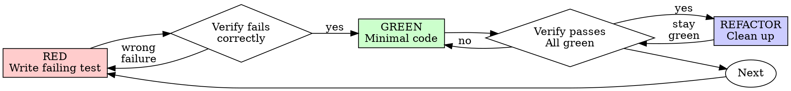

# Review interface runner split

> This archive contains visible conversation activity and tool records. Private model reasoning and system/developer instructions are not available here.
<!-- codex-event:{"kind":"state","timestamp":"2026-07-30T15:57:38.445Z","phase":null} -->
## Task state: task_started · 2026-07-30T15:57:38.445Z

```text
{
  "type": "task_started",
  "turn_id": "019fb3be-dedc-7161-a657-10c02fe6e6d1",
  "started_at": 1785427058,
  "model_context_window": 258400,
  "collaboration_mode_kind": "default"
}
```

<!-- /codex-event -->

<!-- codex-event:{"kind":"user","timestamp":"2026-07-30T15:57:38.774Z","phase":null} -->
## User · 2026-07-30T15:57:38.774Z

observe docs/superpowers/specs/2026-07-29-interface-runner-split-design.md - ready to implement?


<!-- /codex-event -->

<!-- codex-event:{"kind":"progress","timestamp":"2026-07-30T15:57:44.206Z","phase":"commentary"} -->
## Codex progress · 2026-07-30T15:57:44.206Z

I’m reviewing the design for implementation readiness. I’ll use the second-opinion review workflow because this is a substantial architecture spec, then check the document against the current code and call out any blockers or ambiguities.

<!-- /codex-event -->

<!-- codex-event:{"kind":"tool-call","timestamp":"2026-07-30T15:57:45.447Z","phase":null} -->
## Tool call: exec_command · 2026-07-30T15:57:45.447Z

```json
{
  "cmd": "sed -n '1,240p' /Users/masterman/.agents/skills/using-ultrapowers/SKILL.md && sed -n '1,280p' /Users/masterman/.agents/skills/second-opinion/SKILL.md && sed -n '1,320p' docs/superpowers/specs/2026-07-29-interface-runner-split-design.md",
  "workdir": "/Users/masterman/NLP/omniharness",
  "yield_time_ms": 10000,
  "max_output_tokens": 40000
}
```

<!-- /codex-event -->

<!-- codex-event:{"kind":"tool-result","timestamp":"2026-07-30T15:57:45.523Z","phase":null} -->
## Tool result: call_blq8qVP0pHvpoqCnlIwPhbkz · 2026-07-30T15:57:45.523Z

````text
Chunk ID: fcea29
Wall time: 0.0000 seconds
Process exited with code 0
Original token count: 9162
Output:
---
name: using-ultrapowers
description: Use when starting any conversation - establishes how to find and use skills, requiring skill invocation before acting
---

<SUBAGENT-STOP>
If you were dispatched as a subagent to execute a specific task, skip this skill.
</SUBAGENT-STOP>

# Using Ultrapowers

Use relevant skills before acting, but keep process proportional to the task.

## Instruction Priority

1. User instructions and local repo instructions
2. Ultrapowers skills
3. Default model behavior

If the user says not to create extra repository isolation, or says to work directly in the current repository, follow that instruction.

## Core Rule

Before responding, ask:

1. Is there a process skill that governs how to approach this?
2. Is there an implementation skill that governs how to execute it?
3. Is the request substantial enough to justify that process, or is it a tiny mechanical edit?

If a skill applies and the task is substantial enough to justify it, use it before continuing. If the request is a tiny mechanical edit, make the edit directly with targeted verification.

## Proportional Skill Use

Do the smallest responsible workflow that matches the request.

For tiny, unambiguous mechanical edits, do the edit directly:

- changing a color value,
- fixing a typo,
- tweaking short copy,
- changing a prompt sentence,
- renaming a label,
- adjusting obvious spacing or formatting,
- making a one-line config or docs correction.

For these, do not run brainstorming, write a plan, or force TDD unless the change affects product behavior, data, persistence, control flow, user journeys, or non-obvious architecture.

Use the heavier process when the request is ambiguous, user-facing behavior changes, multiple files/modules are involved, the user journey can change, or the change could create regressions that are not obvious from a quick targeted check.

## Default Posture

- Work in the current repository by default.
- YOU WILL NEVER CREATE A BRANCH unless explicitly instructed.
- Ask the user whether we should work in worktrees as part of the planning.
- YOU WILL ONLY CREATE A WORKTREE if explicitly instructed.
- Keep skill use proportional. Tiny mechanical edits should stay tiny.
- Every project should have a `.gitignore`.
- Never commit or push secrets, credentials, local environment files, `node_modules`, dependency caches, build outputs, coverage output, logs, temporary files, or intermediate/generated artifacts unless the human explicitly asks to version a specific generated artifact.
- Deliver full product functionality by default. NO FAKE COMPONENTS, NO MOCKS, NO PLACEHOLDERS, NO FALLBACKS as substitutes for the requested functionality unless the human explicitly asks for a prototype or scaffold.
- For app, UI, and product-surface work, run a PM pass during planning. Treat it as mandatory default behavior, not optional polish.
- For app, UI, and product-surface work, consider `agentic-user-journey-testing` for important user stories, but do not run it without explicit user approval.
- Use `second-opinion` for substantial saved implementation plans, and for unusually hard, creative, high-risk, or architecture-heavy specs when an independent external review could improve the artifact. Prefer a different available coding harness for that review, such as Codex asking Claude Code or Claude Code asking Codex. If no different harness is available, the same harness is fine; the second opinion is still mandatory for matching artifacts.
- Refactor code when a file passes 1200 lines. Do not normalize oversized files as the default end state.
- Use user stories in specs and plans when they clarify behavior or value.
- Default UI work to `shadcn/ui` unless the user says otherwise.
- For any dashboard, admin surface, product UI, SaaS app, internal tool, settings-heavy app, data table view, auth flow, sidebar layout, or React/Next.js web app UI, use `start-from-blocks` before designing or implementing. Start by installing or copying the closest fitting official shadcn Block, then adapt it. No vibed dashboard/web-app design from blank files.
- Before adding any individual UI control, check whether `shadcn/ui` already provides a control that does what is needed. Use the available shadcn control first, then customize it, instead of hand-building a one-off control.
- Treat desktop and mobile responsiveness as first-class from the beginning.
- Prefer explicit routing unless the framework strongly defaults to file-based routes.
- For React apps, use `building-react-apps` for state managers, explicit transitions, routing, refs, imports, package-manager defaults, and frontend configuration defaults.
- For React apps with server state, optimistic UI, caches, polling, SSE/WebSocket streams, background jobs, persistence, or client/server synchronization, use `client-server-state-invariants` during planning and verification.
- For React or Next.js slowness, root-load, compile-time, SSR/hydration, bundle, import-bloat, or UI dependency cleanup work, use `optimizing-react-next-apps`.
- Prefer strong instrumentation and auditability for backend behavior.
- When a project has backend or agent workflows, prefer a fully instrumented control plane: persist meaningful events, tool calls, actions, results, errors, and state transitions, and expose them through a CLI or other scriptable interface so the full system can be inspected and tested without the UI.
- Use `instrumenting-control-planes` when building, planning, reviewing, or debugging backend decisions, agent workflows, recovery paths, retries, deletes, long-running jobs, SSE/WebSocket streams, or user-visible failures.
- Use `learning-from-bugs` after diagnosing or fixing meaningful architecture, storage, memory, persistence, control-plane, or system-level bugs so reusable lessons become durable.
- Do not default to silent, masked, or over-abstracted errors.
- When a project has a frontend, prefer surfacing full backend error details and stack traces to the frontend so failures stay visible, debuggable, and testable end-to-end.
- Treat persistence of settings and preferences as explicit design work.
- For every meaningful UI setting, define whether it persists, where it is stored, how it is read and written, who owns it, and how reset, sync, migration, and testing are handled.

See `docs/ultrapowers-defaults.md` for the canonical fork defaults.

## Skill Priority

1. Process skills first
2. Implementation skills second

Examples:

- "Make this button blue" -> inspect the relevant file, make the small edit, do targeted verification
- "Update this prompt sentence" -> edit the prompt directly and verify the final text
- "Build a feature" -> `brainstorming` with a PM pass first, then `writing-plans`, then execution; consider approval-gated `agentic-user-journey-testing` for app workflows
- "Fix this bug" -> `systematic-debugging`, then the relevant implementation skill; if the root cause is meaningful or systemic, finish with `learning-from-bugs`
- "Review this change" -> `requesting-code-review`

## Examples Of User Override

- If a task feels risky and the user did not ask for extra repository isolation, keep working in the current repository unless the user explicitly instructs otherwise.
- If a stack supports file-based routing but the user says not to use it, choose an explicit routing approach instead.
- If a framework strongly defaults to file-based routing, such as Next.js App Router, use the framework-native routing model unless there is a good reason not to.
- If a frontend skill suggests `shadcn/ui` but the user wants another design system, follow the user.

## Red Flags

- "I need a whole workflow for this tiny edit" -> no. Use the smallest responsible process.
- "This is simple, so I need the whole process anyway" -> no. Tiny mechanical edits should stay tiny.
- "I'll create extra repository isolation just to be safe" -> forbidden unless the user clearly asked for it.
- "I already know the skill" -> read the current version before relying on it
---
name: second-opinion
description: Use when writing or hardening substantial specs, implementation plans, architecture plans, design plans, or unusually hard creative decisions before execution
---

# Second Opinion

Use an external headless coding harness as a persistent reviewer while shaping substantial plans and specs.

## When To Use

Use this skill for:

- any saved implementation plan produced through `writing-plans` (mandatory),
- substantial specs where ambiguity, architecture, product scope, or implementation risk remains,
- unusually hard or creative design decisions where another independent pass could improve the result.

Skip it for tiny mechanical edits, obvious one-task changes, or short plans that are not being saved as durable execution artifacts.

## Core Rule

Run the second opinion through a separate reviewer session. Prefer a different available coding harness from the one currently writing the plan or spec because cross-harness review catches more blind spots than asking the same agent family to review its own artifact.

Different harnesses are preferred, not required. The second opinion itself is required for matching artifacts. If no different harness is available, using the same harness in a separate headless/session context is fine.

There is no budget limit for second opinions. Never add, infer, suggest, or pass a token, time, cost, or pass budget for second-opinion review.

Preferred pairings:

- Codex asks Claude Code when `claude` is available.
- Claude Code asks Codex CLI when `codex` is available.
- Gemini asks Codex or Claude Code when either is available.
- OpenCode asks Codex or Claude Code when either is available.
- Other harnesses ask the best available different coding harness.

If the preferred different harness is missing, use any other installed headless coding CLI (`gemini`, `opencode`, etc.) before falling back to the same harness. Same-harness review is acceptable when no different headless reviewer is available; say that explicitly and continue with the required second opinion.

Do not substitute an in-process self-review, browser chat, or a non-coding assistant unless the user explicitly asks for that. The point is a separate process with its own model, tool defaults, and context.

## Session Protocol

1. Identify the current harness.
2. Check for a different installed headless coding CLI, starting with the preferred pairing above.
3. Resolve commands with `command -v`; never guess an absolute executable path.
4. Confirm the installed version's headless, permission, output, and resume flags with `--help`.
5. Put the complete review prompt and artifact content in a prompt file unless the reviewer genuinely needs workspace context. Explicitly say not to inspect or edit files.
6. Run the reviewer from `PATH` with tools disabled when all context is inline. Otherwise grant only read access to the supplied artifact.
7. Wait for a complete written response. Ordinary runtime is not failure; keep waiting and give the user brief progress updates.
8. Accept the pass only when the final output contains the requested `READY` or `HARDEN` verdict and written findings.
9. If the host blocks the reviewer's authentication or state directory, request the required host permission and rerun the exact command unchanged.
10. If the command still fails, exits without a valid verdict, returns blank output, or returns only a tool request, move immediately to the next installed harness.
11. Capture the session id or thread handle when available, and resume that session for later passes.
12. Incorporate useful feedback, ignore conflicting or out-of-scope advice, and rerun after material revisions.
13. Stop when the reviewer says the artifact is ready, when the user explicitly waives the second-opinion gate, or when no separate reviewer surface is available.

Do not convert repeated reviewer passes into a fixed review budget. If the reviewer keeps finding material concerns, keep addressing them until the artifact is ready or ask the user how they want to proceed.

## Harness Discovery

Use `command -v` or the platform equivalent to check for reviewer CLIs before choosing a fallback. Do not install a new harness just for a second opinion unless the user asks.

Typical checks:

```bash
command -v claude || true
command -v codex || true
command -v gemini || true
command -v opencode || true
```

Invoke the discovered command by name. Do not invent paths under `/Applications`, package-manager directories, or a different user's home directory. A command present on another machine is not evidence that the same absolute path exists here.

Prefer read-only or plan-mode permissions for the reviewer. The reviewer should inspect and comment, not mutate files.

## Claude Code Pattern

For Claude Code, discover the current flags with `claude --help`. When the prompt file already contains the artifact, use a clean, tool-free review:

```bash
claude \
  --model sonnet \
  --permission-mode plan \
  --safe-mode \
  --tools "" \
  --output-format text \
  -p "$(cat /tmp/second-opinion-prompt.txt)" \
  > /tmp/second-opinion-pass-1.txt
```

Do not point this tool-free command at an artifact path it cannot read. Put the artifact text in the prompt file. If the artifact is too large to inline, allow only the `Read` tool and provide the exact artifact path.

If the installed Claude Code version exposes resume/session flags, use them for later passes. Otherwise, include the previous review summary and revised artifact in the next headless prompt.

## Codex CLI Pattern

For Codex, prefer a non-ephemeral session so it can be resumed:

```bash
codex exec \
  -C "$PWD" \
  --sandbox read-only \
  --skip-git-repo-check \
  --ignore-user-config \
  --json \
  -o /tmp/second-opinion-pass-1.txt \
  - < /tmp/second-opinion-prompt.txt
```

Capture the session id from the JSONL event stream when available. Resume the same reviewer:

```bash
codex exec resume \
  "$SESSION_ID" \
  --ignore-user-config \
  --json \
  -o /tmp/second-opinion-pass-N.txt \
  - < /tmp/second-opinion-followup.txt
```

If the CLI version exposes a different headless/resume shape, follow that version's `--help` output.

`--sandbox read-only` controls the reviewer's workspace access; the Codex process may still need normal host access to its own state database under `CODEX_HOME`. If the outer host blocks that state access, rerun the same command through the host's permission mechanism rather than changing paths or weakening the reviewer's workspace sandbox.

## Gemini CLI Pattern

For Gemini, prefer non-interactive prompt mode with plan/read-only approval when available:

```bash
gemini --prompt "$(cat /tmp/second-opinion-prompt.txt)" --approval-mode plan --output-format text > /tmp/second-opinion-pass-1.txt
```

Resume the same session with `--resume` if that is available and useful for later passes.

## Review Prompt Template

```text
You are my second-opinion planning reviewer. Use only the content in this prompt. Do not inspect or edit files and do not call tools.

User goal: [brief goal]
Context and constraints:
- [important constraints, user preferences, repo defaults]

Artifact:
[paste the complete plan or spec here]

Please judge whether this plan/spec is ready to use.

Look for:
- missing requirements or user instructions,
- vague tasks, placeholders, fake components, mocks, or fallback behavior posing as final work,
- scope creep or non-obvious product decisions that need user confirmation,
- missing file map, ownership, state, persistence, instrumentation, error, or verification details,
- sequencing problems or tasks that are too large to execute safely,
- test gaps and unclear acceptance criteria.

Return:
1. Verdict: READY or HARDEN
2. Highest-impact findings, with concrete fixes
3. Anything you would deliberately leave alone
```

## Handling Feedback

Treat the reviewer as advisory, not authoritative. Apply feedback when it improves correctness, completeness, clarity, safety, or testability. Do not apply feedback that conflicts with the user, local repo instructions, or already-approved scope.

The reviewer feedback does not need to be copied into the plan or spec. Keep the durable artifact clean unless the user explicitly asks for review notes.

## Completion And Fallback Gate

| Result | Action |
|---|---|
| Written `READY` or `HARDEN` verdict with findings | Accept the pass |
| Explicit authentication or state-permission error | Rerun the exact command with the host permission it requested |
| Nonzero exit, blank output, partial output, missing verdict, or tool-only response | Try the next installed harness |
| Reviewer is still working normally | Keep waiting; do not mistake duration for failure |

Exit code zero alone does not complete the review. A JSON tool request, an attempted file search, or prose without the requested verdict is not a written review.

## Failure Mode

Follow the fallback chain until one harness returns a valid written verdict. If no different headless coding harness succeeds, say that explicitly and use the current harness headlessly if possible. Same-harness review still satisfies the required second-opinion gate when it runs as a separate reviewer session. If no separate reviewer surface is available at all, stop and say the mandatory second opinion cannot be run; do not replace it with an in-process self-review unless the user explicitly waives the gate.
# Interface / Runner Split — Design

Date: 2026-07-29
Status: Draft for review (revised after cross-harness second opinion)

## 1. Goal

Split OmniHarness into two independently runnable pieces:

- **Runner** — a headless Node service that owns all domain state and processes:
  SQLite, supervisor, agent-runtime bridge, PTY terminals, SSE event stream, auth.
  No Next.js. Serves only data (plus the static interface bundle for the web/PWA
  path).
- **Interface** — a self-contained static React SPA (Vite build) that connects to
  one or more runners over HTTP + SSE. Ships as: web page served by any runner,
  installable PWA (phone), and the existing Electron shell as a pure remote
  client. The existing VSCode shell keeps its behavior (it is already
  remote-capable; its default port and auth wiring get updated).

Motivations, in priority order:

1. Interface installable on a phone/laptop connecting to **multiple remote
   runners**.
2. Backend runs as a lean process that does not also host a frontend toolchain
   (Next dev today balloons to 8 GB+ RSS).
3. Web version keeps working exactly as it does now (same URL shape, same UI).

## 2. Decisions already made (user-confirmed)

| Decision | Choice |
|---|---|
| Next.js | **Remove.** Interface becomes a Vite SPA; runner serves the built bundle and injects the bootstrap JSON into `index.html` at serve time (preserves today's zero-round-trip boot; verified that the app tree is `ssr:false` and SSR only emits the BootShell skeleton + bootstrap blob). |
| Native shells v1 | **Electron** (existing `apps/electron`, converted to pure remote client). Phone = existing PWA support, now served by the runner. VSCode shell behavior unchanged. Tauri: future option, out of scope. |
| Multi-runner UI v1 | **Runner switcher**: save N runner profiles, connect, switch; one runner's data on screen at a time. Merged cross-runner views: future. |
| Backend topology | **Keep two services** as today: the omni API server and the agent-runtime bridge (port 7800) stay separate processes. Clients only ever talk to the API server; the bridge keeps binding to localhost by default (`OMNIHARNESS_AGENT_RUNTIME_HOST`). A "runner" deployment = both processes co-located on one machine sharing one filesystem, managed by one start script. |

## 3. Verified current state (what we build on)

The split is substantially pre-architected:

- **Portable route registry**: `src/runtime/http/routes/index.ts` registers all 62
  method+path pairs framework-free (Fetch Request/Response). All 49 Next API
  routes are thin adapters over it.
- **Standalone server**: `src/runtime/http/server.ts` (`startOmniServer`) exists,
  with `staticDir` support — but cannot stream (buffers `arrayBuffer()`), so the
  two SSE endpoints (`/api/events`, `/api/terminals/:id/stream`) do not work
  through it yet.
- **Client transport abstraction**: `src/runtime-api/` (`RuntimeAPIs` interface;
  `web.ts` already takes `baseUrl` + injectable `fetch`/`EventSource`).
- **Non-Next entry**: `src/ui/render-web.tsx` mounts `<OmniApp>` without Next.
- **Bootstrap over HTTP**: `GET /api/runtime/bootstrap` already mirrors the SSR
  bootstrap for Electron/VSCode.
- **Transports**: HTTP JSON + SSE only. No WebSockets, no server actions, no tRPC.

Known debts that gate the split (from exploration):

- **(B) Streaming**: standalone server buffers responses; SSE endpoints hang.
- **(C) Auth**: cookie + `SameSite=Lax` + `enforceSameOrigin` on all mutations +
  zero CORS headers → a cross-origin interface cannot authenticate.
- **(D) Runner identity**: `RuntimeAPIs` is a flat singleton; managers, SSE
  cursor, and query caches assume "the one server".
- **(H) 29 files** still hardcode `fetch('/api/...')`/`new EventSource('/api/...')`
  instead of going through `RuntimeAPIs` (list in
  `docs/architecture/common-runtime-multi-surface.md` §"debt").
- **(G) Client→server imports**: `src/server/workers/entries-types.ts` (types),
  `src/server/planning/review-preferences.ts` (runtime zod import) are imported
  by client components.
- **(A) Same-process event bus**: `src/server/events/named-events.ts` ring +
  `live-updates.ts` listener set are module-level memory → the API server must
  remain a single process. This is accepted and documented, not changed.

## 4. Target architecture

### 4.1 Repository shape (Approach A — in-place, two build targets)

Stay one pnpm package for now. Two build targets with an enforced boundary,
no mass file moves:

```
src/server/       → runner only (never bundled into interface)
src/runtime/      → runner only (HTTP registry, standalone server, bootstrap)
src/shared/       → NEW: types + pure logic importable by both sides
src/lib/          → interface-leaning isomorphic helpers (already clean)
src/runtime-api/  → interface transport layer (multi-runner aware)
src/ui/, src/components/, src/interface/home/ → interface
apps/interface/   → NEW: Vite app (index.html, vite.config.ts, entry that
                    reuses src/ui/render-web.tsx)
apps/electron/    → existing shell, becomes pure remote client
apps/vscode/      → behavior unchanged; port/auth wiring updated
scripts/runner.ts → NEW: runner entrypoint (replaces Next start for backend)
```

`src/app/` (Next) is deleted at the end of Milestone 2; `src/app/home/` is
interface code and moves to `src/interface/home/` (import-path rename only) so
the `src/app` deletion is clean.

Boundary enforcement:
- ESLint `no-restricted-imports`: anything bundled by Vite may not import
  `@/server/*` or `@/runtime/*` (only `@/shared/*`).
- The two offending imports (G) move: `entries-types.ts` and
  `review-preferences.ts` → `src/shared/`, with re-export shims left at the old
  paths for server-side importers.
- Vite build failing on a server import is the backstop.
- Typechecking is split: separate `tsc --noEmit` projects for runner
  (`src/server` + `src/runtime`), shared, and interface, so a server-only type
  error can't hide in the SPA project and vice versa.

**Production artifact contract** (what a headless box installs):
- `pnpm build` → `dist/interface/` (hashed static assets + `index.html`
  template). The runner itself keeps running from source via `tsx`
  (existing convention in `scripts/start.ts`); no Vite, Next, or watcher runs
  in production.
- Runner with `dist/interface` present → serves SPA + API. Absent → **API-only
  mode**: `/` returns a plain informational page, a named event
  `runner.static_ui_missing` is emitted, and everything else works (this is a
  supported deployment, not an error). If `--static-dir` is passed explicitly
  and missing, startup fails loudly.
- Memory acceptance: measured via `scripts/measure-local-dev.mjs` over the
  **whole process tree** (API process, bridge, gateway children, plus
  Vite/watchers in dev) — dev combined RSS **< 2 GB**, production runner
  **< 1 GB** — recording both peak and end-of-workload RSS after a scripted
  10-minute conversation workload. A controlled local benchmark gate, not a
  CI-hardware assertion. (Today's Next dev process alone exceeds 8 GB.)

**Rejected alternatives**:
- *Approach B — full monorepo package extraction* (`packages/shared|runner|interface`):
  cleaner end state but moves ~460 files, breaks every open branch, buys
  nothing functional now. Revisit after the split is proven.
- *Approach C — keep Next as frontend host*: rejected by user (RAM, second
  pipeline).

### 4.2 Runner

**Entrypoint** `scripts/runner.ts`:
1. `await dbReady` (schema init).
2. Start supervisor watchdog (`ensureSupervisorRuntimeStarted()`).
3. Start Claude model gateway (`ensureClaudeModelGatewayStartedAtBoot()` + shutdown hooks).
4. Spawn/adopt the bridge exactly as `scripts/dev.ts` does today (lockfile,
   health checks, `managed-bridge.ts`) — extracted into a shared module so
   dev.ts and runner.ts don't duplicate it.
5. `startOmniServer({ staticDir, port })` — one HTTP port for API + SSE + SPA.

This replaces `src/instrumentation.ts` (deleted with Next).

**Lifecycle contract**:
- `GET /api/healthz` (liveness, no auth, no state) and readiness reflected in
  the existing bootstrap route. Bridge unavailable at boot → runner starts,
  serves UI/API, reports `bridge: "starting" | "unavailable"` in bootstrap and
  emits `runner.bridge_unavailable`; bridge crash → existing supervisor
  sync/retry behavior, surfaced as named events (`runner.bridge_ready` on
  (re)connect). Port conflict → fail fast; the owning pid is reported
  best-effort via the runner's own lockfile (bridge-lock pattern), since bind
  errors don't carry it cross-platform. Shutdown order: stop accepting new
  connections → send a dedicated `runner.stopping` frame to open SSE streams
  (NOT `stream.resync_required`, which would trigger snapshot reloads against
  a dying server; clients show "runner stopping" and back off) → bounded
  flush window, then abort remaining readers → PTYs get SIGTERM with a
  deadline, then SIGKILL → gateway child likewise → bridge: terminated if
  this runner spawned it, released (lock only) if adopted.

**Streaming fix (prerequisite for everything)**: `writeFetchResponse` in
`src/runtime/http/server.ts` pipes `Response.body` (Web `ReadableStream`) to the
Node `ServerResponse` chunk-by-chunk, flushes headers immediately, disables
Nagle for `text/event-stream`, and destroys the upstream reader on client
disconnect. Non-streaming responses keep the buffered path.

**Static serving + bootstrap injection contract**:
- `GET /` and `/session/:runId` (the deep-link rewrite from `next.config.ts`)
  serve `index.html` with
  `<script id="omni-bootstrap" type="application/json">…</script>` injected —
  same payload semantics as today's SSR (`includeInitialData: false`). JSON is
  serialized with `<`, `>`, `&`, U+2028, U+2029 escaped so it cannot terminate
  the script element.
- SPA fallback applies only to GET navigations without a file extension that
  aren't `/api/*`. `/api/*` and missing assets return proper 404s — never
  `index.html`.
- Hashed assets: `Cache-Control: public, max-age=31536000, immutable`.
  `index.html`: `no-store` (it contains per-request auth state).
- Static file resolution rejects path traversal and does not follow symlinks
  out of `staticDir`.
- **Frontend security policy** (browser tokens live in `localStorage`, so
  same-origin script injection is the real threat): interface pages ship a
  CSP **as an HTTP header** (meta tags can't enforce `frame-ancestors`) —
  `default-src 'self'`, `script-src 'self' 'sha256-<theme-bootstrap-hash>'`,
  `style-src`/`font-src`/`img-src`/`worker-src 'self'` (+ `data:`/`blob:`
  where the app needs them), `frame-ancestors 'none'`, `object-src 'none'`,
  `connect-src 'self' https: http://localhost:* http://127.0.0.1:*` (bearer
  runners are user-added HTTPS origins; loopback allowed for dev),
  `Referrer-Policy: no-referrer`. No third-party scripts, ever. All
  server-provided content (agent output, errors, project paths) renders
  through the existing markdown/text pipeline — a test asserts none of it can
  introduce executable markup.
- The interface reads the inline blob if present, else falls back to
  `GET /api/runtime/bootstrap` (Electron / remote / dev / offline-PWA path).

**Ports & processes** (unchanged topology, per user decision):
- API server: default 3050 (today's web port), configurable.
- Bridge: 7800, localhost-bound by default. Existing `OMNIHARNESS_*` env vars
  keep their meanings. The dev compression proxy (3035) is retired with Next
  dev; the VSCode default `serverUrl` moves to the runner port.
- `scripts/start.ts`, `controller.sh`, `omni.sh` launch the runner instead of
  Next.

### 4.3 Auth & cross-origin model

Two session transports against the same `auth_sessions` table and expiry rules:

**Cookie sessions (unchanged)** — for the interface served by the runner itself
(web + PWA on that runner's origin). `SameSite=Lax`, `enforceSameOrigin` on
mutations, no CORS involvement. No behavior change.

**Bearer sessions (new)** — for every cross-origin client: the PWA installed
from runner A talking to runner B, Electron, the Vite dev server, future
shells.

1. **Issuance**: `POST /api/auth/pair/redeem` and `POST /api/auth/login` accept
   `{"tokenTransport":"bearer"}` and return the opaque session token in the
   response body. Guards accept `Authorization: Bearer <token>`; same-origin
   enforcement is skipped for bearer requests (the token is never ambient, so
   it is the CSRF defense). Session rows gain provenance columns and the
   guard enforces from **stored** provenance, not per-request headers:

   ```ts
   transport: "cookie" | "bearer";
   boundOrigin: string | null;      // exact Origin at issuance, browser flows
   clientKind: "browser" | "native"; // native = no Origin header at issuance
   ```

   - A `browser` bearer session **always** requires its exact `boundOrigin`;
     missing, different, or `Origin: null` → 401, audited
     (`auth.bearer_origin_rejected`). Threat model, stated honestly: this is
     **browser-origin isolation** (script on another origin can't use the
     token), not cryptographic token binding — a stolen token replayed by a
     non-browser client can forge `Origin`. Bearer tokens remain replayable
     secrets; DPoP/device keys are out of scope for v1. The v1 protections
     against theft are CSP, expiry/revocation, redaction, and encrypted
     storage.
   - Only sessions issued through an originless flow (Electron main process,
     VSCode host, CLI) get `clientKind: "native"`, `boundOrigin: null`.
   - Cookie tokens are never accepted as bearer tokens and vice versa
     (transport checked against presentation).
2. **Origin binding / CORS (this is the multi-runner design)**: browsers
   enforce CORS, so runner B must answer the PWA-from-runner-A origin. Policy:
   - `POST /api/auth/pair/redeem` and `/api/auth/login` are callable from
     **any** origin (`Access-Control-Allow-Origin: <reflected>`, no
     credentials mode) — protected by the expiring single-use pairing token /
     password + existing rate limiting (`auth/rate-limit.ts`).
   - Bearer requests from the session's `boundOrigin` get exactly that origin
     reflected (`Vary: Origin`) — **on error responses too**, so the interface
     can read real API errors cross-origin.
   - `GET /api/healthz` allows non-credentialed cross-origin GET from any
     origin (the switcher's status ping must work from a browser).
   - Preflight: `OPTIONS` handled registry-wide for bearer routes
     (`Allow-Headers: authorization, content-type`, methods per route,
     `Access-Control-Max-Age` set). Credentialed wildcard CORS is never used;
     cookie routes never get CORS headers.
   - No static allowlist config needed for the core story; an optional
     `OMNIHARNESS_CORS_ORIGINS` allowlist can additionally enable
     cookie-less same-device conveniences in dev.
   - Pairing tokens are the one secret that transits a URL (QR deep link):
     they are already short-lived and single-use; additionally the interface
     strips `?pair=` via `history.replaceState` immediately on load, all
     interface pages send `Referrer-Policy: no-referrer`, and pair tokens are
     covered by the same log/proxy redaction rules as bearer tokens. Session
     tokens themselves never appear in URLs (stream tickets are the only
     query-string credential, and they are 60 s single-use).
3. **SSE auth**: `EventSource` cannot set headers. Bearer clients call
   `POST /api/auth/stream-ticket` → short-lived (60 s), **single-use,
   atomically consumed**, bound to (session, exact stream path); passed as
   `?ticket=`. Redemption validates the request origin against the *session's*
   stored `boundOrigin` (not just the ticket). Reconnection is owned by
   `LiveEventConnectionManager` (it already owns retry + `Last-Event-ID`
   bookkeeping): native `EventSource` auto-retry is disabled (`close()` on
   error), and each (re)connect fetches a fresh ticket and passes the saved
   cursor via the existing `?lastEventId=` parameter. Tickets never appear in
   logs (redaction in the request logger); accepted only over HTTPS except on
   loopback. Same mechanism for `/api/terminals/:id/stream`.
4. **Pairing UX for remote devices**: existing QR flow already encodes URL +
   pair token; the "Add runner" screen accepts the QR deep link or pasted
   URL+token, redeems with bearer transport, stores the token in the profile.
5. **Network exposure policy** (changes current permissive behavior —
   flagged for user confirmation): binding the API server to a non-loopback
   host with no auth configured **refuses to start** unless
   `OMNIHARNESS_ALLOW_UNAUTHENTICATED_NETWORK=1` is set; bearer issuance over
   plaintext non-loopback HTTP is likewise refused without the same explicit
   override. Loopback HTTP stays frictionless. `auth.unprotected_non_loopback`
   named event is emitted whenever the override is used.
6. **Trusted-proxy contract** (HTTPS behind reverse proxies / tunnels): the
   runner honors `Forwarded`/`X-Forwarded-Proto` only when the immediate
   socket peer is in `OMNIHARNESS_TRUSTED_PROXIES` (addresses/CIDRs);
   otherwise protocol security is judged from the actual socket. Prevents
   spoofed `X-Forwarded-Proto: https` from downgrading the plaintext rule
   above. Docs cover the supported tailscale / TLS-terminating-proxy setups.
   All credentialed client requests — including initial pairing — use
   `redirect: "manual"` so secrets never follow redirects.
7. **First-run provisioning** (headless box, fresh DB — required so the
   refuse-to-start policy has no dead end): `omni auth init` generates either
   a password (stored as argon2 hash) or a **single-use, short-lived bootstrap
   pairing token**, and prints the pairing URL/QR to the attached TTY — or
   writes it to a file with `0600` perms via `--pair-token-file` for
   unattended deploys. In unattended mode with no secret source configured,
   the runner fails with instructions rather than starting open. The normal QR
   flow (which requires an authenticated session) is unchanged; `omni auth
   pair-url` prints an equivalent pairing link for an already-provisioned
   headless runner. Acceptance test: empty DB → provision → non-loopback bind
   → pair a phone-origin interface → bootstrap token invalidated after use.
8. **Redaction**: `Authorization` headers, pair tokens, stream tickets, and
   token-bearing URLs are scrubbed from logs, error payloads, and named-event
   details.
9. **Next removal**: `NextRequest` usage in `auth/guards.ts`,
   `auth/session.ts`, `api-errors.ts` is replaced with plain Fetch `Request`
   (the 9-line shim `routes/next-request.ts` shows this is mechanical).

### 4.4 Interface: Vite SPA

- `apps/interface/` with Vite + React. Entry reuses `src/ui/render-web.tsx`;
  `src/app/layout.tsx` content is ported to `index.html` (theme bootstrap
  script, meta/manifest/icons) and a `<Providers>` root.
- Remove Next-isms (all verified small):
  - `next/dynamic` (4 files) → `React.lazy` + `Suspense`.

````

<!-- /codex-event -->

<!-- codex-event:{"kind":"tool-call","timestamp":"2026-07-30T15:57:48.250Z","phase":null} -->
## Tool call: exec_command · 2026-07-30T15:57:48.250Z

```json
{
  "cmd": "sed -n '321,760p' docs/superpowers/specs/2026-07-29-interface-runner-split-design.md",
  "workdir": "/Users/masterman/NLP/omniharness",
  "yield_time_ms": 10000,
  "max_output_tokens": 40000
}
```

<!-- /codex-event -->

<!-- codex-event:{"kind":"tool-result","timestamp":"2026-07-30T15:57:48.322Z","phase":null} -->
## Tool result: call_FxAtvXmiHTI4AicodADlMAej · 2026-07-30T15:57:48.322Z

````text
Chunk ID: 70c5d4
Wall time: 0.0000 seconds
Process exited with code 0
Original token count: 4543
Output:
  - `next/image` (5 files) → `` (all usages are local static assets).
  - `next/font/google` → self-hosted Geist via `@fontsource` (offline-friendly,
    no Google fetch at build or runtime).
  - `src/app/home/` → `src/interface/home/` (rename only).
- **PWA & service worker contract**:
  - `manifest.webmanifest`, `sw.js`, `PwaBootstrap` move to the Vite app,
    served by the runner → phone install keeps working per runner origin.
  - The SW **never caches `index.html`** (it carries per-request auth state).
    It precaches hashed assets plus a static, non-personalized offline shell
    that boots by calling `/api/runtime/bootstrap`.
  - **The app mounts and loads `RunnerRegistry` independently of same-origin
    bootstrap success**: if the hosting runner is down, its profile is marked
    offline but the switcher stays usable and a saved remote runner connects
    normally (the installed interface is not held hostage by its origin
    runner). Test: install from A, save B, stop A, launch from SW cache,
    connect to B.
  - SW versioning: build hash in the SW file; old caches evicted on activate.
    The offline shell response carries the same CSP header as live pages.
- **Dev workflow**: `pnpm dev` = runner via `tsx watch` + Vite dev server
  proxying `/api` to the runner (cookies stay same-origin in dev; no CORS
  needed). **The dev UI lives at Vite's port (5173)**; the runner port serves
  whatever `dist/interface` build exists (or API-only mode) — it is the
  canonical URL for production and packaged-mode e2e, not for dev. Expected
  dev RSS per §4.1 contract.
- **Prod web**: `vite build` output is what the runner serves.

### 4.5 Multi-runner client model

**Runner identity is server-generated.** The bootstrap payload (inline and
`/api/runtime/bootstrap`) gains:

```ts
runner: {
  instanceId: string;   // generated once, stored in the settings table
  name: string;         // user-configurable display name
  version: string;      // package version
  apiRevision: number;  // monotonically bumped on breaking API change
}
```

Identity travels with the dataset: a restored/cloned database keeps its
`instanceId` (documented rule), and `omni runner rekey` mints a new identity
for deliberate clones. The client never treats two simultaneously reachable
endpoints with one identity as interchangeable — it flags the conflict.

Client-side profile:

```ts
type RunnerProfile = {
  id: string;                 // client uuid for list keys only — NOT identity
  runnerInstanceId?: string;  // learned at first successful connect/pair
  label: string; baseUrl: string;
  authToken?: string;         // bearer; absent for the same-origin runner
  schemaVersion: 1;
  createdAt: string; lastConnectedAt?: string;
};
```

- Identity rules: after pairing, the profile pins `runnerInstanceId`. If
  `baseUrl` later resolves to a different instance id → connection blocked
  with an explicit mismatch warning (re-pair to accept). Editing `baseUrl`
  clears the token. Two profiles resolving to the same instance id are flagged
  as duplicates. Authorization headers are never forwarded across cross-origin
  redirects (fetch wrapper uses `redirect: "manual"` for bearer requests).
- API compatibility: interface publishes the `apiRevision` range it supports;
  out-of-range runners are blocked with an explicit message (not a soft
  warning); equal-revision, different-version runners just show an info badge.
- **RunnerRegistry** (persisted): profiles + `activeRunnerId`, versioned
  schema (`schemaVersion`) with forward-migration and corrupt-store recovery
  (reset to same-origin default + toast, never a crash). Storage:
  `localStorage` on web/PWA (per-origin; the implicit same-origin runner is
  always present as a non-deletable profile); on Electron, profiles live in
  the **main process** store with tokens encrypted via `safeStorage`.
- **Electron security boundary**: remote HTTP/SSE happens in the **main
  process** (mirroring the proven VSCode extension-host bridge pattern,
  `src/vscode-extension/bridge.ts`); the renderer gets an IPC-backed
  `RuntimeAPIs` implementation and never sees bearer tokens. IPC surface is
  validated per-channel; external links open in the OS browser; navigation is
  locked to the bundled SPA. `safeStorage.isEncryptionAvailable()` is checked:
  when the platform provides no key store, tokens are session-only (or
  persisted plaintext only after explicit user consent), and the degraded
  state is surfaced — never silently claimed as encrypted.
- **Per-runner connection scope.** Everything currently keyed to "the server"
  becomes owned by a `RunnerConnection` created per profile: `RuntimeAPIs`
  instance, `LiveEventConnectionManager` (EventSource + cursor),
  `EventStreamStateManager`, snapshot cache, `WorkerEntriesManager`,
  notification manager. React context provides the *active* connection;
  TanStack Query keys gain a `runnerId` prefix (the client profile id).
  Switching runners swaps the context; inactive connections are **closed** in
  v1, except the switcher's status ping: `GET /api/healthz` per saved profile,
  15 s timeout, exponential backoff capped at 5 min, only while the switcher
  UI is open (no permanent background polling).
- **State invariants** (per `client-server-state-invariants`):
  - Ownership: all domain state belongs to the runner; the client persists
    only runner profiles, UI preferences, and drafts. Drafts are keyed by
    (runnerId, conversationId) so switching runners never leaks a draft.
  - Provenance: every snapshot/event frame is tagged with `runnerId` at the
    connection layer; reducers reject frames whose scope doesn't match.
  - Freshness: on switch/reconnect, the existing snapshot + `Last-Event-ID`
    resume protocol runs per runner; `stream.resync_required` unchanged.
  - Mutations carry their `runnerId`. A mutation completing after a switch is
    **not** treated as cancelled: its cache updates apply to the originating
    runner's query keys (which are simply not on screen), and failures surface
    as a notification naming the runner. Run/conversation ids are only unique
    per runner; all URL deep links (`/session/:runId`) resolve against the
    active runner only.
  - Races to test: rapid switching mid-stream; mutation resolving after
    switch; token revoked mid-session (401 → profile marked needs-reauth,
    banner + re-pair CTA); runner restarted mid-conversation (resume via
    cursor); instance-id mismatch on reconnect.

### 4.6 The 29 direct-fetch call sites

All migrate to methods on the per-runner `RuntimeAPIs` (extending
`src/runtime-api/types.ts` with the missing domains: runs, git, fs, attachments,
projects/memory, planning, accounts, notifications, terminals). Mechanical but
wide; `useHomeMutations.ts` (1,269 lines) is split by domain as part of the
migration (conversations / runs / planning / settings) to stay under the
1200-line rule. `InteractiveTerminal.tsx`'s `EventSource` goes through the
connection's ticket-aware stream opener.

### 4.7 Filesystem semantics

Paths shown in the UI (project pickers, file viewer, attachments) already flow
through runner APIs (`/api/fs`, `/api/fs/files`, `/api/attachments`) — they are
**runner paths** and keep working remotely. Co-location is a *capability, not a
heuristic*: the Electron shell marks a profile co-located only when it launched
that runner process itself (or the user explicitly asserts it). Only co-located
profiles offer `native.chooseFolder()` and OS editor links
(`project-file-links.ts`); everything else uses the `/api/fs` picker dialog and
the in-app file viewer. "localhost" in a URL proves nothing (SSH tunnels) and
is not used as a signal.

### 4.8 Notifications

- Web/PWA: web push keeps working for the runner that serves the PWA (its
  origin's service worker + its VAPID keys — the existing flow, unchanged).
  **Constraint acknowledged**: one SW registration holds one push
  subscription tied to one VAPID key, so a PWA installed from runner A cannot
  also receive native push from runner B in v1. Remote runners' events surface
  in-app while connected; cross-runner push relay is future work.
- Electron: `RuntimeAPIs.native.notify` already exists; the main process
  subscribes to the active runner's named events for notification-worthy
  kinds. Inactive-runner notifications are out of scope for v1.

## 5. User stories (v1 acceptance)

1. **Lean local dev** — As the builder, I run `pnpm dev` and get runner + Vite;
   combined RSS < 2 GB under the scripted workload (§4.1); the dev UI at
   Vite's port behaves identically to the current app. *(Acceptance: full
   existing e2e suite passes in packaged mode — built SPA served from the
   runner port — which is also the production parity gate.)*
2. **Headless runner** — I run `pnpm runner` on a box with no display; it
   serves API, SSE, and the built UI on one port (or API-only without
   `dist/interface`); `omni` CLI and `tests/lifecycle` drive it end-to-end.
3. **Phone** — I open the runner URL on my phone (tailscale/tunnel), install
   the PWA, pair via QR, and supervise agents; terminal, composer, and this
   runner's push notifications work; offline launch shows an explicit
   runner-unreachable shell, not a stale session.
4. **Electron remote** — In the desktop app I add a second runner by URL +
   pairing token, see both in the switcher with status dots, switch between
   them; each shows its own runs/conversations with correct resume after
   reconnect; tokens never reach the renderer.
5. **Failure honesty** — Unreachable runner → explicit offline banner with URL
   and error detail; reconnect resumes via `Last-Event-ID`; 401 → named runner
   + re-pair CTA; instance-id mismatch → blocked with explanation.
6. **Return visit** — Runner profiles, active selection, and UI preferences
   survive restart on web, PWA, and Electron; a corrupted profile store resets
   safely to the same-origin default with a visible notice.

Switcher status states: connected / connecting / offline / needs-reauth /
incompatible (apiRevision) / identity-mismatch.

Onboarding: Electron first launch with no reachable local runner shows a
"Connect a runner" screen (URL + token / QR paste) instead of an error. Web/PWA
never needs onboarding (served by its runner).

## 6. Error transparency & instrumentation

- Existing posture (full error details + stack traces to the frontend) is
  preserved; `update_error` SSE frames and `app-errors.ts` flows unchanged —
  with the §4.3.6 redaction rules applied to credentials/tickets.
- New named events: `runner.bridge_ready`, `runner.bridge_unavailable`,
  `runner.static_ui_enabled`, `runner.static_ui_missing`, `runner.stopping`
  (also sent as the SSE goodbye frame), `auth.bearer_issued`,
  `auth.bearer_origin_rejected`, `auth.stream_ticket_issued`,
  `auth.unprotected_non_loopback`, plus existing `runtime.started/stopped`.
- Client-side connection lifecycle logged through `LiveEventConnectionManager`
  diagnostics; switcher surfaces last error per profile verbatim.
- Control plane: everything remains scriptable headless (`tests/lifecycle`
  already proves this). `omni` CLI gains `--runner <url>` plus token via
  `OMNI_TOKEN` env / `--token-file` / stdin — never a bare `--token` argv
  (shell history, `ps`) except as an explicitly warned compatibility flag.

## 7. Testing strategy

- **Unit/integration (vitest)**: streaming server (SSE via `startOmniServer`:
  heartbeat, `Last-Event-ID` resume without duplicates, client-disconnect
  cleanup, backpressure, flush-per-frame through a compressing proxy); bearer
  auth (origin binding, wrong-origin rejection, preflight, redirect
  non-forwarding); stream tickets (single-use atomicity, expiry, concurrent
  redemption, reconnect-with-fresh-ticket); static serving (bootstrap JSON
  escaping incl. `</script>`/U+2028, SPA-fallback scope, 404s for `/api/*`,
  traversal rejection, cache headers); RunnerRegistry (schema migration,
  corruption recovery, identity pinning/mismatch, baseUrl-edit token clearing);
  connection races (§4.5 list); network exposure policy (refuse-to-start
  matrix).
- **Route parity gate before deleting Next adapters**: table-driven test
  hitting every registry route through both the Next adapter and
  `startOmniServer`, comparing status, headers (incl. cookies), and body
  semantics; includes multipart upload. Stateful routes run against isolated
  per-adapter fixtures (separate DB/data dirs), not sequentially on one DB.
  SSE endpoints compare status/headers plus a bounded sequence of normalized
  frames, then abort and assert subscriber cleanup (streams never "complete").
- **Lifecycle suite** (`tests/lifecycle`) runs against `scripts/runner.ts` —
  the primary backend regression gate.
- **Playwright e2e**: existing suites repointed at the runner-served SPA; new
  two-runner spec (two runner processes, separate DBs/data dirs/ports/
  identities): add → pair → switch → restart one runner → resume. Browser
  cross-origin spec: SPA from runner A pairs and talks to runner B.
- **Electron/VSCode**: `tests/electron` updated for the IPC RuntimeAPIs and
  main-process networking; `tests/vscode` updated for the new default port +
  bearer wiring ("behavior unchanged" still requires these test updates).
- **Candidate agentic user-journey tests** (require approval before running):
  (a) phone-viewport PWA pair + send message against a fresh runner;
  (b) Electron connects to a remote runner, switches, and recovers from a
  runner restart mid-conversation.

## 8. Milestones

Resequenced so multi-runner ships dark until every request path is scoped:

**M1 — Runner stands alone** *(backend only; Next still serves the UI)*
Streaming fix; `scripts/runner.ts` with boot duties, lifecycle contract,
`healthz`; `next/server` out of auth/api-errors; route-parity test rig;
lifecycle suite green against the runner.

**M2 — Interface on Vite, Next deleted**
`apps/interface`; layout ported; Next-isms removed; static-serving contract +
bootstrap injection; SW/PWA caching contract; `pnpm dev` = runner + Vite;
route-parity + Playwright green; then delete `src/app/api/*`, page/layout/
instrumentation, `next.config.ts`, Next deps; `src/app/home/` →
`src/interface/home/`; memory acceptance measured.
*Transitional shell contract*: Electron switches to loading the Vite
production bundle in this milestone while keeping its current local runtime
transport (it must not break for four milestones); VSCode's default port
moves off the retired 3035 here too, with its regression test.

**M3 — Transport unification** *(no user-visible change)*
Shared types to `src/shared/` + ESLint boundary + split typecheck projects;
all 29 call sites through `RuntimeAPIs`; `useHomeMutations.ts` split by domain;
query keys gain `runnerId` prefix (still always `"local"`).

**M4 — Remote auth protocol** *(dark: no switcher UI yet; gate: network-policy
sign-off from §11.1)*
Bearer sessions with stored-provenance origin binding (existing
`auth_sessions` rows migrate to `transport: "cookie"` without invalidating
live sessions); stream tickets +
reconnect ownership in `LiveEventConnectionManager`; preflight handling;
trusted-proxy contract; first-run provisioning (`omni auth init`); runner
identity (`instanceId`, `apiRevision`) in bootstrap; network-exposure policy +
redaction; `omni --runner` flags; VSCode gains bearer wiring here.

**M5 — Multi-runner UI (web/PWA only)**
RunnerRegistry persistence (+ migration/recovery); `RunnerConnection` scoping
and race handling; switcher + status states; onboarding screen; drafts keyed
per runner; two-runner Playwright + cross-origin browser specs pass. Switcher
controls stay hidden in Electron until M6.

**M6 — Electron remote client**
Main-process networking + IPC RuntimeAPIs; `safeStorage` tokens; co-location
capability gating for native pickers/editor links; switcher enabled in
Electron; `tests/electron` updated.

Each milestone leaves every shell working; M1–M3 are refactors guarded by
parity tests, M4 ships dark, M5 turns multi-runner on for web/PWA, M6
completes Electron.

## 9. Risks & trust surfaces

- **Exposing runners on a network** is the point of this work. Mitigations:
  refuse-to-start policy (§4.3.5, needs user sign-off), origin-bound bearer
  sessions, single-use path-bound stream tickets, tokens encrypted at rest in
  Electron's main process only, never in URLs or logs, rate-limited issuance.
  Docs recommend tailscale/tunnels over raw port-forwarding.
- **SSE through proxies/tunnels**: heartbeats exist; streaming rewrite must
  flush per-frame (tested through a compressing proxy — the scenario that
  motivated `dev-compression-proxy.ts`).
- **Single-process API server** remains a hard constraint (in-memory event
  bus/PTYs). Documented; horizontal scaling is a non-goal.
- **Churn risk**: M3 touches 29 files. Mitigated by per-domain mechanical PRs,
  parity tests, and shipping dark until M5.
- **Electron regression risk**: startup contract changes; covered by
  `tests/electron` in M6.

## 10. North star & future direction (context, not commitment)

One interface, installed anywhere, showing all your runners: merged
cross-runner dashboard, cross-runner push relay, background notifications from
inactive runners, runner health/resource panel, Tauri/mobile-native shells,
package extraction (Approach B) once boundaries settle, runner-to-runner work
handoff.

## 11. Open questions for review

These become milestone gates, not loose ends:

1. **Network exposure policy** (§4.3.5): OK to refuse non-loopback start
   without auth (override via env)? Stricter than today. **Sign-off required
   before M4 starts.**
2. Naming: "runner" = API server + bridge pair; docs-level rename only.
3. Compression proxy (3035) retired; VSCode default port changes. **M2 entry
   task: audit all consumers of 3035** (scripts, docs, tunnels, VSCode
   settings) before removal.
4. Memory thresholds (< 2 GB dev, < 1 GB prod runner): **calibrated against a
   baseline measurement in M1** before being treated as failures.

````

<!-- /codex-event -->

<!-- codex-event:{"kind":"reasoning","timestamp":"2026-07-30T15:57:55.538Z","phase":null} -->
## Visible reasoning summary · 2026-07-30T15:57:55.538Z

**Assessing codebase and spec alignment**

<!-- /codex-event -->

<!-- codex-event:{"kind":"progress","timestamp":"2026-07-30T15:57:57.033Z","phase":"commentary"} -->
## Codex progress · 2026-07-30T15:57:57.033Z

The document is detailed enough that “ready” depends on whether its assumptions still match the checkout. I’m checking the runner lifecycle, client/server state ownership, auth, and build scripts now; I’m also sending the full spec to a separate headless reviewer as required by the project’s architecture-review workflow.

<!-- /codex-event -->

<!-- codex-event:{"kind":"tool-call","timestamp":"2026-07-30T15:57:58.484Z","phase":null} -->
## Tool call: exec_command · 2026-07-30T15:57:58.484Z

```json
{
  "cmd": "sed -n '1,320p' /Users/masterman/.agents/skills/client-server-state-invariants/SKILL.md && sed -n '1,340p' /Users/masterman/.agents/skills/instrumenting-control-planes/SKILL.md && sed -n '1,280p' docs/architecture/lifecycle-observability-and-testing.md",
  "workdir": "/Users/masterman/NLP/omniharness",
  "yield_time_ms": 10000,
  "max_output_tokens": 50000
}
```

<!-- /codex-event -->

<!-- codex-event:{"kind":"tool-result","timestamp":"2026-07-30T15:57:58.569Z","phase":null} -->
## Tool result: call_tbcQhuIePahJ18HyGw9mBni0 · 2026-07-30T15:57:58.569Z

````text
Chunk ID: 99b075
Wall time: 0.0000 seconds
Process exited with code 0
Original token count: 6266
Output:
---
name: client-server-state-invariants
description: Use when planning, building, reviewing, or debugging React apps with server state, optimistic UI, caches, polling, SSE/WebSocket streams, background jobs, persistence, or client/server synchronization
---

# Client Server State Invariants

React bugs often expose deeper ownership mistakes. When client state, server state, cache state, stream state, and persisted state all exist, every plan needs explicit invariants.

## Core Rule

No UI surface may treat data as authoritative unless the payload proves ownership, freshness, completeness, ordering, and terminal state.

If those words are missing from the plan, the plan is probably baking in a race condition.

## Planning Checklist

For every React app that reads server/runtime state, the plan must answer:

1. **Owner:** What owns this state: server, client manager, URL, cache, stream, local storage, or worker/runtime?
2. **Token:** What owner token protects async results: `requestId`, `runId`, `projectPath`, `operationId`, `workerId + seq`, or equivalent?
3. **Provenance:** Is data server-authoritative, optimistic, cached preview, partial update, or historical fallback?
4. **Completeness:** Does the payload declare what scope it is complete for? What may it erase?
5. **Ordering:** What stable order is used: monotonic seq, `(createdAt, id)`, version, or cursor?
6. **State machine:** What are the legal states, terminal states, and transitions?
7. **Events:** Which server decisions are named events rather than client-side derivations?
8. **Loading shape:** Which states are bootstrap, first load, incremental refresh, reconnect, resync, recovery, and terminal error?
9. **Fallbacks:** Which legacy/fallback rows can render, and only after what authority is loaded?
10. **Tests:** Which race, stale-response, event-sequence, reconnect, and merge tests prove the invariants?

## Invariants To Require

- Cached and optimistic data may pre-render, but cannot satisfy full-load gates.
- Partial snapshots may add or refine state, but may not erase optimistic objects, delivered user input, read markers, or stream entries unless they declare complete scope.
- Every async response checks that its owner token still matches before mutating visible state.
- Mutation success handlers may navigate or clear UI only if they still own the current context, unless the action explicitly creates a new selected context.
- Timers and polling callbacks re-check ownership immediately before acting.
- Server decisions are emitted as named events; the client does not infer decisions by diffing snapshots.
- SSE/WebSocket streams have event ids, replay/resume, and an explicit resync path.
- Loading booleans are split by lifecycle stage. A leaf stream refresh must not unmount the whole page.
- Append-only content has one writer, one reader, stable ids, and monotonic cursors.
- Fallback DB rows or historical rows are gated behind stream loading and deduped by stable id plus safe equivalence.
- Status classifiers distinguish active, runnable, blocked, awaiting user, terminal, stale, and recoverable states.
- "Latest" queries have deterministic tie-breakers. Timestamp-only ordering is not enough.
- Hot paths use bounded reads and do not synchronously load large bodies, bridge probes, schema setup, or heavy app graphs.
- Process-local caches have explicit TTL/size bounds and invalidation rules.

## Test Matrix

Pick the rows that match the work. Do not rely on one happy-path UI test.

| Risk | Test shape |
| --- | --- |
| Stale async response | Start request A, switch owner, resolve A, assert it cannot mutate B |
| Optimistic object erased | Create local optimistic state, apply stale/partial snapshot, assert object remains |
| Cache masquerades as loaded | Hydrate cache preview, assert full-load gate waits for server authority |
| Mutation steals navigation | Start mutation, switch selection, resolve mutation, assert focus stays put |
| Timer/poll stale-fire | Use fake timers or deferred promises; callback must re-check owner before acting |
| Snapshot merge erases stream | Apply partial snapshot missing known entries, assert entries/read markers remain |
| Event stream gap | Bootstrap snapshot, emit events during disconnect, reconnect with last id, assert replay or resync |
| Server decision invisible | Exercise branch and assert named event such as `blocked`, `refused`, `gave_up`, or `error.surfaced` |
| State classifier wrong | Table-test every status into active/runnable/terminal/recoverable buckets |
| Fallback duplicates stream | Load fallback rows then stream entries, assert no duplicate or false chronology |
| Hot path bloats | Assert snapshots carry cursors not bodies; route returns before DB/heavy imports when possible |
| Timestamp tie | Insert equal timestamps, assert deterministic order by id/seq |

Use headless HTTP/SSE tests for control-plane decisions. Use React/unit tests for manager merging and ownership guards. Use Playwright only for real UI layout, focus, scroll, mobile computed styles, and visible affordances.

## Refuse These Shapes

- one `isLoading` boolean for bootstrap, refresh, reconnect, and recovery;
- cache or optimistic data treated as authoritative without provenance;
- async callbacks that mutate state without checking owner tokens;
- client-side derivation of server decisions;
- snapshot diffs used as the only way to know what happened;
- event streams without ids or resume;
- timestamp-only "latest" queries;
- parallel transcript or persistence surfaces that the frontend must reconcile;
- unbounded process caches introduced to hide slow storage;
- tests that prove only the DOM result when the bug is a server decision.

## Review Prompt

Ask this before implementation starts:

> What can arrive late, out of order, partially, twice, or after the user changes context, and what test proves it cannot corrupt visible state?
---
name: instrumenting-control-planes
description: Use when building, planning, reviewing, or debugging apps with backend decisions, agent workflows, long-running jobs, SSE/WebSocket streams, recovery paths, deletes, retries, or user-visible failures
---

# Instrumenting Control Planes

Build the control plane as a product surface. If the server decides, refuses, retries, spawns, deletes, recovers, gives up, or fails, that decision must be observable by users, operators, and tests.

If a React UI consumes the control plane through server state, optimistic UI, caches, polling, SSE/WebSocket streams, or persisted runtime state, also use `client-server-state-invariants`.

## Core Rule

Every meaningful server-side state transition emits a named, durable event. The UI and tests consume the same production event surface.

Do not rely on snapshot diffs, rendered DOM state, logs only, or client-side re-derivation to prove what the server decided.

## Hot Path Rule

No user bootstrap, catalog, status, reconnect, or recovery request may depend on a lock-prone database write path or external health probe finishing. Serve these paths from a bounded read model, memory cache, append-only event log, or stale-but-marked snapshot; queue reconciliation writes outside the request. Every dependency on a database or bridge call in a hot path needs a short timeout, cancellation, and an explicit degraded response.

If SQLite, local files, or a single-writer store is used, assume writer contention can freeze readers at the worst moment. Use one writer, WAL/busy-timeout discipline, short transactions, bounded queues, and headless chaos tests that run bootstrap/reload while writes are active. A 25s UI request is a control-plane failure, even if the database eventually returns.

## Event Contract

For each backend or agent workflow, define:

- named events for decisions: `worker.spawned`, `worker.reattached`, `plan.ready`, `plan.review.blocked`, `recovery.gave_up`, `conversation.delete_failed`;
- payloads with stable ids, `prev`/`next` status when relevant, reason codes, and enough context to debug;
- `error.surfaced` or an equivalent user-facing failure event for every failure the user should know about;
- durable persistence or a bounded replay buffer so short disconnects do not erase history;
- a scriptable read path: CLI, HTTP endpoint, sqlite query, or event log command.

If a decision cannot be asserted from this surface, the design is incomplete.

If debugging a control-plane failure reveals a reusable lesson, use `ultrapowers:learning-from-bugs` after the fix is verified.

## Streaming Requirements

For SSE or WebSocket-like streams:

- emit named events alongside any snapshot/update frame;
- include monotonic event ids;
- support resume from the last seen id;
- replay missed events from a bounded buffer;
- emit an explicit resync-required event when replay is impossible;
- bootstrap from a snapshot, then tail events.

Snapshots show current truth. Named events show why it became true.

## Testing Standard

Control-plane tests should usually be headless HTTP/SSE scenario tests, not browser tests. Browser automation is for UI behavior; control-plane tests assert server decisions directly.

Write scenario assertions as event transcripts:

```ts
expect(events).toHaveEmitted("worker.spawned", { runId });
expect(events).toHaveEmitted("worker.status", { next: "running" });
chaos.killServer();
chaos.restartServer();
expect(events).toHaveEmitted("worker.reattached", { runId });
expect(events).not.toHaveEmitted("worker.recreated", { runId });
```

Chaos belongs outside production code paths: drop connections in the client, fail fetches in the harness, restart the server process, and use seeds for reproducibility.

## Refuse These Shapes

- silent early returns in server methods;
- swallowed `catch` blocks;
- client-side derivation of server decisions;
- response-code-only user failures;
- event streams without ids or resume;
- tests that infer control-plane behavior from rendered state;
- delete handlers that do not enumerate dependent rows or emit typed failure events;
- recovery loops without terminal events such as `gave_up` or `abandoned`;
- request handlers that wait on inline reconciliation writes, SQLite contention, or bridge `/doctor` checks before returning bootstrap data;
- test-only behavior branches in production code.

## Design Checklist

Before implementing a backend or agent workflow, answer:

1. What decisions can this workflow make?
2. What named event is emitted for each decision, including refusal and failure?
3. Where are events persisted or buffered?
4. How does a client resume after disconnect?
5. Which request paths must keep working while persistence or bridge dependencies are slow, locked, or stale?
6. How can a CLI or test harness inspect the exact event sequence without the UI?
7. Which headless scenario proves the happy path, failure path, recovery path, terminal state, and hot-path timeout/degraded path?
8. Which client state consumes these events, and how does it prove ownership, freshness, completeness, ordering, and replay/resync?

If the answer is "the UI can figure it out", name the missing event instead.
# Lifecycle Observability & Resilience Testing

> What we keep getting wrong, why our tests don't catch it, and the discipline that fixes it.

Related: `docs/architecture/hot-path-responsiveness-and-resource-leaks.md`
documents the May 2026 reload/worker-streaming latency incident and the
resource-ownership rules for keeping page bootstrap, SSE, and worker stream
paths responsive while agents are running.

## Interactive protocol invariant

An advertised interactive agent capability is operational only when the complete user journey is implemented: receive the request, append it to the unified worker stream, render an actionable control in the main conversation, submit the exact protocol response, and append a terminal outcome before resolving the agent request. Side-panel-only controls do not satisfy this invariant. Every form shape and permission option emitted by a supported adapter must be covered by a finite wire-to-UI regression matrix.

Related: `docs/architecture/timing-determinism-audit.md` records the May 20,
2026 audit of race-prone frontend and control-plane patterns: cached snapshots
pretending to be authoritative, stale async callbacks, timer-owned actions,
timestamp-only ordering, and silent wake/lease contention.

## Why this document exists

Over a single afternoon we hit three production-class bugs that the existing test
suite did not catch and could not have caught:

1. **Session fails to reconnect after a server restart and gives up after the
   first attempt.** No user-visible message, no telemetry event, no recovery
   incident — just a silently dead session.
2. **`DELETE /conversations/:id` fails with a foreign-key constraint** because
   related rows in dependent tables were not cleared first. The error surfaces
   as an opaque 500.
3. **Running plan-improvement agents fails because leftover state blocks the
   new run.** The block is silent; the user sees nothing happen and assumes the
   button is broken.

These are not unrelated bugs. They share a single root cause:

> **The server makes state transitions that nobody observes.** Neither the user,
> nor the UI, nor any test client can tell what the server decided. So bugs in
> the *decision* (gave up too early, took the wrong branch, refused silently)
> are invisible.

This document records what we learned and the rules we now follow so that this
class of bug stops shipping.

Related incident note: `docs/architecture/supervisor-worker-switching-incident.md`
records the worker-switching failure from session `690d2fa9f2a7`, where
`awaiting_user` was treated as runnable, Gemini workers were live but persisted
as `starting`, and duplicate continuation workers were spawned.

Related direct-control note:
`docs/architecture/direct-control-session-regressions.md` records the
`ffb912d4d5d7`, `937e642f3535`, and `734cc38f4d7f` regressions around
lifecycle noise, stale queued send-now state, missing unified-stream worker
output, and permanent "Thinking..." indicators.

Related state-staleness note:
`docs/architecture/state-staleness-and-session-lifecycle-lessons.md` records
the `0785684884fa`, `14260d2a2df0`, `ecea142f7344`, and `18fc406457f3`
regressions around stale SSE/cache payloads, queued-message races, direct-run
status classification, unread markers, and worker-stream loading.

---

## What we found in the audit

A targeted audit of `src/app/api/events/route.ts` plus the planning, recovery,
and bridge-client subsystems revealed the structural gaps.

### 1. The SSE stream is a snapshot stream, not an event stream

`/api/events` emits exactly one named event: `update`, whose payload is the
*entire* current state of the world for the selected run (messages, plans,
runs, workers, planItems, clarifications, executionEvents, supervisor
interventions, queued messages, recovery incidents, review runs/rounds/findings).

There are no other named events. An observer cannot ask "did a worker spawn?"
or "was a recovery attempted?" — only "is the state now different?" To answer
the first kind of question the client must **diff snapshots**, which is:

- **Ambiguous** — many transitions produce identical visible state (a worker
  that was reattached and a worker that was recreated both end up as
  `status="running"`).
- **Lossy** — fast transitions can be coalesced inside a single snapshot
  interval and disappear entirely. (e.g. `starting → running → completed`
  inside one 15s window.)
- **Forced to re-derive server decisions** — the client has to reconstruct
  *why* state changed, which requires duplicating server logic.

### 2. There is no event ID and no resume

The SSE frames have no `id:` field. There is no `Last-Event-ID` handling on the
server. A client that disconnects and reconnects gets a fresh snapshot and has
*no way to know* whether events fired during the gap. For chaos testing (where
we deliberately drop the connection) this is fatal — we cannot assert
"between t0 and t1 the server emitted [X, Y, Z]" because the wire format does
not carry that information.

There is a `?snapshot=1` bootstrap endpoint, which is good. There is no
"give me the events I missed since id N" endpoint, which is the gap.

### 3. Several decisions are invisible to the wire

Concrete state transitions that **the server makes** but **never tells anyone
about**:

| Transition | Where it happens | Wire visibility |
|---|---|---|
| Worker spawned | `bridge-client/index.ts spawnAgent` | None — inferred from a row appearing |
| Worker reattached vs recreated after restart | `restart-control.ts` / recovery path | **None** — both look like `status="running"` |
| Recovery gave up after N attempts | `recoveryIncidents.autoAttemptCount` increments | Partial — count is visible but there is no terminal "abandoned" state |
| Plan readiness reached | `derivePlanningStatus()` — runs **client-side** | **None** — it is a client-side derivation, not a server event |
| Plan-improvement blocked by leftover state | `planning/review.ts` early-return | **None** — silent refusal |
| Conversation delete FK violation | `/api/conversations/[id]` DELETE | None as a typed event — only a 500 response |
| Message ack / persisted / streaming chunk | `conversations/send-message.ts` | Partial — only the resulting queued-message status |

Every row in this table is a bug class waiting to ship. If the server can
silently decide "I gave up", "I refused", "I took branch B not A", and the
test harness has no way to assert which branch it took, the test harness is
structurally incapable of catching the bug.

### 4. The user-facing surface mirrors the test-facing surface

The reason "leftover state blocked the run" did not show a user message is the
**same reason** no test could detect it: there was no event for it. Make the
state transitions observable, and both the UI fix and the test coverage
follow. Conversely, if a transition is observable only by re-deriving from a
snapshot diff, both the UI and tests will be brittle in the same ways.

This is the central insight: **observability for users and observability for
tests are the same problem**.

### 5. Playwright e2e is the wrong layer for resilience

The existing `tests/e2e/*.spec.ts` files boot Chromium. They are slow (tens of
seconds per scenario), flaky against real subprocess restarts, and they
exercise UI rendering rather than control-plane decisions. The bugs we are
hitting are not UI bugs — they are control-plane bugs. We should be hitting
HTTP/SSE directly, in Node, with no browser. The UI is one consumer of the
control plane; the chaos harness is another.

---

## The rules we now follow

These are not suggestions. They are the discipline that makes this class of
bug stop happening.

### Rule 1: every server-side state transition emits a named event

If the server makes a decision — spawn, reattach, recreate, give up, refuse,
delete, fail — that decision is published on the event stream with a
**named event type**, not just a state delta. Examples:

- `worker.spawned`, `worker.status` (with `prev` and `next`), `worker.terminal`
- `worker.reattached`, `worker.recreated`
- `plan.ready`, `plan.review.started`, `plan.review.finished`,
  `plan.review.blocked` (with a `reason`)
- `recovery.opened`, `recovery.attempt`, `recovery.gave_up`, `recovery.resolved`
- `conversation.deleted`, `conversation.delete_failed` (with FK details)
- `error.surfaced` — the catch-all for anything the user should know about

**Rule of thumb:** if a server method has an early-return, a try/catch that
swallows, or a branch that depends on a state check, it emits an event.
"Silent" is a code smell.

### Rule 2: errors that affect the user are events, not just response codes

A 500 with a body is not enough. A 200 that quietly did nothing is worse. Every
user-relevant failure publishes `error.surfaced` with a stable code, a
human-readable message, and the relevant run/worker/conversation ids. The UI's
job is to render `error.surfaced` events into toasts/banners. The test
harness's job is to assert that the expected `error.surfaced` event fired.

A failure that does not produce an `error.surfaced` event is a bug — even if
the underlying behaviour is technically correct — because it is invisible to
the user and to the tests.

The event carries the stable id of the subject that failed. Conversation and
worker failures use `runId`, `conversationId`, or `workerId`; account-only
settings failures use `accountId` rather than pretending an account is a
conversation.

### Rule 3: the event stream is SSE-spec compliant

- Every frame has an `id:` field. IDs are monotonic.
- The server keeps a bounded **ring buffer** (≥ 500 entries) of recent events.
- The server honours `Last-Event-ID` on reconnect: it replays everything after
  that id from the buffer, then resumes live streaming.
- If the requested id has fallen out of the buffer, the server emits a
  `stream.resync_required` event so the client knows to re-bootstrap from
  `?snapshot=1` rather than silently miss events.

This is the SSE spec. We were not following it. We are now.

### Rule 4: named events alongside, not instead of, snapshots

The existing `update` snapshot event stays. The UI keeps consuming it. The new
named events are *additional* frames on the same stream. Clients that don't
care about a given event type ignore it. There is no `?test=1` flag, no
separate test endpoint, no parallel surface that can drift.

If a transition is worth emitting for tests, it is worth emitting in
production. Anything else creates a second observability surface that will
diverge from reality.

### Rule 5: chaos testing belongs in the client, not the server

We do **not** add fault-injection code paths to the server. We do not add a
"random failure" mode. The server stays clean. Chaos lives in the test
client as middleware:

- An SSE wrapper that can drop the connection on command.
- A `fetch` wrapper that can fail a configurable percentage of requests.
- A harness that can SIGKILL the spawned server process and restart it.

Faults are seeded for reproducibility. Every failure has a seed; replaying
the seed reproduces the failure.

### Rule 6: tests assert on event sequences, not on rendered state

A scenario test reads like a transcript:

```
expect(events).toHaveEmitted("worker.spawned", { runId });
expect(events).toHaveEmitted("worker.status", { next: "running" });
chaos.killServer();
chaos.restartServer();
expect(events).toHaveEmitted("worker.reattached", { runId });
// not "worker.recreated", not absence — explicitly reattached
```

### Rule 7: cleanup waits for server-owned background work

Lifecycle scenarios may call routes that intentionally return before a direct
worker turn finishes. That is fine for product latency, but it is not fine for
test cleanup to delete `OMNIHARNESS_ROOT` while those server-owned tasks are
still writing worker JSONL, recovery rows, or named events.

Required shape:

- Fire-and-forget direct/planning turns are registered as background
  conversation tasks.
- The lifecycle harness waits for registered background tasks before deleting
  its temp root.
- A timeout while waiting is a test failure, not harmless stderr after the test
  already passed.
- Do not paper over storage `ENOENT` from cleanup races by retrying file writes;
  the ownership bug is untracked background work.

Production deletion follows the same ownership rule. A conversation delete
installs a run-scoped deletion fence before cancelling workers or removing
rows. Initial worker startup checks that fence both before and after spawn, so
a worker that finishes spawning during deletion is cancelled before its prompt
can run. The fence remains until every tracked background task for the run has
settled; a one-shot best-effort cancel is not sufficient.

Asserting on rendered DOM state is the wrong granularity. We assert on the
server's *decisions*, which are now first-class events.

### Rule 7: the test harness runs in isolation

A separate Node process. A temporary `OMNI_HOME`. A fresh sqlite. A dedicated
port. No collision with the real dev server. Tear it all down on exit.
Scenarios can run in parallel because each one owns its own server.

### Rule 8: snapshot bootstrap, event tail thereafter

Every harness client starts by calling `GET /api/events?snapshot=1` for state
truth, then opens the SSE stream with `Last-Event-ID` set to the id at
snapshot time. This is the canonical pattern. The UI should do this too;
right now it doesn't, which is a latent bug.

### Rule 9: snapshots declare scoped completeness

An event snapshot may be a full replacement for a selected run's transcript,
or it may be only a partial update. The payload must say which one it is.

`messageScope` carries the contract:

- `runIds`: the conversation run ids whose message set the payload is talking
  about. For promoted implementation runs this includes the parent planning

````

<!-- /codex-event -->

<!-- codex-event:{"kind":"tool-call","timestamp":"2026-07-30T15:58:04.475Z","phase":null} -->
## Tool call: exec_command · 2026-07-30T15:58:04.475Z

```json
{
  "cmd": "command -v claude || true\ncommand -v codex || true\ncommand -v gemini || true\ncommand -v opencode || true\nclaude --help | sed -n '1,220p'",
  "workdir": "/Users/masterman/NLP/omniharness",
  "yield_time_ms": 10000,
  "max_output_tokens": 24000
}
```

<!-- /codex-event -->

<!-- codex-event:{"kind":"tool-result","timestamp":"2026-07-30T15:58:04.997Z","phase":null} -->
## Tool result: call_ORZVtyyGziApoJa7orB5yDiz · 2026-07-30T15:58:04.997Z

```text
Chunk ID: 898d5e
Wall time: 0.3418 seconds
Process exited with code 0
Original token count: 3877
Output:
/Users/masterman/.local/bin/claude
/Users/masterman/.local/bin/codex
/Users/masterman/.nvm/versions/node/v22.22.3/bin/gemini
/Users/masterman/.opencode/bin/opencode
Usage: claude [options] [command] [prompt]

Claude Code - starts an interactive session by default, use -p/--print for
non-interactive output

Arguments:
  prompt                                Your prompt

Options:
  --add-dir <directories...>            Additional directories to allow tool
                                        access to
  --agent <agent>                       Agent for the current session. Overrides
                                        the 'agent' setting.
  --agents <json>                       JSON object defining custom agents (e.g.
                                        '{"reviewer": {"description": "Reviews
                                        code", "prompt": "You are a code
                                        reviewer"}}')
  --allow-dangerously-skip-permissions  Enable bypassing all permission checks
                                        as an option, without it being enabled
                                        by default. Recommended only for
                                        sandboxes with no internet access.
  --allowedTools, --allowed-tools <tools...>
      Comma or space-separated list of tool names to allow (e.g. "Bash(git *)
      Edit")
  --append-system-prompt <prompt>       Append a system prompt to the default
                                        system prompt
  --ax-screen-reader                    Render screen-reader friendly output
                                        (flat text, no decorative borders or
                                        animations).
  --bg, --background                    Start the session as a background agent
                                        and return immediately (manage with
                                        `claude agents`)
  --bare                                Minimal mode: skip hooks, LSP, plugin
                                        sync, attribution, auto-memory,
                                        background prefetches, keychain reads,
                                        and CLAUDE.md auto-discovery. Sets
                                        CLAUDE_CODE_SIMPLE=1. Anthropic auth is
                                        strictly ANTHROPIC_API_KEY or
                                        apiKeyHelper via --settings (OAuth and
                                        keychain are never read). 3P providers
                                        (Bedrock/Vertex/Foundry) use their own
                                        credentials. Skills still resolve via
                                        /skill-name. Explicitly provide context
                                        via: --system-prompt[-file],
                                        --append-system-prompt[-file], --add-dir
                                        (CLAUDE.md dirs), --mcp-config,
                                        --settings, --agents, --plugin-dir.
  --betas <betas...>                    Beta headers to include in API requests
                                        (API key users only)
  --brief                               Enable SendUserMessage tool for
                                        agent-to-user communication
  --chrome                              Enable Claude in Chrome integration
  -c, --continue                        Continue the most recent conversation in
                                        the current directory
  --dangerously-skip-permissions        Bypass all permission checks.
                                        Recommended only for sandboxes with no
                                        internet access.
  -d, --debug [filter]                  Enable debug mode with optional category
                                        filtering (e.g., "api,hooks" or
                                        "!1p,!file")
  --debug-file <path>                   Write debug logs to a specific file path
                                        (implicitly enables debug mode)
  --disable-slash-commands              Disable all skills
  --disallowedTools, --disallowed-tools <tools...>
      Comma or space-separated list of tool names to deny (e.g. "Bash(git *)
      Edit")
  --effort <level>                      Effort level for the current session
                                        (low, medium, high, xhigh, max)
  --exclude-dynamic-system-prompt-sections
      Move per-machine sections (cwd, env info, memory paths, git status) from
      the system prompt into the first user message. Improves cross-user
      prompt-cache reuse. Only applies with the default system prompt (ignored
      with --system-prompt). (default: false)
  --fallback-model <model>              Enable automatic fallback to specified
                                        model(s) when the default model is
                                        overloaded or not available. Accepts a
                                        comma-separated list to try each in
                                        order. Re-tries the primary at the start
                                        of each user turn. (only works with
                                        --print)
  --file <specs...>                     File resources to download at startup.
                                        Format: file_id:relative_path (e.g.,
                                        --file file_abc:doc.txt
                                        file_def:img.png)
  --fork-session                        When resuming, create a new session ID
                                        instead of reusing the original (use
                                        with --resume or --continue)
  --forward-subagent-text               Forward subagent text and thinking
                                        blocks as assistant/user messages with
                                        parent_tool_use_id set (only works with
                                        --print and --output-format=stream-json)
  --from-pr [value]                     Resume a session linked to a PR by PR
                                        number/URL, or open interactive picker
                                        with optional search term
  -h, --help                            Display help for command
  --ide                                 Automatically connect to IDE on startup
                                        if exactly one valid IDE is available
  --include-hook-events                 Include all hook lifecycle events in the
                                        output stream (only works with
                                        --output-format=stream-json)
  --include-partial-messages            Include partial message chunks as they
                                        arrive (only works with --print and
                                        --output-format=stream-json)
  --input-format <format>               Input format (only works with --print):
                                        "text" (default), or "stream-json"
                                        (realtime streaming input) (choices:
                                        "text", "stream-json")
  --json-schema <schema>                JSON Schema for structured output
                                        validation. Example:
                                        {"type":"object","properties":{"name":{"type":"string"}},"required":["name"]}
  --max-budget-usd <amount>             Maximum dollar amount to spend on API
                                        calls (only works with --print)
  --mcp-config <configs...>             Load MCP servers from JSON files or
                                        strings (space-separated)
  --model <model>                       Model for the current session. Provide
                                        an alias for the latest model (e.g.
                                        'fable', 'opus', or 'sonnet') or a
                                        model's full name (e.g.
                                        'claude-fable-5').
  -n, --name <name>                     Set a display name for this session
                                        (shown in the prompt box, /resume
                                        picker, and terminal title)
  --no-chrome                           Disable Claude in Chrome integration
  --no-session-persistence              Disable session persistence - sessions
                                        will not be saved to disk and cannot be
                                        resumed (only works with --print)
  --output-format <format>              Output format (only works with --print):
                                        "text" (default), "json" (single
                                        result), or "stream-json" (realtime
                                        streaming) (choices: "text", "json",
                                        "stream-json")
  --permission-mode <mode>              Permission mode to use for the session
                                        (choices: "acceptEdits", "auto",
                                        "bypassPermissions", "manual",
                                        "dontAsk", "plan")
  --plugin-dir <path>                   Load a plugin from a directory or .zip
                                        for this session only (repeatable:
                                        --plugin-dir A --plugin-dir B.zip)
                                        (default: [])
  --plugin-url <url>                    Fetch a plugin .zip from a URL for this
                                        session only (repeatable: --plugin-url A
                                        --plugin-url B) (default: [])
  -p, --print                           Print response and exit (useful for
                                        pipes). Note: The workspace trust dialog
                                        is skipped when Claude is run in
                                        non-interactive mode (via -p, or when
                                        stdout is not a TTY, e.g. piped or
                                        redirected output). Only use this in
                                        directories you trust. Settings files
                                        that fail validation are silently
                                        ignored in this mode (no error dialog is
                                        shown).
  --prompt-suggestions [value]          Enable prompt suggestions. In print/SDK
                                        mode, emits a prompt_suggestion message
                                        after each turn with a predicted next
                                        user prompt (choices: "true", "false",
                                        "1", "0", "yes", "no", "on", "off",
                                        preset: "true")
  --remote-control [name]               Start an interactive session with Remote
                                        Control enabled (optionally named)
  --remote-control-session-name-prefix <prefix>
      Prefix for auto-generated Remote Control session names (default: hostname)
  --replay-user-messages                Re-emit user messages from stdin back on
                                        stdout for acknowledgment (only works
                                        with --input-format=stream-json and
                                        --output-format=stream-json)
  -r, --resume [value]                  Resume a conversation by session ID, or
                                        open interactive picker with optional
                                        search term
  --safe-mode                           Start with all customizations
                                        (CLAUDE.md, skills, plugins, hooks, MCP
                                        servers, custom commands and agents,
                                        output styles, workflows, custom themes,
                                        keybindings, and more) disabled — useful
                                        for troubleshooting a broken
                                        configuration. Admin-managed (policy)
                                        settings still apply. Auth, model
                                        selection, built-in tools, and
                                        permissions work normally. Sets
                                        CLAUDE_CODE_SAFE_MODE=1.
  --session-id <uuid>                   Use a specific session ID for the
                                        conversation (must be a valid UUID)
  --setting-sources <sources>           Comma-separated list of setting sources
                                        to load (user, project, local).
  --settings <file-or-json>             Path to a settings JSON file or a JSON
                                        string to load additional settings from
  --strict-mcp-config                   Only use MCP servers from --mcp-config,
                                        ignoring all other MCP configurations
  --system-prompt <prompt>              System prompt to use for the session
  --tmux                                Create a tmux session for the worktree
                                        (requires --worktree). Uses iTerm2
                                        native panes when available; use
                                        --tmux=classic for traditional tmux.
  --tools <tools...>                    Specify the list of available tools from
                                        the built-in set. Use "" to disable all
                                        tools, "default" to use all tools, or
                                        specify tool names (e.g.
                                        "Bash,Edit,Read").
  --verbose                             Override verbose mode setting from
                                        config
  -v, --version                         Output the version number
  -w, --worktree [name]                 Create a new git worktree for this
                                        session (optionally specify a name)

Commands:
  agents [options]                      Manage background agents
  auth                                  Manage authentication
  auto-mode                             Inspect or reset auto mode classifier
                                        configuration
  doctor                                Check the health of your Claude Code
                                        installation. Reads settings files in
                                        the current directory without a trust
                                        prompt. For a full checkup that can also
                                        fix issues, run /doctor in a session.
  gateway [options]                     Run the enterprise auth/telemetry
                                        gateway
  install [options] [target]            Install Claude Code native build. Use
                                        [target] to specify version (stable,
                                        latest, or specific version)
  mcp                                   Configure and manage MCP servers

```

<!-- /codex-event -->

<!-- codex-event:{"kind":"reasoning","timestamp":"2026-07-30T15:58:12.838Z","phase":null} -->
## Visible reasoning summary · 2026-07-30T15:58:12.838Z

**Evaluating prompt injection methods**

<!-- /codex-event -->

<!-- codex-event:{"kind":"tool-call","timestamp":"2026-07-30T15:58:19.403Z","phase":null} -->
## Tool call: exec_command · 2026-07-30T15:58:19.403Z

```json
{
  "cmd": "{ printf '%s\\n' 'You are my second-opinion architecture-spec reviewer. Use only the artifact included below. Do not inspect or edit files and do not call tools.' '' 'User goal: decide whether this OmniHarness interface/runner split design is ready to implement.' 'Context and constraints:' '- Existing single-package TypeScript/React/Next app with standalone Node HTTP registry, SQLite, SSE, Electron and VSCode shells.' '- Server decisions require typed named events, error.surfaced for user-visible failures, SSE ids/replay/resync, and headless lifecycle tests.' '- Frontend state must be manager-owned, runner-scoped, race-safe, and localized.' '- No branches or worktrees.' '' 'Please judge whether this spec is ready to use. Look for missing requirements, internal contradictions, unsafe sequencing, ambiguous ownership/state/persistence/security details, scope decisions needing confirmation, instrumentation gaps, and acceptance-test gaps.' '' 'Return exactly:' '1. Verdict: READY or HARDEN' '2. Highest-impact findings, with concrete fixes' '3. Anything you would deliberately leave alone' '' 'Artifact:'; sed -n '1,$p' docs/superpowers/specs/2026-07-29-interface-runner-split-design.md; } | claude --model opus --permission-mode plan --safe-mode --tools \"\" --output-format text -p",
  "workdir": "/Users/masterman/NLP/omniharness",
  "yield_time_ms": 30000,
  "max_output_tokens": 24000
}
```

<!-- /codex-event -->

<!-- codex-event:{"kind":"tool-result","timestamp":"2026-07-30T15:58:49.586Z","phase":null} -->
## Tool result: call_YvHyH94RXrMwUVfTHC36NMM3 · 2026-07-30T15:58:49.586Z

```text
Chunk ID: b2b22c
Wall time: 30.0021 seconds
Process running with session ID 2903
Original token count: 0
Output:

```

<!-- /codex-event -->

<!-- codex-event:{"kind":"tool-call","timestamp":"2026-07-30T15:58:56.895Z","phase":null} -->
## Tool call: exec_command · 2026-07-30T15:58:56.895Z

```json
{
  "cmd": "git status --short\nrg -n \"3035|3050|startOmniServer|writeFetchResponse|ensureSupervisorRuntimeStarted|ensureClaudeModelGatewayStartedAtBoot|managed-bridge|RuntimeAPIs|LiveEventConnectionManager|auth_sessions|SameSite|enforceSameOrigin|NextRequest|new EventSource\\(|fetch\\(['\\\"]/?api\" package.json pnpm-workspace.yaml scripts src apps tests docs --glob '!docs/superpowers/specs/2026-07-29-interface-runner-split-design.md' --glob '!**/node_modules/**'",
  "workdir": "/Users/masterman/NLP/omniharness",
  "yield_time_ms": 10000,
  "max_output_tokens": 50000
}
```

<!-- /codex-event -->

<!-- codex-event:{"kind":"tool-result","timestamp":"2026-07-30T15:58:57.076Z","phase":null} -->
## Tool result: call_AHiDGazSTqTo2TTgM9zYbROf · 2026-07-30T15:58:57.076Z

```text
Chunk ID: 77c34f
Wall time: 0.0021 seconds
Process exited with code 0
Original token count: 2197468
Output:
Warning: truncated output (original token count: 2197468)
... 7741295 bytes omitted ...

 M docs/codex-history/export-events.jsonl
 M docs/codex-history/manifest.json
 M src/components/Terminal.tsx
 M src/lib/claude-session-model.ts
 M src/server/agent-runtime/manager.ts
 M src/server/events/named-events.ts
 M tests/lib/claude-session-model.test.ts
 M tests/server/agent-runtime/claude-model-pin.test.ts
?? docs/codex-history/conversations/2026/07/2026-07-27-commit-and-push-all-changes-019fa4c7-3e4e-7b93-b9cd-4fc6d5cb5277-part-001.md
?? docs/codex-history/conversations/2026/07/2026-07-28-claude-omniharness-code-session-b87bc6bb-ca24-4abe-9708-fcc09d1fc0a6-part-001.md
?? docs/codex-history/conversations/2026/07/2026-07-29-claude-omniharness-code-session-065549d0-1f18-46aa-b5a0-9d8900b1302e-part-001.md
?? docs/superpowers/learnings/2026-07-27-model-selection-must-never-cross-families.md
?? docs/superpowers/specs/2026-07-29-interface-runner-split-design.md
apps/vscode/src/extension.ts:12:  const serverUrl = (config.get<string>("serverUrl") || "http://localhost:3035").trim() || "http://localhost:3035";
src/instrumentation.ts:9:  const { ensureSupervisorRuntimeStarted } = await import(
src/instrumentation.ts:12:  ensureSupervisorRuntimeStarted().catch((error) => {
src/instrumentation.ts:16:  const { ensureClaudeModelGatewayStartedAtBoot, registerClaudeModelGatewayShutdownHandlers } = await import(
src/instrumentation.ts:20:  ensureClaudeModelGatewayStartedAtBoot().catch((error) => {
docs/superpowers/journeys/2026-05-13-branch-workspace-management.md:7:- Running app: `http://localhost:3035`
docs/superpowers/journeys/2026-05-13-branch-workspace-management.md:17:- Running app: `http://localhost:3035`
docs/superpowers/journeys/2026-05-13-branch-workspace-management.md:27:- Running app: `http://localhost:3035`
docs/superpowers/journeys/2026-05-13-branch-workspace-management.md:37:- Running app: `http://localhost:3035`
docs/superpowers/journeys/2026-05-13-branch-workspace-management.md:47:- Running app: `http://localhost:3035`
docs/superpowers/journeys/2026-05-13-branch-workspace-management.md:57:- Running app: `http://localhost:3035`
apps/vscode/package.json:62:          "default": "http://localhost:3035",
apps/vscode/package.json:63:          "description": "OmniHarness server URL. Use http://localhost:3035 for the normal local app, or http://localhost:3050 for the raw Next dev server."
apps/vscode/README.md:14:1. Start OmniHarness normally, usually at `http://localhost:3035`.
apps/vscode/webview/main.tsx:3:import { createVSCodeRuntimeAPIs, type VSCodeRuntimeApiTransport } from "../../../src/runtime-api/vscode";
apps/vscode/webview/main.tsx:4:import type { RuntimeAPIs, RuntimeSubscription } from "../../../src/runtime-api/types";
apps/vscode/webview/main.tsx:42:  serverUrl: "http://localhost:3035",
apps/vscode/webview/main.tsx:107:  constructor(private readonly apis: RuntimeAPIs) {}
apps/vscode/webview/main.tsx:274:const apis = createVSCodeRuntimeAPIs({ transport: makeTransport() });
docs/architecture/hot-path-responsiveness-and-resource-leaks.md:369:PID=$(lsof -tiTCP:3050 -sTCP:LISTEN | head -n1)
docs/architecture/hot-path-responsiveness-and-resource-leaks.md:377:curl --max-time 10 -sS -o /tmp/omni-root.out -w 'root status=%{http_code} time=%{time_total}\n' http://127.0.0.1:3035/
docs/architecture/hot-path-responsiveness-and-resource-leaks.md:378:curl --max-time 10 -sS -o /tmp/omni-auth.out -w 'auth status=%{http_code} time=%{time_total}\n' http://127.0.0.1:3035/api/auth/session
docs/architecture/hot-path-responsiveness-and-resource-leaks.md:379:curl --max-time 10 -sS -o /tmp/omni-worker.out -w 'worker status=%{http_code} time=%{time_total}\n' 'http://127.0.0.1:3035/api/workers/<workerId>/entries?afterSeq=0'
docs/architecture/common-runtime-multi-surface.md:29:  `startOmniServer(...)` runtime-backed handle. It can also serve staged
docs/architecture/common-runtime-multi-surface.md:31:- `src/runtime-api/types.ts`: first `RuntimeAPIs` contract.
docs/architecture/common-runtime-multi-surface.md:70:- connects to a configured Omni server, defaulting to `http://localhost:3035`,
docs/architecture/common-runtime-multi-surface.md:77:- starts `startOmniServer(...)` in-process through the Electron shell contract,
docs/architecture/common-runtime-multi-surface.md:160:managers and hooks. New shell-aware work should add methods to `RuntimeAPIs`
docs/architecture/common-runtime-multi-surface.md:163:The first proven `RuntimeAPIs` slice covers:
docs/architecture/common-runtime-multi-surface.md:173:Current direct browser fetch/SSE owners still to migrate behind `RuntimeAPIs`:
docs/architecture/common-runtime-multi-surface.md:180:- `src/app/home/LiveEventConnectionManager.ts`: `/api/events` SSE plus
docs/architecture/common-runtime-multi-surface.md:195:`RuntimeAPIs` before adding more direct fetches.
apps/electron/src/runtime.ts:3:import { startOmniServer, type OmniServerHandle, type StartOmniServerOptions } from "../../../src/runtime/http/server";
apps/electron/src/runtime.ts:22:  const startServerImpl = options.startServer ?? startOmniServer;
docs/architecture/conversation-ui-regression-lessons.md:262:The local app's normal URL is `http://localhost:3035`. Use an already-running server when available.
docs/superpowers/learnings/2026-05-20-native-terminal-pending-scroll.md:8:**Verification:** `pnpm vitest run tests/ui/terminal-unified-stream-order.test.ts tests/ui/conversation-actions.test.ts`; `pnpm lint`; browser metric check against `http://localhost:3035/session/15ec1be9150c` without creating another persisted test session.
apps/electron/README.md:8:an existing Omni web URL, usually `http://localhost:3035`, when running the
docs/architecture/timing-determinism-audit.md:169:- `src/app/home/LiveEventConnectionManager.ts`
docs/architecture/timing-determinism-audit.md:177:The frontend originally opened `new EventSource(buildEventStreamUrl(...))`
docs/architecture/timing-determinism-audit.md:1099:- `src/app/home/LiveEventConnectionManager.ts`
docs/architecture/timing-determinism-audit.md:1127:- `LiveEventConnectionManager` calls `workerEntries.onKnownSeqs()` for
docs/architecture/timing-determinism-audit.md:1315:- `src/app/home/LiveEventConnectionManager.ts`
docs/superpowers/specs/2026-04-23-remote-access-pwa-design.md:117:- use an opaque session identifier in an `HttpOnly`, `Secure`, `SameSite=Lax` cookie,
docs/superpowers/specs/2026-04-23-remote-access-pwa-design.md:186:- keep session cookies `SameSite=Lax`,
docs/architecture/frontend-state-and-rendering.md:127:# Make sure :3035 is free or a dev server is already running on it
docs/architecture/frontend-state-and-rendering.md:128:lsof -nP -iTCP:3035 -sTCP:LISTEN
docs/superpowers/specs/2026-07-13-managed-claude-model-gateway-design.md:145:On app restart, the singleton verifies the recorded PID's executable, start time, and configuration arguments before considering it owned. Command inspection is platform-specific (`ps` on macOS/Linux and CIM/PowerShell on Windows) behind the shared adapter. If inspection is unavailable, OmniHarness may report the process but may not signal or adopt it. If no valid process exists and the integration is enabled, `src/instrumentation.ts` mirrors its existing `ensureSupervisorRuntimeStarted().catch(...)` pattern to schedule a bounded background start. App boot is not blocked by release downloads, OAuth, or an external network probe.
docs/superpowers/specs/2026-07-13-claude-gpt56-live-lifecycle-journey-design.md:249:| SSE connection | `LiveEventConnectionManager` over server event ring | `Last-Event-ID` | Reconnect replays the gap or requires a complete resync; an open socket alone is not authority. |
scripts/free-port.sh:5:DEFAULT_PORTS=(3050 3035 7800)
docs/superpowers/learnings/2026-07-25-restart-daemons-need-stable-codex-tool-discovery.md:8:**Verification:** `pnpm exec vitest run tests/server/agent-runtime/tool-env.test.ts tests/server/dev/bridge-health.test.ts --reporter=dot` passed 8 tests. Starting development through `POST /restart?mode=dev` produced listeners on ports 7800, 3050, and 3035; the runtime doctor reported `tools.ok=true`; and the configured public origin returned HTTP 200.
scripts/measure-local-dev.mjs:3:// Assumes a dev server is already running on PORT (default 3035).
scripts/measure-local-dev.mjs:6:const PORT = Number(process.env.PORT || 3035);
docs/codex-history/attachments/019ee639-35a1-73f2-a5f5-7fd31f025257/tool-result-tool-result-function_call_output-call_aFBw8QJYVjdQdBGpfV7sCIWA-part-001.txt:4:    "image_url": "data:image/png;base64,iVBORw0KGgoAAAANSUhEUgAABQAAAAMgCAIAAADz+lisAAAAIGNIUk0AAHomAACAhAAA+gAAAIDoAAB1MAAA6mAAADqYAAAXcJy6UTwAAAAGYktHRAD/AP8A/6C9p5MAAIAASURBVHja7P1/YBPXmS8OPyPZYCBtjR2CDFpj2aZa3DTB2Kq+ISxNibFr1JtbpYXcbViT1qnikNrBL6XbjbMq1QLte6lfg9lQRze+i13ae8Ft3e2N8Jo4bL+pQ64qG7tpalZF/hGtwSIE2ySADbbmvH/MaDSSzkhnNJZ/kPOpQ6XRec7znOd5znPmmfNjGIQQUFAkGNXV1XMtAgUFBQUFBQUFxVyirq5urkWgoICkuRaA4pMCGvIoKCgoKCgoKD6xoNMhFPMEqrkWgIKCgoKCgoKCgoKCgoJiNsDPAP/whz8EgIcffvjdd9/9/Oc//6c//Yn7FwCefvrpnJwcrhhi2aOfWjp8+85P6MJpCgoKCgoKCgoKCgoKigUFPgH2+/0bN2788pe/vGzZsq1bt953333cv+fPn//5z39uNps///nPA8Cffu+89ZmVzG3vXItNQUFBQUFBQUFBQUFBQSEPwQT4y1/+csNPf/p3u775yj//c9kz33rln//5b3fuOn/+/Msvv3zgwAEAyFn717+/uugPj339f9TXzLXYFBQUFBQUFBQUFBQUFDMPu92OvW6xWGZThieffPL+++8Pu/7hhx/++te/ViIJnwCzLAsA337uObVK9cJ3vgMAL3znO1PTfu5XLgd++Uu1D1zZ8qVNX33g/rRZazkFBQUFBQUFBQUFBQXFbCIyw5TKihOEJ5988jf/+q9f/a//VZwDf/jhh7/513998sknldQcnAEGgMsfjn08cUf8M8Mw//RP/wQApof+NHXz9gMDv/nakRbp2sZ6ftniGgUAgDTD9q/nL+evD75pH8i2PK6bTZ0FGL/RHy7NWM8vW/pztn899UJipZqzVocg0Fqh+fG2pTstjkoC3OdWBxQUFBQUFBQUFBQUMSFkuWHp7mzO/XK4//77v/pf/6s4B+ay37CUOA6EzABnPpDOhp5u9fI//iMAqBgGvbW45y3/Yu2DKpXEm5PGen7Z4lq+1WLR8V97BmE5n/zpsnPeGBh8XDe7uSCXtFkeD0vaBi+4RiEtJ/FSJah+mbno8vyvW/IT1EJy7s1zJgEFBQUFBQUFBQUFBSnmfO5XgDgHBoAZyX4hdAYY+cY+vv7RzchCa2/+PXub/ega+uKRXol6xnredC3fKpruXJ4vztB0GwzdFwZhVjPgwYExw+Ph2S+M9XSDwZDWPxtSzUWrFyranL5zf5oEAAAGGAaAYRgGGIaB4GdgmPuWLnr566lzLSwFBQUFBQUFBQUFRcIh5MAAMCPZL4hngBFCatWdJSn7IwslD512dfpv6J5mGDW+mrGh/tGcgshET5itXJ6VM/Zmz5iOy4pFi4NF85ljPb+8kPr1x3WBdcsAOVxKPfimvTtta07/G65RgJytlg3j/ErrwMrmkAL8xcGB/uUAdnvICuixnjdHC76+YfyXXP3EUhXAG3H89PXHQ+rnNCWsEs/ZanlcN/imvRtyoL8f0tJGlxcEniDwNaVeCG/XOKeb/ha7i1OOaNU5ry0ci6BULVxVhuWu/rTtX89fPvimvTvNsNzlCtFThAlCLAo50N+/fKvlcV0Iqw3jv2wZxTaBYAn0/+ma/MC/5gvZgFj//710F/mnWXYKsX7kn2LZKcROs/5pxE4nLb4PaAJMQUFBQUFBcS+CYZgov6JZfAspwzBdXV0FBQVh17u7uwsLC2dTkk8Oos+yzv4K5HsYKu7//H4/MMj7wfu3bueH/a2+3P3RGHvrY/TWf66MVlNaWmq0n5fnFyzvHxrjvuiyc/oHBgEABgfG0oC7PjbUD2mpAKB73GKxWCyWrTn93T08xairGx7nrr1hfxMe534fdV0YhNAC2w3gepOn6h9L226xWCxbl3OXxnre7M/ZoItDqvh+Cqtf2BHLNS+QV46OpT1usXz96wWBegAGB/pzCrisOaxdusctW3MgzbDdwj8a4JadWyyW7YaxN37ZMwYweCFwKWz/cbDw49DfH7w+6hrNDtMnzgTB8mNpj1ssj+tg8E2hNVuhuwfy8U3gcCuKc9ycmH7/uhoQMq2Hv38i6Ut5DMtOI9aP2GmW9SPRX86qJTPj+AlF23MMwzCPHvV4jj7KPHrUM9fyKJXNc/RRhkcIRdtzzHNt4bWLS4R9jU/cMBZR2MVTT9tzTDQOsVWJU4yiBoZUG6doUpDtkNH1T0FBQUEx80ASmGUxurq6Hnl0U3d3t/hid3f3I49u6urqmmsl3ZuwRMVcSzdnEPb9cvPAH374ofI6+QSY2wPsueIZUf9S/PfxorcXffzexf/rz91+dHp6OlpNo6PjkRd1j1uEzaq67GAumJqWNjY+BjA4MJZTkAP9Q2MwNtQPOVmBqVi73R6YgwQAgDTD4/nLAUCXnQNpfDFddg6MjY+FFlieX5ATECWQgemyc0ZHx8d63uzPeTx86yyhVPH9FFY/N08eLoGoOcFM2hDI03HtEjA2PgY52VxJoUBqWlo/lwpHFE7jq12eX5Aj1i13VaxPjAkiBB4bH4NRVwtfcHR0XKIJAABw924U3+m5NJ68JBWx/sZ/v3PrDvrmZtWatCnETrPsNGKnxR/W53w6tlPPMdqe22a3nEHo7Rdzc198G739Yu5M1DkzibR82TxHH2XW9r0cGH6bwBHMh0q/arH/JrHp0UyxkKjHc/TAexbLewfi1e3GI5c4vZx5cM9a6VQxivmwggWqPWOxb5vR/FO2Q86CiSkoKCgo5iMKCgreebtTnANz2e87b3dGTgtTfBIwJ9uAxadeCWuhlefAwRlghMA97PZN3xH/FQy/cd3H3kZLtY9+hzspGo/lWTlpwuSfFHTZywMzjMuzcqB/aGxwYCwnS5eVA6PjQs441vPLN2ArN6cZz+uWhJQ4DAMXXKN8utbiGh11tfA5IplU8f0UVn8M6DYYxrp7xsZ6uscE6tjtirRF/tctlsfhTbvd/iYR30gVkpsgZ6vwYOpxXawmSOLdwVvq5BSWnR7wTdX84mOVetGPy1boVqgCk8D8bDCjTn4wMzmuJs0yNuatnWsRZkY2z9Fdex48g14tDVzIffHF0uDPpfuOvJfoDHiGWGDr8ThOw459+3bAaYfCpwulr146sjGuVDFaA0u/aoH3/jKnKwhmwcQUFBQUFPMT4hyYZr8Usz8RHXnm80zlwMEZYAToP/7zP977eEL4+9T0//Ne/9/8pcfvyv4GAhR1Bnh5fkFO/xuijGusp2cQYPBNu2guUrfBMDYgyjXf5NKk5Vk5YwMXRvmccXx0lFtNPTbUP0rekFF+nnVsqH80J1vHTahyy3fHerr7c7Iff1xI1bYb0kTvRSKSKs6fQutfnpWThllSHFRiVg70X7jQL6aOaFcIQepyCDx34FoZKLA8/+vbDWkhSfPy1OWBJc5jPd39IA1CEyxPXQ7hzQk0YXn4RPeiRVEY9l0GYY6333fnQMvoshTVj3c9cPf2KL/42T+NWH/SomUP/lXkLvS255hHjx59LnQlattzzKNH2/ilu9iLz7UFl/bipueC6375OTjRQuDArFwk67bnmG12OL9nrfA1ULdHEOZoxHxgFF7PtYnqDJ1jlGzjc889yheVqEckm2hRbOQ8pcdx+rzlq6URuhFK5pp2EE2fRm9gmNihv0WyCGryLxIcPEcfFamKkxYjqsdxGnaYcnNN4gw4tufgJ3NzTTsCGXBwEfNzbRBhvtBfo+qw7Tf2jTtMuVLuF1FVbA8XLIftNTgvDRcvQd2NgoKCgmI+QsiBafb7iYI9AnMixq9//evIU6+4HPjXv/61kppFe4ABPFc8vZdvC38T/Tf+8bWLix762q/+3IMCZSShe9yy3TD2RkBPb0JW5JlYy7NyxviMaXlWDgTyxOVZOWP9gSlD3QYDuFrsdvubo8tlzACnLR99k5vdXb6V2/qqe3x7Tn9LyCU8SKSK96fQ+pfnf33rcn7RMG56dnl+wfL+0OQR067snFFXC0eve1zQeUt/zvbAUVx2niI0C9U9vjWn/w3OODk5IA1SE+ge384XDLZneVYO9Pcvz47Q9zKpWm5OTA99yAi7fHUrVN8u/jQA9A2MTHw0Il4FvVb76WWLsXWc39P3VW7J6Pk9h9uEiwegCSF06Qjs2RW45Q5cPGOxb2N2QVMEFQfP0UfXnt7BL299tRQA2p5bu+fBMwghhC4deW/bo8EKQ1iXvorOWGDjkUthK02D5E1wOjyKtB0OVC3wCjA/AweOrhXqFE3FRmvje3lNCL1aKl2PSLbcF98+8+Cew23Q9tw2OBO5PDbGhHHuiy8/GHv6NEYDPSFihxcOY4HVZFiF8OLLwZW7bb+xW15+MTdSVD7/BQjNgGN4TshFPEpfRYEVzAeOekrDzBf6K1aH5/esZRiGYX7z1YCp8O4XURW5h2N7DVa3OPFmuLtRUFBQzD2YqJhr6SgoZg/zZxOyxWLBnvl8//33K5WHu4HatWvXlH9q5VMrVF+GyL+VT62YZv3PPPMMUo6BjpYLozNQT1ilryqrNSFSxVP/QMerHQMz1y4pjF5oEfNJPPbs2SP1U+efRv/LoWtP/H/H/suha/azH3EXf/wv/6/x262Pf6/n8e/1bPmu60vV73zxxbca/30KV0Eguwj5LL6IzljAckaqZHhhhBC6dGQjRyFxJWqFuIuXjmwMESeSnejSpSMbQ3r/GQxJRD0YkWLUI/p8xsL/HoZIPWD1L9k0UfPJGxhWOIwFVpP4CjnJQ8UT1SuuSdTQmJ6DvxhS3xkhKGO8MeJXCR2KlY93v+iMojunLC+VMvEMdTcKCgoKigAg6iFYsy9PV1dX8uKUrq4u4YOS2qLcDVJQzCaCM8Asy175X76pM/7pM2zYn+9/f6BmVDFmgAmhe/zr+eSbQ2cLiZaKsP6xnu6ws6MSg8ELrtEYp3bPHt4dmmDUyUuT2Ze+9qlvb/3Ufwxd2/H9luEbS1946tGyrRllRSvLtmZkZyxWJy958K+S4uLg+ct7c93I6Mh98W2EmmCXaHWrKO18tZSgCqk2yq0nTLDgsl5plH71QWFGb22eOBP1/OU9ePCzuTIbiCksZiGFsApL9x1578BRj+fogfcCi4hD62k7vOd8YKaVWbvnPGAaitWqhKo9jtPnH/xsLoDn6KPb4AxCEXk5Vwz7K66BuS82HYm6vjw6o5kEif5j6YeCgoKCYqFBvO838kwsCoqFC5Xw6Zu7vvl3O//u73b+3c4IPP30008//TSir/xKIMZ6fmm3t2COqZ5hFvyZzTlb581ziPe8fsROP1G4+P/57OKTZ3qf/++/G1et+8KDa/7u8RVc9rurePVnV95OXpL6Oa2sis/z6zalNrJGQa5px0Z7SO6R+9kHhQzJc/SAXW6Fn30wsO7Tc/QAdiNF7otvXzqy8b2/eDheZAcTR20jaT1tz22DM+gMYA4czn3xZYt9m2g/refo0bbw3cKic5JyP/vgeWEBbNvhPWKhZDUwWDiMBVaTuApzTTvg9OHDpx98WbSsO1hP22/sIdOQ4jOssFqN7k7c4uFXSwHgUt95bt24x3H6fETDJH7FnjWV++LLD3LaxLpfdEZxQNpLCY7CUtDdKCgoKCjmHyJPvaI5MMU9A35K7Wc/+9lcS6IEusctiZ82TSyW53/dkp/YdmFZzD0GP/CrF02/0fux4823h66rlqU9hNjp5jeuvNPzH/7pSUDoo1uT/Vcm/p9H9BIbgKWw8cG+XQxzHgAsZ5DMG/LcF98+08esZfYAR/5qaemrl448upbbBrTxyKW3ZVZY+uoZC7ONsQNsPHLEAqdDfuSOSeJZ5QLkvnrpyKNree4c+69atm1by+yxnAmdL43extKIeiIF8xx9dNt7Ry69CrlrjxxY++jRS2HbgEtfRZfyAg3nmg4QPldp2vHerqOe0hdzQ1kKeordwCjaCGOB1WRkS0sh17QD9ux58MyrOFE/+xv7xh2XckN+2LjnN22vlkppFXvx/J5gUxGvuNJ9Rw6sXcvsgY0WCz8xKzZf5K/hOhRrf9+RA2t3HTW9/SLG/Uolqoof0l6KF08MJd2NgoKCgiKIebLluLCwsKurK+zUKy4HLiwspLNiFAsaDPVgillAdXV1XV0d9ifbL67cusudMKECBgAYhvvAMAwTXKGwdUPql9aRM2x7jjmQd2lG3sE70/AcfXRt38vxrEiex21se+7Rv+xLrCgzxSJGPVitzoqqZ0GH5Ij00mjizSdXpKCgoKCYr4hyN0hBMZuIb1MlBcWMwfqNVXMtwqyi7fCe8xuPzN/3BMeH0lflzonPGYtZEHXhC4bx0vkkHgUFBQUFBQVF3KAJMAXFLMBz9NG1e/iNmpYziE6VUcxDUC+loKCgoKCguPdBl0BTzAboohcKCgoKCgoKik8y6N0gxTyBSnkVFBQUFBQUFBQUFBQUFBTzHzQBpqCgoKCgoKCgoKCgoPhEgCbAFBQUFBQUFBQUFBQUFJ8I0ASYgoKCgoKCgoKCgoKC4hMBqVOg322qeq078GXVV2q+//Aff3zwwoaa7xevfLep6kxGzfeLVyrhG1J/wbP1ux4K+/VMRs33i+FsgKlyPhFM4q8x/uaHE7/bVNWTX/9ln9JmEmthBhUR0iDllqKgoKCgoKCgoKCgoIgPoYlWlJwtymuQVn0lhKT4+/XFMypjWP04rBSYxpV2Xj3749fg2fr6hwDg6tmz78JDM5b4xYmH8gte67kKwDfj3Z7ugvxdsPKhmdZtJAi0rQQrZ9w9KCgoKCgoKCgoKCgoyPDQrmd7qv7t3eJdDwFcPXtm5Cvf3IVPfu7pJdBXR66syuDbvbK4eK6zXwCAlRmrunve5b+829NdkD8fpKKgoKCgoKCgoKCgoFjIeOjLXxk5c/YqwLv/9nrGNsm5vyTiCnFzsFfP/vjg61cAZmZdbaC2VV/5SkYI020jB1/rBoCDVa/L4vNQfsFrr/3L2YdDhI6QOWKV9LtNVWegALq7M56t3/UQtpFBUWXOq658eMOq13ve3fXQQ8L8b6huQ7lBU1VPPsc0tMy/ab6vSN/vNlWdyfhKxuuvd0NIKyIaG7yAbX6YpQIr5CNrnvSp1j6l0EEoKCgoKCgoKCjmA9hLp27cuDHXUlBQhGJl8Tc3/PhffnzhSsaz9dKpUpQE+MrrB6teBwDJ7PbdpoMXNtTUf38lwLtNPz579SF5S2yF+rnq3206+HrGs/Xf5zJOgK8ESz60q/5ZiGfn7UO76mvO/vhg1etCEzAyP7Srvn4XcCnc2S9zjbgyklFTX8/nowECkeRnNtTU1698t6nqNX6andwsD29YdcF3FR5aGcx/pVX6/fyC17h0+d2ekVUw8serxcUrr/7xAmR8U5YiIrQNAFdeH9lWX78Lgq2IbGzQKHD17I8P/vgsl+JKWirAK7zmd4f6rgBoZMpMQUFBQUFBQUFBQUFBipXF2zJeP7Phm9HyM/I9wBG46huBK92BJBkK8oWtrWQIrf+qb2TVVzhRVxZvK3j9zIwp4fv1xVfP/vhgVdOz9btW4mQOTgGvCuRyqzY8vBIA4OofL1wp2Pb9sHat+so3i1cCwEP5BXDGdxUekjkHDP/yx6vFD/tGVmV8OZZKH85YNeK7Cg9d7RnZsG3DhTN/vFr88B8vwIZvyt3OG2nNVV/58kMgbgVENPaqbwQKtj0EglV6rgJATEtF1uybWLIKgJ0hm1JQUFBQUFBQUFBQUITj3abXoKDg9fA1wCFQuAe44Nn6AGbuZOGZx8rib35F2HsbKnPgoKz6+pqvrJodYR7eABf++O4fLwCfZYciVDyu8NV3e0Y2PPzQwxtg5OpVKcIFAKQ3dznt15326077KRMAAALjqcAV4WIUFFbarjttB/UhF8tqSWsII0dgPOXcXSb81GIulJBTFrksObElIxhpD7YEaa/XGqOKpEifobxsB/VQVmvvqtSGkARaGrecUS7Oit1D5IxlYkxJoYYwvuHkenOX4FSgPdhiP2XivYv3f725S1QeQy7iHsU/ldtdrEy5hpPyEHI5RSVDeJH4Z9x2j8M/xV0+cXaX06KZ7+8ItAdb8MJEkTNMM/Oqv4N0SCfnHrec5PqcNf8E6X4UuB5SSZSBLzoS0d9lxE/FchLaHdvfgfhGQnn8JJRTod0pKBYM3m16beQrX9715a/A6//2rmQpBQnwSk0GdJ85e3VmxF2pybjCC3r17JlupdVxKjgbkO7qHy9cWZWxEiOzcFDW1T9euBIp1cMbVs1cG4OVwuuvvY5JYzEqXfnwBrjwL2dGNjy8ElY+vGGk599GEpX/RjZ2pSYDAs8Nrp49wx3ZFYelVmqWTFxBYDzdXNpvs6QbLWllbTlWIbD2VhuFi9GGKwRa82Zftc1XUhwcLcpq7XXQmG60cH9POeSR8z/pzQ2be0q2t3YBSMlJSC5LTmzJyIsMDNdst6QZGzs4Xe11Rm1R/PpEoD3UYq3wCnJaa9zQtLexf6eFV4Le3LDTV80rSpGcUfSZaLtzcnKE1Z0xPSRcnwi0h1os8LKtwUvqYOHw+nK2GAHAUAz9nZrcXAk53a2FxqCcHSei+afCfgQAHTael1zDYT3ERSxnaIt6Spp54Qn9U67dZ8c/ldhdJqMZ7u/Kmznf+jsC4+nm/PaySFec+WYqj0uz4J9R7G6otFR4ezviUogEEtDflfUjQjll2R1XjPRGQmH8nK92p6CYK3BHPxevhJXF3/zKyGtNUimwkhngh3bVfAVeP1jFoeldmeRXBNIfn70K8NCuZwu6X6uqqqr6F9hQEMErv+DK6wdlcnlIM8KzOPh6xrPfL16JkfmhL/Pf/2UkAzMDvLL4+89mBMrLbqIEVj68YZWwyjqWSlc+vAGu8Dnvyoc3jHSPxJX/hmkbL1dEYx/aVfOVkdc4FV7YUMPN8ke3FN4SWdlphkpTUWcjd0PAuFvrOzXhgTU3Q+cd6eMffAYHReF5KugNJd7uJs8IbDYIU2FVm3qrAzcKYgQfwwvP0SPIA9AeOpDf/jKfvkrKSUYuT05snZKMgIg8Up9gPOXcfbDSxikk+LA5ktz0RAW0lYTKyYDz8EmosBgBYJelFE7+tnlG5MRdxD8yJ9Zn2JQp39KZ1icDwzXbrS+5ZZKL4e1ph1WFYNyXdeXwkC8mOdKbq4D3yUT0I4WGw3oIuZxgKijyth3mWlecr4P1Jik5cf6ZKLtHXCyrtY86y4tgfR1pYFFkdzkRLFSfoQqR29/FCJkCitphR53lRTL1SW44hXHeUGkq6nRw9/qMu7XiJJQUawsrbWHTbpLcieNnFDkJ9TlL/indjxp2+qr3dsfmDqAPVYikPiP9U3F/l9WP4pZTPIEcMplMZjjyGwmF8VPh+C7X7pgeR0Exn/Bu08Hg0c8ri7cVdEulwFJ7gB/aFX5ylnBF9FP8b38NnDwlda24OIwXjiAuLhEyR7QhrO1hlYh/jdQSGcJliKpS8ZU4FR6ph5USrYgoieUYzVIS+knNysvSDA5dFuroG/LpslYDAMD6Oqe9DgCgt9rY2gUAble712oyQbODi8KNhYHBsv9cK7i17WAx61u73CH3fGIEHsOHBHoMOQAA6CstJW/ZCwNfJeQcJiSXJSe2TilGQEaO0ScAwPqKrMZ0oxOB8bTTcvCstcaNITdka8Db3QVQWGlr36kB8DWUWWvc4Dpmb2ixnqpclZPZVrF3OLo+CeWMvChM1NS4AenN3c22gx68nFh9hpCbdo9u6S48NpwwfRKTZ5a2O0uFMh0AkJuhg+7WoQJzZQacOw7Zpuj6RKA9dCCjfntrVP9U1o8AAKDIar9uBQAYPGmLojrsxUgPIZdT8LqyWntdZltDZ2muhEKw/vmSOyF2j7zYvNfSBMbTzgKH8Xhzgu0uJ4KF6xNxj+TKLGHTucT65MsXVtraN/eUBHw+RocF42lnQfz9PbrhlMX5vCxNx7lgGdeAT7dlteucT7dlNYLVnEH7APoHorhNIH7qzd0HDIXHhrvkyEmoz1nzTwm7aw8dKO23WZrAaIrFPXJAeWkAq8/VM9/f5cXP+OWUZY7I/i7rRkJJ/MQ2k3x8l2V3bI/DYs+ePUeOHIlZjIJixvHQrvp66a9i3NPvAaZYGBCW9IxUOXeXATAw/NKJ3qIt3APR/Ha7E/gFOeDxAAPDrW9BlGU5CIymTb4GuzP0ohT5+oqdsY+nJieXIyempEJyrD75i/xz38seryY3V5KcG3S7jlnTjMElvrxFdpb2nxAv857pZpoKxBM19Z3R5CREwvRJTO5tK+HIRfocHLrsOjtSshMcjthyGiotJW/9thliQmk/EpZAc3mILP+M9BByOQFgcAgOttirhmzp21vdURWC9c8Zt/sMuI0Cu8uMYBi7t74FFc0hGwtl6lNT0WxvD9/WEa3DJlyfmJKytBQBz8ggAOhXgVdjMkFeFng8UZXMxU/3lf7MjDxZjMj1OYv+GWl3Q6WlwtsYtmY7tkICAwpWn1j/BMX9XU78VCSnDP/E9XdycoXxU8n4Tm53bI/DYs+ePcK/FBTzFuTvAaagiBtXfRcv9Ov4J6DcpcADztXBUm5Xu9ei1wO4ARzdHdaCMgBTZs9hboTUG0oyNbpmewVX2GsoPDbs8owMZmbkAUSMGT532AN1LDkAQG+1sdsUeGgKoie1IXISk8uQE1sSdxE/IkqKhNNnqHI8HgnyAZ/uGQmOju4Oa/CGAxTKGVP46OQ4fTLgdHSW1/Ele6u5p9SzoU8y8lAw7tZCIwBAIUBOtlZKTgTGfZt7KrYPC4R4/1TWjxQargvnIeRyNg34dNbyXJul0AEItPpMae44/0yI3WfQbeTb3QUgJ4Jh7N51zJp+jFtwq4HOxvS9Tpn93ddw0lexU9TFFHZYvD5JDacwzvcN+aqytYIrGrI5V1wFmat2FWd4TvTkZhujeR15M6XlJNHn7Pknxu5a82YNZJZfd5Zz34ucdpPNssNDohAfn0NG6hPnnwr7OwfifhS/nArjPPmNhML4qWx8l2v3iB4XAXHeS+eBKeYz6AwwxSxgpWbdBtfZnsFNJuGkh6pNvvazwyGl9IaSTD68MuB0dK431RbAieCCMThpS+cfsjZ2ZGbkATcGrK8L3YvC0VaFbuzBk/Nw7hAdxYGVk5ycXE5syaiMgLhF4foMwvRERabP7ZYgd3R3ZJY2VEafzSDjHkczPSNhmvd4ZOgT6c1Vmfxj+PTAIkAsOQLjwcrgI23urihOfcahkGwNOfmu2nIInRNISD9SaDgcZMjp6O4Q7k1NT1RA22GHDP8kt/sMNVOj18cgV2h3+REM759dx6xpZW2DmasKQX5/P3s8zQZ1zqhhzTMyuKkgcCwcvweYXJ8yDKcszrvO9kDoIUP1x4a5uVwTjLQ6XJ6sglyQjorEboOVU4Y+Z80/MXYPngsonML1lINAzsCAg…252152 tokens truncated…ou need to partially mock a module, you can use \"importOriginal\" helper inside:\n+\n\n ❯ tests/supervisor/worker-failover-no-replacement.test.ts:128:27\n    126|     }\n    127|     expect(result.reason).toContain(\"Worker availability check failed:…\n    128|     expect(result.reason).toContain(\"No spawnable worker is available.…\n       |                           ^\n    129| \n    130|     const run = await db.select().from(schema.runs).where(eq(schema.ru…\n\n⎯⎯⎯⎯⎯⎯⎯⎯⎯⎯⎯⎯⎯⎯⎯⎯⎯⎯⎯⎯⎯⎯[15/36]⎯\n\n FAIL  tests/supervisor/worker-failover-spawn-retry.test.ts > worker failover bounded retry across the allowed list > parks the run when every allowed replacement also hits quota on spawn\nAssertionError: expected 'no_replacement' to be 'park_failed' // Object.is equality\n\nExpected: \"park_failed\"\nReceived: \"no_replacement\"\n\n ❯ tests/supervisor/worker-failover-spawn-retry.test.ts:140:26\n    138|     });\n    139| \n    140|     expect(result.state).toBe(\"park_failed\");\n       |                          ^\n    141|     const run = await db.select().from(schema.runs).where(eq(schema.ru…\n    142|     expect(run?.status).toBe(\"quota_waiting\");\n\n⎯⎯⎯⎯⎯⎯⎯⎯⎯⎯⎯⎯⎯⎯⎯⎯⎯⎯⎯⎯⎯⎯[16/36]⎯\n\n FAIL  tests/supervisor/worker-failover.test.ts > attemptWorkerFailover > emits the full failover lifecycle when a replacement is available\nAssertionError: expected 'no_replacement' to be 'failed_over' // Object.is equality\n\nExpected: \"failed_over\"\nReceived: \"no_replacement\"\n\n ❯ tests/supervisor/worker-failover.test.ts:148:26\n    146|     });\n    147| \n    148|     expect(result.state).toBe(\"failed_over\");\n       |                          ^\n    149|     if (result.state !== \"failed_over\") return;\n    150|     expect(result.newType).toBe(\"claude\");\n\n⎯⎯⎯⎯⎯⎯⎯⎯⎯⎯⎯⎯⎯⎯⎯⎯⎯⎯⎯⎯⎯⎯[17/36]⎯\n\n FAIL  tests/server/dual-write-stream.test.ts > unified worker stream — dual-write on delivery > queued worker delivery that fails busy appends zero user_input entries\nAssertionError: expected [ { …(8) } ] to have a length of +0 but got 1\n\n- Expected\n+ Received\n\n- 0\n+ 1\n\n ❯ tests/server/dual-write-stream.test.ts:186:24\n    184|     const entries = await readWorkerOutputEntries(runId, workerId);\n    185|     const userInputs = entries.filter((entry) => (entry as any).type =…\n    186|     expect(userInputs).toHaveLength(0);\n       |                        ^\n    187|   });\n    188| \n\n⎯⎯⎯⎯⎯⎯⎯⎯⎯⎯⎯⎯⎯⎯⎯⎯⎯⎯⎯⎯⎯⎯[18/36]⎯\n\n FAIL  tests/server/queued-message-interrupt.test.ts > queued conversation message interrupt > interrupts the active turn and delivers a specific queued message\nAssertionError: expected \"spy\" to be called with arguments: [ …(2) ]\n\nReceived: \n\n  1st spy call:\n\n  [\n    \"8d624b21-23ea-41d5-b539-3010c91549a5-worker-1\",\n-   \"Actually, focus on the failing test first.\",\n+   \"OmniHarness direct-control instruction:\n+ Do not implement, edit files, run mutating commands, or otherwise change the workspace unless the user's latest message explicitly asks you to implement, edit, modify, fix, create, delete, run, apply, or change something.\n+ If the user's latest message asks how you would do something, asks for suggestions, asks for advice, asks for a plan, or says not to do anything, answer with analysis or a plan only.\n+ If the user's intent is ambiguous, ask a clarifying question before making workspace changes.\n+\n+ User message:\n+ Actually, focus on the failing test first.\",\n  ]\n\n\nNumber of calls: 1\n\n ❯ tests/server/queued-message-interrupt.test.ts:137:26\n    135|     const stored = await db.select().from(queuedConversationMessages).…\n    136|     expect(stored?.status).toBe(\"delivered\");\n    137|     expect(mockAskAgent).toHaveBeenCalledWith(workerId, \"Actually, foc…\n       |                          ^\n    138| \n    139|     const worker = await db.select().from(workers).where(eq(workers.id…\n\n⎯⎯⎯⎯⎯⎯⎯⎯⎯⎯⎯⎯⎯⎯⎯⎯⎯⎯⎯⎯⎯⎯[19/36]⎯\n\n FAIL  tests/server/queued-message-interrupt.test.ts > queued conversation message interrupt > selects the oldest pending queued message by (createdAt, id) for interrupt-next\nAssertionError: expected \"spy\" to be called with arguments: [ …(2) ]\n\nReceived: \n\n  1st spy call:\n\n  [\n    \"a6b95e84-1cb5-402a-997d-d8b54f556017-worker-1\",\n-   \"First note\",\n+   \"OmniHarness direct-control instruction:\n+ Do not implement, edit files, run mutating commands, or otherwise change the workspace unless the user's latest message explicitly asks you to implement, edit, modify, fix, create, delete, run, apply, or change something.\n+ If the user's latest message asks how you would do something, asks for suggestions, asks for advice, asks for a plan, or says not to do anything, answer with analysis or a plan only.\n+ If the user's intent is ambiguous, ask a clarifying question before making workspace changes.\n+\n+ User message:\n+ First note\",\n  ]\n\n\nNumber of calls: 1\n\n ❯ tests/server/queued-message-interrupt.test.ts:156:26\n    154| \n    155|     expect(mockAskAgent).toHaveBeenCalledTimes(1);\n    156|     expect(mockAskAgent).toHaveBeenCalledWith(workerId, \"First note\");\n       |                          ^\n    157|     const stored = await db.select().from(queuedConversationMessages).…\n    158|     expect(stored?.status).toBe(\"delivered\");\n\n⎯⎯⎯⎯⎯⎯⎯⎯⎯⎯⎯⎯⎯⎯⎯⎯⎯⎯⎯⎯⎯⎯[20/36]⎯\n\n FAIL  tests/server/queued-message-interrupt.test.ts > queued conversation message interrupt > creates exactly one queued row from a draft and delivers that same id\nAssertionError: expected \"spy\" to be called with arguments: [ …(2) ]\n\nReceived: \n\n  1st spy call:\n\n  [\n    \"70294b8c-11be-4204-a996-2bf8c201df04-worker-1\",\n-   \"Stop and run the linter.\",\n+   \"OmniHarness direct-control instruction:\n+ Do not implement, edit files, run mutating commands, or otherwise change the workspace unless the user's latest message explicitly asks you to implement, edit, modify, fix, create, delete, run, apply, or change something.\n+ If the user's latest message asks how you would do something, asks for suggestions, asks for advice, asks for a plan, or says not to do anything, answer with analysis or a plan only.\n+ If the user's intent is ambiguous, ask a clarifying question before making workspace changes.\n+\n+ User message:\n+ Stop and run the linter.\",\n  ]\n\n\nNumber of calls: 1\n\n ❯ tests/server/queued-message-interrupt.test.ts:172:26\n    170|     expect(rows[0]?.id).toBe(result.queuedMessage.id);\n    171|     expect(rows[0]?.status).toBe(\"delivered\");\n    172|     expect(mockAskAgent).toHaveBeenCalledWith(workerId, \"Stop and run …\n       |                          ^\n    173|   });\n    174| \n\n⎯⎯⎯⎯⎯⎯⎯⎯⎯⎯⎯⎯⎯⎯⎯⎯⎯⎯⎯⎯⎯⎯[21/36]⎯\n\n FAIL  tests/lifecycle/scenarios/process-session-restart.test.ts > lifecycle harness — process session restart reconciliation > marks persisted running process sessions without a live handle as orphaned on bootstrap\nError: Failed query: delete from \"workers\"\nparams: \n ❯ LibSQLPreparedQuery.queryWithCache node_modules/.pnpm/drizzle-orm@0.45.2_@libsql+client@0.17.3_@types+better-sqlite3@7.6.13_better-sqlite3@12.9.0/node_modules/src/sqlite-core/session.ts:80:11\n ❯ LibSQLPreparedQuery.run node_modules/.pnpm/drizzle-orm@0.45.2_@libsql+client@0.17.3_@types+better-sqlite3@7.6.13_better-sqlite3@12.9.0/node_modules/src/libsql/session.ts:197:10\n ❯ cleanDb tests/lifecycle/scenarios/process-session-restart.test.ts:16:3\n     14|   await db.delete(processSessions);\n     15|   await db.delete(messages);\n     16|   await db.delete(workers);\n       |   ^\n     17|   await db.delete(workerCounters);\n     18|   await db.delete(runs);\n ❯ tests/lifecycle/scenarios/process-session-restart.test.ts:34:3\n\nCaused by: LibsqlError: SQLITE_CONSTRAINT: FOREIGN KEY constraint failed\n ❯ mapSqliteError node_modules/.pnpm/@libsql+client@0.17.3/node_modules/@libsql/client/lib-esm/sqlite3.js:434:16\n ❯ executeStmt node_modules/.pnpm/@libsql+client@0.17.3/node_modules/@libsql/client/lib-esm/sqlite3.js:337:15\n ❯ Sqlite3Client.execute node_modules/.pnpm/@libsql+client@0.17.3/node_modules/@libsql/client/lib-esm/sqlite3.js:82:16\n ❯ node_modules/.pnpm/drizzle-orm@0.45.2_@libsql+client@0.17.3_@types+better-sqlite3@7.6.13_better-sqlite3@12.9.0/node_modules/src/libsql/session.ts:199:57\n ❯ LibSQLPreparedQuery.queryWithCache node_modules/.pnpm/drizzle-orm@0.45.2_@libsql+client@0.17.3_@types+better-sqlite3@7.6.13_better-sqlite3@12.9.0/node_modules/src/sqlite-core/session.ts:78:18\n ❯ LibSQLPreparedQuery.run node_modules/.pnpm/drizzle-orm@0.45.2_@libsql+client@0.17.3_@types+better-sqlite3@7.6.13_better-sqlite3@12.9.0/node_modules/src/libsql/session.ts:197:21\n ❯ LibSQLPreparedQuery.execute node_modules/.pnpm/drizzle-orm@0.45.2_@libsql+client@0.17.3_@types+better-sqlite3@7.6.13_better-sqlite3@12.9.0/node_modules/src/sqlite-core/session.ts:183:34\n ❯ QueryPromise.execute node_modules/.pnpm/drizzle-orm@0.45.2_@libsql+client@0.17.3_@types+better-sqlite3@7.6.13_better-sqlite3@12.9.0/node_modules/src/sqlite-core/query-builders/delete.ts:301:26\n ❯ QueryPromise.then node_modules/.pnpm/drizzle-orm@0.45.2_@libsql+client@0.17.3_@types+better-sqlite3@7.6.13_better-sqlite3@12.9.0/node_modules/src/query-promise.ts:31:15\n\n⎯⎯⎯⎯⎯⎯⎯⎯⎯⎯⎯⎯⎯⎯⎯⎯⎯⎯⎯⎯⎯⎯⎯⎯⎯⎯⎯⎯⎯⎯\nSerialized Error: { code: 'SQLITE_CONSTRAINT', extendedCode: 'SQLITE_CONSTRAINT_FOREIGNKEY', rawCode: 787 }\nCaused by: SqliteError: FOREIGN KEY constraint failed\n ❯ convertError node_modules/.pnpm/libsql@0.5.29/node_modules/libsql/index.js:59:12\n ❯ Statement.run node_modules/.pnpm/libsql@0.5.29/node_modules/libsql/index.js:335:13\n ❯ executeStmt node_modules/.pnpm/@libsql+client@0.17.3/node_modules/@libsql/client/lib-esm/sqlite3.js:330:34\n ❯ Sqlite3Client.execute node_modules/.pnpm/@libsql+client@0.17.3/node_modules/@libsql/client/lib-esm/sqlite3.js:82:16\n ❯ node_modules/.pnpm/drizzle-orm@0.45.2_@libsql+client@0.17.3_@types+better-sqlite3@7.6.13_better-sqlite3@12.9.0/node_modules/src/libsql/session.ts:199:57\n ❯ LibSQLPreparedQuery.queryWithCache node_modules/.pnpm/drizzle-orm@0.45.2_@libsql+client@0.17.3_@types+better-sqlite3@7.6.13_better-sqlite3@12.9.0/node_modules/src/sqlite-core/session.ts:78:18\n ❯ LibSQLPreparedQuery.run node_modules/.pnpm/drizzle-orm@0.45.2_@libsql+client@0.17.3_@types+better-sqlite3@7.6.13_better-sqlite3@12.9.0/node_modules/src/libsql/session.ts:197:21\n ❯ LibSQLPreparedQuery.execute node_modules/.pnpm/drizzle-orm@0.45.2_@libsql+client@0.17.3_@types+better-sqlite3@7.6.13_better-sqlite3@12.9.0/node_modules/src/sqlite-core/session.ts:183:34\n ❯ QueryPromise.execute node_modules/.pnpm/drizzle-orm@0.45.2_@libsql+client@0.17.3_@types+better-sqlite3@7.6.13_better-sqlite3@12.9.0/node_modules/src/sqlite-core/query-builders/delete.ts:301:26\n ❯ QueryPromise.then node_modules/.pnpm/drizzle-orm@0.45.2_@libsql+client@0.17.3_@types+better-sqlite3@7.6.13_better-sqlite3@12.9.0/node_modules/src/query-promise.ts:31:15\n\n⎯⎯⎯⎯⎯⎯⎯⎯⎯⎯⎯⎯⎯⎯⎯⎯⎯⎯⎯⎯⎯⎯⎯⎯⎯⎯⎯⎯⎯⎯\nSerialized Error: { code: 'SQLITE_CONSTRAINT_FOREIGNKEY', rawCode: 787 }\n⎯⎯⎯⎯⎯⎯⎯⎯⎯⎯⎯⎯⎯⎯⎯⎯⎯⎯⎯⎯⎯⎯[22/36]⎯\n\n FAIL  tests/lifecycle/scenarios/real-restart.test.ts > lifecycle harness — real subprocess restart > survives a SIGTERM/respawn: sqlite persists, ring resets, client gets resync\nError: subprocess exited before ready (code=1): node:internal/modules/esm/resolve:314\n  return new ERR_PACKAGE_PATH_NOT_EXPORTED(\n         ^\n\nError [ERR_PACKAGE_PATH_NOT_EXPORTED]: No \"exports\" main defined in /Users/masterman/NLP/omniharness/node_modules/@danduma/i18n/package.json\n    at exportsNotFound (node:internal/modules/esm/resolve:314:10)\n    at packageExportsResolve (node:internal/modules/esm/resolve:604:13)\n    at resolveExports (node:internal/modules/cjs/loader:664:36)\n    at Function._findPath (node:internal/modules/cjs/loader:731:31)\n    at node:internal/modules/cjs/loader:1415:27\n    at nextResolveSimple (/Users/masterman/NLP/omniharness/node_modules/.pnpm/tsx@4.21.0/node_modules/tsx/dist/register-D46fvsV_.cjs:4:1004)\n    at /Users/masterman/NLP/omniharness/node_modules/.pnpm/tsx@4.21.0/node_modules/tsx/dist/register-D46fvsV_.cjs:3:2630\n    at /Users/masterman/NLP/omniharness/node_modules/.pnpm/tsx@4.21.0/node_modules/tsx/dist/register-D46fvsV_.cjs:3:1542\n    at resolveTsPaths (/Users/masterman/NLP/omniharness/node_modules/.pnpm/tsx@4.21.0/node_modules/tsx/dist/register-D46fvsV_.cjs:4:760)\n    at /Users/masterman/NLP/omniharness/node_modules/.pnpm/tsx@4.21.0/node_modules/tsx/dist/register-D46fvsV_.cjs:4:1102 {\n  code: 'ERR_PACKAGE_PATH_NOT_EXPORTED'\n}\n\nNode.js v22.22.3\n\n ❯ nextResolveSimple node_modules/.pnpm/tsx@4.21.0/node_modules/tsx/dist/register-D46fvsV_.cjs:4:1004\n ❯ node_modules/.pnpm/tsx@4.21.0/node_modules/tsx/dist/register-D46fvsV_.cjs:3:2630\n ❯ node_modules/.pnpm/tsx@4.21.0/node_modules/tsx/dist/register-D46fvsV_.cjs:3:1542\n ❯ resolveTsPaths node_modules/.pnpm/tsx@4.21.0/node_modules/tsx/dist/register-D46fvsV_.cjs:4:760\n ❯ ChildProcess.<anonymous> tests/lifecycle/harness/subprocess.ts:70:14\n     68|     });\n     69|     child.once(\"exit\", (code) => {\n     70|       reject(new Error(`subprocess exited before ready (code=${code}):…\n       |              ^\n     71|     });\n     72|     setTimeout(() => reject(new Error(`subprocess did not signal ready…\n\n⎯⎯⎯⎯⎯⎯⎯⎯⎯⎯⎯⎯⎯⎯⎯⎯⎯⎯⎯⎯⎯⎯[23/36]⎯\n\n FAIL  tests/server/workers/output-store-archive.test.ts > workers/output-store compaction lifecycle > compactRunOutputs gzips per-worker files and reads stay transparent\nAssertionError: expected [] to deeply equal [ Array(1) ]\n\n- Expected\n+ Received\n\n- [\n-   \"worker-1783777714904-13615f1c11a33\",\n- ]\n+ []\n\n ❯ tests/server/workers/output-store-archive.test.ts:37:39\n     35| \n     36|     const result = await compactRunOutputs(runId);\n     37|     expect(result.compactedWorkerIds).toEqual([workerId]);\n       |                                       ^\n     38|     expect(existsSync(workerOutputFilePathFor(runId, workerId))).toBe(…\n     39|     expect(existsSync(`${workerOutputFilePathFor(runId, workerId)}.gz`…\n\n⎯⎯⎯⎯⎯⎯⎯⎯⎯⎯⎯⎯⎯⎯⎯⎯⎯⎯⎯⎯⎯⎯[24/36]⎯\n\n FAIL  tests/server/workers/output-store-archive.test.ts > workers/output-store compaction lifecycle > write auto-expands the compressed file so a resumed worker can keep emitting\nAssertionError: expected false to be true // Object.is equality\n\n- Expected\n+ Received\n\n- true\n+ false\n\n ❯ tests/server/workers/output-store-archive.test.ts:54:74\n     52|     ]);\n     53|     await compactRunOutputs(runId);\n     54|     expect(existsSync(`${workerOutputFilePathFor(runId, workerId)}.gz`…\n       |                                                                          ^\n     55| \n     56|     await writeWorkerOutputEntries(runId, workerId, [\n\n⎯⎯⎯⎯⎯⎯⎯⎯⎯⎯⎯⎯⎯⎯⎯⎯⎯⎯⎯⎯⎯⎯[25/36]⎯\n\n FAIL  tests/server/workers/output-store-archive.test.ts > workers/output-store compaction lifecycle > compactStaleWorkerOutputs only touches terminal workers with stale files\nError: ENOENT: no such file or directory, utime '/var/folders/3z/_pyhw2nn459261_ngmtjbtw40000gn/T/omniharness-tests-BseKAg/run-data/b73f1cc0-65d2-4834-9620-738567fbaecd/2f92601e-4109-47a1-85f0-4d444b726542.jsonl'\n\n ❯ tests/server/workers/output-store-archive.test.ts:141:5\n    139|     // Backdate the two we want to consider stale.\n    140|     const stale = new Date(Date.now() - 10 * 60 * 1000);\n    141|     await fs.utimes(workerOutputFilePathFor(runId, terminalWorkerId), …\n       |     ^\n    142|     await fs.utimes(workerOutputFilePathFor(runId, activeWorkerId), st…\n    143|     // Leave freshTerminalWorkerId mtime current.\n\n⎯⎯⎯⎯⎯⎯⎯⎯⎯⎯⎯⎯⎯⎯⎯⎯⎯⎯⎯⎯⎯⎯[26/36]⎯\n\n Test Files  14 failed | 281 passed (295)\n      Tests  36 failed | 1838 passed | 5 skipped (1879)\n   Start at  15:48:33\n   Duration  31.40s (transform 5.08s, setup 3.57s, collect 88.75s, tests 129.01s, environment 36ms, prepare 16.18s)\n\n[ELIFECYCLE] Test failed. See above for more details.\n"
docs/codex-history/conversations/2026/07/2026-07-11-oh-implement-new-acp-commands-for-cc-019f510a-6840-7f40-88d9-33d938ce93a7-part-001.md:15348:const r = await tools.exec_command({cmd:"curl -sS -o /tmp/omni-home-check.html -w '%{http_code} %{time_total}\\n' http://localhost:3035/\ncurl -sS -o /tmp/omni-bootstrap-check.json -w '%{http_code} %{time_total}\\n' http://localhost:3035/api/runtime/bootstrap\nwc -c /tmp/omni-home-check.html /tmp/omni-bootstrap-check.json","workdir":"/Users/masterman/NLP/omniharness","yield_time_ms":10000,"max_output_tokens":3000});
docs/codex-history/conversations/2026/07/2026-07-11-oh-implement-new-acp-commands-for-cc-019f510a-6840-7f40-88d9-33d938ce93a7-part-001.md:15377:const r = await tools.exec_command({cmd:"sed -n '1,5p' /tmp/omni-home-check.html\ncat /tmp/omni-bootstrap-check.json\nlsof -nP -iTCP:3035 -sTCP:LISTEN -iTCP:3050 -sTCP:LISTEN 2>/dev/null","workdir":"/Users/masterman/NLP/omniharness","yield_time_ms":10000,"max_output_tokens":4000});
docs/codex-history/conversations/2026/07/2026-07-11-oh-implement-new-acp-commands-for-cc-019f510a-6840-7f40-88d9-33d938ce93a7-part-001.md:15395:    "text": "OmniHarness dev compression proxy failed: socket hang upOmniHarness dev compression proxy failed: connect ECONNREFUSED 127.0.0.1:3050"
docs/codex-history/conversations/2026/07/2026-07-11-oh-implement-new-acp-commands-for-cc-019f510a-6840-7f40-88d9-33d938ce93a7-part-001.md:15406:const r = await tools.exec_command({cmd:"lsof -nP -iTCP:3035 -sTCP:LISTEN 2>/dev/null || true\nlsof -nP -iTCP:3050 -sTCP:LISTEN 2>/dev/null || true","workdir":"/Users/masterman/NLP/omniharness","yield_time_ms":10000,"max_output_tokens":3000});
docs/codex-history/conversations/2026/07/2026-07-11-oh-implement-new-acp-commands-for-cc-019f510a-6840-7f40-88d9-33d938ce93a7-part-001.md:15424:    "text": "COMMAND   PID      USER   FD   TYPE             DEVICE SIZE/OFF NODE NAME\nnode    75534 masterman   32u  IPv4 0xb9aef57ce5bd04e9      0t0  TCP 127.0.0.1:3035 (LISTEN)\nCOMMAND   PID      USER   FD   TYPE             DEVICE SIZE/OFF NODE NAME\nnode    86245 masterman   13u  IPv4 0x2708011f158aa684      0t0  TCP *:3050 (LISTEN)\n"
docs/codex-history/conversations/2026/07/2026-07-11-oh-implement-new-acp-commands-for-cc-019f510a-6840-7f40-88d9-33d938ce93a7-part-001.md:15435:const r = await tools.exec_command({cmd:"curl -sS -o /tmp/omni-3050.html -w '%{http_code} %{time_total}\\n' http://localhost:3050/\ncurl -sS -o /tmp/omni-home-check.html -w '%{http_code} %{time_total}\\n' http://localhost:3035/","workdir":"/Users/masterman/NLP/omniharness","yield_time_ms":30000,"max_output_tokens":3000});
docs/codex-history/conversations/2026/07/2026-07-11-oh-implement-new-acp-commands-for-cc-019f510a-6840-7f40-88d9-33d938ce93a7-part-001.md:15751:const r = await tools.exec_command({cmd:"curl -sS -o /tmp/acp-route-check.json -w '%{http_code} %{time_total}\\n' -X POST -H 'Content-Type: application/json' --data '{\"method\":\"session/list\",\"params\":{}}' http://localhost:3035/api/agents/missing/acp\ncat /tmp/acp-route-check.json\ncurl -sS -o /dev/null -w '%{http_code} %{time_total}\\n' http://localhost:3035/","workdir":"/Users/masterman/NLP/omniharness","yield_time_ms":30000,"max_output_tokens":3000});

```

<!-- /codex-event -->

<!-- codex-event:{"kind":"tool-call","timestamp":"2026-07-30T15:59:03.494Z","phase":null} -->
## Tool call: exec_command · 2026-07-30T15:59:03.494Z

```json
{
  "cmd": "sed -n '1,260p' package.json\nsed -n '1,300p' src/runtime/http/server.ts\nsed -n '1,260p' scripts/dev.ts\nsed -n '1,260p' scripts/start.ts\nsed -n '1,240p' src/runtime-api/types.ts\nsed -n '1,260p' src/runtime-api/web.ts",
  "workdir": "/Users/masterman/NLP/omniharness",
  "yield_time_ms": 10000,
  "max_output_tokens": 50000
}
```

<!-- /codex-event -->

<!-- codex-event:{"kind":"tool-result","timestamp":"2026-07-30T15:59:03.575Z","phase":null} -->
## Tool result: call_vHoVLRFKETE15XMvMCeURFmi · 2026-07-30T15:59:03.575Z

```text
Chunk ID: 659bb4
Wall time: 0.0000 seconds
Process exited with code 0
Original token count: 6716
Output:
{
  "name": "omniharness",
  "version": "0.1.0",
  "description": "Local web UI, CLI, and ACP control plane for supervising coding agents.",
  "license": "AGPL-3.0-only",
  "private": true,
  "bin": {
    "omni": "./omni",
    "omniharness": "./omniharness"
  },
  "packageManager": "pnpm@11.2.2",
  "engines": {
    "node": ">=22.13 <26"
  },
  "scripts": {
    "smoke:claude-model-gateway": "tsx scripts/smoke-claude-model-gateway.ts",
    "preinstall": "node ./scripts/check-pnpm.mjs",
    "predev": "node ./scripts/check-pnpm.mjs --verify-native",
    "dev": "pnpm exec tsx scripts/dev.ts",
    "dev:proxy": "pnpm exec tsx scripts/dev-compression-proxy.ts",
    "auth:password": "node ./scripts/auth-password.mjs",
    "restart:control": "pnpm exec tsx scripts/remote-restart.ts",
    "prebuild": "node ./scripts/check-pnpm.mjs --verify-native",
    "dev:web": "next dev --turbo",
    "setup:agents": "./scripts/install-agent-acp.sh",
    "build": "next build",
    "start": "pnpm exec tsx scripts/start.ts",
    "lint": "eslint",
    "typecheck": "tsc --noEmit",
    "test": "vitest run",
    "test:watch": "vitest",
    "test:e2e": "playwright test",
    "test:e2e:live:claude": "playwright test --config playwright.live.config.ts",
    "test:e2e:live:cleanup": "tsx scripts/cleanup-live-agent-journey.ts",
    "test:e2e:live:unit": "vitest run --config vitest.live.config.ts",
    "electron:build": "node ./apps/electron/scripts/build.mjs",
    "vscode:build": "node ./apps/vscode/scripts/build.mjs",
    "test:lifecycle": "vitest run tests/lifecycle",
    "check:acp": "tsx scripts/check-acp-compatibility.ts",
    "measure:dev": "node ./scripts/measure-local-dev.mjs"
  },
  "dependencies": {
    "@agentclientprotocol/sdk": "0.25.0",
    "@ai-sdk/openai": "^3.0.64",
    "@base-ui/react": "^1.4.1",
    "@danduma/i18n": "github:danduma/i18n#ab2a85dddd2e176b61bec18d55736dbdd151fe41",
    "@libsql/client": "^0.17.3",
    "@mastra/core": "^1.28.0",
    "@node-rs/argon2": "^2.0.2",
    "@tanstack/react-query": "^5.99.1",
    "@xterm/addon-fit": "^0.11.0",
    "@xterm/xterm": "^6.0.0",
    "adm-zip": "^0.5.17",
    "better-sqlite3": "^12.9.0",
    "class-variance-authority": "^0.7.1",
    "clsx": "^2.1.1",
    "drizzle-orm": "^0.45.2",
    "highlight.js": "^11.11.1",
    "js-yaml": "^4.1.1",
    "lucide-react": "^1.8.0",
    "next": "15.5.15",
    "node-pty": "^1.1.0",
    "proper-lockfile": "^4.1.2",
    "qrcode": "^1.5.4",
    "react": "19.1.0",
    "react-dom": "19.1.0",
    "shadcn": "^4.3.0",
    "tailwind-merge": "^3.5.0",
    "tw-animate-css": "^1.4.0",
    "web-push": "^3.6.7",
    "xterm": "^5.3.0",
    "xterm-addon-fit": "^0.8.0",
    "zod": "^3.25.76",
    "zustand": "^5.0.12"
  },
  "devDependencies": {
    "@eslint/eslintrc": "^3",
    "@playwright/test": "^1.53.0",
    "@tailwindcss/postcss": "^4",
    "@types/adm-zip": "^0.5.8",
    "@types/better-sqlite3": "^7.6.13",
    "@types/blessed": "^0.1.27",
    "@types/js-yaml": "^4.0.9",
    "@types/node": "^20",
    "@types/proper-lockfile": "^4.1.4",
    "@types/qrcode": "^1.5.6",
    "@types/react": "^19",
    "@types/react-dom": "^19",
    "@types/vscode": "^1.120.0",
    "@types/web-push": "^3.6.4",
    "blessed": "^0.1.81",
    "blessed-contrib": "^4.11.0",
    "drizzle-kit": "^0.31.10",
    "electron": "^42.2.0",
    "eslint": "^9",
    "eslint-config-next": "15.5.15",
    "tailwindcss": "^4",
    "tsx": "^4.21.0",
    "typescript": "^5",
    "vite-tsconfig-paths": "^5.1.4",
    "vitest": "^3.1.0"
  }
}
import { createServer, type IncomingMessage, type Server, type ServerResponse } from "http";
import { readFile, stat } from "fs/promises";
import type { AddressInfo } from "net";
import path from "path";
import type { RuntimeSurface } from "@/server/events/named-events";
import type { OmniRuntime } from "@/runtime";
import type { OmniHttpRegistry } from "./registry";

export interface StartOmniHttpServerOptions {
  host?: string;
  port?: number;
  surface?: RuntimeSurface;
  registry: OmniHttpRegistry;
  staticDir?: string | null;
}

export interface OmniHttpServerHandle {
  origin: string;
  httpServer: Server;
  getPort(): number;
  stop(): Promise<void>;
}

export interface StartOmniServerOptions extends StartOmniHttpServerOptions {
  runtime: OmniRuntime;
}

export interface OmniServerHandle extends OmniHttpServerHandle {
  runtime: OmniRuntime;
  isReady(): boolean;
}

async function readRequestBody(request: IncomingMessage): Promise<Buffer | undefined> {
  const chunks: Buffer[] = [];
  for await (const chunk of request) {
    chunks.push(Buffer.isBuffer(chunk) ? chunk : Buffer.from(chunk));
  }
  if (chunks.length === 0) {
    return undefined;
  }
  return Buffer.concat(chunks);
}

function requestUrl(request: IncomingMessage, host: string, port: number) {
  const rawUrl = request.url || "/";
  const headerHost = request.headers.host;
  const authority = typeof headerHost === "string" && headerHost.trim()
    ? headerHost.trim()
    : `${host}:${port}`;
  return `http://${authority}${rawUrl}`;
}

async function toFetchRequest(request: IncomingMessage, host: string, port: number) {
  const headers = new Headers();
  for (const [key, value] of Object.entries(request.headers)) {
    if (Array.isArray(value)) {
      for (const item of value) headers.append(key, item);
    } else if (typeof value === "string") {
      headers.set(key, value);
    }
  }

  const method = request.method || "GET";
  const requestBody = method === "GET" || method === "HEAD"
    ? undefined
    : await readRequestBody(request);
  const body = requestBody ? new Uint8Array(requestBody) : undefined;

  return new Request(requestUrl(request, host, port), { method, headers, body });
}

async function writeFetchResponse(response: ServerResponse, fetchResponse: Response) {
  response.statusCode = fetchResponse.status;
  fetchResponse.headers.forEach((value, key) => {
    response.setHeader(key, value);
  });
  const body = Buffer.from(await fetchResponse.arrayBuffer());
  response.end(body);
}

const MIME_TYPES: Record<string, string> = {
  ".css": "text/css; charset=utf-8",
  ".html": "text/html; charset=utf-8",
  ".js": "text/javascript; charset=utf-8",
  ".json": "application/json; charset=utf-8",
  ".map": "application/json; charset=utf-8",
  ".png": "image/png",
  ".svg": "image/svg+xml",
  ".webmanifest": "application/manifest+json; charset=utf-8",
};

async function tryServeStatic(
  request: IncomingMessage,
  response: ServerResponse,
  staticDir: string | null | undefined,
) {
  if (!staticDir || request.method !== "GET") {
    return false;
  }

  const rawUrl = request.url || "/";
  const pathname = new URL(rawUrl, "http://runtime.local").pathname;
  if (pathname.startsWith("/api/")) {
    return false;
  }

  const decodedPath = decodeURIComponent(pathname);
  const relativePath = decodedPath === "/" ? "index.html" : decodedPath.replace(/^\/+/, "");
  const root = path.resolve(staticDir);
  const candidate = path.resolve(root, relativePath);
  if (candidate !== root && !candidate.startsWith(`${root}${path.sep}`)) {
    response.statusCode = 403;
    response.end("Forbidden");
    return true;
  }

  const fallback = path.join(root, "index.html");
  let filePath = candidate;
  try {
    const fileStat = await stat(filePath);
    if (fileStat.isDirectory()) {
      filePath = path.join(filePath, "index.html");
    }
  } catch {
    filePath = fallback;
  }

  try {
    const body = await readFile(filePath);
    response.statusCode = 200;
    response.setHeader("content-type", MIME_TYPES[path.extname(filePath)] ?? "application/octet-stream");
    response.end(body);
  } catch {
    response.statusCode = 404;
    response.end("Not found");
  }

  return true;
}

export async function startOmniHttpServer(options: StartOmniHttpServerOptions): Promise<OmniHttpServerHandle> {
  const host = options.host ?? "127.0.0.1";
  const requestedPort = options.port ?? 0;
  const surface = options.surface ?? "web";

  let activePort = requestedPort;
  const server = createServer((request, response) => {
    void (async () => {
      if (await tryServeStatic(request, response, options.staticDir)) {
        return;
      }
      const fetchRequest = await toFetchRequest(request, host, activePort);
      const fetchResponse = await options.registry.handle(fetchRequest, { surface });
      await writeFetchResponse(response, fetchResponse);
    })().catch((error) => {
      response.statusCode = 500;
      response.setHeader("content-type", "application/json");
      response.end(JSON.stringify({
        error: {
          code: "runtime.server_failed",
          message: error instanceof Error ? error.message : String(error),
          surface,
        },
      }));
    });
  });

  await new Promise<void>((resolve, reject) => {
    server.once("error", reject);
    server.listen(requestedPort, host, () => {
      server.off("error", reject);
      activePort = (server.address() as AddressInfo).port;
      resolve();
    });
  });

  return {
    origin: `http://${host}:${activePort}`,
    httpServer: server,
    getPort: () => activePort,
    stop: () => new Promise<void>((resolve, reject) => {
      server.close((error) => {
        if (error) reject(error);
        else resolve();
      });
    }),
  };
}

export async function startOmniServer(options: StartOmniServerOptions): Promise<OmniServerHandle> {
  await options.runtime.start();
  const httpHandle = await startOmniHttpServer(options);
  let ready = true;

  return {
    ...httpHandle,
    runtime: options.runtime,
    isReady: () => ready,
    async stop() {
      if (!ready && options.runtime.getStatus() !== "running") {
        return;
      }
      ready = false;
      await httpHandle.stop();
      await options.runtime.stop("shutdown");
    },
  };
}
import { execFileSync, spawn, type ChildProcess } from "child_process";
import fs from "fs";
import path from "path";
import process from "process";
import { acquireBridgeLock, isBridgeStarterProcessAlive, releaseBridgeLock, resolveBridgeLockPath } from "../src/server/dev/bridge-lock";
import { describeBridgeToolingProblem } from "../src/server/dev/bridge-health";
import { bridgeNeedsBuild, resolveBridgeDir, resolveBridgeUrl, shouldAutoStartBridge } from "../src/server/dev/managed-bridge";
import { detectNextDevRouteEnoent, type NextDevRouteEnoentRecovery } from "./dev-web-recovery";
import { isNextDevReadyLine, prewarmDevPaths, resolveDevPrewarmBaseUrl, resolveDevPrewarmPaths } from "./dev-prewarm";
import { resolvePnpmArgs, resolvePnpmCommand } from "./package-manager-command";

const repoRoot = process.cwd();
const serverMode = process.env.OMNIHARNESS_SERVER_MODE === "production" ? "production" : "development";
const logLabel = serverMode === "production" ? "start" : "dev";
const pnpmCommand = resolvePnpmCommand();
const pnpmArgs = (args: readonly string[]) => resolvePnpmArgs(args);
const webPort = process.env.PORT || "3050";
process.env.PORT = webPort;
const webHost = process.env.OMNIHARNESS_WEB_HOST?.trim() || "0.0.0.0";
const proxyPort = process.env.OMNIHARNESS_DEV_PROXY_PORT?.trim() || "3035";
const shouldLaunchProxy = serverMode === "development" && process.env.OMNIHARNESS_DEV_PROXY !== "0";
process.env.OMNIHARNESS_DEV_PROXY_PORT = proxyPort;
process.env.OMNIHARNESS_DEV_PROXY_TARGET ||= `http://127.0.0.1:${webPort}`;
const bridgeUrl = resolveBridgeUrl(process.env);
const bridgeDir = resolveBridgeDir(repoRoot, process.env);
const bridgeLockPath = resolveBridgeLockPath(repoRoot);
const BRIDGE_READY_TIMEOUT_MS = 90_000;
const webCommand = serverMode === "production"
  ? [pnpmCommand, pnpmArgs(["exec", "next", "start", "-H", webHost, "-p", webPort])] as const
  : [pnpmCommand, pnpmArgs(["run", "dev:web", "--hostname", webHost, "--port", webPort])] as const;
const proxyCommand = [pnpmCommand, pnpmArgs(["run", "dev:proxy"])] as const;
const bridgeCommand = [pnpmCommand, pnpmArgs(["exec", "tsx", "scripts/agent-runtime.ts"])] as const;
const setupCommands = [
  { label: "runtime install", command: pnpmCommand, args: pnpmArgs(["install"]) },
  { label: "runtime build", command: pnpmCommand, args: pnpmArgs(["build"]) },
] as const;

let managedBridgeChild: ChildProcess | null = null;
let webChild: ChildProcess | null = null;
let proxyChild: ChildProcess | null = null;
let shuttingDown = false;
let ownsBridgeLock = false;
let webRecoveryTimer: NodeJS.Timeout | null = null;
let webRecoveryChild: ChildProcess | null = null;
let webPrewarmStarted = false;

function bridgePort() {
  try {
    return new URL(bridgeUrl).port || "80";
  } catch {
    return null;
  }
}

function prefixStream(stream: NodeJS.ReadableStream | null, prefix: string, onLine?: (line: string) => void) {
  if (!stream) {
    return;
  }

  stream.on("data", (chunk) => {
    const text = String(chunk);
    const lines = text.split(/\r?\n/);
    lines.forEach((line, index) => {
      if (line.length === 0 && index === lines.length - 1) {
        return;
      }
      onLine?.(line);
      process.stdout.write(`[${prefix}] ${line}\n`);
    });
  });
}

function spawnManaged(command: string, args: string[], cwd: string, prefix: string, onLine?: (line: string) => void) {
  const child = spawn(command, args, {
    cwd,
    env: process.env,
    stdio: ["inherit", "pipe", "pipe"],
  });

  prefixStream(child.stdout, prefix, onLine);
  prefixStream(child.stderr, prefix, onLine);
  return child;
}

function waitForExit(child: ChildProcess, label: string) {
  return new Promise<void>((resolve, reject) => {
    child.once("error", reject);
    child.once("exit", (code, signal) => {
      if (code === 0) {
        resolve();
        return;
      }

      reject(new Error(`${label} exited with ${signal ? `signal ${signal}` : `code ${code ?? "unknown"}`}.`));
    });
  });
}

async function runSetupCommand(command: string, args: string[], cwd: string, label: string) {
  const child = spawnManaged(command, args, cwd, label);
  await waitForExit(child, label);
}

async function isBridgeReady() {
  try {
    const agentsResponse = await fetch(`${bridgeUrl}/agents`);
    if (!agentsResponse.ok) {
      return false;
    }

    const doctorResponse = await fetch(`${bridgeUrl}/doctor`);
    if (!doctorResponse.ok) {
      return false;
    }

    return describeBridgeToolingProblem(await doctorResponse.json()) === null;
  } catch {
    return false;
  }
}

async function describeReachableBridgeProblem() {
  try {
    const agentsResponse = await fetch(`${bridgeUrl}/agents`);
    if (!agentsResponse.ok) {
      return null;
    }

    const doctorResponse = await fetch(`${bridgeUrl}/doctor`);
    if (!doctorResponse.ok) {
      return `doctor returned HTTP ${doctorResponse.status}`;
    }

    return describeBridgeToolingProblem(await doctorResponse.json());
  } catch {
    return null;
  }
}

function findBridgeListenerPids() {
  const port = bridgePort();
  if (!port) {
    return [];
  }

  try {
    const output = execFileSync("lsof", ["-tiTCP:" + port, "-sTCP:LISTEN"], {
      encoding: "utf8",
      stdio: ["ignore", "pipe", "ignore"],
      timeout: 1500,
    });

    return output
      .split(/\r?\n/g)
      .map((line) => Number.parseInt(line.trim(), 10))
      .filter((pid) => Number.isInteger(pid) && pid > 0 && pid !== process.pid);
  } catch {
    return [];
  }
}

async function waitForBridgeToStop(timeoutMs: number) {
  const startedAt = Date.now();

  while (Date.now() - startedAt < timeoutMs) {
    if (findBridgeListenerPids().length === 0) {
      return true;
    }
    await new Promise((resolve) => setTimeout(resolve, 200));
  }

  return false;
}

async function stopStaleLocalBridge(reason: string) {
  const pids = findBridgeListenerPids();
  if (pids.length === 0) {
    return false;
  }

  console.log(`[${logLabel}] Restarting stale local agent runtime at ${bridgeUrl}: ${reason}`);
  for (const pid of pids) {
    try {
      process.kill(pid, "SIGTERM");
    } catch {
      // The process may have exited between lsof and kill.
    }
  }

  if (await waitForBridgeToStop(5_000)) {
    fs.rmSync(bridgeLockPath, { force: true });
    return true;
  }

  for (const pid of pids) {
    try {
      process.kill(pid, "SIGKILL");
    } catch {
      // The process may have exited after SIGTERM.
    }
  }

  const stopped = await waitForBridgeToStop(2_000);
  if (stopped) {
    fs.rmSync(bridgeLockPath, { force: true });
  }
  return stopped;
}

async function waitForBridgeReady(timeoutMs: number) {
  const startedAt = Date.now();

  while (Date.now() - startedAt < timeoutMs) {
    if (await isBridgeReady()) {
      return;
    }
    await new Promise((resolve) => setTimeout(resolve, 250));
  }

  throw new Error(`Timed out waiting for OmniHarness agent runtime at ${bridgeUrl}.`);
}

async function ensureManagedBridge() {
  if (await isBridgeReady()) {
    console.log(`[dev] Reusing running agent runtime at ${bridgeUrl}`);
    return;
  }

  const reachableBridgeProblem = await describeReachableBridgeProblem();
  if (reachableBridgeProblem) {
    if (shouldAutoStartBridge(process.env, bridgeUrl) && await stopStaleLocalBridge(reachableBridgeProblem)) {
      return ensureManagedBridge();
    }

    throw new Error(
      `OmniHarness agent runtime is already running at ${bridgeUrl}, but it is missing required standard tools: ` +
      `${reachableBridgeProblem}. Restart the agent runtime so new workers get the current Codex tool wiring.`,
    );
  }

  if (!shouldAutoStartBridge(process.env, bridgeUrl)) {
    throw new Error(
      `OmniHarness agent runtime is not reachable at ${bridgeUrl}. ` +
      `Start it yourself or point OMNIHARNESS_BRIDGE_URL at a running runtime.`,
    );
  }

  if (!fs.existsSync(bridgeDir)) {
    throw new Error(
      `OmniHarness runtime directory not found at ${bridgeDir}. ` +
      `Set OMNIHARNESS_RUNTIME_DIR or start the runtime manually.`,
    );
  }

  const lockResult = acquireBridgeLock(
    bridgeLockPath,
    {
      pid: process.pid,
      bridgeUrl,
      startedAt: Date.now(),
import { execFileSync } from "node:child_process";
import { readFileSync } from "node:fs";
import path from "node:path";
import process from "process";
import { resolvePnpmArgs, resolvePnpmCommand } from "./package-manager-command";

process.env.OMNIHARNESS_SERVER_MODE = "production";
const pnpmCommand = resolvePnpmCommand();

// `next start` needs a complete production build in .next. A dev/turbo run
// leaves BUILD_ID in place but rewrites routes-manifest.json without
// `dataRoutes`, which makes `next start` crash with
// "routesManifest.dataRoutes is not iterable". Validating the manifest (not just
// the presence of BUILD_ID) keeps this production entry self-contained: it can
// be the restart-control "prod" command directly, without depending on the
// first-time ./omniharness setup having run a build first.
function hasValidProductionBuild(): boolean {
  const manifestPath = path.join(process.cwd(), ".next", "routes-manifest.json");
  try {
    const manifest = JSON.parse(readFileSync(manifestPath, "utf8")) as { dataRoutes?: unknown };
    return Array.isArray(manifest.dataRoutes);
  } catch {
    return false;
  }
}

if (!hasValidProductionBuild()) {
  process.stdout.write("[start] No valid production build in .next; running `pnpm build`...\n");
  execFileSync(pnpmCommand, resolvePnpmArgs(["build"]), { stdio: "inherit" });
}

void import("./dev").catch((error) => {
  process.stderr.write(`${error instanceof Error ? error.message : String(error)}\n`);
  process.exit(1);
});
export type RuntimeSurface = "web" | "electron" | "vscode";

export type RuntimeApiError = {
  code: string;
  message: string;
  details?: unknown;
  surface?: RuntimeSurface | string;
  runId?: string;
  workerId?: string;
  conversationId?: string;
};

export type RuntimeSubscription = {
  close(): void;
};

export type EventStreamHandlers = {
  onEvent(event: unknown): void;
  onError?(error: RuntimeApiError): void;
};

export interface RuntimeAPIs {
  runtime: {
    surface: RuntimeSurface;
    label: string;
    supportsNativeNotifications: boolean;
    supportsEditorActions: boolean;
  };
  bootstrap: {
    load(input: {
      selectedRunId?: string | null;
      draftProjectPath?: string | null;
      pairToken?: string | null;
    }): Promise<unknown>;
  };
  events: {
    open(input: {
      snapshot: boolean;
      runId?: string | null;
      lastEventId?: string | null;
    }, handlers: EventStreamHandlers): RuntimeSubscription;
    fetchLog(input: { since?: string; runId?: string | null }): Promise<unknown>;
  };
  conversations: {
    create(input: unknown): Promise<unknown>;
    sendMessage(input: unknown): Promise<unknown>;
  };
  workers: {
    listEntries(input: { runId: string; workerId: string; afterSeq?: number }): Promise<unknown>;
  };
  settings: {
    load(): Promise<unknown>;
    save(input: unknown): Promise<unknown>;
  };
  native?: {
    openExternal(input: { url: string }): Promise<{ ok: true }>;
    chooseFolder?(): Promise<{ path: string | null }>;
    notify?(input: { title: string; body?: string }): Promise<{ ok: boolean }>;
  };
  editor?: {
    openFile(input: { path: string; line?: number; column?: number }): Promise<{ ok: true }>;
    openDiff(input: { originalPath: string; modifiedPath: string; title?: string }): Promise<{ ok: true }>;
  };
}
import type { RuntimeAPIs, RuntimeApiError, RuntimeSubscription } from "./types";

export interface WebRuntimeApiOptions {
  baseUrl?: string;
  fetchImpl?: typeof fetch;
  EventSourceImpl?: EventSourceConstructor;
}

type RuntimeEventSourceEvent = {
  type: string;
  data: string;
};

type RuntimeEventSource = {
  close(): void;
  addEventListener(type: string, listener: (event: RuntimeEventSourceEvent) => void): void;
};

type EventSourceConstructor = new (url: string) => RuntimeEventSource;

function buildQuery(params: Record<string, string | null | undefined>) {
  const search = new URLSearchParams();
  for (const [key, value] of Object.entries(params)) {
    if (value != null && value !== "") {
      search.set(key, value);
    }
  }
  const value = search.toString();
  return value ? `?${value}` : "";
}

function joinUrl(baseUrl: string, path: string) {
  if (!baseUrl) return path;
  return `${baseUrl.replace(/\/$/, "")}${path}`;
}

function parseEventData(event: RuntimeEventSourceEvent) {
  if (!event.data) {
    return null;
  }
  try {
    return JSON.parse(event.data) as unknown;
  } catch {
    return event.data;
  }
}

function normalizeStreamEvent(event: RuntimeEventSourceEvent) {
  const data = parseEventData(event);
  if (event.type === "update") {
    return { kind: "update", payload: data };
  }
  if (event.type === "stream.resync_required") {
    return {
      kind: "stream.resync_required",
      ...(data && typeof data === "object" ? data : { payload: data }),
    };
  }
  return data;
}

async function parseJson(response: Response) {
  const text = await response.text();
  if (!text) return null;
  return JSON.parse(text) as unknown;
}

function normalizeError(response: Response, body: unknown): RuntimeApiError {
  const payload = body && typeof body === "object" && "error" in body
    ? (body as { error?: { code?: unknown; message?: unknown; details?: unknown; surface?: unknown } }).error
    : null;
  const message = typeof payload?.message === "string" ? payload.message : `Runtime request failed with HTTP ${response.status}.`;
  return {
    code: typeof payload?.code === "string" ? payload.code : `runtime.http_${response.status}`,
    message,
    details: payload?.details,
    surface: typeof payload?.surface === "string" ? payload.surface : "web",
  };
}

export function createWebRuntimeAPIs(options: WebRuntimeApiOptions = {}): RuntimeAPIs {
  const fetchImpl = options.fetchImpl ?? fetch;
  const baseUrl = options.baseUrl ?? "";
  const EventSourceCtor = options.EventSourceImpl
    ?? (typeof EventSource !== "undefined" ? EventSource : null);

  async function request(path: string, init: RequestInit = {}) {
    const response = await fetchImpl(joinUrl(baseUrl, path), init);
    const body = await parseJson(response);
    if (!response.ok) {
      throw normalizeError(response, body);
    }
    return body;
  }

  function post(path: string, body: unknown) {
    return request(path, {
      method: "POST",
      headers: { "content-type": "application/json" },
      body: JSON.stringify(body),
    });
  }

  return {
    runtime: {
      surface: "web",
      label: "Web",
      supportsNativeNotifications: false,
      supportsEditorActions: false,
    },
    bootstrap: {
      load(input) {
        return request(`/api/runtime/bootstrap${buildQuery({
          run: input.selectedRunId ?? null,
          project: input.draftProjectPath ?? null,
          pair: input.pairToken ?? null,
        })}`, { method: "GET" });
      },
    },
    events: {
      open(input, handlers): RuntimeSubscription {
        if (!EventSourceCtor) {
          handlers.onError?.({
            code: "runtime.events_unavailable",
            message: "Runtime event streaming requires EventSource support.",
            surface: "web",
          });
          return { close() {} };
        }

        const source = new EventSourceCtor(joinUrl(baseUrl, `/api/events${buildQuery({
          runId: input.runId ?? null,
          lastEventId: input.lastEventId ?? null,
        })}`));
        const emit = (event: RuntimeEventSourceEvent) => {
          handlers.onEvent(normalizeStreamEvent(event));
        };
        source.addEventListener("message", emit);
        source.addEventListener("update", emit);
        source.addEventListener("stream.resync_required", emit);
        source.addEventListener("error", () => {
          handlers.onError?.({
            code: "runtime.events_failed",
            message: "Event stream failed.",
            surface: "web",
          });
        });

        return {
          close() {
            source.close();
          },
        };
      },
      fetchLog(input) {
        return request(`/api/events/log${buildQuery({ since: input.since, runId: input.runId })}`, { method: "GET" });
      },
    },
    conversations: {
      create(input) {
        return post("/api/conversations", input);
      },
      sendMessage(input) {
        return post("/api/messages", input);
      },
    },
    workers: {
      listEntries(input) {
        return request(`/api/workers/${encodeURIComponent(input.workerId)}/entries${buildQuery({
          runId: input.runId,
          afterSeq: input.afterSeq == null ? null : String(input.afterSeq),
        })}`, { method: "GET" });
      },
    },
    settings: {
      load() {
        return request("/api/settings", { method: "GET" });
      },
      save(input) {
        return post("/api/settings", input);
      },
    },
  };
}

```

<!-- /codex-event -->

<!-- codex-event:{"kind":"tool-call","timestamp":"2026-07-30T15:59:09.849Z","phase":null} -->
## Tool call: exec_command · 2026-07-30T15:59:09.849Z

```json
{
  "cmd": "rg -n \"authSessions|auth_sessions|boundOrigin|transport|clientKind|enforceSameOrigin|SameSite|sameSite|NextRequest|pair/redeem|auth/login|pairToken|stream-ticket\" src tests --glob '!**/*.snap' --glob '!docs/**'\nrg -n \"fetch\\(\\s*['\\\"]/?api|new EventSource\\(\\s*['\\\"]/?api\" src apps --glob '*.ts' --glob '*.tsx' | cut -d: -f1 | sort -u\nrg -n \"from ['\\\"]@/server/|from ['\\\"]\\.\\./.*server/|from ['\\\"]../../.*server/\" src/components src/ui src/app/home src/runtime-api --glob '*.ts' --glob '*.tsx' | cut -d: -f1 | sort -u",
  "workdir": "/Users/masterman/NLP/omniharness",
  "yield_time_ms": 10000,
  "max_output_tokens": 30000
}
```

<!-- /codex-event -->

<!-- codex-event:{"kind":"tool-result","timestamp":"2026-07-30T15:59:09.960Z","phase":null} -->
## Tool result: call_KwO6O1TaoNtu8kqpGiq7tmib · 2026-07-30T15:59:09.960Z

```text
Chunk ID: 52cb00
Wall time: 0.0000 seconds
Process exited with code 0
Original token count: 17139
Output:
Warning: truncated output (original token count: 17139)
Total output lines: 641

tests/api/conversation-transcript-route.test.ts:4:import { NextRequest } from "next/server";
tests/api/conversation-transcript-route.test.ts:89:        new NextRequest(`http://localhost/api/conversations/${runId}/transcript?afterToken=${afterToken}`),
tests/api/conversation-transcript-route.test.ts:154:        new NextRequest(`http://localhost/api/conversations/${runId}/transcript?limit=100`),
tests/api/conversation-transcript-route.test.ts:224:        new NextRequest(`http://localhost/api/conversations/${runId}/transcript?beforeToken=${beforeToken}&limit=100`),
tests/api/conversation-transcript-route.test.ts:313:        new NextRequest(`http://localhost/api/conversations/${runId}/transcript?limit=50`),
tests/api/conversation-transcript-route.test.ts:323:        new NextRequest(`http://localhost/api/conversations/${runId}/transcript?afterToken=${encodeAfterToken({ [oldWorkerId]: 0, [newWorkerId]: 0 })}`),
src/lib/local-pairing-token.ts:5:  pairToken: string;
src/lib/local-pairing-token.ts:31:  pairToken: string;
src/lib/local-pairing-token.ts:34:  return `${args.origin.replace(/\/+$/, "")}${targetPath}${targetPath.includes("?") ? "&" : "?"}pair=${encodeURIComponent(args.pairToken)}`;
src/lib/local-pairing-token.ts:43:  const pairToken = `${pairingId}.${createPairSecret()}`;
src/lib/local-pairing-token.ts:47:    pairToken,
src/lib/local-pairing-token.ts:51:      pairToken,
tests/e2e/live/auth.ts:51:        response.url() === `${configuration.baseURL}/api/auth/login`
src/components/PairDeviceDialog.tsx:145:          pairToken: draft.pairToken,
tests/e2e/live/cleanup.test.ts:45:      transport: {
tests/e2e/live/cleanup.test.ts:76:      transport: {
tests/e2e/live/cleanup.test.ts:97:      transport: {
tests/api/conversation-messages-route.test.ts:2:import { NextRequest } from "next/server";
tests/api/conversation-messages-route.test.ts:173:    const request = new NextRequest(`http://localhost/api/conversations/${runId}/messages`, {
tests/api/conversation-messages-route.test.ts:223:    const request = new NextRequest(`http://localhost/api/conversations/${runId}/messages`, {
tests/api/conversation-messages-route.test.ts:284:    const request = new NextRequest(`http://localhost/api/conversations/${runId}/messages`, {
tests/api/conversation-messages-route.test.ts:342:    const request = new NextRequest(`http://localhost/api/conversations/${runId}/messages`, {
tests/api/conversation-messages-route.test.ts:404:    const request = new NextRequest(`http://localhost/api/conversations/${runId}/messages`, {
tests/api/conversation-messages-route.test.ts:447:    const req = new NextRequest("http://localhost/api/conversations/run-1/messages", {
tests/api/conversation-messages-route.test.ts:507:    const request = new NextRequest(`http://localhost/api/conversations/${runId}/messages`, {
tests/api/conversation-messages-route.test.ts:544:    const request = new NextRequest(`http://localhost/api/conversations/${runId}/messages`, {
tests/api/conversation-messages-route.test.ts:594:    const request = new NextRequest(`http://localhost/api/conversations/${runId}/messages`, {
tests/api/conversation-messages-route.test.ts:656:    const request = new NextRequest(`http://localhost/api/conversations/${runId}/queued-messages/${queuedMessageId}`, {
tests/api/conversation-messages-route.test.ts:730:    const request = new NextRequest(`http://localhost/api/conversations/${runId}/queued-messages/${queuedMessageId}`, {
tests/api/conversation-messages-route.test.ts:800:    const request = new NextRequest(`http://localhost/api/conversations/${runId}/messages`, {
tests/api/conversation-messages-route.test.ts:862:    const response = await POST(new NextRequest(`http://localhost/api/conversations/${runId}/messages`, {
tests/api/conversation-messages-route.test.ts:920:    const response = await POST(new NextRequest(`http://localhost/api/conversations/${runId}/messages`, {
tests/api/conversation-messages-route.test.ts:977:    const request = new NextRequest(`http://localhost/api/conversations/${runId}/messages`, {
tests/api/conversation-messages-route.test.ts:1072:    const response = await POST(new NextRequest(`http://localhost/api/conversations/${runId}/messages`, {
tests/api/conversation-messages-route.test.ts:1142:    const response = await POST(new NextRequest(`http://localhost/api/conversations/${runId}/messages`, {
tests/api/conversation-messages-route.test.ts:1220:    const request = new NextRequest(`http://localhost/api/conversations/${runId}/messages`, {
tests/api/conversation-messages-route.test.ts:1301:    const response = await POST(new NextRequest(`http://localhost/api/conversations/${runId}/messages`, {
tests/api/conversation-messages-route.test.ts:1363:    const first = new NextRequest(`http://localhost/api/conversations/${runId}/messages`, {
tests/api/conversation-messages-route.test.ts:1367:    const second = new NextRequest(`http://localhost/api/conversations/${runId}/messages`, {
tests/api/conversation-messages-route.test.ts:1455:    const request = new NextRequest(`http://localhost/api/conversations/${runId}/messages`, {
tests/api/conversation-messages-route.test.ts:1533:    const request = new NextRequest(`http://localhost/api/conversations/${runId}/messages`, {
tests/api/conversation-messages-route.test.ts:1649:    const request = new NextRequest(`http://localhost/api/conversations/${runId}/messages`, {
tests/api/conversation-messages-route.test.ts:1759:    const request = new NextRequest(`http://localhost/api/conversations/${runId}/messages`, {
tests/api/conversation-messages-route.test.ts:1881:    const request = new NextRequest(`http://localhost/api/conversations/${runId}/messages`, {
tests/api/conversation-messages-route.test.ts:1966:    const request = new NextRequest(`http://localhost/api/conversations/${runId}/messages`, {
tests/api/conversation-messages-route.test.ts:2026:    const request = new NextRequest(`http://localhost/api/conversations/${runId}/messages`, {
tests/api/conversation-messages-route.test.ts:2113:    const request = new NextRequest(`http://localhost/api/conversations/${runId}/queued-messages/${queued.id}/interrupt`, { method: "POST" });
tests/api/conversation-messages-route.test.ts:2136:    const request = new NextRequest(`http://localhost/api/conversations/${runId}/queued-messages/interrupt-next`, { method: "POST", body: JSON.stringify({}) });
tests/api/conversation-messages-route.test.ts:2150:    const request = new NextRequest(`http://localhost/api/conversations/${runId}/queued-messages/interrupt-next`, {
tests/api/conversation-messages-route.test.ts:2179:    const request = new NextRequest(`http://localhost/api/conversations/${runId}/queued-messages/${queued.id}/interrupt`, { method: "POST" });
tests/api/conversation-messages-route.test.ts:2193:    const request = new NextRequest(`http://localhost/api/conversations/${runId}/queued-messages/interrupt-next`, { method: "POST", body: JSON.stringify({}) });
tests/api/conversation-messages-route.test.ts:2202:    const request = new NextRequest(`http://localhost/api/conversations/${runId}/queued-messages/${queued.id}/interrupt`, { method: "GET" });
tests/api/planning-promote-route.test.ts:2:import { NextRequest } from "next/server";
tests/api/planning-promote-route.test.ts:89:    const request = new NextRequest(`http://localhost/api/planning/${planningRunId}/promote`, {
tests/api/planning-promote-route.test.ts:151:    const request = new NextRequest(`http://localhost/api/planning/${planningRunId}/promote`, {
tests/api/runtime-bootstrap-route.test.ts:2:import { NextRequest } from "next/server";
tests/api/runtime-bootstrap-route.test.ts:7:    const response = await GET(new NextRequest("http://localhost/api/runtime/bootstrap?run=run-1&project=%2Ftmp%2Fapp&pair=pair-1"));
tests/api/runtime-bootstrap-route.test.ts:14:      pairTokenFromUrl: "pair-1",
tests/api/auth-guard-cache.test.ts:1:import { NextRequest } from "next/server";
tests/api/auth-guard-cache.test.ts:15:  return new NextRequest("http://localhost/api/workers/run-worker-1/entries", {
tests/api/worker-entries-hot-path.test.ts:4:import { NextRequest } from "next/server";
tests/api/worker-entries-hot-path.test.ts:50:      new NextRequest(`http://localhost/api/workers/${workerId}/entries?afterSeq=0`),
tests/api/worker-entries-hot-path.test.ts:67:        new NextRequest(`http://localhost/api/workers/${workerId}/entries?afterSeq=0`),
tests/api/conversations-route.test.ts:2:import { NextRequest } from "next/server";
tests/api/conversations-route.test.ts:243:      const response = await POST(new NextRequest("http://localhost/api/conversations", {
tests/api/conversations-route.test.ts:305:    const response = await POST(new NextRequest("http://localhost/api/conversations", {
tests/api/conversations-route.test.ts:338:    const response = await POST(new NextRequest("http://localhost/api/conversations", {
tests/api/conversations-route.test.ts:376:    const response = await POST(new NextRequest("http://localhost/api/conversations", {
tests/api/conversations-route.test.ts:415:    const response = await POST(new NextRequest("http://localhost/api/conversations", {
tests/api/conversations-route.test.ts:468:    const response = await POST(new NextRequest("http://localhost/api/conversations", {
tests/api/conversations-route.test.ts:527:    const response = await POST(new NextRequest("http://localhost/api/conversations", {
tests/api/conversations-route.test.ts:568:    const request = new NextRequest("http://localhost/api/conversations", {
tests/api/conversations-route.test.ts:610:    const response = await POST(new NextRequest("http://localhost/api/conversations", {
tests/api/conversations-route.test.ts:632:    const request = new NextRequest("http://localhost/api/conversations", {
tests/api/conversations-route.test.ts:676:    const request = new NextRequest("http://localhost/api/conversations", {
tests/api/conversations-route.test.ts:699:    const request = new NextRequest("http://localhost/api/conversations", {
tests/api/conversations-route.test.ts:721:    const request = new NextRequest("http://localhost/api/conversations", {
tests/api/conversations-route.test.ts:780:    const request = new NextRequest("http://localhost/api/conversations", {
tests/api/conversations-route.test.ts:830:    const request = new NextRequest("http://localhost/api/conversations", {
tests/api/conversations-route.test.ts:863:    const response = await POST(new NextRequest("http://localhost/api/conversations", {
tests/api/conversations-route.test.ts:917:    const response = await POST(new NextRequest("http://localhost/api/conversations", {
tests/api/conversations-route.test.ts:943:    const request = new NextRequest("http://localhost/api/conversations", {
tests/api/conversations-route.test.ts:986:    const response = await POST(new NextRequest("http://localhost/api/conversations", {
tests/api/conversations-route.test.ts:1036:    const response = await POST(new NextRequest("http://localhost/api/conversations", {
tests/api/conversations-route.test.ts:1077:    const request = new NextRequest("http://localhost/api/conversations", {
tests/api/conversations-route.test.ts:1112:    const request = new NextRequest("http://localhost/api/conversations", {
tests/api/conversations-route.test.ts:1157:    const request = new NextRequest("http://localhost/api/conversations", {
tests/api/conversations-route.test.ts:1205:    const response = await POST(new NextRequest("http://localhost/api/conversations", {
tests/api/conversations-route.test.ts:1256:    const request = new NextRequest("http://localhost/api/conversations", {
tests/api/conversations-route.test.ts:1284:    const request = new NextRequest("http://localhost/api/conversations", {
tests/api/conversations-route.test.ts:1332:    const request = new NextRequest("http://localhost/api/conversations", {
tests/api/conversations-route.test.ts:1411:    const response = await POST(new NextRequest("http://localhost/api/conversations", {
tests/api/conversations-route.test.ts:1472:    const request = new NextRequest("http://localhost/api/conversations", {
tests/api/conversations-route.test.ts:1528:    const request = new NextRequest("http://localhost/api/conversations", {
tests/api/conversations-route.test.ts:1565:    const request = new NextRequest("http://localhost/api/conversations", {
tests/api/conversations-route.test.ts:1629:    const request = new NextRequest("http://localhost/api/conversations", {
tests/api/conversations-route.test.ts:1670:    const request = new NextRequest("http://localhost/api/conversations", {
tests/api/conversations-route.test.ts:1710:    const response = await POST(new NextRequest("http://localhost/api/conversations", {
tests/api/notifications-route.test.ts:2:import { NextRequest } from "next/server";
tests/api/notifications-route.test.ts:8:  authSessions,
tests/api/notifications-route.test.ts:22:    await db.delete(authSessions);
tests/api/notifications-route.test.ts:38:    const nextRequestInit: ConstructorParameters<typeof NextRequest>[1] = { ...requestInit, headers };
tests/api/notifications-route.test.ts:42:    return new NextRequest(url, nextRequestInit);
tests/api/supervisor-route.test.ts:2:import { NextRequest } from "next/server";
tests/api/supervisor-route.test.ts:60:    const request = new NextRequest("http://localhost/api/supervisor", {
tests/api/supervisor-route.test.ts:89:    const request = new NextRequest("http://localhost/api/supervisor", {
tests/api/supervisor-route.test.ts:107:    const request = new NextRequest("http://localhost/api/supervisor", {
tests/api/supervisor-route.test.ts:132:    const request = new NextRequest("http://localhost/api/supervisor", {
tests/api/supervisor-route.test.ts:150:    const request = new NextRequest("http://localhost/api/supervisor", {
tests/api/supervisor-route.test.ts:175:    const request = new NextRequest("http://localhost/api/supervisor", {
tests/api/supervisor-route.test.ts:198:    const request = new NextRequest("http://localhost/api/supervisor", {
tests/api/supervisor-route.test.ts:232:    const request = new NextRequest("http://localhost/api/supervisor", {
tests/api/attachments-route.test.ts:5:import { NextRequest } from "next/server";
tests/api/attachments-route.test.ts:31:    const response = await POST(new NextRequest("http://localhost/api/attachments", {
tests/api/attachments-route.test.ts:53:    const readResponse = await GET(new NextRequest(
tests/api/attachments-route.test.ts:64:    const response = await POST(new NextRequest("http://localhost/api/attachments", {
tests/api/attachments-route.test.ts:81:    const response = await POST(new NextRequest("http://localhost/api/attachments", {
tests/api/conversation-load-coverage.test.ts:2:import { NextRequest } from "next/server";
tests/api/conversation-load-coverage.test.ts:132:    new NextRequest(`http://localhost/api/events?snapshot=1&runId=${runId}`),
tests/api/conversation-load-coverage.test.ts:151:    new NextRequest(`http://localhost/api/workers/${workerId}/entries?afterSeq=0`),
tests/api/settings-route.test.ts:2:import { NextRequest } from "next/server";
tests/api/settings-route.test.ts:8:import { authEvents, authPairTokens, authSessions, messages, plans, runs, settings, workerCounters, workers } from "@/server/db/schema";
tests/api/settings-route.test.ts:40:    await db.delete(authSessions);
tests/api/settings-route.test.ts:62:    const nextRequestInit: ConstructorParameters<typeof NextRequest>[1] = { ...requestInit, headers };
tests/api/settings-route.test.ts:66:    return new NextRequest(url, nextRequestInit);
tests/api/events-route.test.ts:2:import { NextRequest } from "next/server";
tests/api/events-route.test.ts:161:    const response = await GET(new NextRequest("http://localhost/api/events?snapshot=1&persisted=1"));
tests/api/events-route.test.ts:242:    const response = await GET(new NextRequest(`http://localhost/api/events?snapshot=1&persisted=1&runId=${archivedRunId}`));
tests/api/events-route.test.ts:309:    const response = await GET(new NextRequest("http://localhost/api/events?snapshot=1"));
tests/api/events-route.test.ts:351:    const response = await GET(new NextRequest("http://localhost/api/events?snapshot=1"));
tests/api/events-route.test.ts:434:    const response = await GET(new NextRequest("http://localhost/api/events?snapshot=1"));
tests/api/events-route.test.ts:502:    const response = await GET(new NextRequest(`http://localhost/api/events?snapshot=1&runId=${runId}`));
tests/api/events-route.test.ts:590:    const response = await GET(new NextRequest(`http://localhost/api/events?snapshot=1&persisted=1&runId=${runId}`));
tests/api/events-route.test.ts:679:    const response = await GET(new NextRequest(`http://localhost/api/events?snapshot=1&persisted=1&runId=${implementationRunId}`));
tests/api/events-route.test.ts:729:    const response = await GET(new NextRequest(`http://localhost/api/events?runId=${runId}`, {
tests/api/events-route.test.ts:827:    const response = await GET(new NextRequest(`http://localhost/api/events?snapshot=1&runId=${runId}`));
tests/api/events-route.test.ts:910:    const response = await GET(new NextRequest(`http://localhost/api/events?snapshot=1&runId=${runId}`));
tests/api/events-route.test.ts:1014:    const response = await GET(new NextRequest(`http://localhost/api/events?snapshot=1&runId=${runId}`));
tests/api/events-route.test.ts:1076:    const response = await GET(new NextRequest(`http://localhost/api/events?runId=${runId}`, {
tests/api/events-route.test.ts:1115:    const response = await GET(new NextRequest(`http://localhost/api/events?runId=${runId}`, {
tests/api/events-route.test.ts:1169:    const response = await GET(new NextRequest(`http://localhost/api/events?snapshot=1&runId=${runId}`));
tests/api/events-route.test.ts:1226:    const response = await GET(new NextRequest(`http://localhost/api/events?snapshot=1&persisted=1&runId=${runId}`));
tests/api/events-route.test.ts:1238:    const notModifiedResponse = await GET(new NextRequest(
tests/api/events-route.test.ts:1298:    const response = await GET(new NextRequest(`http://localhost/api/events?snapshot=1&persisted=1&runId=${runId}`));
tests/api/events-route.test.ts:1343:    const response = await GET(new NextRequest(`http://localhost/api/events?snapshot=1&persisted=1&runId=${runId}`));
tests/api/events-route.test.ts:1386:    const response = await GET(new NextRequest(`http://localhost/api/events?snapshot=1&persisted=1&runId=${runId}`));
tests/api/events-route.test.ts:1446:    const response = await GET(new NextRequest(`http://localhost/api/events?snapshot=1&persisted=1&runId=${runId}`));
tests/api/events-route.test.ts:1474:    const firstResponse = await GET(new NextRequest(`http://localhost/api/events?snapshot=1&persisted=1&runId=${runId}`));
tests/api/events-route.test.ts:1482:    const freshResponse = await GET(new NextRequest(`http://localhost/api/events?snapshot=1&persisted=1&runId=${runId}`));
tests/api/events-route.test.ts:1487:    const invalidatedResponse = await GET(new NextRequest(`http://localhost/api/events?snapshot=1&persisted=1&runId=${runId}`));
tests/api/events-route.test.ts:1519:    await GET(new NextRequest(`http://localhost/api/events?snapshot=1&runId=${runId}`));
tests/api/events-route.test.ts:1520:    await GET(new NextRequest(`http://localhost/api/events?snapshot=1&runId=${runId}`));
tests/api/events-route.test.ts:1524:    await GET(new NextRequest(`http://localhost/api/events?snapshot=1&runId=${runId}`));
tests/api/events-route.test.ts:1553:    const response = await GET(new NextRequest("http://localhost/api/events?snapshot=1"));
tests/api/events-route.test.ts:1584:    const response = await GET(new NextRequest("http://localhost/api/events?snapshot=1"));
tests/api/events-route.test.ts:1641:    const response = await GET(new NextRequest(`http://localhost/api/events?runId=${runId}`, {
tests/api/events-route.test.ts:1710:    const response = await GET(new NextRequest(`http://localhost/api/events?runId=${runId}&snapshot=1`));
tests/api/events-route…7139 tokens truncated…ents.ts:48:    enforceSameOrigin: true,
src/runtime/http/routes/attachments.ts:75:  const auth = await requireApiSession(toNextRequest(request), {
src/runtime/http/routes/attachments.ts:78:    enforceSameOrigin: true,
src/runtime/http/routes/filesystem.ts:7:import { toNextRequest } from "./next-request";
src/runtime/http/routes/filesystem.ts:28:    const auth = await requireApiSession(toNextRequest(request), {
src/runtime/http/routes/filesystem.ts:73:    const auth = await requireApiSession(toNextRequest(request), {
src/server/slow-probe.ts:43:// handler or outside it (event-loop wait, transport, etc.).
src/runtime/http/routes/agents-catalog.ts:15:import { toNextRequest } from "./next-request";
src/runtime/http/routes/agents-catalog.ts:133:    const auth = await requireApiSession(toNextRequest(request), {
src/runtime/http/routes/agent-detail.ts:13:import { toNextRequest } from "./next-request";
src/runtime/http/routes/agent-detail.ts:141:  const auth = await requireApiSession(toNextRequest(request), {
src/runtime/http/routes/agent-detail.ts:212:  const auth = await requireApiSession(toNextRequest(request), {
src/runtime/http/routes/agent-detail.ts:215:    enforceSameOrigin: true,
src/runtime/http/routes/agent-detail.ts:274:  const auth = await requireApiSession(toNextRequest(request), {
src/runtime/http/routes/agent-detail.ts:277:    enforceSameOrigin: true,
src/runtime/http/routes/agent-detail.ts:333:  const auth = await requireApiSession(toNextRequest(request), {
src/runtime/http/routes/agent-detail.ts:336:    enforceSameOrigin: true,
src/runtime/http/routes/worker-entries.ts:15:import { toNextRequest } from "./next-request";
src/runtime/http/routes/worker-entries.ts:75:  const auth = await requireApiSession(toNextRequest(request), {
src/runtime/http/routes/auth-session.ts:7:import { toNextRequest } from "./next-request";
src/runtime/http/routes/auth-session.ts:15:  const nextRequest = toNextRequest(request);
src/runtime/http/routes/auth-session.ts:64:  const nextRequest = toNextRequest(request);
src/runtime/http/routes/auth-session.ts:68:    enforceSameOrigin: true,
src/runtime/http/routes/claude-model-gateway.ts:5:import { toNextRequest } from "./next-request";
src/runtime/http/routes/claude-model-gateway.ts:27:    const auth = await requireApiSession(toNextRequest(request), {
src/runtime/http/routes/claude-model-gateway.ts:30:      enforceSameOrigin: request.method === "POST",
src/runtime/http/routes/conversation-messages.ts:23:import { toNextRequest } from "./next-request";
src/runtime/http/routes/conversation-messages.ts:50:    const auth = await requireApiSession(toNextRequest(request), {
src/runtime/http/routes/conversation-messages.ts:53:      enforceSameOrigin: true,
src/runtime/http/routes/conversation-messages.ts:137:    const auth = await requireApiSession(toNextRequest(request), {
src/runtime/http/routes/conversation-messages.ts:140:      enforceSameOrigin: true,
src/runtime/http/routes/conversation-messages.ts:192:    const auth = await requireApiSession(toNextRequest(request), {
src/runtime/http/routes/conversation-messages.ts:195:      enforceSameOrigin: true,
src/runtime/http/routes/conversation-messages.ts:214:export const handleQueuedConversationMessageInterruptNextRequest: OmniHttpHandler = async (request, context) => {
src/runtime/http/routes/conversation-messages.ts:224:    const auth = await requireApiSession(toNextRequest(request), {
src/runtime/http/routes/conversation-messages.ts:227:      enforceSameOrigin: true,
src/runtime/http/routes/project-memory.ts:11:import { toNextRequest } from "./next-request";
src/runtime/http/routes/project-memory.ts:35:  const auth = await requireApiSession(toNextRequest(request), {
src/runtime/http/routes/project-memory.ts:69:  const auth = await requireApiSession(toNextRequest(request), {
src/runtime/http/routes/project-memory.ts:72:    enforceSameOrigin: true,
src/runtime/http/routes/external-sessions.ts:5:import { toNextRequest } from "./next-request";
src/runtime/http/routes/external-sessions.ts:16:    const auth = await requireApiSession(toNextRequest(request), {
src/runtime/http/routes/auth-login.ts:9:import { toNextRequest } from "./next-request";
src/runtime/http/routes/auth-login.ts:41:    if (!isSameOriginRequest(toNextRequest(request))) {
src/runtime/http/routes/planning.ts:12:import { toNextRequest } from "./next-request";
src/runtime/http/routes/planning.ts:31:    const auth = await requireApiSession(toNextRequest(request), {
src/runtime/http/routes/planning.ts:34:      enforceSameOrigin: true,
src/runtime/http/routes/planning.ts:79:    const auth = await requireApiSession(toNextRequest(request), {
src/runtime/http/routes/planning.ts:82:      enforceSameOrigin: true,
src/runtime/http/routes/prewarm-worker.ts:6:import { toNextRequest } from "./next-request";
src/runtime/http/routes/prewarm-worker.ts:10:    const auth = await requireApiSession(toNextRequest(request), {
src/server/agent-runtime/acp/capability-registry.ts:6:  transport: "request" | "notification" | "both";
src/server/agent-runtime/acp/capability-registry.ts:17:  [acp.CLIENT_METHODS.fs_read_text_file, { status: "operational", transport: "request", owner: "filesystem" }],
src/server/agent-runtime/acp/capability-registry.ts:18:  [acp.CLIENT_METHODS.fs_write_text_file, { status: "operational", transport: "request", owner: "filesystem" }],
src/server/agent-runtime/acp/capability-registry.ts:19:  [acp.CLIENT_METHODS.session_request_permission, { status: "operational", transport: "request", owner: "interactions" }],
src/server/agent-runtime/acp/capability-registry.ts:20:  [acp.CLIENT_METHODS.session_update, { status: "operational", transport: "notification", owner: "session-updates" }],
src/server/agent-runtime/acp/capability-registry.ts:21:  [acp.CLIENT_METHODS.elicitation_create, { status: "operational", transport: "request", owner: "interactions" }],
src/server/agent-runtime/acp/capability-registry.ts:22:  [acp.CLIENT_METHODS.elicitation_complete, { status: "operational", transport: "notification", owner: "interactions" }],
src/server/agent-runtime/acp/capability-registry.ts:23:  [acp.CLIENT_METHODS.terminal_create, { status: "operational", transport: "request", owner: "terminal" }],
src/server/agent-runtime/acp/capability-registry.ts:24:  [acp.CLIENT_METHODS.terminal_output, { status: "operational", transport: "request", owner: "terminal" }],
src/server/agent-runtime/acp/capability-registry.ts:25:  [acp.CLIENT_METHODS.terminal_release, { status: "operational", transport: "request", owner: "terminal" }],
src/server/agent-runtime/acp/capability-registry.ts:26:  [acp.CLIENT_METHODS.terminal_wait_for_exit, { status: "operational", transport: "request", owner: "terminal" }],
src/server/agent-runtime/acp/capability-registry.ts:27:  [acp.CLIENT_METHODS.terminal_kill, { status: "operational", transport: "request", owner: "terminal" }],
src/server/agent-runtime/acp/capability-registry.ts:28:  [acp.CLIENT_METHODS.mcp_connect, { status: "operational", transport: "request", owner: "mcp" }],
src/server/agent-runtime/acp/capability-registry.ts:29:  [acp.CLIENT_METHODS.mcp_message, { status: "operational", transport: "both", owner: "mcp" }],
src/server/agent-runtime/acp/capability-registry.ts:30:  [acp.CLIENT_METHODS.mcp_disconnect, { status: "operational", transport: "request", owner: "mcp" }],
src/server/agent-runtime/acp/capability-registry.ts:34:  [acp.AGENT_METHODS.initialize, { status: "operational", transport: "request", owner: "connection" }],
src/server/agent-runtime/acp/capability-registry.ts:35:  [acp.AGENT_METHODS.authenticate, { status: "operational", transport: "request", owner: "authentication" }],
src/server/agent-runtime/acp/capability-registry.ts:36:  [acp.AGENT_METHODS.providers_list, { status: "operational", transport: "request", owner: "providers" }],
src/server/agent-runtime/acp/capability-registry.ts:37:  [acp.AGENT_METHODS.providers_set, { status: "operational", transport: "request", owner: "providers" }],
src/server/agent-runtime/acp/capability-registry.ts:38:  [acp.AGENT_METHODS.providers_disable, { status: "operational", transport: "request", owner: "providers" }],
src/server/agent-runtime/acp/capability-registry.ts:39:  [acp.AGENT_METHODS.logout, { status: "operational", transport: "request", owner: "authentication" }],
src/server/agent-runtime/acp/capability-registry.ts:40:  [acp.AGENT_METHODS.session_new, { status: "operational", transport: "request", owner: "sessions" }],
src/server/agent-runtime/acp/capability-registry.ts:41:  [acp.AGENT_METHODS.session_load, { status: "operational", transport: "request", owner: "sessions" }],
src/server/agent-runtime/acp/capability-registry.ts:42:  [acp.AGENT_METHODS.session_list, { status: "operational", transport: "request", owner: "sessions" }],
src/server/agent-runtime/acp/capability-registry.ts:43:  [acp.AGENT_METHODS.session_delete, { status: "operational", transport: "request", owner: "sessions" }],
src/server/agent-runtime/acp/capability-registry.ts:44:  [acp.AGENT_METHODS.session_fork, { status: "operational", transport: "request", owner: "sessions" }],
src/server/agent-runtime/acp/capability-registry.ts:45:  [acp.AGENT_METHODS.session_resume, { status: "operational", transport: "request", owner: "sessions" }],
src/server/agent-runtime/acp/capability-registry.ts:46:  [acp.AGENT_METHODS.session_close, { status: "operational", transport: "request", owner: "sessions" }],
src/server/agent-runtime/acp/capability-registry.ts:47:  [acp.AGENT_METHODS.session_set_mode, { status: "operational", transport: "request", owner: "session-settings" }],
src/server/agent-runtime/acp/capability-registry.ts:48:  [acp.AGENT_METHODS.session_set_config_option, { status: "operational", transport: "request", owner: "session-settings" }],
src/server/agent-runtime/acp/capability-registry.ts:49:  [acp.AGENT_METHODS.session_prompt, { status: "operational", transport: "request", owner: "turns" }],
src/server/agent-runtime/acp/capability-registry.ts:50:  [acp.AGENT_METHODS.session_cancel, { status: "operational", transport: "notification", owner: "turns" }],
src/server/agent-runtime/acp/capability-registry.ts:51:  [acp.AGENT_METHODS.nes_start, { status: "operational", transport: "request", owner: "nes" }],
src/server/agent-runtime/acp/capability-registry.ts:52:  [acp.AGENT_METHODS.nes_suggest, { status: "operational", transport: "request", owner: "nes" }],
src/server/agent-runtime/acp/capability-registry.ts:53:  [acp.AGENT_METHODS.nes_close, { status: "operational", transport: "request", owner: "nes" }],
src/server/agent-runtime/acp/capability-registry.ts:54:  [acp.AGENT_METHODS.nes_accept, { status: "operational", transport: "notification", owner: "nes" }],
src/server/agent-runtime/acp/capability-registry.ts:55:  [acp.AGENT_METHODS.nes_reject, { status: "operational", transport: "notification", owner: "nes" }],
src/server/agent-runtime/acp/capability-registry.ts:56:  [acp.AGENT_METHODS.document_did_open, { status: "operational", transport: "notification", owner: "documents" }],
src/server/agent-runtime/acp/capability-registry.ts:57:  [acp.AGENT_METHODS.document_did_change, { status: "operational", transport: "notification", owner: "documents" }],
src/server/agent-runtime/acp/capability-registry.ts:58:  [acp.AGENT_METHODS.document_did_close, { status: "operational", transport: "notification", owner: "documents" }],
src/server/agent-runtime/acp/capability-registry.ts:59:  [acp.AGENT_METHODS.document_did_save, { status: "operational", transport: "notification", owner: "documents" }],
src/server/agent-runtime/acp/capability-registry.ts:60:  [acp.AGENT_METHODS.document_did_focus, { status: "operational", transport: "notification", owner: "documents" }],
src/server/agent-runtime/acp/capability-registry.ts:61:  [acp.AGENT_METHODS.mcp_message, { status: "operational", transport: "both", owner: "mcp" }],
src/app/api/runs/[id]/route.ts:1:import { NextRequest } from "next/server";
src/app/api/runs/[id]/route.ts:9:  req: NextRequest,
src/app/api/runs/[id]/route.ts:17:  req: NextRequest,
src/app/api/runs/[id]/route.ts:25:  req: NextRequest,
src/app/api/runs/[id]/resume/route.ts:1:import { NextRequest } from "next/server";
src/app/api/runs/[id]/resume/route.ts:5:  req: NextRequest,
src/server/db/index.ts:295:CREATE TABLE IF NOT EXISTS auth_sessions (
src/server/db/index.ts:323:  FOREIGN KEY (session_id) REFERENCES auth_sessions(id) ON UPDATE no action ON DELETE no action
src/app/api/runs/[id]/answer/route.ts:1:import { NextRequest } from "next/server";
src/app/api/runs/[id]/answer/route.ts:5:  req: NextRequest,
src/app/api/terminals/[id]/resize/route.ts:1:import { NextRequest } from "next/server";
src/app/api/terminals/[id]/resize/route.ts:8:  req: NextRequest,
src/app/api/terminals/route.ts:1:import { NextRequest } from "next/server";
src/app/api/terminals/route.ts:7:export async function POST(req: NextRequest) {
src/server/db/schema.ts:259:export const authSessions = sqliteTable('auth_sessions', {
src/server/db/schema.ts:279:  sessionId: text('session_id').references(() => authSessions.id),
src/server/db/schema.ts:306:  pairTokenId: text('pair_token_id'),
src/runtime-api/web.ts:116:          pair: input.pairToken ?? null,
src/app/api/terminals/[id]/route.ts:1:import { NextRequest } from "next/server";
src/app/api/terminals/[id]/route.ts:8:  req: NextRequest,
src/runtime-api/types.ts:33:      pairToken?: string | null;
src/ui/render-web.tsx:31:      pairToken: params.get("pair"),
src/app/api/events/route.ts:1:import { NextRequest } from "next/server";
src/app/api/events/route.ts:7:export async function GET(req: NextRequest) {
src/app/api/terminals/[id]/input/route.ts:1:import { NextRequest } from "next/server";
src/app/api/terminals/[id]/input/route.ts:8:  req: NextRequest,
src/runtime-api/vscode.ts:23:  transport: VSCodeRuntimeApiTransport;
src/runtime-api/vscode.ts:85:      const unsubscribe = options.transport.addMessageListener((rawMessage) => {
src/runtime-api/vscode.ts:117:        options.transport.postMessage({ ...message, id });
src/runtime-api/vscode.ts:161:          pair: input.pairToken ?? null,
src/runtime-api/vscode.ts:168:        const unsubscribe = options.transport.addMessageListener((rawMessage) => {
src/runtime-api/vscode.ts:185:        options.transport.postMessage({
src/runtime-api/vscode.ts:196:            options.transport.postMessage({
src/app/api/runtime/bootstrap/route.ts:1:import { NextRequest, NextResponse } from "next/server";
src/app/api/runtime/bootstrap/route.ts:5:function readSearchParams(request: NextRequest) {
src/app/api/runtime/bootstrap/route.ts:17:export async function GET(request: NextRequest) {
src/app/api/terminals/[id]/stream/route.ts:1:import { NextRequest } from "next/server";
src/app/api/terminals/[id]/stream/route.ts:7:  req: NextRequest,
src/app/api/workers/[workerId]/entries/route.ts:1:import { NextRequest } from "next/server";
src/app/api/workers/[workerId]/entries/route.ts:8:  req: NextRequest,
src/app/api/conversations/[id]/transcript/route.ts:1:import { NextRequest } from "next/server";
src/app/api/conversations/[id]/transcript/route.ts:6:  req: NextRequest,
src/app/api/agents/[name]/acp/route.ts:1:import { NextRequest } from "next/server";
src/app/api/agents/[name]/acp/route.ts:5:  req: NextRequest,
src/app/api/conversations/[id]/queued-messages/[messageId]/route.ts:1:import { NextRequest } from "next/server";
src/app/api/conversations/[id]/queued-messages/[messageId]/route.ts:5:  req: NextRequest,
src/app/api/conversations/[id]/queued-messages/[messageId]/route.ts:13:  req: NextRequest,
src/app/api/conversations/[id]/queued-messages/[messageId]/interrupt/route.ts:1:import { NextRequest } from "next/server";
src/app/api/conversations/[id]/queued-messages/[messageId]/interrupt/route.ts:5:  req: NextRequest,
src/app/api/agents/[name]/permission/route.ts:1:import { NextRequest } from "next/server";
src/app/api/agents/[name]/permission/route.ts:5:  req: NextRequest,
src/app/home/HomeUiStateManager.ts:93:  pairTokenFromUrl: string | null;
src/app/home/HomeUiStateManager.ts:152:  pairTokenFromUrl: null,
src/app/home/HomeUiStateManager.ts:424:  setPairTokenFromUrl: homeUiStateManager.createSetter("pairTokenFromUrl"),
src/app/api/agents/[name]/route.ts:1:import { NextRequest } from "next/server";
src/app/api/agents/[name]/route.ts:5:  req: NextRequest,
src/app/api/conversations/[id]/queued-messages/interrupt-next/route.ts:1:import { NextRequest } from "next/server";
src/app/api/conversations/[id]/queued-messages/interrupt-next/route.ts:2:import { handleQueuedConversationMessageInterruptNextRequest } from "@/runtime/http/routes/conversation-messages";
src/app/api/conversations/[id]/queued-messages/interrupt-next/route.ts:5:  req: NextRequest,
src/app/api/conversations/[id]/queued-messages/interrupt-next/route.ts:9:  return handleQueuedConversationMessageInterruptNextRequest(req, { surface: "web", params: { id } });
src/app/api/conversations/[id]/messages/route.ts:1:import { NextRequest } from "next/server";
src/app/api/conversations/[id]/messages/route.ts:6:  req: NextRequest,
src/app/home/useHomeMutations.ts:407:    mutationFn: async (password: string) => requestJson<{ ok: true }>("/api/auth/login", {
src/app/home/useHomeMutations.ts:442:    mutationFn: async (pairToken: string) => requestJson<{ ok: true; targetPath: string }>("/api/auth/pair/redeem", {
src/app/home/useHomeMutations.ts:445:      body: JSON.stringify({ pairToken }),
src/app/api/agents/[name]/elicitation/route.ts:1:import { NextRequest } from "next/server";
src/app/api/agents/[name]/elicitation/route.ts:5:  req: NextRequest,
src/app/api/planning/[id]/review/route.ts:1:import { NextRequest } from "next/server";
src/app/api/planning/[id]/review/route.ts:5:  req: NextRequest,
src/app/api/planning/[id]/promote/route.ts:1:import { NextRequest } from "next/server";
src/app/api/planning/[id]/promote/route.ts:5:  req: NextRequest,
src/app/home/utils.ts:14:  pairTokenFromUrl: string | null;
src/app/home/utils.ts:27:    pairTokenFromUrl: params.get("pair")?.trim() || null,
src/app/home/HomeApp.tsx:248:    pairTokenFromUrl: browserRoute.pairTokenFromUrl,
src/app/home/HomeApp.tsx:309:    pairTokenFromUrl,
src/app/home/HomeApp.tsx:773:    pairTokenFromUrl,
src/app/home/HomeApp.tsx:1306:  if (!routeReady || sessionQuery.isLoading || (authEnabled && !appUnlocked && Boolean(pairTokenFromUrl) && redeemPairMutation.isPending)) {
src/app/home/HomeApp.tsx:1316:        isRedeemingPair={Boolean(pairTokenFromUrl) && !authConfigurationError && !pairRedeemError}
src/app/home/useHomeLifecycle.ts:38:  pairTokenFromUrl: string | null;
src/app/home/useHomeLifecycle.ts:91:  pairTokenFromUrl,
src/app/home/useHomeLifecycle.ts:207:    setPairTokenFromUrl(route.pairTokenFromUrl);
src/app/home/useHomeLifecycle.ts:248:    if (!routeReady || !authEnabled || authConfigurationError || appUnlocked || !pairTokenFromUrl || redeemPairMutation.isPending || pairRedeemAttempted) {
src/app/home/useHomeLifecycle.ts:253:    void redeemPairMutation.mutateAsync(pairTokenFromUrl);
src/app/home/useHomeLifecycle.ts:259:    pairTokenFromUrl,
src/app/home/useHomeLifecycle.ts:270:    if (pairTokenFromUrl && !appUnlocked) {
src/app/home/useHomeLifecycle.ts:279:  }, [appUnlocked, draftProjectPath, pairTokenFromUrl, routeReady, selectedRunId]);
src/app/home/ConversationNotificationManager.ts
src/app/home/GitWorkspaceManager.ts
src/app/home/HomeApp.tsx
src/app/home/useConversationActions.ts
src/components/InteractiveTerminal.tsx
src/components/settings/ModelProfileForm.tsx
src/app/home/ConversationTranscriptManager.ts
src/app/home/PlanningReviewPreferencesManager.ts
src/app/home/WorkerEntriesManager.ts
src/app/home/direct-worker-stream-loading.ts
src/app/home/types.ts
src/app/home/useHomeMutations.ts
src/app/home/worker-elicitations.ts
src/components/PlanningArtifactsPanel.tsx
src/components/PlanningReviewControls.tsx
src/components/Terminal.tsx
src/components/WorkerCard.tsx
src/components/home/ConversationMain.tsx

```

<!-- /codex-event -->

<!-- codex-event:{"kind":"reasoning","timestamp":"2026-07-30T15:59:25.482Z","phase":null} -->
## Visible reasoning summary · 2026-07-30T15:59:25.482Z

**Assessing fetch calls and CSP constraints**

<!-- /codex-event -->

<!-- codex-event:{"kind":"reasoning","timestamp":"2026-07-30T15:59:25.490Z","phase":null} -->
## Visible reasoning summary · 2026-07-30T15:59:25.490Z

**Analyzing cross-runner pairing and token storage issues**

<!-- /codex-event -->

<!-- codex-event:{"kind":"reasoning","timestamp":"2026-07-30T15:59:36.654Z","phase":null} -->
## Visible reasoning summary · 2026-07-30T15:59:36.654Z

**Assessing fetch calls and CSP constraints**

<!-- /codex-event -->

<!-- codex-event:{"kind":"reasoning","timestamp":"2026-07-30T15:59:36.660Z","phase":null} -->
## Visible reasoning summary · 2026-07-30T15:59:36.660Z

**Analyzing cross-runner pairing and token storage issues**

<!-- /codex-event -->

<!-- codex-event:{"kind":"reasoning","timestamp":"2026-07-30T15:59:36.661Z","phase":null} -->
## Visible reasoning summary · 2026-07-30T15:59:36.661Z

**Reviewing token issuance, streaming, and lifecycle inconsistencies**

<!-- /codex-event -->

<!-- codex-event:{"kind":"progress","timestamp":"2026-07-30T15:59:38.801Z","phase":"commentary"} -->
## Codex progress · 2026-07-30T15:59:38.801Z

A few concrete readiness risks are emerging from the checkout, not just from wording. The largest is a real contradiction: the proposed runner says it will reuse today’s bridge startup logic, but that logic currently throws when the bridge is unavailable, while the design also promises the runner will remain available in a degraded “bridge unavailable” state. I’m checking the remaining milestone dependencies and authentication details before giving you a go/no-go.

<!-- /codex-event -->

<!-- codex-event:{"kind":"tool-call","timestamp":"2026-07-30T15:59:40.791Z","phase":null} -->
## Tool call: exec_command · 2026-07-30T15:59:40.791Z

```json
{
  "cmd": "sed -n '150,230p' docs/architecture/common-runtime-multi-surface.md\nsed -n '250,335p' src/server/db/schema.ts\nsed -n '280,335p' src/server/db/index.ts\nsed -n '1,280p' src/server/auth/guards.ts\nsed -n '1,300p' src/server/auth/session.ts\nsed -n '1,180p' src/runtime/http/routes/auth-login.ts\nsed -n '1,200p' src/runtime/http/routes/auth-pairing.ts 2>/dev/null || true\nrg -n \"auth/pair/redeem\" src/runtime/http/routes src/app/api",
  "workdir": "/Users/masterman/NLP/omniharness",
  "yield_time_ms": 10000,
  "max_output_tokens": 40000
}
```

<!-- /codex-event -->

<!-- codex-event:{"kind":"tool-result","timestamp":"2026-07-30T15:59:40.894Z","phase":null} -->
## Tool result: call_8z8xGPauloVr7K1D5yinxW9a · 2026-07-30T15:59:40.894Z

```text
Chunk ID: 8b3201
Wall time: 0.0000 seconds
Process exited with code 0
Original token count: 5492
Output:
20. supervisor - migrated
21. event log - migrated
22. `/api/events` - migrated

`/api/events` migrated last because it carries SSE ids, replay,
`stream.resync_required`, snapshot markers, and lifecycle diagnostics.

## Direct Frontend Fetch/SSE Owners

The current renderer still contains direct fetch/SSE usage inside existing home
managers and hooks. New shell-aware work should add methods to `RuntimeAPIs`
first, then have managers consume those methods through `RuntimeApiProvider`.

The first proven `RuntimeAPIs` slice covers:

- bootstrap,
- event streaming and event-log fetch,
- conversation create/send,
- worker entries,
- settings load/save,
- Electron native open-external/folder/notification commands,
- editor open-file/open-diff.

Current direct browser fetch/SSE owners still to migrate behind `RuntimeAPIs`:

- `src/app/home/useHomeQueries.ts`: auth session, settings, agent catalog, and
  project-file queries.
- `src/app/home/useHomeMutations.ts`: attachments, auth login/logout/pair
  redeem, settings, run mutations, conversations, messages, queued messages,
  planning review/promote, and agent history.
- `src/app/home/LiveEventConnectionManager.ts`: `/api/events` SSE plus
  persisted snapshot polling.
- `src/app/home/WorkerEntriesManager.ts`: worker entry stream fetches.
- `src/app/home/GitWorkspaceManager.ts`: git workspace status/mutation.
- `src/app/home/ProjectMemoryPanelManager.ts`: project memory list/read/write.
- `src/app/home/ConversationNotificationManager.ts`: notification subscribe,
  permission, and unsubscribe requests.
- `src/components/PairDeviceDialog.tsx`: pair-token creation/status polling.
- `src/components/FileAttachmentPickerDialog.tsx`,
  `src/components/FolderPickerDialog.tsx`, `src/components/home/FileViewerPanel.tsx`,
  and `src/app/home/ComposerContainer.tsx`: filesystem and file-content
  requests.
- `src/components/settings/ModelProfileForm.tsx`: Codex auth status fetch.

These are compatibility callers. New shell-aware work should extend
`RuntimeAPIs` before adding more direct fetches.

## Large File Split Risks

Files at or above roughly 1200 lines need split planning before major new
behavior lands:

- `src/server/supervisor/index.ts`
- `src/components/Terminal.tsx`
- `src/server/agent-runtime/manager.ts`
- `src/app/home/utils.ts`

Near-threshold files that should not absorb unrelated behavior:

- `src/server/supervisor/observer.ts`
- `src/components/home/ConversationMain.tsx`
- `src/server/workers/output-store.ts`
- `src/app/home/HomeApp.tsx`
- `src/app/home/useHomeMutations.ts`
- `src/app/api/events/route.ts`

## Observability Rules

Runtime and server-side shell decisions must emit typed named events with
`emitNamedEvent`. User-visible failures must also surface through
`error.surfaced` with stable codes. SSE behavior must preserve:

- `id:` on event frames,
- `Last-Event-ID`/`lastEventId` resume,
- `/api/events?snapshot=1` bootstrap,
- `stream.resync_required`,
- `/api/events/log` diagnostics.

## File Size Watch List

Files already large enough to split before adding major new behavior:
  createdAt: integer('created_at', { mode: 'timestamp' }).notNull(),
});

export const settings = sqliteTable('settings', {
  key: text('key').primaryKey(),
  value: text('value').notNull(),
  updatedAt: integer('updated_at', { mode: 'timestamp' }).notNull(),
});

export const authSessions = sqliteTable('auth_sessions', {
  id: text('id').primaryKey(),
  tokenHash: text('token_hash').notNull(),
  label: text('label'),
  userAgent: text('user_agent'),
  authMethod: text('auth_method').notNull(),
  createdBySessionId: text('created_by_session_id'),
  lastSeenAt: integer('last_seen_at', { mode: 'timestamp' }).notNull(),
  expiresAt: integer('expires_at', { mode: 'timestamp' }).notNull(),
  absoluteExpiresAt: integer('absolute_expires_at', { mode: 'timestamp' }).notNull(),
  revokedAt: integer('revoked_at', { mode: 'timestamp' }),
  createdAt: integer('created_at', { mode: 'timestamp' }).notNull(),
  updatedAt: integer('updated_at', { mode: 'timestamp' }).notNull(),
});

export const notificationSubscriptions = sqliteTable('notification_subscriptions', {
  id: text('id').primaryKey(),
  endpoint: text('endpoint').notNull().unique(),
  p256dh: text('p256dh').notNull(),
  auth: text('auth').notNull(),
  sessionId: text('session_id').references(() => authSessions.id),
  userAgent: text('user_agent'),
  failureCount: integer('failure_count').notNull().default(0),
  lastError: text('last_error'),
  createdAt: integer('created_at', { mode: 'timestamp' }).notNull(),
  updatedAt: integer('updated_at', { mode: 'timestamp' }).notNull(),
  lastSeenAt: integer('last_seen_at', { mode: 'timestamp' }).notNull(),
  revokedAt: integer('revoked_at', { mode: 'timestamp' }),
});

export const authPairTokens = sqliteTable('auth_pair_tokens', {
  id: text('id').primaryKey(),
  tokenHash: text('token_hash').notNull(),
  creatorSessionId: text('creator_session_id').notNull(),
  targetRunId: text('target_run_id'),
  deviceLabel: text('device_label'),
  expiresAt: integer('expires_at', { mode: 'timestamp' }).notNull(),
  redeemedAt: integer('redeemed_at', { mode: 'timestamp' }),
  redeemedSessionId: text('redeemed_session_id'),
  revokedAt: integer('revoked_at', { mode: 'timestamp' }),
  createdAt: integer('created_at', { mode: 'timestamp' }).notNull(),
  updatedAt: integer('updated_at', { mode: 'timestamp' }).notNull(),
});

export const authEvents = sqliteTable('auth_events', {
  id: text('id').primaryKey(),
  sessionId: text('session_id'),
  pairTokenId: text('pair_token_id'),
  eventType: text('event_type').notNull(),
  details: text('details'),
  createdAt: integer('created_at', { mode: 'timestamp' }).notNull(),
});

export const planItems = sqliteTable('plan_items', {
  id: text('id').primaryKey(),
  planId: text('plan_id').references(() => plans.id).notNull(),
  phase: text('phase'),
  title: text('title').notNull(),
  status: text('status').notNull(), // 'pending', 'in_progress', 'blocked', 'done', 'failed'
  sourceLine: integer('source_line'),
  dependsOn: text('depends_on'),
  createdAt: integer('created_at', { mode: 'timestamp' }).notNull(),
  updatedAt: integer('updated_at', { mode: 'timestamp' }).notNull(),
});

export const clarifications = sqliteTable('clarifications', {
  id: text('id').primaryKey(),
  runId: text('run_id').references(() => runs.id).notNull(),
  question: text('question').notNull(),
  answer: text('answer'),
  status: text('status').notNull(), // 'pending', 'answered', 'dismissed'
  createdAt: integer('created_at', { mode: 'timestamp' }).notNull(),
  updatedAt: integer('updated_at', { mode: 'timestamp' }).notNull(),
});

export const workerAssignments = sqliteTable('worker_assignments', {
  id: text('id').primaryKey(),
  account_id text NOT NULL,
  worker_id text NOT NULL,
  event_type text NOT NULL,
  details text,
  created_at integer NOT NULL,
  FOREIGN KEY (account_id) REFERENCES accounts(id) ON UPDATE no action ON DELETE no action,
  FOREIGN KEY (worker_id) REFERENCES workers(id) ON UPDATE no action ON DELETE no action
);

CREATE TABLE IF NOT EXISTS settings (
  key text PRIMARY KEY NOT NULL,
  value text NOT NULL,
  updated_at integer NOT NULL
);

CREATE TABLE IF NOT EXISTS auth_sessions (
  id text PRIMARY KEY NOT NULL,
  token_hash text NOT NULL,
  label text,
  user_agent text,
  auth_method text NOT NULL,
  created_by_session_id text,
  last_seen_at integer NOT NULL,
  expires_at integer NOT NULL,
  absolute_expires_at integer NOT NULL,
  revoked_at integer,
  created_at integer NOT NULL,
  updated_at integer NOT NULL
);

CREATE TABLE IF NOT EXISTS notification_subscriptions (
  id text PRIMARY KEY NOT NULL,
  endpoint text NOT NULL UNIQUE,
  p256dh text NOT NULL,
  auth text NOT NULL,
  session_id text,
  user_agent text,
  failure_count integer NOT NULL DEFAULT 0,
  last_error text,
  created_at integer NOT NULL,
  updated_at integer NOT NULL,
  last_seen_at integer NOT NULL,
  revoked_at integer,
  FOREIGN KEY (session_id) REFERENCES auth_sessions(id) ON UPDATE no action ON DELETE no action
);

CREATE TABLE IF NOT EXISTS auth_pair_tokens (
  id text PRIMARY KEY NOT NULL,
  token_hash text NOT NULL,
  creator_session_id text NOT NULL,
  target_run_id text,
  device_label text,
  expires_at integer NOT NULL,
  redeemed_at integer,
  redeemed_session_id text,
  revoked_at integer,
import { NextRequest, NextResponse } from "next/server";
import { buildAppError } from "@/server/api-errors";
import { AUTH_SESSION_COOKIE, getAuthConfigurationError, isAuthEnabled, isAutomationAuthBypassEnabled } from "@/server/auth/config";
import type { ActiveAuthSession } from "@/server/auth/session";

const API_SESSION_CACHE_TTL_MS = 10_000;
const API_SESSION_CACHE_MAX_ENTRIES = 128;

type ApiSessionCacheEntry = {
  session: ActiveAuthSession;
  expiresAtMs: number;
};

const processAuthGuards = process as NodeJS.Process & {
  __omniHarnessApiSessionCache?: Map<string, ApiSessionCacheEntry>;
};

function apiSessionCache() {
  return processAuthGuards.__omniHarnessApiSessionCache ??= new Map();
}

function pruneExpiredApiSessions(now: number) {
  const cache = apiSessionCache();
  for (const [cookie, entry] of cache) {
    if (entry.expiresAtMs <= now) {
      cache.delete(cookie);
    }
  }
  return cache;
}

function setCachedApiSession(cookie: string, session: ActiveAuthSession) {
  const now = Date.now();
  const cache = pruneExpiredApiSessions(now);
  cache.delete(cookie);
  cache.set(cookie, {
    session,
    expiresAtMs: now + API_SESSION_CACHE_TTL_MS,
  });

  while (cache.size > API_SESSION_CACHE_MAX_ENTRIES) {
    const oldestCookie = cache.keys().next().value;
    if (!oldestCookie) {
      break;
    }
    cache.delete(oldestCookie);
  }
}

export function __resetApiSessionCacheForTests() {
  processAuthGuards.__omniHarnessApiSessionCache?.clear();
}

function jsonError(status: number, source: string, action: string, message: string) {
  return NextResponse.json({
    error: buildAppError(message, { status, source, action }),
  }, { status });
}

export function isSafeMethod(method: string) {
  return method === "GET" || method === "HEAD" || method === "OPTIONS";
}

export function isSameOriginRequest(request: NextRequest) {
  const origin = request.headers.get("origin")?.trim();
  if (!origin) {
    return true;
  }

  let parsedOrigin: string;
  try {
    parsedOrigin = new URL(origin).origin;
  } catch {
    return false;
  }

  const requestUrl = new URL(request.url);
  const allowedOrigins = new Set([requestUrl.origin]);
  const host = firstHeaderValue(request.headers.get("x-forwarded-host")) || request.headers.get("host")?.trim();
  const protocol = firstHeaderValue(request.headers.get("x-forwarded-proto")) || requestUrl.protocol.replace(/:$/, "");

  if (host) {
    allowedOrigins.add(`${protocol}://${host}`);
  }

  return allowedOrigins.has(parsedOrigin);
}

function firstHeaderValue(value: string | null) {
  return value?.split(",")[0]?.trim() || null;
}

export async function requireApiSession(
  request: NextRequest | undefined,
  options: {
    action: string;
    source?: string;
    enforceSameOrigin?: boolean;
  },
) {
  if (!isAuthEnabled()) {
    return { session: null, response: null };
  }

  const configurationError = getAuthConfigurationError();
  if (configurationError) {
    return {
      session: null,
      response: jsonError(503, options.source ?? "Auth", options.action, configurationError),
    };
  }

  if (!request) {
    return {
      session: null,
      response: jsonError(401, options.source ?? "Auth", options.action, "Authentication required."),
    };
  }

  if (isAutomationAuthBypassEnabled() && !request.cookies.get(AUTH_SESSION_COOKIE)) {
    return { session: null, response: null };
  }

  if (options.enforceSameOrigin && !isSameOriginRequest(request)) {
    return {
      session: null,
      response: jsonError(403, options.source ?? "Auth", options.action, "Cross-site request rejected."),
    };
  }

  const cookie = request.cookies.get(AUTH_SESSION_COOKIE)?.value ?? null;
  if (!cookie) {
    return {
      session: null,
      response: jsonError(401, options.source ?? "Auth", options.action, "Authentication required."),
    };
  }

  const cached = apiSessionCache().get(cookie);
  if (cached && cached.expiresAtMs > Date.now()) {
    return { session: cached.session, response: null };
  }

  const { getSessionFromRequest } = await import("@/server/auth/session");
  const session = await getSessionFromRequest(request);
  if (!session) {
    apiSessionCache().delete(cookie);
    return {
      session: null,
      response: jsonError(401, options.source ?? "Auth", options.action, "Authentication required."),
    };
  }

  setCachedApiSession(cookie, session);
  return { session, response: null };
}
import crypto from "crypto";
import { randomUUID } from "crypto";
import { eq } from "drizzle-orm";
import { NextRequest } from "next/server";
import { db } from "@/server/db";
import { authSessions } from "@/server/db/schema";
import {
  AUTH_SESSION_ABSOLUTE_MS,
  AUTH_SESSION_COOKIE,
  AUTH_SESSION_IDLE_MS,
  getAuthKey,
} from "@/server/auth/config";

export type AuthMethod = "password_login" | "qr_pair";

export interface ActiveAuthSession {
  id: string;
  label: string | null;
  userAgent: string | null;
  authMethod: string;
  createdBySessionId: string | null;
  lastSeenAt: Date;
  expiresAt: Date;
  absoluteExpiresAt: Date;
  revokedAt: Date | null;
  createdAt: Date;
  updatedAt: Date;
}

interface ParsedOpaqueToken {
  id: string;
  secret: string;
}

function hashOpaqueSecret(secret: string) {
  return crypto.createHmac("sha256", getAuthKey()).update(secret).digest("base64url");
}

function createOpaqueToken() {
  return {
    id: randomUUID(),
    secret: [REDACTED]"base64url"),
  };
}

export function buildOpaqueTokenValue(token: [REDACTED] {
  return `${token.id}.${token.secret}`;
}

export function parseOpaqueTokenValue(value: string | null | undefined): ParsedOpaqueToken | null {
  if (!value) {
    return null;
  }

  const [id, secret] = value.split(".", 2);
  if (!id || !secret) {
    return null;
  }

  return { id, secret };
}

function normalizeSessionRow(row: typeof authSessions.$inferSelect): ActiveAuthSession {
  return {
    ...row,
    lastSeenAt: new Date(row.lastSeenAt),
    expiresAt: new Date(row.expiresAt),
    absoluteExpiresAt: new Date(row.absoluteExpiresAt),
    revokedAt: row.revokedAt ? new Date(row.revokedAt) : null,
    createdAt: new Date(row.createdAt),
    updatedAt: new Date(row.updatedAt),
  };
}

function shouldTouchSession(session: ActiveAuthSession) {
  return Date.now() - session.lastSeenAt.getTime() > 1000 * 60;
}

export async function createAuthSession(args: {
  label?: string | null;
  userAgent?: string | null;
  authMethod: AuthMethod;
  createdBySessionId?: string | null;
}) {
  const token = [REDACTED]
  const now = new Date();
  const expiresAt = new Date(now.getTime() + AUTH_SESSION_IDLE_MS);
  const absoluteExpiresAt = new Date(now.getTime() + AUTH_SESSION_ABSOLUTE_MS);

  await db.insert(authSessions).values({
    id: token.id,
    tokenHash: hashOpaqueSecret(token.secret),
    label: args.label?.trim() || null,
    userAgent: args.userAgent?.trim() || null,
    authMethod: args.authMethod,
    createdBySessionId: args.createdBySessionId ?? null,
    lastSeenAt: now,
    expiresAt,
    absoluteExpiresAt,
    revokedAt: null,
    createdAt: now,
    updatedAt: now,
  });

  return {
    tokenValue: buildOpaqueTokenValue(token),
    sessionId: token.id,
    expiresAt,
    absoluteExpiresAt,
  };
}

export function getSessionCookieValue(request: NextRequest) {
  return request.cookies.get(AUTH_SESSION_COOKIE)?.value ?? null;
}

export async function getSessionFromTokenValue(
  tokenValue: string | null | undefined,
  options: { touch?: boolean } = {},
) {
  const parsed = parseOpaqueTokenValue(tokenValue);
  if (!parsed) {
    return null;
  }

  const row = await db.select().from(authSessions).where(eq(authSessions.id, parsed.id)).get();
  if (!row) {
    return null;
  }

  const session = normalizeSessionRow(row);
  if (session.revokedAt || session.expiresAt.getTime() <= Date.now()) {
    return null;
  }

  if (!crypto.timingSafeEqual(
    Buffer.from(row.tokenHash, "utf8"),
    Buffer.from(hashOpaqueSecret(parsed.secret), "utf8"),
  )) {
    return null;
  }

  if (options.touch !== false && shouldTouchSession(session)) {
    const nextLastSeenAt = new Date();
    const nextExpiresAt = new Date(Math.min(
      nextLastSeenAt.getTime() + AUTH_SESSION_IDLE_MS,
      session.absoluteExpiresAt.getTime(),
    ));

    await db.update(authSessions).set({
      lastSeenAt: nextLastSeenAt,
      expiresAt: nextExpiresAt,
      updatedAt: nextLastSeenAt,
    }).where(eq(authSessions.id, session.id));

    session.lastSeenAt = nextLastSeenAt;
    session.expiresAt = nextExpiresAt;
    session.updatedAt = nextLastSeenAt;
  }

  return session;
}

export async function getSessionFromRequest(request: NextRequest, options: { touch?: boolean } = {}) {
  return getSessionFromTokenValue(getSessionCookieValue(request), options);
}

export async function revokeSession(sessionId: string) {
  const revokedAt = new Date();
  await db.update(authSessions).set({
    revokedAt,
    updatedAt: revokedAt,
  }).where(eq(authSessions.id, sessionId));
}

export async function revokeAllSessions() {
  const revokedAt = new Date();
  await db.update(authSessions).set({
    revokedAt,
    updatedAt: revokedAt,
  });
}

export async function listActiveSessions() {
  const rows = await db.select().from(authSessions);
  return rows
    .map(normalizeSessionRow)
    .filter((session) => !session.revokedAt && session.expiresAt.getTime() > Date.now())
    .sort((left, right) => right.lastSeenAt.getTime() - left.lastSeenAt.getTime());
}
import { getAuthConfigurationError, isAuthEnabled } from "@/server/auth/config";
import { verifyConfiguredAuthPassword } from "@/server/auth/password";
import { createAuthSession } from "@/server/auth/session";
import { insertAuthEvent } from "@/server/auth/audit";
import { errorResponse } from "@/server/api-errors";
import { isSameOriginRequest } from "@/server/auth/guards";
import { getLoginRateLimitStatus, recordFailedLoginAttempt, recordSuccessfulLoginAttempt } from "@/server/auth/rate-limit";
import type { OmniHttpHandler } from "@/runtime/http/registry";
import { toNextRequest } from "./next-request";
import { setSessionCookie } from "./cookies";

function firstHeaderValue(value: string | null) {
  return value?.split(",")[0]?.trim() || null;
}

function getClientIp(request: Request) {
  return firstHeaderValue(request.headers.get("x-forwarded-for"))
    || firstHeaderValue(request.headers.get("x-real-ip"))
    || null;
}

export const handleAuthLoginRequest: OmniHttpHandler = async (request) => {
  try {
    if (!isAuthEnabled()) {
      return errorResponse("Authentication is not enabled for this OmniHarness instance.", {
        status: 400,
        source: "Auth",
        action: "Log in",
      });
    }

    const configurationError = getAuthConfigurationError();
    if (configurationError) {
      return errorResponse(configurationError, {
        status: 503,
        source: "Auth",
        action: "Log in",
      });
    }

    if (!isSameOriginRequest(toNextRequest(request))) {
      return errorResponse("Cross-site request rejected.", {
        status: 403,
        source: "Auth",
        action: "Log in",
      });
    }

    const body = await request.json();
    const password = typeof body?.password === "string" ? body.password : "";
    const label = typeof body?.label === "string" ? body.label : "";
    const ipAddress = getClientIp(request);
    const userAgent = request.headers.get("user-agent") ?? null;

    if (!password.trim()) {
      return errorResponse("Password is required.", {
        status: 400,
        source: "Auth",
        action: "Log in",
      });
    }

    const rateLimitStatus = getLoginRateLimitStatus(ipAddress);
    if (rateLimitStatus.locked) {
      const response = errorResponse("Too many login attempts. Try again later.", {
        status: 429,
        source: "Auth",
        action: "Log in",
      });
      response.headers.set("Retry-After", String(rateLimitStatus.retryAfterSeconds));
      await insertAuthEvent({
        eventType: "auth.login_rate_limited",
        details: {
          ipAddress,
          userAgent,
          retryAfterSeconds: rateLimitStatus.retryAfterSeconds,
        },
      });
      return response;
    }

    const valid = await verifyConfiguredAuthPassword(password);
    if (!valid) {
      recordFailedLoginAttempt(ipAddress);
      await insertAuthEvent({
        eventType: "auth.login_failed",
        details: {
          ipAddress,
          userAgent,
        },
      });
      return errorResponse("Incorrect password.", {
        status: 401,
        source: "Auth",
        action: "Log in",
      });
    }

    recordSuccessfulLoginAttempt(ipAddress);
    const session = await createAuthSession({
      label: label.trim() || "Browser session",
      userAgent,
      authMethod: "password_login",
    });

    await insertAuthEvent({
      eventType: "auth.login_succeeded",
      sessionId: session.sessionId,
      details: {
        label: label.trim() || "Browser session",
        ipAddress,
        userAgent,
      },
    });

    const response = Response.json({
      ok: true,
      sessionId: session.sessionId,
      expiresAt: session.expiresAt,
    });
    setSessionCookie(response, session.tokenValue, session.expiresAt);
    return response;
  } catch (error) {
    return errorResponse(error, {
      status: 500,
      source: "Auth",
      action: "Log in",
    });
  }
};
src/runtime/http/routes/index.ts:58:    .route("POST", "/api/auth/pair/redeem", handleAuthPairRedeemRequest)

```

<!-- /codex-event -->

<!-- codex-event:{"kind":"tool-call","timestamp":"2026-07-30T15:59:48.046Z","phase":null} -->
## Tool call: exec_command · 2026-07-30T15:59:48.046Z

```json
{
  "cmd": "rg -l \"handleAuthPairRedeemRequest\" src/runtime/http/routes src/server | xargs -I{} sh -c 'echo {}; sed -n \"1,260p\" \"{}\"'\nrg -n \"createOmni|OmniRuntime|new .*Runtime|startOmniServer\\(\" scripts tests src apps/electron --glob '*.ts' --glob '*.tsx'\nrg -n \"ensureManagedBridge|waitForBridgeReady|throw new Error|spawnManaged|managedBridgeChild\" scripts/dev.ts | sed -n '1,220p'\nsed -n '200,520p' scripts/dev.ts",
  "workdir": "/Users/masterman/NLP/omniharness",
  "yield_time_ms": 10000,
  "max_output_tokens": 50000
}
```

<!-- /codex-event -->

<!-- codex-event:{"kind":"tool-result","timestamp":"2026-07-30T15:59:48.160Z","phase":null} -->
## Tool result: call_cq6mWd7oCkzngNBfyuU4xtuj · 2026-07-30T15:59:48.160Z

```text
Chunk ID: e6c76a
Wall time: 0.0000 seconds
Process exited with code 0
Original token count: 10212
Output:
Warning: truncated output (original token count: 10212)
Total output lines: 714

src/runtime/http/routes/auth-pair-redeem.ts
import { getAuthConfigurationError, isAuthEnabled } from "@/server/auth/config";
import { insertAuthEvent } from "@/server/auth/audit";
import { redeemPairingToken } from "@/server/auth/pairing";
import { errorResponse } from "@/server/api-errors";
import { parseOpaqueTokenValue } from "@/server/auth/session";
import type { OmniHttpHandler } from "@/runtime/http/registry";
import { toNextRequest } from "./next-request";
import { setSessionCookie } from "./cookies";

export const handleAuthPairRedeemRequest: OmniHttpHandler = async (request) => {
  let pairToken = "";
  try {
    if (request.method !== "POST") {
      return Response.json({ error: { code: "method_not_allowed", message: "Method not allowed." } }, {
        status: 405,
        headers: { allow: "POST" },
      });
    }

    if (!isAuthEnabled()) {
      return errorResponse("Authentication must be enabled before pairing devices.", {
        status: 400,
        source: "Auth",
        action: "Redeem pairing token",
      });
    }

    const configurationError = getAuthConfigurationError();
    if (configurationError) {
      return errorResponse(configurationError, {
        status: 503,
        source: "Auth",
        action: "Redeem pairing token",
      });
    }

    const body = await request.json().catch(() => ({}));
    pairToken = typeof body?.pairToken === "string" ? body.pairToken.trim() : "";
    if (!pairToken) {
      return errorResponse("Pair token is required.", {
        status: 400,
        source: "Auth",
        action: "Redeem pairing token",
      });
    }

    const pairing = await redeemPairingToken({
      pairToken,
      userAgent: toNextRequest(request).headers.get("user-agent"),
    });

    await insertAuthEvent({
      eventType: "auth.pairing_redeemed",
      sessionId: pairing.sessionId,
      pairTokenId: pairing.pairingId,
      details: {
        targetRunId: pairing.targetRunId,
        deviceLabel: pairing.deviceLabel,
      },
    });

    const response = Response.json({
      ok: true,
      targetPath: pairing.targetRunId ? `/session/${pairing.targetRunId}` : "/",
      sessionId: pairing.sessionId,
      pairingId: pairing.pairingId,
    });
    setSessionCookie(response, pairing.tokenValue, pairing.expiresAt);
    return response;
  } catch (error) {
    const parsedToken = parseOpaqueTokenValue(pairToken);
    await insertAuthEvent({
      eventType: "auth.pairing_rejected",
      pairTokenId: parsedToken?.id ?? null,
      details: {
        message: error instanceof Error ? error.message : String(error),
      },
    }).catch(() => undefined);

    const message = error instanceof Error ? error.message : String(error);
    const status = /expired|already been used|invalid|malformed|not found|revoked/i.test(message) ? 400 : 500;
    return errorResponse(error, {
      status,
      source: "Auth",
      action: "Redeem pairing token",
    });
  }
};
src/runtime/http/routes/index.ts
import { createOmniHttpRegistry } from "@/runtime/http/registry";
import { handleAuthSessionRequest } from "./auth-session";
import { handleAuthLoginRequest } from "./auth-login";
import { handleAuthLogoutRequest } from "./auth-logout";
import { handleAuthPairRequest } from "./auth-pair";
import { handleAuthPairRedeemRequest } from "./auth-pair-redeem";
import { handleSettingsRequest } from "./settings";
import { handleClaudeModelGatewayRequest } from "./claude-model-gateway";
import { handleAccountDetailRequest, handleAccountStatusRequest, handleAccountsRequest } from "./accounts";
import { handleAgentsRequest } from "./agents";
import { handleAgentsCatalogRequest } from "./agents-catalog";
import { handleAgentAcpRequest, handleAgentDetailRequest, handleAgentElicitationRequest, handleAgentPermissionRequest } from "./agent-detail";
import { handlePrewarmWorkerRequest } from "./prewarm-worker";
import { handleLlmModelsRequest } from "./llm-models";
import { handleCodexAuthStatusRequest } from "./codex-auth-status";
import { handleRuntimeBootstrapRequest } from "./runtime-bootstrap";
import { handleNotificationsRequest } from "./notifications";
import { handlePlansRequest } from "./plans";
import { handleProjectMemoryRequest } from "./project-memory";
import { handleAttachmentsRequest } from "./attachments";
import { handlePlanningPromoteRequest, handlePlanningReviewRequest } from "./planning";
import { handleBrowseFilesystemRequest, handleProjectFilesRequest } from "./filesystem";
import { handleGitRequest } from "./git";
import { handleMessagesRequest } from "./messages";
import { handleConversationsRequest } from "./conversations";
import {
  handleConversationMessagesRequest,
  handleQueuedConversationMessageRequest,
  handleQueuedConversationMessageInterruptRequest,
  handleQueuedConversationMessageInterruptNextRequest,
} from "./conversation-messages";
import { handleWorkerEntriesRequest } from "./worker-entries";
import { handleConversationTranscriptRequest } from "./conversation-transcript";
import { handleEventsLogRequest } from "./events-log";
import { handleEventsRequest } from "./events";
import { handleSupervisorRequest } from "./supervisor";
import { handleRunAnswerRequest } from "./run-answer";
import { handleRunResumeRequest } from "./run-resume";
import { handleRunDeleteRequest, handleRunPatchRequest, handleRunPostRequest } from "./runs";
import { handleExternalSessionsRequest } from "./external-sessions";
import {
  handleTerminalCreateRequest,
  handleTerminalDeleteRequest,
  handleTerminalInputRequest,
  handleTerminalResizeRequest,
  handleTerminalStreamRequest,
} from "./terminals";

export function createOmniRuntimeHttpRegistry() {
  return createOmniHttpRegistry()
    .route("GET", "/api/runtime/bootstrap", handleRuntimeBootstrapRequest)
    .route("GET", "/api/auth/session", handleAuthSessionRequest)
    .route("DELETE", "/api/auth/session", handleAuthSessionRequest)
    .route("POST", "/api/auth/login", handleAuthLoginRequest)
    .route("POST", "/api/auth/logout", handleAuthLogoutRequest)
    .route("GET", "/api/auth/pair", handleAuthPairRequest)
    .route("POST", "/api/auth/pair", handleAuthPairRequest)
    .route("POST", "/api/auth/pair/redeem", handleAuthPairRedeemRequest)
    .route("GET", "/api/settings", handleSettingsRequest)
    .route("POST", "/api/settings", handleSettingsRequest)
    .route("GET", "/api/integrations/claude-model-gateway", handleClaudeModelGatewayRequest)
    .route("POST", "/api/integrations/claude-model-gateway", handleClaudeModelGatewayRequest)
    .route("OPTIONS", "/api/integrations/claude-model-gateway", handleClaudeModelGatewayRequest)
    .route("GET", "/api/accounts", handleAccountsRequest)
    .route("POST", "/api/accounts", handleAccountsRequest)
    .route("PATCH", "/api/accounts/:id", handleAccountDetailRequest)
    .route("DELETE", "/api/accounts/:id", handleAccountDetailRequest)
    .route("POST", "/api/accounts/:id/status", handleAccountStatusRequest)
    .route("GET", "/api/agents", handleAgentsRequest)
    .route("GET", "/api/agents/:name", handleAgentDetailRequest)
    .route("POST", "/api/agents/:name/elicitation", handleAgentElicitationRequest)
    .route("POST", "/api/agents/:name/permission", handleAgentPermissionRequest)
    .route("POST", "/api/agents/:name/acp", handleAgentAcpRequest)
    .route("GET", "/api/agents/catalog", handleAgentsCatalogRequest)
    .route("POST", "/api/agents/prewarm-worker", handlePrewarmWorkerRequest)
    .route("POST", "/api/llm-models", handleLlmModelsRequest)
    .route("GET", "/api/codex-auth/status", handleCodexAuthStatusRequest)
    .route("GET", "/api/notifications", handleNotificationsRequest)
    .route("POST", "/api/notifications", handleNotificationsRequest)
    .route("DELETE", "/api/notifications", handleNotificationsRequest)
    .route("GET", "/api/plans", handlePlansRequest)
    .route("GET", "/api/projects/memory", handleProjectMemoryRequest)
    .route("POST", "/api/projects/memory", handleProjectMemoryRequest)
    .route("GET", "/api/attachments", handleAttachmentsRequest)
    .route("POST", "/api/attachments", handleAttachmentsRequest)
    .route("POST", "/api/planning/:id/review", handlePlanningReviewRequest)
    .route("POST", "/api/planning/:id/promote", handlePlanningPromoteRequest)
    .route("GET", "/api/fs", handleBrowseFilesystemRequest)
    .route("GET", "/api/fs/files", handleProjectFilesRequest)
    .route("POST", "/api/git", handleGitRequest)
    .route("GET", "/api/messages", handleMessagesRequest)
    .route("POST", "/api/conversations", handleConversationsRequest)
    .route("POST", "/api/conversations/:id/messages", handleConversationMessagesRequest)
    .route("PATCH", "/api/conversations/:id/queued-messages/:messageId", handleQueuedConversationMessageRequest)
    .route("DELETE", "/api/conversations/:id/queued-messages/:messageId", handleQueuedConversationMessageRequest)
    .route("POST", "/api/conversations/:id/queued-messages/interrupt-next", handleQueuedConversationMessageInterruptNextRequest)
    .route("POST", "/api/conversations/:id/queued-messages/:messageId/interrupt", handleQueuedConversationMessageInterruptRequest)
    .route("GET", "/api/workers/:workerId/entries", handleWorkerEntriesRequest)
    .route("GET", "/api/conversations/:id/transcript", handleConversationTranscriptRequest)
    .route("GET", "/api/events/log", handleEventsLogRequest)
    .route("GET", "/api/events", handleEventsRequest)
    .route("POST", "/api/supervisor", handleSupervisorRequest)
    .route("PATCH", "/api/runs/:id", handleRunPatchRequest)
    .route("POST", "/api/runs/:id", handleRunPostRequest)
    .route("DELETE", "/api/runs/:id", handleRunDeleteRequest)
    .route("POST", "/api/runs/:id/answer", handleRunAnswerRequest)
    .route("POST", "/api/runs/:id/resume", handleRunResumeRequest)
    .route("GET", "/api/external-sessions", handleExternalSessionsRequest)
    .route("POST", "/api/terminals", handleTerminalCreateRequest)
    .route("GET", "/api/terminals/:id/stream", handleTerminalStreamRequest)
    .route("POST", "/api/terminals/:id/input", handleTerminalInputRequest)
    .route("POST", "/api/terminals/:id/resize", handleTerminalResizeRequest)
    .route("DELETE", "/api/terminals/:id", handleTerminalDeleteRequest);
}

export { handleAuthSessionRequest } from "./auth-session";
export { handleAuthLoginRequest } from "./auth-login";
export { handleAuthLogoutRequest } from "./auth-logout";
export { handleAuthPairRequest } from "./auth-pair";
export { handleAuthPairRedeemRequest } from "./auth-pair-redeem";
export { handleSettingsRequest } from "./settings";
export { handleClaudeModelGatewayRequest } from "./claude-model-gateway";
export { handleAccountDetailRequest, handleAccountStatusRequest, handleAccountsRequest } from "./accounts";
export { handleAgentsRequest } from "./agents";
export { handleAgentsCatalogRequest } from "./agents-catalog";
export { handleAgentAcpRequest, handleAgentDetailRequest, handleAgentElicitationRequest, handleAgentPermissionRequest } from "./agent-detail";
export { handlePrewarmWorkerRequest } from "./prewarm-worker";
export { handleLlmModelsRequest } from "./llm-models";
export { handleCodexAuthStatusRequest } from "./codex-auth-status";
export { handleRuntimeBootstrapRequest } from "./runtime-bootstrap";
export { handleNotificationsRequest } from "./notifications";
export { handlePlansRequest } from "./plans";
export { handleProjectMemoryRequest } from "./project-memory";
export { handleAttachmentsRequest } from "./attachments";
export { handlePlanningPromoteRequest, handlePlanningReviewRequest } from "./planning";
export { handleBrowseFilesystemRequest, handleProjectFilesRequest } from "./filesystem";
export { handleGitRequest } from "./git";
export { handleMessagesRequest } from "./messages";
export { handleConversationsRequest } from "./conversations";
export {
  handleConversationMessagesRequest,
  handleQueuedConversationMessageRequest,
  handleQueuedConversationMessageInterruptRequest,
  handleQueuedConversationMessageInterruptNextRequest,
} from "./conversation-messages";
export { handleWorkerEntriesRequest } from "./worker-entries";
export { handleEventsLogRequest } from "./events-log";
export { handleEventsRequest } from "./events";
export { handleSupervisorRequest } from "./supervisor";
export { handleRunAnswerRequest } from "./run-answer";
export { handleRunResumeRequest } from "./run-resume";
export { handleRunDeleteRequest, handleRunPatchRequest, handleRunPostRequest } from "./runs";
export { handleExternalSessionsRequest } from "./external-sessions";
export {
  handleTerminalCreateRequest,
  handleTerminalDeleteRequest,
  handleTerminalInputRequest,
  handleTerminalResizeRequest,
  handleTerminalStreamRequest,
} from "./terminals";
src/vscode-extension/bridge.ts:158:    throw new Error("Runtime SSE response did not include a readable body.");
src/vscode-extension/bridge.ts:262:      throw new Error(`Runtime SSE request failed with HTTP ${response.status}.`);
apps/electron/src/runtime.ts:1:import { createOmniRuntime, type OmniRuntime } from "../../../src/runtime";
apps/electron/src/runtime.ts:2:import { createOmniRuntimeHttpRegistry } from "../../../src/runtime/http/routes";
apps/electron/src/runtime.ts:11:  createRuntime?: () => OmniRuntime;
apps/electron/src/runtime.ts:16:export async function startElectronOmniRuntime(options: ElectronRuntimeOptions = {}) {
apps/electron/src/runtime.ts:17:  const runtime = options.createRuntime?.() ?? createOmniRuntime({
apps/electron/src/runtime.ts:21:  const registry = options.createRegistry?.() ?? createOmniRuntimeHttpRegistry();
scripts/time-worker-pool.ts:65:  const manager = new AgentRuntimeManager({ env: process.env as Record<string, string> });
apps/electron/main.ts:3:import { startElectronOmniRuntime, resolveElectronRendererUrl } from "./src/runtime";
apps/electron/main.ts:7:let runtimeHandle: Awaited<ReturnType<typeof startElectronOmniRuntime>> | null = null;
apps/electron/main.ts:11:  runtimeHandle = await startElectronOmniRuntime({
src/runtime-api/provider.tsx:24:    throw new Error("Runtime APIs are not available in this renderer tree.");
src/runtime/index.ts:3:  OmniRuntime,
src/runtime/index.ts:4:  OmniRuntimeOptions,
src/runtime/index.ts:5:  OmniRuntimeStartResult,
src/runtime/index.ts:6:  OmniRuntimeStatus,
src/runtime/index.ts:14:function normalizeSurface(surface: OmniRuntimeOptions["surface"]): RuntimeSurface {
src/runtime/index.ts:18:export function createOmniRuntime(options: OmniRuntimeOptions = {}): OmniRuntime {
src/runtime/index.ts:21:  let status: OmniRuntimeStatus = "idle";
src/runtime/index.ts:23:  let startResult: OmniRuntimeStartResult | null = null;
src/runtime/index.ts:81:  OmniRuntime,
src/runtime/index.ts:82:  OmniRuntimeHooks,
src/runtime/index.ts:83:  OmniRuntimeOptions,
src/runtime/index.ts:84:  OmniRuntimeStartResult,
src/runtime/index.ts:85:  OmniRuntimeStatus,
scripts/time-gemini-pool.ts:13:  const manager = new AgentRuntimeManager({ env: process.env as Record<string, string> });
src/runtime-api/web.ts:19:type EventSourceConstructor = new (url: string) => RuntimeEventSource;
src/runtime/http/routes/index.ts:1:import { createOmniHttpRegistry } from "@/runtime/http/registry";
src/runtime/http/routes/index.ts:49:export function createOmniRuntimeHttpRegistry() {
src/runtime/http/routes/index.ts:50:  return createOmniHttpRegistry()
src/runtime/http/server.ts:6:import type { OmniRuntime } from "@/runtime";
src/runtime/http/server.ts:25:  runtime: OmniRuntime;
src/runtime/http/server.ts:29:  runtime: OmniRuntime;
src/runtime/http/server.ts:190:export async function startOmniServer(options: StartOmniServerOptions): Promise<OmniServerHandle> {
src/runtime/http/context.ts:2:import type { OmniRuntime } from "@/runtime";
src/runtime/http/context.ts:6:  runtime?: OmniRuntime | null;
src/runtime/http/registry.ts:124:export function createOmniHttpRegistry() {
src/runtime/types.ts:3:export type OmniRuntimeStatus = "idle" | "starting" | "running" | "stopping" | "stopped" | "failed";
src/runtime/types.ts:5:export interface OmniRuntimeHooks {
src/runtime/types.ts:10:export interface OmniRuntimeOptions {
src/runtime/types.ts:13:  hooks?: OmniRuntimeHooks;
src/runtime/types.ts:16:export interface OmniRuntimeStartResult {
src/runtime/types.ts:22:export interface OmniRuntime {
src/runtime/types.ts:25:  start(): Promise<OmniRuntimeStartResult>;
src/runtime/types.ts:27:  getStatus(): OmniRuntimeStatus;
tests/electron/runtime-shell.test.ts:2:import { startElectronOmniRuntime, resolveElectronRendererUrl } from "../../apps/electron/src/runtime";
tests/electron/runtime-shell.test.ts:26:    const handle = await startElectronOmniRuntime({
scripts/time-worker-cold-start.ts:45:  const manager = new AgentRuntimeManager({ env: process.env as Record<string, string> });
tests/runtime/http-routes.test.ts:24:import { createOmniRuntimeHttpRegistry } from "@/runtime/http/routes";
tests/runtime/http-routes.test.ts:193:    const registry = createOmniRuntimeHttpRegistry();
tests/runtime/http-routes.test.ts:211:    const registry = createOmniRuntimeHttpRegistry();
tests/runtime/http-routes.test.ts:236:    const registry = createOmniRuntimeHttpRegistry();
tests/runtime/http-routes.test.ts:400:    const registry = createOmniRuntimeHttpRegistry();
tests/runtime/http-routes.test.ts:420:    const registry = createOmniRuntimeHttpRegistry();
tests/runtime/http-routes.test.ts:445:    const registry = createOmniRuntimeHttpRegistry();
tests/runtime/http-routes.test.ts:471:    const registry = createOmniRuntimeHttpRegistry();
tests/runtime/http-routes.test.ts:502:    const registry = createOmniRuntimeHttpRegistry();
tests/runtime/http-routes.test.ts:531:    const registry = createOmniRuntimeHttpRegistry();
tests/runtime/standalone-server.test.ts:2:import { createOmniRuntime } from "@/runtime";
tests/runtime/standalone-server.test.ts:3:import { createOmniHttpRegistry } from "@/runtime/http/registry";
tests/runtime/standalone-server.test.ts:15:    const runtime = createOmniRuntime({ surface: "electron", label: "Electron Test" });
tests/runtime/standalone-server.test.ts:16:    const registry = createOmniHttpRegistry()
tests/runtime/standalone-server.test.ts:19:    handle = await startOmniServer({
tests/runtime/http-registry.test.ts:2:import { createOmniHttpRegistry } from "@/runtime/http/registry";
tests/runtime/http-registry.test.ts:4:describe("createOmniHttpRegistry", () => {
tests/runtime/http-registry.test.ts:6:    const registry = createOmniHttpRegistry()
tests/runtime/http-registry.test.ts:24:    const registry = createOmniHttpRegistry();
tests/runtime/http-registry.test.ts:42:    const registry = createOmniHttpRegistry()
tests/runtime/agent-detail-route.test.ts:5:import { createOmniRuntimeHttpRegistry } from "@/runtime/http/routes";
tests/runtime/agent-detail-route.test.ts:150:    const response = await createOmniRuntimeHttpRegistry().handle(
tests/runtime/http-server.test.ts:5:import { createOmniHttpRegistry } from "@/runtime/http/registry";
tests/runtime/http-server.test.ts:17:    const registry = createOmniHttpRegistry()
tests/runtime/http-server.test.ts:39:    const registry = createOmniHttpRegistry()
tests/runtime/runtime-lifecycle.test.ts:3:import { createOmniRuntime } from "@/runtime";
tests/runtime/runtime-lifecycle.test.ts:5:describe("createOmniRuntime", () => {
tests/runtime/runtime-lifecycle.test.ts:11:    const runtime = createOmniRuntime({
tests/runtime/runtime-lifecycle.test.ts:40:    const runtime = createOmniRuntime({
tests/runtime/claude-model-gateway-route.test.ts:2:import { createOmniRuntimeHttpRegistry } from "@/runtime/http/routes";
tests/runtime/claude-model-gateway-route.test.ts:73:    const response = await createOmniRuntimeHttpRegistry().handle(
tests/runtime/agents-catalog-route.test.ts:4:import { createOmniRuntimeHttpRegistry } from "@/runtime/http/routes";
tests/runtime/agents-catalog-route.test.ts:131:    const registry = createOmniRuntimeHttpRegistry()…212 tokens truncated…t be stdio, http, sse, or acp.`);
src/server/agent-runtime/manager.ts:531:      throw new RuntimeHttpError(400, `${field}[${index}].name is required.`);
src/server/agent-runtime/manager.ts:536:        throw new RuntimeHttpError(400, `${field}[${index}].command is required for stdio MCP servers.`);
src/server/agent-runtime/manager.ts:550:        throw new RuntimeHttpError(400, `${field}[${index}].id is required for ACP MCP servers.`);
src/server/agent-runtime/manager.ts:561:      throw new RuntimeHttpError(400, `${field}[${index}].url is required for ${record.type} MCP servers.`);
src/server/agent-runtime/manager.ts:578:    throw new RuntimeHttpError(400, `${field} must be an array.`);
src/server/agent-runtime/manager.ts:583:      throw new RuntimeHttpError(400, `${field}[${index}] must include string name and value.`);
src/server/agent-runtime/manager.ts:637:    throw new RuntimeHttpError(400, `skill root not found: ${skillRoot}`);
src/server/agent-runtime/manager.ts:640:    throw new RuntimeHttpError(400, `skill root is not a directory: ${skillRoot}`);
src/server/agent-runtime/manager.ts:663:        throw new RuntimeHttpError(400, `skill root contains no skill directories: ${skillRoot}`);
src/server/agent-runtime/manager.ts:771:    throw new RuntimeHttpError(
src/server/agent-runtime/manager.ts:805:    return new RuntimeHttpError(
src/server/agent-runtime/manager.ts:812:  return new RuntimeHttpError(
src/server/agent-runtime/manager.ts:1503:      throw new RuntimeHttpError(404, `Agent not found: ${name}`);
src/server/agent-runtime/manager.ts:1516:        reject(new RuntimeHttpError(409, message));
src/server/agent-runtime/manager.ts:1523:        reject(new RuntimeHttpError(500, message));
src/server/agent-runtime/manager.ts:1543:      throw new RuntimeHttpError(400, "Agent name is required");
src/server/agent-runtime/manager.ts:1549:      throw new RuntimeHttpError(400, "additionalDirectories must contain absolute paths.");
src/server/agent-runtime/manager.ts:1566:      throw new RuntimeHttpError(400, `Agent already exists: ${name}`);
src/server/agent-runtime/manager.ts:1679:      client = new ExtractedRuntimeClient(() => recordRef.current, (agentName, chunk) => this.publishChunk(agentName, chunk), [cwd, ...additionalDirectories]);
src/server/agent-runtime/manager.ts:1692:            throw new RuntimeHttpError(400, "codex on PATH is MCP-only and cannot be used by OmniHarness runtime. Install codex-acp or configure an ACP-compatible Codex command.");
src/server/agent-runtime/manager.ts:1694:          throw new RuntimeHttpError(400, "codex-acp binary not found on PATH. Install codex-acp or configure an ACP-compatible Codex command.");
src/server/agent-runtime/manager.ts:1696:        throw new RuntimeHttpError(400, `No runnable command is available for worker type "${type}".`);
src/server/agent-runtime/manager.ts:1746:      throw new RuntimeHttpError(500, "Agent session did not include a session id.");
src/server/agent-runtime/manager.ts:1809:        throw new RuntimeHttpError(409, message);
src/server/agent-runtime/manager.ts:2048:    if (!record) throw new RuntimeHttpError(404, `Agent not found: ${name}`);
src/server/agent-runtime/manager.ts:2102:      throw new RuntimeHttpError(404, `Agent not found: ${name}`);
src/server/agent-runtime/manager.ts:2106:      throw new RuntimeHttpError(409, `Agent is busy: ${name}`);
src/server/agent-runtime/manager.ts:2180:      throw new RuntimeHttpError(404, "not_found");
src/server/agent-runtime/manager.ts:2197:      throw new RuntimeHttpError(404, "not_found");
src/server/agent-runtime/manager.ts:2202:      throw new RuntimeHttpError(400, "processId must be a numeric terminal process id");
src/server/agent-runtime/manager.ts:2210:      throw new RuntimeHttpError(404, `terminal process not found: ${normalizedProcessId}`, {
src/server/agent-runtime/manager.ts:2246:      throw new RuntimeHttpError(404, "not_found");
src/server/agent-runtime/manager.ts:2282:      throw new RuntimeHttpError(404, "not_found");
src/server/agent-runtime/manager.ts:2286:      throw new RuntimeHttpError(409, "no_pending_elicitations");
src/server/agent-runtime/manager.ts:2385:      throw new RuntimeHttpError(400, `Worker type "${type}" has no default ACP command; cannot prewarm`);
src/server/agent-runtime/manager.ts:2388:      throw new RuntimeHttpError(400, `${candidate.command} binary not found on PATH; cannot prewarm`);
src/server/agent-runtime/manager.ts:2401:      const client = new ExtractedRuntimeClient(() => recordRef.current, (agentName, chunk) => this.publishChunk(agentName, chunk), cwd);
src/server/agent-runtime/manager.ts:2426:        throw new RuntimeHttpError(500, `${type} prewarm session did not include a session id.`);
src/server/agent-runtime/manager.ts:2516:        throw new RuntimeHttpError(400, `failed to spawn agent process: ${describeUnknownError(error)}`);
src/server/agent-runtime/manager.ts:2527:          reject(new RuntimeHttpError(400, `failed to spawn agent process: ${error.message}`));
src/server/agent-runtime/manager.ts:2530:          reject(new RuntimeHttpError(400, `agent process exited before ACP startup completed (code=${code}, signal=${signal})`));
src/server/agent-runtime/manager.ts:2562:          throw new RuntimeHttpError(400, `Unsupported ACP protocol version: ${String(init.protocolVersion)}`);
src/server/agent-runtime/manager.ts:2709:      throw new RuntimeHttpError(404, "not_found");
src/server/agent-runtime/manager.ts:2713:      throw new RuntimeHttpError(409, "no_pending_permissions");
src/server/agent-runtime/external-credentials.ts:70:    throw new RuntimeHttpError(400, `Invalid credential profile name "${input}".`);
src/server/agent-runtime/external-credentials.ts:78:    throw new RuntimeHttpError(400, `Invalid credential environment variable name "${input}".`);
src/server/agent-runtime/external-credentials.ts:123:    throw new RuntimeHttpError(400, `Credential profile ${field} must be an array of strings.`);
src/server/agent-runtime/external-credentials.ts:138:    throw new RuntimeHttpError(400, `Credential ${field} must be a JSON array of strings.`);
src/server/agent-runtime/external-credentials.ts:152:    throw new RuntimeHttpError(400, "Credential command timeout must be a number of milliseconds.");
src/server/agent-runtime/external-credentials.ts:163:    throw new RuntimeHttpError(400, "Credential profile env must be an object.");
src/server/agent-runtime/external-credentials.ts:175:    throw new RuntimeHttpError(400, "Credential provider output must be a JSON object.");
src/server/agent-runtime/external-credentials.ts:195:    throw new RuntimeHttpError(400, `Credential profile file is not valid JSON: ${join(profileDir, "profile.json")}`);
src/server/agent-runtime/external-credentials.ts:198:    throw new RuntimeHttpError(400, "Credential profile file must contain a JSON object.");
src/server/agent-runtime/external-credentials.ts:220:    throw new RuntimeHttpError(400, `Credential profile env path is not a directory: ${envDir}`);
src/server/agent-runtime/external-credentials.ts:261:        rejectProvider(new RuntimeHttpError(
src/server/agent-runtime/external-credentials.ts:341:      throw new RuntimeHttpError(400, `Credential profile "${selected.name}" was not found in ${profilesDir}.`);
src/server/agent-runtime/external-credentials.ts:346:    throw new RuntimeHttpError(400, `Credential profile path is not a directory: ${profileDir}`);
src/server/agent-runtime/http.ts:69:  const manager = new AgentRuntimeManager(options);
src/server/accounts/account-allocator.ts:252:    throw new RuntimeHttpError(400, `Account "${args.accountId}" was not found.`);
src/server/accounts/account-allocator.ts:255:    throw new RuntimeHttpError(400, `Account "${account.id}" cannot be used for ${args.workerType} workers.`);
src/server/accounts/account-allocator.ts:258:    throw new RuntimeHttpError(400, `Account "${account.id}" is not currently usable.`);
src/server/accounts/account-allocator.ts:262:    throw new RuntimeHttpError(400, `Account "${account.id}" is quota blocked.`);
src/server/accounts/account-resolver.ts:114:    throw new RuntimeHttpError(400, `Account "${account.id}" cannot be used for ${input.workerType} workers.`);
src/server/accounts/account-resolver.ts:118:    throw new RuntimeHttpError(400, `Account "${account.id}" is disabled.`);
src/server/accounts/account-resolver.ts:152:      throw new RuntimeHttpError(400, `Account "${account.id}" credential command is not configured.`);
src/server/accounts/account-resolver.ts:162:      throw new RuntimeHttpError(400, `Account "${account.id}" credential command did not return credentials.`);
src/server/accounts/account-resolver.ts:177:      throw new RuntimeHttpError(400, `Account "${account.id}" API key setting is not configured.`);
src/server/accounts/account-resolver.ts:199:  throw new RuntimeHttpError(400, `Account auth mode "${account.authMode}" is not supported yet.`);
tests/server/acp/runtime-client.test.ts:9:    const client = new RuntimeClient(() => undefined, () => undefined);
tests/server/acp/runtime-client.test.ts:26:    const client = new RuntimeClient(() => undefined, () => undefined, [root, additional]);
tests/server/agent-runtime/gemini-args.test.ts:92:    const manager = new AgentRuntimeManager({
tests/server/agent-runtime/manager-reaper.test.ts:90:    const manager = new AgentRuntimeManager({
tests/server/agent-runtime/manager-reaper.test.ts:125:    const manager = new AgentRuntimeManager({
tests/server/agent-runtime/manager-reaper.test.ts:160:    const manager = new AgentRuntimeManager({
tests/server/agent-runtime/manager-reaper.test.ts:188:    const manager = new AgentRuntimeManager({
tests/server/agent-runtime/manager-reaper.test.ts:219:    const manager = new AgentRuntimeManager({
tests/server/agent-runtime/manager-reaper.test.ts:265:    const manager = new AgentRuntimeManager({
tests/server/agent-runtime/manager-reaper.test.ts:328:    const manager = new AgentRuntimeManager({
tests/server/agent-runtime/manager-reaper.test.ts:396:    const manager = new AgentRuntimeManager({
tests/server/agent-runtime/manager-reaper.test.ts:438:    const manager = new AgentRuntimeManager({
tests/server/agent-runtime/manager-reaper.test.ts:482:    const manager = new AgentRuntimeManager({
tests/server/agent-runtime/claude-model-pin.test.ts:96:  const manager = new AgentRuntimeManager({
tests/server/agent-runtime/manager-permission-mode.test.ts:135:    const manager = new AgentRuntimeManager({
tests/server/agent-runtime/manager-permission-mode.test.ts:171:    const manager = new AgentRuntimeManager({
tests/server/agent-runtime/manager-permission-mode.test.ts:198:    const manager = new AgentRuntimeManager({
38:let managedBridgeChild: ChildProcess | null = null;
73:function spawnManaged(command: string, args: string[], cwd: string, prefix: string, onLine?: (line: string) => void) {
100:  const child = spawnManaged(command, args, cwd, label);
210:async function waitForBridgeReady(timeoutMs: number) {
220:  throw new Error(`Timed out waiting for OmniHarness agent runtime at ${bridgeUrl}.`);
223:async function ensureManagedBridge() {
232:      return ensureManagedBridge();
235:    throw new Error(
242:    throw new Error(
249:    throw new Error(
269:    await waitForBridgeReady(BRIDGE_READY_TIMEOUT_MS);
285:    managedBridgeChild = spawnManaged(bridgeCommand[0], [...bridgeCommand[1]], bridgeDir, "bridge");
287:    managedBridgeChild.once("exit", (code, signal) => {
294:    await waitForBridgeReady(BRIDGE_READY_TIMEOUT_MS);
392:  const child = spawnManaged(webCommand[0], [...webCommand[1]], repoRoot, "web", handleWebOutputLine);
412:  proxyChild = spawnManaged(proxyCommand[0], [...proxyCommand[1]], repoRoot, "proxy");
437:  if (managedBridgeChild && !managedBridgeChild.killed) {
438:    managedBridgeChild.kill("SIGTERM");
452:  await ensureManagedBridge();
    }
  }

  const stopped = await waitForBridgeToStop(2_000);
  if (stopped) {
    fs.rmSync(bridgeLockPath, { force: true });
  }
  return stopped;
}

async function waitForBridgeReady(timeoutMs: number) {
  const startedAt = Date.now();

  while (Date.now() - startedAt < timeoutMs) {
    if (await isBridgeReady()) {
      return;
    }
    await new Promise((resolve) => setTimeout(resolve, 250));
  }

  throw new Error(`Timed out waiting for OmniHarness agent runtime at ${bridgeUrl}.`);
}

async function ensureManagedBridge() {
  if (await isBridgeReady()) {
    console.log(`[dev] Reusing running agent runtime at ${bridgeUrl}`);
    return;
  }

  const reachableBridgeProblem = await describeReachableBridgeProblem();
  if (reachableBridgeProblem) {
    if (shouldAutoStartBridge(process.env, bridgeUrl) && await stopStaleLocalBridge(reachableBridgeProblem)) {
      return ensureManagedBridge();
    }

    throw new Error(
      `OmniHarness agent runtime is already running at ${bridgeUrl}, but it is missing required standard tools: ` +
      `${reachableBridgeProblem}. Restart the agent runtime so new workers get the current Codex tool wiring.`,
    );
  }

  if (!shouldAutoStartBridge(process.env, bridgeUrl)) {
    throw new Error(
      `OmniHarness agent runtime is not reachable at ${bridgeUrl}. ` +
      `Start it yourself or point OMNIHARNESS_BRIDGE_URL at a running runtime.`,
    );
  }

  if (!fs.existsSync(bridgeDir)) {
    throw new Error(
      `OmniHarness runtime directory not found at ${bridgeDir}. ` +
      `Set OMNIHARNESS_RUNTIME_DIR or start the runtime manually.`,
    );
  }

  const lockResult = acquireBridgeLock(
    bridgeLockPath,
    {
      pid: process.pid,
      bridgeUrl,
      startedAt: Date.now(),
    },
    isBridgeStarterProcessAlive,
  );

  if (lockResult.status === "locked") {
    console.log(
      `[${logLabel}] Another OmniHarness process (${lockResult.owner?.pid}) is starting the agent runtime. Waiting for ${bridgeUrl}...`,
    );
    await waitForBridgeReady(BRIDGE_READY_TIMEOUT_MS);
    return;
  }

  ownsBridgeLock = true;

  try {
    if (!fs.existsSync(path.join(bridgeDir, "node_modules"))) {
      await runSetupCommand(setupCommands[0].command, [...setupCommands[0].args], bridgeDir, setupCommands[0].label);
    }

    if (bridgeNeedsBuild(bridgeDir)) {
      await runSetupCommand(setupCommands[1].command, [...setupCommands[1].args], bridgeDir, setupCommands[1].label);
    }

    console.log(`[${logLabel}] Starting OmniHarness agent runtime from ${bridgeDir}`);
    managedBridgeChild = spawnManaged(bridgeCommand[0], [...bridgeCommand[1]], bridgeDir, "bridge");

    managedBridgeChild.once("exit", (code, signal) => {
      if (!shuttingDown) {
        console.error(`[${logLabel}] OmniHarness agent runtime exited unexpectedly with ${signal ? `signal ${signal}` : `code ${code ?? "unknown"}`}.`);
        shutdown(code ?? 1);
      }
    });

    await waitForBridgeReady(BRIDGE_READY_TIMEOUT_MS);
  } catch (error) {
    releaseBridgeLock(bridgeLockPath, process.pid);
    ownsBridgeLock = false;
    throw error;
  }
}

function removeStaleRouteArtifact(recovery: NextDevRouteEnoentRecovery) {
  try {
    fs.rmSync(recovery.artifactDir, { recursive: true, force: true });
  } catch (error) {
    console.error(
      `[${logLabel}] Failed to remove stale Next route artifact ${recovery.artifactDir}: ${error instanceof Error ? error.message : String(error)}`,
    );
  }
}

function relaunchWebAfterRecovery(previousWebChild: ChildProcess | null) {
  webRecoveryTimer = null;

  if (shuttingDown) {
    return;
  }

  if (!previousWebChild || previousWebChild.exitCode !== null || previousWebChild.signalCode !== null || previousWebChild.killed) {
    if (webChild === previousWebChild) {
      webChild = null;
    }
    launchWeb();
    return;
  }

  webRecoveryChild = previousWebChild;
  previousWebChild.once("exit", () => {
    if (shuttingDown) {
      return;
    }
    if (webChild === previousWebChild) {
      webChild = null;
    }
    webRecoveryChild = null;
    launchWeb();
  });
  previousWebChild.kill("SIGTERM");
}

function scheduleWebRecovery(recovery: NextDevRouteEnoentRecovery) {
  if (serverMode !== "development" || shuttingDown || webRecoveryTimer) {
    return;
  }

  const relativeRouteFile = path.relative(repoRoot, recovery.routeFile);
  console.error(`[${logLabel}] Next dev lost ${relativeRouteFile}; restarting only the web UI to recover HMR.`);
  removeStaleRouteArtifact(recovery);
  webRecoveryTimer = setTimeout(() => relaunchWebAfterRecovery(webChild), 100);
}

function startDevPrewarm() {
  if (serverMode !== "development" || webPrewarmStarted) {
    return;
  }

  const paths = resolveDevPrewarmPaths(process.env);
  if (paths.length === 0) {
    webPrewarmStarted = true;
    return;
  }

  webPrewarmStarted = true;
  const baseUrl = resolveDevPrewarmBaseUrl(webHost, webPort);
  console.log(`[${logLabel}] Prewarming Next dev routes: ${paths.join(", ")}`);
  void prewarmDevPaths({ baseUrl, paths }).then((results) => {
    const failures = results.filter((result) => result.error);
    for (const result of results) {
      const status = result.error ? `failed: ${result.error}` : `HTTP ${result.status}`;
      console.log(`[${logLabel}] Prewarmed ${result.path} (${status}, ${result.elapsedMs}ms)`);
    }
    if (failures.length > 0) {
      console.warn(`[${logLabel}] ${failures.length} dev prewarm request${failures.length === 1 ? "" : "s"} failed; continuing.`);
    }
  }).catch((error) => {
    console.warn(`[${logLabel}] Dev route prewarm failed: ${error instanceof Error ? error.message : String(error)}`);
  });
}

function handleWebOutputLine(line: string) {
  const recovery = detectNextDevRouteEnoent(line, repoRoot);
  if (recovery) {
    scheduleWebRecovery(recovery);
  }
  if (isNextDevReadyLine(line)) {
    startDevPrewarm();
  }
}

function launchWeb() {
  console.log(`[${logLabel}] Starting OmniHarness web UI in ${serverMode} mode on ${webHost}:${webPort}`);
  const child = spawnManaged(webCommand[0], [...webCommand[1]], repoRoot, "web", handleWebOutputLine);
  webChild = child;

  child.once("exit", (code, signal) => {
    if (webRecoveryChild === child) {
      return;
    }
    if (!shuttingDown) {
      console.error(`[${logLabel}] Web UI exited unexpectedly with ${signal ? `signal ${signal}` : `code ${code ?? "unknown"}`}.`);
      shutdown(code ?? 1);
    }
  });
}

function launchProxy() {
  if (!shouldLaunchProxy) {
    return;
  }

  console.log(`[${logLabel}] Starting compressed tunnel proxy on 127.0.0.1:${proxyPort}`);
  proxyChild = spawnManaged(proxyCommand[0], [...proxyCommand[1]], repoRoot, "proxy");

  proxyChild.once("exit", (code, signal) => {
    if (!shuttingDown) {
      console.error(`[${logLabel}] Tunnel proxy exited unexpectedly with ${signal ? `signal ${signal}` : `code ${code ?? "unknown"}`}.`);
      shutdown(code ?? 1);
    }
  });
}

function shutdown(exitCode = 0) {
  if (shuttingDown) {
    return;
  }

  shuttingDown = true;

  if (webChild && !webChild.killed) {
    webChild.kill("SIGTERM");
  }

  if (proxyChild && !proxyChild.killed) {
    proxyChild.kill("SIGTERM");
  }

  if (managedBridgeChild && !managedBridgeChild.killed) {
    managedBridgeChild.kill("SIGTERM");
  }

  if (ownsBridgeLock) {
    releaseBridgeLock(bridgeLockPath, process.pid);
    ownsBridgeLock = false;
  }

  setTimeout(() => {
    process.exit(exitCode);
  }, 100);
}

async function main() {
  await ensureManagedBridge();
  launchWeb();
  launchProxy();

  console.log(`[${logLabel}] OmniHarness will use agent runtime at ${bridgeUrl}`);
  console.log(`[${logLabel}] Next.js will print the local and network UI URLs when it is ready.`);
  if (shouldLaunchProxy) {
    console.log(`[${logLabel}] Point Cloudflare Tunnel at http://localhost:${proxyPort} for compressed remote dev.`);
  }
}

process.on("SIGINT", () => shutdown(0));
process.on("SIGTERM", () => shutdown(0));

main().catch((error) => {
  console.error(`[${logLabel}] ${error instanceof Error ? error.message : String(error)}`);
  shutdown(1);
});

```

<!-- /codex-event -->

<!-- codex-event:{"kind":"tool-call","timestamp":"2026-07-30T15:59:50.911Z","phase":null} -->
## Tool call: write_stdin · 2026-07-30T15:59:50.911Z

```json
{
  "session_id": 2903,
  "chars": "",
  "yield_time_ms": 30000,
  "max_output_tokens": 24000
}
```

<!-- /codex-event -->

<!-- codex-event:{"kind":"tool-result","timestamp":"2026-07-30T16:00:20.917Z","phase":null} -->
## Tool result: call_UP8Nn6A4OW5lh7icUqtUmg8Z · 2026-07-30T16:00:20.917Z

```text
Chunk ID: 42fb6b
Wall time: 30.0024 seconds
Process running with session ID 2903
Original token count: 0
Output:

```

<!-- /codex-event -->

<!-- codex-event:{"kind":"tool-call","timestamp":"2026-07-30T16:00:26.711Z","phase":null} -->
## Tool call: exec_command · 2026-07-30T16:00:26.711Z

```json
{
  "cmd": "nl -ba docs/superpowers/specs/2026-07-29-interface-runner-split-design.md | sed -n '90,235p'\nnl -ba docs/superpowers/specs/2026-07-29-interface-runner-split-design.md | sed -n '235,500p'\nnl -ba docs/superpowers/specs/2026-07-29-interface-runner-split-design.md | sed -n '500,690p'\nnl -ba scripts/dev.ts | sed -n '210,305p'\nnl -ba scripts/dev.ts | sed -n '430,465p'\nnl -ba src/runtime/http/server.ts | sed -n '44,145p'",
  "workdir": "/Users/masterman/NLP/omniharness",
  "yield_time_ms": 10000,
  "max_output_tokens": 50000
}
```

<!-- /codex-event -->

<!-- codex-event:{"kind":"tool-result","timestamp":"2026-07-30T16:00:26.806Z","phase":null} -->
## Tool result: call_xPaMwSF8ohcKu0jht4J6iVOf · 2026-07-30T16:00:26.806Z

````text
Chunk ID: 7c7845
Wall time: 0.0000 seconds
Process exited with code 0
Original token count: 11271
Output:
Warning: truncated output (original token count: 11271)
Total output lines: 783

    90	scripts/runner.ts → NEW: runner entrypoint (replaces Next start for backend)
    91	```
    92	
    93	`src/app/` (Next) is deleted at the end of Milestone 2; `src/app/home/` is
    94	interface code and moves to `src/interface/home/` (import-path rename only) so
    95	the `src/app` deletion is clean.
    96	
    97	Boundary enforcement:
    98	- ESLint `no-restricted-imports`: anything bundled by Vite may not import
    99	  `@/server/*` or `@/runtime/*` (only `@/shared/*`).
   100	- The two offending imports (G) move: `entries-types.ts` and
   101	  `review-preferences.ts` → `src/shared/`, with re-export shims left at the old
   102	  paths for server-side importers.
   103	- Vite build failing on a server import is the backstop.
   104	- Typechecking is split: separate `tsc --noEmit` projects for runner
   105	  (`src/server` + `src/runtime`), shared, and interface, so a server-only type
   106	  error can't hide in the SPA project and vice versa.
   107	
   108	**Production artifact contract** (what a headless box installs):
   109	- `pnpm build` → `dist/interface/` (hashed static assets + `index.html`
   110	  template). The runner itself keeps running from source via `tsx`
   111	  (existing convention in `scripts/start.ts`); no Vite, Next, or watcher runs
   112	  in production.
   113	- Runner with `dist/interface` present → serves SPA + API. Absent → **API-only
   114	  mode**: `/` returns a plain informational page, a named event
   115	  `runner.static_ui_missing` is emitted, and everything else works (this is a
   116	  supported deployment, not an error). If `--static-dir` is passed explicitly
   117	  and missing, startup fails loudly.
   118	- Memory acceptance: measured via `scripts/measure-local-dev.mjs` over the
   119	  **whole process tree** (API process, bridge, gateway children, plus
   120	  Vite/watchers in dev) — dev combined RSS **< 2 GB**, production runner
   121	  **< 1 GB** — recording both peak and end-of-workload RSS after a scripted
   122	  10-minute conversation workload. A controlled local benchmark gate, not a
   123	  CI-hardware assertion. (Today's Next dev process alone exceeds 8 GB.)
   124	
   125	**Rejected alternatives**:
   126	- *Approach B — full monorepo package extraction* (`packages/shared|runner|interface`):
   127	  cleaner end state but moves ~460 files, breaks every open branch, buys
   128	  nothing functional now. Revisit after the split is proven.
   129	- *Approach C — keep Next as frontend host*: rejected by user (RAM, second
   130	  pipeline).
   131	
   132	### 4.2 Runner
   133	
   134	**Entrypoint** `scripts/runner.ts`:
   135	1. `await dbReady` (schema init).
   136	2. Start supervisor watchdog (`ensureSupervisorRuntimeStarted()`).
   137	3. Start Claude model gateway (`ensureClaudeModelGatewayStartedAtBoot()` + shutdown hooks).
   138	4. Spawn/adopt the bridge exactly as `scripts/dev.ts` does today (lockfile,
   139	   health checks, `managed-bridge.ts`) — extracted into a shared module so
   140	   dev.ts and runner.ts don't duplicate it.
   141	5. `startOmniServer({ staticDir, port })` — one HTTP port for API + SSE + SPA.
   142	
   143	This replaces `src/instrumentation.ts` (deleted with Next).
   144	
   145	**Lifecycle contract**:
   146	- `GET /api/healthz` (liveness, no auth, no state) and readiness reflected in
   147	  the existing bootstrap route. Bridge unavailable at boot → runner starts,
   148	  serves UI/API, reports `bridge: "starting" | "unavailable"` in bootstrap and
   149	  emits `runner.bridge_unavailable`; bridge crash → existing supervisor
   150	  sync/retry behavior, surfaced as named events (`runner.bridge_ready` on
   151	  (re)connect). Port conflict → fail fast; the owning pid is reported
   152	  best-effort via the runner's own lockfile (bridge-lock pattern), since bind
   153	  errors don't carry it cross-platform. Shutdown order: stop accepting new
   154	  connections → send a dedicated `runner.stopping` frame to open SSE streams
   155	  (NOT `stream.resync_required`, which would trigger snapshot reloads against
   156	  a dying server; clients show "runner stopping" and back off) → bounded
   157	  flush window, then abort remaining readers → PTYs get SIGTERM with a
   158	  deadline, then SIGKILL → gateway child likewise → bridge: terminated if
   159	  this runner spawned it, released (lock only) if adopted.
   160	
   161	**Streaming fix (prerequisite for everything)**: `writeFetchResponse` in
   162	`src/runtime/http/server.ts` pipes `Response.body` (Web `ReadableStream`) to the
   163	Node `ServerResponse` chunk-by-chunk, flushes headers immediately, disables
   164	Nagle for `text/event-stream`, and destroys the upstream reader on client
   165	disconnect. Non-streaming responses keep the buffered path.
   166	
   167	**Static serving + bootstrap injection contract**:
   168	- `GET /` and `/session/:runId` (the deep-link rewrite from `next.config.ts`)
   169	  serve `index.html` with
   170	  `<script id="omni-bootstrap" type="application/json">…</script>` injected —
   171	  same payload semantics as today's SSR (`includeInitialData: false`). JSON is
   172	  serialized with `<`, `>`, `&`, U+2028, U+2029 escaped so it cannot terminate
   173	  the script element.
   174	- SPA fallback applies only to GET navigations without a file extension that
   175	  aren't `/api/*`. `/api/*` and missing assets return proper 404s — never
   176	  `index.html`.
   177	- Hashed assets: `Cache-Control: public, max-age=31536000, immutable`.
   178	  `index.html`: `no-store` (it contains per-request auth state).
   179	- Static file resolution rejects path traversal and does not follow symlinks
   180	  out of `staticDir`.
   181	- **Frontend security policy** (browser tokens live in `localStorage`, so
   182	  same-origin script injection is the real threat): interface pages ship a
   183	  CSP **as an HTTP header** (meta tags can't enforce `frame-ancestors`) —
   184	  `default-src 'self'`, `script-src 'self' 'sha256-<theme-bootstrap-hash>'`,
   185	  `style-src`/`font-src`/`img-src`/`worker-src 'self'` (+ `data:`/`blob:`
   186	  where the app needs them), `frame-ancestors 'none'`, `object-src 'none'`,
   187	  `connect-src 'self' https: http://localhost:* http://127.0.0.1:*` (bearer
   188	  runners are user-added HTTPS origins; loopback allowed for dev),
   189	  `Referrer-Policy: no-referrer`. No third-party scripts, ever. All
   190	  server-provided content (agent output, errors, project paths) renders
   191	  through the existing markdown/text pipeline — a test asserts none of it can
   192	  introduce executable markup.
   193	- The interface reads the inline blob if present, else falls back to
   194	  `GET /api/runtime/bootstrap` (Electron / remote / dev / offline-PWA path).
   195	
   196	**Ports & processes** (unchanged topology, per user decision):
   197	- API server: default 3050 (today's web port), configurable.
   198	- Bridge: 7800, localhost-bound by default. Existing `OMNIHARNESS_*` env vars
   199	  keep their meanings. The dev compression proxy (3035) is retired with Next
   200	  dev; the VSCode default `serverUrl` moves to the runner port.
   201	- `scripts/start.ts`, `controller.sh`, `omni.sh` launch the runner instead of
   202	  Next.
   203	
   204	### 4.3 Auth & cross-origin model
   205	
   206	Two session transports against the same `auth_sessions` table and expiry rules:
   207	
   208	**Cookie sessions (unchanged)** — for the interface served by the runner itself
   209	(web + PWA on that runner's origin). `SameSite=Lax`, `enforceSameOrigin` on
   210	mutations, no CORS involvement. No behavior change.
   211	
   212	**Bearer sessions (new)** — for every cross-origin client: the PWA installed
   213	from runner A talking to runner B, Electron, the Vite dev server, future
   214	shells.
   215	
   216	1. **Issuance**: `POST /api/auth/pair/redeem` and `POST /api/auth/login` accept
   217	   `{"tokenTransport":"bearer"}` and return the opaque session token in the
   218	   response body. Guards accept `Authorization: Bearer <token>`; same-origin
   219	   enforcement is skipped for bearer requests (the token is never ambient, so
   220	   it is the CSRF defense). Session rows gain provenance columns and the
   221	   guard enforces from **stored** provenance, not per-request headers:
   222	
   223	   ```ts
   224	   transport: "cookie" | "bearer";
   225	   boundOrigin: string | null;      // exact Origin at issuance, browser flows
   226	   clientKind: "browser" | "native"; // native = no Origin header at issuance
   227	   ```
   228	
   229	   - A `browser` bearer session **always** requires its exact `boundOrigin`;
   230	     missing, different, or `Origin: null` → 401, audited
   231	     (`auth.bearer_origin_rejected`). Threat model, stated honestly: this is
   232	     **browser-origin isolation** (script on another origin can't use the
   233	     token), not cryptographic token binding — a stolen token replayed by a
   234	     non-browser client can forge `Origin`. Bearer tokens remain replayable
   235	     secrets; DPoP/device keys are out of scope for v1. The v1 protections
   235	     secrets; DPoP/device keys are out of scope for v1. The v1 protections
   236	     against theft are CSP, expiry/revocation, redaction, and encrypted
   237	     storage.
   238	   - Only sessions issued through an originless flow (Electron main process,
   239	     VSCode host, CLI) get `clientKind: "native"`, `boundOrigin: null`.
   240	   - Cookie tokens are never accepted as bearer tokens and vice versa
   241	     (transport checked against presentation).
   242	2. **Origin binding / CORS (this is the multi-runner design)**: browsers
   243	   enforce CORS, so runner B must answer the PWA-from-runner-A origin. Policy:
   244	   - `POST /api/auth/pair/redeem` and `/api/auth/login` are callable from
   245	     **any** origin (`Access-Control-Allow-Origin: <reflected>`, no
   246	     credentials mode) — protected by the expiring single-use pairing token /
   247	     password + existing rate limiting (`auth/rate-limit.ts`).
   248	   - Bearer requests from the session's `boundOrigin` get exactly that origin
   249	     reflected (`Vary: Origin`) — **on error responses too**, so the interface
   250	     can read real API errors cross-origin.
   251	   - `GET /api/healthz` allows non-credentialed cross-origin GET from any
   252	     origin (the switcher's status ping must work from a browser).
   253	   - Preflight: `OPTIONS` handled registry-wide for bearer routes
   254	     (`Allow-Headers: authorization, content-type`, methods per route,
   255	     `Access-Control-Max-Age` set). Credentialed wildcard CORS is never used;
   256	     cookie routes never get CORS headers.
   257	   - No static allowlist config needed for the core story; an optional
   258	     `OMNIHARNESS_CORS_ORIGINS` allowlist can additionally enable
   259	     cookie-less same-device conveniences in dev.
   260	   - Pairing tokens are the one secret that transits a URL (QR deep link):
   261	     they are already short-lived and single-use; additionally the interface
   262	     strips `?pair=` via `history.replaceState` immediately on load, all
   263	     interface pages send `Referrer-Policy: no-referrer`, and pair tokens are
   264	     covered by the same log/proxy redaction rules as bearer tokens. Session
   265	     tokens themselves never appear in URLs (stream tickets are the only
   266	     query-string credential, and they are 60 s single-use).
   267	3. **SSE auth**: `EventSource` cannot set headers. Bearer clients call
   268	   `POST /api/auth/stream-ticket` → short-lived (60 s), **single-use,
   269	   atomically consumed**, bound to (session, exact stream path); passed as
   270	   `?ticket=`. Redemption validates the request origin against the *session's*
   271	   stored `boundOrigin` (not just the ticket). Reconnection is owned by
   272	   `LiveEventConnectionManager` (it already owns retry + `Last-Event-ID`
   273	   bookkeeping): native `EventSource` auto-retry is disabled (`close()` on
   274	   error), and each (re)connect fetches a fresh ticket and passes the saved
   275	   cursor via the existing `?lastEventId=` parameter. Tickets never appear in
   276	   logs (redaction in the request logger); accepted only over HTTPS except on
   277	   loopback. Same mechanism for `/api/terminals/:id/stream`.
   278	4. **Pairing UX for remote devices**: existing QR flow already encodes URL +
   279	   pair token; the "Add runner" screen accepts the QR deep link or pasted
   280	   URL+token, redeems with bearer transport, stores the token in the profile.
   281	5. **Network exposure policy** (changes current permissive behavior —
   282	   flagged for user confirmation): binding the API server to a non-loopback
   283	   host with no auth configured **refuses to start** unless
   284	   `OMNIHARNESS_ALLOW_UNAUTHENTICATED_NETWORK=1` is set; bearer issuance over
   285	   plaintext non-loopback HTTP is likewise refused without the same explicit
   286	   override. Loopback HTTP stays frictionless. `auth.unprotected_non_loopback`
   287	   named event is emitted whenever the override is used.
   288	6. **Trusted-proxy contract** (HTTPS behind reverse proxies / tunnels): the
   289	   runner honors `Forwarded`/`X-Forwarded-Proto` only when the immediate
   290	   socket peer is in `OMNIHARNESS_TRUSTED_PROXIES` (addresses/CIDRs);
   291	   otherwise protocol security is judged from the actual socket. Prevents
   292	   spoofed `X-Forwarded-Proto: https` from downgrading the plaintext rule
   293	   above. Docs cover the supported tailscale / TLS-terminating-proxy setups.
   294	   All credentialed client requests — including initial pairing — use
   295	   `redirect: "manual"` so secrets never follow redirects.
   296	7. **First-run provisioning** (headless box, fresh DB — required so the
   297	   refuse-to-start policy has no dead end): `omni auth init` generates either
   298	   a password (stored as argon2 hash) or a **single-use, short-lived bootstrap
   299	   pairing token**, and prints the pairing URL/QR to the attached TTY — or
   300	   writes it to a file with `0600` perms via `--pair-token-file` for
   301	   unattended deploys. In unattended mode with no secret source configured,
   302	   the runner fails with instructions rather than starting open. The normal QR
   303	   flow (which requires an authenticated session) is unchanged; `omni auth
   304	   pair-url` prints an equivalent pairing link for an already-provisioned
   305	   headless runner. Acceptance test: empty DB → provision → non-loopback bind
   306	   → pair a phone-origin interface → bootstrap token invalidated after use.
   307	8. **Redaction**: `Authorization` headers, pair tokens, stream tickets, and
   308	   token-bearing URLs are scrubbed from logs, error payloads, and named-event
   309	   details.
   310	9. **Next removal**: `NextRequest` usage in `auth/guards.ts`,
   311	   `auth/session.ts`, `api-errors.ts` is replaced with plain Fetch `Request`
   312	   (the 9-line shim `routes/next-request.ts` shows this is mechanical).
   313	
   314	### 4.4 Interface: Vite SPA
   315	
   316	- `apps/interface/` with Vite + React. Entry reuses `src/ui/render-web.tsx`;
   317	  `src/app/layout.tsx` content is ported to `index.html` (theme bootstrap
   318	  script, meta/manifest/icons) and a `<Providers>` root.
   319	- Remove Next-isms (all verified small):
   320	  - `next/dynamic` (4 files) → `React.lazy` + `Suspense`.
   321	  - `next/image` (5 files) → `` (all usages are local static assets).
   322	  - `next/font/google` → self-hosted Geist via `@fontsource` (offline-friendly,
   323	    no Google fetch at build or runtime).
   324	  - `src/app/home/` → `src/interface/home/` (rename only).
   325	- **PWA & service worker contract**:
   326	  - `manifest.webmanifest`, `sw.js`, `PwaBootstrap` move to the Vite app,
   327	    served by the runner → phone install keeps working per runner origin.
   328	  - The SW **never caches `index.html`** (it carries per-request auth state).
   329	    It precaches hashed assets plus a static, non-personalized offline shell
   330	    that boots by calling `/api/runtime/bootstrap`.
   331	  - **The app mounts and loads `RunnerRegistry` independently of same-origin
   332	    bootstrap success**: if the hosting runner is down, its profile is marked
   333	    offline but the switcher stays usable and a saved remote runner connects
   334	    normally (the installed interface is not held hostage by its origin
   335	    runner). Test: install from A, save B, stop A, launch from SW cache,
   336	    connect to B.
   337	  - SW versioning: build hash in the SW file; old caches evicted on activate.
   338	    The offline shell response carries the same CSP header as live pages.
   339	- **Dev workflow**: `pnpm dev` = runner via `tsx watch` + Vite dev server
   340	  proxying `/api` to the runner (cookies stay same-origin in dev; no CORS
   341	  needed). **The dev UI lives at Vite's port (5173)**; the runner port serves
   342	  whatever `dist/interface` build exists (or API-only mode) — it is the
   343	  canonical URL for production and packaged-mode e2e, not for dev. Expected
   344	  dev RSS per §4.1 contract.
   345	- **Prod web**: `vite build` output is what the runner serves.
   346	
   347	### 4.5 Multi-runner client model
   348	
   349	**Runner identity is server-generated.** The bootstrap payload (inline and
   350	`/api/runtime/bootstrap`) gains:
   351	
   352	```ts
   353	runner: {
   354	  instanceId: string;   // generated once, stored in the settings table
   355	  name: string;         // user-configurable display name
   356	  version: string;      // package version
   357	  apiRevision: number;  // monotonically bumped on breaking API change
   358	}
   359	```
   360	
   361	Identity travels with the dataset: a restored/cloned database keeps its
   362	`instanceId` (documented rule), and `omni runner rekey` mints a new identity
   363	for deliberate clones. The client never treats two simultaneously reachable
   364	endpoints with one identity as interchangeable — it flags the conflict.
   365	
   366	Client-side profile:
   367	
   368	```ts
   369	type RunnerProfile = {
   370	  id: string;                 // client uuid for list keys only — NOT identity
   371	  runnerInstanceId?: string;  // learned at first successful connect/pair
   372	  label: string; baseUrl: string;
   373	  authToken?: string;         // bearer; absent for the same-origin runner
   374	  schemaVersion: 1;
   375	  createdAt: string; lastConnectedAt?: string;
   376	};
   377	```
   378	
   379	- Identity rules: after pairing, the profile pins `runnerInstanceId`. If
   380	  `baseUrl` later resolves to a different instance id → connection blocked
   381	  with an explicit mismatch warning (re-pair to accept). Editing `baseUrl`
   382	  clears the token. Two profiles resolving to the same instance id are flagged
   383	  as duplicates. Authorization headers are never forwarded across cross-origin
   384	  redirects (fetch wrapper uses `redirect: "manual"` for bearer requests).
   385	- API compatibility: interface publishes the `apiRevision` range it supports;
   386	  out-of-range runners are blocked with an explicit message (not a soft
   387	  warning); equal-revision, different-version runners just show an info badge.
   388	- **RunnerRegistry** (persisted): profiles + `activeRunnerId`, versioned
   389	  schema (`schemaVersion`) with forward-migration and corrupt-store recovery
   390	  (reset to same-origin default + toast, never a crash). Storage:
   391	  `localStorage` on web/PWA (per-origin; the implicit same-origin runner is
   392	  always present as a non-deletable profile); on E…1271 tokens truncated… are out of scope for v1.
   465	
   466	## 5. User stories (v1 acceptance)
   467	
   468	1. **Lean local dev** — As the builder, I run `pnpm dev` and get runner + Vite;
   469	   combined RSS < 2 GB under the scripted workload (§4.1); the dev UI at
   470	   Vite's port behaves identically to the current app. *(Acceptance: full
   471	   existing e2e suite passes in packaged mode — built SPA served from the
   472	   runner port — which is also the production parity gate.)*
   473	2. **Headless runner** — I run `pnpm runner` on a box with no display; it
   474	   serves API, SSE, and the built UI on one port (or API-only without
   475	   `dist/interface`); `omni` CLI and `tests/lifecycle` drive it end-to-end.
   476	3. **Phone** — I open the runner URL on my phone (tailscale/tunnel), install
   477	   the PWA, pair via QR, and supervise agents; terminal, composer, and this
   478	   runner's push notifications work; offline launch shows an explicit
   479	   runner-unreachable shell, not a stale session.
   480	4. **Electron remote** — In the desktop app I add a second runner by URL +
   481	   pairing token, see both in the switcher with status dots, switch between
   482	   them; each shows its own runs/conversations with correct resume after
   483	   reconnect; tokens never reach the renderer.
   484	5. **Failure honesty** — Unreachable runner → explicit offline banner with URL
   485	   and error detail; reconnect resumes via `Last-Event-ID`; 401 → named runner
   486	   + re-pair CTA; instance-id mismatch → blocked with explanation.
   487	6. **Return visit** — Runner profiles, active selection, and UI preferences
   488	   survive restart on web, PWA, and Electron; a corrupted profile store resets
   489	   safely to the same-origin default with a visible notice.
   490	
   491	Switcher status states: connected / connecting / offline / needs-reauth /
   492	incompatible (apiRevision) / identity-mismatch.
   493	
   494	Onboarding: Electron first launch with no reachable local runner shows a
   495	"Connect a runner" screen (URL + token / QR paste) instead of an error. Web/PWA
   496	never needs onboarding (served by its runner).
   497	
   498	## 6. Error transparency & instrumentation
   499	
   500	- Existing posture (full error details + stack traces to the frontend) is
   500	- Existing posture (full error details + stack traces to the frontend) is
   501	  preserved; `update_error` SSE frames and `app-errors.ts` flows unchanged —
   502	  with the §4.3.6 redaction rules applied to credentials/tickets.
   503	- New named events: `runner.bridge_ready`, `runner.bridge_unavailable`,
   504	  `runner.static_ui_enabled`, `runner.static_ui_missing`, `runner.stopping`
   505	  (also sent as the SSE goodbye frame), `auth.bearer_issued`,
   506	  `auth.bearer_origin_rejected`, `auth.stream_ticket_issued`,
   507	  `auth.unprotected_non_loopback`, plus existing `runtime.started/stopped`.
   508	- Client-side connection lifecycle logged through `LiveEventConnectionManager`
   509	  diagnostics; switcher surfaces last error per profile verbatim.
   510	- Control plane: everything remains scriptable headless (`tests/lifecycle`
   511	  already proves this). `omni` CLI gains `--runner <url>` plus token via
   512	  `OMNI_TOKEN` env / `--token-file` / stdin — never a bare `--token` argv
   513	  (shell history, `ps`) except as an explicitly warned compatibility flag.
   514	
   515	## 7. Testing strategy
   516	
   517	- **Unit/integration (vitest)**: streaming server (SSE via `startOmniServer`:
   518	  heartbeat, `Last-Event-ID` resume without duplicates, client-disconnect
   519	  cleanup, backpressure, flush-per-frame through a compressing proxy); bearer
   520	  auth (origin binding, wrong-origin rejection, preflight, redirect
   521	  non-forwarding); stream tickets (single-use atomicity, expiry, concurrent
   522	  redemption, reconnect-with-fresh-ticket); static serving (bootstrap JSON
   523	  escaping incl. `</script>`/U+2028, SPA-fallback scope, 404s for `/api/*`,
   524	  traversal rejection, cache headers); RunnerRegistry (schema migration,
   525	  corruption recovery, identity pinning/mismatch, baseUrl-edit token clearing);
   526	  connection races (§4.5 list); network exposure policy (refuse-to-start
   527	  matrix).
   528	- **Route parity gate before deleting Next adapters**: table-driven test
   529	  hitting every registry route through both the Next adapter and
   530	  `startOmniServer`, comparing status, headers (incl. cookies), and body
   531	  semantics; includes multipart upload. Stateful routes run against isolated
   532	  per-adapter fixtures (separate DB/data dirs), not sequentially on one DB.
   533	  SSE endpoints compare status/headers plus a bounded sequence of normalized
   534	  frames, then abort and assert subscriber cleanup (streams never "complete").
   535	- **Lifecycle suite** (`tests/lifecycle`) runs against `scripts/runner.ts` —
   536	  the primary backend regression gate.
   537	- **Playwright e2e**: existing suites repointed at the runner-served SPA; new
   538	  two-runner spec (two runner processes, separate DBs/data dirs/ports/
   539	  identities): add → pair → switch → restart one runner → resume. Browser
   540	  cross-origin spec: SPA from runner A pairs and talks to runner B.
   541	- **Electron/VSCode**: `tests/electron` updated for the IPC RuntimeAPIs and
   542	  main-process networking; `tests/vscode` updated for the new default port +
   543	  bearer wiring ("behavior unchanged" still requires these test updates).
   544	- **Candidate agentic user-journey tests** (require approval before running):
   545	  (a) phone-viewport PWA pair + send message against a fresh runner;
   546	  (b) Electron connects to a remote runner, switches, and recovers from a
   547	  runner restart mid-conversation.
   548	
   549	## 8. Milestones
   550	
   551	Resequenced so multi-runner ships dark until every request path is scoped:
   552	
   553	**M1 — Runner stands alone** *(backend only; Next still serves the UI)*
   554	Streaming fix; `scripts/runner.ts` with boot duties, lifecycle contract,
   555	`healthz`; `next/server` out of auth/api-errors; route-parity test rig;
   556	lifecycle suite green against the runner.
   557	
   558	**M2 — Interface on Vite, Next deleted**
   559	`apps/interface`; layout ported; Next-isms removed; static-serving contract +
   560	bootstrap injection; SW/PWA caching contract; `pnpm dev` = runner + Vite;
   561	route-parity + Playwright green; then delete `src/app/api/*`, page/layout/
   562	instrumentation, `next.config.ts`, Next deps; `src/app/home/` →
   563	`src/interface/home/`; memory acceptance measured.
   564	*Transitional shell contract*: Electron switches to loading the Vite
   565	production bundle in this milestone while keeping its current local runtime
   566	transport (it must not break for four milestones); VSCode's default port
   567	moves off the retired 3035 here too, with its regression test.
   568	
   569	**M3 — Transport unification** *(no user-visible change)*
   570	Shared types to `src/shared/` + ESLint boundary + split typecheck projects;
   571	all 29 call sites through `RuntimeAPIs`; `useHomeMutations.ts` split by domain;
   572	query keys gain `runnerId` prefix (still always `"local"`).
   573	
   574	**M4 — Remote auth protocol** *(dark: no switcher UI yet; gate: network-policy
   575	sign-off from §11.1)*
   576	Bearer sessions with stored-provenance origin binding (existing
   577	`auth_sessions` rows migrate to `transport: "cookie"` without invalidating
   578	live sessions); stream tickets +
   579	reconnect ownership in `LiveEventConnectionManager`; preflight handling;
   580	trusted-proxy contract; first-run provisioning (`omni auth init`); runner
   581	identity (`instanceId`, `apiRevision`) in bootstrap; network-exposure policy +
   582	redaction; `omni --runner` flags; VSCode gains bearer wiring here.
   583	
   584	**M5 — Multi-runner UI (web/PWA only)**
   585	RunnerRegistry persistence (+ migration/recovery); `RunnerConnection` scoping
   586	and race handling; switcher + status states; onboarding screen; drafts keyed
   587	per runner; two-runner Playwright + cross-origin browser specs pass. Switcher
   588	controls stay hidden in Electron until M6.
   589	
   590	**M6 — Electron remote client**
   591	Main-process networking + IPC RuntimeAPIs; `safeStorage` tokens; co-location
   592	capability gating for native pickers/editor links; switcher enabled in
   593	Electron; `tests/electron` updated.
   594	
   595	Each milestone leaves every shell working; M1–M3 are refactors guarded by
   596	parity tests, M4 ships dark, M5 turns multi-runner on for web/PWA, M6
   597	completes Electron.
   598	
   599	## 9. Risks & trust surfaces
   600	
   601	- **Exposing runners on a network** is the point of this work. Mitigations:
   602	  refuse-to-start policy (§4.3.5, needs user sign-off), origin-bound bearer
   603	  sessions, single-use path-bound stream tickets, tokens encrypted at rest in
   604	  Electron's main process only, never in URLs or logs, rate-limited issuance.
   605	  Docs recommend tailscale/tunnels over raw port-forwarding.
   606	- **SSE through proxies/tunnels**: heartbeats exist; streaming rewrite must
   607	  flush per-frame (tested through a compressing proxy — the scenario that
   608	  motivated `dev-compression-proxy.ts`).
   609	- **Single-process API server** remains a hard constraint (in-memory event
   610	  bus/PTYs). Documented; horizontal scaling is a non-goal.
   611	- **Churn risk**: M3 touches 29 files. Mitigated by per-domain mechanical PRs,
   612	  parity tests, and shipping dark until M5.
   613	- **Electron regression risk**: startup contract changes; covered by
   614	  `tests/electron` in M6.
   615	
   616	## 10. North star & future direction (context, not commitment)
   617	
   618	One interface, installed anywhere, showing all your runners: merged
   619	cross-runner dashboard, cross-runner push relay, background notifications from
   620	inactive runners, runner health/resource panel, Tauri/mobile-native shells,
   621	package extraction (Approach B) once boundaries settle, runner-to-runner work
   622	handoff.
   623	
   624	## 11. Open questions for review
   625	
   626	These become milestone gates, not loose ends:
   627	
   628	1. **Network exposure policy** (§4.3.5): OK to refuse non-loopback start
   629	   without auth (override via env)? Stricter than today. **Sign-off required
   630	   before M4 starts.**
   631	2. Naming: "runner" = API server + bridge pair; docs-level rename only.
   632	3. Compression proxy (3035) retired; VSCode default port changes. **M2 entry
   633	   task: audit all consumers of 3035** (scripts, docs, tunnels, VSCode
   634	   settings) before removal.
   635	4. Memory thresholds (< 2 GB dev, < 1 GB prod runner): **calibrated against a
   636	   baseline measurement in M1** before being treated as failures.
   210	async function waitForBridgeReady(timeoutMs: number) {
   211	  const startedAt = Date.now();
   212	
   213	  while (Date.now() - startedAt < timeoutMs) {
   214	    if (await isBridgeReady()) {
   215	      return;
   216	    }
   217	    await new Promise((resolve) => setTimeout(resolve, 250));
   218	  }
   219	
   220	  throw new Error(`Timed out waiting for OmniHarness agent runtime at ${bridgeUrl}.`);
   221	}
   222	
   223	async function ensureManagedBridge() {
   224	  if (await isBridgeReady()) {
   225	    console.log(`[dev] Reusing running agent runtime at ${bridgeUrl}`);
   226	    return;
   227	  }
   228	
   229	  const reachableBridgeProblem = await describeReachableBridgeProblem();
   230	  if (reachableBridgeProblem) {
   231	    if (shouldAutoStartBridge(process.env, bridgeUrl) && await stopStaleLocalBridge(reachableBridgeProblem)) {
   232	      return ensureManagedBridge();
   233	    }
   234	
   235	    throw new Error(
   236	      `OmniHarness agent runtime is already running at ${bridgeUrl}, but it is missing required standard tools: ` +
   237	      `${reachableBridgeProblem}. Restart the agent runtime so new workers get the current Codex tool wiring.`,
   238	    );
   239	  }
   240	
   241	  if (!shouldAutoStartBridge(process.env, bridgeUrl)) {
   242	    throw new Error(
   243	      `OmniHarness agent runtime is not reachable at ${bridgeUrl}. ` +
   244	      `Start it yourself or point OMNIHARNESS_BRIDGE_URL at a running runtime.`,
   245	    );
   246	  }
   247	
   248	  if (!fs.existsSync(bridgeDir)) {
   249	    throw new Error(
   250	      `OmniHarness runtime directory not found at ${bridgeDir}. ` +
   251	      `Set OMNIHARNESS_RUNTIME_DIR or start the runtime manually.`,
   252	    );
   253	  }
   254	
   255	  const lockResult = acquireBridgeLock(
   256	    bridgeLockPath,
   257	    {
   258	      pid: process.pid,
   259	      bridgeUrl,
   260	      startedAt: Date.now(),
   261	    },
   262	    isBridgeStarterProcessAlive,
   263	  );
   264	
   265	  if (lockResult.status === "locked") {
   266	    console.log(
   267	      `[${logLabel}] Another OmniHarness process (${lockResult.owner?.pid}) is starting the agent runtime. Waiting for ${bridgeUrl}...`,
   268	    );
   269	    await waitForBridgeReady(BRIDGE_READY_TIMEOUT_MS);
   270	    return;
   271	  }
   272	
   273	  ownsBridgeLock = true;
   274	
   275	  try {
   276	    if (!fs.existsSync(path.join(bridgeDir, "node_modules"))) {
   277	      await runSetupCommand(setupCommands[0].command, [...setupCommands[0].args], bridgeDir, setupCommands[0].label);
   278	    }
   279	
   280	    if (bridgeNeedsBuild(bridgeDir)) {
   281	      await runSetupCommand(setupCommands[1].command, [...setupCommands[1].args], bridgeDir, setupCommands[1].label);
   282	    }
   283	
   284	    console.log(`[${logLabel}] Starting OmniHarness agent runtime from ${bridgeDir}`);
   285	    managedBridgeChild = spawnManaged(bridgeCommand[0], [...bridgeCommand[1]], bridgeDir, "bridge");
   286	
   287	    managedBridgeChild.once("exit", (code, signal) => {
   288	      if (!shuttingDown) {
   289	        console.error(`[${logLabel}] OmniHarness agent runtime exited unexpectedly with ${signal ? `signal ${signal}` : `code ${code ?? "unknown"}`}.`);
   290	        shutdown(code ?? 1);
   291	      }
   292	    });
   293	
   294	    await waitForBridgeReady(BRIDGE_READY_TIMEOUT_MS);
   295	  } catch (error) {
   296	    releaseBridgeLock(bridgeLockPath, process.pid);
   297	    ownsBridgeLock = false;
   298	    throw error;
   299	  }
   300	}
   301	
   302	function removeStaleRouteArtifact(recovery: NextDevRouteEnoentRecovery) {
   303	  try {
   304	    fs.rmSync(recovery.artifactDir, { recursive: true, force: true });
   305	  } catch (error) {
   430	    webChild.kill("SIGTERM");
   431	  }
   432	
   433	  if (proxyChild && !proxyChild.killed) {
   434	    proxyChild.kill("SIGTERM");
   435	  }
   436	
   437	  if (managedBridgeChild && !managedBridgeChild.killed) {
   438	    managedBridgeChild.kill("SIGTERM");
   439	  }
   440	
   441	  if (ownsBridgeLock) {
   442	    releaseBridgeLock(bridgeLockPath, process.pid);
   443	    ownsBridgeLock = false;
   444	  }
   445	
   446	  setTimeout(() => {
   447	    process.exit(exitCode);
   448	  }, 100);
   449	}
   450	
   451	async function main() {
   452	  await ensureManagedBridge();
   453	  launchWeb();
   454	  launchProxy();
   455	
   456	  console.log(`[${logLabel}] OmniHarness will use agent runtime at ${bridgeUrl}`);
   457	  console.log(`[${logLabel}] Next.js will print the local and network UI URLs when it is ready.`);
   458	  if (shouldLaunchProxy) {
   459	    console.log(`[${logLabel}] Point Cloudflare Tunnel at http://localhost:${proxyPort} for compressed remote dev.`);
   460	  }
   461	}
   462	
   463	process.on("SIGINT", () => shutdown(0));
   464	process.on("SIGTERM", () => shutdown(0));
   465	
    44	function requestUrl(request: IncomingMessage, host: string, port: number) {
    45	  const rawUrl = request.url || "/";
    46	  const headerHost = request.headers.host;
    47	  const authority = typeof headerHost === "string" && headerHost.trim()
    48	    ? headerHost.trim()
    49	    : `${host}:${port}`;
    50	  return `http://${authority}${rawUrl}`;
    51	}
    52	
    53	async function toFetchRequest(request: IncomingMessage, host: string, port: number) {
    54	  const headers = new Headers();
    55	  for (const [key, value] of Object.entries(request.headers)) {
    56	    if (Array.isArray(value)) {
    57	      for (const item of value) headers.append(key, item);
    58	    } else if (typeof value === "string") {
    59	      headers.set(key, value);
    60	    }
    61	  }
    62	
    63	  const method = request.method || "GET";
    64	  const requestBody = method === "GET" || method === "HEAD"
    65	    ? undefined
    66	    : await readRequestBody(request);
    67	  const body = requestBody ? new Uint8Array(requestBody) : undefined;
    68	
    69	  return new Request(requestUrl(request, host, port), { method, headers, body });
    70	}
    71	
    72	async function writeFetchResponse(response: ServerResponse, fetchResponse: Response) {
    73	  response.statusCode = fetchResponse.status;
    74	  fetchResponse.headers.forEach((value, key) => {
    75	    response.setHeader(key, value);
    76	  });
    77	  const body = Buffer.from(await fetchResponse.arrayBuffer());
    78	  response.end(body);
    79	}
    80	
    81	const MIME_TYPES: Record<string, string> = {
    82	  ".css": "text/css; charset=utf-8",
    83	  ".html": "text/html; charset=utf-8",
    84	  ".js": "text/javascript; charset=utf-8",
    85	  ".json": "application/json; charset=utf-8",
    86	  ".map": "application/json; charset=utf-8",
    87	  ".png": "image/png",
    88	  ".svg": "image/svg+xml",
    89	  ".webmanifest": "application/manifest+json; charset=utf-8",
    90	};
    91	
    92	async function tryServeStatic(
    93	  request: IncomingMessage,
    94	  response: ServerResponse,
    95	  staticDir: string | null | undefined,
    96	) {
    97	  if (!staticDir || request.method !== "GET") {
    98	    return false;
    99	  }
   100	
   101	  const rawUrl = request.url || "/";
   102	  const pathname = new URL(rawUrl, "http://runtime.local").pathname;
   103	  if (pathname.startsWith("/api/")) {
   104	    return false;
   105	  }
   106	
   107	  const decodedPath = decodeURIComponent(pathname);
   108	  const relativePath = decodedPath === "/" ? "index.html" : decodedPath.replace(/^\/+/, "");
   109	  const root = path.resolve(staticDir);
   110	  const candidate = path.resolve(root, relativePath);
   111	  if (candidate !== root && !candidate.startsWith(`${root}${path.sep}`)) {
   112	    response.statusCode = 403;
   113	    response.end("Forbidden");
   114	    return true;
   115	  }
   116	
   117	  const fallback = path.join(root, "index.html");
   118	  let filePath = candidate;
   119	  try {
   120	    const fileStat = await stat(filePath);
   121	    if (fileStat.isDirectory()) {
   122	      filePath = path.join(filePath, "index.html");
   123	    }
   124	  } catch {
   125	    filePath = fallback;
   126	  }
   127	
   128	  try {
   129	    const body = await readFile(filePath);
   130	    response.statusCode = 200;
   131	    response.setHeader("content-type", MIME_TYPES[path.extname(filePath)] ?? "application/octet-stream");
   132	    response.end(body);
   133	  } catch {
   134	    response.statusCode = 404;
   135	    response.end("Not found");
   136	  }
   137	
   138	  return true;
   139	}
   140	
   141	export async function startOmniHttpServer(options: StartOmniHttpServerOptions): Promise<OmniHttpServerHandle> {
   142	  const host = options.host ?? "127.0.0.1";
   143	  const requestedPort = options.port ?? 0;
   144	  const surface = options.surface ?? "web";
   145	

````

<!-- /codex-event -->

<!-- codex-event:{"kind":"reasoning","timestamp":"2026-07-30T16:00:32.652Z","phase":null} -->
## Visible reasoning summary · 2026-07-30T16:00:32.652Z

**Assessing test readiness amid dirty worktree**

<!-- /codex-event -->

<!-- codex-event:{"kind":"tool-call","timestamp":"2026-07-30T16:00:33.149Z","phase":null} -->
## Tool call: write_stdin · 2026-07-30T16:00:33.149Z

```json
{
  "session_id": 2903,
  "chars": "",
  "yield_time_ms": 30000,
  "max_output_tokens": 24000
}
```

<!-- /codex-event -->

<!-- codex-event:{"kind":"tool-result","timestamp":"2026-07-30T16:00:55.835Z","phase":null} -->
## Tool result: call_M1KVpMA97u0DnMwcdFSYyO10 · 2026-07-30T16:00:55.835Z

```text
Chunk ID: bf949f
Wall time: 22.6799 seconds
Process exited with code 0
Original token count: 2477
Output:
## 1. Verdict

**HARDEN.** The spec is unusually mature — the auth threat model, milestone dark-shipping, and state-invariant sections are better than most designs at this stage. But there are three internal contradictions and one sequencing error that would each cost a milestone to discover during implementation, plus a missing SSE epoch concept that the stated replay/resync constraint depends on.

## 2. Highest-impact findings

**a. Missing stream epoch — resume across runner restart is undefined (blocks the stated SSE ids/replay/resync requirement).**
§3(A) states the event ring is module-level memory, so ids do not survive a restart, yet §4.5 and §5.5 promise "reconnect resumes via `Last-Event-ID`" and §4.5 lists "runner restarted mid-conversation (resume via cursor)" as a test. After a restart a stale cursor either falls outside the new ring (detectable) or coincidentally inside it (silent gap or duplicate replay). Nothing distinguishes the two.
*Fix:* mint a per-process `streamEpoch` at boot, expose it in bootstrap, and format SSE ids as `<epoch>-<seq>`. On connect, epoch mismatch → unconditional `stream.resync_required` before any frames. Add a test: kill runner mid-stream, restart, reconnect with the old cursor, assert resync and no duplicate/dropped frames.

**b. Control frames must not advance the client cursor.**
§4.2 makes `runner.stopping` "also sent as the SSE goodbye frame" and §6 lists it as a named event. If it lands in the ring with an id, clients persist a cursor pointing at a dead epoch, compounding (a).
*Fix:* state explicitly that `runner.stopping` and `stream.resync_required` are id-less control frames excluded from cursor bookkeeping in `LiveEventConnectionManager`, and test that the cursor is unchanged after receiving each.

**c. Contradiction: Electron is "pure remote client" but §4.7 gates co-location on Electron having launched the runner.**
§2 and §4.5 describe a client that only connects; §4.7 says a profile is co-located "only when it launched that runner process itself"; §5 onboarding says first launch with no reachable local runner shows a connect screen. There is no spawn/supervise/shutdown contract anywhere for the case where Electron *does* launch one. This materially changes M6 scope (port selection, health wait, quit-time teardown, orphan cleanup).
*Fix:* pick one. Either drop the "launched it ourselves" branch and make co-location a purely explicit user assertion in v1, or add a local-runner lifecycle contract to §4.2 and size M6 accordingly. The first is the cheaper, more consistent choice.

**d. Contradiction: PWA offline launch vs. "SW never caches `index.html`".**
§4.4 forbids caching `index.html`, yet requires that installing from A, stopping A, and launching offline still boots the switcher and connects to B (§4.4, §5.3, §5.6). With `start_url: /` uncached, the navigation simply fails — there is nothing to boot.
*Fix:* define a precached, non-personalized `app-shell.html` (hashed, no bootstrap blob, same CSP header), have the SW serve it as the navigation fallback, and point `start_url` at the shell path. State that the shell always takes the `GET /api/runtime/bootstrap` path. This is the artifact the §4.4 test already assumes exists.

**e. Sequencing error: the Vite build (M2) precedes the boundary work that makes it possible (M3).**
§3(G) names `review-preferences.ts` as a *runtime* zod import pulled in by client components, and §3(H) names 29 hardcoded fetch/EventSource sites. M2 stands up `apps/interface` and deletes Next; M3 does the `src/shared/` extraction, the ESLint boundary, and the split typecheck projects. The first Vite build will pull `src/server` into the browser graph, and the spec's own backstop ("Vite build failing on a server import") does not exist yet.
*Fix:* move the `src/shared/` extraction, the two file moves with re-export shims, the `no-restricted-imports` rule, and the split `tsc` projects into M1 (they are backend-safe refactors). Leave the 29 call-site migration and the `useHomeMutations.ts` split in M3 — those are same-origin-safe and genuinely independent.

**f. `error.surfaced` is absent from the entire spec despite being a stated house rule.**
§6 adds nine named events, none of them `error.surfaced`, while the design introduces many new user-visible failure modes: bridge unavailable, needs-reauth 401, identity mismatch, incompatible `apiRevision`, refuse-to-start, stream-ticket issuance failure, static UI missing, runner unreachable.
*Fix:* enumerate which of those paths emit `error.surfaced` alongside their domain event, and — since several originate client-side (registry corruption, identity mismatch, offline) — state explicitly whether client-origin failures report through a runner endpoint or whether `error.surfaced` is scoped server-side with a named client-side equivalent. Add one acceptance test per surface asserting emission.

**g. Contradiction: mutations survive a switch, but switching closes the connection.**
§4.5 says inactive connections are "closed in v1" and, separately, that "a mutation completing after a switch is **not** treated as cancelled" and applies to the originating runner's query keys.
*Fix:* define close as SSE teardown plus a bounded grace window for in-flight HTTP (no `AbortController` fire on switch); after the window, abort and surface a notification naming the runner. Add this to the §4.5 race test list explicitly — "mutation resolving after switch" is listed but the abort semantics it depends on are not specified.

**h. Scope keys use the profile id, which the spec itself says is not identity.**
§4.5 declares `id` is "for list keys only — NOT identity", then keys TanStack Query and drafts on it. Delete-and-re-add orphans caches and drafts; two profiles pointing at one instance diverge (a case §4.5 explicitly detects as a duplicate).
*Fix:* key caches and drafts on `runnerInstanceId` once learned, falling back to profile id only in the pre-pair window, and define the one-time rekey when the instance id is first learned.

**i. Two runners on one host is untestable as specified.**
§7 requires a two-runner Playwright spec with "separate DBs/data dirs/ports/identities", but §4.2 fixes the bridge at 7800 with a single lockfile, and boot also starts a Claude model gateway child. Both are per-machine singletons today.
*Fix:* parameterize bridge port, gateway, lockfile path, and any shared runtime dir off a single `OMNIHARNESS_INSTANCE`/data-dir root; make the extracted bridge-spawn module (§4.2 step 4) take these as parameters rather than reading globals. Without this, M5's headline acceptance test cannot run.

**j. Trusted-proxy contract covers protocol but not rate-limit identity.**
§4.3.6 gates `Forwarded`/`X-Forwarded-Proto` on `OMNIHARNESS_TRUSTED_PROXIES` but says nothing about `X-Forwarded-For`. Behind the recommended tailscale/tunnel setup, every request shares one socket peer, so the §4.3.2 rate limiting on `/api/auth/login` either degrades to a global lockout (self-DoS) or, if XFF is trusted unconditionally, is trivially bypassed.
*Fix:* derive the rate-limit key from XFF **only** when the peer is trusted, otherwise from the socket; state the per-key policy and add it to the §7 "refuse-to-start matrix" test group.

**k. The CSP script hash has no build→runtime plumbing.**
§4.2 has the runner emit `script-src 'self' 'sha256-<theme-bootstrap-hash>'` as an HTTP header, but the hash is a property of the Vite build and `pnpm build` produces only `dist/interface/`.
*Fix:* have the Vite build emit a `csp-manifest.json` into `dist/interface/`; the runner loads it at boot and fails loudly on missing/mismatched hash rather than shipping a page that white-screens. Add a test asserting the header is present, the hash matches the served inline script, and the `type="application/json"` bootstrap block still parses under the policy.

**l. Smaller but concrete:** `GET /api/healthz` is unauthenticated and cross-origin readable — pin its body to a fixed `{ok:true}` with no version/instanceId/hostname, since §4.5 only needs reachability. Specify where the VSCode shell stores its bearer token (SecretStorage), since §4.3 gives it bearer wiring in M4 while §2 calls its behavior unchanged. Say what happens to the §7 route-parity harness after M2 deletes the Next adapters — convert it to a registry-contract snapshot rather than letting the coverage evaporate. And state that `apiRevision` hard-blocking (§4.5) can strand a user mid-upgrade with two runners on different versions; that is a UX call worth listing alongside §11.1 rather than asserting.

## 3. What I would deliberately leave alone

- **Approach A (in-place, one package).** Correct call. The 460-file monorepo extraction buys nothing until the boundary is proven, and the ESLint rule plus split typecheck projects give you most of the enforcement now.
- **The bearer threat model as written.** Naming it browser-origin isolation rather than token binding, and explicitly deferring DPoP, is the right kind of honesty. Don't add crypto binding to v1.
- **The single-process API server constraint.** Documented, not fought. Right.
- **The one-VAPID-per-SW push limitation and the runner-switcher-over-merged-views decision.** Both are correctly identified as v1 boundaries with future work named.
- **Bootstrap injection to preserve zero-round-trip boot**, and keeping the cookie flow byte-identical for the same-origin case. Adding a second transport without touching the working one is what makes M4 shippable dark.
- **Memory thresholds as a calibrated local benchmark rather than a CI gate**, and §11.4's decision to baseline before enforcing.
- **Keeping the API server and bridge as two processes.** Merging them would be a second migration riding on this one.

*(No tools used and no plan file written, per your instruction.)*

```

<!-- /codex-event -->

<!-- codex-event:{"kind":"reasoning","timestamp":"2026-07-30T16:01:03.269Z","phase":null} -->
## Visible reasoning summary · 2026-07-30T16:01:03.269Z

**Rejecting id-less SSE frames**

<!-- /codex-event -->

<!-- codex-event:{"kind":"progress","timestamp":"2026-07-30T16:01:04.643Z","phase":"commentary"} -->
## Codex progress · 2026-07-30T16:01:04.643Z

The independent review also returned “HARDEN.” I agree with its core findings, but I’m rejecting one suggestion because it conflicts with this repository’s rule that every SSE frame—including control frames—must carry an ID. The right fix is an event-stream epoch across process restarts, not ID-less control frames.

<!-- /codex-event -->

<!-- codex-event:{"kind":"tool-call","timestamp":"2026-07-30T16:01:09.606Z","phase":null} -->
## Tool call: exec_command · 2026-07-30T16:01:09.606Z

```json
{
  "cmd": "for f in src/app/home/ConversationNotificationManager.ts src/app/home/GitWorkspaceManager.ts src/app/home/HomeApp.tsx src/app/home/useConversationActions.ts src/components/InteractiveTerminal.tsx src/components/settings/ModelProfileForm.tsx src/app/home/ConversationTranscriptManager.ts src/app/home/PlanningReviewPreferencesManager.ts src/app/home/WorkerEntriesManager.ts src/app/home/direct-worker-stream-loading.ts src/app/home/types.ts src/app/home/useHomeMutations.ts src/app/home/worker-elicitations.ts src/components/PlanningArtifactsPanel.tsx src/components/PlanningReviewControls.tsx src/components/Terminal.tsx src/components/WorkerCard.tsx src/components/home/ConversationMain.tsx; do rg -n \"from ['\\\"]@/server/\" \"$f\"; done\nnl -ba src/server/events/named-events.ts | sed -n '1,180p'\nrg -n \"eventSequence|eventId|Last-Event-ID|lastEventId|stream.resync_required|id:\" src/server/events src/runtime/http/routes/events.ts src/app/home/LiveEventConnectionManager.ts | sed -n '1,260p'\nrg -n \"OMNIHARNESS_AGENT_RUNTIME_(PORT|HOST)|OMNIHARNESS_BRIDGE_URL|GATEWAY_PORT|gateway.*port|CLAUDE.*GATEWAY\" src scripts tests apps --glob '*.ts' --glob '*.tsx' --glob '*.mjs' | sed -n '1,260p'",
  "workdir": "/Users/masterman/NLP/omniharness",
  "yield_time_ms": 10000,
  "max_output_tokens": 40000
}
```

<!-- /codex-event -->

<!-- codex-event:{"kind":"tool-result","timestamp":"2026-07-30T16:01:09.791Z","phase":null} -->
## Tool result: call_75UK2RboPqKwbH9iprhVBdgH · 2026-07-30T16:01:09.791Z

```text
Chunk ID: 5fdeed
Wall time: 0.0000 seconds
Process exited with code 0
Original token count: 6845
Output:
12:import type { WorkerEntry } from "@/server/workers/entries-types";
11:} from "@/server/planning/review-preferences";
25:import type { WorkerEntry } from "@/server/workers/entries-types";
3:import type { WorkerEntry } from "@/server/workers/entries-types";
6:import type { WorkerEntry } from "@/server/workers/entries-types";
19:import type { PlanningReviewAgentSelection } from "@/server/planning/review-preferences";
1:import type { WorkerEntry } from "@/server/workers/entries-types";
14:import { type PlanningReviewAgentSelection } from "@/server/planning/review-preferences";
12:import { type PlanningReviewAgentSelection } from "@/server/planning/review-preferences";
19:import type { WorkerEntry } from "@/server/workers/entries-types";
16:import type { BridgeWorkerEntryType, WorkerEntry } from "@/server/workers/entries-types";
41:import { type PlanningReviewAgentSelection } from "@/server/planning/review-preferences";
42:import { WORKER_TYPE_LABELS, type SupportedWorkerType } from "@/server/supervisor/worker-types";
43:import type { WorkerEntry } from "@/server/workers/entries-types";
     1	/**
     2	 * Named lifecycle events emitted alongside the snapshot stream.
     3	 *
     4	 * See docs/architecture/lifecycle-observability-and-testing.md for the
     5	 * design rationale. The short version:
     6	 *
     7	 *   - Every server-side decision that the user, the UI, or a test client
     8	 *     might want to observe is published here as a typed event.
     9	 *   - Events share a single monotonic id namespace with the `update`
    10	 *     snapshot frames emitted by /api/events. That keeps SSE
    11	 *     `Last-Event-ID` resume unambiguous.
    12	 *   - A bounded ring buffer remembers recent emissions so reconnecting
    13	 *     clients can replay events they missed during disconnect.
    14	 *
    15	 * This module is intentionally synchronous and in-process. The ring
    16	 * resets when the server restarts; clients then bootstrap via
    17	 * `/api/events?snapshot=1` and resume from the new cursor.
    18	 */
    19	import { notifyEventStreamSubscribers } from "./live-updates";
    20	import type { ClaudeSessionModelReason } from "@/lib/claude-session-model";
    21	
    22	// ---------------------------------------------------------------------------
    23	// Event union
    24	// ---------------------------------------------------------------------------
    25	
    26	export type SurfacedErrorCode =
    27	  | "plan.review.leftover_state"
    28	  | "plan.review.failed"
    29	  | "conversation.delete.foreign_key"
    30	  | "conversation.delete.failed"
    31	  | "conversation.delete.worker_cancel_failed"
    32	  | "conversation.continue.failed"
    33	  | "process.spawn.failed"
    34	  | "process.cwd.invalid"
    35	  | "process.stdin.closed"
    36	  | "process.stop.failed"
    37	  | "process.orphaned_after_restart"
    38	  | "recovery.gave_up"
    39	  | "recovery.needs_user"
    40	  | "recovery.run_failed"
    41	  | "runtime.resource_pressure"
    42	  | "runtime.settings_apply_failed"
    43	  | "runtime.start_failed"
    44	  | "acp.method.failed"
    45	  | "acp.compatibility.unsupported"
    46	  | "account.invalid_explicit"
    47	  | "account.login_required"
    48	  | "account.delete.failed"
    49	  | "account.quota_switch_failed"
    50	  | "account.resolution_failed"
    51	  | "account.secret_decryption_failed"
    52	  | "account.migration_failed"
    53	  | "session.provider.unknown"
    54	  | "session.action.unsupported"
    55	  | "queue.interrupt.refused"
    56	  | "queue.interrupt.cancel_failed"
    57	  | "queue.interrupt.delivery_failed"
    58	  | "supervisor.gave_up"
    59	  | "supervisor.wake.failed"
    60	  | "surface.bridge_failed"
    61	  | "worker.spawn.failed"
    62	  | "worker.spawn.resource_exhausted"
    63	  | "worker.failover.failed"
    64	  | "worker.bridge.fatal_stderr"
    65	  | "worker.environment_mismatch"
    66	  | "worker.idle.empty_output"
    67	  | "worker.idle.missing_output"
    68	  | "worker.initial.empty_output"
    69	  | "worker.initial.turn_failed"
    70	  | "worker.observer.failed"
    71	  | "worker.poll.failed"
    72	  | "worker.resume.failed"
    73	  | "worker.snapshot.invalid"
    74	  | "worker.prompt.image_attachment_unreadable"
    75	  | "worker.model.version_unavailable"
    76	  // The requested model's *family* is not offered at all. Substituting another
    77	  // family is never correct, so the launch is refused instead.
    78	  | "worker.model.family_unavailable"
    79	  | "worker.model.pin_unsupported"
    80	  | "codex_auth_missing"
    81	  | "codex_auth_refresh_failed"
    82	  | "codex_auth_unavailable"
    83	  | "claude_gateway.install_failed"
    84	  | "claude_gateway.oauth_failed"
    85	  | "claude_gateway.model_discovery_failed"
    86	  | "claude_gateway.not_ready"
    87	  | "claude_gateway.unsupported_platform"
    88	  | "claude_gateway.invalid_configuration"
    89	  | "internal";
    90	
    91	export type FailoverStage = "selection" | "handoff" | "spawn";
    92	export type HandoffSource = "worker" | "synthetic";
    93	
    94	export type ErrorSurface = "toast" | "banner" | "log";
    95	
    96	export type ClaudeModelPinReason = ClaudeSessionModelReason;
    97	
    98	export type RuntimeSurface = "web" | "electron" | "vscode" | "cli" | "test";
    99	
   100	export type RuntimeStopReason =
   101	  | "shutdown"
   102	  | "test_complete"
   103	  | "restart"
   104	  | "surface_closed"
   105	  | "error";
   106	
   107	export type RuntimeEvent =
   108	  | {
   109	      kind: "runtime.started";
   110	      surface: RuntimeSurface;
   111	      label: string;
   112	      startedAt: string;
   113	    }
   114	  | {
   115	      kind: "runtime.start_failed";
   116	      surface: RuntimeSurface;
   117	      label: string;
   118	      reason: string;
   119	    }
   120	  | {
   121	      kind: "runtime.stopped";
   122	      surface: RuntimeSurface;
   123	      reason: RuntimeStopReason;
   124	    }
   125	  | {
   126	      kind: "runtime.resource_pressure";
   127	      level: "warning" | "critical";
   128	      memoryFreePercent: number | null;
   129	      diskFreeMb: number | null;
   130	      activeAgents: number;
   131	      poolMembers: number;
   132	      evictedPoolMembers: number;
   133	      reasons: string[];
   134	    }
   135	  | {
   136	      kind: "runtime.settings_updated";
   137	      keys: string[];
   138	    }
   139	  | {
   140	      kind: "runtime.settings_apply_failed";
   141	      keys: string[];
   142	      reason: string;
   143	    }
   144	  | {
   145	      kind: "runtime.idle_cleanup";
   146	      idleMs: number;
   147	      activeAgents: number;
   148	      evictedPoolMembers: number;
   149	    }
   150	  | {
   151	      kind: "surface.connected";
   152	      surface: RuntimeSurface;
   153	      label: string;
   154	    }
   155	  | {
   156	      kind: "surface.disconnected";
   157	      surface: RuntimeSurface;
   158	      reason: string;
   159	    }
   160	  | {
   161	      kind: "surface.bridge_failed";
   162	      surface: RuntimeSurface;
   163	      reason: string;
   164	    };
   165	
   166	export type WorkerEvent =
   167	  | { kind: "worker.spawned"; runId: string; workerId: string; workerType: string }
   168	  | { kind: "worker.status"; runId: string; workerId: string; prev: string; next: string }
   169	  | { kind: "worker.terminal"; runId: string; workerId: string; status: string }
   170	  | { kind: "worker.reattached"; runId: string; workerId: string }
   171	  | { kind: "worker.recreated"; runId: string; workerId: string }
   172	  | { kind: "worker.delete_race_cancelled"; runId: string; workerId: string }
   173	  | { kind: "worker.session_metadata_repaired"; runId: string; workerId: string }
   174	  // A retry/edit rewound the conversation past output this worker already
   175	  // wrote; those seqs stay on disk but drop out of the conversation view.
   176	  | {
   177	      kind: "worker.branch_superseded";
   178	      runId: string;
   179	      workerId: string;
   180	      targetMessageId: string;
src/app/home/LiveEventConnectionManager.ts:49:  lastEventId?: string | null;
src/app/home/LiveEventConnectionManager.ts:91:function encodeLastEventIdParam(lastEventId: string | number | null | undefined, prefix: "?" | "&") {
src/app/home/LiveEventConnectionManager.ts:92:  const value = String(lastEventId ?? "").trim();
src/app/home/LiveEventConnectionManager.ts:93:  return value ? `${prefix}lastEventId=${encodeURIComponent(value)}` : "";
src/app/home/LiveEventConnectionManager.ts:96:function normalizeLastEventId(lastEventId: string | number | null | undefined) {
src/app/home/LiveEventConnectionManager.ts:97:  const value = String(lastEventId ?? "").trim();
src/app/home/LiveEventConnectionManager.ts:111:  private lastEventId: string | null = null;
src/app/home/LiveEventConnectionManager.ts:118:    return this.lastEventId;
src/app/home/LiveEventConnectionManager.ts:121:  advance(lastEventId: string | number | null | undefined) {
src/app/home/LiveEventConnectionManager.ts:122:    const normalized = normalizeLastEventId(lastEventId);
src/app/home/LiveEventConnectionManager.ts:124:    if (this.lastEventId && compareEventIds(normalized, this.lastEventId) <= 0) {
src/app/home/LiveEventConnectionManager.ts:127:    this.lastEventId = normalized;
src/app/home/LiveEventConnectionManager.ts:132:export function buildEventStreamUrl(selectedRunId?: string | null, lastEventId?: string | number | null) {
src/app/home/LiveEventConnectionManager.ts:134:  const lastEventIdParam = encodeLastEventIdParam(lastEventId, runParam ? "&" : "?");
src/app/home/LiveEventConnectionManager.ts:135:  return `/api/events${runParam}${lastEventIdParam}`;
src/app/home/LiveEventConnectionManager.ts:159:    lastEventId: response.headers.get("x-omni-last-event-id"),
src/app/home/LiveEventConnectionManager.ts:197:          lastEventId: null,
src/app/home/LiveEventConnectionManager.ts:240:    this.eventSource.addEventListener("stream.resync_required", () => {
src/app/home/LiveEventConnectionManager.ts:264:      if (event.lastEventId && !this.cursor.advance(event.lastEventId)) {
src/app/home/LiveEventConnectionManager.ts:420:      this.setLastEventId(result.lastEventId);
src/app/home/LiveEventConnectionManager.ts:446:  private setLastEventId(lastEventId: string | number | null | undefined) {
src/app/home/LiveEventConnectionManager.ts:447:    this.cursor.advance(lastEventId);
src/runtime/http/routes/events.ts:108:      id: workers.id,
src/runtime/http/routes/events.ts:120:        id: workers.id,
src/runtime/http/routes/events.ts:226:    id: worker.id,
src/runtime/http/routes/events.ts:345:    id: incident.id,
src/runtime/http/routes/events.ts:415:async function buildWorkerEntrySeqs(workers: Array<{ id: string; runId: string }>) {
src/runtime/http/routes/events.ts:783:    // connection can pass `Last-Event-ID: <lastEventId>` (or
src/runtime/http/routes/events.ts:784:    // `?lastEventId=`) and receive only events newer than this body.
src/runtime/http/routes/events.ts:807:  const lastEventIdHeader = request.headers.get("last-event-id");
src/runtime/http/routes/events.ts:808:  const resumeFromHeader = parseLastEventId(lastEventIdHeader);
src/runtime/http/routes/events.ts:809:  const resumeFromQuery = parseLastEventId(url.searchParams.get("lastEventId"));
src/runtime/http/routes/events.ts:823:      const writeFrame = (id: number | null, event: string, serializedData: string) => {
src/runtime/http/routes/events.ts:825:          const idLine = id === null ? "" : `id: ${id}\n`;
src/runtime/http/routes/events.ts:832:      const sendEvent = (event: string, data: any, id: number | null = null) => {
src/runtime/http/routes/events.ts:851:          sendEvent("stream.resync_required", { reason: "id_out_of_buffer" }, replay.lastEventId);
src/runtime/http/routes/events.ts:852:          lastDeliveredId = replay.lastEventId;
src/server/events/named-events.ts:11: *     `Last-Event-ID` resume unambiguous.
src/server/events/named-events.ts:415:  | { kind: "process.spawned"; runId: string; workerId: string; pid: number; commandPreview: string }
src/server/events/named-events.ts:431:  kind: "stream.resync_required";
src/server/events/named-events.ts:530:// Internal: snapshot marker stored in the ring so `Last-Event-ID` resume
src/server/events/named-events.ts:540:  | { id: number; emittedAt: number; runId: string | null; event: NamedEvent }
src/server/events/named-events.ts:541:  | { id: number; emittedAt: number; runId: string | null; event: SnapshotMarker };
src/server/events/named-events.ts:561:    id: cursor,
src/server/events/named-events.ts:591: * purpose is to keep the id sequence contiguous so `Last-Event-ID`
src/server/events/named-events.ts:609:  /** True iff the requested `lastEventId` has fallen out of the ring
src/server/events/named-events.ts:612:  /** Events strictly newer than `lastEventId`, in id order, filtered to
src/server/events/named-events.ts:619:  lastEventId: number;
src/server/events/named-events.ts:640:  lastEventId: number | null,
src/server/events/named-events.ts:649:  // A client carrying a `lastEventId` greater than our current cursor
src/server/events/named-events.ts:654:  if (lastEventId !== null && lastEventId > cursor) {
src/server/events/named-events.ts:655:    return { resyncRequired: true, events: [], lastEventId: cursor };
src/server/events/named-events.ts:659:    return { resyncRequired: false, events: [], lastEventId: cursor };
src/server/events/named-events.ts:663:  // A client passing `lastEventId` strictly less than (oldest - 1) has
src/server/events/named-events.ts:668:  if (lastEventId !== null && lastEventId < oldest - 1) {
src/server/events/named-events.ts:669:    return { resyncRequired: true, events: [], lastEventId: cursor };
src/server/events/named-events.ts:673:    if (lastEventId !== null && entry.id <= lastEventId) {
src/server/events/named-events.ts:688:  return { resyncRequired: false, events, lastEventId: cursor };
src/server/events/lifecycle-invariants.ts:4:  id: string;
src/server/events/execution-event-store.ts:62:  id: string;
src/server/events/execution-event-store.ts:91:export async function recordExecutionEvent(input: RecordExecutionEventInput): Promise<{ id: string; artifactSeq: number }> {
src/server/events/execution-event-store.ts:161:  id: string;
src/server/events/persisted-snapshot.ts:103:  id: workers.id,
src/server/events/persisted-snapshot.ts:118:    id: worker.id,
src/server/events/persisted-snapshot.ts:161:    id: incident.id,
src/server/events/persisted-snapshot.ts:215:    id: record.id,
tests/supervisor/runtime-settings.test.ts:86:      { key: "CLAUDE_MODEL_GATEWAY_MODE", value: "managed" },
tests/supervisor/runtime-settings.test.ts:87:      { key: "CLAUDE_MODEL_GATEWAY_ENABLED", value: "true" },
tests/supervisor/runtime-settings.test.ts:88:      { key: "CLAUDE_MODEL_GATEWAY_BASE_URL", value: "http://127.0.0.1:8317" },
tests/supervisor/runtime-settings.test.ts:89:      { key: "CLAUDE_MODEL_GATEWAY_API_TOKEN", value: "enc:v1:api-secret" },
tests/supervisor/runtime-settings.test.ts:90:      { key: "CLAUDE_MODEL_GATEWAY_MANAGEMENT_TOKEN", value: "enc:v1:management-secret" },
tests/supervisor/runtime-settings.test.ts:91:      { key: "CLAUDE_MODEL_GATEWAY_MODELS", value: "[]" },
tests/supervisor/runtime-settings.test.ts:96:    expect(Object.keys(result.env)).not.toContain(expect.stringMatching(/^CLAUDE_MODEL_GATEWAY_/));
scripts/agent-runtime.ts:4:const port = Number(process.env.OMNIHARNESS_AGENT_RUNTIME_PORT || "7800");
scripts/agent-runtime.ts:5:const host = process.env.OMNIHARNESS_AGENT_RUNTIME_HOST || "127.0.0.1";
scripts/dev.ts:244:      `Start it yourself or point OMNIHARNESS_BRIDGE_URL at a running runtime.`,
tests/e2e/live/claude-gpt56-lifecycle.spec.ts:155:    `${process.env.OMNIHARNESS_BRIDGE_URL?.trim() || "http://127.0.0.1:7800"}/agents`,
src/lib/claude-model-gateway.ts:3:export const CLAUDE_MODEL_GATEWAY_ROUTE_PREFIX = "cliproxyapi:";
src/lib/claude-model-gateway.ts:4:export const CLAUDE_MODEL_GATEWAY_SETTING_KEYS = {
src/lib/claude-model-gateway.ts:5:  mode: "CLAUDE_MODEL_GATEWAY_MODE",
src/lib/claude-model-gateway.ts:6:  enabled: "CLAUDE_MODEL_GATEWAY_ENABLED",
src/lib/claude-model-gateway.ts:7:  baseUrl: "CLAUDE_MODEL_GATEWAY_BASE_URL",
src/lib/claude-model-gateway.ts:8:  apiToken: "CLAUDE_MODEL_GATEWAY_API_TOKEN",
src/lib/claude-model-gateway.ts:9:  managementToken: "CLAUDE_MODEL_GATEWAY_MANAGEMENT_TOKEN",
src/lib/claude-model-gateway.ts:10:  models: "CLAUDE_MODEL_GATEWAY_MODELS",
src/lib/claude-model-gateway.ts:11:  catalogCache: "__CLAUDE_MODEL_GATEWAY_CATALOG_CACHE",
src/lib/claude-model-gateway.ts:14:export const DEFAULT_CLAUDE_GATEWAY_MODELS = [
src/lib/claude-model-gateway.ts:18:export const CLAUDE_GATEWAY_REQUIRED_ENV = {
src/lib/claude-model-gateway.ts:39:  for (const [key, expected] of Object.entries(CLAUDE_GATEWAY_REQUIRED_ENV)) {
src/lib/claude-model-gateway.ts:47:    ...Object.keys(CLAUDE_GATEWAY_REQUIRED_ENV),
src/lib/claude-model-gateway.ts:49:    "CLAUDE_CODE_ENABLE_GATEWAY_MODEL_DISCOVERY",
src/lib/claude-model-gateway.ts:147:  if (id.startsWith(CLAUDE_MODEL_GATEWAY_ROUTE_PREFIX)) {
src/lib/claude-model-gateway.ts:157:  return `${CLAUDE_MODEL_GATEWAY_ROUTE_PREFIX}${validateClaudeGatewayModel({ id: rawId }).id}`;
src/lib/claude-model-gateway.ts:162:  if (!normalized.startsWith(CLAUDE_MODEL_GATEWAY_ROUTE_PREFIX)) {
src/lib/claude-model-gateway.ts:165:  const rawId = normalized.slice(CLAUDE_MODEL_GATEWAY_ROUTE_PREFIX.length);
src/runtime/http/routes/settings.ts:13:  CLAUDE_MODEL_GATEWAY_SETTING_KEYS,
src/runtime/http/routes/settings.ts:30:  const gatewayKeys = new Set<string>(Object.values(CLAUDE_MODEL_GATEWAY_SETTING_KEYS));
src/runtime/http/routes/settings.ts:36:  const mode = body[CLAUDE_MODEL_GATEWAY_SETTING_KEYS.mode] ?? current.mode;
src/runtime/http/routes/settings.ts:38:  const enabled = body[CLAUDE_MODEL_GATEWAY_SETTING_KEYS.enabled];
src/runtime/http/routes/settings.ts:42:  const baseUrl = body[CLAUDE_MODEL_GATEWAY_SETTING_KEYS.baseUrl];
src/runtime/http/routes/settings.ts:44:  const rawModels = body[CLAUDE_MODEL_GATEWAY_SETTING_KEYS.models];
tests/server/dev/managed-bridge.test.ts:21:    expect(resolveBridgeUrl({ OMNIHARNESS_BRIDGE_URL: "http://127.0.0.1:9999" })).toBe("http://127.0.0.1:9999");
tests/lib/claude-model-gateway.test.ts:3:  CLAUDE_MODEL_GATEWAY_ROUTE_PREFIX,
tests/lib/claude-model-gateway.test.ts:4:  DEFAULT_CLAUDE_GATEWAY_MODELS,
tests/lib/claude-model-gateway.test.ts:24:    expect(CLAUDE_MODEL_GATEWAY_ROUTE_PREFIX).toBe("cliproxyapi:");
tests/lib/claude-model-gateway.test.ts:48:    expect(DEFAULT_CLAUDE_GATEWAY_MODELS).toContainEqual({ id: "gpt-5.6-sol", label: "GPT-5.6 SOL" });
tests/scripts/delete-conversations.test.ts:258:          OMNIHARNESS_BRIDGE_URL: "http://127.0.0.1:1",
tests/lifecycle/scenarios/claude-model-gateway-routing.test.ts:3:import { CLAUDE_MODEL_GATEWAY_SETTING_KEYS } from "@/lib/claude-model-gateway";
tests/lifecycle/scenarios/claude-model-gateway-routing.test.ts:30:const gatewayKeys = Object.values(CLAUDE_MODEL_GATEWAY_SETTING_KEYS);
tests/server/integrations/claude-model-gateway/process-manager.test.ts:121:        CLAUDE_MODEL_GATEWAY_MANAGEMENT_TOKEN: "management-secret",
tests/server/integrations/claude-model-gateway/settings.test.ts:3:import { CLAUDE_MODEL_GATEWAY_SETTING_KEYS } from "@/lib/claude-model-gateway";
tests/server/integrations/claude-model-gateway/settings.test.ts:14:const gatewayKeys = Object.values(CLAUDE_MODEL_GATEWAY_SETTING_KEYS);
tests/server/integrations/claude-model-gateway/settings.test.ts:53:    const apiRow = await db.select().from(settings).where(eq(settings.key, CLAUDE_MODEL_GATEWAY_SETTING_KEYS.apiToken)).get();
tests/server/integrations/claude-model-gateway/settings.test.ts:54:    const managementRow = await db.select().from(settings).where(eq(settings.key, CLAUDE_MODEL_GATEWAY_SETTING_KEYS.managementToken)).get();
tests/server/integrations/claude-model-gateway/settings.test.ts:88:      key: CLAUDE_MODEL_GATEWAY_SETTING_KEYS.models,
tests/server/integrations/claude-model-gateway/worker-env.test.ts:67:      CLAUDE_CODE_ENABLE_GATEWAY_MODEL_DISCOVERY: "1",
tests/server/integrations/claude-model-gateway/worker-env.test.ts:102:        CLAUDE_CODE_ENABLE_GATEWAY_MODEL_DISCOVERY: "1",
src/server/supervisor/runtime-settings.ts:3:import { CLAUDE_MODEL_GATEWAY_SETTING_KEYS } from "@/lib/claude-model-gateway";
src/server/supervisor/runtime-settings.ts:11:const CLAUDE_GATEWAY_CONTROL_SETTING_KEYS = new Set<string>(Object.values(CLAUDE_MODEL_GATEWAY_SETTING_KEYS));
src/server/supervisor/runtime-settings.ts:19:    && !CLAUDE_GATEWAY_CONTROL_SETTING_KEYS.has(key);
src/server/dev/managed-bridge.ts:8:  return env.OMNIHARNESS_BRIDGE_URL?.trim() || DEFAULT_BRIDGE_URL;
tests/runtime/http-routes.test.ts:177:        CLAUDE_MODEL_GATEWAY_MODE: "unsafe-sidecar",
tests/runtime/http-routes.test.ts:178:        CLAUDE_MODEL_GATEWAY_BASE_URL: "not a url",
src/components/settings/ClaudeModelGatewaySettings.tsx:36:  const mode = settings.CLAUDE_MODEL_GATEWAY_MODE === "external" ? "external" : "managed";
src/components/settings/ClaudeModelGatewaySettings.tsx:38:  const gatewaySettingsDirty = [...(dirtyKeys ?? [])].some((key) => key.startsWith("CLAUDE_MODEL_GATEWAY_"));
src/components/settings/ClaudeModelGatewaySettings.tsx:47:    setSetting("CLAUDE_MODEL_GATEWAY_MODELS", JSON.stringify(models));
src/components/settings/ClaudeModelGatewaySettings.tsx:75:            onValueChange={(value) => setSetting("CLAUDE_MODEL_GATEWAY_MODE", value)}
src/components/settings/ClaudeModelGatewaySettings.tsx:81:            value={settings.CLAUDE_MODEL_GATEWAY_BASE_URL ?? "http://127.0.0.1:8317"}
src/components/settings/ClaudeModelGatewaySettings.tsx:82:            onChange={(event) => setSetting("CLAUDE_MODEL_GATEWAY_BASE_URL", event.target.value)}
src/components/settings/ClaudeModelGatewaySettings.tsx:90:            value={settings.CLAUDE_MODEL_GATEWAY_API_TOKEN ?? ""}
src/components/settings/ClaudeModelGatewaySettings.tsx:91:            onChange={(event) => setSetting("CLAUDE_MODEL_GATEWAY_API_TOKEN", event.target.value)}
src/components/settings/ClaudeModelGatewaySettings.tsx:92:            placeholder={secretStates?.CLAUDE_MODEL_GATEWAY_API_TOKEN?.configured ? t("settings.claudeGateway.secretConfigured") : t("settings.claudeGateway.secretPlaceholder")}
src/components/settings/ClaudeModelGatewaySettings.tsx:99:            value={settings.CLAUDE_MODEL_GATEWAY_MANAGEMENT_TOKEN ?? ""}
src/components/settings/ClaudeModelGatewaySettings.tsx:100:            onChange={(event) => setSetting("CLAUDE_MODEL_GATEWAY_MANAGEMENT_TOKEN", event.target.value)}
src/components/settings/ClaudeModelGatewaySettings.tsx:101:            placeholder={secretStates?.CLAUDE_MODEL_GATEWAY_MANAGEMENT_TOKEN?.configured ? t("settings.claudeGateway.secretConfigured") : t("settings.claudeGateway.secretPlaceholder")}
src/components/settings/ClaudeModelGatewaySettings.tsx:110:          value={customModelLines(settings.CLAUDE_MODEL_GATEWAY_MODELS)}
src/server/api-errors.ts:19:    return "Start the OmniHarness agent runtime and retry. If it is already running, verify OMNIHARNESS_BRIDGE_URL points to the active runtime.";
src/server/integrations/claude-model-gateway/index.ts:263:            code: /unsupported/i.test(publicMessage(error, latestSettings)) ? "claude_gateway.unsupported_platform" : "claude_gateway.install_failed",
src/server/bridge-client/index.ts:11:export const BRIDGE_URL = process.env.OMNIHARNESS_BRIDGE_URL?.trim() || "http://127.0.0.1:7800";
src/server/integrations/claude-model-gateway/worker-env.ts:1:import { CLAUDE_GATEWAY_REQUIRED_ENV, decodeClaudeGatewayModel, normalizeClaudeGatewayBaseUrl } from "@/lib/claude-model-gateway";
src/server/integrations/claude-model-gateway/worker-env.ts:59:    ...CLAUDE_GATEWAY_REQUIRED_ENV,
src/server/integrations/claude-model-gateway/worker-env.ts:63:    environment.CLAUDE_CODE_ENABLE_GATEWAY_MODEL_DISCOVERY = "1";
src/server/integrations/claude-model-gateway/settings.ts:4:  CLAUDE_MODEL_GATEWAY_SETTING_KEYS,
src/server/integrations/claude-model-gateway/settings.ts:5:  DEFAULT_CLAUDE_GATEWAY_MODELS,
src/server/integrations/claude-model-gateway/settings.ts:34:      values.get(CLAUDE_MODEL_GATEWAY_SETTING_KEYS.models),
src/server/integrations/claude-model-gateway/settings.ts:36:      DEFAULT_CLAUDE_GATEWAY_MODELS.map((model) => ({ ...model })),
src/server/integrations/claude-model-gateway/settings.ts:38:    discovered: parseCatalog(values.get(CLAUDE_MODEL_GATEWAY_SETTING_KEYS.catalogCache)).models,
src/server/integrations/claude-model-gateway/settings.ts:82:  const rows = await db.select().from(settings).where(inArray(settings.key, Object.values(CLAUDE_MODEL_GATEWAY_SETTING_KEYS)));
src/server/integrations/claude-model-gateway/settings.ts:88:  const modeValue = rows.get(CLAUDE_MODEL_GATEWAY_SETTING_KEYS.mode);
src/server/integrations/claude-model-gateway/settings.ts:96:    enabled: parseBoolean(rows.get(CLAUDE_MODEL_GATEWAY_SETTING_KEYS.enabled), false),
src/server/integrations/claude-model-gateway/settings.ts:97:    baseUrl: normalizeClaudeGatewayBaseUrl(rows.get(CLAUDE_MODEL_GATEWAY_SETTING_KEYS.baseUrl) ?? "http://127.0.0.1:8317"),
src/server/integrations/claude-model-gateway/settings.ts:98:    apiToken: decrypt(CLAUDE_MODEL_GATEWAY_SETTING_KEYS.apiToken),
src/server/integrations/claude-model-gateway/settings.ts:99:    managementToken: decrypt(CLAUDE_MODEL_GATEWAY_SETTING_KEYS.managementToken),
src/server/integrations/claude-model-gateway/settings.ts:101:      rows.get(CLAUDE_MODEL_GATEWAY_SETTING_KEYS.models),
src/server/integrations/claude-model-gateway/settings.ts:103:      DEFAULT_CLAUDE_GATEWAY_MODELS.map((model) => ({ ...model })),
src/server/integrations/claude-model-gateway/settings.ts:105:    catalog: parseCatalog(rows.get(CLAUDE_MODEL_GATEWAY_SETTING_KEYS.catalogCache)),
src/server/integrations/claude-model-gateway/settings.ts:124:    await upsertSetting(CLAUDE_MODEL_GATEWAY_SETTING_KEYS.mode, input.mode);
src/server/integrations/claude-model-gateway/settings.ts:126:  if (input.enabled !== undefined) await upsertSetting(CLAUDE_MODEL_GATEWAY_SETTING_KEYS.enabled, String(input.enabled));
src/server/integrations/claude-model-gateway/settings.ts:127:  if (input.baseUrl !== undefined) await upsertSetting(CLAUDE_MODEL_GATEWAY_SETTING_KEYS.baseUrl, normalizeClaudeGatewayBaseUrl(input.baseUrl));
src/server/integrations/claude-model-gateway/settings.ts:129:    [CLAUDE_MODEL_GATEWAY_SETTING_KEYS.apiToken, input.apiToken],
src/server/integrations/claude-model-gateway/settings.ts:130:    [CLAUDE_MODEL_GATEWAY_SETTING_KEYS.managementToken, input.managementToken],
src/server/integrations/claude-model-gateway/settings.ts:137:    await upsertSetting(CLAUDE_MODEL_GATEWAY_SETTING_KEYS.models, JSON.stringify([...new Map(models.map((model) => [model.id, model])).values()]));
src/server/integrations/claude-model-gateway/settings.ts:160:  await upsertSetting(CLAUDE_MODEL_GATEWAY_SETTING_KEYS.catalogCache, JSON.stringify({
src/server/integrations/claude-model-gateway/settings.ts:167:  await db.delete(settings).where(eq(settings.key, CLAUDE_MODEL_GATEWAY_SETTING_KEYS.catalogCache));
src/server/events/named-events.ts:87:  | "claude_gateway.unsupported_platform"

```

<!-- /codex-event -->

<!-- codex-event:{"kind":"tool-call","timestamp":"2026-07-30T16:01:16.978Z","phase":null} -->
## Tool call: exec_command · 2026-07-30T16:01:16.978Z

```json
{
  "cmd": "rg -n \"from ['\\\"]@/server/\" src/app/home src/components src/ui src/runtime-api --glob '*.ts' --glob '*.tsx'\nrg -n \"next/(dynamic|image|font/google)\" src --glob '*.ts' --glob '*.tsx'\nfind src/app/api -name 'route.ts' | wc -l\nrg -n \"\\.route\\(\" src/runtime/http/routes/index.ts | wc -l\nnl -ba src/app/home/LiveEventConnectionManager.ts | sed -n '80,145p'\nnl -ba src/server/events/named-events.ts | sed -n '630,685p'",
  "workdir": "/Users/masterman/NLP/omniharness",
  "yield_time_ms": 10000,
  "max_output_tokens": 24000
}
```

<!-- /codex-event -->

<!-- codex-event:{"kind":"tool-result","timestamp":"2026-07-30T16:01:17.096Z","phase":null} -->
## Tool result: call_zsaS5oO8pqqiXPEg3Po1rg9J · 2026-07-30T16:01:17.096Z

```text
Chunk ID: 1099b0
Wall time: 0.0000 seconds
Process exited with code 0
Original token count: 1903
Output:
src/components/Terminal.tsx:19:import type { WorkerEntry } from "@/server/workers/entries-types";
src/components/PlanningArtifactsPanel.tsx:14:import { type PlanningReviewAgentSelection } from "@/server/planning/review-preferences";
src/components/WorkerCard.tsx:16:import type { BridgeWorkerEntryType, WorkerEntry } from "@/server/workers/entries-types";
src/components/PlanningReviewControls.tsx:12:import { type PlanningReviewAgentSelection } from "@/server/planning/review-preferences";
src/app/home/types.ts:6:import type { WorkerEntry } from "@/server/workers/entries-types";
src/app/home/useHomeMutations.ts:19:import type { PlanningReviewAgentSelection } from "@/server/planning/review-preferences";
src/app/home/ConversationTranscriptManager.ts:12:import type { WorkerEntry } from "@/server/workers/entries-types";
src/components/home/ConversationMain.tsx:41:import { type PlanningReviewAgentSelection } from "@/server/planning/review-preferences";
src/components/home/ConversationMain.tsx:42:import { WORKER_TYPE_LABELS, type SupportedWorkerType } from "@/server/supervisor/worker-types";
src/components/home/ConversationMain.tsx:43:import type { WorkerEntry } from "@/server/workers/entries-types";
src/app/home/direct-worker-stream-loading.ts:3:import type { WorkerEntry } from "@/server/workers/entries-types";
src/app/home/WorkerEntriesManager.ts:25:import type { WorkerEntry } from "@/server/workers/entries-types";
src/app/home/PlanningReviewPreferencesManager.ts:11:} from "@/server/planning/review-preferences";
src/app/home/worker-elicitations.ts:1:import type { WorkerEntry } from "@/server/workers/entries-types";
src/app/layout.tsx:2:import { Geist, Geist_Mono } from "next/font/google";
src/components/AttachmentImagePreviewDialog.tsx:3:import Image from "next/image";
src/components/Terminal.tsx:3:import Image from "next/image";
src/ui/OmniApp.tsx:4:import dynamic from "next/dynamic";
src/app/home/HomeApp.tsx:5:import dynamic from "next/dynamic";
src/components/cli-brand-icons.tsx:2:import Image from "next/image";
src/components/home/HomeHeader.tsx:2:import dynamic from "next/dynamic";
src/components/home/UserInputMessage.tsx:1:import Image from "next/image";
src/components/home/ConversationComposer.tsx:1:import Image from "next/image";
src/components/home/ConversationMain.tsx:2:import dynamic from "next/dynamic";
      49
      63
    80	  }
    81	
    82	  const message = error.message.toLowerCase();
    83	  return (
    84	    message.includes("failed to fetch")
    85	    || message.includes("network")
    86	    || message.includes("load failed")
    87	    || message.includes("offline")
    88	  );
    89	}
    90	
    91	function encodeLastEventIdParam(lastEventId: string | number | null | undefined, prefix: "?" | "&") {
    92	  const value = String(lastEventId ?? "").trim();
    93	  return value ? `${prefix}lastEventId=${encodeURIComponent(value)}` : "";
    94	}
    95	
    96	function normalizeLastEventId(lastEventId: string | number | null | undefined) {
    97	  const value = String(lastEventId ?? "").trim();
    98	  return value || null;
    99	}
   100	
   101	function compareEventIds(left: string, right: string) {
   102	  if (/^\d+$/.test(left) && /^\d+$/.test(right)) {
   103	    const leftValue = BigInt(left);
   104	    const rightValue = BigInt(right);
   105	    return leftValue === rightValue ? 0 : leftValue > rightValue ? 1 : -1;
   106	  }
   107	  return left === right ? 0 : 1;
   108	}
   109	
   110	export class LiveEventCursorManager {
   111	  private lastEventId: string | null = null;
   112	
   113	  constructor(initialLastEventId?: string | number | null) {
   114	    this.advance(initialLastEventId);
   115	  }
   116	
   117	  getCurrent() {
   118	    return this.lastEventId;
   119	  }
   120	
   121	  advance(lastEventId: string | number | null | undefined) {
   122	    const normalized = normalizeLastEventId(lastEventId);
   123	    if (!normalized) return false;
   124	    if (this.lastEventId && compareEventIds(normalized, this.lastEventId) <= 0) {
   125	      return false;
   126	    }
   127	    this.lastEventId = normalized;
   128	    return true;
   129	  }
   130	}
   131	
   132	export function buildEventStreamUrl(selectedRunId?: string | null, lastEventId?: string | number | null) {
   133	  const runParam = encodeRunParam(selectedRunId, "?");
   134	  const lastEventIdParam = encodeLastEventIdParam(lastEventId, runParam ? "&" : "?");
   135	  return `/api/events${runParam}${lastEventIdParam}`;
   136	}
   137	
   138	export function buildPersistedSnapshotUrl(selectedRunId?: string | null, checksum?: string | null) {
   139	  const checksumParam = checksum?.trim() ? `&checksum=${encodeURIComponent(checksum.trim())}` : "";
   140	  return `/api/events?snapshot=1&persisted=1${encodeRunParam(selectedRunId, "&")}${checksumParam}`;
   141	}
   142	
   143	function isNotModifiedSnapshot(value: SnapshotPollResponse): value is Extract<SnapshotPollResponse, { notModified: true }> {
   144	  return typeof value === "object" && value !== null && "notModified" in value && value.notModified === true;
   145	}
   630	  /** Include snapshot markers in the returned events. The SSE route
   631	   * uses this internally; the dev log endpoint does not. */
   632	  includeSnapshotMarkers?: boolean;
   633	};
   634	
   635	export function getEventCursor(): number {
   636	  return cursor;
   637	}
   638	
   639	export function getNamedEventsSince(
   640	  lastEventId: number | null,
   641	  options: ReplayOptions = {},
   642	): ReplayResult {
   643	  const includeMarkers = options.includeSnapshotMarkers === true;
   644	  const runIdFilter = options.runId ?? null;
   645	  const throughId = typeof options.throughId === "number" && Number.isFinite(options.throughId)
   646	    ? Math.floor(options.throughId)
   647	    : null;
   648	
   649	  // A client carrying a `lastEventId` greater than our current cursor
   650	  // means the server cursor was reset under their feet (process
   651	  // restart, ring purge, or simply a client that lied). Either way, we
   652	  // cannot replay backwards from a position we never reached — tell
   653	  // them to resync from /api/events?snapshot=1.
   654	  if (lastEventId !== null && lastEventId > cursor) {
   655	    return { resyncRequired: true, events: [], lastEventId: cursor };
   656	  }
   657	
   658	  if (ring.length === 0) {
   659	    return { resyncRequired: false, events: [], lastEventId: cursor };
   660	  }
   661	
   662	  const oldest = ring[0]!.id;
   663	  // A client passing `lastEventId` strictly less than (oldest - 1) has
   664	  // missed at least one event we no longer hold. Tell them to resync.
   665	  // The off-by-one (oldest - 1) is intentional: if the client's last id
   666	  // equals (oldest - 1), the very next event in the buffer is the one
   667	  // they need, which is fine.
   668	  if (lastEventId !== null && lastEventId < oldest - 1) {
   669	    return { resyncRequired: true, events: [], lastEventId: cursor };
   670	  }
   671	
   672	  const events = ring.filter((entry) => {
   673	    if (lastEventId !== null && entry.id <= lastEventId) {
   674	      return false;
   675	    }
   676	    if (throughId !== null && entry.id > throughId) {
   677	      return false;
   678	    }
   679	    if (!includeMarkers && entry.event.kind === "snapshot.marker") {
   680	      return false;
   681	    }
   682	    if (runIdFilter !== null && entry.runId !== null && entry.runId !== runIdFilter) {
   683	      return false;
   684	    }
   685	    return true;

```

<!-- /codex-event -->

<!-- codex-event:{"kind":"user","timestamp":"2026-07-30T16:01:17.098Z","phase":null} -->
## User · 2026-07-30T16:01:17.098Z

so to check on the plan:

- we will have one server that deals with ACP and running stuff
- we will have multiple platform specific apps (macos, android, ios at least)
- those apps can connect to any running server and keep multiple connections on
- they will be electron wrappers


<!-- /codex-event -->

<!-- codex-event:{"kind":"reasoning","timestamp":"2026-07-30T16:01:28.576Z","phase":null} -->
## Visible reasoning summary · 2026-07-30T16:01:28.576Z

**Clarifying server and deployment design**

<!-- /codex-event -->

<!-- codex-event:{"kind":"reasoning","timestamp":"2026-07-30T16:01:28.581Z","phase":null} -->
## Visible reasoning summary · 2026-07-30T16:01:28.581Z

**Detailing platform app connection architecture**

<!-- /codex-event -->

<!-- codex-event:{"kind":"final","timestamp":"2026-07-30T16:01:35.793Z","phase":"final_answer"} -->
## Codex final · 2026-07-30T16:01:35.793Z

Close, but the current design differs in two important ways:

- One logical runner: yes. It owns ACP, agents, terminals, SQLite, authentication, and events. Internally it remains two processes—the API server and the ACP bridge—started together as one runner deployment ([design](/Users/masterman/NLP/omniharness/docs/superpowers/specs/2026-07-29-interface-runner-split-design.md:132)).
- Multiple platform apps: eventually yes, sharing the same React interface.
- Connect to any runner: yes, using saved runner profiles and bearer authentication.
- Keep multiple live connections open: no. The current design closes inactive connections and keeps only the selected runner connected ([design](/Users/masterman/NLP/omniharness/docs/superpowers/specs/2026-07-29-interface-runner-split-design.md:397)).
- Electron wrappers: only desktop. Electron does not run on Android or iOS. macOS/Windows/Linux can use Electron; Android and iOS need a mobile WebView shell such as Capacitor, or remain a PWA. The current v1 only promises Electron, PWA, and the existing VSCode shell—not native Android/iOS apps ([design](/Users/masterman/NLP/omniharness/docs/superpowers/specs/2026-07-29-interface-runner-split-design.md:25)).

So if your intended product is:

> One logical runner, shared interface code, separate desktop/iOS/Android shells, and several runners kept connected simultaneously

then the document is not ready yet. It needs to change the inactive-runner connection policy, add Android/iOS shells to the committed scope, replace “Electron wrappers” with platform-appropriate thin shells, and define background connection and notification behavior. Those are product and architecture changes, not small implementation details.

<!-- /codex-event -->

<!-- codex-event:{"kind":"state","timestamp":"2026-07-30T16:01:35.832Z","phase":null} -->
## Task state: task_complete · 2026-07-30T16:01:35.832Z

```text
{
  "type": "task_complete",
  "turn_id": "019fb3be-dedc-7161-a657-10c02fe6e6d1",
  "last_agent_message": "Close, but the current design differs in two important ways:\n\n- One logical runner: yes. It owns ACP, agents, terminals, SQLite, authentication, and events. Internally it remains two processes—the API server and the ACP bridge—started together as one runner deployment ([design](/Users/masterman/NLP/omniharness/docs/superpowers/specs/2026-07-29-interface-runner-split-design.md:132)).\n- Multiple platform apps: eventually yes, sharing the same React interface.\n- Connect to any runner: yes, using saved runner profiles and bearer authentication.\n- Keep multiple live connections open: no. The current design closes inactive connections and keeps only the selected runner connected ([design](/Users/masterman/NLP/omniharness/docs/superpowers/specs/2026-07-29-interface-runner-split-design.md:397)).\n- Electron wrappers: only desktop. Electron does not run on Android or iOS. macOS/Windows/Linux can use Electron; Android and iOS need a mobile WebView shell such as Capacitor, or remain a PWA. The current v1 only promises Electron, PWA, and the existing VSCode shell—not native Android/iOS apps ([design](/Users/masterman/NLP/omniharness/docs/superpowers/specs/2026-07-29-interface-runner-split-design.md:25)).\n\nSo if your intended product is:\n\n> One logical runner, shared interface code, separate desktop/iOS/Android shells, and several runners kept connected simultaneously\n\nthen the document is not ready yet. It needs to change the inactive-runner connection policy, add Android/iOS shells to the committed scope, replace “Electron wrappers” with platform-appropriate thin shells, and define background connection and notification behavior. Those are product and architecture changes, not small implementation details.",
  "started_at": 1785427058,
  "completed_at": 1785427295,
  "duration_ms": 237421,
  "time_to_first_token_ms": 4744
}
```

<!-- /codex-event -->

<!-- codex-event:{"kind":"state","timestamp":"2026-07-30T16:02:17.856Z","phase":null} -->
## Task state: task_started · 2026-07-30T16:02:17.856Z

```text
{
  "type": "task_started",
  "turn_id": "019fb3c3-2254-7073-85c0-5c242fe73f73",
  "started_at": 1785427337,
  "model_context_window": 258400,
  "collaboration_mode_kind": "default"
}
```

<!-- /codex-event -->

<!-- codex-event:{"kind":"user","timestamp":"2026-07-30T16:02:17.912Z","phase":null} -->
## User · 2026-07-30T16:02:17.912Z

yes lets do that

also I guess the single password we currently have is enough authentication


<!-- /codex-event -->

<!-- codex-event:{"kind":"reasoning","timestamp":"2026-07-30T16:02:35.236Z","phase":null} -->
## Visible reasoning summary · 2026-07-30T16:02:35.236Z

**Planning spec revision for single-password auth**

<!-- /codex-event -->

<!-- codex-event:{"kind":"reasoning","timestamp":"2026-07-30T16:02:35.245Z","phase":null} -->
## Visible reasoning summary · 2026-07-30T16:02:35.245Z

**Confirming Electron desktop and Capacitor mobile approach**

<!-- /codex-event -->

<!-- codex-event:{"kind":"reasoning","timestamp":"2026-07-30T16:02:45.944Z","phase":null} -->
## Visible reasoning summary · 2026-07-30T16:02:45.944Z

**Planning spec revision for single-password auth**

<!-- /codex-event -->

<!-- codex-event:{"kind":"reasoning","timestamp":"2026-07-30T16:02:45.951Z","phase":null} -->
## Visible reasoning summary · 2026-07-30T16:02:45.951Z

**Confirming Electron desktop and Capacitor mobile approach**

<!-- /codex-event -->

<!-- codex-event:{"kind":"reasoning","timestamp":"2026-07-30T16:02:45.951Z","phase":null} -->
## Visible reasoning summary · 2026-07-30T16:02:45.951Z

**Designing multi-runner connections and mobile token storage**

<!-- /codex-event -->

<!-- codex-event:{"kind":"progress","timestamp":"2026-07-30T16:02:48.038Z","phase":"commentary"} -->
## Codex progress · 2026-07-30T16:02:48.038Z

I’ll update the design around that product shape. I’m treating the existing single password as the only login secret: clients enter it once, receive a revocable session token, and never send the password with normal requests. I’m also changing “one active runner” to “all saved runners stay connected while the app is running,” and adding proper iOS/Android shells instead of calling them Electron apps.

<!-- /codex-event -->

<!-- codex-event:{"kind":"tool-call","timestamp":"2026-07-30T16:02:48.941Z","phase":null} -->
## Tool call: exec_command · 2026-07-30T16:02:48.941Z

```json
{
  "cmd": "sed -n '1,360p' /Users/masterman/.agents/skills/brainstorming/SKILL.md && sed -n '1,320p' /Users/masterman/.agents/skills/building-react-apps/SKILL.md",
  "workdir": "/Users/masterman/NLP/omniharness",
  "yield_time_ms": 10000,
  "max_output_tokens": 50000
}
```

<!-- /codex-event -->

<!-- codex-event:{"kind":"tool-result","timestamp":"2026-07-30T16:02:49.025Z","phase":null} -->
## Tool result: call_LRSb5YlSqAP5khKmP9Mr2EXT · 2026-07-30T16:02:49.025Z

```text
Chunk ID: 01deb9
Wall time: 0.0000 seconds
Process exited with code 0
Original token count: 4698
Output:
---
name: brainstorming
description: Use before substantial product, UI, feature, or behavior work with ambiguity, user-journey impact, or multiple plausible approaches
---

# Brainstorming Ideas Into Designs

Turn rough ideas into an approved design before implementation begins.

## Hard Gate

Do not implement, scaffold, or change behavior until the design has been presented and approved.

For app, UI, and product-surface work, do not skip the PM pass. It is a required part of brainstorming in Ultrapowers.

Do not use brainstorming for tiny mechanical edits with a clear target. A color tweak, typo fix, prompt wording change, label rename, or obvious formatting adjustment should be done directly with targeted verification.

## Checklist

1. Explore project context.
2. Ask clarifying questions one at a time.
3. Run a PM Pass for app, UI, and product-surface requests.
4. Run a Product Completeness Pass for app, UI, and product-surface requests.
5. Propose 2-3 approaches with trade-offs and a recommendation.
6. Present the design in manageable sections and get approval.
7. Write the spec to `docs/superpowers/specs/YYYY-MM-DD-<topic>-design.md`.
8. Self-review for ambiguity, contradictions, placeholders, and scope.
9. For unusually hard, creative, high-risk, or architecture-heavy specs, use `second-opinion`.
10. Ask the user to review the written spec.
11. Move to `writing-plans`.

## What The Design Should Cover

- goal and constraints,
- architecture and boundaries,
- file decomposition expectations for large files and growing modules,
- data flow and error handling,
- error transparency expectations,
- persistence model for settings, preferences, and user-managed state,
- testing strategy,
- candidate agentic user journey tests, with approval required before running them,
- user stories when they help define behavior,
- acceptance criteria when they clarify completion,
- supporting jobs,
- state model,
- client/server state ownership, freshness, completeness, ordering, and race risks when the product has server state or runtime state,
- persistence and ownership model for settings and preferences,
- operational readiness,
- instrumentation and observability expectations,
- control-plane and scriptability expectations,
- named event expectations for server decisions, refusals, failures, recovery, and terminal states,
- error reporting expectations across backend, frontend, and logs,
- onboarding and discoverability expectations,
- settings-dialog content discipline when the UI includes settings, preferences, configuration, or option panels,
- risk and trust surfaces,
- north-star product vision,
- current milestone and future product direction,
- baseline expected v1 surfaces and states for familiar product types.

## PM Pass

For app, UI, and product-surface work, run a PM pass before the completeness pass.

This is mandatory default behavior for those categories of work. Do not treat it as optional polish or something to skip when the prompt seems short.

During this pass:

- default the first user to the human builder unless the prompt says otherwise,
- ask the user whether we should work in worktrees as part of the planning when repository workflow is relevant,
- assume the core job is usually already implied by the prompt,
- aggressively discover the supporting jobs around that core job,
- identify user segmentation and role clarity when the product genuinely has multiple roles,
- define the state model,
- use `client-server-state-invariants` when React surfaces depend on server state, optimistic UI, caches, streams, polling, background jobs, or persisted runtime state,
- define the persistence model for settings, preferences, drafts, and other user-managed state,
- define operational readiness expectations,
- define instrumentation and observability expectations,
- define control-plane expectations for inspection, replay, administration, and end-to-end testing,
- define the named events that expose server-side decisions and user-visible failures,
- define error transparency expectations so failures are not silently swallowed or abstracted away,
- identify any high-value agentic user journey tests that should be proposed for user approval,
- define onboarding and discoverability expectations,
- define the main risk and trust surfaces,
- define the north-star product,
- define the current milestone as one slice of that product,
- define future product direction as context, not as a substitute for a complete implementation checklist.

Use `pm-pass.md` as the reference for this step.

Milestone slicing is for sequencing delivery, not for shrinking the product imagination. Be expansive about the full product. Be deliberate about what belongs in the current milestone.

## Product Completeness Pass

For app, UI, and product-surface work, do not stop at the literal requested controls. Expand the design into a usable v1 by asking what a user would reasonably expect this category of product to include.

During this pass:

- derive the primary user stories,
- derive return/revisit stories,
- derive failure/recovery stories,
- derive status-awareness stories,
- derive mutation stories when the product involves editing, retrying, resubmitting, forking, or other state-changing actions,
- separate:
  - explicitly requested capabilities,
  - baseline expected v1 surfaces and states inferred from the stories,
- map the primary user journey,
- infer the interface surfaces and system behaviors required to satisfy those stories,
- cover expected empty, loading, running, waiting, error, completed, and recovery states,
- cover navigation, hierarchy, and status signaling,
- identify which primary user journeys would benefit from approval-gated black-box testing in the running app,
- cover what settings and preferences exist, whether each one persists, and what happens across reload, sign-out, device changes, reset, and migration,
- cover desktop and mobile behavior,
- use the PM pass outputs as inputs,
- use `story-derived-completeness.md` as the primary reference,
- use `v1-product-completeness.md` as a sanity check when the product archetype is familiar.

For non-obvious, costly, opinionated, or materially scope-expanding additions, check with the user before baking them into the spec as committed scope.

You may brainstorm with yourself to expand the completeness pass. Only involve additional agents when the user explicitly wants that or has already allowed delegated brainstorming.

## Ultrapowers Defaults During Brainstorming

When the work involves an app, UI, or product surface, assume these defaults unless the user overrides them:

- use `shadcn/ui`,
- for every new screen, form, or major UI surface, inspect the available ShadCN Blocks at https://ui.shadcn.com/blocks, choose the closest matching block, and treat that block as the starting point to adapt,
- use the live blocks catalog or official source repo at https://github.com/shadcn-ui/ui rather than a vendored snapshot of the catalog,
- before adding any individual control, check whether `shadcn/ui` already provides a suitable control and plan to use/customize that control before inventing a custom one,
- design for desktop and mobile from the beginning,
- make responsiveness part of the initial design,
- for React apps, use `building-react-apps` and identify the global Manager-owned state model early,
- for React apps with server/runtime state, use `client-server-state-invariants` and identify ownership tokens, snapshot provenance, completeness rules, event decisions, and race tests early,
- for React apps, identify high-churn draft/input/hover/open state and keep subscriptions narrow so a centralized Manager does not make the whole app re-render,
- prefer explicit routing unless the framework strongly defaults to file-based routes, such as Next.js App Router,
- use `instrumenting-control-planes` for backend or agent workflows, and prefer named durable events plus a scriptable control plane,
- prefer surfacing full error details and stack traces to the frontend instead of replacing them with vague generic failures,
- make persistence behavior for settings explicit instead of leaving storage choices implicit,
- use `designing-settings-dialogs` when the UI includes settings, preferences, configuration, or option panels,
- propose agentic user journey tests for important user stories when useful, but do not run them without explicit user approval,
- aim for a usable v1, not just the smallest literal UI that exposes requested controls.
- think ambitiously about the full product, then sequence it into coherent milestones.

If the current codebase already has strong conventions, preserve them unless the user asks to change direction.

## Questions

- Ask one question at a time.
- Prefer multiple-choice framing when possible.
- Do not invent extra process when the user has already answered the important decisions.
- If the request is tiny and unambiguous, do the change instead of turning it into a design conversation.

## Design Quality

- Break systems into focused units with clear responsibilities.
- If a file is likely to pass 1200 lines, plan a refactor or split instead of letting that growth happen by default.
- Prefer explicit interfaces over vague coupling.
- Stay close to the current codebase patterns when working in an existing project.
- Include only refactors that directly support the requested work.
- Discover supporting jobs instead of assuming the prompt listed them all.
- Distinguish obvious category-standard additions from debatable product choices.
- Distinguish story-derived obvious additions from debatable product choices.
- Distinguish north-star product thinking from current-milestone commitment.
- Confirm debatable product choices with the user instead of silently baking them in.

## Review Gate

For unusually hard, creative, high-risk, or architecture-heavy specs, run `second-opinion` after self-review and before presenting the spec to the user. Prefer a different available coding harness for that review, such as Codex asking Claude Code or Claude Code asking Codex. If no different harness is available, same-harness review is fine; the second opinion is still mandatory. Apply useful feedback, ignore feedback that conflicts with user instructions or approved scope, and keep reviewer notes out of the spec unless the user asks for them.

After writing the spec, ask the user to review it before moving on:

`Spec written and committed to <path>. Please review it and let me know if you want any changes before we start the implementation plan.`

Only after approval should you invoke `writing-plans`.
---
name: building-react-apps
description: Use when building, refactoring, planning, or debugging React or Next.js apps, React components, hooks, routing, frontend state, SSR, hydration, bundles, imports, or UI settings
---

# Building React Apps

Use these defaults for React app work unless the user or existing codebase explicitly chooses another architecture.

If the work is specifically about slowness, root-load time, compile time, SSR effectiveness, hydration cost, bundle size, import bloat, or decluttering heavy UI dependencies, use `optimizing-react-next-apps` as the focused workflow.

If the app has server state, optimistic UI, caches, polling, SSE/WebSocket streams, background jobs, persisted runtime state, or client/server synchronization, use `client-server-state-invariants` before planning or changing the state model.

## UI Starting Point

- For new React app screens, forms, and major surfaces, use `shadcn/ui` unless the user or existing app has chosen another design system.
- Before inventing layout, inspect the available ShadCN Blocks at https://ui.shadcn.com/blocks for the specific screen or form category.
- Start from the closest matching block with `npx shadcn add <block-name>` or the official source in https://github.com/shadcn-ui/ui, then add, remove, and adapt controls to fit the product.
- Do not use a blank custom layout as the first implementation path when a relevant ShadCN Block exists.
- Before adding any individual control, check whether `shadcn/ui` already provides a suitable control. Use/customize the shadcn control before hand-building a one-off control.

## State And Data

- Always centralize React app state in global single-source-of-truth Manager classes.
- Components, hooks, and listeners subscribe to Manager updates and use Manager methods to update data.
- Centralized state does not mean broad subscriptions. Components must subscribe to the smallest slice they need, preferably with selector hooks and equality checks, so unrelated UI does not re-render.
- Never let app shells, page roots, sidebars, timelines, or other broad containers subscribe to an entire high-churn Manager snapshot when they only need stable fields. Draft text, cursors, hover/open state, search text, and other per-keystroke or per-pointer state need narrow component-level subscriptions.
- If typing in an input, moving a cursor, toggling a hover/open flag, or editing a small draft makes the whole app repaint, the subscription boundary is wrong even if the data source is centralized.
- Always implement a custom data manager for any app data structure.
- Never use separate state variables or arrays as the source of truth.
- Never send data around in transactions. Pass intent, ids, commands, or Manager method calls instead.

## React Control Flow

- Avoid using `useEffect()` to update state. Prefer `useCallback()` handlers or Manager methods for explicit state transitions.
- Work ahead of time to avoid callback hell, race conditions, and infinite loops.
- When debugging React and a fix does not work, explicitly consider whether the root cause is a race condition. Race conditions are common in React.
- Every async callback, mutation result, timer, poll, or stream message that can update visible state must prove it still owns the current context before mutating Managers or navigation.
- Use `RefObject` instead of `MutableRefObject`.

## Routing And Modules

- Prefer explicit routing over file-based routing when the framework does not strongly default to file-based routes. Framework-native file routing, such as Next.js App Router, is fine.
- Never use `require()` to import modules. Use `import` instead.
- Avoid `npm` by default. Use `pnpm` for package installation, scripts, and lockfiles unless the user or existing project explicitly chooses another package manager.

## Next.js And SSR Defaults

- Treat `"use client"` as a boundary with a cost. Do not put an entire page, app shell, sidebar, timeline, composer, settings surface, and data boot path behind one giant client component unless there is a deliberate reason.
- SSR is only useful if the initial HTML contains meaningful above-the-fold UI or data. If `curl` for the route only shows a boot shell, script payloads, or empty placeholders, the route is not meaningfully server-rendered even if SSR is technically enabled.
- Server-render the first useful screen by fetching route-stable bootstrap data on the server: auth/session state, settings needed to choose the shell, selected route ids, and initial page/snapshot data. Hydrate Managers or query caches from that bootstrap data; do not wait for client `useEffect()` plus client fetches before the first meaningful paint.
- Use client effects for browser-only concerns: localStorage-only preferences, notifications, SSE/WebSocket subscriptions, focus management, and post-paint refreshes. Do not use effects as the only path for data required to decide what the initial screen is.
- In Next dev, first request time includes compilation. Distinguish cold compile cost from runtime slowness before optimizing the wrong layer.

## Import And Bundle Hygiene

- Keep imports proportional to the UI being rendered. Do not import an entire complex surface for a tiny control; split shared tiny controls into their own files instead of importing them from heavy feature modules.
- Lazy-load rarely opened or route-conditional surfaces with dynamic imports: settings dialogs, side panels, file viewers, terminals, worker inspectors, onboarding flows, QR/pairing dialogs, and large markdown/code viewers.
- Avoid package and barrel imports that drag in whole icon packs, design systems, syntax highlighters, markdown stacks, charting libraries, or component suites for one glyph or one primitive. Inline small SVG paths or use local assets when that is cheaper and stable.
- Prefer native browser controls for small, ordinary selects and pickers. Do not import a popover/dialog/menu stack for a low-value dropdown unless search, virtualization, or rich item rendering is genuinely needed.
- Use subpath imports when a package supports them. Avoid root package imports from large UI libraries if a narrower entrypoint exists.
- After dependency or UI-shell changes, inspect the emitted dev chunks or traces. Verify whether heavy modules moved out of the root chunk rather than assuming dynamic import worked.

## Performance Debugging

- Start with evidence: dev server logs, route timings, emitted chunk sizes, module counts, and initial HTML content.
- Separate long-lived requests from slow requests. SSE, streaming, and hanging fetches can show huge durations in logs without blocking page paint.
- Check recent dependency additions first when compile time suddenly explodes. A single icon, markdown, chart, or UI package can add thousands of modules.
- For Next.js root-load complaints, answer three questions before changing code: what compiled, what HTML was returned, and what client-side requests gated the first useful paint?

## Frontend Configuration

- Never store frontend string literals or UI settings in `.env` files.
- Put frontend strings and settings in normal source files, inline arrays, or `.json` files so they remain reviewable, testable, and versioned with the UI.

## Internationalization

- For meaningful React UI work, offer language support as an option when the user has not already decided: "Should we support other languages? If yes, I will wire user-facing copy through i18n resources now instead of hardcoding strings."
- If the user says yes, asks for translation/i18n/language/locale support, or reports that language switching only updates part of the UI, use `implementing-react-i18n`.
- Use the i18n library's `t("key", params?)` function for every user-facing string. Use `useI18nSnapshot()` only to subscribe React components so language changes repaint.
- Never name variables with locale codes or locale-like names such as `it`, `en`, `enUS`, `locIt`, or `locEnUs`.

## Settings UI

- For settings dialogs, preferences panels, configuration modals, option tabs, or UI settings surfaces, use `designing-settings-dialogs`.

```

<!-- /codex-event -->

<!-- codex-event:{"kind":"reasoning","timestamp":"2026-07-30T16:02:59.731Z","phase":null} -->
## Visible reasoning summary · 2026-07-30T16:02:59.731Z

**Planning mobile packaging approach**

<!-- /codex-event -->

<!-- codex-event:{"kind":"final","timestamp":"2026-07-30T16:03:04.633Z","phase":"final_answer"} -->
## Codex final · 2026-07-30T16:03:04.633Z

Yes—the existing single password is enough for a personal, single-user system.

Each app would:

1. Log in to a runner with the shared password.
2. Receive its own revocable session token.
3. Store that token in the platform keychain/secure storage.
4. Use the token for normal requests; the password is not stored or repeatedly transmitted.

This lets us remove pairing tokens and QR authentication from the required v1 flow.

For the apps, I recommend:

- macOS/Windows/Linux: Electron
- iOS/Android: Capacitor wrapping the same Vite/React interface
- Browser: web/PWA
- VSCode: existing extension shell

All saved runners remain connected while the app is running, including inactive runners.

One decision before I revise the spec: are you happy with Capacitor for the iOS and Android apps?

<!-- /codex-event -->

<!-- codex-event:{"kind":"state","timestamp":"2026-07-30T16:03:04.688Z","phase":null} -->
## Task state: task_complete · 2026-07-30T16:03:04.688Z

```text
{
  "type": "task_complete",
  "turn_id": "019fb3c3-2254-7073-85c0-5c242fe73f73",
  "last_agent_message": "Yes—the existing single password is enough for a personal, single-user system.\n\nEach app would:\n\n1. Log in to a runner with the shared password.\n2. Receive its own revocable session token.\n3. Store that token in the platform keychain/secure storage.\n4. Use the token for normal requests; the password is not stored or repeatedly transmitted.\n\nThis lets us remove pairing tokens and QR authentication from the required v1 flow.\n\nFor the apps, I recommend:\n\n- macOS/Windows/Linux: Electron\n- iOS/Android: Capacitor wrapping the same Vite/React interface\n- Browser: web/PWA\n- VSCode: existing extension shell\n\nAll saved runners remain connected while the app is running, including inactive runners.\n\nOne decision before I revise the spec: are you happy with Capacitor for the iOS and Android apps?",
  "started_at": 1785427337,
  "completed_at": 1785427384,
  "duration_ms": 46834,
  "time_to_first_token_ms": 8636
}
```

<!-- /codex-event -->

<!-- codex-event:{"kind":"state","timestamp":"2026-07-30T21:52:56.437Z","phase":null} -->
## Task state: task_started · 2026-07-30T21:52:56.437Z

```text
{
  "type": "task_started",
  "turn_id": "ef971c29-778a-4bbc-add3-b63d4355b907",
  "started_at": 1785448376,
  "model_context_window": 258400,
  "collaboration_mode_kind": "default"
}
```

<!-- /codex-event -->

<!-- codex-event:{"kind":"progress","timestamp":"2026-07-30T21:53:11.333Z","phase":"commentary"} -->
## Codex progress · 2026-07-30T21:53:11.333Z

I’m proceeding with Capacitor for iOS and Android, the existing shared password as the only login secret, and live connections to every saved runner while the app is running. I’ll first update the design and turn it into an executable file-by-file plan, then implement it milestone by milestone in the current checkout without creating a branch or worktree.

<!-- /codex-event -->

<!-- codex-event:{"kind":"tool-call","timestamp":"2026-07-30T21:53:15.376Z","phase":null} -->
## Tool call: update_plan · 2026-07-30T21:53:15.376Z

```json
{
  "explanation": "Implementing the full runner/interface split with shared-password authentication, desktop Electron, mobile Capacitor shells, and concurrent connections to all saved runners.",
  "plan": [
    {
      "step": "Audit the current checkout and revise the architecture spec to match the confirmed product direction",
      "status": "in_progress"
    },
    {
      "step": "Write and independently review a file-by-file implementation plan",
      "status": "pending"
    },
    {
      "step": "Implement the standalone runner, streaming, lifecycle, and route parity foundation",
      "status": "pending"
    },
    {
      "step": "Replace Next with the Vite interface and packaged static serving/PWA shell",
      "status": "pending"
    },
    {
      "step": "Unify all client transports and enforce shared/interface/runner boundaries",
      "status": "pending"
    },
    {
      "step": "Implement shared-password bearer authentication, stream tickets, runner identity, and network security",
      "status": "pending"
    },
    {
      "step": "Implement persistent multi-runner connections and the runner switcher across web/PWA",
      "status": "pending"
    },
    {
      "step": "Convert Electron to a remote client and add Capacitor iOS/Android shells",
      "status": "pending"
    },
    {
      "step": "Run full unit, lifecycle, browser, Electron, VSCode, mobile-build, and memory verification",
      "status": "pending"
    }
  ]
}
```

<!-- /codex-event -->

<!-- codex-event:{"kind":"tool-result","timestamp":"2026-07-30T21:53:15.392Z","phase":null} -->
## Tool result: call_h7JDjOasYxWQG0mMYYq1ONuW · 2026-07-30T21:53:15.392Z

```text
Plan updated
```

<!-- /codex-event -->

<!-- codex-event:{"kind":"user","timestamp":"2026-07-30T21:53:15.399Z","phase":null} -->
## User · 2026-07-30T21:53:15.399Z

yes perfect, update the plan if needed


<!-- /codex-event -->

<!-- codex-event:{"kind":"progress","timestamp":"2026-07-30T21:53:20.521Z","phase":"commentary"} -->
## Codex progress · 2026-07-30T21:53:20.521Z

Great—I’ll update the saved design and implementation plan now. The main changes are password-only login, Capacitor mobile apps, concurrent runner connections, restart-safe event cursors, and a corrected milestone order so the Vite build boundary exists before Next is removed.

<!-- /codex-event -->

<!-- codex-event:{"kind":"tool-call","timestamp":"2026-07-30T21:53:23.555Z","phase":null} -->
## Tool call: exec_command · 2026-07-30T21:53:23.555Z

```json
{
  "cmd": "sed -n '1,360p' /Users/masterman/.agents/skills/writing-plans/SKILL.md && sed -n '1,360p' /Users/masterman/.agents/skills/executing-plans/SKILL.md && sed -n '1,320p' /Users/masterman/.agents/skills/test-driven-development/SKILL.md && sed -n '1,300p' /Users/masterman/.agents/skills/verification-before-completion/SKILL.md && sed -n '1,360p' /Users/masterman/.agents/skills/start-from-blocks/SKILL.md",
  "workdir": "/Users/masterman/NLP/omniharness",
  "yield_time_ms": 10000,
  "max_output_tokens": 60000
}
```

<!-- /codex-event -->

<!-- codex-event:{"kind":"tool-result","timestamp":"2026-07-30T21:53:23.646Z","phase":null} -->
## Tool result: call_n7OSVGQHU2kDoiW89VWerEfA · 2026-07-30T21:53:23.646Z

````text
Chunk ID: 2f1bbd
Wall time: 0.0000 seconds
Process exited with code 0
Original token count: 8785
Output:
---
name: writing-plans
description: Use when you have an approved spec or clear requirements for a multi-step task, before implementation
---

# Writing Plans

Write a concrete implementation plan that another capable engineer could execute without guessing.

**Announce at start:** "I'm using the writing-plans skill to create the implementation plan."

## Defaults

- Work in the current repository unless the user asked for isolation.
- Do not assume any extra repository isolation.
- Ask the user whether we should work in worktrees before putting any extra repository isolation into the plan.
- Keep the plan DRY, YAGNI, and test-first.
- Do not write an implementation plan for a tiny mechanical edit with a clear target.
- Use `second-opinion` before handing off or executing any substantial saved implementation plan; the reviewer should come from a different available coding harness when possible, but same-harness review is fine when no different harness is available.
- Plan for full, complete, final product functionality. NO FAKE COMPONENTS, NO MOCKS, NO PLACEHOLDERS, NO FALLBACKS as substitutes for requested behavior unless the human explicitly asks for a prototype or scaffold.
- The final task checklist must represent the complete approved deliverable for the plan. Do not add a "later", "future", "deferred", or similar checklist section that makes the plan look complete while required behavior sits outside the executable work.

## Save Plans To

`docs/superpowers/plans/YYYY-MM-DD-<feature-name>.md`

## Plan Header

Every plan should begin with:

```markdown
# [Feature Name] Implementation Plan

> **For agentic workers:** REQUIRED SUB-SKILL: Use ultrapowers:subagent-driven-development (recommended) or ultrapowers:executing-plans to implement this plan task-by-task. Steps use checkbox (`- [ ]`) syntax for tracking.

**Goal:** [one-sentence outcome]

**Architecture:** [2-3 sentences on the approach]

**Tech Stack:** [key technologies and libraries]

**North Star Product:** [what the fully realized product wants to become]

**Current Milestone:** [the coherent slice being delivered now]

**Future Product Direction:** [optional context for product vision only; not part of the implementation checklist unless explicitly included in the current milestone]

**Final Functionality Standard:** [state how this plan delivers complete approved functionality end-to-end]

---
```

## Build The File Map First

Before writing tasks, list:

- files to create,
- files to modify,
- tests to update or add,
- candidate agentic user journey tests to propose for approval,
- real integrations, data paths, and product surfaces required for final functionality,
- client/server state invariants when the work has server state, optimistic UI, caches, polling, streams, background jobs, or persistence,
- `.gitignore` coverage for secrets, local environment files, dependencies, caches, build outputs, logs, temporary files, and intermediate/generated artifacts,
- the responsibility of each file.

If any existing file is already near 1200 lines, or this change would push it past 1200, include refactoring or splitting work in the plan.

## Task Quality

Each task should:

- be small enough to execute confidently,
- name exact file paths,
- include concrete verification steps,
- distinguish deterministic tests from approval-gated agentic journey tests,
- make TDD the default flow,
- implement real functionality instead of fake components, mocks, placeholders, or fallback paths that pretend the feature works,
- avoid vague placeholders.

If the whole request would be one obvious task, make the change directly instead of manufacturing a plan.

## Include User Stories When Helpful

If the spec uses user stories, preserve them in the plan where they clarify what behavior a task is supposed to deliver. Use them to ground scope, not as ceremony.

If brainstorming ran a PM pass, preserve its outputs explicitly. Do not flatten them back into vague implementation chores.

## Preserve The Product Completeness Pass

If brainstorming identified baseline expected v1 surfaces or states for a familiar product archetype, preserve them in the plan. Do not collapse the work back down to only the literal controls named in the initial prompt.

If brainstorming derived baseline expected v1 behaviors from approved user stories or journeys, preserve those too. Make sure the plan includes implementation work for the primary journey, return/revisit path, failure/recovery path, and status visibility when they are relevant to the product.

Preserve the approved north-star product vision as well as the current milestone. Keep future product direction as context, not as a substitute for executable work. The final checklist must be the full set of tasks needed to deliver the approved milestone completely. Do not end implementation plans with "later", "future", "deferred", or similar task groups unless the user explicitly asks for a roadmap document instead of an implementation plan.

When relevant, make sure the plan includes treatment for:

- supporting jobs that matter in this milestone,
- state model requirements,
- persistence model requirements for settings, preferences, drafts, and user-managed state,
- operational readiness requirements,
- instrumentation and observability requirements,
- control-plane and scriptability requirements,
- named event requirements for server decisions, refusals, failures, recovery, and terminal states,
- error transparency requirements,
- agentic user journey test candidates, including mission, entry point, expected visible proof, and user approval gate,
- onboarding and discoverability requirements,
- trust and risk requirements.

Also make file growth explicit. Do not quietly allow a file to pass 1200 lines without planning a refactor or split.

Do not use mocks, fake components, placeholder screens, canned responses, or fallback behavior as acceptance criteria or completion proof. They are only acceptable when the human explicitly asks for a prototype, scaffold, temporary shim, or isolated test double. If the user explicitly removes something from scope, document that in scope notes, not in the final task checklist, and do not present it as delivered.

At the same time, do not silently hard-code debatable additions. If a proposed addition is non-obvious, materially expands scope, adds meaningful cost, or reflects a strong product opinion rather than an obvious story-derived expectation, check with the user before baking it into the plan.

## Frontend Defaults In Plans

Unless the user says otherwise, frontend plans should preserve these assumptions:

- `shadcn/ui` is the default design system,
- every new screen, form, or major surface must start from the closest available ShadCN Block after inspecting https://ui.shadcn.com/blocks; the plan should name the selected block and then list the add/remove/adapt work needed,
- use the live blocks catalog or official source repo at https://github.com/shadcn-ui/ui rather than a vendored snapshot of the catalog,
- before adding any individual UI control, plans must check whether `shadcn/ui` already provides a suitable control and should use/customize that control before inventing a custom one,
- desktop and mobile responsiveness are part of the first implementation pass,
- React app plans should invoke `building-react-apps` and identify the Manager classes that own shared state and data structures,
- React app plans with server state, optimistic UI, caches, polling, SSE/WebSocket streams, background jobs, or persistence should invoke `client-server-state-invariants` and name ownership tokens, snapshot provenance, completeness rules, ordering, state machines, and race tests,
- React app plans should also identify high-churn UI state and require narrow selector subscriptions so centralized Managers do not cause root-level re-renders on every keystroke or pointer update,
- React or Next.js performance plans should invoke `optimizing-react-next-apps` and explicitly identify the initial render boundary, server-bootstrap data, root client bundle risks, and heavy imports that must stay out of the first page chunk,
- prefer explicit routing unless the framework strongly defaults to file-based routes, such as Next.js App Router.
- backend and agent workflows should invoke `instrumenting-control-planes` and usually include named, durable events plus a CLI or other scriptable control plane so tests can assert server decisions without the UI.
- when there is a frontend, plans should usually preserve full backend error details and stack traces through to the frontend rather than replacing them with vague generic errors.
- for app workflows, plans should propose black-box agentic user journey tests when useful, but state that running them requires explicit user approval.
- plans should explicitly say for each meaningful UI setting whether it persists, where it is stored, how it is loaded and saved, and how reset, migration, and verification work.
- plans that include settings dialogs, preferences panels, configuration modals, option tabs, or UI settings surfaces should invoke `designing-settings-dialogs` and reject redundant headings, subtitles, helper text, and decorative chrome.

## Self-Review

Before execution, check:

1. every spec requirement maps to a task,
2. there are no placeholders or undefined references,
3. names and interfaces stay consistent across tasks,
4. the plan does not assume extra repository isolation unless the user asked for it,
5. the plan includes obvious baseline expected v1 surfaces and states,
6. the plan does not lock in non-obvious additions without user confirmation,
7. the current milestone is clearly separated from the north-star product,
8. future product direction is context only and does not replace executable tasks,
9. the final checklist covers the complete approved deliverable with no "later", "future", or "deferred" task group,
10. the plan's final deliverable is full, complete, final product functionality for the approved milestone,
11. no task accepts fake components, mocks, placeholders, canned data, or fallback paths as the final deliverable,
12. React/server-state plans include tests for stale async responses, snapshot merge safety, event-stream replay/resync, state classifiers, deterministic ordering, and hot-path boundedness where those risks exist.

## Second Opinion Gate

After self-review and before execution handoff, use `second-opinion` for substantial saved plans. This is mandatory for normal `writing-plans` output.

Prefer cross-harness review: Codex should ask Claude Code when available, Claude Code should ask Codex when available, and other harnesses should choose the best available different headless coding CLI before falling back to themselves. If no different harness is available, use the same harness in a separate reviewer session; the second opinion is mandatory either way.

The second opinion is advisory. Apply useful feedback, ignore feedback that conflicts with user instructions or approved scope, and rerun the same persistent reviewer session after material revisions. Stop when the reviewer says the plan is ready or after five total passes.

Do not copy second-opinion notes into the plan unless the user explicitly asks for them.

## Execution Handoff

After saving the plan, either:

- execute it inline with `executing-plans`, or
- execute it with `subagent-driven-development` when that workflow is a good fit.

If the user already asked you to continue and implement, you may proceed with the appropriate execution path without pausing for another choice prompt.
---
name: executing-plans
description: Use when you have a written implementation plan to execute inline with review checkpoints
---

# Executing Plans

Implement a written plan carefully, review it first, then execute it step by step.

**Announce at start:** "I'm using the executing-plans skill to implement this plan."

## Default Posture

- Execute in the current repository unless the user asked for isolation.
- Stop and ask for clarification when the plan or repository state creates real ambiguity.
- Implement the real deliverable, not a demo-shaped substitute. NO FAKE COMPONENTS, NO MOCKS, NO PLACEHOLDERS, NO FALLBACKS as completion substitutes unless the human explicitly approved them.

## Process

1. Load the plan.
2. Review it critically for gaps or contradictions.
3. Reject or pause on any task that treats fake components, mocks, placeholders, canned data, or fallback paths as proof of completion.
4. Execute tasks in order.
5. Run the specified verifications against real functionality.
6. Use `verification-before-completion` before claiming success.
7. Finish the work in place unless the user explicitly asked for a different repository workflow.

## When To Stop

Pause and ask for help if:

- the plan is missing critical detail,
- tests fail in a way the plan does not account for,
- the repository state conflicts with the plan,
- the plan can only be completed by substituting fake functionality for required behavior,
- a task requires a design decision that was never approved.

Do not guess your way through blockers.
---
name: test-driven-development
description: Use when implementing any feature or bugfix, before writing implementation code
---

# Test-Driven Development (TDD)

## Overview

Write the test first. Watch it fail. Write minimal code to pass.

**Core principle:** If you didn't watch the test fail, you don't know if it tests the right thing.

**Violating the letter of the rules is violating the spirit of the rules.**

## When to Use

**Always:**
- New features
- Bug fixes
- Refactoring
- Behavior changes

**Exceptions (ask your human partner):**
- Throwaway prototypes
- Generated code
- Configuration files

**Do directly with targeted verification:**
- tiny color, spacing, copy, or label changes,
- one-line prompt wording changes,
- docs-only wording changes,
- mechanical edits where the expected result is obvious from the diff.

Do not perform a full red-green cycle for a tiny mechanical edit unless it changes behavior or there is a real regression risk. For example, changing a button from gray to blue usually needs the edit plus a targeted visual or code check, not a new failing test.

Thinking "skip TDD just this once"? Stop. That's rationalization.

## UI-Specific Note

When the task is UI work, choose the design system and starting block before writing tests around the intended behavior and rendering. In Ultrapowers, that means `shadcn/ui` plus the closest available ShadCN Block for each new screen, form, or major surface unless the user says otherwise. Inspect https://ui.shadcn.com/blocks first, install or copy the selected block, and then adapt it. Before adding any individual control, check whether `shadcn/ui` already provides a suitable control and use/customize that control first.

For important app workflows, also consider whether `agentic-user-journey-testing` should be proposed. Do not run that higher-cost black-box test mode without explicit user approval.

## The Iron Law

```
NO PRODUCTION CODE WITHOUT A FAILING TEST FIRST
```

Write code before the test? Delete it. Start over.

**No exceptions:**
- Don't keep it as "reference"
- Don't "adapt" it while writing tests
- Don't look at it
- Delete means delete

Implement fresh from tests. Period.

## Red-Green-Refactor



### RED - Write Failing Test

Write one minimal test showing what should happen.

<Good>
```typescript
test('retries failed operations 3 times', async () => {
  let attempts = 0;
  const operation = () => {
    attempts++;
    if (attempts < 3) throw new Error('fail');
    return 'success';
  };

  const result = await retryOperation(operation);

  expect(result).toBe('success');
  expect(attempts).toBe(3);
});
```
Clear name, tests real behavior, one thing
</Good>

<Bad>
```typescript
test('retry works', async () => {
  const mock = jest.fn()
    .mockRejectedValueOnce(new Error())
    .mockRejectedValueOnce(new Error())
    .mockResolvedValueOnce('success');
  await retryOperation(mock);
  expect(mock).toHaveBeenCalledTimes(3);
});
```
Vague name, tests mock not code
</Bad>

**Requirements:**
- One behavior
- Clear name
- Real code (no mocks unless unavoidable)
- Real product behavior is the target. Mocked behavior can never be the final deliverable or proof that the feature works.

### Verify RED - Watch It Fail

**MANDATORY. Never skip.**

```bash
npm test path/to/test.test.ts
```

Confirm:
- Test fails (not errors)
- Failure message is expected
- Fails because feature missing (not typos)

**Test passes?** You're testing existing behavior. Fix test.

**Test errors?** Fix error, re-run until it fails correctly.

### GREEN - Minimal Code

Write simplest code to pass the test.

<Good>
```typescript
async function retryOperation<T>(fn: () => Promise<T>): Promise<T> {
  for (let i = 0; i < 3; i++) {
    try {
      return await fn();
    } catch (e) {
      if (i === 2) throw e;
    }
  }
  throw new Error('unreachable');
}
```
Just enough to pass
</Good>

<Bad>
```typescript
async function retryOperation<T>(
  fn: () => Promise<T>,
  options?: {
    maxRetries?: number;
    backoff?: 'linear' | 'exponential';
    onRetry?: (attempt: number) => void;
  }
): Promise<T> {
  // YAGNI
}
```
Over-engineered
</Bad>

Don't add features, refactor other code, or "improve" beyond the test.

### Verify GREEN - Watch It Pass

**MANDATORY.**

```bash
npm test path/to/test.test.ts
```

Confirm:
- Test passes
- Other tests still pass
- Output pristine (no errors, warnings)

**Test fails?** Fix code, not test.

**Other tests fail?** Fix now.

### REFACTOR - Clean Up

After green only:
- Remove duplication
- Improve names
- Extract helpers

Keep tests green. Don't add behavior.

### Repeat

Next failing test for next feature.

## Good Tests

| Quality | Good | Bad |
|---------|------|-----|
| **Minimal** | One thing. "and" in name? Split it. | `test('validates email and domain and whitespace')` |
| **Clear** | Name describes behavior | `test('test1')` |
| **Shows intent** | Demonstrates desired API | Obscures what code should do |

## Why Order Matters

**"I'll write tests after to verify it works"**

Tests written after code pass immediately. Passing immediately proves nothing:
- Might test wrong thing
- Might test implementation, not behavior
- Might miss edge cases you forgot
- You never saw it catch the bug

Test-first forces you to see the test fail, proving it actually tests something.

**"I already manually tested all the edge cases"**

Manual testing is ad-hoc. You think you tested everything but:
- No record of what you tested
- Can't re-run when code changes
- Easy to forget cases under pressure
- "It worked when I tried it" ≠ comprehensive

Automated tests are systematic. They run the same way every time.

**"Deleting X hours of work is wasteful"**

Sunk cost fallacy. The time is already gone. Your choice now:
- Delete and rewrite with TDD (X more hours, high confidence)
- Keep it and add tests after (30 min, low confidence, likely bugs)

The "waste" is keeping code you can't trust. Working code without real tests is technical debt.

**"TDD is dogmatic, being pragmatic means adapting"**

TDD IS pragmatic:
- Finds bugs before commit (faster than debugging after)
- Prevents regressions (tests catch breaks immediately)
- Documents behavior (tests show how to use code)
- Enables refactoring (change freely, tests catch breaks)

"Pragmatic" shortcuts = debugging in production = slower.

**"Tests after achieve the same goals - it's spirit not ritual"**

No. Tests-after answer "What does this do?" Tests-first answer "What should this do?"

Tests-after are biased by your implementation. You test what you built, not what's required. You verify remembered edge cases, not discovered ones.

Tests-first force edge case discovery before implementing. Tests-after verify you remembered everything (you didn't).

30 minutes of tests after ≠ TDD. You get coverage, lose proof tests work.

## Common Rationalizations

| Excuse | Reality |
|--------|---------|
| "Too simple to test" | Simple code breaks. Test takes 30 seconds. |
| "I'll test after" | Tests passing immediately prove nothing. |
| "Tests after achieve same goals" | Tests-after = "what does this do?" Tests-first = "what should this do?" |
| "Already manually tested" | Ad-hoc ≠ systematic. No record, can't re-run. |
| "Deleting X hours is wasteful" | Sunk cost fallacy. Keeping unverified code is technical debt. |
| "Keep as reference, write tests first" | You'll adapt it. That's testing after. Delete means delete. |
| "Need to explore first" | Fine. Throw away exploration, start with TDD. |
| "Test hard = design unclear" | Listen to test. Hard to test = hard to use. |
| "TDD will slow me down" | TDD faster than debugging. Pragmatic = test-first. |
| "Manual test faster" | Manual doesn't prove edge cases. You'll re-test every change. |
| "Existing code has no tests" | You're improving it. Add tests for existing code. |

## Red Flags - STOP and Start Over

- Code before test
- Test after implementation
- Test passes immediately
- Can't explain why test failed
- Tests added "later"
- Rationalizing "just this once"
- "I already manually tested it"
- "Tests after achieve the same purpose"
- "It's about spirit not ritual"
- "Keep as reference" or "adapt existing code"
- "Already spent X hours, deleting is wasteful"
- "TDD is dogmatic, I'm being pragmatic"
- "This is different because..."

**All of these mean: Delete code. Start over with TDD.**

## Example: Bug Fix

**Bug:** Empty email accepted

**RED**
```typescript
test('rejects empty email', async () => {
  const result = await submitForm({ email: '' });
  expect(result.error).toBe('Email required');
});
```

**Verify RED**
```bash
$ npm test
FAIL: expected 'Email required', got undefined
---
name: verification-before-completion
description: Use when about to claim work is complete, fixed, or passing, before committing or creating PRs - requires running verification commands and confirming output before making any success claims; evidence before assertions always
---

# Verification Before Completion

## Overview

Claiming work is complete without verification is dishonesty, not efficiency.

**Core principle:** Evidence before claims, always.

**Violating the letter of this rule is violating the spirit of this rule.**

## The Iron Law

```
NO COMPLETION CLAIMS WITHOUT FRESH VERIFICATION EVIDENCE
```

If you haven't run the verification command in this message, you cannot claim it passes.

## The Gate Function

```
BEFORE claiming any status or expressing satisfaction:

1. IDENTIFY: What command proves this claim?
2. RUN: Execute the FULL command (fresh, complete)
3. READ: Full output, check exit code, count failures
4. VERIFY: Does output confirm the claim?
   - If NO: State actual status with evidence
   - If YES: State claim WITH evidence
5. ONLY THEN: Make the claim

Skip any step = lying, not verifying
```

## Product-Surface Verification

When the work involves an app, UI, or product surface, verification must cover more than whether a single requested feature works.

Keep verification proportional. For tiny mechanical edits, targeted verification is enough: inspect the diff, confirm the changed value/text, and run only the smallest relevant check. Do not escalate to full product-surface verification unless the change can affect behavior, state, navigation, persistence, or the user journey.

Also verify:

- required functionality is real end-to-end, not a fake component, mock, placeholder, canned response, or fallback path,
- the primary user stories are actually supported,
- the primary user journey works end-to-end,
- any approved agentic user journey tests have been run, or clearly state that they were proposed but not run because approval was not given,
- return/revisit flows work when they are part of the product,
- expected empty states are present,
- expected loading, waiting, or in-progress states are visible,
- expected error and recovery states are present,
- expected completed or success states are understandable,
- expected status-awareness flows are present,
- the state model is represented correctly,
- React/server-state invariants are verified when the app uses server state, optimistic UI, caches, polling, streams, background jobs, or persisted runtime state,
- persistence behavior for settings, preferences, drafts, and other user-managed state matches the approved design,
- operational readiness expectations are met for the approved scope,
- instrumentation and observability exist where the approved scope depends on them,
- backend or agent workflow decisions emit the planned named events, and a headless/scriptable check can assert the event sequence without relying on UI snapshots,
- real errors are surfaced rather than silently swallowed or replaced with vague placeholders,
- onboarding and discoverability work for first-run or empty-state use,
- risk and trust surfaces are handled well enough to avoid silent failure, ambiguous state, or obvious loss of confidence,
- when the scope includes a frontend/backend boundary, frontend-visible failures preserve the real error details and stack traces expected by the approved design,
- baseline expected v1 surfaces and inferred behaviors from the approved story set, spec, or plan are actually present.

When the scope includes settings or preferences, also verify:

- each meaningful setting persists or does not persist exactly as designed,
- the storage location and ownership model match the approved plan,
- refresh, restart, sign-out, reset, and migration behavior work as intended for the approved scope,
- settings dialogs avoid redundant section titles, subtitles, explanatory filler, and decorative chrome that does not help the user make a decision.

Do not confuse "the requested control exists" with "the product is usable."

For app, UI, and product-surface work, consider whether an agentic user journey test is the right proof. This mode is approval-gated because it can spend significant tokens: propose it when useful, but only run it if the user explicitly approves.

## Common Failures

| Claim | Requires | Not Sufficient |
|-------|----------|----------------|
| Tests pass | Test command output: 0 failures | Previous run, "should pass" |
| Linter clean | Linter output: 0 errors | Partial check, extrapolation |
| Build succeeds | Build command: exit 0 | Linter passing, logs look good |
| Bug fixed | Test original symptom: passes | Code changed, assumed fixed |
| Meaningful system bug fixed | Learning note plus verification | Fix committed with no durable lesson |
| React/server state sync works | Stale-response, merge, event-sequence, and ownership tests relevant to the change | UI looked right once |
| Regression test works | Red-green cycle verified | Test passes once |
| Agent completed | VCS diff shows changes | Agent reports "success" |
| Requirements met | Line-by-line checklist | Tests passing |
| Feature complete | Real end-to-end behavior in the product | Mocked component, canned data, placeholder UI, fallback path |

## Red Flags - STOP

- Using "should", "probably", "seems to"
- Expressing satisfaction before verification ("Great!", "Perfect!", "Done!", etc.)
- About to commit/push/PR without verification
- Trusting agent success reports
- Accepting "validated with mocks" or "placeholder works" as completion
- Relying on partial verification
- Thinking "just this once"
- Tired and wanting work over
- **ANY wording implying success without having run verification**

## Rationalization Prevention

| Excuse | Reality |
|--------|---------|
| "Should work now" | RUN the verification |
| "I'm confident" | Confidence ≠ evidence |
| "Just this once" | No exceptions |
| "Linter passed" | Linter ≠ compiler |
| "Agent said success" | Verify independently |
| "I'm tired" | Exhaustion ≠ excuse |
| "Partial check is enough" | Partial proves nothing |
| "Different words so rule doesn't apply" | Spirit over letter |

## Key Patterns

**Tests:**
```
✅ [Run test command] [See: 34/34 pass] "All tests pass"
❌ "Should pass now" / "Looks correct"
```

**Regression tests (TDD Red-Green):**
```
✅ Write → Run (pass) → Revert fix → Run (MUST FAIL) → Restore → Run (pass)
❌ "I've written a regression test" (without red-green verification)
```

**Build:**
```
✅ [Run build] [See: exit 0] "Build passes"
❌ "Linter passed" (linter doesn't check compilation)
```

**Requirements:**
```
✅ Re-read plan → Create checklist → Verify each → Report gaps or completion
❌ "Tests pass, phase complete"
```

**Agent delegation:**
```
✅ Agent reports success → Check VCS diff → Verify changes → Report actual state
❌ Trust agent report
```

## Why This Matters

From 24 failure memories:
- your human partner said "I don't believe you" - trust broken
- Undefined functions shipped - would crash
- Missing requirements shipped - incomplete features
- Time wasted on false completion → redirect → rework
- Violates: "Honesty is a core value. If you lie, you'll be replaced."

## When To Apply

**ALWAYS before:**
- ANY variation of success/completion claims
- ANY expression of satisfaction
- ANY positive statement about work state
- Committing, PR creation, task completion
- Staging, committing, pushing, or opening a PR when the work could include secrets, local environment files, dependencies, caches, build outputs, logs, temporary files, or generated/intermediate artifacts
- Moving to next task
- Delegating to agents

When a meaningful bug involved architecture, storage, memory, persistence, control planes, background workers, recovery, data loss, security, or a repeated wrong assumption, use `ultrapowers:learning-from-bugs` before claiming the fix is complete.

When a React app has server state, optimistic UI, caches, polling, SSE/WebSocket streams, background jobs, or persisted runtime state, use `ultrapowers:client-server-state-invariants` to decide which race and synchronization tests are required before claiming completion.

Before any git publish step, verify `.gitignore` exists for the project and that `git status` does not include secrets, credentials, local environment files, `node_modules`, dependency caches, build outputs, coverage output, logs, temporary files, or intermediate/generated artifacts unless the human explicitly asked to version a specific generated artifact.

**Rule applies to:**
- Exact phrases
- Paraphrases and synonyms
- Implications of success
- ANY communication suggesting completion/correctness

## The Bottom Line

**No shortcuts for verification.**

Run the command. Read the output. THEN claim the result.

This is non-negotiable.
---
name: start-from-blocks
description: Use when building, redesigning, prototyping, or planning any dashboard, admin surface, product UI, SaaS app, internal tool, settings-heavy app, data table view, login/signup flow, sidebar layout, or React/Next.js web app UI that could reasonably start from a shadcn/ui Block.
---

# Start From Blocks

## Core Rule

Dashboard and web app UI work must start from the closest fitting `shadcn/ui` Block. Do not invent a fresh dashboard layout, sidebar shell, auth screen, table view, or app surface from scratch before doing the block-selection pass.

If the user explicitly asks for another design system or a from-scratch design, follow the user and state the override.

## Workflow

1. Classify the requested surface: dashboard, admin, sidebar app, settings, data table, chart/reporting view, auth flow, form-heavy app, or other web app UI.
2. Inspect the project stack and package manager. Prefer the repo's package manager; use `npx` when there is no clear package-manager preference.
3. Ensure `shadcn/ui` is initialized before adding blocks:
   - New Next.js project: `pnpm dlx shadcn@latest init -t next` or npm equivalent `npx shadcn@latest init -t next`.
   - Existing project: `pnpm dlx shadcn@latest init` or npm equivalent `npx shadcn@latest init`.
   - Monorepo: run from the app package or pass `-c <app-path>`.
4. Browse or search official shadcn Blocks before designing: https://ui.shadcn.com/blocks
5. Pick the nearest structural block, then install it before adaptation. Examples:
   - full dashboard with sidebar, charts, and table: `npx shadcn add dashboard-01`
   - collapsible sidebar shell: `npx shadcn add sidebar-07`
   - submenu sidebar shell: `npx shadcn add sidebar-03`
   - login page: `npx shadcn add login-03` or `npx shadcn add login-04`
6. Adapt the cloned block to the product: remove irrelevant demo content, wire real data and navigation, rename components if needed, and keep shadcn components as the base controls.
7. Before adding a custom control, check whether `shadcn/ui` already provides it. Add the existing component first, then customize.
8. Verify the finished UI in the running app, including desktop and mobile layouts.

## Selection Standard

Choose based on structure first, visual details second. A block with the right navigation, density, table/chart/form shape, and responsive behavior is a better starting point than a prettier block with the wrong information architecture.

If there is no exact block, install or copy the nearest block and reduce it. Starting from a close block is still required for dashboards and app UI.

## Required Trace

In progress updates or the final response, state the selected block and install command, for example:

`Started from shadcn block dashboard-01 via npx shadcn add dashboard-01, then adapted the table and chart sections.`

If a block could not be installed because of framework or registry constraints, state the source inspected and how the closest block structure was copied or recreated from official shadcn source.

## Red Flags

- Starting `app/dashboard/page.tsx` from a blank layout.
- Creating a bespoke sidebar, card grid, table shell, login page, or settings surface before checking Blocks.
- Saying "this is simple" for a dashboard or admin UI.
- Treating a block as inspiration only instead of actually installing or copying it first.
- Adding custom buttons, selects, tables, tabs, dialogs, sheets, or tooltips without checking shadcn components.

````

<!-- /codex-event -->

<!-- codex-event:{"kind":"tool-call","timestamp":"2026-07-30T21:53:41.045Z","phase":null} -->
## Tool call: exec_command · 2026-07-30T21:53:41.045Z

```json
{
  "cmd": "sed -n '1,280p' src/server/auth/config.ts\nsed -n '1,260p' src/server/auth/password.ts\nsed -n '1,260p' scripts/auth-password.mjs\nsed -n '1,240p' src/server/auth/pairing.ts\nfind apps/electron apps/vscode -maxdepth 3 -type f | sort | sed -n '1,260p'\nfind src/components/ui -maxdepth 1 -type f | sort | sed -n '1,200p'\nls -la components.json .gitignore 2>/dev/null",
  "workdir": "/Users/masterman/NLP/omniharness",
  "yield_time_ms": 10000,
  "max_output_tokens": 30000
}
```

<!-- /codex-event -->

<!-- codex-event:{"kind":"tool-result","timestamp":"2026-07-30T21:53:41.139Z","phase":null} -->
## Tool result: call_3B8UwQ9rOrw2f6sThTaDkGL2 · 2026-07-30T21:53:41.139Z

```text
Chunk ID: f54c09
Wall time: 0.0000 seconds
Process exited with code 0
Original token count: 4110
Output:
import crypto from "crypto";
import fs from "fs";
import path from "path";
import { getAppDataPath } from "@/server/app-root";

export const AUTH_SESSION_COOKIE = "omni_session";
export const AUTH_SESSION_IDLE_MS = 1000 * 60 * 60 * 24 * 30;
export const AUTH_SESSION_ABSOLUTE_MS = 1000 * 60 * 60 * 24 * 90;

function resolveAuthKeyPath() {
  if (process.env.OMNIHARNESS_AUTH_KEY_PATH?.trim()) {
    return path.resolve(process.env.OMNIHARNESS_AUTH_KEY_PATH.trim());
  }

  return getAppDataPath(".omniharness-auth.key");
}

function readOrCreateAuthKey() {
  if (process.env.OMNIHARNESS_AUTH_KEY?.trim()) {
    return Buffer.from(process.env.OMNIHARNESS_AUTH_KEY.trim(), "base64");
  }

  const keyPath = resolveAuthKeyPath();
  fs.mkdirSync(path.dirname(keyPath), { recursive: true });

  if (!fs.existsSync(keyPath)) {
    fs.writeFileSync(keyPath, crypto.randomBytes(32).toString("base64"), { mode: 0o600 });
  }

  return Buffer.from(fs.readFileSync(keyPath, "utf8").trim(), "base64");
}

export function getAuthKey() {
  const key = readOrCreateAuthKey();
  if (key.length !== 32) {
    throw new Error("Auth key must be 32 bytes (base64 encoded).");
  }
  return key;
}

export function getConfiguredAuthPasswordHash() {
  return normalizeEnvValue(process.env.OMNIHARNESS_AUTH_PASSWORD_HASH);
}

export function getConfiguredAuthPassword() {
  return normalizeEnvValue(process.env.OMNIHARNESS_AUTH_PASSWORD);
}

function normalizeEnvValue(value: string | undefined) {
  let normalized = value?.trim() || "";
  if (
    (normalized.startsWith("\"") && normalized.endsWith("\""))
    || (normalized.startsWith("'") && normalized.endsWith("'"))
  ) {
    normalized = normalized.slice(1, -1).trim();
  }
  normalized = normalized.replace(/\\\$/g, "$");
  return normalized || null;
}

function isArgon2PasswordHash(value: string) {
  const fields = value.split("$");
  return fields.length === 6
    && fields[0] === ""
    && ["argon2d", "argon2i", "argon2id"].includes(fields[1] ?? "")
    && fields.every((field, index) => index === 0 || field.length > 0);
}

export function isAuthConfigured() {
  return Boolean(getConfiguredAuthPasswordHash() || getConfiguredAuthPassword());
}

export function isDevelopmentMode() {
  return process.env.NODE_ENV === "development" || process.env.NODE_ENV === "test";
}

export function isAuthRequired() {
  return true;
}

export function isAuthEnabled() {
  return isAuthRequired() || isAuthConfigured();
}

export function isAutomationAuthBypassEnabled() {
  return process.env.OMNIHARNESS_TEST_BYPASS_AUTH === "true"
    && (process.env.NODE_ENV === "test" || process.env.OMNIHARNESS_E2E_BYPASS_AUTH === "true");
}

export function getAuthConfigurationError() {
  if (!isAuthRequired()) {
    return null;
  }

  const configuredHash = getConfiguredAuthPasswordHash();
  if (configuredHash && !isArgon2PasswordHash(configuredHash)) {
    return "OMNIHARNESS_AUTH_PASSWORD_HASH is not a valid Argon2 password hash. Regenerate it with scripts/setup-auth.mjs or escape dollar signs in .env files as \\$ so dotenv does not expand them.";
  }

  if (!isAuthConfigured()) {
    return "Authentication is required. Set OMNIHARNESS_AUTH_PASSWORD or OMNIHARNESS_AUTH_PASSWORD_HASH before starting OmniHarness.";
  }

  return null;
}

export function getPublicOriginFromUrl(url: string) {
  const configured = process.env.OMNIHARNESS_PUBLIC_ORIGIN?.trim();
  if (configured) {
    return configured.replace(/\/+$/, "");
  }

  return new URL(url).origin;
}

export function getPublicOriginFromRequest(url: string, headers: Headers) {
  const configured = process.env.OMNIHARNESS_PUBLIC_ORIGIN?.trim();
  if (configured) {
    return configured.replace(/\/+$/, "");
  }

  const requestUrl = new URL(url);
  const forwardedHost = firstHeaderValue(headers.get("x-forwarded-host"));
  const host = forwardedHost || headers.get("host")?.trim();
  if (!host) {
    return requestUrl.origin;
  }

  const protocol = firstHeaderValue(headers.get("x-forwarded-proto")) || requestUrl.protocol.replace(/:$/, "");
  return `${protocol}://${host}`;
}

function firstHeaderValue(value: string | null) {
  return value?.split(",")[0]?.trim() || null;
}
import crypto from "crypto";
import { hash, hashSync, verify } from "@node-rs/argon2";
import { getConfiguredAuthPassword, getConfiguredAuthPasswordHash } from "@/server/auth/config";

const ARGON_OPTIONS = {
  algorithm: 2,
  memoryCost: 19_456,
  timeCost: 2,
  parallelism: 1,
  outputLen: 32,
} as const;

export function hashAuthPassword(password: string) {
  return hashSync(password, ARGON_OPTIONS);
}

export async function verifyConfiguredAuthPassword(password: string) {
  const configuredHash = getConfiguredAuthPasswordHash();
  if (configuredHash) {
    return verify(configuredHash, password, ARGON_OPTIONS);
  }

  const configuredPassword = getConfiguredAuthPassword();
  if (!configuredPassword) {
    return false;
  }

  const left = Buffer.from(configuredPassword, "utf8");
  const right = Buffer.from(password, "utf8");
  if (left.length !== right.length) {
    return false;
  }
  return crypto.timingSafeEqual(left, right);
}

export async function hashPasswordForTests(password: string) {
  return hash(password, ARGON_OPTIONS);
}
#!/usr/bin/env node
import crypto from "node:crypto";
import fs from "node:fs";
import path from "node:path";
import process from "node:process";
import { pathToFileURL } from "node:url";
import { hash, verify } from "@node-rs/argon2";
import { escapeEnvValueForDotenv } from "./setup-auth.mjs";

const AUTH_HASH_KEY = "OMNIHARNESS_AUTH_PASSWORD_HASH";
const AUTH_PASSWORD_KEY = "OMNIHARNESS_AUTH_PASSWORD";
const ARGON_OPTIONS = {
  algorithm: 2,
  memoryCost: 19_456,
  timeCost: 2,
  parallelism: 1,
  outputLen: 32,
};

function normalizeEnvValue(value) {
  let normalized = String(value ?? "").trim();
  if (
    (normalized.startsWith("\"") && normalized.endsWith("\""))
    || (normalized.startsWith("'") && normalized.endsWith("'"))
  ) {
    normalized = normalized.slice(1, -1).trim();
  }
  return normalized.replace(/\\\$/g, "$").replace(/\\\\/g, "\\") || null;
}

function parseAuthLines(envText) {
  const parsed = {
    hash: null,
    password: null,
  };

  for (const line of envText.split(/\r?\n/g)) {
    const trimmed = line.trim();
    if (!trimmed || trimmed.startsWith("#")) {
      continue;
    }

    const match = trimmed.match(/^(?:export\s+)?(OMNIHARNESS_AUTH_PASSWORD(?:_HASH)?)\s*=\s*(.*)$/);
    if (!match) {
      continue;
    }

    const value = normalizeEnvValue(match[2]);
    if (!value) {
      continue;
    }

    if (match[1] === AUTH_HASH_KEY) {
      parsed.hash = value;
    } else {
      parsed.password = value;
    }
  }

  return parsed;
}

function isActiveAuthLine(line) {
  const trimmed = line.trim();
  return /^(?:export\s+)?OMNIHARNESS_AUTH_PASSWORD(?:_HASH)?\s*=/.test(trimmed) && !trimmed.startsWith("#");
}

export function inspectAuthConfig(envText, env = {}) {
  const envFile = parseAuthLines(envText);
  const processEnv = {
    hash: normalizeEnvValue(env[AUTH_HASH_KEY]),
    password: [REDACTED]
  };
  const effectiveSource = processEnv.hash || envFile.hash
    ? "hash"
    : processEnv.password || envFile.password
      ? "password"
      : "none";
  const revealablePassword = effectiveSource === "password"
    ? processEnv.password ?? envFile.password
    : null;

  return {
    configured: effectiveSource !== "none",
    effectiveSource,
    revealablePassword,
    envFile,
    processEnv,
  };
}

export function formatAuthStatus(summary) {
  if (!summary.configured) {
    return "OmniHarness auth is not configured. Run `pnpm auth:password set` to create a password.\n";
  }

  if (summary.effectiveSource === "hash") {
    return [
      "OmniHarness auth is configured.",
      "Effective source: OMNIHARNESS_AUTH_PASSWORD_HASH (hash-only; original password cannot be shown).",
      "Run `pnpm auth:password verify` to test a password, or `pnpm auth:password set` to replace it.",
      "",
    ].join("\n");
  }

  return [
    "OmniHarness auth is configured.",
    "Effective source: OMNIHARNESS_AUTH_PASSWORD.",
    `Current password: [REDACTED]
    "Run `pnpm auth:password set` to replace it with a stored hash.",
    "",
  ].join("\n");
}

export async function updateEnvTextWithPassword(envText, password) {
  if (!String(password ?? "")) {
    throw new Error("Password must not be empty.");
  }

  const passwordHash = await hash(String(password), ARGON_OPTIONS);
  const escapedHash = escapeEnvValueForDotenv(passwordHash);
  const keptText = envText
    .split(/\r?\n/g)
    .filter((line) => !isActiveAuthLine(line))
    .join("\n")
    .replace(/\n+$/g, "");
  const prefix = keptText ? `${keptText}\n\n` : "";

  return {
    envText: `${prefix}# OmniHarness web login password. Managed by pnpm auth:password.\n${AUTH_HASH_KEY}=${escapedHash}\n`,
    passwordHash,
  };
}

export async function verifyPasswordAgainstEnvText(envText, password, env = {}) {
  const summary = inspectAuthConfig(envText, env);
  const configuredHash = summary.processEnv.hash ?? summary.envFile.hash;
  if (configuredHash) {
    return verify(configuredHash, String(password), ARGON_OPTIONS);
  }

  const configuredPassword = summary.processEnv.password ?? summary.envFile.password;
  if (!configuredPassword) {
    return false;
  }

  const left = Buffer.from(configuredPassword, "utf8");
  const right = Buffer.from(String(password), "utf8");
  return left.length === right.length && crypto.timingSafeEqual(left, right);
}

function usage() {
  return [
    "Usage:",
    "  pnpm auth:password status [--env-file .env]",
    "  pnpm auth:password verify [password] [--env-file .env]",
    "  pnpm auth:password set [password] [--env-file .env]",
    "",
    "If password is omitted for `set` or `verify`, the command prompts in a TTY.",
    "",
  ].join("\n");
}

function parseArgs(argv) {
  const options = {
    command: "status",
    envFile: path.resolve(".env"),
    password: null,
  };
  const positional = [];

  for (let index = 0; index < argv.length; index += 1) {
    const arg = argv[index];
    if (arg === "--env-file") {
      const next = argv[index + 1];
      if (!next) {
        throw new Error("--env-file requires a path.");
      }
      options.envFile = path.resolve(next);
      index += 1;
      continue;
    }
    if (arg === "-h" || arg === "--help") {
      options.command = "help";
      continue;
    }
    positional.push(arg);
  }

  if (positional[0]) {
    options.command = positional[0];
  }
  if (positional[1]) {
    options.password = [REDACTED]
  }
  if (positional.length > 2) {
    throw new Error("Too many positional arguments.");
  }

  if (options.command === "show") {
    options.command = "status";
  }

  return options;
}

async function promptHidden(message) {
  if (!process.stdin.isTTY || !process.stdout.isTTY) {
    throw new Error("Password argument is required when stdin is not a TTY.");
  }

  return new Promise((resolve, reject) => {
    const wasRaw = process.stdin.isRaw;
    let value = "";

    function restoreInput() {
      process.stdin.off("data", onData);
      process.stdin.setRawMode(wasRaw);
      process.stdin.pause();
      process.stdout.write("\n");
    }

    function onData(chunk) {
      const text = String(chunk);
      for (const char of text) {
        if (char === "\u0003") {
          restoreInput();
          reject(new Error("Cancelled."));
          return;
        }
        if (char === "\r" || char === "\n") {
          restoreInput();
          resolve(value);
          return;
        }
        if (char === "\u007f" || char === "\b") {
          value = value.slice(0, -1);
          continue;
        }
        if (char >= " ") {
          value += char;
        }
      }
    }

    process.stdout.write(message);
    process.stdin.setEncoding("utf8");
    process.stdin.setRawMode(true);
    process.stdin.resume();
    process.stdin.on("data", onData);
  });
}

function readEnvFile(envFile) {
  try {
    return fs.readFileSync(envFile, "utf8");
  } catch (error) {
    if (error?.code === "ENOENT") {
      return "";
    }
import crypto from "crypto";
import { randomUUID } from "crypto";
import { eq } from "drizzle-orm";
import { db } from "@/server/db";
import { authPairTokens } from "@/server/db/schema";
import { getAuthKey } from "@/server/auth/config";
import { createAuthSession, parseOpaqueTokenValue } from "@/server/auth/session";
import { AUTH_PAIR_TOKEN_TTL_MS } from "@/lib/auth-constants";

function hashPairSecret(secret: string) {
  return crypto.createHmac("sha256", getAuthKey()).update(secret).digest("base64url");
}

function createPairSecret() {
  return crypto.randomBytes(32).toString("base64url");
}

export async function createPairingToken(args: {
  creatorSessionId: string;
  targetRunId?: string | null;
  deviceLabel?: string | null;
  pairToken?: string | null;
}) {
  const providedToken = parseOpaqueTokenValue(args.pairToken);
  if (args.pairToken && !providedToken) {
    throw new Error("Malformed pairing token.");
  }

  const id = providedToken?.id ?? randomUUID();
  const secret = [REDACTED] ?? createPairSecret();
  const now = new Date();
  const expiresAt = new Date(now.getTime() + AUTH_PAIR_TOKEN_TTL_MS);

  await db.insert(authPairTokens).values({
    id,
    tokenHash: hashPairSecret(secret),
    creatorSessionId: args.creatorSessionId,
    targetRunId: args.targetRunId ?? null,
    deviceLabel: args.deviceLabel?.trim() || null,
    expiresAt,
    redeemedAt: null,
    redeemedSessionId: null,
    revokedAt: null,
    createdAt: now,
    updatedAt: now,
  });

  return {
    pairToken: `${id}.${secret}`,
    pairingId: id,
    expiresAt,
  };
}

export async function getPairingRecord(pairingId: string) {
  return db.select().from(authPairTokens).where(eq(authPairTokens.id, pairingId)).get();
}

export async function redeemPairingToken(args: {
  pairToken: string;
  userAgent?: string | null;
}) {
  const parsed = parseOpaqueTokenValue(args.pairToken);
  if (!parsed) {
    throw new Error("Malformed pairing token.");
  }

  const record = await getPairingRecord(parsed.id);
  if (!record) {
    throw new Error("Pairing token not found.");
  }

  if (record.revokedAt) {
    throw new Error("Pairing token has been revoked.");
  }

  if (record.redeemedAt) {
    throw new Error("Pairing token has already been used.");
  }

  if (new Date(record.expiresAt).getTime() <= Date.now()) {
    throw new Error("Pairing token has expired.");
  }

  if (!crypto.timingSafeEqual(
    Buffer.from(record.tokenHash, "utf8"),
    Buffer.from(hashPairSecret(parsed.secret), "utf8"),
  )) {
    throw new Error("Pairing token is invalid.");
  }

  const session = await createAuthSession({
    label: record.deviceLabel || "Paired mobile device",
    userAgent: args.userAgent ?? null,
    authMethod: "qr_pair",
    createdBySessionId: record.creatorSessionId,
  });

  const redeemedAt = new Date();
  await db.update(authPairTokens).set({
    redeemedAt,
    redeemedSessionId: session.sessionId,
    updatedAt: redeemedAt,
  }).where(eq(authPairTokens.id, record.id));

  return {
    ...session,
    pairingId: record.id,
    targetRunId: record.targetRunId,
    deviceLabel: record.deviceLabel,
  };
}
apps/electron/README.md
apps/electron/main.ts
apps/electron/package.json
apps/electron/preload.ts
apps/electron/scripts/build.mjs
apps/electron/src/native-bridge.ts
apps/electron/src/runtime.ts
apps/vscode/README.md
apps/vscode/package.json
apps/vscode/resources/icon.svg
apps/vscode/scripts/build.mjs
apps/vscode/src/extension.ts
apps/vscode/src/webviewHtml.ts
apps/vscode/webview/main.tsx
src/components/ui/badge.tsx
src/components/ui/button-group.tsx
src/components/ui/button.tsx
src/components/ui/card.tsx
src/components/ui/collapsible.tsx
src/components/ui/combobox.tsx
src/components/ui/context-menu.tsx
src/components/ui/dialog.tsx
src/components/ui/dropdown-menu.tsx
src/components/ui/input-group.tsx
src/components/ui/input.tsx
src/components/ui/scroll-area.tsx
src/components/ui/select.tsx
src/components/ui/separator.tsx
src/components/ui/sheet.tsx
src/components/ui/switch.tsx
src/components/ui/textarea.tsx
src/components/ui/tooltip.tsx
-rw-r--r--  1 masterman  staff  1237 May 30 11:05 .gitignore
-rw-r--r--  1 masterman  staff   520 Apr 19 11:40 components.json

```

<!-- /codex-event -->

<!-- codex-event:{"kind":"progress","timestamp":"2026-07-30T21:53:47.508Z","phase":"commentary"} -->
## Codex progress · 2026-07-30T21:53:47.508Z

For the runner switcher and first-run login, I’m checking the official shadcn layouts before locking the UI tasks into the plan. This affects only the shell structure; the existing OmniHarness conversation interface stays intact.

<!-- /codex-event -->

<!-- codex-event:{"kind":"tool-call","timestamp":"2026-07-30T21:53:48.571Z","phase":null} -->
## Tool call: run · 2026-07-30T21:53:48.571Z

```json
{
  "search_query": [
    {
      "q": "site:ui.shadcn.com/blocks sidebar block dashboard login shadcn"
    },
    {
      "q": "site:ui.shadcn.com/blocks login-03 sidebar-07"
    }
  ],
  "response_length": "short"
}
```

<!-- /codex-event -->

<!-- codex-event:{"kind":"tool-result","timestamp":"2026-07-30T21:53:50.565Z","phase":null} -->
## Tool result: call_dbpkGO5XCAU12Z7qeWwmvC0V · 2026-07-30T21:53:50.565Z

```text
[
  {
    "type": "input_text",
    "text": "Building Blocks for the Web - shadcn/ui (https://ui.shadcn.com/blocks/authentication)\nciteturn0search0 [wordlim: 200] Crawled: last week; Featured Sidebar Login Signup ... npx shadcn add login-01 ...           <div className=\"relative hidden bg-muted lg:block\">\n\n# Building Blocks for the Web\n\nClean, modern building blocks. Copy and paste into your apps. Works with all React frameworks. Open Source. Free forever.\n\nBrowse BlocksView Components\n\nFeaturedSidebarLoginSignup\n\n[Button: Preview][Button: Code]\n\nA simple login form\n\nOpen in New Tab\n\nRefresh Preview\n\nnpx shadcn add login-01\n\nOpen in\n\nFiles\n\n  * app\n\n    * login\n\n      * page.tsx\n\n  * components\n\n    * login-form.tsx\n\napp/login/page.tsx\n    \n    `import { LoginForm } from \"@/components/login-form\"\n    \n    export default function Page() {\n      return (\n        <div className=\"flex min-h-svh w-full items-center justify-center p-6 md:p-10\">\n          <div className=\"w-full max-w-sm\">\n            <LoginForm />\n          </div>\n        </div>\n      )\n    }\n    `\n\nA simple login form.\n\nlogin-01\n\nImage: login-01\n\n[Button: Preview][Button: Code]\n\nA two column login page with a cover image\n\nOpen in New Tab\n--------------------------------------------------------------------------------\nBuilding Blocks for the Web - shadcn/ui (https://ui.shadcn.com/blocks/login)\nciteturn0search1 [wordlim: 200] Crawled: last week; npx shadcn add login-01 ...           <div className=\"relative hidden bg-muted lg:block\">\n\n# Building Blocks for the Web\n\nClean, modern building blocks. Copy and paste into your apps. Works with all React frameworks. Open Source. Free forever.\n\nBrowse BlocksView Components\n\nA simple login form\n\nOpen in New Tab\n\nRefresh Preview\n\nnpx shadcn add login-01\n\nOpen in\n\nFiles\n\n  * app\n\n    * login\n\n      * page.tsx\n\n  * components\n\n    * login-form.tsx\n\napp/login/page.tsx\n    \n    `import { LoginForm } from \"@/components/login-form\"\n    \n    export default function Page() {\n      return (\n        <div className=\"flex min-h-svh w-full items-center justify-center p-6 md:p-10\">\n          <div className=\"w-full max-w-sm\">\n            <LoginForm />\n          </div>\n        </div>\n      )\n    }\n\nlogin-01\n\nImage: login-01\n\n[Button: Preview][Button: Code]\n\nA two column login page with a cover image\n\nOpen in New Tab\n\nRefresh Preview\n\nnpx shadcn add login-02\n\nOpen in\n\nFiles\n\n  * app\n\n    * login\n\n      * page.tsx\n              <div className=\"flex size-6 items-center justify-center rounded-md bg-primary text-primary-foreground\">\n                <GalleryVerticalEnd className=\"size-4\" />\n              </div>\n              Acme Inc.\n            </a>\n            <LoginForm />\n          </div>\n        </div>\n      )\n    }\n    `\n\nA login page with a muted background color.\n\nlogin-03\n\nImage: login-03\n\n[Button: Preview][Button: Code]\n\nA login page with form and image\n\nOpen in New Tab\n\nRefresh Preview\n\nnpx shadcn add login-04\n\nOpen in\n\nFiles\n\n  * app\n\n    * login\n\n      * page.tsx\n\n  * components\n\n    * login-form.tsx\n\napp/login/page.tsx\n    \n    `import { LoginForm } from \"@/components/login-form\"\n    \n    export default function LoginPage() {\n      return (\n        <div className=\"flex min-h-svh flex-col items-center justify-center bg-muted p-6 md:p-10\">\n          <div className=\"w-full max-w-sm md:max-w-4xl\">\n            <LoginForm />\n          </div>\n        </div>\n      )\n    }\n    `\n\nA login page with form and image.\n\nlogin-04\n\nImage: login-04\n\n[Button: Preview][Button: Code]\n\nA simple email-only login page\n\nOpen in New Tab\n\nRefresh Preview\n\nnpx shadcn add login-05\n\nOpen in\n\nFiles\n\n  * app\n\n    * login\n\n      * page.tsx\n\n  * components\n\n    * login-form.tsx\n\napp/login/page.tsx\n    \n    `import { LoginForm } from \"@/components/login-form\"\n    \n    export default function LoginPage() {\n      return (\n        <div className=\"flex min-h-svh flex-col items-center justify-center gap-6 bg-background p-6 md:p-10\">\n          <div className=\"w-full max-w-sm\">\n            <LoginForm />\n          </div>\n        </div>\n      )\n    }\n    `\n\nA simple email-only login page.\n\nlogin-05\n\nImage: login-05\n\nBuilt by shadcn at Vercel. The source code is available on GitHub.\n\n[Button: Get Code]--------------------------------------------------------------------------------\nFebruary 2026 - Blocks for Radix and Base UI - shadcn/ui (https://ui.shadcn.com/docs/changelog/2026-02-blocks)\nciteturn0search2 [wordlim: 200] Crawled: last week;   * All blocks for both libraries - Every block, including login, signup, sidebar and dashboard blocks, is now available in both Radix and Base UI variants. ... Deploy your shadcn/ui app on Vercel\n\n# February 2026 - Blocks for Radix and Base UI\n\nAll blocks are now available for both Radix and Base UI.\n\nAll blocks are now available for both Radix and Base UI.\n\n  * All blocks for both libraries - Every block, including login, signup, sidebar and dashboard blocks, is now available in both Radix and Base UI variants.\n  * Same CLI workflow - Run `npx shadcn add` and the CLI will pull the correct block variant based on your project configuration.\n\nIf you've already set up your project with `npx shadcn create`, blocks will automatically use your chosen library. No additional configuration needed.\n    \n    [Button: pnpm][Button: npm][Button: yarn][Button: bun]\n    \n    `pnpm dlx shadcn@latest add login-01`\n\nCopy\n\nBrowse the full collection on the blocks page.\n\nDeploy your shadcn/ui app on Vercel--------------------------------------------------------------------------------\nBuilding Blocks for the Web - shadcn/ui (https://ui.shadcn.com/blocks)\nciteturn0search3 [wordlim: 200] Crawled: last week; Image: sidebar-03 ... npx shadcn add login-03\nImage: sidebar-03\n\n[Button: Preview][Button: Code]\n\nA login page with a muted background color\n\nOpen in New Tab\n\nRefresh Preview\n\nnpx shadcn add login-03\n\nOpen in\n\nFiles\n\n  * app\n\n    * login\n\n      * page.tsx\n\n  * components\n\n    * login-form.tsx\n\napp/login/page.tsx\n    \n    `import { GalleryVerticalEnd } from \"lucide-react\"\n    \n    import { LoginForm } from \"@/components/login-form\"\n    \n    export default function LoginPage() {\n      return (\n        <div className=\"flex min-h-svh flex-col items-center justify-center gap-6 bg-muted p-6 md:p-10\">\n          <div className=\"flex w-full max-w-sm flex-col gap-6\">\n            <a href=\"#\" className=\"flex items-center gap-2 self-center font-medium\">\n              <div className=\"flex size-6 items-center justify-center rounded-md bg-primary text-primary-foreground\">\n                <GalleryVerticalEnd className=\"size-4\" />\n              </div>\n              Acme Inc.\n            </a>\n            <LoginForm />\n          </div>\n        </div>\n      )\n    }\n    `\n\nA login page with a muted background color.\n\nlogin-03\n\nImage: login-03\n\n[Button: Preview][Button: Code]\n\nA login page with form and image\n\nOpen in New Tab\n\nRefresh Preview\n\nnpx shadcn add login-04\n\nOpen in\n\nFiles\n\n  * app\n\n    * login\n\n      * page.tsx\n\n  * components\n\n    * login-form.tsx\n\napp/login/page.tsx\n    \n    `import { LoginForm } from \"@/components/login-form\"\n    \n    export default function LoginPage() {\n      return (\n        <div className=\"flex min-h-svh flex-col items-center justify-center bg-muted p-6 md:p-10\">\n          <div className=\"w-full max-w-sm md:max-w-4xl\">\n            <LoginForm />\n          </div>\n        </div>\n      )\n    }\n    `\n\nA login page with form and image.\n\nlogin-04\n\nImage: login-04\n--------------------------------------------------------------------------------\nBuilding Blocks for the Web - shadcn/ui (https://ui.shadcn.com/blocks?category=dashboard)\nciteturn0search4 [wordlim: 200] Crawled: last week; npx shadcn add dashboard-01 ...     } from \"@/components/ui/sidebar\" ... npx shadcn add sidebar-07 ...                     <BreadcrumbItem className=\"hidden md:block\">\n\n# Building Blocks for the Web\n\nClean, modern building blocks. Copy and paste into your apps. Works with all React frameworks. Open Source. Free forever.\n\nBrowse BlocksView Components\n\nA dashboard with sidebar, charts and data table\n\nOpen in New Tab\n\nRefresh Preview\n\nnpx shadcn add dashboard-01\n\nOpen in\n\nFiles\n\n  * app\n\n    * dashboard\n\n      * page.tsx\n      * data.json\n\n  * components\n\n    * app-sidebar.tsx\n    * chart-area-interactive.tsx\n    * data-table.tsx\n    * nav-documents.tsx\n    * nav-main.tsx\n    * nav-secondary.tsx\n    * nav-user.tsx\n    * section-cards.tsx\n    * site-header.tsx\n\napp/dashboard/page.tsx\n    \n    `import { AppSidebar } from \"@/components/app-sidebar\"\n    import { ChartAreaInteractive } from \"@/components/chart-area-interactive\"\n    import { DataTable } from \"@/components/data-table\"\n    import { SectionCards } from \"@/components/section-cards\"\n    import { SiteHeader } from \"@/components/site-header\"\n    import {\n      SidebarInset,\nOpen in New Tab\n\nRefresh Preview\n\nnpx shadcn add sidebar-07\n\nOpen in\n\nFiles\n\n  * app\n\n    * dashboard\n\n      * page.tsx\n\n  * components\n\n    * app-sidebar.tsx\n    * nav-main.tsx\n    * nav-projects.tsx\n    * nav-user.tsx\n    * team-switcher.tsx\n\napp/dashboard/page.tsx\n    \n    `import { AppSidebar } from \"@/components/app-sidebar\"\n    import {\n      Breadcrumb,\n      BreadcrumbItem,\n      BreadcrumbLink,\n      BreadcrumbList,\n      BreadcrumbPage,\n      BreadcrumbSeparator,\n    } from \"@/components/ui/breadcrumb\"\n    import { Separator } from \"@/components/ui/separator\"\n    import {\n      SidebarInset,\n      SidebarProvider,\n      SidebarTrigger,\n    } from \"@/components/ui/sidebar\"\n    \n    export default function Page() {\n      return (\n        <SidebarProvider>\n          <AppSidebar />\n          <SidebarInset>\n            <header className=\"flex h-16 shrink-0 items-center gap-2 transition-[width,height] ease-linear group-has-data-[collapsible=icon]/sidebar-wrapper:h-12\">\n              <div className=\"flex items-center gap-2 px-4\">\nA sidebar that collapses to icons.\n\nsidebar-07\n\nImage: sidebar-07\n\n\nA sidebar with submenus\n\nOpen in New Tab\n\nRefresh Preview\n\nnpx shadcn add sidebar-03\n\nOpen in\n\nFiles\n\n  * app\n\n    * dashboard\n\n      * page.tsx\n\n  * components\n\n    * app-sidebar.tsx\n\napp/dashboard/page.tsx\n    \n    `import { AppSidebar } from \"@/components/app-sidebar\"\n    import {\n      Breadcrumb,\n      BreadcrumbItem,\n      BreadcrumbLink,\n      BreadcrumbList,\n      BreadcrumbPage,\n      BreadcrumbSeparator,\n    } from \"@/components/ui/breadcrumb\"\n    import { Separator } from \"@/components/ui/separator\"\n    import {\n      SidebarInset,\n      SidebarProvider,\n      SidebarTrigger,\n    } from \"@/components/ui/sidebar\"\n    \n    export default function Page() {\n      return (\n        <SidebarProvider>\n          <AppSidebar />\n          <SidebarInset>\n            <header className=\"flex h-16 shrink-0 items-center gap-2 border-b\">\n              <div className=\"flex items-center gap-2 px-3\">\nA login page with a muted background color\n\nOpen in New Tab\n\nRefresh Preview\n\nnpx shadcn add login-03\n\nOpen in\n\nFiles\n\n  * app\n\n    * login\n\n      * page.tsx\n\n  * components\n\n    * login-form.tsx\n\napp/login/page.tsx\n    \n    `import { GalleryVerticalEnd } from \"lucide-react\"\n    \n    import { LoginForm } from \"@/components/login-form\"\n    \n    export default function LoginPage() {\n      return (\n        <div className=\"flex min-h-svh flex-col items-center justify-center gap-6 bg-muted p-6 md:p-10\">\n          <div className=\"flex w-full max-w-sm flex-col gap-6\">\n            <a href=\"#\" className=\"flex items-center gap-2 self-center font-medium\">\n              <div className=\"flex size-6 items-center justify-center rounded-md bg-primary text-primary-foreground\">\n                <GalleryVerticalEnd className=\"size-4\" />\n              </div>\n              Acme Inc.\n            </a>\n            <LoginForm />\n          </div>\n        </div>\n      )\n    }\n    `\n\nA login page with a muted background color.\n\nlogin-03\n\nImage: login-03\n\nA login page with form and image\n\nOpen in New Tab\n\nRefresh Preview\n\nnpx shadcn add login-04\n\nOpen in\n\nFiles\n\n  * app\n\n    * login\n\n      * page.tsx\n\n  * components\n\n    * login-form.tsx\n\napp/login/page.tsx\n    \n    `import { LoginForm } from \"@/components/login-form\"\n    \n    export default function LoginPage() {\n      return (\n        <div className=\"flex min-h-svh flex-col items-center justify-center bg-muted p-6 md:p-10\">\n          <div className=\"w-full max-w-sm md:max-w-4xl\">\n            <LoginForm />\n          </div>\n        </div>\n      )\n    }\n    `\n\nA login page with form and image.\n\nlogin-04\n\nImage: login-04\n\nBrowse more blocks\n\nBuilt by shadcn at Vercel. The source code is available on GitHub.\n\n[Button: Get Code]--------------------------------------------------------------------------------\nMarch 2024 - Introducing Blocks - shadcn/ui (https://ui.shadcn.com/docs/changelog/2024-03-blocks)\nciteturn0search5 [wordlim: 200] Crawled: last week; One of the most requested features since launch has been layouts: admin dashboards with sidebar, marketing page sections, cards and more. ... They are fully responsive, accessible, and composable, meaning they are built using the same principles as the rest of the components in shadcn/ui.We're starting with dashboard layouts and authentication pages, with plans to add more blocks in the coming weeks. ... ### Request a Block#\n--------------------------------------------------------------------------------\nSidebar - shadcn/ui (https://ui.shadcn.com/docs/components/aria/sidebar)\nciteturn0search6 [wordlim: 200] Crawled: last week;     Copy`import { useSidebar } from \"@/components/ui/sidebar\" ... To enable RTL support in shadcn/ui, see the RTL configuration guide.\n--------------------------------------------------------------------------------\nBlocks - shadcn/ui (https://ui.shadcn.com/docs/_blocks)\nciteturn0search7 [wordlim: 200] Crawled: last week;     Copy`git clone https://github.com/shadcn-ui/ui.git` ... A block can be a single component (eg. a variation of a ui component) or a complex component (eg. a dashboard) with multiple components, hooks, and utils.\n--------------------------------------------------------------------------------\nSidebar - shadcn/ui (https://ui.shadcn.com/docs/components/radix/sidebar)\nciteturn0search8 [wordlim: 200] Crawled: last week;     `pnpm dlx shadcn@latest add sidebar` ... To enable RTL support in shadcn/ui, see the RTL configuration guide.\n--------------------------------------------------------------------------------\nExamples - shadcn/ui (https://ui.shadcn.com/docs/registry/examples)\nciteturn0search9 [wordlim: 200] Crawled: last week; This block installs the `login-01` block from the shadcn/ui registry. ...           \"path\": \"ui/sidebar.tsx\",\n--------------------------------------------------------------------------------\nBuilding Blocks for the Web - shadcn/ui (https://ui.shadcn.com/blocks/signup)\nciteturn0search10 [wordlim: 200] Crawled: last week; npx shadcn add signup-01\n--------------------------------------------------------------------------------\nYour project is ready! - shadcn/ui (https://ui.shadcn.com/docs/new)\nciteturn0search11 [wordlim: 200] Crawled: last week; If you want to try a new preset, you can create a custom theme visually on ui.shadcn.com and apply it to your project using a preset code. ... This will add the `login-03` block to your project.\n"
  }
]
```

<!-- /codex-event -->

<!-- codex-event:{"kind":"tool-call","timestamp":"2026-07-30T21:54:08.869Z","phase":null} -->
## Tool call: apply_patch · 2026-07-30T21:54:08.869Z

```json
*** Begin Patch
*** Update File: /Users/masterman/NLP/omniharness/docs/superpowers/specs/2026-07-29-interface-runner-split-design.md
@@
-Date: 2026-07-29
-Status: Draft for review (revised after cross-harness second opinion)
+Date: 2026-07-29
+Status: Approved direction; hardened for implementation on 2026-07-30
@@
-- **Runner** — a headless Node service that owns all domain state and processes:
+- **Runner** — one logical headless service that owns all domain state and processes:
   SQLite, supervisor, agent-runtime bridge, PTY terminals, SSE event stream, auth.
   No Next.js. Serves only data (plus the static interface bundle for the web/PWA
-  path).
+  path). A runner deployment is managed as one unit even though the API server
+  and ACP bridge remain separate co-located processes internally.
 - **Interface** — a self-contained static React SPA (Vite build) that connects to
-  one or more runners over HTTP + SSE. Ships as: web page served by any runner,
-  installable PWA (phone), and the existing Electron shell as a pure remote
-  client. The existing VSCode shell keeps its behavior (it is already
-  remote-capable; its default port and auth wiring get updated).
+  one or more runners over HTTP + SSE. Ships as: web page served by any runner,
+  installable PWA, Electron desktop app (macOS/Windows/Linux), Capacitor native
+  apps (iOS/Android), and the existing VSCode shell. Every installed client can
+  save any number of runners and keeps all authenticated profiles connected
+  while the app process is active.
@@
-| Native shells v1 | **Electron** (existing `apps/electron`, converted to pure remote client). Phone = existing PWA support, now served by the runner. VSCode shell behavior unchanged. Tauri: future option, out of scope. |
-| Multi-runner UI v1 | **Runner switcher**: save N runner profiles, connect, switch; one runner's data on screen at a time. Merged cross-runner views: future. |
+| Native shells v1 | **Electron desktop** (existing `apps/electron`, converted to a pure remote client) plus **Capacitor iOS/Android** (`apps/mobile`, sharing the Vite bundle). PWA and VSCode remain supported. Tauri is out of scope. |
+| Multi-runner UI v1 | **Runner switcher with concurrent connections**: save N runner profiles; keep every authenticated profile connected while the app is active; show one runner's workspace at a time. Merged cross-runner views remain out of scope. |
 | Backend topology | **Keep two services** as today: the omni API server and the agent-runtime bridge (port 7800) stay separate processes. Clients only ever talk to the API server; the bridge keeps binding to localhost by default (`OMNIHARNESS_AGENT_RUNTIME_HOST`). A "runner" deployment = both processes co-located on one machine sharing one filesystem, managed by one start script. |
+| Authentication v1 | **One shared runner password.** Cookie clients and bearer clients use the same password login. Login creates a separately revocable session token; clients never store the password. Pairing tokens and QR authentication are removed from the required v1 flow. |
*** End Patch

```

<!-- /codex-event -->

<!-- codex-event:{"kind":"tool-result","timestamp":"2026-07-30T21:54:08.883Z","phase":null} -->
## Tool result: call_t5ddI3NHK75opChskQQAJTnc · 2026-07-30T21:54:08.883Z

```text
Exit code: 0
Wall time: 0 seconds
Output:
Success. Updated the following files:
M /Users/masterman/NLP/omniharness/docs/superpowers/specs/2026-07-29-interface-runner-split-design.md

```

<!-- /codex-event -->

<!-- codex-event:{"kind":"tool-call","timestamp":"2026-07-30T21:54:31.704Z","phase":null} -->
## Tool call: apply_patch · 2026-07-30T21:54:31.704Z

```json
*** Begin Patch
*** Update File: /Users/masterman/NLP/omniharness/docs/superpowers/specs/2026-07-29-interface-runner-split-design.md
@@
 apps/interface/   → NEW: Vite app (index.html, vite.config.ts, entry that
                     reuses src/ui/render-web.tsx)
 apps/electron/    → existing shell, becomes pure remote client
+apps/mobile/      → NEW: Capacitor shell with iOS + Android native projects
 apps/vscode/      → behavior unchanged; port/auth wiring updated
 scripts/runner.ts → NEW: runner entrypoint (replaces Next start for backend)
@@
 - Runner with `dist/interface` present → serves SPA + API. Absent → **API-only
@@
   supported deployment, not an error). If `--static-dir` is passed explicitly
   and missing, startup fails loudly.
+- `pnpm electron:build` packages that same interface bundle in Electron.
+  `pnpm mobile:sync`, `pnpm mobile:build:ios`, and
+  `pnpm mobile:build:android` synchronize and build the Capacitor projects.
+  Native generated outputs, signing material, and local SDK state remain
+  ignored; native project source and configuration are versioned.
@@
-4. Spawn/adopt the bridge exactly as `scripts/dev.ts` does today (lockfile,
-   health checks, `managed-bridge.ts`) — extracted into a shared module so
-   dev.ts and runner.ts don't duplicate it.
+4. Start/adopt the bridge through an extracted `ManagedBridgeController`
+   (lockfile, health checks, build/install, retry, ownership). Unlike today's
+   `scripts/dev.ts`, initial bridge failure is non-fatal: the controller enters
+   `starting`/`unavailable`, retries with bounded exponential backoff, and emits
+   lifecycle events while the API remains available.
@@
 - `GET /api/healthz` (liveness, no auth, no state) and readiness reflected in
@@
   this runner spawned it, released (lock only) if adopted.
+- Runner and bridge configuration is instance-scoped: API port, bridge URL/
+  port, bridge lockfile, gateway settings, database, and data root are explicit
+  inputs derived from `OMNIHARNESS_ROOT`/`OMNIHARNESS_INSTANCE`. This lets the
+  two-runner test start isolated deployments on one host without shared
+  lockfiles or ports.
+- Every runner process mints a `streamEpoch` at boot. SSE ids are
+  `<streamEpoch>:<sequence>`, and bootstrap includes the current epoch. A client
+  reconnecting with another epoch always receives an id-bearing
+  `stream.resync_required` frame and reboots from a snapshot. All frames,
+  including `runner.stopping` and resync controls, carry ids; the client
+  persists their epoch-aware cursor.
@@
 - `GET /` and `/session/:runId` (the deep-link rewrite from `next.config.ts`)
@@
 - Hashed assets: `Cache-Control: public, max-age=31536000, immutable`.
   `index.html`: `no-store` (it contains per-request auth state).
+- Vite emits `dist/interface/csp-manifest.json` containing the approved inline
+  theme-script hash and asset metadata. The runner validates it at boot; an
+  explicit static directory with a missing/mismatched manifest fails loudly.
@@
-  `connect-src 'self' https: http://localhost:* http://127.0.0.1:*` (bearer
-  runners are user-added HTTPS origins; loopback allowed for dev),
+  `connect-src 'self' https: http://localhost:* http://127.0.0.1:*` (bearer
+  runners are user-added HTTPS origins; loopback allowed for dev),
@@
 - The interface reads the inline blob if present, else falls back to
   `GET /api/runtime/bootstrap` (Electron / remote / dev / offline-PWA path).
+- Bootstrap injection is a bounded local read path. It never waits for a bridge
+  health probe or reconciliation write; bridge readiness comes from the
+  controller's in-memory read model and is explicitly marked stale/degraded
+  when necessary.
*** End Patch

```

<!-- /codex-event -->

<!-- codex-event:{"kind":"tool-result","timestamp":"2026-07-30T21:54:31.713Z","phase":null} -->
## Tool result: call_iBlxCr29Zc2WFiXeCkl9DeC2 · 2026-07-30T21:54:31.713Z

```text
Exit code: 0
Wall time: 0 seconds
Output:
Success. Updated the following files:
M /Users/masterman/NLP/omniharness/docs/superpowers/specs/2026-07-29-interface-runner-split-design.md

```

<!-- /codex-event -->

<!-- codex-event:{"kind":"tool-call","timestamp":"2026-07-30T21:55:36.683Z","phase":null} -->
## Tool call: apply_patch · 2026-07-30T21:55:36.683Z

````json
*** Begin Patch
*** Update File: /Users/masterman/NLP/omniharness/docs/superpowers/specs/2026-07-29-interface-runner-split-design.md
@@
 ### 4.3 Auth & cross-origin model
 
-Two session transports against the same `auth_sessions` table and expiry rules:
-
-**Cookie sessions (unchanged)** — for the interface served by the runner itself
-(web + PWA on that runner's origin). `SameSite=Lax`, `enforceSameOrigin` on
-mutations, no CORS involvement. No behavior change.
-
-**Bearer sessions (new)** — for every cross-origin client: the PWA installed
-from runner A talking to runner B, Electron, the Vite dev server, future
-shells.
-
-1. **Issuance**: `POST /api/auth/pair/redeem` and `POST /api/auth/login` accept
-   `{"tokenTransport":"bearer"}` and return the opaque session token in the
-   response body. Guards accept `Authorization: Bearer <token>`; same-origin
-   enforcement is skipped for bearer requests (the token is never ambient, so
-   it is the CSRF defense). Session rows gain provenance columns and the
-   guard enforces from **stored** provenance, not per-request headers:
-
-   ```ts
-   transport: "cookie" | "bearer";
-   boundOrigin: string | null;      // exact Origin at issuance, browser flows
-   clientKind: "browser" | "native"; // native = no Origin header at issuance
-   ```
-
-   - A `browser` bearer session **always** requires its exact `boundOrigin`;
-     missing, different, or `Origin: null` → 401, audited
-     (`auth.bearer_origin_rejected`). Threat model, stated honestly: this is
-     **browser-origin isolation** (script on another origin can't use the
-     token), not cryptographic token binding — a stolen token replayed by a
-     non-browser client can forge `Origin`. Bearer tokens remain replayable
-     secrets; DPoP/device keys are out of scope for v1. The v1 protections
-     against theft are CSP, expiry/revocation, redaction, and encrypted
-     storage.
-   - Only sessions issued through an originless flow (Electron main process,
-     VSCode host, CLI) get `clientKind: "native"`, `boundOrigin: null`.
-   - Cookie tokens are never accepted as bearer tokens and vice versa
-     (transport checked against presentation).
-2. **Origin binding / CORS (this is the multi-runner design)**: browsers
-   enforce CORS, so runner B must answer the PWA-from-runner-A origin. Policy:
-   - `POST /api/auth/pair/redeem` and `/api/auth/login` are callable from
-     **any** origin (`Access-Control-Allow-Origin: <reflected>`, no
-     credentials mode) — protected by the expiring single-use pairing token /
-     password + existing rate limiting (`auth/rate-limit.ts`).
-   - Bearer requests from the session's `boundOrigin` get exactly that origin
-     reflected (`Vary: Origin`) — **on error responses too**, so the interface
-     can read real API errors cross-origin.
-   - `GET /api/healthz` allows non-credentialed cross-origin GET from any
-     origin (the switcher's status ping must work from a browser).
-   - Preflight: `OPTIONS` handled registry-wide for bearer routes
-     (`Allow-Headers: authorization, content-type`, methods per route,
-     `Access-Control-Max-Age` set). Credentialed wildcard CORS is never used;
-     cookie routes never get CORS headers.
-   - No static allowlist config needed for the core story; an optional
-     `OMNIHARNESS_CORS_ORIGINS` allowlist can additionally enable
-     cookie-less same-device conveniences in dev.
-   - Pairing tokens are the one secret that transits a URL (QR deep link):
-     they are already short-lived and single-use; additionally the interface
-     strips `?pair=` via `history.replaceState` immediately on load, all
-     interface pages send `Referrer-Policy: no-referrer`, and pair tokens are
-     covered by the same log/proxy redaction rules as bearer tokens. Session
-     tokens themselves never appear in URLs (stream tickets are the only
-     query-string credential, and they are 60 s single-use).
-3. **SSE auth**: `EventSource` cannot set headers. Bearer clients call
-   `POST /api/auth/stream-ticket` → short-lived (60 s), **single-use,
-   atomically consumed**, bound to (session, exact stream path); passed as
-   `?ticket=`. Redemption validates the request origin against the *session's*
-   stored `boundOrigin` (not just the ticket). Reconnection is owned by
-   `LiveEventConnectionManager` (it already owns retry + `Last-Event-ID`
-   bookkeeping): native `EventSource` auto-retry is disabled (`close()` on
-   error), and each (re)connect fetches a fresh ticket and passes the saved
-   cursor via the existing `?lastEventId=` parameter. Tickets never appear in
-   logs (redaction in the request logger); accepted only over HTTPS except on
-   loopback. Same mechanism for `/api/terminals/:id/stream`.
-4. **Pairing UX for remote devices**: existing QR flow already encodes URL +
-   pair token; the "Add runner" screen accepts the QR deep link or pasted
-   URL+token, redeems with bearer transport, stores the token in the profile.
-5. **Network exposure policy** (changes current permissive behavior —
-   flagged for user confirmation): binding the API server to a non-loopback
-   host with no auth configured **refuses to start** unless
-   `OMNIHARNESS_ALLOW_UNAUTHENTICATED_NETWORK=1` is set; bearer issuance over
-   plaintext non-loopback HTTP is likewise refused without the same explicit
-   override. Loopback HTTP stays frictionless. `auth.unprotected_non_loopback`
-   named event is emitted whenever the override is used.
-6. **Trusted-proxy contract** (HTTPS behind reverse proxies / tunnels): the
-   runner honors `Forwarded`/`X-Forwarded-Proto` only when the immediate
-   socket peer is in `OMNIHARNESS_TRUSTED_PROXIES` (addresses/CIDRs);
-   otherwise protocol security is judged from the actual socket. Prevents
-   spoofed `X-Forwarded-Proto: https` from downgrading the plaintext rule
-   above. Docs cover the supported tailscale / TLS-terminating-proxy setups.
-   All credentialed client requests — including initial pairing — use
-   `redirect: "manual"` so secrets never follow redirects.
-7. **First-run provisioning** (headless box, fresh DB — required so the
-   refuse-to-start policy has no dead end): `omni auth init` generates either
-   a password (stored as argon2 hash) or a **single-use, short-lived bootstrap
-   pairing token**, and prints the pairing URL/QR to the attached TTY — or
-   writes it to a file with `0600` perms via `--pair-token-file` for
-   unattended deploys. In unattended mode with no secret source configured,
-   the runner fails with instructions rather than starting open. The normal QR
-   flow (which requires an authenticated session) is unchanged; `omni auth
-   pair-url` prints an equivalent pairing link for an already-provisioned
-   headless runner. Acceptance test: empty DB → provision → non-loopback bind
-   → pair a phone-origin interface → bootstrap token invalidated after use.
-8. **Redaction**: `Authorization` headers, pair tokens, stream tickets, and
-   token-bearing URLs are scrubbed from logs, error payloads, and named-event
-   details.
-9. **Next removal**: `NextRequest` usage in `auth/guards.ts`,
-   `auth/session.ts`, `api-errors.ts` is replaced with plain Fetch `Request`
-   (the 9-line shim `routes/next-request.ts` shows this is mechanical).
+The runner has one shared password and two session transports against the same
+`auth_sessions` table and expiry/revocation rules. This is deliberately a
+single-user trust model: there are no accounts, roles, device pairing secrets,
+or separate mobile credentials in v1.
+
+**Cookie sessions (unchanged)** — for the interface served by the runner itself
+(web + PWA on that runner's origin). `POST /api/auth/login` verifies the shared
+password, sets the existing `SameSite=Lax` HttpOnly cookie, and
+`enforceSameOrigin` remains enabled on mutations. No CORS is involved.
+
+**Bearer sessions (new)** — for every cross-origin or native client: an
+interface hosted by runner A talking to runner B, Electron, Capacitor,
+VSCode, the Vite dev server, and the CLI.
+
+1. **Password login and issuance**: `POST /api/auth/login` accepts
+   `{"password":"…","tokenTransport":"cookie"|"bearer","clientLabel":"…"}`.
+   Cookie remains the default for same-origin compatibility. Bearer login
+   returns one opaque session token in the response body. The password is
+   verified once and is never persisted by a client; every device/profile gets
+   a separately revocable session row.
+
+   Guards accept `Authorization: Bearer <token>`; same-origin enforcement is
+   skipped for bearer requests because the credential is not ambient. Session
+   rows gain stored provenance:
+
+   ```ts
+   transport: "cookie" | "bearer";
+   boundOrigin: string | null;       // exact browser origin at login
+   clientKind: "browser" | "native"; // native host made the login request
+   ```
+
+   - A browser bearer session always requires its exact stored `boundOrigin`;
+     missing, different, or `Origin: null` is rejected and audited as
+     `auth.bearer_origin_rejected`.
+   - Electron main, Capacitor native host, VSCode extension host, and CLI use
+     an originless native login transport and receive
+     `clientKind: "native", boundOrigin: null`.
+   - Cookie tokens are never accepted as bearer tokens and bearer tokens are
+     never accepted as cookies.
+   - This is browser-origin isolation, not cryptographic token binding. Bearer
+     tokens remain replayable secrets. DPoP/device keys and multi-user roles are
+     outside the approved v1 scope.
+2. **CORS**: browsers enforce CORS, so runner B must answer the interface
+   origin hosted by runner A.
+   - Bearer-form `/api/auth/login` is callable from any non-null HTTP(S) origin
+     with a reflected `Access-Control-Allow-Origin` and no credentials mode.
+     Password attempts use the existing rate limiter.
+   - Bearer requests from the stored `boundOrigin` get exactly that origin
+     reflected with `Vary: Origin`, including error responses.
+   - `GET /api/healthz` allows non-credentialed cross-origin GET and returns
+     only `{"ok":true}`—no identity, version, hostname, or state.
+   - Registry-wide `OPTIONS` handles bearer-route preflight with
+     `authorization, content-type`, per-route methods, and a bounded
+     `Access-Control-Max-Age`. Cookie routes never receive CORS headers.
+3. **SSE auth**: browser `EventSource` cannot set headers. Bearer clients call
+   `POST /api/auth/stream-ticket` to create a 60-second, single-use,
+   atomically consumed ticket bound to (session, exact stream path). The ticket
+   is passed in `?ticket=`. Redemption revalidates the session's stored origin.
+   `LiveEventConnectionManager` owns reconnection, closes native EventSource
+   auto-retry on error, fetches a fresh ticket for every connection, and sends
+   the saved epoch-aware cursor. The same mechanism protects
+   `/api/terminals/:id/stream`.
+4. **Network exposure**: authentication is already required by the current
+   application. Binding to a non-loopback host with a missing/invalid password
+   fails at startup. Bearer login and stream-ticket issuance over plaintext
+   non-loopback HTTP are refused. Loopback HTTP remains available for local
+   development; production remote clients use HTTPS/Tailscale/tunnels. There is
+   no unauthenticated network override in the supported product path.
+5. **Trusted proxies and rate limiting**: the runner honors
+   `Forwarded`, `X-Forwarded-Proto`, and `X-Forwarded-For` only when the
+   immediate socket peer is in `OMNIHARNESS_TRUSTED_PROXIES`
+   (addresses/CIDRs). Otherwise protocol and rate-limit identity come from the
+   actual socket. Credentialed requests use `redirect: "manual"` so passwords,
+   bearer tokens, and tickets never follow redirects.
+6. **First-run provisioning**: `pnpm auth:password set` remains the canonical
+   interactive command and stores an Argon2 hash. `omni auth init` becomes a
+   friendly alias that prompts for the same shared password and supports
+   `--password-file` for unattended deployment (file must be mode `0600`).
+   A headless runner with no valid password fails with instructions.
+7. **Client storage**:
+   - Web/PWA stores bearer session tokens in the versioned runner-profile store
+     in `localStorage`; the CSP/no-third-party-script policy is the protection
+     boundary.
+   - Electron stores tokens in the main process with `safeStorage`; the
+     renderer never sees them.
+   - Capacitor stores tokens with an audited Keychain/Keystore-backed secure
+     storage plugin. Tokens are loaded into memory only for the native
+     networking bridge and are never written to WebView local storage.
+   - VSCode stores bearer tokens in `SecretStorage`.
+8. **Redaction and audit**: password bodies, `Authorization` headers, bearer
+   tokens, stream tickets, and token-bearing URLs are scrubbed from logs,
+   errors, and named-event details. Login success/failure/rate limiting,
+   bearer issuance/rejection, ticket issuance/redemption/rejection, and session
+   revocation remain auditable without secrets.
+9. **Existing pairing flow removal**: once every shell has password login,
+   delete the QR/pair-token UI, routes, persistence, and tests. This is a
+   deliberate product simplification, not a compatibility fallback.
+10. **Next removal**: `NextRequest` usage in `auth/guards.ts`,
+    `auth/session.ts`, `api-errors.ts` is replaced with plain Fetch `Request`.
*** End Patch

````

<!-- /codex-event -->

<!-- codex-event:{"kind":"tool-result","timestamp":"2026-07-30T21:55:36.699Z","phase":null} -->
## Tool result: call_yyobfn8RGvrRS5xLLlRN031V · 2026-07-30T21:55:36.699Z

```text
Exit code: 0
Wall time: 0 seconds
Output:
Success. Updated the following files:
M /Users/masterman/NLP/omniharness/docs/superpowers/specs/2026-07-29-interface-runner-split-design.md

```

<!-- /codex-event -->

<!-- codex-event:{"kind":"tool-call","timestamp":"2026-07-30T21:55:53.651Z","phase":null} -->
## Tool call: apply_patch · 2026-07-30T21:55:53.651Z

```json
*** Begin Patch
*** Update File: /Users/masterman/NLP/omniharness/docs/superpowers/specs/2026-07-29-interface-runner-split-design.md
@@
-| Authentication v1 | **One shared runner password.** Cookie clients and bearer clients use the same password login. Login creates a separately revocable session token; clients never store the password. Pairing tokens and QR authentication are removed from the required v1 flow. |
+| Authentication v1 | **One shared runner password.** Cookie clients and bearer clients use the same password login. Login creates a separately revocable session token; clients never store the password. Pairing tokens and QR authentication are not required by the new client flow. |
@@
-9. **Existing pairing flow removal**: once every shell has password login,
-   delete the QR/pair-token UI, routes, persistence, and tests. This is a
-   deliberate product simplification, not a compatibility fallback.
+9. **Existing pairing compatibility**: the existing QR/pair-token flow remains
+   available to current web users but is not required by the new desktop or
+   mobile onboarding. New runner profiles use URL + shared password. No new
+   security or product dependency is built on pairing tokens.
*** End Patch

```

<!-- /codex-event -->

<!-- codex-event:{"kind":"tool-result","timestamp":"2026-07-30T21:55:53.695Z","phase":null} -->
## Tool result: call_nIsyCERhjge9g7sxQTAiXuXL · 2026-07-30T21:55:53.695Z

```text
Exit code: 0
Wall time: 0 seconds
Output:
Success. Updated the following files:
M /Users/masterman/NLP/omniharness/docs/superpowers/specs/2026-07-29-interface-runner-split-design.md

```

<!-- /codex-event -->

<!-- codex-event:{"kind":"tool-call","timestamp":"2026-07-30T21:55:58.792Z","phase":null} -->
## Tool call: exec_command · 2026-07-30T21:55:58.792Z

```json
{
  "cmd": "sed -n '320,485p' docs/superpowers/specs/2026-07-29-interface-runner-split-design.md",
  "workdir": "/Users/masterman/NLP/omniharness",
  "yield_time_ms": 10000,
  "max_output_tokens": 24000
}
```

<!-- /codex-event -->

<!-- codex-event:{"kind":"tool-result","timestamp":"2026-07-30T21:55:58.851Z","phase":null} -->
## Tool result: call_csLsefNQBFnegA0VBGbL0GxC · 2026-07-30T21:55:58.851Z

````text
Chunk ID: 0df4f7
Wall time: 0.0000 seconds
Process exited with code 0
Original token count: 2436
Output:
   - Capacitor stores tokens with an audited Keychain/Keystore-backed secure
     storage plugin. Tokens are loaded into memory only for the native
     networking bridge and are never written to WebView local storage.
   - VSCode stores bearer tokens in `SecretStorage`.
8. **Redaction and audit**: password bodies, `Authorization` headers, bearer
   tokens, stream tickets, and token-bearing URLs are scrubbed from logs,
   errors, and named-event details. Login success/failure/rate limiting,
   bearer issuance/rejection, ticket issuance/redemption/rejection, and session
   revocation remain auditable without secrets.
9. **Existing pairing compatibility**: the existing QR/pair-token flow remains
   available to current web users but is not required by the new desktop or
   mobile onboarding. New runner profiles use URL + shared password. No new
   security or product dependency is built on pairing tokens.
10. **Next removal**: `NextRequest` usage in `auth/guards.ts`,
    `auth/session.ts`, `api-errors.ts` is replaced with plain Fetch `Request`.

### 4.4 Interface: Vite SPA

- `apps/interface/` with Vite + React. Entry reuses `src/ui/render-web.tsx`;
  `src/app/layout.tsx` content is ported to `index.html` (theme bootstrap
  script, meta/manifest/icons) and a `<Providers>` root.
- Remove Next-isms (all verified small):
  - `next/dynamic` (4 files) → `React.lazy` + `Suspense`.
  - `next/image` (5 files) → `` (all usages are local static assets).
  - `next/font/google` → self-hosted Geist via `@fontsource` (offline-friendly,
    no Google fetch at build or runtime).
  - `src/app/home/` → `src/interface/home/` (rename only).
- **PWA & service worker contract**:
  - `manifest.webmanifest`, `sw.js`, `PwaBootstrap` move to the Vite app,
    served by the runner → phone install keeps working per runner origin.
  - The SW **never caches `index.html`** (it carries per-request auth state).
    It precaches hashed assets plus a static, non-personalized offline shell
    that boots by calling `/api/runtime/bootstrap`.
  - **The app mounts and loads `RunnerRegistry` independently of same-origin
    bootstrap success**: if the hosting runner is down, its profile is marked
    offline but the switcher stays usable and a saved remote runner connects
    normally (the installed interface is not held hostage by its origin
    runner). Test: install from A, save B, stop A, launch from SW cache,
    connect to B.
  - SW versioning: build hash in the SW file; old caches evicted on activate.
    The offline shell response carries the same CSP header as live pages.
- **Dev workflow**: `pnpm dev` = runner via `tsx watch` + Vite dev server
  proxying `/api` to the runner (cookies stay same-origin in dev; no CORS
  needed). **The dev UI lives at Vite's port (5173)**; the runner port serves
  whatever `dist/interface` build exists (or API-only mode) — it is the
  canonical URL for production and packaged-mode e2e, not for dev. Expected
  dev RSS per §4.1 contract.
- **Prod web**: `vite build` output is what the runner serves.

### 4.5 Multi-runner client model

**Runner identity is server-generated.** The bootstrap payload (inline and
`/api/runtime/bootstrap`) gains:

```ts
runner: {
  instanceId: string;   // generated once, stored in the settings table
  name: string;         // user-configurable display name
  version: string;      // package version
  apiRevision: number;  // monotonically bumped on breaking API change
}
```

Identity travels with the dataset: a restored/cloned database keeps its
`instanceId` (documented rule), and `omni runner rekey` mints a new identity
for deliberate clones. The client never treats two simultaneously reachable
endpoints with one identity as interchangeable — it flags the conflict.

Client-side profile:

```ts
type RunnerProfile = {
  id: string;                 // client uuid for list keys only — NOT identity
  runnerInstanceId?: string;  // learned at first successful connect/pair
  label: string; baseUrl: string;
  authToken?: string;         // bearer; absent for the same-origin runner
  schemaVersion: 1;
  createdAt: string; lastConnectedAt?: string;
};
```

- Identity rules: after pairing, the profile pins `runnerInstanceId`. If
  `baseUrl` later resolves to a different instance id → connection blocked
  with an explicit mismatch warning (re-pair to accept). Editing `baseUrl`
  clears the token. Two profiles resolving to the same instance id are flagged
  as duplicates. Authorization headers are never forwarded across cross-origin
  redirects (fetch wrapper uses `redirect: "manual"` for bearer requests).
- API compatibility: interface publishes the `apiRevision` range it supports;
  out-of-range runners are blocked with an explicit message (not a soft
  warning); equal-revision, different-version runners just show an info badge.
- **RunnerRegistry** (persisted): profiles + `activeRunnerId`, versioned
  schema (`schemaVersion`) with forward-migration and corrupt-store recovery
  (reset to same-origin default + toast, never a crash). Storage:
  `localStorage` on web/PWA (per-origin; the implicit same-origin runner is
  always present as a non-deletable profile); on Electron, profiles live in
  the **main process** store with tokens encrypted via `safeStorage`.
- **Electron security boundary**: remote HTTP/SSE happens in the **main
  process** (mirroring the proven VSCode extension-host bridge pattern,
  `src/vscode-extension/bridge.ts`); the renderer gets an IPC-backed
  `RuntimeAPIs` implementation and never sees bearer tokens. IPC surface is
  validated per-channel; external links open in the OS browser; navigation is
  locked to the bundled SPA. `safeStorage.isEncryptionAvailable()` is checked:
  when the platform provides no key store, tokens are session-only (or
  persisted plaintext only after explicit user consent), and the degraded
  state is surfaced — never silently claimed as encrypted.
- **Per-runner connection scope.** Everything currently keyed to "the server"
  becomes owned by a `RunnerConnection` created per profile: `RuntimeAPIs`
  instance, `LiveEventConnectionManager` (EventSource + cursor),
  `EventStreamStateManager`, snapshot cache, `WorkerEntriesManager`,
  notification manager. React context provides the *active* connection;
  TanStack Query keys gain a `runnerId` prefix (the client profile id).
  Switching runners swaps the context; inactive connections are **closed** in
  v1, except the switcher's status ping: `GET /api/healthz` per saved profile,
  15 s timeout, exponential backoff capped at 5 min, only while the switcher
  UI is open (no permanent background polling).
- **State invariants** (per `client-server-state-invariants`):
  - Ownership: all domain state belongs to the runner; the client persists
    only runner profiles, UI preferences, and drafts. Drafts are keyed by
    (runnerId, conversationId) so switching runners never leaks a draft.
  - Provenance: every snapshot/event frame is tagged with `runnerId` at the
    connection layer; reducers reject frames whose scope doesn't match.
  - Freshness: on switch/reconnect, the existing snapshot + `Last-Event-ID`
    resume protocol runs per runner; `stream.resync_required` unchanged.
  - Mutations carry their `runnerId`. A mutation completing after a switch is
    **not** treated as cancelled: its cache updates apply to the originating
    runner's query keys (which are simply not on screen), and failures surface
    as a notification naming the runner. Run/conversation ids are only unique
    per runner; all URL deep links (`/session/:runId`) resolve against the
    active runner only.
  - Races to test: rapid switching mid-stream; mutation resolving after
    switch; token revoked mid-session (401 → profile marked needs-reauth,
    banner + re-pair CTA); runner restarted mid-conversation (resume via
    cursor); instance-id mismatch on reconnect.

### 4.6 The 29 direct-fetch call sites

All migrate to methods on the per-runner `RuntimeAPIs` (extending
`src/runtime-api/types.ts` with the missing domains: runs, git, fs, attachments,
projects/memory, planning, accounts, notifications, terminals). Mechanical but
wide; `useHomeMutations.ts` (1,269 lines) is split by domain as part of the
migration (conversations / runs / planning / settings) to stay under the
1200-line rule. `InteractiveTerminal.tsx`'s `EventSource` goes through the
connection's ticket-aware stream opener.

### 4.7 Filesystem semantics

Paths shown in the UI (project pickers, file viewer, attachments) already flow
through runner APIs (`/api/fs`, `/api/fs/files`, `/api/attachments`) — they are
**runner paths** and keep working remotely. Co-location is a *capability, not a
heuristic*: the Electron shell marks a profile co-located only when it launched
that runner process itself (or the user explicitly asserts it). Only co-located
profiles offer `native.chooseFolder()` and OS editor links
(`project-file-links.ts`); everything else uses the `/api/fs` picker dialog and
the in-app file viewer. "localhost" in a URL proves nothing (SSH tunnels) and
is not used as a signal.

### 4.8 Notifications

- Web/PWA: web push keeps working for the runner that serves the PWA (its
  origin's service worker + its VAPID keys — the existing flow, unchanged).
  **Constraint acknowledged**: one SW registration holds one push
  subscription tied to one VAPID key, so a PWA installed from runner A cannot
  also receive native push from runner B in v1. Remote runners' events surface
  in-app while connected; cross-runner push relay is future work.
- Electron: `RuntimeAPIs.native.notify` already exists; the main process
  subscribes to the active runner's named events for notification-worthy

````

<!-- /codex-event -->

<!-- codex-event:{"kind":"tool-call","timestamp":"2026-07-30T21:56:04.095Z","phase":null} -->
## Tool call: exec_command · 2026-07-30T21:56:04.095Z

```json
{
  "cmd": "sed -n '485,680p' docs/superpowers/specs/2026-07-29-interface-runner-split-design.md",
  "workdir": "/Users/masterman/NLP/omniharness",
  "yield_time_ms": 10000,
  "max_output_tokens": 24000
}
```

<!-- /codex-event -->

<!-- codex-event:{"kind":"tool-result","timestamp":"2026-07-30T21:56:04.174Z","phase":null} -->
## Tool result: call_uENl2KDrJyctx8LJES5z9OkL · 2026-07-30T21:56:04.174Z

```text
Chunk ID: 357fb7
Wall time: 0.0000 seconds
Process exited with code 0
Original token count: 2475
Output:
  subscribes to the active runner's named events for notification-worthy
  kinds. Inactive-runner notifications are out of scope for v1.

## 5. User stories (v1 acceptance)

1. **Lean local dev** — As the builder, I run `pnpm dev` and get runner + Vite;
   combined RSS < 2 GB under the scripted workload (§4.1); the dev UI at
   Vite's port behaves identically to the current app. *(Acceptance: full
   existing e2e suite passes in packaged mode — built SPA served from the
   runner port — which is also the production parity gate.)*
2. **Headless runner** — I run `pnpm runner` on a box with no display; it
   serves API, SSE, and the built UI on one port (or API-only without
   `dist/interface`); `omni` CLI and `tests/lifecycle` drive it end-to-end.
3. **Phone** — I open the runner URL on my phone (tailscale/tunnel), install
   the PWA, pair via QR, and supervise agents; terminal, composer, and this
   runner's push notifications work; offline launch shows an explicit
   runner-unreachable shell, not a stale session.
4. **Electron remote** — In the desktop app I add a second runner by URL +
   pairing token, see both in the switcher with status dots, switch between
   them; each shows its own runs/conversations with correct resume after
   reconnect; tokens never reach the renderer.
5. **Failure honesty** — Unreachable runner → explicit offline banner with URL
   and error detail; reconnect resumes via `Last-Event-ID`; 401 → named runner
   + re-pair CTA; instance-id mismatch → blocked with explanation.
6. **Return visit** — Runner profiles, active selection, and UI preferences
   survive restart on web, PWA, and Electron; a corrupted profile store resets
   safely to the same-origin default with a visible notice.

Switcher status states: connected / connecting / offline / needs-reauth /
incompatible (apiRevision) / identity-mismatch.

Onboarding: Electron first launch with no reachable local runner shows a
"Connect a runner" screen (URL + token / QR paste) instead of an error. Web/PWA
never needs onboarding (served by its runner).

## 6. Error transparency & instrumentation

- Existing posture (full error details + stack traces to the frontend) is
  preserved; `update_error` SSE frames and `app-errors.ts` flows unchanged —
  with the §4.3.6 redaction rules applied to credentials/tickets.
- New named events: `runner.bridge_ready`, `runner.bridge_unavailable`,
  `runner.static_ui_enabled`, `runner.static_ui_missing`, `runner.stopping`
  (also sent as the SSE goodbye frame), `auth.bearer_issued`,
  `auth.bearer_origin_rejected`, `auth.stream_ticket_issued`,
  `auth.unprotected_non_loopback`, plus existing `runtime.started/stopped`.
- Client-side connection lifecycle logged through `LiveEventConnectionManager`
  diagnostics; switcher surfaces last error per profile verbatim.
- Control plane: everything remains scriptable headless (`tests/lifecycle`
  already proves this). `omni` CLI gains `--runner <url>` plus token via
  `OMNI_TOKEN` env / `--token-file` / stdin — never a bare `--token` argv
  (shell history, `ps`) except as an explicitly warned compatibility flag.

## 7. Testing strategy

- **Unit/integration (vitest)**: streaming server (SSE via `startOmniServer`:
  heartbeat, `Last-Event-ID` resume without duplicates, client-disconnect
  cleanup, backpressure, flush-per-frame through a compressing proxy); bearer
  auth (origin binding, wrong-origin rejection, preflight, redirect
  non-forwarding); stream tickets (single-use atomicity, expiry, concurrent
  redemption, reconnect-with-fresh-ticket); static serving (bootstrap JSON
  escaping incl. `</script>`/U+2028, SPA-fallback scope, 404s for `/api/*`,
  traversal rejection, cache headers); RunnerRegistry (schema migration,
  corruption recovery, identity pinning/mismatch, baseUrl-edit token clearing);
  connection races (§4.5 list); network exposure policy (refuse-to-start
  matrix).
- **Route parity gate before deleting Next adapters**: table-driven test
  hitting every registry route through both the Next adapter and
  `startOmniServer`, comparing status, headers (incl. cookies), and body
  semantics; includes multipart upload. Stateful routes run against isolated
  per-adapter fixtures (separate DB/data dirs), not sequentially on one DB.
  SSE endpoints compare status/headers plus a bounded sequence of normalized
  frames, then abort and assert subscriber cleanup (streams never "complete").
- **Lifecycle suite** (`tests/lifecycle`) runs against `scripts/runner.ts` —
  the primary backend regression gate.
- **Playwright e2e**: existing suites repointed at the runner-served SPA; new
  two-runner spec (two runner processes, separate DBs/data dirs/ports/
  identities): add → pair → switch → restart one runner → resume. Browser
  cross-origin spec: SPA from runner A pairs and talks to runner B.
- **Electron/VSCode**: `tests/electron` updated for the IPC RuntimeAPIs and
  main-process networking; `tests/vscode` updated for the new default port +
  bearer wiring ("behavior unchanged" still requires these test updates).
- **Candidate agentic user-journey tests** (require approval before running):
  (a) phone-viewport PWA pair + send message against a fresh runner;
  (b) Electron connects to a remote runner, switches, and recovers from a
  runner restart mid-conversation.

## 8. Milestones

Resequenced so multi-runner ships dark until every request path is scoped:

**M1 — Runner stands alone** *(backend only; Next still serves the UI)*
Streaming fix; `scripts/runner.ts` with boot duties, lifecycle contract,
`healthz`; `next/server` out of auth/api-errors; route-parity test rig;
lifecycle suite green against the runner.

**M2 — Interface on Vite, Next deleted**
`apps/interface`; layout ported; Next-isms removed; static-serving contract +
bootstrap injection; SW/PWA caching contract; `pnpm dev` = runner + Vite;
route-parity + Playwright green; then delete `src/app/api/*`, page/layout/
instrumentation, `next.config.ts`, Next deps; `src/app/home/` →
`src/interface/home/`; memory acceptance measured.
*Transitional shell contract*: Electron switches to loading the Vite
production bundle in this milestone while keeping its current local runtime
transport (it must not break for four milestones); VSCode's default port
moves off the retired 3035 here too, with its regression test.

**M3 — Transport unification** *(no user-visible change)*
Shared types to `src/shared/` + ESLint boundary + split typecheck projects;
all 29 call sites through `RuntimeAPIs`; `useHomeMutations.ts` split by domain;
query keys gain `runnerId` prefix (still always `"local"`).

**M4 — Remote auth protocol** *(dark: no switcher UI yet; gate: network-policy
sign-off from §11.1)*
Bearer sessions with stored-provenance origin binding (existing
`auth_sessions` rows migrate to `transport: "cookie"` without invalidating
live sessions); stream tickets +
reconnect ownership in `LiveEventConnectionManager`; preflight handling;
trusted-proxy contract; first-run provisioning (`omni auth init`); runner
identity (`instanceId`, `apiRevision`) in bootstrap; network-exposure policy +
redaction; `omni --runner` flags; VSCode gains bearer wiring here.

**M5 — Multi-runner UI (web/PWA only)**
RunnerRegistry persistence (+ migration/recovery); `RunnerConnection` scoping
and race handling; switcher + status states; onboarding screen; drafts keyed
per runner; two-runner Playwright + cross-origin browser specs pass. Switcher
controls stay hidden in Electron until M6.

**M6 — Electron remote client**
Main-process networking + IPC RuntimeAPIs; `safeStorage` tokens; co-location
capability gating for native pickers/editor links; switcher enabled in
Electron; `tests/electron` updated.

Each milestone leaves every shell working; M1–M3 are refactors guarded by
parity tests, M4 ships dark, M5 turns multi-runner on for web/PWA, M6
completes Electron.

## 9. Risks & trust surfaces

- **Exposing runners on a network** is the point of this work. Mitigations:
  refuse-to-start policy (§4.3.5, needs user sign-off), origin-bound bearer
  sessions, single-use path-bound stream tickets, tokens encrypted at rest in
  Electron's main process only, never in URLs or logs, rate-limited issuance.
  Docs recommend tailscale/tunnels over raw port-forwarding.
- **SSE through proxies/tunnels**: heartbeats exist; streaming rewrite must
  flush per-frame (tested through a compressing proxy — the scenario that
  motivated `dev-compression-proxy.ts`).
- **Single-process API server** remains a hard constraint (in-memory event
  bus/PTYs). Documented; horizontal scaling is a non-goal.
- **Churn risk**: M3 touches 29 files. Mitigated by per-domain mechanical PRs,
  parity tests, and shipping dark until M5.
- **Electron regression risk**: startup contract changes; covered by
  `tests/electron` in M6.

## 10. North star & future direction (context, not commitment)

One interface, installed anywhere, showing all your runners: merged
cross-runner dashboard, cross-runner push relay, background notifications from
inactive runners, runner health/resource panel, Tauri/mobile-native shells,
package extraction (Approach B) once boundaries settle, runner-to-runner work
handoff.

## 11. Open questions for review

These become milestone gates, not loose ends:

1. **Network exposure policy** (§4.3.5): OK to refuse non-loopback start
   without auth (override via env)? Stricter than today. **Sign-off required
   before M4 starts.**
2. Naming: "runner" = API server + bridge pair; docs-level rename only.
3. Compression proxy (3035) retired; VSCode default port changes. **M2 entry
   task: audit all consumers of 3035** (scripts, docs, tunnels, VSCode
   settings) before removal.
4. Memory thresholds (< 2 GB dev, < 1 GB prod runner): **calibrated against a
   baseline measurement in M1** before being treated as failures.

```

<!-- /codex-event -->

<!-- codex-event:{"kind":"tool-call","timestamp":"2026-07-30T21:57:23.033Z","phase":null} -->
## Tool call: apply_patch · 2026-07-30T21:57:23.033Z

````json
*** Begin Patch
*** Update File: /Users/masterman/NLP/omniharness/docs/superpowers/specs/2026-07-29-interface-runner-split-design.md
@@
 - **PWA & service worker contract**:
@@
   - The SW **never caches `index.html`** (it carries per-request auth state).
-    It precaches hashed assets plus a static, non-personalized offline shell
-    that boots by calling `/api/runtime/bootstrap`.
+    It precaches hashed assets plus `app-shell.html`, a static,
+    non-personalized navigation fallback that boots without inline bootstrap
+    and calls `/api/runtime/bootstrap`. The manifest `start_url` targets the
+    shell, and navigation failures fall back to it.
@@
 - **Prod web**: `vite build` output is what the runner serves.
+- **Native packaging**:
+  - Electron loads the packaged Vite bundle; all HTTP/SSE runs in its main
+    process through an IPC `RuntimeAPIs` adapter.
+  - Capacitor iOS/Android load the same bundle from the native WebView. A
+    narrow native bridge owns secure credentials, HTTP/SSE, external links,
+    and local notifications. The shared React tree never branches on platform
+    except through `RuntimeAPIs.native` capabilities.
+  - Mobile operating systems may suspend an app in the background. "Keep all
+    runners connected" is guaranteed while the app process is active; reliable
+    delivery while suspended requires native push infrastructure and is not
+    falsely claimed by v1.
+- **UI starting point**: preserve the existing OmniHarness workspace. Adapt
+  the official shadcn `sidebar-07` team-switcher structure for the runner
+  switcher and `login-03` for URL + password onboarding. Remove their demo
+  content and wire real `RunnerRegistry` state; do not replace the existing
+  conversation layout with a generic dashboard.
@@
 type RunnerProfile = {
   id: string;                 // client uuid for list keys only — NOT identity
-  runnerInstanceId?: string;  // learned at first successful connect/pair
+  runnerInstanceId?: string;  // learned at first successful login/connect
   label: string; baseUrl: string;
-  authToken?: string;         // bearer; absent for the same-origin runner
+  authTransport: "cookie" | "bearer";
+  credentialRef?: string;     // token lives behind the platform credential store
   schemaVersion: 1;
   createdAt: string; lastConnectedAt?: string;
 };
 ```
 
-- Identity rules: after pairing, the profile pins `runnerInstanceId`. If
+- Identity rules: after login, the profile pins `runnerInstanceId`. If
   `baseUrl` later resolves to a different instance id → connection blocked
-  with an explicit mismatch warning (re-pair to accept). Editing `baseUrl`
-  clears the token. Two profiles resolving to the same instance id are flagged
-  as duplicates. Authorization headers are never forwarded across cross-origin
-  redirects (fetch wrapper uses `redirect: "manual"` for bearer requests).
+  with an explicit mismatch warning (log in again to accept). Editing
+  `baseUrl` revokes/removes the local session credential. Two profiles
+  resolving to the same instance id are flagged as duplicates. Authorization
+  headers are never forwarded across redirects.
@@
   schema (`schemaVersion`) with forward-migration and corrupt-store recovery
   (reset to same-origin default + toast, never a crash). Storage:
   `localStorage` on web/PWA (per-origin; the implicit same-origin runner is
-  always present as a non-deletable profile); on Electron, profiles live in
-  the **main process** store with tokens encrypted via `safeStorage`.
+  always present as a non-deletable profile); Electron profiles live in the
+  main-process store; Capacitor profiles live in native preferences; VSCode
+  profiles live in extension global state. Credential material uses the
+  platform stores from §4.3.7.
@@
   state is surfaced — never silently claimed as encrypted.
+- **Capacitor security boundary**: native projects allow navigation only to the
+  bundled interface, validate every bridge method, open external URLs through
+  the OS, and use Keychain/Keystore-backed credential storage. The native
+  networking adapter attaches bearer tokens and obtains stream tickets; no
+  token is placed in WebView storage, a URL, or a JavaScript bridge response.
 - **Per-runner connection scope.** Everything currently keyed to "the server"
   becomes owned by a `RunnerConnection` created per profile: `RuntimeAPIs`
   instance, `LiveEventConnectionManager` (EventSource + cursor),
   `EventStreamStateManager`, snapshot cache, `WorkerEntriesManager`,
   notification manager. React context provides the *active* connection;
-  TanStack Query keys gain a `runnerId` prefix (the client profile id).
-  Switching runners swaps the context; inactive connections are **closed** in
-  v1, except the switcher's status ping: `GET /api/healthz` per saved profile,
-  15 s timeout, exponential backoff capped at 5 min, only while the switcher
-  UI is open (no permanent background polling).
+  TanStack Query keys use `runnerInstanceId` after identity is known, with the
+  profile id only as a pre-login fallback and an atomic one-time cache/draft
+  rekey when identity is learned.
+- **Concurrent connection contract**: `RunnerRegistry` owns one
+  `RunnerConnection` for every saved authenticated profile. All connections
+  remain open while the app process is active, independently resume their SSE
+  cursor, keep their cached run lists current, and retry with exponential
+  backoff capped at five minutes. Switching changes only which connection is
+  rendered; it does not close streams or cancel HTTP mutations. Offline and
+  needs-reauth profiles keep their last non-authoritative cache for explicit
+  stale display but never satisfy a fresh-load gate.
@@
-    only runner profiles, UI preferences, and drafts. Drafts are keyed by
-    (runnerId, conversationId) so switching runners never leaks a draft.
-  - Provenance: every snapshot/event frame is tagged with `runnerId` at the
+    only runner profiles, UI preferences, and drafts. Drafts are keyed by
+    (`runnerInstanceId`, `conversationId`) after identity is known so switching
+    runners never leaks a draft.
+  - Provenance: every snapshot/event frame is tagged with runner scope at the
     connection layer; reducers reject frames whose scope doesn't match.
-  - Freshness: on switch/reconnect, the existing snapshot + `Last-Event-ID`
-    resume protocol runs per runner; `stream.resync_required` unchanged.
+  - Freshness: each connection bootstraps from a scoped snapshot, then tails
+    epoch-aware SSE. Epoch mismatch or an evicted cursor produces
+    `stream.resync_required` and a complete scoped re-bootstrap.
@@
-    runner's query keys (which are simply not on screen), and failures surface
+    runner's query keys (which may not be on screen), and failures surface
     as a notification naming the runner. Run/conversation ids are only unique
     per runner; all URL deep links (`/session/:runId`) resolve against the
     active runner only.
-  - Races to test: rapid switching mid-stream; mutation resolving after
-    switch; token revoked mid-session (401 → profile marked needs-reauth,
-    banner + re-pair CTA); runner restarted mid-conversation (resume via
-    cursor); instance-id mismatch on reconnect.
+  - Races to test: rapid switching while every stream remains live; mutation
+    resolving after switch; simultaneous events with the same run id from two
+    runners; credential revocation (401 → only that profile becomes
+    needs-reauth); process restart with an old epoch; instance-id mismatch;
+    identity-learned cache/draft rekey; corrupt profile/credential stores.
@@
-Paths shown in the UI (project pickers, file viewer, attachments) already flow
+Paths shown in the UI (project pickers, file viewer, attachments) already flow
@@
-**runner paths** and keep working remotely. Co-location is a *capability, not a
-heuristic*: the Electron shell marks a profile co-located only when it launched
-that runner process itself (or the user explicitly asserts it). Only co-located
+**runner paths** and keep working remotely. Co-location is a capability, not a
+heuristic: desktop users may explicitly mark a profile as co-located. The
+Electron app does not launch or own a runner process in v1. Only co-located
 profiles offer `native.chooseFolder()` and OS editor links
@@
-- Electron: `RuntimeAPIs.native.notify` already exists; the main process
-  subscribes to the active runner's named events for notification-worthy
-  kinds. Inactive-runner notifications are out of scope for v1.
+- Web/PWA while open: every connected runner can produce an in-app
+  notification naming the runner. Web push remains limited to the PWA's
+  hosting runner because one service-worker registration holds one VAPID
+  subscription.
+- Electron and Capacitor: the native host observes notification-worthy events
+  from every connected runner and posts a local notification naming the
+  runner while the app process is active. Reliable notifications after a
+  mobile OS suspends or kills the process require native push and are not part
+  of this v1 acceptance contract.
*** End Patch

````

<!-- /codex-event -->

<!-- codex-event:{"kind":"tool-result","timestamp":"2026-07-30T21:57:23.052Z","phase":null} -->
## Tool result: call_4YvmyHl7MPwMtAzDGMqq6QFC · 2026-07-30T21:57:23.052Z

```text
Exit code: 0
Wall time: 0 seconds
Output:
Success. Updated the following files:
M /Users/masterman/NLP/omniharness/docs/superpowers/specs/2026-07-29-interface-runner-split-design.md

```

<!-- /codex-event -->

<!-- codex-event:{"kind":"tool-call","timestamp":"2026-07-30T21:57:26.818Z","phase":null} -->
## Tool call: exec_command · 2026-07-30T21:57:26.818Z

```json
{
  "cmd": "sed -n '455,535p' docs/superpowers/specs/2026-07-29-interface-runner-split-design.md",
  "workdir": "/Users/masterman/NLP/omniharness",
  "yield_time_ms": 10000,
  "max_output_tokens": 12000
}
```

<!-- /codex-event -->

<!-- codex-event:{"kind":"tool-result","timestamp":"2026-07-30T21:57:26.899Z","phase":null} -->
## Tool result: call_88NzbT8VPCJbqLG5hoVNv0f2 · 2026-07-30T21:57:26.899Z

```text
Chunk ID: 2a7b2d
Wall time: 0.0000 seconds
Process exited with code 0
Original token count: 1234
Output:
  notification manager. React context provides the *active* connection;
  TanStack Query keys use `runnerInstanceId` after identity is known, with the
  profile id only as a pre-login fallback and an atomic one-time cache/draft
  rekey when identity is learned.
- **Concurrent connection contract**: `RunnerRegistry` owns one
  `RunnerConnection` for every saved authenticated profile. All connections
  remain open while the app process is active, independently resume their SSE
  cursor, keep their cached run lists current, and retry with exponential
  backoff capped at five minutes. Switching changes only which connection is
  rendered; it does not close streams or cancel HTTP mutations. Offline and
  needs-reauth profiles keep their last non-authoritative cache for explicit
  stale display but never satisfy a fresh-load gate.
- **State invariants** (per `client-server-state-invariants`):
  - Ownership: all domain state belongs to the runner; the client persists
    only runner profiles, UI preferences, and drafts. Drafts are keyed by
    (`runnerInstanceId`, `conversationId`) after identity is known so switching
    runners never leaks a draft.
  - Provenance: every snapshot/event frame is tagged with runner scope at the
    connection layer; reducers reject frames whose scope doesn't match.
  - Freshness: each connection bootstraps from a scoped snapshot, then tails
    epoch-aware SSE. Epoch mismatch or an evicted cursor produces
    `stream.resync_required` and a complete scoped re-bootstrap.
  - Mutations carry their `runnerId`. A mutation completing after a switch is
    **not** treated as cancelled: its cache updates apply to the originating
    runner's query keys (which may not be on screen), and failures surface
    as a notification naming the runner. Run/conversation ids are only unique
    per runner; all URL deep links (`/session/:runId`) resolve against the
    active runner only.
  - Races to test: rapid switching while every stream remains live; mutation
    resolving after switch; simultaneous events with the same run id from two
    runners; credential revocation (401 → only that profile becomes
    needs-reauth); process restart with an old epoch; instance-id mismatch;
    identity-learned cache/draft rekey; corrupt profile/credential stores.

### 4.6 The 29 direct-fetch call sites

All migrate to methods on the per-runner `RuntimeAPIs` (extending
`src/runtime-api/types.ts` with the missing domains: runs, git, fs, attachments,
projects/memory, planning, accounts, notifications, terminals). Mechanical but
wide; `useHomeMutations.ts` (1,269 lines) is split by domain as part of the
migration (conversations / runs / planning / settings) to stay under the
1200-line rule. `InteractiveTerminal.tsx`'s `EventSource` goes through the
connection's ticket-aware stream opener.

### 4.7 Filesystem semantics

Paths shown in the UI (project pickers, file viewer, attachments) already flow
through runner APIs (`/api/fs`, `/api/fs/files`, `/api/attachments`) — they are
**runner paths** and keep working remotely. Co-location is a capability, not a
heuristic: desktop users may explicitly mark a profile as co-located. The
Electron app does not launch or own a runner process in v1. Only co-located
profiles offer `native.chooseFolder()` and OS editor links
(`project-file-links.ts`); everything else uses the `/api/fs` picker dialog and
the in-app file viewer. "localhost" in a URL proves nothing (SSH tunnels) and
is not used as a signal.

### 4.8 Notifications

- Web/PWA: web push keeps working for the runner that serves the PWA (its
  origin's service worker + its VAPID keys — the existing flow, unchanged).
  **Constraint acknowledged**: one SW registration holds one push
  subscription tied to one VAPID key, so a PWA installed from runner A cannot
  also receive native push from runner B in v1. Remote runners' events surface
  in-app while connected; cross-runner push relay is future work.
- Web/PWA while open: every connected runner can produce an in-app
  notification naming the runner. Web push remains limited to the PWA's
  hosting runner because one service-worker registration holds one VAPID
  subscription.
- Electron and Capacitor: the native host observes notification-worthy events
  from every connected runner and posts a local notification naming the
  runner while the app process is active. Reliable notifications after a
  mobile OS suspends or kills the process require native push and are not part
  of this v1 acceptance contract.

## 5. User stories (v1 acceptance)

1. **Lean local dev** — As the builder, I run `pnpm dev` and get runner + Vite;
   combined RSS < 2 GB under the scripted workload (§4.1); the dev UI at
   Vite's port behaves identically to the current app. *(Acceptance: full
   existing e2e suite passes in packaged mode — built SPA served from the
   runner port — which is also the production parity gate.)*

```

<!-- /codex-event -->

<!-- codex-event:{"kind":"tool-call","timestamp":"2026-07-30T21:58:02.363Z","phase":null} -->
## Tool call: apply_patch · 2026-07-30T21:58:02.363Z

```json
*** Begin Patch
*** Update File: /Users/masterman/NLP/omniharness/docs/superpowers/specs/2026-07-29-interface-runner-split-design.md
@@
 ### 4.8 Notifications
 
-- Web/PWA: web push keeps working for the runner that serves the PWA (its
-  origin's service worker + its VAPID keys — the existing flow, unchanged).
-  **Constraint acknowledged**: one SW registration holds one push
-  subscription tied to one VAPID key, so a PWA installed from runner A cannot
-  also receive native push from runner B in v1. Remote runners' events surface
-  in-app while connected; cross-runner push relay is future work.
 - Web/PWA while open: every connected runner can produce an in-app
   notification naming the runner. Web push remains limited to the PWA's
@@
-3. **Phone** — I open the runner URL on my phone (tailscale/tunnel), install
-   the PWA, pair via QR, and supervise agents; terminal, composer, and this
-   runner's push notifications work; offline launch shows an explicit
-   runner-unreachable shell, not a stale session.
-4. **Electron remote** — In the desktop app I add a second runner by URL +
-   pairing token, see both in the switcher with status dots, switch between
-   them; each shows its own runs/conversations with correct resume after
-   reconnect; tokens never reach the renderer.
+3. **Phone/PWA** — I install the interface from one runner, add other runners
+   with URL + shared password, and supervise any of them. If the hosting runner
+   is down, the offline shell still opens and connects to the others.
+4. **Native mobile** — I install the iOS or Android app, add runners with URL +
+   shared password, and use the same terminal/composer/supervision interface.
+   Session tokens persist in Keychain/Keystore and all profiles remain
+   connected while the app process is active.
+5. **Electron remote** — In the desktop app I add multiple runners by URL +
+   shared password, see live status for all of them, switch without closing
+   inactive streams, and receive runner-named notifications; tokens never
+   reach the renderer.
-5. **Failure honesty** — Unreachable runner → explicit offline banner with URL
+6. **Failure honesty** — Unreachable runner → explicit offline banner with URL
    and error detail; reconnect resumes via `Last-Event-ID`; 401 → named runner
-   + re-pair CTA; instance-id mismatch → blocked with explanation.
-6. **Return visit** — Runner profiles, active selection, and UI preferences
-   survive restart on web, PWA, and Electron; a corrupted profile store resets
-   safely to the same-origin default with a visible notice.
+   + password login CTA; process epoch mismatch → snapshot resync;
+   instance-id mismatch → blocked with explanation.
+7. **Return visit** — Runner profiles, active selection, per-runner drafts, and
+   UI preferences survive restart on web, PWA, Electron, iOS, and Android; a
+   corrupted profile or credential store recovers safely with a visible notice.
@@
-Onboarding: Electron first launch with no reachable local runner shows a
-"Connect a runner" screen (URL + token / QR paste) instead of an error. Web/PWA
-never needs onboarding (served by its runner).
+Onboarding: Electron and Capacitor first launch show "Connect a runner"
+(URL + shared password). Web/PWA starts with its non-deletable same-origin
+profile and uses the same form to add remote runners.
@@
 - New named events: `runner.bridge_ready`, `runner.bridge_unavailable`,
   `runner.static_ui_enabled`, `runner.static_ui_missing`, `runner.stopping`
   (also sent as the SSE goodbye frame), `auth.bearer_issued`,
-  `auth.bearer_origin_rejected`, `auth.stream_ticket_issued`,
-  `auth.unprotected_non_loopback`, plus existing `runtime.started/stopped`.
-- Client-side connection lifecycle logged through `LiveEventConnectionManager`
-  diagnostics; switcher surfaces last error per profile verbatim.
+  `auth.bearer_origin_rejected`, `auth.stream_ticket_issued`,
+  `auth.stream_ticket_rejected`, `auth.login_rate_limited`, plus existing
+  `runtime.started/stopped`.
+- User-relevant server failures additionally emit `error.surfaced` with new
+  stable codes such as `runner.bridge.unavailable`,
+  `runner.static_ui.missing`, `runner.auth.invalid`,
+  `runner.auth.ticket_failed`, and `runner.network.insecure`. Client-owned
+  failures (profile corruption, offline, compatibility and identity mismatch)
+  live in the per-profile `RunnerConnection` diagnostics and notification
+  manager because there may be no trustworthy runner to receive a server
+  event.
+- Client-side connection lifecycle is logged per profile through
+  `LiveEventConnectionManager` diagnostics; the switcher surfaces the last
+  error per profile verbatim.
@@
 - **Unit/integration (vitest)**: streaming server (SSE via `startOmniServer`:
   heartbeat, `Last-Event-ID` resume without duplicates, client-disconnect
-  cleanup, backpressure, flush-per-frame through a compressing proxy); bearer
-  auth (origin binding, wrong-origin rejection, preflight, redirect
-  non-forwarding); stream tickets (single-use atomicity, expiry, concurrent
-  redemption, reconnect-with-fresh-ticket); static serving (bootstrap JSON
+  cleanup, backpressure, flush-per-frame through a compressing proxy,
+  restart-epoch mismatch and id-bearing resync); password bearer auth (origin
+  binding, wrong-origin rejection, preflight, redirect non-forwarding,
+  trusted-proxy rate-limit identity); stream tickets (single-use atomicity,
+  expiry, concurrent redemption, reconnect-with-fresh-ticket); static serving
+  (bootstrap JSON
   escaping incl. `</script>`/U+2028, SPA-fallback scope, 404s for `/api/*`,
-  traversal rejection, cache headers); RunnerRegistry (schema migration,
-  corruption recovery, identity pinning/mismatch, baseUrl-edit token clearing);
-  connection races (§4.5 list); network exposure policy (refuse-to-start
-  matrix).
+  traversal rejection, cache headers, CSP-manifest hash); RunnerRegistry
+  (schema migration, corruption recovery, identity pinning/mismatch,
+  baseUrl-edit credential clearing, identity rekey); concurrent connection
+  races (§4.5 list); network exposure policy.
@@
   frames, then abort and assert subscriber cleanup (streams never "complete").
+  After the Next adapters are removed, the generated route/response contract
+  fixtures remain as a standalone-registry regression suite rather than
+  deleting the coverage with the adapters.
@@
   two-runner spec (two runner processes, separate DBs/data dirs/ports/
-  identities): add → pair → switch → restart one runner → resume. Browser
-  cross-origin spec: SPA from runner A pairs and talks to runner B.
+  identities): add with password → keep both streams live → switch → restart
+  one runner → epoch resync. Browser cross-origin spec: SPA from runner A logs
+  into and talks to runner B.
 - **Electron/VSCode**: `tests/electron` updated for the IPC RuntimeAPIs and
   main-process networking; `tests/vscode` updated for the new default port +
   bearer wiring ("behavior unchanged" still requires these test updates).
+- **Capacitor**: unit tests for the bridge contract and credential adapter;
+  Android Gradle and iOS Xcode build/sync smoke checks; a mobile-viewport
+  packaged-interface Playwright suite for shared UI behavior.
 - **Candidate agentic user-journey tests** (require approval before running):
-  (a) phone-viewport PWA pair + send message against a fresh runner;
-  (b) Electron connects to a remote runner, switches, and recovers from a
-  runner restart mid-conversation.
+  (a) phone-viewport PWA password login + send message against two runners;
+  (b) Electron keeps two runners connected and recovers one from restart;
+  (c) Capacitor Android/iOS shell logs in, switches, and returns to saved
+  profiles.
*** End Patch

```

<!-- /codex-event -->

<!-- codex-event:{"kind":"tool-result","timestamp":"2026-07-30T21:58:02.380Z","phase":null} -->
## Tool result: call_VpvmKDkWolfdD8o7efXBCNdc · 2026-07-30T21:58:02.380Z

```text
Exit code: 0
Wall time: 0 seconds
Output:
Success. Updated the following files:
M /Users/masterman/NLP/omniharness/docs/superpowers/specs/2026-07-29-interface-runner-split-design.md

```

<!-- /codex-event -->

<!-- codex-event:{"kind":"tool-call","timestamp":"2026-07-30T21:58:37.268Z","phase":null} -->
## Tool call: apply_patch · 2026-07-30T21:58:37.268Z

```json
*** Begin Patch
*** Update File: /Users/masterman/NLP/omniharness/docs/superpowers/specs/2026-07-29-interface-runner-split-design.md
@@
-Resequenced so multi-runner ships dark until every request path is scoped:
+Resequenced so the bundle boundary exists before Vite is introduced and
+multi-runner ships dark until every request path is scoped:
 
-**M1 — Runner stands alone** *(backend only; Next still serves the UI)*
-Streaming fix; `scripts/runner.ts` with boot duties, lifecycle contract,
-`healthz`; `next/server` out of auth/api-errors; route-parity test rig;
-lifecycle suite green against the runner.
+**M1 — Boundaries + standalone runner** *(Next still serves the UI)*
+Move shared runtime values/types (including worker labels, entry types, and
+planning review preferences) into `src/shared`; add interface/runner/shared
+typecheck projects and import-boundary lint rules. Implement stream epochs and
+the streaming server fix; `scripts/runner.ts` with non-fatal managed-bridge
+controller, lifecycle/shutdown contract, isolated instance configuration,
+`healthz`; remove `next/server` dependencies from auth/api-errors; add the
+route-parity rig and run lifecycle against the runner.
 
 **M2 — Interface on Vite, Next deleted**
 `apps/interface`; layout ported; Next-isms removed; static-serving contract +
-bootstrap injection; SW/PWA caching contract; `pnpm dev` = runner + Vite;
+bootstrap injection/CSP manifest; `app-shell.html` SW/PWA contract;
+`pnpm dev` = runner + Vite;
 route-parity + Playwright green; then delete `src/app/api/*`, page/layout/
 instrumentation, `next.config.ts`, Next deps; `src/app/home/` →
 `src/interface/home/`; memory acceptance measured.
@@
 **M3 — Transport unification** *(no user-visible change)*
-Shared types to `src/shared/` + ESLint boundary + split typecheck projects;
 all 29 call sites through `RuntimeAPIs`; `useHomeMutations.ts` split by domain;
-query keys gain `runnerId` prefix (still always `"local"`).
+query keys and drafts gain a stable runner-scope prefix (still always local).
 
-**M4 — Remote auth protocol** *(dark: no switcher UI yet; gate: network-policy
-sign-off from §11.1)*
+**M4 — Shared-password remote auth protocol** *(dark: no switcher UI yet)*
 Bearer sessions with stored-provenance origin binding (existing
 `auth_sessions` rows migrate to `transport: "cookie"` without invalidating
-live sessions); stream tickets +
+live sessions); password bearer login; stream tickets +
 reconnect ownership in `LiveEventConnectionManager`; preflight handling;
-trusted-proxy contract; first-run provisioning (`omni auth init`); runner
+trusted-proxy/rate-limit contract; first-run password provisioning; runner
 identity (`instanceId`, `apiRevision`) in bootstrap; network-exposure policy +
 redaction; `omni --runner` flags; VSCode gains bearer wiring here.
 
-**M5 — Multi-runner UI (web/PWA only)**
+**M5 — Concurrent multi-runner UI (web/PWA)**
 RunnerRegistry persistence (+ migration/recovery); `RunnerConnection` scoping
-and race handling; switcher + status states; onboarding screen; drafts keyed
-per runner; two-runner Playwright + cross-origin browser specs pass. Switcher
-controls stay hidden in Electron until M6.
+and all-profile lifecycle/retry; switcher adapted from shadcn `sidebar-07`;
+URL+password onboarding adapted from `login-03`; status states; drafts keyed
+per identity; inactive-runner notifications; two-runner Playwright +
+cross-origin browser specs pass. Switcher controls stay hidden in Electron
+until M6.
 
-**M6 — Electron remote client**
+**M6 — Electron + VSCode remote clients**
 Main-process networking + IPC RuntimeAPIs; `safeStorage` tokens; co-location
 capability gating for native pickers/editor links; switcher enabled in
-Electron; `tests/electron` updated.
+Electron; VSCode `SecretStorage`; all-profile native notifications;
+`tests/electron` and `tests/vscode` updated.
 
-Each milestone leaves every shell working; M1–M3 are refactors guarded by
-parity tests, M4 ships dark, M5 turns multi-runner on for web/PWA, M6
-completes Electron.
+**M7 — Capacitor iOS + Android**
+`apps/mobile` Capacitor project; iOS and Android native projects; native
+`RuntimeAPIs` networking/SSE bridge; Keychain/Keystore credential adapter;
+external-link and local-notification capabilities; safe-area/mobile layout
+verification; build/sync smoke checks and packaged mobile acceptance.
+
+Each milestone leaves all already-shipped shells working; M1–M3 are guarded by
+parity tests, M4 ships dark, M5 turns concurrent multi-runner on for web/PWA,
+M6 completes desktop/VSCode, and M7 completes the approved native platforms.
@@
 - **Exposing runners on a network** is the point of this work. Mitigations:
-  refuse-to-start policy (§4.3.5, needs user sign-off), origin-bound bearer
-  sessions, single-use path-bound stream tickets, tokens encrypted at rest in
-  Electron's main process only, never in URLs or logs, rate-limited issuance.
+  required shared password, refusal of plaintext non-loopback bearer login,
+  origin-bound bearer sessions, single-use path-bound stream tickets,
+  platform secure storage, no credentialed redirects, redaction, and
+  rate-limited login.
@@
-- **Electron regression risk**: startup contract changes; covered by
-  `tests/electron` in M6.
+- **Native-shell regression risk**: IPC/bridge and secure-storage contracts are
+  covered by Electron/VSCode tests in M6 and Capacitor build/bridge tests in M7.
+- **Mobile background limitation**: concurrent streams stay open while the app
+  process is active; native push after suspension is a separate product
+  capability and is not implied by local notifications.
@@
-One interface, installed anywhere, showing all your runners: merged
-cross-runner dashboard, cross-runner push relay, background notifications from
-inactive runners, runner health/resource panel, Tauri/mobile-native shells,
-package extraction (Approach B) once boundaries settle, runner-to-runner work
-handoff.
+One interface, installed anywhere, showing all your runners: merged
+cross-runner dashboard, cross-runner native push relay, runner health/resource
+panel, Tauri as a possible desktop alternative, package extraction (Approach
+B) once boundaries settle, and runner-to-runner work handoff.
@@
-## 11. Open questions for review
-
-These become milestone gates, not loose ends:
-
-1. **Network exposure policy** (§4.3.5): OK to refuse non-loopback start
-   without auth (override via env)? Stricter than today. **Sign-off required
-   before M4 starts.**
-2. Naming: "runner" = API server + bridge pair; docs-level rename only.
-3. Compression proxy (3035) retired; VSCode default port changes. **M2 entry
-   task: audit all consumers of 3035** (scripts, docs, tunnels, VSCode
-   settings) before removal.
-4. Memory thresholds (< 2 GB dev, < 1 GB prod runner): **calibrated against a
-   baseline measurement in M1** before being treated as failures.
+## 11. Implementation gates
+
+1. "Runner" remains one logical deployment consisting of the API server and
+   co-located ACP bridge processes.
+2. Before retiring the 3035 compression proxy, audit every consumer (scripts,
+   docs, tunnels, VSCode settings) and update it in the same milestone.
+3. Calibrate the memory thresholds (< 2 GB dev, < 1 GB production runner)
+   against the controlled M1 baseline before treating them as failures.
+4. Capacitor builds must use local developer signing configuration only;
+   signing certificates, provisioning profiles, keystores, SDK caches, and
+   generated release artifacts never enter the repository.
*** End Patch

```

<!-- /codex-event -->

<!-- codex-event:{"kind":"tool-result","timestamp":"2026-07-30T21:58:37.285Z","phase":null} -->
## Tool result: call_5vTsPq9fiYvWd1rWu9p0i6EG · 2026-07-30T21:58:37.285Z

```text
Exit code: 0
Wall time: 0 seconds
Output:
Success. Updated the following files:
M /Users/masterman/NLP/omniharness/docs/superpowers/specs/2026-07-29-interface-runner-split-design.md

```

<!-- /codex-event -->

<!-- codex-event:{"kind":"tool-call","timestamp":"2026-07-30T21:58:52.353Z","phase":null} -->
## Tool call: exec_command · 2026-07-30T21:58:52.353Z

```json
{
  "cmd": "rg -n \"pair|QR|inactive connections|active runner|active runner's|active runner only|mobile-native|future option|Tauri|token /|authToken|unprotected_non_loopback|ALLOW_UNAUTHENTICATED|sign-off|Electron.*launch|one or more\" docs/superpowers/specs/2026-07-29-interface-runner-split-design.md\nrg -n \"Status:|Capacitor|password|concurrent|streamEpoch|error\\.surfaced|sidebar-07|login-03\" docs/superpowers/specs/2026-07-29-interface-runner-split-design.md",
  "workdir": "/Users/masterman/NLP/omniharness",
  "yield_time_ms": 10000,
  "max_output_tokens": 20000
}
```

<!-- /codex-event -->

<!-- codex-event:{"kind":"tool-result","timestamp":"2026-07-30T21:58:52.437Z","phase":null} -->
## Tool result: call_tJHhIB5BpQIE5WPa5zyHMYJe · 2026-07-30T21:58:52.437Z

```text
Chunk ID: 39dcea
Wall time: 0.0000 seconds
Process exited with code 0
Original token count: 1533
Output:
16:  one or more runners over HTTP + SSE. Ships as: web page served by any runner,
35:| Native shells v1 | **Electron desktop** (existing `apps/electron`, converted to a pure remote client) plus **Capacitor iOS/Android** (`apps/mobile`, sharing the Vite bundle). PWA and VSCode remain supported. Tauri is out of scope. |
38:| Authentication v1 | **One shared runner password.** Cookie clients and bearer clients use the same password login. Login creates a separately revocable session token; clients never store the password. Pairing tokens and QR authentication are not required by the new client flow. |
45:  method+path pairs framework-free (Fetch Request/Response). All 49 Next API
237:single-user trust model: there are no accounts, roles, device pairing secrets,
329:9. **Existing pairing compatibility**: the existing QR/pair-token flow remains
332:   security or product dependency is built on pairing tokens.
482:    active runner only.
505:Electron app does not launch or own a runner process in v1. Only co-located
555:Onboarding: Electron and Capacitor first launch show "Connect a runner"
718:panel, Tauri as a possible desktop alternative, package extraction (Approach
4:Status: Approved direction; hardened for implementation on 2026-07-30
17:  installable PWA, Electron desktop app (macOS/Windows/Linux), Capacitor native
35:| Native shells v1 | **Electron desktop** (existing `apps/electron`, converted to a pure remote client) plus **Capacitor iOS/Android** (`apps/mobile`, sharing the Vite bundle). PWA and VSCode remain supported. Tauri is out of scope. |
36:| Multi-runner UI v1 | **Runner switcher with concurrent connections**: save N runner profiles; keep every authenticated profile connected while the app is active; show one runner's workspace at a time. Merged cross-runner views remain out of scope. |
38:| Authentication v1 | **One shared runner password.** Cookie clients and bearer clients use the same password login. Login creates a separately revocable session token; clients never store the password. Pairing tokens and QR authentication are not required by the new client flow. |
92:apps/mobile/      → NEW: Capacitor shell with iOS + Android native projects
124:  `pnpm mobile:build:android` synchronize and build the Capacitor projects.
176:- Every runner process mints a `streamEpoch` at boot. SSE ids are
177:  `<streamEpoch>:<sequence>`, and bootstrap includes the current epoch. A client
235:The runner has one shared password and two session transports against the same
242:password, sets the existing `SameSite=Lax` HttpOnly cookie, and
246:interface hosted by runner A talking to runner B, Electron, Capacitor,
250:   `{"password":"…","tokenTransport":"cookie"|"bearer","clientLabel":"…"}`.
252:   returns one opaque session token in the response body. The password is
269:   - Electron main, Capacitor native host, VSCode extension host, and CLI use
298:   application. Binding to a non-loopback host with a missing/invalid password
307:   actual socket. Credentialed requests use `redirect: "manual"` so passwords,
309:6. **First-run provisioning**: `pnpm auth:password set` remains the canonical
311:   friendly alias that prompts for the same shared password and supports
312:   `--password-file` for unattended deployment (file must be mode `0600`).
313:   A headless runner with no valid password fails with instructions.
320:   - Capacitor stores tokens with an audited Keychain/Keystore-backed secure
324:8. **Redaction and audit**: password bodies, `Authorization` headers, bearer
331:   mobile onboarding. New runner profiles use URL + shared password. No new
373:  - Capacitor iOS/Android load the same bundle from the native WebView. A
382:  the official shadcn `sidebar-07` team-switcher structure for the runner
383:  switcher and `login-03` for URL + password onboarding. Remove their demo
434:  main-process store; Capacitor profiles live in native preferences; VSCode
446:- **Capacitor security boundary**: native projects allow navigation only to the
517:- Electron and Capacitor: the native host observes notification-worthy events
534:   with URL + shared password, and supervise any of them. If the hosting runner
537:   shared password, and use the same terminal/composer/supervision interface.
541:   shared password, see live status for all of them, switch without closing
546:   + password login CTA; process epoch mismatch → snapshot resync;
555:Onboarding: Electron and Capacitor first launch show "Connect a runner"
556:(URL + shared password). Web/PWA starts with its non-deletable same-origin
570:- User-relevant server failures additionally emit `error.surfaced` with new
591:  restart-epoch mismatch and id-bearing resync); password bearer auth (origin
594:  expiry, concurrent redemption, reconnect-with-fresh-ticket); static serving
599:  baseUrl-edit credential clearing, identity rekey); concurrent connection
615:  identities): add with password → keep both streams live → switch → restart
621:- **Capacitor**: unit tests for the bridge contract and credential adapter;
625:  (a) phone-viewport PWA password login + send message against two runners;
627:  (c) Capacitor Android/iOS shell logs in, switches, and returns to saved
660:**M4 — Shared-password remote auth protocol** *(dark: no switcher UI yet)*
663:live sessions); password bearer login; stream tickets +
665:trusted-proxy/rate-limit contract; first-run password provisioning; runner
671:and all-profile lifecycle/retry; switcher adapted from shadcn `sidebar-07`;
672:URL+password onboarding adapted from `login-03`; status states; drafts keyed
683:**M7 — Capacitor iOS + Android**
684:`apps/mobile` Capacitor project; iOS and Android native projects; native
690:parity tests, M4 ships dark, M5 turns concurrent multi-runner on for web/PWA,
696:  required shared password, refusal of plaintext non-loopback bearer login,
709:  covered by Electron/VSCode tests in M6 and Capacitor build/bridge tests in M7.
710:- **Mobile background limitation**: concurrent streams stay open while the app
729:4. Capacitor builds must use local developer signing configuration only;

```

<!-- /codex-event -->

<!-- codex-event:{"kind":"tool-call","timestamp":"2026-07-30T21:58:58.536Z","phase":null} -->
## Tool call: exec_command · 2026-07-30T21:58:58.536Z

```json
{
  "cmd": "nl -ba docs/superpowers/specs/2026-07-29-interface-runner-split-design.md | sed -n '472,488p'",
  "workdir": "/Users/masterman/NLP/omniharness",
  "yield_time_ms": 10000,
  "max_output_tokens": 3000
}
```

<!-- /codex-event -->

<!-- codex-event:{"kind":"tool-result","timestamp":"2026-07-30T21:58:58.614Z","phase":null} -->
## Tool result: call_phhnpz7ywKaYwprVM5QiIgUa · 2026-07-30T21:58:58.614Z

```text
Chunk ID: 6095c8
Wall time: 0.0000 seconds
Process exited with code 0
Original token count: 316
Output:
   472	  - Provenance: every snapshot/event frame is tagged with runner scope at the
   473	    connection layer; reducers reject frames whose scope doesn't match.
   474	  - Freshness: each connection bootstraps from a scoped snapshot, then tails
   475	    epoch-aware SSE. Epoch mismatch or an evicted cursor produces
   476	    `stream.resync_required` and a complete scoped re-bootstrap.
   477	  - Mutations carry their `runnerId`. A mutation completing after a switch is
   478	    **not** treated as cancelled: its cache updates apply to the originating
   479	    runner's query keys (which may not be on screen), and failures surface
   480	    as a notification naming the runner. Run/conversation ids are only unique
   481	    per runner; all URL deep links (`/session/:runId`) resolve against the
   482	    active runner only.
   483	  - Races to test: rapid switching while every stream remains live; mutation
   484	    resolving after switch; simultaneous events with the same run id from two
   485	    runners; credential revocation (401 → only that profile becomes
   486	    needs-reauth); process restart with an old epoch; instance-id mismatch;
   487	    identity-learned cache/draft rekey; corrupt profile/credential stores.
   488	

```

<!-- /codex-event -->

<!-- codex-event:{"kind":"tool-call","timestamp":"2026-07-30T21:59:10.220Z","phase":null} -->
## Tool call: apply_patch · 2026-07-30T21:59:10.220Z

```json
*** Begin Patch
*** Update File: /Users/masterman/NLP/omniharness/docs/superpowers/specs/2026-07-29-interface-runner-split-design.md
@@
-- **Portable route registry**: `src/runtime/http/routes/index.ts` registers all 62
+- **Portable route registry**: `src/runtime/http/routes/index.ts` registers all 63
*** End Patch

```

<!-- /codex-event -->

<!-- codex-event:{"kind":"tool-result","timestamp":"2026-07-30T21:59:10.243Z","phase":null} -->
## Tool result: call_BMhzgwZLdH1Lkb832sjsd4jR · 2026-07-30T21:59:10.243Z

```text
Exit code: 0
Wall time: 0 seconds
Output:
Success. Updated the following files:
M /Users/masterman/NLP/omniharness/docs/superpowers/specs/2026-07-29-interface-runner-split-design.md

```

<!-- /codex-event -->

<!-- codex-event:{"kind":"progress","timestamp":"2026-07-30T21:59:13.367Z","phase":"commentary"} -->
## Codex progress · 2026-07-30T21:59:13.367Z

The revised design now reflects the product you confirmed. I’m running the required independent architecture pass again because these changes materially affect authentication, mobile packaging, event-stream behavior, and the milestone order.

<!-- /codex-event -->

<!-- codex-event:{"kind":"tool-call","timestamp":"2026-07-30T21:59:20.710Z","phase":null} -->
## Tool call: exec_command · 2026-07-30T21:59:20.710Z

```json
{
  "cmd": "{ printf '%s\\n' 'You are my second-opinion architecture-spec reviewer. Use only the artifact included below. Do not inspect or edit files and do not call tools.' '' 'User goal: fully implement one logical OmniHarness runner plus a shared interface shipped as web/PWA, Electron desktop, Capacitor iOS/Android, and VSCode. Every client can save arbitrary runners and keeps all authenticated runner connections live while its process is active. Authentication uses the existing single shared runner password; login issues per-device revocable cookie or bearer sessions.' '' 'Repository constraints: one package for now; server decisions emit typed events plus error.surfaced; every SSE frame carries an id; client state is Manager-owned and runner-scoped; no fake functionality.' '' 'Please judge whether this revised spec is ready to turn into a file-by-file implementation plan. Look for contradictions, missing security/state/persistence/mobile/runtime details, bad sequencing, untestable requirements, and acceptance gaps.' '' 'Return exactly:' '1. Verdict: READY or HARDEN' '2. Highest-impact findings, with concrete fixes' '3. Anything you would deliberately leave alone' '' 'Artifact:'; sed -n '1,$p' docs/superpowers/specs/2026-07-29-interface-runner-split-design.md; } | claude --model opus --permission-mode plan --safe-mode --tools \"\" --output-format text -p",
  "workdir": "/Users/masterman/NLP/omniharness",
  "yield_time_ms": 30000,
  "max_output_tokens": 24000
}
```

<!-- /codex-event -->

<!-- codex-event:{"kind":"tool-result","timestamp":"2026-07-30T21:59:50.880Z","phase":null} -->
## Tool result: call_PYfzgyVTCDGJiWiFK8EpIl9K · 2026-07-30T21:59:50.880Z

```text
Chunk ID: 065326
Wall time: 30.0018 seconds
Process running with session ID 56903
Original token count: 0
Output:

```

<!-- /codex-event -->

<!-- codex-event:{"kind":"tool-call","timestamp":"2026-07-30T22:00:00.715Z","phase":null} -->
## Tool call: exec_command · 2026-07-30T22:00:00.715Z

```json
{
  "cmd": "sed -n '1,300p' eslint.config.mjs\nsed -n '1,320p' tsconfig.json\nsed -n '1,280p' src/runtime/index.ts\nsed -n '1,260p' src/runtime/types.ts\nsed -n '1,260p' src/instrumentation.ts\nsed -n '1,300p' apps/electron/main.ts\nsed -n '1,260p' apps/electron/preload.ts\nsed -n '1,320p' apps/electron/src/native-bridge.ts\nsed -n '1,260p' apps/electron/scripts/build.mjs",
  "workdir": "/Users/masterman/NLP/omniharness",
  "yield_time_ms": 10000,
  "max_output_tokens": 50000
}
```

<!-- /codex-event -->

<!-- codex-event:{"kind":"tool-result","timestamp":"2026-07-30T22:00:00.785Z","phase":null} -->
## Tool result: call_k3n2kOhEEnbw7ezQ1iN1v4v1 · 2026-07-30T22:00:00.785Z

```text
Chunk ID: f4d12f
Wall time: 0.0000 seconds
Process exited with code 0
Original token count: 3680
Output:
import { dirname } from "path";
import { fileURLToPath } from "url";
import { FlatCompat } from "@eslint/eslintrc";

const __filename = fileURLToPath(import.meta.url);
const __dirname = dirname(__filename);

const compat = new FlatCompat({
  baseDirectory: __dirname,
});

const eslintConfig = [
  ...compat.extends("next/core-web-vitals", "next/typescript"),
  {
    rules: {
      "@typescript-eslint/no-unused-vars": [
        "warn",
        {
          argsIgnorePattern: "^_",
          varsIgnorePattern: "^_",
          caughtErrorsIgnorePattern: "^_",
          destructuredArrayIgnorePattern: "^_",
          ignoreRestSiblings: true,
        },
      ],
    },
  },
  {
    files: ["tests/**/*.ts", "tests/**/*.tsx"],
    rules: {
      "@typescript-eslint/no-explicit-any": "off",
    },
  },
  {
    ignores: [
      "node_modules/**",
      ".next/**",
      "out/**",
      "build/**",
      "apps/vscode/dist/**",
      "apps/electron/dist/**",
      "next-env.d.ts",
      ".agents/**",
      ".claude/**",
      ".omniharness/**",
      "**/.omniharness/**",
      ".runner/**",
      "coverage/**",
      "test-results/**",
      "playwright-report/**",
      "tmp/**",
      "vibes/**",
      "**/*.min.js",
    ],
  },
];

export default eslintConfig;
{
  "compilerOptions": {
    "target": "ES2018",
    "lib": ["dom", "dom.iterable", "esnext"],
    "allowJs": true,
    "skipLibCheck": true,
    "strict": true,
    "noImplicitAny": false,
    "noEmit": true,
    "esModuleInterop": true,
    "module": "esnext",
    "moduleResolution": "bundler",
    "resolveJsonModule": true,
    "isolatedModules": true,
    "jsx": "preserve",
    "incremental": true,
    "plugins": [
      {
        "name": "next"
      }
    ],
    "paths": {
      "@/*": ["./src/*"]
    }
  },
  "include": ["next-env.d.ts", "**/*.ts", "**/*.tsx", ".next/types/**/*.ts"],
  "exclude": ["node_modules"]
}
import { emitNamedEvent } from "@/server/events/named-events";
import type {
  OmniRuntime,
  OmniRuntimeOptions,
  OmniRuntimeStartResult,
  OmniRuntimeStatus,
} from "./types";
import type { RuntimeStopReason, RuntimeSurface } from "@/server/events/named-events";

function formatError(error: unknown) {
  return error instanceof Error ? error.message : String(error);
}

function normalizeSurface(surface: OmniRuntimeOptions["surface"]): RuntimeSurface {
  return surface ?? "web";
}

export function createOmniRuntime(options: OmniRuntimeOptions = {}): OmniRuntime {
  const surface = normalizeSurface(options.surface);
  const label = options.label ?? surface;
  let status: OmniRuntimeStatus = "idle";
  let startedAt: string | null = null;
  let startResult: OmniRuntimeStartResult | null = null;

  return {
    surface,
    label,

    async start() {
      if (startResult && status === "running") {
        return startResult;
      }
      if (status === "starting") {
        throw new Error("Omni runtime is already starting.");
      }

      status = "starting";
      try {
        await options.hooks?.onStart?.();
        startedAt = new Date().toISOString();
        startResult = { surface, label, startedAt };
        status = "running";
        emitNamedEvent({ kind: "runtime.started", surface, label, startedAt });
        return startResult;
      } catch (error) {
        const reason = formatError(error);
        status = "failed";
        emitNamedEvent({ kind: "runtime.start_failed", surface, label, reason });
        emitNamedEvent({
          kind: "error.surfaced",
          code: "runtime.start_failed",
          message: reason,
          surface: "log",
          cause: error instanceof Error ? { name: error.name, message: error.message } : null,
        });
        throw error;
      }
    },

    async stop(reason: RuntimeStopReason = "shutdown") {
      if (status !== "running" && status !== "starting") {
        return;
      }
      status = "stopping";
      await options.hooks?.onStop?.(reason);
      status = "stopped";
      emitNamedEvent({ kind: "runtime.stopped", surface, reason });
    },

    getStatus() {
      return status;
    },

    getStartedAt() {
      return startedAt;
    },
  };
}

export type {
  OmniRuntime,
  OmniRuntimeHooks,
  OmniRuntimeOptions,
  OmniRuntimeStartResult,
  OmniRuntimeStatus,
} from "./types";
import type { RuntimeStopReason, RuntimeSurface } from "@/server/events/named-events";

export type OmniRuntimeStatus = "idle" | "starting" | "running" | "stopping" | "stopped" | "failed";

export interface OmniRuntimeHooks {
  onStart?: () => Promise<void> | void;
  onStop?: (reason: RuntimeStopReason) => Promise<void> | void;
}

export interface OmniRuntimeOptions {
  surface?: RuntimeSurface;
  label?: string;
  hooks?: OmniRuntimeHooks;
}

export interface OmniRuntimeStartResult {
  surface: RuntimeSurface;
  label: string;
  startedAt: string;
}

export interface OmniRuntime {
  readonly surface: RuntimeSurface;
  readonly label: string;
  start(): Promise<OmniRuntimeStartResult>;
  stop(reason?: RuntimeStopReason): Promise<void>;
  getStatus(): OmniRuntimeStatus;
  getStartedAt(): string | null;
}
export async function register() {
  if (process.env.NEXT_RUNTIME !== "nodejs") {
    return;
  }

  const { dbReady } = await import("@/server/db");
  await dbReady;

  const { ensureSupervisorRuntimeStarted } = await import(
    "@/server/supervisor/runtime-watchdog"
  );
  ensureSupervisorRuntimeStarted().catch((error) => {
    console.error("Failed to start supervisor runtime at boot", error);
  });

  const { ensureClaudeModelGatewayStartedAtBoot, registerClaudeModelGatewayShutdownHandlers } = await import(
    "@/server/integrations/claude-model-gateway"
  );
  registerClaudeModelGatewayShutdownHandlers();
  ensureClaudeModelGatewayStartedAtBoot().catch((error) => {
    console.error("Failed to start Claude model gateway at boot", error);
  });
}
import path from "node:path";
import { app, BrowserWindow, dialog, ipcMain, Notification, shell } from "electron";
import { startElectronOmniRuntime, resolveElectronRendererUrl } from "./src/runtime";
import { handleElectronNativeCommand } from "./src/native-bridge";

let mainWindow: BrowserWindow | null = null;
let runtimeHandle: Awaited<ReturnType<typeof startElectronOmniRuntime>> | null = null;

async function createWindow() {
  const rendererAssetsDir = path.join(__dirname, "renderer");
  runtimeHandle = await startElectronOmniRuntime({
    staticDir: rendererAssetsDir,
  });
  const rendererUrl = resolveElectronRendererUrl({
    runtimeOrigin: runtimeHandle.origin,
  });

  mainWindow = new BrowserWindow({
    width: 1280,
    height: 860,
    minWidth: 960,
    minHeight: 640,
    webPreferences: {
      contextIsolation: true,
      nodeIntegration: false,
      preload: path.join(__dirname, "preload.js"),
    },
  });

  mainWindow.on("closed", () => {
    mainWindow = null;
  });
  await mainWindow.loadURL(rendererUrl);
}

function installNativeBridge() {
  ipcMain.handle("omni:native", async (event, request) => {
    if (!runtimeHandle) {
      throw new Error("OmniHarness runtime is not ready.");
    }
    return handleElectronNativeCommand(request, {
      runtimeOrigin: runtimeHandle.origin,
      senderUrl: event.senderFrame?.url ?? event.sender.getURL(),
      openExternal: async ({ url }) => {
        await shell.openExternal(url);
        return { ok: true };
      },
      chooseFolder: async () => {
        const options = {
          properties: ["openDirectory", "createDirectory"],
        } satisfies Electron.OpenDialogOptions;
        const result = mainWindow
          ? await dialog.showOpenDialog(mainWindow, options)
          : await dialog.showOpenDialog(options);
        return { path: result.canceled ? null : result.filePaths[0] ?? null };
      },
      notify: async ({ title, body }) => {
        if (!Notification.isSupported()) {
          return { ok: false };
        }
        new Notification({ title, body }).show();
        return { ok: true };
      },
    });
  });
}

app.whenReady().then(async () => {
  installNativeBridge();
  await createWindow();

  app.on("activate", () => {
    if (BrowserWindow.getAllWindows().length === 0) {
      void createWindow();
    }
  });
}).catch((error) => {
  dialog.showErrorBox("OmniHarness failed to start", error instanceof Error ? error.message : String(error));
  app.quit();
});

app.on("window-all-closed", () => {
  if (process.platform !== "darwin") {
    app.quit();
  }
});

app.on("before-quit", (event) => {
  if (!runtimeHandle) {
    return;
  }
  event.preventDefault();
  const handle = runtimeHandle;
  runtimeHandle = null;
  void handle.stop().finally(() => app.exit(0));
});
import { contextBridge, ipcRenderer } from "electron";

contextBridge.exposeInMainWorld("omniElectron", {
  openExternal(input: { url: string }) {
    return ipcRenderer.invoke("omni:native", {
      command: "openExternal",
      payload: input,
    });
  },
  chooseFolder() {
    return ipcRenderer.invoke("omni:native", {
      command: "chooseFolder",
    });
  },
  notify(input: { title: string; body?: string }) {
    return ipcRenderer.invoke("omni:native", {
      command: "notify",
      payload: input,
    });
  },
});
import { emitNamedEvent } from "../../../src/server/events/named-events";

export type ElectronNativeCommand =
  | "openExternal"
  | "chooseFolder"
  | "notify";

export interface ElectronNativeCommandRequest {
  command?: unknown;
  payload?: unknown;
}

export interface ElectronNativeBridgeDeps {
  runtimeOrigin: string;
  senderUrl: string;
  openExternal(input: { url: string }): Promise<{ ok: true }>;
  chooseFolder?(): Promise<{ path: string | null }>;
  notify?(input: { title: string; body?: string }): Promise<{ ok: boolean }>;
}

function senderOrigin(senderUrl: string) {
  try {
    return new URL(senderUrl).origin;
  } catch {
    return "";
  }
}

export function isAllowedElectronSender(senderUrl: string, runtimeOrigin: string) {
  return senderOrigin(senderUrl) === runtimeOrigin;
}

function refuse(reason: string): never {
  emitNamedEvent({ kind: "surface.bridge_failed", surface: "electron", reason });
  throw new Error(reason);
}

function readCommand(value: unknown): ElectronNativeCommand {
  if (value === "openExternal" || value === "chooseFolder" || value === "notify") {
    return value;
  }
  return refuse(`Unknown Electron native command: ${String(value)}.`);
}

function readExternalUrl(value: unknown) {
  const rawUrl = typeof value === "string" ? value.trim() : "";
  if (!rawUrl) {
    return refuse("URL is required for openExternal.");
  }
  let url: URL;
  try {
    url = new URL(rawUrl);
  } catch {
    return refuse("openExternal URL must be a valid absolute URL.");
  }
  if (url.protocol !== "http:" && url.protocol !== "https:") {
    return refuse("openExternal only supports http and https URLs.");
  }
  return rawUrl;
}

export async function handleElectronNativeCommand(
  request: ElectronNativeCommandRequest,
  deps: ElectronNativeBridgeDeps,
) {
  if (!isAllowedElectronSender(deps.senderUrl, deps.runtimeOrigin)) {
    return refuse("Electron native command refused from an untrusted origin.");
  }

  const command = readCommand(request.command);
  const payload = request.payload && typeof request.payload === "object"
    ? request.payload as Record<string, unknown>
    : {};

  if (command === "openExternal") {
    const url = readExternalUrl(payload.url);
    return deps.openExternal({ url });
  }

  if (command === "chooseFolder") {
    if (!deps.chooseFolder) {
      return { path: null };
    }
    return deps.chooseFolder();
  }

  const title = typeof payload.title === "string" ? payload.title.trim() : "";
  if (!title) {
    return refuse("Title is required for notify.");
  }
  if (!deps.notify) {
    return { ok: false };
  }
  const body = typeof payload.body === "string" ? payload.body : undefined;
  return deps.notify({ title, body });
}
import { build } from "esbuild";
import { statSync } from "node:fs";
import { mkdir, readFile, writeFile } from "node:fs/promises";
import path from "node:path";
import { fileURLToPath } from "node:url";

const __dirname = path.dirname(fileURLToPath(import.meta.url));
const appRoot = path.resolve(__dirname, "..");
const repoRoot = path.resolve(appRoot, "..", "..");
const pkg = JSON.parse(await readFile(path.join(repoRoot, "package.json"), "utf8"));
const externals = [
  "electron",
  ...Object.keys(pkg.dependencies ?? {}),
  ...Object.keys(pkg.devDependencies ?? {}),
];

function resolveSourcePath(basePath) {
  const candidates = [
    basePath,
    `${basePath}.ts`,
    `${basePath}.tsx`,
    `${basePath}.js`,
    path.join(basePath, "index.ts"),
    path.join(basePath, "index.tsx"),
    path.join(basePath, "index.js"),
  ];
  return candidates.find((candidate) => {
    try {
      return statSync(candidate).isFile();
    } catch {
      return false;
    }
  }) ?? basePath;
}

const aliasPlugin = {
  name: "omni-alias",
  setup(api) {
    api.onResolve({ filter: /^@\// }, (args) => ({
      path: resolveSourcePath(path.join(repoRoot, "src", args.path.slice(2))),
    }));
  },
};

await mkdir(path.join(appRoot, "dist"), { recursive: true });

await build({
  entryPoints: [path.join(appRoot, "main.ts")],
  outfile: path.join(appRoot, "dist", "main.js"),
  bundle: true,
  platform: "node",
  format: "cjs",
  target: "node22",
  external: externals,
  plugins: [aliasPlugin],
  sourcemap: true,
  logLevel: "info",
});

await build({
  entryPoints: [path.join(appRoot, "preload.ts")],
  outfile: path.join(appRoot, "dist", "preload.js"),
  bundle: true,
  platform: "node",
  format: "cjs",
  target: "node22",
  external: ["electron"],
  sourcemap: true,
  logLevel: "info",
});

const rendererOutdir = path.join(appRoot, "dist", "renderer");
await mkdir(rendererOutdir, { recursive: true });

await build({
  entryPoints: [path.join(repoRoot, "src", "ui", "render-web.tsx")],
  outfile: path.join(rendererOutdir, "renderer.js"),
  bundle: true,
  platform: "browser",
  format: "iife",
  target: "es2020",
  jsx: "automatic",
  plugins: [aliasPlugin],
  sourcemap: true,
  logLevel: "info",
});

await writeFile(path.join(rendererOutdir, "index.html"), `<!doctype html>
<html lang="en">
  <head>
    <meta charset="utf-8">
    <meta name="viewport" content="width=device-width, initial-scale=1">
    <meta http-equiv="Content-Security-Policy" content="default-src 'self'; connect-src 'self'; script-src 'self'; style-src 'self' 'unsafe-inline'; img-src 'self' data: blob:; font-src 'self' data:;">
    <title>OmniHarness</title>
  </head>
  <body>
    <div id="root"></div>
    <script src="/renderer.js"></script>
  </body>
</html>
`, "utf8");

```

<!-- /codex-event -->

<!-- codex-event:{"kind":"tool-call","timestamp":"2026-07-30T22:00:03.647Z","phase":null} -->
## Tool call: write_stdin · 2026-07-30T22:00:03.647Z

```json
{
  "session_id": 56903,
  "chars": "",
  "yield_time_ms": 30000,
  "max_output_tokens": 24000
}
```

<!-- /codex-event -->
