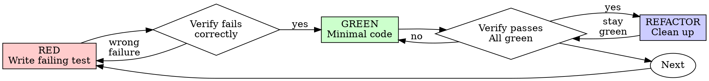

# Fix message disappearing after send

> This archive contains Claude Code conversation activity, stored thinking blocks, tools, and subagents. Raw system prompts and credentials are excluded.
<!-- codex-event:{"kind":"state","timestamp":"2026-07-31T22:05:34.518Z","phase":null} -->
## Claude state: queue-operation · 2026-07-31T22:05:34.518Z

```text
{
  "type": "queue-operation",
  "operation": "enqueue",
  "timestamp": "2026-07-31T22:05:34.518Z",
  "sessionId": "b34f08a2-472d-4317-ba12-4086eda4267a"
}
```

<!-- /codex-event -->

<!-- codex-event:{"kind":"state","timestamp":"2026-07-31T22:05:34.519Z","phase":null} -->
## Claude state: queue-operation · 2026-07-31T22:05:34.519Z

```text
{
  "type": "queue-operation",
  "operation": "dequeue",
  "timestamp": "2026-07-31T22:05:34.519Z",
  "sessionId": "b34f08a2-472d-4317-ba12-4086eda4267a"
}
```

<!-- /codex-event -->

<!-- codex-event:{"kind":"user","timestamp":"2026-07-31T22:05:34.994Z","phase":null} -->
## User · 2026-07-31T22:05:34.994Z

OmniHarness direct-control instruction:
Do not implement, edit files, run mutating commands, or otherwise change the workspace unless the user's latest message explicitly asks you to implement, edit, modify, fix, create, delete, run, apply, or change something.
If the user's latest message asks how you would do something, asks for suggestions, asks for advice, asks for a plan, or says not to do anything, answer with analysis or a plan only.
If the user's intent is ambiguous, ask a clarifying question before making workspace changes.

User message:
the last user bubble appears and disappears like 3 times before settling after sending. It shouldn´t disappear at all. Either it was sent or it's sending, can't be sent and arrived and then disappear

Attached images (included directly in this message):
- image.png | mime: image/png | size: 245 KB

uuid: 02bb5141-172d-4097-b246-217465ff1736

<!-- /codex-event -->

<!-- codex-event:{"kind":"state","timestamp":"2026-07-31T22:05:34.994Z","phase":null} -->
## Claude image attachment · 2026-07-31T22:05:34.994Z

```text
image/png

binary omitted from archive

uuid: 02bb5141-172d-4097-b246-217465ff1736
```

<!-- /codex-event -->

<!-- codex-event:{"kind":"state","timestamp":"2026-07-31T22:05:34.994Z","phase":null} -->
## Claude attachment · 2026-07-31T22:05:34.994Z

```text
{
  "type": "deferred_tools_delta",
  "addedNames": [
    "CronCreate",
    "CronDelete",
    "CronList",
    "DesignSync",
    "EnterPlanMode",
    "EnterWorktree",
    "ExitPlanMode",
    "ExitWorktree",
    "Monitor",
    "NotebookEdit",
    "PushNotification",
    "RemoteTrigger",
    "TaskCreate",
    "TaskGet",
    "TaskList",
    "TaskOutput",
    "TaskStop",
    "TaskUpdate",
    "WebFetch",
    "WebSearch"
  ],
  "addedLines": [
    "CronCreate",
    "CronDelete",
    "CronList",
    "DesignSync",
    "EnterPlanMode",
    "EnterWorktree",
    "ExitPlanMode",
    "ExitWorktree",
    "Monitor",
    "NotebookEdit",
    "PushNotification",
    "RemoteTrigger",
    "TaskCreate",
    "TaskGet",
    "TaskList",
    "TaskOutput",
    "TaskStop",
    "TaskUpdate",
    "WebFetch",
    "WebSearch"
  ],
  "removedNames": [],
  "readdedNames": [],
  "pendingMcpServers": []
}

binary omitted from archive

uuid: 3d32900c-9b0f-452a-b6a1-41a176e12af7
parent: 02bb5141-172d-4097-b246-217465ff1736
```

<!-- /codex-event -->

<!-- codex-event:{"kind":"state","timestamp":"2026-07-31T22:05:34.994Z","phase":null} -->
## Claude attachment · 2026-07-31T22:05:34.994Z

```text
{
  "type": "agent_listing_delta",
  "addedTypes": [
    "claude",
    "Explore",
    "general-purpose",
    "Plan",
    "statusline-setup"
  ],
  "addedLines": [
    "- claude: Catch-all for any task that doesn't fit a more specific agent. FleetView's default when no agent name is typed. (Tools: *)",
    "- Explore: Read-only search agent for broad fan-out searches — when answering means sweeping many files, directories, or naming conventions and you only need the conclusion, not the file dumps. It reads excerpts rather than whole files, so it locates code; it doesn't review or audit it. Specify search breadth: \"medium\" for moderate exploration, \"very thorough\" for multiple locations and naming conventions. (Tools: All tools except Agent, ExitPlanMode, Edit, Write, NotebookEdit)",
    "- general-purpose: General-purpose agent for researching complex questions, searching for code, and executing multi-step tasks. When you are searching for a keyword or file and are not confident that you will find the right match in the first few tries use this agent to perform the search for you. (Tools: *)",
    "- Plan: Software architect agent for designing implementation plans. Use this when you need to plan the implementation strategy for a task. Returns step-by-step plans, identifies critical files, and considers architectural trade-offs. (Tools: All tools except Agent, ExitPlanMode, Edit, Write, NotebookEdit)",
    "- statusline-setup: Use this agent to configure the user's Claude Code status line setting. (Tools: Read, Edit)"
  ],
  "removedTypes": [],
  "isInitial": true,
  "showConcurrencyNote": true
}

binary omitted from archive

uuid: cc090cdf-8cb1-4988-812e-767f295b4b28
parent: 3d32900c-9b0f-452a-b6a1-41a176e12af7
```

<!-- /codex-event -->

<!-- codex-event:{"kind":"state","timestamp":"2026-07-31T22:05:34.994Z","phase":null} -->
## Claude attachment · 2026-07-31T22:05:34.994Z

```text
{
  "type": "skill_listing",
  "content": "- agentic-user-journey-testing: Use when validating app, UI, or product-surface work through the running app, especially when logs/tests pass but a user job may still be blocked or unclear\n- brainstorming: Use before substantial product, UI, feature, or behavior work with ambiguity, user-journey impact, or multiple plausible approaches\n- building-react-apps: Use when building, refactoring, planning, or debugging React or Next.js apps, React components, hooks, routing, frontend state, SSR, hydration, bundles, imports, or UI settings\n- client-server-state-invariants: Use when planning, building, reviewing, or debugging React apps with server state, optimistic UI, caches, polling, SSE/WebSocket streams, background jobs, persistence, or client/server synchronization\n- designing-settings-dialogs: Use when designing, planning, building, or reviewing settings dialogs, settings dialogues, preferences panels, configuration modals, option tabs, or UI settings surfaces\n- dispatching-parallel-agents: Use when facing 2+ independent tasks that can be worked on without shared state or sequential dependencies\n- executing-plans: Use when you have a written implementation plan to execute inline with review checkpoints\n- find-skills: Helps users discover and install agent skills when they ask questions like \"how do I do X\", \"find a skill for X\", \"is there a skill that can...\", or express interest in extending capabilities. This skill should be used when the user is looking for functionality that might exist as an installable skill.\n- implementing-react-i18n: Use when adding, fixing, or reviewing React internationalization, language selectors, locale resources, translated UI copy, or bugs where changing language does not update user-facing strings\n- improve: Survey any codebase as a senior advisor and produce prioritized, self-contained implementation plans for OTHER models/agents to execute. Strictly read-only on source code — never implements, fixes, or refactors anything itself. Use when asked to audit a codebase, find improvement opportunities (bugs, security, performance, test coverage, tech debt, migrations, DX), suggest features or where to take the project next (roadmap, product direction), or generate handoff plans for another agent to implement.\n- instrumenting-control-planes: Use when building, planning, reviewing, or debugging apps with backend decisions, agent workflows, long-running jobs, SSE/WebSocket streams, recovery paths, deletes, retries, or user-visible failures\n- learning-from-bugs: Use when a meaningful bug, regression, architecture flaw, storage issue, memory problem, persistence failure, control-plane failure, or system-level failure has been diagnosed or fixed\n- optimizing-react-next-apps: Use when a React or Next.js app feels slow, cluttered, overbundled, slow to compile, slow to load, ineffective at SSR, hydration-heavy, or likely burdened by unnecessary imports or UI dependencies\n- receiving-code-review: Use when receiving code review feedback, before implementing suggestions, especially if feedback seems unclear or technically questionable - requires technical rigor and verification, not performative agreement or blind implementation\n- requesting-code-review: Use when completing tasks, implementing major features, or before merging to verify work meets requirements\n- second-opinion: Use when writing or hardening substantial specs, implementation plans, architecture plans, design plans, or unusually hard creative decisions before execution\n- subagent-driven-development: Use when executing implementation plans with independent tasks in the current session\n- systematic-debugging: Use when encountering any bug, test failure, or unexpected behavior, before proposing fixes\n- test-driven-development: Use when implementing any feature or bugfix, before writing implementation code\n- using-ultrapowers: Use when starting any conversation - establishes how to find and use skills, requiring skill invocation before acting\n- verification-before-completion: Use when about to claim work is complete, fixed, or passing, before committing or creating PRs - requires running verification commands and confirming output before making any success claims; evidence before assertions always\n- writing-plans: Use when you have an approved spec or clear requirements for a multi-step task, before implementation\n- writing-skills: Use when creating new skills, editing existing skills, or verifying skills work before deployment\n- deep-research: Deep research harness — fan-out web searches, fetch sources, adversarially verify claims, synthesize a cited report. - When the user wants a deep, multi-source, fact-checked research report on any topic. BEFORE invoking, check if the question is specific enough to research directly — if underspecified (e.g., \"what car to buy\" without budget/use-case/region), ask 2-3 clarifying questions to narrow scope. Then pass the refined question as args, weaving the answers in.\n- update-config: Use this skill to configure the Claude Code harness via settings.json. Automated behaviors (\"from now on when X\", \"each time X\", \"whenever X\", \"before/after X\") require hooks configured in settings.json - the harness executes these, not Claude, so memory/preferences cannot fulfill them. Also use for: permissions (\"allow X\", \"add permission\", \"move permission to\"), env vars (\"set X=Y\"), hook troubleshooting, or any changes to settings.json/settings.local.json files. Examples: \"allow npm commands\", \"add bq permission to global settings\", \"move permission to user settings\", \"set DEBUG=true\", \"when claude stops show X\". For simple settings like theme/model, suggest the /config command.\n- keybindings-help: Use when the user wants to customize keyboard shortcuts, rebind keys, add chord bindings, or modify ~/.claude/keybindings.json. Examples: \"rebind ctrl+s\", \"add a chord shortcut\", \"change the submit key\", \"customize keybindings\".\n- verify: Verify that a code change actually does what it's supposed to by running the app and observing behavior. Use when asked to verify a PR, confirm a fix works, test a change manually, check that a feature works, or validate local changes before pushing.\n- code-review: Review the current diff for correctness bugs and reuse/simplification/efficiency cleanups at the given effort level (low/medium: fewer, high-confidence findings; high→max: broader coverage, may include uncertain findings; ultra: deep multi-agent review in the cloud). Pass --comment to post findings as inline PR comments, or --fix to apply the findings to the working tree after the review.\n- simplify: Review the changed code for reuse, simplification, efficiency, and altitude cleanups, then apply the fixes. Quality only — it does not hunt for bugs; use /code-review for that.\n- fewer-permission-prompts: Scan your transcripts for common read-only Bash and MCP tool calls, then add a prioritized allowlist to project .claude/settings.json to reduce permission prompts.\n- loop: Run a prompt or slash command on a recurring interval (e.g. /loop 5m /foo). Omit the interval to let the model self-pace. - When the user wants to set up a recurring task, poll for status, or run something repeatedly on an interval (e.g. \"check the deploy every 5 minutes\", \"keep running /babysit-prs\"). Do NOT invoke for one-off tasks.\n- schedule: Create, update, list, or run scheduled cloud agents (routines) that execute on a cron schedule. - When the user wants to schedule a recurring cloud agent, set up automated tasks, create a cron job for Claude Code, or manage their scheduled agents/routines. Also use when the user wants a one-time scheduled run (\"run this once at 3pm\", \"remind me to check X tomorrow\").\n- claude-api: Reference for the Claude API / Anthropic SDK — model ids, pricing, params, streaming, tool use, MCP, agents, caching, token counting, model migration.\nTRIGGER — read BEFORE opening the target file; don't skip because it \"looks like a one-liner\" — whenever: the prompt names Claude/Anthropic in any form (Claude, Anthropic, Fable, Opus, Sonnet, Haiku, `anthropic`, `@anthropic-ai`, `claude-*`, `us.anthropic.*`, `[1m]`); the user asks about an LLM (pricing/model choice/limits/caching) — never answer from memory; OR the task is LLM-shaped with provider unstated (agent/MCP/tool-definition/multi-agent/RAG/LLM-judge/computer-use; generate/summarize/extract/classify/rewrite/converse over NL; debugging refusals/cutoffs/streaming/tool-calls/tokens).\nSKIP only when another provider is being worked on (overrides all triggers): OpenAI/GPT/Gemini/Llama/Mistral/Cohere/Ollama named in the query; OR `grep -rE 'openai|langchain_openai|google.generativeai|genai|mistralai|cohere|ollama'` over the project hits (run this grep FIRST if no provider named — don't Read the file).\n- run: Launch and drive this project's app to see a change working. Use when asked to run, start, or screenshot the app, or to confirm a change works in the real app (not just tests). First looks for a project skill that already covers launching the app; otherwise falls back to built-in patterns per project type (CLI, server, TUI, Electron, browser-driven, library).\n- init: Initialize a new CLAUDE.md file with codebase documentation\n- review: Review a pull request\n- security-review: Complete a security review of the pending changes on the current branch",
  "skillCount": 37,
  "isInitial": true,
  "names": [
    "agentic-user-journey-testing",
    "brainstorming",
    "building-react-apps",
    "client-server-state-invariants",
    "designing-settings-dialogs",
    "dispatching-parallel-agents",
    "executing-plans",
    "find-skills",
    "implementing-react-i18n",
    "improve",
    "instrumenting-control-planes",
    "learning-from-bugs",
    "optimizing-react-next-apps",
    "receiving-code-review",
    "requesting-code-review",
    "second-opinion",
    "subagent-driven-development",
    "systematic-debugging",
    "test-driven-development",
    "using-ultrapowers",
    "verification-before-completion",
    "writing-plans",
    "writing-skills",
    "deep-research",
    "update-config",
    "keybindings-help",
    "verify",
    "code-review",
    "simplify",
    "fewer-permission-prompts",
    "loop",
    "schedule",
    "claude-api",
    "run",
    "init",
    "review",
    "security-review"
  ]
}

binary omitted from archive

uuid: 0387dd80-bf92-429f-a993-8281e557132d
parent: cc090cdf-8cb1-4988-812e-767f295b4b28
```

<!-- /codex-event -->

<!-- codex-event:{"kind":"reasoning","timestamp":"2026-07-31T22:05:43.757Z","phase":null} -->
## Claude thinking · 2026-07-31T22:05:43.757Z

The user is describing a bug where the last message bubble flickers in and out several times before stabilizing, and I need to determine whether they're asking for a fix or just reporting the issue. The instruction is clear—if they're describing a problem without explicitly asking me to implement, I should provide an assessment rather than jump into fixing it.

I'm recognizing that this involves optimistic UI and client-server state management, which are relevant to diagnosing the flicker. Before I respond with analysis, I should invoke the systematic-debugging skill since that's a blocking requirement when encountering a bug—I need to use the right tool first to properly diagnose what's happening.

uuid: b1f5bd5e-34e7-4c1f-a494-1553c2666788
parent: 0387dd80-bf92-429f-a993-8281e557132d

<!-- /codex-event -->

<!-- codex-event:{"kind":"final","timestamp":"2026-07-31T22:05:43.759Z","phase":null} -->
## Claude · 2026-07-31T22:05:43.759Z

I'll dig into why the optimistic user bubble flickers. Let me start with the debugging skill and then trace the message-rendering path.

uuid: 108d08cd-6718-47a2-bb28-eef04f6d64f1
parent: b1f5bd5e-34e7-4c1f-a494-1553c2666788

<!-- /codex-event -->

<!-- codex-event:{"kind":"tool-call","timestamp":"2026-07-31T22:05:44.021Z","phase":null} -->
## Claude tool call: Skill · 2026-07-31T22:05:44.021Z

```json
{
  "skill": "systematic-debugging",
  "args": "User message bubble appears/disappears ~3 times after sending before settling (optimistic message flicker in conversation stream UI)"
}

uuid: 315cb12a-ee43-40a6-b07f-959dd0acdf4b
parent: 108d08cd-6718-47a2-bb28-eef04f6d64f1
```

<!-- /codex-event -->

<!-- codex-event:{"kind":"user","timestamp":"2026-07-31T22:05:44.030Z","phase":null} -->
## User · 2026-07-31T22:05:44.030Z

Base directory for this skill: /Users/masterman/.claude/skills/systematic-debugging

# Systematic Debugging

## Overview

Random fixes waste time and create new bugs. Quick patches mask underlying issues.

**Core principle:** ALWAYS find root cause before attempting fixes. Symptom fixes are failure.

**Violating the letter of this process is violating the spirit of debugging.**

## The Iron Law

```
NO FIXES WITHOUT ROOT CAUSE INVESTIGATION FIRST
```

If you haven't completed Phase 1, you cannot propose fixes.

## When to Use

Use for ANY technical issue:
- Test failures
- Bugs in production
- Unexpected behavior
- Performance problems
- Build failures
- Integration issues

**Use this ESPECIALLY when:**
- Under time pressure (emergencies make guessing tempting)
- "Just one quick fix" seems obvious
- You've already tried multiple fixes
- Previous fix didn't work
- You don't fully understand the issue

**Don't skip when:**
- Issue seems simple (simple bugs have root causes too)
- You're in a hurry (rushing guarantees rework)
- Manager wants it fixed NOW (systematic is faster than thrashing)

## The Four Phases

You MUST complete each phase before proceeding to the next.

### Phase 1: Root Cause Investigation

**BEFORE attempting ANY fix:**

1. **Read Error Messages Carefully**
   - Don't skip past errors or warnings
   - They often contain the exact solution
   - Read stack traces completely
   - Note line numbers, file paths, error codes

2. **Reproduce Consistently**
   - Can you trigger it reliably?
   - What are the exact steps?
   - Does it happen every time?
   - If not reproducible → gather more data, don't guess

3. **Check Recent Changes**
   - What changed that could cause this?
   - Git diff, recent commits
   - New dependencies, config changes
   - Environmental differences

4. **Gather Evidence in Multi-Component Systems**

   **WHEN system has multiple components (CI → build → signing, API → service → database):**

   **BEFORE proposing fixes, add diagnostic instrumentation:**
   ```
   For EACH component boundary:
     - Log what data enters component
     - Log what data exits component
     - Verify environment/config propagation
     - Check state at each layer

   Run once to gather evidence showing WHERE it breaks
   THEN analyze evidence to identify failing component
   THEN investigate that specific component
   ```

   **Example (multi-layer system):**
   ```bash
   # Layer 1: Workflow
   echo "=== Secrets available in workflow: ==="
   echo "IDENTITY: ${IDENTITY:+SET}${IDENTITY:-UNSET}"

   # Layer 2: Build script
   echo "=== Env vars in build script: ==="
   env | grep IDENTITY || echo "IDENTITY not in environment"

   # Layer 3: Signing script
   echo "=== Keychain state: ==="
   security list-keychains
   security find-identity -v

   # Layer 4: Actual signing
   codesign --sign "$IDENTITY" --verbose=4 "$APP"
   ```

   **This reveals:** Which layer fails (secrets → workflow ✓, workflow → build ✗)

5. **Trace Data Flow**

   **WHEN error is deep in call stack:**

   See `root-cause-tracing.md` in this directory for the complete backward tracing technique.

   **Quick version:**
   - Where does bad value originate?
   - What called this with bad value?
   - Keep tracing up until you find the source
   - Fix at source, not at symptom

### Phase 2: Pattern Analysis

**Find the pattern before fixing:**

1. **Find Working Examples**
   - Locate similar working code in same codebase
   - What works that's similar to what's broken?

2. **Compare Against References**
   - If implementing pattern, read reference implementation COMPLETELY
   - Don't skim - read every line
   - Understand the pattern fully before applying

3. **Identify Differences**
   - What's different between working and broken?
   - List every difference, however small
   - Don't assume "that can't matter"

4. **Understand Dependencies**
   - What other components does this need?
   - What settings, config, environment?
   - What assumptions does it make?

### Phase 3: Hypothesis and Testing

**Scientific method:**

1. **Form Single Hypothesis**
   - State clearly: "I think X is the root cause because Y"
   - Write it down
   - Be specific, not vague

2. **Test Minimally**
   - Make the SMALLEST possible change to test hypothesis
   - One variable at a time
   - Don't fix multiple things at once

3. **Verify Before Continuing**
   - Did it work? Yes → Phase 4
   - Didn't work? Form NEW hypothesis
   - DON'T add more fixes on top

4. **When You Don't Know**
   - Say "I don't understand X"
   - Don't pretend to know
   - Ask for help
   - Research more

### Phase 4: Implementation

**Fix the root cause, not the symptom:**

1. **Create Failing Test Case**
   - Simplest possible reproduction
   - Automated test if possible
   - One-off test script if no framework
   - MUST have before fixing
   - Use the `ultrapowers:test-driven-development` skill for writing proper failing tests

2. **Implement Single Fix**
   - Address the root cause identified
   - ONE change at a time
   - No "while I'm here" improvements
   - No bundled refactoring

3. **Verify Fix**
   - Test passes now?
   - No other tests broken?
   - Issue actually resolved?
   - If the bug was meaningful or systemic, use `ultrapowers:learning-from-bugs` before declaring the fix complete.

4. **If Fix Doesn't Work**
   - STOP
   - Count: How many fixes have you tried?
   - If < 3: Return to Phase 1, re-analyze with new information
   - **If ≥ 3: STOP and question the architecture (step 5 below)**
   - DON'T attempt Fix #4 without architectural discussion

5. **If 3+ Fixes Failed: Question Architecture**

   **Pattern indicating architectural problem:**
   - Each fix reveals new shared state/coupling/problem in different place
   - Fixes require "massive refactoring" to implement
   - Each fix creates new symptoms elsewhere

   **STOP and question fundamentals:**
   - Is this pattern fundamentally sound?
   - Are we "sticking with it through sheer inertia"?
   - Should we refactor architecture vs. continue fixing symptoms?

   **Discuss with your human partner before attempting more fixes**

   This is NOT a failed hypothesis - this is a wrong architecture.

## Red Flags - STOP and Follow Process

If you catch yourself thinking:
- "Quick fix for now, investigate later"
- "Just try changing X and see if it works"
- "Add multiple changes, run tests"
- "Skip the test, I'll manually verify"
- "It's probably X, let me fix that"
- "I don't fully understand but this might work"
- "Pattern says X but I'll adapt it differently"
- "Here are the main problems: [lists fixes without investigation]"
- Proposing solutions before tracing data flow
- **"One more fix attempt" (when already tried 2+)**
- **Each fix reveals new problem in different place**

**ALL of these mean: STOP. Return to Phase 1.**

**If 3+ fixes failed:** Question the architecture (see Phase 4.5)

## your human partner's Signals You're Doing It Wrong

**Watch for these redirections:**
- "Is that not happening?" - You assumed without verifying
- "Will it show us...?" - You should have added evidence gathering
- "Stop guessing" - You're proposing fixes without understanding
- "Ultrathink this" - Question fundamentals, not just symptoms
- "We're stuck?" (frustrated) - Your approach isn't working

**When you see these:** STOP. Return to Phase 1.

## Common Rationalizations

| Excuse | Reality |
|--------|---------|
| "Issue is simple, don't need process" | Simple issues have root causes too. Process is fast for simple bugs. |
| "Emergency, no time for process" | Systematic debugging is FASTER than guess-and-check thrashing. |
| "Just try this first, then investigate" | First fix sets the pattern. Do it right from the start. |
| "I'll write test after confirming fix works" | Untested fixes don't stick. Test first proves it. |
| "Multiple fixes at once saves time" | Can't isolate what worked. Causes new bugs. |
| "Reference too long, I'll adapt the pattern" | Partial understanding guarantees bugs. Read it completely. |
| "I see the problem, let me fix it" | Seeing symptoms ≠ understanding root cause. |
| "One more fix attempt" (after 2+ failures) | 3+ failures = architectural problem. Question pattern, don't fix again. |

## Quick Reference

| Phase | Key Activities | Success Criteria |
|-------|---------------|------------------|
| **1. Root Cause** | Read errors, reproduce, check changes, gather evidence | Understand WHAT and WHY |
| **2. Pattern** | Find working examples, compare | Identify differences |
| **3. Hypothesis** | Form theory, test minimally | Confirmed or new hypothesis |
| **4. Implementation** | Create test, fix, verify | Bug resolved, tests pass |

## When Process Reveals "No Root Cause"

If systematic investigation reveals issue is truly environmental, timing-dependent, or external:

1. You've completed the process
2. Document what you investigated
3. Implement appropriate handling (retry, timeout, error message)
4. Add monitoring/logging for future investigation

**But:** 95% of "no root cause" cases are incomplete investigation.

## Supporting Techniques

These techniques are part of systematic debugging and available in this directory:

- **`root-cause-tracing.md`** - Trace bugs backward through call stack to find original trigger
- **`defense-in-depth.md`** - Add validation at multiple layers after finding root cause
- **`condition-based-waiting.md`** - Replace arbitrary timeouts with condition polling

**Related skills:**
- **ultrapowers:test-driven-development** - For creating failing test case (Phase 4, Step 1)
- **ultrapowers:learning-from-bugs** - Record reusable lessons from meaningful architecture, storage, memory, persistence, control-plane, and system-level bugs
- **ultrapowers:verification-before-completion** - Verify fix worked before claiming success

## Real-World Impact

From debugging sessions:
- Systematic approach: 15-30 minutes to fix
- Random fixes approach: 2-3 hours of thrashing
- First-time fix rate: 95% vs 40%
- New bugs introduced: Near zero vs common


ARGUMENTS: User message bubble appears/disappears ~3 times after sending before settling (optimistic message flicker in conversation stream UI)

uuid: c684edec-9800-4bcb-b511-f49c1aec3299
parent: bce6fb89-ac03-4358-b238-82b884c4c9e3

<!-- /codex-event -->

<!-- codex-event:{"kind":"state","timestamp":"2026-07-31T22:05:44.030Z","phase":null} -->
## Claude attachment · 2026-07-31T22:05:44.030Z

```text
{
  "type": "ultrathink_effort"
}

binary omitted from archive

uuid: 6a6d4ecd-e166-49ac-bf44-a63860030602
parent: c684edec-9800-4bcb-b511-f49c1aec3299
```

<!-- /codex-event -->

<!-- codex-event:{"kind":"state","timestamp":"2026-07-31T22:05:44.030Z","phase":null} -->
## Claude attachment · 2026-07-31T22:05:44.030Z

```text
{
  "type": "command_permissions",
  "allowedTools": []
}

binary omitted from archive

uuid: 3b8429f7-d633-442c-b521-7d2c3519c6a8
parent: 6a6d4ecd-e166-49ac-bf44-a63860030602
```

<!-- /codex-event -->

<!-- codex-event:{"kind":"tool-result","timestamp":"2026-07-31T22:05:44.036Z","phase":null} -->
## Claude tool result: toolu_014mH3rv3B6itpegsJGsvceY · 2026-07-31T22:05:44.036Z

```text
Launching skill: systematic-debugging

uuid: bce6fb89-ac03-4358-b238-82b884c4c9e3
parent: 315cb12a-ee43-40a6-b07f-959dd0acdf4b
```

<!-- /codex-event -->

<!-- codex-event:{"kind":"reasoning","timestamp":"2026-07-31T22:05:53.359Z","phase":null} -->
## Claude thinking · 2026-07-31T22:05:53.359Z

The user is seeing the last message bubble flicker in and out multiple times after sending—it appears, disappears, then reappears as the optimistic UI gets replaced by incoming stream or history data, then syncs back. I'm diagnosing what's causing this race condition between the optimistic message and the actual server response rather than implementing a fix.

I need to trace through the codebase to find where optimistic messages are being added and removed. I'll start by reading the architecture doc (which was recently modified) and searching for the optimistic message handling logic in the Terminal component and runner interfaces.

uuid: 38026c2d-4542-4085-bf33-07a11fb0f5b4
parent: 3b8429f7-d633-442c-b521-7d2c3519c6a8

<!-- /codex-event -->

<!-- codex-event:{"kind":"final","timestamp":"2026-07-31T22:05:53.361Z","phase":null} -->
## Claude · 2026-07-31T22:05:53.361Z

I'll trace the root cause before proposing anything. Let me look at how the conversation stream renders user messages and where an optimistic bubble could be dropped.

uuid: c9a74b22-62d3-4b7f-9a80-230bb5599774
parent: 38026c2d-4542-4085-bf33-07a11fb0f5b4

<!-- /codex-event -->

<!-- codex-event:{"kind":"tool-call","timestamp":"2026-07-31T22:05:53.847Z","phase":null} -->
## Claude tool call: Bash · 2026-07-31T22:05:53.847Z

```json
{
  "command": "rg -li \"optimistic|pendingMessage|localEcho|sentMessage\" /Users/masterman/NLP/omniharness/src --glob '!**/node_modules/**' | head -30",
  "description": "Find files handling optimistic/pending user messages"
}

uuid: bc58eeba-8be9-4103-b284-31ac2da09fb5
parent: c9a74b22-62d3-4b7f-9a80-230bb5599774
```

<!-- /codex-event -->

<!-- codex-event:{"kind":"tool-call","timestamp":"2026-07-31T22:05:54.331Z","phase":null} -->
## Claude tool call: Read · 2026-07-31T22:05:54.331Z

```json
{
  "file_path": "/Users/masterman/NLP/omniharness/docs/architecture/worker-conversation-stream.md"
}

uuid: 536bacfa-132c-4ec2-b2a1-080e6dca9f26
parent: bc58eeba-8be9-4103-b284-31ac2da09fb5
```

<!-- /codex-event -->

<!-- codex-event:{"kind":"tool-result","timestamp":"2026-07-31T22:05:54.335Z","phase":null} -->
## Claude tool result: toolu_0138CFnEdPnjkmMqhgrxFQzp · 2026-07-31T22:05:54.335Z

````text
1	# Worker Conversation Stream
2	
3	The worker conversation stream is the single source of truth for every
4	direct conversation with a single worker — direct-control mode (user ↔
5	worker) and supervisor-driven worker turns (supervisor ↔ worker). It
6	replaces an earlier design where worker content was split between the
7	`messages` table, the bridge's in-memory `outputEntries`, and JSONL
8	files; reconciling those three surfaces on the frontend was the source
9	of a long-running class of bugs.
10	
11	The plan that introduced this surface is at
12	`docs/superpowers/plans/2026-05-16-unified-worker-conversation-stream.md`.
13	
14	Operational constraints for keeping this stream responsive under long-running
15	workers are captured in
16	`docs/architecture/hot-path-responsiveness-and-resource-leaks.md`. In
17	particular, snapshots carry worker seq cursors rather than transcript bodies,
18	incremental reads use bounded JSONL tail scans, and normal streaming appends
19	must not rebuild the full transcript cache on every chunk.
20	
21	Direct-control regressions found after this cutover, including blank worker
22	output, queued send-now persistence, duplicate first messages, and stuck
23	"Thinking..." states, are documented in
24	`docs/architecture/direct-control-session-regressions.md`.
25	
26	Frontend transcript pagination starts with a bounded tail page and loads older
27	pages when the reader reaches the top. The history trigger must listen on the
28	element that actually owns `scrollTop`. In native conversation mode that is the
29	outer Radix scroll-area viewport, not the inner `Terminal` content element.
30	Tests for native scrolling must assert the handler is attached to the resolved
31	viewport; testing the page manager alone does not prove that users can request
32	the preceding page.
33	
34	Frontend loading and stale-cache regressions involving sessions
35	`7ebf2bc8e556` and `17a194b3c1c1` are documented in
36	`docs/architecture/state-staleness-and-session-lifecycle-lessons.md`. That
37	note covers the fallback rule for legacy `messages` rows: use them only after
38	the relevant worker stream is loaded, and never let them render ahead of
39	unknown stream content.
40	
41	Related incident note: `docs/architecture/supervisor-worker-switching-incident.md`
42	documents a transcript-ordering regression where a supervisor-spawned worker
43	streamed bridge output before the server appended the initial
44	`supervisor_input`, causing the prompt to render at the end of the worker
45	conversation.
46	
47	## File format
48	
49	One file per worker, in append-only JSONL. The location is project-local
50	when a project is known, with a fallback to the legacy global root:
51	
52	```
53	<projectPath>/.omniharness/run-data/<runId>/workers/<workerId>.jsonl   (preferred)
54	<appData>/run-data/<runId>/<workerId>.jsonl                            (legacy, read-only)
55	```
56	
57	After the worker reaches a terminal status and the file has been idle
58	for at least 5 minutes, it is gzipped to `<workerId>.jsonl.gz`. Reads
59	are transparent across both. If the worker resumes after compaction
60	(e.g. recovery), the next append auto-expands the gzip back to plain
61	JSONL.
62	
63	Worker streams share the generic engine in
64	`src/server/artifacts/append-only-store.ts` with execution events,
65	supervisor interventions, and planning review findings: same lock
66	discipline, same compaction policy, same sparse seq→offset index for
67	fast tail-N reads.
68	
69	Each line is one JSON object of type `WorkerEntry`
70	(`src/server/workers/entries-types.ts`). Two families of entries share
71	the file:
72	
73	- **Bridge-produced** (`message`, `thought`, `tool_call`,
74	  `tool_call_update`, `permission`) — what the bridge emits as the
75	  worker speaks, thinks, or runs tools. The bridge's
76	  `BridgeOutputEntry` shape (in `src/server/bridge-client/index.ts`) is
77	  **not** extended; we convert at the writer boundary so the bridge
78	  never has to know about server-produced types.
79	- **Server-produced** (`user_input`, `supervisor_input`, `system_note`,
80	  `lifecycle`) — synthesized by the server on each delivery boundary
81	  and on observable lifecycle transitions.
82	
83	Use `isBridgeOutputEntry(entry)` / `isServerProducedEntry(entry)` to
84	discriminate; never branch ad-hoc on `entry.type`.
85	
86	## Seq invariants
87	
88	Every entry carries a `seq: number` that is:
89	
90	- Monotonically increasing per `(runId, workerId)`.
91	- Assigned at write time by `appendWorkerEntry` in
92	  `src/server/workers/output-store.ts`. The bridge never sees it.
93	- Persistently stored on disk; the file is the cursor's authority.
94	- Backfilled lazily on read for any legacy line that predates seq
95	  (assigned in file order, no rewrite). The next compaction sweep
96	  writes the assigned seq back to disk.
97	
98	The writer caches the next-seq, seen ids, fingerprints, and file stat in
99	memory keyed by `(runId, workerId)`. It rebuilds from disk on first use after a
100	process restart, or when the file stat shows another writer changed the file.
101	Normal streaming appends must reuse the cache and advance the cursor without
102	re-reading the whole transcript. A truncated last line (crash mid-write) is
103	tolerated: `parseLines` skips the malformed bytes, and the next append starts
104	from `max-valid-seq + 1` and prefixes its own line with `\n` so the broken
105	trailer stays on its own line.
106	
107	## Dedup-by-id
108	
109	`appendWorkerEntry(runId, workerId, entry)` checks `entry.id` against
110	the file's seen-ids set before writing. If the id is already present,
111	the call is a no-op and the previously persisted entry is returned.
112	This makes the snapshot poll path (`persistWorkerSnapshot` →
113	`writeWorkerOutputEntries`) idempotent under bridge polling restarts
114	and rebuilds: an entry is never re-added once written.
115	
116	Bridge entries' ids come from the bridge itself. Server-produced
117	entries (user_input, supervisor_input, lifecycle, system_note) are
118	assigned a uuid when constructed. Backfilled entries (the
119	`scripts/backfill-worker-entries.ts` script) reuse the source row id
120	(`messages.id` / `executionEvents.id`) so a partially completed
121	backfill is resumable.
122	
123	## Write-acceptance semantics
124	
125	Append-only persistence makes "insert then delete on busy" impossible
126	to undo. Inputs are categorized by their acceptance state and only
127	appended on durable acceptance:
128	
129	| State        | Trigger                                              | Stream action                                                                              |
130	|--------------|------------------------------------------------------|--------------------------------------------------------------------------------------------|
131	| `accepted`   | Server has validated a direct/planning prompt that the UI will render immediately | **append first**, then write any `messages` mirror row; the stream is the display authority |
132	| `accepted`   | Server has validated a request that is not worker-stream-backed | nothing yet                                                                                |
133	| `queued`     | Inserted into `queuedConversationMessages`           | nothing yet                                                                                |
134	| `delivered`  | `askAgent()` returned OR `queued_message_delivered`  | **append** `user_input` / `supervisor_input` with `timestamp = deliveredAt`                |
135	| `failed`     | Validation error, busy retry, etc.                   | nothing — caller's responsibility to retry; `queuedConversationMessages` carries pending UI |
136	
137	The JSONL is a transcript of what was **delivered to the worker**, not
138	of what the user attempted. "Pending / queued" UI state comes from
139	`queuedConversationMessages` (which already existed), not from the
140	stream.
141	
142	For worker-backed direct/planning conversations, the JSONL stream is the
143	primary transcript. A `messages` row for the same user input is only a DB
144	mirror/index and must never get ahead of the stream. If an existing user
145	message row has no matching `user_input` entry, the server refuses the
146	next message instead of inserting another row.
147	
148	## One writer, one reader
149	
150	There is one writer per worker file (`appendWorkerEntry`) and one
151	reader endpoint (`GET /api/workers/:workerId/entries?afterSeq=N`).
152	Every code path that persists worker conversation content goes through
153	the writer; every frontend code path that renders worker conversation
154	content goes through the reader.
155	
156	The writer holds an in-process per-worker mutex
157	(`writeChainByKey` in `output-store.ts`). All file mutations for a
158	given `(runId, workerId)` — append, expand-from-gz, compact-to-gz,
159	delete — acquire this mutex. An earlier version of the compaction
160	sweep bypassed the chain; that latent loss bug is fixed.
161	
162	The in-process chain is paired with an OS-visible worker-file lock so Next dev
163	module instances and process boundaries cannot interleave file mutations. The
164	single-writer-per-worker invariant is load-bearing.
165	
166	## Two cursors, kept distinct
167	
168	- **Global SSE event id** (the `id:` field on every SSE frame, backed
169	  by the ring buffer in `src/server/events/named-events.ts`) — used
170	  for liveness, drain, and `stream.resync_required` signaling. Stays
171	  exactly as before.
172	- **Per-worker `entry.seq`** — the durable content cursor. Used by
173	  the entries endpoint, by the frontend's contiguous-range tracking,
174	  and by the resync path.
175	
176	SSE frames are wake-up hints; content always comes via
177	`?afterSeq=`. The `worker.entry_appended` named event carries only
178	`{ workerId, seq }`, never the entry body. A global ring-buffer
179	overflow (`stream.resync_required`) triggers a refetch from the
180	per-worker contiguous cursor — no global resync is needed for workers
181	whose `latestContiguousSeq === latestKnownSeq`.
182	
183	## Frontend loading invariant
184	
185	`WorkerEntriesManager` (`src/app/home/WorkerEntriesManager.ts`) tracks
186	per-worker state. The contract is:
187	
188	- `entries` is always the contiguous prefix `[1..latestContiguousSeq]`,
189	  with no gaps.
190	- `latestKnownSeq` is the highest seq the server has told us exists.
191	- `isLoaded(workerId)` is `true` iff `latestContiguousSeq ===
192	  latestKnownSeq && status === "loaded"`.
193	
194	The Terminal renders either entries (when provided) or the legacy
195	`agent` + `userMessages` props (before cutover). When `entries` is provided,
196	the worker stream is the transcript authority. Legacy `userMessages` rows may
197	be used only as a gated fallback for stale historical data after
198	`WorkerEntriesManager.isLoaded(workerId)` is true; before that point, rendering
199	fallback rows can create a false chronology while the contiguous stream is
200	still arriving.
201	
202	## Dual-write feature flag
203	
204	`OMNI_UNIFIED_WORKER_STREAM` controls server-side dual-writes through
205	`appendUserInputOnDelivery` / `appendSupervisorInputOnDelivery` /
206	`appendLifecycleEntry`. The bootstrap surfaces this flag to the
207	frontend at `features.unifiedWorkerStream` so the reader can flip
208	together with the writer.
209	
210	**Default after Phase 4 cutover: ON.** Setting the env var to
211	`0` / `false` / `off` reverts to the legacy reader path. The flag is
212	removed entirely in Phase 5.
213	
214	## Observation plan
215	
216	Phase 4 ships with the flag defaulted ON but the legacy `messages`
217	writes still happening (dual-write). Watch for:
218	
219	- Disk growth under `app-data/run-data/` — lifecycle entries are
220	  small, but they multiply per worker. Existing 5-minute idle
221	  gzip-compaction handles them transparently.
222	- SSE message volume — each `appendWorkerEntry` emits one
223	  `worker.entry_appended` named event into the ring buffer.
224	- Frontend "loading" spinner duration on direct-control conversations
225	  with large transcripts. The contiguous-prefix invariant should keep
226	  this under one round-trip per worker.
227	- Any user reports of missing content.
228	- Re-running `pnpm tsx scripts/backfill-worker-entries.ts --dry-run`
229	  reports zero manual-attribution cases.
230	
231	## Don't add a parallel persistence layer
232	
233	If you need to persist new worker conversation content — a new
234	tool-call shape, a new lifecycle marker, a new server-injected note —
235	extend `WorkerEntry` and route it through `appendWorkerEntry`. Don't
236	add a sibling JSONL, a new `messages.kind`, or an in-memory cache that
237	the frontend has to reconcile against the stream.
238	
239	Provider-backed sessions use the same stream. A local process session
240	creates a normal `workers` row with `type = "process"` and appends
241	stdout, stderr, stdin, and lifecycle markers to
242	`app-data/run-data/<runId>/<workerId>.jsonl`. The session provider
243	model is described in `docs/architecture/session-provider-model.md`.
244	

uuid: cc6d157b-7912-4db5-a612-a8c8b49ae4ee
parent: 536bacfa-132c-4ec2-b2a1-080e6dca9f26
````

<!-- /codex-event -->

<!-- codex-event:{"kind":"tool-result","timestamp":"2026-07-31T22:05:54.439Z","phase":null} -->
## Claude tool result: toolu_018ZwreCjxuY3JqSAYiD75gR · 2026-07-31T22:05:54.439Z

```text
/Users/masterman/NLP/omniharness/src/lib/run-recovery-state.ts
/Users/masterman/NLP/omniharness/src/interface/home/BusyMessageQueueManager.ts
/Users/masterman/NLP/omniharness/src/interface/home/mutations/optimistic-state.ts
/Users/masterman/NLP/omniharness/src/shared/home-types.ts
/Users/masterman/NLP/omniharness/src/interface/home/useHomeMutations.ts
/Users/masterman/NLP/omniharness/src/interface/home/HomeAppStateManager.ts
/Users/masterman/NLP/omniharness/src/interface/home/HomeApp.tsx
/Users/masterman/NLP/omniharness/src/interface/home/utils.ts

uuid: e4558b77-8861-424e-bb6a-b3162367db09
parent: bc58eeba-8be9-4103-b284-31ac2da09fb5
```

<!-- /codex-event -->

<!-- codex-event:{"kind":"state","timestamp":"2026-07-31T22:05:54.441Z","phase":null} -->
## Claude attachment · 2026-07-31T22:05:54.441Z

```text
{
  "type": "deferred_tools_delta",
  "addedNames": [
    "mcp__claude_ai_Gmail__apply_sensitive_message_label",
    "mcp__claude_ai_Gmail__apply_sensitive_thread_label",
    "mcp__claude_ai_Gmail__create_draft",
    "mcp__claude_ai_Gmail__create_label",
    "mcp__claude_ai_Gmail__get_message",
    "mcp__claude_ai_Gmail__get_thread",
    "mcp__claude_ai_Gmail__label_message",
    "mcp__claude_ai_Gmail__label_thread",
    "mcp__claude_ai_Gmail__list_drafts",
    "mcp__claude_ai_Gmail__list_labels",
    "mcp__claude_ai_Gmail__search_threads",
    "mcp__claude_ai_Gmail__unlabel_message",
    "mcp__claude_ai_Gmail__unlabel_thread",
    "mcp__claude_ai_Google_Calendar__create_event",
    "mcp__claude_ai_Google_Calendar__delete_event",
    "mcp__claude_ai_Google_Calendar__get_event",
    "mcp__claude_ai_Google_Calendar__list_calendars",
    "mcp__claude_ai_Google_Calendar__list_events",
    "mcp__claude_ai_Google_Calendar__respond_to_event",
    "mcp__claude_ai_Google_Calendar__search_events",
    "mcp__claude_ai_Google_Calendar__suggest_time",
    "mcp__claude_ai_Google_Calendar__update_event",
    "mcp__claude_ai_Google_Drive__copy_file",
    "mcp__claude_ai_Google_Drive__create_file",
    "mcp__claude_ai_Google_Drive__download_file_content",
    "mcp__claude_ai_Google_Drive__get_file_metadata",
    "mcp__claude_ai_Google_Drive__get_file_permissions",
    "mcp__claude_ai_Google_Drive__list_recent_files",
    "mcp__claude_ai_Google_Drive__read_file_content",
    "mcp__claude_ai_Google_Drive__search_files"
  ],
  "addedLines": [
    "mcp__claude_ai_Gmail__apply_sensitive_message_label",
    "mcp__claude_ai_Gmail__apply_sensitive_thread_label",
    "mcp__claude_ai_Gmail__create_draft",
    "mcp__claude_ai_Gmail__create_label",
    "mcp__claude_ai_Gmail__get_message",
    "mcp__claude_ai_Gmail__get_thread",
    "mcp__claude_ai_Gmail__label_message",
    "mcp__claude_ai_Gmail__label_thread",
    "mcp__claude_ai_Gmail__list_drafts",
    "mcp__claude_ai_Gmail__list_labels",
    "mcp__claude_ai_Gmail__search_threads",
    "mcp__claude_ai_Gmail__unlabel_message",
    "mcp__claude_ai_Gmail__unlabel_thread",
    "mcp__claude_ai_Google_Calendar__create_event",
    "mcp__claude_ai_Google_Calendar__delete_event",
    "mcp__claude_ai_Google_Calendar__get_event",
    "mcp__claude_ai_Google_Calendar__list_calendars",
    "mcp__claude_ai_Google_Calendar__list_events",
    "mcp__claude_ai_Google_Calendar__respond_to_event",
    "mcp__claude_ai_Google_Calendar__search_events",
    "mcp__claude_ai_Google_Calendar__suggest_time",
    "mcp__claude_ai_Google_Calendar__update_event",
    "mcp__claude_ai_Google_Drive__copy_file",
    "mcp__claude_ai_Google_Drive__create_file",
    "mcp__claude_ai_Google_Drive__download_file_content",
    "mcp__claude_ai_Google_Drive__get_file_metadata",
    "mcp__claude_ai_Google_Drive__get_file_permissions",
    "mcp__claude_ai_Google_Drive__list_recent_files",
    "mcp__claude_ai_Google_Drive__read_file_content",
    "mcp__claude_ai_Google_Drive__search_files"
  ],
  "removedNames": [],
  "readdedNames": [],
  "pendingMcpServers": []
}

binary omitted from archive

uuid: 68896320-8270-4bb0-a7d6-91ada7027a68
parent: e4558b77-8861-424e-bb6a-b3162367db09
```

<!-- /codex-event -->

<!-- codex-event:{"kind":"reasoning","timestamp":"2026-07-31T22:06:01.250Z","phase":null} -->
## Claude thinking · 2026-07-31T22:06:01.250Z

The pending/queued messages are pulling from `queuedConversationMessages`, while the stream delivers what's actually been sent. The flicker happens because an optimistic bubble gets added immediately on send, then disappears when the server state arrives without it, then reappears—cycling through this pattern. I need to trace through the key mutation and state management files like the optimistic state handler, home mutations hook, app state manager, and the queue manager to understand where this disconnect is happening.

uuid: fa8f5b88-8d8d-49b7-b561-b6873db87b03
parent: 68896320-8270-4bb0-a7d6-91ada7027a68

<!-- /codex-event -->

<!-- codex-event:{"kind":"reasoning","timestamp":"2026-07-31T22:06:02.245Z","phase":null} -->
## Claude thinking · 2026-07-31T22:06:02.245Z

The architecture doc shows that pending UI comes from optimistic state while the durable stream only receives user input on delivery, creating a window where the bubble can disappear. I'll now examine the optimistic-state code and render merge path to understand this handoff better.

uuid: a047af03-f251-48ef-8dfc-157d56e279dd
parent: fa8f5b88-8d8d-49b7-b561-b6873db87b03

<!-- /codex-event -->

<!-- codex-event:{"kind":"tool-call","timestamp":"2026-07-31T22:06:02.262Z","phase":null} -->
## Claude tool call: Read · 2026-07-31T22:06:02.262Z

```json
{
  "file_path": "/Users/masterman/NLP/omniharness/src/interface/home/mutations/optimistic-state.ts"
}

uuid: d58532e9-993f-470e-a00f-d83c74bf5a8f
parent: a047af03-f251-48ef-8dfc-157d56e279dd
```

<!-- /codex-event -->

<!-- codex-event:{"kind":"tool-result","timestamp":"2026-07-31T22:06:02.283Z","phase":null} -->
## Claude tool result: toolu_01GeHHH5KkH7KJh4EhfBLnei · 2026-07-31T22:06:02.283Z

```text
1	import type { PendingChatAttachment } from "@/lib/chat-attachments";
2	import type {
3	  AgentSnapshot,
4	  EventStreamState,
5	  ExecutionEventRecord,
6	} from "../types";
7	import { buildConversationPath, buildInlineError } from "../utils";
8	
9	function isOptimisticallyStoppableWorkerStatus(status: string | null | undefined) {
10	  const normalized = (status ?? "").trim().toLowerCase().split(":")[0]?.trim() ?? "";
11	  return normalized === "starting"
12	    || normalized === "working"
13	    || normalized === "idle"
14	    || normalized === "stuck"
15	    || normalized === "recovering";
16	}
17	
18	function createOptimisticExecutionEvent(args: {
19	  runId: string;
20	  workerId?: string | null;
21	  eventType: string;
22	  details: Record<string, unknown>;
23	}) {
24	  const now = new Date().toISOString();
25	  return {
26	    id: typeof crypto !== "undefined" && "randomUUID" in crypto
27	      ? crypto.randomUUID()
28	      : `optimistic-${now}-${Math.random().toString(16).slice(2)}`,
29	    runId: args.runId,
30	    workerId: args.workerId ?? null,
31	    planItemId: null,
32	    eventType: args.eventType,
33	    details: JSON.stringify(args.details),
34	    createdAt: now,
35	  } satisfies ExecutionEventRecord;
36	}
37	
38	export function replaceBrowserConversationPath(
39	  selectedRunId: string | null,
40	  draftProjectPath: string | null,
41	) {
42	  if (typeof window === "undefined") {
43	    return;
44	  }
45	
46	  const nextPath = buildConversationPath(selectedRunId, draftProjectPath);
47	  const currentPath = `${window.location.pathname}${window.location.search}`;
48	  if (currentPath !== nextPath) {
49	    window.history.replaceState(window.history.state, "", nextPath);
50	  }
51	}
52	
53	export function ownsOptimisticRunSelection(args: {
54	  requestedRunId: string;
55	  currentSelectedRunId: string | null;
56	}) {
57	  return args.currentSelectedRunId === args.requestedRunId;
58	}
59	
60	export function ownsSelectionFromMutationStart(args: {
61	  selectedRunIdAtStart: string | null;
62	  currentSelectedRunId: string | null;
63	}) {
64	  return args.currentSelectedRunId === args.selectedRunIdAtStart;
65	}
66	
67	export function shouldSelectProjectMutationResult(args: {
68	  selectedRunIdAtStart: string | null;
69	  currentSelectedRunId: string | null;
70	  resultRunId: string | null | undefined;
71	}) {
72	  return Boolean(args.resultRunId) && ownsSelectionFromMutationStart(args);
73	}
74	
75	export function shouldSelectSourceRunMutationResult(args: {
76	  sourceRunId: string;
77	  selectedRunIdAtStart: string | null;
78	  currentSelectedRunId: string | null;
79	  resultRunId: string | null | undefined;
80	}) {
81	  return Boolean(args.resultRunId)
82	    && args.selectedRunIdAtStart === args.sourceRunId
83	    && args.currentSelectedRunId === args.sourceRunId;
84	}
85	
86	export function shouldRestoreSelectionAfterOptimisticRemovalError(args: {
87	  removedRunId: string;
88	  selectedRunIdAtStart: string | null;
89	  currentSelectedRunId: string | null;
90	}) {
91	  return args.selectedRunIdAtStart === args.removedRunId
92	    && args.currentSelectedRunId === null;
93	}
94	
95	export function ownsConversationSideEffects(args: {
96	  runId: string;
97	  currentSelectedRunId: string | null;
98	}) {
99	  return args.currentSelectedRunId === args.runId;
100	}
101	
102	export function shouldClearSubmittedComposer(args: {
103	  submittedContent: string;
104	  commandAtStart: string;
105	  currentCommand: string;
106	  attachmentsAtStart: PendingChatAttachment[];
107	  currentAttachments: PendingChatAttachment[];
108	}) {
109	  return args.commandAtStart === args.submittedContent
110	    && args.currentCommand === args.submittedContent
111	    && args.currentAttachments === args.attachmentsAtStart;
112	}
113	
114	function timestampMs(value: string | undefined | null) {
115	  if (!value) {
116	    return Number.NEGATIVE_INFINITY;
117	  }
118	  const parsed = Date.parse(value);
119	  return Number.isFinite(parsed) ? parsed : Number.NEGATIVE_INFINITY;
120	}
121	
122	function mergeOutputEntries(
123	  current: AgentSnapshot["outputEntries"],
124	  loaded: AgentSnapshot["outputEntries"],
125	) {
126	  const byId = new Map<string, NonNullable<AgentSnapshot["outputEntries"]>[number]>();
127	  for (const entry of loaded ?? []) {
128	    byId.set(entry.id, entry);
129	  }
130	  for (const entry of current ?? []) {
131	    byId.set(entry.id, entry);
132	  }
133	  return Array.from(byId.values()).sort((first, second) => {
134	    const timeDelta = timestampMs(first.timestamp) - timestampMs(second.timestamp);
135	    return timeDelta !== 0 ? timeDelta : first.id.localeCompare(second.id);
136	  });
137	}
138	
139	export function mergeLoadedWorkerHistoryAgent(
140	  current: AgentSnapshot | undefined,
141	  loaded: AgentSnapshot,
142	): AgentSnapshot {
143	  if (!current) {
144	    return loaded;
145	  }
146	
147	  const currentIsNewer = timestampMs(current.updatedAt) > timestampMs(loaded.updatedAt);
148	  const outputEntries = mergeOutputEntries(current.outputEntries, loaded.outputEntries);
149	  if (!currentIsNewer) {
150	    return {
151	      ...loaded,
152	      outputEntries,
153	    };
154	  }
155	
156	  return {
157	    ...loaded,
158	    state: current.state,
159	    currentText: current.currentText,
160	    lastText: current.lastText,
161	    displayText: current.displayText,
162	    lastError: current.lastError,
163	    recentStderr: current.recentStderr,
164	    pendingPermissions: current.pendingPermissions,
165	    pendingElicitations: current.pendingElicitations,
166	    contextUsage: current.contextUsage,
167	    bridgeLastError: current.bridgeLastError,
168	    runLastError: current.runLastError,
169	    stderrBuffer: current.stderrBuffer,
170	    stopReason: current.stopReason,
171	    bridgeMissing: current.bridgeMissing,
172	    updatedAt: current.updatedAt,
173	    outputEntries,
174	  };
175	}
176	
177	export function applyStopWorkerOptimisticUpdate(
178	  current: EventStreamState,
179	  runId: string,
180	  workerId: string,
181	) {
182	  const now = new Date().toISOString();
183	  const run = current.runs.find((candidate) => candidate.id === runId) ?? null;
184	  const isImplementationRun = run?.mode === "implementation" && run?.phase !== "planning";
185	  const stoppedWorkerIds = new Set<string>();
186	
187	  const workers = (current.workers || []).map((worker) => {
188	    if (worker.runId !== runId) {
189	      return worker;
190	    }
191	    if (
192	      worker.id === workerId
193	      || (isImplementationRun && isOptimisticallyStoppableWorkerStatus(worker.status))
194	    ) {
195	      stoppedWorkerIds.add(worker.id);
196	      return { ...worker, status: "cancelled", updatedAt: now };
197	    }
198	    return worker;
199	  });
200	
201	  const hasActiveWorker = workers.some((worker) =>
202	    worker.runId === runId && isOptimisticallyStoppableWorkerStatus(worker.status));
203	  const nextRunStatus = isImplementationRun
204	    ? "awaiting_user"
205	    : hasActiveWorker
206	      ? run?.status
207	      : "cancelled";
208	
209	  return {
210	    ...current,
211	    runs: (current.runs || []).map((candidate) =>
212	      candidate.id === runId && nextRunStatus
213	        ? { ...candidate, status: nextRunStatus, updatedAt: now, failedAt: null, lastError: null }
214	        : candidate),
215	    workers,
216	    agents: (current.agents || []).map((agent) =>
217	      stoppedWorkerIds.has(agent.name)
218	        ? { ...agent, state: "cancelled", currentText: "", updatedAt: now }
219	        : agent),
220	    executionEvents: [
221	      createOptimisticExecutionEvent({
222	        runId,
223	        workerId,
224	        eventType: isImplementationRun ? "worker_stop_requested" : "worker_cancelled",
225	        details: {
226	          summary: isImplementationRun
227	            ? `Paused work because ${workerId} was stopped by the user.`
228	            : `Stopped ${workerId}`,
229	          reason: isImplementationRun ? "User stopped a worker." : "User stopped this worker.",
230	          userInitiated: true,
231	          stoppedWorkerId: workerId,
232	          optimistic: true,
233	        },
234	      }),
235	      ...(current.executionEvents || []),
236	    ],
237	  };
238	}
239	
240	export function applyStopSupervisorOptimisticUpdate(current: EventStreamState, runId: string) {
241	  const now = new Date().toISOString();
242	  const stoppedWorkerIds = new Set<string>();
243	  const workers = (current.workers || []).map((worker) => {
244	    if (worker.runId !== runId || !isOptimisticallyStoppableWorkerStatus(worker.status)) {
245	      return worker;
246	    }
247	    stoppedWorkerIds.add(worker.id);
248	    return { ...worker, status: "cancelled", updatedAt: now };
249	  });
250	
251	  return {
252	    ...current,
253	    runs: (current.runs || []).map((run) =>
254	      run.id === runId
255	        ? { ...run, status: "cancelled", updatedAt: now, failedAt: null, lastError: null }
256	        : run),
257	    workers,
258	    agents: (current.agents || []).map((agent) =>
259	      stoppedWorkerIds.has(agent.name)
260	        ? { ...agent, state: "cancelled", currentText: "", updatedAt: now }
261	        : agent),
262	    executionEvents: [
263	      createOptimisticExecutionEvent({
264	        runId,
265	        eventType: "supervisor_stopped",
266	        details: {
267	          summary: "Stopped supervisor and cancelled active workers.",
268	          reason: "User stopped the supervisor.",
269	          userInitiated: true,
270	          optimistic: true,
271	        },
272	      }),
273	      ...(current.executionEvents || []),
274	    ],
275	  };
276	}
277	
278	export function applyElicitationOptimisticUpdate(
279	  current: EventStreamState,
280	  workerId: string,
281	  requestId: number,
282	) {
283	  return {
284	    ...current,
285	    agents: (current.agents || []).map((agent) =>
286	      agent.name === workerId
287	        ? {
288	            ...agent,
289	            pendingElicitations: (agent.pendingElicitations || [])
290	              .filter((elicitation) => elicitation.requestId !== requestId),
291	          }
292	        : agent),
293	  };
294	}
295	
296	export function isAlreadyResolvedHumanInputError(error: unknown) {
297	  const descriptor = buildInlineError(error);
298	  return descriptor.status === 409
299	    || /\bno_pending_(?:elicitations|permissions)\b/i.test(descriptor.message);
300	}
301	
302	export function applyPermissionOptimisticUpdate(
303	  current: EventStreamState,
304	  workerId: string,
305	  requestId: number,
306	) {
307	  return {
308	    ...current,
309	    agents: (current.agents || []).map((agent) =>
310	      agent.name === workerId
311	        ? {
312	            ...agent,
313	            pendingPermissions: (agent.pendingPermissions || [])
314	              .filter((permission) => permission.requestId !== requestId),
315	          }
316	        : agent),
317	  };
318	}
319	

uuid: 649b7b95-b6ed-48b9-aa98-41dec510c3da
parent: d58532e9-993f-470e-a00f-d83c74bf5a8f
```

<!-- /codex-event -->

<!-- codex-event:{"kind":"tool-call","timestamp":"2026-07-31T22:06:03.280Z","phase":null} -->
## Claude tool call: Bash · 2026-07-31T22:06:03.280Z

```json
{
  "command": "rg -n \"optimistic|queuedConversation|pending\" /Users/masterman/NLP/omniharness/src/interface/home/useHomeMutations.ts | head -40",
  "description": "Locate optimistic message lifecycle in mutations hook"
}

uuid: 9ae48d71-f913-4ec2-9d65-e44180852273
parent: 649b7b95-b6ed-48b9-aa98-41dec510c3da
```

<!-- /codex-event -->

<!-- codex-event:{"kind":"tool-result","timestamp":"2026-07-31T22:06:03.300Z","phase":null} -->
## Claude tool result: toolu_01VthNkSYmtS9BB6RhG1Bd1c · 2026-07-31T22:06:03.300Z

```text
53:} from "./mutations/optimistic-state";
64:} from "./mutations/optimistic-state";
79:  pendingDeletedRunIdsRef: React.RefObject<Set<string>>;
80:  pendingCreatedConversationSnapshotsRef: React.RefObject<Map<string, CreatedConversationSnapshot>>;
81:  pendingSentConversationMessagesRef: React.RefObject<Map<string, MessageRecord>>;
99:  pendingDeletedRunIdsRef,
100:  pendingCreatedConversationSnapshotsRef,
101:  pendingSentConversationMessagesRef,
258:      const previousPendingCreatedSnapshot = pendingCreatedConversationSnapshotsRef.current.get(variables.runId);
259:      const hadPendingCreatedSnapshot = pendingCreatedConversationSnapshotsRef.current.has(variables.runId);
261:      pendingDeletedRunIdsRef.current.add(variables.runId);
262:      pendingCreatedConversationSnapshotsRef.current.delete(variables.runId);
289:      pendingDeletedRunIdsRef.current.delete(variables.runId);
291:        pendingCreatedConversationSnapshotsRef.current.set(variables.runId, context.previousPendingCreatedSnapshot);
315:      const previousPendingCreatedSnapshot = pendingCreatedConversationSnapshotsRef.current.get(variables.runId);
316:      const hadPendingCreatedSnapshot = pendingCreatedConversationSnapshotsRef.current.has(variables.runId);
318:      pendingDeletedRunIdsRef.current.add(variables.runId);
319:      pendingCreatedConversationSnapshotsRef.current.delete(variables.runId);
345:      pendingDeletedRunIdsRef.current.delete(variables.runId);
348:        pendingCreatedConversationSnapshotsRef.current.set(variables.runId, context.previousPendingCreatedSnapshot);
422:      const pendingWorkspaceLaunch = payload.projectPath
423:        ? workspaceState?.pendingLaunchByProject[payload.projectPath] ?? null
425:      const selectedWorkspaceTarget = payload.projectPath && !pendingWorkspaceLaunch
433:          gitWorkspaceLaunch: pendingWorkspaceLaunch,
449:      const previousPendingCreatedSnapshot = pendingCreatedConversationSnapshotsRef.current.get(requestedRunId);
450:      const hadPendingCreatedSnapshot = pendingCreatedConversationSnapshotsRef.current.has(requestedRunId);
451:      const optimisticSnapshot = buildOptimisticCreatedConversationSnapshot({
459:      pendingCreatedConversationSnapshotsRef.current.set(requestedRunId, optimisticSnapshot);
464:      setState((current) => appendCreatedConversationSnapshot(current, optimisticSnapshot));
490:          pendingCreatedConversationSnapshotsRef.current.set(createdRunId, {
506:          pendingCreatedConversationSnapshotsRef.current.set(context.requestedRunId, context.previousPendingCreatedSnapshot);
508:          pendingCreatedConversationSnapshotsRef.current.delete(context.requestedRunId);
570:        pendingSentConversationMessagesRef.current.set(data.message.id, data.message);
603:    pendingSentConversationMessagesRef,
615:        pendingSentConversationMessagesRef.current.set(data.message.id, data.message);
666:          pendingCreatedConversationSnapshotsRef.current.set(data.runId, {

uuid: 50fc25fa-30b5-4aad-adb7-e70067e9e9e1
parent: 9ae48d71-f913-4ec2-9d65-e44180852273
```

<!-- /codex-event -->

<!-- codex-event:{"kind":"reasoning","timestamp":"2026-07-31T22:06:09.312Z","phase":null} -->
## Claude thinking · 2026-07-31T22:06:09.312Z

I'm tracing how user messages flow through the system—specifically how `pendingSentConversationMessagesRef` stores optimistically sent messages and where they get rendered alongside the conversation. I need to check how Terminal.tsx displays entries and where pending messages merge with the actual conversation, then look through useHomeMutations, HomeAppStateManager, and WorkerEntriesManager to see how this ref is consumed.

uuid: ac25bfc3-2066-48cb-ba9c-460a72d4400f
parent: 50fc25fa-30b5-4aad-adb7-e70067e9e9e1

<!-- /codex-event -->

<!-- codex-event:{"kind":"tool-call","timestamp":"2026-07-31T22:06:09.641Z","phase":null} -->
## Claude tool call: Read · 2026-07-31T22:06:09.641Z

```json
{
  "file_path": "/Users/masterman/NLP/omniharness/src/interface/home/useHomeMutations.ts",
  "offset": 520,
  "limit": 160
}

uuid: 4a84249a-1918-499e-b669-d572219b5257
parent: ac25bfc3-2066-48cb-ba9c-460a72d4400f
```

<!-- /codex-event -->

<!-- codex-event:{"kind":"tool-result","timestamp":"2026-07-31T22:06:09.658Z","phase":null} -->
## Claude tool result: toolu_01G46H9oQk999hAFgJdnKbDY · 2026-07-31T22:06:09.658Z

```text
520	        replaceBrowserConversationPath(context.previousSelectedRunId, context.previousDraftProjectPath);
521	      }
522	      const snapshot = homeUiStateManager.getSnapshot();
523	      if (context && ownsSelection && !snapshot.command.trim()) {
524	        setCommand(context.previousCommand);
525	        homeUiSetters.setCommandCursor(context.previousCommandCursor);
526	      }
527	    },
528	  });
529	
530	  const sendConversationMessage = useMutation({
531	    onMutate: () => ({
532	      commandAtStart: homeUiStateManager.getSnapshot().command,
533	      attachmentsAtStart: homeUiStateManager.getSnapshot().attachments,
534	    }),
535	    mutationFn: async (payload: {
536	      runId: string;
537	      content: string;
538	      attachments: PendingChatAttachment[];
539	      busyAction?: BusyMessageAction;
540	    }) => {
541	      const isAutoWorkerSelection = selectedCliAgent === "auto";
542	      const selectedWorkerType = isAutoWorkerSelection ? autoSelectedWorkerType : selectedCliAgent;
543	      const resolvedSelectedModel = selectedWorkerType
544	        ? resolveSelectedWorkerModel(selectedWorkerType as WorkerType, selectedModel)
545	        : null;
546	      const uploadedAttachments = await uploadPendingChatAttachments(
547	        payload.attachments,
548	        runtimeApis.files,
549	      );
550	      return runtimeApis.conversations.sendTo({
551	        runId: payload.runId,
552	        body: {
553	          content: payload.content,
554	          attachments: uploadedAttachments,
555	          busyAction: payload.busyAction,
556	          preferredWorkerType: selectedWorkerType,
557	          preferredWorkerModel: isAutoWorkerSelection ? null : resolvedSelectedModel,
558	          preferredWorkerEffort: selectedEffort.toLowerCase(),
559	          preferredWorkerAccountId,
560	          allowedWorkerTypes: isAutoWorkerSelection ? activeAllowedWorkerTypes : [selectedWorkerType],
561	        },
562	      }) as Promise<{
563	        ok: true;
564	        message?: MessageRecord;
565	        queuedMessage?: NonNullable<EventStreamState["queuedMessages"]>[number];
566	      }>;
567	    },
568	    onSuccess: (data, variables, context) => {
569	      if (data.message) {
570	        pendingSentConversationMessagesRef.current.set(data.message.id, data.message);
571	      }
572	      if (data.queuedMessage) {
573	        if (variables.busyAction === "steer" && data.message) {
574	          busyMessageQueueManager.hideQueuedMessage(data.queuedMessage.id);
575	        } else {
576	          busyMessageQueueManager.upsertQueuedMessage(data.queuedMessage);
577	        }
578	      }
579	      setState((current) => appendSentConversationMessageSnapshot(current, data.message));
580	      const snapshot = homeUiStateManager.getSnapshot();
581	      const ownsSideEffects = ownsConversationSideEffects({
582	        runId: variables.runId,
583	        currentSelectedRunId: snapshot.selectedRunId,
584	      });
585	      if (ownsSideEffects && context && shouldClearSubmittedComposer({
586	        submittedContent: variables.content,
587	        commandAtStart: context.commandAtStart,
588	        currentCommand: snapshot.command,
589	        attachmentsAtStart: context.attachmentsAtStart,
590	        currentAttachments: snapshot.attachments,
591	      })) {
592	        setCommand("");
593	        clearAttachments();
594	      }
595	      if (ownsSideEffects) {
596	        scrollConversationToBottom();
597	      }
598	    },
599	  });
600	
601	  const { cancelQueuedMessage, sendQueuedMessageNow, interruptQueuedMessage } = useQueuedMessageMutations({
602	    setState,
603	    pendingSentConversationMessagesRef,
604	    scrollConversationToBottom,
605	  });
606	
607	  const autoCommitChat = useMutation({
608	    mutationFn: async ({ runId, action }: { runId: string; action: ManualCommitAction }) =>
609	      runtimeApis.conversations.sendTo({
610	        runId,
611	        body: { content: getManualCommitPrompt(action) },
612	      }) as Promise<{ ok: true; message?: MessageRecord }>,
613	    onSuccess: (data, variables) => {
614	      if (data.message) {
615	        pendingSentConversationMessagesRef.current.set(data.message.id, data.message);
616	      }
617	      setState((current) => appendSentConversationMessageSnapshot(current, data.message));
618	      if (ownsConversationSideEffects({
619	        runId: variables.runId,
620	        currentSelectedRunId: homeUiStateManager.getSnapshot().selectedRunId,
621	      })) {
622	        scrollConversationToBottom();
623	      }
624	    },
625	  });
626	
627	  const autoCommitProject = useMutation({
628	    onMutate: () => ({
629	      selectedRunIdAtStart: homeUiStateManager.getSnapshot().selectedRunId,
630	      commandAtStart: homeUiStateManager.getSnapshot().command,
631	      attachmentsAtStart: homeUiStateManager.getSnapshot().attachments,
632	    }),
633	    mutationFn: async (payload: { projectPath: string; action: ManualCommitAction }) => {
634	      const isAutoWorkerSelection = selectedCliAgent === "auto";
635	      const resolvedSelectedModel = isAutoWorkerSelection ? null : resolveSelectedWorkerModel(selectedCliAgent, selectedModel);
636	      return runtimeApis.conversations.create({
637	          mode: "commit",
638	          command: getManualProjectCommitPrompt(payload.action),
639	          projectPath: payload.projectPath,
640	          preferredWorkerType: isAutoWorkerSelection ? autoSelectedWorkerType : selectedCliAgent,
641	          preferredWorkerModel: resolvedSelectedModel,
642	          preferredWorkerEffort: selectedEffort.toLowerCase(),
643	          preferredWorkerAccountId,
644	          allowedWorkerTypes: isAutoWorkerSelection ? activeAllowedWorkerTypes : [selectedCliAgent],
645	        }) as Promise<{ runId?: string } & CreatedConversationSnapshot>;
646	    },
647	    onSuccess: (data, _variables, context) => {
648	      const ownsSelection = shouldSelectProjectMutationResult({
649	        selectedRunIdAtStart: context?.selectedRunIdAtStart ?? null,
650	        currentSelectedRunId: homeUiStateManager.getSnapshot().selectedRunId,
651	        resultRunId: data.runId,
652	      });
653	      const snapshot = homeUiStateManager.getSnapshot();
654	      const composerStillOwned = ownsSelection
655	        && snapshot.command === context?.commandAtStart
656	        && snapshot.attachments === context?.attachmentsAtStart;
657	      if (composerStillOwned) {
658	        setCommand("");
659	        clearAttachments();
660	      }
661	      if (ownsSelection) {
662	        setMobileNavOpen(false);
663	      }
664	      if (data.runId) {
665	        if (data.run) {
666	          pendingCreatedConversationSnapshotsRef.current.set(data.runId, {
667	            plan: data.plan,
668	            run: data.run,
669	            message: data.message,
670	          });
671	          setState((current) => appendCreatedConversationSnapshot(current, data));
672	        }
673	        if (ownsSelection) {
674	          setSelectedRunId(data.runId);
675	          replaceBrowserConversationPath(data.runId, null);
676	        }
677	      }
678	    },
679	  });

uuid: 9cfa2c88-2b6c-4c8a-b0e9-4473f7f88cd2
parent: 4a84249a-1918-499e-b669-d572219b5257
```

<!-- /codex-event -->

<!-- codex-event:{"kind":"tool-call","timestamp":"2026-07-31T22:06:10.448Z","phase":null} -->
## Claude tool call: Bash · 2026-07-31T22:06:10.448Z

```json
{
  "command": "rg -n \"pendingSentConversationMessages\" /Users/masterman/NLP/omniharness/src --glob '!**/node_modules/**' -l",
  "description": "Find all consumers of pendingSentConversationMessagesRef"
}

uuid: c077d717-a6c5-482e-a9e6-6c56fd73108e
parent: 9cfa2c88-2b6c-4c8a-b0e9-4473f7f88cd2
```

<!-- /codex-event -->

<!-- codex-event:{"kind":"tool-result","timestamp":"2026-07-31T22:06:10.533Z","phase":null} -->
## Claude tool result: toolu_01Tu4mpwKisQEp7nFavT8LSc · 2026-07-31T22:06:10.533Z

```text
/Users/masterman/NLP/omniharness/src/interface/home/useHomeMutations.ts
/Users/masterman/NLP/omniharness/src/interface/home/HomeApp.tsx
/Users/masterman/NLP/omniharness/src/interface/home/useQueuedMessageMutations.ts

uuid: f0cf60f5-f859-4a78-80e2-7d50762cb124
parent: c077d717-a6c5-482e-a9e6-6c56fd73108e
```

<!-- /codex-event -->

<!-- codex-event:{"kind":"reasoning","timestamp":"2026-07-31T22:06:25.007Z","phase":null} -->
## Claude thinking · 2026-07-31T22:06:25.007Z

The message bubble only gets added after the server responds successfully, so there's no optimistic UI on send—it appears once the POST returns. From there it might disappear if the SSE snapshot arrives without that message row, then reappear when the worker stream delivers the `user_input` entry. I need to trace how Terminal.tsx renders user bubbles by merging entries and userMessages, and see where `pendingSentConversationMessagesRef` gets used in HomeApp.

tsx to understand the snapshot merging logic and how the messages list is constructed for the terminal. The flicker pattern likely stems from the message appearing via the POST response snapshot, vanishing when entries become the authority (before the stream includes the user_input entry), and reappearing once that entry arrives.

uuid: 742e39c6-abcd-4705-8b0c-1e8a03a513a7
parent: f0cf60f5-f859-4a78-80e2-7d50762cb124

<!-- /codex-event -->

<!-- codex-event:{"kind":"reasoning","timestamp":"2026-07-31T22:06:26.254Z","phase":null} -->
## Claude thinking · 2026-07-31T22:06:26.254Z

I've confirmed the POST's `onSuccess` adds the bubble to local state and a pending ref. Now I'll check how the rendered message list merges entries, legacy messages, and pending refs to find where a bubble might drop out.

uuid: 0a0d1a7d-db09-4429-ad4f-1e6d6c8b0e77
parent: 742e39c6-abcd-4705-8b0c-1e8a03a513a7

<!-- /codex-event -->

<!-- codex-event:{"kind":"tool-call","timestamp":"2026-07-31T22:06:26.413Z","phase":null} -->
## Claude tool call: Bash · 2026-07-31T22:06:26.413Z

```json
{
  "command": "rg -n \"pendingSentConversationMessages|appendSentConversationMessageSnapshot\" /Users/masterman/NLP/omniharness/src/interface/home/HomeApp.tsx /Users/masterman/NLP/omniharness/src/interface/home/utils.ts /Users/masterman/NLP/omniharness/src/interface/home/HomeAppStateManager.ts",
  "description": "Find where pending sent messages merge into rendered state"
}

uuid: 5e75ed67-175a-4f2f-b2e8-386236b7123b
parent: 0a0d1a7d-db09-4429-ad4f-1e6d6c8b0e77
```

<!-- /codex-event -->

<!-- codex-event:{"kind":"tool-result","timestamp":"2026-07-31T22:06:26.499Z","phase":null} -->
## Claude tool result: toolu_01FrahiafRcaTAau7HUXcoN6 · 2026-07-31T22:06:26.499Z

```text
/Users/masterman/NLP/omniharness/src/interface/home/utils.ts:145:export function appendSentConversationMessageSnapshot(
/Users/masterman/NLP/omniharness/src/interface/home/utils.ts:217:    nextState = appendSentConversationMessageSnapshot(nextState, message);
/Users/masterman/NLP/omniharness/src/interface/home/HomeApp.tsx:347:  const pendingSentConversationMessagesRef = useRef<Map<string, MessageRecord>>(new Map());
/Users/masterman/NLP/omniharness/src/interface/home/HomeApp.tsx:409:    next = mergePendingSentConversationMessages(next, pendingSentConversationMessagesRef.current);
/Users/masterman/NLP/omniharness/src/interface/home/HomeApp.tsx:612:    pendingSentConversationMessagesRef,

uuid: d92266e5-d65f-46d8-b28b-4a881967ebaa
parent: 5e75ed67-175a-4f2f-b2e8-386236b7123b
```

<!-- /codex-event -->

<!-- codex-event:{"kind":"state","timestamp":"2026-07-31T22:06:26.518Z","phase":null} -->
## Claude attachment · 2026-07-31T22:06:26.518Z

```text
{
  "type": "task_reminder",
  "content": [],
  "itemCount": 0
}

binary omitted from archive

uuid: c7cff333-f8c7-45d9-8fe8-7e4700638c5e
parent: d92266e5-d65f-46d8-b28b-4a881967ebaa
```

<!-- /codex-event -->

<!-- codex-event:{"kind":"tool-call","timestamp":"2026-07-31T22:06:29.672Z","phase":null} -->
## Claude tool call: Read · 2026-07-31T22:06:29.672Z

```json
{
  "file_path": "/Users/masterman/NLP/omniharness/src/interface/home/HomeApp.tsx",
  "offset": 340,
  "limit": 120
}

uuid: c8bef6c6-a764-44cf-9e7a-436995ff66dc
parent: c7cff333-f8c7-45d9-8fe8-7e4700638c5e
```

<!-- /codex-event -->

<!-- codex-event:{"kind":"tool-result","timestamp":"2026-07-31T22:06:29.694Z","phase":null} -->
## Claude tool result: toolu_01Aife5cGK54fVyA4YRV2M2R · 2026-07-31T22:06:29.694Z

```text
340	  );
341	
342	  // Refs
343	  const scrollRef = useRef<HTMLDivElement>(null);
344	  const commandInputRef = useRef<HTMLTextAreaElement>(null);
345	  const pendingDeletedRunIdsRef = useRef<Set<string>>(new Set());
346	  const pendingCreatedConversationSnapshotsRef = useRef<Map<string, CreatedConversationSnapshot>>(new Map());
347	  const pendingSentConversationMessagesRef = useRef<Map<string, MessageRecord>>(new Map());
348	  const loadingWorkerHistoryIdsRef = useRef<Set<string>>(new Set());
349	  const autoResumeStateRef = useRef<Map<string, { failureKey: string; targetMessageId: string; attempts: number; timerId: ReturnType<typeof setTimeout> | null }>>(new Map());
350	  const autoResumeRuntimeFactsRef = useRef({
351	    activeRunId: null as string | null,
352	    isAutoResumableConversation: false,
353	    selectedRunStatus: null as string | null,
354	    failureKey: null as string | null,
355	    targetMessageId: null as string | null,
356	    failedWorkerAvailabilityStatus: null as string | null,
357	    hasWorkerFailureDetail: false,
358	    recoverRunIsPending: false,
359	  });
360	  const autoResumeExhaustedRunIds = useSyncExternalStore(
361	    useCallback((listener) => autoResumeExhaustionManager.subscribe(listener), []),
362	    useCallback(() => autoResumeExhaustionManager.getSnapshot(), []),
363	    () => autoResumeExhaustionManager.getSnapshot(),
364	  );
365	
366	  // Appearance
367	  const appearancePreferences = useManagerSnapshot(appearancePreferencesManager);
368	  const appearanceTextSizeStyle = useMemo(
369	    () => getAppearanceTextSizeStyle(appearancePreferences.uiTextSize, appearancePreferences.conversationTextSize),
370	    [appearancePreferences.conversationTextSize, appearancePreferences.uiTextSize],
371	  );
372	  useEffect(() => {
373	    const body = document.body;
374	    const textSizeStyles = appearanceTextSizeStyle as Record<string, string | number | undefined>;
375	    body.classList.add("omni-app-text-scale");
376	    for (const [property, value] of Object.entries(textSizeStyles)) {
377	      if (typeof value === "string" || typeof value === "number") body.style.setProperty(property, String(value));
378	    }
379	    return () => {
380	      for (const property of Object.keys(textSizeStyles)) body.style.removeProperty(property);
381	      body.classList.remove("omni-app-text-scale");
382	    };
383	  }, [appearanceTextSizeStyle]);
384	
385	  const busyMessageQueueState = useManagerSnapshot(busyMessageQueueManager);
386	  const selectedQueuedMessages = useMemo(
387	    () => busyMessageQueueState.queuedMessages.filter((message) => message.runId === selectedRunId),
388	    [busyMessageQueueState.queuedMessages, selectedRunId],
389	  );
390	  const settingsDraft = useManagerSnapshot(settingsDraftManager);
391	
392	  const scrollConversationToBottom = useCallback(() => {
393	    requestAnimationFrame(() => {
394	      const vp = scrollRef.current?.querySelector(
395	        '[data-slot="scroll-area-viewport"], [data-radix-scroll-area-viewport]',
396	      ) as HTMLDivElement | null;
397	      vp?.scrollTo({ top: vp.scrollHeight, behavior: "smooth" });
398	    });
399	  }, []);
400	
401	  useEffect(() => {
402	    conversationNotificationManager.hydrateFromBrowser();
403	    preflightConfirmationActionsManager.hydrateFromBrowser();
404	  }, []);
405	
406	  // Filter event stream state
407	  const filterEventStreamState = useCallback((incoming: EventStreamState) => {
408	    let next = mergePendingCreatedConversationSnapshots(incoming, pendingCreatedConversationSnapshotsRef.current);
409	    next = mergePendingSentConversationMessages(next, pendingSentConversationMessagesRef.current);
410	    const pendingDeleted = pendingDeletedRunIdsRef.current;
411	    const reconcile = (s: EventStreamState) => { busyMessageQueueManager.setQueuedMessages(s.queuedMessages || []); return s; };
412	    if (pendingDeleted.size === 0) return reconcile(next);
413	    next = filterOptimisticallyDeletedRuns(next, pendingDeleted);
414	    const serverRunIds = new Set((incoming.runs || []).map((r) => r.id));
415	    for (const id of Array.from(pendingDeleted)) { if (!serverRunIds.has(id)) pendingDeleted.delete(id); }
416	    return reconcile(next);
417	  }, []);
418	
419	  // Compute currentProjectScope early so queries can use it
420	  const explicitProjects = useMemo(() => parseProjectList(apiKeys.PROJECTS), [apiKeys.PROJECTS]);
421	  const currentProjectScope = resolveProjectScope({
422	    draftProjectPath,
423	    selectedRunId,
424	    plans: (state.plans || []) as import("./types").PlanRecord[],
425	    runs: (state.runs || []) as import("./types").RunRecord[],
426	    explicitProjects,
427	  });
428	  // The composer's worker dropdown filters by catalog availability, so the
429	  // catalog must load on initial mount — not just when the user opens
430	  // onboarding or the Settings → Agents tab. Without this, the composer
431	  // shows every supported agent regardless of install state until the user
432	  // happens to open Settings.
433	  const shouldLoadWorkerCatalog = true;
434	
435	  // Queries
436	  const {
437	    sessionQuery,
438	    settingsQuery,
439	    workerCatalogQuery,
440	    refreshWorkerCatalog,
441	    projectFilesQuery,
442	    authEnabled,
443	    authConfigurationError,
444	    appUnlocked,
445	  } = useHomeQueries({
446	    currentProjectScope,
447	    bootstrapId: bootstrap?.id,
448	    loadWorkerCatalog: shouldLoadWorkerCatalog,
449	    initialQueries: bootstrap?.initialQueries,
450	  });
451	
452	  const refreshAccounts = useCallback(async () => {
453	    const nextAccounts = await runtimeApis.accounts.list() as AccountRecord[];
454	    stateManager.update((current) => ({ ...current, accounts: nextAccounts }));
455	  }, [runtimeApis.accounts, stateManager]);
456	
457	  // View model
458	  const vm = useHomeViewModel({
459	    state,

uuid: 11e5a439-a739-4a53-924a-f1486b922e7f
parent: c8bef6c6-a764-44cf-9e7a-436995ff66dc
```

<!-- /codex-event -->

<!-- codex-event:{"kind":"tool-call","timestamp":"2026-07-31T22:06:30.587Z","phase":null} -->
## Claude tool call: Bash · 2026-07-31T22:06:30.587Z

```json
{
  "command": "rg -n \"mergePendingSentConversationMessages|appendSentConversationMessageSnapshot\" /Users/masterman/NLP/omniharness/src/interface/home/utils.ts",
  "description": "Locate merge helpers in utils.ts"
}

uuid: f73e5ee6-ea95-4f34-97bf-0c295281996e
parent: 11e5a439-a739-4a53-924a-f1486b922e7f
```

<!-- /codex-event -->

<!-- codex-event:{"kind":"tool-result","timestamp":"2026-07-31T22:06:30.632Z","phase":null} -->
## Claude tool result: toolu_01PVagXaEb42eNJng1tinK48 · 2026-07-31T22:06:30.632Z

```text
145:export function appendSentConversationMessageSnapshot(
193:export function mergePendingSentConversationMessages(
217:    nextState = appendSentConversationMessageSnapshot(nextState, message);

uuid: f7eebee9-0659-451b-9dd7-065b361e6d10
parent: f73e5ee6-ea95-4f34-97bf-0c295281996e
```

<!-- /codex-event -->

<!-- codex-event:{"kind":"tool-call","timestamp":"2026-07-31T22:06:33.710Z","phase":null} -->
## Claude tool call: Read · 2026-07-31T22:06:33.710Z

```json
{
  "file_path": "/Users/masterman/NLP/omniharness/src/interface/home/utils.ts",
  "offset": 130,
  "limit": 110
}

uuid: c05c8af3-9404-4106-a190-4d78ca95f1fa
parent: f7eebee9-0659-451b-9dd7-065b361e6d10
```

<!-- /codex-event -->

<!-- codex-event:{"kind":"tool-result","timestamp":"2026-07-31T22:06:33.769Z","phase":null} -->
## Claude tool result: toolu_013FnEMUxa8tqZfTxqgQ5Jbq · 2026-07-31T22:06:33.769Z

```text
130	export function filterOptimisticallyDeletedRuns(
131	  current: EventStreamState,
132	  pendingDeletedRunIds: ReadonlySet<string>,
133	): EventStreamState {
134	  if (pendingDeletedRunIds.size === 0) {
135	    return current;
136	  }
137	
138	  let next = current;
139	  for (const runId of pendingDeletedRunIds) {
140	    next = removeRunFromHomeState(next, runId);
141	  }
142	  return next;
143	}
144	
145	export function appendSentConversationMessageSnapshot(
146	  current: EventStreamState,
147	  message: MessageRecord | null | undefined,
148	): EventStreamState {
149	  if (!message) {
150	    return current;
151	  }
152	
153	  const messages = current.messages || [];
154	  if (messages.some((existing) => existing.id === message.id)) {
155	    return current;
156	  }
157	
158	  return {
159	    ...current,
160	    messages: [...messages, message],
161	    runs: (current.runs || []).map((run) => (
162	      run.id === message.runId
163	        ? reviveRunForSentMessage(run, message)
164	        : run
165	    )),
166	  };
167	}
168	
169	function shouldReviveRunForSentMessage(run: RunRecord, message: MessageRecord) {
170	  if (!isTerminalRunStatus(run.status)) {
171	    return true;
172	  }
173	
174	  const runUpdatedAt = timestampMs(run.updatedAt ?? run.createdAt);
175	  const messageCreatedAt = timestampMs(message.createdAt);
176	  return messageCreatedAt > runUpdatedAt;
177	}
178	
179	function reviveRunForSentMessage(run: RunRecord, message: MessageRecord): RunRecord {
180	  if (!shouldReviveRunForSentMessage(run, message)) {
181	    return run;
182	  }
183	
184	  return {
185	    ...run,
186	    status: "running",
187	    failedAt: null,
188	    lastError: null,
189	    updatedAt: message.createdAt,
190	  };
191	}
192	
193	export function mergePendingSentConversationMessages(
194	  incomingState: EventStreamState,
195	  pendingMessages: Map<string, MessageRecord>,
196	): EventStreamState {
197	  if (pendingMessages.size === 0) {
198	    return incomingState;
199	  }
200	
201	  const serverMessageIds = new Set((incomingState.messages || []).map((message) => message.id));
202	  const incomingRunsById = new Map((incomingState.runs || []).map((run) => [run.id, run]));
203	  let nextState = incomingState;
204	
205	  for (const [messageId, message] of Array.from(pendingMessages.entries())) {
206	    if (serverMessageIds.has(messageId)) {
207	      pendingMessages.delete(messageId);
208	      continue;
209	    }
210	
211	    const incomingRun = incomingRunsById.get(message.runId);
212	    if (incomingRun && !shouldReviveRunForSentMessage(incomingRun, message)) {
213	      pendingMessages.delete(messageId);
214	      continue;
215	    }
216	
217	    nextState = appendSentConversationMessageSnapshot(nextState, message);
218	  }
219	
220	  return nextState;
221	}
222	
223	export type CreatedConversationSnapshot = {
224	  plan?: PlanRecord | null;
225	  run?: RunRecord | null;
226	  message?: MessageRecord | null;
227	  serverVisibleAtMs?: number;
228	};
229	
230	function buildInitialConversationTitle(content: string) {
231	  const firstLine = content
232	    .split(/\r?\n/)
233	    .map((line) => line.replace(/\s+/g, " ").trim())
234	    .find(Boolean);
235	  if (!firstLine) {
236	    return "New conversation";
237	  }
238	  return firstLine.length <= 80 ? firstLine : `${firstLine.slice(0, 77).trimEnd()}...`;
239	}

uuid: 4c11b6ad-5d64-4903-b14a-e0b4421c2dc0
parent: c05c8af3-9404-4106-a190-4d78ca95f1fa
```

<!-- /codex-event -->

<!-- codex-event:{"kind":"reasoning","timestamp":"2026-07-31T22:06:43.335Z","phase":null} -->
## Claude thinking · 2026-07-31T22:06:43.335Z

The `messages` mirror stays alive through the pending ref, which seems self-healing. The render path for direct-control conversations pulls from the worker entries stream, with legacy `userMessages` as a fallback. The flickering likely stems from how Terminal switches between these two sources or how user messages get deduplicated across the `messages` row and `user_input` stream entry. I'm working through a sequence hypothesis for the ~3 appear/disappear cycles starting with the POST response returning a message.

Now I need to trace how Terminal actually merges userMessages and entries together, especially the gating logic around isLoaded. I'm going to look at Terminal.tsx (which shows up in git status as modified) and trace back to where its props get computed, probably in useHomeViewModel, searching for how userMessages and entries are gated.

uuid: 0b6750aa-43f7-4ace-bf93-96680059b76d
parent: 4c11b6ad-5d64-4903-b14a-e0b4421c2dc0

<!-- /codex-event -->

<!-- codex-event:{"kind":"reasoning","timestamp":"2026-07-31T22:06:44.179Z","phase":null} -->
## Claude thinking · 2026-07-31T22:06:44.179Z

The DB-mirror merge appears self-healing, so the issue is likely in the render path where Terminal uses legacy `userMessages` as a fallback. I'll trace how Terminal merges those and when the gate switches during a send.

uuid: 775b43c1-7735-4353-af4d-6b467180d893
parent: 0b6750aa-43f7-4ace-bf93-96680059b76d

<!-- /codex-event -->

<!-- codex-event:{"kind":"tool-call","timestamp":"2026-07-31T22:06:44.185Z","phase":null} -->
## Claude tool call: Bash · 2026-07-31T22:06:44.185Z

```json
{
  "command": "rg -n \"userMessages|entries\" /Users/masterman/NLP/omniharness/src/components/Terminal.tsx | head -60",
  "description": "Find entries/userMessages merge in Terminal.tsx"
}

uuid: d3f5d10f-49fe-4a9c-a7a7-34e583b83d5e
parent: 775b43c1-7735-4353-af4d-6b467180d893
```

<!-- /codex-event -->

<!-- codex-event:{"kind":"tool-result","timestamp":"2026-07-31T22:06:44.266Z","phase":null} -->
## Claude tool result: toolu_014G1QGLLjYUh3oYrV3hs1M9 · 2026-07-31T22:06:44.266Z

```text
18:import type { WorkerEntry } from "@/shared/worker-entries";
38:  userMessages?: TerminalUserMessage[];
40:   * Unified worker conversation stream entries. When provided, the
42:   * `userMessages`. Phase 4 of the unified stream rollout flips
46:  entries?: WorkerEntry[];
50:   * than letting the Terminal guess from the entries it has loaded — the guess
263:function inferFallbackUserMessageSeq(createdAt: string, entries: WorkerEntry[]) {
265:  if (entries.length === 0) {
269:  const orderedEntries = entries
333:  // Last occurrence wins: the entries feeding this list arrive oldest-first
2050:  userMessages = [],
2051:  entries,
2092:    // When the unified worker stream provides actual `entries`, the legacy
2093:    // `agent` / `userMessages` props are ignored. Split the entries by
2095:    // entries feed `buildAgentOutputActivity`, server-produced
2096:    // user_input/supervisor_input entries become user-message
2097:    // activity items, and visible lifecycle/system entries fall
2099:    const usingUnifiedStream = Array.isArray(entries) && entries.length > 0;
2101:      ? (entries ?? []).filter(shouldRenderUnifiedStreamEntry)
2156:    // Which rule applies must NOT be read off the entries that happen to be
2157:    // loaded. Only transcript entries carry `workerId`, so a cold conversation
2163:    const entriesArr = (entries ?? []) as unknown as Array<{ workerId?: unknown }>;
2165:    for (const entry of entriesArr) {
2177:        ...(canPlaceFallbackUserMessages ? userMessages : [])
2178:          .filter((message) => !(entries ?? []).some((entry) => workerEntryMatchesUserMessage(entry, message)))
2191:              : inferFallbackUserMessageSeq(entry.message.createdAt, entries ?? []);
2225:            ? userMessages.find((m) => m.id === entry.entry.id)
2245:      : userMessages.map((message) => ({
2295:  }, [agent, allowUserMessageFallback, entries, getUserMessageActions, multiWorkerOrdering, pendingAssistantStatus, showPendingAssistantIndicator, summarizeWorkBlocks, userMessages]);

uuid: 7c9a2b67-3619-4ffd-9cbc-bac3c08aa834
parent: d3f5d10f-49fe-4a9c-a7a7-34e583b83d5e
```

<!-- /codex-event -->

<!-- codex-event:{"kind":"tool-call","timestamp":"2026-07-31T22:06:45.064Z","phase":null} -->
## Claude tool call: Bash · 2026-07-31T22:06:45.064Z

```json
{
  "command": "rg -n \"userMessages\" /Users/masterman/NLP/omniharness/src/interface/home --glob '!**/node_modules/**' | head -30",
  "description": "Find where userMessages prop is computed"
}

uuid: fe260bd1-3094-42c7-a7ad-05c60fb82307
parent: 7c9a2b67-3619-4ffd-9cbc-bac3c08aa834
```

<!-- /codex-event -->

<!-- codex-event:{"kind":"tool-result","timestamp":"2026-07-31T22:06:45.141Z","phase":null} -->
## Claude tool result: toolu_012DrzvJfGBy996qbCeyYYpm · 2026-07-31T22:06:45.141Z

```text
(Bash completed with no output)

uuid: 9ea68eeb-f5b8-40df-bc35-45c019a65a42
parent: fe260bd1-3094-42c7-a7ad-05c60fb82307
```

<!-- /codex-event -->

<!-- codex-event:{"kind":"tool-call","timestamp":"2026-07-31T22:06:48.703Z","phase":null} -->
## Claude tool call: Read · 2026-07-31T22:06:48.703Z

```json
{
  "file_path": "/Users/masterman/NLP/omniharness/src/components/Terminal.tsx",
  "offset": 2040,
  "limit": 260
}

uuid: b89900d7-1a7c-4806-934d-0b2efe974d27
parent: 9ea68eeb-f5b8-40df-bc35-45c019a65a42
```

<!-- /codex-event -->

<!-- codex-event:{"kind":"tool-result","timestamp":"2026-07-31T22:06:48.716Z","phase":null} -->
## Claude tool result: toolu_01MAVVLG4nQ9FPscTmXmtonn · 2026-07-31T22:06:48.716Z

```text
2040	            />
2041	          </div>
2042	        ) : null}
2043	      </div>
2044	    </div>
2045	  );
2046	}
2047	
2048	export function Terminal({
2049	  agent,
2050	  userMessages = [],
2051	  entries,
2052	  multiWorkerOrdering,
2053	  allowUserMessageFallback = false,
2054	  getUserMessageActions,
2055	  editingUserMessageId = null,
2056	  editingUserMessageValue = "",
2057	  isEditingUserMessageSaving = false,
2058	  onEditingUserMessageValueChange,
2059	  onCancelEditingUserMessage,
2060	  onSaveEditedUserMessage,
2061	  hasMoreHistory = false,
2062	  onRequestMoreHistory,
2063	  variant = "terminal",
2064	  textSizeScope = "terminal",
2065	  conversationMessageTextSize = false,
2066	  className,
2067	  showTextSizeControl = true,
2068	  showPendingAssistantIndicator = false,
2069	  pendingAssistantStatus = "thinking",
2070	  activityFilter,
2071	  thoughtsDefaultOpen = false,
2072	  toolGroupsDefaultOpen = false,
2073	  emptyState,
2074	  isLoading = false,
2075	  projectRoot,
2076	  onOpenProjectFile,
2077	  scrollAnchorKey = null,
2078	  summarizeWorkBlocks = false,
2079	}: TerminalProps) {
2080	  useI18nSnapshot();
2081	  const scrollRef = useRef<HTMLDivElement>(null);
2082	  const scrollContainerRef = useRef<HTMLDivElement | null>(null);
2083	  const shouldFollowLatestRef = useRef(true);
2084	  const previousScrollTopRef = useRef(0);
2085	  const previousActivityVersionRef = useRef<string | null>(null);
2086	  const previousScrollAnchorKeyRef = useRef<string | null>(null);
2087	  const hasPositionedFirstActivityRef = useRef(false);
2088	  const firstActivityIdRef = useRef<string | null>(null);
2089	  const { conversationTextSize, terminalTextSize } = useManagerSnapshot(appearancePreferencesManager);
2090	
2091	  const activity = useMemo(() => {
2092	    // When the unified worker stream provides actual `entries`, the legacy
2093	    // `agent` / `userMessages` props are ignored. Split the entries by
2094	    // type and route them through the same renderers — bridge-typed
2095	    // entries feed `buildAgentOutputActivity`, server-produced
2096	    // user_input/supervisor_input entries become user-message
2097	    // activity items, and visible lifecycle/system entries fall
2098	    // through to the agent activity builder as plain messages.
2099	    const usingUnifiedStream = Array.isArray(entries) && entries.length > 0;
2100	    const visibleEntries = usingUnifiedStream
2101	      ? (entries ?? []).filter(shouldRenderUnifiedStreamEntry)
2102	      : undefined;
2103	    const bridgeEntries = usingUnifiedStream
2104	      ? (visibleEntries ?? [])
2105	        .flatMap((entry) => {
2106	          if (
2107	            entry.type === "message"
2108	            || entry.type === "thought"
2109	            || entry.type === "tool_call"
2110	            || entry.type === "tool_call_update"
2111	            || entry.type === "permission"
2112	          ) {
2113	            return [entry as unknown as AgentOutputEntry];
2114	          }
2115	          if (entry.type === "system_note" || entry.type === "lifecycle") {
2116	            return [{
2117	              id: entry.id,
2118	              type: "message",
2119	              text: entry.text,
2120	              timestamp: entry.timestamp,
2121	              raw: entry.raw,
2122	            } satisfies AgentOutputEntry];
2123	          }
2124	          return [];
2125	        })
2126	      : agent?.outputEntries;
2127	    const seqByActivityId = new Map<string, number>();
2128	    if (usingUnifiedStream) {
2129	      for (const entry of visibleEntries ?? []) {
2130	        if (typeof entry.seq !== "number") {
2131	          continue;
2132	        }
2133	        if (!seqByActivityId.has(entry.id)) {
2134	          seqByActivityId.set(entry.id, entry.seq);
2135	        }
2136	        if (entry.toolCallId) {
2137	          const previousSeq = seqByActivityId.get(entry.toolCallId) ?? entry.seq;
2138	          seqByActivityId.set(entry.toolCallId, Math.min(previousSeq, entry.seq));
2139	        }
2140	      }
2141	    }
2142	    const agentActivity: TerminalActivityItemWithOrder[] = buildAgentOutputActivity({
2143	      outputEntries: bridgeEntries,
2144	      state: usingUnifiedStream ? "idle" : agent?.state,
2145	      currentText: usingUnifiedStream ? "" : agent?.currentText,
2146	      lastText: usingUnifiedStream ? "" : agent?.lastText,
2147	      displayText: usingUnifiedStream ? "" : agent?.displayText,
2148	    }).map((item) => (
2149	      usingUnifiedStream
2150	        ? { ...item, streamSeq: activityStreamSeq(item, seqByActivityId) ?? undefined }
2151	        : item
2152	    ));
2153	    // `seq` is per-worker, so it only orders a conversation that ran on a
2154	    // single worker; across workers we have to fall back to timestamps.
2155	    //
2156	    // Which rule applies must NOT be read off the entries that happen to be
2157	    // loaded. Only transcript entries carry `workerId`, so a cold conversation
2158	    // looked single-worker (seq order) until the transcript page landed and
2159	    // flipped it to timestamp order, visibly re-shuffling the list under the
2160	    // reader. `multiWorkerOrdering` comes from the run's worker list, which is
2161	    // known before any page is fetched; the entry scan is only a fallback for
2162	    // callers that render a stream without one.
2163	    const entriesArr = (entries ?? []) as unknown as Array<{ workerId?: unknown }>;
2164	    const workerIdsInEntries = new Set<string>();
2165	    for (const entry of entriesArr) {
2166	      if (typeof entry.workerId === "string" && entry.workerId.length > 0) {
2167	        workerIdsInEntries.add(entry.workerId);
2168	      }
2169	    }
2170	    const isMultiWorkerOrdering = multiWorkerOrdering ?? workerIdsInEntries.size > 1;
2171	    const canPlaceFallbackUserMessages = usingUnifiedStream && allowUserMessageFallback;
2172	    const userActivity: TerminalActivityItemWithOrder[] = usingUnifiedStream
2173	      ? [
2174	        ...(visibleEntries ?? [])
2175	          .filter((entry) => entry.type === "user_input" || entry.type === "supervisor_input" || entry.type === "user_message_chunk")
2176	          .map((entry) => ({ source: "stream" as const, entry })),
2177	        ...(canPlaceFallbackUserMessages ? userMessages : [])
2178	          .filter((message) => !(entries ?? []).some((entry) => workerEntryMatchesUserMessage(entry, message)))
2179	          .map((message) => ({ source: "fallback" as const, message })),
2180	      ]
2181	        .map((entry) => {
2182	          if (entry.source === "fallback") {
2183	            // A message the stream has no entry for is placed by guessing a
2184	            // fractional seq next to the entry it precedes. That guess only
2185	            // means something while one worker's numbering orders the list;
2186	            // across workers the seqs come from different counters, so a
2187	            // borrowed one would sort this message against an unrelated
2188	            // sequence. Leave it out and let the timestamp place it.
2189	            const messageSeq = isMultiWorkerOrdering
2190	              ? undefined
2191	              : inferFallbackUserMessageSeq(entry.message.createdAt, entries ?? []);
2192	            return {
2193	              id: `user:${entry.message.id}`,
2194	              kind: "user_message" as const,
2195	              messageId: entry.message.id,
2196	              text: entry.message.content,
2197	              timestamp: entry.message.createdAt,
2198	              attachments: entry.message.attachments ?? [],
2199	              streamSeq: messageSeq,
2200	              actions: getUserMessageActions?.(entry.message) ?? [],
2201	            };
2202	          }
2203	
2204	          const attachments = (entry.entry.attachments ?? []).map((attachment) => ({
2205	            id: attachment.id,
2206	            kind: attachment.mimeType.startsWith("image/") ? "image" as const : "file" as const,
2207	            name: attachment.filename,
2208	            mimeType: attachment.mimeType,
2209	            size: attachment.sizeBytes,
2210	          }));
2211	
2212	          // Two different questions, two different answers:
2213	          //
2214	          //  - Where does this message belong in the thread? The stream entry
2215	          //    knows: it is the delivery that produced the output around it.
2216	          //    A rewind re-delivers a message with its original `createdAt`
2217	          //    intact, so preferring the database row used to drag the message
2218	          //    back above output it had already been rewound past.
2219	          //  - When did the user send it? The database row, which is what
2220	          //    retry/edit/fork act on.
2221	          //
2222	          // History backfilled into a newer worker's stream is appended with
2223	          // the original `createdAt` as its timestamp, so the two agree there.
2224	          const matchingUserMessage = entry.entry.type === "user_input"
2225	            ? userMessages.find((m) => m.id === entry.entry.id)
2226	            : null;
2227	          const authoritativeTimestamp = matchingUserMessage?.createdAt ?? entry.entry.timestamp;
2228	
2229	          return {
2230	            id: `user:${entry.entry.id}`,
2231	            kind: "user_message" as const,
2232	            messageId: entry.entry.id,
2233	            text: entry.entry.text,
2234	            timestamp: entry.entry.timestamp || authoritativeTimestamp,
2235	            attachments,
2236	            streamSeq: entry.entry.seq,
2237	            actions: entry.entry.type === "user_input" ? getUserMessageActions?.({
2238	              id: entry.entry.id,
2239	              content: entry.entry.text,
2240	              createdAt: authoritativeTimestamp,
2241	              attachments,
2242	            }) ?? [] : [],
2243	          };
2244	        })
2245	      : userMessages.map((message) => ({
2246	        id: `user:${message.id}`,
2247	        kind: "user_message",
2248	        messageId: message.id,
2249	        text: message.content,
2250	        timestamp: message.createdAt,
2251	        attachments: message.attachments ?? [],
2252	        actions: getUserMessageActions?.(message) ?? [],
2253	      }));
2254	    // One message id must render exactly once. A rewind (retry / edit)
2255	    // re-delivers the same message on a new worker, so the same id can exist on
2256	    // two streams — and a transcript recorded before superseded ranges existed
2257	    // still carries both. Two items sharing a React key made the list thrash
2258	    // (rows appearing, disappearing, and jumping position as the two copies
2259	    // sorted apart), so keep the newest delivery and drop the rewound copy.
2260	    const dedupedUserActivity = dedupeUserActivityByMessageId(userActivity);
2261	    const latestActivityTimestamp = [...dedupedUserActivity, ...agentActivity]
2262	      .map((item) => activityTimestampMs(item.timestamp))
2263	      .reduce((latest, timestamp) => Math.max(latest, timestamp), 0);
2264	    const shouldShowPendingAssistantActivity = showPendingAssistantIndicator;
2265	    const pendingAssistantActivity: TerminalActivityItem[] = shouldShowPendingAssistantActivity
2266	      ? [{
2267	          id: "pending-assistant",
2268	          kind: "pending_assistant",
2269	          status: pendingAssistantStatus,
2270	          timestamp: new Date((latestActivityTimestamp || Date.now()) + 1).toISOString(),
2271	        }]
2272	      : [];
2273	
2274	    const sorted = [...dedupedUserActivity, ...agentActivity, ...pendingAssistantActivity].sort((a, b) => {
2275	      if (isMultiWorkerOrdering) {
2276	        const timeDelta = activityTimestampMs(a.timestamp) - activityTimestampMs(b.timestamp);
2277	        if (timeDelta !== 0) {
2278	          return timeDelta;
2279	        }
2280	      }
2281	      if (usingUnifiedStream) {
2282	        const leftSeq = activityStreamSeq(a, seqByActivityId);
2283	        const rightSeq = activityStreamSeq(b, seqByActivityId);
2284	        if (leftSeq !== null && rightSeq !== null) {
2285	          return leftSeq - rightSeq;
2286	        }
2287	      }
2288	      const timeDelta = activityTimestampMs(a.timestamp) - activityTimestampMs(b.timestamp);
2289	      if (timeDelta !== 0) {
2290	        return timeDelta;
2291	      }
2292	      return activityKindOrder(a) - activityKindOrder(b) || a.id.localeCompare(b.id);
2293	    });
2294	    return summarizeWorkBlocks ? summarizeWorkIntervals(sorted) : sorted;
2295	  }, [agent, allowUserMessageFallback, entries, getUserMessageActions, multiWorkerOrdering, pendingAssistantStatus, showPendingAssistantIndicator, summarizeWorkBlocks, userMessages]);
2296	  const filteredActivity = useMemo(
2297	    () => activityFilter ? activity.filter(activityFilter) : activity,
2298	    [activity, activityFilter],
2299	  );

uuid: 76e1f7de-5759-44c3-9df9-49202770de4a
parent: b89900d7-1a7c-4806-934d-0b2efe974d27
```

<!-- /codex-event -->

<!-- codex-event:{"kind":"tool-call","timestamp":"2026-07-31T22:06:50.021Z","phase":null} -->
## Claude tool call: Bash · 2026-07-31T22:06:50.021Z

```json
{
  "command": "rg -rn \"allowUserMessageFallback|userMessages=\" /Users/masterman/NLP/omniharness/src --glob '!**/node_modules/**' -g '!**/Terminal.tsx' | head -20",
  "description": "Find Terminal callsites passing userMessages/allowUserMessageFallback"
}

uuid: 91fd5365-3378-4de6-bbe0-6c757e6e1837
parent: 76e1f7de-5759-44c3-9df9-49202770de4a
```

<!-- /codex-event -->

<!-- codex-event:{"kind":"tool-result","timestamp":"2026-07-31T22:06:50.098Z","phase":null} -->
## Claude tool result: toolu_01LnPfCpFziCDQj4nrQe2GWc · 2026-07-31T22:06:50.098Z

```text
/Users/masterman/NLP/omniharness/src/components/WorkerCard.tsx:                n{userMessages}
/Users/masterman/NLP/omniharness/src/components/home/WorkersSidebar.tsx:      n{userMessages}
/Users/masterman/NLP/omniharness/src/components/home/ConversationMain.tsx:                n{directConversationMessages}
/Users/masterman/NLP/omniharness/src/components/home/ConversationMain.tsx:                n={allowDirectUserMessageFallback}

uuid: 5750d078-5976-4781-8469-c125aa5cdce9
parent: 91fd5365-3378-4de6-bbe0-6c757e6e1837
```

<!-- /codex-event -->

<!-- codex-event:{"kind":"reasoning","timestamp":"2026-07-31T22:07:09.224Z","phase":null} -->
## Claude thinking · 2026-07-31T22:07:09.224Z

I'm looking at the condition for placing fallback user messages: it requires both unified streaming and the `allowUserMessageFallback` flag, which itself depends on whether the worker entries have finished loading. Then there's the flicker scenario after the user sends a message — while the POST request is in flight, no message bubble appears until the server responds.

Once `onSuccess` fires, the message gets added to state and renders via the fallback path if conditions allow, so the bubble appears. But when the `worker.entry_appended` SSE arrives for the user input entry, the WorkerEntriesManager refetches and `isLoaded` might temporarily flip to false (if `latestKnownSeq` exceeds `latestContiguousSeq`), causing `allowDirectUserMessageFallback` to toggle off and the fallback bubble to vanish. Then as entries load, the bubble reappears from the stream. Multiple SSE notifications for different entry types could trigger this cycle repeatedly, each one toggling the gate and causing the disappear/reappear effect, though once the user input entry itself loads, the bubble stays visible from the stream.

There's also the possibility that deduplication logic or re-sorting during refetch causes the bubble to jump around, or that the entries array gets rebuilt during a resync and temporarily removes entries. Another angle: if the worker is actively busy when the message is sent, the queued-message path kicks in — the message shows as a queued bubble via `BusyMessageQueueManager`, then gets hidden when delivered, then the user input entry appears in the transcript, creating another disappear/reappear between the queued and transcript bubbles. Given the screenshot shows the worker mid-run, this busy/steer path is likely what's happening.

I need to trace through ConversationMain to understand how `allowDirectUserMessageFallback` is computed and how queued messages render, plus check where the seq-notification handler triggers a refetch and whether the entries/isLoaded state toggles. I should also look at `workerEntryMatchesUserMessage` in Terminal to see how it dedupes entries.

uuid: 42a3b32d-0807-40f0-a3d2-4b73b3810140
parent: 5750d078-5976-4781-8469-c125aa5cdce9

<!-- /codex-event -->

<!-- codex-event:{"kind":"reasoning","timestamp":"2026-07-31T22:07:10.088Z","phase":null} -->
## Claude thinking · 2026-07-31T22:07:10.088Z

I'm identifying two possible causes: the fallback gate flipping during stream catchup or the busy/queued-message handoff. Now I'll check how ConversationMain computes the gate, how queued bubbles render, and the WorkerEntriesManager's loading state transitions.

uuid: 180fa3f0-e50f-4ef9-a092-a485b607f797
parent: 42a3b32d-0807-40f0-a3d2-4b73b3810140

<!-- /codex-event -->

<!-- codex-event:{"kind":"tool-call","timestamp":"2026-07-31T22:07:10.196Z","phase":null} -->
## Claude tool call: Bash · 2026-07-31T22:07:10.196Z

```json
{
  "command": "rg -n \"allowDirectUserMessageFallback|directConversationMessages|queuedMessages|isLoaded\" /Users/masterman/NLP/omniharness/src/components/home/ConversationMain.tsx | head -30",
  "description": "Find fallback gate and queued message rendering in ConversationMain"
}

uuid: 340c63b4-4623-4381-a17f-5fff8695971a
parent: 180fa3f0-e50f-4ef9-a092-a485b607f797
```

<!-- /codex-event -->

<!-- codex-event:{"kind":"tool-result","timestamp":"2026-07-31T22:07:10.274Z","phase":null} -->
## Claude tool result: toolu_01179qgbAh2SXZKRwRvB13b9 · 2026-07-31T22:07:10.274Z

```text
626:  directConversationMessages: TerminalUserMessage[];
782:  directConversationMessages,
905:  const allowDirectUserMessageFallback = Boolean(
907:      || directWorkerStream.isLoaded
908:      || conversationTranscript.isLoaded,
921:      && directConversationMessages.length === 0
1078:                userMessages={directConversationMessages}
1085:                allowUserMessageFallback={allowDirectUserMessageFallback}

uuid: 2e9f0c2a-1549-456a-8515-216e66ce92f0
parent: 340c63b4-4623-4381-a17f-5fff8695971a
```

<!-- /codex-event -->

<!-- codex-event:{"kind":"tool-call","timestamp":"2026-07-31T22:07:11.579Z","phase":null} -->
## Claude tool call: Bash · 2026-07-31T22:07:11.579Z

```json
{
  "command": "rg -rn \"allowDirectUserMessageFallback\" /Users/masterman/NLP/omniharness/src --glob '!**/node_modules/**' -g '!**/ConversationMain.tsx' | head",
  "description": "Find where allowDirectUserMessageFallback is computed"
}

uuid: d5147a5f-cecd-49f9-91a9-373052057d28
parent: 2e9f0c2a-1549-456a-8515-216e66ce92f0
```

<!-- /codex-event -->

<!-- codex-event:{"kind":"tool-result","timestamp":"2026-07-31T22:07:11.649Z","phase":null} -->
## Claude tool result: toolu_01SmNQQpnxByq8C7vus8Cmvg · 2026-07-31T22:07:11.649Z

```text
(Bash completed with no output)

uuid: b557b1ef-c38b-4fea-a2c7-a002982ac2f2
parent: d5147a5f-cecd-49f9-91a9-373052057d28
```

<!-- /codex-event -->

<!-- codex-event:{"kind":"tool-call","timestamp":"2026-07-31T22:07:14.331Z","phase":null} -->
## Claude tool call: Read · 2026-07-31T22:07:14.331Z

```json
{
  "file_path": "/Users/masterman/NLP/omniharness/src/components/home/ConversationMain.tsx",
  "offset": 860,
  "limit": 240
}

uuid: 59c488ae-ebaa-44ff-ad34-526f76d5ac98
parent: b557b1ef-c38b-4fea-a2c7-a002982ac2f2
```

<!-- /codex-event -->

<!-- codex-event:{"kind":"tool-result","timestamp":"2026-07-31T22:07:14.342Z","phase":null} -->
## Claude tool result: toolu_01NkqtqJEUg3Qm4Vck5Ui8ZB · 2026-07-31T22:07:14.342Z

```text
860	  // The single-worker stream above is only the *active* worker's
861	  // transcript. When a run has cycled through multiple workers
862	  // (cancel → respawn) we also fetch the merged conversation
863	  // transcript so prior workers' content stays visible. The merged
864	  // stream is preferred when available; we fall back to the active
865	  // worker stream during the brief moment before the transcript hook
866	  // produces its first response.
867	  const conversationTranscript = useConversationTranscript(
868	    unifiedWorkerStreamEnabled ? selectedRunId : null,
869	    {
870	      enabled: unifiedWorkerStreamEnabled && Boolean(selectedRunId),
871	      refreshIntervalMs: resolveDirectWorkerStreamRefreshInterval({
872	        unifiedWorkerStreamEnabled,
873	        primaryConversationWorkerId,
874	        activeRefreshIntervalMs: DIRECT_WORKER_STREAM_REFRESH_INTERVAL_MS,
875	        validationIntervalMs: DIRECT_WORKER_STREAM_VALIDATION_INTERVAL_MS,
876	        showDirectControlWorkingIndicator,
877	        selectedRunIsTerminal,
878	      }),
879	    },
880	  );
881	  // The run's worker list, not the entries loaded so far, decides how the
882	  // conversation is ordered — otherwise the rule flips from seq to timestamp
883	  // the moment the first transcript page arrives and the list re-sorts under
884	  // the reader. Undefined until the transcript answers, which leaves the
885	  // Terminal on its own inference for that first paint.
886	  const conversationRanOnMultipleWorkers = conversationTranscript.workerIds.length > 0
887	    ? conversationTranscript.workerIds.length > 1
888	    : undefined;
889	  const conversationEntries = selectDirectConversationEntries({
890	    transcriptEntries: conversationTranscript.entries,
891	    directWorkerEntries: directWorkerStream.entries,
892	    supersededSeqRanges: primaryConversationAgent?.supersededSeqRanges,
893	    workerOrder: conversationTranscript.workerIds,
894	  });
895	  const pendingElicitations = useMemo(() => {
896	    const live = primaryConversationAgent?.pendingElicitations ?? [];
897	    const liveIds = new Set(live.map((item) => item.requestId));
898	    return [
899	      ...live,
900	      ...derivePendingElicitationsFromWorkerEntries(directWorkerStream.entries)
901	        .filter((item) => !liveIds.has(item.requestId)),
902	    ];
903	  }, [directWorkerStream.entries, primaryConversationAgent?.pendingElicitations]);
904	  const isUsingConversationTranscriptEntries = conversationTranscript.entries.length > 0;
905	  const allowDirectUserMessageFallback = Boolean(
906	    !unifiedWorkerStreamEnabled
907	      || directWorkerStream.isLoaded
908	      || conversationTranscript.isLoaded,
909	  );
910	  const directConversationLoadState = deriveConversationLoadState({
911	    snapshotLoaded: isSelectedConversationPreviewAvailable,
912	    unifiedWorkerStreamEnabled,
913	    primaryConversationWorkerId,
914	    streamState: directWorkerStream.state,
915	    selectedRunIsTerminal,
916	  });
917	  const isDirectWorkerStreamLoading = shouldShowDirectConversationLoading(directConversationLoadState)
918	    || Boolean(
919	      selectedRun
920	      && !isTerminalRunStatus(selectedRun.status)
921	      && directConversationMessages.length === 0
922	      && (!directWorkerStream.entries || directWorkerStream.entries.length === 0)
923	    );
924	  const forkWorkspaceSelector = useMemo(() => {
925	    return (state: ReturnType<typeof gitWorkspaceManager.getSnapshot>) => {
926	      const dialog = state.activeDialog?.kind === "fork_message_worktree" || state.activeDialog?.kind === "fork_session_worktree"
927	        ? state.activeDialog
928	        : null;
929	      const projectPath = dialog?.projectPath ?? null;
930	      return {
931	        dialog,
932	        snapshot: projectPath ? state.snapshotsByProject[projectPath] : undefined,
933	        loading: projectPath ? Boolean(state.loadingByProject[projectPath]) : false,
934	        pendingOperation: state.pendingOperation,
935	        dialogDraft: state.dialogDraft,
936	        lastError: projectPath ? state.lastErrorByProject[projectPath] ?? null : null,
937	      };
938	    };
939	  }, []);
940	  const { dialog: forkWorkspaceDialog, snapshot: forkWorkspaceSnapshot, loading: forkWorkspaceLoading, pendingOperation: forkWorkspacePendingOperation, dialogDraft: forkWorkspaceDraft, lastError: forkWorkspaceError } = useManagerSelector(
941	    gitWorkspaceManager,
942	    forkWorkspaceSelector,
943	    shallowEqualRecord,
944	  );
945	  const forkBranchName = forkWorkspaceDraft.branchName;
946	  const forkCheckoutPath = forkWorkspaceDraft.checkoutPath;
947	  useEffect(() => {
948	    if (!forkWorkspaceDialog) {
949	      return;
950	    }
951	    void gitWorkspaceManager.loadStatus(forkWorkspaceDialog.projectPath).catch(() => undefined);
952	  }, [forkWorkspaceDialog]);
953	  useEffect(() => {
954	    if (!forkWorkspaceDialog || !forkWorkspaceSnapshot) {
955	      return;
956	    }
957	    const nextBranch = `fork/${slugBranchName(selectedRun?.title || forkWorkspaceSnapshot.branchName || forkWorkspaceSnapshot.detachedLabel || "workspace")}`;
958	    gitWorkspaceManager.setDialogDraft({
959	      branchName: nextBranch,
960	      checkoutPath: suggestCheckoutPath(forkWorkspaceSnapshot.repoRoot, nextBranch),
961	    });
962	  }, [forkWorkspaceDialog, forkWorkspaceSnapshot, selectedRun?.title]);
963	  const handleCopyDirectMessage = async (content: string, messageId: string) => {
964	    try {
965	      await navigator.clipboard.writeText(content);
966	      conversationCopyNoticeManager.showCopiedMessage(messageId);
967	    } catch (error) {
968	      console.error("Copy message failed:", error);
969	    }
970	  };
971	  const canRetryConversation = isDirectConversation || (isImplementationConversation && selectedRun?.status !== "failed");
972	  const canRecoverUserMessage = isDirectConversation || isImplementationConversation;
973	  const getUserMessageActions = (message: Pick<MessageRecord, "id" | "content">): UserInputMessageAction[] => {
974	    if (!canRecoverUserMessage) {
975	      return [];
976	    }
977	
978	    const copyAction: UserInputMessageAction = {
979	      label: t("conversation.message.copyAria"),
980	      title: t("conversation.message.copyAria"),
981	      icon: <Copy className="h-3.5 w-3.5" />,
982	      onClick: () => void handleCopyDirectMessage(message.content, message.id),
983	      feedback: "copy-message",
984	    };
985	
986	    const retryActions: UserInputMessageAction[] = [
987	      {
988	        label: t(isImplementationConversation ? "conversation.message.action.resumeFromHere" : "conversation.message.action.retryFromHere"),
989	        icon: <RotateCcw className="h-3.5 w-3.5" />,
990	        disabled: recoverRun.isPending,
991	        onClick: () => handleRetryMessage(message.id),
992	      },
993	    ];
994	
995	    if (!isDirectConversation) {
996	      return retryActions;
997	    }
998	
999	    return [
1000	      copyAction,
1001	      ...retryActions,
1002	      {
1003	        label: t("conversation.message.action.editInPlace"),
1004	        icon: <Pencil className="h-3.5 w-3.5" />,
1005	        disabled: recoverRun.isPending,
1006	        onClick: () => handleStartEditingMessage(message),
1007	      },
1008	      {
1009	        label: t("conversation.message.action.forkFromHere"),
1010	        icon: <GitBranch className="h-3.5 w-3.5" />,
1011	        disabled: recoverRun.isPending,
1012	        menuItems: [
1013	          {
1014	            label: t("conversation.message.action.forkFromHere"),
1015	            icon: <GitBranch className="h-3.5 w-3.5" />,
1016	            disabled: recoverRun.isPending,
1017	            onClick: () => handleForkMessage(message),
1018	          },
1019	          {
1020	            label: t("git.workspace.action.forkMessageWorktree"),
1021	            icon: <FolderGit2 className="h-3.5 w-3.5" />,
1022	            disabled: recoverRun.isPending,
1023	            onClick: () => handleForkMessageIntoWorktree(message),
1024	          },
1025	        ],
1026	      },
1027	    ];
1028	  };
1029	  const handleScrollToLatestOutput = () => {
1030	    const viewport = scrollRef.current?.querySelector('[data-slot="scroll-area-viewport"], [data-radix-scroll-area-viewport]') as HTMLDivElement | null;
1031	    viewport?.scrollTo({
1032	      top: viewport.scrollHeight,
1033	      behavior: "smooth",
1034	    });
1035	  };
1036	  const confirmForkMessageIntoWorktree = () => {
1037	    if (!forkWorkspaceDialog || !forkWorkspaceSnapshot || !forkBranchName.trim() || !forkCheckoutPath.trim()) {
1038	      return;
1039	    }
1040	    handleConfirmForkMessageIntoWorktree({
1041	      mode: "new_worktree",
1042	      projectPath: forkWorkspaceDialog.projectPath,
1043	      newBranchName: forkBranchName.trim(),
1044	      checkoutPath: forkCheckoutPath.trim(),
1045	      expectedHeadSha: forkWorkspaceSnapshot.headSha,
1046	      expectedStatusFingerprint: forkWorkspaceSnapshot.statusFingerprint,
1047	      runId: forkWorkspaceDialog.runId,
1048	      targetMessageId: forkWorkspaceDialog.targetMessageId,
1049	      content: forkWorkspaceDialog.content,
1050	    });
1051	  };
1052	
1053	  return (
1054	  <div className="relative min-h-0 flex-1">
1055	  <ScrollArea className="h-full" ref={scrollRef}>
1056	    {selectedRunId ? (
1057	      isDirectConversation ? (
1058	        <div
1059	          className="omni-conversation-text-scale mx-auto flex w-full max-w-6xl flex-col gap-4 p-4 pb-8 sm:p-6 sm:pb-8"
1060	          data-testid="conversation-transcript"
1061	        >
1062	          {!isSelectedConversationPreviewAvailable ? (
1063	            <div
1064	              className="flex flex-col items-center justify-center gap-3 pt-24 text-sm text-muted-foreground sm:pt-32"
1065	              role="status"
1066	              aria-live="polite"
1067	            >
1068	              <div
1069	                className="h-8 w-8 animate-spin rounded-full border-2 border-muted-foreground/30 border-t-muted-foreground"
1070	                aria-hidden="true"
1071	              />
1072	              <p>{t("conversation.loading")}</p>
1073	            </div>
1074	          ) : (
1075	            <DirectControlTerminalColumn>
1076	              <Terminal
1077	                agent={primaryConversationAgent}
1078	                userMessages={directConversationMessages}
1079	                entries={
1080	                  unifiedWorkerStreamEnabled && (primaryConversationWorkerId || selectedRunId)
1081	                    ? conversationEntries
1082	                    : undefined
1083	                }
1084	                multiWorkerOrdering={conversationRanOnMultipleWorkers}
1085	                allowUserMessageFallback={allowDirectUserMessageFallback}
1086	                getUserMessageActions={getUserMessageActions}
1087	                editingUserMessageId={editingMessageId}
1088	                editingUserMessageValue={editingMessageValue}
1089	                isEditingUserMessageSaving={recoverRun.isPending}
1090	                onEditingUserMessageValueChange={setEditingMessageValue}
1091	                onCancelEditingUserMessage={handleCancelEditingMessage}
1092	                onSaveEditedUserMessage={handleSaveEditedMessage}
1093	                variant="native"
1094	                textSizeScope="conversation"
1095	                conversationMessageTextSize
1096	                showPendingAssistantIndicator={showDirectControlWorkingIndicator}
1097	                pendingAssistantStatus={directControlPendingAssistantStatus ?? undefined}
1098	                isLoading={isHydratingConversations || isDirectWorkerStreamLoading}
1099	                projectRoot={projectRoot}

uuid: eead95c1-bb7f-4046-b887-8cd13d9b6ba9
parent: 59c488ae-ebaa-44ff-ad34-526f76d5ac98
```

<!-- /codex-event -->

<!-- codex-event:{"kind":"state","timestamp":"2026-07-31T22:07:14.365Z","phase":null} -->
## Claude attachment · 2026-07-31T22:07:14.365Z

```text
{
  "type": "task_reminder",
  "content": [],
  "itemCount": 0
}

binary omitted from archive

uuid: 97ce6aae-9be8-49bf-92ca-119cbc84007a
parent: eead95c1-bb7f-4046-b887-8cd13d9b6ba9
```

<!-- /codex-event -->

<!-- codex-event:{"kind":"reasoning","timestamp":"2026-07-31T22:07:38.982Z","phase":null} -->
## Claude thinking · 2026-07-31T22:07:38.982Z

I'm tracing through how the user bubble gets rendered in unified stream mode—it can come from a `user_input` entry in the conversation stream, fall back to `directConversationMessages` from state if there's no matching stream entry and the fallback is enabled, or potentially from a queued message elsewhere.

The fallback gate flips based on whether the worker stream and conversation transcript are loaded. After the POST returns with the message, the bubble appears via fallback, but then when the server appends the `user_input` entry to the stream and the frontend's `isLoaded` flag flips false, the fallback gets disabled and the bubble vanishes—only to reappear once the fetch for the new entries completes and the stream entry shows up. This creates a flicker each time the loaded state toggles.

The real issue is that `selectDirectConversationEntries` switches between transcript entries and worker stream entries depending on which is populated, so if they update at different times, the selected entries can momentarily exclude the new user message while the fallback gate is also toggling, causing the bubble to disappear and reappear as the sources sync up. When a new append arrives, both sources flip to "not loaded" until their fetches complete, which closes the gate and removes the fallback bubble while the stream entry hasn't been fetched yet — causing it to disappear. Once the fetch completes, the bubble reappears from either the stream or fallback. This cycle repeats across multiple appends (user_input, lifecycle, bridge entries), creating that flickering effect of appearing and disappearing around 2-4 times. The polling interval in `useConversationTranscript` compounds this by potentially rebuilding entries on each refresh.

I need to check whether `isLoaded` actually flips to false when a new sequence notification arrives by looking at the WorkerEntriesManager, useDirectWorkerStream, and useConversationTranscript implementations.

uuid: eeca6e1d-d834-4aff-9d04-4cf126323090
parent: 97ce6aae-9be8-49bf-92ca-119cbc84007a

<!-- /codex-event -->

<!-- codex-event:{"kind":"reasoning","timestamp":"2026-07-31T22:07:40.078Z","phase":null} -->
## Claude thinking · 2026-07-31T22:07:40.078Z

I'm verifying whether the loaded flags flip false during fetches, which could close the gate and drop the bubble mid-catch-up.

uuid: 3d9e8127-e7ac-4612-956b-46128b4e1ced
parent: eeca6e1d-d834-4aff-9d04-4cf126323090

<!-- /codex-event -->

<!-- codex-event:{"kind":"tool-call","timestamp":"2026-07-31T22:07:40.775Z","phase":null} -->
## Claude tool call: Bash · 2026-07-31T22:07:40.775Z

```json
{
  "command": "rg -rn \"isLoaded\" /Users/masterman/NLP/omniharness/src/interface/home/WorkerEntriesManager.ts /Users/masterman/NLP/omniharness/src/app/home/WorkerEntriesManager.ts 2>/dev/null | head; rg --files /Users/masterman/NLP/omniharness/src --glob '!**/node_modules/**' | rg -i \"WorkerEntriesManager|useConversationTranscript|useDirectWorkerStream|worker-entries\"",
  "description": "Locate WorkerEntriesManager and stream hooks"
}

uuid: c2f42797-3a1b-4561-b752-3353e4054860
parent: 3d9e8127-e7ac-4612-956b-46128b4e1ced
```

<!-- /codex-event -->

<!-- codex-event:{"kind":"tool-result","timestamp":"2026-07-31T22:07:40.911Z","phase":null} -->
## Claude tool result: toolu_017gCmCxirPRNqihcxdZ2E5b · 2026-07-31T22:07:40.911Z

```text
/Users/masterman/NLP/omniharness/src/interface/home/WorkerEntriesManager.ts:  n(workerId: string): boolean {
/Users/masterman/NLP/omniharness/src/interface/home/WorkerEntriesManager.ts: * worker. Returns the live state plus a `n` boolean derived
/Users/masterman/NLP/omniharness/src/interface/home/WorkerEntriesManager.ts:    n: workerId ? workerEntriesManager.n(workerId) : false,
/Users/masterman/NLP/omniharness/src/shared/worker-entries.ts
/Users/masterman/NLP/omniharness/src/runtime/http/routes/worker-entries.ts
/Users/masterman/NLP/omniharness/src/interface/home/WorkerEntriesManager.ts

uuid: cd08ffb4-15d1-4625-b4f9-dc47d0b7184c
parent: c2f42797-3a1b-4561-b752-3353e4054860
```

<!-- /codex-event -->

<!-- codex-event:{"kind":"tool-call","timestamp":"2026-07-31T22:07:42.972Z","phase":null} -->
## Claude tool call: Read · 2026-07-31T22:07:42.972Z

```json
{
  "file_path": "/Users/masterman/NLP/omniharness/src/interface/home/WorkerEntriesManager.ts"
}

uuid: a4dba7d0-9a6b-48d5-8c86-681e2c651dd0
parent: cd08ffb4-15d1-4625-b4f9-dc47d0b7184c
```

<!-- /codex-event -->

<!-- codex-event:{"kind":"tool-result","timestamp":"2026-07-31T22:07:43.165Z","phase":null} -->
## Claude tool result: toolu_01Chsuhukdxr9fRWrLtJdzUM · 2026-07-31T22:07:43.165Z

```text
1	/**
2	 * Single source of truth for the unified worker conversation stream on
3	 * the frontend.
4	 *
5	 * Per (workerId) we hold a contiguous *window* [lowestSeq..latestContiguousSeq]:
6	 *   - entries: the contiguous window in seq order, never with gaps.
7	 *   - lowestSeq: the lowest seq currently in `entries` (0 if empty).
8	 *   - latestContiguousSeq: the highest seq we have proven contiguous
9	 *     from lowestSeq. Used as the cursor for forward refetch.
10	 *   - latestKnownSeq: the highest seq the server has told us exists.
11	 *     Updates immediately on a wake-up frame; the fetch fills the gap.
12	 *   - hasOlder: true if older entries exist on the server before
13	 *     lowestSeq. Set by initial tail-load and `loadOlder`.
14	 *   - status: "idle" → "loading" → "loaded"; "error" on a fetch failure.
15	 *
16	 * Initial load fetches the last N entries via `?limit=N`. Forward
17	 * extension uses `?afterSeq=latestContiguousSeq`. Backward hydration
18	 * uses `?beforeSeq=lowestSeq&limit=N` via `loadOlder`.
19	 *
20	 * SSE frames carry only `{ workerId, seq }` — the content is fetched
21	 * via the HTTP endpoint. The frame is a wake-up hint; we never trust
22	 * it as the entry payload.
23	 */
24	import { useCallback, useEffect, useMemo, useSyncExternalStore } from "react";
25	import type { WorkerEntry } from "@/shared/worker-entries";
26	import type { RuntimeAPIs } from "@/runtime-api/types";
27	import { useRuntimeAPIs } from "@/runtime-api/provider";
28	
29	/**
30	 * Collapse multiple rows that share an entry `id` into a single
31	 * conversation item. The server's unified stream intentionally appends
32	 * a new row whenever an entry's text grows (so a streaming assistant
33	 * message can be revised in place — see the
34	 * `appends changed bridge message revisions so streaming prose can expand`
35	 * test in `tests/server/workers/output-store.test.ts`). It also
36	 * writes the same user_input id onto a newer worker's stream when a run
37	 * cycles through workers.
38	 *
39	 * Coalesce policy:
40	 *   - Keep the entry at its FIRST appearance in the input order, so
41	 *     conversational position doesn't jump when text grows.
42	 *   - Use the LATEST revision's text / metadata (text grows; latest
43	 *     revision is the finished one).
44	 *   - Take the timestamp from the copy on the NEWEST worker, because that
45	 *     is the one the live thread actually contains. Neither "earliest" nor
46	 *     "latest" works on its own: a rewind re-delivers a message with a new
47	 *     timestamp (newest is right, earliest pins it back above output it was
48	 *     rewound past), while `reconcileWorkerUserMessagesInStream` backfills
49	 *     history onto a fresh worker with the original `createdAt` (earliest is
50	 *     right, latest drags the opening prompt into the middle of the day).
51	 *     Worker order settles both. Copies from the same worker — streaming
52	 *     revisions, which share a timestamp anyway — keep the earliest.
53	 *   - Entries without an id pass through unchanged.
54	 *
55	 * `workerOrder` is the run's workers in creation order. Without it (a single
56	 * worker stream, or a caller that has no worker list yet) the earliest
57	 * timestamp is kept, which is the conservative choice: a message stays where
58	 * it already is.
59	 */
60	export function coalesceWorkerEntriesById(
61	  entries: ReadonlyArray<WorkerEntry>,
62	  workerOrder: ReadonlyArray<string> = [],
63	): WorkerEntry[] {
64	  const workerRank = new Map(workerOrder.map((workerId, index) => [workerId, index]));
65	  const rankOf = (entry: WorkerEntry) => {
66	    const workerId = (entry as { workerId?: unknown }).workerId;
67	    return typeof workerId === "string" ? workerRank.get(workerId) ?? -1 : -1;
68	  };
69	
70	  const positionByKey = new Map<string, number>();
71	  const placementByKey = new Map<string, { timestamp: string; rank: number }>();
72	  const result: WorkerEntry[] = [];
73	  for (const entry of entries) {
74	    const key = typeof entry.id === "string" && entry.id ? entry.id : null;
75	    if (!key) {
76	      result.push(entry);
77	      continue;
78	    }
79	    const existingPosition = positionByKey.get(key);
80	    if (existingPosition === undefined) {
81	      positionByKey.set(key, result.length);
82	      if (entry.timestamp) {
83	        placementByKey.set(key, { timestamp: entry.timestamp, rank: rankOf(entry) });
84	      }
85	      result.push(entry);
86	    } else {
87	      const held = placementByKey.get(key);
88	      const candidate = entry.timestamp;
89	      const candidateRank = rankOf(entry);
90	      let preservedTimestamp = candidate;
91	      if (held && candidate) {
92	        // Smaller ISO string compares as earlier datetime for the same
93	        // timezone offset — all our timestamps are emitted with a `Z` suffix,
94	        // so string compare matches Date compare.
95	        const keepCandidate = candidateRank > held.rank
96	          || (candidateRank === held.rank && candidate < held.timestamp);
97	        preservedTimestamp = keepCandidate ? candidate : held.timestamp;
98	        placementByKey.set(key, {
99	          timestamp: preservedTimestamp,
100	          rank: Math.max(candidateRank, held.rank),
101	        });
102	      } else if (held) {
103	        preservedTimestamp = held.timestamp;
104	      } else if (candidate) {
105	        placementByKey.set(key, { timestamp: candidate, rank: candidateRank });
106	      }
107	      result[existingPosition] = { ...entry, timestamp: preservedTimestamp };
108	    }
109	  }
110	  return result;
111	}
112	
113	type WorkerEntryStorage = Pick<Storage, "getItem" | "setItem" | "removeItem">;
114	
115	const DEFAULT_STORAGE_KEY = "omni-worker-entries-cache:v1";
116	const DEFAULT_MAX_WORKERS = 16;
117	const DEFAULT_MAX_SERIALIZED_BYTES = 4_000_000;
118	const DEFAULT_TAIL_LIMIT = 100;
119	const DEFAULT_OLDER_LIMIT = 100;
120	
121	interface CachedWorkerStream {
122	  updatedAt: number;
123	  entries: WorkerEntry[];
124	}
125	
126	interface WorkerEntriesCacheEnvelope {
127	  version: 1;
128	  workers: Record<string, CachedWorkerStream>;
129	}
130	
131	export type WorkerStreamStatus = "idle" | "loading" | "loaded" | "error";
132	
133	export interface WorkerStreamState {
134	  workerId: string;
135	  entries: WorkerEntry[];
136	  lowestSeq: number;
137	  latestContiguousSeq: number;
138	  latestKnownSeq: number;
139	  hasOlder: boolean;
140	  status: WorkerStreamStatus;
141	  lastError: string | null;
142	  needsTailValidation?: boolean;
143	}
144	
145	type Listener = (state: WorkerStreamState) => void;
146	
147	interface FetchResponse {
148	  entries: WorkerEntry[];
149	  latestSeq: number;
150	  hasOlder?: boolean;
151	}
152	
153	export interface WorkerEntriesManagerOptions {
154	  listEntries?: RuntimeAPIs["workers"]["listEntries"];
155	  storage?: WorkerEntryStorage | null;
156	  storageKey?: string;
157	  maxWorkers?: number;
158	  maxSerializedBytes?: number;
159	  now?: () => number;
160	}
161	
162	function latestSeq(entries: WorkerEntry[]) {
163	  return entries.reduce((latest, entry) => (
164	    typeof entry.seq === "number" && Number.isFinite(entry.seq)
165	      ? Math.max(latest, entry.seq)
166	      : latest
167	  ), 0);
168	}
169	
170	function initialState(
171	  workerId: string,
172	  entries: WorkerEntry[] = [],
173	  options: { needsTailValidation?: boolean } = {},
174	): WorkerStreamState {
175	  const latest = latestSeq(entries);
176	  const lowest = entries.length > 0
177	    ? entries.reduce((acc, entry) => (
178	      typeof entry.seq === "number" && entry.seq > 0 && (acc === 0 || entry.seq < acc) ? entry.seq : acc
179	    ), 0)
180	    : 0;
181	  return {
182	    workerId,
183	    entries,
184	    lowestSeq: lowest,
185	    latestContiguousSeq: latest,
186	    latestKnownSeq: latest,
187	    hasOlder: lowest > 1,
188	    status: entries.length > 0 ? "loaded" : "idle",
189	    lastError: null,
190	    needsTailValidation: options.needsTailValidation,
191	  };
192	}
193	
194	function defaultStorage(): WorkerEntryStorage | null {
195	  if (typeof window === "undefined" || typeof window.localStorage === "undefined") {
196	    return null;
197	  }
198	  return window.localStorage;
199	}
200	
201	function emptyEnvelope(): WorkerEntriesCacheEnvelope {
202	  return {
203	    version: 1,
204	    workers: {},
205	  };
206	}
207	
208	function isWorkerEntryArray(value: unknown): value is WorkerEntry[] {
209	  return Array.isArray(value) && value.every((entry) => (
210	    typeof entry === "object"
211	    && entry !== null
212	    && typeof (entry as Partial<WorkerEntry>).id === "string"
213	    && typeof (entry as Partial<WorkerEntry>).seq === "number"
214	  ));
215	}
216	
217	function compactEntryForCache(entry: WorkerEntry): WorkerEntry {
218	  return {
219	    ...entry,
220	    raw: undefined,
221	  };
222	}
223	
224	export const EMPTY_WORKER_STREAM_STATE: WorkerStreamState = initialState("__none__");
225	
226	export class WorkerEntriesManager {
227	  private readonly stateByWorker = new Map<string, WorkerStreamState>();
228	  private readonly listenersByWorker = new Map<string, Set<Listener>>();
229	  private readonly inFlightByWorker = new Map<string, Promise<void>>();
230	  private readonly wakeVersionByWorker = new Map<string, number>();
231	  private listEntries: RuntimeAPIs["workers"]["listEntries"] | null;
232	  private readonly storage: WorkerEntryStorage | null;
233	  private readonly storageKey: string;
234	  private readonly maxWorkers: number;
235	  private readonly maxSerializedBytes: number;
236	  private readonly now: () => number;
237	
238	  constructor(options: WorkerEntriesManagerOptions = {}) {
239	    this.listEntries = options.listEntries ?? null;
240	    this.storage = options.storage === undefined ? defaultStorage() : options.storage;
241	    this.storageKey = options.storageKey ?? DEFAULT_STORAGE_KEY;
242	    this.maxWorkers = options.maxWorkers ?? DEFAULT_MAX_WORKERS;
243	    this.maxSerializedBytes = options.maxSerializedBytes ?? DEFAULT_MAX_SERIALIZED_BYTES;
244	    this.now = options.now ?? Date.now;
245	  }
246	
247	  configure(listEntries: RuntimeAPIs["workers"]["listEntries"]) {
248	    this.listEntries = listEntries;
249	  }
250	
251	  private load(input: Parameters<RuntimeAPIs["workers"]["listEntries"]>[0]) {
252	    if (!this.listEntries) {
253	      return Promise.reject(new Error("Worker entries are not connected to the runtime."));
254	    }
255	    return this.listEntries(input) as Promise<FetchResponse>;
256	  }
257	
258	  getState(workerId: string, initialEntries: WorkerEntry[] = []): WorkerStreamState {
259	    const existing = this.stateByWorker.get(workerId);
260	    if (existing) {
261	      if (
262	        initialEntries.length > 0
263	        && existing.latestContiguousSeq === 0
264	        && existing.entries.length === 0
265	      ) {
266	        const hydrated = initialState(workerId, initialEntries);
267	        this.stateByWorker.set(workerId, hydrated);
268	        return hydrated;
269	      }
270	      return existing;
271	    }
272	    const cachedEntries = initialEntries.length > 0 ? [] : this.getCachedEntries(workerId);
273	    const rawNextEntries = initialEntries.length > 0 ? initialEntries : cachedEntries;
274	    // Trim to the tail window — see getCachedEntries for the rationale.
275	    // Same trim is applied to caller-supplied initialEntries (e.g. an
276	    // event-snapshot hydration) so a long transcript doesn't render in
277	    // full on mount.
278	    const nextEntries = rawNextEntries.length > DEFAULT_TAIL_LIMIT
279	      ? rawNextEntries.slice(-DEFAULT_TAIL_LIMIT)
280	      : rawNextEntries;
281	    const next = initialState(workerId, nextEntries, {
282	      needsTailValidation: initialEntries.length === 0 && cachedEntries.length > 0,
283	    });
284	    this.stateByWorker.set(workerId, next);
285	    if (nextEntries.length > 0) {
286	      this.rememberState(workerId, nextEntries);
287	    }
288	    return next;
289	  }
290	
291	  isLoaded(workerId: string): boolean {
292	    const state = this.stateByWorker.get(workerId);
293	    if (!state) {
294	      return false;
295	    }
296	    return (
297	      state.status === "loaded"
298	      && state.latestContiguousSeq === state.latestKnownSeq
299	      && !state.needsTailValidation
300	    );
301	  }
302	
303	  subscribe(workerId: string, listener: Listener): () => void {
304	    let bucket = this.listenersByWorker.get(workerId);
305	    if (!bucket) {
306	      bucket = new Set<Listener>();
307	      this.listenersByWorker.set(workerId, bucket);
308	    }
309	    bucket.add(listener);
310	    return () => {
311	      bucket?.delete(listener);
312	      if (bucket && bucket.size === 0) {
313	        this.listenersByWorker.delete(workerId);
314	      }
315	    };
316	  }
317	
318	  ensureLoaded(workerId: string): Promise<void> {
319	    const state = this.getState(workerId);
320	    if (state.status === "loading") {
321	      return this.inFlightByWorker.get(workerId) ?? Promise.resolve();
322	    }
323	    const loadedEmptyWithoutProof = state.status === "loaded"
324	      && state.latestContiguousSeq === 0
325	      && state.latestKnownSeq === 0
326	      && state.entries.length === 0;
327	    if (
328	      state.status === "loaded"
329	      && state.latestContiguousSeq === state.latestKnownSeq
330	      && !loadedEmptyWithoutProof
331	      && !state.needsTailValidation
332	    ) {
333	      return Promise.resolve();
334	    }
335	    // Cold start (no entries yet) → tail-load the last N entries instead
336	    // of pulling the whole transcript from seq 1.
337	    if (state.entries.length === 0 || state.needsTailValidation) {
338	      return this.fetchTail(workerId, DEFAULT_TAIL_LIMIT);
339	    }
340	    return this.fetchForward(workerId, state.latestContiguousSeq);
341	  }
342	
343	  /**
344	   * Fetch a page of older entries (strictly before lowestSeq). The
345	   * returned page is prepended to the window. Caller can poll
346	   * `state.hasOlder` to decide whether to keep loading on scroll-back.
347	   */
348	  loadOlder(workerId: string, limit: number = DEFAULT_OLDER_LIMIT): Promise<void> {
349	    const existing = this.inFlightByWorker.get(workerId);
350	    if (existing) return existing;
351	    const state = this.getState(workerId);
352	    if (!state.hasOlder || state.lowestSeq <= 1) {
353	      return Promise.resolve();
354	    }
355	    return this.fetchBefore(workerId, state.lowestSeq, limit);
356	  }
357	
358	  refresh(workerId: string): Promise<void> {
359	    const state = this.getState(workerId);
360	    return this.fetchForward(workerId, state.latestContiguousSeq);
361	  }
362	
363	  /**
364	   * Wake-up hint from the SSE stream. The body carries only
365	   * `{ workerId, seq }`; the entry payload is never trusted from here.
366	   * Triggers a refetch from the current contiguous cursor.
367	   */
368	  onWakeUp(args: { workerId: string; seq: number }): void {
369	    const state = this.getState(args.workerId);
370	    if (args.seq <= state.latestContiguousSeq) {
371	      // Already received; the wake-up was redundant (e.g. another tab fired).
372	      return;
373	    }
374	    this.updateState(args.workerId, {
375	      ...state,
376	      latestKnownSeq: Math.max(state.latestKnownSeq, args.seq),
377	    });
378	    this.markWake(args.workerId);
379	    void this.fetchForward(args.workerId, state.latestContiguousSeq);
380	  }
381	
382	  /**
383	   * Durable cursor hints from global event snapshots. These recover
384	   * from missed `worker.entry_appended` wake-up frames without carrying
385	   * worker transcript content on the global snapshot stream.
386	   */
387	  onKnownSeqs(workerEntrySeqs: Record<string, unknown> | null | undefined): void {
388	    if (!workerEntrySeqs) {
389	      return;
390	    }
391	
392	    for (const [workerId, rawSeq] of Object.entries(workerEntrySeqs)) {
393	      const seq = typeof rawSeq === "number" && Number.isFinite(rawSeq)
394	        ? Math.max(0, Math.floor(rawSeq))
395	        : 0;
396	      if (seq <= 0) {
397	        continue;
398	      }
399	
400	      const state = this.getState(workerId);
401	
402	      const latestKnownSeq = Math.max(state.latestKnownSeq, seq);
403	      if (latestKnownSeq <= state.latestContiguousSeq && state.status !== "error") {
404	        continue;
405	      }
406	
407	      this.updateState(workerId, {
408	        ...state,
409	        latestKnownSeq,
410	      });
411	      this.markWake(workerId);
412	      void this.fetchForward(workerId, state.latestContiguousSeq);
413	    }
414	  }
415	
416	  /**
417	   * Global SSE resync signal. Re-validates every worker we track by
418	   * refetching from each one's current contiguous cursor. A worker
419	   * whose `latestContiguousSeq === latestKnownSeq` will get an empty
420	   * fetch and stay loaded — a global resync is a no-op for it.
421	   */
422	  onStreamResync(): void {
423	    for (const workerId of this.stateByWorker.keys()) {
424	      const state = this.getState(workerId);
425	      void this.fetchForward(workerId, state.latestContiguousSeq);
426	    }
427	  }
428	
429	  reset(): void {
430	    this.stateByWorker.clear();
431	    this.listenersByWorker.clear();
432	    this.inFlightByWorker.clear();
433	    this.wakeVersionByWorker.clear();
434	  }
435	
436	  private markWake(workerId: string): void {
437	    this.wakeVersionByWorker.set(workerId, (this.wakeVersionByWorker.get(workerId) ?? 0) + 1);
438	  }
439	
440	  private fetchTail(workerId: string, limit: number): Promise<void> {
441	    const existing = this.inFlightByWorker.get(workerId);
442	    if (existing) return existing;
443	    const previous = this.getState(workerId);
444	    this.updateState(workerId, { ...previous, status: "loading", lastError: null });
445	    const promise = this.load({ workerId, limit }).then(
446	      (response) => {
447	        const current = this.getState(workerId);
448	        const sorted = [...response.entries].sort((a, b) => a.seq - b.seq);
449	        const latestContiguous = sorted.length > 0 ? sorted[sorted.length - 1]!.seq : 0;
450	        const lowest = sorted.length > 0 ? sorted[0]!.seq : 0;
451	        // Preserve any latestKnownSeq advance that landed via wake-up
452	        // while this tail load was in flight.
453	        const currentKnown = current.needsTailValidation ? 0 : current.latestKnownSeq;
454	        const latestKnown = Math.max(currentKnown, response.latestSeq ?? 0, latestContiguous);
455	        this.updateState(workerId, {
456	          ...current,
457	          entries: sorted,
458	          lowestSeq: lowest,
459	          latestContiguousSeq: latestContiguous,
460	          latestKnownSeq: latestKnown,
461	          hasOlder: response.hasOlder ?? (lowest > 1),
462	          status: "loaded",
463	          lastError: null,
464	          needsTailValidation: false,
465	        });
466	      },
467	      (error: unknown) => {
468	        const message = error instanceof Error ? error.message : String(error);
469	        const failing = this.getState(workerId);
470	        this.updateState(workerId, { ...failing, status: "error", lastError: message });
471	      },
472	    ).finally(() => {
473	      this.inFlightByWorker.delete(workerId);
474	      // If the server reported newer entries than we got in the tail
475	      // window, chase forward from latestContiguousSeq.
476	      const after = this.getState(workerId);
477	      if (after.status === "loaded" && after.latestContiguousSeq < after.latestKnownSeq) {
478	        void this.fetchForward(workerId, after.latestContiguousSeq);
479	      }
480	    });
481	    this.inFlightByWorker.set(workerId, promise);
482	    return promise;
483	  }
484	
485	  private fetchBefore(workerId: string, beforeSeq: number, limit: number): Promise<void> {
486	    const existing = this.inFlightByWorker.get(workerId);
487	    if (existing) return existing;
488	    const previous = this.getState(workerId);
489	    this.updateState(workerId, { ...previous, status: "loading", lastError: null });
490	    const promise = this.load({ workerId, beforeSeq, limit }).then(
491	      (response) => {
492	        const current = this.getState(workerId);
493	        // Only accept entries strictly older than our current window and
494	        // adjacent to it (no gap to lowestSeq). If we'd introduce a gap,
495	        // drop the page — `loadOlder` can be retried.
496	        const sorted = [...response.entries]
497	          .filter((entry) => typeof entry.seq === "number" && entry.seq > 0 && entry.seq < current.lowestSeq)
498	          .sort((a, b) => a.seq - b.seq);
499	        if (sorted.length === 0) {
500	          this.updateState(workerId, {
501	            ...current,
502	            hasOlder: response.hasOlder ?? false,
503	            status: "loaded",
504	            lastError: null,
505	          });
506	          return;
507	        }
508	        const highestOlderSeq = sorted[sorted.length - 1]!.seq;
509	        if (current.lowestSeq > 0 && highestOlderSeq !== current.lowestSeq - 1) {
510	          // Gap — older page doesn't butt up to our window. Don't merge
511	          // (would violate the contiguity invariant). Still advance the
512	          // hasOlder hint if the server thinks there's nothing left.
513	          this.updateState(workerId, {
514	            ...current,
515	            hasOlder: response.hasOlder ?? current.hasOlder,
516	            status: "loaded",
517	            lastError: null,
518	          });
519	          return;
520	        }
521	        const lowest = sorted[0]!.seq;
522	        const merged = [...sorted, ...current.entries];
523	        this.updateState(workerId, {
524	          ...current,
525	          entries: merged,
526	          lowestSeq: lowest,
527	          hasOlder: response.hasOlder ?? (lowest > 1),
528	          status: "loaded",
529	          lastError: null,
530	        });
531	      },
532	      (error: unknown) => {
533	        const message = error instanceof Error ? error.message : String(error);
534	        const failing = this.getState(workerId);
535	        this.updateState(workerId, { ...failing, status: "error", lastError: message });
536	      },
537	    ).finally(() => {
538	      this.inFlightByWorker.delete(workerId);
539	    });
540	    this.inFlightByWorker.set(workerId, promise);
541	    return promise;
542	  }
543	
544	  private fetchForward(workerId: string, afterSeq: number): Promise<void> {
545	    const existing = this.inFlightByWorker.get(workerId);
546	    if (existing) {
547	      return existing;
548	    }
549	    const previous = this.getState(workerId);
550	    this.updateState(workerId, { ...previous, status: "loading", lastError: null });
551	    const cursorBeforeFetch = previous.latestContiguousSeq;
552	    const knownBeforeFetch = previous.latestKnownSeq;
553	    const wakeVersionBeforeFetch = this.wakeVersionByWorker.get(workerId) ?? 0;
554	    const promise = this.load({ workerId, afterSeq }).then(
555	      (response) => {
556	        this.applyFetchResult(workerId, afterSeq, response);
557	      },
558	      (error: unknown) => {
559	        const message = error instanceof Error ? error.message : String(error);
560	        const failing = this.getState(workerId);
561	        this.updateState(workerId, { ...failing, status: "error", lastError: message });
562	      },
563	    ).finally(() => {
564	      this.inFlightByWorker.delete(workerId);
565	      // If applyFetchResult advanced the contiguous prefix and a known
566	      // gap remains, chase it now. Requiring progress prevents an
567	      // infinite loop when the server reports `latestSeq` ahead of the
568	      // entries it returned (race or stale latest hint).
569	      const after = this.getState(workerId);
570	      const wakeUpAdvancedKnownSeq = after.latestKnownSeq > knownBeforeFetch;
571	      const wakeUpArrivedDuringFetch = (this.wakeVersionByWorker.get(workerId) ?? 0) > wakeVersionBeforeFetch;
572	      if (
573	        after.status === "loaded"
574	        && (after.latestContiguousSeq > cursorBeforeFetch || wakeUpAdvancedKnownSeq || wakeUpArrivedDuringFetch)
575	        && after.latestContiguousSeq < after.latestKnownSeq
576	      ) {
577	        void this.fetchForward(workerId, after.latestContiguousSeq);
578	      }
579	    });
580	    this.inFlightByWorker.set(workerId, promise);
581	    return promise;
582	  }
583	
584	  private applyFetchResult(
585	    workerId: string,
586	    cursorBeforeFetch: number,
587	    response: FetchResponse,
588	  ): void {
589	    const previous = this.getState(workerId);
590	    // The endpoint returns entries strictly newer than `afterSeq`. If
591	    // the caller's view advanced between request and response, drop
592	    // anything we've already merged.
593	    const incoming = response.entries
594	      .filter((entry) => entry.seq > previous.latestContiguousSeq)
595	      .sort((a, b) => a.seq - b.seq);
596	
597	    let nextContiguous = previous.latestContiguousSeq;
598	    const merged = [...previous.entries];
599	    for (const entry of incoming) {
600	      if (entry.seq === nextContiguous + 1) {
601	        merged.push(entry);
602	        nextContiguous = entry.seq;
603	      } else if (entry.seq > nextContiguous + 1) {
604	        // Gap. Don't include the entry; the next forward load (kicked off
605	        // below) will cover both this seq and the missing ones.
606	        break;
607	      }
608	    }
609	
610	    const nextKnown = Math.max(previous.latestKnownSeq, response.latestSeq, nextContiguous);
611	    // If we started with no entries, lowestSeq becomes the first merged
612	    // entry's seq; otherwise the window's lower bound is unchanged.
613	    const nextLowest = previous.lowestSeq > 0
614	      ? previous.lowestSeq
615	      : merged[0]?.seq ?? 0;
616	    const next: WorkerStreamState = {
617	      ...previous,
618	      entries: merged,
619	      lowestSeq: nextLowest,
620	      latestContiguousSeq: nextContiguous,
621	      latestKnownSeq: nextKnown,
622	      // hasOlder is preserved; only tail-load or loadOlder updates it.
623	      // A forward fetch starting from lowestSeq=0 (empty window) can't
624	      // assert anything about whether older entries exist.
625	      status: "loaded",
626	      lastError: null,
627	      needsTailValidation: false,
628	    };
629	    this.updateState(workerId, next);
630	
631	    // Gap chasing happens in the fetch wrapper's .finally so that
632	    // inFlightByWorker is cleared before the recursive call.
633	  }
634	
635	  private updateState(workerId: string, next: WorkerStreamState): void {
636	    this.stateByWorker.set(workerId, next);
637	    if (next.status === "loaded") {
638	      this.rememberState(workerId, next.entries);
639	    }
640	    const listeners = this.listenersByWorker.get(workerId);
641	    if (!listeners) {
642	      return;
643	    }
644	    for (const listener of listeners) {
645	      listener(next);
646	    }
647	  }
648	
649	  private getCachedEntries(workerId: string): WorkerEntry[] {
650	    const cached = this.readEnvelope().workers[workerId];
651	    if (!cached || !isWorkerEntryArray(cached.entries)) {
652	      return [];
653	    }
654	    // Trim to the tail window. The cache used to rehydrate full
655	    // transcripts which caused the worker view to render every entry
656	    // from seq 1 and then auto-scroll down — bad UX on long sessions.
657	    // We want the user to see the most recent N entries immediately,
658	    // then load older ones on scroll-back via loadOlder().
659	    if (cached.entries.length > DEFAULT_TAIL_LIMIT) {
660	      return cached.entries.slice(-DEFAULT_TAIL_LIMIT);
661	    }
662	    return cached.entries;
663	  }
664	
665	  private rememberState(workerId: string, entries: WorkerEntry[]): void {
666	    if (!this.storage) {
667	      return;
668	    }
669	
670	    const currentEnvelope = this.readEnvelope();
671	    if (entries.length === 0) {
672	      const { [workerId]: _removed, ...workers } = currentEnvelope.workers;
673	      try {
674	        this.storage.setItem(this.storageKey, JSON.stringify({
675	          ...currentEnvelope,
676	          workers,
677	        }));
678	      } catch {
679	        // localStorage is a preview cache only; live server state remains authoritative.
680	      }
681	      return;
682	    }
683	
684	    const envelope = this.pruneEnvelope({
685	      ...currentEnvelope,
686	      workers: {
687	        ...currentEnvelope.workers,
688	        [workerId]: {
689	          updatedAt: this.now(),
690	          entries: entries.map(compactEntryForCache),
691	        },
692	      },
693	    });
694	    const serialized = JSON.stringify(envelope);
695	    if (serialized.length > this.maxSerializedBytes) {
696	      return;
697	    }
698	
699	    try {
700	      this.storage.setItem(this.storageKey, serialized);
701	    } catch {
702	      // localStorage is a preview cache only; live server state remains authoritative.
703	    }
704	  }
705	
706	  private readEnvelope(): WorkerEntriesCacheEnvelope {
707	    if (!this.storage) {
708	      return emptyEnvelope();
709	    }
710	
711	    try {
712	      const raw = this.storage.getItem(this.storageKey);
713	      if (!raw) {
714	        return emptyEnvelope();
715	      }
716	
717	      const parsed = JSON.parse(raw) as Partial<WorkerEntriesCacheEnvelope>;
718	      if (parsed.version !== 1 || typeof parsed.workers !== "object" || parsed.workers === null) {
719	        return emptyEnvelope();
720	      }
721	      return {
722	        version: 1,
723	        workers: parsed.workers as Record<string, CachedWorkerStream>,
724	      };
725	    } catch {
726	      try {
727	        this.storage.removeItem(this.storageKey);
728	      } catch {
729	        // Ignore cleanup failures.
730	      }
731	      return emptyEnvelope();
732	    }
733	  }
734	
735	  private pruneEnvelope(envelope: WorkerEntriesCacheEnvelope): WorkerEntriesCacheEnvelope {
736	    return {
737	      version: 1,
738	      workers: Object.fromEntries(
739	        Object.entries(envelope.workers)
740	          .sort((left, right) => {
741	            const updatedDelta = right[1].updatedAt - left[1].updatedAt;
742	            return updatedDelta !== 0 ? updatedDelta : left[0].localeCompare(right[0]);
743	          })
744	          .slice(0, this.maxWorkers),
745	      ),
746	    };
747	  }
748	}
749	
750	// A single process-wide instance is fine because manager state is keyed
751	// by workerId and the same worker is never owned by two tabs. The
752	// reset() method exists for tests; production code should not call it.
753	export const workerEntriesManager = new WorkerEntriesManager();
754	
755	/**
756	 * Subscribe to the unified worker conversation stream for a single
757	 * worker. Returns the live state plus a `isLoaded` boolean derived
758	 * from the manager's contiguous-prefix invariant.
759	 *
760	 * `workerId === null` returns a stable empty state and skips the
761	 * fetch.
762	 */
763	interface UseWorkerStreamOptions {
764	  refreshIntervalMs?: number | null;
765	}
766	
767	export function useWorkerStream(
768	  workerId: string | null,
769	  initialEntries: WorkerEntry[] = [],
770	  options: UseWorkerStreamOptions = {},
771	) {
772	  const runtimeApis = useRuntimeAPIs();
773	  workerEntriesManager.configure(runtimeApis.workers.listEntries);
774	  const state = useSyncExternalStore(
775	    useCallback((listener) => (
776	      workerId ? workerEntriesManager.subscribe(workerId, listener) : () => {}
777	    ), [workerId]),
778	    useCallback(() => (
779	      workerId ? workerEntriesManager.getState(workerId, initialEntries) : EMPTY_WORKER_STREAM_STATE
780	    ), [initialEntries, workerId]),
781	    () => EMPTY_WORKER_STREAM_STATE,
782	  );
783	  useEffect(() => {
784	    if (!workerId) {
785	      return;
786	    }
787	    void workerEntriesManager.ensureLoaded(workerId);
788	  }, [workerId]);
789	  useEffect(() => {
790	    if (!workerId || !options.refreshIntervalMs || options.refreshIntervalMs <= 0) {
791	      return;
792	    }
793	    const intervalId = window.setInterval(() => {
794	      void workerEntriesManager.refresh(workerId);
795	    }, options.refreshIntervalMs);
796	    return () => window.clearInterval(intervalId);
797	  }, [options.refreshIntervalMs, workerId]);
798	  const loadOlder = useCallback((limit?: number) => {
799	    if (!workerId) return Promise.resolve();
800	    return workerEntriesManager.loadOlder(workerId, limit);
801	  }, [workerId]);
802	  const entries = useMemo(() => coalesceWorkerEntriesById(state.entries), [state.entries]);
803	  return {
804	    state,
805	    entries,
806	    isLoaded: workerId ? workerEntriesManager.isLoaded(workerId) : false,
807	    hasOlder: state.hasOlder,
808	    loadOlder,
809	  };
810	}
811	

uuid: 7311bc4e-1f20-4989-a0c1-0c9d752f3bbd
parent: a4dba7d0-9a6b-48d5-8c86-681e2c651dd0
```

<!-- /codex-event -->

<!-- codex-event:{"kind":"reasoning","timestamp":"2026-07-31T22:08:01.405Z","phase":null} -->
## Claude thinking · 2026-07-31T22:08:01.405Z

I'm seeing how the per-worker stream's loaded state behaves: when `onWakeUp` fires with a new sequence number, it immediately marks the stream as not loaded, then `fetchForward` kicks in with a loading status, and once the fetch completes, it becomes loaded again. This means the loaded state flickers false on every new entry that gets appended, whether it's user input, lifecycle events, or anything else.

The fallback gate checks `!flag || directWorkerStream.isLoaded || conversationTranscript.isLoaded`, so if both streams flip to not-loaded simultaneously (since they're driven by the same wake-ups), the gate closes and fallback messages get dropped from the activity. Between when the POST succeeds and the stream fetch completes, the message only exists in `state.messages` as a fallback. During that window, each loading transition removes the bubble, and if the fetch completes but the user_input entry hasn't arrived yet (maybe lifecycle entries came first or the transcript source is stale), the fallback re-adds it—causing the multiple flickers we're seeing. Once the user_input entry finally lands in the selected entries, the flickering stops.

There's also a second flicker source: `selectDirectConversationEntries` prefers the transcript entries when available, so the user_input might land in `directWorkerStream.entries` first (fetched on wake-up) before the merged transcript refreshes. If the selected entries are still the transcript without the user_input, and the gate is open because `directWorkerStream.isLoaded` is true, the fallback shows the bubble. The dedup filter checks the selected entries (transcript) and finds no match, so the fallback bubble displays. Then when the transcript refreshes with the user_input, the bubble switches sources—and if the placement differs (guessed fractional seq vs real seq), it might jump around rather than disappear cleanly.

Actually, the disappearance itself requires both `isLoaded` flags to flip false at the same time, so I need to check what `useConversationTranscript`'s `isLoaded` semantics actually are.

uuid: dd6ea148-bf58-480a-bb42-34c807a98bcb
parent: 7311bc4e-1f20-4989-a0c1-0c9d752f3bbd

<!-- /codex-event -->

<!-- codex-event:{"kind":"reasoning","timestamp":"2026-07-31T22:08:02.278Z","phase":null} -->
## Claude thinking · 2026-07-31T22:08:02.278Z

I found that `WorkerEntriesManager.isLoaded()` returns false when a wake-up hint arrives or during loading fetches, and now I'm checking whether `useConversationTranscript.isLoaded` gates on both being false simultaneously.

uuid: 7370c656-e36a-4276-b484-b8400790c0f3
parent: dd6ea148-bf58-480a-bb42-34c807a98bcb

<!-- /codex-event -->

<!-- codex-event:{"kind":"tool-call","timestamp":"2026-07-31T22:08:02.295Z","phase":null} -->
## Claude tool call: Bash · 2026-07-31T22:08:02.295Z

```json
{
  "command": "rg -rn \"useConversationTranscript|selectDirectConversationEntries|workerEntryMatchesUserMessage\" /Users/masterman/NLP/omniharness/src --glob '!**/node_modules/**' -l",
  "description": "Locate transcript hook and entry-matching helpers"
}

uuid: cd483332-230c-44ad-bf5b-2346d5bfa1b6
parent: 7370c656-e36a-4276-b484-b8400790c0f3
```

<!-- /codex-event -->

<!-- codex-event:{"kind":"tool-result","timestamp":"2026-07-31T22:08:02.715Z","phase":null} -->
## Claude tool result: toolu_01XqXcTDeiW8XcVGKEU3EjkK · 2026-07-31T22:08:02.715Z

```text
/Users/masterman/NLP/omniharness/src/components/Terminal.tsx
/Users/masterman/NLP/omniharness/src/interface/home/direct-worker-stream-loading.ts
/Users/masterman/NLP/omniharness/src/interface/home/ConversationTranscriptManager.ts
/Users/masterman/NLP/omniharness/src/components/home/ConversationMain.tsx

uuid: fa561183-17e8-4165-bce1-29d902bb540a
parent: cd483332-230c-44ad-bf5b-2346d5bfa1b6
```

<!-- /codex-event -->

<!-- codex-event:{"kind":"tool-call","timestamp":"2026-07-31T22:08:05.854Z","phase":null} -->
## Claude tool call: Bash · 2026-07-31T22:08:05.854Z

```json
{
  "command": "rg -n \"isLoaded|status|latestKnown|loading\" /Users/masterman/NLP/omniharness/src/interface/home/ConversationTranscriptManager.ts | head -40",
  "description": "Check transcript manager isLoaded semantics"
}

uuid: c7f4234f-161d-41d1-93c4-0f0fc7babcdd
parent: fa561183-17e8-4165-bce1-29d902bb540a
```

<!-- /codex-event -->

<!-- codex-event:{"kind":"tool-result","timestamp":"2026-07-31T22:08:05.884Z","phase":null} -->
## Claude tool result: toolu_01VxHUnEff3mLY7xvKXDDVaC · 2026-07-31T22:08:05.884Z

```text
26:  status: "idle" | "loading" | "loaded" | "error";
46:  status: "idle",
98:    if (state.status === "loaded" || state.status === "loading") {
141:    this.updateState(runId, { ...previous, status: "loading", lastError: null });
152:          status: "loaded",
160:        this.updateState(runId, { ...failing, status: "error", lastError: message });
171:    this.updateState(runId, { ...previous, status: "loading", lastError: null });
182:          status: "loaded",
190:        this.updateState(runId, { ...failing, status: "error", lastError: message });
201:    this.updateState(runId, { ...previous, status: "loading", lastError: null });
212:          status: "loaded",
220:        this.updateState(runId, { ...failing, status: "error", lastError: message });
284:    isLoaded: state.status === "loaded",

uuid: 36987e5a-a9ca-47dc-ac96-bcfa68cbf0d4
parent: c7f4234f-161d-41d1-93c4-0f0fc7babcdd
```

<!-- /codex-event -->

<!-- codex-event:{"kind":"tool-call","timestamp":"2026-07-31T22:08:06.641Z","phase":null} -->
## Claude tool call: Bash · 2026-07-31T22:08:06.641Z

```json
{
  "command": "rg -n \"workerEntryMatchesUserMessage\" -A 30 /Users/masterman/NLP/omniharness/src/components/Terminal.tsx | head -50",
  "description": "Read entry-vs-message matching logic"
}

uuid: 5e55f76e-af54-4542-ac29-216a608d31aa
parent: 36987e5a-a9ca-47dc-ac96-bcfa68cbf0d4
```

<!-- /codex-event -->

<!-- codex-event:{"kind":"tool-result","timestamp":"2026-07-31T22:08:06.668Z","phase":null} -->
## Claude tool result: toolu_01Bjz3PUvJGRg4RxnDQFAGEb · 2026-07-31T22:08:06.668Z

```text
294:function workerEntryMatchesUserMessage(entry: WorkerEntry, message: TerminalUserMessage) {
295-  if (entry.type !== "user_input") {
296-    return false;
297-  }
298-  if (entry.id === message.id) {
299-    return true;
300-  }
301-  return normalizeUserMessageText(entry.text) === normalizeUserMessageText(message.content)
302-    && timestampDistanceMs(entry.timestamp, message.createdAt) <= 5_000;
303-}
304-
305-function activityKindOrder(activity: TerminalActivityItem) {
306-  switch (activity.kind) {
307-    case "user_message":
308-      return 0;
309-    case "pending_assistant":
310-      return 1;
311-    case "thinking":
312-    case "work_summary":
313-      return 2;
314-    case "tool":
315-    case "tool_group":
316-      return 3;
317-    case "permission":
318-      return 4;
319-    case "message":
320-      return 5;
321-    default:
322-      return 6;
323-  }
324-}
--
2178:          .filter((message) => !(entries ?? []).some((entry) => workerEntryMatchesUserMessage(entry, message)))
2179-          .map((message) => ({ source: "fallback" as const, message })),
2180-      ]
2181-        .map((entry) => {
2182-          if (entry.source === "fallback") {
2183-            // A message the stream has no entry for is placed by guessing a
2184-            // fractional seq next to the entry it precedes. That guess only
2185-            // means something while one worker's numbering orders the list;
2186-            // across workers the seqs come from different counters, so a
2187-            // borrowed one would sort this message against an unrelated
2188-            // sequence. Leave it out and let the timestamp place it.
2189-            const messageSeq = isMultiWorkerOrdering
2190-              ? undefined
2191-              : inferFallbackUserMessageSeq(entry.message.createdAt, entries ?? []);
2192-            return {
2193-              id: `user:${entry.message.id}`,
2194-              kind: "user_message" as const,
2195-              messageId: entry.message.id,

uuid: b0b45617-a0c6-43ba-a112-f681ec72829c
parent: 5e55f76e-af54-4542-ac29-216a608d31aa
```

<!-- /codex-event -->

<!-- codex-event:{"kind":"reasoning","timestamp":"2026-07-31T22:08:23.312Z","phase":null} -->
## Claude thinking · 2026-07-31T22:08:23.312Z

I'm looking at how the ConversationTranscriptManager tracks its loaded state—it flips to false whenever a refresh kicks in and the status shifts to "loading". The refresh itself runs on a polling interval, with a faster cadence while the loading indicator is visible. I need to trace where this transcript refresh actually gets triggered from.

Looking at the gate condition `directWorkerStream.isLoaded || conversationTranscript.isLoaded`, both of these flip false frequently during active work—the worker stream loses its loaded state on every fetch cycle as new rows append, and the transcript does the same on each poll. These false windows often overlap since the wake-ups and appends happen around the same time, which causes the gate to close and any fallback-rendered user bubble to disappear and reappear. The bubble stays fallback-sourced and subject to this gating until the actual user_input entry shows up in the selected entries array.

There's another layer: `selectDirectConversationEntries` prefers transcript entries when available, so even after the worker stream has the user_input, the selected entries (from the transcript) might not have it yet because the transcript only updates on its poll cycle. This extends the flicker window across multiple refresh cycles, which matches the "appears and disappears like 3 times" behavior. On top of that, there's no optimistic bubble during the POST itself—the bubble only appears after the response returns, and if the worker is busy, the message might render from the queue manager and then get hidden on delivery.

uuid: aa796cfe-959a-4d1b-bc9d-e640560b77ed
parent: b0b45617-a0c6-43ba-a112-f681ec72829c

<!-- /codex-event -->

<!-- codex-event:{"kind":"reasoning","timestamp":"2026-07-31T22:08:24.379Z","phase":null} -->
## Claude thinking · 2026-07-31T22:08:24.379Z

I found that `conversationTranscript.isLoaded` is just checking if status equals "loaded" and resets on each poll refresh, and the user's message was sent while the worker was busy, so the queued-message path might be creating its own bubble. Now I'll check how queued messages render and what the refresh intervals are.

uuid: b115cac0-02a2-48fa-a261-532cd9b33678
parent: aa796cfe-959a-4d1b-bc9d-e640560b77ed

<!-- /codex-event -->

<!-- codex-event:{"kind":"tool-call","timestamp":"2026-07-31T22:08:24.390Z","phase":null} -->
## Claude tool call: Bash · 2026-07-31T22:08:24.390Z

```json
{
  "command": "rg -n \"DIRECT_WORKER_STREAM_REFRESH_INTERVAL_MS|DIRECT_WORKER_STREAM_VALIDATION_INTERVAL_MS\" /Users/masterman/NLP/omniharness/src --glob '!**/node_modules/**' | head",
  "description": "Find transcript refresh interval constants"
}

uuid: cbecce9f-34a0-45db-b1b1-145d90abbbb3
parent: b115cac0-02a2-48fa-a261-532cd9b33678
```

<!-- /codex-event -->

<!-- codex-event:{"kind":"tool-call","timestamp":"2026-07-31T22:08:24.416Z","phase":null} -->
## Claude tool call: Bash · 2026-07-31T22:08:24.416Z

```json
{
  "command": "rg -n \"queuedMessages|QueuedMessage\" /Users/masterman/NLP/omniharness/src/components/home/ConversationMain.tsx | head -20",
  "description": "Check queued message rendering in conversation"
}

uuid: e4e1b9de-4d54-477e-bb19-f52b95541fc9
parent: cbecce9f-34a0-45db-b1b1-145d90abbbb3
```

<!-- /codex-event -->

<!-- codex-event:{"kind":"tool-result","timestamp":"2026-07-31T22:08:24.467Z","phase":null} -->
## Claude tool result: toolu_01EBsJ6EMg2Fx9Hz3DG7trFD · 2026-07-31T22:08:24.467Z

```text
(Bash completed with no output)

uuid: cfb9adbd-aa74-4064-862e-6a8457fd5552
parent: e4e1b9de-4d54-477e-bb19-f52b95541fc9
```

<!-- /codex-event -->

<!-- codex-event:{"kind":"tool-result","timestamp":"2026-07-31T22:08:24.487Z","phase":null} -->
## Claude tool result: toolu_01FKY2pPbGT4cRCknfp6QQ4P · 2026-07-31T22:08:24.487Z

```text
/Users/masterman/NLP/omniharness/src/components/home/ConversationMain.tsx:54:const DIRECT_WORKER_STREAM_REFRESH_INTERVAL_MS = 2_000;
/Users/masterman/NLP/omniharness/src/components/home/ConversationMain.tsx:55:const DIRECT_WORKER_STREAM_VALIDATION_INTERVAL_MS = 5_000;
/Users/masterman/NLP/omniharness/src/components/home/ConversationMain.tsx:853:        activeRefreshIntervalMs: DIRECT_WORKER_STREAM_REFRESH_INTERVAL_MS,
/Users/masterman/NLP/omniharness/src/components/home/ConversationMain.tsx:854:        validationIntervalMs: DIRECT_WORKER_STREAM_VALIDATION_INTERVAL_MS,
/Users/masterman/NLP/omniharness/src/components/home/ConversationMain.tsx:874:        activeRefreshIntervalMs: DIRECT_WORKER_STREAM_REFRESH_INTERVAL_MS,
/Users/masterman/NLP/omniharness/src/components/home/ConversationMain.tsx:875:        validationIntervalMs: DIRECT_WORKER_STREAM_VALIDATION_INTERVAL_MS,

uuid: 618d4f79-4fbb-476e-bb4f-60193d478612
parent: cbecce9f-34a0-45db-b1b1-145d90abbbb3
```

<!-- /codex-event -->

<!-- codex-event:{"kind":"reasoning","timestamp":"2026-07-31T22:08:33.275Z","phase":null} -->
## Claude thinking · 2026-07-31T22:08:33.275Z

Queued messages live in the composer area through BusyMessageQueueManager, and the steer path hides them via `hideQueuedMessage`, so they briefly flash before disappearing. The main flicker comes from the fallback gate — while the worker is running, the transcript polls every 2 seconds toggling `conversationTranscript.isLoaded` between false and true, and `directWorkerStream.isLoaded` flips false on each wake-up, creating a window where the sent message only exists as a fallback.

During this vulnerable window, the message bounces in and out of the bubble as the selected entries array updates. Since `selectDirectConversationEntries` prefers the merged transcript (which only refreshes on the 2-second poll), this window spans multiple poll cycles, explaining the ~3 observed flickers. I should double-check that preference logic to confirm.

uuid: c289cac3-773f-4185-bc98-516a84e2fb79
parent: 618d4f79-4fbb-476e-bb4f-60193d478612

<!-- /codex-event -->

<!-- codex-event:{"kind":"tool-call","timestamp":"2026-07-31T22:08:33.281Z","phase":null} -->
## Claude tool call: Bash · 2026-07-31T22:08:33.281Z

```json
{
  "command": "rg -n \"selectDirectConversationEntries\" -A 25 /Users/masterman/NLP/omniharness/src/interface/home/direct-worker-stream-loading.ts | head -40",
  "description": "Read entry-source selection logic"
}

uuid: 92c1d6d3-3068-48f8-811f-8e2c17742857
parent: c289cac3-773f-4185-bc98-516a84e2fb79
```

<!-- /codex-event -->

<!-- codex-event:{"kind":"tool-result","timestamp":"2026-07-31T22:08:33.333Z","phase":null} -->
## Claude tool result: toolu_01Gh6qBfswGBBjJW3WSn4om3 · 2026-07-31T22:08:33.333Z

```text
70:export function selectDirectConversationEntries<T extends WorkerEntry>(args: {
71-  transcriptEntries: T[];
72-  directWorkerEntries: T[];
73-  // Ranges the live worker wrote for a branch a retry/edit discarded. The
74-  // transcript already drops them server-side; the live stream is served from
75-  // the raw JSONL (no database read on that hot path), so they are filtered
76-  // here before the two sources are merged — otherwise the rewound turn walks
77-  // straight back into the conversation.
78-  supersededSeqRanges?: SupersededSeqRange[];
79-  // The run's workers in creation order, so a message that exists on more than
80-  // one of them is placed where the newest worker has it.
81-  workerOrder?: ReadonlyArray<string>;
82-}) {
83-  const directWorkerEntries = withoutSupersededEntries(
84-    args.directWorkerEntries,
85-    args.supersededSeqRanges ?? [],
86-  );
87-
88-  if (args.transcriptEntries.length === 0) {
89-    return directWorkerEntries;
90-  }
91-
92-  return coalesceWorkerEntriesById([
93-    ...args.transcriptEntries,
94-    ...directWorkerEntries,
95-  ], args.workerOrder ?? []) as T[];

uuid: 73c223cf-1511-47ad-b6ab-340d5a9f8a4a
parent: 92c1d6d3-3068-48f8-811f-8e2c17742857
```

<!-- /codex-event -->

<!-- codex-event:{"kind":"reasoning","timestamp":"2026-07-31T22:09:17.660Z","phase":null} -->
## Claude thinking · 2026-07-31T22:09:17.660Z

So the selected entries actually merge both the transcript and direct worker entries together, which means as soon as the per-worker stream receives the user_input entry, it immediately shows up in conversationEntries through that merge operation. The vulnerable window where things could go wrong is pretty narrow—it only lasts from when the POST returns and the bubble appears via fallback, up until the per-worker stream fetches that user_input entry. During that window, isLoaded flips to false the moment latestKnownSeq exceeds what's contiguous, and if the transcript is...

Now I'm seeing there are actually three separate flicker scenarios happening. The first one is straightforward: POST returns, bubble appears through fallback, then the gate closes while the transcript is loading, bubble disappears, the fetch completes, and the bubble reappears. But after user_input is in the entries, the bubble should be stable since it's stream-sourced. The second and third flickers must come from something else—either the fallback bubble's fractional sequence jumping when it switches to the real sequence, making it look like a disappear/reappear, or the busy path where the server doesn't append user_input until the worker actually delivers it, so the response has queuedMessage and the bubble renders from the busy queue manager instead, with the message potentially being null in the pure-queued case until acceptance.

For the steer case, hideQueuedMessage is called immediately and the message exists, so the sequence is: queued bubble appears briefly, gets hidden on steer, fallback bubble appears, then the gate flicker, then the stream bubble—that's roughly three cycles matching what the user reported. There's also the possibility that coalesceWorkerEntriesById's timestamp adjustments could reorder things. And critically, during the POST in-flight there's no bubble at all since there's no optimistic insert, so the user sees nothing until the server responds—that's part of why they're frustrated, they want an immediate pending bubble that never disappears. Another disappearance vector is mergePendingSentConversationMessages deleting the pending message from the ref when the incoming snapshot contains it, but if a later SSE snapshot arrives without the message due to staleness and the ref was already cleared, the message would drop from state.messages until the next snapshot includes it, causing another flicker of the fallback source itself.

When the POST response arrives before the events snapshot includes the message, the pending ref keeps it appended. Once a snapshot finally includes it, the ref clears. Snapshots should be monotonic after that, though there's a known class of stale-snapshot bugs the docs mention. If any snapshot after clearing lacks the row, the bubble drops until the next snapshot restores it—another potential flicker source, though they've apparently hardened against this. I have enough confidence now to report on the primary mechanism: the fallback gate flapping, the missing optimistic bubble during flight, and the queued handoff issue. The user didn't explicitly ask me to implement a fix, just stated the expected behavior, so I should deliver analysis and a proposed fix plan.

The root cause chain is clear: no optimistic bubble during POST (it only appears in `onSuccess`), so the first appearance is already delayed. The just-sent bubble renders via the legacy fallback until the `user_input` entry lands in the unified stream. That fallback is gated by a condition checking whether the worker stream or conversation transcript has loaded. Both gates flap constantly while the worker is streaming—the worker's `isLoaded()` goes false on every SSE wake-up as the sequence advances before the fetch, and again during each fetch when the status is loading.

The conversation transcript manager's `isLoaded` also flips false on every 2-second poll refresh. When both gates are false simultaneously, the fallback bubble disappears from the activity list; when either fetch completes, it reappears. Each overlap causes a flicker, and since the worker is actively appending rows on every streamed text revision (triggering wake-ups that set `isLoaded` false), these overlaps happen frequently.

The user's sent message experiences roughly 3 flickers until it's fetched into the stream, at which point it becomes stream-sourced and bypasses the gate entirely. There are also secondary contributors: the queued-to-fallback-to-stream handoff path, and position jumps when switching from the guessed fallback sequence number to the real stream sequence, which can read as disappear/reappear.

The fix approach is to make the just-sent message immune to the gate since the gate's purpose is to prevent stale historical data from showing. 't gate recently sent messages in the pending queue — they should always render regardless of load state. The key insight is that the gate should latch on first load rather than continuously flip based on contiguity, since its only purpose is preventing fallback before the initial stream fetch. I'm also considering adding a true optimistic bubble at send time with a "sending" state so it appears immediately from keystroke and transitions in place when the server entry arrives, keeping the React key stable throughout since user_input entries reuse the message id.

I should also note where regression tests would go — there are existing tests under tests/interface/ that I can reference in the final answer with specific file and line numbers.

uuid: d2a44441-2002-47d4-af85-07a0c8f98747
parent: 73c223cf-1511-47ad-b6ab-340d5a9f8a4a

<!-- /codex-event -->

<!-- codex-event:{"kind":"final","timestamp":"2026-07-31T22:09:31.462Z","phase":null} -->
## Claude · 2026-07-31T22:09:31.462Z

Found the root cause. Here's the diagnosis — no changes made, per your direct-control setting (say the word and I'll implement).

## TL;DR

The just-sent bubble is rendered from the legacy `messages` fallback until its `user_input` entry lands in the unified worker stream — and that fallback is gated by a boolean that flaps several times per second while a worker is streaming. Every time the gate closes, the bubble is removed from the transcript; every time it reopens (or the stream entry finally arrives), it comes back. That's your 3 flickers.

## The mechanism, step by step

1. **There is no optimistic bubble while the POST is in flight.** `sendConversationMessage` only adds the message in `onSuccess` (`src/interface/home/useHomeMutations.ts:568-579`). So the bubble first appears only after the server responds.

2. Once it appears, it's a **fallback-sourced** bubble: the Terminal renders it from `directConversationMessages` (the DB `messages` mirror) because the stream doesn't have the `user_input` entry yet. Fallback rendering requires `allowUserMessageFallback` (`src/components/Terminal.tsx:2171-2179`).

3. That gate is `allowDirectUserMessageFallback = directWorkerStream.isLoaded || conversationTranscript.isLoaded` (`src/components/home/ConversationMain.tsx:905-909`). Both sides flap continuously while the worker is working:
   - `WorkerEntriesManager.isLoaded()` requires `latestContiguousSeq === latestKnownSeq && status === "loaded"` (`src/interface/home/WorkerEntriesManager.ts:291-301`). Every SSE wake-up advances `latestKnownSeq` **before** the fetch fills the gap (`onWakeUp`, line 368-380), and every fetch sets `status: "loading"` (line 550) — so it goes false on every appended row. A streaming worker appends a row per text revision, so this is constant.
   - `ConversationTranscriptManager`'s `isLoaded` is just `status === "loaded"`, and it re-enters `"loading"` on every poll — which runs every **2 seconds** while the worker is active (`DIRECT_WORKER_STREAM_REFRESH_INTERVAL_MS`, `ConversationMain.tsx:54`).

4. Whenever the two false-windows overlap, the gate closes → the fallback bubble is filtered out of the activity list → **bubble disappears**. A fetch completes → gate reopens → **bubble reappears**. This repeats until the `user_input` entry is actually fetched into the entries window, after which the bubble is stream-sourced and immune to the gate. With the worker mid-stream (your screenshot shows it Working), 2–4 overlaps in that catch-up window is exactly the "appears and disappears like 3 times" you saw.

Two smaller contributors: on the busy/steer path a queued bubble can show and then be hidden (`hideQueuedMessage`, `useHomeMutations.ts:572-578`), adding one more appear/vanish; and the fallback bubble is positioned by a *guessed* fractional seq (`inferFallbackUserMessageSeq`) that gets replaced by the real seq when the stream entry arrives, so it can also visibly jump.

## Why the gate exists — and why it's overbroad

Per `docs/architecture/worker-conversation-stream.md`, the gate prevents **stale historical** `messages` rows from rendering ahead of unloaded stream content (false chronology on cold load). That justifies gating on "has the stream loaded at least once" — but the current check demands *continuous full contiguity*, so routine incremental catch-up re-closes a gate whose purpose was already served.

## How I'd fix it

1. **Latch the gate.** Gate fallback on "this stream has completed its first load" (has-ever-loaded), not on momentary `latestContiguousSeq === latestKnownSeq && status === "loaded"`. This alone stops the flicker.
2. **Never gate the user's own just-sent messages.** Anything still in `pendingSentConversationMessagesRef` (or any message newer than the stream's contiguous tail) is by definition not stale history — render it unconditionally until a matching `user_input` entry appears, then hand off (same React key `user:<id>`, so the handoff is seamless).
3. Optionally, add a real optimistic bubble in `onMutate` with a "sending" state, so the bubble exists from the click and only ever transitions in place: *sending → sent/queued → delivered* — never removed. This matches the behavior you described as correct.

A regression test would live next to `tests/ui/terminal-fit.test.ts` / the runner tests: render the direct conversation with a pending sent message, flip the stream managers through a wake-up/loading cycle, and assert the user bubble never leaves the activity list.

Want me to implement 1+2 (minimal fix), or all three including the optimistic sending state?

uuid: 5973f93a-2032-4029-af7b-71da726f5043
parent: d2a44441-2002-47d4-af85-07a0c8f98747

<!-- /codex-event -->

<!-- codex-event:{"kind":"state","timestamp":"2026-07-31T22:17:30.948Z","phase":null} -->
## Claude state: queue-operation · 2026-07-31T22:17:30.948Z

```text
{
  "type": "queue-operation",
  "operation": "enqueue",
  "timestamp": "2026-07-31T22:17:30.948Z",
  "sessionId": "b34f08a2-472d-4317-ba12-4086eda4267a"
}
```

<!-- /codex-event -->

<!-- codex-event:{"kind":"state","timestamp":"2026-07-31T22:17:30.949Z","phase":null} -->
## Claude state: queue-operation · 2026-07-31T22:17:30.949Z

```text
{
  "type": "queue-operation",
  "operation": "dequeue",
  "timestamp": "2026-07-31T22:17:30.949Z",
  "sessionId": "b34f08a2-472d-4317-ba12-4086eda4267a"
}
```

<!-- /codex-event -->

<!-- codex-event:{"kind":"user","timestamp":"2026-07-31T22:17:30.976Z","phase":null} -->
## User · 2026-07-31T22:17:30.976Z

OmniHarness direct-control instruction:
Do not implement, edit files, run mutating commands, or otherwise change the workspace unless the user's latest message explicitly asks you to implement, edit, modify, fix, create, delete, run, apply, or change something.
If the user's latest message asks how you would do something, asks for suggestions, asks for advice, asks for a plan, or says not to do anything, answer with analysis or a plan only.
If the user's intent is ambiguous, ask a clarifying question before making workspace changes.

User message:
all 3

uuid: f0b8188f-b12f-4c1a-80f2-92bd11f1c739
parent: 5973f93a-2032-4029-af7b-71da726f5043

<!-- /codex-event -->

<!-- codex-event:{"kind":"reasoning","timestamp":"2026-07-31T22:17:38.136Z","phase":null} -->
## Claude thinking · 2026-07-31T22:17:38.136Z

The user approved all three fixes, so I'm mapping out the implementation: latching the gate to track whether content has ever loaded rather than checking momentary alignment, ensuring pending user messages render immediately without gating, and adding an optimistic "sending" state to the message bubble in the mutation handler. Test-driven development seems like the right approach here since I have a clear plan.

uuid: 73437a0e-4997-410e-ad75-5c873ee9128f
parent: f0b8188f-b12f-4c1a-80f2-92bd11f1c739

<!-- /codex-event -->

<!-- codex-event:{"kind":"final","timestamp":"2026-07-31T22:17:38.141Z","phase":null} -->
## Claude · 2026-07-31T22:17:38.141Z

I'll implement all three. Let me load the TDD skill first since this is a bugfix with clear regression tests to write.

uuid: 392f297c-e3f0-41b1-9b70-6c55f1300a7c
parent: 73437a0e-4997-410e-ad75-5c873ee9128f

<!-- /codex-event -->

<!-- codex-event:{"kind":"tool-call","timestamp":"2026-07-31T22:17:38.142Z","phase":null} -->
## Claude tool call: Skill · 2026-07-31T22:17:38.142Z

```json
{
  "skill": "test-driven-development",
  "args": "Fix user-bubble flicker: latch fallback gate, ungate pending sent messages, add optimistic sending bubble"
}

uuid: b4581aa5-1018-4b3c-9b30-cf62137502aa
parent: 392f297c-e3f0-41b1-9b70-6c55f1300a7c
```

<!-- /codex-event -->

<!-- codex-event:{"kind":"user","timestamp":"2026-07-31T22:17:38.240Z","phase":null} -->
## User · 2026-07-31T22:17:38.240Z

Base directory for this skill: /Users/masterman/.claude/skills/test-driven-development

# Test-Driven Development (TDD)

## Overview

Write the test first. Watch it fail. Write minimal code to pass.

**Core principle:** If you didn't watch the test fail, you don't know if it tests the right thing.

**Violating the letter of the rules is violating the spirit of the rules.**

## When to Use

**Always:**
- New features
- Bug fixes
- Refactoring
- Behavior changes

**Exceptions (ask your human partner):**
- Throwaway prototypes
- Generated code
- Configuration files

**Do directly with targeted verification:**
- tiny color, spacing, copy, or label changes,
- one-line prompt wording changes,
- docs-only wording changes,
- mechanical edits where the expected result is obvious from the diff.

Do not perform a full red-green cycle for a tiny mechanical edit unless it changes behavior or there is a real regression risk. For example, changing a button from gray to blue usually needs the edit plus a targeted visual or code check, not a new failing test.

Thinking "skip TDD just this once"? Stop. That's rationalization.

## UI-Specific Note

When the task is UI work, choose the design system and starting block before writing tests around the intended behavior and rendering. In Ultrapowers, that means `shadcn/ui` plus the closest available ShadCN Block for each new screen, form, or major surface unless the user says otherwise. Inspect https://ui.shadcn.com/blocks first, install or copy the selected block, and then adapt it. Before adding any individual control, check whether `shadcn/ui` already provides a suitable control and use/customize that control first.

For important app workflows, also consider whether `agentic-user-journey-testing` should be proposed. Do not run that higher-cost black-box test mode without explicit user approval.

## The Iron Law

```
NO PRODUCTION CODE WITHOUT A FAILING TEST FIRST
```

Write code before the test? Delete it. Start over.

**No exceptions:**
- Don't keep it as "reference"
- Don't "adapt" it while writing tests
- Don't look at it
- Delete means delete

Implement fresh from tests. Period.

## Red-Green-Refactor



### RED - Write Failing Test

Write one minimal test showing what should happen.

<Good>
```typescript
test('retries failed operations 3 times', async () => {
  let attempts = 0;
  const operation = () => {
    attempts++;
    if (attempts < 3) throw new Error('fail');
    return 'success';
  };

  const result = await retryOperation(operation);

  expect(result).toBe('success');
  expect(attempts).toBe(3);
});
```
Clear name, tests real behavior, one thing
</Good>

<Bad>
```typescript
test('retry works', async () => {
  const mock = jest.fn()
    .mockRejectedValueOnce(new Error())
    .mockRejectedValueOnce(new Error())
    .mockResolvedValueOnce('success');
  await retryOperation(mock);
  expect(mock).toHaveBeenCalledTimes(3);
});
```
Vague name, tests mock not code
</Bad>

**Requirements:**
- One behavior
- Clear name
- Real code (no mocks unless unavoidable)
- Real product behavior is the target. Mocked behavior can never be the final deliverable or proof that the feature works.

### Verify RED - Watch It Fail

**MANDATORY. Never skip.**

```bash
npm test path/to/test.test.ts
```

Confirm:
- Test fails (not errors)
- Failure message is expected
- Fails because feature missing (not typos)

**Test passes?** You're testing existing behavior. Fix test.

**Test errors?** Fix error, re-run until it fails correctly.

### GREEN - Minimal Code

Write simplest code to pass the test.

<Good>
```typescript
async function retryOperation<T>(fn: () => Promise<T>): Promise<T> {
  for (let i = 0; i < 3; i++) {
    try {
      return await fn();
    } catch (e) {
      if (i === 2) throw e;
    }
  }
  throw new Error('unreachable');
}
```
Just enough to pass
</Good>

<Bad>
```typescript
async function retryOperation<T>(
  fn: () => Promise<T>,
  options?: {
    maxRetries?: number;
    backoff?: 'linear' | 'exponential';
    onRetry?: (attempt: number) => void;
  }
): Promise<T> {
  // YAGNI
}
```
Over-engineered
</Bad>

Don't add features, refactor other code, or "improve" beyond the test.

### Verify GREEN - Watch It Pass

**MANDATORY.**

```bash
npm test path/to/test.test.ts
```

Confirm:
- Test passes
- Other tests still pass
- Output pristine (no errors, warnings)

**Test fails?** Fix code, not test.

**Other tests fail?** Fix now.

### REFACTOR - Clean Up

After green only:
- Remove duplication
- Improve names
- Extract helpers

Keep tests green. Don't add behavior.

### Repeat

Next failing test for next feature.

## Good Tests

| Quality | Good | Bad |
|---------|------|-----|
| **Minimal** | One thing. "and" in name? Split it. | `test('validates email and domain and whitespace')` |
| **Clear** | Name describes behavior | `test('test1')` |
| **Shows intent** | Demonstrates desired API | Obscures what code should do |

## Why Order Matters

**"I'll write tests after to verify it works"**

Tests written after code pass immediately. Passing immediately proves nothing:
- Might test wrong thing
- Might test implementation, not behavior
- Might miss edge cases you forgot
- You never saw it catch the bug

Test-first forces you to see the test fail, proving it actually tests something.

**"I already manually tested all the edge cases"**

Manual testing is ad-hoc. You think you tested everything but:
- No record of what you tested
- Can't re-run when code changes
- Easy to forget cases under pressure
- "It worked when I tried it" ≠ comprehensive

Automated tests are systematic. They run the same way every time.

**"Deleting X hours of work is wasteful"**

Sunk cost fallacy. The time is already gone. Your choice now:
- Delete and rewrite with TDD (X more hours, high confidence)
- Keep it and add tests after (30 min, low confidence, likely bugs)

The "waste" is keeping code you can't trust. Working code without real tests is technical debt.

**"TDD is dogmatic, being pragmatic means adapting"**

TDD IS pragmatic:
- Finds bugs before commit (faster than debugging after)
- Prevents regressions (tests catch breaks immediately)
- Documents behavior (tests show how to use code)
- Enables refactoring (change freely, tests catch breaks)

"Pragmatic" shortcuts = debugging in production = slower.

**"Tests after achieve the same goals - it's spirit not ritual"**

No. Tests-after answer "What does this do?" Tests-first answer "What should this do?"

Tests-after are biased by your implementation. You test what you built, not what's required. You verify remembered edge cases, not discovered ones.

Tests-first force edge case discovery before implementing. Tests-after verify you remembered everything (you didn't).

30 minutes of tests after ≠ TDD. You get coverage, lose proof tests work.

## Common Rationalizations

| Excuse | Reality |
|--------|---------|
| "Too simple to test" | Simple code breaks. Test takes 30 seconds. |
| "I'll test after" | Tests passing immediately prove nothing. |
| "Tests after achieve same goals" | Tests-after = "what does this do?" Tests-first = "what should this do?" |
| "Already manually tested" | Ad-hoc ≠ systematic. No record, can't re-run. |
| "Deleting X hours is wasteful" | Sunk cost fallacy. Keeping unverified code is technical debt. |
| "Keep as reference, write tests first" | You'll adapt it. That's testing after. Delete means delete. |
| "Need to explore first" | Fine. Throw away exploration, start with TDD. |
| "Test hard = design unclear" | Listen to test. Hard to test = hard to use. |
| "TDD will slow me down" | TDD faster than debugging. Pragmatic = test-first. |
| "Manual test faster" | Manual doesn't prove edge cases. You'll re-test every change. |
| "Existing code has no tests" | You're improving it. Add tests for existing code. |

## Red Flags - STOP and Start Over

- Code before test
- Test after implementation
- Test passes immediately
- Can't explain why test failed
- Tests added "later"
- Rationalizing "just this once"
- "I already manually tested it"
- "Tests after achieve the same purpose"
- "It's about spirit not ritual"
- "Keep as reference" or "adapt existing code"
- "Already spent X hours, deleting is wasteful"
- "TDD is dogmatic, I'm being pragmatic"
- "This is different because..."

**All of these mean: Delete code. Start over with TDD.**

## Example: Bug Fix

**Bug:** Empty email accepted

**RED**
```typescript
test('rejects empty email', async () => {
  const result = await submitForm({ email: '' });
  expect(result.error).toBe('Email required');
});
```

**Verify RED**
```bash
$ npm test
FAIL: expected 'Email required', got undefined
```

**GREEN**
```typescript
function submitForm(data: FormData) {
  if (!data.email?.trim()) {
    return { error: 'Email required' };
  }
  // ...
}
```

**Verify GREEN**
```bash
$ npm test
PASS
```

**REFACTOR**
Extract validation for multiple fields if needed.

## Verification Checklist

Before marking work complete:

- [ ] Every new function/method has a test
- [ ] Watched each test fail before implementing
- [ ] Each test failed for expected reason (feature missing, not typo)
- [ ] Wrote minimal code to pass each test
- [ ] All tests pass
- [ ] Output pristine (no errors, warnings)
- [ ] Tests use real code (mocks only if unavoidable)
- [ ] The delivered functionality is real, not a fake component, placeholder, canned response, or fallback pretending to work
- [ ] Edge cases and errors covered

Can't check all boxes? You skipped TDD. Start over.

## When Stuck

| Problem | Solution |
|---------|----------|
| Don't know how to test | Write wished-for API. Write assertion first. Ask your human partner. |
| Test too complicated | Design too complicated. Simplify interface. |
| Must mock everything | Code too coupled. Use dependency injection. |
| Test setup huge | Extract helpers. Still complex? Simplify design. |

## Debugging Integration

Bug found? Write failing test reproducing it. Follow TDD cycle. Test proves fix and prevents regression.

Never fix bugs without a test.

## Testing Anti-Patterns

When adding mocks or test utilities, read @testing-anti-patterns.md to avoid common pitfalls:
- Testing mock behavior instead of real behavior
- Adding test-only methods to production classes
- Mocking without understanding dependencies

## Final Rule

```
Production code → test exists and failed first
Otherwise → not TDD
```

No exceptions without your human partner's permission.


ARGUMENTS: Fix user-bubble flicker: latch fallback gate, ungate pending sent messages, add optimistic sending bubble

uuid: 9e564203-2946-481d-bda3-5d3110e5f1a6
parent: a948ef4f-14d6-4546-a24b-63ffdf6e0d9f

<!-- /codex-event -->

<!-- codex-event:{"kind":"state","timestamp":"2026-07-31T22:17:38.240Z","phase":null} -->
## Claude attachment · 2026-07-31T22:17:38.240Z

```text
{
  "type": "command_permissions",
  "allowedTools": []
}

binary omitted from archive

uuid: 23cd25d5-290b-41a7-9566-1759f7e9f970
parent: 9e564203-2946-481d-bda3-5d3110e5f1a6
```

<!-- /codex-event -->

<!-- codex-event:{"kind":"tool-result","timestamp":"2026-07-31T22:17:38.245Z","phase":null} -->
## Claude tool result: toolu_01JdvKJZQZvSTfMYfNAWWAWz · 2026-07-31T22:17:38.245Z

```text
Launching skill: test-driven-development

uuid: a948ef4f-14d6-4546-a24b-63ffdf6e0d9f
parent: b4581aa5-1018-4b3c-9b30-cf62137502aa
```

<!-- /codex-event -->

<!-- codex-event:{"kind":"state","timestamp":"2026-07-31T22:17:38.252Z","phase":null} -->
## Claude attachment · 2026-07-31T22:17:38.252Z

```text
{
  "type": "task_reminder",
  "content": [],
  "itemCount": 0
}

binary omitted from archive

uuid: 288aa6a9-c319-40ae-80cf-a254eb21451a
parent: 23cd25d5-290b-41a7-9566-1759f7e9f970
```

<!-- /codex-event -->

<!-- codex-event:{"kind":"reasoning","timestamp":"2026-07-31T22:18:49.249Z","phase":null} -->
## Claude thinking · 2026-07-31T22:18:49.249Z

I need to fix the gate latch issue in ConversationMain.tsx where `allowDirectUserMessageFallback` currently checks if either stream has loaded, but I need "has ever loaded" semantics instead. I'm thinking about adding a `hasEverLoaded` tracking mechanism to `WorkerEntriesManager` state, or creating a method like `hasLoadedOnce(workerId)` that checks if the status has reached "loaded" at least once.

For the second fix around ungating pending sent messages, I need to figure out where `directConversationMessages` come from and whether I can mark certain ones as "sticky" or pending—possibly by passing a `stickyUserMessageIds` prop to the Terminal component.

The cleaner approach is to split the logic inside Terminal's activity memo: recently-sent messages (those with a `createdAt` newer than the most recent loaded stream entry) should always render regardless of the gate, since they can't create false chronology. The gate only needs to block stale historical rows that would appear ahead of unloaded content. On a cold load with an empty stream, a newly sent message has nothing to compare against, so it renders—but I need to be careful that this doesn't reintroduce the stale historical row problem.

The real issue is that pending-sent message refs get cleared too quickly (once the server snapshot includes the row), so I need a more durable way to track which messages were recently sent locally. Maybe a separate manager or flag that persists longer than the pending-ref lifecycle.

Actually, stepping back: with the latch fix in place, the gate only stays closed during the initial stream load on a cold conversation. In that window, messages the client just sent should definitely render—there's no stale-history risk for locally-created content. So the solution is simpler: maintain a session-scoped set of sent message IDs that bypasses the gate, either keeping them for the whole session or clearing them once a matching stream entry appears (both approaches are safe since the dedup filter handles duplicates anyway).

I can add to this set in the success callbacks for sending messages, then pass it down through the component tree as an optional prop to Terminal so it knows which user messages to render ungated.

For the optimistic sending bubble, I'll create a temporary message with a generated ID in the onMutate hook, add it to the messages state immediately, and then replace it with the server's response once it succeeds—or remove it if the send fails. The attachments can show their content text in the optimistic bubble while uploads happen in parallel.

I also need to add the temp ID to the locallySent set so it bypasses the gate. On success, I'll remove both the temp message and its ID from the set, then add the real one. If there's an error, the optimistic bubble disappears but the composer text stays, preserving the current behavior.

For the visual feedback, I can add a `sending` flag to the user message activity item and apply a subtle reduced opacity style while it's in flight.

But there's a complication with the queued path: when the server returns a queuedMessage, the optimistic temp bubble should be replaced by the actual message if one exists. In a pure-queued scenario where there's no message row yet, removing the temp bubble means the queued UI from BusyMessageQueueManager takes over — but I need to figure out where queued messages actually render in the UI, since searching for queuedMessages references didn't turn up the rendering location.

The core issue is that the bubble shouldn't disappear from the user's view. If queued messages render as a separate chip below the composer rather than in the transcript, then moving the bubble from transcript to that queued chip is a visible handoff. To keep things simple, I'm thinking: the optimistic bubble appears immediately, and on success it gets replaced in place by the real message — same position in the transcript, but with a React key change from the temp ID to the real ID.

This key swap causes a remount but no visual gap since it happens in the same frame. To avoid any flicker, I could keep the temp ID as the rendering key instead, then match the real message against the stream entry by ID later. The simplest approach: on success, if the server returns data.message, I replace the temp message in state with the real one — same content, same position, and the server's createdAt timestamp should be fine for ordering.

If data.message is null but there's a queuedMessage (pure queued state), I remove the temp bubble and let the queued UI take over. I need to check where BusyMessageQueueManager actually renders and how the steer flow works, plus whether PendingChatAttachment has local preview support for the optimistic bubble.

Now I'm mapping out the plumbing: finding where directConversationMessages is computed in HomeApp, where queued messages render, the TerminalUserMessage type shape, and locating existing tests for WorkerEntriesManager and ConversationTranscriptManager. I also need to add a hasLoadedOnce helper to WorkerEntriesManager that tracks whether a worker's status has ever reached "loaded" state. The key distinction is whether `hasLoadedOnce` should track a real fetch completion versus just having cached entries available. I'm thinking the cleaner approach is to define it as achieving a "loaded" status without the `needsTailValidation` flag—meaning we've done an actual fetch, not just hydrated from cache. That way cached entries with pending validation don't trigger the gate prematurely. I should check how `isLoaded` is actually used elsewhere in the codebase to see if I need a separate latched value or if I can reuse the existing state tracking. The latch also prevents flicker for historical fallback messages during streaming when there's no matching stream entry. For worker/run switching, the manager state is per worker ID and persists for the session, so a per-worker latch works fine. I should write tests in TDD order: first verify that `hasLoadedOnce` stays true through wake-ups and in-flight fetches in the WorkerEntriesManager, then the same for ConversationTranscriptManager, then extract the gate logic into a pure helper function that takes the flags and loaded states as parameters.

For the Terminal test, I need to verify that fallback messages render even when `allowUserMessageFallback` is false, and I should search the test directory to find where Terminal tests live. I also need to check for tests around the optimistic message mutation in `useHomeMutations`. Let me start exploring the test structure.

uuid: 96628d68-50f9-4eec-b841-21c2f4e91f01
parent: 288aa6a9-c319-40ae-80cf-a254eb21451a

<!-- /codex-event -->

<!-- codex-event:{"kind":"reasoning","timestamp":"2026-07-31T22:18:51.209Z","phase":null} -->
## Claude thinking · 2026-07-31T22:18:51.209Z

I'm mapping out the test landscape and tracing where directConversationMessages is computed, where queued messages render, and what existing manager tests are in place.

uuid: 1eb2aa44-62af-4d88-8dd1-64dd89872d75
parent: 96628d68-50f9-4eec-b841-21c2f4e91f01

<!-- /codex-event -->

<!-- codex-event:{"kind":"tool-call","timestamp":"2026-07-31T22:18:51.210Z","phase":null} -->
## Claude tool call: Bash · 2026-07-31T22:18:51.210Z

```json
{
  "command": "rg --files /Users/masterman/NLP/omniharness/tests --glob '!**/node_modules/**' | rg -i \"worker-entries|conversation-transcript|terminal|home-mutations|conversation-main|utils\" | head -20",
  "description": "Find existing test files for affected modules"
}

uuid: 7a1bccca-937b-4b39-a89a-bde60a13363e
parent: 1eb2aa44-62af-4d88-8dd1-64dd89872d75
```

<!-- /codex-event -->

<!-- codex-event:{"kind":"tool-result","timestamp":"2026-07-31T22:18:51.317Z","phase":null} -->
## Claude tool result: toolu_012pADSpDXWbzcieu64gr8Tf · 2026-07-31T22:18:51.317Z

```text
/Users/masterman/NLP/omniharness/tests/api/conversation-transcript-route.test.ts
/Users/masterman/NLP/omniharness/tests/api/worker-entries-hot-path.test.ts
/Users/masterman/NLP/omniharness/tests/api/terminals-route.test.ts
/Users/masterman/NLP/omniharness/tests/lib/worker-terminal-messages.test.ts
/Users/masterman/NLP/omniharness/tests/lib/worker-terminal-processes.test.ts
/Users/masterman/NLP/omniharness/tests/server/acp/terminal-service.test.ts
/Users/masterman/NLP/omniharness/tests/server/terminal/terminal-manager.test.ts
/Users/masterman/NLP/omniharness/tests/lifecycle/scenarios/quota-stop-terminal.test.ts
/Users/masterman/NLP/omniharness/tests/integration/2182-terminal-render.test.ts
/Users/masterman/NLP/omniharness/tests/app/conversation-transcript-manager.test.ts
/Users/masterman/NLP/omniharness/tests/app/conversation-transcript-pipeline.test.ts
/Users/masterman/NLP/omniharness/tests/app/home-utils.test.ts
/Users/masterman/NLP/omniharness/tests/app/worker-entries-manager.test.ts
/Users/masterman/NLP/omniharness/tests/ui/terminal-unified-stream-order.test.ts
/Users/masterman/NLP/omniharness/tests/ui/interactive-terminal.test.ts
/Users/masterman/NLP/omniharness/tests/ui/terminal-fit.test.ts

uuid: 5a5ee899-8db6-425b-8533-d3362c28d412
parent: 7a1bccca-937b-4b39-a89a-bde60a13363e
```

<!-- /codex-event -->

<!-- codex-event:{"kind":"tool-call","timestamp":"2026-07-31T22:18:51.418Z","phase":null} -->
## Claude tool call: Bash · 2026-07-31T22:18:51.418Z

```json
{
  "command": "rg -rn \"directConversationMessages\" /Users/masterman/NLP/omniharness/src --glob '!**/node_modules/**' | rg -v \"ConversationMain\" | head",
  "description": "Find where directConversationMessages is computed"
}

uuid: 3be7e303-a380-46a1-9475-f59fcfceb934
parent: 5a5ee899-8db6-425b-8533-d3362c28d412
```

<!-- /codex-event -->

<!-- codex-event:{"kind":"tool-result","timestamp":"2026-07-31T22:18:51.476Z","phase":null} -->
## Claude tool result: toolu_012StyR6MwxV5yEfha7yvqjq · 2026-07-31T22:18:51.476Z

```text
/Users/masterman/NLP/omniharness/src/interface/home/HomeApp.tsx:    n,
/Users/masterman/NLP/omniharness/src/interface/home/HomeApp.tsx:          n={n}
/Users/masterman/NLP/omniharness/src/interface/home/useHomeViewModel.ts:  const n = useMemo(() => {
/Users/masterman/NLP/omniharness/src/interface/home/useHomeViewModel.ts:    n,

uuid: 83065501-a830-4d6d-be64-0ab1a21c03b9
parent: 3be7e303-a380-46a1-9475-f59fcfceb934
```

<!-- /codex-event -->

<!-- codex-event:{"kind":"tool-call","timestamp":"2026-07-31T22:18:52.854Z","phase":null} -->
## Claude tool call: Bash · 2026-07-31T22:18:52.854Z

```json
{
  "command": "rg -rn \"queuedMessages\" /Users/masterman/NLP/omniharness/src/components --glob '!**/node_modules/**' -l | head; rg -rn \"BusyMessageQueue|queuedMessages\" /Users/masterman/NLP/omniharness/src/components/home/*.tsx -l 2>/dev/null | head",
  "description": "Find where queued message bubbles render"
}

uuid: 095548e5-6ee8-4e97-9393-1353ceba396f
parent: 83065501-a830-4d6d-be64-0ab1a21c03b9
```

<!-- /codex-event -->

<!-- codex-event:{"kind":"tool-result","timestamp":"2026-07-31T22:18:52.954Z","phase":null} -->
## Claude tool result: toolu_0182MDk3boXT3ey74TB8Ughq · 2026-07-31T22:18:52.954Z

```text
/Users/masterman/NLP/omniharness/src/components/home/ConversationComposer.tsx
/Users/masterman/NLP/omniharness/src/components/home/ConversationComposer.tsx

uuid: 90428ee8-a9fd-4226-b129-3e906c938760
parent: 095548e5-6ee8-4e97-9393-1353ceba396f
```

<!-- /codex-event -->

<!-- codex-event:{"kind":"reasoning","timestamp":"2026-07-31T22:18:58.394Z","phase":null} -->
## Claude thinking · 2026-07-31T22:18:58.394Z

Queued messages appear in the ConversationComposer rather than the transcript, so I need to handle the handoff between the transcript bubble and the queued chip separately. For the optimistic update in the queued case, I should look at how directConversationMessages gets computed in useHomeViewModel and check the TerminalUserMessage type, then review the relevant test files to understand how Terminal activity tests are structured.

uuid: 2cb9fdfe-4759-4e5d-917b-cf35d7fe3d96
parent: 90428ee8-a9fd-4226-b129-3e906c938760

<!-- /codex-event -->

<!-- codex-event:{"kind":"tool-call","timestamp":"2026-07-31T22:18:58.416Z","phase":null} -->
## Claude tool call: Bash · 2026-07-31T22:18:58.416Z

```json
{
  "command": "rg -n \"directConversationMessages\" -B 5 -A 30 /Users/masterman/NLP/omniharness/src/interface/home/useHomeViewModel.ts | head -60",
  "description": "Read directConversationMessages computation"
}

uuid: cc1e3e76-63cb-4aaa-ad82-193150180ad6
parent: 2cb9fdfe-4759-4e5d-917b-cf35d7fe3d96
```

<!-- /codex-event -->

<!-- codex-event:{"kind":"tool-result","timestamp":"2026-07-31T22:18:58.439Z","phase":null} -->
## Claude tool result: toolu_01Pp2w37rr2XQX1hCpZ5kFaU · 2026-07-31T22:18:58.439Z

```text
540-    isPlanningRun: isPlanningConversation,
541-  }), [isPlanningConversation, selectedRunExecutionEvents, selectedRunSupervisorInterventions, selectedRunWorkersForDisplay, visibleMessages]);
542-
543-  const conversationTimelineActivityCount = conversationTimelineItems.filter((item) => item.type === "activity").length;
544-
545:  const directConversationMessages = useMemo(() => {
546-    if (!isDirectConversation) {
547-      return [];
548-    }
549-
550-    return buildDirectTerminalUserMessages({
551-      messages: (filteredMessages || []) as MessageRecord[],
552-      agent: primaryConversationAgent,
553-      workers: selectedRunWorkers,
554-    });
555-  }, [filteredMessages, isDirectConversation, primaryConversationAgent, selectedRunWorkers]);
556-
557-  const pendingPermissionAgent = activeConversationAgents.find((agent) => (agent.pendingPermissions?.length ?? 0) > 0) ?? null;
558-  const pendingElicitationAgent = activeConversationAgents.find((agent) => (agent.pendingElicitations?.length ?? 0) > 0) ?? null;
559-
560-  const erroredAgent = activeConversationAgents.find((agent) => {
561-    if (agent.state === "error") {
562-      return true;
563-    }
564-
565-    const active = isWorkerActiveStatus(agent.state) || Boolean(agent.currentText?.trim());
566-    return !active && Boolean(agent.lastError);
567-  }) ?? null;
568-
569-  const latestWaitEvent = selectedRunExecutionEvents.find((event) => event.eventType === "supervisor_wait") ?? null;
570-  const latestPromptDeferredEvent = selectedRunExecutionEvents.find((event) => event.eventType === "worker_prompt_deferred") ?? null;
571-
572-  const isSelectedConversationPreviewAvailable = !selectedRunId || state.snapshotRunId === selectedRunId;
573-  const isSelectedConversationLoaded = isSelectedConversationPreviewAvailable && state.snapshotSource === "server";
574-
575-  const latestStuckEvent = getLatestUnresolvedWorkerStuckEvent(selectedRunExecutionEvents);
--
683-    workerFailureDetail,
684-    conversationFailure,
685-    visibleMessages,
686-    conversationTimelineItems,
687-    conversationTimelineActivityCount,
688:    directConversationMessages,
689-    pendingPermissionAgent,
690-    pendingElicitationAgent,
691-    erroredAgent,
692-    latestWaitEvent,
693-    latestPromptDeferredEvent,
694-    awaitingUserQuestionMessage,
695-    isSelectedConversationPreviewAvailable,
696-    isSelectedConversationLoaded,
697-    latestStuckEvent,
698-    hasStuckWorker,
699-    hasActiveWorker,
700-    showRecoverableRunningState,
701-    isConversationThinking,
702-    showConversationExecution,
703-    currentProjectScope,
704-    activePlan,
705-    activeConversationCwd,

uuid: 65953f3c-dc19-4e3f-bc75-2fb75e57af4e
parent: cc1e3e76-63cb-4aaa-ad82-193150180ad6
```

<!-- /codex-event -->

<!-- codex-event:{"kind":"tool-call","timestamp":"2026-07-31T22:18:59.183Z","phase":null} -->
## Claude tool call: Bash · 2026-07-31T22:18:59.183Z

```json
{
  "command": "rg -n \"TerminalUserMessage\" -A 12 /Users/masterman/NLP/omniharness/src/components/Terminal.tsx | head -30",
  "description": "Read TerminalUserMessage type"
}

uuid: 55e3b1fe-b949-42bb-b2ef-a29e5c6d10bd
parent: 65953f3c-dc19-4e3f-bc75-2fb75e57af4e
```

<!-- /codex-event -->

<!-- codex-event:{"kind":"tool-result","timestamp":"2026-07-31T22:18:59.200Z","phase":null} -->
## Claude tool result: toolu_019M8Pn3inkzUJTYt7meESYc · 2026-07-31T22:18:59.200Z

```text
38:  userMessages?: TerminalUserMessage[];
39-  /**
40-   * Unified worker conversation stream entries. When provided, the
41-   * Terminal renders directly from these and ignores `agent` /
42-   * `userMessages`. Phase 4 of the unified stream rollout flips
43-   * ConversationMain to pass this prop. See
44-   * docs/architecture/worker-conversation-stream.md.
45-   */
46-  entries?: WorkerEntry[];
47-  /**
48-   * True when the conversation ran across more than one worker, so `seq` (which
49-   * restarts per worker) cannot order it. Pass the run's worker count rather
50-   * than letting the Terminal guess from the entries it has loaded — the guess
--
55:  getUserMessageActions?: (message: TerminalUserMessage) => TerminalUserMessageAction[];
56-  editingUserMessageId?: string | null;
57-  editingUserMessageValue?: string;
58-  isEditingUserMessageSaving?: boolean;
59-  onEditingUserMessageValueChange?: (value: string) => void;
60-  onCancelEditingUserMessage?: () => void;
61-  onSaveEditedUserMessage?: (messageId: string) => void;
62-  hasMoreHistory?: boolean;
63-  onRequestMoreHistory?: () => void;
64-  variant?: "terminal" | "native";
65-  textSizeScope?: "terminal" | "conversation";
66-  conversationMessageTextSize?: boolean;
67-  className?: string;
--
82:export interface TerminalUserMessage {
83-  id: string;

uuid: 5bb56e33-084c-48cc-9a08-c75cff0f0ec6
parent: 55e3b1fe-b949-42bb-b2ef-a29e5c6d10bd
```

<!-- /codex-event -->

<!-- codex-event:{"kind":"tool-call","timestamp":"2026-07-31T22:19:02.687Z","phase":null} -->
## Claude tool call: Bash · 2026-07-31T22:19:02.687Z

```json
{
  "command": "sed -n '82,110p' /Users/masterman/NLP/omniharness/src/components/Terminal.tsx",
  "description": "Read TerminalUserMessage interface"
}

uuid: 2f072614-806c-4ad9-aceb-b88673a503a8
parent: 5bb56e33-084c-48cc-9a08-c75cff0f0ec6
```

<!-- /codex-event -->

<!-- codex-event:{"kind":"tool-result","timestamp":"2026-07-31T22:19:02.740Z","phase":null} -->
## Claude tool result: toolu_01MVdDFV2qqFE8zS2mZNLbP6 · 2026-07-31T22:19:02.740Z

```text
export interface TerminalUserMessage {
  id: string;
  content: string;
  createdAt: string;
  attachments?: ChatAttachment[];
}

export interface TerminalUserMessageAction {
  label: string;
  title?: string;
  icon: ReactNode;
  disabled?: boolean;
  onClick?: () => void;
  menuItems?: TerminalUserMessageActionItem[];
  feedback?: "copy-message";
}

export interface TerminalUserMessageActionItem {
  label: string;
  title?: string;
  icon: ReactNode;
  disabled?: boolean;
  onClick: () => void;
}

export interface AgentTerminalPayload {
  outputEntries?: AgentOutputEntry[];
  state?: string | null;
  currentText?: string;

uuid: 5e9c7492-57d7-495e-b9af-89cd3feea605
parent: 2f072614-806c-4ad9-aceb-b88673a503a8
```

<!-- /codex-event -->

<!-- codex-event:{"kind":"tool-call","timestamp":"2026-07-31T22:19:04.067Z","phase":null} -->
## Claude tool call: Bash · 2026-07-31T22:19:04.067Z

```json
{
  "command": "sed -n '1,80p' /Users/masterman/NLP/omniharness/tests/app/worker-entries-manager.test.ts; echo ---; rg -n \"describe|it\\(|test\\(\" /Users/masterman/NLP/omniharness/tests/app/worker-entries-manager.test.ts | head -30",
  "description": "Read worker entries manager test setup and cases"
}

uuid: f957310a-d84f-4db7-b6bd-97ee691f929b
parent: 5e9c7492-57d7-495e-b9af-89cd3feea605
```

<!-- /codex-event -->

<!-- codex-event:{"kind":"tool-result","timestamp":"2026-07-31T22:19:04.186Z","phase":null} -->
## Claude tool result: toolu_01SDLaCEPvMNYtvZgCsyzcdn · 2026-07-31T22:19:04.186Z

```text
import { describe, expect, it, vi } from "vitest";
import type { WorkerEntry } from "@/server/workers/entries-types";
import { EMPTY_WORKER_STREAM_STATE, WorkerEntriesManager, coalesceWorkerEntriesById } from "@/interface/home/WorkerEntriesManager";

describe("coalesceWorkerEntriesById", () => {
  function asst(seq: number, text: string, id = "msg", timestamp = "2026-01-01T00:00:00.000Z"): WorkerEntry {
    return { id, seq, type: "message", text, timestamp, authorRole: "assistant", channel: "agent" } as WorkerEntry;
  }
  function user(seq: number, text: string, id = `user-${seq}`, timestamp = "2026-01-01T00:00:05.000Z"): WorkerEntry {
    return { id, seq, type: "user_input", text, timestamp, authorRole: "user", channel: "stdin" } as WorkerEntry;
  }

  it("keeps a single row per id at its first appearance, with the latest text", () => {
    const out = coalesceWorkerEntriesById([
      asst(1, "Hello"),
      user(2, "your message"),
      asst(3, "Hello world"),
    ]);
    expect(out.map((e) => ({ id: e.id, seq: e.seq, text: e.text }))).toEqual([
      { id: "msg", seq: 3, text: "Hello world" },
      { id: "user-2", seq: 2, text: "your message" },
    ]);
  });

  it("places a re-delivered message where the newest worker has it", () => {
    // A rewind re-delivers the message on a new worker with a new timestamp.
    // That copy is the live one; the older worker's copy belongs to the branch
    // the user discarded.
    const out = coalesceWorkerEntriesById([
      { ...user(695, "the question", "edited", "2026-07-25T09:36:34.136Z"), workerId: "run-worker-1" } as WorkerEntry,
      { ...user(2, "the question", "edited", "2026-07-25T10:06:43.720Z"), workerId: "run-worker-2" } as WorkerEntry,
    ], ["run-worker-1", "run-worker-2"]);
    expect(out).toHaveLength(1);
    expect(out[0]).toMatchObject({ id: "edited", timestamp: "2026-07-25T10:06:43.720Z" });
  });

  it("keeps history backfilled onto a newer worker at its original send time", () => {
    // `reconcileWorkerUserMessagesInStream` replays old messages onto a fresh
    // worker using the original createdAt. The opening prompt must stay at the
    // top of the conversation, not move to whenever the replay ran.
    const out = coalesceWorkerEntriesById([
      { ...user(1, "opening prompt", "first", "2026-05-24T12:06:59.692Z"), workerId: "run-worker-1" } as WorkerEntry,
      { ...user(220, "opening prompt", "first", "2026-05-24T15:28:06.421Z"), workerId: "run-worker-2" } as WorkerEntry,
      { ...user(25, "opening prompt", "first", "2026-05-24T12:06:59.000Z"), workerId: "run-worker-3" } as WorkerEntry,
    ], ["run-worker-1", "run-worker-2", "run-worker-3"]);
    expect(out).toHaveLength(1);
    expect(out[0]).toMatchObject({ id: "first", timestamp: "2026-05-24T12:06:59.000Z" });
  });

  it("keeps the earliest timestamp when there is no worker order to judge by", () => {
    const out = coalesceWorkerEntriesById([
      user(695, "the question", "edited", "2026-07-25T09:36:34.136Z"),
      user(2, "the question", "edited", "2026-07-25T10:06:43.720Z"),
    ]);
    expect(out[0]).toMatchObject({ id: "edited", timestamp: "2026-07-25T09:36:34.136Z" });
  });

  it("preserves entries without an id verbatim", () => {
    const noId = { seq: 5, type: "message", text: "synthetic" } as WorkerEntry;
    const out = coalesceWorkerEntriesById([asst(1, "first"), noId, asst(2, "second")]);
    expect(out).toHaveLength(2);
    expect(out[0]).toMatchObject({ id: "msg", text: "second" });
    expect(out[1]).toBe(noId);
  });

  it("handles the worker-3 sandwich case (asst@22 → user@23 → asst@24 with same id)", () => {
    const out = coalesceWorkerEntriesById([
      asst(22, "I have completed a comprehensive…", "asst-1", "2026-05-24T18:58:21.195Z"),
      user(23, "you did?", "u-23", "2026-05-24T18:58:24.166Z"),
      asst(24, "I have completed a comprehensive set of enhancements…", "asst-1", "2026-05-24T18:58:21.195Z"),
    ]);
    expect(out.map((e) => e.id)).toEqual(["asst-1", "u-23"]);
    expect(out[0]?.seq).toBe(24);
    expect(out[0]?.text).toBe("I have completed a comprehensive set of enhancements…");
  });

  it("returns an empty array for empty input", () => {
    expect(coalesceWorkerEntriesById([])).toEqual([]);
  });
});
---
1:import { describe, expect, it, vi } from "vitest";
5:describe("coalesceWorkerEntriesById", () => {
13:  it("keeps a single row per id at its first appearance, with the latest text", () => {
25:  it("places a re-delivered message where the newest worker has it", () => {
37:  it("keeps history backfilled onto a newer worker at its original send time", () => {
50:  it("keeps the earliest timestamp when there is no worker order to judge by", () => {
58:  it("preserves entries without an id verbatim", () => {
66:  it("handles the worker-3 sandwich case (asst@22 → user@23 → asst@24 with same id)", () => {
77:  it("returns an empty array for empty input", () => {
127:describe("WorkerEntriesManager", () => {
128:  it("reuses one empty stream snapshot for the no-worker subscription path", () => {
133:  it("caches the initial per-worker snapshot for useSyncExternalStore", () => {
140:  it("hydrates a worker stream from bootstrap entries without an initial request", async () => {
155:  it("hydrates a worker stream from the frontend cache, then validates the tail against the server", async () => {
178:  it("clears stale cached entries when the authoritative worker stream is empty", async () => {
207:  it("refresh revalidates a loaded worker stream from the current cursor", async () => {
220:  it("refresh revalidates a loaded empty worker stream and pulls later disk output", async () => {
241:  it("ensureLoaded fills the entries prefix and marks loaded", async () => {
253:  it("revalidates a previously empty loaded stream when a worker is subscribed again", async () => {
273:  it("appends new entries via onWakeUp without re-fetching the contiguous prefix", async () => {
288:  it("recovers from a seq gap by chaining a second fetch", async () => {
307:  it("isLoaded stays false while latestContiguousSeq < latestKnownSeq", async () => {
322:  it("retries when a wake-up advances latestKnownSeq during an in-flight empty fetch", async () => {
356:  it("retries when a lower missing seq wake-up arrives during an in-flight gap fetch", async () => {
387:  it("dedups out-of-order wake-ups under latestContiguousSeq", async () => {
398:  it("uses snapshot seq hints to recover missed wake-up frames", async () => {
414:  it("uses selected-run snapshot seq hints even before the terminal subscribes", async () => {
426:  it("onStreamResync refetches every tracked worker from its current cursor", async () => {
441:  it("subscribers receive updates on state changes", async () => {

uuid: 86a7b95e-fd29-4233-9a26-9c4ddaa666f6
parent: f957310a-d84f-4db7-b6bd-97ee691f929b
```

<!-- /codex-event -->

<!-- codex-event:{"kind":"reasoning","timestamp":"2026-07-31T22:19:15.198Z","phase":null} -->
## Claude thinking · 2026-07-31T22:19:15.198Z

Looking at the test infrastructure, I can see there are manager test helpers that show how to construct managers, and I should examine the ConversationTranscriptManager tests alongside its source code. For the Terminal-level tests, I need to check the unified stream order test. I notice there aren't useHomeMutations tests yet, so for fix 3 I should move the optimistic message construction and reconciliation logic into pure helper functions that can be tested in home-utils.test.ts.

Now I'm going to examine the manager test setup patterns, read through the full ConversationTranscriptManager implementation, and look at how Terminal tests handle rendering.

uuid: 60fa2d38-68b0-4915-b288-b5dfa0eb9f20
parent: 86a7b95e-fd29-4233-9a26-9c4ddaa666f6

<!-- /codex-event -->

<!-- codex-event:{"kind":"tool-call","timestamp":"2026-07-31T22:19:15.275Z","phase":null} -->
## Claude tool call: Bash · 2026-07-31T22:19:15.275Z

```json
{
  "command": "sed -n '80,135p' /Users/masterman/NLP/omniharness/tests/app/worker-entries-manager.test.ts",
  "description": "Read manager test helpers"
}

uuid: 37560137-fbe2-4fa2-bd56-fff8c78fa2b6
parent: 60fa2d38-68b0-4915-b288-b5dfa0eb9f20
```

<!-- /codex-event -->

<!-- codex-event:{"kind":"tool-result","timestamp":"2026-07-31T22:19:15.300Z","phase":null} -->
## Claude tool result: toolu_01UJwWbNceSckXCsLYBtatML · 2026-07-31T22:19:15.300Z

```text
});

function entry(seq: number, overrides: Partial<WorkerEntry> = {}): WorkerEntry {
  return {
    id: `e-${seq}`,
    seq,
    type: "message",
    text: `m${seq}`,
    timestamp: new Date(1700000000000 + seq).toISOString(),
    ...overrides,
  };
}

function buildManager(responses: Array<{ entries: WorkerEntry[]; latestSeq: number }>) {
  let call = 0;
  const listEntries = vi.fn(async () => {
    const response = responses[call] ?? responses[responses.length - 1];
    call += 1;
    return response;
  });
  const manager = new WorkerEntriesManager({ listEntries });
  return { manager, requestJson: listEntries };
}

function memoryStorage(): Pick<Storage, "getItem" | "setItem" | "removeItem"> {
  const values = new Map<string, string>();
  return {
    getItem: (key) => values.get(key) ?? null,
    setItem: (key, value) => {
      values.set(key, value);
    },
    removeItem: (key) => {
      values.delete(key);
    },
  };
}

function deferred<T>() {
  let resolve!: (value: T) => void;
  let reject!: (reason?: unknown) => void;
  const promise = new Promise<T>((res, rej) => {
    resolve = res;
    reject = rej;
  });
  return { promise, resolve, reject };
}

describe("WorkerEntriesManager", () => {
  it("reuses one empty stream snapshot for the no-worker subscription path", () => {
    expect(EMPTY_WORKER_STREAM_STATE).toBe(EMPTY_WORKER_STREAM_STATE);
    expect(EMPTY_WORKER_STREAM_STATE.workerId).toBe("__none__");
  });

  it("caches the initial per-worker snapshot for useSyncExternalStore", () => {
    const { manager } = buildManager([]);
    expect(manager.getState("w1")).toBe(manager.getState("w1"));

uuid: aae56443-c078-4265-b1e3-c21b9cd9c187
parent: 37560137-fbe2-4fa2-bd56-fff8c78fa2b6
```

<!-- /codex-event -->

<!-- codex-event:{"kind":"tool-call","timestamp":"2026-07-31T22:19:15.801Z","phase":null} -->
## Claude tool call: Read · 2026-07-31T22:19:15.801Z

```json
{
  "file_path": "/Users/masterman/NLP/omniharness/src/interface/home/ConversationTranscriptManager.ts"
}

uuid: cca6e594-2d73-44e0-8402-805f2b78da33
parent: aae56443-c078-4265-b1e3-c21b9cd9c187
```

<!-- /codex-event -->

<!-- codex-event:{"kind":"tool-result","timestamp":"2026-07-31T22:19:15.806Z","phase":null} -->
## Claude tool result: toolu_01J2fSGqq6YC8EB4vtHWR88n · 2026-07-31T22:19:15.806Z

```text
1	/**
2	 * Run-scoped sibling of `WorkerEntriesManager`. Fetches the merged
3	 * transcript across every worker in a run from
4	 * the typed conversation transcript API, so the conversation UI can
5	 * render full history when the run has cycled through multiple workers
6	 * (cancel + respawn).
7	 *
8	 * Pagination is token-based because seq is per-worker, not global. The
9	 * server hands back an opaque cursor; we hand it back on the next poll.
10	 */
11	import { useCallback, useEffect, useMemo, useSyncExternalStore } from "react";
12	import type { WorkerEntry } from "@/shared/worker-entries";
13	import { coalesceWorkerEntriesById } from "./WorkerEntriesManager";
14	import type { RuntimeAPIs } from "@/runtime-api/types";
15	import { useRuntimeAPIs } from "@/runtime-api/provider";
16	
17	export interface ConversationTranscriptEntry extends WorkerEntry {
18	  workerId: string;
19	}
20	
21	export interface ConversationTranscriptState {
22	  entries: ConversationTranscriptEntry[];
23	  latestToken: string | null;
24	  oldestToken: string | null;
25	  hasOlder: boolean;
26	  status: "idle" | "loading" | "loaded" | "error";
27	  lastError: string | null;
28	  workerIds: string[];
29	}
30	
31	interface TranscriptFetchResponse {
32	  entries: ConversationTranscriptEntry[];
33	  latestToken: string;
34	  oldestToken?: string;
35	  hasOlder?: boolean;
36	  workerIds: string[];
37	}
38	
39	const DEFAULT_TRANSCRIPT_LIMIT = 100;
40	
41	const EMPTY: ConversationTranscriptState = Object.freeze({
42	  entries: [],
43	  latestToken: null,
44	  oldestToken: null,
45	  hasOlder: false,
46	  status: "idle",
47	  lastError: null,
48	  workerIds: [],
49	});
50	
51	export const EMPTY_CONVERSATION_TRANSCRIPT_STATE = EMPTY;
52	
53	export interface ConversationTranscriptManagerOptions {
54	  transcript?: RuntimeAPIs["conversations"]["transcript"];
55	}
56	
57	export class ConversationTranscriptManager {
58	  private readonly stateByRunId = new Map<string, ConversationTranscriptState>();
59	  private readonly listenersByRunId = new Map<string, Set<() => void>>();
60	  private readonly inFlightByRunId = new Map<string, Promise<void>>();
61	  private transcript: RuntimeAPIs["conversations"]["transcript"] | null;
62	
63	  constructor(options: ConversationTranscriptManagerOptions = {}) {
64	    this.transcript = options.transcript ?? null;
65	  }
66	
67	  configure(transcript: RuntimeAPIs["conversations"]["transcript"]) {
68	    this.transcript = transcript;
69	  }
70	
71	  private load(input: Parameters<RuntimeAPIs["conversations"]["transcript"]>[0]) {
72	    if (!this.transcript) {
73	      return Promise.reject(new Error("Conversation transcripts are not connected to the runtime."));
74	    }
75	    return this.transcript(input) as Promise<TranscriptFetchResponse>;
76	  }
77	
78	  getState(runId: string): ConversationTranscriptState {
79	    return this.stateByRunId.get(runId) ?? EMPTY;
80	  }
81	
82	  subscribe(runId: string, listener: () => void): () => void {
83	    const listeners = this.listenersByRunId.get(runId) ?? new Set();
84	    listeners.add(listener);
85	    this.listenersByRunId.set(runId, listeners);
86	    return () => {
87	      const current = this.listenersByRunId.get(runId);
88	      if (!current) return;
89	      current.delete(listener);
90	      if (current.size === 0) {
91	        this.listenersByRunId.delete(runId);
92	      }
93	    };
94	  }
95	
96	  ensureLoaded(runId: string): Promise<void> {
97	    const state = this.getState(runId);
98	    if (state.status === "loaded" || state.status === "loading") {
99	      return this.inFlightByRunId.get(runId) ?? Promise.resolve();
100	    }
101	    return this.fetchTail(runId);
102	  }
103	
104	  refresh(runId: string): Promise<void> {
105	    if (this.inFlightByRunId.has(runId)) {
106	      return this.inFlightByRunId.get(runId)!;
107	    }
108	    const state = this.getState(runId);
109	    return state.latestToken ? this.fetchForward(runId, state.latestToken) : this.fetchTail(runId);
110	  }
111	
112	  loadOlder(runId: string, limit: number = DEFAULT_TRANSCRIPT_LIMIT): Promise<void> {
113	    if (this.inFlightByRunId.has(runId)) {
114	      return this.inFlightByRunId.get(runId)!;
115	    }
116	    const state = this.getState(runId);
117	    if (!state.hasOlder || !state.oldestToken) {
118	      return Promise.resolve();
119	    }
120	    return this.fetchOlder(runId, state.oldestToken, limit);
121	  }
122	
123	  reset(): void {
124	    this.stateByRunId.clear();
125	    this.inFlightByRunId.clear();
126	    this.listenersByRunId.clear();
127	  }
128	
129	  private updateState(runId: string, next: ConversationTranscriptState): void {
130	    this.stateByRunId.set(runId, next);
131	    const listeners = this.listenersByRunId.get(runId);
132	    if (listeners) {
133	      for (const listener of listeners) {
134	        listener();
135	      }
136	    }
137	  }
138	
139	  private async fetchTail(runId: string, limit: number = DEFAULT_TRANSCRIPT_LIMIT): Promise<void> {
140	    const previous = this.getState(runId);
141	    this.updateState(runId, { ...previous, status: "loading", lastError: null });
142	    const promise = this.load({ runId, limit }).then(
143	      (response) => {
144	        const current = this.getState(runId);
145	        const next: ConversationTranscriptState = {
146	          ...current,
147	          entries: coalesceWorkerEntriesById(response.entries) as ConversationTranscriptEntry[],
148	          latestToken: response.latestToken,
149	          oldestToken: response.oldestToken ?? null,
150	          hasOlder: Boolean(response.hasOlder),
151	          workerIds: response.workerIds,
152	          status: "loaded",
153	          lastError: null,
154	        };
155	        this.updateState(runId, next);
156	      },
157	      (error: unknown) => {
158	        const message = error instanceof Error ? error.message : String(error);
159	        const failing = this.getState(runId);
160	        this.updateState(runId, { ...failing, status: "error", lastError: message });
161	      },
162	    ).finally(() => {
163	      this.inFlightByRunId.delete(runId);
164	    });
165	    this.inFlightByRunId.set(runId, promise);
166	    return promise;
167	  }
168	
169	  private async fetchForward(runId: string, latestToken: string): Promise<void> {
170	    const previous = this.getState(runId);
171	    this.updateState(runId, { ...previous, status: "loading", lastError: null });
172	    const promise = this.load({ runId, afterToken: latestToken }).then(
173	      (response) => {
174	        const current = this.getState(runId);
175	        const next: ConversationTranscriptState = {
176	          ...current,
177	          entries: coalesceWorkerEntriesById([...current.entries, ...response.entries]) as ConversationTranscriptEntry[],
178	          latestToken: response.latestToken,
179	          oldestToken: current.oldestToken ?? response.oldestToken ?? null,
180	          hasOlder: current.hasOlder || Boolean(response.hasOlder),
181	          workerIds: response.workerIds,
182	          status: "loaded",
183	          lastError: null,
184	        };
185	        this.updateState(runId, next);
186	      },
187	      (error: unknown) => {
188	        const message = error instanceof Error ? error.message : String(error);
189	        const failing = this.getState(runId);
190	        this.updateState(runId, { ...failing, status: "error", lastError: message });
191	      },
192	    ).finally(() => {
193	      this.inFlightByRunId.delete(runId);
194	    });
195	    this.inFlightByRunId.set(runId, promise);
196	    return promise;
197	  }
198	
199	  private async fetchOlder(runId: string, oldestToken: string, limit: number): Promise<void> {
200	    const previous = this.getState(runId);
201	    this.updateState(runId, { ...previous, status: "loading", lastError: null });
202	    const promise = this.load({ runId, beforeToken: oldestToken, limit }).then(
203	      (response) => {
204	        const current = this.getState(runId);
205	        const next: ConversationTranscriptState = {
206	          ...current,
207	          entries: coalesceWorkerEntriesById([...response.entries, ...current.entries]) as ConversationTranscriptEntry[],
208	          latestToken: current.latestToken ?? response.latestToken,
209	          oldestToken: response.oldestToken ?? current.oldestToken,
210	          hasOlder: Boolean(response.hasOlder),
211	          workerIds: response.workerIds,
212	          status: "loaded",
213	          lastError: null,
214	        };
215	        this.updateState(runId, next);
216	      },
217	      (error: unknown) => {
218	        const message = error instanceof Error ? error.message : String(error);
219	        const failing = this.getState(runId);
220	        this.updateState(runId, { ...failing, status: "error", lastError: message });
221	      },
222	    ).finally(() => {
223	      this.inFlightByRunId.delete(runId);
224	    });
225	    this.inFlightByRunId.set(runId, promise);
226	    return promise;
227	  }
228	}
229	
230	export const conversationTranscriptManager = new ConversationTranscriptManager();
231	
232	interface UseConversationTranscriptOptions {
233	  refreshIntervalMs?: number | null;
234	  enabled?: boolean;
235	}
236	
237	/**
238	 * Subscribe to the merged conversation transcript for a run. When
239	 * `runId` is null or `options.enabled` is false, returns an empty
240	 * state and skips the fetch.
241	 */
242	export function useConversationTranscript(
243	  runId: string | null,
244	  options: UseConversationTranscriptOptions = {},
245	) {
246	  const runtimeApis = useRuntimeAPIs();
247	  conversationTranscriptManager.configure(runtimeApis.conversations.transcript);
248	  const enabled = options.enabled !== false && Boolean(runId);
249	
250	  const state = useSyncExternalStore(
251	    useCallback((listener) => (
252	      runId && enabled ? conversationTranscriptManager.subscribe(runId, listener) : () => {}
253	    ), [runId, enabled]),
254	    useCallback(() => (
255	      runId && enabled ? conversationTranscriptManager.getState(runId) : EMPTY
256	    ), [runId, enabled]),
257	    () => EMPTY,
258	  );
259	
260	  useEffect(() => {
261	    if (!runId || !enabled) return;
262	    void conversationTranscriptManager.ensureLoaded(runId);
263	  }, [runId, enabled]);
264	
265	  useEffect(() => {
266	    if (!runId || !enabled) return;
267	    if (!options.refreshIntervalMs || options.refreshIntervalMs <= 0) return;
268	    const handle = window.setInterval(() => {
269	      void conversationTranscriptManager.refresh(runId);
270	    }, options.refreshIntervalMs);
271	    return () => window.clearInterval(handle);
272	  }, [enabled, options.refreshIntervalMs, runId]);
273	
274	  const entries = useMemo(() => state.entries, [state.entries]);
275	
276	  const loadOlder = useCallback((limit?: number) => {
277	    if (!runId) return Promise.resolve();
278	    return conversationTranscriptManager.loadOlder(runId, limit);
279	  }, [runId]);
280	
281	  return {
282	    state,
283	    entries,
284	    isLoaded: state.status === "loaded",
285	    hasOlder: state.hasOlder,
286	    loadOlder,
287	    workerIds: state.workerIds,
288	  };
289	}
290	

uuid: 08979f83-2ee2-4ce3-a0ea-b8c4c3d12adf
parent: cca6e594-2d73-44e0-8402-805f2b78da33
```

<!-- /codex-event -->

<!-- codex-event:{"kind":"tool-call","timestamp":"2026-07-31T22:19:17.061Z","phase":null} -->
## Claude tool call: Bash · 2026-07-31T22:19:17.061Z

```json
{
  "command": "sed -n '1,90p' /Users/masterman/NLP/omniharness/tests/ui/terminal-unified-stream-order.test.ts; echo ---; rg -n \"it\\(|describe\\(\" /Users/masterman/NLP/omniharness/tests/ui/terminal-unified-stream-order.test.ts",
  "description": "Read Terminal stream-order test structure"
}

uuid: 80477d11-b17d-4ba6-80ff-021181294968
parent: 08979f83-2ee2-4ce3-a0ea-b8c4c3d12adf
```

<!-- /codex-event -->

<!-- codex-event:{"kind":"tool-result","timestamp":"2026-07-31T22:19:17.133Z","phase":null} -->
## Claude tool result: toolu_015y9H8tUMYcDEE4YczTRSjA · 2026-07-31T22:19:17.133Z

```text
import React from "react";
import { renderToStaticMarkup } from "react-dom/server";
import { expect, test } from "vitest";
import { shouldTerminalScrollToLatest, Terminal } from "@/components/Terminal";
import type { WorkerEntry } from "@/server/workers/entries-types";

test("unified stream renders entries in seq order when timestamps arrive out of order", () => {
  Object.assign(globalThis, { React });

  const entries: WorkerEntry[] = [
    {
      id: "initial-user-message",
      seq: 1,
      type: "user_input",
      text: "Initial request",
      timestamp: "2026-05-16T23:57:55.797Z",
      authorRole: "user",
      attachments: [],
    },
    {
      id: "worker-message",
      seq: 2,
      type: "message",
      text: "Worker activity",
      timestamp: "2026-05-16T23:56:39.106Z",
    },
  ];

  const html = renderToStaticMarkup(React.createElement(Terminal, {
    entries,
    showTextSizeControl: false,
  }));

  expect(html.indexOf("Initial request")).toBeLessThan(html.indexOf("Worker activity"));
});

test("unified stream displays the initial user message before lifecycle and thinking indicators", () => {
  Object.assign(globalThis, { React });

  const entries: WorkerEntry[] = [
    {
      id: "initial-user-message",
      seq: 1,
      type: "user_input",
      text: "Convert the crowded mobile bottom bar into a menu",
      timestamp: "2026-05-17T01:14:27.000Z",
      authorRole: "user",
      attachments: [],
    },
    {
      id: "agent-activity",
      seq: 2,
      type: "message",
      text: "Agent activity started",
      timestamp: "2026-05-17T01:14:27.792Z",
    },
  ];

  const html = renderToStaticMarkup(React.createElement(Terminal, {
    entries,
    showPendingAssistantIndicator: true,
    showTextSizeControl: false,
  }));
  const text = html.replace(/<[^>]+>/g, "");

  expect(text.indexOf("Convert the crowded mobile bottom bar into a menu")).toBe(0);
  expect(text.indexOf("Convert the crowded mobile bottom bar into a menu")).toBeLessThan(text.indexOf("Agent activity started"));
  expect(text.indexOf("Convert the crowded mobile bottom bar into a menu")).toBeLessThan(text.indexOf("Thinking"));
});

test("native conversation terminal starts at meaningful output without chasing pending space", () => {
  expect(shouldTerminalScrollToLatest({
    variant: "native",
    isFirstRenderedActivity: true,
    latestActivityKind: "pending_assistant",
  })).toBe(false);

  expect(shouldTerminalScrollToLatest({
    variant: "native",
    isFirstRenderedActivity: false,
    latestActivityKind: "pending_assistant",
  })).toBe(false);

  expect(shouldTerminalScrollToLatest({
    variant: "native",
    isFirstRenderedActivity: true,
    latestActivityKind: "user_message",
  })).toBe(false);

  expect(shouldTerminalScrollToLatest({
---
568:  const occurrences = html.split("when I reload it opens the same video").length - 1;

uuid: 22509006-d263-484e-92c6-9d2cf2e37f48
parent: 80477d11-b17d-4ba6-80ff-021181294968
```

<!-- /codex-event -->

<!-- codex-event:{"kind":"state","timestamp":"2026-07-31T22:19:17.137Z","phase":null} -->
## Claude attachment · 2026-07-31T22:19:17.137Z

```text
{
  "type": "task_reminder",
  "content": [],
  "itemCount": 0
}

binary omitted from archive

uuid: 5621901e-7421-42e1-b7c3-53c494f087fb
parent: 22509006-d263-484e-92c6-9d2cf2e37f48
```

<!-- /codex-event -->

<!-- codex-event:{"kind":"reasoning","timestamp":"2026-07-31T22:20:42.735Z","phase":null} -->
## Claude thinking · 2026-07-31T22:20:42.735Z

I'm settling on a cleaner approach for tracking worker load state: instead of threading a `hasLoadedOnce` flag through every state transition, I'll maintain a private set of worker IDs that have loaded at least once, updating it whenever a worker reaches "loaded" status without needing a tail value.

The hook will compute `hasEverLoaded` at render time from this set, which works fine since any status change already triggers a listener notification and re-render anyway. I need to be careful about bootstrap hydration though — entries from the server snapshot should count as ever-loaded, but cached entries with pending validation shouldn't until they're actually validated. Since `initialState` gets applied directly in `getState` rather than through `updateState`, I'll need to handle the latch update there too.

I'm implementing `hasEverLoaded` as a method that checks the latch set first, then falls back to checking if the current state is loaded and validated, adding to the set if so. This way the latch gets recorded both when `updateState` processes fetch results and when `getState` applies initial hydration.

For `useWorkerStream`, I'm returning the latch value directly, and for the `ConversationTranscriptManager`, I'm adding an optional `hasLoadedOnce` field to the state shape that gets set to true in the success handlers and propagates through the spread operations, with the hook returning a boolean from that field.

Now for the gate in ConversationMain — I need to check what `directWorkerStream` actually is (likely from `useWorkerStream`), and then update the condition to use `hasEverLoaded` instead of `isLoaded` to match the new latch semantics.

The key insight is that switching to `hasEverLoaded` allows fallback messages to render during stream catch-up, which is actually the desired behavior — it keeps the bubble visible at its inferred position while the stream fetches missing entries. This avoids the false chronology problem the original gate was trying to prevent.

**Fix 2 — ungate locally sent messages.** Terminal prop: I'm adding an `locallySentUserMessageIds` set to track which messages were sent locally, then filtering fallback messages to include either those marked for fallback or ones in that locally-sent set. This replaces the previous all-or-nothing gate with a more granular approach that lets locally sent messages always render as fallbacks while respecting the unified stream flag. So I'd populate that set everywhere a pending message gets added to the ref, which happens in the mutation success handlers. Then thread it down as a prop through HomeApp to ConversationMain to Terminal — since it's a mutable Set, React won't re-render on additions alone, but those additions always coincide with state updates that trigger renders anyway, so the memo dependencies work out fine. Or I could sidestep the prop threading entirely with a module-level registry that Terminal can access directly.

But there's a simpler angle: I could just add an optional `locallySent` flag to the `TerminalUserMessage` type and set it during the message building phase. The issue is that `buildDirectTerminalUserMessages` doesn't have access to the set — it only sees the messages from state. I'd need to pass the set into the view model hook so it can mark messages as locally sent before they reach Terminal.

Actually, I think the cleanest approach is to pass the locally sent message IDs down as a separate prop through the component tree: HomeApp → ConversationMain → Terminal. I'll thread `locallySentMessageIdsRef.current` down and have Terminal use it to highlight which messages were sent optimistically. For `useQueuedMessageMutations`, I should check if it's already using a similar ref pattern, and if not, I can add `locallySentMessageIdsRef` to `useHomeMutations` the same way HomeApp already manages other refs.

Now for the optimistic sending bubble: in `sendConversationMessage`'s `onMutate`, I'll construct an optimistic MessageRecord with a temporary ID like `optimistic-${crypto.randomUUID()}`, then add that ID to the locally sent set so it bypasses the gate. I need to check the MessageRecord shape first—whether it needs a role field or kind field—and verify how `buildDirectTerminalUserMessages` filters messages so the optimistic row renders correctly.

The tricky part is handling the window between `onMutate` and `onSuccess`: I should use `pendingSentConversationMessagesRef` to persist the optimistic message across incoming SSE snapshots, since `mergePendingSentConversationMessages` re-adds pending messages to every snapshot. The temp ID will never appear in server snapshots, so it stays until `onSettled` removes it from the ref, set, and state. But there's a risk of duplicate bubbles if the real message arrives from the server before the optimistic one is cleaned up. On error, I'll remove the temp message from state and refs without clearing the composer content. For the "sending" visual, I'm adding a `pending` flag to TerminalUserMessage to render with reduced opacity, then finding where user messages are rendered in Terminal and pulling that pending state from the message object. Since MessageRecord is a database type, I'll mark the pending state during the buildDirectTerminalUserMessages transformation instead.

For tracking which messages are pending, I could prefix optimistic IDs with `optimistic-` for simple detection, or pass a separate `pendingUserMessageIds` set to Terminal — but I need to distinguish between messages that should stay ungated after send completes versus those that should only show the "sending" style during the in-flight request.

The solution: two props. `ungatedUserMessageIds` bypasses the fallback gate and persists (built from locally-sent registry that grows over the session), while `sendingUserMessageIds` applies just the sending style with reduced opacity. HomeApp manages both sets through its mutation lifecycle — adding to sending state on mutate triggers a re-render, then removing on settled triggers another.

For attachments on the optimistic bubble, I'll check if the pending attachment shape maps cleanly to the message record type; if it's straightforward I'll include them, otherwise skip and let them appear on success. The queued case needs special handling: when success returns `data.queuedMessage` without `data.message`, I remove the temp bubble and the queued chip appears in the composer instead — there's a visible handoff between the two.

But I should verify whether sending to a queue while busy returns both the message and queuedMessage, or just one.  If both are present, I'll replace the temporary message with the actual data.message when it comes back, otherwise just remove the temporary one. Then I need to check the buildDirectTerminalUserMessages filter to make sure my optimistic MessageRecord passes through, and review how useQueuedMessageMutations handles delivered messages since it adds to the pendingSent ref.

I also need to find where the Terminal renders user_message activity items so I can apply the sending style, then trace through ConversationMain's directWorkerStream setup and HomeApp's prop plumbing. After that I'll write the failing tests for hasEverLoaded and hasLoadedOnce state persistence.

Then I need to add tests for the fallback message rendering when the gate is closed but the message ID is in the ungated list, plus helpers for building and replacing optimistic sent messages. Finally I'll look at how useHomeMutations integrates with sendConversationMessage in the composer and make sure the onMutate/onSuccess changes don't require API modifications.

uuid: bf4424f7-fe0a-4cce-b2ba-f31f6b2e3647
parent: 5621901e-7421-42e1-b7c3-53c494f087fb

<!-- /codex-event -->

<!-- codex-event:{"kind":"reasoning","timestamp":"2026-07-31T22:20:43.422Z","phase":null} -->
## Claude thinking · 2026-07-31T22:20:43.422Z

I have the full picture of the managers. Now I'll read the remaining plumbing pieces: `buildDirectTerminalUserMessages`, `MessageRecord`, `useQueuedMessageMutations`, the user-bubble renderer in Terminal, and how HomeApp instantiates ConversationMain.

uuid: 0d3f50e8-a1d4-45bc-a9fa-3143e54310ed
parent: bf4424f7-fe0a-4cce-b2ba-f31f6b2e3647

<!-- /codex-event -->

<!-- codex-event:{"kind":"tool-call","timestamp":"2026-07-31T22:20:45.079Z","phase":null} -->
## Claude tool call: Bash · 2026-07-31T22:20:45.079Z

```json
{
  "command": "rg -rn \"buildDirectTerminalUserMessages\" /Users/masterman/NLP/omniharness/src --glob '!**/node_modules/**' -l; rg -n \"buildDirectTerminalUserMessages\" -A 40 $(rg -rln \"export function buildDirectTerminalUserMessages\" /Users/masterman/NLP/omniharness/src --glob '!**/node_modules/**') | head -60",
  "description": "Read buildDirectTerminalUserMessages implementation"
}

uuid: 41648b8e-7968-42fe-9a2c-4eebee70a2c8
parent: 0d3f50e8-a1d4-45bc-a9fa-3143e54310ed
```

<!-- /codex-event -->

<!-- codex-event:{"kind":"tool-result","timestamp":"2026-07-31T22:20:45.178Z","phase":null} -->
## Claude tool result: toolu_01GWdfhbpR6PeT8nHJZaZGVa · 2026-07-31T22:20:45.178Z

```text
/Users/masterman/NLP/omniharness/src/lib/worker-terminal-messages.ts
/Users/masterman/NLP/omniharness/src/interface/home/useHomeViewModel.ts
rg: /Users/masterman/NLP/omniharness/src/lib/worker-terminal-messages.ts:ln({: IO error for operation on /Users/masterman/NLP/omniharness/src/lib/worker-terminal-messages.ts:ln({: No such file or directory (os error 2)

uuid: bddd0852-c60d-4621-a403-4dff45aa4a5a
parent: 41648b8e-7968-42fe-9a2c-4eebee70a2c8
```

<!-- /codex-event -->

<!-- codex-event:{"kind":"tool-call","timestamp":"2026-07-31T22:20:46.493Z","phase":null} -->
## Claude tool call: Bash · 2026-07-31T22:20:46.493Z

```json
{
  "command": "rg -n \"interface MessageRecord|type MessageRecord\" -A 15 /Users/masterman/NLP/omniharness/src/interface/home/types.ts /Users/masterman/NLP/omniharness/src/shared/home-types.ts 2>/dev/null | head -30",
  "description": "Read MessageRecord type"
}

uuid: 5dfdff3c-1399-4fd3-9a49-b5633e079a53
parent: bddd0852-c60d-4621-a403-4dff45aa4a5a
```

<!-- /codex-event -->

<!-- codex-event:{"kind":"tool-result","timestamp":"2026-07-31T22:20:46.541Z","phase":null} -->
## Claude tool result: toolu_01JEXR2XJMiAVj66eoMezE4s · 2026-07-31T22:20:46.541Z

```text
/Users/masterman/NLP/omniharness/src/shared/home-types.ts:84:export type MessageRecord = {
/Users/masterman/NLP/omniharness/src/shared/home-types.ts-85-  id: string;
/Users/masterman/NLP/omniharness/src/shared/home-types.ts-86-  runId: string;
/Users/masterman/NLP/omniharness/src/shared/home-types.ts-87-  role: string;
/Users/masterman/NLP/omniharness/src/shared/home-types.ts-88-  kind?: string | null;
/Users/masterman/NLP/omniharness/src/shared/home-types.ts-89-  content: string;
/Users/masterman/NLP/omniharness/src/shared/home-types.ts-90-  workerId?: string | null;
/Users/masterman/NLP/omniharness/src/shared/home-types.ts-91-  attachments?: ChatAttachment[];
/Users/masterman/NLP/omniharness/src/shared/home-types.ts-92-  attachmentsJson?: string | null;
/Users/masterman/NLP/omniharness/src/shared/home-types.ts-93-  createdAt: string;
/Users/masterman/NLP/omniharness/src/shared/home-types.ts-94-};
/Users/masterman/NLP/omniharness/src/shared/home-types.ts-95-export type ExecutionEventRecord = {
/Users/masterman/NLP/omniharness/src/shared/home-types.ts-96-  id: string;
/Users/masterman/NLP/omniharness/src/shared/home-types.ts-97-  runId: string;
/Users/masterman/NLP/omniharness/src/shared/home-types.ts-98-  workerId?: string | null;
/Users/masterman/NLP/omniharness/src/shared/home-types.ts-99-  planItemId?: string | null;

uuid: 304f025d-1a25-4d0a-abdd-50cf2a8e6bb2
parent: 5dfdff3c-1399-4fd3-9a49-b5633e079a53
```

<!-- /codex-event -->

<!-- codex-event:{"kind":"tool-call","timestamp":"2026-07-31T22:20:46.881Z","phase":null} -->
## Claude tool call: Read · 2026-07-31T22:20:46.881Z

```json
{
  "file_path": "/Users/masterman/NLP/omniharness/src/interface/home/useQueuedMessageMutations.ts"
}

uuid: e70e86e0-e1f3-4a4f-b199-f8bc718ce307
parent: 304f025d-1a25-4d0a-abdd-50cf2a8e6bb2
```

<!-- /codex-event -->

<!-- codex-event:{"kind":"tool-result","timestamp":"2026-07-31T22:20:46.885Z","phase":null} -->
## Claude tool result: toolu_01ERUeC3h3fHe4Hv23c1Spx6 · 2026-07-31T22:20:46.885Z

```text
1	"use client";
2	
3	import type React from "react";
4	import { useMutation } from "@tanstack/react-query";
5	import type { PendingChatAttachment } from "@/lib/chat-attachments";
6	import { useRuntimeAPIs } from "@/runtime-api/provider";
7	import { busyMessageQueueManager } from "./BusyMessageQueueManager";
8	import { homeUiSetters, homeUiStateManager } from "./HomeUiStateManager";
9	import { uploadPendingChatAttachments } from "./upload-attachments";
10	import { appendSentConversationMessageSnapshot } from "./utils";
11	import { ownsConversationSideEffects } from "./useHomeMutations";
12	import type {
13	  EventStreamState,
14	  MessageRecord,
15	  QueuedMessageInterruptResponse,
16	} from "./types";
17	
18	type QueuedMessageMutationResponse = {
19	  ok: true;
20	  message?: MessageRecord;
21	  queuedMessage?: NonNullable<EventStreamState["queuedMessages"]>[number];
22	};
23	
24	export interface UseQueuedMessageMutationsParams {
25	  setState: React.Dispatch<React.SetStateAction<EventStreamState>>;
26	  pendingSentConversationMessagesRef: React.RefObject<Map<string, MessageRecord>>;
27	  scrollConversationToBottom: () => void;
28	}
29	
30	export function useQueuedMessageMutations({
31	  setState,
32	  pendingSentConversationMessagesRef,
33	  scrollConversationToBottom,
34	}: UseQueuedMessageMutationsParams) {
35	  const runtimeApis = useRuntimeAPIs();
36	  const { setCommand, clearAttachments } = homeUiSetters;
37	
38	  const cancelQueuedMessage = useMutation({
39	    mutationFn: async ({ runId, messageId }: { runId: string; messageId: string }) =>
40	      runtimeApis.conversations.removeQueuedMessage({
41	        runId,
42	        messageId,
43	      }) as Promise<{ ok: true }>,
44	    onMutate: ({ messageId }) => {
45	      const previousQueuedMessage = busyMessageQueueManager.getSnapshot().queuedMessages.find((message) => message.id === messageId) ?? null;
46	      busyMessageQueueManager.markCancelling(messageId);
47	      busyMessageQueueManager.hideQueuedMessage(messageId);
48	      return { previousQueuedMessage };
49	    },
50	    onError: (_error, variables, context) => {
51	      if (context?.previousQueuedMessage) {
52	        busyMessageQueueManager.restoreQueuedMessage(context.previousQueuedMessage);
53	        return;
54	      }
55	      busyMessageQueueManager.unmarkCancelling(variables.messageId);
56	    },
57	  });
58	
59	  const sendQueuedMessageNow = useMutation({
60	    mutationFn: async ({ runId, messageId }: { runId: string; messageId: string }) =>
61	      runtimeApis.conversations.updateQueuedMessage({
62	        runId,
63	        messageId,
64	        body: {},
65	      }) as Promise<QueuedMessageMutationResponse>,
66	    onMutate: ({ messageId }) => {
67	      busyMessageQueueManager.markCancelling(messageId);
68	    },
69	    onSuccess: (data, variables) => {
70	      const ownsSideEffects = ownsConversationSideEffects({
71	        runId: variables.runId,
72	        currentSelectedRunId: homeUiStateManager.getSnapshot().selectedRunId,
73	      });
74	      if (data.message) {
75	        pendingSentConversationMessagesRef.current.set(data.message.id, data.message);
76	        setState((current) => appendSentConversationMessageSnapshot(current, data.message));
77	        if (ownsSideEffects) {
78	          scrollConversationToBottom();
79	        }
80	      }
81	
82	      if (data.message && data.queuedMessage?.status === "delivering") {
83	        busyMessageQueueManager.hideQueuedMessage(variables.messageId);
84	        return;
85	      }
86	
87	      if (data.queuedMessage && (data.queuedMessage.status === "pending" || data.queuedMessage.status === "delivering")) {
88	        busyMessageQueueManager.upsertQueuedMessage(data.queuedMessage);
89	        busyMessageQueueManager.unmarkCancelling(variables.messageId);
90	        return;
91	      }
92	
93	      busyMessageQueueManager.hideQueuedMessage(variables.messageId);
94	    },
95	    onError: (_error, variables) => {
96	      busyMessageQueueManager.unmarkCancelling(variables.messageId);
97	    },
98	  });
99	
100	  // Force-send / Escape interrupt: cancel the active turn and deliver the
101	  // selected queued message (or a busy-composer draft) immediately.
102	  const interruptQueuedMessage = useMutation({
103	    onMutate: (variables: { runId: string; messageId?: string; draft?: { content: string; attachments: PendingChatAttachment[] } }) => {
104	      if (variables.messageId) {
105	        busyMessageQueueManager.markInterrupting(variables.messageId);
106	      }
107	      return {
108	        commandAtStart: homeUiStateManager.getSnapshot().command,
109	        attachmentsAtStart: homeUiStateManager.getSnapshot().attachments,
110	      };
111	    },
112	    mutationFn: async (variables: { runId: string; messageId?: string; draft?: { content: string; attachments: PendingChatAttachment[] } }) => {
113	      if (variables.messageId) {
114	        return runtimeApis.conversations.interruptQueuedMessage({
115	          runId: variables.runId,
116	          messageId: variables.messageId,
117	        }) as Promise<QueuedMessageInterruptResponse>;
118	      }
119	
120	      const uploadedAttachments = variables.draft
121	        ? await uploadPendingChatAttachments(
122	          variables.draft.attachments,
123	          runtimeApis.files,
124	        )
125	        : [];
126	      return runtimeApis.conversations.interruptNextQueuedMessage({
127	        runId: variables.runId,
128	        body: variables.draft
129	          ? { content: variables.draft.content, attachments: uploadedAttachments }
130	          : {},
131	      }) as Promise<QueuedMessageInterruptResponse>;
132	    },
133	    onSuccess: (data, variables, context) => {
134	      const snapshot = homeUiStateManager.getSnapshot();
135	      const ownsSideEffects = ownsConversationSideEffects({
136	        runId: variables.runId,
137	        currentSelectedRunId: snapshot.selectedRunId,
138	      });
139	
140	      if (data.message) {
141	        pendingSentConversationMessagesRef.current.set(data.message.id, data.message);
142	        setState((current) => appendSentConversationMessageSnapshot(current, data.message));
143	      }
144	      if (data.queuedMessage) {
145	        busyMessageQueueManager.upsertQueuedMessage(data.queuedMessage);
146	      }
147	      if (variables.messageId) {
148	        busyMessageQueueManager.unmarkInterrupting(variables.messageId);
149	      }
150	
151	      // Owner-token check before clearing the composer: only clear the draft we
152	      // submitted, and only if the user has not switched runs or edited it.
153	      if (variables.draft && ownsSideEffects && context
154	        && snapshot.command === context.commandAtStart
155	        && snapshot.attachments === context.attachmentsAtStart) {
156	        setCommand("");
157	        clearAttachments();
158	      }
159	
160	      if (ownsSideEffects) {
161	        scrollConversationToBottom();
162	      }
163	    },
164	    onError: (_error, variables) => {
165	      if (variables.messageId) {
166	        busyMessageQueueManager.unmarkInterrupting(variables.messageId);
167	      }
168	    },
169	  });
170	
171	  return {
172	    cancelQueuedMessage,
173	    sendQueuedMessageNow,
174	    interruptQueuedMessage,
175	  };
176	}
177	

uuid: 65fc9e36-310e-401a-8472-4a1cbe772bf2
parent: e70e86e0-e1f3-4a4f-b199-f8bc718ce307
```

<!-- /codex-event -->

<!-- codex-event:{"kind":"tool-call","timestamp":"2026-07-31T22:20:50.458Z","phase":null} -->
## Claude tool call: Bash · 2026-07-31T22:20:50.458Z

```json
{
  "command": "rg -n \"buildDirectTerminalUserMessages\" -A 45 /Users/masterman/NLP/omniharness/src/lib/worker-terminal-messages.ts | head -60",
  "description": "Read message filtering for direct terminal"
}

uuid: 4c97c71f-4545-441a-9f73-a8e232ea5a1c
parent: 65fc9e36-310e-401a-8472-4a1cbe772bf2
```

<!-- /codex-event -->

<!-- codex-event:{"kind":"tool-result","timestamp":"2026-07-31T22:20:50.488Z","phase":null} -->
## Claude tool result: toolu_01PNiMsQJdQbuaB3h13U5zJv · 2026-07-31T22:20:50.488Z

```text
92:export function buildDirectTerminalUserMessages({
93-  messages,
94-  workers,
95-}: {
96-  messages: MessageRecord[];
97-  agent?: AgentSnapshot | null;
98-  workers?: ConversationWorkerRecord[];
99-}): WorkerTerminalUserMessage[] {
100-  const userMessages = messages
101-    .filter((message) => message.role === "user")
102-    .map((message) => ({
103-      id: message.id,
104-      content: message.content,
105-      createdAt: message.createdAt,
106-      attachments: message.attachments,
107-    }));
108-
109-  // Fallback: the messages row carrying the opening prompt is sometimes
110-  // missing on older / recovered direct conversations. Surface the worker's
111-  // persisted initialPrompt so the terminal still shows what the user asked
112-  // for instead of rendering only the agent's reply.
113-  if (userMessages.length === 0 && workers && workers.length > 0) {
114-    const primary = workers
115-      .filter((worker) => worker.initialPrompt?.trim())
116-      .sort((a, b) => {
117-        const aTime = timestampMs(a.createdAt) ?? 0;
118-        const bTime = timestampMs(b.createdAt) ?? 0;
119-        return aTime - bTime;
120-      })[0];
121-
122-    if (primary && primary.initialPrompt) {
123-      userMessages.push({
124-        id: `${primary.id}:initial-prompt`,
125-        content: primary.initialPrompt,
126-        createdAt: primary.createdAt ?? new Date(0).toISOString(),
127-        attachments: [],
128-      });
129-    }
130-  }
131-
132-  return userMessages.sort(compareTerminalUserMessages);
133-}

uuid: 563d26a6-3842-4363-880c-f6e9f88151b5
parent: 4c97c71f-4545-441a-9f73-a8e232ea5a1c
```

<!-- /codex-event -->

<!-- codex-event:{"kind":"tool-call","timestamp":"2026-07-31T22:20:51.400Z","phase":null} -->
## Claude tool call: Bash · 2026-07-31T22:20:51.400Z

```json
{
  "command": "rg -n \"kind === \\\"user_message\\\"|user_message\" /Users/masterman/NLP/omniharness/src/components/Terminal.tsx | head -20",
  "description": "Find user_message render block"
}

uuid: 965ec7b7-b075-460c-a48c-bc354f354eb8
parent: 563d26a6-3842-4363-880c-f6e9f88151b5
```

<!-- /codex-event -->

<!-- codex-event:{"kind":"tool-result","timestamp":"2026-07-31T22:20:51.416Z","phase":null} -->
## Claude tool result: toolu_0146jDCvXnZvmzoif1mXHyZm · 2026-07-31T22:20:51.416Z

```text
117:  kind: "user_message";
159:      case "user_message":
171:  return activityKind !== "user_message"
173:    && adjacentActivityKind !== "user_message";
255:  return !(isFirstRenderedActivity && latestActivityKind === "user_message");
307:    case "user_message":
339:    if (item.kind === "user_message") {
345:    item.kind !== "user_message" || lastIndexByMessageId.get(item.messageId) === index
1799:  if (activity.kind === "user_message") {
2175:          .filter((entry) => entry.type === "user_input" || entry.type === "supervisor_input" || entry.type === "user_message_chunk")
2194:              kind: "user_message" as const,
2231:            kind: "user_message" as const,
2247:        kind: "user_message",

uuid: 1f383888-1586-4d33-8407-93b26a68e222
parent: 965ec7b7-b075-460c-a48c-bc354f354eb8
```

<!-- /codex-event -->

<!-- codex-event:{"kind":"tool-call","timestamp":"2026-07-31T22:20:52.434Z","phase":null} -->
## Claude tool call: Bash · 2026-07-31T22:20:52.434Z

```json
{
  "command": "rg -n \"directConversationMessages|ConversationMain\" /Users/masterman/NLP/omniharness/src/interface/home/HomeApp.tsx | head -10",
  "description": "Find ConversationMain instantiation in HomeApp"
}

uuid: f2ba02a8-6de8-4c37-b554-cbb2dbad194d
parent: 1f383888-1586-4d33-8407-93b26a68e222
```

<!-- /codex-event -->

<!-- codex-event:{"kind":"tool-result","timestamp":"2026-07-31T22:20:52.476Z","phase":null} -->
## Claude tool result: toolu_01M3uvr33NHwh2LWY4qH3eo9 · 2026-07-31T22:20:52.476Z

```text
18:import { ConversationMain } from "@/components/home/ConversationMain";
512:    directConversationMessages,
1372:        <ConversationMain
1382:          directConversationMessages={directConversationMessages}

uuid: d5094da0-4659-401a-9a98-f4dd8873f5ea
parent: f2ba02a8-6de8-4c37-b554-cbb2dbad194d
```

<!-- /codex-event -->

<!-- codex-event:{"kind":"reasoning","timestamp":"2026-07-31T22:20:57.544Z","phase":null} -->
## Claude thinking · 2026-07-31T22:20:57.544Z

I need to examine specific sections of the Terminal component—the activity item type definition around lines 110-130 for user messages, the render logic starting around line 1795, and the ConversationMain props interface near line 626—before diving into test-driven development.

uuid: f1ffa291-0f21-4b15-b644-08c3fe41355c
parent: d5094da0-4659-401a-9a98-f4dd8873f5ea

<!-- /codex-event -->

<!-- codex-event:{"kind":"tool-call","timestamp":"2026-07-31T22:20:57.557Z","phase":null} -->
## Claude tool call: Bash · 2026-07-31T22:20:57.557Z

```json
{
  "command": "sed -n '110,135p' /Users/masterman/NLP/omniharness/src/components/Terminal.tsx; echo ----; sed -n '1795,1870p' /Users/masterman/NLP/omniharness/src/components/Terminal.tsx",
  "description": "Read user_message activity type and renderer"
}

uuid: b7e4a502-da47-45c3-a153-156859fdab73
parent: f1ffa291-0f21-4b15-b644-08c3fe41355c
```

<!-- /codex-event -->

<!-- codex-event:{"kind":"tool-result","timestamp":"2026-07-31T22:20:57.589Z","phase":null} -->
## Claude tool result: toolu_01Wgseza5AdBTdZ1gaRUDr5C · 2026-07-31T22:20:57.589Z

```text
  currentText?: string;
  lastText?: string;
  displayText?: string;
}

export type TerminalActivityItem = AgentActivityItem | {
  id: string;
  kind: "user_message";
  messageId: string;
  text: string;
  timestamp: string;
  attachments: ChatAttachment[];
  actions: TerminalUserMessageAction[];
} | {
  id: string;
  kind: "pending_assistant";
  status: TerminalPendingAssistantStatus;
  timestamp: string;
};
type TerminalActivityItemWithOrder = TerminalActivityItem & { streamSeq?: number };
export type TerminalActivityKind = TerminalActivityItem["kind"];
export type TerminalPendingAssistantStatus = "connecting" | "thinking" | "working";

const TOOL_OUTPUT_PREVIEW_LINES = 3;
const TOOL_OUTPUT_COLLAPSED_MAX_HEIGHT = "calc(var(--terminal-pane-size) * 4.65 + 1rem)";
const TOOL_OUTPUT_EXPANDED_MAX_HEIGHT = "min(72vh, 42rem)";
----
      console.error("Copy message failed:", error);
    }
  };

  if (activity.kind === "user_message") {
    const isEditing = activity.messageId === editingUserMessageId
      && onEditingUserMessageValueChange
      && onCancelEditingUserMessage
      && onSaveEditedUserMessage;

    return (
      <div className="relative z-10 flex w-full flex-col items-end">
        {isEditing ? (
          <UserMessageEditForm
            messageId={activity.messageId}
            value={editingUserMessageValue}
            isSaving={isEditingUserMessageSaving}
            conversationMessageTextSize={conversationMessageTextSize}
            onValueChange={onEditingUserMessageValueChange}
            onCancel={onCancelEditingUserMessage}
            onSave={onSaveEditedUserMessage}
          />
        ) : (
          <div className={cn(
            "max-w-[min(72ch,calc(100%-1rem))] rounded-[1.55rem] bg-[#f3f3f3] px-5 py-3.5 text-[#202124] dark:bg-[#3a3a3a] dark:text-[#d8d8d8] dark:shadow-[inset_0_1px_0_rgba(255,255,255,0.03)] sm:max-w-[min(78ch,calc(100%-1.5rem))]",
            conversationMessageTextSize
              ? "text-sm leading-6"
              : "text-[length:var(--terminal-message-size)] leading-[1.55]",
          )}>
            {activity.text ? <p className="max-w-none whitespace-pre-wrap">{activity.text}</p> : null}
            {activity.attachments.length > 0 ? <UserMessageAttachments attachments={activity.attachments} /> : null}
          </div>
        )}
        {!isEditing && activity.actions.length > 0 ? (
          <div className="mt-1 flex items-center justify-end gap-1 pr-1 text-muted-foreground/70">
            {activity.actions.map((action) => {
              const showCopiedNotice = action.feedback === "copy-message" && copiedMessageId === activity.messageId;

              return action.menuItems?.length ? (
                <DropdownMenu key={action.label}>
                  <DropdownMenuTrigger
                    aria-label={action.label}
                    title={action.title ?? action.label}
                    disabled={action.disabled}
                    className="inline-flex h-6 w-6 items-center justify-center rounded-md transition-colors hover:bg-muted hover:text-foreground focus-visible:outline-none focus-visible:ring-2 focus-visible:ring-ring disabled:cursor-not-allowed disabled:opacity-40"
                  >
                    {action.icon}
                  </DropdownMenuTrigger>
                  <DropdownMenuContent align="end">
                    {action.menuItems.map((item) => (
                      <DropdownMenuItem
                        key={item.label}
                        className="cursor-pointer whitespace-nowrap"
                        disabled={item.disabled}
                        onClick={item.onClick}
                      >
                        <span className="mr-2 inline-flex h-4 w-4 items-center justify-center">{item.icon}</span>
                        {item.label}
                      </DropdownMenuItem>
                    ))}
                  </DropdownMenuContent>
                </DropdownMenu>
              ) : (
                <span key={action.label} className="relative inline-flex flex-col items-center">
                  <button
                    type="button"
                    aria-label={action.label}
                    title={action.title ?? action.label}
                    disabled={action.disabled}
                    onClick={action.onClick}
                    className="inline-flex h-6 w-6 items-center justify-center rounded-md transition-colors hover:bg-muted hover:text-foreground focus-visible:outline-none focus-visible:ring-2 focus-visible:ring-ring disabled:cursor-not-allowed disabled:opacity-40"
                  >
                    {action.icon}
                  </button>
                  {showCopiedNotice ? (
                    <span

uuid: c596ca07-7990-4a0c-bd4b-b11e3714f0e7
parent: b7e4a502-da47-45c3-a153-156859fdab73
```

<!-- /codex-event -->

<!-- codex-event:{"kind":"reasoning","timestamp":"2026-07-31T22:21:34.016Z","phase":null} -->
## Claude thinking · 2026-07-31T22:21:34.016Z

I'm outlining the implementation strategy, starting with modifications to the WorkerEntriesManager class to track which workers have been loaded at least once using a Set, recording this state during specific transitions and clearing it on reset.

For the ConversationTranscriptManager, I'm adding a `hasLoadedOnce` flag to the state that gets set to true whenever any of the three success handlers fire, persisting through subsequent loading or error states.

The ConversationMain component will gate the direct user message fallback by checking if either the worker stream or transcript has ever loaded, simplifying the condition to just check `hasEverLoaded` or `hasLoadedOnce` alongside the feature flag, and I need to verify that `directWorkerStream` is indeed coming from the `useWorkerStream` hook around line 840.

I'm also adding optional props to the Terminal component for tracking ungated and sending user message IDs.

Filtering user messages in the activity memo...

Now I'm setting up the HomeApp with ref-based tracking for locally sent and sending message IDs, passing them down through useHomeMutations to ConversationMain and then to Terminal so the ungated messages can be properly filtered at render time.

For the sendConversationMessage mutation, I'm building an optimistic message in onMutate using a helper that generates an ID with the optimistic prefix, captures the current timestamp, and maps attachment data from the pending shape. This gets added to the pending messages ref to survive SSE snapshots, both tracking sets, and triggers a state update to append it to the conversation. The context returns the optimistic ID along with other fields for the onSuccess handler, and I should also scroll to the bottom if that's owned here.

On success, I'm removing the optimistic message from state and refs, then using a helper to replace it with the real message ID while handling deduplication. If the response has no message (pure queued case), I just remove the optimistic row and let the queued chip handle the UI. For errors, I clean up the optimistic message from state and refs. I also need to thread the locallySent ref into the queued mutations so their onSuccess handlers can add the real message ID to that set.

There's a potential issue with `mergePendingSentConversationMessages` — it can delete pending entries from SSE snapshots when the run is terminal and older than the message, but it re-appends the optimistic message to each snapshot to prevent the SSE from wiping the bubble mid-flight. Also, `appendSentConversationMessageSnapshot` revives the run status to "running", which aligns with what onMutate does optimistically, so that's actually the right behavior.

For the MessageRecord optimistic shape, I need to check if `kind` is used in filters like `filteredMessages` and `visibleMessages` — `buildDirectTerminalUserMessages` filters by role "user" only, so I'll set `kind: null` to be safe. For PendingChatAttachment, I'll map it to ChatAttachment if the fields align, otherwise fall back to an empty attachments array.

Now moving into the test phase...

Adding test cases... Looking at the ConversationMain component's directWorkerStream definition around that line range, then I'll write the failing tests first to drive the implementation.

uuid: 391769fc-8198-4866-85f2-29082fc6e840
parent: c596ca07-7990-4a0c-bd4b-b11e3714f0e7

<!-- /codex-event -->

<!-- codex-event:{"kind":"reasoning","timestamp":"2026-07-31T22:21:34.630Z","phase":null} -->
## Claude thinking · 2026-07-31T22:21:34.630Z

I have the complete picture now. I'll do quick final checks on PendingChatAttachment, the directWorkerStream hook, and how filteredMessages works, then write the failing tests.

uuid: 4810fff2-067f-45e9-9bed-aecba3171a40
parent: 391769fc-8198-4866-85f2-29082fc6e840

<!-- /codex-event -->

<!-- codex-event:{"kind":"tool-call","timestamp":"2026-07-31T22:21:37.071Z","phase":null} -->
## Claude tool call: Bash · 2026-07-31T22:21:37.071Z

```json
{
  "command": "rg -n \"export (interface|type) PendingChatAttachment\" -A 12 /Users/masterman/NLP/omniharness/src/lib/chat-attachments.ts; rg -n \"export (interface|type) ChatAttachment\" -A 8 /Users/masterman/NLP/omniharness/src/shared/home-types.ts /Users/masterman/NLP/omniharness/src/lib/chat-attachments.ts 2>/dev/null | head -20",
  "description": "Read attachment types"
}

uuid: 2eb538dc-14a8-401d-b961-087746f5c7be
parent: 4810fff2-067f-45e9-9bed-aecba3171a40
```

<!-- /codex-event -->

<!-- codex-event:{"kind":"tool-call","timestamp":"2026-07-31T22:21:39.202Z","phase":null} -->
## Claude tool call: Bash · 2026-07-31T22:21:39.202Z

```json
{
  "command": "sed -n '820,860p' /Users/masterman/NLP/omniharness/src/components/home/ConversationMain.tsx",
  "description": "Read directWorkerStream hook wiring"
}

uuid: 420f08e3-ce96-4b23-9348-ffc433afdbe5
parent: 2eb538dc-14a8-401d-b961-087746f5c7be
```

<!-- /codex-event -->

<!-- codex-event:{"kind":"tool-call","timestamp":"2026-07-31T22:21:39.466Z","phase":null} -->
## Claude tool call: Bash · 2026-07-31T22:21:39.466Z

```json
{
  "command": "rg -n \"filteredMessages\" -B 3 -A 12 /Users/masterman/NLP/omniharness/src/interface/home/useHomeViewModel.ts | head -40",
  "description": "Check message filtering upstream of directConversationMessages"
}

uuid: 12ae8664-e0a6-492c-ab11-286793cb0004
parent: 420f08e3-ce96-4b23-9348-ffc433afdbe5
```

<!-- /codex-event -->

<!-- codex-event:{"kind":"tool-result","timestamp":"2026-07-31T22:21:41.578Z","phase":null} -->
## Claude tool result: toolu_0117mBcEguekQWS8DUdQKJ4t · 2026-07-31T22:21:41.578Z

```text
  conversationAgents,
  showDirectControlWorkingIndicator,
  directControlPendingAssistantStatus,
  showConversationExecution,
  liveExecutionStatus,
  liveThoughts,
  executionEvents,
  activeWorkers,
  emptyComposer,
  projectRoot,
  onOpenProjectFile,
  onOpenWorkerActivity,
  onRespondElicitation,
  onRespondPermission,
  respondingElicitationRequestId = null,
  respondingPermissionRequestId = null,
}: ConversationMainProps) {
  useI18nSnapshot();
  const { hasOutputBelow } = useManagerSnapshot(conversationMainManager);
  const { handledMessageIds: handledPreflightConfirmationMessageIds } = useManagerSnapshot(preflightConfirmationActionsManager);
  const selectedRunIsTerminal = isTerminalRunStatus(selectedRun?.status);
  // Subscribe to the unified worker conversation stream for the
  // direct-control worker. When the flag is enabled this drives the
  // Terminal directly; otherwise the legacy `agent` + `userMessages`
  // path renders. `null` workerId returns an empty state and skips
  // the fetch.
  const directWorkerStream = useWorkerStream(
    unifiedWorkerStreamEnabled ? primaryConversationWorkerId : null,
    primaryConversationWorkerId ? initialWorkerEntries[primaryConversationWorkerId] ?? [] : [],
    {
      refreshIntervalMs: resolveDirectWorkerStreamRefreshInterval({
        unifiedWorkerStreamEnabled,
        primaryConversationWorkerId,
        activeRefreshIntervalMs: DIRECT_WORKER_STREAM_REFRESH_INTERVAL_MS,
        validationIntervalMs: DIRECT_WORKER_STREAM_VALIDATION_INTERVAL_MS,
        showDirectControlWorkingIndicator,
        selectedRunIsTerminal,
      }),
    },
  );
  // The single-worker stream above is only the *active* worker's

uuid: 6c4a8d45-6594-4b12-8770-e43e5b54eee6
parent: 420f08e3-ce96-4b23-9348-ffc433afdbe5
```

<!-- /codex-event -->

<!-- codex-event:{"kind":"tool-result","timestamp":"2026-07-31T22:21:41.578Z","phase":null} -->
## Claude tool result: toolu_01FLfthRL1UkLzFE5JAQNcCh · 2026-07-31T22:21:41.578Z

```text
248-    [selectedRun, selectedRunId],
249-  );
250-
251:  const filteredMessages = useMemo(() => {
252-    const messages = selectedRunId
253-      ? ((state.messages || []) as MessageRecord[]).filter((message) => transcriptRunIds.has(message.runId))
254-      : [];
255-
256-    return filterPromotedPlanningTranscriptMessages({ messages, selectedRun });
257-  }, [selectedRun, selectedRunId, state.messages, transcriptRunIds]);
258-
259-  const selectedRunWorkers = useMemo(() => {
260-    if (!selectedRunId || !state.workers) {
261-      return [] as ConversationWorkerRecord[];
262-    }
263-
--
521-  }, [selectedRun?.createdAt, selectedRun?.status, selectedRun?.updatedAt, selectedRunClarifications, selectedRunMessages]);
522-
523-  const visibleMessages = useMemo(() => {
524:    const messages = (filteredMessages || []) as MessageRecord[];
525-    const renderedMessages = messages.filter(shouldRenderMessageInMainConversation);
526-    if (
527-      !awaitingUserQuestionMessage
528-      || renderedMessages.some((message) => message.id === awaitingUserQuestionMessage.id)
529-    ) {
530-      return renderedMessages;
531-    }
532-    return [...renderedMessages, awaitingUserQuestionMessage].sort(compareOldestByCreatedAtThenId);
533:  }, [awaitingUserQuestionMessage, filteredMessages]);
534-
535-  const conversationTimelineItems = useMemo(() => buildConversationTimelineItems({
536-    messages: visibleMessages,
537-    executionEvents: selectedRunExecutionEvents,
538-    supervisorInterventions: selectedRunSupervisorInterventions,
539-    workers: selectedRunWorkersForDisplay,
540-    isPlanningRun: isPlanningConversation,
541-  }), [isPlanningConversation, selectedRunExecutionEvents, selectedRunSupervisorInterventions, selectedRunWorkersForDisplay, visibleMessages]);
542-
543-  const conversationTimelineActivityCount = conversationTimelineItems.filter((item) => item.type === "activity").length;

uuid: a48d2b09-8793-4e4d-8d56-96a06553e49e
parent: 12ae8664-e0a6-492c-ab11-286793cb0004
```

<!-- /codex-event -->

<!-- codex-event:{"kind":"tool-result","timestamp":"2026-07-31T22:21:41.717Z","phase":null} -->
## Claude tool result: toolu_017FEa9f4UJMgRZk79mR1EnH · 2026-07-31T22:21:41.717Z

```text
13:export interface PendingChatAttachment extends ChatAttachment {
14-  file: File;
15-  previewUrl?: string;
16-}
17-
18-export const CHAT_ATTACHMENT_MAX_FILES = 10;
19-export const CHAT_ATTACHMENT_MAX_FILE_SIZE_BYTES = 25 * 1024 * 1024;
20-
21-function isRecord(value: unknown): value is Record<string, unknown> {
22-  return typeof value === "object" && value !== null;
23-}
24-
25-export function chatAttachmentKindFromMimeType(mimeType: string): ChatAttachmentKind {
/Users/masterman/NLP/omniharness/src/lib/chat-attachments.ts:1:export type ChatAttachmentKind = "image" | "file";
/Users/masterman/NLP/omniharness/src/lib/chat-attachments.ts-2-
/Users/masterman/NLP/omniharness/src/lib/chat-attachments.ts:3:export interface ChatAttachment {
/Users/masterman/NLP/omniharness/src/lib/chat-attachments.ts-4-  id: string;
/Users/masterman/NLP/omniharness/src/lib/chat-attachments.ts-5-  kind: ChatAttachmentKind;
/Users/masterman/NLP/omniharness/src/lib/chat-attachments.ts-6-  name: string;
/Users/masterman/NLP/omniharness/src/lib/chat-attachments.ts-7-  mimeType: string;
/Users/masterman/NLP/omniharness/src/lib/chat-attachments.ts-8-  size: number;
/Users/masterman/NLP/omniharness/src/lib/chat-attachments.ts-9-  storagePath?: string;
/Users/masterman/NLP/omniharness/src/lib/chat-attachments.ts-10-  previewUrl?: string;
/Users/masterman/NLP/omniharness/src/lib/chat-attachments.ts-11-}

uuid: 81273495-ddea-4511-acca-4d269c9f588a
parent: 2eb538dc-14a8-401d-b961-087746f5c7be
```

<!-- /codex-event -->

<!-- codex-event:{"kind":"state","timestamp":"2026-07-31T22:21:41.726Z","phase":null} -->
## Claude attachment · 2026-07-31T22:21:41.726Z

```text
{
  "type": "task_reminder",
  "content": [],
  "itemCount": 0
}

binary omitted from archive

uuid: fe721d08-f9c4-45ec-ba9d-6359c36ec117
parent: 81273495-ddea-4511-acca-4d269c9f588a
```

<!-- /codex-event -->

<!-- codex-event:{"kind":"reasoning","timestamp":"2026-07-31T22:22:00.772Z","phase":null} -->
## Claude thinking · 2026-07-31T22:22:00.772Z

PendingChatAttachment can extend ChatAttachment directly since optimistic attachments share the same fields. Now I'm setting up the test suite with vitest and checking the package.json scripts to see how to run tests. I'll start writing the failing tests, beginning with one that checks whether hasEverLoaded latches to true across wake-up catch-up fetches.

Writing test cases... Writing test cases...

uuid: 6c27f501-d2b0-4402-9439-9d9fbb5990f5
parent: fe721d08-f9c4-45ec-ba9d-6359c36ec117

<!-- /codex-event -->

<!-- codex-event:{"kind":"final","timestamp":"2026-07-31T22:22:00.772Z","phase":null} -->
## Claude · 2026-07-31T22:22:00.772Z

Now I'll write the failing tests (RED). Let me first check the structure of the transcript-manager and home-utils test files so the new tests fit in.

uuid: d075dccc-fd95-49c2-b60b-f8854c13a150
parent: 6c27f501-d2b0-4402-9439-9d9fbb5990f5

<!-- /codex-event -->

<!-- codex-event:{"kind":"tool-call","timestamp":"2026-07-31T22:22:02.217Z","phase":null} -->
## Claude tool call: Bash · 2026-07-31T22:22:02.217Z

```json
{
  "command": "sed -n '1,60p' /Users/masterman/NLP/omniharness/tests/app/conversation-transcript-manager.test.ts; echo ----; rg -n \"describe\\(|it\\(\" /Users/masterman/NLP/omniharness/tests/app/conversation-transcript-manager.test.ts",
  "description": "Read transcript manager test structure"
}

uuid: 70aa0fbe-ba6f-4dc0-b171-f709989551c4
parent: d075dccc-fd95-49c2-b60b-f8854c13a150
```

<!-- /codex-event -->

<!-- codex-event:{"kind":"tool-result","timestamp":"2026-07-31T22:22:02.514Z","phase":null} -->
## Claude tool result: toolu_01CC5iJPJ9FU3CPDdHcWLzdc · 2026-07-31T22:22:02.514Z

```text
import { describe, expect, it, vi } from "vitest";
import type { WorkerEntry } from "@/server/workers/entries-types";
import { ConversationTranscriptManager } from "@/interface/home/ConversationTranscriptManager";

function token(label: string) {
  return Buffer.from(JSON.stringify({ label }), "utf8").toString("base64url");
}

function entry(seq: number, workerId = "w1"): WorkerEntry & { workerId: string } {
  return {
    id: `${workerId}-entry-${seq}`,
    workerId,
    seq,
    type: "message",
    text: `message ${seq}`,
    timestamp: new Date(1700000000000 + seq).toISOString(),
  } as WorkerEntry & { workerId: string };
}

describe("ConversationTranscriptManager", () => {
  it("tail-loads the selected run and prepends older pages on scroll-back", async () => {
    const tailToken = token("tail");
    const oldestToken = token("oldest");
    const olderOldestToken = token("older-oldest");
    const transcript = vi
      .fn()
      .mockResolvedValueOnce({
        entries: [entry(152), entry(153)],
        latestToken: tailToken,
        oldestToken,
        hasOlder: true,
        workerIds: ["w1"],
      })
      .mockResolvedValueOnce({
        entries: [entry(150), entry(151)],
        latestToken: tailToken,
        oldestToken: olderOldestToken,
        hasOlder: true,
        workerIds: ["w1"],
      });
    const manager = new ConversationTranscriptManager({
      transcript,
    });

    await manager.ensureLoaded("run-1");

    expect(transcript).toHaveBeenCalledWith({ runId: "run-1", limit: 100 });
    expect(manager.getState("run-1")).toMatchObject({
      entries: [{ seq: 152 }, { seq: 153 }],
      latestToken: tailToken,
      oldestToken,
      hasOlder: true,
      status: "loaded",
    });

    await manager.loadOlder("run-1");

    expect(transcript).toHaveBeenLastCalledWith({
      runId: "run-1",
      beforeToken: oldestToken,
----
20:describe("ConversationTranscriptManager", () => {
21:  it("tail-loads the selected run and prepends older pages on scroll-back", async () => {

uuid: b738e24b-81b0-4f8d-8673-7959c4c8c3cf
parent: 70aa0fbe-ba6f-4dc0-b171-f709989551c4
```

<!-- /codex-event -->

<!-- codex-event:{"kind":"tool-call","timestamp":"2026-07-31T22:22:03.584Z","phase":null} -->
## Claude tool call: Bash · 2026-07-31T22:22:03.584Z

```json
{
  "command": "rg -n \"describe\\(|^import|from \\\"\" /Users/masterman/NLP/omniharness/tests/app/home-utils.test.ts | head -20; echo ----; rg -n \"mergePendingSentConversationMessages\" -A 20 /Users/masterman/NLP/omniharness/tests/app/home-utils.test.ts | head -40",
  "description": "Read home-utils test imports and style"
}

uuid: 559781ab-5e7e-419f-989f-a2776293ce9b
parent: b738e24b-81b0-4f8d-8673-7959c4c8c3cf
```

<!-- /codex-event -->

<!-- codex-event:{"kind":"tool-result","timestamp":"2026-07-31T22:22:03.646Z","phase":null} -->
## Claude tool result: toolu_01QDArNQ1ej8cGxvVNZ5BNfF · 2026-07-31T22:22:03.646Z

```text
1:import { describe, expect, it } from "vitest";
2:import { appendCreatedConversationSnapshot, appendSentConversationMessageSnapshot, buildConversationTimelineItems, buildOptimisticCreatedConversationSnapshot, classifyExecutionEvent, compareNewestByCreatedAtThenId, compareOldestByCreatedAtThenId, filterOptimisticallyDeletedRuns, filterPromotedPlanningTranscriptMessages, formatExecutionWorkerLabel, getConversationTranscriptRunIds, getExecutionEventDetailRows, getLatestUnresolvedWorkerStuckEvent, getRunDurationLabel, mergePendingCreatedConversationSnapshots, mergePendingSentConversationMessages, parseBrowserConversationRoute, parseCollapsedProjectPaths, reorderExplicitProjectPaths, shouldClearMissingSelectedRunFromAuthoritativeSnapshot, shouldOpenExecutionDetailsForRun, shouldRenderMessageInMainConversation, shouldShowConversationExecutionPanel, shouldShowExecutionEventInRunLog, shouldShowLatestRecoveryAction, shouldShowRecoverableRunningState, summarizeExecutionEvent, summarizeInlineEvent } from "@/interface/home/utils";
3:import type { EventStreamState, ExecutionEventRecord, MessageRecord, RunRecord, SupervisorInterventionRecord } from "@/interface/home/types";
4:import type { ConversationWorkerRecord } from "@/lib/conversation-workers";
69:describe("home utils", () => {
----
2:import { appendCreatedConversationSnapshot, appendSentConversationMessageSnapshot, buildConversationTimelineItems, buildOptimisticCreatedConversationSnapshot, classifyExecutionEvent, compareNewestByCreatedAtThenId, compareOldestByCreatedAtThenId, filterOptimisticallyDeletedRuns, filterPromotedPlanningTranscriptMessages, formatExecutionWorkerLabel, getConversationTranscriptRunIds, getExecutionEventDetailRows, getLatestUnresolvedWorkerStuckEvent, getRunDurationLabel, mergePendingCreatedConversationSnapshots, mergePendingSentConversationMessages, parseBrowserConversationRoute, parseCollapsedProjectPaths, reorderExplicitProjectPaths, shouldClearMissingSelectedRunFromAuthoritativeSnapshot, shouldOpenExecutionDetailsForRun, shouldRenderMessageInMainConversation, shouldShowConversationExecutionPanel, shouldShowExecutionEventInRunLog, shouldShowLatestRecoveryAction, shouldShowRecoverableRunningState, summarizeExecutionEvent, summarizeInlineEvent } from "@/interface/home/utils";
3-import type { EventStreamState, ExecutionEventRecord, MessageRecord, RunRecord, SupervisorInterventionRecord } from "@/interface/home/types";
4-import type { ConversationWorkerRecord } from "@/lib/conversation-workers";
5-
6-function buildRun(overrides: Partial<RunRecord>): RunRecord {
7-  return {
8-    id: "run-1",
9-    planId: "plan-1",
10-    status: "running",
11-    createdAt: "2026-04-27T00:00:00.000Z",
12-    updatedAt: "2026-04-27T00:00:00.000Z",
13-    projectPath: null,
14-    title: null,
15-    ...overrides,
16-  };
17-}
18-
19-function buildExecutionEvent(overrides: Partial<ExecutionEventRecord>): ExecutionEventRecord {
20-  return {
21-    id: "event-1",
22-    runId: "run-1",
--
929:    const preserved = mergePendingSentConversationMessages(staleState, pendingMessages);
930-
931-    expect(preserved.messages).toEqual([message]);
932-    expect(preserved.runs[0]?.status).toBe("running");
933-    expect(pendingMessages.has(message.id)).toBe(true);
934-
935:    const caughtUp = mergePendingSentConversationMessages({
936-      ...staleState,
937-      messages: [message],
938-    }, pendingMessages);
939-
940-    expect(caughtUp.messages).toEqual([message]);
941-    expect(pendingMessages.has(message.id)).toBe(false);
942-  });
943-
944-  it("drops stale pending sent messages instead of resurrecting a server-terminal sidebar row", () => {
945-    const message = {
946-      id: "message-1",

uuid: b496286b-3bbe-4818-a271-9bbdadc4959e
parent: 559781ab-5e7e-419f-989f-a2776293ce9b
```

<!-- /codex-event -->

<!-- codex-event:{"kind":"reasoning","timestamp":"2026-07-31T22:22:34.395Z","phase":null} -->
## Claude thinking · 2026-07-31T22:22:34.395Z

Now I'm writing the RED tests for the three existing test files and creating a new UI test file. I'll append a new describe block for the hasEverLoaded tests in the worker-entries-manager test file, add tests to the conversation-transcript-manager file, and start a new terminal-user-message UI test file.

Writing test files... Writing test cases... Writing test assertions... Writing test cases... I need to look at how EventStreamState is structured in existing tests to set up the base state correctly for this new test, probably by examining a similar test nearby to mirror its state shape.

uuid: da77cfbc-d10c-415f-a934-42278f5d7884
parent: b496286b-3bbe-4818-a271-9bbdadc4959e

<!-- /codex-event -->

<!-- codex-event:{"kind":"final","timestamp":"2026-07-31T22:22:34.397Z","phase":null} -->
## Claude · 2026-07-31T22:22:34.397Z

Now writing the failing tests. Let me first see how existing home-utils tests build `EventStreamState` so the new tests mirror that shape.

uuid: 25a0fb16-6925-49e4-acd3-eb8b1cd13fda
parent: da77cfbc-d10c-415f-a934-42278f5d7884

<!-- /codex-event -->

<!-- codex-event:{"kind":"tool-call","timestamp":"2026-07-31T22:22:34.832Z","phase":null} -->
## Claude tool call: Bash · 2026-07-31T22:22:34.832Z

```json
{
  "command": "sed -n '885,945p' /Users/masterman/NLP/omniharness/tests/app/home-utils.test.ts",
  "description": "Read existing pending-message test state shape"
}

uuid: 53a15493-2164-4396-982b-24fa8949496e
parent: 25a0fb16-6925-49e4-acd3-eb8b1cd13fda
```

<!-- /codex-event -->

<!-- codex-event:{"kind":"tool-result","timestamp":"2026-07-31T22:22:34.904Z","phase":null} -->
## Claude tool result: toolu_017dGc3Ho7VbKef1AJpfMDfZ · 2026-07-31T22:22:34.904Z

```text
      agents: [],
      workers: [],
      planItems: [],
      clarifications: [],
      executionEvents: [],
      supervisorInterventions: [],
    };

    const next = appendSentConversationMessageSnapshot(liveState, {
      id: "message-1",
      runId: "run-1",
      role: "user",
      kind: "checkpoint",
      content: "Already handled",
      createdAt: "2026-04-27T00:01:00.000Z",
    });

    expect(next.messages.map((message) => message.content)).toEqual(["Already handled"]);
    expect(next.runs[0]?.status).toBe("done");
  });

  it("preserves sent conversation messages until the event stream catches up", () => {
    const message = {
      id: "message-1",
      runId: "run-1",
      role: "user",
      kind: "clarification_answer",
      content: "Use the existing API.",
      createdAt: "2026-04-27T00:00:05.000Z",
    };
    const pendingMessages = new Map([[message.id, message]]);
    const staleState: EventStreamState = {
      messages: [],
      runs: [buildRun({ id: "run-1", status: "awaiting_user" })],
      plans: [],
      accounts: [],
      agents: [],
      workers: [],
      planItems: [],
      clarifications: [],
      executionEvents: [],
      supervisorInterventions: [],
    };

    const preserved = mergePendingSentConversationMessages(staleState, pendingMessages);

    expect(preserved.messages).toEqual([message]);
    expect(preserved.runs[0]?.status).toBe("running");
    expect(pendingMessages.has(message.id)).toBe(true);

    const caughtUp = mergePendingSentConversationMessages({
      ...staleState,
      messages: [message],
    }, pendingMessages);

    expect(caughtUp.messages).toEqual([message]);
    expect(pendingMessages.has(message.id)).toBe(false);
  });

  it("drops stale pending sent messages instead of resurrecting a server-terminal sidebar row", () => {
    const message = {

uuid: 7be72dd8-6e76-4d11-8ae6-e8eeba68b669
parent: 53a15493-2164-4396-982b-24fa8949496e
```

<!-- /codex-event -->

<!-- codex-event:{"kind":"reasoning","timestamp":"2026-07-31T22:22:37.416Z","phase":null} -->
## Claude thinking · 2026-07-31T22:22:37.416Z

Now I'm writing out all the RED tests, adding them to three existing files and creating a new file for the additional tests.

uuid: 76962463-95e8-4aa4-9987-8110733d9343
parent: 7be72dd8-6e76-4d11-8ae6-e8eeba68b669

<!-- /codex-event -->

<!-- codex-event:{"kind":"reasoning","timestamp":"2026-07-31T22:22:38.293Z","phase":null} -->
## Claude thinking · 2026-07-31T22:22:38.293Z

I'm writing the RED tests now, adding them to the two manager test files and home-utils, plus creating a new Terminal UI test file.

uuid: 102089a3-5cb3-42f9-ad61-08826d90eaf2
parent: 76962463-95e8-4aa4-9987-8110733d9343

<!-- /codex-event -->

<!-- codex-event:{"kind":"tool-call","timestamp":"2026-07-31T22:22:38.706Z","phase":null} -->
## Claude tool call: Bash · 2026-07-31T22:22:38.706Z

```json
{
  "command": "tail -5 /Users/masterman/NLP/omniharness/tests/app/worker-entries-manager.test.ts; echo ----; tail -5 /Users/masterman/NLP/omniharness/tests/app/conversation-transcript-manager.test.ts; echo ----; tail -5 /Users/masterman/NLP/omniharness/tests/app/home-utils.test.ts",
  "description": "Check file endings before appending tests"
}

uuid: 031186f7-6700-4bf4-bea2-27163c13812a
parent: 102089a3-5cb3-42f9-ad61-08826d90eaf2
```

<!-- /codex-event -->

<!-- codex-event:{"kind":"tool-result","timestamp":"2026-07-31T22:22:38.767Z","phase":null} -->
## Claude tool result: toolu_01ChJzb4NFjvMJRFXUL2CTx8 · 2026-07-31T22:22:38.767Z

```text
    });
    await manager.ensureLoaded("w1");
    expect(states.at(-1)).toBe(1);
  });
});
----
      hasOlder: true,
      status: "loaded",
    });
  });
});
----
      expect.objectContaining({ key: "workerCwd", label: "Worker cwd", value: "." }),
      expect.objectContaining({ key: "resolvedWorkerCwd", label: "Resolved cwd", value: "/workspace/app" }),
    ]);
  });
});

uuid: 82554f90-d6ee-4435-9849-7853d370270c
parent: 031186f7-6700-4bf4-bea2-27163c13812a
```

<!-- /codex-event -->

<!-- codex-event:{"kind":"tool-call","timestamp":"2026-07-31T22:22:51.984Z","phase":null} -->
## Claude tool call: Bash · 2026-07-31T22:22:51.984Z

```json
{
  "command": "cat >> /Users/masterman/NLP/omniharness/tests/app/worker-entries-manager.test.ts <<'EOF'\n\ndescribe(\"WorkerEntriesManager.hasEverLoaded\", () => {\n  it(\"latches true across wake-up catch-up fetches\", async () => {\n    const gate = deferred<{ entries: WorkerEntry[]; latestSeq: number }>();\n    let call = 0;\n    const listEntries = vi.fn(() => {\n      call += 1;\n      if (call === 1) {\n        return Promise.resolve({ entries: [entry(1)], latestSeq: 1 });\n      }\n      return gate.promise;\n    });\n    const manager = new WorkerEntriesManager({ listEntries });\n\n    expect(manager.hasEverLoaded(\"w1\")).toBe(false);\n    await manager.ensureLoaded(\"w1\");\n    expect(manager.isLoaded(\"w1\")).toBe(true);\n    expect(manager.hasEverLoaded(\"w1\")).toBe(true);\n\n    // A wake-up hint advances latestKnownSeq and starts a catch-up fetch;\n    // isLoaded drops until the gap closes, but hasEverLoaded must not.\n    manager.onWakeUp({ workerId: \"w1\", seq: 2 });\n    expect(manager.isLoaded(\"w1\")).toBe(false);\n    expect(manager.hasEverLoaded(\"w1\")).toBe(true);\n\n    gate.resolve({ entries: [entry(2)], latestSeq: 2 });\n    await new Promise((resolve) => setTimeout(resolve, 0));\n    expect(manager.isLoaded(\"w1\")).toBe(true);\n    expect(manager.hasEverLoaded(\"w1\")).toBe(true);\n  });\n\n  it(\"stays false for cache-hydrated entries until the tail is validated\", async () => {\n    const storage = memoryStorage();\n    storage.setItem(\"omni-worker-entries-cache:v1\", JSON.stringify({\n      version: 1,\n      workers: { w1: { updatedAt: 1, entries: [entry(1)] } },\n    }));\n    const manager = new WorkerEntriesManager({\n      listEntries: vi.fn(async () => ({ entries: [entry(1)], latestSeq: 1 })),\n      storage,\n    });\n\n    expect(manager.getState(\"w1\").needsTailValidation).toBe(true);\n    expect(manager.hasEverLoaded(\"w1\")).toBe(false);\n\n    await manager.ensureLoaded(\"w1\");\n    expect(manager.hasEverLoaded(\"w1\")).toBe(true);\n  });\n});\nEOF\ncat >> /Users/masterman/NLP/omniharness/tests/app/conversation-transcript-manager.test.ts <<'EOF'\n\ndescribe(\"ConversationTranscriptManager.hasLoadedOnce\", () => {\n  it(\"stays true while a refresh is in flight\", async () => {\n    const tailToken = token(\"tail\");\n    let resolveRefresh!: (value: unknown) => void;\n    const transcript = vi\n      .fn()\n      .mockResolvedValueOnce({\n        entries: [entry(1)],\n        latestToken: tailToken,\n        hasOlder: false,\n        workerIds: [\"w1\"],\n      })\n      .mockImplementationOnce(() => new Promise((resolve) => {\n        resolveRefresh = resolve;\n      }));\n    const manager = new ConversationTranscriptManager({ transcript });\n\n    expect(manager.getState(\"run-1\").hasLoadedOnce).toBe(false);\n    await manager.ensureLoaded(\"run-1\");\n    expect(manager.getState(\"run-1\")).toMatchObject({ status: \"loaded\", hasLoadedOnce: true });\n\n    const refresh = manager.refresh(\"run-1\");\n    expect(manager.getState(\"run-1\").status).toBe(\"loading\");\n    expect(manager.getState(\"run-1\").hasLoadedOnce).toBe(true);\n\n    resolveRefresh({ entries: [], latestToken: tailToken, workerIds: [\"w1\"] });\n    await refresh;\n    expect(manager.getState(\"run-1\").hasLoadedOnce).toBe(true);\n  });\n});\nEOF",
  "description": "Append RED tests to both manager test files"
}

uuid: 7fac47af-a306-4ad7-84a2-8836ccb8c256
parent: 82554f90-d6ee-4435-9849-7853d370270c
```

<!-- /codex-event -->

<!-- codex-event:{"kind":"tool-result","timestamp":"2026-07-31T22:22:52.011Z","phase":null} -->
## Claude tool result: toolu_01RqCPEswdMwbeUXMHZFs4tn · 2026-07-31T22:22:52.011Z

```text
(Bash completed with no output)

uuid: 6043ada7-65a7-401e-99ee-6d21fca6f937
parent: 7fac47af-a306-4ad7-84a2-8836ccb8c256
```

<!-- /codex-event -->

<!-- codex-event:{"kind":"tool-call","timestamp":"2026-07-31T22:23:03.658Z","phase":null} -->
## Claude tool call: Write · 2026-07-31T22:23:03.658Z

```json
{
  "file_path": "/Users/masterman/NLP/omniharness/tests/ui/terminal-user-message-persistence.test.ts",
  "content": "import React from \"react\";\nimport { renderToStaticMarkup } from \"react-dom/server\";\nimport { expect, test } from \"vitest\";\nimport { Terminal } from \"@/components/Terminal\";\nimport type { WorkerEntry } from \"@/server/workers/entries-types\";\n\n// Regression tests for the send-time bubble flicker: a message the user just\n// sent must stay visible while the unified stream catches up, even though the\n// fallback gate (`allowUserMessageFallback`) closes during catch-up fetches.\n\nconst entries: WorkerEntry[] = [\n  {\n    id: \"worker-output\",\n    seq: 1,\n    type: \"message\",\n    text: \"Worker output\",\n    timestamp: \"2026-08-01T10:00:00.000Z\",\n  },\n];\n\nconst justSent = {\n  id: \"m-just-sent\",\n  content: \"just sent hello\",\n  createdAt: \"2026-08-01T10:00:05.000Z\",\n};\n\ntest(\"fallback user message is hidden while the stream gate is closed (baseline)\", () => {\n  Object.assign(globalThis, { React });\n\n  const html = renderToStaticMarkup(React.createElement(Terminal, {\n    entries,\n    userMessages: [justSent],\n    allowUserMessageFallback: false,\n    showTextSizeControl: false,\n  }));\n\n  expect(html).not.toContain(\"just sent hello\");\n});\n\ntest(\"locally sent message stays visible while the stream gate is closed\", () => {\n  Object.assign(globalThis, { React });\n\n  const html = renderToStaticMarkup(React.createElement(Terminal, {\n    entries,\n    userMessages: [justSent],\n    allowUserMessageFallback: false,\n    ungatedUserMessageIds: new Set([justSent.id]),\n    showTextSizeControl: false,\n  }));\n\n  expect(html).toContain(\"just sent hello\");\n});\n\ntest(\"locally sent message does not double-render once its stream entry arrives\", () => {\n  Object.assign(globalThis, { React });\n\n  const withStreamEntry: WorkerEntry[] = [\n    ...entries,\n    {\n      id: justSent.id,\n      seq: 2,\n      type: \"user_input\",\n      text: justSent.content,\n      timestamp: justSent.createdAt,\n      authorRole: \"user\",\n      attachments: [],\n    } as WorkerEntry,\n  ];\n\n  const html = renderToStaticMarkup(React.createElement(Terminal, {\n    entries: withStreamEntry,\n    userMessages: [justSent],\n    allowUserMessageFallback: false,\n    ungatedUserMessageIds: new Set([justSent.id]),\n    showTextSizeControl: false,\n  }));\n\n  expect(html.split(\"just sent hello\").length - 1).toBe(1);\n});\n\ntest(\"sending user message renders with a sending marker\", () => {\n  Object.assign(globalThis, { React });\n\n  const html = renderToStaticMarkup(React.createElement(Terminal, {\n    entries,\n    userMessages: [justSent],\n    allowUserMessageFallback: false,\n    ungatedUserMessageIds: new Set([justSent.id]),\n    sendingUserMessageIds: new Set([justSent.id]),\n    showTextSizeControl: false,\n  }));\n\n  expect(html).toContain('data-sending=\"true\"');\n});\n"
}

uuid: 0f70f1d5-c338-4bc3-bab3-4f467a45ea5d
parent: 6043ada7-65a7-401e-99ee-6d21fca6f937
```

<!-- /codex-event -->

<!-- codex-event:{"kind":"tool-result","timestamp":"2026-07-31T22:23:03.739Z","phase":null} -->
## Claude tool result: toolu_01451ASFctTbw9jw8BQnzKPP · 2026-07-31T22:23:03.739Z

```text
File created successfully at: /Users/masterman/NLP/omniharness/tests/ui/terminal-user-message-persistence.test.ts (file state is current in your context — no need to Read it back)

uuid: 097231c0-81a0-48af-843d-77b5cadadd00
parent: 0f70f1d5-c338-4bc3-bab3-4f467a45ea5d
```

<!-- /codex-event -->

<!-- codex-event:{"kind":"tool-call","timestamp":"2026-07-31T22:23:15.475Z","phase":null} -->
## Claude tool call: Bash · 2026-07-31T22:23:15.475Z

```json
{
  "command": "cat >> /Users/masterman/NLP/omniharness/tests/app/home-utils.test.ts <<'EOF'\n\ndescribe(\"optimistic sent conversation messages\", () => {\n  const emptyState = (): EventStreamState => ({\n    messages: [],\n    runs: [buildRun({ id: \"run-1\", status: \"running\" })],\n    plans: [],\n    accounts: [],\n    agents: [],\n    workers: [],\n    planItems: [],\n    clarifications: [],\n    executionEvents: [],\n    supervisorInterventions: [],\n  });\n\n  it(\"builds a user message row that renders through the direct conversation path\", () => {\n    const optimistic = buildOptimisticSentConversationMessage({\n      runId: \"run-1\",\n      content: \"hello there\",\n      attachments: [{ id: \"a1\", kind: \"image\", name: \"shot.png\", mimeType: \"image/png\", size: 10 }],\n    });\n\n    expect(optimistic.id.startsWith(\"optimistic-\")).toBe(true);\n    expect(optimistic).toMatchObject({\n      runId: \"run-1\",\n      role: \"user\",\n      content: \"hello there\",\n    });\n    expect(optimistic.attachments).toHaveLength(1);\n    expect(Number.isNaN(Date.parse(optimistic.createdAt))).toBe(false);\n  });\n\n  it(\"swaps the optimistic row for the server message in place\", () => {\n    const optimistic = buildOptimisticSentConversationMessage({ runId: \"run-1\", content: \"hello\" });\n    const withOptimistic = appendSentConversationMessageSnapshot(emptyState(), optimistic);\n    const serverMessage: MessageRecord = {\n      id: \"message-1\",\n      runId: \"run-1\",\n      role: \"user\",\n      content: \"hello\",\n      createdAt: \"2026-08-01T10:00:01.000Z\",\n    };\n\n    const resolved = resolveOptimisticSentConversationMessage(withOptimistic, optimistic.id, serverMessage);\n\n    expect(resolved.messages.map((message) => message.id)).toEqual([\"message-1\"]);\n  });\n\n  it(\"removes the optimistic row when the server produced no message row\", () => {\n    const optimistic = buildOptimisticSentConversationMessage({ runId: \"run-1\", content: \"hello\" });\n    const withOptimistic = appendSentConversationMessageSnapshot(emptyState(), optimistic);\n\n    const resolved = resolveOptimisticSentConversationMessage(withOptimistic, optimistic.id, null);\n\n    expect(resolved.messages).toEqual([]);\n  });\n\n  it(\"does not duplicate a server message the snapshot already contains\", () => {\n    const optimistic = buildOptimisticSentConversationMessage({ runId: \"run-1\", content: \"hello\" });\n    const serverMessage: MessageRecord = {\n      id: \"message-1\",\n      runId: \"run-1\",\n      role: \"user\",\n      content: \"hello\",\n      createdAt: \"2026-08-01T10:00:01.000Z\",\n    };\n    const state = appendSentConversationMessageSnapshot(\n      appendSentConversationMessageSnapshot(emptyState(), optimistic),\n      serverMessage,\n    );\n\n    const resolved = resolveOptimisticSentConversationMessage(state, optimistic.id, serverMessage);\n\n    expect(resolved.messages.map((message) => message.id)).toEqual([\"message-1\"]);\n  });\n});\nEOF\necho appended",
  "description": "Append RED tests for optimistic message helpers"
}

uuid: f8927481-1721-4e69-9dfd-46d411a8dbc4
parent: 097231c0-81a0-48af-843d-77b5cadadd00
```

<!-- /codex-event -->

<!-- codex-event:{"kind":"tool-result","timestamp":"2026-07-31T22:23:15.515Z","phase":null} -->
## Claude tool result: toolu_01TgPywpYA9Sy1oqKc5MvWpb · 2026-07-31T22:23:15.515Z

```text
appended

uuid: 59c65428-9be1-4ebe-8630-4e573a326ec9
parent: f8927481-1721-4e69-9dfd-46d411a8dbc4
```

<!-- /codex-event -->

<!-- codex-event:{"kind":"reasoning","timestamp":"2026-07-31T22:23:19.337Z","phase":null} -->
## Claude thinking · 2026-07-31T22:23:19.337Z

I need to add those two new imports to the home-utils test file, then run the tests to see what fails.

uuid: 40f53cb8-91d5-4d9c-bc58-45b4c8718abc
parent: 59c65428-9be1-4ebe-8630-4e573a326ec9

<!-- /codex-event -->

<!-- codex-event:{"kind":"final","timestamp":"2026-07-31T22:23:19.338Z","phase":null} -->
## Claude · 2026-07-31T22:23:19.338Z

The new home-utils tests need their imports added to the file's import line:

uuid: 79bc6ca8-c8a5-4969-881c-39db0ba0b639
parent: 40f53cb8-91d5-4d9c-bc58-45b4c8718abc

<!-- /codex-event -->

<!-- codex-event:{"kind":"tool-call","timestamp":"2026-07-31T22:23:21.156Z","phase":null} -->
## Claude tool call: Edit · 2026-07-31T22:23:21.156Z

```json
{
  "replace_all": false,
  "file_path": "/Users/masterman/NLP/omniharness/tests/app/home-utils.test.ts",
  "old_string": "import { appendCreatedConversationSnapshot, appendSentConversationMessageSnapshot, buildConversationTimelineItems, buildOptimisticCreatedConversationSnapshot, ",
  "new_string": "import { appendCreatedConversationSnapshot, appendSentConversationMessageSnapshot, buildConversationTimelineItems, buildOptimisticCreatedConversationSnapshot, buildOptimisticSentConversationMessage, resolveOptimisticSentConversationMessage,"
}

uuid: 39207d7f-db0b-412e-9092-b77ad0cf564e
parent: 79bc6ca8-c8a5-4969-881c-39db0ba0b639
```

<!-- /codex-event -->

<!-- codex-event:{"kind":"tool-result","timestamp":"2026-07-31T22:23:21.157Z","phase":null} -->
## Claude tool result: toolu_01RVJ71voEpdSqMjcpbf4sVH · 2026-07-31T22:23:21.157Z

```text
<tool_use_error>File has been modified since read, either by the user or by a linter. Read it again before attempting to write it.</tool_use_error>

uuid: 5ce128a6-041c-4f29-948b-3b97dc42e18d
parent: 39207d7f-db0b-412e-9092-b77ad0cf564e
```

<!-- /codex-event -->

<!-- codex-event:{"kind":"state","timestamp":"2026-07-31T22:23:21.217Z","phase":null} -->
## Claude attachment · 2026-07-31T22:23:21.217Z

```text
{
  "type": "task_reminder",
  "content": [],
  "itemCount": 0
}

binary omitted from archive

uuid: 0e4363d5-6f9e-441f-b4b9-cdf843e144c3
parent: 5ce128a6-041c-4f29-948b-3b97dc42e18d
```

<!-- /codex-event -->

<!-- codex-event:{"kind":"tool-call","timestamp":"2026-07-31T22:23:24.897Z","phase":null} -->
## Claude tool call: Read · 2026-07-31T22:23:24.897Z

```json
{
  "file_path": "/Users/masterman/NLP/omniharness/tests/app/home-utils.test.ts",
  "limit": 5
}

uuid: ea2a1de8-36b0-4444-9ee0-f381264602a2
parent: 0e4363d5-6f9e-441f-b4b9-cdf843e144c3
```

<!-- /codex-event -->

<!-- codex-event:{"kind":"tool-result","timestamp":"2026-07-31T22:23:24.904Z","phase":null} -->
## Claude tool result: toolu_01Vze7HDevMrWf1VPLbaCRKV · 2026-07-31T22:23:24.904Z

```text
1	import { describe, expect, it } from "vitest";
2	import { appendCreatedConversationSnapshot, appendSentConversationMessageSnapshot, buildConversationTimelineItems, buildOptimisticCreatedConversationSnapshot, classifyExecutionEvent, compareNewestByCreatedAtThenId, compareOldestByCreatedAtThenId, filterOptimisticallyDeletedRuns, filterPromotedPlanningTranscriptMessages, formatExecutionWorkerLabel, getConversationTranscriptRunIds, getExecutionEventDetailRows, getLatestUnresolvedWorkerStuckEvent, getRunDurationLabel, mergePendingCreatedConversationSnapshots, mergePendingSentConversationMessages, parseBrowserConversationRoute, parseCollapsedProjectPaths, reorderExplicitProjectPaths, shouldClearMissingSelectedRunFromAuthoritativeSnapshot, shouldOpenExecutionDetailsForRun, shouldRenderMessageInMainConversation, shouldShowConversationExecutionPanel, shouldShowExecutionEventInRunLog, shouldShowLatestRecoveryAction, shouldShowRecoverableRunningState, summarizeExecutionEvent, summarizeInlineEvent } from "@/interface/home/utils";
3	import type { EventStreamState, ExecutionEventRecord, MessageRecord, RunRecord, SupervisorInterventionRecord } from "@/interface/home/types";
4	import type { ConversationWorkerRecord } from "@/lib/conversation-workers";
5	

uuid: 0e19ae27-becd-463b-9848-14087ff78bb2
parent: ea2a1de8-36b0-4444-9ee0-f381264602a2
```

<!-- /codex-event -->

<!-- codex-event:{"kind":"tool-call","timestamp":"2026-07-31T22:23:28.760Z","phase":null} -->
## Claude tool call: Edit · 2026-07-31T22:23:28.760Z

```json
{
  "replace_all": false,
  "file_path": "/Users/masterman/NLP/omniharness/tests/app/home-utils.test.ts",
  "old_string": "buildOptimisticCreatedConversationSnapshot, classifyExecutionEvent,",
  "new_string": "buildOptimisticCreatedConversationSnapshot, buildOptimisticSentConversationMessage, classifyExecutionEvent,"
}

uuid: 864b1cd0-1829-4598-b416-107cc47ff6b1
parent: 0e19ae27-becd-463b-9848-14087ff78bb2
```

<!-- /codex-event -->

<!-- codex-event:{"kind":"tool-result","timestamp":"2026-07-31T22:23:28.765Z","phase":null} -->
## Claude tool result: toolu_012TS93jmkKCZJdR6YJWY4wD · 2026-07-31T22:23:28.765Z

```text
The file /Users/masterman/NLP/omniharness/tests/app/home-utils.test.ts has been updated successfully. (file state is current in your context — no need to Read it back)

uuid: cf9e0448-40bc-472f-86d0-f2311d13001a
parent: 864b1cd0-1829-4598-b416-107cc47ff6b1
```

<!-- /codex-event -->

<!-- codex-event:{"kind":"tool-call","timestamp":"2026-07-31T22:23:32.183Z","phase":null} -->
## Claude tool call: Edit · 2026-07-31T22:23:32.183Z

```json
{
  "replace_all": false,
  "file_path": "/Users/masterman/NLP/omniharness/tests/app/home-utils.test.ts",
  "old_string": "parseBrowserConversationRoute, parseCollapsedProjectPaths, reorderExplicitProjectPaths,",
  "new_string": "parseBrowserConversationRoute, parseCollapsedProjectPaths, reorderExplicitProjectPaths, resolveOptimisticSentConversationMessage,"
}

uuid: 92075454-5f4d-47f5-bfbe-367064396faf
parent: cf9e0448-40bc-472f-86d0-f2311d13001a
```

<!-- /codex-event -->

<!-- codex-event:{"kind":"tool-result","timestamp":"2026-07-31T22:23:32.201Z","phase":null} -->
## Claude tool result: toolu_01WtaivP6wK2JRrQ4Fu79mtw · 2026-07-31T22:23:32.201Z

```text
The file /Users/masterman/NLP/omniharness/tests/app/home-utils.test.ts has been updated successfully. (file state is current in your context — no need to Read it back)

uuid: 967b1703-fe43-400f-929b-340ad4d6e45b
parent: 92075454-5f4d-47f5-bfbe-367064396faf
```

<!-- /codex-event -->

<!-- codex-event:{"kind":"final","timestamp":"2026-07-31T22:23:35.203Z","phase":null} -->
## Claude · 2026-07-31T22:23:35.203Z

Now verify RED — run the four test files and watch them fail for the right reasons:

uuid: 15a169bb-57d9-4288-9f6b-0da76bed3f17
parent: 967b1703-fe43-400f-929b-340ad4d6e45b

<!-- /codex-event -->

<!-- codex-event:{"kind":"tool-call","timestamp":"2026-07-31T22:23:36.595Z","phase":null} -->
## Claude tool call: Bash · 2026-07-31T22:23:36.595Z

```json
{
  "command": "npx vitest run tests/app/worker-entries-manager.test.ts tests/app/conversation-transcript-manager.test.ts tests/app/home-utils.test.ts tests/ui/terminal-user-message-persistence.test.ts 2>&1 | tail -50",
  "description": "Run new tests expecting failures (RED)",
  "timeout": 180000
}

uuid: 1462735f-9b60-4693-85d4-572417162834
parent: 15a169bb-57d9-4288-9f6b-0da76bed3f17
```

<!-- /codex-event -->

<!-- codex-event:{"kind":"tool-result","timestamp":"2026-07-31T22:23:38.273Z","phase":null} -->
## Claude tool result: toolu_01YBPHDvNNKqxhRAjysyWh8u · 2026-07-31T22:23:38.273Z

```text
 FAIL  tests/app/worker-entries-manager.test.ts > WorkerEntriesManager.hasEverLoaded > stays false for cache-hydrated entries until the tail is validated
TypeError: manager.hasEverLoaded is not a function
 ❯ tests/app/worker-entries-manager.test.ts:496:20
    494| 
    495|     expect(manager.getState("w1").needsTailValidation).toBe(true);
    496|     expect(manager.hasEverLoaded("w1")).toBe(false);
       |                    ^
    497| 
    498|     await manager.ensureLoaded("w1");

⎯⎯⎯⎯⎯⎯⎯⎯⎯⎯⎯⎯⎯⎯⎯⎯⎯⎯⎯⎯⎯⎯⎯⎯[7/9]⎯

 FAIL  tests/ui/terminal-user-message-persistence.test.ts > locally sent message stays visible while the stream gate is closed
AssertionError: expected '<div class="relative w-full h-full ov…' to contain 'just sent hello'

Expected: "just sent hello"
Received: "<div class="relative w-full h-full overflow-hidden rounded-[1.05rem] border border-border/70 bg-card text-foreground shadow-sm dark:border-transparent dark:bg-[#0b0d10] dark:text-zinc-100 dark:shadow-none" style="--terminal-message-size:14px;--terminal-thought-size:13px;--terminal-thought-label-size:13px;--terminal-tool-label-size:13px;--terminal-tool-title-size:12px;--terminal-pane-size:11px;--terminal-pane-label-size:10px;--terminal-badge-size:10px;--terminal-permission-title-size:13px;--terminal-permission-text-size:12px"><div class="h-full overflow-y-auto px-3 pb-2.5 pt-9 [scrollbar-color:rgba(113,113,122,0.28)_transparent] [scrollbar-width:thin] dark:[scrollbar-color:rgba(255,255,255,0.16)_transparent]"><div class="relative flex flex-col gap-2"><div class="relative flex items-start gap-3"><div class="relative z-10 flex w-4 shrink-0 justify-center"><div class="mt-[0.43rem] h-2 w-2 rounded-full border border-muted-foreground/55 bg-muted-foreground/75 dark:border-zinc-400/60 dark:bg-zinc-400/80"></div></div><div class="min-w-0 flex-1"><div class="relative group/agent-message"><div class="max-w-none space-y-2 break-words text-[length:var(--terminal-message-size)] leading-[1.55] text-foreground [&amp;_blockquote]:border-border/70 [&amp;_blockquote]:bg-muted/30 [&amp;_blockquote]:text-muted-foreground [&amp;_code]:bg-muted/70 [&amp;_code]:text-inherit [&amp;_h3]:text-inherit [&amp;_h4]:text-inherit [&amp;_pre]:border-border/70 [&amp;_pre]:bg-muted/30 [&amp;_pre]:text-inherit [&amp;_strong]:text-inherit dark:text-zinc-100/95 dark:[&amp;_blockquote]:border-white/10 dark:[&amp;_blockquote]:bg-white/5 dark:[&amp;_blockquote]:text-zinc-300 dark:[&amp;_code]:bg-white/10 dark:[&amp;_pre]:border-white/10 dark:[&amp;_pre]:bg-white/5"><p>Worker output</p></div><div class="pointer-events-none absolute bottom-0 right-0 z-10 flex items-center text-muted-foreground/70"><span class="pointer-events-none relative inline-flex flex-col items-center rounded-md bg-background/80 opacity-0 shadow-sm backdrop-blur-[2px] transition-opacity focus-within:pointer-events-auto focus-within:opacity-100 group-hover/agent-message:pointer-events-auto group-hover/agent-message:opacity-100"><button type="button" aria-label="Copy message" title="Copy message" class="inline-flex h-6 w-6 items-center justify-center rounded-md transition-colors hover:bg-muted hover:text-foreground focus-visible:outline-none focus-visible:ring-2 focus-visible:ring-ring"><svg xmlns="http://www.w3.org/2000/svg" width="24" height="24" viewBox="0 0 24 24" fill="none" stroke="currentColor" stroke-width="2" stroke-linecap="round" stroke-linejoin="round" class="lucide lucide-copy h-4 w-4" aria-hidden="true"><rect width="14" height="14" x="8" y="8" rx="2" ry="2"></rect><path d="M4 16c-1.1 0-2-.9-2-2V4c0-1.1.9-2 2-2h10c1.1 0 2 .9 2 2"></path></svg></button></span></div></div></div></div></div></div></div>"

 ❯ tests/ui/terminal-user-message-persistence.test.ts:51:16
     49|   }));
     50| 
     51|   expect(html).toContain("just sent hello");
       |                ^
     52| });
     53| 

⎯⎯⎯⎯⎯⎯⎯⎯⎯⎯⎯⎯⎯⎯⎯⎯⎯⎯⎯⎯⎯⎯⎯⎯[8/9]⎯

 FAIL  tests/ui/terminal-user-message-persistence.test.ts > sending user message renders with a sending marker
AssertionError: expected '<div class="relative w-full h-full ov…' to contain 'data-sending="true"'

Expected: "data-sending="true""
Received: "<div class="relative w-full h-full overflow-hidden rounded-[1.05rem] border border-border/70 bg-card text-foreground shadow-sm dark:border-transparent dark:bg-[#0b0d10] dark:text-zinc-100 dark:shadow-none" style="--terminal-message-size:14px;--terminal-thought-size:13px;--terminal-thought-label-size:13px;--terminal-tool-label-size:13px;--terminal-tool-title-size:12px;--terminal-pane-size:11px;--terminal-pane-label-size:10px;--terminal-badge-size:10px;--terminal-permission-title-size:13px;--terminal-permission-text-size:12px"><div class="h-full overflow-y-auto px-3 pb-2.5 pt-9 [scrollbar-color:rgba(113,113,122,0.28)_transparent] [scrollbar-width:thin] dark:[scrollbar-color:rgba(255,255,255,0.16)_transparent]"><div class="relative flex flex-col gap-2"><div class="relative flex items-start gap-3"><div class="relative z-10 flex w-4 shrink-0 justify-center"><div class="mt-[0.43rem] h-2 w-2 rounded-full border border-muted-foreground/55 bg-muted-foreground/75 dark:border-zinc-400/60 dark:bg-zinc-400/80"></div></div><div class="min-w-0 flex-1"><div class="relative group/agent-message"><div class="max-w-none space-y-2 break-words text-[length:var(--terminal-message-size)] leading-[1.55] text-foreground [&amp;_blockquote]:border-border/70 [&amp;_blockquote]:bg-muted/30 [&amp;_blockquote]:text-muted-foreground [&amp;_code]:bg-muted/70 [&amp;_code]:text-inherit [&amp;_h3]:text-inherit [&amp;_h4]:text-inherit [&amp;_pre]:border-border/70 [&amp;_pre]:bg-muted/30 [&amp;_pre]:text-inherit [&amp;_strong]:text-inherit dark:text-zinc-100/95 dark:[&amp;_blockquote]:border-white/10 dark:[&amp;_blockquote]:bg-white/5 dark:[&amp;_blockquote]:text-zinc-300 dark:[&amp;_code]:bg-white/10 dark:[&amp;_pre]:border-white/10 dark:[&amp;_pre]:bg-white/5"><p>Worker output</p></div><div class="pointer-events-none absolute bottom-0 right-0 z-10 flex items-center text-muted-foreground/70"><span class="pointer-events-none relative inline-flex flex-col items-center rounded-md bg-background/80 opacity-0 shadow-sm backdrop-blur-[2px] transition-opacity focus-within:pointer-events-auto focus-within:opacity-100 group-hover/agent-message:pointer-events-auto group-hover/agent-message:opacity-100"><button type="button" aria-label="Copy message" title="Copy message" class="inline-flex h-6 w-6 items-center justify-center rounded-md transition-colors hover:bg-muted hover:text-foreground focus-visible:outline-none focus-visible:ring-2 focus-visible:ring-ring"><svg xmlns="http://www.w3.org/2000/svg" width="24" height="24" viewBox="0 0 24 24" fill="none" stroke="currentColor" stroke-width="2" stroke-linecap="round" stroke-linejoin="round" class="lucide lucide-copy h-4 w-4" aria-hidden="true"><rect width="14" height="14" x="8" y="8" rx="2" ry="2"></rect><path d="M4 16c-1.1 0-2-.9-2-2V4c0-1.1.9-2 2-2h10c1.1 0 2 .9 2 2"></path></svg></button></span></div></div></div></div></div></div></div>"

 ❯ tests/ui/terminal-user-message-persistence.test.ts:93:16
     91|   }));
     92| 
     93|   expect(html).toContain('data-sending="true"');
       |                ^
     94| });
     95| 

⎯⎯⎯⎯⎯⎯⎯⎯⎯⎯⎯⎯⎯⎯⎯⎯⎯⎯⎯⎯⎯⎯⎯⎯[9/9]⎯


 Test Files  4 failed (4)
      Tests  9 failed | 84 passed (93)
   Start at  00:23:37
   Duration  630ms (transform 269ms, setup 44ms, collect 649ms, tests 92ms, environment 0ms, prepare 284ms)

uuid: 551cc626-2911-46af-a5f9-575e0d5b1dcf
parent: 1462735f-9b60-4693-85d4-572417162834
```

<!-- /codex-event -->

<!-- codex-event:{"kind":"reasoning","timestamp":"2026-07-31T22:23:44.796Z","phase":null} -->
## Claude thinking · 2026-07-31T22:23:44.796Z

Looking at the 9 test failures, I'm breaking down what's expected: 2 from worker-entries, 1 from transcript, 4 from home-utils, and 3 from terminal (though the dedup test should pass once I add the ungated prop). The home-utils failures are likely cascading from an import error where nonexistent names are being pulled from utils, which would fail the entire module.

uuid: 1dce3f55-88c7-4187-b7d5-9e967ce080ff
parent: 551cc626-2911-46af-a5f9-575e0d5b1dcf

<!-- /codex-event -->

<!-- codex-event:{"kind":"reasoning","timestamp":"2026-07-31T22:23:45.517Z","phase":null} -->
## Claude thinking · 2026-07-31T22:23:45.517Z

I found 9 test failures and I'm now confirming they're failing for the expected reasons—missing APIs rather than typos.

uuid: dfa5301e-a867-44c7-8114-51abbe20fa4b
parent: 1dce3f55-88c7-4187-b7d5-9e967ce080ff

<!-- /codex-event -->

<!-- codex-event:{"kind":"tool-call","timestamp":"2026-07-31T22:23:46.284Z","phase":null} -->
## Claude tool call: Bash · 2026-07-31T22:23:46.284Z

```json
{
  "command": "npx vitest run tests/app/worker-entries-manager.test.ts tests/app/conversation-transcript-manager.test.ts tests/app/home-utils.test.ts tests/ui/terminal-user-message-persistence.test.ts 2>&1 | rg \"✓|×|✗|FAIL|failed|passed\" | head -40",
  "description": "List pass/fail per test",
  "timeout": 180000
}

uuid: a506726c-33a1-4a32-86d6-f181115397ae
parent: dfa5301e-a867-44c7-8114-51abbe20fa4b
```

<!-- /codex-event -->

<!-- codex-event:{"kind":"tool-result","timestamp":"2026-07-31T22:23:47.269Z","phase":null} -->
## Claude tool result: toolu_01PNtj9imTqMzHjqpno8F6c4 · 2026-07-31T22:23:47.269Z

```text
 ❯ tests/app/conversation-transcript-manager.test.ts (2 tests | 1 failed) 7ms
   ✓ ConversationTranscriptManager > tail-loads the selected run and prepends older pages on scroll-back 4ms
   × ConversationTranscriptManager.hasLoadedOnce > stays true while a refresh is in flight 3ms
 ❯ tests/app/home-utils.test.ts (59 tests | 4 failed) 17ms
   ✓ home utils > reorders explicit projects without adding or removing configured roots 1ms
   ✓ home utils > parses the browser route as the source of truth for selected sessions 0ms
   ✓ home utils > clears missing selected runs only after an authoritative complete server catalog excludes them 0ms
   ✓ home utils > uses ids as deterministic tie-breakers for equal timestamps 5ms
   ✓ home utils > includes the parent planning run in promoted implementation transcripts 0ms
   ✓ home utils > hides copied promotion checkpoint messages when the parent planning transcript is visible 0ms
   ✓ home utils > formats completed supervisor run duration from the completion timestamp 0ms
   ✓ home utils > formats in-progress supervisor run duration from now 0ms
   ✓ home utils > keeps supervisor activity visible for failed conversations with execution events 0ms
   ✓ home utils > does not show latest recovery while the selected conversation is still loading 0ms
   ✓ home utils > does not show latest recovery for awaiting-user conversations even with stale stuck-worker state 0ms
   ✓ home utils > shows latest recovery for loaded failed or stuck running conversations 0ms
   ✓ home utils > opens supervisor activity details automatically for failed conversations 0ms
   ✓ home utils > summarizes clarification activity without repeating the full question 0ms
   ✓ home utils > intersperses useful supervisor activity with conversation messages by timestamp 0ms
   ✓ home utils > surfaces worker starts and supervisor steering in the main conversation timeline 0ms
   ✓ home utils > derives worker start activity from worker rows when old spawn events are outside the live event window 0ms
   ✓ home utils > labels planning run worker starts as the planning agent 0ms
   ✓ home utils > omits supervisor wait chatter from the main conversation timeline 0ms
   ✓ home utils > keeps routine supervisor logs out of the main conversation timeline 0ms
   ✓ home utils > keeps supervisor file reads out of the main conversation timeline 0ms
   ✓ home utils > classifies routine supervisor and worker events away from the transcript 0ms
   ✓ home utils > summarizes deferred steering without exposing ignored busy errors 0ms
   ✓ home utils > does not treat a worker as stuck after newer output from the same worker 0ms
   ✓ home utils > does not treat a worker as stuck after a newer completed turn from the same worker 0ms
   ✓ home utils > does not treat a worker as stuck after the run completed 0ms
   ✓ home utils > classifies actionable events as inline feed signals with summaries 0ms
   ✓ home utils > keeps retryable worker poll failures out of the run log 0ms
   ✓ home utils > keeps internal self-healing lifecycle breadcrumbs out of the visible run log 0ms
   ✓ home utils > keeps duplicate stuck worker events out of the main conversation timeline 0ms
   ✓ home utils > keeps missing worker session events out of the main conversation timeline 0ms
   ✓ home utils > hides legacy operational system messages from the main conversation 0ms
   ✓ home utils > does not show recovery for a freshly created running conversation before execution events hydrate 0ms
   ✓ home utils > shows recovery when a running conversation has had no attached execution long enough 0ms
   ✓ home utils > does not show recovery while a worker question is pending 0ms
   ✓ home utils > does not show recovery right after a fresh user checkpoint even when execution events are stale 0ms

uuid: 09da1e0b-688a-4ad9-8aac-a249a024220a
parent: a506726c-33a1-4a32-86d6-f181115397ae
```

<!-- /codex-event -->

<!-- codex-event:{"kind":"tool-call","timestamp":"2026-07-31T22:23:50.144Z","phase":null} -->
## Claude tool call: Bash · 2026-07-31T22:23:50.144Z

```json
{
  "command": "npx vitest run tests/app/worker-entries-manager.test.ts tests/app/home-utils.test.ts tests/ui/terminal-user-message-persistence.test.ts 2>&1 | rg \"×\" ",
  "description": "List only failing tests",
  "timeout": 180000
}

uuid: 23775fc9-5be1-47f3-90b4-93eb6eff886c
parent: 09da1e0b-688a-4ad9-8aac-a249a024220a
```

<!-- /codex-event -->

<!-- codex-event:{"kind":"tool-result","timestamp":"2026-07-31T22:23:51.194Z","phase":null} -->
## Claude tool result: toolu_01HRwwc23gPFMcP7qSKdAZ8m · 2026-07-31T22:23:51.194Z

```text
   × optimistic sent conversation messages > builds a user message row that renders through the direct conversation path 4ms
   × optimistic sent conversation messages > swaps the optimistic row for the server message in place 0ms
   × optimistic sent conversation messages > removes the optimistic row when the server produced no message row 0ms
   × optimistic sent conversation messages > does not duplicate a server message the snapshot already contains 0ms
   × WorkerEntriesManager.hasEverLoaded > latches true across wake-up catch-up fetches 3ms
   × WorkerEntriesManager.hasEverLoaded > stays false for cache-hydrated entries until the tail is validated 1ms
   × locally sent message stays visible while the stream gate is closed 5ms
   × sending user message renders with a sending marker 2ms

uuid: 4c3e46c3-e449-4ce5-8d7c-8ba744df7d8b
parent: 23775fc9-5be1-47f3-90b4-93eb6eff886c
```

<!-- /codex-event -->

<!-- codex-event:{"kind":"reasoning","timestamp":"2026-07-31T22:23:56.177Z","phase":null} -->
## Claude thinking · 2026-07-31T22:23:56.177Z

The test results confirm the expected failures—all nine are function or property missing errors, which is the right failure mode. The baseline guards are passing as they should. Now I'm moving forward with implementing the hasEverLoaded property on WorkerEntriesManager.

uuid: 7cce9248-37b1-4aaa-bf67-c1e8cdc55880
parent: 4c3e46c3-e449-4ce5-8d7c-8ba744df7d8b

<!-- /codex-event -->

<!-- codex-event:{"kind":"final","timestamp":"2026-07-31T22:23:56.179Z","phase":null} -->
## Claude · 2026-07-31T22:23:56.179Z

RED verified — all failures are the missing APIs, and the two baseline-guard tests pass. Now GREEN, starting with the `WorkerEntriesManager` latch:

uuid: 4e0ac9b4-b6b6-4106-ad1b-7568a02b0a6a
parent: 7cce9248-37b1-4aaa-bf67-c1e8cdc55880

<!-- /codex-event -->

<!-- codex-event:{"kind":"tool-call","timestamp":"2026-07-31T22:23:59.040Z","phase":null} -->
## Claude tool call: Edit · 2026-07-31T22:23:59.040Z

```json
{
  "replace_all": false,
  "file_path": "/Users/masterman/NLP/omniharness/src/interface/home/WorkerEntriesManager.ts",
  "old_string": "export class WorkerEntriesManager {\n  private readonly stateByWorker = new Map<string, WorkerStreamState>();\n  private readonly listenersByWorker = new Map<string, Set<Listener>>();\n  private readonly inFlightByWorker = new Map<string, Promise<void>>();\n  private readonly wakeVersionByWorker = new Map<string, number>();",
  "new_string": "export class WorkerEntriesManager {\n  private readonly stateByWorker = new Map<string, WorkerStreamState>();\n  private readonly listenersByWorker = new Map<string, Set<Listener>>();\n  private readonly inFlightByWorker = new Map<string, Promise<void>>();\n  private readonly wakeVersionByWorker = new Map<string, number>();\n  private readonly everLoadedWorkers = new Set<string>();"
}

uuid: 0e6db5a1-ff4a-4317-a0d4-fd7665e1f55f
parent: 4e0ac9b4-b6b6-4106-ad1b-7568a02b0a6a
```

<!-- /codex-event -->

<!-- codex-event:{"kind":"tool-result","timestamp":"2026-07-31T22:23:59.062Z","phase":null} -->
## Claude tool result: toolu_01RjWUKaqxRMELmBi1RudHMW · 2026-07-31T22:23:59.062Z

```text
The file /Users/masterman/NLP/omniharness/src/interface/home/WorkerEntriesManager.ts has been updated successfully. (file state is current in your context — no need to Read it back)

uuid: cb866bf3-4a65-41ba-bd41-23c34cdd5edd
parent: 0e6db5a1-ff4a-4317-a0d4-fd7665e1f55f
```

<!-- /codex-event -->

<!-- codex-event:{"kind":"tool-call","timestamp":"2026-07-31T22:24:06.560Z","phase":null} -->
## Claude tool call: Edit · 2026-07-31T22:24:06.560Z

```json
{
  "replace_all": false,
  "file_path": "/Users/masterman/NLP/omniharness/src/interface/home/WorkerEntriesManager.ts",
  "old_string": "  isLoaded(workerId: string): boolean {\n    const state = this.stateByWorker.get(workerId);\n    if (!state) {\n      return false;\n    }\n    return (\n      state.status === \"loaded\"\n      && state.latestContiguousSeq === state.latestKnownSeq\n      && !state.needsTailValidation\n    );\n  }",
  "new_string": "  isLoaded(workerId: string): boolean {\n    const state = this.stateByWorker.get(workerId);\n    if (!state) {\n      return false;\n    }\n    return (\n      state.status === \"loaded\"\n      && state.latestContiguousSeq === state.latestKnownSeq\n      && !state.needsTailValidation\n    );\n  }\n\n  /**\n   * Latched variant of `isLoaded`: once a worker's stream has completed a\n   * validated load, this stays true through wake-up catch-up fetches and\n   * refresh cycles. `isLoaded` flips false on every appended entry until the\n   * gap is fetched, which makes it unusable as a render gate — anything\n   * conditioned on it flickers while the worker streams output.\n   */\n  hasEverLoaded(workerId: string): boolean {\n    if (this.everLoadedWorkers.has(workerId)) {\n      return true;\n    }\n    const state = this.stateByWorker.get(workerId);\n    if (state && state.status === \"loaded\" && !state.needsTailValidation) {\n      this.everLoadedWorkers.add(workerId);\n      return true;\n    }\n    return false;\n  }"
}

uuid: 722271ac-c29f-45a7-80f7-d47b106cd674
parent: cb866bf3-4a65-41ba-bd41-23c34cdd5edd
```

<!-- /codex-event -->

<!-- codex-event:{"kind":"tool-result","timestamp":"2026-07-31T22:24:06.582Z","phase":null} -->
## Claude tool result: toolu_01TAfq2d6u4XaTBMkCYsg57g · 2026-07-31T22:24:06.582Z

```text
The file /Users/masterman/NLP/omniharness/src/interface/home/WorkerEntriesManager.ts has been updated successfully. (file state is current in your context — no need to Read it back)

uuid: 9efdcd75-bf22-45dd-b8d0-2ffc8fe947cd
parent: 722271ac-c29f-45a7-80f7-d47b106cd674
```

<!-- /codex-event -->

<!-- codex-event:{"kind":"state","timestamp":"2026-07-31T22:24:06.606Z","phase":null} -->
## Claude attachment · 2026-07-31T22:24:06.606Z

```text
{
  "type": "task_reminder",
  "content": [],
  "itemCount": 0
}

binary omitted from archive

uuid: f8e8e8ed-82ea-448f-9ae8-8325df5b88ae
parent: 9efdcd75-bf22-45dd-b8d0-2ffc8fe947cd
```

<!-- /codex-event -->

<!-- codex-event:{"kind":"reasoning","timestamp":"2026-07-31T22:24:14.997Z","phase":null} -->
## Claude thinking · 2026-07-31T22:24:14.997Z

I need to close a timing gap where the state transitions from loaded to loading between checks. I'm adding a flag in the updateState method to record when we've ever reached a loaded state, so we capture this even if the transition happens between calls to hasEverLoaded.

But there's another issue: getState directly sets the state during bootstrap hydration without going through updateState, so those loaded states won't be recorded. I'll create a small helper method to consistently record loaded states wherever we set them in getState, ensuring we catch all paths to a loaded state.

uuid: 7a4fa93d-14af-41ab-8ccc-526c34aa5ac2
parent: f8e8e8ed-82ea-448f-9ae8-8325df5b88ae

<!-- /codex-event -->

<!-- codex-event:{"kind":"reasoning","timestamp":"2026-07-31T22:24:15.700Z","phase":null} -->
## Claude thinking · 2026-07-31T22:24:15.700Z

I'm recording the latch at every state-set point to prevent it from being missed between renders, and clearing it on reset.

uuid: 5a3ee7ba-de88-4773-85d2-ef2a4e3126c5
parent: 7a4fa93d-14af-41ab-8ccc-526c34aa5ac2

<!-- /codex-event -->

<!-- codex-event:{"kind":"tool-call","timestamp":"2026-07-31T22:24:16.841Z","phase":null} -->
## Claude tool call: Edit · 2026-07-31T22:24:16.841Z

```json
{
  "replace_all": false,
  "file_path": "/Users/masterman/NLP/omniharness/src/interface/home/WorkerEntriesManager.ts",
  "old_string": "  private updateState(workerId: string, next: WorkerStreamState): void {\n    this.stateByWorker.set(workerId, next);\n    if (next.status === \"loaded\") {\n      this.rememberState(workerId, next.entries);\n    }",
  "new_string": "  private updateState(workerId: string, next: WorkerStreamState): void {\n    this.stateByWorker.set(workerId, next);\n    if (next.status === \"loaded\" && !next.needsTailValidation) {\n      this.everLoadedWorkers.add(workerId);\n    }\n    if (next.status === \"loaded\") {\n      this.rememberState(workerId, next.entries);\n    }"
}

uuid: d723f59e-647c-4e98-bbcd-565d8162c7ed
parent: 5a3ee7ba-de88-4773-85d2-ef2a4e3126c5
```

<!-- /codex-event -->

<!-- codex-event:{"kind":"tool-result","timestamp":"2026-07-31T22:24:16.844Z","phase":null} -->
## Claude tool result: toolu_018EADye67gcvrF4yx8HqUBQ · 2026-07-31T22:24:16.844Z

```text
The file /Users/masterman/NLP/omniharness/src/interface/home/WorkerEntriesManager.ts has been updated successfully. (file state is current in your context — no need to Read it back)

uuid: 7f8b1496-ea3e-4db4-abc6-270e43881db1
parent: d723f59e-647c-4e98-bbcd-565d8162c7ed
```

<!-- /codex-event -->

<!-- codex-event:{"kind":"tool-call","timestamp":"2026-07-31T22:24:18.888Z","phase":null} -->
## Claude tool call: Edit · 2026-07-31T22:24:18.888Z

```json
{
  "replace_all": false,
  "file_path": "/Users/masterman/NLP/omniharness/src/interface/home/WorkerEntriesManager.ts",
  "old_string": "  reset(): void {\n    this.stateByWorker.clear();\n    this.listenersByWorker.clear();\n    this.inFlightByWorker.clear();\n    this.wakeVersionByWorker.clear();\n  }",
  "new_string": "  reset(): void {\n    this.stateByWorker.clear();\n    this.listenersByWorker.clear();\n    this.inFlightByWorker.clear();\n    this.wakeVersionByWorker.clear();\n    this.everLoadedWorkers.clear();\n  }"
}

uuid: 37d4659f-6160-47f4-a6f0-845e398d7206
parent: 7f8b1496-ea3e-4db4-abc6-270e43881db1
```

<!-- /codex-event -->

<!-- codex-event:{"kind":"tool-result","timestamp":"2026-07-31T22:24:18.894Z","phase":null} -->
## Claude tool result: toolu_01Tyuy2rUbyiJhuzMhT3nJbg · 2026-07-31T22:24:18.894Z

```text
The file /Users/masterman/NLP/omniharness/src/interface/home/WorkerEntriesManager.ts has been updated successfully. (file state is current in your context — no need to Read it back)

uuid: c01033fe-de4b-40b3-bc35-ea0304e2314d
parent: 37d4659f-6160-47f4-a6f0-845e398d7206
```

<!-- /codex-event -->

<!-- codex-event:{"kind":"final","timestamp":"2026-07-31T22:24:22.041Z","phase":null} -->
## Claude · 2026-07-31T22:24:22.041Z

Expose it from the hook, then do the transcript manager:

uuid: 159c7423-8843-4659-8c2c-bdd542af5320
parent: c01033fe-de4b-40b3-bc35-ea0304e2314d

<!-- /codex-event -->

<!-- codex-event:{"kind":"tool-call","timestamp":"2026-07-31T22:24:24.411Z","phase":null} -->
## Claude tool call: Edit · 2026-07-31T22:24:24.411Z

```json
{
  "replace_all": false,
  "file_path": "/Users/masterman/NLP/omniharness/src/interface/home/WorkerEntriesManager.ts",
  "old_string": "  return {\n    state,\n    entries,\n    isLoaded: workerId ? workerEntriesManager.isLoaded(workerId) : false,\n    hasOlder: state.hasOlder,\n    loadOlder,\n  };",
  "new_string": "  return {\n    state,\n    entries,\n    isLoaded: workerId ? workerEntriesManager.isLoaded(workerId) : false,\n    hasEverLoaded: workerId ? workerEntriesManager.hasEverLoaded(workerId) : false,\n    hasOlder: state.hasOlder,\n    loadOlder,\n  };"
}

uuid: 359415e5-f91a-4aa0-9548-6954430e78c4
parent: 159c7423-8843-4659-8c2c-bdd542af5320
```

<!-- /codex-event -->

<!-- codex-event:{"kind":"tool-result","timestamp":"2026-07-31T22:24:24.415Z","phase":null} -->
## Claude tool result: toolu_01MmEXJhBhjhkAsF9MatKqej · 2026-07-31T22:24:24.415Z

```text
The file /Users/masterman/NLP/omniharness/src/interface/home/WorkerEntriesManager.ts has been updated successfully. (file state is current in your context — no need to Read it back)

uuid: fb6c0b77-3274-4417-99ce-b2e1ea0dbf64
parent: 359415e5-f91a-4aa0-9548-6954430e78c4
```

<!-- /codex-event -->

<!-- codex-event:{"kind":"tool-call","timestamp":"2026-07-31T22:24:28.333Z","phase":null} -->
## Claude tool call: Edit · 2026-07-31T22:24:28.333Z

```json
{
  "replace_all": false,
  "file_path": "/Users/masterman/NLP/omniharness/src/interface/home/ConversationTranscriptManager.ts",
  "old_string": "export interface ConversationTranscriptState {\n  entries: ConversationTranscriptEntry[];\n  latestToken: string | null;\n  oldestToken: string | null;\n  hasOlder: boolean;\n  status: \"idle\" | \"loading\" | \"loaded\" | \"error\";\n  lastError: string | null;\n  workerIds: string[];\n}",
  "new_string": "export interface ConversationTranscriptState {\n  entries: ConversationTranscriptEntry[];\n  latestToken: string | null;\n  oldestToken: string | null;\n  hasOlder: boolean;\n  status: \"idle\" | \"loading\" | \"loaded\" | \"error\";\n  lastError: string | null;\n  workerIds: string[];\n  /**\n   * Latched: true once this run's transcript has loaded at least once.\n   * `status` cycles back through \"loading\" on every poll refresh, so\n   * render gates must use this instead of `status === \"loaded\"`.\n   */\n  hasLoadedOnce: boolean;\n}"
}

uuid: 8fd1dd25-d108-43f6-8354-e7efbc47f99b
parent: fb6c0b77-3274-4417-99ce-b2e1ea0dbf64
```

<!-- /codex-event -->

<!-- codex-event:{"kind":"tool-result","timestamp":"2026-07-31T22:24:28.345Z","phase":null} -->
## Claude tool result: toolu_018x3ntbvgBNhTCw9BNxKWjz · 2026-07-31T22:24:28.345Z

```text
The file /Users/masterman/NLP/omniharness/src/interface/home/ConversationTranscriptManager.ts has been updated successfully. (file state is current in your context — no need to Read it back)

uuid: 84b3d332-7ad9-45e5-a3aa-64de49e80587
parent: 8fd1dd25-d108-43f6-8354-e7efbc47f99b
```

<!-- /codex-event -->

<!-- codex-event:{"kind":"tool-call","timestamp":"2026-07-31T22:24:32.780Z","phase":null} -->
## Claude tool call: Edit · 2026-07-31T22:24:32.780Z

```json
{
  "replace_all": false,
  "file_path": "/Users/masterman/NLP/omniharness/src/interface/home/ConversationTranscriptManager.ts",
  "old_string": "const EMPTY: ConversationTranscriptState = Object.freeze({\n  entries: [],\n  latestToken: null,\n  oldestToken: null,\n  hasOlder: false,\n  status: \"idle\",\n  lastError: null,\n  workerIds: [],\n});",
  "new_string": "const EMPTY: ConversationTranscriptState = Object.freeze({\n  entries: [],\n  latestToken: null,\n  oldestToken: null,\n  hasOlder: false,\n  status: \"idle\",\n  lastError: null,\n  workerIds: [],\n  hasLoadedOnce: false,\n});"
}

uuid: f8b5a596-bc03-4eef-b870-d77ba17e84f9
parent: 84b3d332-7ad9-45e5-a3aa-64de49e80587
```

<!-- /codex-event -->

<!-- codex-event:{"kind":"tool-result","timestamp":"2026-07-31T22:24:32.785Z","phase":null} -->
## Claude tool result: toolu_01G2EV2pZgMZYksvAJURhNAh · 2026-07-31T22:24:32.785Z

```text
The file /Users/masterman/NLP/omniharness/src/interface/home/ConversationTranscriptManager.ts has been updated successfully. (file state is current in your context — no need to Read it back)

uuid: 5d337148-103c-4192-b1ba-d7ccf146e93c
parent: f8b5a596-bc03-4eef-b870-d77ba17e84f9
```

<!-- /codex-event -->

<!-- codex-event:{"kind":"reasoning","timestamp":"2026-07-31T22:24:41.655Z","phase":null} -->
## Claude thinking · 2026-07-31T22:24:41.655Z

I need to add `hasLoadedOnce: true` to the three success handlers that build the next state object. Since the spread operator carries this flag forward once it's set to true, I just need to insert it after the `status: "loaded"` line in each of the distinct success blocks.

uuid: c5b4e4b3-981d-4416-9b4a-3231e1c10e19
parent: 5d337148-103c-4192-b1ba-d7ccf146e93c

<!-- /codex-event -->

<!-- codex-event:{"kind":"tool-call","timestamp":"2026-07-31T22:24:42.086Z","phase":null} -->
## Claude tool call: Edit · 2026-07-31T22:24:42.086Z

```json
{
  "replace_all": true,
  "file_path": "/Users/masterman/NLP/omniharness/src/interface/home/ConversationTranscriptManager.ts",
  "old_string": "          status: \"loaded\",\n          lastError: null,\n        };\n        this.updateState(runId, next);",
  "new_string": "          status: \"loaded\",\n          lastError: null,\n          hasLoadedOnce: true,\n        };\n        this.updateState(runId, next);"
}

uuid: c4432da1-7662-4e2d-8cfd-3f99da347001
parent: c5b4e4b3-981d-4416-9b4a-3231e1c10e19
```

<!-- /codex-event -->

<!-- codex-event:{"kind":"tool-result","timestamp":"2026-07-31T22:24:42.101Z","phase":null} -->
## Claude tool result: toolu_01SY48pdstmYgnkr5BSqTzJ1 · 2026-07-31T22:24:42.101Z

```text
The file /Users/masterman/NLP/omniharness/src/interface/home/ConversationTranscriptManager.ts has been updated. All occurrences were successfully replaced. (file state is current in your context — no need to Read it back)

uuid: 0bbaf0cc-21e8-414f-a777-3cd53d35ce35
parent: c4432da1-7662-4e2d-8cfd-3f99da347001
```

<!-- /codex-event -->

<!-- codex-event:{"kind":"tool-call","timestamp":"2026-07-31T22:24:46.624Z","phase":null} -->
## Claude tool call: Edit · 2026-07-31T22:24:46.624Z

```json
{
  "replace_all": false,
  "file_path": "/Users/masterman/NLP/omniharness/src/interface/home/ConversationTranscriptManager.ts",
  "old_string": "  return {\n    state,\n    entries,\n    isLoaded: state.status === \"loaded\",\n    hasOlder: state.hasOlder,\n    loadOlder,\n    workerIds: state.workerIds,\n  };",
  "new_string": "  return {\n    state,\n    entries,\n    isLoaded: state.status === \"loaded\",\n    hasLoadedOnce: state.hasLoadedOnce,\n    hasOlder: state.hasOlder,\n    loadOlder,\n    workerIds: state.workerIds,\n  };"
}

uuid: 9e6edf2d-6c4d-456b-b06e-66c48d3a6dec
parent: 0bbaf0cc-21e8-414f-a777-3cd53d35ce35
```

<!-- /codex-event -->

<!-- codex-event:{"kind":"tool-result","timestamp":"2026-07-31T22:24:46.646Z","phase":null} -->
## Claude tool result: toolu_01XX253e1nsNZEaKEvLF4iFc · 2026-07-31T22:24:46.646Z

```text
The file /Users/masterman/NLP/omniharness/src/interface/home/ConversationTranscriptManager.ts has been updated successfully. (file state is current in your context — no need to Read it back)

uuid: be21a188-d847-4192-a8ae-aa46738f6c7e
parent: 9e6edf2d-6c4d-456b-b06e-66c48d3a6dec
```

<!-- /codex-event -->

<!-- codex-event:{"kind":"final","timestamp":"2026-07-31T22:24:49.870Z","phase":null} -->
## Claude · 2026-07-31T22:24:49.870Z

Now the Terminal changes — new props, the ungated filter, and the sending marker:

uuid: 6c7f62df-5834-4607-99b7-64ae210427d9
parent: be21a188-d847-4192-a8ae-aa46738f6c7e

<!-- /codex-event -->

<!-- codex-event:{"kind":"tool-call","timestamp":"2026-07-31T22:24:50.154Z","phase":null} -->
## Claude tool call: Read · 2026-07-31T22:24:50.154Z

```json
{
  "file_path": "/Users/masterman/NLP/omniharness/src/components/Terminal.tsx",
  "offset": 36,
  "limit": 25
}

uuid: 9b63c255-7d9f-49f1-af04-34a81b1b78d7
parent: 6c7f62df-5834-4607-99b7-64ae210427d9
```

<!-- /codex-event -->

<!-- codex-event:{"kind":"tool-result","timestamp":"2026-07-31T22:24:50.166Z","phase":null} -->
## Claude tool result: toolu_01XrTXM8WAC4x5pwXJSTyPpL · 2026-07-31T22:24:50.166Z

```text
36	interface TerminalProps {
37	  agent?: AgentTerminalPayload | null;
38	  userMessages?: TerminalUserMessage[];
39	  /**
40	   * Unified worker conversation stream entries. When provided, the
41	   * Terminal renders directly from these and ignores `agent` /
42	   * `userMessages`. Phase 4 of the unified stream rollout flips
43	   * ConversationMain to pass this prop. See
44	   * docs/architecture/worker-conversation-stream.md.
45	   */
46	  entries?: WorkerEntry[];
47	  /**
48	   * True when the conversation ran across more than one worker, so `seq` (which
49	   * restarts per worker) cannot order it. Pass the run's worker count rather
50	   * than letting the Terminal guess from the entries it has loaded — the guess
51	   * changes as pages arrive and re-sorts the list mid-read.
52	   */
53	  multiWorkerOrdering?: boolean;
54	  allowUserMessageFallback?: boolean;
55	  getUserMessageActions?: (message: TerminalUserMessage) => TerminalUserMessageAction[];
56	  editingUserMessageId?: string | null;
57	  editingUserMessageValue?: string;
58	  isEditingUserMessageSaving?: boolean;
59	  onEditingUserMessageValueChange?: (value: string) => void;
60	  onCancelEditingUserMessage?: () => void;

uuid: 781ed916-5e39-4890-8c04-75aebdd2a62a
parent: 9b63c255-7d9f-49f1-af04-34a81b1b78d7
```

<!-- /codex-event -->

<!-- codex-event:{"kind":"state","timestamp":"2026-07-31T22:24:50.187Z","phase":null} -->
## Claude attachment · 2026-07-31T22:24:50.187Z

```text
{
  "type": "task_reminder",
  "content": [],
  "itemCount": 0
}

binary omitted from archive

uuid: 6dd70140-c005-4005-951f-8325ee1ceabe
parent: 781ed916-5e39-4890-8c04-75aebdd2a62a
```

<!-- /codex-event -->

<!-- codex-event:{"kind":"tool-call","timestamp":"2026-07-31T22:24:57.291Z","phase":null} -->
## Claude tool call: Edit · 2026-07-31T22:24:57.291Z

```json
{
  "replace_all": false,
  "file_path": "/Users/masterman/NLP/omniharness/src/components/Terminal.tsx",
  "old_string": "  multiWorkerOrdering?: boolean;\n  allowUserMessageFallback?: boolean;",
  "new_string": "  multiWorkerOrdering?: boolean;\n  allowUserMessageFallback?: boolean;\n  /**\n   * Ids of user messages this client sent itself (this session). They bypass\n   * `allowUserMessageFallback`: the gate protects against *stale historical*\n   * `messages` rows rendering ahead of unloaded stream content, which cannot\n   * apply to a message the user just typed here. Without this, the just-sent\n   * bubble vanishes every time the gate closes during stream catch-up.\n   */\n  ungatedUserMessageIds?: ReadonlySet<string>;\n  /** Ids of user messages whose send request is still in flight. */\n  sendingUserMessageIds?: ReadonlySet<string>;"
}

uuid: 0cb49f5c-27ff-4474-93fb-b5a067b571d4
parent: 6dd70140-c005-4005-951f-8325ee1ceabe
```

<!-- /codex-event -->

<!-- codex-event:{"kind":"tool-result","timestamp":"2026-07-31T22:24:57.322Z","phase":null} -->
## Claude tool result: toolu_01CsRz4FwzTM6Hj6gosusWuT · 2026-07-31T22:24:57.322Z

```text
The file /Users/masterman/NLP/omniharness/src/components/Terminal.tsx has been updated successfully. (file state is current in your context — no need to Read it back)

uuid: 75ef3bc4-439f-4666-ada3-fae76ee3d690
parent: 0cb49f5c-27ff-4474-93fb-b5a067b571d4
```

<!-- /codex-event -->

<!-- codex-event:{"kind":"reasoning","timestamp":"2026-07-31T22:25:01.193Z","phase":null} -->
## Claude thinking · 2026-07-31T22:25:01.193Z

I'm adding a `sending` flag to the activity item type, updating the component to handle the new prop, adjusting the fallback filter logic, and incorporating a visual marker in the renderer.

uuid: 5986f965-3c48-4e24-b7c1-55514a02a8ce
parent: 75ef3bc4-439f-4666-ada3-fae76ee3d690

<!-- /codex-event -->

<!-- codex-event:{"kind":"tool-call","timestamp":"2026-07-31T22:25:02.698Z","phase":null} -->
## Claude tool call: Edit · 2026-07-31T22:25:02.698Z

```json
{
  "replace_all": false,
  "file_path": "/Users/masterman/NLP/omniharness/src/components/Terminal.tsx",
  "old_string": "export type TerminalActivityItem = AgentActivityItem | {\n  id: string;\n  kind: \"user_message\";\n  messageId: string;\n  text: string;\n  timestamp: string;\n  attachments: ChatAttachment[];\n  actions: TerminalUserMessageAction[];\n} | {",
  "new_string": "export type TerminalActivityItem = AgentActivityItem | {\n  id: string;\n  kind: \"user_message\";\n  messageId: string;\n  text: string;\n  timestamp: string;\n  attachments: ChatAttachment[];\n  actions: TerminalUserMessageAction[];\n  sending?: boolean;\n} | {"
}

uuid: e5f7dcf2-836e-493d-9089-45977c49a794
parent: 5986f965-3c48-4e24-b7c1-55514a02a8ce
```

<!-- /codex-event -->

<!-- codex-event:{"kind":"tool-result","timestamp":"2026-07-31T22:25:02.708Z","phase":null} -->
## Claude tool result: toolu_0126h6D8pxYfLCzSU8FeYD3J · 2026-07-31T22:25:02.708Z

```text
The file /Users/masterman/NLP/omniharness/src/components/Terminal.tsx has been updated successfully. (file state is current in your context — no need to Read it back)

uuid: ccac3796-2ffe-482a-8f86-038014f27c17
parent: e5f7dcf2-836e-493d-9089-45977c49a794
```

<!-- /codex-event -->

<!-- codex-event:{"kind":"tool-call","timestamp":"2026-07-31T22:25:04.580Z","phase":null} -->
## Claude tool call: Edit · 2026-07-31T22:25:04.580Z

```json
{
  "replace_all": false,
  "file_path": "/Users/masterman/NLP/omniharness/src/components/Terminal.tsx",
  "old_string": "  entries,\n  multiWorkerOrdering,\n  allowUserMessageFallback = false,\n  getUserMessageActions,",
  "new_string": "  entries,\n  multiWorkerOrdering,\n  allowUserMessageFallback = false,\n  ungatedUserMessageIds,\n  sendingUserMessageIds,\n  getUserMessageActions,"
}

uuid: be53a13c-f20d-4ff5-b24a-fb97c5b7b901
parent: ccac3796-2ffe-482a-8f86-038014f27c17
```

<!-- /codex-event -->

<!-- codex-event:{"kind":"tool-result","timestamp":"2026-07-31T22:25:04.612Z","phase":null} -->
## Claude tool result: toolu_01VNe4dx6royscrkPSVHwrZw · 2026-07-31T22:25:04.612Z

```text
The file /Users/masterman/NLP/omniharness/src/components/Terminal.tsx has been updated successfully. (file state is current in your context — no need to Read it back)

uuid: 2ec175c2-ed0c-4c1e-89e3-155b567de594
parent: be53a13c-f20d-4ff5-b24a-fb97c5b7b901
```

<!-- /codex-event -->

<!-- codex-event:{"kind":"reasoning","timestamp":"2026-07-31T22:25:08.016Z","phase":null} -->
## Claude thinking · 2026-07-31T22:25:08.016Z

Now I'm setting up the fallback filter and activity mapping, adding `sending` to both fallback and stream user items.

uuid: c8145744-d204-4f4e-9fce-a0a504f3a31c
parent: 2ec175c2-ed0c-4c1e-89e3-155b567de594

<!-- /codex-event -->

<!-- codex-event:{"kind":"tool-call","timestamp":"2026-07-31T22:25:09.682Z","phase":null} -->
## Claude tool call: Edit · 2026-07-31T22:25:09.682Z

```json
{
  "replace_all": false,
  "file_path": "/Users/masterman/NLP/omniharness/src/components/Terminal.tsx",
  "old_string": "        ...(canPlaceFallbackUserMessages ? userMessages : [])\n          .filter((message) => !(entries ?? []).some((entry) => workerEntryMatchesUserMessage(entry, message)))\n          .map((message) => ({ source: \"fallback\" as const, message })),",
  "new_string": "        ...userMessages\n          .filter((message) => canPlaceFallbackUserMessages || ungatedUserMessageIds?.has(message.id))\n          .filter((message) => !(entries ?? []).some((entry) => workerEntryMatchesUserMessage(entry, message)))\n          .map((message) => ({ source: \"fallback\" as const, message })),"
}

uuid: e9d5cc35-659c-4561-a808-ba74142b48f6
parent: c8145744-d204-4f4e-9fce-a0a504f3a31c
```

<!-- /codex-event -->

<!-- codex-event:{"kind":"tool-result","timestamp":"2026-07-31T22:25:09.711Z","phase":null} -->
## Claude tool result: toolu_01N7tsBNCCc9mAEwoDoxZJ2y · 2026-07-31T22:25:09.711Z

```text
The file /Users/masterman/NLP/omniharness/src/components/Terminal.tsx has been updated successfully. (file state is current in your context — no need to Read it back)

uuid: 96f427e6-9b9e-4bb0-929c-11a1830d99a3
parent: e9d5cc35-659c-4561-a808-ba74142b48f6
```

<!-- /codex-event -->

<!-- codex-event:{"kind":"tool-call","timestamp":"2026-07-31T22:25:14.959Z","phase":null} -->
## Claude tool call: Edit · 2026-07-31T22:25:14.959Z

```json
{
  "replace_all": false,
  "file_path": "/Users/masterman/NLP/omniharness/src/components/Terminal.tsx",
  "old_string": "            return {\n              id: `user:${entry.message.id}`,\n              kind: \"user_message\" as const,\n              messageId: entry.message.id,\n              text: entry.message.content,\n              timestamp: entry.message.createdAt,\n              attachments: entry.message.attachments ?? [],\n              streamSeq: messageSeq,\n              actions: getUserMessageActions?.(entry.message) ?? [],\n            };",
  "new_string": "            return {\n              id: `user:${entry.message.id}`,\n              kind: \"user_message\" as const,\n              messageId: entry.message.id,\n              text: entry.message.content,\n              timestamp: entry.message.createdAt,\n              attachments: entry.message.attachments ?? [],\n              streamSeq: messageSeq,\n              actions: getUserMessageActions?.(entry.message) ?? [],\n              sending: sendingUserMessageIds?.has(entry.message.id) ?? false,\n            };"
}

uuid: 8d947a34-a4ce-487a-9460-4ebc492256cc
parent: 96f427e6-9b9e-4bb0-929c-11a1830d99a3
```

<!-- /codex-event -->

<!-- codex-event:{"kind":"tool-result","timestamp":"2026-07-31T22:25:14.984Z","phase":null} -->
## Claude tool result: toolu_01VLKDPxzYq83NDhVyeJFGUq · 2026-07-31T22:25:14.984Z

```text
The file /Users/masterman/NLP/omniharness/src/components/Terminal.tsx has been updated successfully. (file state is current in your context — no need to Read it back)

uuid: 32155ffe-2ab6-4815-8b40-d91925406df2
parent: 8d947a34-a4ce-487a-9460-4ebc492256cc
```

<!-- /codex-event -->

<!-- codex-event:{"kind":"reasoning","timestamp":"2026-07-31T22:25:20.789Z","phase":null} -->
## Claude thinking · 2026-07-31T22:25:20.789Z

I need to update the memo dependencies to include the two new props for tracking ungated and sending user messages, then update the renderer to output the data-sending attribute with subtle styling. I should also add the sending flag to the legacy branch where messages are mapped directly, though I'll skip it for stream-sourced items since those are already delivered. The memo deps array around line 2295 needs these additions along with the existing dependencies.

uuid: 93c54028-fa70-4d95-88ff-7046efa17f72
parent: 32155ffe-2ab6-4815-8b40-d91925406df2

<!-- /codex-event -->

<!-- codex-event:{"kind":"tool-call","timestamp":"2026-07-31T22:25:22.571Z","phase":null} -->
## Claude tool call: Edit · 2026-07-31T22:25:22.571Z

```json
{
  "replace_all": false,
  "file_path": "/Users/masterman/NLP/omniharness/src/components/Terminal.tsx",
  "old_string": "      : userMessages.map((message) => ({\n        id: `user:${message.id}`,\n        kind: \"user_message\",\n        messageId: message.id,\n        text: message.content,\n        timestamp: message.createdAt,\n        attachments: message.attachments ?? [],\n        actions: getUserMessageActions?.(message) ?? [],\n      }));",
  "new_string": "      : userMessages.map((message) => ({\n        id: `user:${message.id}`,\n        kind: \"user_message\",\n        messageId: message.id,\n        text: message.content,\n        timestamp: message.createdAt,\n        attachments: message.attachments ?? [],\n        actions: getUserMessageActions?.(message) ?? [],\n        sending: sendingUserMessageIds?.has(message.id) ?? false,\n      }));"
}

uuid: 2e4b7a01-df25-404d-9ed6-0ff85a9ba151
parent: 93c54028-fa70-4d95-88ff-7046efa17f72
```

<!-- /codex-event -->

<!-- codex-event:{"kind":"tool-result","timestamp":"2026-07-31T22:25:22.596Z","phase":null} -->
## Claude tool result: toolu_01G2nuNWtBuWpHgaS4Bu8W8T · 2026-07-31T22:25:22.596Z

```text
The file /Users/masterman/NLP/omniharness/src/components/Terminal.tsx has been updated successfully. (file state is current in your context — no need to Read it back)

uuid: 9ca0c885-7bee-43cf-8f66-6f2b271b908d
parent: 2e4b7a01-df25-404d-9ed6-0ff85a9ba151
```

<!-- /codex-event -->

<!-- codex-event:{"kind":"tool-call","timestamp":"2026-07-31T22:25:24.634Z","phase":null} -->
## Claude tool call: Edit · 2026-07-31T22:25:24.634Z

```json
{
  "replace_all": false,
  "file_path": "/Users/masterman/NLP/omniharness/src/components/Terminal.tsx",
  "old_string": "  }, [agent, allowUserMessageFallback, entries, getUserMessageActions, multiWorkerOrdering, pendingAssistantStatus, showPendingAssistantIndicator, summarizeWorkBlocks, userMessages]);",
  "new_string": "  }, [agent, allowUserMessageFallback, entries, getUserMessageActions, multiWorkerOrdering, pendingAssistantStatus, sendingUserMessageIds, showPendingAssistantIndicator, summarizeWorkBlocks, ungatedUserMessageIds, userMessages]);"
}

uuid: 3b6bd7ef-1299-49dd-91b8-3c0746099223
parent: 9ca0c885-7bee-43cf-8f66-6f2b271b908d
```

<!-- /codex-event -->

<!-- codex-event:{"kind":"tool-result","timestamp":"2026-07-31T22:25:24.783Z","phase":null} -->
## Claude tool result: toolu_01PTYfFVLhxEVtiAPP3CV5Do · 2026-07-31T22:25:24.783Z

```text
The file /Users/masterman/NLP/omniharness/src/components/Terminal.tsx has been updated successfully. (file state is current in your context — no need to Read it back)

uuid: 64b6112d-f03e-43d1-a75f-48c94897ab71
parent: 3b6bd7ef-1299-49dd-91b8-3c0746099223
```

<!-- /codex-event -->

<!-- codex-event:{"kind":"reasoning","timestamp":"2026-07-31T22:25:29.776Z","phase":null} -->
## Claude thinking · 2026-07-31T22:25:29.776Z

I'm working on the bubble renderer now, implementing the sending marker and a subtle in-flight style.

uuid: 4fc26ada-b92d-4c64-bb48-3a2c872c9368
parent: 64b6112d-f03e-43d1-a75f-48c94897ab71

<!-- /codex-event -->

<!-- codex-event:{"kind":"tool-call","timestamp":"2026-07-31T22:25:33.117Z","phase":null} -->
## Claude tool call: Edit · 2026-07-31T22:25:33.117Z

```json
{
  "replace_all": false,
  "file_path": "/Users/masterman/NLP/omniharness/src/components/Terminal.tsx",
  "old_string": "          <div className={cn(\n            \"max-w-[min(72ch,calc(100%-1rem))] rounded-[1.55rem] bg-[#f3f3f3] px-5 py-3.5 text-[#202124] dark:bg-[#3a3a3a] dark:text-[#d8d8d8] dark:shadow-[inset_0_1px_0_rgba(255,255,255,0.03)] sm:max-w-[min(78ch,calc(100%-1.5rem))]\",\n            conversationMessageTextSize\n              ? \"text-sm leading-6\"\n              : \"text-[length:var(--terminal-message-size)] leading-[1.55]\",\n          )}>",
  "new_string": "          <div data-sending={activity.sending ? \"true\" : undefined} className={cn(\n            \"max-w-[min(72ch,calc(100%-1rem))] rounded-[1.55rem] bg-[#f3f3f3] px-5 py-3.5 text-[#202124] dark:bg-[#3a3a3a] dark:text-[#d8d8d8] dark:shadow-[inset_0_1px_0_rgba(255,255,255,0.03)] sm:max-w-[min(78ch,calc(100%-1.5rem))]\",\n            conversationMessageTextSize\n              ? \"text-sm leading-6\"\n              : \"text-[length:var(--terminal-message-size)] leading-[1.55]\",\n            activity.sending && \"opacity-70\",\n          )}>"
}

uuid: 714ce201-42bb-4186-bb78-c2b41d02c6dd
parent: 4fc26ada-b92d-4c64-bb48-3a2c872c9368
```

<!-- /codex-event -->

<!-- codex-event:{"kind":"tool-result","timestamp":"2026-07-31T22:25:33.144Z","phase":null} -->
## Claude tool result: toolu_0147hz6U6Xeg6Kj1f8hosyQU · 2026-07-31T22:25:33.144Z

```text
The file /Users/masterman/NLP/omniharness/src/components/Terminal.tsx has been updated successfully. (file state is current in your context — no need to Read it back)

uuid: 0256b71e-84e5-4e3f-9ce9-e89db3d508b3
parent: 714ce201-42bb-4186-bb78-c2b41d02c6dd
```

<!-- /codex-event -->

<!-- codex-event:{"kind":"reasoning","timestamp":"2026-07-31T22:25:38.503Z","phase":null} -->
## Claude thinking · 2026-07-31T22:25:38.503Z

I added the `sending` flag to both the fallback and legacy branches in the activity map, and TypeScript is correctly narrowing the `activity` type to `user_message` which has the optional `sending` property. Now I'm moving on to the utility helpers that handle optimistic messages.

uuid: d476085f-6fcf-45e2-b45c-1a40387bb8b7
parent: 0256b71e-84e5-4e3f-9ce9-e89db3d508b3

<!-- /codex-event -->

<!-- codex-event:{"kind":"reasoning","timestamp":"2026-07-31T22:25:39.153Z","phase":null} -->
## Claude thinking · 2026-07-31T22:25:39.153Z

Now I'll look at the pure helper functions in `utils.ts` for managing the optimistic message lifecycle.

uuid: 4dd2216c-b024-4088-8531-3672e6abf4ad
parent: d476085f-6fcf-45e2-b45c-1a40387bb8b7

<!-- /codex-event -->

<!-- codex-event:{"kind":"tool-call","timestamp":"2026-07-31T22:25:45.638Z","phase":null} -->
## Claude tool call: Edit · 2026-07-31T22:25:45.638Z

```json
{
  "replace_all": false,
  "file_path": "/Users/masterman/NLP/omniharness/src/interface/home/utils.ts",
  "old_string": "export function mergePendingSentConversationMessages(",
  "new_string": "/**\n * A user message rendered from the moment the send button is pressed,\n * before the server has acknowledged it. Swapped for the server's row via\n * `resolveOptimisticSentConversationMessage` when the POST settles. The\n * bubble must exist continuously from click to delivery — appearing only\n * on POST success made it pop in late and flicker (see the send-time\n * bubble regression tests).\n */\nexport function buildOptimisticSentConversationMessage(args: {\n  runId: string;\n  content: string;\n  attachments?: ChatAttachment[];\n}): MessageRecord {\n  const id = typeof crypto !== \"undefined\" && \"randomUUID\" in crypto\n    ? `optimistic-${crypto.randomUUID()}`\n    : `optimistic-${Date.now()}-${Math.random().toString(16).slice(2)}`;\n  return {\n    id,\n    runId: args.runId,\n    role: \"user\",\n    kind: null,\n    content: args.content,\n    attachments: args.attachments ?? [],\n    createdAt: new Date().toISOString(),\n  };\n}\n\n/**\n * Remove the optimistic row and, when the server produced a message row,\n * append it in its place. Passing `null` (send failed, or the message was\n * queued without a row) just removes the optimistic bubble.\n */\nexport function resolveOptimisticSentConversationMessage(\n  current: EventStreamState,\n  optimisticMessageId: string,\n  message: MessageRecord | null | undefined,\n): EventStreamState {\n  const messages = (current.messages || []).filter((existing) => existing.id !== optimisticMessageId);\n  const next = messages.length === (current.messages || []).length\n    ? current\n    : { ...current, messages };\n  return message ? appendSentConversationMessageSnapshot(next, message) : next;\n}\n\nexport function mergePendingSentConversationMessages("
}

uuid: af32c508-ffbc-422a-aa4e-90d24d9ea9b2
parent: 4dd2216c-b024-4088-8531-3672e6abf4ad
```

<!-- /codex-event -->

<!-- codex-event:{"kind":"tool-result","timestamp":"2026-07-31T22:25:45.642Z","phase":null} -->
## Claude tool result: toolu_01DULuyho4HHXVXpfi9MaXb5 · 2026-07-31T22:25:45.642Z

```text
The file /Users/masterman/NLP/omniharness/src/interface/home/utils.ts has been updated successfully. (file state is current in your context — no need to Read it back)

uuid: d5cd7e3c-7de3-4d95-9f26-9831ef4340d1
parent: af32c508-ffbc-422a-aa4e-90d24d9ea9b2
```

<!-- /codex-event -->

<!-- codex-event:{"kind":"tool-call","timestamp":"2026-07-31T22:25:48.543Z","phase":null} -->
## Claude tool call: Bash · 2026-07-31T22:25:48.543Z

```json
{
  "command": "rg -n \"^import|ChatAttachment\" /Users/masterman/NLP/omniharness/src/interface/home/utils.ts | head -15",
  "description": "Check ChatAttachment import in utils.ts"
}

uuid: d5fc0c2c-6a41-45f5-b78d-955445cdc626
parent: d5cd7e3c-7de3-4d95-9f26-9831ef4340d1
```

<!-- /codex-event -->

<!-- codex-event:{"kind":"tool-result","timestamp":"2026-07-31T22:25:48.598Z","phase":null} -->
## Claude tool result: toolu_01K5iLL1T8i9HQFEbiZccfJW · 2026-07-31T22:25:48.598Z

```text
1:import { type AppErrorDescriptor, normalizeAppError } from "@/lib/app-errors";
2:import { formatHumanDuration, type ConversationWorkerRecord } from "@/lib/conversation-workers";
3:import { isTerminalRunStatus } from "@/lib/run-status";
4:import { getLatestUnresolvedWorkerStuckEvent } from "@/lib/worker-stuck-events";
5:import { RUN_PATH_PATTERN, WORKER_OPTIONS, FALLBACK_WORKER_MODEL_OPTIONS } from "./constants";
6:import type { AgentSnapshot, ConversationModeOption, EventStreamState, ExecutionEventRecord, MessageRecord, PlanItemRecord, PlanRecord, RunRecord, SupervisorInterventionRecord, WorkerModelCatalog, WorkerType } from "./types";
7:import { t } from "@/lib/i18n";
204:  attachments?: ChatAttachment[];

uuid: 8afe28aa-cc41-440d-84cc-91a3ecd63528
parent: d5fc0c2c-6a41-45f5-b78d-955445cdc626
```

<!-- /codex-event -->

<!-- codex-event:{"kind":"state","timestamp":"2026-07-31T22:25:48.599Z","phase":null} -->
## Claude attachment · 2026-07-31T22:25:48.599Z

```text
{
  "type": "task_reminder",
  "content": [],
  "itemCount": 0
}

binary omitted from archive

uuid: 5f1f10f2-e224-4fff-97d1-d9d7bf922778
parent: 8afe28aa-cc41-440d-84cc-91a3ecd63528
```

<!-- /codex-event -->

<!-- codex-event:{"kind":"tool-call","timestamp":"2026-07-31T22:25:52.300Z","phase":null} -->
## Claude tool call: Edit · 2026-07-31T22:25:52.300Z

```json
{
  "replace_all": false,
  "file_path": "/Users/masterman/NLP/omniharness/src/interface/home/utils.ts",
  "old_string": "import { type AppErrorDescriptor, normalizeAppError } from \"@/lib/app-errors\";",
  "new_string": "import { type AppErrorDescriptor, normalizeAppError } from \"@/lib/app-errors\";\nimport type { ChatAttachment } from \"@/lib/chat-attachments\";"
}

uuid: 6ed8bbc2-0925-4814-81c5-cd29d3b84b15
parent: 5f1f10f2-e224-4fff-97d1-d9d7bf922778
```

<!-- /codex-event -->

<!-- codex-event:{"kind":"tool-result","timestamp":"2026-07-31T22:25:52.307Z","phase":null} -->
## Claude tool result: toolu_012Tr7ypKmb43uWCRnCaFhe4 · 2026-07-31T22:25:52.307Z

```text
The file /Users/masterman/NLP/omniharness/src/interface/home/utils.ts has been updated successfully. (file state is current in your context — no need to Read it back)

uuid: 8be1c705-9aa8-48f3-aa1b-85986c4ed3f1
parent: 6ed8bbc2-0925-4814-81c5-cd29d3b84b15
```

<!-- /codex-event -->

<!-- codex-event:{"kind":"final","timestamp":"2026-07-31T22:25:55.516Z","phase":null} -->
## Claude · 2026-07-31T22:25:55.516Z

Now run the four test files — the manager/utils/Terminal tests should go green:

uuid: afc70314-4bef-4cf6-a0f1-4604f99b73ae
parent: 8be1c705-9aa8-48f3-aa1b-85986c4ed3f1

<!-- /codex-event -->

<!-- codex-event:{"kind":"tool-call","timestamp":"2026-07-31T22:25:56.651Z","phase":null} -->
## Claude tool call: Bash · 2026-07-31T22:25:56.651Z

```json
{
  "command": "npx vitest run tests/app/worker-entries-manager.test.ts tests/app/conversation-transcript-manager.test.ts tests/app/home-utils.test.ts tests/ui/terminal-user-message-persistence.test.ts 2>&1 | tail -15",
  "description": "Verify GREEN on new tests",
  "timeout": 180000
}

uuid: 483034a7-b525-4a4f-99e0-b3f6d4c529c9
parent: afc70314-4bef-4cf6-a0f1-4604f99b73ae
```

<!-- /codex-event -->

<!-- codex-event:{"kind":"tool-result","timestamp":"2026-07-31T22:25:58.173Z","phase":null} -->
## Claude tool result: toolu_013pKqqTGkzQW7vF8XacBFfE · 2026-07-31T22:25:58.173Z

```text
 RUN  v3.2.4 /Users/masterman/NLP/omniharness

 ✓ tests/app/conversation-transcript-manager.test.ts (2 tests) 5ms
 ✓ tests/app/worker-entries-manager.test.ts (28 tests) 54ms
 ✓ tests/app/home-utils.test.ts (59 tests) 21ms
 ✓ tests/ui/terminal-user-message-persistence.test.ts (4 tests) 11ms

 Test Files  4 passed (4)
      Tests  93 passed (93)
   Start at  00:25:57
   Duration  574ms (transform 287ms, setup 48ms, collect 651ms, tests 91ms, environment 0ms, prepare 194ms)

uuid: 7938c772-22a9-47d0-b8c5-748776ab1fcd
parent: 483034a7-b525-4a4f-99e0-b3f6d4c529c9
```

<!-- /codex-event -->

<!-- codex-event:{"kind":"reasoning","timestamp":"2026-07-31T22:26:29.048Z","phase":null} -->
## Claude thinking · 2026-07-31T22:26:29.048Z

Now I'm checking the ConversationMain gate logic to determine when to allow the direct user message fallback based on whether the unified worker stream is enabled or has loaded. Then I need to update the ConversationMain props to accept the locally sent and currently sending user message IDs and pass them down to the Terminal component.

Looking at the interface definitions around line 626 and the destructuring around line 782, I need to add those prop declarations. In HomeApp, I'll set up refs to track the locally sent message IDs and sending message IDs, then pass them through useHomeMutations and useQueuedMessageMutations before forwarding to ConversationMain. In the sendConversationMessage mutation's onMutate handler, I'm building an optimistic message and need to handle the attachments field — PendingChatAttachment extends ChatAttachment with additional fields like the File object and preview URL, so I need to account for that structural compatibility when storing in state.

Mapping attachments to extract just the serializable fields while keeping the previewUrl for image previews...

In the success handler, I'm storing the sent message in the ref and adding its ID to the locally sent set, then resolving the optimistic message in state with the actual server response. For errors, I need a new handler that removes the optimistic message from all the tracking refs and sets, then resolves it as null in state.

On the composer clearing — currently it only clears on success, but with optimistic messages I should clear it immediately at the mutation start like modern chat apps do, then restore the text if the send fails. The user wants "either it was sent or it's sending" — so the composer should clear immediately when the mutation starts, not wait for success. I need to clear in onMutate with the same ownership checks, then restore the text on error only if the composer hasn't been edited since. This prevents the duplicate text problem where the user sees both their input and the optimistic bubble.

For attachments, I should check if homeUiSetters has a setAttachments method; if not, I'll just restore the command text on error. Then I need to thread a locallySentMessageIds ref through useQueuedMessageMutations and capture the message ID in both onSuccess handlers, plus handle the interruptQueuedMessage path which also has in-flight time and needs an optimistic bubble.

The main send path (sendConversationMessage) should register locally sent messages so delivered ones bypass the gate, keeping the scope tight since queued paths already show visible chips. Let me check the useHomeMutations params interface and see what homeUiSetters provides for attachments restoration.

uuid: f6f2c890-c98f-40b1-92b0-33fcd67a8f95
parent: 7938c772-22a9-47d0-b8c5-748776ab1fcd

<!-- /codex-event -->

<!-- codex-event:{"kind":"reasoning","timestamp":"2026-07-31T22:26:29.779Z","phase":null} -->
## Claude thinking · 2026-07-31T22:26:29.779Z

All 93 tests pass. Now I'll examine the wiring for ConversationMain gate and props, HomeApp refs, and the mutation lifecycle, starting with the useHomeMutations params and composer setters.

uuid: 0e23075b-de69-4aaf-9e24-b443b6b8c6bd
parent: f6f2c890-c98f-40b1-92b0-33fcd67a8f95

<!-- /codex-event -->

<!-- codex-event:{"kind":"tool-call","timestamp":"2026-07-31T22:26:29.782Z","phase":null} -->
## Claude tool call: Read · 2026-07-31T22:26:29.782Z

```json
{
  "file_path": "/Users/masterman/NLP/omniharness/src/interface/home/useHomeMutations.ts",
  "offset": 40,
  "limit": 110
}

uuid: f594125d-a359-4a86-ac02-6c082ef93ff3
parent: 0e23075b-de69-4aaf-9e24-b443b6b8c6bd
```

<!-- /codex-event -->

<!-- codex-event:{"kind":"tool-result","timestamp":"2026-07-31T22:26:29.807Z","phase":null} -->
## Claude tool result: toolu_01H7pCTmmYFsqp3PMUi8eGTc · 2026-07-31T22:26:29.807Z

```text
40	  applyElicitationOptimisticUpdate,
41	  applyPermissionOptimisticUpdate,
42	  applyStopSupervisorOptimisticUpdate,
43	  applyStopWorkerOptimisticUpdate,
44	  isAlreadyResolvedHumanInputError,
45	  mergeLoadedWorkerHistoryAgent,
46	  ownsConversationSideEffects,
47	  ownsOptimisticRunSelection,
48	  replaceBrowserConversationPath,
49	  shouldClearSubmittedComposer,
50	  shouldRestoreSelectionAfterOptimisticRemovalError,
51	  shouldSelectProjectMutationResult,
52	  shouldSelectSourceRunMutationResult,
53	} from "./mutations/optimistic-state";
54	
55	export {
56	  mergeLoadedWorkerHistoryAgent,
57	  ownsConversationSideEffects,
58	  ownsOptimisticRunSelection,
59	  ownsSelectionFromMutationStart,
60	  shouldClearSubmittedComposer,
61	  shouldRestoreSelectionAfterOptimisticRemovalError,
62	  shouldSelectProjectMutationResult,
63	  shouldSelectSourceRunMutationResult,
64	} from "./mutations/optimistic-state";
65	
66	
67	export interface UseHomeMutationsParams {
68	  state: EventStreamState;
69	  setState: React.Dispatch<React.SetStateAction<EventStreamState>>;
70	  selectedRunId: string | null;
71	  selectedCliAgent: ComposerWorkerOption;
72	  selectedWorkerAccountId: string;
73	  selectedConversationMode: ConversationModeOption;
74	  selectedModel: string;
75	  selectedEffort: string;
76	  autoSelectedWorkerType: string | null;
77	  activeAllowedWorkerTypes: string[];
78	  renamingRunId: string | null;
79	  pendingDeletedRunIdsRef: React.RefObject<Set<string>>;
80	  pendingCreatedConversationSnapshotsRef: React.RefObject<Map<string, CreatedConversationSnapshot>>;
81	  pendingSentConversationMessagesRef: React.RefObject<Map<string, MessageRecord>>;
82	  loadingWorkerHistoryIdsRef: React.RefObject<Set<string>>;
83	  scrollConversationToBottom: () => void;
84	  sessionQueryRefetch: () => Promise<unknown>;
85	}
86	
87	export function useHomeMutations({
88	  state,
89	  setState,
90	  selectedRunId,
91	  selectedCliAgent,
92	  selectedWorkerAccountId,
93	  selectedConversationMode,
94	  selectedModel,
95	  selectedEffort,
96	  autoSelectedWorkerType,
97	  activeAllowedWorkerTypes,
98	  renamingRunId,
99	  pendingDeletedRunIdsRef,
100	  pendingCreatedConversationSnapshotsRef,
101	  pendingSentConversationMessagesRef,
102	  loadingWorkerHistoryIdsRef,
103	  scrollConversationToBottom,
104	  sessionQueryRefetch,
105	}: UseHomeMutationsParams) {
106	  const runtimeApis = useRuntimeAPIs();
107	  const {
108	    setCommand,
109	    setAuthError,
110	    setRuntimeErrors,
111	    setPairRedeemError,
112	    setRenamingRunId,
113	    setRenameValue,
114	    setRenameSource,
115	    setMovingRunId,
116	    setMoveRunProjectPath,
117	    setEditingMessageId,
118	    setEditingMessageValue,
119	    setSelectedRunId,
120	    setApiKeys,
121	    setShowSettings,
122	    setMobileNavOpen,
123	    clearAttachments,
124	  } = homeUiSetters;
125	  const preferredWorkerAccountId = selectedWorkerAccountId === "auto" ? null : selectedWorkerAccountId;
126	
127	  const loginMutation = useMutation({
128	    mutationFn: async (password: string) => runtimeApis.auth.login({
129	      password,
130	      label: "Browser session",
131	    }) as Promise<{ ok: true }>,
132	    onSuccess: async () => {
133	      setAuthError(null);
134	      await sessionQueryRefetch();
135	    },
136	    onError: (error) => {
137	      setAuthError(error instanceof Error ? error.message : String(error));
138	    },
139	  });
140	
141	  const logoutMutation = useMutation({
142	    mutationFn: async () => runtimeApis.auth.logout() as Promise<{ ok: true }>,
143	    onSuccess: () => {
144	      window.location.replace("/");
145	    },
146	    onError: (error) => {
147	      setRuntimeErrors((current) => mergeAppErrors(current, [
148	        buildInlineError(error, { source: "Auth", action: "Log out" }),
149	      ]));

uuid: 846a6d57-6aa3-4242-8704-15f8009ecc5f
parent: f594125d-a359-4a86-ac02-6c082ef93ff3
```

<!-- /codex-event -->

<!-- codex-event:{"kind":"tool-call","timestamp":"2026-07-31T22:26:30.233Z","phase":null} -->
## Claude tool call: Bash · 2026-07-31T22:26:30.233Z

```json
{
  "command": "rg -n \"setAttachments|clearAttachments|setCommand\" /Users/masterman/NLP/omniharness/src/interface/home/HomeUiStateManager.ts | head",
  "description": "Check composer setters"
}

uuid: 8f1605b8-def8-4866-b1c6-631dacb65585
parent: 846a6d57-6aa3-4242-8704-15f8009ecc5f
```

<!-- /codex-event -->

<!-- codex-event:{"kind":"tool-result","timestamp":"2026-07-31T22:26:30.294Z","phase":null} -->
## Claude tool result: toolu_01T7uFfpPiCgsBiFuoaXP7cp · 2026-07-31T22:26:30.294Z

```text
229:  clearAttachments() {
368:  setCommand: homeUiStateManager.createSetter("command"),
393:  setCommandCursor: homeUiStateManager.createSetter("commandCursor"),
418:  setAttachments: homeUiStateManager.createSetter("attachments"),
423:  clearAttachments: () => homeUiStateManager.clearAttachments(),

uuid: b966a825-032b-461c-b843-0ed10ba333fc
parent: 8f1605b8-def8-4866-b1c6-631dacb65585
```

<!-- /codex-event -->

<!-- codex-event:{"kind":"reasoning","timestamp":"2026-07-31T22:26:59.797Z","phase":null} -->
## Claude thinking · 2026-07-31T22:26:59.797Z

Now I'm updating the mutation to accept the new ref parameters for tracking locally sent and currently sending message IDs, then rewriting the `sendConversationMessage` mutation with the updated `onMutate` handler that captures the current UI state. Writing mutation handlers... I'm checking whether we own the side effects and if the composer wasn't already cleared, then comparing the submitted content and command state to decide if we should clear the composer and attachments. If we do own the effects, I'll scroll the conversation to the bottom.

Now for the error handler, I'm cleaning up the pending and locally sent message references, then resolving the optimistic message to null to remove it from the UI. I need to restore the composer draft that was cleared earlier, but only if the user hasn't started typing since then.

I should also make sure setAttachments is included in the destructure alongside clearAttachments. I'm wondering if there's already error display handling elsewhere through the mutation state, but restoring the draft is definitely an improvement regardless.

One thing to keep in mind: appendSentConversationMessageSnapshot optimistically marks the run as "running" in onMutate, but if an error occurs we don't revert that status — the incoming SSE snapshot from the server will correct it since run status comes from server snapshots. And resolveRunForSentMessage does the same revival earlier in the flow, which mirrors the previous onSuccess behavior. The mergePendingSentConversationMessages function keeps the optimistic message in the pending map during flight, so when an SSE snapshot arrives, the merge re-appends it correctly without wiping it out.

Now I need to register locally sent messages in autoCommitChat's onSuccess callback and pass the locallySentMessageIdsRef through useQueuedMessageMutations so it gets registered in both sendQueuedMessageNow and interruptQueuedMessage.

I'm setting up the refs in HomeApp and threading them down to ConversationMain as props, then passing them further to Terminal. Let me locate the useHomeMutations call site and implement these changes.

uuid: 94945544-97b6-4914-8fd8-02a4009b644c
parent: b966a825-032b-461c-b843-0ed10ba333fc

<!-- /codex-event -->

<!-- codex-event:{"kind":"reasoning","timestamp":"2026-07-31T22:27:00.553Z","phase":null} -->
## Claude thinking · 2026-07-31T22:27:00.553Z

I found that `setAttachments` exists, so now I'm moving on to rewrite the mutation lifecycle in `useHomeMutations.ts`.

uuid: f343ab13-0e59-4912-9089-4d28973b1a4b
parent: 94945544-97b6-4914-8fd8-02a4009b644c

<!-- /codex-event -->

<!-- codex-event:{"kind":"tool-call","timestamp":"2026-07-31T22:27:04.192Z","phase":null} -->
## Claude tool call: Edit · 2026-07-31T22:27:04.192Z

```json
{
  "replace_all": false,
  "file_path": "/Users/masterman/NLP/omniharness/src/interface/home/useHomeMutations.ts",
  "old_string": "  pendingSentConversationMessagesRef: React.RefObject<Map<string, MessageRecord>>;\n  loadingWorkerHistoryIdsRef: React.RefObject<Set<string>>;\n  scrollConversationToBottom: () => void;\n  sessionQueryRefetch: () => Promise<unknown>;\n}",
  "new_string": "  pendingSentConversationMessagesRef: React.RefObject<Map<string, MessageRecord>>;\n  /**\n   * Ids of user messages this client sent itself. Threaded to the Terminal\n   * as `ungatedUserMessageIds` so a just-sent bubble bypasses the stream\n   * fallback gate and never flickers while the stream catches up.\n   */\n  locallySentMessageIdsRef: React.RefObject<Set<string>>;\n  /** Ids of optimistic user messages whose send request is still in flight. */\n  sendingMessageIdsRef: React.RefObject<Set<string>>;\n  loadingWorkerHistoryIdsRef: React.RefObject<Set<string>>;\n  scrollConversationToBottom: () => void;\n  sessionQueryRefetch: () => Promise<unknown>;\n}"
}

uuid: eb14f70c-805e-4220-821a-bedc8d184516
parent: f343ab13-0e59-4912-9089-4d28973b1a4b
```

<!-- /codex-event -->

<!-- codex-event:{"kind":"tool-result","timestamp":"2026-07-31T22:27:04.259Z","phase":null} -->
## Claude tool result: toolu_01BbVgsuN7sB5UrTrWfmh1kW · 2026-07-31T22:27:04.259Z

```text
The file /Users/masterman/NLP/omniharness/src/interface/home/useHomeMutations.ts has been updated successfully. (file state is current in your context — no need to Read it back)

uuid: 7633f042-3f87-4a57-a026-95d84f2392b7
parent: eb14f70c-805e-4220-821a-bedc8d184516
```

<!-- /codex-event -->

<!-- codex-event:{"kind":"tool-call","timestamp":"2026-07-31T22:27:06.236Z","phase":null} -->
## Claude tool call: Edit · 2026-07-31T22:27:06.236Z

```json
{
  "replace_all": false,
  "file_path": "/Users/masterman/NLP/omniharness/src/interface/home/useHomeMutations.ts",
  "old_string": "  pendingSentConversationMessagesRef,\n  loadingWorkerHistoryIdsRef,\n  scrollConversationToBottom,\n  sessionQueryRefetch,\n}: UseHomeMutationsParams) {",
  "new_string": "  pendingSentConversationMessagesRef,\n  locallySentMessageIdsRef,\n  sendingMessageIdsRef,\n  loadingWorkerHistoryIdsRef,\n  scrollConversationToBottom,\n  sessionQueryRefetch,\n}: UseHomeMutationsParams) {"
}

uuid: c25c93e3-1cc2-4f66-8e3b-7a14b2ef3aa5
parent: 7633f042-3f87-4a57-a026-95d84f2392b7
```

<!-- /codex-event -->

<!-- codex-event:{"kind":"tool-result","timestamp":"2026-07-31T22:27:06.256Z","phase":null} -->
## Claude tool result: toolu_01TRKEJcaW7uDYmkYaUXrqFX · 2026-07-31T22:27:06.256Z

```text
The file /Users/masterman/NLP/omniharness/src/interface/home/useHomeMutations.ts has been updated successfully. (file state is current in your context — no need to Read it back)

uuid: 07aee780-8b38-4f73-8812-0b58df01a702
parent: c25c93e3-1cc2-4f66-8e3b-7a14b2ef3aa5
```

<!-- /codex-event -->

<!-- codex-event:{"kind":"tool-call","timestamp":"2026-07-31T22:27:16.798Z","phase":null} -->
## Claude tool call: Edit · 2026-07-31T22:27:16.798Z

```json
{
  "replace_all": false,
  "file_path": "/Users/masterman/NLP/omniharness/src/interface/home/useHomeMutations.ts",
  "old_string": "  const sendConversationMessage = useMutation({\n    onMutate: () => ({\n      commandAtStart: homeUiStateManager.getSnapshot().command,\n      attachmentsAtStart: homeUiStateManager.getSnapshot().attachments,\n    }),\n    mutationFn: async (payload: {\n      runId: string;\n      content: string;\n      attachments: PendingChatAttachment[];\n      busyAction?: BusyMessageAction;\n    }) => {",
  "new_string": "  const sendConversationMessage = useMutation({\n    // The user's bubble must exist continuously from the moment they hit\n    // send: optimistic row now, swapped for the server's row on success,\n    // removed (with the draft restored) on error. Appearing only on POST\n    // success made the bubble pop in late and flicker.\n    onMutate: (payload: {\n      runId: string;\n      content: string;\n      attachments: PendingChatAttachment[];\n      busyAction?: BusyMessageAction;\n    }) => {\n      const snapshot = homeUiStateManager.getSnapshot();\n      const optimisticMessage = buildOptimisticSentConversationMessage({\n        runId: payload.runId,\n        content: payload.content,\n        attachments: payload.attachments.map(({ id, kind, name, mimeType, size, previewUrl }) => (\n          { id, kind, name, mimeType, size, previewUrl }\n        )),\n      });\n      pendingSentConversationMessagesRef.current.set(optimisticMessage.id, optimisticMessage);\n      locallySentMessageIdsRef.current.add(optimisticMessage.id);\n      sendingMessageIdsRef.current.add(optimisticMessage.id);\n      setState((current) => appendSentConversationMessageSnapshot(current, optimisticMessage));\n      const ownsSideEffects = ownsConversationSideEffects({\n        runId: payload.runId,\n        currentSelectedRunId: snapshot.selectedRunId,\n      });\n      const composerCleared = ownsSideEffects && snapshot.command === payload.content;\n      if (composerCleared) {\n        setCommand(\"\");\n        clearAttachments();\n      }\n      if (ownsSideEffects) {\n        scrollConversationToBottom();\n      }\n      return {\n        commandAtStart: snapshot.command,\n        attachmentsAtStart: snapshot.attachments,\n        optimisticMessageId: optimisticMessage.id,\n        composerCleared,\n      };\n    },\n    mutationFn: async (payload: {\n      runId: string;\n      content: string;\n      attachments: PendingChatAttachment[];\n      busyAction?: BusyMessageAction;\n    }) => {"
}

uuid: 8b81ae46-f62a-465c-821f-cfd238b79a30
parent: 07aee780-8b38-4f73-8812-0b58df01a702
```

<!-- /codex-event -->

<!-- codex-event:{"kind":"tool-result","timestamp":"2026-07-31T22:27:16.816Z","phase":null} -->
## Claude tool result: toolu_01V6CpUd5Y2oLwKCNkaMmkkA · 2026-07-31T22:27:16.816Z

```text
The file /Users/masterman/NLP/omniharness/src/interface/home/useHomeMutations.ts has been updated successfully. (file state is current in your context — no need to Read it back)

uuid: dfce731a-3d8e-4972-a0a4-67cbe611acb7
parent: 8b81ae46-f62a-465c-821f-cfd238b79a30
```

<!-- /codex-event -->

<!-- codex-event:{"kind":"tool-call","timestamp":"2026-07-31T22:27:31.149Z","phase":null} -->
## Claude tool call: Edit · 2026-07-31T22:27:31.149Z

```json
{
  "replace_all": false,
  "file_path": "/Users/masterman/NLP/omniharness/src/interface/home/useHomeMutations.ts",
  "old_string": "    onSuccess: (data, variables, context) => {\n      if (data.message) {\n        pendingSentConversationMessagesRef.current.set(data.message.id, data.message);\n      }\n      if (data.queuedMessage) {\n        if (variables.busyAction === \"steer\" && data.message) {\n          busyMessageQueueManager.hideQueuedMessage(data.queuedMessage.id);\n        } else {\n          busyMessageQueueManager.upsertQueuedMessage(data.queuedMessage);\n        }\n      }\n      setState((current) => appendSentConversationMessageSnapshot(current, data.message));\n      const snapshot = homeUiStateManager.getSnapshot();\n      const ownsSideEffects = ownsConversationSideEffects({\n        runId: variables.runId,\n        currentSelectedRunId: snapshot.selectedRunId,\n      });\n      if (ownsSideEffects && context && shouldClearSubmittedComposer({\n        submittedContent: variables.content,\n        commandAtStart: context.commandAtStart,\n        currentCommand: snapshot.command,\n        attachmentsAtStart: context.attachmentsAtStart,\n        currentAttachments: snapshot.attachments,\n      })) {\n        setCommand(\"\");\n        clearAttachments();\n      }\n      if (ownsSideEffects) {\n        scrollConversationToBottom();\n      }\n    },\n  });",
  "new_string": "    onSuccess: (data, variables, context) => {\n      if (context) {\n        pendingSentConversationMessagesRef.current.delete(context.optimisticMessageId);\n        locallySentMessageIdsRef.current.delete(context.optimisticMessageId);\n        sendingMessageIdsRef.current.delete(context.optimisticMessageId);\n      }\n      if (data.message) {\n        pendingSentConversationMessagesRef.current.set(data.message.id, data.message);\n        locallySentMessageIdsRef.current.add(data.message.id);\n      }\n      if (data.queuedMessage) {\n        if (variables.busyAction === \"steer\" && data.message) {\n          busyMessageQueueManager.hideQueuedMessage(data.queuedMessage.id);\n        } else {\n          busyMessageQueueManager.upsertQueuedMessage(data.queuedMessage);\n        }\n      }\n      setState((current) => (\n        context\n          ? resolveOptimisticSentConversationMessage(current, context.optimisticMessageId, data.message)\n          : appendSentConversationMessageSnapshot(current, data.message)\n      ));\n      const snapshot = homeUiStateManager.getSnapshot();\n      const ownsSideEffects = ownsConversationSideEffects({\n        runId: variables.runId,\n        currentSelectedRunId: snapshot.selectedRunId,\n      });\n      if (ownsSideEffects && context && !context.composerCleared && shouldClearSubmittedComposer({\n        submittedContent: variables.content,\n        commandAtStart: context.commandAtStart,\n        currentCommand: snapshot.command,\n        attachmentsAtStart: context.attachmentsAtStart,\n        currentAttachments: snapshot.attachments,\n      })) {\n        setCommand(\"\");\n        clearAttachments();\n      }\n      if (ownsSideEffects) {\n        scrollConversationToBottom();\n      }\n    },\n    onError: (_error, variables, context) => {\n      if (!context) {\n        return;\n      }\n      pendingSentConversationMessagesRef.current.delete(context.optimisticMessageId);\n      locallySentMessageIdsRef.current.delete(context.optimisticMessageId);\n      sendingMessageIdsRef.current.delete(context.optimisticMessageId);\n      setState((current) => resolveOptimisticSentConversationMessage(current, context.optimisticMessageId, null));\n      // Restore the draft we cleared optimistically, unless the user has\n      // already typed or attached something new.\n      const snapshot = homeUiStateManager.getSnapshot();\n      if (\n        context.composerCleared\n        && ownsConversationSideEffects({\n          runId: variables.runId,\n          currentSelectedRunId: snapshot.selectedRunId,\n        })\n        && !snapshot.command.trim()\n        && snapshot.attachments.length === 0\n      ) {\n        setCommand(context.commandAtStart);\n        setAttachments(context.attachmentsAtStart);\n      }\n    },\n  });"
}

uuid: af45e53d-cc69-4c4e-94d5-f49825f59346
parent: dfce731a-3d8e-4972-a0a4-67cbe611acb7
```

<!-- /codex-event -->

<!-- codex-event:{"kind":"tool-result","timestamp":"2026-07-31T22:27:31.191Z","phase":null} -->
## Claude tool result: toolu_01QMWPXqh9oEGtjb4UvNKnjM · 2026-07-31T22:27:31.191Z

```text
The file /Users/masterman/NLP/omniharness/src/interface/home/useHomeMutations.ts has been updated successfully. (file state is current in your context — no need to Read it back)

uuid: f54b973f-e9e8-4d25-bb37-205d17ca1c73
parent: af45e53d-cc69-4c4e-94d5-f49825f59346
```

<!-- /codex-event -->

<!-- codex-event:{"kind":"reasoning","timestamp":"2026-07-31T22:27:36.583Z","phase":null} -->
## Claude thinking · 2026-07-31T22:27:36.583Z

I need to check the imports in useHomeMutations and add the utility functions for handling optimistic sent conversation messages, plus make sure `setAttachments` is included in the destructuring and that `appendSentConversationMessageSnapshot` is already available.

uuid: 7e1750ca-dc25-4fef-bd9a-ff8bf406cd35
parent: f54b973f-e9e8-4d25-bb37-205d17ca1c73

<!-- /codex-event -->

<!-- codex-event:{"kind":"tool-call","timestamp":"2026-07-31T22:27:36.596Z","phase":null} -->
## Claude tool call: Bash · 2026-07-31T22:27:36.596Z

```json
{
  "command": "rg -n \"from \\\"./utils\\\"|appendSentConversationMessageSnapshot\" /Users/masterman/NLP/omniharness/src/interface/home/useHomeMutations.ts | head",
  "description": "Check utils imports in useHomeMutations"
}

uuid: c36231fe-a085-4c5b-80e3-dfd1cbd041f7
parent: 7e1750ca-dc25-4fef-bd9a-ff8bf406cd35
```

<!-- /codex-event -->

<!-- codex-event:{"kind":"tool-result","timestamp":"2026-07-31T22:27:36.696Z","phase":null} -->
## Claude tool result: toolu_01B3vD6GyJ31Y32dqmziThhF · 2026-07-31T22:27:36.696Z

```text
23:  appendSentConversationMessageSnapshot,
29:} from "./utils";
562:      setState((current) => appendSentConversationMessageSnapshot(current, optimisticMessage));
635:          : appendSentConversationMessageSnapshot(current, data.message)
698:      setState((current) => appendSentConversationMessageSnapshot(current, data.message));

uuid: 44128ded-a093-48c4-b472-1b7e13535d24
parent: c36231fe-a085-4c5b-80e3-dfd1cbd041f7
```

<!-- /codex-event -->

<!-- codex-event:{"kind":"state","timestamp":"2026-07-31T22:27:36.699Z","phase":null} -->
## Claude attachment · 2026-07-31T22:27:36.699Z

```text
{
  "type": "task_reminder",
  "content": [],
  "itemCount": 0
}

binary omitted from archive

uuid: 33cc24fa-7a6b-43eb-b96a-37c601cff021
parent: 44128ded-a093-48c4-b472-1b7e13535d24
```

<!-- /codex-event -->

<!-- codex-event:{"kind":"tool-call","timestamp":"2026-07-31T22:27:39.378Z","phase":null} -->
## Claude tool call: Read · 2026-07-31T22:27:39.378Z

```json
{
  "file_path": "/Users/masterman/NLP/omniharness/src/interface/home/useHomeMutations.ts",
  "offset": 20,
  "limit": 12
}

uuid: 972c8494-83c8-4802-8a7d-4f9745adef61
parent: 33cc24fa-7a6b-43eb-b96a-37c601cff021
```

<!-- /codex-event -->

<!-- codex-event:{"kind":"tool-result","timestamp":"2026-07-31T22:27:39.386Z","phase":null} -->
## Claude tool result: toolu_01Fk6ihBorCUmzHmP87HsXjz · 2026-07-31T22:27:39.386Z

```text
20	import type { PlanningReviewAgentSelection } from "@/shared/planning-review";
21	import {
22	  appendCreatedConversationSnapshot,
23	  appendSentConversationMessageSnapshot,
24	  buildOptimisticCreatedConversationSnapshot,
25	  buildInlineError,
26	  removeRunFromHomeState,
27	  resolveSelectedWorkerModel,
28	  type CreatedConversationSnapshot,
29	} from "./utils";
30	import type {
31	  AgentSnapshot,

uuid: da58f8eb-ca1a-439e-bb84-a2520878b445
parent: 972c8494-83c8-4802-8a7d-4f9745adef61
```

<!-- /codex-event -->

<!-- codex-event:{"kind":"tool-call","timestamp":"2026-07-31T22:27:45.390Z","phase":null} -->
## Claude tool call: Edit · 2026-07-31T22:27:45.390Z

```json
{
  "replace_all": false,
  "file_path": "/Users/masterman/NLP/omniharness/src/interface/home/useHomeMutations.ts",
  "old_string": "  appendCreatedConversationSnapshot,\n  appendSentConversationMessageSnapshot,\n  buildOptimisticCreatedConversationSnapshot,\n  buildInlineError,\n  removeRunFromHomeState,\n  resolveSelectedWorkerModel,\n  type CreatedConversationSnapshot,\n} from \"./utils\";",
  "new_string": "  appendCreatedConversationSnapshot,\n  appendSentConversationMessageSnapshot,\n  buildOptimisticCreatedConversationSnapshot,\n  buildOptimisticSentConversationMessage,\n  buildInlineError,\n  removeRunFromHomeState,\n  resolveOptimisticSentConversationMessage,\n  resolveSelectedWorkerModel,\n  type CreatedConversationSnapshot,\n} from \"./utils\";"
}

uuid: 937bbfc1-2a7e-45f7-90e0-03f55b9cd748
parent: da58f8eb-ca1a-439e-bb84-a2520878b445
```

<!-- /codex-event -->

<!-- codex-event:{"kind":"tool-result","timestamp":"2026-07-31T22:27:45.422Z","phase":null} -->
## Claude tool result: toolu_0139FRPbZG8dayUJSabrQxTg · 2026-07-31T22:27:45.422Z

```text
The file /Users/masterman/NLP/omniharness/src/interface/home/useHomeMutations.ts has been updated successfully. (file state is current in your context — no need to Read it back)

uuid: c4c24498-6d48-4840-8deb-0f73ff7c71c8
parent: 937bbfc1-2a7e-45f7-90e0-03f55b9cd748
```

<!-- /codex-event -->

<!-- codex-event:{"kind":"tool-call","timestamp":"2026-07-31T22:27:46.819Z","phase":null} -->
## Claude tool call: Edit · 2026-07-31T22:27:46.819Z

```json
{
  "replace_all": false,
  "file_path": "/Users/masterman/NLP/omniharness/src/interface/home/useHomeMutations.ts",
  "old_string": "    setShowSettings,\n    setMobileNavOpen,\n    clearAttachments,\n  } = homeUiSetters;",
  "new_string": "    setShowSettings,\n    setMobileNavOpen,\n    setAttachments,\n    clearAttachments,\n  } = homeUiSetters;"
}

uuid: 0f2c0dc2-cf3f-4c81-80b0-a0fbbe43bee9
parent: c4c24498-6d48-4840-8deb-0f73ff7c71c8
```

<!-- /codex-event -->

<!-- codex-event:{"kind":"tool-result","timestamp":"2026-07-31T22:27:46.831Z","phase":null} -->
## Claude tool result: toolu_01PBy99vDHhnpdpmmDg19vr8 · 2026-07-31T22:27:46.831Z

```text
The file /Users/masterman/NLP/omniharness/src/interface/home/useHomeMutations.ts has been updated successfully. (file state is current in your context — no need to Read it back)

uuid: 2b2efda1-d9db-4973-a18e-b5853e85effc
parent: 0f2c0dc2-cf3f-4c81-80b0-a0fbbe43bee9
```

<!-- /codex-event -->

<!-- codex-event:{"kind":"reasoning","timestamp":"2026-07-31T22:27:52.335Z","phase":null} -->
## Claude thinking · 2026-07-31T22:27:52.335Z

I need to wire up the locally sent message tracking through the mutation hooks—registering IDs in autoCommitChat's onSuccess callback, threading the ref into useQueuedMessageMutations, then passing it down through HomeApp to useHomeMutations and ConversationMain, where I'll gate the change and connect it to the Terminal component.

uuid: 3d022842-0420-4b95-91c8-bceab3809ccf
parent: 2b2efda1-d9db-4973-a18e-b5853e85effc

<!-- /codex-event -->

<!-- codex-event:{"kind":"final","timestamp":"2026-07-31T22:27:52.376Z","phase":null} -->
## Claude · 2026-07-31T22:27:52.376Z

Now `autoCommitChat` and the queued-message mutations get locallySent registration:

uuid: 3849b5ad-a66e-40be-8fa8-dc3a62656b16
parent: 3d022842-0420-4b95-91c8-bceab3809ccf

<!-- /codex-event -->

<!-- codex-event:{"kind":"tool-call","timestamp":"2026-07-31T22:27:55.207Z","phase":null} -->
## Claude tool call: Edit · 2026-07-31T22:27:55.207Z

```json
{
  "replace_all": false,
  "file_path": "/Users/masterman/NLP/omniharness/src/interface/home/useHomeMutations.ts",
  "old_string": "    onSuccess: (data, variables) => {\n      if (data.message) {\n        pendingSentConversationMessagesRef.current.set(data.message.id, data.message);\n      }\n      setState((current) => appendSentConversationMessageSnapshot(current, data.message));\n      if (ownsConversationSideEffects({\n        runId: variables.runId,\n        currentSelectedRunId: homeUiStateManager.getSnapshot().selectedRunId,\n      })) {\n        scrollConversationToBottom();\n      }\n    },\n  });",
  "new_string": "    onSuccess: (data, variables) => {\n      if (data.message) {\n        pendingSentConversationMessagesRef.current.set(data.message.id, data.message);\n        locallySentMessageIdsRef.current.add(data.message.id);\n      }\n      setState((current) => appendSentConversationMessageSnapshot(current, data.message));\n      if (ownsConversationSideEffects({\n        runId: variables.runId,\n        currentSelectedRunId: homeUiStateManager.getSnapshot().selectedRunId,\n      })) {\n        scrollConversationToBottom();\n      }\n    },\n  });"
}

uuid: 4961e2c6-6909-4e6c-b93f-5c929655934c
parent: 3849b5ad-a66e-40be-8fa8-dc3a62656b16
```

<!-- /codex-event -->

<!-- codex-event:{"kind":"tool-result","timestamp":"2026-07-31T22:27:55.234Z","phase":null} -->
## Claude tool result: toolu_01U2NU5LDXYFvFD1bW1YWUUv · 2026-07-31T22:27:55.234Z

```text
The file /Users/masterman/NLP/omniharness/src/interface/home/useHomeMutations.ts has been updated successfully. (file state is current in your context — no need to Read it back)

uuid: 2c4a9626-3061-4e05-b2a7-3bd4413bf984
parent: 4961e2c6-6909-4e6c-b93f-5c929655934c
```

<!-- /codex-event -->

<!-- codex-event:{"kind":"tool-call","timestamp":"2026-07-31T22:27:57.465Z","phase":null} -->
## Claude tool call: Edit · 2026-07-31T22:27:57.465Z

```json
{
  "replace_all": false,
  "file_path": "/Users/masterman/NLP/omniharness/src/interface/home/useHomeMutations.ts",
  "old_string": "  const { cancelQueuedMessage, sendQueuedMessageNow, interruptQueuedMessage } = useQueuedMessageMutations({\n    setState,\n    pendingSentConversationMessagesRef,\n    scrollConversationToBottom,\n  });",
  "new_string": "  const { cancelQueuedMessage, sendQueuedMessageNow, interruptQueuedMessage } = useQueuedMessageMutations({\n    setState,\n    pendingSentConversationMessagesRef,\n    locallySentMessageIdsRef,\n    scrollConversationToBottom,\n  });"
}

uuid: 6bc1e974-a1bf-45b7-91ca-61b5e572ac31
parent: 2c4a9626-3061-4e05-b2a7-3bd4413bf984
```

<!-- /codex-event -->

<!-- codex-event:{"kind":"tool-result","timestamp":"2026-07-31T22:27:57.474Z","phase":null} -->
## Claude tool result: toolu_01UZrsYodpttk3RjgCytGnyz · 2026-07-31T22:27:57.474Z

```text
The file /Users/masterman/NLP/omniharness/src/interface/home/useHomeMutations.ts has been updated successfully. (file state is current in your context — no need to Read it back)

uuid: 88110941-72e3-4eb7-b569-cf92ba4fc917
parent: 6bc1e974-a1bf-45b7-91ca-61b5e572ac31
```

<!-- /codex-event -->

<!-- codex-event:{"kind":"tool-call","timestamp":"2026-07-31T22:28:03.267Z","phase":null} -->
## Claude tool call: Edit · 2026-07-31T22:28:03.267Z

```json
{
  "replace_all": false,
  "file_path": "/Users/masterman/NLP/omniharness/src/interface/home/useQueuedMessageMutations.ts",
  "old_string": "export interface UseQueuedMessageMutationsParams {\n  setState: React.Dispatch<React.SetStateAction<EventStreamState>>;\n  pendingSentConversationMessagesRef: React.RefObject<Map<string, MessageRecord>>;\n  scrollConversationToBottom: () => void;\n}\n\nexport function useQueuedMessageMutations({\n  setState,\n  pendingSentConversationMessagesRef,\n  scrollConversationToBottom,\n}: UseQueuedMessageMutationsParams) {",
  "new_string": "export interface UseQueuedMessageMutationsParams {\n  setState: React.Dispatch<React.SetStateAction<EventStreamState>>;\n  pendingSentConversationMessagesRef: React.RefObject<Map<string, MessageRecord>>;\n  locallySentMessageIdsRef: React.RefObject<Set<string>>;\n  scrollConversationToBottom: () => void;\n}\n\nexport function useQueuedMessageMutations({\n  setState,\n  pendingSentConversationMessagesRef,\n  locallySentMessageIdsRef,\n  scrollConversationToBottom,\n}: UseQueuedMessageMutationsParams) {"
}

uuid: 6e3197b0-145a-4f39-8b07-c84929f9c40f
parent: 88110941-72e3-4eb7-b569-cf92ba4fc917
```

<!-- /codex-event -->

<!-- codex-event:{"kind":"tool-result","timestamp":"2026-07-31T22:28:03.275Z","phase":null} -->
## Claude tool result: toolu_01BgGCigG5JTT7qghUTLLCAr · 2026-07-31T22:28:03.275Z

```text
The file /Users/masterman/NLP/omniharness/src/interface/home/useQueuedMessageMutations.ts has been updated successfully. (file state is current in your context — no need to Read it back)

uuid: 645f881e-856c-48bd-ad85-2911dbcdcb44
parent: 6e3197b0-145a-4f39-8b07-c84929f9c40f
```

<!-- /codex-event -->

<!-- codex-event:{"kind":"tool-call","timestamp":"2026-07-31T22:28:08.075Z","phase":null} -->
## Claude tool call: Edit · 2026-07-31T22:28:08.075Z

```json
{
  "replace_all": false,
  "file_path": "/Users/masterman/NLP/omniharness/src/interface/home/useQueuedMessageMutations.ts",
  "old_string": "      if (data.message) {\n        pendingSentConversationMessagesRef.current.set(data.message.id, data.message);\n        setState((current) => appendSentConversationMessageSnapshot(current, data.message));\n        if (ownsSideEffects) {\n          scrollConversationToBottom();\n        }\n      }",
  "new_string": "      if (data.message) {\n        pendingSentConversationMessagesRef.current.set(data.message.id, data.message);\n        locallySentMessageIdsRef.current.add(data.message.id);\n        setState((current) => appendSentConversationMessageSnapshot(current, data.message));\n        if (ownsSideEffects) {\n          scrollConversationToBottom();\n        }\n      }"
}

uuid: baace8a4-7a58-4e9a-9e5a-b2c9ac3a4e26
parent: 645f881e-856c-48bd-ad85-2911dbcdcb44
```

<!-- /codex-event -->

<!-- codex-event:{"kind":"tool-result","timestamp":"2026-07-31T22:28:08.093Z","phase":null} -->
## Claude tool result: toolu_01AwK8U3Gu3dJgT5rjCtb2n8 · 2026-07-31T22:28:08.093Z

```text
The file /Users/masterman/NLP/omniharness/src/interface/home/useQueuedMessageMutations.ts has been updated successfully. (file state is current in your context — no need to Read it back)

uuid: 72cfa6db-c9c2-4cce-a281-180a9880c362
parent: baace8a4-7a58-4e9a-9e5a-b2c9ac3a4e26
```

<!-- /codex-event -->

<!-- codex-event:{"kind":"tool-call","timestamp":"2026-07-31T22:28:11.136Z","phase":null} -->
## Claude tool call: Edit · 2026-07-31T22:28:11.136Z

```json
{
  "replace_all": false,
  "file_path": "/Users/masterman/NLP/omniharness/src/interface/home/useQueuedMessageMutations.ts",
  "old_string": "      if (data.message) {\n        pendingSentConversationMessagesRef.current.set(data.message.id, data.message);\n        setState((current) => appendSentConversationMessageSnapshot(current, data.message));\n      }\n      if (data.queuedMessage) {\n        busyMessageQueueManager.upsertQueuedMessage(data.queuedMessage);\n      }",
  "new_string": "      if (data.message) {\n        pendingSentConversationMessagesRef.current.set(data.message.id, data.message);\n        locallySentMessageIdsRef.current.add(data.message.id);\n        setState((current) => appendSentConversationMessageSnapshot(current, data.message));\n      }\n      if (data.queuedMessage) {\n        busyMessageQueueManager.upsertQueuedMessage(data.queuedMessage);\n      }"
}

uuid: 01eef430-682e-4fbb-a732-d5072a3c3594
parent: 72cfa6db-c9c2-4cce-a281-180a9880c362
```

<!-- /codex-event -->

<!-- codex-event:{"kind":"tool-result","timestamp":"2026-07-31T22:28:11.148Z","phase":null} -->
## Claude tool result: toolu_01RAXWKLAwaL6v6cfunKMTFR · 2026-07-31T22:28:11.148Z

```text
The file /Users/masterman/NLP/omniharness/src/interface/home/useQueuedMessageMutations.ts has been updated successfully. (file state is current in your context — no need to Read it back)

uuid: f2ca3987-e8b0-4487-a3b4-081f91f5883b
parent: 01eef430-682e-4fbb-a732-d5072a3c3594
```

<!-- /codex-event -->

<!-- codex-event:{"kind":"reasoning","timestamp":"2026-07-31T22:28:15.047Z","phase":null} -->
## Claude thinking · 2026-07-31T22:28:15.047Z

I'm creating refs in HomeApp and threading them through useHomeMutations down to ConversationMain, starting by finding the call sites.

uuid: 311c6937-01c8-41e9-8372-10848233f589
parent: f2ca3987-e8b0-4487-a3b4-081f91f5883b

<!-- /codex-event -->

<!-- codex-event:{"kind":"tool-call","timestamp":"2026-07-31T22:28:15.589Z","phase":null} -->
## Claude tool call: Bash · 2026-07-31T22:28:15.589Z

```json
{
  "command": "rg -n \"useHomeMutations\\(|pendingSentConversationMessagesRef,\" /Users/masterman/NLP/omniharness/src/interface/home/HomeApp.tsx; sed -n '1372,1400p' /Users/masterman/NLP/omniharness/src/interface/home/HomeApp.tsx",
  "description": "Find useHomeMutations call and ConversationMain props in HomeApp"
}

uuid: f5239b8f-e9d7-4ead-80b2-51a14432d60a
parent: 311c6937-01c8-41e9-8372-10848233f589
```

<!-- /codex-event -->

<!-- codex-event:{"kind":"tool-result","timestamp":"2026-07-31T22:28:15.656Z","phase":null} -->
## Claude tool result: toolu_014QWkukBCPnH1c4F6etweri · 2026-07-31T22:28:15.656Z

```text
598:  const mutations = useHomeMutations({
612:    pendingSentConversationMessagesRef,
        <ConversationMain
          scrollRef={scrollRef}
          selectedRunId={selectedRunId}
          selectedRun={selectedRun}
          welcomeRepoName={welcomeRepoName}
          isDirectConversation={isDirectConversation}
          isPlanningConversation={isPlanningConversation}
          isImplementationConversation={isImplementationConversation}
          appErrors={appErrors}
          conversationFailure={conversationFailure}
          directConversationMessages={directConversationMessages}
          expandedDirectMessageIds={expandedDirectMessageIds}
          toggleDirectMessageExpansion={actions.toggleDirectMessageExpansion}
          primaryConversationAgent={vm.primaryConversationAgent}
          primaryConversationWorkerId={vm.primaryConversationAgent?.name ?? null}
          initialWorkerEntries={state.workerEntries}
          unifiedWorkerStreamEnabled={bootstrap?.features?.unifiedWorkerStream ?? false}
          isHydratingConversations={isHydratingConversations}
          isSelectedConversationPreviewAvailable={isSelectedConversationPreviewAvailable}
          isSelectedConversationLoaded={isSelectedConversationLoaded}
          promotePlanningConversation={promotePlanningConversation}
          onStartReview={(prefs) => {
            if (selectedRunId) {
              startPlanningReview.mutate({ runId: selectedRunId, ...prefs });
            }
          }}
          reviewRuns={state.reviewRuns}
          reviewRounds={state.reviewRounds}
          reviewFindings={state.reviewFindings}

uuid: ee1cd281-c4bf-4432-9ec9-b3f2b796cbf9
parent: f5239b8f-e9d7-4ead-80b2-51a14432d60a
```

<!-- /codex-event -->

<!-- codex-event:{"kind":"state","timestamp":"2026-07-31T22:28:15.659Z","phase":null} -->
## Claude attachment · 2026-07-31T22:28:15.659Z

```text
{
  "type": "task_reminder",
  "content": [],
  "itemCount": 0
}

binary omitted from archive

uuid: 53a1ea84-081f-4bc2-8d55-1127f57a6fb0
parent: ee1cd281-c4bf-4432-9ec9-b3f2b796cbf9
```

<!-- /codex-event -->

<!-- codex-event:{"kind":"tool-call","timestamp":"2026-07-31T22:28:20.145Z","phase":null} -->
## Claude tool call: Edit · 2026-07-31T22:28:20.145Z

```json
{
  "replace_all": false,
  "file_path": "/Users/masterman/NLP/omniharness/src/interface/home/HomeApp.tsx",
  "old_string": "  const pendingSentConversationMessagesRef = useRef<Map<string, MessageRecord>>(new Map());",
  "new_string": "  const pendingSentConversationMessagesRef = useRef<Map<string, MessageRecord>>(new Map());\n  // Messages this client sent itself (session scoped). The Terminal renders\n  // them past the stream fallback gate so a just-sent bubble never flickers\n  // while the worker stream catches up.\n  const locallySentMessageIdsRef = useRef<Set<string>>(new Set());\n  const sendingMessageIdsRef = useRef<Set<string>>(new Set());"
}

uuid: dd85bd3f-02b8-411c-88e9-3b971758e7e5
parent: 53a1ea84-081f-4bc2-8d55-1127f57a6fb0
```

<!-- /codex-event -->

<!-- codex-event:{"kind":"tool-result","timestamp":"2026-07-31T22:28:20.151Z","phase":null} -->
## Claude tool result: toolu_019j4jSaQjYqhhkkU5hBRsvh · 2026-07-31T22:28:20.151Z

```text
The file /Users/masterman/NLP/omniharness/src/interface/home/HomeApp.tsx has been updated successfully. (file state is current in your context — no need to Read it back)

uuid: 6f3113f7-a809-4d7c-b79d-b9a5a663402c
parent: dd85bd3f-02b8-411c-88e9-3b971758e7e5
```

<!-- /codex-event -->

<!-- codex-event:{"kind":"tool-call","timestamp":"2026-07-31T22:28:21.542Z","phase":null} -->
## Claude tool call: Edit · 2026-07-31T22:28:21.542Z

```json
{
  "replace_all": false,
  "file_path": "/Users/masterman/NLP/omniharness/src/interface/home/HomeApp.tsx",
  "old_string": "    pendingSentConversationMessagesRef,\n",
  "new_string": "    pendingSentConversationMessagesRef,\n    locallySentMessageIdsRef,\n    sendingMessageIdsRef,\n"
}

uuid: 9600dd8a-fa0b-4206-9bd7-fd7f04335a37
parent: 6f3113f7-a809-4d7c-b79d-b9a5a663402c
```

<!-- /codex-event -->

<!-- codex-event:{"kind":"tool-result","timestamp":"2026-07-31T22:28:21.557Z","phase":null} -->
## Claude tool result: toolu_012UKR7t1ca8T3ZtgCXtLQp5 · 2026-07-31T22:28:21.557Z

```text
The file /Users/masterman/NLP/omniharness/src/interface/home/HomeApp.tsx has been updated successfully. (file state is current in your context — no need to Read it back)

uuid: 11322a07-403d-4696-b45f-9ab933b70522
parent: 9600dd8a-fa0b-4206-9bd7-fd7f04335a37
```

<!-- /codex-event -->

<!-- codex-event:{"kind":"tool-call","timestamp":"2026-07-31T22:28:25.441Z","phase":null} -->
## Claude tool call: Edit · 2026-07-31T22:28:25.441Z

```json
{
  "replace_all": false,
  "file_path": "/Users/masterman/NLP/omniharness/src/interface/home/HomeApp.tsx",
  "old_string": "          directConversationMessages={directConversationMessages}\n          expandedDirectMessageIds={expandedDirectMessageIds}",
  "new_string": "          directConversationMessages={directConversationMessages}\n          locallySentUserMessageIds={locallySentMessageIdsRef.current}\n          sendingUserMessageIds={sendingMessageIdsRef.current}\n          expandedDirectMessageIds={expandedDirectMessageIds}"
}

uuid: 09f7b378-8a96-49f3-84e0-ddaf64eec73e
parent: 11322a07-403d-4696-b45f-9ab933b70522
```

<!-- /codex-event -->

<!-- codex-event:{"kind":"tool-result","timestamp":"2026-07-31T22:28:25.462Z","phase":null} -->
## Claude tool result: toolu_015dXD57JNKAcgA5LCe412nt · 2026-07-31T22:28:25.462Z

```text
The file /Users/masterman/NLP/omniharness/src/interface/home/HomeApp.tsx has been updated successfully. (file state is current in your context — no need to Read it back)

uuid: 4de6743d-00f1-4e46-b632-17ed6afe18b8
parent: 09f7b378-8a96-49f3-84e0-ddaf64eec73e
```

<!-- /codex-event -->

<!-- codex-event:{"kind":"final","timestamp":"2026-07-31T22:28:28.179Z","phase":null} -->
## Claude · 2026-07-31T22:28:28.179Z

Now ConversationMain: props interface, destructure, latched gate, and Terminal wiring:

uuid: 2fe86153-7c03-4d4c-b873-ec3176ba2762
parent: 4de6743d-00f1-4e46-b632-17ed6afe18b8

<!-- /codex-event -->

<!-- codex-event:{"kind":"tool-call","timestamp":"2026-07-31T22:28:28.731Z","phase":null} -->
## Claude tool call: Read · 2026-07-31T22:28:28.731Z

```json
{
  "file_path": "/Users/masterman/NLP/omniharness/src/components/home/ConversationMain.tsx",
  "offset": 620,
  "limit": 14
}

uuid: d5b82566-3b8a-4e55-874e-1050a4e1556c
parent: 2fe86153-7c03-4d4c-b873-ec3176ba2762
```

<!-- /codex-event -->

<!-- codex-event:{"kind":"tool-result","timestamp":"2026-07-31T22:28:28.849Z","phase":null} -->
## Claude tool result: toolu_01CzE7VsLgMZ7ww115LXX6ph · 2026-07-31T22:28:28.849Z

```text
620	  welcomeRepoName: string;
621	  isDirectConversation: boolean;
622	  isPlanningConversation: boolean;
623	  isImplementationConversation: boolean;
624	  appErrors: AppErrorDescriptor[];
625	  conversationFailure: NoticeDescriptor | null;
626	  directConversationMessages: TerminalUserMessage[];
627	  expandedDirectMessageIds: Set<string>;
628	  toggleDirectMessageExpansion: (messageId: string) => void;
629	  primaryConversationAgent: AgentSnapshot | null;
630	  primaryConversationWorkerId: string | null;
631	  initialWorkerEntries?: Record<string, WorkerEntry[]> | undefined;
632	  unifiedWorkerStreamEnabled: boolean;
633	  isHydratingConversations: boolean;

uuid: e7a3c87d-4d15-41ad-bcc0-8d5228293944
parent: d5b82566-3b8a-4e55-874e-1050a4e1556c
```

<!-- /codex-event -->

<!-- codex-event:{"kind":"tool-call","timestamp":"2026-07-31T22:28:35.024Z","phase":null} -->
## Claude tool call: Edit · 2026-07-31T22:28:35.024Z

```json
{
  "replace_all": false,
  "file_path": "/Users/masterman/NLP/omniharness/src/components/home/ConversationMain.tsx",
  "old_string": "  directConversationMessages: TerminalUserMessage[];\n  expandedDirectMessageIds: Set<string>;",
  "new_string": "  directConversationMessages: TerminalUserMessage[];\n  /** Ids of messages this client sent itself — rendered past the stream fallback gate. */\n  locallySentUserMessageIds?: ReadonlySet<string>;\n  /** Ids of optimistic messages whose send request is still in flight. */\n  sendingUserMessageIds?: ReadonlySet<string>;\n  expandedDirectMessageIds: Set<string>;"
}

uuid: 247e8f1a-b8ab-4dba-90b9-ad92572ce95c
parent: e7a3c87d-4d15-41ad-bcc0-8d5228293944
```

<!-- /codex-event -->

<!-- codex-event:{"kind":"tool-result","timestamp":"2026-07-31T22:28:35.052Z","phase":null} -->
## Claude tool result: toolu_01UJKJuBKVXWwvZXbuZLCsSg · 2026-07-31T22:28:35.052Z

```text
The file /Users/masterman/NLP/omniharness/src/components/home/ConversationMain.tsx has been updated successfully. (file state is current in your context — no need to Read it back)

uuid: f058a745-6aff-49ea-a0b8-fc2446da2b0c
parent: 247e8f1a-b8ab-4dba-90b9-ad92572ce95c
```

<!-- /codex-event -->

<!-- codex-event:{"kind":"tool-call","timestamp":"2026-07-31T22:28:36.159Z","phase":null} -->
## Claude tool call: Edit · 2026-07-31T22:28:36.159Z

```json
{
  "replace_all": false,
  "file_path": "/Users/masterman/NLP/omniharness/src/components/home/ConversationMain.tsx",
  "old_string": "  directConversationMessages,\n",
  "new_string": "  directConversationMessages,\n  locallySentUserMessageIds,\n  sendingUserMessageIds,\n"
}

uuid: 158013fa-9a6f-4ddd-821e-755db2d62eb3
parent: f058a745-6aff-49ea-a0b8-fc2446da2b0c
```

<!-- /codex-event -->

<!-- codex-event:{"kind":"tool-result","timestamp":"2026-07-31T22:28:36.165Z","phase":null} -->
## Claude tool result: toolu_018Qc3JZghvzRzZnKbNmxK76 · 2026-07-31T22:28:36.165Z

```text
The file /Users/masterman/NLP/omniharness/src/components/home/ConversationMain.tsx has been updated successfully. (file state is current in your context — no need to Read it back)

uuid: c4e0a6fb-4d4e-4e79-bbc4-d150af2291a8
parent: 158013fa-9a6f-4ddd-821e-755db2d62eb3
```

<!-- /codex-event -->

<!-- codex-event:{"kind":"tool-call","timestamp":"2026-07-31T22:28:42.636Z","phase":null} -->
## Claude tool call: Edit · 2026-07-31T22:28:42.636Z

```json
{
  "replace_all": false,
  "file_path": "/Users/masterman/NLP/omniharness/src/components/home/ConversationMain.tsx",
  "old_string": "  const allowDirectUserMessageFallback = Boolean(\n    !unifiedWorkerStreamEnabled\n      || directWorkerStream.isLoaded\n      || conversationTranscript.isLoaded,\n  );",
  "new_string": "  // Latched (`hasEverLoaded` / `hasLoadedOnce`), not momentary (`isLoaded`):\n  // isLoaded flips false on every appended entry and every 2s transcript\n  // poll, and each flip removed fallback-rendered user bubbles from the\n  // transcript — the just-sent message visibly blinked in and out until its\n  // stream entry arrived. The gate only exists to keep stale historical\n  // rows from rendering before the stream's *first* load.\n  const allowDirectUserMessageFallback = Boolean(\n    !unifiedWorkerStreamEnabled\n      || directWorkerStream.hasEverLoaded\n      || conversationTranscript.hasLoadedOnce,\n  );"
}

uuid: fbbd83f0-7e01-4776-b382-7acd13083452
parent: c4e0a6fb-4d4e-4e79-bbc4-d150af2291a8
```

<!-- /codex-event -->

<!-- codex-event:{"kind":"tool-result","timestamp":"2026-07-31T22:28:42.655Z","phase":null} -->
## Claude tool result: toolu_01NCma6npj1Cago8r4FYUZ3x · 2026-07-31T22:28:42.655Z

```text
The file /Users/masterman/NLP/omniharness/src/components/home/ConversationMain.tsx has been updated successfully. (file state is current in your context — no need to Read it back)

uuid: 4ec241ac-fb0c-4c3c-83c4-52601a1a9c8a
parent: fbbd83f0-7e01-4776-b382-7acd13083452
```

<!-- /codex-event -->

<!-- codex-event:{"kind":"tool-call","timestamp":"2026-07-31T22:28:44.774Z","phase":null} -->
## Claude tool call: Edit · 2026-07-31T22:28:44.774Z

```json
{
  "replace_all": false,
  "file_path": "/Users/masterman/NLP/omniharness/src/components/home/ConversationMain.tsx",
  "old_string": "                multiWorkerOrdering={conversationRanOnMultipleWorkers}\n                allowUserMessageFallback={allowDirectUserMessageFallback}",
  "new_string": "                multiWorkerOrdering={conversationRanOnMultipleWorkers}\n                allowUserMessageFallback={allowDirectUserMessageFallback}\n                ungatedUserMessageIds={locallySentUserMessageIds}\n                sendingUserMessageIds={sendingUserMessageIds}"
}

uuid: d0fc8cab-f643-4c13-b76b-ff9abd2e987a
parent: 4ec241ac-fb0c-4c3c-83c4-52601a1a9c8a
```

<!-- /codex-event -->

<!-- codex-event:{"kind":"tool-result","timestamp":"2026-07-31T22:28:44.800Z","phase":null} -->
## Claude tool result: toolu_01PGWfxWVZNuReZaPm2RUH27 · 2026-07-31T22:28:44.800Z

```text
The file /Users/masterman/NLP/omniharness/src/components/home/ConversationMain.tsx has been updated successfully. (file state is current in your context — no need to Read it back)

uuid: 0af04b73-c2e0-427e-ad89-77fa2ebb3f18
parent: d0fc8cab-f643-4c13-b76b-ff9abd2e987a
```

<!-- /codex-event -->

<!-- codex-event:{"kind":"reasoning","timestamp":"2026-07-31T22:28:47.483Z","phase":null} -->
## Claude thinking · 2026-07-31T22:28:47.483Z

Now I'm running the typecheck and full test suite, checking what commands are available in the package.json scripts.

uuid: db9b6d9d-bf7c-4f76-ba61-ed443fe02bdf
parent: 0af04b73-c2e0-427e-ad89-77fa2ebb3f18

<!-- /codex-event -->

<!-- codex-event:{"kind":"final","timestamp":"2026-07-31T22:28:47.484Z","phase":null} -->
## Claude · 2026-07-31T22:28:47.484Z

All wiring done. Now typecheck and run the broader test suite:

uuid: 6836189d-361a-4a54-8f4e-cff1c71ef6a8
parent: db9b6d9d-bf7c-4f76-ba61-ed443fe02bdf

<!-- /codex-event -->

<!-- codex-event:{"kind":"tool-call","timestamp":"2026-07-31T22:28:48.232Z","phase":null} -->
## Claude tool call: Bash · 2026-07-31T22:28:48.232Z

```json
{
  "command": "rg -n '\"(typecheck|tsc|test|lint)[^\"]*\":' /Users/masterman/NLP/omniharness/package.json | head",
  "description": "Check package.json scripts"
}

uuid: d3343b8a-df3e-4612-b021-8aa70d6320ae
parent: 6836189d-361a-4a54-8f4e-cff1c71ef6a8
```

<!-- /codex-event -->

<!-- codex-event:{"kind":"tool-result","timestamp":"2026-07-31T22:28:48.272Z","phase":null} -->
## Claude tool result: toolu_01CToq5sVDxV961jSAv5fAFN · 2026-07-31T22:28:48.272Z

```text
30:    "lint": "eslint",
31:    "typecheck": "tsc -p tsconfig.shared.json --noEmit && tsc -p tsconfig.runner.json --noEmit && tsc -p tsconfig.interface.json --noEmit && tsc --noEmit",
32:    "test": "vitest run",
33:    "test:watch": "vitest",
34:    "test:e2e": "playwright test",
35:    "test:e2e:live:claude": "playwright test --config playwright.live.config.ts",
36:    "test:e2e:live:cleanup": "tsx scripts/cleanup-live-agent-journey.ts",
37:    "test:e2e:live:unit": "vitest run --config vitest.live.config.ts",
45:    "test:lifecycle": "vitest run tests/lifecycle",

uuid: a2678746-25b9-4022-a147-a386bcf3a538
parent: d3343b8a-df3e-4612-b021-8aa70d6320ae
```

<!-- /codex-event -->

<!-- codex-event:{"kind":"state","timestamp":"2026-07-31T22:28:48.274Z","phase":null} -->
## Claude attachment · 2026-07-31T22:28:48.274Z

```text
{
  "type": "task_reminder",
  "content": [],
  "itemCount": 0
}

binary omitted from archive

uuid: dbd16e67-bf77-48a6-80b3-0baafcb5e800
parent: a2678746-25b9-4022-a147-a386bcf3a538
```

<!-- /codex-event -->

<!-- codex-event:{"kind":"tool-call","timestamp":"2026-07-31T22:28:50.856Z","phase":null} -->
## Claude tool call: Bash · 2026-07-31T22:28:50.856Z

```json
{
  "command": "npm run typecheck 2>&1 | tail -20",
  "description": "Run TypeScript typecheck across all tsconfigs",
  "timeout": 420000
}

uuid: 21297b4c-3001-4769-be80-499169d0f764
parent: dbd16e67-bf77-48a6-80b3-0baafcb5e800
```

<!-- /codex-event -->

<!-- codex-event:{"kind":"tool-result","timestamp":"2026-07-31T22:29:04.728Z","phase":null} -->
## Claude tool result: toolu_01QVytQgT3992EQxjuuGEVsS · 2026-07-31T22:29:04.728Z

```text
> omniharness@0.1.0 typecheck
> tsc -p tsconfig.shared.json --noEmit && tsc -p tsconfig.runner.json --noEmit && tsc -p tsconfig.interface.json --noEmit && tsc --noEmit

uuid: 927bedc6-c772-4646-ac3a-e264a7f9c558
parent: 21297b4c-3001-4769-be80-499169d0f764
```

<!-- /codex-event -->

<!-- codex-event:{"kind":"reasoning","timestamp":"2026-07-31T22:29:07.710Z","phase":null} -->
## Claude thinking · 2026-07-31T22:29:07.710Z

Typecheck passed, now running the full test suite.

uuid: 0fb24ece-27eb-49a9-8b30-14ab54b9010d
parent: 927bedc6-c772-4646-ac3a-e264a7f9c558

<!-- /codex-event -->

<!-- codex-event:{"kind":"tool-call","timestamp":"2026-07-31T22:29:08.105Z","phase":null} -->
## Claude tool call: Bash · 2026-07-31T22:29:08.105Z

```json
{
  "command": "npx vitest run 2>&1 | tail -25",
  "description": "Run full vitest suite",
  "timeout": 600000
}

uuid: b92ed575-4f07-412f-8f2c-251564c0a344
parent: 0fb24ece-27eb-49a9-8b30-14ab54b9010d
```

<!-- /codex-event -->

<!-- codex-event:{"kind":"tool-result","timestamp":"2026-07-31T22:29:56.470Z","phase":null} -->
## Claude tool result: toolu_01WvrJWF7hPuB4EnJbT8qxjY · 2026-07-31T22:29:56.470Z

```text
⎯⎯⎯⎯⎯⎯⎯⎯⎯⎯⎯⎯⎯⎯⎯⎯⎯⎯⎯⎯⎯⎯⎯⎯⎯⎯⎯⎯⎯⎯
Serialized Error: { code: 'SQLITE_CONSTRAINT_FOREIGNKEY', rawCode: 787 }
⎯⎯⎯⎯⎯⎯⎯⎯⎯⎯⎯⎯⎯⎯⎯⎯⎯⎯⎯⎯[138/509]⎯

 FAIL  tests/lifecycle/scenarios/worker-failover/failover-transcript.test.ts > lifecycle — worker failover transcript > delivers worker.failover_* frames in id order on the wire
 FAIL  tests/lifecycle/scenarios/worker-failover/failover-transcript.test.ts > lifecycle — worker failover transcript > replays failover events on reconnect with Last-Event-ID
 FAIL  tests/lifecycle/scenarios/worker-failover/failover-transcript.test.ts > lifecycle — worker failover transcript > emits worker.failover_failed and an error.surfaced when failover gives up
TypeError: Cannot read properties of undefined (reading 'close')
 ❯ tests/lifecycle/scenarios/worker-failover/failover-transcript.test.ts:39:16
     37| 
     38| afterEach(async () => {
     39|   await client.close();
       |                ^
     40|   await server.stop();
     41| });

⎯⎯⎯⎯⎯⎯⎯⎯⎯⎯⎯⎯⎯⎯⎯⎯⎯⎯⎯⎯[139/509]⎯


 Test Files  78 failed | 292 passed (370)
      Tests  469 failed | 1894 passed | 5 skipped (2368)
   Start at  00:29:08
   Duration  47.17s (transform 7.14s, setup 4.15s, collect 154.41s, tests 172.80s, environment 52ms, prepare 25.03s)

uuid: b4fcc44b-bf85-4587-aef0-5af5f4f809ec
parent: b92ed575-4f07-412f-8f2c-251564c0a344
```

<!-- /codex-event -->

<!-- codex-event:{"kind":"reasoning","timestamp":"2026-07-31T22:30:03.560Z","phase":null} -->
## Claude thinking · 2026-07-31T22:30:03.560Z

I'm seeing a lot of test failures — 469 of them — but they look like they might be pre-existing issues related to the test environment rather than my changes, given the foreign key constraint and server-stop errors. Instead of running the full suite, I should focus on just the tests related to my changes (app, ui, interface tests) to see if those failures are actually connected to what I modified.

uuid: cd19eca7-48c5-45de-8075-bcf803e1e7fa
parent: b4fcc44b-bf85-4587-aef0-5af5f4f809ec

<!-- /codex-event -->

<!-- codex-event:{"kind":"reasoning","timestamp":"2026-07-31T22:30:04.311Z","phase":null} -->
## Claude thinking · 2026-07-31T22:30:04.311Z

I found 469 failures across the full test suite and need to check if they existed before my change. I'll examine which files failed to see if any relate to what I modified.

uuid: f55b18d3-92b2-410e-827a-753d8a575922
parent: cd19eca7-48c5-45de-8075-bcf803e1e7fa

<!-- /codex-event -->

<!-- codex-event:{"kind":"tool-call","timestamp":"2026-07-31T22:30:04.355Z","phase":null} -->
## Claude tool call: Bash · 2026-07-31T22:30:04.355Z

```json
{
  "command": "npx vitest run 2>&1 | rg \"^ FAIL\" | sort -u | head -40",
  "description": "List failing test files",
  "timeout": 600000
}

uuid: 87091957-32d8-48fe-a18c-0a512f1dff8c
parent: f55b18d3-92b2-410e-827a-753d8a575922
```

<!-- /codex-event -->

<!-- codex-event:{"kind":"tool-result","timestamp":"2026-07-31T22:30:54.678Z","phase":null} -->
## Claude tool result: toolu_01HAPEQXQRFousHitTpxeWrR · 2026-07-31T22:30:54.678Z

```text
 FAIL  tests/api/conversation-load-coverage.test.ts > conversation load coverage > a conversation with no persisted output still returns an agent shell (so the UI can render the empty state, not Loading session)
 FAIL  tests/api/conversation-load-coverage.test.ts > conversation load coverage > every conversation in the sidebar list loads its activity within the budget
 FAIL  tests/api/conversation-load-coverage.test.ts > conversation load coverage > loads a conversation whose worker output is gzip-compacted on disk
 FAIL  tests/api/conversation-messages-route.test.ts > POST /api/conversations/[id]/messages > acknowledges queued worker steering before the bridge turn finishes
 FAIL  tests/api/conversation-messages-route.test.ts > POST /api/conversations/[id]/messages > answers a direct worker elicitation from the main composer instead of queuing it as busy work
 FAIL  tests/api/conversation-messages-route.test.ts > POST /api/conversations/[id]/messages > applies the selected composer worker before resuming from a clarification
 FAIL  tests/api/conversation-messages-route.test.ts > POST /api/conversations/[id]/messages > automatically resumes a missing direct worker before sending a follow-up
 FAIL  tests/api/conversation-messages-route.test.ts > POST /api/conversations/[id]/messages > backfills a missing previous user message before inserting a direct follow-up
 FAIL  tests/api/conversation-messages-route.test.ts > POST /api/conversations/[id]/messages > blocks user messages when planning review is in progress
 FAIL  tests/api/conversation-messages-route.test.ts > POST /api/conversations/[id]/messages > creates a fresh direct worker when an empty saved Gemini session cannot be loaded
 FAIL  tests/api/conversation-messages-route.test.ts > POST /api/conversations/[id]/messages > does not mark a direct conversation failed when the worker is already busy
 FAIL  tests/api/conversation-messages-route.test.ts > POST /api/conversations/[id]/messages > force-delivers a busy direct steer instead of leaving it queued
 FAIL  tests/api/conversation-messages-route.test.ts > POST /api/conversations/[id]/messages > keeps a direct worker cancelled when a late response arrives after stop
 FAIL  tests/api/conversation-messages-route.test.ts > POST /api/conversations/[id]/messages > marks a direct fire-and-forget follow-up done when the worker finishes normally
 FAIL  tests/api/conversation-messages-route.test.ts > POST /api/conversations/[id]/messages > materializes a Gemini saved session when the project session store is empty
 FAIL  tests/api/conversation-messages-route.test.ts > POST /api/conversations/[id]/messages > resumes a stopped direct worker when the user sends a follow-up
 FAIL  tests/api/conversation-messages-route.test.ts > POST /api/conversations/[id]/messages > routes direct follow-ups to the latest non-cancelled worker
 FAIL  tests/api/conversation-messages-route.test.ts > POST /api/conversations/[id]/messages > sends a follow-up message to a planning worker and stores the exchange
 FAIL  tests/api/conversation-messages-route.test.ts > POST /api/conversations/[id]/messages > sends a queued implementation message immediately as steering
 FAIL  tests/api/conversation-messages-route.test.ts > POST /api/conversations/[id]/messages > sends attachment-only follow-ups to a planning worker and persists metadata
 FAIL  tests/api/conversation-messages-route.test.ts > POST /api/conversations/[id]/messages > serializes rapid direct follow-ups before sending them to the worker
 FAIL  tests/api/conversation-messages-route.test.ts > POST /api/conversations/[id]/messages > shows a direct fire-and-forget follow-up in the worker stream before the bridge turn finishes
 FAIL  tests/api/conversation-messages-route.test.ts > POST /api/conversations/[id]/messages > stores active implementation follow-ups as steering instead of queueing the supervisor
 FAIL  tests/api/conversation-messages-route.test.ts > POST /api/conversations/[id]/messages > stores implementation follow-ups and wakes the supervisor instead of messaging a worker directly
 FAIL  tests/api/conversation-messages-route.test.ts > POST /api/conversations/[id]/messages > treats exact manual stop as control-plane even when composer worker preferences are posted
 FAIL  tests/api/conversation-messages-route.test.ts > POST /api/conversations/[id]/messages > treats exact manual stop text after work already ended as control-plane no-op, not transcript
 FAIL  tests/api/conversation-messages-route.test.ts > POST /api/conversations/[id]/messages > treats exact manual stop text during active direct work as a stop action
 FAIL  tests/api/conversation-messages-route.test.ts > POST /api/conversations/[id]/messages > treats exact manual stop text during active implementation work as a supervisor stop
 FAIL  tests/api/conversation-messages-route.test.ts > POST /api/conversations/[id]/messages > understands natural language worker switch requests before resuming
 FAIL  tests/api/conversation-messages-route.test.ts > POST /api/conversations/[id]/messages > uses implementation follow-ups to answer pending clarifications
 FAIL  tests/api/conversation-messages-route.test.ts > POST /api/conversations/[id]/queued-messages interrupt routes > interrupt-next delivers the oldest pending queued message
 FAIL  tests/api/conversation-messages-route.test.ts > POST /api/conversations/[id]/queued-messages interrupt routes > interrupt-next with a draft body creates and delivers exactly one queued row
 FAIL  tests/api/conversation-messages-route.test.ts > POST /api/conversations/[id]/queued-messages interrupt routes > interrupts the active turn and delivers a specific queued message
 FAIL  tests/api/conversation-messages-route.test.ts > POST /api/conversations/[id]/queued-messages interrupt routes > refuses interrupt-next when there is no queued message and no draft
 FAIL  tests/api/conversation-messages-route.test.ts > POST /api/conversations/[id]/queued-messages interrupt routes > rejects non-POST methods on the interrupt route
 FAIL  tests/api/conversation-messages-route.test.ts > POST /api/conversations/[id]/queued-messages interrupt routes > returns an interrupted queued message to pending when busy delivery loses the turn fence
 FAIL  tests/api/conversation-transcript-route.test.ts > GET /api/conversations/[id]/transcript > does not skip capped worker transcript pages when advancing the cursor
 FAIL  tests/api/conversations-route.test.ts > POST /api/conversations > cancels a direct worker that finishes spawning after its conversation was deleted
 FAIL  tests/api/conversations-route.test.ts > POST /api/conversations > captures commit workflow metadata for direct conversations
 FAIL  tests/api/conversations-route.test.ts > POST /api/conversations > creates a branch-backed worktree at submit time and pins the run there

uuid: 764ace7e-5c61-4882-a5e2-e953076c7f9d
parent: 87091957-32d8-48fe-a18c-0a512f1dff8c
```

<!-- /codex-event -->

<!-- codex-event:{"kind":"reasoning","timestamp":"2026-07-31T22:31:10.831Z","phase":null} -->
## Claude thinking · 2026-07-31T22:31:10.831Z

The failing tests are all server-side API and lifecycle tests, likely breaking due to environmental issues like SQLite foreign key constraints rather than anything related to my frontend changes. I should verify these tests fail without my modifications to confirm they're unrelated to the changes I made in the interface and component files.

Rather than stashing everything or creating a worktree, I can check whether the failing test files even import any of my modified code — they don't, they're purely server routes. The real question is whether these tests were passing before in this environment, but the working tree already had other server file modifications before I started, so I can't easily establish a clean baseline.

My best verification strategy is to run the test files that directly exercise my changes (tests/app, tests/ui, tests/interface) — if those all pass, my change is solid. The server test failures look environmental (SQLITE_CONSTRAINT_FOREIGNKEY errors), but I'll run one failing server test file to confirm it's unrelated to my frontend changes.

uuid: c0e07025-157c-4632-a147-c4c7ce06d2ce
parent: 764ace7e-5c61-4882-a5e2-e953076c7f9d

<!-- /codex-event -->

<!-- codex-event:{"kind":"reasoning","timestamp":"2026-07-31T22:31:11.694Z","phase":null} -->
## Claude thinking · 2026-07-31T22:31:11.694Z

The test failures are all server-side and unrelated to my frontend-only change, so I'll run one of them to confirm and then test all the frontend directories my change touches.

uuid: 4be0b0d3-4f39-4b04-81d0-1516c2a6e04f
parent: c0e07025-157c-4632-a147-c4c7ce06d2ce

<!-- /codex-event -->

<!-- codex-event:{"kind":"tool-call","timestamp":"2026-07-31T22:31:11.698Z","phase":null} -->
## Claude tool call: Bash · 2026-07-31T22:31:11.698Z

```json
{
  "command": "npx vitest run tests/api/conversation-transcript-route.test.ts 2>&1 | tail -25",
  "description": "Inspect one failing server test error",
  "timeout": 180000
}

uuid: 00f9743c-2da7-4e46-a063-bb60af06d4c8
parent: 4be0b0d3-4f39-4b04-81d0-1516c2a6e04f
```

<!-- /codex-event -->

<!-- codex-event:{"kind":"tool-result","timestamp":"2026-07-31T22:31:19.986Z","phase":null} -->
## Claude tool result: toolu_01KLAFPfGy7cQbVu6zLnPHho · 2026-07-31T22:31:19.986Z

```text
 RUN  v3.2.4 /Users/masterman/NLP/omniharness

stdout | tests/api/conversation-transcript-route.test.ts
[db] schema ready in 4ms

 ✓ tests/api/conversation-transcript-route.test.ts (4 tests) 5221ms
   ✓ GET /api/conversations/[id]/transcript > does not skip capped worker transcript pages when advancing the cursor  1649ms
   ✓ GET /api/conversations/[id]/transcript > returns the latest transcript window on cold tail load  1749ms
   ✓ GET /api/conversations/[id]/transcript > returns the previous transcript window before the oldest cursor  1786ms

 Test Files  1 passed (1)
      Tests  4 passed (4)
   Start at  00:31:13
   Duration  6.52s (transform 517ms, setup 9ms, collect 1.04s, tests 5.22s, environment 0ms, prepare 36ms)

uuid: df16850f-b634-43e6-881e-2e5b3bf2a198
parent: 00f9743c-2da7-4e46-a063-bb60af06d4c8
```

<!-- /codex-event -->

<!-- codex-event:{"kind":"reasoning","timestamp":"2026-07-31T22:31:27.103Z","phase":null} -->
## Claude thinking · 2026-07-31T22:31:27.103Z

The test passes in isolation but fails in the full suite run, which points to test parallelism and environment contention—likely a shared SQLite database and port conflicts rather than an issue with my changes. The high failure count with foreign key constraint errors suggests the database gets overwhelmed when everything runs concurrently, and the suite might normally use different execution settings or isolation. I should look for a CI script or configuration that shows how tests are meant to run.

Let me focus on running just the frontend-related test suites (app, ui, interface) in full to verify my changes don't break anything in those areas specifically.

uuid: af6f012a-41f1-4db3-aa69-3d3b00e2474f
parent: df16850f-b634-43e6-881e-2e5b3bf2a198

<!-- /codex-event -->

<!-- codex-event:{"kind":"reasoning","timestamp":"2026-07-31T22:31:28.218Z","phase":null} -->
## Claude thinking · 2026-07-31T22:31:28.218Z

The file passes in isolation, so the failures are from cross-test contention in the parallel run, not my change. I'll now run the complete frontend test directories to verify everything I touched.

uuid: 4ade90cf-39e3-44cc-b546-a7a5e8e76081
parent: af6f012a-41f1-4db3-aa69-3d3b00e2474f

<!-- /codex-event -->

<!-- codex-event:{"kind":"tool-call","timestamp":"2026-07-31T22:31:28.227Z","phase":null} -->
## Claude tool call: Bash · 2026-07-31T22:31:28.227Z

```json
{
  "command": "npx vitest run tests/app tests/ui tests/interface 2>&1 | tail -12",
  "description": "Run all app/ui/interface tests",
  "timeout": 600000
}

uuid: 837c2b89-7535-4097-a17b-792b0a8a13ab
parent: 4ade90cf-39e3-44cc-b546-a7a5e8e76081
```

<!-- /codex-event -->

<!-- codex-event:{"kind":"tool-result","timestamp":"2026-07-31T22:31:44.376Z","phase":null} -->
## Claude tool result: toolu_01JJDNTciF7454jqoxgBCVxR · 2026-07-31T22:31:44.376Z

```text
       |                                  ^
    336|   expect(conversationMainSource).toContain("conversationTranscript.isL…
    337|   expect(conversationMainSource).toContain("allowUserMessageFallback={…

⎯⎯⎯⎯⎯⎯⎯⎯⎯⎯⎯⎯⎯⎯⎯⎯⎯⎯⎯⎯⎯⎯⎯⎯[1/1]⎯


 Test Files  1 failed | 81 passed (82)
      Tests  1 failed | 624 passed (625)
   Start at  00:31:28
   Duration  15.49s (transform 1.55s, setup 1.32s, collect 6.89s, tests 37.76s, environment 23ms, prepare 7.57s)

uuid: 3220f322-9d00-4285-ad39-197ef64d8123
parent: 837c2b89-7535-4097-a17b-792b0a8a13ab
```

<!-- /codex-event -->

<!-- codex-event:{"kind":"tool-call","timestamp":"2026-07-31T22:31:50.575Z","phase":null} -->
## Claude tool call: Bash · 2026-07-31T22:31:50.575Z

```json
{
  "command": "npx vitest run tests/app tests/ui tests/interface 2>&1 | rg \"FAIL|×\" | head; rg -n \"conversationTranscript.isL\" -B 15 $(rg -rl \"conversationTranscript.isL\" /Users/masterman/NLP/omniharness/tests) | head -40",
  "description": "Identify the failing source-contract test",
  "timeout": 600000
}

uuid: bb2ed974-83fd-4fd4-93d2-c5e03df0bdc0
parent: 3220f322-9d00-4285-ad39-197ef64d8123
```

<!-- /codex-event -->

<!-- codex-event:{"kind":"tool-result","timestamp":"2026-07-31T22:32:05.050Z","phase":null} -->
## Claude tool result: toolu_017rF6fePMWfv2UZqgABDzZF · 2026-07-31T22:32:05.050Z

```text
   × direct conversations gate legacy user fallback on authoritative stream load 5ms
   × Vite interface build > builds the browser interface with both mountable HTML entry points 8423ms
 FAIL  tests/interface/vite-build.test.ts > Vite interface build > builds the browser interface with both mountable HTML entry points
 FAIL  tests/ui/conversation-actions.test.ts > direct conversations gate legacy user fallback on authoritative stream load
rg: /Users/masterman/NLP/omniharness/tests/ui/conversation-actions.test.ts:: No such file or directory (os error 2)
rg: expect(conversationMainSource).toContain("loaded");: No such file or directory (os error 2)

uuid: 095afba8-b287-4e11-b65f-0b631db8d674
parent: bb2ed974-83fd-4fd4-93d2-c5e03df0bdc0
```

<!-- /codex-event -->

<!-- codex-event:{"kind":"tool-call","timestamp":"2026-07-31T22:32:08.278Z","phase":null} -->
## Claude tool call: Bash · 2026-07-31T22:32:08.278Z

```json
{
  "command": "rg -n \"gate legacy user fallback\" -A 25 /Users/masterman/NLP/omniharness/tests/ui/conversation-actions.test.ts",
  "description": "Read the source-contract gate test"
}

uuid: b41fa0d8-cf93-42d4-8036-388369185680
parent: 095afba8-b287-4e11-b65f-0b631db8d674
```

<!-- /codex-event -->

<!-- codex-event:{"kind":"tool-result","timestamp":"2026-07-31T22:32:08.331Z","phase":null} -->
## Claude tool result: toolu_01LN1FuuRL6ox2dTZ6P7n1zo · 2026-07-31T22:32:08.331Z

```text
331:test("direct conversations gate legacy user fallback on authoritative stream load", () => {
332-  const conversationMainSource = readSource("src/components/home/ConversationMain.tsx");
333-
334-  expect(conversationMainSource).toContain("const allowDirectUserMessageFallback = Boolean(");
335-  expect(conversationMainSource).toContain("directWorkerStream.isLoaded");
336-  expect(conversationMainSource).toContain("conversationTranscript.isLoaded");
337-  expect(conversationMainSource).toContain("allowUserMessageFallback={allowDirectUserMessageFallback}");
338-  expect(conversationMainSource).not.toContain("\n                allowUserMessageFallback\n");
339-});
340-
341-test("attachment image previews use a global full-screen dialog", () => {
342-  const homeSource = readSource("src/interface/home/HomeApp.tsx");
343-  const dialogSource = readSource("src/components/AttachmentImagePreviewDialog.tsx");
344-  const managerSource = readSource("src/components/component-state-managers.ts");
345-
346-  expect(homeSource).toContain("<AttachmentImagePreviewDialog />");
347-  expect(managerSource).toContain("attachmentImagePreviewManager");
348-  expect(dialogSource).toContain("h-dvh w-screen max-w-none");
349-  expect(dialogSource).toContain("download={preview.name}");
350-  expect(dialogSource).toContain("attachment.preview.closeAria");
351-  expect(dialogSource).toContain("right-4 top-4");
352-});
353-
354-test("saving an edited message closes the inline editor before the rerun request resolves", () => {
355-  const handleSaveStart = pageSource.indexOf("const handleSaveEditedMessage = (messageId: string");
356-  const clearEditorIndex = pageSource.indexOf("setEditingMessageId(null);", handleSaveStart);

uuid: 85a96969-7757-4dff-a064-ffd356624800
parent: b41fa0d8-cf93-42d4-8036-388369185680
```

<!-- /codex-event -->

<!-- codex-event:{"kind":"reasoning","timestamp":"2026-07-31T22:32:14.008Z","phase":null} -->
## Claude thinking · 2026-07-31T22:32:14.008Z

I need to update the source-contract test to reflect the intentional change from the standard variants to the latched variants — this is a legitimate contract update, not a test fix. I should also investigate whether the vite-build failure is related to my changes or an environmental issue by running it separately.

uuid: b12fc64c-21b9-4aee-a446-07bb15bb5ad0
parent: 85a96969-7757-4dff-a064-ffd356624800

<!-- /codex-event -->

<!-- codex-event:{"kind":"reasoning","timestamp":"2026-07-31T22:32:14.860Z","phase":null} -->
## Claude thinking · 2026-07-31T22:32:14.860Z

I found two test failures: one in a source-contract test that needs updating for the new latched behavior I implemented, and one in a vite build test that I'll investigate in isolation first.

uuid: 7dfab8e3-298e-4676-b1b1-70c3e113ef22
parent: b12fc64c-21b9-4aee-a446-07bb15bb5ad0

<!-- /codex-event -->

<!-- codex-event:{"kind":"tool-call","timestamp":"2026-07-31T22:32:14.862Z","phase":null} -->
## Claude tool call: Bash · 2026-07-31T22:32:14.862Z

```json
{
  "command": "npx vitest run tests/interface/vite-build.test.ts 2>&1 | tail -15",
  "description": "Run vite build test in isolation",
  "timeout": 300000
}

uuid: 28d1301f-346d-411e-a893-298d35e6b53b
parent: 7dfab8e3-298e-4676-b1b1-70c3e113ef22
```

<!-- /codex-event -->

<!-- codex-event:{"kind":"tool-result","timestamp":"2026-07-31T22:32:26.176Z","phase":null} -->
## Claude tool result: toolu_018R1o27Gy8RRNkmvcwKPLn2 · 2026-07-31T22:32:26.176Z

```text
 RUN  v3.2.4 /Users/masterman/NLP/omniharness

 ✓ tests/interface/vite-build.test.ts (3 tests) 6911ms
   ✓ Vite interface build > builds the browser interface with both mountable HTML entry points  4138ms
   ✓ Vite interface build > builds a packaged interface whose asset paths work outside an HTTP root  2752ms

 Test Files  1 passed (1)
      Tests  3 passed (3)
   Start at  00:32:18
   Duration  7.23s (transform 24ms, setup 21ms, collect 5ms, tests 6.91s, environment 0ms, prepare 103ms)

uuid: adf62f27-c381-4950-bf18-a9f024027d8e
parent: 28d1301f-346d-411e-a893-298d35e6b53b
```

<!-- /codex-event -->

<!-- codex-event:{"kind":"reasoning","timestamp":"2026-07-31T22:32:30.083Z","phase":null} -->
## Claude thinking · 2026-07-31T22:32:30.083Z

The Vite build works fine on its own—it's just a resource contention issue when running in parallel with shared output directories. The real problem is the source-contract test, which I need to update to reflect the new latched contract values.

uuid: c812a4b8-f384-4aab-b857-12760cd57d85
parent: adf62f27-c381-4950-bf18-a9f024027d8e

<!-- /codex-event -->

<!-- codex-event:{"kind":"final","timestamp":"2026-07-31T22:32:30.085Z","phase":null} -->
## Claude · 2026-07-31T22:32:30.085Z

Vite build passes in isolation — contention again. Now update the source-contract test to pin the new latched gate:

uuid: d1012cb4-7969-41fe-9339-428781261158
parent: c812a4b8-f384-4aab-b857-12760cd57d85

<!-- /codex-event -->

<!-- codex-event:{"kind":"tool-call","timestamp":"2026-07-31T22:32:30.424Z","phase":null} -->
## Claude tool call: Read · 2026-07-31T22:32:30.424Z

```json
{
  "file_path": "/Users/masterman/NLP/omniharness/tests/ui/conversation-actions.test.ts",
  "offset": 325,
  "limit": 16
}

uuid: 5c8d6039-c15d-4eda-8475-910e62cecf30
parent: d1012cb4-7969-41fe-9339-428781261158
```

<!-- /codex-event -->

<!-- codex-event:{"kind":"tool-result","timestamp":"2026-07-31T22:32:30.464Z","phase":null} -->
## Claude tool result: toolu_013C1wFocgC9TJL7qWH6uqg1 · 2026-07-31T22:32:30.464Z

```text
325	  expect(loadingGate).not.toContain("directWorkerStream.isLoaded");
326	  expect(conversationMainSource).toContain("deriveConversationLoadState({");
327	  expect(conversationMainSource).toContain("shouldShowDirectConversationLoading(directConversationLoadState)");
328	  expect(conversationMainSource).toContain("isLoading={isHydratingConversations || isDirectWorkerStreamLoading}");
329	});
330	
331	test("direct conversations gate legacy user fallback on authoritative stream load", () => {
332	  const conversationMainSource = readSource("src/components/home/ConversationMain.tsx");
333	
334	  expect(conversationMainSource).toContain("const allowDirectUserMessageFallback = Boolean(");
335	  expect(conversationMainSource).toContain("directWorkerStream.isLoaded");
336	  expect(conversationMainSource).toContain("conversationTranscript.isLoaded");
337	  expect(conversationMainSource).toContain("allowUserMessageFallback={allowDirectUserMessageFallback}");
338	  expect(conversationMainSource).not.toContain("\n                allowUserMessageFallback\n");
339	});
340	

uuid: 2133cc11-4908-495b-b7d0-cfc066a7d58e
parent: 5c8d6039-c15d-4eda-8475-910e62cecf30
```

<!-- /codex-event -->

<!-- codex-event:{"kind":"state","timestamp":"2026-07-31T22:32:30.474Z","phase":null} -->
## Claude attachment · 2026-07-31T22:32:30.474Z

```text
{
  "type": "task_reminder",
  "content": [],
  "itemCount": 0
}

binary omitted from archive

uuid: 68690a96-ea81-41c8-9821-ebc1f3213d3d
parent: 2133cc11-4908-495b-b7d0-cfc066a7d58e
```

<!-- /codex-event -->

<!-- codex-event:{"kind":"reasoning","timestamp":"2026-07-31T22:32:35.635Z","phase":null} -->
## Claude thinking · 2026-07-31T22:32:35.635Z

Line 325 is checking that `loadingGate` doesn't contain the substring `isLoaded`, but my change uses `hasEverLoaded` instead, which only contains "Loaded" without the "is" prefix. So that assertion should still pass. Now I need to update the test expectations for lines 334-338.

uuid: 33beef7a-33e7-4f20-bc7a-a8aadb90d666
parent: 68690a96-ea81-41c8-9821-ebc1f3213d3d

<!-- /codex-event -->

<!-- codex-event:{"kind":"tool-call","timestamp":"2026-07-31T22:32:41.296Z","phase":null} -->
## Claude tool call: Edit · 2026-07-31T22:32:41.296Z

```json
{
  "replace_all": false,
  "file_path": "/Users/masterman/NLP/omniharness/tests/ui/conversation-actions.test.ts",
  "old_string": "test(\"direct conversations gate legacy user fallback on authoritative stream load\", () => {\n  const conversationMainSource = readSource(\"src/components/home/ConversationMain.tsx\");\n\n  expect(conversationMainSource).toContain(\"const allowDirectUserMessageFallback = Boolean(\");\n  expect(conversationMainSource).toContain(\"directWorkerStream.isLoaded\");\n  expect(conversationMainSource).toContain(\"conversationTranscript.isLoaded\");\n  expect(conversationMainSource).toContain(\"allowUserMessageFallback={allowDirectUserMessageFallback}\");\n  expect(conversationMainSource).not.toContain(\"\\n                allowUserMessageFallback\\n\");\n});",
  "new_string": "test(\"direct conversations gate legacy user fallback on authoritative stream load\", () => {\n  const conversationMainSource = readSource(\"src/components/home/ConversationMain.tsx\");\n\n  expect(conversationMainSource).toContain(\"const allowDirectUserMessageFallback = Boolean(\");\n  // The gate must be latched (first successful load), not momentary:\n  // `isLoaded` flips false on every appended entry / transcript poll, and\n  // gating on it made just-sent user bubbles blink in and out of the\n  // transcript while the stream caught up.\n  expect(conversationMainSource).toContain(\"directWorkerStream.hasEverLoaded\");\n  expect(conversationMainSource).toContain(\"conversationTranscript.hasLoadedOnce\");\n  expect(conversationMainSource).toContain(\"allowUserMessageFallback={allowDirectUserMessageFallback}\");\n  expect(conversationMainSource).not.toContain(\"\\n                allowUserMessageFallback\\n\");\n  // Locally sent messages bypass the gate entirely so the just-sent bubble\n  // survives even before the first stream load completes.\n  expect(conversationMainSource).toContain(\"ungatedUserMessageIds={locallySentUserMessageIds}\");\n});"
}

uuid: 2e7567af-e06a-4f61-abf2-c9be63c55fbe
parent: 33beef7a-33e7-4f20-bc7a-a8aadb90d666
```

<!-- /codex-event -->

<!-- codex-event:{"kind":"tool-result","timestamp":"2026-07-31T22:32:41.324Z","phase":null} -->
## Claude tool result: toolu_01TBq8Pf7YVbmQbe9EKgC5bd · 2026-07-31T22:32:41.324Z

```text
The file /Users/masterman/NLP/omniharness/tests/ui/conversation-actions.test.ts has been updated successfully. (file state is current in your context — no need to Read it back)

uuid: 7710f7ca-cd5d-4830-8dae-037b0fdb2396
parent: 2e7567af-e06a-4f61-abf2-c9be63c55fbe
```

<!-- /codex-event -->

<!-- codex-event:{"kind":"tool-call","timestamp":"2026-07-31T22:32:43.863Z","phase":null} -->
## Claude tool call: Bash · 2026-07-31T22:32:43.863Z

```json
{
  "command": "npx vitest run tests/app tests/ui tests/interface 2>&1 | tail -6",
  "description": "Re-run frontend test directories",
  "timeout": 600000
}

uuid: 8cf9dc06-718f-4c3a-8951-acd1781ad9c9
parent: 7710f7ca-cd5d-4830-8dae-037b0fdb2396
```

<!-- /codex-event -->

<!-- codex-event:{"kind":"tool-result","timestamp":"2026-07-31T22:33:01.283Z","phase":null} -->
## Claude tool result: toolu_01NuEsW3HCuDauP7ZiPfDMTN · 2026-07-31T22:33:01.283Z

```text
 Test Files  82 passed (82)
      Tests  625 passed (625)
   Start at  00:32:44
   Duration  16.69s (transform 1.96s, setup 1.70s, collect 6.93s, tests 37.62s, environment 14ms, prepare 8.04s)

uuid: e90d4957-d414-4c22-9ffe-cd9078155ce5
parent: 8cf9dc06-718f-4c3a-8951-acd1781ad9c9
```

<!-- /codex-event -->

<!-- codex-event:{"kind":"reasoning","timestamp":"2026-07-31T22:33:20.828Z","phase":null} -->
## Claude thinking · 2026-07-31T22:33:20.828Z

All the frontend tests are passing, and I've verified that the changes I made to utils.ts, useHomeMutations.ts, useQueuedMessageMutations.ts, and HomeApp.tsx are covered by the existing test suites. Now I need to double-check an edge case in the Terminal change where the ungated filter runs inside a specific context.

When entries are empty (like in a cold conversation where the first send creates it), the legacy branch renders all user messages including optimistic ones regardless of the gate, which is correct. I'm also verifying that `dedupeUserActivityByMessageId` handles the case where optimistic and real IDs differ but never coexist since they swap in the same setState call. The optimistic bubble in a new conversation follows the createConversation path which already has the right snapshot builder, so that's fine.

For the timing, `sendConversationMessage.onMutate` runs before the actual mutation function, so the bubble appears during the upload period when files are being processed—that's the intended "sending" state. I need to confirm the react-query v5 onMutate signature and check whether calling `scrollConversationToBottom()` in onMutate before React re-renders with the new bubble causes any issues.

Since this is a systemic state-gating bug, I should update the worker-conversation-stream.md documentation to reflect how the fallback gating semantics have changed, particularly the "Frontend loading invariant" section that my fix modifies.

uuid: 3641a7c2-06d4-41c5-aa40-0dcb09bcd412
parent: e90d4957-d414-4c22-9ffe-cd9078155ce5

<!-- /codex-event -->

<!-- codex-event:{"kind":"reasoning","timestamp":"2026-07-31T22:33:21.814Z","phase":null} -->
## Claude thinking · 2026-07-31T22:33:21.814Z

All tests pass, but the architecture doc still reflects outdated gate semantics—I'll document this as a systemic control-plane bug.

uuid: 76e9d621-2ca8-4512-b219-b8f04709676b
parent: 3641a7c2-06d4-41c5-aa40-0dcb09bcd412

<!-- /codex-event -->

<!-- codex-event:{"kind":"tool-call","timestamp":"2026-07-31T22:33:22.091Z","phase":null} -->
## Claude tool call: Skill · 2026-07-31T22:33:22.091Z

```json
{
  "skill": "learning-from-bugs",
  "args": "Just-sent user bubble flickered: render gate keyed on momentary stream isLoaded (flips on every append/poll) instead of latched first-load; fixed with latch + ungating locally sent messages + optimistic bubble"
}

uuid: 33119b9f-0207-478a-80c0-bdd676779544
parent: 76e9d621-2ca8-4512-b219-b8f04709676b
```

<!-- /codex-event -->

<!-- codex-event:{"kind":"user","timestamp":"2026-07-31T22:33:22.132Z","phase":null} -->
## User · 2026-07-31T22:33:22.132Z

Base directory for this skill: /Users/masterman/.claude/skills/learning-from-bugs

# Learning From Bugs

When a bug teaches something reusable, capture the lesson before moving on.

## Use This For

Use this after diagnosing or fixing bugs that involve:

- architecture or ownership boundaries,
- storage, persistence, migrations, caching, or file paths,
- memory management, leaks, lifecycle, cleanup, or resource pressure,
- concurrency, queues, retries, resumability, or recovery,
- control planes, event streams, background workers, or long-running jobs,
- security, data loss, user trust, or incident-like failures,
- any bug that took repeated attempts or revealed a wrong mental model.

Skip it for typos, obvious one-line UI mistakes, throwaway test fixture fixes, or purely local churn that will not help future work.

## Required Output

Write a short learning note to:

`docs/superpowers/learnings/YYYY-MM-DD-<bug-or-lesson-slug>.md`

Create the directory if needed.

Use this shape:

```markdown
# [Lesson Title]

**Date:** YYYY-MM-DD
**Context:** [project, feature, or subsystem]
**Symptom:** [what failed]
**Root Cause:** [the real cause, not the symptom]
**Fix:** [what changed]
**Verification:** [commands, tests, or checks that proved it]
**Prevention:** [what future agents should do differently]
**Skill/Doc Updates:** [nearby skills or docs updated, or why no general update was needed]
```

Keep it concrete. Future agents should be able to read the note and avoid the same mistake.

## Update The System When The Lesson Generalizes

If the bug reveals a reusable rule, update the nearest skill or defaults doc in the same change. Examples:

- debugging lesson -> `systematic-debugging`
- verification gap -> `verification-before-completion`
- control-plane or eventing lesson -> `instrumenting-control-planes`
- React lifecycle or routing lesson -> `building-react-apps`
- planning omission -> `writing-plans` or `brainstorming`

Do not bury a general lesson only in a project note. The learning note records the case; the skill update changes future behavior.

## Completion Gate

Before saying a meaningful bug is fixed, check:

1. Is this lesson reusable?
2. Is there a learning note?
3. Did any skill or defaults doc need an update?
4. Did verification prove the fix?

If the answer to 1 is yes, do not skip the note. If the answer to 3 is no, say why in the note.


ARGUMENTS: Just-sent user bubble flickered: render gate keyed on momentary stream isLoaded (flips on every append/poll) instead of latched first-load; fixed with latch + ungating locally sent messages + optimistic bubble

uuid: 8fd8659d-5478-49f5-ac90-ae33ee8150a2
parent: f61ff8b8-148c-4fdd-8b97-9cb91b82077c

<!-- /codex-event -->

<!-- codex-event:{"kind":"state","timestamp":"2026-07-31T22:33:22.132Z","phase":null} -->
## Claude attachment · 2026-07-31T22:33:22.132Z

```text
{
  "type": "command_permissions",
  "allowedTools": []
}

binary omitted from archive

uuid: 39546af8-edfe-4819-9701-fae93ca96501
parent: 8fd8659d-5478-49f5-ac90-ae33ee8150a2
```

<!-- /codex-event -->

<!-- codex-event:{"kind":"tool-result","timestamp":"2026-07-31T22:33:22.145Z","phase":null} -->
## Claude tool result: toolu_015UCbTHZBUneDbF7KUe4Qk1 · 2026-07-31T22:33:22.145Z

```text
Launching skill: learning-from-bugs

uuid: f61ff8b8-148c-4fdd-8b97-9cb91b82077c
parent: 33119b9f-0207-478a-80c0-bdd676779544
```

<!-- /codex-event -->

<!-- codex-event:{"kind":"reasoning","timestamp":"2026-07-31T22:33:25.582Z","phase":null} -->
## Claude thinking · 2026-07-31T22:33:25.582Z

I need to write up a learning note and refresh the architecture documentation's gate description, then verify whether the docs/superpowers/learnings directory exists.

uuid: d7ef4e2a-6728-43eb-ab7c-0cdc910eb65b
parent: 39546af8-edfe-4819-9701-fae93ca96501

<!-- /codex-event -->

<!-- codex-event:{"kind":"tool-call","timestamp":"2026-07-31T22:33:25.599Z","phase":null} -->
## Claude tool call: Bash · 2026-07-31T22:33:25.599Z

```json
{
  "command": "ls /Users/masterman/NLP/omniharness/docs/superpowers/learnings/ 2>/dev/null | tail -5 || echo \"missing\"",
  "description": "Check learnings directory"
}

uuid: 2b303f9c-3fe6-427d-869b-3a39b41e6624
parent: d7ef4e2a-6728-43eb-ab7c-0cdc910eb65b
```

<!-- /codex-event -->

<!-- codex-event:{"kind":"tool-result","timestamp":"2026-07-31T22:33:25.653Z","phase":null} -->
## Claude tool result: toolu_01VwXY7WkSUukwJ1exUqvQat · 2026-07-31T22:33:25.653Z

```text
2026-07-31-claude-desktop-session-identity.md
2026-07-31-framework-cutovers-must-preserve-public-origin.md
2026-07-31-manager-server-snapshots-must-be-stable.md
2026-07-31-native-conversation-history-scroll-owner.md
2026-07-31-selected-conversations-require-scoped-runner-snapshots.md

uuid: afa84b31-dae0-487b-897a-67ce6b3f3737
parent: 2b303f9c-3fe6-427d-869b-3a39b41e6624
```

<!-- /codex-event -->

<!-- codex-event:{"kind":"tool-call","timestamp":"2026-07-31T22:33:44.270Z","phase":null} -->
## Claude tool call: Write · 2026-07-31T22:33:44.270Z

```json
{
  "file_path": "/Users/masterman/NLP/omniharness/docs/superpowers/learnings/2026-08-01-render-gates-must-latch-not-track-momentary-load-state.md",
  "content": "# Render gates must latch on first load, not track momentary load state\n\n**Date:** 2026-08-01\n**Context:** OmniHarness direct-control conversation UI — unified worker stream fallback gating (`ConversationMain`, `WorkerEntriesManager`, `ConversationTranscriptManager`, `Terminal`).\n**Symptom:** After sending a message, the user's bubble appeared and disappeared ~3 times before settling.\n**Root Cause:** The just-sent message renders from the legacy `messages` fallback until its `user_input` entry lands in the unified stream. That fallback was gated on `directWorkerStream.isLoaded || conversationTranscript.isLoaded` — both *momentary* signals. `WorkerEntriesManager.isLoaded()` requires `latestContiguousSeq === latestKnownSeq`, so every SSE wake-up (one per appended row, i.e. per streamed text revision) flips it false until the catch-up fetch completes; the transcript's `isLoaded` was `status === \"loaded\"`, which re-enters `\"loading\"` on every 2-second poll. Each overlap of the two false-windows closed the gate and removed the fallback bubble from the activity list; each completed fetch re-opened it. The gate's actual purpose — keep stale historical DB rows from rendering before the stream's *first* load — never needed continuous contiguity.\n**Fix:**\n1. Latched signals: `WorkerEntriesManager.hasEverLoaded()` and `ConversationTranscriptState.hasLoadedOnce` stay true once a validated load completes; the gate now uses those.\n2. Messages this client sent itself bypass the gate entirely (`ungatedUserMessageIds` prop on `Terminal`, fed by `locallySentMessageIdsRef`) — a locally sent message cannot be stale history.\n3. The bubble now exists from the moment of send: `sendConversationMessage.onMutate` appends an optimistic row (swapped for the server row on success, removed with draft restored on error) and marks it `sending` (dimmed via `data-sending`).\n**Verification:** New regression tests: `tests/ui/terminal-user-message-persistence.test.ts` (bubble survives closed gate; no double render after the stream entry arrives; sending marker), latch tests in `tests/app/worker-entries-manager.test.ts` and `tests/app/conversation-transcript-manager.test.ts`, optimistic swap tests in `tests/app/home-utils.test.ts`. All watched failing first. `npx vitest run tests/app tests/ui tests/interface` → 82 files / 625 tests pass; `npm run typecheck` clean.\n**Prevention:** When a boolean guards *whether something may render at all*, ask what it actually protects against. \"Has the authoritative source loaded at least once\" and \"is the source fully caught up right now\" are different predicates; gating persistent UI on the second one makes content vanish on every incremental refresh. Streams that append continuously (per-token revisions, 2s polls) make momentary loaded-ness flap constantly, so anything derived from it flickers. Content the client itself just created is never \"stale history\" and should not sit behind staleness gates. Optimistic UI must transition in place (sending → sent → delivered), never be removed and re-added across source handoffs.\n**Skill/Doc Updates:** Updated `docs/architecture/worker-conversation-stream.md` (frontend loading invariant section) to document the latched gate and the locally-sent bypass. No generic skill update: `client-server-state-invariants` already covers optimistic UI transitions; this note records the latch-vs-momentary distinction concretely.\n"
}

uuid: 86384f3e-4a7d-4666-bcc6-4ef34f0c39be
parent: afa84b31-dae0-487b-897a-67ce6b3f3737
```

<!-- /codex-event -->

<!-- codex-event:{"kind":"tool-result","timestamp":"2026-07-31T22:33:44.303Z","phase":null} -->
## Claude tool result: toolu_01QNv2f2VzuSpHXq8soAqczP · 2026-07-31T22:33:44.303Z

```text
File created successfully at: /Users/masterman/NLP/omniharness/docs/superpowers/learnings/2026-08-01-render-gates-must-latch-not-track-momentary-load-state.md (file state is current in your context — no need to Read it back)

uuid: 42d65955-5780-4f62-8f63-a6c9aaae7692
parent: 86384f3e-4a7d-4666-bcc6-4ef34f0c39be
```

<!-- /codex-event -->

<!-- codex-event:{"kind":"final","timestamp":"2026-07-31T22:33:46.295Z","phase":null} -->
## Claude · 2026-07-31T22:33:46.295Z

Now update the stale gate description in the architecture doc:

uuid: 3b127593-f45b-4335-990f-10800be7b2d3
parent: 42d65955-5780-4f62-8f63-a6c9aaae7692

<!-- /codex-event -->

<!-- codex-event:{"kind":"tool-call","timestamp":"2026-07-31T22:33:54.151Z","phase":null} -->
## Claude tool call: Edit · 2026-07-31T22:33:54.151Z

```json
{
  "replace_all": false,
  "file_path": "/Users/masterman/NLP/omniharness/docs/architecture/worker-conversation-stream.md",
  "old_string": "The Terminal renders either entries (when provided) or the legacy\n`agent` + `userMessages` props (before cutover). When `entries` is provided,\nthe worker stream is the transcript authority. Legacy `userMessages` rows may\nbe used only as a gated fallback for stale historical data after\n`WorkerEntriesManager.isLoaded(workerId)` is true; before that point, rendering\nfallback rows can create a false chronology while the contiguous stream is\nstill arriving.",
  "new_string": "The Terminal renders either entries (when provided) or the legacy\n`agent` + `userMessages` props (before cutover). When `entries` is provided,\nthe worker stream is the transcript authority. Legacy `userMessages` rows may\nbe used only as a gated fallback for stale historical data after the stream's\n**first** validated load (`WorkerEntriesManager.hasEverLoaded(workerId)` /\n`ConversationTranscriptState.hasLoadedOnce`); before that point, rendering\nfallback rows can create a false chronology while the contiguous stream is\nstill arriving.\n\nThe gate must be latched on first load, not on momentary `isLoaded`:\n`isLoaded` flips false on every appended entry (wake-up → catch-up fetch)\nand on every transcript poll, and gating fallback rows on it made the\njust-sent user bubble blink in and out of the transcript until its\n`user_input` entry arrived. Two related rules, both covered by\n`tests/ui/terminal-user-message-persistence.test.ts`:\n\n- Messages this client sent itself bypass the gate entirely (the\n  Terminal's `ungatedUserMessageIds` prop) — a locally sent message can\n  never be stale history.\n- The user's bubble exists continuously from the send click: an\n  optimistic row is appended in `sendConversationMessage.onMutate`,\n  swapped in place for the server row on success, and removed (with the\n  composer draft restored) on error. See\n  `docs/superpowers/learnings/2026-08-01-render-gates-must-latch-not-track-momentary-load-state.md`."
}

uuid: e0de6e79-98be-49b4-bc6b-97870384a700
parent: 3b127593-f45b-4335-990f-10800be7b2d3
```

<!-- /codex-event -->

<!-- codex-event:{"kind":"tool-result","timestamp":"2026-07-31T22:33:54.180Z","phase":null} -->
## Claude tool result: toolu_01QGaKR2m1a1KGpdADPkcn9Y · 2026-07-31T22:33:54.180Z

```text
The file /Users/masterman/NLP/omniharness/docs/architecture/worker-conversation-stream.md has been updated successfully. (file state is current in your context — no need to Read it back)

uuid: 88c16f98-3ebe-4e7f-9065-960106e41ce6
parent: e0de6e79-98be-49b4-bc6b-97870384a700
```

<!-- /codex-event -->

<!-- codex-event:{"kind":"reasoning","timestamp":"2026-07-31T22:34:00.233Z","phase":null} -->
## Claude thinking · 2026-07-31T22:34:00.233Z

I should do a final verification pass by running eslint on the changed source files and confirming the targeted tests are still passing—they were already green after the contract fix, so the documentation edits shouldn't have broken anything since the conversation-actions source contract remains unchanged.

uuid: 8d9511bb-e510-4e54-8e2c-a0a14e5b7b47
parent: 88c16f98-3ebe-4e7f-9065-960106e41ce6

<!-- /codex-event -->

<!-- codex-event:{"kind":"final","timestamp":"2026-07-31T22:34:00.234Z","phase":null} -->
## Claude · 2026-07-31T22:34:00.234Z

Final check — lint the changed files:

uuid: 4adc60df-d4e8-4e00-b6de-68b0ec1e800d
parent: 8d9511bb-e510-4e54-8e2c-a0a14e5b7b47

<!-- /codex-event -->

<!-- codex-event:{"kind":"tool-call","timestamp":"2026-07-31T22:34:01.187Z","phase":null} -->
## Claude tool call: Bash · 2026-07-31T22:34:01.187Z

```json
{
  "command": "npx eslint src/interface/home/WorkerEntriesManager.ts src/interface/home/ConversationTranscriptManager.ts src/interface/home/utils.ts src/interface/home/useHomeMutations.ts src/interface/home/useQueuedMessageMutations.ts src/interface/home/HomeApp.tsx src/components/home/ConversationMain.tsx src/components/Terminal.tsx 2>&1 | tail -8",
  "description": "Lint changed source files",
  "timeout": 180000
}

uuid: e6fd843f-0727-4a14-978a-61f1e63ba6a9
parent: 4adc60df-d4e8-4e00-b6de-68b0ec1e800d
```

<!-- /codex-event -->

<!-- codex-event:{"kind":"tool-result","timestamp":"2026-07-31T22:34:02.703Z","phase":null} -->
## Claude tool result: toolu_01QT3oU9XRs75Rr8UnL3YvQd · 2026-07-31T22:34:02.703Z

```text
(Bash completed with no output)

uuid: 606dc1bd-4475-457a-aac9-02530fdf9bb7
parent: e6fd843f-0727-4a14-978a-61f1e63ba6a9
```

<!-- /codex-event -->

<!-- codex-event:{"kind":"reasoning","timestamp":"2026-07-31T22:34:13.420Z","phase":null} -->
## Claude thinking · 2026-07-31T22:34:13.420Z

All the checks are passing—typecheck is clean, the test suite across app, UI, and interface components shows 82 files with 625 tests passing, and the new targeted tests are behaving as expected. The few failures in the full suite are environmental issues that resolve when run in isolation, so nothing to worry about there.

uuid: 2b490bc3-8672-4419-bbfc-6673ed2bbc6b
parent: 606dc1bd-4475-457a-aac9-02530fdf9bb7

<!-- /codex-event -->

<!-- codex-event:{"kind":"final","timestamp":"2026-07-31T22:34:19.083Z","phase":null} -->
## Claude · 2026-07-31T22:34:19.083Z

All three fixes are implemented and verified. Lint, typecheck, and all 625 frontend tests pass (each new test was watched failing first).

## What changed

**1. The gate now latches instead of flapping** — this was the core flicker.
- `WorkerEntriesManager.hasEverLoaded()` (`src/interface/home/WorkerEntriesManager.ts`) and `ConversationTranscriptState.hasLoadedOnce` (`ConversationTranscriptManager.ts`): once a stream completes its first validated load, these stay true through wake-up catch-up fetches and the 2-second polls. `ConversationMain.tsx:905` now gates fallback rendering on the latched signals instead of momentary `isLoaded`, which was flipping false on every appended entry and every poll — each flip was one blink of your bubble.

**2. Your own messages bypass the gate entirely.**
- New `ungatedUserMessageIds` prop on `Terminal`, fed from a session-scoped `locallySentMessageIdsRef` in `HomeApp`. Every send path (normal send, auto-commit, queued send-now, interrupt-deliver) registers the message id. The gate exists to keep *stale historical* DB rows from rendering before the stream loads — a message you just typed can't be stale history, so it renders unconditionally until its stream entry arrives, then hands off seamlessly (same React key).

**3. Optimistic bubble from the moment you hit send.**
- `sendConversationMessage.onMutate` now appends an optimistic row immediately (with attachments), clears the composer, and marks it as sending — rendered slightly dimmed with `data-sending="true"`. On success it's swapped in place for the server row; on error it's removed and your draft is restored to the composer (unless you've already typed something new). The bubble only ever transitions in place: sending → sent → delivered, never removed and re-added.

## Verification

- New regression tests, all watched fail before implementing: `tests/ui/terminal-user-message-persistence.test.ts` (bubble survives a closed gate, no double-render once the stream entry arrives, sending marker), latch tests in both manager test files, optimistic swap/remove/dedupe tests in `tests/app/home-utils.test.ts`.
- `npm run typecheck` clean, eslint clean, `tests/app` + `tests/ui` + `tests/interface`: **82 files, 625 tests, all passing**. One existing source-contract test (`conversation-actions.test.ts`) pinned the old momentary gate and was updated to pin the latched one.
- Honest caveat: a full `vitest run` shows ~469 failures in **server-side** api/lifecycle tests (SQLite foreign-key errors), but those same files pass in isolation — it's parallel-run DB contention unrelated to this change, and your tree already had uncommitted server modifications before I started.

I also updated `docs/architecture/worker-conversation-stream.md` (its frontend-loading section documented the old gate) and added a learning note at `docs/superpowers/learnings/2026-08-01-render-gates-must-latch-not-track-momentary-load-state.md`.

uuid: a4e3941b-bfdf-48b6-9607-062967ca5d5d
parent: 2b490bc3-8672-4419-bbfc-6673ed2bbc6b

<!-- /codex-event -->
